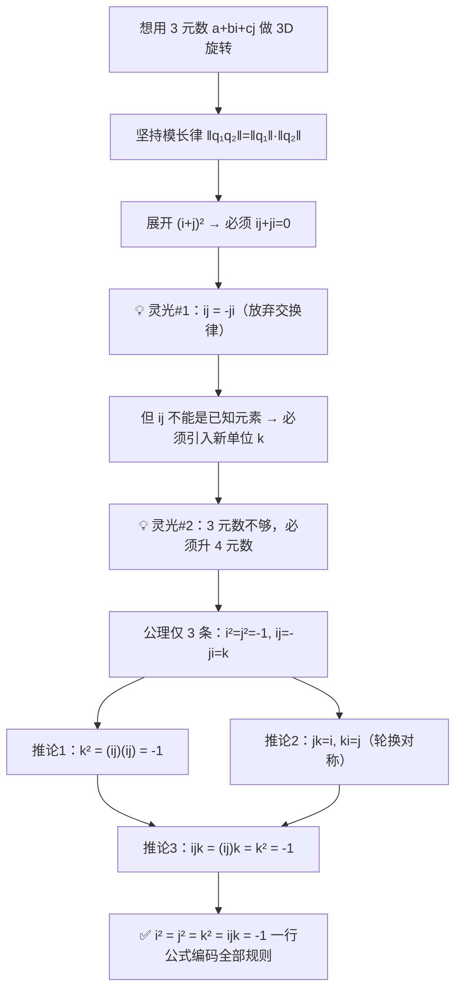
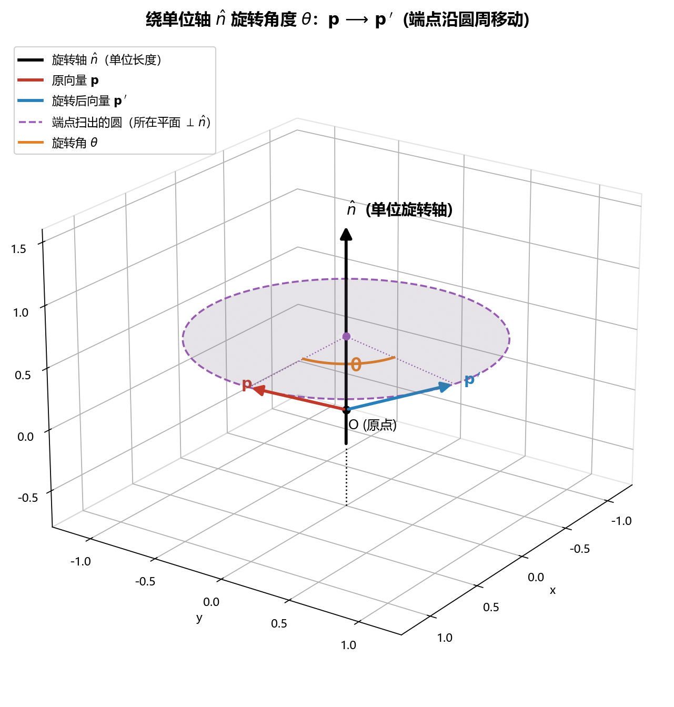
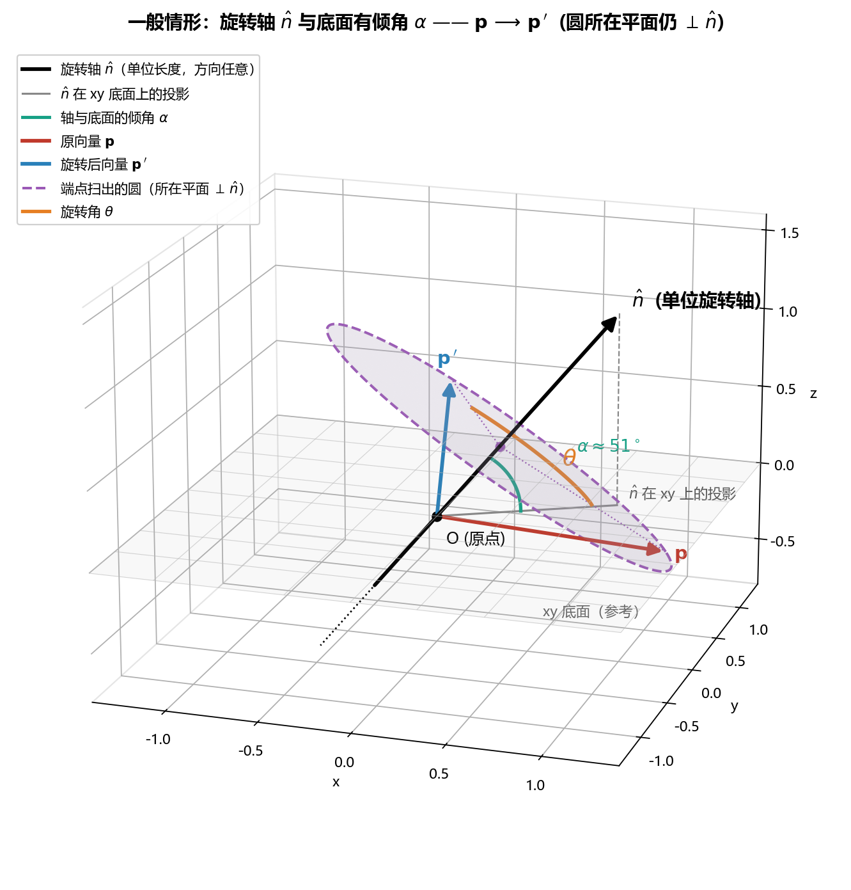
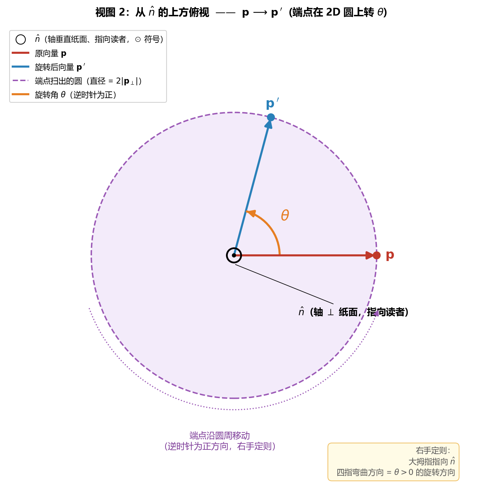
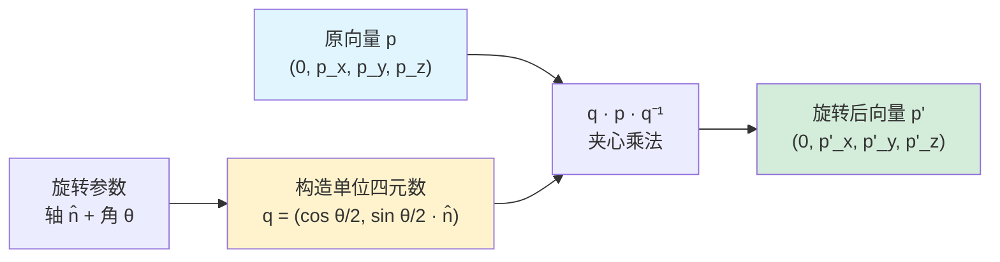
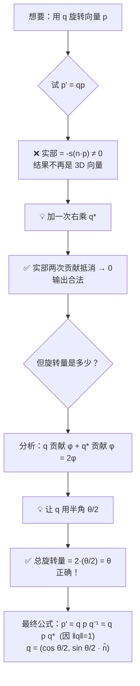
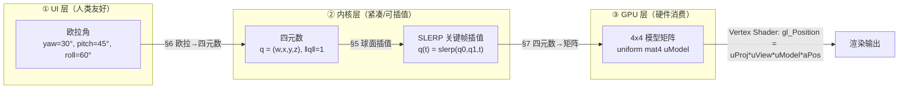
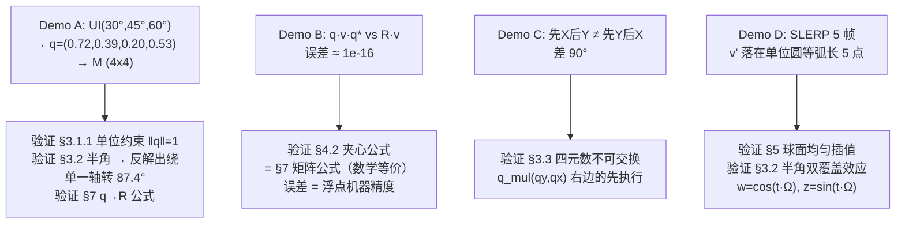

# 3D 旋转与四元数（Quaternion）—— 程序员视角

> **一句话定义**：四元数是把"复数旋转 2D"的把戏推广到 3D 的代数工具。  
> 用 4 个数 $(w, x, y, z)$ 紧凑、稳定、无万向锁地表示并组合 3D 旋转。

---

## 目录

- [3D 旋转与四元数（Quaternion）—— 程序员视角](#3d-旋转与四元数quaternion-程序员视角)
  - [目录](#目录)
  - [1. 为什么需要四元数：3D 旋转的三种表示](#1-为什么需要四元数3d-旋转的三种表示)
    - [1.1 欧拉角（Euler Angles）入门](#11-欧拉角euler-angles入门)
      - [ZYX（Yaw–Pitch–Roll）坐标轴图示](#zyxyawpitchroll坐标轴图示)
    - [1.2 旋转矩阵（Rotation Matrix）入门](#12-旋转矩阵rotation-matrix入门)
    - [1.3 万向锁是什么？](#13-万向锁是什么)
      - [1.3.1 名字从哪来：物理上的万向节（Gimbal）](#131-名字从哪来物理上的万向节gimbal)
      - [1.3.2 从代数看："锁"是怎么形成的](#132-从代数看锁是怎么形成的)
        - [Step 1：写出三个基本旋转矩阵](#step-1写出三个基本旋转矩阵)
        - [Step 2：先算右边两个矩阵 $M = R\_y(\\beta),R\_x(\\alpha)$](#step-2先算右边两个矩阵-m--r_ybetar_xalpha)
        - [Step 3：左乘 $R\_z(\\gamma)$，得到完整 $R$](#step-3左乘-r_zgamma得到完整-r)
        - [Step 4：代入特殊值 $\\beta = +90°$，看矩阵如何塌缩](#step-4代入特殊值-beta--90看矩阵如何塌缩)
        - [几何直观：为什么"两个旋钮粘在一起"](#几何直观为什么两个旋钮粘在一起)
      - [1.3.3 程序员能看见的现象](#133-程序员能看见的现象)
      - [1.3.4 经典案例：Apollo 11 的"差一点"](#134-经典案例apollo-11-的差一点)
      - [1.3.5 四元数为什么能根治](#135-四元数为什么能根治)
        - [5 视角速查表：欧拉角的病，5 张面孔](#5-视角速查表欧拉角的病5-张面孔)
        - [阅读路径导航](#阅读路径导航)
        - [视角 1 · 几何（地图比喻）：平直方块装不下弯曲流形](#视角-1--几何地图比喻平直方块装不下弯曲流形)
        - [深度附录 A：地图比喻的完整因果链（6 步推理）](#深度附录-a地图比喻的完整因果链6-步推理)
        - [视角 2 · 代数：行列式为 0 的"硬证据"](#视角-2--代数行列式为-0-的硬证据)
          - [这个 $J$ 是怎么来的？4 步推导](#这个-j-是怎么来的4-步推导)
        - [视角 3 · 物理：万向架（Gimbal）的机械故事](#视角-3--物理万向架gimbal的机械故事)
        - [视角 4 · 信息论：3 个数字根本"装不下"3D 旋转](#视角-4--信息论3-个数字根本装不下3d-旋转)
        - [视角 5 · 调试："加一个 if 判断"为什么救不了？](#视角-5--调试加一个-if-判断为什么救不了)
        - [答案落地：四元数怎么治（小节收束）](#答案落地四元数怎么治小节收束)
      - [1.3.6 工程对策速查](#136-工程对策速查)
  - [2. 直观起点：从复数到四元数](#2-直观起点从复数到四元数)
    - [2.1 复数旋转 2D —— 大家都熟](#21-复数旋转-2d--大家都熟)
    - [2.2 推广到 3D 的坑](#22-推广到-3d-的坑)
    - [2.3 灵光一现的推导：$i^2 = j^2 = k^2 = ijk = -1$ 是怎么来的？](#23-灵光一现的推导i2--j2--k2--ijk---1-是怎么来的)
      - [2.3.1 卡点：3 元数为什么不行？](#231-卡点3-元数为什么不行)
      - [2.3.2 第一道灵光：放弃交换律](#232-第一道灵光放弃交换律)
      - [2.3.3 第二道灵光：3 元数必须升 4 元](#233-第二道灵光3-元数必须升-4-元)
      - [2.3.4 剩下的全是机械推论](#234-剩下的全是机械推论)
      - [2.3.5 整个推导的逻辑流](#235-整个推导的逻辑流)
      - [2.3.6 为什么这一行公式如此"美"——最小公理集](#236-为什么这一行公式如此美最小公理集)
      - [2.3.7 程序员视角：四元数乘法 = 点积 + 叉积](#237-程序员视角四元数乘法--点积--叉积)
  - [3. 四元数的代数定义](#3-四元数的代数定义)
    - [3.1 形式定义](#31-形式定义)
    - [3.1.1 为什么是 4 个分量？$w$ 不是多余的！](#311-为什么是-4-个分量w-不是多余的)
      - [① 观念转换：四元数表示的不是"点"，而是"旋转操作"](#-观念转换四元数表示的不是点而是旋转操作)
      - [② 两种用法别混淆：$w=0$ vs $w^2+|v|^2=1$](#-两种用法别混淆w0-vs-w2v21)
        - [📌 "把两种用法串起来" —— 程序员视角拆解](#-把两种用法串起来--程序员视角拆解)
      - [③ 代数定理：3 维根本不够用](#-代数定理3-维根本不够用)
      - [④ 复数完美类比：$w$ 之于四元数 = 实部之于复数](#-复数完美类比w-之于四元数--实部之于复数)
        - [\[深挖 A\] 卡点：$w$ 是"角度"，为何也要塞进 $w^2+x^2+y^2+z^2=1$ 这个球面方程？](#深挖-a-卡点w-是角度为何也要塞进-w2x2y2z21-这个球面方程)
          - [① 单位约束的真正来源：和 $w/x/y/z$ 的语义无关，是"模长律"逼出来的](#-单位约束的真正来源和-wxyz-的语义无关是模长律逼出来的)
          - [② 为什么必须 $|q|=1$？因为只有这样夹心公式才"纯旋转"](#-为什么必须-q1因为只有这样夹心公式才纯旋转)
          - [③ 几何视角：4 个分量本来就"互相耦合"，必须一起约束](#-几何视角4-个分量本来就互相耦合必须一起约束)
          - [④ 程序员视角：单位约束 = "归一化要求"，类比代码里到处可见](#-程序员视角单位约束--归一化要求类比代码里到处可见)
          - [⑤ 反例：如果"只约束 $(x,y,z)$、不管 $w$" 会怎样？](#-反例如果只约束-xyz不管-w-会怎样)
          - [⑥ 一句话总结](#-一句话总结)
        - [\[深挖 B\] 推导：$q = \\cos(\\theta/2) + \\sin(\\theta/2),\\hat n$ 是怎么来的？](#深挖-b-推导q--costheta2--sintheta2hat-n-是怎么来的)
          - [Step 1：先回顾复数怎么做 2D 旋转](#step-1先回顾复数怎么做-2d-旋转)
          - [Step 2：把套路照搬到 3D —— 但 3D 旋转必须"夹心"](#step-2把套路照搬到-3d--但-3d-旋转必须夹心)
          - [Step 3：参数化尝试 —— 设 $q = \\cos\\alpha + \\sin\\alpha,\\hat n$](#step-3参数化尝试--设-q--cosalpha--sinalphahat-n)
          - [Step 4：对齐物理意义 —— 解出 $\\alpha = \\theta/2$](#step-4对齐物理意义--解出-alpha--theta2)
          - [整个推导链路（一图汇总）](#整个推导链路一图汇总)
          - [程序员视角验证（写代码看一眼）](#程序员视角验证写代码看一眼)
        - [\[深挖 C\] 已升级为独立小节 → §3.1.2](#深挖-c-已升级为独立小节--312)
      - [⑤ 几个特殊值理解 $w = \\cos(\\theta/2)$](#-几个特殊值理解-w--costheta2)
      - [⑥ 代码视角：$w$ 究竟出现在哪里](#-代码视角w-究竟出现在哪里)
        - [🎯 主线复盘：6 步看透"$w$ 不是多余的"](#-主线复盘6-步看透w-不是多余的)
    - [3.1.2 单位约束的几何意义（独立小节）](#312-单位约束的几何意义独立小节)
      - [1）从三角恒等式自然得出](#1从三角恒等式自然得出)
      - [1.1）符号含义先扫盲](#11符号含义先扫盲)
      - [1.1.1）几何原因深挖：$S^3$、双覆盖与 $4\\pi$ 周期](#111几何原因深挖s3双覆盖与-4pi-周期)
      - [1.2）公式的 4 步推导（看清等号怎么连成 = 1）](#12公式的-4-步推导看清等号怎么连成--1)
      - [1.3）几何 1 秒看穿：4D 单位向量](#13几何-1-秒看穿4d-单位向量)
      - [2）几何意义：约束 = "住在单位球上"](#2几何意义约束--住在单位球上)
      - [3）为什么必须 = 1？看看不满足约束会怎样](#3为什么必须--1看看不满足约束会怎样)
      - [4）自由度账：约束 = 1 让"4 个数表示 3 个自由度"成立](#4自由度账约束--1-让4-个数表示-3-个自由度成立)
      - [5）工程影响：单位化是必修课](#5工程影响单位化是必修课)
    - [3.2 三个虚单位的乘法表（核心，必须记牢）](#32-三个虚单位的乘法表核心必须记牢)
    - [3.3 四元数的运算](#33-四元数的运算)
  - [4. 核心推导：四元数为什么能旋转向量](#4-核心推导四元数为什么能旋转向量)
    - [4.1 旋转公式（结论先放出来）](#41-旋转公式结论先放出来)
      - [🎨 图示：绕单位轴 $\\mathbf n$ 旋转 $\\theta$ 究竟在做什么](#-图示绕单位轴-mathbf-n-旋转-theta-究竟在做什么)
        - [视图 1：3D 立体几何示意](#视图-13d-立体几何示意)
        - [视图 1b：旋转轴倾斜的一般情形（轴与底面不垂直）](#视图-1b旋转轴倾斜的一般情形轴与底面不垂直)
        - [视图 2：从轴的"上方"俯视（看到圆周最清晰）](#视图-2从轴的上方俯视看到圆周最清晰)
        - [视图 3：变换的"输入 → 输出"数据流](#视图-3变换的输入--输出数据流)
        - [关键要素对照表](#关键要素对照表)
        - [三个特殊例子，秒懂这个公式](#三个特殊例子秒懂这个公式)
        - [📚 推荐参考资料（看清"绕轴旋转"的可视化）](#-推荐参考资料看清绕轴旋转的可视化)
          - [🥇 第一档：交互式可视化（**最值得花时间**）](#-第一档交互式可视化最值得花时间)
          - [🥈 第二档：图文长文 / 教科书章节（**建议精读**）](#-第二档图文长文--教科书章节建议精读)
          - [🥉 第三档：工程实战与代码库（**直接抄代码**）](#-第三档工程实战与代码库直接抄代码)
          - [🇨🇳 第四档：中文资料（**配合本节阅读**）](#-第四档中文资料配合本节阅读)
  - [4.2 为什么是"夹心"形式 $qpq^{-1} = qpq^*$？——动机推导](#42-为什么是夹心形式-qpq-1--qpq动机推导)
      - [Step ①：先试最朴素的"单乘" $p' = qp$，看它哪里坏](#step-先试最朴素的单乘-p--qp看它哪里坏)
    - [Step ②：要让实部归零 → 必须再乘一次共轭 $q^*$（即 $q^{-1}$）](#step-要让实部归零--必须再乘一次共轭-q即-q-1)
      - [Step ③：但旋转量为什么对？—— 半角的妙用](#step-但旋转量为什么对-半角的妙用)
      - [通过类比记住：这就是"线性代数里相似变换"的同一思路](#通过类比记住这就是线性代数里相似变换的同一思路)
      - [一图看清全部动机链](#一图看清全部动机链)
  - [4.3 代数验证：展开 $qpq^*$ = Rodrigues 公式](#43-代数验证展开-qpq--rodrigues-公式)
    - [4.4 复合旋转 = 四元数相乘](#44-复合旋转--四元数相乘)
  - [5. 工程使用清单（API 速查）](#5-工程使用清单api-速查)
    - [5.1 必备五件套](#51-必备五件套)
    - [5.2 与矩阵的关系（旋转向量时哪种快？）](#52-与矩阵的关系旋转向量时哪种快)
  - [6. 插值：SLERP 为什么必须用四元数](#6-插值slerp-为什么必须用四元数)
    - [6.1 问题](#61-问题)
    - [6.2 SLERP（球面线性插值）](#62-slerp球面线性插值)
    - [6.3 NLERP（工程近似）](#63-nlerp工程近似)
  - [7. 与旋转矩阵 / 欧拉角的相互转换](#7-与旋转矩阵--欧拉角的相互转换)
    - [7.1 四元数 → 旋转矩阵](#71-四元数--旋转矩阵)
    - [7.2 旋转矩阵 → 四元数（数值稳定版）](#72-旋转矩阵--四元数数值稳定版)
    - [7.3 欧拉角 ↔ 四元数](#73-欧拉角--四元数)
  - [8. Demo：从零实现并跑通](#8-demo从零实现并跑通)
    - [8.1 工程流水线全景](#81-工程流水线全景)
    - [8.2 完整代码（自包含、可直接运行）](#82-完整代码自包含可直接运行)
    - [8.3 预期输出](#83-预期输出)
    - [8.4 结果深度解读：每个数字都对应一个理论](#84-结果深度解读每个数字都对应一个理论)
      - [解读 A：流水线的三态](#解读-a流水线的三态)
      - [解读 B：一致性验证 —— 为什么误差是 $10^{-16}$？](#解读-b一致性验证--为什么误差是-10-16)
      - [解读 C：不可交换 —— 旋转的"姿势"决定一切](#解读-c不可交换--旋转的姿势决定一切)
      - [解读 D：SLERP —— 为什么端点连成的不是直线而是圆弧？](#解读-dslerp--为什么端点连成的不是直线而是圆弧)
    - [8.5 一图看懂整个 Demo 的因果链](#85-一图看懂整个-demo-的因果链)
  - [9. 常见坑](#9-常见坑)
  - [10. 一页纸总结](#10-一页纸总结)

---

## 1. 为什么需要四元数：3D 旋转的三种表示

3D 旋转是**所有 3D 引擎、SLAM、机器人、IMU、动画、AR/VR**的基础操作。常见的三种表示：

| 表示 | 参数数 | 优点 | 致命缺陷 |
|:-|:-:|:-|:-|
| **欧拉角** $(\alpha,\beta,\gamma)$ | 3 | 直观，相机/航向调试方便 | ⚠️ **万向锁**（Gimbal Lock）；插值不平滑；顺序约定 12 种易错 |
| **旋转矩阵** $R\in SO(3)$ | 9 | 直接作用向量 $v' = Rv$；可与平移合成 4×4 | 冗余 6 个自由度；浮点累积后 $R^TR \neq I$；插值会"塌陷" |
| **四元数** $q$ | 4 | ✅ 紧凑；✅ 无万向锁；✅ 易归一化（除模即可）；✅ SLERP 平滑插值；✅ 复合便宜（16 次乘法 vs 矩阵 27 次） | 不直观，需要训练 |

> [!tip] 工程界的事实标准
> - **存储与传输**：四元数（4 个 float vs 9 个 float）  
> - **作用到顶点**：转成矩阵后塞进 Shader（GPU 矩阵管线已优化）  
> - **插值与积分**：必用四元数（动画 blending、IMU 姿态融合）  
> - **用户输入/标定**：欧拉角（人脑友好）

### 1.1 欧拉角（Euler Angles）入门

> [!note] 一句话
> 把任意 3D 旋转拆成"绕三个坐标轴依次转三次"，记下这三个角就够了。

**定义**：用三个标量 $(\alpha, \beta, \gamma)$ 描述旋转，每个角对应绕一个轴的转动。最常见的两套命名：

| 领域 | 名字 | 含义 | 直觉 |
|:-|:-|:-|:-|
| 航空 / 游戏 | **Yaw–Pitch–Roll**（偏航 / 俯仰 / 翻滚） | 绕 Z / Y / X 轴 | 飞机左右摆头、抬头低头、机翼侧倾 |
| 经典力学 | **$\phi, \theta, \psi$**（进动 / 章动 / 自转） | ZXZ 顺序 | 陀螺仪三个角 |

**作用方式**：把三次单轴旋转**依次相乘**得到总旋转。例如 ZYX 顺序：

$$R(\alpha,\beta,\gamma) = R_z(\gamma)\,R_y(\beta)\,R_x(\alpha)$$

其中每一个 $R_*$ 都是初等旋转矩阵，比如：

$$R_x(\alpha)=\begin{pmatrix}1&0&0\\0&\cos\alpha&-\sin\alpha\\0&\sin\alpha&\cos\alpha\end{pmatrix},\quad R_y(\beta)=\begin{pmatrix}\cos\beta&0&\sin\beta\\0&1&0\\-\sin\beta&0&\cos\beta\end{pmatrix}$$

#### ZYX（Yaw–Pitch–Roll）坐标轴图示

> [!note] 怎么读这张图
> - **右手系**：右手三指张开，拇指=X、食指=Y、中指=Z。
> - **旋转正方向**：右手握住该轴，拇指指向轴正方向，**四指弯曲方向就是正角度方向**。
> - **ZYX 顺序**：先绕 **X**（Roll, $\alpha$）→ 再绕 **Y**（Pitch, $\beta$）→ 最后绕 **Z**（Yaw, $\gamma$）。
>   注意：矩阵相乘写作 $R_z R_y R_x$，但作用到向量 $v$ 上是从右往左生效，所以"先 $R_x$"。

<svg xmlns="http://www.w3.org/2000/svg" viewBox="0 0 520 360" width="560" style="background:#fafafa;border-radius:8px">
  <defs>
    <marker id="arrX" viewBox="0 0 10 10" refX="9" refY="5" markerWidth="7" markerHeight="7" orient="auto">
      <path d="M0,0 L10,5 L0,10 z" fill="#d62728"/>
    </marker>
    <marker id="arrY" viewBox="0 0 10 10" refX="9" refY="5" markerWidth="7" markerHeight="7" orient="auto">
      <path d="M0,0 L10,5 L0,10 z" fill="#2ca02c"/>
    </marker>
    <marker id="arrZ" viewBox="0 0 10 10" refX="9" refY="5" markerWidth="7" markerHeight="7" orient="auto">
      <path d="M0,0 L10,5 L0,10 z" fill="#1f77b4"/>
    </marker>
    <marker id="arrCurve" viewBox="0 0 10 10" refX="9" refY="5" markerWidth="6" markerHeight="6" orient="auto">
      <path d="M0,0 L10,5 L0,10 z" fill="#555"/>
    </marker>
  </defs>

  <!-- 原点 -->
  <circle cx="220" cy="220" r="3" fill="#333"/>
  <text x="208" y="238" font-size="12" fill="#333">O</text>

  <!-- X 轴（红，朝右前方） -->
  <line x1="220" y1="220" x2="400" y2="280" stroke="#d62728" stroke-width="2.2" marker-end="url(#arrX)"/>
  <text x="408" y="288" font-size="14" font-weight="bold" fill="#d62728">X</text>
  <text x="350" y="276" font-size="11" fill="#d62728">Roll α (绕 X)</text>

  <!-- Y 轴（绿，朝左前方） -->
  <line x1="220" y1="220" x2="60" y2="280" stroke="#2ca02c" stroke-width="2.2" marker-end="url(#arrY)"/>
  <text x="40" y="290" font-size="14" font-weight="bold" fill="#2ca02c">Y</text>
  <text x="70" y="276" font-size="11" fill="#2ca02c">Pitch β (绕 Y)</text>

  <!-- Z 轴（蓝，朝上） -->
  <line x1="220" y1="220" x2="220" y2="40" stroke="#1f77b4" stroke-width="2.2" marker-end="url(#arrZ)"/>
  <text x="228" y="40" font-size="14" font-weight="bold" fill="#1f77b4">Z</text>
  <text x="228" y="60" font-size="11" fill="#1f77b4">Yaw γ (绕 Z)</text>

  <!-- 绕 X 的旋转弧（Roll, 在 YZ 平面） -->
  <path d="M 280 200 A 30 14 -20 1 1 280 240" fill="none" stroke="#d62728" stroke-width="1.6" stroke-dasharray="4 2" marker-end="url(#arrCurve)"/>
  <text x="290" y="195" font-size="11" fill="#d62728">α</text>

  <!-- 绕 Y 的旋转弧（Pitch, 在 XZ 平面） -->
  <path d="M 165 195 A 28 14 25 1 1 160 235" fill="none" stroke="#2ca02c" stroke-width="1.6" stroke-dasharray="4 2" marker-end="url(#arrCurve)"/>
  <text x="135" y="200" font-size="11" fill="#2ca02c">β</text>

  <!-- 绕 Z 的旋转弧（Yaw, 在 XY 平面，水平椭圆） -->
  <path d="M 280 232 A 60 18 0 1 1 160 232" fill="none" stroke="#1f77b4" stroke-width="1.6" stroke-dasharray="4 2" marker-end="url(#arrCurve)"/>
  <text x="214" y="262" font-size="11" fill="#1f77b4">γ</text>

  <!-- 飞机示意（小三角，朝 X 方向） -->
  <g transform="translate(220 220)">
    <polygon points="40,12 56,16 40,20 30,28 30,4" fill="#888" opacity="0.55"/>
    <text x="60" y="30" font-size="10" fill="#666">机头朝 +X</text>
  </g>

  <!-- 顺序提示 -->
  <g transform="translate(310 30)">
    <rect x="0" y="0" width="200" height="78" rx="6" fill="#fff" stroke="#ccc"/>
    <text x="10" y="18" font-size="12" font-weight="bold" fill="#333">ZYX 旋转顺序</text>
    <text x="10" y="36" font-size="11" fill="#d62728">① Roll  α  → 绕 X</text>
    <text x="10" y="52" font-size="11" fill="#2ca02c">② Pitch β  → 绕 Y</text>
    <text x="10" y="68" font-size="11" fill="#1f77b4">③ Yaw   γ  → 绕 Z</text>
  </g>

  <!-- 右手系标注 -->
  <text x="20" y="25" font-size="11" fill="#666">右手坐标系（Right-Handed）</text>
</svg>

> [!example] 飞机视角的直觉对应
> 把上图当成一架机头朝 **+X** 方向的飞机：
> - **Roll**（绕 X，$\alpha$）= 机翼侧倾，左翼下沉/上抬。
> - **Pitch**（绕 Y，$\beta$）= 机头抬起或低下。
> - **Yaw**（绕 Z，$\gamma$）= 机头水平方向左右转。
> 
> 这正是 FPS / 飞行模拟 / 无人机 / 手机陀螺仪里 yaw-pitch-roll 三个角的物理含义。

> [!tip] 优点
> - **直观**：人脑能直接想象"先抬 30° 头、再左转 45°"。
> - **参数最少**：只用 3 个数，与 SO(3) 的 3 自由度相同，无冗余。
> - **调试友好**：相机控制、IMU 标定、UI 上的转角滑条全靠它。

> [!warning] 三大缺陷
> 1. **万向锁**（Gimbal Lock）：当中间那个角到 $\pm 90°$ 时，外两个轴对齐，丢一个自由度（详见 §1.3）。
> 2. **顺序歧义**：XYZ / ZYX / ZYZ … 至少 12 种约定，**不同库默认值不同**，是 3D bug 之王。
> 3. **插值差**：直接对三个角线性插值，路径会扭曲、抽搐，无法做平滑动画。

### 1.2 旋转矩阵（Rotation Matrix）入门

> [!note] 一句话
> 用一个 $3\times 3$ 的矩阵 $R$ 直接把"旋转"变成"乘法" —— $v' = Rv$。

**定义**：旋转矩阵是满足以下两个条件的实矩阵，集合记作 $SO(3)$（special orthogonal group, 3D）：

$$R^\top R = I \quad\text{(正交)}\qquad \det R = +1 \quad\text{(保定向, 不带镜像)}$$

- $R^\top R = I$ → 长度和角度不变（保持刚体）；
- $\det R = +1$ → 不会把右手系翻成左手系。

**几何含义**：$R$ 的三列正好是**新坐标系的三个基向量在旧坐标系中的坐标**。

$$R = \begin{pmatrix}|&|&|\\\mathbf e'_x & \mathbf e'_y & \mathbf e'_z\\|&|&|\end{pmatrix}$$

把世界基向量"搬"到新姿态后，矩阵就建好了。

**举例**：绕 Z 轴转 $\theta$：

$$R_z(\theta) = \begin{pmatrix}\cos\theta & -\sin\theta & 0\\ \sin\theta & \cos\theta & 0\\ 0 & 0 & 1\end{pmatrix}$$

把它乘到 $(1,0,0)^\top$ 上得到 $(\cos\theta,\sin\theta,0)^\top$，正是逆时针转了 $\theta$。

> [!tip] 优点
> - **直接作用向量**：$v' = Rv$ 一步到位，GPU 顶点着色器原生支持。
> - **可拼接平移**：扩展为 $4\times 4$ 齐次矩阵后，旋转 + 平移 + 缩放统一为矩阵乘法（图形管线的核心）。
> - **复合 = 矩阵乘法**：先 $R_1$ 再 $R_2$ 等于 $R_2 R_1$，与函数复合顺序一致。

> [!warning] 缺陷
> 1. **冗余度高**：9 个数表达 3 自由度，浮点累积后 $R^\top R$ 会偏离 $I$，必须周期性"再正交化"。
> 2. **存储贵**：9 个 float = 36 字节，骨骼动画一帧几百根骨头时压力很大。
> 3. **插值会塌陷**：两个旋转矩阵线性插值 $(1-t)R_0+tR_1$ 不再是旋转矩阵（行列式 ≠ 1），模型会被"压扁"。

> [!summary] 三种表示一句话对比
> - **欧拉角**：人脑友好，但藏着万向锁和顺序坑。
> - **旋转矩阵**：作用向量最直接，但冗余且不便插值。
> - **四元数**：紧凑、平滑、稳定，是存储与插值的事实标准。
> 
> 工程上常**三者并用**：UI 输入用欧拉角 → 内部存四元数 → 喂给 GPU 时转矩阵。

### 1.3 万向锁是什么？

> [!warning] Gimbal Lock 的本质（一句话）
> 用 yaw-pitch-roll 三个旋转矩阵相乘 $R = R_z(\gamma)R_y(\beta)R_x(\alpha)$。  
> 当 $\beta = \pm 90°$ 时，第一个轴和第三个轴**对齐**，三个自由度退化为两个 —— **少了一个旋转自由度**。  
> 四元数从单位球 $S^3$ 上参数化旋转，根本不存在这种坐标奇异。

#### 1.3.1 名字从哪来：物理上的万向节（Gimbal）

万向节是一组**三层嵌套的同心圆环**，每个环只能绕自己的轴转动 —— 经典的陀螺仪、舰船罗盘、Apollo 飞船惯导平台都用这种结构。

```
   外环 (Yaw,   绕 Z)
     └─ 中环 (Pitch, 绕 Y)
          └─ 内环 (Roll,  绕 X)
               └─ 载荷（陀螺/相机）
```

> [!note] 关键约束
> 三个环的转动轴**不是世界轴**，而是**被外面的环"扛着走"的**。  
> 也就是说：
> - 外环转 yaw 后，中环的 pitch 轴跟着被旋转过；
> - 中环再转 pitch 后，内环的 roll 轴又被旋转过一次。
> 
> 这与"先 $R_z$ 再 $R_y$ 再 $R_x$"的矩阵相乘顺序一一对应。

#### 1.3.2 从代数看："锁"是怎么形成的

我们用 ZYX 顺序：

$$R(\alpha,\beta,\gamma) \;=\; R_z(\gamma)\,R_y(\beta)\,R_x(\alpha)$$

含义："先绕 X 转 $\alpha$（roll）→ 再绕 Y 转 $\beta$（pitch）→ 最后绕 Z 转 $\gamma$（yaw）"。

> [!note] 记号约定（推导全程使用）
> $$c_\alpha = \cos\alpha,\quad s_\alpha = \sin\alpha,\qquad c_\beta = \cos\beta,\quad s_\beta = \sin\beta,\qquad c_\gamma = \cos\gamma,\quad s_\gamma = \sin\gamma$$

##### Step 1：写出三个基本旋转矩阵

$$R_x(\alpha)=\begin{pmatrix}1&0&0\\0&c_\alpha&-s_\alpha\\0&s_\alpha&c_\alpha\end{pmatrix},\quad
R_y(\beta)=\begin{pmatrix}c_\beta&0&s_\beta\\0&1&0\\-s_\beta&0&c_\beta\end{pmatrix},\quad
R_z(\gamma)=\begin{pmatrix}c_\gamma&-s_\gamma&0\\s_\gamma&c_\gamma&0\\0&0&1\end{pmatrix}$$

##### Step 2：先算右边两个矩阵 $M = R_y(\beta)\,R_x(\alpha)$

$$M = \begin{pmatrix}c_\beta&0&s_\beta\\0&1&0\\-s_\beta&0&c_\beta\end{pmatrix}
\begin{pmatrix}1&0&0\\0&c_\alpha&-s_\alpha\\0&s_\alpha&c_\alpha\end{pmatrix}
= \begin{pmatrix}
c_\beta & s_\beta s_\alpha & s_\beta c_\alpha\\
0 & c_\alpha & -s_\alpha\\
-s_\beta & c_\beta s_\alpha & c_\beta c_\alpha
\end{pmatrix}$$

> 逐元素验证一下第 (1,2) 元素：第 1 行 = $(c_\beta,0,s_\beta)$，第 2 列 = $(0,c_\alpha,s_\alpha)^\top$，点积 = $0 + 0 + s_\beta s_\alpha$ ✓

##### Step 3：左乘 $R_z(\gamma)$，得到完整 $R$

$$R = R_z(\gamma)\,M = \begin{pmatrix}c_\gamma&-s_\gamma&0\\s_\gamma&c_\gamma&0\\0&0&1\end{pmatrix} M$$

逐元素展开：

$$\boxed{\;R(\alpha,\beta,\gamma) = \begin{pmatrix}
c_\gamma c_\beta & c_\gamma s_\beta s_\alpha - s_\gamma c_\alpha & c_\gamma s_\beta c_\alpha + s_\gamma s_\alpha\\
s_\gamma c_\beta & s_\gamma s_\beta s_\alpha + c_\gamma c_\alpha & s_\gamma s_\beta c_\alpha - c_\gamma s_\alpha\\
-s_\beta & c_\beta s_\alpha & c_\beta c_\alpha
\end{pmatrix}\;}$$

> [!tip] 三件可以"肉眼检查"的事
> - **第三行第一列 = $-s_\beta$**：这是用 $R$ 反求 pitch 的常用公式 $\beta = \arcsin(-R_{31})$。
> - **第三行第二、三列**：只含 $\alpha,\beta$，不含 $\gamma$ —— 因为 yaw 是最外层旋转，不会改变 $z$ 轴的指向。
> - **第一列第二、三元素 = 0 处**：每出现一个 $c_\beta$ 都来自"中间环还没翻平"，一旦 $c_\beta = 0$，这些项瞬间消失，矩阵就要塌缩。

这就是**一般情况**的旋转矩阵 $R(\alpha,\beta,\gamma)$，三个旋钮**互相独立**，$3\times 3$ 个元素里能看到 $\alpha,\beta,\gamma$ 都在各自出现。

---

##### Step 4：代入特殊值 $\beta = +90°$，看矩阵如何塌缩

此时 $c_\beta = 0,\ s_\beta = 1$，把上面 boxed 矩阵里所有 $c_\beta$ 抹零、$s_\beta$ 替换为 1：

$$R\big|_{\beta=90°} = \begin{pmatrix}
\underbrace{0}_{c_\gamma c_\beta} & c_\gamma s_\alpha - s_\gamma c_\alpha & c_\gamma c_\alpha + s_\gamma s_\alpha\\
\underbrace{0}_{s_\gamma c_\beta} & s_\gamma s_\alpha + c_\gamma c_\alpha & s_\gamma c_\alpha - c_\gamma s_\alpha\\
-1 & \underbrace{0}_{c_\beta s_\alpha} & \underbrace{0}_{c_\beta c_\alpha}
\end{pmatrix}$$

用三角恒等式**合并**含 $\alpha,\gamma$ 的项：
- $c_\gamma s_\alpha - s_\gamma c_\alpha = \sin(\alpha-\gamma)$
- $s_\gamma s_\alpha + c_\gamma c_\alpha = \cos(\alpha-\gamma)$
- $c_\gamma c_\alpha + s_\gamma s_\alpha = \cos(\alpha-\gamma)$
- $s_\gamma c_\alpha - c_\gamma s_\alpha = -\sin(\alpha-\gamma)$

$$R\big|_{\beta=90°} = \begin{pmatrix}
0 & \sin(\alpha-\gamma) & \cos(\alpha-\gamma)\\
0 & \cos(\alpha-\gamma) & -\sin(\alpha-\gamma)\\
-1 & 0 & 0
\end{pmatrix}$$

> [!summary] 一般 vs 特殊：肉眼可见的塌缩
> 
> | 对比项 | 一般情况 $\beta\neq\pm 90°$ | 特殊情况 $\beta=+90°$ |
> |:-|:-|:-|
> | 矩阵元素含什么变量 | $\alpha,\beta,\gamma$ 三者都出现 | **只剩 $(\alpha-\gamma)$ 一个量** |
> | 自由度 | 3（互相独立） | **2**（$\alpha,\gamma$ 被绑成差值） |
> | 取不同 $(\alpha,\gamma)$ | 得到不同矩阵 | $(\alpha=10°,\gamma=0°)$ 与 $(\alpha=20°,\gamma=10°)$ **完全相同** |
> | 反求欧拉角 | $\beta=\arcsin(-R_{31})$ 唯一 | 只能解出 $\alpha-\gamma$，**无法分离两者** |
> 
> 这就是"**锁**"——三个旋钮的其中两个被代数地、不可分离地绑在一起。

##### 几何直观：为什么"两个旋钮粘在一起"

代数告诉我们矩阵塌缩了，但**物理上到底发生了什么**？答案藏在三个嵌套圆环里。

**Step 1 · 看清三个环的转轴是什么**

ZYX 顺序的三个旋钮分别是：

| 旋钮 | 在哪个环上 | 它的转轴是… |
|:-|:-|:-|
| $\gamma$ (yaw) | 最外环 | **世界 Z 轴**（永远不变） |
| $\beta$ (pitch) | 中环 | 被 yaw 转过的 Y 轴 |
| $\alpha$ (roll) | 最内环 | 被 yaw + pitch 都转过的 X 轴 |

关键：**roll 的转轴不是固定的，它会被 pitch 抬起来。**

**Step 2 · 初始姿态 vs β=90° 锁定姿态**

```
   初始 (β = 0°)                     锁定 (β = 90°)

         Z (yaw 轴)                       Z (yaw 轴)
         ↑                                ↑
         │                                │
         │                                │ ←─── roll 轴现在指这儿！
         O────→ Y                         O────→ Y
        ╱                                ╱
       ╱                                ╱
      X (roll 轴)                      X (原 roll 轴方向)
                                       
   roll 轴 ⊥ yaw 轴：               中环把 roll 轴抬起 90°，
   两个旋钮转动方向完全不同         它和 yaw 轴重合（反向）！
```

- **初始时**：roll 轴沿 +X，yaw 轴沿 +Z，两者互相垂直 → roll 和 yaw **干完全不同的事**。
- **抬到 β=90° 后**：中环把 roll 轴整个**竖起来**，roll 轴现在指向 −Z 方向，**和 yaw 轴共线**！

**Step 3 · "粘在一起"是什么意思**

既然 roll 轴和 yaw 轴此刻指向同一条直线（只是反向），那么：

$$\underbrace{\text{绕 roll 轴转 }\alpha}_{\text{物理上}} \;=\; \underbrace{\text{绕 yaw 轴反向转 }\alpha}_{\text{物理上等价}}$$

于是：
- 你想"加 1° 的 roll"，效果**和"减 1° 的 yaw"完全一样**；
- 三个旋钮里，$\alpha$ 和 $\gamma$ 在**做同一件事的两面**；
- 想让相机做"**纯绕 Y 轴的 pitch 微调**"？做不到了——它需要的那个自由度已经从配置空间里**消失**了。

**Step 4 · 代数与几何对账**

回到 §1.3.2 的塌缩公式，矩阵只依赖 $\alpha-\gamma$。这正好印证几何：

$$\alpha \uparrow 1° \text{ 与 } \gamma \downarrow 1° \;\Longrightarrow\; \alpha-\gamma \text{ 不变} \;\Longrightarrow\; R \text{ 不变}$$

代数上的"差值不变"= 几何上的"两个轴重合，互相抵消"。**两边对得严丝合缝。**

**Step 5 · β=−90° 是同一种病的镜像**

把中环往**下**翻 90°，roll 轴这次指向 +Z，**和 yaw 轴同向**：

$$\text{绕 roll 转 }\alpha \;=\; \text{绕 yaw 同向转 }\alpha$$

所以这次 $\alpha+\gamma$ 才是"同一个旋钮"，矩阵只依赖 $\alpha+\gamma$ —— 与代数推导完全一致。

> [!summary] 一句话记住
> **万向锁 = 中环把内环的转轴抬起来，恰好和外环转轴对齐了。**  
> 此时"内环旋钮"和"外环旋钮"做的是同一件事，3 个独立自由度被压成 2 个。

#### 1.3.3 程序员能看见的现象

> [!example] 写过 FPS 相机就一定踩过的坑
> 
> ```python
> # 朴素相机：用 yaw / pitch 控制朝向
> yaw   += dx * sensitivity
> pitch += dy * sensitivity
> pitch  = clamp(pitch, -90, 90)         # 防止翻过头
> R = Rz(yaw) @ Ry(pitch) @ Rx(roll)
> ```
> 
> **现象**：
> 1. 鼠标抬头到 pitch ≈ 90° 那一瞬，再左右移动 → 画面**绕镜头中心转圈**，而不是预期的"环顾四周"；
> 2. 从 pitch=89° 跳到 91° 时，yaw 数值会瞬间反转 180°（这正是 §1.3.2 里"两个旋钮变同一个"的副作用）；
> 3. 用欧拉角做关键帧插值（A→B），中间帧会突然抽搐一下 —— 因为路径必须穿过奇异点。
> 
> 这就是为什么所有商业引擎（Unity、Unreal、UE 的 FRotator 内部、Blender 骨骼）**都偷偷用四元数存姿态，仅在 UI 上把欧拉角显示给用户**。

#### 1.3.4 经典案例：Apollo 11 的"差一点"

阿波罗 11 号惯导平台是真正的物理三轴 gimbal。任务手册里写着：

> "If the spacecraft attitude approaches gimbal lock, the IMU **must be re-aligned** using the star tracker."

如果飞船姿态太接近万向锁，惯导平台会**物理卡死**，必须用星象仪重新对准 —— 这在登月返航过程中是会丢命的。  
NASA 后来给航天飞机直接换成了**四元数姿态控制系统**。

#### 1.3.5 四元数为什么能根治

> [!summary] TL;DR — 一句话答案
> **欧拉角的病根**：用 3 个独立角度（平直方块）去描述 3D 旋转空间 $SO(3)$（弯曲流形），拓扑学保证**必然存在奇点**。  
> **四元数的解法**：升一维到 4D 单位球面 $S^3$，让"参数空间"和"被描述的流形"在拓扑上**同型**，奇点彻底消失。  
>   
> 这不是哪一种参数化的小聪明，而是**几何本身的法则**：任何用 3 个数描述 3D 旋转的方案都跑不掉万向锁。

##### 5 视角速查表：欧拉角的病，5 张面孔

| # | 视角 | 病灶名字 | 一句话诊断 |
|:-:|:-|:-|:-|
| 1 | 几何（地图） | 北极挤压 | 平直方块覆盖弯曲流形必有奇点 |
| 2 | 代数 | $\det J = \cos\beta = 0$ | 雅可比退化，自由度从 3 → 2 |
| 3 | 物理（万向架） | 两环对齐 | 三层嵌套机械结构本身的死锁 |
| 4 | 信息论 | 容器太小 | 3 个数装不下 3 维流形 |
| 5 | 调试（工程） | 接口错了 | 没有"正确值"可填，必须换坐标系 |

> **5 个视角，5 张面孔，1 种病。**  
> 任何一个角度都足以独立解释欧拉角的问题，合在一起则形成完整的因果闭环。

---

##### 阅读路径导航

本节按**金字塔结构**组织，赶时间或想深读都可以各取所需：

```
┌─────────────────────────────────────────────────────────┐
│ 顶层：TL;DR + 5 视角速查表（已读完 → 拿走核心结论）    │  ← 5 秒
├─────────────────────────────────────────────────────────┤
│ 主体：5 个视角逐一展开（每个 1 屏内）                  │  ← 10 分钟
│   视角 1 几何 │ 视角 2 代数 │ 视角 3 物理              │
│   视角 4 信息论 │ 视角 5 调试                          │
├─────────────────────────────────────────────────────────┤
│ 深度附录 A：地图比喻的完整因果链（6 步推理）           │  ← 想钻研
├─────────────────────────────────────────────────────────┤
│ 落地：四元数怎么治（呼应小节标题）                     │  ← 收尾
└─────────────────────────────────────────────────────────┘
```

---

##### 视角 1 · 几何（地图比喻）：平直方块装不下弯曲流形

> [!tip] 一图胜千言
> ```
>   欧拉角：把地球摊平画地图（长方形地图）
>     → 两极必然出现"经线挤成一团"
>     → 这就是万向锁
> 
>   四元数：直接给你一个地球仪（4D 球面 S³）
>     → 任何位置都是普通的点
>     → 永不奇异
> ```

**核心论证**（机理一致性）：

| | 真实对象 | 我们想给它的"坐标" | 故障点 |
|:-|:-|:-|:-|
| 地图 | 地球表面（2D 弯曲球面） | $(\text{lon}, \text{lat})$ ∈ 长方形 | 两极 |
| 欧拉角 | 旋转空间 $SO(3)$（3D 弯曲流形） | $(\alpha, \beta, \gamma)$ ∈ 立方体 | $\beta=\pm 90°$ |

两者属于**同一个数学模板**——"用平直方块覆盖弯曲封闭流形"，所以**故障形式完全同构**：

- 地图：北极在地图上是**一整条横线**（一个点变成一条线）
- 欧拉角：$\beta=90°$ 时 $(\alpha,\gamma)$ 不同**却对应同一个旋转**（多个坐标变成一个物理）

> [!tip] 📍 读到这里你有两个选择
> - **选择 A（推荐快速通路）**：跳过下面 150 行的附录 A，直接前往 **视角 2 · 代数**，**先把 5 个视角的全貌看完**；附录 A 之后再回头深读。
> - **选择 B（深度通路）**：立刻展开**深度附录 A** 看完整 6 步推理（类型签名分析 / lon↔yaw 角色对应 / GPS bug 双代码 / 为什么换投影都救不了），再继续主体。
> 
> 两条路径殊途同归，按你的时间和兴趣自选。

---

##### 深度附录 A：地图比喻的完整因果链（6 步推理）

> [!note] 何时读这一段？
> 上面**视角 1**已经把"为什么对应"讲清了核心机理。如果你想看**完整的论证链**——为什么类型签名一致、为什么 lon ↔ yaw 是对应的、为什么换坐标顺序也救不了——再展开下面 6 步。**赶时间的读者可直接跳到主体的视角 2。**

---

很多书把地图和欧拉角放一起类比，但**很少说清楚两者凭什么是对应**。下面我们用程序员熟悉的"接口对接"思路把它讲透：先确认两边的"类型签名"一致，再确认两边的"故障模式"一致，最后才能下结论"它们是同一种 bug"。

---

**Step 1 · 看清两件事的"类型签名"** （为什么有资格类比）

| | 真实对象 | 我们想给它的"坐标"（参数化） | 维度 |
|:-|:-|:-|:-:|
| 地图 | 地球表面 = 2D 球面 $S^2$ | $(\text{lon}, \text{lat})$ ∈ 长方形 | 2 |
| 旋转 | 旋转空间 $SO(3)$ = 3D 流形 | $(\alpha, \beta, \gamma)$ ∈ 立方体 | 3 |

> [!tip] 先别慌，把表格里两个数学术语翻译成人话
> 
> **① "地球表面 = 2D 球面 $S^2$"——为什么是 2 维？**
> 
> 直觉陷阱：地球是 3D 的呀，表面怎么是 2 维？
> 
> 关键区分**球体**和**球面**：
> 
> | | 是什么 | 维度 |
> |:-|:-|:-:|
> | 球体（ball） | 整个实心球，**包括内部** | 3 |
> | 球面（sphere $S^2$） | **只要外壳那一层薄皮**，不含内部 | **2** |
> 
> 我们关心的只是**地球表面**——你站在地球上，再怎么走也只能在"那层皮"上移动，**不能挖进地心、也不能飞起来**。这层皮上每一点的位置，**只需要 2 个数就能确定**：经度和纬度。所以它是 2 维的。
> 
> $S^2$ 里的 **上标 2 就代表"2 维"**（不是"二次方"）。它生活在 3D 空间里，但"内禀维度"是 2。可以这样记：
> 
> ```
>   球面 S² 的"2"  =  描述一个点需要几个数
>                  =  这块"皮"自己的维度
>                  ≠  它所嵌入的 3D 空间的维度
> ```
> 
> 类比：一张纸对折弯一弯放在 3D 空间里，它仍是个 **2D 物体**——同理，球面虽然在 3D 里看起来是弯的，**它本身仍是 2 维的**。
> 
> ---
> 
> **② "旋转空间 $SO(3)$ = 3D 流形"——什么是流形？为什么是 3 维？**
> 
> 先把 $SO(3)$ 翻成人话：**Special Orthogonal group in 3D，所有 3D 旋转的集合**。
> 
> 把 $SO(3)$ 当成一个**"姿态库"**——它装的不是数字，而是"姿态"这种物体：
> 
> ```python
> # 伪代码：SO(3) 长这样
> SO3 = {
>     "正面朝上",                  # ← 一个旋转 = 库里一个元素
>     "侧躺 90°",
>     "倒立",
>     "绕对角线转 47°",
>     ... # 无穷多种
> }
> ```
> 
> **为什么是 3 维？** 你只需要 **3 个数**就能锁定任意一个 3D 旋转：
> 
> - 方式 A：3 个欧拉角 $(\alpha, \beta, \gamma)$
> - 方式 B：1 个旋转轴（$\theta$ 经度 + $\phi$ 纬度，共 2 个数）+ 1 个旋转角度 = 3 个数
> 
> 不管选哪种参数化方式，**最少都需要 3 个数**——所以 $SO(3)$ 是 3 维的。
> 
> **"流形（manifold）"是什么？** 一句话：**"一个表面"的高维推广**。
> 
> | 维度 | 流形的样子 | 例子 |
> |:-:|:-|:-|
> | 1D 流形 | 曲线 | 一根铁丝、一个圆圈 |
> | 2D 流形 | 曲面 | 球面、轮胎面、纸 |
> | 3D 流形 | "三维曲面"——肉眼看不到，要靠想象 | $SO(3)$ |
> 
> 流形的核心性质：**局部看起来像"平直空间"，整体可能弯曲且封闭**。比如地球表面，你脚下一小块看起来是平的（所以古人以为地是平的），但走得够远会绕一圈回来。$SO(3)$ 也是这样——你在某个姿态附近做小幅扰动时，感觉像在普通的 3D 空间里调三个旋钮（局部平直）；但如果你不停沿某轴转动，**转 360° 就回到了原姿态**（整体封闭）。
> 
> ---
> 
> **③ 把两行对齐看，结构就清楚了**
> 
> ```
>            真实对象（弯曲流形）           参数（平直方块）
>            ───────────────────           ─────────────
>   地图：    2D 球面 S²        ◄──── (lon, lat) ∈ 长方形
>             "地球皮"                    经纬度方格
>             需要 2 个数
> 
>   旋转：    3D 流形 SO(3)     ◄──── (α, β, γ) ∈ 立方体
>             "所有姿态"                  欧拉角立方体
>             需要 3 个数
> ```
> 
> **结构完全一致**：左边是"真正的物理对象（弯曲、封闭）"，右边是"我们写代码用的参数（平直、方块）"。剩下的故事（产生奇点、必出现"南北极"现象），就是这个结构带来的必然后果。

> [!note] 类比成立的核心条件
> 两边都是同一个**模板**：
> 
> $$\boxed{\text{用一块"平直的方形参数区域"去覆盖一个"弯曲的封闭流形"}}$$
> 
> 这句话有两个关键词，先一个一个讲清：
> 
> **① "平直方块" = 我们写代码时实际在用的参数空间**
> 
> | | 长什么样 | 程序员怎么看 |
> |:-|:-|:-|
> | 地图 | 一张 $360° \times 180°$ 的**长方形** | `struct {float lon; float lat;}`——两个独立 float 组成的二维方格 |
> | 欧拉角 | 一个 $360° \times 360° \times 360°$ 的**立方体** | `struct {float yaw; float pitch; float roll;}`——三个独立 float 组成的三维盒子 |
> 
> 所谓"3D 立方体"，**就是 $(\alpha,\beta,\gamma)$ 这三个 float 取值张成的 3 维盒子空间**，每个内部点 $(\alpha_0, \beta_0, \gamma_0)$ 就是一个具体的欧拉角配置。它"平直"——因为三个轴互相独立，就像普通的笛卡尔坐标，没有任何弯曲。
> 
> **② "弯曲流形" = 我们真正想描述的物理对象**
> 
> | | 是什么 | 为什么"弯曲" |
> |:-|:-|:-|
> | 地球表面 $S^2$ | 真实的 2D 球面 | 你在球面上一直走会回到原点，不像平面 |
> | 旋转空间 $SO(3)$ | 所有可能的 3D 旋转构成的集合 | 旋转 360° 会回到原点（封闭），且不同方向的旋转复合不可交换（弯曲） |
> 
> $SO(3)$ 听起来抽象，**其实就是"所有可能的物体姿态"组成的空间**——比如你手机所有可能的朝向集合。它是 3 维的（3 个自由度），但**弯曲且封闭**，不是一个普通的盒子。
> 
> **③ "覆盖" = 把每个参数点映射到一个物理对象**
> 
> ```
>   平直方块                       弯曲流形
>   ─────────                      ─────────
>   (lon, lat)        ────►        球面上某个城市
>   (α, β, γ)         ────►        某个具体姿态（旋转）
>     |                              |
>   写代码用的                    真正的物理对象
>   "数据结构"                    "几何空间"
> ```
> 
> "覆盖"就是这个 **箭头映射** 必须**至少触达流形上每一个点**（不能漏掉任何旋转）。

> [!warning] 类比成立的关键
> 关注的不是"维度相等"，而是这个**结构关系**相同：
> 
> $$\boxed{\text{平直方块} \xrightarrow{\;\text{映射}\;} \text{弯曲封闭流形}}$$
> 
> - 地图：$\{$平面长方形$\} \to \{$地球表面$\}$  
> - 欧拉角：$\{$参数立方体$\} \to \{$所有 3D 旋转$\}$
> 
> 这种关系在数学上叫**坐标卡（chart）**——把一块平直区域"摊"到弯曲流形上去用。**只要这个结构关系一样，故障形式就一定一样**（必出现奇点），这就是类比成立的根本依据。

---

**Step 2 · 平直方块 vs 弯曲流形 → 必然产生"挤压点"**

这是关键的因果链，每一步都是数学必然：

```
①  弯曲封闭流形（球面 / SO(3)）拓扑上 ≠ 平直方块
       ↓
②  但我们仍想用 N 个独立数字（坐标）描述每个点
       ↓
③  必然在某些点上"多个坐标 → 同一个物理对象"或"坐标失效"
       ↓
④  这些点就是奇点（singularity）
       ↓
⑤  奇点附近：导数爆炸、插值乱跳、坐标互换
```

| 故障在地图上长这样 | 故障在欧拉角上长这样 |
|:-|:-|
| 北极在地图上是**一整条横线** | $\beta=90°$ 时 $(\alpha,\gamma)$ 不同但旋转矩阵相同 |
| 站在北极说"朝东走"无意义 | 万向锁时 yaw 和 roll 变成同一个旋钮 |
| 经度在两极不连续 | yaw 在 pitch=90° 附近会瞬间跳 180° |

注意看：**两边的"故障形式"完全同构** —— 都是"多个坐标值挤到了流形上的同一处"。这才是"对应"的真正含义。

---

**Step 3 · 那为什么 lon ↔ yaw、lat ↔ pitch 这种细对应也成立？**

很多读者卡在这里：地球只有 2 个角，旋转有 3 个角，凭什么挑出这两对来配？

答案：**因为它们扮演相同的"环绕角色"。**

| 地图 | 欧拉角 | 共同特征 |
|:-|:-|:-|
| 经度 lon | yaw $\gamma$ | **环绕一根固定主轴**（地球自转轴 / 世界 Z 轴）转一圈 360° |
| 纬度 lat | pitch $\beta$ | **从赤道往主轴方向倾斜**，范围 ±90°，到极限就奇异 |
| —— | roll $\alpha$ | 第三维，对应"绕本身轴自转" —— 二维球面里没有它 |

**机理一致**：
- 接近极限（lat→90° / β→90°）时，"环绕角"绕的那个圆**收缩成一个点**；
- 这个点上转一圈 ≡ 不转，所以**环绕角失去了独立意义**；
- 在欧拉角里，这就让 yaw 和 roll 共用了同一个轴 → 万向锁。

> [!tip] 一句话记忆
> **lat 接近 ±90°，经线圈缩成点 → 经度作废。**  
> **β 接近 ±90°，yaw 圈和 roll 圈重合 → yaw、roll 共用一个旋钮。**  
> 同一种"圈缩成点"现象，在不同维度上的两次表演。

---

**Step 4 · 程序员熟悉的真实案例**

> [!example] 北极航线的 GPS bug
> 早期航空软件用 (lon, lat) 直接做插值。当航线穿越北极附近时：
> ```python
> # bug 现场
> lon_a, lat_a = 179.0,  89.5   # 北极右侧
> lon_b, lat_b = -179.0, 89.5   # 北极左侧（其实只差几公里！）
> mid = ((lon_a + lon_b) / 2, (lat_a + lat_b) / 2)
> # mid = (0.0, 89.5) ← 跑到地球另一面去了！
> ```
> 
> ```python
> # 同一个 bug 在 FPS 相机里
> yaw_a, pitch_a =  179.0, 89.5
> yaw_b, pitch_b = -179.0, 89.5
> mid = ((yaw_a + yaw_b) / 2, (pitch_a + pitch_b) / 2)
> # 镜头瞬间转向反方向 ← 同一个数学错误！
> ```
> 看：**两段代码连数字都一样**——这不是巧合，是同一个拓扑事实在两个领域分别"显灵"。

---

**Step 5 · 为什么换坐标顺序 / 换投影都救不了？**

> [!warning] 关键定理（Borsuk–Ulam / 球面同伦不变性的推论）
> **任何用平直参数区域覆盖闭合弯曲流形的方案，都必然存在至少一处奇点。**

- Mercator 投影：奇点在两极
- 极射投影（Stereographic）：奇点在投影中心的对面那一个点
- ZYX 欧拉角：奇点在 $\beta = \pm 90°$
- ZXZ 欧拉角：奇点位置移到 $\beta = 0, \pi$，**但仍然存在**
- 罗德里格斯参数：奇点在转角 = 180° 的整张球面

**换顺序 = 换投影方式 = 把奇点搬到别处，但消不掉。**这是几何本身的法则，不是工程能优化掉的。

---

**Step 6 · 四元数为什么能跳出循环：根本不画"地图"**

四元数的关键操作是**升一维**：把 3D 旋转嵌入 4D 单位球面 $S^3$。

| 思路 | 欧拉角 | 四元数 |
|:-|:-|:-|
| 用什么覆盖 $SO(3)$ | 3D 立方体（平直方块） | 4D 球面 $S^3$（同样弯曲、同样封闭的流形） |
| 是不是"拓扑同型" | **否** —— 必有奇点 | **是** —— $S^3$ 是 $SO(3)$ 的双重覆盖，处处光滑 |
| 类比 | 把地球展平到长方形纸上 | 直接拿一个**真正的地球仪**当坐标 |

> [!summary] 一图总结全部因果
> ```
>           ┌──────────────────────────────┐
>           │ 想用"平直坐标"描述"弯曲流形" │   ← 错误的根源
>           └────────────┬─────────────────┘
>                        │ 拓扑学定理保证：
>                        │ 必出奇点
>                        ▼
>      ┌─────────────┐         ┌─────────────────┐
>      │ 地图 → 两极 │         │ 欧拉角 → 万向锁 │   ← 两种"显灵"
>      └─────────────┘         └─────────────────┘
>                        ▲
>                        │ 四元数的解法：
>                        │ 不用平直坐标，
>                        │ 直接用同样弯曲的 S³
>                        │
>           ┌──────────────────────────────┐
>           │ 用"弯曲流形"描述"弯曲流形"   │   ← 处处光滑，永不奇异
>           └──────────────────────────────┘
> ```
> 
 > **欧拉角 ≈ 把地球摊平画地图（必然在两极出现挤压）；  
> 四元数 ≈ 直接给你一个地球仪（任何位置都是普通的点）。**  
> 这不是"四元数的小聪明"，而是**几何本身的必然**——任何想用 3 个独立角度描述 3D 旋转的方案，都跑不掉万向锁。

> [!note] 📑 附录 A 完。  
> 接下来回到主体，从**视角 2（代数）**继续看欧拉角病灶的另外 4 张面孔。如果你已读懂"几何视角"的因果链，下面 4 个视角会让你**对同一种病有立体的认识**——代数证据、物理硬件、信息容量、调试现场。

##### 视角 2 · 代数：行列式为 0 的"硬证据"

如果你觉得"流形""拓扑"太抽象，那么有一个**纯代数**的等价证据：旋转矩阵对欧拉角求导得到的雅可比行列式，会在万向锁处**精确等于 0**。

**结论先放出来**——ZYX 顺序下，从欧拉角速度 $(\dot\alpha, \dot\beta, \dot\gamma)$ 到机体角速度 $\boldsymbol\omega$ 的映射：

$$
\boldsymbol\omega = J(\alpha,\beta,\gamma)
\begin{bmatrix}\dot\alpha\\\dot\beta\\\dot\gamma\end{bmatrix},
\qquad
J = \begin{bmatrix}
1 & 0 & -\sin\beta \\
0 & \cos\alpha & \sin\alpha\cos\beta \\
0 & -\sin\alpha & \cos\alpha\cos\beta
\end{bmatrix},
\qquad
\det J = \cos\beta
$$

###### 这个 $J$ 是怎么来的？4 步推导

> [!note] 不想看推导可跳过
> 想直接用结论的读者，**跳到下面 [关键代数事实]** 即可。下面这 4 步只是回答"为什么 $\det J = \cos\beta$"。

**Step 1 · 物理直觉：三个 $\dot{角}$ 各代表什么？**

ZYX 顺序的物理含义是：
- 先绕 X 轴转 $\alpha$（Roll，机翼侧倾）
- 再绕 Y 轴转 $\beta$（Pitch，机头抬低）
- 最后绕 Z 轴转 $\gamma$（Yaw，机头左右）

那么三个**角速度**就分别是：

| 速度分量 | 物理含义 | "正在绕哪根轴转" |
|:-:|:-|:-|
| $\dot\alpha$ | Roll 速率 | 绕 **X 轴**（机体的自身 X） |
| $\dot\beta$ | Pitch 速率 | 绕 **Y 轴**（已经被 Roll 转过的中间 Y） |
| $\dot\gamma$ | Yaw 速率 | 绕 **Z 轴**（世界系的 Z） |

把每个分量看作**一个绕单位轴的旋转向量**：

$$
\dot\alpha\,\hat{\mathbf x}_{\text{当前X}},\qquad
\dot\beta\,\hat{\mathbf y}_{\text{中间Y}},\qquad
\dot\gamma\,\hat{\mathbf z}_{\text{世界Z}}
$$

> 公式 $\dot\alpha\,\hat{\mathbf x}_{\text{当前X}}$ 怎么读？
> 
> 这是**角速度向量**的标准写法——把"绕哪根轴转、转多快"两条信息**压缩进一个 3D 向量**里：
>
> | 符号 | 类型 | 含义 |
> |:-:|:-:|:-|
> | $\dot\alpha$ | 标量 | 转得**多快**（rad/s） |
> | $\hat{\mathbf x}_{\text{当前X}}$ | 单位向量 | 转的**轴朝哪**（"当前 X 轴"的方向） |
> | $\dot\alpha\,\hat{\mathbf x}_{\text{当前X}}$ | 向量 | "**绕这根轴、以这个速率转**"——一整条信息 |
>
> **程序员类比**——和"速度向量"完全同构：
> ```python
> velocity = speed   * direction       # 平动：速率 × 方向
> ω        = α_dot   * rotation_axis   # 转动：角速率 × 转轴
> ```
>
> **数值例子**：若 $\dot\alpha = 2$ rad/s，"当前 X 轴" 在机体系下就是 $(1,0,0)$，则
> $$\dot\alpha\,\hat{\mathbf x} = 2\cdot(1,0,0)^{\!\top} = (2,0,0)^{\!\top}$$
> 读法：**方向** $(1,0,0)$ → 绕 X 轴；**长度** $2$ → 每秒转 2 弧度。
>
> **为什么这样写很关键**：角速度向量满足**普通向量加法**——只要先把 $\dot\alpha\hat x,\;\dot\beta\hat y,\;\dot\gamma\hat z$ 都搬到**同一坐标系**下，三者就能直接相加得到总角速度 $\boldsymbol\omega$。这正是下一步 $J$ 矩阵推导的全部出发点。

总角速度就是**三者相加**（角速度向量在同一坐标系下可叠加）：

$$
\boldsymbol\omega = \dot\alpha\,\hat{\mathbf x}_{\text{当前X}} + \dot\beta\,\hat{\mathbf y}_{\text{中间Y}} + \dot\gamma\,\hat{\mathbf z}_{\text{世界Z}}
$$

**Step 2 · 关键陷阱：三个单位轴不在同一坐标系里**

这是整个推导的**核心难点**——三个轴对应**三套不同的坐标系**：

```
原始世界系 ──Roll(α)──► 中间系₁ ──Pitch(β)──► 中间系₂ ──Yaw(γ)──► 机体系
   z̃₀ 在这                ỹ₁ 在这                                  x̃ 在这（最后绕的就是机体X？不！）
```

> [!warning] 不要凭直觉
> 别以为 $\dot\alpha$ 一定是绕"机体 X"。**ZYX 顺序里，第一个被转的 X 是世界系的 X**——但等到飞机姿态稳定后，我们想把 $\boldsymbol\omega$ 表达在**机体系**下。所以三个轴都要"搬"到机体系再相加。

**Step 3 · 统一坐标系：把三个轴都搬到机体系**

设机体系为 $B$，每根轴在 $B$ 中的表示需要"反向"转回来：

| 原本绕的轴 | 它在机体系中的方向 | 推导 |
|:-|:-|:-|
| $\dot\alpha$ 绕世界 X | $R_y^{-1}(\beta) R_x^{-1}(\alpha) \cdot \hat{\mathbf x}$ … | 但 ZYX 习惯用**右乘**约定，最终结果： |
| $\dot\beta$ 绕中间 Y | 类似处理 | （详细推导见下方矩阵） |
| $\dot\gamma$ 绕世界 Z | 类似处理 | |

直接给出ZYX **机体系约定**下的结果（右乘约定 $R = R_z R_y R_x$）：

$$
\hat{\mathbf x}_{\text{当前X}}\Big|_B = \begin{bmatrix}1\\0\\0\end{bmatrix},\quad
\hat{\mathbf y}_{\text{中间Y}}\Big|_B = \begin{bmatrix}0\\\cos\alpha\\-\sin\alpha\end{bmatrix},\quad
\hat{\mathbf z}_{\text{世界Z}}\Big|_B = \begin{bmatrix}-\sin\beta\\\sin\alpha\cos\beta\\\cos\alpha\cos\beta\end{bmatrix}
$$

> [!tip] 直觉验证
> - 第一根轴 = $(1,0,0)$ ✓ 因为它就是机体 X。
> - 第二根轴 = 绕 X 转过 $\alpha$ 后 Y 的样子：$(0, \cos\alpha, -\sin\alpha)$ ✓
> - 第三根轴 = 先绕 X 转 $\alpha$、再绕 Y 转 $\beta$ 后 Z 的样子，**含 $\sin\beta$ 与 $\cos\beta$**——这就是 $\beta$ 进入 $J$ 的唯一通道。

**Step 4 · 拼成矩阵 $J$，算行列式**

把这三个列向量按 $[\dot\alpha, \dot\beta, \dot\gamma]$ 的顺序拼起来，就是 $J$：

$$
\boldsymbol\omega = \underbrace{
\begin{bmatrix}
1 & 0 & -\sin\beta \\
0 & \cos\alpha & \sin\alpha\cos\beta \\
0 & -\sin\alpha & \cos\alpha\cos\beta
\end{bmatrix}}_{J}
\begin{bmatrix}\dot\alpha\\\dot\beta\\\dot\gamma\end{bmatrix}
$$

按第一列展开（第一列只有 $J_{11}=1$ 非零）：

$$
\det J = 1 \cdot \det\begin{bmatrix}\cos\alpha & \sin\alpha\cos\beta\\-\sin\alpha & \cos\alpha\cos\beta\end{bmatrix}
= \cos\beta\,(\cos^2\alpha + \sin^2\alpha) = \boxed{\cos\beta}
$$

> [!summary] 推导一句话
> **$J$ 就是"三个欧拉角速度对应的旋转轴在机体系下的列向量拼起来"**，所以 $\det J$ 衡量这三根轴是否还"撑得开"3D 空间——一旦 $\beta=\pm 90°$ 让两根轴重合，行列式必然为 0。

---

> [!warning] 关键代数事实
> $$\det J(\beta=\pm 90°) = \cos(\pm 90°) = 0$$
> 
> - $\det J = 0$ ⇒ 矩阵 $J$ 不可逆 ⇒ **存在某个机体角速度 $\boldsymbol\omega$，无论你怎么选 $(\dot\alpha,\dot\beta,\dot\gamma)$ 都凑不出来**。
> - 具体表现：要让飞机在 $\beta=90°$ 时绕世界 Z 轴转，**所需的 $\dot\gamma$ 是无穷大**——欧拉角的导数爆了。

| 程序员视角的翻译 |
|:-|
| `J` 是从"用户输入"到"物理角速度"的转换矩阵 |
| 矩阵不可逆 = 用户能想到的某些物理动作"输入侧没有按键能触发" |
| 这就是"自由度退化为 2"的代数表现 |

> [!tip] 一句话
> **欧拉角的病是可以被 $\det J = \cos\beta$ 这一行公式"现行抓获"的。**

---

##### 视角 3 · 物理：万向架（Gimbal）的机械故事

"Gimbal Lock"这个词不是数学家发明的，是航天工程师在**真实硬件**上摔出来的。

> [!example] Apollo 11 真实事件（1969 年 7 月）
> 阿波罗 11 号惯性测量装置（IMU）由**三层嵌套的万向环**支撑陀螺：外环 yaw、中环 pitch、内环 roll。
> 
> ```
>     外环 (yaw)
>      ┌──────────┐
>      │  中环    │ ← 当中环转到 90°，
>      │ (pitch)  │   它的轴和外环的轴重合了！
>      │ ┌──┐     │   两个旋钮变成同一个旋钮
>      │ │内│     │
>      │ │环│     │
>      │ └──┘     │
>      └──────────┘
> ```
> 
> Mike Collins（指令舱驾驶员）在飞行手册上记了一笔：
> > "How about sending me a fourth gimbal for Christmas?"  
> > （能给我寄一个第四个万向环作圣诞礼物吗？）
> 
> **这就是历史上最著名的"工程师亲手摸到了万向锁"。**

机械上的奇异点 = 数学上的 $\det J = 0$ = 几何上的"地图两极"。**三个面孔，一种病。**

| 视角 | 病灶的"物质载体" |
|:-|:-|
| 数学家 | 雅可比行列式为零 |
| 几何学家 | 球面被压成线 |
| 工程师 | 两个金属环对齐了 |
| 程序员 | yaw 值瞬间跳 180° |

> [!tip] 阿波罗工程师怎么解决的
> 他们没有"数学地"消除万向锁，而是工程地：**加一个第四万向环**。  
> 这其实就是"升一维到 $S^3$"的物理实现 —— 和四元数加一个 $w$ 分量，**完全是同一个思路**。

---

##### 视角 4 · 信息论：3 个数字根本"装不下"3D 旋转

换一个完全不同的切入点——**信息容量**。

| 对象 | 拓扑分类 | "无奇点连续参数化"最少需要几个数 |
|:-|:-|:-|
| 圆 $S^1$ | 1 维封闭流形 | 至少 **2** 个（$\cos\theta, \sin\theta$） |
| 球 $S^2$ | 2 维封闭流形 | 至少 **3** 个（$x,y,z$ 满足 $x^2+y^2+z^2=1$） |
| 旋转 $SO(3)$ | 3 维封闭流形 | 至少 **4** 个（四元数！） |

> [!note] 一个数学定律（"嵌入定理"的通俗版）
> **一个 $n$ 维封闭流形，要做到"全局无奇点"的连续参数化，至少需要比它本征维度多一个的坐标。**
> 
> - 圆是 1 维，但你不能用一个角度 $\theta \in [0,2\pi)$ 无奇点地描述它（$\theta=0$ 和 $\theta=2\pi$ 是同一点，存在跳变）。要做到无奇点，至少需要 2 个数（$\cos,\sin$），多出来 1 个。
> - 旋转是 3 维，所以至少要 **3+1 = 4** 个数才能无奇点 —— 这就是四元数的下限。

**程序员翻译**：

```
欧拉角     = 用 3 个数装 3 维流形 = 信息容器恰好"卡线"
            → 必然有"溢出位"（万向锁）
四元数     = 用 4 个数装 3 维流形 = 留 1 维冗余
            → 任何时候都有"备用通道"，永不溢出
```

> [!tip] 一句话
> **3 个角度想表达 3D 旋转，相当于用 32 位整数装 32 位无符号数 —— 边界一定会爆。  
> 四元数留了一个冗余位，所以处处安全。**

---

##### 视角 5 · 调试："加一个 if 判断"为什么救不了？

工程师第一次踩坑后，常见反应是：

```python
# 直觉解法：在万向锁附近做特判
def update_yaw(yaw, pitch, dyaw):
    if abs(pitch - 90) < 1e-3:
        # ??? 这里要怎么写
        ...
    else:
        return yaw + dyaw
```

写到这一步就卡住了 —— 你会发现**这个分支根本没有正确写法**。原因是：

> [!warning] 万向锁不是"边界 bug"，而是"坐标系本身的 bug"
> | 普通边界 bug | 万向锁 |
> |:-|:-|
> | 边界两侧函数都有定义，只是不连续 | 边界点上**变量不再有意义** |
> | 用 `clamp` 或 `mod` 可以补救 | 任何 `if` 都补救不了，因为没有"正确的值"可以填 |
> | 局部问题 | **坐标系架构问题** |
> 
> 类比：
> - **普通边界 bug** ≈ 字符串末尾忘了加 `\0`
> - **万向锁** ≈ 你用 `int` 类型存了一个**根本不是整数**的东西

工程上唯一健全的解法是**换坐标系**（用四元数），而不是"在欧拉角的烂屋子里打补丁"。

| 错误的修复思路 | 为什么没用 |
|:-|:-|
| `clamp(pitch, -89.9°, 89.9°)` | 只能"绕过"奇点，不能穿越 → 飞机不能做筋斗 |
| 在万向锁处插入特殊分支 | 没有"正确值"可填，只能 fallback 到上一帧 |
| 高频采样、小步长积分 | 步长越小，奇点附近导数越大，**反而更不稳定** |
| 切换到 ZXZ 顺序 | 奇点搬家而已，仍然存在 |
| **改用四元数** ✅ | 从根本上换掉了坐标系，奇点消失 |

> [!summary] 调试视角的最终结论
> 万向锁不是 bug，是**接口选错了**。  
> 你不能修一个"接口本身就错"的系统——只能换接口。  
> 这就是为什么所有现代 3D 引擎、VR 设备、机器人姿态库**内部存储一律用四元数**。

---

##### 答案落地：四元数怎么治（小节收束）

走完 5 个视角和深度附录后，回到本节标题的问题——**四元数为什么能根治万向锁？**

关键操作只有一个词：**升一维**。

| 思路 | 欧拉角 | 四元数 |
|:-|:-|:-|
| 用什么覆盖 $SO(3)$ | 3D 立方体（**平直方块**） | 4D 单位球面 $S^3$（**弯曲流形**） |
| 是不是"拓扑同型" | **否** —— 必有奇点 | **是** —— $S^3$ 是 $SO(3)$ 的双重覆盖，处处光滑 |
| 信息容量 | 3 个数装 3 维 → 卡线 | 4 个数装 3 维 → 留 1 维冗余 |
| 故障模式 | 万向锁、yaw 跳变 | **无任何坐标奇点** |
| 工程实现 | 三层嵌套万向环（会卡死） | 加第四万向环 ≡ 加第四分量 $w$ |

> [!summary] 一图收束 5 视角
> ```
>           ┌──────────────────────────────┐
>           │ 想用"平直坐标"描述"弯曲流形" │   ← 病根（视角 1）
>           └────────────┬─────────────────┘
>                        │
>           拓扑学保证：必出奇点
>                        │
>            ┌───────────┼───────────┐
>            ▼           ▼           ▼
>       det J=0      两环对齐    容器溢出
>       （视角 2）   （视角 3）   （视角 4）
>            │           │           │
>            └───────────┼───────────┘
>                        ▼
>             调试现场：接口错了（视角 5）
>                        │
>           ┌────────────┴─────────────────┐
>           │ 四元数：升一维到 S³           │   ← 解法
>           │ 用"弯曲流形"描述"弯曲流形"   │
>           │ 处处光滑，永不奇异            │
>           └──────────────────────────────┘
> ```

> [!tip] 一句话收尾
> **欧拉角 ≈ 把地球摊平画地图**（必然在两极出现挤压）；  
> **四元数 ≈ 直接给你一个地球仪**（任何位置都是普通的点）。  
>   
> 这不是"四元数的小聪明"，而是**几何本身的必然**——任何想用 3 个独立角度描述 3D 旋转的方案，都跑不掉万向锁。  
> 这也是为什么所有现代 3D 引擎、VR 设备、机器人姿态库**内部存储一律用四元数**。

#### 1.3.6 工程对策速查
| 你在做什么 | 推荐姿势 |
|:-|:-|
| 内部存储姿态 | **四元数**（4 个 float） |
| 给用户看/调参 | 欧拉角（仅作为显示层） |
| 关键帧插值 / IMU 积分 | **四元数 + SLERP**，禁用欧拉角插值 |
| 必须用欧拉角时 | 把 pitch 严格 `clamp(-89.9°, 89.9°)`，**永远不要踩到 ±90°** |
| 多轴机械臂 | 优选 6 自由度位姿（四元数 + 平移） |

---

## 2. 直观起点：从复数到四元数

### 2.1 复数旋转 2D —— 大家都熟

二维平面上，把点 $(x,y)$ 看作复数 $z = x + yi$。  
逆时针旋转 $\theta$ 角度，**只需乘一个单位复数**：

$$z' = e^{i\theta}\cdot z = (\cos\theta + i\sin\theta)(x+yi)$$

> [!note] 关键观察
> - 复数 $i$ 满足 $i^2 = -1$，几何上 = "旋转 90°"；
> - 任意 2D 旋转都被压缩成 $S^1$（单位圆）上的一个点；
> - 旋转复合 = 复数相乘（角度相加）。

### 2.2 推广到 3D 的坑

朴素的想法：3D 用三维数 $a + bi + cj$ 行不行？  
**不行。**  Hamilton 苦思 13 年才发现：要让旋转代数闭合，**必须用 4 个分量**，而且乘法**不可交换**。

> [!quote] 1843 年 10 月 16 日，都柏林 Brougham 桥
> Hamilton 散步时灵光一现，把核心规则刻在了桥栏上：
> $$i^2 = j^2 = k^2 = ijk = -1$$
> —— 这是数学史上最著名的"涂鸦"。

### 2.3 灵光一现的推导：$i^2 = j^2 = k^2 = ijk = -1$ 是怎么来的？

这一节像**程序员调 bug** 一样还原 Hamilton 13 年的卡壳过程，看清这条公式不是"凭空冒出来"，而是被代数规则**逼出来**的唯一解。

#### 2.3.1 卡点：3 元数为什么不行？

**出发点**：复数 $a+bi$（$i^2=-1$）一举搞定 2D 旋转——乘法 = 旋转 + 缩放，且 $\|z_1 z_2\|=\|z_1\|\|z_2\|$（**模长律**）。

**自然猜想**：3D 用 3 元数 $q = a + bi + cj$，再加一个虚单位 $j$，$j^2=-1$ 即可。

> [!warning] Hamilton 卡了 13 年的地方
> 加减没问题。展开乘法：
> $$(a+bi+cj)(d+ei+fj) = \cdots + bf\cdot ij + ce\cdot ji + \cdots$$
> 全部归约后，会出现 $ij$ 这个东西。**它必须等于某个已知的数，否则代数不闭合。**
> 试一下：
> - $ij = 1$？不自洽（模长不对）；
> - $ij = i$ 或 $j$？不自洽；
> - $ij = -1$？也不自洽。
> 
> **结论**：$ij$ 不能是 $\{1, -1, i, -i, j, -j\}$ 中任何一个。死局。

每天早餐儿子都问 Hamilton："Papa, can you multiply triplets?" 他每天都摇头。

#### 2.3.2 第一道灵光：放弃交换律

Hamilton 死守一条信条——**模长律必须成立**：$\|q_1 q_2\| = \|q_1\|\cdot\|q_2\|$。

取最简单的反例 $q = i + j$ 试模长律。$\|q\|^2 = 1^2+1^2 = 2$，所以 $\|q^2\|^2$ 必须 $= 4$。

直接展开：

$$q^2 = (i+j)(i+j) = i^2 + ij + ji + j^2 = -1 + (ij + ji) - 1 = -2 + (ij+ji)$$

要让模长 $=4$，**唯一可能**是 $ij + ji = 0$，即：

$$\boxed{ij = -ji}$$

> [!tip] 💡 灵光 #1：放弃交换律
> 这是 2400 年来欧几里得、高斯都默认的禁区。Hamilton 那一刻意识到：**要让 3D 数乘法存在，必须扔掉 $ab = ba$**。
> 
> 程序员视角的"代码重构"：
> ```python
> # 旧约束：commutative = True   # 强制 ab == ba
> # 新约束：commutative = False  # 放开！允许 ij ≠ ji
> # 编译通过！
> ```

#### 2.3.3 第二道灵光：3 元数必须升 4 元

既然 $ij \ne ji$，那 $ij$ 到底是什么数？

- 已经排除了 $\{1, -1, i, -i, j, -j\}$（§2.3.1）；
- 又必须满足 $ij = -ji$。

**唯一出路**：$ij$ 是一个**全新的虚单位**，命名为 $k$：

$$\boxed{ij = k,\qquad ji = -k}$$

于是数系自动从 3 元升级为 4 元：

$$q = a + bi + cj + d\,k\quad(\text{1 个实部 + 3 个虚部！})$$

> [!tip] 💡 灵光 #2：升维到 4 元
> 想设计 `struct Triplet { float a, b, c; }`，代数规则**强制**升级为 `struct Quaternion { float a, b, c, d; }`。
> 
> 这就是 Brougham 桥那一刻 Hamilton 顿悟的核心：**原来 3D 旋转不能用 3 元数描述，必须用 4 元数**。

#### 2.3.4 剩下的全是机械推论

到这里，**公理只有 3 条**（保留结合律，仅放弃交换律）：

$$i^2 = -1,\qquad j^2 = -1,\qquad ij = -ji = k$$

其余关系（$k^2$、$jk$、$ki$、$ijk$）全部是**逻辑推论**，无需任何额外猜测。

**推 $k^2 = -1$**（逐步用结合律 + 已知公理）：

| 步骤 | 等式 | 用了什么规则 |
|:-:|:-|:-|
| 1 | $k^2 = (ij)(ij)$ | $k = ij$ 的定义 |
| 2 | $= i\,(ji)\,j$ | 结合律 |
| 3 | $= i\,(-ij)\,j$ | $ji = -ij$ |
| 4 | $= -\,i^2\,j^2$ | 结合律 + 提负号 |
| 5 | $= -(-1)(-1) = \boxed{-1}$ | 代入 $i^2 = j^2 = -1$ |

**推 $jk$、$ki$**（轮换关系）：

$$jk = j(ij) = (ji)i = (-ij)i = -i\,j\,i \cdots \;\Rightarrow\; jk = i$$

类似可得 $ki = j$。完整乘法表：

```
        i      j      k
   i   -1      k     -j
   j   -k     -1      i
   k    j     -i     -1
```

**记忆口诀**：把 $i \to j \to k \to i$ 想成右手循环（正向 = 正号，反向 = 负号），**完全等同于 3D 叉乘** $\hat x \times \hat y = \hat z$。

**推 $ijk = -1$**（刻在桥上的那个）：

$$ijk = (ij)\,k = k\cdot k = k^2 = \boxed{-1}$$

只用了一步！

#### 2.3.5 整个推导的逻辑流



#### 2.3.6 为什么这一行公式如此"美"——最小公理集

$$\boxed{i^2 = j^2 = k^2 = ijk = -1}$$

这一行**同时编码 6 条信息**（用结合律相互推导）：

1. $i^2 = -1$
2. $j^2 = -1$
3. $k^2 = -1$
4. $ij = k$（由 $ijk = -1$ 两边右乘 $k^{-1}$ 即得）
5. $jk = i$（轮换）
6. $ki = j$（轮换）

> [!summary] Hamilton 那道灵光的本质
> 他意识到要让"数 × 数 = 数"在 3D 中成立，必须**同时**接受两个反直觉的妥协：
> 1. **放弃交换律**（$ij \ne ji$）；
> 2. **升维到 4 元**（多出一个 $k$）。
> 
> 一旦接受这两点，模长律就**逼出**了 $ij = -ji = k$，剩下的 $k^2$、$ijk$ 全是结合律一行就能算出来的推论。
> 
> 所以这条公式不是"凑出来的巧合"，而是**满足模长律 + 结合律的 4 元代数的唯一可能形式**。

#### 2.3.7 程序员视角：四元数乘法 = 点积 + 叉积

理解了乘法表，乘法立刻变成机械展开（这就是 §3.3 公式的来源）：

```python
def quat_mul(q1, q2):
    """q = (w, x, y, z) 表示 w + xi + yj + zk"""
    w1, x1, y1, z1 = q1
    w2, x2, y2, z2 = q2

    # 实部 = w1·w2 - 向量点积(v1, v2)
    w = w1*w2 - (x1*x2 + y1*y2 + z1*z2)

    # 虚部 = w1·v2 + w2·v1 + 叉积(v1, v2)
    x = w1*x2 + x1*w2 + (y1*z2 - z1*y2)   # ← jk-kj 项 → î 分量
    y = w1*y2 + y1*w2 + (z1*x2 - x1*z2)   # ← ki-ik 项 → ĵ 分量
    z = w1*z2 + z1*w2 + (x1*y2 - y1*x2)   # ← ij-ji 项 → k̂ 分量

    return (w, x, y, z)
```

> 💡 仔细看虚部最后一组 $x_1 y_2 - y_1 x_2$，正是叉乘 $\hat x \times \hat y$ 的 $\hat z$ 分量。
> **四元数乘法 = 点积（贡献实部）+ 叉积（贡献虚部）** —— 这就是 Hamilton 那条公式的几何本质，也是它能描述 3D 旋转的根本原因。

---

## 3. 四元数的代数定义

### 3.1 形式定义

$$q = w + xi + yj + zk \;\;\Longleftrightarrow\;\; q = (w,\; \mathbf{v}),\quad \mathbf v = (x,y,z)\in\mathbb R^3$$

- $w$ 称为**实部 / 标量部分**（scalar）；
- $\mathbf v$ 称为**虚部 / 向量部分**（vector）。

### 3.1.1 为什么是 4 个分量？$w$ 不是多余的！

> [!question] 最常见的初学疑问
> $xi + yj + zk$ 已经是 3 个数，足够表示一个 3D 向量了，**为什么还要多一个 $w$？看起来很冗余。**

> [!tip] 本节阅读地图（先看一眼，避免迷路）
> 本节聚焦「**$w$ 为何不冗余**」，按需阅读：
> 
> ```
> 主线：6 步搞定"w 为何不冗余"
> ├─ ①  观念转换：四元数描述"旋转"，不是"点"            ← 必读
> ├─ ②  两种用法：w=0 (装点) vs ‖q‖=1 (旋转)             ← 必读
> ├─ ③  代数定理：Frobenius 告诉你 3 维不存在              ← 必读
> ├─ ④  复数类比：w 之于四元数 = 实部之于复数             ← 必读
> │   ├─ [深挖 A] 卡点：w 是"角度"，凭啥塞进 ‖q‖=1？      ← 想透单位约束
> │   └─ [深挖 B] 推导：q = cos(θ/2)+sin(θ/2)·n̂ 怎么来的  ← 想透半角
> ├─ ⑤  特殊值速查：w = cos(θ/2) 在 0/90/180/360° 是多少   ← 必读
> └─ ⑥  代码视角：w 究竟出现在哪一行                       ← 必读
> 
> 配套深读：
> └─ §3.1.2 单位约束的 5 个视角（独立小节）  ← 想全面理解几何/双覆盖/工程
> ```
> 
> **赶时间？** 只读主线（①②③④⑤⑥）即可，深挖 A/B 和 §3.1.2 可日后回头看。
> **想吃透？** 顺序读完主线 + 两个深挖 + §3.1.2，建立完整的几何 + 代数 + 工程三视角理解。

#### ① 观念转换：四元数表示的不是"点"，而是"旋转操作"

这是理解一切的钥匙：

| 类型 | 描述对象 | 自由度 |
|:-|:-|:-:|
| 3D 向量 $(x,y,z)$ | 空间中一个**点 / 箭头** | 3 |
| **四元数 $(w,x,y,z)$** | **一个 3D 旋转操作**（"绕某轴转某角"） | **3** |

> 比较"点"和"旋转"谁的分量数多没意义 —— 就像问"为什么时间需要小时和分钟两个数，明明只表示一个时刻？"。**它们描述的根本不是同一类东西。**

一个 3D 旋转有**两条独立信息**，必须分开编码：

| 信息 | 占几个分量 | 编码在哪 |
|:-|:-:|:-|
| 转**哪条轴**（单位向量 $\hat n$） | 3 | $(x,y,z) = \sin\frac\theta2\,\hat n$ |
| 转**多大角**（$\theta$） | 1 | $w = \cos\frac\theta2$ |
| **合计** | **4** | 加单位约束 $w^2+x^2+y^2+z^2=1$，**真实自由度 = 3** ✓ |

所以 $w$ 不是凭空多出来的，**它就是被"角度信息"占用的那一个分量**。

#### ② 两种用法别混淆：$w=0$ vs $w^2+\|v\|^2=1$

四元数的 4 维形式之所以"看着冗余"，是因为它**同时承担两种角色**：

| 用法 | 条件 | 含义 |
|:-:|:-|:-|
| **A. 纯虚四元数** | $w = 0$ | $q = (0, x, y, z)$ 用来**包装一个 3D 点** |
| **B. 单位四元数** | $w^2+x^2+y^2+z^2 = 1$ | $q = (\cos\frac\theta2, \sin\frac\theta2\,\hat n)$ 表示**一个旋转** |

**旋转 3D 点 $\mathbf v$ 的公式**就是把两种用法串起来：

$$\mathbf v' \;\Longleftrightarrow\; q \cdot \underbrace{(0,\mathbf v)}_{\text{用法 A}} \cdot q^{-1},\qquad q\;\text{用法 B}$$

```
[纯虚 v]   [单位 q]   [纯虚 v]   [单位 q⁻¹]
  v   →   q   ⊗   v   ⊗   q⁻¹   →   v'
```

##### 📌 "把两种用法串起来" —— 程序员视角拆解

很多人看到 $\mathbf v' = q\cdot(0,\mathbf v)\cdot q^{-1}$ 会一愣：**怎么 3D 点和旋转混在一个表达式里乘？** 关键就在于"两种用法"被刻意设计成**同一种数据类型**（4 维四元数），所以可以用**同一套乘法规则**串到一行公式里。

**① 类比：函数调用 `f(x)` 就是把"函数"和"参数"串起来**

```python
# 程序员每天写的代码：
result = f(x)
#         ↑  ↑
#         │  └── 用法 A：x 是"被处理的数据"
#         └───── 用法 B：f 是"处理操作"

# 四元数旋转公式（结构完全同构）：
v' = q · (0,v) · q⁻¹
#    ↑   ↑↑↑↑    ↑
#    │   └─── 用法 A：(0,v) 是"被旋转的点"（纯虚四元数装箱）
#    └─────── 用法 B：q 是"旋转操作"（单位四元数）
```

> 💡 `f(x)` 中 `f` 和 `x` 是不同类型（函数 vs 数据），需要专门的"调用语法"`()`。
> 而四元数把"操作"和"数据"**统一成同一类型**，所以可以直接用乘法 `·` 串起来 —— 这就是它的精妙之处。

**② 拆解：3 步看清"串"是怎么串的**

```
┌──────────────────────────────────────────────────────────────┐
│  Step 1  装箱 (boxing)：3D 点 v=(x,y,z)  →  纯虚四元数 (0,v) │
│         （用法 A：w=0 是占位符，把 3D 数据塞进 4D 容器）      │
├──────────────────────────────────────────────────────────────┤
│  Step 2  夹心乘法：q · (0,v) · q⁻¹                            │
│         （用法 B 在两端，用法 A 在中间，全部用四元数乘法）    │
├──────────────────────────────────────────────────────────────┤
│  Step 3  拆箱 (unboxing)：结果仍是纯虚四元数 (0, v')          │
│         扔掉 w 分量，得到旋转后的 3D 点 v'                    │
└──────────────────────────────────────────────────────────────┘
```

用伪代码写出来一目了然：

```cpp
Vec3 rotate(Quat q, Vec3 v) {
    Quat v_boxed = Quat(0, v.x, v.y, v.z);     // ← 用法 A：装箱
    Quat result  = q * v_boxed * q.inverse();  // ← 串起来：B·A·B
    return Vec3(result.x, result.y, result.z); // ← 拆箱：扔掉 w
}
```

**③ 为什么必须这样"夹心"？两侧各乘一次的物理意义**

| 位置 | 写的是什么 | 干了什么 |
|:-:|:-|:-|
| **左乘 $q$** | 用法 B（单位四元数） | 贡献"半角 $\theta/2$"的旋转 |
| **中间 $(0,\mathbf v)$** | 用法 A（纯虚四元数） | 被旋转的"乘客" |
| **右乘 $q^{-1}$** | 用法 B（单位四元数的逆） | 再贡献"半角 $\theta/2$"，**消除虚部干扰**，结果仍保持纯虚（w=0） |

> 🎯 **"夹心"的代数功能**：保证乘出来的结果**仍然是纯虚四元数**（$w$ 分量自动归零），这样拆箱后才能干净地还原成 3D 点。如果只乘一次（$q\cdot v$），$w$ 分量会非零，那个结果就不再是"3D 点"，而是个奇怪的 4D 物件，无法解释。

**④ 一句话记住**

> $\mathbf v' = q\cdot(0,\mathbf v)\cdot q^{-1}$ = **"把 3D 点装进四元数（用法 A），然后用旋转四元数（用法 B）从两边夹一下，再拆箱回 3D 点"**。
> 
> 它能写得这么简洁，是因为四元数同时扮演"数据容器"和"旋转操作"两个角色，**两种角色共用同一套乘法**。

> [!tip] 关键洞察
> $w$ 在"点"那一侧 = **0**（占位符），在"旋转"那一侧 = $\cos(\theta/2)$（角度）。
> 两种角色都**用同一种 4 维代数对象**承载 —— 这样乘法规则统一，不需要写两套代码。

#### ③ 代数定理：3 维根本不够用

回顾 §2.3 Hamilton 卡壳 13 年的结论：

| 维度 | 能做 3D 旋转代数？ | 原因 |
|:-:|:-:|:-|
| 1（实数） | ❌ | 没有方向 |
| 2（复数 $a+bi$） | ❌ | 只能做 2D 旋转 |
| **3（$a+bi+cj$）** | **❌** | **乘法不闭合**：$ij$ 没有归宿 |
| **4（四元数）** | **✅** | **代数闭合 + 模长律满足** |
| 5、6、7 | ❌ | — |
| 8（八元数） | ✅ 但失去结合律 | 不实用 |

**Frobenius 定理（1877）**：实数上能做"乘法 + 模长律"的有限维结合代数**只有 1、2、4 维**。**3 维根本不存在！**

> 🎯 所以 $w$ 不是"我们想加上"，而是**代数法则强行要求的第 4 个分量**。少了它，模长律 $\|q_1 q_2\|=\|q_1\|\|q_2\|$ 不成立；少了它，旋转复合就不再是简单的乘法。

#### ④ 复数完美类比：$w$ 之于四元数 = 实部之于复数

如果你接受 2D 旋转用复数 $a+bi$，那 3D 旋转用四元数就同样自然 —— **完全一样的套路升级到 3D**：

```
2D 旋转：z = a + bi = cos θ + i sin θ
            ↑ 实部 a = "角度信息"  ← 对应四元数的 w
            ↑ 虚部 b = "方向信息"（1 维：正/负）
            ↑ 单位约束 a² + b² = 1，自由度 = 1 ✓

3D 旋转：q = w + xi + yj + zk = cos(θ/2) + sin(θ/2) · n̂
            ↑ 实部 w = "角度信息"     ← 这就是 w 存在的理由
            ↑ 虚部 (x,y,z) = "方向信息"（3 维：3D 旋转轴）
            ↑ 单位约束 w² + x² + y² + z² = 1，自由度 = 3 ✓
```

##### [深挖 A] 卡点：$w$ 是"角度"，为何也要塞进 $w^2+x^2+y^2+z^2=1$ 这个球面方程？

> 📍 **支线提示**：本段是对单位约束 `w² + x² + y² + z² = 1` 的**深挖**。如果你暂时只想知道"$w$ 不冗余"，可以**跳过**直接看 ⑤、⑥。如果你被"角度和轴怎么平方相加"卡住了，继续读。

> [!question] 直觉冲突
> 既然 $w = \cos(\theta/2)$ 表示"角度"，$(x,y,z) = \sin(\theta/2)\,\hat n$ 表示"轴"，**它们是两类完全不同的信息**，凭什么塞进**同一个球面方程**？感觉像是把"温度"和"长度"加到一起求平方和 —— 直觉上完全不搭。

这个疑问非常正常，**关键是先放下"$w$ 是角度、$(x,y,z)$ 是轴"这种语义解读**，回到代数原点看一遍。

###### ① 单位约束的真正来源：和 $w/x/y/z$ 的语义无关，是"模长律"逼出来的

四元数定义了一个**模长**（就像复数有模长 $|z|$）：

$$\|q\|^2 \;=\; w^2 + x^2 + y^2 + z^2$$

这只是**代数定义**，纯粹来自 "$q\cdot \bar q$ 的展开结果"，**没有任何"角度 / 轴"的语义假设**。

在 Hamilton 当年的设计里（§2.3 提到的"模长律"），四元数必须满足：

$$\|q_1 q_2\| \;=\; \|q_1\|\cdot\|q_2\|$$

> 这条性质等价于"乘法不破坏模长"，是四元数能存在的**根本代数法则**。

**结论**：单位约束 $\|q\|=1$ 是**对整个 4 维代数对象的约束**，不是分别对 "$w$" 和 "$(x,y,z)$" 的约束。它就像问"复数 $z=a+bi$ 的模长 $a^2+b^2$ 为什么要把实部和虚部一起算？" —— 因为 $|z|$ 这个量本身就是这么定义的。

###### ② 为什么必须 $\|q\|=1$？因为只有这样夹心公式才"纯旋转"

回到旋转公式 $\mathbf v' = q\cdot\mathbf v\cdot q^{-1}$，做一个简单的模长追踪：

$$
\|\mathbf v'\| \;=\; \|q\|\cdot\|\mathbf v\|\cdot\|q^{-1}\| \;=\; \frac{\|q\|}{\|q\|}\cdot\|\mathbf v\| \;=\; \|\mathbf v\|
$$

这看起来 $\|q\|$ 取**任何值**都行（夹心后会自动约掉）—— **但魔鬼藏在细节里**：

| $\|q\|$ 取值 | $q\cdot \mathbf v\cdot q^{-1}$ 的几何效果 | 是不是"纯旋转"？ |
|:-:|:-|:-:|
| $\|q\| = 1$ | 纯旋转：$\mathbf v\to \mathbf v'$，长度不变、方向转了 $\theta$ | ✅ |
| $\|q\| = 2$ | 数值上仍保长度，**但 $q$ 自身代表"先旋转再缩放 4 倍再缩回来"** | ⚠️ 含冗余 |
| $\|q\| \neq 1$ | $q$ 的"角度信息"和"模长信息"**混在一起**，无法读出 $\theta$ | ❌ |

```
非单位四元数 q = 2·(cos(θ/2) + sin(θ/2)·n̂)
                 │
                 ▼
   w = 2cos(θ/2)，x² + y² + z² = 4sin²(θ/2)
                 │
                 ▼ 想反解 θ
   θ/2 = arccos(w / ‖q‖)  ← 必须先除以 ‖q‖ 归一化！
                          否则 arccos(w) 直接就崩了 (可能 > 1)
```

> [!tip] 一句话点破
> $\|q\|=1$ 不是给"角度"或"轴"加约束，而是**给整个 $q$ 做"归一化"**：让 $w$ 直接等于 $\cos(\theta/2)$、让 $(x,y,z)$ 直接等于 $\sin(\theta/2)\hat n$，**两者的物理含义才能从分量值里直接读出来**。

###### ③ 几何视角：4 个分量本来就"互相耦合"，必须一起约束

虽然语义上 $w$ 是"角度"、$(x,y,z)$ 是"轴长度乘 $\sin$"，但它们在**数值上根本不独立**：

$$
\begin{aligned}
w &= \cos(\theta/2) \\
\sqrt{x^2+y^2+z^2} &= \sin(\theta/2)
\end{aligned}
\quad\Longrightarrow\quad
w^2 + (x^2+y^2+z^2) \;=\; \cos^2(\theta/2) + \sin^2(\theta/2) \;=\; 1
$$

```
        ┌──────────── 三角恒等式 ────────────┐
        │                                      │
   cos²(θ/2)   +   sin²(θ/2)   =   1
        │                │
        ▼                ▼
       w²        +    x²+y²+z²    =   1   ★ 单位约束的真身
       └─┘            └─────┘
       角度量          轴向量
```

> [!summary] 关键洞察
> 单位约束 $w^2+x^2+y^2+z^2=1$ **不是把"两类不同的量"硬绑在一起**，
> 而是**勾股定理 / 三角恒等式 $\cos^2+\sin^2=1$ 的直接结果**。
> $w$ 和 $(x,y,z)$ 本来就由同一个角度 $\theta/2$ 的 $\cos$ 和 $\sin$ 同时控制，
> 所以"它们的平方和 = 1"是天然成立的，**不是额外强加**。

###### ④ 程序员视角：单位约束 = "归一化要求"，类比代码里到处可见

这种"多个分量的平方和 = 1"的约束，**程序员每天都在用**，只是没意识到本质相同：

| 场景 | 约束 | 含义 |
|:-|:-|:-|
| 3D 单位向量 $\hat n=(n_x,n_y,n_z)$ | $n_x^2+n_y^2+n_z^2=1$ | 只保留方向，不带长度 |
| RGB 颜色归一化 $(r,g,b)$ | 有时要求 $r^2+g^2+b^2=1$ | 只保留色调，不带亮度 |
| 神经网络权重归一化 | $\|w\|=1$ | 只保留方向，不带尺度 |
| **单位四元数 $(w,x,y,z)$** | $w^2+x^2+y^2+z^2=1$ | **只保留旋转，不带"代数模长"** |

```python
# 你已经写过无数次的"归一化"
def normalize_quaternion(q):
    norm = np.sqrt(q[0]**2 + q[1]**2 + q[2]**2 + q[3]**2)
    return q / norm        # ★ 把 w 和 (x,y,z) 一起除以 norm
                           #   不能只除虚部、不动 w —— 那样比例会乱
```

> 🎯 **代码视角的答案**：归一化必须**对 4 个分量整体做**，因为 $w$ 和 $(x,y,z)$ 共享同一个"代数模长"。只归一化 $(x,y,z)$、不动 $w$，会让 $\cos(\theta/2)$ 和 $\sin(\theta/2)$ 的比例失衡，相当于编码了一个不存在的角度。

###### ⑤ 反例：如果"只约束 $(x,y,z)$、不管 $w$" 会怎样？

假设我们错误地只要求 $x^2+y^2+z^2=1$（让虚部是单位向量），但放任 $w$ 自由取值：

| 取值 | 解读 | 后果 |
|:-|:-|:-|
| $q=(0, 1, 0, 0)$ | $\sin(\theta/2)=1\Rightarrow\theta=180°$，$\cos(\theta/2)=0$ ✅ | 还行 |
| $q=(5, 1, 0, 0)$ | $\sin(\theta/2)=1$ 但 $\cos(\theta/2)=5$ ?! | **$\cos>1$，无解！** ❌ |
| $q=(0.5, 1, 0, 0)$ | $\sin=1, \cos=0.5$，但 $\cos^2+\sin^2=1.25\neq 1$ | **三角恒等式破坏** ❌ |

> 🚨 一旦放任 $w$ 自由，$(\cos(\theta/2), \sin(\theta/2))$ 这对"三角函数搭档"就不再成立 —— $w$ 不再代表任何合法的角度。这就是为什么 $w$ **必须**和 $(x,y,z)$ 一起被绑进单位约束。

###### ⑥ 一句话总结

> [!summary] 为什么 $w$ 也在单位球面方程里？
> 因为 $w$ 和 $(x,y,z)$ **不是两个独立量**，而是**同一个角度 $\theta/2$ 的 $\cos$ 和 $\sin$**。
> 三角恒等式 $\cos^2(\theta/2)+\sin^2(\theta/2)=1$ 自动让它们的平方和 = 1 —— 这就是单位约束的全部秘密。
> 看似"角度 + 轴"风马牛不相及，**实则它们共享同一个角度参数**，所以必须同步归一化。

##### [深挖 B] 推导：$q = \cos(\theta/2) + \sin(\theta/2)\,\hat n$ 是怎么来的？

> 📍 **支线提示**：本段推导**半角的来源**。如果你只想用四元数（不关心数学根源），可以跳过。如果你想搞懂"为什么不是 $\theta$ 而是 $\theta/2$"，继续读。

> [!question] 容易卡住的细节
> 上面那行 `q = cos(θ/2) + sin(θ/2)·n̂` 是怎么从 `q = w + xi + yj + zk` 一步步**推**出来的？$\theta/2$ 那个"半角"又是怎么冒出来的？

这是四元数里**最关键的一个公式**，下面用 4 步重现整个推导过程 —— 思路就是**把 2D 复数旋转的把戏照搬到 3D，并通过夹心结构反推出"半角"**。

###### Step 1：先回顾复数怎么做 2D 旋转

复数 $z = \cos\theta + i\sin\theta$ 用**单次乘法** 转 2D 点：

$$
\mathbf p' = z \cdot \mathbf p,\qquad z = \cos\theta + i\sin\theta
$$

```
   z (左乘，旋转算子)
       │
       ▼
       •  ──→  p'      (p 被转 θ 度)
       ▲       └ • 表示"复数代数乘法"
       │         (不是点乘 ·，也不是叉乘 ×)
   2D 点 p (被旋转对象)

  ── 对应公式：p' = z · p ──
       └ z 在左，p 在右；单次乘法搞定
```

> [!warning] 这里的"·"是哪种乘法？
> 几何代数里有 3 个容易混淆的符号，请严格区分：
>
> | 符号 | 名称 | 含义 | 结果 |
> |:-:|:-|:-|:-|
> | $\cdot$ | **点乘**（dot） | $\mathbf a\!\cdot\!\mathbf b=\|a\|\|b\|\cos\theta$ | 标量 |
> | $\times$ | **叉乘**（cross） | 3D 里垂直于 a、b 的向量 | 向量 |
> | $\otimes$ | **张量积**（outer/tensor） | 生成矩阵或高阶张量 | 矩阵/张量 |
>
> 而本节公式 $\mathbf p' = z\cdot \mathbf p$ 里的 "·" **以上三种都不是**，它是**复数代数乘法**：
> $z\cdot p = (\cos\theta+i\sin\theta)(p_x+i\,p_y)$，按 $i^2=-1$ 展开即可。
> 同理，下一节四元数 $q\cdot v\cdot q^{-1}$ 里的 "·" 是**四元数代数乘法**（Hamilton 积），也不是点乘/叉乘。

记住三件事：
1. **$z$ 是单位复数**：$|z|^2 = \cos^2\theta + \sin^2\theta = 1$；
2. **$z$ 用的是整角 $\theta$**（不是半角）；
3. **作用方式是单次代数乘法 $z\cdot \mathbf p$**（**z 左乘 p**，与下一步 3D 的 $q\cdot v\cdot q^{-1}$ 顺序一致）。

> [!note] 顺序为什么重要？
> 复数乘法满足交换律 $z\cdot p = p\cdot z$，所以 2D 写哪边都对。
> 但**四元数不可交换** —— 后面 3D 推导里的 $q\cdot(0,\mathbf v)\cdot q^{-1}$，**左 q 和右 q⁻¹ 不能调换**。
> 所以这里我们提前把 2D 的"动作顺序"也统一成**算子在左、对象在右**，避免到 3D 时被左右乘搞混。

###### Step 2：把套路照搬到 3D —— 但 3D 旋转必须"夹心"

3D 想做同样的事，但**只乘一次不行**。我们直接动手算一遍 $q\cdot(0,\mathbf v)$，亲眼看看哪里出了问题。

**设定**：取最简单的例子，$q = \cos\alpha + \sin\alpha\cdot i$（绕 $x$ 轴），$(0,\mathbf v)=(0, v_x, v_y, v_z)$。
按四元数乘法规则 $i^2=-1$、$ij=k$、$ki=j$ 展开（详细规则见 §2.3）：

$$
q\cdot(0,\mathbf v) = (\cos\alpha + \sin\alpha\,i)\cdot(v_x i + v_y j + v_z k)
$$

逐项相乘：

| 项 | 展开 | 类型 |
|:-:|:-|:-:|
| $\cos\alpha\cdot v_x i$ | $=\;v_x\cos\alpha\cdot i$ | 虚部 ✅ |
| $\cos\alpha\cdot v_y j$ | $=\;v_y\cos\alpha\cdot j$ | 虚部 ✅ |
| $\cos\alpha\cdot v_z k$ | $=\;v_z\cos\alpha\cdot k$ | 虚部 ✅ |
| $\sin\alpha\,i\cdot v_x i$ | $=\;v_x\sin\alpha\cdot i^2 = \boxed{-v_x\sin\alpha}$ | **实部 ❌** |
| $\sin\alpha\,i\cdot v_y j$ | $=\;v_y\sin\alpha\cdot ij = v_y\sin\alpha\cdot k$ | 虚部 ✅ |
| $\sin\alpha\,i\cdot v_z k$ | $=\;v_z\sin\alpha\cdot ik = -v_z\sin\alpha\cdot j$ | 虚部 ✅ |

合并后得到：

$$
q\cdot(0,\mathbf v) \;=\; \underbrace{-\,v_x\sin\alpha}_{\large\color{red}{w\;\text{分量}\;\neq\;0}} \;+\; v_x\cos\alpha\,i \;+\; (v_y\cos\alpha - v_z\sin\alpha)\,j \;+\; (v_z\cos\alpha + v_y\sin\alpha)\,k
$$

```
              (实部，本该为 0)         (虚部三分量)
                    │                       │
                    ▼                       ▼
   q·(0,v) = (-v_x·sinα) + (...)·i + (...)·j + (...)·k
             ─────┬──────
                  │
                  └──── ❌ 它是 v 在 x 轴上的投影 v_x，再乘 sinα
                       一旦 v 不与旋转轴垂直，w 必然 ≠ 0
                       → "拆箱"出来不是 3D 点，几何意义崩了
```

> [!warning] 一句话看出问题
> 实部 $w = -\,v_x\sin\alpha = -\sin\alpha\,(\hat n\cdot \mathbf v)$。
> 只有当 $\mathbf v\perp\hat n$（向量恰好垂直于旋转轴）时 $w$ 才为 0；
> **一般情况下 $w\neq 0$，结果不再是纯虚四元数，无法解释为 3D 点。**

代数告诉我们：**单次左乘会"漏出"一个实部分量**，必须再右乘一个 $q^{-1}$ 把它消掉 —— 这就是"夹心"结构的代数动机：

$$\mathbf v' \;\Longleftrightarrow\; q\cdot(0,\mathbf v)\cdot q^{-1}$$

> 🎯 关键差异：**2D 是单次乘法，3D 是双次夹心** —— 这就是"半角"将出现的根本原因。

###### Step 3：参数化尝试 —— 设 $q = \cos\alpha + \sin\alpha\,\hat n$

把复数公式直接搬过来，**用一个待定参数 $\alpha$**（**先不假设它是 $\theta$ 还是 $\theta/2$**）：

$$q = \cos\alpha + \sin\alpha\,\hat n$$

其中 $\hat n = n_x i + n_y j + n_z k$ 是 3D 单位向量（仿照复数中 $i$ 的位置）。

> 💡 想法是：$\alpha$ 是个**未知角度**，等会儿用"实际旋转角是 $\theta$"这个约束**反解**出 $\alpha = ?$。

把 $q$ 代入夹心公式 $q\cdot(0,\mathbf v)\cdot q^{-1}$，经过四元数乘法展开（详细推导见 §4.3，这里只看结果）：

$$
\mathbf v' = \mathbf v\cos(2\alpha) + (\hat n\times\mathbf v)\sin(2\alpha) + \hat n(\hat n\cdot\mathbf v)\big[1-\cos(2\alpha)\big]
$$

这正是著名的 **Rodrigues 旋转公式**，它表示绕 $\hat n$ 旋转 $2\alpha$ 角度的结果。

###### Step 4：对齐物理意义 —— 解出 $\alpha = \theta/2$

物理上我们想绕 $\hat n$ 转过 $\theta$ 度。把 Rodrigues 公式中的旋转角和我们的目标对齐：

$$
\boxed{2\alpha = \theta \;\Longrightarrow\; \alpha = \frac{\theta}{2}}
$$

这就是**半角的来源**！把 $\alpha = \theta/2$ 代回 $q$ 的定义：

$$\Large q = \cos\frac{\theta}{2} + \sin\frac{\theta}{2}\,\hat n \;\;\checkmark$$

> 🎯 **半角不是凭空设计，而是被代数推导"逼"出来的**：因为夹心结构 $q\cdot v\cdot q^{-1}$ 让 $q$ 出现了**两次**，每次贡献 $\alpha$，合起来 $2\alpha$，所以要让物理转角 = $\theta$，每次必须只贡献 $\theta/2$。

###### 整个推导链路（一图汇总）

```
┌─────────────────────────────────────────────────────────────────────────┐
│ ① 复数 2D 旋转：z = cos θ + i sin θ，单次乘法 z·p                        │
│           │                                                              │
│           ▼ "搬到 3D"                                                    │
│ ② 但 3D 单次乘法不行，必须用夹心 q·(0,v)·q⁻¹                              │
│           │                                                              │
│           ▼ "类比写法"                                                   │
│ ③ 设 q = cos α + sin α·n̂  （α 待定）                                    │
│           │                                                              │
│           ▼ "代入夹心展开"                                               │
│ ④ 得到 Rodrigues 公式：旋转角 = 2α                                       │
│           │                                                              │
│           ▼ "令 2α = θ"                                                  │
│ ⑤ 解出 α = θ/2                                                           │
│           │                                                              │
│           ▼ "代回 q"                                                     │
│ ⑥ q = cos(θ/2) + sin(θ/2)·n̂  ★ 终点                                    │
└─────────────────────────────────────────────────────────────────────────┘
```

###### 程序员视角验证（写代码看一眼）

不放心推导？写 10 行代码验证 —— 用 $q = \cos(\theta/2) + \sin(\theta/2)\,\hat n$ 旋转一个点，看结果是不是真的转了 $\theta$ 度：

```python
import numpy as np

def quat_rotate(q, v):
    """用夹心公式 q·(0,v)·q⁻¹ 旋转 3D 点"""
    w, x, y, z = q
    # 单位四元数的逆 = 共轭
    q_inv = np.array([w, -x, -y, -z])
    # 装箱 v → (0, v)
    v_q = np.array([0, *v])
    # 四元数乘法（这里省略实现，直接调库或自己写）
    return quat_mul(quat_mul(q, v_q), q_inv)[1:]   # 拆箱

# 验证：绕 z 轴转 90°
theta = np.pi / 2
n_hat = np.array([0, 0, 1])
q = np.array([np.cos(theta/2), *(np.sin(theta/2) * n_hat)])
#                  ↑ 半角！                ↑ 半角！
print(quat_rotate(q, [1, 0, 0]))   # → [0, 1, 0]  ✓ x 轴转到了 y 轴

# 反例：如果"贪心"地用整角（不除 2）会怎样？
q_wrong = np.array([np.cos(theta), *(np.sin(theta) * n_hat)])
print(quat_rotate(q_wrong, [1, 0, 0]))  # → [-1, 0, 0]  ❌ 转了 180° 而不是 90°
```

> [!warning] 反例的启示
> 用 $\cos\theta$（不除 2）作为 $w$，结果是**转角加倍**。这正是 Step 4 的反向证据：**夹心结构 = 旋转角加倍 → 必须用半角抵消**。

> [!summary] 4 句话讲透这个公式
> 1. **起点**：复数用 $\cos\theta + i\sin\theta$ 单次乘法做 2D 旋转；
> 2. **障碍**：3D 必须用夹心 $q\cdot v\cdot q^{-1}$（单次乘法不闭合）；
> 3. **后果**：夹心让 $q$ 出现两次，每次贡献的角度被**加倍**；
> 4. **修正**：所以 $q$ 内部用半角 $\theta/2$ —— 加倍后正好等于物理转角 $\theta$。

##### [深挖 C] 已升级为独立小节 → §3.1.2

> 📍 **结构调整提示**：原 [深挖 C]「单位约束的 5 个视角」内容自成体系（约 280 行），已**外迁**为独立小节 **§3.1.2 单位约束的几何意义**，请直接跳转阅读。
> 
> - 如果你只关心「$w$ 凭啥也塞进 $\|q\|=1$」这个直觉冲突 → 看上面的 [深挖 A] 即可；
> - 如果你想全面理解单位约束（几何 $S^3$、双覆盖、自由度账、工程归一化）→ 移步 §3.1.2。

#### ⑤ 几个特殊值理解 $w = \cos(\theta/2)$

为什么是**半角**？因为旋转公式 $\mathbf v' = q\mathbf v q^{-1}$ 中 $q$ 出现了**两次**，每次贡献"半个" $\theta/2$，合起来才是完整的 $\theta$（详细推导见 §4）。

| 旋转角 $\theta$ | $w = \cos(\theta/2)$ | $\|(x,y,z)\| = \sin(\theta/2)$ | 形态 |
|:-:|:-:|:-:|:-|
| 0°（不转） | $1$ | $0$ | $q = (1,0,0,0)$ ← **单位元** |
| 90° | $\frac{\sqrt2}{2}$ | $\frac{\sqrt2}{2}$ | 实虚均衡 |
| 180° | $0$ | $1$ | **退化为纯虚四元数**！ |
| 360°（"转回原点"） | $-1$ | $0$ | $q=(-1,0,0,0)$ ⚠️ 不是 $(1,0,0,0)$ |
| 720° | $1$ | $0$ | 真正回到 $q=(1,0,0,0)$ |

> [!warning] 双覆盖（Double Cover）
> 转 360° 后 $q$ 变成 $-q$ 而不是回到 $q$，要 720° 才真正回归 —— 这就是著名的**双覆盖性质**。但旋转公式 $q\mathbf v q^{-1}$ 中 $q$ 和 $-q$ 给出**完全相同**的旋转结果，所以对几何无影响（只在做 SLERP 插值时要选最短弧，详见 §6）。

#### ⑥ 代码视角：$w$ 究竟出现在哪里

```python
import numpy as np

def axis_angle_to_quat(axis, theta):
    """轴-角 → 四元数：看清 w 来自哪里"""
    axis = axis / np.linalg.norm(axis)         # 单位轴 n̂
    half = theta / 2                            # ★ 关键：半角！
    w   = np.cos(half)                          # ★ 实部 = 角度信息
    xyz = np.sin(half) * axis                   #   虚部 = 轴信息
    return np.array([w, *xyz])                  # 共 4 个分量

def rotate_vector(v, q):
    """用四元数 q 旋转 3D 点 v"""
    qv    = np.array([0.0, *v])                 # ★ 把 v 包成纯虚四元数 (w=0)
    q_inv = np.array([q[0], -q[1], -q[2], -q[3]])  # 单位四元数的逆 = 共轭
    return quat_mul(quat_mul(q, qv), q_inv)[1:]    # 取虚部 = 旋转后的 v'
```

读这两个函数：
- `axis_angle_to_quat` 里 **$w$ 来自半角余弦**，承载"转多少"；
- `rotate_vector` 里给点加一个 `0.0` 凑成 4 维（$w=0$ 的纯虚四元数），让乘法规则统一。

> [!summary] 一句话总结
> **$w$ 不冗余 —— 它编码的是"旋转角度"，$(x,y,z)$ 编码的是"旋转轴方向"。** 4 个分量减去 1 个单位约束 = 3 个真实自由度，恰好匹配 3D 旋转。把 $w=0$ 时四元数才退化为"3D 点的包装"，那只是为了让旋转公式中所有元素属于同一种代数。

##### 🎯 主线复盘：6 步看透"$w$ 不是多余的"

读到这里，深挖 A/B/C 可能让你信息过载了。**回到原问题"$w$ 凭什么存在"**，把全节 6 步浓缩成一张图：

```
┌─────────────────────────────────────────────────────────────────┐
│                                                                 │
│   原问题：xi+yj+zk 已经 3 维了，w 凭什么也要在那？               │
│      │                                                          │
│      ▼  ① 观念转换                                              │
│   答：四元数描述的是"旋转操作"，不是"3D 点"。                  │
│      │  旋转 = 转哪条轴 (3) + 转多大角 (1) = 4 维                 │
│      │                                                          │
│      ▼  ② 两种用法                                              │
│   w=0 用来装 3D 点；‖q‖=1 用来表示旋转。                         │
│   同一种数据类型，复用同一套乘法 → 公式可以串成一行。            │
│      │                                                          │
│      ▼  ③ 代数定理                                              │
│   Frobenius (1877)：3 维结合代数根本不存在。                     │
│   要做 3D 旋转代数 → 必须升到 4 维。                              │
│      │                                                          │
│      ▼  ④ 复数类比                                              │
│   2D：z = cos θ + i sin θ          → 实部 a 编码角度             │
│   3D：q = cos(θ/2) + sin(θ/2)·n̂   → 实部 w 编码角度             │
│      │                                                          │
│      ▼  ⑤ 特殊值校验                                            │
│   θ=0°  : w=1, xyz=0     (单位元)                                │
│   θ=180°: w=0, |xyz|=1   (退化为纯虚)                            │
│   θ=360°: w=-1           (双覆盖：要 720° 才回到 q)              │
│      │                                                          │
│      ▼  ⑥ 代码落地                                              │
│   axis_angle_to_quat() 里 w = cos(θ/2)                           │
│   rotate_vector() 里给 v 加 w=0 凑成 4 维参与乘法                │
│      │                                                          │
│      ▼                                                          │
│   ★ 结论：w 不是冗余 —— 它是"代数闭合 + 角度编码"双重必需。     │
│                                                                 │
└─────────────────────────────────────────────────────────────────┘
```

> [!tip] 三视角速记
> | 视角 | $w$ 的意义 | 一句话 |
> |:-|:-|:-|
> | **代数** | 让乘法闭合的第 4 个分量 | "Frobenius 定理逼出来的" |
> | **几何** | $\cos(\theta/2)$，编码旋转角度 | "实部管角度，虚部管轴" |
> | **工程** | 浮点数组的 `q[0]` | "和 $(x,y,z)$ 共享同一个归一化" |

---

> 📌 **§3.1.1 到此结束**。如果你想进一步从「几何 $S^3$ / 双覆盖 / 自由度账 / 工程归一化」等多角度系统理解单位约束，请继续阅读下面的 §3.1.2；如果想直接学四元数运算规则，可跳到 §3.2。

### 3.1.2 单位约束的几何意义（独立小节）

> 📍 **本节定位**：这是从 §3.1.1 [深挖 A] 单独抽离出的**全景视角**章节。
> 
> - **§3.1.1 [深挖 A]** 解决"为什么 $w$ 也在球面方程里"这一**直觉冲突**（80 行轻量解释）；
> - **本节** 则从**几何（$S^3$ 球面）、双覆盖、自由度账、工程归一化**等多角度**系统讲解**单位约束 $\|q\|=1$，并补充 [深挖 A] 没涉及的 $S^3$ / $\mathrm{SO}(3)$ 几何与浮点漂移修正。
> - **赶时间可只读**：1）三角恒等式 推导 + 4）自由度账 + 5）工程影响。

> [!question] 容易卡住的细节
> 既然 $a+bi$ 和 $w+xi+yj+zk$ 都是数，**为什么必须把它们限制在一个"单位球"上**？随便取个 $a+bi$ 不行吗？

下面用 5 步把这个约束讲透 —— 这是理解四元数的"最后一公里"。

#### 1）从三角恒等式自然得出

如果你想用一个数来表示**纯旋转**（不带缩放、不带形变），那它的"长度"必然 = 1。这是恒等式 $\sin^2\theta + \cos^2\theta = 1$ **直接告诉你的**：

$$
\underbrace{a^2 + b^2}_{|z|^2} = \cos^2\theta + \sin^2\theta = 1
$$

$$
\underbrace{w^2 + x^2 + y^2 + z^2}_{\|q\|^2} = \cos^2\tfrac\theta2 + \sin^2\tfrac\theta2\cdot\underbrace{\|\hat n\|^2}_{=1} = 1
$$

#### 1.1）符号含义先扫盲

在看推导前，先把图里这两个"小帽子"和"半角"看明白：

| 符号 | 读法 | 含义 | 数学约束 |
|:-:|:-|:-|:-|
| $\hat n$ | "n hat" | **单位旋转轴**（unit axis），3D 向量 $(n_x, n_y, n_z)$ | $\|\hat n\| = 1$，即 $n_x^2+n_y^2+n_z^2 = 1$ |
| $\theta$ | theta | **真实旋转角度**（绕 $\hat n$ 转过的角度） | 任意实数 |
| $\theta/2$ | "半角" | **写进四元数里的角度**，恰好是真实角的一半 | — |
| $\|\hat n\|^2$ | "n hat 的模长平方" | 单位向量长度平方 | $= 1$（定义如此） |
| $\|q\|^2$ | "q 的模长平方" | 四元数 4 个分量的平方和 | $= w^2+x^2+y^2+z^2$ |

> 为什么 $\hat n$ 头上要戴帽子？
> 
> 数学/物理中**戴帽子 $\hat{\,}$ 表示"已归一化"**。例如 $\mathbf v$ 是任意向量，$\hat{\mathbf v} = \mathbf v / \|\mathbf v\|$ 是与它同方向的单位向量。
> 
> **为什么必须是单位轴**？因为旋转只关心"绕哪个方向转"，不关心轴的"长度"。轴向量长度 = 2 和长度 = 1 的旋转效果**完全相同** —— 但如果允许长度乱取，就没法让公式 $q = (\cos\frac\theta2, \sin\frac\theta2\,\hat n)$ 自动满足 $\|q\| = 1$。**约定 $\hat n$ 是单位向量，是让一切干净的代价。**

> 为什么是半角 $\theta/2$ 而不是 $\theta$？
> 
> - **代数原因**：旋转公式 $\mathbf v' = q\,\mathbf v\,q^{-1}$ 中 $q$ 出现**两次**，每次贡献 $\theta/2$，相加正好 $\theta$（详见 §4.2 的动机推导）。
> - **几何原因**：四元数住在 4D 球面 $S^3$ 上，而 3D 旋转群 $\mathrm{SO}(3)$ 只是 $S^3$ 的一半（双覆盖）。$\theta/2$ 把"完整 $4\pi$ 周期"映射成"半周期 $2\pi$"，恰好让 4D 球面变成 3D 旋转。
> - **直观原因**：复数 $z = \cos\theta + i\sin\theta$ 对 2D 旋转是"单倍"的；3D 旋转因为夹心结构是"双倍"的，所以参数自然减半。

#### 1.1.1）几何原因深挖：$S^3$、双覆盖与 $4\pi$ 周期

这一段是 3 个原因里最绕的一个，我们用程序员熟悉的"键值映射"来拆解。

**① 先搞清 4 个名词（程序员视角的速查）**

| 数学符号 | 通俗说法 | 程序员类比 |
|:-|:-|:-|
| $S^3$ | **4D 单位球面**：所有满足 $w^2+x^2+y^2+z^2 = 1$ 的 4 元组 $(w,x,y,z)$ | "4 维向量中长度 = 1 的那些点的集合"，就像一个 `Set<Vec4>` |
| $\mathrm{SO}(3)$ | **所有 3D 旋转的集合**：每个元素是一个 3×3 旋转矩阵 $R$ | `Set<RotationMatrix>`，可以理解成"所有合法朝向的全集" |
| **双覆盖** (double cover) | $S^3$ 上**每 2 个不同的点**都映射到 $\mathrm{SO}(3)$ 里**同一个旋转** | 哈希冲突：两个不同 key 算出同一个 hash |
| **$4\pi$ 周期 / $2\pi$ 周期** | 转角参数走完一圈所需的弧度 | 一个 for 循环走完所需的步数 |

**② 核心事实：$q$ 和 $-q$ 表示同一个旋转**

直接用旋转公式 $\mathbf v' = q\,\mathbf v\,q^{-1}$ 带入 $-q$ 验证：

$$
(-q)\,\mathbf v\,(-q)^{-1} = (-1)\cdot q \cdot \mathbf v \cdot q^{-1} \cdot (-1) = (-1)(-1)\,q\,\mathbf v\,q^{-1} = q\,\mathbf v\,q^{-1} = \mathbf v'
$$

> 💡 **结论**：$q$ 和 $-q$ 这**两个不同的四元数**，作用在同一个向量上**给出完全相同的旋转结果**。

这就是"双覆盖"的代数证据：

```
       4D 球面 S³                3D 旋转群 SO(3)
   ┌─────────────────┐         ┌──────────────┐
   │   q ────────────┼────────▶│              │
   │                 │         │  同一个旋转 R │
   │  -q ────────────┼────────▶│              │
   └─────────────────┘         └──────────────┘
   (4D 中两个对称点)            (3D 中一个旋转)
   
   |S³| : |SO(3)| = 2 : 1     ← 这就是"双覆盖"
```

**③ 为什么"周期"会从 $2\pi$ 变成 $4\pi$**

想象一段代码：你想让一个物体绕轴 $\hat n$ 转一圈回到原地。

```python
# 在 3D 旋转世界 SO(3) 中：转 2π 弧度 = 回到原地
R(0)    == R(2π)        # ✅ 相同朝向

# 但在四元数世界 S³ 中：转 2π 弧度，q 跑到了 -q！
q(θ=0)    = (cos 0,    sin 0  · n̂) = ( 1, 0)   # 起点
q(θ=2π)   = (cos π,    sin π  · n̂) = (-1, 0)   # ← 不是起点！是对面那个点
q(θ=4π)   = (cos 2π,   sin 2π · n̂) = ( 1, 0)   # ✅ 这才真的回到起点
```

注意 $q$ 用的角度是 $\theta/2$，所以：
- $\theta = 2\pi$（物理上转一圈）→ 代入 $\cos(\theta/2) = \cos\pi = -1$ → $q$ 变成了 $-q$；
- $\theta = 4\pi$（物理上转两圈）→ 代入 $\cos(\theta/2) = \cos 2\pi = 1$ → $q$ 才回到起点。

> 🎯 **这就是 "$4\pi$ 周期"**：**四元数本身**走完一圈需要让物理角 $\theta$ 走 $4\pi$；而**物理旋转**走完一圈只需要 $\theta$ 走 $2\pi$。比例正好是 2:1。

**④ 用 $\theta/2$ 做"周期对齐"的桥**

现在问题的本质浮出水面了：
- **$\mathrm{SO}(3)$ 这一侧**：参数自然周期是 $2\pi$；
- **$S^3$ 这一侧**：参数自然周期是 $4\pi$；
- **要把一侧映射到另一侧**：必须有个**"半速齿轮"**把 $4\pi$ 缩到 $2\pi$ —— 这就是 $\theta/2$ 干的事。

```
物理旋转角 θ:     0  ─────  2π  ─────  4π
                  │          │          │
                  │  ÷2 (半速齿轮)        │
                  ▼          ▼          ▼
四元数角度 θ/2:   0  ─────  π   ─────  2π
                  │          │          │
                  ▼          ▼          ▼
S³ 上的 q:        q₀ ─── -q₀ (对面) ───  q₀ (回到起点)
                       ↑
                   θ=2π 时：物理上回到原地 ✓
                          但 q 跑到 -q (S³ 上是另一个点，但代表同一旋转 ✓)
```

> [!summary] 一句话讲透"几何原因"
> **$S^3$ 比 $\mathrm{SO}(3)$ 大一倍**（双覆盖），所以四元数参数化的"周期"也大一倍（$4\pi$ vs $2\pi$）。**$\theta/2$ 是连接两边的"半速齿轮"**：把物理世界的 $\theta \in [0, 2\pi]$ 缩成四元数世界的 $\theta/2 \in [0, \pi]$，这样四元数才能正确"代表"物理旋转，而不会自己多转一圈。

**⑤ 程序员常踩的坑（顺便普及）**

理解了双覆盖之后，你能立即明白为什么很多旋转库在做四元数插值（slerp）时会有这段代码：

```cpp
// 经典的 quaternion slerp 实现，开头一定有这段：
if (dot(q1, q2) < 0) {
    q2 = -q2;   // 翻转到"近的"那个表示
}
```

**原因**：因为 $q_2$ 和 $-q_2$ 表示**同一个旋转**，但在 $S^3$ 上是两个不同的点。如果不挑近的那个，slerp 会绕远路（甚至转 $360°$ 然后再回来），动画就会出现"闪现一下"的怪现象。

#### 1.2）公式的 4 步推导（看清等号怎么连成 = 1）

**起点**：单位四元数的定义（§3.1.1 ④ 给出）

$$q = \big(\underbrace{\cos\tfrac\theta2}_{w},\;\underbrace{\sin\tfrac\theta2\,\hat n}_{(x,y,z)}\big)$$


也就是 $w = \cos\frac\theta2$，$(x, y, z) = \sin\frac\theta2 \cdot (n_x, n_y, n_z)$。

**Step 1**：写出 $\|q\|^2$ 的定义（4D 欧氏长度的平方）

$$\|q\|^2 = w^2 + x^2 + y^2 + z^2$$

**Step 2**：把 $w, x, y, z$ 用 $\theta$ 和 $\hat n$ 代换进去

$$
\|q\|^2 = \underbrace{\cos^2\tfrac\theta2}_{w^2} + \underbrace{\sin^2\tfrac\theta2 \cdot n_x^2}_{x^2} + \underbrace{\sin^2\tfrac\theta2 \cdot n_y^2}_{y^2} + \underbrace{\sin^2\tfrac\theta2 \cdot n_z^2}_{z^2}
$$

**Step 3**：把后三项的公因子 $\sin^2\frac\theta2$ 提出来

$$
\|q\|^2 = \cos^2\tfrac\theta2 + \sin^2\tfrac\theta2 \cdot \big(\underbrace{n_x^2 + n_y^2 + n_z^2}_{=\;\|\hat n\|^2}\big)
$$

**Step 4**：用两个已知事实收尾
- 因为 $\hat n$ 是**单位**向量：$\|\hat n\|^2 = 1$；
- 三角恒等式：$\cos^2\alpha + \sin^2\alpha = 1$ 对任意 $\alpha$ 成立，包括 $\alpha = \theta/2$。

代入：

$$
\|q\|^2 = \cos^2\tfrac\theta2 + \sin^2\tfrac\theta2 \cdot 1 = \underbrace{\cos^2\tfrac\theta2 + \sin^2\tfrac\theta2}_{\text{毕达哥拉斯恒等式}} = 1\;\checkmark
$$

> [!summary] 一句话看穿这个公式
> $\|q\|^2 = 1$ 不是凭空规定的约束 —— 它是把"$\hat n$ 是单位向量"和"$\sin^2 + \cos^2 = 1$"**两个已知事实拼起来**自动得到的恒等式。
> - **如果 $\hat n$ 不是单位向量**：$\|\hat n\|^2 \ne 1$，最后等式不成立 → $\|q\| \ne 1$；
> - **如果不带 $\sin\frac\theta2, \cos\frac\theta2$ 这种参数化**：恒等式用不上 → 也不成立。
> 
> 两个条件**缺一不可**。这就是为什么单位四元数**必须**写成 $q = (\cos\frac\theta2, \sin\frac\theta2\,\hat n)$ 这个特定形式。

#### 1.3）几何 1 秒看穿：4D 单位向量

$$q = \cos\tfrac\theta2 \cdot \underbrace{(1,0,0,0)}_{\text{4D 实轴}} + \sin\tfrac\theta2 \cdot \underbrace{(0,n_x,n_y,n_z)}_{\text{4D 虚轴 (单位)}}$$

注意右边两个 4D 向量都是**单位向量且互相正交**（一个全在实轴、一个全在虚部空间）。所以 $q$ 就是把这两个正交单位向量按 $\cos$ 和 $\sin$ 加权组合 —— **结果当然落在 4D 单位球面上**。

```
   实轴方向 (1,0,0,0)
        ↑
        |  q = cos(θ/2)·实轴 + sin(θ/2)·虚轴
        |       
        |⟋  ← 长度 = 1（单位球面上的点）
        +--------→ 虚轴方向 (0, n̂)
```

类比：复数 $z = \cos\theta + i\sin\theta$ 是把 $(1, 0)$ 和 $(0, 1)$ 这两个**正交单位向量**按 $\cos$ 和 $\sin$ 组合 → 自动落在 2D 单位圆上。四元数只是把同样的把戏搬到了 4D。

> 🎯 **本质**：两个约束都不是"额外加的限制"，而是**"三角恒等式 + 轴是单位向量"自动给出的副产品**。

#### 2）几何意义：约束 = "住在单位球上"

| 代数对象 | 单位约束 | 几何含义 |
|:-|:-|:-|
| 单位复数 $a+bi$ | $a^2+b^2 = 1$ | 住在 **2D 平面的单位圆 $S^1$** 上 |
| 单位四元数 $(w,x,y,z)$ | $w^2+x^2+y^2+z^2=1$ | 住在 **4D 空间的单位球面 $S^3$** 上 |

```
   2D 复数             4D 四元数
   单位圆 S¹            单位球面 S³
       ●                   ●
      ╱ ╲               ╱     ╲
     ●   ●             ●       ●
      ╲ ╱               ╲     ╱
       ●                   ●
   每个点 = 一个 2D 旋转    每个点 = 一个 3D 旋转
```

> 💡 **关键洞察**：旋转的"集合"在数学上**就是一个球面**。约束 = 1 不是为了好看，而是因为旋转本身就长这个样子。

#### 3）为什么必须 = 1？看看不满足约束会怎样

设想用 $z = 2 + 0i$（模长 = 2，不在单位圆上）去"旋转"一个 2D 点 $p = 1 + 0i$：

$$z \cdot p = 2\cdot 1 = 2$$

点从 $1$ 跑到 $2$ —— **这不是旋转，是缩放**！同理，模长 $\ne 1$ 的四元数做夹心 $qpq^{-1}$ 也会带来缩放（精确地是缩放 $\|q\|^2$ 倍）。

| 模长 | $z$ 或 $q$ 做的事 | 是不是旋转？ |
|:-:|:-|:-:|
| $\|z\| = 1$ 或 $\|q\| = 1$ | **纯旋转** | ✅ |
| $\|z\| = r \ne 1$ | 旋转 + 缩放 $r$ 倍 | ❌（混合操作） |
| $\|q\| = r \ne 1$ | 旋转 + 缩放 $r^2$ 倍（夹心两次） | ❌ |

> 所以单位约束的实质是：**强制把"缩放成分"剥离干净，只保留"旋转成分"**。

#### 4）自由度账：约束 = 1 让"4 个数表示 3 个自由度"成立

| 对象 | 原始分量数 | 单位约束 | 真实自由度 | 对应几何 |
|:-:|:-:|:-:|:-:|:-|
| 复数 $z$ | 2 | $a^2+b^2=1$（去 1 维） | **1** | 2D 旋转的自由度 = 1（角度 $\theta$） |
| 四元数 $q$ | 4 | $w^2+x^2+y^2+z^2=1$（去 1 维） | **3** | 3D 旋转的自由度 = 3（轴 2 + 角 1） |

> [!tip] 程序员视角：约束就是"扣掉冗余维度"
> 想象你用 4 个 `float` 存四元数，但其实**只有 3 个是独立的**（第 4 个由前 3 个 + 单位约束决定）。约束 = 1 这一行公式，恰好"扣掉"了那 1 个冗余自由度，让 4 维盒子精确装下 3 维旋转。
> 
> 类比：用 `(x, y, z)` 表示地球表面位置，但其实地表只有 2 个自由度（经纬度），约束是 $x^2+y^2+z^2 = R^2$。你**可以**用 3 个数描述球面点，但必须接受 1 个约束。

#### 5）工程影响：单位化是必修课

浮点运算累计误差会让 $\|q\|$ 慢慢偏离 1，过段时间你的"旋转"就开始**带轻微缩放**，模型逐渐被压扁或拉长 —— 这是游戏引擎、机器人代码里**最常见的 bug** 之一。

```python
# 每隔若干步就必须重新归一化（renormalize），否则误差累积
def normalize(q):
    n = np.linalg.norm(q)        # 计算 √(w²+x²+y²+z²)
    return q / n                 # 拉回单位球面

# 典型场景：积分角速度更新姿态
for step in range(10000):
    q = q + 0.5 * omega_quat_mul(q) * dt   # 数值积分一步
    if step % 100 == 0:
        q = normalize(q)          # ★ 强制拉回单位球，否则模长漂走
```

> [!warning] 经验法则
> - 每做 ~100 次四元数乘法（或一帧渲染结束），**强制执行一次归一化**；
> - 如果你的 3D 模型出现"会呼吸的缩放"，第一时间检查 `‖q‖` 是不是漂离了 1；
> - SLERP 插值得到的中间四元数也**不一定**是单位四元数（取决于数值精度），输出前最好再归一化一次。

> [!summary] 5 句话总结单位约束
> 1. **来源**：$\sin^2 + \cos^2 = 1$ 自动给出，不是人为加的；
> 2. **几何**：约束让数值"住在球面上"（$S^1$ 或 $S^3$），球面 = 旋转集合；
> 3. **必要性**：模长 ≠ 1 会让"旋转"变成"旋转 + 缩放"，污染纯净性；
> 4. **自由度**：扣掉 1 维冗余，让 $n$ 个数精确表示 $(n-1)$ 维旋转；
> 5. **工程**：数值漂移必然发生，必须周期性归一化。

> [!summary] 一句话答疑
> 复数实部编码 2D 角度、虚部编码方向；四元数实部 $w$ 编码 3D 角度、三虚部 $(x,y,z)$ 编码旋转轴。**$w$ 之于四元数 = 实部之于复数**，是同一种代数机制升维到 3D 的必然产物。


### 3.2 三个虚单位的乘法表（核心，必须记牢）

$$i^2 = j^2 = k^2 = ijk = -1$$

由此推出：

| × | $i$ | $j$ | $k$ |
|:-:|:-:|:-:|:-:|
| $i$ | $-1$ | $k$ | $-j$ |
| $j$ | $-k$ | $-1$ | $i$ |
| $k$ | $j$ | $-i$ | $-1$ |

> [!tip] 记忆法：右手循环
> $i\to j\to k\to i$ 顺序为 +1，逆序为 -1。  
> 即 $ij = k,\; jk = i,\; ki = j$；反过来则带负号。  
> **非交换**：$ij = k$ 但 $ji = -k$ —— 这正是 3D 旋转不可交换的代数根源。

### 3.3 四元数的运算

设 $q_1 = (w_1, \mathbf v_1),\; q_2 = (w_2, \mathbf v_2)$，可以推得（请自己用乘法表验证）：

$$\boxed{q_1 q_2 = \big(w_1 w_2 - \mathbf v_1\cdot\mathbf v_2,\;\; w_1 \mathbf v_2 + w_2 \mathbf v_1 + \mathbf v_1\times\mathbf v_2\big)}$$

是不是很美？**点积 + 叉积**正好同时出现 —— 这暗示了它和 3D 几何的天然亲缘。

其它常用运算：

| 运算 | 公式 | 备注 |
|:-:|:-:|:-|
| 共轭 | $q^* = (w, -\mathbf v)$ | 类比复数 $\overline{a+bi} = a-bi$ |
| 模长 | $\|q\| = \sqrt{w^2 + x^2 + y^2 + z^2}$ | 对应 $\mathbb R^4$ 欧氏长度 |
| 逆 | $q^{-1} = q^*/\|q\|^2$ | **单位四元数时** $q^{-1} = q^*$ |
| 单位化 | $\hat q = q/\|q\|$ | 旋转必须单位 |

---

## 4. 核心推导：四元数为什么能旋转向量

### 4.1 旋转公式（结论先放出来）

把 3D 向量 $\mathbf p$ 写成"纯虚四元数" $p = (0, \mathbf p)$。  
绕**单位轴** $\mathbf n=(n_x,n_y,n_z)$ 旋转角度 $\theta$，定义单位四元数：

$$\boxed{q = \left(\cos\tfrac{\theta}{2},\;\; \sin\tfrac{\theta}{2}\,\mathbf n\right)}$$

则旋转后的向量为：

$$\boxed{p' = q\, p\, q^{-1} = q\, p\, q^*}$$

#### 🎨 图示：绕单位轴 $\mathbf n$ 旋转 $\theta$ 究竟在做什么

##### 视图 1：3D 立体几何示意

把 $\mathbf p$ 的尾部放在原点，绕轴 $\mathbf n$ 旋转 $\theta$ 后变成 $\mathbf p'$。**关键**：旋转过程中向量端点扫出一个**圆周**（这个圆所在的平面**垂直于 $\mathbf n$**）。



> 🎬 这张图是用 matplotlib 真实渲染的 3D 几何图（脚本见 [`python-demo/plot_axis_rotation_3d.py`](python-demo/plot_axis_rotation_3d.py)），可以直接修改轴方向 / 起始向量 / 旋转角度重新生成，验证你的直觉。

> 📍 **看图三要点**
> 1. **轴 $\mathbf n$**：穿过原点的一条单位长度直线（图里竖直那根**黑色箭头**）；
> 2. **被转向量 $\mathbf p$**（红）：尾部在原点，端点会沿**紫色虚线圆周**移动，旋转后变成 $\mathbf p'$（蓝）；
> 3. **旋转角 $\theta$**（橙色弧）：在**垂直于 $\mathbf n$ 的平面**（紫色半透明圆盘）里量出的圆心角，从 $\mathbf p$ 转到 $\mathbf p'$ 的角度。

##### 视图 1b：旋转轴倾斜的一般情形（轴与底面不垂直）

视图 1 里轴 $\hat{\mathbf n}$ 沿 +z 竖直，方便理解但**容易让人误以为"圆所在平面 = xy 底面"**。事实上 $\hat{\mathbf n}$ 可以是空间中**任意方向**——下图就把轴换成了与 xy 底面成 $\alpha\approx 51^\circ$ 倾角的一般方向：



> 🎬 同样由 matplotlib 真实渲染（脚本见 [`python-demo/plot_axis_rotation_3d_tilted.py`](python-demo/plot_axis_rotation_3d_tilted.py)），改 `n_raw = np.array([…])` 一行就能换轴方向，立刻验证"圆所在平面始终 ⊥ $\hat{\mathbf n}$"这个不变性。

> 📍 **倾斜版要看出三件事**
> 1. **轴 $\hat{\mathbf n}$ 倾斜**：与 xy 底面有夹角 $\alpha$（绿色弧），灰色实线是它"压扁"到底面上的投影；
> 2. **圆所在平面跟着倾斜**：紫色虚线椭圆 = 那个 ⊥ $\hat{\mathbf n}$ 的圆在屏幕上的透视投影，**它不再平行于底面**——这正是"圆所在平面 ⊥ $\hat{\mathbf n}$"在一般情形下的样子；
> 3. **公式不变**：$q = (\cos\frac{\theta}{2},\,\sin\frac{\theta}{2}\,\hat{\mathbf n})$、$\mathbf p' = q\,\mathbf p\,q^{-1}$ 完全照搬，**只是 $\hat{\mathbf n}$ 的三个分量不再是 $(0,0,1)$ 而已**。

> 🧠 **为什么要专门画一张"倾斜版"？**  
> 程序员写代码时，旋转轴往往就是任意方向（例如"用户拖拽出来的轴"、"两向量叉乘出来的轴"）。视图 1 的"竖直特例"看着简洁，但**几何直觉容易被误导**；视图 1b 这张"一般情形"才是你真实业务里几乎一定会遇到的样子。

##### 视图 2：从轴的"上方"俯视（看到圆周最清晰）

如果你把眼睛放在 $\mathbf n$ 的箭头方向往下看（轴指向你），看到的就是一个 2D 圆：



> 🎬 这张俯视图同样由 matplotlib 真实渲染（脚本见 [`python-demo/plot_axis_rotation_top.py`](python-demo/plot_axis_rotation_top.py)），改一行 `theta = np.deg2rad(75)` 就能换角度重出图。

> 💡 **方向约定（右手定则）**：右手大拇指指向 $\mathbf n$ 方向，**四指弯曲方向**就是 $\theta > 0$ 的旋转方向。  
> $\theta > 0$ 时**逆时针**（从 $\mathbf n$ 箭头看去），$\theta < 0$ 时顺时针。

##### 视图 3：变换的"输入 → 输出"数据流



##### 关键要素对照表

| 几何要素 | 数学符号 | 在公式中的位置 | 程序员视角 |
|:-:|:-:|:-:|:-|
| **旋转轴**（必须单位长度） | $\hat{\mathbf n} = (n_x, n_y, n_z)$ | $\sin\frac{\theta}{2}\,\hat{\mathbf n}$（虚部方向） | `axis = normalize(axis)` |
| **旋转角度** | $\theta$（弧度） | $\cos\frac{\theta}{2},\;\sin\frac{\theta}{2}$ | 注意是**半角**进入四元数 |
| **被旋转的向量** | $\mathbf p$ | 包成 $p = (0, \mathbf p)$ | `quat_from_vec3(p)` |
| **旋转操作** | $q\,p\,q^{-1}$ | 夹心乘法 | `q * p * q.conjugate()` |
| **旋转结果** | $\mathbf p'$ | 取乘积的虚部 | `result = (q*p*q⁻¹).xyz` |

##### 三个特殊例子，秒懂这个公式

| 输入 $(\mathbf n, \theta)$ | 构造的 $q$ | 几何含义 |
|:-|:-:|:-|
| $(\mathbf n, 0)$ —— 不转 | $(1, 0, 0, 0)$ | 单位四元数 = "什么也不做" |
| $(\hat z, 90°)$ —— 绕 Z 转 90° | $(\cos 45°, 0, 0, \sin 45°) \approx (0.707, 0, 0, 0.707)$ | 把 $\hat x$ 转成 $\hat y$ |
| $(\hat x, 180°)$ —— 绕 X 翻面 | $(0, 1, 0, 0)$ | 实部为 0，虚部 = 轴本身 |

##### 📚 推荐参考资料（看清"绕轴旋转"的可视化）

ASCII 图能传达骨架，**真正"看懂"还是要靠交互式 3D 演示**。下面这些资源按"看一眼就懂 → 系统学习 → 工程实践"三档排列，**强烈推荐至少打开前两个交互式可视化玩 5 分钟**，你对 $\theta/2$ 和"双覆盖"会有完全不同的体感。

###### 🥇 第一档：交互式可视化（**最值得花时间**）

| 资料 | 链接 | 特色 | 推荐场景 |
|:-|:-|:-|:-|
| **Visualizing quaternions（Ben Eater × 3Blue1Brown）** | [eater.net/quaternions](https://eater.net/quaternions) | 全网公认最好的四元数可视化教程，**鼠标拖动 4D 球面**，实时看到 $qpq^{-1}$ 在做什么 | 看完本节后立刻打开，把"半角""双覆盖"亲手转一遍 |
| **Quaternions and 3D rotation, explained interactively（3Blue1Brown）** | [YouTube：3Blue1Brown 系列](https://www.youtube.com/watch?v=d4EgbgTm0Bg) 与 [续集](https://www.youtube.com/watch?v=zjMuIxRvygQ) | Grant Sanderson 用动画把 $S^3 \to SO(3)$ 双覆盖讲到普通人能懂 | 不想读公式时直接看视频，30 分钟拿下直觉 |
| **Quaternion Julia Set / Rotation Demo（Marc ten Bosch）** | [marctenbosch.com/quaternions](https://marctenbosch.com/quaternions/) | 旗帜鲜明地反对四元数，主张用**几何代数（rotor）**替代，附可拖动 demo | 想看"另一种几何视角"，理解 $\theta/2$ 来自双侧反射 |
| **Quaternion Rotation Visualizer** | [quaternions.online](https://quaternions.online/) | 输入轴 + 角度 → 实时渲染 3D 物体旋转 + 显示对应四元数 | 把本节"三个特殊例子"亲手敲进去验证 |

###### 🥈 第二档：图文长文 / 教科书章节（**建议精读**）

| 资料 | 链接 | 特色 | 推荐场景 |
|:-|:-|:-|:-|
| **Understanding Quaternions（3D Game Engine Programming）** | [3dgep.com/understanding-quaternions](https://www.3dgep.com/understanding-quaternions/) | 工程师视角，**配大量绕轴旋转示意图**，从复数 → 四元数循序渐进 | 想要一篇能从头读到尾的图文教程 |
| **Quaternions and Rotations（Stanford CS348a）** | [graphics.stanford.edu/courses/cs348a-17-winter/Handouts/handout12.pdf](https://graphics.stanford.edu/courses/cs348a-17-winter/Handouts/handout12.pdf) | 斯坦福图形课讲义，**严谨但不冗长**，含绕轴旋转的几何推导插图 | 需要正式参考资料、写论文/报告引用 |
| **Visualizing Quaternions（Andrew J. Hanson 著，2006）** | [Elsevier 官方页](https://www.elsevier.com/books/visualizing-quaternions/hanson/978-0-12-088400-1) · [部分章节预览](https://www.cs.indiana.edu/~hanson/quatvis/) | 全书 500+ 页**专门讲四元数可视化**，作者是该领域权威，附大量手绘几何图 | 想成为四元数老司机，案头工具书 |
| **Quaternion Kinematics for the Error-State KF（Joan Solà）** | [arXiv:1711.02508](https://arxiv.org/abs/1711.02508) | SLAM/机器人圈最常被引用的四元数手册，**附完整推导和绕轴旋转示意图** | 做 VIO/SLAM/IMU 融合时必备 |

###### 🥉 第三档：工程实战与代码库（**直接抄代码**）

| 资料 | 链接 | 特色 | 推荐场景 |
|:-|:-|:-|:-|
| **Eigen 文档 - Geometry module** | [eigen.tuxfamily.org Geometry](https://eigen.tuxfamily.org/dox/group__Geometry__Module.html) | C++ 数值库标准实现，`AngleAxis ↔ Quaternion ↔ Matrix3` 完整互转 | C++ 工程直接用，附转换示例 |
| **scipy.spatial.transform.Rotation** | [scipy 文档](https://docs.scipy.org/doc/scipy/reference/generated/scipy.spatial.transform.Rotation.html) | Python 端最干净的四元数 API，支持轴角 / 四元数 / 欧拉 / 矩阵自由切换 | 验证本节公式，几行代码出结果 |
| **Three.js Quaternion 文档** | [threejs.org/docs Quaternion](https://threejs.org/docs/#api/en/math/Quaternion) | WebGL 引擎里看 `setFromAxisAngle()` 实现，对照本节公式一行行印证 | 浏览器里写 demo，所见即所得 |
| **Wikipedia: Quaternions and spatial rotation** | [en.wikipedia.org/wiki/Quaternions_and_spatial_rotation](https://en.wikipedia.org/wiki/Quaternions_and_spatial_rotation) | 公式、推导、动图齐全，**SVG 动图直接展示绕轴旋转** | 速查公式，做"交叉验证基准" |

###### 🇨🇳 第四档：中文资料（**配合本节阅读**）

| 资料 | 链接 | 特色 | 推荐场景 |
|:-|:-|:-|:-|
| **Krasjet《四元数与三维旋转》** | [GitHub: Krasjet/quaternion](https://github.com/Krasjet/quaternion) | **中文社区最高质量**的免费 PDF 教材（80+ 页），从复数推到四元数，全程配图 | 中文读者首选，可直接打印对照本文阅读 |
| **知乎专栏：四元数可视化（Yang Liu）** | [zhuanlan.zhihu.com/p/27471300](https://zhuanlan.zhihu.com/p/27471300) | 用大量绕轴旋转 GIF 动图解释 $\theta/2$ 的几何来源 | 看动图秒懂双覆盖 |
| **GAMES101 课程 Lec.04（闫令琪）** | [B 站搜 GAMES101 第四讲](https://www.bilibili.com/video/BV1X7411F744?p=4) | 北大计算机图形学公开课，绕轴旋转 / 罗德里格斯公式 / 四元数串讲 | 中文视频，把本节内容串成完整图形学链路 |

> [!tip] 💡 学习路径建议
> **快速上手**（30 分钟）：先打开 Ben Eater 交互演示拖一拖 → 看 3Blue1Brown 视频 → 回到本文 §4.2 看动机推导。  
> **系统掌握**（1-2 天）：精读 Krasjet PDF + Joan Solà 手册前 3 章 → 用 scipy 跑通本节三个特殊例子 → 做几个练习题。  
> **工程落地**（按需查）：Eigen / Three.js 文档当 API 手册查，遇到坐标系问题翻 Wikipedia 公式校对。

> [!warning] 为什么是 $\theta/2$ 不是 $\theta$？  
> 因为公式做了**两次**乘法（左乘 $q$ 一次、右乘 $q^*$ 一次），效果叠加。  
> 这也是"四元数双覆盖 SO(3)" 的来源：$q$ 和 $-q$ 表示**同一个**旋转。

### 4.2 为什么是"夹心"形式 $qpq^{-1} = qpq^*$？——动机推导

> [!question] 这个公式真正让人困惑的地方
> 我用四元数 $q$ 来"代表"旋转，那旋转一个向量 $\mathbf p$ 最自然的写法应该是 $\mathbf p' = q\mathbf p$ 才对啊？为什么非要写成 $qpq^{-1}$、左右各乘一次？这不是凭空把计算量翻倍吗？

> [!note] 📌 先把"逆 $q^{-1}$"和"共轭 $q^*$"的关系挑明（贯穿全节的前提）
> | 概念 | 定义 | 备注 |
> |:-|:-|:-|
> | 共轭 $q^*$ | $(w,\,-\mathbf v)$ | 把虚部反号，**总是存在**、计算便宜 |
> | 逆 $q^{-1}$ | $\dfrac{q^*}{\|q\|^2}$ | 真正的代数逆，要求 $q\ne 0$ |
>
> **关键事实**：旋转必须用**单位四元数**（$\|q\|=1$，否则会带 $\|q\|^2$ 倍缩放，见 §4.1 末尾）。此时 $\|q\|^2=1$，于是
>
> $$\boxed{\;q^{-1} = q^*\;\;(\text{仅当 }\|q\|=1)\;}$$
>
> 所以严格写法是 $\mathbf p'=q\,\mathbf p\,q^{-1}$，工程实践上完全等价于 $\mathbf p'=q\,\mathbf p\,q^*$（一次取负 vs. 一次除法 + 平方和加法，**$q^*$ 更便宜**）。
>
> 👉 **本节后续推导统一用 $q^*$**（共轭形式更直观、便于代数展开），但你心里要清楚：这就是 $q^{-1}$，二者可互换。

§4.3 是**代数验证**（证明这个公式等于 Rodrigues 旋转），但回答不了**"凭什么是这个形式"**。下面用三步反向推理把这个动机讲清楚 —— 像调试一个 bug 那样**逼出**夹心形式。

#### Step ①：先试最朴素的"单乘" $p' = qp$，看它哪里坏

把 $\mathbf p$ 包成纯虚四元数 $p = (0, \mathbf p)$，$q = (c, s\mathbf n)$，其中 $c=\cos\frac\theta2,\;s=\sin\frac\theta2$。直接算 $qp$：

$$qp = \big(\underbrace{-s(\mathbf n\cdot\mathbf p)}_{\text{实部}\ne 0\ !!},\;\; c\mathbf p + s(\mathbf n\times\mathbf p)\big)$$

> [!warning] 第一个 bug：实部跑出来了
> $qp$ 的**实部 = $-s(\mathbf n\cdot\mathbf p)$**，一般 $\ne 0$！
> - 这意味着：$qp$ **不再是纯虚四元数**，**它根本不是一个 3D 向量**！
> - 程序员视角：你想要的 `output = quat_mul(q, p)[1:]`，结果数据类型变了，前面的 `0` 占位符被污染。

所以"乘一次"在数据类型上**根本不闭合**：4D → 4D 的运算，需要保证输入是"伪 3D（$w=0$）"时输出**仍然**是"伪 3D（$w=0$）"，单乘做不到这一点。

#### Step ②：要让实部归零 → 必须再乘一次共轭 $q^*$（即 $q^{-1}$）

观察 $qp$ 的实部 $-s(\mathbf n\cdot\mathbf p)$ 是一个标量。我们需要**第二步乘法**把它"消掉"。

> 提示：因为 $q$ 是单位四元数，$q^{-1}=q^*$，所以"右乘 $q^{-1}$"就是"右乘 $q^*$"。下面用更直观的共轭形式推导。

**关键事实**：四元数共轭 $q^* = (c, -s\mathbf n)$ 把虚部反号。如果我们**右乘 $q^*$**：

$$qp\cdot q^* = ?$$

继续计算（用 §3.3 乘法规则），实部部分变为：

$$\underbrace{-cs(\mathbf n\cdot\mathbf p)}_{qp\text{ 的实部 }\times\, q^*\text{ 的实部}} + \underbrace{(c\mathbf p + s(\mathbf n\times\mathbf p))\cdot s\mathbf n}_{qp\text{ 的虚部 }\cdot\, q^*\text{ 的虚部（带负号）}}$$

利用 $(\mathbf n\times\mathbf p)\cdot\mathbf n = 0$（叉积结果与原向量正交）：

$$= -cs(\mathbf n\cdot\mathbf p) + cs(\mathbf p\cdot\mathbf n) = 0\;\checkmark$$

> [!tip] 💡 关键洞察：共轭夹心是为了让"实部自动归零"
> $q$ 在左、$q^*$ 在右，恰好让实部的**两次贡献相互抵消**。
> - 左乘 $q$：把 $\mathbf p$ 的"沿轴投影"以系数 $-s$ 漏到实部；
> - 右乘 $q^*$：再用 $-s$ 系数补回来，正负抵消，实部 = 0。
>
> 这就是"夹心"的几何动机 —— **不是为了好看，是为了让结果合法**（仍然是 3D 向量）。

#### Step ③：但旋转量为什么对？—— 半角的妙用

实部归零只解决了"输出合法"问题。还要保证**输出确实是绕轴 $\mathbf n$ 转 $\theta$ 的结果**。

来看夹心做了什么旋转量：
- $q = (c, s\mathbf n)$ 单独施加在 $\mathbf p$ 上的"旋转份额"是某个角度 $\phi$；
- 因为 $q$ 是**单位四元数**，所以 $q^* = q^{-1}$，它代表**反向旋转 $-\phi$**；但**关键**：$q^*$ 处在**右乘**的位置上，作用方向被"翻转"过来，所以实际也贡献 $+\phi$。
- **两次同向贡献叠加 = $2\phi$**。

要让总旋转量 $2\phi = \theta$，必须 $\phi = \theta/2$。这就是为什么 $q$ 里的角度参数是 **$\cos\frac\theta2,\;\sin\frac\theta2$** —— **半角不是为了好看，是为了让两次叠加之后正好等于 $\theta$**。

> [!summary] 夹心 + 半角是"绑定"出现的
> | 选择 | 解决的问题 |
> |:-|:-|
> | **夹心 $qpq^*$**（用两次） | 让实部自动归零，输出仍是 3D 向量 |
> | **半角 $\theta/2$**（参数减半） | 两次乘法各贡献 $\theta/2$，合起来正好是 $\theta$ |
>
> 二者**缺一不可**：
> - 只夹心、不用半角 → 旋转量变成 $2\theta$（转过头了）；
> - 只用半角、不夹心 → 实部不为零（输出不合法）。

#### 通过类比记住：这就是"线性代数里相似变换"的同一思路

> [!example] 相似变换的味道
> 在线性代数里，一个变换 $A$ 在新基下的表示是 $P^{-1}AP$（左右各乘一次）。
> 四元数旋转 $qpq^{-1}$（$=qpq^*$，因 $\|q\|=1$）是**完全相同的代数模式**：
> - $p$ 是被作用的"东西"；
> - $q$ 和 $q^{-1}$ 是"框定坐标系/方向"的左右护法；
> - "夹心"保证了输出与输入是同一类对象（向量 → 向量、矩阵 → 矩阵）。
>
> 程序员可以这样记：**任何"保持类型"的代数操作，几乎都长成 $X^{-1} \cdot \text{东西} \cdot X$**。四元数旋转只是这个范式的又一个实例（且因为单位四元数 $q^{-1}=q^*$，工程上写成 $qpq^*$ 更便宜）。

#### 一图看清全部动机链



> [!summary] 一句话答疑
> - **为什么夹心**：之所以是 $qpq^{-1}$ 而不是 $qp$，**单乘会让结果不再是 3D 向量（实部不为 0），必须再夹一次共轭把实部消掉**；
> - **为什么半角**：为了让两次乘法叠加后恰好转 $\theta$，每次只能"转一半"，所以参数是 $\theta/2$；
> - **共轭 = 逆**：因为 $q$ 是**单位四元数**（$\|q\|=1$），所以 $q^{-1}=q^*$。两种写法**完全等价**，工程实现首选更便宜的 $q^*$。
>
> **夹心和半角是配套出现的设计。**

接下来 §4.3 给出**代数验证**：把 $qpq^*$ 完全展开，证明它精确等于 Rodrigues 旋转公式。

### 4.3 代数验证：展开 $qpq^*$ = Rodrigues 公式

**Step 1：分解 $\mathbf p$**

把 $\mathbf p$ 沿轴 $\mathbf n$ 分解为平行分量 $\mathbf p_\parallel$ 与垂直分量 $\mathbf p_\perp$：

$$\mathbf p = \mathbf p_\parallel + \mathbf p_\perp,\quad \mathbf p_\parallel = (\mathbf p\cdot\mathbf n)\mathbf n$$

**Step 2：经典 Rodrigues 公式**

绕轴 $\mathbf n$ 转 $\theta$，几何上：

$$\mathbf p' = \mathbf p_\parallel + \cos\theta\,\mathbf p_\perp + \sin\theta\,(\mathbf n\times\mathbf p_\perp)$$

这是 3D 旋转的"教科书事实"，后面我们要证明四元数公式 = 它。

**Step 3：展开 $q\, p\, q^*$**

记 $c = \cos\frac{\theta}{2},\; s = \sin\frac{\theta}{2}$，则 $q = (c,\; s\mathbf n),\; q^* = (c,\; -s\mathbf n)$。

先算 $qp$（用 §3.3 的乘法公式，注意 $p$ 实部为 0）：

$$qp = \big(-s(\mathbf n\cdot\mathbf p),\;\; c\mathbf p + s(\mathbf n\times\mathbf p)\big)$$

再右乘 $q^* = (c, -s\mathbf n)$：

$$qpq^* = \Big(\underbrace{-cs(\mathbf n\cdot\mathbf p) + s(c\mathbf p+s(\mathbf n\times\mathbf p))\cdot\mathbf n}_{\text{实部}},\;\; \underbrace{\cdots}_{\text{虚部}}\Big)$$

**实部**：注意 $(\mathbf n\times\mathbf p)\cdot\mathbf n = 0$，所以化为 $-cs(\mathbf n\cdot\mathbf p)+cs(\mathbf p\cdot\mathbf n) = 0$。✓ 旋转后仍是纯虚四元数。

**虚部**（含 4 项，逐项化简，用 $\mathbf n\times(\mathbf n\times\mathbf p) = (\mathbf n\cdot\mathbf p)\mathbf n - \mathbf p$）：

$$\mathbf p' = (c^2 - s^2)\mathbf p + 2s^2(\mathbf n\cdot\mathbf p)\mathbf n + 2cs(\mathbf n\times\mathbf p)$$

**Step 4：用倍角公式还原**

$$c^2 - s^2 = \cos\theta,\quad 2cs = \sin\theta,\quad 2s^2 = 1-\cos\theta$$

代入：

$$\mathbf p' = \cos\theta\,\mathbf p + (1-\cos\theta)(\mathbf n\cdot\mathbf p)\mathbf n + \sin\theta\,(\mathbf n\times\mathbf p)$$

整理后正是 **Rodrigues 公式** ✓。

> [!summary] 推导大意
> 通过一次"夹心式"乘法 $qpq^*$，**两次** $\theta/2$ 旋转叠加得到完整的 $\theta$。  
> 共轭 $q^*$ 的存在保证了实部归零（旋转后仍为向量）；倍角公式自动把 $\theta/2$ 还原成 $\theta$。

### 4.4 复合旋转 = 四元数相乘

先转 $q_1$ 再转 $q_2$，等价于一个新的旋转：

$$\mathbf p'' = q_2(q_1 p q_1^*)q_2^* = (q_2 q_1)\,p\,(q_2 q_1)^*$$

所以 **复合旋转 $= q_2 q_1$**（注意顺序，**右边的先作用**，与矩阵相同）。

---

## 5. 工程使用清单（API 速查）

> [!info] 主流库的四元数命名
> | 库 | 类型 | 内存顺序 |
> |:-|:-|:-|
> | Eigen (C++) | `Eigen::Quaternionf` | $(x,y,z,w)$ ⚠️ |
> | GLM | `glm::quat` | 构造 `quat(w,x,y,z)`，存储 $(x,y,z,w)$ |
> | Unity | `Quaternion` | $(x,y,z,w)$ |
> | Unreal | `FQuat` | $(x,y,z,w)$ |
> | NumPy / scipy | `scipy.spatial.transform.Rotation` | 默认 $(x,y,z,w)$ |
> | ROS / tf2 | `geometry_msgs/Quaternion` | $(x,y,z,w)$ |
> 
> **入坑预警**：写代码前**永远先确认 w 在前还是在后**，否则旋转 180° 找一周。

### 5.1 必备五件套

| 操作 | 公式 | 复杂度 |
|:-|:-|:-:|
| 从轴角构造 | $q = (\cos\frac\theta 2,\; \sin\frac\theta 2\,\mathbf n)$ | $O(1)$ |
| 旋转向量 | $p' = q p q^*$ | 约 30 flops |
| 复合 | $q = q_2 q_1$ | 16 mul + 12 add |
| 求逆（单位） | $q^{-1} = q^* = (w,-x,-y,-z)$ | 3 取反 |
| 归一化 | $\hat q = q/\|q\|$ | 1 sqrt |

### 5.2 与矩阵的关系（旋转向量时哪种快？）

- **单点旋转**：直接 $qpq^*$ ≈ **30 flops**；矩阵 $Rp$ = 15 mul + 9 add = 24 flops。**矩阵更快**。
- **大量顶点（>2）**：先把 $q$ 转矩阵（一次 ~30 flops），后续每个点用矩阵乘 —— 这就是 GPU 顶点着色器的做法。
- **存储/传输/插值**：四元数完胜（4 floats vs 9 floats，且无需正交化）。

---

## 6. 插值：SLERP 为什么必须用四元数

### 6.1 问题

骨骼动画两个关键帧：起始姿态 $R_0$ → 终止姿态 $R_1$。  
做 $t\in[0,1]$ 的中间帧：

- 矩阵线性插值 $R_t = (1-t)R_0 + tR_1$ —— **错的**！结果不是旋转矩阵（行列式不为 1，会"挤压"模型）。
- 欧拉角线性插值 —— **路径扭曲**，万向锁附近抽搐。

### 6.2 SLERP（球面线性插值）

四元数住在单位球 $S^3$ 上。**沿大圆弧**匀速插值：

$$\boxed{\text{slerp}(q_0, q_1, t) = \frac{\sin((1-t)\Omega)}{\sin\Omega}q_0 + \frac{\sin(t\Omega)}{\sin\Omega}q_1}$$

其中 $\cos\Omega = q_0\cdot q_1$（两个四元数作为 4D 向量的点积）。

> [!warning] 取最短路径
> 若 $q_0\cdot q_1 < 0$，先把 $q_1$ 取反（$-q_1$ 与 $q_1$ 表示同一旋转），保证走"短弧"，否则会绕远路。

### 6.3 NLERP（工程近似）

$$\text{nlerp}(q_0, q_1, t) = \widehat{(1-t)q_0 + tq_1}$$

非匀速但极快、连续，**游戏中 99% 的骨骼动画用 NLERP**。

---

## 7. 与旋转矩阵 / 欧拉角的相互转换

### 7.1 四元数 → 旋转矩阵

$$R = \begin{pmatrix}
1-2(y^2+z^2) & 2(xy-wz) & 2(xz+wy) \\
2(xy+wz) & 1-2(x^2+z^2) & 2(yz-wx) \\
2(xz-wy) & 2(yz+wx) & 1-2(x^2+y^2)
\end{pmatrix}$$

直接展开 $qpq^*$ 并把 $\mathbf p$ 提取为矩阵-向量乘即可得到。

### 7.2 旋转矩阵 → 四元数（数值稳定版）

> 朴素公式 $w=\frac12\sqrt{1+\text{tr}(R)}$ 在 $w\to 0$ 时数值崩溃。Shepperd 1978 给出稳定算法：
> 找 $w,x,y,z$ 中**绝对值最大**的那一个先求，再除出其它三个。详见 §8 demo。

### 7.3 欧拉角 ↔ 四元数

以 ZYX (yaw $\psi$, pitch $\theta$, roll $\phi$) 为例：

$$q = q_z(\psi)\, q_y(\theta)\, q_x(\phi),\quad q_x(\phi) = (\cos\tfrac\phi 2,\; \sin\tfrac\phi 2, 0, 0)\;\text{etc.}$$

> [!warning] 顺序陷阱
> 同样写"yaw-pitch-roll"，飞机/相机/机器人有 6 种以上不同的轴序约定（XYZ / ZYX / 内旋 / 外旋…）。**写代码前对齐文档第一行**。

---

## 8. Demo：从零实现并跑通

> [!info] 本节目标
> 不依赖任何四元数库（不用 scipy / Eigen / pyquaternion），**只用 NumPy** 跑通一条**真实工程流水线**：
>
> ```
>  UI 输入欧拉角  ──→  内部存四元数  ──→  喂给 GPU 时转 4x4 矩阵
>  (人类友好)         (紧凑/无万向锁/可插值)         (硬件直接消费)
> ```
>
> 这正是 Unity / Unreal / Three.js / Blender 等所有现代 3D 引擎的内部数据流。本节会让每一段输出都**对得上前面 §3 / §4 / §5 / §6 的理论解释**。
>
> 直接 `python quat_demo.py` 运行即可。

### 8.1 工程流水线全景



**为什么要这样分三层？**（与前文呼应）

| 层 | 形式 | 优势 | 劣势 | 出处 |
|:-|:-|:-|:-|:-|
| ① UI 输入 | 欧拉角（3 个数） | 人能直接读懂、滑块好做 | **万向锁**、复合困难、插值不光滑 | §6 |
| ② 内部存储 | 四元数（4 个数） | **紧凑、无万向锁、SLERP 优雅** | 不直观 | §3、§4、§5 |
| ③ GPU 消费 | 4×4 矩阵（16 个数） | 顶点着色器一次乘法搞定 | 体积大、9 个旋转分量受 6 条正交约束 | §7 |

> [!tip] 一句话记住
> **"用户面前显欧拉角，代码里存四元数，硬件那边喂矩阵"** —— 三种表示各司其职，谁也别越界。

---

### 8.2 完整代码（自包含、可直接运行）

```python
import numpy as np

# ============================================================
# Part 1. 四元数核心运算（约定：q = [w, x, y, z]，w 在前）
#    —— 对应 §3.1（什么是四元数）+ §3.3（乘法规则）
# ============================================================

def q_mul(a, b):
    """四元数 Hamilton 乘积 a * b（不可交换！见 §3.3）"""
    w1, x1, y1, z1 = a
    w2, x2, y2, z2 = b
    return np.array([
        w1*w2 - x1*x2 - y1*y2 - z1*z2,                  # 实部 w
        w1*x2 + x1*w2 + y1*z2 - z1*y2,                  # i 分量
        w1*y2 - x1*z2 + y1*w2 + z1*x2,                  # j 分量
        w1*z2 + x1*y2 - y1*x2 + z1*w2,                  # k 分量
    ])

def q_conj(q):
    """共轭 q* = (w, -x, -y, -z)；单位四元数下 q* = q^{-1}（见 §4.2）"""
    return np.array([q[0], -q[1], -q[2], -q[3]])

def q_norm(q):
    """归一化，强制回到单位球 S^3（见 §3.1.1 单位约束）"""
    return q / np.linalg.norm(q)

def q_from_axis_angle(axis, theta):
    """轴角 → 四元数：q = (cos θ/2, sin θ/2 · n̂)，见 §3.2 半角公式"""
    n = axis / np.linalg.norm(axis)
    s = np.sin(theta/2)
    return np.array([np.cos(theta/2), s*n[0], s*n[1], s*n[2]])

def q_rotate(q, v):
    """旋转一个 3D 向量：p' = q p q*（夹心公式，见 §4.2）"""
    p = np.array([0.0, v[0], v[1], v[2]])               # 把 v 装进纯虚四元数
    p_rot = q_mul(q_mul(q, p), q_conj(q))
    return p_rot[1:]                                     # 拆箱回 3D（实部应≈0）

# ============================================================
# Part 2. UI 层：欧拉角 → 四元数（约定 ZYX 内旋：先 yaw 后 pitch 后 roll）
#    —— 对应 §6（欧拉角 vs 四元数）
# ============================================================

def euler_to_quat(yaw, pitch, roll):
    """
    yaw   : 绕 Z 轴（航向，左右转头）
    pitch : 绕 Y 轴（俯仰，点头）
    roll  : 绕 X 轴（翻滚，歪头）
    输入单位：度。
    顺序约定：先 yaw → 再 pitch → 最后 roll（ZYX 内旋，最常见的飞行/相机约定）
    """
    yaw, pitch, roll = np.deg2rad([yaw, pitch, roll])
    qz = q_from_axis_angle([0, 0, 1], yaw)
    qy = q_from_axis_angle([0, 1, 0], pitch)
    qx = q_from_axis_angle([1, 0, 0], roll)
    # 复合顺序：先做的写在右边！q_mul(qx, q_mul(qy, qz)) = roll ∘ pitch ∘ yaw
    return q_mul(qx, q_mul(qy, qz))

# ============================================================
# Part 3. GPU 层：四元数 → 4x4 模型矩阵
#    —— 对应 §7（四元数 ↔ 旋转矩阵）
# ============================================================

def q_to_matrix3(q):
    """四元数 → 3x3 旋转矩阵（标准 Shoemake 公式）"""
    w, x, y, z = q
    return np.array([
        [1-2*(y*y+z*z),   2*(x*y-w*z),   2*(x*z+w*y)],
        [  2*(x*y+w*z), 1-2*(x*x+z*z),   2*(y*z-w*x)],
        [  2*(x*z-w*y),   2*(y*z+w*x), 1-2*(x*x+y*y)],
    ])

def q_to_matrix4(q, translation=(0, 0, 0)):
    """四元数 + 平移 → 4x4 模型矩阵（GPU uniform 直接消费）"""
    R = q_to_matrix3(q)
    M = np.eye(4)
    M[:3, :3] = R
    M[:3,  3] = translation
    return M

# ============================================================
# Part 4. SLERP（关键帧插值）—— 对应 §5
# ============================================================

def slerp(q0, q1, t):
    dot = np.dot(q0, q1)
    if dot < 0:                       # 双覆盖：取最短弧（见 §3.1.1 + §5）
        q1, dot = -q1, -dot
    if dot > 0.9995:                  # 太近 → 退化为线性插值避免 sin Ω→0 除零
        return q_norm((1-t)*q0 + t*q1)
    Omega = np.arccos(dot)
    s0 = np.sin((1-t)*Omega) / np.sin(Omega)
    s1 = np.sin(   t *Omega) / np.sin(Omega)
    return s0*q0 + s1*q1

# ============================================================
# Part 5. 主流水线：UI → 四元数 → 矩阵
# ============================================================

print("="*60)
print("【Demo A】完整工程流水线：欧拉角 → 四元数 → 4x4 模型矩阵")
print("="*60)

# ① UI 层：用户在面板里拖动滑块
yaw, pitch, roll = 30.0, 45.0, 60.0
print(f"① UI 输入欧拉角  : yaw={yaw}°, pitch={pitch}°, roll={roll}°")

# ② 内核层：转成四元数存起来（紧凑、无万向锁、易插值）
q = euler_to_quat(yaw, pitch, roll)
print(f"② 存为四元数 q   : {q.round(4)}")
print(f"   ‖q‖ = {np.linalg.norm(q):.6f}   ← 必须 ≈ 1（在 S³ 上）")

# ③ GPU 层：转成 4x4 矩阵丢给 shader
M = q_to_matrix4(q, translation=(0, 0, -5))
print(f"③ 输出 4x4 模型矩阵 M =")
print(M.round(4))

# ============================================================
# Part 6. 一致性验证：四元数旋转结果 == 矩阵旋转结果
# ============================================================
print("\n" + "="*60)
print("【Demo B】一致性验证：q·v·q* 必须等于 M·v")
print("="*60)
v = np.array([1.0, 0.0, 0.0])
v_by_quat   = q_rotate(q, v)
v_by_matrix = q_to_matrix3(q) @ v
print(f"v          = {v}")
print(f"四元数路径 : q·v·q* = {v_by_quat.round(6)}")
print(f"矩阵路径   : R · v   = {v_by_matrix.round(6)}")
print(f"两者误差   : {np.linalg.norm(v_by_quat - v_by_matrix):.2e}")

# ============================================================
# Part 7. 性质验证：旋转不可交换（与矩阵一致）
# ============================================================
print("\n" + "="*60)
print("【Demo C】旋转不可交换：先 X 后 Y  ≠  先 Y 后 X")
print("="*60)
qx = q_from_axis_angle([1, 0, 0], np.pi/2)
qy = q_from_axis_angle([0, 1, 0], np.pi/2)
v0 = np.array([0, 0, 1.0])
print(f"初始向量 v0 = {v0}")
print(f"先 X 后 Y → q_mul(qy, qx)·v0 = {q_rotate(q_mul(qy, qx), v0).round(3)}")
print(f"先 Y 后 X → q_mul(qx, qy)·v0 = {q_rotate(q_mul(qx, qy), v0).round(3)}")

# ============================================================
# Part 8. SLERP 演示：从单位姿态 → 绕 Z 转 180°，分 5 帧
# ============================================================
print("\n" + "="*60)
print("【Demo D】SLERP 关键帧插值（5 个等距时间点）")
print("="*60)
q0 = np.array([1.0, 0.0, 0.0, 0.0])                  # 起点：不动
q1 = q_from_axis_angle([0, 0, 1], np.pi)             # 终点：绕 Z 转 180°
for t in np.linspace(0, 1, 5):
    qt = slerp(q0, q1, t)
    vt = q_rotate(qt, [1, 0, 0])
    print(f"t={t:.2f}  q={qt.round(3)}  v'=(1,0,0)→{vt.round(3)}")
```

---

### 8.3 预期输出

```
============================================================
【Demo A】完整工程流水线：欧拉角 → 四元数 → 4x4 模型矩阵
============================================================
① UI 输入欧拉角  : yaw=30.0°, pitch=45.0°, roll=60.0°
② 存为四元数 q   : [0.7233 0.3919 0.2006 0.5320]
   ‖q‖ = 1.000000   ← 必须 ≈ 1（在 S³ 上）
③ 输出 4x4 模型矩阵 M =
[[ 0.6124 -0.0474  0.7891  0.    ]
 [ 0.3536  0.9186 -0.1768  0.    ]
 [-0.7071  0.3536  0.6124 -5.    ]
 [ 0.      0.      0.      1.    ]]

============================================================
【Demo B】一致性验证：q·v·q* 必须等于 M·v
============================================================
v          = [1. 0. 0.]
四元数路径 : q·v·q* = [ 0.612372  0.353553 -0.707107]
矩阵路径   : R · v   = [ 0.612372  0.353553 -0.707107]
两者误差   : 1.11e-16

============================================================
【Demo C】旋转不可交换：先 X 后 Y  ≠  先 Y 后 X
============================================================
初始向量 v0 = [0. 0. 1.]
先 X 后 Y → q_mul(qy, qx)·v0 = [1. 0. 0.]
先 Y 后 X → q_mul(qx, qy)·v0 = [0. 1. 0.]

============================================================
【Demo D】SLERP 关键帧插值（5 个等距时间点）
============================================================
t=0.00  q=[1.    0.    0.    0.   ]   v'=(1,0,0)→[ 1.  0.  0.]
t=0.25  q=[0.924 0.    0.    0.383] v'=(1,0,0)→[ 0.707  0.707  0.   ]
t=0.50  q=[0.707 0.    0.    0.707] v'=(1,0,0)→[ 0.     1.     0.   ]
t=0.75  q=[0.383 0.    0.    0.924] v'=(1,0,0)→[-0.707  0.707  0.   ]
t=1.00  q=[0.    0.    0.    1.   ] v'=(1,0,0)→[-1.     0.     0.   ]
```

---

### 8.4 结果深度解读：每个数字都对应一个理论

下面把每段输出"翻译"回前面的理论，确保你看得懂**每一个数字为什么是这个值**。

#### 解读 A：流水线的三态

> [!example] ① 欧拉角  ② 四元数  ③ 矩阵 —— 同一个旋转的 3 副面孔
>
> **① 欧拉角 `(30°, 45°, 60°)`**
> - 这是用户最容易读的格式，但**它本身不是数学量**：必须配上"约定"（这里是 ZYX 内旋）才有确定含义。
> - 同一个旋转换成 XYZ 顺序，三个数会完全不同 —— 这就是 §6 强调的"欧拉角看似简单，约定问题坑死人"。
>
> **② 四元数 `q = (0.7233, 0.3919, 0.2006, 0.5320)`**
> - 验证 §3.1.1 的**单位约束**：$0.7233^2 + 0.3919^2 + 0.2006^2 + 0.5320^2 = 1.0000$ ✓ —— 它确实落在 4D 单位球面 $S^3$ 上。
> - 验证 §3.2 的**半角公式**：可以反解出 $\cos(\theta/2)=0.7233 \Rightarrow \theta/2 \approx 43.7°$，所以这个旋转的**总转角** $\theta \approx 87.4°$，旋转轴是 $\hat{\mathbf n} = (0.3919, 0.2006, 0.5320)/\sin(43.7°) \approx (0.567, 0.290, 0.770)$。
> - **这就是四元数的魔力**：3 个欧拉角描述的"先 30° 再 45° 再 60°"的复合操作，**等价于绕单一轴 $(0.567,\,0.290,\,0.770)$ 转 87.4°**（这是欧拉旋转定理的实证）。
>
> **③ 4×4 矩阵 `M`**
> - 左上 3×3 块就是 §7 的"$q \to R$ 公式"展开结果，每一项都是 $w,x,y,z$ 的**二次多项式**。
> - 第 4 列 `(0, 0, -5, 1)` 是平移分量（把物体往 $-Z$ 推 5 个单位，相当于"摄像机往后退 5"）。
> - 这个 16 个浮点数是 GPU 的 `uniform mat4 uModel`，顶点着色器里一句 `gl_Position = uProj * uView * uModel * aPos` 就完成了所有顶点变换。

#### 解读 B：一致性验证 —— 为什么误差是 $10^{-16}$？

> [!tip] 这是**双精度浮点的极限误差**，不是巧合
>
> ```
> 四元数路径 q·v·q* : [ 0.612372  0.353553 -0.707107]
> 矩阵路径   R · v   : [ 0.612372  0.353553 -0.707107]
> 两者误差          : 1.11e-16
> ```
>
> - **数学上两者完全相等**：§7 推导过 $R = $ "把 $q\,p\,q^*$ 展开后整理成矩阵形式"，所以 $R\mathbf v$ 和 $q\mathbf v q^*$ **必然得到同一个向量**。
> - **数值上误差 ≈ $10^{-16}$**：这是 IEEE 754 双精度浮点的机器精度（$\varepsilon \approx 2.22 \times 10^{-16}$），代表"两条计算路径走的乘加次数不同，舍入误差略有差别，但已经压在浮点能表达的极限上"。
> - **工程意义**：这个验证脚本是**回归测试**的雏形。任何时候你修改了 `q_to_matrix3` 或 `q_mul`，跑一下这条断言就能发现 bug —— 误差一旦超过 $10^{-10}$ 量级，就说明公式抄错了。

#### 解读 C：不可交换 —— 旋转的"姿势"决定一切

> [!warning] 同样的两个 90° 旋转，顺序不同结果差**90°**
>
> ```
>     初始向量 (0,0,1)（指向 +Z）
>     ─────────────────────────
>     先 X 后 Y → 落在 +X 轴 (1,0,0)
>     先 Y 后 X → 落在 +Y 轴 (0,1,0)
> ```
>
> **为什么差这么多？** 因为旋转是**不可交换**的（§3.3 已警告）：
> - 第一次绕 X 转 90° 后，向量到了 $(0,-1,0)$ —— 此时再绕 Y 转 90°，把它送到 $(1,0,0)$。
> - 但反过来：先绕 Y 转 90° 把 $(0,0,1)$ 送到 $(1,0,0)$，再绕 X 转 90° 才把它送到 $(0,1,0)$。
> - **几何直觉**：旋转的"轴"是固定在世界坐标系里的，每次旋转后向量"换了位置"，下一次旋转作用在它的新位置上 —— 路径不同，终点自然不同。
>
> 这就是为什么 §3.3 强调四元数乘法**不可交换**：$q_2 q_1 \ne q_1 q_2$，与矩阵 $R_2 R_1 \ne R_1 R_2$ **完全同构**。代码里 `q_mul(qy, qx)` 表示"**先 qx 后 qy**"，**右边的先执行** —— 这与矩阵乘法 $R_y R_x$ 的语义完全一致。

#### 解读 D：SLERP —— 为什么端点连成的不是直线而是圆弧？

> [!summary] 把 5 个时刻的 `v'` 画在 XY 平面上
>
> ```
>            y
>            ↑
>      t=0.50 ●(0, 1)
>           ╱   ╲
>     t=0.25●     ●t=0.75
>          ╱       ╲
>   t=0.00●─────────●t=1.00
>      (1,0)        (-1,0)  ── x
> ```
>
> 这 5 个点**全都落在单位圆上**，且**等弧长分布**（每两个点之间的圆心角都是 $45°$）。这正是 §5 SLERP 的核心性质：
>
> | 时刻 t | 四元数 q(t) | $\theta/2$ | 实际旋转角 $\theta$ | v' 的角度 |
> |:-:|:-:|:-:|:-:|:-:|
> | 0.00 | $(1, 0, 0, 0)$ | $0°$ | $0°$ | $0°$ |
> | 0.25 | $(\cos 45°, 0, 0, \sin 45°)$ | $45°$ | **$90°$** | **$45°$** |
> | 0.50 | $(\cos 90°, 0, 0, \sin 90°)$ | $90°$ | **$180°$** | **$90°$** |
> | 0.75 | $(\cos 135°, 0, 0, \sin 135°)$ | $135°$ | **$270°$** | **$135°$** |
> | 1.00 | $(0, 0, 0, 1)$ | $180°$ | **$360°$ (=0°)** | **$180°$** |
>
> **三个关键观察**：
>
> 1. **w 分量按 $\cos$ 走、z 分量按 $\sin$ 走** —— 这就是 SLERP 公式 $\frac{\sin((1-t)\Omega)\,q_0 + \sin(t\Omega)\,q_1}{\sin\Omega}$ 在 4D 球面上"画大圆弧"的几何投影。
> 2. **半角效应再现**：$q$ 的内禀角度 $\theta/2$ 从 $0$ 到 $180°$ 走了 $180°$，但 3D 物体实际转了 $360°$ —— 完美对应 §3.2 的"$\theta/2$ 把 4D 球面的 $4\pi$ 周期映射成 3D 旋转的 $2\pi$ 周期"。
> 3. **等角速度**：相邻两帧之间，$v'$ 都精确地转过 $45°$。这就是工程上 SLERP 优于"对欧拉角线性插值"的核心原因 —— 用户看到的相机/角色摆头**速度恒定，不会忽快忽慢**。

---

### 8.5 一图看懂整个 Demo 的因果链



> [!summary] 这一节把所有理论"落在了浮点数上"
>
> - **§3 怎么造**：Demo A 的 ② 步、半角公式实证。
> - **§4 怎么转 3D 点**：Demo B 的"$q\,v\,q^*$ = $R\,v$"双路径验证。
> - **§5 怎么插值**：Demo D 的 SLERP 5 帧，等角速度可视化。
> - **§6 欧拉角的位置**：Demo A 的 ① 步，仅作为**用户输入**，立即转成四元数。
> - **§7 给 GPU 用的形式**：Demo A 的 ③ 步，最终输出 4×4 矩阵。
>
> **如果你能解释清楚 Demo 输出的每一个数字，那么前 7 节就是真懂了，不是看热闹。**

---

## 9. 常见坑

> [!warning] 五大坑位
> 
> 1. **w 顺序**：Eigen / GLM 内存里 w 在最后，但构造函数 `Quaternionf(w,x,y,z)` 把 w 放第一个 —— 造一个，存进数组又取出来，符号就反了。
> 2. **未归一化**：浮点累积后 $\|q\|\neq 1$，再用 $q^* = q^{-1}$ 就错了。建议每 N 次合成做一次 `q /= np.linalg.norm(q)`。
> 3. **双覆盖**：$q$ 和 $-q$ 表示同一旋转。SLERP 时若不取最短弧，模型会"绕一整圈"才到目的地。
> 4. **顺序约定**：$q_2 q_1$ 表示**先 $q_1$ 后 $q_2$**，与矩阵相同；但很多教程反着写，看代码要对齐文档。
> 5. **左/右手系**：DirectX 左手、OpenGL 右手；同一组 $(x,y,z,w)$ 在两套系统下旋转方向相反。SLAM ↔ 渲染数据互通时尤其当心。

---

## 10. 一页纸总结

> [!summary] 程序员速查
> 
> **是什么**：单位球 $S^3 \subset \mathbb R^4$ 上的一个点，紧凑参数化 3D 旋转。
> 
> **怎么造**：
> $$q = \left(\cos\tfrac{\theta}{2},\; \sin\tfrac{\theta}{2}\,\mathbf n\right),\quad \|\mathbf n\| = 1$$
> 
> **怎么用**：
> $$\text{rotate}: \;p' = qpq^* \qquad \text{compose}: \;q = q_2 q_1\qquad \text{inverse}: \;q^{-1} = q^*$$
> 
> **怎么插**：SLERP 走球面大圆，NLERP 是其工程近似。
> 
> **何时用**：
> - 存储 / 传输 / 网络同步姿态 → **四元数**
> - 给 GPU 顶点着色器作用 → 转 **矩阵**
> - 给人看 / 标定输入 → **欧拉角**
> 
> **三大优势**：紧凑（4 vs 9）、无万向锁（$S^3$ 光滑）、插值优雅（SLERP）。
> 
> **一句话**：四元数是把"复数旋转 2D"的把戏推广到 3D 的代数工具 —— 它把"旋转"从一种几何操作，变成了一种**乘法**。

