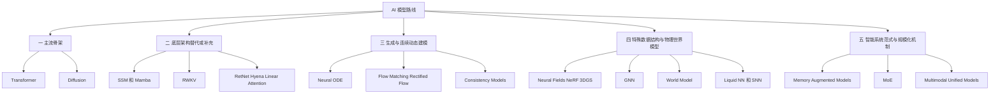
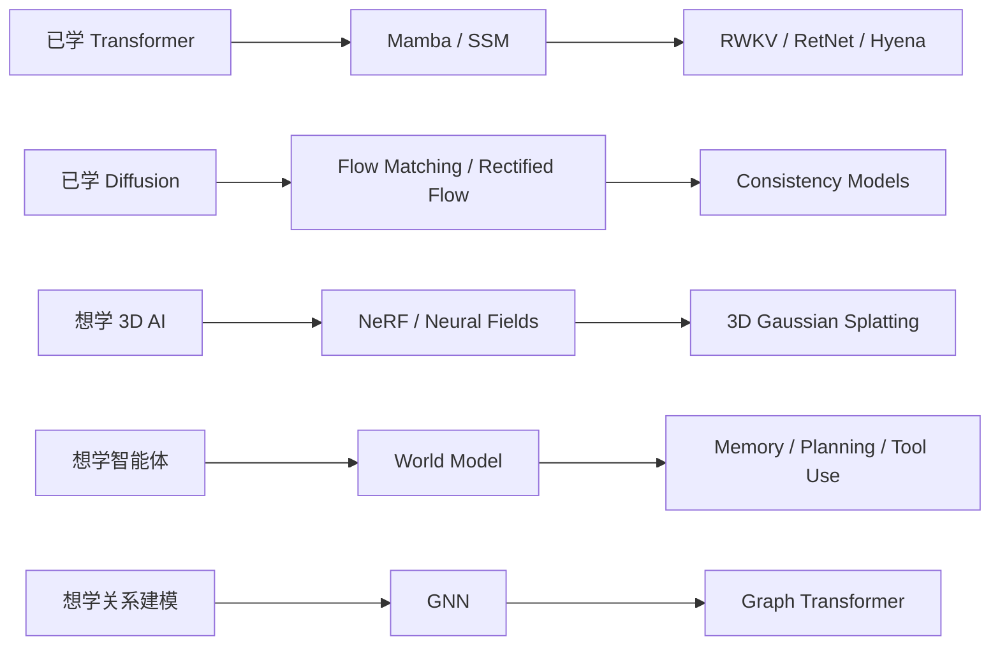

# AI 新模型路线学习 —— 初学者版

**作者**：汪亮（bertonwang）  
**邮箱**：<47608843@qq.com>  
**版本**：v1.0 ｜ **最后更新**：2026-05-18

> 转载或引用请保留作者署名与本文链接，欢迎来信交流与勘误。

> 目标读者：对深度学习有基本了解，已经听说过 Transformer、扩散模型，但想继续了解“除了这两大主流之外，还有哪些值得关注的新模型路线”的同学。
>
> 本文风格：尽量用大白话讲清楚“为什么会出现这些模型路线”，再讲“它们大概怎么做”，最后用表格和路线图帮你建立整体地图。

<style>
/* 一级标题：黑体 + 更大字号，方便阅读和导出 */
h1 {
  font-family: "SimHei", "Microsoft YaHei", "Heiti SC", sans-serif;
  font-size: 2.25em;
  font-weight: 700;
  line-height: 1.25;
  color: #000;
  margin-top: 0.8em;
  margin-bottom: 0.6em;
}

/* 优化代码段在预览和 PDF 导出中的显示效果 */
pre {
  font-size: 12px;
  line-height: 1.4;
  padding: 0.65em 0.85em;
  margin: 0.75em 0;
  border-radius: 6px;
  overflow-x: auto;
  page-break-inside: avoid;
  break-inside: avoid;
}

pre code {
  font-size: 12px;
  line-height: 1.4;
  white-space: pre;
}

:not(pre) > code {
  font-size: 0.95em;
  padding: 0.1em 0.25em;
}

@media print {
  pre,
  pre code {
    font-size: 10.5px;
    line-height: 1.32;
  }
}
</style>

**阅读路线**：

1. 先明确一个前提：现在最主流的底层架构仍然是 **Transformer** 和 **Diffusion**。
2. 再把其他新模型路线按大类聚合成：**底层架构替代 / 补充**、**生成与连续动态建模**、**特殊数据结构与物理世界模型**、**智能系统范式与规模化机制**。
3. 然后在每个大类下面，看它包含哪些具体技术路线，例如 Mamba / SSM、RWKV、RetNet、Neural ODE、Flow Matching、NeRF、GNN、世界模型等。
4. 最后用一张总表判断：哪些是真的新架构，哪些是对 Transformer / Diffusion 的补充，哪些更像系统方案。

> 如果你是第一次读，建议按顺序看；如果你只想快速建立地图，可以重点看第 2 章、第 8 章和第 10 章。

---

## 缩写词对照表：英文全称、中文名称与一句话理解

本文涉及很多 AI 模型路线的英文缩写和模型名称。初学时不用一次性背完，建议先知道它们的**英文全称、中文名称和一句话直觉**。

> 说明：有些条目严格来说不是“缩写”，而是英文模型名或技术路线名；这里也一并列出，方便阅读正文时快速查找。

| 缩写 / 名称 | 英文全称 / 英文名称 | 中文名称 | 一句话理解 |
|---|---|---|---|
| `AI` | Artificial Intelligence | 人工智能 | 让机器具备感知、理解、生成、推理和决策能力的技术总称。 |
| `3D` | Three-Dimensional | 三维 | 表示具有长、宽、高或空间深度的数据与场景。 |
| `RGB` | Red, Green, Blue | 红绿蓝颜色模型 | 用红、绿、蓝三个通道表示图像颜色。 |
| `PDF` | Portable Document Format | 便携式文档格式 | 常见文档导出格式，适合固定版式阅读和传播。 |
| `FAQ` | Frequently Asked Questions | 常见问题 | 用问答方式集中解释读者最容易困惑的问题。 |
| `GPU` | Graphics Processing Unit | 图形处理器 | 擅长大规模并行计算，是训练深度学习模型的重要硬件。 |
| `TPU` | Tensor Processing Unit | 张量处理器 | 面向机器学习张量计算优化的专用加速硬件。 |
| `KV Cache` | Key-Value Cache | 键值缓存 | Transformer 推理时保存历史注意力键和值，用来加速后续 token 生成。 |
| `Transformer` | Transformer | Transformer 架构 / 变换器架构 | 以自注意力为核心，是大语言模型和多模态模型的主流骨架。 |
| `Diffusion` | Diffusion Model | 扩散模型 | 通过“加噪—去噪”过程学习从噪声生成高质量数据。 |
| `DDPM` | Denoising Diffusion Probabilistic Models | 去噪扩散概率模型 | 经典扩散模型，用多步去噪从噪声生成数据。 |
| `Stable Diffusion` | Stable Diffusion | 稳定扩散模型 | 典型文生图扩散系统，常用于高质量图像生成。 |
| `Video Diffusion` | Video Diffusion Models | 视频扩散模型 | 把扩散生成扩展到视频，关注画面质量和时间一致性。 |
| `GPT` | Generative Pre-trained Transformer | 生成式预训练 Transformer | 典型自回归语言模型，按 token 逐步生成文本。 |
| `BERT` | Bidirectional Encoder Representations from Transformers | 基于 Transformer 的双向编码器表示 | 经典理解型语言模型，擅长从上下文中学习文本表示。 |
| `LLaMA` | Large Language Model Meta AI | Meta 大语言模型 | Meta 发布的大语言模型系列，是现代 LLM 的代表之一。 |
| `ViT` | Vision Transformer | 视觉 Transformer | 把图像切成 patch 后用 Transformer 处理的视觉模型。 |
| `LLM` | Large Language Model | 大语言模型 | 通过大规模文本训练获得语言理解、生成和推理能力的模型。 |
| `VLM` | Vision-Language Model | 视觉语言模型 | 同时处理图像和文本的多模态模型。 |
| `SSM` | State Space Model | 状态空间模型 | 用不断更新的内部状态来建模长序列和连续信号。 |
| `S4` | Structured State Space Sequence Model | 结构化状态空间序列模型 | 代表性 SSM 路线，强调用结构化状态空间高效处理长序列。 |
| `S5` | Simplified State Space Model / Simplified State Space Layers | 简化状态空间模型 / 简化状态空间层 | 对状态空间序列模型进行简化和工程化改进的路线。 |
| `Mamba` | Mamba / Selective State Space Model | Mamba / 选择性状态空间模型 | 通过选择性状态更新，在长序列建模中降低注意力成本。 |
| `Mamba-2` | Mamba-2 | Mamba 第二代模型 | 在 Mamba 基础上进一步改进状态空间建模和工程效率。 |
| `RNN` | Recurrent Neural Network | 循环神经网络 | 通过递归状态逐步处理序列，是早期序列建模的重要架构。 |
| `RWKV` | Receptance Weighted Key-Value | 接收加权键值模型 | 试图结合 Transformer 的并行训练和 RNN 的状态式推理。 |
| `RetNet` | Retentive Network | 保留网络 | 用 retention 机制兼顾并行训练、递归推理和长序列建模。 |
| `Hyena` | Hyena Hierarchy | Hyena 长序列模型 | 用长卷积、门控和隐式滤波等方式替代部分标准注意力。 |
| `Linear Attention` | Linear Attention | 线性注意力 | 通过近似或变换把注意力复杂度尽量从平方级降到线性级。 |
| `Performer` | Performer | Performer 线性注意力模型 | 用随机特征近似注意力，降低长序列计算成本。 |
| `Linformer` | Linformer | Linformer 低秩注意力模型 | 用低秩投影近似注意力矩阵，减少计算和内存开销。 |
| `Longformer` | Longformer | Longformer 长文本模型 | 用局部注意力和稀疏注意力处理长文档。 |
| `Reformer` | Reformer | Reformer 高效 Transformer | 通过局部敏感哈希等机制降低 Transformer 的长序列成本。 |
| `ODE` | Ordinary Differential Equation | 常微分方程 | 用连续时间变化描述系统状态演化。 |
| `Neural ODE` | Neural Ordinary Differential Equation | 神经常微分方程 | 把神经网络看成连续动态系统，而不是离散层堆叠。 |
| `Flow Matching` | Flow Matching | 流匹配 | 学习从简单分布流向真实数据分布的连续速度场。 |
| `Rectified Flow` | Rectified Flow | 校正流 / 直线化流 | 希望把生成路径变得更直，从而减少采样步骤。 |
| `Consistency Models` | Consistency Models | 一致性模型 | 学习不同噪声水平之间的一致映射，用更少步骤完成生成。 |
| `Neural Fields` | Neural Fields | 神经场 | 用神经网络表示连续空间中的信号，例如颜色、密度或几何结构。 |
| `NeRF` | Neural Radiance Fields | 神经辐射场 | 用神经网络表示三维场景，并从不同视角渲染图像。 |
| `3D Gaussian Splatting` | 3D Gaussian Splatting | 三维高斯泼溅 / 三维高斯溅射 | 用大量三维高斯小团块表示场景，实现高效重建和渲染。 |
| `3DGS` | 3D Gaussian Splatting | 三维高斯泼溅 / 三维高斯溅射 | 3D Gaussian Splatting 的常见缩写。 |
| `Instant-NGP` | Instant Neural Graphics Primitives | 即时神经图形基元 | 用高效神经表示快速学习和渲染三维场景。 |
| `GNN` | Graph Neural Network | 图神经网络 | 在节点和边组成的图结构上进行消息传递和关系建模。 |
| `GCN` | Graph Convolutional Network | 图卷积网络 | 把卷积思想推广到图结构数据上的经典 GNN。 |
| `GAT` | Graph Attention Network | 图注意力网络 | 在图神经网络中引入注意力机制，动态衡量邻居重要性。 |
| `GraphSAGE` | Graph Sample and Aggregate | 图采样与聚合网络 | 通过采样邻居并聚合信息来学习节点表示。 |
| `Message Passing Neural Network` | Message Passing Neural Network | 消息传递神经网络 | 用“节点向邻居传消息”的方式统一描述许多 GNN。 |
| `Graph Transformer` | Graph Transformer | 图 Transformer | 将 Transformer 注意力机制引入图结构建模。 |
| `World Model` | World Model | 世界模型 | 让智能体在内部预测环境如何变化，辅助规划和行动。 |
| `Dreamer` | Dreamer | Dreamer 世界模型 | 通过 latent imagination 学习行为，是世界模型方向的代表方法之一。 |
| `PlaNet` | Planning Network | 规划网络 / PlaNet 世界模型 | 在潜在空间中进行规划和预测，是早期世界模型代表方法之一。 |
| `MuZero` | MuZero | MuZero 世界模型强化学习方法 | 不依赖显式规则学习环境动态，用于规划和强化学习。 |
| `Liquid Neural Networks` | Liquid Neural Networks | 液态神经网络 | 内部动态会随输入变化，更适合连续控制和动态环境。 |
| `SNN` | Spiking Neural Network | 脉冲神经网络 | 用脉冲事件模拟神经元发放，适合低功耗和类脑计算。 |
| `DNA` | Deoxyribonucleic Acid | 脱氧核糖核酸 | 生物遗传信息载体，文中作为超长序列建模场景示例。 |
| `Memory-Augmented Models` | Memory-Augmented Models | 记忆增强模型 | 让模型在上下文窗口之外拥有可检索、可更新的长期记忆。 |
| `Memory Networks` | Memory Networks | 记忆网络 | 显式引入外部记忆模块，帮助模型读取和利用历史信息。 |
| `RAG` | Retrieval-Augmented Generation | 检索增强生成 | 先从外部知识库检索相关内容，再交给模型生成回答。 |
| `Tool Use` | Tool Use | 工具使用 | 让模型调用搜索、计算、代码执行等外部工具完成任务。 |
| `Planning` | Planning | 规划 | 在行动前模拟和选择步骤，是智能体系统的重要能力。 |
| `Differentiable Neural Computer` | Differentiable Neural Computer | 可微神经计算机 | 带有可微外部记忆的神经网络系统，可学习读写记忆。 |
| `MoE` | Mixture of Experts | 专家混合模型 | 用路由器选择少数专家参与计算，在容量和效率之间折中。 |
| `Switch Transformer` | Switch Transformer | Switch Transformer 专家模型 | 每个 token 通常只路由到少量专家，是典型 MoE Transformer。 |
| `GShard` | GShard | GShard 分片专家系统 | Google 提出的用于大规模稀疏专家模型训练的系统路线。 |
| `Mixtral` | Mixtral | Mixtral 专家混合模型 | Mistral AI 的 MoE 模型系列，代表现代稀疏专家大模型。 |
| `Multimodal Unified Models` | Multimodal Unified Models | 多模态统一模型 | 将文本、图像、音频、视频、动作等统一到一个系统中处理。 |

> 💡 **小白记忆点**：先判断一个名词属于哪一类：主流骨架、架构替代、连续生成、特殊结构，还是智能系统范式；再去理解它的细节，会比逐个硬背更容易。

---

## 目录

- [AI 新模型路线学习 —— 初学者版](#ai-新模型路线学习--初学者版)
  - [缩写词对照表：英文全称、中文名称与一句话理解](#缩写词对照表英文全称中文名称与一句话理解)
  - [目录](#目录)
  - [如何阅读这份文档：先建立地图，再看重点路线](#如何阅读这份文档先建立地图再看重点路线)
  - [0. 一句话先说清楚：除了 Transformer 和 Diffusion，还有新模型吗？](#0-一句话先说清楚除了-transformer-和-diffusion还有新模型吗)
  - [1. 为什么还需要新模型路线？](#1-为什么还需要新模型路线)
    - [1.1 Transformer 的典型痛点](#11-transformer-的典型痛点)
    - [1.2 扩散模型的典型痛点](#12-扩散模型的典型痛点)
    - [1.3 新模型路线通常想解决什么？](#13-新模型路线通常想解决什么)
  - [2. 整体鸟瞰图：按 AI 模型路线聚合](#2-整体鸟瞰图按-ai-模型路线聚合)
  - [3. 大类一：主流骨架（作为参照系）](#3-大类一主流骨架作为参照系)
    - [3.1 Transformer：文本、代码和多模态理解的主干](#31-transformer文本代码和多模态理解的主干)
    - [3.2 Diffusion：图像、视频、音频生成的主干](#32-diffusion图像视频音频生成的主干)
  - [4. 大类二：底层架构替代 / 补充](#4-大类二底层架构替代--补充)
    - [4.1 技术路线：状态空间模型 SSM / Mamba](#41-技术路线状态空间模型-ssm--mamba)
      - [4.1.1 它想解决什么问题？](#411-它想解决什么问题)
      - [4.1.2 状态空间是什么意思？](#412-状态空间是什么意思)
      - [4.1.3 Mamba 的关键直觉](#413-mamba-的关键直觉)
      - [4.1.4 它适合什么场景？](#414-它适合什么场景)
    - [4.2 技术路线：RWKV——RNN 思想的回归](#42-技术路线rwkvrnn-思想的回归)
      - [4.2.1 为什么说它像 RNN？](#421-为什么说它像-rnn)
      - [4.2.2 RWKV 和 Transformer 的区别](#422-rwkv-和-transformer-的区别)
      - [4.2.3 小白怎么理解 RWKV？](#423-小白怎么理解-rwkv)
    - [4.3 技术路线：低成本序列模型——线性注意力、RetNet 与 Hyena](#43-技术路线低成本序列模型线性注意力retnet-与-hyena)
      - [4.3.1 标准注意力为什么贵？](#431-标准注意力为什么贵)
      - [4.3.2 线性注意力想怎么做？](#432-线性注意力想怎么做)
      - [4.3.3 RetNet 的思路](#433-retnet-的思路)
      - [4.3.4 Hyena 的思路](#434-hyena-的思路)
  - [5. 大类三：生成与连续动态建模](#5-大类三生成与连续动态建模)
    - [5.1 技术路线：Neural ODE 与连续深度模型](#51-技术路线neural-ode-与连续深度模型)
      - [5.1.1 它和普通神经网络有什么不同？](#511-它和普通神经网络有什么不同)
      - [5.1.2 小白类比](#512-小白类比)
      - [5.1.3 它适合什么？](#513-它适合什么)
      - [5.1.4 它和扩散模型有什么关系？](#514-它和扩散模型有什么关系)
    - [5.2 技术路线：Flow Matching / Rectified Flow](#52-技术路线flow-matching--rectified-flow)
      - [5.2.1 它和扩散模型有什么相似？](#521-它和扩散模型有什么相似)
      - [5.2.2 小白类比](#522-小白类比)
      - [5.2.3 它为什么重要？](#523-它为什么重要)
  - [6. 大类四：特殊数据结构与物理世界模型](#6-大类四特殊数据结构与物理世界模型)
    - [6.1 技术路线：Neural Fields、NeRF 与 3D Gaussian Splatting](#61-技术路线neural-fieldsnerf-与-3d-gaussian-splatting)
      - [6.1.1 普通图片和三维世界有什么不同？](#611-普通图片和三维世界有什么不同)
      - [6.1.2 NeRF 的核心直觉](#612-nerf-的核心直觉)
      - [6.1.3 3D Gaussian Splatting 是什么？](#613-3d-gaussian-splatting-是什么)
      - [6.1.4 它和 Transformer / Diffusion 的关系](#614-它和-transformer--diffusion-的关系)
    - [6.2 技术路线：图神经网络 GNN](#62-技术路线图神经网络-gnn)
      - [6.2.1 什么是图结构数据？](#621-什么是图结构数据)
      - [6.2.2 GNN 怎么工作？](#622-gnn-怎么工作)
      - [6.2.3 典型模型](#623-典型模型)
      - [6.2.4 它和 Transformer 的关系](#624-它和-transformer-的关系)
    - [6.3 技术路线：世界模型 World Model](#63-技术路线世界模型-world-model)
      - [6.3.1 什么是世界模型？](#631-什么是世界模型)
      - [6.3.2 它为什么重要？](#632-它为什么重要)
      - [6.3.3 常见组成](#633-常见组成)
      - [6.3.4 和大语言模型的关系](#634-和大语言模型的关系)
    - [6.4 技术路线：液态神经网络与脉冲神经网络](#64-技术路线液态神经网络与脉冲神经网络)
      - [6.4.1 液态神经网络](#641-液态神经网络)
      - [6.4.2 脉冲神经网络](#642-脉冲神经网络)
  - [7. 大类五：智能系统范式与规模化机制](#7-大类五智能系统范式与规模化机制)
    - [7.1 技术路线：记忆增强模型](#71-技术路线记忆增强模型)
    - [7.2 技术路线：MoE 专家混合模型](#72-技术路线moe-专家混合模型)
    - [7.3 技术路线：多模态统一模型](#73-技术路线多模态统一模型)
  - [8. 总表：按大类速查这些模型到底新在哪里](#8-总表按大类速查这些模型到底新在哪里)
  - [9. 如果继续写初学者文档，优先写哪些？](#9-如果继续写初学者文档优先写哪些)
    - [9.1 Mamba / 状态空间模型](#91-mamba--状态空间模型)
    - [9.2 RWKV](#92-rwkv)
    - [9.3 NeRF / 神经场](#93-nerf--神经场)
    - [9.4 世界模型](#94-世界模型)
    - [9.5 Flow Matching / Rectified Flow](#95-flow-matching--rectified-flow)
  - [10. 常见问题答疑（FAQ）](#10-常见问题答疑faq)
  - [11. 学习路线建议](#11-学习路线建议)
  - [12. 一图总结](#12-一图总结)
  - [13. 写在最后](#13-写在最后)
  - [参考资料](#参考资料)

---

## 如何阅读这份文档：先建立地图，再看重点路线

本文不是要证明“某个模型一定会替代 Transformer 或扩散模型”，而是帮你建立一张更完整的 AI 模型地图。

可以按下面这条主线阅读：

```text
先承认当前主流：Transformer + Diffusion
→ 再理解它们各自的痛点：长序列成本、生成速度、记忆、物理世界、3D 表达
→ 然后看不同模型路线分别想解决什么问题
→ 最后判断：它是底层新架构、特殊领域模型，还是系统范式升级
```

| 学习阶段 | 重点问题 | 对应章节 |
|---|---|---|
| 先看整体 | 除了 Transformer / Diffusion 之外，到底还有没有新模型？ | 第 0～2 章 |
| 看主流参照系 | Transformer 和 Diffusion 为什么仍然是主干？ | 第 3 章 |
| 看架构替代 | 哪些模型试图替代或部分替代 Transformer？ | 第 4 章 |
| 看生成与连续建模 | 哪些路线从微分方程、流、连续系统角度建模？ | 第 5 章 |
| 看特殊结构与物理世界 | 3D、图结构、机器人和类脑信号分别需要什么模型？ | 第 6 章 |
| 看系统范式 | 记忆、专家混合、多模态统一为什么重要？ | 第 7 章 |
| 看总结 | 哪些值得优先学？哪些是边界路线？ | 第 8～13 章 |

---

## 0. 一句话先说清楚：除了 Transformer 和 Diffusion，还有新模型吗？

**有。**

但要先分清三件事：

1. **Transformer 仍然是大语言模型和多模态理解的主流骨架**。
2. **Diffusion 仍然是图像、视频、音频等生成任务的重要主流路线**。
3. 其他新模型路线很多，但它们不一定都能直接替代这两者，有些是替代架构，有些是补充工具，有些是系统范式。

一句话概括：

> 当前 AI 模型世界不是只有 Transformer 和 Diffusion，但这两者仍然是主干；旁边正在出现 Mamba / SSM、RWKV、RetNet、Neural ODE、NeRF、GNN、世界模型、MoE、记忆增强模型等不同路线。

可以先记住这张分类图：

```text
AI 模型路线
├─ 一、主流骨架
│  ├─ Transformer：文本、代码、多模态理解与生成
│  └─ Diffusion：图像、视频、音频、3D 生成
│
├─ 二、底层架构替代 / 补充
│  ├─ SSM / Mamba
│  ├─ RWKV
│  ├─ RetNet
│  ├─ Hyena
│  └─ 线性注意力
│
├─ 三、生成与连续动态建模
│  ├─ Neural ODE
│  ├─ Flow Matching
│  ├─ Rectified Flow
│  └─ Consistency Models
│
├─ 四、特殊数据结构与物理世界模型
│  ├─ Neural Fields / NeRF
│  ├─ 3D Gaussian Splatting
│  ├─ GNN
│  ├─ World Model
│  ├─ Liquid Neural Networks
│  └─ Spiking Neural Networks
│
└─ 五、智能系统范式与规模化机制
   ├─ Memory-Augmented Models
   ├─ MoE
   └─ 多模态统一模型
```

---

## 1. 为什么还需要新模型路线？

既然 Transformer 和扩散模型这么强，为什么还要研究别的模型？

因为它们也有痛点。

### 1.1 Transformer 的典型痛点

Transformer 的核心是自注意力。自注意力很强，但标准注意力有一个问题：

```text
序列长度越长，token 两两之间的关系越多
```

如果有 `n` 个 token，标准自注意力大致要计算：n x n


也就是常说的：O(n^2)


这会带来几个问题：

| 问题 | 解释 |
|---|---|
| **长上下文成本高** | 文本越长，注意力矩阵越大 |
| **推理显存压力大** | 需要保存 KV Cache |
| **边缘设备部署困难** | 手机、机器人、嵌入式设备资源有限 |
| **连续信号不自然** | 音频、传感器、控制系统更像连续时间序列 |

### 1.2 扩散模型的典型痛点

扩散模型擅长高质量生成，但也有自己的问题：

| 问题 | 解释 |
|---|---|
| **采样步骤多** | 传统 DDPM 可能要几十步到上千步去噪 |
| **生成速度慢** | 每一步都要调用模型 |
| **控制复杂** | 精确控制姿态、结构、物理一致性并不容易 |
| **视频和 3D 成本更高** | 数据维度更大，训练和推理都更贵 |

### 1.3 新模型路线通常想解决什么？

可以粗略归纳成 6 个目标：

| 目标 | 对应方向 |
|---|---|
| **更低的长序列成本** | Mamba、SSM、RWKV、RetNet、Hyena |
| **更快的生成速度** | Flow Matching、Rectified Flow、Consistency Models |
| **更自然的连续时间建模** | Neural ODE、Liquid Neural Networks |
| **更适合 3D 世界表达** | NeRF、Neural Fields、3D Gaussian Splatting |
| **更适合关系结构数据** | GNN、Graph Transformer |
| **更像智能体系统** | World Model、Memory、Tool Use、Planning |

> 💡 **小白记忆点**：新模型路线不是为了“炫技”，而是因为现有模型在长序列、低成本、3D、物理世界、长期记忆等方面还有短板。

---

## 2. 整体鸟瞰图：按 AI 模型路线聚合

为了不迷路，本文不再把技术路线简单平铺成“路线 1、路线 2、路线 3……”，而是按 **AI 模型路线的大类** 来聚合。



五类路线的区别：

| 大类 | 核心问题 | 代表模型 / 方向 | 一句话理解 |
|---|---|---|---|
| **一、主流骨架** | 当前 AI 的主干是什么？ | Transformer、Diffusion | 先知道主干，才能看懂旁支 |
| **二、底层架构替代 / 补充** | 能不能更便宜地处理长序列？ | Mamba、RWKV、RetNet、Hyena | 主要挑战 Transformer 的长序列成本 |
| **三、生成与连续动态建模** | 能不能更自然、更快地描述连续变化和生成路径？ | Neural ODE、Flow Matching | 从“离散层”转向“连续演化” |
| **四、特殊数据结构与物理世界模型** | 图、3D、机器人、类脑信号怎么建模？ | NeRF、GNN、World Model、Liquid NN、SNN | 面向普通文本之外的数据结构和真实世界 |
| **五、智能系统范式与规模化机制** | 模型如何有记忆、会组合、能扩容？ | Memory、MoE、多模态统一模型 | 更像系统级组合，不一定是单一网络结构 |

> 💡 **小白记忆点**：先看大类，再看具体路线。这样你看到一个新名词时，能先判断它是在改底层架构、改生成方式、处理特殊数据，还是在做智能系统组合。

---

## 3. 大类一：主流骨架（作为参照系）

虽然本文重点讲的是“除了 Transformer 和 Diffusion 之外，还有哪些路线”，但学习其他路线之前，最好先把这两个主干放在地图中央。

### 3.1 Transformer：文本、代码和多模态理解的主干

`Transformer` 目前仍然是大语言模型、代码模型、多模态理解模型的核心骨架。

它最重要的能力是：

- **自注意力**：让每个 token 都能看见其他 token。
- **并行训练**：适合 GPU / TPU 大规模训练。
- **通用性强**：文本、代码、图像 patch、音频 token 都能统一成序列处理。

所以后面提到的 `Mamba`、`RWKV`、`RetNet`、`Hyena`，大多是在问同一个问题：

> 能不能在保留序列建模能力的同时，降低 Transformer 的长序列成本？

### 3.2 Diffusion：图像、视频、音频生成的主干

`Diffusion` 目前仍然是图像、视频、音频等高质量生成任务的重要路线。

它最重要的思想是：

- **前向加噪**：把真实数据一步步变成噪声。
- **反向去噪**：训练模型从噪声一步步还原数据。
- **高质量生成**：特别适合图像、视频、音频等连续信号。

所以后面提到的 `Flow Matching`、`Rectified Flow`、`Consistency Models`，很多是在问：

> 能不能用更少步骤、更统一的连续路径，完成从噪声到数据的生成？

---

## 4. 大类二：底层架构替代 / 补充

这一大类主要关心：**能不能不用标准自注意力，或者少用标准自注意力，也能高效处理长序列？**

适合把它理解为：

```text
Transformer 很强
但长序列很贵
所以有人尝试用状态、递归、保留机制、长卷积等方式来替代或补充 Attention
```

### 4.1 技术路线：状态空间模型 SSM / Mamba

状态空间模型，全称是 State Space Model，简称 `SSM`。

近几年最有代表性的名字是：

- `S4`
- `S5`
- `Mamba`
- `Mamba-2`

它们经常被拿来和 Transformer 对比，因为它们都在处理序列。

#### 4.1.1 它想解决什么问题？

Transformer 处理序列时，核心思想是：

```text
每个 token 都去看其他 token
```

这很强，但序列很长时成本会很高。

Mamba / SSM 的思路更像：

```text
模型维护一个隐藏状态
输入一个 token，就更新一次状态
状态不断携带历史信息往后流动
```

可以粗略类比为：

```text
Transformer：开一个全员大会，每个人都和每个人交流
Mamba / SSM：有一本动态笔记，信息不断写入、更新、传递
```

#### 4.1.2 状态空间是什么意思？

不要被名字吓到。

“状态空间”可以理解成：

> 模型内部有一个状态 `state`，它记录到目前为止看过的信息；新输入进来后，状态会被更新，然后输出结果。

一个非常简化的抽象是：

```text
旧状态 + 当前输入 → 新状态
新状态 → 当前输出
```

用伪公式表示：

```text
h_t = update(h_{t-1}, x_t)
y_t = output(h_t)
```

这里：

| 符号 | 含义 | 小白理解 |
|---|---|---|
| `x_t` | 当前输入 | 当前 token / 当前信号 |
| `h_t` | 当前状态 | 模型的动态记忆 |
| `y_t` | 当前输出 | 模型对当前输入的处理结果 |

#### 4.1.3 Mamba 的关键直觉

Mamba 的一个关键词是 **选择性状态空间**。

它不是机械地把所有信息都塞进状态，而是会根据输入决定：

```text
哪些信息要记住？
哪些信息要遗忘？
哪些信息要传递到后面？
```

这有点像人读文章：

```text
看到关键词：重点记住
看到无关修饰：可以略过
看到转折词：更新理解
```

#### 4.1.4 它适合什么场景？

| 场景 | 为什么适合 |
|---|---|
| **长文本** | 长序列成本更低 |
| **音频** | 音频是天然的长时间序列 |
| **时间序列** | 传感器、金融、工业数据都适合状态建模 |
| **DNA / 蛋白质序列** | 序列很长，需要高效建模 |
| **边缘设备** | 推理内存和计算压力可能更小 |

一句话：

> `Mamba / SSM` 是目前最值得关注的 Transformer 替代路线之一，尤其适合讨论“如果不用标准注意力，还能不能处理长序列”。

### 4.2 技术路线：RWKV——RNN 思想的回归

`RWKV` 是一条很有意思的路线。

它想做的是：

> 训练时像 Transformer 一样可以并行，推理时像 RNN 一样只维护状态。

#### 4.2.1 为什么说它像 RNN？

传统 RNN 的处理方式是：

```text
读第 1 个 token → 更新状态
读第 2 个 token → 更新状态
读第 3 个 token → 更新状态
...
```

它推理时很省内存，因为只需要维护一个状态。

但传统 RNN 的问题是：

- 长距离依赖容易丢。
- 训练并行性不好。
- 表达能力一度落后于 Transformer。

RWKV 想把 RNN 的推理优势带回来，同时借鉴 Transformer 时代的训练方式和规模化经验。

#### 4.2.2 RWKV 和 Transformer 的区别

| 对比项 | Transformer | RWKV |
|---|---|---|
| 训练 | 高度并行 | 也强调并行训练 |
| 推理 | 通常需要 KV Cache | 更像维护递归状态 |
| 长上下文成本 | 注意力成本高 | 状态式推理更轻 |
| 架构来源 | Attention | RNN + Attention-like 思想 |

#### 4.2.3 小白怎么理解 RWKV？

可以这样理解：

```text
Transformer：每次都带着一大叠上下文资料查阅
RWKV：把读过的内容浓缩进一个不断更新的状态笔记
```

它不一定全面替代 Transformer，但在本地部署、低资源推理、长上下文等方向很值得关注。

### 4.3 技术路线：低成本序列模型——线性注意力、RetNet 与 Hyena

这一类模型的共同目标是：

> 保留注意力或类似注意力的全局建模能力，但降低计算复杂度。

代表方向包括：

- `Linear Attention`
- `Performer`
- `Linformer`
- `Longformer`
- `Reformer`
- `RetNet`
- `Hyena`

#### 4.3.1 标准注意力为什么贵？

标准注意力会计算 token 两两关系：

```text
token 1 看 token 1、2、3、...、n
token 2 看 token 1、2、3、...、n
...
token n 看 token 1、2、3、...、n
```

所以大致是：

```text
n 个 token × n 个 token = n² 个关系
```

#### 4.3.2 线性注意力想怎么做？

线性注意力的目标是把计算复杂度从：

```text
O(n²)
```

尽量变成：

```text
O(n)
```

直觉上，它会用数学变换或近似方法，避免显式计算完整的 `n × n` 注意力矩阵。

#### 4.3.3 RetNet 的思路

`RetNet` 全称可以理解为 Retentive Network，强调的是 “Retention”，也就是保留信息。

它想在三件事之间取得平衡：

| 能力 | 来源 |
|---|---|
| **并行训练** | 类似 Transformer |
| **递归推理** | 类似 RNN |
| **长序列建模** | 通过 retention 机制 |

可以简单理解为：

```text
训练时：尽量并行，利用 GPU
推理时：尽量递归，节省成本
长序列：通过保留机制传递历史信息
```

#### 4.3.4 Hyena 的思路

`Hyena` 也是为了长序列建模而提出的路线。

它不完全依赖标准注意力，而是使用类似长卷积、门控和隐式滤波的方式，让模型能处理很长的上下文。

小白可以先记成：

> `Hyena` 想用非标准注意力的方式，让模型高效处理超长序列。

---

## 5. 大类三：生成与连续动态建模

这一大类主要关心：**能不能用更自然、更统一的方式描述生成过程和连续变化？**

适合把它理解为：

```text
扩散模型很强大
但生成过程是离散的
所以有人尝试用微分方程、流、连续系统等更自然的方式
```

### 5.1 技术路线：Neural ODE 与连续深度模型

`Neural ODE` 是 Neural Ordinary Differential Equation，神经常微分方程。

这个名字听起来很数学，但直觉并不复杂。

#### 5.1.1 它和普通神经网络有什么不同？

普通神经网络是一层一层堆起来的：

```text
第 1 层 → 第 2 层 → 第 3 层 → 第 4 层
```

`Neural ODE` 更像是：

```text
状态从时间 t0 连续变化到时间 t1
```

也就是说，它不把网络看成离散的很多层，而是看成一个连续变化的动态系统。

#### 5.1.2 小白类比

普通网络像走楼梯：

```text
一阶 → 二阶 → 三阶 → 四阶
```

`Neural ODE` 像走斜坡：

```text
连续地从低处走到高处
```

#### 5.1.3 它适合什么？

| 场景 | 原因 |
|---|---|
| **物理建模** | 物理系统本身常用微分方程描述 |
| **连续时间序列** | 医疗、传感器数据不一定等间隔采样 |
| **控制系统** | 状态随时间连续变化 |
| **科学计算** | 很多科学问题天然是动态系统 |

#### 5.1.4 它和扩散模型有什么关系？

扩散模型、Flow Matching、连续生成模型，很多都可以从微分方程角度理解。

但严格说：

- `Neural ODE` 是一种更基础的连续建模框架。
- 它不是扩散模型本身。
- 它可以作为理解扩散、流模型、连续动态系统的数学工具。

### 5.2 技术路线：Flow Matching / Rectified Flow

这一类模型经常出现在生成模型的新路线里。

代表方向：

- `Flow Matching`
- `Rectified Flow`
- `Consistency Models`

注意：这一类和扩散模型关系很近，所以它属于“边界路线”。

#### 5.2.1 它和扩散模型有什么相似？

扩散模型大致是：

```text
真实数据 → 加噪声 → 学会一步步去噪
```

生成时：

```text
纯噪声 → 一步步去噪 → 真实数据
```

`Flow Matching` 更强调：

```text
简单分布 → 学习一条连续路径 → 真实数据分布
```

#### 5.2.2 小白类比

扩散模型像：

```text
把照片弄脏，再训练修图师一步步擦干净
```

Flow Matching 像：

```text
设计一条河流，让水从“噪声湖”流向“真实数据湖”
```

#### 5.2.3 它为什么重要？

| 价值 | 解释 |
|---|---|
| **采样可能更快** | 可能减少生成步骤 |
| **训练目标更直接** | 学习从一个分布到另一个分布的速度场 |
| **统一视角更强** | 能把扩散、流、ODE 等放到一个框架里理解 |

但要注意：

> 如果严格排除“扩散模型及其演变”，Flow Matching / Rectified Flow 可能不能算完全独立的新家族；它更像生成模型连续化路线中的重要分支。

---

## 6. 大类四：特殊数据结构与物理世界模型

这一大类主要关心：**如何用神经网络表示和处理特殊数据结构和物理世界？**

适合把它理解为：

```text
普通文本之外，还有其他数据结构
如何用神经网络表示和处理这些数据结构？
```

### 6.1 技术路线：Neural Fields、NeRF 与 3D Gaussian Splatting

这类模型主要解决一个问题：

> 如何用神经网络表示一个连续的三维世界？

代表方向包括：

- `Neural Fields`
- `NeRF`
- `Instant-NGP`
- `3D Gaussian Splatting`

#### 6.1.1 普通图片和三维世界有什么不同？

普通图片是二维像素：

```text
位置 x, y → RGB 颜色
```

三维世界还要考虑：

- 空间位置 `x, y, z`
- 观察方向
- 透明度 / 密度
- 光照
- 多视角一致性

#### 6.1.2 NeRF 的核心直觉

`NeRF` 可以粗略理解为一个函数：

```text
空间坐标 + 观察方向 → 颜色 + 密度
```

也就是：

```text
(x, y, z, direction) → (color, density)
```

它不是直接存一个传统 3D 网格，而是让神经网络学会回答：

> 从这个位置、朝这个方向看过去，应该看到什么颜色？这里有多“实”？

#### 6.1.3 3D Gaussian Splatting 是什么？

`3D Gaussian Splatting` 可以理解为：

> 用很多个三维高斯小团块来表示一个场景，然后高效渲染成图像。

它的优势是渲染速度快，视觉效果好，因此在 3D 重建、虚拟现实、游戏资产、数字人场景里很受关注。

#### 6.1.4 它和 Transformer / Diffusion 的关系

| 模型 | 关系 |
|---|---|
| `NeRF` | 本身不是 Transformer，也不是 Diffusion |
| `3D Gaussian Splatting` | 更像 3D 表示与渲染技术 |
| `Diffusion + 3D` | 现在常用扩散模型辅助生成 3D 内容 |
| `Transformer + 3D` | 也可用于多视角理解、3D token 建模 |

一句话：

> Neural Fields 这一类模型不是为了写文章或聊天，而是为了让 AI 学会表示和生成三维世界。

### 6.2 技术路线：图神经网络 GNN

`GNN` 是 Graph Neural Network，图神经网络。

它不是最近才出现的模型，但在很多领域仍然非常重要。

#### 6.2.1 什么是图结构数据？

图结构由两类东西组成：

```text
节点 + 边
```

例如：

| 场景 | 节点 | 边 |
|---|---|---|
| 社交网络 | 用户 | 好友关系 |
| 分子结构 | 原子 | 化学键 |
| 知识图谱 | 实体 | 关系 |
| 交通网络 | 路口 | 道路 |
| 推荐系统 | 用户 / 商品 | 点击 / 购买 |

#### 6.2.2 GNN 怎么工作？

GNN 的核心思想是消息传递。

```text
每个节点从邻居那里收集信息
更新自己的表示
多轮之后，节点就融合了更远处的信息
```

简单理解：

```text
我是谁，不只取决于我自己
还取决于我连接了谁，以及他们又连接了谁
```

#### 6.2.3 典型模型

- `GCN`
- `GraphSAGE`
- `GAT`
- `Message Passing Neural Network`
- `Graph Transformer`

#### 6.2.4 它和 Transformer 的关系

Transformer 也可以看成一种“全连接图”上的信息交互：

```text
每个 token 都可以看所有 token
```

GNN 更强调显式图结构：

```text
只有有边的节点之间先交换信息
```

所以：

| 对比项 | Transformer | GNN |
|---|---|---|
| 数据结构 | 序列 / token | 图 / 节点 / 边 |
| 连接方式 | 通常全局注意力 | 按图边连接 |
| 擅长任务 | 文本、多模态、通用建模 | 分子、知识图谱、社交网络、交通 |

### 6.3 技术路线：世界模型 World Model

世界模型不是某一个固定网络结构，而是一类智能体系统范式。

它想解决的问题是：

> 智能体能不能在内部学会“世界会怎样变化”？

#### 6.3.1 什么是世界模型？

一个世界模型通常学习：

```text
当前状态 + 动作 → 下一个状态
```

例如机器人现在看到桌子上有一个杯子，它可以预测：

```text
如果我伸手推一下，杯子会往哪里移动？
如果我夹起来，杯子会不会掉？
如果我走到门口，视角会怎么变化？
```

#### 6.3.2 它为什么重要？

语言模型主要擅长：

```text
理解语言、生成文本、调用知识
```

但智能体还需要：

```text
理解环境、预测后果、规划动作、从失败中学习
```

世界模型就像智能体脑子里的“模拟器”。

#### 6.3.3 常见组成

| 模块 | 作用 |
|---|---|
| **感知模型** | 把图像、语音、传感器输入变成状态表示 |
| **动态模型** | 预测状态如何变化 |
| **奖励模型** | 判断某个状态或动作好不好 |
| **策略模型** | 决定下一步做什么 |
| **规划模块** | 在内部模拟多种可能动作 |

代表方向：

- `Dreamer`
- `PlaNet`
- `MuZero`
- 机器人世界模型
- 自动驾驶世界模型

#### 6.3.4 和大语言模型的关系

未来智能体很可能不是单靠一个 LLM，而是：

```text
大语言模型 + 世界模型 + 记忆 + 工具 + 规划 + 执行器
```

也就是说，世界模型更像是 AI 从“会说话”走向“会行动”的关键组件之一。

### 6.4 技术路线：液态神经网络与脉冲神经网络

这一章放两个不一定是主流大模型核心，但很有代表性的方向：

- `Liquid Neural Networks`
- `Spiking Neural Networks`

#### 6.4.1 液态神经网络

液态神经网络来自连续时间系统和神经动力学。

它的特点是：

> 模型的内部状态会随着输入动态变化，更像一个会自适应的系统。

可以理解为：

```text
普通网络：参数学好后，处理方式相对固定
液态网络：内部动态会随输入变化，更适合连续环境
```

适合场景：

- 机器人
- 自动驾驶
- 控制系统
- 边缘设备
- 连续传感器信号

#### 6.4.2 脉冲神经网络

脉冲神经网络，简称 `SNN`，受生物神经元启发。

普通神经网络是连续数值计算：

```text
输入 → 加权求和 → 激活函数 → 输出数值
```

脉冲神经网络更像：

```text
神经元电位累积到阈值 → 发放一个脉冲
```

它的优势潜力是：

| 优势 | 解释 |
|---|---|
| **低功耗** | 只有发放脉冲时才计算，适合类脑硬件 |
| **事件驱动** | 适合动态视觉传感器等事件数据 |
| **接近生物机制** | 更像神经系统的信号传递方式 |

但目前它还没有成为大语言模型或文生图模型的主流骨架。

---

## 7. 大类五：智能系统范式与规模化机制

这一大类主要关心：**如何用模型构建更像智能体的系统？**

适合把它理解为：

```text
模型如何有记忆、会规划、会用工具？
```

### 7.1 技术路线：记忆增强模型

这一类路线讨论的不是单一“新网络层”，而是：**模型如何拥有长期记忆和外部知识。**

大模型的上下文窗口再长，也不等于真正的长期记忆。

记忆增强模型关注的是：

> 模型如何在当前输入之外，拥有可检索、可更新、可长期保留的记忆。

常见形式：

- 外部向量数据库
- RAG 检索增强
- 用户画像记忆
- 可读写记忆模块
- 神经图灵机
- Differentiable Neural Computer

现代应用中经常是：

```text
LLM + RAG + Memory + Tools
```

这说明 AI 系统已经不只是“一个模型”，而是在向“模型 + 记忆 + 工具 + 工作流”的方向演进。

### 7.2 技术路线：MoE 专家混合模型

`MoE` 是 Mixture of Experts，专家混合模型。

它讨论的是：**模型参数越来越大之后，能不能每次只激活一部分专家，从而提高效率？**

核心思路是：

```text
输入 token → 路由器 → 选择少数几个专家网络处理
```

它的好处是：

| 好处 | 解释 |
|---|---|
| **总参数量可以很大** | 模型里面可以有很多专家 |
| **每次只激活一部分** | 推理不必用上全部参数 |
| **效率更高** | 在计算成本和模型容量之间折中 |

代表方向：

- `Switch Transformer`
- `GShard`
- `Mixtral`
- 很多现代大模型内部的 MoE 结构

但要注意：

> 很多 MoE 模型仍然以 Transformer 为骨架，所以 MoE 更像规模化架构改造，不一定是完全独立的新模型家族。

### 7.3 技术路线：多模态统一模型

多模态统一模型关注的是：**不同模态能不能统一到一个系统里理解和生成。**

```text
文本、图像、音频、视频、动作、传感器数据
能不能放进一个统一模型里处理？
```

它的目标不是只会聊天，而是：

```text
看见世界 → 听见声音 → 读懂文字 → 理解视频 → 规划动作 → 生成结果
```

很多多模态模型仍然使用 Transformer，但系统重点变了：

| 过去 | 现在 / 未来 |
|---|---|
| 单一文本输入 | 文本 + 图像 + 音频 + 视频 + 行动 |
| 单一模型输出文本 | 输出文本、图像、语音、代码、动作 |
| 只做理解或生成 | 理解 + 生成 + 规划 + 执行 |

---

## 8. 总表：按大类速查这些模型到底新在哪里

下面这张表可以作为速查。读的时候先看第一列“大类”，再看第二列“技术路线”，这样不会被一堆名词淹没。

| 大类 | 技术路线 | 代表模型 / 方向 | 是否独立于 Transformer / Diffusion | 主要价值 |
|---|---|---|---:|---|
| **一、主流骨架** | Transformer | GPT、BERT、LLaMA、ViT | 主流骨架 | 文本、代码、多模态理解与生成 |
| **一、主流骨架** | Diffusion | DDPM、Stable Diffusion、Video Diffusion | 主流骨架 | 图像、视频、音频等高质量生成 |
| **二、底层架构替代 / 补充** | 状态空间模型 | `S4`、`S5`、`Mamba` | 较独立 | 长序列、高效率、低推理成本 |
| **二、底层架构替代 / 补充** | RNN 复兴路线 | `RWKV` | 较独立 | 训练并行、推理状态化 |
| **二、底层架构替代 / 补充** | 低成本序列模型 | `RetNet`、`Hyena`、`Linear Attention` | 部分独立 | 降低注意力复杂度 |
| **三、生成与连续动态建模** | 连续动态模型 | `Neural ODE` | 独立 | 连续时间、科学建模、控制系统 |
| **三、生成与连续动态建模** | 流模型路线 | `Flow Matching`、`Rectified Flow`、`Consistency Models` | 和扩散接近 | 高效生成、连续路径建模 |
| **四、特殊数据结构与物理世界模型** | 神经场模型 | `NeRF`、`3D Gaussian Splatting` | 独立 | 3D 表示、重建、渲染 |
| **四、特殊数据结构与物理世界模型** | 图神经网络 | `GCN`、`GAT`、`GraphSAGE` | 独立 | 图结构、关系建模 |
| **四、特殊数据结构与物理世界模型** | 世界模型 | `Dreamer`、`PlaNet`、`MuZero` | 系统范式 | 智能体、规划、机器人 |
| **四、特殊数据结构与物理世界模型** | 液态网络 | `Liquid Neural Networks` | 独立 | 连续控制、动态环境、低功耗 |
| **四、特殊数据结构与物理世界模型** | 脉冲网络 | `SNN` | 独立 | 类脑计算、事件驱动、低功耗 |
| **五、智能系统范式与规模化机制** | 记忆增强模型 | `Memory Networks`、`RAG + Memory` | 系统范式 | 长期记忆、个性化、知识增强 |
| **五、智能系统范式与规模化机制** | 专家混合 | `MoE`、`Mixtral` | 多为 Transformer 改造 | 扩大模型容量、提高计算效率 |
| **五、智能系统范式与规模化机制** | 多模态统一模型 | VLM、语音语言模型、视频模型 | 多为系统融合 | 统一处理多种输入和输出 |

可以再压缩成一句话：

> **先看大类，再看技术路线**：Mamba / RWKV / RetNet 属于“底层架构替代”；Neural ODE / Flow Matching 属于“生成与连续动态建模”；NeRF / GNN / World Model 属于“特殊结构和物理世界”；Memory / MoE / 多模态统一属于“智能系统范式与规模化机制”。

---

## 9. 如果继续写初学者文档，优先写哪些？

如果后续要继续写“初学者版 AI 模型架构科普文档”，建议优先写下面 5 个。

### 9.1 Mamba / 状态空间模型

最适合接在 Transformer 文档之后。

可以重点讲：

```text
为什么 Transformer 长序列贵？
什么是状态？
什么是选择性状态空间？
Mamba 如何一边记忆一边处理序列？
```

推荐标题：

> `Mamba 状态空间模型学习 —— 初学者版`

### 9.2 RWKV

适合讲 RNN 思想如何在大模型时代回归。

可以重点讲：

```text
为什么 RNN 曾经被 Transformer 替代？
RWKV 为什么又把 RNN 思想带回来？
它如何做到训练像 Transformer、推理像 RNN？
```

### 9.3 NeRF / 神经场

适合讲 3D AI。

可以重点讲：

```text
传统 3D 模型如何表示世界？
NeRF 如何用神经网络表示一个场景？
为什么输入坐标就能输出颜色和密度？
```

### 9.4 世界模型

适合讲智能体和机器人。

可以重点讲：

```text
语言模型只会说，世界模型想学会预测世界。
智能体为什么需要内部模拟器？
世界模型如何帮助规划和行动？
```

### 9.5 Flow Matching / Rectified Flow

适合作为扩散模型后的进阶文档。

可以重点讲：

```text
扩散模型是一步步去噪。
Flow Matching 是学习从噪声分布流向数据分布的路径。
为什么这种视角可能带来更快生成？
```

---

## 10. 常见问题答疑（FAQ）

**Q1：这些模型会替代 Transformer 吗？**  
A：短期内不一定。Transformer 生态非常成熟，训练框架、硬件优化、工程经验都很强。Mamba、RWKV、RetNet 等更可能先在长序列、低资源、特定场景里替代或补充 Transformer。

**Q2：Mamba 是不是一定比 Transformer 强？**  
A：不是。Mamba 的优势主要在长序列效率和状态式建模上，但 Transformer 在通用建模、生态和大规模验证方面仍然非常强。

**Q3：Flow Matching 算不算扩散模型？**  
A：它和扩散模型关系很近，都属于现代生成模型的重要路线。如果严格排除扩散模型及其演变，Flow Matching 更适合放在“边界路线”里。

**Q4：GNN 现在还重要吗？**  
A：重要。尤其在分子、知识图谱、推荐系统、交通网络、社交网络等显式图结构场景中，GNN 仍然很有价值。

**Q5：世界模型是一个具体模型吗？**  
A：不是。世界模型更像一类系统范式，通常包含感知、动态预测、奖励、策略、规划等模块。

**Q6：MoE 是新模型吗？**  
A：MoE 是一种架构思想。很多 MoE 模型仍然基于 Transformer，所以它更像大模型规模化的效率改造，而不是完全独立的底层模型路线。

**Q7：多模态统一模型是不是 Transformer 的变体？**  
A：很多多模态统一模型底层仍然大量使用 Transformer，但它的重点是把文本、图像、音频、视频、动作等统一到一个系统里，不只是单个网络层变化。

**Q8：初学者应该先学哪一个？**  
A：如果你已经学过 Transformer，建议先学 `Mamba / SSM`；如果你对图像生成熟悉，建议接着看 `Flow Matching`；如果你对 3D 或机器人感兴趣，建议看 `NeRF` 和 `World Model`。

---

## 11. 学习路线建议

可以按下面路线继续学习。



**建议学习顺序**：

1. **先巩固 Transformer 和扩散模型**：它们仍然是理解现代 AI 的主干。
2. **再学 Mamba / SSM**：理解为什么大家想降低长序列成本。
3. **补充 RWKV、RetNet、Hyena**：建立“非标准注意力序列模型”的地图。
4. **生成方向学 Flow Matching**：理解扩散模型之外的连续生成视角。
5. **空间方向学 NeRF / 3DGS**：进入 3D AI 和空间智能。
6. **智能体方向学世界模型**：理解模型如何从“会生成”走向“会规划行动”。

---

## 12. 一图总结

```text
AI 模型路线

一、主流骨架
    ├─ Transformer：文本、代码、多模态理解与生成的主干
    └─ Diffusion：图像、视频、音频生成的主干

二、底层架构替代 / 补充
    ├─ Mamba / SSM：用状态空间高效处理长序列
    ├─ RWKV：训练像 Transformer，推理像 RNN
    ├─ RetNet：兼顾并行训练和递归推理
    └─ Hyena / Linear Attention：降低标准注意力成本

三、生成与连续动态建模
    ├─ Neural ODE：连续时间动态系统
    ├─ Flow Matching / Rectified Flow：学习从噪声分布流向数据分布的路径
    └─ Consistency Models：减少生成采样步骤、提升生成效率

四、特殊数据结构与物理世界模型
    ├─ Neural Fields / NeRF：用神经网络表示 3D 世界
    ├─ 3D Gaussian Splatting：高效三维场景表示和渲染
    ├─ GNN：显式图结构和关系建模
    ├─ World Model：预测世界如何变化，帮助智能体规划行动
    ├─ Liquid Neural Networks：连续控制、动态环境、低功耗
    └─ Spiking Neural Networks：类脑、事件驱动、低功耗

五、智能系统范式与规模化机制
    ├─ Memory-Augmented Models：长期记忆和检索增强
    ├─ MoE：专家混合，提高模型容量和效率
    └─ 多模态统一模型：文本、图像、音频、视频、动作统一处理
```

如果只记住一句话：

```text
主流骨架负责撑起现在的 AI；
底层架构替代路线负责降低长序列成本；
生成与连续动态建模负责改进生成过程；
特殊数据结构与物理世界模型负责处理 3D、图、机器人和类脑信号；
智能系统范式与规模化机制负责让模型有记忆、能扩容、能统一多模态。
```

---

## 13. 写在最后

学习 AI 模型架构时，很容易陷入两个极端：

- 觉得 Transformer 和 Diffusion 已经解决一切。
- 看到新名词就觉得旧模型马上要被淘汰。

更稳妥的理解方式是：

```text
主流模型解决主流问题
新模型路线解决新瓶颈
系统范式把多个模型组合成更强能力
```

所以，本文最重要的不是记住一堆名字，而是建立判断框架：

| 你看到一个新模型时 | 先问什么 |
|---|---|
| 它是新底层架构吗？ | 是否改变了序列建模、生成建模或状态更新方式？ |
| 它是特殊领域模型吗？ | 是否主要面向图、3D、连续系统、类脑硬件？ |
| 它是系统范式吗？ | 是否依赖模型、记忆、工具、规划等多个模块组合？ |
| 它解决什么痛点？ | 长序列、低成本、生成速度、3D、物理世界、长期记忆？ |

> 学完这一篇，你不需要马上深入每个模型的论文细节，但应该能看懂新闻、论文标题和技术讨论中这些名字大致处在什么位置。下一步最建议深入学习：`Mamba / 状态空间模型`。

---

## 参考资料

- [Mamba: Linear-Time Sequence Modeling with Selective State Spaces](https://arxiv.org/abs/2312.00752)
- [Mamba-2: Transformers are SSMs](https://arxiv.org/abs/2405.21060)
- [Efficiently Modeling Long Sequences with Structured State Spaces](https://arxiv.org/abs/2111.00396)
- [RWKV: Reinventing RNNs for the Transformer Era](https://arxiv.org/abs/2305.13048)
- [Retentive Network: A Successor to Transformer for Large Language Models](https://arxiv.org/abs/2307.08621)
- [Hyena Hierarchy: Towards Larger Convolutional Language Models](https://arxiv.org/abs/2302.10866)
- [Neural Ordinary Differential Equations](https://arxiv.org/abs/1806.07366)
- [Flow Matching for Generative Modeling](https://arxiv.org/abs/2210.02747)
- [Rectified Flow: A Marginal Preserving Approach to Optimal Transport](https://arxiv.org/abs/2209.03003)
- [NeRF: Representing Scenes as Neural Radiance Fields for View Synthesis](https://arxiv.org/abs/2003.08934)
- [3D Gaussian Splatting for Real-Time Radiance Field Rendering](https://repo-sam.inria.fr/fungraph/3d-gaussian-splatting/)
- [Graph Neural Networks: A Review of Methods and Applications](https://arxiv.org/abs/1812.08434)
- [Dream to Control: Learning Behaviors by Latent Imagination](https://arxiv.org/abs/1912.01603)
- [Mastering Atari, Go, Chess and Shogi by Planning with a Learned Model](https://arxiv.org/abs/1911.08265)
- [Outrageously Large Neural Networks: The Sparsely-Gated Mixture-of-Experts Layer](https://arxiv.org/abs/1701.06538)
