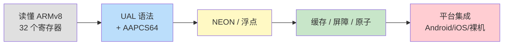
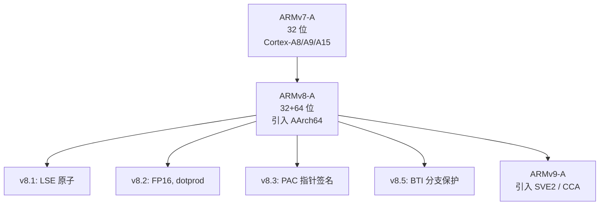
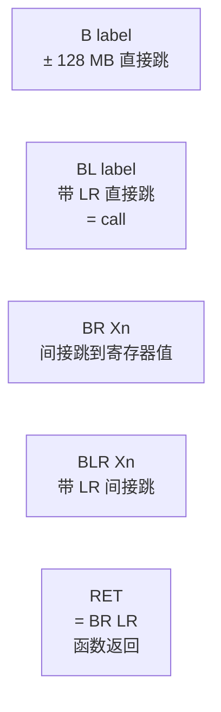
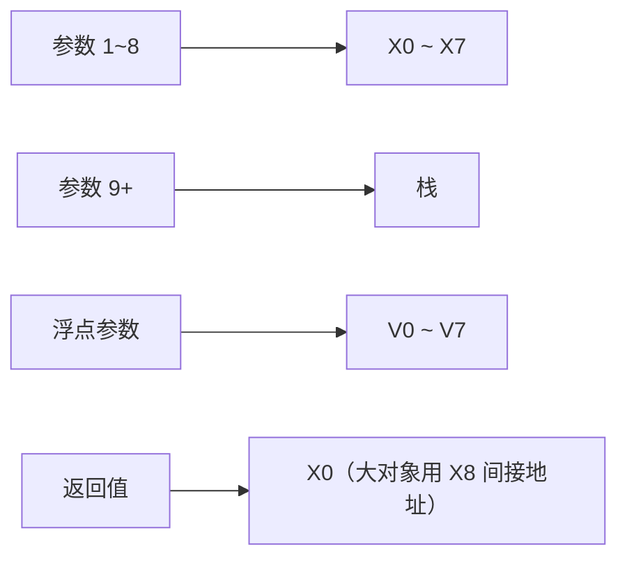
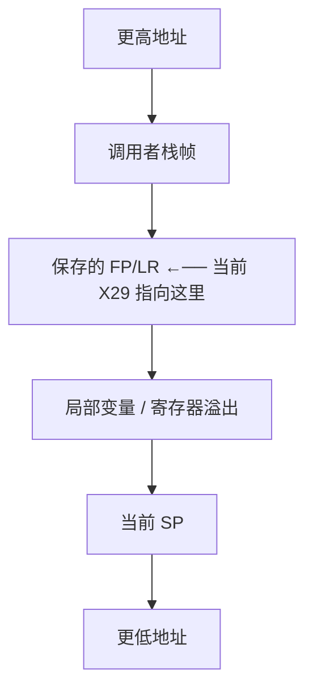
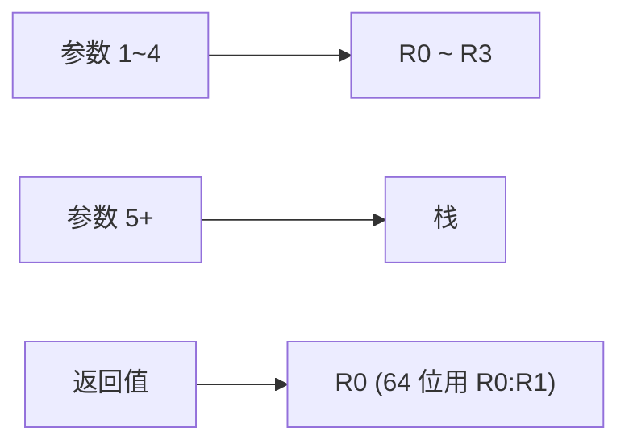
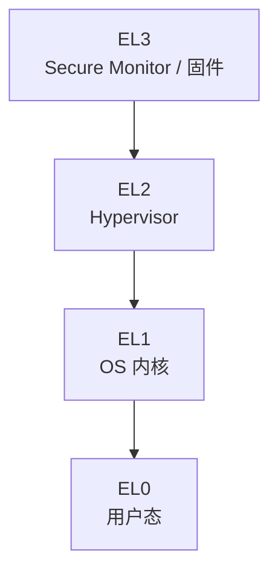
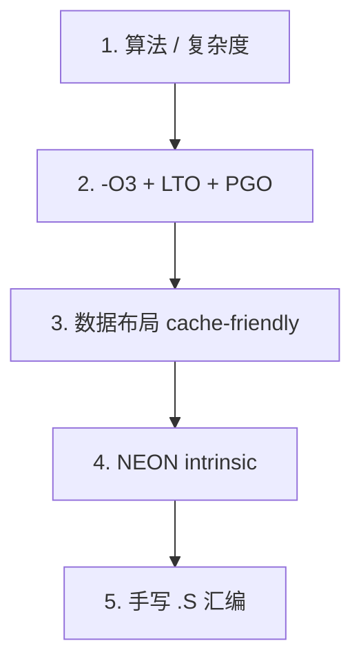

# ARM 汇编深入浅出——从 ARMv7 到 AArch64 的工程实战指南

**作者**：汪亮（bertonwang）  
**邮箱**：<47608843@qq.com>  
**版本**：v1.0 ｜ **最后更新**：2026-05-14

> **本书风格参考《C++11 新特性解析与应用深入理解》《C++23 新特性解析与应用深入理解》**，
> 对每一个 ARM 汇编主题按
> **「问题背景 → 概念形式 → 用法示例 → 底层机理 → 与其他架构对比 → 注意事项」**
> 六段式逐一拆解，目标是让**已经会一点 C/C++**的开发者，
> **只读这一本，就能从"读得懂 ARM 汇编"走到"在 Android、iOS、嵌入式真机上写出能跑、能调、能优化的代码"**。

---

## 目录

- [前言：为什么 ARM 工程师必须会一点汇编](#前言为什么-arm-工程师必须会一点汇编)
- [第 0 章：环境与工具链速查](#第-0-章环境与工具链速查)

### 第一部分　ARM 体系结构基础
- [第 1 章：ARM 家族族谱——ARMv7-A / v8-A / v9-A 一图看懂](#第-1-章arm-家族族谱armv7-a--v8-a--v9-a-一图看懂)
- [第 2 章：执行状态——AArch32 与 AArch64](#第-2-章执行状态aarch32-与-aarch64)
- [第 3 章：寄存器与内存模型速查](#第-3-章寄存器与内存模型速查)
- [第 4 章：UAL 统一汇编语法](#第-4-章ual-统一汇编语法)
- [第 5 章：条件执行与标志位（NZCV）](#第-5-章条件执行与标志位nzcv)

### 第二部分　AArch64 核心指令集
- [第 6 章：数据搬运——MOV / MOVZ / MOVK / MOVN](#第-6-章数据搬运mov--movz--movk--movn)
- [第 7 章：算术与逻辑](#第-7-章算术与逻辑)
- [第 8 章：移位、位域、位操作](#第-8-章移位位域位操作)
- [第 9 章：访存指令——LDR / STR / LDP / STP](#第-9-章访存指令ldr--str--ldp--stp)
- [第 10 章：控制流——B / BL / BR / BLR / RET / 条件分支](#第-10-章控制流b--bl--br--blr--ret--条件分支)
- [第 11 章：地址计算——ADR / ADRP 与 PIC](#第-11-章地址计算adr--adrp-与-pic)

### 第三部分　调用约定与函数实现
- [第 12 章：AAPCS64 调用约定深入](#第-12-章aapcs64-调用约定深入)
- [第 13 章：函数序言/尾声标准模板](#第-13-章函数序言尾声标准模板)
- [第 14 章：栈帧与帧指针 FP（X29）](#第-14-章栈帧与帧指针-fpx29)
- [第 15 章：可变参数与红区——苹果与标准的差异](#第-15-章可变参数与红区苹果与标准的差异)

### 第四部分　浮点与 SIMD（NEON）
- [第 16 章：FPU 与浮点指令集（VFP / FP）](#第-16-章fpu-与浮点指令集vfp--fp)
- [第 17 章：NEON 寄存器与多视角语法（V/Q/D/S/H/B）](#第-17-章neon-寄存器与多视角语法vqdshb)
- [第 18 章：NEON 数据并行实战——加、乘、FMA](#第-18-章neon-数据并行实战加乘fma)
- [第 19 章：SVE / SVE2——可伸缩向量入门](#第-19-章sve--sve2可伸缩向量入门)

### 第五部分　ARMv7-A（32 位）回顾
- [第 20 章：ARMv7 的 16 个 R 寄存器与 CPSR](#第-20-章armv7-的-16-个-r-寄存器与-cpsr)
- [第 21 章：Thumb / Thumb-2 与代码密度](#第-21-章thumb--thumb-2-与代码密度)
- [第 22 章：AAPCS（32 位）调用约定](#第-22-章aapcs32-位调用约定)

### 第六部分　特权架构与异常
- [第 23 章：特权级 EL0~EL3 与异常向量表](#第-23-章特权级-el0el3-与异常向量表)
- [第 24 章：MMU、页表与 TLB](#第-24-章mmu页表与-tlb)
- [第 25 章：缓存一致性、内存屏障 DMB/DSB/ISB](#第-25-章缓存一致性内存屏障-dmbdsbisb)
- [第 26 章：原子操作——LDXR/STXR 与 LSE 原子](#第-26-章原子操作ldxrstxr-与-lse-原子)

### 第七部分　平台集成
- [第 27 章：Android NDK 中嵌入 .S 汇编](#第-27-章android-ndk-中嵌入-s-汇编)
- [第 28 章：iOS / macOS 上的汇编集成](#第-28-章ios--macos-上的汇编集成)
- [第 29 章：Linux ARM64 与嵌入式裸机](#第-29-章linux-arm64-与嵌入式裸机)
- [第 30 章：Windows on ARM64 与 ARM64EC](#第-30-章windows-on-arm64-与-arm64ec)

### 第八部分　工程实战
- [第 31 章：综合案例——NEON 加速 RGB ↔ 灰度](#第-31-章综合案例neon-加速-rgb--灰度)
- [第 32 章：调试与反汇编工具链](#第-32-章调试与反汇编工具链)
- [第 33 章：性能调优清单与"什么时候**不要**写 ARM 汇编"](#第-33-章性能调优清单与什么时候不要写-arm-汇编)

### 附录
- [附录 A：AArch64 常用指令速查表](#附录-aaarch64-常用指令速查表)
- [附录 B：ARMv7 / AArch64 / x86-64 三方指令对照](#附录-barmv7--aarch64--x86-64-三方指令对照)
- [附录 C：常见错误与坑](#附录-c常见错误与坑)

---

## 前言：为什么 ARM 工程师必须会一点汇编

地球上 95% 的智能设备都跑着 ARM 处理器：

| 场景 | 主控 |
|---|---|
| 手机（Android / iOS） | Cortex-A 系列 / Apple A/M 系列 |
| 嵌入式 / IoT | Cortex-M 系列 |
| 服务器（Graviton、鲲鹏、Ampere） | Neoverse 系列 |
| Mac（2020 起） | Apple Silicon |
| Windows on ARM | Snapdragon X / SQ |

但写 C/C++ 的人，95% 不会读 ARM 汇编。结果是：

- 性能瓶颈出现时，**看不懂 perf top 里的 `bl`、`stp`**。
- Crash 在 NEON / 浮点上，**栈回溯里全是 X 寄存器名**——一脸茫然。
- 想做 Hook、Trampoline、JIT，**碰到 PAC、BTI 直接劝退**。

> 💡 本书不要求你成为 ARM 汇编大师，但**学完之后你能独立完成**：
> 1. 读懂 perf / objdump / Xcode 反汇编。
> 2. 在性能热点写 NEON 内联或 `.S` 文件。
> 3. 在 Android / iOS / Linux / Win-ARM 上集成汇编。
> 4. 调试栈回溯、寄存器、缓存与内存屏障问题。

**学习路径建议**：



---

## 第 0 章：环境与工具链速查

| 工具 | 用途 | 一句话获取 |
|---|---|---|
| `clang --target=aarch64-...` | 编译 / 反汇编 | NDK / Xcode / LLVM 都自带 |
| `aarch64-linux-gnu-gcc` | Linux ARM64 交叉编译 | `apt install gcc-aarch64-linux-gnu` |
| `qemu-aarch64-static` | x86 主机上跑 ARM64 二进制 | `apt install qemu-user-static` |
| `objdump -d -M no-aliases` | 反汇编（不要别名，看真名） | binutils |
| `lldb` / `gdb-multiarch` | 调试 | NDK / brew |
| Compiler Explorer (godbolt.org) | 在线看编译器输出的 ARM 汇编 | 浏览器即可 |

> 💡 **学习汇编的最快方法**：写 C 代码，丢到 godbolt 选 ARM64 GCC/Clang，**对照看 C 行号 ↔ 汇编**。

---

# 第一部分　ARM 体系结构基础

---

## 第 1 章：ARM 家族族谱——ARMv7-A / v8-A / v9-A 一图看懂



**实用结论**：
- 现代手机 / 服务器 / Mac → 全部 **ARMv8-A AArch64** 起步，**重点学 64 位**。
- 老 Android 设备、嵌入式 Cortex-M → ARMv7（**32 位 Thumb-2**）。
- ARMv9 与 v8 的指令集**完全兼容**，只是新增了 SVE2、CCA 等扩展。

> 💡 **本书 80% 篇幅讲 AArch64（v8/v9 通用），最后一章简略回顾 ARMv7**。

---

## 第 2 章：执行状态——AArch32 与 AArch64

ARMv8 的"执行状态"是 ISA 层级的概念：

| 状态 | 数据宽 | 寄存器数 | 指令长度 | 谁在用 |
|---|---|---|---|---|
| **AArch64** | 64 位 | **31 个 X 寄存器** | **固定 4 字节** | 现代主流 |
| AArch32 (A32) | 32 位 | 16 个 R 寄存器 | 4 字节 | 兼容老代码 |
| AArch32 (T32/Thumb) | 32 位 | 16 个 R 寄存器 | 2/4 字节混合 | 节省代码体积 |

> 💡 **关键差异**：
> - AArch64 **只有定长 4 字节**，没有 Thumb 状态——解码极简。
> - 苹果从 iOS 11、Android 从 Q（API 29）起，**所有应用必须支持 AArch64**。
> - 跨状态调用要走"interworking"，但实际几乎不用——**进程级别只有一种状态**。

---

## 第 3 章：寄存器与内存模型速查

```
通用寄存器（31 个 + ZR）：
  X0  ~ X30   （64 位） / W0 ~ W30 （32 位低半）
  X0  ~ X7    参数 / 返回值
  X8          间接结果 / syscall 号
  X9  ~ X15   caller-saved 临时
  X16/X17     IP0/IP1（链接器临时）
  X18         平台保留（iOS/Win 占用）
  X19 ~ X28   callee-saved
  X29 (FP)    帧指针
  X30 (LR)    返回地址
  XZR/WZR     永远是 0
  SP          栈指针（独立寄存器，不能与 X 通用）

向量寄存器（NEON / FP）：
  V0 ~ V31    128 位
  Q0 ~ Q31    同寄存器 128 位视角
  D0 ~ D31    低 64 位视角
  S0 ~ S31    低 32 位视角
  H0 ~ H31    低 16 位（FP16）
  B0 ~ B31    低 8 位
```

**记忆法**：
- **X**0 = 第一参数 / 返回值（与 RISC-V 的 a0 神似）。
- **L**R = **L**ink Register，存"调用我的人下一条指令"。
- **F**P = **F**rame Pointer，栈帧根。
- AArch64 **没有 push/pop**，全部用 `stp/ldp` 一次操作两个。

---

## 第 4 章：UAL 统一汇编语法

ARM 官方 **UAL（Unified Assembly Language）** 是唯一语法（不像 x86 还有 Intel/AT&T 之争）：

```asm
operation{cond}{S}  Rd, Rn, Operand2
```

举例：

```asm
add   x0, x1, x2          ; x0 = x1 + x2
adds  x0, x1, x2          ; 同上，且更新 NZCV 标志
add   x0, x1, x2, lsl #3  ; x0 = x1 + (x2 << 3)
add   x0, x1, #0x1234     ; 立即数
ldr   x0, [x1, #16]       ; x0 = *(x1 + 16)
ldr   x0, [x1, x2, lsl #3]; x0 = *(x1 + x2*8)
```

> 💡 **`lsl #3` 这种"内联移位"是 ARM 的杀手锏** —— 一条指令实现"乘 8 后再加"，x86 上要两条。

---

## 第 5 章：条件执行与标志位（NZCV）

四个标志位组成 **PSTATE**：

| 位 | 含义 |
|---|---|
| N | Negative，结果为负 |
| Z | Zero，结果为 0 |
| C | Carry，无符号溢出 / 借位 |
| V | oVerflow，有符号溢出 |

只有以下指令会更新标志：
- 末尾带 **S 后缀**（如 `adds`、`subs`、`ands`）
- **比较指令**：`cmp`（= `subs xzr, ...`）、`tst`（= `ands xzr, ...`）

条件分支：

```asm
cmp   x0, #100
b.eq  label_eq        ; equal
b.ne  label_ne        ; not equal
b.lt  label_lt        ; signed less than
b.lo  label_lo        ; unsigned less than (= b.cc)
b.gt  label_gt
b.ge  label_ge
```

> 💡 **AArch64 砍掉了 ARMv7 的"任意指令带条件后缀"**（`addeq r0, r1, r2`），改为只有少量条件选择指令：`csel/csinc/csneg/cset`。这让流水线设计大大简化。

```asm
; AArch32: addeq r0, r1, r2
; AArch64 等价：
csel  x0, x1, x0, eq    ; if (eq) x0 = x1 else x0 = x0
```

---

# 第二部分　AArch64 核心指令集

---

## 第 6 章：数据搬运——MOV / MOVZ / MOVK / MOVN

ARM64 立即数最多 16 位，要装载 64 位常数需多条指令组合：

```asm
; 想装 0x1234_5678_9ABC_DEF0 到 x0
movz  x0, #0xDEF0              ; bits[15:0]，其它清零
movk  x0, #0x9ABC, lsl #16     ; 仅改 [31:16]
movk  x0, #0x5678, lsl #32     ; 仅改 [47:32]
movk  x0, #0x1234, lsl #48     ; 仅改 [63:48]
```

| 指令 | 作用 |
|---|---|
| `MOVZ` | **Z**ero——其它位清零 |
| `MOVK` | **K**eep——其它位保留，仅替换指定 16 位 |
| `MOVN` | **N**ot——按位取反后写入 |

> 💡 **伪指令 `mov x0, #imm`** 由汇编器自动展开成上面的组合。常量加载这事是 ARM64 工程师的"日常仪式"。

---

## 第 7 章：算术与逻辑

| 类别 | 代表指令 |
|---|---|
| 加 | `add`、`adds`、`adc`（含进位）、`adcs` |
| 减 | `sub`、`subs`、`sbc`、`sbcs`、`neg` |
| 乘 | `mul`、`madd`（乘加）、`msub`（乘减）、`umulh/smulh`（高 64 位） |
| 除 | `udiv`、`sdiv` |
| 位与/或/异或 | `and`、`orr`、`eor`（XOR）、`bic`（and not）、`mvn`（按位取反） |

特色：

```asm
madd  x0, x1, x2, x3      ; x0 = x1*x2 + x3 单条指令完成"乘加"
sdiv  x0, x1, x2          ; x0 = x1 / x2 （有符号）
udiv  x0, x1, x2          ; 无符号
```

> ⚠️ **AArch64 没有"求模指令"** —— `a % b` 要用 `sdiv + msub` 两条：
> ```asm
> sdiv  x3, x1, x2          ; x3 = x1 / x2
> msub  x0, x3, x2, x1      ; x0 = x1 - x3*x2 = x1 % x2
> ```

---

## 第 8 章：移位、位域、位操作

```asm
lsl   x0, x1, #4           ; logical shift left
lsr   x0, x1, #4           ; logical shift right
asr   x0, x1, #4           ; arithmetic shift right (sign-extend)
ror   x0, x1, #4           ; rotate right

ubfx  x0, x1, #4, #8       ; 取 x1 的 [11:4] 共 8 位
sbfx  x0, x1, #4, #8       ; 同上但符号扩展
bfi   x0, x1, #4, #8       ; 把 x1[7:0] 插到 x0[11:4]

clz   x0, x1               ; 前导 0 计数
rbit  x0, x1               ; bit 反转
rev   x0, x1               ; 字节序反转（大端 ↔ 小端）
```

> 💡 **`bfi/ubfx/sbfx` 三件套** 是位域操作神器，比 x86 上"先 and 再 shift 再 or"快得多，C 编译器在结构体位域时大量使用。

---

## 第 9 章：访存指令——LDR / STR / LDP / STP

### 9.1 寻址三大模式

```asm
ldr   x0, [x1]              ; 取 *x1
ldr   x0, [x1, #16]         ; 取 *(x1+16)，x1 不变
ldr   x0, [x1, #16]!        ; 取 *(x1+16)，并 x1 += 16（前索引，写回）
ldr   x0, [x1], #16         ; 取 *x1，并 x1 += 16（后索引）
ldr   x0, [x1, x2, lsl #3]  ; 取 *(x1 + x2*8)
```

> 💡 **`!` 与无 `!` 的差异**：`!` 表示**写回**，地址寄存器会被修改。这是循环里"指针前进"的标准手法。

### 9.2 不同宽度

```asm
ldr   w0, [x1]      ; 加载 32 位（高 32 位清零）
ldrb  w0, [x1]      ; 8 位无符号扩展
ldrsb w0, [x1]      ; 8 位符号扩展
ldrh  w0, [x1]      ; 16 位无符号
ldrsw x0, [x1]      ; 32 位符号扩展到 64 位
```

### 9.3 LDP / STP — ARM64 的"push/pop"

```asm
stp   x0, x1, [sp, #-16]!   ; 一次保存两个寄存器到栈，sp -= 16
ldp   x0, x1, [sp], #16     ; 一次恢复两个寄存器，sp += 16
```

> 💡 **关键规则**：`stp/ldp` 必须**两个寄存器，且偏移 16 字节对齐**。这是"为流水线加宽访存通道"的硬件友好设计。

---

## 第 10 章：控制流——B / BL / BR / BLR / RET / 条件分支



```asm
bl     foo                 ; 调用 foo（LR ← 下一条指令地址）
ret                        ; 返回（PC ← LR）
b.eq   label               ; 条件分支
cbz    x0, label           ; if (x0 == 0) goto
cbnz   x0, label           ; if (x0 != 0) goto
tbz    x0, #3, label       ; if (bit3(x0) == 0) goto
tbnz   x0, #3, label
```

> 💡 **`cbz/cbnz/tbz/tbnz` 是 ARM 神器** —— "比较 + 分支"合一，省一条 cmp，编译器最爱用。

---

## 第 11 章：地址计算——ADR / ADRP 与 PIC

PIC（位置无关代码）必备：

```asm
; 加载全局变量 g_val 的地址到 x0
adrp  x0, g_val              ; PC 相对，4KB 页对齐，覆盖 ±4GB
add   x0, x0, :lo12:g_val    ; 加上页内偏移
ldr   w1, [x0]               ; 真正读值
```

| 指令 | 作用 | 范围 |
|---|---|---|
| `ADR` | PC 相对地址 | ±1 MB |
| `ADRP` | PC 相对**页**地址（PC 高 52 位 + imm × 4096） | ±4 GB |

> 💡 **`adrp + add` 是 ARM64 取地址的"圣经组合"** —— 所有共享库代码都靠它。

---

# 第三部分　调用约定与函数实现

---

## 第 12 章：AAPCS64 调用约定深入



| 项目 | 规则 |
|---|---|
| 整型参数 | X0~X7（W0~W7 为 32 位视角） |
| 浮点 / 向量参数 | V0~V7 |
| 返回值 | X0 / V0 |
| 大返回（> 16B） | 调用方分配空间，把指针放 X8 |
| callee-saved | X19~X28、X29 (FP)、X30 (LR)、V8~V15 低 64 位 |
| caller-saved | X0~X17、V0~V7、V16~V31 |
| 栈对齐 | 函数边界 SP = 16 字节对齐 |

> ⚠️ **第一坑**：`V8~V15 只保存低 64 位**，高 64 位是 caller-saved。NEON 大量用 V 寄存器时要注意。

---

## 第 13 章：函数序言/尾声标准模板

万能模板：

```asm
.global  my_func
.type    my_func, %function
my_func:
    // === 序言 ===
    stp   x29, x30, [sp, #-16]!    // 保存 FP、LR
    mov   x29, sp                  // 建立帧指针

    // === 函数体 ===
    add   x0, x0, x1               // 例：a + b

    // === 尾声 ===
    ldp   x29, x30, [sp], #16
    ret
```

如果还要保存更多 callee-saved：

```asm
    stp   x29, x30, [sp, #-32]!
    stp   x19, x20, [sp,  #16]
    mov   x29, sp
    ; ... body ...
    ldp   x19, x20, [sp,  #16]
    ldp   x29, x30, [sp], #32
    ret
```

> 💡 **黄金法则**：每多保两个 callee-saved，**栈位置前移 16 字节**（保持 16 对齐）。

---

## 第 14 章：栈帧与帧指针 FP（X29）



栈回溯（unwind）算法：

```python
fp = X29
while fp:
    saved_lr  = *(fp + 8)
    prev_fp   = *(fp)
    print_frame(saved_lr)
    fp = prev_fp
```

> 💡 **苹果 / Android 都强制要求保留 FP**（`-fno-omit-frame-pointer` 默认开），否则 perf / Instruments / Crash 报告就拿不到调用栈。

---

## 第 15 章：可变参数与红区——苹果与标准的差异

| 项目 | 标准 AAPCS64（Linux/Android） | Apple ARM64（iOS/macOS） |
|---|---|---|
| 命名参数 | 走寄存器 | 走寄存器 |
| **可变参数（...）** | 命名 + 可变都走寄存器 | **可变参数全部走栈** |
| 红区（红色禁区） | **无** | **128 字节**（叶函数可直接用） |
| X18 | 保留 | 系统使用（线程上下文） |
| char 默认 | unsigned | **signed** |

调用 `printf("%d %d\n", a, b)` 在两个平台的差异：

```asm
; Linux/Android：参数都走寄存器
mov   x0, fmt
mov   x1, a
mov   x2, b
bl    printf

; iOS/macOS：第二个起的参数必须放栈
mov   x0, fmt
str   x1, [sp]            ; a 入栈
str   x2, [sp, #8]        ; b 入栈
bl    _printf             ; 注意 Mach-O 符号下划线
```

> ⚠️ **跨平台汇编时这是最容易踩的坑** —— 同一段代码在 Android 上跑得好，到 iOS 上 printf 输出乱码。

---

# 第四部分　浮点与 SIMD（NEON）

---

## 第 16 章：FPU 与浮点指令集（VFP / FP）

ARM64 的浮点寄存器与 NEON 共用，标量浮点用 S/D/H 视角：

```asm
fadd  s0, s1, s2          ; 32 位 float 加
fadd  d0, d1, d2          ; 64 位 double 加
fmadd s0, s1, s2, s3      ; FMA: s0 = s1*s2 + s3
fcmp  d0, d1              ; 比较，更新 NZCV
fcvtzs w0, s0             ; float → int（截断、有符号）
fmov  s0, w0              ; 整数 ↔ 浮点（按位拷贝，不是数值转换！）
scvtf s0, w0              ; 整数 → float（数值转换）
```

> 💡 **`fmov` 与 `scvtf` 别搞混**：
> - `fmov` 仅按位拷贝（适合 IEEE-754 取出 bits）；
> - `scvtf` 是"把整数当成数值，转成 float"。

---

## 第 17 章：NEON 寄存器与多视角语法（V/Q/D/S/H/B）

NEON 有 32 个 128 位寄存器，**同一个寄存器有多种"视角"**：

```
V0.16B   16 个 8 位
V0.8H     8 个 16 位
V0.4S     4 个 32 位 / float
V0.2D     2 个 64 位 / double

V0.B[0]  访问第 0 个字节
V0.S[2]  访问第 2 个 32 位元素
```

写法的"形式"：

```asm
add    v0.4s, v1.4s, v2.4s    ; 整型 4 路加
fadd   v0.4s, v1.4s, v2.4s    ; float 4 路加
fmla   v0.4s, v1.4s, v2.4s    ; v0 += v1*v2（向量 FMA）
```

> 💡 **形式规范**：`Vn.<lane_count><size>`，**lane_count × size 必须是 64 或 128 位**。
> 比如 `4S` = 4×32 = 128 位，`2S` = 2×32 = 64 位（占 D 寄存器低半）。

---

## 第 18 章：NEON 数据并行实战——加、乘、FMA

例 1：把数组逐个浮点 ×2.0：

```asm
// void mul2(float*dst, const float*src, size_t n);  // n 为 4 的倍数
.global mul2
mul2:
    fmov    s4, #2.0
    dup     v4.4s, v4.s[0]        // {2,2,2,2}
1:
    cbz     x2, 2f
    ldr     q0, [x1], #16         // 4 个 float
    fmul    v0.4s, v0.4s, v4.4s
    str     q0, [x0], #16
    sub     x2, x2, #4
    b       1b
2:
    ret
```

例 2：点积（FMA）：

```asm
// float dot(const float*a, const float*b, size_t n);  // n 为 4 的倍数
.global dot
dot:
    movi    v0.4s, #0
1:
    cbz     x2, 2f
    ldr     q1, [x0], #16
    ldr     q2, [x1], #16
    fmla    v0.4s, v1.4s, v2.4s
    sub     x2, x2, #4
    b       1b
2:
    faddp   v0.4s, v0.4s, v0.4s    // 横向相加
    faddp   s0, v0.2s
    ret
```

> 💡 **`faddp` 是横向规约神器** —— 把 4 路结果合成 1 个标量，**循环外只用两条**。

---

## 第 19 章：SVE / SVE2——可伸缩向量入门

ARM 的下一代 SIMD：**长度无关编程**。代码不写死 4 路、8 路，由硬件 `VL` 决定：

```asm
// y[i] = a*x[i] + y[i]
.global daxpy
daxpy:
    mov     x4, #0
    whilelt p0.d, x4, x0           // 谓词：lane < n 的位为 1
1:
    ld1d    z0.d, p0/z, [x1, x4, lsl #3]
    ld1d    z1.d, p0/z, [x2, x4, lsl #3]
    fmla    z1.d, p0/m, z0.d, z3.d
    st1d    z1.d, p0,    [x2, x4, lsl #3]
    incd    x4
    whilelt p0.d, x4, x0
    b.first 1b
    ret
```

特点：
- **谓词寄存器 P0~P15** 决定哪些 lane 生效。
- **同一份二进制**在 128/256/512/1024/2048 位实现上**自动伸缩**。
- AWS Graviton3、Fujitsu A64FX、Apple M4 都已支持。

---

# 第五部分　ARMv7-A（32 位）回顾

---

## 第 20 章：ARMv7 的 16 个 R 寄存器与 CPSR

```
R0 ~ R3       参数 / 临时 / 返回值
R4 ~ R11      callee-saved（R7 在 Thumb 里通常作为帧指针）
R12 (IP)      过程内临时
R13 (SP)      栈指针
R14 (LR)      返回地址
R15 (PC)      程序计数器（可读写——独特设计）
CPSR          当前程序状态 + NZCV
```

> 💡 **R15 = PC 可被赋值**，`mov pc, lr` 等价于函数返回，这是 ARMv7 的"奇景"。AArch64 已彻底废除（PC 不再可见为通用寄存器）。

---

## 第 21 章：Thumb / Thumb-2 与代码密度

| 状态 | 指令长度 | 特点 |
|---|---|---|
| ARM | 4 字节 | 全功能、解码简单 |
| Thumb | 2 字节 | 寄存器子集、立即数小 |
| Thumb-2 | 2 / 4 混合 | 几乎与 ARM 等价、代码体积 ↓ ~30% |

切换：`bx`（branch + exchange） 指令的目标地址 LSB = 1 → 进入 Thumb，= 0 → 进入 ARM。

> ⚠️ **跨状态调用时函数指针的最低位有意义**——它不是地址，是状态指示！这就是为什么 ARMv7 函数指针总是看起来"奇数地址"。

---

## 第 22 章：AAPCS（32 位）调用约定



要点：
- 仅 4 个寄存器参数（不像 AArch64 的 8 个）。
- 栈对齐 8 字节（公开调用边界 8 字节即可）。
- 浮点根据"软浮点 ABI"还是"硬浮点 ABI"分两套：`-mfloat-abi=soft|softfp|hard`，**编译时和库 ABI 必须一致**。

---

# 第六部分　特权架构与异常

---

## 第 23 章：特权级 EL0~EL3 与异常向量表



异常发生时硬件做的事：

| 步骤 | 行为 |
|---|---|
| 1 | 当前 PSTATE 存到 `SPSR_ELx` |
| 2 | 当前 PC 存到 `ELR_ELx` |
| 3 | 异常原因写入 `ESR_ELx`，错误地址 `FAR_ELx` |
| 4 | PC ← `VBAR_ELx + offset` |
| 5 | 提升到 ELx |

返回用 `eret` 指令：从 `SPSR_ELx` 恢复 PSTATE、从 `ELR_ELx` 恢复 PC。

---

## 第 24 章：MMU、页表与 TLB

AArch64 支持 **4KB / 16KB / 64KB** 三种页大小，**3~4 级页表**：

| 模式 | VA 位 | 级数 | 谁在用 |
|---|---|---|---|
| 39 位 | 39 | 3 级 | 主流 Android / Linux |
| 42 位 | 42 | 3 级 | 中端 |
| 48 位 | 48 | 4 级 | 桌面 / 服务器 |
| 52 位 | 52 | 4~5 级 | 大内存服务器 |

转换基址寄存器：`TTBR0_EL1`（用户态）+ `TTBR1_EL1`（内核态）。
TLB 失效：`tlbi vae1is, x0`（按 VA 失效，inner-shareable）。

---

## 第 25 章：缓存一致性、内存屏障 DMB/DSB/ISB

| 指令 | 含义 |
|---|---|
| **DMB**（Data Memory Barrier） | 内存访问顺序屏障，前后**访存**不能重排 |
| **DSB**（Data Sync Barrier） | 比 DMB 更强，等所有前序访存完成 |
| **ISB**（Instruction Sync Barrier） | 重新取指（修改指令、改 SCTLR 等之后必加） |

变体：

```
dmb ish     ; inner-shareable 域
dmb ishst   ; 仅 store
dmb ishld   ; 仅 load
```

> 💡 **场景速记**：
> - 普通多线程同步：`dmb ish`。
> - JIT / Hook 改写代码后：`dsb ish; ic ivau, x0; dsb ish; isb`（i-cache 失效 + 重新取指）。
> - 改 SCTLR_EL1 / TTBR：`isb` 是必须的。

---

## 第 26 章：原子操作——LDXR/STXR 与 LSE 原子

### 26.1 经典 LL/SC 风格

```asm
1:
    ldxr   w1, [x0]            // 取值 + 加监视
    add    w1, w1, #1
    stxr   w2, w1, [x0]        // 若监视未失效，w2=0；否则 w2=1
    cbnz   w2, 1b              // 失败重试
```

### 26.2 ARMv8.1 LSE 原子（更快、更省指令）

```asm
ldadd   w1, w2, [x0]          // *x0 += w1，旧值放 w2
swp     w1, w2, [x0]          // *x0 = w1，旧值放 w2
casal   w1, w2, [x0]          // CAS: if (*x0 == w1) *x0 = w2
```

**`-march=armv8.1-a` 或 `-march=armv8-a+lse`** 启用，性能在高争用时**显著好于 LL/SC**。

> 💡 现代手机芯片几乎都已 ≥ armv8.4，但 NDK 默认 `armv8-a`，需要**显式开 +lse**才生效。

---

# 第七部分　平台集成

---

## 第 27 章：Android NDK 中嵌入 .S 汇编

`CMakeLists.txt`：

```cmake
project(asmlib C ASM)

set(SRC src/fast.c)
if(ANDROID_ABI STREQUAL "arm64-v8a")
    list(APPEND SRC src/fast_arm64.S)
endif()
add_library(asmlib SHARED ${SRC})
```

`src/fast_arm64.S`：

```asm
.text
.global fast_add
.type   fast_add, %function
fast_add:
    add   x0, x0, x1
    ret
```

Gradle：

```kotlin
android {
    defaultConfig {
        ndk { abiFilters += listOf("arm64-v8a", "armeabi-v7a") }
    }
}
```

> 💡 工程**只针对 arm64-v8a 写汇编**，其余 ABI 留 C 版本即可——arm64 占比 > 95%。

---

## 第 28 章：iOS / macOS 上的汇编集成

文件名用小写 `.s`，**所有 C 符号要加下划线前缀**：

```asm
// fast_arm64.s
.text
.global _fast_add
.align 2
_fast_add:
    add   x0, x0, x1
    ret
```

C 头：

```c
#ifdef __cplusplus
extern "C" {
#endif
long long fast_add(long long a, long long b);
#ifdef __cplusplus
}
#endif
```

> ⚠️ **A12+ 芯片必须配合 PAC**：
> ```asm
> _safe_func:
>     pacibsp
>     stp   x29, x30, [sp, #-16]!
>     mov   x29, sp
>     ...
>     ldp   x29, x30, [sp], #16
>     retab        // 验证签名后返回
> ```

Apple Silicon 的 W^X：

```c
pthread_jit_write_protect_np(0);   // 解锁可写
memcpy(code, ..., n);              // 改写
sys_icache_invalidate(code, n);
pthread_jit_write_protect_np(1);   // 重新锁定
```

---

## 第 29 章：Linux ARM64 与嵌入式裸机

最小 Linux 系统调用示例（直接 `svc #0`）：

```asm
// printf("hi\n") 的最简实现
.text
.global _start
_start:
    mov   x0, #1                  // fd=1 stdout
    adr   x1, msg                 // buf
    mov   x2, #3                  // len
    mov   x8, #64                 // SYS_write
    svc   #0
    mov   x0, #0
    mov   x8, #93                 // SYS_exit
    svc   #0
msg: .ascii "hi\n"
```

```bash
aarch64-linux-gnu-as -o hi.o hi.S
aarch64-linux-gnu-ld -o hi hi.o
qemu-aarch64-static ./hi
```

裸机（Cortex-M / 内核启动代码）通常自定义向量表 + 栈初始化，参考 ARM 官方 cmsis 模板。

---

## 第 30 章：Windows on ARM64 与 ARM64EC

| 模式 | 含义 |
|---|---|
| **ARM64** | 纯 AArch64，使用 MS-ARM64 ABI（与 SysV 略有不同的影子空间规则） |
| **ARM64EC** | "Emulation Compatible"——结构布局 + 部分调用约定与 x64 一致，**可与 x64 模块直接互调**，专门解决"老 x64 DLL + 新 ARM64 应用"共存 |

汇编集成走 `armasm64.exe`（VS 自带），与 MASM 类似但语法是 GAS/UAL 风格。

---

# 第八部分　工程实战

---

## 第 31 章：综合案例——NEON 加速 RGB ↔ 灰度

```c
// gray = (R*77 + G*150 + B*29) >> 8  （ITU-R BT.601 简化版）
void rgb_to_gray(uint8_t* gray, const uint8_t* rgb, size_t pixels);
```

NEON 实现（一次处理 8 像素）：

```asm
.global rgb_to_gray
.type   rgb_to_gray, %function
rgb_to_gray:
    movi   v3.8b, #77
    movi   v4.8b, #150
    movi   v5.8b, #29
1:
    cbz    x2, 2f
    ld3    {v0.8b, v1.8b, v2.8b}, [x1], #24   // 解交错读 8 像素 RGB
    umull  v6.8h, v0.8b, v3.8b                 // R*77
    umlal  v6.8h, v1.8b, v4.8b                 // + G*150
    umlal  v6.8h, v2.8b, v5.8b                 // + B*29
    shrn   v6.8b, v6.8h, #8                    // /256，截断到 8 位
    st1    {v6.8b}, [x0], #8                   // 写 8 个灰度
    sub    x2, x2, #8
    b      1b
2:
    ret
```

> 💡 **关键技巧**：
> - `ld3` 一次读 8 像素并自动**解交错**为 R/G/B 三个寄存器。
> - `umull/umlal` = 8 位乘 8 位 = 16 位，**避免溢出**。
> - `shrn` = 右移 + 窄化（16 位 → 8 位），**省一次转换**。

实测在 A78 上比纯 C 快 **6~8 倍**。

---

## 第 32 章：调试与反汇编工具链

| 任务 | 命令 |
|---|---|
| 看 C 编译出的汇编 | `clang --target=aarch64 -O2 -S -fverbose-asm a.c` |
| 反汇编 .o / .so / 可执行 | `objdump -d -M no-aliases a.out` |
| 反汇编 mach-o | `otool -tv a.dylib` |
| 调试 | `lldb ./a` → `disassemble --frame`、`register read`、`memory read` |
| 在线试 | godbolt.org 选 ARM64 GCC/Clang |

> 💡 **一个不起眼但极有用的开关**：`-fverbose-asm` —— 编译器会在每行汇编后写注释，告诉你这条对应 C 源码哪个变量。

---

## 第 33 章：性能调优清单与"什么时候**不要**写 ARM 汇编"

### ✅ 写 ARM 汇编是合理的

- perf / Instruments 测出热点占总耗时 > 5%。
- 编译器 NEON intrinsic 已用尽。
- 算法需要**特殊指令**：CRC32、SHA、AES、PMULL 等。
- 系统启动 / 上下文切换 / 协程跳板。

### ❌ 不要写 ARM 汇编

- 还没开 `-O3 -march=native`、没用 PGO/LTO。
- 没用过 NEON intrinsic，直接跳到内联汇编。
- 觉得"汇编显得专业"——这是项目可维护性的灾难。

### 🚦 优化阶梯



**经验法则**：每往下一阶可移植性下降一个量级，维护成本上升一个量级。**只有上一阶榨不出，才下到下一阶**。

---

# 附录

---

## 附录 A：AArch64 常用指令速查表

| 类别 | 指令 |
|---|---|
| 数据搬运 | `mov movz movk movn fmov` |
| 算术 | `add adds sub subs adc sbc neg mul madd msub umulh smulh udiv sdiv` |
| 逻辑 | `and ands orr eor bic mvn` |
| 移位 | `lsl lsr asr ror` |
| 位域 | `ubfx sbfx bfi clz rbit rev` |
| 比较 | `cmp cmn tst` |
| 选择 | `csel csinc csneg cset` |
| 访存 | `ldr ldrb ldrh ldrsw ldp str strb stp` |
| 控制流 | `b b.cond bl br blr ret cbz cbnz tbz tbnz` |
| 地址 | `adr adrp` |
| 浮点 | `fadd fsub fmul fdiv fmadd fcmp fcvtzs scvtf` |
| NEON | `add fadd fmul fmla mul mla shl shr ld1 st1 ld3 st3 dup faddp shrn umull umlal` |
| 屏障 | `dmb dsb isb` |
| 原子 | `ldxr stxr ldadd swp casal` |
| 异常 | `svc hvc smc eret` |

---

## 附录 B：ARMv7 / AArch64 / x86-64 三方指令对照

| 功能 | ARMv7 | AArch64 | x86-64 |
|---|---|---|---|
| 寄存器赋值 | `mov r0, r1` | `mov x0, x1` | `mov rax, rbx` |
| 立即数 | `mov r0, #5` | `mov x0, #5` | `mov rax, 5` |
| 加 | `add r0, r1, r2` | `add x0, x1, x2` | `add rax, rbx` |
| 加载 | `ldr r0, [r1]` | `ldr x0, [x1]` | `mov rax, [rbx]` |
| 存储 | `str r0, [r1]` | `str x0, [x1]` | `mov [rbx], rax` |
| 比较跳转 | `cmp/beq` | `cmp/b.eq` 或 `cbz` | `cmp/je` |
| 函数调用 | `bl func` | `bl func` | `call func` |
| 函数返回 | `bx lr` | `ret` | `ret` |
| 压栈 | `push {r0, lr}` | `stp x0, x30, [sp, #-16]!` | `push rax` |
| SIMD 加 | `vadd.f32 q0, q1, q2` | `fadd v0.4s, v1.4s, v2.4s` | `vaddps ymm0, ymm1, ymm2` |

---

## 附录 C：常见错误与坑

| 现象 | 真正原因 | 解决 |
|---|---|---|
| `relocation R_AARCH64_ADR_PREL_PG_HI21 out of range` | 代码超出 ±4GB | 改用 GOT / `-mcmodel=large` |
| `bus error` 在 `ldr q0, [x1]` | x1 未 16B 对齐 | 改 `ldur` 或保证对齐 |
| iOS 上 `printf("%d", x)` 输出乱 | 把可变参数放了 X1 | 苹果 ABI 需把可变参数压栈 |
| 修改代码后偶发崩 | i-cache 没刷新 | `__builtin___clear_cache(start, end)` |
| 触发 PAC 异常崩在 `ret` | LR 被改 | `pacibsp` / `retab` 配对使用 |
| Hook 后跳转到非法目标 | BTI 启用 | 跳板首条加 `bti j` 或 `bti c` |
| `unsupported -mfloat-abi` 链接失败 | armv7 软硬浮点 ABI 混用 | 整个工程统一 `-mfloat-abi=hard`（或 softfp） |
| LSE 原子不生效，性能差 | 没加 `+lse` | `-march=armv8-a+lse` 或 `armv8.1-a` |
| `udf` 一执行就崩 | 这是"undefined"指令，调试桩 | 检查反汇编是否对齐 |
| Android 16KB 页设备无法加载 | 旧 NDK 默认 4KB | NDK r26c+ 或 `-Wl,-z,max-page-size=16384` |

---

> **结语**
>
> ARM 是地球上 95% 智能设备的"母语"。
> 学完这本书，你就拥有了**从手机、Mac、服务器到 IoT 的统一阅读理解能力**——
> perf 不再玄学、crash 栈一目了然、NEON 优化敢动手、调用约定不再凭感觉。
>
> 当你跑通第 31 章的 NEON 灰度转换那一刻，你已经踏过了 ARM 汇编的"工程门槛"。
>
> ——本书完
