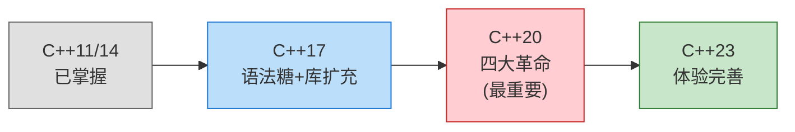
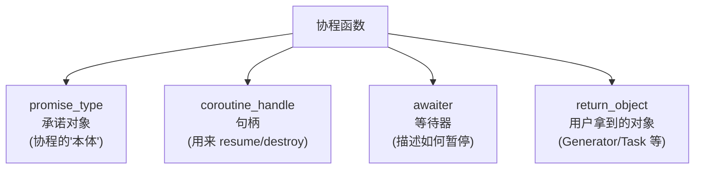
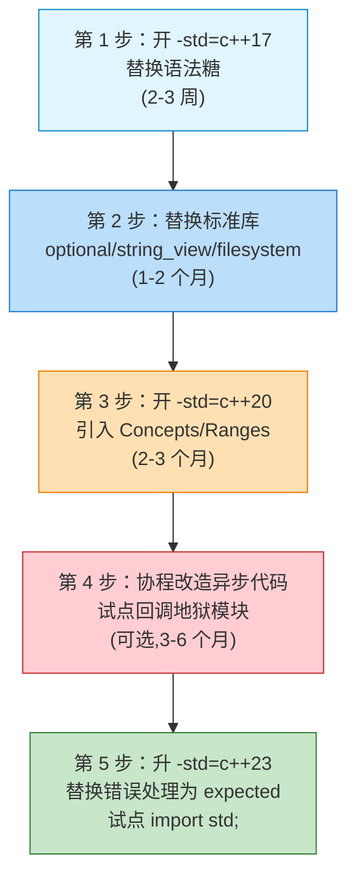
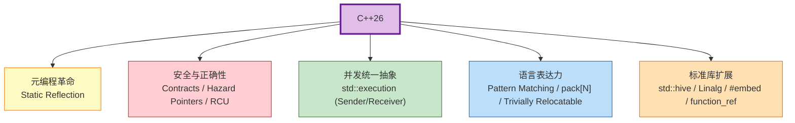

# C++23 新特性解析与应用深入理解

**作者**：汪亮（bertonwang）  
**邮箱**：<47608843@qq.com>  
**版本**：v2.2 ｜ **最后更新**：2026-05-14

> **从 C++11 平滑过渡到 C++23 的工程化指南**
>
> 本书风格参考《C++11 新特性解析与应用深入理解》，对每一个新特性按
> **「问题背景 → 语法形式 → 用法示例 → 底层机理 → 与旧版本对比 → 注意事项」**
> 六段式逐一拆解，目标是让已经掌握 C++11 的开发者**只读这一本，就能平滑迁移到 C++23**。

---

## 目录

- [前言：为什么 C++ 要"三年一更新"](#前言为什么-c-要三年一更新)
- [第 0 章：编译器与标准库支持速查](#第-0-章编译器与标准库支持速查)

### 第一部分　C++14 承上启下
- [第 1 章：C++14 承上启下速览](#第-1-章c14-承上启下速览)

### 第二部分　C++17 核心特性
- [第 2 章：结构化绑定（Structured Bindings）](#第-2-章结构化绑定structured-bindings)
- [第 3 章：if / switch 语句中的初始化器](#第-3-章if--switch-语句中的初始化器)
- [第 4 章：`if constexpr` 编译期分支](#第-4-章if-constexpr-编译期分支)
- [第 5 章：折叠表达式（Fold Expressions）](#第-5-章折叠表达式fold-expressions)
- [第 6 章：内联变量（Inline Variables）](#第-6-章内联变量inline-variables)
- [第 7 章：类模板参数推导（CTAD）](#第-7-章类模板参数推导ctad)
- [第 8 章：`std::optional` / `std::variant` / `std::any`](#第-8-章stdoptional--stdvariant--stdany)
- [第 9 章：`std::string_view`](#第-9-章stdstring_view)
- [第 10 章：`std::filesystem`](#第-10-章stdfilesystem)
- [第 11 章：并行 STL（Parallel Algorithms）](#第-11-章并行-stlparallel-algorithms)
- [第 12 章：`std::byte` 与对齐内存接口](#第-12-章stdbyte-与对齐内存接口)
- [第 13 章：保证的复制省略（Guaranteed Copy Elision）](#第-13-章保证的复制省略guaranteed-copy-elision)
- [第 14 章：C++17 属性大全与小特性合集](#第-14-章c17-属性大全与小特性合集)

### 第三部分　C++20 革命性特性
- [第 15 章：Concepts（概念约束）](#第-15-章concepts概念约束)
- [第 16 章：Ranges（范围库）](#第-16-章ranges范围库)
- [第 17 章：Coroutines（协程）](#第-17-章coroutines协程)
- [第 18 章：Modules（模块）](#第-18-章modules模块)
- [第 19 章：三路比较运算符 `<=>`（太空船）](#第-19-章三路比较运算符-太空船)
- [第 20 章：`consteval` 与 `constinit`](#第-20-章consteval-与-constinit)
- [第 21 章：指定初始化（Designated Initializers）](#第-21-章指定初始化designated-initializers)
- [第 22 章：`std::span`](#第-22-章stdspan)
- [第 23 章：`std::format`（类型安全格式化）](#第-23-章stdformat类型安全格式化)
- [第 24 章：`std::jthread` 与停止令牌](#第-24-章stdjthread-与停止令牌)
- [第 25 章：原子智能指针、信号量、Latch、Barrier](#第-25-章原子智能指针信号量latchbarrier)
- [第 26 章：`std::source_location`](#第-26-章stdsource_location)
- [第 27 章：模板形参列表的 lambda 与缩写函数模板](#第-27-章模板形参列表的-lambda-与缩写函数模板)
- [第 28 章：C++20 杂项库与小特性合集](#第-28-章c20-杂项库与小特性合集)

### 第四部分　C++23 新增特性
- [第 29 章：`if consteval`](#第-29-章if-consteval)
- [第 30 章：`std::expected`](#第-30-章stdexpected)
- [第 31 章：`std::print` / `std::println`](#第-31-章stdprint--stdprintln)
- [第 32 章：Deducing this（"显式 this 形参"）](#第-32-章deducing-this显式-this-形参)
- [第 33 章：`std::mdspan` 多维数组视图](#第-33-章stdmdspan-多维数组视图)
- [第 34 章：`std::generator`（标准库协程生成器）](#第-34-章stdgenerator标准库协程生成器)
- [第 35 章：Ranges 在 C++23 的扩展](#第-35-章ranges-在-c23-的扩展)
- [第 36 章：`std::flat_map` / `std::flat_set`](#第-36-章stdflat_map--stdflat_set)
- [第 37 章：模块化标准库 `import std;`](#第-37-章模块化标准库-import-std)
- [第 38 章：多维下标 `operator[](a, b, c)`](#第-38-章多维下标-operatora-b-c)
- [第 39 章：`static operator()` 与 `static operator[]`](#第-39-章static-operator-与-static-operator)
- [第 40 章：字面量后缀 `Z` / `UZ`](#第-40-章字面量后缀-z--uz)
- [第 41 章：其他小而美的改进](#第-41-章其他小而美的改进)
- [第 42 章：C++23 杂项扩展合集](#第-42-章c23-杂项扩展合集)

### 第五部分　工程实战
- [第 43 章：从 C++11 迁移到 C++23 的渐进路线图](#第-43-章从-c11-迁移到-c23-的渐进路线图)
- [第 44 章：综合案例——用 C++23 重写一个小型 HTTP 服务](#第-44-章综合案例用-c23-重写一个小型-http-服务)

### 第六部分　面向未来
- [第 45 章：面向 C++26 的前瞻特性预览（WIP）](#第-45-章面向-c26-的前瞻特性预览)

### 结语与附录
- [结语](#结语)
- [附录 A：本书未单列章节、但仍提及/值得了解的小特性](#附录-a本书未单列章节但仍提及值得了解的小特性)
- [附录 B：推荐阅读](#附录-b推荐阅读)
- [附录 C：本书与《C++11 新特性解析与应用深入理解》对照表](#附录-c本书与c11-新特性解析与应用深入理解对照表)

---

## 前言：为什么 C++ 要"三年一更新"

C++98 → C++11 之间隔了 13 年，社区一致认为这是**灾难级的脱节**：标准滞后于现代编程语言长达十年。
2011 年起 ISO C++ 委员会确立了 **"火车模型"（train model）**——**每三年一发版**，发车时间到就锁定特性，没赶上的等下一班。

| 标准 | 发布年 | 定位 | 关键词 |
|---|---|---|---|
| C++11 | 2011 | **现代化奠基** | auto / lambda / 右值引用 / 智能指针 / move 语义 |
| C++14 | 2014 | **小修小补** | 泛型 lambda / `make_unique` / 二进制字面量 |
| C++17 | 2017 | **库的春天** | `optional` / `variant` / `string_view` / `filesystem` / 折叠表达式 / 结构化绑定 |
| **C++20** | 2020 | **四大革命** | **Concepts / Ranges / Coroutines / Modules** + `<=>` / `format` |
| **C++23** | 2023 | **库的丰收** | `expected` / `print` / `mdspan` / `generator` / Deducing this / `import std;` |

**学习路径建议**：



> 💡 **本书阅读姿势**：建议**第一遍跳读**——只看每章开头的"问题背景"和"形象比喻"；**第二遍精读**——配合代码例子和"机理剖析"；**第三遍当字典查**。

---

## 第 0 章：编译器与标准库支持速查

C++ 标准 ≠ 编译器立刻全部支持。**写代码前先确认你的工具链**。

### 0.1 主流编译器最低要求

| 特性集 | GCC | Clang | MSVC | 编译开关 |
|---|---|---|---|---|
| C++17 完整 | 9+ | 8+ | VS 2019 16.8+ | `-std=c++17` / `/std:c++17` |
| C++20 大部分 | 11+ | 14+ | VS 2022 17.0+ | `-std=c++20` / `/std:c++20` |
| C++20 Modules | 14+ | 16+ | VS 2022 17.5+ | `-std=c++20 -fmodules-ts` 等 |
| C++23 大部分 | 13+ | 17+ | VS 2022 17.10+ | `-std=c++2b` / `/std:c++latest` |
| `import std;` | 14+ | 18+ | VS 2022 17.10+ | 需配合 build system |

### 0.2 检测特性是否可用

C++ 提供了**特性测试宏（Feature Test Macros）**，无需手动判断编译器版本：

```cpp
#include <version>   // C++20 起：所有特性宏的总入口

#if __cpp_concepts >= 201907L
    // 可以用 Concepts
#endif

#if __cpp_lib_format >= 201907L
    // 可以用 std::format
#endif

#if __cpp_lib_expected >= 202202L
    // 可以用 std::expected (C++23)
#endif
```

**速查表**（节选，C++20 起几乎所有库特性都有对应宏）：

| 宏 | 含义 | 最低值 |
|---|---|---|
| `__cpp_concepts` | Concepts | 201907 |
| `__cpp_lib_ranges` | Ranges 库 | 201911 |
| `__cpp_impl_coroutine` | 协程语言层 | 201902 |
| `__cpp_lib_format` | `std::format` | 201907 |
| `__cpp_lib_expected` | `std::expected` | 202202 |
| `__cpp_lib_print` | `std::print` | 202207 |
| `__cpp_lib_mdspan` | `std::mdspan` | 202207 |
| `__cpp_explicit_this_parameter` | Deducing this | 202110 |
| `__cpp_lib_ranges_zip` | Ranges 23 中的 `zip`/`enumerate` 等 | 202110 |
| `__cpp_multidimensional_subscript` | 多维下标 `a[i, j]` | 202110 |
| `__cpp_size_t_suffix` | 字面量后缀 `Z`/`UZ` | 202011 |
| `__cpp_if_consteval` | `if consteval` | 202106 |
| `__cpp_lib_stacktrace` | `<stacktrace>` | 202011 |
| `__cpp_lib_move_only_function` | `std::move_only_function` | 202110 |
| `__cpp_lib_optional`（值 ≥ 202110）| `optional` 的 monadic 操作 | 202110 |
| `__cpp_lib_out_ptr` | `std::out_ptr`/`std::inout_ptr` | 202106 |
| `__cpp_lib_flat_map` | `std::flat_map` | 202207 |
| `__cpp_lib_generator` | `std::generator` | 202207 |
| `__cpp_lib_format_ranges` | `std::format` 支持 range | 202207 |

> 🎯 **建议**：写库代码时一律用特性宏 `#if` 包裹，能避免"在老编译器上构建失败"的灾难。

---

# 第一部分　C++14 承上启下

---

## 第 1 章：C++14 承上启下速览

> **写在前面**：C++14 是"小修小补"的一年，但里面藏着几个**今天的 C++ 写法已经离不开**的核心特性。
> 如果你只用过 C++11，先花 10 分钟把这章吃下，后面 17/20/23 的代码就都能看懂了。

### 1.1 泛型 lambda（Generic Lambda）

C++11 的 lambda 形参必须写明类型；C++14 起支持 `auto`：

```cpp
auto add = [](auto a, auto b) { return a + b; };
add(1, 2);          // int
add(1.5, 2.5);      // double
add(std::string("a"), std::string("b"));   // string
```

等价于 C++14 的"模板化 operator()"：

```cpp
struct __lambda {
    template<typename A, typename B>
    auto operator()(A a, B b) const { return a + b; }
};
```

> 💡 这是 C++20 第 27 章 `[]<typename T>(T x){}` 的"前传"——**先有 `auto`，再有显式模板形参**。

### 1.2 lambda 初始化捕获（Init Capture）

C++11 只能"按值/按引用"捕获已有变量，**不能捕获 move-only 类型**：

```cpp
// C++11 痛点
auto p = std::make_unique<int>(42);
// auto f = [p]{ ... };          // ❌ unique_ptr 不可拷贝
// auto f = [p = std::move(p)]{};// ❌ C++11 不支持
```

C++14 起支持**捕获时初始化**：

```cpp
auto p = std::make_unique<int>(42);
auto f = [p = std::move(p)]{ std::cout << *p; };   // ✅ 把 p 移进 lambda

auto g = [n = 100]{ return n * 2; };               // 也能造新名字
```

**典型应用**：把异步任务塞进协程/线程时，安全地"搬"进资源。

### 1.3 `decltype(auto)` 返回类型推导

C++11 只有 `auto` 推导返回类型，**会丢掉引用 / cv 限定**：

```cpp
template<typename Container, typename Index>
auto get(Container& c, Index i) { return c[i]; }   // 返回值，不是引用

template<typename Container, typename Index>
decltype(auto) get2(Container& c, Index i) { return c[i]; }  // ⭐ 完美保留 T&
```

| 形式 | 行为 |
|---|---|
| `auto f()` | 像值传递——丢引用，丢 const |
| `decltype(auto) f()` | 像 `decltype(expr)`——保留一切 |

`decltype(auto)` 是写**完美转发包装函数**的关键。

### 1.4 变量模板（Variable Templates）

C++14 之前要"按类型参数化常量"必须用 `constexpr` 静态成员或函数：

```cpp
// C++11 写法
template<typename T> struct pi_t {
    static constexpr T value = T(3.1415926535);
};
double d = pi_t<double>::value;
```

C++14 直接：

```cpp
template<typename T> constexpr T pi = T(3.1415926535);

double d = pi<double>;
float  f = pi<float>;
```

标准库的 `std::is_integral_v<T>`、`std::is_same_v<T, U>` 等 `_v` 后缀全都是这个机制。

### 1.5 `std::make_unique`

C++11 留了 `make_shared` 但**漏掉了** `make_unique`，C++14 补上：

```cpp
// 不要再写 std::unique_ptr<T>(new T(...))
auto p = std::make_unique<MyClass>(arg1, arg2);
auto arr = std::make_unique<int[]>(10);     // 数组版
```

**为什么必须用它**：

```cpp
foo(std::unique_ptr<A>(new A), std::unique_ptr<B>(new B));
//   ^^^^^^^^^^^^^^^^^^^^^^^^   两个 new 之间编译器可能乱序
//   如果第二个 new 抛异常，第一个原始指针就泄漏了
```

`make_unique` 把"new + 构造 unique_ptr"打包成一次原子操作，**异常安全**。

### 1.6 二进制字面量与数字分隔符

```cpp
int mask  = 0b10110010;        // C++14：二进制字面量
long size = 1'000'000'000;     // C++14：数字分隔符 '
double pi = 3.141'592'653;
```

分隔符 `'` **不影响数值**，纯粹是给人看的——位掩码、大数常量必备。

### 1.7 `constexpr` 函数解禁

C++11 的 `constexpr` 函数限制极苛刻：**只能有一条 return 语句**。
C++14 起允许：
- 局部变量
- if / for / while
- 多条语句

```cpp
constexpr int factorial(int n) {        // C++14 起合法
    int r = 1;
    for (int i = 2; i <= n; ++i) r *= i;
    return r;
}
constexpr int x = factorial(10);        // 编译期算出 3628800
```

**这一改让 `constexpr` 真正可用**，是后续 C++17 / 20 / 23 大量"编译期计算"的基础。

### 1.8 `std::shared_timed_mutex` 等

C++14 引入了**带超时的共享互斥量**——读写锁的雏形（C++17 的 `std::shared_mutex` 是它的"无超时简化版"）：

```cpp
std::shared_timed_mutex m;
{
    std::shared_lock lk(m);     // 读锁（多个线程可同时持有）
    read();
}
{
    std::unique_lock lk(m);     // 写锁（独占）
    write();
}
```

### 1.9 一张表速记 C++14

| 特性 | 一句话作用 |
|---|---|
| 泛型 lambda | `[](auto x){}` 写一次跑多种类型 |
| 初始化捕获 | `[x = std::move(v)]` 把资源搬进 lambda |
| `decltype(auto)` | 完美保留引用/const 的返回类型推导 |
| 变量模板 | `template<T> constexpr T pi = ...` |
| `make_unique` | 异常安全地造 `unique_ptr` |
| 二进制字面量 / 分隔符 | `0b1010`、`1'000'000` |
| `constexpr` 解禁 | 编译期函数能写循环和分支 |
| `shared_timed_mutex` | 读写锁雏形 |

> 🎯 **结论**：C++14 没有"杀手级"特性，但它把 C++11 的几处"半成品"打磨成了**真能上工程的工具**。先掌握这一章，下面 17/20/23 的代码片段你就不会再被"`auto`-lambda 怎么模板化的"卡住。

---

# 第二部分　C++17 核心特性

---

## 第 2 章：结构化绑定（Structured Bindings）

### 1.1 问题背景

C++11 时代，从一个 `std::tuple` 或 `std::map::iterator` 取值非常啰嗦：

```cpp
// C++11 / C++14 写法
std::map<std::string, int> ages = {{"Alice", 30}, {"Bob", 25}};
for (auto it = ages.begin(); it != ages.end(); ++it) {
    const std::string& name = it->first;
    int age = it->second;
    std::cout << name << " : " << age << "\n";
}

auto t = std::make_tuple(1, 2.5, "hi");
int        a = std::get<0>(t);
double     b = std::get<1>(t);
const char* c = std::get<2>(t);
```

**痛点**：变量名要写两遍，索引或成员名要记，可读性差。

### 1.2 语法形式

C++17 引入 `auto [a, b, c] = ...;` 三种绑定形式：

```cpp
// 形式 1：绑定到数组
int arr[3] = {1, 2, 3};
auto [x, y, z] = arr;

// 形式 2：绑定到 tuple-like 类型（pair / tuple / array）
std::pair p = {1, "hi"};
auto [n, s] = p;

// 形式 3：绑定到聚合类的所有非静态数据成员
struct Point { int x; int y; };
Point pt{3, 4};
auto& [px, py] = pt;   // 注意可加 & / const &
```

### 1.3 实战示例

**遍历 `map` 的最佳实践**：

```cpp
std::map<std::string, int> ages = {{"Alice", 30}, {"Bob", 25}};
for (const auto& [name, age] : ages) {            // ⭐ 一行搞定
    std::cout << name << " : " << age << "\n";
}
```

**多返回值**：

```cpp
std::tuple<bool, int, std::string> tryParse(const std::string& s) {
    if (s.empty()) return {false, 0, "empty"};
    return {true, std::stoi(s), ""};
}

auto [ok, value, err] = tryParse("42");
if (!ok) std::cerr << err;
```

**绑定到结构体**：

```cpp
struct Response {
    int statusCode;
    std::string body;
    std::map<std::string, std::string> headers;
};

Response r = httpGet("...");
auto& [code, body, headers] = r;   // 引用绑定，避免拷贝
```

### 1.4 机理剖析

`auto [a, b, c] = expr;` 的等价展开是：

```cpp
auto __tmp = expr;            // 1. 创建一个匿名变量
auto& a = std::get<0>(__tmp); // 2. a/b/c 是别名（不是新变量）
auto& b = std::get<1>(__tmp);
auto& c = std::get<2>(__tmp);
```

> ⚠️ **关键点**：`a` `b` `c` **不是真正的变量名**，是引用别名。所以你不能对它们取地址再单独操作，但可以读写。

要让自定义类型支持结构化绑定，需要实现：
- `std::tuple_size<MyType>`
- `std::tuple_element<I, MyType>`
- `get<I>(MyType&)` 函数

```cpp
struct MyPair { int a; double b; };

namespace std {
    template<> struct tuple_size<MyPair> : integral_constant<size_t, 2> {};
    template<> struct tuple_element<0, MyPair> { using type = int; };
    template<> struct tuple_element<1, MyPair> { using type = double; };
}
template<size_t I> auto& get(MyPair& p) {
    if constexpr (I == 0) return p.a;
    else                  return p.b;
}
```

### 1.5 与 C++11 对比

| 维度 | C++11 | C++17 |
|---|---|---|
| 取 pair 元素 | `p.first` / `p.second` | `auto [k, v] = p;` |
| 取 tuple 元素 | `std::get<0>(t)` | `auto [a, b, c] = t;` |
| 多返回值 | 输出参数 / `tie` | 直接结构化绑定 |

### 1.6 注意事项

1. **不能选择性绑定**：必须把所有成员都列出来（C++26 提案才支持 `_`）。
2. **不能在结构化绑定上加 `static` / `constexpr`**。
3. **绑定数量必须严格匹配**，否则编译错。
4. 多返回值场景下，**优先用结构体 + 命名字段**，可读性比 tuple 好得多。

---

## 第 3 章：if / switch 语句中的初始化器

### 2.1 问题背景

C++17 之前，**有限作用域内的临时变量**经常被迫"提到外面"：

```cpp
// C++14 写法
{
    auto it = m.find(key);
    if (it != m.end()) {
        use(it->second);
    }
    // it 的作用域延续到这里，污染外层
}
```

### 2.2 语法形式

```cpp
if (init; condition) { ... }
if (init; condition) { ... } else { ... }
switch (init; condition) { ... }
```

### 2.3 实战示例

```cpp
// ① map 查找
if (auto it = m.find(key); it != m.end()) {
    use(it->second);
}   // it 在此处自动析构

// ② 加锁后判断
if (std::lock_guard lk(mtx); ready) {
    consume();
}

// ③ switch + 初始化
switch (auto status = getStatus(); status) {
    case Ready:   ...; break;
    case Pending: ...; break;
}
```

### 2.4 机理剖析

`if (init; cond)` 等价于：

```cpp
{
    init;            // 在 if 的作用域内
    if (cond) { ... }
}
```

也就是说 `init` 的生命周期 = 整个 if-else 块。

### 2.5 注意事项

- **声明可以是任何语句**，不限于变量声明：`if (++count; count > 10)` 也合法。
- 与结构化绑定组合极佳：

```cpp
if (auto [it, inserted] = m.insert({k, v}); inserted) {
    log("first time");
}
```

---

## 第 4 章：`if constexpr` 编译期分支

### 3.1 问题背景

C++11 模板里，"按类型分支"必须靠 SFINAE / 偏特化，又长又难懂：

```cpp
// C++11 写法：要写两个重载
template<typename T>
std::enable_if_t<std::is_integral_v<T>, void> print(T x) { ... }

template<typename T>
std::enable_if_t<!std::is_integral_v<T>, void> print(T x) { ... }
```

### 3.2 语法形式

```cpp
if constexpr (编译期布尔表达式) {
    A;     // 条件为 true 时编译这一支
} else {
    B;     // 否则编译这一支
}
```

**关键点**：**不被选中的分支不会被实例化**——里面可以放只对部分类型合法的代码。

### 3.3 实战示例

```cpp
template<typename T>
void print(const T& x) {
    if constexpr (std::is_integral_v<T>) {
        std::cout << "int: " << x << "\n";
    } else if constexpr (std::is_floating_point_v<T>) {
        std::cout << "float: " << x << "\n";
    } else if constexpr (requires { x.toString(); }) {  // C++20 才支持 requires
        std::cout << x.toString() << "\n";
    } else {
        static_assert(sizeof(T) == 0, "unsupported type");
    }
}
```

**编译期递归**也变得直白：

```cpp
template<typename... Ts>
void printAll(const Ts&... xs) {
    if constexpr (sizeof...(xs) > 0) {
        ((std::cout << xs << " "), ...);
    }
}
```

### 3.4 机理剖析

`if constexpr` 是**编译期分支**：编译器**只把被选中的分支生成 AST**，另一支被整体丢弃，**不参与重载解析、不参与模板检查**。

对比下例：

```cpp
template<typename T>
void f(T x) {
    if constexpr (std::is_pointer_v<T>) {
        std::cout << *x;       // 仅在 T 是指针时才编译
    } else {
        std::cout << x;
    }
}
f(42);     // T = int，不会去解析 "*x" 这一支
f(&n);     // T = int*，不会去解析 "x" 这一支（其实也合法）
```

如果用普通 `if`，`*x` 在 `T = int` 时会编译错误。

### 3.5 与 SFINAE 对比

| 维度 | SFINAE (C++11) | `if constexpr` (C++17) |
|---|---|---|
| 写法 | 多个重载 + `enable_if` | 单函数 + 分支 |
| 可读性 | 极差 | 极好 |
| 错误信息 | 一长串"无匹配重载" | 直接指到分支内部 |
| 适用范围 | 函数重载选择 | 函数体内分支 |

---

## 第 5 章：折叠表达式（Fold Expressions）

### 4.1 问题背景

C++11 的可变参数模板，遍历参数包要靠**递归终止 + 递归展开**两个重载：

```cpp
// C++11 写法
void print() {}                        // 终止
template<typename T, typename... Ts>
void print(T first, Ts... rest) {     // 递归
    std::cout << first << " ";
    print(rest...);
}
```

### 4.2 语法形式

四种折叠形式：

| 形式 | 写法 | 含义 |
|---|---|---|
| 一元右折叠 | `(args op ...)` | `a1 op (a2 op (a3 op ...))` |
| 一元左折叠 | `(... op args)` | `((a1 op a2) op a3) op ...` |
| 二元右折叠 | `(args op ... op init)` | 带初值的右折叠 |
| 二元左折叠 | `(init op ... op args)` | 带初值的左折叠 |

### 4.3 实战示例

```cpp
// 求和
template<typename... Ts>
auto sum(Ts... xs) { return (xs + ...); }   // 一元右折叠
sum(1, 2, 3);    // 6

// 打印（用逗号运算符）
template<typename... Ts>
void print(Ts... xs) {
    ((std::cout << xs << " "), ...);         // 逗号一元折叠
}

// 全部为 true
template<typename... Bs>
bool allTrue(Bs... bs) { return (bs && ...); }

// 带初值：保证空包也能工作
template<typename... Ts>
auto sum0(Ts... xs) { return (xs + ... + 0); }
sum0();   // 返回 0，不会报错
```

### 4.4 与 C++11 对比

| 维度 | C++11 递归 | C++17 折叠 |
|---|---|---|
| 行数 | 2 个重载 | 1 行 |
| 可读性 | 差 | 极好 |
| 编译速度 | 慢（多次实例化） | 快（一次展开） |

### 4.5 注意事项

- **空包的处理**：`(xs + ...)` 在 `xs` 为空时**不合法**，必须用带初值形式 `(xs + ... + 0)`。
- 部分运算符（`,` `&&` `||`）有"空包默认值"，无需初值。

---

## 第 6 章：内联变量（Inline Variables）

### 5.1 问题背景

头文件里定义全局常量，C++14 之前必须**头文件 declare + 源文件 define**，否则多翻译单元会重复定义：

```cpp
// foo.h
extern const int kMaxSize;     // 声明
// foo.cpp
const int kMaxSize = 100;       // 定义（只能一个文件）
```

### 5.2 语法形式

C++17 起，加 `inline` 就允许"重复定义"——链接器会合并成一份：

```cpp
// foo.h
inline constexpr int kMaxSize = 100;     // 头文件直接定义，多 include 也无碍
inline std::string gAppName = "MyApp";   // 非 const 也行
```

### 5.3 应用场景

```cpp
// utils.h —— 真正的"header-only" 常量
namespace cfg {
    inline constexpr int kThreads = 8;
    inline const std::string kVersion = "1.0";
}
```

类的静态成员也可直接初始化：

```cpp
// header.h
class Logger {
public:
    inline static int level = 1;        // ⭐ C++17，无需在 .cpp 写定义
};
```

### 5.4 机理剖析

`inline` 变量在每个翻译单元中各有一份"弱定义"，**链接器去重**只保留一份。本质上和 `inline` 函数同机制。

### 5.5 与 C++11 对比

| 维度 | C++11 | C++17 |
|---|---|---|
| 头文件常量 | `extern` + 源文件 | `inline constexpr` 一行 |
| 类静态成员 | 类内声明 + 类外定义 | 类内 `inline` 直接初始化 |

---

## 第 7 章：类模板参数推导（CTAD）

### 6.1 问题背景

```cpp
// C++14
std::pair<int, std::string> p1{1, "hi"};
std::vector<int> v1{1, 2, 3};
std::lock_guard<std::mutex> lk(mtx);
```

类型参数明明可以从构造函数参数推导，却必须显式写出来。

### 6.2 语法形式

C++17 起，类模板的构造函数参数能推导出模板参数：

```cpp
std::pair p1{1, std::string("hi")};       // pair<int, string>
std::vector v1{1, 2, 3};                  // vector<int>
std::lock_guard lk(mtx);                  // lock_guard<mutex>
std::tuple t{1, 2.5, "hi"};               // tuple<int, double, const char*>
```

### 6.3 用户自定义类型 + 推导指引

```cpp
template<typename T>
struct Wrapper {
    T value;
    Wrapper(T v) : value(v) {}
};

// 推导指引（deduction guide）
template<typename T> Wrapper(T) -> Wrapper<T>;

Wrapper w{42};         // Wrapper<int>
Wrapper s{"hi"};       // Wrapper<const char*>
```

### 6.4 机理剖析

编译器从构造函数候选 + 用户提供的"推导指引"中合成一组**类似函数模板**的伪声明，再做正常的模板参数推导。

### 6.5 注意事项

- **部分指定不行**：`std::pair<int> p{1, 2.5};` 错——要么全推导，要么全显式。
- **不会跨基类推导**。
- 标准库容器大多自带推导指引，但**自定义类型经常需要显式写指引**。

---

## 第 8 章：`std::optional` / `std::variant` / `std::any`

C++17 把 Boost 时代就普及的"可选值 / 联合 / 任意值"三件套搬进标准库。

### 7.1 `std::optional<T>`：可能没有的值

#### 问题背景

C++ 没有 nullable 类型，"返回可能失败"的常见做法：
- 返回 `bool` + 输出参数（丑）
- 用特殊值（如 `-1`）表示失败（易出错）
- 抛异常（开销大、不适合控制流）

#### 用法

```cpp
#include <optional>

std::optional<int> parseInt(const std::string& s) {
    try { return std::stoi(s); }
    catch (...) { return std::nullopt; }
}

if (auto v = parseInt("42"); v) {
    std::cout << *v;             // 解引用取值
    std::cout << v.value();      // 同上，但越界会抛异常
}

int x = parseInt("abc").value_or(0);   // 失败时给默认值
```

#### 内部布局

```
optional<T>
├── union { char dummy; T value; }   ← 不一定构造
└── bool engaged                      ← 是否有值
```

`std::nullopt_t` 是空状态的标签类型，单例为 `std::nullopt`。

### 7.2 `std::variant<Ts...>`：类型安全的联合体

#### 问题背景

C 的 `union` 不知道当前是哪种类型，赋错就 UB。

#### 用法

```cpp
#include <variant>

std::variant<int, double, std::string> v;
v = 42;          // int
v = 3.14;        // double
v = "hi";        // string

// 访问方式 1：std::get<T>(v)，类型不对就抛异常
std::cout << std::get<int>(v);

// 访问方式 2：std::visit + 重载 lambda（推荐）
std::visit([](auto&& x) {
    std::cout << x << "\n";
}, v);

// 访问方式 3：std::holds_alternative
if (std::holds_alternative<std::string>(v)) { ... }
```

#### 模式匹配（搭配 overloaded 技巧）

```cpp
template<class... Ts> struct overloaded : Ts... { using Ts::operator()...; };
template<class... Ts> overloaded(Ts...) -> overloaded<Ts...>;

std::visit(overloaded{
    [](int    x) { std::cout << "int "    << x; },
    [](double x) { std::cout << "double " << x; },
    [](const std::string& x) { std::cout << "str "    << x; }
}, v);
```

> ⚡ 这是 C++17 最常考的"小技巧"——值得背下来。

### 7.3 `std::any`：能装任何东西

```cpp
#include <any>

std::any a = 1;
a = std::string("hi");
a = 3.14;

if (a.type() == typeid(double)) {
    double d = std::any_cast<double>(a);
}
```

**性能警告**：`std::any` 比 `variant` 慢得多——内部要做小对象优化 + RTTI 查找。**没有强需求别用**。

### 7.4 三者选型

| 场景 | 选 |
|---|---|
| 可能没值（"失败/为空"） | `optional<T>` |
| 已知有限种类型之一 | `variant<A, B, C>` |
| 完全不知道是啥类型 | `any` |
| 已知类型但是字符串视图 | `string_view`（下一章）|

---

## 第 9 章：`std::string_view`

### 8.1 问题背景

任何接受字符串的接口，都面临"调用方手里有什么类型"的痛苦：
`const char*` / `std::string` / `char[]` / 字符串字面量……
**写多个重载 / 强制转 string** 都不优雅，还可能多一次拷贝。

### 8.2 语法形式

```cpp
#include <string_view>

void process(std::string_view sv) {     // 通用接口
    std::cout << sv.size() << " : " << sv << "\n";
}

process("hello");                        // 字面量，0 拷贝
process(std::string("world"));           // string，0 拷贝
process(some_char_ptr);                  // C 字符串
```

### 8.3 内部布局

```
string_view = { const char* ptr; size_t length; }
```

仅 16 字节，**不拥有内存**——只是一个"指针 + 长度"对。

### 8.4 杀手级用法

```cpp
std::string_view sv = "Hello, World!";
auto sub = sv.substr(7, 5);              // ⭐ O(1)，不分配内存
// sub == "World"
```

而 `std::string::substr` 是**真正的拷贝**，O(n)。

### 8.5 致命陷阱

```cpp
std::string_view bad() {
    std::string s = "temp";
    return s;                            // ❌ 返回时 s 已析构，sv 悬空
}
std::string_view sv = std::string("x");  // ❌ 字符串临时对象立即析构
```

> 🔥 **铁律**：`string_view` **不延长生命周期**。指向的字符串必须比它活得长。

### 8.6 何时用、何时别用

| 场景 | 选 |
|---|---|
| 函数**只读**字符串参数 | `string_view` ✅ |
| 函数要**保存**字符串到成员 | `string` ✅ |
| 临时拼接、转 C 接口 | `string` ✅ |
| 在容器中长期保存 | `string` ✅（除非你能保证生命周期） |

---

## 第 10 章：`std::filesystem`

### 9.1 问题背景

C++17 之前操作文件路径要靠 POSIX/WinAPI 或 boost::filesystem——**跨平台一致性差**。

### 9.2 核心类型

```cpp
#include <filesystem>
namespace fs = std::filesystem;

fs::path p = "C:/data/log.txt";

p.filename();      // log.txt
p.stem();          // log
p.extension();     // .txt
p.parent_path();   // C:/data

p / "sub" / "x";   // 路径拼接：C:/data/log.txt/sub/x
```

### 9.3 文件系统操作

```cpp
fs::create_directories("output/logs");
fs::copy("a.txt", "b.txt");
fs::remove_all("output");
fs::exists(p);
fs::file_size(p);
fs::is_regular_file(p);

// 遍历目录
for (const auto& e : fs::recursive_directory_iterator("/")) {
    if (e.is_regular_file()) std::cout << e.path() << "\n";
}
```

### 9.4 错误处理

每个函数都有**两种重载**：
- 抛 `filesystem_error` 的版本
- 接受 `error_code&` 的版本（更轻量）

```cpp
std::error_code ec;
fs::remove("x", ec);      // 不抛异常，看 ec.value()
```

---

## 第 11 章：并行 STL（Parallel Algorithms）

### 10.1 语法

C++17 给标准算法加了**执行策略（execution policy）**：

```cpp
#include <execution>

std::sort(std::execution::par, v.begin(), v.end());           // 并行
std::for_each(std::execution::par_unseq, v.begin(), v.end(), f);  // 并行+向量化
```

| 策略 | 含义 |
|---|---|
| `seq` | 顺序执行（默认） |
| `par` | 并行（多线程） |
| `par_unseq` | 并行 + SIMD 向量化 |
| `unseq`（C++20）| 仅向量化 |

### 10.2 注意事项

- 用户传入的函数对象**必须线程安全**。
- GCC 早期版本要链接 TBB（`-ltbb`）才能真正并行。
- 实测中**小数组 par 反而更慢**——线程开销不划算。

---

## 第 12 章：`std::byte` 与对齐内存接口

### 11.1 `std::byte`

C++17 之前表示"原始字节"用 `char` / `unsigned char`，但它们参与算术运算，容易出 bug。

```cpp
#include <cstddef>

std::byte b{0xFF};
b = b | std::byte{0x0F};            // ✅ 位运算合法
// b + 1                            // ❌ 不允许算术
auto v = std::to_integer<int>(b);   // 显式转 int
```

### 11.2 对齐 new

```cpp
struct alignas(64) CacheLine { char data[64]; };
auto* p = new CacheLine;            // C++17 起保证 64 字节对齐
delete p;
```

---

## 第 13 章：保证的复制省略（Guaranteed Copy Elision）

### 12.1 问题背景

C++11 时代下面这种代码**理论上**会拷贝/移动，编译器**可选优化**为不拷贝：

```cpp
struct Big { Big(); Big(const Big&) = delete; };  // 禁止拷贝
Big make() { return Big(); }                       // 还能编译吗？
Big b = make();                                    // ?
```

C++14 编译器可能能省略，但**标准不强制**。

### 12.2 C++17 的保证

**纯右值（prvalue）初始化对象时，必须省略拷贝/移动**——即使拷贝/移动构造被 deleted 也合法。

上面的代码**在 C++17 起一定能编译通过**。

### 12.3 应用：返回不可拷贝/不可移动的类型

```cpp
struct Lock {
    Lock(const Lock&) = delete;
    Lock(Lock&&) = delete;
    Lock();
};
Lock makeLock() { return Lock{}; }   // ⭐ C++17 OK
auto lk = makeLock();
```

---

## 第 14 章：C++17 属性大全与小特性合集

C++17 还塞了一大批"单独成不了一章、但生产代码每天会用"的小东西。本章一次扫完。

### 14.1 三大新属性：`[[nodiscard]]` / `[[maybe_unused]]` / `[[fallthrough]]`

```cpp
[[nodiscard]] int compute();          // 调用方丢弃返回值会触发警告

void f([[maybe_unused]] int x) {      // 未使用的形参不报警告
#ifdef DEBUG
    log(x);
#endif
}

switch (n) {
    case 1: doA();
        [[fallthrough]];              // 显式声明"我故意 fall through"
    case 2: doB(); break;
}
```

**`[[nodiscard]]` 的工程价值**：所有"返回错误码 / 返回新对象"的接口都该加。

```cpp
[[nodiscard("处理后必须检查结果")]] std::error_code save();   // C++20 起可带消息
[[nodiscard]] std::unique_ptr<Foo> makeFoo();
[[nodiscard]] class Result { ... };   // C++17 也可加在类型上
```

后两个属性配合 `-Wall -Wextra` 编译器警告才有意义。

### 14.2 嵌套命名空间一行写完

```cpp
// C++14
namespace A { namespace B { namespace C {
    void f();
}}}

// C++17
namespace A::B::C {
    void f();
}
```

C++20 还允许 `namespace A::B::inline C { }`（带 inline 子命名空间）。

### 14.3 `auto` 推导规则微调（花括号初始化）

```cpp
auto a = 1;        // int
auto b = {1};      // std::initializer_list<int>（C++14 行为）
auto c{1};         // C++17 起：int（不再是 initializer_list）
auto d{1, 2};      // ❌ C++17 起编译错（之前是 initializer_list）
```

直接花括号 `auto x{...}` 现在**强制单元素 → 类型推导**，避免"以为是 int 实际是 list"的坑。

### 14.4 模板非类型参数可写 `auto`

```cpp
template<auto V>
struct Constant { static constexpr auto value = V; };

Constant<42>;            // V = 42, 类型 int 自动推导
Constant<'x'>;           // V = 'x', 类型 char
Constant<&::main>;       // V = 函数指针
```

C++14 时代必须先指定类型 `template<int V>`——C++17 让模板更灵活。

### 14.5 `std::invoke` / `std::apply`

`std::invoke` 统一调用所有"可调用对象"——普通函数、lambda、成员函数指针、成员变量指针：

```cpp
struct Foo { int n; void hi(); };
Foo foo{42};
std::invoke(&Foo::hi, foo);          // 调成员函数
int v = std::invoke(&Foo::n, foo);   // 取成员变量
std::invoke([]{ return 1; });
```

`std::apply` 把 `tuple` 展开喂给函数：

```cpp
auto sum = [](int a, int b, int c) { return a+b+c; };
auto args = std::make_tuple(1, 2, 3);
int r = std::apply(sum, args);       // = 6
```

### 14.6 `std::shared_mutex`：读写锁

C++17 把 C++14 的 `shared_timed_mutex` 简化为更轻的 `shared_mutex`：

```cpp
std::shared_mutex rw;

// 读者
{
    std::shared_lock lk(rw);     // 多读者并行
    read();
}

// 写者
{
    std::unique_lock lk(rw);     // 独占
    write();
}
```

**适用场景**：读远多于写。否则普通 `mutex` 反而更快（共享锁有元数据开销）。

### 14.7 `std::scoped_lock`：多锁防死锁

```cpp
std::mutex m1, m2;
{
    std::scoped_lock lk(m1, m2);   // ⭐ 一次锁多个，自动选无死锁顺序
    crossSwap();
}
```

C++17 之前要写 `std::lock(m1, m2); std::lock_guard l1(m1, std::adopt_lock); ...`——超啰嗦。`scoped_lock` 是必备替代品。

### 14.8 `__has_include` 预处理指令

```cpp
#if __has_include(<filesystem>)
    #include <filesystem>
    namespace fs = std::filesystem;
#elif __has_include(<experimental/filesystem>)
    #include <experimental/filesystem>
    namespace fs = std::experimental::filesystem;
#endif
```

**写跨编译器代码必备**——与特性宏配合使用。

### 14.9 `std::launder`（进阶）

底层场景：在原对象的内存上放置新对象后，老指针拿到的值仍是旧对象的——`std::launder` 告诉编译器"这块内存上对象身份变了，重新加载"：

```cpp
struct Base { virtual int f() = 0; };
struct D1 : Base { int f() override { return 1; } };
struct D2 : Base { int f() override { return 2; } };

alignas(D1) char buf[sizeof(D1)];
auto* p = ::new (buf) D1;
p->f();                              // 1
p->~D1();
::new (buf) D2;
// p->f();                           // ❌ UB：p 仍指向已死的 D1
auto* q = std::launder(p);           // ⭐ 重新认领指针
q->f();                              // 2
```

写"对象池 / 内存复用"或与 `std::variant` 实现交互时才会用到。**99% 的应用代码不会碰**。

### 14.10 一张表速记 C++17 小特性

| 特性 | 一句话作用 |
|---|---|
| `[[nodiscard]]` | 防止丢弃错误码 |
| `[[maybe_unused]]` | 抑制"未使用"警告 |
| `[[fallthrough]]` | 显式声明 switch 落穿 |
| `namespace A::B::C` | 嵌套 ns 一行写 |
| `template<auto V>` | 非类型模板参数自动推导类型 |
| `std::invoke` / `apply` | 统一调用 + tuple 展开 |
| `std::shared_mutex` | 读写锁 |
| `std::scoped_lock` | 多锁防死锁 |
| `__has_include` | 编译期检测头文件 |
| `std::launder` | 内存复用时的指针"认领" |

---

# 第三部分　C++20 革命性特性

C++20 公认是 **C++11 之后最重大的一次更新**，"四大革命"——**Concepts / Ranges / Coroutines / Modules** 几乎重写了模板和并发的工程范式。

---

## 第 15 章：Concepts（概念约束）

### 13.1 问题背景

C++ 模板有个臭名昭著的痛点——**错误信息地狱**：

```cpp
template<typename T>
T add(T a, T b) { return a + b; }

add(std::string("hi"), 42);   // 编译错，但报错信息几十行，全是模板栈
```

C++03/11 的解决方案是 SFINAE + `enable_if`，**写起来又难又丑**。

Concepts 让模板**像函数一样有"类型签名"**，错误信息直接说"不满足约束 X"。

### 13.2 语法形式

```cpp
#include <concepts>

template<typename T>
concept Addable = requires(T a, T b) {
    { a + b } -> std::same_as<T>;
};

template<Addable T>                      // 用法 1：替换 typename
T add(T a, T b) { return a + b; }

// 用法 2：requires 子句
template<typename T> requires Addable<T>
T add2(T a, T b) { return a + b; }

// 用法 3：缩写函数模板（最简洁）
auto add3(Addable auto a, Addable auto b) { return a + b; }
```

### 13.3 标准库自带概念（节选）

| 概念 | 含义 |
|---|---|
| `std::integral<T>` | 整型 |
| `std::floating_point<T>` | 浮点 |
| `std::same_as<T, U>` | T 和 U 相同 |
| `std::convertible_to<F, T>` | F 可转 T |
| `std::derived_from<D, B>` | D 派生自 B |
| `std::invocable<F, Args...>` | F 可被 Args 调用 |
| `std::ranges::range<R>` | R 是范围（有 begin/end） |

### 13.4 `requires` 表达式：自定义约束

```cpp
template<typename T>
concept Hashable = requires(T x) {
    { std::hash<T>{}(x) } -> std::convertible_to<size_t>;
};

template<typename T>
concept Stack = requires(T s, typename T::value_type v) {
    s.push(v);
    s.pop();
    { s.top() } -> std::same_as<typename T::value_type&>;
    { s.empty() } -> std::convertible_to<bool>;
};
```

### 13.5 重载分派（最实用场景）

```cpp
template<std::integral T>
void print(T x) { std::cout << "int: " << x; }

template<std::floating_point T>
void print(T x) { std::cout << "float: " << x; }

template<typename T> requires (!std::integral<T> && !std::floating_point<T>)
void print(T x) { std::cout << "other: " << x; }
```

C++20 的**重载偏序（partial ordering）规则**会自动选最严格的那个，无需 SFINAE。

### 13.6 与 SFINAE 对比

```cpp
// C++11/14 SFINAE 版本
template<typename T,
         typename = std::enable_if_t<std::is_integral_v<T>>>
void f(T x);

// C++20 Concepts 版本
template<std::integral T>
void f(T x);
```

错误信息从"几十行模板栈"变成"约束 `std::integral<T>` 不满足"。

### 13.7 注意事项

- 概念**没有运行时开销**，纯编译期。
- 一个类型可同时满足多个概念，编译器选**最严格的**。
- `requires` 表达式只检查**编译能否通过**，**不执行**。

---

## 第 16 章：Ranges（范围库）

### 14.1 问题背景

STL 算法用迭代器对，啰嗦：

```cpp
// C++17
std::sort(v.begin(), v.end());
auto it = std::find_if(v.begin(), v.end(), [](int x){ return x>5; });
```

而且**算法不能链式组合**——想"过滤 + 转换 + 排序"必须借助多个临时容器。

### 14.2 核心概念

| 名字 | 作用 |
|---|---|
| **range** | "可迭代对象"（有 `begin()/end()`），如容器、数组、视图 |
| **view** | **轻量、惰性、O(1) 拷贝**的范围。不持有数据，只描述变换 |
| **adapter** | `views::filter` / `views::transform` 等"管道操作" |

### 14.3 经典管道

```cpp
#include <ranges>
namespace rv = std::views;

std::vector<int> v = {1, 2, 3, 4, 5, 6, 7, 8};

auto pipeline = v
    | rv::filter([](int x) { return x % 2 == 0; })   // 偶数
    | rv::transform([](int x) { return x * x; })     // 平方
    | rv::take(3);                                   // 取前 3 个

for (int x : pipeline) std::cout << x << " ";        // 4 16 36
```

**惰性求值**：只有 `for` 真正取值时才执行，**不创建中间容器**。

### 14.4 算法直接接受 range

```cpp
std::vector<int> v = {3, 1, 4, 1, 5};
std::ranges::sort(v);                                // ⭐ 不再写 begin/end
auto it = std::ranges::find(v, 4);
```

### 14.5 投影（projection）—— 杀手锏

```cpp
struct Person { std::string name; int age; };
std::vector<Person> ps = ...;

std::ranges::sort(ps, {}, &Person::age);             // 按 age 排序
auto p = std::ranges::find(ps, "Alice", &Person::name);  // 按 name 查找
```

第三个参数是**投影函数**——选择"按哪个字段比较/查找"，省去 lambda。

### 14.6 常用视图速查

| 视图 | 作用 |
|---|---|
| `views::filter(pred)` | 保留满足条件的元素 |
| `views::transform(f)` | 对每个元素应用 f |
| `views::take(n)` | 前 n 个 |
| `views::drop(n)` | 跳过前 n 个 |
| `views::reverse` | 反向 |
| `views::iota(0)` / `iota(0, 10)` | 生成整数序列 |
| `views::keys` / `values` | 取 map 的键/值 |
| `views::join` | 把"范围的范围"展平 |
| `views::split` | 按分隔符切 |

### 14.7 经典示例：FizzBuzz

```cpp
auto fizzbuzz = rv::iota(1, 16)
    | rv::transform([](int i) -> std::string {
        if (i % 15 == 0) return "FizzBuzz";
        if (i % 3 == 0)  return "Fizz";
        if (i % 5 == 0)  return "Buzz";
        return std::to_string(i);
    });

for (auto& s : fizzbuzz) std::cout << s << "\n";
```

### 14.8 机理剖析

`view` 通过 expression template 把"操作链"编码成类型：

```
filter_view< transform_view< take_view< vector<int> > > >
```

每次 `++iterator` 时**层层穿透**调用谓词/转换。**没有中间容器**——这就是"零开销抽象"。

### 14.9 注意事项

- view **不拥有数据**，底层容器变更时 view 会失效。
- 不是所有视图都是 `forward_range`——某些只能 `input_range`。
- C++23 大量补充了视图（见第 35 章）。

---

## 第 17 章：Coroutines（协程）

### 15.1 协程是什么

**协程 = 可以"暂停 / 恢复"的函数**。函数有了 "状态机" 能力——执行到一半保留上下文，过会再回来继续。

```cpp
// 普通函数：调用 → 执行 → 返回（一次性）
// 协程：    调用 → 执行 → 暂停 → ... → 恢复 → ... → 返回（多次进出）
```

应用场景：异步 I/O、生成器、流式处理、事件驱动。

### 15.2 三大关键字

| 关键字 | 作用 |
|---|---|
| `co_await` | 暂停等待某个异步对象 |
| `co_yield` | 暂停并产出一个值（生成器） |
| `co_return` | 协程结束，返回最终值 |

**只要函数体里出现这三个之一，它就是协程**。

### 15.3 入门示例：生成器（C++20 自己写）

```cpp
#include <coroutine>

template<typename T>
struct Generator {
    struct promise_type {
        T current_value;
        Generator get_return_object() {
            return Generator{std::coroutine_handle<promise_type>::from_promise(*this)};
        }
        std::suspend_always initial_suspend() { return {}; }
        std::suspend_always final_suspend() noexcept { return {}; }
        std::suspend_always yield_value(T v) { current_value = v; return {}; }
        void return_void() {}
        void unhandled_exception() { std::terminate(); }
    };

    std::coroutine_handle<promise_type> h;
    Generator(std::coroutine_handle<promise_type> h) : h(h) {}
    ~Generator() { if (h) h.destroy(); }

    bool next() { h.resume(); return !h.done(); }
    T value() const { return h.promise().current_value; }
};

Generator<int> range(int a, int b) {
    for (int i = a; i < b; ++i) co_yield i;
}

int main() {
    auto g = range(0, 5);
    while (g.next()) std::cout << g.value() << " ";  // 0 1 2 3 4
}
```

> 😅 写起来确实复杂——**这就是为什么 C++23 加了 `std::generator`（见第 34 章），把这些样板代码全部省了**。

### 15.4 协程 4 大组件（理解机理用）



| 组件 | 职责 |
|---|---|
| `promise_type` | 协程的状态机控制器，定义"挂起策略 / 返回值 / 异常处理" |
| `coroutine_handle` | 协程的"指针"，可 `.resume()` / `.destroy()` |
| `awaiter` | `co_await` 后面跟的对象，三个钩子：`await_ready / suspend / resume` |
| `Generator` / `Task` | 用户视角拿到的对象 |

### 15.5 异步任务示例（asio / cppcoro 风格）

```cpp
Task<int> fetch() {
    auto data = co_await asyncRead();
    auto parsed = co_await asyncParse(data);
    co_return parsed.size();
}
```

代码**长得像同步**，运行时**实际是异步**——这是协程最大的卖点。

### 15.6 与回调对比

| 维度 | 回调 | 协程 |
|---|---|---|
| 代码形态 | 嵌套金字塔 | 线性，像同步代码 |
| 错误处理 | 每层手动传 err | `try/catch` 直接用 |
| 栈追踪 | 几乎不可读 | 接近同步代码 |
| 性能 | 函数指针开销 | 编译期生成状态机，零额外开销 |

---

## 第 18 章：Modules（模块）

### 16.1 问题背景

C 时代的 `#include` 是**文本拷贝**，缺点惊人：
- 头文件被反复解析（标准库 `<vector>` 几万行，几百个文件 include = 几百次解析）
- 宏污染、ODR 冲突
- 编译速度慢
- 不能"导出选定符号"

### 16.2 语法形式

```cpp
// math.cppm（模块接口单元）
export module math;             // 声明这是名为 math 的模块

export int add(int a, int b) { return a + b; }     // export 的才对外可见
int helper() { return 0; }                          // 模块私有
```

```cpp
// main.cpp
import math;                    // 引入模块
int main() { return add(1, 2); }
```

### 16.3 优点

| 维度 | 头文件 `#include` | Module `import` |
|---|---|---|
| 编译次数 | 每个 TU 重新解析 | **只编译一次**，后续 import 直读 BMI |
| 宏隔离 | 全部泄漏 | 完全隔离 |
| 顺序敏感 | include 顺序影响行为 | 完全无关 |
| 导出控制 | 全公开 | `export` 才公开 |
| 编译速度 | 慢 | **快 2~10 倍**（标准库可达 50 倍） |

### 16.4 分区（partition）

大模块可拆分：

```cpp
// math-trig.cppm
export module math:trig;
export double sin(double);

// math-arith.cppm
export module math:arith;
export int add(int, int);

// math.cppm（主接口）
export module math;
export import :trig;
export import :arith;
```

### 16.5 工程现状

- **GCC 14 / Clang 18 / MSVC 17.5+** 已基本可用，但 build system 集成仍在演进。
- **CMake 3.28+** 才有原生 module 支持。
- **C++23 起，标准库本身可以 `import std;`**（见第 37 章）。

---

## 第 19 章：三路比较运算符 `<=>`（太空船）

### 17.1 问题背景

写一个完整可比较的类，C++17 要写 6 个运算符：

```cpp
bool operator==(const T&) const;
bool operator!=(const T&) const;
bool operator< (const T&) const;
bool operator<=(const T&) const;
bool operator> (const T&) const;
bool operator>=(const T&) const;
```

繁琐且容易写错。

### 17.2 语法形式

```cpp
#include <compare>

struct Point {
    int x, y;
    auto operator<=>(const Point&) const = default;   // ⭐ 一行编译器自动生成 6 个
};

Point a{1, 2}, b{1, 3};
a < b;    // true
a == b;   // false（== 也自动生成）
```

### 17.3 比较类别

`<=>` 的返回类型表示"比较强度"：

| 类别 | 含义 | 例子 |
|---|---|---|
| `std::strong_ordering` | 强序：相等的元素完全可替换 | `int` |
| `std::weak_ordering` | 弱序：相等不代表完全相同 | 大小写不敏感字符串 |
| `std::partial_ordering` | 偏序：可能不可比 | `double`（NaN）|

```cpp
struct Money {
    long cents;
    auto operator<=>(const Money&) const = default;     // strong
};

struct CIString {
    std::string s;
    std::weak_ordering operator<=>(const CIString& o) const {
        return tolower_compare(s, o.s);
    }
    bool operator==(const CIString& o) const = default;
};
```

### 17.4 注意事项

- `= default` 会生成**词法序**（按成员声明顺序逐个比较）。
- `==` 与 `<=>` 是分开生成的——可以只 default `<=>`，自定义 `==`。
- C++20 修了一个"对称性 bug"：`a < b` 时若没有左操作数版本，会自动反向调用 `b > a`。

---

## 第 20 章：`consteval` 与 `constinit`

### 18.1 三个 const 系列关键字

| 关键字 | 何时求值 | 何时存储 |
|---|---|---|
| `const` | 运行时 / 编译时 | 不可改 |
| `constexpr` (C++11) | **可能** 编译时 | 看上下文 |
| `consteval` (C++20) | **必须** 编译时 | — |
| `constinit` (C++20) | 必须编译时**初始化** | 但运行时**可变** |

### 18.2 `consteval`：必须编译期执行

```cpp
consteval int square(int x) { return x * x; }

constexpr int a = square(5);    // ✅ 编译期
int x = 5;
// int b = square(x);            // ❌ 错误！x 不是常量
```

### 18.3 `constinit`：必须静态初始化，避免"静态初始化顺序灾难"

```cpp
constinit int g = 42;            // 必须编译期初始化，否则编译错
constinit std::string s = "hi";  // 也行，前提是构造函数是 constexpr

// 全局对象的初始化顺序问题（SIOF）—— constinit 强制保证零初始化前完成
```

> 💡 **`constinit` 不等于 `const`**：可以在运行时修改，只是初始化必须在编译期完成。

---

## 第 21 章：指定初始化（Designated Initializers）

C99 早就有了，C++ 等到 C++20。

```cpp
struct Config {
    int    port = 80;
    bool   ssl  = false;
    std::string host;
};

Config c = {.port = 443, .ssl = true, .host = "localhost"};
```

**约束**：
- 顺序必须**与声明顺序一致**（C 没这个限制，C++ 有）。
- 只能用于**聚合类型**（无构造函数 / 基类 / private 成员）。

---

## 第 22 章：`std::span`

### 20.1 问题背景

C++ 函数想接受"任意连续序列"——`vector` / `array` / 普通数组——只能写多个重载或模板。

### 20.2 语法形式

```cpp
#include <span>

void process(std::span<int> s) {
    for (int x : s) std::cout << x << " ";
}

int arr[3] = {1, 2, 3};
std::vector v = {4, 5, 6};
std::array<int, 2> a = {7, 8};

process(arr);
process(v);
process(a);
process({arr, 2});      // 只取前 2 个
```

### 20.3 内部布局

```
span<T> = { T* ptr; size_t size; }
```

和 `string_view` 异曲同工，只是元素类型可任意。

### 20.4 静态 vs 动态扩展

```cpp
std::span<int>            dyn;     // 大小运行时确定
std::span<int, 5>         fixed;   // 大小编译期确定 = 5
```

固定大小版本能**编译期检查越界**。

### 20.5 vs `string_view`

| 维度 | `string_view` | `span` |
|---|---|---|
| 元素类型 | 只能字符 | 任意 |
| 是否只读 | 是（`const char*`） | **可读写**（除非 `span<const T>`） |
| 用途 | 字符串接口 | 通用连续内存接口 |

---

## 第 23 章：`std::format`（类型安全格式化）

### 21.1 问题背景

C 时代 `printf("%d", "hello")` 编译通过、运行崩溃。
C++ 的 `<<` 流类型安全但**啰嗦**且无法本地化对齐。

### 21.2 语法形式

```cpp
#include <format>

auto s = std::format("Hello, {}! You are {} years old.", "Alice", 30);
// "Hello, Alice! You are 30 years old."

std::format("{:>10}", "hi");     // "        hi"  （右对齐宽 10）
std::format("{:.3f}", 3.14159);  // "3.142"
std::format("{0} {1} {0}", "a", "b");   // 位置参数：a b a
```

### 21.3 自定义类型格式化

```cpp
struct Point { int x, y; };

template<>
struct std::formatter<Point> : std::formatter<std::string> {
    auto format(Point p, format_context& ctx) const {
        return std::formatter<std::string>::format(
            std::format("({},{})", p.x, p.y), ctx);
    }
};

std::format("{}", Point{1, 2});   // "(1,2)"
```

### 21.4 与 printf / iostream 对比

| 维度 | `printf` | `iostream` | `std::format` |
|---|---|---|---|
| 类型安全 | ❌ | ✅ | ✅ |
| 速度 | 快 | 慢 | **最快**（接近 printf） |
| 本地化 | 麻烦 | 中等 | 内置支持 |
| 可扩展 | 难 | 难 | 简单（特化 `formatter`） |

C++23 又在此基础上加了 `std::print`（见第 31 章），直接打印到 stdout。

---

## 第 24 章：`std::jthread` 与停止令牌

### 22.1 问题背景

`std::thread`（C++11）有两个痛点：
- **析构时未 join 会 terminate**——容易忘
- **没有标准的"请求停止"机制**

### 22.2 `std::jthread`：自动 join

```cpp
#include <thread>

void f() {
    std::jthread t([]{ work(); });
    // 离开作用域自动 .join()，无需手动管理
}
```

### 22.3 停止令牌（`std::stop_token`）

```cpp
std::jthread t([](std::stop_token st) {       // ⭐ 第一个参数自动注入
    while (!st.stop_requested()) {
        doWork();
    }
});

// 主线程：
t.request_stop();        // 通知子线程退出
// 析构时也会自动 request_stop + join
```

### 22.4 与条件变量配合

```cpp
std::condition_variable_any cv;
std::mutex m;

std::jthread t([&](std::stop_token st) {
    std::unique_lock lk(m);
    cv.wait(lk, st, []{ return ready; });    // ⭐ 支持停止
});
```

`wait` 在 `stop_requested` 时立即返回——优雅退出。

---

## 第 25 章：原子智能指针、信号量、Latch、Barrier

### 23.1 `std::atomic<std::shared_ptr<T>>`

```cpp
std::atomic<std::shared_ptr<Node>> head;
auto p = head.load();         // 原子读
head.store(newNode);          // 原子写
head.compare_exchange_strong(p, newNode);
```

实现无锁链表的关键工具。

### 23.2 `std::counting_semaphore` / `std::binary_semaphore`

```cpp
#include <semaphore>

std::counting_semaphore<10> sem(0);

// 生产者
sem.release();

// 消费者
sem.acquire();
```

### 23.3 `std::latch` 与 `std::barrier`

| 工具 | 用途 |
|---|---|
| `std::latch` | **一次性**等多个线程到齐 |
| `std::barrier` | **可循环**地等多个线程到齐 |

```cpp
std::latch start(3);
auto worker = [&]{ start.arrive_and_wait(); doWork(); };
std::jthread t1(worker), t2(worker), t3(worker);
// 三个线程都到齐才能继续

std::barrier bar(3, []{ std::cout << "epoch done\n"; });
// 每轮到齐后执行回调，可重复使用
```

---

## 第 26 章：`std::source_location`

类似 `__FILE__` `__LINE__` 但**类型安全**且**默认参数自动推导**。

```cpp
#include <source_location>

void log(const std::string& msg,
         std::source_location loc = std::source_location::current()) {
    std::cout << loc.file_name() << ":" << loc.line()
              << " in " << loc.function_name() << ": " << msg << "\n";
}

void foo() {
    log("oops");        // 自动包含 foo.cpp:42 in foo
}
```

**优于 `__FILE__` / `__LINE__`** 之处：
- 是真函数参数，可被转发、保存
- 包含函数名（`function_name()`）
- 类型安全

---

## 第 27 章：模板形参列表的 lambda 与缩写函数模板

### 25.1 模板 lambda

```cpp
auto print = []<typename T>(T x) {            // ⭐ C++20
    std::cout << x;
};

auto printVec = []<typename T>(const std::vector<T>& v) {
    for (const auto& x : v) std::cout << x;
};
```

**之前**（C++14 泛型 lambda）：

```cpp
auto print = [](auto x) { std::cout << x; };  // T 不可命名，难以约束
```

### 25.2 `auto` 形参 = 缩写函数模板

```cpp
auto add(auto a, auto b) { return a + b; }
// 等价于
template<typename T1, typename T2>
auto add(T1 a, T2 b) { return a + b; }

void sort(std::ranges::random_access_range auto& v) {
    std::ranges::sort(v);
}
```

---

## 第 28 章：C++20 杂项库与小特性合集

C++20 除了"四大革命"，还有一大批工程上**真正高频**的中小特性。本章一次性扫完。

### 28.1 `std::bit_cast`：类型双关的安全姿势

老代码看到 `float` 当 `int` 用都是 `memcpy` 或 `reinterpret_cast`，前者啰嗦后者 UB：

```cpp
// 老姿势
float f = 3.14f;
int i;
std::memcpy(&i, &f, sizeof(f));      // 啰嗦但合法

// reinterpret_cast<int&>(f)         // ❌ 严格别名 UB
```

C++20：

```cpp
#include <bit>

float f = 3.14f;
int   i = std::bit_cast<int>(f);     // ⭐ 编译期常量 + 严格别名安全
auto  back = std::bit_cast<float>(i);
```

**特点**：
- `constexpr`（编译期能算）
- 要求 `sizeof(T) == sizeof(U)` 且都 `is_trivially_copyable`
- 编译器优化为零开销（**通常直接被优化为寄存器拷贝**）

### 28.2 `<bit>` 头文件：位操作终于进标准

| 函数 | 作用 |
|---|---|
| `std::popcount(x)` | 1 的位数 |
| `std::countl_zero(x)` | 前导 0 的个数 |
| `std::countr_zero(x)` | 末尾 0 的个数 |
| `std::countl_one(x)` / `countr_one(x)` | 前导 / 末尾 1 个数 |
| `std::has_single_bit(x)` | 是否 2 的幂 |
| `std::bit_ceil(x)` | 向上取最近 2 的幂 |
| `std::bit_floor(x)` | 向下取最近 2 的幂 |
| `std::bit_width(x)` | 表示 x 所需位数 |
| `std::rotl(x, n)` / `rotr(x, n)` | 循环左/右移 |

```cpp
std::popcount(0b1010'0011u);     // 4
std::has_single_bit(8u);         // true
std::bit_ceil(13u);              // 16
```

替代了"自己写循环 / 用 `__builtin_popcount`"的不可移植做法。

### 28.3 `std::numbers`：终于有了标准数学常量

```cpp
#include <numbers>

std::numbers::pi;           // double 的 π
std::numbers::pi_v<float>;  // float 的 π
std::numbers::e;
std::numbers::ln2;
std::numbers::sqrt2;
std::numbers::phi;          // 黄金比例
```

终于不用再 `#define M_PI 3.1415926535` 或写魔法常量。

### 28.4 `std::erase` / `std::erase_if`：取代 erase-remove 习语

C++17 时代删容器元素的"标准"姿势：

```cpp
v.erase(std::remove_if(v.begin(), v.end(),
                       [](int x){ return x < 0; }), v.end());
```

新手看这一行经常懵——C++20 给所有标准容器加了**统一接口**：

```cpp
std::erase(v, 0);                              // 删所有等于 0 的
std::erase_if(v, [](int x){ return x < 0; }); // 按谓词删

std::erase_if(myMap, [](auto& kv){ return kv.second == 0; });  // map 也行
std::erase_if(myStr, [](char c){ return std::isspace(c); });   // string 也行
```

**强烈建议**：所有 `vector` / `string` / `deque` / `list` / `forward_list` / `map` / `set`（及其 unordered 版本）的删元素操作**全部改这种写法**。

### 28.5 `using enum`：作用域枚举的便捷使用

C++11 的 `enum class` 安全但用起来啰嗦：

```cpp
enum class Color { Red, Green, Blue };
Color c = Color::Red;       // 必须前缀

switch (c) {
    case Color::Red:   ...;
    case Color::Green: ...;
}
```

C++20 起在局部作用域引入：

```cpp
switch (c) {
    using enum Color;          // ⭐ 仅在 switch 内生效
    case Red:   ...;
    case Green: ...;
}
```

避免污染全局，又不必每次写前缀。

### 28.6 `char8_t` 与 UTF-8 字符串

C++20 新增专用类型 `char8_t`，把 UTF-8 字符串和"普通字节"在类型层面区分开：

```cpp
const char8_t* s = u8"你好";          // 类型是 const char8_t*
std::u8string str = u8"hello";

// 与传统 char 互转需要显式 cast，避免编码混乱
auto bytes = reinterpret_cast<const char*>(s);
```

**注意**：从 C++17 升 C++20 时这是**破坏性变更**——`u8"..."` 之前类型是 `const char*`。

### 28.7 范围 for 的初始化器

终于补齐了 `if/switch/for-init` 三件套：

```cpp
// C++20
for (auto v = makeVec(); auto x : v) {     // ⭐ v 在循环内可见
    use(x);
}
// v 离开作用域自动析构
```

### 28.8 圆括号聚合初始化

C++20 之前：

```cpp
struct Point { int x, y; };
Point p{1, 2};      // ✅ 花括号
Point p(1, 2);      // ❌ 圆括号不行（聚合无构造函数）
```

C++20 起圆括号也合法：

```cpp
Point p(1, 2);                       // ✅
auto pp = std::make_unique<Point>(1, 2);   // ⭐ 这才是真正的痛点解决
auto v  = std::vector<Point>(3, Point(0, 0));
```

`make_unique` / `make_shared` / `emplace_back` 终于能"原地造聚合体"。

### 28.9 `virtual constexpr` 与 `constexpr` 大扩展

C++20 让 `constexpr` 几乎能做任何事：

```cpp
struct Base { virtual constexpr int f() const { return 0; } };
struct D : Base { constexpr int f() const override { return 1; } };

constexpr Base* p = ...;
constexpr int v = p->f();    // ⭐ 编译期虚函数调用

// constexpr 函数中现在可以：
// - try / catch（catch 块在编译期不会触发）
// - 动态内存（new / delete，但必须在 constexpr 内成对）
// - std::vector / std::string（C++20）
```

```cpp
constexpr std::vector<int> primesUpTo(int n) {
    std::vector<int> v;
    // ... 筛法
    return v;
}
constexpr auto ps = primesUpTo(100);   // 编译期算出
```

### 28.10 位域成员默认初始化

```cpp
struct Flags {
    unsigned a : 4 = 0;     // C++20：位域可默认初始化
    unsigned b : 4 = 1;
};
```

### 28.11 `std::ssize`：返回有符号大小

```cpp
std::vector<int> v(10);
auto n  = std::size(v);     // size_t（无符号）—— 与 -1 比会出 bug
auto sn = std::ssize(v);    // ptrdiff_t（有符号）—— 安全

for (auto i = 0; i < std::ssize(v); ++i) ...   // 不会有符号比较警告
```

### 28.12 `std::midpoint` / `std::lerp`

```cpp
#include <numeric>

int m = std::midpoint(a, b);             // 不溢出版本的 (a+b)/2
double v = std::lerp(0.0, 100.0, 0.3);   // 线性插值 → 30.0
```

二分查找 `(low + high) / 2` 在 `low + high` 溢出时会出 bug——`midpoint` 标准且安全。

### 28.13 `std::atomic_ref`：让普通对象临时变成原子

```cpp
int counter = 0;        // 普通变量

void worker() {
    std::atomic_ref<int> ar(counter);    // ⭐ 临时把 counter "原子化"
    ar.fetch_add(1, std::memory_order_relaxed);
}
```

适用场景：**接口要求传 `int&` 但实现要并发访问**——不必把变量类型改成 `atomic<int>`，直接 wrap。

### 28.14 一张表速记 C++20 杂项

| 特性 | 一句话作用 |
|---|---|
| `std::bit_cast` | 类型双关的安全 + constexpr 版本 |
| `<bit>` 库 | popcount / bit_ceil / rotl 等位操作 |
| `std::numbers::pi` | 标准数学常量 |
| `std::erase_if` | 取代 erase-remove 习惯用法 |
| `using enum` | 局部展开 enum class |
| `char8_t` / `u8""` | UTF-8 类型分离 |
| `for (init; var : range)` | 范围 for 也能 init |
| 圆括号聚合初始化 | `make_unique<Point>(1, 2)` 终于能用 |
| `virtual constexpr` | 编译期多态 |
| `std::ssize` | 安全的有符号 size |
| `std::midpoint` / `std::lerp` | 不溢出的中点 + 线性插值 |
| `std::atomic_ref` | 临时把普通对象变原子 |

---

# 第四部分　C++23 新增特性

---

## 第 29 章：`if consteval`

### 26.1 问题背景

C++20 起 `constexpr` 函数可同时在编译期和运行时调用，但**两种环境想走不同代码**很麻烦：

```cpp
// C++20 用 std::is_constant_evaluated()
constexpr int f(int x) {
    if (std::is_constant_evaluated()) {
        return slowButPure(x);    // 编译期路径
    } else {
        return fastWithSideEffect(x);   // 运行期路径
    }
}
```

但**坑在这里**：`if (std::is_constant_evaluated())` 的两个分支**都会被编译**——意味着 else 分支**不能调用** `consteval` 函数。

### 26.2 `if consteval`

```cpp
constexpr int f(int x) {
    if consteval {
        return pureCalc(x);          // ⭐ 这里可以调用 consteval 函数
    } else {
        return fastImpl(x);          // ⭐ 这里可以做 I/O 等运行时操作
    }
}
```

**编译器分别为两种环境生成不同代码**——比 `is_constant_evaluated` 更精准。

---

## 第 30 章：`std::expected`

### 27.1 问题背景

错误处理三大派系，各有缺陷：

| 派系 | 缺陷 |
|---|---|
| 异常 | 性能开销、不在签名里、有些环境禁用 |
| 错误码 | 调用方易忘检查 |
| `optional` | 只表示"有/没有"，**丢失了错误原因** |

### 27.2 `std::expected<T, E>`：成功是 T，失败是 E

```cpp
#include <expected>

std::expected<int, std::string> parseInt(std::string_view s) {
    if (s.empty()) return std::unexpected("empty input");
    try { return std::stoi(std::string(s)); }
    catch (...) { return std::unexpected("invalid number"); }
}

auto r = parseInt("42");
if (r) {
    std::cout << *r;             // 取成功值
} else {
    std::cerr << r.error();      // 取错误值
}

int x = parseInt("abc").value_or(-1);
```

### 27.3 monadic 操作（链式）

```cpp
auto result = parseInt(s)
    .transform([](int x) { return x * 2; })          // 成功时变换
    .or_else([](const std::string& e) {              // 失败时回退
        return std::expected<int, std::string>{0};
    });
```

| 方法 | 作用 |
|---|---|
| `.and_then(f)` | 成功时调用 f，f 返回新 expected |
| `.or_else(f)` | 失败时调用 f，恢复或转化错误 |
| `.transform(f)` | 成功时映射值 |
| `.transform_error(f)` | 失败时映射错误 |

### 27.4 vs Rust `Result<T, E>` / Haskell `Either`

`std::expected` **几乎是 Rust `Result` 的翻译**——这是 C++ 在错误处理范式上的一次重大对齐。

### 27.5 注意事项

- `T` 和 `E` **不能相同**——会有歧义。
- `void` 特化：`std::expected<void, E>` 表示"成功无值，失败有原因"。

---

## 第 31 章：`std::print` / `std::println`

### 28.1 问题背景

C++20 有了 `std::format`，但还得 `std::cout << std::format(...)` —— 啰嗦。

### 28.2 语法

```cpp
#include <print>

std::print("Hello, {}!\n", name);
std::println("Hello, {}!", name);     // 自动换行
std::println(std::cerr, "Err: {}", msg);
std::println(file, "...");            // 输出到 FILE*
```

### 28.3 性能

`std::print` 内部直接走 OS 系统调用 + `std::format` 的高效路径，**比 `printf` 还快**，且类型安全。

### 28.4 与 iostream / printf 对比

| 维度 | `printf` | `cout <<` | `std::print` |
|---|---|---|---|
| 类型安全 | ❌ | ✅ | ✅ |
| 易用性 | 中 | 中 | **极好** |
| 速度 | 快 | 慢 | **最快** |
| Unicode | 难 | 中 | 内置支持 |

---

## 第 32 章：Deducing this（"显式 this 形参"）

### 29.1 问题背景

成员函数想根据 `*this` 的"值类别 / const 属性"做不同事，C++17/20 要写 4 个重载：

```cpp
class String {
public:
    char& at(size_t i) &;                // 左值
    const char& at(size_t i) const&;     // const 左值
    char&& at(size_t i) &&;              // 右值
    const char&& at(size_t i) const&&;   // const 右值
};
```

### 29.2 Deducing this

C++23 允许把 `this` 作为**显式形参**，并对它**模板推导**：

```cpp
class String {
public:
    template<typename Self>
    auto&& at(this Self&& self, size_t i) {     // ⭐ 一个函数顶 4 个
        return std::forward<Self>(self).data[i];
    }
};
```

`Self` 自动推导为 `String&` / `const String&` / `String&&` / `const String&&`，
**返回类型也自动跟随**——完美转发。

### 29.3 应用：CRTP 简化

老 CRTP（C++17）：

```cpp
template<typename Derived>
struct Base {
    void f() { static_cast<Derived*>(this)->impl(); }
};
struct Foo : Base<Foo> { void impl(); };
```

C++23 直接：

```cpp
struct Base {
    template<typename Self>
    void f(this Self&& self) { self.impl(); }
};
struct Foo : Base { void impl(); };
Foo{}.f();    // self 推导为 Foo&
```

CRTP 的"模板参数传子类"那套样板代码**彻底消失**。

### 29.4 应用：递归 lambda

```cpp
auto fib = [](this auto&& self, int n) -> int {
    return n < 2 ? n : self(n-1) + self(n-2);
};
fib(10);
```

终于不用借助 `std::function` 或 `Y combinator` 了。

---

## 第 33 章：`std::mdspan` 多维数组视图

### 30.1 问题背景

C++ 标准库**至今没有原生多维数组**——做矩阵 / 张量计算只能：
- 嵌套 `vector<vector<T>>`（性能差，缓存不友好）
- 一维数组 + 手算下标

### 30.2 语法

```cpp
#include <mdspan>

double data[12];
std::mdspan<double, std::extents<size_t, 3, 4>> matrix(data);
//                  ^^^^^^^^^^^^^^^^^^^^^^^^^   3 行 4 列

    matrix[1, 2] = 3.14;            // ⭐ 多维下标（见第 38 章）
double v = matrix[0, 0];

// 动态尺寸
std::mdspan<double, std::dextents<size_t, 2>> m(data, 3, 4);
```

### 30.3 layout 策略

`mdspan` 支持自定义内存布局：

| 布局 | 含义 |
|---|---|
| `layout_right`（默认） | C 风格行优先 |
| `layout_left` | Fortran 风格列优先 |
| `layout_stride` | 自定义步长（切片用） |

```cpp
// 取矩阵的子矩阵（不拷贝）
auto sub = std::submdspan(matrix, std::full_extent, std::pair{1, 3});
```

### 30.4 应用场景

数值计算、图像处理、深度学习推理——以前必须靠 Eigen / xtensor 的事，现在标准库就够。

---

## 第 34 章：`std::generator`（标准库协程生成器）

### 31.1 问题背景

第 15 章手写的 `Generator` 模板**长达 30 行样板**——C++23 终于把它进了标准。

### 31.2 语法

```cpp
#include <generator>

std::generator<int> range(int a, int b) {
    for (int i = a; i < b; ++i) co_yield i;
}

for (int x : range(0, 5)) std::cout << x << " ";   // 0 1 2 3 4
```

完全融入 ranges——可直接 `range(0, 100) | views::filter(...)`。

### 31.3 嵌套生成器

```cpp
std::generator<int> chain() {
    co_yield std::ranges::elements_of(range(0, 3));   // 嵌套展开
    co_yield std::ranges::elements_of(range(10, 13));
}
// 0 1 2 10 11 12
```

### 31.4 性能

`std::generator` 编译期生成状态机，**比迭代器手写版本通常更快**——无虚函数、无堆分配（小协程被优化掉栈帧）。

---

## 第 35 章：Ranges 在 C++23 的扩展

C++23 给 ranges 加了一大波视图，补全了 C++20 缺的部分。

### 32.1 新视图

| 视图 | 作用 | 例子 |
|---|---|---|
| `views::zip` | 多 range 并行迭代 | `zip(a, b) → pair<a_i, b_i>` |
| `views::zip_transform` | zip + transform 合并 | |
| `views::adjacent<N>` | 滑窗大小 N | `[1,2,3,4]` adjacent<2> → `[(1,2),(2,3),(3,4)]` |
| `views::adjacent_transform<N>` | 滑窗 + 转换 | 求差分、滑动平均 |
| `views::chunk(n)` | 分块 | `[1..6]` chunk 2 → `[[1,2],[3,4],[5,6]]` |
| `views::chunk_by(pred)` | 按谓词分块 | 连续相同元素归一组 |
| `views::slide(n)` | 滑动窗口（不分块） | |
| `views::stride(n)` | 跳跃步长 | |
| `views::join_with(sep)` | 拼接 + 分隔符 | 类似 Python `sep.join(list)` |
| `views::repeat(v)` | 无限重复值 | |
| `views::cartesian_product` | 笛卡尔积 | |
| `views::enumerate` | 加索引 | `enumerate([a,b,c])` → `[(0,a),(1,b),(2,c)]` |

### 32.2 `to` 算法 —— 视图转容器

```cpp
auto v = std::views::iota(1, 11)
       | std::views::filter([](int x){ return x % 2 == 0; })
       | std::ranges::to<std::vector>();        // ⭐ 视图 → vector
```

C++20 时代必须 `std::vector(v.begin(), v.end())` 或手写循环——**C++23 终于优雅了**。

### 32.3 实战

```cpp
// 求每对相邻数差
std::vector v = {1, 4, 9, 16, 25};
auto diffs = v | rv::adjacent_transform<2>(std::minus{});
// 3, 5, 7, 9

// 滑动平均（窗口 3）
auto avg = v | rv::slide(3) | rv::transform([](auto win){
    return std::ranges::fold_left(win, 0.0, std::plus{}) / 3.0;
});

// 加索引
for (auto [i, x] : v | rv::enumerate) {
    std::print("{}: {}\n", i, x);
}
```

---

## 第 36 章：`std::flat_map` / `std::flat_set`

### 33.1 问题背景

`std::map` 用红黑树，**节点分散在堆上**——缓存不友好。但接口好用。
`std::vector<pair<K,V>>` + 二分查找——快但接口烦。

### 33.2 `flat_map`：双数组实现的 map 接口

```cpp
#include <flat_map>

std::flat_map<std::string, int> ages;
ages["Alice"] = 30;
ages["Bob"] = 25;

// 内部其实是：
//   vector<string> keys;
//   vector<int>    values;
// 二分查找定位
```

### 33.3 性能权衡

| 操作 | `map` | `flat_map` |
|---|---|---|
| 查找 | O(log n)，跳指针 | O(log n)，**缓存友好**，更快 |
| 插入（中间） | O(log n) | **O(n)**，要搬移 |
| 遍历 | 慢（指针跳） | **快**（连续内存） |
| 内存占用 | 大（每节点头部+指针） | **小** |

**结论**：**读多写少 → flat_map**，写多 → 普通 map。

---

## 第 37 章：模块化标准库 `import std;`

### 34.1 语法

```cpp
import std;                  // ⭐ 一行引入整个标准库

int main() {
    std::println("Hello, {}!", "world");
    std::vector<int> v{1, 2, 3};
    std::ranges::sort(v);
}
```

### 34.2 vs `#include`

| 维度 | `#include <vector>` + `<string>` + ... | `import std;` |
|---|---|---|
| 编译时间 | 慢（每文件解析 N 万行） | **快几十倍** |
| 宏污染 | 全部泄漏 | 完全隔离 |
| 工程整洁度 | 一堆 `<...>` | 一行 |

### 34.3 现状

GCC 14 / Clang 18 / MSVC 17.10+ 已支持。**但** build system（CMake / Ninja）适配仍在演进，生产环境建议 2026 年后再大规模切换。

---

## 第 38 章：多维下标 `operator[](a, b, c)`

### 35.1 问题

C++23 之前，下标只能传一个参数：

```cpp
matrix[i][j];        // 只能这样
matrix(i, j);        // 或者用函数调用
```

### 35.2 语法

```cpp
class Matrix {
public:
    double& operator[](size_t r, size_t c) {       // ⭐ 多参下标
        return data[r * cols + c];
    }
};

Matrix m;
m[1, 2] = 3.14;       // 自然
```

`std::mdspan` 就是利用这个特性。

### 35.3 注意事项

- C++23 之前 `m[1, 2]` 中的逗号是**逗号运算符**，等价于 `m[2]`——是个长期的"语义陷阱"。
- C++23 起，**只在下标里**逗号被赋予新含义。`int a = (1, 2);` 仍是逗号运算符。

---

## 第 39 章：`static operator()` 与 `static operator[]`

### 36.1 问题

无状态的函数对象（仿函数）每次调用还要传 `this`——浪费一个寄存器。

```cpp
struct Less {
    bool operator()(int a, int b) const { return a < b; }     // 隐式 this
};
```

### 36.2 语法

```cpp
struct Less {
    static bool operator()(int a, int b) { return a < b; }    // ⭐ 无 this
};

Less{}(1, 2);
Less::operator()(1, 2);     // 也行
```

`<algorithm>` 里的标准函数对象（`std::less<>` 等）C++23 起全部改为 `static operator()`，**省一个寄存器，编译器内联更彻底**。

---

## 第 40 章：字面量后缀 `Z` / `UZ`

```cpp
auto a = 0;        // int
auto b = 0u;       // unsigned int
auto c = 0z;       // ssize_t（有符号 size_t，C++23 新增）
auto d = 0uz;      // size_t
```

**用途**：循环索引终于不用再 `static_cast<size_t>` 或 `(size_t)0` 了：

```cpp
for (auto i = 0uz; i < v.size(); ++i) { ... }    // ⭐ 类型直接对齐
```

---

## 第 41 章：其他小而美的改进

### 38.1 `std::to_underlying`

```cpp
enum class Color : int { Red = 1, Green = 2 };
int v = std::to_underlying(Color::Red);     // 1，比 static_cast<int> 更显式
```

### 38.2 `std::byteswap`

```cpp
uint32_t x = 0x12345678;
auto y = std::byteswap(x);     // 0x78563412
```

### 38.3 `std::unreachable()`

```cpp
int classify(int x) {
    switch (x) {
        case 1: return 100;
        case 2: return 200;
    }
    std::unreachable();        // 告诉编译器：这里不可能到达
}
```

帮助编译器优化掉 dead code 检查。

### 38.4 字符串 `contains` / `starts_with` / `ends_with`

```cpp
// C++20 引入 starts_with / ends_with
"hello world"sv.starts_with("hello");   // true

// C++23 引入 contains
"hello world"sv.contains("lo wo");       // true
std::map<std::string, int>{}.contains("key");   // true/false
```

### 38.5 `[[assume(expr)]]`

```cpp
void f(int x) {
    [[assume(x > 0)]];          // 编译器假定 x>0，做更激进优化
    // ...
}
```

### 38.6 lambda 属性

```cpp
auto f = [] [[nodiscard]] (int x) { return x * 2; };
```

---

## 第 42 章：C++23 杂项扩展合集

### 42.1 `<stacktrace>`：标准栈追踪

C++23 终于把"打印调用栈"写进了标准——调试神器：

```cpp
#include <stacktrace>
#include <print>

void deep() {
    std::println("{}", std::stacktrace::current());
    // 输出（每帧一行）：
    // 0# deep() at main.cpp:5
    // 1# middle() at main.cpp:9
    // 2# main at main.cpp:13
}
```

配合 `std::expected` / 异常一起使用：

```cpp
struct AppError {
    std::string msg;
    std::stacktrace trace = std::stacktrace::current();
};

std::expected<int, AppError> parse(const std::string&) {
    return std::unexpected(AppError{"bad format"});
    // 错误对象自带产生现场的栈
}
```

> ⚙️ **构建注意**：GCC 13+ 需要链接 `-lstdc++_libbacktrace`；MSVC 自动支持。

### 42.2 `std::move_only_function`

`std::function`（C++11）有个隐藏限制——**要求可拷贝**，所以不能装 `unique_ptr`-捕获的 lambda：

```cpp
auto p = std::make_unique<int>(42);
std::function<void()> f = [p = std::move(p)]{};   // ❌ 编译错（不可拷贝）
```

C++23 给出**只移动**版本：

```cpp
#include <functional>

std::move_only_function<void()> f = [p = std::make_unique<int>(42)]{};   // ✅
auto g = std::move(f);   // 只能 move 不能 copy
```

**适用场景**：异步任务队列、协程任务包装器——以前必须用 `std::packaged_task` 或 `std::shared_ptr` 绕，现在直接用。

### 42.3 `std::optional` 的 monadic 操作

第 7 章讲过 `optional`，第 27 章讲过 `expected` 的 `.transform / .or_else / .and_then`。
**C++23 把同一组操作也加给了 `optional`**：

```cpp
std::optional<int> o = parseInt("42");

auto r = o
    .transform([](int x) { return x * 2; })            // 有值 → 映射
    .and_then([](int x) -> std::optional<std::string> { // 链式调用返回新 optional
        return x > 0 ? std::optional{std::to_string(x)} : std::nullopt;
    })
    .or_else([] { return std::optional<std::string>{"default"}; });
```

| 方法 | 行为 |
|---|---|
| `.transform(f)` | 有值时 `f(value)`，结果包成新 optional |
| `.and_then(f)` | 有值时调用 `f`，**`f` 必须自己返回 optional** |
| `.or_else(f)` | 没值时调用 `f` 提供回退 |

**意义**：错误处理两条主线——`optional`（可空）和 `expected`（带原因）——**接口完全统一**。

### 42.4 `std::out_ptr` / `std::inout_ptr`：与 C API 互操作

C 接口经常要求"传 `T**`，函数往里写一个新指针"：

```c
int create_widget(Widget** out);   // C API
```

C++ 这边用 `unique_ptr` 想接，老姿势又脏：

```cpp
// C++17 写法
Widget* raw = nullptr;
create_widget(&raw);
std::unique_ptr<Widget, decltype(&destroy)> p(raw, &destroy);
```

C++23：

```cpp
#include <memory>

std::unique_ptr<Widget, decltype(&destroy)> p(nullptr, &destroy);
create_widget(std::out_ptr(p));         // ⭐ 自动接收并交给 unique_ptr 管
```

`std::inout_ptr` 用于"读旧值 + 写新值"的双向 C API（如 `realloc` 风格）。

### 42.5 `auto(x)`：衰减拷贝表达式

把任意值（左值/右值）变成"按值传递"的 prvalue 拷贝，并去掉引用 / cv 限定：

```cpp
void f(int x) {
    auto y = auto(x);     // 显式拷贝，等价于 auto y = static_cast<std::decay_t<decltype(x)>>(x);
}

// 真实场景：解决"借用与修改打架"
template<typename Range>
void process(Range&& r) {
    auto first = auto(*std::ranges::begin(r));   // 拷贝出第一个元素
    r.modify();                                  // 修改原容器
    use(first);                                  // 仍能安全使用
}
```

读起来比 `decltype(x){x}` 清爽得多。

### 42.6 `std::ranges::fold_left` / `fold_right`

C++17 的 `std::accumulate` 不在 ranges 体系里——C++23 终于补上：

```cpp
#include <ranges>

std::vector v = {1, 2, 3, 4};

int sum  = std::ranges::fold_left(v, 0, std::plus{});         // 10
int prod = std::ranges::fold_left(v, 1, std::multiplies{});   // 24

// 同时返回结果与最终迭代器（可用于"算到一半中断"的场景）
auto [it, val] = std::ranges::fold_left_with_iter(v, 0, std::plus{});
```

还有 `fold_right`（从右往左）、`fold_left_first`（用首元素当初值）等变体。

### 42.7 字符串与算法的 contains 系列

```cpp
"hello world"sv.contains("lo wo");       // true（C++23）
"hello world"sv.starts_with("hello");    // true（C++20）
"hello world"sv.ends_with("world");      // true（C++20）

std::map<std::string, int> m;
m.contains("key");                       // true/false（C++20）

// 算法版（C++23）
std::ranges::starts_with(seq, prefix);
std::ranges::ends_with(seq, suffix);
std::ranges::contains(seq, value);
```

替代了"`find != end()`"的繁琐写法。

### 42.8 `std::basic_string::resize_and_overwrite`

往 `string` 里**直接写入而不二次清零**——性能优化神器：

```cpp
std::string s;
s.resize_and_overwrite(1024, [](char* buf, size_t cap) {
    auto n = ::snprintf(buf, cap, "id=%d", 42);
    return n;                  // 返回真实写入长度，string 自动调整 size
});
```

老姿势是 `s.resize(1024); auto n = snprintf(s.data(), ...); s.resize(n);`——多了一次清零。

### 42.9 `if` / `while` 条件中的窄化转换松绑

C++17 起 `if (Foo x = ...)` 中的 x 必须能直接转 bool。C++23 允许更多隐式转换（如自定义转换运算符）。日常基本无感知。

### 42.10 复合语句末尾允许 label

```cpp
void f() {
    for (...) {
        if (done) goto end;
    }
end:                          // C++23 起允许在块尾，无需后跟语句
}
```

主要是给元编程 / 代码生成器一点便利。

### 42.11 静态/线程局部变量也能 `constexpr`

```cpp
constexpr int g(int n) {
    static constexpr int table[] = {0, 1, 1, 2, 3, 5, 8};   // ⭐ C++23 起允许
    return table[n];
}
```

C++23 之前 `constexpr` 函数里**禁用** `static` 局部变量——这条限制取消了。

### 42.12 `#warning` 标准化

```cpp
#warning "this code path is deprecated"   // C++23 起跨编译器统一支持
```

### 42.13 一张表速记 C++23 杂项

| 特性 | 一句话作用 |
|---|---|
| `<stacktrace>` | 标准栈追踪，调试神器 |
| `std::move_only_function` | 装得下 move-only lambda |
| `optional` 的 monadic | `.transform / .and_then / .or_else` |
| `std::out_ptr` / `inout_ptr` | 与 C API 优雅互操作 |
| `auto(x)` | 一行衰减拷贝 |
| `ranges::fold_left` | 范围版 accumulate |
| `contains` 家族 | 字符串/容器/算法统一查询 |
| `resize_and_overwrite` | 字符串零清零写入 |
| `static constexpr` 局部变量 | constexpr 函数也能用 lookup 表 |
| 标准 `#warning` | 跨编译器警告 |

---

# 第五部分　工程实战

---

## 第 43 章：从 C++11 迁移到 C++23 的渐进路线图

### 39.1 五步走



### 39.2 高 ROI 重构清单

| 老代码 | 改造为 | 收益 |
|---|---|---|
| `std::pair<bool, T>` 表"成功值" | `std::optional<T>` | 含义清晰 |
| 输出参数 + 错误码 | `std::expected<T, E>` | 接口 / 错误统一 |
| `const char*` / `string` 多个重载 | `string_view` | 减少拷贝 |
| 自定义 SFINAE | Concepts | 报错信息可读 |
| `for (auto it = ...; it != ...; ++it)` | ranges 算法 | 代码量减半 |
| 头文件常量 + extern | `inline constexpr` | 工程整洁 |
| 6 个比较运算符 | `auto operator<=>() = default;` | 一行抵 6 行 |
| `printf("%d", x)` | `std::print("{}", x)` | 类型安全 + 性能 |

### 39.3 不要轻易做的事

- ❌ **协程**——不是所有异步代码都该协程化，回调对小项目可能更合适。
- ❌ **Modules**——build system 还在演进，**生产环境再观望 1-2 年**。
- ❌ **盲目用 `import std;`**——团队工具链不齐就别用。

---

## 第 44 章：综合案例——用 C++23 重写一个小型 HTTP 服务

> 把本书所有特性串起来，看一段"现代 C++"的完整代码长啥样。

```cpp
import std;            // C++23 整套标准库

namespace rv = std::views;

// ========= 1. Concepts: 用约束代替 SFINAE =========
template<typename T>
concept Serializable = requires(T t) {
    { t.toJson() } -> std::convertible_to<std::string>;
};

// ========= 2. expected: 错误处理 =========
struct HttpError { int code; std::string msg; };

std::expected<std::string, HttpError>
readBody(std::string_view path) {
    if (path.empty())
        return std::unexpected(HttpError{400, "empty path"});
    // ... 假设读到了
    return "{\"hello\":\"world\"}";
}

// ========= 3. 协程 + std::generator: 流式处理 =========
std::generator<std::string_view> splitLines(std::string_view text) {
    size_t pos = 0;
    while (pos < text.size()) {
        auto end = text.find('\n', pos);
        if (end == std::string_view::npos) end = text.size();
        co_yield text.substr(pos, end - pos);
        pos = end + 1;
    }
}

// ========= 4. Deducing this + Ranges: 链式构建 =========
class Request {
    std::map<std::string, std::string> headers_;
    std::string body_;
public:
    template<typename Self>
    auto&& header(this Self&& self, std::string k, std::string v) {
        self.headers_[std::move(k)] = std::move(v);
        return std::forward<Self>(self);          // 完美转发链
    }

    template<typename Self>
    auto&& body(this Self&& self, std::string b) {
        self.body_ = std::move(b);
        return std::forward<Self>(self);
    }

    void send() const {
        std::println("---- HTTP Request ----");
        for (const auto& [k, v] : headers_) {
            std::println("{}: {}", k, v);
        }
        std::println("\n{}", body_);
    }
};

// ========= 5. 三路比较 =========
struct Endpoint {
    std::string host;
    int port;
    auto operator<=>(const Endpoint&) const = default;
};

// ========= 6. 模板 lambda + Ranges: 数据处理 =========
int main() {
    // 用 std::print 输出
    std::println("=== C++23 Demo ===");

    // expected 链式调用
    auto result = readBody("/api/info")
        .transform([](const std::string& body) {
            return body.size();
        })
        .or_else([](const HttpError& e) -> std::expected<size_t, HttpError> {
            std::println(stderr, "Error {}: {}", e.code, e.msg);
            return 0uz;                     // C++23 字面量后缀
        });

    std::println("body size = {}", *result);

    // Ranges 23: zip + enumerate + to
    std::vector codes  = {200, 404, 500};
    std::vector descs  = {"OK", "Not Found", "Server Error"};
    auto pairs = rv::zip(codes, descs)
               | rv::enumerate
               | std::ranges::to<std::vector>();

    for (auto&& [i, kv] : pairs) {
        auto&& [c, d] = kv;
        std::println("#{}: {} - {}", i, c, d);
    }

    // 协程生成器
    std::string log = "line1\nline2\nline3\n";
    for (auto line : splitLines(log)) {
        std::println("> {}", line);
    }

    // 链式构建器（Deducing this）
    Request{}
        .header("Host", "example.com")
        .header("Accept", "application/json")
        .body("{\"q\":\"hello\"}")
        .send();

    return 0;
}
```

### 40.1 这段代码用到的特性总览

| 行 | 特性 | 章节 |
|---|---|---|
| `import std;` | 模块化标准库 | 第 34 章 |
| `concept Serializable` | Concepts | 第 13 章 |
| `std::expected<T,E>` | 期望值 | 第 27 章 |
| `std::generator<T>` | 标准生成器 | 第 31 章 |
| `co_yield` | 协程 | 第 15 章 |
| `template<typename Self> ... (this Self&& self, ...)` | Deducing this | 第 29 章 |
| `auto operator<=>() = default;` | 三路比较 | 第 17 章 |
| `std::println` | 标准打印 | 第 28 章 |
| `.transform(...).or_else(...)` | monadic | 第 27 章 |
| `0uz` | 字面量后缀 | 第 37 章 |
| `rv::zip`, `rv::enumerate`, `to<>` | Ranges 23 | 第 32 章 |

---

# 第六部分　面向未来

---

## 第 45 章：面向 C++26 的前瞻特性预览

> ⚠️ **WIP 预览章（Working Draft）**
> 本章涉及的特性截至本书撰写时**尚未随 C++26 标准正式发布**（C++26 计划于 2026 年底定稿、2027 年初由 ISO 出版）。
> 大部分特性已通过 WG21 投票（status: "voted in"），但**最终措辞、命名、细节仍可能微调**。
> 本章的目标是让读完 C++23 的你**对下一代标准的方向有体系化的认知**，便于做架构决策、跟踪编译器进展。
> 建议把本章当作"地图"而非"教程"——细节请以最终标准与 cppreference 为准。

### 45.1 概览：C++26 的五大方向



下面挑出 **8 个最值得关注的特性**展开预览。

---

### 45.2 静态反射（Static Reflection）⭐⭐⭐⭐⭐

> 让你**在编译期"看见"类型的成员、名字、属性**——这是 C++ 等了 20 年的特性。

**预期语法**（基于 P2996 提案，最终可能微调）：

```cpp
#include <experimental/meta>

struct Person {
    std::string name;
    int         age;
    double      salary;
};

// 编译期遍历所有成员，自动生成 toJson()
template<typename T>
std::string toJson(const T& obj) {
    std::string result = "{";
    constexpr auto members = std::meta::nonstatic_data_members_of(^T);
    template for (constexpr auto m : members) {           // ⭐ 编译期 for
        result += std::format("\"{}\":{},",
            std::meta::name_of(m),
            obj.[:m:]);                                    // ⭐ splice 取成员
    }
    result += "}";
    return result;
}

int main() {
    Person p{"Alice", 30, 8500.0};
    std::println("{}", toJson(p));
    // {"name":"Alice","age":30,"salary":8500,}
}
```

**语法关键符号**：

| 符号 | 含义 |
|---|---|
| `^T` | "reflexpr"：取得类型 T 的元信息（meta object） |
| `[:m:]` | "splice"：把元信息**还原**为代码（成员、类型名等） |
| `template for` | 编译期循环展开 |
| `std::meta::name_of(m)` | 取成员名字字符串 |
| `std::meta::nonstatic_data_members_of(^T)` | 取所有非静态数据成员 |

**它能干掉的旧黑魔法**：
- ❌ Boost.PFR / `magic_get`
- ❌ Qt MOC、protobuf 代码生成器（部分场景）
- ❌ 各类"序列化框架"宏（`BOOST_FUSION_ADAPT_STRUCT` 等）
- ❌ 几千行 SFINAE 萃取

**编译器进展**：Clang 实验分支（Bloomberg 团队 fork）已可跑大部分例子。

---

### 45.3 契约（Contracts）⭐⭐⭐⭐⭐

> 在函数声明中**写下"前置条件 / 后置条件 / 不变式"**，违反时按编译选项决定（assert / 抛异常 / 终止）。

```cpp
int divide(int a, int b)
    pre  (b != 0)                  // 前置条件
    post (r : r * b == a)          // 后置条件，r 代表返回值
{
    contract_assert(a >= 0);       // 函数体内的断言
    return a / b;
}

int main() {
    auto x = divide(10, 2);   // OK
    auto y = divide(10, 0);   // 触发 contract violation
}
```

**编译期开关（预计）**：

| 模式 | 行为 |
|---|---|
| `enforce` | 违反则调用 violation handler（默认终止） |
| `observe` | 违反只记录日志，不中止 |
| `ignore` | 完全不检查（Release 优化） |

**与 `assert` 的根本区别**：
- 契约是**接口的一部分**，写在声明上，调用方与实现方都能看到
- 支持自定义违反处理器（替代 abort）
- 优化器可利用契约信息做更激进的代码生成

**编译器进展**：GCC 15 已部分支持（`-fcontracts` 选项）。

---

### 45.4 模式匹配（Pattern Matching）⭐⭐⭐⭐

> Rust 的 `match`、Scala 的 `match`、Haskell 的 `case`，C++ 终于来了——通过 `inspect` 表达式。

```cpp
#include <variant>

std::variant<int, double, std::string> v = "hello";

auto desc = inspect (v) {                       // ⭐ inspect 表达式
    <int> i              => std::format("int = {}", i);
    <double> d if d > 0  => std::format("positive double = {}", d);
    <double> d           => std::format("non-positive double = {}", d);
    <std::string> s      => std::format("string = '{}'", s);
    __                    => "unknown";          // 通配
};
```

**对比 C++23 的 `std::visit`**：

```cpp
// C++23：要写 overloaded helper + 重载 lambda
auto desc = std::visit(overloaded{
    [](int i) { return std::format("int = {}", i); },
    [](double d) {
        return d > 0
             ? std::format("positive double = {}", d)
             : std::format("non-positive double = {}", d);
    },
    [](const std::string& s) { return std::format("string = '{}'", s); }
}, v);
```

模式匹配把 5 行模板技巧浓缩为**直观的 5 个分支**。还能解构 tuple、struct、optional：

```cpp
std::tuple<int, std::string> t{42, "answer"};
inspect (t) {
    [42, _]                 => std::println("got the meaning of life");
    [_, std::string{"hi"}]  => std::println("a greeting");
    [n, s]                  => std::println("{}: {}", n, s);
}
```

---

### 45.5 `std::execution`（Sender / Receiver 异步统一）⭐⭐⭐⭐⭐

> 把"线程池 / 协程 / GPU / 网络 IO"统一为同一套抽象——**任务可组合**。

```cpp
#include <execution>
using namespace std::execution;

int main() {
    auto pool = std::static_thread_pool{4};
    auto sch  = pool.get_scheduler();

    auto pipeline =
        schedule(sch)                              // 在线程池上启动
      | then([] { return 7; })                     // 计算 7
      | then([](int x) { return x * 6; })          // 乘 6
      | then([](int x) { std::println("= {}", x); });

    sync_wait(std::move(pipeline));                // 阻塞等待
}
```

**核心抽象**：

| 概念 | 类比 |
|---|---|
| **Sender** | "还没执行的任务"（lazy future） |
| **Receiver** | "任务完成后的回调" |
| **Scheduler** | "任务跑在哪里"（线程池 / GPU / strand） |
| `then / let_value / when_all / on / transfer` | 组合算子 |

**对协程的关系**：协程是 Sender 的**一种语法糖**——你既可以 `co_await sender`，也可以**纯函数式组合**。

**预演库**：NVIDIA 的 [stdexec](https://github.com/NVIDIA/stdexec) 已经能跑，C++26 标准化基本就是它的提案。

---

### 45.6 平凡可重定位类型（Trivially Relocatable）⭐⭐⭐⭐

> `std::vector` 扩容时，把 `std::string` 一个个 move 再 destroy——**很慢**。如果一个类型"内存按位拷贝即等价于 move + destroy"，编译器就能直接 `memcpy`。

```cpp
class MyString trivially_relocatable {              // ⭐ 类型属性
    char* data_;
    size_t size_;
public:
    // ... 移动构造 + 析构 等价于 memcpy + 跳过析构
};

std::vector<MyString> v;
v.reserve(1'000'000);
for (int i = 0; i < 500'000; ++i) v.emplace_back("x");
v.reserve(2'000'000);            // 扩容时直接 memcpy，可能快 5-10x
```

**意义**：
- `std::vector` / `std::any` / `std::function` 的扩容、移动统统加速
- `std::unique_ptr` / `std::string` 这些 90% 的容器持有类型都是平凡可重定位的——**性能红利极大**

**编译器进展**：Clang 17+ 已有 `[[clang::trivially_relocatable]]` 扩展，C++26 将其标准化。

---

### 45.7 `#embed`：编译期嵌入二进制资源 ⭐⭐⭐

> 把图片、shader、模型文件**直接嵌入可执行文件**，不再需要 `xxd -i` 或自定义脚本。

```cpp
// logo.png 是 4096 字节的图片
constexpr unsigned char logo[] = {
    #embed "logo.png"
};

static_assert(sizeof(logo) == 4096);

int main() {
    std::println("first byte = 0x{:02x}", logo[0]);   // PNG 头是 0x89
}
```

**典型应用**：
- 游戏：把 shader / 默认贴图编进 exe
- 嵌入式：把 boot logo / 字库内置
- 工具：把模板文件打包发布

**编译器进展**：GCC 15 / Clang 19 均已支持。这是 C 23 引入、C++26 跟进的特性——这意味着**它已经能用了**。

---

### 45.8 `std::hive`（节点稳定容器）⭐⭐⭐

> 类似 `std::list` 的"插入删除不动其他元素"，但**遍历像 vector 一样快**。
> 来源是著名的 [`plf::colony`](https://plflib.org/colony.htm)。

```cpp
#include <hive>

std::hive<Particle> particles;
for (int i = 0; i < 10000; ++i)
    particles.insert(Particle{...});

// 遍历几乎跟 vector 一样快（cache 友好的 chunk 内存布局）
for (auto& p : particles) p.update();

// 中途删除不会破坏其他迭代器
std::erase_if(particles, [](const auto& p){ return p.dead; });
```

**典型场景**：粒子系统、游戏对象池、非关系型缓存。

---

### 45.9 危险指针（Hazard Pointers）与 RCU ⭐⭐⭐

> 无锁数据结构的两大"内存回收方案"标准化。这是写**高性能并发结构**的基础设施。

```cpp
#include <hazard_pointer>

std::atomic<Node*> head;

Node* readSafely() {
    std::hazard_pointer hp;            // RAII 保护
    Node* p;
    do {
        p = head.load();
        hp.protect(p);                 // 声明"我正在用 p，别回收"
    } while (p != head.load());
    return p;
}

void retire(Node* p) {
    std::hazard_pointer_obj_base<Node>::retire(p);  // 异步回收
}
```

**意义**：以前要靠 `folly::HazardPointer`、Userspace RCU 等第三方库——现在标准给你。

---

### 45.10 其他值得记一笔的小特性

| 特性 | 一句话作用 |
|---|---|
| **包索引 `pack[N]`** | `template<typename... Ts> auto f() { return Ts...[0]; }`——直接取参数包第 N 个 |
| **`constexpr` 异常 / placement-new** | 编译期容器、编译期算法的最后障碍被扫除 |
| **线性代数（`std::linalg` / BLAS 接口）** | 标准库提供 BLAS 风格矩阵向量运算 |
| **`std::generator` 改进** | 协程返回类型更完善，性能更好 |
| **`std::function_ref`** | 不拥有的可调用引用——避免 `std::function` 的堆分配 |
| **`std::dims` / `mdspan` 算子** | 多维数组运算扩展 |
| **`std::simd`** | 标准化跨平台 SIMD 抽象 |
| **结构化绑定 + Pack** | `auto [...xs] = tuple;` 直接展开为参数包 |

---

### 45.11 编译器支持现状速查（截至 2026.05）

| 特性 | GCC | Clang | MSVC |
|---|---|---|---|
| Reflection | — | 实验 fork | — |
| Contracts | 15（部分） | — | — |
| Pattern Matching | — | — | — |
| `std::execution` | 库版（stdexec） | 库版（stdexec） | 库版 |
| Trivially Relocatable | — | 17+（扩展） | — |
| `#embed` | 15 ✅ | 19 ✅ | — |
| `std::hive` | — | — | — |
| Hazard Pointers | — | — | — |
| `pack[N]` | 15 ✅ | 19 ✅ | — |
| `std::function_ref` | — | — | — |
| `std::simd` | 实验 | 实验 | — |

> 💡 **使用建议**：除 `#embed` / `pack[N]` 等少数已成熟的特性外，**生产环境再观望 1-2 年**。
> 但**架构选型时**应当为这些特性"留出位置"——比如不要再大量造序列化轮子（等反射）、新写无锁结构时抽象好回收策略接口（等 hazard ptr）。

---

### 45.12 学习路线建议


**重点关注的提案号**（在 wg21.link 直接搜）：

| 提案 | 主题 |
|---|---|
| P2996 | Reflection for C++26 |
| P2900 | Contracts |
| P1371 | Pattern Matching |
| P2300 | `std::execution` |
| P1144 | Trivially Relocatable |
| P1967 | `#embed` |
| P0447 | `std::hive` |
| P1121 | Hazard Pointers |
| P0009 | `mdspan`（C++23 已入，仍在演进） |

> 🎯 **一句话总结**：C++26 不是"新 C++23"，而是**给 C++ 装上反射、契约、统一并发抽象**这三块巨石——它们将定义未来 10 年 C++ 的写法。

---

## 结语

C++23 完成后，C++ 的"现代化"大致告一段落，重心转向 **C++26 的五大方向**（详见**第 45 章**）：
- **反射（Reflection）**——编译期看类型结构
- **契约（Contracts）**——重新引入并标准化
- **执行器（`std::execution`）**——并发的统一抽象
- **模式匹配（`inspect`）**——表达力革命
- **平凡可重定位 / `#embed` / hazard pointer / hive ...** ——库层面的全方位扩展

> ✨ **学习建议**：
> 1. 别一次性吞下全部特性——按本书目录**每周吃 2~3 章**。
> 2. **每章配一个最小可运行例子**（godbolt.org 直接跑）。
> 3. 工程上**先迁移 17，再渐进 20，最后选用 23**。
> 4. **Concepts / Ranges / `expected` / `print`** 是收益最大的 4 个，优先掌握。

---

**附录 A：本书未单列章节、但仍提及/值得了解的小特性**

> 主体章节里**没有专门起一节**、但在本书相应章节里点过名或顺带提到的散点。
> 也包含 1-2 个非常冷门、不展开但你应当**至少听过**的特性。

#### A.1 C++14 散点
- `std::integer_sequence` / `std::index_sequence`（编译期下标展开，配合 `std::apply` 用）
- `std::quoted`（流 IO 自动加引号 + 转义）
- `[[deprecated]]` 属性（标记将弃用接口）
- `std::exchange`（"读旧值 + 写新值"原子化）

#### A.2 C++17 散点
- `std::sample` 算法（随机抽样）
- 数学特殊函数：`std::beta` / `std::hermite` / `std::laguerre` 等
- `std::clamp`（区间夹紧）
- `std::not_fn`（取反函数对象）
- `std::map::try_emplace` / `insert_or_assign`（更细粒度插入）
- `std::pmr`：多态内存资源（自定义分配器的现代化方案）
- 折叠表达式中"二元折叠 + 初值"全部 4 种形态

#### A.3 C++20 散点
- `<syncstream>`：`std::osyncstream` 多线程安全输出
- `std::is_constant_evaluated()`（在 C++23 已被 `if consteval` 取代，但旧代码里能见到）
- `[[likely]]` / `[[unlikely]]`：分支预测提示
- `[[no_unique_address]]`：让空基类优化能用于成员
- `std::counted_iterator` / `std::common_iterator`
- `std::endian`（端序枚举）
- `std::default_constructible_from` 等几十个细粒度概念
- `requires requires` 嵌套写法（重型 SFINAE 替代品）
- 协程 `co_await` 操作符的"transform_awaiter"链
- `consteval` 虚函数（C++20 不允许；C++23 才允许）
- `using` 的"包扩展"：`using Bases::operator()...;`
- 泛型 lambda 的"显式模板形参列表"：`[]<typename T>(T x){}`（已在第 27 章）

#### A.4 C++23 散点
- `std::byteswap`（已在第 41.2 节展开）
- `std::to_underlying`（已在第 41.1 节展开）
- `std::unreachable()`（已在第 41.3 节展开）
- `std::stride_view`、`std::cartesian_product_view` 等冷门视图
- `std::ranges::contains_subrange`、`std::ranges::find_last`
- `std::expected<void, E>`（已在第 30 章提及）
- `<spanstream>`：基于 `span` 的字符串流（替代部分 `stringstream`）
- `<expected>` 头文件、`<print>` 头文件、`<flat_map>` 头文件
- `<generator>` 头文件中的 `std::generator`
- 名空间 `std::ranges::views::*`（一律可省略 `views`，但旧代码可能写全）
- `if`/`while` 条件中允许的窄化扩展（已在第 42.9 节简述）
- 标准化 `#warning`（已在第 42.12 节简述）

> 💡 这份清单**不是教程**，仅是"地图标点"。完整查询请到 [cppreference.com](https://en.cppreference.com)，
> 或 GCC/Clang/MSVC 的 release notes。

**附录 B：推荐阅读**

- *A Tour of C++* (3rd Ed.) — Bjarne Stroustrup
- *C++ Software Design* — Klaus Iglberger
- *C++ Move Semantics — The Complete Guide* — Nicolai Josuttis
- *C++20 — The Complete Guide* — Nicolai Josuttis
- *Beautiful C++: 30 Core Guidelines* — J. Guy Davidson, Kate Gregory
- cppreference.com（最权威的特性查询）
- C++ Weekly（Jason Turner 的 YouTube 频道）
- The Cherno（YouTube）
- ISO C++ Committee Papers（[wg21.link](https://wg21.link)，看每个特性的"原始提案"）

**附录 C：本书与《C++11 新特性解析与应用深入理解》对照表**

| C++11 那本书重点 | 在本书的对应升级 |
|---|---|
| `auto` / `decltype` | 第 1 章（`decltype(auto)`）、第 27 章（缩写函数模板） |
| Lambda 表达式 | 第 1 章（泛型 lambda + init capture）、第 27 章（模板 lambda） |
| 右值引用 / move 语义 | 第 13 章（保证的复制省略让 move 被进一步省）、第 32 章（Deducing this 完美转发） |
| 智能指针 | 第 1 章（`make_unique`）、第 42 章（`out_ptr`） |
| 可变模板参数 | 第 5 章（折叠表达式）、第 27 章（模板 lambda） |
| `constexpr` | 第 1 章（解禁）、第 20 章（`consteval/constinit`）、第 28 章（`virtual constexpr`）、第 29 章（`if consteval`） |
| 类型萃取（`<type_traits>`）| 第 15 章（Concepts 取代大半 SFINAE） |
| 多线程 / 原子 | 第 24 章（`jthread`）、第 25 章（信号量/Latch/Barrier）、第 28 章（`atomic_ref`） |
| 正则 | C++23 暂无大变动，仍用 `<regex>` |

---

> 📜 **版本说明**
> 文档参考《C++11 新特性解析与应用深入理解》的章节组织风格，
> 系统覆盖 **C++14 / C++17 / C++20 / C++23** 四个版本的全部主要特性，
> 并附以 **C++26 前瞻**，适合已掌握 C++11 的开发者作为**平滑升级到 C++23 的工程化指南**。>
> **本次更新**（v2.2）：
> - 新增 **第六部分　面向未来**，将**第 45 章 C++26 前瞻预览**从"工程实战"中独立出来，区分"当下可用"与"未来展望"两类内容
> - 目录同步调整，全书划分为 **6 个部分**
>
> **上一版**（v2.1）：
> - 升格 **第 1 章 C++14 承上启下** 为独立的**第一部分**（泛型 lambda / `make_unique` / 二进制字面量 / `decltype(auto)` 等 8 大特性）
> - 新增 **第 14 章 C++17 属性大全**（`[[nodiscard]]` / `scoped_lock` / `__has_include` 等 10 个小特性）
> - 新增 **第 28 章 C++20 杂项库**（`bit_cast` / `<bit>` / `numbers` / `erase_if` / `using enum` 等 13 个小特性）
> - 新增 **第 42 章 C++23 杂项扩展**（`<stacktrace>` / `move_only_function` / `optional` monadic / `out_ptr` / `fold_left` 等 13 个小特性）
> - 🆕 新增 **第 45 章 面向 C++26 的前瞻特性预览**（Reflection / Contracts / Pattern Matching / `std::execution` / Trivially Relocatable / `#embed` / `std::hive` / Hazard Pointers 等 8 大方向 + 编译器支持现状表）
> - 章节总数扩充至 **45 章**，划分为 **5 个部分**、所有小数章号均取整
> - 第 0 章特性宏速查表扩充至 22 项
> - 附录 A 重写为分版本散点清单
> - 附录 C 新增"与 C++11 旧书的对照表"
