# Cocos Creator 入门指南

> 适用版本：Cocos Creator 3.8.x  
> 适用对象：微信小游戏初学者、游戏开发入门者  
> 文档目标：从零开始，带你跑通第一个 Cocos Creator 项目  
> 文档生成时间：2026-06-03

---

## 目录

1. [Cocos Creator 简介](#1-cocos-creator-简介)
2. [环境准备与安装](#2-环境准备与安装)
3. [创建第一个项目](#3-创建第一个项目)
4. [编辑器界面详解](#4-编辑器界面详解)
5. [创建第一个场景](#5-创建第一个场景)
6. [编写第一个脚本](#6-编写第一个脚本)
7. [预制体(Prefab)基础](#7-预制体prefab基础)
8. [资源管理](#8-资源管理)
9. [构建与发布](#9-构建与发布)
10. [常见问题排查](#10-常见问题排查)
11. [学习资源推荐](#11-学习资源推荐)

---

## 1. Cocos Creator 简介

### 1.1 什么是 Cocos Creator？

Cocos Creator 是一款**跨平台游戏开发工具**，由 Cocos 引擎团队推出，具备以下特点：

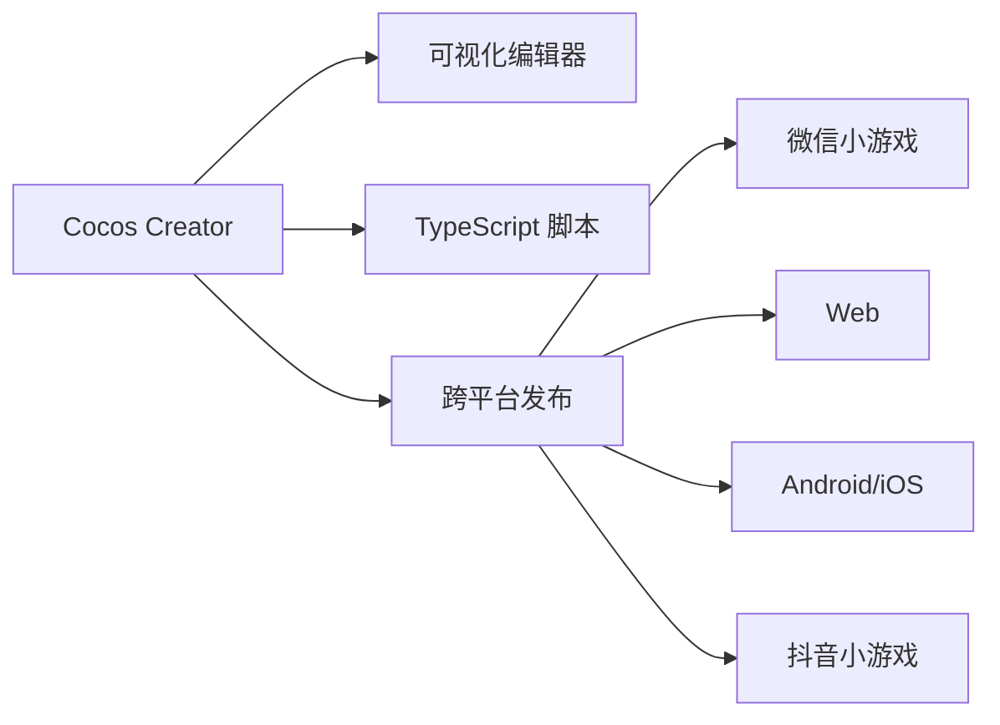

### 1.2 为什么选择 Cocos Creator 开发微信小游戏？

| 优势 | 说明 |
|---|---|
| 🚀 一键发布微信小游戏 | 无需手动适配，构建后直接导入微信开发者工具 |
| 📝 TypeScript 原生支持 | 类型安全，开发体验好 |
| 🎨 可视化编辑器 | 拖拽式开发，不需要写大量代码 |
| 📦 完全免费 | 无授权费用，适合个人开发者 |
| 🌍 中文资料丰富 | 官方文档中文，社区活跃 |
| 🔄 组件化开发 | 代码复用方便，适合团队协作 |

### 1.3 Cocos Creator vs 其他工具

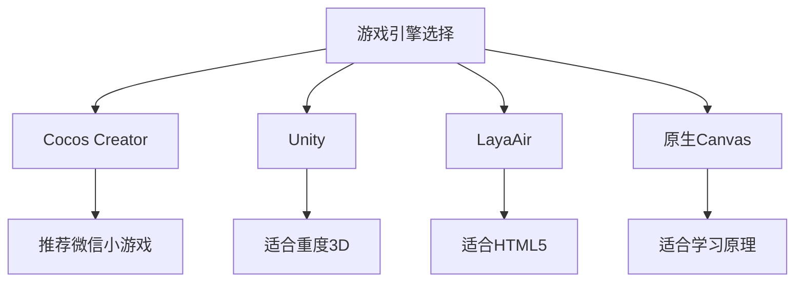

---

## 2. 环境准备与安装

### 2.1 系统要求

| 平台 | 最低配置 | 推荐配置 |
|---|---|---|
| Windows | Win7 64位, 8GB RAM | Win10/11, 16GB RAM |
| macOS | macOS 10.14+, 8GB RAM | macOS 12+, 16GB RAM |

### 2.2 安装步骤

#### 第一步：下载 Cocos Dashboard

Cocos Dashboard 是管理 Cocos 产品的一站式工具。

> 下载地址：<https://www.cocos.com/creator-download>

选择 **Cocos Dashboard** 下载：

```text
CocosDashboard-v1.3.xx.exe    (Windows)
CocosDashboard-v1.3.xx.dmg     (macOS)
```

#### 第二步：安装 Cocos Dashboard

**Windows：**
```text
双击 CocosDashboard-v1.3.xx.exe → 选择安装路径 → 安装
```

**macOS：**
```text
双击 .dmg 文件 → 拖入 Applications 文件夹
```

#### 第三步：通过 Dashboard 安装 Cocos Creator

1. 打开 Cocos Dashboard；
2. 点击「**Creator**」标签；
3. 点击「**下载**」按钮；
4. 选择版本（推荐 **3.8.x 稳定版**）；
5. 等待下载安装完成。

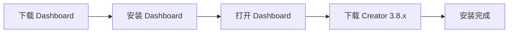

#### 第四步：安装微信开发者工具

> 下载地址：<https://developers.weixin.qq.com/miniprogram/dev/devtools/download.html>

选择对应平台下载安装。

---

### 2.3 注册 Cocos 账号（可选但推荐）

1. 打开 Cocos Dashboard；
2. 点击右上角「**登录/注册**」；
3. 注册账号并登录；
4. 登录后可访问完整资源商店。

---

## 3. 创建第一个项目

### 3.1 创建项目步骤

**第一步：打开 Cocos Dashboard**

启动 Cocos Dashboard，进入「**项目**」页面。

**第二步：点击「新建项目」**

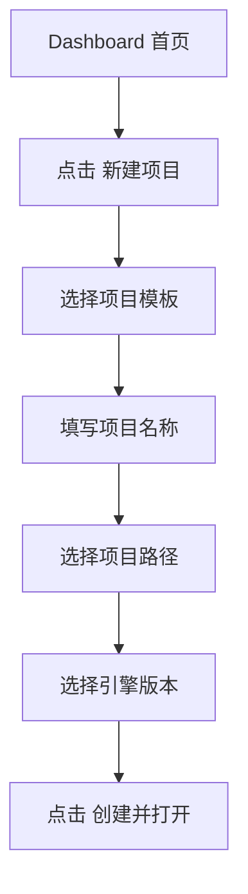

**第三步：选择项目模板**

| 模板名称 | 说明 | 推荐度 |
|---|---|---|
| Empty（空项目） | 空白项目，自由发挥 | ⭐⭐⭐⭐⭐ 推荐新手 |
| Hello World | 最简单示例 | ⭐⭐⭐⭐ 适合快速体验 |
| 2D Demo | 完整2D游戏示例 | ⭐⭐⭐ 学习参考 |
| 3D Demo | 完整3D游戏示例 | ⭐⭐ 有一定基础后 |

> **新手建议**：选择 **Empty（空项目）**，从零开始学习。

**第四步：配置项目信息**

```text
项目名称: MyFirstGame
项目路径: D:/cocosProjects/MyFirstGame
引擎版本: 3.8.x
```

**第五步：点击「创建并打开」**

等待编辑器加载完成。

---

### 3.2 项目目录结构说明

创建完成后，项目目录结构如下：

```text
MyFirstGame/
├── assets/              # 资源目录（核心工作目录）
│   ├── scenes/         # 场景文件
│   ├── scripts/        # TypeScript 脚本
│   ├── textures/       # 图片资源
│   └── prefabs/        # 预制体
├── build/              # 构建输出目录
├── settings/           # 项目配置文件
├── package.json        # 项目描述文件
└── tsconfig.json       # TypeScript 配置
```

> ⚠️ **重要**：所有游戏资源（场景、脚本、图片等）都放在 `assets/` 目录下。

---

## 4. 编辑器界面详解

打开项目后，Cocos Creator 编辑器界面如下：

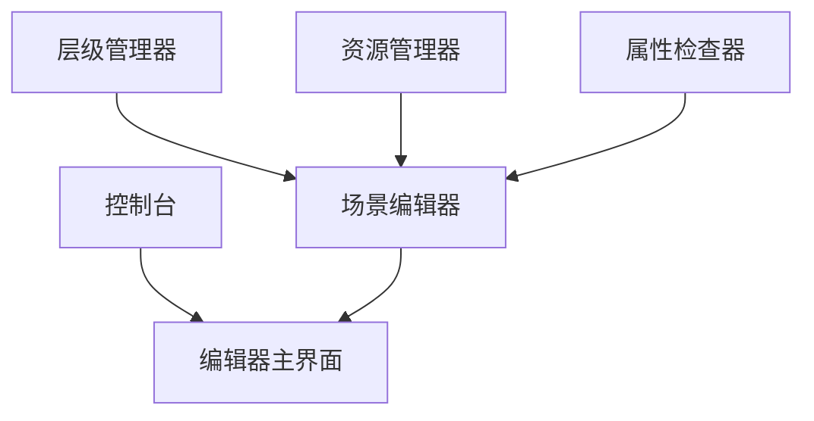

### 4.1 各面板功能说明

| 面板名称 | 位置 | 主要功能 |
|---|---|---|
| **层级管理器** | 左上 | 管理场景中的节点层级关系 |
| **场景编辑器** | 中央 | 可视化编辑游戏场景 |
| **资源管理器** | 左下 | 管理项目中的所有资源文件 |
| **属性检查器** | 右侧 | 查看和修改选中节点的属性 |
| **控制台** | 底部 | 显示日志、错误、警告信息 |

### 4.2 菜单栏常用功能

```text
场景 → 保存场景          (Ctrl + S)
项目 → 构建发布           (打开构建面板)
扩展 → 扩展商店           (下载插件)
开发者 → 打开项目目录     (在文件管理器打开)
```

### 4.3 快捷键参考

| 快捷键 | 功能 |
|---|---|
| `Ctrl + S` | 保存场景 |
| `Ctrl + D` | 复制节点 |
| `Delete` | 删除节点 |
| `F` | 聚焦选中节点 |
| `Ctrl + P` | 快速搜索资源 |
| `Ctrl + Shift + P` | 快速搜索 |
| ``Ctrl + ` `` | 打开/关闭控制台 |

---

## 5. 创建第一个场景

### 5.1 什么是场景（Scene）？

场景是游戏的**容器**，类似于舞台：

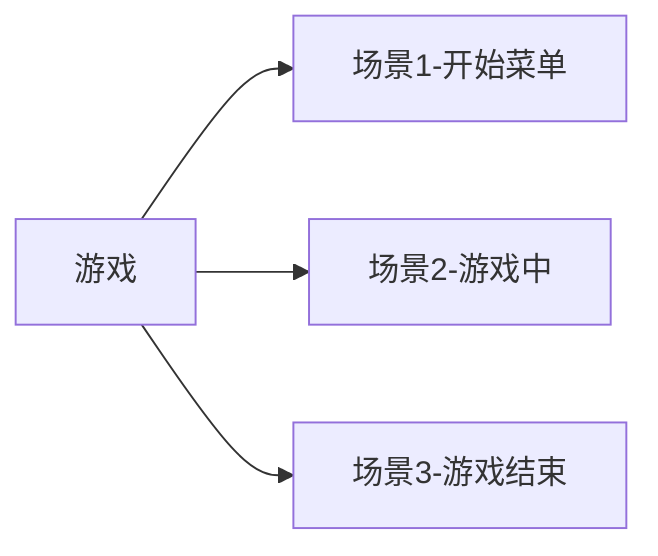

### 5.2 创建场景步骤

**第一步：新建场景**

1. 在「**资源管理器**」中，右键点击 `assets` 文件夹；
2. 选择「**创建 → Scene**」；
3. 命名为 `Main`（回车确认）。

```text
assets/
└── Main.scene    ← 你刚创建的场景
```

**第二步：双击打开场景**

双击 `Main.scene`，「**场景编辑器**」中会显示场景内容。

**第三步：保存场景**

按 `Ctrl + S` 保存场景。

---

### 5.3 设置场景为启动场景

1. 在「**层级管理器**」中选中 `Scene` 根节点；
2. 在「**属性检查器**」中确认场景设置；
3. 菜单栏「**项目 → 项目设置 → 一般设置**」；
4. 将 `Main.scene` 设为**初始场景**。

---

### 5.4 在场景中添加节点

**添加一个 Sprite（精灵）节点：**

1. 在「**层级管理器**」中右键点击 `Scene`；
2. 选择「**创建 → 2D 对象 → Sprite**」；
3. 场景中会出现一个白色方块；
4. 在「**属性检查器**」中可以修改它的属性。

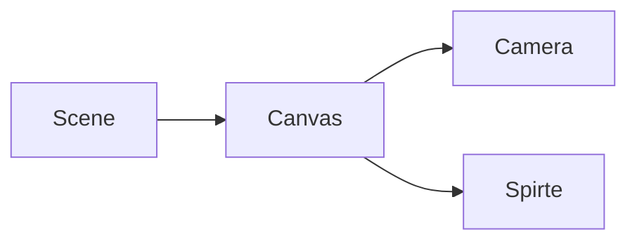

---

## 6. 编写第一个脚本

### 6.1 创建 TypeScript 脚本

**第一步：创建脚本文件**

1. 在「**资源管理器**」中，右键点击 `assets` 文件夹；
2. 选择「**创建 → TypeScript**」；
3. 命名为 `HelloWorld`（回车确认）。

```text
assets/
├── Main.scene
└── HelloWorld.ts    ← 你刚创建的脚本
```

**第二步：打开脚本编辑**

- 双击 `HelloWorld.ts`，会在默认代码编辑器中打开；
- 推荐使用 **VS Code** 作为外部编辑器。

---

### 6.2 脚本基础结构

打开 `HelloWorld.ts`，默认代码如下：

```typescript
import { _decorator, Component } from 'cc';
const { ccclass, property } = _decorator;

@ccclass('HelloWorld')
export class HelloWorld extends Component {
    start() {
        // 组件启动时执行一次
    }

    update(deltaTime: number) {
        // 每帧执行，deltaTime 是距上一帧的时间间隔
    }
}
```

#### 代码解释：

```typescript
// 从 cc 模块引入装饰器和基类
import { _decorator, Component } from 'cc';

// 解构赋值，获取装饰器
const { ccclass, property } = _decorator;

// @ccclass 装饰器：注册组件类
@ccclass('HelloWorld')
// 继承 Component：所有组件的基类
export class HelloWorld extends Component {
    
    // start 方法：组件第一次激活时执行
    start() {
        console.log('Hello Cocos Creator!');
    }

    // update 方法：每帧执行
    update(deltaTime: number) {
        // deltaTime: 距上一帧的时间间隔（秒）
    }
}
```

---

### 6.3 修改脚本并运行

**第一步：修改脚本**

```typescript
import { _decorator, Component, log } from 'cc';
const { ccclass, property } = _decorator;

@ccclass('HelloWorld')
export class HelloWorld extends Component {
    @property({ tooltip: '倒计时秒数' })
    public countDown: number = 3;

    start() {
        log('游戏开始！');
        log('倒计时：' + this.countDown + ' 秒');
    }

    update(deltaTime: number) {
        // 每帧减少倒计时
        this.countDown -= deltaTime;
        
        if (this.countDown <= 0) {
            log('时间到！');
            // 停止 update 执行
            this.enabled = false;
        }
    }
}
```

**第二步：将脚本挂载到节点**

1. 在「**层级管理器**」中选中 `Scene` 或 `Canvas` 节点；
2. 将 `HelloWorld.ts` 文件**拖拽**到「**属性检查器**」中；
3. 脚本会作为组件出现在属性面板中。

**第三步：运行预览**

1. 点击编辑器顶部的「**播放按钮**」▶️；
2. 会在浏览器中打开预览；
3. 打开浏览器控制台（F12），可以看到日志输出。

**脚本使用流程概览：**

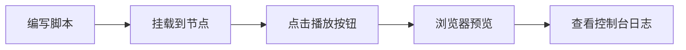

---

### 6.4 @property 装饰器详解

@property 可以让脚本中的属性显示在**属性检查器**中，方便在编辑器中调整：

```typescript
import { _decorator, Component, Label } from 'cc';
const { ccclass, property } = _decorator;

@ccclass('PlayerController')
export class PlayerController extends Component {
    // 基础类型属性
    @property({ tooltip: '移动速度' })
    speed: number = 100;

    @property({ tooltip: '是否启用' })
    isActive: boolean = true;

    @property({ tooltip: '玩家名称' })
    playerName: string = 'Player';

    // 引用类型属性（需要指定类型）
    @property(Label)
    scoreLabel: Label | null = null;

    start() {
        log('玩家 ' + this.playerName + ' 已就绪，速度：' + this.speed);
    }
}
```

在**属性检查器**中，你可以直接修改这些值，无需改代码！

---

## 7. 预制体（Prefab）基础

### 7.1 什么是预制体？

预制体（Prefab）是**可复用的游戏对象模板**：

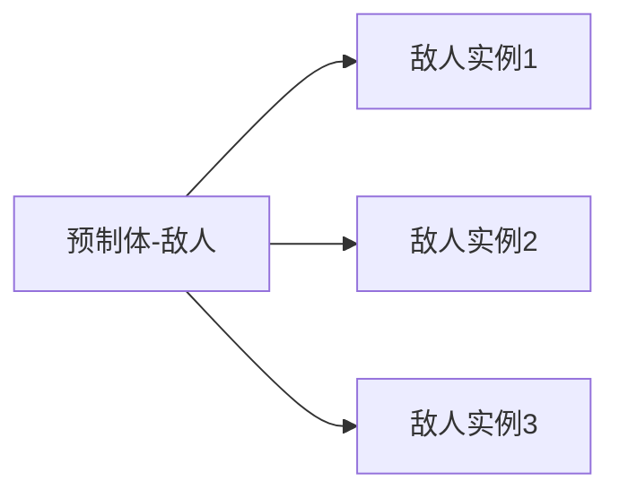

### 7.2 创建预制体步骤

**第一步：创建节点**

在场景中创建一个 Sprite 节点，命名为 `Enemy`。

**第二步：配置节点**

- 添加 Sprite 组件（已有）；
- 添加 `HelloWorld.ts` 脚本组件。

**第三步：拖拽生成预制体**

将「**层级管理器**」中的 `Enemy` 节点**拖拽**到「**资源管理器**」的 `assets/prefabs/` 文件夹中。

```text
assets/
├── prefabs/
│   └── Enemy.prefab    ← 生成的预制体
```

**第四步：使用预制体**

```typescript
import { _decorator, Component, Prefab, instantiate, Node } from 'cc';
const { ccclass, property } = _decorator;

@ccclass('GameManager')
export class GameManager extends Component {
    @property({ type: Prefab })
    enemyPrefab: Prefab | null = null;

    start() {
        // 动态创建预制体实例
        if (this.enemyPrefab) {
            const enemy = instantiate(this.enemyPrefab);
            // 将实例添加到场景中
            this.node.addChild(enemy);
        }
    }
}
```

---

## 8. 资源管理

### 8.1 支持的资源类型

| 资源类型 | 文件扩展名 | 说明 |
|---|---|---|
| 场景 | `.scene` | 游戏场景 |
| 脚本 | `.ts` | TypeScript 脚本 |
| 图片 | `.png`, `.jpg` | 纹理资源 |
| 预制体 | `.prefab` | 可复用对象模板 |
| 音频 | `.mp3`, `.wav` | 音效和音乐 |
| 字体 | `.ttf` | 文本字体 |
| 材质 | `.material` | 渲染材质 |
| 图集 | `.plist`, `.atlas` | 精灵图集 |

### 8.2 导入图片资源

**方法一：拖拽导入**

1. 将图片文件直接**拖拽**到「**资源管理器**」中；
2. 图片会自动导入到项目中。

**方法二：右键导入**

1. 在「**资源管理器**」中右键点击目标文件夹；
2. 选择「**在文件管理器中显示**」；
3. 将图片复制到文件夹中；
4. 回到 Cocos Creator，资源会自动刷新。

### 8.3 在 Sprite 上显示图片

1. 选中场景中的 Sprite 节点；
2. 在「**资源管理器**」中选中一张图片；
3. 将图片**拖拽**到「**属性检查器**」的 `Sprite → Sprite Frame` 槽位中；
4. Sprite 会显示对应的图片。

---

## 9. 构建与发布

### 9.1 构建微信小游戏步骤

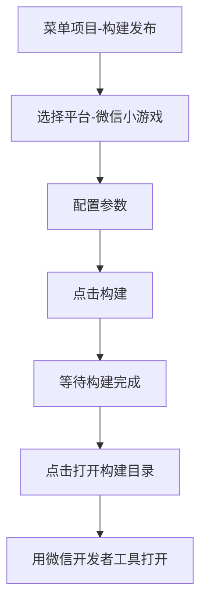

**详细步骤：**

**第一步：打开构建面板**

菜单栏 → **项目 → 构建发布**

**第二步：配置构建参数**

| 参数 | 说明 | 推荐值 |
|---|---|---|
| 平台 | 目标平台 | 微信小游戏 |
| 起始场景 | 游戏入口场景 | Main.scene |
| AppID | 微信小游戏 AppID | 测试阶段可留空 |
| 构建路径 | 输出目录 | `build/wechatgame` |
| 屏幕方向 | 横屏/竖屏 | 根据游戏类型选择 |

**第三步：点击「构建」**

等待构建完成，底部会显示构建进度。

**第四步：用微信开发者工具打开**

1. 构建完成后，点击「**打开构建目录**」；
2. 打开**微信开发者工具**；
3. 选择「**导入项目**」；
4. 项目目录选择 `build/wechatgame/`；
5. 点击「**编译**」，即可预览。

---

### 9.2 构建参数详解

```typescript
// 构建配置示例（了解即可，通常在界面中配置）
{
  "name": "wechatgame",
  "platform": "wechatgame",
  "startScene": "Main.scene",
  "outputName": "wechatgame",
  "useDebugKeystore": true
}
```

---

## 10. 常见问题排查

### 10.1 脚本不生效

| 现象 | 可能原因 | 解决方案 |
|---|---|---|
| 脚本方法不执行 | 脚本未挂载到节点 | 将脚本拖拽到节点的属性检查器 |
| 属性面板不显示 `@property` | 未编译 | 保存脚本，等待编辑器自动编译 |
| 控制台报错找不到模块 | 路径错误 | 检查 import 路径是否正确 |

### 10.2 场景预览问题

| 现象 | 可能原因 | 解决方案 |
|---|---|---|
| 预览黑屏 | 场景中没有 Camera | 确保场景中有 Camera 节点 |
| 看不到 Sprite | Sprite 被遮挡 | 检查节点层级和 Camera 设置 |
| 点击无反应 | 没有绑定事件 | 检查触摸/点击事件绑定 |

### 10.3 构建后问题

| 现象 | 可能原因 | 解决方案 |
|---|---|---|
| 构建失败 | 脚本有语法错误 | 检查控制台错误信息 |
| 微信开发者工具报错 | AppID 配置错误 | 检查构建配置中的 AppID |
| 真机预览异常 | 使用了不支持的 API | 检查是否使用了 DOM/BOM API |

---

## 11. 学习资源推荐

### 11.1 官方资源

| 资源 | 地址 | 说明 |
|---|---|---|
| 官方文档 | <https://docs.cocos.com/creator/3.8/manual/> | 最权威的参考资料 |
| API 文档 | <https://docs.cocos.com/creator/3.8/api/> | 查询接口用法 |
| 官方论坛 | <https://forum.cocos.org/> | 提问和交流 |
| GitHub | <https://github.com/cocos/cocos-example-projects> | 官方示例项目 |

### 11.2 推荐学习路径

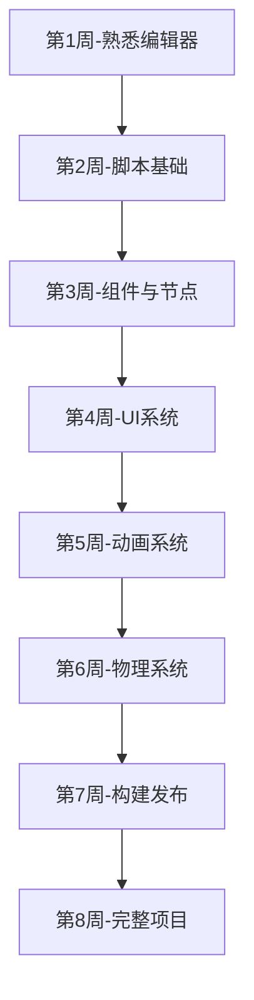

### 11.3 第一个实战项目推荐

完成入门学习后，推荐做以下项目巩固：

1. **点击得分游戏**（最简单）
2. **飞机大战**（经典2D）
3. **跑酷游戏**（横版动作）
4. **消除游戏**（匹配玩法）
5. **答题游戏**（微信小游戏热门）

---

## 附录：快速参考表

### A. 常用 API 速查

```typescript
// 日志输出
import { log, warn, error } from 'cc';
log('普通日志');
warn('警告日志');
error('错误日志');

// 节点操作
node.active = true;          // 激活节点
node.setPosition(x, y, z);   // 设置位置
node.getComponent(Component); // 获取组件

// 资源加载
import { resources, Asset } from 'cc';
resources.load('path/to/asset', Asset, (err, asset) => {
    // 加载完成回调
});
```

### B. 编辑器快捷键

| 快捷键 | 功能 |
|---|---|
| `Ctrl + S` | 保存 |
| `Ctrl + D` | 复制 |
| `Ctrl + Z` | 撤销 |
| `Ctrl + Shift + Z` | 重做 |
| `Delete` | 删除 |
| `F2` | 重命名 |
| `Ctrl + F` | 搜索 |

---

## 总结

通过本文档，你应该已经掌握了：

- ✅ Cocos Creator 的下载和安装
- ✅ 创建第一个项目
- ✅ 编辑器界面的基本使用
- ✅ 创建场景和脚本
- ✅ 脚本基础语法和 @property 装饰器
- ✅ 预制体的创建和使用
- ✅ 资源管理
- ✅ 构建发布到微信小游戏

下一步建议：

1. 跟着官方文档做一个完整的小游戏 Demo；
2. 参考 `cocos-example-projects` 中的示例；
3. 尝试构建并发布到微信开发者工具；
4. 真机预览，完成第一个微信小游戏的开发闭环。

---

*文档结束*
