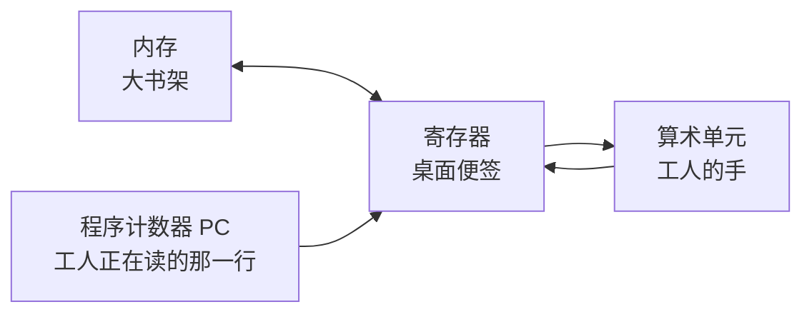
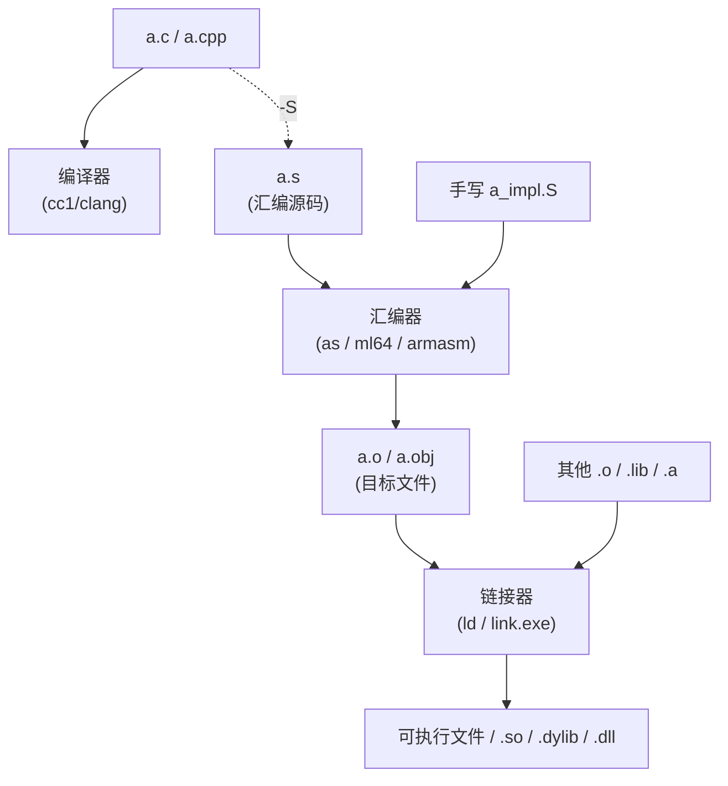
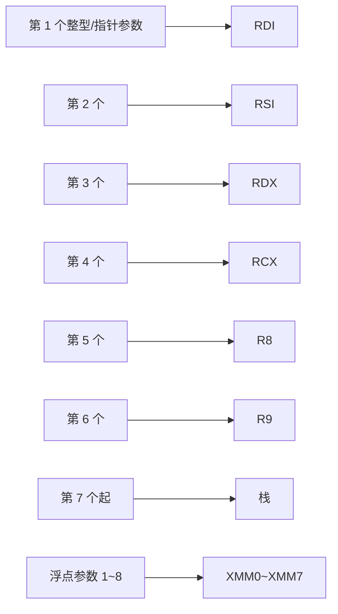
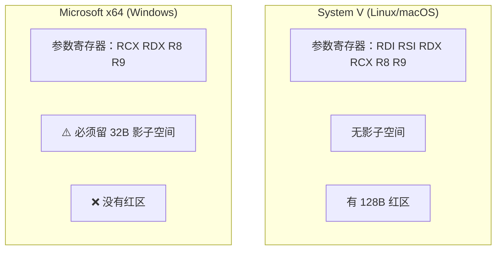
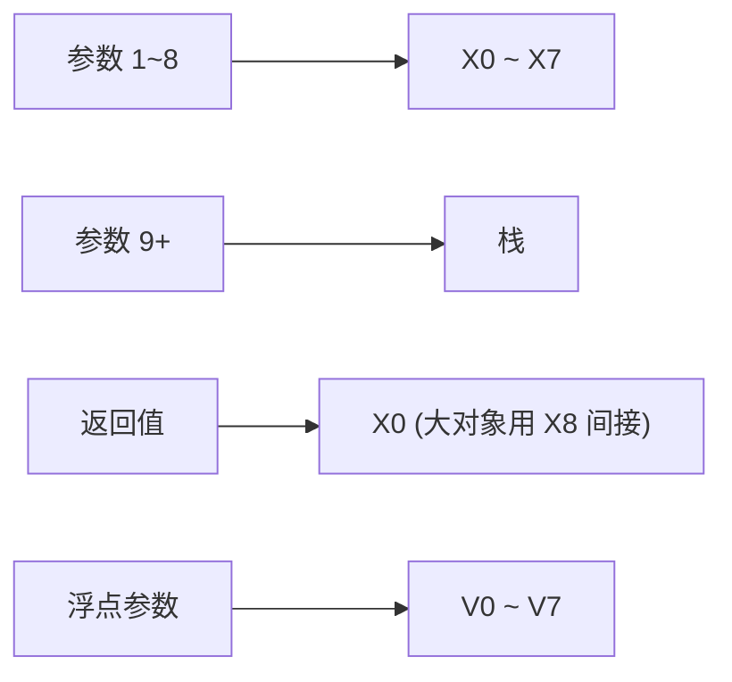
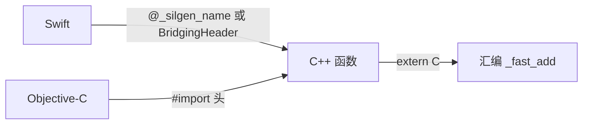
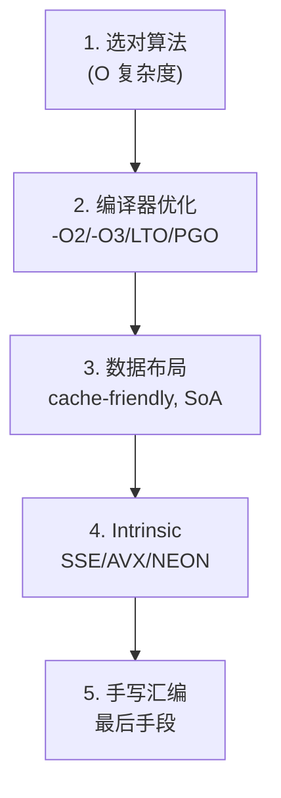

# C 与 C++ 调用汇编语言深入浅出——跨平台实战指南

> **版本**：v1.0 ｜ **最后更新**：2026-05-14
>
> 文档参考《C++11 新特性解析与应用深入理解》《C++23 新特性解析与应用深入理解》的章节组织风格，
> 面向**已有 C/C++ 基础、但对汇编与底层 ABI 仍感陌生**的开发者，
> 系统讲解 **如何在 C/C++ 工程中安全、可移植地调用汇编代码**，
> 并覆盖三大主流平台：**Windows（MSVC / MinGW）**、**Android（NDK / ARM64）**、**iOS（Xcode / Apple Silicon）**。
>
> 全书秉持"先讲原理，再上代码，最后讲坑"的节奏，让初学者也能把汇编落到工程里。

---

## 📑 目录

### 第一部分　基础与原理
- [第 1 章：为什么 C/C++ 还要会一点汇编](#第-1-章为什么-cc-还要会一点汇编)
- [第 2 章：CPU 与汇编的最小心智模型](#第-2-章cpu-与汇编的最小心智模型)
- [第 3 章：编译、链接、目标文件——汇编是如何"进入"可执行文件的](#第-3-章编译链接目标文件汇编是如何进入可执行文件的)
- [第 4 章：调用约定（Calling Convention）一文看懂](#第-4-章调用约定calling-convention一文看懂)
- [第 5 章：汇编语法的两大流派——Intel vs AT&T vs ARM 统一汇编](#第-5-章汇编语法的两大流派intel-vs-att-vs-arm-统一汇编)

### 第二部分　x86-64 平台实战
- [第 6 章：x86-64 寄存器与内存模型速查](#第-6-章x86-64-寄存器与内存模型速查)
- [第 7 章：System V AMD64 调用约定（Linux/macOS/Android x86）](#第-7-章system-v-amd64-调用约定linuxmacosandroid-x86)
- [第 8 章：Microsoft x64 调用约定（Windows）](#第-8-章microsoft-x64-调用约定windows)
- [第 9 章：内联汇编（GCC/Clang）——`asm` 与 `__asm__ volatile`](#第-9-章内联汇编gccclangasm-与-__asm__-volatile)
- [第 10 章：MSVC 的 `__asm` 与 Intrinsic——为什么 x64 上 `__asm` 被禁了](#第-10-章msvc-的-__asm-与-intrinsic为什么-x64-上-__asm-被禁了)

### 第三部分　ARM64 平台实战
- [第 11 章：AArch64 寄存器与内存模型速查](#第-11-章aarch64-寄存器与内存模型速查)
- [第 12 章：AAPCS64 调用约定（Android / iOS / Linux ARM64 通用）](#第-12-章aapcs64-调用约定android--ios--linux-arm64-通用)
- [第 13 章：苹果 ARM64 的"小不同"——可变参数与红区](#第-13-章苹果-arm64-的小不同可变参数与红区)
- [第 14 章：NEON / SIMD 在汇编中的快速入门](#第-14-章neon--simd-在汇编中的快速入门)

### 第四部分　Windows 平台集成
- [第 15 章：MSVC + MASM 工程化集成（`.asm` 文件 + `ml64.exe`）](#第-15-章msvc--masm-工程化集成asm-文件--ml64exe)
- [第 16 章：CMake 中接入 MASM 与 NASM](#第-16-章cmake-中接入-masm-与-nasm)
- [第 17 章：MinGW / Clang-CL 下的内联汇编与外部 `.S` 文件](#第-17-章mingw--clang-cl-下的内联汇编与外部-s-文件)
- [第 18 章：Windows 下常见坑——结构化异常、栈对齐、影子空间](#第-18-章windows-下常见坑结构化异常栈对齐影子空间)

### 第五部分　Android 平台集成
- [第 19 章：NDK 项目结构与多 ABI 概览](#第-19-章ndk-项目结构与多-abi-概览)
- [第 20 章：用 CMake 接入 `.S` 汇编文件（arm64-v8a / armeabi-v7a / x86_64）](#第-20-章用-cmake-接入-s-汇编文件arm64-v8a--armeabi-v7a--x86_64)
- [第 21 章：JNI 桥接——Java/Kotlin → C++ → 汇编的完整链路](#第-21-章jni-桥接javakotlin--c--汇编的完整链路)
- [第 22 章：Android 上的常见坑——PIC、TEXTREL、16KB Page](#第-22-章android-上的常见坑picxtextrel16kb-page)

### 第六部分　iOS 平台集成
- [第 23 章：Xcode 工程接入 `.s` 汇编文件](#第-23-章xcode-工程接入-s-汇编文件)
- [第 24 章：Objective-C / Swift 调用 C++ 再调用汇编](#第-24-章objective-c--swift-调用-c-再调用汇编)
- [第 25 章：苹果工具链特殊点——符号下划线、PAC/BTI、Bitcode 已退场](#第-25-章苹果工具链特殊点符号下划线pacbtibitcode-已退场)

### 第七部分　工程实战
- [第 26 章：综合案例——跨平台 SIMD 加速的 `memcpy_fast`](#第-26-章综合案例跨平台-simd-加速的-memcpy_fast)
- [第 27 章：调试与反汇编工具链——从 `objdump` 到 LLDB/WinDbg](#第-27-章调试与反汇编工具链从-objdump-到-lldbwindbg)
- [第 28 章：性能调优清单与"什么时候**不要**写汇编"](#第-28-章性能调优清单与什么时候不要写汇编)

### 附录
- [附录 A：x86-64 与 ARM64 关键指令对照速查表](#附录-ax86-64-与-arm64-关键指令对照速查表)
- [附录 B：跨平台调用约定一页纸总结](#附录-b跨平台调用约定一页纸总结)
- [附录 C：常见错误信息（error message）速查](#附录-c常见错误信息error-message速查)

---

# 第一部分　基础与原理

---

## 第 1 章：为什么 C/C++ 还要会一点汇编

很多人会说："现代编译器这么聪明，写汇编不是自找麻烦吗？"——这话**对一半**。
作为应用开发者，你**90% 的代码都不该手写汇编**。但下面这些场景，会汇编的人就是赢家：

| 场景 | 为什么需要汇编 |
|---|---|
| **极致性能**（编解码、加密、AI 算子） | 编译器无法保证生成最优 SIMD/向量指令 |
| **平台/CPU 专属指令** | 如 `RDTSC`、`CRC32`、`AES-NI`、ARM `PMULL`，没有标准 C 等价物 |
| **嵌入式/启动代码** | bootloader、上下文切换、协程跳板 |
| **逆向、热修复、Hook** | 需要直接读写寄存器、改写指令流 |
| **调试疑难 Bug** | 看反汇编远比看 C++ 源码更接近真相 |

> 💡 **本书定位**：不教你成为汇编大师，而是让你"**看得懂、写得对、接得上**"。

---

## 第 2 章：CPU 与汇编的最小心智模型

把一个 CPU 想象成一个"**只会做小学算术的工人**"，他面前有：



- **寄存器（Register）**：工人桌面上**几张小便签**，读写极快，数量很少（16~32 个）。
- **内存（Memory）**：远处的大书架，读写慢但容量大。
- **PC / IP**：工人当前读到第几行指令。
- **指令（Instruction）**：每一条都极简，比如"把 A 便签的数加到 B 便签上"。

**汇编 = 一行一条 CPU 指令**。C 的 `a = b + c;`，到了汇编可能是 3 行：

```asm
mov  eax, [b]   ; 把 b 的值搬到 eax 这张便签
add  eax, [c]   ; 把 c 加到 eax 上
mov  [a], eax   ; 把结果写回 a
```

**记住这一句**：**寄存器很快但很少，内存很大但很慢，汇编就是在这两者之间搬数据。**

---

## 第 3 章：编译、链接、目标文件——汇编是如何"进入"可执行文件的



**关键点**：
1. C/C++ 源码经过编译器**第一步就是被翻译为汇编**（用 `-S` 可以亲眼看到）。
2. 汇编再经过**汇编器**变成**目标文件**（机器码 + 符号表）。
3. **手写的汇编**（`.S` / `.asm`）和编译器产物**地位完全相同**——都是目标文件，最终被链接器拼起来。

> 💡 这就是为什么"C 调汇编"在原理上**没有任何特殊魔法**，关键只在于：**符号名要对得上**、**调用约定要遵守**。

---

## 第 4 章：调用约定（Calling Convention）一文看懂

调用约定是 C 函数和汇编函数能互相调用的"**外交礼仪**"，规定了：

| 礼仪条款 | 含义 |
|---|---|
| **参数传递** | 前几个参数走哪些寄存器？多余的压栈？谁先谁后？ |
| **返回值** | 写到哪个寄存器？大对象怎么办？ |
| **谁来清理栈** | 调用者还是被调用者？ |
| **保护寄存器** | 哪些寄存器调用前后必须保持不变（callee-saved）？哪些可以随便改（caller-saved）？ |
| **栈对齐** | 函数入口处栈指针必须对齐到几字节？ |
| **名字修饰** | C 函数 `foo` 在符号表里叫 `foo` 还是 `_foo` 还是 `?foo@@YA...`？ |

主流约定一览：

| 平台 / 架构 | 调用约定 | 前几个整型参数 |
|---|---|---|
| Windows x64 | Microsoft x64 | `RCX, RDX, R8, R9` + **32 字节影子空间** |
| Linux/macOS/Android x86_64 | System V AMD64 | `RDI, RSI, RDX, RCX, R8, R9` |
| 所有 ARM64（含 iOS/Android/Linux） | AAPCS64 | `X0 ~ X7` |
| Windows ARM64 | ARM64EC / 标准 AAPCS64 变体 | `X0 ~ X7` |

> ⚠️ **第一坑**：Windows x64 和 Linux x64 的参数寄存器**完全不同**！同一份 x64 汇编**不能跨平台直接复用**。

---

## 第 5 章：汇编语法的两大流派——Intel vs AT&T vs ARM 统一汇编

同一条"`mov eax, 5`"，在不同语法里写法不同：

| 语法 | 示例 | 谁在用 |
|---|---|---|
| **Intel** | `mov eax, 5` ｜ 目的在前 | MASM、NASM、MSVC、Intel 官方手册 |
| **AT&T** | `movl $5, %eax` ｜ 源在前、寄存器加 `%`、立即数加 `$` | GCC/Clang **默认输出** |
| **ARM 统一汇编（UAL）** | `mov x0, #5` | ARM/Apple/Android 全平台 |

**实战建议**：
- x86-64 平台：**优先 Intel 语法**（更直观），GCC/Clang 用 `.intel_syntax noprefix` 切换。
- ARM 平台：只有 UAL 一种，没有选择困难。

```asm
; 切换到 Intel 语法的 GAS 文件
.intel_syntax noprefix
.global add_one
add_one:
    mov eax, edi      ; Linux x64 第一个参数在 RDI/EDI
    add eax, 1
    ret
```

---

# 第二部分　x86-64 平台实战

---

## 第 6 章：x86-64 寄存器与内存模型速查

```
通用寄存器（共 16 个，64 位 / 32 位 / 16 位 / 8 位 名字不同）：
  RAX  EAX  AX  AL     ← 返回值常用
  RBX  EBX  BX  BL     ← callee-saved（被调用者保存）
  RCX  ECX  CX  CL     ← Win 第 1 参 / Linux 第 4 参
  RDX  EDX  DX  DL     ← Win 第 2 参 / Linux 第 3 参
  RSI  ESI  SI  SIL    ← Linux 第 2 参
  RDI  EDI  DI  DIL    ← Linux 第 1 参
  RBP  EBP  BP  BPL    ← 帧指针（callee-saved）
  RSP  ESP  SP  SPL    ← 栈指针（永远指向栈顶）
  R8 ~ R15             ← 扩展寄存器，命名规则一致

向量寄存器：
  XMM0~XMM15  (128b, SSE)
  YMM0~YMM15  (256b, AVX)
  ZMM0~ZMM31  (512b, AVX-512)
```

**记忆法**：
- **R**ax = **R**eturn，返回值。
- **R**sp = **S**tack **P**ointer，栈顶。
- **R**bp = **B**ase **P**ointer，栈帧基址。
- 编号 R8~R15 永远是"**新加的**"。

---

## 第 7 章：System V AMD64 调用约定（Linux/macOS/Android x86）

### 7.1 参数传递规则



- **返回值**：整型走 `RAX`（128 位走 `RAX:RDX`），浮点走 `XMM0`。
- **callee-saved**：`RBX, RBP, R12~R15`（你在汇编里改了它们，必须 push/pop 保护起来）。
- **caller-saved**：`RAX, RCX, RDX, RSI, RDI, R8~R11`（调用者自己保存，被调用函数随便用）。
- **栈对齐**：调用 `call` 之前，**RSP 必须对齐到 16 字节**。
- **红区（Red Zone）**：RSP 下方 **128 字节**可被叶函数（不再调别人）直接使用，无需调整 RSP。

### 7.2 一个完整的 Linux x64 汇编函数

```asm
; sum_three.S
; int64_t sum_three(int64_t a, int64_t b, int64_t c)
.intel_syntax noprefix
.text
.global sum_three
sum_three:
    mov  rax, rdi    ; rax = a
    add  rax, rsi    ; rax += b
    add  rax, rdx    ; rax += c
    ret              ; 返回值已在 rax
```

C 端使用：

```c
// main.c
#include <stdio.h>
#include <stdint.h>

int64_t sum_three(int64_t a, int64_t b, int64_t c);  // 声明

int main(void) {
    printf("%lld\n", (long long)sum_three(10, 20, 30));  // 60
}
```

编译：

```bash
gcc -c sum_three.S -o sum_three.o
gcc main.c sum_three.o -o demo && ./demo
```

> 💡 **重要函数解释**：
> - `mov rax, rdi`：把"第 1 参数"搬到"返回值寄存器"，因为 `a` 已经在 `rdi`。
> - `ret`：从栈顶弹出返回地址跳过去，相当于 C 的 `return`。
> - 函数结束**不需要清理参数**——System V 由调用者管栈。

---

## 第 8 章：Microsoft x64 调用约定（Windows）

### 8.1 与 System V 的核心差异



- **影子空间（Shadow Space / Home Space）**：调用者必须在栈上**为前 4 个寄存器参数预留 32 字节**，即使被调用函数不用。
- **callee-saved 多了几个**：`RBX, RBP, RDI, RSI, R12~R15, XMM6~XMM15`。
- **栈对齐**：`call` 之前 RSP 也必须 16 字节对齐。
- **必须有 unwind info**：64 位 Windows 的异常处理依赖函数表，否则 `try/catch` 跨过你这帧会崩溃（详见第 18 章）。

### 8.2 一个完整的 Windows x64 MASM 函数

```asm
; sum_three.asm （MASM 语法，给 ml64.exe 用）
.code
sum_three PROC
    mov  rax, rcx     ; Win x64：第 1 参在 rcx
    add  rax, rdx     ; 第 2 参在 rdx
    add  rax, r8      ; 第 3 参在 r8
    ret
sum_three ENDP
END
```

> 💡 **重要语法解释**：
> - `PROC ... ENDP`：MASM 的"函数开始/结束"标记，**等价于** GAS 的 `label: ... ret`。
> - `.code`：声明接下来是代码段（相当于 GAS 的 `.text`）。
> - `END`：文件结束标记，**MASM 必须有**，否则 ml64 报错。

---

## 第 9 章：内联汇编（GCC/Clang）——`asm` 与 `__asm__ volatile`

GCC 内联汇编是**初学者最容易翻车的语法**，但只要记住"**模板 + 4 段冒号**"就不难：

```c
__asm__ volatile (
    "汇编模板"
    : 输出操作数      // 由汇编写、C 读
    : 输入操作数      // 由 C 提供给汇编
    : 破坏列表        // 我还顺手改了哪些寄存器/内存
);
```

### 9.1 一个最小例子：交换两个 int

```c
#include <stdio.h>
int main(void) {
    int a = 1, b = 2;
    __asm__ volatile (
        "xchg %0, %1"
        : "+r"(a), "+r"(b)   // "+" 表示既读又写
    );
    printf("%d %d\n", a, b); // 2 1
}
```

> 💡 **重要约束符（constraint）解释**：
> - `"r"`：编译器**自由挑选一个通用寄存器**，把变量装进去。
> - `"+r"`：在 `"r"` 基础上**告诉编译器"我会改它"**，相当于 in/out。
> - `"=r"`：纯输出。
> - `"m"`：强制走内存地址。
> - `%0 %1 %2`：依次引用操作数列表（**先输出后输入**编号）。

### 9.2 加上 clobber：破坏列表

```c
int rdtsc_low(void) {
    int lo, hi;
    __asm__ volatile (
        "rdtsc"
        : "=a"(lo), "=d"(hi)   // a=eax, d=edx
        :
        : "memory"             // 告诉编译器：我可能影响内存观察顺序
    );
    return lo;
}
```

> 💡 **关键解释**：
> - `volatile`：**禁止编译器把这条 asm 优化掉/挪位置**。读时间戳、IO 端口都必须加。
> - `"memory"`：**内存屏障**——告诉编译器"我之前/之后的内存读写不能跨过这里重排"。
> - `"=a"`：直接绑定到 EAX，因为 `rdtsc` 指令**硬性规定**结果在 EDX:EAX。

---

## 第 10 章：MSVC 的 `__asm` 与 Intrinsic——为什么 x64 上 `__asm` 被禁了

| 模式 | 32 位 MSVC | 64 位 MSVC |
|---|---|---|
| `__asm { ... }` 内联汇编 | ✅ 支持 | ❌ **彻底不支持** |
| Intrinsic（`<intrin.h>`） | ✅ | ✅ **唯一推荐** |
| 外部 `.asm`（MASM）+ 链接 | ✅ | ✅ |

**为什么 x64 禁了 `__asm`**：MSVC 的 64 位优化器与异常展开严重依赖**结构化栈帧**，内联汇编会让它无法生成正确的 unwind info。

**替代方案：Intrinsic**

```c
#include <intrin.h>
#include <stdint.h>

uint64_t my_rdtsc(void) {
    return __rdtsc();    // 编译器内置函数，会展开成单条 RDTSC
}

int popcount(uint32_t x) {
    return __popcnt(x);  // 自动用硬件 POPCNT 指令
}
```

> 💡 **Intrinsic 的优势**：
> - 看起来像普通 C 函数，但**编译时直接展开为对应的 CPU 指令**，零开销。
> - 由编译器**完全管理寄存器分配**，跨平台风险小。
> - 在 Windows x64 上是**唯一**官方支持的"写汇编"方式。

**真要写大段汇编？走 MASM 外部文件路线**（详见第 15 章）。

---

# 第三部分　ARM64 平台实战

---

## 第 11 章：AArch64 寄存器与内存模型速查

```
通用整型寄存器（31 个 + ZR）：
  X0 ~ X30  （64 位）  /  W0 ~ W30  （32 位低半部）
  X0 ~ X7   ：参数 / 返回值
  X8        ：间接结果寄存器（大返回值的地址）/ syscall 号
  X9 ~ X15  ：caller-saved 临时
  X16, X17  ：IP0/IP1 过程内调用临时（链接器可能改）
  X18       ：⚠️ 平台保留（iOS、Windows 自用，Android 不要碰）
  X19 ~ X28 ：callee-saved
  X29 (FP)  ：帧指针
  X30 (LR)  ：返回地址（Link Register）
  SP        ：栈指针
  XZR/WZR   ：永远是 0 的寄存器

向量寄存器：
  V0 ~ V31  （128 位 NEON）
  Q0 ~ Q31 / D0 ~ D31 / S0 ~ S31  ：同寄存器的不同视角
```

**记忆法**：
- **X**0 / **W**0 = 第一参数 / 返回值。
- **L**R = **L**ink Register，存"调用者的下一条指令地址"。
- **F**P = **F**rame Pointer，栈帧基址。
- ARM64 **没有 push/pop 单条指令**，统一用 `stp / ldp`（store/load pair）一次操作两个寄存器。

---

## 第 12 章：AAPCS64 调用约定（Android / iOS / Linux ARM64 通用）

### 12.1 一图看懂



- **栈对齐**：函数边界 SP 必须 **16 字节对齐**。
- **callee-saved**：`X19~X28, X29(FP), X30(LR), V8~V15 的低 64 位`。
- **caller-saved**：`X0~X17, V0~V7, V16~V31`。

### 12.2 标准函数序言/尾声（必背模板）

```asm
// my_func.S  - AArch64 函数模板
.text
.global my_func
.type my_func, %function
my_func:
    // === 序言（Prologue）===
    stp   x29, x30, [sp, #-16]!   // 同时保存 FP 和 LR，SP -= 16
    mov   x29, sp                 // 建立新的帧指针

    // === 函数主体 ===
    add   x0, x0, x1              // 返回 a + b

    // === 尾声（Epilogue）===
    ldp   x29, x30, [sp], #16     // 恢复 FP/LR，SP += 16
    ret                           // 跳回 LR 指向的地址
```

> 💡 **核心指令解释**：
> - `stp x29, x30, [sp, #-16]!`：**S**tore **P**air，把 X29 和 X30 一起存到 `[sp-16]`，然后 SP 真的减 16（`!` 表示**写回**）。**等价于 push 两个寄存器**。
> - `ldp x29, x30, [sp], #16`：**L**oad **P**air，先从 `[sp]` 读出，再把 SP 加 16（**后索引**）。等价于 pop 两个寄存器。
> - `ret`：默认从 X30（LR）跳回，**等价于 x86 的 `ret`**。

---

## 第 13 章：苹果 ARM64 的"小不同"——可变参数与红区

苹果在 AAPCS64 上做了**两条特殊修改**，写跨平台汇编时一定要注意：

| 项目 | 标准 AAPCS64（Linux/Android） | Apple ARM64（iOS/macOS） |
|---|---|---|
| **可变参数函数** | 命名参数也走寄存器 | **所有可变参数全部走栈** |
| **X18 用途** | 保留 | **被系统占用**（线程上下文） |
| **char 默认符号** | unsigned | **signed** |

**最直接的影响**：在 iOS 上写 `printf("%d\n", x)` 的汇编调用方，**第二个参数必须放在栈上**，不能放在 X1：

```asm
// iOS 调 printf("hello %d\n", 42) 的正确做法
adrp  x0, Lfmt@PAGE
add   x0, x0, Lfmt@PAGEOFF       // x0 = 格式串（命名参数）
mov   x9, #42
str   x9, [sp]                   // 42 必须放栈！不能放 x1
bl    _printf                    // 注意 Mach-O 符号有下划线前缀
```

---

## 第 14 章：NEON / SIMD 在汇编中的快速入门

NEON 是 ARM 的 SIMD 单元，**128 位寄存器一次处理多个数据**。常用视角：

```
V0.16B  → 16 个 8 位整数
V0.8H   → 8 个 16 位整数
V0.4S   → 4 个 32 位整数 / 4 个 float
V0.2D   → 2 个 64 位整数 / 2 个 double
```

例：把数组每个 float 都乘 2.0：

```asm
// void mul2(float* dst, const float* src, size_t n);  // n 必须是 4 的倍数
.global mul2
mul2:
    fmov    s4, #2.0           // 标量 2.0 装到 s4
    dup     v4.4s, v4.s[0]     // 广播为 4 路：v4 = {2,2,2,2}
1:
    cbz     x2, 2f             // n == 0 就退出
    ldr     q0, [x1], #16      // 从 src 读 4 个 float，src += 16
    fmul    v0.4s, v0.4s, v4.4s
    str     q0, [x0], #16      // 写到 dst，dst += 16
    sub     x2, x2, #4
    b       1b
2:
    ret
```

> 💡 **要点解释**：
> - `dup v4.4s, v4.s[0]`：把 v4 的第 0 个 float**广播**到全部 4 路。
> - `[x1], #16`：**后索引**寻址——先用 x1，再 x1 += 16。
> - `1:` / `1b` / `2f`：**本地数字标签**，`b` = backward，`f` = forward，写循环非常方便。

---

# 第四部分　Windows 平台集成

---

## 第 15 章：MSVC + MASM 工程化集成（`.asm` 文件 + `ml64.exe`）

**目标**：在 Visual Studio 项目里加一个 `.asm` 文件，被 C/C++ 调用。

### 15.1 步骤（VS IDE）

1. **右键项目 → 生成依赖项 → 生成自定义 → 勾选 `masm`**。
2. 添加新文件 `fast_add.asm`。
3. **右键文件 → 属性 → 项类型** 选 **`Microsoft Macro Assembler`**。
4. 写代码：

```asm
; fast_add.asm
.code
PUBLIC fast_add
fast_add PROC
    mov rax, rcx
    add rax, rdx
    ret
fast_add ENDP
END
```

5. 在 C++ 头文件声明（注意 **`extern "C"`** 防止名字修饰）：

```cpp
// fast_add.h
#pragma once
#ifdef __cplusplus
extern "C" {
#endif
long long fast_add(long long a, long long b);
#ifdef __cplusplus
}
#endif
```

> 💡 **关键概念**：
> - `PUBLIC fast_add`：导出符号，让链接器能找到它。
> - `extern "C"`：让 C++ 编译器**不要做名字修饰**（不要把 `fast_add` 变成 `?fast_add@@YA_JJJ@Z`），保证和 MASM 写的纯名字 `fast_add` 对得上。
> - 32 位 MASM 用 `ml.exe`、64 位用 `ml64.exe`，**符号前缀不同**：32 位 C 函数会自动加下划线 `_fast_add`，64 位**不加**。

---

## 第 16 章：CMake 中接入 MASM 与 NASM

### 16.1 用 MSVC 自带的 MASM

```cmake
cmake_minimum_required(VERSION 3.20)
project(asm_demo C CXX ASM_MASM)   # ← 启用 MASM 语言

add_executable(demo
    main.cpp
    fast_add.asm
)
```

### 16.2 用 NASM（跨编译器更通用）

```cmake
project(asm_demo C CXX ASM_NASM)
set(CMAKE_ASM_NASM_OBJECT_FORMAT "win64")  # Windows 必须显式指定
add_executable(demo main.cpp fast_add.asm)
```

> 💡 **MASM vs NASM 选哪个**：
> - **只编 Windows**：MASM 与 MSVC 配合最好。
> - **跨平台 / 想在 Linux 也用同一份**：NASM 更通用，但语法和 MASM 略有不同（`section .text` 替代 `.code`，`global` 替代 `PUBLIC`）。

---

## 第 17 章：MinGW / Clang-CL 下的内联汇编与外部 `.S` 文件

MinGW 用的是 GCC 工具链，所以 **GCC 内联汇编（第 9 章）原样能用**，外部文件用 `.S`（大写 S，过预处理器）即可：

```cmake
# MinGW / Clang on Windows
project(asm_demo C CXX ASM)
add_executable(demo main.c fast_add.S)
```

⚠️ **MinGW 下符号下划线问题**：
- MinGW-w64 64 位：**不加下划线**（与 MSVC 一致）。
- MinGW 32 位：**自动加下划线**，C 里的 `fast_add` 在汇编里要写成 `_fast_add`。

---

## 第 18 章：Windows 下常见坑——结构化异常、栈对齐、影子空间

| 坑 | 表现 | 解决 |
|---|---|---|
| **没留 32B 影子空间** | 调用 Windows API 后栈被踩 | 调用前 `sub rsp, 32` |
| **未 16B 对齐就 call** | 部分 API（含 SSE 指令）崩溃 | 序言里把 RSP 调整到 16B 对齐 |
| **没写 unwind info** | C++ 异常跨过你的汇编帧时崩溃 | MASM 用 `PROC FRAME` + `.pushreg / .setframe / .endprolog` |
| **MASM 文件没 END** | `LNK1561` / `A2088` 报错 | 文件最后必须有 `END` |
| **C++ 里没加 `extern "C"`** | `unresolved external symbol` | 头文件声明用 `extern "C"` |

带 unwind 的标准模板：

```asm
.code
fast_add PROC FRAME
    push rbp                       ; 必须用 .pushreg 记录
    .pushreg rbp
    mov  rbp, rsp
    .setframe rbp, 0
    .endprolog
    ; ... 函数体 ...
    mov  rax, rcx
    add  rax, rdx
    pop  rbp
    ret
fast_add ENDP
END
```

---

# 第五部分　Android 平台集成

---

## 第 19 章：NDK 项目结构与多 ABI 概览

Android 一个 APK 可同时打包多种 CPU 架构的 `.so`：

| ABI | CPU | 占比（2025） |
|---|---|---|
| `arm64-v8a` | ARM64 | **>95%**（主战场）|
| `armeabi-v7a` | ARM32 | 老设备兼容 |
| `x86_64` | 模拟器 / 部分平板 | 仅模拟器 |
| `x86` | 已基本淘汰 | 忽略即可 |

**结论**：**写汇编只针对 `arm64-v8a` 即可，其他 ABI 留 C 语言 fallback**。

---

## 第 20 章：用 CMake 接入 `.S` 汇编文件（arm64-v8a / armeabi-v7a / x86_64）

`CMakeLists.txt`：

```cmake
cmake_minimum_required(VERSION 3.22)
project(asmlib C CXX ASM)

# C 语言 fallback
set(SRC src/fast_add.c)

# arm64 才接入手写汇编
if(ANDROID_ABI STREQUAL "arm64-v8a")
    list(APPEND SRC src/fast_add_arm64.S)
    list(REMOVE_ITEM SRC src/fast_add.c)   # 替换掉 C 版
endif()

add_library(asmlib SHARED ${SRC})
```

`src/fast_add_arm64.S`：

```asm
.text
.global fast_add
.type   fast_add, %function
fast_add:
    add   x0, x0, x1
    ret
```

`app/build.gradle.kts`：

```kotlin
android {
    defaultConfig {
        externalNativeBuild {
            cmake {
                arguments += listOf("-DANDROID_STL=c++_shared")
            }
        }
        ndk { abiFilters += listOf("arm64-v8a", "armeabi-v7a") }
    }
    externalNativeBuild { cmake { path = file("src/main/cpp/CMakeLists.txt") } }
}
```

---

## 第 21 章：JNI 桥接——Java/Kotlin → C++ → 汇编的完整链路


**Kotlin**：

```kotlin
class NativeLib {
    external fun fastAdd(a: Long, b: Long): Long
    companion object { init { System.loadLibrary("asmlib") } }
}
```

**JNI 胶水（C++）**：

```cpp
#include <jni.h>
extern "C" long long fast_add(long long a, long long b);  // ← 来自汇编

extern "C" JNIEXPORT jlong JNICALL
Java_com_example_NativeLib_fastAdd(JNIEnv*, jobject, jlong a, jlong b) {
    return fast_add(a, b);
}
```

> 💡 **关键解释**：
> - `JNIEXPORT` / `JNICALL`：在 Android 上其实都是空的宏，但**写上保证跨平台一致**。
> - 函数命名 `Java_包名_类名_方法名`，**点号换下划线、`$` 换 `_00024`**。
> - `extern "C"` 必不可少，否则 JVM 找不到符号。

---

## 第 22 章：Android 上的常见坑——PIC、TEXTREL、16KB Page

| 坑 | 现象 | 解决 |
|---|---|---|
| **非 PIC 代码** | 链接报 `requires text relocations` | 所有 Android 代码必须 PIC，汇编里禁止用绝对地址 |
| **TEXTREL** | Android 6+ 直接拒绝加载 | 用 `adrp + add` 取地址，不用 `ldr =label` 这种伪指令 |
| **未对齐到 16KB** | Android 15+ 设备拒绝加载 | NDK r26c+ 默认开启，老 NDK 加 `-Wl,-z,max-page-size=16384` |
| **X18 被踩** | 偶发崩溃 | Android 上 X18 可用，但**不要假设它跨调用保留** |

PIC 取全局地址的标准写法：

```asm
// 加载全局变量 g_counter 的地址到 x0
adrp  x0, g_counter
add   x0, x0, :lo12:g_counter
ldr   w1, [x0]
```

---

# 第六部分　iOS 平台集成

---

## 第 23 章：Xcode 工程接入 `.s` 汇编文件

iOS 平台**汇编源码后缀用小写 `.s`**（已经是预处理过的），Xcode 自动识别为汇编源：

1. Xcode 项目里直接 **Add Files** 把 `fast_add_arm64.s` 拖进 target。
2. **Build Phases → Compile Sources** 确认它在列表里。
3. **不需要任何额外编译选项**——Xcode 会调用 `clang -c` 来汇编它。

```asm
// fast_add_arm64.s
.text
.global _fast_add        // ⚠️ Mach-O 符号必须有下划线前缀！
.align 2
_fast_add:
    add  x0, x0, x1
    ret
```

C 端：

```c
// fast_add.h
#ifdef __cplusplus
extern "C" {
#endif
long long fast_add(long long a, long long b);
#ifdef __cplusplus
}
#endif
```

> 💡 **关键差异**：
> - **下划线前缀**：Mach-O 平台（iOS/macOS）所有 C 函数符号在汇编里都要前缀 `_`，这是 ABI 规定。
> - `.align 2`：表示对齐到 `2^2 = 4` 字节（汇编 align 是**幂次**！别误以为是字节数）。

---

## 第 24 章：Objective-C / Swift 调用 C++ 再调用汇编



**Swift 直连 C 函数（推荐）**：

1. 新建一个 **Bridging Header**（`MyApp-Bridging-Header.h`）：
   ```c
   #include "fast_add.h"
   ```
2. Swift 直接当原生函数用：
   ```swift
   let r = fast_add(10, 20)   // 60
   ```

**Objective-C++（`.mm`）调用**：

```objc
#import "fast_add.h"
- (void)demo {
    long long r = fast_add(1, 2);
    NSLog(@"%lld", r);
}
```

> 💡 **要点**：Swift 与汇编之间**总是要经过 C 头文件**——Swift 不会直接看汇编符号，但因为 `extern "C"` + Bridging Header，整条链路是透明的。

---

## 第 25 章：苹果工具链特殊点——符号下划线、PAC/BTI、Bitcode 已退场

| 项目 | 说明 |
|---|---|
| **符号下划线** | 所有 C 符号在汇编中都要加 `_` 前缀 |
| **PAC（Pointer Auth）** | A12+ 芯片上函数返回地址会被签名；手写汇编要用 `paciasp`/`autiasp` 配对，否则崩 |
| **BTI（Branch Target Ident）** | 间接跳转目标必须是 `bti c` 等指令，否则被硬件拦截 |
| **Bitcode** | iOS 14 起苹果已弃用，无需关心 |
| **Apple Silicon（M 系列 macOS）** | ABI 与 iOS ARM64 几乎完全一致，同一份汇编可共用 |

带 PAC 的安全模板：

```asm
_fast_add:
    pacibsp                     // 用 SP 签名 LR
    stp  x29, x30, [sp, #-16]!
    mov  x29, sp
    add  x0, x0, x1
    ldp  x29, x30, [sp], #16
    retab                       // 验证签名后返回（autiasp + ret 合一）
```

> 💡 **PAC 解释**：
> - `pacibsp`：用 SP 作为"context"对 LR 签名，写到 LR 的高位。
> - `retab` / `autibsp + ret`：返回时校验签名，被篡改则触发硬件异常。
> - **不写也能跑**（系统兼容旧二进制），但**新代码强烈建议加**，符合苹果安全基线。

---

# 第七部分　工程实战

---

## 第 26 章：综合案例——跨平台 SIMD 加速的 `memcpy_fast`

**目标**：实现一个 `memcpy_fast(void* dst, const void* src, size_t n)`，在 x86-64 用 AVX，在 ARM64 用 NEON，其他平台 fallback 到 `memcpy`。

### 26.1 项目结构

```
memcpy_fast/
├── include/memcpy_fast.h
├── src/
│   ├── memcpy_fast.c          # fallback + 派发
│   ├── memcpy_fast_x64.S      # x86-64 AVX 实现
│   └── memcpy_fast_arm64.S    # ARM64 NEON 实现
└── CMakeLists.txt
```

### 26.2 派发头

```c
// include/memcpy_fast.h
#pragma once
#include <stddef.h>
#ifdef __cplusplus
extern "C" {
#endif
void memcpy_fast(void* dst, const void* src, size_t n);
#ifdef __cplusplus
}
#endif
```

### 26.3 派发实现

```c
// src/memcpy_fast.c
#include "memcpy_fast.h"
#include <string.h>

#if defined(__x86_64__) || defined(_M_X64)
extern void memcpy_fast_x64(void*, const void*, size_t);
#elif defined(__aarch64__)
extern void memcpy_fast_arm64(void*, const void*, size_t);
#endif

void memcpy_fast(void* dst, const void* src, size_t n) {
#if defined(__x86_64__) || defined(_M_X64)
    memcpy_fast_x64(dst, src, n);
#elif defined(__aarch64__)
    memcpy_fast_arm64(dst, src, n);
#else
    memcpy(dst, src, n);
#endif
}
```

### 26.4 x86-64（System V，32 字节一轮）

```asm
// src/memcpy_fast_x64.S    （Linux/macOS/Android）
.intel_syntax noprefix
.text
.global memcpy_fast_x64
memcpy_fast_x64:
    test    rdx, rdx
    jz      .done
.loop:
    cmp     rdx, 32
    jb      .tail
    vmovdqu ymm0, [rsi]
    vmovdqu [rdi], ymm0
    add     rsi, 32
    add     rdi, 32
    sub     rdx, 32
    jmp     .loop
.tail:
    test    rdx, rdx
    jz      .done
    mov     al, [rsi]
    mov     [rdi], al
    inc     rsi
    inc     rdi
    dec     rdx
    jmp     .tail
.done:
    vzeroupper
    ret
```

> 💡 **要点**：
> - `vmovdqu`：**未对齐**版的 256 位向量搬运，安全第一。
> - `vzeroupper`：函数返回前**必须清空 YMM 高位**，否则与 SSE 代码混用会有性能惩罚。

### 26.5 ARM64 NEON（64 字节一轮）

```asm
// src/memcpy_fast_arm64.S    （Android / iOS / Linux）
.text
#if defined(__APPLE__)
.global _memcpy_fast_arm64
_memcpy_fast_arm64:
#else
.global memcpy_fast_arm64
.type   memcpy_fast_arm64, %function
memcpy_fast_arm64:
#endif
    cbz     x2, 2f
1:
    cmp     x2, #64
    b.lo    3f
    ldp     q0, q1, [x1]
    ldp     q2, q3, [x1, #32]
    stp     q0, q1, [x0]
    stp     q2, q3, [x0, #32]
    add     x1, x1, #64
    add     x0, x0, #64
    sub     x2, x2, #64
    b       1b
3:                           // 尾部逐字节
    cbz     x2, 2f
    ldrb    w3, [x1], #1
    strb    w3, [x0], #1
    sub     x2, x2, #1
    b       3b
2:
    ret
```

> 💡 **要点**：
> - 一次 `ldp q0,q1` + `ldp q2,q3` 共 64 字节，**两条指令拷四个 128 位**，吞吐极高。
> - **苹果平台符号要加下划线** —— 用 `#if defined(__APPLE__)` 区分。

### 26.6 跨平台 CMakeLists

```cmake
cmake_minimum_required(VERSION 3.20)
project(memcpy_fast C ASM)

set(SRC src/memcpy_fast.c)

if(CMAKE_SYSTEM_PROCESSOR MATCHES "x86_64|AMD64")
    list(APPEND SRC src/memcpy_fast_x64.S)
elseif(CMAKE_SYSTEM_PROCESSOR MATCHES "aarch64|arm64")
    list(APPEND SRC src/memcpy_fast_arm64.S)
endif()

add_library(memcpy_fast STATIC ${SRC})
target_include_directories(memcpy_fast PUBLIC include)
```

**这一份代码可同时用于 Linux / macOS / Windows(MinGW) / Android(NDK) / iOS**——这就是工程化汇编的目标形态。

---

## 第 27 章：调试与反汇编工具链——从 `objdump` 到 LLDB/WinDbg

| 平台 | 反汇编 | 调试 | 看符号 |
|---|---|---|---|
| Linux/Android | `objdump -d`、`llvm-objdump --disassemble` | `gdb` / `lldb` | `nm`, `readelf -s` |
| macOS/iOS | `otool -tv` / `llvm-objdump` | `lldb` / Xcode | `nm`, `dsymutil` |
| Windows | `dumpbin /disasm` | WinDbg / VS 调试器 | `dumpbin /symbols` |

**最常用的 5 条命令**：

```bash
# 1. 看 C 编译出来的汇编（学习神器）
gcc -S -O2 -masm=intel hello.c -o hello.s

# 2. 反汇编一个目标文件
objdump -d -M intel hello.o

# 3. 在 LLDB 里反汇编当前函数
(lldb) disassemble --frame

# 4. 在 GDB 里看寄存器
(gdb) info registers

# 5. Windows 看 DLL 里某函数的汇编
dumpbin /disasm:bytes mylib.dll | findstr /A:1 fast_add
```

> 💡 **学习汇编最快的方法**：写 C 代码、`gcc -S -O2`，看编译器是怎么做的，**比任何教程都直接**。

---

## 第 28 章：性能调优清单与"什么时候**不要**写汇编"

### ✅ 写汇编是合理的

- 用 perf/Instruments 测过，**热点确实在这个函数**，且占总耗时 > 5%。
- 编译器 intrinsic 都用过、loop 重写都做了，仍打不到目标。
- 算法本身需要**特殊指令**（CRC32、AES、PMULL、CLMUL 等）。
- 上下文极敏感（协程切换、JIT trampoline）。

### ❌ 不要写汇编

- 还没用 `-O2 -march=native`、还没开 LTO/PGO。
- 没用 intrinsic，直接跳到内联汇编。
- 想"炫技"或"显得专业"。
- **早期项目**——汇编绑架了你的可移植性。

### 🚦 推荐的优化阶梯



**经验法则**：每往下一阶，代码可移植性下降一个数量级，维护成本上升一个数量级。**只有当上一阶榨不出性能时，才下到下一阶。**

---

# 附录

---

## 附录 A：x86-64 与 ARM64 关键指令对照速查表

| 功能 | x86-64 (Intel) | ARM64 |
|---|---|---|
| 寄存器赋值 | `mov rax, rbx` | `mov x0, x1` |
| 立即数 | `mov rax, 5` | `mov x0, #5` |
| 加 | `add rax, rbx` | `add x0, x0, x1` |
| 减 | `sub rax, rbx` | `sub x0, x0, x1` |
| 内存加载 | `mov rax, [rbx]` | `ldr x0, [x1]` |
| 内存存储 | `mov [rbx], rax` | `str x0, [x1]` |
| 比较 | `cmp rax, rbx` | `cmp x0, x1` |
| 条件跳转 | `je label` | `b.eq label` |
| 无条件跳转 | `jmp label` | `b label` |
| 函数调用 | `call func` | `bl func` |
| 函数返回 | `ret` | `ret` |
| 压栈 | `push rax` | `stp x0, x1, [sp, #-16]!` |
| 出栈 | `pop rax` | `ldp x0, x1, [sp], #16` |
| SIMD 加载 | `vmovdqu ymm0, [rsi]` | `ldr q0, [x1]` |
| SIMD 浮点乘 | `vmulps ymm0, ymm0, ymm1` | `fmul v0.4s, v0.4s, v1.4s` |

---

## 附录 B：跨平台调用约定一页纸总结

| 项目 | Win x64 | SysV x64 (Linux/macOS/Android x86) | AArch64 (Android/Linux) | AArch64 (Apple) |
|---|---|---|---|---|
| 整型参数寄存器 | RCX, RDX, R8, R9 | RDI, RSI, RDX, RCX, R8, R9 | X0~X7 | X0~X7 |
| 浮点参数寄存器 | XMM0~XMM3 | XMM0~XMM7 | V0~V7 | V0~V7 |
| 整型返回 | RAX | RAX (+RDX) | X0 | X0 |
| 浮点返回 | XMM0 | XMM0 | V0 | V0 |
| 栈对齐（call 前） | 16 B | 16 B | 16 B | 16 B |
| 影子空间 | **32 B** | 无 | 无 | 无 |
| 红区 | 无 | **128 B** | 无 | 无 |
| callee-saved | RBX, RBP, RDI, RSI, R12-R15, XMM6-15 | RBX, RBP, R12-R15 | X19-X28, FP, LR, V8-15 低 64 位 | 同左 |
| 可变参数 | 同普通 | 同普通 | 同普通 | **全部走栈** |
| C 符号前缀 | 无（x64） | 无 | 无 | **下划线 `_`** |

---

## 附录 C：常见错误信息（error message）速查

| 错误 | 平台 | 真正原因 | 解决 |
|---|---|---|---|
| `unresolved external symbol fast_add` | MSVC | C++ 名字修饰 / 32 位下划线 / MASM 没 `PUBLIC` | C 头文件加 `extern "C"`；MASM 加 `PUBLIC fast_add` |
| `text relocation in ... .so` | Android | 汇编里有绝对地址 | 改用 `adrp + :lo12:` 取地址 |
| `LNK1561: entry point must be defined` | MSVC | MASM 文件结尾少了 `END` | 文件最后加 `END` |
| `error: unknown directive .intel_syntax` | LLVM 部分版本 | `.intel_syntax noprefix` 写错或语法不支持 | 升级 LLVM 或换 AT&T 语法 |
| 程序运行**直接 SEGV，PC 离谱** | iOS A12+ | 触发 PAC 异常，LR 被改 | 函数加 `pacibsp` / `retab` 配对 |
| Win API 调用后**栈被踩** | Windows x64 | 没留 32 字节影子空间 | 调用前 `sub rsp, 32`、返回时 `add rsp, 32` |
| `bus error` | iOS / Android ARM64 | 未对齐访存（如 `ldr q0, [x1]` 但 x1 不是 16B 对齐） | 改用 `ldur` 或保证对齐 |
| 函数返回值乱码 | 跨平台 | 返回值寄存器选错（Win 用 RDI 当输入了？） | 对照附录 B |

---

> **结语**
>
> 汇编不是"老古董"，而是 C/C++ 工程师的"**底牌**"。
> 你不必每天写汇编，但当性能、平台、调试**绕不开**的时候，
> 这本指南里的每一段模板、每一个坑，都会替你省下数十小时的踩坑时间。
>
> 愿你在 Windows、Android、iOS 三大平台上，都能**写得出、跑得稳、调得动**。
>
> ——本书完
