# DirectX 12 学习指南 —— 从入门到精通

> **文档版本**：v1.0 | 2026年6月
> **作者**：汪亮 bertonwang
> **邮箱**：47608843@qq.com
> **适用人群**：从零基础小白 → 图形学高手

---

## 📋 目录

1. [什么是 DirectX 12？](#一什么是-directx-12)
2. [DirectX 12 vs Vulkan / Metal / OpenGL](#二directx-12-vs-vulkan--metal--opengl)
   - [2.1 先搞懂：它们分别干什么事情？](#21-先搞懂它们分别干什么事情)
   - [2.2 生活化类比：一眼看懂关系](#22-生活化类比一眼看懂关系)
   - [2.3 完整对比表](#23-完整对比表)
   - [2.4 DirectX 12 的独特优势：与 Windows 深度集成](#24-directx-12-的独特优势与-windows-深度集成)
   - [2.5 DirectX 12 在各平台的详细支持情况](#25-directx-12-在各平台的详细支持情况)
   - [2.6 各平台 DirectX 12 可用性详细对比](#26-各平台-directx-12-可用性详细对比)
3. [学习路线图](#三学习路线图)
4. [入门篇：DirectX 12 编程核心流程](#四入门篇directx-12-编程核心流程)
   - [4.1 前置知识检查清单](#41-前置知识检查清单)
   - [4.2 DirectX 12 编程的核心流程](#42-directx-12-编程的核心流程)
   - [4.3 DirectX 12 特有概念速查](#43-directx-12-特有概念速查)
5. [进阶篇：核心概念深入](#五进阶篇核心概念深入)
   - [5.1 渲染管线（Pipeline State Object）](#51-渲染管线pipeline-state-object)
   - [5.2 Root Signature（根签名）](#52-root-signature根签名)
   - [5.3 Descriptor Heap（描述符堆）](#53-descriptor-heap描述符堆)
   - [5.4 Resource Barrier（资源屏障）](#54-resource-barrier资源屏障)
   - [5.5 Fence（同步机制）](#55-fence同步机制)
6. [高级篇：高级渲染技术](#六高级篇高级渲染技术)
7. [专家篇：引擎与性能优化](#七专家篇引擎与性能优化)
8. [实战项目](#八实战项目)
9. [附录 A：基础知识速查](#附录-a基础知识速查)
10. [附录 B：学习资源推荐](#附录-b学习资源推荐)
11. [附录 C：常见问题 FAQ](#附录-c常见问题-faq)
12. [附录 D：DirectX 12 未来展望](#附录-ddirectx-12-未来展望)

---

## 一、什么是 DirectX 12？

### 1.1 一句话解释

> **DirectX 12 是 Microsoft 于 2015 年发布的底层图形与计算 API，专为 Windows 10/11 和 Xbox 系列主机设计。它提供了对 GPU 的底层、显式控制，是 Windows 平台上性能最高的图形 API。**

### 1.2 小白版解释

想象你要让 Windows 电脑的 GPU 帮你干活：

| 方式 | 工具 | 好比 | 性能 | 平台 |
|------|------|------|------|------|
| **DirectX 11** | Windows 老式指挥系统 | 自动挡汽车，简单但慢 | 中等 | Windows/Xbox |
| **DirectX 12** | Windows 现代指挥系统 | 手动挡 F1 赛车，复杂但极快 | **极强** | Windows/Xbox |
| **Vulkan** | 跨平台现代指挥系统 | 和 DX12 一样快，但跨平台 | 极强 | 跨平台 |
| **Metal** | Apple 专属系统 | iPhone/Mac 的 DX12 | 极强 | 仅 Apple |

> 💡 **关键理解**：DirectX 12 是 **Windows 平台的「Vulkan」**—— 设计理念几乎一样（底层显式控制、多线程、低 CPU 开销），但只能在 Windows/Xbox 上用。如果你只做 Windows 游戏，DX12 和 Vulkan 二选一即可（DX12 在 Windows 上调试更方便）。

### 1.3 DirectX 12 能做什么？

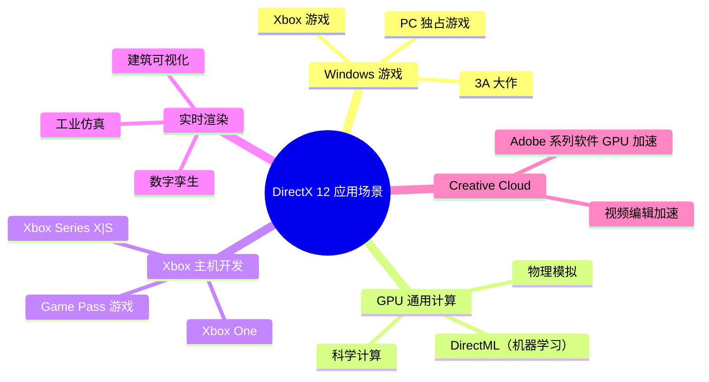

### 1.4 DirectX 12 的核心特点

| 特性 | 说明 | 小白解释 |
|------|------|---------|
| **Windows/Xbox 独家** | 仅支持 Microsoft 平台 | 做 Windows 游戏首选 |
| **底层显式控制** | 类似 Vulkan 的设计理念 | 完全控制 GPU，但代码复杂 |
| **极低的 CPU 开销** | CPU 开销比 DX11 降低 50%+ | 更多 CPU 时间给游戏逻辑 |
| **多线程渲染** | 原生支持多线程命令录制 | 能充分利用多核 CPU |
| **DirectML** | 内置 AI 推理加速库 | GPU 不仅能画图，还能跑 AI |
| **HLSL** | 成熟的 Shader 语言 | 语法类似 C，生态成熟 |
| **PIX 调试工具** | Microsoft 官方调试器 | 比 RenderDoc 在 Windows 上更好用 |
| **DirectX Raytracing (DXR)** | 硬件光线追踪支持 | 实现电影级真实感渲染 |

---

## 二、DirectX 12 vs Vulkan / Metal / OpenGL

### 2.1 先搞懂：它们分别干什么事情？

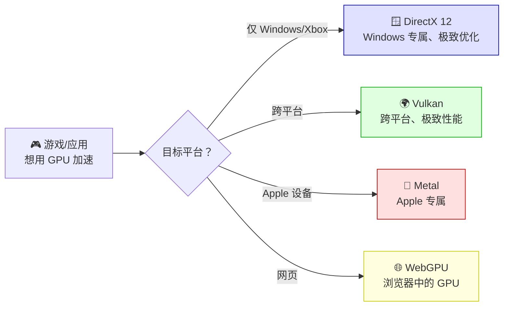

#### 各技术定位对比

| 技术 | 开发者 | 发布年 | 平台 | 定位 |
|------|--------|--------|------|------|
| **DirectX 11** | Microsoft | 2009 | Windows/Xbox | Windows 老牌 API（仍广泛使用） |
| **🌟 DirectX 12** | Microsoft | 2015 | Windows/Xbox | Windows 现代标准 |
| **Vulkan** | Khronos | 2016 | 跨平台 | 跨平台现代标准 |
| **Metal** | Apple | 2014 | Apple 仅 | Apple 现代标准 |
| **OpenGL** | Khronos | 1992 | 跨平台 | 已淘汰 |

### 2.2 生活化类比：一眼看懂关系

> **餐厅后厨类比**：
> - **DirectX 11** = 老式厨房（简单、慢、厨具少）
> - **DirectX 12** = Windows 专供的超现代厨房（极速、设备多、需要专业培训）
> - **Vulkan** = 全球通用的超现代厨房（和 DX12 一样强，但哪里都能用）
> - **Metal** = Apple 专供的超现代厨房（在 Apple 餐厅里最快）

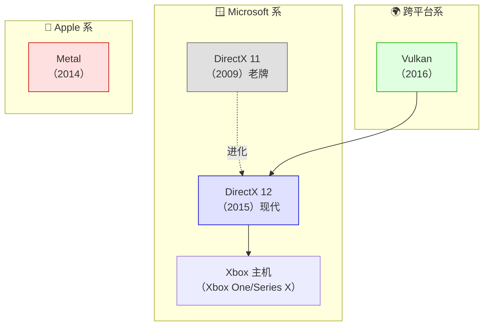

### 2.3 完整对比表

| 对比项 | DirectX 12 | Vulkan | Metal | DirectX 11 |
|--------|------------|--------|-------|------------|
| **平台** | Windows/Xbox | 跨平台 | 仅 Apple | Windows/Xbox |
| **CPU 开销** | 极低 | 极低 | 极低 | 高 |
| **多线程** | ✅ 原生支持 | ✅ 原生支持 | ✅ 支持 | ❌ 不支持 |
| **着色器语言** | HLSL | SPIR-V | MSL | HLSL |
| **调试工具** | PIX（极好用） | RenderDoc | Xcode GPU Capture | PIX（功能较少） |
| **光线追踪** | ✅ DXR | ✅ 扩展支持 | ✅ 支持 | ❌ |
| **AI 加速** | ✅ DirectML | 需自己实现 | ✅ MPS | ❌ |
| **学习难度** | ⭐⭐⭐⭐ | ⭐⭐⭐⭐⭐ | ⭐⭐⭐ | ⭐⭐ |
| **代码量** | 极大（约 800+ 行画三角形） | 极大（约 1000+ 行） | 中（约 300+ 行） | 小（约 80 行） |
| **未来** | ✅ Microsoft 主推 | ✅ Khronos 主推 | ✅ Apple 主推 | ⚠️ 维护模式 |

### 2.4 DirectX 12 的独特优势：与 Windows 深度集成

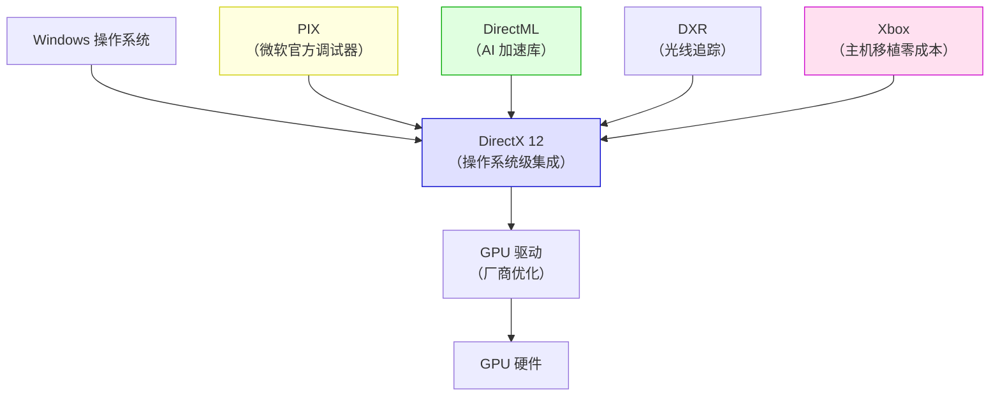

> 💡 **核心优势**：DirectX 12 是 **操作系统级** 的 API，和 Windows 深度集成。调试工具（PIX）是微软官方出品，比第三方工具（如 RenderDoc）在 Windows 上更好用。而且 Xbox 游戏开发直接用 DX12，PC 游戏移植到 Xbox 几乎零成本。

### 2.5 DirectX 12 在各平台的详细支持情况

DirectX 12 是 **Microsoft 独家技术**，主要支持 Windows 和 Xbox 平台。下面是详细的平台支持情况：

#### 2.5.1 Windows 平台原生支持

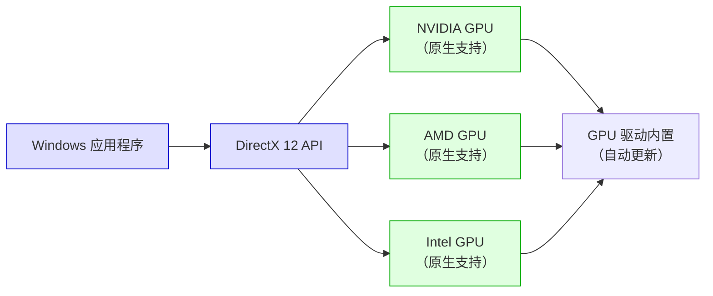

| 项目 | 说明 |
|------|------|
| **支持版本** | Windows 10（1507 及以上）、Windows 11 |
| **推荐版本** | Windows 11 22H2 及以上（支持最新 DX12 Ultimate） |
| **GPU 要求** | 支持 DirectX 12 的 GPU（2015 年后的大部分 GPU） |
| **开发工具** | Visual Studio 2019+、PIX、RenderDoc |
| **DX12 版本** | DX12 Ultimate（Windows 11+）、DX12（Windows 10+） |

> 💡 **重要提示**：DirectX 12 **仅原生支持 Windows 和 Xbox**。如果你用的是 macOS 或 Linux，无法原生运行 DirectX 12 程序。但可以通过 **Wine** 或 **Proton**（Linux）来运行部分 DX12 游戏。

#### 2.5.2 Xbox 平台原生支持

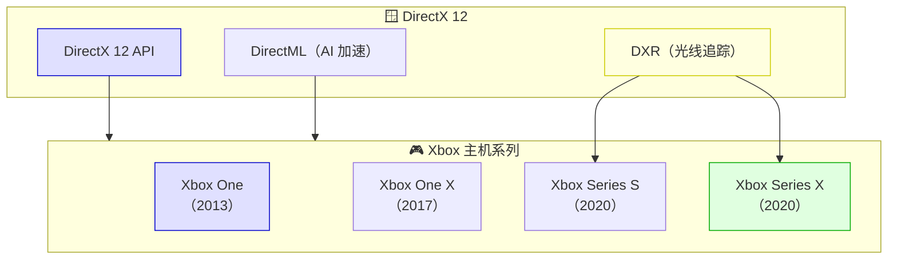

| 平台 | 发布年 | DX12 支持 | 特殊说明 |
|------|--------|-----------|----------|
| **Xbox One** | 2013 | ✅ 支持 | 初代支持，性能有限 |
| **Xbox One X** | 2017 | ✅ 完整支持 | 加强版，支持 4K |
| **Xbox Series S** | 2020 | ✅ DX12 Ultimate | 入门次世代，支持 DXR |
| **Xbox Series X** | 2020 | ✅ DX12 Ultimate | 高端次世代，完整 DXR 支持 |

#### 2.5.3 非 Windows 平台的兼容方案

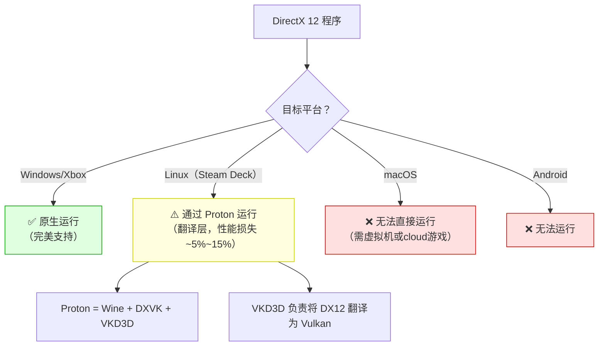

| 兼容方案 | 平台 | 原理 | 性能损失 | 成熟度 |
|----------|------|------|---------|--------|
| **Proton** | Linux（Steam Deck） | VKD3D 将 DX12 翻译为 Vulkan | ~5%~15% | ⭐⭐⭐⭐ |
| **Wine + VKD3D** | Linux | 同上，手动配置 | ~10%~20% | ⭐⭐⭐ |
| **Parallels Desktop** | macOS（Apple Silicon） | 虚拟机运行 Windows ARM | ~30%~50% | ⭐⭐⭐ |
| **Boot Camp** | macOS（Intel Mac） | 双系统启动 Windows | 0% | ⭐⭐⭐⭐⭐ |

#### 2.5.4 常见问题：我该选哪个图形 API？

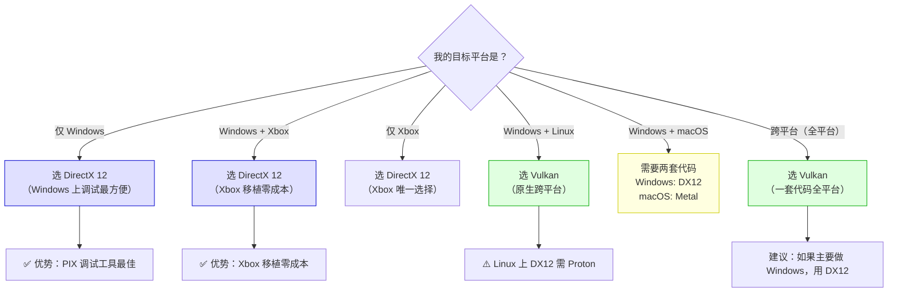

### 2.6 各平台 DirectX 12 可用性详细对比

| 平台 | 支持方式 | 成熟度 | 性能损失 | 推荐度 | 备注 |
|------|---------|--------|---------|--------|------|
| **Windows 10/11** | 原生（系统内置） | ⭐⭐⭐⭐⭐ | 0% | ⭐⭐⭐⭐⭐ 强烈推荐 | PC 游戏首选 |
| **Xbox One/X/S** | 原生（主机内置） | ⭐⭐⭐⭐⭐ | 0% | ⭐⭐⭐⭐⭐ 强烈推荐 | 主机开发唯一选择 |
| **Linux（Proton）** | VKD3D 翻译层 | ⭐⭐⭐⭐ | ~5%~15% | ⭐⭐⭐ 可用 | Steam Deck 常用 |
| **macOS（Intel + Boot Camp）** | 双系统启动 Windows | ⭐⭐⭐⭐⭐ | 0% | ⭐⭐⭐⭐ 推荐 | 仅 Intel Mac |
| **macOS（Apple Silicon + Parallels）** | 虚拟机 | ⭐⭐⭐ | ~30%~50% | ⭐⭐ 勉强可用 | 性能损失大 |
| **Android** | ❌ 不支持 | — | — | ❌ 无法使用 | 请用 Vulkan |
| **iOS** | ❌ 不支持 | — | — | ❌ 无法使用 | 请用 Metal |

> 💡 **总结一句话**：DirectX 12 **仅原生支持 Windows 和 Xbox**。如果你只做 Windows 游戏，DX12 是最佳选择（调试工具最完善）。如果需要跨平台（含 Linux/macOS），建议用 **Vulkan**。

---

## 三、学习路线图

### 3.1 整体学习路径

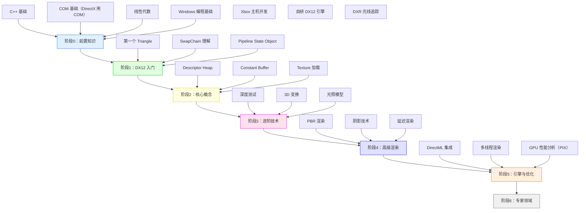

### 3.2 各阶段学习目标

| 阶段 | 周期 | 核心目标 | 能做出的东西 |
|:---:|:---:|:---:|----------|
| **阶段0** | 2~3周 | 补齐前置知识（C++/COM/Win32） | — |
| **阶段1** | 4周 | 画出第一个三角形 | 彩色三角形（800+ 行） |
| **阶段2** | 6周 | 理解 Descriptor Heap/Buffer | 带纹理的 3D 立方体 |
| **阶段3** | 6周 | 掌握 3D 渲染技术 | 带光照的 3D 场景 |
| **阶段4** | 8周 | 实现高级渲染效果 | PBR、阴影、后处理 |
| **阶段5** | 8周 | DirectML/多线程/性能优化 | 高性能渲染引擎 |
| **阶段6** | 长期 | Xbox 开发/自研引擎 | Xbox 游戏/自研引擎 |

---

## 四、入门篇：DirectX 12 编程核心流程

> **本章目标**：理解 DX12 程序的基本结构和编程流程，能够读懂 DX12 示例代码。

### 4.1 前置知识检查清单

#### ✅ 必须掌握

- [ ] **C++ 基础**：类、指针、智能指针、COM 基本概念
- [ ] **Win32 API 基础**：窗口创建、消息循环
- [ ] **线性代数**：向量、矩阵、坐标系变换
- [ ] **计算机图形学基础**：光栅化、着色器、渲染管线概念

#### 🔶 最好掌握（不强制）

- [ ] **DirectX 11 基础**：了解传统 DX 的工作方式
- [ ] **HLSL 基础**：DX 的 Shader 语言
- [ ] **CMake / Visual Studio**：Windows C++ 开发环境

> 💡 **关于 COM**：DirectX 12 使用 **COM（Component Object Model）** 来管理对象生命周期。`ComPtr<T>` 是智能指针，自动处理引用计数。这是 Windows 编程的基础知识。

### 4.2 DirectX 12 编程的核心流程

#### 🎯 先搞懂：DX12 编程就像「拍电影」

为了让你更容易理解 DX12 的编程流程，我们用**拍电影**来类比：

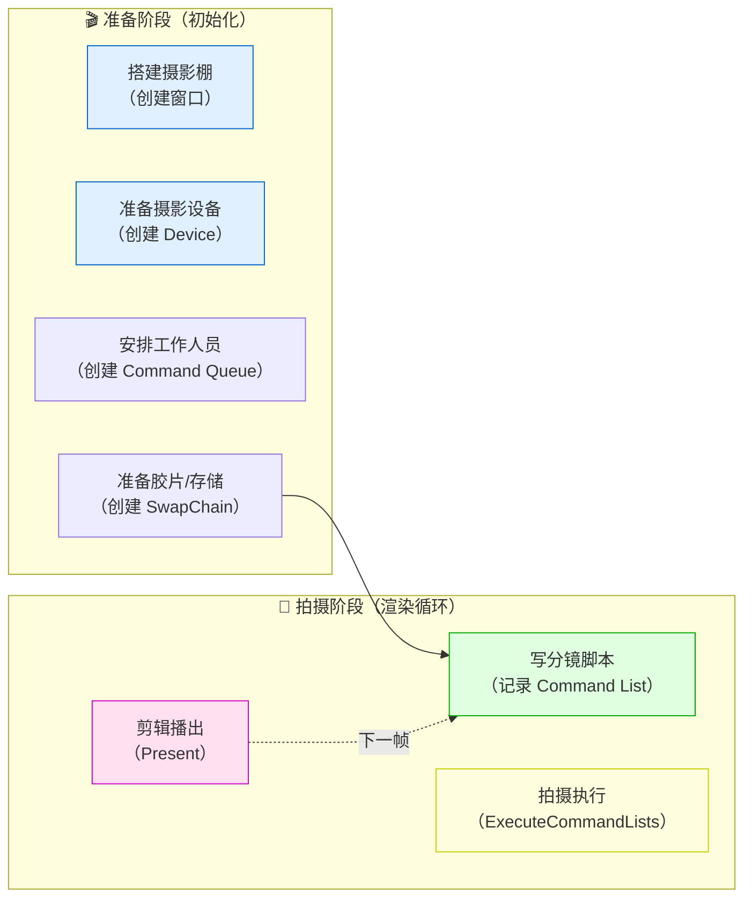

| 拍电影步骤 | DX12 对应步骤 | 说明 |
|-----------|--------------|------|
| 搭建摄影棚 | 创建窗口（Win32） | 需要一个「画布」来显示画面 |
| 准备摄影设备 | 创建 Device | 拿到 GPU 的「控制权」 |
| 安排工作人员 | 创建 Command Queue | GPU 有个「工作队列」，命令排队执行 |
| 准备胶片 | 创建 SwapChain | 准备「双缓冲」避免画面闪烁 |
| 写分镜脚本 | 记录 Command List | **先把要做的所有事情写下来** |
| 拍摄执行 | ExecuteCommandLists | 把写好的命令「一次性交给 GPU」 |
| 剪辑播出 | Present | 把画好的图「显示到屏幕上」 |

> 💡 **与 DirectX 11 的关键区别**：
> - **DX11**：就像「现场直播」—— 你说「画个三角形」，GPU 立即画
> - **DX12**：就像「拍电影」—— 先把所有镜头（命令）写好，然后一次性拍摄（执行）
> 
> 这种方式（命令记录模式）让 GPU 效率更高，但也让代码更复杂。

---

#### 📋 DX12 完整编程流程（7 大步骤）

```mermaid
flowchart TD
    subgraph 第一步["第1步：创建窗口"]
        A1["注册窗口类<br/>（WNDCLASSEX）"]
        A2["创建窗口<br/>（CreateWindowEx）"]
        A3["显示窗口<br/>（ShowWindow）"]
    end

    subgraph 第二步["第2步：初始化 DX12 核心对象"]
        B1["创建 DXGI Factory<br/>（CreateDXGIFactory）"]
        B2["选择 GPU 适配器<br/>（EnumAdapters）"]
        B3["创建 Device<br/>（D3D12CreateDevice）"]
        B4["创建 Command Queue<br/>（CreateCommandQueue）"]
        B5["创建 Command Allocator<br/>（CreateCommandAllocator）"]
    end

    subgraph 第三步["第3步：创建 SwapChain（交换链）"]
        C1["配置 SwapChain 描述<br/>（BufferCount=2）"]
        C2["创建 SwapChain<br/>（CreateSwapChainForHwnd）"]
        C3["创建 RTV Descriptor Heap"]
        C4["为每个 Buffer 创建 RTV"]
    end

    subgraph 第四步["第4步：创建渲染资源"]
        D1["创建 Root Signature<br/>（资源布局描述）"]
        D2["编译 HLSL Shader"]
        D3["创建 PSO<br/>（Pipeline State Object）"]
        D4["创建 Vertex Buffer"]
        D5["创建 Index Buffer（可选）"]
    end

    subgraph 第五步["第5步：记录 Command List"]
        E1["重置 Command Allocator"]
        E2["重置 Command List"]
        E3["设置 Viewport 和 Scissor Rect"]
        E4["设置 Render Target"]
        E5["清除屏幕（ClearRenderTargetView）"]
        E6["设置 PSO"]
        E7["设置 Vertex Buffer"]
        E8["绘制调用（DrawInstanced）"]
    end

    subgraph 第六步["第6步：执行并呈现"]
        F1["关闭 Command List"]
        F2["执行 Command List<br/>（ExecuteCommandLists）"]
        F3["Present（显示到屏幕）"]
        F4["等待 GPU 完成<br/>（Fence）"]
    end

    A3 --> B1
    B5 --> C1
    C4 --> D1
    D5 --> E1
    E8 --> F1
    F4 -.->|"下一帧循环"| E1

    style A1 fill:#e0f0ff,stroke:#06c
    style B3 fill:#e0f0ff,stroke:#06c
    style C2 fill:#fff0e0,stroke:#c60
    style D3 fill:#e0ffe0,stroke:#0a0
    style E5 fill:#ffe0e0,stroke:#c00
    style F2 fill:#ffffe0,stroke:#cc0
    style F3 fill:#ffe0f0,stroke:#c0c
```

---

#### 🔍 每一步详细解释（小白版）

##### 第 1 步：创建窗口（Win32）

**问题**：我们在哪里画图？
**答案**：需要一个窗口！DX12 本身不创建窗口，需要用 Windows 的 Win32 API。

```cpp
// 简化代码：创建一个 800x600 的窗口
HWND hwnd = CreateWindowEx(
    0,                              // 扩展样式
    L"MyWindowClass",               // 窗口类名
    L"我的第一个 DX12 程序",        // 窗口标题
    WS_OVERLAPPEDWINDOW,            // 窗口样式
    CW_USEDEFAULT, CW_USEDEFAULT,   // 位置（默认）
    800, 600,                       // 大小
    nullptr, nullptr, nullptr, nullptr
);
ShowWindow(hwnd, SW_SHOW);          // 显示窗口
```

> 💡 **类比**：就像画家需要先准备「画布」，我们也需要先准备「窗口」。

---

##### 第 2 步：初始化 DX12 核心对象

这一步是**最复杂**的，需要创建 4 个核心对象：

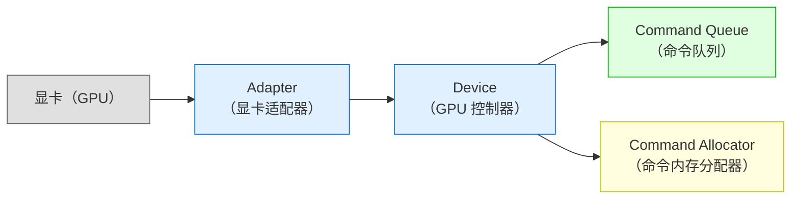

| 对象 | 作用 | 类比 |
|------|------|------|
| **DXGI Factory** | 用于枚举显卡和创建 SwapChain | 就像「显卡管理器」 |
| **Adapter** | 代表一张显卡 | 就像「选哪个 GPU 来干活」 |
| **Device** | DX12 的核心接口，所有操作都通过它 | 就像「GPU 的遥控器」 |
| **Command Queue** | GPU 的工作队列，命令在这里排队 | 就像「工厂的传送带」 |
| **Command Allocator** | 为 Command List 分配内存 | 就像「命令的草稿纸」 |

```cpp
// 简化代码：创建 Device 和 Command Queue
ComPtr<ID3D12Device> device;
D3D12CreateDevice(adapter.Get(), D3D_FEATURE_LEVEL_12_0, IID_PPV_ARGS(&device));

D3D12_COMMAND_QUEUE_DESC queueDesc = {};
queueDesc.Type = D3D12_COMMAND_LIST_TYPE_DIRECT;  // 直接命令队列
ComPtr<ID3D12CommandQueue> commandQueue;
device->CreateCommandQueue(&queueDesc, IID_PPV_ARGS(&commandQueue));
```

---

##### 第 3 步：创建 SwapChain（交换链）

**问题**：为什么需要 SwapChain？
**答案**：为了避免画面闪烁！我们用「双缓冲」技术：

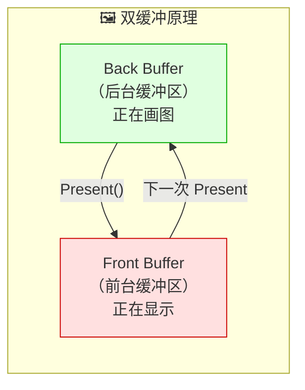

| 缓冲区 | 状态 | 说明 |
|--------|------|------|
| **Back Buffer** | 后台绘制 | GPU 正在这里画图，用户看不到 |
| **Front Buffer** | 前台显示 | 用户正在看的画面 |

> 💡 **类比**：就像「舞台换景」—— 观众看舞台 A 时，工作人员在舞台 B 准备下一幕。准备好后，灯光一切换（Present），观众就看到新画面了。

```cpp
// 简化代码：创建 SwapChain
DXGI_SWAP_CHAIN_DESC1 swapChainDesc = {};
swapChainDesc.BufferCount = 2;                      // 双缓冲
swapChainDesc.Format = DXGI_FORMAT_R8G8B8A8_UNORM;  // 颜色格式
swapChainDesc.BufferUsage = DXGI_USAGE_RENDER_TARGET_OUTPUT;
swapChainDesc.SwapEffect = DXGI_SWAP_EFFECT_FLIP_DISCARD;

ComPtr<IDXGISwapChain1> swapChain;
dxgiFactory->CreateSwapChainForHwnd(commandQueue.Get(), hwnd, &swapChainDesc, nullptr, nullptr, &swapChain);
```

---

##### 第 4 步：创建渲染资源（PSO、Shader、Buffer）

这一步是**最灵活**的，取决于你要画什么：

| 资源 | 作用 | 必须？ |
|------|------|--------|
| **Root Signature** | 定义 Shader 如何接收资源（类似函数参数声明） | ✅ 必须 |
| **HLSL Shader** | GPU 执行的程序（顶点着色器 + 像素着色器） | ✅ 必须 |
| **PSO** | 渲染管线的完整配置（状态集合） | ✅ 必须 |
| **Vertex Buffer** | 存储顶点数据（位置、颜色等） | ✅ 必须 |
| **Index Buffer** | 存储索引数据（可选，优化绘制） | ❌ 可选 |

> 💡 **PSO 是什么？** PSO（Pipeline State Object）是 DX12 的「渲染管线配置」，包含了**所有**渲染状态（光栅化、混合、深度测试等）。创建后不能修改！

---

##### 第 5 步：记录 Command List（最关键！）

**这是 DX12 和 DX11 最大的区别**：不是立即执行，而是**先记录**！

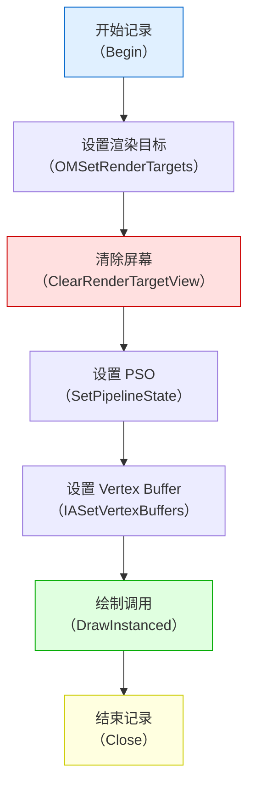

```cpp
// 简化代码：记录 Command List
ComPtr<ID3D12GraphicsCommandList> commandList;
// ... 创建 commandList ...

commandList->Reset(commandAllocator.Get(), pipelineState.Get());
{
    // 1. 设置 Viewport 和 Scissor Rect
    commandList->RSSetViewports(1, &viewport);
    commandList->RSSetScissorRects(1, &scissorRect);

    // 2. 设置渲染目标（从 SwapChain 获取当前 Back Buffer）
    commandList->OMSetRenderTargets(1, &rtvHandle, FALSE, nullptr);

    // 3. 清除屏幕为蓝色
    const float clearColor[] = {0.0f, 0.2f, 0.4f, 1.0f};
    commandList->ClearRenderTargetView(rtvHandle, clearColor, 0, nullptr);

    // 4. 设置 PSO 和 Vertex Buffer
    commandList->SetGraphicsRootSignature(rootSignature.Get());
    commandList->SetPipelineState(pipelineState.Get());
    commandList->IASetVertexBuffers(0, 1, &vertexBufferView);
    commandList->IASetPrimitiveTopology(D3D_PRIMITIVE_TOPOLOGY_TRIANGLELIST);

    // 5. 绘制！（画 3 个顶点 = 一个三角形）
    commandList->DrawInstanced(3, 1, 0, 0);
}
commandList->Close();  // 记录完毕
```

> ⚠️ **重要**：记录完后必须调用 `Close()`，否则无法执行！

---

##### 第 6 步：执行 Command List 并呈现

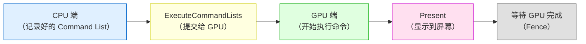

```cpp
// 简化代码：执行并呈现
// 1. 执行 Command List
ID3D12CommandList* ppCommandLists[] = {commandList.Get()};
commandQueue->ExecuteCommandLists(_countof(ppCommandLists), ppCommandLists);

// 2. 呈现（把 Back Buffer 显示到屏幕）
swapChain->Present(1, 0);  // 参数1 = 垂直同步开启

// 3. 等待 GPU 完成（防止 CPU 跑太快，覆盖正在用的资源）
// ... 使用 Fence 进行同步 ...
```

---

##### 第 7 步：渲染循环（不断重复）

```cpp
// 主循环：不断重复「记录 → 执行 → 呈现」
MSG msg = {};
while (msg.message != WM_QUIT) {
    // 处理 Windows 消息
    if (PeekMessage(&msg, nullptr, 0, 0, PM_REMOVE)) {
        TranslateMessage(&msg);
        DispatchMessage(&msg);
    } else {
        // ===== 渲染一帧 =====
        // 1. 重置 Command Allocator（回收上帧的内存）
        commandAllocator->Reset();

        // 2. 记录新的 Command List（第5步）
        // ... 记录命令 ...

        // 3. 执行并呈现（第6步）
        // ... 执行命令 + Present ...
    }
}
```

> 💡 **为什么需要 Reset？** 因为 Command Allocator 的内存是复用的。每帧开始前要 Reset，否则内存会爆炸！

---

### 4.3 DirectX 12 特有概念速查

| 概念 | 解释 | 类比 |
|------|------|------|
| **ID3D12Device** | DX12 的 GPU 设备接口 | 就像「拿到 GPU 的遥控器」 |
| **Command Queue** | GPU 的命令执行队列 | 就像「GPU 的工作队列」 |
| **Command List** | 记录的 GPU 命令列表 | 就像「写好的菜谱」 |
| **Command Allocator** | Command List 的内存分配器 | 就像「菜谱的草稿纸」 |
| **Pipeline State Object (PSO)** | 渲染管线的完整状态配置 | 就像「配置好的生产线」 |
| **Root Signature** | Shader 资源的布局描述 | 就像「Shader 的食材清单格式」 |
| **Descriptor Heap** | 资源描述符的堆（类似 Descriptor Set） | 就像「资源目录」 |
| **Resource Barrier** | 资源状态转换（DX12 独有） | 就像「告诉 GPU 这块内存现在用来干嘛」 |
| **Fence** | CPU-GPU 同步原语 | 就像「厨房计时器」 |
| **SwapChain** | 管理用于呈现的图像缓冲区 | 就像「舞台的后台换景区」 |

> 📚 **下一步**：第五章将深入讲解这些核心概念，包括 PSO、Root Signature、Descriptor Heap 等。

---

## 五、进阶篇：核心概念深入

### 5.1 渲染管线（Pipeline State Object）

DX12 的 PSO 是**不可变**的（创建后不能修改），所有渲染状态都必须在创建时指定。

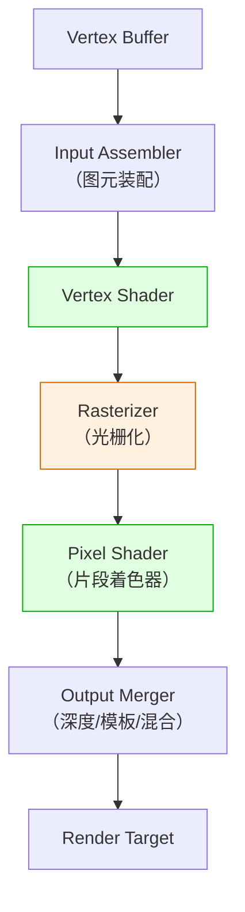

#### PSO 创建（关键代码）

```cpp
// PSO 包含了「所有」渲染状态（DX11 中是分散设置的）
D3D12_GRAPHICS_PIPELINE_STATE_DESC psoDesc = {};

// Shader 阶段
psoDesc.VS = {vsData, vsSize};
psoDesc.PS = {psData, psSize};

// 图元拓扑类型
psoDesc.PrimitiveTopologyType = D3D12_PRIMITIVE_TOPOLOGY_TYPE_TRIANGLE;

// 光栅化状态
CD3DX12_RASTERIZER_DESC rasterizerDesc(D3D12_DEFAULT);
rasterizerDesc.CullMode = D3D12_CULL_MODE_BACK;  // 背面剔除
psoDesc.RasterizerState = rasterizerDesc;

// 深度/模板状态
CD3DX12_DEPTH_STENCIL_DESC depthStencilDesc(D3D12_DEFAULT);
psoDesc.DepthStencilState = depthStencilDesc;

// 混合状态
CD3DX12_BLEND_DESC blendDesc(D3D12_DEFAULT);
psoDesc.BlendState = blendDesc;

// 顶点输入布局
psoDesc.InputLayout = {inputElementDescs, _countof(inputElementDescs)};

// Root Signature（资源绑定布局）
psoDesc.pRootSignature = rootSignature.Get();

// 渲染目标格式
psoDesc.RTVFormats[0] = DXGI_FORMAT_R8G8B8A8_UNORM;
psoDesc.NumRenderTargets = 1;

// 创建 PSO（耗时操作，建议在初始化时创建并缓存）
device->CreateGraphicsPipelineState(&psoDesc, IID_PPV_ARGS(&pipelineState));
```

### 5.2 内存与资源管理（DX12 最复杂的主题之一）

DX12 的内存管理是**完全显式**的，你需要自己决定资源放在哪种堆（Heap）上：

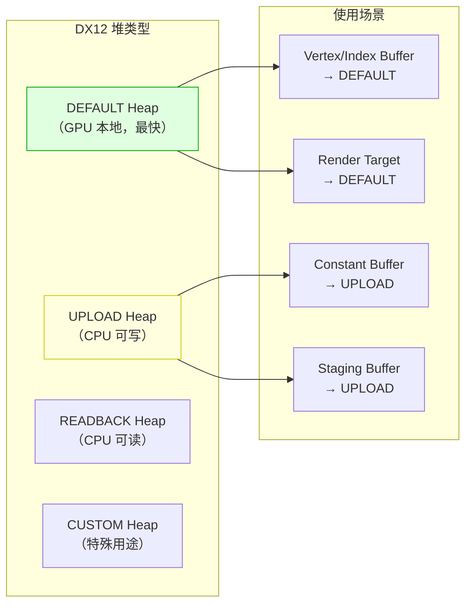

#### 典型的内存传输流程

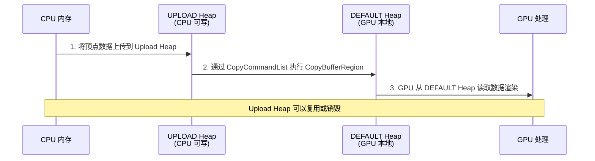

### 5.3 Root Signature 与资源绑定

Root Signature 是 DX12 向 Shader 传递资源（Buffer、Texture）的方式。

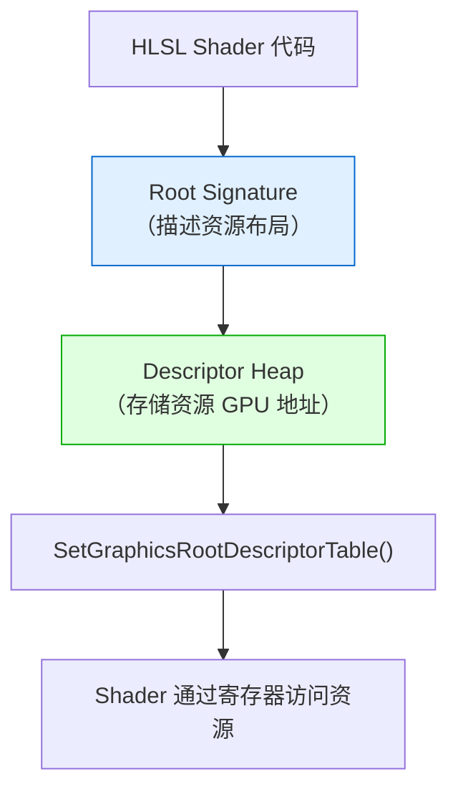

#### Root Signature 示例

```cpp
// 1. 定义 Root Signature（告诉 Pipeline 资源长什么样）
CD3DX12_ROOT_SIGNATURE_DESC rootSigDesc;
CD3DX12_ROOT_PARAMETER rootParams[1] = {};

// 用一个 Descriptor Table 绑定 CBV（Constant Buffer View）
CD3DX12_DESCRIPTOR_RANGE descRange;
descRange.Init(D3D12_DESCRIPTOR_RANGE_TYPE_CBV, 1, 0);  // 1 个 CBV，寄存器 b0
rootParams[0].InitAsDescriptorTable(1, &descRange);

rootSigDesc.Init(_countof(rootParams), rootParams,
                 0, nullptr,
                 D3D12_ROOT_SIGNATURE_FLAG_ALLOW_INPUT_ASSEMBLER_INPUT_LAYOUT);

// 序列化并创建 Root Signature
ComPtr<ID3DBlob> serializedRootSig;
D3D12SerializeRootSignature(&rootSigDesc, D3D_ROOT_SIGNATURE_VERSION_1,
                            &serializedRootSig, nullptr);
device->CreateRootSignature(0, serializedRootSig->GetBufferPointer(),
                            serializedRootSig->GetBufferSize(),
                            IID_PPV_ARGS(&rootSignature));
```

#### HLSL Shader 对应

```hlsl
// Root Signature 中的 Descriptor Table 对应 HLSL 中的寄存器
cbuffer Constants : register(b0) {
    float4x4 mvp;
};

// 顶点着色器
float4 vsMain(float3 position : POSITION) : SV_POSITION {
    return mul(float4(position, 1.0), mvp);
}

// 像素着色器
float4 psMain() : SV_TARGET {
    return float4(1.0, 0.0, 0.0, 1.0);  // 红色
}
```

---

## 六、高级篇：高级渲染技术

### 6.1 多线程渲染

DX12 的多线程渲染是其核心优势，和 Vulkan 类似：

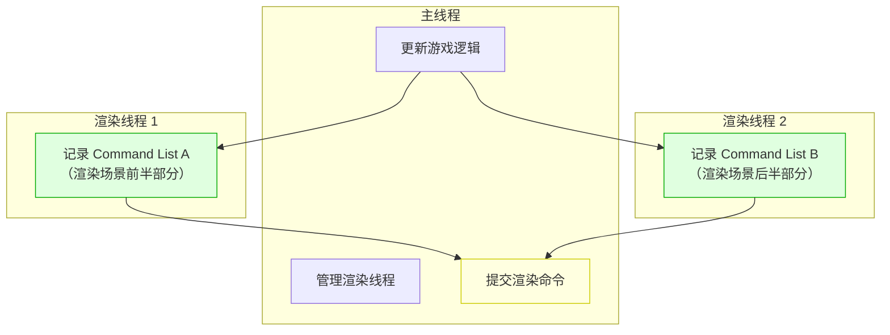

### 6.2 DirectML（AI 推理加速）

DirectML 是 Microsoft 提供的 GPU 加速机器学习库，可以在 DX12 中直接使用：

```mermaid
flowchart LR
    A["训练好的 ONNX 模型"] --> B["DirectML<br/>（GPU 加速推理）"]
    B --> C["推理结果"]
    C --> D["可用于<br/>渲染/游戏逻辑"]

    style B fill:#e0e0ff,stroke:#00c
```

### 6.3 DXR（DirectX Raytracing）光线追踪

DXR 是 DX12 的扩展，支持硬件加速的光线追踪：

```mermaid
flowchart TD
    A["发射光线"] --> B["BVH 遍历<br/>（硬件加速）"]
    B --> C["光线-三角形相交测试"]
    C --> D["调用 Closest Hit Shader"]
    D --> E["计算光照"]
    E --> F["最终像素颜色"]

    style B fill:#e0ffe0,stroke:#0a0
    style D fill:#e0e0ff,stroke:#00c
```

### 6.4 高级技术列表

| 技术 | 难度 | 说明 |
|------|------|------|
| **PBR 渲染** | ⭐⭐⭐ | 基于物理的渲染 |
| **阴影映射** | ⭐⭐⭐ | 动态阴影 |
| **延迟渲染** | ⭐⭐⭐⭐ | 多光源场景优化 |
| **DXR 光线追踪** | ⭐⭐⭐⭐⭐ | 硬件光线追踪 |
| **Mesh Shader** | ⭐⭐⭐⭐ | 下一代几何处理管线 |
| **Sampler Feedback** | ⭐⭐⭐⭐ | 纹理采样优化 |
| **DirectML 集成** | ⭐⭐⭐ | GPU 加速 AI 推理 |

---

## 七、专家篇：引擎与性能优化

### 7.1 使用引擎/封装库简化 DX12

| 封装库/引擎 | 类型 | 说明 |
|------------|------|------|
| **DirectX Tool Kit (DirectXTK)** | 官方辅助库 | 简化 DX12 常见操作 |
| **D3D12MemAlloc** | 内存管理库 | DX12 版的 VMA |
| **Friday Night Render** | 简化封装 | 类似 Vulkan 的简化封装 |
| **Unity** | 游戏引擎 | DX12 渲染后端 |
| **Unreal Engine** | 游戏引擎 | DX12 是默认渲染后端 |
| **Godot 4** | 游戏引擎 | 支持 DX12 渲染后端 |
| **PIX** | 调试工具 | Microsoft 官方 DX12 调试器 |

### 7.2 DX12 性能优化清单

```mermaid
mindmap
  root((DirectX 12 性能优化))
    PSO 优化
      PSO Cache（预编译）
      PSO 复用
      减少 PSO 切换
    内存优化
      D3D12MemAlloc
      Resource Heap 复用
      Resource Aliasing
    命令提交优化
      Bundle（命令复用）
      Indirect Draw
      批量提交 Command List
    渲染优化
      GPU Culling
      LOD
      实例化渲染
    Shader 优化
      Root Signature 优化
      减少 Register 压力
      HLSL 优化
```

### 7.3 PIX 调试（Windows 上最好用的 GPU 调试工具）

```mermaid
flowchart LR
    A["运行 DX12 程序"] --> B["启动 PIX"]
    B --> C["捕获一帧（GPU Capture）"]
    C --> D["分析 PSO / Descriptor Heap"]
    D --> E["查看 Texture/Buffer 内容"]
    E --> F["性能分析（Timing Capture）"]
```

---

## 八、实战项目

### 8.1 项目 1：DX12 三角形（入门）

**目标**：用纯 DX12 C++ API 画出彩色三角形

**学习内容**：
- DX12 初始化完整流程
- Command List 的记录与执行
- HLSL Shader 编译与加载
- SwapChain 和 Presentation

**预估时间**：2~3 周

### 8.2 项目 2：3D 模型查看器（进阶）

**目标**：加载 OBJ 模型，用 DX12 渲染

**学习内容**：
- 顶点/索引缓冲区管理
- Constant Buffer 和 MVP 矩阵
- 纹理加载（DirectXTex 库）
- 摄像机控制

**预估时间**：4~5 周

### 8.3 项目 3：PBR 场景渲染器（高级）

**目标**：实现完整的 PBR 渲染管线

**学习内容**：
- PBR 材质（金属度/粗糙度）
- IBL（基于图像的照明）
- 阴影映射
- 后处理

**预估时间**：8~10 周

### 8.4 项目 4：DXR 光线追踪渲染器（专家）

**目标**：实现硬件加速光线追踪

**学习内容**：
- DXR 渲染管线
- BVH 构建
- 光线-三角形相交
- 全局光照（Global Illumination）

**预估时间**：3~6 个月

---

## 附录 A：基础知识速查

### A.1 DX12 专有术语表

| 英文术语 | 中文翻译 | 解释 |
|---------|---------|------|
| **ID3D12Device** | DX12 设备 | GPU 的软件接口 |
| **Command Queue** | 命令队列 | GPU 命令执行队列 |
| **Command List** | 命令列表 | 记录的 GPU 命令 |
| **Command Allocator** | 命令分配器 | Command List 的内存分配器 |
| **PSO (Pipeline State Object)** | 管线状态对象 | 完整的渲染管线配置 |
| **Root Signature** | 根签名 | Shader 资源布局描述 |
| **Descriptor Heap** | 描述符堆 | 资源 GPU 地址的集合 |
| **Resource Barrier** | 资源屏障 | 资源状态转换（DX12 独有） |
| **Fence** | 栅栏 | CPU-GPU 同步原语 |
| **SwapChain** | 交换链 | 管理屏幕呈现的图像 |
| **HLSL** | 高级着色器语言 | DX 的 Shader 语言 |
| **DirectML** | DirectML | Microsoft 的 GPU AI 推理库 |
| **DXR** | DirectX 光线追踪 | 硬件光线追踪扩展 |

### A.2 DX12 开发环境搭建

#### 系统要求

| 要求 | 最低配置 | 推荐配置 |
|------|---------|---------|
| **操作系统** | Windows 10 版本 1809+ | Windows 11 |
| **GPU** | 支持 DX12 的 GPU | NVIDIA RTX / AMD RX 6000+ |
| **Visual Studio** | VS 2019 | VS 2022 |
| **Windows SDK** | 10.0.18362.0+ | 最新版 |
| **显卡驱动** | 支持 DX12 | 最新版 |

#### 安装步骤

```powershell
# 1. 安装 Visual Studio 2022（社区版免费）
# https://visualstudio.microsoft.com/

# 2. 安装时勾选：
#    - 使用 C++ 的桌面开发
#    - Windows 10/11 SDK
#    - MSVC v143 生成工具

# 3. 验证 DX12 支持
# 下载 DXDiag 或运行：
dxdiag  # 查看 DirectX 版本

# 4. 安装 PIX（DX12 调试工具）
# https://devblogs.microsoft.com/pix/download/
```

#### 验证 DX12 是否正常工作

```cpp
#include <d3d12.h>
#include <dxgi1_6.h>
#include <wrl.h>
#include <iostream>

int main() {
    // 初始化 DX12 Debug Layer（开发期建议开启）
    Microsoft::WRL::ComPtr<ID3D12Debug> debugController;
    if (SUCCEEDED(D3D12GetDebugInterface(IID_PPV_ARGS(&debugController)))) {
        debugController->EnableDebugLayer();
    }

    // 创建 DX12 Device
    Microsoft::WRL::ComPtr<ID3D12Device> device;
    HRESULT hr = D3D12CreateDevice(nullptr, D3D_FEATURE_LEVEL_12_0,
                                   IID_PPV_ARGS(&device));
    if (SUCCEEDED(hr)) {
        std::cout << "DirectX 12 Device 创建成功！" << std::endl;
        std::cout << "GPU: " << "默认适配器" << std::endl;
    } else {
        std::cout << "此 GPU 不支持 DirectX 12！" << std::endl;
    }
    return 0;
}
```

---

## 附录 B：学习资源推荐

### B.1 官方资源

| 资源 | 链接 | 说明 |
|------|------|------|
| **DirectX 12 官方文档** | https://learn.microsoft.com/en-us/windows/win32/direct3d12/ | Microsoft 官方文档 |
| **DirectX-Graphics-Samples** | https://github.com/Microsoft/DirectX-Graphics-Samples | Microsoft 官方示例 |
| **PIX 官方下载** | https://devblogs.microsoft.com/pix/ | Microsoft 官方调试工具 |
| **HLSL 参考** | https://learn.microsoft.com/en-us/windows/win32/direct3dhlsl/ | HLSL 语言参考 |

### B.2 教程与文档

| 资源 | 说明 | 推荐指数 |
|------|------|---------|
| **D3D12 Hello World** | Microsoft 官方入门教程 | ⭐⭐⭐⭐⭐ |
| **3D Game Programming with DX12 (Frank Luna)** | DX12 权威教材 | ⭐⭐⭐⭐⭐ |
| **Braynzar Soft DX12 Tutorial** | 免费在线教程 | ⭐⭐⭐⭐ |
| **casual-effects.com (Matt Pettineo)** | 现代渲染技术博客 | ⭐⭐⭐⭐ |

### B.3 书籍推荐

| 书名 | 作者 | 说明 |
|------|------|------|
| **《Introduction to 3D Game Programming with DirectX 12》** | Frank Luna | DX12 权威教材，强烈推荐 |
| **《Real-Time Rendering 4th》** | Tomas Akenine-Möller | 实时渲染圣经 |
| **《Physically Based Rendering 3rd》** | Matt Pharr | PBR 渲染权威参考 |

### B.4 工具推荐

| 工具 | 用途 |
|------|------|
| **PIX** | Microsoft 官方 DX12 调试器（必用） |
| **RenderDoc** | 第三方 Frame Debugger（也支持 DX12） |
| **DirectXTex** | 纹理加载库 |
| **DirectXTK** | DX12 辅助工具库 |
| **D3D12MemAlloc** | DX12 内存管理库 |
| **tracy** | 实时 CPU/GPU 性能分析器 |
| **NSight Graphics** | NVIDIA 官方 DX12 性能分析器 |

---

## 附录 C：常见问题 FAQ

### C.1 DirectX 12 太难了，我应该先学 DirectX 11 吗？

**答**：这取决于你的目标。

- 如果你是**学生/研究者**，有时间：建议**先学 DX11**（约 4~6 周）理解图形管线，再学 DX12。DX11 的「隐式状态管理」让你更容易理解「渲染管线是什么」，而不被复杂的初始化代码干扰。
- 如果你是**职业开发者**，需要立即上手：可以直接学 DX12，但建议配合 **DX12 Tool Kit** 和 **官方 Samples** 来降低难度。
- 如果你只是想**做游戏**：建议使用 **Unity/Unreal**（它们底层用 DX12），而不是自己写 DX12 代码。

### C.2 DirectX 12 和 Vulkan 我应该学哪个？

**答**：取决于你的目标平台：

| 你的目标 | 推荐 |
|---------|------|
| **只做 Windows/Xbox 游戏** | DirectX 12（调试工具更好用） |
| **跨平台（Windows + Linux + Android）** | Vulkan |
| **学习现代 GPU 架构** | 两个都学（概念高度相通） |
| **找工作（国内游戏公司）** | DirectX 11/12（国内 Windows 游戏为主） |

### C.3 什么是 Resource Barrier？为什么 DX12 需要它？

**答**：Resource Barrier 是 DX12 独有的概念，用于**告诉 GPU 一块内存的「用途」发生了变化**。

例如：一块内存先被用作「渲染目标（Render Target）」，后被用作「Shader 资源（Texture）」。在 DX11 中，驱动自动处理这个转换；在 DX12 中，**你必须显式调用 Resource Barrier** 来通知 GPU 做状态转换。

虽然增加了代码量，但避免了驱动中的「状态猜测」，降低了 CPU 开销。

### C.4 DirectX 12 支持哪些平台？

**答**：DirectX 12 是 **Microsoft 独家技术**，主要支持 Windows 和 Xbox 平台：

| 平台 | 支持方式 | 成熟度 | 性能损失 | 推荐度 | 备注 |
|------|---------|--------|---------|--------|------|
| **Windows 10/11** | 原生（系统内置） | ⭐⭐⭐⭐⭐ | 0% | ⭐⭐⭐⭐⭐ 强烈推荐 | PC 游戏首选 |
| **Xbox One/X/S** | 原生（主机内置） | ⭐⭐⭐⭐⭐ | 0% | ⭐⭐⭐⭐⭐ 强烈推荐 | 主机开发唯一选择 |
| **Linux（Proton）** | VKD3D 翻译层 | ⭐⭐⭐⭐ | ~5%~15% | ⭐⭐⭐ 可用 | Steam Deck 常用 |
| **macOS（Intel + Boot Camp）** | 双系统启动 Windows | ⭐⭐⭐⭐⭐ | 0% | ⭐⭐⭐⭐ 推荐 | 仅 Intel Mac |
| **macOS（Apple Silicon + Parallels）** | 虚拟机 | ⭐⭐⭐ | ~30%~50% | ⭐⭐ 勉强可用 | 性能损失大 |
| **Android** | ❌ 不支持 | — | — | ❌ 无法使用 | 请用 Vulkan |
| **iOS** | ❌ 不支持 | — | — | ❌ 无法使用 | 请用 Metal |

> 💡 **平台选择建议**：
> - 如果只做 Windows 游戏：用 DirectX 12（调试工具最完善）
> - 如果做 Windows + Xbox：用 DirectX 12（移植零成本）
> - 如果需要跨平台（含 Linux/macOS）：建议用 **Vulkan**

#### Windows 版本详细支持情况

| Windows 版本 | DX12 支持情况 |
|-------------|--------------|
| **Windows 10 版本 1507+** | ✅ 基本支持 |
| **Windows 10 版本 1809+** | ✅ 完全支持（推荐） |
| **Windows 11** | ✅ 完全支持（推荐，支持 DX12 Ultimate） |
| **Windows 7/8** | ❌ 不支持 |
| **Xbox One** | ✅ 支持 |
| **Xbox Series X/S** | ✅ 支持（完整 DX12 Ultimate） |

---

## 附录 D：DirectX 12 未来展望

### D.1 DirectX 12 Ultimate 特性

```mermaid
timeline
    title DirectX 12 演进
    2015 : DirectX 12 发布
        底层显式控制
        多线程渲染
    2018 : DirectX Raytracing (DXR) 1.0
         硬件光线追踪
    2019 : DirectX 12 Ultimate 宣布
         DXR 1.1
         Mesh Shader
         Sampler Feedback
    2020 : DirectX 12 Agility SDK
         独立更新 DX12 特性
    2021 : DirectStorage 发布
         GPU 直接访问 NVMe SSD
    2024+ : DirectX 12 持续演进
         更强的 AI 集成
         DirectML 增强
```

### D.2 DirectX 12 Ultimate 特性详解

| 特性 | 说明 | 需要硬件 |
|------|------|---------|
| **DXR 1.1** | 硬件光线追踪增强 | NVIDIA RTX / AMD RX 6000+ |
| **Mesh Shader** | 下一代几何处理管线 | NVIDIA RTX / AMD RX 6000+ |
| **Sampler Feedback** | 纹理采样优化 | NVIDIA RTX 30+ / AMD RX 6000+ |
| **DirectStorage** | GPU 直接访问高速 SSD | NVMe SSD + 支持 GPU |
| **DirectML** | GPU 加速机器学习 | 任何 DX12 兼容 GPU |

### D.3 DirectX 12 在行业中的应用

| 领域 | 应用 | 说明 |
|------|------|------|
| **PC 游戏** | 《赛博朋克 2077》《控制》| 使用 DX12 + DXR |
| **Xbox 游戏** | 《光环》《Forza》| Xbox 独占游戏 |
| **游戏引擎** | Unreal 5、Unity | DX12 是默认渲染后端 |
| **AI** | DirectML | Windows 上的 GPU AI 推理 |
| **创意软件** | Adobe Premiere、Blender | DX12 加速渲染 |

---

> **文档结束** —— 祝你的 DirectX 12 学习之旅顺利！🪟
>
> 如有问题，欢迎联系作者：47608843@qq.com
