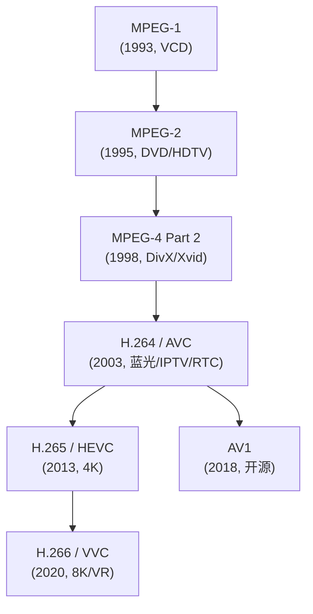
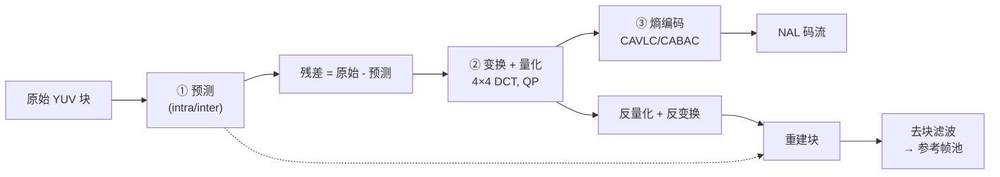
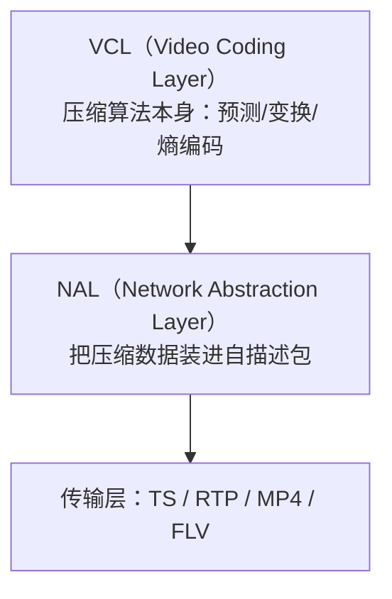

# H.264 / AVC 标准深入浅出——从语法元素到工程实战

**作者**：汪亮（bertonwang）  
**邮箱**：<47608843@qq.com>  
**版本**：v1.0 ｜ **最后更新**：2026-05-14

> **本书风格参考《C++11 新特性解析与应用深入理解》《C++23 新特性解析与应用深入理解》**，
> 对每一个 H.264 主题按
> **「问题背景 → 概念形式 → 语法/算法 → 码流示例 → 与其它编解码对比 → 注意事项」**
> 六段式逐一拆解，目标是让**只熟悉 C/C++、未碰过视频编码**的开发者，
> **只读这一本，就能从"看不懂 NALU"走到"能拆码流、能调编码参数、能做集成、能做优化"**。

---

## 目录

- [前言：为什么 2026 年还要学 H.264](#前言为什么-2026-年还要学-h264)
- [第 0 章：环境与工具链速查](#第-0-章环境与工具链速查)

### 第一部分　视频压缩基础
- [第 1 章：YUV 与色度二次采样（4:2:0/4:2:2/4:4:4）](#第-1-章yuv-与色度二次采样420422444)
- [第 2 章：从 MPEG-1 到 H.264 的演进](#第-2-章从-mpeg-1-到-h264-的演进)
- [第 3 章：编码器三件套——预测、变换、熵编码](#第-3-章编码器三件套预测变换熵编码)
- [第 4 章：率失真理论速览（R-D 曲线、λ、QP）](#第-4-章率失真理论速览r-d-曲线λqp)

### 第二部分　H.264 整体架构
- [第 5 章：VCL 与 NAL 两层设计](#第-5-章vcl-与-nal-两层设计)
- [第 6 章：NALU 结构与起始码 / Length-prefix 两种封装](#第-6-章nalu-结构与起始码--length-prefix-两种封装)
- [第 7 章：Profile 与 Level——从 Baseline 到 High444](#第-7-章profile-与-level从-baseline-到-high444)
- [第 8 章：参考帧、IDR、GOP、Slice、Tile / 切片组](#第-8-章参考帧idrgopslicetile--切片组)

### 第三部分　核心语法元素
- [第 9 章：SPS（Sequence Parameter Set）逐字段解析](#第-9-章spssequence-parameter-set逐字段解析)
- [第 10 章：PPS（Picture Parameter Set）逐字段解析](#第-10-章ppspicture-parameter-set逐字段解析)
- [第 11 章：Slice Header 与 Slice Data](#第-11-章slice-header-与-slice-data)
- [第 12 章：宏块（MB）与 8×8 子块的层级](#第-12-章宏块mb与-88-子块的层级)
- [第 13 章：Exp-Golomb 编码——读懂 SPS 的钥匙](#第-13-章exp-golomb-编码读懂-sps-的钥匙)

### 第四部分　预测、变换、量化
- [第 14 章：帧内预测（9 种 4×4 + 4 种 16×16）](#第-14-章帧内预测9-种-44--4-种-1616)
- [第 15 章：帧间预测——可变块大小运动补偿](#第-15-章帧间预测可变块大小运动补偿)
- [第 16 章：1/4 像素插值（6-tap + 双线性）](#第-16-章14-像素插值6-tap--双线性)
- [第 17 章：B 帧、加权预测、直接模式、SKIP](#第-17-章b-帧加权预测直接模式skip)
- [第 18 章：4×4 整数 DCT 与 Hadamard 变换](#第-18-章44-整数-dct-与-hadamard-变换)
- [第 19 章：QP 量化与码率—质量曲线](#第-19-章qp-量化与码率质量曲线)

### 第五部分　熵编码与环路滤波
- [第 20 章：CAVLC——上下文自适应可变长度编码](#第-20-章cavlc上下文自适应可变长度编码)
- [第 21 章：CABAC——上下文自适应二进制算术编码](#第-21-章cabac上下文自适应二进制算术编码)
- [第 22 章：去块滤波（Deblocking Filter）](#第-22-章去块滤波deblocking-filter)
- [第 23 章：SEI / VUI / HRD —— 传输保障三剑客](#第-23-章sei--vui--hrd--传输保障三剑客)

### 第六部分　工程实战
- [第 24 章：用 FFmpeg 拆 H.264 码流（一行命令看 NALU）](#第-24-章用-ffmpeg-拆-h264-码流一行命令看-nalu)
- [第 25 章：MP4 / FLV / TS / RTP 四种容器封装对比](#第-25-章mp4--flv--ts--rtp-四种容器封装对比)
- [第 26 章：直播延迟优化清单（GOP / B 帧 / Slice / SEI）](#第-26-章直播延迟优化清单gop--b-帧--slice--sei)
- [第 27 章：硬件编解码器（NVENC / QSV / VideoToolbox / MediaCodec）](#第-27-章硬件编解码器nvenc--qsv--videotoolbox--mediacodec)
- [第 28 章：H.264 vs H.265 vs H.266 vs AV1 —— 选型指南](#第-28-章h264-vs-h265-vs-h266-vs-av1--选型指南)

### 附录
- [附录 A：常用 NALU 类型与典型场景](#附录-a常用-nalu-类型与典型场景)
- [附录 B：SPS / PPS 完整位字段速查表](#附录-bsps--pps-完整位字段速查表)
- [附录 C：常见错误与坑](#附录-c常见错误与坑)

---

## 前言：为什么 2026 年还要学 H.264

| 现实 | 数据 |
|---|---|
| 全球 IPTV / OTT 节目 | **70%+ 仍是 H.264** |
| RTC 通话（Zoom、Teams、腾讯会议、声网、ZEGO） | **默认 H.264**（兼容性最高） |
| 安防摄像头 / 行车记录仪 | **几乎 100% H.264** |
| WebRTC 浏览器互通的"最低公约数" | **必选 H.264 Baseline** |

H.265/AV1/VVC 虽然压缩率更高，但 **专利、硬件普及、解码功耗** 三座大山让 H.264 仍是工程默认选项。

> 💡 本书目标：让你**能读 H.264 标准（ITU-T H.264 / ISO 14496-10）、能拆码流、能调编码器参数、能集成到自己的产品里**。
> 配套阅读：
> - 《最新版 x264 源码深入浅出.md》——理解工业级编码器
> - 《OpenH264 源码深入浅出.md》——理解 RTC 编码器

**学习路径**：


---

## 第 0 章：环境与工具链速查

| 工具 | 用途 | 一句话获取 |
|---|---|---|
| **FFmpeg** | 编码 / 解码 / 拆码流 | `apt install ffmpeg` / `brew install ffmpeg` |
| **x264 / x264-cli** | 工业级编码器 | 同上 |
| **ffprobe** | 分析视频元信息 | 随 FFmpeg |
| **h264_analyzer / h264bitstream** | 可视化看 SPS/PPS/Slice | GitHub 开源 |
| **HM Reference Decoder** (jm) | 标准参考解码 | JVT 官方 |
| **Elecard StreamEye** | 商业可视化（看码率分布、QP map） | 试用版即可 |
| **Bento4** | MP4 拆解工具 (`mp4dump`) | bento4.com |
| **YUView** | YUV 原始帧查看器 | GitHub |
| **VS Code + Hex Editor** | 看二进制 NALU | 插件 |

> 💡 **必备技能**：FFmpeg 命令行 + `printf("%02X")` 看 NALU 头。学完前 6 章就能上手。

---

# 第一部分　视频压缩基础

---

## 第 1 章：YUV 与色度二次采样（4:2:0 / 4:2:2 / 4:4:4）

人眼对**亮度敏感、对色度迟钝**，故视频压缩第一步：

```
RGB → YUV → 对 U/V 降采样
```

| 格式 | 含义 | 每像素字节 | 谁在用 |
|---|---|---|---|
| **YUV 4:2:0** | U/V 水平垂直各 1/2 | **1.5** | **H.264 主流**、几乎所有消费视频 |
| YUV 4:2:2 | U/V 仅水平 1/2 | 2 | 广电 / SDI |
| YUV 4:4:4 | U/V 不降采样 | 3 | 影院、屏幕录制、High444 Profile |
| YUV 4:0:0 | 仅 Y（灰度） | 1 | 红外、医疗 |

**4:2:0 的内存布局** —— I420（FFmpeg 内部默认）：

```
[ Y 平面: W × H ] [ U 平面: W/2 × H/2 ] [ V 平面: W/2 × H/2 ]
```

> ⚠️ **常见坑**：
> - **NV12** = Y + UV 交错，硬件解码器爱用，与 I420 不一样。
> - **YV12** = Y + V + U（U/V 顺序与 I420 反），FLV / Sorenson 用。
> - **stride（行跨度）≠ 宽度**：硬件对齐时常 16 / 32 字节倍数。

---

## 第 2 章：从 MPEG-1 到 H.264 的演进



H.264 的关键创新：
1. **可变块大小运动补偿**（16×16 ~ 4×4）。
2. **多参考帧**（最多 16 张）。
3. **整数 4×4 变换**——避免 DCT 的浮点失配，跨平台位精确。
4. **CABAC**——压缩率比 CAVLC 再提 10~15%。
5. **去块滤波环内**——画质显著优于 MPEG-2/4。

> 💡 同样画质下，**H.264 比 MPEG-2 省码率 50%**，这是它在 2005~2015 间彻底统治视频圈的根本原因。

---

## 第 3 章：编码器三件套——预测、变换、熵编码



记忆口诀：**减、变、量、熵、滤** —— 减预测、变换、量化、熵编码、滤波。

---

## 第 4 章：率失真理论速览（R-D 曲线、λ、QP）

最优码率分配的目标：

$$
J = D + \lambda \cdot R
$$

- **D**：失真（如 SSE）。
- **R**：码率（比特数）。
- **λ**：拉格朗日乘子，由 QP 推导：`λ ≈ 0.85 × 2^((QP-12)/3)`。

QP（量化参数）与质量的对照（H.264 范围 0~51）：

| QP | 主观感受 | 典型场景 |
|---|---|---|
| 18 | 视觉无损 | 母版 / 归档 |
| 23 | 默认 x264 高质量 | 蓝光、点播 |
| 28 | 流畅可看 | 直播、RTC |
| 35 | 明显模糊 | 弱网应急 |
| 40+ | 块状严重 | 仅供测试 |

> 💡 **QP 每 +6 → 比特率约 ÷2**（量化步长 ×2）。这是工程上估算"调 QP 影响多少码率"的银弹规则。

---

# 第二部分　H.264 整体架构

---

## 第 5 章：VCL 与 NAL 两层设计

H.264 标准把编解码器拆成两层：



> 💡 **解耦的好处**：换一种网络（IPTV → RTC → 录播）只改 NAL 封装，VCL 不用动。这种"内核-外壳"分离思想至今影响着 H.265、VVC、AV1。

---

## 第 6 章：NALU 结构与起始码 / Length-prefix 两种封装

### 6.1 NALU 头（1 字节）

```
+---+---+---+---+---+---+---+---+
| F |  NRI  |     nal_unit_type     |
+---+---+---+---+---+---+---+---+
  1     2              5
```

| 字段 | 位 | 含义 |
|---|---|---|
| F (forbidden_zero_bit) | 1 | 禁止位，**必须 0** |
| NRI (nal_ref_idc) | 2 | 优先级（0=非参考，3=最高） |
| nal_unit_type | 5 | 类型（见附录 A） |

常见值：

| `nal_unit_type` | 含义 | 头字节示例 |
|---|---|---|
| 1 | 非 IDR Slice | 0x21、0x41、0x61 |
| 5 | **IDR Slice**（关键帧） | 0x25、0x45、0x65 |
| 6 | SEI | 0x06 |
| 7 | **SPS** | 0x67 |
| 8 | **PPS** | 0x68 |
| 9 | AUD（访问单元分隔） | 0x09 |

### 6.2 两种封装对比

| 封装 | 起始码 / 长度 | 谁在用 |
|---|---|---|
| **Annex-B**（起始码） | `00 00 00 01` 或 `00 00 01` 前缀 | TS、RTP、裸 .h264 文件 |
| **AVCC**（长度前缀） | 4 字节大端长度 + NALU 数据 | **MP4 / FLV / MKV** |

> ⚠️ **互转核心规则**：MP4 内部是 AVCC，**送解码器前要转 Annex-B**（或解码器接 `extradata`）。

### 6.3 防竞争字节（emulation_prevention）

为防止数据流中出现 `00 00 00`/`00 00 01` 与起始码冲突，**编码器在 NALU 内每遇到 `00 00 00/01/02/03` 就插入一个 `0x03`**：

```
原始: 00 00 01 ...   →  写流: 00 00 03 01 ...
解码: 检测 00 00 03 → 删 03
```

写解码器时一定要加这一步逆变换，否则码流被破坏。

---

## 第 7 章：Profile 与 Level——从 Baseline 到 High444

### Profile（功能集）

| Profile | profile_idc | 关键特性 | 谁在用 |
|---|---|---|---|
| **Baseline (BP)** | 66 | 仅 I/P、CAVLC、无 B 帧、无 CABAC | RTC、低端硬件、老机顶盒 |
| Constrained Baseline (CBP) | 66 + flag | BP 子集 | WebRTC 默认 |
| **Main (MP)** | 77 | + B 帧、CABAC、加权预测 | 早期蓝光、IPTV |
| **High (HP)** | 100 | + 8×8 变换、自适应 8×8/4×4 | **绝大多数点播 / 直播** |
| High10 | 110 | 10 bit 色深 | HDR 母版 |
| High 4:2:2 / 4:4:4 / Predictive | 122 / 244 | 高色度 / 屏幕录制 | 影视后期 |

### Level（性能上限）

Level 决定**最大分辨率 × 帧率 × 码率**：

| Level | 典型分辨率 / 帧率 | 最大码率 (Mb/s) |
|---|---|---|
| 3.0 | 720×480 @ 30 | 10 |
| 3.1 | 1280×720 @ 30 | 14 |
| 4.0 | 1920×1080 @ 30 | 20 |
| 4.1 | 1920×1080 @ 30（蓝光） | 50 |
| 4.2 | 1920×1080 @ 60 | 50 |
| 5.0 | 2560×1920 @ 30 | 135 |
| 5.1 | 4K @ 30 | 240 |
| 5.2 | 4K @ 60 | 240 |
| 6.0/6.1/6.2 | 8K | 240 / 480 / 800 |

> 💡 **工程实战**：iOS Safari 严格按 SPS 里的 Level 检查，**Level 标错即播不了**。FFmpeg 默认会自动算 Level，手动指定用 `-level 4.1`。

---

## 第 8 章：参考帧、IDR、GOP、Slice、Tile / 切片组

```
GOP (Group Of Pictures)
┌───────────────────────────────────────────────┐
│  IDR  P   B   B   P   B   B   P   ...   IDR ...│
│   ↑                                       ↑    │
│   清空参考帧池                            下一个 GOP
└───────────────────────────────────────────────┘
```

| 概念 | 一句话 |
|---|---|
| **I 帧** | 全帧内编码（不依赖其它帧） |
| **IDR (Instantaneous Decoder Refresh)** | 强 I 帧，**清空参考帧池**，是真正的"切入点" |
| **P 帧** | 单向参考（前向） |
| **B 帧** | 双向参考（前 + 后） |
| **GOP** | 两个 IDR 之间一组帧 |
| **Slice** | 一帧内可分多个独立可解码片段（容错 / 并行） |
| **切片组（FMO）** | Baseline 才有，可任意映射宏块到 Slice |

> 💡 **直播关键概念**：
> - GOP 越大压缩率越高，但**首屏延迟越长**（必须等 IDR 才能起播）。
> - 直播 GOP = 1~2 秒；点播 = 5~10 秒；归档可 30 秒。
> - **B 帧**会引入"显示延迟"，RTC 一律关闭（`-bf 0`）。

---

# 第三部分　核心语法元素

---

## 第 9 章：SPS（Sequence Parameter Set）逐字段解析

SPS 描述一段序列的全局配置（分辨率、Profile、参考帧数等）。**每个解码器初始化必读**。

```c
// 简化伪代码（位流逐字段读，多数为 ue(v)/se(v) 即 Exp-Golomb）
profile_idc                 u(8)        // 66/77/100...
constraint_set_flags        u(8)        // 兼容性约束
level_idc                   u(8)        // 30/31/40...
seq_parameter_set_id        ue(v)
if (profile_idc in {100,110,...}) {
    chroma_format_idc       ue(v)       // 1=4:2:0
    bit_depth_luma_minus8   ue(v)
    bit_depth_chroma_minus8 ue(v)
    ...
}
log2_max_frame_num_minus4   ue(v)
pic_order_cnt_type          ue(v)
num_ref_frames              ue(v)       // 参考帧最大张数
pic_width_in_mbs_minus1     ue(v)       // (W/16)-1
pic_height_in_map_units_minus1 ue(v)
frame_mbs_only_flag         u(1)        // 0=隔行
direct_8x8_inference_flag   u(1)
frame_cropping_flag         u(1)
if (frame_cropping_flag) {
    frame_crop_left_offset  ue(v)
    frame_crop_right_offset ue(v)
    frame_crop_top_offset   ue(v)
    frame_crop_bottom_offset ue(v)
}
vui_parameters_present_flag u(1)
if (...) vui_parameters()
```

### 实战例：解析最常见的 1080p Baseline SPS

字节流：`67 42 C0 1F D9 00 F0 04 7F CB 70 80 6D 0A 14`

| 字段 | 值 | 解释 |
|---|---|---|
| profile_idc | 0x42 = 66 | Baseline |
| level_idc | 0x1F = 31 | Level 3.1 |
| pic_width_in_mbs_minus1 | 119 | (120-1) → 1920 px |
| pic_height_in_map_units_minus1 | 67 | (68-1) → 1088 → crop 到 1080 |

> 💡 **真实工程**：直接调 `ffprobe -show_streams` 比手算 Exp-Golomb 快得多。但写解码器一定得手动展开。

---

## 第 10 章：PPS（Picture Parameter Set）逐字段解析

PPS 描述图像级配置（熵编码方式、参考帧索引、加权、QP 偏移等）：

```c
pic_parameter_set_id            ue(v)
seq_parameter_set_id            ue(v)
entropy_coding_mode_flag        u(1)    // 0=CAVLC, 1=CABAC
bottom_field_pic_order_in_frame_present_flag u(1)
num_slice_groups_minus1         ue(v)
...
num_ref_idx_l0_default_active_minus1 ue(v)
num_ref_idx_l1_default_active_minus1 ue(v)
weighted_pred_flag              u(1)
weighted_bipred_idc             u(2)
pic_init_qp_minus26             se(v)   // 初始 QP - 26
pic_init_qs_minus26             se(v)
chroma_qp_index_offset          se(v)
deblocking_filter_control_present_flag u(1)
constrained_intra_pred_flag     u(1)
redundant_pic_cnt_present_flag  u(1)
transform_8x8_mode_flag         u(1)    // High Profile：开 8×8 变换
...
```

> 💡 一段流可以**多个 PPS**（如不同 Slice 用不同 QP / 是否开 CABAC），但通常只有一个。

---

## 第 11 章：Slice Header 与 Slice Data

每个 Slice 有自己的头：

```c
first_mb_in_slice           ue(v)
slice_type                  ue(v)   // 0=P, 1=B, 2=I, 5/7/9 等同
pic_parameter_set_id        ue(v)
frame_num                   u(v)
if (IdrPicFlag) idr_pic_id  ue(v)
pic_order_cnt_lsb           u(v)
ref_pic_list_modification()         // 参考帧重排序
...
slice_qp_delta              se(v)
disable_deblocking_filter_idc ue(v)
slice_alpha_c0_offset_div2  se(v)
slice_beta_offset_div2      se(v)
```

Slice Data 内部是宏块循环：

```c
do {
    if (slice_type != I)
        mb_skip_flag / mb_skip_run
    macroblock_layer()       // 一个宏块的所有语法
} while (more_data_in_slice());
```

---

## 第 12 章：宏块（MB）与 8×8 子块的层级

H.264 宏块固定 **16×16**，但内部可层层细分：

```
16×16 MB
├─ I16×16 / P16×16
├─ P16×8 / P8×16
└─ P8×8（可再分 8×8 / 8×4 / 4×8 / 4×4）
   └─ 4×4（帧内则有 9 种预测模式）
```

| 划分 | 含义 |
|---|---|
| 16×16 | 平坦区域 |
| 16×8 / 8×16 | 大物体边缘 |
| 8×8 | 中等物体 |
| 4×4 | 复杂细节 |

> 💡 **这就是 H.264 比 MPEG-4 强的根本** —— 自适应块大小。x264 的 `analyse` 参数就在控制开多少种划分。

---

## 第 13 章：Exp-Golomb 编码——读懂 SPS 的钥匙

H.264 的 SPS/PPS/Slice header **绝大多数字段都是 Exp-Golomb（指数哥伦布）变长编码**。

读法：

1. 数前导 0 个数 = N。
2. 读紧接的 1（前缀结束位）。
3. 再读 N 位作为后缀。
4. `code_num = 2^N + suffix - 1`。

| 码字 | code_num |
|---|---|
| `1` | 0 |
| `010` | 1 |
| `011` | 2 |
| `00100` | 3 |
| `00101` | 4 |
| `00110` | 5 |
| `00111` | 6 |
| `0001000` | 7 |

ue(v) = 直接 code_num；se(v) = 把 code_num 映射到带符号：

| code_num | se(v) |
|---|---|
| 0 | 0 |
| 1 | +1 |
| 2 | -1 |
| 3 | +2 |
| 4 | -2 |

> 💡 写一个 50 行的 Bit Reader + Exp-Golomb 函数，你就能解 SPS。这是 H.264 的"hello world"。

```c
uint32_t read_ue(BitReader* br) {
    int zeros = 0;
    while (read_bit(br) == 0) zeros++;
    uint32_t suffix = read_bits(br, zeros);
    return (1u << zeros) - 1 + suffix;
}
int32_t read_se(BitReader* br) {
    uint32_t v = read_ue(br);
    return (v & 1) ? (int32_t)((v + 1) >> 1) : -(int32_t)(v >> 1);
}
```

---

# 第四部分　预测、变换、量化

---

## 第 14 章：帧内预测（9 种 4×4 + 4 种 16×16）

帧内预测：用**左 + 上**已重建像素来"猜"当前块。

### 9 种 Intra 4×4 模式

```
0: Vertical      （从上方拖下来）
1: Horizontal    （从左边拖过去）
2: DC            （上左均值）
3: Diagonal Down-Left
4: Diagonal Down-Right
5: Vertical Right
6: Horizontal Down
7: Vertical Left
8: Horizontal Up
```

### 4 种 Intra 16×16 模式

```
0 Vertical / 1 Horizontal / 2 DC / 3 Plane（线性平面）
```

> 💡 编码器为每个 4×4 块选**最小 SAD/SATD**的模式 → 写入码流（用 most-probable-mode 节省码字）。

---

## 第 15 章：帧间预测——可变块大小运动补偿

P 帧的每个块可独立选：

| 划分 | 数量 | MV 数 |
|---|---|---|
| 16×16 | 1 | 1 |
| 16×8 | 2 | 2 |
| 8×16 | 2 | 2 |
| 8×8（每子块再细分） | 4×{8x8/8x4/4x8/4x4} | 最多 16 |

每个 MV 含：
- **参考帧索引** ref_idx_l0（0~num_ref_frames-1）
- **运动向量差** mvd（与预测向量 PMV 之差）

PMV = 左、上、右上块 MV 的 **中值**。这是**省码率的关键 trick**。

> 💡 **单像素 MV 反而少见**，1/4 像素是默认精度（见下章）。

---

## 第 16 章：1/4 像素插值（6-tap + 双线性）

参考帧像素是整数位置，但 MV 可指向亚像素。H.264 用**两步插值**：

```
1. 1/2 像素：6-tap FIR (1, -5, 20, 20, -5, 1) / 32   ← 高精度
2. 1/4 像素：相邻整数 / 半像素的双线性平均
```

色度更狠：直接 1/8 像素，纯双线性。

> 💡 这套系数被定死写进标准 → **任何解码器输出位精确一致**，这正是 H.264 整数化设计的精髓。

---

## 第 17 章：B 帧、加权预测、直接模式、SKIP

| 模式 | 一句话 | 码率 |
|---|---|---|
| **B-direct** | MV 由前后帧推断，**不传 MV** | 极省 |
| **B-skip** | 既不传 MV 也不传残差，完全靠预测 | **0 比特** |
| **加权预测** | `pred = w0*ref0 + w1*ref1 + offset` | 解决淡入淡出 |

> 💡 实测：开 B 帧 + B-direct 通常能再省 **8~12% 码率**，但带来 1~2 帧显示延迟。RTC 一律关。

---

## 第 18 章：4×4 整数 DCT 与 Hadamard 变换

H.264 是**整数变换**（不像 MPEG-2 浮点 DCT），核心矩阵：

$$
H_4 = \begin{bmatrix} 1 & 1 & 1 & 1 \\ 2 & 1 & -1 & -2 \\ 1 & -1 & -1 & 1 \\ 1 & -2 & 2 & -1 \end{bmatrix}
$$

特点：
- **只有 +/− / 移位**，无乘法。
- **位精确**，跨平台同样输入同样输出。
- 4×4 适合细节，High Profile 还有 8×8 整数变换。

I16×16 的 16 个 DC 系数另外做一次 **4×4 Hadamard**，进一步压缩低频。色度的 4 个 DC 也走 2×2 Hadamard。

---

## 第 19 章：QP 量化与码率—质量曲线

量化公式（简化）：

$$
Z_{ij} = \text{round}\left(\frac{Y_{ij}}{Q_{step}}\right)
$$

`Q_step` 由 QP 决定，**QP 每 +6 → Q_step ×2**。

实战 R-D 曲线（同一 1080p30 内容）：

| QP | 码率 | PSNR | VMAF |
|---|---|---|---|
| 18 | 18 Mb/s | 47 dB | 99 |
| 23 | 8 Mb/s | 43 dB | 96 |
| 28 | 4 Mb/s | 40 dB | 88 |
| 33 | 2 Mb/s | 36 dB | 75 |
| 38 | 1 Mb/s | 33 dB | 60 |

> 💡 **黄金 QP 区间**：23~28，肉眼几乎不察觉，码率减半。

---

# 第五部分　熵编码与环路滤波

---

## 第 20 章：CAVLC——上下文自适应可变长度编码

CAVLC 把 4×4 系数块拆为：

1. **TotalCoeff + TrailingOnes** → 查表得 VLC 码字。
2. 拖尾 ±1 的符号位。
3. 非拖尾的 level（按位长自适应递增）。
4. **TotalZeros**（系数间总零数）。
5. **run_before**（每个非零系数前的零数）。

特点：**所有上下文从相邻块统计而来**。Baseline / Main 用它。

---

## 第 21 章：CABAC——上下文自适应二进制算术编码

H.264 杀手锏，比 CAVLC 再省 **10~15% 码率**：


三大组件：
1. **二值化**：把多元符号变成 bit 串。
2. **上下文建模**：每个 bit 选一个上下文（动态概率）。
3. **算术编码引擎**：按概率压缩。

> ⚠️ CABAC 是**串行算法**，难以并行化——这也是硬件解码器的瓶颈。x264 / openh264 都把 CABAC 单独 SIMD/汇编优化。

---

## 第 22 章：去块滤波（Deblocking Filter）

块边界处量化误差形成**块状伪影**，标准在**编码环路内**就把它滤掉：

```
对每条 4×4 边界：
    根据两侧 QP、是否帧间、MV 差是否 ≥4 → 计算 BS（边界强度 0~4）
    BS == 0  跳过
    BS == 1~3  正常滤波（边界两侧最多改 3 像素）
    BS == 4    强滤波（仅 I 帧边界，最多改 4 像素）
```

> 💡 **环内滤波**（不是后处理）的好处：滤波后的帧成为下一帧的参考帧，**误差不会累积**。
> 这是 H.264 比 MPEG-2 / MPEG-4 画质更好的关键之一。

---

## 第 23 章：SEI / VUI / HRD —— 传输保障三剑客

| 名字 | 作用 | 典型字段 |
|---|---|---|
| **SEI** (Supplemental Enhancement Information) | 增强信息（非解码必需） | pic_timing、user_data、HDR 元数据、闭环字幕 |
| **VUI** (Video Usability Information) | 视频可用性信息（在 SPS 内） | 颜色空间、宽高比、帧率 |
| **HRD** (Hypothetical Reference Decoder) | 假设参考解码器模型 | CPB / DPB 大小，控制码率不超出缓冲 |

> 💡 **常见 SEI**：
> - `pic_timing` —— 解码 / 显示时间，让播放器对时间戳。
> - `user_data_unregistered` —— 私有数据（如水印、字幕）。
> - `mastering_display_color_volume` —— HDR10 元数据。

---

# 第六部分　工程实战

---

## 第 24 章：用 FFmpeg 拆 H.264 码流（一行命令看 NALU）

```bash
# 1. 提取裸 .h264（Annex-B）
ffmpeg -i input.mp4 -c:v copy -bsf:v h264_mp4toannexb -f h264 out.h264

# 2. 看每个 NALU
ffmpeg -i out.h264 -c copy -bsf:v trace_headers -f null - 2>&1 | less

# 3. 看分辨率 / Profile / Level
ffprobe -hide_banner -v error -select_streams v -show_streams input.mp4

# 4. 看每帧 type / size / pts
ffprobe -hide_banner -select_streams v -show_frames -show_entries \
        frame=pict_type,pkt_size,pts_time input.mp4
```

> 💡 **`trace_headers` 是宝藏**：把 SPS/PPS 每个字段中文化输出。

---

## 第 25 章：MP4 / FLV / TS / RTP 四种容器封装对比

| 容器 | NALU 封装 | 时间戳 | 起播延迟 | 谁在用 |
|---|---|---|---|---|
| **MP4 / fMP4** | AVCC（长度前缀） | mvhd 全局时基 | moov 在头部需快放 → 否则要 faststart | 点播、HLS-fMP4 |
| **FLV** | AVCC | DTS/PTS 32 位 | 极低 | RTMP 直播 |
| **TS** | Annex-B | PCR + PTS 33 位 | 低 | HLS-TS、IPTV |
| **RTP** | 单 NALU / FU-A / STAP-A | 90 kHz 时间戳 | 最低 | RTC、SIP |

最常踩的坑：**FLV → MP4** 转封装要切 AVCC ↔ AVCC（一致），**TS → MP4** 要把 Annex-B 转 AVCC（要去起始码、加长度前缀）。

---

## 第 26 章：直播延迟优化清单（GOP / B 帧 / Slice / SEI）

| 调优 | 效果 |
|---|---|
| **关 B 帧** (`-bf 0`) | 砍 1~3 帧显示延迟 |
| **GOP 1~2 秒**（如 25fps → `-g 50`） | 起播 / 切流快，但码率 ↑ |
| **slice 多片** (`-slices 4`) | NALU 切小块，可早送早解 |
| **CBR + tight VBV** (`-rc cbr -bufsize=2*bitrate`) | 网络稳定 |
| **关 scenecut** (`-x264-params scenecut=0`) | 防止意外大 I 帧打爆带宽 |
| **SEI pic_timing** | 让客户端对时间戳，省同步开销 |
| **AUD 加上** | NAL 流可逐帧切割 |
| **每秒 IDR + frame 起头加 SPS/PPS** | 中途接入立刻解码 |

> 💡 RTC 端到端延迟 < 200ms 的"经典配方"：
> ```
> -tune zerolatency -preset veryfast -bf 0 -refs 1 \
> -g 60 -keyint_min 60 -slices 1 -profile:v baseline
> ```

---

## 第 27 章：硬件编解码器（NVENC / QSV / VideoToolbox / MediaCodec）

| 平台 | 接口 | 一句话特点 |
|---|---|---|
| **NVIDIA** | NVENC / NVDEC（Video Codec SDK） | 最快、画质好、Pascal 起免费 |
| **Intel** | Quick Sync Video（VAAPI / oneVPL） | 集显白嫖、笔记本必选 |
| **AMD** | AMF / VCN | 直播友好 |
| **Apple** | VideoToolbox | iOS/macOS 唯一硬件路径 |
| **Android** | MediaCodec | 各厂商实现略不同，要"防 OEM 坑" |

FFmpeg 启用：

```bash
ffmpeg -hwaccel cuda -i in.mp4 -c:v h264_nvenc -preset p4 -cq 23 out.mp4
ffmpeg -hwaccel qsv  -i in.mp4 -c:v h264_qsv   -global_quality 23 out.mp4
ffmpeg -i in.mp4 -c:v h264_videotoolbox -q:v 50 out.mp4
```

> ⚠️ **硬件 H.264 的画质 ≠ x264**：在同样码率下硬件版常比 x264 medium 略差 5~10% VMAF。**对画质敏感场景仍用 x264 软编**，CPU 不够才硬编。

---

## 第 28 章：H.264 vs H.265 vs H.266 vs AV1 —— 选型指南

| 维度 | H.264 | H.265 | H.266 | AV1 |
|---|---|---|---|---|
| 标准化年 | 2003 | 2013 | 2020 | 2018 |
| 同质量码率 | 100% | 50% | 30% | 50% |
| 编码复杂度 | 1 | 5~10 | 20~30 | 10~30 |
| 解码复杂度 | 1 | 2~3 | 3~5 | 2~4 |
| **专利** | 复杂、需付费 | 复杂、需付费 | 复杂、需付费 | 开源、免授权 |
| 浏览器支持 | 全部 | Safari / Edge | 极少 | Chrome/Firefox/Edge |
| 硬件普及 | 100% | 95% (2025) | 个位数% | 60%+ |
| 适合场景 | RTC、兼容、低算力 | OTT 4K、HDR | 8K、VR | YouTube、开源生态 |

**2026 年工程默认值**：
- 兼容性优先 → **H.264**。
- 4K HDR 点播 → **H.265**。
- YouTube 风 + 不付费 → **AV1**。
- 8K/VR 前沿 → **H.266**。

---

# 附录

---

## 附录 A：常用 NALU 类型与典型场景

| type | 名称 | 典型 NRI | 备注 |
|---|---|---|---|
| 1 | 非 IDR Slice | 1~3 | P / B 帧 |
| 5 | **IDR Slice** | 3 | 关键帧 |
| 6 | SEI | 0 | 增强信息 |
| 7 | **SPS** | 3 | 序列头 |
| 8 | **PPS** | 3 | 图像头 |
| 9 | AUD | 0 | 帧分隔 |
| 12 | Filler | 0 | 填充字节 |
| 19 | Aux Slice | 0 | 辅助 |
| 14 | Prefix NAL Unit | – | SVC |
| 20 | SVC / MVC Slice | – | 扩展 |

---

## 附录 B：SPS / PPS 完整位字段速查表

参考 ITU-T H.264（2021）第 7.3.2 节，FFmpeg `libavcodec/h264_ps.c` 中的 `decode_sps()` 是最权威的"行走代码注释"。

工程速查（最常用 5 项）：

| 字段 | 在哪里 | 含义 |
|---|---|---|
| profile_idc | SPS u(8) | Profile（66/77/100） |
| level_idc | SPS u(8) | Level |
| pic_width_in_mbs_minus1 | SPS ue(v) | (W/16) - 1 |
| pic_height_in_map_units_minus1 | SPS ue(v) | (H/16) - 1（场编码翻倍） |
| entropy_coding_mode_flag | PPS u(1) | 0=CAVLC, 1=CABAC |

---

## 附录 C：常见错误与坑

| 现象 | 真正原因 | 解决 |
|---|---|---|
| 浏览器播不了 MP4 | Annex-B 没转 AVCC | `h264_mp4toannexb` 反向 / 设 extradata |
| Safari 播不了 | Level 太高或非兼容 Baseline | 降到 `-profile:v baseline -level 3.1` |
| 解码花屏（绿块） | 丢了 SPS/PPS / IDR | 关键 NAL 增加冗余、IDR 间隔加 SPS |
| 解码崩在 `read_ue` | 没去防竞争字节 0x03 | RBSP → SODB 加去 03 |
| RTP 接收抖动 | FU-A 未按规范分片 | 单 NALU > MTU 必须 FU-A |
| 颜色发青/发紫 | 没设 VUI colour_primaries | 显式设 BT.709 / BT.601 |
| 长直播帧号溢出 | log2_max_frame_num 太小 | SPS 设 `log2_max_frame_num_minus4 = 12` |
| 硬件解码器报 unsupported | Profile / chroma_format_idc 不支持 | 改用 Baseline / 4:2:0 |
| 转码后 PTS/DTS 错位 | B 帧重排顺序丢失 | 转封装也要保留 DTS |
| 编码 GOP 突然变长 | scenecut 触发 | `scenecut=0` 强制定长 |

---

> **结语**
>
> H.264 是地球上**部署量最大、使用时间最长、专利官司最多**的视频压缩标准。
> 学完这本书，你拥有了：
> 1. **能拆码流** —— 看懂 NALU、SPS/PPS、Slice。
> 2. **能调编码** —— 知道 GOP、B 帧、QP、Profile/Level 该怎么选。
> 3. **能集成** —— 选对容器、选对硬件路径。
>
> 接下来推荐配套阅读：
> - [《最新版 x264 源码深入浅出》](./最新版x264源码深入浅出-从工业级编码器到性能榨取.md)
> - [《OpenH264 源码深入浅出》](./OpenH264源码深入浅出-Cisco开源RTC编码器全景剖析.md)
>
> 这三本书一起，构成"标准 → 软编 → RTC"的完整知识链条。
>
> ——本书完
