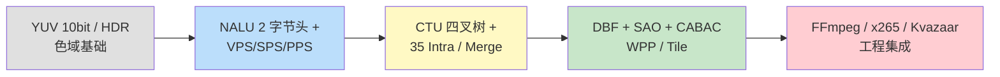
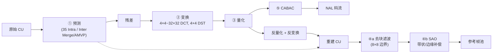
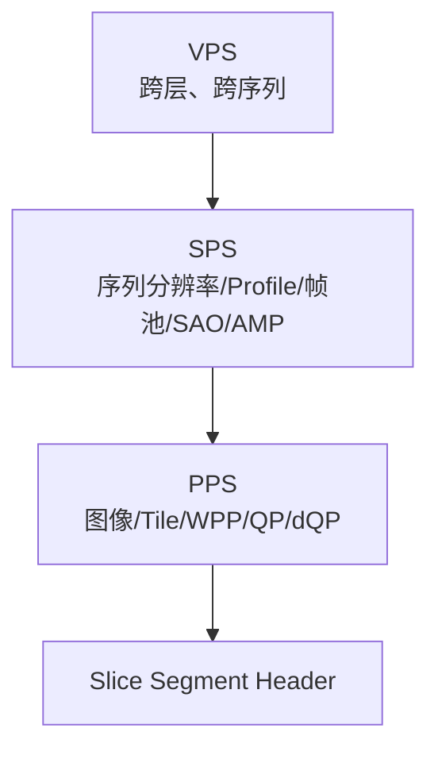
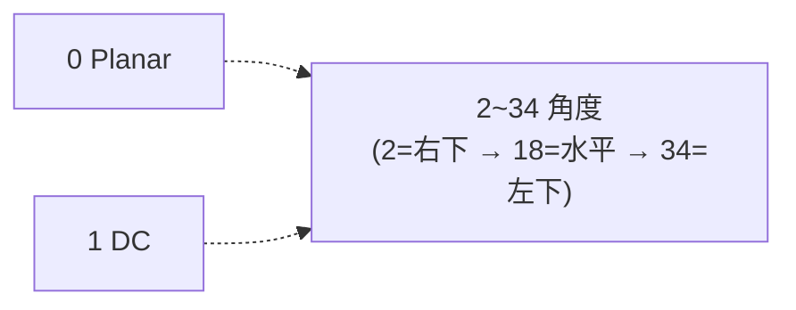

# H.265 / HEVC 标准深入浅出——从 CTU 四叉树到工程实战

**作者**：汪亮（bertonwang）  
**邮箱**：<47608843@qq.com>  
**版本**：v1.0 ｜ **最后更新**：2026-05-14

> **本书风格参考《C++11 新特性解析与应用深入理解》《C++23 新特性解析与应用深入理解》**，
> 对每一个 H.265 主题按
> **「问题背景 → 概念形式 → 语法/算法 → 码流示例 → 与 H.264 / AV1 对比 → 注意事项」**
> 六段式逐一拆解，目标是让**已经读过《H.264 标准深入浅出》**的开发者，
> **只读这一本，就能从"看不懂 CTU"走到"能拆 HEVC 码流、能调编码参数、能做 4K/HDR 集成、能做优化"**。

---

## 目录

- [前言：为什么 4K/HDR 时代离不开 H.265](#前言为什么-4khdr-时代离不开-h265)
- [第 0 章：环境与工具链速查](#第-0-章环境与工具链速查)

### 第一部分　视频压缩演进与基础
- [第 1 章：从 H.264 到 H.265 的关键飞跃](#第-1-章从-h264-到-h265-的关键飞跃)
- [第 2 章：YUV / 色深 / 色域 / HDR 速览](#第-2-章yuv--色深--色域--hdr-速览)
- [第 3 章：编码器五件套——预测、变换、量化、滤波、熵编码](#第-3-章编码器五件套预测变换量化滤波熵编码)
- [第 4 章：率失真理论与 QP 在 HEVC 中的不同](#第-4-章率失真理论与-qp-在-hevc-中的不同)

### 第二部分　HEVC 整体架构
- [第 5 章：VCL / NAL 与 H.264 的结构差异](#第-5-章vcl--nal-与-h264-的结构差异)
- [第 6 章：NALU 头（2 字节）与新增类型](#第-6-章nalu-头2-字节与新增类型)
- [第 7 章：Profile / Tier / Level —— 三维约束](#第-7-章profile--tier--level--三维约束)
- [第 8 章：VPS / SPS / PPS 三参数集](#第-8-章vps--sps--pps-三参数集)
- [第 9 章：CTU / CU / PU / TU 四叉树家族](#第-9-章ctu--cu--pu--tu-四叉树家族)

### 第三部分　核心语法元素
- [第 10 章：VPS（Video Parameter Set）逐字段解析](#第-10-章vpsvideo-parameter-set逐字段解析)
- [第 11 章：SPS（Sequence Parameter Set）逐字段解析](#第-11-章spssequence-parameter-set逐字段解析)
- [第 12 章：PPS（Picture Parameter Set）逐字段解析](#第-12-章ppspicture-parameter-set逐字段解析)
- [第 13 章：Slice Segment Header 与依赖切片](#第-13-章slice-segment-header-与依赖切片)
- [第 14 章：Coding Quadtree 与 split_cu_flag](#第-14-章coding-quadtree-与-split_cu_flag)
- [第 15 章：Exp-Golomb 与 HEVC 特有的截断码](#第-15-章exp-golomb-与-hevc-特有的截断码)

### 第四部分　预测、变换、量化
- [第 16 章：35 种帧内预测模式](#第-16-章35-种帧内预测模式)
- [第 17 章：帧间预测——AMVP 与 Merge](#第-17-章帧间预测amvp-与-merge)
- [第 18 章：1/4 像素插值升级到 8-tap / 7-tap](#第-18-章14-像素插值升级到-8-tap--7-tap)
- [第 19 章：B 帧、加权双向预测、TMVP](#第-19-章b-帧加权双向预测tmvp)
- [第 20 章：4×4 ~ 32×32 整数 DCT 与 4×4 整数 DST](#第-20-章44--3232-整数-dct-与-44-整数-dst)
- [第 21 章：QP 分配、CU 级 dQP 与 ChromaQP 偏移](#第-21-章qp-分配cu-级-dqp-与-chromaqp-偏移)

### 第五部分　环路滤波与熵编码
- [第 22 章：去块滤波（DBF）—— 8×8 边界与简化判定](#第-22-章去块滤波dbf-88-边界与简化判定)
- [第 23 章：SAO（Sample Adaptive Offset）](#第-23-章saosample-adaptive-offset)
- [第 24 章：CABAC 在 HEVC 中的精简与加速](#第-24-章cabac-在-hevc-中的精简与加速)
- [第 25 章：Tile / WPP / Slice —— 三种并行机制](#第-25-章tile--wpp--slice--三种并行机制)
- [第 26 章：HRD / VUI / SEI 在 HEVC 中的扩展](#第-26-章hrd--vui--sei-在-hevc-中的扩展)

### 第六部分　工程实战
- [第 27 章：用 FFmpeg 拆 HEVC 码流（hvcc / hev1 / hvc1）](#第-27-章用-ffmpeg-拆-hevc-码流hvcc--hev1--hvc1)
- [第 28 章：MP4 / TS / fMP4 / CMAF 封装对比](#第-28-章mp4--ts--fmp4--cmaf-封装对比)
- [第 29 章：HDR10 / HDR10+ / HLG / Dolby Vision 五件套](#第-29-章hdr10--hdr10--hlg--dolby-vision-五件套)
- [第 30 章：硬件编解码（NVENC HEVC / QSV / VideoToolbox / MediaCodec）](#第-30-章硬件编解码nvenc-hevc--qsv--videotoolbox--mediacodec)
- [第 31 章：H.265 vs H.264 vs H.266 vs AV1 —— 选型指南](#第-31-章h265-vs-h264-vs-h266-vs-av1--选型指南)
- [第 32 章：HEVC 的专利困局与商业策略](#第-32-章hevc-的专利困局与商业策略)

### 附录
- [附录 A：常用 NALU 类型与典型场景](#附录-a常用-nalu-类型与典型场景)
- [附录 B：VPS / SPS / PPS 关键字段速查表](#附录-bvps--sps--pps-关键字段速查表)
- [附录 C：常见错误与坑](#附录-c常见错误与坑)

---

## 前言：为什么 4K/HDR 时代离不开 H.265

| 现实 | 数据 |
|---|---|
| 蓝光 UHD（4K Blu-ray） | **强制 H.265 Main10** |
| 苹果生态（iPhone HEIC、ProRes RAW 替代） | **HEIF/HEVC 一等公民** |
| 安卓 4K 录像 | **默认 H.265** |
| Netflix / Amazon Prime / Apple TV+ 4K HDR | **大量 H.265 母版** |
| 8K NHK Super Hi-Vision | **H.265 + HEVC Multi-View** |

H.265 在 **同质量下比 H.264 节省 50% 码率**，让 4K HDR、8K 在带宽与存储上变得可行。但它也带来：
- **更复杂的语法**（CTU 64×64、四叉树、35 种 Intra）。
- **更多的并行机制**（Tile、WPP、Slice Segment）。
- **更头疼的专利**（MPEG-LA、HEVC Advance、Velos Media 三家专利池）。

> 💡 阅读本书前需先读 [《H.264 标准深入浅出》](./H.264标准深入浅出-从语法元素到工程实战.md) —— 90% 的概念是 H.264 的"加强版"，剩下 10% 是新瓶装新酒。
> 配套阅读：
> - 《最新版 x265 源码深入浅出.md》——理解工业级软编。
> - 《Kvazaar 源码深入浅出.md》——理解学院派开源 HEVC 编码器。

**学习路径**：



---

## 第 0 章：环境与工具链速查

| 工具 | 用途 | 一句话获取 |
|---|---|---|
| **FFmpeg ≥ 6.0** | 编 / 解 / 拆码流 | `apt install ffmpeg` |
| **x265 / x265-cli** | 工业级软编 | 同上 |
| **Kvazaar** | 学院派开源 HEVC | 自编 |
| **HM Reference**（HEVC test Model） | JCT-VC 官方参考解码 | github.com/HEVC-Projects/HM |
| **TAppDecoder / TAppEncoder** | HM 命令行 | 随 HM |
| **HEVCESBrowser** | 可视化 NALU / 句法树 | Elecard |
| **VVCSoftware_VTM** | 也可解 H.265（兼容） | github.com/fraunhoferhhi/VVCSoftware_VTM |
| **MP4Box / Bento4 mp4dump** | 看 hvcc / fragments | gpac.io |
| **HDR Easy / DaVinci** | HDR 母版校验 | 商业 |
| **YUView** | YUV 原始查看 | github |

> 💡 **HM 解码器是最权威的"行走代码注释"**——任何疑问翻 `Lib/TLibDecoder/TDecCAVLC.cpp`。

---

# 第一部分　视频压缩演进与基础

---

## 第 1 章：从 H.264 到 H.265 的关键飞跃

| 维度 | H.264 / AVC | H.265 / HEVC | 收益 |
|---|---|---|---|
| 编码块 | 16×16 宏块（MB） | **64×64 CTU**，可递归 8×8 | 大块省 header、小块保细节 |
| 划分方式 | 固定 + 子块 | **四叉树 CU/PU/TU** | 自适应内容 |
| Intra 模式 | 9 种 4×4 + 4 种 16×16 | **33 角度 + Planar + DC = 35** | 平滑 / 角度更精细 |
| Inter 划分 | 7 种 (16×16 ~ 4×4) | **8 种含非对称 (AMP)** | 边缘物体更贴 |
| MV 预测 | 中值 | **AMVP（候选列表） + Merge** | 省码率 |
| 插值滤波 | 6-tap | **8-tap 亮度 / 7-tap 色度** | 主观更锐 |
| 变换 | 4×4 / 8×8 整数 DCT | **4×4 ~ 32×32 + 4×4 DST** | 平坦 / 复杂兼顾 |
| 滤波 | DBF | **DBF + SAO** | 还原边缘细节 |
| 熵编码 | CAVLC + CABAC | **仅 CABAC（必须）** | 压缩率 +10% |
| 并行 | Slice / FMO | **Slice + Tile + WPP + 依赖切片** | 4K/8K 多核友好 |
| 同质量码率 | 100% | **50%** | 砍半 |
| 编码复杂度 | 1× | **5~10×** | 代价 |

> 💡 一句话：**HEVC = AVC × 自适应灵活性 + 工程并行性**。

---

## 第 2 章：YUV / 色深 / 色域 / HDR 速览

H.265 时代，**10 bit 与 HDR 才是真正的差异化卖点**：

| 概念 | 选项 | HEVC Profile |
|---|---|---|
| 色深 | 8 / **10** / 12 / 16 bit | Main / **Main10** / Main12 / Main4:4:4-16 |
| 色度采样 | 4:0:0 / 4:2:0 / 4:2:2 / 4:4:4 | Mono / Main / Main4:2:2 / Main4:4:4 |
| 色域 | BT.601 / **BT.709** / **BT.2020** | VUI |
| 传递函数 | Gamma / **PQ (SMPTE 2084)** / **HLG** | VUI |
| 颜色矩阵 | BT.601 / BT.709 / BT.2020 NCL/CL | VUI |

**HDR 关键 SEI**：

| SEI | 内容 | 谁要用 |
|---|---|---|
| `mastering_display_color_volume` | 母版亮度 / 色域 / 三原色坐标 | HDR10 必备 |
| `content_light_level_info` (CLL) | MaxCLL / MaxFALL | HDR10 必备 |
| `tone_mapping_info` | 动态色调映射 | HDR10+ / DV |
| Dolby Vision RPU | 元数据通道 | DV Profile 5/8/10 |

> 💡 **Main10 才是真 HEVC**。8 bit Main 仅用于"H.264 兼容性试水"，主流流媒体一律 Main10。

---

## 第 3 章：编码器五件套——预测、变换、量化、滤波、熵编码



记忆：**减、变、量、双滤、CABAC** —— 比 H.264 多了一道 SAO。

---

## 第 4 章：率失真理论与 QP 在 HEVC 中的不同

QP 范围：**HEVC 0~51**（与 H.264 一致），但实际 **8 bit Main 推荐 18~37、10 bit Main10 推荐 16~35**（10 bit 对低 QP 更敏感）。

λ 推导（编码端 RDO）：

$$
\lambda = \alpha \cdot 2^{(QP-12)/3.0}
$$

α 由帧类型决定（I 较小、B 较大）。

CU 级 QP（dQP）允许同帧不同区域 QP 偏移：

```
slice_qp_delta + cu_qp_delta_abs / cu_qp_delta_sign_flag
```

> 💡 **QP 每 +6 → 码率 ÷2**（与 H.264 同），但 HEVC 对 QP=22~28 区间码率压缩比 H.264 强约 50%。

---

# 第二部分　HEVC 整体架构

---

## 第 5 章：VCL / NAL 与 H.264 的结构差异

```
H.264 NALU 头  = 1 字节
H.265 NALU 头  = 2 字节   ← 多了 layer_id（多视点 / SHVC）+ tid（temporal_id_plus1）
```

且 H.265 引入了 **VPS（Video Parameter Set）**——比 SPS 更高层，描述整个比特流（含多层、HRD）。

> 💡 **VPS 在 H.264 不存在**。这是 HEVC 为多视点 MVC、多层 SHVC、多分辨率适配预留的"全局总开关"。

---

## 第 6 章：NALU 头（2 字节）与新增类型

```
+---+---+---+---+---+---+---+---+---+---+---+---+---+---+---+---+
| F |   nal_unit_type   |  nuh_layer_id   |  nuh_tid_plus1    |
+---+---+---+---+---+---+---+---+---+---+---+---+---+---+---+---+
  1            6                   6                3
```

| 字段 | 位 | 含义 |
|---|---|---|
| F | 1 | 必须 0 |
| nal_unit_type | 6 | 类型（0~63，是 H.264 5 位的 4 倍） |
| nuh_layer_id | 6 | 层 id（基础层 0，SHVC > 0） |
| nuh_temporal_id_plus1 | 3 | tid+1（保证非零） |

常见类型（详见附录 A）：

| type | 名称 | 说明 |
|---|---|---|
| 0 | TRAIL_N | 非参考 trailing |
| 1 | TRAIL_R | 参考 trailing |
| 19 | **IDR_W_RADL** | 关键帧 |
| 20 | **IDR_N_LP** | 关键帧（无前导帧） |
| 21 | CRA | Clean Random Access |
| 32 | **VPS** |  |
| 33 | **SPS** |  |
| 34 | **PPS** |  |
| 35 | AUD | 访问单元分隔 |
| 39 / 40 | SEI prefix / suffix |  |

起始码与防竞争字节规则**与 H.264 完全相同**（00 00 00 01 / 0x03 转义）。

---

## 第 7 章：Profile / Tier / Level —— 三维约束

H.264 是 (Profile, Level)，HEVC 是 **(Profile, Tier, Level)**：

| 维度 | 选项 |
|---|---|
| Profile | Main / Main10 / Main Still Picture / Main4:2:2 10/12 / Main4:4:4 8/10/12 / SCC（屏幕内容） / Multi-view / Scalable / Range Extension |
| **Tier** | **Main**（消费）/ **High**（广电、专业） |
| Level | 1.0~6.2（同 H.264 数字含义不同） |

Level 上限示例：

| Level | Tier=Main 码率上限 | Tier=High 码率上限 | 典型场景 |
|---|---|---|---|
| 4.1 | 30 Mb/s | 75 Mb/s | 1080p60 |
| 5.0 | 40 | 100 | 4K30 |
| 5.1 | 60 | 240 | **4K60 主流** |
| 5.2 | 60 | 240 | 4K HFR |
| 6.0 | 60 | 240 | 8K30 |
| 6.1 | 120 | 480 | 8K60 |
| 6.2 | 240 | 800 | 8K120 |

> 💡 **HDR 流媒体几乎都是 Main10@Level 5.1 High Tier**。Apple TV 4K 也是。

---

## 第 8 章：VPS / SPS / PPS 三参数集



| 参数集 | 主要内容 |
|---|---|
| **VPS** | 层数、Profile/Tier/Level、HRD 参数、子层时序 |
| **SPS** | 分辨率、bit_depth、chroma_format、CTU 大小、sample_adaptive_offset_enabled_flag、amp_enabled_flag、参考帧池、VUI |
| **PPS** | entropy_coding_sync_enabled_flag(WPP)、tiles_enabled_flag、init_qp、cu_qp_delta_enabled_flag、deblocking 参数 |

每个 VPS / SPS / PPS 都有 id，最多 16 / 16 / 64 套。

---

## 第 9 章：CTU / CU / PU / TU 四叉树家族

HEVC 的灵魂：**4 个层级 + 2 棵四叉树**。

```
CTU (Coding Tree Unit) 64×64
└─ Coding Quadtree
   └─ CU (Coding Unit)  64 / 32 / 16 / 8
      ├─ PU (Prediction Unit) —— 决定预测信息（Intra/Inter mode、MV）
      │   ├─ Intra: 2N×2N / N×N
      │   └─ Inter: 2N×2N / 2N×N / N×2N / N×N + AMP（2N×nU/nD, nL×2N/nR×2N）
      └─ Transform Quadtree
         └─ TU (Transform Unit)  32 / 16 / 8 / 4
```

> 💡 **大块预测、小块变换**或反之 —— 一切 HEVC 编码器的核心问题就是"四叉树怎么切"。
> 这条路径决定了 90% 的码率与 80% 的速度。

---

# 第三部分　核心语法元素

---

## 第 10 章：VPS（Video Parameter Set）逐字段解析

```c
vps_video_parameter_set_id           u(4)
vps_base_layer_internal_flag         u(1)
vps_base_layer_available_flag        u(1)
vps_max_layers_minus1                u(6)
vps_max_sub_layers_minus1            u(3)
vps_temporal_id_nesting_flag         u(1)
vps_reserved_0xffff_16bits           u(16)
profile_tier_level()
vps_sub_layer_ordering_info_present_flag u(1)
for (i = ...; i <= vps_max_sub_layers_minus1; i++) {
    vps_max_dec_pic_buffering_minus1[i] ue(v)
    vps_max_num_reorder_pics[i]         ue(v)
    vps_max_latency_increase_plus1[i]   ue(v)
}
vps_max_layer_id                     u(6)
vps_num_layer_sets_minus1            ue(v)
...
vps_timing_info_present_flag         u(1)
if (...) hrd_parameters()
vps_extension_flag                   u(1)        // SHVC/MV 扩展走这里
```

> 💡 单层 H.265 流的 VPS 通常只占 ~20 字节，但**没有它解码器无法初始化层结构**。

---

## 第 11 章：SPS（Sequence Parameter Set）逐字段解析

精简版（只列工程最常用）：

```c
sps_video_parameter_set_id          u(4)
sps_max_sub_layers_minus1           u(3)
sps_temporal_id_nesting_flag        u(1)
profile_tier_level()                            // 8+1+5+32 ...
sps_seq_parameter_set_id            ue(v)
chroma_format_idc                   ue(v)       // 1=4:2:0
pic_width_in_luma_samples           ue(v)
pic_height_in_luma_samples          ue(v)
conformance_window_flag             u(1)        // 输出裁剪
bit_depth_luma_minus8               ue(v)       // 0=8, 2=10, 4=12
bit_depth_chroma_minus8             ue(v)
log2_max_pic_order_cnt_lsb_minus4   ue(v)
sps_sub_layer_ordering_info_present_flag u(1)
log2_min_luma_coding_block_size_minus3      ue(v)   // 通常 0 → 8
log2_diff_max_min_luma_coding_block_size    ue(v)   // 0~3 → 8/16/32/64
log2_min_luma_transform_block_size_minus2   ue(v)
log2_diff_max_min_luma_transform_block_size ue(v)
max_transform_hierarchy_depth_inter ue(v)
max_transform_hierarchy_depth_intra ue(v)
amp_enabled_flag                    u(1)
sample_adaptive_offset_enabled_flag u(1)
pcm_enabled_flag                    u(1)
num_short_term_ref_pic_sets         ue(v)
long_term_ref_pics_present_flag     u(1)
sps_temporal_mvp_enabled_flag       u(1)
strong_intra_smoothing_enabled_flag u(1)
vui_parameters_present_flag         u(1)
if (...) vui_parameters()
```

**最关键 5 项**：

| 字段 | 作用 |
|---|---|
| pic_width / height_in_luma_samples | 真实分辨率 |
| bit_depth_luma_minus8 | 8/10/12 bit |
| chroma_format_idc | 4:2:0 / 4:2:2 / 4:4:4 |
| `log2_min_luma_coding_block_size_minus3` + `log2_diff_max_min_luma_coding_block_size` | CTU 大小（推 64×64） |
| sample_adaptive_offset_enabled_flag | 是否开 SAO（强烈推荐 1） |

---

## 第 12 章：PPS（Picture Parameter Set）逐字段解析

```c
pps_pic_parameter_set_id           ue(v)
pps_seq_parameter_set_id           ue(v)
dependent_slice_segments_enabled_flag u(1)
output_flag_present_flag           u(1)
num_extra_slice_header_bits        u(3)
sign_data_hiding_enabled_flag      u(1)         // 数据隐藏
cabac_init_present_flag            u(1)
num_ref_idx_l0_default_active_minus1 ue(v)
num_ref_idx_l1_default_active_minus1 ue(v)
init_qp_minus26                    se(v)
constrained_intra_pred_flag        u(1)
transform_skip_enabled_flag        u(1)         // 屏幕内容
cu_qp_delta_enabled_flag           u(1)
diff_cu_qp_delta_depth             ue(v)
pps_cb_qp_offset                   se(v)
pps_cr_qp_offset                   se(v)
pps_slice_chroma_qp_offsets_present_flag u(1)
weighted_pred_flag                 u(1)
weighted_bipred_flag               u(1)
transquant_bypass_enabled_flag     u(1)
tiles_enabled_flag                 u(1)         // ★ Tile 并行
entropy_coding_sync_enabled_flag   u(1)         // ★ WPP 并行
if (tiles_enabled_flag) {
    num_tile_columns_minus1 / num_tile_rows_minus1
    uniform_spacing_flag / column_width / row_height
    loop_filter_across_tiles_enabled_flag
}
pps_loop_filter_across_slices_enabled_flag u(1)
deblocking_filter_control_present_flag u(1)
...
pps_extension_flag                 u(1)
```

> ⚠️ **tile / WPP 互斥（不可同时开）**——见第 25 章。

---

## 第 13 章：Slice Segment Header 与依赖切片

H.264 一张图可拆 N 个独立 Slice。HEVC 进一步拆分：

```
Slice
├─ Independent Slice Segment（独立切片段，含完整 header）
└─ Dependent Slice Segment（依赖切片段，复用前段 header）
```

依赖切片配合 WPP / Tile，可**逐行 / 逐 Tile 立即送出**，降低延迟。

关键字段：

```c
first_slice_segment_in_pic_flag   u(1)
no_output_of_prior_pics_flag      u(1)        // 仅 IDR/CRA
slice_pic_parameter_set_id        ue(v)
dependent_slice_segment_flag      u(1)
slice_segment_address             u(v)
if (!dependent_slice_segment_flag) {
    slice_type                    ue(v)
    pic_output_flag               u(1)
    short_term_ref_pic_set        ...
    slice_temporal_mvp_enabled_flag u(1)
    slice_sao_luma_flag / slice_sao_chroma_flag
    num_ref_idx_l0_active_minus1
    ref_pic_lists_modification()
    ...
    five_minus_max_num_merge_cand ue(v)
    slice_qp_delta                se(v)
    cu_chroma_qp_offset_enabled_flag u(1)
    deblocking_filter_override_flag u(1)
    ...
}
if (tiles || entropy_coding_sync) {
    num_entry_point_offsets       ue(v)
    for (i=0; i<num; i++) entry_point_offset_minus1 u(v)
}
```

---

## 第 14 章：Coding Quadtree 与 split_cu_flag

CTU 内是层级递归：

```c
coding_quadtree(x0, y0, log2CbSize):
    if (...) split_cu_flag        u(1)            // CABAC
    if (split_cu_flag) {
        coding_quadtree(x0,           y0,           log2-1)
        coding_quadtree(x0+halfSize,  y0,           log2-1)
        coding_quadtree(x0,           y0+halfSize,  log2-1)
        coding_quadtree(x0+halfSize,  y0+halfSize,  log2-1)
    } else {
        coding_unit(x0, y0, log2CbSize)
    }
```

`coding_unit()` 内部还有 `split_transform_flag` 控制 TU 的四叉树。

> 💡 一行代码：HEVC 编码器选择"切 / 不切"由 RD cost 比较决定，**这就是 x265 / Kvazaar 占用 90% CPU 的循环**。

---

## 第 15 章：Exp-Golomb 与 HEVC 特有的截断码

HEVC 用了 **3 种变长码**：

| 类型 | 用法 |
|---|---|
| ue(v) / se(v) | 非负 / 带符号 Exp-Golomb（同 H.264） |
| u(v) / u(n) | 无符号定长 |
| **ae(v)** | CABAC（算术编码） |

新增的 truncated codes：

| 名称 | 用法 |
|---|---|
| **TR (truncated Rice)** | 残差系数 abs_remainder |
| **EG-k (k 阶指数哥伦布)** | Tail（>截断阈值时） |
| **限长一元** | merge_idx 等 |

> 💡 解一个 HEVC bin 比 AVC 复杂 30%，但 CABAC 的整体压缩率提升足以补回来。

---

# 第四部分　预测、变换、量化

---

## 第 16 章：35 种帧内预测模式

```
0: Planar         （平滑插值）
1: DC             （均值填充）
2~34: 33 种角度模式  （从 -45° 到 +45° + 9 个水平 + 9 个垂直方向，每 1.4° 一档）
```



**3 个最可能模式（MPM）**：

```
MPM[0] = 上邻 PU 模式
MPM[1] = 左邻 PU 模式
MPM[2] = Planar / DC / 左邻邻角度+1
```

命中 MPM 时只用 2 比特，不命中再写 5 比特直接编码（共 32 种）→ 比 H.264 的 most-probable-mode 更高效。

> 💡 **strong_intra_smoothing**：32×32 平坦块用线性插值替代邻居样本，进一步降伪轮廓。HDR 必开。

---

## 第 17 章：帧间预测——AMVP 与 Merge

| 模式 | 一句话 | 比特开销 |
|---|---|---|
| **Merge** | 直接复用候选 MV/refIdx | merge_idx (1~3 bit) |
| **AMVP**（Advanced MV Prediction） | 预测 + MVD | mvp_idx + mvd + ref_idx |
| **SKIP** | Merge 的零残差版本 | 极小 |

**Merge 候选列表（最多 5 个）**：

```
1. 空间相邻 5 个 PU（A0,A1,B0,B1,B2）
2. 时序协位 PU（TMVP，col-PU）
3. 组合双向（B 帧）
4. 零向量
```

**AMVP 候选列表（最多 2 个）**：

```
1. 空间左 / 上邻
2. TMVP 备胎
```

> 💡 实测 Merge 占用 P/B 帧 30~50% 块数，**这是 HEVC 比 H.264 省码率的核心来源之一**。

---

## 第 18 章：1/4 像素插值升级到 8-tap / 7-tap

| 滤波 | 长度 | 系数（×64） |
|---|---|---|
| **亮度 1/4 像素**（8-tap） | 8 | -1, 4, -10, 58, 17, -5, 1, 0（半像素时对称） |
| **色度 1/8 像素**（4-tap） | 4 | DCT-IF 4 抽头 |
| **亮度半像素**（8-tap） | 8 | -1, 4,-11, 40, 40,-11, 4,-1 |

精度提升对主观画质收益约 **+5% VMAF**，但运算量是 H.264 的 ~2×（在 SIMD 上 NEON/AVX2 可对冲）。

---

## 第 19 章：B 帧、加权双向预测、TMVP

- **加权双向预测**：`pred = (w0·ref0 + w1·ref1 + offset) >> shift`，用于淡入淡出。
- **TMVP（时序 MV 预测）**：用前一帧 col-PU 的 MV 缩放到当前 → 提升 Merge 命中率。
- **SPS/Slice 控制**：`sps_temporal_mvp_enabled_flag` + `slice_temporal_mvp_enabled_flag`。

> 💡 RTC 场景关 TMVP（防止跨帧错误传播），点播开。

---

## 第 20 章：4×4 ~ 32×32 整数 DCT 与 4×4 整数 DST

变换尺寸 4 / 8 / 16 / 32（亮度）+ 4 / 8 / 16（色度）。

特殊：**4×4 Intra 亮度** 用 **整数 DST（DST-VII）**，因为 Intra 残差能量集中在边角，DST 比 DCT 更紧凑（降码率约 1%）。

矩阵在 SPS 中预定义，**全 SoC 位精确一致**。

---

## 第 21 章：QP 分配、CU 级 dQP 与 ChromaQP 偏移

| 字段 | 范围 | 作用 |
|---|---|---|
| init_qp_minus26 (PPS) | -26~25 | 全图基础 QP |
| slice_qp_delta | ±26 | Slice 偏移 |
| cu_qp_delta_abs / sign | -? | CU 级偏移（aq-mode 必备） |
| pps_cb/cr_qp_offset | ±12 | 色度补偿 |
| chroma_qp_offset_list | 多组 | HDR / 色度细化 |

> 💡 HDR 母版常用 cb_qp_offset = -2、cr_qp_offset = -2，让色度更"干净"。

---

# 第五部分　环路滤波与熵编码

---

## 第 22 章：去块滤波（DBF）—— 8×8 边界与简化判定

H.264 在 4×4 边界滤波，HEVC 改为**仅 8×8 边界**（因为最小 CU 是 8×8）。

判定流程：

```
对每条 8×8 边界：
  根据两侧 PU/CU 类型、QP、MV 差 → 计算 BS（0~2，比 H.264 的 0~4 更简单）
  BS == 0  跳
  BS == 1  弱滤波
  BS == 2  强滤波（仅 Intra 边界）
```

> 💡 简化后 DBF **运算量降低 50%**，画质几乎无损 —— 这是 HEVC 工程友好性的体现。

---

## 第 23 章：SAO（Sample Adaptive Offset）

DBF 后再加一道**像素级偏移**：

| 模式 | 含义 |
|---|---|
| **Edge Offset (EO)** | 4 个方向（水平/垂直/45°/135°），按邻居关系分类后加偏移 |
| **Band Offset (BO)** | 像素值划成 32 个 band，对其中 4 个连续 band 加偏移 |
| Off | 跳过 |

每 CTU 独立选择：模式 + 偏移参数（每色 4 个 offset）。

> 💡 SAO 收益 ~3% BD-Rate，**HDR / 暗场尤其受益**。**任何时候都要开**（slice_sao_luma_flag = 1）。

---

## 第 24 章：CABAC 在 HEVC 中的精简与加速

HEVC 把 H.264 的 460+ 上下文精简到 **~150 个**，并改进：

1. **bypass 比特批量编码**——一次输出多 bit。
2. **概率状态表更紧**——LUT 减小 → cache 友好。
3. **context init 可选**（cabac_init_flag）——B 帧/P 帧切换初始值。

但 **CABAC 仍然是串行算法**，硬件解码 4K/8K 仍是瓶颈，因此引入 WPP / Tile 来并行处理多个 CABAC 流。

---

## 第 25 章：Tile / WPP / Slice —— 三种并行机制

### 25.1 Slice
继承自 H.264：独立切片段重置 CABAC 状态，可并行编/解，但**有码率代价**（重新初始化）。

### 25.2 Tile
把图像**矩形分割**：

```
+-------+-------+-------+
|Tile 0 |Tile 1 |Tile 2 |
+-------+-------+-------+
|Tile 3 |Tile 4 |Tile 5 |
+-------+-------+-------+
```

Tile 独立 CABAC，可并行。**8K 直播主流方案**。

### 25.3 WPP（Wavefront Parallel Processing）

每行 CTU 独立线程，但**第 N 行从前一行的第 2 个 CTU 起步**（保持邻居预测）：

```
T0: ───────────────
T1:   ───────────────
T2:     ───────────────
T3:       ───────────────
```

CABAC 状态在每行第 2 个 CTU 后**同步**给下一行。**比 Tile 更平滑、码率代价小**。

| 机制 | 码率代价 | 并行度 | 谁用 |
|---|---|---|---|
| Slice | 高 | 中 | RTC |
| Tile | 中 | 高 | 8K / VR |
| **WPP** | **低** | 高 | **点播 / 直播主流** |

> ⚠️ Tile 与 WPP **不能同时开**（PPS 标志互斥）。

---

## 第 26 章：HRD / VUI / SEI 在 HEVC 中的扩展

VUI 新增字段：
- `colour_primaries / transfer_characteristics / matrix_coeffs` —— BT.2020 / PQ / HLG。
- `chroma_sample_loc_type` —— 色度位置（HDR 关键）。
- `default_display_window` —— 默认显示窗。

新增 SEI：
- `mastering_display_color_volume` (137) —— HDR10。
- `content_light_level_info` (144) —— HDR10。
- `alternative_transfer_characteristics` (147) —— HLG 兼容 BT.709。
- `pic_timing` —— 解码 / 显示时间。
- `time_code` (136) —— 广电时码。
- `recovery_point` (6) —— 流切入点。
- `decoded_picture_hash` (132) —— MD5/CRC 校验。

---

# 第六部分　工程实战

---

## 第 27 章：用 FFmpeg 拆 HEVC 码流（hvcc / hev1 / hvc1）

```bash
# 1. MP4 → 裸 .h265（Annex-B）
ffmpeg -i in.mp4 -c:v copy -bsf:v hevc_mp4toannexb -f hevc out.h265

# 2. 看每个 NALU
ffmpeg -i out.h265 -c copy -bsf:v trace_headers -f null - 2>&1 | less

# 3. 看 Profile/Tier/Level/HDR
ffprobe -hide_banner -v error -select_streams v -show_streams in.mp4
ffprobe -hide_banner -show_frames -read_intervals %+#1 in.mp4 | grep -i color

# 4. 看 hvcC box（MP4 中的 HEVC 配置盒）
mp4dump --verbose in.mp4 | grep -A 30 hvcC
```

> 💡 **hev1 vs hvc1**：
> - `hvc1`：参数集（VPS/SPS/PPS）放在 **hvcC box（mp4 头）**，码流不重复 —— 苹果生态友好。
> - `hev1`：参数集**也可在码流里**重复 —— 直播 / 切流友好。
> - **HLS / DASH 推荐 hvc1**，**LL-HLS / fMP4 直播推荐 hev1**。

---

## 第 28 章：MP4 / TS / fMP4 / CMAF 封装对比

| 容器 | 起始码格式 | hvcC | 使用场景 |
|---|---|---|---|
| MP4 / fMP4 | Length-prefix | ✅ | 点播、HLS-fMP4、CMAF |
| TS (MPEG-2 TS) | Annex-B | ❌（流内 SPS/PPS） | HLS-TS、IPTV |
| Matroska/MKV | Length-prefix | ✅ | 归档 |
| RTP | 多种打包模式（SRST/MTAP16/AP/FU） | ❌ | RTC（少见，HEVC over RTC 兼容差） |

> 💡 **CMAF（Common Media Application Format）** 是苹果 + 微软力推的 fMP4 子集，**Apple 设备唯一支持的低延迟流媒体格式**。学了 H.265 一定要顺便学 CMAF。

---

## 第 29 章：HDR10 / HDR10+ / HLG / Dolby Vision 五件套

| 标准 | 元数据 | HEVC Profile | 谁推 |
|---|---|---|---|
| **HDR10** | 静态（Mastering + CLL） | Main10 | 开放、UHD-BDA |
| **HDR10+** | 动态（每场景） | Main10 + SEI | 三星、亚马逊 |
| **HLG** | 无元数据（曲线兼容 SDR） | Main10 | BBC、NHK |
| **Dolby Vision** | 动态（RPU 双层） | Main10 + DV RPU | 杜比 |
| **DV Profile 5** | 仅 DV 单层 | Main10 | 流媒体（Netflix） |
| **DV Profile 8.1** | DV + HDR10 兼容 | Main10 | 蓝光 |

转码命令（HDR10 标记 by FFmpeg ≥ 6）：

```bash
ffmpeg -i in.mov \
  -c:v libx265 -profile:v main10 -pix_fmt yuv420p10le \
  -x265-params "colorprim=bt2020:transfer=smpte2084:colormatrix=bt2020nc:\
master-display=G(13250,34500)B(7500,3000)R(34000,16000)WP(15635,16450)L(10000000,1):\
max-cll=1000,400:hdr-opt=1:repeat-headers=1" \
  -c:a copy hdr10.mp4
```

> 💡 母版亮度（master-display）单位是 0.00002 cd/m²，10000 cd/m² 写 `10000000`。新手最容易写错。

---

## 第 30 章：硬件编解码（NVENC HEVC / QSV / VideoToolbox / MediaCodec）

```bash
# NVIDIA
ffmpeg -hwaccel cuda -i in.mp4 -c:v hevc_nvenc -preset p4 -cq 22 \
       -profile:v main10 -pix_fmt p010le out.mp4

# Intel QSV
ffmpeg -hwaccel qsv -i in.mp4 -c:v hevc_qsv \
       -global_quality 22 -profile:v main10 out.mp4

# Apple
ffmpeg -i in.mp4 -c:v hevc_videotoolbox -q:v 50 \
       -profile:v main10 -tag:v hvc1 out.mp4

# Android（一般不用 FFmpeg，用 MediaCodec）
```

> ⚠️ NVENC HEVC 同码率画质 ≈ x265 medium（比 H.264 NVENC 与 x264 medium 差距更小）。**4K HDR 实时直播推荐硬件**，离线归档推荐 x265 slow+。

---

## 第 31 章：H.265 vs H.264 vs H.266 vs AV1 —— 选型指南

| 维度 | H.264 | **H.265** | H.266 | AV1 |
|---|---|---|---|---|
| 标准化年 | 2003 | **2013** | 2020 | 2018 |
| 同质量码率 | 100% | **50%** | 30% | 50% |
| 编码复杂度 | 1 | **5~10** | 20~30 | 10~30 |
| 解码复杂度 | 1 | 2~3 | 3~5 | 2~4 |
| 浏览器支持 | 全部 | Safari、Edge | 极少 | Chrome/FF/Edge |
| 硬件普及（2026） | 100% | **95%** | 个位数% | 60%+ |
| 专利 | 1 个池 | **3 个池**，最贵 | 仍有 | 开源免费 |
| 主战场 | 兼容、RTC | **4K HDR、卫星广电、UHD-BD** | 8K、VR | YouTube、Netflix 部分 |

---

## 第 32 章：HEVC 的专利困局与商业策略

H.265 商用要付**三家专利池**：

| 专利池 | 收费模式 | 备注 |
|---|---|---|
| MPEG-LA | 设备 + 内容 | 2014 起 |
| HEVC Advance | 设备 + 内容 | 2015 起，比例最高 |
| Velos Media | 设备 | 2017 起 |

加上若干"未入池"专利持有人，给开源软件 / 中小公司巨大压力 —— **这是 AV1 联盟成立的直接原因**。

工程对策：
- **国内业务**：免费用，但出海或上架国际市场需自行评估。
- **桌面 / 移动端 App**：用系统编解码（VideoToolbox / MediaCodec），间接由 OS 承担专利费。
- **服务器端转码**：x265 / Kvazaar 编码的码流流向终端，专利责任主要在终端。

> 💡 这是为什么 **YouTube 选 AV1，Apple 选 HEVC**：商业模型差异导致选择差异。

---

# 附录

---

## 附录 A：常用 NALU 类型与典型场景

| type | 名称 | 含义 |
|---|---|---|
| 0/1 | TRAIL_N / TRAIL_R | 普通 trailing |
| 2/3 | TSA_N / TSA_R | 时序子层切换 |
| 4/5 | STSA_N / STSA_R | 步进 TSA |
| 6/7 | RADL_N / RADL_R | 关键帧前可解码前导 |
| 8/9 | RASL_N / RASL_R | 关键帧前不可解码前导 |
| 16~18 | BLA_W_LP/W_RADL/N_LP | 拼接关键帧 |
| **19** | **IDR_W_RADL** | 关键帧（含 RADL） |
| **20** | **IDR_N_LP** | 关键帧（无前导） |
| 21 | CRA | 干净随机接入点 |
| **32** | VPS |  |
| **33** | SPS |  |
| **34** | PPS |  |
| 35 | AUD | 帧分隔 |
| 36 | EOS | End of Sequence |
| 37 | EOB | End of Bitstream |
| 38 | FD | Filler |
| 39/40 | SEI prefix/suffix |  |

---

## 附录 B：VPS / SPS / PPS 关键字段速查表

| 字段 | 在哪里 | 一句话 |
|---|---|---|
| profile_tier_level | VPS/SPS | Main10 / Main / SCC + Tier + Level |
| pic_width/height_in_luma_samples | SPS | 真实像素 |
| bit_depth_luma_minus8 | SPS | 0=8、2=10、4=12 |
| chroma_format_idc | SPS | 1=4:2:0 |
| log2_min/diff_max_min_luma_coding_block_size | SPS | 推导 CTU 64×64 |
| sample_adaptive_offset_enabled_flag | SPS | SAO 开关 |
| amp_enabled_flag | SPS | 非对称分割 |
| sps_temporal_mvp_enabled_flag | SPS | TMVP |
| init_qp_minus26 | PPS | 初始 QP |
| cu_qp_delta_enabled_flag | PPS | 是否允许 CU 级 dQP |
| tiles_enabled_flag | PPS | Tile |
| entropy_coding_sync_enabled_flag | PPS | WPP |
| weighted_pred_flag / bipred_flag | PPS | 加权预测 |

---

## 附录 C：常见错误与坑

| 现象 | 原因 | 解决 |
|---|---|---|
| Apple 设备播不了 .mp4 | 用了 hev1 而非 hvc1 tag | `-tag:v hvc1` |
| 浏览器不支持 | 仅 Safari / Edge 原生支持 | 换 H.264 / AV1 fallback |
| 4K HDR 在普通显示器变暗 | PQ → SDR 没做 tone-map | 播放器开 HDR-to-SDR |
| 解码器报 unsupported profile | 终端不支持 Main10 | 转 Main 8 bit |
| 直播首屏慢 | hvc1 模式无法中途接入 | 改 hev1 + 每 IDR 带 SPS/PPS |
| 转码后变暗 / 偏色 | VUI 里 colour_primaries 丢失 | 显式设 BT.709 / BT.2020 |
| RTP 兼容性差 | RFC 7798 实现少 | 默认走 H.264 RTP |
| 硬件解卡顿 | Tile 数过多 | 降到 ≤ 8 列 4 行 |
| 8K 编码 OOM | DPB 帧数 + Level 配错 | 显式设 max_dec_pic_buffering |
| 解码 MD5 不一致 | 不同实现位精度差 | 用 SEI decoded_picture_hash 校验 |

---

> **结语**
>
> H.265 是**4K HDR / 8K / UHD 蓝光**时代的事实标准。
> 学完本书你拥有了：
> 1. **能拆码流** —— VPS/SPS/PPS、CTU 四叉树、Tile/WPP。
> 2. **能调编码** —— Profile/Tier/Level、HDR10、CMAF。
> 3. **能集成** —— FFmpeg、硬件编解码、流媒体平台。
>
> 配套阅读：
> - [《最新版 x265 源码深入浅出》](./最新版x265源码深入浅出-从工业级HEVC编码器到性能榨取.md)
> - [《Kvazaar 源码深入浅出》](./Kvazaar源码深入浅出-学院派开源HEVC编码器全景剖析.md)
>
> 三本书一起，构成"标准 → 工业软编 → 学院派软编"的完整 HEVC 知识链条。
>
> ——本书完
