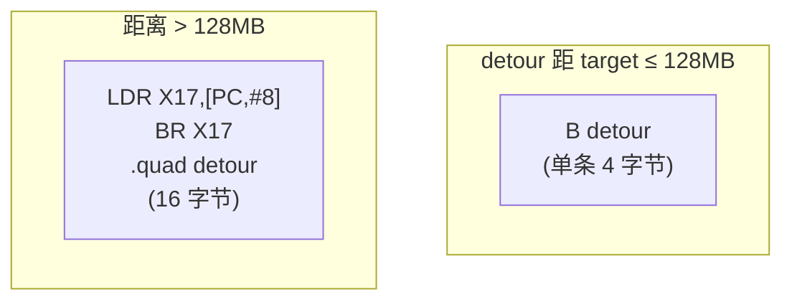

# Hook 与 Trampoline 深入浅出——跨平台函数拦截原理与工程实战

**作者**：汪亮（bertonwang）  
**邮箱**：<47608843@qq.com>  
**版本**：v1.0 ｜ **最后更新**：2026-05-14

> **本书风格参考《C++11 新特性解析与应用深入理解》《C++23 新特性解析与应用深入理解》**，
> 对每一种 Hook 技术按
> **「问题背景 → 概念形式 → 用法示例 → 底层机理 → 与其他方案对比 → 注意事项」**
> 六段式逐一拆解，目标是让**已经会一点 C/C++ 与汇编**的开发者，
> **只读这一本，就能把"函数拦截 + Trampoline"讲清楚、写得对、跨平台用得动**。
>
> 本书所有技术**面向调试、可观测性、安全防护、热修复等正向场景**，
> 不构成对任何受保护软件的逆向授权，请遵守所在国家与平台的法律法规与开发者协议。

---

## 目录

- [前言：为什么程序员要会"打劫函数"](#前言为什么程序员要会打劫函数)
- [第 0 章：术语与工具链速查](#第-0-章术语与工具链速查)

### 第一部分　基础原理
- [第 1 章：Hook 是什么——三种切入点](#第-1-章hook-是什么三种切入点)
- [第 2 章：Trampoline 是什么——"跳板"的两副面孔](#第-2-章trampoline-是什么跳板的两副面孔)
- [第 3 章：函数序言（Prologue）与最小可改写区域](#第-3-章函数序言prologue与最小可改写区域)
- [第 4 章：相对跳转 vs 绝对跳转——为什么要懂指令编码](#第-4-章相对跳转-vs-绝对跳转为什么要懂指令编码)
- [第 5 章：内存属性：W^X、Page、Code Cache 一致性](#第-5-章内存属性wx page code-cache-一致性)

### 第二部分　Inline Hook（指令级改写）
- [第 6 章：x86 Inline Hook 的最小手术](#第-6-章x86-inline-hook-的最小手术)
- [第 7 章：x86-64 Inline Hook——5 字节为什么不够](#第-7-章x86-64-inline-hook5-字节为什么不够)
- [第 8 章：ARM64 Inline Hook：B、BL、BR 的取舍](#第-8-章arm64-inline-hookbblbr-的取舍)
- [第 9 章：长度反汇编引擎（LDE）与原指令搬移](#第-9-章长度反汇编引擎lde与原指令搬移)
- [第 10 章：相对寻址指令的"改造手术"（rip-rel / pc-rel 修复）](#第-10-章相对寻址指令的改造手术rip-rel--pc-rel-修复)

### 第三部分　IAT / PLT / GOT Hook（链接级拦截）
- [第 11 章：Windows IAT Hook 全流程](#第-11-章windows-iat-hook-全流程)
- [第 12 章：Linux/Android PLT/GOT Hook](#第-12-章linuxandroid-pltgot-hook)
- [第 13 章：iOS / macOS fishhook（dyld 符号重绑定）](#第-13-章ios--macos-fishhookdyld-符号重绑定)

### 第四部分　虚函数表 / Objective-C / Java 层
- [第 14 章：C++ 虚表 Hook（VTable / VFTable）](#第-14-章c-虚表-hookvtable--vftable)
- [第 15 章：Objective-C Method Swizzling](#第-15-章objective-c-method-swizzling)
- [第 16 章：Java/Kotlin 层 Hook：动态代理 / Xposed / LSPosed 原理](#第-16-章javakotlin-层-hook动态代理--xposed--lsposed-原理)
- [第 17 章：ART Hook（Android Runtime）原理速览](#第-17-章art-hookandroid-runtime原理速览)

### 第五部分　主流框架与跨平台库
- [第 18 章：Microsoft Detours](#第-18-章microsoft-detours)
- [第 19 章：MinHook / PolyHook / Funchook](#第-19-章minhook--polyhook--funchook)
- [第 20 章：frida-gum 与 frida-inject](#第-20-章frida-gum-与-frida-inject)
- [第 21 章：Linux 上的 PLTHook / bytehook（字节跳动）](#第-21-章linux-上的-plthook--bytehook字节跳动)

### 第六部分　工程实战
- [第 22 章：综合案例 1——给 `malloc/free` 装监控](#第-22-章综合案例-1给-mallocfree-装监控)
- [第 23 章：综合案例 2——Android 函数级耗时统计](#第-23-章综合案例-2android-函数级耗时统计)
- [第 24 章：综合案例 3——Windows API Hook 录屏审计](#第-24-章综合案例-3windows-api-hook-录屏审计)
- [第 25 章：稳定性、并发与卸载——Hook 的"售后服务"](#第-25-章稳定性并发与卸载hook-的售后服务)
- [第 26 章：反 Hook 与 Hook 的反反](#第-26-章反-hook-与-hook-的反反)

### 附录
- [附录 A：x86-64 / ARM64 关键跳转指令编码速查](#附录-ax86-64--arm64-关键跳转指令编码速查)
- [附录 B：跨平台 Hook 方案选型一页纸](#附录-b跨平台-hook-方案选型一页纸)
- [附录 C：常见错误与坑](#附录-c常见错误与坑)

---

## 前言：为什么程序员要会"打劫函数"

"在不改源码、不重新编译的前提下，让某个函数被调用时**多做一件事**或**改变行为**"——这件事叫 **Hook（钩子）**。

它不是黑魔法，而是工程世界几乎所有平台都在用的核心机制：

| 场景 | 谁在用 |
|---|---|
| **APM / 性能监控** | NewRelic、AppDynamics、字节跳动 BTrace、腾讯 Matrix |
| **崩溃捕获** | Bugly、Crashlytics、Sentry-Native |
| **调试与逆向** | Frida、Detours、IDA、x64dbg |
| **热修复** | Tinker、Sophix、Robust（部分场景） |
| **安全防护** | EDR、WAF、Anti-Cheat、防 SDK 滥用 |
| **沙箱与能力裁剪** | Android 应用克隆、Win32 应用沙箱 |

**学习路径建议**：


> 💡 **本书阅读姿势**：第一遍跳读"形象比喻"；第二遍配合 Detours/MinHook 跑代码；第三遍当字典查。

---

## 第 0 章：术语与工具链速查

| 术语 | 中文 | 一句话理解 |
|---|---|---|
| Target | 被 Hook 函数 | 我要拦的对象 |
| Detour | 替身函数 | 我自己写的"先干这个再干那个" |
| Trampoline | 跳板 | 让 Detour 还能调回原函数 |
| Prologue | 函数序言 | 函数最前几条指令 |
| Hot patch | 热补丁 | 不重启、改运行时代码 |

**工具链一页纸**：

| 平台 | 推荐 Hook 库 | 反汇编 | 调试 |
|---|---|---|---|
| Windows | **Detours**（MS 官方）/ MinHook / PolyHook2 | x64dbg、IDA、WinDbg | VS、WinDbg |
| Linux | **Funchook** / xhook / bytehook | objdump、gdb | gdb、lldb |
| Android | **bytehook** / SandHook / YAHFA / xHook | objdump、IDA | LLDB（NDK） |
| macOS / iOS | **fishhook**（dyld）/ frida | otool、hopper | LLDB、Xcode |
| 跨平台动态 | **Frida** | Frida 自带 | Frida CLI |

---

# 第一部分　基础原理

---

## 第 1 章：Hook 是什么——三种切入点

```mermaid
flowchart LR
    A["调用者"] -->|"call foo"| F["foo 函数"]
    A -.-|"❶ Inline Hook<br/>改 foo 头几个字节"|.-> F
    A -.-|"❷ IAT/PLT Hook<br/>改链接表里的地址"|.-> F
    A -.-|"❸ VTable / Method Swizzle<br/>改对象/类的派发表"|.-> F
```

| 切入点 | 优点 | 缺点 |
|---|---|---|
| **❶ Inline Hook** | 通吃所有函数（包括内联到模块内的函数） | 必须改写指令，对反调试敏感、跨架构差异大 |
| **❷ IAT / PLT / GOT Hook** | 不动指令，稳定、易卸载 | 仅能拦**通过链接表调用的外部符号**（自己模块内的就拦不到） |
| **❸ 高层派发 Hook**（VTable、ObjC、Java） | 语义清晰，几乎零风险 | 仅适用于"有运行时派发"的语言 |

> 💡 **黄金法则**：能用 ❷ 就别用 ❶；能用 ❸ 就别用 ❷。**风险与覆盖范围成反比**。

---

## 第 2 章：Trampoline 是什么——"跳板"的两副面孔

Trampoline 在 Hook 语境里有**两个不同含义**，新手很容易混淆：

### 含义 ① 让 Detour 能调回原函数


也就是说，trampoline = **"被覆盖掉的原始指令"+"跳回原函数剩下部分的跳转"**。
没有它，Detour 一调原函数就**死循环**（因为头部已经被改写为跳到自己）。

### 含义 ② 跨距离跳板（Long Jump Trampoline）

x86-64 / ARM64 的相对跳转**距离有限**（如 ARM64 `B` 指令最大 ±128MB）。
当 Detour 在远处时，Hook 库会**先在 target 附近申请一块"近内存"**，写一段：

```asm
ldr  x16, [pc, #8]   ; 取下面 8 字节的绝对地址
br   x16
.quad detour_addr
```

让 target → 近跳板 → 绝对跳到 detour。这块"近跳板"也叫 trampoline。

> 💡 **小结**：含义 ① 服务于"返回到原函数"，含义 ② 服务于"跨远跳"——**两块完全不同的内存**，但都叫 trampoline。本书后续会标明是 ①还是②。

---

## 第 3 章：函数序言（Prologue）与最小可改写区域

要 Hook，先得知道"我能在头部覆盖多少字节而不破坏指令边界"。

x86-64 典型序言：

```
push rbp                ; 1 字节
mov  rbp, rsp           ; 3 字节
sub  rsp, 0x20          ; 4 字节
```

ARM64 典型序言：

```
stp  x29, x30, [sp,#-16]!   ; 4 字节
mov  x29, sp                ; 4 字节
```

**改写要求**：覆盖的总字节数 **≥ 跳转指令大小**，且**只能停在指令边界上**。
否则后续指令"半截"出现 0xCC 陷阱式崩溃。

> 💡 **这就是为什么 x86 Hook 一定要带"长度反汇编引擎（LDE）"**——它告诉你"前 N 条指令一共多少字节"。

---

## 第 4 章：相对跳转 vs 绝对跳转——为什么要懂指令编码

### x86 / x86-64

| 指令 | 字节数 | 距离 |
|---|---|---|
| `JMP rel8`（短跳） | 2 | ±127 |
| `JMP rel32`（长跳） | **5** | **±2 GB** |
| `JMP [RIP+disp32]`（间接） | **6** | 跳到 8 字节常量里的绝对地址 |
| `MOV RAX,imm64; JMP RAX` | **12** | 任意 |

**最常见的 Inline Hook = 5 字节 `E9 xx xx xx xx`（rel32）**。
但当 detour 距离 target > 2GB 时，5 字节不够，就要用 12 字节绝对跳，或者借助"近跳板"。

### ARM64

| 指令 | 字节数 | 距离 |
|---|---|---|
| `B target` | 4 | ±128 MB |
| `BR Xn` | 4 | **任意**（间接寄存器跳） |
| `LDR + BR`（典型 trampoline） | 16（含 8 字节常量） | 任意 |

> ⚠️ **ARM64 永远是 4 字节对齐 + 4 字节定长**——比 x86 简单，但**没法只覆盖 1 条指令实现远跳**，必须 4×4 = 16 字节方案。

---

## 第 5 章：内存属性：W^X、Page、Code Cache 一致性

代码段默认是**只读 + 可执行**（W^X，写与执行互斥）。要改写指令，必须先改属性。

| 平台 | 改属性 API |
|---|---|
| Windows | `VirtualProtect(addr, n, PAGE_EXECUTE_READWRITE, &old)` |
| Linux/Android | `mprotect(addr_aligned, n, PROT_READ \| PROT_WRITE \| PROT_EXEC)` |
| macOS/iOS | 同 mprotect，**iOS 真机要 entitlement**；Apple Silicon 需 `pthread_jit_write_protect_np` |

改完后**还有两个细节**：

1. **CPU 缓存一致性**：x86 的 i-cache 自动同步；**ARM 必须显式刷新**：

```c
__builtin___clear_cache(start, end);  // GCC/Clang
```

2. **页对齐**：mprotect 要求地址必须页对齐（通常 4KB / Apple Silicon 16KB）。

```c
uintptr_t page = addr & ~(page_size - 1);
size_t   plen = ((addr + n - page) + page_size - 1) & ~(page_size - 1);
mprotect((void*)page, plen, PROT_READ|PROT_WRITE|PROT_EXEC);
```

> ⚠️ **iOS / macOS arm64 上 W^X 是强制的**——同一页**要么可写要么可执行**，不能并存。改写代码必须先 `pthread_jit_write_protect_np(0)`，写完再 `(1)`。

---

# 第二部分　Inline Hook（指令级改写）

---

## 第 6 章：x86 Inline Hook 的最小手术

```c
// target 是要 Hook 的函数地址，detour 是替身
void inline_hook_x86(void* target, void* detour) {
    // 1. 改属性
    DWORD old;
    VirtualProtect(target, 5, PAGE_EXECUTE_READWRITE, &old);

    // 2. 写一条 5 字节相对 jmp
    uint8_t patch[5];
    patch[0] = 0xE9;                                 // JMP rel32
    int32_t rel = (uint8_t*)detour - ((uint8_t*)target + 5);
    memcpy(patch + 1, &rel, 4);
    memcpy(target, patch, 5);

    // 3. 还原属性
    VirtualProtect(target, 5, old, &old);
}
```

> 💡 **三大隐患**（本章不解决，留给 LDE / trampoline 章节）：
> 1. **没保存原指令**——下次想恢复就找不回来。
> 2. **5 字节可能切到指令中间**——比如 target 头是 `mov ecx, edx`（2 字节）+`call …`（5 字节），刚好覆盖到 call 中间。
> 3. **Detour 想调原函数 = 死循环**。

---

## 第 7 章：x86-64 Inline Hook——5 字节为什么不够

x64 的"理论最稳"做法：**12 字节绝对跳**：

```
48 B8 ?? ?? ?? ?? ?? ?? ?? ??   ; mov rax, imm64
FF E0                            ; jmp rax
```

代价：**改写区域大**，破坏更多原指令；占用 RAX。

工业界常见折中：**14 字节 RIP-relative**：

```
FF 25 00 00 00 00                ; jmp [rip+0]
?? ?? ?? ?? ?? ?? ?? ??          ; 8 字节绝对地址
```

这样**不破坏任何寄存器**，但要 14 字节。

> 💡 **MinHook 的策略**：先尝试 5 字节 `JMP rel32`，若 detour 距离过远则改用"近内存中转跳板"（trampoline ②）。这就是为什么 MinHook 要 `MH_AllocateNearby`。

---

## 第 8 章：ARM64 Inline Hook：B、BL、BR 的取舍



**典型 Hook 序列（远距）**：

```asm
; 写到 target 的前 16 字节
ldr  x17, target+8     ; (实际是 [pc,#8])
br   x17
.quad <detour 绝对地址>
```

> ⚠️ **ARM64 的 X16/X17 是"过程内调用临时寄存器"** —— 链接器自己也用，约定可被覆盖；做 trampoline 用它最安全（不会和函数参数 X0~X7 冲突）。

> ⚠️ **ARMv8.3+ 启用 PAC（指针签名）后**，所有间接跳转目标可能要 `bti j` / `bti c` 标记，否则触发 `BTI` 异常。frida-gum 已自动处理。

---

## 第 9 章：长度反汇编引擎（LDE）与原指令搬移

x86/x64 是**变长指令**——Hook 要保护原函数前 N 字节，但不能切到一半。
**LDE = "只解析每条指令多长，不解析语义"** 的轻量级反汇编：

| 库 | 平台 | 特点 |
|---|---|---|
| **LDE64** | x86 / x64 | 单文件 ~500 行 C，最常被嵌入 Hook 库 |
| **Zydis** | x86 / x64 | 完整反汇编，体积稍大，准确度高 |
| **Capstone** | 全架构 | 多语言绑定、生态最广 |

**搬移流程**：


---

## 第 10 章：相对寻址指令的"改造手术"（rip-rel / pc-rel 修复）

**搬到 trampoline 后，原指令地址变了**——所有 PC 相对寻址必须修。

x86-64 例子（搬移前后）：

```
; 原 target 处
mov rax, [rip+0x100]   ; 4C 8B 05 00 01 00 00

; 搬到 trampoline 后，rip 变了，0x100 偏移指向不同位置
; 必须改写为：
mov rax, [rip+(0x100 + delta)]
```

ARM64 同理：`adrp`、`adr`、`ldr literal`、`b`、`bl`、`b.cond`、`cbz/cbnz/tbz` 都是 PC 相对，**搬移时全部需要重新计算**。

> 💡 **这是 Inline Hook 库的核心难点** —— 也是为什么不要自己造轮子，**直接用 MinHook / Detours / Funchook / frida-gum**。

---

# 第三部分　IAT / PLT / GOT Hook（链接级拦截）

---

## 第 11 章：Windows IAT Hook 全流程

PE 文件每加载一个 DLL，进程内会有一张 **IAT（Import Address Table）** ——里面是"我引用的外部函数实际地址"。**改这张表里的指针 = 接管所有跨模块调用**。

```c
// 简化骨架
FARPROC HookIAT(HMODULE hMod, LPCSTR dll, LPCSTR func, FARPROC newFn) {
    ULONG size;
    auto pImp = (PIMAGE_IMPORT_DESCRIPTOR)ImageDirectoryEntryToData(
        hMod, TRUE, IMAGE_DIRECTORY_ENTRY_IMPORT, &size);

    for (; pImp->Name; ++pImp) {
        if (_stricmp((char*)hMod + pImp->Name, dll) != 0) continue;

        auto pThunk     = (PIMAGE_THUNK_DATA)((BYTE*)hMod + pImp->FirstThunk);
        auto pThunkName = (PIMAGE_THUNK_DATA)((BYTE*)hMod + pImp->OriginalFirstThunk);
        for (; pThunk->u1.Function; ++pThunk, ++pThunkName) {
            auto pName = (PIMAGE_IMPORT_BY_NAME)((BYTE*)hMod + pThunkName->u1.AddressOfData);
            if (strcmp((char*)pName->Name, func) != 0) continue;

            DWORD old;
            VirtualProtect(&pThunk->u1.Function, sizeof(uintptr_t),
                           PAGE_READWRITE, &old);
            FARPROC origin = (FARPROC)pThunk->u1.Function;
            pThunk->u1.Function = (uintptr_t)newFn;     // 替换！
            VirtualProtect(&pThunk->u1.Function, sizeof(uintptr_t), old, &old);
            return origin;
        }
    }
    return nullptr;
}
```

> 💡 **优势**：
> - 不改一字节代码，杀软基本不报警。
> - 卸载只需把指针写回去。
> - 一次只命中目标 module 的调用，**不影响 system-wide 行为**。
>
> ❌ **限制**：只能拦"通过 import 进来"的函数；模块内部直接调用、`GetProcAddress` 动态拿到的地址都拦不到。

---

## 第 12 章：Linux/Android PLT/GOT Hook

ELF 的"IAT"叫 **GOT（Global Offset Table）**，对应索引表叫 **PLT（Procedure Linkage Table）**。


**PLT Hook = 改 GOT 里的那个指针**。骨架：

```c
// 找到 .rel.plt / .rela.plt 中目标符号，把对应 GOT 槽改写
void* old = *got_slot;
*got_slot = my_hook;
```

工程级实现见 **xhook、bytehook（字节）、ndk-helper PltHook**。

> ⚠️ **Android 的额外难点**：
> 1. Bionic 的 linker 在不同 API level 上**结构差异巨大**。
> 2. ART 框架的 dlopen 可能用 RELRO 把 GOT 标为只读 → 必须 mprotect 回来。
> 3. 64 位 ELF 用 RELA，32 位用 REL，addend 处理方式不同。

---

## 第 13 章：iOS / macOS fishhook（dyld 符号重绑定）

Facebook 开源的 **fishhook** 让 iOS 上也能做"PLT Hook"——它利用 dyld 的 lazy/non-lazy symbol pointer table：

```c
struct rebinding rebs[] = {
    {"open", my_open, (void**)&orig_open},
};
rebind_symbols(rebs, 1);
```

> 💡 **限制**：
> - 仅对 **C 函数** 有效（OC 方法用 method swizzling）。
> - 仅对**通过 dyld lazy/non-lazy 表调用**的符号有效——同一 image 内部的 `static`、`inline` 调用拦不到。
> - **App Store 应用禁止用**（私有 API 风险高）。

---

# 第四部分　虚函数表 / Objective-C / Java 层

---

## 第 14 章：C++ 虚表 Hook（VTable / VFTable）

C++ 多态对象的内存布局：

```
对象 obj:
  +0: vptr ─────► VTable:
                    [0] ~Foo()
                    [1] virtual void doWork()   ◄── 这一格就是入口
                    [2] virtual void onClose()
```

**VTable Hook = 改 VTable[i] 这一格**：

```cpp
using DoWork_t = void(__thiscall*)(Foo*);
DoWork_t orig;

void __fastcall my_doWork(Foo* self) {
    log("doWork called");
    orig(self);                      // 调原函数
}

void install_hook(Foo* obj) {
    auto* vtbl = *(void***)obj;
    DWORD old;
    VirtualProtect(&vtbl[1], sizeof(void*), PAGE_READWRITE, &old);
    orig       = (DoWork_t)vtbl[1];
    vtbl[1]    = (void*)my_doWork;
    VirtualProtect(&vtbl[1], sizeof(void*), old, &old);
}
```

> ⚠️ **注意**：
> - 一个**类**的 VTable 是共享的——改了影响**所有该类实例**。
> - 多重继承会有多个 vptr，每个继承链一张表。
> - `__thiscall`（VS）/ `this 在 RDI`（SysV）调用约定要对齐。

---

## 第 15 章：Objective-C Method Swizzling

OC 方法调用全部经过 **objc_msgSend 派发**，runtime 提供官方 API 交换两个方法的 IMP：

```objc
@implementation UIViewController (Hook)
+ (void)load {
    static dispatch_once_t once;
    dispatch_once(&once, ^{
        Method orig = class_getInstanceMethod(self, @selector(viewDidAppear:));
        Method mine = class_getInstanceMethod(self, @selector(my_viewDidAppear:));
        method_exchangeImplementations(orig, mine);
    });
}
- (void)my_viewDidAppear:(BOOL)animated {
    NSLog(@"viewDidAppear: %@", self);
    [self my_viewDidAppear:animated];   // ⚠️ 看起来在调自己，实际调原方法
}
@end
```

> 💡 **要点**：
> - 一定写在 `+load`（一次性、最早执行）。
> - "自己调自己"看似递归，实际由于 IMP 已经互换，调到的是原方法。
> - 上线项目建议用 `class_replaceMethod` 而不是 `method_exchangeImplementations`，**便于卸载与多 hook 共存**。

---

## 第 16 章：Java/Kotlin 层 Hook：动态代理 / Xposed / LSPosed 原理

### 16.1 应用进程内的 "纯 Java" Hook：动态代理

```java
Object proxy = Proxy.newProxyInstance(
    cl, new Class[]{ITarget.class},
    (p, m, args) -> {
        log("before " + m.getName());
        Object r = m.invoke(realTarget, args);
        log("after");
        return r;
    });
```

只能拦**接口方法**——上限明显。

### 16.2 Xposed / LSPosed：Hook 任意 Java 方法

原理：**在 Zygote 阶段注入** → 修改 ART 内部 ArtMethod 结构 → 把目标方法的 entry_point 改写为通用桩 → 桩里解析 callback。

```mermaid
flowchart LR
    Z["Zygote 启动"] -->|"注入"| LSP["LSPosed 框架"]
    LSP -->|"替换 ClassLoader<br/>+ 改 ArtMethod"| App["应用进程"]
    App -.-|"调用任意 Java 方法"|.-> Stub["通用回调桩"]
    Stub --> Cb["XC_MethodHook 回调"]
```

> ⚠️ **风险**：需 root（LSPosed）或 magisk + zygisk；**普通 App 上线场景不可用**。

---

## 第 17 章：ART Hook（Android Runtime）原理速览

ART 的每个 Java 方法在底层是一个 `ArtMethod` 结构：

```cpp
struct ArtMethod {
    GcRoot<Class> declaring_class;
    ...
    void* entry_point_from_quick_compiled_code;   // ★ 关键字段
    void* entry_point_from_jni;
    void* data;
};
```

**改 entry_point_from_quick_compiled_code = 整个方法被劫持**。
代表项目：**SandHook**、**YAHFA**、**FastHook**——都基于这条路径。

> 💡 不同 Android 版本的 ArtMethod **字段顺序不一样**，这是 ART Hook 库经常需要"按版本适配"的根因。

---

# 第五部分　主流框架与跨平台库

---

## 第 18 章：Microsoft Detours

```cpp
#include <detours.h>
#pragma comment(lib, "detours.lib")

static int (WINAPI *Real_MessageBoxA)(HWND, LPCSTR, LPCSTR, UINT) = MessageBoxA;
int WINAPI My_MessageBoxA(HWND h, LPCSTR text, LPCSTR caption, UINT type) {
    return Real_MessageBoxA(h, "已被劫持~", caption, type);
}

void InstallHook() {
    DetourTransactionBegin();
    DetourUpdateThread(GetCurrentThread());
    DetourAttach(&(PVOID&)Real_MessageBoxA, My_MessageBoxA);
    DetourTransactionCommit();
}
```

> 💡 **特色**：
> - 微软官方，2002 年至今活跃，工业级稳定。
> - 自动处理 trampoline、相对地址修复、x64 远跳。
> - 同时支持"创建挂起进程 + DLL 注入"模式。

---

## 第 19 章：MinHook / PolyHook / Funchook

| 库 | 平台 | 特色 |
|---|---|---|
| **MinHook** | Windows x86/x64 | 单文件极小、API 简洁 |
| **PolyHook 2** | Windows x86/x64 | 含 VTable Hook、IAT Hook、x86 detour 全套 |
| **Funchook** | Linux/macOS x86/x64/arm64 | Linux 上常用、配 Capstone |

MinHook 三句话上手：

```c
MH_Initialize();
MH_CreateHook(target, my_detour, (LPVOID*)&trampoline);   // trampoline① 由它创建
MH_EnableHook(MH_ALL_HOOKS);
// ...
// 事后：
MH_DisableHook(MH_ALL_HOOKS);
MH_Uninitialize();
```

---

## 第 20 章：frida-gum 与 frida-inject

Frida 的核心是 **frida-gum**——一个跨平台的 Hook 库（C 接口），上面包着 V8/QuickJS 让你用 JS 写 Hook 脚本。

JS 脚本（开发体验拉满）：

```js
Interceptor.attach(Module.getExportByName(null, 'open'), {
    onEnter(args) {
        console.log('open path =', args[0].readUtf8String());
    },
    onLeave(retval) {
        console.log('open ret =', retval.toInt32());
    }
});
```

> 💡 **优势**：
> - 一份脚本通吃 Linux/macOS/Windows/Android/iOS。
> - 在线 attach、热重载、JS 写起来比 C 快 10×。
> - **官方推荐用于动态分析**，研发场景生产环境慎用。

---

## 第 21 章：Linux 上的 PLTHook / bytehook（字节跳动）

**bytehook** 是字节开源的 Android PLT Hook 库，工业级使用：

```c
bytehook_init(BYTEHOOK_MODE_AUTOMATIC, false);

bytehook_hook_single(
    "libcurl.so",        // 目标库
    NULL,                // 调用方（NULL = 任意）
    "open",              // 要 hook 的符号
    my_open, NULL, NULL);
```

特点：
- 同时支持 **automatic 模式**（懒解析时拦）和 **manual 模式**。
- 内置异常恢复、信号兜底（hook 过程崩溃可自救）。
- 工业级稳定（抖音、TikTok 在线上跑）。

---

# 第六部分　工程实战

---

## 第 22 章：综合案例 1——给 `malloc/free` 装监控

**目标**：统计某进程的内存分配次数与累计字节数，零侵入。

### 22.1 方案选择

| 平台 | 方案 |
|---|---|
| Linux | `LD_PRELOAD` 一个共享库，导出 `malloc/free` |
| Android | bytehook PLT Hook |
| Windows | MinHook + IAT |
| macOS | DYLD_INSERT_LIBRARIES + interpose / fishhook |

### 22.2 Linux 版（最简）

```c
// libtrace.c
#define _GNU_SOURCE
#include <dlfcn.h>
#include <stdio.h>
#include <stdatomic.h>
static atomic_size_t g_count = 0, g_bytes = 0;

void* malloc(size_t n) {
    static void*(*orig)(size_t) = NULL;
    if (!orig) orig = dlsym(RTLD_NEXT, "malloc");
    atomic_fetch_add(&g_count, 1);
    atomic_fetch_add(&g_bytes, n);
    return orig(n);
}
__attribute__((destructor))
static void report(void) {
    fprintf(stderr, "[trace] count=%zu, bytes=%zu\n",
            atomic_load(&g_count), atomic_load(&g_bytes));
}
```

```bash
gcc -shared -fPIC libtrace.c -ldl -o libtrace.so
LD_PRELOAD=./libtrace.so ./your_app
```

> 💡 **要点**：
> - `dlsym(RTLD_NEXT, ...)` 拿到链中**下一个** malloc，避免递归。
> - destructor 在程序退出时打印汇总。

---

## 第 23 章：综合案例 2——Android 函数级耗时统计

**思路**：用 bytehook 拦目标 `.so` 的关键导出函数 → 进入时记 `clock_gettime(MONO)` → 退出时累加。

```c
struct ts_pair { struct timespec enter, leave; };
static struct ts_pair g_ts;
static int (*orig_decode)(void*, void*);

int my_decode(void* a, void* b) {
    clock_gettime(CLOCK_MONOTONIC, &g_ts.enter);
    int r = orig_decode(a, b);
    clock_gettime(CLOCK_MONOTONIC, &g_ts.leave);
    long ns = (g_ts.leave.tv_sec - g_ts.enter.tv_sec) * 1000000000L
            + (g_ts.leave.tv_nsec - g_ts.enter.tv_nsec);
    __android_log_print(ANDROID_LOG_INFO, "perf", "decode = %ld ns", ns);
    return r;
}

void install(void) {
    bytehook_hook_single("libavcodec.so", NULL, "avcodec_decode_video2",
                         my_decode, NULL, (void**)&orig_decode);
}
```

> ⚠️ **生产实践注意**：
> - 多线程下用 TLS 而不是全局 `g_ts`。
> - 重入函数（如 `read`）记录前先判断是否处于自己 hook 内部，避免无限嵌套。

---

## 第 24 章：综合案例 3——Windows API Hook 录屏审计

**目标**：检测哪些进程在调用 `BitBlt` 抓屏，便于做**企业内网防泄密**。

```cpp
// 注入到目标进程后：
static BOOL (WINAPI *Real_BitBlt)(HDC,int,int,int,int,HDC,int,int,DWORD) = BitBlt;

BOOL WINAPI My_BitBlt(HDC dst, int x, int y, int w, int h,
                     HDC src, int sx, int sy, DWORD rop) {
    char path[MAX_PATH] = {0};
    GetModuleFileNameA(NULL, path, MAX_PATH);
    OutputDebugStringA(path);  // 真实场景上报到 ETW / 文件 / agent
    return Real_BitBlt(dst, x, y, w, h, src, sx, sy, rop);
}

void Install() {
    DetourTransactionBegin();
    DetourUpdateThread(GetCurrentThread());
    DetourAttach(&(PVOID&)Real_BitBlt, My_BitBlt);
    DetourTransactionCommit();
}
```

注入方式：通过 `CreateRemoteThread + LoadLibrary`、或 SetWindowsHookEx、或 AppInit_DLLs（已渐弃）。

---

## 第 25 章：稳定性、并发与卸载——Hook 的"售后服务"

| 问题 | 工程做法 |
|---|---|
| **多线程安全** | 改写指令瞬间挂起其它线程（Detours 自动；Linux 上很难，多用 IAT/PLT） |
| **重入** | TLS flag 标记"我已在 hook 内"，二次进入直接走原函数 |
| **多次 Hook 同函数** | 链式：`hook2 → hook1 → original`；MinHook/PolyHook 自动管理 |
| **卸载** | 保留原指令副本；卸载时 mprotect 写回 |
| **崩溃自救** | 给 hook 安装 SIGSEGV/SIGBUS handler，崩溃时还原代码（bytehook 自带） |
| **ABI 升级** | 系统库升级后偏移变化——尽量用**符号 + dlsym** 而非硬编偏移 |

---

## 第 26 章：反 Hook 与 Hook 的反反

应用层常见反 Hook 手段：

| 手段 | 原理 | 对抗方法 |
|---|---|---|
| **校验函数头字节** | 比对内存与磁盘镜像 | Hook 前保存原字节，校验回调里返回原字节 |
| **直接系统调用** | 绕开 libc 的 `open`、`read` | 内核态 ftrace/eBPF / 系统 trace 工具 |
| **抗调试 + ptrace** | 监测被 attach | Frida-detect 工具不再触发 |
| **PAC / CFI / BTI** | ARM64 硬件级控制流完整性 | hook 库需正确插入 `bti`、`pacibsp` |
| **检查 maps** | 看是否多了 frida-agent.so | 把 hook 库改名、隐藏 |

> 💡 **结论**：Hook 与反 Hook 是**永恒拉锯**，没有银弹。**正向产品**（性能监控、崩溃捕获）尽量用稳健的"链接级 + 高层"方式；**逆向研究**通常用 frida 在受控环境进行，**禁用于绕过付费、破解版权保护等违法用途**。

---

# 附录

---

## 附录 A：x86-64 / ARM64 关键跳转指令编码速查

| 平台 | 指令 | 字节 | 距离 |
|---|---|---|---|
| x86-64 | `JMP rel32` | `E9 xx xx xx xx`（5） | ±2 GB |
| x86-64 | `JMP [rip+0]; .quad addr` | `FF 25 00 00 00 00` + 8（14） | 任意 |
| x86-64 | `MOV RAX,imm64; JMP RAX` | `48 B8 .. ; FF E0`（12） | 任意 |
| x86-64 | `CALL rel32` | `E8 xx xx xx xx`（5） | ±2 GB |
| ARM64 | `B target` | 4 | ±128 MB |
| ARM64 | `BL target` | 4 | ±128 MB |
| ARM64 | `LDR X17,[PC,#8]; BR X17; .quad addr` | 16 | 任意 |
| ARM64 | `BR X17` | 4 | 任意（间接） |

---

## 附录 B：跨平台 Hook 方案选型一页纸

| 需求 | Windows | Linux | Android | macOS | iOS |
|---|---|---|---|---|---|
| 拦 import | **Detours / MinHook / IAT 自写** | 自写 GOT | **bytehook / xhook** | fishhook | fishhook（仅企业证书） |
| 拦任意函数 | Detours / MinHook | Funchook | bytehook + Inline | Funchook | Inline + JIT 解锁 |
| 拦虚函数 | VTable Hook | VTable Hook | VTable Hook | VTable Hook | VTable Hook |
| 拦 OC 方法 | — | — | — | swizzle | swizzle |
| 拦 Java 方法 | — | — | **LSPosed/SandHook**（root） | — | — |
| 跨平台动态 | **Frida** | Frida | Frida | Frida | Frida（jailbreak） |

---

## 附录 C：常见错误与坑

| 现象 | 真正原因 | 解决 |
|---|---|---|
| 改完代码立刻崩溃 | i-cache 没刷新（ARM） | `__builtin___clear_cache(start, end)` |
| `mprotect: permission denied` | iOS / Apple Silicon JIT 限制 | `pthread_jit_write_protect_np(0)` 包裹 |
| Hook 后调原函数死循环 | 没建 trampoline ① | 用 MinHook/Detours，自动生成 |
| Hook x64 函数用 5 字节失败 | 距离 > 2GB | 用近内存 trampoline 或 14 字节绝对跳 |
| ARM64 Hook 后随机崩 | PAC/BTI 触发 | 跳板加 `bti j` / 处理 LR 签名 |
| LD_PRELOAD 不生效 | setuid 程序、SIP（macOS）保护 | macOS 关 SIP；Linux setuid 需 root |
| Detours 链接失败 | x86 / x64 库混用 | `detours.lib` 选对架构版本 |
| Android 8+ PLT Hook 失效 | RELRO / GOT 只读 | 临时 mprotect 改写后还原 |
| Frida attach 不上 | App 用 detect-frida | 用 Frida-Stalker / spawn 启动 |
| 同函数二次 Hook 行为乱 | 链式 hook 顺序未定义 | 用支持 chain 的库（PolyHook、bytehook） |

---

> **结语**
>
> Hook 与 Trampoline 是一项"看上去玄学、做下来工程"的技术。
> 它的本质就是六个字：**改指针 / 改指令**。难的是怎么**安全、可卸载、跨架构、跨版本**。
>
> 这本指南覆盖了从原理（pc-rel 修复、W^X、近跳板）到工程（Detours/MinHook/bytehook/frida）的所有关键脉络。
> 当你跑通第 22~24 章三个综合案例那一刻，你就具备了**写出生产级 Hook**的所有要件。
>
> 请始终记住：**技术中性，使用方有边界**。Hook 强大，但每一行代码都要为它负责。
>
> ——本书完
