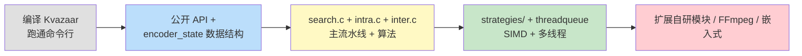
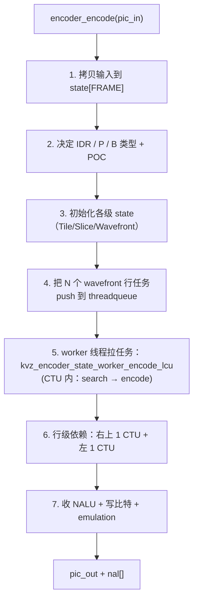
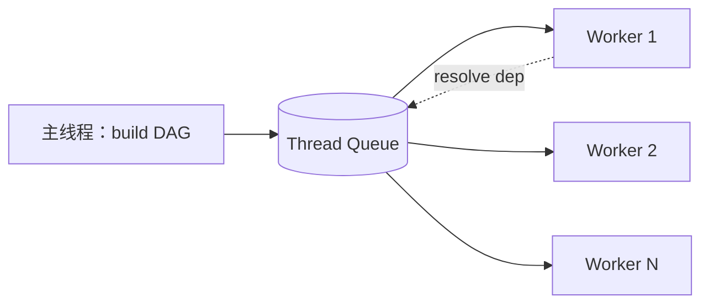

# Kvazaar 源码深入浅出——学院派开源 HEVC 编码器全景剖析

**作者**：汪亮（bertonwang）  
**邮箱**：<47608843@qq.com>  
**版本**：v1.0 ｜ **最后更新**：2026-05-14

> **本书风格参考《C++11 新特性解析与应用深入理解》《C++23 新特性解析与应用深入理解》**，
> 对每一个 Kvazaar 主题按
> **「问题背景 → 概念形式 → 源码定位 → 关键算法 → 与 x265 对比 → 工程实战」**
> 六段式逐一拆解，目标是让**已经会一点 C 语言、读过《H.265 标准深入浅出》的开发者**，
> **只读这一本，就能从"克隆仓库"走到"读懂关键路径、改造编码器、把 HEVC 编码做成研究 / 教学 / 嵌入式实战"**。

---

## 目录

- [前言：为什么还要再学一个 HEVC 编码器？](#前言为什么还要再学一个-hevc-编码器)
- [第 0 章：环境与工具链——拉源码、编译、跑通](#第-0-章环境与工具链拉源码编译跑通)

### 第一部分　工程总览
- [第 1 章：Kvazaar 项目背景与定位](#第-1-章kvazaar-项目背景与定位)
- [第 2 章：源码目录全图](#第-2-章源码目录全图)
- [第 3 章：构建系统（Autotools / CMake / Meson）](#第-3-章构建系统autotools--cmake--meson)
- [第 4 章：公开 API 与 ABI（kvz_api / kvazaar.h）](#第-4-章公开-api-与-abikvz_api--kvazaarh)
- [第 5 章：核心数据结构（encoder_state_t / encoder_control_t / kvz_picture）](#第-5-章核心数据结构encoder_state_t--encoder_control_t--kvz_picture)

### 第二部分　主流水线
- [第 6 章：编码主入口 `kvazaar_api.encoder_encode`](#第-6-章编码主入口-kvazaar_apiencoder_encode)
- [第 7 章：分层并发模型（GOP / Slice / Tile / WPP / OWF）](#第-7-章分层并发模型gop--slice--tile--wpp--owf)
- [第 8 章：码率控制（CQP / 简易 RC + λ）](#第-8-章码率控制cqp--简易-rc--λ)
- [第 9 章：搜索与编码 `search.c`](#第-9-章搜索与编码-searchc)
- [第 10 章：CTU 四叉树递归 `kvz_search_cu`](#第-10-章ctu-四叉树递归-kvz_search_cu)

### 第三部分　关键算法解剖
- [第 11 章：Intra 预测——35 模式快速搜索](#第-11-章intra-预测35-模式快速搜索)
- [第 12 章：Inter 预测——AMVP / Merge / TMVP 候选](#第-12-章inter-预测amvp--merge--tmvp-候选)
- [第 13 章：运动估计（HEXBS / TZ / Full）](#第-13-章运动估计hexbs--tz--full)
- [第 14 章：变换 + 量化 + RDOQ](#第-14-章变换--量化--rdoq)
- [第 15 章：去块滤波 + SAO 环内](#第-15-章去块滤波--sao-环内)
- [第 16 章：CABAC 写码与 NAL 输出](#第-16-章cabac-写码与-nal-输出)
- [第 17 章：率失真优化（RDO）的轻量实现](#第-17-章率失真优化rdo的轻量实现)

### 第四部分　性能榨取
- [第 18 章：x86 SIMD（SSE2/SSSE3/AVX2）实现](#第-18-章x86-simdsse2ssse3avx2实现)
- [第 19 章：ARM NEON / AArch64 路径](#第-19-章arm-neon--aarch64-路径)
- [第 20 章：Strategy 函数表与 dispatcher](#第-20-章strategy-函数表与-dispatcher)
- [第 21 章：Threadqueue 任务调度模型](#第-21-章threadqueue-任务调度模型)
- [第 22 章：与 x265 / HM / Kvazaar 的性能 / 画质对比方法](#第-22-章与-x265--hm--kvazaar-的性能--画质对比方法)

### 第五部分　研究与教学场景
- [第 23 章：算法复现与对比实验（BD-Rate / VMAF）](#第-23-章算法复现与对比实验bd-rate--vmaf)
- [第 24 章：扩展自研模块（新 Intra 模式 / 新 RD 度量）](#第-24-章扩展自研模块新-intra-模式--新-rd-度量)
- [第 25 章：用 Kvazaar 做嵌入式 / FPGA 协同](#第-25-章用-kvazaar-做嵌入式--fpga-协同)
- [第 26 章：UVG360 / 360° 视频与 Tile-Based 360 投影](#第-26-章uvg360--360-视频与-tile-based-360-投影)

### 第六部分　集成与扩展
- [第 27 章：在 FFmpeg 里使用 Kvazaar](#第-27-章在-ffmpeg-里使用-kvazaar)
- [第 28 章：直接调用 libkvazaar API（带可运行示例）](#第-28-章直接调用-libkvazaar-api带可运行示例)
- [第 29 章：常见错误与排查](#第-29-章常见错误与排查)

### 附录
- [附录 A：Kvazaar 与 x265 / HM / OpenHEVC 对比](#附录-akvazaar-与-x265--hm--openhevc-对比)
- [附录 B：核心命令行参数速查](#附录-b核心命令行参数速查)
- [附录 C：常见错误与坑](#附录-c常见错误与坑)

---

## 前言：为什么还要再学一个 HEVC 编码器？

> 一句话：**Kvazaar 是芬兰坦佩雷大学（Tampere University）UVG 研究组开源的"学院派 HEVC 编码器"**，代码量约 5 万行 C，是 x265（约 30 万行 C++）的 1/6。学院派的特点：

| 特点 | Kvazaar | x265 |
|---|---|---|
| 语言 | **纯 C99**（更易嵌入式 / 内核 / FPGA C 工具链） | C++ |
| 代码量 | ~50K 行 | ~300K 行 |
| 学习曲线 | **平缓**，模块清晰 | 陡峭 |
| 画质 | 接近 HM（参考实现） | 接近且常稍高 |
| 速度 | 中等（4K 实时门槛） | 工业最强（同 preset 更快） |
| 心理优化 | 有限 | 满血（cuTree、psy-rdoq、aq-mode） |
| 360° 视频研究 | ✅ UVG360 衍生 | ❌ |
| 学术论文复现 | **首选** | 次选 |
| 商业部署 | 较少 | 大量（流媒体平台） |
| 许可 | **LGPL v2.1**（更工业友好） | GPL v2 |

> 💡 **何时选 Kvazaar？**
> - **学术研究 / 论文复现**：代码可读、易扩展。
> - **教学**：把"标准 → 实现"映射讲透。
> - **嵌入式 / FPGA 共编**：纯 C 易移植，可裁剪到几 MB。
> - **LGPL 项目**：避免 GPL 传染。
>
> **何时选 x265？** —— 商业部署 / 同价位最强画质 / HDR10+/Dolby Vision 完整支持。

阅读本书前需先读 [《H.265 标准深入浅出》](./H.265标准深入浅出-从CTU四叉树到工程实战.md)。

**学习路径**：



---

## 第 0 章：环境与工具链——拉源码、编译、跑通

```bash
git clone https://github.com/ultravideo/kvazaar.git
cd kvazaar

# Linux / macOS（Autotools）
./autogen.sh
./configure --prefix=/usr/local
make -j$(nproc)
sudo make install

# CMake（Windows / 跨平台）
cmake -S . -B build -DCMAKE_BUILD_TYPE=Release
cmake --build build -j

# Meson（社区维护）
meson setup build
ninja -C build
```

测试：

```bash
# 编 1080p YUV
kvazaar -i in.yuv --input-res 1920x1080 --input-fps 25 \
        --preset medium --qp 27 -o out.h265

# FFmpeg 走 libkvazaar
ffmpeg -i sample.mp4 -c:v libkvazaar \
       -kvazaar-params "preset=medium:qp=27" out.mp4
```

> 💡 必装：`yasm`（x86 汇编）、`pkg-config`、`gcc/clang ≥ 7`。Windows 推荐 MSYS2 + UCRT64。

---

# 第一部分　工程总览

---

## 第 1 章：Kvazaar 项目背景与定位

- 立项：2013 年 HEVC 标准刚定稿后，由芬兰 Tampere 大学发起。
- 目标：**纯 C HEVC 编码器**，便于教学、研究、移植。
- 衍生：
  - **UVG360**：360° 视频专用版本。
  - **shvc-kvazaar**：Scalable HEVC 实验。
  - 多篇 ICIP / VCIP / TMM 论文以 Kvazaar 为实验底盘。

社区维护活跃，仍然每年都有 release。

> 💡 学院派编码器的"教科书地位"：HM > Kvazaar > x265 / OpenHEVC > 商业。

---

## 第 2 章：源码目录全图

```
kvazaar/
├── src/
│   ├── kvazaar.h                  ★ 公开 API（仅一个头文件）
│   ├── kvazaar.c                  API 实现
│   ├── encmain.c                  命令行 main
│   ├── encoder.c/.h               ★ encoder_control_t（全局配置）
│   ├── encoderstate.c/.h          ★ encoder_state_t（每帧 / 每 wavefront 状态）
│   ├── encoder_state-bitstream.c  写比特
│   ├── search.c/.h                ★ CTU 四叉树搜索
│   ├── search_intra.c/.h          Intra 35 模式搜索
│   ├── search_inter.c/.h          Inter Merge/AMVP 搜索
│   ├── intra.c/.h                 35 模式预测算法
│   ├── inter.c/.h                 Merge / AMVP 候选生成
│   ├── transform.c/.h             DCT / DST + 量化
│   ├── filter.c/.h                去块滤波
│   ├── sao.c/.h                   SAO
│   ├── cabac.c/.h                 CABAC 引擎
│   ├── context.c/.h               CABAC 上下文表
│   ├── rdo.c/.h                   ★ RDO / RDOQ
│   ├── rate_control.c/.h          码率控制
│   ├── nal.c/.h                   NAL 写入 + emulation prevention
│   ├── cu.c/.h                    CU/PU/TU 数据结构
│   ├── image.c/.h                 帧 (kvz_picture / videoframe)
│   ├── reflist.c/.h, dpb-related, ...
│   ├── strategies/                ★ 平台优化
│   │   ├── strategies-common.c
│   │   ├── strategies-picture.c   像素操作 dispatcher
│   │   ├── strategies-dct.c       DCT dispatcher
│   │   ├── strategies-quant.c
│   │   ├── strategies-intra.c
│   │   ├── strategies-ipol.c      插值
│   │   ├── strategies-sao.c
│   │   ├── generic/               C 参考实现
│   │   ├── x86_avx2/              AVX2 实现
│   │   ├── x86_sse41/, x86_sse42/
│   │   ├── altivec/               PowerPC
│   │   └── arm_neon/              ARM NEON
│   ├── threadqueue.c/.h           ★ 任务队列调度
│   ├── input/output/              YUV / Y4M
│   └── ...
├── tests/                          单测 + bitstream 一致性
└── doc/
```

> 💡 与 x265 比，模块边界更清晰：**算法 in `src/*.c`，平台优化 in `src/strategies/<arch>/`**。

---

## 第 3 章：构建系统（Autotools / CMake / Meson）

三套并行构建。Autotools 仍是官方主推（嵌入式友好）：

```bash
./configure --enable-asm                # 默认开
./configure --disable-asm               # 调试 / 移植
./configure --host=aarch64-linux-gnu    # 交叉编译
./configure --enable-static --disable-shared
```

CMake：

```bash
cmake -DENABLE_ASM=ON -DBUILD_SHARED_LIBS=OFF -DCMAKE_BUILD_TYPE=Release ..
```

Meson：社区贡献，与 Autotools 行为一致。

> 💡 **嵌入式 / 教学场景**：`./configure --disable-asm` 后整库 < 1 MB，容易在裸机/RTOS 上跑（自带 stdio / pthread 替换）。

---

## 第 4 章：公开 API 与 ABI（kvz_api / kvazaar.h）

`src/kvazaar.h` 是 **唯一公开头文件**，对外暴露一个函数表 `kvz_api`：

```c
typedef struct kvz_api {
    kvz_config*  (*config_alloc)(void);
    int          (*config_init)(kvz_config*);
    int          (*config_destroy)(kvz_config*);
    int          (*config_parse)(kvz_config*, const char*, const char*);
    kvz_picture* (*picture_alloc)(int32_t w, int32_t h);
    void         (*picture_free)(kvz_picture*);
    kvz_encoder* (*encoder_open)(const kvz_config*);
    void         (*encoder_close)(kvz_encoder*);

    int (*encoder_headers)(kvz_encoder*, kvz_data_chunk** out, uint32_t* len_out);
    int (*encoder_encode)(kvz_encoder*, kvz_picture* in, kvz_data_chunk** data_out,
                          uint32_t* len_out, kvz_picture** rec_out, kvz_picture** src_out,
                          kvz_frame_info* info_out);
    ...
} kvz_api;

const kvz_api * kvz_api_get(int bit_depth);
```

调用模式：

```c
const kvz_api *api = kvz_api_get(8);
kvz_config *cfg = api->config_alloc(); api->config_init(cfg);
api->config_parse(cfg, "preset", "medium");
api->config_parse(cfg, "qp",     "27");
api->config_parse(cfg, "input-res", "1920x1080");

kvz_encoder *enc = api->encoder_open(cfg);
... encode loop ...
api->encoder_close(enc);
api->config_destroy(cfg);
```

> 💡 与 x264/x265 类似的 "open/encode/close"，但**所有函数走表**——便于 ABI 稳定 + 多版本共存。

---

## 第 5 章：核心数据结构（encoder_state_t / encoder_control_t / kvz_picture）

### `encoder_control_t`（全局只读配置）

```c
struct encoder_control_t {
    config_t cfg;                 // 用户参数
    int target_avg_bppic;
    int  in_width, in_height;
    int  bitdepth;                // 8 / 10
    int  ctu_size;
    int  pu_depth_inter, pu_depth_intra;
    bs_t  *stream;
    threadqueue_queue_t *threadqueue;
    encoder_state_t *master;      // 顶层 state
    ...
};
```

### `encoder_state_t`（每帧 / 每 wavefront / 每 tile 一份）

层级树形结构：

```
state[FRAME]   ← 顶层（一帧）
├─ state[TILE]   每个 Tile 一份
│   ├─ state[SLICE]
│   │   └─ state[WAVEFRONT_ROW]   每行 CTU 一份
```

> 💡 这是 Kvazaar 的核心抽象：**层级 state 让并发粒度天然清晰**。每个 wavefront 行有自己的 CABAC 引擎、bitstream buffer。

### `kvz_picture`

```c
typedef struct kvz_picture {
    int32_t  width, height;
    int32_t  stride;
    kvz_pixel *fulldata_buf;        // 真实 alloc
    kvz_pixel *y, *u, *v;           // 平面指针
    int8_t   poc;
    int8_t   slice_type;
    int8_t   chroma_format;         // KVZ_CSP_400/420/422/444
    ...
} kvz_picture;
```

`kvz_pixel` 是 `uint8_t`（8 bit 库）或 `uint16_t`（10 bit 库）—— **编译期切换**，与 x265 multilib 思路一致。

---

# 第二部分　主流水线

---

## 第 6 章：编码主入口 `kvazaar_api.encoder_encode`

`src/kvazaar.c::kvazaar_encode` → `encoderstate.c::kvz_encoder_state_init_new_frame`：



要点：
- **OWF（One-frame-Wait Forward）**：跨帧并行的核心机制。下一帧的 wavefront 行在当前帧依赖位置就绪后即可启动。
- 不同 Tile 完全独立；同一 Tile 内 wavefront 间共享 CABAC sync。

---

## 第 7 章：分层并发模型（GOP / Slice / Tile / WPP / OWF）

| 维度 | 控制 | 含义 |
|---|---|---|
| **OWF** | `--owf N` | 同时编码 N 帧（流水线深度） |
| **WPP** | `--wpp` | 单帧内 CTU 行并行 |
| **Tile** | `--tiles W×H` | 矩形分割并行 |
| **Slice** | `--slices N` | Slice 切片 |
| **GOP** | `--gop=8`/lp/auto | GOP 结构（含 LD-B / RA） |

并发组合：
- 桌面 8 核：`--owf 4 --wpp` —— 最大吞吐。
- 服务器 64 核 + 8K：`--owf 8 --wpp --tiles 4x2 --threads 64`。
- 低延迟直播：`--owf 0 --no-wpp --gop=lp` —— 最小延迟。

> 💡 OWF 是 Kvazaar 区别于 x265 的特色 —— 把"帧级并发"做成显式的 pipeline 深度，**学术友好且易调度**。

### 7.1 帧类型决策（预设 GOP / 无 lookahead 决策）

与 x264/x265 的"动态 lookahead 决策" + OpenH264 的"零 lookahead 就地决策"都不同，Kvazaar 走的是**第三条路**：

> **预设 GOP 模板**：用户在命令行指定 GOP 结构，Kvazaar 严格按该模板填帧类型。

#### 7.1.1 GOP 配置语法

```bash
--gop=lp        # low-delay P：纯 I-P-P-P-...，0 延迟
--gop=8         # RA Random Access：HM CTC 标准 8 帧 GOP
--gop=auto      # I-only（每帧 IDR，超低延迟测试）
--gop=lp-g4d3t1 # 自定义：4 ref / depth 3 / temporal 1
```

源码：`src/cfg.c::kvz_config_parse` → 解析 GOP 模板存入 `cfg->gop[]`。

#### 7.1.2 标准 RA-8 GOP 结构（HM CTC 同款）

```
POC:    0   1   2   3   4   5   6   7   8
type:  IDR  B   B   B   B   B   B   B   P    ← 第二轮回到 P
                                                
b-pyramid 层次：
  layer 0 : POC 0, 8       (P/IDR)
  layer 1 : POC 4          (B-ref)
  layer 2 : POC 2, 6       (B-ref)
  layer 3 : POC 1,3,5,7    (B, 不被引用)
```

Kvazaar 在 `src/encoderstate.c::kvz_encoder_state_init_new_frame` 严格按该顺序填 `slice_type`、`poc`、`ref_lists`，**与 HM 解码器完全字节对齐**——这是学术对比实验的关键。

#### 7.1.3 scenecut 判定原理

Kvazaar 也支持 scenecut（默认开），但**与预设 GOP 互动比较保守**：

```c
// src/encoderstate.c::scenecut_check (简化)
int64_t curr_sad = sad_8x8_downsampled(prev, curr);
int64_t avg_sad  = ewma_history;
bool isCut = (curr_sad > avg_sad * scenecut_threshold);   // 默认 1.5

if (isCut && (cur_poc - last_idr_poc) >= min_keyint) {
    type = IDR;          // 中断当前 GOP，开新 GOP
}
```

保护机制：
- **`min-keyint`**：两次 IDR 间最少帧数（默认 = `--period`）。
- **`--period N`**：最大 GOP（同 max-keyint）。
- **scenecut 命中后立即重置 GOP 模板指针**，下一帧从模板起点开始。

#### 7.1.4 lookahead 不是用来决策的——只是用来 RC

Kvazaar 也有 `--rc-lookahead`，但**不参与帧类型决策**，仅给 RC 拟合 (bits, λ) 曲线时多看几帧历史。这与 x264/x265 完全不同。

#### 7.1.5 三种编码器决策对比

| 维度 | x264/x265 | OpenH264 | **Kvazaar** |
|---|---|---|---|
| 帧类型来源 | 动态 lookahead + DP | 就地零延迟决策 | **预设 GOP 模板** |
| B-adapt | trellis DP | 无 | **无（模板已固定）** |
| scenecut | cost 反比 | SAD 比值 | **SAD 比值 + 模板重置** |
| 决策延迟 | 多帧 | ≤ 1 帧 | **≤ 1 帧** |
| 学术可重复性 | 中 | 中 | **极高** |
| 工业可调性 | 极高 | 中 | 低 |

> 💡 一句话总结：**Kvazaar 的"GOP 模板"= HM CTC 的可执行版本**——这正是学术界爱它的原因。

---

## 第 8 章：码率控制（CQP / 简易 RC + λ）

### 8.0 学院派 RC 的设计取舍

Kvazaar 的 RC **不追逐 x265 cuTree 那种工业级精度**——研究场景下"可重复、可对比"远比"码率精准"重要。所以它把 RC 设计得简单透明：

- **默认 CQP**（恒定 QP）：BD-Rate 实验黄金选择。
- **简易 λ-bit-allocation RC**：满足"给定总码率"的工程需求。
- **严格闭合 GOP**：方便对照 HM 参考实现。

### 8.1 模式总览

| 模式 | 命令行 | 一句话 |
|---|---|---|
| **CQP**（默认） | `--qp 27` | 全帧固定 QP，按帧类型加偏移 |
| 简易 RC | `--bitrate 4000 --rc-algorithm lambda` | 按 lambda 反推每帧 QP |
| 跳帧式（实验） | `--rc-algorithm 2` | 超预算时 frame skip |

源码：`src/rate_control.c` + `src/encoderstate.c::set_lcu_lambda_and_qp`。

### 8.2 CQP 原理：QP → λ 的线性换算

Kvazaar 用经典 Sullivan-Ortega 公式把 QP 映射成 λ（用于 RDO）：

```c
// rate_control.c::kvz_calculate_lambda
double lambda = 0.57 * pow(2.0, (qp - 12) / 3.0);
if (slice_type == KVZ_SLICE_I) lambda *= 0.85;       // I 帧给小 λ → 编更细
```

所有 RDO 决策（CU 切不切、模式选哪个、量化系数选哪个）都在用这个 λ：

$$
\text{cost} \;=\; \text{distortion} \;+\; \lambda \cdot \text{bits}
$$

不同帧类型的 QP 偏移（`encoder_state-bitstream.c::set_qp`）：

| 帧类型 | QP 偏移 |
|---|---|
| I（IDR） | -3 |
| P | 0 |
| B（有引用） | +1 |
| B（最后一层 b-pyramid） | +2 ~ +3 |

这种"层次化偏移"利于 b-pyramid GOP 的整体压缩率。

### 8.3 简易 λ-RC：怎么把 bitrate 转成 QP

`rate_control.c::kvz_estimate_pic_lambda`：

```c
// 1) 当前帧期望 bits
double target_bits = bitrate / fps;

// 2) 历史窗口里的 (bits, lambda) 拟合一条曲线
//    bits(λ) = α · λ^β
double alpha = ...;     // EWMA 维护
double beta  = ...;     // EWMA 维护

// 3) 反解 λ
double lambda = pow(target_bits / alpha, 1.0 / beta);

// 4) λ → QP
int qp = (int)(4.2005 * log(lambda) + 13.7122 + 0.5);
```

特点：
- **单帧反馈，无 lookahead**——研究友好（可重复）。
- 没有 cuTree、没有 psy-rd、没有 mbtree → BD-Rate 上比 x265 落后 5~8%，**但可解释**。

### 8.4 跨帧反馈：bits 偏差累积

```c
// rate_control.c::update_rc_parameters
double error = actual_bits - target_bits;
cumulative_error += error;
remaining_bits  -= actual_bits;

// 下一帧目标
next_target_bits = remaining_bits / remaining_frames
                 - cumulative_error * decay;        // 还旧账
```

衰减项 `decay` 默认 0.5：超预算后用两帧"平摊"还掉，**比 x264 ABR 更平滑**（但响应慢）。

### 8.5 VBV / HRD？只在合规检查里

Kvazaar **不内置 VBV 漏桶约束**。如果要做 HRD 合规直播流，需手工：
- 设小 GOP（`--period 30`）。
- 用外部脚本检查 `hrd-params`。
- 或交给 x265 / HM 做。

> 💡 这就是为什么 Kvazaar 在 **学术界占主流**、**直播工业界占次流**——它做研究够，做生产不够。

### 8.6 学术 BD-Rate 实验黄金流程

```bash
# 4 个 QP 点 (HEVC 通用建议)
for qp in 22 27 32 37; do
    kvazaar -i in.yuv --input-res 1920x1080 \
            --qp $qp --preset slow --gop=8 \
            -o out_$qp.h265
    # 算客观指标
    ffmpeg -i out_$qp.h265 dec_$qp.yuv
    psnr=$(ffmpeg -i dec_$qp.yuv -i in.yuv -lavfi psnr -f null - 2>&1 | grep -oP "average:\K[\d.]+")
    bits=$(stat -c%s out_$qp.h265)
    echo "$qp $bits $psnr" >> rd_curve.txt
done
# bd_rate.py 计算 BD-Rate
```

> 💡 **永远只用 CQP 模式跑 BD-Rate**，加任何 RC 都会污染对照实验。

### 8.7 与 HM / x265 的对比表

| 维度 | HM 16.x | Kvazaar | x265 |
|---|---|---|---|
| 默认 RC | CQP | CQP | CRF |
| BD-Rate（vs HM） | 0% | +5~8% | +3~5% |
| 心理 RC（cuTree/aq） | ❌ | ❌ | ✅ |
| VBV / HRD | ❌（参考） | ❌ | ✅ |
| 学术友好 | ⭐⭐⭐ | ⭐⭐⭐ | ⭐ |
| 工业部署 | ❌ | ⭐ | ⭐⭐⭐ |

---

## 第 9 章：搜索与编码 `search.c`

`src/search.c::kvz_search_lcu`：

```c
void kvz_search_lcu(...) {
    encoder_state_t *state = ...;
    cu_loc_t loc; ...

    // 递归搜索四叉树
    cost = kvz_search_cu(state, x, y, depth=0, work_tree, ...);

    // 把决策写回真正的 CU 数组
    copy_cu_info(work_tree, state->tile->frame->cu_array);

    // 真正编码（含写比特、CABAC、重建、滤波）
    encode_coding_tree(state, x, y, depth=0);
}
```

> 💡 **"搜索 + 编码"显式分离**：先决策再写比特。这种设计利于学院派做"AB 实验"——只换搜索算法不动写码。

---

## 第 10 章：CTU 四叉树递归 `kvz_search_cu`

`src/search.c::kvz_search_cu`（精简）：

```c
double kvz_search_cu(state, x, y, depth, work_tree) {
    // 1. 评估 "不分割"
    double cost_nosplit = INFINITY;
    if (depth_allowed(depth, slice_type)) {
        try Inter modes (Skip/Merge/2Nx2N/2NxN/Nx2N + AMP)
        try Intra modes
        cost_nosplit = best_RD;
    }

    // 2. 评估 "分割"（递归 4 个子 CU）
    double cost_split = 0;
    if (depth + 1 <= max_depth) {
        for each quadrant: cost_split += kvz_search_cu(...,depth+1,...);
        cost_split += λ * bits(split_flag = 1);
    }

    // 3. 比较
    if (cost_nosplit <= cost_split) keep nosplit
    else                            keep split
    return min;
}
```

`work_tree` 是一个**层级缓存**：每层独立保存当前最优 CU 数据，递归回退时丢弃。

> 💡 这一段就是 HEVC 编码器**最核心的 30 行代码** —— x265、HM、VVenC 全都同构。

---

# 第三部分　关键算法解剖

---

## 第 11 章：Intra 预测——35 模式快速搜索

`src/search_intra.c::search_intra_rdo`：

```
Step 1. Rough mode search:
  对所有 35 模式做"小成本"评估（SAD 或 Hadamard）
  保留 top N（默认 N=3 in fast preset, 8 in slow）

Step 2. Refined RDO:
  对候选模式做完整 RDO（含变换 / 量化 / 熵估计 bits / 重建）

Step 3. MPM 优先比较与最终选择
```

35 模式预测在 `src/intra.c::kvz_intra_predict_*`：
- `predict_planar()`：双线性平面。
- `predict_dc()`：DC + 边界滤波。
- `predict_angular()`：33 角度模式（统一函数 + 模式 ID 选系数）。

> 💡 与 x265 思路一致，但代码量更少 —— 教学示例首选。

---

## 第 12 章：Inter 预测——AMVP / Merge / TMVP 候选

`src/inter.c::kvz_inter_get_merge_cand` 严格对照 HEVC 标准的"空间 5 邻 + TMVP + 组合 + 零向量"：

```c
candidates[0] = A1;   // 左
candidates[1] = B1;   // 上
candidates[2] = B0;   // 右上
candidates[3] = A0;   // 左下
candidates[4] = B2;   // 左上（仅前 4 不全时补）
candidates[N] = TMVP_col;  // 时序协位
candidates[N+1..]  = combined / zero
```

AMVP 候选 2 个，遵循"空间左 / 上 + TMVP 备胎"。

`src/search_inter.c::kvz_search_motion_info`：依次评估 Merge → AMVP → 选最小 RD。

---

## 第 13 章：运动估计（HEXBS / TZ / Full）

`src/search_inter.c::kvz_tz_search` 等：

| 算法 | 命令 | 复杂度 | 质量 |
|---|---|---|---|
| HEXBS（六边形 + bit-search） | `--me hexbs` | 低 | 中 |
| TZ（Test Zone Search，HM 同款） | `--me tz` | 中 | 高 |
| Full（暴力） | `--me full` | 极高 | 极高 |
| Diamond | `--me dia` | 极低 | 一般 |

亚像素细化：`src/strategies/.../ipol-*.c` 实现 8/7-tap。

> 💡 TZ 是 HM 参考算法，**与论文实验最接近**；x265 默认 hex，更快。

---

## 第 14 章：变换 + 量化 + RDOQ

文件：`src/transform.c` + `src/strategies/.../dct-*.c` + `src/rdo.c::kvz_rdoq`。

**变换**：4×4 DST（仅 Intra 4×4 luma）+ 4/8/16/32 DCT。

**RDOQ**（关键）：

```c
// rdo.c::kvz_rdoq 简化
for (i = 0; i < num_coef; i++) {
    rd_q   = D(round(c[i])) + λ * bits(round(c[i]));
    rd_zero = D(0)            + λ * bits(0);
    rd_down = D(floor(c[i]))  + λ * bits(floor(c[i]));
    pick min;
}
// 再考虑 last-significant-coef 位置 RD
```

> 💡 Kvazaar 的 RDOQ 实现是论文级"教科书写法"，注释多、变量名直白 —— 比 x265 的极致优化版易读 10 倍。

---

## 第 15 章：去块滤波 + SAO 环内

文件：`src/filter.c` + `src/sao.c` + `src/strategies/.../sao-*.c`。

DBF：仅 8×8 边界，BS 0~2，标准实现。

SAO：

```c
// sao.c::kvz_sao_search_best_mode
for each CTU:
    try EO 4 directions × 4 categories → 计算每类偏移与 SSD
    try BO 4 起始 band → 同上
    选 min(RD)；再与 SaoMerge(Left/Up) 比较
```

SAO 实测可省 ~3% BD-Rate，**HDR / 暗场尤其受益**。

---

## 第 16 章：CABAC 写码与 NAL 输出

`src/cabac.c`：

```c
void kvz_cabac_encode_bin(cabac_data_t *cabac, uint32_t bin, cabac_ctx_t *ctx) {
    uint32_t lps = lps_table[ctx->state][...];
    cabac->range -= lps;
    if (bin == ctx->mps) {
        ctx->state = next_state_mps[ctx->state];
    } else {
        cabac->low += cabac->range;
        cabac->range = lps;
        ctx->state = next_state_lps[ctx->state];
        ctx->mps ^= (ctx->state == 0);
    }
    renormalize(cabac);
}
```

NAL 写入：`src/nal.c::kvz_nal_write` —— 自动加 0x000001 起始码 + emulation prevention 转义 0x03。

> 💡 Kvazaar 的 CABAC 实现是 **"标准伪代码 → C 直译"**，完美对应 ITU-T H.265 第 9 章。

---

## 第 17 章：率失真优化（RDO）的轻量实现

`src/rdo.c` 三层粒度：

| 函数 | 作用 |
|---|---|
| `kvz_rdo_cost_intra` | 单 CU Intra 模式 cost |
| `kvz_rdo_cost_inter` | 单 CU Inter 模式 cost |
| `kvz_rdoq` | 系数级 RDOQ |
| `kvz_rdo_cost_last_coef` | last-coef 位置 RDO |

每个函数都直接对应一篇论文公式，注释里给出了文献引用。**学术复现首选**。

---

# 第四部分　性能榨取

---

## 第 18 章：x86 SIMD（SSE2/SSSE3/AVX2）实现

`src/strategies/x86_avx2/`：

```
picture-avx2.c    SAD/SATD/SSD（用 intrinsics）
intra-avx2.c      Intra 预测 / DC / Planar / 角度
ipol-avx2.c       8/7-tap 插值
dct-avx2.c        DCT 4/8/16/32
quant-avx2.c      量化 + RDOQ 加速
sao-avx2.c        SAO 分类 + 累加
```

**全部用 intrinsics（无手写 .asm）**——这是 Kvazaar 的设计选择：可读性 > 极致速度。

> 💡 与 x265 的 `.asm` 相比，Kvazaar 的 intrinsics 路径**性能差 10~20%**，但**编译期可调试 + 易移植**。

---

## 第 19 章：ARM NEON / AArch64 路径

`src/strategies/arm_neon/`：

```
picture-neon.c, dct-neon.c, ipol-neon.c, sao-neon.c, ...
```

同样用 intrinsics（`<arm_neon.h>`）。Apple Silicon、Cortex-A 系列都能跑。

> 💡 这是 Kvazaar 在嵌入式 / 移动设备上的核心优势 —— 移植 NEON 比抠 NASM 简单太多。

---

## 第 20 章：Strategy 函数表与 dispatcher

`src/strategies/strategies-picture.c`：

```c
typedef struct {
    sad_func  *sad;
    satd_func *satd;
    ...
} strategy_picture_t;

strategy_picture_t kvz_strategy_pic;        // 全局表

void kvz_strategies_init() {
    kvz_strategy_register_picture_generic(&kvz_strategy_pic);
#if KVZ_BIT_DEPTH==8
    if (cpu_has_avx2()) kvz_strategy_register_picture_avx2(&kvz_strategy_pic);
    if (cpu_has_sse41()) kvz_strategy_register_picture_sse41(&kvz_strategy_pic);
#endif
#if HAVE_NEON
    kvz_strategy_register_picture_neon(&kvz_strategy_pic);
#endif
}
```

> 💡 与 x265 的 dispatcher 设计相同，但**Kvazaar 把它做成"模块自注册"**——加新平台只需写一个 `kvz_strategy_register_picture_<arch>`。

---

## 第 21 章：Threadqueue 任务调度模型

`src/threadqueue.c`：自写一个轻量任务队列，任务有：
- 依赖列表（其他任务）
- 函数指针 + payload

`kvz_threadqueue_submit(job)` → 工作线程从队列拉任务，依赖满足后执行。



OWF + WPP + Tile 都被映射成 DAG 任务图。

> 💡 这是 Kvazaar 比 x265 学术友好的一处：**调度逻辑独立可看**，不是埋进编码主循环。

---

## 第 22 章：与 x265 / HM / Kvazaar 的性能 / 画质对比方法

公平对比要点：
1. 同 Profile（Main / Main10）。
2. 同 GOP / B 帧结构。
3. 4 个 QP（22/27/32/37）跑 BD-Rate。
4. VMAF / SSIM 双度量。
5. 同线程数（**HM 单线程，对比时其它编码器降频**）。

经验值（1080p30 Main，QP=27，单线程）：

| 编码器 | 速度 | BD-Rate vs HM |
|---|---|---|
| HM 16.x | 1× | 0%（基线） |
| **Kvazaar slow** | 30× | +5~8% |
| Kvazaar veryfast | 100× | +15~20% |
| **x265 slow** | 50× | +3~5% |
| x265 veryfast | 200× | +10~15% |

> 💡 Kvazaar slow 比 HM 快 30 倍，BD-Rate 仅多 5~8% —— 这是"接近 HM 但实际可用"的甜蜜点。

---

# 第五部分　研究与教学场景

---

## 第 23 章：算法复现与对比实验（BD-Rate / VMAF）

```bash
# 跑 4 个 QP
for qp in 22 27 32 37; do
    kvazaar -i in.yuv --input-res 1920x1080 --qp $qp \
            --preset slow -o out_$qp.h265
    ffmpeg -i out_$qp.h265 -c:v rawvideo dec_$qp.yuv
    ffmpeg -i dec_$qp.yuv -i in.yuv -lavfi libvmaf -f null -
done

# BD-Rate 用 bd_rate.py 等脚本
```

> 💡 学术圈通用：`HM` 母版 + Kvazaar 实验 + x265 baseline + VMAF/PSNR/MS-SSIM 三度量。

---

## 第 24 章：扩展自研模块（新 Intra 模式 / 新 RD 度量）

新加 Intra 模式典型步骤：

1. `intra.c::kvz_intra_predict` 中 switch case 加新模式 ID。
2. `search_intra.c::search_intra_rdo` 把新模式纳入候选集合。
3. CABAC 端：`encode_intra_pred_mode` 加新模式编码（注意码字唯一性）。
4. 在 `kvazaar.h` 暴露 `--intra-experiment-mode N` 命令行开关。
5. 跑测试集对比 BD-Rate。

新加 RD 度量典型步骤：

1. `rdo.c::kvz_rdo_distortion` 接 `--rd-distortion vmaf-proxy/ssim/.../sse` 选项。
2. 在 RDO 调用点切换。
3. 写 paper :)

> 💡 Kvazaar 的代码结构使这一切**改 50 行就能做完**——这是它学院派属性的核心价值。

---

## 第 25 章：用 Kvazaar 做嵌入式 / FPGA 协同

裁剪：

```bash
./configure --disable-asm --disable-shared
# 删除不必要的 strategies/*/ 子目录
```

体积参考：
- 全部：~1.5 MB（带汇编）
- 仅 generic：~500 KB
- 仅解析 + 公开 API：< 200 KB（去除大部分搜索）

**FPGA 协同**：把 motion estimation / DCT 移到 FPGA，CPU 端 Kvazaar 仅做模式决策 + CABAC。这是芬兰 UVG 组的研究方向之一。

---

## 第 26 章：UVG360 / 360° 视频与 Tile-Based 360 投影

UVG360（Kvazaar 的 360° 衍生）支持：
- ERP / Cubemap / EAC 投影感知 RDO。
- 视口预测：根据 HMD 朝向给视口区域低 QP。
- Motion-Constrained Tile Set (MCTS)：Tile 独立可解，便于流媒体动态拼接。

研究价值：360° / VR 视频码率是普通视频的 4~6 倍，**Kvazaar + Tile + MCTS 是现实可行方案**。

---

# 第六部分　集成与扩展

---

## 第 27 章：在 FFmpeg 里使用 Kvazaar

```bash
# 编 FFmpeg 时启用
./configure --enable-libkvazaar

# 命令行
ffmpeg -i in.mp4 -c:v libkvazaar \
       -kvazaar-params "preset=medium:qp=27:rd=2:psy-rd=0:gop=8" \
       out.mp4
```

> 💡 FFmpeg 把 Kvazaar 当作 HEVC 备选软编（`libx265` 主选）；研究人员常用它复现 paper 实验。

---

## 第 28 章：直接调用 libkvazaar API（带可运行示例）

```c
#include <kvazaar.h>
#include <stdio.h>
#include <stdlib.h>
#include <string.h>

int main(void) {
    int W = 1920, H = 1080;

    const kvz_api *api = kvz_api_get(8);   // 8 bit 库
    kvz_config *cfg = api->config_alloc();
    api->config_init(cfg);
    api->config_parse(cfg, "input-res", "1920x1080");
    api->config_parse(cfg, "input-fps", "25");
    api->config_parse(cfg, "preset",    "medium");
    api->config_parse(cfg, "qp",        "27");
    api->config_parse(cfg, "gop",       "8");

    kvz_encoder *enc = api->encoder_open(cfg);
    if (!enc) return 1;

    kvz_picture *pic = api->picture_alloc(W, H);

    FILE *fy = fopen("in.yuv", "rb");
    FILE *fo = fopen("out.h265", "wb");
    size_t Y = (size_t)W * H, UV = Y / 4;

    kvz_data_chunk *out = NULL;
    uint32_t out_len = 0;

    // 写头部（VPS/SPS/PPS）
    api->encoder_headers(enc, &out, &out_len);
    for (kvz_data_chunk *c = out; c; c = c->next)
        fwrite(c->data, 1, c->len, fo);
    api->chunk_free(out);

    while (fread(pic->y, 1, Y,  fy) == Y &&
           fread(pic->u, 1, UV, fy) == UV &&
           fread(pic->v, 1, UV, fy) == UV) {
        kvz_picture *rec = NULL, *src = NULL;
        kvz_frame_info info = {0};
        if (api->encoder_encode(enc, pic, &out, &out_len, &rec, &src, &info) > 0) {
            for (kvz_data_chunk *c = out; c; c = c->next)
                fwrite(c->data, 1, c->len, fo);
            api->chunk_free(out);
            api->picture_free(rec);
            api->picture_free(src);
        }
    }
    // flush
    while (api->encoder_encode(enc, NULL, &out, &out_len, NULL, NULL, NULL) > 0) {
        for (kvz_data_chunk *c = out; c; c = c->next)
            fwrite(c->data, 1, c->len, fo);
        api->chunk_free(out);
    }

    api->encoder_close(enc);
    api->picture_free(pic);
    api->config_destroy(cfg);
    fclose(fy); fclose(fo);
    return 0;
}
```

编译：

```bash
gcc demo.c -o demo $(pkg-config --cflags --libs kvazaar)
```

---

## 第 29 章：常见错误与排查

参见附录 C。

---

# 附录

---

## 附录 A：Kvazaar 与 x265 / HM / OpenHEVC 对比

| 维度 | Kvazaar | x265 | HM | OpenHEVC |
|---|---|---|---|---|
| 主功能 | 编码 | 编码 | 编码 + 解码（参考） | 解码 |
| 语言 | **C99** | C++ | C++ | C |
| 代码量 | ~50K | ~300K | ~250K | ~30K |
| 速度（参照 HM=1×） | 30~100× | 50~200× | **1×** | — |
| 画质（vs HM） | +5~8% | +3~5% | 0% | 一致 |
| 心理优化 | 弱 | 强 | 无 | 无 |
| HDR 支持 | 基础 | 完整 | 学术 | 部分 |
| 360° 视频 | UVG360 ✅ | ❌ | 实验 | ❌ |
| 许可 | LGPL v2.1 | GPL v2 | BSD | LGPL |
| 谁用 | 研究 / 教学 / 嵌入式 | 商业流媒体 | 学术参考 | 解码器实现 |

---

## 附录 B：核心命令行参数速查

```
质量：     --qp  --bitrate  --crf-equivalent
速度：     --preset (ultrafast..veryslow)  --rd 0/1/2/3
帧类型：   --gop=8/lp/auto  --intra-period  --bframes
参考：     --ref
模式：     --pu-depth-intra/inter  --no-rect-inter  --no-amp  --no-early-skip
ME：       --me  --subme  --merange
心理：     --psy-rd  --no-cu-tree
环路：     --no-deblock  --no-sao  --sao-luma/chroma
熵：       --no-rdoq  --signhide
HDR：     --colorprim  --transfer  --colormatrix  --master-display  --max-cll
并行：     --threads  --owf  --wpp  --tiles  --slices
输出：     --output  --no-aud  --hash=md5/checksum  --debug
```

---

## 附录 C：常见错误与坑

| 现象 | 原因 | 解决 |
|---|---|---|
| 编出黑屏 | 输入 stride / csp 不匹配 | 用 `kvz_picture_alloc` 而非自分配 |
| 不写 SPS/PPS | 没调 `encoder_headers` | 显式调一次 |
| 多线程崩 | `--threads` 大于 owf×wpp 行数 | 降低 threads 或加 owf |
| FFmpeg `libkvazaar` 找不到 | 编译时 `--enable-libkvazaar` 漏 | 重编 FFmpeg |
| Apple 设备播不了 | 没设 `-tag:v hvc1` | FFmpeg 加 `-tag:v hvc1` |
| Tile 不生效 | 同时开 wpp（互斥） | 二选一 |
| 编 10 bit 报错 | 用了 8 bit 库 | `kvz_api_get(10)` + 编译 10bit 库 |
| BD-Rate 比 x265 多很多 | 没开 `--rd 2 --psy-rd 1` | 开心理优化 |
| FPGA 协同对齐错 | 行 stride 不是 16 倍数 | 强制 16 字节对齐 |
| HM 解 Kvazaar 流报错 | 罕见兼容性 bug | 提 issue + 用 ffmpeg 中转 |
| 360° 视口 QP 不对 | UVG360 才支持 | 切到 UVG360 fork |
| 嵌入式 OOM | DPB / threadqueue 占用 | `--no-wpp --owf 0 --threads 1` |

---

> **结语**
>
> Kvazaar 是地球上**最适合学习与研究的开源 HEVC 编码器**。学完本书你拥有了：
> 1. **能读源码** —— 主流水线、CTU 四叉树、Intra/Inter/RDOQ/SAO/CABAC 全链路。
> 2. **能扩展** —— 加新模式 / 新 RD 度量 / 360° / 视口预测。
> 3. **能集成** —— FFmpeg、libkvazaar API、嵌入式裁剪、FPGA 协同。
>
> 配套阅读：
> - [《H.265 标准深入浅出》](./H.265标准深入浅出-从CTU四叉树到工程实战.md)
> - [《最新版 x265 源码深入浅出》](./最新版x265源码深入浅出-从工业级HEVC编码器到性能榨取.md)
>
> 三本书一起，构成 **「标准 → 工业软编 → 学院派软编」** 的完整 HEVC 知识链条。
>
> 当你能用 Kvazaar 复现一篇 HEVC 论文实验、跑出 BD-Rate 曲线时，你就真正"用上"了它的研究价值。
>
> ——本书完
