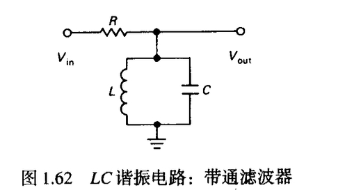

# LC 并联谐振电路 —— 推导与分析

---

## 一、LC 并联组合电路在频率 f 处的电抗

### 1.1 电路结构

考虑电感 L 与电容 C **并联**的组合电路（即 tank circuit）。


### 1.2 单个元件的阻抗

在角频率 \(\omega = 2\pi f\) 下：

- 电感 L 的阻抗：\(Z_L = j\omega L = j2\pi fL\)
- 电容 C 的阻抗：\(Z_C = \dfrac{1}{j\omega C} = -\dfrac{j}{\omega C} = -\dfrac{j}{2\pi fC}\)

### 1.3 并联等效阻抗推导

并联阻抗公式：

$$Z_p = \frac{Z_L \cdot Z_C}{Z_L + Z_C}$$

代入：

$$Z_p = \frac{(j\omega L) \cdot \left(-\dfrac{j}{\omega C}\right)}{j\omega L - \dfrac{j}{\omega C}}$$

- 分子：\(j \times (-j) = -j^2 = -(-1) = 1\)，所以分子 \(= \dfrac{L}{C}\)
- 分母：\(j\left(\omega L - \dfrac{1}{\omega C}\right)\)

因此：

$$Z_p = \frac{L/C}{j\left(\omega L - \dfrac{1}{\omega C}\right)} = \frac{1}{j\left(\omega C - \dfrac{1}{\omega L}\right)}$$

### 1.4 电抗表达式

提取虚部，得到 LC 并联组合的**电抗**：

$$\boxed{X_p(f) = \frac{1}{2\pi f C - \dfrac{1}{2\pi f L}}}$$

或等价形式：

$$\boxed{X_p(f) = \frac{2\pi f L}{1 - (2\pi f)^2 LC}}$$

### 1.5 物理意义

| 频率范围 | 电抗符号 | 等效性质 |
|---|---|---|
| \(f < f_0\) | \(X_p > 0\) | 感性 |
| \(f = f_0\) | 分母为零 | 谐振，阻抗 → ∞ |
| \(f > f_0\) | \(X_p < 0\) | 容性 |

---

## 二、谐振频率与无穷阻抗

### 2.1 谐振频率

令电抗分母为零：

$$\omega_0 C = \frac{1}{\omega_0 L} \quad\Rightarrow\quad \omega_0^2 = \frac{1}{LC}$$

$$\boxed{f_0 = \frac{1}{2\pi\sqrt{LC}}}$$

### 2.2 为什么阻抗为无穷大？—— 三种视角

#### 视角一：阻抗公式

$$Z_p = \frac{1}{j\left(\omega C - \dfrac{1}{\omega L}\right)}$$

当 \(\omega = \omega_0\) 时，分母为零 → \(|Z_p| \to \infty\)

#### 视角二：导纳角度

并联电路更适合用导纳分析：

$$Y = \frac{1}{Z} = j\left(\omega C - \frac{1}{\omega L}\right)$$

谐振时 \(Y = 0\) → 导纳为零 → 阻抗无穷大。

#### 视角三：能量/电流角度（最直观）

- 电感电流 **滞后电压 90°**
- 电容电流 **超前电压 90°**
- 两者大小相等、方向相反，完全抵消
- 外部电路不需要提供净无功电流 → 总电流 = 0 → 对外表现为开路 → 阻抗 → ∞

### 2.3 实际工程中的情况

| 情况 | 结果 |
|---|---|
| 理想 LC | 阻抗严格 ∞ |
| 含线圈电阻 R | 阻抗很大但有限 |
| 用于滤波 | 形成带阻 / 陷波特性 |

---

## 三、品质因数 Q 与 –3 dB 带宽

### 3.1 Q 的定义

$$\boxed{Q = \frac{f_0}{\Delta f} = \frac{f_0}{f_2 - f_1}}$$

其中：
- \(f_0\)：谐振频率
- \(f_1, f_2\)：–3 dB 频率（半功率点）
- \(\Delta f = f_2 - f_1\)：带宽

> ⚠️ 注意：是谐振频率 **除以** 带宽，而非带宽除以谐振频率。

### 3.2 f₁ 和 f₂ 的含义

- **f₁**：下限截止频率（左 –3 dB 点）
- **f₂**：上限截止频率（右 –3 dB 点）
- 两者对称分布在 \(f_0\) 两侧（高 Q 时近似对称）
- 幅频响应在这两个频率处下降到峰值的 \(1/\sqrt{2} \approx 70.7\%\)

### 3.3 Q 值精确求解

令幅频响应下降至 \(1/\sqrt{2}\) 处：

$$\frac{f}{f_0} - \frac{f_0}{f} = \pm \frac{1}{Q}$$

解得：

$$f_1 = f_0 \left( \sqrt{1 + \frac{1}{4Q^2}} - \frac{1}{2Q} \right)$$

$$f_2 = f_0 \left( \sqrt{1 + \frac{1}{4Q^2}} + \frac{1}{2Q} \right)$$

当 \(Q \gg 1\) 时，近似为：

$$f_1 \approx f_0 - \frac{f_0}{2Q}, \quad f_2 \approx f_0 + \frac{f_0}{2Q}$$

$$\Delta f = f_2 - f_1 \approx \frac{f_0}{Q}$$

### 3.4 Q 与响应尖锐度的关系

```
     |        /\        ← Q大，Δf小，峰尖锐
     |       /  \
     |------/    \------
     |
     |      /------\   ← Q小，Δf大，峰平缓
     |-----/        \--
```

- **Q 越大** → 带宽越窄 → 峰值越尖锐 → 频率选择性越好
- **Q 越小** → 带宽越宽 → 峰值越平缓 → 频率选择性越差

### 3.5 能量视角的 Q

$$Q = 2\pi \times \frac{\text{一个周期内储存的最大能量}}{\text{一个周期内耗散的能量}}$$

- 高 Q：能量损耗少，振荡衰减慢 → 只对很靠近 \(f_0\) 的频率有强响应
- 低 Q：能量快速耗散 → 对较宽频率都有响应

---

## 四、幅频响应公式的完整推导

### 4.1 电路结构（图 1.62）

- 输入电压 \(V_{in}\) → 串联电阻 R → 并联 LC 支路 → 输出电压 \(V_{out}\) 取自 LC 两端
- 这是一个典型的 **RLC 并联型带通滤波器**

### 4.2 传递函数

由分压公式：

$$H(j\omega) = \frac{V_{out}}{V_{in}} = \frac{Z_{LC}}{R + Z_{LC}}$$

其中 LC 并联阻抗：

$$Z_{LC} = \frac{1}{j\left(\omega C - \dfrac{1}{\omega L}\right)}$$

### 4.3 引入谐振频率归一化

令 \(\omega_0 = \dfrac{1}{\sqrt{LC}}\)，引入归一化变量 \(x = \dfrac{\omega}{\omega_0}\)

则：

$$\omega C - \frac{1}{\omega L} = \omega_0 C \left(x - \frac{1}{x}\right)$$

### 4.4 引入品质因数 Q

定义：

$$Q = \omega_0 R C = \frac{R}{\omega_0 L}$$

因此：

$$\frac{R}{Z_{LC}} = j R \left(\omega C - \frac{1}{\omega L}\right) = j Q \left(\frac{\omega}{\omega_0} - \frac{\omega_0}{\omega}\right)$$

### 4.5 传递函数化简

$$H(j\omega) = \frac{1}{1 + j Q \left(\dfrac{\omega}{\omega_0} - \dfrac{\omega_0}{\omega}\right)}$$

### 4.6 取模 —— 幅频响应公式

$$\boxed{|H(j\omega)| = \frac{1}{\sqrt{1 + Q^2{\left(\dfrac{\omega}{\omega_0} - \dfrac{\omega_0}{\omega}\right)}^2}}}$$

用频率 f 表示（\(\omega = 2\pi f\)，\(\omega_0 = 2\pi f_0\)）：

$$\boxed{|H(f)| = \frac{1}{\sqrt{1 + Q^2{\left(\dfrac{f}{f_0} - \dfrac{f_0}{f}\right)}^2}}}$$

### 4.7 验证关键点

1. **当 \(f = f_0\) 时**：\(\dfrac{f}{f_0} - \dfrac{f_0}{f} = 0\) → \(|H| = 1\)（峰值）
2. **当 \(|H| = 1/\sqrt{2}\) 时**：\(Q\left|\dfrac{f}{f_0} - \dfrac{f_0}{f}\right| = 1\) → 解得 f₁, f₂，且 \(\Delta f = f_0 / Q\)

---

## 五、核心公式速查表

| 物理量 | 公式 |
|---|---|
| 谐振频率 | \(f_0 = \dfrac{1}{2\pi\sqrt{LC}}\) |
| LC 并联电抗 | \(X_p(f) = \dfrac{1}{2\pi f C - \dfrac{1}{2\pi f L}}\) |
| 品质因数 | \(Q = \dfrac{f_0}{f_2 - f_1} = \dfrac{R}{\omega_0 L} = \omega_0 R C\) |
| –3 dB 带宽 | \(\Delta f = f_2 - f_1 = \dfrac{f_0}{Q}\) |
| 幅频响应 | \(|H(f)| = \dfrac{1}{\sqrt{1 + Q^2\left(\dfrac{f}{f_0} - \dfrac{f_0}{f}\right)^2}}\) |
| 下限截止频率 | \(f_1 = f_0 \left(\sqrt{1 + \dfrac{1}{4Q^2}} - \dfrac{1}{2Q}\right)\) |
| 上限截止频率 | \(f_2 = f_0 \left(\sqrt{1 + \dfrac{1}{4Q^2}} + \dfrac{1}{2Q}\right)\) |

---

## 六、总结

> **LC 并联谐振电路的核心思想**：在谐振频率 \(f_0 = 1/(2\pi\sqrt{LC})\) 处，电感与电容的无功电流完全抵消，导纳为零，阻抗趋于无穷大。品质因数 \(Q = f_0/\Delta f\) 量化了谐振峰的尖锐程度——Q 越大，带宽越窄，频率选择性越好。幅频响应公式 \(|H(f)| = 1/\sqrt{1 + Q^2(f/f_0 - f_0/f)^2}\) 完整描述了这一特性。
