# Metal 学习指南 —— 从入门到精通

> **文档版本**：v1.0 | 2026年6月
> **作者**：汪亮 bertonwang
> **邮箱**：47608843@qq.com
> **适用人群**：从零基础小白 → 图形学高手

---

## 📋 目录

1. [什么是 Metal？](#一什么是-metal)
2. [Metal vs Vulkan / DirectX / OpenGL](#二metal-vs-vulkan--directx--opengl)
   - [2.1 先搞懂：它们分别干什么事情？](#21-先搞懂它们分别干什么事情)
   - [2.2 生活化类比：一眼看懂关系](#22-生活化类比一眼看懂关系)
   - [2.3 完整对比表](#23-完整对比表)
   - [2.4 Metal 的独特优势：Apple Silicon 统一内存](#24-metal-的独特优势apple-silicon-统一内存)
   - [2.5 Metal 在各平台的详细支持情况](#25-metal-在各平台的详细支持情况)
   - [2.6 各平台 Metal 可用性详细对比](#26-各平台-metal-可用性详细对比)
3. [学习路线图](#三学习路线图)
4. [入门篇：Metal 编程核心流程](#四入门篇metal-编程核心流程)
   - [4.1 前置知识检查清单](#41-前置知识检查清单)
   - [4.2 Metal 编程的核心流程](#42-metal-编程的核心流程)
   - [4.3 Metal 特有概念速查](#43-metal-特有概念速查)
5. [进阶篇：核心概念深入](#五进阶篇核心概念深入)
6. [高级篇：高级渲染技术](#六高级篇高级渲染技术)
7. [专家篇：引擎与性能优化](#七专家篇引擎与性能优化)
8. [实战项目](#八实战项目)
9. [附录 A：基础知识速查](#附录-a基础知识速查)
10. [附录 B：学习资源推荐](#附录-b学习资源推荐)
11. [附录 C：常见问题 FAQ](#附录-c常见问题-faq)
12. [附录 D：Metal 未来展望](#附录-dmetal-未来展望)

---

## 一、什么是 Metal？

### 1.1 一句话解释

> **Metal 是 Apple 于 2014 年发布的底层图形与计算 API，专为 iOS/macOS 设备设计。它让开发者能直接访问 GPU，实现高性能的图形渲染和通用计算，是 Apple 平台上 Vulkan/DirectX 12 的对应物。**

### 1.2 小白版解释

想象你要让 Apple 设备（iPhone、Mac、iPad）上的 GPU 帮你干活：

| 方式 | 工具 | 好比 | 性能 | 平台 |
|------|------|------|------|------|
| **OpenGL ES** | 老式指挥系统 | 通过对讲机指挥 GPU，简单但慢 | 中等 | 跨平台（已淘汰） |
| **🌟 Metal** | Apple 专属现代指挥系统 | 直接给 A 系列/M 系列芯片发指令 | **极强** | 仅 Apple |
| **Metal Performance Shaders** | Apple 官方 Shader 库 | 预置的高性能 Shader 集合 | 极强 | 仅 Apple |
| **Core Animation** | 高层封装 | 不用写 Shader 就能做动画 | 一般 | 仅 Apple |

> 💡 **关键理解**：Metal 是 Apple **抛弃 OpenGL，自己重新设计**的 GPU 编程接口。它专门为 Apple 自家的 **A 系列（iPhone）** 和 **M 系列（Mac）** 芯片优化，所以效率极高。如果你要做 iOS/macOS 上的高性能图形或 AI，Metal 是唯一选择。

### 1.3 Metal 能做什么？

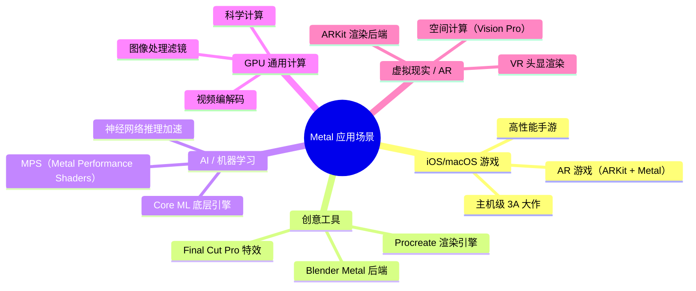

### 1.4 Metal 的核心特点

| 特性 | 说明 | 小白解释 |
|------|------|---------|
| **Apple 独家** | 仅支持 iOS/macOS/tvOS/visionOS | 想做 Apple 平台的高性能图形，必须用 Metal |
| **底层显式控制** | 类似 Vulkan/DX12 的设计理念 | 你能完全控制 GPU，但代码比 OpenGL 复杂 |
| **统一内存架构** | CPU 和 GPU 共享同一块内存（Apple Silicon） | 数据不需要「拷贝来拷贝去」，速度极快 |
| **计算着色器原生支持** | GPU 不仅能画图，还能做通用计算 | 可以用 GPU 加速 AI、视频处理等 |
| **Metal Shading Language** | 基于 C++ 的 Shader 语言 | 语法像 C++，比 GLSL 更现代 |
| **Metal Performance Shaders** | Apple 官方的高性能 Shader 库 | 不用自己写，直接调用超快的卷积、矩阵乘法等 |
| **与 Swift 深度集成** | 可以用 Swift 调用 Metal | 比 C++ 更安全、更现代 |

---

## 二、Metal vs Vulkan / DirectX / OpenGL

### 2.1 先搞懂：它们分别干什么事情？

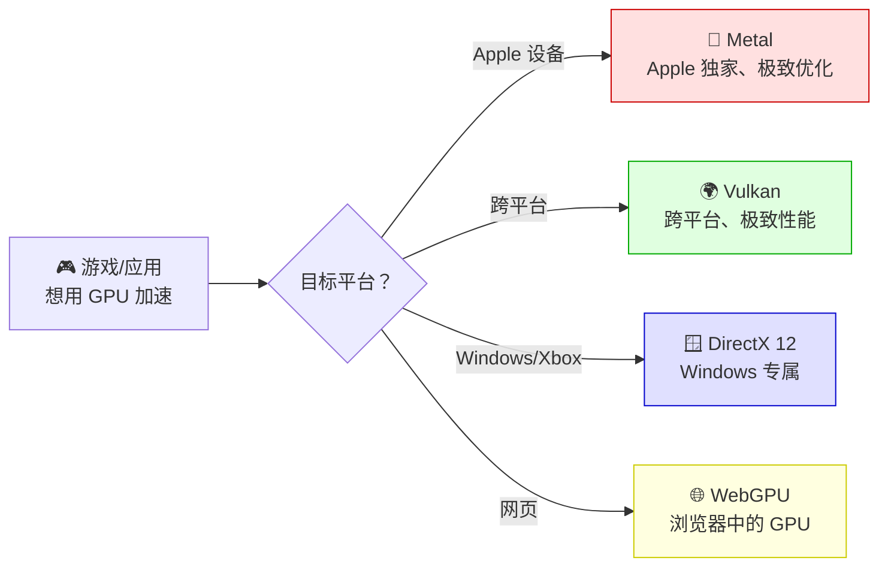

#### 各技术定位对比

| 技术 | 开发者 | 发布年 | 平台 | 定位 |
|------|--------|--------|------|------|
| **OpenGL** | Khronos | 1992 | 跨平台 | 老牌标准（已淘汰） |
| **OpenGL ES** | Khronos | 2003 | 移动端 | OpenGL 移动版（已淘汰） |
| **Vulkan** | Khronos | 2016 | 跨平台 | 现代跨平台标准 |
| **DirectX 12** | Microsoft | 2015 | Windows/Xbox | Windows 现代标准 |
| **🌟 Metal** | Apple | 2014 | Apple 全平台 | Apple 独家现代标准 |
| **WebGPU** | W3C | 2023 | 浏览器 | Web 现代标准 |

### 2.2 生活化类比：一眼看懂关系

> **快递公司类比**：
> - **OpenGL** = 老牌快递（速度慢、覆盖广但快倒闭了）
> - **Vulkan** = 全球连锁快递（速度快、覆盖广、操作复杂）
> - **DirectX 12** = 某省专属快递（在该省速度最快，但别省不去）
> - **🌟 Metal** = Apple 专属快递（在 Apple 园区里速度最快，但只能送 Apple 园区）

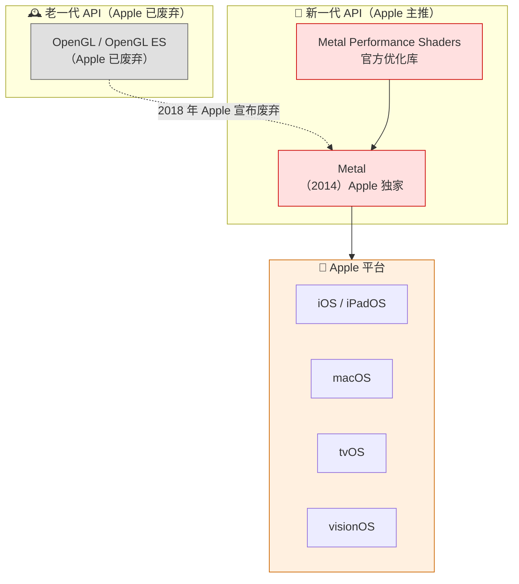

### 2.3 完整对比表

| 对比项 | Metal | Vulkan | DirectX 12 | OpenGL ES |
|--------|-------|--------|------------|-----------|
| **平台** | 仅 Apple | 跨平台 | Windows/Xbox | 跨平台（已淘汰） |
| **CPU 开销** | 极低 | 极低 | 极低 | 高 |
| **多线程** | ✅ 支持 | ✅ 支持 | ✅ 支持 | ❌ 不支持 |
| **着色器语言** | MSL（C++ 风格） | SPIR-V | HLSL | GLSL |
| **统一内存** | ✅ Apple Silicon 原生支持 | 取决于硬件 | 取决于硬件 | ❌ |
| **AI 加速** | ✅ MPS 库 | 需自己实现 | 需自己实现 | ❌ |
| **学习难度** | ⭐⭐⭐ | ⭐⭐⭐⭐⭐ | ⭐⭐⭐⭐ | ⭐⭐ |
| **开发语言** | Swift / Objective-C++ | C++ | C++ | C++ |
| **调试工具** | Xcode GPU Capture（极好用） | RenderDoc | PIX | 较少 |
| **未来** | ✅ Apple 主推 | ✅ Khronos 主推 | ✅ Microsoft 主推 | ❌ 已淘汰 |

### 2.4 Metal 的独特优势：Apple Silicon 统一内存

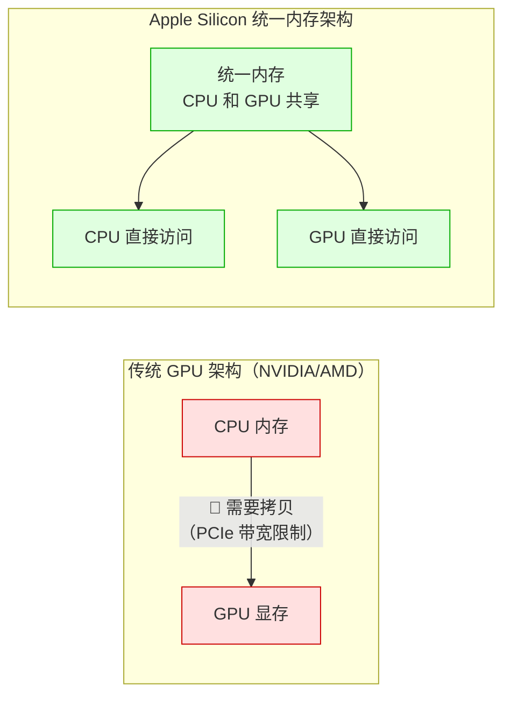

> 💡 **为什么 Apple 的 GPU 这么快？** 因为 CPU 和 GPU 共享同一块内存（统一内存架构），数据不需要在 CPU 内存和 GPU 显存之间来回拷贝。Metal 天然支持这种架构，所以效率极高。

### 2.5 Metal 在各平台的详细支持情况

Metal 是 **Apple 独家技术**，仅支持 Apple 自家的操作系统。下面是详细的平台支持情况：

#### 2.5.1 macOS 平台原生支持

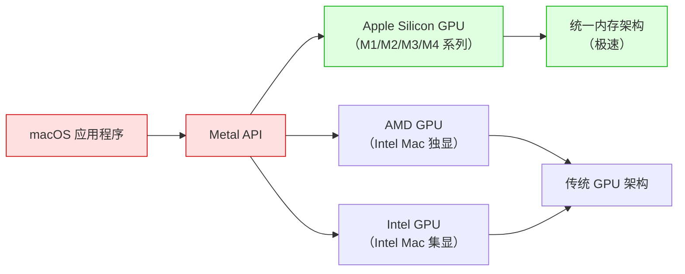

| 项目 | 说明 |
|------|------|
| **支持版本** | macOS 10.11（El Capitan）及以上 |
| **推荐版本** | macOS 14（Sonoma）及以上（支持最新 Metal 3） |
| **GPU 要求** | Apple Silicon（M 系列）或支持 Metal 的 AMD/NVIDIA GPU |
| **开发工具** | Xcode（免费，Mac App Store 下载） |
| **Metal 版本** | Metal 3（macOS 13+）、Metal 2（macOS 10.13+） |

> 💡 **重要提示**：Metal **仅支持 Apple 设备**。如果你用的是 Windows 或 Linux，无法开发或运行 Metal 程序。这是 Metal 最大的限制，也是 Apple 的「封闭生态」策略。

#### 2.5.2 iOS/iPadOS/tvOS/visionOS 平台支持

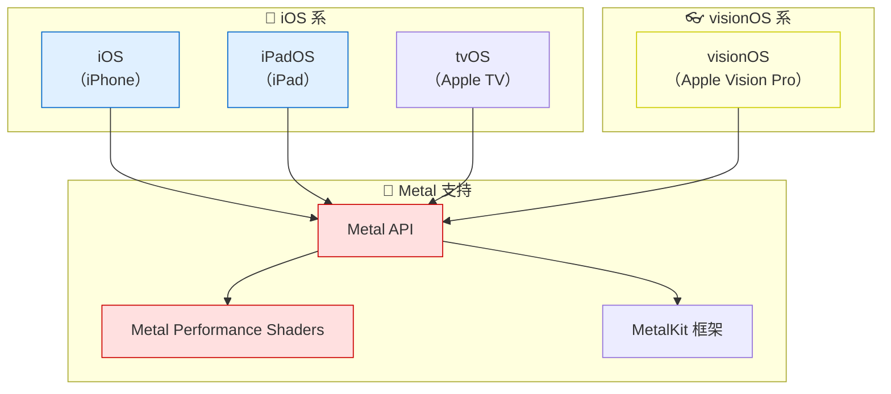

| 平台 | 最低支持版本 | GPU 要求 | 特殊说明 |
|------|-------------|----------|----------|
| **iOS** | iOS 8.0+ | A7 芯片及以上（iPhone 5s+） | 移动端性能优化是重点 |
| **iPadOS** | iPadOS 13.0+ | A7 芯片及以上 | 大屏优化，支持 Apple Pencil |
| **tvOS** | tvOS 9.0+ | Apple TV 4 及以上 | 专注媒体和游戏 |
| **visionOS** | visionOS 1.0+ | M2 芯片（Apple Vision Pro） | 空间计算，高帧率要求（90/96 Hz） |

#### 2.5.3 平台支持总览图

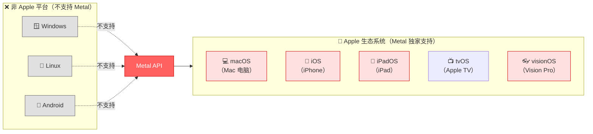

#### 2.5.4 常见问题：我该选哪个图形 API？

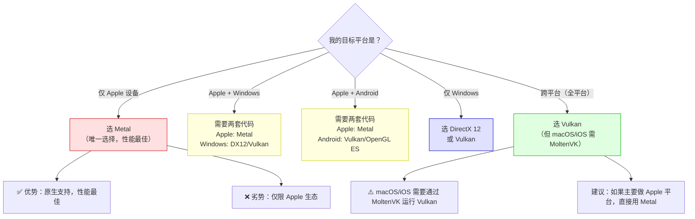

### 2.6 各平台 Metal 可用性详细对比

| 平台 | 支持方式 | 成熟度 | 性能 | 推荐度 | 备注 |
|------|---------|--------|------|--------|------|
| **macOS** | 原生（系统内置） | ⭐⭐⭐⭐⭐ | 最佳 | ⭐⭐⭐⭐⭐ 强烈推荐 | 需要 Mac 电脑 |
| **iOS** | 原生（系统内置） | ⭐⭐⭐⭐⭐ | 最佳 | ⭐⭐⭐⭐⭐ 强烈推荐 | 需要 iPhone/iPad |
| **iPadOS** | 原生（系统内置） | ⭐⭐⭐⭐⭐ | 最佳 | ⭐⭐⭐⭐⭐ 强烈推荐 | 大屏优化 |
| **tvOS** | 原生（系统内置） | ⭐⭐⭐⭐ | 最佳 | ⭐⭐⭐⭐ 推荐 | Apple TV 开发 |
| **visionOS** | 原生（系统内置） | ⭐⭐⭐⭐ | 最佳 | ⭐⭐⭐⭐⭐ 强烈推荐 | 空间计算必选 |
| **Windows** | ❌ 不支持 | — | — | ❌ 无法使用 | 只能用 DX12/Vulkan |
| **Linux** | ❌ 不支持 | — | — | ❌ 无法使用 | 只能用 Vulkan/OpenGL |
| **Android** | ❌ 不支持 | — | — | ❌ 无法使用 | 只能用 Vulkan/OpenGL ES |

> 💡 **总结一句话**：Metal **仅支持 Apple 平台**（macOS、iOS、iPadOS、tvOS、visionOS），不支持 Windows、Linux、Android。如果你只做 Apple 平台的图形开发，Metal 是唯一选择，也是性能最好的选择。如果需要跨平台，建议用 Vulkan（但 macOS/iOS 需通过 MoltenVK 翻译层）。

---

## 三、学习路线图

### 3.1 整体学习路径

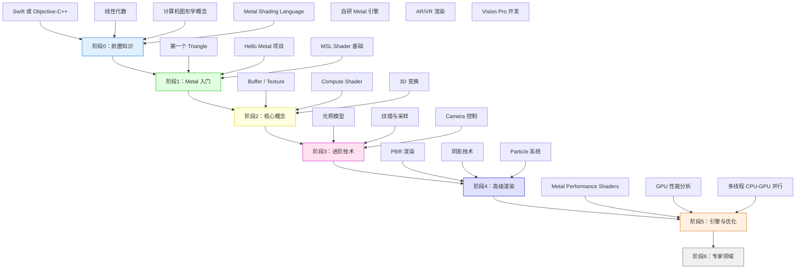

### 3.2 各阶段学习目标

| 阶段 | 周期 | 核心目标 | 能做出的东西 |
|:---:|:---:|:---:|----------|
| **阶段0** | 2周 | 补齐前置知识 | — |
| **阶段1** | 3周 | 画出第一个三角形 | 彩色三角形（Metal + Swift） |
| **阶段2** | 4周 | 掌握 Buffer/Texture/Compute | 带纹理的 3D 立方体 |
| **阶段3** | 4周 | 实现光照和摄像机 | 可交互的 3D 场景 |
| **阶段4** | 6周 | 高级渲染技术 | PBR、阴影、粒子效果 |
| **阶段5** | 6周 | MPS 和性能优化 | 高性能渲染引擎 |
| **阶段6** | 长期 | AR/VR/Vision Pro | 空间计算应用 |

---

## 四、入门篇：Metal 编程核心流程

> **本章目标**：理解 Metal 程序的基本结构和编程流程，能够读懂 Metal 示例代码。

### 4.1 前置知识检查清单

#### ✅ 必须掌握

- [ ] **Swift 基础**（推荐）或 **Objective-C++**：Metal 通常用 Swift 调用
- [ ] **Xcode 使用**：Metal 开发必须用 Xcode（仅在 macOS 上）
- [ ] **线性代数**：向量、矩阵、坐标系变换
- [ ] **计算机图形学基础**：光栅化、着色器概念

#### 🔶 最好掌握（不强制）

- [ ] **OpenGL 或 WebGL 基础**：了解传统图形 API
- [ ] **C++ 基础**：Metal Shading Language 基于 C++

> 💡 **关于开发环境**：Metal **只能在 Apple 设备上开发**（Mac + Xcode）。如果你用的是 Windows，无法学习 Metal。这是 Metal 最大的限制。

### 4.2 Metal 编程的核心流程

#### 🎯 先搞懂：Metal 编程就像「指挥乐队演出」

为了让你更容易理解 Metal 的编程流程，我们用**指挥乐队演出**来类比：

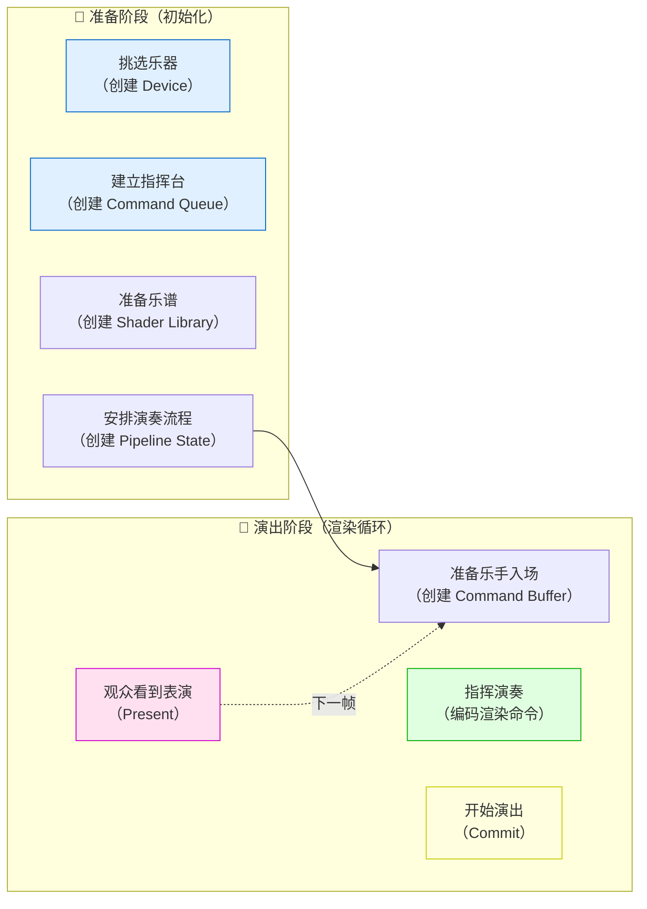

| 指挥乐队 | Metal 对应步骤 | 说明 |
|---------|--------------|------|
| 挑选乐器 | 创建 MTLDevice | 获取 GPU 设备，所有操作从这里开始 |
| 建立指挥台 | 创建 MTLCommandQueue | 建立 CPU 到 GPU 的「命令通道」 |
| 准备乐谱 | 创建 Shader Library | 编写 MSL 着色器代码（.metal 文件） |
| 安排演奏流程 | 创建 MTLRenderPipelineState | 配置渲染管线状态（Vertex + Fragment Shader） |
| 准备乐手入场 | 创建 MTLCommandBuffer | 准备一批要执行的 GPU 命令 |
| 指挥演奏 | 编码渲染命令（Encoder） | 用 Encoder 把绘制命令「写」进 Command Buffer |
| 开始演出 | commit() | 把 Command Buffer 提交给 GPU 执行 |
| 观众看到表演 | present() | 把渲染结果显示到屏幕 |

> 💡 **Metal 的独特之处**：
> - Metal 采用「命令编码模式」—— 先把所有 GPU 命令编码到 Command Buffer，然后一次性提交
> - 与 OpenGL 立即模式不同，Metal 让你**显式管理** GPU 的每一步
> - Metal 的 API 设计非常**面向对象**（Swift 风格），比 DX12 更容易理解

---

#### 📋 Metal 完整编程流程（6 大步骤）

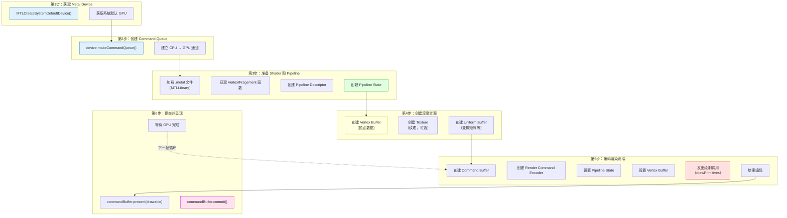

---

#### 🔍 每一步详细解释（小白版）

##### 第 1 步：获取 Metal Device（GPU 设备）

**问题**：如何与 GPU 通信？
**答案**：通过 `MTLDevice`！它是 GPU 的软件抽象，所有 Metal 对象都通过它创建。

```swift
// 获取系统默认的 GPU Device
// 在 macOS 上，如果有独显，通常返回独显
guard let device = MTLCreateSystemDefaultDevice() else {
    fatalError("Metal 不支持此设备")
}
```

> 💡 **类比**：就像「拿到 GPU 的遥控器」。有了 Device，你才能创建 Buffer、Texture、Pipeline 等所有 GPU 资源。

| 平台 | Device 行为 |
|------|------------|
| **iOS / iPadOS** | 只有 1 个 GPU，直接返回 |
| **macOS（带独显）** | 返回性能最强的 GPU（通常是独显） |
| **macOS（仅核显）** | 返回集成 GPU |

> ⚠️ **注意**：Metal 不支持多 GPU 切换（ unlike DX12 的 Multi-GPU）。如果需要，可以用 `MTLCopyAllDevices()` 枚举所有 GPU。

---

##### 第 2 步：创建 Command Queue（命令队列）

**问题**：如何把命令发送给 GPU？
**答案**：通过 `MTLCommandQueue`！它是 CPU 到 GPU 的「命令通道」。

```swift
// 创建 Command Queue（非常轻量，整个 App 通常只需要 1 个）
let commandQueue = device.makeCommandQueue()!
```

> 💡 **类比**：就像「乐队的指挥台」。指挥（CPU）通过指挥台把指令传给乐手（GPU）。

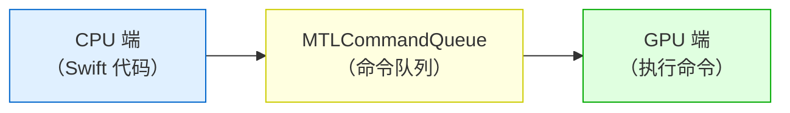

> 💡 **为什么需要 Command Queue？** 因为 GPU 是「异步执行」的。CPU 把命令放进队列，GPU 按序执行，两者可以并行工作！

---

##### 第 3 步：准备 Shader 和创建 Pipeline State

**问题**：GPU 如何知道「怎么画」？
**答案**：通过 **Shader（着色器）** 和 **Pipeline State（管线状态）**！

###### 3.1 编写 Metal Shader（.metal 文件）

Metal Shader 写在 `.metal` 文件中，使用 **Metal Shading Language（MSL）**，基于 C++ 14：

```metal
// Shaders.metal
#include <metal_stdlib>
using namespace metal;

// 顶点着色器输入结构
struct Vertex {
    float3 position [[attribute(0)]];  // 顶点位置（从 Buffer 读取）
    float4 color    [[attribute(1)]];   // 顶点颜色
};

// 顶点着色器输出（也是片段着色器输入）
struct VertexOut {
    float4 position [[position]];  // 裁剪空间位置（必须）
    float4 color;                   // 插值后的颜色
};

// ========== 顶点着色器 ==========
vertex VertexOut vertexShader(
    Vertex in [[stage_in]]) {
    VertexOut out;
    out.position = float4(in.position, 1.0);  // 假设已经是裁剪空间坐标
    out.color = in.color;
    return out;
}

// ========== 片段着色器 ==========
fragment float4 fragmentShader(
    VertexOut in [[stage_in]]) {
    return in.color;  // 直接输出插值后的颜色
}
```

###### 3.2 在 Swift 中加载 Shader 并创建 Pipeline

```swift
// 1. 加载 Shader Library（Xcode 会自动编译 .metal 文件）
let library = device.makeDefaultLibrary()!

// 2. 获取 Vertex 和 Fragment 函数
let vertexFunction = library.makeFunction(name: "vertexShader")
let fragmentFunction = library.makeFunction(name: "fragmentShader")

// 3. 配置 Pipeline Descriptor
let pipelineDescriptor = MTLRenderPipelineDescriptor()
pipelineDescriptor.vertexFunction = vertexFunction
pipelineDescriptor.fragmentFunction = fragmentFunction
pipelineDescriptor.colorAttachments[0].pixelFormat = .bgra8Unorm  // 颜色格式

// 4. 创建 Pipeline State（耗时操作，建议在初始化时做）
let pipelineState = try! device.makeRenderPipelineState(descriptor: pipelineDescriptor)
```

> 💡 **什么是 Pipeline State？** 它定义了「GPU 如何渲染」的完整配置，包括：
> - 用哪个 Vertex Shader？
> - 用哪个 Fragment Shader？
> - 颜色格式是什么？
> - 是否开启深度测试？
> - 如何混合颜色？
>
> 创建后**不能修改**（和 DX12 的 PSO 类似）！

---

##### 第 4 步：创建渲染资源（Buffer、Texture）

**问题**：顶点数据放在哪里？
**答案**：放在 `MTLBuffer` 中！Buffer 是 GPU 能访问的内存块。

```swift
// 三角形顶点数据：(x, y, z, r, g, b, a)
let vertices: [Float] = [
     0.0,  0.5, 0.0,  1.0, 0.0, 0.0, 1.0,  // 顶部：红色
    -0.5, -0.5, 0.0,  0.0, 1.0, 0.0, 1.0,  // 左下：绿色
     0.5, -0.5, 0.0,  0.0, 0.0, 1.0, 1.0,  // 右下：蓝色
]

// 在 GPU 内存中创建 Buffer
let vertexBuffer = device.makeBuffer(
    bytes: vertices,
    length: vertices.count * MemoryLayout<Float>.size,
    options: []
)!
```

> 💡 **类比**：就像「把乐谱交给乐手」。Buffer 是 GPU 能读取的「数据块」。

| 资源类型 | Metal 类 | 用途 |
|---------|---------|------|
| **顶点数据** | `MTLBuffer` | 存储顶点坐标、颜色、纹理坐标等 |
| **纹理** | `MTLTexture` | 存储图像数据，用于纹理采样 |
| **Uniform** | `MTLBuffer` | 存储变换矩阵、光照参数等「每帧变化」的数据 |

---

##### 第 5 步：编码渲染命令（最关键！）

**问题**：如何告诉 GPU 「画一个三角形」？
**答案**：通过 **Render Command Encoder** 把命令「编码」到 Command Buffer 中！

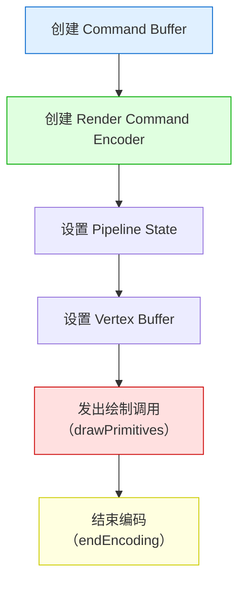

```swift
// ========== 在 draw(in:) 方法中 ==========
func draw(in view: MTKView) {
    // 1. 获取下一帧的 Drawable（要呈现到屏幕的图像）
    guard let drawable = view.currentDrawable else { return }
    // 2. 获取 Render Pass Descriptor（描述这一帧的渲染目标）
    guard let renderPassDescriptor = view.currentRenderPassDescriptor else { return }

    // 3. 创建 Command Buffer（准备一批 GPU 命令）
    let commandBuffer = commandQueue.makeCommandBuffer()!

    // 4. 创建 Render Command Encoder（开始编码渲染命令）
    let encoder = commandBuffer.makeRenderCommandEncoder(
        descriptor: renderPassDescriptor
    )!

    // 5. 设置 Pipeline State 和 Vertex Buffer，发出绘制命令
    encoder.setRenderPipelineState(pipelineState)
    encoder.setVertexBuffer(vertexBuffer, offset: 0, index: 0)
    encoder.drawPrimitives(type: .triangle, vertexStart: 0, vertexCount: 3)

    // 6. 结束编码
    encoder.endEncoding()

    // ... 后续：提交并呈现 ...
}
```

> ⚠️ **重要概念**：
> - **Command Buffer**：一批 GPU 命令的容器
> - **Encoder**：用于「编码」特定类型的命令（渲染、计算、Blit）
> - 每个 Encoder 有「生命周期」：`make` → `设置状态` → `发出命令` → `endEncoding`

---

##### 第 6 步：提交并呈现

**问题**：如何让 GPU 执行命令，并把结果显示到屏幕？
**答案**：调用 `commit()` 和 `present()`！

```swift
// 7. 呈现到屏幕（指定用哪个 Drawable）
commandBuffer.present(drawable)

// 8. 提交到 GPU 执行（异步！）
commandBuffer.commit()

// 可选：等待 GPU 完成（会阻塞 CPU）
// commandBuffer.waitUntilCompleted()
```

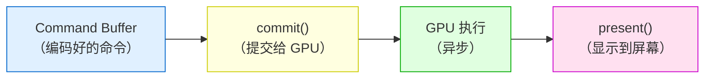

> 💡 **commit() 是异步的！** CPU 调用 `commit()` 后立即返回，不会等待 GPU 完成。这就是「CPU-GPU 并行」！

---

##### 第 7 步：渲染循环（MTKView 自动调用）

Metal 使用 **MTKView**（MetalKit View）来管理渲染循环。你只需要实现 `MTKViewDelegate` 协议：

```swift
extension Renderer: MTKViewDelegate {
    // ========== 每帧自动调用 ==========
    func draw(in view: MTKView) {
        // 这里写上面第 5-6 步的代码
        // 1. 创建 Command Buffer
        // 2. 编码渲染命令
        // 3. 提交并呈现
    }

    // 视图大小改变时调用
    func mtkView(_ view: MTKView, drawableSizeWillChange size: CGSize) {
        // 处理窗口大小变化（例如更新投影矩阵）
    }
}
```

> 💡 **MTKView 的好处**：
> - 自动管理 `CADisplayLink`（垂直同步）
> - 自动处理 `Drawable` 的获取和呈现
> - 让你专注于「画什么」，而不是「怎么画」

---

### 4.3 Metal 特有概念速查

| 概念 | Metal 对应 | 小白解释 |
|------|-----------|---------|
| **MTLDevice** | GPU 设备 | 就像「拿到 GPU 的遥控器」 |
| **MTLCommandQueue** | 命令队列 | 就像「CPU 到 GPU 的专属通道」 |
| **MTLCommandBuffer** | 命令缓冲区 | 就像「写好的一批 GPU 指令」 |
| **MTLEncoder** | 命令编码器 | 就像「把指令写进 Command Buffer 的秘书」 |
| **MTLRenderPipelineState** | 渲染管线状态 | 就像「配置好的渲染流水线」 |
| **MTLBuffer** | GPU 缓冲区 | 就像「GPU 能读取的内存块」 |
| **MTLTexture** | GPU 纹理 | 就像「GPU 能采样的图像」 |
| **MTLLibrary** | Shader 库 | 就像「编译好的 Shader 集合」 |
| **Drawable** | 可呈现图像 | 就像「屏幕上一块可以画的东西」 |

> 📚 **下一步**：第五章将深入讲解这些核心概念，包括 Pipeline、Compute Shader、MPS 等。

---

## 五、进阶篇：核心概念深入

### 5.1 Metal 渲染管线

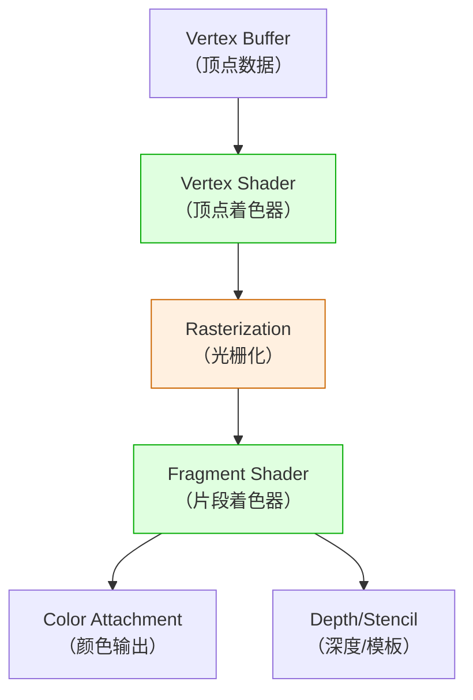

#### Pipeline 配置（Swift 代码）

```swift
let pipelineDescriptor = MTLRenderPipelineDescriptor()

// 设置 Shader 函数
pipelineDescriptor.vertexFunction = vertexFunction
pipelineDescriptor.fragmentFunction = fragmentFunction

// 设置颜色附件格式（要和 MTKView 的像素格式一致）
pipelineDescriptor.colorAttachments[0].pixelFormat = view.colorPixelFormat

// 设置顶点描述符（告诉 GPU 顶点数据的布局）
let vertexDescriptor = MTLVertexDescriptor()
vertexDescriptor.attributes[0].format = .float3  // position: 3 个 float
vertexDescriptor.attributes[0].offset = 0
vertexDescriptor.attributes[0].bufferIndex = 0
vertexDescriptor.layouts[0].stride = 3 * MemoryLayout<Float>.stride
pipelineDescriptor.vertexDescriptor = vertexDescriptor

// 创建 Pipeline State（耗时操作，建议在初始化时做）
pipelineState = try! device.makeRenderPipelineState(descriptor: pipelineDescriptor)
```

### 5.2 Compute Shader（计算着色器）

Metal 的 Compute Shader 非常强大，常用于 AI 推理、图像处理等。

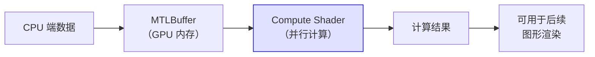

#### Compute Shader 示例（MSL）

```metal
// Metal 计算着色器
kernel void computeShader(
    texture2d<float, access::read> inputImage [[texture(0)]],
    texture2d<float, access::write> outputImage [[texture(1)]],
    uint2 gid [[thread_position_in_grid]]) {

    // 读取输入图像的像素
    float4 pixel = inputImage.read(gid);

    // 简单的灰度化计算
    float gray = dot(pixel.rgb, float3(0.299, 0.587, 0.114));
    float4 result = float4(gray, gray, gray, 1.0);

    // 写入输出图像
    outputImage.write(result, gid);
}
```

#### Swift 端调用 Compute Shader

```swift
// 创建 Compute Pipeline State
let computeFunction = library.makeFunction(name: "computeShader")
let computePipelineState = try! device.makeComputePipelineState(function: computeFunction)

// 创建 Command Buffer 和 Compute Encoder
let commandBuffer = commandQueue.makeCommandBuffer()!
let computeEncoder = commandBuffer.makeComputeCommandEncoder()!

computeEncoder.setComputePipelineState(computePipelineState)
computeEncoder.setTexture(inputTexture, index: 0)
computeEncoder.setTexture(outputTexture, index: 1)

// 分发计算任务（类似 GPU 上的并行 for 循环）
let gridSize = MTLSize(width: width, height: height, depth: 1)
let threadGroupSize = MTLSize(width: 16, height: 16, depth: 1)
computeEncoder.dispatchThreads(gridSize, threadsPerThreadgroup: threadGroupSize)

computeEncoder.endEncoding()
commandBuffer.commit()
```

### 5.3 Metal Performance Shaders（MPS）

MPS 是 Apple 官方提供的高性能 Shader 库，包含：

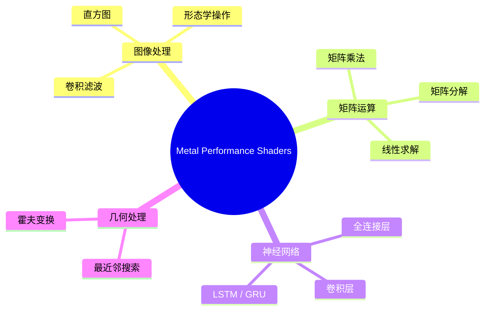

#### 使用 MPS 做矩阵乘法（比自己写 Compute Shader 快得多）

```swift
import MetalPerformanceShaders

// 创建 MPS 矩阵乘法对象
let gemm = MPSMatrixMultiplication(
    device: device,
    transposeLeft: false,
    transposeRight: false,
    resultRows: M,
    resultColumns: N,
    interiorColumns: K
)

// 创建 MTLBuffer 存放矩阵数据
let bufferA = device.makeBuffer(length: M * K * MemoryLayout<Float>.size)!
let bufferB = device.makeBuffer(length: K * N * MemoryLayout<Float>.size)!
let bufferC = device.makeBuffer(length: M * N * MemoryLayout<Float>.size)!

// 编码矩阵乘法命令
gemm.encode(
    commandBuffer: commandBuffer,
    leftMatrix: MPSMatrix(buffer: bufferA, descriptor: descA),
    rightMatrix: MPSMatrix(buffer: bufferB, descriptor: descB),
    resultMatrix: MPSMatrix(buffer: bufferC, descriptor: descC)
)
```

---

## 六、高级篇：高级渲染技术

### 6.1 PBR 渲染（基于物理的渲染）

Metal 非常适合实现 PBR 渲染管线：

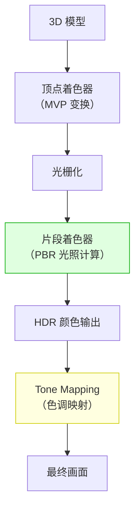

### 6.2 阴影映射（Shadow Mapping）

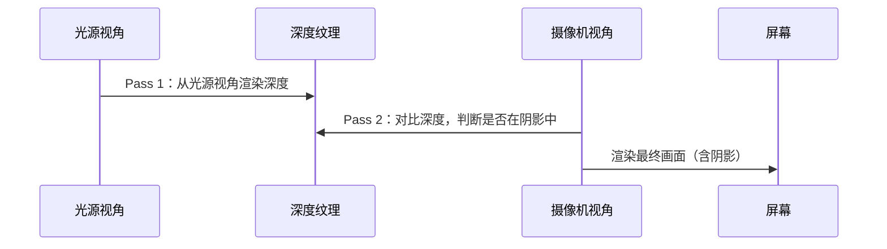

### 6.3 高级技术列表

| 技术 | 难度 | 说明 |
|------|------|------|
| **PBR 渲染** | ⭐⭐⭐ | 金属度/粗糙度工作流，基于物理的材质 |
| **阴影映射** | ⭐⭐⭐ | 从光源视角渲染深度图 |
| **延迟渲染** | ⭐⭐⭐⭐ | 适合多光源场景 |
| **粒子系统** | ⭐⭐⭐ | 用 Compute Shader 更新粒子 |
| **地形渲染** | ⭐⭐⭐⭐ | LOD、Heightmap、法线贴图 |
| **后处理特效** | ⭐⭐⭐ | Bloom、DOF、色调映射 |
| **AR 渲染（ARKit）** | ⭐⭐⭐⭐ | 结合 ARKit 的 Camera Image 和 Metal 渲染 |

---

## 七、专家篇：引擎与性能优化

### 7.1 使用引擎/封装

| 引擎/框架 | 说明 |
|----------|------|
| **MetalKit** | Apple 官方框架，简化 Metal 开发 |
| **SceneKit** | Apple 高阶 3D 框架（底层用 Metal） |
| **RealityKit** | Apple AR/VR 框架（底层用 Metal） |
| **Unity** | 支持 Metal 渲染后端（iOS/macOS 平台） |
| **Unreal Engine** | 支持 Metal 渲染后端（iOS/macOS 平台） |
| **Flutter** | 通过 Impeller 引擎使用 Metal |

### 7.2 Metal 性能优化清单

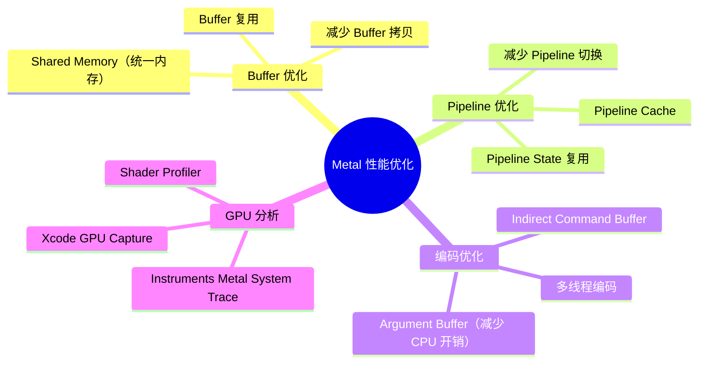

### 7.3 Xcode GPU Capture（超好用的调试工具）

Xcode 内置的 GPU Capture 工具是 Metal 开发的杀手锏：

```mermaid
flowchart LR
    A["运行 Metal 应用"] --> B["点击 Xcode 的<br/>GPU Capture 按钮"]
    B --> C["捕获当前帧"]
    C --> D["查看所有 GPU 命令"]
    D --> E["查看 Texture / Buffer 内容"]
    E --> F["单步调试 Shader"]
    F --> G["分析性能瓶颈"]
```

---

## 八、实战项目

### 8.1 项目 1：Metal 三角形（入门）

**目标**：用 Metal + Swift 画出彩色三角形

**学习内容**：
- Metal 初始化流程
- MSL Shader 编写
- MTKView 的使用

**预估时间**：1 周

### 8.2 项目 2：3D 模型查看器（进阶）

**目标**：加载 OBJ 模型，用 Metal 渲染

**学习内容**：
- 顶点/索引缓冲区管理
- Uniform Buffer 和 MVP 矩阵
- 摄像机控制

**预估时间**：3~4 周

### 8.3 项目 3：AR 滤镜应用（高级）

**目标**：用 Metal Compute Shader 实现实时视频滤镜

**学习内容**：
- Camera 帧捕获
- Compute Shader 图像处理
- 实时性能优化

**预估时间**：4~6 周

### 8.4 项目 4：Vision Pro 空间应用（专家）

**目标**：为 Apple Vision Pro 开发空间计算应用

**学习内容**：
- RealityKit + Metal 混合渲染
- 空间音频
- 手势交互

**预估时间**：2~3 个月

---

## 附录 A：基础知识速查

### A.1 Metal 专有术语表

| 英文术语 | 中文翻译 | 解释 |
|---------|---------|------|
| **MTLDevice** | Metal 设备 | GPU 的软件抽象 |
| **MTLCommandQueue** | 命令队列 | CPU 向 GPU 提交命令的通道 |
| **MTLCommandBuffer** | 命令缓冲区 | 记录的 GPU 命令列表 |
| **MTLEncoder** | 命令编码器 | 将命令编码到 Command Buffer |
| **MTLRenderPipelineState** | 渲染管线状态 | 配置好的渲染管线 |
| **MTLBuffer** | 缓冲区 | GPU 内存中的数据块 |
| **MTLTexture** | 纹理 | GPU 可读写的图像数据 |
| **MTLLibrary** | Shader 库 | 编译好的 MSL Shader 集合 |
| **MTLFunction** | Shader 函数 | 单个 Vertex/Fragment/Compute 函数 |
| **Drawable** | 可呈现对象 | 可以呈现到屏幕的图像 |
| **Metal Shading Language** | MSL | Metal 的 Shader 语言（基于 C++） |
| **Argument Buffer** | 参数缓冲区 | 批量绑定资源，减少 CPU 开销 |

### A.2 Metal 开发环境搭建

#### 系统要求

| 要求 | 最低配置 | 推荐配置 |
|------|---------|---------|
| **Mac 电脑** | MacBook Pro 2012+ | M 系列芯片 Mac |
| **macOS** | macOS 10.15+ | macOS 14+ |
| **Xcode** | Xcode 12+ | Xcode 15+ |
| **iOS 设备（如需测试）** | iOS 13+ | iOS 17+ |

#### 验证 Metal 是否可用

```swift
import Metal

if let device = MTLCreateSystemDefaultDevice() {
    print("Metal 可用！GPU：\(device.name)")
    print("是否支持统一内存：\(device.hasUnifiedMemory)")
} else {
    print("此设备不支持 Metal")
}
```

---

## 附录 B：学习资源推荐

### B.1 官方资源

| 资源 | 链接 | 说明 |
|------|------|------|
| **Metal 官方文档** | https://developer.apple.com/metal/ | Apple 官方 Metal 文档 |
| **Metal Shading Language 规范** | Apple Developer 网站 | MSL 语言参考 |
| **Metal Performance Shaders** | https://developer.apple.com/documentation/metalperformanceshaders | MPS 官方文档 |
| **WWDC Metal 视频** | https://developer.apple.com/videos/ | 每年 WWDC 都有 Metal 专题 |

### B.2 教程与示例

| 资源 | 说明 | 推荐指数 |
|------|------|---------|
| **Metal by Example** | https://metalbyexample.com/ 经典入门教程 | ⭐⭐⭐⭐⭐ |
| **Apple 官方 Metal 示例** | Xcode 自带 Sample Code | ⭐⭐⭐⭐⭐ |
| **Learn Metal** | https://www.raywenderlich.com/ 有完整的 Metal 教程 | ⭐⭐⭐⭐ |
| **Metal Cookbook** | GitHub 上的 Metal 代码片段集合 | ⭐⭐⭐⭐ |

### B.3 书籍推荐

| 书名 | 作者 | 说明 |
|------|------|------|
| **《Metal Programming Guide》** | Apple Inc. | Apple 官方编程指南 |
| **《Metal Performance Optimization》** | Apple WWDC Sessions | WWDC 视频合集 |
| **《Real-Time Rendering 4th》** | Tomas Akenine-Möller | 实时渲染圣经 |

---

## 附录 C：常见问题 FAQ

### C.1 我没有 Mac，能学 Metal 吗？

**答**：不能。Metal **只能在 Apple 设备上开发**（Mac + Xcode）。如果你用的是 Windows 或 Linux，建议学 **Vulkan** 或 **WebGPU**，它们的概念和 Metal 高度相通。

### C.2 Metal 和 Swift 的关系是什么？

**答**：Metal API 可以用 **Swift** 或 **Objective-C++** 调用。Apple 推荐使用 **Swift**，因为 Swift 更安全、更现代。Shader 语言（MSL）是基于 C++ 的，和 Swift 无关。

### C.3 Metal 比 Vulkan 简单吗？

**答**：是的。Metal 的 API 设计比 Vulkan **简洁得多**（画三角形约 200 行 vs Vulkan 的 1000+ 行），因为：
1. Metal 不需要处理跨平台兼容性（只需支持 Apple 硬件）
2. Metal 的 Validation 和 Error 处理更友好
3. Xcode 的 GPU Capture 工具极大降低了调试难度

但两者在「显式控制 GPU」的理念上是一致的。

### C.4 Metal 能做 AI 推理吗？

**答**：可以，而且很快！Metal 有两个 AI 相关技术：
1. **Core ML**：高层封装，直接调用训练好的模型
2. **Metal Performance Shaders (MPS)**：底层控制，可以自己写神经网络层

M 系列芯片的 Neural Engine 可以通过 Metal 调用，AI 推理速度极快。

### C.5 Metal 可以在 Windows 或 Android 上使用吗？

**答**：**不能**。Metal 是 **Apple 独家技术**，仅支持以下平台：

| 平台 | 支持情况 | 说明 |
|------|----------|------|
| **macOS** | ✅ 原生支持 | 需要 Mac 电脑，macOS 10.11+ |
| **iOS** | ✅ 原生支持 | iPhone 5s 及以上（A7 芯片+） |
| **iPadOS** | ✅ 原生支持 | iPad Air 及以上 |
| **tvOS** | ✅ 原生支持 | Apple TV 4 及以上 |
| **visionOS** | ✅ 原生支持 | Apple Vision Pro |
| **Windows** | ❌ 不支持 | 请使用 DirectX 12 或 Vulkan |
| **Linux** | ❌ 不支持 | 请使用 Vulkan 或 OpenGL |
| **Android** | ❌ 不支持 | 请使用 Vulkan 或 OpenGL ES |

> 💡 **选择建议**：
> - 如果只做 Apple 平台：直接用 Metal（性能最佳）
> - 如果需要跨平台：使用 Vulkan（但 macOS/iOS 需通过 MoltenVK 翻译层）
> - 如果只做 Windows：使用 DirectX 12

---

## 附录 D：Metal 未来展望

### D.1 Metal 的演进路线

```mermaid
timeline
    title Metal 版本演进
    2014 : Metal 1.0 发布（iOS 8）
         A7 芯片率先支持
    2015 : Metal for macOS（OS X 10.11）
         跨 iOS 和 Mac
    2016 : Metal 2 发布
          Performance Optimization
          Argument Buffer
    2018 : Apple 宣布废弃 OpenGL / OpenCL
          Metal 成为唯一官方 GPU API
    2020 : Apple Silicon（M1）发布
          统一内存架构，Metal 性能飞跃
    2023 : Vision Pro 发布
          Metal 支持空间计算渲染
    2024+ : Metal 持续演进
          更强的 Ray Tracing
          Neural Engine 深度集成
```

### D.2 Metal 在行业中的应用

| 领域 | 应用 | 说明 |
|------|------|------|
| **iOS 游戏** | 《原神》iOS 版 | 使用 Metal 渲染后端 |
| **创意软件** | Procreate、Final Cut Pro | Metal 加速渲染和特效 |
| **AR/VR** | ARKit、Vision Pro | Metal 是底层渲染引擎 |
| **AI** | Core ML、MPS | M 系列 Neural Engine 加速 |
| **跨平台游戏引擎** | Unity、Unreal | iOS/macOS 平台用 Metal 后端 |

---

> **文档结束** —— 祝你的 Metal 学习之旅顺利！🍎
>
> 如有问题，欢迎联系作者：47608843@qq.com
