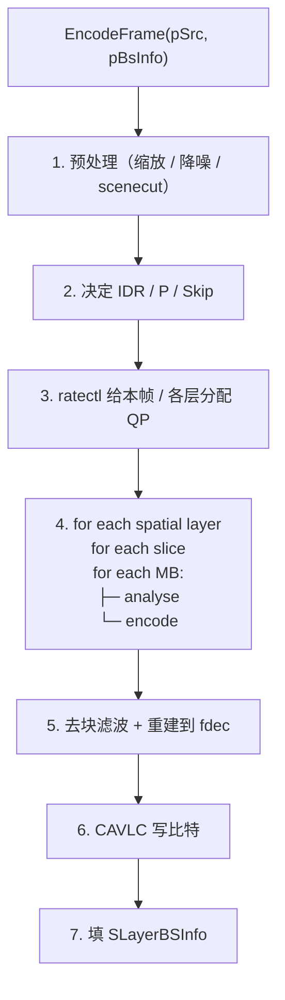
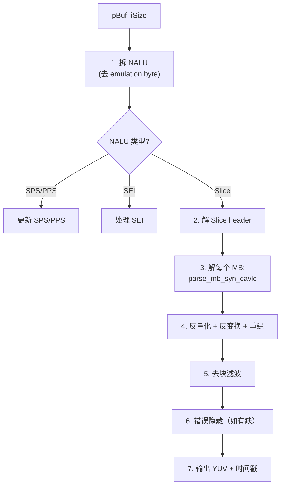
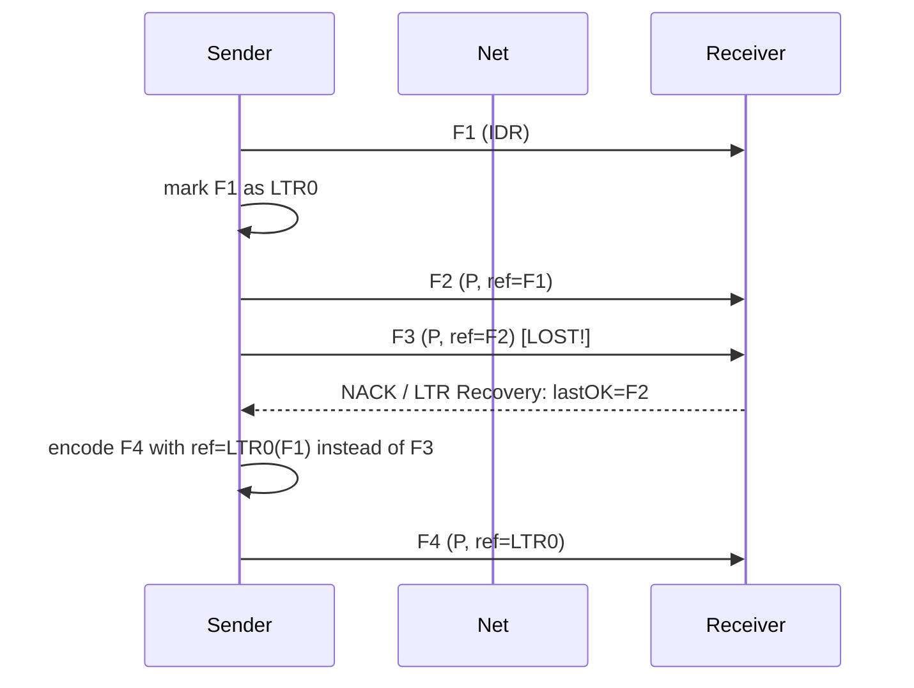
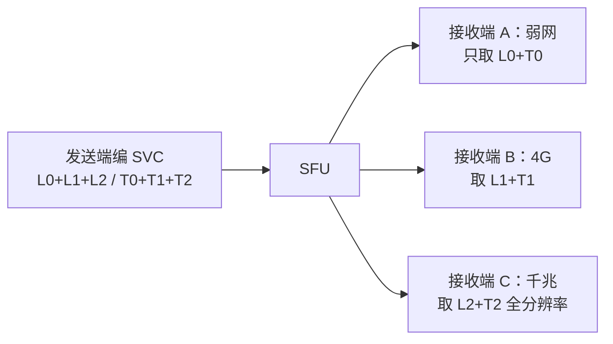

# OpenH264 源码深入浅出——Cisco 开源 RTC 编码器全景剖析

**作者**：汪亮（bertonwang）  
**邮箱**：<47608843@qq.com>  
**版本**：v1.0 ｜ **最后更新**：2026-05-14

> **本书风格参考《C++11 新特性解析与应用深入理解》《C++23 新特性解析与应用深入理解》**，
> 对每一个 OpenH264 主题按
> **「问题背景 → 概念形式 → 源码定位 → 关键算法 → 与 x264 对比 → 工程实战」**
> 六段式逐一拆解，目标是让**已经会一点 C/C++、读过《H.264 标准深入浅出》的开发者**，
> **只读这一本，就能从"克隆仓库"走到"读懂关键路径、改造编码器、把 RTC 视频体验做到极致"**。

---

## 目录

- [前言：为什么 RTC 选 OpenH264 而不是 x264](#前言为什么-rtc-选-openh264-而不是-x264)
- [第 0 章：环境与工具链——拉源码、编译、跑通](#第-0-章环境与工具链拉源码编译跑通)

### 第一部分　工程总览
- [第 1 章：OpenH264 的"三大卖点"——专利、SVC、RTC](#第-1-章openh264-的三大卖点专利svcrtc)
- [第 2 章：源码目录全图](#第-2-章源码目录全图)
- [第 3 章：构建系统（GNU Make / GYP / Meson）](#第-3-章构建系统gnu-make--gyp--meson)
- [第 4 章：公开 API 三件套（ISVCEncoder / ISVCDecoder / WelsCreateSVCEncoder）](#第-4-章公开-api-三件套isvcencoder--isvcdecoder--welscreatesvcencoder)
- [第 5 章：核心数据结构（SWelsSvcEncodingParam / SLayerBSInfo / SSourcePicture）](#第-5-章核心数据结构swelssvcencodingparam--slayerbsinfo--ssourcepicture)

### 第二部分　编码器主流水线
- [第 6 章：`EncodeFrame` 主入口](#第-6-章encodeframe-主入口)
- [第 7 章：分层编码（Spatial / Temporal / Quality SVC）](#第-7-章分层编码spatial--temporal--quality-svc)
- [第 8 章：码率控制（CBR / VBR / 自适应 + 弱网友好）](#第-8-章码率控制cbr--vbr--自适应--弱网友好)
- [第 9 章：宏块分析与编码](#第-9-章宏块分析与编码)
- [第 10 章：运动估计（菱形 + 邻居 MVP）](#第-10-章运动估计菱形--邻居-mvp)
- [第 11 章：去块滤波 + 熵编码（仅 CAVLC）](#第-11-章去块滤波--熵编码仅-cavlc)

### 第三部分　解码器主流水线
- [第 12 章：`DecodeFrame2` 主入口](#第-12-章decodeframe2-主入口)
- [第 13 章：错误隐藏（EC, Error Concealment）](#第-13-章错误隐藏ec-error-concealment)
- [第 14 章：参考帧管理与 LTR（长期参考）](#第-14-章参考帧管理与-ltr长期参考)
- [第 15 章：DPB 与 POC 重排序](#第-15-章dpb-与-poc-重排序)

### 第四部分　性能榨取
- [第 16 章：跨平台 SIMD 框架（X86 SSE / AVX2 + ARM NEON）](#第-16-章跨平台-simd-框架x86-sse--avx2--arm-neon)
- [第 17 章：多线程模型（slice-based / frame-based）](#第-17-章多线程模型slice-based--frame-based)
- [第 18 章：内存分配器与帧缓冲池](#第-18-章内存分配器与帧缓冲池)
- [第 19 章：与 x264 性能对比方法论](#第-19-章与-x264-性能对比方法论)

### 第五部分　弱网与 RTC 实战
- [第 20 章：长期参考帧 LTR 与丢包恢复](#第-20-章长期参考帧-ltr-与丢包恢复)
- [第 21 章：动态分辨率切换（On-the-fly Resolution Change）](#第-21-章动态分辨率切换on-the-fly-resolution-change)
- [第 22 章：动态码率调整（自动 BWE 联动）](#第-22-章动态码率调整自动-bwe-联动)
- [第 23 章：Slice 拆分与 RTP 友好封包](#第-23-章slice-拆分与-rtp-友好封包)
- [第 24 章：SVC 在 SFU 转发架构里的应用](#第-24-章svc-在-sfu-转发架构里的应用)

### 第六部分　集成与扩展
- [第 25 章：在 FFmpeg / libavcodec 里使用 OpenH264](#第-25-章在-ffmpeg--libavcodec-里使用-openh264)
- [第 26 章：在 WebRTC（libwebrtc）中的使用](#第-26-章在-webrtclibwebrtc中的使用)
- [第 27 章：完整可运行示例：YUV → H.264 单层 / SVC 三层](#第-27-章完整可运行示例yuv--h264-单层--svc-三层)
- [第 28 章：Android / iOS 集成清单](#第-28-章android--ios-集成清单)
- [第 29 章：自定义裁剪——只要解码器、只要编码器](#第-29-章自定义裁剪只要解码器只要编码器)
- [第 30 章：常见错误与排查](#第-30-章常见错误与排查)

### 附录
- [附录 A：OpenH264 与 x264 / FFmpeg-libx264 三方对比](#附录-aopenh264-与-x264--ffmpeg-libx264-三方对比)
- [附录 B：核心头文件速查](#附录-b核心头文件速查)
- [附录 C：常见错误与坑](#附录-c常见错误与坑)

---

## 前言：为什么 RTC 选 OpenH264 而不是 x264

> 一句话：**OpenH264 是 Cisco 用"专利费换免费"换来的工业级 H.264 编码器**，2013 年起 **MPEG-LA 专利费由 Cisco 替全球开发者出**，于是 Firefox / WebRTC / 各家 SDK 才能内置 H.264。

| 维度 | x264 | OpenH264 |
|---|---|---|
| 许可 | GPL（商用要 GPL 版权传染或商业 license） | **BSD-2 + Cisco 替你出专利费** |
| 主打场景 | 点播 / 归档 / 高画质 | **RTC / 直播 / 弱网** |
| 画质 | 略好（同码率 SSIM 高 5~10%） | 略弱 |
| 速度 | 同 preset 略快 | 略慢但更稳定 |
| **SVC**（分层编码） | ❌ 不支持 | ✅ **完整支持** |
| **LTR**（长期参考） | 部分 | ✅ 内置丰富策略 |
| **动态分辨率切换** | ❌ 重启编码器 | ✅ **不重启** |
| 配套生态 | FFmpeg / OBS / HandBrake | WebRTC / Firefox / 所有 SDK |
| 移动端体积 | 较大（≥ 2MB） | **较小（≤ 1MB）** |

> 💡 阅读本书前需先读 [《H.264 标准深入浅出》](./H.264标准深入浅出-从语法元素到工程实战.md)；如果还想看高画质点播路径，请配合阅读 [《最新版 x264 源码深入浅出》](./最新版x264源码深入浅出-从工业级编码器到性能榨取.md)。

**学习路径**：


---

## 第 0 章：环境与工具链——拉源码、编译、跑通

```bash
git clone https://github.com/cisco/openh264.git
cd openh264

# Linux / macOS
make ARCH=x86_64 -j$(nproc)
sudo make install

# Android (NDK)
make OS=android NDKROOT=$ANDROID_NDK ARCH=arm64 -j8

# iOS (xcrun + clang)
make OS=ios ARCH=arm64 -j8

# Windows (MinGW + msys2 / vcpkg)
make OS=msys ARCH=x86_64 -j8
```

测试：

```bash
./h264enc layer2.cfg                  # 默认配置
./h264enc -i in.yuv -frms 100 -frout out.h264 \
          -sw 1920 -sh 1080 -dw 0 1920 -dh 0 1080 \
          -frin 30 -bps 0 2000000 -ltarc 0 1 -ltqp 0 26
```

> 💡 OpenH264 没有 `configure`，全靠 Makefile + 命令行参数选 ARCH/OS。**这是嵌入式集成的天然优势**。

---

# 第一部分　工程总览

---

## 第 1 章：OpenH264 的"三大卖点"——专利、SVC、RTC

### 1.1 专利豁免

Cisco 把 OpenH264 编译成 `.so / .dll` **二进制托管在 Cisco 服务器**，下游应用只需"运行时下载"即可享受 Cisco 替付的 MPEG-LA 专利费。Firefox 内置走的就是这条路径。

> ⚠️ **直接编译进自家产品并不自动豁免专利**。要么用官方二进制，要么自己付 MPEG-LA 专利费。

### 1.2 SVC（Scalable Video Coding）

H.264 标准的扩展：**一份码流可分多层**，下游可按需取子集：

```
Spatial Layer  L0 (320×240)   L1 (640×480)   L2 (1280×720)
Temporal Layer T0 (7.5fps)    T1 (15fps)     T2 (30fps)
Quality Layer  Q0 (low QP)    Q1 (mid)       Q2 (high)
```

**SFU 转发架构**只需根据接收端带宽**直接丢高层**，不重新编码。这是 Zoom、Webex、声网等 RTC 厂商的看家本领。

### 1.3 RTC 友好

- 启动延迟 < 50ms（不像 x264 的 lookahead 队列）。
- 动态调整码率 / 帧率 / 分辨率 **不重启编码器**。
- LTR 实现简洁（关键帧 + 多张长期参考帧）。

---

## 第 2 章：源码目录全图

```
openh264/
├── codec/
│   ├── api/svc/                ★ 公开头文件（ISVCEncoder / ISVCDecoder）
│   ├── common/
│   │   ├── inc/                通用头（CPU 探测、SIMD 函数指针表）
│   │   └── src/
│   │       ├── cpu.cpp         CPU 特性检测
│   │       ├── deblocking_common.cpp
│   │       └── ...
│   ├── encoder/
│   │   ├── core/
│   │   │   ├── inc/            编码器内部头
│   │   │   └── src/
│   │   │       ├── encoder_ext.cpp     ★ EncodeFrame 主入口
│   │   │       ├── ratectl.cpp          ★ 码率控制
│   │   │       ├── slice_multi_threading.cpp
│   │   │       ├── md.cpp               宏块决策
│   │   │       ├── encode_mb_aux.cpp    宏块编码辅助
│   │   │       ├── mc.cpp               运动补偿
│   │   │       ├── set_mb_syn_cavlc.cpp CAVLC 写码
│   │   │       └── ...
│   │   └── plus/
│   │       └── src/welsCodecTrace.cpp   日志
│   ├── decoder/
│   │   ├── core/
│   │   │   ├── inc/, src/
│   │   │   │   ├── decoder.cpp
│   │   │   │   ├── parse_mb_syn_cavlc.cpp
│   │   │   │   ├── manage_dec_ref.cpp
│   │   │   │   └── error_code.cpp
│   │   └── plus/
│   ├── processing/                降采样 / 场景切换检测
│   └── console/
│       ├── enc/src/welsenc.cpp     编码器命令行
│       └── dec/src/h264dec.cpp     解码器命令行
└── test/                            单测 + 测试码流
```

> 💡 **大局观速记**：`encoder/core` 编、`decoder/core` 解、`common` 共用 SIMD、`console` 命令行。99% 的工作集中在前两者。

---

## 第 3 章：构建系统（GNU Make / GYP / Meson）

OpenH264 历史上同时维护三套构建：

| 构建 | 状态 | 何时用 |
|---|---|---|
| **GNU Make**（根 Makefile） | 主推 | Linux/Android/iOS/macOS |
| **GYP**（gyp 脚本） | Chromium 专用 | libwebrtc 集成 |
| **Meson** | 新近加入 | Linux 发行版打包 |

实用变量（Makefile）：

```bash
make ARCH=arm64 OS=android NDKROOT=...    # 安卓
make HAVE_AVX2=Yes                        # 强制开 AVX2
make USE_ASM=No                           # 关闭所有汇编（调试用）
make BUILDTYPE=Debug                      # 调试版
```

> 💡 **嵌入式集成最简办法**：把 `codec/` 目录下需要的 .cpp/.S 文件直接拖进自家工程，加 include path 即可。

---

## 第 4 章：公开 API 三件套（ISVCEncoder / ISVCDecoder / WelsCreateSVCEncoder）

`codec/api/svc/codec_api.h`：

```c
// 创建 / 销毁
int  WelsCreateSVCEncoder(ISVCEncoder** ppEncoder);
void WelsDestroySVCEncoder(ISVCEncoder* pEncoder);

int  WelsCreateDecoder(ISVCDecoder** ppDecoder);
void WelsDestroyDecoder(ISVCDecoder* pDecoder);
```

`ISVCEncoder` 是个**纯虚接口**（即便 C 也能用，因为 C 端用 `EVideoFormatType` 等枚举 + 函数指针表）：

```cpp
class ISVCEncoder {
public:
    virtual int Initialize     (const SEncParamBase*) = 0;
    virtual int InitializeExt  (const SEncParamExt*)  = 0;
    virtual int Uninitialize() = 0;
    virtual int EncodeFrame    (const SSourcePicture*, SFrameBSInfo*) = 0;
    virtual int EncodeParameterSets (SFrameBSInfo*) = 0;
    virtual int ForceIntraFrame    (bool bIDR, int iLayerId = -1) = 0;
    virtual int SetOption(ENCODER_OPTION, void*) = 0;
    virtual int GetOption(ENCODER_OPTION, void*) = 0;
};
```

最常用 SetOption：

| 选项 | 作用 |
|---|---|
| `ENCODER_OPTION_BITRATE` | 改码率（弱网联动） |
| `ENCODER_OPTION_FRAME_RATE` | 改帧率 |
| `ENCODER_OPTION_RC_MODE` | RC_BITRATE_MODE / RC_QUALITY_MODE / RC_OFF_MODE |
| `ENCODER_OPTION_SVC_ENCODE_PARAM_EXT` | 全参数热更新 |
| `ENCODER_LTR_RECOVERY_REQUEST` | LTR 触发恢复（弱网核心） |

---

## 第 5 章：核心数据结构（SWelsSvcEncodingParam / SLayerBSInfo / SSourcePicture）

### `SEncParamExt`（用户参数）

```cpp
typedef struct {
    EUsageType iUsageType;            // CAMERA_VIDEO_REAL_TIME / SCREEN_CONTENT_REAL_TIME
    int  iPicWidth, iPicHeight;
    int  iTargetBitrate;
    int  iMaxBitrate;
    int  iRCMode;                     // RC_BITRATE_MODE / RC_QUALITY_MODE
    float fMaxFrameRate;

    int  iTemporalLayerNum;
    int  iSpatialLayerNum;            // SVC 层数
    SSpatialLayerConfig sSpatialLayers[MAX_SPATIAL_LAYER_NUM];

    int  iLTRRefNum;                  // LTR 张数
    int  iLtrMarkPeriod;
    int  iComplexityMode;             // LOW / MEDIUM / HIGH
    bool bEnableSpsPpsIdAddition;
    bool bEnableFrameSkip;
    bool bEnableDenoise;
    bool bEnableSceneChangeDetect;
    bool bEnableLongTermReference;
    int  iEntropyCodingModeFlag;      // 0=CAVLC（OpenH264 仅此一档）
    ...
} SEncParamExt;
```

### `SSourcePicture`（一帧）

```cpp
typedef struct {
    int  iColorFormat;        // videoFormatI420
    int  iStride[4];
    unsigned char* pData[4];
    int  iPicWidth, iPicHeight;
    long long uiTimeStamp;    // ms
} SSourcePicture;
```

### `SFrameBSInfo`（一帧的输出 NALU 集合）

```cpp
typedef struct {
    int            iLayerNum;             // 层数（SVC 时多层）
    SLayerBSInfo   sLayerInfo[MAX_LAYER_NUM_OF_FRAME];
    EVideoFrameType eFrameType;           // I / P / SKIP
    int            iFrameSizeInBytes;
    long long      uiTimeStamp;
} SFrameBSInfo;

typedef struct {
    unsigned char  uiTemporalId;
    unsigned char  uiSpatialId;
    unsigned char  uiQualityId;
    unsigned char  uiLayerType;
    int            iSubSeqId;
    int            iNalCount;
    int*           pNalLengthInByte;       // 每个 NALU 的长度
    unsigned char* pBsBuf;                 // 拼接后的码流
} SLayerBSInfo;
```

> 💡 **遍历 NALU**：累加 `pNalLengthInByte[i]` 偏移到 `pBsBuf` 即可。Annex-B 起始码已包含。

---

# 第二部分　编码器主流水线

---

## 第 6 章：`EncodeFrame` 主入口

`codec/encoder/core/src/encoder_ext.cpp::EncodeFrame`：



要点：
- **Spatial Layer 内部循环**：从最低分辨率层开始，逐层用 inter-layer prediction。
- **Frame skip**：码率超额时直接 skip（编码 0 残差，复用 PMV）。
- **每帧带 SPS/PPS（可选）**：方便接收端中途接入。

### 6.1 帧类型决策（就地 / 零 lookahead）

OpenH264 里所有帧类型决定都发生在"拿到帧那一刻"，**什么都看不到未来**。这与 x264/x265 的多帧 lookahead 是本质区别。

#### 6.1.1 IDR / P / Skip 三选一逻辑

```c
// encoder_ext.cpp::DecideFrameType (简化)
if (forceIdr || gopCounter >= keyint || isSceneCut) {
    type = IDR;
    gopCounter = 0;
} else if (rc_says_must_skip) {
    type = P_SKIP;          // 帧级 skip（超预算时才会）
} else {
    type = P;
    gopCounter++;
}
```

特点：
- **没有 B 帧**（Baseline Profile + RTC 低延迟）。
- **没有 b-pyramid / b-adapt / DP**。
- **GOP 结构是纯 `IDR P P P … P` 重复**。

#### 6.1.2 scenecut 判定原理

`wels_preprocess.cpp::ScenechangeDetect`：在预处理阶段就算出两帧 SAD（靠低分辨率版本）：

```c
// 详见 wels_preprocess.cpp::DownsampleSad
int64_t curr_sad = WelsSampleSad8x8(prevDown, currDown, w, h);
float   ratio    = (float)curr_sad / prev_sad;
bool    isCut    = (ratio > kSCENE_CHANGE_RATIO       // 默认 1.7
                   && curr_sad > kSCENE_CHANGE_MIN_SAD);
```

不用跨帧 cost 比较、不用 lookahead，仅看两帧之间 SAD 的 **相对增量**。

保护：
- `min_idr_period` 默认 = `intra_period / 2`，防止连续 IDR。
- BWE 严重拥塞时反而 **报告抑制 IDR**（避免在拥塞上加刷 80KB IDR）。

#### 6.1.3 P_SKIP 判定原理

```c
// ratectl.cpp::WelsRcCheckFrameSkip (简化)
if (predicted_bits > vbv_remaining * 1.2f && bEnableFrameSkip) {
    → 本帧 P_SKIP（0 残差 + 复用 PMV）
    → vbv 补还 → 下一帧能接上
}
```

P_SKIP 与 P 一样占 1 个 NALU，但只带 "全 skip MB 标记"，仅几十字节。

#### 6.1.4 与 x264/x265 的顶层差异一览表

| 维度 | x264/x265 | OpenH264 |
|---|---|---|
| lookahead | 多帧 SATD | **零帧** |
| B 帧 | 多层金字塔 | **无** |
| 场景切换 | 跨帧 cost 比 | **两帧 SAD 比值** |
| 帧 skip | 仅 RC 超限时 | **RTC 主动使用** |
| GOP | 允许开放、可调 | **闭合 GOP, 重复** |
| 延迟 | 帧级～多帧 | **严格 ≤ 1 帧** |

> 💡 记住一句话：**OpenH264 把"决策精度"完全交给了 RC + scenecut + frame skip 三套"零延迟"机制，换取实时性**。

---

## 第 7 章：分层编码（Spatial / Temporal / Quality SVC）

### 7.1 Spatial（分辨率层）

```
Layer 0: 320×180   (base)
Layer 1: 640×360   ← 用 Layer 0 上采样作 inter-layer pred
Layer 2: 1280×720  ← 用 Layer 1 上采样作 inter-layer pred
```

代码路径：`encoder_ext.cpp::EncodeFrame` 内的 `for (iSpatialIdx = 0; iSpatialIdx < iSpatialNum; ++iSpatialIdx)`。

### 7.2 Temporal（帧率层）

经典 `7.5 / 15 / 30 fps` 三层模式：

```
T2  •   •   •   •   •   •   •   •
T1    •           •           •
T0          •                   •
   1  2  3  4  5  6  7  8  ...
```

只丢 T2 → 15 fps；只丢 T1+T2 → 7.5 fps，**画质无损**。

### 7.3 Quality（粗粒度 / 细粒度可分级）

OpenH264 仅支持 **粗粒度（CGS-like）** —— 同分辨率多 QP 层。**细粒度 FGS 不支持**（ITU 已弃）。

> 💡 **SVC 工程黄金组合**：iLTR=1 + iTemporalLayerNum=3 + 选 1~3 个 Spatial Layer。SFU 端按需转发。

---

## 第 8 章：码率控制（CBR / VBR / 自适应 + 弱网友好）

### 8.0 RTC 场景下 RC 的三个不同

与 x264/x265 点播场景不同，OpenH264 的 RC 设计目标是：

1. **即时响应带宽变化**（不能等 lookahead，延迟 ≤ 一帧）。
2. **严格不超纱**（带宽超 = 丢包，画质不能抢带宽）。
3. **帧间、层间、GOP 间双重控制**（SVC 要求）。

实现位置：`codec/encoder/core/src/wels_preprocess.cpp` + `ratectl.cpp`。

### 8.1 五种模式总览

| 模式 （`RC_MODES`） | 一句话原理 | 场景 |
|---|---|---|
| **RC_BITRATE_MODE**（默认） | 严格 CBR：按目标码率 + VBV 漏桶 | RTC 主场 |
| RC_QUALITY_MODE | 接近 CRF：质量为主、码率软限制 | 录播 |
| RC_BUFFERBASED_MODE | VBV 缓冲驱动：只看水池占用率 | 低延迟会议 |
| RC_TIMESTAMP_MODE | 按 PTS 驱动：可变 fps | 屏幕共享 |
| RC_OFF_MODE | 完全手动控 QP | 调试 / 自定义 RC |

### 8.2 RC_BITRATE_MODE：累积式 "包预算"严格 CBR

与 x264 ABR 不同，**一个填凼粗颗、一个精雕细振**。核心迭代公式（`WelsRcCalculatePictureQp`）：

```c
int64_t target_bits = (int64_t)bitrate * 1000 / fps;       // 本帧预算
int64_t buffer_full = vbv_buffer_size;
buffer_status      += target_bits;                          // 进水
buffer_status      = MIN(buffer_status, buffer_full);

// 1) 预估本帧复杂度 ← 上一帧 same-type bits×complexity_ratio
float predicted_bits = predict_from_history(slice_type, last_qp);

// 2) 如果预估超预算→提 QP
int qp_target = qp_clip(
    last_qp + log2((float)predicted_bits / target_bits) * 6.0f);

// 3) 超 / 欠 偏差下一帧补还
buffer_status -= actual_bits;
```

帮助机制：
- **分帧类型预测器**：I / P / Skip 各自保留 `T_RC_PICTURE_INFO[]` 历史。
- **超过 vbv_max** → 强制 frame skip（看下节）。
- **每 MB 也有 RC**（`WelsRcMbInitGom`）：GOM（Group of MB）可以反馈调 QP，防止单帧中途超预算。

### 8.3 RC_BUFFERBASED_MODE：纯 VBV 驱动

```
buffer_full ratio  =  buffer_status / vbv_buffer_size

if ratio > 0.9   → 稍微降 QP（带宽还余裕）
if ratio > 0.95  → 提 QP
if ratio > 0.99  → force frame skip
if ratio < 0.3   → 可以适当提质
if ratio < 0.1   → 会议模式下可不作为（使带宽闲置）
```

特点：**反应最快**、不看复杂度只看水池。帮会议低延迟场景避免卷带宽。

### 8.4 RC_QUALITY_MODE：类 CRF

```
qp_base = function(scene_complexity)             // 复杂场景 QP 高
± buffer_pressure                                // 带宽告急时提 QP
```

带宽限制为"软限制"（连续超才拍 QP）。画质走向与 x264 CRF 处于同一极，但水河低很多（没有 lookahead）。

### 8.5 Frame Skip：弱网下的最后手段

```c
if (predicted_bits > vbv_remaining * 1.2f && bEnableFrameSkip) {
    → 本帧决定 Skip
    → 写 P-Skip（0 残差 + 复用 PMV）
    → 接收端仅重复上一帧
}
```

为什么 RTC 可以 skip 一帧？因为接收端会能够看到的是"轻微卡顿"，远远优于"丢包 → 黑屏、超时 → 重连"。

### 8.6 动态调低码率 / 帧率（BWE 联动）

WebRTC 的 GCC / TWCC 给出推荐码率 → 上层 200~500 ms 刷一次：

```cpp
int bitrate = newEstimateKbps;
encoder->SetOption(ENCODER_OPTION_BITRATE,    &bitrate);
encoder->SetOption(ENCODER_OPTION_FRAME_RATE, &newFps);
```

`ratectl.cpp::WelsRcUpdateBitRate` 会重算：
- 窗口内目标 bits per frame。
- vbv_size（根据 bitrate ≡ init_delay 重计）。
- 多 SVC 层按《层间比例》重新分配。

### 8.7 层间 / 帧间 / GOM 三级嵌套 RC

```
GOP RC      target = bitrate × gop_dur
  │
  ├── Picture RC   target = function(slice_type, position_in_gop)
        │
        └── GOM RC      target_per_gom = target / num_gom
```

GOM（Group of MB）是 OpenH264 特色：把一帧切成 N 条 GOM，每 GOM 编完看超不超预算 → **动态调后续 GOM 的 QP**。这是"一帧内反馈"，在没有 lookahead 的企业下代替了 lookahead。

### 8.8 参数与实现表

| 参数 | 含义 |
|---|---|
| `iRCMode` | RC_BITRATE_MODE / QUALITY / BUFFER / TIMESTAMP / OFF |
| `iTargetBitrate` | 总码率 |
| `iMaxBitrate` | 痕例调低可以控 |
| `bEnableFrameSkip` | RTC 必开 |
| `iSpatialLayerNum + iSpatialBitrate` | SVC 多层独立码率 |
| `iComplexityMode` | LOW/MEDIUM/HIGH 调 ME 复杂度 |

源码：
- `WelsRcInitModule` 初始化
- `WelsRcUpdateBitRate` 动态调代
- `WelsRcCalculatePictureQp` 帧级 QP
- `WelsRcMbInitGom` GOM 级 QP
- `RcUpdateBitsState` 反馈累积器

> 💡 **RTC 工程黄金组合**：RC_BITRATE_MODE + bEnableFrameSkip + iComplexityMode=LOW + GOM 默认 + SVC 三层。

---

## 第 9 章：宏块分析与编码

`md.cpp` 是宏块决策核心：

```cpp
WelsMdInterMb()
WelsMdIntraMb()
```

OpenH264 的取舍：
- **不做完整 RDO**——直接用 SAD/SATD + λ·bits 估算，比 x264 快但画质略低。
- **模式集合受限**——只评估常见分割（16×16 / 16×8 / 8×16 / 8×8 + sub-8×8 子集）。
- **Intra 仅 I16×16 + I4×4**——无 8×8 Intra（毕竟 OpenH264 不支持 High Profile，只到 Main+CAVLC）。

> 💡 这就是 OpenH264 比 x264 快但画质略低的根因 —— **为 RTC 场景做的简化**。

---

## 第 10 章：运动估计（菱形 + 邻居 MVP）

`mc.cpp / md.cpp::WelsDiamondSearch`：

1. 邻居中值预测 → 起始 MV。
2. **菱形搜索**：4 邻域，命中后中心点逐次收敛。
3. 亚像素：1/2 → 1/4 像素细化。

源码使用 SIMD 化的 `pSadFunc[height][width]`，**不同块大小映射不同 SAD 函数**。

> 💡 比 x264 的 hex / umh / esa 简单，但**RTC 场景下足够**——视频画面运动一般不剧烈。

---

## 第 11 章：去块滤波 + 熵编码（仅 CAVLC）

去块滤波在 `deblocking_common.cpp` + 平台 SIMD 文件。算法与标准一致，**优化重点是按行处理 + SIMD**。

熵编码：**OpenH264 仅支持 CAVLC**（无 CABAC）。原因是 RTC 场景对解码功耗敏感（CABAC 解码慢且串行），且 Baseline Profile 强制 CAVLC。

`set_mb_syn_cavlc.cpp` 包含：

```cpp
WelsSpsPpsHeader()         // 写 SPS/PPS
WelsSliceHeader()          // 写 Slice Header
WelsCodeMbCavlc4x4()       // 4×4 系数 CAVLC
```

> 💡 **想加 CABAC？OpenH264 团队已多次拒绝 PR**，理由是 RTC 不需要、且会影响实时性。如必须，建议改用 x264。

---

# 第三部分　解码器主流水线

---

## 第 12 章：`DecodeFrame2` 主入口

`codec/decoder/core/src/decoder.cpp::DecodeFrame2`：



错误码：`error_code.cpp` 定义了 ~100 个错误，**所有解码失败都有具体 enum** —— 排查极方便。

---

## 第 13 章：错误隐藏（EC, Error Concealment）

OpenH264 的 EC 是工业级亮点：丢一两个 Slice 不会黑屏、不会花屏。

策略（`decoder_core/src/parse_mb_syn_cavlc.cpp` + `error_concealment.cpp`）：

| 模式 | 行为 |
|---|---|
| **EC_DISABLE** | 直接报错 |
| **EC_FRAME_COPY** | 整帧拷贝上一帧 |
| **EC_FRAME_COPY_CROSS_IDR** | 跨 IDR 也尝试拷贝 |
| **EC_INTRA_INTER_FAKE_MV**（默认） | 缺失宏块用邻居 MV 估计 + 拷贝 |

API：

```cpp
SDecodingParam dp = {0};
dp.eEcActiveIdc = ERROR_CON_FRAME_COPY_CROSS_IDR;
decoder->Initialize(&dp);
```

> 💡 RTC 场景必须开 EC，否则丢一个 NALU 就花屏。

---

## 第 14 章：参考帧管理与 LTR（长期参考）

OpenH264 的核心 RTC 武器。

**普通参考帧**：滑动窗，最多 N 张（`iNumRefFrame`）。
**长期参考帧（LTR）**：被显式 `LTR Mark` 命令钉住，不被滑窗淘汰。

工作流（编码端）：

```cpp
// 1. 编码器自己每隔 K 帧 mark 一个 LTR
param.bEnableLongTermReference = true;
param.iLTRRefNum = 2;
param.iLtrMarkPeriod = 30;     // 每 30 帧 mark 一次

// 2. 接收端报告丢包：
//    "I lost frame N, please recover from LTR M"
SLTRRecoverRequest req;
req.uiFeedbackType = FEEDBACK_LTR_RECOVERY_REQUEST;
req.iLastCorrectFrameNum = lastOK;
req.uiIDRPicId = ...;
encoder->SetOption(ENCODER_LTR_RECOVERY_REQUEST, &req);

// 3. 编码器下一帧用 LTR 作参考 + 标记 LTR_DEPENDENCY，避免发 IDR
```

效果：**1% 丢包下不发 IDR、不卡顿、码率不抖**。

---

## 第 15 章：DPB 与 POC 重排序

DPB（Decoded Picture Buffer）：解码端的"参考帧池"。
- `manage_dec_ref.cpp::WelsRecoverRefPic()` 在丢帧后修复参考列表。
- POC（Picture Order Count）—— 输出顺序，与解码顺序可能不同（B 帧重排序）。

OpenH264 简单：**不开 B 帧时 POC = frame_num**，无需复杂重排。

---

# 第四部分　性能榨取

---

## 第 16 章：跨平台 SIMD 框架（X86 SSE / AVX2 + ARM NEON）

`codec/common/`：

| 平台 | 子目录 | 主要扩展 |
|---|---|---|
| x86 | `x86/` | MMX / SSE2 / SSSE3 / SSE4 / AVX2 |
| ARM32 | `arm/` | NEON |
| ARM64 | `arm64/` | NEON |
| LoongArch | `loongarch/` | LSX / LASX |

汇编源文件用 **`.asm` (NASM, x86) 和 `.S` (GAS, ARM)**。

CPU 探测在 `cpu.cpp::WelsCPUFeatureDetect`，根据 cpuid 设置位掩码：

```cpp
WELS_CPU_SSE2 | WELS_CPU_SSSE3 | WELS_CPU_AVX2 | ...
```

函数指针表：

```cpp
struct SDqLayer {
    PMcQuarPelHorFilter4_AlignedMmx       pfMcQuarPelHor;
    PMcQuarPelVerFilter4_AlignedSse2      pfMcQuarPelVer;
    ...
};
```

`InitFunctionPointers(uiCpuFlag)` 在初始化时按 CPU flag 选最强实现。

> 💡 这是 **runtime dispatch** 模式，与 x264 的 `pixel_init` 思想相同。

---

## 第 17 章：多线程模型（slice-based / frame-based）

OpenH264 的多线程**比 x264 更简单也更适合 RTC**：

| 模式 | 一句话 | 延迟 |
|---|---|---|
| **Slice-based**（默认） | 一帧切 N 个 slice、每个 slice 一个线程 | 极低（同帧并发） |
| Frame-based | 多帧并发 | 较高 |

参数：

```cpp
param.iMultipleThreadIdc = 4;       // 0=auto, 1=单线程, N=N 线程
param.uiSliceMode = SM_FIXEDSLCNUM_SLICE;
param.sSliceArgument.uiSliceNum = 4;
```

**RTC 场景永远 slice-based**：4 核机 4 个 slice，端到端延迟无影响。

---

## 第 18 章：内存分配器与帧缓冲池

`codec/common/src/memory_align.cpp` —— 统一分配器：

```cpp
void* WelsMallocAligned(uint32_t kuiAlign, uint32_t kuiSize, ...);
void  WelsFreeAligned(void* pPtr);
```

帧缓冲池 `CMemoryAlign + CWelsList<CFrame*>`：

- 编码 / 解码所有 plane 都按 16 字节对齐 + 行 stride 对齐。
- 帧池在 `Initialize` 时一次性分配，运行时只挂出 / 回收，**避免 RTC 场景中频繁 malloc 带来的抖动**。

---

## 第 19 章：与 x264 性能对比方法论

公平对比要点：

1. **同 Profile**：x264 强制 `--profile baseline`、`--no-cabac`、`--bframes 0`。
2. **同码率**（CBR 或固定 QP）。
3. **同分辨率 / 同源**。
4. **同线程数**。
5. 用 **VMAF / SSIM** 而非 PSNR（PSNR 偏向 x264 的 psy-rd 关闭场景）。

经验值（1080p30 @ 4Mbps Baseline 场景）：

| 指标 | x264 ultrafast | x264 medium | OpenH264 (default) |
|---|---|---|---|
| 速度 | 1.0× | 0.4× | 0.6× |
| VMAF | 88 | 92 | 89 |
| 内存 | 高 | 高 | **低** |
| 启动延迟 | 高 | 高 | **极低** |

> 💡 结论：**画质追求选 x264 medium+，RTC 选 OpenH264**。

---

# 第五部分　弱网与 RTC 实战

---

## 第 20 章：长期参考帧 LTR 与丢包恢复

完整工作流：



**好处**：
- 不发 IDR（不爆码率）。
- 后续帧仍可正常增量传输。
- 丢包恢复延迟 = 1 个 RTT。

代码路径：`encoder_ext.cpp::EncodeFrameInternal` 中 LTR 标记 + `WelsLongTermRefRestore`。

---

## 第 21 章：动态分辨率切换（On-the-fly Resolution Change）

不重启编码器，运行时调用：

```cpp
SEncParamExt param;
encoder->GetOption(ENCODER_OPTION_SVC_ENCODE_PARAM_EXT, &param);
param.iPicWidth  = newW;
param.iPicHeight = newH;
param.sSpatialLayers[0].iVideoWidth  = newW;
param.sSpatialLayers[0].iVideoHeight = newH;
encoder->SetOption(ENCODER_OPTION_SVC_ENCODE_PARAM_EXT, &param);
```

下一帧自动以新分辨率编码，且**会发一个 IDR 帧**（因为参考帧无效了）。

> 💡 RTC 场景：弱网降码率到极限仍卡时，**主动降分辨率比降帧率体验更好**。

---

## 第 22 章：动态码率调整（自动 BWE 联动）

```cpp
int newBitrate = bweEstimator.getEstimateBps();
encoder->SetOption(ENCODER_OPTION_BITRATE, &newBitrate);
```

频率：每 200~500ms 一次。OpenH264 内部 RC 模型会平滑过渡，**不会抖**。

加上 `bEnableFrameSkip = true`，超额时主动跳帧，避免画质骤降。

---

## 第 23 章：Slice 拆分与 RTP 友好封包

让每个 NALU **不超过 MTU - RTP 头**（约 1200 字节）：

```cpp
param.uiSliceMode = SM_SIZELIMITED_SLICE;
param.sSliceArgument.uiSliceSizeConstraint = 1200;
```

效果：**每个 NALU 独立 RTP 包**，不需要 FU-A 分片。

如果 NALU 仍超 MTU，FFmpeg / WebRTC 协议栈会自动 FU-A，这是底层 RTP 打包器的事。

---

## 第 24 章：SVC 在 SFU 转发架构里的应用



**SFU 不解码、不重编码**——只按层 ID 丢 NALU。CPU 几乎为零，规模化的根本。

> 💡 这就是 Zoom、Webex、声网、ZEGO、Twilio 视频会议体验丝滑的底层秘密。

---

# 第六部分　集成与扩展

---

## 第 25 章：在 FFmpeg / libavcodec 里使用 OpenH264

```bash
# 编 FFmpeg 时启用 OpenH264
./configure --enable-libopenh264

# 命令行编码
ffmpeg -i in.mp4 -c:v libopenh264 \
       -b:v 2M -profile:v constrained_baseline \
       -slices 4 -allow_skip_frames 1 out.mp4
```

> 💡 FFmpeg 把 OpenH264 当作"H.264 RTC 路径"，与 libx264 并列；`-c:v libopenh264` vs `-c:v libx264`。

---

## 第 26 章：在 WebRTC（libwebrtc）中的使用

libwebrtc 早期内置了 H264EncoderImpl（基于 OpenH264）：

```cpp
// modules/video_coding/codecs/h264/h264_encoder_impl.cc
encoder = WelsCreateSVCEncoder(&encoder_);
encoder_->InitializeExt(&param);
```

WebRTC 的 BWE 通过 `VideoEncoder::SetRates()` 把码率传给 `EncoderRateControlSettings` → 内部 `SetOption(ENCODER_OPTION_BITRATE)`。

> 💡 浏览器（Firefox/Chrome）的 H.264 通话路径就是这条。

---

## 第 27 章：完整可运行示例：YUV → H.264 单层 / SVC 三层

### 27.1 单层简单版

```cpp
#include "wels/codec_api.h"
#include <stdio.h>

int main() {
    int W = 1280, H = 720;

    ISVCEncoder* enc = nullptr;
    WelsCreateSVCEncoder(&enc);

    SEncParamBase p = {};
    p.iUsageType    = CAMERA_VIDEO_REAL_TIME;
    p.iPicWidth     = W; p.iPicHeight = H;
    p.iTargetBitrate = 1500 * 1000;
    p.iRCMode       = RC_BITRATE_MODE;
    p.fMaxFrameRate = 30.0f;
    enc->Initialize(&p);

    SSourcePicture pic = {};
    pic.iColorFormat = videoFormatI420;
    pic.iPicWidth = W; pic.iPicHeight = H;
    pic.iStride[0] = W; pic.iStride[1] = pic.iStride[2] = W/2;
    pic.pData[0] = new uint8_t[W*H];
    pic.pData[1] = new uint8_t[W*H/4];
    pic.pData[2] = new uint8_t[W*H/4];

    FILE* fy = fopen("in.yuv", "rb");
    FILE* fo = fopen("out.h264", "wb");
    int64_t pts = 0;

    while (fread(pic.pData[0], 1, W*H,    fy) == (size_t)W*H &&
           fread(pic.pData[1], 1, W*H/4,  fy) == (size_t)W*H/4 &&
           fread(pic.pData[2], 1, W*H/4,  fy) == (size_t)W*H/4) {
        pic.uiTimeStamp = pts; pts += 33;       // 30fps
        SFrameBSInfo info = {};
        if (enc->EncodeFrame(&pic, &info) == cmResultSuccess
            && info.eFrameType != videoFrameTypeSkip) {
            for (int li = 0; li < info.iLayerNum; ++li) {
                const SLayerBSInfo& l = info.sLayerInfo[li];
                int total = 0;
                for (int i = 0; i < l.iNalCount; ++i)
                    total += l.pNalLengthInByte[i];
                fwrite(l.pBsBuf, 1, total, fo);
            }
        }
    }

    enc->Uninitialize();
    WelsDestroySVCEncoder(enc);
    delete[] pic.pData[0]; delete[] pic.pData[1]; delete[] pic.pData[2];
    fclose(fy); fclose(fo);
    return 0;
}
```

编译：`g++ demo.cpp -lopenh264 -o demo`

### 27.2 SVC 三层关键差异

```cpp
SEncParamExt p; enc->GetDefaultParams(&p);
p.iUsageType        = CAMERA_VIDEO_REAL_TIME;
p.iPicWidth         = 1280; p.iPicHeight = 720;
p.iTargetBitrate    = 2000 * 1000;
p.iRCMode           = RC_BITRATE_MODE;
p.fMaxFrameRate     = 30.0f;
p.iSpatialLayerNum  = 3;
p.iTemporalLayerNum = 3;

p.sSpatialLayers[0] = { 320, 180, 7.5, 200000,  0, ... };
p.sSpatialLayers[1] = { 640, 360, 15.0, 600000, 0, ... };
p.sSpatialLayers[2] = { 1280,720,30.0, 1500000, 0, ... };
p.bEnableLongTermReference = true;
p.iLTRRefNum               = 2;

enc->InitializeExt(&p);
```

输出会得到 **3 个 SLayerBSInfo**，每个对应不同空间层。SFU 按需丢即可。

---

## 第 28 章：Android / iOS 集成清单

### Android（NDK + JNI）

```
make OS=android NDKROOT=$NDK ARCH=arm64
→ 得 libopenh264.so，丢入 jniLibs/arm64-v8a/
```

JNI 包装：把 ISVCEncoder 封成 Java `OpenH264Encoder` 类。
**注意**：摄像头出来通常是 NV21，**先转 I420**（OpenH264 不直接吃 NV21）。

### iOS

```
make OS=ios ARCH=arm64
→ 得 libopenh264.a + 头文件，加进 Xcode 工程
```

**iOS 14+ 必须 dynamic framework**：把 `.a` 包成 `.framework` 并签名。
摄像头 CMSampleBuffer 一般 NV12，**先转 I420**。

---

## 第 29 章：自定义裁剪——只要解码器、只要编码器

```bash
# 只编码器
make ENABLE_DECODER=No

# 只解码器
make ENABLE_ENCODER=No

# 不要 SVC 仅 simulcast
（需要源码改 SEncParamExt 默认值，把 iSpatialLayerNum 锁 1）
```

体积参考（arm64）：
- 全套：≈ 1.5MB
- 仅解码：≈ 700KB
- 仅编码：≈ 800KB

---

## 第 30 章：常见错误与排查

| 现象 | 原因 | 解决 |
|---|---|---|
| `ENC_RETURN_INVALIDINPUT` | iColorFormat 错 / stride 不对 | 改 videoFormatI420 + 正确 stride |
| 编出 0 字节 NALU | bEnableFrameSkip 触发 | 检查 eFrameType 是否 SKIP |
| Android 编出花屏 | 摄像头 NV21 直接送 | 先转 I420 |
| iOS 集成段错误 | `.a` 没强制加载 ObjC++ | `-force_load libopenh264.a` |
| LTR 不生效 | 没 enable / iLTRRefNum=0 | 设 bEnableLongTermReference + iLTRRefNum >=1 |
| 动态改分辨率失败 | 用 SetOption ENCODER_OPTION_SVC_ENCODE_PARAM_BASE | 必须用 _EXT 整体 |
| 多线程崩 | iMultipleThreadIdc 与 SliceMode 不匹配 | 配合 SM_FIXEDSLCNUM_SLICE |
| 接收端花屏 | EC 没开 | dp.eEcActiveIdc = ERROR_CON_FRAME_COPY_CROSS_IDR |
| 码率超过设定 | 没开 frame skip + scenecut 频繁 | 开 bEnableFrameSkip + 检查 scenecut |
| WebRTC 用不上 OpenH264 | 浏览器无插件 | Firefox 自动下、Chrome 用内置 |

---

# 附录

---

## 附录 A：OpenH264 与 x264 / FFmpeg-libx264 三方对比

| 维度 | OpenH264 | x264 (libx264) |
|---|---|---|
| 许可 | BSD-2 + Cisco 替付专利 | GPL（商用收费 license 另谈） |
| 主要场景 | RTC、移动、嵌入式 | 点播、归档、直播 |
| Profile | 仅 Baseline / Constrained Baseline / Main | 全 Profile（含 High444） |
| 熵编码 | **仅 CAVLC** | CAVLC + **CABAC** |
| B 帧 | ❌ 不支持 | ✅ 支持 |
| **SVC** | ✅ Spatial + Temporal | ❌ |
| **LTR** | ✅ 一等公民 | 部分 |
| **动态分辨率** | ✅ 不重启 | ❌ 必须重启 |
| 心理优化 | 弱 | 极强（psy-rd / mbtree / aq-mode） |
| 同码率画质 | 略低 | 略高 |
| 体积 | 小 | 大 |
| 启动延迟 | 极低 | 高（lookahead） |
| **典型用户** | WebRTC / Zoom / Firefox / 各 RTC SDK | OBS / HandBrake / FFmpeg 默认 |

---

## 附录 B：核心头文件速查

| 头 | 内容 |
|---|---|
| `wels/codec_api.h` | 公开 C++ 接口 ISVCEncoder/Decoder |
| `wels/codec_app_def.h` | 大量结构体（EncParam、SourcePicture、BSInfo） |
| `wels/codec_def.h` | 枚举（VideoFormat、FrameType、ProfileIdc） |
| `wels/codec_ver.h` | 版本号 |

---

## 附录 C：常见错误与坑

参见第 30 章；下面再补充几个**深水区**：

| 现象 | 真正原因 | 解决 |
|---|---|---|
| 改码率后立刻又触发 IDR | scenecut 与码率波动撞 | 关闭 bEnableSceneChangeDetect |
| Android 上同一 ABI 包含多版本 OpenH264 冲突 | gradle 同时打了 system + 自带 | jniLibs 单一来源 |
| Linux 老 GCC 5 编译失败 | 部分 C++11 写法 | 升级到 GCC 7+ |
| LoongArch / RISC-V 无 SIMD | 默认未编 LSX/RVV | 编译加 ARCH 标志 + 装 LASX/V 工具链 |
| 实际码率比设置低很多 | 输入 fps 与 fMaxFrameRate 不一致 | 改 ENCODER_OPTION_FRAME_RATE 与时戳 |
| SVC 仅出一层 | iSpatialLayerNum 没设 ≥2 | 设置层数 + 各层 sSpatialLayers |

---

> **结语**
>
> OpenH264 是地球上**绝大多数 RTC 通话**背后的视频引擎，**专利豁免 + SVC + LTR + 动态分辨率**让它成为 Web 与移动 RTC 的事实标准。
>
> 学完本书你拥有了：
> 1. **能读源码** —— 编 / 解流水线、SVC 分层、LTR、错误隐藏。
> 2. **能调参** —— RTC 弱网三件套：LTR / 动态分辨率 / 动态码率。
> 3. **能集成** —— FFmpeg、WebRTC、Android、iOS、自家 SDK。
>
> 配套阅读：
> - [《H.264 标准深入浅出》](./H.264标准深入浅出-从语法元素到工程实战.md)
> - [《最新版 x264 源码深入浅出》](./最新版x264源码深入浅出-从工业级编码器到性能榨取.md)
>
> 三本一起，构成 **「标准 → 高画质软编 → RTC 软编」** 的完整 H.264 知识链条。
>
> 当你能用 OpenH264 在 5% 丢包下仍流畅通话时，你就真正"用上"了 RTC 编码器的潜力。
>
> ——本书完
