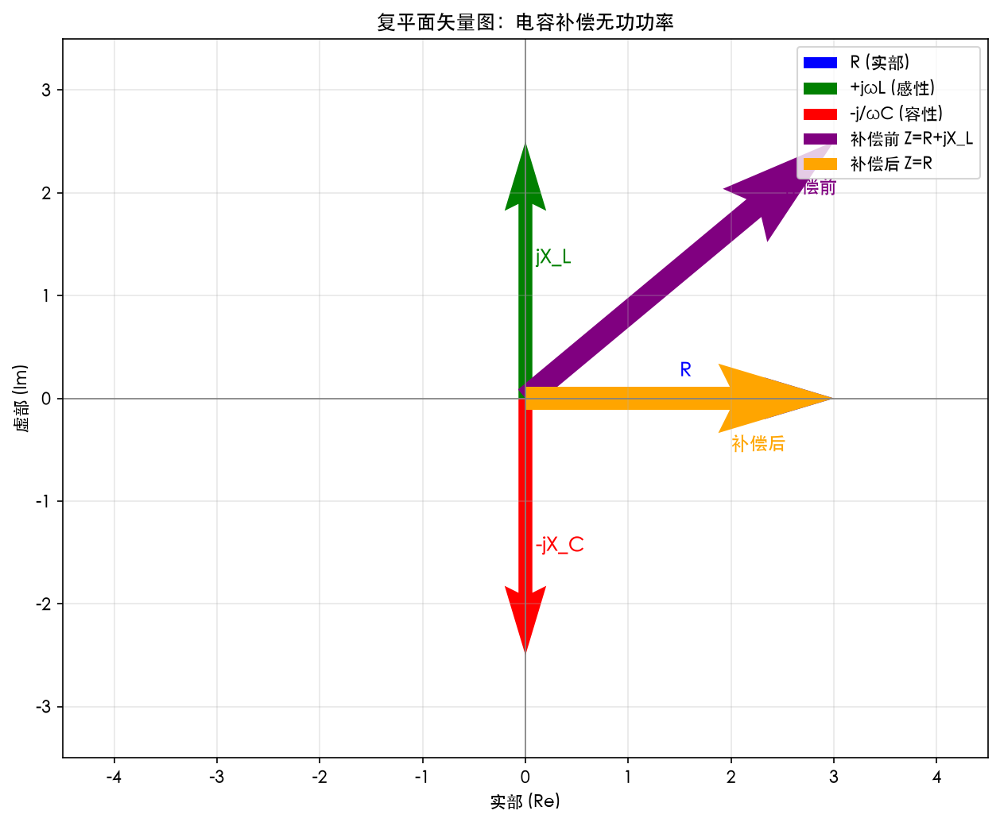
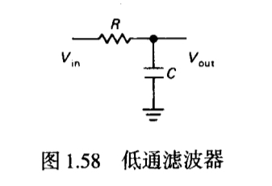
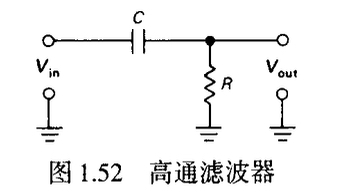
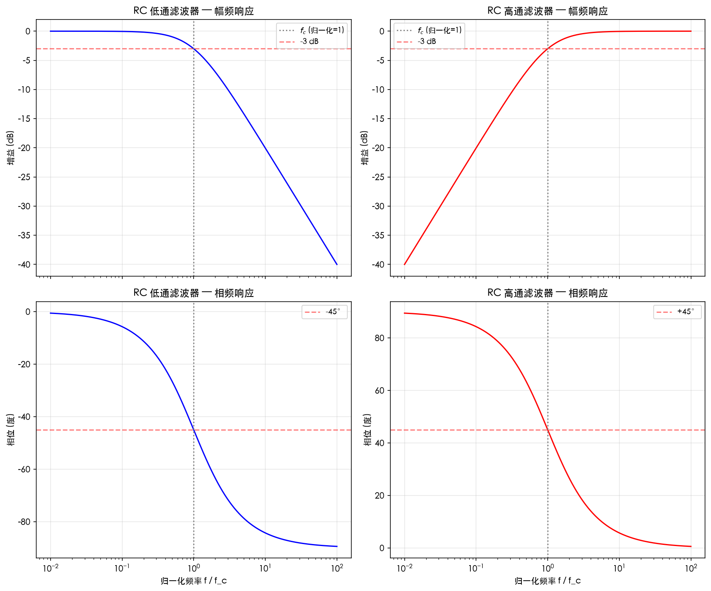

---
tags:
  - electronics
  - rc-circuit
  - filter
  - power-factor
  - impedance
aliases:
  - RC滤波器学习笔记
  - 交流电路综合
created: 2026-06-20
---

# 从电容复阻抗到 RC 滤波器 —— 系统学习笔记

---

## 一、复数运算基础

### 1.1 复数的幅值（模）

对于复数 $A = a + bj$，其幅值定义：

$$
|A| = \sqrt{a^2 + b^2}
$$

等价于 $|A| = \sqrt{A \cdot A^*}$，其中 $A^* = a - bj$ 为共轭复数。

$$
A \cdot A^* = (a+bj)(a-bj) = a^2 - b^2j^2 = a^2 + b^2
$$

### 1.2 在电路中的应用

- 阻抗 $Z = R + jX$
- 模长 $|Z| = \sqrt{R^2 + X^2}$
- 电压电流模的关系：$|V| = |I| \cdot |Z|$

---

## 二、阻抗与电抗

### 2.1 电容的复阻抗推导

电压复数形式：$V(t) = \operatorname{Re}(V_0 e^{j\omega t})$，若 $V_0$ 为实数即 $V(t)=V_0 \cos \omega t$。

电容电流：

$$
I(t) = C \frac{dV}{dt} = -V_0 C \omega \sin \omega t
$$

利用 $\sin\omega t = \operatorname{Re}(-j e^{j\omega t})$ 得：

$$
I(t) = \operatorname{Re}(j\omega C V_0 e^{j\omega t}) = \operatorname{Re}\left(\frac{V_0 e^{j\omega t}}{-j/(\omega C)}\right)
$$

定义容抗：

$$
X_C = -\frac{j}{\omega C}
$$

则有 $I(t) = \operatorname{Re}\left(\dfrac{V_0 e^{j\omega t}}{X_C}\right)$，符合复数欧姆定律。

### 2.2 电感电抗

感性负载：$X_L = +j\omega L$

### 2.3 总阻抗

串联时 $Z = R + j\omega L - \dfrac{j}{\omega C}$，虚部相互抵消的可能性即**补偿原理**。

---

## 三、工业用电功率因数与电容补偿

### 3.1 功率因数考核标准

| 用户类型 | 标准 $\cos\phi$ |
|:---|:---|
| 160kVA 及以上高压工业 | 0.90 |
| 100kVA 及以上一般工业 | 0.85 |
| 100kVA 及以上农业 | 0.80 |

### 3.2 平均功率因数计算

由有功电量 $W_p$ 和无功电量 $W_q$：

$$
\cos\phi = \frac{W_p}{\sqrt{W_p^2 + W_q^2}}
$$

### 3.3 力调电费公式

> 力调电费 = (基本电费 + 电度电费) × 调整率(%)

调整率正值罚、负值奖。常见调整表（标准 0.90）：

| 实际 $\cos\phi$ | 调整率 |
|:---|:---|
| 0.95~1.00 | -0.75% |
| 0.90 | 0% |
| 0.85 | +2.5% |
| 0.80 | +5.0% |
| 0.70 | +10.0% |
| <0.65 | 每低 0.01 加 2.0% |

### 3.4 计算示例

某厂电费 20 万元，$\cos\phi = 0.86$，低于标准 0.04，则调整率 = (0.04/0.01) × 0.5% = +2.0%，力调电费 = 200,000 × 2.0% = **+4,000 元**。

### 3.5 为何加装电容能提高功率因数？

感性负载吸收无功（$+jQ_L$），并联电容器发出容性无功（$-jQ_C$），总无功 $Q_{net} = Q_L - Q_C$，$Q_{net} \to 0$ 则 $\cos\phi \to 1$。

数学上，电容的负虚部 $-j/\omega C$ 抵消电感的正虚部 $+j\omega L$，使总阻抗虚部为零。

### 3.6 复平面矢量图解

- 电阻 $R$：实轴正方向
- 电感 $+jX_L$：虚轴正方向（向上）
- 电容 $-jX_C$：虚轴负方向（向下）

并联补偿后，垂直方向矢量抵消，仅剩 $R$，功率因数角 $\phi = 0^\circ$。



---

## 四、RC 低通滤波器

### 4.1 电路结构

电阻 $R$ 与电容 $C$ 串联，输入 $V_{in}$ 加于串联两端，输出 $V_{out}$ 取自电容两端。


### 4.2 传递函数

$$
H(\omega) = \frac{V_{out}}{V_{in}} = \frac{Z_C}{Z_R + Z_C} = \frac{1}{1 + j\omega RC}
$$

### 4.3 幅频响应

$$
|H(\omega)| = \frac{1}{\sqrt{1 + (\omega RC)^2}}
$$

### 4.4 -3dB 截止频率推导

定义半功率点：$|H(\omega_{3dB})| = 1/\sqrt{2}$，即电压降至 70.7%

$$
\frac{1}{\sqrt{1 + (\omega_{3dB}RC)^2}} = \frac{1}{\sqrt{2}}
\quad\Rightarrow\quad
\omega_{3dB}RC = 1
\quad\Rightarrow\quad
f_{3dB} = \frac{1}{2\pi RC}
$$

### 4.5 相频响应

$$
\phi(\omega) = -\arctan(\omega RC)
$$

- $f \ll f_{3dB}$：$\phi \approx 0^\circ$
- $f = f_{3dB}$：$\phi = -45^\circ$
- $f \gg f_{3dB}$：$\phi \to -90^\circ$

### 4.6 为什么叫"低通"滤波器？

低频时电容容抗大，分压多，输出近似输入；高频时容抗小，输出趋近 0。频率响应表现为**通低频阻高频**。

### 4.7 波特图特征

- 幅频：3dB 之前平坦（0dB），之后按 **-20dB/十倍频** 滚降
- 相频：从 0° 平滑过渡到 -90°，-3dB 处对应 -45°

### 4.8 输出阻抗随频率的变化

- 低频：电容开路，输出端口看入的戴维南等效阻抗 $\approx R$
- 高频：电容短路，输出阻抗 $\approx 0$

### 4.9 关于"电抗等于电阻"和"6dB"的说明

在 $f = f_{3dB}$ 时 $|X_C| = R$，衰减 **-3dB** 而非 -6dB。文中提到的"6dB"是提醒：虽然电压降为 $1/\sqrt{2}$，但有人误算为电压减半导致 -6dB（**错误**）。

---

## 五、RC 高通滤波器

### 5.1 电路结构

$R$ 和 $C$ 仍串联，但输出取自电阻 $R$ 两端。


### 5.2 传递函数

$$
H(\omega) = \frac{R}{R + \dfrac{1}{j\omega C}} = \frac{j\omega RC}{1 + j\omega RC}
$$

### 5.3 幅频响应

$$
|H(\omega)| = \frac{\omega RC}{\sqrt{1 + (\omega RC)^2}}
$$

- 低频：增益趋近 0
- $f = f_{3dB}$：增益 $1/\sqrt{2}$（-3dB）
- 高频：增益趋近 1

### 5.4 相频响应

$$
\phi(\omega) = 90^\circ - \arctan(\omega RC)
$$

或等价为：$\phi(\omega) = \arctan\!\left(\dfrac{1}{\omega RC}\right)$

### 5.5 -3dB 点的相位

在 $f_{3dB}$ 处，$|H| = 1/\sqrt{2}$，$\angle H = +45^\circ$（输出超前输入 45°）。

### 5.6 为什么是超前 45° 而非 90°？

以电流 $\mathbf{I}$ 为参考（0°）：

- $V_R = I R \angle 0^\circ$（输出）
- $V_C = I /(\omega C) \angle -90^\circ$
- $V_{in} = V_R + V_C$

在 $f_{3dB}$ 时 $R = 1/(\omega C)$，故 $V_R$ 与 $V_C$ 幅值相等，矢量和：

$$
V_{in} = V_R(1 - j) = V_R \sqrt{2} \angle -45^\circ
$$

所以 $V_{out}$ 相对于 $V_{in}$ 的相位差 $= 0^\circ - (-45^\circ) = +45^\circ$（**超前**）。

### 5.7 低通与高通对比总表

| 特性 | 低通（输出取 C） | 高通（输出取 R） |
|:---|:---|:---|
| 截止频率 $f_c$ | $1/(2\pi RC)$ | $1/(2\pi RC)$ |
| 截止频率增益 | -3 dB | -3 dB |
| 低频增益 | 1 (0 dB) | 0 |
| 高频增益 | 0 | 1 (0 dB) |
| 相移 @ $f_c$ | -45°（滞后） | +45°（超前） |
| 滚降斜率 | -20 dB/dec | -20 dB/dec（低频） |

### 5.8 2 倍频衰减对比

- 低通在 $2f_c$ 处：$|H| = 1/\sqrt{1+4} \approx 0.447$，即约 -7 dB（近 -6 dB）
- 高通在 $2f_c$ 处：$|H| = 2/\sqrt{1+4} \approx 0.894$，即约 -1 dB，基本恢复

### 5.9 RC 串联电压三角形

串联电流相同，各电压与阻抗成正比：

- $V_{in}$ ∝ 斜边 $|Z|$
- $V_R$ ∝ $R$ 边
- $V_C$ ∝ $1/(\omega C)$ 边

从而可用复平面矢量合成直接解释转移特性。

### 5.10 波特图



---

## 六、LTspice 仿真指南

### 6.1 电路搭建

元件：`res` (R), `cap` (C), `voltage` (V), `gnd`

典型参数：$R=1\text{k}\Omega,\; C=0.159\mu\text{F}$ → $f_c \approx 1\text{kHz}$

### 6.2 AC 分析

```
.ac dec 100 10 1Meg
```

源设置：AC Amplitude = 1。仿真后绘图 `V(out)` 即得波特图。

### 6.3 瞬态分析

```
.tran 0 5m
```

源用 `SINE`，测试不同频率观察滤波效果。

### 6.4 注意事项

- 单位正确：`1k` `159n` `0.159u`
- 必须放置地
- AC 分析需幅值 1（非 Pulse）

---

## 七、核心公式速查表

| 公式名称 | 表达式 |
|:---|:---|
| 电容容抗 | $X_C = -\dfrac{j}{\omega C}$ |
| 电感感抗 | $X_L = j\omega L$ |
| 复数模 | $\vert A\vert = \sqrt{a^2+b^2}$ |
| 功率因数 | $\cos\phi = \dfrac{W_p}{\sqrt{W_p^2+W_q^2}}$ |
| 力调电费 | (基本 + 电度) × 调整率 |
| RC 低通截止频率 | $f_c = \dfrac{1}{2\pi RC}$ |
| RC 低通传递函数 | $H_{LP} = \dfrac{1}{1+j\omega RC}$ |
| RC 高通传递函数 | $H_{HP} = \dfrac{j\omega RC}{1+j\omega RC}$ |
| 低通 2 倍频衰减 | $\vert H(2f_c)\vert \approx 0.447$ |
| 高通 2 倍频衰减 | $\vert H(2f_c)\vert \approx 0.894$ |
| 低通相位 | $\phi = -\arctan(\omega RC)$ |
| 高通相位 | $\phi = 90^\circ - \arctan(\omega RC)$ |

---

## 附录：Python 绘图代码

### A.1 复平面矢量图（电容补偿）

```python
import matplotlib.pyplot as plt
import matplotlib

matplotlib.rcParams['font.sans-serif'] = ['Heiti SC', 'PingFang SC']
matplotlib.rcParams['axes.unicode_minus'] = False

fig, ax = plt.subplots(figsize=(9, 7))
ax.axhline(0, color='gray', linewidth=0.8)
ax.axvline(0, color='gray', linewidth=0.8)
ax.set_xlim(-4.5, 4.5)
ax.set_ylim(-3.5, 3.5)
ax.set_aspect('equal')
ax.grid(True, alpha=0.3)
ax.set_xlabel('实部 (Re)')
ax.set_ylabel('虚部 (Im)')

R_vec = [3, 0]
XL_vec = [0, 2.5]
XC_vec = [0, -2.5]

ax.quiver(0, 0, *R_vec, color='blue', width=0.015,
          label='R (实部)', angles='xy', scale_units='xy', scale=1)
ax.quiver(0, 0, *XL_vec, color='green', width=0.015,
          label='+jωL (感性)', angles='xy', scale_units='xy', scale=1)
ax.quiver(0, 0, *XC_vec, color='red', width=0.015,
          label='-j/ωC (容性)', angles='xy', scale_units='xy', scale=1)

Z_old = [3, 2.5]
ax.quiver(0, 0, *Z_old, color='purple', width=0.025, linestyle='--',
          label='补偿前 Z=R+jX_L', angles='xy', scale_units='xy', scale=1)

Z_new = [3, 0]
ax.quiver(0, 0, *Z_new, color='orange', width=0.025,
          label='补偿后 Z=R', angles='xy', scale_units='xy', scale=1)

ax.legend(loc='upper right')
ax.set_title('复平面矢量图：电容补偿无功功率')
plt.tight_layout()
plt.savefig('complex_plane.png', dpi=150, bbox_inches='tight')
plt.show()
```

### A.2 RC 低通/高通波特图

```python
import numpy as np
import matplotlib.pyplot as plt
import matplotlib

matplotlib.rcParams['font.sans-serif'] = ['Heiti SC', 'PingFang SC']
matplotlib.rcParams['axes.unicode_minus'] = False

f = np.logspace(-2, 2, 500)
f_3db = 1

# 低通
mag_LP = 1 / np.sqrt(1 + (f / f_3db) ** 2)
phase_LP = -np.arctan(f / f_3db) * 180 / np.pi

# 高通
mag_HP = (f / f_3db) / np.sqrt(1 + (f / f_3db) ** 2)
phase_HP = 90 - np.arctan(f / f_3db) * 180 / np.pi

fig, axes = plt.subplots(2, 2, figsize=(12, 10), sharex='col')

# 低通 - 幅频
ax = axes[0, 0]
ax.semilogx(f, 20 * np.log10(mag_LP), 'b', linewidth=1.5)
ax.axvline(f_3db, color='gray', ls=':', label='$f_c$ (归一化=1)')
ax.axhline(-3, color='red', ls='--', alpha=0.5, label='-3 dB')
ax.set_ylabel('增益 (dB)')
ax.set_title('RC 低通滤波器 — 幅频响应')
ax.grid(True, alpha=0.3)
ax.legend(fontsize=9)

# 低通 - 相频
ax = axes[1, 0]
ax.semilogx(f, phase_LP, 'b', linewidth=1.5)
ax.axvline(f_3db, color='gray', ls=':')
ax.axhline(-45, color='red', ls='--', alpha=0.5, label='-45°')
ax.set_ylabel('相位 (度)')
ax.set_xlabel('归一化频率 f / f_c')
ax.set_title('RC 低通滤波器 — 相频响应')
ax.grid(True, alpha=0.3)
ax.legend(fontsize=9)

# 高通 - 幅频
ax = axes[0, 1]
ax.semilogx(f, 20 * np.log10(mag_HP), 'r', linewidth=1.5)
ax.axvline(f_3db, color='gray', ls=':', label='$f_c$ (归一化=1)')
ax.axhline(-3, color='red', ls='--', alpha=0.5, label='-3 dB')
ax.set_ylabel('增益 (dB)')
ax.set_title('RC 高通滤波器 — 幅频响应')
ax.grid(True, alpha=0.3)
ax.legend(fontsize=9)

# 高通 - 相频
ax = axes[1, 1]
ax.semilogx(f, phase_HP, 'r', linewidth=1.5)
ax.axvline(f_3db, color='gray', ls=':')
ax.axhline(45, color='red', ls='--', alpha=0.5, label='+45°')
ax.set_ylabel('相位 (度)')
ax.set_xlabel('归一化频率 f / f_c')
ax.set_title('RC 高通滤波器 — 相频响应')
ax.grid(True, alpha=0.3)
ax.legend(fontsize=9)

plt.tight_layout()
plt.savefig('bode_plot.png', dpi=150, bbox_inches='tight')
plt.show()
```
