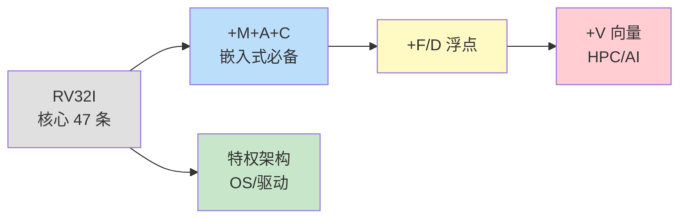
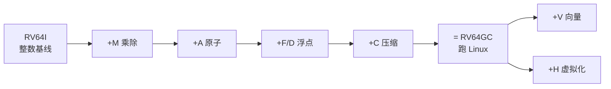
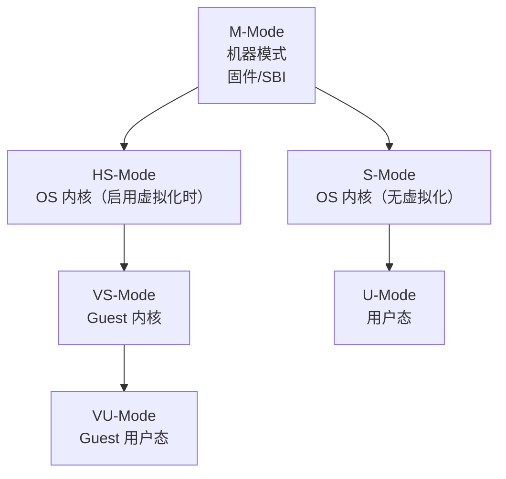
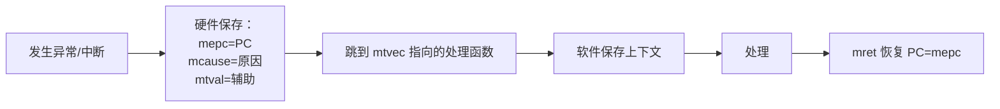
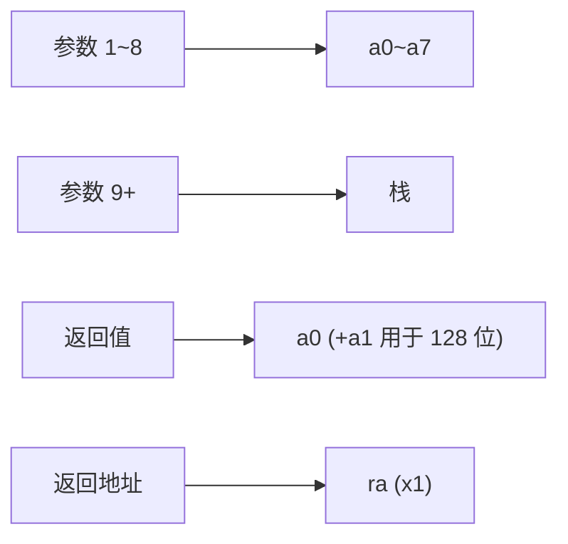
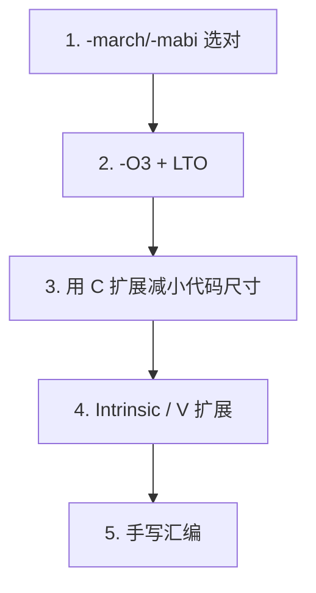

# RISC-V 架构深入浅出——从指令集到工程实战

**作者**：汪亮（bertonwang）  
**邮箱**：<47608843@qq.com>  
**版本**：v1.0 ｜ **最后更新**：2026-05-14

> **本书风格参考《C++11 新特性解析与应用深入理解》《C++23 新特性解析与应用深入理解》**，
> 对每一个 RISC-V 主题按
> **「问题背景 → 概念形式 → 用法示例 → 底层机理 → 与 x86/ARM 对比 → 注意事项」**
> 六段式逐一拆解，目标是让**已经会一点 C/C++ 与汇编**的开发者，
> **只读这一本，就能从"听说过 RISC-V"走到"能在真板子/QEMU 上跑起一个最小内核"**。

---

## 目录

- [前言：为什么 RISC-V 突然就火了](#前言为什么-risc-v-突然就火了)
- [第 0 章：环境与工具链速查](#第-0-章环境与工具链速查)

### 第一部分　ISA 基础
- [第 1 章：什么是 RISC-V，它"V"在哪](#第-1-章什么是-risc-v它v-在哪)
- [第 2 章：模块化指令集——RV32I / RV64I 与扩展字母汤](#第-2-章模块化指令集rv32i--rv64i-与扩展字母汤)
- [第 3 章：寄存器与 ABI 命名](#第-3-章寄存器与-abi-命名)
- [第 4 章：指令格式六大族（R/I/S/B/U/J）](#第-4-章指令格式六大族risbuj)
- [第 5 章：寻址、立即数与"为什么 lui+addi"](#第-5-章寻址立即数与为什么-luiaddi)

### 第二部分　核心扩展
- [第 6 章：M 扩展（乘除法）](#第-6-章m-扩展乘除法)
- [第 7 章：A 扩展（原子操作与 LR/SC）](#第-7-章a-扩展原子操作与-lrsc)
- [第 8 章：F / D / Q 扩展（浮点）](#第-8-章f--d--q-扩展浮点)
- [第 9 章：C 扩展（压缩指令）与代码密度](#第-9-章c-扩展压缩指令与代码密度)
- [第 10 章：V 扩展（向量）——可伸缩 SIMD 入门](#第-10-章v-扩展向量可伸缩-simd-入门)
- [第 11 章：B / Zb* 扩展（位操作）](#第-11-章b--zb-扩展位操作)
- [第 12 章：H 扩展（虚拟化）与 Hypervisor 模式](#第-12-章h-扩展虚拟化与-hypervisor-模式)

### 第三部分　特权架构
- [第 13 章：四种特权级（M/S/U/HS/VS）一图看懂](#第-13-章四种特权级msuhsvs一图看懂)
- [第 14 章：CSR 与中断、异常、Trap](#第-14-章csr-与中断异常trap)
- [第 15 章：分页与 Sv39 / Sv48 / Sv57](#第-15-章分页与-sv39--sv48--sv57)
- [第 16 章：PMP / PMA — 物理内存保护](#第-16-章pmp--pma--物理内存保护)

### 第四部分　工具链与 ABI
- [第 17 章：GCC / LLVM RISC-V 工具链速通](#第-17-章gcc--llvm-risc-v-工具链速通)
- [第 18 章：调用约定与寄存器保存规则](#第-18-章调用约定与寄存器保存规则)
- [第 19 章：链接器脚本与最小启动文件](#第-19-章链接器脚本与最小启动文件)
- [第 20 章：在 QEMU 上跑起来——`virt` 板子完整流程](#第-20-章在-qemu-上跑起来virt-板子完整流程)

### 第五部分　嵌入式实战
- [第 21 章：用 ESP32-C3 / CH32V 写第一个 LED 程序](#第-21-章用-esp32-c3--ch32v-写第一个-led-程序)
- [第 22 章：CLINT / PLIC 中断控制器实战](#第-22-章clint--plic-中断控制器实战)
- [第 23 章：FreeRTOS 在 RISC-V 上的移植要点](#第-23-章freertos-在-risc-v-上的移植要点)

### 第六部分　Linux 与 HPC 场景
- [第 24 章：跑起 RISC-V Linux——VisionFive2 / LicheePi 4A 一日游](#第-24-章跑起-risc-v-linuxvisionfive2--licheepi-4a-一日游)
- [第 25 章：V 扩展与 BLAS/AI 加速实战](#第-25-章v-扩展与-blasai-加速实战)
- [第 26 章：跨架构编译——从 x86 主机交叉编译到 RISC-V](#第-26-章跨架构编译从-x86-主机交叉编译到-risc-v)

### 第七部分　工程实战
- [第 27 章：综合案例——用 RV32IMC 实现一个最小内核（裸机）](#第-27-章综合案例用-rv32imc-实现一个最小内核裸机)
- [第 28 章：性能调优清单与"什么时候选 RISC-V"](#第-28-章性能调优清单与什么时候选-risc-v)

### 附录
- [附录 A：RV64I 指令速查表](#附录-arv64i-指令速查表)
- [附录 B：x86-64 / ARM64 / RISC-V 指令对照](#附录-bx86-64--arm64--risc-v-指令对照)
- [附录 C：常见错误与坑](#附录-c常见错误与坑)

---

## 前言：为什么 RISC-V 突然就火了

2010 年，加州伯克利的研究团队为做新一轮处理器课程，发现现有 ISA"不是太老就是收钱"：
- **MIPS**：教学最常用，但被 Imagination 私有化，且 64 位授权混乱。
- **ARM**：商业化极强，但任何商用流片都要交不菲授权费。
- **x86**：从来不开放给学校"随便玩"。

于是他们干脆**自己重写一个**，并**开源、免费、可商用**——这就是 **RISC-V**。

15 年后的今天，RISC-V 已经从教学玩具长成了产业生态：

| 角色 | 代表产品 |
|---|---|
| MCU | ESP32-C3/C6（乐鑫）、CH32V003（沁恒）、GD32VF103（兆易） |
| 应用处理器 | 平头哥 C910、SiFive U74、Andes A45 |
| 单板电脑 | VisionFive 2、LicheePi 4A、Milk-V Mars |
| 数据中心 | 阿里玄铁、平头哥 C930、SophGo SG2042（64 核） |
| AI / DSA | Tenstorrent、Esperanto、各类 NPU |

**学习路径建议**：



> 💡 **学习这本书的姿势**：第一遍跳读标题与"形象比喻"；第二遍配合 QEMU 跑代码；第三遍当查表用。

---

## 第 0 章：环境与工具链速查

### 0.1 三件套

| 工具 | 推荐来源 | 一句话作用 |
|---|---|---|
| 交叉编译器 | `riscv64-unknown-elf-gcc`（裸机）/ `riscv64-linux-gnu-gcc`（带 OS） | 把 C/C++ 编成 RISC-V 机器码 |
| 模拟器 | **QEMU**（`qemu-system-riscv64`、`qemu-riscv64-static`） | 没真板也能跑 |
| 调试器 | `gdb-multiarch` + OpenOCD | 单步、断点、看寄存器 |

### 0.2 一键安装

```bash
# Ubuntu/Debian：apt 装裸机工具链 + QEMU
sudo apt install gcc-riscv64-unknown-elf gcc-riscv64-linux-gnu \
                 qemu-system-misc qemu-user-static gdb-multiarch

# macOS：Homebrew
brew tap riscv-software-src/riscv
brew install riscv-gnu-toolchain qemu

# Windows：xPack 工具链 + WSL2 最省心
# https://xpack.github.io/dev-tools/riscv-none-elf-gcc/
```

> ⚠️ **常见坑**：`riscv64-unknown-elf-` 是**裸机**（newlib），`riscv64-linux-gnu-` 是**Linux 用户态**（glibc）；选错会一堆 `cannot find -lc`。

---

# 第一部分　ISA 基础

---

## 第 1 章：什么是 RISC-V，它"V"在哪

**RISC-V** = "**RISC**, **V**ersion 5"。"V" 是序号，不是 Vector，更不是 Victory。
它的核心设计哲学只有四个字：**简洁**、**模块化**、**可扩展**、**开放**。

| 特征 | 说明 |
|---|---|
| **指令定长 32 位**（C 扩展可压成 16 位） | 解码器极简 |
| **Load/Store 架构** | 算术指令只在寄存器之间，访存必须用专门的 `lw/sw` |
| **31 个通用寄存器 + x0 恒零** | x0 写入丢弃、读出永远是 0，省一堆"清零"指令 |
| **没有条件码寄存器** | 比较结果直接进通用寄存器，分支用 `beq/bne/blt` 一条搞定 |
| **没有自动副作用** | x86 的 `push/pop`、ARM 的 `pre-/post-index` 在 RISC-V 都是显式的 |

> 💡 **形象比喻**：x86 像瑞士军刀（一条指令塞十种语义），ARM 像多功能笔（功能丰富但收费），**RISC-V 像乐高**——"积木块"少而正交，按需组合。

---

## 第 2 章：模块化指令集——RV32I / RV64I 与扩展字母汤

RISC-V 把指令集**拆成基线 + 扩展**，每个扩展用一个字母表示：

| 字母 | 含义 | 是否常见 |
|---|---|---|
| **I** | 整数基线（必选） | 必有 |
| **M** | 整数乘除 | 几乎都有 |
| **A** | 原子操作 | OS / 多核必有 |
| **F** / **D** / **Q** | 32/64/128 位浮点 | 应用处理器都有 |
| **C** | 16 位压缩指令 | 嵌入式必备 |
| **B** | 位操作（Zba/Zbb/Zbc/Zbs 等子集） | 渐渐普及 |
| **V** | 向量（可伸缩 SIMD） | HPC/AI |
| **H** | 虚拟化 | 服务器 |
| **Zicsr** | CSR 访问 | 内核 |
| **Zifencei** | 指令缓存同步 | 内核 |

**别名约定**：
- **G** = `IMAFD_Zicsr_Zifencei`（"通用"）。你看到的 `RV64GC` 就是 `RV64IMAFDC + Zicsr + Zifencei`，相当于"够跑 Linux 的最小集"。



> ⚠️ **第一坑**：编译选项 `-march=` **写错一个字母都不能跑**，常见组合：
> - 嵌入式：`-march=rv32imc -mabi=ilp32`
> - Linux：`-march=rv64gc -mabi=lp64d`
> - 带向量：`-march=rv64gcv -mabi=lp64d`

---

## 第 3 章：寄存器与 ABI 命名

RISC-V 一共 32 个通用寄存器（`x0~x31`）+ 32 个浮点（`f0~f31`，仅 F/D 扩展）。
但写汇编时几乎**不会用 `x0~x31` 这套数字名**，而是用 **ABI 名字**：

| 编号 | ABI 名 | 角色 | callee-saved? |
|---|---|---|---|
| x0 | **zero** | 永远是 0 | — |
| x1 | **ra** | 返回地址（return addr） | ❌ caller |
| x2 | **sp** | 栈指针 | ✅ callee |
| x3 | **gp** | 全局指针 | — |
| x4 | **tp** | 线程指针（TLS） | — |
| x5–x7 | **t0–t2** | 临时 | ❌ caller |
| x8 | **s0/fp** | 帧指针 / saved | ✅ callee |
| x9 | **s1** | saved | ✅ callee |
| **x10–x17** | **a0–a7** | 函数参数 / 返回值 | ❌ caller |
| x18–x27 | **s2–s11** | saved | ✅ callee |
| x28–x31 | **t3–t6** | 临时 | ❌ caller |

> 💡 **记忆法**：
> - **a** = argument（参数）；**s** = saved；**t** = temporary。
> - 参数寄存器 **a0–a7 一共 8 个**，比 x86-64 SysV 的 6 个还多。
> - **a0 同时是返回值寄存器**（与 ARM 一样）。

---

## 第 4 章：指令格式六大族（R/I/S/B/U/J）

整条指令永远是 32 位，按字段切分成六类：

```
R-type:  funct7 | rs2  | rs1  | funct3 | rd  | opcode    例：add  rd, rs1, rs2
I-type:  imm[11:0]    | rs1  | funct3 | rd  | opcode    例：addi rd, rs1, imm
S-type:  imm[11:5]| rs2 | rs1 | funct3 | imm[4:0] | opcode  例：sw rs2, imm(rs1)
B-type:  imm[12|10:5]| rs2 | rs1 | funct3 | imm[4:1|11] | opcode 例：beq rs1, rs2, label
U-type:  imm[31:12] | rd  | opcode                          例：lui  rd, imm
J-type:  imm[20|10:1|11|19:12] | rd | opcode                例：jal  rd, label
```

> 💡 **看似乱七八糟，其实有讲究**：所有立即数的**符号位永远在第 31 位**——硬件做符号扩展时**电路最简单、最快**。
> 这种"为硬件优化"的设计，是 RISC-V 与 MIPS/ARM32 最大的精神差异。

---

## 第 5 章：寻址、立即数与"为什么 lui+addi"

RISC-V 的立即数最多 12 位（有符号 ±2048）。要装载一个 32 位常数，标准做法是**两条指令拼接**：

```asm
# 加载 0x12345678 到 a0
lui   a0, 0x12345        # 高 20 位 → a0[31:12]，低 12 位补 0
addi  a0, a0, 0x678      # 加上低 12 位
```

加载全局变量地址同理（PC 相对版本）：

```asm
la    a0, my_var         # 伪指令，展开为 auipc + addi
# 等价于：
auipc a0, %pcrel_hi(my_var)
addi  a0, a0, %pcrel_lo(my_var)
```

> 💡 **要点解释**：
> - `lui` = **L**oad **U**pper **I**mmediate，把 20 位立即数装到高位。
> - `auipc` = **A**dd **U**pper **I**mmediate to **PC**，PC 相对寻址，**位置无关代码（PIC）必备**。
> - `la` 只是**汇编伪指令**，不是真指令；真正的硬件只认 `lui/auipc/addi/...`。

---

# 第二部分　核心扩展

---

## 第 6 章：M 扩展（乘除法）

仅多了 8 条：

```
mul     mulh    mulhsu  mulhu
div     divu    rem     remu
```

> 💡 **为什么 mul 要分 4 条**：64 位乘 64 位结果是 128 位。
> - `mul` 取低 64 位；`mulh/mulhu/mulhsu` 取高 64 位（带符号 / 无符号 / 混合）。
>
> ⚠️ **除 0 不会异常**：`div by 0 = -1`，`rem by 0 = 被除数`。这是 ISA 故意为之，让流水线不被打断。

---

## 第 7 章：A 扩展（原子操作与 LR/SC）

两类工具：

### 7.1 AMO（Atomic Memory Op）

```asm
amoadd.w  rd, rs2, (rs1)   # *(rs1) += rs2，原值放 rd
amoswap.w rd, rs2, (rs1)   # 原子交换
amoor.w   rd, rs2, (rs1)   # 原子或
# 还有 .d (64-bit) 版本，以及 .aq/.rl 内存序后缀
```

### 7.2 LR/SC（Load-Reserved / Store-Conditional）

ARM `LDREX/STREX` 的孪生兄弟。**专门写无锁数据结构**：

```asm
retry:
    lr.w   t0, (a0)         # 取值并加监视
    addi   t1, t0, 1
    sc.w   t2, t1, (a0)     # 若监视未失效，写入并返回 0
    bnez   t2, retry        # 否则重来
```

> 💡 **`.aq` / `.rl` 内存序**：
> - `.aq` = acquire（后续读写不能重排到我之前）。
> - `.rl` = release（前面读写不能重排到我之后）。
> - 两个都加 = sequentially consistent。

---

## 第 8 章：F / D / Q 扩展（浮点）

| 扩展 | 寄存器宽度 | 典型用途 |
|---|---|---|
| F | 32 位 | 嵌入式 / 移动 |
| D | 64 位 | 桌面 / 通用 |
| Q | 128 位 | 科学计算（很少落地） |

**关键 CSR**：`fcsr`（fp control & status），里面包含 5 位异常标志和 3 位舍入模式。

```asm
fmadd.d  fa0, fa1, fa2, fa3       # fa0 = fa1*fa2 + fa3 （单条 FMA）
fcvt.w.d a0, fa0, rtz             # double → int32，朝零截断
flw      fa0, 0(a1)               # 加载 float
```

> 💡 **fcvt 的舍入模式后缀**：`rne`（最近偶数）、`rtz`（朝零）、`rdn`（向下）、`rup`（向上）、`rmm`（最近最大数）。

---

## 第 9 章：C 扩展（压缩指令）与代码密度

C 扩展把**最常用的指令缩成 16 位**，代码体积**典型缩小 30%**：

| 16 位指令 | 等价 32 位指令 |
|---|---|
| `c.add rd, rs2` | `add rd, rd, rs2` |
| `c.li rd, imm` | `addi rd, x0, imm` |
| `c.lw rd, off(rs1)` | `lw rd, off(rs1)` |
| `c.j off` | `jal x0, off` |

> 💡 **为什么不直接全用 16 位？**
> 16 位字段太挤——只能编码 8 个寄存器（x8–x15）的子集，立即数也短。32+16 混合是空间与表达力的折衷。
> ⚠️ **混合宽度对反汇编不友好**：调试时 PC 可能是 2 字节而不是 4 字节对齐。

---

## 第 10 章：V 扩展（向量）——可伸缩 SIMD 入门

RISC-V V 与 ARM SVE 思路一致：**长度无关编程（vector-length agnostic, VLA）**——
代码不写死"4 路 / 8 路"，由硬件 `VLEN` 决定，**同一份二进制可在 128b/256b/512b/1024b 上跑**。

### 10.1 关键 CSR

| CSR | 含义 |
|---|---|
| `vlenb` | 向量寄存器字节数（VLEN/8）|
| `vl` | 当前实际处理元素数 |
| `vtype` | 元素宽度（SEW）+ 分组（LMUL）+ 策略 |

### 10.2 经典 daxpy（y = a*x + y）

```asm
# void daxpy(size_t n, double a, const double*x, double*y)
# a0=n, fa0=a, a1=x, a2=y
loop:
    vsetvli  t0, a0, e64, m8, ta, ma   # 一次最多吃 m8 个 64 位元素
    vle64.v  v8,  (a1)                  # 从 x 读
    vle64.v  v16, (a2)                  # 从 y 读
    vfmacc.vf v16, fa0, v8              # v16 += fa0 * v8
    vse64.v  v16, (a2)                  # 写回 y
    sub      a0, a0, t0
    slli     t0, t0, 3                  # *8 字节
    add      a1, a1, t0
    add      a2, a2, t0
    bnez     a0, loop
    ret
```

> 💡 **`vsetvli` 是 V 扩展的灵魂**：你说"我还有 n 个元素"，硬件回"这一轮我能吃 t0 个"，然后用 `vl=t0`。**循环尾巴自动收敛，不用写 epilogue**。

---

## 第 11 章：B / Zb* 扩展（位操作）

把"软件要算半天"的位操作做成单指令：

| 指令 | 作用 | 等价 C |
|---|---|---|
| `clz` | 前导 0 计数 | `__builtin_clz` |
| `ctz` | 后导 0 计数 | `__builtin_ctz` |
| `cpop` | popcount | `__builtin_popcount` |
| `andn` / `orn` / `xnor` | 与/或/异或 后取反 | — |
| `bclr` / `bset` / `binv` / `bext` | 单 bit 操作 | 位掩码 |
| `clmul` | 无进位乘 | CRC、GHASH 加速 |

> 💡 这些指令对**密码学、哈希表、bit-vector** 性能影响巨大。GCC 13+ 会自动用。

---

## 第 12 章：H 扩展（虚拟化）与 Hypervisor 模式

H 扩展加入 **HS（Hypervisor-extended Supervisor）** 模式，把原本两级（M/S/U）扩成五级：

```
M  →  HS  →  VS  →  VU
              └── VS-Mode 客户机内核
                     └── VU-Mode 客户机用户态
```

每多一级"V"前缀，就多一套影子 CSR（`vsstatus`、`vstvec`、`vsatp`...）。
KVM、Xvisor、bhyve 都已支持。

> 💡 这一章看不懂没关系——除非你做 Hypervisor 开发，平时**完全不需要碰**。

---

# 第三部分　特权架构

---

## 第 13 章：四种特权级（M/S/U/HS/VS）一图看懂



- **必有 M**；其它都可选。
- **M-Mode 跑 OpenSBI** 等固件，提供"系统调用"给 S-Mode（叫 **SBI 调用**，类似 ARM 的 SMC）。
- 切换时机：**异常 / 中断 / `ecall` / `mret/sret`**。

---

## 第 14 章：CSR 与中断、异常、Trap

CSR（Control & Status Register）是特权级的"控制面板"，访问指令只有 6 条：

```
csrrw  rd, csr, rs1     # 读旧值到 rd，rs1 写入 csr
csrrs  rd, csr, rs1     # 读出，并把 rs1 的位 set 进去
csrrc  rd, csr, rs1     # clear
csrrwi/csrrsi/csrrci    # 立即数版本
```

**Trap 流程（M-Mode 视角）**：



> 💡 **`mcause` 高位是中断/异常区分位**，低位是编号。例如 `0x8000_0000_0000_0007` = 机器定时器中断。

---

## 第 15 章：分页与 Sv39 / Sv48 / Sv57

| 模式 | 虚拟地址位数 | 页表级数 |
|---|---|---|
| Sv32 | 32 | 2 级（RV32 用） |
| **Sv39** | 39 | **3 级**（RV64 主流） |
| Sv48 | 48 | 4 级 |
| Sv57 | 57 | 5 级（大内存服务器） |

- 页大小：**4KB / 2MB / 1GB**（与 x86 类似的"巨页"概念）。
- 切换通过 `satp` CSR：高位选模式（Bare/Sv39/Sv48/Sv57）+ ASID + 根页表 PPN。
- TLB 失效用 `sfence.vma` 指令。

---

## 第 16 章：PMP / PMA — 物理内存保护

PMP（Physical Memory Protection）= **M-Mode 给 S/U-Mode 设置的物理地址访问白名单**，
即使没分页、没 MMU 也能用，**MCU 也能跑**。

```c
// 把 0x80000000~0x80100000 (1MB) 设为 RWX，其它地址默认禁止
write_csr(pmpaddr0, (0x80000000 + 0x100000) >> 2);   // TOR 模式：上界
write_csr(pmpcfg0,  PMP_R | PMP_W | PMP_X | PMP_TOR);
```

---

# 第四部分　工具链与 ABI

---

## 第 17 章：GCC / LLVM RISC-V 工具链速通

最常用的 5 个开关：

| 开关 | 作用 | 例子 |
|---|---|---|
| `-march=` | 指令集 | `rv64gc`、`rv32imc`、`rv64gcv` |
| `-mabi=` | ABI | `lp64d`（64 位+硬浮）、`ilp32`（32 位软浮）|
| `-mcmodel=` | 代码模型 | `medlow`（地址 ±2GB）、`medany`（PC 相对，**Linux 用**）|
| `-mno-relax` | 禁用链接器松弛 | 嵌入式调试时关掉，便于反汇编对照 |
| `-static` | 静态链接 | 跨主机跑用户态 binary 时用 |

**典型组合**：

```bash
# 嵌入式裸机
riscv64-unknown-elf-gcc -march=rv32imac -mabi=ilp32 -mcmodel=medlow ...

# Linux 应用
riscv64-linux-gnu-gcc -march=rv64gc -mabi=lp64d -mcmodel=medany ...
```

---

## 第 18 章：调用约定与寄存器保存规则



**栈对齐**：函数边界 sp 必须 **16 字节对齐**。

**标准函数模板**：

```asm
my_func:
    addi  sp, sp, -16          # 序言：留 16 字节
    sd    ra, 8(sp)            # 保存 ra
    sd    s0, 0(sp)            # 保存 s0
    addi  s0, sp, 16           # 建立 fp

    # ... 函数体 ...

    ld    s0, 0(sp)            # 尾声：恢复
    ld    ra, 8(sp)
    addi  sp, sp, 16
    ret                        # = jalr x0, ra, 0
```

> 💡 **要点解释**：
> - `sd` = store doubleword（64 位），`sw` 是 32 位。
> - `ret` 是伪指令，等价于 `jalr x0, ra, 0`——跳到 ra，丢弃返回地址（因为我们是返回，不再 nest）。

---

## 第 19 章：链接器脚本与最小启动文件

`linker.ld`：

```
ENTRY(_start)
MEMORY {
    RAM (rwx) : ORIGIN = 0x80000000, LENGTH = 128M
}
SECTIONS {
    . = ORIGIN(RAM);
    .text   : { *(.text*) }
    .rodata : { *(.rodata*) }
    .data   : { *(.data*) }
    .bss    : { *(.bss*)  *(COMMON) }
    /DISCARD/ : { *(.eh_frame) *(.comment) }
}
```

`startup.S`：

```asm
.section .text._start
.global _start
_start:
    la     sp, _stack_top      # 链接器脚本里定义
    call   main
1:  wfi                        # main 返回则停机
    j      1b
```

---

## 第 20 章：在 QEMU 上跑起来——`virt` 板子完整流程

```bash
# 1. 一个 hello.c
cat > hello.c <<'EOF'
#include <stdio.h>
int main(){ printf("hello, RISC-V\n"); return 0; }
EOF

# 2. 编 Linux 用户态二进制
riscv64-linux-gnu-gcc -static hello.c -o hello

# 3. QEMU user-mode 跑
qemu-riscv64-static ./hello
```

裸机版（system mode）：

```bash
qemu-system-riscv64 -machine virt -nographic \
    -bios none -kernel build/firmware.elf
```

> 💡 **`-bios none`** 意味着不加载 OpenSBI，直接从 0x80000000 跑你的 firmware；
> 不加这个，QEMU 会先跑 OpenSBI，然后跳进你的内核。

---

# 第五部分　嵌入式实战

---

## 第 21 章：用 ESP32-C3 / CH32V 写第一个 LED 程序

以 **CH32V003**（最便宜的 RISC-V MCU，0.1 美元起）为例：

```c
#include <ch32v00x.h>
int main(void) {
    SystemInit();
    GPIO_InitTypeDef io = {
        .GPIO_Pin = GPIO_Pin_4,
        .GPIO_Mode = GPIO_Mode_Out_PP,
        .GPIO_Speed = GPIO_Speed_50MHz,
    };
    RCC_APB2PeriphClockCmd(RCC_APB2Periph_GPIOD, ENABLE);
    GPIO_Init(GPIOD, &io);
    while (1) {
        GPIO_WriteBit(GPIOD, GPIO_Pin_4, Bit_SET);
        Delay_Ms(500);
        GPIO_WriteBit(GPIOD, GPIO_Pin_4, Bit_RESET);
        Delay_Ms(500);
    }
}
```

烧录用 **WCH-LinkE**，工具链 `riscv-none-elf-gcc`，`-march=rv32ec -mabi=ilp32e`（**E 扩展** = 嵌入式精简版，只有 16 个通用寄存器）。

---

## 第 22 章：CLINT / PLIC 中断控制器实战

| 控制器 | 管谁 | 触发方式 |
|---|---|---|
| **CLINT** | 软中断 + 定时器中断 | mtimecmp 比较 |
| **PLIC** | 外设中断（UART、网卡、GPIO...） | 优先级仲裁 |

定时器中断最小骨架：

```asm
.global timer_isr
timer_isr:
    # 重新设置下一次触发
    li     t0, CLINT_MTIMECMP
    li     t1, NEXT_TICK
    sd     t1, 0(t0)
    mret
```

C 端注册：

```c
write_csr(mtvec, (uintptr_t)timer_isr);
write_csr(mie,   MIE_MTIE);     // 打开机器定时器中断
write_csr(mstatus, MSTATUS_MIE);// 全局中断使能
```

---

## 第 23 章：FreeRTOS 在 RISC-V 上的移植要点

FreeRTOS 官方 `portable/GCC/RISC-V/` 已经覆盖大部分 SoC，移植要做的只有 **3 件事**：

1. **告诉 RTOS CLINT 在哪**：`mtimecmp` / `mtime` 的物理地址。
2. **配置 mtvec**：直接（direct）模式还是向量（vectored）模式。
3. **填 `freertos_risc_v_chip_specific_extensions.h`**：保存额外寄存器（如向量、FPU、自定义 CSR）。

栈大小要点：每任务**至少 384 字节**（保上下文 + 一层调用 + 余量）。

---

# 第六部分　Linux 与 HPC 场景

---

## 第 24 章：跑起 RISC-V Linux——VisionFive2 / LicheePi 4A 一日游

```bash
# 1. 下载官方 Debian/Ubuntu 镜像
wget https://debian.starfivetech.com/.../debian-vf2.img.zst

# 2. 解压并写卡
zstd -d debian-vf2.img.zst
sudo dd if=debian-vf2.img of=/dev/sdX bs=4M status=progress

# 3. 接串口 + 上电
picocom -b 115200 /dev/ttyUSB0
```

启动链：**ZSBL（mask ROM）→ U-Boot SPL → OpenSBI → U-Boot → Linux**。

> 💡 第一次烧卡最容易翻车的是**电源**——RISC-V 板对 5V 2A 以上 USB-C 电源很敏感，电压一掉就重启。

---

## 第 25 章：V 扩展与 BLAS/AI 加速实战

**OpenBLAS / Eigen / XNNPACK** 都已合入 RV V 路径。手工版 SAXPY：

```c
#include <riscv_vector.h>
void saxpy(size_t n, float a, const float* x, float* y) {
    for (size_t vl; n > 0; n -= vl, x += vl, y += vl) {
        vl = __riscv_vsetvl_e32m8(n);
        vfloat32m8_t vx = __riscv_vle32_v_f32m8(x, vl);
        vfloat32m8_t vy = __riscv_vle32_v_f32m8(y, vl);
        vy = __riscv_vfmacc_vf_f32m8(vy, a, vx, vl);
        __riscv_vse32_v_f32m8(y, vy, vl);
    }
}
```

> 💡 **同一份代码**在 VLEN=128b 的板子和 VLEN=512b 的服务器上**自动伸缩**，不用任何 ifdef。

---

## 第 26 章：跨架构编译——从 x86 主机交叉编译到 RISC-V

```bash
# CMake 工具链文件 toolchain-riscv.cmake
set(CMAKE_SYSTEM_NAME Linux)
set(CMAKE_SYSTEM_PROCESSOR riscv64)
set(CMAKE_C_COMPILER   riscv64-linux-gnu-gcc)
set(CMAKE_CXX_COMPILER riscv64-linux-gnu-g++)
set(CMAKE_FIND_ROOT_PATH_MODE_PROGRAM NEVER)
set(CMAKE_FIND_ROOT_PATH_MODE_LIBRARY ONLY)
set(CMAKE_FIND_ROOT_PATH_MODE_INCLUDE ONLY)

# 用法：
cmake -B build -DCMAKE_TOOLCHAIN_FILE=toolchain-riscv.cmake
cmake --build build
qemu-riscv64-static -L /usr/riscv64-linux-gnu ./build/myapp
```

> 💡 **`binfmt-misc` 一次配好，可以在 x86 主机直接 `./myapp` 透明运行 RISC-V 二进制**：
> ```bash
> sudo apt install qemu-user-static binfmt-support
> ```

---

# 第七部分　工程实战

---

## 第 27 章：综合案例——用 RV32IMC 实现一个最小内核（裸机）

**目标**：在 QEMU `-machine virt` 上点亮 UART，输出 `hello, kernel`。

```
mini-kernel/
├── start.S
├── kernel.c
├── linker.ld
└── Makefile
```

`start.S`：

```asm
.section .text._start
.global _start
_start:
    la    sp, _stack_top
    call  kmain
1:  wfi
    j     1b
.section .bss
.align 4
.skip 4096
_stack_top:
```

`kernel.c`（直接戳 NS16550A UART）：

```c
#include <stdint.h>
#define UART0 ((volatile uint8_t*)0x10000000)
static void putc_(char c) { *UART0 = (uint8_t)c; }
static void puts_(const char*s){ while(*s) putc_(*s++); }

void kmain(void) {
    puts_("hello, kernel\n");
    while (1) {}
}
```

`Makefile`：

```makefile
CC := riscv64-unknown-elf-gcc
CFLAGS := -march=rv64imac -mabi=lp64 -mcmodel=medany \
          -ffreestanding -nostdlib -O2 -Wall

all: kernel.elf
kernel.elf: start.S kernel.c linker.ld
	$(CC) $(CFLAGS) -T linker.ld start.S kernel.c -o $@

run: kernel.elf
	qemu-system-riscv64 -machine virt -nographic -bios none -kernel kernel.elf
```

跑起来：

```
$ make run
hello, kernel
```

> 🎉 这就是属于你的第一个 RISC-V 内核——**156 行代码起步**。

---

## 第 28 章：性能调优清单与"什么时候选 RISC-V"

### ✅ RISC-V 是合理选择

- **MCU 成本极敏感**（CH32V003 < 1 元）。
- **要做 ASIC/FPGA SoC**：免授权费、Rocket/CVA6/BOOM 都是开源核。
- **教学/研究**：spike、QEMU、gem5 全栈开源。
- **服务器场景的"长期备胎"**：避免 ARM 授权风险。

### ❌ 暂时不要选

- 必须跑 Windows / 大量闭源 x86 软件。
- 极致单核性能（当前 RV 桌面级核还落后 ARM 一代左右）。
- 极成熟生态（部分驱动、商业 IDE 仍欠缺）。

### 🚦 RV 移植性能优化阶梯



---

# 附录

---

## 附录 A：RV64I 指令速查表

| 类别 | 指令 |
|---|---|
| 算术 | `add addi sub` `addw addiw subw` |
| 逻辑 | `and andi or ori xor xori` |
| 移位 | `sll slli srl srli sra srai` (`w` 后缀同) |
| 比较 | `slt slti sltu sltiu` |
| 加载 | `lb lh lw ld lbu lhu lwu` |
| 存储 | `sb sh sw sd` |
| 分支 | `beq bne blt bge bltu bgeu` |
| 跳转 | `jal jalr` |
| 上位立即数 | `lui auipc` |
| 同步 | `fence fence.i ecall ebreak` |

---

## 附录 B：x86-64 / ARM64 / RISC-V 指令对照

| 功能 | x86-64 | ARM64 | RISC-V |
|---|---|---|---|
| 寄存器赋值 | `mov rax, rbx` | `mov x0, x1` | `mv a0, a1` |
| 立即数 | `mov rax, 5` | `mov x0, #5` | `li a0, 5` |
| 加 | `add rax, rbx` | `add x0, x0, x1` | `add a0, a0, a1` |
| 加载 | `mov rax, [rbx]` | `ldr x0, [x1]` | `ld a0, 0(a1)` |
| 存储 | `mov [rbx], rax` | `str x0, [x1]` | `sd a0, 0(a1)` |
| 比较跳转 | `cmp/je` | `cmp/b.eq` | `beq` 单条 |
| 函数调用 | `call f` | `bl f` | `call f` (=jal ra,f) |
| 函数返回 | `ret` | `ret` | `ret` (=jalr x0,ra,0) |
| 压栈 | `push rax` | `stp x0,x1,[sp,#-16]!` | `addi sp,sp,-8; sd a0,0(sp)` |

---

## 附录 C：常见错误与坑

| 现象 | 真正原因 | 解决 |
|---|---|---|
| `relocation truncated to fit: R_RISCV_PCREL_HI20` | `-mcmodel=medlow` 但代码 > 2GB 偏移 | 改成 `-mcmodel=medany` |
| QEMU 直接卡死无输出 | 加了 `-bios none` 但 firmware 不支持自启动 | 去掉 `-bios none` 让 OpenSBI 接管 |
| `illegal instruction` 在嵌入式真板 | 真板没有 M/A 扩展但你编了 `rv32imac` | 改成 `rv32ec` 或 `rv32i` |
| `unsupported -mabi` | march 与 mabi 不兼容（如 `rv32i` 配 `lp64d`） | 对齐：32 位用 `ilp32`、64 位浮点用 `lp64d` |
| 中断进了但寄存器乱 | 中断处理函数没保存上下文 | 用 `__attribute__((interrupt))` 或手写完整 push/pop |
| Linux 用户态崩在 `ld a0, 0(a1)` | a1 未对齐 8 字节 | 改成 `lw + lw` 或保证对齐 |

---

> **结语**
>
> RISC-V 不是"屠龙宝刀"，但它**让每个人都能拥有自己的指令集**——
> 教学、流片、嵌入式、服务器，都没有授权枷锁。
>
> 这本指南覆盖了从 RV32I 47 条指令到 V 扩展、从裸机到 Linux 的完整路径。
> **跑通第 27 章的最小内核那一刻，你就已经迈过了 RISC-V 学习曲线的最高点。**
>
> ——本书完
