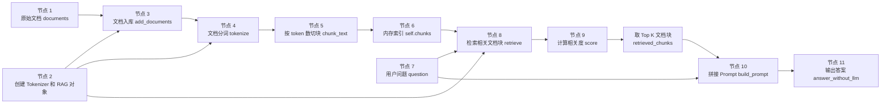

## 用 Tokenizer 实现一个简单 RAG 示例

**作者**：汪亮（bertonwang）  
**邮箱**：<47608843@qq.com>  
**版本**：v1.0 ｜ **最后更新**：2026-05-14

### 目录

- [用 Tokenizer 实现一个简单 RAG 示例](#用-tokenizer-实现一个简单-rag-示例)
  - [目录](#目录)
  - [1. 先看整体：这个 demo 在做什么](#1-先看整体这个-demo-在做什么)
  - [2. 按 RAG 流程拆解 demo](#2-按-rag-流程拆解-demo)
    - [节点 1：准备原始文档 `documents`](#节点-1准备原始文档-documents)
    - [节点 2：创建 Tokenizer 和 RAG 对象](#节点-2创建-tokenizer-和-rag-对象)
    - [节点 3：文档入库 `add_documents`](#节点-3文档入库-add_documents)
    - [节点 4：文档分词 `SimpleTokenizer.tokenize`](#节点-4文档分词-simpletokenizertokenize)
    - [节点 5：按 token 数切块 `chunk_text`](#节点-5按-token-数切块-chunk_text)
    - [节点 6：建立内存索引 `self.chunks`](#节点-6建立内存索引-selfchunks)
    - [节点 7：输入用户问题 `question`](#节点-7输入用户问题-question)
    - [节点 8：检索相关文档块 `retrieve`](#节点-8检索相关文档块-retrieve)
    - [节点 9：计算相关度 `score`](#节点-9计算相关度-score)
    - [节点 10：拼接 Prompt `build_prompt`](#节点-10拼接-prompt-build_prompt)
    - [节点 11：输出答案 `answer_without_llm`](#节点-11输出答案-answer_without_llm)
  - [3. 整个 demo 的数据流总结](#3-整个-demo-的数据流总结)
  - [4. Tokenizer 在这个 RAG demo 中到底负责什么](#4-tokenizer-在这个-rag-demo-中到底负责什么)
    - [4.1 处理文档](#41-处理文档)
    - [4.2 处理问题](#42-处理问题)
    - [4.3 为什么文档和问题必须用同一个 Tokenizer](#43-为什么文档和问题必须用同一个-tokenizer)
    - [4.4 Tokenizer 不负责什么](#44-tokenizer-不负责什么)
  - [5. 这个示例的局限性](#5-这个示例的局限性)
  - [6. 如何升级成更真实的 RAG](#6-如何升级成更真实的-rag)
    - [6.1 替换 Tokenizer](#61-替换-tokenizer)
    - [6.2 替换检索算法](#62-替换检索算法)
    - [6.3 接入向量数据库](#63-接入向量数据库)
    - [6.4 接入 LLM](#64-接入-llm)
  - [7. Demo 参考：完整 Python 示例](#7-demo-参考完整-python-示例)
  - [8. 运行后会看到什么](#8-运行后会看到什么)
    - [8.1 检索结果](#81-检索结果)
    - [8.2 构造出来的 Prompt](#82-构造出来的-prompt)
    - [8.3 简易回答](#83-简易回答)
  - [9. 小结](#9-小结)

---

### 1. 先看整体：这个 demo 在做什么

`RAG` 是 `Retrieval-Augmented Generation`，中文通常叫**检索增强生成**。

它的核心思想是：

> 回答问题前，先从知识库中检索相关资料，再把资料和问题一起交给模型，让模型基于资料回答。

这份文档用一个不依赖第三方库的 Python demo，演示 `RAG` 的最小闭环：



这份 demo 重点不是实现生产级向量数据库，而是讲清楚：

- **文档如何进入知识库**：`documents → add_documents → chunk_text → self.chunks`。
- **Tokenizer 在哪里发挥作用**：文档和问题都会经过 `tokenize`。
- **检索如何发生**：用 `score` 计算问题和每个文档块的 token 重合度。
- **Prompt 如何构造**：用 `build_prompt` 把检索资料和用户问题拼到一起。
- **回答如何输出**：本 demo 用 `answer_without_llm` 展示检索结果，真实项目中会换成 `LLM`。

---

### 2. 按 RAG 流程拆解 demo

这一节把 demo 拆成多个处理节点。每个节点都说明：

- **输入是什么**。
- **处理做了什么**。
- **输出是什么**。
- **对应 demo 中哪段代码**。
- **涉及的重要函数如何理解**。

#### 节点 1：准备原始文档 `documents`

对应代码：

```python
documents = [
    {
        "doc_id": "doc1",
        "text": "RAG 是检索增强生成。它会先从知识库中检索相关资料，再把资料提供给大模型生成答案。",
    },
    {
        "doc_id": "doc2",
        "text": "Tokenizer 的作用是把文本切成 token。RAG 中常用 Tokenizer 控制文档块大小和上下文长度。",
    },
    {
        "doc_id": "doc3",
        "text": "Embedding 可以把文本转换成向量，用于语义检索。向量数据库可以保存这些向量并快速查找相似内容。",
    },
]
```

| 项目 | 内容 |
| --- | --- |
| 输入 | 人写好的原始知识文本。 |
| 处理 | 把每篇资料整理成包含 `doc_id` 和 `text` 的字典。 |
| 输出 | `documents` 文档列表。 |
| 输出示例 | `{"doc_id": "doc2", "text": "Tokenizer 的作用是把文本切成 token..."}` |

这一节点只是准备原材料。

此时文档还没有被切分，也还不能高效检索。

---

#### 节点 2：创建 Tokenizer 和 RAG 对象

对应代码：

```python
tokenizer = SimpleTokenizer()
rag = SimpleRAG(tokenizer=tokenizer, chunk_size=25, overlap=5)
```

对应函数：

```python
def __init__(self, tokenizer: SimpleTokenizer, chunk_size: int = 40, overlap: int = 8):
    self.tokenizer = tokenizer
    self.chunk_size = chunk_size
    self.overlap = overlap
    self.chunks = []
```

| 项目 | 内容 |
| --- | --- |
| 输入 | `tokenizer`、`chunk_size`、`overlap`。 |
| 处理 | 保存分词器和分块参数，并初始化空列表 `self.chunks`。 |
| 输出 | 一个可执行分块、索引、检索和构造 Prompt 的 `rag` 对象。 |

这里有 4 个关键属性：

- **`self.tokenizer`**：后续文档和问题都会用它分词。
- **`self.chunk_size`**：每个文档块最多包含多少个 token。
- **`self.overlap`**：相邻文档块之间重叠多少个 token。
- **`self.chunks`**：保存所有文档块的内存索引。

在这个 demo 中：

```python
chunk_size=25
overlap=5
```

表示每个块最多放 `25` 个 token，相邻块之间保留 `5` 个 token 的重叠。

---

#### 节点 3：文档入库 `add_documents`

对应代码：

```python
rag.add_documents(documents)
```

对应函数：

```python
def add_documents(self, documents: list[dict]) -> None:
    for document in documents:
        doc_chunks = self.chunk_text(document["doc_id"], document["text"])
        self.chunks.extend(doc_chunks)
```

| 项目 | 内容 |
| --- | --- |
| 输入 | `documents` 原始文档列表。 |
| 处理 | 遍历每篇文档，调用 `chunk_text` 切块，再把结果加入 `self.chunks`。 |
| 输出 | 更新后的 `self.chunks`。 |

这个节点是“文档进入知识库”的入口。

它本身不负责具体分词和切块，而是负责调度：

```text
documents
→ add_documents
→ chunk_text
→ self.chunks
```

真实项目中，这一步通常还会包含：

- 文档解析。
- 文档清洗。
- 文档分块。
- 计算 embedding。
- 写入向量数据库或搜索引擎。

本 demo 为了简单，只把分块结果保存到 Python 列表 `self.chunks` 中。

---

#### 节点 4：文档分词 `SimpleTokenizer.tokenize`

`add_documents` 会调用 `chunk_text`，而 `chunk_text` 的第一步就是分词。

对应代码：

```python
tokens = self.tokenizer.tokenize(text)
```

对应函数：

```python
def tokenize(self, text: str) -> list[str]:
    text = text.lower()
    tokens = re.findall(r"[\u4e00-\u9fff]|[a-zA-Z0-9_]+", text)
    return tokens
```

| 项目 | 内容 |
| --- | --- |
| 输入 | 一篇文档的 `text` 字段。 |
| 输入示例 | `Tokenizer 的作用是把文本切成 token。RAG 中常用 Tokenizer 控制文档块大小和上下文长度。` |
| 处理 | 先转小写，再用正则提取中文字符、英文单词、数字和下划线。 |
| 输出 | `tokens` 列表。 |
| 输出示例 | `['tokenizer', '的', '作', '用', '是', '把', '文', '本', '切', '成', 'token', 'rag', ...]` |

这个函数是整个 demo 的基础。

原因是后面的两个动作都依赖 token：

- **分块**：按 token 数控制每个块的长度。
- **检索**：比较问题 token 和文档块 token 的重合程度。

这个简单 tokenizer 的规则是：

- 中文按单个汉字切分。
- 英文、数字、下划线按连续字符串切分。
- 全部转成小写，减少大小写差异。

它的优点是简单直观，缺点是语义能力很弱。

例如“知识库”会被切成“知”“识”“库”，它并不知道这是一个完整词。

真实项目中可以替换为：

- `tiktoken`。
- `jieba`。
- `transformers.AutoTokenizer`。
- 模型厂商提供的 tokenizer。

---

#### 节点 5：按 token 数切块 `chunk_text`

对应函数：

```python
def chunk_text(self, doc_id: str, text: str) -> list[dict]:
    tokens = self.tokenizer.tokenize(text)
    chunks = []
    start = 0
    chunk_id = 0

    while start < len(tokens):
        end = start + self.chunk_size
        chunk_tokens = tokens[start:end]
        chunk_text = "".join(chunk_tokens)

        chunks.append({
            "chunk_id": f"{doc_id}-{chunk_id}",
            "doc_id": doc_id,
            "text": chunk_text,
            "tokens": chunk_tokens,
        })

        chunk_id += 1
        start += self.chunk_size - self.overlap

    return chunks
```

| 项目 | 内容 |
| --- | --- |
| 输入 | `doc_id` 和原始文档 `text`。 |
| 处理 | 先调用 `tokenize` 得到 token 列表，再按 `chunk_size` 和 `overlap` 切成多个块。 |
| 输出 | `chunks` 文档块列表。 |
| 输出格式 | 每个块包含 `chunk_id`、`doc_id`、`text`、`tokens`。 |

输出的单个文档块类似：

```python
{
    "chunk_id": "doc2-0",
    "doc_id": "doc2",
    "text": "tokenizer的作用是把文本切成tokenrag中常用tokenizer控制文档块大小和上下文长度",
    "tokens": ["tokenizer", "的", "作", "用", "是", "把", "文", "本", ...],
}
```

为什么要切块？

因为真实文档通常很长，大模型上下文有限，不能把所有文档都塞进 `Prompt`。

`RAG` 的常见做法是：

```text
长文档 → 切成小块 → 检索最相关的小块 → 只把相关小块交给模型
```

为什么需要 `overlap`？

如果完全硬切，重要信息可能刚好被切断。加入重叠可以让相邻块共享一部分上下文，降低信息断裂的风险。

例如：

```text
chunk_size = 25
overlap = 5
```

表示：

- 第一个块取第 `0` 到第 `24` 个 token。
- 第二个块从第 `20` 个 token 开始。
- 两个块之间重叠 `5` 个 token。

---

#### 节点 6：建立内存索引 `self.chunks`

这个节点发生在 `add_documents` 的最后一步：

```python
self.chunks.extend(doc_chunks)
```

| 项目 | 内容 |
| --- | --- |
| 输入 | `doc_chunks`，也就是某篇文档切出来的块。 |
| 处理 | 把这些文档块追加到 `self.chunks`。 |
| 输出 | 内存版知识库索引 `self.chunks`。 |
| 输出示例 | `[doc1-0, doc2-0, doc3-0, ...]`。 |

在本 demo 中，`self.chunks` 就是一个非常简单的知识库。

它和真实向量数据库的区别是：

| 对比项 | 本 demo 的 `self.chunks` | 真实 RAG 系统 |
| --- | --- | --- |
| 存储方式 | Python 列表 | 向量数据库、搜索引擎、数据库 |
| 检索方式 | 遍历所有块计算分数 | 向量检索、关键词检索、混合检索 |
| 语义能力 | 很弱，只看 token 重合 | 更强，可理解相近语义 |
| 适合场景 | 教学演示 | 生产应用 |

---

#### 节点 7：输入用户问题 `question`

对应代码：

```python
question = "Tokenizer 在 RAG 里面有什么作用？"
```

| 项目 | 内容 |
| --- | --- |
| 输入 | 用户提出的问题。 |
| 处理 | 保存为变量 `question`。 |
| 输出 | 问题字符串。 |

这个问题不会直接交给回答器。

它会先进入检索流程，系统会用它去知识库中找相关资料。

---

#### 节点 8：检索相关文档块 `retrieve`

对应代码：

```python
retrieved_chunks = rag.retrieve(question, top_k=2)
```

对应函数：

```python
def retrieve(self, query: str, top_k: int = 3) -> list[dict]:
    query_tokens = self.tokenizer.tokenize(query)
    scored_chunks = []

    for chunk in self.chunks:
        relevance_score = self.score(query_tokens, chunk["tokens"])
        scored_chunks.append({
            **chunk,
            "score": relevance_score,
        })

    scored_chunks.sort(key=lambda item: item["score"], reverse=True)
    return [chunk for chunk in scored_chunks[:top_k] if chunk["score"] > 0]
```

| 项目 | 内容 |
| --- | --- |
| 输入 | `query` 用户问题，`top_k` 返回数量。 |
| 处理 | 对问题分词，遍历 `self.chunks`，给每个块打分，排序后取前 `top_k` 个。 |
| 输出 | `retrieved_chunks`，也就是最相关的文档块列表。 |

这个函数包含 4 个关键步骤。

第一步，对问题分词：

```python
query_tokens = self.tokenizer.tokenize(query)
```

例如：

```text
Tokenizer 在 RAG 里面有什么作用？
```

会得到类似：

```python
['tokenizer', '在', 'rag', '里', '面', '有', '什', '么', '作', '用']
```

第二步，遍历知识库中的所有文档块：

```python
for chunk in self.chunks:
```

第三步，计算问题和每个文档块的相关度：

```python
relevance_score = self.score(query_tokens, chunk["tokens"])
```

第四步，按分数排序并取前几个：

```python
scored_chunks.sort(key=lambda item: item["score"], reverse=True)
return [chunk for chunk in scored_chunks[:top_k] if chunk["score"] > 0]
```

这里的 `top_k=2` 表示最多返回 2 个最相关的文档块。

---

#### 节点 9：计算相关度 `score`

`retrieve` 中真正负责计算相似度的是 `score` 函数。

对应函数：

```python
def score(self, query_tokens: list[str], chunk_tokens: list[str]) -> float:
    query_counter = Counter(query_tokens)
    chunk_counter = Counter(chunk_tokens)

    overlap_score = 0
    for token, query_count in query_counter.items():
        overlap_score += min(query_count, chunk_counter.get(token, 0))

    if not query_tokens:
        return 0.0

    return overlap_score / len(query_tokens)
```

| 项目 | 内容 |
| --- | --- |
| 输入 | `query_tokens` 和某个文档块的 `chunk_tokens`。 |
| 处理 | 统计问题 token 和文档块 token 的重合数量。 |
| 输出 | 一个 `0` 到 `1` 附近的相关度分数。 |

这个 demo 的打分规则可以简化理解为：

```text
相关度 = 命中的问题 token 数量 / 问题 token 总数量
```

例如问题 token 是：

```python
['tokenizer', '在', 'rag', '里', '面', '有', '什', '么', '作', '用']
```

某个文档块中包含：

```python
['tokenizer', '的', '作', '用', '是', '把', '文', '本', '切', '成', 'token', 'rag']
```

它命中了 `tokenizer`、`rag`、`作`、`用` 等 token，因此分数会比较高。

这个算法的优点是简单，适合理解 `RAG` 检索原理。

但它也有明显缺点：

- 只看字面重合，不懂语义。
- 不能识别“意思相近但字面不同”的表达。
- 对“是”“的”“在”等常见词没有降权。

真实项目中常用这些方式替换：

- `BM25`。
- `TF-IDF`。
- `Embedding` 向量相似度。
- 混合检索。
- 重排模型 `Reranker`。

---

#### 节点 10：拼接 Prompt `build_prompt`

对应代码：

```python
prompt = rag.build_prompt(question, retrieved_chunks)
```

对应函数：

```python
def build_prompt(self, query: str, retrieved_chunks: list[dict]) -> str:
    context = "\n".join(
        f"[{chunk['chunk_id']}] {chunk['text']}"
        for chunk in retrieved_chunks
    )

    prompt = f"""
请只根据下面的资料回答问题。
如果资料中没有答案，请回答：资料不足，无法确定。

资料：
{context}

问题：
{query}

答案：
""".strip()
    return prompt
```

| 项目 | 内容 |
| --- | --- |
| 输入 | 用户问题 `query` 和检索结果 `retrieved_chunks`。 |
| 处理 | 把检索结果拼成 `context`，再把 `context` 和问题放进提示词模板。 |
| 输出 | `prompt` 字符串。 |

拼出来的 `Prompt` 类似：

```text
请只根据下面的资料回答问题。
如果资料中没有答案，请回答：资料不足，无法确定。

资料：
[doc2-0] tokenizer的作用是把文本切成tokenrag中常用tokenizer控制文档块大小和上下文长度

问题：
Tokenizer 在 RAG 里面有什么作用？

答案：
```

这一节点是 `RAG` 的关键：

> 检索结果不是单独存在的，它必须被放进 `Prompt`，模型才能基于这些资料回答。

一个好的 `RAG Prompt` 通常要做到：

- 明确要求模型基于资料回答。
- 如果资料不足，要允许模型说不知道。
- 保留来源编号，方便引用。
- 控制上下文长度，避免塞入太多无关内容。

---

#### 节点 11：输出答案 `answer_without_llm`

对应代码：

```python
answer = rag.answer_without_llm(question, top_k=2)
```

对应函数：

```python
def answer_without_llm(self, query: str, top_k: int = 3) -> str:
    retrieved_chunks = self.retrieve(query, top_k=top_k)

    if not retrieved_chunks:
        return "资料不足，无法确定。"

    references = "\n".join(
        f"- 来源 {chunk['chunk_id']}，相关度 {chunk['score']:.2f}：{chunk['text']}"
        for chunk in retrieved_chunks
    )

    return f"根据检索到的资料，可能相关的信息如下：\n{references}"
```

| 项目 | 内容 |
| --- | --- |
| 输入 | 用户问题 `query`。 |
| 处理 | 内部再次调用 `retrieve`，把检索结果整理成可读文本。 |
| 输出 | `answer`。 |

这个函数不是生产级回答器。

它的主要作用是方便观察：

- 检索到了哪些文档块。
- 每个文档块的相关度是多少。
- 文档块来源是什么。

真实项目中，这一步通常会换成：

```python
response = llm.generate(prompt)
```

也就是说：

- demo 中：直接展示检索结果。
- 真实项目中：把 `Prompt` 交给大模型，由模型组织自然语言答案。

---

### 3. 整个 demo 的数据流总结

把所有节点串起来，可以得到下面这张表。

| 流程节点 | 输入 | 处理函数/代码 | 输出 |
| --- | --- | --- | --- |
| 准备文档 | 原始知识文本 | `documents = [...]` | `documents` |
| 创建对象 | `tokenizer`、分块参数 | `SimpleRAG(...)` | `rag` |
| 文档入库 | `documents` | `add_documents` | 更新 `self.chunks` |
| 文档分词 | `document["text"]` | `tokenize` | `tokens` |
| 文档切块 | `doc_id`、`text` | `chunk_text` | `chunks` |
| 建立索引 | `doc_chunks` | `self.chunks.extend(...)` | `self.chunks` |
| 输入问题 | 用户问题 | `question = ...` | `question` |
| 检索资料 | `question`、`self.chunks` | `retrieve` | `retrieved_chunks` |
| 相关度计算 | `query_tokens`、`chunk["tokens"]` | `score` | `score` |
| 拼接 Prompt | `question`、`retrieved_chunks` | `build_prompt` | `prompt` |
| 输出答案 | `question` 或 `prompt` | `answer_without_llm` 或 `LLM` | `answer` |

用一条线表示就是：

```text
documents
→ add_documents
→ tokenize
→ chunk_text
→ self.chunks
→ question
→ retrieve
→ score
→ retrieved_chunks
→ build_prompt
→ prompt
→ answer
```

再用一句话概括：

> 这个 demo 先把文档处理成可检索的小块，再把用户问题转成 token，找到最相关的文档块，最后把相关文档块拼成回答上下文。

---

### 4. Tokenizer 在这个 RAG demo 中到底负责什么

`Tokenizer` 可以理解为“把文本切成模型或程序更容易处理的小单位”的工具。

在本 demo 中，`Tokenizer` 主要负责两件事。

#### 4.1 处理文档

在 `chunk_text` 中：

```python
tokens = self.tokenizer.tokenize(text)
```

文档先被切成 token，再按 token 数切块。

这让系统可以控制每个文档块的长度。

#### 4.2 处理问题

在 `retrieve` 中：

```python
query_tokens = self.tokenizer.tokenize(query)
```

用户问题也被切成 token。

这让系统可以比较问题和文档块之间的 token 重合度。

#### 4.3 为什么文档和问题必须用同一个 Tokenizer

因为检索时要比较：

```text
问题 tokens  vs  文档块 tokens
```

如果文档和问题使用不同的切分规则，比较结果就会不稳定。

所以在这个 demo 中：

```text
文档 text → tokenize → tokens
问题 query → tokenize → query_tokens
```

二者必须使用同一个 `SimpleTokenizer`。

#### 4.4 Tokenizer 不负责什么

`Tokenizer` 不负责真正理解语义，也不负责生成答案。

它只负责把文本拆成 token。

真正的语义检索和生成，通常需要：

- `Embedding` 模型。
- 向量数据库。
- `Reranker`。
- `LLM`。

---

### 5. 这个示例的局限性

这个示例很适合理解原理，但不能直接等同于生产级 `RAG`。

主要局限是：

- **分词简单**：中文按字切，不够准确。
- **检索简单**：只看 token 重合，不理解语义。
- **没有向量化**：不能处理“意思相近但字面不同”的问题。
- **没有重排**：检索结果质量可能不稳定。
- **没有真正生成**：`answer_without_llm` 只是返回检索结果。
- **没有引用校验**：真实系统需要严格控制来源引用。

---

### 6. 如何升级成更真实的 RAG

可以按下面顺序升级。

#### 6.1 替换 Tokenizer

从简单正则 tokenizer 替换为更真实的 tokenizer：

```python
from transformers import AutoTokenizer

tokenizer = AutoTokenizer.from_pretrained("bert-base-chinese")
tokens = tokenizer.tokenize("Tokenizer 在 RAG 里面有什么作用？")
```

如果使用 OpenAI 或其他模型，可以使用对应模型的 tokenizer，确保 token 数和模型上下文计算更接近。

#### 6.2 替换检索算法

从 token 重合度升级为：

- `BM25`：适合关键词检索。
- `Embedding`：适合语义检索。
- `BM25 + Embedding`：适合混合检索。
- `Reranker`：对初筛结果重新排序。

#### 6.3 接入向量数据库

可以把文档块保存到：

- `FAISS`。
- `Chroma`。
- `Milvus`。
- `Qdrant`。
- `Elasticsearch`。

#### 6.4 接入 LLM

把 `build_prompt` 生成的 `Prompt` 发给真实大模型：

```python
prompt = rag.build_prompt(question, retrieved_chunks)
# response = llm.generate(prompt)
```

真实回答时要注意：

- 不要让模型脱离资料胡编。
- 要求模型引用来源。
- 如果资料不足，必须回答不知道。
- 控制上下文 token 数，避免超过模型限制。

---

### 7. Demo 参考：完整 Python 示例

前面已经按照 `RAG` 流程拆解了每个处理节点，这里再给出完整代码，方便你复制到本地一次性运行。

下面代码不依赖第三方库，复制到本地 Python 文件即可运行。

```python
import re
from collections import Counter


class SimpleTokenizer:
    """一个用于教学演示的简单 Tokenizer。"""

    def tokenize(self, text: str) -> list[str]:
        """把文本切成 token。"""
        text = text.lower()
        tokens = re.findall(r"[\u4e00-\u9fff]|[a-zA-Z0-9_]+", text)
        return tokens


class SimpleRAG:
    """一个极简 RAG 示例：分块、索引、检索、构造回答。"""

    def __init__(self, tokenizer: SimpleTokenizer, chunk_size: int = 40, overlap: int = 8):
        self.tokenizer = tokenizer
        self.chunk_size = chunk_size
        self.overlap = overlap
        self.chunks = []

    def chunk_text(self, doc_id: str, text: str) -> list[dict]:
        """把一篇长文档按 token 数切成多个小块。"""
        tokens = self.tokenizer.tokenize(text)
        chunks = []
        start = 0
        chunk_id = 0

        while start < len(tokens):
            end = start + self.chunk_size
            chunk_tokens = tokens[start:end]
            chunk_text = "".join(chunk_tokens)

            chunks.append({
                "chunk_id": f"{doc_id}-{chunk_id}",
                "doc_id": doc_id,
                "text": chunk_text,
                "tokens": chunk_tokens,
            })

            chunk_id += 1
            start += self.chunk_size - self.overlap

        return chunks

    def add_documents(self, documents: list[dict]) -> None:
        """把文档加入知识库。"""
        for document in documents:
            doc_chunks = self.chunk_text(document["doc_id"], document["text"])
            self.chunks.extend(doc_chunks)

    def score(self, query_tokens: list[str], chunk_tokens: list[str]) -> float:
        """计算问题和文档块之间的简单相关性分数。"""
        query_counter = Counter(query_tokens)
        chunk_counter = Counter(chunk_tokens)

        overlap_score = 0
        for token, query_count in query_counter.items():
            overlap_score += min(query_count, chunk_counter.get(token, 0))

        if not query_tokens:
            return 0.0

        return overlap_score / len(query_tokens)

    def retrieve(self, query: str, top_k: int = 3) -> list[dict]:
        """根据用户问题检索最相关的文档块。"""
        query_tokens = self.tokenizer.tokenize(query)
        scored_chunks = []

        for chunk in self.chunks:
            relevance_score = self.score(query_tokens, chunk["tokens"])
            scored_chunks.append({
                **chunk,
                "score": relevance_score,
            })

        scored_chunks.sort(key=lambda item: item["score"], reverse=True)
        return [chunk for chunk in scored_chunks[:top_k] if chunk["score"] > 0]

    def build_prompt(self, query: str, retrieved_chunks: list[dict]) -> str:
        """把检索到的内容拼接成可以交给 LLM 的 Prompt。"""
        context = "\n".join(
            f"[{chunk['chunk_id']}] {chunk['text']}"
            for chunk in retrieved_chunks
        )

        prompt = f"""
请只根据下面的资料回答问题。
如果资料中没有答案，请回答：资料不足，无法确定。

资料：
{context}

问题：
{query}

答案：
""".strip()
        return prompt

    def answer_without_llm(self, query: str, top_k: int = 3) -> str:
        """不用真正大模型，直接返回检索结果，方便理解 RAG 流程。"""
        retrieved_chunks = self.retrieve(query, top_k=top_k)

        if not retrieved_chunks:
            return "资料不足，无法确定。"

        references = "\n".join(
            f"- 来源 {chunk['chunk_id']}，相关度 {chunk['score']:.2f}：{chunk['text']}"
            for chunk in retrieved_chunks
        )

        return f"根据检索到的资料，可能相关的信息如下：\n{references}"


if __name__ == "__main__":
    documents = [
        {
            "doc_id": "doc1",
            "text": "RAG 是检索增强生成。它会先从知识库中检索相关资料，再把资料提供给大模型生成答案。",
        },
        {
            "doc_id": "doc2",
            "text": "Tokenizer 的作用是把文本切成 token。RAG 中常用 Tokenizer 控制文档块大小和上下文长度。",
        },
        {
            "doc_id": "doc3",
            "text": "Embedding 可以把文本转换成向量，用于语义检索。向量数据库可以保存这些向量并快速查找相似内容。",
        },
    ]

    tokenizer = SimpleTokenizer()
    rag = SimpleRAG(tokenizer=tokenizer, chunk_size=25, overlap=5)
    rag.add_documents(documents)

    question = "Tokenizer 在 RAG 里面有什么作用？"

    retrieved_chunks = rag.retrieve(question, top_k=2)
    prompt = rag.build_prompt(question, retrieved_chunks)
    answer = rag.answer_without_llm(question, top_k=2)

    print("===== 检索结果 =====")
    for chunk in retrieved_chunks:
        print(chunk["chunk_id"], chunk["score"], chunk["text"])

    print("\n===== 构造出来的 Prompt =====")
    print(prompt)

    print("\n===== 简易回答 =====")
    print(answer)
```

---

### 8. 运行后会看到什么

运行后会输出三部分内容。

#### 8.1 检索结果

```text
===== 检索结果 =====
doc2-0 0.57 tokenizer的作用是把文本切成tokenrag中常用tokenizer控制文档块大小和上下文长度
...
```

这表示系统认为 `doc2-0` 这个文档块和问题最相关。

#### 8.2 构造出来的 Prompt

```text
请只根据下面的资料回答问题。
如果资料中没有答案，请回答：资料不足，无法确定。

资料：
[doc2-0] tokenizer的作用是把文本切成tokenrag中常用tokenizer控制文档块大小和上下文长度

问题：
Tokenizer 在 RAG 里面有什么作用？

答案：
```

这就是要交给大模型的输入。

本 demo 没有真正调用大模型，只是把这个 `Prompt` 打印出来，方便观察 `RAG` 是如何把资料注入上下文的。

#### 8.3 简易回答

```text
根据检索到的资料，可能相关的信息如下：
- 来源 doc2-0，相关度 0.57：tokenizer的作用是把文本切成tokenrag中常用tokenizer控制文档块大小和上下文长度
```

这一步由 `answer_without_llm` 完成。

真实项目中，通常会把 `build_prompt` 生成的 `Prompt` 交给 `LLM`，让模型输出更自然的回答。

---

### 9. 小结

这份文档重组后的阅读顺序是：

```text
先看整体闭环图
→ 按 RAG 流程拆解每个节点
→ 总结完整数据流
→ 理解 Tokenizer 在文档、问题和检索中的作用
→ 再看示例局限与升级方向
→ 最后复制完整 Python demo 运行并观察输出
```

如果只记住一句话：

> Tokenizer 是这个简单 RAG demo 的入口工具，它不负责生成答案，但它决定资料如何被切分、匹配和送进模型上下文。

