# Transformer 框架学习 —— 初学者版

**作者**：汪亮（bertonwang）  
**邮箱**：<47608843@qq.com>  
**版本**：v1.1 ｜ **最后更新**：2026-05-18

> 转载或引用请保留作者署名与本文链接，欢迎来信交流与勘误。

> 目标读者：对深度学习有基本了解（知道什么是神经网络、向量、矩阵乘法），但没系统学过 Transformer 的同学。
>
> 本文风格：尽量用大白话讲清楚"为什么"，再讲"怎么做"，最后给出**最小可读代码**和**逐行解析**，让你能自己动手跑通。

<style>
/* 一级标题：黑体 + 更大字号，方便阅读和导出 */
h1 {
  font-family: "SimHei", "Microsoft YaHei", "Heiti SC", sans-serif;
  font-size: 2.25em;
  font-weight: 700;
  line-height: 1.25;
  color: #000;
  margin-top: 0.8em;
  margin-bottom: 0.6em;
}

/* 优化代码段在预览和 PDF 导出中的显示效果 */
pre {
  font-size: 12px;
  line-height: 1.4;
  padding: 0.65em 0.85em;
  margin: 0.75em 0;
  border-radius: 6px;
  overflow-x: auto;
  page-break-inside: avoid;
  break-inside: avoid;
}

pre code {
  font-size: 12px;
  line-height: 1.4;
  white-space: pre;
}

:not(pre) > code {
  font-size: 0.95em;
  padding: 0.1em 0.25em;
}

@media print {
  pre,
  pre code {
    font-size: 10.5px;
    line-height: 1.32;
  }
}
</style>

**阅读路线**：
1. 先知道 Transformer 是什么、为什么出现。
2. 再拆开 6 个核心零件：Embedding、位置编码、Attention、MHA、FFN、Add & Norm。
3. 然后把零件拼成一个最小可运行 Encoder。
4. 接着理解 Decoder / GPT 为什么能生成。
5. 最后看训练、推理和现代大模型的演进方向。

> 如果你是第一次读，建议按顺序看；如果你已经有基础，可以把第 4～10 章当作核心速查区。

## 目录

- [如何阅读这份文档：先看 demo，再回到零件](#如何阅读这份文档先看-demo再回到零件)
- [0. 一句话先说清楚 Transformer 是什么](#0-一句话先说清楚-transformer-是什么)
- [1. 为什么会有 Transformer？—— 历史背景](#1-为什么会有-transformer-历史背景)
- [2. 整体架构鸟瞰图](#2-整体架构鸟瞰图)
- [3. 一个完整 Transformer 的"零件清单"](#3-一个完整-transformer-的零件清单)
- [4. 零件 1：词嵌入（Token Embedding）](#4-零件-1词嵌入token-embedding)
- [5. 零件 2：位置编码（Positional Encoding）](#5-零件-2位置编码positional-encoding)
- [6. 零件 3：自注意力（Self-Attention） ⭐ 最核心](#6-零件-3自注意力self-attention--最核心)
- [7. 零件 4：多头注意力（Multi-Head Attention）](#7-零件-4多头注意力multi-head-attention)
- [8. 零件 5：前馈网络（Feed Forward Network, FFN）](#8-零件-5前馈网络feed-forward-network-ffn)
- [9. 零件 6：残差连接 + 层归一化（Add & Norm）](#9-零件-6残差连接--层归一化add--norm)
- [10. 把所有零件拼起来：一个最小 Transformer Encoder](#10-把所有零件拼起来一个最小-transformer-encoder)
- [11. Transformer 三大流派的差别](#11-transformer-三大流派的差别)
- [12. 训练 Transformer 是个什么过程？](#12-训练-transformer-是个什么过程)
- [13. 推理阶段是什么样？](#13-推理阶段是什么样)
- [14. 常见问题答疑（FAQ）](#14-常见问题答疑faq)
- [15. 学习路线建议](#15-学习路线建议)
- [16. 一图总结](#16-一图总结)
- [17. 基础 Transformer 的演进思路](#17-基础-transformer-的演进思路)
- [18. 写在最后](#18-写在最后)
- [附录 A：代码常用 API 速查表](#附录-a代码常用-api-速查表)
- [参考资料](#参考资料)

---

## 如何阅读这份文档：先看 demo，再回到零件

为了让代码、结构图和节点说明尽量聚集在一起，本文可以按下面这条主线阅读：

```text
先理解 Transformer 要解决什么问题
→ 看整体架构和零件清单
→ 逐个理解 6 个核心零件
→ 在第 10 章把零件拼成最小 Encoder demo，并对照数据流表理解输入、处理和输出
→ 再理解 Transformer 三大流派、GPT、训练、推理和现代演进
```

也就是说，第 4～9 章是“零件说明书”，第 10 章既是“完整参考 demo”，也把 demo 的节点流转压缩成一张数据流表，避免再单独拆出重复章节。

| 学习阶段 | 重点问题 | 对应章节 |
|---|---|---|
| 先看整体 | Transformer 是什么，为什么比 RNN/CNN 更适合长距离依赖？ | 第 0～3 章 |
| 拆零件 | Embedding、位置编码、Attention、MHA、FFN、Add & Norm 分别做什么？ | 第 4～9 章 |
| 看 demo + 对节点 | 一个最小 Encoder 如何把这些零件串起来？每个处理节点的输入、处理、输出是什么？ | 第 10 章 |
| 扩展到三大流派 | Encoder-only、Decoder-only、Encoder-Decoder 分别怎么拼装？差别在哪里？ | 第 11 章 |
| 看完整闭环 | 模型如何训练、如何生成、如何演进到现代大模型？ | 第 12～17 章 |

---

## 0. 一句话先说清楚 Transformer 是什么

> **Transformer = 一种用"自注意力机制"（Self-Attention）替代 RNN/CNN，让模型能并行处理整段序列、并自动学到"哪些词跟哪些词有关系"的神经网络结构。**

它是 2017 年 Google 提出的，现在你听到的 BERT、GPT、ChatGPT、LLaMA、通义千问、文心一言…… **底层全是 Transformer**。

学懂 Transformer，等于拿到了大模型时代的"入场券"。

---

## 1. 为什么会有 Transformer？—— 历史背景

### 1.1 在 Transformer 之前，处理序列用什么？

| 方案 | 代表 | 优点 | 致命问题 |
|------|------|------|----------|
| RNN | LSTM、GRU | 天然适合序列、参数少 | **必须一步一步算**，不能并行；长距离依赖会"忘事" |
| CNN | TextCNN、ByteNet | 可以并行 | 感受野有限，捕捉远距离关系要堆很多层 |

举个例子：句子 "**The animal didn't cross the street because it was too tired**"，里面的 `it` 指的是 `animal` 还是 `street`？这两个词隔了 7、8 个位置。

- RNN：信息要一步步传过去，传到 `it` 时 `animal` 的信息已经被稀释。
- CNN：要好几层卷积才能让 `it` "看到" `animal`。
- **Transformer**：一步到位，让 `it` 直接和句子里**每一个词**算一次"相关度"，自动找到 `animal`。

### 1.2 Transformer 的核心创新

1. **抛弃循环结构**，全部用 Attention。
2. **可以并行计算**，训练速度暴涨（GPU 友好）。
3. **任意两个位置的距离都是 1**（一次注意力就能连上）。

这就是论文标题 *Attention Is All You Need* 的含义：你不需要 RNN，也不需要 CNN，**注意力就够了**。

---

## 2. 整体架构鸟瞰图

原始论文的 Transformer 是一个 **Encoder-Decoder（编码器-解码器）** 结构，用于机器翻译。

```
                ┌───────────────────────┐         ┌───────────────────────┐
                │       Encoder         │         │       Decoder         │
   输入序列 ──>  │  N × (Self-Attn +     │  ──>    │  N × (Masked Self-    │ ──> 输出序列
   (中文句子)    │       FFN)            │         │   Attn + Cross-Attn   │     (英文句子)
                │                       │         │      + FFN)           │
                └───────────────────────┘         └───────────────────────┘
```

后来演化出三大流派：

| 类型 | 只用 | 代表模型 | 擅长 |
|------|------|----------|------|
| **Encoder-only** | 编码器 | BERT、RoBERTa | 理解类任务（分类、抽取） |
| **Decoder-only** | 解码器 | GPT 系列、LLaMA | 生成类任务（写文章、对话） |
| **Encoder-Decoder** | 两者 | T5、原始 Transformer | 翻译、摘要 |

> 现在的大模型（ChatGPT、Claude、Gemini）**绝大多数是 Decoder-only**。

---

## 3. 一个完整 Transformer 的"零件清单"

我们把它拆成 6 个核心零件，逐个吃透：

1. **词嵌入（Token Embedding）**：把字/词变成向量
2. **位置编码（Positional Encoding）**：告诉模型"谁在前谁在后"
3. **自注意力（Self-Attention）** ⭐ 最核心
4. **多头注意力（Multi-Head Attention）**
5. **前馈网络（Feed Forward Network, FFN）**
6. **残差连接 + 层归一化（Add & Norm）**

下面一个个讲。

### 3.1 常用符号与张量形状速查表

后面会频繁看到 `B`、`L`、`d_model`、`d_k` 这些符号。先不用背公式，记住它们大概代表什么即可：

| 符号 | 含义 | 常见例子 |
|---|---|---|
| `B` | batch size，一次喂给模型多少句话 / 文档片段 | `2`、`32` |
| `L` | sequence length，每条输入有多少个 token | `128`、`2048` |
| `d_model` | 每个 token 向量的总维度 | `512`、`768`、`4096` |
| `H` / `num_heads` | 注意力头数 | `8`、`16`、`32` |
| `d_k` | 每个注意力头分到的维度，通常是 `d_model / H` | `512 / 8 = 64` |
| `V` / `vocab_size` | 词表大小，也就是模型能预测多少种 token | `30000`、`100000` |

> 💡 **看代码时只抓一条主线**：输入通常是 token id `(B, L)`，进模型后变成向量 `(B, L, d_model)`，最后做语言模型预测时再变成词表分数 `(B, L, vocab_size)`。

---

## 4. 零件 1：词嵌入（Token Embedding）

### 4.1 解决什么问题？

计算机不认字，只认数字。完整的文本处理流程需要两步：

1. **Tokenization（词元化）**：将原始文本（"我 爱 你"）分割成一个个离散的 token，并为每个 token 分配一个数字 ID。这一步通常是预处理完成的，**不是模型学习的**。
2. **Embedding（词嵌入）**：将数字 ID 转换为**稠密向量**（比如 512 维），这才是模型学习的第一步。

简言之：Tokenization 是 **准备食材**（把文章切好、编好号），Embedding 是 **下锅炒菜**（把编号变成向量供模型学习）。

### 4.2 通俗理解：Tokenization vs Embedding

- **Tokenization**：把 "我爱北京天安门" 切分成 `[我, 爱, 北京, 天安门]` 或 BPE 后的 `[我, 爱, 北, 京, 天, 安, 门]`，每个片段分配一个整数 ID。
- **Embedding**：有一张巨大的表格（矩阵），ID=1 对应向量 `[0.1, 0.5, ..., 0.9]`，ID=2 对应 `[-0.3, 0.8, ..., 0.2]`……这张表是可学习的参数，能让意思相近的词向量也相近。

### 4.3 完整流程示例

一个完整的文本处理 pipeline 如下（**此代码可直接复制运行**）：

```python
import torch
import torch.nn as nn

# 定义一个简单的tokenizer用于示例
class SimpleTokenizer:
    def __init__(self):
        # 创建一个简单的中文字典
        self.vocab = {
            "<pad>": 0,
            "<unk>": 1,
            "我": 101,
            "爱": 234,
            "北": 345,
            "京": 456,
            "天": 567,
            "安": 678,
            "门": 789
        }
        self.inverse_vocab = {v: k for k, v in self.vocab.items()}
        
    def encode(self, text):
        # 简单的分词：按字切分中文
        tokens = list(text)
        token_ids = []
        for token in tokens:
            if token in self.vocab:
                token_ids.append(self.vocab[token])
            else:
                token_ids.append(self.vocab["<unk>"])
        return token_ids
    
    def decode(self, token_ids):
        # 将token id解码回文本
        tokens = []
        for token_id in token_ids:
            if token_id in self.inverse_vocab:
                tokens.append(self.inverse_vocab[token_id])
            else:
                tokens.append("<unk>")
        return ''.join(tokens)

# 1. Tokenization（预处理）
text = "我爱北京天安门"
tokenizer = SimpleTokenizer()  # 创建tokenizer实例
# 使用 tokenizer 分割文本并映射为 token id
token_ids = tokenizer.encode(text)  # 输出: [101, 234, 345, 456, 567, 678, 789]
print(f"Token IDs: {token_ids}")

# 2. Embedding（模型第一步）
# 这里为了容纳示例中的最大 token id=789，临时设成 1000。
# 真实项目中，vocab_size 应该等于 tokenizer 的真实词表大小，且所有 token id 都必须 < vocab_size。
vocab_size = 1000
d_model = 512        # 每个词向量的维度

embedding = nn.Embedding(vocab_size, d_model)

# 输入 token id（形状：batch_size × seq_len）
tokens = torch.tensor([token_ids])  # shape: (1, 7)
print(f"Tokens shape: {tokens.shape}")

# Embedding 层将 ID 映射为向量
x = embedding(tokens)   # shape: (1, 7, 512)
print(f"Embedding shape: {x.shape}")          # torch.Size([1, 7, 512])

# 可选：演示解码
print(f"解码结果: {tokenizer.decode(token_ids)}")
```

**注**：上面的 `SimpleTokenizer` 仅用于教学演示。实际项目中，建议使用预训练模型配套的 tokenizer（如 `transformers` 库中的 `BertTokenizer` 或 `AutoTokenizer`），以确保词汇表和分词方式与模型训练时一致。

#### 📖 重要函数解释（小白版）

| 函数 / 用法 | 一句话作用 | 形象类比 |
|---|---|---|
| `nn.Embedding(vocab_size, d_model)` | 创建一张「词表 → 向量」的查表矩阵，行数=词表大小，列数=每个词向量维度 | 一本「字典」：每个字（ID）对应一页内容（向量） |
| `embedding(tokens)` | 输入一批 token ID，**按行查表**取出对应向量；输出形状 `(batch, seq_len, d_model)` | 拿着 ID 翻字典，把对应那一页内容抄出来 |
| `torch.tensor([...])` | 把 Python 列表变成 PyTorch 张量（GPU 能算的多维数组） | 把 Excel 数据装进可计算容器 |
| `tokens.shape` | 查看张量的维度，例如 `(1, 7)` = 1 句话、7 个 token | 看一下盒子有几行几列 |
| `tokenizer.encode(text)` | 把字符串拆成 token 并映射成整数 ID 列表 | 把句子翻译成「数字暗号」 |
| `tokenizer.decode(ids)` | 把整数 ID 列表还原成字符串 | 把「数字暗号」翻译回句子 |
| `nn.Embedding.from_pretrained(weights, freeze=...)` | 用别人训练好的向量初始化 Embedding；`freeze=True` 表示冻结不再训练 | 直接把别人的字典抄过来用，可选要不要再修订 |

**参数含义：**

| 函数 / 类 | 参数 | 含义 |
|---|---|---|
| `SimpleTokenizer.__init__(self)` | `self` | 当前 tokenizer 对象本身；Python 类方法固定要写，调用时不需要手动传入。 |
| `SimpleTokenizer.encode(self, text)` | `text` | 要编码的原始字符串，例如 `"我爱北京天安门"`。 |
| `SimpleTokenizer.decode(self, token_ids)` | `token_ids` | 要还原的 token id 列表，例如 `[101, 234, 345]`。 |
| `nn.Embedding(vocab_size, d_model)` | `vocab_size` | 词表大小，也就是 Embedding 表有多少行；必须大于所有可能出现的 token id。 |
| `nn.Embedding(vocab_size, d_model)` | `d_model` | 每个 token 向量的维度，也就是 Embedding 表有多少列。 |
| `embedding(tokens)` | `tokens` | 输入的整数 token id 张量，常见形状是 `(batch_size, seq_len)`，例如 `(1, 7)`。 |
| `nn.Embedding.from_pretrained(weights, freeze=...)` | `weights` | 已训练好的 Embedding 权重矩阵，形状通常是 `(vocab_size, d_model)`。 |
| `nn.Embedding.from_pretrained(weights, freeze=...)` | `freeze` | 是否冻结这张表；`True` 表示训练时不更新，`False` 表示继续微调。 |

> 💡 **小白记忆点**：`nn.Embedding` 本质就是一个**可学习的二维矩阵 + 行号查找操作**，没有任何复杂数学。看到它就想「查字典」三个字。

### 4.4 在 Transformer 整体中的位置

经过 Token Embedding 后，输入已经从离散的 token id 变成了连续稠密向量：

```text
tokens → Token Embedding → x
```

此时的 `x` 已经具备语义表示能力，但还缺少一个关键信息：**token 的位置顺序**。

因此，下一步需要进入第 5 章，为 `x` 加上位置编码。

**关键点**：
1. **Tokenization 和 Embedding 是分开的**：Tokenization 是数据预处理，Embedding 是模型第一层。
2. **Embedding 只是查表**：`nn.Embedding` 内部就是一个 `(vocab_size, d_model)` 的可学习矩阵，输入整数 ID，输出对应行的向量。
3. **Embedding 只解决语义表示问题**：它把 token id 变成向量，但不负责表达顺序；位置信息会在下一章补上。

### 4.5 Embedding 表的内容最初是怎么来的？

这是初学者最容易困惑的问题之一：既然 Embedding 是"查表"，那这张表里的数字最初是从哪里来的？

#### 4.5.1 答案：**随机初始化 → 训练学习 → 收敛成有意义的向量**

整个过程分三步：

**第一步：随机初始化（出生时）**

在模型刚创建时，`nn.Embedding(vocab_size, d_model)` 内部的矩阵是**随机的**——PyTorch 默认从标准正态分布 N(0, 1) 中采样。也就是说，刚创建时"我"和"猫"的向量完全没有任何语义关系，只是一堆随机数字。

```python
embedding = nn.Embedding(50000, 512)
print(embedding.weight)   # 一堆随机数，没有任何语义
print(embedding.weight.shape)  # torch.Size([50000, 512])
```

**第二步：训练学习（成长过程）**

随着模型在大量语料上训练（例如让模型预测"今天天气真___"的下一个词），通过反向传播和梯度下降，**Embedding 矩阵会被不断更新**。它和模型的其他权重一样，是**可学习参数**（`requires_grad=True`）。

**第三步：收敛成有意义的向量（成年后）**

训练完成后，神奇的事情发生了：
- 语义相近的词向量在空间中**彼此靠近**：`vec("猫") ≈ vec("狗")`
- 甚至能体现**类比关系**：`vec("国王") - vec("男人") + vec("女人") ≈ vec("女王")`

这不是人为设计的，而是模型为了**最小化预测损失**，自己"悟出来"的。

#### 4.5.2 不同模型有不同的 Embedding 表吗？

**是的，每个模型都有自己独立的、互不通用的 Embedding 表。** 因为：

| 差异点 | 说明 |
|--------|------|
| **词表（Vocabulary）不同** | BERT 用 WordPiece，GPT 用 BPE，LLaMA 用 SentencePiece，分词结果完全不同 |
| **维度（d_model）不同** | BERT-base 是 768 维，GPT-2 small 是 768 维，LLaMA-7B 是 4096 维 |
| **训练语料不同** | 中文模型 vs 英文模型，通用 vs 医疗领域，向量分布完全不同 |
| **训练目标不同** | BERT 用 MLM（完形填空），GPT 用自回归，学到的语义空间不同 |

所以 BERT 的 Embedding 表**不能**直接拿给 GPT 用，反之亦然。

#### 4.5.3 那么 4.3 节代码中的 Embedding 表，对应的是哪个模型？

**答案是：不对应任何已经训练好的模型，它就是一张"刚出生"的随机表。**

```python
embedding = nn.Embedding(vocab_size, d_model)
```

这一行只是**创建**了一个随机初始化的矩阵，它没有加载任何预训练权重。所以：

- ✅ 它能演示**数据形状的变换**（ID → 向量）；
- ❌ 但向量本身**没有任何语义**——`vec("我")` 和 `vec("爱")` 之间的关系是随机的。

如果想要**有语义的 Embedding**，需要加载预训练模型：

```python
# 方案一：加载完整预训练模型（推荐）
from transformers import BertModel, BertTokenizer

tokenizer = BertTokenizer.from_pretrained('bert-base-chinese')
model = BertModel.from_pretrained('bert-base-chinese')

# 此时 model.embeddings.word_embeddings 就是 BERT 训练好的 Embedding 表
embedding_layer = model.embeddings.word_embeddings
print(embedding_layer.weight.shape)  # torch.Size([21128, 768])，BERT-base-Chinese 的真实参数

# 方案二：只取 Embedding 的权重，迁移到自己的模型
import torch.nn as nn
my_embedding = nn.Embedding.from_pretrained(
    embedding_layer.weight, freeze=False  # freeze=True 表示训练时不更新
)
```

#### 4.5.4 一句话总结

> Embedding 表 = **一组随机数字 + 大量训练 = 蕴含语义的向量空间**。<br>
> 4.3 节的示例只演示了"形状变换"，**没有真实语义**；要获得有意义的向量，必须加载某个具体模型（如 BERT、GPT）训练好的权重。

---

## 5. 零件 2：位置编码（Positional Encoding）

在进入 Self-Attention 之前，Transformer 不会直接使用 Token Embedding 的输出。

因为 Self-Attention 本身不天然知道 token 的先后顺序，所以需要把位置编码加到 token 向量上：

```text
x = Token Embedding(tokens) + Positional Encoding
```

加完位置编码后，`x` 才真正变成可以送入后续 Transformer 层的输入。

### 5.1 解决什么问题？

注意力机制有个"BUG"：**它不管词的顺序**！  
"我打你" 和 "你打我"，在纯 Attention 看来是一样的（因为它是把所有词当成"一锅粥"两两算关系）。

所以必须**显式地把"位置信息"塞进去**。

### 5.2 通俗理解

给每个位置（第 0 个、第 1 个、第 2 个……）造一个"位置指纹"向量，加到词向量上。模型就知道："哦，这个词在第 3 个位置。"

### 5.3 原版的做法：正弦位置编码

公式（不必死记，看懂思想即可）：

```text
PE(pos, 2i)   = sin(pos / 10000^(2i / d_model))
PE(pos, 2i+1) = cos(pos / 10000^(2i / d_model))
```

**为什么用 sin/cos？**
- 不同频率的三角函数能给每个位置一个**独一无二**的指纹。
- 正弦位置编码可以为任意更长位置继续生成编码，比固定长度的可学习位置编码更容易外推；但模型在远超训练长度的上下文中是否表现良好，还取决于训练长度、数据分布和注意力机制。

### 5.4 代码片段

```python
import math
import torch

def positional_encoding(max_len, d_model):
    pe = torch.zeros(max_len, d_model)
    position = torch.arange(0, max_len).unsqueeze(1).float()       # (max_len, 1)
    div_term = torch.exp(torch.arange(0, d_model, 2).float() *
                         -(math.log(10000.0) / d_model))            # (d_model/2,)
    pe[:, 0::2] = torch.sin(position * div_term)   # 偶数维用 sin
    pe[:, 1::2] = torch.cos(position * div_term)   # 奇数维用 cos
    return pe   # shape: (max_len, d_model)

pe = positional_encoding(max_len=50, d_model=512)
# 使用时：x = token_embedding + pe[:seq_len]
```

**逻辑解析**：
- `position` 是 `[0, 1, 2, ..., max_len-1]`。
- `div_term` 控制不同维度上 sin/cos 的"频率"：前面的维度变化更快，后面的维度变化更慢、周期更长。
- 偶数维填 sin，奇数维填 cos，组合起来形成位置指纹。
- 最终 shape 是 `(max_len, d_model)`，可以直接和词向量相加。

#### 📖 重要函数解释（小白版）

| 函数 / 用法 | 一句话作用 | 形象类比 |
|---|---|---|
| `torch.zeros(max_len, d_model)` | 创建一个全 0 的二维张量，作为位置编码的「空表格」 | 准备一张空白方格纸，等会儿填数 |
| `torch.arange(0, max_len)` | 生成等差数列 `[0,1,2,...,max_len-1]`，代表每个位置的下标 | 报数：第 0 位、第 1 位…… |
| `.unsqueeze(1)` | 在第 1 维插入一个长度为 1 的轴，把 `(max_len,)` 变成 `(max_len, 1)` | 把横排数字立起来变成一列 |
| `.float()` | 把整数张量转成浮点数（位置编码涉及小数运算） | 把「整数 5」改写成「5.0」方便算小数 |
| `torch.exp(...)` 配合 `math.log(10000)` | 用「指数+对数」技巧计算 `1/10000^(2i/d_model)`，得到不同维度的「频率系数」 | 给不同维度配「不同转速的秒针」 |
| `pe[:, 0::2]` / `pe[:, 1::2]` | Python 切片：每隔 2 列取偶数列 / 奇数列 | 隔一个抽一个，分两组放 sin / cos |
| `torch.sin(...)` / `torch.cos(...)` | 逐元素计算正弦 / 余弦 | 把每个数过一遍三角函数 |

**参数含义：**

| 函数 / 用法 | 参数 | 含义 |
|---|---|---|
| `positional_encoding(max_len, d_model)` | `max_len` | 预先生成多少个位置的位置编码；通常要大于等于模型允许的最大序列长度。 |
| `positional_encoding(max_len, d_model)` | `d_model` | 每个位置编码向量的维度，必须和 token embedding 的维度一致，这样才能相加。 |
| `torch.zeros(max_len, d_model)` | `max_len` | 张量的行数，每一行对应一个位置。 |
| `torch.zeros(max_len, d_model)` | `d_model` | 张量的列数，每一列对应位置编码的一个维度。 |
| `torch.arange(0, max_len)` | `0` | 起始位置编号，从第 0 个位置开始。 |
| `torch.arange(0, max_len)` | `max_len` | 结束边界，不包含 `max_len` 本身，因此生成 `0 ~ max_len-1`。 |
| `.unsqueeze(1)` | `1` | 在第 1 维插入新轴，把一维位置编号变成列向量，方便后续广播计算。 |

> 💡 **小白记忆点**：位置编码的输出是一个**和 token Embedding 一样形状的矩阵**，第 i 行就是「第 i 个位置的指纹」，**直接相加**注入到词向量里就完事了。

> 现在很多新模型用 **可学习位置编码（BERT）** 或 **RoPE 旋转位置编码（LLaMA）**，思想类似，但实现不同。初学先掌握正弦版本即可。
>
> 需要提前知道的一点是：原版正弦位置编码是**直接加到 token embedding 上**；而 RoPE 通常不是直接加到输入向量上，而是在 Attention 里作用到 `Q` / `K` 上。后面第 17 章讲现代演进时会再展开。

---

## 6. 零件 3：自注意力（Self-Attention） ⭐ 最核心

如果整篇只能学一个东西，就学这个。

### 6.1 用一个生活例子理解

你在图书馆找资料，过程是：

1. 你脑子里有个**问题**（Query, Q）—— "我想找关于动物的书"。
2. 每本书有个**标签**（Key, K）—— "动物"、"科幻"、"历史"…
3. 每本书有**实际内容**（Value, V）—— 书里的字。

流程：
- 拿你的 Q 去和每本书的 K 比一比相似度（点积）。
- 相似度高的书，权重就大。
- 按权重把所有书的 V 加权平均，就是你最终得到的"知识"。

**自注意力 = 句子里每个词同时扮演 Q、K、V 三个角色，自己跟自己（包括其他词）做这场"图书馆查询"。**

### 6.2 数学公式

```text
Attention(Q, K, V) = softmax((QK^T) / sqrt(d_k)) V
```

- `QK^T`：算相似度（点积越大越相似）。
- 除以 sqrt{d_k}：防止数值过大导致 softmax 梯度消失（**缩放**）。
- softmax：把相似度变成"权重"（和为 1）。
- 乘 V：按权重加权求和。

### 6.3 代码实现（最小版）

```python
import torch
import torch.nn.functional as F
import math

def scaled_dot_product_attention(Q, K, V, mask=None):
    """
    Q, K, V: shape (..., seq_len, d_k)
    例如普通注意力是 (B, L, d_k)，多头注意力是 (B, H, L, d_k)。
    """
    d_k = Q.size(-1)

    # 1. 计算 Q 和 K 的相似度: (..., seq_len, seq_len)
    scores = torch.matmul(Q, K.transpose(-2, -1)) / math.sqrt(d_k)

    # 2. （可选）mask：把不该看的位置设成 -inf，softmax 后变 0
    if mask is not None:
        scores = scores.masked_fill(mask == 0, float('-inf'))

    # 3. softmax 得到注意力权重
    attn = F.softmax(scores, dim=-1)   # (..., seq_len, seq_len)

    # 4. 用权重对 V 做加权求和
    out = torch.matmul(attn, V)        # (..., seq_len, d_k)
    return out, attn
```

**逐行解析**：
- 第 1 步：`scores[i][j]` 表示"第 i 个词应该多关注第 j 个词"的原始分数。
- 第 2 步：mask 主要用在 Decoder（不让看未来）和 padding 位置。
- 第 3 步：每行经过 softmax 变成概率分布，所有列加起来 = 1。
- 第 4 步：用这个分布对所有 V 做加权和，得到融合了上下文的新表示。

**为什么要返回 `attn`？**

`out` 是后续模型真正要继续传递的结果，而 `attn` 是注意力权重矩阵，表示“每个 token 分别关注了哪些 token、关注比例是多少”。在最小模型主流程中，后续代码通常只用 `out`；但保留返回 `attn` 有几个教学和调试用途：

| 用途 | 说明 |
|---|---|
| **可视化注意力** | 可以把 `attn` 画成热力图，观察某个词主要关注了哪些词。 |
| **检查 Mask 是否生效** | 如果 padding 或未来位置的注意力权重接近 0，说明 `padding_mask` / `causal_mask` 生效了。 |
| **解释模型行为** | 帮助理解模型为什么把某个 token 的信息聚合进来。 |
| **调试维度和数值** | 可以检查 `attn` 的形状是否是 `(..., seq_len, seq_len)`，以及每一行 softmax 后是否加起来约等于 1。 |

> 💡 **小白记忆点**：`out` 是“加工后的结果”，会继续送进后续网络；`attn` 是“注意力过程记录”，主要用于观察、解释和调试。

**Mask 的统一机制：`mask` 是 Attention 的“可见性规则”**

`scaled_dot_product_attention(Q, K, V, mask=None)` 里的 `mask` 是统一入口。它不负责“删除 token”，而是告诉 Attention：**哪些位置可以看，哪些位置不能看**。

本文统一约定：
- `1 / True`：可以看。
- `0 / False`：不能看。

Attention 分数 `scores` 的常见形状是：

```text
(B, H, L_query, L_key)
```

所以 Mask 最终也要能广播到这个形状。它的核心生效位置就是这一行：

```python
scores = scores.masked_fill(mask == 0, float('-inf'))
```

也就是说，Mask 会先把不能看的格子变成 `-inf`，再经过 `softmax` 变成权重 `0`。

常见 Mask 可以统一理解为三层：

| 名称 | 解决什么问题 | 常见形状 | 常见场景 |
|---|---|---|---|
| `padding_mask` | 不看 `<pad>` 这类无意义填充位置 | `(B, 1, 1, L_key)` | Encoder / Decoder / Cross-Attention |
| `causal_mask` | 不看未来 token | `(1, 1, L_query, L_key)` | Decoder / GPT |
| `attention_mask` | 合并后的最终可见性规则 | 通常可广播到 `(B, H, L_query, L_key)` | 传入 Attention 的最终 `mask` |

常见构造方式如下：

```python
# tokens: (B, L)，pad_id 是填充符号的 token id
# 约定：1 / True 表示“可以看”，0 / False 表示“不能看”
padding_mask = (tokens != pad_id).unsqueeze(1).unsqueeze(2)  # (B, 1, 1, L)

L = tokens.size(1)
causal_mask = torch.tril(torch.ones(L, L, device=tokens.device)).bool()
causal_mask = causal_mask.unsqueeze(0).unsqueeze(0)           # (1, 1, L, L)

# Decoder / GPT 批量训练时，如果既有 padding 又要防止看未来，可以合并成最终 mask：
attention_mask = padding_mask & causal_mask                  # (B, 1, L, L)

out, attn = scaled_dot_product_attention(Q, K, V, mask=attention_mask)
```

使用规则可以压缩成一张表：

| 场景 | 需要的 Mask | 原因 |
|---|---|---|
| Encoder 自注意力 | `padding_mask` | Encoder 可以双向看，但不能看 `<pad>`。 |
| Decoder / GPT 自注意力，且没有 padding | `causal_mask` | 不能偷看未来。 |
| Decoder / GPT 自注意力，且 batch 内有 padding | `padding_mask & causal_mask` | 既不能看 `<pad>`，也不能看未来。 |
| Encoder-Decoder 的 Cross-Attention | Encoder 的 `padding_mask` | Decoder 查 Encoder 输出时，不能查到源句子的 `<pad>`。 |

> ⚠️ **工程提醒**：进入多头注意力后，`scores` 通常是 `(B, H, L, L)`；`padding_mask` 常写成 `(B, 1, 1, L)`，`causal_mask` 常写成 `(1, 1, L, L)`，这样才能自动广播到每个 batch、每个 head。不同框架对 bool mask 的约定可能相反：本文约定 `1/True = 可以看`，`0/False = 不能看`。
>
> 💡 **承接后文**：这里重点讲 `mask` 在 Attention 代码里如何生效；`causal_mask` 为什么是 Decoder / GPT 必需的，会在第 11.1 节专门展开。

#### 📖 重要函数解释（小白版）

| 函数 / 用法 | 一句话作用 | 形象类比 |
|---|---|---|
| `Q.size(-1)` | 取张量最后一维的长度，即每个头的特征维度 `d_k` | 量一下「每张卡片有多宽」 |
| `torch.matmul(Q, K.transpose(-2, -1))` | 矩阵乘法：把 K 的最后两维转置后再与 Q 相乘，得到所有词两两的「相似度分数矩阵」 | 让每个 Q 卡片和每张 K 卡片对一对暗号 |
| `K.transpose(-2, -1)` | 交换最后两个维度，把 K 从 `(B, L, d_k)` 变成 `(B, d_k, L)`，方便相乘 | 把卡片横着放变成竖着放 |
| `math.sqrt(d_k)` | 计算 √d_k，用于缩放分数防止数值过大导致 softmax 梯度消失 | 给「分贝」做一次降噪 |
| `scores.masked_fill(mask == 0, -inf)` | 把 mask 为 0 的位置在 scores 中替换成 -∞ | 把不能看的位置「打码」 |
| `F.softmax(scores, dim=-1)` | 沿最后一维做 softmax，让每行变成和为 1 的概率分布 | 把分数转成「百分比」，所有比例加起来 = 100% |
| `torch.matmul(attn, V)` | 用注意力权重对 V 做加权求和 | 按比例从每个仓库取货，混合成一袋 |

**参数含义：**

| 函数 / 用法 | 参数 | 含义 |
|---|---|---|
| `scaled_dot_product_attention(Q, K, V, mask=None)` | `Q` | Query，表示“我想找什么信息”；形状通常是 `(B, L, d_k)` 或多头版本 `(B, H, L, d_k)`。 |
| `scaled_dot_product_attention(Q, K, V, mask=None)` | `K` | Key，表示“每个 token 有什么标签可被匹配”；形状通常与 `Q` 类似。 |
| `scaled_dot_product_attention(Q, K, V, mask=None)` | `V` | Value，表示“真正要被加权汇总的信息内容”；形状通常是 `(B, L, d_k)` 或 `(B, H, L, d_k)`。 |
| `scaled_dot_product_attention(Q, K, V, mask=None)` | `mask` | 可选遮罩，用来屏蔽 padding 或未来 token；`1/True` 表示可看，`0/False` 表示不可看。 |
| `Q.size(-1)` | `-1` | 取最后一维长度，也就是每个向量的特征维度 `d_k`。 |
| `K.transpose(-2, -1)` | `-2, -1` | 交换倒数第 2 维和倒数第 1 维，让 `Q` 能和 `K` 做矩阵乘法。 |
| `F.softmax(scores, dim=-1)` | `dim=-1` | 沿最后一维归一化，也就是让每个 token 对所有可关注位置的权重和为 1。 |
| `torch.matmul(attn, V)` | `attn` | 注意力权重矩阵，决定每个位置应该从其他位置拿多少信息。 |
| `torch.matmul(attn, V)` | `V` | 被加权求和的信息内容矩阵。 |

> **关键直觉**：注意力机制的输出，本质是 V 的"加权平均"，权重由 Q 和 K 决定。
>
> 💡 **小白记忆点**：4 行代码 = **算分 → 缩放 → 归一化 → 加权和**，记住这 4 个动词就抓住了 Self-Attention。
>
> ⚙️ **复杂度提醒**：标准 Attention 要显式比较每两个 token，注意力矩阵大小是 `L × L`，所以时间复杂度约为 \(O(L^2 d)\)，注意力矩阵空间复杂度约为 \(O(L^2)\)。这也是长上下文模型很吃显存、后来需要 FlashAttention / 稀疏注意力等优化的根本原因。

### 6.4 Q、K、V 怎么来的？

不是凭空冒出来的，而是**用同一个输入 x 经过三个不同的线性变换**得到：

```python
W_q = nn.Linear(d_model, d_model)
W_k = nn.Linear(d_model, d_model)
W_v = nn.Linear(d_model, d_model)

Q = W_q(x)   # x 是词向量，shape (batch, seq_len, d_model)
K = W_k(x)
V = W_v(x)
```

W_q、W_k、W_v 是模型学习的参数，分别决定"如何提问"、"如何贴标签"、"如何呈现内容"。

#### 📖 重要函数解释（小白版）

| 函数 / 用法 | 一句话作用 | 形象类比 |
|---|---|---|
| `nn.Linear(in_features, out_features)` | 创建一个全连接层，本质是一个可学习的矩阵 W 加一个偏置 b，做 `y = xW + b` | 一台「翻译机」：输入维度 in，输出维度 out |
| `W_q(x)` / `W_k(x)` / `W_v(x)` | 把同一个 x 用三个不同的「翻译机」分别加工成 Q、K、V | 同一段原文，用三本字典翻译成三种「角色」用途 |

> 💡 **小白记忆点**：Q/K/V 不是天生不同，而是**用同一段输入 x、过 3 个不同的线性层**变出来的「同人三分身」。

---

## 7. 零件 4：多头注意力（Multi-Head Attention）

### 7.1 解决什么问题？

一次注意力只能学到一种"关注模式"，但语言里关系很多：
- 谁是主语？
- 谁修饰谁？
- 谁和谁押韵？
- ……

**多头**就是把注意力**做 h 次**（一般 h=8 或 16），每个头关注不同的角度，最后拼起来。

### 7.2 通俗理解

像一个评审团：8 个评委各看一遍，每人侧重不同（一个看主谓宾，一个看时态，一个看情感……），最后把意见汇总。

### 7.3 代码片段

```python
class MultiHeadAttention(nn.Module):
    def __init__(self, d_model, num_heads):
        super().__init__()
        assert d_model % num_heads == 0
        self.d_model = d_model
        self.num_heads = num_heads
        self.d_k = d_model // num_heads     # 每个头的维度

        self.W_q = nn.Linear(d_model, d_model)
        self.W_k = nn.Linear(d_model, d_model)
        self.W_v = nn.Linear(d_model, d_model)
        self.W_o = nn.Linear(d_model, d_model)   # 拼接后的输出投影

    def forward(self, x, mask=None):
        B, L, _ = x.shape    # batch, seq_len, d_model

        # 1. 线性变换 + 拆成多头: (B, L, d_model) -> (B, num_heads, L, d_k)
        Q = self.W_q(x).view(B, L, self.num_heads, self.d_k).transpose(1, 2)
        K = self.W_k(x).view(B, L, self.num_heads, self.d_k).transpose(1, 2)
        V = self.W_v(x).view(B, L, self.num_heads, self.d_k).transpose(1, 2)

        # 2. 每个头独立做 attention
        out, attn = scaled_dot_product_attention(Q, K, V, mask)
        # out shape: (B, num_heads, L, d_k)

        # 3. 把多头拼回去: (B, L, d_model)
        out = out.transpose(1, 2).contiguous().view(B, L, self.d_model)

        # 4. 最后再过一个线性层混合各头信息
        return self.W_o(out)
```

**逻辑解析**：
- 用 `view + transpose` 把 `d_model` 拆分成 `num_heads × d_k`。
- 多头是**并行算的**（一次矩阵乘法搞定所有头），不是循环 8 次。
- 最后 `W_o` 是个学习到的"投票汇总器"。

#### 🧩 Multi-Head Self-Attention 子模块组成

`Multi-Head Self-Attention` 负责让每个 token 去看整句话里其他 token，决定"我应该重点参考谁"。

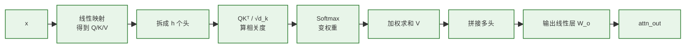

可以把它理解成三步：

| 步骤 | 做什么 | 直观理解 |
|---|---|---|
| 生成 `Q/K/V` | 给每个 token 生成查询、键和值 | 先准备"我要找什么"、"我有什么特征"、"我能提供什么信息" |
| 多头注意力 | 多组视角并行计算注意力 | 有的头看语法，有的头看指代，有的头看局部搭配 |
| 拼接输出 | 把多个头的结果合并回 `d_model` | 多个专家意见合并成一个新向量 |

#### 📖 重要函数解释（小白版）

| 函数 / 用法 | 一句话作用 | 形象类比 |
|---|---|---|
| `super().__init__()` | 调用父类 `nn.Module` 的初始化（必须写，否则注册不了参数） | 先按公司流程办入职，才能领工号 |
| `assert d_model % num_heads == 0` | 断言：模型维度必须能被头数整除（每个头要拿到等长切片） | 一个蛋糕要切 8 等份，必须能整除 |
| `B, L, _ = x.shape` | 一行把 batch、seq_len 解包出来；`_` 表示维度用不到 | 一次性拆包裹，只关心前两层 |
| `.view(B, L, num_heads, d_k)` | 在不复制数据的前提下「重新排版」张量形状 | 把一长条排成多列方阵，**纸不变，只是折一下** |
| `.transpose(1, 2)` | 交换第 1 维和第 2 维，把头维放到 batch 后面（`(B, H, L, d_k)`），方便每头独立算 | 把同一摞按「主题」重新分堆 |
| `.contiguous()` | 让张量在内存里重新连续排列（`transpose` 后内存不连续，`view` 会报错） | 把刚整理乱的卡片重新码整齐 |
| `nn.ModuleList([...])` | 容器：装一组层，PyTorch 会自动把它们的参数注册进来 | 一个文件夹，把多个零件一起归档 |
| `self.W_o = nn.Linear(d_model, d_model)` | 把 8 个头拼接后的结果再过一层线性层做「混合」 | 把 8 位评委的打分汇总，得到最终意见 |

**参数含义：**

| 函数 / 类 | 参数 | 含义 |
|---|---|---|
| `MultiHeadAttention(d_model, num_heads)` | `d_model` | 模型主维度，也就是每个 token 向量的总宽度，例如 `512`。 |
| `MultiHeadAttention(d_model, num_heads)` | `num_heads` | 注意力头的数量，例如 `8`；每个头负责学习一种关注模式。 |
| `assert d_model % num_heads == 0` | `d_model % num_heads` | 要求总维度能平均切给每个头，否则无法得到整数维度的 `d_k`。 |
| `forward(self, x, mask=None)` | `x` | 输入序列的向量表示，形状通常是 `(B, L, d_model)`。 |
| `forward(self, x, mask=None)` | `mask` | 可选遮罩，传给注意力函数，用来屏蔽 padding 或未来位置。 |
| `.view(B, L, self.num_heads, self.d_k)` | `B` | batch size，一次输入多少句话 / 样本。 |
| `.view(B, L, self.num_heads, self.d_k)` | `L` | sequence length，每句话里有多少个 token。 |
| `.view(B, L, self.num_heads, self.d_k)` | `self.num_heads` | 把总维度拆成多少个注意力头。 |
| `.view(B, L, self.num_heads, self.d_k)` | `self.d_k` | 每个注意力头分到的维度，计算方式是 `d_model // num_heads`。 |

> 💡 **小白记忆点**：多头的本质就是 **「reshape + transpose 一下，让矩阵乘法一口气帮你算 8 份注意力」**，并没有真的写 for 循环。

---

## 8. 零件 5：前馈网络（Feed Forward Network, FFN）

### 8.1 解决什么问题？

注意力主要负责**信息混合**（让词之间互相看），但缺乏**非线性变换能力**。  
FFN 就是给每个位置加一个"小型全连接神经网络"，提升模型的表达力。

### 8.2 结构

每个位置独立地过：

```
Linear(d_model, d_ff) → ReLU/GELU → Linear(d_ff, d_model)
```

通常 `d_ff = 4 * d_model`（先升维再降维，制造表达空间）。

### 8.3 代码

```python
class FeedForward(nn.Module):
    def __init__(self, d_model, d_ff=2048):
        super().__init__()
        self.fc1 = nn.Linear(d_model, d_ff)
        self.fc2 = nn.Linear(d_ff, d_model)

    def forward(self, x):
        return self.fc2(F.relu(self.fc1(x)))
```

**关键点**：FFN 是**逐位置（position-wise）**的，每个 token 单独过同一个网络，不跨位置混合信息。混合工作交给 Attention 完成。

#### 🧩 FFN 子模块组成

`Feed Forward Network` 负责对每个位置的向量做进一步加工。它不负责 token 之间交流，而是对每个 token 的表示单独做"升维、激活、降维"。

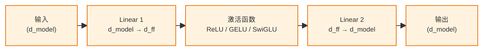

可以把 FFN 理解成一个"小型加工厂"：

| 阶段 | 作用 | 为什么需要 |
|---|---|---|
| `Linear 1` | 从 `d_model` 升到更大的 `d_ff` | 给模型更大的中间表达空间 |
| 激活函数 | 引入非线性 | 否则多层线性叠加还是线性，表达能力不足 |
| `Linear 2` | 从 `d_ff` 降回 `d_model` | 保持输出 shape 不变，方便继续堆下一层 |

#### 📖 重要函数解释（小白版）

| 函数 / 用法 | 一句话作用 | 形象类比 |
|---|---|---|
| `self.fc1 = nn.Linear(d_model, d_ff)` | 第一层全连接：把 512 维**升维**到 2048 维，制造更大的特征空间 | 把小屋子换到大会议厅 |
| `self.fc2 = nn.Linear(d_ff, d_model)` | 第二层全连接：把 2048 维**降回** 512 维，方便和后续层衔接 | 开完会再回到小屋子 |
| `F.relu(x)` | 激活函数：`max(0, x)`，把负数全砍成 0，引入非线性 | 一道关卡：分数为正才放行，负分淘汰 |
| `self.fc2(F.relu(self.fc1(x)))` | 嵌套调用：先线性升维 → 激活 → 线性降维 | 三步流水线 |

**参数含义：**

| 函数 / 类 | 参数 | 含义 |
|---|---|---|
| `FeedForward(d_model, d_ff=2048)` | `d_model` | 输入和输出的主维度；FFN 处理前后都保持这个维度，方便残差相加。 |
| `FeedForward(d_model, d_ff=2048)` | `d_ff` | FFN 中间层维度，通常比 `d_model` 大，例如 `4 * d_model`，用于提供更大的表达空间。 |
| `forward(self, x)` | `x` | 输入张量，形状通常是 `(B, L, d_model)`；FFN 会对每个 token 位置独立处理。 |
| `nn.Linear(d_model, d_ff)` | `d_model` | 输入维度。 |
| `nn.Linear(d_model, d_ff)` | `d_ff` | 输出维度，也就是升维后的宽度。 |
| `F.relu(self.fc1(x))` | `self.fc1(x)` | 第一层线性变换后的结果，经过 ReLU 后加入非线性能力。 |

> 💡 **小白记忆点**：FFN = **「升维 → 非线性 → 降维」三步走**；它不让词之间互相说话（那是 Attention 的活），它只负责给每个词「单独深加工」。

> 原版 Transformer 常用 ReLU，BERT / GPT-2 常用 GELU，现代 LLaMA / Qwen 等大模型常用 SwiGLU。激活函数会变，但 FFN 的核心骨架仍然是：**升维 → 非线性加工 → 降回 `d_model`**。

---

## 9. 零件 6：残差连接 + 层归一化（Add & Norm）

### 9.1 解决什么问题？

Transformer 通常堆 6~96 层，深网络会遇到**梯度消失/爆炸**和**训练不稳定**。

- **残差连接（Residual）**：`output = SubLayer(x) + x`。让梯度可以"抄近道"传回来。
- **层归一化（LayerNorm）**：把每一层输出标准化（均值 0、方差 1），让数值稳定。

### 9.2 代码

```python
class EncoderLayer(nn.Module):
    def __init__(self, d_model, num_heads, d_ff, dropout=0.1):
        super().__init__()
        self.attn = MultiHeadAttention(d_model, num_heads)
        self.ffn = FeedForward(d_model, d_ff)
        self.norm1 = nn.LayerNorm(d_model)
        self.norm2 = nn.LayerNorm(d_model)
        self.dropout = nn.Dropout(dropout)

    def forward(self, x, mask=None):
        # 子层 1：自注意力 + 残差 + 归一化
        attn_out = self.attn(x, mask)
        x = self.norm1(x + self.dropout(attn_out))

        # 子层 2：FFN + 残差 + 归一化
        ffn_out = self.ffn(x)
        x = self.norm2(x + self.dropout(ffn_out))
        return x
```

#### 🧩 EncoderLayer 模块组成图

对照上面的代码看，一个 `EncoderLayer` 不是一整坨黑盒，而是两个大子层串起来。注意：每个 `Add & Norm` 都不是只接收子层输出，而是还要接收一条“原输入”的残差分支：

```mermaid
%%{init: {"themeVariables": {"fontSize": "10px"}, "flowchart": {"nodeSpacing": 18, "rankSpacing": 18, "curve": "linear"}}}%%
flowchart LR
    X0["输入 x0<br/>(B,L,d_model)"] --> A["子层 1<br/>Multi-Head Self-Attention"]
    X0 --> ADD1["Add<br/>x0 + Dropout(attn_out)"]
    A --> D1["Dropout"]
    D1 --> ADD1
    ADD1 --> N1["LayerNorm<br/>得到 x1"]

    N1 --> F["子层 2<br/>Feed Forward Network"]
    N1 --> ADD2["Add<br/>x1 + Dropout(ffn_out)"]
    F --> D2["Dropout"]
    D2 --> ADD2
    ADD2 --> N2["LayerNorm<br/>得到 x2"]
    N2 --> Y["输出 x2<br/>(B,L,d_model)"]

    classDef io fill:#e1f5ff,stroke:#0288d1,font-size:10px;
    classDef block fill:#fff8e1,stroke:#f57c00,font-size:10px;
    classDef dropout fill:#e8f5e9,stroke:#388e3c,font-size:10px;
    classDef add fill:#fff3e0,stroke:#ef6c00,font-size:10px;
    classDef norm fill:#f3e5f5,stroke:#7b1fa2,font-size:10px;
    class X0,Y io;
    class A,F block;
    class D1,D2 dropout;
    class ADD1,ADD2 add;
    class N1,N2 norm;
```

可以把图和代码这样对应起来：

| 图中模块 | 对应代码 | 作用 |
|---|---|---|
| `输入 x0` | `forward(self, x, mask=None)` 中进入第一个子层的 `x` | 当前层输入，也是第一个残差分支要保留的原信息。 |
| `Multi-Head Self-Attention` | `attn_out = self.attn(x, mask)` | 让每个 token 和其他 token 交流，得到 `attn_out`。 |
| 第一个 `Dropout` | `self.dropout(attn_out)` | 对注意力输出做随机丢弃，防止过拟合。 |
| 第一个 `Add` | `x + self.dropout(attn_out)` | 把子层输入 `x0` 加回注意力输出，这一步就是残差连接。 |
| 第一个 `LayerNorm` | `self.norm1(...)` | 对残差相加后的结果做归一化，得到 `x1`。 |
| `Feed Forward Network` | `ffn_out = self.ffn(x)` | 对每个 token 的向量单独加工，得到 `ffn_out`。 |
| 第二个 `Dropout` | `self.dropout(ffn_out)` | 对 FFN 输出做随机丢弃。 |
| 第二个 `Add` | `x + self.dropout(ffn_out)` | 把 FFN 子层输入 `x1` 加回 FFN 输出，这里加回的不是最初的 `x0`。 |
| 第二个 `LayerNorm` | `self.norm2(...)` | 对第二次残差相加后的结果做归一化，得到最终输出 `x2`。 |

> 💡 **关键点**：`EncoderLayer` 的输入和输出 shape 都是 `(B, L, d_model)`。层内部会改变向量的“内容”，但不会改变向量的“外形”。

#### 📖 重要函数解释（小白版）

| 函数 / 用法 | 一句话作用 | 形象类比 |
|---|---|---|
| `nn.LayerNorm(d_model)` | 对每个 token 的向量做归一化（减均值、除标准差），让数值分布稳定 | 班里每次考试都按平均分 0、标准差 1 重新打分 |
| `nn.Dropout(p)` | 训练时随机把 p 比例的元素置 0，防止过拟合；推理时自动关闭 | 上课随机点名抽查，逼大家都得会 |
| `x + self.dropout(attn_out)` | **残差连接（Residual）**：原输入 x 加上子层输出，让梯度有「高速公路」直接传回去 | 多一条「抄近路的小道」，万一主路堵了也能通 |
| `self.norm1(x + ...)` | 残差相加之后再做 LayerNorm（即原始论文 Post-LN 顺序） | 加完料后再统一调味 |

**参数含义：**

| 函数 / 类 | 参数 | 含义 |
|---|---|---|
| `EncoderLayer(d_model, num_heads, d_ff, dropout=0.1)` | `d_model` | 每个 token 向量的主维度，Attention、FFN、LayerNorm 都围绕它工作。 |
| `EncoderLayer(d_model, num_heads, d_ff, dropout=0.1)` | `num_heads` | 多头注意力的头数。 |
| `EncoderLayer(d_model, num_heads, d_ff, dropout=0.1)` | `d_ff` | FFN 中间层维度。 |
| `EncoderLayer(d_model, num_heads, d_ff, dropout=0.1)` | `dropout` | Dropout 随机置零比例，`0.1` 表示训练时约 10% 的元素会被置零。 |
| `forward(self, x, mask=None)` | `x` | 当前层输入，形状通常是 `(B, L, d_model)`。 |
| `forward(self, x, mask=None)` | `mask` | 可选遮罩，会传给自注意力层，用于屏蔽不该关注的位置。 |
| `nn.LayerNorm(d_model)` | `d_model` | 对每个 token 的最后一维 `d_model` 做归一化。 |
| `nn.Dropout(dropout)` | `dropout` | 随机丢弃比例，只在训练模式下生效。 |

> 💡 **小白记忆点**：在原始论文的 Post-LN 写法中，每个子层通常是同一个套路 —— **「子层运算 → Dropout → 加残差 → LayerNorm」**。

> **小知识**：原始论文用的是 Post-LN（先 Add 再 Norm）；现在大模型基本用 Pre-LN（先 Norm 再进子层，常写成 `x = x + Sublayer(LayerNorm(x))`），训练更稳定。

---

## 10. 把所有零件拼起来：一个最小 Transformer Encoder

> 运行本节代码前，请先把前文的 `positional_encoding`、`scaled_dot_product_attention`、`MultiHeadAttention`、`FeedForward`、`EncoderLayer` 放在同一个文件中。本节重点是展示这些零件如何拼装成完整 Encoder。

```python
import torch
import torch.nn as nn
import torch.nn.functional as F
import math

class TransformerEncoder(nn.Module):
    def __init__(self, vocab_size, d_model=512, num_heads=8,
                 num_layers=6, d_ff=2048, max_len=512, dropout=0.1):
        super().__init__()
        self.embedding = nn.Embedding(vocab_size, d_model)
        self.register_buffer('pe', positional_encoding(max_len, d_model))
        self.layers = nn.ModuleList([
            EncoderLayer(d_model, num_heads, d_ff, dropout)
            for _ in range(num_layers)
        ])
        self.dropout = nn.Dropout(dropout)
        self.d_model = d_model

    def forward(self, tokens, mask=None):
        # 1. 词嵌入 + 位置编码
        x = self.embedding(tokens) * math.sqrt(self.d_model)
        x = x + self.pe[:x.size(1)].unsqueeze(0)
        x = self.dropout(x)

        # 2. 堆叠 N 层 EncoderLayer
        for layer in self.layers:
            x = layer(x, mask)
        return x   # (batch, seq_len, d_model)


# === 跑一下试试 ===
if __name__ == "__main__":
    model = TransformerEncoder(vocab_size=10000)
    tokens = torch.randint(0, 10000, (2, 16))   # batch=2, seq_len=16
    out = model(tokens)
    print(out.shape)   # torch.Size([2, 16, 512])
```

#### 📖 重要函数解释（小白版）

| 函数 / 用法 | 一句话作用 | 形象类比 |
|---|---|---|
| `self.register_buffer('pe', ...)` | 把位置编码注册为「buffer」：会随模型 `.to(device)` 一起搬到 GPU，但**不会被当作可训练参数更新** | 行李里的「常量配件」，跟着走但不被改 |
| `nn.ModuleList([EncoderLayer(...) for _ in range(N)])` | 构建 N 层一模一样结构（参数各自独立）的编码器层 | 流水线上摆 N 台同型号机器 |
| `self.embedding(tokens) * math.sqrt(self.d_model)` | 词向量乘以 √d_model（论文做法，缓和位置编码相加后的尺度差异） | 给原料先「放大一档」，方便和调料混匀 |
| `self.pe[:x.size(1)].unsqueeze(0)` | 取出前 seq_len 行位置编码，并补一个 batch 维以便广播相加 | 按句子长度截一段尺子，复制给整个 batch |
| `torch.randint(0, 10000, (2, 16))` | 在 `[0, 10000)` 范围内随机生成 `(2, 16)` 的整数张量，模拟 token id | 随机出题，假装这是真实输入 |
| `if __name__ == "__main__":` | Python 习惯写法：当文件被「直接执行」时才跑下面的代码，被 import 时不跑 | 「自家用」开关，别人借文件不会误触发 |

**参数含义：**

| 函数 / 类 | 参数 | 含义 |
|---|---|---|
| `TransformerEncoder(vocab_size, d_model=512, num_heads=8, num_layers=6, d_ff=2048, max_len=512, dropout=0.1)` | `vocab_size` | 词表大小，决定 Embedding 表的行数。 |
| `TransformerEncoder(...)` | `d_model` | 模型主维度，决定 token embedding、位置编码和每层输出的宽度。 |
| `TransformerEncoder(...)` | `num_heads` | 每层多头注意力的头数。 |
| `TransformerEncoder(...)` | `num_layers` | EncoderLayer 堆叠层数，原版 Transformer Encoder 常用 `6` 层。 |
| `TransformerEncoder(...)` | `d_ff` | 每层 FFN 的中间维度。 |
| `TransformerEncoder(...)` | `max_len` | 预先生成的位置编码最大长度，输入序列长度不能超过它。 |
| `TransformerEncoder(...)` | `dropout` | Dropout 随机置零比例，用于防止过拟合。 |
| `forward(self, tokens, mask=None)` | `tokens` | 输入 token id 张量，形状通常是 `(B, L)`。 |
| `forward(self, tokens, mask=None)` | `mask` | 可选遮罩，传给每一层 EncoderLayer 的注意力模块。 |
| `torch.randint(0, 10000, (2, 16))` | `0` | 随机整数的最小值，包含 0。 |
| `torch.randint(0, 10000, (2, 16))` | `10000` | 随机整数的最大边界，不包含 10000。 |
| `torch.randint(0, 10000, (2, 16))` | `(2, 16)` | 输出张量形状，表示 batch size 为 2、序列长度为 16。 |

> 💡 **小白记忆点**：整个 Encoder = **Embedding → +PE → 堆 N 层（Attn+FFN+残差）**，看上去复杂，其实**循环结构非常清晰**。

**逻辑解析（数据从输入到输出走了什么路）**：

| 步骤 | 输入 | 处理 | 输出 / 重点 |
|---|---|---|---|
| 1. 准备输入 | 原始文本经 tokenizer 得到的 token id | 本文 demo 用 `torch.randint(...)` 模拟真实 token id | `tokens`，形状 `(B, L)`；模型吃进去的是整数编号，不是原始文字 |
| 2. 词嵌入 | `tokens` | `nn.Embedding` 查表，并乘以 `√d_model` 调整尺度 | `x`，形状 `(B, L, d_model)`；完成“离散编号 → 连续向量”的转换 |
| 3. 加位置编码 | token 向量 `x` + `pe` | 截取当前序列长度的 PE，并通过 `unsqueeze(0)` 广播到整个 batch | 形状仍是 `(B, L, d_model)`；让模型知道 token 的先后顺序 |
| 4. Dropout | 加过位置编码的 `x` | 训练时随机丢弃部分特征 | 形状不变；增加扰动，降低过拟合风险 |
| 5. 堆叠编码层 | `x`，形状 `(B, L, d_model)` | 串联经过 `N` 个 `EncoderLayer` | 每层 shape 不变，但每个 token 向量融合的上下文信息越来越丰富 |
| 6. 层内加工 | 当前层的 `x` | Self-Attention 负责 token 之间交流；Multi-Head 从多个视角看句子；FFN 对每个位置单独深加工；Add & Norm 保留原信息并稳定训练 | 每层输出仍是 `(B, L, d_model)` |
| 7. 最终输出 | 最后一层 `EncoderLayer` 的输出 | `return x` | `out`，形状 `(B, L, d_model)`；它不是最终文字，而是每个 token 的上下文感知向量，可继续接分类头、抽取头、MLM 头等 |

用一条线表示就是：

```text
tokens
→ Embedding
→ + Positional Encoding
→ Dropout
→ EncoderLayer 1
→ EncoderLayer 2
→ ...
→ EncoderLayer N
→ out
```

> 💡 **一句话总结**：Transformer Encoder demo 的主线就是：**先把 token id 变成带位置的向量，再让这些向量反复经过 Attention 交流、FFN 加工、Add & Norm 稳定，最后得到上下文感知向量。**

#### 🖼️ 整体数据流图示

下面这张图把上面的 6 步「画」出来。为了便于 PDF 阅读，这里拆成 **主干数据流** 和 **输出任务头** 两层：

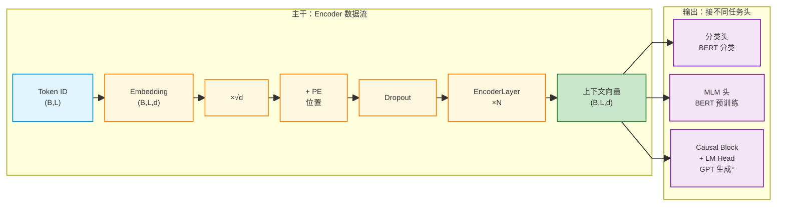

> ⚠️ **重要澄清**：GPT 不是普通 Encoder 直接接一个 `LM Head` 就得到的。GPT / LLaMA 使用的是 **Decoder-only / causal Transformer block**：每个位置只能看自己和左边历史 token，不能像 Encoder 那样双向看完整句。上图里的 `GPT 生成*` 是为了说明“下游生成接口”的位置，不表示 Encoder 能直接变成 GPT。

#### 🔗 关于 "EncoderLayer × N 层" 的关键澄清

很多初学者看到 `× N` 会有疑问：**这 N 层是怎么连的？输入输出的 shape 会变吗？**

**两句话回答**：

| 问题 | 答案 |
|---|---|
| **N 层是串联还是并联？** | **串联**：第 1 层输出 → 第 2 层输入 → … → 第 N 层输入 → 最终输出 |
| **shape 会改变吗？** | **完全不变**：每一层输入输出都是 `(B, L, d_model)`，只是"内容"被刷新 |

**对应代码**（来自上面 `Encoder.forward`）：

```python
for layer in self.layers:   # self.layers 是 ModuleList，里面是 N 个 EncoderLayer
    x = layer(x)            # 关键：x 进、x 出，名字相同 → shape 一定相同
```

**形象图示——"流水线"视角**：

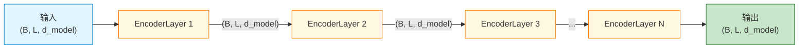

**为什么必须 shape 不变？三个硬性原因**：

1. **要能串联**：下一层期望的输入维度 = 上一层产生的输出维度 = `d_model`，否则接不上。
2. **要支持残差连接**：每层内部有 `x + 子层(x)` 的加法，加法两边 shape 必须完全一致。
3. **要能任意加深**：N 可以是 6、12、24、96……只要 shape 不变，**理论上可以无限堆**（GPT-3 就堆了 96 层）。

**那"内容"到底变了什么？**——**变的是每个位置向量的语义浓度**：

| 层数 | 每个位置向量的"含义" | 类比 |
|---|---|---|
| 第 0 层（Embedding 后） | 只是这个词本身的含义 + 位置 | 单字的字典释义 |
| 第 1 层后 | 融合了周围几个词的信息 | 看了一眼左右邻居 |
| 第 3 层后 | 融合了整句的浅层关系（语法） | 读懂了句子的主谓宾 |
| 第 N 层后 | 融合了整句的深层关系（语义、指代、逻辑） | 真正"理解"了这句话 |

> 💡 **一句话比喻**：N 层 EncoderLayer 就像 **N 道工序的流水线**——零件（向量）的**外形（shape）始终不变**，但每过一道工序，**它的"成色"就更精纯一分**。

#### 🔁 单个 EncoderLayer 内部结构

这是上面主流程中 F 节点（"EncoderLayer × N 层"）的内部展开。为了让代码和结构图聚合说明，`EncoderLayer` 相关细节已分别放回对应“零件”章节：

| 内部部分 | 回看章节 | 说明 |
|---|---|---|
| `Multi-Head Self-Attention` | 第 7 章 零件 4 | 查看多头注意力的内部组成图，以及 `Q/K/V`、拆头、拼接、`W_o` 的代码对应关系。 |
| `Feed Forward Network` | 第 8 章 零件 5 | 查看 FFN 的内部组成图，以及“升维 → 激活 → 降维”的代码对应关系。 |
| `Add & Norm` | 第 9 章 零件 6 | 查看 `EncoderLayer` 模块组成图，以及两个子层后残差连接和 `LayerNorm` 的位置。 |

> 💡 **一句话总结**：第 10 章只负责说明“如何把零件拼成完整 Encoder”；每个零件内部怎么工作，回到第 7～9 章看代码和结构图更清楚。

**这就是 BERT 的骨架。** 在它上面接个分类头，就是 BERT 分类；接个 MLM 头，就是 BERT 预训练。


## 11. Transformer 三大流派的差别

第 2 章已经从整体架构上看过：Transformer 后来主要演化出三大流派：**Encoder-only**、**Decoder-only**、**Encoder-Decoder**。这一章不是重新讲一套新模型，而是把第 2 章的鸟瞰图进一步拆成模块来看：三大流派到底复用了哪些零件，又在哪些地方打开了不同的“开关”。

先记住一个模块化视角：三大流派共享的底座都离不开 **Embedding、位置编码、Attention、FFN、残差连接、LayerNorm**。真正拉开差异的，主要是两个问题：

1. **Self-Attention 能看多远？**  
   - Encoder 通常可以双向看完整输入。
   - Decoder / GPT 必须用 `causal_mask`，只能看自己和左边历史 token。
2. **Decoder 是否需要参考另一个输入序列？**  
   - Encoder-Decoder 里的 Decoder 需要通过 Cross-Attention 参考 Encoder 输出。
   - Decoder-only / GPT 没有独立 Encoder，所以没有 Cross-Attention。

把第 2 章的三大流派和本章内容对应起来，可以这样看：

| 第 2 章流派 | 模块化拼装方式 | Self-Attention 可见范围 | 是否有 Cross-Attention | 本章重点 |
|---|---|---|---|---|
| **Encoder-only** | `Embedding → PE → 多层 EncoderLayer → 任务头` | 双向可见 | 没有 | 作为对照：理解 Encoder 为什么能双向看 |
| **Encoder-Decoder** | `Encoder` 先理解源序列，`Decoder` 再生成目标序列 | Encoder 双向；Decoder 因果可见 | 有 | `11.1` 讲 Decoder 的因果 Mask，`11.2` 讲 Cross-Attention |
| **Decoder-only** | `Embedding → PE → 多层 GPTBlock → LM Head` | 因果可见 | 没有 | `11.1` 讲 `causal_mask`，`11.3` 讲最小 GPT 闭环 |

所以，三大流派的差别可以压缩成一句话：**它们不是三套完全不同的模型，而是在相似的 Transformer block 骨架上，选择不同的注意力可见范围、是否保留 Encoder、是否加入 Cross-Attention。**

接下来按“差异开关”来拆：

1. **可见范围开关**：是否允许当前位置看未来 token？这决定了 Encoder-only 和 Decoder-only 的根本差别。
2. **外部参考开关**：Decoder 是否需要参考 Encoder 输出？这决定了 Encoder-Decoder 和 Decoder-only 的根本差别。
3. **完整闭环**：如果只保留 Decoder-only 分支，就得到 GPT 风格的自回归生成模型。

对应到本章小节就是：`11.1` 先讲 `causal_mask` 如何限制可见范围，`11.2` 再讲 Encoder-Decoder 如何用 Cross-Attention 连接两段序列，`11.3` 最后给出 Decoder-only / GPT 的最小闭环。

> 注意：GPT / LLaMA 这类 **Decoder-only** 模型只保留 Masked Self-Attention；它们没有独立 Encoder，所以也没有 Cross-Attention。

### 11.1 带 Mask 的自注意力（Masked Self-Attention）

第 6.3 节已经说明：`mask` 是 Attention 的统一“可见性规则”，最终会传给 `scaled_dot_product_attention(Q, K, V, mask=...)`。在 Decoder / GPT 里，最关键的规则就是 **`causal_mask`**：当前位置只能看自己和左边历史 token，不能看右边未来 token。

为什么？因为 Decoder 是**生成**——一个词一个词往外吐。第 t 步只能看 ≤ t 的词，**绝不能偷看未来**。

`causal_mask` 通常是一张下三角矩阵：

```python
seq_len = 5
causal_mask = torch.tril(torch.ones(seq_len, seq_len)).bool()
# tensor([[1,0,0,0,0],
#         [1,1,0,0,0],
#         [1,1,1,0,0],
#         [1,1,1,1,0],
#         [1,1,1,1,1]])
```

按照本文约定，`1 / True` 表示可以看，`0 / False` 表示不能看。传入 Attention 后，`causal_mask` 为 0 的位置会在 `scores` 中被设为 `-inf`，softmax 后权重变成 0，相当于“看不见未来”。

#### 🔍 Decoder / GPT 里为什么必须用 `causal_mask`？

训练语言模型时，我们通常会把一整段 token 同时喂进去并行计算：

```text
输入:  我  爱  北  京
目标:  爱  北  京  天
```

如果没有 `causal_mask`，位置 0 的“我”在训练时就能直接看到后面的“爱、北、京”，这就等于**考试时偷看答案**。模型 loss 可能会很低，但真正生成时表现会崩，因为生成时未来 token 根本还不存在。

`causal_mask` 的作用就是让并行训练仍然保持自回归规则：

```text
预测第 0 位后面的 token：只能看第 0 位
预测第 1 位后面的 token：只能看第 0~1 位
预测第 2 位后面的 token：只能看第 0~2 位
```

#### 🧩 `causal_mask` 和 `padding_mask` 的关系

二者不是两套 Attention 机制，而是同一个 `mask` 接口下的两类可见性规则：

| Mask | 控制的问题 | 一句话理解 |
|---|---|---|
| `causal_mask` | 时间方向 | 不能看未来。 |
| `padding_mask` | token 是否有效 | 不能看 `<pad>`。 |
| `attention_mask` | 最终合并结果 | 同时满足所有可见性限制。 |

如果 Decoder / GPT 的 batch 里有 `<pad>`，最终传入 Attention 的通常是合并后的 `attention_mask`：

```python
# True 表示可以看；False 表示不能看
attention_mask = padding_mask & causal_mask
```

这样得到的 `attention_mask` 会同时遮住 `<pad>` 和未来位置。具体形状和广播规则已经在第 6.3 节统一说明，这里只需要记住：**Decoder / GPT 的核心新增限制，就是 `causal_mask` 这条“不能看未来”的规则。**

#### 🚀 推理阶段还需要 `causal_mask` 吗？

概念上仍然需要，因为 GPT 生成必须遵守“只能看过去”。但工程实现会分两种情况：

| 推理写法 | 是否显式构造完整 `causal_mask` | 原因 |
|---|---|---|
| 教学版：每次把完整上下文重新喂给模型 | 通常需要 | 输入里包含完整历史序列，Attention 仍要防止位置之间互看未来。 |
| 生产版：使用 KV-Cache，每次只算新 token | 通常不需要完整下三角矩阵 | 当前新 token 天然只和历史 KV 以及自己做注意力，未来 token 还没生成。 |

> 💡 **小白记忆点**：`mask` 是 Attention 的统一入口；`causal_mask` 是 Decoder / GPT 为了“不能偷看未来”而加入的特殊规则。

#### 📖 重要函数解释（小白版）

| 函数 / 用法 | 一句话作用 | 形象类比 |
|---|---|---|
| `torch.ones(L, L)` | 生成一个 L×L 的全 1 方阵 | 一张全部填满 ✅ 的棋盘 |
| `torch.tril(M)` | 取矩阵的**下三角**（含对角线），其余位置置 0 | 把右上角的格子全部擦掉 |
| 配套 `torch.triu(M)` | 取**上三角**（不常用，但可记一下，反方向） | 反过来，留右上、擦左下 |

> 💡 **小白记忆点**：因果 mask = **「下三角全 1」的方阵**，第 i 行只放 i+1 个 1，对应「第 i 步只能看到自己和前面的人」。

### 11.2 交叉注意力（Cross-Attention）

在 Encoder-Decoder 架构中，Decoder 还要"参考"Encoder 的输出。  
Cross-Attention 里：
- Q 来自 Decoder（"我想生成下一个英文词，需要哪些信息？"）
- K、V 来自 Encoder（"中文句子的信息都在这里"）

数据流可以理解成下面这样：

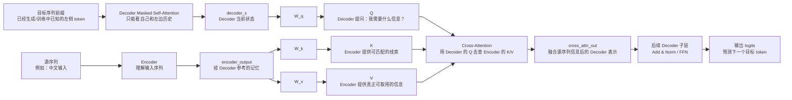

这张图里要抓住两类输入和一个输出：
- **Decoder 侧输入**：`decoder_x`，表示 Decoder 当前已经生成到哪里、现在想问什么。
- **Encoder 侧输入**：`encoder_output`，会变成 `K` 和 `V`，表示源序列中有哪些信息可被查询和取用。
- **Cross-Attention 输出**：`cross_attn_out`，表示 Decoder 已经参考源序列后的新表示，后面会继续经过 Decoder 的后续子层，最终用于预测下一个 token。

```python
# 伪代码
Q = W_q(decoder_x)
K = W_k(encoder_output)
V = W_v(encoder_output)
out = attention(Q, K, V)
```

> Decoder-only 模型（GPT、LLaMA）**没有 Cross-Attention**，只有 Masked Self-Attention，因为它没有独立的 Encoder。

### 11.3 一个最小 Decoder-only / GPT 闭环

这一节对应第 2 章三大流派里的 **Decoder-only** 分支。它可以看成是把第 10 章学过的完整 Encoder 拼装思路，换成“只能看历史”的 GPT 风格拼装：`Embedding → 位置编码 → 多层 GPTBlock → LM Head → logits`。

为了把第 12 章训练和第 13 章生成串起来，这里给出一个**极简 GPT 风格模型骨架**。它和第 10 章 Encoder 最大的不同是：每一层都使用 `causal_mask`，保证当前位置只能看自己和左边历史 token。

> 运行这段代码前，也需要先准备好前文的 `positional_encoding`、`MultiHeadAttention`、`FeedForward` 等零件；这里重点展示 Decoder-only 这条分支的拼装方式。

整体数据流分成两张图看，会更清晰。

#### 图 1：`MiniGPT` 整体前向闭环

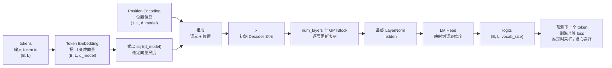

这张图要抓住三类数据：
- **输入数据**：`tokens`，形状通常是 `(B, L)`，表示一批 token id。
- **中间数据**：`x` / `hidden`，形状通常是 `(B, L, d_model)`，是模型不断加工后的上下文表示。
- **输出数据**：`logits`，形状是 `(B, L, vocab_size)`，表示每个位置对整个词表的下一 token 打分。

#### 图 2：单个 `GPTBlock` 内部结构

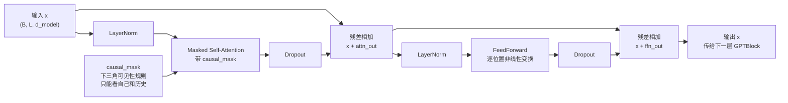

#### 从三大流派看：`GPTBlock` / `MiniGPT` 该和谁对比？

这一小节是在 **Decoder-only** 分支内部继续展开，所以要先抓住层级关系：**`GPTBlock` 只是一个“积木块”，更适合对比第 10 章里的 `EncoderLayer`；`MiniGPT` 才更适合对比第 10 章里的 `TransformerEncoder`。**

也就是说，三大流派的对比不能把“单层积木”和“完整模型”混在一起，应该按下面两组对等实体来理解：

```text
单层积木：EncoderLayer      ↔ GPTBlock
完整模型：TransformerEncoder ↔ MiniGPT
```

##### 1. 单层积木对比：`EncoderLayer` ↔ `GPTBlock`

| 对比点 | `EncoderLayer` | `GPTBlock` |
|---|---|---|
| **属于哪类结构** | Encoder 里的单层 block | Decoder-only / GPT 里的单层 block |
| **核心注意力** | 普通 Self-Attention | Masked Self-Attention |
| **能看哪些 token** | 默认可以双向看：当前位置既能看左边，也能看右边 | 只能看自己和左边历史 token，不能看未来 |
| **主要 Mask** | 通常只需要 `padding_mask`，避免看 `<pad>` | 必须使用 `causal_mask`；有 `<pad>` 时再和 `padding_mask` 合并 |
| **层内结构** | `Self-Attention → FFN → 残差 / LayerNorm` | `Masked Self-Attention → FFN → 残差 / LayerNorm` |
| **输入 / 输出形状** | 输入 `x: (B, L, d_model)`，输出仍是 `(B, L, d_model)` | 输入 `x: (B, L, d_model)`，输出仍是 `(B, L, d_model)` |
| **本质区别** | 负责产生双向上下文表示 | 负责产生只能依赖历史的因果上下文表示 |

从单层代码上看，`EncoderLayer` 和 `GPTBlock` 都像 **Attention + FFN + 残差 + LayerNorm**。真正决定性质的是 Attention 的可见范围：

```text
EncoderLayer：每个位置可以看整句话 → 双向理解
GPTBlock：每个位置只能看过去和自己 → 自回归生成
```

##### 2. 完整模型对比：`TransformerEncoder` ↔ `MiniGPT`

| 对比点 | `TransformerEncoder` | `MiniGPT` |
|---|---|---|
| **模型层级** | 完整 Encoder 模型 | 完整 Decoder-only / GPT 模型 |
| **主干结构** | `Embedding → PE → 多层 EncoderLayer → out` | `Embedding → PE → 多层 GPTBlock → LayerNorm → LM Head → logits` |
| **内部堆叠的 block** | 多个 `EncoderLayer` | 多个 `GPTBlock` |
| **最终输出** | `out: (B, L, d_model)` | `logits: (B, L, vocab_size)` |
| **输出含义** | 每个 token 的双向上下文向量 | 每个位置对整个词表的下一 token 打分 |
| **典型用途** | 理解类任务：分类、抽取、匹配、编码表示等 | 生成类任务：下一 token 预测、自回归续写 |
| **训练目标** | 可接分类头、序列标注头、MLM 头等，目标不固定 | 典型目标是“错位一格”的下一 token 预测 |
| **是否能直接自回归生成** | 不能直接生成；普通 Encoder 会看到未来 token | 可以生成；`causal_mask` 保证不会偷看未来 |

所以更准确的说法是：**`GPTBlock` 对标 `EncoderLayer`，`MiniGPT` 对标 `TransformerEncoder`。**前者是一层积木的差异，后者是完整模型的差异。

> ⚠️ **重要提醒**：GPT 不是“普通 `TransformerEncoder` 后面接一个 `LM Head`”。如果普通 Encoder 直接接 `LM Head` 做下一 token 预测，训练时每个位置会看到未来 token，相当于偷看答案；GPT 必须由带 `causal_mask` 的 `GPTBlock` 堆叠而成。

> 💡 **闭环直觉**：`MiniGPT` 的前向输出不是一句自然语言，而是一张“下一 token 得分表”；训练时用它和真实下一个 token 算 loss，推理时从最后一个位置的得分里选出下一个 token，再把新 token 接回输入继续生成。

```python
class GPTBlock(nn.Module):
    def __init__(self, d_model, num_heads, d_ff, dropout=0.1):
        super().__init__()
        self.norm1 = nn.LayerNorm(d_model)
        self.attn = MultiHeadAttention(d_model, num_heads)
        self.norm2 = nn.LayerNorm(d_model)
        self.ffn = FeedForward(d_model, d_ff)
        self.dropout = nn.Dropout(dropout)

    def forward(self, x):
        L = x.size(1)
        causal_mask = torch.tril(torch.ones(L, L, device=x.device))
        causal_mask = causal_mask.unsqueeze(0).unsqueeze(0)  # (1, 1, L, L)

        # Pre-LN 写法：先归一化，再进子层，最后加残差
        attn_out = self.attn(self.norm1(x), causal_mask)
        x = x + self.dropout(attn_out)

        ffn_out = self.ffn(self.norm2(x))
        x = x + self.dropout(ffn_out)
        return x


class MiniGPT(nn.Module):
    def __init__(self, vocab_size, d_model=512, num_heads=8,
                 num_layers=6, d_ff=2048, max_len=512, dropout=0.1):
        super().__init__()
        self.embedding = nn.Embedding(vocab_size, d_model)
        self.register_buffer('pe', positional_encoding(max_len, d_model))
        self.blocks = nn.ModuleList([
            GPTBlock(d_model, num_heads, d_ff, dropout)
            for _ in range(num_layers)
        ])
        self.norm = nn.LayerNorm(d_model)
        self.lm_head = nn.Linear(d_model, vocab_size, bias=False)

        # 常见工程技巧：输入 Embedding 和输出 LM Head 共享权重，减少参数并提升效果
        self.lm_head.weight = self.embedding.weight
        self.d_model = d_model

    def forward(self, tokens):
        x = self.embedding(tokens) * math.sqrt(self.d_model)
        x = x + self.pe[:x.size(1)].unsqueeze(0)

        for block in self.blocks:
            x = block(x)

        hidden = self.norm(x)
        logits = self.lm_head(hidden)  # (B, L, vocab_size)
        return logits
```

#### 📖 参数含义（小白版）

| 函数 / 类 | 参数 | 含义 |
|---|---|---|
| `GPTBlock(d_model, num_heads, d_ff, dropout=0.1)` | `d_model` | 每个 token 向量的主维度。 |
| `GPTBlock(...)` | `num_heads` | Masked Self-Attention 的注意力头数。 |
| `GPTBlock(...)` | `d_ff` | FFN 中间层维度。 |
| `GPTBlock(...)` | `dropout` | Dropout 随机置零比例，用来缓解过拟合。 |
| `GPTBlock.forward(self, x)` | `x` | 当前 block 的输入向量，形状通常是 `(B, L, d_model)`。 |
| `torch.ones(L, L, device=x.device)` | `L` | 当前序列长度，用来生成 `L × L` 的因果 mask。 |
| `torch.ones(L, L, device=x.device)` | `device=x.device` | 让 mask 和输入 `x` 在同一设备上，例如都在 CPU 或都在 GPU，避免设备不一致报错。 |
| `MiniGPT(vocab_size, d_model=512, num_heads=8, num_layers=6, d_ff=2048, max_len=512, dropout=0.1)` | `vocab_size` | 词表大小，也是最终 `logits` 的最后一维大小。 |
| `MiniGPT(...)` | `d_model` | 模型主维度。 |
| `MiniGPT(...)` | `num_heads` | 每个 GPTBlock 里的注意力头数。 |
| `MiniGPT(...)` | `num_layers` | GPTBlock 堆叠层数。 |
| `MiniGPT(...)` | `d_ff` | 每个 GPTBlock 里 FFN 的中间维度。 |
| `MiniGPT(...)` | `max_len` | 位置编码支持的最大上下文长度。 |
| `MiniGPT(...)` | `dropout` | Dropout 随机置零比例。 |
| `MiniGPT.forward(self, tokens)` | `tokens` | 输入 token id 张量，形状通常是 `(B, L)`。 |
| `nn.Linear(d_model, vocab_size, bias=False)` | `d_model` | 输入 hidden state 的维度。 |
| `nn.Linear(d_model, vocab_size, bias=False)` | `vocab_size` | 输出词表分数的维度，每个 token 对词表中每个候选词都给一个分数。 |
| `nn.Linear(d_model, vocab_size, bias=False)` | `bias=False` | 不使用额外偏置项，便于和输入 Embedding 做权重共享。 |

**一句话总结三大流派**：`Encoder-only` 让每个位置双向理解上下文；`Decoder-only` 让每个位置只看历史并预测下一个 token；`Encoder-Decoder` 则是先用 Encoder 理解源序列，再让 Decoder 一边遵守因果生成规则、一边通过 Cross-Attention 参考源序列。

---

## 12. 训练 Transformer 是个什么过程？

先回答一个容易混淆的问题：**三大流派的训练循环是一样的，但训练目标不一样。**

也就是说，不管是 `Encoder-only`、`Decoder-only`，还是 `Encoder-Decoder`，底层都是这四步：

```text
前向传播 → 计算 loss → 反向传播 → 更新参数
```

真正需要区分的是：**输入数据怎么组织、标签怎么构造、Mask 怎么用、loss 和哪个输出对齐。**

### 12.1 三大流派训练方式总览

| 流派 | 典型模型 | 训练目标 | 输入 / 标签 | Mask 重点 | Loss 对齐方式 |
|---|---|---|---|---|---|
| **Encoder-only** | BERT、RoBERTa | 理解 / 表示学习 | 输入完整文本；标签可以是分类标签、序列标注标签，或被遮住的 token | 通常主要用 `padding_mask`，Self-Attention 可以双向看 | 分类 loss、序列标注 loss、MLM loss 等 |
| **Decoder-only** | GPT、LLaMA | 自回归生成 | 输入一段 token；标签是右移一位的下一个 token | 必须用 `causal_mask`，不能看未来 | `logits[:, :-1]` 预测 `tokens[:, 1:]` |
| **Encoder-Decoder** | 原始 Transformer、T5、BART | 输入序列到输出序列 | 输入源序列 + 目标序列前缀；标签是目标序列下一 token | Encoder 用 `padding_mask`；Decoder 用 `causal_mask`；Cross-Attention 用源序列 `padding_mask` | 只在目标序列侧算 next token loss |

所以，第 11 章讲的是三大流派**结构差异**；本章讲的是这些结构在训练时如何变成不同的**监督信号**。

### 12.2 `Decoder-only / GPT`：下一 token 预测

这是现在大语言模型最常见的训练方式，也叫 **自回归语言建模**。

1. **任务**：给一段文本，预测下一个 token。
   - 输入：`我 爱 北 京`
   - 标签：`爱 北 京 天`（每个位置预测下一个）
2. **模型**：必须是带 `causal_mask` 的 `Decoder-only / GPT` 模型，不能用普通双向 Encoder 偷看未来 token。
3. **损失函数**：交叉熵（CrossEntropy）。
4. **优化器**：Adam / AdamW，配合 warmup 学习率调度。
5. **批大小**：越大越稳定（大模型常用上百万 token/batch）。

```python
# 假设 model 是第 11.3 节那类完整语言模型：
# Token Embedding + causal Transformer blocks + LM Head

# 1. 完整语言模型直接输出词表分数: (B, L, vocab_size)
logits = model(tokens)

# 2. 错位一格：第 i 个位置的 logits 预测第 i+1 个 token
loss = F.cross_entropy(logits[:, :-1].reshape(-1, vocab_size),
                       tokens[:, 1:].reshape(-1))  # 预测下一位

# 3. 标准训练四件套：清梯度 → 反向传播 → 更新参数
optimizer.zero_grad()
loss.backward()
optimizer.step()
```

> 💡 **形状闭环**：`tokens (B, L)` → `logits (B, L, vocab_size)` → `loss`。只有变成 `vocab_size` 维，才能和真实 token id 做交叉熵。
>
> ⚠️ **工程提醒 1**：训练时用真实前缀预测下一个 token，这叫 **teacher forcing**；推理时则只能用模型自己刚生成的 token 继续往后生成。
>
> ⚠️ **工程提醒 2**：`LM Head` 应该在模型初始化时创建一次，并加入 `optimizer` 一起训练；不要在每个 batch 里临时新建，否则参数会反复随机初始化，模型学不到东西。很多语言模型还会让 `lm_head.weight` 和 `embedding.weight` 共享，也就是第 11.3 节里的 weight tying。

#### 📖 `Decoder-only / GPT` 示例里的重要函数解释

| 函数 / 用法 | 一句话作用 | 形象类比 |
|---|---|---|
| `logits` | 模型输出的「未归一化分数」，形状 `(B, L, vocab)`，每个位置给词表里每个词打分 | 一张「下一字得分榜」 |
| `logits[:, :-1]` | 切片：取每句话前 L-1 个位置的预测（最后一位没下一字可预测，丢掉） | 班里所有同学，最后一名不参加排名 |
| `tokens[:, 1:]` | 切片：取每句话从第 2 个 token 开始的真实词，作为「下一位」的标准答案 | 把答案整体往前挪一格 |
| `.reshape(-1, vocab_size)` / `.reshape(-1)` | 把 `(B, L-1, V)` 拍平成 `(B*(L-1), V)`，便于一次性送进 cross_entropy | 把多张试卷叠成一摞统一改 |
| `F.cross_entropy(pred, target)` | 交叉熵损失：内部自动 softmax + log + 取真标签那一项的负值 | 老师对着标准答案打一个「差了多少」的分 |
| `optimizer.zero_grad()` | 清空上一轮累计下来的梯度，通常每个 batch 反向传播前都要调用 | 擦掉上一题的草稿，避免和这题混在一起 |
| `loss.backward()` | 自动求导：从 loss 反向传播，计算每个参数的梯度 | 老师批完卷后，把「错在哪」逐层反馈回去 |
| `optimizer.step()` | 用上一步算出的梯度，按学习率更新所有可训练参数 | 学生根据反馈，调整下次的答题策略 |

**参数含义：**

| 函数 / 用法 | 参数 | 含义 |
|---|---|---|
| `model(tokens)` | `tokens` | 输入 token id，形状通常是 `(B, L)`。 |
| `F.cross_entropy(pred, target)` | `pred` | 模型预测分数，形状通常是 `(样本数, vocab_size)`；这里来自 `logits[:, :-1].reshape(-1, vocab_size)`。 |
| `F.cross_entropy(pred, target)` | `target` | 正确答案 token id，形状通常是 `(样本数,)`；这里来自 `tokens[:, 1:].reshape(-1)`。 |
| `.reshape(-1, vocab_size)` | `-1` | 让 PyTorch 自动推断这一维大小，相当于把 batch 和序列维拍平。 |
| `.reshape(-1, vocab_size)` | `vocab_size` | 保留词表维度，因为交叉熵需要每个样本对应一整张词表得分。 |
| `optimizer.zero_grad()` | 无显式参数 | 清空优化器管理的所有参数梯度。 |
| `loss.backward()` | 无显式参数 | 从当前 loss 出发，对参与计算图的参数自动求梯度。 |
| `optimizer.step()` | 无显式参数 | 根据优化器内部配置，例如学习率，对参数进行一次更新。 |

### 12.3 `Encoder-only / BERT`：理解任务和 MLM

`Encoder-only` 不适合直接做 GPT 那种“从左到右续写”，因为它的 Self-Attention 默认可以双向看完整输入。它更常见的训练方式有两类：

| 训练方式 | 输入 | 标签 | 输出头 | 典型用途 |
|---|---|---|---|---|
| **分类 / 回归** | 一整段文本 | 类别或分数 | 分类头 / 回归头 | 情感分类、文本匹配、句子分类 |
| **序列标注** | 一整段文本 | 每个 token 的标签 | token 分类头 | 命名实体识别、词性标注 |
| **MLM（Masked Language Modeling）** | 把部分 token 替换成 `[MASK]` 的文本 | 被遮住位置的原始 token | MLM 头 | BERT 预训练 |

以 `MLM` 为例：

```text
原句：今天 天气 真 好
输入：今天 [MASK] 真 好
标签：只要求模型在 [MASK] 位置预测“天气”
```

它和 GPT 的区别是：

```text
GPT：每个位置只能看左边 → 预测下一个 token
BERT：每个位置可以看左右两边 → 预测被遮住的 token 或输出理解类标签
```

所以，`Encoder-only` 训练时通常不需要 `causal_mask`。它可以双向看上下文，但仍然需要 `padding_mask`，避免注意力看见无意义的 `<pad>`。

### 12.4 `Encoder-Decoder / T5`：源序列到目标序列

`Encoder-Decoder` 常用于“输入一段序列，输出另一段序列”的任务，例如翻译、摘要、改写、问答等。

以机器翻译为例：

```text
源序列 source：我 爱 你
目标序列 target：I love you
```

训练时通常会拆成：

```text
Encoder 输入：我 爱 你
Decoder 输入：<bos> I love
Decoder 标签：I love you
```

也就是说，Decoder 在训练时看到的是真实目标前缀，这同样属于 **teacher forcing**。它每一步要预测目标序列里的下一个 token。

这里有三类 mask：

| 位置 | Mask | 作用 |
|---|---|---|
| Encoder Self-Attention | 源序列 `padding_mask` | 源序列可以双向看，但不能看 `<pad>` |
| Decoder Masked Self-Attention | 目标序列 `causal_mask`，有 `<pad>` 时再合并目标侧 `padding_mask` | 目标序列生成时不能看未来 token |
| Cross-Attention | 源序列 `padding_mask` | Decoder 参考 Encoder 输出时，不能查到源序列里的 `<pad>` |

因此，`Encoder-Decoder` 的训练看起来也像“下一 token 预测”，但它只在**目标序列侧**预测；源序列不是要被预测的答案，而是 Decoder 生成时要参考的条件。

> 💡 **小白记忆点**：训练都是 **「前向 → 算 loss → 反向 → 更新」四件套**；区别在于 `Encoder-only` 学“理解”，`Decoder-only` 学“接龙”，`Encoder-Decoder` 学“看着输入生成输出”。

---

### 12.5 什么时候停止训练？（"什么时候算练好了"）

很多初学者会问：**模型不是一直跑下去就行了吗？为什么要停？什么时候停？**

**核心答案**：训练**不是越久越好**——跑太久会"练废"（过拟合 / 性价比骤降）。这个判断对三大流派都适用，只是监控指标会随任务变化：`Decoder-only` 常看语言模型 loss，`Encoder-only` 常看分类准确率 / MLM loss，`Encoder-Decoder` 常看目标序列 loss 或翻译、摘要指标。

判断"该停了"主要看 **3 类信号**。

#### 🚦 信号一：验证集 loss 不再下降（最常用）

把数据集**切成 3 份**：

| 数据集 | 用途 | 模型见过吗 |
|---|---|---|
| **训练集 (train)** | 喂给模型，更新参数 | ✅ 见过 |
| **验证集 (validation / dev)** | **每隔 N 步算一次 loss**，监控泛化能力 | ❌ 没见过 |
| **测试集 (test)** | 训练全部结束后，**只跑一次**，给最终成绩 | ❌ 没见过 |

**典型曲线**：

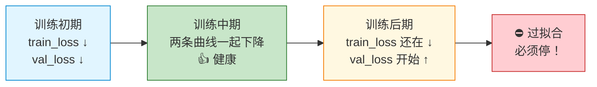

**实操做法——Early Stopping（早停）**：

```python
best_val_loss = float('inf')
patience = 3          # 连续 3 次没改进就停
counter = 0

for epoch in range(max_epochs):
    train_one_epoch(...)
    val_loss = evaluate(val_loader)

    if val_loss < best_val_loss - 1e-4:   # 有明显改进
        best_val_loss = val_loss
        save_checkpoint(model)             # 保存"目前最好"的版本
        counter = 0
    else:
        counter += 1
        if counter >= patience:
            print("Early stopping!")       # 连跌 N 次就停
            break
```

> 🎯 **形象比喻**：就像跑步训练，**成绩在下降说明在进步**，**成绩反弹说明在劳损**——该休息了。

#### 🚦 信号二：达到预设的"算力预算"或"步数"（大模型最常用）

训练 GPT-3、LLaMA 这种大模型时，**根本没人等到 val_loss 收敛**——太贵了。

业界用 **Scaling Law（规模定律）** 提前算好：
- 模型多大（参数量 N）
- 数据多少（token 数 D）
- 算力多少（FLOPs C）

按公式 `C ≈ 6 · N · D` 估算总预算，**算完即停**。例如：

| 模型 | 训练 token 数 | 训练步数 | 停止理由 |
|---|---|---|---|
| GPT-3 (175B) | 300B tokens | 跑完即停 | 算力预算用完 |
| LLaMA-2 (7B) | 2T tokens | 跑完即停 | 数据规划用完 |
| Chinchilla | 按 N:D ≈ 1:20 配比 | 配比满即停 | Scaling Law 最优点 |

#### 🚦 信号三：下游任务指标饱和（业务向）

如果你的目标是**让模型在某个具体任务上达到某个指标**（比如准确率 > 95%），那就：

```
每隔 N 步 → 在下游任务上评估一次 → 指标连续不再涨 → 停
```

例如：BERT 微调做情感分类，验证集 accuracy 连续 5 个 epoch 不再上涨 → 停。

#### 📋 三种停止信号速查表

| 场景 | 主要看哪个信号 | 典型做法 |
|---|---|---|
| 小模型 / 微调 | val_loss 反弹 | **Early Stopping** + 保存最佳 ckpt |
| 大模型预训练 | 算力预算 / token 数 | 跑完预定步数即停 |
| 业务落地 | 下游任务指标 | 指标饱和即停 |

#### ⚠️ 三个"不能用"的停止信号（小白常踩坑）

| ❌ 错误做法 | 为什么错 |
|---|---|
| "train_loss 降到 0 就停" | train_loss=0 多半是**过拟合**（背答案了），val_loss 早炸了 |
| "loss 看着差不多了就停" | 主观判断不靠谱，**必须看曲线** |
| "跑满预设的 100 个 epoch" | 可能 30 个 epoch 就该停，强跑只会过拟合 |

---

### 12.6 训练数据集长什么样？要什么样的？

**核心答案**：训练数据 = 模型的"教科书"。**教材的质量直接决定学生的水平**——这一句比任何模型架构都重要。

#### 📦 数据长什么样？（不同任务对应不同格式）

| 模型类型 | 数据格式 | 一条样本举例 |
|---|---|---|
| **GPT 类（语言模型）** | **纯文本**，无需标签 | `"今天天气真好，我想去公园散步。"` |
| **BERT 类（MLM 预训练）** | **纯文本**，自动 mask 一部分 | `"今天[MASK]气真好"` → 标签是 `"天"` |
| **机器翻译（Encoder-Decoder）** | **平行语料对** | `("我爱你", "I love you")` |
| **指令微调（SFT）** | **指令 + 回答** | `{"instruction": "翻译", "input": "你好", "output": "Hello"}` |
| **分类任务** | **文本 + 标签** | `("这部电影太棒了！", "正面")` |

**实际文件长这样**（以 GPT 预训练为例，一行一个文档）：

```text
今天天气真好，阳光明媚，适合出门散步。
机器学习是人工智能的一个分支，主要研究如何让计算机从数据中学习。
《三国演义》是中国古典四大名著之一，描写了东汉末年到三国时期的历史。
...（数百亿行）
```

#### 📊 数据要"多大"才够？（量级参考）

| 模型规模 | 推荐 token 数 | 大致体量 | 例子 |
|---|---|---|---|
| 玩具 Transformer（练手） | 1M ~ 10M | 几十 MB | TinyShakespeare |
| 小模型（1 亿参数） | 几十亿 token | 几十 GB | GPT-2 small |
| 中模型（10 亿参数） | 几千亿 token | 几百 GB | LLaMA-1 7B |
| 大模型（百亿参数+） | 几万亿 token | 几 TB ~ 几十 TB | LLaMA-2 70B / GPT-4 |

> 💡 **Chinchilla 法则**：参数量 N 与训练 token 数 D 的最优配比 ≈ **1 : 20**（10 亿参数 → 200 亿 token）。

#### ✅ 好数据集的 5 个标准

| 标准 | 含义 | 反例（坏数据） |
|---|---|---|
| **1. 量大** | 越大越好（前提是质量过关） | 只有 1MB 的语料 |
| **2. 多样** | 涵盖多领域、多风格、多语言 | 只爬了一个论坛 |
| **3. 干净** | 去除乱码、广告、HTML 标签、重复内容 | 含大量 `<div>` 残留 |
| **4. 去重** | 完全相同 / 近似重复的段落要删掉 | 同一篇文章出现 1000 次 |
| **5. 安全合规** | 去除违法、隐私、有害内容 | 含个人身份证号 |

#### 🛠️ 数据预处理流水线（业界标准 5 步）

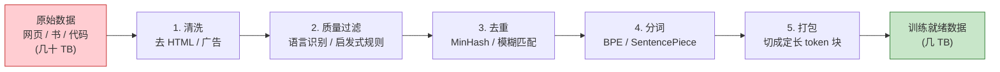

**每一步在干啥**：

| 步骤 | 干啥 | 工具举例 |
|---|---|---|
| **1. 清洗** | 扔掉 HTML 标签、JS 代码、广告、菜单栏 | trafilatura, jusText |
| **2. 质量过滤** | 用规则 / 小模型打分，丢掉低质量段落 | KenLM 困惑度过滤 |
| **3. 去重** | 文档级 + 段落级去重，防止"背答案" | MinHash, SimHash |
| **4. 分词** | 把文本切成 token id（整数序列） | tiktoken, SentencePiece |
| **5. 打包** | 把 token 流切成等长块（如 2048），便于 batch | 自定义脚本 |

#### 📚 入门常用公开数据集

| 数据集 | 规模 | 用途 |
|---|---|---|
| **TinyShakespeare** | ~1 MB | 玩具级，手搓 Transformer 练手 |
| **WikiText-103** | ~500 MB | 学术 benchmark，小模型练手 |
| **OpenWebText** | ~40 GB | GPT-2 复现用 |
| **The Pile** | ~800 GB | 大模型预训练标杆 |
| **C4 (Colossal Clean Crawled Corpus)** | ~750 GB | T5 / LLaMA 用过 |
| **RedPajama** | ~1.2 TB | LLaMA 开源复现版 |

#### ⚠️ 数据集 4 大坑（小白必读）

| 坑 | 后果 | 对策 |
|---|---|---|
| **训练集和验证集"串了"** | val_loss 假性很低，模型其实没学会 | 严格按文档级 / URL 级切分 |
| **数据有大量重复** | 模型背答案，泛化能力差 | 跑一次去重 |
| **类别极不均衡** | 模型只会预测大类，小类全错 | 上采样 / 加权 loss |
| **测试集泄漏到训练集** | 报出来的指标全是"作弊分" | 严格物理隔离测试集 |

#### 🎯 一句话总结

> **训练数据 ≠ "找一堆文本扔进去"**。它是 **"清洗 → 过滤 → 去重 → 分词 → 打包"** 的完整工程，**90% 的模型效果差距来自数据，不是模型架构**。

---

## 13. 推理阶段是什么样？

先区分一个关键点：**推理不一定等于生成。**

第 12 章讲训练时已经区分过三大流派；推理阶段也一样：`Encoder-only` 通常是“一次性理解并输出结果”，`Decoder-only` 是“只靠已有上下文自回归生成”，`Encoder-Decoder` 则是“先编码源序列，再让 Decoder 在源序列条件下生成目标序列”。

### 13.1 三大流派推理方式总览

| 流派 | 典型模型 | 推理时在做什么 | 是否逐 token 生成 | 典型输出 |
|---|---|---|---|---|
| **Encoder-only** | BERT、RoBERTa | 一次性读完整输入，再通过任务头输出结果 | 通常不是 | 分类结果、向量表示、每个 token 的标签、`[MASK]` 填空 |
| **Decoder-only** | GPT、LLaMA | 根据已有上下文预测下一个 token，再拼回去继续预测 | 是 | 续写文本、对话回复、代码补全 |
| **Encoder-Decoder** | 原始 Transformer、T5、BART | Encoder 先读源序列，Decoder 再参考 Encoder 输出逐 token 生成目标序列 | 是 | 翻译、摘要、改写、问答 |

> 💡 **一句话记忆**：`Encoder-only` 像“读完后判断”，`Decoder-only` 像“接龙续写”，`Encoder-Decoder` 像“看着原文翻译 / 摘要”。

### 13.2 `Encoder-only / BERT`：一次性理解输入

`Encoder-only` 推理通常不是生成，而是把完整输入一次性送进 Encoder，再接不同任务头得到结果。

```text
tokens → Encoder → hidden states → 任务头 → 输出结果
```

常见例子：

| 任务 | 输入 | 输出 |
|---|---|---|
| 文本分类 | `这部电影太棒了！` | `正面` |
| 文本匹配 | `句子 A + 句子 B` | `相似 / 不相似` |
| 序列标注 | `我 住 在 北京` | 每个 token 的实体标签 |
| 向量检索 | 一段文本 | 一个句向量 / 文档向量 |
| `MLM` 填空 | `今天 [MASK] 气 真 好` | `[MASK]` 位置的候选 token |

所以，普通 `Encoder-only` 推理一般不需要：

- `logits[:, -1]`；
- `torch.cat([ids, next_token])`；
- `KV-Cache`；
- `Top-k / Top-p` 采样；
- 生成停止条件。

它更关心的是：输入如何编码、任务头如何设计、输出结果如何解释。

### 13.3 `Decoder-only / GPT`：自回归生成

GPT 类模型的生成是**自回归（autoregressive）**的：

```text
输入: "今天天气"
→ 模型预测下一个 token: "真"
→ 拼接: "今天天气真"
→ 再预测: "好"
→ 拼接: "今天天气真好"
→ 直到生成 [END]
```

下面先看一个**教学版**伪代码：它每一步都把完整上下文重新喂给模型，写法最直观，但速度不是最优。

```python
def generate(model, prompt_ids, max_new_tokens=50, end_token_id=None):
    # 这里的 model 指完整语言模型，内部已经包含 Embedding、causal blocks 和 LM Head，输出 logits。
    ids = prompt_ids
    for _ in range(max_new_tokens):
        logits = model(ids)                # (1, L, vocab)
        next_token = logits[:, -1].argmax(-1, keepdim=True)
        ids = torch.cat([ids, next_token], dim=-1)
        if end_token_id is not None and next_token.item() == end_token_id:
            break
    return ids
```

实际项目中，`end_token_id` 通常来自 tokenizer，例如 `tokenizer.eos_token_id`。如果手里只有 Transformer 主体而没有 `LM Head`，还需要先把 hidden states 映射成 `vocab_size` 维的 logits，才能做生成。

**生产版推理通常会再做三类优化**：

| 优化点 | 解决什么问题 | 直观理解 |
|---|---|---|
| **KV-Cache** | 避免每生成 1 个 token 都重算全部历史 | 过去读过的内容先记笔记，下次只看新增部分 |
| **温度 / Top-k / Top-p 采样** | 避免 `argmax` 过于死板，让回答更多样 | 不总选第一名，而是在高分候选里按概率挑 |
| **停止条件** | 避免无限生成 | 遇到结束符、达到最大长度或命中停止词就停 |

> 所以，教学代码适合理解流程；真实框架里的生成函数通常会同时处理 KV-Cache、批量生成、采样策略、停止条件和显存管理。

#### 📖 `Decoder-only / GPT` 生成代码解释

| 函数 / 用法 | 一句话作用 | 形象类比 |
|---|---|---|
| `logits[:, -1]` | 只取最后一个位置的得分（要预测的就是「下一字」） | 只看排行榜最末尾那一行 |
| `.argmax(-1, keepdim=True)` | 沿最后一维取**最大值的下标**（即得分最高的那个 token id）；`keepdim=True` 保留维度形状方便拼接 | 选出冠军的「学号」，并保持卡片形状 |
| `torch.cat([ids, next_token], dim=-1)` | 沿最后一维**拼接张量**，把刚生成的字接到原文末尾 | 接龙：把新写的一字续到尾巴 |
| `next_token.item()` | 把只含一个元素的张量取出 Python 数值，便于和 `end_token_id` 比较 | 拆礼物盒，把里面唯一那颗糖拿出来 |
| `for _ in range(max_new_tokens)` | 最多生成 N 个新 token；`_` 表示用不到循环变量 | 设个「最多续写 50 字」的安全上限，防死循环 |

**参数含义：**

| 函数 / 用法 | 参数 | 含义 |
|---|---|---|
| `generate(model, prompt_ids, max_new_tokens=50, end_token_id=None)` | `model` | 完整语言模型，输入 token id 后输出 `logits`，形状通常是 `(B, L, vocab_size)`。 |
| `generate(...)` | `prompt_ids` | 初始提示词对应的 token id 张量，教学代码通常假设形状是 `(1, L)`。 |
| `generate(...)` | `max_new_tokens` | 最多新生成多少个 token，用来防止无限循环。 |
| `generate(...)` | `end_token_id` | 可选结束符 token id；如果生成到它，就提前停止。 |
| `logits[:, -1]` | `:` | 取所有 batch。 |
| `logits[:, -1]` | `-1` | 取序列最后一个位置，因为生成下一 token 只看最后位置的预测分数。 |
| `.argmax(-1, keepdim=True)` | `-1` | 在词表维度上找分数最高的 token id。 |
| `.argmax(-1, keepdim=True)` | `keepdim=True` | 保留二维形状 `(B, 1)`，方便和原来的 `ids` 拼接。 |
| `torch.cat([ids, next_token], dim=-1)` | `[ids, next_token]` | 要拼接的两个张量：旧上下文和新生成的 token。 |
| `torch.cat([ids, next_token], dim=-1)` | `dim=-1` | 沿最后一维，也就是序列长度维，把新 token 接到末尾。 |

### 13.4 `Encoder-Decoder / T5`：带源序列条件的生成

`Encoder-Decoder` 推理也是生成，但它不是只有一个输入流，而是分成两段：

```text
第一步：Encoder 一次性读取源序列 source
第二步：Decoder 根据已生成的目标前缀 target_prefix，并通过 Cross-Attention 参考 Encoder 输出，逐 token 生成目标序列
```

以机器翻译为例：

```text
source：我 爱 你
Decoder 初始输入：<bos>
→ 生成：I
→ 生成：love
→ 生成：you
→ 生成：<eos>
```

它和 `Decoder-only` 的差别可以这样看：

```text
Decoder-only：
prompt → Decoder → next token

Encoder-Decoder：
source → Encoder → encoder_outputs
encoder_outputs + target_prefix → Decoder → next token
```

这里有两个重要缓存点：

| 缓存对象 | 作用 |
|---|---|
| `encoder_outputs` | 源序列只需要编码一次，后续每一步 Decoder 都可以通过 Cross-Attention 反复参考它 |
| Decoder 侧 `KV-Cache` | 目标序列生成时，避免每一步都重算已经生成过的目标前缀 |

所以，`Encoder-Decoder` 推理既有“先理解输入”的 Encoder 部分，也有“逐 token 生成”的 Decoder 部分。

### 13.5 哪些推理优化只适用于生成？

| 推理优化 | 主要适用对象 | 是否适合普通 `Encoder-only` 分类 |
|---|---|---|
| **KV-Cache** | `Decoder-only` 和 `Encoder-Decoder` 的 Decoder 侧生成 | 通常不需要 |
| **温度 / Top-k / Top-p 采样** | 需要从词表里选择下一个 token 的生成任务 | 通常不需要 |
| **停止条件** | 自回归生成任务 | 通常不需要 |
| **批量推理** | 三大流派都适用 | 适用 |
| **量化 / 蒸馏 / 编译优化** | 三大流派都适用 | 适用 |

> 💡 **小白记忆点**：推理阶段也要先问模型属于哪一派。`Encoder-only` 多半是“读完做判断”，`Decoder-only` 是“接龙生成”，`Encoder-Decoder` 是“看着输入再生成输出”。

---

## 14. 常见问题答疑（FAQ）

**Q1：为什么 attention 要除以 √d_k？**  
A：当 d_k 很大时，Q·K 的点积值会很大，softmax 会非常陡峭（接近 one-hot），梯度近乎为 0，模型学不动。除以 √d_k 让分数维持在合理范围。

**Q2：多头注意力会让参数量增加吗？**  
A：**不会**。8 个头每个 d_k=64，总和还是 d_model=512。是把同一份算力切成多份，不是增加。

**Q3：Transformer 为什么显存吃得这么狠？**  
A：注意力矩阵 $QK^T$ 的形状是 `(L, L)`，序列长度 L=4096 时光这一个矩阵就有 1600 万元素。这是为什么长上下文很难做、催生了 FlashAttention、稀疏注意力等优化。

**Q4：BERT 和 GPT 都是 Transformer，区别是什么？**  
A：
- BERT = **Encoder-only**，做"完形填空"（双向看上下文），擅长理解。
- GPT = **Decoder-only**，做"接龙"（只看左边），擅长生成。

**Q5：现在还需要 Encoder-Decoder 结构吗？**  
A：在翻译、摘要等"输入到输出"任务还是有用（如 T5、BART）。但通用大模型已经用 Decoder-only 一统江湖，因为它够灵活、训练简单。

---

## 15. 学习路线建议


**建议练手项目**：
1. [**nanoGPT**（Karpathy）](https://github.com/karpathy/nanoGPT)：不到 300 行的 GPT。
2. [**MinGPT**（同作者）](https://github.com/karpathy/minGPT)：偏教学，注释更多。
3. [**Hugging Face Transformers**](https://github.com/huggingface/transformers)：调包熟悉接口，再去看源码。

---

## 16. 一图总结

```
        词 token id
            │
            ▼
    [Token Embedding]   ←── 学一个查找表
            │
            +  位置编码    ←── 注入位置信息
            │
            ▼
   ┌─────────────────────────┐
   │   N × Transformer 层    │
   │ ┌─────────────────────┐ │
   │ │ Multi-Head Attn     │ │ ←── 让 token 互相"看"
   │ │ Add & Norm          │ │
   │ │ Feed Forward (FFN)  │ │ ←── 每个位置独立深加工
   │ │ Add & Norm          │ │
   │ └─────────────────────┘ │
   └─────────────────────────┘
            │
            ▼
       上下文感知向量
            │
            ▼
       任务头（分类/生成/...）
```

---

## 17. 基础 Transformer 的演进思路

> 如果你是第一次学习 Transformer，本章可以先快速浏览。等第 1～16 章的基础结构和最小代码都跑通后，再回来细看 RoPE、FlashAttention、GQA、MoE 等现代改进，会更容易吸收。

原版 Transformer（2017）虽然惊艳，但拿到今天来用会暴露很多问题：**显存吃太多、序列长度上不去、推理太慢、位置编码外推差、训练不稳定……** 现代模型并不是把 Transformer 推翻重来，而是在三大流派的骨架上继续“换零件、改训练、提效率”。

所以，本章不再只按技术名词散列，而是先按第 11 章介绍过的三大流派归类：

- **Encoder-only**：重点从“文本理解模型”演进到“更强的表征、检索、多模态编码”。
- **Decoder-only**：重点从“会接龙的语言模型”演进到“会对话、会工具、长上下文、多模态的大模型”。
- **Encoder-Decoder**：重点从“机器翻译模型”演进到“通用文本到文本、摘要、语音识别、图文生成前的条件建模”。

### 17.1 三大流派演进总览

```text
                  原版 Transformer (2017)
                          │
        ┌─────────────────┼─────────────────┐
        ▼                 ▼                 ▼
  Encoder-only       Decoder-only      Encoder-Decoder
  BERT / ViT         GPT / LLaMA       T5 / BART / Whisper
  理解与表征          自回归生成          条件生成 / 序列到序列
        │                 │                 │
        └────── 共通底层改进：位置编码、注意力、归一化、FFN、长上下文、多模态 ──────┘
```

| 流派 | 原始核心能力 | 主要演进方向 | 代表模型 |
|---|---|---|---|
| **Encoder-only** | 双向理解输入 | 更强表征、检索向量、长文理解、多模态编码 | BERT、RoBERTa、DeBERTa、ViT、CLIP 文本塔 |
| **Decoder-only** | 自回归续写 | 指令对齐、长上下文、KV-Cache 优化、MoE、多模态统一生成 | GPT、LLaMA、Qwen、Mistral、DeepSeek |
| **Encoder-Decoder** | 源序列到目标序列 | 文本到文本、去噪生成、翻译摘要、语音识别、跨模态条件生成 | 原版 Transformer、T5、BART、Whisper |

### 17.2 `Encoder-only` 的演进：从“理解文本”到“通用表征”

`Encoder-only` 的核心特点是：**双向看完整输入，一次性输出上下文表示**。它最擅长的不是接龙生成，而是理解、分类、匹配、检索和编码。

```text
输入文本 / 图像 patch / 音频片段
        ↓
Encoder 堆叠
        ↓
上下文表示 hidden states
        ↓
分类头 / 检索向量 / 序列标注头 / 多模态对齐头
```

| 演进方向 | 解决什么问题 | 代表做法 / 模型 |
|---|---|---|
| **预训练任务改进** | 让 Encoder 学到更强的语言理解能力 | BERT 的 `MLM`，RoBERTa 去掉 `NSP` 并扩大数据，DeBERTa 改进位置建模 |
| **位置编码改进** | 让模型更好理解 token 间距离 | 可学习位置编码、相对位置编码、DeBERTa 的 disentangled attention |
| **长文理解** | 普通注意力 $O(L^2)$，长文本吃不消 | Longformer、BigBird 的稀疏注意力 |
| **句向量 / 检索** | 需要把文本变成可比较的向量 | Sentence-BERT、E5、BGE 等 embedding 模型 |
| **视觉编码** | 图像也可以切成 token | ViT 把图片切成 patch，再用 Encoder 编码 |
| **图文对齐** | 让文本和图片进入同一个语义空间 | CLIP 的图像塔 + 文本塔双 Encoder 对比学习 |

> 💡 **理解重点**：`Encoder-only` 的演进主线不是“怎么生成更长文本”，而是“怎么把输入理解得更准、编码得更好、向量表示更有用”。

### 17.3 `Decoder-only` 的演进：从“会接龙”到“通用大模型”

`Decoder-only` 的核心特点是：**只看左边历史 token，自回归预测下一个 token**。现代通用大模型大多走这条路线。

```text
prompt / 历史对话 / 工具结果 / 图像 token
        ↓
Causal Transformer Blocks
        ↓
LM Head 输出下一个 token 分布
        ↓
采样 / 搜索 / 停止条件
        ↓
继续生成
```

| 演进方向 | 解决什么问题 | 代表做法 / 模型 |
|---|---|---|
| **位置编码外推** | 上下文从 2K 扩到 32K、128K、1M+ | RoPE、ALiBi、NTK-aware、YaRN |
| **推理显存优化** | 生成时 `KV-Cache` 越来越大 | MQA、GQA、MLA、PagedAttention |
| **注意力提速** | 训练和推理的 attention 太慢、太吃显存 | FlashAttention、FlashDecoding、滑动窗口注意力 |
| **FFN 改造** | 参数主要集中在 FFN，想更强但不能太贵 | SwiGLU、MoE、Switch Transformer、Mixtral、DeepSeek-MoE |
| **训练稳定性** | 模型越深越难训 | Pre-LN、RMSNorm、DeepNorm、残差缩放 |
| **指令对齐** | 预训练模型只会续写，不一定听指令 | SFT、RLHF、DPO、GRPO |
| **推理增强** | 想让模型更会复杂推理 | CoT、长思考链、强化学习式推理训练，如 OpenAI o1、DeepSeek-R1 |
| **多模态统一生成** | 希望图片、音频、视频也能作为上下文 | GPT-4V、Qwen-VL、Gemini，把图像 patch 或音频 token 接入上下文 |

> 💡 **理解重点**：`Decoder-only` 的演进主线是“如何让自回归生成更强、更长、更快、更便宜、更符合人类意图”。

### 17.4 `Encoder-Decoder` 的演进：从“翻译”到“条件生成”

`Encoder-Decoder` 的核心特点是：**Encoder 先理解源序列，Decoder 再通过 Cross-Attention 参考源序列并生成目标序列**。它适合“输入 A，输出 B”的任务。

```text
source 输入
   ↓
Encoder 输出 encoder_outputs
   ↓              ↘
Cross-Attention    Decoder 已生成前缀 target_prefix
   ↓              ↙
生成下一个目标 token
```

| 演进方向 | 解决什么问题 | 代表做法 / 模型 |
|---|---|---|
| **从翻译到文本到文本** | 希望分类、摘要、问答都统一成生成任务 | T5 把所有任务都写成 text-to-text |
| **去噪预训练** | 让模型学会从损坏输入中恢复目标文本 | BART、mBART、T5 span corruption |
| **Cross-Attention 优化** | Decoder 每步都要参考 Encoder 输出 | 缓存 `encoder_outputs`，Decoder 侧继续使用 `KV-Cache` |
| **相对位置建模** | 源序列和目标序列都需要更好处理距离关系 | T5 relative position bias |
| **多语言 / 翻译** | 一个模型支持多语言互译 | mT5、mBART、NLLB |
| **语音识别** | 音频特征作为源序列，文本作为目标序列 | Whisper 使用 Encoder-Decoder 做语音到文本 |
| **条件生成** | 根据输入约束生成输出 | 摘要、改写、问答、图像描述、代码转换 |

> 💡 **理解重点**：`Encoder-Decoder` 的演进主线是“如何更好地把一个输入序列转换成另一个输出序列”。它也会生成，但生成时始终带着 `encoder_outputs` 这个外部条件。

### 17.5 共通底层零件改进：三大流派都会用到

虽然三大流派的任务形态不同，但很多底层改进是共用的，只是侧重点不同。

| 共通零件 | 典型改进 | 三大流派中的作用 |
|---|---|---|
| **位置编码** | 绝对正弦编码、可学习位置编码、相对位置编码、RoPE、ALiBi | 让模型知道 token 顺序和相对距离；长上下文模型尤其依赖它 |
| **注意力提速** | FlashAttention、稀疏注意力、Linear Attention、滑动窗口注意力 | 降低 $O(L^2)$ 注意力带来的显存和速度压力 |
| **注意力结构** | MHA、MQA、GQA、MLA | 在生成模型中尤其重要，因为它直接影响 `KV-Cache` 大小 |
| **归一化 & 残差** | Post-LN、Pre-LN、RMSNorm、DeepNorm | 让模型堆得更深、训得更稳 |
| **FFN / MoE** | GELU、SwiGLU、Switch Transformer、Mixtral、DeepSeek-MoE | 提升模型容量；MoE 让总参数变大但每个 token 只激活部分专家 |
| **训练范式** | MLM、去噪生成、next-token prediction、SFT、RLHF、DPO、GRPO | 不同流派用不同目标训练，决定模型学到什么能力 |
| **长上下文** | RoPE 外推、YaRN、FlashAttention、滑动窗口、RAG | 让模型处理更长输入；生成模型还要额外管理 `KV-Cache` |
| **多模态** | ViT、CLIP、Whisper、GPT-4V、Qwen-VL、Gemini | 把图像、音频、视频也变成 token 或 embedding，再接入 Transformer |

### 17.6 原来的“8 个演进方向”如何归到三大流派？

| 原演进方向 | `Encoder-only` | `Decoder-only` | `Encoder-Decoder` |
|---|---|---|---|
| **位置编码** | 可学习位置、相对位置、DeBERTa | RoPE、ALiBi、NTK-aware、YaRN | T5 relative position bias、相对位置 |
| **注意力提速** | 长文理解、检索编码更省显存 | 训练和生成都提速 | 编码源序列、解码目标序列都提速 |
| **注意力结构** | 主要关注长文稀疏注意力 | MQA / GQA / MLA 重点服务 `KV-Cache` | Decoder 侧可用 `KV-Cache`，Cross-Attention 参考 Encoder 输出 |
| **归一化 & 残差** | 深层 Encoder 更稳 | 现代大模型常用 Pre-LN / RMSNorm | Encoder 和 Decoder 都需要稳定训练 |
| **FFN / MoE** | 可用于更强 Encoder 或 embedding 模型 | 主流大模型大量使用 SwiGLU / MoE | T5 / Switch Transformer 等常见 MoE 路线 |
| **训练 & 对齐** | MLM、对比学习、embedding 训练 | next-token、SFT、RLHF、DPO、GRPO | 去噪生成、span corruption、seq2seq 监督训练 |
| **上下文长度** | 长文分类、长文检索 | 长对话、长文档生成、Agent 记忆 | 长文摘要、长文翻译、长输入问答 |
| **多模态** | ViT、CLIP、图文向量对齐 | 图像 / 音频 token 进入统一生成上下文 | Whisper、图像描述、条件生成 |

### 17.7 给初学者的演进学习路径

如果你按“三大流派”来学，建议这样走：

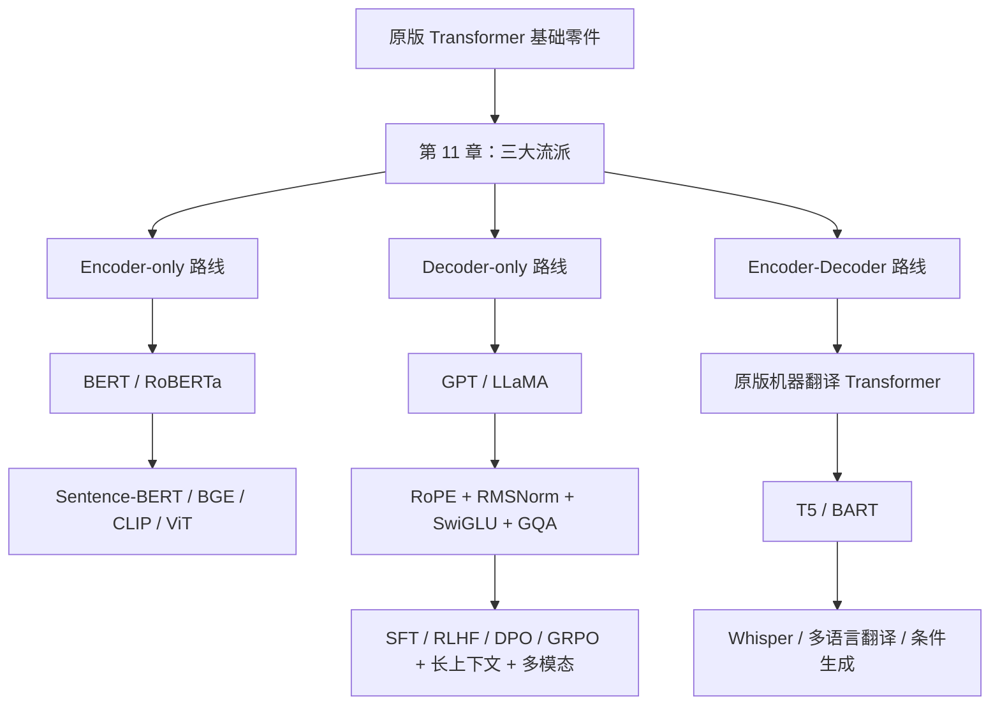

**学习建议**：

- **先抓主线**：先判断一个新模型属于 `Encoder-only`、`Decoder-only` 还是 `Encoder-Decoder`，再看它改了哪些零件。
- **看现代大模型源码**：`LLaMA` 系列适合理解 `Decoder-only` 的现代默认配置：RoPE + RMSNorm + SwiGLU + GQA。
- **看理解类模型**：`BERT / RoBERTa / DeBERTa` 适合理解 `Encoder-only` 如何做文本理解和表征学习。
- **看序列到序列模型**：`T5 / BART / Whisper` 适合理解 `Encoder-Decoder` 如何做条件生成。
- **不要死记技术名词**：看到 RoPE、GQA、MoE、FlashAttention、RLHF 时，先问它是在解决“位置、注意力、FFN、训练、推理、对齐”中的哪个问题。

推荐阅读：

- [BERT 论文](https://arxiv.org/abs/1810.04805)
- [T5 论文](https://arxiv.org/abs/1910.10683)
- [LLaMA 论文](https://arxiv.org/abs/2302.13971)
- [LLaMA-2 论文](https://arxiv.org/abs/2307.09288)
- [FlashAttention](https://arxiv.org/abs/2205.14135)
- [RoFormer（RoPE 原论文）](https://arxiv.org/abs/2104.09864)
- [Mixtral of Experts](https://arxiv.org/abs/2401.04088)
- [DeepSeek-V3 技术报告](https://arxiv.org/abs/2412.19437)

### 17.8 一句话总结演进史

> **基础 Transformer 解决了“能不能做”，三大流派决定了“拿它做什么”，现代演进解决的是“做得准不准、快不快、长不长、稳不稳、贵不贵、像不像人”。**

抓住“**三大流派 + 共通零件改进**”这两层结构，再去看任何新论文，你都能先把它放到正确的模型家族里，再判断它改的是哪个零件，不会迷路。

---

## 18. 写在最后

- Transformer **不难**，难的是数学符号让人望而却步。**抓住"注意力 = 加权平均，权重靠相似度"这一条主线**，其它都是工程包装。
- 一定要**自己敲一遍**最小代码，跑通比看 100 篇博客都顶用。
- 看懂原版后，再去看 RoPE、ALiBi、GQA、MoE、FlashAttention、长上下文等现代演进，会非常顺。

> 学懂这一篇，你已经具备阅读 90% 大模型论文的基础。下一步，去玩 nanoGPT 吧！🚀

---

## 附录 A：代码常用 API 速查表

本文代码以 `PyTorch` 为主。下面把代码段里反复出现、对理解 Transformer 很关键的 API 集中整理，方便你在阅读代码时随时查询。

### A.1 张量创建与基础数学

| API | 定义 / 作用 | 在本文中的典型用途 | 小白理解 |
|---|---|---|---|
| `torch.tensor(data)` | 把 Python 列表、数字等转换成 PyTorch 张量 | 把 token id 列表变成模型可计算的输入 | 把普通数据装进“可计算容器” |
| `torch.zeros(shape)` | 创建指定形状的全 0 张量 | 初始化位置编码表 `pe` | 先铺一张空白表格 |
| `torch.ones(shape)` | 创建指定形状的全 1 张量 | 构造 mask 的基础矩阵 | 先生成一张全是“允许”的表 |
| `torch.arange(start, end, step)` | 创建等差整数序列 | 生成位置下标、偶数维下标 | 给每个位置编号 |
| `torch.randint(low, high, shape)` | 随机生成整数张量，范围是 `[low, high)` | 模拟一批 token id 输入 | 随机造一批练习题 |
| `torch.sin(x)` / `torch.cos(x)` | 对张量逐元素计算正弦 / 余弦 | 构造原版正弦位置编码 | 给位置生成周期性“指纹” |
| `torch.exp(x)` | 对张量逐元素计算指数函数 | 计算位置编码中的频率系数 | 生成不同速度的“波” |
| `math.log(x)` | 计算自然对数 | 配合 `torch.exp` 生成频率系数 | 用数学变形稳定计算比例 |
| `math.sqrt(x)` | 计算平方根 | Attention 中除以 `sqrt(d_k)` | 防止分数过大，稳定 softmax |

### A.2 张量形状与维度操作

| API | 定义 / 作用 | 在本文中的典型用途 | 小白理解 |
|---|---|---|---|
| `.shape` | 查看张量整体形状 | 查看 `tokens`、`embedding`、`out` 的维度 | 看盒子有几层、几行、几列 |
| `.size(dim)` | 查看某一维长度；不传参数时等价于 shape | `x.size(1)` 取序列长度，`Q.size(-1)` 取 `d_k` | 用尺子量某一边有多长 |
| `.unsqueeze(dim)` | 在指定位置插入一个长度为 1 的维度 | 把位置编码补 batch 维，方便广播相加 | 给数组外面套一层薄壳 |
| `.float()` | 把张量转成浮点类型 | 位置编码中需要小数运算 | 把 `5` 变成 `5.0` |
| `.view(new_shape)` | 在不复制数据的前提下重排张量形状 | 把 `(B,L,d_model)` 拆成多头 `(B,L,H,d_k)` | 同一摞卡片重新分组 |
| `.reshape(new_shape)` | 重排张量形状，必要时会复制数据 | 训练时把 logits 拉平成二维做交叉熵 | 把多页表格摊平成一张大表 |
| `.transpose(dim1, dim2)` | 交换两个维度 | 把 K 转置，或把 head 维提前 | 把行和列、或两层顺序调换 |
| `.contiguous()` | 让张量在内存中连续排列 | `transpose` 后再 `view` 前常用 | 把打乱的卡片重新码整齐 |
| `torch.cat(tensors, dim)` | 沿指定维度拼接多个张量 | 生成阶段把新 token 接到已有序列后面 | 把几段纸条接成长纸条 |

### A.3 `nn.Module` 与模型层

| API | 定义 / 作用 | 在本文中的典型用途 | 小白理解 |
|---|---|---|---|
| `nn.Module` | PyTorch 中所有神经网络模块的基类 | 自定义 `MultiHeadAttention`、`EncoderLayer`、`TransformerEncoder` | 搭积木前的标准底座 |
| `super().__init__()` | 调用父类 `nn.Module` 的初始化逻辑 | 每个自定义模型类的 `__init__` 中都要写 | 先办理“模型身份证” |
| `def forward(...)` | 定义模块前向计算过程 | 描述输入如何一步步变成输出 | 告诉积木“数据来了怎么走” |
| `nn.Embedding(vocab_size, d_model)` | 创建可学习的词向量查表矩阵 | 把 token id 转成向量 | 查字典：编号 → 向量 |
| `nn.Embedding.from_pretrained(weights, freeze=...)` | 用已有权重初始化 Embedding | 加载预训练词向量 | 把别人训练好的字典拿来用 |
| `nn.Linear(in_features, out_features)` | 全连接线性层，执行 `y = xW + b` | 生成 Q/K/V、FFN 升维降维、LM Head 输出词表分数 | 一个可学习的“变换器” |
| `nn.LayerNorm(d_model)` | 对每个 token 的向量做层归一化 | Add & Norm 中稳定训练 | 把每个向量的数值拉回稳定范围 |
| `nn.Dropout(p)` | 训练时随机把部分元素置 0 | Attention、FFN 后防止过拟合 | 训练时故意遮住一部分提示，防止死记硬背 |
| `nn.ModuleList([...])` | 保存一组子模块，并让 PyTorch 正确注册参数 | 堆叠多层 `EncoderLayer` | 一个能被模型识别的“模块列表” |
| `self.register_buffer(name, tensor)` | 注册不参与训练、但跟随模型保存和迁移设备的张量 | 保存位置编码 `pe` | 行李里的固定配件，跟着模型走但不训练 |

### A.4 Attention 与 Mask 相关 API

| API | 定义 / 作用 | 在本文中的典型用途 | 小白理解 |
|---|---|---|---|
| `torch.matmul(A, B)` | 矩阵乘法 / 批量矩阵乘法 | 计算 `QKᵀ` 和注意力加权求和 | 让每个 Q 和所有 K 对暗号 |
| `F.softmax(x, dim=-1)` | 沿指定维度把分数归一化成概率分布 | 把 attention scores 变成权重 | 把一堆分数变成“注意力百分比” |
| `.masked_fill(condition, value)` | 满足条件的位置替换为指定值 | 把不能看的 attention 位置设为 `-inf` | 给禁区打码，让 softmax 后权重为 0 |
| `torch.tril(x)` | 取下三角矩阵，其余置 0 | 构造 causal mask | 只允许看自己和过去 |
| `torch.triu(x)` | 取上三角矩阵，其余置 0 | 解释 mask 时作为对照 | 和下三角相反的方向 |
| `float('-inf')` | Python 的负无穷大 | mask 中屏蔽非法位置 | 分数低到永远不会被选中 |

### A.5 激活函数、损失函数与训练循环

| API | 定义 / 作用 | 在本文中的典型用途 | 小白理解 |
|---|---|---|---|
| `F.relu(x)` | ReLU 激活函数，负数变 0，正数保留 | 早期 FFN 示例中的非线性 | 只让正信号通过 |
| `F.cross_entropy(logits, targets)` | 交叉熵损失，内部包含 `log_softmax + NLLLoss` | 语言模型预测下一个 token 时计算 loss | 看模型给正确答案打了多少分 |
| `loss.backward()` | 自动反向传播，计算参数梯度 | 训练循环中的反向阶段 | 根据错误追查每个参数该怎么改 |
| `optimizer.step()` | 根据梯度更新参数 | 训练循环中的更新阶段 | 按老师批改意见改答案 |
| `optimizer.zero_grad()` | 清空上一轮梯度 | 标准训练循环每步开始前使用 | 擦掉上一题的草稿，避免混在一起 |

### A.6 推理与结果读取

| API | 定义 / 作用 | 在本文中的典型用途 | 小白理解 |
|---|---|---|---|
| `logits[:, -1]` | 取每个序列最后一个位置的词表分数 | 自回归生成时预测下一个 token | 只看当前最后一步的排行榜 |
| `.argmax(dim, keepdim=True)` | 沿指定维度取最大值下标，可保留维度 | 贪心解码选择最高分 token | 选排行榜第一名 |
| `.item()` | 把只含一个元素的张量转成 Python 数值 | 判断是否生成了 `END_TOKEN` | 从盒子里取出唯一那颗糖 |
| `.eval()` | 切换到推理模式，关闭 Dropout 等训练行为 | 正式推理 / 验证前使用 | 考试模式，不再随机遮挡 |
| `.train()` | 切换到训练模式，启用 Dropout 等训练行为 | 训练阶段使用 | 练习模式，允许随机扰动 |

### A.7 Hugging Face 预训练模型相关 API

| API | 定义 / 作用 | 在本文中的典型用途 | 小白理解 |
|---|---|---|---|
| `BertTokenizer.from_pretrained(name)` / `AutoTokenizer.from_pretrained(name)` | 加载指定模型配套的 tokenizer | 使用 BERT 中文分词器 | 拿到和模型训练时一致的“切词规则” |
| `BertModel.from_pretrained(name)` / `AutoModel.from_pretrained(name)` | 加载指定预训练模型权重 | 获取 BERT 的 Embedding 层 | 把别人训练好的大模型下载来用 |
| `model.embeddings.word_embeddings` | BERT 中词嵌入层的位置 | 查看或迁移 BERT 的 Embedding 权重 | 打开 BERT 的“词向量字典” |

> 💡 **查阅建议**：遇到不熟悉的 API，先看它属于哪一类：是“造张量”、是“改形状”、是“网络层”、是“注意力计算”，还是“训练更新”。先判断类别，再看输入输出 shape，代码就会顺很多。

---

## 参考资料

1. [**论文原文**：《Attention Is All You Need》（Vaswani et al., 2017）](https://arxiv.org/abs/1706.03762)
2. [**图解经典博客**：The Illustrated Transformer (Jay Alammar)](https://jalammar.github.io/illustrated-transformer/)
3. [**逐行注释代码**：The Annotated Transformer (Harvard NLP)](http://nlp.seas.harvard.edu/annotated-transformer/)
4. [**中文详细解析**：LLM Internals 中文解析](https://yeasy.gitbook.io/llm_internals/di-yi-bu-fen-ji-chu-pian/01_introduction)
5. [**nanoGPT 项目**](https://github.com/karpathy/nanoGPT)
6. [**Hugging Face Transformers 库**](https://github.com/huggingface/transformers)
7. [**LLaMA 论文**](https://arxiv.org/abs/2302.13971)
8. [**FlashAttention 论文**](https://arxiv.org/abs/2205.14135)
9. [**RoPE 论文**](https://arxiv.org/abs/2104.09864)
10. [**Mixtral of Experts 论文**](https://arxiv.org/abs/2401.04088)

