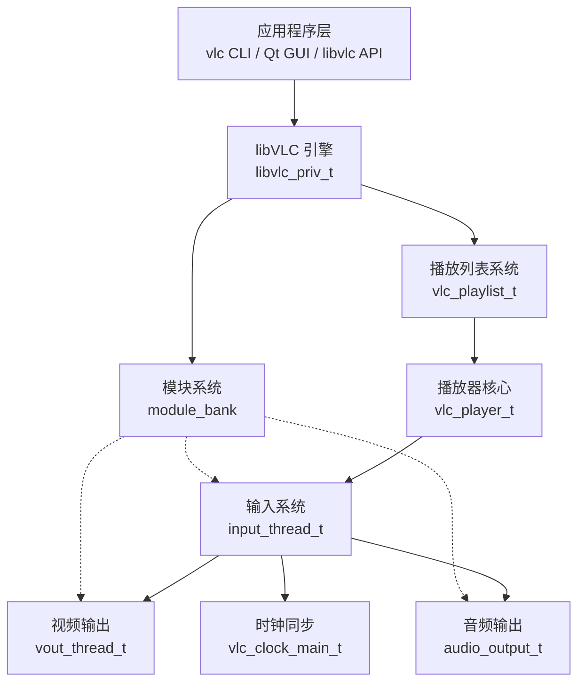

# VLC 源码学习指南

> **项目**: VLC media player (VLC 媒体播放器)  
> **版本**: 4.0.0 (开发版)  
> **语言**: C / C++  
> **License**: GPLv2+ / LGPLv2.1+  
> **更新日期**: 2025

---

## 目录

1. [项目概述](#1-项目概述)
2. [源码结构总览](#2-源码结构总览)
3. [核心概念与架构设计](#3-核心概念与架构设计)
4. [关键数据结构与继承体系](#4-关键数据结构与继承体系)
5. [核心机制深度剖析](#5-核心机制深度剖析)
6. [关键模块源码分析](#6-关键模块源码分析)
7. [调试环境与学习路径](#7-调试环境与学习路径)
8. [设计洞察与最佳实践](#8-设计洞察与最佳实践)

---

## 1. 项目概述

### 1.1 什么是 VLC？

VLC media player 是一款自由、开源的跨平台多媒体播放器，由 VideoLAN 项目开发。它支持几乎所有常见的多媒体格式，无需安装额外的解码器包。

**核心特点**:
- 跨平台支持 (Windows, macOS, Linux, Android, iOS 等)
- 支持多种网络流媒体协议 (HTTP, RTSP, RTP, HLS 等)
- 高度模块化的插件架构
- 完整的多媒体处理流水线

### 1.2 目录结构映射

```
vlc/
├── src/                    # 核心源代码
│   ├── libvlc.h/.c        # libVLC 引擎核心
│   ├── player/            # 播放器核心逻辑
│   ├── input/             # 输入系统 (access/demux/decoder)
│   ├── video_output/      # 视频输出系统
│   ├── audio_output/      # 音频输出系统
│   ├── playlist/          # 播放列表管理
│   ├── misc/              # 通用工具 (变量系统、线程、消息)
│   ├── modules/           # 模块加载系统
│   ├── clock/             # 时钟同步系统
│   └── network/           # 网络功能
├── include/               # 公共头文件
│   ├── vlc.h             # 顶层 include
│   ├── vlc_common.h      # 通用类型定义
│   ├── vlc_player.h      # 播放器公共 API
│   ├── vlc_es.h          # ES (Elementary Stream) 格式定义
│   └── vlc_modules.h     # 模块系统 API
├── modules/               # 插件模块实现
│   ├── access/           # 访问模块 (文件、网络等)
│   ├── demux/            # 解复用模块
│   ├── codec/            # 编解码器模块
│   ├── stream_filter/    # 流过滤器
│   ├── packetizer/       # 打包器
│   ├── video_output/     # 视频输出插件
│   ├── audio_output/     # 音频输出插件
│   └── gui/              # 图形界面模块
├── lib/                   # libVLC 公共 API 实现
├── bin/                   # 可执行入口 (vlc.c, vlc_getopt.c)
├── doc/                   # 文档
├── test/                  # 测试代码
└── extras/                # 平台特定 extras
```

### 1.3 技术栈概览

| 层次 | 技术 | 说明 |
|------|------|------|
| 语言 | C (主要), C++ (部分模块) | 核心引擎用 C 编写 |
| 线程 | pthread (POSIX), Win32 Threads | 通过 `vlc_threads.h` 抽象 |
| 插件 | 动态库 (.so/.dll/.dylib) | 支持静态和动态插件 |
| 构建 | Meson + Ninja | 新构建系统 |
| UI | Qt, macOS Cocoa, Wayland, X11 | 平台特定 GUI |

---

## 2. 源码结构总览

### 2.1 从 main() 到播放

VLC 的启动流程可以概括为以下调用链：

```
main()                          # bin/vlc.c
  └─ libvlc_new()              # lib/libvlc.c - 创建 libvlc 实例
       └─ libvlc_InternalCreate()  # src/libvlc.c:200 - 分配 libvlc_priv_t
            └─ libvlc_InternalInit()   # src/libvlc.c:300 - 完整初始化
                 ├─ module_InitBank()     # src/modules/bank.c - 初始化模块库
                 ├─ module_LoadPlugins()  # 加载所有插件
                 ├─ config_LoadCmdLine()  # 解析命令行参数
                 ├─ config_LoadConfigFile() # 加载配置文件
                 ├─ vlc_LogInit()         # 初始化日志系统
                 └─ vlc_playlist_New()    # 创建播放列表
```

### 2.2 核心子系统关系图



### 2.3 多媒体数据处理流水线

VLC 的核心数据处理流程：

```
┌─────────┐    ┌─────────┐    ┌──────┐    ┌────────┐    ┌────────┐
│ Access  │───▶│ Stream  │───▶│ Demux│───▶│Decoder │───▶│ Output │
│ 模块    │    │ 层      │    │ 模块 │    │ 模块   │    │ 模块   │
└─────────┘    └─────────┘    └──────┘    └────────┘    └────────┘
    │              │              │            │              │
    ▼              ▼              ▼            ▼              ▼
  file://       stream_t      demux_t     decoder_t     vout/aout
  http://       (流抽象)      (解复用)     (解码)       (输出)
  rtsp://                                   ES_out      (显示/播放)
```

---

## 3. 核心概念与架构设计

### 3.1 libVLC 引擎 (`libvlc_priv_t`)

`libvlc_priv_t` 是 VLC 的"单例"对象，管理所有全局资源。

**源码位置**: `src/libvlc.h:50-120`

```c
struct libvlc_priv_t
{
    struct vlc_object_t obj;          // 继承自 VLC 对象基类
    struct vlc::playlist::Playlist &playlist; // 主播放列表
    vlc_playlist_t *main_playlist;    // 主播放列表 (延迟创建)
    vlm_t *p_vlm;                    // VLM (VideoLAN Manager)
    struct intf_thread_t *interfaces; // 界面线程链表
    struct services_discovery_t *p_sd; // 服务发现
    module_bank_t *module_bank;       // 模块库
    // ... 更多字段
};
```

**关键函数**:

| 函数 | 位置 | 说明 |
|------|------|------|
| `libvlc_InternalCreate()` | `src/libvlc.c:200` | 分配 libvlc 实例 |
| `libvlc_InternalInit()` | `src/libvlc.c:300` | 完整初始化流程 |
| `libvlc_InternalCleanup()` | `src/libvlc.c:600` | 清理所有子系统 |
| `libvlc_GetMainPlaylist()` | `src/libvlc.c:180` | 获取主播放列表 |

**小白提示**: `libvlc_priv_t` 就像一个"总指挥部"，所有 VLC 的功能都从这里开始或在这里注册。

**大咖洞见**: VLC 使用不透明指针模式，`libvlc_instance_t` 是公共句柄，内部转换为 `libvlc_priv_t*`。

### 3.2 VLC 对象系统 (`vlc_object_t`)

所有 VLC 对象的基类，提供：

- 对象生命周期管理
- 变量继承系统
- 引用计数

**源码位置**: `include/vlc_common.h:200-260`, `src/misc/objects.c`

```c
struct vlc_object_t
{
    const char *psz_object_type;   // 对象类型名
    void *p_private;               // 私有数据
    struct vlc_object_internals *priv; // 内部数据 (变量、锁等)
    // ...
};
```

**对象创建流程** (`src/libvlc.h:180-200`):

```c
void vlc_object_init(vlc_object_t *obj, const char *type)
{
    obj->psz_object_type = type;
    vlc_mutex_init(&obj->priv->var_lock);
    // 初始化变量系统
    obj->priv->var_root = NULL;
    // ...
}
```

### 3.3 模块化插件架构

VLC 最强大的设计之一是其模块化架构。所有功能（解码、输出、访问等）都通过插件实现。

#### 3.3.1 模块定义宏

**源码位置**: `include/vlc_plugin.h`

```c
// 模块声明示例 (modules/codec/avcodec.c)
vlc_module_begin()
    set_shortname("avcodec")
    set_description("FFmpeg audio/video decoder")
    set_capability("decoder", 100)  // 能力: decoder, 优先级: 100
    set_callback(DecodeBlock)         // 回调函数
    add_shortcut("ffmpeg")
vlc_module_end()
```

#### 3.3.2 模块库 (Module Bank)

**源码位置**: `src/modules/bank.c`

模块加载流程：

```
module_InitBank()               # 初始化模块库
    ├─ 注册核心模块 (内置)
    └─ 准备动态加载
    
module_LoadPlugins()            # 加载所有插件
    ├─ LoadStaticPlugins()      # 加载静态插件
    └─ AllocateAllPlugins()    # 扫描插件目录
        └─ AllocatePluginDir()  # 递归扫描
            └─ vlc_plugin_Map() # 加载插件到内存
```

**模块存储结构**:

```c
// src/modules/bank.c:50
struct module_bank_t {
    vlc_mutex_t lock;           // 保护模块链表
    module_t *head;             // 模块链表头
    vlc_modcap_t *caps_tree;    // 按能力分类的搜索树
    // ...
};
```

**插件缓存机制**:

VLC 使用缓存来加速启动：
- `CACHE_READ_FILE`: 读取缓存文件
- `CACHE_SCAN_DIR`: 扫描目录查找新插件
- `CACHE_WRITE_FILE`: 写入缓存

**小白提示**: 把 VLC 想象成一个"乐高积木盒子"，每个功能块（解码器、输出设备等）都是一个插件，VLC 启动时会把所有积木块都找出来放在盒子里备用。

**大咖洞见**: VLC 使用 `tsearch/twalk` (POSIX) 或自定义红黑树来实现按能力（capability）快速查找模块。

### 3.4 FOURCC 编解码器标识

FOURCC (Four Character Code) 是标识视频/音频编解码器的四字节代码。

**源码位置**: `include/vlc_common.h:150-200`, `include/vlc_fourcc.h`

```c
typedef uint32_t vlc_fourcc_t;

// 宏定义 FOURCC (例如 'H264' -> 0x34363248)
#define VLC_FOURCC(a,b,c,d) \
    ((vlc_fourcc_t)( ((a)<<24)|((b)<<16)|((c)<<8)|(d) ))

// 常见 FOURCC 定义
#define VLC_CODEC_H264  VLC_FOURCC('h','2','6','4')
#define VLC_CODEC_MP4V  VLC_FOURCC('m','p','4','v')
#define VLC_CODEC_AAC   VLC_FOURCC('m','p','4','a')
```

**小白提示**: FOURCC 就像文件的"身份证号"，通过这4个字符，VLC 就知道这个视频是用什么编码的。

---

## 4. 关键数据结构与继承体系

### 4.1 ES (Elementary Stream) 格式

**源码位置**: `include/vlc_es.h`

ES 是 VLC 中表示音视频流的基本单位。

```c
// 格式类型枚举
enum es_format_category_e {
    VIDEO_ES,       // 视频流
    AUDIO_ES,       // 音频流
    SPU_ES,         // 字幕流
    DATA_ES,        // 数据流
};

// ES 格式描述符
struct es_format_t {
    vlc_fourcc_t i_codec;       // 编解码器 FOURCC
    int          i_cat;          // 类别 (VIDEO_ES 等)
    int          i_priority;     // 优先级
    
    union {
        video_format_t video;    // 视频特定信息
        audio_format_t audio;    // 音频特定信息
        subs_format_t subs;      // 字幕特定信息
    } fmt;
    
    // ...
};
```

### 4.2 播放器核心 (`vlc_player_t`)

**源码位置**: `src/player/player.h:300-400`

```c
struct vlc_player_t {
    struct vlc_object_t obj;          // 继承自 VLC 对象
    vlc_mutex_t lock;                 // 播放器锁
    
    struct vlc_list listeners;        // 事件监听器链表
    input_resource_t *resource;       // 输入资源
    vlc_renderer_item_t *renderer;    // 渲染器
    
    input_item_t *media;              // 当前媒体
    struct vlc_player_input *input;   // 当前输入 (正在播放的)
    input_item_t *next_media;         // 下一个媒体
    
    enum vlc_player_state global_state; // 全局状态
    bool started;                      // 是否已启动
    
    struct {
        vlc_thread_t thread;          // 主循环线程
        vlc_cond_t wait;              // 等待条件变量
        struct vlc_list stop_inputs;  // 停止中的输入链表
        // ...
    } mainloop;
    
    struct vlc_player_timer timer;    // 播放计时器
};
```

**播放器输入状态** (`src/player/player.h:50-150`):

```c
struct vlc_player_input {
    input_thread_t *thread;           // 输入线程
    vlc_player_t *player;            // 所属播放器
    bool started;                     // 是否已开始
    
    enum vlc_player_state state;      // 状态
    float rate;                       // 播放速率
    vlc_tick_t length;               // 媒体长度
    bool live;                        // 是否直播流
    
    double position;                  // 播放位置 (0.0-1.0)
    vlc_tick_t time;                  // 当前时间
    
    // 轨道向量
    vlc_player_track_vector video_track_vector;
    vlc_player_track_vector audio_track_vector;
    vlc_player_track_vector spu_track_vector;
    
    struct vlc_player_title_list *titles; // 标题列表
    size_t title_selected;                // 选中的标题
    size_t chapter_selected;              // 选中的章节
    
    struct vlc_list node;           // 链表节点
    // ...
};
```

### 4.3 输入线程 (`input_thread_t`)

**源码位置**: `src/input/input_internal.h:30-100`, `src/input/input_internal.h:400-550`

```c
// 输入线程 (公共部分)
typedef struct input_thread_t {
    struct vlc_object_t obj;        // 继承自 VLC 对象
} input_thread_t;

// 输入线程私有数据
typedef struct input_thread_private_t {
    struct input_thread_t input;    // 公共部分
    
    enum input_type type;           // 类型 (播放/预解析/缩略图)
    bool hw_dec;                    // 是否启用硬件解码
    
    int i_state;                    // 状态 (INIT_S, OPENING_S, ...)
    bool is_running;                // 是否正在运行
    float rate;                     // 播放速率
    
    // 主源和从源
    input_source_t *master;         // 主源
    size_t i_slave;                 // 从源数量
    input_source_t **slave;         // 从源数组 (字幕等)
    
    // ES 输出
    struct vlc_input_es_out *p_es_out;        // ES 输出
    struct vlc_input_es_out *p_es_out_display; // 显示 ES 输出
    
    // 控制 FIFO
    vlc_mutex_t lock_control;      // 控制锁
    size_t i_control;               // 控制命令数量
    input_control_t control[INPUT_CONTROL_FIFO_SIZE]; // 控制 FIFO
    
    vlc_thread_t thread;            // 输入线程句柄
    struct vlc_interrupt_t interrupt; // 中断上下文
    // ...
} input_thread_private_t;
```

**输入状态枚举** (`src/input/input_internal.h:60-70`):

```c
typedef enum input_state_e {
    INIT_S = 0,      // 初始化
    OPENING_S,       // 正在打开
    PLAYING_S,       // 正在播放
    PAUSE_S,         // 暂停
    END_S,           // 结束
    ERROR_S,         // 错误
} input_state_e;
```

### 4.4 视频输出 (`vout_thread_t`)

**源码位置**: `src/video_output/vout_internal.h`, `include/vlc_vout.h`

```c
// 视频输出线程
struct vout_thread_t {
    struct vlc_object_t obj;        // 继承自 VLC 对象
    
    // 内部数据 (通过 vout_Internal* 函数访问)
    struct vout_thread_sys_t *p;    // 系统私有数据
    // ...
};
```

**视频输出配置** (`src/video_output/vout_internal.h:40-50`):

```c
typedef struct {
    vout_thread_t        *vout;
    vlc_clock_t          *clock;       // 时钟
    const char           *str_id;      // 字符串 ID
    const video_format_t *fmt;         // 视频格式
    vlc_mouse_event      mouse_event;  // 鼠标事件回调
    void                 *mouse_opaque; // 鼠标事件数据
} vout_configuration_t;
```

### 4.5 时钟同步系统

**源码位置**: `src/clock/clock.h`, `src/clock/clock.c`

```c
// 时钟主结构
struct vlc_clock_main_t {
    vlc_mutex_t lock;               // 时钟锁
    
    vlc_tick_t start_time;          // 启动时间
    vlc_tick_t first_pcr;           // 第一个 PCR
    vlc_tick_t last_pcr;            // 最后一个 PCR
    
    unsigned rate;                  // 速率
    vlc_tick_t dejitter;            // 去抖动延迟
    vlc_tick_t input_dejitter;      // 输入去抖动
    
    struct vlc_clock_t *master;     // 主时钟
    // ...
};

// 时钟接口
struct vlc_clock_t {
    vlc_clock_main_t *owner;        // 所属的时钟主
    const struct vlc_clock_cbs *cbs; // 回调函数
    void *cbs_data;                 // 回调数据
    // ...
};
```

**时钟源类型** (`src/clock/clock.h:30-35`):

```c
enum vlc_clock_master_source {
    VLC_CLOCK_MASTER_AUTO = 0,      // 自动选择主时钟
    VLC_CLOCK_MASTER_AUDIO,         // 音频主时钟
    VLC_CLOCK_MASTER_INPUT,         // 输入主时钟
    VLC_CLOCK_MASTER_MONOTONIC,     // 单调时钟
};
```

---

## 5. 核心机制深度剖析

### 5.1 变量系统 (Variable System)

VLC 的变量系统是对象间通信的核心机制，支持继承、回调和约束。

**源码位置**: `src/misc/variables.c`, `include/vlc_variables.h`

#### 5.1.1 变量结构体

```c
// src/misc/variables.c:50-80
struct variable_t {
    char *psz_name;             // 变量名 (必须是第一个字段)
    vlc_value_t val;            // 当前值
    char *psz_text;             // 显示文本
    
    int i_type;                 // 类型 (VLC_VAR_INTEGER 等)
    unsigned i_usage;           // 引用计数
    
    vlc_value_t min, max, step; // 最小值、最大值、步长
    
    // 回调函数链表
    callback_entry_t *value_callbacks;
    callback_entry_t *list_callbacks;
    
    vlc_cond_t wait;            // 等待条件变量
};
```

#### 5.1.2 变量操作 API

| 函数 | 说明 |
|------|------|
| `var_Create()` | 创建变量 |
| `var_Destroy()` | 销毁变量 |
| `var_Get()` | 获取变量值 |
| `var_Set()` | 设置变量值 |
| `var_AddCallback()` | 添加值变更回调 |
| `var_TriggerCallback()` | 触发回调 |
| `var_Inherit()` | 从配置继承变量值 |

#### 5.1.3 变量继承机制

VLC 对象可以继承父对象的变量值：

```c
// 继承变量的典型用法
int var_InheritInteger(vlc_object_t *obj, const char *name)
{
    // 1. 查找对象自身的变量
    // 2. 如果不存在，查找配置
    // 3. 返回找到的值
}
```

**小白提示**: 变量系统就像 VLC 内部的"消息传递系统"，一个对象改变了某个变量的值，其他关心这个变量的对象会收到通知。

### 5.2 线程与同步原语

**源码位置**: `include/vlc_threads.h`, `src/misc/threads.c`

#### 5.2.1 互斥锁 (Mutex)

```c
// include/vlc_threads.h:200-220
typedef struct {
    atomic_uint value;      // 0=free, 1=locked, 2=contended
    atomic_uint recursion;  // 递归计数 (仅递归锁)
    atomic_ulong owner;     // 所有者线程 ID
} vlc_mutex_t;
```

**互斥锁算法** (Drepper 算法，来自 "Futexes are tricky"):

```c
// src/misc/threads.c:80-120
void vlc_mutex_lock(vlc_mutex_t *mtx)
{
    // 快速路径: 尝试原子交换
    if (vlc_mutex_trylock(mtx) == 0)
        return;
    
    // 慢速路径: 使用 futex 等待
    while (atomic_exchange_explicit(&mtx->value, 2, memory_order_acquire))
        vlc_atomic_wait(&mtx->value, 2);
}
```

#### 5.2.2 条件变量 (Condition Variable)

```c
// include/vlc_threads.h:300-320
typedef struct {
    atomic_uint value;
} vlc_cond_t;

VLC_API void vlc_cond_wait(vlc_cond_t *cond, vlc_mutex_t *mutex);
VLC_API void vlc_cond_signal(vlc_cond_t *cond);
VLC_API void vlc_cond_broadcast(vlc_cond_t *cond);
```

#### 5.2.3 线程取消 (Thread Cancellation)

VLC 支持线程取消点：

```c
// include/vlc_threads.h:50
VLC_API void vlc_testcancel(void);  // 显式取消点

// 可取消的等待
vlc_cancel_t cleanup;
vlc_cleanup_push(vlc_cancel_cleanup, &cleanup);
vlc_cond_wait(&cond, &lock);
vlc_cleanup_pop();
```

### 5.3 多媒体数据处理流水线详解

#### 5.3.1 Access 模块

**职责**: 从各种来源获取数据（文件、网络等）

**源码位置**: `include/vlc_access.h`, `src/input/access.c`

```c
struct access_t {
    struct vlc_object_t obj;
    module_t *p_module;
    
    char *psz_url;             // 访问的 URL
    bool b_preparsing;         // 是否预解析
    
    // 访问控制函数
    ssize_t (*pf_read)(access_t *, void *p_data, size_t i_data);
    block_t *(*pf_block)(access_t *);
    int (*pf_seek)(access_t *, uint64_t);
    int (*pf_control)(access_t *, int i_query, va_list);
    // ...
};
```

#### 5.3.2 Stream 层

**职责**: 在 Access 之上提供流抽象，支持边播放边下载

**源码位置**: `include/vlc_stream.h`, `src/input/stream.c`

```c
struct stream_t {
    struct vlc_object_t obj;
    module_t *p_module;
    
    char *psz_url;             // 流 URL
    uint64_t i_size;           // 流大小
    
    // 流控制函数
    ssize_t (*pf_read)(stream_t *, void *p_data, size_t i_data);
    block_t *(*pf_block)(stream_t *, bool *);
    int (*pf_seek)(stream_t *, uint64_t);
    // ...
};
```

#### 5.3.3 Demux 模块

**职责**: 解析容器格式，分离出 ES 流

**源码位置**: `include/vlc_demux.h`, `src/input/demux.c`

```c
struct demux_t {
    struct vlc_object_t obj;
    module_t *p_module;
    
    char *psz_url;             // demux URL
    es_out_t *out;             // ES 输出接口
    
    // Demux 控制函数
    int (*pf_demux)(demux_t *);
    int (*pf_control)(demux_t *, int i_query, va_list);
    // ...
};
```

#### 5.3.4 Decoder 模块

**职责**: 解码压缩的音视频数据

**源码位置**: `src/input/decoder.c`, `include/vlc_codec.h`

```c
struct decoder_t {
    struct vlc_object_t obj;
    module_t *p_module;
    
    const es_format_t *fmt_in;  // 输入格式
    es_format_t fmt_out;         // 输出格式
    
    // 解码回调函数
    int (*pf_decode)(decoder_t *, block_t *);
    block_t *(*pf_block)(decoder_t *, bool *);
    picture_t *(*pf_decode_video)(decoder_t *, block_t **);
    aout_buf_t *(*pf_decode_audio)(decoder_t *, block_t **);
    // ...
};
```

#### 5.3.5 ES Out 接口

**职责**: 接收解码后的数据，路由到输出

**源码位置**: `src/input/es_out.c`

```c
struct es_out_t {
    void *sys;                 // 私有数据
    
    // ES 输出控制函数
    int (*pf_add)(es_out_t *, es_format_t *);
    void (*pf_del)(es_out_t *, ssize_t i_id);
    int (*pf_send)(es_out_t *, ssize_t i_id, block_t *);
    int (*pf_control)(es_out_t *, int i_query, va_list);
    void (*pf_destroy)(es_out_t *);
};
```

### 5.4 播放列表系统

**源码位置**: `src/playlist/`, `include/vlc_playlist.h`

#### 5.4.1 播放列表结构

```c
// include/vlc_playlist.h:100-150
struct vlc_playlist_t {
    struct vlc_object_t obj;
    
    struct vlc_playlist_item *items;  // 播放项数组
    size_t count;                      // 项目数量
    size_t current;                    // 当前播放索引
    
    enum vlc_playlist_playback_order order;   // 播放顺序
    enum vlc_playlist_playback_repeat repeat; // 重复模式
    
    struct vlc_list listeners;         // 监听器链表
    // ...
};
```

#### 5.4.2 播放顺序模式

```c
// include/vlc_playlist.h:50-60
enum vlc_playlist_playback_order {
    VLC_PLAYLIST_PLAYBACK_ORDER_NORMAL,  // 顺序播放
    VLC_PLAYLIST_PLAYBACK_ORDER_RANDOM,  // 随机播放
};

enum vlc_playlist_playback_repeat {
    VLC_PLAYLIST_PLAYBACK_REPEAT_NONE,   // 不重复
    VLC_PLAYLIST_PLAYBACK_REPEAT_CURRENT, // 重复当前
    VLC_PLAYLIST_PLAYBACK_REPEAT_ALL,    // 重复全部
};
```

#### 5.4.3 随机播放算法

**源码位置**: `src/playlist/randomizer.c`

VLC 使用 Fisher-Yates 洗牌算法实现随机播放：

```c
// src/playlist/randomizer.c:30-80
void vlc_playlist_randomizer_Shuffle(struct vlc_playlist_randomizer *r,
                                      size_t first, size_t last)
{
    for (size_t i = last; i > first; --i) {
        size_t j = first + (rand() % (i - first + 1));
        swap(r->array[i], r->array[j]);
    }
}
```

### 5.5 事件系统

VLC 使用事件回调机制实现模块间通信。

#### 5.5.1 输入事件

**源码位置**: `src/input/input_internal.h:80-300`

```c
// 输入事件类型
typedef enum input_event_type_e {
    INPUT_EVENT_STATE,       // 状态变化
    INPUT_EVENT_DEAD,        // 输入线程结束
    INPUT_EVENT_EOF,         // 文件结束
    INPUT_EVENT_RATE,        // 速率变化
    INPUT_EVENT_TIMES,       // 时间/位置变化
    INPUT_EVENT_TITLE,       // 标题变化
    INPUT_EVENT_CHAPTER,     // 章节变化
    INPUT_EVENT_ES,          // ES 轨道变化
    // ...
} input_event_type_e;

// 输入事件结构
struct vlc_input_event {
    input_event_type_e type;
    union {
        struct vlc_input_event_state state;
        float rate;
        struct vlc_input_event_times times;
        // ...
    };
};
```

#### 5.5.2 播放器事件

**源码位置**: `include/vlc_player.h:200-500`

```c
// 播放器事件回调
struct vlc_player_cbs {
    void (*on_state_changed)(vlc_player_t *player,
                              enum vlc_player_state state,
                              void *data);
    void (*on_rate_changed)(vlc_player_t *player,
                             float rate,
                             void *data);
    void (*on_position_changed)(vlc_player_t *player,
                                 vlc_tick_t time, double position,
                                 void *data);
    void (*on_track_list_changed)(vlc_player_t *player,
                                   enum es_format_category_e cat,
                                   void *data);
    // ...
};
```

---

## 6. 关键模块源码分析

### 6.1 播放器核心 (`src/player/player.c`)

播放器是 VLC 的"指挥中心"，协调输入、输出和用户界面。

#### 6.1.1 播放器创建

**源码位置**: `src/player/player.c:100-200`

```c
vlc_player_t *
vlc_player_New(vlc_object_t *parent,
                enum vlc_player_lock_type lock_type,
                const struct vlc_player_cbs *cbs,
                void *cbs_data)
{
    vlc_player_t *player = vlc_custom_create(parent, sizeof(*player),
                                              "player");
    if (!player)
        return NULL;
    
    vlc_mutex_init(&player->lock);
    vlc_list_init(&player->listeners);
    // 初始化定时器
    vlc_player_InitTimer(player);
    // 创建输入资源
    player->resource = input_resource_New(parent);
    // ...
    return player;
}
```

#### 6.1.2 播放控制

**源码位置**: `src/player/player.c:300-500`

```c
int
vlc_player_Play(vlc_player_t *player)
{
    vlc_player_assert_locked(player);
    
    if (player->input) {
        // 已有一个输入，恢复播放
        input_Start(player->input->thread);
        return VLC_SUCCESS;
    }
    
    // 创建新的输入
    return vlc_player_OpenNextMedia(player);
}

void
vlc_player_Pause(vlc_player_t *player)
{
    vlc_player_assert_locked(player);
    
    if (player->input) {
        input_Stop(player->input->thread);
    }
}
```

#### 6.1.3 时间/位置控制

```c
void
vlc_player_SeekByTime(vlc_player_t *player, vlc_tick_t time,
                        enum vlc_player_seek_speed speed,
                        enum vlc_player_whence whence)
{
    vlc_player_assert_locked(player);
    
    if (!player->input)
        return;
    
    vlc_player_input_SeekByTime(player->input, time, speed, whence);
}
```

### 6.2 输入系统 (`src/input/input.c`)

输入系统是 VLC 数据处理的核心，负责：

1. 打开媒体源
2. 创建 demux 和解码器
3. 控制播放状态

#### 6.2.1 输入线程主循环

**源码位置**: `src/input/input.c:500-800`

```c
static void *Run(void *obj)
{
    input_thread_t *input = obj;
    input_thread_private_t *priv = input_priv(input);
    
    // 主循环
    for (;;) {
        // 处理控制命令
        if (priv->i_control > 0) {
            input_ControlPop(input, &control);
            if (Control(input, &control) == VLC_SUCCESS)
                continue;
        }
        
        // 驱动 demux
        int ret = demux_Demux(priv->master->p_demux);
        if (ret <= 0) {
            // EOF 或错误
            break;
        }
        
        // 等待合适的时机发送下一帧
        vlc_tick_wait(priv->i_pts_delay);
    }
    return NULL;
}
```

#### 6.2.2 ES Out 实现

**源码位置**: `src/input/es_out.c`

ES Out 是输入系统和解码器之间的桥梁：

```c
static int
EsOutSend(es_out_t *out, es_out_id_t *es, block_t *p_block)
{
    // 1. 检查是否需要创建解码器
    if (!es->p_dec) {
        EsOutCreateDecoder(out, es);
    }
    
    // 2. 发送数据到解码器
    decoder_Queue(es->p_dec, p_block);
    
    return VLC_SUCCESS;
}
```

### 6.3 视频输出系统 (`src/video_output/`)

#### 6.3.1 视频输出线程

**源码位置**: `src/video_output/video_output.c`

```c
// 视频输出主线程
static void *Thread(void *object)
{
    vout_thread_t *vout = object;
    vout_thread_sys_t *sys = vout->p;
    
    for (;;) {
        // 1. 等待新图片
        picture_t *picture = picture_fifo_Pop(sys->fifo);
        if (!picture)
            break;
        
        // 2. 渲染图片
        vout_RenderPicture(sys->display, picture);
        
        // 3. 显示图片
        vout_display_SendEventDisplay(sys->display);
        
        picture_Release(picture);
    }
    return NULL;
}
```

#### 6.3.2 显示模块接口

**源码位置**: `include/vlc_vout_display.h`

```c
struct vout_display_t {
    struct vlc_object_t obj;
    
    video_format_t source;      // 源视频格式
    vout_display_cfg_t cfg;    // 显示配置
    
    // 显示控制函数
    int (*prepare)(vout_display_t *, picture_t *, subpicture_t *);
    void (*display)(vout_display_t *, picture_t *, subpicture_t *);
    int (*control)(vout_display_t *, int query, va_list);
    void (*close)(vout_display_t *);
    // ...
};
```

### 6.4 时钟同步 (`src/clock/clock.c`)

#### 6.4.1 时钟更新

**源码位置**: `src/clock/clock.c:100-200`

```c
vlc_tick_t
vlc_clock_Update(vlc_clock_t *clock, vlc_tick_t system_now,
                 vlc_tick_t ts, double rate)
{
    vlc_clock_main_t *main_clock = clock->owner;
    
    vlc_mutex_lock(&main_clock->lock);
    
    // 计算漂移
    vlc_tick_t drift = ts - clock->last_ts;
    clock->last_ts = ts;
    
    // 更新主时钟
    if (clock == main_clock->master) {
        main_clock->last_system = system_now;
        main_clock->last_ts = ts;
        
        // 触发回调
        if (main_clock->cbs && main_clock->cbs->on_update) {
            main_clock->cbs->on_update(system_now, ts, rate,
                                       0, 0, main_clock->cbs_data);
        }
    }
    
    vlc_mutex_unlock(&main_clock->lock);
    return drift;
}
```

#### 6.4.2 音视频同步

音频是主时钟时，视频需要同步到音频：

```c
// 在视频解码器中
vlc_tick_t system_pts = vlc_clock_ConvertToSystem(clock, system_now,
                                                   pts, rate, &clock_id);
if (system_pts > system_now) {
    // 视频太早，等待
    vlc_tick_wait(system_pts);
} else if (system_pts < system_now - VLC_TICK_FROM_MS(100)) {
    // 视频太晚，丢弃
    picture_Release(picture);
}
```

---

## 7. 调试环境与学习路径

### 7.1 构建 VLC 调试版本

```bash
# 1. 克隆仓库
git clone https://code.videolan.org/videolan/vlc.git
cd vlc

# 2. 安装依赖 (Ubuntu/Debian)
sudo apt-get install \
    build-essential pkg-config libtool automake autoconf \
    libdvbpsi-dev libbluray-dev libxcb-xkb-dev \
    libx11-xcb-dev libxcb-randr0-dev libxcb-xv0-dev \
    libxcb-keysyms1-dev libxcb-shm0-dev \
    libavcodec-dev libavformat-dev libavutil-dev libswscale-dev \
    liba52-0.7.4-dev libx264-dev libfreetype6-dev \
    libfribidi-dev libass-dev libmad0-dev \
    libogg-dev libvorbis-dev libflac-dev \
    libqt5gui5 libqt5x11extras5-dev qtbase5-dev

# 3. 配置 (调试版本)
./bootstrap
./configure --enable-debug --disable-optimizations \
    --enable-run-as-root \
    --prefix=/usr/local

# 4. 编译
make -j$(nproc)

# 5. 安装 (可选)
sudo make install
```

### 7.2 使用 GDB 调试 VLC

#### 7.2.1 启动调试

```bash
# 启动 GDB
gdb --args ./vlc --verbose 2 path/to/media.mp4

# 设置断点
(gdb) break libvlc_InternalInit
(gdb) break input_Start
(gdb) break vlc_player_Play

# 运行
(gdb) run
```

#### 7.2.2 常用调试命令

```gdb
# 查看 backtrace
(gdb) bt
(gdb) bt full

# 查看变量
(gdb) print *player
(gdb) print player->global_state

# 查看链表
(gdb) set $node = player->listeners.next
(gdb) while $node != &player->listeners
> print *(vlc_player_listener_id *)$node
> set $node = $node->next
> end

# 条件断点
(gdb) break es_out.c:EsOutSend if es->fmt.i_cat == VIDEO_ES
```

#### 7.2.3 调试宏 (GDB Python Script)

创建 `~/.gdbinit-vlc`:

```python
# GDB Pretty Printers for VLC
class VLCObjectPrinter:
    def __init__(self, val):
        self.val = val
    
    def to_string(self):
        obj = self.val.cast(gdb.lookup_type('vlc_object_t'))
        return f"vlc_object_t [{obj['psz_object_type']}] at {obj.address}"

# 注册打印机
def register_vlc_printers():
    gdb.pretty_printers.append(VLCObjectPrinter)
```

### 7.3 日志系统

VLC 有强大的日志系统，可以帮助调试。

#### 7.3.1 启用详细日志

```bash
# 命令行启用
vlc -vvv --file-logging --logfile=vlc.log media.mp4

# 仅特定模块
vlc --verbose=2 --debug=input,player,decoder media.mp4
```

#### 7.3.2 在代码中使用日志

```c
#include <vlc_messages.h>

// 打印错误
msg_Err(obj, "Failed to open %s: %m", filename);

// 打印警告
msg_Warn(obj, "Using fallback decoder");

// 打印信息
msg_Info(obj, "Playing %s", url);

// 打印调试信息 (仅调试版本)
msg_Dbg(obj, "pts=%"PRId64, pts);
```

### 7.4 推荐的学习路径

#### 7.4.1 初学者路径 ("小白")

1. **理解整体架构**
   - 阅读 `README.md` 了解项目
   - 理解模块化的概念
   - 运行 VLC 并观察日志

2. **跟踪一个简单的播放流程**
   - 从 `main()` 开始 (`bin/vlc.c`)
   - 跟踪到 `libvlc_InternalInit()`
   - 理解播放列表如何创建

3. **理解一个简单模块**
   - 阅读 `modules/codec/fake.c` (假解码器)
   - 理解 `vlc_module_begin/end` 宏
   - 尝试编写一个 "Hello World" 模块

4. **使用 GDB 实践**
   - 在关键函数设置断点
   - 观察数据结构
   - 理解函数调用链

#### 7.4.2 高级开发者路径 ("大咖")

1. **深入核心数据结构**
   - 研究 `vlc_object_t` 继承体系
   - 理解 `vlc_player_t` 状态机
   - 分析 `input_thread_private_t` 设计

2. **理解多线程架构**
   - 分析输入线程、视频输出线程、音频输出线程的协作
   - 研究时钟同步算法
   - 理解取消点和 cleanup 机制

3. **性能优化分析**
   - 使用 perf 分析热点函数
   - 理解零拷贝机制
   - 研究硬件加速集成

4. **贡献代码**
   - 阅读 `doc/Doxyfile` 了解文档规范
   - 提交 patch 到 [mailman.videolan.org](https://mailman.videolan.org)
   - 参与 code review

### 7.5 有用的工具

| 工具 | 用途 | 命令示例 |
|------|------|----------|
| `gdb` | 调试器 | `gdb --args vlc media.mp4` |
| `valgrind` | 内存检查 | `valgrind --leak-check=full vlc` |
| `perf` | 性能分析 | `perf record vlc`, `perf report` |
| `strace` | 系统调用追踪 | `strace -e trace=open,read vlc` |
| `ltrace` | 库调用追踪 | `ltrace vlc` |
| `vlc-helper` | VLC 辅助脚本 | 自定义 GDB 脚本 |

---

## 8. 设计洞察与最佳实践

### 8.1 架构设计洞察

#### 8.1.1 不透明指针模式

VLC 广泛使用不透明指针来隐藏实现细节：

```c
// 公共 API (include/vlc/libvlc.h)
typedef struct libvlc_instance_t libvlc_instance_t;

// 内部实现 (src/libvlc.h)
struct libvlc_priv_t {
    struct vlc_object_t obj;
    // ... 私有字段
};

// 转换宏
#define libvlc_priv(x) ((libvlc_priv_t *)(x))
```

**优点**:
- 封装实现细节
- 允许修改内部结构而不影响 API
- 编译时类型安全

#### 8.1.2 事件驱动架构

VLC 使用事件回调而非轮询：

```c
// 注册事件回调
vlc_player_AddListener(player, &cbs, data);

// 触发事件
vlc_player_SendEvent(player, on_state_changed, new_state);
```

**优点**:
- 减少 CPU 占用
- 实时响应状态变化
- 解耦模块间依赖

#### 8.1.3 能力 (Capability) 系统

模块通过能力声明自己的功能：

```c
// 解码器能力
set_capability("decoder", 100);

// 视频输出能力
set_capability("video output", 50);
```

**评分机制**:
- 数字越大，优先级越高
- 相同能力可以有多个模块
- 运行时选择最合适的模块

### 8.2 内存管理最佳实践

#### 8.2.1 引用计数

VLC 使用引用计数管理共享资源：

```c
// 增加引用
picture_hold(picture);

// 减少引用 (为 0 时释放)
picture_release(picture);
```

#### 8.2.2 原子操作

**源码位置**: `include/vlc_atomic.h`

```c
// 原子递增
atomic_fetch_add(&counter, 1);

// 原子比较交换 (CAS)
atomic_compare_exchange_strong(&ptr, &expected, desired);
```

#### 8.2.3 溢出检测

**源码位置**: `include/vlc_common.h:350-400`

```c
// 检测加法溢出
if (add_overflow(a, b, &sum)) {
    // 处理溢出
    return VLC_EGENERIC;
}

// 检测乘法溢出
if (mul_overflow(a, b, &product)) {
    // 处理溢出
    return VLC_EGENERIC;
}
```

### 8.3 线程安全最佳实践

#### 8.3.1 锁顺序

VLC 有严格的锁顺序规则，避免死锁：

1. `player->lock` (最外层)
2. `input->lock_control`
3. `vout->p->lock`
4. `aout->lock`

#### 8.3.2 中断上下文

**源码位置**: `src/misc/interrupt.h`

```c
// 创建中断上下文
vlc_interrupt_t *interrupt = vlc_interrupt_create();

// 在可中断操作中
vlc_interrupt_set(interrupt);
ssize_t ret = read(fd, buf, len);
vlc_interrupt_clear();

// 从其他线程中断
vlc_interrupt_kill(interrupt);
```

### 8.4 跨平台兼容技巧

#### 8.4.1 字节序处理

**源码位置**: `include/vlc_common.h:250-300`

```c
// 检测字节序
#if defined(WORDS_BIGENDIAN)
# define VLC_BIG_ENDIAN 1
#else
# define VLC_LITTLE_ENDIAN 1
#endif

// 字节交换
static inline uint16_t vlc_bswap16(uint16_t x) {
    return ((x << 8) | (x >> 8));
}
```

#### 8.4.2 网络字节序转换

```c
// 主机序到网络序
uint16_t htons(uint16_t host);
uint32_t htonl(uint32_t host);

// 网络序到主机序
uint16_t ntohs(uint16_t net);
uint32_t ntohl(uint32_t net);
```

### 8.5 性能优化技巧

#### 8.5.1 零拷贝

VLC 尽量使用零拷贝传递数据：

```c
// 使用 block_t 共享数据
typedef struct block_t {
    uint8_t *p_start;     // 起始地址
    uint8_t *p_buffer;    // 当前位置
    size_t i_buffer;      // 剩余长度
    
    block_t *(*pf_release)(block_t *); // 释放回调
    // ...
} block_t;
```

#### 8.5.2 预分配

```c
// 预分配图片池
picture_pool_t *pool = picture_pool_New(16, NULL);

// 从池中分配
picture_t *pic = picture_pool_Get(pool);
```

#### 8.5.3 分支预测提示

**源码位置**: `include/vlc_common.h:120-140`

```c
// 告诉编译器某个分支更可能被执行
if (likely(!error)) {
    // 热路径
} else {
    // 冷路径
}

if (unlikely(error)) {
    // 错误处理 (不太可能)
}
```

### 8.6 常见陷阱与规避

#### 8.6.1 不要在非取消点阻塞

```c
// 错误: 在取消点外阻塞
while (!ready) {
    sleep(1);  // 无法取消!
}

// 正确: 使用条件变量
vlc_mutex_lock(&lock);
while (!ready) {
    vlc_cond_wait(&cond, &lock);  // 可取消
}
vlc_mutex_unlock(&lock);
```

#### 8.6.2 避免递归锁

```c
// 尽量避免
vlc_mutex_init_recursive(&mtx);

// 更好的设计: 重构代码避免递归
void function_with_lock(void) {
    vlc_mutex_lock(&mtx);
    // 不调用其他需要锁的函数
    vlc_mutex_unlock(&mtx);
}
```

---

## 附录

### A. 常用源码位置速查表

| 功能 | 文件 | 行号 (约) |
|------|------|-----------|
| libVLC 初始化 | `src/libvlc.c` | 300 |
| 模块加载 | `src/modules/bank.c` | 100 |
| 播放器创建 | `src/player/player.c` | 100 |
| 输入线程 | `src/input/input.c` | 500 |
| ES 输出 | `src/input/es_out.c` | 200 |
| 解码器 | `src/input/decoder.c` | 300 |
| 视频输出 | `src/video_output/video_output.c` | 400 |
| 时钟同步 | `src/clock/clock.c` | 100 |
| 变量系统 | `src/misc/variables.c` | 50 |
| 线程原语 | `src/misc/threads.c` | 80 |

### B. 术语表

| 术语 | 解释 |
|------|------|
| **ES** | Elementary Stream, 基本流 (未复用音视频数据) |
| **PCR** | Program Clock Reference, 节目时钟参考 |
| **PTS** | Presentation Time Stamp, 显示时间戳 |
| **DTS** | Decoding Time Stamp, 解码时间戳 |
| **FOURCC** | Four Character Code, 四字符编解码器标识 |
| **SPU** | SubPicture Unit, 子画面单元 (字幕) |
| **VOUT** | Video Output, 视频输出 |
| **AOUT** | Audio Output, 音频输出 |
| **FIFO** | First In First Out, 先入先出队列 |
| **SCR** | System Clock Reference, 系统时钟参考 |

### C. 进一步学习资源

- **官方 Wiki**: [wiki.videolan.org](https://wiki.videolan.org)
- **开发者文档**: `doc/` 目录
- **Doxygen**: 运行 `doxygen doc/Doxyfile`
- **邮件列表**: [mailman.videolan.org](https://mailman.videolan.org)
- **IRC**: `#videolan` on Libera Chat

---

*本文档持续更新中。如有错误或建议，欢迎提交 Issue 或 Pull Request。*

**文档版本**: 1.0  
**最后更新**: 2025  
**作者**: VLC 源码学习指南编写组
