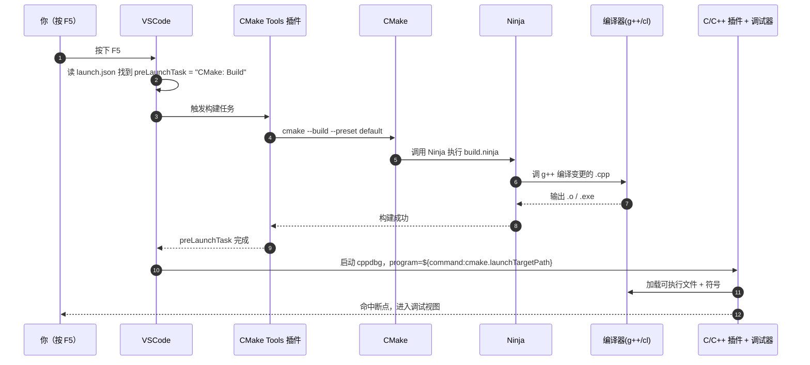
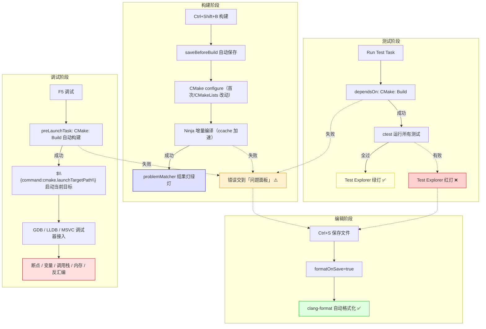
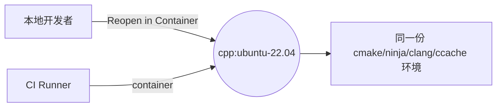

# VSCode + C++ 全流程开发配置实操指南

> 📚 **配套阅读**：本文聚焦「**IDE 侧的工程化配置**」，对应「**做什么**」的部分请参阅
> [《编译构建工具全景指南-Make-CMake-Meson-Ninja等》](./编译构建工具全景指南-Make-CMake-Meson-Ninja等.md)
>
> 🎯 **本文目标**：从「装环境 → 写代码 → 自动构建 → 调试 → 测试 → 提交」给出**可直接落地**的 VSCode C++ 工程模板，覆盖 **Windows / Linux / macOS** 三平台，重点解决「**自动调用**」（保存即编译/格式化、F5 一键构建并调试）。
>
> 🧑‍💻 **适合人群**：
> - 🥉 **小白**：跟着第二、三、四、五章配一遍即可上手
> - 🥈 **工程师**：重点看第七、八、九章的自动化与进阶玩法
> - 🥇 **大咖**：直接跳到第十一章选型清单与第九章远程开发部分

---

## 目录

1. [核心理念：VSCode 是怎么编 C++ 的（必读）](#一核心理念vscode-是怎么编-c-的必读)
2. [整体架构图](#二整体架构图)
3. [环境准备（一次性）](#三环境准备一次性)
4. [推荐工程目录结构](#四推荐工程目录结构)
5. [CMake 工程文件配置](#五cmake-工程文件配置)
6. [.vscode 核心配置（重点）](#六vscode-核心配置重点)
7. [辅助配置文件](#七辅助配置文件)
8. [完整自动化流程图](#八完整自动化流程图)
9. [CMake Tools 状态栏与快捷键](#九cmake-tools-状态栏与快捷键)
10. [进阶玩法：自动化加分项](#十进阶玩法自动化加分项)
11. [调试进阶：你不知道的 VSCode 调试 10 招](#十一调试进阶你不知道的-vscode-调试-10-招)
12. [常见问题排错](#十二常见问题排错)
13. [最佳实践速查清单与速查卡](#十三最佳实践速查清单与速查卡)
14. [附录 A：完整脚手架模板](#十四附录-a完整脚手架模板)
15. [附录 B：CI/CD 集成（GitHub Actions / GitLab CI）](#十五附录-bcicd-集成github-actions--gitlab-ci)

---

## 一、核心理念：VSCode 是怎么编 C++ 的（必读）

> ⚠️ **小白必读，老手可跳**：在动手粘配置之前，**先建立一个心智模型**——只要看懂这一节，后面所有 settings.json / tasks.json / launch.json 都会变成「按图索骥」的体力活，再不会被各种插件和路径绕晕。

### 1.1 一句话本质

> **VSCode 自己根本不会编 C++**，它只是个「**指挥家**」，所有重活都甩给底层工具链：
>
> - 写代码、跳转、补全 → 交给 **clangd** 或 **C/C++ 插件**
> - 配置工程、生成构建脚本 → 交给 **CMake**
> - 真正的编译/链接 → 交给 **Ninja / MSBuild / Make**
> - 启动、断点、单步 → 交给 **GDB / LLDB / MSVC 调试器**
>
> VSCode 通过「**插件**」当桥，把这些工具的输入输出串起来，再用「**.vscode/*.json**」记录串法。

### 1.2 五层职责图

```
┌──────────────────────────────────────────────────────────┐
│ 用户层：你写 .cpp / .h、按 Ctrl+S、按 F5                │
└──────────────────────────────────────────────────────────┘
                          │
                          ▼
┌──────────────────────────────────────────────────────────┐
│ 编辑器层：VSCode（不带编译能力的纯 Electron 文本编辑器）│
└──────────────────────────────────────────────────────────┘
                          │   靠插件桥接
                          ▼
┌──────────────────────────────────────────────────────────┐
│ 插件层（核心调度官）                                     │
│   • CMake Tools  ── 工程管理 / 构建按钮 / 启动目标       │
│   • clangd       ── 智能感知（跳转/补全/重构/clang-tidy）│
│   • C/C++        ── 调试器前端（cppdbg / cppvsdbg）      │
│   • CodeLLDB     ── LLDB 调试器前端（可选）              │
└──────────────────────────────────────────────────────────┘
                          │   通过命令行调用
                          ▼
┌──────────────────────────────────────────────────────────┐
│ 工具链层（真正干活的）                                   │
│   • CMake          → 读 CMakeLists.txt 生成 build.ninja  │
│   • Ninja/MSBuild  → 真正调用 g++/clang++/cl 编译        │
│   • g++/clang++/cl → 出 .o / .obj                        │
│   • ld/lld/link    → 链接成可执行文件                    │
│   • GDB/LLDB/CDB   → 加载可执行文件，提供调试协议        │
└──────────────────────────────────────────────────────────┘
                          │
                          ▼
┌──────────────────────────────────────────────────────────┐
│ 配置层（粘合剂，全部放在工程根目录）                     │
│   .vscode/settings.json  ── 告诉插件「怎么走」           │
│   .vscode/tasks.json     ── 把命令行操作起个名字         │
│   .vscode/launch.json    ── 告诉调试器「调谁、怎么调」   │
│   CMakeLists.txt         ── 告诉 CMake「编什么」         │
│   CMakePresets.json      ── 告诉所有人「用什么参数编」   │
│   .clang-format/.clang-tidy── 告诉 clangd「按什么风格」  │
└──────────────────────────────────────────────────────────┘
```

### 1.3 一次「F5 调试」背后到底发生了什么？

这是新手最常被绕晕的地方，按时间顺序拆解：



**记住三件事**：

1. **F5 = preLaunchTask（构建）+ launch（启动调试）**——任何一步没接好都会失败
2. **`${command:cmake.launchTargetPath}`** 是 CMake Tools 提供给 launch.json 的「魔法变量」，让你不用写死可执行文件路径
3. **构建错了 → 看「问题面板」**（由 `problemMatcher` 把编译器输出解析进来）；**调试错了 → 看「调试控制台」**

建立这个模型之后，你再看后面所有配置文件，就只是在回答三个问题：

- **要装哪些插件？**（让 VSCode 能桥接到工具链）
- **要给插件传什么参数？**（settings.json）
- **怎么把动作串起来？**（tasks.json + launch.json + preLaunchTask）

---

## 二、整体架构图

```
VSCode (编辑器/IDE)
   │
   ├── 插件层
   │     ├── C/C++（智能感知、调试、跳转）
   │     ├── CMake Tools（核心：管理 CMake 工程）
   │     ├── clangd（更强的智能感知，可选替代 C/C++）
   │     ├── CodeLLDB（LLDB 调试，可选）
   │     └── clang-format / clang-tidy / Error Lens 等辅助
   │
   ├── 配置层（.vscode/）
   │     ├── settings.json     ← 工作区设置
   │     ├── tasks.json        ← 自动化任务（构建/格式化/测试）
   │     ├── launch.json       ← 调试配置
   │     ├── c_cpp_properties.json ← IntelliSense 配置（可选）
   │     └── extensions.json   ← 推荐插件
   │
   ├── 工程层
   │     ├── CMakeLists.txt    ← 工程描述
   │     ├── CMakePresets.json ← 配置预设（推荐）
   │     └── .clang-format / .clang-tidy
   │
   └── 工具链层
         ├── 编译器：MSVC / GCC / Clang
         ├── 构建：CMake + Ninja
         ├── 调试：cppdbg (gdb/lldb) / cppvsdbg (MSVC)
         ├── 缓存：ccache / sccache
         └── 测试：CTest + GoogleTest
```

---

## 三、环境准备（一次性）

### 3.1 安装编译器

| 平台 | 推荐工具链 | 安装方式 |
|------|----------|---------|
| **Windows** | MSVC（首选）或 MinGW-w64（轻量） | ① 装 [Visual Studio Build Tools](https://visualstudio.microsoft.com/downloads/)，勾选「使用 C++ 的桌面开发」<br>② 或 `scoop install mingw` / `choco install mingw` |
| **Linux** | GCC / Clang | `sudo apt install build-essential clang clang-tidy clang-format gdb` |
| **macOS** | Apple Clang | `xcode-select --install` |

#### Windows 选 MSVC 还是 MinGW？

| 维度 | MSVC（cl.exe） | MinGW-w64（g++） |
|------|---------------|------------------|
| **生态** | 与 Windows SDK / DirectX / WinRT 深度集成 | GNU 生态、跨平台一致 |
| **调试** | `cppvsdbg`（PDB 体验最好） | `cppdbg + gdb` |
| **二进制兼容** | 与商业 Windows 库（Qt MSVC 版）兼容 | ABI 不同，需 MinGW 版库 |
| **C++ 新特性** | 跟随 VS 版本，更新及时 | 跟随 GCC，跨平台代码首选 |
| **建议** | Windows 商业项目 / 跨 Win 平台 | 学习 / 跨 Linux/macOS 移植 |

> ⚠️ **路径有空格的坑**：MinGW 安装到 `C:\Program Files (x86)\...` 容易踩坑。**强烈建议装到无空格路径**（如 `C:\mingw64\`），并把 `bin/` 加入 `PATH`。

### 3.2 安装核心构建工具

```bash
# Windows (Chocolatey 或 Scoop)
choco install cmake ninja ccache
# 或 scoop install cmake ninja ccache

# Linux
sudo apt install cmake ninja-build ccache

# macOS
brew install cmake ninja ccache
```

### 3.3 安装 VSCode 插件

在 VSCode 里按 `Ctrl+Shift+X`，安装下面这些（**强烈推荐方案**）：

| 插件 | 作用 | 是否必装 |
|------|------|---------|
| **C/C++**（`ms-vscode.cpptools`） | 调试、基础智能感知 | ✅ 必装（至少调试要用） |
| **CMake Tools**（`ms-vscode.cmake-tools`） | CMake 工程管理（核心） | ✅ 必装 |
| **CMake**（`twxs.cmake`） | CMake 语法高亮 | ✅ 推荐 |
| **clangd**（`llvm-vs-code-extensions.vscode-clangd`） | 更强的智能感知 | 🌟 强烈推荐 |
| **CodeLLDB**（`vadimcn.vscode-lldb`） | LLDB 调试器（macOS/Linux 更好用） | 推荐 |
| **clang-format**（已含在 clangd） | 代码格式化 | ✅ |
| **Error Lens**（`usernamehw.errorlens`） | 错误内联显示 | 强烈推荐 |
| **GitLens** | Git 增强 | 推荐 |
| **Doxygen Documentation Generator** | 自动生成函数注释 | 可选 |

### 3.4 智能感知方案选型：C/C++ vs clangd（必读）

这是 **新手最易踩坑的地方**——两个插件**默认都开着智能感知**，会出现：

- 同一行代码出现两条**红波浪线**（一个说有错，一个说没错）
- **跳转到定义**有时跳到 .h，有时跳到 .cpp，行为不一致
- CPU 莫名飙到 100%（两个都在后台索引）

**两套方案二选一**：

| 维度 | 方案 A：C/C++（cpptools） | 方案 B：clangd（推荐 🌟） |
|------|--------------------------|---------------------------|
| **响应速度** | 中 | 快（基于 LLVM，原生增量索引） |
| **跳转准确度** | 中（自有解析器） | 高（编译器同源） |
| **跨平台一致性** | Windows 上更好（懂 MSVC 头） | Linux/macOS/Cross 更好 |
| **clang-tidy 集成** | 需单独配 | 内建，开箱即用 |
| **格式化** | 需 clang-format 插件 | 内建 |
| **配置复杂度** | 低（开箱可用） | 中（需 `compile_commands.json`） |
| **大型工程内存占用** | 大（IntelliSense 全开） | 中（按需索引） |
| **MSVC 私有扩展支持** | ✅ 完美 | ⚠️ 部分受限 |

#### 一句话决策树

```
你的工程主要在哪个平台？
├── 纯 Windows + MSVC + Win SDK → 用「方案 A：C/C++」
├── 跨 Windows / Linux / macOS    → 用「方案 B：clangd」🌟
├── 嵌入式 / 交叉编译 / 大型工程   → 用「方案 B：clangd」🌟
└── 学生 / Demo / 不想折腾        → 用「方案 A：C/C++」
```

> ✅ **本文采用方案 B（clangd）**，第六章 `settings.json` 会演示如何**关掉 C/C++ 的智能感知、只保留它的调试能力**，做到「**clangd 写代码 + C/C++ 调试**」的最优组合。

---

## 四、推荐工程目录结构

```
my-cpp-project/
├── .vscode/
│   ├── settings.json
│   ├── tasks.json
│   ├── launch.json
│   └── extensions.json
├── .clang-format
├── .clang-tidy
├── .gitignore
├── CMakeLists.txt
├── CMakePresets.json
├── include/
│   └── myproject/
│       └── mylib.h
├── src/
│   ├── main.cpp
│   └── mylib.cpp
├── tests/
│   └── test_mylib.cpp
└── build/        ← 不入库
```

---

## 五、CMake 工程文件配置

### 5.1 `CMakeLists.txt`

> ⚠️ **CMake 版本提醒**：本文使用 `cmake_minimum_required(VERSION 3.20)`，但 **Ubuntu 20.04 自带 CMake 仅 3.16**。三种解决方式：
> - **推荐**：用 [Kitware APT 源](https://apt.kitware.com/) 升级到最新版
> - 或 `pip install cmake`（pip 版本通常较新）
> - 或降级到 `3.16`，但要去掉 `CMakePresets v6` 等新特性
>
> Windows / macOS 用户通过 Chocolatey / Homebrew 装的版本一般都 ≥ 3.25，无需担心。

```cmake
cmake_minimum_required(VERSION 3.20)
project(myproject VERSION 1.0.0 LANGUAGES CXX)

# C++ 标准
set(CMAKE_CXX_STANDARD 20)
set(CMAKE_CXX_STANDARD_REQUIRED ON)
set(CMAKE_CXX_EXTENSIONS OFF)

# 导出 compile_commands.json（clangd / clang-tidy 必需）
set(CMAKE_EXPORT_COMPILE_COMMANDS ON)

# ccache 加速（可选）
find_program(CCACHE_PROGRAM ccache)
if(CCACHE_PROGRAM)
    set(CMAKE_CXX_COMPILER_LAUNCHER ${CCACHE_PROGRAM})
endif()

# 主库
add_library(mylib src/mylib.cpp)
target_include_directories(mylib PUBLIC include)

# 主程序
add_executable(myapp src/main.cpp)
target_link_libraries(myapp PRIVATE mylib)

# 测试
enable_testing()
add_subdirectory(tests)
```

### 5.2 `CMakePresets.json`（团队配置统一 + 跨平台）

下面这份 preset 同时覆盖 **Debug / Release / MSVC / MinGW / vcpkg / ASan** 六种常用场景，是本文推荐的「一份管够」模板：

```json
{
  "version": 6,
  "configurePresets": [
    {
      "name": "default",
      "displayName": "Default Debug",
      "generator": "Ninja",
      "binaryDir": "${sourceDir}/build/${presetName}",
      "cacheVariables": {
        "CMAKE_BUILD_TYPE": "Debug",
        "CMAKE_EXPORT_COMPILE_COMMANDS": "ON"
      }
    },
    {
      "name": "release",
      "inherits": "default",
      "displayName": "Release",
      "cacheVariables": { "CMAKE_BUILD_TYPE": "Release" }
    },
    {
      "name": "msvc",
      "inherits": "default",
      "displayName": "MSVC (Windows)",
      "binaryDir": "${sourceDir}/build/msvc",
      "cacheVariables": {
        "CMAKE_C_COMPILER": "cl",
        "CMAKE_CXX_COMPILER": "cl"
      }
    },
    {
      "name": "mingw",
      "inherits": "default",
      "displayName": "MinGW-w64 (Windows)",
      "binaryDir": "${sourceDir}/build/mingw",
      "cacheVariables": {
        "CMAKE_C_COMPILER": "gcc",
        "CMAKE_CXX_COMPILER": "g++"
      }
    },
    {
      "name": "vcpkg",
      "inherits": "default",
      "displayName": "With vcpkg toolchain",
      "binaryDir": "${sourceDir}/build/vcpkg",
      "toolchainFile": "$env{VCPKG_ROOT}/scripts/buildsystems/vcpkg.cmake"
    },
    {
      "name": "asan",
      "inherits": "default",
      "displayName": "Debug + ASan + UBSan",
      "binaryDir": "${sourceDir}/build/asan",
      "cacheVariables": {
        "CMAKE_CXX_FLAGS": "-fsanitize=address,undefined -fno-omit-frame-pointer -g"
      }
    }
  ],
  "buildPresets": [
    { "name": "default", "configurePreset": "default" },
    { "name": "release", "configurePreset": "release" },
    { "name": "asan",    "configurePreset": "asan" }
  ],
  "testPresets": [
    {
      "name": "default",
      "configurePreset": "default",
      "output": { "outputOnFailure": true }
    }
  ]
}
```

> 💡 **关于 `toolchainFile`**：交叉编译、vcpkg、Android NDK、ESP-IDF 等场景都依赖这个字段。指一份外部 `.cmake` 文件去设置编译器 / sysroot / 查找路径，是 CMake 跨平台能力的核心。

### 5.3 包管理集成（vcpkg / Conan / CPM）

现代 C++ 工程离不开依赖管理。三套主流方案选型：

| 方案 | 作为 | 集成方式 | 场景 |
|------|------|---------|------|
| **vcpkg** | 微软官方包管理器 | `toolchainFile` + `vcpkg.json` | 商业项目 / Windows 为主 |
| **Conan** | C/C++ 顶级包管理器 | `conanfile.txt` + `conan_toolchain.cmake` | 跨平台、需多版本并存 |
| **CPM.cmake** | 轻量脚本 | `CPMAddPackage(...)` | 纯 CMake、不想装额外工具 |
| **FetchContent** | CMake 内建 | `FetchContent_Declare(...)` | 小依赖 / 测试库 |

#### vcpkg 快速接入

```bash
# 1. 装 vcpkg
git clone https://github.com/microsoft/vcpkg.git C:\vcpkg
C:\vcpkg\bootstrap-vcpkg.bat   # Linux/macOS 是 .sh
setx VCPKG_ROOT C:\vcpkg       # 设环境变量
```

```json
// vcpkg.json 放在工程根
{
  "name": "myproject",
  "version": "1.0.0",
  "dependencies": [ "fmt", "spdlog", "nlohmann-json" ]
}
```

之后用 `--preset vcpkg` 配置即可，clangd 也会自动从 `compile_commands.json` 里识别到 vcpkg 装的头文件路径。

#### CPM.cmake 快速接入（零依赖脚本）

```cmake
# 下载 CPM.cmake 到 cmake/ 目录后
include(cmake/CPM.cmake)

CPMAddPackage("gh:fmtlib/fmt#10.2.1")
CPMAddPackage("gh:gabime/spdlog@1.13.0")

target_link_libraries(myapp PRIVATE fmt::fmt spdlog::spdlog)
```

---

## 六、`.vscode/` 核心配置（重点）

### 6.1 `settings.json`：工作区设置（自动调用关键）

```json
{
  // ============ CMake Tools 配置 ============
  "cmake.useCMakePresets": "always",
  "cmake.configureOnOpen": true,         // 打开工程自动 configure
  "cmake.buildBeforeRun": true,          // 运行/调试前自动构建 ★
  "cmake.saveBeforeBuild": true,         // 构建前自动保存所有文件 ★
  "cmake.clearOutputBeforeBuild": true,
  "cmake.parallelJobs": 0,               // 0 = 自动按 CPU 核数

  // ============ clangd 智能感知（推荐方案）============
  // ⚠️ 不要用 --compile-commands-dir 硬编码路径！
  // 推荐用工程根的 .clangd 文件描述路径，或者让 clangd 自动邻近搜索。
  // 只要 build/default/compile_commands.json 存在，clangd 会自己找到。
  "clangd.arguments": [
    "--background-index",
    "--background-index-priority=low",   // 大工程下不占满 CPU
    "--clang-tidy",
    "--header-insertion=iwyu",
    "--completion-style=detailed",
    "--function-arg-placeholders=true",
    "--all-scopes-completion",
    "--pch-storage=memory",               // PCH 走内存，SSD 寿命友好
    "-j=4"                                // 后台并发索引线程数
  ],
  "clangd.checkUpdates": true,

  // ============ 关闭 C/C++ 插件的智能感知（避免冲突）============
  "C_Cpp.intelliSenseEngine": "disabled",
  "C_Cpp.autocomplete": "disabled",
  "C_Cpp.errorSquiggles": "disabled",
  "C_Cpp.formatting": "disabled",

  // ============ 自动格式化（保存即格式化）★ ============
  "editor.formatOnSave": true,
  "editor.formatOnType": false,
  "editor.formatOnPaste": true,
  "[cpp]": {
    "editor.defaultFormatter": "llvm-vs-code-extensions.vscode-clangd",
    "editor.tabSize": 4,
    "editor.insertSpaces": true
  },
  "[c]": {
    "editor.defaultFormatter": "llvm-vs-code-extensions.vscode-clangd"
  },

  // ============ 文件保存自动整理 ============
  "files.trimTrailingWhitespace": true,
  "files.insertFinalNewline": true,
  "files.trimFinalNewlines": true,

  // ============ CMake 输出/编辑器集成 ============
  // ⚠️ 路径要与 CMakePresets.json 中的 binaryDir 保持一致！
  // preset 已定义 binaryDir = ${sourceDir}/build/${presetName}，
  // 这里就不要再覆盖 buildDirectory 了，以免 clangd 和 CMake Tools 看到两份不同的路径。
  // "cmake.buildDirectory": "${workspaceFolder}/build/${buildKitVendor}-${buildKitTriple}",
  "cmake.generator": "Ninja",

  // ============ 终端默认 Shell ============
  "terminal.integrated.defaultProfile.windows": "PowerShell",

  // ============ 排除 build 目录 ============
  "files.exclude": {
    "**/build": true,
    "**/.cache": true
  },
  "search.exclude": {
    "**/build": true
  }
}
```

> 🎯 **自动调用的核心三条**：
> 1. `cmake.buildBeforeRun: true` → **F5 调试前自动 build**
> 2. `cmake.saveBeforeBuild: true` → **构建前自动保存所有文件**
> 3. `editor.formatOnSave: true` → **保存即自动格式化**

### 6.2 `tasks.json`：自动化任务

```json
{
  "version": "2.0.0",
  "tasks": [
    {
      "label": "CMake: Configure",
      "type": "shell",
      "command": "cmake",
      "args": ["--preset", "default"],
      "group": "build",
      "problemMatcher": []
    },
    {
      "label": "CMake: Build",
      "type": "shell",
      "command": "cmake",
      "args": ["--build", "--preset", "default", "-j"],
      "group": { "kind": "build", "isDefault": true },
      "problemMatcher": ["$gcc", "$msCompile"],
      "presentation": {
        "reveal": "always",
        "panel": "shared",
        "clear": true
      }
    },
    {
      "label": "CMake: Build Release",
      "type": "shell",
      "command": "cmake",
      "args": ["--build", "--preset", "release", "-j"],
      "group": "build",
      "problemMatcher": ["$gcc", "$msCompile"]
    },
    {
      "label": "CMake: Clean",
      "type": "shell",
      "command": "cmake",
      "args": ["--build", "--preset", "default", "--target", "clean"],
      "group": "build"
    },
    {
      "label": "CTest: Run Tests",
      "type": "shell",
      "command": "ctest",
      "args": ["--preset", "default"],
      "group": { "kind": "test", "isDefault": true },
      "dependsOn": ["CMake: Build"]
    },
    {
      "label": "Format: clang-format All",
      "type": "shell",
      "command": "clang-format",
      "args": ["-i", "src/*.cpp", "include/**/*.h"],
      "problemMatcher": []
    }
  ]
}
```

> 💡 用法：`Ctrl+Shift+B` 直接触发默认构建任务；`Ctrl+Shift+P` → `Tasks: Run Test Task` 跑测试。

### 6.3 `launch.json`：调试配置（一键 F5 调试）

覆盖 **GDB / MinGW / MSVC / LLDB** 四种场景，VSCode 在调试下拉里可一键切换：

```json
{
  "version": "0.2.0",
  "configurations": [
    {
      "name": "(gdb) Linux/macOS Launch",
      "type": "cppdbg",
      "request": "launch",
      "program": "${command:cmake.launchTargetPath}",
      "args": [],
      "stopAtEntry": false,
      "cwd": "${workspaceFolder}",
      "environment": [],
      "externalConsole": false,
      "MIMode": "gdb",
      "miDebuggerPath": "gdb",
      "preLaunchTask": "CMake: Build",
      "setupCommands": [
        {
          "description": "为 gdb 启用整齐打印",
          "text": "-enable-pretty-printing",
          "ignoreFailures": true
        }
      ]
    },
    {
      "name": "(MinGW) Windows Launch",
      "type": "cppdbg",
      "request": "launch",
      "program": "${command:cmake.launchTargetPath}",
      "args": [],
      "stopAtEntry": false,
      "cwd": "${workspaceFolder}",
      "environment": [],
      "externalConsole": false,
      "MIMode": "gdb",
      "miDebuggerPath": "C:/mingw64/bin/gdb.exe",
      "preLaunchTask": "CMake: Build",
      "setupCommands": [
        { "text": "-enable-pretty-printing", "ignoreFailures": true }
      ]
    },
    {
      "name": "(MSVC) Windows Launch",
      "type": "cppvsdbg",
      "request": "launch",
      "program": "${command:cmake.launchTargetPath}",
      "args": [],
      "stopAtEntry": false,
      "cwd": "${workspaceFolder}",
      "environment": [],
      "console": "integratedTerminal",
      "preLaunchTask": "CMake: Build"
    },
    {
      "name": "(CodeLLDB) Launch",
      "type": "lldb",
      "request": "launch",
      "program": "${command:cmake.launchTargetPath}",
      "args": [],
      "cwd": "${workspaceFolder}",
      "preLaunchTask": "CMake: Build"
    },
    {
      "name": "(gdbserver) Remote Attach",
      "type": "cppdbg",
      "request": "launch",
      "program": "${workspaceFolder}/build/default/myapp",
      "miDebuggerServerAddress": "192.168.1.100:1234",
      "cwd": "${workspaceFolder}",
      "MIMode": "gdb",
      "miDebuggerPath": "gdb"
    }
  ]
}
```

> 🔑 关键点：
> - `${command:cmake.launchTargetPath}` 由 CMake Tools 提供，**自动指向当前选中目标**，不用手写路径。
> - `preLaunchTask: "CMake: Build"` → **F5 之前自动构建**；构建失败会阻断 F5，并在「问题面板」亮错。
> - `(gdbserver) Remote Attach` 专为嵌入式 / 服务器调试准备，只要远端跑 `gdbserver :1234 ./myapp` 即可本地 F5 接入。

### 6.4 `extensions.json`：推荐插件（团队成员一键安装）

```json
{
  "recommendations": [
    "ms-vscode.cpptools",
    "ms-vscode.cmake-tools",
    "twxs.cmake",
    "llvm-vs-code-extensions.vscode-clangd",
    "vadimcn.vscode-lldb",
    "usernamehw.errorlens",
    "eamodio.gitlens"
  ]
}
```

---

## 七、辅助配置文件

### 7.1 `.clang-format`（代码风格）

```yaml
BasedOnStyle: Google
IndentWidth: 4
TabWidth: 4
UseTab: Never
ColumnLimit: 100
AccessModifierOffset: -4
AllowShortFunctionsOnASingleLine: Empty
PointerAlignment: Left
SortIncludes: true
```

### 7.2 `.clang-tidy`（静态分析）

```yaml
Checks: >
  -*,
  bugprone-*,
  cppcoreguidelines-*,
  modernize-*,
  performance-*,
  readability-*,
  -modernize-use-trailing-return-type,
  -readability-magic-numbers
WarningsAsErrors: ''
HeaderFilterRegex: '.*'
FormatStyle: file
```

### 7.3 `.gitignore`

```
build/
.cache/
*.user
.vs/
.vscode/ipch/
```

> 💡 **注意：不要把 `compile_commands.json` 加进志略。**
> 它是 clangd / clang-tidy 的生命线。实际组织方式：
> - `build/default/compile_commands.json` 是 CMake 生成的（随 build/ 一起忽略）。
> - 在工程根加一个软链接或在 `.clangd` 里写 `CompileFlags.CompilationDatabase: build/default`，让 clangd 能找到它。
> - 这份文件不需要入库，每个人 clone 后跟他本机的 build/ 重生即可。

推荐同时在工程根加一个 `.clangd`：

```yaml
# .clangd — 入库，使团队成员 clone 即用
CompileFlags:
  CompilationDatabase: build/default
  Add: [-Wall, -Wextra]
Diagnostics:
  ClangTidy:
    FastCheckFilter: Loose
```

---

## 八、完整自动化流程图



> ⚠️ 失败回路说明（虚线箭头）：
> - **编译失败** → `problemMatcher` 把错误从终端变成「问题面板」里的可点击条目。
> - **F5 被阻断** → `preLaunchTask` 失败会弹窗问「是否继续」，默认拒绝调试，避免调了个旧二进制。
> - **format 会不会与 build 接连成死循环？** 不会。`formatOnSave` 不触发 `saveBeforeBuild`（后者只在点「构建」/「F5」时生效）。

---

## 九、CMake Tools 状态栏与快捷键

装好 CMake Tools 插件后，VSCode **底部状态栏**会出现一排按钮：

```
[CMake: [Debug]]  [Kit: GCC 13.2]  [⚙]  [▶ myapp]  [🔨 Build]  [🐛 Debug]
   ↑              ↑                ↑    ↑           ↑           ↑
  构建类型        编译器套件      配置  启动目标    一键构建    一键调试
```

**最常用的快捷键**：

| 快捷键 | 动作 |
|--------|------|
| `F7` | CMake Build |
| `F5` | 调试 |
| `Ctrl+F5` | 不调试直接运行 |
| `Shift+F5` | 停止 |
| `Ctrl+Shift+P` → `CMake: Configure` | 重新配置 |
| `Ctrl+Shift+P` → `CMake: Select Variant` | 切换 Debug/Release |
| `Ctrl+Shift+P` → `CMake: Set Launch/Debug Target` | 选择要调试的可执行文件 |

---

## 十、进阶玩法：自动化加分项

### 10.1 保存即编译（File Watcher）

不推荐对大工程开（编译会卡），但适合 demo / 学习：

```json
// settings.json 加上
"files.autoSave": "onFocusChange",
```

或者装插件 `Trigger Task on Save` 实现「保存时自动执行 build 任务」。

### 10.2 多目标快速切换调试

```json
// launch.json 中
"program": "${command:cmake.launchTargetPath}"
```

配合 CMake Tools 的「Set Launch Target」即可在多个可执行目标间切换，**无需修改 launch.json**。

### 10.3 远程开发：Remote-SSH / WSL / Dev Containers

#### 10.3.1 三种远程开发形态对比

| 方案 | 场景 | 优点 | 代价 |
|------|------|------|------|
| **Remote-SSH** | 连公司服务器 / 云主机 | 启动快，本地不需环境 | 依赖服务器环境允许拉包 |
| **WSL** | Windows 上跑 Linux 编译 | 与 Win 本地文件系统互通 | 只在 Win 能用 |
| **Dev Containers** | 团队环境一致、CI 同构 | 环境即代码，代码入库后多人一致 | 首次拉镜像耗时 |

```
本地 VSCode  ←→  远端 Linux 服务器（编译 + 调试都在远端）
```

#### 10.3.2 Dev Containers 完整模板（强烈推荐、企业项目首选）

在工程根创建 `.devcontainer/devcontainer.json`：

```json
{
  "name": "C++ Dev Container",
  "image": "mcr.microsoft.com/devcontainers/cpp:ubuntu-22.04",
  "features": {
    "ghcr.io/devcontainers/features/common-utils:2": {},
    "ghcr.io/devcontainers/features/git:1": {}
  },
  "postCreateCommand": "sudo apt-get update && sudo apt-get install -y cmake ninja-build clang clang-tidy clang-format gdb ccache",
  "customizations": {
    "vscode": {
      "extensions": [
        "ms-vscode.cpptools",
        "ms-vscode.cmake-tools",
        "llvm-vs-code-extensions.vscode-clangd",
        "usernamehw.errorlens"
      ],
      "settings": {
        "cmake.useCMakePresets": "always",
        "C_Cpp.intelliSenseEngine": "disabled"
      }
    }
  },
  "mounts": [
    "source=${localEnv:HOME}/.ccache,target=/home/vscode/.ccache,type=bind,consistency=cached"
  ]
}
```

一键启动：`Ctrl+Shift+P` → `Dev Containers: Reopen in Container`。本地不需任何 C++ 环境，镜像里什么都有，同事 clone 即用。

#### 10.3.3 与 CI/CD 同构

**重点优势**：Dev Container 镜像可直接复用于 GitHub Actions：

```yaml
# .github/workflows/ci.yml
jobs:
  build:
    runs-on: ubuntu-22.04
    container: mcr.microsoft.com/devcontainers/cpp:ubuntu-22.04   # 同一份！
    steps:
      - uses: actions/checkout@v4
      - run: cmake --preset default && cmake --build --preset default
      - run: ctest --preset default
```

「本地能跑 → CI 一定能跑」。

### 10.4 集成 ccache 加速

`CMakeLists.txt` 已经加了 ccache 探测。验证：

```bash
ccache -s
# 看到 cache hit 比例就成功了
```

### 10.5 集成 GoogleTest + Test Explorer

装插件 **C++ TestMate** 或使用 CMake Tools 自带的 Test 面板，可以**点击单个测试用例运行/调试**，比命令行更直观。

### 10.6 Sanitizer 一键开关

`CMakePresets.json` 中已经预设 `asan` 的 preset（见 5.2 节），切换 preset 即可在普通调试 ↔ 内存检测之间一键切换：

```bash
cmake --preset asan && cmake --build --preset asan && ./build/asan/myapp
```

### 10.7 大型工程性能调优

当你的工程超过 **10万行** 之后，会遇到：clangd 启动后 CPU 100% 跑几分钟、VSCode 卡顿、跳转不准。逐项优化：

#### 优化一：clangd 后台索引降优先级

```json
// settings.json
"clangd.arguments": [
  "--background-index",
  "--background-index-priority=low",  // 默认 normal，改为 low
  "-j=4",                              // 限并发
  "--pch-storage=memory"
]
```

#### 优化二：扫描范围裁剪

```json
// settings.json
"files.watcherExclude": {
  "**/build/**": true,
  "**/.cache/**": true,
  "**/third_party/**": true
},
"search.followSymlinks": false
```

#### 优化三：clangd 索引缓存位置

```yaml
# .clangd 里指定独立缓存目录（避免装入仓）
Index:
  Background: Build
```

默认 clangd 会把索引丢到 `.cache/clangd/`——别忘了加进 `.gitignore`。

#### 优化四：如果 clangd 总是全量重索引

95% 是 `compile_commands.json` 路径每次变了。检查：
- 是不是每次切了 preset，binaryDir 变了路径？→ 用 `.clangd` 里钅住一份路径。
- ccache hit 是否为 0？→ `ccache -s` 调查。

#### 优化五：拆分多 workspace

大仓库里只调试某一个模块时，用 VSCode 「多根 workspace」只打开需要的子目录，clangd 会大幅减少扫描量。

---

## 十一、调试进阶：你不知道的 VSCode 调试 10 招

> 上一章讲了「怎么启动 F5 调试」，本章讲「调起来后还能玩出什么花」，都是实战里极高频但新人未知的技巧。

### 11.1 条件断点 / 函数断点 / 日志断点

右键行号处的红点 → `Edit Breakpoint`：

- **表达式**：`i == 100 && ptr != nullptr`，只有表达式为真才中断。
- **命中次数**：`>=10`，只在第 10 次走到才中断。
- **日志断点 (Logpoint)**：不中断，在调试控制台打印 `i = {i}, name = {name}`——直接替代 90% 的 `printf` 调试，**不需重编译**。

### 11.2 多线程 / 死锁调试

打开 VSCode 的「调用堆栈」面板，顶部列出所有线程。右键某线程可「冻结 / 解冻」，加上 `gdb` 控制台命令：

```
-exec thread apply all bt   # 打印所有线程调用栈
-exec info threads          # 查看线程状态
-exec info mutex            # 查看 mutex占用（需 pthread 调试信息）
```

### 11.3 反汇编 / 寄存器 / 内存视图

- `Ctrl+Shift+P` → `Open Disassembly View`：查看当前函数的汇编。
- 「变量」面板右键变量 → `View in Memory`：原生十六进制内存查看。
- gdb 控制台：`-exec info registers`。

### 11.4 远程调试（gdbserver / lldb-server）

```bash
# 远端
scp myapp user@server:/tmp/
ssh user@server gdbserver :1234 /tmp/myapp
```

本地选 launch.json 里的 `(gdbserver) Remote Attach`，F5 即可。交叉编译应用、嵌入式系统、容器里服务调试都靠这招。

### 11.5 Core Dump 复盘

```json
// launch.json 加
{
  "name": "(coredump) Post-mortem",
  "type": "cppdbg",
  "request": "launch",
  "program": "${workspaceFolder}/build/default/myapp",
  "coreDumpPath": "${workspaceFolder}/core.12345",
  "MIMode": "gdb",
  "miDebuggerPath": "gdb"
}
```

现场抖个 core，本地加载反汇编、栈、变量一样看。

### 11.6 Attach 到进程

```json
{
  "name": "(attach) Pick Process",
  "type": "cppdbg",
  "request": "attach",
  "program": "${workspaceFolder}/build/default/myapp",
  "processId": "${command:pickProcess}",
  "MIMode": "gdb"
}
```

调试后台服务、守护进程必备。

### 11.7 watch 表达式与自定义变量显示

「WATCH」面板 → 加 `myVec.size()` / `*p_obj` / `arr[i]`，可实时跟踪完整表达式。

对 STL/Qt/Boost类，gdb pretty-printer 可让 `std::vector` 显示为「[1, 2, 3]」而不是堆指针，本文 launch.json 中的 `enable-pretty-printing` 已默认开启。

### 11.8 内存 / 资源泄露实时检测

```bash
cmake --preset asan
cmake --build --preset asan
./build/asan/myapp   # 跑到出错会直接报告泄露/越界位置
```

与 VSCode 调试合使用时，ASan 的错误输出会出现在「调试控制台」，可点击跳转。

### 11.9 大文件中的 inline frame 跳过

某些 STL 头文件在调试时会被一脚踩进去。加上：

```json
// launch.json 里
"setupCommands": [
  { "text": "-enable-pretty-printing", "ignoreFailures": true },
  { "text": "skip -gfi /usr/include/c++/*", "ignoreFailures": true }
]
```

### 11.10 与性能分析工具联动

- Linux：`perf record ./myapp` → 用 [hotspot](https://github.com/KDAB/hotspot) 看火焰图。
- macOS：Instruments。
- Windows：Visual Studio Profiler 或 [VTune](https://www.intel.com/content/www/us/en/developer/tools/oneapi/vtune-profiler.html)。
- VSCode 插件：**Profile Viewer** / **vscode-perf**。

---

## 十二、常见问题排错

| 问题 | 原因 | 解决 |
|------|------|------|
| **clangd 报错找不到头文件** | `compile_commands.json` 没生成 | 设 `CMAKE_EXPORT_COMPILE_COMMANDS=ON` 后重新 configure |
| **F5 调试启动了错误的程序** | 没选 Launch Target | 状态栏点「Set Launch Target」 |
| **修改头文件不重新编译** | `file(GLOB)` 或 `.d` 文件丢失 | 用显式列出源文件，或删 `build/` 重配 |
| **断点不生效** | 没用 Debug 模式构建 | 状态栏切到 `Debug` |
| **clang-format 没自动跑** | 默认 formatter 没设对 | 检查 `[cpp]` 块的 `editor.defaultFormatter` |
| **C/C++ 和 clangd 红线打架** | 两个引擎都开了 | 关掉 `C_Cpp.intelliSenseEngine` |
| **Windows 下找不到 cl.exe** | 没在 Developer Command Prompt 里启动 VSCode | 用 CMakePresets 显式指定 `cl`，或从「VS 2022 Developer PowerShell」里启动 `code .` |
| **CMake Tools 找不到 Kit** | 没扫描编译器 | `Ctrl+Shift+P` → `CMake: Scan for Kits` |
| **ccache 没生效** | 路径未配 / 编译器 launcher 没设 | `ccache -s` 看统计；CMake 里加 `CMAKE_CXX_COMPILER_LAUNCHER` |

### 调试构建问题的工具箱

```bash
# 1. 看 CMake 实际生成了什么编译命令
cmake --build build --verbose

# 2. 看可执行文件的动态库依赖
ldd ./myapp                      # Linux
otool -L ./myapp                 # macOS
dumpbin /DEPENDENTS myapp.exe    # Windows

# 3. 看 CMake 缓存变量
cmake -B build -LAH
```

---

## 十三、最佳实践速查清单与速查卡

### 13.1 最佳实践清单

- ✅ **构建系统**：CMake + Ninja + Presets
- ✅ **智能感知**：clangd（关掉 C/C++ 的 IntelliSense）
- ✅ **调试**：cppdbg / cppvsdbg / CodeLLDB（按平台选）
- ✅ **格式化**：保存即自动 clang-format
- ✅ **静态分析**：clangd 自带集成 clang-tidy
- ✅ **加速**：ccache + Ninja + clangd `--background-index-priority=low`
- ✅ **导出 `compile_commands.json`**：clangd 和 clang-tidy 都依赖
- ✅ **`preLaunchTask`**：F5 之前自动构建
- ✅ **`extensions.json`**：团队插件统一
- ✅ **`.clang-format` / `.clang-tidy` / `.clangd`**：风格 & 智能感知统一入库
- ✅ **Dev Containers**：环境即代码，与 CI 同构

### 13.2 三档配置推荐

| 档位 | 适用人群 | 配置组合 |
|------|---------|---------|
| 🥉 **小白** | 学生 / 个人项目 | C/C++ 插件 + CMake Tools + CMakePresets，F5 直接跑 |
| 🥈 **工程师** | 中型团队 / 商业项目 | clangd + CMake Tools + ccache + clang-format/tidy + Sanitizer preset + Remote-SSH |
| 🥇 **大咖** | 大型项目 / 跨平台 | 工程师档 + Dev Containers + 远程构建集群 + sccache + 自定义 Test Explorer + CI 同构镜像 |

> 📝 **术语统一说明**：本文中 🥉 / 🥈 / 🥇 始终对应「小白 / 工程师 / 大咖」（= 小白版 / 工程版 / 大厂版）。

### 13.3 关键配置项速查卡

> 下面这张表是全文出现过的高频配置的「备查字典」，忘了某项叫什么名字时翻这里。

| 想做什么 | 在哪里配 | 配置项 / 值 |
|---------|---------|---------|
| 保存自动格式化 | settings.json | `editor.formatOnSave: true` |
| F5 前自动 build | settings.json | `cmake.buildBeforeRun: true` |
| build 前自动保存 | settings.json | `cmake.saveBeforeBuild: true` |
| 启用 CMakePresets | settings.json | `cmake.useCMakePresets: "always"` |
| 关掉 C/C++ 智能感知 | settings.json | `C_Cpp.intelliSenseEngine: "disabled"` |
| clangd 后台索引低优先级 | settings.json | `clangd.arguments: ["--background-index-priority=low"]` |
| F5 前跳转任务 | launch.json | `"preLaunchTask": "CMake: Build"` |
| 可执行文件路径 不写死 | launch.json | `"program": "${command:cmake.launchTargetPath}"` |
| 导出编译数据库 | CMakeLists.txt | `set(CMAKE_EXPORT_COMPILE_COMMANDS ON)` |
| ccache 加速 | CMakeLists.txt | `set(CMAKE_CXX_COMPILER_LAUNCHER ${CCACHE_PROGRAM})` |
| ASan 检测 | CMakePresets.json | preset `asan` 中 `CMAKE_CXX_FLAGS=-fsanitize=address,...` |
| vcpkg 包管理 | CMakePresets.json | `"toolchainFile": "$env{VCPKG_ROOT}/scripts/buildsystems/vcpkg.cmake"` |
| C++ 风格 | .clang-format | `BasedOnStyle: Google` 等 |
| 静态检查规则 | .clang-tidy | `Checks: ...` |
| clangd 钅住编译数据库路径 | .clangd | `CompileFlags.CompilationDatabase: build/default` |
| 推荐插件清单 | .vscode/extensions.json | `recommendations: [...]` |
| 多人环境一致 | .devcontainer/devcontainer.json | `image / features / postCreateCommand` |

---

## 十四、附录 A：完整脚手架模板

下面给一份**最小可运行**的脚手架，复制粘贴即可使用。

### 14.1 `src/main.cpp`

```cpp
#include "myproject/mylib.h"
#include <iostream>

int main() {
    std::cout << "Hello, " << myproject::greet("VSCode") << "!\n";
    return 0;
}
```

### 14.2 `src/mylib.cpp`

```cpp
#include "myproject/mylib.h"

namespace myproject {

std::string greet(std::string_view name) {
    return std::string("Hello, ") + std::string(name);
}

}  // namespace myproject
```

### 14.3 `include/myproject/mylib.h`

```cpp
#pragma once

#include <string>
#include <string_view>

namespace myproject {

std::string greet(std::string_view name);

}  // namespace myproject
```

### 14.4 `tests/CMakeLists.txt`

```cmake
include(FetchContent)
FetchContent_Declare(
    googletest
    GIT_REPOSITORY https://github.com/google/googletest.git
    GIT_TAG        v1.14.0
)
FetchContent_MakeAvailable(googletest)

add_executable(test_mylib test_mylib.cpp)
target_link_libraries(test_mylib PRIVATE mylib GTest::gtest_main)

include(GoogleTest)
gtest_discover_tests(test_mylib)
```

### 14.5 `tests/test_mylib.cpp`

```cpp
#include "myproject/mylib.h"
#include <gtest/gtest.h>

TEST(MyLibTest, Greet) {
    EXPECT_EQ(myproject::greet("World"), "Hello, World");
}
```

### 14.6 一键启动验证

```bash
# 1. 配置
cmake --preset default

# 2. 构建
cmake --build --preset default -j

# 3. 测试
ctest --preset default --output-on-failure

# 4. 运行
./build/default/myapp
```

VSCode 中：

- 打开工程目录 → CMake Tools 自动 configure
- 状态栏选 Launch Target = `myapp`
- 按 `F5` → 自动构建 + 启动调试 ✅

### 14.7 bootstrap 脚本（一键生成上面所有文件）

#### Linux / macOS：`bootstrap.sh`

```bash
#!/usr/bin/env bash
set -e
NAME="${1:-myproject}"
mkdir -p "$NAME"/{src,include/$NAME,tests,.vscode,.devcontainer}
cd "$NAME"

cat > CMakeLists.txt <<'EOF'
cmake_minimum_required(VERSION 3.20)
project(myproject VERSION 1.0.0 LANGUAGES CXX)
set(CMAKE_CXX_STANDARD 20)
set(CMAKE_CXX_STANDARD_REQUIRED ON)
set(CMAKE_CXX_EXTENSIONS OFF)
set(CMAKE_EXPORT_COMPILE_COMMANDS ON)
find_program(CCACHE_PROGRAM ccache)
if(CCACHE_PROGRAM)
    set(CMAKE_CXX_COMPILER_LAUNCHER ${CCACHE_PROGRAM})
endif()
add_library(mylib src/mylib.cpp)
target_include_directories(mylib PUBLIC include)
add_executable(myapp src/main.cpp)
target_link_libraries(myapp PRIVATE mylib)
enable_testing()
add_subdirectory(tests)
EOF

cat > src/main.cpp <<'EOF'
#include "myproject/mylib.h"
#include <iostream>
int main(){ std::cout << myproject::greet("VSCode") << "\n"; }
EOF

cat > src/mylib.cpp <<'EOF'
#include "myproject/mylib.h"
namespace myproject {
std::string greet(std::string_view n){ return std::string("Hello, ") + std::string(n); }
}
EOF

cat > "include/$NAME/mylib.h" <<'EOF'
#pragma once
#include <string>
#include <string_view>
namespace myproject { std::string greet(std::string_view); }
EOF

echo "✅ 工程脚手架创建完成：$(pwd)"
echo "下一步："
echo "  cd $NAME && code . && 按 F5"
```

使用：
```bash
chmod +x bootstrap.sh
./bootstrap.sh my-cool-app
```

#### Windows：`bootstrap.ps1`

```powershell
param([string]$Name = "myproject")
$dirs = @("src", "include/$Name", "tests", ".vscode", ".devcontainer")
New-Item -ItemType Directory -Force -Path $Name | Out-Null
$dirs | ForEach-Object { New-Item -ItemType Directory -Force -Path "$Name/$_" | Out-Null }
Write-Host "✅ 脚手架创建完成：$Name"
Write-Host "下一步：cd $Name; code .; 按 F5"
```

---

## 十五、附录 B：CI/CD 集成（GitHub Actions / GitLab CI）

> 🎯 **目标**：本地怎么跑，CI 就怎么跑。所有 preset 能被多环境复用是本节的核心。

### 15.1 GitHub Actions 模板

`.github/workflows/ci.yml`：

```yaml
name: CI
on: [push, pull_request]

jobs:
  build:
    strategy:
      fail-fast: false
      matrix:
        os: [ubuntu-22.04, windows-2022, macos-14]
        preset: [default, release]
    runs-on: ${{ matrix.os }}
    steps:
      - uses: actions/checkout@v4

      - name: Install Ninja & Cache
        uses: lukka/get-cmake@latest

      - name: Setup ccache
        uses: hendrikmuhs/ccache-action@v1
        with:
          key: ${{ matrix.os }}-${{ matrix.preset }}

      - name: Configure
        run: cmake --preset ${{ matrix.preset }}

      - name: Build
        run: cmake --build --preset ${{ matrix.preset }} -j

      - name: Test
        if: matrix.preset == 'default'
        run: ctest --preset default --output-on-failure
```

这份 workflow 同时覆盖：
- 三平台（Ubuntu / Windows / macOS）
- Debug + Release 两种 preset
- ccache 跨运行加速
- 在 Debug 上跑测试

### 15.2 GitLab CI 模板

`.gitlab-ci.yml`：

```yaml
image: mcr.microsoft.com/devcontainers/cpp:ubuntu-22.04

stages: [build, test]

cache:
  paths:
    - .ccache/
  key: ${CI_COMMIT_REF_SLUG}

before_script:
  - apt-get update && apt-get install -y cmake ninja-build clang-tidy ccache
  - export CCACHE_DIR=$PWD/.ccache

build:debug:
  stage: build
  script:
    - cmake --preset default
    - cmake --build --preset default -j
  artifacts:
    paths: [build/default/]
    expire_in: 1 day

test:
  stage: test
  needs: [build:debug]
  script:
    - ctest --preset default --output-on-failure
```

### 15.3 与 Dev Container 同构

本文 10.3.2 节的 `mcr.microsoft.com/devcontainers/cpp:ubuntu-22.04` 镜像**可被 CI 与本地同时使用**：



「本地 ≡ CI」是企业级 C++ 工程化的终极形态。

---

## 📌 全文总结

> 三句话讲清 VSCode + C++ 工程化：

1. **核心组合**：`CMake + Ninja + CMakePresets + CMake Tools + clangd`，五件套打通配置 / 构建 / 智能感知 / 调试 / 测试。
2. **「自动调用」的本质**是三个开关：`saveBeforeBuild` + `buildBeforeRun` + `formatOnSave`，加上 `preLaunchTask` 串起整条链。
3. **团队协作的关键**是把 `.vscode/` 与 `CMakePresets.json` 一起入库，新人 clone 即用，「**配置即代码**」。

> 🔗 **延伸阅读**：本文是 IDE 侧的「**怎么用**」，工具链侧的「**做什么 / 怎么选**」请回到
> [《编译构建工具全景指南-Make-CMake-Meson-Ninja等》](./编译构建工具全景指南-Make-CMake-Meson-Ninja等.md)
