# Vulkan 学习指南 —— 从入门到精通

> **文档版本**：v1.0 | 2026年6月
> **作者**：汪亮 bertonwang
> **邮箱**：47608843@qq.com
> **适用人群**：从零基础小白 → 图形学高手

---

## 📋 目录

1. [什么是 Vulkan？](#一什么是-vulkan)
2. [Vulkan vs OpenGL / DirectX / Metal](#二vulkan-vs-opengl--directx--metal)
   1. [Vulkan 在各平台的支持详情](#二vulkan-vs-opengl--directx--metal)
3. [学习路线图](#三学习路线图)
4. [入门篇：Vulkan 编程核心流程](#四入门篇vulkan-编程核心流程)
   - [4.1 前置知识检查清单](#41-前置知识检查清单)
   - [4.2 Vulkan 编程的核心流程](#42-vulkan-编程的核心流程)
   - [4.3 Vulkan 特有概念速查](#43-vulkan-特有概念速查)
5. [进阶篇：核心概念深入](#五进阶篇核心概念深入)
6. [高级篇：高级渲染技术](#六高级篇高级渲染技术)
7. [专家篇：引擎与性能优化](#七专家篇引擎与性能优化)
8. [实战项目](#八实战项目)
9. [附录 A：基础知识速查](#附录-a基础知识速查)
10. [附录 B：学习资源推荐](#附录-b学习资源推荐)
11. [附录 C：常见问题 FAQ](#附录-c常见问题-faq)
12. [附录 D：Vulkan 未来展望](#附录-dvulkan-未来展望)

---

## 一、什么是 Vulkan？

### 1.1 一句话解释

> **Vulkan 是一个跨平台的现代图形与计算 API，由 Khronos Group（OpenGL 的组织）于 2016 年发布。它提供了对 GPU 的底层、显式控制，让开发者能充分发挥现代 GPU 的全部性能。**

### 1.2 小白版解释

想象你要让 GPU 帮你干活：

| 方式 | 工具 | 好比 | 性能 | 难度 |
|------|------|------|------|------|
| **OpenGL** | 老式指挥系统 | 通过对讲机指挥 GPU，简单但效率低 | 中等 | ⭐⭐ |
| **DirectX 11** | Windows 专用老系统 | Windows 平台的简单指挥方式 | 中等 | ⭐⭐ |
| **Metal** | Apple 专用系统 | iPhone/Mac 的高效指挥方式 | 高 | ⭐⭐⭐ |
| **🌟 Vulkan** | 跨平台现代指挥系统 | 直接给 GPU 发高效指令，复杂但极致性能 | **极高** | ⭐⭐⭐⭐⭐ |
| **DirectX 12** | Windows 现代系统 | Windows 平台的极致性能方式 | 极高 | ⭐⭐⭐⭐ |

> 💡 **关键理解**：Vulkan 是 OpenGL 的「继任者」，但它不是简单升级，而是**彻底重写**。就像从「手动挡汽车」换成了「F1 赛车」—— 速度更快，但你需要学习更多知识才能开好。

### 1.3 Vulkan 能做什么？

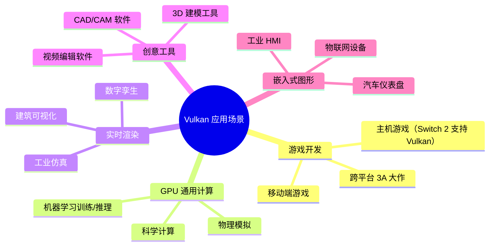

### 1.4 Vulkan 的核心特点

| 特性 | 说明 | 小白解释 |
|------|------|---------|
| **跨平台** | 支持 Windows、Linux、Android、Switch 等 | 写一次代码，到处运行 |
| **显式控制** | 所有 GPU 操作都由开发者明确指定 | 你完全掌控 GPU，但责任也更大 |
| **多线程友好** | 支持多线程并行提交 GPU 命令 | 能充分利用多核 CPU |
| **低开销** | CPU 开销极低（CPU overhead 小） | 更多 CPU 时间留给游戏逻辑 |
| **可预测性能** | 没有隐藏的状态切换开销 | 帧率更稳定，不卡顿 |
| **计算着色器** | 原生支持 GPU 通用计算 | GPU 不仅能画图，还能做数学计算 |

---

## 二、Vulkan vs OpenGL / DirectX / Metal

### 2.1 先搞懂：它们分别干什么事情？

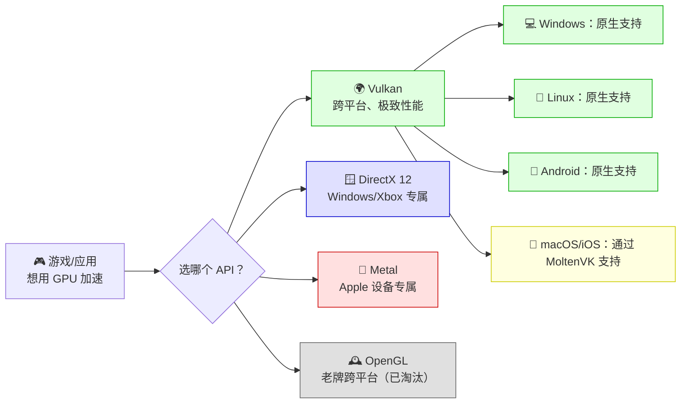

#### 各技术定位对比

| 技术 | 开发者 | 发布年 | 平台 | 定位 |
|------|--------|--------|------|------|
| **OpenGL** | Khronos Group | 1992 | 跨平台 | 老牌标准，已停止大版本更新 |
| **Vulkan** | Khronos Group | 2016 | 跨平台（含 macOS/iOS¹） | OpenGL 的继任者，未来标准 |
| **DirectX 11** | Microsoft | 2009 | Windows/Xbox | Windows 老牌图形 API |
| **DirectX 12** | Microsoft | 2015 | Windows/Xbox | Windows 现代图形 API |
| **Metal** | Apple | 2014 | macOS/iOS | Apple 生态专属现代图形 API |

> ¹ **重要说明**：Vulkan 在 macOS/iOS 上**没有官方原生支持**（Apple 不支持 Vulkan），但通过 **MoltenVK**（一个将 Vulkan API 调用翻译为 Metal API 调用的中间层）可以在 macOS/iOS 上运行 Vulkan 程序。详见下文 2.5 节。

### 2.2 生活化类比：一眼看懂关系

> **汽车类比**：
> - **OpenGL** = 自动挡家用汽车（简单、慢、适合新手）
> - **Vulkan** = 手动挡 F1 赛车（复杂、极快、需要专业训练）
> - **DirectX 12** = 只能在 Windows 公路上开的 F1 赛车
> - **Metal** = 只能在 Apple 公路上开的 F1 赛车

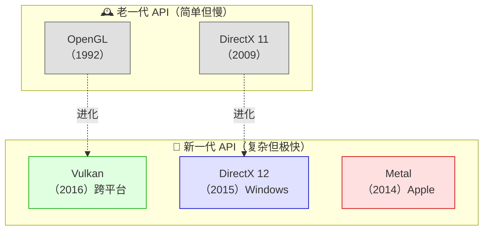

### 2.3 完整对比表

| 对比项 | Vulkan | OpenGL | DirectX 12 | Metal |
|--------|--------|--------|------------|-------|
| **平台** | 跨平台¹ | 跨平台 | Windows/Xbox | Apple 仅 |
| **CPU 开销** | 极低 | 高 | 极低 | 极低 |
| **多线程** | ✅ 原生支持 | ❌ 不支持 | ✅ 支持 | ✅ 支持 |
| **显式控制** | ✅ 完全显式 | ❌ 隐式状态机 | ✅ 完全显式 | ✅ 较显式 |
| **学习难度** | ⭐⭐⭐⭐⭐ | ⭐⭐ | ⭐⭐⭐⭐ | ⭐⭐⭐ |
| **代码量** | 极大（画三角形需 1000+ 行） | 小（画三角形需 50 行） | 大（画三角形需 800+ 行） | 中（画三角形需 300+ 行） |
| **性能上限** | 极高 | 中等 | 极高 | 极高 |
| **调试工具** | 丰富（RenderDoc、Validation Layers） | 一般 | 丰富（PIX） | 较好（Xcode GPU Capture） |
| **移动端支持** | ✅ Android/Nintendo Switch | ✅ Android | ❌ | ✅ iOS/macOS |
| **未来** | ✅ 积极演进 | ❌ 维护模式 | ✅ Microsoft 主推 | ✅ Apple 主推 |

> ¹ **关于 Vulkan「跨平台」的详细说明**：
> - **Windows**：✅ 原生支持（GPU 驱动已内置 Vulkan Runtime）
> - **Linux**：✅ 原生支持（开源驱动 RADV 或闭源 NVIDIA 驱动）
> - **Android**：✅ 原生支持（Android 7.0+，GPU 驱动内置）
> - **macOS / iOS**：⚠️ 无官方原生支持，但通过 **MoltenVK** 翻译层可以运行（性能略有损失）
> - **Nintendo Switch**：✅ 原生支持（需任天堂开发者授权）

### 2.4 架构对比：为什么 Vulkan 更快？

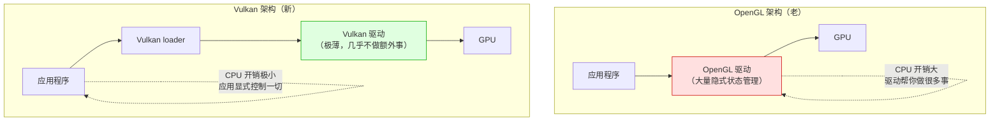

> 💡 **核心原因**：OpenGL 的驱动层很「厚」，它帮你做了很多决策（比如内存管理、状态验证），这消耗了大量 CPU 时间。Vulkan 的驱动层极「薄」，这些决策都由你的代码来做，CPU 只需要专注给 GPU 发指令。

### 2.5 Vulkan 在各平台的支持详情

#### 2.5.1 Windows 平台：原生支持 ✅

Vulkan 在 Windows 上是**完全原生支持**的，所有主流 GPU 厂商都提供了 Vulkan 驱动：

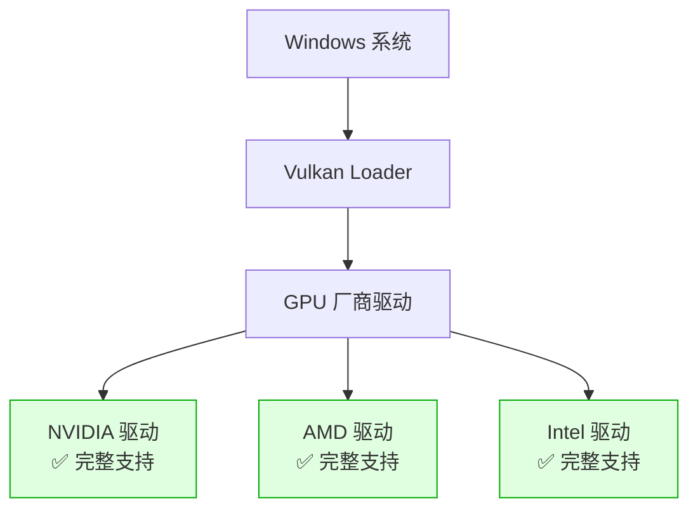

| 项目 | 说明 |
|------|------|
| **安装方式** | 安装 GPU 驱动时自动安装 Vulkan Runtime（无需额外操作） |
| **验证方式** | 运行 `vulkaninfo` 或下载 Vulkan SDK 验证 |
| **游戏支持** | 《DOOM Eternal》《Wolfenstein II》《Red Dead Redemption 2》等均原生支持 |
| **开发建议** | Windows 是 Vulkan 开发的最佳平台之一，工具链完善（RenderDoc、Validation Layers） |

> 💡 **小白提示**：只要你的显卡是 NVIDIA/AMD/Intel 近 10 年的产品，且安装了最新驱动，Vulkan 就可以直接使用，不需要额外安装任何东西。

#### 2.5.2 macOS / iOS 平台：通过 MoltenVK 支持 ⚠️

Apple 官方**不支持 Vulkan**，而是主推自家的 Metal API。但 Khronos Group 提供了 **MoltenVK** —— 一个将 Vulkan API 调用翻译为 Metal API 调用的中间层，使得 Vulkan 程序可以在 macOS/iOS 上运行。

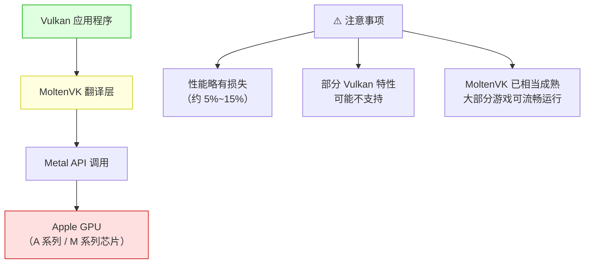

| 项目 | 说明 |
|------|------|
| **MoltenVK 是什么？** | 一个开源项目（由 Khronos 维护），将 Vulkan API 翻译成 Metal API |
| **性能如何？** | 性能损失通常在 5%~15% 左右，部分场景几乎无损失 |
| **支持哪些 Vulkan 特性？** | MoltenVK 支持 Vulkan 1.3 的大部分特性，但受限于 Metal 的能力，部分特性无法实现 |
| **如何使用？** | 在 macOS/iOS 上编译 Vulkan 程序时，链接 MoltenVK 库即可（Unity/Unreal 已内置） |
| **实际案例** | 《DOOM Eternal》Mac 版、《Dota 2》Mac 版均通过 MoltenVK 运行 Vulkan |
| **开发建议** | 如果只做 Apple 平台，建议直接用 Metal；如果需要跨平台（含 Windows/Android），用 Vulkan + MoltenVK |

#### 2.5.3 平台支持总览图

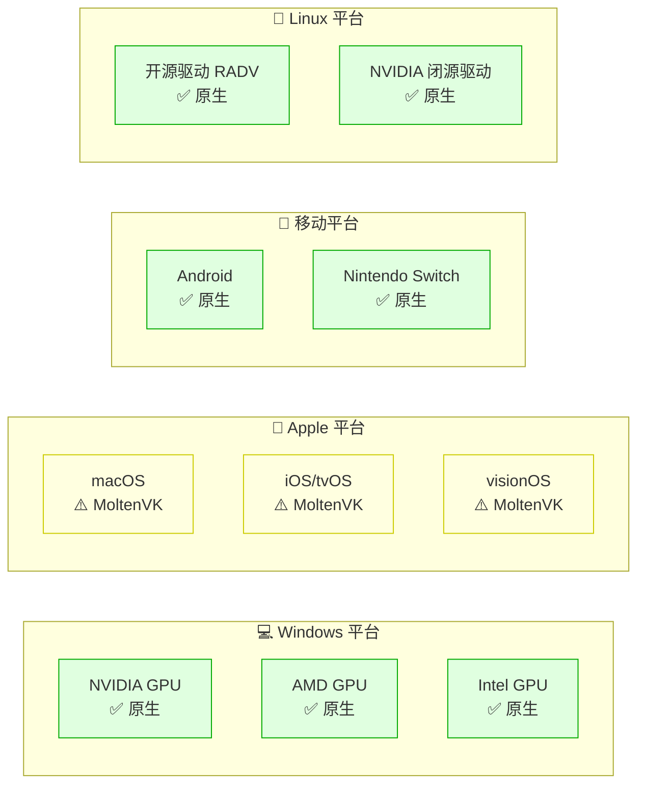

#### 2.5.4 常见问题：我该选哪个？

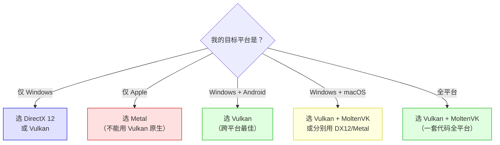

### 2.6 各平台 Vulkan 可用性详细对比

| 平台 | 支持方式 | 成熟度 | 性能损失 | 推荐度 |
|------|---------|--------|---------|--------|
| **Windows** | 原生（GPU 驱动内置） | ⭐⭐⭐⭐⭐ | 0% | ⭐⭐⭐⭐⭐ 强烈推荐 |
| **Linux** | 原生（开源/闭源驱动） | ⭐⭐⭐⭐⭐ | 0% | ⭐⭐⭐⭐⭐ 强烈推荐 |
| **Android** | 原生（系统内置） | ⭐⭐⭐⭐⭐ | 0% | ⭐⭐⭐⭐⭐ 强烈推荐 |
| **Nintendo Switch** | 原生（需授权） | ⭐⭐⭐⭐⭐ | 0% | ⭐⭐⭐⭐⭐ （需授权）|
| **macOS** | MoltenVK 翻译层 | ⭐⭐⭐⭐ | ~5%~15% | ⭐⭐⭐ 可用 |
| **iOS/iPadOS** | MoltenVK 翻译层 | ⭐⭐⭐⭐ | ~5%~15% | ⭐⭐⭐ 可用 |
| **visionOS** | MoltenVK 翻译层 | ⭐⭐⭐ | ~10%~20% | ⭐⭐ 勉强可用 |

> 💡 **总结一句话**：Vulkan 在 Windows、Linux、Android 上是**原生且完美支持**的；在 macOS/iOS 上**可以通过 MoltenVK 运行**，性能略有损失，但是一套代码覆盖所有平台的代价是值得的。

---

## 三、学习路线图

### 3.1 整体学习路径

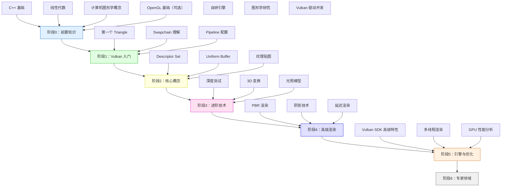

### 3.2 各阶段学习目标

| 阶段 | 周期 | 核心目标 | 能做出的东西 |
|:---:|:---:|----------|-------------|
| **阶段0** | 2周 | 补齐前置知识 | — |
| **阶段1** | 4周 | 画出第一个三角形 | 彩色三角形（1000+ 行代码） |
| **阶段2** | 6周 | 理解核心渲染概念 | 带纹理的 3D 立方体 |
| **阶段3** | 6周 | 掌握 3D 渲染技术 | 带光照的 3D 场景 |
| **阶段4** | 8周 | 实现高级渲染效果 | PBR 材质、阴影 |
| **阶段5** | 8周 | 性能优化与多线程 | 高性能渲染引擎 |
| **阶段6** | 长期 | 实时光追、VR/AR | 前沿技术探索 |

---

## 四、入门篇：Vulkan 编程核心流程

> **本章目标**：理解 Vulkan 程序的基本结构和编程流程，能够读懂 Vulkan 示例代码。

### 4.1 前置知识检查清单

#### ✅ 必须掌握

- [ ] **C++ 基础**：类、指针、智能指针、STL 容器
- [ ] **线性代数**：向量、矩阵、坐标系变换
- [ ] **计算机图形学基础**：光栅化、着色器、渲染管线概念

#### 🔶 最好掌握（不强制）

- [ ] **OpenGL 基础**：了解传统图形 API 的工作方式（有助于理解为什么 Vulkan 要这样设计）
- [ ] **Windows/Linux 开发环境**：CMake、编译链接、动态库

> 💡 **小白不用担心**：如果你已经会 WebGL 或 WebGPU，Vulkan 的概念（Shader、Buffer、Pipeline）你都已经接触过了，只是 Vulkan 需要你显式地做更多配置。

### 4.2 Vulkan 编程的核心流程

#### 🎯 先搞懂：Vulkan 编程就像「拍电影」

为了让你更容易理解 Vulkan 的编程流程，我们用**拍电影**来类比：

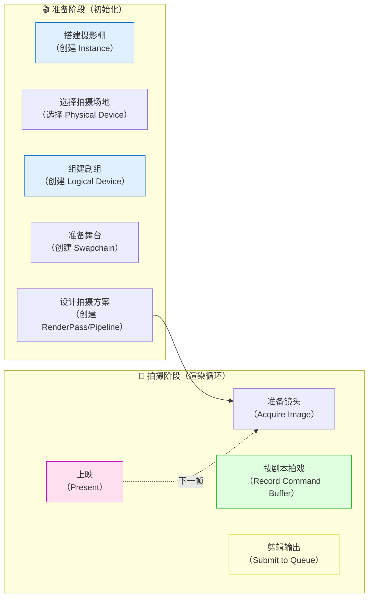

| 拍电影 | Vulkan 对应步骤 | 说明 |
|--------|----------------|------|
| 搭建摄影棚 | 创建 Instance | 初始化 Vulkan 运行时环境 |
| 选择拍摄场地 | 选择 Physical Device | 挑选要使用的 GPU 硬件 |
| 组建剧组 | 创建 Logical Device | 创建 GPU 的软件接口，获取 Queue |
| 准备舞台 | 创建 Swapchain | 准备用于呈现的图像缓冲区（双缓冲/三缓冲） |
| 设计拍摄方案 | 创建 RenderPass/Pipeline | 配置渲染目标和渲染状态 |
| 准备镜头 | Acquire Image | 从 Swapchain 获取一张可渲染的图像 |
| 按剧本拍戏 | Record Command Buffer | 把绘制命令「记录」到 Command Buffer |
| 剪辑输出 | Submit to Queue | 把 Command Buffer 提交给 GPU 执行 |
| 上映 | Present | 把渲染结果呈现到屏幕 |

> 💡 **Vulkan 的独特之处**：
> - Vulkan 采用「命令记录模式」—— 先把所有 GPU 命令记录到 Command Buffer，然后一次性提交
> - 与 OpenGL 立即模式不同，Vulkan 让你**显式管理** GPU 的每一步
> - Vulkan 的 API 设计非常**底层**，没有「隐藏的细节」，这也是它复杂但高效的原因

---

#### 📋 Vulkan 完整编程流程（8 大步骤）

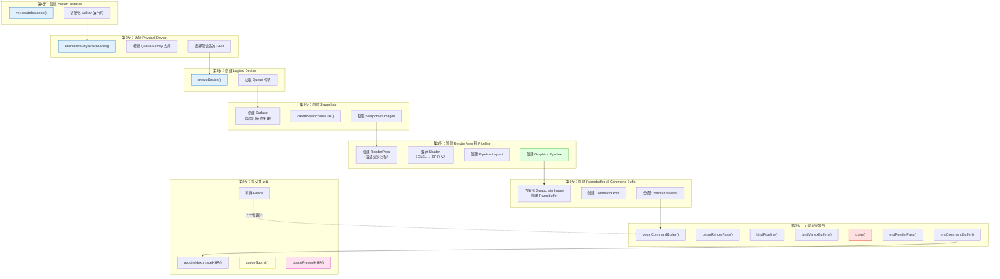

---

#### 🔍 每一步详细解释（小白版）

##### 第 1 步：创建 Vulkan Instance（Vulkan 实例）

**问题**：如何启动 Vulkan？
**答案**：通过 `vk::createInstance()`！它是 Vulkan 的「应用级入口」。

```cpp
// 应用信息（可选，但有助于驱动优化）
vk::ApplicationInfo appInfo;
appInfo.pApplicationName = "Hello Vulkan";
appInfo.pEngineName = "No Engine";
appInfo.apiVersion = VK_API_VERSION_1_3;

// 实例创建信息
vk::InstanceCreateInfo createInfo;
createInfo.pApplicationInfo = &appInfo;

// 创建 Instance
vk::Instance instance = vk::createInstance(createInfo);
```

> 💡 **类比**：就像「搭建摄影棚」。Instance 是 Vulkan 运行时和应用程序之间的连接桥梁。

| 参数 | 说明 |
|------|------|
| `pApplicationName` | 应用名称（驱动可能会根据应用做优化） |
| `apiVersion` | 请求的 Vulkan 版本（如 1.3） |
| `ppEnabledExtensionNames` | 需要的扩展（如窗口系统 Surface 扩展） |
| `ppEnabledLayerNames` | 需要的验证层（用于调试） |

> ⚠️ **注意**：Vulkan 默认**没有验证层**！开发时务必启用 `VK_LAYER_KHRONOS_validation`，否则出错很难调试。

---

##### 第 2 步：选择 Physical Device（物理设备）

**问题**：系统中有多个 GPU，用哪一个？
**答案**：通过 `enumeratePhysicalDevices()` 枚举所有 GPU，然后选择最合适的！

```cpp
// 枚举系统中所有 GPU
std::vector<vk::PhysicalDevice> physicalDevices =
    instance.enumeratePhysicalDevices();

// 选择第一个支持图形队列的 GPU
vk::PhysicalDevice physicalDevice = physicalDevices[0];

// 更严谨的做法：检查 GPU 是否支持我们需要的功能
// - 是否有图形队列（Queue Family）
// - 是否支持需要的扩展（如 Swapchain）
// - 内存是否足够
```

> 💡 **类比**：就像「选择拍摄场地」。如果有多个摄影棚可选，你需要挑选设备最齐全的那一个。

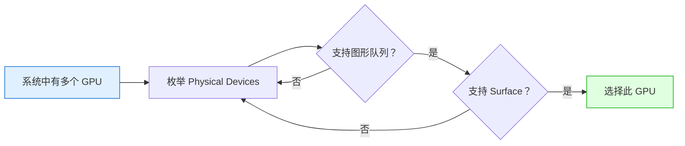

| 概念 | 说明 |
|------|------|
| **Physical Device** | 系统中的 GPU 硬件（如 RTX 4080、AMD 7900 XTX） |
| **Queue Family** | GPU 内部的队列类型（图形、计算、传输、呈现） |
| **扩展** | GPU 可选的功能（如 Swapchain、Ray Tracing） |

---

##### 第 3 步：创建 Logical Device（逻辑设备）和 Queue

**问题**：如何向 GPU 发送命令？
**答案**：通过 **Logical Device** 和 **Queue**！Logical Device 是 Physical Device 的软件抽象。

```cpp
// 指定要使用的 Queue Family（图形队列）
vk::DeviceQueueCreateInfo queueCreateInfo;
queueCreateInfo.queueFamilyIndex = graphicsQueueFamilyIndex;
queueCreateInfo.queueCount = 1;
float queuePriority = 1.0f;
queueCreateInfo.pQueuePriorities = &queuePriority;

// 创建 Logical Device
vk::DeviceCreateInfo deviceCreateInfo;
deviceCreateInfo.pQueueCreateInfos = &queueCreateInfo;
deviceCreateInfo.queueCreateInfoCount = 1;

vk::Device device = physicalDevice.createDevice(deviceCreateInfo);

// 获取 Queue 句柄（用于提交命令）
vk::Queue graphicsQueue = device.getQueue(graphicsQueueFamilyIndex, 0);
```

> 💡 **类比**：就像「组建剧组」。Logical Device 是剧组的工作接口，Queue 是导演（负责指挥拍摄）。

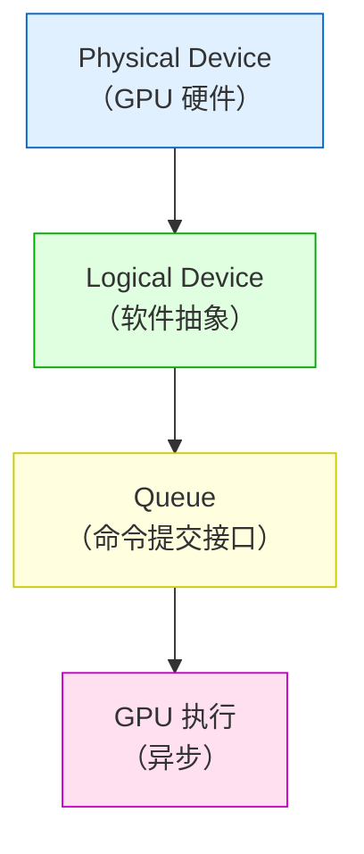

> 💡 **为什么需要 Logical Device？** 因为同一块 GPU 可以被多个应用程序同时使用，每个应用需要自己独立的「逻辑设备」。

---

##### 第 4 步：创建 Surface 和 Swapchain（交换链）

**问题**：渲染结果如何显示到屏幕？
**答案**：通过 **Surface**（与窗口系统关联）和 **Swapchain**（管理图像缓冲区）！

```cpp
// 1. 创建 Surface（通过 GLFW 等窗口库）
vk::SurfaceKHR surface = createSurface(instance, window);

// 2. 创建 Swapchain（管理用于呈现的图像）
vk::SwapchainCreateInfoKHR swapchainInfo;
swapchainInfo.surface = surface;
swapchainInfo.minImageCount = 2;  // 双缓冲
swapchainInfo.imageFormat = vk::Format::eB8G8R8A8Unorm;
swapchainInfo.imageColorSpace = vk::ColorSpaceKHR::eSrgbNonlinear;
swapchainInfo.imageUsage = vk::ImageUsageFlagBits::eColorAttachment;

vk::SwapchainKHR swapchain = device.createSwapchainKHR(swapchainInfo);

// 3. 获取 Swapchain 中的图像
std::vector<vk::Image> swapchainImages = device.getSwapchainImagesKHR(swapchain);
```

> 💡 **类比**：就像「准备舞台」。Swapchain 是舞台后台的「换景区」，有两套（双缓冲）或三套（三缓冲）布景，演完一场立即换下一场，避免观众看到「换景过程」（画面撕裂）。

| 概念 | 说明 |
|------|------|
| **Surface** | 与窗口系统的连接（平台特定，如 Windows 的 `vkCreateWin32SurfaceKHR`） |
| **Swapchain** | 管理一组可用于呈现的 Image（通常 2-3 张） |
| **双缓冲** | 前台显示一张，后台渲染一张，交替使用 |
| **三缓冲** | 比双缓冲更流畅，但延迟稍高 |

---

##### 第 5 步：创建 RenderPass 和 Pipeline（渲染管线）

**问题**：GPU 如何知道「怎么画」？
**答案**：通过 **RenderPass**（描述渲染目标）和 **Pipeline**（配置渲染状态）！

###### 5.1 创建 RenderPass

```cpp
// RenderPass 描述「这一帧要渲染到哪些图像」
vk::AttachmentDescription colorAttachment;
colorAttachment.format = vk::Format::eB8G8R8A8Unorm;
colorAttachment.samples = vk::SampleCountFlagBits::e1;
colorAttachment.loadOp = vk::AttachmentLoadOp::eClear;   // 清除颜色
colorAttachment.storeOp = vk::AttachmentStoreOp::eStore;
colorAttachment.initialLayout = vk::ImageLayout::eUndefined;
colorAttachment.finalLayout = vk::ImageLayout::ePresentSrcKHR;

vk::RenderPassCreateInfo renderPassInfo;
renderPassInfo.pAttachments = &colorAttachment;
renderPassInfo.attachmentCount = 1;

vk::RenderPass renderPass = device.createRenderPass(renderPassInfo);
```

###### 5.2 创建 Graphics Pipeline

```cpp
// Pipeline 是 Vulkan 最复杂的对象，需要配置所有渲染状态
vk::GraphicsPipelineCreateInfo pipelineInfo;

// 指定 Shader 阶段（需要先把 GLSL 编译成 SPIR-V）
pipelineInfo.stageCount = 2;
pipelineInfo.pStages = {vertexShaderStage, fragmentShaderStage};

// 指定顶点输入格式
pipelineInfo.pVertexInputState = &vertexInputInfo;

// 指定图元装配方式（三角形、线条、点？）
pipelineInfo.pInputAssemblyState = &inputAssembly;

// 指定光栅化参数（多边形模式、剔除模式等）
pipelineInfo.pRasterizationState = &rasterizer;

// 指定深度/模板测试
pipelineInfo.pDepthStencilState = &depthStencil;

// 指定颜色混合
pipelineInfo.pColorBlendState = &colorBlending;

// 指定 RenderPass 和子通道
pipelineInfo.renderPass = renderPass;
pipelineInfo.subpass = 0;

vk::Pipeline pipeline = device.createGraphicsPipeline(nullptr, pipelineInfo);
```

> 💡 **什么是 Pipeline？** 它定义了「GPU 如何渲染」的**完整配置**，包括：
> - 用哪个 Vertex Shader？用哪个 Fragment Shader？
> - 顶点数据格式是什么？
> - 多边形是填充还是线框？正面剔除还是背面剔除？
> - 是否开启深度测试？如何混合颜色？
>
> 创建后**不能修改**（和 DX12 的 PSO 类似）！这就是为什么 Vulkan 快 —— 驱动不需要在每次绘制时「猜测」状态。

---

##### 第 6 步：创建 Framebuffer 和 Command Buffer

**问题**：渲染命令记录在哪里？
**答案**：记录在 **Command Buffer** 中！但首先需要创建 **Framebuffer**（绑定渲染目标）。

```cpp
// 1. 为每张 Swapchain Image 创建 Framebuffer
std::vector<vk::Framebuffer> framebuffers;
for (auto& imageView : swapchainImageViews) {
    vk::FramebufferCreateInfo fbInfo;
    fbInfo.renderPass = renderPass;
    fbInfo.attachmentCount = 1;
    fbInfo.pAttachments = &imageView;
    fbInfo.width = width;
    fbInfo.height = height;
    fbInfo.layers = 1;

    framebuffers.push_back(device.createFramebuffer(fbInfo));
}

// 2. 创建 Command Pool（Command Buffer 的内存池）
vk::CommandPoolCreateInfo poolInfo;
poolInfo.queueFamilyIndex = graphicsQueueFamilyIndex;
vk::CommandPool commandPool = device.createCommandPool(poolInfo);

// 3. 分配 Command Buffer
vk::CommandBufferAllocateInfo allocInfo;
allocInfo.commandPool = commandPool;
allocInfo.level = vk::CommandBufferLevel::ePrimary;
allocInfo.commandBufferCount = 1;

vk::CommandBuffer commandBuffer = device.allocateCommandBuffers(allocInfo)[0];
```

> 💡 **类比**：就像「准备胶卷和摄像机」。Framebuffer 是胶卷（记录渲染结果的地方），Command Buffer 是摄像机（记录拍摄指令）。

---

##### 第 7 步：记录渲染命令（最关键！）

**问题**：如何告诉 GPU 「画一个三角形」？
**答案**：通过 **Command Buffer** 记录渲染命令！

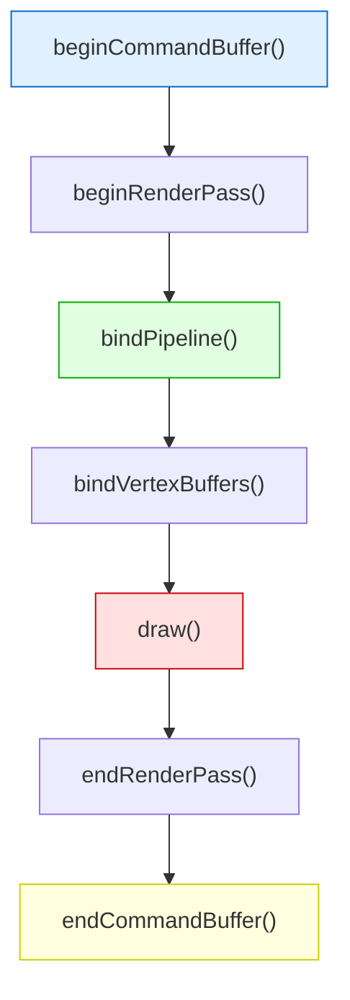

```cpp
// ========== 记录渲染命令 ==========
// 1. 开始记录 Command Buffer
vk::CommandBufferBeginInfo beginInfo;
commandBuffer.begin(beginInfo);

// 2. 开始 RenderPass
vk::RenderPassBeginInfo renderPassInfo;
renderPassInfo.renderPass = renderPass;
renderPassInfo.framebuffer = framebuffers[currentFrame];
renderPassInfo.renderArea = vk::Rect2D({0, 0}, {width, height});

// 清除颜色（黑色）
vk::ClearValue clearValue;
clearValue.color = std::array<float, 4>{0.0f, 0.0f, 0.0f, 1.0f};
renderPassInfo.clearValueCount = 1;
renderPassInfo.pClearValues = &clearValue;

commandBuffer.beginRenderPass(renderPassInfo, vk::SubpassContents::eInline);

// 3. 绑定 Pipeline 和 Vertex Buffer，发出绘制命令
commandBuffer.bindPipeline(vk::PipelineBindPoint::eGraphics, pipeline);
commandBuffer.bindVertexBuffers(0, {vertexBuffer}, {0});
commandBuffer.draw(3, 1, 0, 0);  // 画 3 个顶点（一个三角形）

// 4. 结束 RenderPass 和 Command Buffer
commandBuffer.endRenderPass();
commandBuffer.end();
```

> ⚠️ **重要概念**：
> - **Command Buffer** 记录的是「指令」，不是「立即执行」
> - 记录完成后，可以多次提交（只要内容不变）
> - 多线程可以**同时记录**多个 Command Buffer，这是 Vulkan 高性能的关键！

---

##### 第 8 步：提交并呈现

**问题**：如何让 GPU 执行命令，并把结果显示到屏幕？
**答案**：通过 **Queue Submit** 和 **Queue Present**！

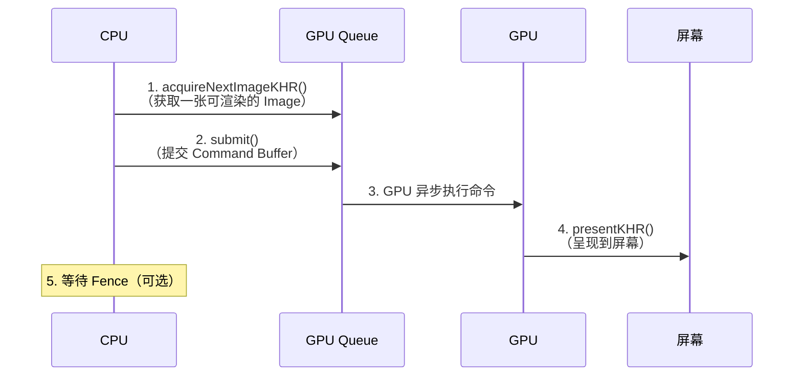

```cpp
// ========== 渲染循环 ==========
while (!glfwWindowShouldClose(window)) {
    // 1. 获取当前帧的 Swapchain Image 索引
    uint32_t imageIndex;
    device.acquireNextImageKHR(swapchain, UINT64_MAX, imageAvailableSemaphore,
                               nullptr, &imageIndex);

    // 2. 提交 Command Buffer 到 Queue
    vk::SubmitInfo submitInfo;
    vk::Semaphore waitSemaphores[] = {imageAvailableSemaphore};
    vk::PipelineStageFlags waitStages[] = {vk::PipelineStageFlagBits::eColorAttachmentOutput};
    submitInfo.waitSemaphoreCount = 1;
    submitInfo.pWaitSemaphores = waitSemaphores;
    submitInfo.pWaitDstStageMask = waitStages;
    submitInfo.commandBufferCount = 1;
    submitInfo.pCommandBuffers = &commandBuffer;
    vk::Semaphore signalSemaphores[] = {renderFinishedSemaphore};
    submitInfo.signalSemaphoreCount = 1;
    submitInfo.pSignalSemaphores = signalSemaphores;

    graphicsQueue.submit(submitInfo, inFlightFence);

    // 3. 呈现到屏幕
    vk::PresentInfoKHR presentInfo;
    presentInfo.waitSemaphoreCount = 1;
    presentInfo.pWaitSemaphores = signalSemaphores;
    presentInfo.swapchainCount = 1;
    presentInfo.pSwapchains = &swapchain;
    presentInfo.pImageIndices = &imageIndex;

    graphicsQueue.presentKHR(presentInfo);

    // 4. 等待 GPU 完成（可选，用于限制帧率）
    device.waitForFences(inFlightFence, true, UINT64_MAX);
    device.resetFences(inFlightFence);
}
```

> 💡 **Semaphore 和 Fence 的作用**：
> - **Semaphore**：GPU-GPU 同步（确保「渲染完成」后才「呈现」）
> - **Fence**：CPU-GPU 同步（CPU 等待 GPU 完成工作）

---

##### 🎯 总结：Vulkan 编程的「三段式」

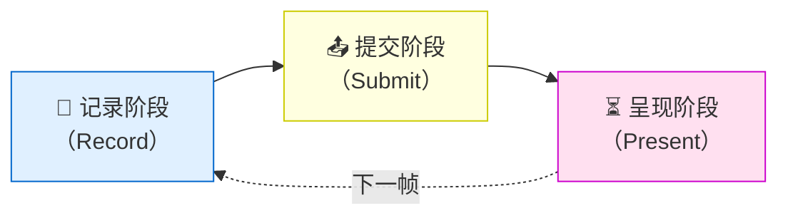

1. **记录阶段**：把「要做什么」写进 Command Buffer（CPU 端）
2. **提交阶段**：把 Command Buffer 提交给 GPU Queue（异步执行）
3. **呈现阶段**：把渲染好的图像显示到屏幕

> 💡 **这就是 Vulkan 的核心思想**：把「记录」和「执行」分开，让 CPU 和 GPU 可以并行工作！

---

### 4.3 Vulkan 特有概念速查

这些是 Vulkan 独有的概念，OpenGL 中没有，需要重点理解：

| 概念 | 解释 | 类比 |
|------|------|------|
| **Instance** | 实例 | Vulkan 应用级入口 |
| **Physical Device** | 物理设备 | 实际的 GPU 硬件 |
| **Logical Device** | 逻辑设备 | 用于向 GPU 发送命令的软件接口 |
| **Queue** | 队列 | GPU 的命令执行队列 |
| **Swapchain** | 交换链 | 管理用于呈现的图像缓冲区（双缓冲/三缓冲） |
| **Command Buffer** | 命令缓冲区 | 记录的 GPU 命令列表 |
| **Descriptor Set** | 描述符集 | 向 Shader 绑定资源的方式 |
| **Pipeline Layout** | 管线布局 | 描述 Descriptor Set 的布局 |
| **RenderPass** | 渲染通道 | 描述渲染目标的使用方式 |
| **Semaphore / Fence** | 信号量/栅栏 | CPU-GPU 同步、GPU-GPU 同步原语 |

> 📚 **下一步**：第五章将深入讲解这些核心概念，包括 Pipeline、内存管理、Descriptor Set 等。

---

## 五、进阶篇：核心概念深入

### 5.1 渲染管线（Render Pipeline）

Vulkan 的渲染管线是**完全显式配置**的，没有任何默认值。这意味着你需要配置每一个细节。

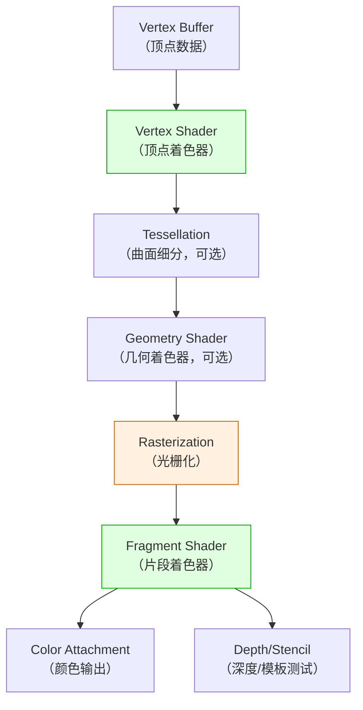

#### Pipeline 创建信息（伪代码）

```cpp
vk::GraphicsPipelineCreateInfo pipelineInfo;

// 指定 Shader 阶段
pipelineInfo.stageCount = 2;
pipelineInfo.pStages = {vertexShaderStage, fragmentShaderStage};

// 指定顶点输入格式
pipelineInfo.pVertexInputState = &vertexInputInfo;

// 指定图元装配方式（三角形？线条？点？）
pipelineInfo.pInputAssemblyState = &inputAssembly;

// 指定视口和裁剪矩形
pipelineInfo.pViewportState = &viewportState;

// 指定光栅化参数（多边形模式、剔除模式等）
pipelineInfo.pRasterizationState = &rasterizer;

// 指定多重采样（MSAA）
pipelineInfo.pMultisampleState = &multisampling;

// 指定深度/模板测试
pipelineInfo.pDepthStencilState = &depthStencil;

// 指定颜色混合
pipelineInfo.pColorBlendState = &colorBlending;

// 指定动态状态（可以在渲染时动态修改的参数）
pipelineInfo.pDynamicState = &dynamicState;

// 指定 Pipeline Layout（Descriptor Set 布局）
pipelineInfo.layout = pipelineLayout;

// 指定 RenderPass 和子通道
pipelineInfo.renderPass = renderPass;
pipelineInfo.subpass = 0;

vk::Pipeline pipeline = device.createGraphicsPipeline(nullptr, pipelineInfo);
```

> 💡 **为什么要这么复杂？** 因为一切都是显式指定的，驱动不需要做任何「猜测」或「状态验证」，所以 CPU 开销极小。这也是 Vulkan 快的核心原因。

### 5.2 内存管理（Vulkan 最复杂的主题之一）

Vulkan 的内存管理是**完全显式**的，你需要自己决定：
- 在哪种内存类型上分配（显存？系统内存？）
- 内存是否 CPU 可见？
- 内存是否 GPU 本地？

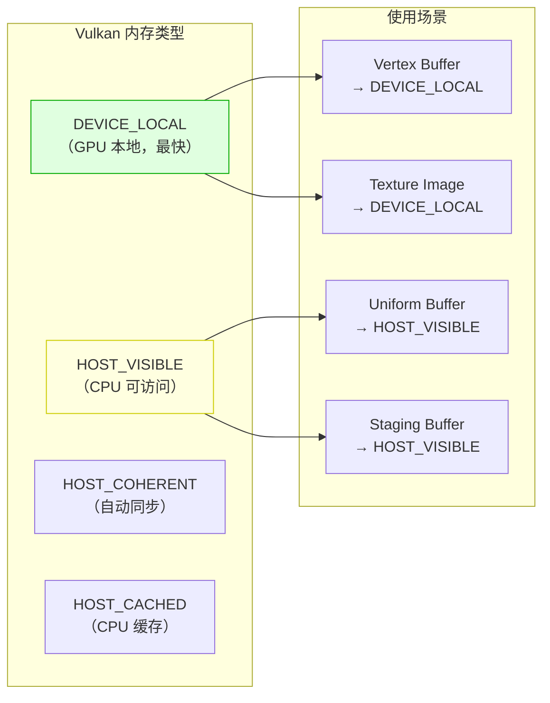

#### 典型的内存传输流程

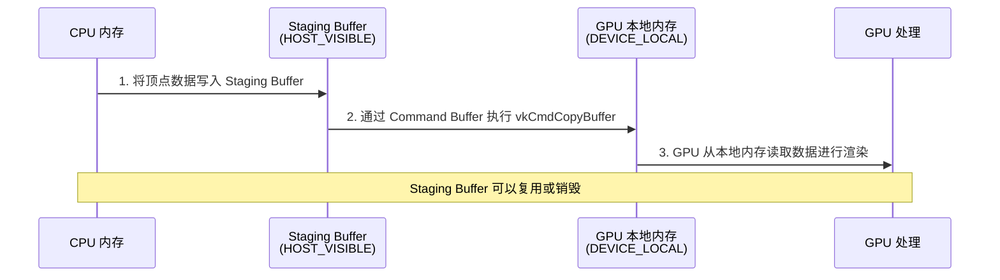

### 5.3 Descriptor Set 与资源绑定

Descriptor Set 是 Vulkan 向 Shader 传递资源（Buffer、Image/Texture、Sampler）的方式。

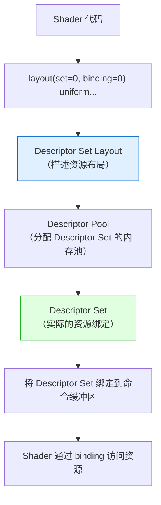

#### 代码示例（简化）

```cpp
// 1. 创建 Descriptor Set Layout（告诉 Pipeline 资源长什么样）
vk::DescriptorSetLayoutBinding layoutBinding;
layoutBinding.binding = 0;
layoutBinding.descriptorType = vk::DescriptorType::eUniformBuffer;
layoutBinding.descriptorCount = 1;
layoutBinding.stageFlags = vk::ShaderStageFlagBits::eVertex;

// 2. 从 Descriptor Pool 分配 Descriptor Set
vk::DescriptorSet descriptorSet =
    device.allocateDescriptorSets(allocInfo)[0];

// 3. 更新 Descriptor Set（绑定实际的 Buffer）
vk::WriteDescriptorSet writeInfo;
writeInfo.dstSet = descriptorSet;
writeInfo.dstBinding = 0;
writeInfo.descriptorType = vk::DescriptorType::eUniformBuffer;
writeInfo.pBufferInfo = &bufferInfo;
device.updateDescriptorSets({writeInfo}, {});

// 4. 在渲染时绑定
commandBuffer.bindDescriptorSets(
    vk::PipelineBindPoint::eGraphics,
    pipelineLayout, 0, {descriptorSet}, {}
);
```

---

## 六、高级篇：高级渲染技术

### 6.1 多线程渲染

Vulkan 的多线程渲染是其核心优势之一。OpenGL 只能在主线程提交命令，Vulkan 可以在多个线程同时记录 Command Buffer。

```mermaid
flowchart TD
    subgraph 主线程["主线程"]
        MT1["处理输入"]
        MT2["更新游戏逻辑"]
        MT3["提交渲染命令"]
    end

    subgraph 渲染线程1["渲染线程 1"]
        RT1A["记录 Command Buffer A<br/>（渲染场景前半部分）"]
    end

    subgraph 渲染线程2["渲染线程 2"]
        RT2A["记录 Command Buffer B<br/>（渲染场景后半部分）"]
    end

    subgraph 渲染线程3["渲染线程 3"]
        RT3A["记录 Command Buffer C<br/>（渲染 UI）"]
    end

    MT2 --> RT1A
    MT2 --> RT2A
    MT2 --> RT3A
    RT1A --> MT3
    RT2A --> MT3
    RT3A --> MT3

    style MT3 fill:#ffffe0,stroke:#cc0
    style RT1A fill:#e0ffe0,stroke:#0a0
    style RT2A fill:#e0ffe0,stroke:#0a0
    style RT3A fill:#e0ffe0,stroke:#0a0
```

### 6.2 Compute Shader（计算着色器）

Vulkan 原生支持 Compute Shader，让 GPU 不仅能做图形渲染，还能做通用计算。

```mermaid
flowchart LR
    A["CPU 端数据"] --> B["Storage Buffer<br/>（GPU 可读写）"]
    B --> C["Compute Shader<br/>（通用计算）"]
    C --> D["计算结果"]
    D --> E["可用于后续<br/>图形渲染"]

    style C fill:#e0e0ff,stroke:#00c
```

#### Compute Pipeline 示例

```cpp
// Compute Shader 不需要渲染管线，只需要 Compute Pipeline
vk::ComputePipelineCreateInfo computePipelineInfo;
computePipelineInfo.stage = computeShaderStage;
computePipelineInfo.layout = computePipelineLayout;

vk::Pipeline computePipeline =
    device.createComputePipeline(nullptr, computePipelineInfo);

// 分发计算任务（类似 GPU 上的 "for 循环"）
commandBuffer.dispatch(256, 1, 1);  // 启动 256 个计算工作组
```

### 6.3 高级渲染技术列表

| 技术 | 难度 | 说明 |
|------|------|------|
| **PBR 渲染** | ⭐⭐⭐ | 基于物理的渲染，实现逼真的材质效果 |
| **阴影映射（Shadow Mapping）** | ⭐⭐⭐ | 从光源视角渲染深度图，实现动态阴影 |
| **延迟渲染（Deferred Rendering）** | ⭐⭐⭐⭐ | 先存几何信息，后计算光照，适合多光源场景 |
| **光线追踪（Ray Tracing）** | ⭐⭐⭐⭐⭐ | Vulkan 通过扩展支持硬件光线追踪 |
| **后处理特效** | ⭐⭐⭐ | Bloom、DOF、色调映射、SSAO 等 |
| **实例化渲染** | ⭐⭐ | 一次 Draw Call 渲染多个相同物体 |
| **间接渲染（Indirect Drawing）** | ⭐⭐⭐⭐ | GPU 决定渲染内容，CPU 零开销 |

---

## 七、专家篇：引擎与性能优化

### 7.1 使用引擎/封装库简化 Vulkan

由于 Vulkan 非常复杂，实际项目中通常使用封装库或引擎：

| 封装库/引擎 | 类型 | 说明 |
|------------|------|------|
| **Vulkan-Hpp** | C++ 封装 | Vulkan C API 的 C++ 封装，使用 RAII |
| **Vulkan Memory Allocator (VMA)** | 内存管理库 | 简化 Vulkan 内存分配，官方推荐 |
| **GLFW + Vulkan** | 窗口库 | 提供跨平台窗口和输入，集成 Vulkan Surface |
| **SDL2 + Vulkan** | 窗口库 | 类似 GLFW，功能更全 |
| **Unity** | 游戏引擎 | 底层可选 Vulkan 渲染后端 |
| **Unreal Engine** | 游戏引擎 | 支持 Vulkan 渲染后端（Android 平台默认） |
| **Godot 4** | 游戏引擎 | 原生支持 Vulkan 渲染后端 |
| **bgfx** | 跨平台渲染库 | 抽象层，支持 Vulkan/DX12/Metal 等后端 |

### 7.2 Vulkan 性能优化清单

```mermaid
mindmap
  root((Vulkan 性能优化))
    Pipeline 优化
      Pipeline Cache
      Pipeline Layout 复用
      减少 Pipeline 切换
    内存优化
      VMA 管理内存
      Buffer 复用
      内存对齐
    命令提交优化
      Command Buffer 复用
      Secondary Command Buffer
      批量提交
    渲染优化
      遮挡剔除
       frustum 剔除
       LOD 级别
      实例化渲染
    Shader 优化
      减少分支
      使用计算着色器
      SPIR-V 优化
```

### 7.3 RenderDoc 调试

RenderDoc 是 Vulkan 开发最重要的调试工具，可以：
- 捕获某一帧的所有 Vulkan 调用
- 查看 Pipeline 状态
- 查看纹理和缓冲区内容
- 单步调试 Shader

```mermaid
flowchart LR
    A["运行 Vulkan 程序"] --> B["用 RenderDoc 注入"]
    B --> C["捕获一帧"]
    C --> D["分析 API 调用序列"]
    D --> E["查看纹理/Buffer 内容"]
    E --> F["调试 Shader"]
```

---

## 八、实战项目

### 8.1 项目 1：Vulkan 三角形（入门）

**目标**：用纯 Vulkan C++ API 画出彩色三角形

**学习内容**：
- Vulkan 初始化完整流程
- Command Buffer 的记录与提交
- Shader 的编译与加载（GLSL → SPIR-V）
- Swapchain 和 Presentation

**预估时间**：1~2 周

### 8.2 项目 2：3D 模型查看器（进阶）

**目标**：加载 OBJ 模型，用 Vulkan 渲染

**学习内容**：
- 顶点/索引缓冲区管理
- Uniform Buffer 和 MVP 矩阵
- 纹理加载（通过 stb_image）
- 摄像机控制

**预估时间**：3~4 周

### 8.3 项目 3：PBR 场景渲染器（高级）

**目标**：实现完整的 PBR 渲染管线

**学习内容**：
- PBR 材质（金属度/粗糙度工作流）
- IBL（基于图像的照明）
- 阴影映射
- 后处理（Bloom、Tone Mapping）

**预估时间**：6~8 周

### 8.4 项目 4：多线程渲染引擎（专家）

**目标**：自研简易 Vulkan 渲染引擎

**学习内容**：
- 多线程 Command Buffer 记录
- 资源管理器（Texture/Shader/Mesh）
- 场景图（Scene Graph）
- GPU 性能分析

**预估时间**：3~6 个月

---

## 附录 A：基础知识速查

### A.1 Vulkan 专有术语表

| 英文术语 | 中文翻译 | 解释 |
|---------|---------|------|
| **Instance** | 实例 | Vulkan 应用级入口 |
| **Physical Device** | 物理设备 | 实际的 GPU 硬件 |
| **Logical Device** | 逻辑设备 | 用于向 GPU 发送命令的软件接口 |
| **Queue Family** | 队列族 | GPU 支持的命令队列类型集合 |
| **Swapchain** | 交换链 | 管理用于呈现的图像缓冲区（双缓冲/三缓冲） |
| **Command Buffer** | 命令缓冲区 | 记录的 GPU 命令列表 |
| **Descriptor Set** | 描述符集 | 向 Shader 绑定资源的方式 |
| **Pipeline Layout** | 管线布局 | 描述 Descriptor Set 的布局 |
| **RenderPass** | 渲染通道 | 描述渲染目标的使用方式 |
| **Framebuffer** | 帧缓冲区 | 渲染目标的集合 |
| **Semaphore** | 信号量 | GPU-GPU 之间的同步原语 |
| **Fence** | 栅栏 | CPU-GPU 之间的同步原语 |
| **SPIR-V** | SPIR-V 字节码 | Vulkan 使用的 Shader 中间表示 |
| **Validation Layers** | 验证层 | 开发期的错误检查和验证 |

### A.2 Vulkan 开发环境搭建

#### Windows 环境

```powershell
# 1. 安装 Vulkan SDK（从 LunarG 官网下载）
# https://vulkan.lunarg.com/

# 2. 安装 CMake
# https://cmake.org/download/

# 3. 安装 GLFW（窗口库）
# 可以通过 vcpkg 安装：
vcpkg install glfw3 vulkan-memory-allocator

# 4. 验证安装
vkvia  # 运行 Vulkan Installation Analyzer
```

#### Linux 环境

```bash
# Ubuntu/Debian
sudo apt install vulkan-tools vulkan-validationlayers-dev spirv-tools
sudo apt install libglfw3-dev cmake g++

# 验证
vulkaninfo
```

#### 验证 Vulkan 是否正常工作

```cpp
// 最简单的 Vulkan 程序：创建 Instance 并销毁
#include <vulkan/vulkan.hpp>
#include <iostream>

int main() {
    vk::ApplicationInfo appInfo;
    appInfo.apiVersion = VK_API_VERSION_1_3;

    vk::InstanceCreateInfo createInfo;
    createInfo.pApplicationInfo = &appInfo;

    vk::Instance instance = vk::createInstance(createInfo);
    std::cout << "Vulkan Instance 创建成功！" << std::endl;

    instance.destroy();
    return 0;
}
```

---

## 附录 B：学习资源推荐

### B.1 官方资源

| 资源 | 链接 | 说明 |
|------|------|------|
| **Vulkan 官方规范** | https://registry.khronos.org/vulkan/ | 最权威的参考文档 |
| **Vulkan SDK (LunarG)** | https://vulkan.lunarg.com/ | 官方 SDK，包含验证层和工具 |
| **Vulkan Guide (Khronos)** | https://www.khronos.org/vulkan/ | 官方入门指南 |
| **SPIR-V 规范** | https://registry.khronos.org/SPIR-V/ | Shader 字节码规范 |

### B.2 教程与文档

| 资源 | 说明 | 推荐指数 |
|------|------|---------|
| **Vulkan Tutorial** | https://vulkan-tutorial.com/ 最流行的入门教程 | ⭐⭐⭐⭐⭐ |
| **Learn Vulkan** | https://learnvulkan.com/ 系统性学习网站 | ⭐⭐⭐⭐ |
| **Sascha Willems 示例** | https://github.com/SaschaWillems/Vulkan 100+ 个示例 | ⭐⭐⭐⭐⭐ |
| **Vulkan Guide (Khronos)** | https://github.com/KhronosGroup/Vulkan-Guide Khronos 官方指南 | ⭐⭐⭐⭐⭐ |
| **Awesome Vulkan** | https://github.com/vinjn/awesome-vulkan 资源大全 | ⭐⭐⭐⭐ |

### B.3 书籍推荐

| 书名 | 作者 | 说明 |
|------|------|------|
| **《Vulkan Programming Guide》** | Graham Sellers | Vulkan 编程指南，权威教材 |
| **《Introduction to 3D Game Programming with DirectX 12》** | Frank Luna | 虽然讲 DX12，但概念与 Vulkan 高度相通 |
| **《Real-Time Rendering 4th》** | Tomas Akenine-Möller | 实时渲染圣经，Vulkan 渲染技术的基础 |

### B.4 工具推荐

| 工具 | 用途 |
|------|------|
| **RenderDoc** | Frame Debugger，Vulkan 开发必备 |
| **Validation Layers** | Vulkan SDK 自带的错误检查层 |
| **Vulkan Memory Allocator (VMA)** | GPU 内存管理库，强烈推荐 |
| **shaderc** | GLSL/HLSL 到 SPIR-V 的编译器 |
| **glslang** | Khronos 官方的 GLSL 编译器 |
| **tracy** | 实时 GPU/CPU 性能分析器 |
| **GPU Caps Viewer** | 查看 GPU Vulkan 支持能力 |

---

## 附录 C：常见问题 FAQ

### C.1 Vulkan 太难了，我应该先学 OpenGL 吗？

**答**：这取决于你的目标。

- 如果你是**学生/研究者**，有时间，建议**先学 OpenGL**（约 2~4 周）理解图形管线的基本概念，再学 Vulkan。这样你会更容易理解「为什么 Vulkan 要这样设计」。
- 如果你是**职业开发者**，需要立即上手，可以直接学 Vulkan，但建议配合 **Vulkan Tutorial** 和 **封装库（如 VMA）** 来降低难度。
- 如果你只是想**做游戏**，建议使用 **Unity/Unreal/Godot**（它们底层用 Vulkan），而不是自己写 Vulkan 代码。

### C.2 Vulkan 和 WebGPU 有什么关系？

**答**：WebGPU 的 API 设计**参考了 Vulkan**（以及 Metal 和 DirectX 12）。如果你学了 Vulkan，学 WebGPU 会非常容易，因为概念是相通的（CommandEncoder ≈ Command Buffer，Pipeline ≈ Pipeline，Buffer ≈ Buffer）。

### C.3 为什么画一个三角形需要 1000+ 行代码？

**答**：因为 Vulkan 是**显式控制**的。在 OpenGL 中，驱动帮你做了很多事（比如内存管理、状态验证、默认管线配置），而在 Vulkan 中，这些都需要你显式指定。虽然代码多了，但性能也提升了，而且行为完全可预测。

**好消息**：有很多封装库可以简化（如 **Vulkan-Hpp**、**Vulkan Memory Allocator**），可以把代码量减半。

### C.4 Vulkan 支持哪些平台？

**答**：Vulkan 的跨平台支持情况因平台而异，具体如下：

| 平台 | 支持方式 | 详细说明 |
|------|---------|---------|
| **Windows** | ✅ 原生支持 | 安装 NVIDIA/AMD/Intel 显卡驱动时自动安装 Vulkan Runtime，无需额外操作。所有近 10 年的 GPU 都支持。 |
| **Linux** | ✅ 原生支持 | 开源驱动（RADV for AMD、ANV for Intel）或闭源 NVIDIA 驱动均完整支持 Vulkan。 |
| **Android** | ✅ 原生支持 | Android 7.0+ 的系统内置 Vulkan 支持，GPU 驱动由厂商提供。 |
| **Nintendo Switch** | ✅ 原生支持 | 需任天堂开发者授权，Switch 的 Tegra GPU 原生支持 Vulkan。 |
| **macOS / iOS** | ⚠️ 通过 MoltenVK | Apple 官方不支持 Vulkan，但可通过 **MoltenVK**（Vulkan → Metal 翻译层）运行。性能损失约 5%~15%。 |
| **visionOS** | ⚠️ 通过 MoltenVK | 同上，但 MoltenVK 对 visionOS 的支持较新，成熟度略低。 |

> 💡 **重点说明（macOS/iOS 用户必读）**：
> - Apple 自 2018 年起已**废弃 OpenGL**，全力推广自家的 **Metal** API，因此不会原生支持 Vulkan。
> - **MoltenVK** 是 Khronos Group 维护的开源项目，它将 Vulkan API 调用实时翻译为 Metal API 调用。
> - 实际性能损失通常在 **5%~15%**，对于大部分游戏和应用来说是完全可接受的。
> - **Unity / Unreal Engine** 在 macOS 上的 Vulkan 渲染后端就是通过 MoltenVK 实现的。
>
> **建议**：如果你需要覆盖 macOS/iOS 平台，有两个选择：
> 1. **只用 Metal**（Apple 独占）：性能最好，但无法复用到 Windows/Android。
> 2. **Vulkan + MoltenVK**（跨平台）：一套代码覆盖所有平台，维护成本低。

### C.5 Validation Layers 是什么？为什么要开？

**答**：Validation Layers 是 Vulkan SDK 提供的**开发期调试工具**，可以检测：
- API 使用错误（参数错误、状态错误）
- 性能警告（不必要的状态切换、内存浪费）
- 同步错误（Race Condition）

**强烈建议开发期始终开启 Validation Layers**，发布版再关闭。

---

## 附录 D：Vulkan 未来展望

### D.1 Vulkan 的演进路线

```mermaid
timeline
    title Vulkan 版本演进
    2016 : Vulkan 1.0 发布
         OpenGL 的继任者
    2017 : Vulkan 1.0 扩展
         Subgroup 操作
    2018 : Vulkan 1.1 发布
         跨进程共享内存
         受保护内容保护
    2020 : Vulkan 1.2 发布
         Timeline Semaphore
         Buffer Device Address
    2022 : Vulkan 1.3 发布
         Dynamic Rendering（简化 RenderPass）
         更多扩展
    2024+ : Vulkan 持续演进
         更好的光线追踪支持
         更强的计算能力
```

### D.2 Vulkan 在行业中的应用

| 领域 | 应用 | 说明 |
|------|------|------|
| **游戏** | 《DOOM Eternal》《Wolfenstein II》| id Tech 引擎的 Vulkan 实现 |
| **游戏引擎** | Unity、Unreal、Godot | 均支持 Vulkan 后端 |
| **移动端** | Android 游戏 | Vulkan 是 Android 官方推荐图形 API |
| **AI/ML** | GPU 推理 | Vulkan Compute 可用于移动端 AI 推理 |
| **汽车** | 车载信息娱乐系统 | 数字仪表盘、HUD 显示 |

### D.3 Vulkan 与 WebGPU 的关系

```mermaid
flowchart LR
    A["Vulkan<br/>（底层原生 API）"] --> B["WebGPU<br/>（浏览器中的 Vulkan 抽象）"]
    C["Metal<br/>（Apple 原生 API）"] --> B
    D["DirectX 12<br/>（Windows 原生 API）"] --> B

    B --> E["网页中的 GPU 加速<br/>（跨平台、安全）"]

    style A fill:#e0ffe0,stroke:#0a0
    style B fill:#e0f0ff,stroke:#06c
    style E fill:#ffffe0,stroke:#cc0
```

> 💡 **核心关系**：WebGPU 不是 Vulkan 的替代品，而是 **Vulkan + Metal + DirectX 12 的跨平台抽象**，专为浏览器环境设计。如果你在写原生应用，用 Vulkan；如果你在写 Web 应用，用 WebGPU。

---

> **文档结束** —— 祝你的 Vulkan 学习之旅顺利！🚀
>
> 如有问题，欢迎联系作者：47608843@qq.com
