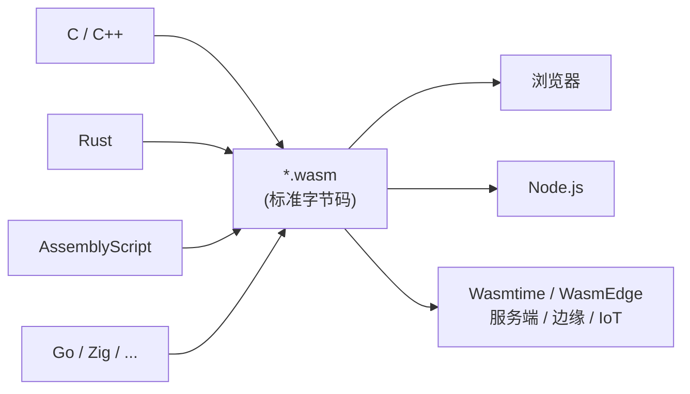
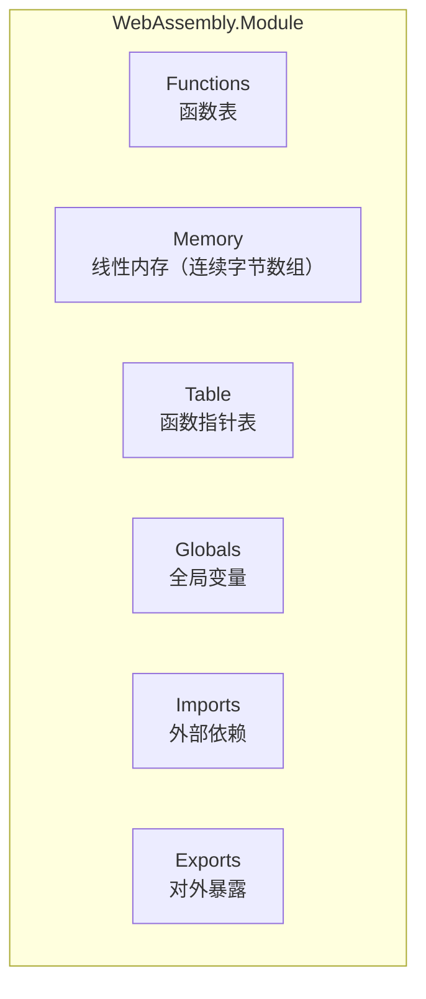
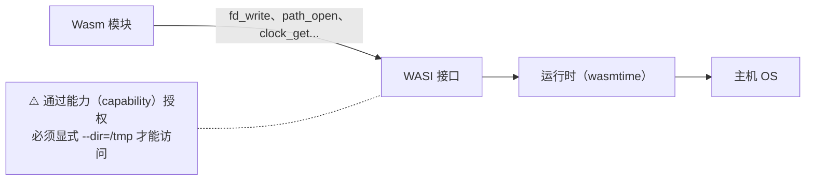

# WebAssembly 深入浅出——从原理到跨端工程实战

**作者**：汪亮（bertonwang）  
**邮箱**：<47608843@qq.com>  
**版本**：v1.0 ｜ **最后更新**：2026-05-14

> **本书风格参考《C++11 新特性解析与应用深入理解》《C++23 新特性解析与应用深入理解》**，
> 对每一个 WebAssembly 主题按
> **「问题背景 → 概念形式 → 用法示例 → 底层机理 → 与 JS / Native 对比 → 注意事项」**
> 六段式逐一拆解，目标是让**已经会 C/C++ 或 Rust 的开发者**，
> **只读这一本，就能从"听说过 wasm"走到"在浏览器、Node、边缘计算、插件系统里把 wasm 用好"**。

---

## 目录

- [前言：WebAssembly 究竟解决了什么问题](#前言webassembly-究竟解决了什么问题)
- [第 0 章：工具链与运行时速查](#第-0-章工具链与运行时速查)

### 第一部分　Wasm 基础
- [第 1 章：Wasm 是什么 / 不是什么](#第-1-章wasm-是什么--不是什么)
- [第 2 章：模块、函数、内存、表——四个基本盒子](#第-2-章模块函数内存表四个基本盒子)
- [第 3 章：栈式虚拟机与 Wasm 类型系统](#第-3-章栈式虚拟机与-wasm-类型系统)
- [第 4 章：文本格式 WAT 与二进制格式 WASM](#第-4-章文本格式-wat-与二进制格式-wasm)
- [第 5 章：Import / Export — 与外部世界的唯一边界](#第-5-章import--export--与外部世界的唯一边界)

### 第二部分　从 C/C++/Rust 编译到 Wasm
- [第 6 章：Emscripten 一日通](#第-6-章emscripten-一日通)
- [第 7 章：直接用 Clang `--target=wasm32` 走轻量路线](#第-7-章直接用-clang---targetwasm32-走轻量路线)
- [第 8 章：Rust 的两条产线——`wasm-bindgen` vs WASI](#第-8-章rust-的两条产线wasm-bindgen-vs-wasi)
- [第 9 章：AssemblyScript / TinyGo / Zig 等"小语种"](#第-9-章assemblyscript--tinygo--zig-等小语种)

### 第三部分　Wasm 与 JS 的边界
- [第 10 章：JS API — `WebAssembly.instantiate` 全景](#第-10-章js-api--webassemblyinstantiate-全景)
- [第 11 章：内存交互——`Memory`、`HEAPU8` 与字符串/数组传递](#第-11-章内存交互memoryheapu8-与字符串数组传递)
- [第 12 章：Table、间接调用与回调](#第-12-章table间接调用与回调)
- [第 13 章：性能边界——什么时候 Wasm 反而比 JS 慢](#第-13-章性能边界什么时候-wasm-反而比-js-慢)

### 第四部分　WASI 与服务端 Wasm
- [第 14 章：WASI 是什么——给 Wasm 一双"系统调用的手"](#第-14-章wasi-是什么给-wasm-一双系统调用的手)
- [第 15 章：Wasmtime / Wasmer / WasmEdge 三剑客对比](#第-15-章wasmtime--wasmer--wasmedge-三剑客对比)
- [第 16 章：Wasm 作为插件系统（Envoy / Istio / Krustlet / Spin）](#第-16-章wasm-作为插件系统envoy--istio--krustlet--spin)
- [第 17 章：Component Model 与 WIT—下一代接口标准](#第-17-章component-model-与-wit下一代接口标准)

### 第五部分　高级特性
- [第 18 章：SIMD128 与向量化加速](#第-18-章simd128-与向量化加速)
- [第 19 章：Threads — 共享内存与原子操作](#第-19-章threads--共享内存与原子操作)
- [第 20 章：Reference Types / GC / Exception Handling](#第-20-章reference-types--gc--exception-handling)
- [第 21 章：尾调用、多返回值、批量内存指令](#第-21-章尾调用多返回值批量内存指令)

### 第六部分　工程实战
- [第 22 章：浏览器端综合案例——把 ffmpeg 编译成 Wasm 做视频缩略图](#第-22-章浏览器端综合案例把-ffmpeg-编译成-wasm-做视频缩略图)
- [第 23 章：服务端综合案例——用 Wasm 做"零信任"插件](#第-23-章服务端综合案例用-wasm-做零信任插件)
- [第 24 章：调试与性能分析工具链](#第-24-章调试与性能分析工具链)
- [第 25 章：安全模型与"什么时候**不要**用 Wasm"](#第-25-章安全模型与什么时候不要用-wasm)

### 附录
- [附录 A：Wasm 操作码速查表](#附录-awasm-操作码速查表)
- [附录 B：Native ↔ JS ↔ Wasm 三方对照](#附录-bnative--js--wasm-三方对照)
- [附录 C：常见错误与坑](#附录-c常见错误与坑)

---

## 前言：WebAssembly 究竟解决了什么问题

JavaScript 跑在浏览器里二十多年，遇到两个老问题：
1. **性能天花板**：再聪明的 JIT 也救不了类型动态、堆乱、GC 抖动。
2. **语言绑架**：你只能用 JS / TS（或被编译到 JS），重型 C/C++/Rust 项目无法直接复用。

2015 年浏览器四巨头联手提出 **WebAssembly**：

> 一种**与平台无关**、**与语言无关**、**接近原生性能**、**沙箱安全**的字节码格式。



**学习路径建议**：


> 💡 **学习这本书的姿势**：第一遍跳读"形象比喻"；第二遍跑代码；第三遍当字典查。

---

## 第 0 章：工具链与运行时速查

| 工具 | 干什么 | 安装 |
|---|---|---|
| **Emscripten** | C/C++ → wasm + JS 胶水 | `brew install emscripten` 或 emsdk |
| **wasi-sdk** | C/C++ → wasm（无浏览器依赖） | GitHub release 下载 |
| **wasm-bindgen** | Rust ↔ JS 自动生成绑定 | `cargo install wasm-bindgen-cli` |
| **wabt** | wasm/wat 互转、分析 | `brew install wabt` |
| **wasmtime** | 命令行运行 wasm（服务端首选） | `curl https://wasmtime.dev/install.sh \| bash` |
| **wasmer** | 同上，特点是多语言嵌入 SDK | `curl https://get.wasmer.io \| sh` |
| **wasmedge** | CNCF 项目，AI/边缘场景多 | `curl ... \| bash` |

> ⚠️ **先确认浏览器版本**：Wasm 1.0（MVP）在 2017 年所有主流浏览器就已支持；
> SIMD/Threads/GC 是渐进特性，写代码前查 [webassembly.org/roadmap](https://webassembly.org/roadmap/)。

---

# 第一部分　Wasm 基础

---

## 第 1 章：Wasm 是什么 / 不是什么

| 它是 | 它不是 |
|---|---|
| **栈式虚拟机的字节码**（类似 JVM、CLR） | 一种语言（你**不直接写** wasm） |
| **W3C 标准**，跨浏览器 | 仅限于浏览器（服务端、IoT 也跑） |
| **沙箱**，默认零权限 | 可以"自由读取系统" |
| 和 JS **平起平坐**（首字母大写的 `WebAssembly` 是一等公民） | JS 的"插件" |
| 编译目标 | 替代 JS（互补关系） |

> 💡 **形象比喻**：
> JS 是"瑞士军刀"——上手快、灵活、慢工出细活。
> Wasm 是"加工中心"——预制好的金属件加工速度快，但你得先有图纸（编译产物）。

---

## 第 2 章：模块、函数、内存、表——四个基本盒子

一个 `.wasm` 模块（Module）由 **段（section）** 组成，最重要的四个盒子：



- **函数（Function）**：一段 wasm 字节码，类似 C 函数。
- **内存（Memory）**：**一段连续 byte 数组**，**这是 wasm 唯一的堆**——所有结构体、字符串、对象都铺在这里面。
- **表（Table）**：**函数引用**的数组，专门做间接调用 / 函数指针。
- **全局变量（Global）**：模块级的 i32/i64/f32/f64/v128。

> 💡 **关键理解**：Wasm 模块**没有内置 GC、没有内置堆**——内存 = 一块平铺的 byte 数组，**对象布局完全由编译器决定**。这就是为什么 C/C++ 这种"自己管内存"的语言天然适配 wasm。

---

## 第 3 章：栈式虚拟机与 Wasm 类型系统

Wasm **没有寄存器**，所有运算都在一个**操作数栈**上：

```wat
;; 计算 (3 + 4) * 2
i32.const 3       ;; 栈：[3]
i32.const 4       ;; 栈：[3, 4]
i32.add           ;; 栈：[7]
i32.const 2       ;; 栈：[7, 2]
i32.mul           ;; 栈：[14]
```

**类型系统极简**——MVP 只有 4 种数值类型：

| 类型 | 含义 |
|---|---|
| `i32` | 32 位整数（无符号/有符号由指令决定，比如 `i32.div_u`/`i32.div_s`） |
| `i64` | 64 位整数 |
| `f32` | 32 位浮点（IEEE 754） |
| `f64` | 64 位浮点 |

后续扩展加了 `v128`（SIMD）、`funcref`、`externref`、各种 ref 类型。

> 💡 **要点**：Wasm 自身**没有"字符串"、"对象"** 这些概念——这些都由前端语言（C++/Rust）在线性内存里自行编码。

---

## 第 4 章：文本格式 WAT 与二进制格式 WASM

同一个模块两种表达：

**`add.wat`（人类读的 S 表达式）**：

```wat
(module
  (func $add (param $a i32) (param $b i32) (result i32)
    local.get $a
    local.get $b
    i32.add)
  (export "add" (func $add)))
```

**互相转换**：

```bash
wat2wasm add.wat -o add.wasm        # 文本 → 二进制
wasm2wat add.wasm -o add.wat        # 反向
wasm-objdump -d add.wasm            # 反汇编
```

> 💡 **WAT 实战意义**：你不会用它写大项目，但**调试 / 分析 / 教学**时它就是 wasm 的"汇编"。

---

## 第 5 章：Import / Export — 与外部世界的唯一边界

Wasm 模块**完全沙箱**，**只能通过 import/export 与外界交互**：

```wat
(module
  ;; 从外部 import 一个 print 函数（i32 入参，无返回）
  (import "env" "print" (func $print (param i32)))
  ;; 自己定义 hello
  (func (export "hello") (param $n i32)
    local.get $n
    call $print))
```

JS 实例化时**必须把 import 配齐**：

```js
const importObject = { env: { print: x => console.log(x) } };
const { instance } = await WebAssembly.instantiateStreaming(
    fetch("hello.wasm"), importObject);
instance.exports.hello(42);   // 控制台打印 42
```

> 💡 **核心安全模型**：wasm 不能 `syscall`、不能访问 DOM、不能读文件——**它只能调用 host 显式给的 import**。这就是它"默认零权限"的根基。

---

# 第二部分　从 C/C++/Rust 编译到 Wasm

---

## 第 6 章：Emscripten 一日通

```bash
# 一个 hello.cpp
cat > hello.cpp <<'EOF'
#include <iostream>
int main() { std::cout << "hello, wasm\n"; return 0; }
EOF

# 编译
emcc hello.cpp -O2 -o hello.html

# 起 web server 看效果
emrun --no-browser --port 8080 hello.html
```

Emscripten 的杀手锏：

| 它做了什么 | 效果 |
|---|---|
| 自动生成 JS 胶水 | `Module._malloc`、`Module.cwrap`、`Module.HEAPU8` 直接可用 |
| 模拟 POSIX | `fopen`、`pthread`、`SDL`、`OpenGL` 都能跑（基于 WebAPI） |
| 文件系统虚拟化 | `MEMFS` / `IDBFS` / `WORKERFS` |
| Asyncify | 把同步代码编译成 yield-able，**让 main loop 不阻塞 UI** |

最常用导出方式：

```cpp
extern "C" {
EMSCRIPTEN_KEEPALIVE  // 防止链接器优化掉
int add(int a, int b) { return a + b; }
}
```

JS 端：

```js
const add = Module.cwrap('add', 'number', ['number', 'number']);
console.log(add(1, 2));   // 3
```

---

## 第 7 章：直接用 Clang `--target=wasm32` 走轻量路线

Emscripten 体积大、依赖重。如果**不需要 JS 胶水、只输出纯 wasm**：

```bash
clang --target=wasm32 -nostdlib -O2 \
      -Wl,--no-entry -Wl,--export-all \
      add.c -o add.wasm
```

> 💡 **要点**：
> - `-nostdlib`：不链 libc，输出极小（几百字节）。
> - `-Wl,--no-entry`：没有 `main`，仅导出函数。
> - 适合做**算法库 / 插件 / 嵌入式 Wasm**。

---

## 第 8 章：Rust 的两条产线——`wasm-bindgen` vs WASI

### 8.1 浏览器路线（`wasm32-unknown-unknown` + wasm-bindgen）

```toml
# Cargo.toml
[lib]
crate-type = ["cdylib"]

[dependencies]
wasm-bindgen = "0.2"
```

```rust
use wasm_bindgen::prelude::*;
#[wasm_bindgen]
pub fn add(a: i32, b: i32) -> i32 { a + b }
#[wasm_bindgen]
pub fn greet(name: &str) -> String { format!("Hello, {name}!") }
```

```bash
wasm-pack build --target web
```

### 8.2 服务端路线（`wasm32-wasi`）

```bash
rustup target add wasm32-wasi
cargo build --target wasm32-wasi --release
wasmtime target/wasm32-wasi/release/myapp.wasm
```

> 💡 **怎么选**：要在**浏览器跑**就用 `wasm-bindgen`，要在**服务器/CLI 跑**就用 WASI。两者**目标三元组不同，不能复用同一个 wasm**。

---

## 第 9 章：AssemblyScript / TinyGo / Zig 等"小语种"

| 语言 | 优势 | 痛点 |
|---|---|---|
| **AssemblyScript** | TS 语法、零配置 | 自带 GC，性能不及 C++/Rust |
| **TinyGo** | Go 子集 | 不支持 reflect、cgo 等 |
| **Zig** | 零依赖、产物极小 | 生态尚小 |
| **Go**（官方） | 生态全 | 二进制超大（runtime 几 MB） |

> 💡 **小项目优先 AssemblyScript**（前端开发者上手最快）；**性能敏感优先 Rust/C++**。

---

# 第三部分　Wasm 与 JS 的边界

---

## 第 10 章：JS API — `WebAssembly.instantiate` 全景

```js
// 三种加载姿势
// 1. fetch + ArrayBuffer
const bytes = await (await fetch("a.wasm")).arrayBuffer();
const { instance } = await WebAssembly.instantiate(bytes, importObj);

// 2. 流式（最快，边下边编）
const { instance } = await WebAssembly.instantiateStreaming(
    fetch("a.wasm"), importObj);

// 3. 先 compile 后 instantiate（多次复用 module）
const module = await WebAssembly.compileStreaming(fetch("a.wasm"));
const inst1  = await WebAssembly.instantiate(module, importObj1);
const inst2  = await WebAssembly.instantiate(module, importObj2);
```

> 💡 **优先级**：streaming > 普通 > 同步（同步 API 已在大模块上被禁）。

---

## 第 11 章：内存交互——`Memory`、`HEAPU8` 与字符串/数组传递

**Wasm 的字符串是 UTF-8 字节序列**，不是 JS 的 UTF-16 String。在 JS/Wasm 之间传字符串需要**两次拷贝**：

```js
function passStringToWasm(str) {
    const bytes = new TextEncoder().encode(str);
    const ptr   = instance.exports.malloc(bytes.length + 1);
    const heap  = new Uint8Array(instance.exports.memory.buffer);
    heap.set(bytes, ptr);
    heap[ptr + bytes.length] = 0;       // \0 结尾
    return [ptr, bytes.length];
}

function readStringFromWasm(ptr, len) {
    const heap = new Uint8Array(instance.exports.memory.buffer);
    return new TextDecoder().decode(heap.subarray(ptr, ptr + len));
}
```

> ⚠️ **第一坑**：`memory.buffer` 在 wasm 内存增长（`memory.grow`）后**会失效**！每次访问前重新 `new Uint8Array(memory.buffer)`。

---

## 第 12 章：Table、间接调用与回调

JS 把回调函数交给 wasm 的标准做法：

```wat
(table 1 funcref)
(elem (i32.const 0) $myFunc)
(func (export "callIdx") (param $i i32)
  local.get $i
  call_indirect)
```

**但更常见的做法**：让 wasm 调用 import 里的 JS 函数即可——表的复杂度仅在动态链接时才显现。

---

## 第 13 章：性能边界——什么时候 Wasm 反而比 JS 慢

| 场景 | 谁更快 | 原因 |
|---|---|---|
| 数学密集（FFT、加解密、图像滤镜） | **Wasm** 大幅领先 | JIT 类型检查少 |
| 频繁过 JS 边界（每次循环都 call import） | **JS** | 边界开销 ~50ns/次 |
| 字符串处理 | **看具体** | 跨边界要拷贝，得不偿失 |
| DOM 操作 | **JS** | wasm 必须经 JS 才能动 DOM |
| 启动时间 | **JS** | wasm 编译/实例化有 cost |

**优化要点**：
1. **批处理**：把 1000 次小调用合成 1 次大调用。
2. **复用内存**：避免反复 `malloc/free`。
3. **streaming 编译**。
4. **预热**：第一次调用前调一次 dummy。

---

# 第四部分　WASI 与服务端 Wasm

---

## 第 14 章：WASI 是什么——给 Wasm 一双"系统调用的手"

**WASI**（WebAssembly System Interface）= **POSIX 的"沙箱版"**：



**核心理念**：**默认零权限 + 显式授权 + 能力对象**。

```bash
# wasm 默认看不到任何文件系统
wasmtime app.wasm           # OK，但无法 fopen

# 显式把 /tmp 映射进去
wasmtime --dir=/tmp app.wasm
```

---

## 第 15 章：Wasmtime / Wasmer / WasmEdge 三剑客对比

| 运行时 | 语言 | 后端 | 卖点 |
|---|---|---|---|
| **Wasmtime** | Rust | Cranelift | 标准最完整、Bytecode Alliance 旗舰 |
| **Wasmer** | Rust | LLVM/Cranelift/Singlepass | 多嵌入 SDK（C/Go/Python/Java...） |
| **WasmEdge** | C++ | LLVM | CNCF 项目、AI/边缘特性多 |

每个都提供**库形式嵌入**，让你的 C/Rust/Go 程序"加载并跑 .wasm"：

```rust
// Wasmtime 嵌入示例
use wasmtime::*;
let engine = Engine::default();
let module = Module::from_file(&engine, "add.wasm")?;
let mut store = Store::new(&engine, ());
let instance = Instance::new(&mut store, &module, &[])?;
let add = instance.get_typed_func::<(i32,i32),i32>(&mut store, "add")?;
println!("{}", add.call(&mut store, (3, 4))?);
```

---

## 第 16 章：Wasm 作为插件系统（Envoy / Istio / Krustlet / Spin）

**为什么 Wasm 是天然的插件格式**：

| 痛点 | Wasm 的回应 |
|---|---|
| 插件崩溃带崩主程序 | 沙箱隔离，崩溃不影响 host |
| 插件吃光内存/CPU | 资源限额（fuel、memory.max） |
| 跨语言开发插件 | 任意语言编译到 wasm |
| 热加载 | wasm 模块本身就支持反复加载 |
| 跨平台分发 | 同一个 .wasm 跑 x86/arm64/RISC-V |

落地案例：
- **Envoy / Istio**：流量过滤、鉴权策略 wasm 化。
- **Spin / Fermyon**：Wasm-as-FaaS，冷启动 < 1ms。
- **Krustlet**：Kubernetes 上跑 wasm 而不是容器。
- **VSCode / Figma**：插件运行在 wasm，避免恶意脚本。

---

## 第 17 章：Component Model 与 WIT—下一代接口标准

**问题**：Wasm 1.0 的 import/export 只能传 i32/i64/f32/f64——传字符串/对象都得手动拷内存。
**答案**：**Component Model** + **WIT**（Wasm Interface Type）。

`greet.wit`：

```wit
package example:greet;
interface api {
  greet: func(name: string) -> string;
}
world greeter { export api; }
```

各语言（Rust/C++/Python/JS）都用同一份 `.wit` 描述接口，工具自动生成绑定，**告别手动 `TextEncoder/Decoder`**。

> 💡 **里程碑**：Component Model 1.0 已稳定，是 wasm 进入"通用嵌入式插件标准"的关键。

---

# 第五部分　高级特性

---

## 第 18 章：SIMD128 与向量化加速

启用：

```bash
emcc -msimd128 -O3 a.cpp -o a.wasm
clang --target=wasm32 -msimd128 ...
```

C++ Intrinsic：

```cpp
#include <wasm_simd128.h>
v128_t a = wasm_v128_load(p);
v128_t b = wasm_v128_load(q);
v128_t c = wasm_f32x4_add(a, b);
wasm_v128_store(out, c);
```

> 💡 **128 位是 wasm SIMD 的硬限**——更宽的 256/512 在 host 上靠运行时拆分。
> 适合做：**音视频解码、图像滤镜、矩阵乘、加解密**。

---

## 第 19 章：Threads — 共享内存与原子操作

启用 Threads 需要**同时**：
1. wasm 编译加 `-pthread`。
2. host 启用 `SharedArrayBuffer`（HTTPS + COOP/COEP 头）。

```cpp
#include <thread>
#include <atomic>
std::atomic<int> counter{0};
void worker() { for (int i = 0; i < 1000; ++i) counter++; }
int main() {
    std::thread t1(worker), t2(worker);
    t1.join(); t2.join();
    return counter.load();   // 2000
}
```

```bash
emcc a.cpp -pthread -s PTHREAD_POOL_SIZE=4 -o a.html
```

⚠️ **服务器必须发这两个 HTTP 头**：

```
Cross-Origin-Opener-Policy: same-origin
Cross-Origin-Embedder-Policy: require-corp
```

否则 `SharedArrayBuffer` 不可用，wasm 起不了线程。

---

## 第 20 章：Reference Types / GC / Exception Handling

| 提案 | 主要功能 | 状态 |
|---|---|---|
| **Reference Types** | `externref`：直接持有 JS 对象引用 | ✅ Phase 5（标准） |
| **GC**（Wasm-GC） | 在 wasm 里直接用结构体/数组类型 | ✅ Phase 4，2024 已落地 |
| **Exception Handling** | 真正的 `try/catch`，无需 setjmp | ✅ Phase 4 |
| **Tail Calls** | 真正的尾调用，函数式语言福音 | ✅ Phase 4 |

> 💡 **GC 的意义**：Java/Kotlin/C# 等带 GC 的语言**不再需要打包整个 GC 运行时到 wasm**——直接用宿主 GC，**模块体积可缩小 10×**。Kotlin/Wasm、Dart/Wasm 已经在用。

---

## 第 21 章：尾调用、多返回值、批量内存指令

- **多返回值**：函数可以返回多个值（不像 MVP 只能 1 个）。
- **bulk memory**：`memory.copy` / `memory.fill` 单条搞定 memcpy/memset。
- **尾调用**：`return_call` 不消耗栈，**实现解释器、状态机的利器**。

---

# 第六部分　工程实战

---

## 第 22 章：浏览器端综合案例——把 ffmpeg 编译成 Wasm 做视频缩略图

```bash
# 1. 拉 ffmpeg.wasm 预编译版
npm i @ffmpeg/ffmpeg @ffmpeg/util

# 2. 浏览器端
import { FFmpeg } from '@ffmpeg/ffmpeg';
const ffmpeg = new FFmpeg();
await ffmpeg.load();
await ffmpeg.writeFile('input.mp4', await fetchFile(file));
await ffmpeg.exec(['-i','input.mp4','-ss','1','-frames:v','1','out.jpg']);
const data = await ffmpeg.readFile('out.jpg');
imgEl.src = URL.createObjectURL(new Blob([data], {type:'image/jpeg'}));
```

效果：**全程在浏览器本地完成视频解码 + 截图**，无需任何后端服务器。

---

## 第 23 章：服务端综合案例——用 Wasm 做"零信任"插件

```rust
// plugin.rs - 用户写的过滤插件
#[no_mangle]
pub extern "C" fn filter(req: i32) -> i32 {
    // 简化：> 100 拒绝
    if req > 100 { 0 } else { 1 }
}
```

```rust
// host.rs - 主程序加载并运行插件
use wasmtime::*;
fn main() -> anyhow::Result<()> {
    let engine = Engine::default();
    let module = Module::from_file(&engine, "plugin.wasm")?;
    let mut store = Store::new(&engine, ());
    store.set_fuel(1_000_000)?;     // 限制最多 100 万指令
    let instance = Instance::new(&mut store, &module, &[])?;
    let filter = instance.get_typed_func::<i32,i32>(&mut store, "filter")?;
    println!("{}", filter.call(&mut store, 50)?);  // 1
    println!("{}", filter.call(&mut store, 200)?); // 0
    Ok(())
}
```

> 💡 **`set_fuel` 的威力**：第三方插件即使死循环，host 也能在固定指令数后强制返回错误，**安全性远超传统 .so/.dll 插件**。

---

## 第 24 章：调试与性能分析工具链

| 工具 | 场景 | 命令/操作 |
|---|---|---|
| **Chrome DevTools** | 浏览器调试，含**源码级断点** | DWARF 信息编进 wasm 后可直接调 C++ |
| **wasm-objdump** | 看 import/export/段 | `wasm-objdump -x a.wasm` |
| **twiggy** | 体积分析，找最胖的函数 | `twiggy top a.wasm` |
| **wabt + wat2wasm/wasm2wat** | 文本与二进制互转 | 同名命令 |
| **wasm-opt（binaryen）** | 后处理优化 | `wasm-opt -O3 a.wasm -o a.opt.wasm` |
| **wasmtime + perf** | 服务端 profile | `wasmtime --profile=jitdump a.wasm` |

---

## 第 25 章：安全模型与"什么时候**不要**用 Wasm"

### ✅ 用 Wasm 的好场景

- **重计算前移到客户端**：图像处理、视频压缩、加解密。
- **跨语言插件**：浏览器插件、Envoy filter、数据库 UDF。
- **不可信代码沙箱**：用户脚本、模板引擎、SaaS 插件市场。
- **跨平台分发**：一份二进制跑 x86/ARM/RISC-V。

### ❌ 别用 Wasm 的场景

- 大量 DOM 操作——wasm 必须经 JS，比直接 JS 还慢。
- 启动一次只用一下的小逻辑——wasm 编译/实例化有成本。
- 强调代码可读性的脚本场景——wasm 不可读、不可热改。

### 🔐 安全要点

1. Wasm 是**沙箱**，但**沙箱外的 JS 胶水代码同样要审计**。
2. WASI 一定要**最小授权**：只给必要的 `--dir`、`--env`。
3. 限资源：`set_fuel`（指令）、`memory.max`（内存）、超时。

---

# 附录

---

## 附录 A：Wasm 操作码速查表

| 类别 | 代表指令 |
|---|---|
| 控制流 | `block end loop if else br br_if br_table call call_indirect return` |
| 参数 / 局部 | `local.get local.set local.tee global.get global.set` |
| 内存 | `i32.load i32.store memory.size memory.grow memory.copy memory.fill` |
| 数值（i32 举例） | `i32.const i32.add i32.sub i32.mul i32.div_s i32.div_u i32.and i32.or i32.shl i32.shr_s` |
| 比较 | `i32.eqz i32.eq i32.lt_s i32.gt_u ...` |
| 转换 | `i32.wrap_i64 i64.extend_i32_s f32.convert_i32_s` |
| SIMD | `v128.load v128.store i32x4.add f32x4.mul f64x2.sqrt` |
| 引用类型 | `ref.null ref.func ref.is_null` |

---

## 附录 B：Native ↔ JS ↔ Wasm 三方对照

| 维度 | Native | JS | Wasm |
|---|---|---|---|
| 语言 | C/C++/Rust/Go | JS/TS | 任意（编译到 wasm） |
| 类型 | 静态/可变 | 动态 | 静态（仅 4 种数值 + 引用） |
| 内存 | 自己管 + GC（按语言） | GC | **线性内存（自己布局）** |
| 启动 | 启动快 | 解析+JIT | 解析+编译 |
| 跨平台 | 重新编译 | 一份代码到处跑 | **一份字节码到处跑** |
| 安全 | 默认全权限 | 浏览器同源 | **沙箱 + 能力授权** |
| 调用开销 | 低 | 低 | 跨边界 ~50ns（**避免高频** |

---

## 附录 C：常见错误与坑

| 现象 | 真正原因 | 解决 |
|---|---|---|
| `RuntimeError: memory access out of bounds` | C 端越界写或 ptr 错误 | 用 `-fsanitize=address`（Emscripten 支持）排查 |
| `LinkError: import object missing` | JS 没把 import 配齐 | 比照 `wasm-objdump -x` 列表补齐 |
| `SharedArrayBuffer is not defined` | 没设 COOP/COEP 头 | 给 web 服务器加这两个响应头 |
| 文件 fopen 返回 NULL | WASI 没 `--dir` 授权 | 加 `wasmtime --dir=. ...` |
| 启动卡顿 / 体积大 | 没用 streaming + wasm-opt | `instantiateStreaming` + `wasm-opt -O3` |
| 调用 wasm 慢于 JS | 高频跨边界 + 拷贝 | 批量 / 复用内存 / 减少调用次数 |
| 多线程失败 | atomics + SharedArrayBuffer 未启 | 编译加 `-pthread`、host 加 COOP/COEP |

---

> **结语**
>
> WebAssembly 不是"取代 JS"，也不是"再造一种 Web 平台"——
> 它是一种**让任何语言、任何团队都能在沙箱里跑得又快又安全**的**通用底盘**。
>
> 浏览器只是它的第一个家，**服务端、边缘、IoT、插件**才是它的星辰大海。
> 当你跑通第 22 章在浏览器解码视频、跑通第 23 章用 fuel 限额加载第三方插件那一刻，
> 你已经掌握了 Wasm 工程化的全部要害。
>
> ——本书完
