# WebGL 学习指南 —— 从入门到精通

> **文档版本**：v1.0 | 2026年6月
> **作者**：汪亮 bertonwang
> **邮箱**：47608843@qq.com
> **适用人群**：从零基础小白 → 图形学高手   

---

## 📋 目录

1. [什么是 WebGL？](#一什么是-webgl)
2. [学习路线图](#二学习路线图)
3. [入门篇：Hello WebGL](#三入门篇hello-webgl)
4. [进阶篇：核心概念深入](#四进阶篇核心概念深入)
5. [高级篇：高级渲染技术](#五高级篇高级渲染技术)
6. [专家篇：引擎与性能优化](#六专家篇引擎与性能优化)
7. [实战项目](#七实战项目)
8. [附录 A：基础知识速查](#附录-a基础知识速查)
9. [附录 B：学习资源推荐](#附录-b学习资源推荐)
10. [附录 C：常见问题 FAQ](#附录-c常见问题-faq)

---

## 一、什么是 WebGL？

### 1.1 一句话解释

> **WebGL（Web Graphics Library）是一种在浏览器中渲染 2D/3D 图形的 JavaScript API，它让你在不安装任何插件的情况下，用 GPU 的算力在网页上画出惊艳的图形。**

### 1.2 小白版解释

想象你要在网页上画一幅画：

| 方式 | 工具 | 适合场景 | 性能 |
|------|------|----------|------|
| **Canvas 2D** | 就像用画笔手绘 | 简单图形、图表 | 一般 |
| **CSS 3D** | 就像摆积木 | 简单 3D 变换 | 一般 |
| **🌟 WebGL** | 就像指挥一支绘画军队（GPU） | 复杂 3D 场景、游戏、可视化 | **极强** |
| **WebGPU** | 新一代绘画军队 | 未来标准 | 更强（但兼容性差） |

### 1.3 WebGL 能做什么？

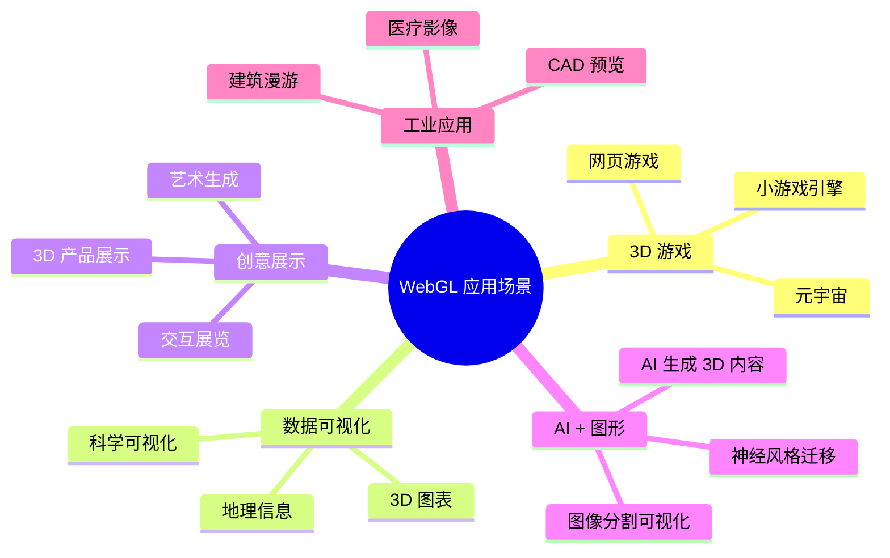

### 1.4 WebGL  vs 其他图形技术

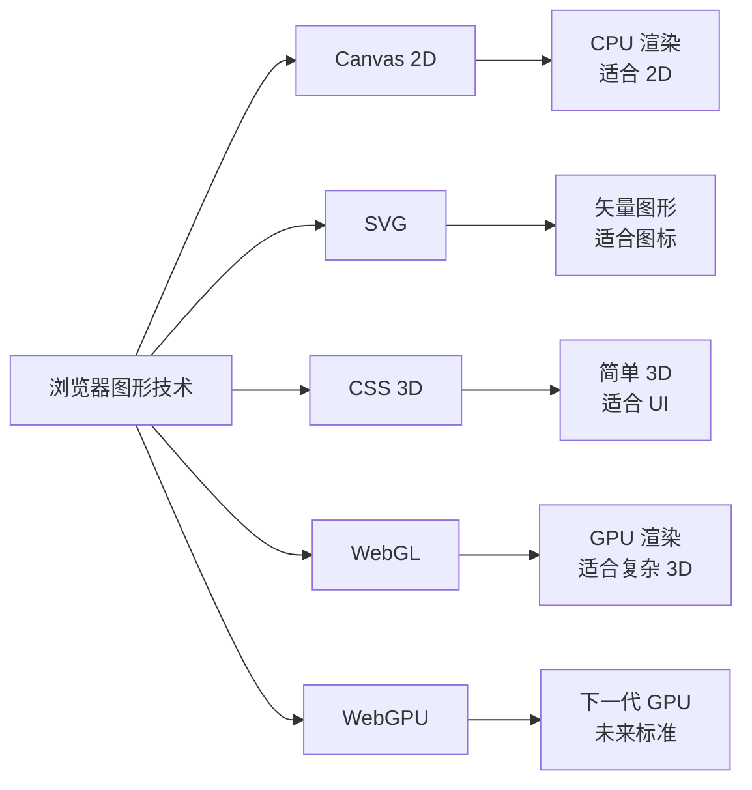

---

## 二、学习路线图

### 2.1 整体学习路径

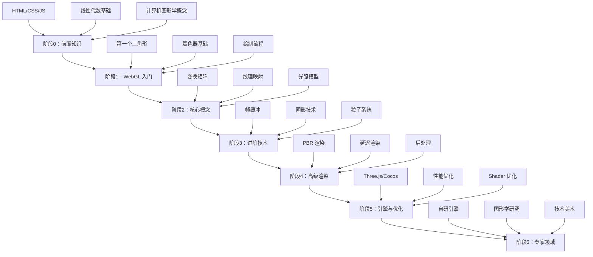

### 2.2 各阶段学习目标

| 阶段 | 周期 | 核心目标 | 能做出的东西 |
|:---:|:---:|----------|-------------|
| **阶段0** | 1周 | 补齐前置知识 | — |
| **阶段1** | 2周 | 画出第一个三角形 | 彩色三角形 |
| **阶段2** | 4周 | 理解核心渲染管线 | 带光照的3D立方体 |
| **阶段3** | 4周 | 掌握进阶渲染技术 | 阴影、反射、粒子效果 |
| **阶段4** | 6周 | 实现高级渲染效果 | PBR材质、后处理特效 |
| **阶段5** | 6周 | 熟练使用引擎 | 完整3D小游戏/可视化项目 |
| **阶段6** | 长期 | 深入图形学底层 | 自研渲染引擎/技术美术 |

---

## 三、入门篇：Hello WebGL

### 3.1 前置知识检查清单

在你开始 WebGL 之前，确保你掌握以下内容：

#### ✅ 必须掌握

- [ ] **JavaScript 基础**：函数、对象、数组、回调、Promise
- [ ] **HTML/Canvas**：`<canvas>` 标签、获取 2D/3D 上下文
- [ ] **基础数学知识**：坐标系、三角函数（sin/cos）、向量概念

#### 🔶 最好掌握（不强制）

- [ ] **线性代数**：矩阵乘法、向量点积/叉积、齐次坐标
- [ ] **计算机图形学基础**：光栅化、着色器概念

> 💡 **小白不用担心**：附录 A 会详细讲解所有需要的数学知识，你可以边学边补！

### 3.2 第一个 WebGL 程序：画一个三角形

#### 步骤 1：创建 HTML 文件

```html
<!DOCTYPE html>
<html lang="zh-CN">
<head>
    <meta charset="UTF-8">
    <title>我的第一个 WebGL 三角形</title>
    <style>
        body { margin: 0; display: flex; justify-content: center; align-items: center; height: 100vh; }
        canvas { border: 1px solid #ccc; }
    </style>
</head>
<body>
    <!-- Canvas 是 WebGL 的画布 -->
    <canvas id="glCanvas" width="800" height="600"></canvas>
    <script src="main.js"></script>
</body>
</html>
```

#### 步骤 2：编写 JavaScript（main.js）

```javascript
// ========== 第1步：获取 WebGL 上下文 ==========
const canvas = document.getElementById('glCanvas');
const gl = canvas.getContext('webgl');

if (!gl) {
    alert('你的浏览器不支持 WebGL，请换一个现代浏览器！');
    throw new Error('WebGL not supported');
}

// ========== 第2步：编写顶点着色器（Vertex Shader）==========
// 顶点着色器：负责处理每个顶点的位置
const vsSource = `
    attribute vec4 aPosition;  // 顶点位置属性
    attribute vec4 aColor;     // 顶点颜色属性
    varying vec4 vColor;       // 传递给片段着色器的颜色
    void main() {
        gl_Position = aPosition;  // 设置顶点位置（裁剪空间坐标）
        vColor = aColor;          // 传递颜色
    }
`;

// ========== 第3步：编写片段着色器（Fragment Shader）==========
// 片段着色器：负责计算每个像素的颜色
const fsSource = `
    precision mediump float;
    varying vec4 vColor;       // 从顶点着色器接收的颜色
    void main() {
        gl_FragColor = vColor; // 设置像素颜色
    }
`;

// ========== 第4步：创建着色器程序 ==========
function createShaderProgram(gl, vsSource, fsSource) {
    // --- 4.1 编译顶点着色器 ---
    const vertexShader = gl.createShader(gl.VERTEX_SHADER);
    gl.shaderSource(vertexShader, vsSource);
    gl.compileShader(vertexShader);
    // 检查编译是否成功
    if (!gl.getShaderParameter(vertexShader, gl.COMPILE_STATUS)) {
        console.error('顶点着色器编译失败:', gl.getShaderInfoLog(vertexShader));
        gl.deleteShader(vertexShader);
        return null;
    }
    
    // --- 4.2 编译片段着色器 ---
    const fragmentShader = gl.createShader(gl.FRAGMENT_SHADER);
    gl.shaderSource(fragmentShader, fsSource);
    gl.compileShader(fragmentShader);
    // 检查编译是否成功
    if (!gl.getShaderParameter(fragmentShader, gl.COMPILE_STATUS)) {
        console.error('片段着色器编译失败:', gl.getShaderInfoLog(fragmentShader));
        gl.deleteShader(vertexShader);
        gl.deleteShader(fragmentShader);
        return null;
    }
    
    // --- 4.3 创建并链接着色器程序 ---
    const program = gl.createProgram();
    gl.attachShader(program, vertexShader);   // 附加顶点着色器
    gl.attachShader(program, fragmentShader);  // 附加片段着色器（⚠️ 原代码此处有 bug，已修复）
    gl.linkProgram(program);
    // 检查链接是否成功
    if (!gl.getProgramParameter(program, gl.LINK_STATUS)) {
        console.error('着色器程序链接失败:', gl.getProgramInfoLog(program));
        gl.deleteProgram(program);
        return null;
    }
    
    // --- 4.4 清理：分离并删除着色器对象 ---
    // 链接成功后，着色器对象可以分离并删除（程序已保存了二进制代码）
    gl.detachShader(program, vertexShader);
    gl.detachShader(program, fragmentShader);
    gl.deleteShader(vertexShader);
    gl.deleteShader(fragmentShader);
    
    return program;
}

const program = createShaderProgram(gl, vsSource, fsSource);
gl.useProgram(program);

// ========== 第5步：准备顶点数据 ==========
// 三角形的三个顶点：位置(x,y,z,w) + 颜色(r,g,b,a)
const vertices = new Float32Array([
    // 位置           // 颜色
     0.0,  0.5, 0.0, 1.0,  1.0, 0.0, 0.0, 1.0,  // 顶点1：红色，顶部
    -0.5, -0.5, 0.0, 1.0,  0.0, 1.0, 0.0, 1.0,  // 顶点2：绿色，左下
     0.5, -0.5, 0.0, 1.0,  0.0, 0.0, 1.0, 1.0,  // 顶点3：蓝色，右下
]);

// 创建缓冲区并上传数据到 GPU
const vertexBuffer = gl.createBuffer();
gl.bindBuffer(gl.ARRAY_BUFFER, vertexBuffer);
gl.bufferData(gl.ARRAY_BUFFER, vertices, gl.STATIC_DRAW);

// ========== 第6步：告诉 WebGL 如何读取数据 ==========
const positionAttr = gl.getAttribLocation(program, 'aPosition');
const colorAttr = gl.getAttribLocation(program, 'aColor');

// 每个顶点有 8 个浮点数（4个位置 + 4个颜色）
//  stride = 8 * 4 = 32 字节
//  position offset = 0
//  color offset = 4 * 4 = 16 字节

gl.enableVertexAttribArray(positionAttr);
gl.vertexAttribPointer(positionAttr, 4, gl.FLOAT, false, 32, 0);

gl.enableVertexAttribArray(colorAttr);
gl.vertexAttribPointer(colorAttr, 4, gl.FLOAT, false, 32, 16);

// ========== 第7步：绘制！==========
gl.clearColor(0.0, 0.0, 0.0, 1.0);  // 设置清除颜色为黑色
gl.clear(gl.COLOR_BUFFER_BIT);         // 清除画布
gl.drawArrays(gl.TRIANGLES, 0, 3);    // 绘制三角形（3个顶点）
```

#### 步骤 2 代码详细解释

上面的代码看似不长，但每一行都藏着 WebGL 的核心概念。下面**逐函数、逐行**进行详细解释。

---

**🔵 第1步：获取 WebGL 上下文**

```javascript
const canvas = document.getElementById('glCanvas');
const gl = canvas.getContext('webgl');
```

| 代码 | 详细解释 |
|------|----------|
| `document.getElementById('glCanvas')` | 获取 HTML 中 id 为 `glCanvas` 的 `<canvas>` 元素，这就是 WebGL 的"画布" |
| `canvas.getContext('webgl')` | 向浏览器申请 WebGL 渲染上下文。返回的对象 `gl` 包含了**所有** WebGL API 函数，后续所有操作都通过它 |
| `if (!gl)` | 兼容性检查。如果浏览器不支持 WebGL（如旧版 IE），返回 `null` |
| `throw new Error(...)` | 抛出异常，阻止后续代码执行 |

> 💡 **类比理解**：`gl` 就像你拿到的一支"超级画笔"，这支画笔能调用 GPU 的算力来画画。

---

**🟢 第2步：编写顶点着色器（Vertex Shader）**

```javascript
const vsSource = `
    attribute vec4 aPosition;
    attribute vec4 aColor;
    varying vec4 vColor;
    void main() {
        gl_Position = aPosition;
        vColor = aColor;
    }
`;
```

顶点着色器是**运行在 GPU 上的小程序**，用 GLSL 语言编写。它**对每个顶点执行一次**。

| 代码行 | 详细解释 |
|--------|----------|
| `attribute vec4 aPosition` | **属性变量**：从 CPU（JavaScript）传递给每个顶点的数据。`vec4` 表示4个分量的向量 (x, y, z, w)。这里存放顶点的位置 |
| `attribute vec4 aColor` | 另一个属性变量：每个顶点的颜色 (r, g, b, a) |
| `varying vec4 vColor` | **插值变量**：用于从顶点着色器向片段着色器"传递"数据。GPU 会自动在三角形的三个顶点之间做**线性插值** |
| `void main()` | 着色器的入口函数，类似于 C 语言的 `main()` |
| `gl_Position = aPosition` | **必须设置**的内置变量。表示这个顶点的最终位置。`gl_Position` 必须是**裁剪空间坐标**（范围 -1.0 ~ +1.0）|
| `vColor = aColor` | 把顶点颜色赋值给 `varying` 变量，GPU 会在光栅化阶段自动插值 |

> 💡 **小白理解**：顶点着色器就像一个"装配流水线工人"，每个顶点经过他手时，他决定这个顶点在哪里显示、什么颜色。
>
> 💡 **关于 `w` 分量**：`vec4` 的第四个分量 `w` 用于**透视除法**。当 `w=1.0` 时表示顶点位置；GPU 会在后续阶段用 `x/w, y/w, z/w` 来计算最终屏幕坐标。这就是"齐次坐标"的妙用。

---

**🟡 第3步：编写片段着色器（Fragment Shader）**

```javascript
const fsSource = `
    precision mediump float;
    varying vec4 vColor;
    void main() {
        gl_FragColor = vColor;
    }
`;
```

片段着色器也是**运行在 GPU 上的小程序**，它**对每个像素（片段）执行一次**。

| 代码行 | 详细解释 |
|--------|----------|
| `precision mediump float` | 设置浮点数精度为 `mediump`（中等精度）。在片段着色器中**必须**声明精度，可选值：`highp`（高精度）、`mediump`（中精度）、`lowp`（低精度）|
| `varying vec4 vColor` | 从顶点着色器传来的颜色，已经被 GPU **自动插值**过了。比如三角形三个顶点分别是红、绿、蓝，那么三角形中心会得到三者的混合色 |
| `gl_FragColor = vColor` | **必须设置**的内置变量。表示这个像素的最终颜色。`vec4` 的四个分量是 (r, g, b, a)，范围 0.0 ~ 1.0 |

> 💡 **小白理解**：片段着色器就像一个"填色工人"，每个像素经过他手时，他决定这个像素是什么颜色。
>
> 💡 **为什么叫"片段"而不是"像素"？** 因为一个像素可能被多个三角形覆盖（比如透明物体叠加），每个三角形在该像素位置产生一个"片段"，经过深度测试/混合后才最终成为像素颜色。

---

**🟠 第4步：`createShaderProgram()` 函数 —— 编译并链接着色器**

这是整个 WebGL 程序中最关键的函数。让我们逐行拆解：

```javascript
function createShaderProgram(gl, vsSource, fsSource) {
```

**函数参数说明：**

| 参数 | 类型 | 说明 |
|------|------|------|
| `gl` | WebGLRenderingContext | WebGL 上下文对象（那支"超级画笔"）|
| `vsSource` | string | 顶点着色器源码（GLSL 字符串）|
| `fsSource` | string | 片段着色器源码（GLSL 字符串）|

---

**4.1 编译顶点着色器**

```javascript
const vertexShader = gl.createShader(gl.VERTEX_SHADER);
```

| 函数 | 详细解释 |
|------|----------|
| `gl.createShader(type)` | 创建一个**空的着色器对象**。`type` 可以是 `gl.VERTEX_SHADER`（顶点着色器）或 `gl.FRAGMENT_SHADER`（片段着色器）。返回着色器对象的引用 |

```javascript
gl.shaderSource(vertexShader, vsSource);
```

| 函数 | 详细解释 |
|------|----------|
| `gl.shaderSource(shader, source)` | 把 GLSL 源码字符串"绑定"到着色器对象上。类似于给一个空文档写入内容 |

```javascript
gl.compileShader(vertexShader);
```

| 函数 | 详细解释 |
|------|----------|
| `gl.compileShader(shader)` | **编译**着色器源码。把 GLSL 源码编译成 GPU 能理解的机器码。编译可能失败（语法错误），需要检查编译状态 |

```javascript
if (!gl.getShaderParameter(vertexShader, gl.COMPILE_STATUS)) {
    console.error('顶点着色器编译失败:', gl.getShaderInfoLog(vertexShader));
    gl.deleteShader(vertexShader);
    return null;
}
```

| 函数 | 详细解释 |
|------|----------|
| `gl.getShaderParameter(shader, gl.COMPILE_STATUS)` | 查询着色器的编译状态。返回 `true` 表示编译成功，`false` 表示失败 |
| `gl.getShaderInfoLog(shader)` | 获取编译错误日志。如果编译失败，这里会返回具体的错误信息（比如哪一行有语法错误）|
| `gl.deleteShader(shader)` | 删除着色器对象，释放 GPU 内存 |

> ⚠️ **重要**：WebGL 的报错信息不会自动出现在浏览器控制台！你必须**主动检查**编译状态和链接状态。

---

**4.2 编译片段着色器**（流程与顶点着色器完全相同）

```javascript
const fragmentShader = gl.createShader(gl.FRAGMENT_SHADER);
gl.shaderSource(fragmentShader, fsSource);
gl.compileShader(fragmentShader);
```

> 💡 **顶点着色器 vs 片段着色器**：
> - 顶点着色器：处理"角"，每个顶点调用一次，输出 `gl_Position`
> - 片段着色器：处理"面"，每个像素调用一次，输出 `gl_FragColor`

---

**4.3 创建并链接着色器程序**

```javascript
const program = gl.createProgram();
```

| 函数 | 详细解释 |
|------|----------|
| `gl.createProgram()` | 创建一个**空的着色器程序对象**。程序 = 多个着色器的组合 |

```javascript
gl.attachShader(program, vertexShader);
gl.attachShader(program, fragmentShader);
```

| 函数 | 详细解释 |
|------|----------|
| `gl.attachShader(program, shader)` | 把一个编译好的着色器"挂载"到程序上。一个程序必须至少有一个顶点着色器和一个片段着色器 |

```javascript
gl.linkProgram(program);
```

| 函数 | 详细解释 |
|------|----------|
| `gl.linkProgram(program)` | **链接**程序。这一步会把顶点着色器和片段着色器"拼接"在一起，检查它们之间的变量是否匹配（比如 `varying` 变量名是否一致）。链接成功后，程序才能被 GPU 执行 |

```javascript
if (!gl.getProgramParameter(program, gl.LINK_STATUS)) {
    console.error('着色器程序链接失败:', gl.getProgramInfoLog(program));
    gl.deleteProgram(program);
    return null;
}
```

| 函数 | 详细解释 |
|------|----------|
| `gl.getProgramParameter(program, gl.LINK_STATUS)` | 查询程序的链接状态 |
| `gl.getProgramInfoLog(program)` | 获取链接错误日志（比如 varying 变量不匹配） |
| `gl.deleteProgram(program)` | 删除程序对象 |

---

**4.4 清理着色器对象**

```javascript
gl.detachShader(program, vertexShader);
gl.detachShader(program, fragmentShader);
gl.deleteShader(vertexShader);
gl.deleteShader(fragmentShader);
```

| 为什么可以删除着色器？ | 解释 |
|----------------------|------|
| 链接成功后，程序已经把着色器的二进制代码"复制"到内部了 | 就像编译 C 语言时，`.c` 源码编译成 `.exe` 后，源码可以删除了 |
| `detach` = 从程序中断开引用；`delete` = 真正释放 GPU 内存 | 好习惯：避免 GPU 内存泄漏 |

---

**🔵 使用着色器程序**

```javascript
const program = createShaderProgram(gl, vsSource, fsSource);
gl.useProgram(program);
```

| 函数 | 详细解释 |
|------|----------|
| `gl.useProgram(program)` | 告诉 GPU："接下来要用这个程序来渲染！"。就像一个导演喊"Action!"，演员（着色器）开始表演 |

> 💡 **性能提示**：`gl.useProgram()` 是一个"昂贵"的调用（会导致 GPU 状态切换）。在真实项目中，尽量不要频繁切换程序。

---

**🟣 第5步：准备顶点数据 —— 把数据上传到 GPU**

```javascript
const vertices = new Float32Array([
    // 位置(x,y,z,w)    // 颜色(r,g,b,a)
     0.0,  0.5, 0.0, 1.0,  1.0, 0.0, 0.0, 1.0,  // 顶点1
    -0.5, -0.5, 0.0, 1.0,  0.0, 1.0, 0.0, 1.0,  // 顶点2
     0.5, -0.5, 0.0, 1.0,  0.0, 0.0, 1.0, 1.0,  // 顶点3
]);
```

**数据布局详解：**

三角形有 3 个顶点，每个顶点有 8 个浮点数：

```
顶点1: [x=0.0, y=0.5, z=0.0, w=1.0]  [r=1.0, g=0.0, b=0.0, a=1.0]  ← 红色
顶点2: [x=-0.5, y=-0.5, z=0.0, w=1.0] [r=0.0, g=1.0, b=0.0, a=1.0]  ← 绿色
顶点3: [x=0.5, y=-0.5, z=0.0, w=1.0]  [r=0.0, g=0.0, b=1.0, a=1.0]  ← 蓝色
```

> 💡 **为什么不用 `[]` 而用 `Float32Array`？** `Float32Array` 是**类型化数组**，内存布局紧凑，WebGL 可以直接读取，不需要转换。这是 WebGL 要求的格式。

```javascript
const vertexBuffer = gl.createBuffer();
```

| 函数 | 详细解释 |
|------|----------|
| `gl.createBuffer()` | 在 GPU 上创建一块**缓冲区对象**。就像一个"数据容器"，用来存放顶点数据 |

```javascript
gl.bindBuffer(gl.ARRAY_BUFFER, vertexBuffer);
```

| 函数 | 详细解释 |
|------|----------|
| `gl.bindBuffer(target, buffer)` | **绑定**缓冲区。意思是："接下来对 `target` 的操作，都作用到 `buffer` 上"。`gl.ARRAY_BUFFER` 表示这是存放顶点数据的缓冲区。可以类比成"把画布固定到画板上" |

```javascript
gl.bufferData(gl.ARRAY_BUFFER, vertices, gl.STATIC_DRAW);
```

| 函数 | 详细解释 |
|------|----------|
| `gl.bufferData(target, data, usage)` | 把 CPU 端的数据（`vertices`）**上传到 GPU 内存**。`usage` 提示 GPU 数据的使用方式：`gl.STATIC_DRAW` = 数据不会频繁变更（GPU 会优化存储位置）|

> 💡 **`STATIC_DRAW` vs `DYNAMIC_DRAW` vs `STREAM_DRAW`**：
> - `STATIC_DRAW`：数据基本不变（如模型顶点）→ GPU 放在快速读取的内存区
> - `DYNAMIC_DRAW`：数据会频繁变化（如粒子位置）→ GPU 放在可快速写入的内存区
> - `STREAM_DRAW`：数据每帧都变 → GPU 优化策略不同

---

**🔴 第6步：告诉 WebGL 如何读取数据 —— 顶点属性指针**

这是 WebGL 中最容易出错的地方！

```javascript
const positionAttr = gl.getAttribLocation(program, 'aPosition');
const colorAttr = gl.getAttribLocation(program, 'aColor');
```

| 函数 | 详细解释 |
|------|----------|
| `gl.getAttribLocation(program, name)` | 获取着色器中 `attribute` 变量的**位置索引**。着色器中的 `attribute vec4 aPosition` 在 GPU 中有一个对应的"插槽编号"，这个函数就是查出编号是多少 |

```javascript
gl.enableVertexAttribArray(positionAttr);
```

| 函数 | 详细解释 |
|------|----------|
| `gl.enableVertexAttribArray(index)` | **启用**指定索引的顶点属性。默认情况下，所有属性都是"禁用"的。就像打开一个开关，告诉 GPU "这个属性我要用！" |

```javascript
gl.vertexAttribPointer(positionAttr, 4, gl.FLOAT, false, 32, 0);
```

这是**最重要的函数**，也是最复杂的函数！

| 参数 | 值 | 详细解释 |
|------|-----|----------|
| 第1参数 `index` | `positionAttr` | 顶点属性的索引（插槽编号）|
| 第2参数 `size` | `4` | 每个顶点属性有几个分量？（`vec4` = 4个：x, y, z, w）|
| 第3参数 `type` | `gl.FLOAT` | 数据的类型（32位浮点数）|
| 第4参数 `normalized` | `false` | 是否把整数归一化到 [0,1] 或 [-1,1] 范围。这里我们用的就是浮点数，所以 `false` |
| 第5参数 `stride` | `32` | **步长**：从"一个顶点的数据"到"下一个顶点的数据"之间隔了多少字节。`8个浮点数 × 4字节/浮点数 = 32字节` |
| 第6参数 `offset` | `0` | **偏移量**：从缓冲区的开头到"这个属性数据"的位置。`aPosition` 从开头（0字节）开始 |

```javascript
gl.vertexAttribPointer(colorAttr, 4, gl.FLOAT, false, 32, 16);
```

| 参数 | 值 | 详细解释 |
|------|-----|----------|
| `offset` | `16` | `aColor` 在**每个顶点**中的偏移是 `4个浮点数 × 4字节 = 16字节`。也就是说，先跳过位置数据（16字节），再读颜色数据 |

**用图示来理解 `vertexAttribPointer`：**

```
GPU 缓冲区中的内存布局：
┌──────────┬──────────┬──────────┬──────────┬──────────┬──────────┐
│ 顶点1位置 │ 顶点1颜色 │ 顶点2位置 │ 顶点2颜色 │ 顶点3位置 │ 顶点3颜色 │
│ 0~15字节 │16~31字节 │32~47字节 │48~63字节 │64~79字节 │80~95字节 │
└──────────┴──────────┴──────────┴──────────┴──────────┴──────────┘

对于 aPosition: stride=32, offset=0  → 读取 0, 32, 64 位置的数据
对于 aColor:    stride=32, offset=16 → 读取 16, 48, 80 位置的数据
```

> 💡 **小白理解**：`vertexAttribPointer` 就像告诉一个图书管理员："每隔32页有一张图片（stride），从书的第0页开始找图片（offset）"。

---

**🟤 第7步：绘制！**

```javascript
gl.clearColor(0.0, 0.0, 0.0, 1.0);
```

| 函数 | 详细解释 |
|------|----------|
| `gl.clearColor(r, g, b, a)` | 设置**清除颜色**。就像选好一块"橡皮擦的颜色"。注意：这只是一设置，不会立刻执行清除 |

```javascript
gl.clear(gl.COLOR_BUFFER_BIT);
```

| 函数 | 详细解释 |
|------|----------|
| `gl.clear(mask)` | **执行清除**。`gl.COLOR_BUFFER_BIT` = 清除颜色缓冲区（用上面设置的清除颜色填满画布）。也可以用 `gl.DEPTH_BUFFER_BIT` 清除深度缓冲区 |

> 💡 **为什么需要清除？** GPU 不会自动"擦除"上一次绘制的内容。如果不清除，新画的内容会和旧内容叠加在一起。

```javascript
gl.drawArrays(gl.TRIANGLES, 0, 3);
```

这是**真正开始画画**的函数！

| 参数 | 值 | 详细解释 |
|------|-----|----------|
| 第1参数 `mode` | `gl.TRIANGLES` | 绘制模式：每3个顶点组成一个三角形。其他模式：`gl.POINTS`（画点）、`gl.LINES`（画线）、`gl.TRIANGLE_STRIP`（三角带，省顶点）|
| 第2参数 `first` | `0` | 从缓冲区中的**第几个顶点**开始画（0 = 从第1个开始）|
| 第3参数 `count` | `3` | 总共画**几个顶点**（3个顶点 = 1个三角形）|

**`drawArrays` 内部发生了什么？（渲染管线流程）**

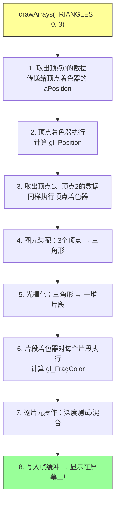

#### 运行效果

在浏览器中打开 HTML 文件，你会看到一个红-绿-蓝渐变的三角形！

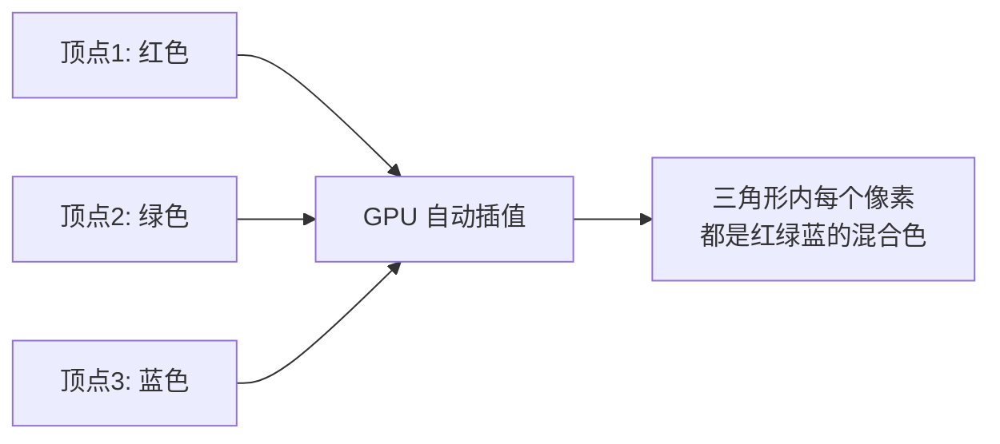

### 3.3 小白常见问题

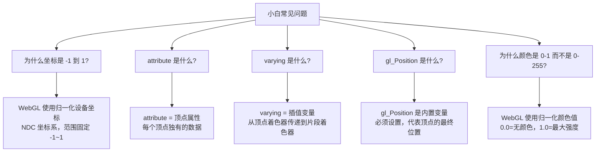

### 3.4 入门篇小结与自测

完成入门篇后，你应该能回答：

- [ ] WebGL 的渲染管线有哪几个主要阶段？
- [ ] 顶点着色器和片段着色器各自负责什么？
- [ ] 如何把一个三角形的数据传递给 GPU？
- [ ] `gl.drawArrays()` 的参数是什么意思？

---

## 四、进阶篇：核心概念深入

### 4.1 WebGL 渲染管线详解

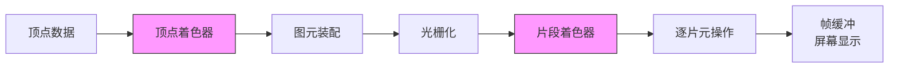

> 🔑 **关键理解**：顶点着色器和片段着色器是**可编程**的，其他阶段是固定的或由 GPU 自动处理。

### 4.2 变换矩阵：从模型到屏幕

这是 WebGL 学习中最重要也最容易卡住的知识点。

#### 小白版解释

想象你在用手机拍照：

| 变换 | 类比 | 矩阵 |
|------|------|------|
| **模型变换** | 摆放拍摄对象（移动/旋转/缩放） | Model Matrix |
| **视图变换** | 移动手机摄像头的位置 | View Matrix |
| **投影变换** | 选择广角/长焦镜头（决定可视范围） | Projection Matrix |

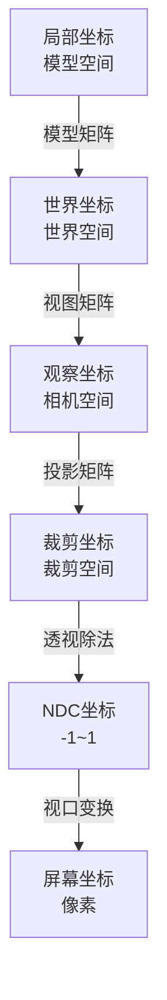

#### 代码示例：使用 gl-matrix 库

```javascript
import { mat4, vec3 } from 'gl-matrix';

// 创建各种矩阵
const modelMatrix = mat4.create();    // 模型矩阵
const viewMatrix = mat4.create();     // 视图矩阵
const projectionMatrix = mat4.create(); // 投影矩阵

// 模型变换：平移 + 旋转 + 缩放
mat4.translate(modelMatrix, modelMatrix, [0, 0, -5]);  // 向后移动5个单位
mat4.rotateY(modelMatrix, modelMatrix, Math.PI / 4);   // 绕Y轴旋转45度
mat4.scale(modelMatrix, modelMatrix, [1.5, 1.5, 1.5]); // 放大1.5倍

// 视图变换：设置相机位置
mat4.lookAt(viewMatrix,
    [0, 0, 5],   // 相机位置（眼睛）
    [0, 0, 0],   // 看向的目标点
    [0, 1, 0]    // 上方向（世界的上）
);

// 投影变换：透视投影（模拟人眼）
mat4.perspective(projectionMatrix,
    Math.PI / 4,  // 视野角度（FOV）= 45度
    canvas.width / canvas.height,  // 宽高比
    0.1,  // 近平面
    100.0 // 远平面
);

// 将矩阵传递给着色器
gl.uniformMatrix4fv(modelUniform, false, modelMatrix);
gl.uniformMatrix4fv(viewUniform, false, viewMatrix);
gl.uniformMatrix4fv(projUniform, false, projectionMatrix);
```

### 4.3 纹理映射（Texture Mapping）

#### 概念解释

纹理 = 把一张图片"贴"到 3D 模型表面。

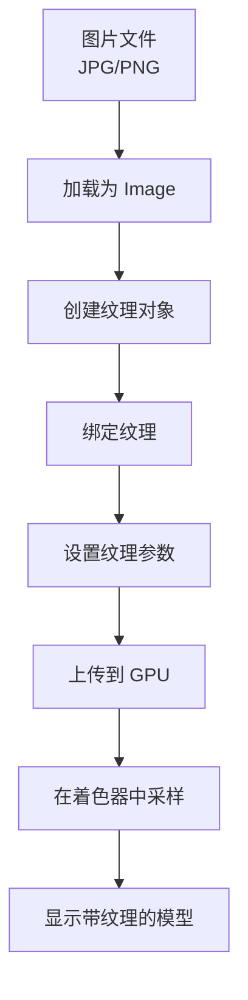

#### 代码示例

```javascript
// 1. 加载纹理图片
const texture = gl.createTexture();
const image = new Image();
image.onload = () => {
    gl.bindTexture(gl.TEXTURE_2D, texture);
    gl.texImage2D(gl.TEXTURE_2D, 0, gl.RGBA, gl.RGBA, gl.UNSIGNED_BYTE, image);
    
    // 生成 mipmap（多级渐远纹理，用于远处显示）
    gl.generateMipmap(gl.TEXTURE_2D);
};
image.src = 'texture.png';

// 2. 在片段着色器中使用纹理
const fsSource = `
    precision mediump float;
    varying vec2 vTexCoord;          // 纹理坐标（从顶点着色器传递）
    uniform sampler2D uTexture;      // 纹理采样器
    void main() {
        gl_FragColor = texture2D(uTexture, vTexCoord);  // 采样纹理颜色
    }
`;
```

### 4.4 光照模型

#### 光照类型对比

| 光照类型 | 计算复杂度 | 效果 | 适用场景 |
|----------|:---:|------|----------|
| **环境光** | ⭐ | 基础亮度 | 所有场景 |
| **漫反射** | ⭐⭐ | 明暗变化 | 大多数物体 |
| **镜面反射** | ⭐⭐⭐ | 高光效果 | 光滑表面 |
| **Phong 模型** | ⭐⭐⭐ | 经典光照 | 通用 |
| **PBR** | ⭐⭐⭐⭐⭐ | 物理真实 | 高端渲染 |

#### Phong 光照模型示意图

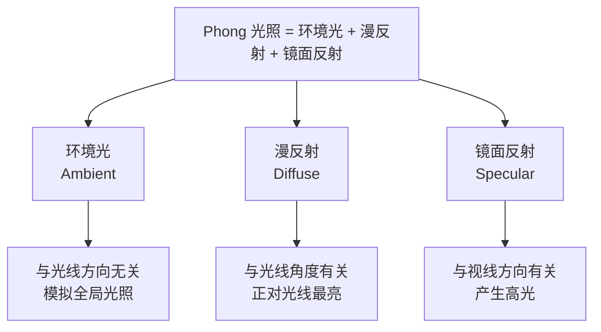

#### 着色器代码示例（Phong 光照）

```glsl
// 片段着色器 - Phong 光照模型
precision mediump float;

varying vec3 vNormal;     // 法线（从顶点着色器传递）
varying vec3 vFragPos;    // 片段世界坐标

uniform vec3 uLightPos;   // 光源位置
uniform vec3 uViewPos;    // 观察者位置
uniform vec3 uLightColor; // 光源颜色

void main() {
    // 环境光
    float ambientStrength = 0.1;
    vec3 ambient = ambientStrength * uLightColor;
    
    // 漫反射
    vec3 norm = normalize(vNormal);
    vec3 lightDir = normalize(uLightPos - vFragPos);
    float diff = max(dot(norm, lightDir), 0.0);
    vec3 diffuse = diff * uLightColor;
    
    // 镜面反射
    float specularStrength = 0.5;
    vec3 viewDir = normalize(uViewPos - vFragPos);
    vec3 reflectDir = reflect(-lightDir, norm);
    float spec = pow(max(dot(viewDir, reflectDir), 0.0), 32.0);
    vec3 specular = specularStrength * spec * uLightColor;
    
    // 合并结果
    vec3 result = ambient + diffuse + specular;
    gl_FragColor = vec4(result, 1.0);
}
```

---

## 五、高级篇：高级渲染技术

### 5.1 帧缓冲（Framebuffer）

#### 概念

> 帧缓冲 = 离屏渲染的"画布"。你可以先把场景渲染到一张纹理上，再对这张纹理做后处理。

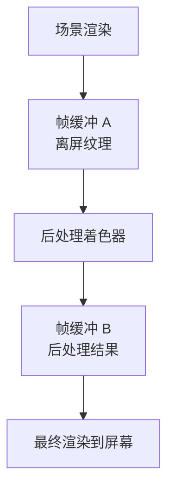

#### 应用场景

| 技术 | 用途 | 原理 |
|------|------|------|
| **阴影映射** | 实现阴影 | 从光源视角渲染深度图 |
| **延迟渲染** | 处理大量光源 | 先存几何信息，后计算光照 |
| **后处理** | 泛光、景深、色调映射 | 对渲染结果做全屏处理 |
| **反射** | 镜面反射效果 | 渲染反射面的视角 |
| **SSAO** | 环境光遮蔽 | 屏幕空间计算遮挡 |

### 5.2 阴影技术

#### 阴影映射（Shadow Mapping）流程

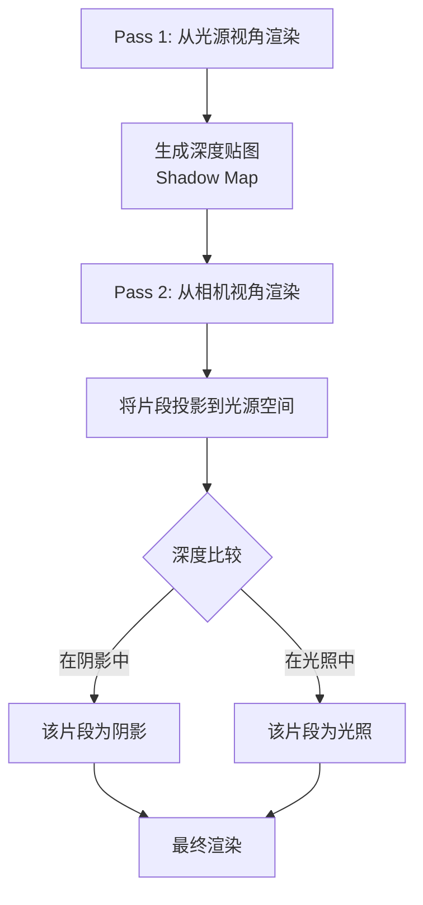

### 5.3 粒子系统

#### 粒子系统架构

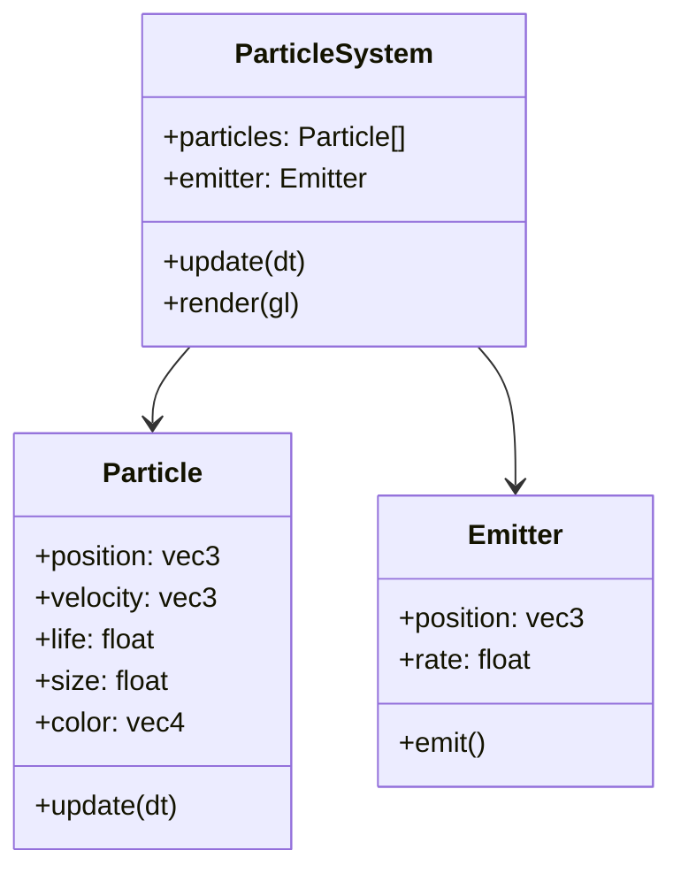

#### 典型粒子效果

| 效果 | 关键技术 | 难度 |
|------|----------|:---:|
| **火焰** | 加法混合 + 颜色渐变 | ⭐⭐ |
| **烟雾** | 减法混合 + 噪声纹理 | ⭐⭐⭐ |
| **爆炸** | 径向力场 + 粒子大小变化 | ⭐⭐⭐ |
| **水流** | 物理模拟 + 折射 | ⭐⭐⭐⭐ |
| **毛发** | 曲面细分 + 各向异性 | ⭐⭐⭐⭐⭐ |

### 5.4 PBR 物理渲染

#### PBR 核心概念

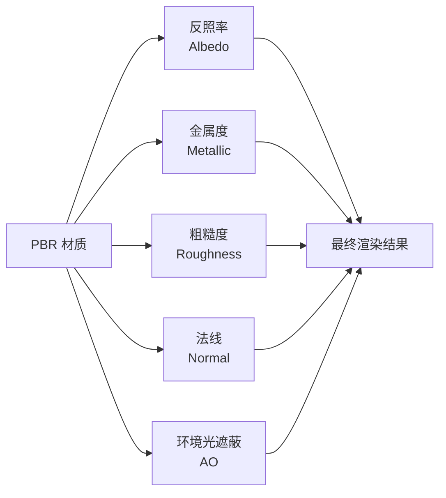

#### PBR 与 Phong 对比

| 特性 | Phong | PBR |
|------|-------|-----|
| 真实性 | 低 | **极高** |
| 能量守恒 | ❌ | ✅ |
| 材质参数 | 主观 | **物理真实** |
| 学习曲线 | 平缓 | 陡峭 |
| 适用场景 | 卡通/复古 | 写实/现代 |

---

## 六、专家篇：引擎与性能优化

### 6.1 Three.js 快速上手

Three.js 是最流行的 WebGL 封装库，让你不用直接写底层 WebGL 代码。

#### 原生 WebGL vs Three.js 对比

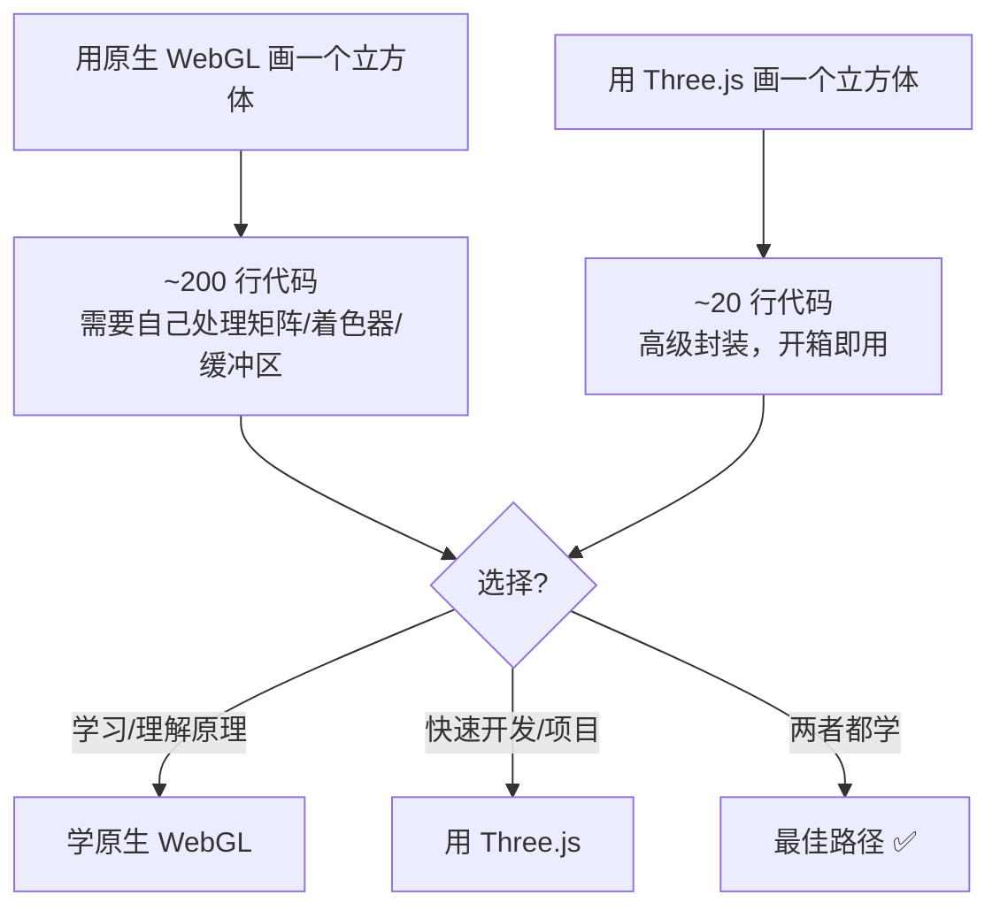

#### WebGL 与 Three.js 的关系和区别

**一、架构关系图**

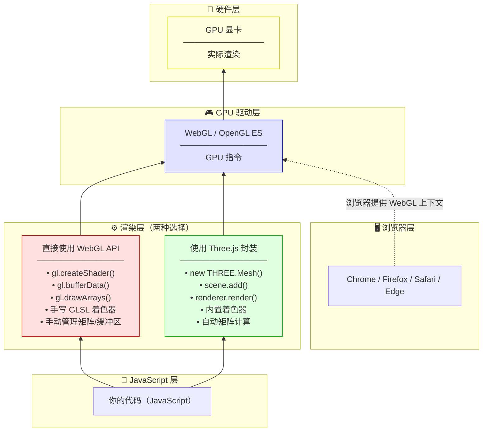

> 💡 **关键理解**：Three.js 底层仍然调用 WebGL API！它只是一个"翻译官"，把你写的简单代码翻译成复杂的 WebGL 指令。

**二、代码量对比（画一个旋转立方体）**

| 对比维度 | 原生 WebGL | Three.js |
|----------|-----------|----------|
| 总代码行数 | ~200 行 | ~20 行 |
| 需要写 GLSL 着色器？ | ✅ 必须手写 | ❌ 内置，无需手写 |
| 需要手动创建缓冲区？ | ✅ 是 | ❌ 自动管理 |
| 需要自己计算矩阵？ | ✅ 是（投影/视图/模型） | ❌ 内置相机和矩阵 |
| 需要管理 WebGL 状态？ | ✅ 是 | ❌ 自动管理 |
| 学习曲线 | 陡峭 🔴 | 平缓 🟢 |
| 灵活性 | 最高（完全控制） | 高（但受封装限制） |
| 适合场景 | 学习原理 / 极致性能优化 | 快速开发 / 大型项目 |

**三、功能覆盖对比**

```mermaid
flowchart LR
    subgraph WebGL["原生 WebGL 提供"]
        W1["顶点缓冲区"]
        W2["着色器编译"]
        W3["绘制指令"]
        W4["纹理上传"]
        W5["帧缓冲区"]
    end

    subgraph Three["Three.js 额外提供"]
        T1["场景图（Scene Graph）"]
        T2["相机系统（透视/正交/VR）"]
        T3["光照系统（环境/点/方向/聚光）"]
        T4["材质系统（PBR/Phong/Lambert）"]
        T5["几何体库（立方体/球体/平面...）"]
        T6["加载器（GLTF/OBJ/FBX...）"]
        T7["控制器（轨道/飞行/第一人称）"]
        T8["后期处理（泛光/景深/SSAO）"]
        T9["物理引擎集成"]
        T10["粒子系统"]
    end

    WebGL ==> Three

    style WebGL fill:#ffe8e8,stroke:#c00
    style Three fill:#e8ffe8,stroke:#0a0
```

> 💡 **类比理解**：
> - **原生 WebGL** = 手动挡汽车：你控制离合、换挡、油门，能完全发挥性能，但学习成本高
> - **Three.js** = 自动挡汽车：踩油门就走，简单易用，但你想做极限操作时会受限制

**四、何时选择哪种方案？**

| 场景 | 推荐方案 | 理由 |
|------|----------|------|
| 🎓 学习 3D 渲染原理 | 原生 WebGL | 理解着色器、管线、矩阵变换的本质 |
| 🚀 快速原型 / Demo | Three.js | 20 行代码就能出效果 |
| 🏢 商业项目 / 产品 | Three.js | 生态成熟、开发效率高 |
| 🎮 高性能需求（大场景 / 海量物体） | 原生 WebGL 或自定义引擎 | 完全控制渲染管线，极致优化 |
| 🎨 特殊渲染效果（非标准 PBR） | 原生 WebGL | 需要完全自定义着色器 |
| 📚 教学 / 演示 | Three.js | 代码简洁，易于展示逻辑 |

#### Three.js 核心概念

```javascript
// 1. 创建场景（舞台）
const scene = new THREE.Scene();

// 2. 创建相机（观众的眼睛）
const camera = new THREE.PerspectiveCamera(
    75,                    // 视野角度
    window.innerWidth / window.innerHeight,  // 宽高比
    0.1,                  // 近平面
    1000                  // 远平面
);
camera.position.z = 5;

// 3. 创建渲染器（导演）
const renderer = new THREE.WebGLRenderer();
renderer.setSize(window.innerWidth, window.innerHeight);
document.body.appendChild(renderer.domElement);

// 4. 创建几何体（演员的形体）
const geometry = new THREE.BoxGeometry(1, 1, 1);

// 5. 创建材质（演员的皮肤）
const material = new THREE.MeshBasicMaterial({ color: 0x00ff00 });

// 6. 创建网格（把几何体和材质组合成演员）
const cube = new THREE.Mesh(geometry, material);
scene.add(cube);

// 7. 动画循环（每一帧更新）
function animate() {
    requestAnimationFrame(animate);
    cube.rotation.x += 0.01;
    cube.rotation.y += 0.01;
    renderer.render(scene, camera);
}
animate();
```

### 6.2 其他 WebGL 引擎对比

| 引擎 | 定位 | 包大小 | 学习曲线 | 适合场景 |
|------|------|--------|----------|----------|
| **Three.js** | 通用 3D 库 | ~150KB | ⭐⭐ | 大多数 Web 3D 项目 |
| **Babylon.js** | 游戏引擎 | ~200KB | ⭐⭐⭐ | 3D 游戏、微软系 |
| **Cocos Creator** | 游戏引擎 | ~50KB | ⭐⭐ | 微信小游戏、H5 游戏 |
| **PixiJS** | 2D 渲染 | ~80KB | ⭐ | 2D 游戏、互动广告 |
| **PlayCanvas** | 云引擎 | ~100KB | ⭐⭐⭐ | 在线协作、3D 游戏 |
| **原生的 WebGL** | 底层 API | 0 | ⭐⭐⭐⭐⭐ | 学习/极致性能/自研引擎 |

### 6.3 性能优化 Checklist

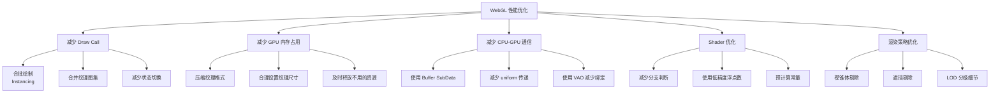

#### 关键优化技术详解

| 技术 | 原理 | 性能提升 |
|------|------|----------|
| **实例化渲染** | 一次 Draw Call 画多个相同模型 | ⭐⭐⭐⭐⭐ |
| **纹理压缩** | 使用 ETC/ASTC/BC 格式 | ⭐⭐⭐⭐ |
| **视锥体剔除** | 不渲染相机看不到的物体 | ⭐⭐⭐⭐ |
| **合批绘制** | 合并相同材质的物体 | ⭐⭐⭐⭐ |
| **Shader 简化** | 根据距离使用不同复杂度 Shader | ⭐⭐⭐ |

---

## 七、实战项目

### 7.1 项目难度阶梯

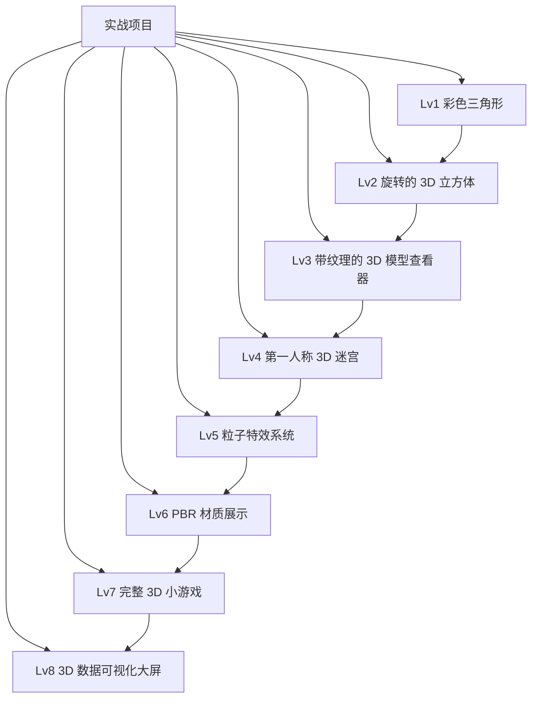

### 7.2 项目：3D 模型查看器（Lv3）

#### 功能需求

- [ ] 加载 GLTF/OBJ 格式的 3D 模型
- [ ] 鼠标拖拽旋转模型
- [ ] 鼠标滚轮缩放
- [ ] 显示模型信息（顶点数、三角形数）
- [ ] 切换线框/实体渲染模式
- [ ] 加载模型自带纹理

#### 技术架构

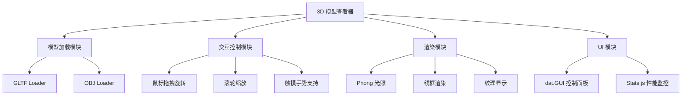

### 7.3 项目：粒子火焰特效（Lv5）

#### 实现要点

```javascript
// 粒子系统核心代码框架
class ParticleSystem {
    constructor(maxParticles = 1000) {
        this.particles = new Array(maxParticles);
        this.aliveCount = 0;
    }
    
    emit(count) {
        // 发射新粒子
        for (let i = 0; i < count && this.aliveCount < this.particles.length; i++) {
            this.particles[this.aliveCount++] = this.createParticle();
        }
    }
    
    update(dt) {
        // 更新所有存活粒子
        for (let i = 0; i < this.aliveCount; i++) {
            const p = this.particles[i];
            p.life -= dt;
            if (p.life <= 0) {
                // 回收死亡的粒子（与最后一个存活粒子交换）
                [this.particles[i], this.particles[this.aliveCount - 1]] = 
                [this.particles[this.aliveCount - 1], this.particles[i]];
                this.aliveCount--;
                i--; // 重新检查当前位置
            } else {
                p.position += p.velocity * dt;
                p.size *= 0.99; // 逐渐缩小
            }
        }
    }
}
```

---

## 附录 A：基础知识速查

### A.1 数学知识速查

#### 向量（Vector）

> **小白解释**：向量 = 一个有方向、有长度的箭头。在图形学中，用来表示位置、方向、颜色等。

| 操作 | 公式 | 用途 |
|------|------|------|
| **向量加法** | `a + b = (ax+bx, ay+by, az+bz)` | 位移叠加 |
| **向量减法** | `a - b = (ax-bx, ay-by, az-bz)` | 计算方向 |
| **点积** | `a·b = ax*bx + ay*by + az*bz` | 计算夹角、投影 |
| **叉积** | `a×b = (ay*bz-az*by, az*bx-ax*bz, ax*by-ay*bx)` | 计算垂直向量 |
| **归一化** | `a / |a|` | 得到单位向量 |

```mermaid
flowchart LR
    A[点积 a·b] --> A1[>0: 方向大致相同]
    A --> A2[=0: 垂直]
    A --> A3[<0: 方向大致相反]
    
    B[叉积 a×b] --> B1[结果垂直于 a 和 b]
    B --> B2[用于计算法线方向]
```

#### 矩阵（Matrix）

> **小白解释**：矩阵 = 一个变换工具。可以对向量进行平移、旋转、缩放等操作。

**4x4 矩阵在 WebGL 中的结构**：

```
| a b c d |
| e f g h |
| i j k l |
| m n o p |
```

其中：
- 左上角 3x3 负责旋转和缩放
- 最右列 `d, h, l` 通常用于透视投影
- 最底行 `m, n, o, p` 中 `m, n, o` 负责平移，`p` 通常为 1

#### 坐标系转换流程

```mermaid
flowchart TD
    A["局部坐标<br/>(模型自身坐标系)"] -->|模型矩阵 Model| B["世界坐标<br/>(场景中的绝对位置)"]
    B -->|视图矩阵 View| C["观察坐标<br/>(以相机为原点的坐标系)"]
    C -->|投影矩阵 Projection| D["裁剪坐标<br/>(可视范围内)"]
    D -->|透视除法| E["NDC 坐标<br/>(归一化设备坐标 -1~1)"]
    E -->|视口变换| F["屏幕坐标<br/>(像素位置)"]
    
    style A fill:#e1f5fe
    style F fill:#e1f5fe
```

### A.2 WebGL API 速查表

#### 常用常量

| 常量 | 值/含义 | 说明 |
|------|---------|------|
| `gl.POINTS` | 0x0000 | 画点 |
| `gl.LINES` | 0x0001 | 画线（每2个点一组） |
| `gl.TRIANGLES` | 0x0004 | 画三角形（每3个点一组） |
| `gl.TRIANGLE_STRIP` | 0x0005 | 三角带（复用顶点） |
| `gl.ARRAY_BUFFER` | — | 顶点数据缓冲区 |
| `gl.ELEMENT_ARRAY_BUFFER` | — | 索引数据缓冲区 |
| `gl.TEXTURE_2D` | — | 2D 纹理 |
| `gl.COLOR_BUFFER_BIT` | — | 颜色缓冲区 |
| `gl.DEPTH_BUFFER_BIT` | — | 深度缓冲区 |

#### 常用函数

| 函数 | 作用 | 小白解释 |
|------|------|----------|
| `getContext('webgl')` | 获取 WebGL 上下文 | 拿到画笔 |
| `createShader()` | 创建着色器 | 准备一个"处理程序" |
| `shaderSource()` | 设置着色器源码 | 写入处理程序的逻辑 |
| `compileShader()` | 编译着色器 | 编译处理程序 |
| `createProgram()` | 创建程序 | 把多个处理程序打包 |
| `linkProgram()` | 链接程序 | 让处理程序们能协同工作 |
| `useProgram()` | 使用程序 | 告诉 GPU 用这套处理程序 |
| `createBuffer()` | 创建缓冲区 | 准备一块 GPU 内存 |
| `bindBuffer()` | 绑定缓冲区 | 把内存标记为"当前操作目标" |
| `bufferData()` | 上传数据 | 把数据写入 GPU 内存 |
| `drawArrays()` | 绘制 | 开始画！ |
| `drawElements()` | 用索引绘制 | 用索引来画（更省内存） |
| `clear()` | 清除缓冲区 | 擦除画布 |

### A.3 着色器语言 GLSL 速查

#### 数据类型

| 类型 | 含义 | 示例 |
|------|------|------|
| `float` | 浮点数 | `float a = 1.0;` |
| `int` | 整数 | `int i = 42;` |
| `vec2` | 2D 向量 | `vec2 v = vec2(1.0, 2.0);` |
| `vec3` | 3D 向量 | `vec3 v = vec3(1.0, 2.0, 3.0);` |
| `vec4` | 4D 向量 | `vec4 v = vec4(1.0, 2.0, 3.0, 1.0);` |
| `mat4` | 4x4 矩阵 | `mat4 m = mat4(1.0);` |
| `sampler2D` | 2D 纹理采样器 | `uniform sampler2D tex;` |

#### 内置变量

| 变量 | 类型 | 用途 |
|------|------|------|
| `gl_Position` | `vec4` | **必须设置**，顶点位置 |
| `gl_PointSize` | `float` | 点的大小（仅点渲染时） |
| `gl_FragColor` | `vec4` | **必须设置**，像素颜色 |
| `gl_FragCoord` | `vec4` | 当前像素的屏幕坐标 |

#### 常用内置函数

| 函数 | 作用 |
|------|------|
| `dot(a, b)` | 点积 |
| `cross(a, b)` | 叉积 |
| `normalize(v)` | 归一化 |
| `length(v)` | 向量长度 |
| `reflect(I, N)` | 向量反射 |
| `texture2D(sampler, coord)` | 纹理采样 |
| `mix(a, b, t)` | 线性插值 |
| `clamp(x, min, max)` | 限制范围 |

### A.4 图形学术语表

| 术语 | 英文 | 小白解释 |
|------|------|----------|
| **光栅化** | Rasterization | 把矢量图形转成像素点的过程 |
| **着色器** | Shader | 运行在 GPU 上的小程序 |
| **顶点** | Vertex | 3D 模型的一个角点 |
| **片元** | Fragment | 即将成为像素的候选者 |
| **图元** | Primitive | 基本图形单元（点/线/三角形） |
| **纹理** | Texture | 贴在模型表面的图片 |
| **法线** | Normal | 垂直于表面的方向向量 |
| **UV 坐标** | UV Coordinate | 纹理的"地图坐标"（0~1） |
| **Mipmap** | Mipmap | 预先生成的多级缩小版纹理 |
| **深度测试** | Depth Test | 判断哪个物体离相机更近 |
| **模板测试** | Stencil Test | 限制渲染区域的测试 |
| **Alpha 混合** | Alpha Blending | 实现半透明效果 |
| **视口** | Viewport | 渲染结果的显示区域 |
| **帧缓冲** | Framebuffer | 渲染结果的存储区域 |

---

## 附录 B：学习资源推荐

### B.1 在线教程

| 资源 | 类型 | 难度 | 特点 | 链接 |
|------|------|:---:|------|------|
| **WebGL 基础教程** | 中文教程 | ⭐⭐ | 雪峰的 WebGL 教程，中文友好 | [webglfundamentals.org](https://webglfundamentals.org) |
| **LearnOpenGL** | 英文教程 | ⭐⭐⭐ | 图形学经典教程，有 WebGL 版本 | [learnopengl.com](https://learnopengl.com) |
| **Three.js 官方文档** | 官方文档 | ⭐⭐ | 最权威的 Three.js 文档 | [threejs.org/docs](https://threejs.org/docs) |
| **WebGL 规范** | 官方规范 | ⭐⭐⭐⭐⭐ | 最权威但最枯燥 | [khronos.org](https://registry.khronos.org/webgl) |
| **The Book of Shaders** | 在线书籍 | ⭐⭐⭐ | 专注着色器艺术 | [thebookofshaders.com](https://thebookofshaders.com) |

### B.2 推荐书籍

```mermaid
flowchart TD
    A[WebGL/图形学书籍推荐] --> B[入门级]
    A --> C[进阶级]
    A --> D[专家级]
    
    B --> B1["《WebGL 编程指南》<br/>推荐 ⭐⭐⭐⭐⭐<br/>最经典的 WebGL 入门书"]
    B --> B2["《Three.js 开发指南》<br/>推荐 ⭐⭐⭐⭐<br/>Three.js 实战"]
    
    C --> C1["《Real-Time Rendering》<br/>推荐 ⭐⭐⭐⭐⭐<br/>图形学圣经"]
    C --> C2["《OpenGL 编程指南》<br/>推荐 ⭐⭐⭐⭐<br/>红宝书"]
    
    D --> D1["《Physically Based Rendering》<br/>推荐 ⭐⭐⭐⭐⭐<br/>PBR 权威著作"]
    D --> D2["《GPU Gems》系列<br/>推荐 ⭐⭐⭐⭐⭐<br/>NVIDIA 经典文集"]
```

### B.3 开源项目参考

| 项目 | 描述 | 学习价值 |
|------|------|----------|
| **Three.js** | 最流行的 WebGL 库 | 学习引擎架构、渲染优化 |
| **Babylon.js** | 微软出品的 3D 引擎 | 学习游戏引擎设计 |
| **regl** | 函数式 WebGL 封装 | 学习简洁的 WebGL 抽象 |
| **p5.js** | 创意编程库 | 学习图形学艺术表达 |
| **Cocos Creator** | 微信小游戏引擎 | 学习游戏引擎实战 |

### B.4 工具推荐

| 工具 | 用途 | 说明 |
|------|------|------|
| **Chrome DevTools** | 调试 WebGL | Performance 面板分析 GPU 性能 |
| **Spector.js** | WebGL 调试器 | 查看每一帧的 WebGL 调用 |
| **Blender** | 3D 建模 | 免费开源的 3D 建模软件 |
| **GLTF Viewer** | 模型查看 | 在线查看 GLTF 模型 |
| **Shadertoy** | Shader 创作 | 在线编写和分享着色器 |
| **CodePen** | 代码分享 | 在线演示 WebGL 效果 |

### B.5 社区与问答

| 社区 | 特点 |
|------|------|
| **Stack Overflow** | 技术问题首选，搜索 `[webgl]` 标签 |
| **Three.js Discourse** | Three.js 官方论坛 |
| **WebGL Public Mailing List** | WebGL 官方邮件列表 |
| **知乎 - 计算机图形学话题** | 中文讨论 |
| **GameDev.net** | 游戏开发综合社区 |

---

## 附录 C：常见问题 FAQ

### C.1 小白常见问题

**Q：我数学不好，能学 WebGL 吗？**
> ✅ 能！入门阶段只需要基础几何知识。遇到不懂的数学概念时，先知道"它是用来干什么的"，再慢慢理解"它是怎么算的"。附录 A 覆盖了所有需要的数学知识。

**Q：WebGL 1 还是 WebGL 2？**
> 建议**先学 WebGL 1**。WebGL 2 是 WebGL 1 的超集，学会 1 后再学 2 很容易。而且 WebGL 1 兼容性更好。

**Q：要不要直接学 Three.js，跳过原生 WebGL？**
> 建议**两者都学**。先学一点原生 WebGL 理解原理（1-2 周），再学 Three.js 提高效率。这样遇到问题时能深入底层调试。

**Q：WebGL 和 Canvas 2D 有什么区别？**
> Canvas 2D 是 CPU 渲染，适合简单图形；WebGL 是 GPU 渲染，适合复杂 3D。简单说：画图表用 Canvas 2D，做游戏/3D 用 WebGL。

**Q：学习 WebGL 需要什么硬件？**
> 任何能运行现代浏览器的电脑都可以。不需要独立显卡来学习基础知识。

### C.2 进阶常见问题

**Q：为什么我的纹理是颠倒的？**
> WebGL 的纹理坐标原点在左下角，而图片的原点通常在左上角。需要在加载纹理时设置 `gl.pixelStorei(gl.UNPACK_FLIP_Y_WEBGL, true)` 来翻转。

**Q：如何调试着色器？**
> 着色器代码很难调试（不能在着色器里设断点）。常用方法：
> 1. 用颜色输出中间值（把数据可视化）
> 2. 使用 Spector.js 捕获帧
> 3. 简化问题，逐步测试

**Q：Draw Call 太多怎么办？**
> 参见第六章的性能优化部分。核心是：合批、实例化、减少状态切换。

**Q：WebGL 1 和 WebGL 2 的主要区别？**
> WebGL 2 支持：顶点数组对象（VAO）、统一缓冲对象（UBO）、多个渲染目标（MRT）、片段着色器中的整数运算等。

---

## 附录 D：使用 Three.js 还需要学 WebGL 吗？

> **核心结论**：Three.js 能让你「绕开」WebGL 的很多细节，但无法让你「绕开」WebGL 的**核心概念**。要不要深入学，取决于你的目标深度。

### D.1 疑问一：既然 Three.js 封装得这么好，是不是可以不用学 WebGL 了？

#### 简短回答

| 你的目标 | 需要深入学 WebGL 吗？ | 说明 |
|----------|----------------------|------|
| 🎯 快速做一个 3D 展示页面 | ❌ 不需要 | Three.js 官方示例改改就能用 |
| 🎮 做一个完整的 3D 游戏 | ⚠️ 需要一点 | 会遇到性能问题、特效问题，需要懂原理才能解决 |
| 🎨 写自定义 Shader 特效 | ✅ 需要 | Three.js 的材质不够用时，必须自己写 GLSL |
| 🏢 找工作（图形/WebGL 方向） | ✅ 必须深入 | 面试必考原生 WebGL / 渲染原理 |
| 🚀 追求极致性能优化 | ✅ 必须深入 | 只有懂底层，才知道瓶颈在哪里 |

#### 类比理解

```mermaid
flowchart LR
    A[你] --> B{使用 Three.js}
    B -->|"只会用 API"| C["🌥️ 浮在空中<br/>遇到奇怪 bug 不知道怎么办<br/>特效做不到想要的效果"]
    B -->|"懂 WebGL 原理"| D["🌍 脚踏实地<br/>能读源码、能写自定义 Shader<br/>能定位性能瓶颈"]

    style C fill:#ffe0e0,stroke:#c00
    style D fill:#e0ffe0,stroke:#0a0
```

> 💡 **关键洞察**：Three.js 就像一个「黑盒」，你往里扔东西能得到不错的结果。但当你需要**控制黑盒内部**的时候，就必须打开它 — 而里面就是 WebGL。

#### 真实场景：只会 Three.js 会遇到哪些坑？

| 踩坑场景 | 只会 Three.js 的表现 | 懂 WebGL 后的表现 |
|----------|---------------------|------------------|
| 纹理显示不正确（颠倒/错位） | 不知道为什么，Google 半天 | 立刻知道是 UV 坐标或纹理参数的问题 |
| 场景卡顿（Draw Call 太多） | 不知道怎么优化 | 知道要合批、用 InstanceMesh、减少材质数量 |
| 想要一个独特的光照效果 | 找不到现成材质，放弃 | 自己写 Fragment Shader，轻松实现 |
| Three.js 某个 API 行为奇怪 | 只能看文档猜意思 | 直接看源码，理解底层 WebGL 调用 |
| 需要兼容低端设备 | 不知道如何降级 | 知道要控制纹理大小、顶点数量、着色器复杂度 |

---

### D.2 疑问二：如果我要用 Three.js，哪些 WebGL 知识是必须掌握的？

#### 高效学习路径：按需掌握，不必全盘精通

你**不需要**把 WebGL 的每个 API 都学一遍（那是浪费时间）。以下是**按需掌握**的知识地图：

```mermaid
flowchart TD
    subgraph 必学["✅ 必学（用 Three.js 也必须懂）"]
        B1["坐标系统<br/>（世界坐标/本地坐标/屏幕坐标）"]
        B2["变换矩阵基础<br/>（平移/旋转/缩放/矩阵乘法）"]
        B3["GPU 渲染管线流程<br/>（CPU→GPU→顶点着色器→片段着色器）"]
        B4["纹理原理<br/>（UV 坐标/纹理过滤/纹理包裹）"]
        B5["摄像机原理<br/>（透视/正交/视锥体）"]
    end

    subgraph 建议学["⚠️ 建议学（能解决 80% 非常规需求）"]
        S1["GLSL 着色器基础<br/>（语法/内置函数/ varying 传递）"]
        S2["光照模型基础<br/>（Lambert/Phong/PBR 原理）"]
        S3["深度缓冲与透明度<br/>（Z-fighting/Alpha 混合）"]
        S4["顶点属性与缓冲区<br/>（position/normal/uv 数据布局）"]
    end

    subgraph 可选学["🎓 可选学（图形程序员方向）"]
        O1["帧缓冲区（Framebuffer）"]
        O2["高级着色器技巧<br/>（噪声/法线贴图/阴影映射）"]
        O3["几何着色器/计算着色器"]
        O4["WebGL 2 高级特性"]
    end

    B1 & B2 & B3 & B4 & B5 --> S1 & S2 & S3 & S4 --> O1 & O2 & O3 & O4

    style B1 fill:#e0ffe0,stroke:#0a0
    style B2 fill:#e0ffe0,stroke:#0a0
    style B3 fill:#e0ffe0,stroke:#0a0
    style B4 fill:#e0ffe0,stroke:#0a0
    style B5 fill:#e0ffe0,stroke:#0a0
    style S1 fill:#ffffe0,stroke:#cc0
    style S2 fill:#ffffe0,stroke:#cc0
    style S3 fill:#ffffe0,stroke:#cc0
    style S4 fill:#ffffe0,stroke:#cc0
    style O1 fill:#ffe0e0,stroke:#c00
    style O2 fill:#ffe0e0,stroke:#c00
    style O3 fill:#ffe0e0,stroke:#c00
    style O4 fill:#ffe0e0,stroke:#c00
```

#### 必学知识点详解（用 Three.js 也必须懂）

**① 坐标系统**

> 这是最容易踩坑的地方。Three.js 帮你做了很多转换，但你需要知道每个坐标空间的含义：

| 坐标空间 | Three.js 中的对应 | 为什么必须懂 |
|----------|------------------|-------------|
| 局部坐标（Local） | `mesh.position` 是相对于父节点的 | 做角色骨骼动画时必须理解 |
| 世界坐标（World） | `mesh.getWorldPosition()` | 判断物体之间的距离、碰撞检测 |
| 观察坐标（View） | `camera.matrixWorldInverse` | 理解相机裁剪空间 |
| 裁剪坐标（Clip） | 着色器输出的 `gl_Position` | 理解为什么有些物体不显示 |
| 屏幕坐标（Screen） | `vector.project(camera)` | 做 UI 跟随 3D 物体时必须懂 |

```mermaid
flowchart LR
    A["局部坐标<br/>（模型空间）"] -->|"模型矩阵 Model Matrix"| B["世界坐标<br/>（World Space）"]
    B -->|"视图矩阵 View Matrix"| C["观察坐标<br/>（Camera Space）"]
    C -->|"投影矩阵 Projection Matrix"| D["裁剪坐标<br/>（Clip Space）"]
    D -->|"透视除法"| E["NDC 坐标<br/>（-1~+1）"]
    E -->|"视口变换"| F["屏幕坐标<br/>（像素）"]

    style A fill:#e0f0ff
    style B fill:#e0ffe0
    style C fill:#fff0e0
    style D fill:#ffe0f0
    style E fill:#f0e0ff
    style F fill:#ffe0e0
```

> 💡 **为什么必须懂**：当你发现 "3D 物体旁边显示 2D UI" 做不出来时，原因就是你不懂坐标空间转换。

**② 变换矩阵基础**

你不需要会手算矩阵乘法，但需要理解**矩阵在 3D 图形中的作用**：

```javascript
// Three.js 中，你每天都在用矩阵，只是没察觉：
mesh.position.set(1, 2, 3);   // ← 内部：模型矩阵做平移
mesh.rotation.y = Math.PI / 4; // ← 内部：模型矩阵做旋转
mesh.scale.set(2, 2, 2);       // ← 内部：模型矩阵做缩放

// 这三件事，在 GPU 里就是一个 4x4 矩阵乘以顶点坐标
```

> 💡 **为什么必须懂**：当你需要「让 Camera 始终跟随角色」、「计算炮弹的飞行轨迹」、「做人物IK（反向运动学）」时，矩阵是绕不开的。

**③ GPU 渲染管线流程**

这是理解「为什么 Shader 能工作」的前提：

```mermaid
flowchart TD
    A["CPU 端<br/>• 定义几何体<br/>• 设置材质<br/>• 计算矩阵"] --> B["传递给 GPU"]
    B --> C["顶点着色器<br/>（Vertex Shader）<br/>处理每个顶点的位置"]
    C --> D["图元装配<br/>（组装成三角形）"]
    D --> E["光栅化<br/>（把三角形变成像素）"]
    E --> F["片段着色器<br/>（Fragment Shader）<br/>计算 each 像素的颜色"]
    F --> G["逐片元操作<br/>（深度测试/模板测试/混合）"]
    G --> H["帧缓冲区<br/>（最终图像）"]

    style C fill:#e0ffe0,stroke:#0a0
    style F fill:#e0ffe0,stroke:#0a0
    style A fill:#e0e0ff,stroke:#00c
```

> 💡 **为什么必须懂**：当你写的 Shader 效果不对时，你需要知道是「顶点着色器的问题」还是「片段着色器的问题」，这要求你理解管线流程。

**④ 纹理与 UV 坐标**

```mermaid
flowchart LR
    A["3D 模型上的每个顶点<br/>有一个 UV 坐标<br/>（u,v）=（0~1, 0~1）"] --> B["UV 坐标映射到<br/>纹理图片上的像素"]
    B --> C["GPU 插值计算出<br/>每个像素对应的纹理颜色"]

    style A fill:#e0f0ff
    style B fill:#e0ffe0
    style C fill:#fff0e0
```

> 💡 **为什么必须懂**：纹理颠倒、拉伸、错位，90% 的原因都是 UV 坐标的问题。不懂 UV，你无法做纹理动画、纹理融合等效果。

**⑤ 摄像机与投影**

| 概念 | Three.js 对应 | 核心理解 |
|------|--------------|---------|
| 视锥体（Frustum） | `PerspectiveCamera` 的 `fov`/`near`/`far` | 决定哪些物体会被渲染 |
| 正交投影 | `OrthographicCamera` | 2D 游戏 / UI 渲染 |
| 透视投影 | `PerspectiveCamera` | 3D 游戏的真实感来源 |
| 投影矩阵 | `camera.projectionMatrix` | 把 3D 坐标压扁成 2D 屏幕 |

---

### D.3 高效掌握策略：三遍学习法

> 不要试图「一次学透 WebGL」。推荐用**三遍学习法**，每遍目标不同，效率最高。

```mermaid
flowchart TD
    subgraph 第一遍["📖 第一遍：轮廓认知（1-2 周）"]
        P1["跟着教程画一个三角形"]
        P2["理解顶点着色器和片段着色器的作用"]
        P3["理解 CPU → GPU 的数据传递流程"]
        P1 --> P2 --> P3
    end

    subgraph 第二遍["🛠️ 第二遍：项目驱动（1-2 个月）"]
        Q1["用 Three.js 做一个完整项目"]
        Q2["遇到问题时，回头查 WebGL 原理"]
        Q3["尝试写自定义 Shader（表面着色器）"]
        Q1 --> Q2 --> Q3
    end

    subgraph 第三遍["🎓 第三遍：深入底层（按需）"]
        R1["读 Three.js 源码"]
        R2["自己实现简化版 Three.js"]
        R3["学习高级渲染技术（PBR/阴影/后处理）"]
        R1 --> R2 --> R3
    end

    第一遍 --> 第二遍 --> 第三遍

    style P1 fill:#e0f0ff
    style P2 fill:#e0f0ff
    style P3 fill:#e0f0ff
    style Q1 fill:#e0ffe0
    style Q2 fill:#e0ffe0
    style Q3 fill:#e0ffe0
    style R1 fill:#fff0e0
    style R2 fill:#fff0e0
    style R3 fill:#fff0e0
```

#### 具体执行建议

**第一遍（轮廓认知）**：
1. 学完本文档 **入门篇（第一~三章）** 即可
2. 能画出一个带纹理的立方体，并理解每一行代码在做什么
3. **目标**：不是「会写」，而是「读懂」

**第二遍（项目驱动）**：
1. 开始用 Three.js 做项目（参考本文档第六章）
2. 遇到以下情况时，回头补 WebGL 知识：
   - 需要自定义材质效果 → 学 GLSL 基础
   - 场景卡顿 → 学渲染批次和性能优化
   - 光照效果不对 → 学光照模型原理
3. **目标**：能解决项目中的实际问题

**第三遍（深入底层）**：
1. 当你需要「做别人做不出来的效果」时
2. 当你准备面试图形/WebGL 岗位时
3. 当你想读懂 Three.js / Babylon.js 源码时
4. **目标**：建立完整的图形学知识体系

---

### D.4 知识对照表：Three.js API → WebGL 底层概念

> 这张表帮助你建立「上层 API → 底层原理」的映射关系，是高效学习的关键。

| Three.js 操作 | 底层发生了什么（WebGL） | 需要理解的原理 |
|--------------|----------------------|--------------|
| `new THREE.BoxGeometry()` | 创建顶点缓冲区（VBO），存入 GPU | 顶点属性布局 |
| `new THREE.MeshBasicMaterial()` | 绑定内置着色器程序 | 着色器原理 |
| `scene.add(mesh)` | 将物体加入场景图，计算世界矩阵 | 场景图（Scene Graph） |
| `mesh.position.set(x,y,z)` | 更新模型矩阵（Model Matrix） | 变换矩阵 |
| `renderer.render(scene, camera)` | 遍历场景图 → 设置 uniform → `gl.drawArrays()` | 渲染循环 |
| `texture = new THREE.Texture(img)` | `gl.texImage2D()` + 设置纹理参数 | 纹理原理 |
| `material.map = texture` | 将纹理单元绑定到采样器 uniform | 纹理单元 |
| `new THREE.PerspectiveCamera()` | 计算投影矩阵（Projection Matrix） | 投影变换 |
| `mesh.rotation.x += 0.01` | 更新模型矩阵的旋转分量 | 欧拉角 / 四元数 |
| `renderer.shadowMap.enabled=true` | 开启阴影映射（Shadow Mapping）渲染流程 | 帧缓冲区 / 深度纹理 |

> 💡 **学习技巧**：每当你使用一个新的 Three.js API，试着去想「这个操作在 GPU 里发生了什么？」养成这个思维习惯，你的图形学功底会快速提升。

---

### D.5 总结：给你的学习建议

```mermaid
flowchart LR
    A["你的目标"] --> B{需要深入WebGL?}
    B -->|"做展示/简单交互"| C["✅ 学 Three.js 就够了<br/>偶尔查 WebGL 概念"]
    B -->|"做游戏/复杂应用"| D["⚠️ 学 Three.js +<br/>重点掌握本文 D.2 必学知识"]
    B -->|"做特效/引擎/求职"| E["✅ 必须深入学 WebGL<br/>本文档从头学到尾"]

    style C fill:#e0ffe0,stroke:#0a0
    style D fill:#ffffe0,stroke:#cc0
    style E fill:#ffe0e0,stroke:#c00
```

**最终建议**：

> 🎯 **小白路径**：先学 Three.js 做出东西 → 遇到问题时学对应的 WebGL 原理 → 循环往复，逐步深入  
> 🎯 **高手路径**：快速过一遍原生 WebGL → 用 Three.js 做项目 → 深入定制 Shader 和性能优化  
> 🎯 **所有人**：不要纠结「先学哪个」，重要的是**开始写代码**。WebGL 和 Three.js 是互补关系，不是对立关系。

---

## 总结

```mermaid
mindmap
  root((WebGL 学习路径))
    入门
      第一个三角形
      理解着色器
      掌握绘制流程
    进阶
      变换矩阵
      纹理映射
      光照模型
    高级
      帧缓冲
      阴影技术
      粒子系统
      PBR 渲染
    专家
      Three.js/Babylon.js
      性能优化
      自研引擎
      图形学研究
```

### 最后的话

> WebGL 是一座山，山脚下看起来很高，但每一步都有风景。
> 
> **给小白**：不要被数学吓倒，边做边学是最好的方式。  
> **给高手**：WebGL 只是工具，图形学的思想才是核心，深入底层会让你的技术更扎实。  
> **给所有人**：保持好奇，多写 Demo，多看好看的 Shader 效果，享受创造视觉奇迹的乐趣！

---

*文档创建时间：2026年6月*  
*如有问题或建议，欢迎反馈*
