# WebGPU 学习指南 —— 从入门到精通

> **文档版本**：v1.0 | 2026年6月
> **作者**：汪亮 bertonwang
> **邮箱**：47608843@qq.com
> **适用人群**：从零基础小白 → 图形学高手   

---

## 📋 目录

1. [什么是 WebGPU？](#一什么是-webgpu)
2. [WebGPU vs WebGL](#二webgpu-vs-webgl)
3. [学习路线图](#三学习路线图)
4. [入门篇：Hello WebGPU](#四入门篇hello-webgpu)
5. [进阶篇：核心概念深入](#五进阶篇核心概念深入)
6. [高级篇：高级渲染技术](#六高级篇高级渲染技术)
7. [专家篇：引擎与性能优化](#七专家篇引擎与性能优化)
8. [实战项目](#八实战项目)
9. [附录 A：基础知识速查](#附录-a基础知识速查)
10. [附录 B：学习资源推荐](#附录-b学习资源推荐)
11. [附录 C：常见问题 FAQ](#附录-c常见问题-faq)
12. [附录 D：WebGPU 未来展望](#附录-dwebgpu-未来展望)

---

## 一、什么是 WebGPU？

### 1.1 一句话解释

> **WebGPU 是 WebGL 的继任者，是一个让浏览器直接调用现代 GPU（Vulkan/Metal/DirectX 12）的全新 Web 标准。它提供了更低层级、更高效的 GPU 访问能力，是未来 Web 图形和 GPU 计算的基础。**

### 1.2 小白版解释

想象你要让 GPU 帮你干活：

| 方式 | 工具 | 好比 | 性能 |
|------|------|------|------|
| **WebGL** | 老式指挥系统 | 通过对讲机指挥 GPU，指令繁琐、效率低 | 中等 |
| **🌟 WebGPU** | 现代化指挥系统 | 直接给 GPU 发作战指令，高效、灵活 | **极强** |
| **原生 Vulkan/Metal/DX12** | 操作系统级指挥 | 最底层、最高效，但只能在本地运行 | 最强 |

> 💡 **关键理解**：WebGPU = 把 Vulkan/Metal/DirectX 12 的能力搬到了浏览器里！

### 1.3 WebGPU 能做什么？

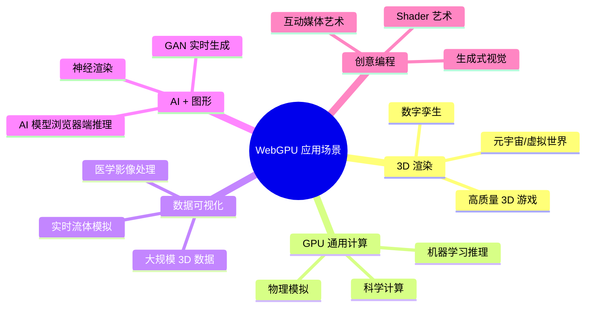

### 1.4 WebGPU 的核心优势

| 特性 | WebGL | WebGPU | 说明 |
|------|-------|--------|------|
| **底层 API** | OpenGL ES 2.0/3.0 | Vulkan/Metal/DX12 | 现代 GPU 架构 |
| **计算着色器** | ❌ 不支持 | ✅ 原生支持 | 可用 GPU 做通用计算 |
| **多线程** | ❌ 不支持 | ✅ 支持 | 可以多线程提交命令 |
| **内存管理** | 自动管理 | 显式控制 | 更高效的内存使用 |
| **着色器语言** | GLSL | WGSL | 现代化、类型安全 |
| **渲染管线** | 固定功能多 | 高度可配置 | 更灵活、更高效 |
| **交叉平台** | 广泛支持 | 现代浏览器 | 未来标准 |

---

## 二、WebGPU vs WebGL

> **小白一句话理解**：WebGL 是「老款浏览器用 GPU 的方式」，WebGPU 是「新款浏览器用 GPU 的方式」。两者的关系就像「功能机 vs 智能手机」—— 都能打电话（让 GPU 干活），但智能手机（WebGPU）能干的事多得多。

### 2.1 先搞懂：两者分别干什么事情？解决什么问题？

#### WebGL 是干什么的？

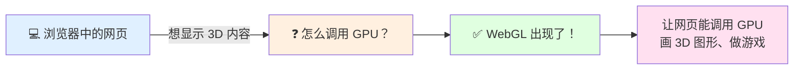

> **WebGL 解决的核心问题**：在 WebGL 出现之前，网页只能靠 CPU（Canvas 2D）来画图，速度很慢，做不了 3D 游戏。WebGL 让浏览器能直接调用 GPU，让网页也能跑 3D 游戏、做 3D 可视化。

| WebGL 能干什么 | 典型场景 |
|---------------|---------|
| 🎮 网页 3D 游戏 | 网页版 Minecraft、3D 跑酷游戏 |
| 📊 3D 数据可视化 | 3D 柱状图、地球仪、建筑模型展示 |
| 🏛️ 3D 展示 | 网上看房、汽车 3D 展示、博物馆文物 3D 展示 |
| 🎨 创意特效 | 网页背景动画、音乐可视化 |

#### WebGPU 是干什么的？

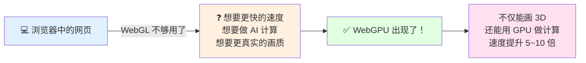

> **WebGPU 解决的核心问题**：WebGL 用的是「老一代 GPU 指令集」（OpenGL ES），而现代 GPU（你的电脑/手机里最新的显卡）用的是全新的指令集（Vulkan/Metal/DirectX 12），速度快得多。WebGPU 就是让浏览器能用上现代 GPU 的全部能力，不仅画 3D 更快，还能用 GPU 做 AI 计算、物理模拟等「非画图」的事情。

| WebGPU 能干什么（WebGL 做不到或做不好的） | 典型场景 |
|------------------------------------------|---------|
| 🚀 超大规模 3D 场景 | 开放世界游戏、百万级粒子的流体模拟 |
| 🤖 浏览器端 AI 推理 | 网页里直接跑人脸识别、姿态检测、大模型推理 |
| 🧪 科学计算 | 基因序列分析、天气预报模拟、物理引擎 |
| 🎬 电影级画质 | 光线追踪、全局光照、超真实材质 |
| 🎮 多人实时 3D 应用 | 元宇宙、虚拟会议、数字孪生 |

---

### 2.2 生活化类比：一眼看懂两者的关系

#### 类比一：手机进化史

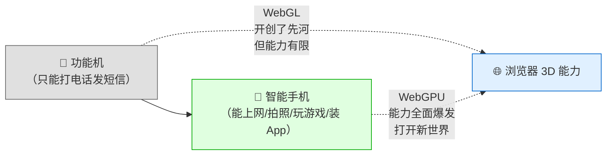

| 对比维度 | 功能机（WebGL） | 智能手机（WebGPU） |
|---------|----------------|-------------------|
| 核心能力 | 打电话（画 3D 图） | 打电话 + 上网 + 拍照 + 装 App（画 3D + GPU 计算 + AI） |
| 速度 | 慢 | 快 5~10 倍 |
| 能装的「App」 | 少 | 多（3D 游戏、AI、科学计算...） |
| 还能用吗？ | ✅ 能，但慢慢被淘汰 | ✅ 未来主流 |

#### 类比二：厨房升级

> 想象你在做菜（让 GPU 干活）：
> - **WebGL** = 老式厨房：一个灶台、手动切菜、工具少，能做家常菜（画 3D 图），但做满汉全席（大规模 3D 场景 + AI）就力不从心了
> - **WebGPU** = 现代厨房：多个灶台同时炒菜（多线程）、有料理机（Compute Shader）、工具齐全，速度快、能做的菜种类多

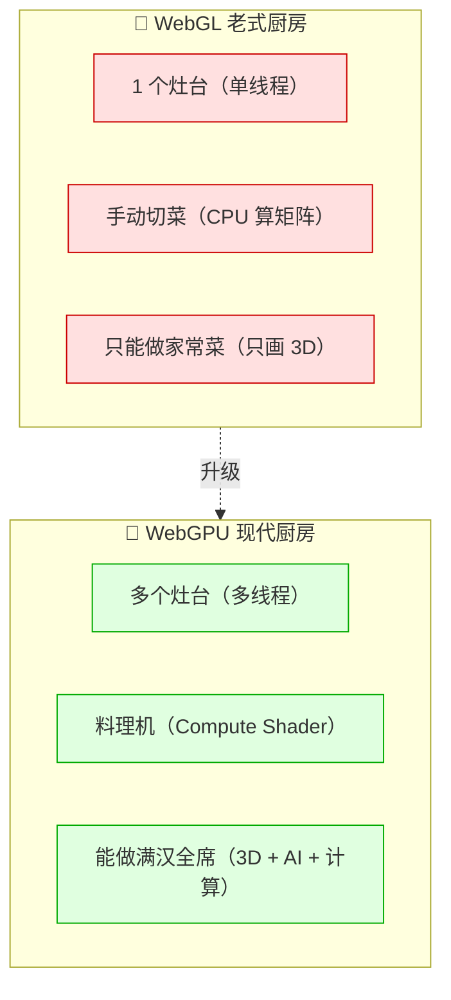

---

### 2.3 联系与区别：完整对比表

#### 联系（WebGPU 从哪里来？）

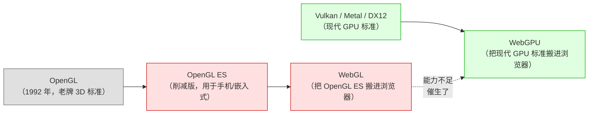

> **核心联系**：WebGPU 不是凭空出现的，它是 WebGL 的**进化版**。WebGL 基于老一代的 OpenGL ES，而 WebGPU 基于新一代的 Vulkan/Metal/DirectX 12。两者的最终目标一样：**让浏览器能调用 GPU**，只是 WebGPU 的方式更先进。

#### 区别（一张表看懂所有差异）

| 对比项 | WebGL | WebGPU | 小白解释 |
|--------|-------|--------|---------|
| **🏗️ 底层基础** | OpenGL ES 2.0/3.0（2006 年的技术） | Vulkan + Metal + DirectX 12（2016 年后的现代技术） | WebGL 用的是「老引擎」，WebGPU 用的是「新引擎」 |
| **🚀 速度** | 慢（状态机模式，CPU 开销大） | 快 5~10 倍（显式控制，CPU 开销小） | WebGPU 能压榨 GPU 的全部性能 |
| **🧮 能做计算吗？** | ❌ 不能（只能画图） | ✅ 能（Compute Shader，GPU 通用计算） | WebGL 只是「画师」，WebGPU 还是「数学家」 |
| **🧵 多线程** | ❌ 不支持（JS 主线程干活） | ✅ 支持（可多线程提交 GPU 命令） | WebGL 是一个人干活，WebGPU 可以多人同时干活 |
| **🎨 着色器语言** | GLSL（语法老旧） | WGSL（现代化、类型安全） | WebGPU 的着色器语言更像现代编程语言，不容易写错 |
| **📦 内存管理** | 自动管理（简单但低效） | 显式控制（复杂但高效） | WebGL 帮你收拾厨房（慢但省心），WebGPU 你自己收拾（快但需要学习） |
| **🌍 浏览器支持** | 几乎所有浏览器（IE11+） | Chrome 113+ / Edge 113+ / Firefox / Safari 18+ | WebGL 兼容性好，WebGPU 需要较新的浏览器 |
| **📚 学习资源** | 非常多（10+ 年积累） | 较少（新技术，正在快速增加） | WebGL 教程多，WebGPU 教程还在增加中 |
| **🔮 未来** | 维护模式（不再大版本更新） | 活跃发展（未来 10 年的 Web 图形标准） | WebGL 不会消失，但 WebGPU 是未来 |

---

### 2.4 架构对比：从代码到硬件的完整链路

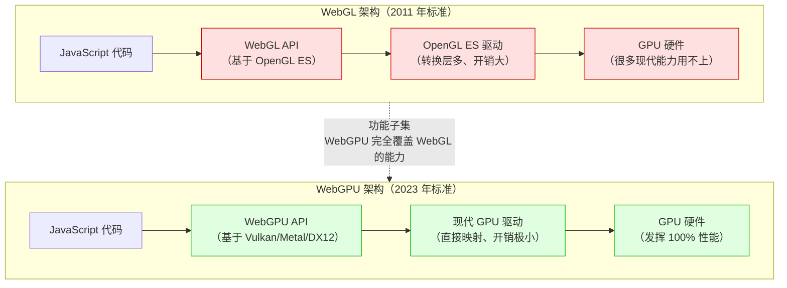

> 💡 **关键理解**：WebGPU 的 API 是直接映射到底层现代 GPU 驱动（Vulkan/Metal/DX12）的，中间转换层极少，所以速度快。而 WebGL 的 API 要先转成 OpenGL ES，再转成 GPU 驱动，中间转换层多，速度慢。

---

### 2.5 代码复杂度对比（画一个三角形）

很多人以为「新工具一定更复杂」，但 WebGPU 的设计其实更清晰：

| 对比维度 | WebGL 方式 | WebGPU 方式 | 小白感受 |
|---------|-----------|------------|---------|
| **着色器语言** | GLSL（语法老旧、错误提示不友好） | WGSL（现代化、类型安全、错误提示清晰） | WebGPU 的报错更容易看懂 |
| **状态管理** | 全局状态机（A 操作可能影响 B） | 显式配置（Pipeline 一次性配置好） | WebGL 容易「莫名其妙出错」，WebGPU 更可预测 |
| **资源管理** | 隐式管理（浏览器帮你决定） | 显式管理（你来控制内存） | WebGPU 初期学习曲线陡，但掌握后更灵活 |
| **命令提交** | 立即执行（画一笔是一笔） | CommandEncoder（先记录命令，再一次性提交） | WebGPU 的方式像「先写清单再执行」，更高效 |

**直观对比（伪代码）**：

```javascript
// ========== WebGL：像「边炒边尝」，状态容易混乱 ==========
gl.useProgram(program);          // 设置当前程序
gl.bindBuffer(gl.ARRAY_BUFFER, buffer);  // 绑定缓冲区
gl.vertexAttribPointer(...);     // 设置顶点属性（全局状态！）
gl.enableVertexAttribArray(...); // 启用顶点属性
gl.drawArrays(gl.TRIANGLES, 0, 3);  // 画图

// ========== WebGPU：像「先写好菜谱，再一次性做菜」，清晰可控 ==========
const pipeline = device.createRenderPipeline({...});  // 一次性配置好「菜谱」
const commandEncoder = device.createCommandEncoder();   // 开一个「命令记录本」
// ... 记录绘制命令 ...
device.queue.submit([commandEncoder.finish()]);        // 一次性提交给 GPU
```

---

### 2.6 我应该学 WebGL 还是 WebGPU？

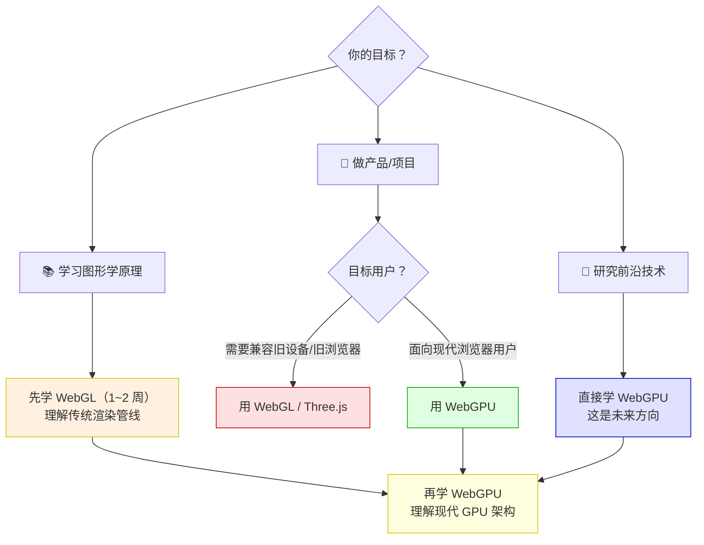

#### 决策建议表

| 你的情况 | 建议 | 理由 |
|---------|------|------|
| 🔰 零基础，想入门 Web 图形 | **先学 WebGL 基础概念，再学 WebGPU** | WebGL 资料多、概念简单，适合入门；WebGPU 是未来，必须学 |
| 💻 要做商业项目，兼容性是关键 | **用 WebGL / Three.js** | 用户浏览器可能不支持 WebGPU |
| 🚀 想学最新技术，做前沿项目 | **直接学 WebGPU** | 这是未来 10 年的标准 |
| 🎓 学生/研究者，时间充裕 | **两个都学** | WebGL 帮你理解图形学历史，WebGPU 让你掌握未来 |
| 🤖 对 AI + 图形感兴趣 | **必须学 WebGPU** | 只有 WebGPU 支持 GPU 通用计算（Compute Shader） |

> 💡 **最终建议**：如果你时间充裕，**同时学 WebGL 和 WebGPU** 是最好的。WebGL 帮你理解传统渲染管线，WebGPU 让你掌握未来。如果时间有限，**直接学 WebGPU**，但建议先快速了解 WebGL 的基本概念（本文档附录中也有 WebGL 核心概念的速查）。

---

## 三、学习路线图

### 3.1 整体学习路径

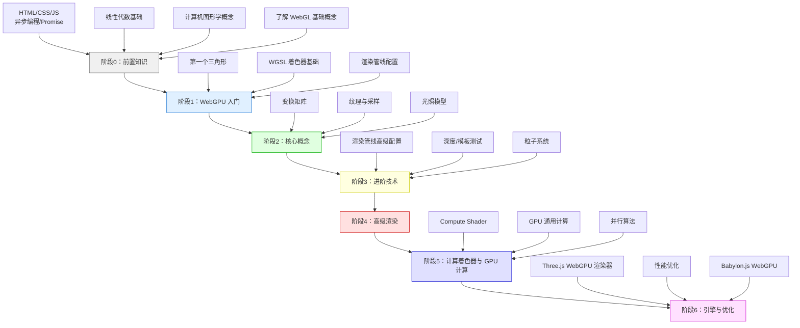

### 3.2 各阶段学习目标

| 阶段 | 预计时间 | 学习目标 | 里程碑 |
|------|---------|----------|--------|
| **阶段0** | 1 周 | 掌握 JS 异步、向量矩阵基础 | 能看懂线性代数公式 |
| **阶段1** | 2 周 | 画出第一个 WebGPU 三角形 | 理解 Adapter/Device/PassEncoder |
| **阶段2** | 3 周 | 掌握变换矩阵、纹理、光照 | 能渲染带纹理的 3D 立方体 |
| **阶段3** | 3 周 | 掌握高级渲染管线 | 实现阴影、后处理效果 |
| **阶段4** | 4 周 | 掌握 Compute Shader | 用 GPU 做通用计算（如物理模拟） |
| **阶段5** | 4 周 | 使用引擎、性能优化 | 完成一个完整的 WebGPU 项目 |

---

## 四、入门篇：Hello WebGPU

### 4.1 前置知识检查清单

在你开始 WebGPU 之前，确保你掌握以下内容：

#### ✅ 必须掌握

- [ ] **JavaScript 基础**：异步编程（async/await）、Promise、Arrow Function
- [ ] **HTML/Canvas**：`<canvas>` 标签、获取 WebGPU 上下文
- [ ] **基础数学知识**：坐标系、三角函数（sin/cos）、向量概念
- [ ] **ES Module**：import/export 模块化开发

#### 🔶 最好掌握（不强制）

- [ ] **线性代数**：矩阵乘法、向量点积/叉积、齐次坐标
- [ ] **计算机图形学基础**：光栅化、着色器概念
- [ ] **WebGL 基础**：如果学过 WebGL，学 WebGPU 会快很多

> 💡 **小白不用担心**：附录 A 会详细讲解所有需要的数学知识，你可以边学边补！

### 4.2 第一个 WebGPU 程序：画一个三角形

> ⚠️ **兼容性提醒**：WebGPU 需要 Chrome 113+ / Edge 113+ / Firefox Nightly。请先确认你的浏览器支持 WebGPU。

#### 步骤 1：创建 HTML 文件

```html
<!DOCTYPE html>
<html lang="zh-CN">
<head>
    <meta charset="UTF-8">
    <title>我的第一个 WebGPU 三角形</title>
    <style>
        body { margin: 0; display: flex; justify-content: center; align-items: center; height: 100vh; background: #1a1a1a; }
        canvas { border: 1px solid #444; }
    </style>
</head>
<body>
    <!-- Canvas 是 WebGPU 的画布 -->
    <canvas id="gpuCanvas" width="800" height="600"></canvas>
    <script type="module" src="main.js"></script>
</body>
</html>
```

> 💡 **注意**：WebGPU 必须使用 `type="module"` 的 JavaScript 模块！

#### 步骤 2：编写 JavaScript（main.js）

```javascript
// ========== 第1步：检查浏览器是否支持 WebGPU ==========
if (!navigator.gpu) {
    alert('你的浏览器不支持 WebGPU！请使用 Chrome 113+ 或 Edge 113+');
    throw new Error('WebGPU not supported');
}

// ========== 第2步：获取 GPU 适配器（Adapter）==========
// Adapter = 图形卡（物理 GPU 或软件模拟）
const adapter = await navigator.gpu.requestAdapter({
    powerPreference: 'high-performance',  // 优先使用独立显卡
});
if (!adapter) {
    alert('无法获取 GPU 适配器！');
    throw new Error('No GPU adapter found');
}

// ========== 第3步：获取 GPU 设备（Device）==========
// Device = GPU 的连接句柄，所有 GPU 操作都通过它
const device = await adapter.requestDevice({
    // 可选：请求扩展功能（如纹理格式支持）
    requiredLimits: {
        maxTextureDimension2D: 4096,
    },
});
if (!device) {
    alert('无法获取 GPU 设备！');
    throw new Error('No GPU device found');
}

// ========== 第4步：配置 Canvas 上下文 ==========
const canvas = document.getElementById('gpuCanvas');
const context = canvas.getContext('webgpu');

// 配置 Swap Chain（交换链）—— 类似双缓冲机制
const canvasFormat = navigator.gpu.getPreferredCanvasFormat();
context.configure({
    device: device,
    format: canvasFormat,
    alphaMode: 'opaque',  // 不透明
});

// ========== 第5步：编写 WGSL 着色器 ==========
// WGSL = WebGPU Shading Language，取代 GLSL
const shaderCode = /* wgsl */ `
    // ---- 顶点着色器 ----
    // @vertex 属性标记这是一个顶点着色器函数
    // 每个顶点执行一次
    @vertex
    fn vs_main(
        @location(0) position: vec4f,  // @location(0) = 顶点属性槽位 0
        @location(1) color: vec4f,     // @location(1) = 顶点属性槽位 1
    ) -> VertexOutput {
        var output: VertexOutput;
        output.position = position;  // 输出裁剪空间坐标
        output.color = color;        // 传递颜色到片段着色器
        return output;
    }

    // 顶点输出结构体（必须明确定义）
    struct VertexOutput {
        @builtin(position) position: vec4f,  // 内置变量：裁剪空间位置
        @location(0) color: vec4f,            // 传递给片段着色器的颜色
    }

    // ---- 片段着色器 ----
    // @fragment 属性标记这是一个片段着色器函数
    // 每个像素执行一次
    @fragment
    fn fs_main(input: VertexOutput) -> @location(0) vec4f {
        return input.color;  // 直接输出插值后的颜色
    }
`;

// ========== 第6步：创建渲染管线（Pipeline）==========
// Pipeline = 渲染的"配方"，包含所有渲染状态
const pipeline = device.createRenderPipeline({
    layout: 'auto',  // 自动推导管线布局
    vertex: {
        module: device.createShaderModule({ code: shaderCode }),
        entryPoint: 'vs_main',  // 顶点着色器入口函数名
        buffers: [{
            // 顶点缓冲区布局：描述顶点数据的格式
            arrayStride: 8 * 4,  // 每个顶点 8 个 float，每个 float 4 字节
            attributes: [
                { shaderLocation: 0, offset: 0, format: 'float32x4' },  // position
                { shaderLocation: 1, offset: 16, format: 'float32x4' }, // color (4*4=16 bytes)
            ],
        }],
    },
    fragment: {
        module: device.createShaderModule({ code: shaderCode }),
        entryPoint: 'fs_main',  // 片段着色器入口函数名
        targets: [{ format: canvasFormat }],  // 输出颜色附件格式
    },
    primitive: {
        topology: 'triangle-list',  // 图元类型：三角形列表
        cullMode: 'none',           // 不剔除背面
    },
    depthStencil: {
        depthWriteEnabled: true,
        depthCompare: 'less',
        format: 'depth24plus',
    },
});

// ========== 第7步：准备顶点数据 ==========
// 三角形的三个顶点：position(x,y,z,w) + color(r,g,b,a)
const vertices = new Float32Array([
    //   position (x, y, z, w)     color (r, g, b, a)
     0.0,  0.5, 0.0, 1.0,       1.0, 0.0, 0.0, 1.0,  // 顶点1：红色，顶部
    -0.5, -0.5, 0.0, 1.0,       0.0, 1.0, 0.0, 1.0,  // 顶点2：绿色，左下
     0.5, -0.5, 0.0, 1.0,       0.0, 0.0, 1.0, 1.0,  // 顶点3：蓝色，右下
]);

// 创建顶点缓冲区并上传数据到 GPU
const vertexBuffer = device.createBuffer({
    size: vertices.byteLength,           // 缓冲区大小（字节）
    usage: GPUBufferUsage.VERTEX | GPUBufferUsage.COPY_DST,  // 用途：顶点缓冲区 + 可写入
    mappedAtCreation: false,
});
device.queue.writeBuffer(vertexBuffer, 0, vertices);  // 写入数据

// ========== 第8步：渲染循环 ==========
function render() {
    // 获取当前纹理（Canvas 的下一帧）
    const encoder = device.createCommandEncoder();  // 创建命令编码器
    const pass = encoder.beginRenderPass({         // 开始渲染通道
        colorAttachments: [{
            view: context.getCurrentTexture().createView(),  // 颜色附件 = Canvas 纹理
            loadOp: 'clear',                                 // 加载操作：清除
            storeOp: 'store',                                // 存储操作：保存
            clearValue: { r: 0.1, g: 0.1, b: 0.15, a: 1.0 },  // 清除颜色（深灰蓝）
        }],
        depthStencilAttachment: {
            view: depthTexture.createView(),
            depthClearValue: 1.0,
            depthLoadOp: 'clear',
            depthStoreOp: 'store',
        },
    });

    pass.setPipeline(pipeline);                          // 设置渲染管线
    pass.setVertexBuffer(0, vertexBuffer);              // 设置顶点缓冲区（槽位 0）
    pass.draw(3, 1, 0, 0);                           // 绘制 3 个顶点
    pass.end();                                         // 结束渲染通道

    // 提交命令到 GPU 队列
    device.queue.submit([encoder.finish()]);

    // 请求下一帧
    requestAnimationFrame(render);
}

// 创建深度纹理（用于深度测试）
const depthTexture = device.createTexture({
    size: [canvas.width, canvas.height],
    format: 'depth24plus',
    usage: GPUTextureUsage.RENDER_ATTACHMENT,
});

// 启动渲染循环
render();
```

> ⚠️ **重要**：WebGPU 使用 `async/await`，所以代码必须在 `async` 函数中运行。最简单的做法是将所有代码包在一个立即执行的 async 函数中：
> ```javascript
> (async () => { /* 所有代码放在这里 */ })();
> ```

### 4.3 步骤 2 代码详细解释

上面的代码比 WebGL 长不少，但结构更清晰。下面**逐步骤、逐函数**进行详细解释。

---

**🔵 第1步：检查浏览器支持**

```javascript
if (!navigator.gpu) { ... }
```

| 代码 | 详细解释 |
|------|----------|
| `navigator.gpu` | 浏览器提供的 WebGPU API 入口点，类似 `navigator.mediaDevices` 用于摄像头 |
| `requestAdapter()` | **异步函数**，向系统请求一个 GPU 适配器（代表物理 GPU） |
| `requestDevice()` | **异步函数**，从适配器创建一个 GPU 设备（代表与 GPU 的连接） |

> 💡 **类比理解**：
> - `navigator.gpu` = 发现身边有显卡
> - `requestAdapter()` = 选中一块显卡（可能有多块：集显 + 独显）
> - `requestDevice()` = 打开与这块显卡的"通信线路"

---

**🟢 第2~3步：Adapter 和 Device**

```javascript
const adapter = await navigator.gpu.requestAdapter({ ... });
const device = await adapter.requestDevice({ ... });
```

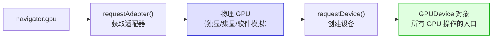

> 💡 **为什么分两步？** WebGPU 的设计借鉴了 Vulkan/DirectX 12：先选"显卡"（Adapter），再开"连接"（Device）。这样可以在多个 Device 之间共享同一个 Adapter。

---

**🟡 第4步：配置 Canvas 上下文**

```javascript
const context = canvas.getContext('webgpu');
context.configure({ ... });
```

| 概念 | WebGL | WebGPU | 说明 |
|------|-------|--------|------|
| 获取上下文 | `canvas.getContext('webgl')` | `canvas.getContext('webgpu')` | 类似，但 WebGPU 需要额外配置 |
| Swap Chain | 自动管理 | 手动 `configure()` | WebGPU 更显式地控制交换链 |
| 颜色格式 | 自动检测 | `getPreferredCanvasFormat()` | 自动选择 RGBA8 或 BGRA8 |

---

**🟠 第5步：WGSL 着色器详解**

WGSL 是 WebGPU 的着色器语言，取代了 WebGL 中的 GLSL。

```wgsl
@vertex                   // 属性：标记这是顶点着色器
fn vs_main(
    @location(0) position: vec4f,  // 从顶点缓冲区读取位置
    @location(1) color: vec4f,     // 从顶点缓冲区读取颜色
) -> VertexOutput { ... }
```

**WGSL vs GLSL 对比**：

| 特性 | GLSL (WebGL) | WGSL (WebGPU) |
|------|--------------|---------------|
| 入口函数 | `main()` | 自定义名称（如 `vs_main`） |
| 属性输入 | `attribute vec4 aPos` | `@location(0) position: vec4f` |
| 输出 | `gl_Position` | `struct` 中的 `@builtin(position)` |
| 向量类型 | `vec4` | `vec4f`（f = float32） |
| 矩阵类型 | `mat4` | `mat4x4f` |

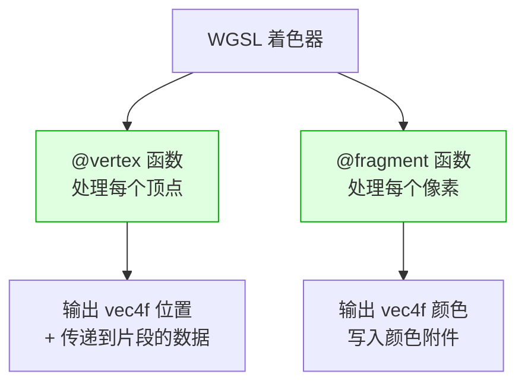

---

**🔵 第6步：创建渲染管线（Pipeline）**

这是 WebGPU 和 WebGL 最大的区别之一！

> **Pipeline = 渲染的"配方"**，一次性配置好所有渲染状态，而不是像 WebGL 那样用状态机逐步设置。

```javascript
const pipeline = device.createRenderPipeline({ ... });
```

| 管线配置项 | 说明 | WebGL 对应 |
|-----------|------|-----------|
| `vertex.module` | 顶点着色器模块 | `createShader()` + `shaderSource()` |
| `vertex.entryPoint` | 着色器入口函数名 | 无（GLSL 固定用 `main()`） |
| `vertex.buffers` | 顶点数据布局 | `vertexAttribPointer()` |
| `fragment.module` | 片段着色器模块 | 同顶点着色器 |
| `fragment.targets` | 输出颜色附件格式 | `gl.drawBuffers()` |
| `primitive.topology` | 图元类型 | `gl.drawArrays()` 的第一个参数 |
| `depthStencil` | 深度/模板测试配置 | `gl.enable(gl.DEPTH_TEST)` |

> 💡 **为什么 Pipeline 更好？** WebGL 的状态机模型容易出错（忘记重置状态），而 Pipeline 是**不可变对象**，创建后不能修改，这避免了状态污染问题。

---

**🟣 第7步：顶点缓冲区和数据上传**

```javascript
const vertexBuffer = device.createBuffer({ ... });
device.queue.writeBuffer(vertexBuffer, 0, vertices);
```

| 参数 | 说明 |
|------|------|
| `size` | 缓冲区大小（字节），`vertices.byteLength` |
| `usage` | 用途标志位，`VERTEX` = 用作顶点缓冲区，`COPY_DST` = 可写入 |
| `device.queue.writeBuffer()` | 将数据从 CPU 内存复制到 GPU 缓冲区 |

> 💡 **与 WebGL 的区别**：WebGL 用 `gl.bufferData()` 上传数据，WebGPU 用 `device.queue.writeBuffer()`，更明确地表达了"队列提交"的语义。

---

**🔴 第8步：渲染循环**

WebGPU 的渲染循环和 WebGL 完全不同，采用了**命令编码器（CommandEncoder）**模式：

```javascript
const encoder = device.createCommandEncoder();       // 1. 创建命令编码器
const pass = encoder.beginRenderPass({ ... });       // 2. 开始渲染通道
pass.setPipeline(pipeline);                           // 3. 设置管线
pass.setVertexBuffer(0, vertexBuffer);               // 4. 设置顶点缓冲区
pass.draw(3, 1, 0, 0);                            // 5. 绘制
pass.end();                                          // 6. 结束渲染通道
device.queue.submit([encoder.finish()]);             // 7. 提交命令到 GPU
```

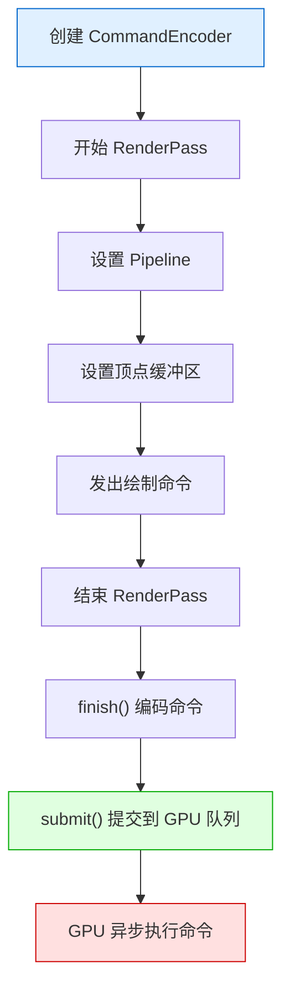

> 💡 **为什么要用 CommandEncoder？** 这是现代 GPU API（Vulkan/Metal/DX12）的标准模式：先"录制"命令，再一次性提交给 GPU。这样可以减少 CPU-GPU 通信开销，支持多线程命令录制。

---

### 4.4 WebGL 开发者专属：API 对照表

如果你已经学过 WebGL，这张表能帮你快速建立映射：

| WebGL API | WebGPU 对应 | 说明 |
|-----------|------------|------|
| `getContext('webgl')` | `canvas.getContext('webgpu')` + `configure()` | 获取并配置上下文 |
| `createShader()` | `device.createShaderModule()` | 创建着色器模块 |
| `shaderSource()` | `{ code: wgslCode }` | 在创建时传入源码 |
| `compileShader()` | 自动编译（创建时） | WGSL 在创建模块时编译 |
| `createProgram()` | `createRenderPipeline()` | 创建渲染管线（包含着色器） |
| `linkProgram()` | 隐式链接（Pipeline 创建时） | Pipeline 创建时自动链接 |
| `createBuffer()` | `device.createBuffer()` | 创建缓冲区（参数不同） |
| `bufferData()` | `device.queue.writeBuffer()` | 上传数据 |
| `vertexAttribPointer()` | `vertex.buffers[].attributes[]` | 在 Pipeline 中描述顶点布局 |
| `drawArrays()` | `pass.draw()` | 绘制命令 |
| `clear()` | `loadOp: 'clear'` | 在 RenderPass 中配置 |
| `flush()` | `device.queue.submit()` | 提交命令到 GPU |

### 4.5 小白常见问题

**Q：为什么 WebGPU 代码比 WebGL 长这么多？**
> WebGPU 是**显式架构**，每个步骤都要明确写出来。虽然代码长，但更不容易出错，性能也更好。写熟练后可以用封装函数减少重复代码。

**Q：WGSL 和 GLSL 哪个更难？**
> WGSL 的语法更严格（类似 Rust），初期可能觉得繁琐。但 WGSL 的类型安全性能帮你提前发现很多错误，长期来看反而更高效。

**Q：我的浏览器不支持 WebGPU 怎么办？**
> - Chrome/Edge：确保版本 ≥ 113，在 `chrome://flags` 中开启 `#enable-webgpu`（通常默认已开启）
> - Firefox：下载 Firefox Nightly 版本
> - Safari：确保 macOS Ventura+ / iOS 16+，在实验功能中开启 WebGPU

**Q：可以用 WebGPU 做计算（GPGPU）吗？**
> ✅ 可以！这是 WebGPU 最大的优势之一。WebGL 只能做图形渲染，WebGPU 还支持 **Compute Shader**，可以用 GPU 做通用计算（如矩阵运算、物理模拟、机器学习）。

### 4.6 入门篇小结与自测

完成了这一章，你应该能：

- [ ] 理解 WebGPU 的 Adapter → Device → Pipeline 架构
- [ ] 能写出一个纯色的三角形
- [ ] 理解 WGSL 着色器的基本语法
- [ ] 理解 CommandEncoder 的渲染流程

**自测小练习**：
1. 修改三角形的颜色为纯红色（修改顶点数据中的颜色值）
2. 添加一个顶点，画一个四边形（提示：需要 6 个顶点，或两个三角形）
3. 修改清除颜色为白色

---

## 五、进阶篇：核心概念深入

### 5.1 WebGPU 渲染管线全解析

WebGPU 的渲染管线比 WebGL 更灵活、更显式。理解管线是掌握 WebGPU 的关键。

```mermaid
flowchart LR
    A[顶点数据<br/>GPUBuffer] --> B[顶点着色器<br/>@vertex]
    B --> C[图元装配]
    C --> D[光栅化]
    D --> E[片段着色器<br/>@fragment]
    E --> F[颜色混合]
    F --> G[输出合并]
    G --> H[渲染目标<br/>Texture/Canvas]

    style B fill:#e0ffe0,stroke:#0a0
    style E fill:#e0ffe0,stroke:#0a0
```

> 🔑 **WebGPU 的特色**：渲染管线的每个阶段都可以通过 `RenderPipelineDescriptor` 显式配置，而不像 WebGL 那样依赖全局状态机。

#### 完整管线配置示例

```javascript
const pipeline = device.createRenderPipeline({
    // ---- 顶点着色器 ----
    vertex: {
        module: device.createShaderModule({ code: shaderCode }),
        entryPoint: 'vs_main',
        buffers: [{
            arrayStride: 8 * 4,       // 每个顶点 8 个 float
            stepMode: 'vertex',         // 逐顶点（另一种：'instance' 逐实例）
            attributes: [
                { shaderLocation: 0, offset: 0, format: 'float32x4' },
                { shaderLocation: 1, offset: 16, format: 'float32x4' },
            ],
        }],
    },
    // ---- 片段着色器 ----
    fragment: {
        module: device.createShaderModule({ code: shaderCode }),
        entryPoint: 'fs_main',
        targets: [{
            format: canvasFormat,
            blend: {
                color: { srcFactor: 'src-alpha', dstFactor: 'one-minus-src-alpha', operation: 'add' },
                alpha: { srcFactor: 'one', dstFactor: 'one-minus-src-alpha', operation: 'add' },
            },
            writeMask: GPUColorWrite.ALL,  // 写入所有颜色通道
        }],
    },
    // ---- 图元配置 ----
    primitive: {
        topology: 'triangle-list',       // 图元类型
        stripIndexFormat: undefined,     // 仅 triangle-strip 需要
        cullMode: 'back',                // 背面剔除（提高性能）
        frontFace: 'ccw',               // 正面 = 逆时针（Counter-Clockwise）
    },
    // ---- 深度/模板 ----
    depthStencil: {
        format: 'depth24plus-stencil8',
        depthWriteEnabled: true,
        depthCompare: 'less',
        stencilFront: { ... },
        stencilBack: { ... },
    },
    // ---- 多重采样 ----
    multisample: {
        count: 4,           // 4x MSAA 抗锯齿
        mask: 0xFFFFFFFF,
        alphaToCoverageEnabled: false,
    },
});
```

### 5.2 变换矩阵：从模型到屏幕

和 WebGL 一样，WebGPU 也需要矩阵变换。区别在于：WebGPU 没有内置的矩阵函数，需要自己计算或使用数学库。

#### 使用 gl-matrix 库（同样适用于 WebGPU！）

```javascript
import { mat4, vec3 } from 'gl-matrix';

// 创建各种矩阵
const modelMatrix = mat4.create();    // 模型矩阵
const viewMatrix = mat4.create();     // 视图矩阵
const projectionMatrix = mat4.create(); // 投影矩阵
const mvpMatrix = mat4.create();     // MVP 组合矩阵

// 模型变换：平移 + 旋转 + 缩放
mat4.translate(modelMatrix, modelMatrix, [0, 0, -5]);
mat4.rotateY(modelMatrix, modelMatrix, Math.PI / 4);
mat4.scale(modelMatrix, modelMatrix, [1.5, 1.5, 1.5]);

// 视图变换：设置相机
mat4.lookAt(viewMatrix,
    [0, 0, 5],   // 相机位置
    [0, 0, 0],   // 看向目标
    [0, 1, 0]    // 上方向
);

// 投影变换：透视投影
mat4.perspective(projectionMatrix,
    Math.PI / 4,                          // FOV
    canvas.width / canvas.height,           // 宽高比
    0.1,                                  // 近平面
    100.0                                  // 远平面
);

// 计算 MVP 矩阵（Model * View * Projection）
mat4.multiply(mvpMatrix, projectionMatrix, viewMatrix);
mat4.multiply(mvpMatrix, mvpMatrix, modelMatrix);

// 将矩阵上传到 GPU（通过 Uniform Buffer）
device.queue.writeBuffer(uniformBuffer, 0, mvpMatrix);
```

#### 在 WGSL 着色器中使用矩阵

```wgsl
struct Uniforms {
    mvpMatrix: mat4x4f,    // MVP 组合矩阵
    modelMatrix: mat4x4f,   // 模型矩阵（用于法线变换）
    cameraPos: vec3f,       // 相机世界坐标
};

@group(0) @binding(0) var<uniform> uniforms: Uniforms;

@vertex
fn vs_main(@location(0) position: vec4f) -> VertexOutput {
    var output: VertexOutput;
    // 注意：WGSL 中矩阵在右侧（与 GLSL 相反）
    output.position = uniforms.mvpMatrix * position;
    output.worldPos = uniforms.modelMatrix * position;
    return output;
}
```

> ⚠️ **WGSL 重要差异**：矩阵乘法顺序与 GLSL 相反！
> - GLSL：`gl_Position = projection * view * model * position;`（矩阵在左）
> - WGSL：`output.position = mvpMatrix * position;`（矩阵在右，数学上更正确）

### 5.3 纹理与采样（Texture & Sampler）

WebGPU 的纹理系统比 WebGL 更强大，支持更多格式和用法。

#### 加载并创建纹理

```javascript
// 1. 加载图片
const img = new Image();
img.src = 'texture.png';
await img.decode();  // 等待图片加载完成

// 2. 创建纹理
const texture = device.createTexture({
    size: [img.width, img.height],      // 纹理尺寸
    format: 'rgba8unorm',               // 格式：RGBA8，无符号归一化
    usage: GPUTextureUsage.TEXTURE_BINDING |
           GPUTextureUsage.COPY_DST |   // 可以写入数据
           GPUTextureUsage.RENDER_ATTACHMENT,  // 可作为渲染目标
});

// 3. 上传图片数据到纹理
device.queue.copyExternalImageToTexture(
    { source: img },                    // 源：图片
    { texture: texture },                // 目标：纹理
    [img.width, img.height],            // 复制尺寸
);

// 4. 创建采样器（控制纹理采样方式）
const sampler = device.createSampler({
    magFilter: 'linear',                // 放大：线性过滤
    minFilter: 'linear',                // 缩小：线性过滤
    mipmapFilter: 'linear',             // Mipmap 过滤
    addressModeU: 'repeat',             // U 方向：重复
    addressModeV: 'repeat',             // V 方向：重复
});

// 5. 创建纹理绑定组（将纹理和采样器绑定到着色器）
const bindGroup = device.createBindGroup({
    layout: pipeline.getBindGroupLayout(0),  // 获取管线中 @group(0) 的布局
    entries: [
        { binding: 0, resource: { buffer: uniformBuffer } },  // @binding(0) = uniform buffer
        { binding: 1, resource: texture.createView() },       // @binding(1) = 纹理视图
        { binding: 2, resource: sampler },                     // @binding(2) = 采样器
    ],
});
```

#### WGSL 中的纹理采样

```wgsl
@group(0) @binding(1) var myTexture: texture_2d<f32>;
@group(0) @binding(2) var mySampler: sampler;

@fragment
fn fs_main(input: VertexOutput) -> @location(0) vec4f {
    // 采样纹理：textureSample(纹理, 采样器, UV坐标)
    let texColor = textureSample(myTexture, mySampler, input.uv);
    return texColor;
}
```

### 5.4 光照模型

WebGPU 的着色器（WGSL）让光照计算更清晰。以下是 Phong 光照模型的完整实现：

#### WGSL Phong 光照着色器

```wgsl
struct Light {
    position: vec3f,
    color: vec3f,
    _pad1: f32,    // 对齐填充
    _pad2: f32,
};

struct Uniforms {
    modelMatrix: mat4x4f,
    viewMatrix: mat4x4f,
    projectionMatrix: mat4x4f,
    cameraPos: vec3f,
    _pad: f32,
    light: Light,
};

@group(0) @binding(0) var<uniform> uniforms: Uniforms;

@fragment
fn fs_main(input: VertexOutput) -> @location(0) vec4f {
    let normal = normalize(input.worldNormal);
    let lightDir = normalize(uniforms.light.position - input.worldPos);
    let viewDir = normalize(uniforms.cameraPos - input.worldPos);
    let reflectDir = reflect(-lightDir, normal);

    // 环境光
    let ambient = 0.1 * uniforms.light.color;

    // 漫反射
    let diff = max(dot(normal, lightDir), 0.0);
    let diffuse = diff * uniforms.light.color;

    // 镜面反射
    let spec = pow(max(dot(viewDir, reflectDir), 0.0), 32.0);
    let specular = 0.5 * spec * uniforms.light.color;

    let result = (ambient + diffuse + specular) * input.baseColor;
    return vec4f(result, 1.0);
}
```

### 5.5 Uniform Buffer 与 Bind Group

这是 WebGPU 最核心理念之一：**所有 GPU 资源（缓冲区、纹理、采样器）都通过 Bind Group 绑定到着色器**。

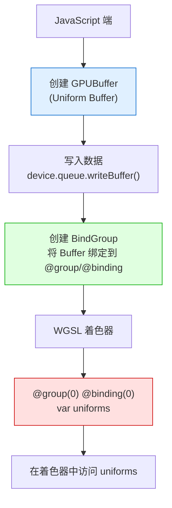

#### 完整示例：创建并使用 Uniform Buffer

```javascript
// 1. 创建 Uniform Buffer（需要 16 字节对齐）
const uniformBuffer = device.createBuffer({
    size: 64 + 64 + 16,  // mvpMatrix(64) + modelMatrix(64) + cameraPos(16)
    usage: GPUBufferUsage.UNIFORM | GPUBufferUsage.COPY_DST,
});

// 2. 更新 Uniform 数据
function updateUniforms() {
    // 计算 MVP 矩阵（参考 5.2 节）
    // ...

    // 写入到 Uniform Buffer（可以只更新部分数据）
    device.queue.writeBuffer(uniformBuffer, 0, mvpMatrix);          // offset 0, 64 bytes
    device.queue.writeBuffer(uniformBuffer, 64, modelMatrix);       // offset 64, 64 bytes
    device.queue.writeBuffer(uniformBuffer, 128, cameraPos);        // offset 128, 16 bytes
}

// 3. 创建 Bind Group Layout（描述绑定布局）
const bindGroupLayout = device.createBindGroupLayout({
    entries: [
        {
            binding: 0,
            visibility: GPUShaderStage.VERTEX | GPUShaderStage.FRAGMENT,
            buffer: { type: 'uniform' },
        },
    ],
});

// 4. 创建 Bind Group（实际绑定资源）
const bindGroup = device.createBindGroup({
    layout: bindGroupLayout,
    entries: [
        { binding: 0, resource: { buffer: uniformBuffer } },
    ],
});

// 5. 渲染时使用
pass.setBindGroup(0, bindGroup);  // 绑定到 @group(0)
```

> 💡 **对齐规则**：WebGPU 的 WGSL 要求所有 `struct` 成员 **16 字节对齐**。一个 `vec4f` 正好 16 字节，所以通常每个 `mat4x4f`（64字节 = 4×16）会占据 4 个 binding slot。

### 5.6 进阶篇小结与自测

完成了这一章，你应该能：

- [ ] 理解 WebGPU 渲染管线的完整配置
- [ ] 能用 gl-matrix 计算 MVP 矩阵并传给着色器
- [ ] 能加载纹理并在 WGSL 中采样
- [ ] 理解 Bind Group 的工作机制
- [ ] 能实现 Phong 光照模型

自测小练习**：
1. 画一个带纹理的 3D 旋转立方体
2. 为立方体添加 Phong 光照（需要一个方向光）
3. 实现纹理 + 光照的组合效果

---

## 六、高级篇：高级渲染技术

### 6.1 深度纹理与阴影（Shadow Mapping）

阴影是实时渲染中最重要也最难的技术之一。WebGPU 让阴影实现更高效。

#### 阴影映射原理

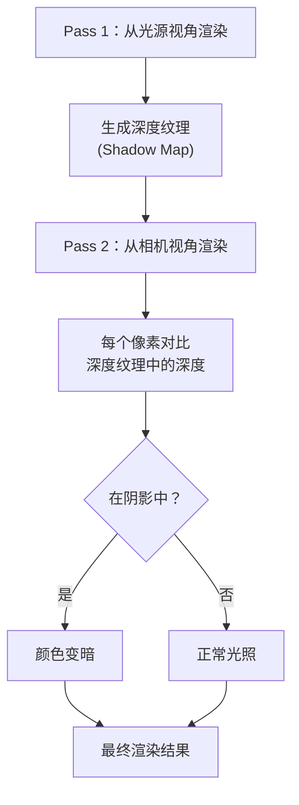

#### WebGPU 阴影实现要点

```javascript
// 1. 创建阴影贴图纹理（深度纹理）
const shadowTexture = device.createTexture({
    size: [2048, 2048],
    format: 'depth32float',           // 深度格式
    usage: GPUTextureUsage.RENDER_ATTACHMENT |
           GPUTextureUsage.TEXTURE_BINDING,
});

// 2. Pass 1：从光源视角渲染深度
const shadowPass = encoder.beginRenderPass({
    colorAttachments: [],             // 不需要颜色输出
    depthStencilAttachment: {
        view: shadowTexture.createView(),
        depthClearValue: 1.0,
        depthLoadOp: 'clear',
        depthStoreOp: 'store',
    },
});
// 使用只输出深度的着色器（省略顶点世界坐标计算）
shadowPass.setPipeline(shadowPipeline);
shadowPass.draw(...);
shadowPass.end();

// 3. Pass 2：从相机视角渲染，采样阴影贴图
// 在片段着色器中对比深度
```

### 6.2 后处理（Post-Processing）

后处理 = 先把场景渲染到纹理，再对纹理做全屏效果（如泛光、景深、色调映射）。

```mermaid
flowchart LR
    A[场景渲染] --> B[离屏纹理<br/>(Frame Buffer)]
    B --> C[后处理着色器<br/>全屏三角形]
    C --> D[最终输出到 Canvas]

    style B fill:#fff0e0,stroke:#cc0
    style C fill:#e0ffe0,stroke:#0a0
```

#### 实现步骤

```javascript
// 1. 创建离屏纹理（渲染目标）
const offscreenTexture = device.createTexture({
    size: [canvas.width, canvas.height],
    format: 'rgba8unorm',
    usage: GPUTextureUsage.RENDER_ATTACHMENT |
           GPUTextureUsage.TEXTURE_BINDING,
});

// 2. Pass 1：渲染到离屏纹理
const pass1 = encoder.beginRenderPass({
    colorAttachments: [{
        view: offscreenTexture.createView(),
        loadOp: 'clear',
        storeOp: 'store',
        clearValue: { r: 0, g: 0, b: 0, a: 1 },
    }],
});
pass1.setPipeline(scenePipeline);
pass1.draw(...);
pass1.end();

// 3. Pass 2：后处理（全屏三角形）
const postPass = encoder.beginRenderPass({
    colorAttachments: [{
        view: context.getCurrentTexture().createView(),
        loadOp: 'clear',
        storeOp: 'store',
    }],
});
postPass.setPipeline(postPipeline);
postPass.setBindGroup(0, postBindGroup);  // 绑定离屏纹理
postPass.draw(3, 1, 0, 0);  // 画一个全屏三角形（3个顶点）
postPass.end();
```

> 💡 **全屏三角形技巧**：只需要 3 个顶点画一个覆盖全屏的大三角形，比画两个三角形（四边形）更高效。在顶点着色器中直接输出裁剪空间坐标即可。

### 6.3 Compute Shader 入门

> **Compute Shader 是 WebGPU 最强大的功能**：它让你可以利用 GPU 做**通用计算**（不只是图形渲染）！

#### Compute Shader 能做什么？

| 应用场景 | 说明 |
|----------|------|
| **物理模拟** | 粒子系统、布料模拟、流体模拟 |
| **图像处理** | 滤镜、边缘检测、风格迁移 |
| **机器学习** | 矩阵运算、神经网络推理 |
| **并行排序** | 快速排序、基数排序 |
| **音频处理** | FFT、频谱分析 |

#### 第一个 Compute Shader：并行向量加法

**WGSL Compute Shader 代码**：

```wgsl
// 存储缓冲区（GPU 内存）
@group(0) @binding(0) var<storage, read> inputA: array<f32>;
@group(0) @binding(1) var<storage, read> inputB: array<f32>;
@group(0) @binding(2) var<storage, read_write> output: array<f32>;

// @compute 标记这是一个计算着色器
// @workgroup_size(64) 每个工作组 64 个线程
@compute @workgroup_size(64)
fn main(@builtin(global_invocation_id) gid: vec3u) {
    let idx = gid.x;  // 全局线程 ID
    if (idx >= arrayLength(&output)) { return; }  // 越界检查
    output[idx] = inputA[idx] + inputB[idx];
}
```

**JavaScript 端代码**：

```javascript
// 1. 创建存储缓冲区（注意：storage buffer 需要 specific usage）
const bufferA = device.createBuffer({
    size: dataA.byteLength,
    usage: GPUBufferUsage.STORAGE | GPUBufferUsage.COPY_DST,
});
const bufferB = device.createBuffer({
    size: dataB.byteLength,
    usage: GPUBufferUsage.STORAGE | GPUBufferUsage.COPY_DST,
});
const bufferOut = device.createBuffer({
    size: dataOut.byteLength,
    usage: GPUBufferUsage.STORAGE | GPUBufferUsage.COPY_SRC,
});

// 2. 上传数据
device.queue.writeBuffer(bufferA, 0, dataA);
device.queue.writeBuffer(bufferB, 0, dataB);

// 3. 创建计算管线
const computePipeline = device.createComputePipeline({
    layout: 'auto',
    compute: {
        module: device.createShaderModule({ code: computeShaderCode }),
        entryPoint: 'main',
    },
});

// 4. 创建 Bind Group
const bindGroup = device.createBindGroup({
    layout: computePipeline.getBindGroupLayout(0),
    entries: [
        { binding: 0, resource: { buffer: bufferA } },
        { binding: 1, resource: { buffer: bufferB } },
        { binding: 2, resource: { buffer: bufferOut } },
    ],
});

// 5. 编码计算通道
const encoder = device.createCommandEncoder();
const pass = encoder.beginComputePass();
pass.setPipeline(computePipeline);
pass.setBindGroup(0, bindGroup);
// 调度工作组：总共需要处理 1024 个元素，每个工作组 64 线程 → 需要 16 个工作组
pass.dispatchWorkgroups(Math.ceil(1024 / 64));
pass.end();

// 6. 提交并执行
device.queue.submit([encoder.finish()]);

// 7. 读取结果（需要映射到 CPU 可读的缓冲区）
const resultBuffer = device.createBuffer({
    size: dataOut.byteLength,
    usage: GPUBufferUsage.MAP_READ | GPUBufferUsage.COPY_DST,
});
const copyEncoder = device.createCommandEncoder();
copyEncoder.copyBufferToBuffer(bufferOut, 0, resultBuffer, 0, dataOut.byteLength);
device.queue.submit([copyEncoder.finish()]);

await resultBuffer.mapAsync(GPUMapMode.READ);
const result = new Float32Array(resultBuffer.getMappedRange());
console.log('计算结果：', result);
resultBuffer.unmap();
```

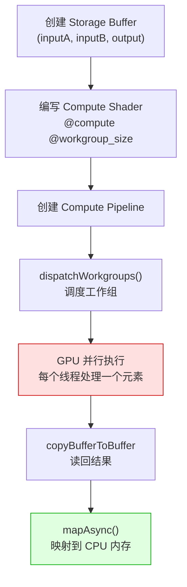

### 6.4 高级篇小结

完成了这一章，你应该能：

- [ ] 理解阴影映射（Shadow Mapping）的原理
- [ ] 能实现后处理效果（离屏渲染 + 全屏三角形）
- [ ] 理解 Compute Shader 的工作原理
- [ ] 能写一个简单 GPGPU 程序（如并行向量加法）

---

## 七、专家篇：引擎与性能优化

### 7.1 WebGPU 引擎概览

| 引擎/库 | 定位 | 包大小 | WebGPU 支持 | 适合场景 |
|----------|------|--------|-------------|----------|
| **Three.js (WebGPU 渲染器)** | 通用 3D | ~150KB | ✅ 实验性 | 大多数 Web 3D 项目 |
| **Babylon.js** | 游戏引擎 | ~200KB | ✅ 完整支持 | 3D 游戏、企业应用 |
| **PlayCanvas** | 云引擎 | ~100KB | ✅ 支持 | 在线协作、3D 游戏 |
| **Raw WebGPU** | 手写 | 0 | — | 学习原理、极致性能 |
| **wgpu（Rust + WASM）** | 跨平台 | 较大 | ✅ 原生 WebGPU | 高性能跨平台应用 |

#### Three.js + WebGPU 渲染器示例

```javascript
// Three.js r160+ 支持 WebGPU 渲染器
import { WebGPURenderer } from 'three/webgpu';

const renderer = new WebGPURenderer({
    canvas: canvas,
    antialias: true,
    powerPreference: 'high-performance',
});
await renderer.init();  // ⚠️ WebGPU 渲染器需要异步初始化！

const scene = new THREE.Scene();
const camera = new THREE.PerspectiveCamera(75, window.innerWidth / window.innerHeight, 0.1, 1000);

// 其余代码与 WebGL 渲染器几乎相同！
const geometry = new THREE.BoxGeometry(1, 1, 1);
const material = new THREE.MeshStandardMaterial({ color: 0x00ff00 });
const cube = new THREE.Mesh(geometry, material);
scene.add(cube);

function animate() {
    requestAnimationFrame(animate);
    cube.rotation.x += 0.01;
    cube.rotation.y += 0.01;
    renderer.render(scene, camera);
}
animate();
```

> 💡 **Three.js WebGPU 渲染器的优势**：同样的 API，但底层走 WebGPU，性能更好，且支持 Compute Shader！

### 7.2 WebGPU 性能优化 Checklist

WebGPU 提供了更底层的控制，也意味着你需要更主动地优化。

#### ✅ 缓冲区优化

- [ ] **使用 `COPY_DST` + `MAP_WRITE` 的缓冲区**：频繁更新的缓冲区应该用 `MAP_WRITE` 而不是每次 `writeBuffer()`
- [ ] **合并缓冲区**：把多个小缓冲区合并成一个大缓冲区（减少 `setVertexBuffer` 调用）
- [ ] **使用 `writeBuffer` 的 offset**：同一个缓冲区存储多个对象的数据

#### ✅ 渲染优化

- [ ] **合批绘制（Batching）**：相同材质的物体合并为一个 `draw call`
- [ ] **实例化渲染（Instancing）**：用 `vertex.buffers[].stepMode: 'instance'` 绘制大量相同物体
- [ ] **视锥剔除（Frustum Culling）**：只绘制相机可见的物体
- [ ] **遮挡剔除（Occlusion Culling）**：用 Early-Z 或遮挡查询跳过被遮挡物体

#### ✅ Pipeline 优化

- [ ] **复用 Pipeline**：Pipeline 创建成本高，尽量复用
- [ ] **使用 Pipeline Layout Cache**：相同 layout 的 Pipeline 共享 `BindGroupLayout`
- [ ] **减少 Pipeline 切换**：按 Pipeline 排序绘制对象

#### ✅ Compute Shader 优化

- [ ] **合理设置 workgroup_size**：通常 64 或 256 是较好的选择（取决于 GPU）
- [ ] **避免 bank conflict**：访问 `storage buffer` 时注意内存访问模式
- [ ] **使用 `workgroupBarrier()`**：在工作组内同步

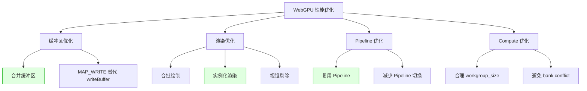

### 7.3 专家篇小结

完成了这一章，你应该能：

- [ ] 使用 Three.js / Babylon.js 的 WebGPU 渲染器
- [ ] 掌握 WebGPU 性能优化的核心方法
- [ ] 理解实例化渲染和合批技术
- [ ] 能用 Compute Shader 加速计算密集型任务

---

## 八、实战项目

### 8.1 项目难度阶梯

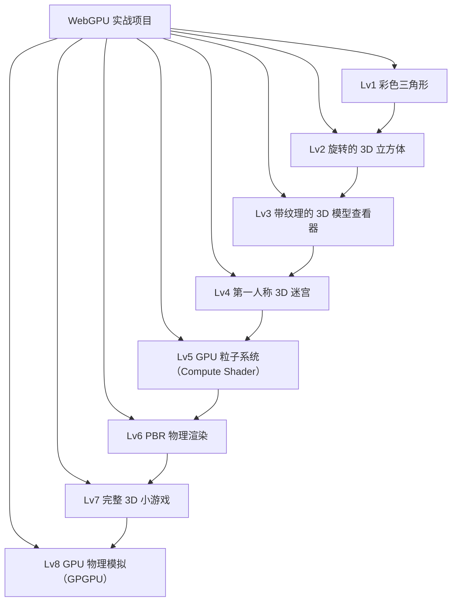

### 8.2 项目：带纹理的 3D 模型查看器（Lv3）

#### 功能需求

- [ ] 加载 GLTF 格式的 3D 模型（使用 `gltf-transform` 或其他库）
- [ ] WASD 键移动相机
- [ ] 鼠标拖拽旋转视角
- [ ] 显示/隐藏网格线框
- [ ] 切换光照模式（Phong / PBR）
- [ ] 显示 FPS 统计

#### 技术架构

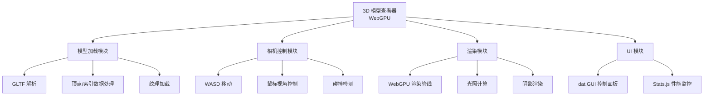

#### 核心代码片段：GLTF 模型渲染

```javascript
// 使用 gltf-transform 加载 GLTF 模型
import { Document, NodeIO } from '@gltf-transform/core';

async function loadGLTF(device, url) {
    const io = new NodeIO();
    const doc = await io.read(url);  // 读取 GLTF 文件

    const meshes = [];
    doc.getRoot().listMeshes().forEach(mesh => {
        mesh.listPrimitives().forEach(primitive => {
            // 读取顶点数据
            const position = primitive.getAttribute('POSITION');
            const normal = primitive.getAttribute('NORMAL');
            const texcoord = primitive.getAttribute('TEXCOORD_0');

            // 创建 GPU 顶点缓冲区
            const vertexBuffer = device.createBuffer({
                size: position.getArray().byteLength,
                usage: GPUBufferUsage.VERTEX | GPUBufferUsage.COPY_DST,
            });
            device.queue.writeBuffer(vertexBuffer, 0, position.getArray());

            // 读取索引数据
            const indices = primitive.getIndices();
            const indexBuffer = device.createBuffer({
                size: indices.getArray().byteLength,
                usage: GPUBufferUsage.INDEX | GPUBufferUsage.COPY_DST,
            });
            device.queue.writeBuffer(indexBuffer, 0, indices.getArray());

            meshes.push({ vertexBuffer, indexBuffer, indexCount: indices.getCount() });
        });
    });

    return meshes;
}
```

### 8.3 项目：GPU 粒子系统（Lv5，使用 Compute Shader）

#### 实现要点

使用 Compute Shader 在 GPU 上模拟粒子物理，比 CPU 快 100 倍以上！

```wgsl
struct Particle {
    position: vec3f,
    _pad1: f32,
    velocity: vec3f,
    _pad2: f32,
    color: vec4f,
    life: f32,
    _pad3: vec3f,  // 16 字节对齐
};

@group(0) @binding(0) var<storage, read_write> particles: array<Particle>;

@compute @workgroup_size(64)
fn simulate(@builtin(global_invocation_id) gid: vec3u) {
    let idx = gid.x;
    if (idx >= arrayLength(&particles)) { return; }

    var p = &particles[idx];

    // 简单的重力模拟
    (*p).velocity.y -= 0.01;             // 重力
    (*p).position += (*p).velocity * 0.016;  // 更新位置（假设 60fps）

    // 地面碰撞
    if ((*p).position.y < 0.0) {
        (*p).velocity.y = -(*p).velocity.y * 0.8;  // 反弹（能量损失）
        (*p).position.y = 0.0;
    }

    // 生命值减少
    (*p).life -= 0.01;
}
```

```javascript
// JavaScript 端：调度 Compute Pass
function simulateParticles(pass) {
    pass.setPipeline(computePipeline);
    pass.setBindGroup(0, computeBindGroup);
    // 调度足够的工作组来处理所有粒子
    const workgroupCount = Math.ceil(particleCount / 64);
    pass.dispatchWorkgroups(workgroupCount);
}

// 渲染循环中同时执行 Compute Pass 和 Render Pass
function frame() {
    const encoder = device.createCommandEncoder();

    // Pass 1：Compute（模拟粒子物理）
    const computePass = encoder.beginComputePass();
    simulateParticles(computePass);
    computePass.end();

    // Pass 2：Render（渲染粒子）
    const renderPass = encoder.beginRenderPass({ ... });
    renderPass.setPipeline(renderPipeline);
    renderPass.setVertexBuffer(0, particleBuffer);
    renderPass.draw(particleCount, 1, 0, 0);
    renderPass.end();

    device.queue.submit([encoder.finish()]);
    requestAnimationFrame(frame);
}
```

---

## 附录 A：基础知识速查

### A.1 数学知识速查

#### 向量（Vector）

> **小白解释**：向量 = 一个有方向、有长度的箭头。在图形学中，用来表示位置、方向、颜色等。

| 操作 | 公式 | 用途 |
|------|------|------|
| **向量加法** | `a + b = (ax+bx, ay+by, az+bz)` | 位移叠加 |
| **向量减法** | `a - b = (ax-bx, ay-by, az-bz)` | 计算方向 |
| **点积** | `a·b = ax*bx + ay*by + az*bz` | 计算夹角、投影 |
| **叉积** | `a×b = (ay*bz-az*by, az*bx-ax*bz, ax*by-ay*bx)` | 计算垂直向量 |
| **归一化** | `a / |a|` | 得到单位向量 |

```mermaid
flowchart LR
    A[点积 a·b] --> A1[>0: 方向大致相同]
    A --> A2[=0: 垂直]
    A --> A3[<0: 方向大致相反]

    B[叉积 a×b] --> B1[结果垂直于 a 和 b]
    B --> B2[用于计算法线方向]
```

#### 矩阵（Matrix）

> **小白解释**：矩阵 = 一个变换工具。可以对向量进行平移、旋转、缩放等操作。

**4x4 矩阵在 WebGPU 中的结构**（与 WebGL 相同）：

```
| a b c d |
| e f g h |
| i j k l |
| m n o p |
```

其中：
- 左上角 3x3 负责旋转和缩放
- 最右列 `d, h, l` 通常用于透视投影
- 最底行 `m, n, o` 负责平移，`p` 通常为 1

#### 坐标系转换流程

```mermaid
flowchart TD
    A["局部坐标<br/>(模型自身坐标系)"] -->|模型矩阵 Model| B["世界坐标<br/>(场景中的绝对位置)"]
    B -->|视图矩阵 View| C["观察坐标<br/>(以相机为原点的坐标系)"]
    C -->|投影矩阵 Projection| D["裁剪坐标<br/>(可视范围内)"]
    D -->|透视除法| E["NDC 坐标<br/>(归一化设备坐标 -1~1)"]
    E -->|视口变换| F["屏幕坐标<br/>(像素位置)"]
```

### A.2 WebGPU API 速查表

#### 核心对象

| 对象 | 说明 | 小白解释 |
|------|------|----------|
| `GPUAdapter` | 图形适配器（物理 GPU） | 选中一块显卡 |
| `GPUDevice` | GPU 设备（连接句柄） | 打开与显卡的通信线路 |
| `GPUBuffer` | GPU 缓冲区 | GPU 里的一块内存 |
| `GPUTexture` | GPU 纹理 | GPU 里的一张图片 |
| `GPUSampler` | 纹理采样器 | 控制纹理如何被读取 |
| `GPUPipeline` | 渲染管线 | 渲染的"配方" |
| `GPUBindGroup` | 资源绑定组 | 把资源（buffer/texture）绑定到着色器 |
| `GPUCommandEncoder` | 命令编码器 | 录制 GPU 命令 |
| `GPURenderPassEncoder` | 渲染通道编码器 | 录制渲染命令 |
| `GPUComputePassEncoder` | 计算通道编码器 | 录制计算命令 |

#### 常用函数

| 函数 | 作用 |
|------|------|
| `navigator.gpu.requestAdapter()` | 请求 GPU 适配器 |
| `adapter.requestDevice()` | 请求 GPU 设备 |
| `device.createBuffer()` | 创建缓冲区 |
| `device.createTexture()` | 创建纹理 |
| `device.createShaderModule()` | 创建着色器模块 |
| `device.createRenderPipeline()` | 创建渲染管线 |
| `device.createComputePipeline()` | 创建计算管线 |
| `device.createBindGroup()` | 创建绑定组 |
| `device.queue.writeBuffer()` | 写入缓冲区数据 |
| `device.queue.submit()` | 提交命令到 GPU |
| `encoder.beginRenderPass()` | 开始渲染通道 |
| `encoder.beginComputePass()` | 开始计算通道 |

### A.3 WGSL 着色器语言速查

#### 基础类型

| 类型 | 含义 | 示例 |
|------|------|------|
| `f32` | 32位浮点数 | `let a: f32 = 1.0;` |
| `i32` | 32位整数 | `let b: i32 = 42;` |
| `u32` | 32位无符号整数 | `let c: u32 = 42u;` |
| `vec2f` | 2D 浮点向量 | `let v: vec2f = vec2f(1.0, 2.0);` |
| `vec3f` | 3D 浮点向量 | `let v: vec3f = vec3f(1.0, 2.0, 3.0);` |
| `vec4f` | 4D 浮点向量 | `let v: vec4f = vec4f(1.0, 2.0, 3.0, 1.0);` |
| `mat4x4f` | 4x4 浮点矩阵 | `let m: mat4x4f = mat4x4f();` |
| `texture_2d<f32>` | 2D 纹理 | `var tex: texture_2d<f32>;` |
| `sampler` | 采样器 | `var samp: sampler;` |

#### 属性（Attributes）

| 属性 | 作用 | 位置 |
|------|------|------|
| `@vertex` | 标记顶点着色器函数 | 函数上方 |
| `@fragment` | 标记片段着色器函数 | 函数上方 |
| `@compute` | 标记计算着色器函数 | 函数上方 |
| `@location(N)` | 顶点属性 / 颜色输出位置 | 参数 / 返回值 |
| `@builtin(P)` | 内置变量（position, vertex_index 等） | 参数 |
| `@group(N)` | 资源绑定组编号 | 全局变量 |
| `@binding(N)` | 资源绑定槽位编号 | 全局变量 |
| `@workgroup_size(X, Y, Z)` | 计算着色器工作组大小 | compute 函数 |

#### 内置函数

| 函数 | 作用 |
|------|------|
| `dot(a, b)` | 点积 |
| `cross(a, b)` | 叉积 |
| `normalize(v)` | 归一化 |
| `length(v)` | 向量长度 |
| `reflect(I, N)` | 向量反射 |
| `textureSample(sampler, coord)` | 纹理采样 |
| `mix(a, b, t)` | 线性插值 |
| `clamp(x, min, max)` | 限制范围 |
| `pow(x, y)` | 幂运算 |
| `abs(x)` | 绝对值 |
| `max(a, b)` | 最大值 |
| `min(a, b)` | 最小值 |

### A.4 图形学术语表

| 术语 | 英文 | 小白解释 |
|------|------|----------|
| **光栅化** | Rasterization | 把矢量图形转成像素点的过程 |
| **着色器** | Shader | 运行在 GPU 上的小程序 |
| **顶点** | Vertex | 3D 模型的一个角点 |
| **片元** | Fragment | 即将成为像素的候选者 |
| **图元** | Primitive | 基本图形单元（点/线/三角形） |
| **纹理** | Texture | 贴在模型表面的图片 |
| **法线** | Normal | 垂直于表面的方向向量 |
| **UV 坐标** | UV Coordinate | 纹理的"地图坐标"（0~1） |
| **Mipmap** | Mipmap | 预先生成的多级缩小版纹理 |
| **深度测试** | Depth Test | 判断哪个物体离相机更近 |
| **模板测试** | Stencil Test | 限制渲染区域的测试 |
| **Alpha 混合** | Alpha Blending | 实现半透明效果 |
| **视口** | Viewport | 渲染结果的显示区域 |
| **帧缓冲** | Framebuffer | 渲染结果的存储区域 |
| **绑定组** | Bind Group | WebGPU 中将资源绑定到着色器的机制 |
| **工作组** | Workgroup | Compute Shader 中并行执行的一组线程 |
| **交换链** | Swap Chain | 双缓冲机制，避免画面撕裂 |

---

## 附录 B：学习资源推荐

### B.1 官方资源

| 资源 | 链接 | 说明 |
|------|------|------|
| **WebGPU 官方规范** | [gpuweb.github.io/gpuweb](https://gpuweb.github.io/gpuweb/) | 最权威的规范文档 |
| **WGSL 规范** | [gpuweb.github.io/gpuweb/wgsl](https://gpuweb.github.io/gpuweb/wgsl.html) | WGSL 着色器语言规范 |
| **Chrome WebGPU Status** | [chromestatus.com](https://chromestatus.com/feature/6213121689518080) | WebGPU 在 Chrome 中的实现状态 |
| **MDN WebGPU** | [developer.mozilla.org](https://developer.mozilla.org/en-US/docs/Web/API/WebGPU_API) | MDN 官方文档 |

### B.2 教程与文章

| 资源 | 说明 |
|------|------|
| **WebGPU Fundamentals** | [webgpufundamentals.org](https://webgpufundamentals.org) — 类似 WebGL Fundamentals，最好的入门教程 |
| **Raw WebGPU** | [alain.xyz](https://alain.xyz/blog/raw-webgpu) — 深入理解 WebGPU 底层 |
| **Learn WebGPU** | 系列教程，从零开始学 WebGPU |
| **WebGPU Samples** | [webgpu-samples.github.io](https://webgpu-samples.github.io) — 官方示例代码 |

### B.3 开源项目参考

| 项目 | Stars | 说明 |
|------|-------|------|
| **Three.js** | ~100k | 最流行的 Web 3D 库，已支持 WebGPU 渲染器 |
| **Babylon.js** | ~23k | 微软出品的 3D 引擎，完整支持 WebGPU |
| **wgpu** | ~12k | Rust 实现的 WebGPU 标准，可编译到 WebAssembly |
| **Dawn** | — | Google 的 WebGPU 实现（C++） |
| **gltf-transform** | ~1k | GLTF 模型处理库，可用于 WebGPU |

### B.4 工具推荐

| 工具 | 用途 |
|------|------|
| **WebGPU DevTools** | Chrome 扩展，调试 WebGPU 应用 |
| **RenderDoc** | 帧调试工具（支持 WebGPU 捕获） |
| **Spector.js** | WebGL/WebGPU 帧调试器 |
| **glTF Viewer** | 在线查看 GLTF 模型 |
| **WGSL Analysis** | VS Code 扩展，WGSL 语法高亮和检查 |

### B.5 社区与问答

| 社区 | 链接 |
|------|------|
| **WebGPU Discord** | [discord.gg/webgpu](https://discord.gg/webgpu) |
| **Stack Overflow** | 标签：`webgpu`, `wgsl` |
| **Reddit** | r/WebGPU, r/graphicsprogramming |
| **GitHub Discussions** | gpuweb 项目的 Discussions |

---

## 附录 C：常见问题 FAQ

### C.1 小白常见问题

**Q：WebGPU 和 WebGL 应该先学哪个？**
> 建议**先学一点 WebGL**（理解渲染管线的基本概念），再学 WebGPU。如果时间紧张，可以直接学 WebGPU，但遇到底层概念时需要额外补课。

**Q：我的浏览器不支持 WebGPU 怎么办？**
> - **Chrome/Edge**：版本 ≥ 113，在 `chrome://flags` 中确认 `#enable-webgpu` 已启用
> - **Firefox**：下载 Firefox Nightly，在 `about:config` 中设置 `dom.webgpu.enabled = true`
> - **Safari**：macOS Ventura+ / iOS 16+，在实验功能中开启 WebGPU
> - **备用方案**：使用 WebGL 2.0 作为降级方案

**Q：WGSL 和 GLSL 哪个更难？**
> WGSL 的语法更严格（类似 Rust），初期可能觉得繁琐。但 WGSL 的类型安全性更好，且与现代 GPU 架构更匹配。习惯了之后效率很高。

**Q：WebGPU 可以用来做机器学习吗？**
> ✅ 可以！WebGPU 的 Compute Shader 非常适合做 GPU 通用计算。已经有项目（如 `webgpu backend for ONNX Runtime`）在浏览器中跑大模型推理。

**Q：学习 WebGPU 需要什么硬件？**
> 理论上任何支持 Vulkan 1.1 / Metal 2.0 / DirectX 12 的 GPU 都可以。大部分 2015 年后的 GPU 都支持。集成显卡（如 Intel HD Graphics）也可能支持。

### C.2 进阶常见问题

**Q：WebGPU 的 Pipeline 为什么不能动态修改？**
> 这是现代 GPU API（Vulkan/Metal/DX12）的设计哲学：**不可变对象更高效**。创建 Pipeline 时一次性确定所有状态，GPU 可以提前优化。如果需要不同状态，创建多个 Pipeline。

**Q：如何做 CPU → GPU 的高效数据传输？**
> 频繁更新的数据（如每帧变化的 Uniform）应该使用 `MAP_WRITE` 缓冲区：
> 1. 创建 `MAP_WRITE | COPY_SRC` 的缓冲区
> 2. 每帧 `mapAsync()` → 写入 → `unmap()`
> 3. 用 `copyBufferToBuffer()` 复制到 `UNIFORM` 缓冲区
> 这比 `writeBuffer()` 更高效（避免 CPU/GPU 同步）。

**Q：Compute Shader 的 workgroup_size 怎么选？**
> 取决于你的 GPU 和算法：
> - **通用计算**：64 或 256 是不错的选择
> - **NVIDIA GPU**：warp size = 32，建议 workgroup_size 是 32 的倍数
> - **AMD GPU**：wavefront size = 64，建议 workgroup_size 是 64 的倍数
> - **Intel GPU**：通常 32 或 64

**Q：WebGPU 能做多线程吗？**
> ✅ 可以！WebGPU 的设计天然支持多线程：
> 1. 在主线程创建 `device`
> 2. 将 `device` 通过 `postMessage` 传递给 Worker
> 3. 在 Worker 中创建 `CommandEncoder` 和 `RenderPass`
> 4. 将编码好的命令提交回主线程执行

---

## 附录 D：WebGPU 未来展望

### D.1 WebGPU 的发展路线图

```mermaid
timeline
    title WebGPU 发展路线图
    2023 : Chrome 113 正式发布 WebGPU
         : 基础渲染功能完整
    2024 : 更多浏览器支持（Firefox/Safari）
         : Compute Shader 性能优化
         : 子群组（Subgroups）扩展
    2025 : 网格着色器（Mesh Shaders）
         : 光线追踪（Ray Tracing）扩展
         : 视频纹理（Video Texture）
    2026 : 完整覆盖 Vulkan/Metal/DX12 特性
         : WebGPU 2.0 规范启动
```

### D.2 WebGPU 的生态现状

| 领域 | 现状 | 趋势 |
|------|------|------|
| **浏览器支持** | Chrome/Edge 已正式支持 | Firefox/Safari 追赶中 |
| **引擎支持** | Three.js/Babylon.js 已支持 | 更多引擎正在适配 |
| **机器学习** | ONNX Runtime WebGPU 后端 | 浏览器端 AI 推理加速 |
| **创意编程** | Three.js + WebGPU 艺术 | 生成式艺术新可能 |
| **数字孪生** | 高精度 3D 可视化 | WebGPU 让浏览器端实时渲染成为可能 |

### D.3 给学习者的建议

```mermaid
flowchart LR
    A["你的目标"] --> B{推荐路径}
    B -->|"学术研究/前沿探索"| C["深入学 WebGPU<br/>+ Vulkan/Metal 原理"]
    B -->|"工业界/求职"| D["WebGL + WebGPU 都会<br/>Three.js + Babylon.js"]
    B -->|"个人项目/创意"| E["用 Three.js WebGPU 渲染器<br/>快速出效果"]

    style C fill:#e0e0ff,stroke:#00c
    style D fill:#e0ffe0,stroke:#0a0
    style E fill:#ffffe0,stroke:#cc0
```

> 🎯 **最终建议**：
> - WebGPU 是**未来**，值得投入时间学习
> - 但 WebGL 仍是**现在**，大量存量项目需要维护
> - **两者都学**是最理想的状态
> - 如果只能选一个，选 **WebGPU**（未来 5 年的主流）

---

## 总结

```mermaid
mindmap
  root((WebGPU 学习路径))
    入门
      第一个三角形
      理解 Adapter/Device
      掌握 WGSL 语法
    进阶
      变换矩阵
      纹理与采样
      光照模型
      BindGroup 机制
    高级
      Compute Shader
      阴影技术
      后处理
      PBR 渲染
    专家
      Three.js/Babylon.js WebGPU
      性能优化
      多线程渲染
      自研引擎
```

### 最后的话

> WebGPU 是 Web 图形技术的未来，它让浏览器拥有了接近原生的 GPU 能力。
>
> **给小白**：不要被 WGSL 的严格语法吓倒，它比 GLSL 更安全、更现代。从第一个三角形开始，一步步来。
> **给高手**：WebGPU 的底层架构（Adapter/Device/Pipeline/CommandEncoder）与 Vulkan/Metal/DX12 一脉相承，学会 WebGPU 等于掌握了现代 GPU 编程的通用语言。
> **给所有人**：WebGPU 不只是图形技术，它还是浏览器端 GPU 通用计算的大门。AI、科学计算、物理模拟……一切需要并行计算的地方，都有 WebGPU 的用武之地！

---

*文档创建时间：2026年6月*
*如有问题或建议，欢迎反馈*

