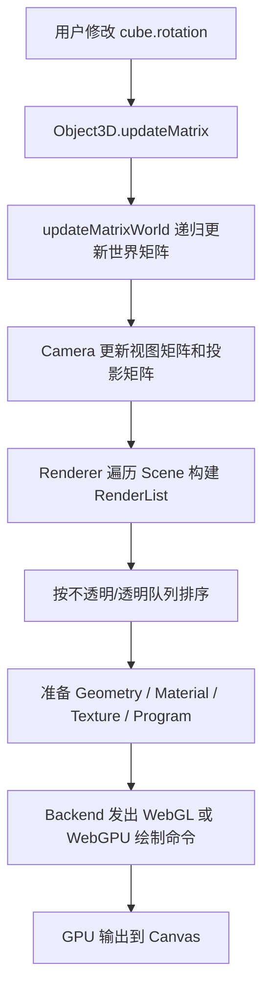

# Three.js r184 源码分析指南：从入门到架构进阶

> **文档版本**: 1.0  
> **作者**: 汪亮 bertonwang  
> **邮箱**: 47608843@qq.com  
> **更新日期**: 2026-06-04   
> **工程路径**：https://github.com/mrdoob/three.js.git
> **目标读者**：第一次读 Three.js 源码的小白，以及希望学习渲染引擎架构设计的高级工程师

---

## 0. 阅读契约：这篇文档解决什么问题

这篇文档不是 API 手册，而是一张源码地图。读完后你应该能回答：

- **小白视角**：Three.js 为什么需要 `Scene`、`Camera`、`Mesh`、`Geometry`、`Material`、`Renderer`？它们如何协作把一个立方体画到屏幕上？
- **源码视角**：`Object3D` 如何管理层级变换？渲染器如何构建渲染列表？动画如何把关键帧变成对象属性变化？
- **高手视角**：Three.js 如何抽象 WebGL/WebGPU 后端？节点系统如何把 JavaScript 对象图编译成 GLSL/WGSL？缓存、WeakMap、版本号、异步编译背后有哪些可迁移设计？
- **实践视角**：如何用 VSCode 调试源码？应该在哪些函数下断点？如何验证性能瓶颈和资源泄漏？

本文遵循一条主线：

```text
用户代码
  -> Scene / Object3D 场景图
  -> Geometry / Material / Texture 数据描述
  -> Camera / Light 决定观察与光照
  -> Renderer 构建 RenderList
  -> Backend 转成 WebGL 或 WebGPU 命令
  -> GPU 绘制到屏幕
```

---

## 1. 工程全景：Three.js 不是一个文件，而是一套 3D 引擎基础设施

### 1.1 顶层目录怎么读

```text
three.js/
├── src/                 # 核心源码，Three.js 引擎主体
├── examples/            # 官方示例与 addons，学习最佳入口之一
├── docs/                # 官方文档与本地分析文档
├── manual/              # 教程手册
├── editor/              # Three.js 在线编辑器
├── test/                # 单元测试、端到端测试、截图测试
├── utils/               # 构建、文档、服务器、测试辅助脚本
├── devtools/            # Three.js DevTools 浏览器扩展相关代码
└── package.json         # npm 入口、构建脚本、测试脚本
```

**设计洞察**：Three.js 的价值不只在 `src`。`examples` 是事实上的集成测试和教学样板，`test` 保证兼容性，`utils` 支撑构建发布，`docs/manual/editor/devtools` 共同构成生态。

### 1.2 `src` 目录按问题域拆分

```text
src/
├── Three.js                 # 默认入口：Core + WebGLRenderer
├── Three.Core.js            # 核心 API 导出
├── Three.WebGPU.js          # WebGPU 入口：Core + WebGPU + TSL
├── Three.TSL.js             # TSL 节点语言入口
├── animation/               # 关键帧动画与属性混合
├── audio/                   # WebAudio 封装
├── cameras/                 # 透视、正交、立方体、阵列、立体相机
├── core/                    # Object3D、BufferGeometry、Raycaster 等核心
├── geometries/              # Box/Sphere/Plane 等几何体生成器
├── helpers/                 # Axes/Grid/Camera/Light/Skeleton 辅助可视化
├── lights/                  # 光源与阴影配置
├── loaders/                 # 资源加载基础设施
├── materials/               # 材质系统
├── math/                    # 向量、矩阵、四元数、射线、包围盒
├── nodes/                   # TSL 与节点着色器系统
├── objects/                 # Mesh、Line、Points、Sprite、InstancedMesh 等
├── renderers/               # WebGL、WebGPU、公共渲染器架构
├── scenes/                  # Scene、Fog
└── textures/                # Texture 与各类纹理对象
```

这是一种典型的图形引擎分层：

| 层级 | 主要目录 | 回答的问题 |
|---|---|---|
| 数据描述层 | `core`、`objects`、`geometries`、`materials`、`textures` | 世界里有什么？长什么样？ |
| 数学基础层 | `math` | 坐标、旋转、投影、碰撞如何计算？ |
| 行为系统层 | `animation`、`loaders`、`audio`、`helpers` | 资源如何进来？对象如何动？如何辅助调试？ |
| 渲染执行层 | `renderers`、`nodes`、`lights`、`cameras` | 如何把数据变成 GPU 命令？ |
| 生态支撑层 | `examples`、`test`、`utils`、`docs` | 如何学习、测试、构建、发布？ |

---

## 2. 多入口导出：兼容旧世界，同时拥抱 WebGPU

Three.js 在 `package.json` 中定义多个入口：

```json
{
  ".": {
    "import": "./build/three.module.js",
    "require": "./build/three.cjs"
  },
  "./webgpu": "./build/three.webgpu.js",
  "./tsl": "./build/three.tsl.js",
  "./addons/*": "./examples/jsm/*",
  "./src/*": "./src/*"
}
```

### 2.1 默认入口：`src/Three.js`

默认入口只做两件事：

```js
export * from './Three.Core.js';
export { WebGLRenderer } from './renderers/WebGLRenderer.js';
```

这保证了传统写法仍然成立：

```js
import * as THREE from 'three';
const renderer = new THREE.WebGLRenderer();
```

### 2.2 WebGPU 入口：`src/Three.WebGPU.js`

WebGPU 入口导出核心模块、WebGPU 渲染器、WebGPU 后端、WebGL fallback 后端和 TSL：

```text
Three.WebGPU.js
  -> Three.Core.js
  -> WebGPURenderer
  -> WebGPUBackend
  -> WebGLBackend
  -> Renderer / Backend common abstraction
  -> nodes/TSL.js
```

**设计洞察**：这是渐进增强。Three.js 没有强迫老用户迁移到 WebGPU，而是提供独立入口，让新架构可以演进，同时不破坏 WebGL 生态。

---

## 3. 一帧渲染到底发生了什么

先看最小用户代码：

```js
const scene = new THREE.Scene();
const camera = new THREE.PerspectiveCamera(75, width / height, 0.1, 1000);
const renderer = new THREE.WebGLRenderer();

const geometry = new THREE.BoxGeometry(1, 1, 1);
const material = new THREE.MeshBasicMaterial({ color: 0x00ff00 });
const cube = new THREE.Mesh(geometry, material);

scene.add(cube);
camera.position.z = 5;

function animate() {
  requestAnimationFrame(animate);
  cube.rotation.y += 0.01;
  renderer.render(scene, camera);
}
animate();
```

它在源码中会经过这些阶段：



小白要抓住一个核心公式：

```text
Mesh = Geometry + Material
Scene = Object3D 树
Camera = 观察方式
Renderer = 把 Scene 从 Camera 视角画出来
```

高手要抓住另一个核心事实：Three.js 把渲染问题拆成**数据描述、状态缓存、命令提交**三层，避免每一帧从零开始重新计算所有东西。

---

## 4. 场景图系统：`Object3D` 是整座楼的地基

**核心文件**：`src/core/Object3D.js`  
**相关文件**：`src/scenes/Scene.js`、`src/objects/Mesh.js`、`src/cameras/Camera.js`

### 4.1 为什么 Three.js 用树表示 3D 世界

场景图是树：

```text
Scene
├── Group: 太阳系
│   ├── Mesh: 太阳
│   └── Group: 地球轨道
│       ├── Mesh: 地球
│       └── Group: 月球轨道
│           └── Mesh: 月球
└── Camera
```

树的好处是：移动父节点，子节点自然跟随。比如月球的位置不必直接写成世界坐标，它只需要相对地球旋转即可。

### 4.2 `matrix` 与 `matrixWorld`：局部坐标和世界坐标分离

`Object3D` 中最关键的两个矩阵是：

```js
this.matrix = new Matrix4();
this.matrixWorld = new Matrix4();
```

| 矩阵 | 含义 | 例子 |
|---|---|---|
| `matrix` | 相对父节点的局部变换 | 月球相对地球的位置 |
| `matrixWorld` | 相对世界原点的最终变换 | 月球在整个宇宙里的位置 |

递归更新过程可以理解为：

```text
根节点 matrixWorld = 自己的 matrix
子节点 matrixWorld = 父节点 matrixWorld × 自己的 matrix
```

这背后的设计权衡是：

- **优点**：局部动画简单，父子关系自然，渲染时直接读取世界矩阵。
- **代价**：每帧需要递归更新矩阵；超大场景需要更精细的脏标记、剔除或空间结构优化。

### 4.3 Euler 与 Quaternion：易用性和数学正确性的双轨制

Three.js 同时提供：

- `rotation`：欧拉角，适合人类理解。
- `quaternion`：四元数，适合插值和避免万向锁。

小白可以先用：

```js
mesh.rotation.y += 0.01;
```

高手需要知道内部渲染和动画更偏向四元数，因为四元数插值稳定，不会在某些角度丢失自由度。

**设计洞察**：好的库通常会同时保留“易懂接口”和“正确内部表示”。Three.js 没有要求用户一开始就理解四元数，但也没有为了易用牺牲动画质量。

### 4.4 `add()` 和 `remove()` 的隐藏细节

`Object3D.add()` 不只是 `children.push()`。它通常会做：

1. 防止把自己添加成自己的子节点。
2. 如果对象已有父节点，先从旧父节点移除。
3. 设置 `object.parent = this`。
4. 触发 `added` 事件。

这让对象迁移更安全：

```js
oldGroup.add(mesh);
newGroup.add(mesh); // mesh 会自动离开 oldGroup
```

---

## 5. 几何系统：`BufferGeometry` 是 GPU 友好的数据布局

**核心文件**：`src/core/BufferGeometry.js`、`src/core/BufferAttribute.js`  
**相关目录**：`src/geometries/`

### 5.1 为什么现代 Three.js 使用 `BufferGeometry`

GPU 喜欢连续内存。`BufferGeometry` 的核心就是把顶点数据放进类型化数组：

```js
const positions = new Float32Array([
  0, 1, 0,
 -1,-1, 0,
  1,-1, 0
]);
geometry.setAttribute('position', new THREE.BufferAttribute(positions, 3));
```

`attributes` 是一个字典：

```text
geometry.attributes = {
  position: BufferAttribute,
  normal: BufferAttribute,
  uv: BufferAttribute,
  color: BufferAttribute,
  customAttribute: BufferAttribute
}
```

### 5.2 `index` 的意义：复用顶点，减少带宽

不用索引时，一个立方体 12 个三角形，需要 36 个顶点记录。使用索引后，只需要 8 个顶点 + 36 个索引。

```text
非索引绘制：顶点重复，简单但浪费
索引绘制：顶点复用，更省内存和带宽
```

### 5.3 包围盒与包围球：性能优化的基础数据

`BufferGeometry` 维护：

- `boundingBox`：轴对齐包围盒。
- `boundingSphere`：包围球。

它们用于：

- 视锥剔除：不在相机视野里的物体不画。
- Raycaster 粗筛：射线先测包围体，再测三角形。
- 调试与布局：快速知道模型尺寸。

**设计洞察**：渲染引擎里很多优化都是“先便宜地排除大多数，再昂贵地处理少数”。包围体就是这个原则的典型应用。

---

## 6. 材质系统：`Material` 既描述外观，也描述渲染状态

**核心文件**：`src/materials/Material.js`  
**相关文件**：`MeshBasicMaterial.js`、`MeshStandardMaterial.js`、`ShaderMaterial.js`、`materials/nodes/NodeMaterial.js`

### 6.1 材质不只是颜色

`Material` 包含大量渲染状态：

```js
this.side = FrontSide;
this.transparent = false;
this.opacity = 1.0;
this.blending = NormalBlending;
this.depthTest = true;
this.depthWrite = true;
this.version = 0;
```

这些属性分别影响：

| 属性 | 影响 |
|---|---|
| `side` | 渲染正面、背面还是双面 |
| `transparent` | 是否进入透明队列 |
| `opacity` | 透明度数值 |
| `depthTest` | 是否被深度缓冲遮挡 |
| `depthWrite` | 是否写入深度缓冲 |
| `version` | 缓存是否失效 |

### 6.2 `transparent` 和 `opacity` 的常见坑

只写：

```js
material.opacity = 0.5;
```

通常不够。你还需要：

```js
material.transparent = true;
material.opacity = 0.5;
```

因为 `transparent` 决定物体是否进入透明排序和混合流程，而 `opacity` 只是混合计算里的数值。

### 6.3 `version`：轻量的缓存失效协议

渲染器会缓存材质对应的 shader program 或 pipeline。材质变化后，必须让缓存知道“旧结果不能用了”。Three.js 用 `version` 这类递增字段表达变化。

**可迁移原则**：复杂系统中不要让缓存猜测对象是否变化。给对象一个明确的版本号或 dirty flag，缓存逻辑会简单很多。

---

## 7. 相机系统：Camera 本质是两个矩阵

**核心文件**：`src/cameras/Camera.js`、`src/cameras/PerspectiveCamera.js`、`src/cameras/OrthographicCamera.js`

### 7.1 相机做了什么

相机并不是“拍照对象”，它本质上提供两个矩阵：

```text
view matrix：世界坐标 -> 相机坐标
projection matrix：相机坐标 -> 裁剪空间
```

渲染一个点大致是：

```text
clipPosition = projectionMatrix × viewMatrix × modelMatrix × localPosition
```

### 7.2 `PerspectiveCamera.updateProjectionMatrix()` 为什么重要

透视相机维护：

- `fov`：视野角。
- `aspect`：宽高比。
- `near` / `far`：近远裁剪面。
- `zoom`：缩放。
- `view`：多屏或分块渲染偏移。
- `filmGauge` / `filmOffset`：摄影机模型相关参数。

当这些值变化时，需要调用：

```js
camera.updateProjectionMatrix();
```

常见窗口缩放代码：

```js
camera.aspect = window.innerWidth / window.innerHeight;
camera.updateProjectionMatrix();
renderer.setSize(window.innerWidth, window.innerHeight);
```

### 7.3 小白常见问题

- **物体看不见**：可能在相机后面、被 near/far 裁掉、相机没看向物体、物体太小或太远。
- **画面变形**：窗口尺寸变了但没有更新 `camera.aspect` 和 `updateProjectionMatrix()`。
- **深度闪烁**：`near` 太小、`far` 太大导致深度精度不足。不要随手设置 `near = 0.0001`、`far = 1000000`。

---

## 8. 光照与阴影：阴影其实是从光源视角再渲染一次

**核心文件**：`src/lights/Light.js`、`src/lights/LightShadow.js`  
**相关目录**：`src/lights/`、`src/renderers/`

### 8.1 光源类型的直觉理解

| 光源 | 类比 | 常见用途 |
|---|---|---|
| `AmbientLight` | 环境底光 | 防止全黑 |
| `DirectionalLight` | 太阳光 | 室外、平行光阴影 |
| `PointLight` | 灯泡 | 局部点光源 |
| `SpotLight` | 手电筒 | 聚光、舞台灯 |
| `HemisphereLight` | 天空/地面双色光 | 柔和环境感 |
| `RectAreaLight` | 面光源 | 窗户、灯箱 |

### 8.2 阴影矩阵如何工作

`LightShadow` 持有一个 shadow camera。阴影生成通常是两步：

```text
第一步：从光源视角渲染深度图 shadow map
第二步：从相机视角渲染物体时，查询该点在 shadow map 中是否被遮挡
```

`LightShadow.updateMatrices(light)` 会：

1. 把 shadow camera 放到光源位置。
2. 让 shadow camera 看向光源目标。
3. 更新 shadow camera 的世界矩阵。
4. 用投影矩阵和视图矩阵构建光源视角的裁剪空间。
5. 生成 `shadow.matrix`，把模型坐标映射到 shadow map 查询坐标。

### 8.3 阴影质量和性能的核心权衡

| 参数 | 好处 | 代价 |
|---|---|---|
| `shadow.mapSize` 增大 | 阴影更清晰 | 显存和渲染成本增加 |
| `shadow.bias` 调整 | 减少 shadow acne | 可能产生漂浮感 Peter Panning |
| `shadow.normalBias` | 改善浅角度阴影瑕疵 | 阴影可能变形 |
| `shadow.autoUpdate = false` | 静态阴影省性能 | 动态光影需要手动 `needsUpdate` |

**高手洞察**：阴影不是“开关功能”，而是额外 render pass。每个投射阴影的光源都可能显著增加渲染成本。

---

## 9. 渲染器架构：从 WebGLRenderer 到 Renderer + Backend

**传统核心文件**：`src/renderers/WebGLRenderer.js`  
**新架构核心文件**：`src/renderers/common/Renderer.js`、`src/renderers/common/Backend.js`、`src/renderers/webgpu/WebGPUBackend.js`

### 9.1 两套架构并存

```text
传统路径：
WebGLRenderer -> WebGL API

新路径：
Renderer(common)
  -> Backend 抽象
      -> WebGPUBackend -> WebGPU API
      -> WebGLBackend fallback -> WebGL2 API
```

并存的原因：

- WebGL 生态成熟，不能轻易破坏。
- WebGPU 是未来方向，需要新抽象承载。
- 节点系统和 TSL 更适合编译到多后端。

### 9.2 渲染流程拆解

典型的 `render(scene, camera)` 可以理解为：

```text
1. 更新动画或帧状态
2. 更新 scene/camera 的世界矩阵
3. 遍历场景图，收集可渲染对象
4. 做视锥剔除、LOD、层级过滤
5. 按不透明/透明队列分类
6. 对渲染列表排序
7. 准备 geometry/material/texture/program/pipeline
8. 渲染背景
9. 渲染不透明物体
10. 渲染透明物体
11. 输出 tone mapping / color space 处理
```

### 9.3 为什么要构建 RenderList

渲染器不会遍历到一个物体就立刻画一个物体，而是先构建列表。原因是：

- 需要排序，不透明物体按状态排序减少 GPU 状态切换。
- 透明物体必须按深度从后往前画。
- 阴影、反射、后处理等 pass 可能复用类似结构。

透明排序的关键点：Alpha 混合不是交换律。

```text
A over B != B over A
```

### 9.4 `Backend` 为什么用 `WeakMap`

后端需要给 Three.js 对象关联 GPU 资源：

```text
BufferGeometry -> GPUBuffer
Texture -> GPUTexture
Material/NodeGraph -> Program/Pipeline
```

如果用普通 `Map`，对象即使从场景删除，也可能因为 Map 引用而无法被垃圾回收。`WeakMap` 的键不会阻止 GC，因此适合做对象侧数据缓存。

**可迁移原则**：当你需要给外部对象挂载内部缓存，又不想污染对象本身或造成泄漏，优先考虑 `WeakMap`。

---

## 10. 节点系统与 TSL：用对象图生成着色器代码

**核心文件**：`src/nodes/core/Node.js`、`src/nodes/core/NodeBuilder.js`、`src/nodes/TSL.js`  
**相关文件**：`src/materials/nodes/NodeMaterial.js`

### 10.1 TSL 想解决什么问题

传统自定义 shader 需要用户写 GLSL：

```glsl
vec4 color = texture(map, uv) * vec4(1.0, 0.0, 0.0, 1.0);
```

TSL 希望用户写 JavaScript 对象组合：

```js
material.fragmentNode = texture(map, uv()).mul(color(1, 0, 0));
```

然后由 Three.js 编译成 GLSL 或 WGSL。

### 10.2 Node 的三阶段构建

```text
setup()    -> 搭建节点依赖图
analyze()  -> 分析依赖、收集变量、找更新节点
generate() -> 生成目标着色器语言代码
```

这种三阶段设计的好处是：

- `setup()` 可以根据运行时上下文决定节点结构。
- `analyze()` 可以做依赖收集和优化。
- `generate()` 可以面向不同后端生成 GLSL/WGSL。

### 10.3 `NodeBuilder` 为什么庞大

`NodeBuilder` 是编译器，它要知道：

- 节点类型如何映射到 shader 类型。
- attribute、uniform、varying 如何声明。
- 代码片段如何拼接。
- WebGL 和 WebGPU 的语法差异。
- 哪些节点需要每帧、每次渲染、每个对象更新。

**设计洞察**：Three.js 的节点系统本质上是一个领域专用语言 DSL。TSL 是前端语法，NodeGraph 是中间表示，GLSL/WGSL 是后端输出。

---

## 11. 动画系统：从关键帧到属性写入

**核心文件**：`src/animation/AnimationMixer.js`、`AnimationAction.js`、`AnimationClip.js`、`KeyframeTrack.js`、`PropertyMixer.js`、`PropertyBinding.js`

### 11.1 三层架构

```text
AnimationClip
  -> 保存动画数据：多个 KeyframeTrack
AnimationAction
  -> 控制播放：play/stop/fadeIn/fadeOut/timeScale/weight
AnimationMixer
  -> 每帧推进时间，混合多个 action，写回对象属性
```

示例：

```js
const mixer = new THREE.AnimationMixer(model);
const walk = mixer.clipAction(gltf.animations[0]);
walk.play();

function animate() {
  requestAnimationFrame(animate);
  mixer.update(clock.getDelta());
  renderer.render(scene, camera);
}
```

### 11.2 属性绑定如何工作

关键帧轨道可能指向：

```text
.position
.quaternion
.material.opacity
.morphTargetInfluences[0]
```

`PropertyBinding` 负责把字符串路径解析到真实对象属性。`PropertyMixer` 负责把多个动画结果按权重混合后写回。

### 11.3 活跃区 + 非活跃区数组

`AnimationMixer` 使用类似结构：

```text
_actions = [活跃 action..., 非活跃 action...]
_nActiveActions = 活跃数量
```

激活/停用时通过交换元素实现 O(1) 操作。

**可迁移原则**：当系统中有大量对象频繁启停时，用“活跃区数组 + 计数”比频繁 `push/splice/filter` 更稳定、更缓存友好。

---

## 12. 加载系统：资源进入引擎的闸门

**核心文件**：`src/loaders/Loader.js`、`FileLoader.js`、`LoadingManager.js`、`TextureLoader.js`、`ObjectLoader.js`  
**扩展加载器**：`examples/jsm/loaders/GLTFLoader.js` 等

### 12.1 `LoadingManager` 管什么

`LoadingManager` 维护：

- 当前是否在加载。
- 已加载数量 `itemsLoaded`。
- 总数量 `itemsTotal`。
- `onStart`、`onProgress`、`onLoad`、`onError` 回调。
- URL 修改器 `setURLModifier()`。
- 正则到加载器的 handler 映射。
- `AbortController` 用于中止请求。

它解决的问题是：多个 loader 并行加载时，用户仍然能获得统一进度。

### 12.2 URL Modifier 的妙处

`setURLModifier()` 可以在真正请求前替换 URL。典型用途：

- 从 ZIP 包内加载资源。
- 拖拽本地文件时用 Blob URL 替换相对路径。
- 把资源路径改到 CDN。
- 做离线缓存映射。

这是一个优秀的扩展点：不改 loader 实现，也能改变资源解析策略。

### 12.3 加载系统调试点

建议断点：

- `src/loaders/LoadingManager.js`：`itemStart()`、`itemEnd()`、`itemError()`、`resolveURL()`。
- `src/loaders/FileLoader.js`：实际网络请求位置。
- `examples/jsm/loaders/GLTFLoader.js`：解析 glTF 场景、材质、动画的位置。

---

## 13. Raycaster：交互拾取的核心机制

**核心文件**：`src/core/Raycaster.js`  
**相关文件**：`src/math/Ray.js`、`src/objects/Mesh.js`、`Line.js`、`Points.js`、`Sprite.js`

### 13.1 鼠标点击如何变成 3D 射线

用户通常写：

```js
const mouse = new THREE.Vector2();
mouse.x = (event.clientX / window.innerWidth) * 2 - 1;
mouse.y = -(event.clientY / window.innerHeight) * 2 + 1;

raycaster.setFromCamera(mouse, camera);
const intersects = raycaster.intersectObjects(scene.children, true);
```

`setFromCamera()` 对透视相机的逻辑是：

```text
ray.origin = camera 的世界位置
ray.direction = NDC 点反投影到世界空间后，减去 origin，再归一化
```

对正交相机的逻辑不同：

```text
ray.origin = NDC 点反投影到相机平面
ray.direction = 相机朝向的 -Z 方向
```

### 13.2 Raycaster 不自己懂所有物体

`Raycaster` 会委托给对象自己的 `raycast()`：

```text
Raycaster.intersectObject(object)
  -> object.raycast(raycaster, intersects)
```

这让不同对象有不同策略：

- `Mesh` 测三角形。
- `Line` 测到线段距离。
- `Points` 测到点距离阈值。
- `Sprite` 处理面向相机的 billboard。
- `InstancedMesh` 返回 `instanceId`。

**设计洞察**：这是多态分发。Raycaster 负责流程，对象负责几何细节，避免一个巨大的 if/else 判断所有对象类型。

### 13.3 性能注意事项

- 大场景不要每次都对 `scene.children` 全量递归拾取。
- 用 `layers` 过滤可拾取对象。
- 优先先用包围盒/空间索引/BVH 做粗筛。
- 对大量三角形模型，考虑加速结构，比如官方示例里的 BVH 思路。

---

## 14. 纹理、颜色空间与资源生命周期

**相关文件**：`src/textures/Texture.js`、`src/loaders/TextureLoader.js`、`src/math/ColorManagement.js`、`src/core/RenderTarget.js`

### 14.1 纹理不是一张图片那么简单

纹理对象通常包含：

- 图像源：HTMLImageElement、ImageBitmap、DataTexture 等。
- 采样参数：wrap、filter、anisotropy。
- mipmap 设置。
- color space。
- 版本号和更新标记。

### 14.2 颜色空间为什么重要

常见现象：颜色看起来发灰、过曝、暗部不对。很多时候不是灯光错了，而是颜色空间和 tone mapping 没处理好。

常见规则：

- 颜色贴图通常是 sRGB。
- 法线、粗糙度、金属度贴图通常是线性数据，不应当当颜色处理。
- 最终输出到屏幕需要颜色空间转换。

### 14.3 `dispose()` 是 Three.js 开发必须掌握的概念

JavaScript GC 只能回收 JS 对象，不能自动知道 GPU 资源什么时候该释放。很多对象需要手动：

```js
geometry.dispose();
material.dispose();
texture.dispose();
renderTarget.dispose();
```

阴影对象 `LightShadow.dispose()` 也会释放内部 render target。

**小白记忆法**：凡是会上传到 GPU 的东西，删掉时都要想想有没有 `dispose()`。

**高手洞察**：Three.js 中 `dispose()` 是 JS 对象生命周期和 GPU 资源生命周期之间的桥。没有它，长时间运行的可视化、编辑器、游戏很容易显存泄漏。

---

## 15. Helpers、Examples、Editor：学习和调试的隐藏宝库

### 15.1 Helpers 是可视化调试工具

常用 helper：

```js
scene.add(new THREE.AxesHelper(5));
scene.add(new THREE.GridHelper(10, 10));
scene.add(new THREE.CameraHelper(light.shadow.camera));
scene.add(new THREE.BoxHelper(mesh));
```

这些类大多在 `src/helpers/`，它们不是核心渲染能力，但能显著降低调试难度。

### 15.2 `examples/` 是最佳源码学习路径

如果你不知道某个特性怎么用，先搜 `examples/`：

- `webgl_animation_*`：动画系统。
- `webgl_buffergeometry_*`：几何数据。
- `webgl_instancing_*`：实例化渲染。
- `webgl_camera_*`：相机。
- `webgl_clipping_*`：裁剪。
- `misc_raycaster_*`：拾取。
- `webgpu_*`：WebGPU 和 TSL。

### 15.3 Editor 展示了 Three.js 如何做成产品

`editor/` 不是简单 demo，而是一个较完整的 3D 编辑器。它适合学习：

- 场景序列化和反序列化。
- UI 与 Three.js 状态同步。
- 对象选择、变换、材质编辑。
- 工程级资源管理。

---

## 16. 性能优化：别只盯 FPS，要知道瓶颈在哪里

### 16.1 最重要的性能指标

运行时可以查看：

```js
console.log(renderer.info.render.calls);       // draw call 数量
console.log(renderer.info.render.triangles);   // 三角形数量
console.log(renderer.info.memory.geometries);  // 几何体数量
console.log(renderer.info.memory.textures);    // 纹理数量
```

### 16.2 常见优化手段

| 问题 | 优化方式 | 原理 |
|---|---|---|
| draw call 太多 | 合批、InstancedMesh、合并几何 | 减少 CPU 提交成本 |
| 顶点太多 | LOD、简模、视锥剔除 | 减少 GPU 顶点处理 |
| 片元太多 | 降低分辨率、减少透明、优化后处理 | 减少 fragment shader 成本 |
| 纹理太大 | 压缩纹理、mipmap、合理尺寸 | 减少显存和带宽 |
| 阴影太慢 | 降低 mapSize、减少投影光源、静态阴影 | 减少额外 pass |
| 频繁创建对象 | 对象池、复用 Vector/Matrix | 降低 GC 抖动 |

### 16.3 `InstancedMesh` 的核心价值

如果要画 10000 棵相同的树：

```js
const mesh = new THREE.InstancedMesh(geometry, material, 10000);
```

它把多次 draw call 变成少量 draw call，每个实例通过矩阵或实例属性区分。

**高手洞察**：现代渲染优化往往不是“让 shader 快 5%”，而是“把 10000 次状态切换变成 1 次”。

---

## 17. VSCode 调试指南：小白按步骤也能断进源码

### 17.1 安装依赖并启动本地服务

在项目根目录运行：

```bash
npm install
npm run dev
```

`package.json` 中 `dev` 脚本会构建开发版本并启动本地服务器：

```json
"dev": "node utils/build/dev.js && node utils/server.js -p 8080"
```

通常可以访问：

```text
http://localhost:8080/examples/
```

### 17.2 推荐的 VSCode `launch.json`

在 `.vscode/launch.json` 中使用：

```json
{
  "version": "0.2.0",
  "configurations": [
    {
      "name": "Debug Three.js Examples in Edge",
      "type": "msedge",
      "request": "launch",
      "url": "http://localhost:8080/examples/webgl_geometry_cube.html",
      "webRoot": "${workspaceFolder}",
      "sourceMaps": true
    },
    {
      "name": "Debug Unit Tests Headful",
      "type": "node",
      "request": "launch",
      "program": "${workspaceFolder}/test/unit/puppeteer.unit.js",
      "args": ["--testPage=UnitTests.html", "--mode=headful"],
      "console": "integratedTerminal"
    }
  ]
}
```

如果浏览器断点没命中，优先检查：

- 是否访问了 `src` 或 sourcemap 对应源码。
- 是否打开的是 `build/three.module.js` 还是源码模块。
- `webRoot` 是否指向项目根目录。

### 17.3 十个高价值断点

| 目标 | 文件 | 函数/位置 |
|---|---|---|
| 场景图矩阵更新 | `src/core/Object3D.js` | `updateMatrixWorld()` |
| 添加子节点 | `src/core/Object3D.js` | `add()` |
| 相机投影更新 | `src/cameras/PerspectiveCamera.js` | `updateProjectionMatrix()` |
| WebGL 主渲染 | `src/renderers/WebGLRenderer.js` | `render()` |
| 新架构主渲染 | `src/renderers/common/Renderer.js` | `render()` / `_renderScene()` |
| 构建渲染列表 | `src/renderers/common/Renderer.js` | `_projectObject()` |
| 动画推进 | `src/animation/AnimationMixer.js` | `update()` |
| 资源加载进度 | `src/loaders/LoadingManager.js` | `itemStart()` / `itemEnd()` |
| 鼠标拾取 | `src/core/Raycaster.js` | `setFromCamera()` / `intersectObject()` |
| 节点编译 | `src/nodes/core/NodeBuilder.js` | `build()` |

### 17.4 调试时建议观察的变量

```js
scene.children
object.matrixWorld.elements
camera.projectionMatrix.elements
renderer.info.render.calls
renderer.info.memory.textures
material.version
geometry.attributes.position.count
raycaster.ray.origin
raycaster.ray.direction
intersects[0]
```

### 17.5 不要只用断点，也用 Logpoint

VSCode Logpoint 适合每帧执行的函数，比如 `render()`、`updateMatrixWorld()`。否则断点会每帧暂停，非常痛苦。

示例 Logpoint：

```text
render calls: {renderer.info.render.calls}, triangles: {renderer.info.render.triangles}
```

---

## 18. 构建、测试和贡献链路

### 18.1 常用脚本

来自 `package.json`：

| 命令 | 作用 |
|---|---|
| `npm run dev` | 开发构建并启动本地服务器 |
| `npm run build` | Rollup 构建完整产物 |
| `npm run build-module` | 只构建 module |
| `npm run lint` | 检查 `src` |
| `npm run lint-fix` | 自动修复多目录 lint |
| `npm run test-unit` | Headless 单元测试 |
| `npm run test-unit-headful` | 有界面单元测试，适合调试 |
| `npm run test-e2e` | 端到端测试 |
| `npm run test-e2e-webgpu` | WebGPU 端到端测试 |
| `npm run test-treeshake` | Tree-shaking 测试 |
| `npm run build-docs` | 生成文档和 LLM 文本 |

### 18.2 修改源码后的验证建议

小改动：

```bash
npm run lint
npm run test-unit-headful
```

渲染相关改动：

```bash
npm run test-e2e
npm run make-screenshot
```

WebGPU/TSL 改动：

```bash
npm run test-e2e-webgpu
```

### 18.3 贡献代码时要理解的约束

Three.js 是底层库，很多“看似小改动”会影响大量用户。贡献时要考虑：

- API 兼容性。
- Bundle size。
- WebGL/WebGPU 双路径。
- examples 是否要同步更新。
- docs/manual 是否要补充。
- 单元测试和截图测试是否覆盖。

---

## 19. 小白学习路线：按阶段，不要一口吃完整个引擎

### 阶段 1：会用 Three.js

目标：能独立写出旋转立方体、加载模型、加灯光。

学习内容：

- `Scene`、`Camera`、`Renderer`。
- `Mesh = Geometry + Material`。
- 渲染循环。
- 基础光照。
- OrbitControls。

推荐看：

- `examples/webgl_geometry_cube.html`
- `examples/misc_controls_orbit.html`
- `examples/webgl_loader_gltf.html`（如果存在对应示例）

### 阶段 2：理解场景图和矩阵

目标：知道父子关系、局部坐标、世界坐标。

重点源码：

- `src/core/Object3D.js`
- `src/math/Matrix4.js`
- `src/math/Vector3.js`
- `src/math/Quaternion.js`

练习：做一个太阳、地球、月球模型。

### 阶段 3：理解材质、纹理、光照

目标：知道为什么同一个模型换材质表现完全不同。

重点源码：

- `src/materials/Material.js`
- `src/materials/MeshStandardMaterial.js`
- `src/textures/Texture.js`
- `src/lights/LightShadow.js`

练习：同一模型分别使用 Basic、Lambert、Phong、Standard 材质。

### 阶段 4：理解动画和加载

目标：能调试 glTF 模型加载和动画播放。

重点源码：

- `src/loaders/LoadingManager.js`
- `examples/jsm/loaders/GLTFLoader.js`
- `src/animation/AnimationMixer.js`
- `src/animation/PropertyBinding.js`

练习：加载带骨骼动画的 glTF，做 walk/run 混合。

### 阶段 5：理解渲染器和 WebGPU/TSL

目标：能读懂渲染列表、shader 编译、pipeline 缓存。

重点源码：

- `src/renderers/WebGLRenderer.js`
- `src/renderers/common/Renderer.js`
- `src/renderers/common/Backend.js`
- `src/nodes/core/Node.js`
- `src/nodes/core/NodeBuilder.js`

练习：写一个简单 TSL NodeMaterial，观察生成和渲染路径。

---

## 20. 高手可迁移设计原则

### 20.1 把稳定流程和易变后端拆开

Three.js 新渲染器：

```text
Renderer 负责稳定流程：遍历、排序、资源组织
Backend 负责易变 API：WebGL/WebGPU 具体命令
```

可迁移到：音频引擎、数据库适配层、跨云存储、跨平台 UI。

### 20.2 用对象图作为中间表示

TSL 的思路：

```text
用户 DSL -> NodeGraph -> GLSL/WGSL
```

可迁移到：SQL Builder、可视化流程编排、规则引擎、低代码平台。

### 20.3 缓存必须有清晰失效边界

Three.js 使用：

- `material.version`
- `attribute.version`
- cache key
- WeakMap 数据缓存
- dispose 事件

可迁移原则：缓存不是越多越好，缓存失效协议比缓存本身更重要。

### 20.4 把昂贵操作从热路径移出去

例如：

- 节点图编译后缓存。
- Geometry 上传到 GPU 后复用。
- 不透明物体按状态排序减少切换。
- 静态阴影可关闭 `autoUpdate`。

可迁移原则：热路径里不要做字符串解析、复杂分配、重复编译、全量扫描。

---

## 21. 常见问题排查表

| 现象 | 可能原因 | 排查方式 |
|---|---|---|
| 黑屏 | 相机位置不对、物体没加到 scene、材质受光但没有灯 | 打印 `scene.children`，加 `AxesHelper`，换 `MeshBasicMaterial` |
| 模型太暗 | 没灯、环境贴图错误、颜色空间错误 | 加 `AmbientLight`，检查 texture colorSpace |
| 透明不对 | `transparent` 未开启、排序问题、depthWrite 问题 | 检查 `material.transparent/depthWrite/renderOrder` |
| 点击选不中 | NDC 鼠标坐标错、对象 layers 不匹配、没有递归 | 断点 `Raycaster.setFromCamera()` |
| 动画不动 | 没调用 `mixer.update(delta)`、clip/action 不对 | 断点 `AnimationMixer.update()` |
| 修改顶点无效 | 没设置 `attribute.needsUpdate` | 检查 attribute version |
| 切换场景后内存涨 | 没有 `dispose()` | 观察 `renderer.info.memory` |
| 阴影锯齿 | mapSize 小、bias 不合适、shadow camera 范围太大 | 加 `CameraHelper(light.shadow.camera)` |
| resize 后画面拉伸 | 没更新 camera aspect | 调 `camera.updateProjectionMatrix()` |
| WebGPU 不工作 | 浏览器/系统不支持或未开启 | 使用 WebGL fallback 或检查浏览器 flags |

---

## 22. 关键源码索引

| 文件 | 作用 | 阅读建议 |
|---|---|---|
| `src/Three.js` | 默认入口 | 看导出边界 |
| `src/Three.Core.js` | 核心导出 | 看 public API 全景 |
| `src/Three.WebGPU.js` | WebGPU 入口 | 看新架构入口 |
| `src/core/Object3D.js` | 场景图基类 | 必读 |
| `src/core/BufferGeometry.js` | 几何数据结构 | 必读 |
| `src/core/BufferAttribute.js` | 顶点属性 | 必读 |
| `src/core/Raycaster.js` | 拾取交互 | 实战必读 |
| `src/cameras/PerspectiveCamera.js` | 透视投影 | 调相机必读 |
| `src/materials/Material.js` | 材质基类 | 必读 |
| `src/textures/Texture.js` | 纹理基类 | 资源管理必读 |
| `src/lights/LightShadow.js` | 阴影配置 | 调阴影必读 |
| `src/animation/AnimationMixer.js` | 动画调度 | 动画必读 |
| `src/loaders/LoadingManager.js` | 加载进度和 URL 管理 | 加载调试必读 |
| `src/renderers/WebGLRenderer.js` | 传统 WebGL 渲染器 | 理解老架构 |
| `src/renderers/common/Renderer.js` | 新公共渲染器 | 理解 WebGPU 架构 |
| `src/renderers/common/Backend.js` | 后端抽象 | 理解多后端设计 |
| `src/renderers/webgpu/WebGPUBackend.js` | WebGPU 命令实现 | WebGPU 进阶 |
| `src/nodes/core/Node.js` | 节点基类 | TSL 入门 |
| `src/nodes/core/NodeBuilder.js` | 节点编译器 | TSL 进阶 |
| `examples/` | 官方示例 | 遇到问题先搜 |
| `test/` | 测试体系 | 贡献代码必看 |
| `utils/` | 构建和服务脚本 | 调试构建必看 |

---

## 23. 最后总结：Three.js 的核心不是“画 3D”，而是“管理复杂性”

Three.js 之所以成功，不只是因为它封装了 WebGL，而是因为它把 3D 应用里最复杂的部分拆成了稳定、可组合、可缓存的模块：

```text
Object3D 管层级
BufferGeometry 管数据
Material 管外观和渲染状态
Camera 管观察
Light/Shadow 管光照
AnimationMixer 管时间和属性混合
Loader/LoadingManager 管资源进入
Raycaster 管交互拾取
Renderer 管流程
Backend 管底层 API
Node/TSL 管 shader 表达和跨后端编译
```

对小白来说，先把这张地图记住，再逐个模块实践，就不会迷路。

对高手来说，Three.js 最值得学习的是这些可迁移原则：

- **用层级结构表达自然关系**：场景图。
- **用中间表示隔离前端 API 和后端实现**：NodeGraph/TSL。
- **用版本号和 cache key 管缓存失效**。
- **用 WeakMap 管对象关联数据，降低泄漏风险**。
- **用 RenderList 把收集、排序、绘制解耦**。
- **用 dispose 明确 JS 生命周期和 GPU 生命周期的边界**。
- **用 examples/test/docs/editor 构建生态，而不是只交付源码**。

如果只想快速上手，按 `Scene + Camera + Mesh + Renderer` 学。

如果想真正读懂源码，从 `Object3D.updateMatrixWorld()`、`Renderer.render()`、`AnimationMixer.update()`、`Raycaster.setFromCamera()`、`NodeBuilder.build()` 这五个函数开始下断点。它们基本覆盖了 Three.js 的核心思想。

---

## 附录 A：小白必补的基础概念与学习资料

这一节不是为了让你一次性学完所有知识，而是帮你建立“遇到不懂的词，应该去哪里补”的地图。Three.js 源码横跨 JavaScript、浏览器、线性代数、图形学、WebGL/WebGPU、工程调试等多个领域，小白最容易卡住的不是某一行代码，而是不知道背后的概念是什么。

建议按下面顺序补基础：

```text
JavaScript 基础
  -> 浏览器与 Canvas
  -> 3D 数学基础
  -> Three.js 使用
  -> WebGL 基础
  -> Shader 基础
  -> 性能与调试
  -> WebGPU / TSL 进阶
```

### A.1 JavaScript 与前端基础

如果你还不熟悉模块、类、异步、事件循环，读 Three.js 源码会很吃力。

| 要补的概念 | 为什么重要 | 推荐资料 |
|---|---|---|
| ES Module：`import` / `export` | Three.js 源码几乎全是模块化组织 | MDN：JavaScript modules |
| `class`、继承、原型 | `Object3D`、`Material`、`Texture` 等都是类体系 | MDN：Classes |
| Promise / async / await | WebGPU 初始化、资源加载经常是异步 | MDN：Promise、async function |
| DOM 事件 | 鼠标拾取、键盘控制、窗口 resize 都依赖事件 | MDN：EventTarget、Pointer events |
| TypedArray：`Float32Array` 等 | `BufferGeometry` 的顶点数据依赖类型化数组 | MDN：TypedArray |
| WeakMap / Map / Set | 渲染器缓存和对象关联数据常用 | MDN：WeakMap、Map |

推荐学习入口：

- **MDN Web Docs**：优先查 JavaScript、DOM、Canvas、Web API。
- **现代 JavaScript 教程**：适合系统补 ES6+ 语法和异步模型。
- **JavaScript.info**：对事件循环、Promise、模块讲得比较清晰。

学习建议：不用先学完整个前端，只要先掌握 `module`、`class`、`Promise`、`TypedArray`、浏览器事件，就能开始读 Three.js。

### A.2 浏览器、Canvas 与渲染基础

Three.js 最终画到浏览器的 `canvas` 上，所以需要知道浏览器如何给 JavaScript 提供图形上下文。

| 要补的概念 | 对应 Three.js 内容 |
|---|---|
| `canvas` 元素 | `renderer.domElement` 就是一个 canvas |
| `requestAnimationFrame` | Three.js 渲染循环的基础 |
| 设备像素比 `devicePixelRatio` | 高清屏渲染、性能和清晰度有关 |
| 浏览器 DevTools | 断点、性能分析、内存分析都靠它 |
| Source Map | VSCode 和浏览器能从构建产物映射回源码 |

推荐资料：

- **MDN：Canvas API**：理解 canvas 是什么。
- **MDN：Window.requestAnimationFrame()**：理解动画循环为什么不用 `setInterval`。
- **Chrome DevTools 官方文档**：学习 Performance、Memory、Sources 面板。

小练习：不用 Three.js，先写一个 `canvas` 页面，用 `requestAnimationFrame` 让一个 2D 方块移动。理解循环后，再看 Three.js 的 `renderer.render(scene, camera)` 会更自然。

### A.3 3D 数学基础：不要害怕，只学够用的

读 Three.js 不需要一开始就精通高等数学，但以下概念必须有直觉。

| 概念 | 小白理解 | Three.js 中对应 |
|---|---|---|
| 向量 Vector | 位置、方向、速度 | `Vector2`、`Vector3`、`Vector4` |
| 矩阵 Matrix | 一次性表达平移、旋转、缩放 | `Matrix3`、`Matrix4` |
| 欧拉角 Euler | 按 X/Y/Z 轴旋转多少度 | `object.rotation` |
| 四元数 Quaternion | 更稳定的旋转表示 | `object.quaternion` |
| 点乘 Dot | 判断方向是否接近、夹角关系 | 光照、投影、射线计算 |
| 叉乘 Cross | 求垂直方向 | 法线、相机朝向、坐标系 |
| 包围盒/包围球 | 用简单形状包住复杂模型 | `Box3`、`Sphere` |
| 射线 Ray | 从一点向一个方向发出的线 | `Raycaster` |

推荐资料：

- **3Blue1Brown《线性代数的本质》**：非常适合建立矩阵和变换直觉。
- **Scratchapixel**：适合学习光线、相机、投影、基础渲染数学。
- **LearnOpenGL 的 Mathematics 章节**：适合把数学和图形代码联系起来。
- **MDN / Wikipedia**：查单个概念时够用，比如 vector、matrix、quaternion。

最小学习目标：

```text
知道 Vector3 表示位置/方向
知道 Matrix4 能组合平移、旋转、缩放
知道 父节点 matrixWorld × 子节点 matrix = 子节点世界位置
知道 PerspectiveCamera 是把 3D 世界投影到 2D 屏幕
```

### A.4 Three.js 入门资料

读源码前，最好先会用 Three.js 做几个小 demo。

推荐资料：

| 资料 | 适合阶段 | 怎么用 |
|---|---|---|
| Three.js 官方文档 | 所有阶段 | 查 API、参数、示例 |
| Three.js Manual | 入门阶段 | 按教程做基础 demo |
| Three.js Examples | 入门到进阶 | 找同类示例，复制后改造 |
| Discover three.js | 入门友好 | 系统学习场景、相机、材质、加载器 |
| sbcode Three.js Tutorials | 实战阶段 | 跟做控制器、模型加载、动画等示例 |
| Bruno Simon Three.js Journey | 系统实战 | 适合想完整学习 3D Web 开发的人 |

建议练习顺序：

1. **旋转立方体**：理解 `Scene`、`Camera`、`Renderer`、`Mesh`。
2. **轨道控制器**：理解 `OrbitControls` 和相机交互。
3. **材质对比**：同一个球体换 `MeshBasicMaterial`、`MeshLambertMaterial`、`MeshStandardMaterial`。
4. **加载 glTF 模型**：理解 `GLTFLoader` 和异步加载。
5. **模型动画**：理解 `AnimationMixer`。
6. **鼠标点击选中物体**：理解 `Raycaster`。
7. **阴影调试**：理解 `castShadow`、`receiveShadow`、`LightShadow`。

### A.5 WebGL 基础资料

Three.js 封装了 WebGL，但如果完全不知道 WebGL，读 `WebGLRenderer` 会很迷糊。

你至少要知道：

| WebGL 概念 | 在 Three.js 中的影子 |
|---|---|
| Buffer | `BufferGeometry`、`BufferAttribute` 上传到 GPU 后的缓冲区 |
| Shader | `Material` 最终会生成或选择 shader program |
| Attribute | 顶点属性，如 position、normal、uv |
| Uniform | 每次绘制传给 shader 的全局变量，如矩阵、颜色、纹理 |
| Texture | 图片或数据上传到 GPU 后采样 |
| Draw Call | 一次 GPU 绘制命令，影响性能 |
| Depth Buffer | 决定前后遮挡关系 |
| Blending | 决定透明物体如何和背景混合 |

推荐资料：

- **WebGL Fundamentals**：最适合 WebGL 入门，例子简单直接。
- **WebGL2 Fundamentals**：理解 WebGL2 新能力。
- **MDN：WebGL API**：查 API 和浏览器兼容性。
- **LearnOpenGL**：虽然是 OpenGL，不是 WebGL，但图形学概念讲得很系统。

学习建议：不要一开始就啃完整 WebGL 规范。先写一个最小 WebGL 三角形，理解 buffer、attribute、uniform、shader、draw call，再回来看 Three.js 的封装。

### A.6 Shader 与材质学习资料

如果想理解 `MeshStandardMaterial`、`ShaderMaterial`、`NodeMaterial`、TSL，就要补 shader。

| 概念 | 简单解释 |
|---|---|
| Vertex Shader | 处理每个顶点，主要负责位置变换 |
| Fragment Shader | 处理每个像素，主要负责颜色计算 |
| GLSL | WebGL 常用 shader 语言 |
| WGSL | WebGPU 使用的 shader 语言 |
| PBR | 基于物理的渲染，`MeshStandardMaterial` 背后的思想 |
| Normal Map | 用贴图改变光照法线，制造细节感 |
| BRDF | 描述光如何在表面反射的函数模型 |

推荐资料：

- **The Book of Shaders**：适合从可视化角度学习 fragment shader。
- **ShaderToy**：看别人写的 shader，并实时修改。
- **LearnOpenGL：Lighting / PBR**：适合理解光照模型和 PBR。
- **Filament 文档：Physically Based Rendering**：进阶理解 PBR 的高质量资料。
- **WebGPU Shading Language 规范**：学习 WGSL 时查语法。

小白路径：先学 GLSL 的变量、函数、向量运算，再学顶点着色器和片元着色器分工，最后再碰 PBR 和 TSL。

### A.7 WebGPU 与 TSL 进阶资料

WebGPU 是 Three.js 新架构的重要方向，但不建议小白一开始就学。建议先掌握 Three.js + WebGL 基础，再看 WebGPU。

推荐资料：

- **WebGPU Fundamentals**：类似 WebGL Fundamentals，适合入门 WebGPU。
- **MDN：WebGPU API**：查浏览器支持和 API。
- **GPUWeb 规范**：深入理解 WebGPU 设计。
- **Three.js WebGPU examples**：观察官方如何使用 `WebGPURenderer` 和 TSL。
- **Three.js TSL Wiki / examples**：理解节点式材质如何组合。

需要先理解的概念：

```text
Adapter / Device
Buffer / Texture
Bind Group
Pipeline
Command Encoder
Render Pass
WGSL
```

和 WebGL 相比，WebGPU 更显式、更工程化，也更接近现代图形 API。读 Three.js 新渲染器时，重点看它如何把复杂的 WebGPU API 包装成和旧 `renderer.render(scene, camera)` 类似的用户体验。

### A.8 调试与工程能力资料

看源码不只是读，还要会验证。

建议补这些能力：

| 能力 | 用途 |
|---|---|
| VSCode Debugger | 断进 Three.js 源码 |
| Chrome DevTools Sources | 浏览器中打断点、看调用栈 |
| Chrome Performance | 分析 FPS、长任务、渲染耗时 |
| Chrome Memory | 查内存泄漏和对象保留 |
| Spector.js | 捕获 WebGL draw call，分析 GPU 命令 |
| Git 基础 | 对比源码版本、回退实验改动 |
| npm scripts | 运行构建、测试和本地服务 |

推荐资料：

- **VSCode JavaScript Debugging 文档**：配置 `launch.json`。
- **Chrome DevTools 官方文档**：Performance、Memory、Sources 面板。
- **Spector.js 官网和示例**：图形调试非常有用。
- **Git 官方教程 / Pro Git**：学会 `diff`、`log`、`checkout`、`branch`。

小练习：打开一个 Three.js 示例，用 VSCode 断到 `Object3D.updateMatrixWorld()`，观察 `matrixWorld` 如何变化；再用 Chrome Performance 录制 5 秒，看看每帧耗时主要在哪里。

### A.9 推荐阅读顺序：从“不懂 3D”到“能读源码”

如果完全是小白，可以按这个顺序：

1. **JavaScript 基础**：模块、类、异步、数组、对象。
2. **浏览器基础**：DOM、事件、Canvas、`requestAnimationFrame`。
3. **Three.js 官方入门教程**：跑通旋转立方体。
4. **Three.js Examples**：每个示例先改参数，再改结构。
5. **3D 数学直觉**：向量、矩阵、坐标系、投影。
6. **WebGL 最小三角形**：理解 GPU 绘制流程。
7. **Shader 基础**：知道顶点和片元 shader 分工。
8. **Three.js 源码阅读**：从 `Object3D`、`BufferGeometry`、`Material` 开始。
9. **调试源码**：用 VSCode 和 DevTools 观察真实调用链。
10. **WebGPU / TSL**：最后再学习新架构和节点材质。

### A.10 最少必懂词汇表

| 词汇 | 一句话解释 |
|---|---|
| Scene | 3D 世界的容器 |
| Object3D | 所有 3D 对象的基础类，负责位置、旋转、缩放和父子关系 |
| Mesh | 可以被渲染的实体，通常由几何体和材质组成 |
| Geometry | 形状数据，比如顶点、法线、UV |
| Material | 表面外观和渲染状态，比如颜色、金属度、透明度 |
| Texture | 贴到物体表面的图片或数据 |
| Camera | 决定从哪里、以什么方式看场景 |
| Light | 光源，影响受光材质的明暗 |
| Renderer | 把场景从相机视角画到屏幕的对象 |
| Shader | 运行在 GPU 上的小程序，决定顶点位置和像素颜色 |
| Draw Call | CPU 命令 GPU 绘制一次的调用 |
| Buffer | 上传到 GPU 的连续数据 |
| Matrix | 表示平移、旋转、缩放等变换的数学工具 |
| Quaternion | 表示旋转的一种稳定方式 |
| Raycaster | 用射线检测鼠标点中了哪个 3D 对象 |
| Bounding Box | 用盒子粗略包住模型，用于碰撞、拾取和剔除 |
| Frustum Culling | 不渲染相机看不到的物体 |
| PBR | 基于物理的渲染，让材质更真实 |
| Tone Mapping | 把高动态范围颜色映射到屏幕能显示的范围 |
| Color Space | 颜色数值如何被解释和显示的规则 |
| Dispose | 主动释放 GPU 资源，避免显存泄漏 |

### A.11 小白读源码时的正确姿势

不要从 `WebGLRenderer.js` 第一行读到最后一行。更推荐这样：

1. **先跑一个最小示例**：确认页面能渲染。
2. **只追一条链路**：例如 `scene.add(cube)` 到 `Object3D.add()`。
3. **边断点边看变量**：不要只静态阅读。
4. **一次只理解一个概念**：今天只看矩阵，明天只看材质。
5. **遇到数学别硬啃公式**：先找可视化资料建立直觉。
6. **多改 examples**：改一个参数，看画面和调用栈怎么变。
7. **记录问题清单**：比如“为什么透明要排序”，再回源码找答案。

一个非常推荐的入门断点路线：

```text
examples/webgl_geometry_cube.html
  -> new THREE.Mesh(...)
  -> scene.add(cube)
  -> cube.rotation.x += ...
  -> renderer.render(scene, camera)
  -> Object3D.updateMatrixWorld()
  -> WebGLRenderer.render()
```

只要把这条线跑通，Three.js 的大门就已经打开了。

### A.12 Three.js 和其它引擎怎么选：给小白的选型对比

很多小白第一次接触 3D 或游戏开发时，会把 `Three.js`、`Cocos Creator`、`Unity`、`Unreal Engine`、`Babylon.js` 放在一起比较，然后越看越迷糊。

原因是它们并不是同一种东西：

```text
Three.js / Babylon.js
  更像“Web 3D 渲染库 / Web 3D 引擎”
  重点是：在浏览器里画 3D、做交互、做可视化、做 Web 产品

Cocos Creator / Unity / Unreal Engine
  更像“完整游戏引擎 + 编辑器 + 资源工作流”
  重点是：做完整游戏、关卡、动画、物理、发布多平台产品
```

所以选型时不要先问“哪个最强”，而要先问：**我要做什么？目标平台是什么？团队会什么？项目复杂度有多高？**

#### A.12.1 一句话结论

如果你只想快速判断，可以先看这张表：

| 需求 | 更推荐 | 原因 |
|---|---|---|
| 网页里的 3D 展示、产品展厅、数据可视化 | `Three.js` | 轻量、自由、和前端生态结合最好 |
| Web 端 3D 应用，但希望引擎功能更完整 | `Babylon.js` | 比 `Three.js` 更偏完整引擎，内置工具链更强 |
| 2D/轻量 3D 游戏，尤其是小游戏、移动端、国内生态 | `Cocos Creator` | 编辑器友好，2D 游戏和小游戏发布链路成熟 |
| 中大型 3D 游戏、跨平台商业项目、团队有 C# 能力 | `Unity` | 生态大、资产多、岗位多、跨平台成熟 |
| 高画质 3D、影视级效果、主机/PC 大型项目 | `Unreal Engine` | 渲染强、蓝图强、适合高品质 3D 内容 |
| 主要做 Web，不想装大型编辑器 | `Three.js` 或 `Babylon.js` | 直接 npm + 浏览器即可开发 |
| 主要做游戏，并且需要关卡编辑器、动画状态机、物理、资源管理 | `Cocos Creator` / `Unity` / `UE` | 完整游戏引擎工作流更省事 |

这张表的核心意思是：**Three.js 最擅长 Web 里的 3D；UE 最擅长高品质大型 3D；Cocos Creator 更适合 2D/小游戏/轻量游戏；Unity 是通用型游戏引擎；Babylon.js 介于 Three.js 和完整引擎之间。**

#### A.12.2 先区分：库、Web 引擎、完整游戏引擎

小白最容易混淆的是“库”和“引擎”。可以这样理解：

| 类型 | 代表 | 像什么 | 你需要自己做什么 |
|---|---|---|---|
| 渲染库 | `Three.js` | 一盒彩笔和画布 | 自己组织业务、场景逻辑、资源流程、编辑工具 |
| Web 3D 引擎 | `Babylon.js` | 带更多工具的 Web 3D 工具箱 | 仍然要写不少代码，但很多游戏/应用能力已内置 |
| 完整游戏引擎 | `Cocos Creator`、`Unity`、`UE` | 一个完整影视/游戏工作室 | 按引擎工作流做资源、场景、脚本、发布 |

`Three.js` 的优势是自由，代价也是自由。它不会强迫你用某种项目结构，也不会内置一整套游戏编辑器。你可以把它塞进 `Vue`、`React`、`Svelte`、原生页面、低代码平台、数据大屏、产品官网里。

完整游戏引擎的优势是“很多事已经帮你设计好了”。例如场景编辑、资源导入、动画状态机、物理碰撞、UI 系统、打包发布、性能分析等，通常都有现成工作流。代价是项目会更重，你要学习引擎规定的做法。

**设计洞察**：`Three.js` 适合“把 3D 能力嵌入 Web 产品”，完整游戏引擎适合“围绕 3D/2D 内容生产完整应用”。

#### A.12.3 总体对比表

| 维度 | `Three.js` | `Babylon.js` | `Cocos Creator` | `Unity` | `Unreal Engine` |
|---|---|---|---|---|---|
| 核心定位 | Web 3D 渲染库 | Web 3D 引擎 | 2D/轻量 3D 游戏引擎 | 通用游戏引擎 | 高端 3D 游戏/实时内容引擎 |
| 主要语言 | JavaScript / TypeScript | JavaScript / TypeScript | TypeScript | C# | C++ / Blueprint |
| 主要平台 | 浏览器 | 浏览器 | Web、小游戏、移动端、桌面等 | 移动端、PC、主机、Web 等 | PC、主机、移动端、影视虚拟制作等 |
| 编辑器 | 没有官方完整编辑器，主要靠代码和 examples | 有工具和 Playground，但仍偏代码 | 有完整编辑器 | 有完整编辑器 | 有非常强的完整编辑器 |
| 学习曲线 | 前端会更容易 | 前端会更容易，但 API 更完整 | 对游戏小白较友好 | 中等偏高 | 较高 |
| 体积和接入成本 | 轻 | 中 | 中 | 重 | 很重 |
| 画质上限 | Web 内较高，取决于技术和优化 | Web 内较高 | 适合轻中度画面 | 高 | 很高 |
| 生态资源 | Web 生态强 | Web 3D 生态较完整 | 国内小游戏和 2D 游戏生态强 | 资产商店和教程非常多 | 高品质资产和影视游戏生态强 |
| 适合个人快速实验 | 很适合 | 很适合 | 适合 | 适合但更重 | 不太适合小实验，除非目标就是 UE |
| 适合大型团队 | 可以，但需要自建工程体系 | 可以 | 可以 | 很适合 | 很适合 |
| 典型项目 | 3D 官网、产品展示、数据可视化、Web AR/VR、数字孪生前端 | Web 3D 应用、浏览器游戏、WebXR | 2D 手游、小游戏、轻量 3D、互动应用 | 商业游戏、仿真、AR/VR、跨平台应用 | 3A 游戏、高画质展示、虚拟制作、建筑可视化 |

这张表不是为了给引擎排名，而是告诉你它们的“默认假设”不同：`Three.js` 默认你是 Web 开发者，想把 3D 放进网页；`Cocos Creator` 默认你要做游戏，尤其是 2D/小游戏；`Unity` 默认你要做跨平台互动内容；`UE` 默认你愿意用更高复杂度换更高画质和大型制作能力。

#### A.12.4 Three.js vs Cocos Creator

这是很多前端和小游戏开发者最常问的一组对比。

| 对比项 | `Three.js` | `Cocos Creator` |
|---|---|---|
| 本质 | Web 3D 渲染库 | 完整游戏引擎 |
| 强项 | 3D 可视化、网页交互、产品展示、Web 端嵌入 | 2D 游戏、小游戏、场景编辑、组件化游戏开发 |
| 开发方式 | 代码驱动为主 | 编辑器 + 组件脚本 |
| 场景搭建 | 多数靠代码或自建编辑器 | 编辑器里拖拽节点、挂组件 |
| UI 系统 | 通常用 HTML/CSS 或自己做 3D UI | 内置游戏 UI 工作流 |
| 物理系统 | 可接第三方库，如 `cannon-es`、`ammo.js`、`rapier` | 引擎内集成/适配物理能力 |
| 动画工作流 | 支持骨骼动画、关键帧动画，但资源流程要自己组织 | 编辑器动画、状态、资源管理更完整 |
| 发布链路 | Web 最自然，其它平台需要额外方案 | 小游戏、移动端等发布链路更成熟 |
| 对前端友好度 | 很高 | 中高，尤其 TypeScript 用户 |
| 对游戏小白友好度 | 中等，需要自己理解很多概念 | 更高，编辑器能降低入门门槛 |

如果你做的是“网页里的 3D 模型展示”，比如汽车官网、楼盘展示、设备监控、3D 数据大屏，`Three.js` 更合适。因为这些项目通常需要和 DOM、CSS、前端路由、接口请求、业务系统紧密结合。

如果你做的是“完整游戏”，比如关卡、角色、碰撞、UI、音效、道具、结算、小游戏平台发布，`Cocos Creator` 更合适。因为它已经把游戏项目常见工作流打包好了，不需要你从零搭建场景编辑器和资源管理体系。

**简单判断**：

```text
页面是主体，3D 是页面中的一部分 -> Three.js
游戏是主体，页面只是承载游戏 -> Cocos Creator
```

#### A.12.5 Three.js vs Unreal Engine

`Three.js` 和 `Unreal Engine` 的差异非常大。它们不是一个重量级。

| 对比项 | `Three.js` | `Unreal Engine` |
|---|---|---|
| 核心目标 | 浏览器 3D 渲染和交互 | 高品质实时 3D 内容生产 |
| 开发入口 | npm、浏览器、JS/TS 代码 | UE 编辑器、蓝图、C++ |
| 画质上限 | 受浏览器、WebGL/WebGPU、资源体积限制 | 非常高，适合大型 3D 和影视级效果 |
| 包体和运行环境 | 轻，用户打开网页即可运行 | 重，通常需要安装包或云渲染/像素流方案 |
| 小白入门 | 前端小白更容易 | 非游戏/非图形背景会比较陡 |
| 美术工作流 | 需要自己接 glTF、纹理、压缩、加载优化 | 美术、材质、光照、关卡、动画工作流强大 |
| 编程复杂度 | JS/TS 为主 | 蓝图可视化 + C++ 深度扩展 |
| 适合项目 | Web 展示、轻量互动、在线 3D 工具、数字孪生 Web 前端 | 3A 游戏、建筑漫游、高端虚拟仿真、影视虚拟制作 |

如果目标是“用户点开网页就能看，不想安装客户端”，优先考虑 `Three.js`。如果目标是“画质非常重要，项目能接受大包体、强设备要求、专业美术流程”，`UE` 更合适。

`UE` 也可以通过 Pixel Streaming 等方式把画面串流到网页里，但这本质上不是“网页本地渲染”，而是服务器或高性能机器在跑 UE，把视频流传给浏览器。它能换来高画质，也会带来服务器成本、延迟、并发和运维复杂度。

**简单判断**：

```text
要轻量 Web 访问、和网页业务结合 -> Three.js
要极致画质、完整大型 3D 生产管线 -> Unreal Engine
```

#### A.12.6 Three.js vs Unity

`Unity` 比 `UE` 更通用，也更适合大量中小型商业项目。它和 `Three.js` 的核心区别仍然是：一个偏 Web 代码库，一个偏完整跨平台引擎。

| 对比项 | `Three.js` | `Unity` |
|---|---|---|
| 主要开发语言 | JavaScript / TypeScript | C# |
| 工作流 | 代码组织场景和渲染 | 编辑器组织场景，脚本驱动逻辑 |
| 跨平台能力 | Web 最强，其它平台不是主战场 | 移动端、PC、主机、AR/VR 等较成熟 |
| Web 支持 | 原生适配浏览器生态 | WebGL 发布可用，但包体和加载体验通常更重 |
| 资源生态 | Web/npm/three examples 强 | Asset Store、插件、教程、岗位生态强 |
| 团队协作 | 前端工程化方式 | 游戏引擎项目协作方式 |
| 适合项目 | Web 3D 应用、在线编辑器、可视化、轻量交互 | 手游、独立游戏、仿真、商业互动应用、AR/VR |

如果团队主要是前端开发，项目核心在浏览器和业务系统，选 `Three.js` 更自然。如果团队有游戏开发、美术、策划，并且目标是移动端或多平台应用，`Unity` 往往更稳。

`Unity WebGL` 不是不能做 Web，但它通常更像“把 Unity 应用打包进网页”。而 `Three.js` 是“网页本身就是应用，3D 是网页的一部分”。这两个体验在工程上差别很大。

#### A.12.7 Three.js vs Babylon.js

`Babylon.js` 和 `Three.js` 最接近，因为它们都主要服务 Web 3D。

| 对比项 | `Three.js` | `Babylon.js` |
|---|---|---|
| 定位 | 更轻、更灵活的 Web 3D 渲染库 | 更完整、更工程化的 Web 3D 引擎 |
| API 风格 | 简洁、自由、组合性强 | 功能更集中，很多系统内置 |
| 学习资料 | 极多，examples 丰富 | 文档、Playground、工具链也很完整 |
| 引擎内置能力 | 核心渲染强，许多能力靠 examples 或第三方 | 物理、GUI、Inspector、WebXR 等集成感更强 |
| 自由度 | 很高 | 高，但更鼓励使用引擎提供的体系 |
| 适合人群 | 想深度控制、和前端项目融合的人 | 想要 Web 3D 完整引擎体验的人 |

如果你喜欢“少量核心 API + 自己组合”，`Three.js` 很舒服。如果你希望“引擎多帮我准备一些系统”，`Babylon.js` 可能更省心。

二者没有绝对优劣。很多公司选 `Three.js`，是因为它生态巨大、示例多、容易嵌入前端工程；选择 `Babylon.js`，通常是因为它在 WebXR、工具、调试、完整引擎体验方面比较顺手。

#### A.12.8 典型场景怎么选

| 场景 | 推荐 | 原因 |
|---|---|---|
| 企业官网里的 3D 产品展示 | `Three.js` | 轻量，和网页动效、滚动、DOM 结合自然 |
| 3D 数据大屏 / 数字孪生前端 | `Three.js` | 容易接接口、图表、业务系统、权限系统 |
| 在线 3D 模型查看器 | `Three.js` 或 `Babylon.js` | 两者都适合，`Three.js` 更灵活，`Babylon.js` 工具感更强 |
| 浏览器 3D 小游戏 | `Babylon.js` / `Three.js` / `Cocos Creator` | 偏 3D Web 可选前两者，偏游戏发布链路可选 Cocos |
| 微信/抖音等小游戏 | `Cocos Creator` | 发布链路和国内生态更适配 |
| 2D 休闲游戏 | `Cocos Creator` / `Unity` | 比 `Three.js` 更适合完整游戏工作流 |
| 中大型手游 | `Unity` | 工具链、岗位、插件、性能调优经验多 |
| 高画质 PC/主机游戏 | `Unreal Engine` | 渲染、关卡、美术管线强 |
| 建筑漫游、高端展示 | `UE` 或 `Unity` | 画质、材质、灯光和编辑器工作流重要 |
| Web AR/VR | `Three.js` / `Babylon.js` | WebXR 生态直接 |
| 工业仿真训练 | `Unity` / `UE` / `Three.js` | 看画质、平台和部署方式；Web 轻量用 Three，重仿真用 Unity/UE |
| 教学入门 3D 编程 | `Three.js` | 环境简单，浏览器即可看到结果 |
| 学游戏开发找工作 | `Unity` / `UE` | 岗位和商业项目更多 |

这个表的重点是：先按“应用类型”选，再按“团队能力”和“发布平台”修正。不要因为某个引擎强大就盲选，越强大的引擎往往也意味着越重的学习和工程成本。

#### A.12.9 小白选择流程图

可以按这个流程做初步判断：

```text
你要做的是网页的一部分吗？
  是 -> 主要目标是 3D 展示 / 可视化 / Web 交互吗？
          是 -> Three.js
          否 -> 如果更像完整 Web 3D 游戏，可考虑 Babylon.js
  否 -> 你要做完整游戏吗？
          是 -> 主要是 2D / 小游戏 / 轻量移动游戏吗？
                  是 -> Cocos Creator
                  否 -> 追求极致画质和大型 3D 吗？
                          是 -> Unreal Engine
                          否 -> Unity
          否 -> 你要做高品质实时演示 / 仿真 / 建筑漫游吗？
                  是 -> Unity 或 Unreal Engine
                  否 -> 如果仍然希望浏览器访问，回到 Three.js / Babylon.js
```

如果你看完流程图还是犹豫，可以用更简单的三问法：

1. **用户是不是主要通过浏览器访问？** 是的话，优先 `Three.js` / `Babylon.js`。
2. **项目是不是完整游戏？** 是的话，优先 `Cocos Creator` / `Unity` / `UE`。
3. **画质是不是压倒一切？** 是的话，优先 `UE`；不是的话，看平台和团队能力。

#### A.12.10 学习成本对比

| 引擎 | 小白最先遇到的难点 | 建议学习路径 |
|---|---|---|
| `Three.js` | 数学、相机、材质、加载、渲染循环都要自己理解 | 先做旋转立方体，再学模型加载、Raycaster、材质、性能优化 |
| `Babylon.js` | 引擎概念更多，API 面更宽 | 先用 Playground 跑示例，再学场景、相机、材质、GUI、物理、WebXR |
| `Cocos Creator` | 编辑器、节点组件、生命周期、资源管理 | 先做 2D 小游戏，再学组件、预制体、动画、碰撞、发布 |
| `Unity` | 编辑器体系、C#、组件模型、资源导入、平台构建 | 先做官方 Roll-a-Ball，再学 Prefab、Animator、Physics、UI、Build |
| `UE` | 编辑器复杂、蓝图/C++、材质、关卡、性能概念多 | 先用模板项目改逻辑，再学 Blueprint、材质、光照、关卡、打包 |

对小白来说，**最容易开始的不一定是最适合长期项目的，最强大的也不一定是当前最合适的。** 如果你的目标是学习 3D 编程原理，`Three.js` 很好；如果目标是快速做一个可发布的小游戏，`Cocos Creator` 可能更快；如果目标是进入商业游戏行业，`Unity` 或 `UE` 更值得系统投入。

#### A.12.11 工程成本和团队成本对比

选型不能只看技术，还要看团队。

| 团队情况 | 更适合 | 原因 |
|---|---|---|
| 主要是前端工程师 | `Three.js` / `Babylon.js` | 语言、工程化、部署方式都熟悉 |
| 有游戏策划、美术、关卡设计 | `Cocos Creator` / `Unity` / `UE` | 编辑器和资源工作流更适合多人协作 |
| 只有一个人做 demo | `Three.js` / `Cocos Creator` | 启动快、反馈快 |
| 需要大量 3D 美术资产制作 | `Unity` / `UE` | 资源管线、材质、动画、场景编辑能力更完整 |
| 要接公司后台、权限、图表、Web UI | `Three.js` | 和前端业务系统融合成本低 |
| 要发布到多个应用商店 | `Unity` / `Cocos Creator` | 多平台打包经验更多 |
| 要招聘成熟岗位 | `Unity` / `UE` / `Cocos Creator` | 游戏行业岗位体系更成熟 |

一个常见误区是：“我们先用 `Three.js` 做，后面不够了再换 `UE`。”这在小 demo 阶段可以，但在正式项目中迁移成本很高。因为资源格式、场景组织、脚本逻辑、动画、材质、物理、UI 都可能要重做。

更合理的做法是：**一开始就根据最终产品形态选型，而不是只根据第一周 demo 的难度选型。**

#### A.12.12 性能和画质怎么理解

小白常问：“`Three.js` 性能是不是不如 `UE`？”这个问题要拆开看。

| 问题 | 解释 |
|---|---|
| 浏览器能不能做高性能 3D？ | 能，但受浏览器、安全沙箱、设备、驱动、资源体积影响 |
| `Three.js` 能不能做很漂亮？ | 能，取决于模型、材质、灯光、后处理、优化水平 |
| 为什么 `UE` 画质通常更强？ | 它有更完整的高端渲染管线、编辑器、美术工具和大型项目经验 |
| 为什么 Web 项目常用 `Three.js`？ | 因为访问方便、部署轻、和 Web 业务结合强 |
| WebGPU 会不会让 `Three.js` 变成 UE？ | 不会。WebGPU 提升底层能力，但编辑器、资产管线、生态仍不同 |

性能不是只由引擎决定，还由这些因素决定：

```text
模型面数
贴图大小
材质复杂度
灯光和阴影数量
后处理数量
Draw Call 数量
动画骨骼数量
加载和压缩策略
目标设备性能
```

`Three.js` 的性能优化更像前端工程和图形工程的结合：你需要控制资源体积、减少 draw call、合并几何体、使用实例化、压缩纹理、按需加载、及时 `dispose()`。完整游戏引擎也需要优化，但它们通常提供了更多内置分析工具和资源管线。

#### A.12.13 选择 Three.js 的理由和不选择它的理由

适合选择 `Three.js` 的情况：

- **项目主要运行在浏览器中**，用户最好点开链接就能访问。
- **你需要和 Web 页面深度融合**，例如滚动动画、HTML 表单、图表、后台系统、权限系统。
- **团队主要是前端开发者**，熟悉 JavaScript / TypeScript / npm / Vite。
- **项目是展示、可视化、交互工具**，而不是完整大型游戏。
- **你希望高度自定义架构**，不想被大型引擎工作流绑定。
- **你想学习 3D 渲染底层原理**，而不是只使用编辑器。

不适合选择 `Three.js` 的情况：

- **你要做完整商业游戏**，需要关卡编辑、复杂动画、物理、AI、UI、音频、打包发布全套能力。
- **你强依赖美术和策划工作流**，希望非程序人员大量参与场景搭建。
- **你追求 UE 级别高画质**，并且目标平台不是浏览器。
- **你需要成熟的多平台游戏发布链路**，例如主机、移动端应用商店、大型包体资源管理。
- **团队没有人愿意搭建工程体系**，但项目复杂度又很高。

这不是说 `Three.js` 做不到复杂项目，而是说复杂项目会要求你自己补很多“引擎之外”的系统，例如编辑器、资源管理、场景配置、可视化调参、性能分析、打包规范等。

#### A.12.14 选择 Cocos Creator 的理由和不选择它的理由

适合选择 `Cocos Creator` 的情况：

- **目标是 2D 游戏、休闲游戏、小游戏或轻量移动游戏**。
- **希望用编辑器搭场景**，通过节点和组件组织逻辑。
- **需要比较顺畅的小游戏平台发布链路**。
- **团队里有策划、美术，需要可视化编辑工作流**。
- **想用 TypeScript 做游戏开发**，但不想从底层渲染开始搭。

不适合选择 `Cocos Creator` 的情况：

- **项目本质是 Web 业务系统里的 3D 模块**，例如企业后台中的 3D 可视化。
- **需要极高端 3D 画质和大型开放世界能力**。
- **团队只想用普通前端工程方式组织项目**，不想进入游戏编辑器工作流。
- **主要目标是学习 WebGL/Three.js 源码级渲染原理**。

#### A.12.15 选择 Unity 的理由和不选择它的理由

适合选择 `Unity` 的情况：

- **要做中小型到中大型跨平台游戏**。
- **团队接受 C# 和 Unity 编辑器工作流**。
- **需要大量插件、资产商店资源、商业教程和岗位支持**。
- **项目目标平台包括移动端、PC、VR/AR 等多个方向**。
- **你希望在游戏行业找工作**，Unity 技能有较强通用性。

不适合选择 `Unity` 的情况：

- **只是网页里嵌一个轻量 3D 展示**。
- **加载速度、包体体积、SEO、Web 页面融合是核心指标**。
- **团队完全是前端栈，没有 C# 和游戏引擎经验**。
- **项目需要极致电影级画质，并且团队已有 UE 能力**。

#### A.12.16 选择 Unreal Engine 的理由和不选择它的理由

适合选择 `Unreal Engine` 的情况：

- **追求高画质、高真实感、大场景、复杂光照**。
- **目标是 PC、主机、影视虚拟制作、建筑可视化、高端仿真**。
- **团队能接受蓝图、C++、复杂编辑器和较重工程流程**。
- **美术资产、材质、灯光、关卡制作是项目核心竞争力**。
- **项目预算和设备条件能支撑更高复杂度**。

不适合选择 `UE` 的情况：

- **只是做网页中的一个 3D 小组件**。
- **项目要求极轻量、秒开、普通手机浏览器流畅运行**。
- **团队没有游戏引擎经验，也没有学习周期**。
- **业务逻辑主要是 Web 表单、后台、数据可视化，而不是实时 3D 内容生产**。

#### A.12.17 选型案例：几个常见问题怎么判断

**案例 1：我要做一个汽车官网，用户滚动页面时汽车模型跟着转。**

推荐 `Three.js`。因为这是典型 Web 页面 + 3D 展示，重点是滚动、DOM、CSS、加载速度、移动端适配和模型优化。用 `UE` 或 `Unity` 会太重，用 `Cocos Creator` 也不是主场景。

**案例 2：我要做微信小游戏，2D 关卡、角色、道具、结算、排行榜。**

推荐 `Cocos Creator`。因为它的编辑器、节点组件、小游戏发布链路更贴合需求。用 `Three.js` 也能做，但很多游戏工作流要自己补。

**案例 3：我要做一个大型 3D RPG 游戏。**

优先看 `Unity` 或 `UE`。如果画质和大型 3D 场景是核心，偏 `UE`；如果团队 C# 能力强、目标移动端或跨平台，偏 `Unity`。

**案例 4：我要做工业设备数字孪生，浏览器访问，接实时数据。**

通常推荐 `Three.js`。因为它适合和 WebSocket、REST API、图表、权限系统、企业后台结合。如果项目要求极高画质或沉浸式仿真训练，再考虑 `Unity` / `UE`。

**案例 5：我要学 3D 图形学和渲染原理。**

推荐从 `Three.js` 开始。它足够接近底层，又不会像原生 WebGL 那样一开始太枯燥。学完 `Three.js` 后，再补 WebGL、Shader、PBR、WebGPU，会更顺。

**案例 6：我要进游戏行业就业。**

如果目标岗位是游戏客户端，优先 `Unity` 或 `UE`。如果目标是小游戏或 2D 游戏，也可以学 `Cocos Creator`。如果目标是 Web 3D、可视化、互动广告、数字孪生前端，`Three.js` 很有价值。

#### A.12.18 最后给小白的选型建议

如果你完全没有经验，可以按下面顺序做实验，而不是只看文章：

1. **用 `Three.js` 做一个旋转立方体和一个 glTF 模型查看器**：体验 Web 3D 的最小闭环。
2. **用 `Cocos Creator` 做一个 2D 点击小游戏**：体验编辑器、节点、组件、资源发布。
3. **用 `Unity` 跑一个官方入门项目**：体验通用游戏引擎的工作流。
4. **用 `UE` 打开一个模板场景并改蓝图**：体验高画质引擎和蓝图开发。
5. **比较同一个需求的实现成本**：比如“点击一个物体变色”，看哪个工具让你更顺手。

最终选择时记住这句话：

```text
Three.js 解决的是“如何把 3D 放进 Web 产品”；
Cocos Creator 解决的是“如何高效做 2D/轻量游戏”；
Unity 解决的是“如何做跨平台互动内容和商业游戏”；
Unreal Engine 解决的是“如何做高品质实时 3D 内容”。
```

对小白来说，最稳的路线是：**如果你是前端背景，从 `Three.js` 入门；如果你是游戏目标，从 `Cocos Creator` 或 `Unity` 入门；如果你明确追求高画质大型 3D，再投入 `UE`。**
