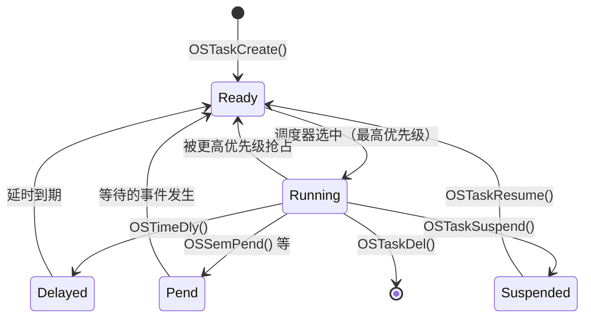
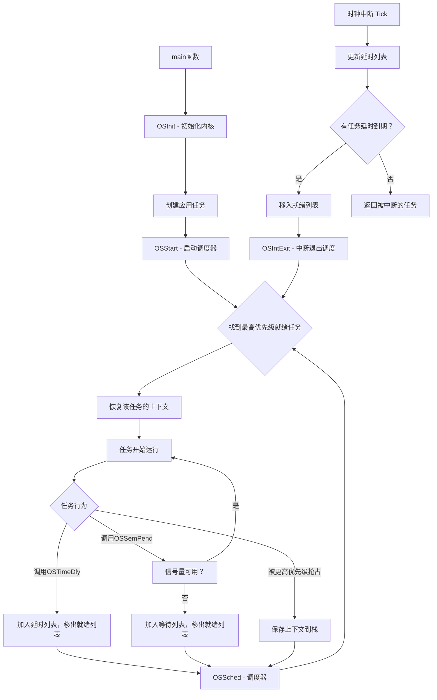

# µC/OS-III 实时操作系统源码学习指南

> **文档版本**：v2.0 | 2026年6月（修订版）
> **作者**：汪亮 bertonwang
> **邮箱**：47608843@qq.com
> 
> 本文档基于 µC/OS-III V3.08.02 源码，面向懂一些操作系统原理的初学者，将操作系统理论与实际代码实现一一对应，帮助你真正理解 RTOS 是如何工作的。

---

## 一、项目结构总览

```
uC-OS3/
├── Source/          ← 核心源码（与硬件无关，本文重点分析）
│   ├── os.h            主头文件：所有数据结构、宏定义、API声明
│   ├── os_core.c       内核核心：初始化、调度器、中断管理
│   ├── os_task.c       任务管理：创建、删除、挂起、恢复
│   ├── os_prio.c       优先级位图：快速查找最高优先级
│   ├── os_tick.c       时钟节拍：延时链表管理（Delta List）
│   ├── os_time.c       时间管理：任务延时API
│   ├── os_sem.c        信号量：任务同步与资源计数
│   ├── os_mutex.c      互斥量：互斥访问与优先级继承
│   ├── os_q.c          消息队列：任务间通信
│   ├── os_mem.c        内存管理：固定大小内存池
│   ├── os_flag.c       事件标志组：多事件同步
│   ├── os_tmr.c        软件定时器
│   └── os_type.h       类型定义
├── Cfg/Template/    ← 配置模板
│   ├── os_cfg.h        功能裁剪配置
│   └── os_cfg_app.h    应用级配置（栈大小等）
├── Ports/           ← 硬件移植层（ARM、MIPS等各种CPU）
└── Trace/           ← 调试追踪工具支持
```

### 1.1 源码阅读建议

µC/OS-III 的源码风格非常统一，每个文件都遵循相同的结构：
1. **文件头注释** - 描述文件功能
2. **局部函数声明** - 只在本文件使用的函数
3. **API函数实现** - 以文件名缩写开头的公开API（如 `OSTaskCreate`）
4. **内部函数实现** - 以 `OS_` 开头的内部函数（如 `OS_TaskInitTCB`）

---

## 二、核心概念：什么是实时操作系统（RTOS）

### 2.1 裸机 vs RTOS

| 对比项 | 裸机（无OS） | RTOS |
|--------|-------------|------|
| 程序结构 | 一个大循环 `while(1)` | 多个独立任务并发执行 |
| 响应性 | 取决于循环周期 | 高优先级任务可立即抢占 |
| 代码耦合 | 所有功能混在一起 | 各任务独立，互不干扰 |
| 时间确定性 | 难以保证 | 可保证关键任务的响应时间 |

### 2.2 什么是"实时"？

**实时≠快**，实时意味着**确定性**——系统必须在一定的时间限制内完成任务。

- **硬实时**：必须在截止时间前完成，否则系统失败（如汽车刹车系统）
- **软实时**：偶尔超时可接受，但性能会下降（如视频播放）

µC/OS-III 是**硬实时操作系统**，通过以下机制保证确定性：
1. **抢占式调度** - 高优先级任务可立即抢占低优先级任务
2. **优先级天花板** - 互斥量支持优先级继承，防止优先级反转
3. **确定的时间复杂度** - 所有系统调用的时间复杂度是确定的（O(1)或O(n)且n有上限）

### 2.3 µC/OS-III 的核心特性

- **抢占式调度**：高优先级任务随时可以打断低优先级任务
- **基于优先级**：每个任务有唯一优先级（0=最高，63=最低，可配置）
- **同优先级时间片轮转**：相同优先级的任务可以轮流执行
- **丰富的同步机制**：信号量、互斥量、消息队列、事件标志组
- **可裁剪**：通过宏开关可以关闭不需要的功能，节省资源
- **低中断延迟**：支持中断嵌套，临界区可配置为仅关调度器

---

## 三、内核初始化与启动

### 3.1 原理

操作系统启动前，需要初始化所有内部数据结构（就绪列表、优先级位图、各种管理模块），然后创建系统任务（空闲任务、统计任务等），最后启动调度器开始多任务运行。

### 3.2 从main()到第一次调度

一个典型的 µC/OS-III 应用启动流程：

```c
int main(void)
{
    OS_ERR err;
    
    // 1. 初始化硬件（时钟、GPIO等）
    // 【详解】在启动RTOS之前，必须先初始化硬件。这包括：
    //   - 系统时钟配置（为CPU提供时钟源）
    //   - 中断控制器配置（RTOS需要定时器中断来产生时钟节拍）
    //   - 串口等调试输出（方便观察系统运行状态）
    //   - 其他外设（LED、按键等）
    BSP_Init();
    
    // 2. 初始化uC/OS-III内核
    // 【详解】OSInit()会初始化所有内核数据结构：
    //   - 就绪列表（OSRdyList[]）清零
    //   - 优先级位图（OSPrioTbl[]）清零
    //   - 创建空闲任务（Idle Task，系统必须有）
    //   - 创建统计任务（可选，用于CPU使用率统计）
    //   - 初始化内存管理、消息池等
    // 注意：此时任务已创建但不会运行，因为调度器还没启动
    OSInit(&err);
    
    // 3. 创建应用任务
    // 【详解】创建任务是告诉RTOS"我要运行这个功能的代码"。
    // OSTaskCreate()会：
    //   - 分配任务控制块（TCB）
    //   - 初始化任务栈（模拟一个"中断返回现场"）
    //   - 将任务加入就绪列表（表示"我准备好了，可以运行"）
    // 注意：此时任务不会立即运行，因为OSStart()还没调用
    OSTaskCreate(...);  // 创建任务1
    OSTaskCreate(...);  // 创建任务2
    
    // 4. 启动操作系统（开始调度）
    // 【详解】OSStart()是RTOS的"点火开关"：
    //   - 找到最高优先级的就绪任务
    //   - 执行第一次任务切换（从main()切换到第一个任务）
    //   - 从此以后，main()函数就"消失"了，CPU开始执行任务代码
    // 注意：OSStart()一旦调用，就不会返回！
    OSStart(&err);
    
    // 永远不会执行到这里
    // 【详解】如果代码执行到这里，说明OSStart()失败了（比如没有创建任何任务）
    while (1);
}
```

> 💡 **启动流程总结**：硬件初始化 → 内核初始化 → 创建任务 → 启动调度器 → 任务开始运行

### 3.3 源码实现：`OSInit()` — 位于 `os_core.c`

```c
void  OSInit (OS_ERR  *p_err)
{
    // ========== 第一步：清零所有全局变量 ==========
    OSInitHook();                    // 调用硬件相关的初始化钩子
    
    // 中断和调度器状态
    OSIntNestingCtr       = 0u;      // 中断嵌套计数器清零
    OSRunning             = OS_STATE_OS_STOPPED;  // 标记OS尚未运行
    OSSchedLockNestingCtr = 0u;      // 调度器锁计数器清零

    // 当前任务和最高就绪任务指针
    OSTCBCurPtr           = (OS_TCB *)0;   // 当前任务指针清空
    OSTCBHighRdyPtr       = (OS_TCB *)0;   // 最高优先级就绪任务指针清空

    // 当前优先级和最高就绪优先级
    OSPrioCur             = 0u;      // 当前优先级
    OSPrioHighRdy         = 0u;      // 最高就绪优先级

    // ========== 第二步：初始化各个管理模块 ==========
    OS_PrioInit();                   // ① 初始化优先级位图表
    OS_RdyListInit();                // ② 初始化就绪列表

    OS_MemInit(p_err);               // ③ 初始化内存管理
    OS_MsgPoolInit(p_err);           // ④ 初始化消息池（用于任务间通信的消息块）
    OS_TaskInit(p_err);              // ⑤ 初始化任务管理
    OS_IdleTaskInit(p_err);          // ⑥ 创建空闲任务（系统必须）
    OS_TickInit(p_err);              // ⑦ 初始化时钟节拍
    OS_StatTaskInit(p_err);          // ⑧ 创建统计任务（可选）
    OS_TmrInit(p_err);              // ⑨ 初始化定时器管理
    
    *p_err = OS_ERR_NONE;
}
```

**要点理解**：
- **初始化顺序很重要**：后面的模块可能依赖前面的模块。例如，创建任务时需要从内存池分配TCB，所以内存管理要先初始化。
- **`OSRunning = OS_STATE_OS_STOPPED`**：表示此时调度器还没启动，任务创建了但不会运行。
- **空闲任务是系统必须的**：当没有其他任务就绪时，CPU执行空闲任务。空闲任务优先级最低（OS_CFG_PRIO_MAX-1）。

### 3.4 `OSStart()` — 启动调度器

```c
void  OSStart (OS_ERR  *p_err)
{
    if (OSRunning == OS_STATE_OS_STOPPED) {
        // 找到最高优先级的就绪任务
        OSPrioHighRdy   = OS_PrioGetHighest();
        OSTCBHighRdyPtr = OSRdyList[OSPrioHighRdy].HeadPtr;
        OSTCBCurPtr     = OSTCBHighRdyPtr;
        
        // 标记OS开始运行
        OSRunning = OS_STATE_OS_RUNNING;
        
        // 执行第一次任务切换（汇编实现）
        OSStartHighRdy();
    }
}
```

> 💡 **关键理解**：`OSStart()` 只会执行一次。它找到最高优先级的就绪任务，然后"假装"从一次任务切换中恢复，直接跳转到该任务的入口函数执行。

> **深入理解**：为什么是"假装"？因为任务切换通常是"保存旧任务上下文 → 恢复新任务上下文 → 返回新任务"。但第一次切换时，没有"旧任务"，所以CPU需要"伪造"一个上下文，让第一个任务看起来像是从一次切换中恢复的一样。这个"伪造"的上下文就是在 `OSTaskCreate()` 中通过 `OSTaskStkInit()` 初始化的栈帧。

---

## 四、任务管理（Task Management）

### 4.1 原理：什么是任务？

在 RTOS 中，**任务 = 一个独立的执行线程**。每个任务有：
- 自己的**栈空间**（保存局部变量和CPU寄存器）
- 自己的**任务控制块（TCB）**（记录任务的所有状态信息）
- 自己的**优先级**

任务的本质就是一个**永不返回的函数**：

```c
void MyTask (void *p_arg)
{
    // ========== 任务初始化部分 ==========
    // 【详解】这部分代码只执行一次，通常用于：
    //   - 初始化该任务用到的外设（如串口、ADC等）
    //   - 申请该任务需要的内存
    //   - 初始化任务内部的状态变量
    BSP_Init();
    
    // ========== 任务主循环（必须是无限循环！）==========
    for (;;) {                      // 必须是无限循环！
        // 【详解】这里是任务的"主体"，会不断重复执行
        // 典型结构：
        //   1. 等待事件（信号量、消息等）或直接做工作
        //   2. 处理事件/执行工作
        //   3. 延时或等待下一个事件
        
        // 任务主体代码
        OSTimeDly(100, OS_OPT_TIME_DLY, &err);  // 延时让出CPU
        // 【详解】OSTimeDly() 的作用：
        //   - 将任务从就绪列表移除，放入延时列表
        //   - 触发调度器，让其他任务运行
        //   - 延时到期后，任务重新进入就绪列表
        // 这不是"忙等"（busy-wait），不会浪费CPU！
    }
}
```

> ⚠️ **常见错误**：任务函数返回了！如果任务函数执行到结尾（return），会触发 `OS_TaskReturn()`，默认行为是删除任务或进入死循环。
> 
> **为什么任务不能返回？** 因为任务是"并行"执行的，没有"调用者"接收返回值。任务的生命周期是由调度器管理的，只能通过 `OSTaskDel()` 来结束。

### 4.2 任务控制块（TCB）详解 — 位于 `os.h` 第940行

TCB 是操作系统管理任务的"身份证"，记录了任务的一切信息：

```c
struct os_tcb {
    // ========== 栈相关（上下文切换的核心） ==========
    CPU_STK      *StkPtr;          // 【最重要】栈顶指针，上下文切换的关键
    void         *ExtPtr;          // 用户扩展数据指针
    CPU_STK      *StkLimitPtr;     // 栈溢出检测水位线
    
    // ========== 就绪列表相关（同优先级任务形成双向链表） ==========
    OS_TCB       *NextPtr;         // 就绪列表中的下一个TCB
    OS_TCB       *PrevPtr;         // 就绪列表中的上一个TCB
    
    // ========== 延时列表相关（用于OSTimeDly等） ==========
    OS_TCB       *TickNextPtr;     // 延时列表中的下一个TCB
    OS_TCB       *TickPrevPtr;     // 延时列表中的上一个TCB
    OS_TICK       TickRemain;      // 剩余延时节拍数（Delta List使用）
    OS_TICK       TickCtrMatch;    // 超时的节拍计数器匹配值
    
    // ========== 等待列表相关（等待信号量、互斥量等） ==========
    OS_TCB       *PendNextPtr;     // 等待列表中的下一个TCB
    OS_TCB       *PendPrevPtr;     // 等待列表中的上一个TCB
    OS_PEND_OBJ  *PendObjPtr;     // 正在等待的内核对象
    
    // ========== 任务状态和优先级 ==========
    OS_STATE      TaskState;       // 任务状态（就绪/延时/挂起/等待）
    OS_PRIO       Prio;            // 任务优先级（0=最高）
    OS_PRIO       BasePrio;        // 基础优先级（用于优先级继承恢复）
    
    // ========== 时间片轮转相关 ==========
    OS_TICK       TimeQuanta;      // 时间片大小（节拍数）
    OS_TICK       TimeQuantaCtr;   // 时间片剩余计数
    
    // ========== 任务内建消息队列 ==========
#if (OS_CFG_TASK_Q_EN > 0u)
    OS_MSG_Q      MsgQ;            // 每个任务可以有自己的消息队列
#endif
    
    // ========== 事件标志组相关 ==========
#if (OS_CFG_FLAG_EN > 0u)
    OS_FLAGS      FlagsPend;        // 等待的事件标志
    OS_FLAGS      FlagsRdy;         // 使任务就绪的事件标志
    OS_OPT        FlagsOpt;         // 等待选项（所有标志？任一标志？）
#endif
    
    // ========== 互斥量优先级继承相关 ==========
    OS_MUTEX     *MutexGrpHeadPtr; // 持有的互斥量组（用于嵌套释放时恢复优先级）
    
    // ... 更多字段（调试、统计等）
};
```

**关键理解**：
- `StkPtr` 是上下文切换的核心——切换任务就是切换栈指针。CPU的SP寄存器指向哪个任务的栈，哪个任务就在运行。
- **多个链表指针**：TCB可以同时存在于多个链表中。例如，一个任务正在等待信号量，同时也在延时，那么它的 `PendNextPtr` 指向等待列表的下一个任务，`TickNextPtr` 指向延时列表的下一个任务。
- `BasePrio` 和 `Prio` 的区别：当发生优先级继承时，`Prio` 会被临时提升，但 `BasePrio` 保持不变。释放互斥量时，需要恢复到 `BasePrio`。

### 4.3 任务状态机详解



**源码中用位掩码表示状态组合**（`os.h`）：

```c
#define  OS_TASK_STATE_RDY                    0u   // 就绪（在就绪列表中）
#define  OS_TASK_STATE_DLY                    1u   // 延时中（在延时列表中）
#define  OS_TASK_STATE_PEND                   2u   // 等待中（在某一内核对象的等待列表中）
#define  OS_TASK_STATE_PEND_TIMEOUT           3u   // 等待+超时（同时在等待列表和延时列表）
#define  OS_TASK_STATE_SUSPENDED              4u   // 被挂起（不在就绪列表，但仍可能等待）
#define  OS_TASK_STATE_DLY_SUSPENDED          5u   // 延时+挂起
#define  OS_TASK_STATE_PEND_SUSPENDED         6u   // 等待+挂起
#define  OS_TASK_STATE_PEND_TIMEOUT_SUSPENDED 7u   // 等待+超时+挂起
```

> 💡 **巧妙设计**：用3个bit位分别表示 DLY、PEND、SUSPENDED 三种状态，可以自由组合！这样可以用一个字节表示所有可能的状态组合。

**状态转换的代码示例**：

```c
// 任务调用OSTimeDly()后的状态变化
void OSTimeDly(OS_TICK dly, ...)
{
    CPU_CRITICAL_ENTER();  // 关中断，进入临界区
    
    // 1. 从就绪列表移除
    // 【详解】任务不再"就绪"，所以从就绪列表中移除
    // 这样调度器就不会选择这个任务运行
    OS_RdyListRemove(OSTCBCurPtr);
    
    // 2. 插入延时列表
    // 【详解】将任务加入延时列表，并告诉系统"我在xx个tick后醒来"
    // 延时列表按时间排序，系统每个tick检查是否有任务到期
    OS_TickListInsertDly(OSTCBCurPtr, dly, ...);
    
    // 3. 更新任务状态
    // 【详解】状态从 OS_TASK_STATE_RDY 变为 OS_TASK_STATE_DLY
    // 这样系统知道"这个任务不是在等信号量，而是在延时"
    OSTCBCurPtr->TaskState = OS_TASK_STATE_DLY;
    
    CPU_CRITICAL_EXIT();  // 开中断，退出临界区
    
    // 4. 触发调度
    // 【详解】因为当前任务"睡觉"了，需要找其他任务来运行
    // 这个函数不会立即切换，而是设置一个"请求"
    OSSched();
}
```

> 💡 **状态转换的本质**：任务状态的变化，本质上就是任务在不同链表之间的移动：
> - `OS_TASK_STATE_RDY`：任务在 `OSRdyList[]` 中
> - `OS_TASK_STATE_DLY`：任务在延时列表 `OSTickList` 中
> - `OS_TASK_STATE_PEND`：任务在某个内核对象的 `PendList` 中

### 4.4 创建任务：`OSTaskCreate()` — 位于 `os_task.c` 详解

这是整个操作系统中最重要的函数之一，理解它就理解了任务是如何"诞生"的。

```c
void  OSTaskCreate (OS_TCB       *p_tcb,       // 任务控制块（由调用者分配）
                    CPU_CHAR     *p_name,       // 任务名称（用于调试）
                    OS_TASK_PTR   p_task,       // 任务函数指针
                    void         *p_arg,        // 传给任务的参数
                    OS_PRIO       prio,         // 优先级（0=最高）
                    CPU_STK      *p_stk_base,   // 栈基地址（低地址）
                    CPU_STK_SIZE  stk_limit,    // 栈溢出水位线（从栈底开始）
                    CPU_STK_SIZE  stk_size,     // 栈大小（单位：CPU_STK）
                    OS_MSG_QTY    q_size,       // 内建消息队列大小
                    OS_TICK       time_quanta,  // 时间片（0=使用默认）
                    void         *p_ext,        // 扩展数据
                    OS_OPT        opt,          // 选项
                    OS_ERR       *p_err)
{
    // ========== 第一步：参数检查 ==========
    // 检查优先级是否合法（0 <= prio < OS_CFG_PRIO_MAX）
    // 检查栈大小是否足够（至少能存放初始上下文）
    
    // ========== 第二步：初始化TCB为默认值 ==========
    OS_TaskInitTCB(p_tcb);
    // 这个函数将TCB的所有字段设置为默认值（0或NULL）
    // 非常重要！避免未初始化的字段导致奇怪的问题
    
    // ========== 第三步：可选清零栈空间 ==========
    if (opt & OS_OPT_TASK_STK_CLR) {
        // 将整个栈空间清零，便于调试时查看栈使用量
        p_sp = p_stk_base;
        for (i = 0; i < stk_size; i++) {
            *p_sp = 0u;
            p_sp++;
        }
    }
    
    // ========== 第四步：【关键】初始化任务栈帧 ==========
    // 这是整个函数最核心的部分！
    p_sp = OSTaskStkInit(p_task,       // 任务入口函数
                         p_arg,        // 传给任务的参数
                         p_stk_base,   // 栈基地址
                         p_stk_limit,  // 栈溢出水位线
                         stk_size,     // 栈大小
                         opt);         // 选项
    
    // OSTaskStkInit() 是移植层函数（在os_cpu_c.c中）
    // 它在栈上构造一个"假的"中断返回现场
    // 当任务第一次被调度时，上下文切换代码会从栈中弹出这些寄存器
    // 然后CPU"以为"自己是从一个中断返回，跳转到任务入口函数执行
    
    // 对于ARM Cortex-M，初始栈帧包含：
    // xPSR, PC(R0=任务入口), LR, R12, R3, R2, R1, R0, R11~R4
    
    // ========== 第五步：填充TCB字段 ==========
    p_tcb->Prio     = prio;
    p_tcb->StkPtr   = p_sp;       // 保存栈顶指针（已经被OSTaskStkInit初始化过）
    p_tcb->BasePrio = prio;
    p_tcb->StkLimitPtr = p_stk_base + stk_limit;  // 栈溢出检测水位线
    
    // ========== 第六步：创建内建消息队列（如果配置了） ==========
#if (OS_CFG_TASK_Q_EN > 0u)
    OS_MsgQInit(&p_tcb->MsgQ, q_size);
#endif
    
    // ========== 第七步：将任务加入就绪列表 ==========
    // 【详解】这是"激活"任务的关键步骤！
    // 之前的所有步骤只是在"准备"任务（设置TCB、初始化栈等）
    // 这一步才真正告诉调度器："这个任务已经准备好了，可以运行了！"
    // 就绪列表 OSRdyList[prio] 是一个双向链表，同优先级的任务都挂在这里
    OS_RdyListInsert(p_tcb);
    // 同时，优先级位图 OSPrioTbl[] 中对应的位会被置1，表示"这个优先级有就绪任务"
    
    // ========== 第八步：如果OS已运行，触发一次调度 ==========
    // 【详解】为什么创建完任务要立即调度？
    // 场景1：在main()中创建任务（OS还没启动）
    //   - OSRunning == OS_STATE_OS_STOPPED
    //   - 不触发调度，等待OSStart()来启动调度器
    // 场景2：在任务中动态创建新任务（OS已经运行）
    //   - OSRunning == OS_STATE_OS_RUNNING
    //   - 如果新任务优先级更高，立即切换过去（抢占！）
    if (OSRunning == OS_STATE_OS_RUNNING) {
        OSSched();  // 如果新任务优先级更高，立即运行
    }
}
```

**核心要点总结**：
1. `OSTaskStkInit()` 是理解任务切换的关键——它在栈上模拟了一次中断返回的现场
   - 为什么？因为任务切换本质上就是"伪造一次中断返回"
   - CPU从栈中弹出寄存器，然后"以为"自己是从某个中断返回的，其实是从任务的入口函数开始执行
2. 创建完任务后立即调度，确保如果新任务优先级更高，能立即运行
3. `StkLimitPtr` 用于栈溢出检测——如果栈指针低于这个值，说明栈溢出了

**深入理解：任务栈的初始状态**
```
任务栈的初始状态（由OSTaskStkInit()构造）：
┌─────────────────┐ ← 栈顶（StkPtr指向这里）
│    xPSR         │ ← 处理器状态寄存器（必须合法，否则第一次"返回"会出错）
├─────────────────┤
│    PC           │ ← 任务入口函数地址（任务"返回"后从这里开始执行！）
├─────────────────┤
│    LR           │ ← 链接寄存器（任务函数返回时的"假地址"，通常指向OSTaskReturn）
├─────────────────┤
│    R12          │
├─────────────────┤
│    R3           │
├─────────────────┤
│    R2           │
├─────────────────┤
│    R1           │
├─────────────────┤
│    R0           │ ← 任务参数 p_arg（通过R0传递给任务函数）
├─────────────────┤
│    R11~R4       │ ← 其余需要保存的寄存器
├─────────────────┤
│    ...          │
└─────────────────┘ ← 栈底

当任务第一次被调度时，上下文切换代码会：
1. 从StkPtr指向的地址开始，弹出R4~R11
2. 执行异常返回，硬件自动弹出R0~R3, R12, LR, PC, xPSR
3. PC指向任务入口函数，于是任务开始执行！
```

### 4.5 任务删除与资源回收

```c
void  OSTaskDel (OS_TCB  *p_tcb, OS_ERR *p_err)
{
    // 1. 如果p_tcb为NULL，删除自己
    // 【详解】这是一种"自杀"机制
    // 任务可以删除自己（p_tcb=NULL表示使用OSTCBCurPtr）
    // 也可以"谋杀"其他任务（指定其他任务的TCB）
    if (p_tcb == (OS_TCB *)0) {
        p_tcb = OSTCBCurPtr;  // 获取当前任务的TCB
    }
    
    // 2. 从所有链表中移除该任务
    // 【详解】任务可能同时在多个链表中，需要全部移除：
    //   - 就绪列表（如果任务就绪）
    //   - 延时列表（如果任务在延时）
    //   - 某个内核对象的等待列表（如果任务在等待信号量等）
    // 如果不移除，调度器可能还会尝试切换到这个"已死"的任务！
    OS_RdyListRemove(p_tcb);      // 从就绪列表移除
    OS_TickListRemove(p_tcb);     // 从延时列表移除
    // ... 从等待列表移除（如果有）
    
    // 3. 将TCB放入空闲TCB列表（便于后续复用）
    // 【详解】µC/OS-III 不会立即释放TCB的内存，而是：
    //   - 调用 OS_TaskInitTCB() 清空TCB的所有字段
    //   - 将TCB插入空闲TCB链表
    // 这样下次创建任务时，可以直接从空闲链表取，避免内存碎片
    OS_TaskInitTCB(p_tcb);        // 清空TCB
    
    // 4. 触发调度（如果删除了自己，必须切换任务）
    // 【详解】如果删除的是自己，当前任务即将"消失"
    // 必须立即切换到其他任务，否则CPU会"跑飞"
    // 如果删除的是其他任务，可以延迟到方便的时候再调度
    if (p_tcb == OSTCBCurPtr) {
        OSSched();  // 立即触发调度
    }
}
```

> ⚠️ **注意**：删除任务并不会自动释放任务栈！任务栈通常由调用者分配（全局数组或动态分配），需要调用者自己管理。
> 
> **深入理解：为什么不能自动释放栈？**
> 因为µC/OS-III 不知道栈是怎么分配的：
> - 可能是全局数组：`CPU_STK TaskStk[1024];`
> - 可能是动态分配：`CPU_STK *TaskStk = malloc(1024 * sizeof(CPU_STK));`
> - 可能在ROM中（某些特殊应用）
> 
> 所以，任务栈的释放需要用户自己处理（如果是动态分配的）。

---

## 五、调度器（Scheduler）

### 5.1 原理

调度器是 RTOS 的"大脑"，负责决定**下一个该运行哪个任务**。µC/OS-III 采用**抢占式优先级调度**：

1. 始终运行就绪任务中优先级最高的那个
2. 如果最高优先级有多个任务，则时间片轮转

### 5.2 优先级位图算法详解 — `os_prio.c`

**问题**：如何快速找到最高优先级的就绪任务？

最简单的方案是用一个数组存储所有优先级的状态，然后遍历查找。但这样时间复杂度是O(n)。

**µC/OS-III 的方案**：使用**位图（bitmap）**，每一位代表一个优先级是否有就绪任务。查找最高优先级只需要几条指令！

```c
// 优先级位图表（全局变量）
CPU_DATA  OSPrioTbl[OS_PRIO_TBL_SIZE];
// 例如：64个优先级 → 需要 64/32 = 2 个 32位字
//      ：256个优先级 → 需要 256/32 = 8 个 32位字
```

#### 位图的可视化

```
假设有8个优先级，用1个8位字节表示：

优先级:  7   6   5   4   3   2   1   0
          ↓   ↓   ↓   ↓   ↓   ↓   ↓   ↓
OSPrioTbl[0] = 0b 0 0 1 0 1 0 1 1
                ↑                       ↑
                |                       |
                优先级7没有就绪           优先级0有就绪任务
                
当前就绪的优先级：0, 1, 3, 5
最高优先级是0！
```

#### 插入优先级（任务就绪时调用）

```c
void  OS_PrioInsert (OS_PRIO  prio)
{
    CPU_DATA  bit_nbr;
    OS_PRIO   ix;
    
    // 计算该优先级在位图表中的位置
    // 【详解】位图表是一个数组，每个元素是32位（一个CPU_DATA）
    // 例如：64个优先级 → 需要 64/32 = 2 个 32位字 → OSPrioTbl[0] 和 OSPrioTbl[1]
    // 计算：
    //   ix = prio / 32  →  决定用数组的第几个元素
    //   bit_nbr = prio % 32  → 决定用这个元素的第几位
    ix      = prio / (CPU_CFG_DATA_SIZE * 8);        // 第几个字（32位）
    bit_nbr = prio & ((CPU_CFG_DATA_SIZE * 8) - 1);  // 字内第几位（取模的位运算版本）
    
    // 从高位开始存储（因为优先级0是最高，对应最高位）
    // 【详解】这里有个重要的设计选择：
    //   - 优先级0是最高优先级
    //   - 为了让"找最高优先级"变成"找最左边的1"
    //   - 所以优先级0对应位图的最高位（bit 31）
    //   - 优先级31对应位图的最低位（bit 0）
    // 1u << (31u - bit_nbr) 的作用：
    //   - 如果 bit_nbr=0（优先级0），左移31位 → 0x80000000（最高位）
    //   - 如果 bit_nbr=31（优先级31），左移0位 → 0x00000001（最低位）
    OSPrioTbl[ix] |= 1u << (31u - bit_nbr);
}
```

> 💡 **位运算技巧**：`prio & 31` 等价于 `prio % 32`，但更快！前提是32是2的幂次。

#### 查找最高优先级（调度时调用）— **这是整个系统的性能关键！**

```c
OS_PRIO  OS_PrioGetHighest (void)
{
    CPU_DATA  *p_tbl;
    OS_PRIO    prio;
    
    prio  = 0u;
    p_tbl = &OSPrioTbl[0];
    
    // 跳过全0的字（这些优先级范围没有就绪任务）
    // 【详解】如果OSPrioTbl[0] = 0，说明优先级0~31都没有就绪任务
    // 继续检查OSPrioTbl[1]（优先级32~63）
    // 每跳过一个全0的字，优先级基数增加32
    while (*p_tbl == 0u) {
        prio += (CPU_CFG_DATA_SIZE * 8u);
        p_tbl++;
    }
    
    // 计算该字中前导零的个数
    // 【详解】前导零 = 从最高位开始连续0的个数
    // 例如：0b0010... → 前导零=2 → 最高优先级=2
    // 为什么要算前导零？
    //   因为优先级0对应最高位（bit31）
    //   如果bit31=1，前导零=0 → 优先级0就绪
    //   如果bit31=0且bit30=1，前导零=1 → 优先级1就绪
    //   以此类推...
    prio += CPU_CntLeadZeros(*p_tbl);
    
    return (prio);
}
```

> 💡 **为什么用前导零？** 因为优先级0是最高的，对应位图最高位。前导零的个数就是最高就绪优先级的编号！
> 
> **硬件加速**：很多CPU有硬件指令 `CLZ`（Count Leading Zeros）可以一条指令完成。µC/OS-III 的 `CPU_CntLeadZeros()` 在支持CLZ的CPU上会直接使用该指令！
> 
> **时间复杂度分析**：
> - 最坏情况：优先级0~31都没有就绪，需要检查OSPrioTbl[1] → 常数时间！
> - 与就绪任务数量无关！无论有多少个任务就绪，都是O(1)。

#### 移除优先级（任务不再就绪时调用）

```c
void  OS_PrioRemove (OS_PRIO  prio)
{
    CPU_DATA  bit_nbr;
    OS_PRIO   ix;
    
    ix      = prio / (CPU_CFG_DATA_SIZE * 8);
    bit_nbr = prio & ((CPU_CFG_DATA_SIZE * 8) - 1);
    
    // 将对应位清零
    // 【详解】1u << (31u - bit_nbr) 构造一个"只有该位为1"的掩码
    // 然后取反（~），变成"只有该位为0，其他位都为1"
    // 再用 &= 操作，将该位清零，其他位保持不变
    OSPrioTbl[ix] &= ~(1u << (31u - bit_nbr));
}
```

**完整示例：优先级位图的操作过程**
```
假设系统有8个优先级（用8位表示），初始状态全0：
OSPrioTbl[0] = 0b00000000

步骤1：插入优先级0（最高优先级）
  ix=0, bit_nbr=0
  1u << (7 - 0) = 0b10000000
  OSPrioTbl[0] |= 0b10000000 → OSPrioTbl[0] = 0b10000000

步骤2：插入优先级3
  ix=0, bit_nbr=3
  1u << (7 - 3) = 0b00010000
  OSPrioTbl[0] |= 0b00010000 → OSPrioTbl[0] = 0b10010000

步骤3：查找最高优先级
  OSPrioTbl[0] = 0b10010000
  CPU_CntLeadZeros(0b10010000) = 0（前导零个数）
  → 最高优先级 = 0（正确！）

步骤4：移除优先级0
  ~(1u << (7 - 0)) = 0b01111111
  OSPrioTbl[0] &= 0b01111111 → OSPrioTbl[0] = 0b00010000

步骤5：再次查找最高优先级
  OSPrioTbl[0] = 0b00010000
  CPU_CntLeadZeros(0b00010000) = 3（前导零个数）
  → 最高优先级 = 3（正确！）
```

### 5.3 就绪列表（Ready List）详解

每个优先级对应一个双向链表，存放该优先级下所有就绪的任务：

```
OSRdyList[0]  → TCB_A                    （优先级0，最高，只有1个任务）
OSRdyList[1]  → TCB_B ↔ TCB_C ↔ TCB_D   （优先级1，3个任务轮转）
OSRdyList[2]  → (空)
...
OSRdyList[63] → IdleTask_TCB             （最低优先级，空闲任务）
```

**就绪列表的数据结构**：

```c
struct os_rdy_list {
    OS_TCB  *HeadPtr;    // 链表头（时间片轮转时，当前运行的任务在头）
    OS_TCB  *TailPtr;    // 链表尾
    OS_OBJ_QTY  NbrEntries;  // 该优先级下有多少个就绪任务
};
```

📝 **代码解释**：

这个结构体定义了就绪列表中每个优先级对应的双向链表：

- **`HeadPtr`**：指向链表的第一个任务TCB。当启用时间片轮转时，当前正在运行的任务会被放在链表头部，这样每次调度时直接从头部取任务即可
- **`TailPtr`**：指向链表的最后一个任务TCB，方便在尾部插入新任务
- **`NbrEntries`**：记录该优先级下有多少个就绪任务，用于时间片轮转调度时判断是否需要轮转

> 💡 **为什么需要双向链表？** 因为任务可能被删除或主动放弃CPU，需要从链表中移除自己。双向链表可以在O(1)时间内移除任意节点，而单向链表需要O(n)时间查找前驱节点。

**插入和移除操作**：

```c
void  OS_RdyListInsert (OS_TCB  *p_tcb)
{
    OS_PRIO       prio;
    OS_RDY_LIST  *p_rdy_list;
    
    // ========== 第一步：获取任务优先级对应的就绪列表 ==========
    prio       = p_tcb->Prio;           // 从任务TCB中获取优先级
    p_rdy_list = &OSRdyList[prio];      // 找到该优先级对应的就绪列表
    
    // ========== 第二步：判断链表是否为空 ==========
    if (p_rdy_list->HeadPtr == (OS_TCB *)0) {
        // 链表为空，插入后既是头也是尾
        p_rdy_list->HeadPtr = p_tcb;    // 新任务成为链表头
        p_rdy_list->TailPtr = p_tcb;    // 新任务也是链表尾
        p_tcb->NextPtr = (OS_TCB *)0;   // 没有后继节点
        p_tcb->PrevPtr = (OS_TCB *)0;   // 没有前驱节点
    } else {
        // 链表不为空，插入到链表尾部（FIFO顺序）
        p_rdy_list->TailPtr->NextPtr = p_tcb;  // 原尾部的Next指向新任务
        p_tcb->PrevPtr = p_rdy_list->TailPtr;  // 新任务的前驱指向原尾部
        p_rdy_list->TailPtr = p_tcb;           // 更新尾部指针
        p_tcb->NextPtr = (OS_TCB *)0;          // 新任务没有后继
    }
    
    // ========== 第三步：更新优先级位图 ==========
    // 标记该优先级有就绪任务，这样调度器能快速找到最高优先级
    OS_PrioInsert(prio);
}
```

📝 **代码解释**：

这个函数将一个任务插入到其优先级对应的就绪链表中：

1. **第一步**：根据任务的优先级，找到对应的就绪列表（`OSRdyList[prio]`）

2. **第二步**：分两种情况处理：
   - **链表为空**：新任务既是头也是尾，前后指针都设为NULL
   - **链表不为空**：采用FIFO（先进先出）策略，新任务插入到链表尾部。这样可以保证同优先级的任务按创建顺序轮流执行

3. **第三步**：调用 `OS_PrioInsert()` 更新优先级位图，标记该优先级有就绪任务

**可视化示例**：

```
插入前（优先级5的就绪列表）：
   HeadPtr → TCB_B ↔ TCB_C ← TailPtr
   
插入 TCB_D 后：
   HeadPtr → TCB_B ↔ TCB_C ↔ TCB_D ← TailPtr
                ↑插入到尾部
```

> ⚠️ **注意**：同优先级的任务是按FIFO顺序插入的，但调度时总是从 `HeadPtr` 取任务。如果使用时间片轮转，当前运行的任务会被移到链表尾部，实现"轮流执行"的效果。

### 5.4 调度器核心：`OSSched()` — 位于 `os_core.c` 第430行详解

```c
void  OSSched (void)
{
    // ========== 第一步：检查是否允许调度 ==========
    // 条件1：不能在ISR中调用任务级调度
    // OSIntNestingCtr 记录当前中断嵌套层数，>0表示正在处理中断
    if (OSIntNestingCtr > 0u) {
        return;  // 在中断中，不能切换任务上下文！
    }
    
    // 条件2：调度器不能被锁住
    // OSSchedLockNestingCtr 是调度锁嵌套计数，>0表示调度被禁止
    if (OSSchedLockNestingCtr > 0u) {
        return;  // 调度被锁定，不允许切换
    }
    
    // ========== 第二步：关中断（进入临界区） ==========
    // 为什么需要关中断？
    // 因为找最高优先级的过程必须原子化，不能被中断打断
    // 否则可能出现：刚找到最高优先级，就被中断修改了就绪列表
    CPU_CRITICAL_ENTER();
    
    // ========== 第三步：找到最高优先级 ==========
    // OS_PrioGetHighest() 使用位图算法，O(1)时间找到最高优先级
    // 这是µC/OS-III高效的核心秘密！
    OSPrioHighRdy = OS_PrioGetHighest();
    
    // ========== 第四步：获取该优先级就绪列表的第一个任务 ==========
    // 注意：同优先级的任务形成双向链表，HeadPtr是当前应该运行的任务
    // 如果使用时间片轮转，当前运行的任务会被移到链表尾部
    OSTCBHighRdyPtr = OSRdyList[OSPrioHighRdy].HeadPtr;
    
    // ========== 第五步：如果最高优先级任务就是当前任务，无需切换 ==========
    // 这是一种优化：避免无谓的上下文切换
    if (OSTCBHighRdyPtr == OSTCBCurPtr) {
        CPU_CRITICAL_EXIT();  // 记得开中断
        return;  // 自己就是最高优先级，直接返回，避免无谓的切换
    }
    
    // ========== 第六步：【执行上下文切换！】 ==========
    // OS_TASK_SW() 是一个宏，最终触发PendSV异常（ARM Cortex-M）
    // 或者在其他架构上触发软中断
    // 
    // 为什么不直接切换，而是要触发异常？
    // 因为上下文切换需要模拟"异常返回"的过程，这样才能正确地恢复任务现场
    OS_TASK_SW();
    
    // ========== 第七步：开中断 ==========
    // 注意：实际上这一行代码可能不会立即执行！
    // 因为 OS_TASK_SW() 触发了上下文切换，CPU可能已经开始执行新任务了
    // 这行代码是为"切换失败"或"返回到这里"的情况准备的
    CPU_CRITICAL_EXIT();
    
    // 注意：OS_TASK_SW() 不会立即切换！
    // 它会设置一个"请求"，真正的切换发生在函数返回后的某个时刻
    // 对于ARM Cortex-M，PendSV异常会在所有其他中断处理完后才执行
}
```

📝 **详细解释**：

`OSSched()` 是任务级调度器，由任务代码主动调用（如 `OSTimeDly()` 后）。它的工作流程：

1. **安全检查**：确保不在中断中，且调度器未被锁定
2. **关中断**：保证查找最高优先级的过程是原子的
3. **找最高优先级**：使用位图算法O(1)时间完成
4. **获取任务**：从最高优先级的就绪链表取第一个任务
5. **去重检查**：如果就是当前任务，直接返回（优化）
6. **触发切换**：通过 `OS_TASK_SW()` 触发上下文切换
7. **清理**：开中断（虽然可能永远不会执行到这里）

> ⚠️ **关键点**：`OSSched()` 是"任务级"调度器，只能在任务上下文中调用，不能在中断中调用！中断中必须使用 `OSIntExit()`。

### 5.5 上下文切换的本质（以ARM Cortex-M为例）

上下文切换是 RTOS 中最"神秘"的部分。让我们揭开它的面纱：

**上下文切换做了什么？**

```
【保存当前任务的上下文】
  ① CPU寄存器（R0-R12, LR, PC, xPSR）已经被中断硬件自动压栈
  ② 在PendSV异常处理函数中，手动将剩余寄存器（R4-R11）压入当前任务的栈
  ③ 将栈顶指针保存到 OSTCBCurPtr->StkPtr

【恢复新任务的上下文】
  ④ 从 OSTCBHighRdyPtr->StkPtr 获取新任务的栈顶
  ⑤ 从新任务的栈中弹出R4-R11
  ⑥ PendSV异常返回时，硬件自动从栈中弹出R0-R12, LR, PC, xPSR
  ⑦ CPU开始执行新任务的代码（从被中断的地方继续）
```

**为什么每个任务需要自己的栈？**

因为栈里保存着任务被打断时的"现场快照"。当任务再次被调度时，需要恢复到被打断时的状态继续执行。

```
任务A的栈：
┌──────────┐ ← 栈顶（StkPtr）
│ R11      │ ← 任务A被切换出去时保存的寄存器
│ R10      │
│ R9       │
│ ...      │
│ R4       │
│ R0       │
│ R1       │
│ ...      │
│ xPSR     │ ← 任务A被中断时的处理器状态
└──────────┘ ← 栈底

任务B的栈：
┌──────────┐ ← 栈顶（StkPtr）
│ R11      │ ← 任务B被切换出去时保存的寄存器
│ ...      │
```

**ARM Cortex-M 的上下文切换代码（简化版）**：

```assembly
; PendSV 异常处理函数（上下文切换的核心）
PendSV_Handler:
    ; ========== 第一步：获取当前任务TCB ==========
    LDR  R0, =OSTCBCurPtr     ; 加载当前任务TCB指针的地址
    LDR  R1, [R0]             ; R1 = OSTCBCurPtr（当前任务的TCB）
    
    ; ========== 第二步：保存当前任务的寄存器R4-R11 ==========
    LDR  R2, [R1]             ; R2 = OSTCBCurPtr->StkPtr（当前任务的栈顶）
    STMDB R2!, {R4-R11}       ; 将R4-R11压入当前任务的栈
    STR  R2, [R1]             ; 更新 OSTCBCurPtr->StkPtr = 新的栈顶
    
    ; ========== 第三步：切换到新任务的栈 ==========
    LDR  R0, =OSTCBHighRdyPtr ; 加载最高优先级任务TCB指针的地址
    LDR  R1, [R0]             ; R1 = OSTCBHighRdyPtr（新任务的TCB）
    LDR  R2, [R1]             ; R2 = OSTCBHighRdyPtr->StkPtr（新任务的栈顶）
    
    ; ========== 第四步：更新全局变量 ==========
    LDR  R0, =OSTCBCurPtr     ; 更新当前任务指针
    STR  R1, [R0]             ; OSTCBCurPtr = OSTCBHighRdyPtr
    
    ; ========== 第五步：从新任务的栈中恢复寄存器R4-R11 ==========
    LDMIA R2!, {R4-R11}       ; 从新任务的栈中弹出R4-R11
    STR  R2, [R1]             ; 更新 OSTCBHighRdyPtr->StkPtr = 新的栈顶
    
    ; ========== 第六步：异常返回 ==========
    ; 硬件会自动从栈中弹出R0-R3, R12, LR, PC, xPSR
    BX   LR                   ; 返回，CPU开始执行新任务
```

� **代码解释**：

这段汇编代码是上下文切换的"心脏"：

1. **第一步**：获取当前任务的TCB指针
2. **第二步**：保存当前任务的R4-R11寄存器到其栈中（R0-R3等已由硬件自动保存）
3. **第三步**：获取新任务的TCB和栈顶指针
4. **第四步**：更新全局变量 `OSTCBCurPtr`，指向新任务
5. **第五步**：从新任务的栈中恢复R4-R11寄存器
6. **第六步**：异常返回时，硬件自动恢复R0-R3等寄存器，CPU开始执行新任务

> �💡 **形象比喻**：上下文切换就像"灵魂转移"——把CPU这个"身体"的控制权从一个任务转移到另一个任务。每个任务都有自己的"记忆"（栈），切换时保存当前任务的记忆，恢复新任务的记忆。

**为什么使用PendSV异常？**

ARM Cortex-M使用PendSV（可挂起的系统调用）来执行上下文切换，原因是：
- **延迟执行**：PendSV可以被"挂起"，等到所有其他中断都处理完才执行
- **避免嵌套**：确保上下文切换不会在中断处理过程中发生
- **统一入口**：任务级切换（`OS_TASK_SW()`）和中断级切换（`OSIntCtxSw()`）都最终触发PendSV

### 5.6 中断级调度：`OSIntExit()` — `os_core.c`

中断处理函数中不能调用 `OSSched()`，因为中断上下文和任务上下文不同。中断需要使用专门的 `OSIntExit()`：

```c
void  OSIntExit (void)
{
    // ========== 第一步：中断嵌套计数减1 ==========
    // OSIntNestingCtr 记录当前中断嵌套层数
    // 每次进入中断+1，离开中断-1
    OSIntNestingCtr--;
    
    // ========== 第二步：检查是否还有嵌套中断 ==========
    // 如果还有嵌套中断（OSIntNestingCtr > 0），直接返回
    // 不执行调度，因为还在中断上下文中
    if (OSIntNestingCtr > 0u) return;
    
    // ========== 第三步：检查调度器是否被锁定 ==========
    // 如果调度器被锁定（OSSchedLockNestingCtr > 0），不调度
    if (OSSchedLockNestingCtr > 0u) return;
    
    // ========== 第四步：找到最高优先级就绪任务 ==========
    // 使用位图算法O(1)时间找到最高优先级
    OSPrioHighRdy   = OS_PrioGetHighest();
    
    // 获取该优先级就绪列表的第一个任务
    OSTCBHighRdyPtr = OSRdyList[OSPrioHighRdy].HeadPtr;
    
    // ========== 第五步：如果就是当前任务，无需切换 ==========
    // 优化：如果最高优先级任务就是被中断的任务，直接返回
    if (OSTCBHighRdyPtr == OSTCBCurPtr) return;
    
    // ========== 第六步：执行中断级上下文切换 ==========
    // 与任务级切换（OS_TASK_SW）的区别：
    // - 任务级切换：需要手动触发PendSV异常
    // - 中断级切换：已经在中断中，直接使用OSIntCtxSw
    // 
    // 为什么不同？
    // 因为中断中已经保存了被中断任务的寄存器（硬件自动完成），
    // 所以不需要再触发PendSV来保存上下文，
    // 只需在中断返回前，修改返回地址，让CPU回到新任务
    OSIntCtxSw();
}
```

📝 **详细解释**：

`OSIntExit()` 是中断级调度器，在中断处理函数的末尾调用。它的工作流程：

1. **减少嵌套计数**：表示要离开一层中断
2. **检查嵌套**：如果还有嵌套中断，不调度（必须等所有中断都处理完）
3. **检查调度锁**：如果调度器被锁定，不调度
4. **找最高优先级**：使用位图算法找到最高优先级就绪任务
5. **去重检查**：如果就是当前任务，直接返回
6. **执行切换**：调用 `OSIntCtxSw()` 执行中断级上下文切换

**任务级调度 vs 中断级调度**：

```
【任务级调度 OSSched()】
   调用OS_TASK_SW() → 触发PendSV异常 → 在PendSV中保存/恢复上下文

【中断级调度 OSIntExit()】
   已经在中断中 → 直接调用OSIntCtxSw() → 修改中断返回地址 → 返回到新任务
```

> ⚠️ **关键点**：`OSIntExit()` 必须在**所有**中断处理函数的末尾调用，否则系统可能无法正确调度任务！

**典型用法示例**：

```c
void USART1_IRQHandler(void)
{
    // 1. 通知µC/OS-III进入中断（OSIntNestingCtr++）
    OSIntEnter();
    
    // 2. 处理中断（读取串口数据等）
    // ...
    
    // 3. 通知µC/OS-III离开中断（OSIntNestingCtr--，并检查是否需要调度）
    OSIntExit();
    // 注意：如果OSIntExit()发现了更高优先级任务，
    // 它不会返回到这里，而是直接跳转到新任务！
}
```

---

## 六、时钟节拍与延时管理

### 6.1 原理

RTOS 需要一个周期性的"心跳"来驱动时间相关的功能（任务延时、超时检测等）。这个心跳就是**时钟节拍（Tick）**，通常由硬件定时器产生，频率一般为 100Hz~1000Hz。

**时钟节拍的频率选择**：
- **太高**（如10kHz）：中断过于频繁，浪费CPU时间
- **太低**（如10Hz）：时间分辨率太粗，延时精度差
- **推荐**：100Hz~1000Hz（µC/OS-III默认1000Hz）

### 6.2 时钟节拍处理：`OSTimeTick()` — `os_time.c`

```c
void  OSTimeTick (void)
{
    // ========== 第一步：调用用户钩子函数 ==========
    // OSTimeTickHook() 是一个用户可自定义的钩子函数
    // 可以用于触发周期性任务，或者执行一些周期性检查
    // 例如：检查看门狗、统计CPU使用率等
    OSTimeTickHook();
    
    // ========== 第二步：处理时间片轮转 ==========
    // 如果启用了时间片轮转功能（OS_CFG_SCHED_ROUND_ROBIN_EN > 0）
#if (OS_CFG_SCHED_ROUND_ROBIN_EN > 0u)
    // OS_SchedRoundRobin() 检查当前优先级的任务时间片是否用完
    // 如果用完，将当前任务移到链表尾部，让同优先级下一个任务运行
    OS_SchedRoundRobin(&OSRdyList[OSPrioCur]);
#endif
    
    // ========== 第三步：更新延时列表（这是最核心的功能） ==========
    // 如果启用了时钟节拍功能（OS_CFG_TICK_EN > 0）
#if (OS_CFG_TICK_EN > 0u)
    // OS_TickUpdate(1u) 将所有延时任务的计数器减1
    // 如果某个任务的计数器减到0，将其从延时列表移回就绪列表
    OS_TickUpdate(1u);
#endif
}
```

📝 **详细解释**：

`OSTimeTick()` 是时钟节拍的中断处理函数，每次时钟节拍（Tick）中断时调用：

1. **用户钩子**：调用 `OSTimeTickHook()`，用户可以在这里添加自己的周期性处理代码
2. **时间片轮转**：如果启用了时间片轮转，检查当前任务的时间片是否用完
3. **更新延时**：遍历Delta List，将头部任务的计数器减1，唤醒超时的任务

> ⚠️ **关键点**：这个函数通常在时钟节拍中断中调用，执行时间要尽可能短，否则会影响系统实时性！

### 6.3 Delta List（差值链表）算法详解 — `os_tick.c`

**问题**：如果有100个任务在延时，每次Tick都要检查100个任务吗？

**低效方案**：每个任务存储绝对的超时时间，每次Tick遍历所有延时任务，将它们的剩余时间减1，检查是否为0。

**µC/OS-III的高效方案**：使用**差值链表（Delta List）**，只需检查链表头部！

#### Delta List 原理

```
假设3个任务分别延时 5、8、12 个tick：

【普通方式】（每次tick要遍历所有）
   Tick List: [5] [8] [12]
   第1次tick: [4] [7] [11]
   第2次tick: [3] [6] [10]
   ...

【Delta List方式】（只存与前一个的差值！）
   Tick List: [5] [3] [4]
   解释：任务1延时5tick，任务2比任务1多3tick（共8），任务3比任务2多4tick（共12）
   
   每次tick只需将头部减1：
   Tick1: [4] [3] [4]
   Tick2: [3] [3] [4]
   ...
   Tick5: [0] [3] [4]  ← 头部到期！移除并唤醒任务1，新头部变为 [3] [4]
   Tick6: [2] [4]       ← 任务2还剩2tick
   ...
```

#### Delta List 的插入操作

```c
CPU_BOOLEAN  OS_TickListInsert (OS_TCB    *p_tcb,
                                OS_TICK    time,
                                OS_OPT     opt,
                                OS_ERR    *p_err)
{
    OS_TICK_LIST  *p_list;
    OS_TCB        *p_tcb_prev;
    OS_TCB        *p_tcb_next;
    OS_TICK        delta;
    
    p_list = &OSTickList;
    
    // ========== 第一步：计算delta值（与链表头部的差值） ==========
    // time 是绝对超时时间（系统启动后的tick数）
    // delta 是相对于当前时间的差值
    delta = time - OSTickCtr;
    
    // ========== 第二步：如果链表为空，直接插入 ==========
    if (p_list->TCB_Ptr == (OS_TCB *)0) {
        p_tcb->TickRemain = delta;   // 设置delta值
        p_list->TCB_Ptr   = p_tcb;  // 成为链表头部
        return (OS_TRUE);
    }
    
    // ========== 第三步：找到合适的插入位置（保持差值有序） ==========
    p_tcb_prev = (OS_TCB *)0;       // 前驱节点初始化为NULL
    p_tcb_next = p_list->TCB_Ptr;   // 从链表头部开始遍历
    
    // 遍历链表，找到第一个 TickRemain > delta 的位置
    while (p_tcb_next != (OS_TCB *)0 && p_tcb_next->TickRemain <= delta) {
        delta       -= p_tcb_next->TickRemain;  // 减去已遍历节点的delta
        p_tcb_prev   = p_tcb_next;              // 移动前驱指针
        p_tcb_next   = p_tcb_next->TickNextPtr; // 移动后继指针
    }
    
    // ========== 第四步：插入到p_tcb_prev和p_tcb_next之间 ==========
    p_tcb->TickRemain = delta;  // 设置当前节点的delta值
    
    if (p_tcb_prev == (OS_TCB *)0) {
        // 插入到链表头部（新节点的delta最小）
        p_tcb->TickNextPtr = p_list->TCB_Ptr;  // 新节点指向原头部
        if (p_list->TCB_Ptr != (OS_TCB *)0) {
            p_list->TCB_Ptr->TickRemain -= delta;  // 调整原头部的delta
        }
        p_list->TCB_Ptr = p_tcb;  // 更新链表头部
    } else {
        // 插入到中间位置或尾部
        p_tcb->TickNextPtr = p_tcb_prev->TickNextPtr;
        p_tcb_prev->TickNextPtr = p_tcb;
    }
    
    // ========== 第五步：调整后续节点的指针 ==========
    if (p_tcb->TickNextPtr != (OS_TCB *)0) {
        p_tcb->TickNextPtr->TickPrevPtr = p_tcb;  // 设置后继节点的前驱
    }
    
    return (OS_TRUE);
}
```

📝 **详细解释**：

这个函数是Delta List的核心，用于将一个延时任务插入到链表中：

1. **计算delta值**：delta = 超时时间 - 当前时间
2. **空链表处理**：如果链表为空，直接插入
3. **查找插入位置**：遍历链表，找到第一个 `TickRemain > delta` 的位置
   - 遍历过程中，不断减去已遍历节点的delta值
   - 这保证了每个节点存储的都是"与前一个节点的差值"
4. **插入节点**：
   - 如果插入到头部：需要调整原头部的delta值
   - 如果插入到中间或尾部：直接插入
5. **调整指针**：维护双向链表的完整性

**插入示例**：

```
初始链表：[5] → [3] → [4]  (表示任务1延时5tick，任务2延时8tick，任务3延时12tick)

插入一个新任务，延时10tick（delta=10）：
1. 从头部开始遍历：5 <= 10，继续；delta变成 10-5=5
2. 下一个节点：3 <= 5，继续；delta变成 5-3=2
3. 下一个节点：4 > 2，停止！应该插入到 [3] 和 [4] 之间

插入后链表：[5] → [3] → [2] → [2]
解释：新任务延时10tick，前一个有3tick的任务还要等2tick才到期
```

#### Delta List 的更新操作（每次Tick调用）

```c
static  void  OS_TickListUpdate (OS_TICK  ticks)
{
    OS_TCB        *p_tcb;
    OS_TICK_LIST  *p_list;
    
    p_list = &OSTickList;
    p_tcb  = p_list->TCB_Ptr;
    
    if (p_tcb != (OS_TCB *)0) {
        // ========== 只需将链表头部的TickRemain减去ticks ==========
        // 这是Delta List高效的核心！不管有多少任务延时，只检查头部
        if (p_tcb->TickRemain <= ticks) {
            // ========== 头部到期（或超前到期） ==========
            // 这里处理所有到期的任务（可能有多个任务同时到期）
            while (p_tcb != (OS_TCB *)0 && p_tcb->TickRemain == 0u) {
                // 将任务从延时列表移除，放入就绪列表
                OS_RdyListInsert(p_tcb);       // 插入就绪列表
                p_tcb->TaskState = OS_TASK_STATE_RDY;  // 状态改为就绪
                
                // 移动到下一个任务
                p_tcb = p_tcb->TickNextPtr;
            }
            
            // ========== 更新链表头部 ==========
            p_list->TCB_Ptr = p_tcb;
            
            if (p_tcb != (OS_TCB *)0) {
                p_tcb->TickPrevPtr = (OS_TCB *)0;  // 新的头部没有前驱
            }
        } else {
            // ========== 头部未到期，只需减少TickRemain ==========
            p_tcb->TickRemain -= ticks;
        }
    }
}
```

📝 **详细解释**：

这个函数是Delta List的更新函数，每次时钟节拍（Tick）时调用：

1. **检查链表头部**：Delta List的优势就是只需检查头部！
2. **头部到期判断**：如果 `TickRemain <= ticks`，表示头部任务到期
3. **处理所有到期任务**：可能有多个任务同时到期（它们的delta都是0）
   - 将任务从延时列表移除
   - 将任务插入就绪列表
   - 更新任务状态为就绪
4. **更新链表头部**：将链表头部指向下一个未到期的任务
5. **头部未到期**：只需将头部的 `TickRemain` 减去 `ticks`

> 💡 **Delta List 的优势**：无论有多少个任务在延时，每次Tick只需检查链表头部一个任务！时间复杂度从O(n)降到O(1)。

**更新操作示例**：

```
初始链表：[3] → [5] → [2]  (3个任务分别延时3、8、10个tick)

第1次Tick（ticks=1）：
   头部 3 > 1，只需减去1
   链表变为：[2] → [5] → [2]

第2次Tick（ticks=1）：
   头部 2 > 1，只需减去1
   链表变为：[1] → [5] → [2]

第3次Tick（ticks=1）：
   头部 1 <= 1，到期！
   移除头部，唤醒任务1
   链表变为：[5] → [2]
   
   注意：这里只检查了头部，O(1)时间！
```

### 6.4 任务延时：`OSTimeDly()` — `os_time.c` 详解

```c
void  OSTimeDly (OS_TICK   dly,
                 OS_OPT    opt,
                 OS_ERR   *p_err)
{
    // ========== 第一步：参数检查 ==========
    if (dly == 0u) {
        // dly=0表示放弃当前时间片（用于同优先级任务轮转）
        // 任务不延时，只是主动让出CPU，让同优先级的其他任务运行
        OSSched();
        *p_err = OS_ERR_NONE;
        return;
    }
    
    // ========== 第二步：关中断（进入临界区） ==========
    // 为什么需要关中断？
    // 因为接下来的操作（插入延时列表、移除就绪列表）必须原子化
    // 不能被中断打断，否则可能导致链表不一致
    CPU_CRITICAL_ENTER();
    
    // ========== 第三步：将当前任务插入延时列表 ==========
    // OS_TickListInsertDly() 会：
    // 1. 计算超时时间（当前时间 + dly）
    // 2. 将任务插入Delta List（按超时时间排序）
    // 3. 设置任务的延时计数器
    OS_TickListInsertDly(OSTCBCurPtr, dly, opt, p_err);
    
    // ========== 第四步：将当前任务从就绪列表移除 ==========
    // 任务已经进入延时列表，需要从就绪列表中移除
    // 这样调度器就不会选中它
    OS_RdyListRemove(OSTCBCurPtr);
    OSTCBCurPtr->TaskState = OS_TASK_STATE_DLY;  // 状态改为延时
    
    // ========== 第五步：开中断，触发调度 ==========
    CPU_CRITICAL_EXIT();
    
    // 触发调度器，切换到其他就绪任务
    // 注意：这个函数不会立即切换！
    // 它会设置一个"请求"，真正的切换发生在函数返回后的某个时刻
    OSSched();
    
    // ========== 当延时到期后... ==========
    // 时钟节拍中断会将任务从延时列表移回就绪列表
    // 调度器再次选中它时，从这里（OSSched()后）继续执行
}
```

📝 **详细解释**：

`OSTimeDly()` 是任务延时的核心函数，它的工作流程：

1. **参数检查**：如果 `dly=0`，只是让出CPU，不延时
2. **关中断**：保证操作的原子性
3. **插入延时列表**：将任务插入Delta List，等待超时
4. **移除就绪**：将任务从就绪列表移除，调度器不会再选中它
5. **开中断+调度**：触发调度器，切换到其他任务

> 💡 **理解关键**：`OSTimeDly()` 不是"忙等"！任务主动让出CPU，延时期间其他任务可以运行。这是多任务系统的核心优势。

**与"忙等"的对比**：

```
【忙等（错误示范）】
void TaskA(void *p_arg)
{
    while (1) {
        // 忙等1秒
        for (int i = 0; i < 1000000; i++);  // 浪费CPU！
        // 在这1秒内，其他任务无法运行
    }
}

【使用OSTimeDly（正确示范）】
void TaskA(void *p_arg)
{
    while (1) {
        OSTimeDly(1000, OS_OPT_DELAY_DLY, &err);  // 延时1秒（假设1tick=1ms）
        // 在这1秒内，其他任务可以运行
    }
}
```

## 七、同步与互斥机制

### 7.1 信号量（Semaphore）— `os_sem.c`

#### 原理

信号量是一个**计数器**，用于：
- **资源计数**：初始值=资源数量，获取时减1，释放时加1
- **事件通知**：初始值=0，等待方Pend阻塞，通知方Post唤醒

**两种用法对比**：

```
【资源计数】（例如：有3个串口资源）
   初始：Sem.Ctr = 3
   任务A获取 → Sem.Ctr = 2
   任务B获取 → Sem.Ctr = 1
   任务C获取 → Sem.Ctr = 0
   任务D获取 → 阻塞！（没有资源了）
   任务A释放 → Sem.Ctr = 1，唤醒任务D

【事件通知】（例如：按键按下事件）
   初始：Sem.Ctr = 0
   任务A等待 → 阻塞！（事件还没发生）
   按键按下 → 中断调用Post → Sem.Ctr = 1，唤醒任务A
   任务A获取 → Sem.Ctr = 0
```

#### 数据结构

```c
struct  os_sem {
    OS_OBJ_TYPE   Type;       // 对象类型标识（用于合法性检查）
    OS_SEM_CTR    Ctr;        // 计数器（核心！）
    OS_PEND_LIST  PendList;   // 等待该信号量的任务列表
};
```

📝 **数据结构解释**：

- **`Type`**：用于标识这是一个信号量对象，防止错误操作（比如对Mutex调用Sem函数）
- **`Ctr`**：信号量的核心计数器
  - 如果是资源计数，初始值=资源数量
  - 如果是事件通知，初始值=0
- **`PendList`**：等待该信号量的任务列表（双向链表），当信号量不可用时，任务会加入这个列表

#### Pend（等待/获取）

```c
OS_SEM_CTR  OSSemPend (OS_SEM *p_sem, OS_TICK timeout, ...)
{
    CPU_CRITICAL_ENTER();  // 关中断，进入临界区

    if (p_sem->Ctr > 0u) {          // 信号量可用？
        p_sem->Ctr--;                // 是，计数器减1
        CPU_CRITICAL_EXIT();          // 开中断
        return (ctr);                // 成功获取，继续执行
    }

    // 信号量不可用，需要阻塞等待
    // OS_Pend() 会：
    // 1. 将当前任务加入 p_sem->PendList
    // 2. 将当前任务从就绪列表移除
    // 3. 设置任务状态为等待信号量
    OS_Pend((OS_PEND_OBJ *)p_sem,    // 将当前任务加入等待列表
            OSTCBCurPtr,
            OS_TASK_PEND_ON_SEM,
            timeout);
    CPU_CRITICAL_EXIT();             // 开中断

    OSSched();                       // 让出CPU，等待被唤醒

    // ========== 被唤醒后，从这里继续执行 ==========
    // 被唤醒的原因可能是：
    // 1. 其他任务调用了 OSSemPost()（成功获取）
    // 2. 超时时间到了（超时）
    // 3. 信号量被删除了（异常）
    
    // 检查唤醒原因
    switch (OSTCBCurPtr->PendStatus) {
        case OS_STATUS_PEND_OK:      // 成功获取信号量
        case OS_STATUS_PEND_TIMEOUT: // 超时，没有获取到
        case OS_STATUS_PEND_DEL:     // 信号量被删除
        ...
    }
}
```

📝 **Pend函数解释**：

1. **关中断**：保证检查计数器的操作是原子的
2. **检查信号量**：如果 `Ctr > 0`，表示信号量可用
3. **获取信号量**：计数器减1，立即返回
4. **阻塞等待**：如果信号量不可用，调用 `OS_Pend()` 将任务加入等待列表
5. **触发调度**：让出CPU，等待被唤醒
6. **被唤醒后**：检查唤醒原因（成功？超时？被删除？）

> 💡 **关键点**：Pend函数可能**阻塞**！调用它的任务可能会停止运行，直到信号量可用或超时。

#### Post（释放/通知）

```c
OS_SEM_CTR  OSSemPost (OS_SEM *p_sem, OS_OPT opt, ...)
{
    CPU_CRITICAL_ENTER();  // 关中断

    if (p_sem->PendList.HeadPtr == (OS_TCB *)0) {
        // 没有任务在等待，计数器加1
        p_sem->Ctr++;
        CPU_CRITICAL_EXIT();
        return (ctr);
    }

    // 有任务在等待，唤醒等待列表中的任务
    p_tcb = p_pend_list->HeadPtr;  // 获取等待列表中的第一个任务
    OS_Post((OS_PEND_OBJ *)p_sem, p_tcb, ...);  // 唤醒它
    // OS_Post() 会：
    // 1. 将任务从等待列表移除
    // 2. 将任务加入就绪列表
    // 3. 设置任务的PendStatus = OS_STATUS_PEND_OK

    CPU_CRITICAL_EXIT();
    OSSched();  // 如果被唤醒的任务优先级更高，立即切换
}
```

📝 **Post函数解释**：

1. **关中断**：保证操作的原子性
2. **检查等待列表**：是否有任务在等待信号量？
3. **无等待任务**：信号量计数器加1（资源计数模式）或直接返回（事件通知模式）
4. **有等待任务**：唤醒等待列表中的第一个任务（通常是最高优先级的任务）
5. **触发调度**：如果被唤醒的任务优先级更高，立即切换

> 💡 **关键理解**：Post时如果有任务在等待，信号量计数器**不会增加**，而是直接唤醒等待的任务。这是信号量的标准行为！

### 7.2 互斥量（Mutex）— `os_mutex.c`

#### 原理

互斥量是一种**特殊的二值信号量**，专门用于保护共享资源的互斥访问。它比信号量多了两个重要特性：

1. **所有权**：只有获取互斥量的任务才能释放它
2. **优先级继承**：防止优先级反转问题

#### 什么是优先级反转？（Priority Inversion）

这是一个经典的RTOS问题，会导致高优先级任务被低优先级任务"阻塞"。

```
【正常情况】（无共享资源）
任务H（高优先级）← 可以随时抢占
任务M（中优先级）
任务L（低优先级）

【优先级反转场景】（有共享资源）
任务H（高优先级）→ 需要互斥量M
任务M（中优先级）→ 不需要M（但会抢占CPU）
任务L（低优先级）→ 持有互斥量M

问题发生的步骤：
1. L获取了M，正在使用共享资源
2. H就绪，抢占L，尝试获取M → 被阻塞（因为L持有M）
3. L被H抢占，但H又在等M，所以L继续运行
4. 但此时M（中优先级）就绪了！M抢占L → M在运行，H在等待！
5. 结果：中优先级任务M阻塞了高优先级任务H！
    （H在等L，L又被M抢占，所以H实际上被M阻塞了）

时间线：
L运行 → H就绪抢占L → L运行（释放M前被H抢占）→ M就绪抢占L → M运行（H还在等M！）
```

**为什么这是个大问题？**
- 系统失去"确定性"：高优先级任务的响应时间不再确定
- 在硬实时系统中，这可能导致灾难性后果（如汽车刹车系统）

#### 优先级继承的解决方案（Priority Inheritance）

µC/OS-III 通过**优先级继承协议**解决优先级反转：

```c
// OSMutexPend() 中的关键代码：
p_tcb = p_mutex->OwnerTCBPtr;                    // 获取互斥量的持有者

if (p_tcb->Prio > OSTCBCurPtr->Prio) {           // 持有者优先级比我低？
    // 提升持有者的优先级到等待者相同的级别
    OS_TaskChangePrio(p_tcb, OSTCBCurPtr->Prio);  // 提升持有者的优先级！
    // 现在持有者L和高优先级任务H优先级相同，M无法抢占L了！
}
```

📝 **代码解释**：

这是优先级继承的核心代码：

1. **获取持有者**：通过 `p_mutex->OwnerTCBPtr` 找到当前持有互斥量的任务
2. **比较优先级**：如果持有者的优先级比等待者低（注意：µC/OS-III中优先级数值越小表示优先级越高）
   - 例如：H优先级=5，L优先级=10，则 `5 < 10`，H优先级更高
   - 代码中 `p_tcb->Prio > OSTCBCurPtr->Prio` 表示持有者优先级更低
3. **提升优先级**：调用 `OS_TaskChangePrio()` 将持有者的优先级提升到等待者的级别
4. **效果**：持有者L现在和高优先级任务H优先级相同，中优先级任务M无法抢占L了！

> ⚠️ **注意**：在µC/OS-III中，优先级数值**越小**表示优先级**越高**。所以 `p_tcb->Prio > OSTCBCurPtr->Prio` 表示持有者的优先级更低。

**优先级继承的效果**：

```
应用优先级继承后：
1. L获取了M
2. H就绪，抢占L，尝试获取M → 被阻塞
3. H发现L优先级比自己低，将L的优先级提升到自己的级别
4. L继续运行（现在优先级和H一样高）
5. M就绪，但无法抢占L（因为L优先级已经被提升！）
6. L完成，释放M，优先级恢复
7. H获取M，开始运行
```

> 💡 **关键理解**：优先级继承不是"完美"的解决方案，它只能防止"无限制优先级反转"。如果需要更严格的保证，可以使用"优先级天花板协议"（µC/OS-III也支持）。

#### 释放互斥量时恢复优先级

当一个任务释放互斥量时，它的优先级可能需要恢复（如果之前被提升过）：

```c
// OSMutexPost() 中的关键代码：
if (OSTCBCurPtr->Prio != OSTCBCurPtr->BasePrio) {  // 优先级被提升过？
    // 查找当前任务持有的所有互斥量中的最高优先级要求
    prio_new = OS_MutexGrpPrioFindHighest(OSTCBCurPtr);
    
    // 恢复到基础优先级 或 仍需继承的最高优先级（取较高的那个）
    prio_new = (prio_new > OSTCBCurPtr->BasePrio) ? 
                OSTCBCurPtr->BasePrio : prio_new;
                
    // 执行优先级变更
    OS_TaskChangePrio(OSTCBCurPtr, prio_new);
}
```

📝 **代码解释**：

这是释放互斥量时恢复优先级的核心代码：

1. **检查是否需要恢复**：比较当前优先级（`Prio`）和基础优先级（`BasePrio`）
   - 如果不相等，说明优先级被提升过
2. **查找最高优先级要求**：调用 `OS_MutexGrpPrioFindHighest()` 查找当前任务持有的所有互斥量中，需要继承的最高优先级
   - 因为任务可能同时持有多个互斥量，每个互斥量可能提升了不同的优先级
3. **计算新优先级**：
   - 如果没有其他互斥量需要继承，恢复到基础优先级
   - 如果还有其他互斥量需要继承，恢复到所需的最高优先级
4. **执行优先级变更**：调用 `OS_TaskChangePrio()` 恢复优先级

**为什么需要 `OS_MutexGrpPrioFindHighest()`？**
因为任务可能同时持有多个互斥量，每个互斥量可能提升了不同的优先级。释放一个互斥量后，需要恢复到"仍然持有的互斥量所要求的最高优先级"。

#### 嵌套锁定（Nested Locking）

互斥量支持同一任务多次获取（嵌套），通过 `OwnerNestingCtr` 计数：

```c
// 尝试获取互斥量时：
if (OSTCBCurPtr == p_mutex->OwnerTCBPtr) {  // 已经是持有者？
    p_mutex->OwnerNestingCtr++;              // 嵌套计数+1
    return;                                  // 不阻塞，直接返回
}

// 释放互斥量时：
p_mutex->OwnerNestingCtr--;                 // 嵌套计数-1
if (p_mutex->OwnerNestingCtr > 0u) {
    return;                                  // 还有嵌套，不真正释放
}
// 只有减到0才真正释放，并可能恢复优先级
```

📝 **代码解释**：

互斥量支持嵌套锁定，这是为了处理函数中调用函数的情况：

1. **获取时的嵌套检查**：
   - 如果当前任务已经是持有者，不阻塞，直接将嵌套计数加1
   - 这允许同一个任务多次获取同一个互斥量而不会死锁
2. **释放时的嵌套检查**：
   - 嵌套计数减1
   - 如果减到0，才真正释放互斥量
   - 如果大于0，说明还有嵌套，不真正释放

**嵌套锁定的典型用法**：

```c
void FunctionA(void) {
    OSMutexPend(&Mutex, 0, OS_OPT_PEND_BLOCKING, &err);  // NestingCtr=1
    // 访问共享资源
    FunctionB();  // 可能也会获取同一个互斥量
    OSMutexPost(&Mutex, OS_OPT_POST_NONE, &err);          // NestingCtr=0，真正释放
}

void FunctionB(void) {
    OSMutexPend(&Mutex, 0, OS_OPT_PEND_BLOCKING, &err);  // NestingCtr=2（嵌套）
    // 访问共享资源
    OSMutexPost(&Mutex, OS_OPT_POST_NONE, &err);          // NestingCtr=1（还在嵌套中）
}
```

> 💡 **关键点**：嵌套锁定保证了同一个任务可以安全地多次获取同一个互斥量，而不会导致死锁。但必须保证获取和释放的次数相等！

---

### 7.3 消息队列（Message Queue）— `os_q.c`

#### 原理

消息队列用于任务间传递数据。发送方将消息放入队列，接收方从队列取出消息。

```
发送方 → [消息1][消息2][消息3] → 接收方
          ←————— 队列 ————————→
```

**消息队列 vs 全局变量**：

```
【全局变量方式】（有风险！）
   任务A写入数据 → 全局数组
   任务B读取数据 ← 全局数组
   问题：如果A和B同时访问，数据可能损坏！

【消息队列方式】（安全！）
   任务A发送消息 → 消息队列 → 任务B接收消息
   消息队列保证：一次只有一个任务获取到消息
```

#### 核心操作

**发送消息 `OSQPost()`**：
```c
void  OSQPost (OS_Q *p_q, void *p_void, OS_MSG_SIZE msg_size, ...)
{
    if (p_pend_list->HeadPtr == (OS_TCB *)0) {
        // ========== 没有任务在等待 ==========
        // 将消息放入队列的缓冲区
        OS_MsgQPut(&p_q->MsgQ, p_void, msg_size, post_type, ts, p_err);
        // 注意：这里传递的是指针，不是数据本身！
    } else {
        // ========== 有任务在等待 ==========
        // 直接将消息传递给等待的任务（零拷贝！）
        p_tcb = p_pend_list->HeadPtr;  // 获取等待列表中的第一个任务
        OS_Post((OS_PEND_OBJ *)p_q, p_tcb, p_void, msg_size, ts);
        // 消息直接放入任务的TCB中，不需要经过队列缓冲区
    }
    OSSched();  // 触发调度，让等待的任务运行
}
```

📝 **发送消息代码解释**：

1. **检查等待列表**：是否有任务在等待消息？
2. **无等待任务**：将消息放入队列缓冲区（FIFO或LIFO）
   - 注意：传递的是**指针**，不是数据本身
   - 这意味着发送方和接收方共享同一块内存
3. **有等待任务**：直接将消息传递给等待的任务
   - 这是"零拷贝"设计！不需要将消息放入队列缓冲区
   - 消息直接放入任务的TCB中（`OSTCBCurPtr->MsgPtr`）
4. **触发调度**：让等待的任务运行

**接收消息 `OSQPend()`**：
```c
void  *OSQPend (OS_Q *p_q, OS_TICK timeout, ...)
{
    // ========== 第一步：尝试从队列获取消息 ==========
    p_void = OS_MsgQGet(&p_q->MsgQ, p_msg_size, p_ts, p_err);
    
    if (*p_err == OS_ERR_NONE) {
        return (p_void);  // 队列中有消息，直接返回
    }

    // ========== 第二步：队列为空，阻塞等待 ==========
    // OS_Pend() 会：
    // 1. 将当前任务加入 p_q->PendList
    // 2. 将当前任务从就绪列表移除
    // 3. 设置任务状态为等待消息队列
    OS_Pend((OS_PEND_OBJ *)p_q, OSTCBCurPtr, OS_TASK_PEND_ON_Q, timeout);
    
    OSSched();  // 让出CPU，等待被唤醒

    // ========== 第三步：被唤醒后，消息已经被放入TCB中 ==========
    p_void     = OSTCBCurPtr->MsgPtr;      // 获取消息指针
    *p_msg_size = OSTCBCurPtr->MsgSize;    // 获取消息大小
    return (p_void);                        // 返回消息指针
}
```

📝 **接收消息代码解释**：

1. **尝试获取消息**：调用 `OS_MsgQGet()` 从队列缓冲区获取消息
2. **有消息**：直接返回消息指针
3. **无消息**：调用 `OS_Pend()` 将任务加入等待列表，阻塞等待
4. **被唤醒后**：消息已经被放入TCB中（`MsgPtr` 和 `MsgSize`）
   - 如果是其他任务发送的，发送方会直接设置这些字段
### 7.4 事件标志组（Event Flag Group）— `os_flag.c`

#### 原理

信号量只能"等待一个事件"，但实际应用中经常需要**等待多个事件**（例如：等待按键按下"且"超时发生，或者等待"按键A"或"按键B"任意一个按下）。

**事件标志组**用一个32位整数（OS_FLAGS）的每一位来表示一个事件的状态，任务可以等待：
- **所有指定位都置1**（AND逻辑）
- **任一指定位置1**（OR逻辑）

```
OS_FLAGS 是一个32位变量：
Bit:  31  30  29  ...  8   7   6   5   4   3   2   1   0
      ┌───┬───┬───┬───┬───┬───┬───┬───┬───┬───┬───┬───┐
      │ 0 │ 0 │ 0 │...│ 0 │ 0 │ 1 │ 0 │ 1 │ 0 │ 1 │ 1 │
      └───┴───┴───┴───┴───┴───┴───┴───┴───┴───┴───┴───┘
                         ↑           ↑       ↑       ↑   ↑
                         |           |       |       |   |
                         |           |       |       |   第0位=1（事件0发生）
                         |           |       |       第2位=1（事件2发生）
                         |           |       第4位=1（事件4发生）
                         |           第6位=1（事件6发生）
                         第8位=0（事件8未发生）
```

**事件标志组的应用场景**：

```
【场景1：等待多个按键都按下】
   按键A → Bit0
   按键B → Bit1
   按键C → Bit2
   
   任务需要等待A和B都按下：使用 OS_OPT_PEND_FLAG_SET_ALL

【场景2：等待任意一个传感器就绪】
   温度传感器 → Bit0
   湿度传感器 → Bit1
   光照传感器 → Bit2
   
   任务只需要任意一个传感器数据：使用 OS_OPT_PEND_FLAG_SET_ANY
```

#### 数据结构

```c
struct  os_flag_grp {
    OS_OBJ_TYPE    Type;           // 对象类型标识（OS_OBJ_TYPE_FLAG）
    CPU_CHAR      *NamePtr;        // 事件标志组名称（调试用）
    OS_FLAGS       Flags;          // 【核心】32个标志位
    OS_PEND_LIST   PendList;       // 等待该事件标志组的任务列表
#if (OS_CFG_TS_EN > 0u)
    CPU_TS         TS;             // 最后一次操作的时间戳
#endif
};
```

📝 **数据结构解释**：

- **`Type`**：用于标识这是一个事件标志组对象
- **`NamePtr`**：对象的名称，用于调试和识别
- **`Flags`**：核心字段！32位，每一位代表一个事件的状态（1=事件发生，0=事件未发生）
- **`PendList`**：等待该事件标志组的任务列表（双向链表）
- **`TS`**：时间戳，记录最后一次操作的时间

#### 创建事件标志组

```c
void  OSFlagCreate (OS_FLAG_GRP  *p_grp,    // 事件标志组对象指针
                    CPU_CHAR     *p_name,    // 名称
                    OS_FLAGS      flags,      // 初始标志值（通常设为0）
                    OS_ERR       *p_err)
{
    CPU_CRITICAL_ENTER();  // 关中断，进入临界区
    
    p_grp->Type  = OS_OBJ_TYPE_FLAG;  // 设置对象类型
    p_grp->Flags = flags;              // 设置初始标志（通常为0）
    
    OS_PendListInit(&p_grp->PendList);  // 初始化等待列表（为空）
    
    CPU_CRITICAL_EXIT();  // 开中断
}
```

📝 **创建函数解释**：

1. **关中断**：保证创建过程是原子的
2. **设置类型**：标识这是一个事件标志组对象
3. **设置初始标志**：通常为0，表示所有事件都未发生
4. **初始化等待列表**：等待列表初始为空
5. **开中断**：创建完成

#### 等待事件标志（Pend）

```c
OS_FLAGS  OSFlagPend (OS_FLAG_GRP  *p_grp,     // 事件标志组对象
                      OS_FLAGS      flags,     // 要等待哪些标志位
                      OS_TICK       timeout,   // 超时（tick）
                      OS_OPT        opt,       // 选项（见下文）
                      CPU_TS       *p_ts,      // 时间戳
                      OS_ERR       *p_err)
{
    CPU_CRITICAL_ENTER();  // 关中断
    
    // ========== 检查当前标志是否已经满足条件 ==========
    flags_rdy = OS_FlagRdyChk(p_grp, flags, opt);
    
    if (flags_rdy != 0u) {
        // 条件已满足，直接返回
        CPU_CRITICAL_EXIT();
        return (flags_rdy);
    }
    
    // ========== 条件不满足，阻塞等待 ==========
    OS_Pend((OS_PEND_OBJ *)p_grp,
            OSTCBCurPtr,
            OS_TASK_PEND_ON_FLAG,
            timeout);
            
    CPU_CRITICAL_EXIT();
    OSSched();                    // 让出CPU
    
    // ========== 被唤醒后，检查是什么原因唤醒的 ==========
    // 唤醒原因可能是：
    // 1. 其他任务调用了 OSFlagPost()（满足条件）
    // 2. 超时时间到了（超时）
    // 3. 事件标志组被删除了（异常）
    // ...
}
```

📝 **等待函数解释**：

1. **关中断**：保证检查条件是原子的
2. **检查条件**：调用 `OS_FlagRdyChk()` 检查当前标志是否满足条件
3. **条件满足**：直接返回准备好的标志位
4. **条件不满足**：调用 `OS_Pend()` 将任务加入等待列表，阻塞等待
5. **触发调度**：让出CPU，等待被唤醒
6. **被唤醒后**：检查唤醒原因

**`opt` 参数的组合**：

```c
// 等待方式（必须选一个）
#define  OS_OPT_PEND_FLAG_CLR_ALL     0u   // 等待所有指定位都=0
#define  OS_OPT_PEND_FLAG_CLR_ANY     1u   // 等待任一指定位=0
#define  OS_OPT_PEND_FLAG_SET_ALL     2u   // 等待所有指定位都=1
#define  OS_OPT_PEND_FLAG_SET_ANY     3u   // 等待任一指定位=1

// 是否消耗标志（可选）
#define  OS_OPT_PEND_FLAG_CONSUME     4u   // 满足条件后，将标志位清零
```

> 💡 **`OS_OPT_PEND_FLAG_CONSUME` 的作用**：满足条件后，自动将标志位清零。这相当于"消耗"了事件，避免重复处理同一个事件。#define  OS_OPT_PEND_FLAG_CONSUME     4u   // 满足条件后，将标志位清零
```

**使用示例**：

```c
// 等待按键A（Bit0）和按键B（Bit1）都按下
flags_rdy = OSFlagPend(&KeyFlagGrp, 
                       0x03,                   // Bit0和Bit1
                       OS_OPT_PEND_FLAG_SET_ALL, // 所有位都置1
                       0, &err);

// 等待按键A或按键B任意一个按下
flags_rdy = OSFlagPend(&KeyFlagGrp, 
                       0x03,                   // Bit0和Bit1
                       OS_OPT_PEND_FLAG_SET_ANY, // 任一位置1
                       0, &err);

// 等待并消耗（满足条件后自动清零标志）
flags_rdy = OSFlagPend(&KeyFlagGrp, 
                       0x03,
                       OS_OPT_PEND_FLAG_SET_ANY | OS_OPT_PEND_FLAG_CONSUME,
                       0, &err);
```

#### 发送事件标志（Post）

```c
OS_FLAGS  OSFlagPost (OS_FLAG_GRP  *p_grp,     // 事件标志组对象
                      OS_FLAGS      flags,     // 要设置或清除的标志位
                      OS_OPT        opt,       // 选项（置1还是清0）
                      OS_ERR       *p_err)
{
    CPU_CRITICAL_ENTER();  // 关中断
    
    // ========== 根据opt设置标志位 ==========
    if (opt == OS_OPT_POST_FLAG_SET) {
        p_grp->Flags |= flags;         // 置1（按位或）
    } else {
        p_grp->Flags &= ~flags;        // 清0（按位与取反）
    }
    
    // ========== 检查是否有任务因为这个操作而满足条件 ==========
    p_tcb = p_grp->PendList.HeadPtr;
    while (p_tcb != (OS_TCB *)0) {
        // 检查这个任务等待的条件是否满足
        flags_rdy = OS_FlagRdyChk(p_grp, p_tcb->FlagsPend, p_tcb->FlagsOpt);
        if (flags_rdy != 0u) {
            // 满足条件，唤醒任务
            OS_Post((OS_PEND_OBJ *)p_grp, p_tcb, ...);
            
            // 如果任务设置了 OS_OPT_PEND_FLAG_CONSUME，清零标志位
            if ((p_tcb->FlagsOpt & OS_OPT_PEND_FLAG_CONSUME) != 0u) {
                p_grp->Flags &= ~p_tcb->FlagsPend;  // 清零消耗的标志位
            }
        }
        p_tcb = p_tcb->PendNextPtr;  // 检查下一个等待的任务
    }
    
    CPU_CRITICAL_EXIT();  // 开中断
    OSSched();                        // 触发调度
}
```

📝 **发送函数解释**：

1. **关中断**：保证操作是原子的
2. **设置标志位**：
   - `OS_OPT_POST_FLAG_SET`：将指定位**置1**（按位或）
   - `OS_OPT_POST_FLAG_CLR`：将指定位**清0**（按位与取反）
3. **检查等待任务**：遍历所有等待该事件标志组的任务
   - 检查每个任务等待的条件是否满足
   - 如果满足，调用 `OS_Post()` 唤醒任务
4. **消耗标志**：如果任务设置了 `OS_OPT_PEND_FLAG_CONSUME`，清零标志位
5. **开中断+调度**：触发调度器，让唤醒的任务运行

> 💡 **事件标志组 vs 信号量**：
> - 信号量：等待"一个事件"（计数器>0）
> - 事件标志组：等待"多个事件"的任意组合（32个独立事件）

---

### 7.5 任务内建消息队列

除了独立的消息队列（`OS_Q`），µC/OS-III 的每个任务还可以拥有自己的**内建消息队列**。

#### 原理

任务内建消息队列允许**直接向任务发送消息**，而不需要创建一个独立的消息队列对象。这在以下场景很有用：
- 一对一的通信（一个发送方，一个接收方）
- 减少内核对象数量（不需要额外的 `OS_Q` 对象）

**内建消息队列 vs 独立消息队列**：

```
【独立消息队列】
   创建：OSQCreate(&MyQ, "MyQ", 10, &err);
   发送：OSQPost(&MyQ, p_msg, ...);
   接收：OSQPend(&MyQ, ...);
   特点：多对多通信，灵活

【内建消息队列】
   创建：在创建任务时配置（通过 OSTaskCreate 的参数）
   发送：OSTaskQPost(&MyTaskTCB, p_msg, ...);
   接收：OSTaskQPend(...);
   特点：一对一通信，节省资源
```

#### 数据结构

```c
// 在任务TCB中：
#if (OS_CFG_TASK_Q_EN > 0u)
    OS_MSG_Q      MsgQ;              // 任务内建消息队列
#endif

// OS_MSG_Q 结构：
struct  os_msg_q {
    OS_MSG       *InPtr;            // 入队指针（生产者放消息的位置）
    OS_MSG       *OutPtr;           // 出队指针（消费者取消息的位置）
    OS_MSG_QTY    NbrEntriesSize;   // 队列容量
    OS_MSG_QTY    NbrEntries;       // 当前队列中的消息数
};
```

📝 **数据结构解释**：

- **`InPtr`**：指向队列的入口，新消息从这里入队
- **`OutPtr`**：指向队列的出口，旧消息从这里出队
- **`NbrEntriesSize`**：队列的容量（最大消息数）
- **`NbrEntries`**：当前队列中的消息数

#### 发送消息给任务

```c
void  OSTaskQPost (OS_TCB        *p_tcb,      // 目标任务的TCB
                   void          *p_void,      // 消息内容（指针）
                   OS_MSG_SIZE    msg_size,    // 消息大小
                   OS_OPT         opt,         // 选项
                   OS_ERR        *p_err)
{
    CPU_CRITICAL_ENTER();  // 关中断
    
    // ========== 检查目标任务是否在等待消息 ==========
    if (p_tcb->TaskState == OS_TASK_STATE_PEND) {
        // 任务正在等待消息，直接传递给它（零拷贝！）
        p_tcb->MsgPtr  = p_void;    // 消息指针放入TCB
        p_tcb->MsgSize = msg_size;   // 消息大小放入TCB
        
        // 将任务从等待列表移除，放入就绪列表
        OS_PendAbort(p_tcb, ...);
    } else {
        // 任务没有在等待，将消息放入任务的内建消息队列
        OS_MsgQPut(&p_tcb->MsgQ, p_void, msg_size, ...);
    }
    
    CPU_CRITICAL_EXIT();  // 开中断
    OSSched();            // 触发调度
}
```

📝 **发送函数解释**：

1. **关中断**：保证操作是原子的
2. **检查任务状态**：
   - 如果任务正在等待消息：直接传递（零拷贝！）
   - 如果任务没有等待：将消息放入内建消息队列
3. **开中断+调度**：触发调度器，让接收消息的任务运行

#### 从任务内建消息队列接收消息

```c
void  *OSTaskQPend (OS_TICK        timeout,    // 超时（tick）
                    OS_OPT         opt,        // 选项
                    OS_MSG_SIZE   *p_msg_size, // 返回：消息大小
                    CPU_TS        *p_ts,       // 返回：时间戳
                    OS_ERR        *p_err)
{
    void    *p_void;
    
    CPU_CRITICAL_ENTER();  // 关中断
    
    // ========== 第一步：尝试从内建消息队列获取消息 ==========
    p_void = OS_MsgQGet(&OSTCBCurPtr->MsgQ, p_msg_size, p_ts, p_err);
    
    if (*p_err == OS_ERR_NONE) {
        CPU_CRITICAL_EXIT();  // 开中断
        return (p_void);              // 队列中有消息，直接返回
    }
    
    // ========== 第二步：队列为空，阻塞等待 ==========
    OS_Pend((OS_PEND_OBJ *)0,         // 注意：这里没有内核对象！
            OSTCBCurPtr,
            OS_TASK_PEND_ON_TASK_Q,   // 等待类型：任务内建消息队列
            timeout);
            
    CPU_CRITICAL_EXIT();  // 开中断
    OSSched();                        // 让出CPU
    
    // ========== 第三步：被唤醒后，消息已经被放入TCB中 ==========
    *p_msg_size = OSTCBCurPtr->MsgSize;    // 获取消息大小
    return (OSTCBCurPtr->MsgPtr);           // 返回消息指针
}
```

📝 **接收函数解释**：

1. **关中断**：保证操作是原子的
2. **尝试获取消息**：调用 `OS_MsgQGet()` 从内建消息队列获取消息
3. **有消息**：直接返回消息指针
4. **无消息**：调用 `OS_Pend()` 将任务加入等待状态，阻塞等待
   - 注意：这里没有内核对象（`OS_PEND_OBJ *)0`），因为内建消息队列是任务的一部分
5. **被唤醒后**：消息已经被放入TCB中（`MsgPtr` 和 `MsgSize`）

> 💡 **内建消息队列 vs 独立消息队列**：
> - 内建消息队列：一对一通信，更节省资源
> - 独立消息队列：多对多通信，更灵活

---

## 八、软件定时器（Software Timer）— `os_tmr.c`

### 8.1 原理 — `os_tmr.c`

硬件定时器数量有限，且配置复杂。µC/OS-III 提供了**软件定时器**，使用系统的时钟节拍来模拟定时器功能。

**软件定时器的特点**：
- 在**定时器任务**（一个独立的系统任务）中执行回调函数
- 回调函数运行在定时器任务的上下文中（不是中断上下文！）
- 可以配置为**单次模式**或**周期模式**

### 8.2 数据结构 — `os_tmr.h`

```c
struct  os_tmr {
    OS_OBJ_TYPE     Type;           // 对象类型标识（OS_OBJ_TYPE_TMR）
    CPU_CHAR       *NamePtr;        // 定时器名称（调试用）
    OS_TMR_STATE    State;          // 状态：停止/运行/完成
    OS_TICK         Dly;            // 初始延时（第一次触发前）
    OS_TICK         Period;         // 周期（周期模式用）
    OS_OPT          Opt;            // 选项：单次/周期
    OS_TMR_CALLBACK_PTR  CallbackPtr;    // 回调函数指针
    void           *CallbackPtrArg;  // 回调函数的参数
    OS_TICK         Remain;         // 剩余时间（内部使用）
    OS_TMR         *NextPtr;       // 定时器链表指针（双向链表）
    OS_TMR         *PrevPtr;       // 定时器链表指针（双向链表）
};
```

📝 **数据结构解释**：

- **`Type`**：用于标识这是一个定时器对象，防止错误操作
- **`NamePtr`**：定时器的名称，用于调试时识别
- **`State`**：定时器的状态
  - `OS_TMR_STATE_STOPPED`：已停止
  - `OS_TMR_STATE_RUNNING`：正在运行
  - `OS_TMR_STATE_COMPLETED`：单次定时器已触发完成
- **`Dly`**：初始延时，定时器启动后等待多长时间第一次触发
  - 如果为0，则立即开始周期计时
- **`Period`**：周期模式下的周期值
  - 单次模式（`OS_OPT_TMR_ONE_SHOT`）：忽略此值
  - 周期模式（`OS_OPT_TMR_PERIODIC`）：每次触发后重新加载此值
- **`Opt`**：定时器选项
  - `OS_OPT_TMR_ONE_SHOT`：单次模式，触发一次后停止
  - `OS_OPT_TMR_PERIODIC`：周期模式，周期性触发
- **`CallbackPtr`**：回调函数指针，定时器到期时调用
- **`CallbackPtrArg`**：传递给回调函数的参数
- **`Remain`**：剩余时间（tick数），由定时器任务内部使用
- **`NextPtr` / `PrevPtr`**：双向链表指针，用于将所有已启动的定时器按剩余时间排序

> 💡 **关键点**：所有已启动的定时器按剩余时间排序形成链表（类似Delta List），定时器任务只需检查链表头部即可知道哪个定时器最先到期。
```

### 8.3 定时器任务的工作原理 — `os_tmr.c`

µC/OS-III 创建了一个专门的系统任务——**定时器任务**（`OS_TmrTask()`），它负责：
1. 管理所有已启动的软件定时器
2. 检查哪些定时器到期
3. 在到期定时器的回调函数中执行用户代码

```
所有已启动的定时器按剩余时间排序（类似Delta List）：
Tmr1 (剩余100tick) → Tmr2 (剩余50tick) → Tmr3 (剩余20tick)

每次定时器任务运行时：
1. 将Tmr3的剩余时间减1
2. 如果Tmr3到期，执行其回调函数
3. 如果是周期模式，重新加载Period；否则标记为完成
```

#### 定时器任务的核心逻辑 `OS_TmrTask()`

```c
void  OS_TmrTask (void  *p_arg)
{
    OS_TMR   *p_tmr;
    OS_TMR   *p_tmr_next;
    OS_TICK   tick_step;
    CPU_TS    ts;
    
    (void)p_arg;  // 消除未使用参数的警告
    
    while (DEF_ON) {  // 死循环，作为系统任务一直运行
        // ========== 第一步：等待信号量 ==========
        // 定时器任务平时阻塞在这里，等待被唤醒
        // 唤醒来源：
        // 1. 启动/停止定时器时（OSTmrStart/OSTmrStop）
        // 2. 系统Tick中断中（如果启用了动态Tick）
        OSSemPend(&OSTmrSem, 0, OS_OPT_PEND_BLOCKING, &ts, &err);
        
        // ========== 第二步：锁定定时器链表 ==========
        // 防止在遍历链表时被其他任务修改
        OS_TmrLock();
        
        // ========== 第三步：遍历定时器链表，处理到期的定时器 ==========
        p_tmr = OSTmrListPtr;  // 指向链表头部（剩余时间最短的定时器）
        
        while (p_tmr != (OS_TMR *)0) {
            p_tmr_next = p_tmr->NextPtr;  // 保存下一个定时器（防止回调中删除自己）
            
            // ========== 第四步：减少剩余时间 ==========
            // 注意：这里是直接递减，不是Delta List！
            // µC/OS-III的定时器使用的是简单链表，每次Tick减1
            if (p_tmr->Remain > 0u) {
                p_tmr->Remain--;
            }
            
            // ========== 第五步：检查是否到期 ==========
            if (p_tmr->Remain == 0u) {
                // 定时器到期了！
                
                // 执行回调函数（如果设置了的话）
                if (p_tmr->CallbackPtr != (OS_TMR_CALLBACK_PTR)0) {
                    p_tmr->CallbackPtr(p_tmr, p_tmr->CallbackPtrArg);
                }
                
                // ========== 第六步：处理单次/周期模式 ==========
                if (p_tmr->Opt == OS_OPT_TMR_PERIODIC) {
                    // 周期模式：重新加载Period
                    p_tmr->Remain = p_tmr->Period;
                } else {
                    // 单次模式：标记为完成
                    p_tmr->State = OS_TMR_STATE_COMPLETED;
                    // 从链表中移除
                    OS_TmrUnlink(p_tmr);
                }
            }
            
            p_tmr = p_tmr_next;  // 处理下一个定时器
        }
        
        // ========== 第七步：解锁定时器链表 ==========
        OS_TmrUnlock();
    }
}
```

📝 **代码详细解释**：

定时器任务是一个**系统任务**，在系统初始化时创建，优先级较低（避免影响用户任务）：

1. **等待信号量**：`OSSemPend()` 让定时器任务平时阻塞，不占用CPU
   - 当有定时器启动/停止时，会被信号量唤醒
   - 或者每个Tick中断时也会被唤醒

2. **锁定链表**：调用 `OS_TmrLock()` 保护定时器链表
   - 防止在遍历过程中，其他任务修改链表（如启动/停止定时器）

3. **遍历定时器链表**：
   - 从链表头部开始，依次处理每个定时器
   - 注意：要先保存 `p_tmr_next`，因为回调函数可能会删除当前定时器

4. **减少剩余时间**：每个Tick，到期定时器的 `Remain` 减1
   - 注意：µC/OS-III的定时器实现**不是严格的Delta List**
   - 而是简单链表，每个Tick遍历所有已启动的定时器
   - 如果定时器数量很多，会影响效率（这是设计权衡）

5. **检查到期**：如果 `Remain == 0`，定时器到期
   - 调用回调函数（如果设置了）
   - 回调函数在**定时器任务**的上下文中执行！

6. **处理模式**：
   - **周期模式**：重新加载 `Period`，继续运行
   - **单次模式**：标记为完成，从链表中移除

7. **解锁链表**：调用 `OS_TmrUnlock()` 释放保护

> ⚠️ **重要理解**：
> 1. 回调函数运行在**定时器任务**上下文中，不是中断上下文！
> 2. 回调函数应该**尽可能短**，否则会阻塞其他定时器的执行
> 3. 如果回调函数执行时间过长，会影响所有定时器的精度

**定时器任务的唤醒流程**：

```
【启动定时器时】
   OSTmrStart() → OS_TmrUnlock() → OSSemPost(&OSTmrSem) → 唤醒定时器任务

【每个Tick时】
   OSTimeTick() → OS_TmrTask()被信号量唤醒 → 处理到期的定时器

【停止定时器时】
   OSTmrStop() → OS_TmrUnlock() → OSSemPost(&OSTmrSem) → 唤醒定时器任务（如果需要）
```

> 💡 **为什么使用单独的任务来处理定时器？**
> 因为回调函数的执行可能需要调用会阻塞的API（虽然不推荐），或者需要访问内核对象。如果在中断中执行回调函数，会受到很多限制（不能调用会阻塞的API等）。使用单独的任务可以提供更大的灵活性。

### 8.4 创建定时器 — `os_tmr.c`

```c
void  OSTmrCreate (OS_TMR               *p_tmr,       // 定时器对象指针
                   CPU_CHAR             *p_name,       // 名称
                   OS_TICK               dly,          // 初始延时
                   OS_TICK               period,       // 周期（单次模式时忽略）
                   OS_OPT                opt,          // 选项：单次/周期
                   OS_TMR_CALLBACK_PTR   p_callback,  // 回调函数
                   void                 *p_callback_arg, // 回调参数
                   OS_ERR               *p_err)
{
    // ========== 第一步：参数检查 ==========
    // 周期模式时，周期必须为正数
    if ((opt == OS_OPT_TMR_PERIODIC) && (period == 0u)) {
        *p_err = OS_ERR_TMR_INVALID_PERIOD;
        return;
    }
    
    // ========== 第二步：初始化定时器结构体 ==========
    p_tmr->State         = OS_TMR_STATE_STOPPED;  // 初始状态：停止
    p_tmr->Dly           = dly    * OSTmrToTicksMult;  // 转换为tick
    p_tmr->Period        = period * OSTmrToTicksMult;  // 转换为tick
    p_tmr->Opt           = opt;          // 保存选项（单次/周期）
    p_tmr->CallbackPtr   = p_callback;   // 保存回调函数指针
    p_tmr->CallbackPtrArg = p_callback_arg;  // 保存回调参数
    p_tmr->NextPtr       = (OS_TMR *)0;  // 未加入链表
    p_tmr->PrevPtr       = (OS_TMR *)0;  // 未加入链表
    
    *p_err = OS_ERR_NONE;
}
```

📝 **代码解释**：

1. **参数检查**：
   - 如果是周期模式，周期必须为正数
   - 单次模式时，`period` 参数被忽略

2. **初始化结构体**：
   - `State` 初始化为 `OS_TMR_STATE_STOPPED`（停止状态）
   - `Dly` 和 `Period` 需要乘以 `OSTmrToTicksMult` 转换为tick数
   - `CallbackPtr` 保存回调函数指针，定时器到期时调用

3. **关于 `OSTmrToTicksMult`**：
   - 这是一个全局变量，表示"1秒对应的tick数"
   - 如果 `dly` 和 `period` 的单位是**秒**，就需要乘以这个值转换为tick
   - 例如：`OSTmrToTicksMult = OS_CFG_TICK_RATE_HZ`（假设1000Hz，则1秒=1000tick）
   - 如果 `dly` 和 `period` 的单位已经是**tick**，则不需要这个转换（设为1）
   - **注意**：µC/OS-III的某些版本中，这个转换可能不直接使用 `OSTmrToTicksMult`，而是用户在调用时自行转换

4. **注意**：创建定时器后，定时器处于停止状态，需要调用 `OSTmrStart()` 启动

**回调函数原型**：

```c
void MyTimerCallback (OS_TMR  *p_tmr,    // 定时器对象指针
                     void    *p_arg)     // 创建时传入的参数
{
    // 注意：这个函数运行在定时器任务的上下文中！
    // 不要做太耗时的操作，否则会影响其他定时器
    
    // 典型用法：发送信号量、设置事件标志等
    OSSemPost(&MySem, OS_OPT_POST_NONE, &err);
}
```

📝 **回调函数详细解释**：

- **运行上下文**：回调函数运行在**定时器任务**的上下文中（不是中断上下文！）
- **可以做的事**：
  - 发送信号量（`OSSemPost`）
  - 发送消息（`OSQPost`、`OSTaskQPost`）
  - 设置事件标志（`OSFlagPost`）
  - 可以调用会阻塞的API（**但不推荐**，会阻塞其他定时器）
- **不可以/不推荐做的事**：
  - 执行耗时操作（超过1个tick）
  - 调用会长时间阻塞的API
  - 死循环

> ⚠️ **重要提示**：回调函数运行在**定时器任务**的上下文中，不是中断上下文！因此：
> - 可以调用会阻塞的API（但不建议，会阻塞其他定时器）
> - 不要做太耗时的操作
> - 如果需要执行复杂逻辑，应该通过信号量/消息队列通知其他任务执行

### 8.5 启动和停止定时器 — `os_tmr.c`

#### 启动定时器 `OSTmrStart()`

```c
CPU_BOOLEAN  OSTmrStart (OS_TMR  *p_tmr, OS_ERR *p_err)
{
    CPU_SR_ALLOC();  // 声明保存中断状态的变量
    
    // ========== 第一步：参数检查 ==========
    if (p_tmr->State != OS_TMR_STATE_STOPPED &&
        p_tmr->State != OS_TMR_STATE_COMPLETED) {
        // 定时器已经在运行，返回错误
        *p_err = OS_ERR_TMR_INVALID_STATE;
        return (OS_FALSE);
    }
    
    // ========== 第二步：锁定定时器管理结构 ==========
    // 防止在修改定时器链表时被中断打断
    OS_TmrLock();
    
    // ========== 第三步：初始化剩余时间 ==========
    if (p_tmr->Dly > 0u) {
        // 有初始延时，先等待Dly
        p_tmr->Remain = p_tmr->Dly;
    } else {
        // 没有初始延时，直接按Period计时
        p_tmr->Remain = p_tmr->Period;
    }
    
    // ========== 第四步：将定时器插入到定时器列表 ==========
    // 定时器列表按剩余时间排序（类似Delta List）
    OS_TmrLink(p_tmr, OS_OPT_LINK_DLY);
    
    // ========== 第五步：更新状态 ==========
    p_tmr->State = OS_TMR_STATE_RUNNING;
    
    // ========== 第六步：解锁并触发定时器任务 ==========
    OS_TmrUnlock();  // 这会发送信号量给定时器任务
    
    *p_err = OS_ERR_NONE;
    return (OS_TRUE);
}
```

📝 **代码解释**：

1. **参数检查**：定时器必须处于停止或完成状态才能启动
2. **锁定**：调用 `OS_TmrLock()` 保护定时器链表（使用信号量）
3. **初始化剩余时间**：
   - 如果有初始延时（`Dly > 0`），剩余时间 = `Dly`
   - 如果没有初始延时，剩余时间 = `Period`
4. **插入链表**：调用 `OS_TmrLink()` 将定时器按剩余时间插入链表
5. **更新状态**：设置为 `OS_TMR_STATE_RUNNING`
6. **触发定时器任务**：调用 `OS_TmrUnlock()` 发送信号量给定时器任务

> 💡 **关键点**：定时器不在当前任务上下文中执行，而是由专门的**定时器任务**管理和执行回调函数。

#### 停止定时器 `OSTmrStop()`

```c
CPU_BOOLEAN  OSTmrStop (OS_TMR   *p_tmr,
                         OS_OPT    opt,     // 是否在停止前执行回调？
                         void      *p_callback_arg,
                         OS_ERR    *p_err)
{
    CPU_SR_ALLOC();
    
    // ========== 第一步：参数检查 ==========
    if (p_tmr->State != OS_TMR_STATE_RUNNING) {
        // 定时器没有在运行
        *p_err = OS_ERR_TMR_INVALID_STATE;
        return (OS_FALSE);
    }
    
    // ========== 第二步：锁定定时器管理结构 ==========
    OS_TmrLock();
    
    // ========== 第三步：从定时器列表中移除 ==========
    OS_TmrUnlink(p_tmr);  // 从链表中移除
    
    // ========== 第四步：是否需要执行回调？ ==========
    if (opt == OS_OPT_TMR_STOP_CALLBACK) {
        // 停止前执行一次回调
        p_tmr->CallbackPtr(p_tmr, p_callback_arg);
    }
    
    // ========== 第五步：更新状态 ==========
    p_tmr->State = OS_TMR_STATE_STOPPED;
    
    // ========== 第六步：解锁 ==========
    OS_TmrUnlock();
    
    *p_err = OS_ERR_NONE;
    return (OS_TRUE);
}
```

📝 **代码解释**：

1. **参数检查**：定时器必须处于运行状态才能停止
2. **锁定**：保护定时器链表
3. **移除链表**：调用 `OS_TmrUnlink()` 从链表中移除
4. **可选回调**：如果 `opt == OS_OPT_TMR_STOP_CALLBACK`，停止前执行一次回调
5. **更新状态**：设置为 `OS_TMR_STATE_STOPPED`
6. **解锁**：释放定时器管理结构

**`opt` 参数选项**：

```c
#define  OS_OPT_TMR_STOP_NONE        0u  // 停止，不执行回调
#define  OS_OPT_TMR_STOP_CALLBACK    1u  // 停止，执行回调
```

> ⚠️ **注意**：停止定时器后，如果需要再次使用，需要重新调用 `OSTmrStart()`。

### 8.6 使用示例

```c
OS_TMR  MyTmr;
OS_ERR   err;

// ========== 第一步：创建定时器 ==========
// 创建一个周期定时器，每1000ms触发一次
OSTmrCreate(&MyTmr,
            0,                         // 初始延时0（立即开始）
            1000 / OSCfg_TickRate_Hz, // 周期（转换为tick）
            OS_OPT_TMR_PERIODIC,      // 周期模式
            MyTimerCallback,           // 回调函数
            (void *)0,                // 回调参数（无）
            &err);

// ========== 第二步：启动定时器 ==========
OSTmrStart(&MyTmr, &err);

// ========== 第三步：编写回调函数 ==========
// 回调函数（每1000ms执行一次）
void  MyTimerCallback (OS_TMR  *p_tmr, void *p_arg)
{
    // 这里可以发送信号量、设置事件标志等
    OSSemPost(&MySem, OS_OPT_POST_NONE, &err);
}
```

📝 **使用示例详细解释**：

1. **创建定时器（`OSTmrCreate`）**：
   - `&MyTmr`：定时器对象（全局变量）
   - `0`：初始延时为0，表示立即开始计时
   - `1000 / OSCfg_TickRate_Hz`：将毫秒转换为tick
     - 如果 `OSCfg_TickRate_Hz = 1000`（1ms/tick），则 `1000/1000 = 1` tick
     - 如果 `OSCfg_TickRate_Hz = 100`（10ms/tick），则 `1000/100 = 10` ticks
     - **注意**：这里的计算可能不对！如果TickRate是1000Hz，1个tick=1ms，那么1000ms应该是 `1000` 个tick
     - **正确写法**：`1000 * OSCfg_TickRate_Hz / 1000` 或直接写tick数
   - `OS_OPT_TMR_PERIODIC`：周期模式，到期后自动重新计时
   - `MyTimerCallback`：到期时调用的函数

2. **启动定时器（`OSTmrStart`）**：
   - 创建后定时器是停止状态，必须调用 `OSTmrStart()` 才会开始计时
   - 启动后，`Remain` 字段开始递减

3. **回调函数（`MyTimerCallback`）**：
   - 每当时钟节拍到达定时器的时间，就会调用这个函数
   - 运行在**定时器任务**的上下文中
   - 通常通过信号量/消息队列通知其他任务，而不是在回调函数中做复杂处理

> ⚠️ **注意**：定时器回调函数运行在定时器任务的上下文中，不要在回调函数中调用阻塞API（如 `OSSemPend()`）！

---

## 九、时间片轮转（Round-Robin）

### 9.1 原理 — `os_core.c`

当多个任务具有相同优先级时，它们通过时间片轮转共享CPU时间。每个任务运行一个时间片后，切换到下一个同优先级任务。

### 9.2 工作流程 — `os_core.c`

```
同优先级任务 A、B、C（时间片=5 ticks）：

时间: |--A--|--B--|--C--|--A--|--B--|--C--|
      0    5    10   15   20   25   30
```

每次时钟节拍中断时，`OS_SchedRoundRobin()` 被调用：

```c
#if (OS_CFG_SCHED_ROUND_ROBIN_EN > 0u)
void  OS_SchedRoundRobin (OS_RDY_LIST  *p_rdy_list)
{
    OS_TCB   *p_tcb;
    OS_PRIO   prio;
    
    // ========== 第一步：获取当前优先级的就绪列表 ==========
    prio  = OSPrioCur;                  // 当前优先级
    p_tcb = OSRdyList[prio].HeadPtr;    // 当前运行的任务（链表头部）
    
    if (p_tcb == (OS_TCB *)0) return;   // 没有就绪任务，直接返回
    
    // ========== 第二步：时间片计数器减1 ==========
    if (p_tcb->TimeQuantaCtr > 0u) {
        p_tcb->TimeQuantaCtr--;         // 时间片减1
        
        if (p_tcb->TimeQuantaCtr > 0u) {
            return;                      // 时间片还没用完，继续运行
        }
    }
    
    // ========== 第三步：时间片用完了！ ==========
    if (p_rdy_list->NbrEntries < 2u) {
        return;                          // 只有1个任务，不需要轮转
    }
    
    // ========== 第四步：将当前任务移到就绪列表尾部 ==========
    // 这样下一个同优先级任务就能运行
    OS_RdyListMoveHeadToTail(p_rdy_list);
    
    // ========== 第五步：重新加载时间片 ==========
    // 新的HeadPtr是下一个任务，需要加载它的时间片
    p_tcb = p_rdy_list->HeadPtr;        // 获取新的头部任务
    p_tcb->TimeQuantaCtr = p_tcb->TimeQuanta;  // 加载时间片
    
    // ========== 第六步：触发调度（切换任务） ==========
    OSSched();
}
#endif
```

📝 **代码详细解释**：

时间片轮转用于**同优先级**的任务共享CPU。工作流程：

1. **获取当前任务**：通过 `OSPrioCur` 找到当前优先级的就绪列表，头部是当前运行的任务
2. **时间片递减**：每个Tick中断时，当前任务的时间片计数器减1
3. **检查是否用完**：
   - 时间片没用完：直接返回，当前任务继续运行
   - 时间片用完了：继续下一步
4. **检查是否需要轮转**：如果只有一个就绪任务，不需要轮转
5. **移到尾部**：调用 `OS_RdyListMoveHeadToTail()` 将当前任务移到链表尾部
6. **加载新时间片**：新的头部任务（下一个同优先级任务）加载其时间片
7. **触发调度**：调用 `OSSched()` 切换到下一个任务

**时间片轮转的效果**：

```
初始状态（优先级5的就绪列表）：
   HeadPtr → TaskA ↔ TaskB ↔ TaskC ← TailPtr
   TaskA.TimeQuantaCtr = 5（假设时间片=5）

Tick 1-4：TaskA 的时间片从5减到1
Tick 5：TaskA 时间片用完！

调用 OS_SchedRoundRobin()：
   1. 将TaskA移到尾部
   2. 新的链表：HeadPtr → TaskB ↔ TaskC ↔ TaskA ← TailPtr
   3. TaskB.TimeQuantaCtr = TaskB.TimeQuanta（加载时间片）
   4. 触发调度，切换到TaskB

Tick 6-10：TaskB 运行（时间片=5）
Tick 10：TaskB 时间片用完，切换到TaskC
...以此类推
```

> 💡 **关键点**：时间片轮转只影响**同优先级**的任务。高优先级任务可以随时抢占低优先级任务，不受时间片影响。

### 9.3 配置时间片 — `os_task.c`

时间片可以在**创建任务时**指定，也可以在**运行时**动态修改。

#### 创建任务时指定时间片

```c
// 在创建任务时指定时间片
OSTaskCreate(&TaskTCB,
             "Task",                    // 任务名称（调试用）
             TaskFunction,              // 任务函数指针
             (void *)0,                // 任务函数参数
             TASK_PRIO,                // 任务优先级
             TaskStk,                   // 栈基地址
             TASK_STK_SIZE / 10,       // 栈溢出水位线（栈深度的10%）
             TASK_STK_SIZE,            // 栈大小（CPU_STK单位）
             0,                        // 内建消息队列大小（0=不使用）
             5,                        // 时间片=5 ticks
             (void *)0,                // TCB扩展（通常不用）
             OS_OPT_TASK_STK_CLR,      // 选项：创建时清空栈
             &err);
```

📝 **代码解释**：

- **第7个参数**（`TASK_STK_SIZE / 10`）：栈溢出水位线
  - 当栈指针超过这个位置时，可以触发栈溢出检测
  - 通常设为栈大小的10%

- **第10个参数**（`5`）：时间片长度（单位：tick）
  - 如果设为0，使用系统默认值 `OSCfg_TickRate_Hz / 10`（即10%的Tick率）
  - 例如：如果 `OSCfg_TickRate_Hz = 1000`（1ms/tick），时间片=5 表示5ms

- **不同优先级**的任务不受时间片影响：只有**同优先级**的任务才需要时间片轮转

#### 运行时修改时间片

```c
// 或者在运行时修改时间片
OSTaskTimeQuantaSet(&TaskTCB, 10, &err);  // 修改为10 ticks
```

📝 **代码解释**：

- `OSTaskTimeQuantaSet()` 可以在运行时动态修改任务的时间片
- **注意**：修改只会影响**下一次**时间片轮转，当前正在运行的时间片不会被打断
- 如果任务正在运行，新的时间片值会在下次加载时生效

#### 时间片长度的选择

```
时间片太长（如1000 ticks @ 1ms/tick = 1秒）：
   → 同优先级任务轮流执行，每个任务运行1秒
   → 任务响应慢，看起来像"卡住"了

时间片太短（如1 tick = 1ms）：
   → 任务切换太频繁，增加切换开销
   → CPU大量时间花在上下文切换上

推荐值：5~20 ms（即5~20 ticks @ 1ms/tick）
   → 平衡响应速度和切换开销
```

> � **关键点**：时间片轮转只影响**同优先级**的任务。如果系统中每个任务优先级都不同，时间片轮转实际上不会生效（因为没有同优先级的任务可以轮转）。

---

## 十、临界区保护

### 10.1 为什么需要临界区？ — `cpu_core.h`

多任务环境下，共享数据可能被多个任务或中断同时访问，导致数据不一致。

**经典问题：丢失更新**

```c
// 假设有一个全局变量
uint32_t  g_counter = 0;

// 任务A和任务B都执行这个函数：
void IncrementCounter(void)
{
    uint32_t temp = g_counter;    // ① 读取（假设temp=0）
    temp = temp + 1;              // ② 修改（temp=1）
    g_counter = temp;              // ③ 写回
}

// 如果执行顺序如下：
// 任务A执行① → temp=0
// 任务B抢占，执行①②③ → g_counter=1
// 任务A继续，执行②③ → g_counter=1（应该是2！）
```

### 10.2 µC/OS-III 的临界区方案 — `cpu_core.h`

#### 方案1：关中断（最安全，但影响实时性）

```c
CPU_SR_ALLOC();          // ① 声明保存中断状态的变量

CPU_CRITICAL_ENTER();   // ② 关中断（保存之前的中断状态）
// ... 操作共享数据 ...
g_counter++;             // 这段代码不会被打断
CPU_CRITICAL_EXIT();    // ③ 开中断（恢复之前的中断状态）
```

📝 **代码详细解释**：

1. **`CPU_SR_ALLOC()`**：
   - 这是一个宏，声明一个局部变量 `cpu_sr` 用于保存中断状态
   - 必须在使用 `CPU_CRITICAL_ENTER()` 之前调用
   - 通常放在函数开头

2. **`CPU_CRITICAL_ENTER()`**：
   - 保存当前的中断使能状态（保存到 `cpu_sr`）
   - 然后关闭所有可屏蔽中断
   - 之后直到 `CPU_CRITICAL_EXIT()` 之前，不会响应任何中断

3. **`CPU_CRITICAL_EXIT()`**：
   - 恢复之前保存的中断使能状态
   - 这样即使临界区代码调用了其他函数，中断状态也能正确恢复

**为什么需要保存中断状态？**
因为临界区可能嵌套调用：
```c
void FuncA(void) {
    CPU_SR_ALLOC();
    CPU_CRITICAL_ENTER();   // 保存状态S1，关中断
    FuncB();
    CPU_CRITICAL_EXIT();    // 恢复状态S1
}

void FuncB(void) {
    CPU_SR_ALLOC();
    CPU_CRITICAL_ENTER();   // 保存状态S2（已经是关中断了），关中断
    // ...
    CPU_CRITICAL_EXIT();    // 恢复状态S2（仍然是关中断）
}
```

> ⚠️ **注意**：关中断会影响系统实时性，临界区代码必须**尽可能短**！

#### 方案2：调度器锁（不影响中断，但只防止任务切换）

```c
OS_ERR  err;

OSSchedLock(&err);      // ① 锁定调度器（中断仍可响应）
// ... 操作共享数据 ...
// 注意：这段代码可能被中断打断！
OSSchedUnlock(&err);    // ② 解锁调度器
```

📝 **代码详细解释**：

1. **`OSSchedLock()`**：
   - 增加调度锁嵌套计数（`OSSchedLockNestingCtr++`）
   - 之后即使有更高优先级任务就绪，也不会发生任务切换
   - **但中断仍然可以响应**！

2. **临界区代码**：
   - 可以被中断打断
   - 如果中断中调用了 `OSIntExit()`，也不会切换到更高优先级任务
   - 中断返回后，继续在原任务中执行

3. **`OSSchedUnlock()`**：
   - 减少调度锁嵌套计数
   - 如果计数减到0，检查是否有更高优先级任务就绪，如果有则切换

**适用场景**：
- 共享数据不会被中断访问（只有任务访问）
- 需要较快的响应速度（不能关中断）
- 临界区代码较长，关中断会影响实时性

> 💡 **关键点**：调度器锁只防止**任务切换**，不防止**中断**！如果共享数据也会被中断访问，不能使用这种方法。

#### 方案3：使用信号量/互斥量（最优雅的方式）

```c
OS_SEM  MySem;

// 初始化信号量（作为互斥锁使用）
OSSemCreate(&MySem, "MySem", 1, &err);

// 访问共享数据前获取信号量
OSSemPend(&MySem, 0, OS_OPT_PEND_BLOCKING, (void *)0, &err);
g_counter++;
OSSemPost(&MySem, OS_OPT_POST_NONE, &err);
```

📝 **代码详细解释**：

1. **创建信号量**：
   - 初始值=1，表示资源可用
   - 这是一个"二值信号量"，用作互斥锁

2. **获取信号量（`OSSemPend()`）**：
   - 如果信号量>0，减1，立即返回
   - 如果信号量=0，阻塞等待（任务进入等待列表）
   - 可以设置超时时间，避免死锁

3. **释放信号量（`OSSemPost()`）**：
   - 信号量加1
   - 如果有任务在等待，唤醒最高优先级的等待任务

**为什么这是"最优雅"的方式？**
- 不会关闭中断（不影响实时性）
- 不会锁定调度器（其他不相关的任务可以正常运行）
- 支持阻塞等待（如果获取不到，任务可以睡眠，让出CPU）
- 支持优先级继承（如果使用互斥量）

> 💡 **信号量 vs 互斥量**：
> - 信号量：没有优先级继承，可能导致优先级反转
> - 互斥量：有优先级继承，更适合保护共享资源

### 10.3 三种方案对比

| 方案 | 优点 | 缺点 | 适用场景 |
|------|------|------|----------|
| 关中断 | 最简单，绝对安全 | 影响实时性，代码必须很短 | 操作非常简单的数据 |
| 调度器锁 | 不影响中断响应 | 只能防止任务切换，不能防止中断 | 共享数据不会被中断访问 |
| 信号量/互斥量 | 最灵活，支持阻塞等待 | 开销较大 | 复杂的共享资源管理 |

---

## 十一、中断管理

### 11.1 原理 — `os_core.c`

中断是硬件事件触发的异步处理。RTOS需要正确处理中断与任务调度的关系：

- 中断可以嵌套（高优先级中断可以抢占低优先级中断）
- 只有最外层中断退出时才进行调度
- 中断中不能调用会导致阻塞的API

### 11.2 中断处理的标准流程 — `os_core.c`

```c
// 定时器中断服务函数（ISR）
void  SysTick_Handler (void)
{
    // ① 保存中断上下文（由硬件自动完成）
    //    CPU会自动将xPSR、PC、LR、R12、R3-R0压入当前任务的栈
    //    对于ARM Cortex-M，还会将返回地址保存到LR（特殊值）
    
    // ② 通知uC/OS-III进入中断
    //    这个函数会将中断嵌套计数OSIntNestingCtr加1
    OSIntEnter();
    
    // ③ 执行中断处理逻辑
    //    这里是用户的中断处理代码
    OSTimeTick();               // 通知系统发生了一个tick
    
    // ④ 通知uC/OS-III离开中断，触发调度
    //    这个函数会将中断嵌套计数减1
    //    如果减到0（最外层中断），会检查是否需要任务切换
    OSIntExit();
    
    // ⑤ 恢复中断上下文（由硬件自动完成）
    //    如果OSIntExit()没有触发任务切换，这里会返回被中断的任务
    //    如果触发了任务切换，这里会返回到新的最高优先级任务
}
```

📝 **代码详细解释**：

这是一个标准的中断服务函数（ISR）模板：

1. **① 保存中断上下文**：由硬件自动完成
   - ARM Cortex-M会将 `xPSR、PC、LR、R12、R3-R0` 压入当前任务的栈
   - 这是CPU的硬件机制，不需要用户代码处理

2. **② 通知系统进入中断**：
   - 调用 `OSIntEnter()`，将 `OSIntNestingCtr` 加1
   - 系统知道"现在在中断中"，某些API（如 `OSSched()`）会检查这个计数

3. **③ 执行中断处理逻辑**：
   - 这是用户的中断处理代码
   - 例如：读取串口数据、清除中断标志等
   - 通常会调用 `OSTimeTick()` 通知系统发生了一个tick

4. **④ 通知系统离开中断**：
   - 调用 `OSIntExit()`，将 `OSIntNestingCtr` 减1
   - 如果减到0（最外层中断），会检查是否需要任务切换
   - 如果需要切换，会触发中断级上下文切换（`OSIntCtxSw()`）

5. **⑤ 恢复中断上下文**：由硬件自动完成
   - 如果没有任务切换，返回被中断的任务
   - 如果有任务切换，返回到新的最高优先级任务

> ⚠️ **重要**：中断服务函数**必须**成对调用 `OSIntEnter()` 和 `OSIntExit()`！否则系统会认为一直在中断中，任务调度会出错。

### 11.3 `OSIntEnter()` 和 `OSIntExit()` 详解 — `os_core.c`

#### `OSIntEnter()` — 进入中断通知

```c
void  OSIntEnter (void)
{
    // 中断嵌套计数+1
    // 这样系统就知道当前是否在中断中，以及中断嵌套深度
    OSIntNestingCtr++;
}
```

📝 **代码解释**：

- **功能**：通知µC/OS-III"现在进入中断了"
- **实现**：只需将中断嵌套计数 `OSIntNestingCtr` 加1
- **为什么需要**：
  - 让系统知道当前是否在中断中（`OSIntNestingCtr > 0` 表示在中断中）
  - 某些API（如 `OSSched()`）会检查这个计数，禁止在中断中调用
  - 支持中断嵌套（中断中可以被更高优先级的中断抢占）

> 💡 **调用位置**：必须在中断服务函数的**最开头**调用，而且必须在使用任何µC/OS-III的API之前！

#### `OSIntExit()` — 离开中断通知

```c
void  OSIntExit (void)
{
    // ========== 第一步：中断嵌套计数-1 ==========
    OSIntNestingCtr--;
    
    // ========== 第二步：还有嵌套中断，不调度 ==========
    // 如果还有嵌套中断（OSIntNestingCtr > 0），直接返回
    // 不执行调度，因为还在中断上下文中
    if (OSIntNestingCtr > 0u) return;
    
    // ========== 第三步：检查调度器是否被锁定 ==========
    // 如果调度器被锁定（OSSchedLockNestingCtr > 0），不调度
    if (OSSchedLockNestingCtr > 0u) return;
    
    // ========== 第四步：找到最高优先级就绪任务 ==========
    // 使用位图算法O(1)时间找到最高优先级
    OSPrioHighRdy   = OS_PrioGetHighest();
    
    // 获取该优先级就绪列表的第一个任务
    OSTCBHighRdyPtr = OSRdyList[OSPrioHighRdy].HeadPtr;
    
    // ========== 第五步：如果就是当前任务，无需切换 ==========
    // 优化：如果最高优先级任务就是被中断的任务，直接返回
    if (OSTCBHighRdyPtr == OSTCBCurPtr) return;
    
    // ========== 第六步：执行中断级上下文切换 ==========
    // 与任务级切换的区别：
    // - 任务级切换（OS_TASK_SW）：需要保存当前任务的寄存器
    // - 中断级切换（OSIntCtxSw）：寄存器已经被中断入口保存了！
    OSIntCtxSw();
}
```

📝 **代码详细解释**：

`OSIntExit()` 是中断离开时的核心函数：

1. **减少嵌套计数**：`OSIntNestingCtr--`
   - 表示要离开一层中断
   
2. **检查嵌套**：如果还有嵌套中断，不调度
   - 必须等所有中断都处理完，才能调度
   
3. **检查调度锁**：如果调度器被锁定，不调度
   - 用户可能在某些情况下需要禁止调度
   
4. **找最高优先级**：使用位图算法找到最高优先级就绪任务
   
5. **去重检查**：如果就是当前任务，直接返回
   - 优化：避免无谓的切换
   
6. **执行切换**：调用 `OSIntCtxSw()` 执行中断级上下文切换
   - 与任务级切换不同，这里不需要保存寄存器（已经被中断入口保存了）

> ⚠️ **关键点**：`OSIntExit()` 必须在中断服务函数的**最末尾**调用！而且必须是**成对**的（有 `OSIntEnter()` 就必须有 `OSIntExit()`）。

**中断嵌套的示例**：

```
初始状态：OSIntNestingCtr = 0

中断A发生：
   调用OSIntEnter() → OSIntNestingCtr = 1
   处理中断A...
   中断B发生（更高优先级）！
      调用OSIntEnter() → OSIntNestingCtr = 2
      处理中断B...
      调用OSIntExit() → OSIntNestingCtr = 1（还有嵌套，不调度）
   继续处理中断A...
   调用OSIntExit() → OSIntNestingCtr = 0（最外层，检查调度）
```

### 11.4 中断中能调用哪些API？— `os_core.c`

**可以调用**（不会阻塞的）：
- `OSSemPost()`
- `OSFlagPost()`
- `OSQPost()`
- `OSTaskSemPost()`
- `OSTaskQPost()`

**不能调用**（会阻塞的）：
- `OSSemPend()` — 中断中不能阻塞！
- `OSFlagPend()`
- `OSQPend()`
- `OSTimeDly()`

> 💡 **经验法则**：所有名称带 `Pend` 的函数都不能在中断中调用！

---

## 十二、高级特性

### 12.1 动态Tick模式（Dynamic Tick）— 节电利器 — `os_tick.c`

#### 原理

传统模式中，系统每个Tick都会产生中断（即使没有任务在延时）。这在低功耗场景中浪费CPU。

**动态Tick模式**的原理：
- 当没有任务在延时时，完全关闭Tick中断！
- 当有任务在延时时，计算下一个最近到期的任务还有多长时间，设置硬件定时器只在该时刻触发中断。

#### 配置

```c
// 在 os_cfg.h 中启用
#define  OS_CFG_DYN_TICK_EN    1u    // 启用动态Tick

// 需要实现以下函数（在移植层）：
void  OS_DynTickSet (OS_TICK  ticks);  // 设置下一次Tick中断的时间
OS_TICK  OS_DynTickGet (void);         // 获取当前已经过去的tick数
```

#### 工作流程

```
传统模式（每1ms中断一次）：
时间: | INT | INT | INT | INT | INT | INT | ...
      ↑     ↑     ↑     ↑     ↑     ↑
   即使没有任务在延时，中断也在不断触发！

动态Tick模式：
时间: |    INT    |      |      | INT|      | ...
      ↑           ↑                ↑
   只在有任务到期时才触发中断，其他时间CPU可以休眠！
```

### 12.2 栈溢出检测（Stack Overflow Detection）— `os_task.c`

#### 原理

每个任务都有自己的栈。如果任务使用的栈超过了分配的大小，会覆盖其他内存，导致系统崩溃。

µC/OS-III 提供**两种栈溢出检测机制**：

#### 方法1：StkLimitPtr（硬件支持时）

某些CPU（如ARM Cortex-M）支持**栈限制寄存器**（PSPLIM），当栈指针低于某个值时会产生异常。

```c
// 在创建任务时指定水位线
OSTaskCreate(&TaskTCB,
             "Task",
             TaskFunction,
             (void *)0,
             TASK_PRIO,
             TaskStk,              // 栈基地址（低地址）
             TASK_STK_SIZE / 10,   // 水位线（栈底开始10%的位置）
             TASK_STK_SIZE,
             ...);
```

#### 方法2：Redzone检测（软件方式）

在栈的底部分配一段"保护区域"（Redzone），定期检查这片区域是否被改写。

```c
// 在 os_cfg.h 中启用
#define  OS_CFG_TASK_STK_REDZONE_EN    1u    // 启用Redzone检测
#define  OS_CFG_TASK_STK_REDZONE_DEPTH  8u   // Redzone深度（CPU_STK单位）

// 创建任务时，栈需要额外预留Redzone空间
CPU_STK  TaskStk[TASK_STK_SIZE + OS_CFG_TASK_STK_REDZONE_DEPTH];
```

📝 **配置解释**：

1. **`OS_CFG_TASK_STK_REDZONE_EN`**：
   - 设为1启用Redzone检测
   - 系统会在任务切换时自动检查Redzone

2. **`OS_CFG_TASK_STK_REDZONE_DEPTH`**：
   - Redzone的深度（CPU_STK单位）
   - 通常设为8，表示检查栈底部8个CPU_STK的完整性
   - 越大越安全，但浪费更多内存

3. **栈数组大小**：
   - 需要额外加上 `OS_CFG_TASK_STK_REDZONE_DEPTH`
   - 确保有足够的空间存放Redzone

**Redzone检测原理**：

```
任务栈的内存布局（栈从高地址向低地址增长）：
┌──────────────────────────────────────┐ ← 高地址（栈顶初始位置）
│                                      │
│         任务栈使用区域                │
│                                      │
├──────────────────────────────────────┤ ← StkLimitPtr（水位线，可选）
│                                      │
│      预留的未使用栈空间              │
│                                      │
├──────────────────────────────────────┤ ← 栈基地址 + REDZONE_DEPTH
│    Redzone（填充特殊值0xDEADBEEF）  │ ← 如果这里被改写了，说明栈溢出！
│    （这段内存不应该被改写）          │
├──────────────────────────────────────┤ ← 栈基地址（低地址）
│                                      │
│         其他数据                      │
│                                      │
└──────────────────────────────────────┘
```

> 💡 **关键点**：Redzone区域在任务创建时被填充为特殊值（`0xDEADBEEF`），如果任务栈溢出，会覆盖Redzone，检测时就会发现值被改写了。

**检测函数**：

```c
CPU_BOOLEAN  OS_TaskStkRedzoneChk (CPU_STK       *p_base,
                                    CPU_STK_SIZE   stk_size)
{
    CPU_INT32U  i;
    
#if (CPU_CFG_STK_GROWTH == CPU_STK_GROWTH_HI_TO_LO)
   // 栈从高地址向低地址增长（如ARM Cortex-M）
   // Redzone在栈底部（低地址）
   for (i = 0u; i < OS_CFG_TASK_STK_REDZONE_DEPTH; i++) {
       if (*p_base != (CPU_DATA)OS_STACK_CHECK_VAL) {
           return (OS_FALSE);   // Redzone被破坏，栈溢出！
       }
       p_base++;
   }
#else
   // 栈从低地址向高地址增长
   // Redzone在栈顶部（高地址）
   p_base = p_base + stk_size - 1u;
   for (i = 0u; i < OS_CFG_TASK_STK_REDZONE_DEPTH; i++) {
       if (*p_base != (CPU_DATA)OS_STACK_CHECK_VAL) {
           return (OS_FALSE);   // Redzone被破坏，栈溢出！
       }
       p_base--;
   }
#endif
    
    return (OS_TRUE);   // Redzone完好，没有溢出
}
```

📝 **检测函数解释**：

1. **判断栈增长方向**：
   - `CPU_STK_GROWTH_HI_TO_LO`：栈从高地址向低地址增长（如ARM）
   - 否则：栈从低地址向高地址增长（如某些DSP）

2. **检查Redzone区域**：
   - 遍历Redzone区域的每个CPU_STK单位
   - 检查是否还是初始值 `OS_STACK_CHECK_VAL`（`0xDEADBEEF`）
   - 如果有任何一个被改写，返回 `OS_FALSE`（栈溢出）

3. **返回值**：
   - `OS_TRUE`：Redzone完好，没有溢出
   - `OS_FALSE`：Redzone被破坏，栈溢出！

> ⚠️ **注意**：Redzone检测是"事后检查"，在任务切换时进行。如果发现栈溢出，会调用 `OSRedzoneHitHook()` 钩子函数，用户可以在这里处理栈溢出（如记录日志、复位系统等）。

**溢出时的处理**：

```c
// 当检测到栈溢出时，会调用以下钩子函数
void  OSRedzoneHitHook (OS_TCB  *p_tcb)
{
    // 用户可以在这里：
    // 1. 记录日志
    // 2. 复位系统
    // 3. 触发硬件异常
    
    // 默认行为：触发软件异常（导致系统复位）
    CPU_SW_EXCEPTION(;);
}
```

> ⚠️ **重要提示**：栈溢出检测是"事后检查"，不能"阻止"溢出发生！最好的方法还是**合理分配栈大小**。

### 12.3 如何确定栈大小？— `os_task.c`

µC/OS-III 提供了**栈使用量统计**功能：

```c
// 在 os_cfg.h 中启用
#define  OS_CFG_STAT_TASK_STK_CHK_EN    1u    // 启用栈检查

// 查询任务的栈使用量
OS_STK_DATA  stk_data;
OSTaskStkChk(&TaskTCB, &stk_data, &err);

// stk_data 包含：
// - StkFree：空闲的栈空间（CPU_STK单位）
// - StkUsed：已使用的栈空间（CPU_STK单位）

// 安全系数：建议预留20%~30%的余量
```

---

## 十三、内存管理（Memory Management）— `os_mem.c`

### 13.1 原理

嵌入式系统通常不使用 `malloc/free`（碎片化问题），而是使用**固定大小的内存池**：

```
内存池（10个块，每块32字节）：
┌──────┬──────┬──────┬──────┬──────┬──────┬──────┬──────┬──────┬──────┐
│ 块0  │ 块1  │ 块2  │ 块3  │ 块4  │ 块5  │ 块6  │ 块7  │ 块8  │ 块9  │
│ 32B  │ 32B  │ 32B  │ 32B  │ 32B  │ 32B  │ 32B  │ 32B  │ 32B  │ 32B  │
└──────┴──────┴──────┴──────┴──────┴──────┴──────┴──────┴──────┴──────┘
                   ↑
                                               空闲链表（FreeListPtr）
              ┌────┐
              │ 块0 │ → 块1 → 块2 → 块3 → ... → 块9 → NULL
              └────┘
```

**为什么不用 malloc/free？**

```
【malloc/free 的问题】（碎片化）
   初始：| 块A | 块B | 块C | 块D |
   释放B：| 块A | 空闲 | 块C | 块D |
   释放C：| 块A | 空闲 | 空闲 | 块D |
   申请大块：虽然总共有2个空闲块，但它们不连续！申请失败！

【固定大小内存池的优势】
   分配O(1)：直接从空闲链表头部取
   释放O(1)：直接插回空闲链表头部
   无碎片：所有块大小相同，释放后完美复用
   确定性：分配时间固定，适合实时系统
```

### 13.2 创建内存池 — `os_mem.c`

创建内存池时，将所有块串成一个**单向空闲链表**：

```c
void  OSMemCreate (OS_MEM         *p_mem,
                   CPU_CHAR       *p_name,
                   void           *p_addr,       // 内存池起始地址
                   OS_MEM_QTY      n_blks,       // 块数量
                   OS_MEM_SIZE     blk_size,      // 每块大小（字节）
                   OS_ERR         *p_err)
{
    // ========== 第一步：将每个块的头部作为指针，指向下一个空闲块 ==========
    p_link = (void **)p_addr;       // p_link指向第0块的起始位置
    p_blk  = (CPU_INT08U *)p_addr; // p_blk用来遍历每块
    
    for (i = 0; i < n_blks - 1; i++) {
        // 计算下一块的地址
        p_blk  += blk_size;
        
        // 将当前块的头部（前4/8字节）写成指向下一块的指针
        // 这就是"空闲链表"的巧妙之处：
        // 块在空闲时，用自己的头部存储指针；被分配后，用户数据覆盖指针
        *p_link = (void *)p_blk;    // 当前块 → 下一块
        
        // 移动指针，准备处理下一块
        p_link  = (void **)p_blk;
    }
    // 最后一块的头部设为NULL（链表结束）
    *p_link = (void *)0;
    
    // ========== 第二步：初始化内存池控制块 ==========
    p_mem->NamePtr     = p_name;      // 名称（调试用）
    p_mem->FreeListPtr = p_addr;      // 空闲链表头：指向第0块
    p_mem->NbrFree     = n_blks;      // 空闲块数量
    p_mem->NbrUsed     = 0;           // 已使用块数量
    p_mem->BlkSize     = blk_size;    // 每块大小
    p_mem->NbrBlks     = n_blks;      // 总块数
    
    *p_err = OS_ERR_NONE;
}
```

---

📝 **代码详细解释**：

这个函数是内存池的"构造函数"，它做了两件核心事情：

1. **构建空闲链表**：
   - 将内存池的每一块通过**指针**串成一条链
   - **巧妙之处**：不需要额外的指针存储！直接用每个内存块的**头部**来存储下一个块的地址
   - 当块空闲时，头部是指针；当块被分配后，头部被用户数据覆盖
   - 这是"零额外开销"的经典设计！

2. **初始化控制块**：
   - `FreeListPtr`：指向空闲链表的头部（下一次分配从这里取）
   - `NbrFree`：记录还有多少空闲块
   - `NbrUsed`：记录已分配了多少块

**内存布局示意图**：

```
创建内存池后（10块，每块32字节）：
                   FreeListPtr
                       ↓
┌──────────┬──────────┬──────────┬──────────┐
│ 块0      │ 块1      │ 块2      │ 块3 ...  │
│ 头部: ───→ 头部: ───→ 头部: ───→ ...    │
│ (存下一  │ (存下一   │ (存下一   │          │
│  块地址) │  块地址) │  块地址) │          │
└──────────┴──────────┴──────────┴──────────┘

分配块0后：
            FreeListPtr
                 ↓
┌──────────┬──────────┬──────────┬──────────┐
│ 块0      │ 块1      │ 块2      │ 块3 ...  │
│ [用户数据]│ 头部: ───→ 头部: ───→ ...    │
└──────────┴──────────┴──────────┴──────────┘
 （头部被覆盖，不再是指针）
```

> 💡 **零额外开销的巧妙设计**：空闲链表不需要额外的指针数组，而是直接利用每个空闲内存块的头部来存储下一个空闲块的地址。当块被分配出去后，用户数据自然覆盖了原来的指针值，没有任何浪费！

---

### 13.3 分配内存 — `os_mem.c`

分配内存是 **O(1)** 时间复杂度（直接从链表头部取）：

```c
void  *OSMemGet (OS_MEM  *p_mem, OS_ERR  *p_err)
{
    void  *p_blk;
    
    // ========== 第一步：检查是否还有空闲块 ==========
    if (p_mem->NbrFree == 0u) {
        *p_err = OS_ERR_MEM_NO_FREE_BLKS;  // 没有空闲块了！
        return ((void *)0);                 // 返回NULL
    }
    
    // ========== 第二步：从空闲链表头部取一块 ==========
    p_blk              = p_mem->FreeListPtr;       // 取链表头（要分配的块）
    p_mem->FreeListPtr = *(void **)p_blk;          // 头指针后移（指向下一块）
    
    // ========== 第三步：更新统计信息 ==========
    p_mem->NbrFree--;                             // 空闲块减1
    p_mem->NbrUsed++;                             // 已使用块加1
    
    *p_err = OS_ERR_NONE;
    return (p_blk);                               // 返回分配的内存块指针
}
```

---

📝 **代码详细解释**：

分配内存的过程就像"从栈顶取盘子"一样简单：

1. **检查空闲块**：如果 `NbrFree == 0`，返回错误（内存池已耗尽）
2. **取链表头**：`p_blk = FreeListPtr`（取出当前头部块）
3. **移动头指针**：`FreeListPtr = *(void **)p_blk`（头部的4/8字节就是下一个空闲块的地址）
4. **更新统计**：空闲块减1，已使用块加1
5. **返回**：将分配的内存块指针返回给用户

**分配过程示意图**：

```
分配前：FreeListPtr → 块0 → 块1 → 块2 → NULL
                     ↑
                  要分配的

分配块0后：FreeListPtr → 块1 → 块2 → NULL
                           ↑
                        新的头部
```

> ⚠️ **注意**：分配速度是 O(1)（恒定时间），但**块大小固定**！如果需要不同大小的内存，需要创建多个不同块大小的内存池。

---

### 13.4 释放内存 — `os_mem.c`

释放内存也是 **O(1)** 时间复杂度（直接插回链表头部）：

```c
void  OSMemPut (OS_MEM  *p_mem, void  *p_blk, OS_ERR  *p_err)
{
    // ========== 第一步：将释放的块插入空闲链表头部 ==========
    // 让被释放块的头部指向原来的链表头
    *(void **)p_blk    = p_mem->FreeListPtr;
    
    // 更新链表头为刚释放的块
    p_mem->FreeListPtr = p_blk;
    
    // ========== 第二步：更新统计信息 ==========
    p_mem->NbrFree++;                             // 空闲块加1
    p_mem->NbrUsed--;                             // 已使用块减1
    
    *p_err = OS_ERR_NONE;
}
```

---

📝 **代码详细解释**：

释放内存的过程就像"把盘子放回栈顶"：

1. **插入链表头部**：
   - `*(void **)p_blk = FreeListPtr`：让释放的块的头部指向原来的链表头
   - `FreeListPtr = p_blk`：更新全局头指针，指向刚释放的块
2. **更新统计**：空闲块加1，已使用块减1

**释放过程示意图**：

```
释放前：FreeListPtr → 块1 → 块2 → NULL

释放块0：FreeListPtr → 块0 → 块1 → 块2 → NULL
           ↑
        块0的头部指向原头部（块1）
```

> 💡 **为什么使用LIFO（后进先出）？**
> - 刚释放的块可能在Cache中，立即重新分配可以提高Cache命中率
> - 实现简单，只需操作链表头部

---

### 13.5 使用示例

```c
// ========== 第一步：定义内存池 ==========
#define  MY_MEM_BLK_SIZE    32u    // 每块32字节
#define  MY_MEM_N_BLKS      10u    // 共10块

CPU_INT08U  MyMemPool[MY_MEM_BLK_SIZE * MY_MEM_N_BLKS];  // 内存池（字节数组）
OS_MEM       MyMem;                                              // 内存池控制块
OS_ERR       err;

// ========== 第二步：创建内存池 ==========
OSMemCreate(&MyMem,
            "MyMem",                // 名称
            MyMemPool,              // 内存池地址
            MY_MEM_N_BLKS,         // 块数量
            MY_MEM_BLK_SIZE,       // 每块大小
            &err);

// ========== 第三步：分配内存 ==========
void  *p_blk = OSMemGet(&MyMem, &err);
if (p_blk != (void *)0) {
    // 分配成功！可以使用 p_blk 指向的内存
    // 注意：不需要 memset(p_blk, 0)，内存池不会自动清零
}

// ========== 第四步：使用内存 ==========
// ... 使用 p_blk ...

// ========== 第五步：释放内存 ==========
OSMemPut(&MyMem, p_blk, &err);
// 注意：释放后不能再使用 p_blk！
```

---

> ⚠️ **重要提醒**：
> 1. `OSMemGet/OSMemPut` 必须**成对调用**，否则会造成内存泄漏
> 2. 内存池的块大小是**固定的**，不能分配任意大小
> 3. 如果需要不同大小的内存，创建多个不同块大小的内存池
> 4. 释放内存后，原指针变成**悬空指针**，不应再使用

---

## 十四、配置与裁剪 — `os_cfg.h`

µC/OS-III 的一大优势是**高度可裁剪**。通过宏开关可以：

### 功能模块开关

```c
// ========== 内核对象功能开关 ==========

#define OS_CFG_SEM_EN          1u   // 启用信号量
// 设为1：编译信号量相关代码（os_sem.c），可以使用OSSemCreate/Pend/Post
// 设为0：完全不编译信号量代码，节省ROM和RAM
// 如果应用中不需要任务同步或资源计数，可以设为0

#define OS_CFG_MUTEX_EN        1u   // 启用互斥量
// 设为1：编译互斥量相关代码（os_mutex.c），可以使用OSMutexCreate/Pend/Post
// 互斥量用于保护共享资源，支持优先级继承
// 如果应用中没有共享资源需要保护，可以设为0

#define OS_CFG_Q_EN            1u   // 启用消息队列
// 设为1：编译消息队列相关代码（os_q.c），可以使用OSQCreate/Post/Pend
// 消息队列用于任务间传递数据
// 如果应用中任务间不需要传递消息，可以设为0

#define OS_CFG_MEM_EN          1u   // 启用内存管理
// 设为1：编译内存管理相关代码（os_mem.c），可以使用OSMemCreate/Get/Put
// 用于管理固定大小的内存池，避免malloc/free的碎片化问题
// 如果应用中不需要动态内存分配，可以设为0

#define OS_CFG_TMR_EN          1u   // 启用软件定时器
// 设为1：编译软件定时器相关代码（os_tmr.c），可以使用OSTmrCreate/Start/Stop
// 软件定时器需要创建一个系统任务（定时器任务），会占用一定资源
// 如果应用中不需要定时器功能，可以设为0

#define OS_CFG_FLAG_EN         1u   // 启用事件标志
// 设为1：编译事件标志组相关代码（os_flag.c），可以使用OSFlagCreate/Pend/Post
// 事件标志组用于等待多个事件的组合（AND/OR逻辑）
// 如果应用中不需要多事件等待，可以设为0

// ========== 调度器配置 ==========

#define OS_CFG_PRIO_MAX       64u   // 最大优先级数（可调整）
// 决定系统支持多少个不同的优先级
// 最小值=8，最大值=256（必须是8的倍数）
// 每个优先级需要8字节的OSRdyList[]和OSPrioTbl[]空间
// 例如：64个优先级需要 64*8 = 512字节
// 如果应用中任务数量少，可以减小这个值节省RAM

#define OS_CFG_SCHED_ROUND_ROBIN_EN  1u  // 启用时间片轮转
// 设为1：同优先级的多个任务可以时间片轮转共享CPU
// 设为0：同优先级的多个任务，只有第一个会运行（其他永远得不到CPU）
// 如果应用中每个任务优先级都不同，可以设为0节省开销

// ========== 任务管理配置 ==========

#define OS_CFG_TASK_DEL_EN     1u   // 允许删除任务
// 设为1：可以使用OSTaskDel()删除任务
// 设为0：禁止删除任务，编译器会排除相关代码
// 安全关键系统中建议设为0（防止误删任务）

#define OS_CFG_TASK_SUSPEND_EN 1u   // 允许挂起/恢复任务
// 设为1：可以使用OSTaskSuspend()/OSTaskResume()挂起和恢复任务
// 设为0：禁止挂起/恢复任务，编译器会排除相关代码
// 某些应用中，任务应该只通过信号量/消息队列来同步，不需要强制挂起
```

---

> 💡 **裁剪的好处**：不需要的功能设为0，编译器会完全排除相关代码，最大限度节省ROM和RAM。对于一个只有几个任务的简单应用，可以关闭大部分功能，让内核只占用几KB的空间。

### 更多配置选项（`os_cfg.h` 完整列表）

```c
// ========== 时间管理 ==========
#define OS_CFG_TICK_RATE_HZ    1000u  // 系统Tick频率（Hz）
// 决定系统时基的精度
// 1000 = 1ms/tick（常用）
// 100 = 10ms/tick（低频，省电）
// 注意：更高的频率意味着更多的中断，增加系统开销

// ========== 系统任务配置 ==========
#define OS_CFG_STAT_TASK_EN    1u     // 启用统计任务
// 统计任务会计算CPU使用率，结果保存在OSStatTaskCPUUsage中
// 如果不需要CPU使用率统计，可以设为0

#define OS_CFG_STAT_TASK_RATE_HZ  10u // 统计任务运行频率（Hz）
// 统计任务每100ms（1/10Hz）运行一次

#define OS_CFG_IDLE_TASK_STK_SIZE  128u  // 空闲任务栈大小（CPU_STK单位）
#define OS_CFG_STAT_TASK_STK_SIZE  128u  // 统计任务栈大小（CPU_STK单位）

// ========== 动态Tick（低功耗） ==========
#define OS_CFG_DYN_TICK_EN    0u     // 启用动态Tick（低功耗模式）
// 设为1：当没有任务延时时，关闭Tick中断，降低功耗
// 需要移植层实现OS_DynTickSet()和OS_DynTickGet()

// ========== 栈检测 ==========
#define OS_CFG_TASK_STK_REDZONE_EN  0u  // 启用栈Redzone检测
// 设为1：在任务切换时检查栈是否溢出
// 调试阶段建议设为1，正式发布可以设为0节省开销

#define OS_CFG_STAT_TASK_STK_CHK_EN  1u  // 启用栈使用量统计
// 设为1：可以使用OSTaskStkChk()查询任务的栈使用量
// 用于确定每个任务需要多少栈空间
```


---

## 十五、整体运行流程图



---

## 十六、学习建议

### 16.1 推荐阅读顺序

1. **`os_prio.c`**（最简单，只有184行）— 理解位图算法
2. **`os_mem.c`**（394行）— 理解内存池和链表操作
3. **`os_time.c`**（601行）— 理解任务延时的完整流程
4. **`os_tick.c`**（577行）— 理解差值链表
5. **`os_sem.c`**（969行）— 理解Pend/Post机制
6. **`os_core.c`** 的 `OSSched()` — 理解调度器
7. **`os_task.c`** 的 `OSTaskCreate()` — 理解任务创建
8. **`os_mutex.c`**（1132行）— 理解优先级继承
9. **`os_flag.c`**（1306行）— 理解事件标志组
10. **`os_tmr.c`**（1661行）— 理解软件定时器

### 16.2 关键概念对照表

| 操作系统原理 | µC/OS-III 实现 | 源码文件 |
|-------------|---------------|----------|
| 进程/线程 | 任务（Task） | os_task.c |
| PCB（进程控制块） | OS_TCB | os.h |
| 就绪队列 | OSRdyList[] + 优先级位图 | os_prio.c |
| 调度算法 | 抢占式优先级 + 时间片轮转 | os_core.c |
| 上下文切换 | OS_TASK_SW() / OSIntCtxSw() | os_cpu_a.asm |
| 信号量 | OS_SEM | os_sem.c |
| 互斥锁 | OS_MUTEX（带优先级继承） | os_mutex.c |
| 消息队列 | OS_Q | os_q.c |
| 事件标志 | OS_FLAG_GRP | os_flag.c |
| 内存管理 | OS_MEM（固定分区） | os_mem.c |
| 时钟中断 | OSTimeTick() | os_time.c |
| 临界区 | CPU_CRITICAL_ENTER/EXIT | cpu_core.h |
| 软件定时器 | OS_TMR | os_tmr.c |

### 16.3 动手实验建议

1. 在开发板上跑一个最简单的双任务程序，观察任务切换
2. 用信号量实现两个任务的同步（生产者-消费者）
3. 故意制造优先级反转，然后用互斥量解决
4. 修改 `OS_CFG_PRIO_MAX` 观察位图表大小的变化
5. 使用 Segger SystemView 可视化任务调度过程
6. 用事件标志组实现多事件等待（如同时等待按键和超时）
7. 创建一个周期性软件定时器，观察回调函数的执行时机
8. 使用栈检查功能，找出每个任务实际使用的栈大小

### 16.4 常见问题排查

| 现象 | 可能原因 | 排查方法 |
|------|---------|----------|
| 系统死机 | 栈溢出 | 启用Redzone检测，增大栈空间 |
| 任务不运行 | 优先级设置错误 | 检查是否有更高优先级任务一直就绪 |
| 延时不准确 | Tick频率配置错误 | 检查 `OS_CFG_TICK_RATE_HZ` |
| 中断中调用Pend | 违反API规则 | 中断中只能调用Post类API |
| 优先级反转 | 使用了信号量而非互斥量 | 改用互斥量（自带优先级继承） |
| 内存泄漏 | 忘记释放内存块 | 检查 `OSMemGet/OSMemPut` 配对 |

---

> 📖 **总结**：µC/OS-III 是一个设计精良的教学级RTOS。它的代码风格统一、注释详尽、结构清晰，非常适合学习操作系统原理。通过阅读源码，你可以真正理解"调度器如何选择任务"、"上下文切换如何保存/恢复现场"、"同步原语如何实现阻塞与唤醒"这些核心问题。掌握了这些原理，无论将来使用 FreeRTOS、RT-Thread 还是其他 RTOS，都能快速上手。
