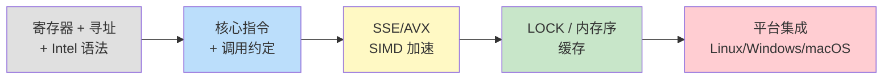
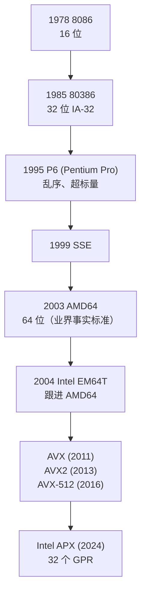
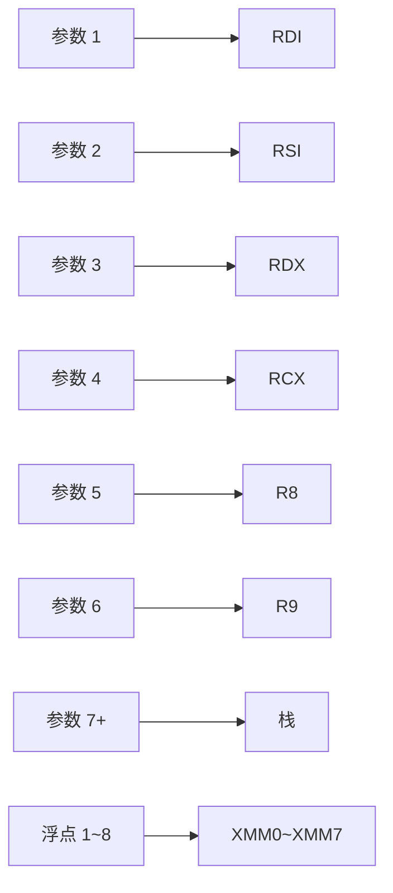
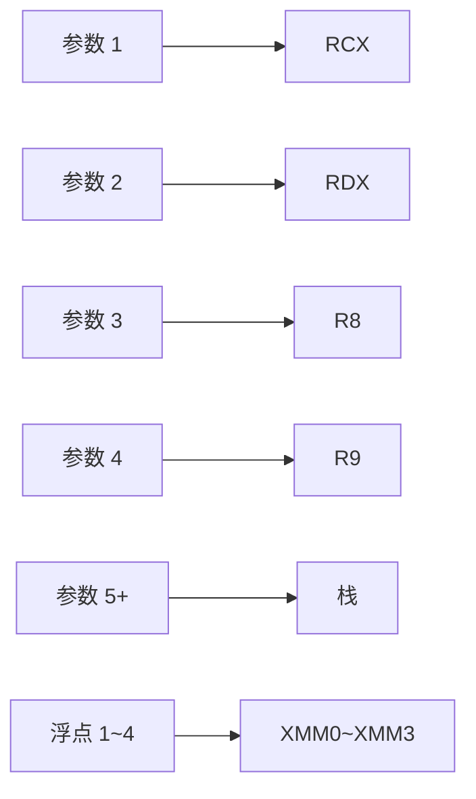
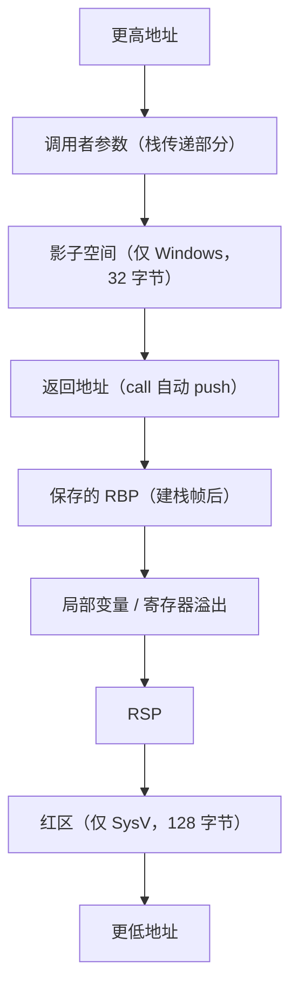
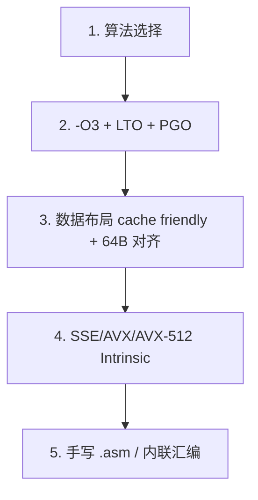

# x86-64 汇编深入浅出——从 IA-32 到 AVX-512 的工程实战指南

**作者**：汪亮（bertonwang）  
**邮箱**：<47608843@qq.com>  
**版本**：v1.0 ｜ **最后更新**：2026-05-14

> **本书风格参考《C++11 新特性解析与应用深入理解》《C++23 新特性解析与应用深入理解》**，
> 对每一个 x86-64 汇编主题按
> **「问题背景 → 概念形式 → 用法示例 → 底层机理 → 与 ARM/RISC-V 对比 → 注意事项」**
> 六段式逐一拆解，目标是让**已经会一点 C/C++**的开发者，
> **只读这一本，就能从"看不懂 disasm 窗口"走到"在 Linux/Windows/macOS 上写出能跑、能调、能优化的 x86-64 汇编"**。

---

## 目录

- [前言：为什么 x86-64 工程师必须会一点汇编](#前言为什么-x86-64-工程师必须会一点汇编)
- [第 0 章：环境与工具链速查](#第-0-章环境与工具链速查)

### 第一部分　体系结构基础
- [第 1 章：x86 家族族谱——从 8086 到 AMD64 / EM64T](#第-1-章x86-家族族谱从-8086-到-amd64--em64t)
- [第 2 章：寄存器全家福（GPR / SIMD / 控制 / 段）](#第-2-章寄存器全家福gpr--simd--控制--段)
- [第 3 章：寻址模式——`[base + index*scale + disp]`](#第-3-章寻址模式base--indexscale--disp)
- [第 4 章：Intel 与 AT&T 两大语法流派](#第-4-章intel-与-att-两大语法流派)
- [第 5 章：标志位（RFLAGS）与条件码](#第-5-章标志位rflags与条件码)

### 第二部分　核心指令集
- [第 6 章：数据搬运——MOV / LEA / MOVZX / MOVSX](#第-6-章数据搬运mov--lea--movzx--movsx)
- [第 7 章：算术、逻辑、移位、位操作](#第-7-章算术逻辑移位位操作)
- [第 8 章：控制流——CMP / TEST / JCC / LOOP](#第-8-章控制流cmp--test--jcc--loop)
- [第 9 章：函数调用——CALL / RET / PUSH / POP](#第-9-章函数调用call--ret--push--pop)
- [第 10 章：字符串与块操作——MOVS / STOS / SCAS / REP](#第-10-章字符串与块操作movs--stos--scas--rep)
- [第 11 章：BMI1 / BMI2 现代位操作神器](#第-11-章bmi1--bmi2-现代位操作神器)

### 第三部分　调用约定与函数实现
- [第 12 章：System V AMD64（Linux/macOS/Android）调用约定](#第-12-章system-v-amd64linuxmacosandroid-调用约定)
- [第 13 章：Microsoft x64（Windows）调用约定](#第-13-章microsoft-x64windows-调用约定)
- [第 14 章：栈帧、影子空间、红区](#第-14-章栈帧影子空间红区)
- [第 15 章：函数序言/尾声标准模板](#第-15-章函数序言尾声标准模板)

### 第四部分　SIMD 三代演进
- [第 16 章：SSE / SSE2 ~ SSE4.2 — 128 位时代](#第-16-章sse--sse2--sse42--128-位时代)
- [第 17 章：AVX / AVX2 — 256 位与 VEX 编码](#第-17-章avx--avx2--256-位与-vex-编码)
- [第 18 章：AVX-512 — 512 位、掩码寄存器与 EVEX](#第-18-章avx-512--512-位掩码寄存器与-evex)
- [第 19 章：FMA、AES、SHA、CRC32 等专用指令](#第-19-章fmaaessha crc32-等专用指令)
- [第 20 章：浮点与 x87（已淘汰但还要会读）](#第-20-章浮点与-x87已淘汰但还要会读)

### 第五部分　并发、原子与内存序
- [第 21 章：LOCK 前缀与原子操作](#第-21-章lock-前缀与原子操作)
- [第 22 章：x86 的强一致内存模型（TSO）](#第-22-章x86-的强一致内存模型tso)
- [第 23 章：MFENCE / LFENCE / SFENCE 三剑客](#第-23-章mfence--lfence--sfence-三剑客)
- [第 24 章：缓存、伪共享与 Cache Line](#第-24-章缓存伪共享与-cache-line)

### 第六部分　平台集成
- [第 25 章：Linux GCC/Clang —— 内联汇编与 .S 文件](#第-25-章linux-gccclang--内联汇编与-s-文件)
- [第 26 章：Windows MSVC —— MASM、Intrinsic 与"为什么 x64 禁了 `__asm`"](#第-26-章windows-msvc--masmintrinsic-与为什么-x64-禁了-__asm)
- [第 27 章：CMake 接入 NASM / MASM / GAS](#第-27-章cmake-接入-nasm--masm--gas)
- [第 28 章：macOS / Mach-O 与符号下划线](#第-28-章macos--mach-o-与符号下划线)

### 第七部分　工程实战
- [第 29 章：综合案例 1——AVX2 加速点积](#第-29-章综合案例-1avx2-加速点积)
- [第 30 章：综合案例 2——CRC32 硬件指令版](#第-30-章综合案例-2crc32-硬件指令版)
- [第 31 章：调试与反汇编工具链](#第-31-章调试与反汇编工具链)
- [第 32 章：性能调优清单与"什么时候**不要**写 x86 汇编"](#第-32-章性能调优清单与什么时候不要写-x86-汇编)

### 附录
- [附录 A：x86-64 常用指令速查表](#附录-ax86-64-常用指令速查表)
- [附录 B：x86-64 / ARM64 / RISC-V 三方指令对照](#附录-bx86-64--arm64--risc-v-三方指令对照)
- [附录 C：常见错误与坑](#附录-c常见错误与坑)

---

## 前言：为什么 x86-64 工程师必须会一点汇编

x86-64 是地球上**桌面、服务器、云数据中心**最主流的指令集：

| 场景 | 主控 |
|---|---|
| Windows / Linux / macOS（Intel 时代）桌面 | Intel Core / AMD Ryzen |
| 公有云、私有云、Hadoop / Spark 集群 | Xeon、EPYC |
| 游戏、视频剪辑、AI 训练 | i9 / Threadripper / EPYC |
| 嵌入式工控、车载娱乐 | Atom / Geode |

但写 C/C++ 的人，95% 不会读 x86 汇编。结果是：

- 生产环境出 perf top —— "CPU 都耗在 `_int_malloc` 里"，但**看不懂里面的 `mov %rax, (%rdi)`**。
- 调试 release 包 crash —— **栈帧寄存器全是 RBP/RSP/RAX**，不知该信哪个。
- 想做 JIT、Hook、Sanitizer —— **碰到 RIP-relative 寻址、影子空间、AVX 乱序就懵**。

> 💡 本书不要求你成为 x86 汇编大师，但**学完之后你能独立完成**：
> 1. 读懂 perf / objdump / VS / WinDbg 的反汇编。
> 2. 在性能热点写 SSE/AVX 内联或 `.S` 文件。
> 3. 在 Linux / Windows / macOS 上集成汇编。
> 4. 调试栈回溯、寄存器、内存屏障与原子操作问题。

**学习路径建议**：



---

## 第 0 章：环境与工具链速查

| 工具 | 用途 | 一句话获取 |
|---|---|---|
| GCC / Clang | 编译 + 内联汇编 + `.S` | Linux/macOS 自带 |
| MSVC + MASM (`ml64.exe`) | Windows 工业标准 | Visual Studio |
| NASM | 跨平台、Intel 语法 | `apt install nasm` / `brew install nasm` |
| YASM | NASM 的兼容 fork | 视频编解码项目常用 |
| `objdump -d -M intel` | 反汇编 + Intel 语法显示 | binutils |
| `gdb` / `lldb` / `WinDbg` | 调试 | 系统自带 |
| Compiler Explorer (godbolt.org) | 在线看 C 编译输出 | 浏览器 |

> 💡 **学习汇编的最快方法**：写 C 代码，丢到 godbolt 选 x86-64 GCC/Clang，**对照看 C 行号 ↔ 汇编**。

---

# 第一部分　体系结构基础

---

## 第 1 章：x86 家族族谱——从 8086 到 AMD64 / EM64T



**实用结论**：
- 现代代码 **>90% 是 AMD64（=x86-64）64 位**，本书 80% 篇幅讲它。
- 32 位 IA-32 仅用于嵌入式、老 Windows——本书略带过。
- AVX-512 在桌面消费级被 Intel 砍过又恢复，**服务器 / HPC / AI 仍是主战场**。
- **APX（2024）**：把 GPR 从 16 个扩到 32 个、新加 NDD（new data destination）格式，现代 CPU 才支持，本书简略提及。

---

## 第 2 章：寄存器全家福（GPR / SIMD / 控制 / 段）

### 2.1 16 个通用寄存器（64 位时代）

```
64 位     32 位    16 位   8 位    8 位（高字节，仅前 4 个）
RAX       EAX     AX     AL     AH
RBX       EBX     BX     BL     BH
RCX       ECX     CX     CL     CH
RDX       EDX     DX     DL     DH
RSI       ESI     SI     SIL    —
RDI       EDI     DI     DIL    —
RBP       EBP     BP     BPL    —
RSP       ESP     SP     SPL    —
R8 ~ R15  R8D~R15D R8W~R15W R8B~R15B  —
```

**记忆法**：
- **R**AX = **R**eturn / accumulator（返回值常驻）。
- **R**SP = **S**tack **P**ointer（栈顶）。
- **R**BP = **B**ase **P**ointer（栈帧基址）。
- R8~R15 是 AMD64 新加的 8 个，编号即名字。

### 2.2 SIMD 寄存器

```
XMM0~XMM15   128 位（SSE）
YMM0~YMM15   256 位（AVX，低 128 位与 XMM 共用）
ZMM0~ZMM31   512 位（AVX-512，低 256 位与 YMM 共用）
K0 ~ K7      AVX-512 掩码寄存器（每位控制一个 lane）
```

> 💡 **关键关系**：YMM 的低 128 位 = XMM；ZMM 的低 256 位 = YMM；**修改 XMM 不会清空 YMM 高位**——这就是 AVX/SSE 混用导致性能"惊喜"的根源（详见第 17 章）。

### 2.3 其它

| 类别 | 寄存器 | 简介 |
|---|---|---|
| 标志 | RFLAGS | NZCV-like，含 OF/SF/ZF/AF/PF/CF/DF/IF... |
| 指令指针 | RIP | 当前指令地址，不能直接 mov，但可用 RIP 相对寻址 |
| 段寄存器 | CS/DS/SS/ES/FS/GS | 64 位下大多被无效化，**FS/GS 用于 TLS** |
| 控制 | CR0/CR2/CR3/CR4/CR8 | 内核态访问，分页、中断屏蔽等 |
| 调试 | DR0~DR7 | 硬件断点 |
| MSR | 各种 IA32_MSR_* | `rdmsr/wrmsr` 读写，内核用 |

---

## 第 3 章：寻址模式——`[base + index*scale + disp]`

x86-64 的寻址表达式（Intel 语法）：

```
[base_register + index_register * scale + displacement]
                                    ↑       ↑
                                  1/2/4/8  整数立即数（最大 32 位）
```

例：

```asm
mov   rax, [rdi]                     ; *rdi
mov   rax, [rdi + 8]                 ; *(rdi + 8)
mov   rax, [rdi + rsi*8]             ; *(rdi + rsi*8)，最常用于数组寻址
mov   rax, [rdi + rsi*8 + 16]        ; *(rdi + rsi*8 + 16)
mov   rax, [rip + offset]            ; PC 相对寻址，PIC 必备
```

**RIP-relative 是 64 位时代的革命** —— 让代码**位置无关 (PIC)** 几乎零开销。

> 💡 **`LEA`（Load Effective Address）的妙用**：
> ```asm
> lea   rax, [rdi + rsi*8 + 16]      ; rax = rdi + rsi*8 + 16
> ```
> 表面是"取地址"，**实际就是一条强大的算术指令**——一条搞定 "乘 8 + 加偏移"，编译器最爱用它做整数运算。

---

## 第 4 章：Intel 与 AT&T 两大语法流派

同一条 "把 5 装入 EAX"：

| 语法 | 写法 | 谁在用 |
|---|---|---|
| **Intel** | `mov eax, 5` | MASM、NASM、Intel 官方手册、MSVC、Compiler Explorer |
| **AT&T** | `movl $5, %eax` | GCC/Clang **默认输出**、Linux 内核源码 |

差异速览：

| 项目 | Intel | AT&T |
|---|---|---|
| 操作数顺序 | 目的在前 | **源在前** |
| 寄存器前缀 | 无 | `%` |
| 立即数前缀 | 无 | `$` |
| 内存方括号 | `[rax]` | `(%rax)` |
| 大小后缀 | 由寄存器名推断 | 必须写 `b/w/l/q` |

**实战建议**：
- 学习、跨平台：**首选 Intel**，可读性更好。
- GCC 内联汇编：用 `.intel_syntax noprefix` 一行切到 Intel。

```c
__asm__ volatile (
    ".intel_syntax noprefix\n"
    "mov rax, rdi\n"
    "add rax, rsi\n"
    ".att_syntax prefix\n"     // 切回，避免影响后续
);
```

---

## 第 5 章：标志位（RFLAGS）与条件码

主要标志位：

| 标志 | 全称 | 含义 |
|---|---|---|
| CF | Carry | 无符号溢出 / 借位 |
| PF | Parity | 低 8 位 1 的数量为偶 |
| ZF | Zero | 结果为 0 |
| SF | Sign | 结果为负 |
| OF | Overflow | 有符号溢出 |
| DF | Direction | 字符串方向（`STD`/`CLD`） |
| IF | Interrupt | 中断使能（内核） |

条件跳转（`JCC`）依据它们而定：

```asm
cmp   rax, rbx
je    label    ; ZF==1
jne   label    ; ZF==0
jl    label    ; signed less:    SF != OF
jb    label    ; unsigned below: CF==1（= jc）
jge   label    ; signed >=
jae   label    ; unsigned >=（= jnc）
jo    label    ; overflow
js    label    ; sign
```

> ⚠️ **`jl` vs `jb` 不要搞混**：`l/g` 是有符号，`b/a` 是无符号。
> 对应 C：`(int)a < (int)b` 用 `jl`，`(unsigned)a < (unsigned)b` 用 `jb`。

---

# 第二部分　核心指令集

---

## 第 6 章：数据搬运——MOV / LEA / MOVZX / MOVSX

```asm
mov   rax, rbx           ; 64→64 直接拷贝
mov   eax, ebx           ; 32→32（⚠️ 自动把 RAX 高 32 位清零！）
mov   al, bl             ; 8→8（不改变 RAX 其它位）
movzx eax, byte ptr [rdi]; 8 → 32 零扩展
movsx eax, byte ptr [rdi]; 8 → 32 符号扩展
movsxd rax, eax          ; 32 → 64 符号扩展
lea   rax, [rdi + 4*rsi] ; 算地址，但常被当算术指令用
```

> 💡 **重要陷阱**：
> 1. **写 32 位寄存器自动清零高 32 位**——`mov eax, 0` 比 `mov rax, 0` 更短更快。
> 2. **写 8/16 位寄存器不会清零高位**——这是历史遗留兼容性。
> 3. **LEA 不访存**，仅做地址计算。

---

## 第 7 章：算术、逻辑、移位、位操作

```asm
add   rax, rbx           ; 加
sub   rax, rbx           ; 减
inc   rax                ; ++ （不更新 CF！）
dec   rax                ; --
neg   rax                ; -rax
imul  rax, rbx           ; 有符号乘
imul  rax, rbx, 5        ; rax = rbx * 5
mul   rbx                ; 无符号 RDX:RAX = RAX * RBX
div   rbx                ; RAX = RDX:RAX / RBX，RDX = 余数
idiv  rbx                ; 有符号
and / or / xor / not     ; 位运算
shl rax, cl              ; 左移
shr rax, cl              ; 逻辑右移
sar rax, cl              ; 算术右移
ror rax, cl / rol rax, cl; 循环移位
```

> 💡 **`xor reg, reg` 是清零最常用手法**——比 `mov reg, 0` 编码更短，且 CPU 把它识别为"零依赖断点"，**性能更好**。

> ⚠️ **`mul/div` 的寄存器是隐式的**（RDX:RAX），这是 x86 的"古老硬性规定"，AArch64/RISC-V 都没有这种约束。

---

## 第 8 章：控制流——CMP / TEST / JCC / LOOP

```asm
; if (a == b) ...
cmp   rax, rbx       ; rax - rbx，仅更新标志，不写结果
je    equal_label

; if (a & MASK) ...
test  rax, MASK      ; rax & MASK，仅更新 ZF
jnz   masked_label

; while (--rcx) loop_body;
1:
    ; ... loop body ...
    dec   rcx
    jnz   1b           ; 比 LOOP 更快（LOOP 在现代 CPU 上反而慢）
```

> 💡 **`TEST reg, reg` 是测试是否为 0 的最佳实践**：
> ```asm
> test  rax, rax
> jz    is_zero
> ```
> 比 `cmp rax, 0` 编码短一字节、流水线友好。

> ⚠️ **`LOOP` 指令历史包袱**：现代 CPU 对它没特别优化，**实际比 `dec + jnz` 慢**，**避免使用**。

---

## 第 9 章：函数调用——CALL / RET / PUSH / POP

```asm
push  rbp              ; rsp -= 8; *rsp = rbp
pop   rbp              ; rbp = *rsp; rsp += 8

call  func             ; push 返回地址；jmp func
ret                    ; pop 返回地址；jmp 之
ret 16                 ; pop 后再 rsp += 16（仅 stdcall 风格使用）

leave                  ; mov rsp, rbp; pop rbp（"撤销栈帧"一条搞定）
```

> 💡 **`push/pop` 的代价**：
> - 表面只读 8 字节，但要**修改 RSP + 写内存**，CPU 把它识别为对**栈引擎**的操作（stack engine），**速度比想象中快**。
> - 比 `sub rsp, 8 + mov [rsp], rax` 更短，编译器爱用 push 来保存 callee-saved。

---

## 第 10 章：字符串与块操作——MOVS / STOS / SCAS / REP

```asm
; memcpy 风格：从 [RSI] 拷贝 RCX 字节到 [RDI]
cld                       ; DF=0，方向：地址递增
mov   rsi, src
mov   rdi, dst
mov   rcx, n
rep   movsb               ; while (rcx--) *rdi++ = *rsi++

; memset 风格：把 [RDI] RCX 个字节填为 AL
mov   rdi, dst
mov   al, 0
mov   rcx, n
rep   stosb

; strlen 风格
mov   rdi, str
mov   al, 0
mov   rcx, -1
repne scasb               ; 找到 0 或 rcx 减完
```

> 💡 **`rep movsb` 在 Ivy Bridge 之后被微码加速**（Enhanced REP MOVSB / ERMSB），**对于大块拷贝接近 memcpy 性能**。**小块**（< 128B）反而**普通 SIMD 拷贝更快**。
> glibc 的 memcpy 会按大小分支选不同实现。

---

## 第 11 章：BMI1 / BMI2 现代位操作神器

| 指令 | 作用 | 等价 C |
|---|---|---|
| `LZCNT` | 前导 0 计数 | `__builtin_clz` |
| `TZCNT` | 后导 0 计数 | `__builtin_ctz` |
| `POPCNT` | 1 的位数 | `__builtin_popcount` |
| `ANDN` | `~src1 & src2` | 一条指令 |
| `BEXTR` | 按字段提取位 | `(x >> start) & mask` |
| `BLSI/BLSR/BLSMSK` | 提取最低 1、清最低 1、产生最低 1 mask | bit hack 单条搞定 |
| `BZHI` | 把高位清零 | `x & ((1<<n) - 1)` |
| `PEXT/PDEXT` | 按 mask 提取 / 散布位 | 高级位魔法 |
| `MULX/RORX/SARX/SHLX/SHRX` | 移位不污染 RFLAGS | 编译器爱用 |

```asm
popcnt  rax, rbx              ; rax = 1-bit count of rbx
tzcnt   rax, rbx              ; rax = ctz(rbx)
bzhi    rax, rbx, rcx         ; rax = rbx & ((1ULL << rcx) - 1)
```

> 💡 **现代 GCC/Clang 对这些指令支持得很好**，加 `-march=haswell` 或 `-march=native` 即可启用。

---

# 第三部分　调用约定与函数实现

---

## 第 12 章：System V AMD64（Linux/macOS/Android）调用约定



| 项目 | 规则 |
|---|---|
| 整型参数 | RDI、RSI、RDX、RCX、R8、R9 |
| 浮点参数 | XMM0~XMM7 |
| 返回值 | 整型 RAX（128 位用 RAX:RDX）；浮点 XMM0 |
| callee-saved | RBX、RBP、R12~R15 |
| caller-saved | RAX、RCX、RDX、RSI、RDI、R8~R11、所有 XMM/YMM/ZMM |
| 栈对齐（call 前） | **16 字节** |
| 红区 | RSP **下方 128 字节**，叶函数可直接使用，无需调整 RSP |

**最简函数**：

```asm
.intel_syntax noprefix
.global add3
add3:                          ; int64 add3(int64 a,b,c)
    mov   rax, rdi
    add   rax, rsi
    add   rax, rdx
    ret
```

---

## 第 13 章：Microsoft x64（Windows）调用约定



| 项目 | 规则 |
|---|---|
| 整型参数 | RCX、RDX、R8、R9 |
| 浮点参数 | XMM0~XMM3 |
| 返回值 | RAX / XMM0 |
| callee-saved | RBX、RBP、RDI、RSI、R12~R15、XMM6~XMM15 |
| caller-saved | RAX、RCX、RDX、R8~R11、XMM0~XMM5 |
| 栈对齐（call 前） | **16 字节** |
| **影子空间** | 调用方必须**为前 4 寄存器参数预留 32 字节**（哪怕被调函数不用） |
| 红区 | **无** |
| Unwind info | **必须**有，否则跨 try/catch 崩 |

> ⚠️ **影子空间陷阱**：写 Win x64 汇编时调用 Win API 必须 `sub rsp, 32` 留出影子；返回前 `add rsp, 32`。这是与 Linux 最容易踩坑的地方。

---

## 第 14 章：栈帧、影子空间、红区



> 💡 **要点**：
> - SysV 函数体**叶函数**可不调 RSP，直接用红区当临时存储。
> - Windows 函数则必须**显式分配 + 32 字节影子**。

---

## 第 15 章：函数序言/尾声标准模板

### 15.1 SysV（Linux/macOS）通用版

```asm
.intel_syntax noprefix
.global my_func
my_func:
    push  rbp
    mov   rbp, rsp
    sub   rsp, 32              ; 局部变量 + 16B 对齐
    push  rbx                  ; callee-saved 单个
    ; ... body ...
    pop   rbx
    leave
    ret
```

### 15.2 Windows x64 带 Unwind 的标准版（MASM）

```asm
fast_add PROC FRAME
    push  rbp
    .pushreg rbp
    mov   rbp, rsp
    .setframe rbp, 0
    sub   rsp, 32
    .allocstack 32
    .endprolog
    ; ... body ...
    add   rsp, 32
    pop   rbp
    ret
fast_add ENDP
END
```

> 💡 **`.pushreg / .setframe / .allocstack / .endprolog` 让汇编器生成 unwind info**，C++ 异常和栈回溯才能正确穿过你的帧。**没有它，跨过你的帧会直接 EXCEPTION_NONCONTINUABLE 退出**。

---

# 第四部分　SIMD 三代演进

---

## 第 16 章：SSE / SSE2 ~ SSE4.2 — 128 位时代

128 位 XMM 寄存器，**整型 + 浮点**统一指令集：

```asm
movups   xmm0, [rsi]        ; 4×float 未对齐加载
movaps   xmm0, [rsi]        ; 对齐加载（要求 16B 对齐，否则 #GP）
addps    xmm0, xmm1         ; 4×float 加
mulps    xmm0, xmm1         ; 4×float 乘
addpd    xmm0, xmm1         ; 2×double 加
paddq    xmm0, xmm1         ; 2×int64 加（整型）
pshufb   xmm0, xmm1         ; SSSE3 表查找
pcmpeqb  xmm0, xmm1         ; 按字节相等
movmskb  eax, xmm0          ; 把每字节的最高位塞到 eax 的低 16 位
```

> 💡 **强制对齐 vs 非对齐**：`movaps` 比 `movups` 快得多，但要求 16B 对齐。**现代 CPU 上 movups 已基本无差**，工程项目优先 `movups`。

---

## 第 17 章：AVX / AVX2 — 256 位与 VEX 编码

YMM 寄存器（256 位）+ **VEX 编码（三操作数）**：

```asm
vaddps   ymm0, ymm1, ymm2    ; 8×float 加，三操作数：dest 不破坏 src
vmulps   ymm0, ymm1, ymm2
vmovdqu  ymm0, [rsi]
vpermd   ymm0, ymm1, ymm2    ; AVX2：32 位元素任意置换
```

**两个常见坑**：

### 17.1 SSE/AVX 混用的"上半部分清零"陷阱

执行 SSE 指令（如 `addps xmm0, xmm1`）后，**ymm0 高 128 位变为"脏数据"**——
混合 AVX 与 SSE 代码时 CPU 会做"upper save/restore"，**性能下降 70 倍**！

**对策**：函数返回前**总是**：

```asm
vzeroupper
ret
```

### 17.2 对齐与跨 cache line

`vmovdqa` 要求 32 字节对齐，跨缓存行的访存性能下降明显。**SIMD 数据结构尽量分配到 64B 对齐**。

---

## 第 18 章：AVX-512 — 512 位、掩码寄存器与 EVEX

```asm
vaddps   zmm0, zmm1, zmm2          ; 16×float 加
vfmadd231ps zmm0, zmm1, zmm2       ; FMA: zmm0 += zmm1*zmm2
vaddps   zmm0 {k1}, zmm1, zmm2     ; 仅 k1 中为 1 的 lane 生效
vaddps   zmm0 {k1}{z}, zmm1, zmm2  ; 其余 lane 清零（zeroing）
```

**8 个掩码寄存器 K0~K7**：

| 寄存器 | 大小 | 谁用 |
|---|---|---|
| K0 | 64 位 | 隐式"全 1"用 |
| K1~K7 | 64 位 | 显式掩码 / 谓词 |

```asm
kmovw   k1, eax              ; 把 ax 装入 k1
vpcmpeqd k1, zmm0, zmm1      ; 比较生成 mask
```

> 💡 **AVX-512 的核心创新**：
> 1. **谓词执行**——再不需要写"剩下几个元素"的尾循环。
> 2. **embedded broadcast**：`vaddps zmm0, zmm1, [rsi]{1to16}` 一条指令把标量广播 16 路。
> 3. **rounding control**：单条指令可指定舍入模式，省一堆 ldmxcsr。

⚠️ **现实考量**：AVX-512 在消费级 Intel CPU 上**已被禁用** (Alder Lake 起)，但**所有 AMD Zen4 / Zen5、所有 Intel Xeon、Apple Silicon Rosetta** 仍支持。生产代码用 `__builtin_cpu_supports("avx512f")` 运行时探测。

---

## 第 19 章：FMA、AES、SHA、CRC32 等专用指令

| 扩展 | 关键指令 | 用途 |
|---|---|---|
| FMA | `vfmadd231ps`、`vfnmsub213pd` | a*b±c 单条 |
| AES-NI | `aesenc`、`aesenclast`、`aeskeygenassist` | AES 加密硬件加速 |
| SHA | `sha1msg1`、`sha256rnds2` | SHA1/SHA256 |
| CRC32 | `crc32 rax, rbx` | CRC32C 单条 |
| PCLMULQDQ | 无进位乘 | GHASH、CRC 加速 |
| RDRAND/RDSEED | 真随机 | 加密密钥生成 |
| RDTSC/RDTSCP | 时间戳 | 微基准测试 |

例（CRC32C 加速）：

```asm
xor    eax, eax
crc32  eax, qword ptr [rsi]      ; 一次吃 8 字节
```

> 💡 这些指令是**算法加速的"金鸡"**，**远比手写位操作循环快 10 倍以上**。

---

## 第 20 章：浮点与 x87（已淘汰但还要会读）

x87 是 80486 之前唯一的浮点路径，**栈式架构**（ST(0)~ST(7) 是栈）：

```asm
fld    qword ptr [rdi]      ; 入栈
fadd   qword ptr [rsi]      ; ST(0) += [rsi]
fstp   qword ptr [rdx]      ; 弹出到 [rdx]
```

> ⚠️ **64 位下 SSE/AVX 已彻底取代 x87**：
> - 现代编译器**几乎不再生成 x87 代码**。
> - 但反汇编老代码（Win32、库的 SOFT FLOAT 部分）还能见到 `fld/fadd/fstp`。
> - **学会读，不要写**。

---

# 第五部分　并发、原子与内存序

---

## 第 21 章：LOCK 前缀与原子操作

```asm
lock add   qword ptr [rdi], 1     ; 原子加
lock xadd  qword ptr [rdi], rax   ; 原子加并交换
lock cmpxchg qword ptr [rdi], rsi ; 原子 CAS：if (*rdi == rax) *rdi = rsi
xchg       qword ptr [rdi], rax   ; ⚠️ XCHG 与内存操作时**自带 LOCK 语义**
```

> 💡 **`lock cmpxchg` 是无锁数据结构的基石**——C/C++ 的 `std::atomic::compare_exchange_strong` 会编译为它。

> ⚠️ **`lock xadd` 是 fetch-and-add 实现 spinlock 排队锁的关键**。

---

## 第 22 章：x86 的强一致内存模型（TSO）

x86 是地球上**最强的内存一致性模型之一**——TSO（Total Store Order）：

| 重排 | x86 允许？ |
|---|---|
| Load-Load | ❌ 不允许 |
| Load-Store | ❌ 不允许 |
| **Store-Store** | ❌ 不允许 |
| **Store-Load** | ✅ 唯一被允许的 |

> 💡 **后果**：
> - x86 上**绝大多数普通 mov 已经是 acquire/release**——不像 ARM 需要显式 dmb。
> - 但 **store 后立即 load 仍可能"看见旧值"**——所以经典的 Dekker / Peterson 锁仍需 `mfence`。

---

## 第 23 章：MFENCE / LFENCE / SFENCE 三剑客

| 指令 | 阻止什么 |
|---|---|
| `MFENCE` | 全屏障，前后 load/store 不能跨 |
| `SFENCE` | store 屏障（NT 写后必加） |
| `LFENCE` | load 屏障 + 推测执行屏障（Spectre 缓解） |

```asm
mov   [rdi], rax       ; store
mfence                 ; 真正的 store-load 屏障
mov   rbx, [rsi]       ; load
```

> 💡 **`lock` 前缀同时也是隐式 MFENCE**——所以 `lock add [rdi], 0` 可作为一种"伪 mfence"，**有时性能更好**。

---

## 第 24 章：缓存、伪共享与 Cache Line

x86 的缓存行通常 **64 字节**。两个线程频繁写**同一缓存行的不同变量** = 伪共享 = MESI 协议来回失效 = 性能爆炸下降。

**对策**：把每个高频写变量**填到独立缓存行**：

```cpp
struct alignas(64) Counter {
    std::atomic<long> v;
    char pad[64 - sizeof(std::atomic<long>)];
};
```

> 💡 **`PREFETCHT0/T1/T2/NTA`** 指令可手动预取，但**现代 CPU 的硬件预取器极强**，手动预取**多数情况反而不如不写**。

---

# 第六部分　平台集成

---

## 第 25 章：Linux GCC/Clang —— 内联汇编与 `.S` 文件

### 25.1 内联汇编——四段式

```c
__asm__ volatile (
    "汇编模板"
    : 输出操作数        // 由汇编写、C 读
    : 输入操作数        // 由 C 提供给汇编
    : 破坏列表          // 顺手改了哪些寄存器/内存
);
```

例 1：交换两个 int

```c
int a = 1, b = 2;
__asm__ volatile (
    "xchg %0, %1"
    : "+r"(a), "+r"(b)
);
```

例 2：读取 RDTSC 时间戳

```c
uint64_t rdtsc(void) {
    uint32_t lo, hi;
    __asm__ volatile (
        "rdtsc"
        : "=a"(lo), "=d"(hi)
        :
        : "memory"
    );
    return ((uint64_t)hi << 32) | lo;
}
```

> 💡 **常见约束符**：
> - `"r"` 任意寄存器；`"a"`=RAX、`"b"`=RBX、`"c"`=RCX、`"d"`=RDX、`"S"`=RSI、`"D"`=RDI。
> - `"+"` 既读又写；`"="` 仅写；无前缀仅读。
> - `"memory"` 内存屏障（编译器层）。

### 25.2 外部 `.S` 文件

```asm
// fast_add.S
.intel_syntax noprefix
.text
.global fast_add
.type   fast_add, @function
fast_add:
    mov   rax, rdi
    add   rax, rsi
    ret
```

```bash
gcc main.c fast_add.S -o app
```

---

## 第 26 章：Windows MSVC —— MASM、Intrinsic 与"为什么 x64 禁了 `__asm`"

| 模式 | x86 (32 位) | x64 |
|---|---|---|
| `__asm { ... }` 内联汇编 | ✅ | ❌ **完全禁** |
| Intrinsic（`<intrin.h>`） | ✅ | ✅ **唯一推荐** |
| MASM `.asm` 文件 + 链接 | ✅ | ✅ |

**为什么 x64 禁了 `__asm`**：MSVC 64 位优化器与异常展开严重依赖结构化栈帧，**内联汇编让它无法生成正确的 unwind info**。

**替代：Intrinsic**

```c
#include <intrin.h>
uint64_t my_rdtsc(void)         { return __rdtsc(); }
int      my_popcnt(uint32_t x)  { return __popcnt(x); }
__m256   my_add(__m256 a, __m256 b) { return _mm256_add_ps(a, b); }
```

**真要写大段汇编 → MASM**：

```asm
; fast_add.asm   （MASM 语法）
.code
PUBLIC fast_add
fast_add PROC
    mov   rax, rcx          ; Win 第 1 参在 rcx
    add   rax, rdx
    ret
fast_add ENDP
END
```

VS 项目右键 → 生成依赖项 → 自定义 → 勾 **masm** → 加 `.asm` → 文件属性"项类型" = MASM。

---

## 第 27 章：CMake 接入 NASM / MASM / GAS

```cmake
cmake_minimum_required(VERSION 3.20)
project(asm_demo C CXX)

if(MSVC)
    enable_language(ASM_MASM)
    add_executable(demo main.cpp fast.asm)
else()
    enable_language(ASM)             # GAS
    add_executable(demo main.cpp fast.S)
endif()
```

NASM 路线（跨平台、Intel 语法、最常用于视频编解码）：

```cmake
project(asm_demo C CXX ASM_NASM)
if(WIN32)
    set(CMAKE_ASM_NASM_OBJECT_FORMAT "win64")
elseif(APPLE)
    set(CMAKE_ASM_NASM_OBJECT_FORMAT "macho64")
else()
    set(CMAKE_ASM_NASM_OBJECT_FORMAT "elf64")
endif()
add_executable(demo main.cpp fast.asm)
```

---

## 第 28 章：macOS / Mach-O 与符号下划线

Mach-O 平台 **所有 C 符号在汇编里都要加 `_`**：

```asm
// fast_add.s
.intel_syntax noprefix
.text
.global _fast_add
_fast_add:
    mov   rax, rdi
    add   rax, rsi
    ret
```

> ⚠️ **Apple Silicon Mac 默认是 ARM64**，本章 x86-64 部分仅用于 Rosetta 或老款 Intel Mac。
> Apple Silicon 上跑 x86-64 二进制由 **Rosetta 2** 翻译，**性能损失约 20%**。

---

# 第七部分　工程实战

---

## 第 29 章：综合案例 1——AVX2 加速点积

```c
// float dot(const float* a, const float* b, size_t n);  // n 为 8 倍数
```

汇编实现（SysV ABI）：

```asm
.intel_syntax noprefix
.text
.global dot
dot:
    vxorps    ymm0, ymm0, ymm0
    test      rdx, rdx
    jz        .done
.loop:
    vmovups   ymm1, [rdi]
    vfmadd231ps ymm0, ymm1, [rsi]    ; ymm0 += a[i:i+8] * b[i:i+8]
    add       rdi, 32
    add       rsi, 32
    sub       rdx, 8
    jnz       .loop
    ; 横向相加 8 路
    vextractf128  xmm1, ymm0, 1
    vaddps        xmm0, xmm0, xmm1
    vhaddps       xmm0, xmm0, xmm0
    vhaddps       xmm0, xmm0, xmm0
.done:
    vzeroupper
    ret
```

> 💡 **要点**：
> - `vfmadd231ps` 一条指令完成"乘加 8 路 float"。
> - 横向规约用 `vhaddps` 两次相邻配对加合成单标量。
> - **千万记得 `vzeroupper`**！

---

## 第 30 章：综合案例 2——CRC32 硬件指令版

```c
// uint32_t crc32c(const void* buf, size_t n, uint32_t init);
```

```asm
.intel_syntax noprefix
.text
.global crc32c
crc32c:
    mov   eax, edx                ; init
    test  rsi, rsi
    jz    .done
.loop8:
    cmp   rsi, 8
    jb    .tail
    crc32 rax, qword ptr [rdi]    ; 一次吃 8 字节
    add   rdi, 8
    sub   rsi, 8
    jmp   .loop8
.tail:
    test  rsi, rsi
    jz    .done
    crc32 eax, byte ptr [rdi]
    inc   rdi
    dec   rsi
    jmp   .tail
.done:
    ret
```

> 💡 这就是 RocksDB、Redis 等底层项目使用的"硬件 CRC32C"，**比软件查表快 ~10 倍**。

---

## 第 31 章：调试与反汇编工具链

| 任务 | 命令 |
|---|---|
| 看 C 编译出的汇编 | `clang -O2 -S -masm=intel -fverbose-asm a.c` |
| 反汇编（Linux） | `objdump -d -M intel a.out` |
| 反汇编（Windows） | `dumpbin /disasm a.dll` |
| 反汇编（macOS） | `otool -tv a.out` |
| GDB 看寄存器 | `info registers` / `disas /m` |
| LLDB 反汇编 | `disassemble --frame` |
| 在线 | godbolt.org |

> 💡 **`-fverbose-asm` 让汇编每行后注释 C 源码**——学习汇编最佳工具。

---

## 第 32 章：性能调优清单与"什么时候**不要**写 x86 汇编"

### ✅ 写 x86 汇编合理时机

- perf 测出热点 > 5%，且编译器 Intrinsic 已用尽。
- 算法需要专用指令：CRC32、AES、PCLMULQDQ、SHA-NI、AVX-512 VPCLMUL。
- 操作系统/虚拟机内核：上下文切换、原子原语、内核入口。
- JIT、Trampoline、Hook（详见前作《Hook 与 Trampoline 深入浅出》）。

### ❌ 不要写 x86 汇编

- 没开 `-O2/-O3 -march=native -flto`、没用 PGO。
- 没用过 `_mm256_*` Intrinsic，直接跳到内联汇编。
- 想"显得专业" —— 这是项目可维护性的灾难。

### 🚦 优化阶梯



经验法则：**每往下一阶可移植性 ↓ 一个量级，维护成本 ↑ 一个量级**。

---

# 附录

---

## 附录 A：x86-64 常用指令速查表

| 类别 | 指令 |
|---|---|
| 数据搬运 | `mov movzx movsx movsxd lea push pop xchg cmov*` |
| 算术 | `add adc sub sbb inc dec neg imul mul idiv div` |
| 逻辑 | `and or xor not test` |
| 移位 | `shl shr sar rol ror shld shrd` |
| 位操作（BMI） | `popcnt lzcnt tzcnt andn bextr blsi blsr blsmsk bzhi pext pdep mulx rorx sarx shlx shrx` |
| 比较 | `cmp test` |
| 控制流 | `call ret jmp je jne jl jg jle jge jb ja jbe jae js jns jo jno jcxz/jrcxz` |
| 字符串 | `movs stos scas cmps lods rep repe repne` |
| SSE | `movaps movups addps mulps cmpps shufps pshufb pcmpeqb movmskb` |
| AVX | `vmovups vaddps vmulps vfmadd231ps vbroadcast* vextractf128 vpermd vzeroupper` |
| AVX-512 | `kmov* vpcmp* vpternlogq vfmadd*pd {z}{k1} {1to8/16}` |
| 同步 | `lock xchg xadd cmpxchg cmpxchg16b mfence sfence lfence pause` |
| 时间戳 | `rdtsc rdtscp` |
| 加解密 | `aesenc aesdec aeskeygenassist sha1msg1 sha256rnds2 crc32 pclmulqdq` |
| 系统 | `syscall sysret iretq cli sti hlt swapgs rdmsr wrmsr` |

---

## 附录 B：x86-64 / ARM64 / RISC-V 三方指令对照

| 功能 | x86-64 | ARM64 | RISC-V |
|---|---|---|---|
| 寄存器赋值 | `mov rax, rbx` | `mov x0, x1` | `mv a0, a1` |
| 立即数 | `mov rax, 5` | `mov x0, #5` | `li a0, 5` |
| 加 | `add rax, rbx` | `add x0, x0, x1` | `add a0, a0, a1` |
| 加载 | `mov rax, [rbx]` | `ldr x0, [x1]` | `ld a0, 0(a1)` |
| 存储 | `mov [rbx], rax` | `str x0, [x1]` | `sd a0, 0(a1)` |
| 比较跳 | `cmp/je` | `cmp/b.eq` 或 `cbz` | `beq` 单条 |
| 函数调用 | `call f` | `bl f` | `call f` |
| 函数返回 | `ret` | `ret` | `ret` |
| SIMD 加 | `vaddps ymm0,ymm1,ymm2` | `fadd v0.4s,v1.4s,v2.4s` | `vfadd.vv v0,v1,v2` (V 扩展) |
| 原子 CAS | `lock cmpxchg` | `casal` (LSE) / `ldxr/stxr` | `lr.w/sc.w` / `amocas.w` |
| 内存屏障 | `mfence` | `dmb ish` | `fence rw,rw` |

---

## 附录 C：常见错误与坑

| 现象 | 真正原因 | 解决 |
|---|---|---|
| Win API 调用后栈被踩 | 没留 32B 影子空间 | 调用前 `sub rsp, 32`、返回前 `add rsp, 32` |
| `unresolved external symbol fast_add` | C++ 名字修饰 / MASM 没 `PUBLIC` | C 头加 `extern "C"`；MASM 加 `PUBLIC` |
| 程序在 try/catch 跨过你的帧时崩 | 缺 unwind info | MASM 用 `PROC FRAME` + `.endprolog` |
| AVX 代码在小数据下变慢 | SSE/AVX 混用 + upper save | 函数返回前 `vzeroupper` |
| `movaps` 偶发 #GP | 内存未 16B 对齐 | 改 `movups` 或保证对齐 |
| AVX-512 代码崩 `#UD` | CPU 不支持 | `__builtin_cpu_supports("avx512f")` 运行时探测 |
| `idiv` 触发 SIGFPE | 商溢出（如 INT_MIN/-1） | 业务上避免 |
| 编码乱码（macOS） | 缺下划线前缀 | C 函数符号前加 `_` |
| `mul rax` 寄存器内容被破坏 | mul/div 隐式用 RDX:RAX | 调用前后保护 RDX |
| Spectre / Meltdown 缓解后 LFENCE 增多 | 编译器自动插桩 | `-mno-speculative-load-hardening` 视场景关闭 |

---

> **结语**
>
> x86-64 是地球上服役时间最长、生态最深的 CISC 指令集。
> 学完这本书，你就拥有了**从 Linux 服务器到 Windows 桌面、从 perf 到 WinDbg、从 SSE 到 AVX-512** 的统一阅读理解能力——
> 看反汇编不再玄学、SIMD 优化敢动手、调用约定不再凭感觉、**LOCK 与内存序心里有数**。
>
> 当你跑通第 29 章的 AVX2 点积、第 30 章的 CRC32C 硬件版时，你已经踏过了 x86-64 汇编的"工程门槛"。
>
> ——本书完
