# 图形 API 设计哲学深度对比

> **文档版本**：v1.0 | 2026年6月
> **作者**：汪亮 bertonwang
> **邮箱**：47608843@qq.com
> 
> **Vulkan vs OpenGL vs Metal vs DirectX 12**
> 
> 本文档从设计哲学、实现思路、优缺点等多个维度，深入对比主流图形 API 的技术特点。

---

## 📋 目录

1. [技术概览](#一技术概览)
2. [设计哲学对比](#二设计哲学对比)
3. [实现思路的异同](#三实现思路的异同)
4. [各自的优缺点](#四各自的优缺点)
5. [性能特征对比](#五性能特征对比)
6. [适用场景建议](#六适用场景建议)
7. [未来发展趋势](#七未来发展趋势)
8. [附录：快速决策表](#附录快速决策表)

---

## 一、技术概览

### 1.1 各技术基本信息

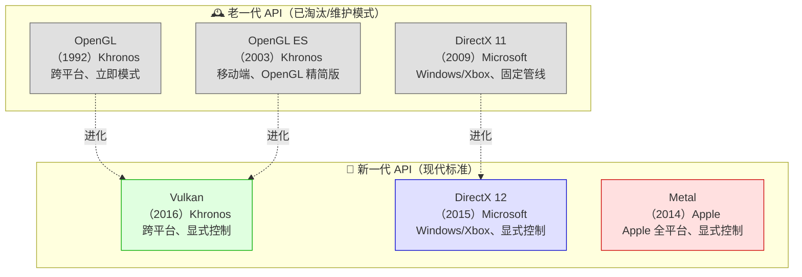

| 技术 | 开发者 | 发布年 | 最新版本 | 平台支持 | 当前状态 |
|------|--------|--------|----------|----------|----------|
| **OpenGL** | Khronos Group | 1992 | 4.6 (2017) | 跨平台 | ⚠️ 维护模式 |
| **OpenGL ES** | Khronos Group | 2003 | 3.2 (2015) | 移动端/嵌入式 | ⚠️ 维护模式 |
| **DirectX 11** | Microsoft | 2009 | 11.2 | Windows 8+ | ⚠️ 广泛使用但非主流 |
| **🌟 Vulkan** | Khronos Group | 2016 | 1.3 (2022) | 跨平台 | ✅ 积极演进 |
| **DirectX 12** | Microsoft | 2015 | 12 Ultimate | Windows 10+ / Xbox | ✅ Microsoft 主推 |
| **🌟 Metal** | Apple | 2014 | 3.0 (2023) | Apple 全平台 | ✅ Apple 主推 |

### 1.2 技术定位对比

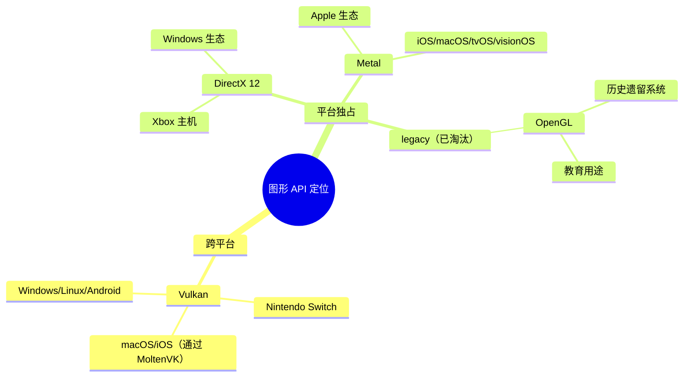

---

## 二、设计哲学对比

### 2.1 核心设计哲学概述

| 维度 | OpenGL | Vulkan | DirectX 12 | Metal |
|------|--------|--------|------------|-------|
| **设计目标** | 简单、易用 | 极致性能、跨平台 | Windows 生态极致优化 | Apple 生态极致优化 |
| **控制级别** | 隐式状态机 | 完全显式控制 | 完全显式控制 | 较显式控制 |
| **驱动角色** | 厚重（帮你做决策） | 极薄（你做所有决策） | 极薄（你做所有决策） | 中等（部分自动化） |
| **错误处理** | 运行时检查 | 验证层（可选） | 调试层（可选） | 运行时部分检查 |
| **多线程** | 不支持 | 原生支持 | 原生支持 | 支持 |

### 2.2 生活化类比：设计哲学一目了然

> #### 🚗 **汽车驾驶类比**
> 
> | 图形 API | 类比 | 设计哲学 |
> |----------|------|----------|
> | **OpenGL** | 自动挡家用汽车 | 「你只管踩油门，其他我来」—— 简单但慢 |
> | **Vulkan** | 手动挡 F1 赛车 | 「每个换挡、每个刹车都由你控制」—— 复杂但极快 |
> | **DirectX 12** | Windows 专属 F1 赛车 | 「和 Vulkan 一样强，但只跑 Windows 赛道」 |
> | **Metal** | Apple 专属 F1 赛车 | 「和 Vulkan 一样强，但只跑 Apple 赛道」 |

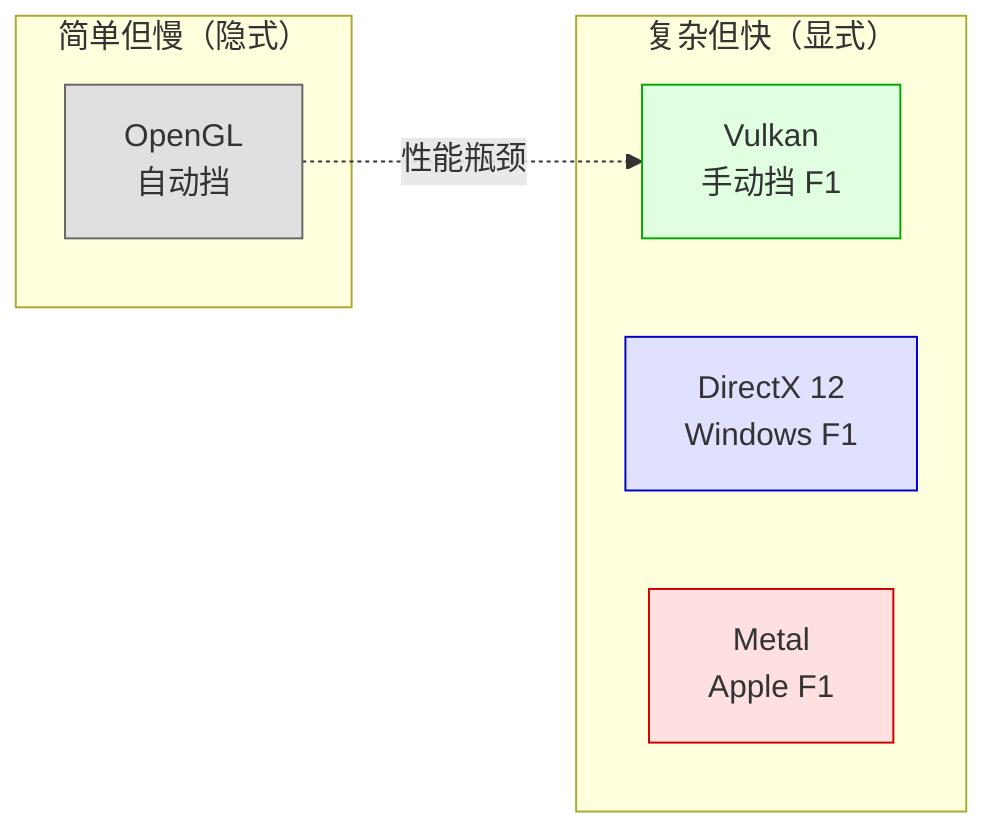

### 2.3 详细设计哲学对比

#### 2.3.1 OpenGL：「隐式状态机」哲学

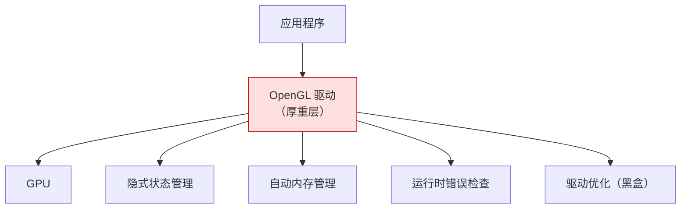

| 设计特点 | 说明 | 优缺点 |
|----------|------|--------|
| **状态机模型** | 全局状态对象，修改影响后续所有绘制 | ✅ 简单 ❌ 容易出错 |
| **立即模式** | 函数调用立即生效 | ✅ 直观 ❌ 性能差 |
| **驱动层厚重** | 驱动帮你做大量决策 | ✅ 简单 ❌ CPU 开销大 |
| **隐式同步** | 驱动处理 CPU-GPU 同步 | ✅ 不用管 ❌ 不可预测 |

> 💡 **OpenGL 的设计哲学**：「让开发者专注于渲染逻辑，底层细节由驱动处理」

#### 2.3.2 Vulkan：「显式控制一切」哲学

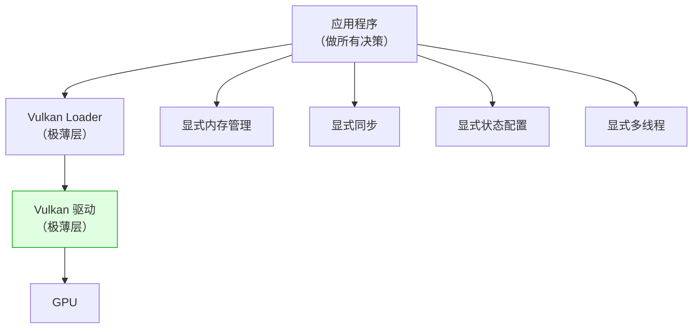

| 设计特点 | 说明 | 优缺点 |
|----------|------|--------|
| **命令缓冲区** | 先记录，再提交执行 | ✅ 高性能 ❌ 复杂 |
| **显式内存管理** | 自己管理 GPU 内存分配 | ✅ 零开销 ❌ 容易出错 |
| **显式同步** | 自己处理 CPU-GPU 同步 | ✅ 可预测 ❌ 复杂 |
| **验证层可选** | 发布版本可关闭所有检查 | ✅ 零开销 ❌ 调试难 |

> 💡 **Vulkan 的设计哲学**：「不给开发者任何惊喜，所有性能都让你自己掌控」

#### 2.3.3 DirectX 12：「Windows 深度集成」哲学

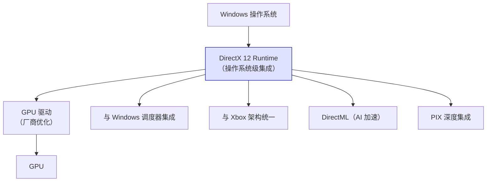

| 设计特点 | 说明 | 优缺点 |
|----------|------|--------|
| **操作系统级集成** | 与 Windows 内核深度集成 | ✅ 极低延迟 ❌ 仅 Windows |
| **统一内存模型** | 与 Windows 内存管理器集成 | ✅ 高效 ❌ 平台绑定 |
| **DirectML 集成** | 内置 AI 推理加速 | ✅ 开箱即用 ❌ 仅 Windows |
| **Xbox 统一架构** | PC 和 Xbox 使用相同 API | ✅ 零移植成本 ❌ 平台锁定 |

> 💡 **DirectX 12 的设计哲学**：「与 Windows 生态深度绑定，提供最佳 Windows 性能」

#### 2.3.4 Metal：「Apple 统一架构」哲学

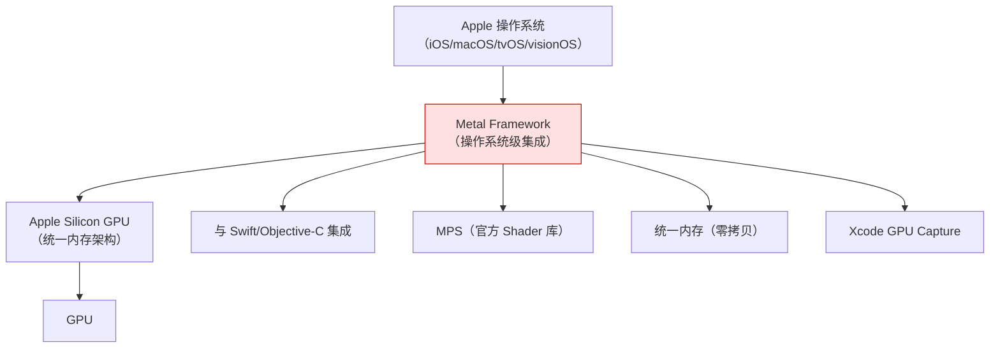

| 设计特点 | 说明 | 优缺点 |
|----------|------|--------|
| **统一内存架构** | CPU 和 GPU 共享内存 | ✅ 零拷贝 ❌ 仅 Apple Silicon |
| **与 Swift 深度集成** | 现代语言绑定 | ✅ 安全易用 ❌ 仅 Apple |
| **MPS 官方库** | 官方提供高性能 Shader | ✅ 开箱即用 ❌ 黑盒） |
| **单一 GPU 架构** | 仅需支持 Apple GPU | ✅ 极度优化 ❌ 无选择性 |

> 💡 **Metal 的设计哲学**：「为 Apple 硬件量身定制，追求极致效率和开发者体验」

---

## 三、实现思路的异同

### 3.1 架构对比：驱动层厚度

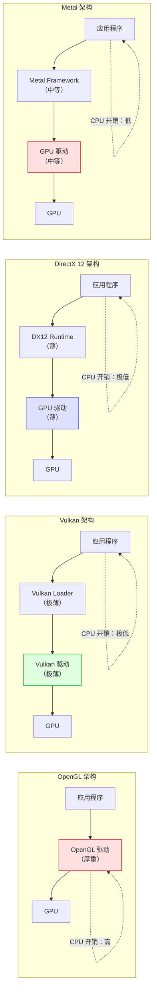

### 3.2 内存管理实现对比

| 实现维度 | OpenGL | Vulkan | DirectX 12 | Metal |
|----------|--------|--------|------------|-------|
| **内存分配** | 驱动自动管理 | 显式分配（VMA 库） | 显式分配（ID3D12Device::CreateCommittedResource） | 显式分配（MTLDevice::newBuffer） |
| **内存类型** | 单一类型 | 多种内存类型（CPU 可见、GPU 本地等） | 多种堆类型（Default、Upload、Readback） | 几种存储模式（Shared、Private、Managed） |
| **内存映射** | glMapBuffer | vkMapMemory | Map 整个堆 | didModifyRange（Managed 模式） |
| **内存释放** | 驱动自动回收 | 显式释放 | 显式释放（Release） | ARC 自动释放 |

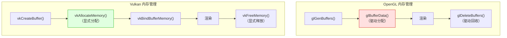

### 3.3 命令提交实现对比

| 实现维度 | OpenGL | Vulkan | DirectX 12 | Metal |
|----------|--------|--------|------------|-------|
| **命令记录** | 立即执行（glDrawArrays 立即生效） | 记录到 Command Buffer | 记录到 Command List | 记录到 Command Buffer |
| **命令提交** | 隐式（驱动决定何时刷新） | 显式（vkQueueSubmit） | 显式（ExecuteCommandLists） | 显式（commit） |
| **多线程记录** | ❌ 不支持 | ✅ 原生支持 | ✅ 原生支持 | ✅ 支持 |
| **二次提交** | ❌ 不支持 | ✅ 可重复使用 | ✅ 可重复使用 | ✅ 可重复使用 |

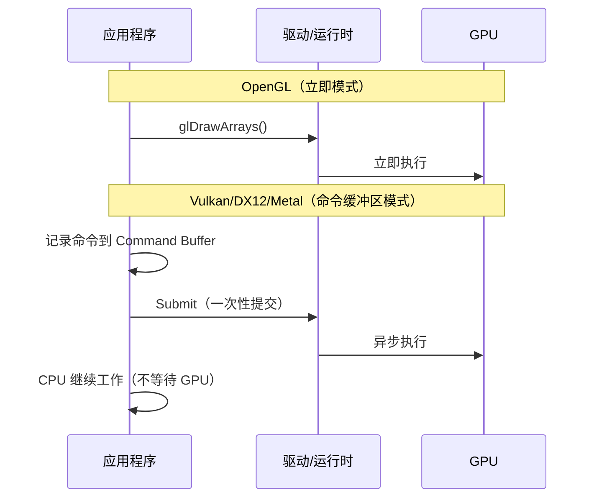

### 3.4 同步机制实现对比

| 同步类型 | OpenGL | Vulkan | DirectX 12 | Metal |
|----------|--------|--------|------------|-------|
| **CPU-GPU 同步** | glFinish()（阻塞） | Fence | Fence | MTLSharedEvent |
| **GPU-GPU 同步** | 隐式（驱动处理） | Semaphore | Fence + Barrier | MTLSharedEvent |
| **内存可见性** | 隐式（驱动保证） | Memory Barrier | Resource Barrier | MTLFence |
| **执行顺序** | 隐式（驱动保证） | 显式（Subpass、Barrier） | 显式（Barrier） | 显式（Fence） |

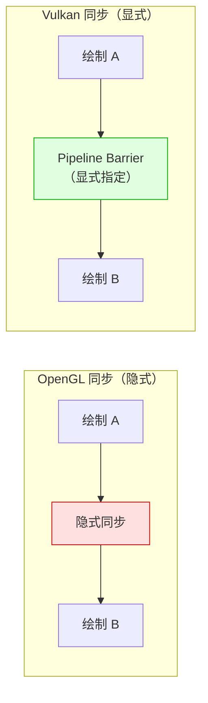

### 3.5 Shader 语言和实现对比

| 维度 | OpenGL | Vulkan | DirectX 12 | Metal |
|------|--------|--------|------------|-------|
| **Shader 语言** | GLSL | SPIR-V（二进制） | HLSL | MSL（Metal Shading Language） |
| **编译时机** | 运行时编译 | 离线编译 | 离线/运行时 | 运行时编译（Metal 库） |
| **交叉编译** | 不支持 | SPIR-V 可交叉编译 | 不支持（仅 HLSL） | 不支持（仅 MSL） |
| **Shader 调试** | 困难 | 困难 | PIX 支持 | Xcode GPU Capture 支持 |

```mermaid
flowchart TD
    subgraph GLSL流程["OpenGL Shader 流程"]
        G1[".vert / .frag<br/>（GLSL 源码）"] --> G2["glCompileShader()<br/>（运行时编译）"]
        G2 --> G3["链接 Program"]
    end

    subgraph SPIRV流程["Vulkan Shader 流程"]
        V1[".glsl / .hlsl<br/>（源码）"] --> V2["glslangValidator<br/>（离线编译）"]
        V2 --> V3[".spv<br/>（SPIR-V 二进制）"]
        V3 --> V4["vkCreateShaderModule()"]
    end

    subgraph HLSL流程["DirectX 12 Shader 流程"]
        D1[".hlsl<br/>（HLSL 源码）"] --> D2["fxc / dxc<br/>（离线编译）"]
        D2 --> D3[".cso<br/>（DXIL 二进制）"]
        D3 --> D4["CreateRootSignature()"]
    end

    subgraph MSL流程["Metal Shader 流程"]
        M1[".metal<br/>（MSL 源码）"] --> M2["MTLCompiler<br/>（运行时编译）"]
        M2 --> M3["MTLLibrary"]
        M3 --> M4["MTLFunction"]
    end

    style G2 fill:#ffe0e0,stroke:#c00
    style V2 fill:#e0ffe0,stroke:#0a0
    style D2 fill:#e0e0ff,stroke:#00c
    style M2 fill:#ffe0e0,stroke:#c00
```

---

## 四、各自的优缺点

### 4.1 OpenGL

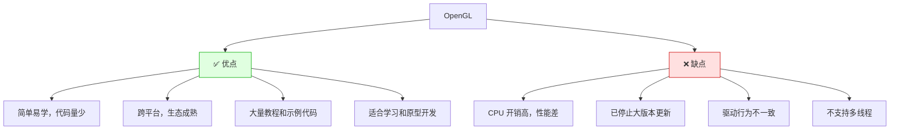

| 优点 | 缺点 |
|------|------|
| ✅ 学习曲线平缓，适合入门 | ❌ CPU 开销高，性能瓶颈明显 |
| ✅ 代码量少（画三角形仅需 50 行） | ❌ 已停止大版本更新（维护模式） |
| ✅ 跨平台， everywhere 支持 | ❌ 驱动行为不一致（NVIDIA vs AMD） |
| ✅ 大量教程和开源项目 | ❌ 不支持多线程渲染 |
| ✅ 立即模式，直观易懂 | ❌ 状态机模型容易出错 |
| ✅ 适合快速原型开发 | ❌ 性能不可预测 |

> 📌 **适用场景**：教育、快速原型、legacy 系统维护

### 4.2 Vulkan

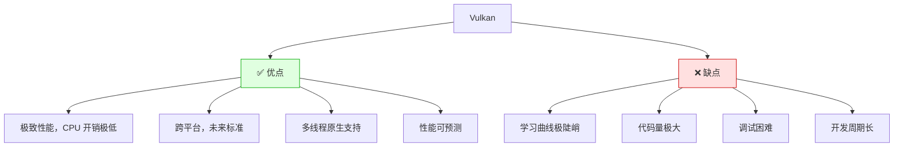

| 优点 | 缺点 |
|------|------|
| ✅ 极致性能，CPU 开销极低 | ❌ 学习曲线极陡峭（需要理解 GPU 架构） |
| ✅ 跨平台（Windows/Linux/Android/Switch） | ❌ 代码量极大（画三角形需 1000+ 行） |
| ✅ 多线程原生支持，能充分利用多核 CPU | ❌ 调试困难（验证层开销大） |
| ✅ 性能可预测，没有隐式状态切换 | ❌ 开发周期长，不适合快速迭代 |
| ✅ 显式控制一切，零驱动开销 | ❌ 内存管理复杂，容易出错 |
| ✅ 未来标准，Khronos 积极演进 | ❌ macOS/iOS 需通过 MoltenVK（性能损失） |

> 📌 **适用场景**：AAA 游戏、跨平台引擎、高性能计算

### 4.3 DirectX 12

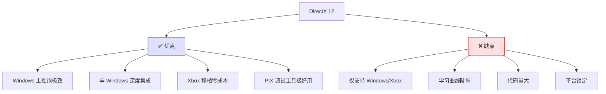

| 优点 | 缺点 |
|------|------|
| ✅ Windows 上性能极致（操作系统级优化） | ❌ 仅支持 Windows 和 Xbox |
| ✅ 与 Windows 深度集成（调度器、内存管理器） | ❌ 学习曲线陡峭 |
| ✅ Xbox 移植零成本（相同 API） | ❌ 代码量大（画三角形需 800+ 行） |
| ✅ PIX 调试工具极好用（微软官方） | ❌ 平台锁定，无法跨平台 |
| ✅ DirectML 内置 AI 加速 | ❌ HLSL 无法在其他平台使用 |
| ✅ DXR（光线追踪）支持完善 | ❌ 需要 Windows 10+ |

> 📌 **适用场景**：Windows 独占游戏、Xbox 游戏、Windows 高性能应用

### 4.4 Metal

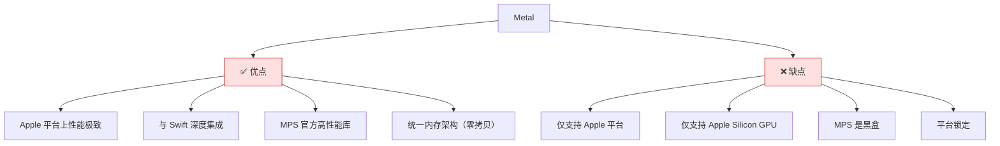

| 优点 | 缺点 |
|------|------|
| ✅ Apple 平台上性能极致（为硬件量身定制） | ❌ 仅支持 Apple 平台 |
| ✅ 与 Swift/Objective-C 深度集成 | ❌ 仅支持 Apple Silicon GPU（M 系列） |
| ✅ MPS 官方提供高性能 Shader 库 | ❌ MPS 是黑盒，无法修改 |
| ✅ 统一内存架构（CPU-GPU 零拷贝） | ❌ 平台锁定，无法跨平台 |
| ✅ Xcode GPU Capture 调试体验极佳 | ❌ 市场份额有限（仅 Apple 设备） |
| ✅ 代码量相对 Vulkan 较少 | ❌ 需要 macOS 10.11+ / iOS 8+ |

> 📌 **适用场景**：iOS/macOS 高性能游戏、创意工具、AI 应用

---

## 五、性能特征对比

### 5.1 CPU 开销对比

```mermaid
barChart
    title "CPU 开销对比（越低越好）"
    xAxis "OpenGL" "DirectX 11" "Metal" "DirectX 12" "Vulkan"
    yAxis "CPU 开销（相对值）" 0 --> 100
    bar "CPU 开销" [80, 60, 15, 10, 5]
```

| API | CPU 开销 | 说明 |
|-----|----------|------|
| **OpenGL** | ⭐⭐⭐⭐⭐（高） | 驱动层厚重，大量隐式状态管理 |
| **DirectX 11** | ⭐⭐⭐（中高） | 比 OpenGL 好，但仍有较高开销 |
| **Metal** | ⭐⭐（低） | 驱动层较薄，Apple 高度优化 |
| **DirectX 12** | ⭐（极低） | 驱动层极薄，Windows 深度优化 |
| **Vulkan** | ⭐（极低） | 驱动层极薄，完全显式控制 |

### 5.2 多线程性能对比

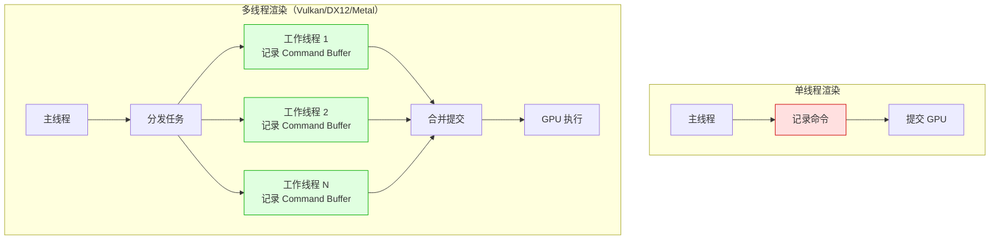

| API | 多线程支持 | 说明 |
|-----|-----------|------|
| **OpenGL** | ❌ 不支持 | 所有 GL 调用必须在主线程 |
| **DirectX 11** | ⚠️ 有限支持 | 可创建多线程 Context，但性能提升有限 |
| **Vulkan** | ✅ 原生支持 | Command Buffer 可多线程同时记录 |
| **DirectX 12** | ✅ 原生支持 | Command List 可多线程同时记录 |
| **Metal** | ✅ 支持 | 多个 Command Queue 可并行编码 |

### 5.3 性能上限对比

| API | 性能上限 | 达到上限难度 | 说明 |
|-----|----------|-------------|------|
| **OpenGL** | 中等 | 低 | 驱动优化有限，CPU 瓶颈明显 |
| **DirectX 11** | 中高 | 中 | 比 OpenGL 好，但仍有限制 |
| **Metal** | 极高 | 中 | Apple 硬件上可达极致性能 |
| **DirectX 12** | 极高 | 高 | Windows 上可达极致性能 |
| **Vulkan** | 极高 | 极高 | 理论性能最高，但需要完美优化 |

```mermaid
barChart
    title "性能上限对比（越高越好）"
    xAxis "OpenGL" "DX11" "Metal" "DX12" "Vulkan"
    yAxis "性能上限（相对值）" 0 --> 100
    bar "性能上限" [60, 75, 95, 98, 100]
```

---

## 六、适用场景建议

### 6.1 根据平台选择

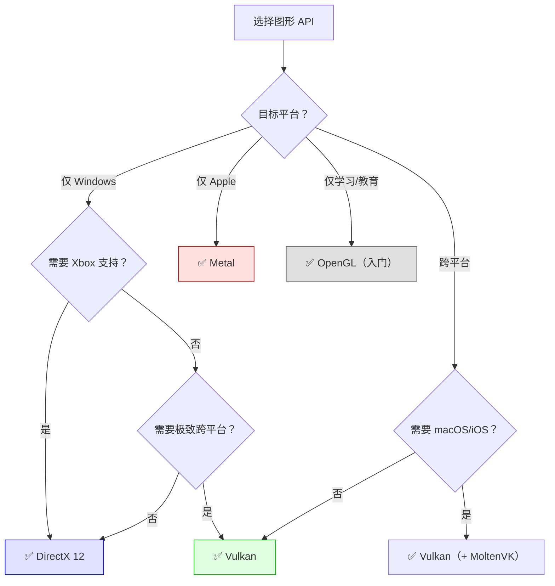

### 6.2 根据团队规模选择

| 团队规模 | 推荐 API | 理由 |
|----------|----------|------|
| **1-2 人独立开发者** | OpenGL / Metal | 代码量少，快速迭代 |
| **小团队（3-10 人）** | Metal / DirectX 11 | 平衡性能和开发效率 |
| **中型团队（10-50 人）** | DirectX 12 / Metal | 需要专业图形程序员 |
| **大团队（50+ 人）** | Vulkan / DirectX 12 | 有资源投入底层优化 |

### 6.3 根据应用场景选择

```mermaid
mindmap
  root((应用场景选择))
    游戏开发
       AAA 大作
          Windows: DirectX 12
          跨平台: Vulkan
      独立游戏
         Windows: DirectX 11
         Apple: Metal
    创意工具
       Adobe 系列: DirectX 12 + Metal
      Blender: Vulkan
    AI / 机器学习
       Windows: DirectX 12 + DirectML
       Apple: Metal + MPS
    嵌入式
       OpenGL ES（legacy）
       Vulkan（新项目）
```

---

## 七、未来发展趋势

### 7.1 技术演进方向

```mermaid
timeline
    title 图形 API 演进时间线
    1992 : OpenGL 1.0 发布
    2003 : OpenGL ES 发布
    2009 : DirectX 11 发布
    2014 : Metal 发布（Apple）
    2015 : DirectX 12 发布（Microsoft）
    2016 : Vulkan 1.0 发布（Khronos）
    2020 : Vulkan 1.2 发布
    2022 : Vulkan 1.3 发布
    2023 : WebGPU 发布（浏览器标准）
    2025 : DirectX 12 Ultimate 普及
    2026 : Vulkan 1.4 预计发布
```

### 7.2 各技术的未来

| 技术 | 未来趋势 | 说明 |
|------|----------|------|
| **OpenGL** | ❌ 逐步淘汰 | 仅用于教育和 legacy 系统 |
| **Vulkan** | ✅ 持续增长 | 跨平台未来标准，Khronos 积极演进 |
| **DirectX 12** | ✅ Windows 独占 | Microsoft 主推，与 Xbox 统一 |
| **Metal** | ✅ Apple 独占 | Apple 主推，与 Apple Silicon 深度绑定 |
| **WebGPU** | 🌟 新兴 | 浏览器中的现代图形 API，未来可期 |

### 7.3 现代图形 API 技术趋势

> 💡 **本节导读**：随着 GPU 硬件的快速发展，现代图形 API 正在引入越来越多的高级特性。本节深入剖析这些新兴技术，帮助你把握图形技术的未来方向。

```mermaid
mindmap
  root((现代图形技术趋势))
    光线追踪
      Vulkan: VK_KHR_ray_tracing
      DX12: DXR
      Metal: Metal Ray Tracing
    AI 加速
      DX12: DirectML
      Metal: MPS
      Vulkan: 第三方库
    网格着色器
      下一代几何管线
      替代顶点/几何着色器
    可变速率着色
      性能优化利器
      感知渲染
    神经渲染
      AI + 图形融合
      下一代渲染范式
    其他新兴技术
      采样器反馈
      硬件视频编解码
```

---

#### 7.3.1 光线追踪（Ray Tracing）—— 电影级画质

> 🎬 **什么是光线追踪？**
>
> 传统渲染使用「光栅化（Rasterization）」—— 把 3D 物体「拍扁」到 2D 屏幕上，速度快但无法自然处理反射、折射、阴影。
>
> 光线追踪则是模拟真实世界中光线的行为 —— 从相机发射光线，追踪它与物体的交互，计算出真实的反射、折射、阴影效果。

**生活化类比：画家 vs 摄影师**

| 渲染方式 | 类比 | 特点 |
|----------|------|------|
| **光栅化** | 画家凭经验画画 | ✅ 快 ❌ 不够真实 |
| **光线追踪** | 摄影师用相机拍照 | ✅ 极度真实 ❌ 慢 |

```mermaid
flowchart TD
    subgraph 光栅化流程["光栅化（Rasterization）"]
        R1["3D 模型"] --> R2["投影到 2D 屏幕"]
        R2 --> R3["逐像素着色"]
        R3 --> R4["最终图像<br/>（反射/阴影需手动模拟）"]
    end

    subgraph 光追流程["光线追踪（Ray Tracing）"]
        T1["相机"] --> T2["发射光线"]
        T2 --> T3["光线与物体相交"]
        T3 --> T4["计算反射/折射"]
        T4 --> T5["递归追踪"]
        T5 --> T6["最终图像<br/>（物理真实）"]
    end

    style R4 fill:#ffe0e0,stroke:#c00
    style T6 fill:#e0ffe0,stroke:#0a0
```

**各 API 的光线追踪支持对比**

| API | 技术支持 | API 名称 | 硬件要求 | 成熟度 |
|-----|----------|----------|----------|--------|
| **Vulkan** | ✅ 完整支持 | `VK_KHR_ray_tracing_pipeline` | NVIDIA RTX / AMD RDNA 2+ | ⭐⭐⭐⭐ |
| **DirectX 12** | ✅ 完整支持 | **DXR**（DirectX Raytracing） | NVIDIA RTX / AMD RDNA 2+ | ⭐⭐⭐⭐⭐ |
| **Metal** | ✅ 完整支持 | **Metal Ray Tracing** | Apple Silicon（M 系列） | ⭐⭐⭐⭐ |
| **OpenGL** | ❌ 不支持 | - | - | - |

```mermaid
flowchart LR
    subgraph Vulkan光追["Vulkan 光追"]
        V1["vkCreateRayTracingPipelines()"]
        V2["vkCmdTraceRays()"]
        V3["Shader Binding Table（SBT）"]
    end

    subgraph DX12光追["DirectX 12 光追（DXR）"]
        D1["CreateStateObject()"]
        D2["DispatchRays()"]
        D3["Shader Table"]
    end

    subgraph Metal光追["Metal 光追"]
        M1["MTLComputePipelineDescriptor"]
        M2["intersection function"]
        M3["MTLAccelerationStructure"]
    end

    style V1 fill:#e0ffe0,stroke:#0a0
    style D1 fill:#e0e0ff,stroke:#00c
    style M1 fill:#ffe0e0,stroke:#c00
```

**光线追踪的核心概念**

| 概念 | 说明 | 用途 |
|------|------|------|
| **BVH（Bounding Volume Hierarchy）** | 加速结构，用于快速求交 | 必须构建，耗时 |
| **Shader Binding Table（SBT）** | 定义光线与材质的交互 | Vulkan/DX12 必需 |
| **Intersection Shader** | 自定义求交逻辑 | 支持非三角形几何体 |
| **Any-Hit Shader** | 每次求交时执行 | 透明度测试 |
| **Closest-Hit Shader** | 最近交点时执行 | 主要着色逻辑 |
| **Miss Shader** | 光线未命中时执行 | 环境光/天空盒 |

> 📌 **性能提示**：纯光追很慢，现代游戏使用 **混合渲染** —— 光栅化 + 光追（用于反射、阴影、AO）。

---

#### 7.3.2 AI 加速与机器学习集成 —— GPU 的「第二种用法」

> 🤖 **GPU 的两种用法**：
>
> 1. **图形渲染**：画三角形、处理顶点、像素着色 → 用于游戏、视频
> 2. **通用计算（GPGPU）**：矩阵运算、卷积、神经网络 → 用于 AI、科学计算
>
> 现代图形 API 正在将两者融合 —— 在渲染管线中直接调用 AI 推理！

**生活化类比：瑞士军刀**

> 传统 GPU = 专用螺丝刀（只能拧螺丝 = 只能渲染）
>
> 现代 GPU = 瑞士军刀（螺丝刀 + 刀子 + 镊子 + ... = 渲染 + AI + 视频编解码）

```mermaid
flowchart TD
    subgraph 传统流程["传统流程（分离）"]
        T1["渲染帧"] --> T2["保存到显存"]
        T2 --> T3["CPU 读取"]
        T3 --> T4["AI 推理（CPU 或独立 GPU）"]
        T4 --> T5["结果写回显存"]
        T5 --> T6["显示"]
    end

    subgraph 现代流程["现代流程（集成）"]
        M1["渲染帧"] --> M2["直接在 GPU 上 AI 推理"]
        M2 --> M3["结果直接在 GPU 上处理"]
        M3 --> M4["显示"]
    end

    T1 -.->|"慢（PCIe 传输瓶颈）"| T6
    M1 -.->|"快（零拷贝）"| M4

    style T1 fill:#ffe0e0,stroke:#c00
    style M1 fill:#e0ffe0,stroke:#0a0
```

**各 API 的 AI 加速支持对比**

| API | AI 加速方案 | 说明 | 易用性 |
|-----|-------------|------|--------|
| **Vulkan** | 需自行集成 | 使用 `VK_KHR_cooperative_matrix` + 第三方库（如 ONNX Runtime） | ⭐⭐ 复杂 |
| **DirectX 12** | **DirectML** | Microsoft 官方 ML 库，与 DX12 深度集成 | ⭐⭐⭐⭐ 简单 |
| **Metal** | **MPS（Metal Performance Shaders）** | Apple 官方 ML 库，内置常见神经网络层 | ⭐⭐⭐⭐⭐ 非常简单 |
| **OpenGL** | ❌ 不支持 | 需通过 CUDA 等其他方式 | - |

```mermaid
flowchart LR
    subgraph DirectML方案["DirectX 12 + DirectML"]
        D1["DirectML"] --> D2["IDMLCommandRecorder"]
        D2 --> D3["与 DX12 Command List 集成"]
        D3 --> D4["同一 GPU 上渲染 + AI"]
    end

    subgraph MPS方案["Metal + MPS"]
        M1["MPS"] --> M2["MPSCNN（卷积神经网络）"]
        M2 --> M3["MPSGraph（计算图）"]
        M3 --> M4["与 Metal 渲染无缝集成"]
    end

    subgraph Vulkan方案["Vulkan + 第三方"]
        V1["Vulkan"] --> V2["需要自行集成"]
        V2 --> V3["ONNX Runtime / TensorFlow Lite"]
        V3 --> V4["通过 SPIR-V 运行计算 Shader"]
    end

    style D1 fill:#e0e0ff,stroke:#00c
    style M1 fill:#ffe0e0,stroke:#c00
    style V1 fill:#e0ffe0,stroke:#0a0
```

**AI 加速在图形中的典型应用**

| 应用场景 | 说明 | 示例 |
|----------|------|------|
| **DLSS（深度学习超采样）** | AI 将低分辨率画面放大到高分辨率 | NVIDIA DLSS、AMD FSR |
| **实时降噪** | AI 去除光追噪声 | NVIDIA NRD、Intel OIDN |
| **AI 超分辨率** | 提升纹理和画面清晰度 | NVIDIA DLSS、Intel XeSS |
| **风格迁移** | 实时艺术风格渲染 | 非真实感渲染 |
| **AI 动画生成** | 自动生成角色动画 | Motion Matching |

> 📌 **未来趋势**：随着 NPU（神经网络处理器）的普及，图形 API 将进一步融合 AI 加速，实现「渲染 + AI」的一体化流水线。

---

#### 7.3.3 网格着色器（Mesh Shading）—— 下一代几何管线

> 🔺 **传统几何管线的瓶颈**：
>
> 传统管线：顶点着色器 → 曲面细分 → 几何着色器 → 光栅化
>
> 问题：
> 1. 顶点着色器处理所有顶点（包括不可见的）
> 2. 几何着色器性能差（某些 GPU 上甚至被禁用）
> 3. 无法高效处理大规模几何体（如 Nanite）

**生活化类比：快递分拣**

> 传统管线 = 所有包裹都经过同一个分拣中心（顶点着色器），不管目的地是哪里
>
> 网格着色器 = 智能分拣，只处理需要送达的包裹（可见的网格lets）

```mermaid
flowchart TD
    subgraph 传统管线["传统几何管线（低效）"]
        T1["顶点缓冲区"] --> T2["顶点着色器<br/>（处理所有顶点）"]
        T2 --> T3["曲面细分"]
        T3 --> T4["几何着色器<br/>（性能差）"]
        T4 --> T5["光栅化"]
    end

    subgraph 网格着色器管线["网格着色器管线（高效）"]
        M1["网格着色器"] --> M2["Task Shader<br/>（决定处理哪些 Meshlet）"]
        M2 --> M3["Mesh Shader<br/>（处理可见的 Meshlet）"]
        M3 --> M4["光栅化"]
    end

    T2 -.->|"浪费 CPU 和 GPU 资源"| T5
    M2 -.->|"只处理可见的，高效"| M4

    style T2 fill:#ffe0e0,stroke:#c00
    style M2 fill:#e0ffe0,stroke:#0a0
```

**各 API 的网格着色器支持对比**

| API | 技术支持 | API 名称 | 硬件要求 | 状态 |
|-----|----------|----------|----------|------|
| **Vulkan** | ✅ 支持 | `VK_EXT_mesh_shader` | NVIDIA Turing+ / AMD RDNA 2+ | ⭐⭐⭐⭐ 可用 |
| **DirectX 12** | ✅ 支持 | **Mesh Shaders** | NVIDIA Turing+ / AMD RDNA 2+ | ⭐⭐⭐⭐⭐ 成熟 |
| **Metal** | ❌ 不支持 | - | - | ⚠️ 未来可能支持 |
| **OpenGL** | ❌ 不支持 | - | - | - |

**网格着色器的核心概念**

| 概念 | 说明 | 用途 |
|------|------|------|
| **Meshlet** | 小的网格块（通常 64-128 个顶点） | 高效剔除和 LOD |
| **Task Shader** | 决定哪些 Meshlet 需要处理 | 视锥剔除、遮挡剔除 |
| **Mesh Shader** | 处理 Meshlet 并输出三角形 | 替代顶点/几何着色器 |
| **Payload** | Task Shader 传递给 Mesh Shader 的数据 | 传递 LOD 信息 |

> 📌 **实际应用**：Unreal Engine 5 的 **Nanite** 技术就是基于网格着色器实现的，能够实时渲染数十亿三角形的场景！

---

#### 7.3.4 可变速率着色（VRS）—— 感知渲染的性能利器

> 👁️ **人眼的弱点**：
>
> 人眼对画面中心的细节敏感，对边缘和快速运动的区域不敏感。
>
> **VRS（Variable Rate Shading）** 就是利用这个特点 —— 对重要的区域用全分辨率着色，对不重要的区域用低分辨率着色，从而提升性能。

**生活化类比： JPEG 压缩**

> JPEG 图片 = 重要区域（如人脸）高质量，背景区域低质量
>
> VRS = 重要区域全分辨率着色，边缘/运动区域低分辨率着色

```mermaid
flowchart TD
    subgraph 传统着色["传统着色（均匀）"]
        T1["画面"] --> T2["每个像素都着色<br/>（100% 计算量）"]
        T2 --> T3["性能瓶颈"]
    end

    subgraph VRS着色["VRS 着色（可变）"]
        V1["画面"] --> V2["中心区域：1x1（全质量）"]
        V1 --> V3["边缘区域：2x2（1/4 计算量）"]
        V1 --> V4["运动区域：4x4（1/16 计算量）"]
        V2 --> V5["整体性能提升 20-50%"]
        V3 --> V5
        V4 --> V5
    end

    style T2 fill:#ffe0e0,stroke:#c00
    style V5 fill:#e0ffe0,stroke:#0a0
```

**各 API 的 VRS 支持对比**

| API | 技术支持 | API 名称 | 级别 | 状态 |
|-----|----------|----------|------|------|
| **Vulkan** | ✅ 支持 | `VK_KHR_fragment_shading_rate` | Tier 1/2 | ⭐⭐⭐⭐ 可用 |
| **DirectX 12** | ✅ 支持 | **Variable Rate Shading** | Tier 1/2 | ⭐⭐⭐⭐⭐ 成熟 |
| **Metal** | ✅ 支持 | **Tier 2 VRS** | Tier 2 | ⭐⭐⭐ 可用 |
| **OpenGL** | ❌ 不支持 | - | - | - |

**VRS 的三种级别**

| 级别 | 说明 | 粒度 |
|------|------|------|
| **Tier 1** | 整个绘制调用使用同一着色率 | 最粗 |
| **Tier 2** | 每个 Draw Call 内可以根据位置改变着色率 | 中等 |
| **Per-Draw VRS** | 每个 Draw Call 可以指定不同着色率 | 细 |

```mermaid
flowchart LR
    A["VRS 应用场景"] --> B["眼动追踪<br/>（注视点渲染）"]
    A --> C["运动模糊区域<br/>（降低着色率）"]
    A --> D["画面边缘<br/>（降低着色率）"]
    A --> E["景深效果<br/>（焦外降低着色率）"]

    style B fill:#e0ffe0,stroke:#0a0
    style C fill:#e0e0ff,stroke:#00c
    style D fill:#ffe0e0,stroke:#c00
```

> 📌 **VR 应用**：VRS 在 VR 中特别重要 —— 配合眼动追踪，只渲染注视点区域的全质量画面，其他区域降低质量，大幅提升帧率！

---

#### 7.3.5 神经渲染（Neural Rendering）—— 下一代渲染范式

> 🧠 **什么是神经渲染？**
>
> 传统渲染 = 基于物理公式（光栅化、光追）
>
> 神经渲染 = 基于神经网络（AI 生成画面）
>
> 两者结合 = **物理渲染 + AI 后处理** = 极致画质 + 极致性能

**生活化类比：画家 + AI 修图**

> 传统渲染 = 画家手工画画（慢但可控）
>
> 神经渲染 = 画家画个草图 + AI 自动补全细节（快且效果惊艳）

```mermaid
flowchart TD
    subgraph 传统渲染流程["传统渲染流程"]
        T1["3D 场景"] --> T2["光栅化/光追"]
        T2 --> T3["后处理（Bloom、色调映射等）"]
        T3 --> T4["最终画面"]
    end

    subgraph 神经渲染流程["神经渲染流程"]
        N1["3D 场景"] --> N2["简化渲染（低质量/低分辨率）"]
        N2 --> N3["神经网络推理"]
        N3 --> N4["AI 增强画面"]
        N4 --> N5["最终画面<br/>（质量接近离线渲染）"]
    end

    T4 -.->|"质量有限"| T4
    N5 -.->|"质量极高"| N5

    style T4 fill:#ffe0e0,stroke:#c00
    style N5 fill:#e0ffe0,stroke:#0a0
```

**神经渲染的典型技术**

| 技术 | 说明 | 代表应用 |
|------|------|----------|
| **NeRF（Neural Radiance Fields）** | 用神经网络表示 3D 场景 | Google Research |
| **Gaussian Splatting** | 用高斯点云 + AI 渲染 | 实时 NeRF 替代方案 |
| **DLSS 3（帧生成）** | AI 生成中间帧 | NVIDIA RTX 40 系列 |
| **Real-Time Denoising** | AI 实时降噪 | NVIDIA NRD |
| **Neural Radiosity** | AI 计算全局光照 | 研究成果 |

```mermaid
timeline
    title 神经渲染发展时间线
    2020 : NeRF 提出（静态场景）
    2021 : Dynamic NeRF（动态场景）
    2022 : Instant NeRF（秒级训练）
    2023 : Gaussian Splatting（实时渲染）
    2024 : DLSS 3.5（光线重建）
    2025 : 神经渲染开始实用化
    2026 : AI 原生渲染管线（预测）
```

**各 API 对神经渲染的支持**

| API | 支持方式 | 说明 |
|-----|----------|------|
| **Vulkan** | 需自行集成 AI 库 | 灵活但复杂 |
| **DirectX 12** | DirectML + 计算 Shader | Microsoft 正在推进 |
| **Metal** | MPS + MSL | Apple 生态完整支持 |
| **WebGPU** | WebNN（正在标准化） | 浏览器中的神经渲染 |

> 📌 **未来预测**：5-10 年内，神经渲染可能彻底改变图形管线 —— 从「手工编写 Shader」到「训练神经网络自动生成画面」！

---

#### 7.3.6 其他新兴技术

##### 7.3.6.1 采样器反馈（Sampler Feedback）

> 📊 **什么是采样器反馈？**
>
> 传统纹理流：预先加载所有可能的纹理 → 显存不足
>
> 采样器反馈：记录哪些纹理区域被访问 → 只加载需要的区域 → 显存使用大幅降低

| API | 技术支持 | 说明 |
|-----|----------|------|
| **DirectX 12** | ✅ `Sampler Feedback` | Xbox Series X/S 使用此技术实现「Sampler Feedback Streaming」 |
| **Vulkan** | ⚠️ 扩展中 | `VK_EXT_pageable_device_local_memory` 类似功能 |
| **Metal** | ❌ 不支持 | - |

##### 7.3.6.2 硬件加速的视频编解码

> 🎥 **GPU 的视频能力**：
>
> 现代 GPU 都内置了视频编解码单元（如 NVIDIA NVENC/NVDEC、AMD VCN、Intel Quick Sync）
>
> 图形 API 正在与这些单元深度集成，实现渲染 + 视频处理的无缝流水线。

| API | 视频编解码支持 |
|-----|----------------|
| **DirectX 12** | ✅ DirectX Video API（与渲染集成） |
| **Vulkan** | ✅ `VK_KHR_video_queue`（视频编解码扩展） |
| **Metal** | ✅ `VTDecompressionSession`（与 Core Video 集成） |
| **OpenGL** | ⚠️ 需通过第三方库 |

##### 7.3.6.3 GPU 虚拟化（GPU Virtualization）

> ☁️ **云游戏的需求**：
>
> 云游戏 = 在服务器上运行游戏，将画面流式传输到客户端
>
> 问题：一台服务器有 1 个 GPU，如何同时运行多个游戏？
>
> 答案：**GPU 虚拟化** —— 将 1 个物理 GPU 虚拟成多个逻辑 GPU

| API | 虚拟化支持 |
|-----|------------|
| **DirectX 12** | ✅ WDDM 3.0（Windows Display Driver Model） |
| **Vulkan** | ✅ `VK_KHR_external_memory`（跨进程共享 GPU 内存） |
| **Metal** | ❌ 不支持（Apple 不支持云游戏） |

##### 7.3.6.4 跨 GPU 协作（Multi-GPU）

> 🔗 **多 GPU 渲染**：
>
> 问题：1 个 GPU 不够用怎么办？
>
> 答案：**Multi-GPU** —— 多个 GPU 协同渲染同一帧（如 NVIDIA SLI、AMD CrossFire）

| API | Multi-GPU 支持 |
|-----|----------------|
| **DirectX 12** | ✅ 原生支持（Explicit Multi-GPU） |
| **Vulkan** | ✅ 原生支持（Device Groups） |
| **Metal** | ❌ 不支持（Apple 设备通常只有 1 个 GPU） |

---

### 7.4 技术趋势总结

```mermaid
radar
    title "各 API 对未来技术的支持程度"
    axis "光线追踪", "AI 加速", "网格着色器", "VRS", "神经渲染"
    "Vulkan" [4, 2, 4, 4, 3]
    "DirectX 12" [5, 5, 5, 5, 4]
    "Metal" [4, 5, 1, 3, 4]
```

> 💡 **一句话总结**：
> - **Vulkan**：跨平台支持最全面，但 AI 加速需自行集成
> - **DirectX 12**：Windows 上对未来技术的支持最完善
> - **Metal**：Apple 生态内 AI 加速体验最佳，但缺少网格着色器
> - **未来趋势**：光线追踪 + AI 加速 + 神经渲染的深度融合

---

## 附录：快速决策表

### A. 我该选哪个图形 API？

| 需求场景 | 推荐选择 |
|----------|----------|
| 我是小白，想学习图形学 | ✅ **OpenGL**（入门）→ **Vulkan**（进阶） |
| 只做 Windows 游戏 | ✅ **DirectX 12** |
| 只做 Apple 平台应用 | ✅ **Metal** |
| 需要做跨平台游戏引擎 | ✅ **Vulkan**（主）+ **Metal**（Apple 后端） |
| 需要极致性能 | ✅ **Vulkan** 或 **DirectX 12** |
| 需要快速原型开发 | ✅ **OpenGL** 或 **Metal** |
| 需要 AI 加速 | ✅ **DirectX 12**（DirectML）或 **Metal**（MPS） |
| 需要光线追踪 | ✅ **Vulkan**、**DirectX 12** 或 **Metal** |

### B. 学习路线建议

```mermaid
flowchart LR
    A["第一步：学习 OpenGL<br/>（理解图形学基础）"] --> B["第二步：学习 Vulkan/Metal/DX12<br/>（选择其一深入）"]
    B --> C["第三步：学习高级渲染技术<br/>（光追、全局光照等）"]
    C --> D["第四步：贡献开源引擎<br/>（实际项目经验）"]

    style A fill:#e0ffe0,stroke:#0a0
    style B fill:#e0e0ff,stroke:#00c
    style C fill:#ffe0e0,stroke:#c00
    style D fill:#ffffe0,stroke:#cc0
```

---

## 总结

| 图形 API | 设计哲学 | 最佳场景 | 不推荐场景 |
|----------|----------|----------|------------|
| **OpenGL** | 简单、隐式 | 学习、教育、legacy 系统 | 新项目、高性能需求 |
| **Vulkan** | 显式、跨平台 | 跨平台引擎、AAA 游戏 | 快速原型、小项目 |
| **DirectX 12** | 显式、Windows 优化 | Windows 游戏、Xbox 游戏 | 跨平台需求 |
| **Metal** | 显式、Apple 优化 | iOS/macOS 高性能应用 | 跨平台需求 |

> 💡 **一句话总结**：
> - **OpenGL**：简单但慢，适合学习
> - **Vulkan**：复杂但极快，跨平台未来
> - **DirectX 12**：复杂但极快，Windows 独占
> - **Metal**：复杂但极快，Apple 独占

---


