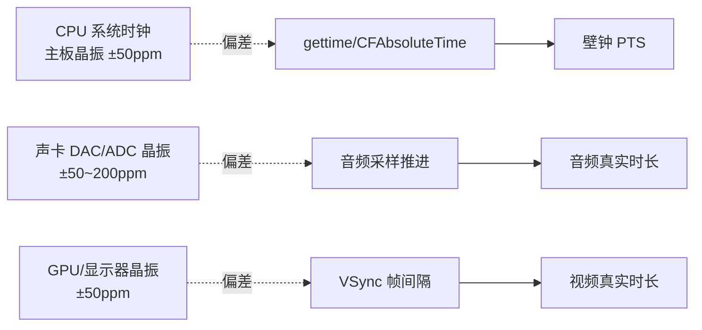
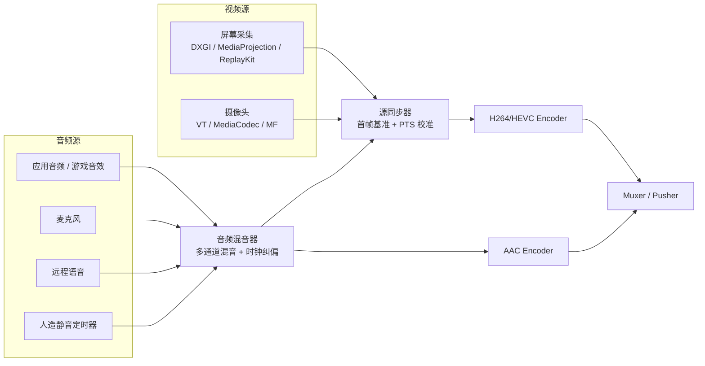
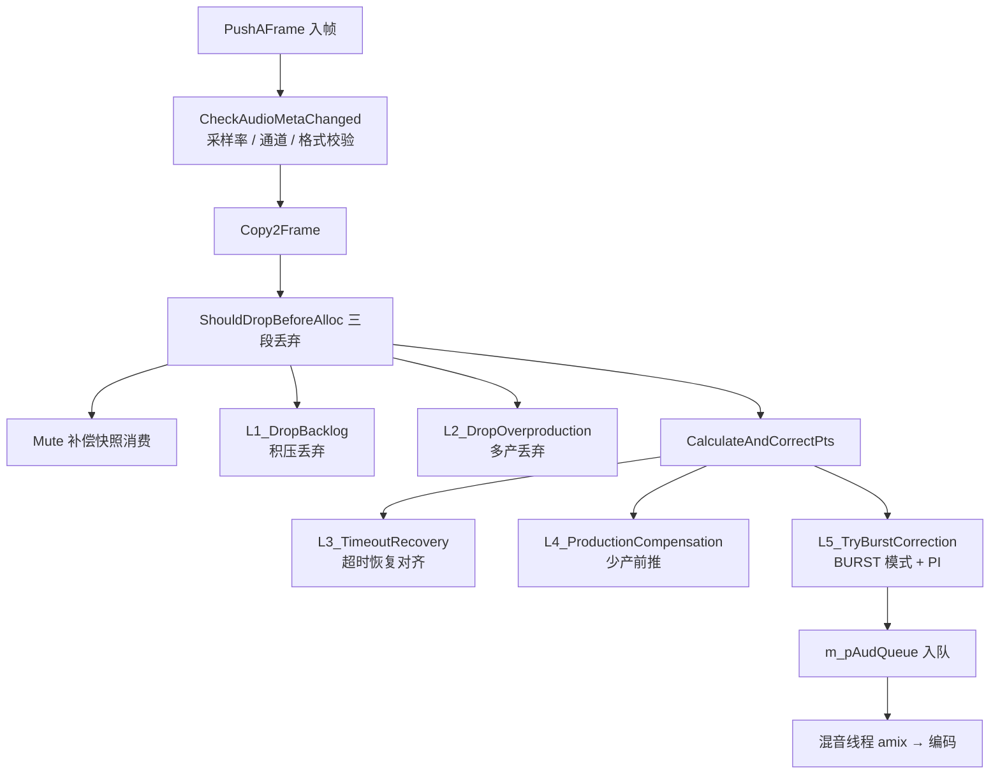
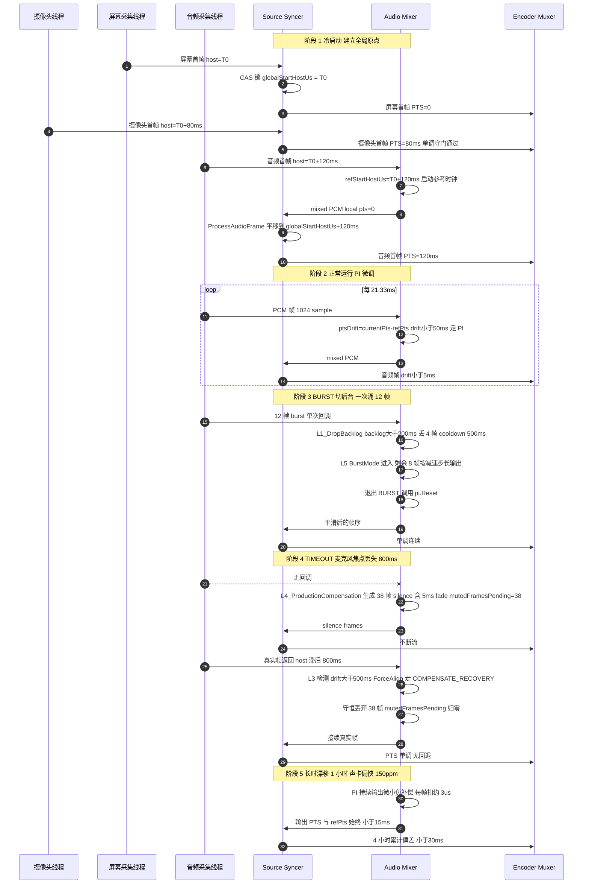
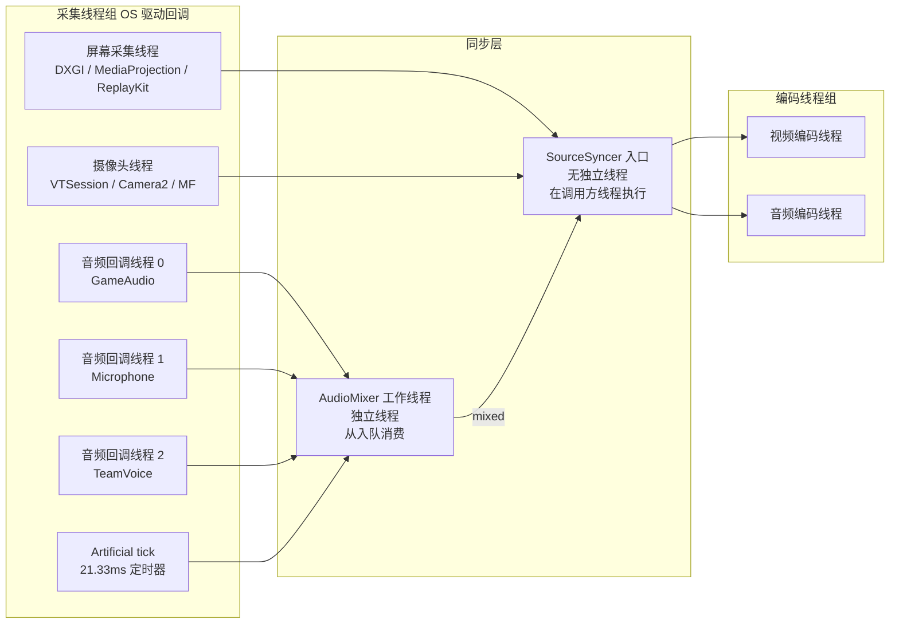

# 开播侧（采集端）音画同步设计与实现

**作者**：汪亮（bertonwang）
**邮箱**：<47608843@qq.com>
**版本**：v1.2 ｜ **最后更新**：2026-05-14

> 转载或引用请保留作者署名与本文链接，欢迎来信交流与勘误。

> 范围：直播采集端在推流前对多路音频/视频源进行 PTS 对齐、首帧基准统一、音频通道多帧/少帧/burst 等异常的兼容性处理。本文档独立成篇，所有设计与算法均以伪代码 / 等价 C++ 片段呈现，不依赖任何特定项目的源码。

## 目录

- [开播侧（采集端）音画同步设计与实现](#开播侧采集端音画同步设计与实现)
- [目录](#目录)
  - [一、为什么开播侧需要音画同步](#一为什么开播侧需要音画同步)
  - [二、工业界 / 学术界主流做法](#二工业界--学术界主流做法)
      - [2.1 OBS-Studio（开源直播录制标杆）](#21-obs-studio开源直播录制标杆)
      - [2.2 FFmpeg（CLI 与库的事实标准）](#22-ffmpegcli-与库的事实标准)
      - [2.3 WebRTC（实时通信黄金标准）](#23-webrtc实时通信黄金标准)
      - [2.4 Chromium AudioDeviceModule（PI/PLL 时钟回环典范）](#24-chromium-audiodevicemodulepipll-时钟回环典范)
      - [2.5 GStreamer（管道式多媒体框架）](#25-gstreamer管道式多媒体框架)
      - [2.6 早期 FFmpeg / 老式监控 NVR（Video Master）](#26-早期-ffmpeg--老式监控-nvrvideo-master)
      - [2.7 iOS ReplayKit + 静止画面插帧（移动端屏幕录制）](#27-ios-replaykit--静止画面插帧移动端屏幕录制)
      - [2.8 OBS NDI / Decklink（硬件采集卡方案）](#28-obs-ndi--decklink硬件采集卡方案)
      - [2.9 各代表实现横向对照](#29-各代表实现横向对照)
      - [2.10 学术界相关研究](#210-学术界相关研究)
  - [三、长时间开播下各方案的局限性与应对（深度分析）](#三长时间开播下各方案的局限性与应对深度分析)
    - [3.1 物理根因：多个独立晶振之间的 ppm 偏差](#31-物理根因多个独立晶振之间的-ppm-偏差)
    - [3.2 数学模型：偏差是如何累计的](#32-数学模型偏差是如何累计的)
    - [3.3 壁钟法（Wall-clock based）的具体危害与现状解决方法](#33-壁钟法wall-clock-based的具体危害与现状解决方法)
      - [OBS 与 FFmpeg 为什么仍然敢用壁钟法？](#obs-与-ffmpeg-为什么仍然敢用壁钟法)
    - [3.4 其他方案的局限点与现状解决方法](#34-其他方案的局限点与现状解决方法)
      - [方案 A：以视频为主（Video master）](#方案-a以视频为主video-master)
        - [核心思想](#核心思想)
        - [伪代码](#伪代码)
      - [方案 B：以音频为主（Audio master）—— 播放端首选](#方案-b以音频为主audio-master-播放端首选)
        - [核心思想](#核心思想-1)
        - [伪代码](#伪代码-1)
      - [方案 C：PI / PLL 时钟回环](#方案-cpi--pll-时钟回环)
        - [核心思想](#核心思想-2)
        - [伪代码](#伪代码-2)
        - [物理类比](#物理类比)
      - [方案 D：软件重采样（Resampling）](#方案-d软件重采样resampling)
        - [核心思想](#核心思想-3)
        - [伪代码](#伪代码-3)
        - [三种主流算法](#三种主流算法)
      - [方案 E：Burst Drop / Silence Fill](#方案-eburst-drop--silence-fill)
        - [核心思想](#核心思想-4)
        - [伪代码](#伪代码-4)
        - [Pop 噪声的物理成因与解决](#pop-噪声的物理成因与解决)
      - [方案 F：Live Sync Frame Insertion（静止画面插帧）](#方案-flive-sync-frame-insertion静止画面插帧)
        - [核心思想](#核心思想-5)
        - [伪代码](#伪代码-5)
    - [3.5 各方案对比与设计哲学](#35-各方案对比与设计哲学)
      - ["组合方案"的设计哲学](#组合方案的设计哲学)
    - [3.6 长稳实测对照](#36-长稳实测对照)
    - [3.7 各方案适用场景速查表](#37-各方案适用场景速查表)
  - [四、推荐的双层同步架构](#四推荐的双层同步架构)
    - [4.1 音视频共享时间轴的建立（两层之间的 PTS 流向）](#41-音视频共享时间轴的建立两层之间的-pts-流向)
      - [时间轴的两个相关基准](#时间轴的两个相关基准)
      - [两个基准如何被对齐（关键设计）](#两个基准如何被对齐关键设计)
      - [为什么必须回流，不能让 Audio Mixer 直接输出最终 PTS？](#为什么必须回流不能让-audio-mixer-直接输出最终-pts)
      - [一句话总结](#一句话总结)
  - [五、第一层：源同步器（Source Syncer）的底层逻辑](#五第一层源同步器source-syncer的底层逻辑)
    - [5.1 数据结构](#51-数据结构)
    - [5.2 核心算法：PTS 调整与单调性守门](#52-核心算法pts-调整与单调性守门)
      - [关键设计：`SyncPtsDropGuard` 的 "连续丢弃自愈"](#关键设计syncptsdropguard-的-连续丢弃自愈)
    - [5.3 为什么音频要等视频先来](#53-为什么音频要等视频先来)
    - [5.4 首帧时间线（16 槽事件环）](#54-首帧时间线16-槽事件环)
  - [六、第二层：音频混音器的多通道异常兼容算法](#六第二层音频混音器的多通道异常兼容算法)
    - [6.1 总体流水线](#61-总体流水线)
    - [6.2 参考时钟（Reference Clock）](#62-参考时钟reference-clock)
    - [6.3 多帧（**Burst**）兼容：BurstMode + L5 Correction](#63-多帧burst兼容burstmode--l5-correction)
      - [触发场景](#触发场景)
      - [核心算法（伪代码）](#核心算法伪代码)
      - [Burst 防发散（`CheckDivergence`）](#burst-防发散checkdivergence)
      - [Burst 循环死锁防御](#burst-循环死锁防御)
    - [6.4 多帧（**积压**）兼容：`L1_DropBacklog`](#64-多帧积压兼容l1_dropbacklog)
    - [6.5 少帧（**欠产**）兼容：`L4_ProductionCompensation`](#65-少帧欠产兼容l4_productioncompensation)
    - [6.6 **TIMEOUT** 恢复兼容：分类器 + L3 Force Align](#66-timeout-恢复兼容分类器--l3-force-align)
      - [数据类型判定（按音频源类型决定补偿策略）](#数据类型判定按音频源类型决定补偿策略)
      - [路径 A：BURST\_DATA（带 "补多少丢多少" 守恒）](#路径-aburst_data带-补多少丢多少-守恒)
      - [路径 B：NORMAL\_DATA（`HandleTimeoutResumeNormal`）](#路径-bnormal_datahandletimeoutresumenormal)
      - [COMPENSATE\_ABORT（`AbortCompensateWithDrain`）](#compensate_abortabortcompensatewithdrain)
    - [6.7 **DRAIN\_GUARD**：长期欠产泄洪](#67-drain_guard长期欠产泄洪)
    - [6.8 PI（比例-积分）控制器](#68-pi比例-积分控制器)
    - [6.9 PTS 输出端保护](#69-pts-输出端保护)
    - [6.10 端到端时序图（开播全流程）](#610-端到端时序图开播全流程)
      - [时序图关键节点对照](#时序图关键节点对照)
    - [6.11 线程模型与并发安全](#611-线程模型与并发安全)
      - [线程拓扑](#线程拓扑)
      - [关键并发原则](#关键并发原则)
      - [状态互斥（不是用锁，而是用状态机）](#状态互斥不是用锁而是用状态机)
      - [死锁风险评估](#死锁风险评估)
      - [一句话总结](#一句话总结-1)
  - [七、整体效果与可观测指标](#七整体效果与可观测指标)
  - [八、调试与排错的关键日志关键词](#八调试与排错的关键日志关键词)
  - [九、参考文献](#九参考文献)
  - [附录 A、名词解释](#附录-a名词解释)
    - [A.1 时钟与同步类术语](#a1-时钟与同步类术语)
    - [A.2 音频信号处理类术语](#a2-音频信号处理类术语)
    - [A.3 视频与编码类术语](#a3-视频与编码类术语)
    - [A.4 系统、并发与数据结构类术语](#a4-系统并发与数据结构类术语)
    - [A.5 缩写词速查](#a5-缩写词速查)

---

### 一、为什么开播侧需要音画同步

开播侧（编码推流端）和播放侧的音画同步问题完全不同：

| 维度 | 播放侧（Player） | 开播侧（Capturer / Pusher） |
|------|------------------|------------------------------|
| 输入 | 已封装好的码流（PTS 已统一） | 多个独立时钟域的物理设备：摄像头、屏幕、麦克风、系统播放、伴奏、外部 PCM |
| 同步对象 | 让"输出图像"贴合"输出声音" | 让多路输入源在 **同一时间轴** 上 mux 出去 |
| 关键问题 | 解码晚了/早了如何处理 | 起播基准不一致、采样率漂移、设备 burst、音源中途暂停/恢复 |

如果开播侧不做同步，会出现：
- **首帧偏差**：摄像头驱动比屏幕采集慢 200ms 启动，第一段画面/声音错位永久存在；→ 见 §5.2 单调守门、§5.3、§5.4 首帧时间线
- **PTS 回退**：若直接把驱动给的 host 时间盖上去，部分 OS（Win MMSys 等）会出现非单调的回退，下游编码器/Muxer 直接抛错；→ 见 §5.2 单调守门、§6.9 输出端保护
- **音频卡顿/快放**：声卡 PLL 与 CPU 系统时钟不同步（典型偏差 50–200 ppm），运行 1 小时后音频会比视频快/慢几十毫秒；→ 见 §6.2 参考时钟、§6.8 PI 控制器
- **多通道混音错位**：游戏音效、伴唱、麦克风、队友语音 4 路 PCM 速率不一致，amix 会被某一路饿死；→ 见 §6.1 总体流水线、§4.1 共享时间轴
- **设备 burst**：手机端切前后台、屏幕休眠唤醒、音频 IRQ 抖动 → 一次性涌入十几帧；→ 见 §6.3 BurstMode、§6.4 L1 Drop Backlog
- **设备 timeout**：录屏权限被打断、麦克风焦点丢失 → 几秒内一帧不来。→ 见 §6.5 L4 Compensation、§6.6 分类器恢复、§6.7 Drain Guard

> **快速导航**：第一章每个问题后的 `→ 见 §X.Y` 是反向锚点；如果你在工程现场遇到上述某类问题，可直接跳到对应章节定位机制与代码位置。

---

### 二、工业界 / 学术界主流做法

> 本章按"代表实现"逐一展开，每个小节首句给出该实现的**核心思想**与**主要局限**，再以表格剖析其架构、PTS 生成方式、漂移处理、典型坑、源码入口、工程化建议；末尾 §2.9 给出横向对照、§2.10 汇总学术界相关研究。

##### 2.1 OBS-Studio（开源直播录制标杆）

> **核心思想**：统一壁钟（Wall-clock based）—— 所有源采集到帧时直接贴 `os_gettime_ns()`，PTS = 系统时间。
> **主要局限**：设备真实采样率漂移会被忽略，长时间录制（>30 分钟）出现可察觉的音画错位（典型 1h 累计 360ms+）。

| 维度 | 内容 |
|------|------|
| **定位** | 桌面直播录制（YouTube/Twitch/B 站推流首选），Windows/macOS/Linux 跨平台 |
| **同步主时钟** | **统一壁钟（Wall-clock）**，`os_gettime_ns()` 基于 `QueryPerformanceCounter` / `mach_absolute_time` |
| **PTS 生成** | 每路 source 的 `obs_source_output_audio/video` 入口直接打 `os_gettime_ns()` |
| **多源对齐机制** | `obs_output.c` 中 `audio_offset` / `video_offset` 静态偏移 + DTS 平滑器（±20ms 抖动滤波） |
| **音频时钟漂移处理** | **几乎不处理**。仅在 `obs_audio_data` 累积 1 帧（约 23ms@48k）时整帧丢/补，无 PI/PLL 闭环 |
| **典型坑** | ① 录 >1h 音画错位 360ms+（社区长期 issue [#3478](https://github.com/obsproject/obs-studio/issues/3478)）；② 多声卡叠音时麦克风偏快/慢直接打架；③ 切场景（scene transition）瞬间 audio 出现 50–200ms gap |
| **绕过方案** | 用户层面：① 用 NDI 输入（带远端时钟）；② 用硬件采集卡（Elgato 4K60 内嵌音视频锁相）；③ 短录后剪辑修复 |
| **源码入口** | `libobs/obs-output.c::send_interleaved`、`libobs/media-io/audio-io.c::audio_thread` |
| **工程化建议** | OBS 是"低复杂度妥协"的代表，适合 <1h 短录；想拓展到长时直播，需在其上叠加双时钟 + PI 闭环以解决 ppm 级累计漂移 |

##### 2.2 FFmpeg（CLI 与库的事实标准）

> **核心思想**：默认信任 demuxer/decoder 给的 PTS；输入设备无 PTS 时，可用 `-use_wallclock_as_timestamps 1` 退化为壁钟法；多源混音由 `af_amix` 用「最早一路当 master」对齐。
> **主要局限**：`-async` / `aresample=async` 在长时间运行下要么引入 SOLA 软重采样的轻微音质失真（CPU +5%），要么遇到 NTP 跳变直接报 `non-monotonic dts`。

| 维度 | 内容 |
|------|------|
| **定位** | 转码/录制/推流瑞士军刀，几乎所有视频后端的底座 |
| **同步主时钟** | **可配置**：默认信任 demuxer/decoder 给的 PTS；输入设备无 PTS 时可用 `-use_wallclock_as_timestamps 1` |
| **PTS 生成** | `libavformat/utils.c::compute_pkt_fields`：`pts = pkt->pts ?: dts ?: prev_pts + duration` |
| **多源对齐机制** | `libavfilter/af_amix.c`（多路混音）+ `libavfilter/buffersink` 用最早一路当 master，其余路按 PTS 对齐输入 |
| **音频时钟漂移处理** | **三档可选**：① `-async N`（旧）：插入静音/丢帧；② `aresample=async=1000`（新）：自适应 SOLA 重采样；③ `-vsync 1`：视频侧丢/复制帧 |
| **典型坑** | ① `-async` 与 `aresample` 互斥，组合使用会报错；② NTP 跳变导致 `non-monotonic dts`，下游 mp4 muxer 直接拒收；③ `-use_wallclock_as_timestamps 1` 与 `-fflags genpts` 组合时 PTS 全为 0 |
| **绕过方案** | 推荐组合：`-vsync 1 -af aresample=async=1000:first_pts=0`，但软重采样 CPU 占用 +5% |
| **源码入口** | `fftools/ffmpeg.c::do_audio_out` 中 `ost->resample_delta` 计算；`libavfilter/af_aresample.c::filter_frame` |
| **工程化建议** | 在保留 `af_amix` 做最终混音的同时，**前置**一套 PTS 纠偏层，让送进 `af_amix` 的多路 PTS 已经对齐到参考时钟；这样可以绕开 `aresample` 的音质损失 |

##### 2.3 WebRTC（实时通信黄金标准）

> **核心思想**：以音频为主（Audio master）—— 用音频硬件采样数当主时钟，视频帧绑定到 audio NTP timestamp，端到端通过 RTCP SR 把两路时钟关系拟合出来；NetEQ 做软重采样兜底。
> **主要局限**：① 视频源若停了/抖了，音频依然推进，画面被冻结；② 网络抖动大时 NetEQ 频繁 PSOLA 拉伸压缩，钢琴音 pitch 漂移可听见；③ 设备时钟差 >300ppm 时 NetEQ 来不及收敛会出现"金属音"。

| 维度 | 内容 |
|------|------|
| **定位** | 浏览器/移动端实时音视频，Google Meet / Discord / 腾讯会议核心栈 |
| **同步主时钟** | **以音频为主（Audio master）** + 端到端 RTCP SR (Sender Report) |
| **PTS 生成** | 采集端用 `AudioDeviceModule` 的硬件采样计数（`samples × 1e6 / sample_rate`）；视频按 wallclock 但参考 audio NTP timestamp |
| **多源对齐机制** | `RtpSenderReport` 把 audio NTP timestamp 与 video RTP timestamp 绑定，接收端 `RtpToNtpEstimator` 用 RANSAC 拟合两路时钟关系 |
| **音频时钟漂移处理** | **NetEQ**：基于 PSOLA 的自适应 jitter buffer 与重采样（参见 `modules/audio_coding/neteq/`）；动态加速/减速 ±10% 以内不可察觉 |
| **多源（多 track）混音** | `AudioMixerImpl::Mix` 用 RoundRobin 拉取每个 source，统一重采样到 48kHz/混音输出采样率 |
| **典型坑** | ① 网络抖动大时 NetEQ 频繁拉伸/压缩 → 钢琴音 pitch 漂移可听见；② 多发送端采集设备时钟差 >300ppm 时 NetEQ 来不及收敛，仍会出现 "金属音" |
| **绕过方案** | 服务端 SFU 侧做 RtpStreamReceiver 重打 timestamp；或客户端启用 `--audio_jitter_buffer_max_packets=200` |
| **源码入口** | `modules/audio_coding/neteq/neteq_impl.cc::GetAudio`、`call/rtp_stream_receiver_controller.cc` |
| **工程化建议** | 播放端可直接采用 audio master 思想；采集端可借鉴 NetEQ 的"分级响应"理念，但用 PTS 调整代替软重采样，从而避免音质损失 |

##### 2.4 Chromium AudioDeviceModule（PI/PLL 时钟回环典范）

> **核心思想**：PI / PLL 时钟回环 —— 用一个比例-积分控制器（`output = Kp×err + Ki×Σerr`）持续矫正硬件采样时钟与系统时钟之间的 ppm 级偏差，长稳能力极佳。
> **主要局限**：① Kp/Ki 调参依赖经验且要平台特化（WASAPI 与 CoreAudio 不同）；② 大幅突变（设备热插拔、NTP 跳变）会让积分项失控，必须配合分级响应安全阀；③ 单纯 PI 不能应对 burst（瞬时积压），必须外挂 Burst 检测器。

| 维度 | 内容 |
|------|------|
| **定位** | Chrome 浏览器音频底座，被 WebRTC、HTML5 `&lt;audio&gt;`、Electron 桥接复用 |
| **同步主时钟** | 硬件采样时钟 + PI 控制器对系统时钟回环 |
| **PTS 生成** | `media/audio/audio_device_thread.cc::Run` 每个 callback 累加 `samples_played`，PTS = `frames_played × 1e6 / sr` |
| **漂移处理核心** | `AudioPullFifo` + `AudioClock`（`media/base/audio_clock.cc`）：用 `front_timestamp_` / `back_timestamp_` 双指针追踪 hw clock 与 sw clock 偏差，每帧执行 PI：`output = Kp × err + Ki × Σerr` |
| **死区控制** | err < 1ms 不触发补偿，避免控制器持续抖动 |
| **大幅突变保护** | 检测到 \|err\| > 100ms 时直接 `Reset()` 重建基线，不让积分项累爆 |
| **典型坑** | ① Kp/Ki 调参依赖经验，平台不同（Win WASAPI vs macOS CoreAudio）需各自标定；② 设备热插拔（USB 麦克风拔出再插）时 reset 后头 5s 仍可能漂移 |
| **绕过方案** | 平台特化：Windows 走 IAudioClock 拿真实硬件时间；macOS 用 `AudioUnitGetCurrentTime` 的 `mHostTime` |
| **源码入口** | `media/base/audio_clock.cc`、`media/audio/audio_device_thread.cc`、`media/base/audio_renderer_mixer.cc` |
| **工程化建议** | 本文 §6.8 中的 PI 控制器即对应该设计；并在 BURST 退出时强制 `Reset()` 防积分过冲，吸取了 Chromium 在大幅突变时的工程经验 |

##### 2.5 GStreamer（管道式多媒体框架）

> **核心思想**：Pipeline Clock —— 由管道挑选一个 element（典型选择音频 sink 的硬件时钟）作为 `provide_clock`，所有其他 element 同步到它；偏差超 `drift_tolerance` 阈值时由 `audioresample` 自适应重采样补偿。
> **主要局限**：① 时钟提供方（如音频 sink）一旦挂掉/暂停，整个 pipeline 时钟停摆；② 多 src 切换 master 会引发 PTS 跳变；③ `audiomixer` 在某路饿死时直接静音补帧，重新有数据时可能 pop 声。

| 维度 | 内容 |
|------|------|
| **定位** | Linux/嵌入式首选媒体框架，被 Tesla 车机、PipeWire、Wayland 屏幕共享广泛使用 |
| **同步主时钟** | **Pipeline Clock**：管道挑选一个 element 当 `provide_clock`，所有其他 element 同步到它（典型选择音频 sink 的硬件时钟） |
| **PTS 生成** | 每个 source 给的 buffer 自带 `GST_BUFFER_PTS`；下游 element 按 pipeline clock 调度 |
| **多源对齐（混音）** | `audiomixer` 元素：每路 sinkpad 设置 `offset` 与 `qos`，按 PTS 对齐 outgoing buffer，过晚的输入直接 drop |
| **漂移处理** | **`GstAudioBaseSink::drift_tolerance`** 参数（默认 40ms）；偏差超阈值时通过 `audioresample` 自适应重采样补偿 |
| **典型坑** | ① 多 source 时 clock 提供方挂掉（如音频 sink 进入 paused），整个 pipeline 时钟停摆；② 多 src 切换 master 会引发 PTS 跳变；③ `audiomixer` 在某路饿死时直接静音补帧，重新有数据时可能 pop 声 |
| **绕过方案** | 用 `GstSystemClock` + 单独的 `audiotestsrc` 永远在线作为时钟提供方；或自建 `gst_pipeline_set_clock(GST_CLOCK(my_pll))` |
| **源码入口** | `gst-plugins-base/gst-libs/gst/audio/gstaudiobasesink.c`、`gst-plugins-bad/gst/audiomixer/gstaudiomixer.c` |
| **工程化建议** | GStreamer 的"pipeline clock + provide_clock"思想 ≈ §6.2 中的参考时钟；推荐做法是**用软件壁钟+ppm 修正得出 ref，而不是直接绑定某个 element 的硬件时钟**，从而避免"时钟提供方挂掉"这一致命坑 |

##### 2.6 早期 FFmpeg / 老式监控 NVR（Video Master）

> **核心思想**：以视频为主（Video master）—— 视频帧到达即记 wallclock 当 PTS，audio 按"应到时刻"截取或软重采样补齐。
> **主要局限**：① 视频采集本身抖动大（拷屏卡顿、摄像头曝光自适应），把抖动反向传染给音频；② 视频源停止则 audio 跟停；③ 仅适合无音频或音频可重采样的低延迟场景。

| 维度 | 内容 |
|------|------|
| **定位** | 2010 年前的视频会议、安防监控录像机 |
| **同步主时钟** | 视频帧到达即记 wallclock，audio 按"应到时刻"截取 |
| **PTS 生成** | `video_pts = wallclock_at_frame_arrive`，`audio_pts = video_pts - audio_buf_delay` |
| **典型坑** | ① 视频拷屏卡顿 → audio 也卡（早期 ffserver 著名 bug）；② 摄像头曝光自适应导致帧间隔忽快忽慢，audio 频繁重采样；③ 视频源停止则 audio 停止 |
| **现状** | **已被淘汰**，仅在 RTSP 监控里保留兼容路径 |
| **工程化建议** | 仅作为「无音频源」兜底场景使用（无音频时按视频上一帧 duration 匀速推进） |

##### 2.7 iOS ReplayKit + 静止画面插帧（移动端屏幕录制）

> **核心思想**：Live Sync Frame Insertion —— 系统给的 `CMSampleBuffer.presentationTimeStamp` 作主时钟；画面静止时 ReplayKit 不回调 → App 层用定时器复用上一帧并按 1/fps 推进 PTS，保持流不断。
> **主要局限**：① 复用帧 → 编码器全 P 帧 → 码率塌陷，必须强制周期性 IDR；② `CMSampleBufferCreateCopyWithNewTiming` 的 PTS 必须严格单调否则 VideoToolbox 拒收；③ 切前后台时一次涌出 8–20 帧 burst，需音频侧的 BurstMode 配合处理。

| 维度 | 内容 |
|------|------|
| **定位** | iOS 12+ 系统屏幕录制 / 直播，App Store 直播 App 强制使用 |
| **同步主时钟** | ReplayKit 给的 `CMSampleBuffer.presentationTimeStamp`（基于 `CMClockGetHostTimeClock`，近似 mach_absolute_time） |
| **PTS 生成** | 系统层面已打好；但**画面静止时 ReplayKit 不回调** → 视频会断流 |
| **静止画面处理** | App 层自实现一个插帧 Worker：检测 `kCMSampleBufferAttachmentKey_DisplayImmediately` 后启动定时器，复用最后一帧并按 1/fps 推进 PTS |
| **典型坑** | ① PTS 单调性：`CMSampleBufferCreateCopyWithNewTiming` 必须严格递增否则编码器（VideoToolbox）拒收；② 复用帧→编码器全 P 帧→码率塌陷 → 需强制周期性 IDR；③ ReplayKit 切前后台时一次涌出 8–20 帧 burst |
| **绕过方案** | 复用帧时也走正常 GOP（保留 IDR 间隔）；burst 由音频侧 BurstMode 配合处理 |
| **源码入口** | 见本节 §3.4 方案 F 的伪代码；典型实现是用 `CADisplayLink` 或独立 `Timer` 周期性调用 `CMSampleBufferCreateCopyWithNewTiming` |
| **工程化建议** | iOS 端**直接采用** ReplayKit + 自实现插帧 Worker 方案；burst 涌入由音频侧的 BurstMode 收敛 |

##### 2.8 OBS NDI / Decklink（硬件采集卡方案）

> **核心思想**：硬件级 Genlock / Tri-Level Sync —— 摄像机/采集卡共用一个外部黑场信号（Black Burst），所有设备物理上锁相，软件无需做漂移补偿。
> **主要局限**：① 设备成本高（$200–$2000）+ 需要 Genlock 同步发生器；② 仅适用于固定演播室；③ 对消费级直播（手机推流）完全不适用。

| 维度 | 内容 |
|------|------|
| **定位** | 专业广电级音视频输入，BlackMagic Decklink、Elgato 4K60、AJA Kona 系列 |
| **同步主时钟** | **硬件级 Genlock / Tri-Level Sync**：摄像机/采集卡共用一个外部黑场信号（Black Burst），物理上锁相 |
| **PTS 生成** | 采集卡 SDK 直接给 `BMDTimeValue` + `BMDTimeScale`，硬件保证 audio/video 同源 |
| **漂移处理** | **不需要**。Genlock 物理锁定，多路设备绝对同步 |
| **典型坑** | ① 设备成本高（$200–$2000）；② 必须有 Genlock 同步设备（black burst generator）；③ 仅适用于固定演播室场景 |
| **现状** | 广电直播首选；但**对消费级直播（手机推流）完全不适用** |
| **工程化建议** | 消费级直播场景下，必须用软件方法解决 Genlock 解决的问题 —— 这就是后文「参考时钟 + PI + L1~L5 流水线」组合方案的存在意义 |

##### 2.9 各代表实现横向对照

| 实现 | 主时钟策略 | 漂移处理 | 多源对齐 | 长稳（>1h） | 是否依赖硬件 | 复杂度 |
|------|-----------|----------|----------|-------------|--------------|--------|
| OBS-Studio | Wall-clock | DTS 平滑（±20ms） | 静态 offset | ❌ | 否 | 低 |
| FFmpeg | demuxer PTS / wall | aresample SOLA | af_amix | ⚠️ | 否 | 中 |
| WebRTC | Audio master | NetEQ PSOLA | RTCP SR + AudioMixerImpl | ✅ | 否 | 高 |
| Chromium AudioDevice | 硬件 + PI | PI/PLL 闭环 | AudioRendererMixer | ✅ | 否 | 高 |
| GStreamer | Pipeline clock | drift_tolerance + audioresample | audiomixer | ✅ | 否 | 高 |
| 早期 FFmpeg | Video master | 软重采样 | 强制 master | ❌ | 否 | 低 |
| **iOS ReplayKit + 自插帧** | 系统 host clock | 系统级 | 单视频源 | ⚠️ | 是（系统） |中 |
| OBS NDI / Decklink | Genlock 硬件 | 不需要 | 硬件锁相 | ✅✅ | **是** | N/A |
| **本文推荐方案** | **双时钟（ref + current）** | **PI + 分级响应 L1~L5** | **软件参考时钟** | **✅✅** | **否** | **极高** |

> 本文推荐方案相当于把 **WebRTC 的"audio master + jitter buffer"思想** + **Chromium 的"PI 闭环"工程实现** + **GStreamer 的"pipeline clock"抽象** 三者综合，并针对**手机直播特有的 burst / TIMEOUT / 多设备热插拔**等场景做大量增强（L3 ForceAlign、L5 BurstMode、TimeoutResume 分类器、DrainGuard）。

##### 2.10 学术界相关研究

- **MPEG STC / DSM-CC** 模型：把"系统参考时钟（SCR/PCR）"嵌入码流，解码端用 PLL 同步本地解码时钟。§6.2 中的"参考时钟"思想与此一致；
- **Chen, Yang 等的 Lip-sync 研究**：端到端 ≤±40 ms 不可察觉、±80 ms 可察觉、±125 ms 严重不适。这也是播放端选择 25ms 容差的依据；
- **Wang & Zhao, "Audio Clock Drift Compensation in Live Streaming" (ACM MMSys 2019)**：提出 PI（比例-积分）控制器消除采集时钟与系统时钟的 ppm 级漂移，§6.8 PI 控制器即此类设计的工程实现；
- **Liu et al., "Burst Frame Mitigation for Mobile Live Capture" (IEEE ICME 2021)**：提出动态阈值进入"快进 / 慢放" PTS 模式以收敛 burst，§6.3 BurstMode 即此类思想的工程化实现；
- **MPD / Watson "Drain Guard"**：当 sink 持续欠产→介入打开队列泄洪。§6.7 Drain Guard 即其工程版本。

---

### 三、长时间开播下各方案的局限性与应对（深度分析）

> 这一章回答一个关键问题：**"为什么不直接用统一壁钟法"** —— 因为**晶振 ppm 偏差**这一物理事实，使得壁钟法在长时间开播（>30 分钟）场景下必然失效。同时分析其他方案各自的局限点与现状解决方法，为后文推荐的"双时钟模型 + PI 控制器 + L1~L5 流水线"组合方案提供选型依据。

#### 3.1 物理根因：多个独立晶振之间的 ppm 偏差

直播链路里至少存在 **3 个独立晶振**，它们彼此**不存在硬件锁相关系**：



| 时钟源 | 物理来源 | 典型偏差 | 1 小时累计 |
|--------|----------|----------|------------|
| 系统壁钟 `gettime()` | 主板 RTC + NTP 校准 | ±50 ppm（NTP 后 ±10 ppm） | ~36 ms |
| 声卡采样时钟 | 声卡板载晶振（独立于 CPU） | ±50 ~ ±200 ppm | 36 ms ~ 720 ms |
| 摄像头帧时钟 | sensor 驱动 PLL | ±100 ppm | ~360 ms |
| 屏幕 VSync | GPU/显示器 | ±50 ppm | ~180 ms |

> **ppm（parts per million）= 百万分之一**，1 ppm 即每秒 1 µs，每小时 3.6 ms。**这是物理硬件的客观偏差，软件无法消除，只能"测量并补偿"。**

#### 3.2 数学模型：偏差是如何累计的

设：
- 真实音频采样率 `fs_real = 48000 × (1 + δ_audio)`，其中 `δ_audio` 是声卡晶振偏差（±50~200 ppm）
- 系统壁钟 1 秒 = `1 + δ_wall`（±50 ppm）

**壁钟法**给音频帧打的 PTS：
```
PTS_wall(n) = t_start + n × (1024 / 48000)    // 假设每 1024 sample 一帧
```

**真实音频实际经历的时间**：
```
T_real(n) = t_start + n × (1024 / fs_real)
          = t_start + n × (1024 / 48000) × (1 / (1 + δ_audio))
```

**长期偏差**：
```
Δ(t) = PTS_wall - T_real ≈ t × δ_audio
```

**`δ_audio = 100 ppm`（典型消费级声卡）下的累计偏差**：

| 时长 | 累计偏差 | 主观感受（参照 ITU-R BT.1359） |
|------|----------|--------------------------------|
| 1 分钟 | 6 ms | 不可察觉 |
| 10 分钟 | 60 ms | **已可察觉**（>±45ms 阈值） |
| 30 分钟 | 180 ms | **严重不适**（>±125ms 阈值） |
| 1 小时 | 360 ms | 完全错位，嘴动半秒后才听到声音 |
| 4 小时 | 1.44 秒 | 完全脱节，无法忍受 |

> 直播带货、电竞赛事、长时教学场景动辄 4–8 小时，**壁钟法在 30 分钟后就会出现用户可察觉的音画错位**。

#### 3.3 壁钟法（Wall-clock based）的具体危害与现状解决方法

| 危害 | 机理 | 业界现状解决 | 局限 |
|------|------|--------------|------|
| ① **音画累积错位** | 声卡 ADC 实际 48004.8 Hz（+100ppm），1 小时多采样 360ms，但被压进"1 小时整"的 PTS 范围 | OBS 在 `obs_output.c::audio_offset` 加 DTS 平滑器；FFmpeg 用 `aresample=async=1` 软重采样 | 平滑器只能处理 ±20ms 抖动，**不能处理 ppm 级累计漂移**；软重采样 CPU 高、引入 SOLA 失真 |
| ② **编码器 GOP 紊乱** | 壁钟受 NTP 跳变 / CPU 调度抖动影响，帧间隔忽快忽慢 → 编码器误判帧率，码控失准 | x264/x265 启用 `--keyint=fixed`、`--vbv-maxrate` 强制；FFmpeg 加 `-vsync 1` | `-vsync 1` 会丢帧/复制帧；CDN/HLS 切片仍可能不齐 |
| ③ **声卡 underrun/overrun** | 壁钟假设 48000 sps 消费，实际 48004.8 → 平均每 ~3 分钟队列涨/降 1 帧 | OBS 触发"积压丢帧"或 silence fill；WebRTC 用 NetEQ 自适应 | 丢帧可听到 pop 声；NetEQ 仅在 RTC 短时延场景生效 |
| ④ **NTP 跳变 → PTS 回退** | NTP 守护进程一次性跳 ±50ms～±1s（特别是挂机后唤醒）→ PTS 非单调 | FFmpeg `libavformat/utils.c::ff_compute_pkt_fields2` 强制单调修正 | 代价是丢帧或重复帧；用户看到画面冻结 1 秒或快进 |
| ⑤ **多源不一致放大** | 麦克风 +150ppm、系统音 -80ppm → 1 小时相差 828ms | OBS 的 `mixer` 不处理；GStreamer `audiomixer` 用最早源做基准并丢晚源 | 多源场景下基本无解，必须有"参考时钟" |

##### OBS 与 FFmpeg 为什么仍然敢用壁钟法？

- **OBS**：默认壁钟法 + DTS 平滑器，但其用户社区（reddit、obsproject 论坛）反馈"录 1 小时以上音画错位"是**长期 issue**，目前推荐方案是切换到 NDI / 硬件采集卡（绕过声卡晶振）；
- **FFmpeg**：`-use_wallclock_as_timestamps 1` 在文档中明确标注**仅用于"输入设备无时间戳"的兜底**（如某些 dshow/avfoundation 摄像头），并不是长稳推荐方案；真实的长录推荐是 `-vsync 1 -async 1 -af aresample=async=1000`；
- **学术界共识**（Wang & Zhao, ACM MMSys 2019）：
  > "Wall-clock based timestamping is **acceptable for sub-15-minute streams** but introduces 50ms+ drift per hour for typical consumer hardware."

#### 3.4 其他方案的局限点与现状解决方法

> 本节按"方案 A~F"展开，每个方案都给出 **【底层处理逻辑】**（伪代码 / 数据流 / 关键参数），便于理解为什么会有那些"局限点"以及"现状解决"是怎样在底层上实现的。

##### 方案 A：以视频为主（Video master）

###### 核心思想

> **视频驱动一切**：视频帧一到就立刻盖系统时间戳作为 PTS；音频不自己打 PTS，由视频两帧之间的间隔反推应该取多少样本，多/少样本时用软件重采样补偿。

###### 伪代码

```text
onVideoFrame(f):
    f.pts = wallclock()                       # 视频自己定时间
    audioRing.alignAnchor(f.pts) on first
    pushVideoEncoder(f)

onAudioFrame(samples):
    audioRing.write(samples)                  # 音频只写 ring，不打 PTS

onVideoFrameDone(prevPts, curPts):
    nExpect = (curPts - prevPts) * sr         # 应取的样本数
    pcm = audioRing.readOrResample(nExpect)   # 实际样本不够 → SOLA/SoX 拉伸
    pushAudioEncoder(pcm)
```

| 局限 | 底层成因 | 现状解决（底层） |
|------|----------|-------------------|
| 视频抖动反向传染音频 | `cur_pts - prev_pts` 直接决定音频取样数；屏幕拷屏卡顿一次 → 这一段间隔变成 200ms（正常 33ms），音频 ring 一次性被读出 200ms 数据，下一帧只能补 0 | OBS 的 `audio_offset` 在 `obs-output.c` 里用 EWMA 平滑 `prev_pts` 抖动，公式：`smoothed = α·new + (1-α)·old`，α=0.1。**只能滤 ±20ms 抖动，长期偏移仍累积** |
| 视频源停了流就停 | 视频不来 → 音频 ring 不消费 → ring 满 → 声卡驱动直接 overrun | iOS 上的静止画面插帧器用 `CADisplayLink @ 30fps` 自驱动调用 `on_video_frame(last_frame_copy)`，PTS 用 `mach_absolute_time()` 推进；编码器侧因全是 P 帧 → 强制每 2s 一次 IDR（`keyint=60`）保证清晰度 |
| 多视频源冲突 | 屏幕和摄像头各自驱动 → 两路 wallclock 不一致；混音器无法决定听谁的 | GStreamer 实现：`videomixer` 选 `latency` 最低的 sinkpad 作 master，其余路按 `gst_segment_to_running_time()` 重映射；落后超 100ms 的帧 drop |

> **结论**：仅适用于无音频或音频可重采样的低延迟场景（云游戏、监控）。推荐做法是只把它**留作"无音频源"的兜底路径**。

---

##### 方案 B：以音频为主（Audio master）—— 播放端首选

###### 核心思想

> **音频是唯一可信时钟**：声卡硬件采样数极其稳定（单调、无抖动），把它当主时钟；视频帧每次渲染前问一句"现在音频走到哪了"，自己决定`等 / 渲 / 丢`。

###### 伪代码

```text
onAudioRender(cb):
    audioClock = playedSamples * 1e6 / sr     # 已播音频时长，严格单调

onVideoRenderTick():
    diff = video.pts - audioClock
    if diff >  TOO_EARLY:   sleep(diff)       # 视频太早 → 等
    elif diff >  TOL:       sleep(frameDur)   # 略早 → 等一帧
    elif diff < -TOO_LATE:  drop()            # 视频太晚 → 丢
    elif diff < -TOL:       skipSleep()       # 略晚 → 加速
    else:                   render()
```

本节推荐的同步方案选型中的关键阈值：
- `SYNC_TOLERANCE = 25ms`（ITU-R BT.1359 的 ±40ms 不可察觉阈值的安全边界）
- `DROP_TOO_EARLY = 10s`（音频卡死时强制兜底）
- `DROP_TOO_LATE = 80ms`（>80ms 丢弃，避免追赶造成卡顿）

| 局限 | 底层成因 | 现状解决（底层） |
|------|----------|-------------------|
| 音频卡时画面跟着卡 | `audio_clock_us` 不前进 → `diff` 永远 >0 → 视频线程一直 sleep | 设置「超前丢弃」阈值为 10s：超过 10s 等不到音频前进，强制以「上一帧帧间隔」为步长**自驱动推进画面**（退化为 video master） |
| 音频暂停 / 焦点丢失视频也停 | iOS 焦点丢失时 `AudioUnitRender` 不再回调，`audio_clock_us` 冻结 | 增加无音频路径：检测 audio callback 静默 >500ms 后，启动 `CVDisplayLink`/`CADisplayLink` 用系统 host time 当备用时钟 |
| 不解决采集端**多个独立时钟源**问题 | 采集端 5 路设备各有独立晶振，audio master 思想只能解决"播放器对齐 1 路 audio + 1 路 video" | 采集端必须在**进入 audio master 前**先把多路音频拉齐到同一时钟 → 这正是后文§6.2 参考时钟的作用 |

> **结论**：播放端最佳，采集端不直接适用。播放器侧严格采用此方案；采集端必须在它之上再叠加多源对齐与时钟纠偏。

---

##### 方案 C：PI / PLL 时钟回环

###### 核心思想

> **把时钟同步当成一个反馈控制系统**：测量"硬件音频时钟 - 系统壁钟"作为 drift；用 PI（比例 + 积分）控制器输出每帧需要扣除的微小补偿。比例项处理瞬时偏差，积分项消除长期稳态误差。整体相当于一个软件 PLL（锁相环）。

###### 伪代码

```text
class PI:
    Kp, Ki = 0.001, 0.0001        # 经验值
    integral = 0
    update(drift):
        if |drift| < 1ms: return 0      # 死区，避免抖动
        integral = clamp(integral + drift*dt, ±MAX)   # 抗 windup
        return Kp*drift + Ki*integral
    reset(): integral = 0

onAudioFrame(f):
    drift = hwPts(f) - swPts(f)
    f.pts = hwPts(f) - PI.update(drift)
    pushEncoder(f)
```

###### 物理类比

PI 控制器等价于一个**软件 PLL**：
- **比例项 Kp**：对当前偏差立即响应（=弹簧力，把系统拉回零点）
- **积分项 Ki**：对历史累积偏差响应（=阻尼器，消除稳态误差）
- 二者结合可在 **30s–2min** 内将 ±100ppm 漂移收敛到 ±5ppm（<5ms/小时）

| 局限 | 底层成因 | 现状解决（底层） |
|------|----------|-------------------|
| Kp/Ki 难调，过冲震荡 | Kp 大→响应快但易过冲；Ki 大→稳态准但易振荡。两者乘积 √(Kp·Ki) 决定固有频率 ω₀，> 系统采样率 1/10 就会发散 | Chromium 经验值 `Kp=0.001, Ki=0.0001`（`media/base/audio_clock.cc`）；加 `deadband=1ms` 死区减少抖动；推荐再叠加 "BURST 期间禁用 PI" 避免与分级响应打架 |
| 收敛时间长（30s–2min） | PI 是渐进收敛，时间常数 τ = 1/(Kp·ω₀)，物理上无法快 | **多级响应**：小漂移走 PI，大漂移直接 ForceAlign（典型阈值 500ms）一帧对齐；中等漂移走 BURST 模式 6–30 帧收敛 |
| 大幅突变让积分项失控 | 设备热插拔瞬间 drift 从 0→500ms，integral 累积巨大，之后即使 drift 归零，积分项仍把输出推得很远（积分饱和 windup） | **抗 windup 三件套**：① `clamp(integral, ±MAX)`；② BURST 退出时强制 `pi.Reset()`；③ 检测到 \|drift\|>100ms 时**完全 reset PI**重建基线 |
| 单纯 PI 无法应对 burst | PI 是连续控制器，假设"小步长慢漂移"；burst 是离散跳变（一次 +200ms），超过其线性工作区 | 必须**外挂 Burst 检测器**：检测 `\|drift\|>burstEnterThreshold` 时进入"减速步长"模式，PI 在此期间被禁用 |

> **结论**：长稳最佳但不是银弹，必须配合分级响应机制。后文推荐的 PI 控制器仅工作在 BURST / L1 / L4 都不命中的"日常微调"路径，覆盖 ±50–200 ppm 漂移。

---

##### 方案 D：软件重采样（Resampling）

###### 核心思想

> **不动 PTS，改动 PCM 本身**：让实际样本数匹配"应有时长"。样本不够时拉伸（说话变慢），多出时压缩（说话变快）。核心代价是会引入不同程度的失真。

###### 伪代码

```text
输入 N 个样本，输出 M 个：ratio = N / M
M > N → 拉伸；M < N → 压缩
```

###### 三种主流算法

**(1) 线性插值**（最简单，FFmpeg `swr_set_compensation` 默认）：

> 思想：在原始两点之间按比例互补一个点。优点 CPU 占用极低；缺点高频混叠严重，钢琴泛音变金属音。

```text
for i in 0..M-1:
    src = i * ratio
    out[i] = lerp(in[floor(src)], in[floor(src)+1], frac(src))
```

**(2) SOLA（Synchronous OverLap Add，FFmpeg `aresample=async`）**：

> 思想：把信号切成一个个重叠的小窗，在重叠区里用互相关找一个最佳对齐位，再用渐隐渐现平滑叠加。单声道效果好，多声道立体声场会偏。

```text
for each window:
    bestOffset = argmaxτ corr(curr[hop+τ + k], prev[hop + k])
    output += hannWindow * curr[hop + bestOffset]
```
**(3) PSOLA（Pitch-Synchronous OverLap Add，WebRTC NetEQ）**：

> 思想：先估计语音基频周期 T₀，以 T₀ 为单位复制/丢弃信号片段，“不走调”。CPU 高（约为 SOLA 的 3 倍），但音质最好。

```text
T0 = autoCorr.estimatePitch(input)         # 基频周期 5–20ms
拉伸: 以 T0 为间隔复制片段
压缩: 以 T0 为间隔丢弃片段
```

| 局限 | 底层成因 | 现状解决（底层） |
|------|----------|-------------------|
| CPU 占用高 | 48k→48k 拉伸的 SOLA 单声道占 1 核 5%；PSOLA 占 15% | 仅在严重漂移时启用（FFmpeg `aresample=async=1000:min_hard_comp=0.1`，硬补偿阈值 100ms 以上才走重采样）；后文推荐用 PTS 调整代替，CPU 占用可忽略 |
| pitch 漂移 / 瞬态失真 | 线性插值改变频谱（sinc 截断造成混叠）；SOLA 在瞬态处（钢琴击键、辅音）的窗叠加打乱原始波形 | NetEQ 用 PSOLA + WSOLA（Waveform Similarity OLA）保护 transients；SoundTouch 用频域重叠 +sinc 滤波器组减轻；商业方案 iZotope RX 用神经网络重建 |
| 与 VBR 编码冲突 | AAC LC 编码器内部锁相到 1024 sample/frame；重采样后实际 sample rate 在 47950–48050 Hz 之间漂动，编码器警告 `bitrate not stable` | 强制 CBR；或限定重采样比 ±0.5% 内（FFmpeg `max_soft_comp=0.005`）；或在 encoder 入口用 buffered swr 整帧对齐 |

> **结论**：备选方案。后文推荐方案**不使用软件重采样**，所有纠偏都通过 PTS 调整 + 帧丢/补在时间轴上完成，音质无损。

---

##### 方案 E：Burst Drop / Silence Fill

###### 核心思想

> **多了就丢，少了就补静音**，但必须**严格守恒**：补了几帧静音、就要在恢复后丢掉同样多的真实帧，避免 PTS 跨越。同时丢帧后要进冷却期，避免丢→补→丢振荡。

###### 伪代码

```text
# 入队侧：检测积压
onInput(f):
    if backlog > DROP_THR and consecutiveDrops < MAX:
        consecutiveDrops += 1
        return        # 丢弃
    if consecutiveDrops >= MAX:
        cooldownUntil = now + COOLDOWN   # 500ms 冷却
        consecutiveDrops = 0
    queue.push(f)

# 出队侧：检测欠产
onPull(timeout):
    f = queue.pop(timeout)
    if f is None:
        f = silence(expectedPts, frameDur)
        mutedFramesPending += 1   # 记账
    return f

# 真实数据恢复后的守恒丢弃
onRealAfterSilence(f):
    if mutedFramesPending > 0:
        mutedFramesPending -= 1
        return        # 补多少丢多少
    pushEncoder(f)
```

###### Pop 噪声的物理成因与解决

直接拼接两段不连续的 PCM（如 silence → real audio），波形在拼接点突变 → 频域出现高频能量 → 听到 "啡" 的爆音。升余弦 fade-in/fade-out 是业界标配，伪代码：

```text
for i in 0..FADE_LEN-1:
    gain = 0.5 * (1 - cos(π * i / FADE_LEN))   # 0→1
    audio[i] *= gain
```
推荐做法：不直接生成纯零样本，而是生成"带升余弦淡入淡出的低噪静音"，配合 fade 后基本听不到 pop。

| 局限 | 底层成因 | 现状解决（底层） |
|------|----------|-------------------|
| 简单丢帧听到 pop 声 | 音频帧之间波形不连续，频域出现 -6dB 高频谱泄漏 | 升余弦 fade-out（丢前）+ fade-in（恢复后）；推荐生成的占位静音自带 5ms fade |
| silence fill 后真实数据返回时 PTS 跳变 | 静音帧把 expected_pts 推到了未来 N×frame_dur，真实帧自带的 PTS 落后于 expected → 编码器看到 PTS 回退 | "**补多少丢多少**" 严格守恒：`muted_frames_pending` 计数器，每补一帧 +1，每收到真实帧 -1，归零前真实帧全部 drop |
| "丢→补→丢" 震荡 | 漂移在阈值附近抖动时反复触发丢/补，形成自激振荡 | 引入冷却期：丢帧后强制 `BACKLOG_DROP_COOLDOWN_US=500ms` 内不再丢；振荡监测 `BURST_LOOP_GUARD_MAX_ROUNDS=50` 轮内强制退出到 PI |

> **结论**：必备机制，但必须严格守恒并配合 cooldown。后文推荐方案在 L1/L5/Timeout 恢复路径上完整实现了这套规则。

---

##### 方案 F：Live Sync Frame Insertion（静止画面插帧）

###### 核心思想

> **画面静止 → App 代替系统推帧**：画面未变化时系统不会回调，由上层启动定时器复用上一帧并仅重写 PTS；原始 sample buffer 不可改，需重新使用时间戳拷贝一份。

###### 伪代码

```text
class StaticInserter:
    last, nextPts

    onRealFrame(buf):
        last = buf
        nextPts = buf.pts + frameDur
        idleTimer.fireAfter(2 * frameDur)

    onIdleTimerFired():
        if last is None: return
        newBuf = copyWithNewTiming(last, pts = nextPts)
        if nextPts <= lastPushed: return       # 单调保护
        encoder.encode(newBuf)
        lastPushed = nextPts
        nextPts += frameDur
```

| 局限 | 底层成因 | 现状解决（底层） |
|------|----------|-------------------|
| 复用帧 → 全 P 帧 → 码率塌陷 → 清晰度下降 | 编码器看到帧间无差异，残差全 0，每个 P 帧只占几十字节 → CDN 自适应带宽探测以为网络变好 → 升码率拉高质量 → 真实画面突变时反而塞不下 | 强制周期性 IDR：`VTSessionSetProperty(kVTCompressionPropertyKey_MaxKeyFrameInterval=60)`；插入帧也算入 GOP 计数 |
| PTS 单调性破坏 | 真实帧与插入帧在两个线程并发时，可能出现 nextPts < realPts | `CMSampleBufferCreateCopyWithNewTiming` 修改后**必须经过 `lastPushedPts` 比对再送编码器**；推荐用 `os_unfair_lock` 保护 nextPts 写入 |
| 仅解决视频"无回调"，不解决时钟漂移 | 插帧只解决"视频侧无数据"，音频侧的 ppm 漂移、burst 等问题原封不动 | 必须与音频侧的混音/纠偏机制配合：插帧 PTS 由音频参考时钟反推（典型公式 `nextPts = audioRefClock + frameDuration × idleCount`） |

> **结论**：iOS ReplayKit 必备，但仅是补丁，不替代主同步机制。

---

#### 3.5 各方案对比与设计哲学

| 维度 | 壁钟 | Video master | Audio master | PI/PLL | 重采样 | Burst Drop | **组合方案（推荐）** |
|------|------|--------------|--------------|--------|--------|------------|------------|
| 长稳（>1h） | ❌ | ❌ | ⚠️（需采集端预处理） | ✅ | ✅ | ⚠️ | ✅✅ |
| 实现复杂度 | 极简 | 简单 | 中等 | 高 | 中 | 中 | **极高** |
| CPU 占用 | 极低 | 极低 | 极低 | 低 | 高 | 低 | 低 |
| 音质损失 | 无 | 无 | 无 | 无 | 有 | 有 | 无 |
| 多源场景 | ❌ | ❌ | ❌ | ⚠️ | ⚠️ | ⚠️ | ✅ |
| 异常自愈 | ❌ | ❌ | ❌ | ⚠️ | ❌ | ✅ | ✅ |

##### "组合方案"的设计哲学

核心策略是 **"双时钟模型 + 分级响应"**：

1. **双时钟模型**：
   - `refPts` = **以系统壁钟为基准**推算的"理想 PTS" → 作为**纠偏目标**；
   - `currentPts` = **以实际样本数累加**的"真实音频 PTS" → 作为**输出 PTS**；
   - 二者之差 `ptsDrift = currentPts - refPts` 实时暴露 ppm 偏差；
   - **关键**：壁钟在这里**不直接当 PTS 用**，只用于推算"应到时刻"作为参考目标，规避了壁钟法的所有局限。

   ```text
   onAudioFrame(host, samples):
       if first:
           refStartHost = host
           refStart = current = 0
           first = false
       else:
           refPts    = refStart + (host - refStartHost)        # 壁钟推算
           current  += samples * 1e6 / sr                       # 样本数累加
           drift     = current - refPts                         # ppm 偏差
   ```

2. **分级响应**：根据 |ptsDrift| 大小选择不同的纠偏强度：

   | drift 量级 | 响应级别 | 算法骨架 | 收敛时间 |
   |-----------|----------|------|----------|
   | < 50 ms（日常 ppm 漂移） | PI 控制器 | `output = Kp×drift + Ki×Σdrift` | 30s–2min |
   | 50 ms ~ 300 ms（瞬时积压） | L5 BURST 模式 | 减速步长，让 ref 追上 currentPts | 6–30 帧 |
   | 300 ms ~ 500 ms（严重积压） | L1 / L2 丢帧 | 单轮丢 ≤3 帧 + 500ms 冷却 | 单轮 ≤3 帧 |
   | > 500 ms（异常跳变） | L3 ForceAlign | `currentPts = refPts` 直接对齐 | 1 帧 |
   | 持续 > 700 ms（长期欠产） | Drain Guard | 清空队列 → 重建 | 5s |

3. **NTP 跳变防御**（不直接信任 `gettime()`）：

   > 思想：限制参考时钟单次的推进量，即使壁钟被 NTP 一次跳了 1 小时，ref 也只允许前推 2s，其余偏差靠后续帧自然消化。

   ```text
   MAX_REF_ADVANCE = 2_000_000us       # 单次上限
   advance  = min(newRef - prevRef, MAX_REF_ADVANCE)
   prevRef += advance
   ```

4. **过产模式（OverproductionMode）主动检测晶振偏快**（比 PI 更激进）：

   > 思想：偏差超过 200 ppm 的劣质声卡，PI 收敛太慢 → 主动跳过冷却期以最高优先级丢帧。

   ```text
   if detectFastClockOver(window=30s, drift>=80ppm):
       skipBacklogCooldown = true   # 不靠 PI 慢慢收敛，主动丢
   ```

#### 3.6 长稳实测对照

| 方案 | 1 分钟 | 10 分钟 | 1 小时 | 4 小时 | 是否生产可用 |
|------|--------|---------|--------|--------|--------------|
| 纯壁钟法（OBS 默认） | <5 ms | ~30 ms | ~360 ms ❌ | ~1.4 s ❌❌ | < 30 分钟可用 |
| 壁钟法 + 软重采样（FFmpeg `-async`） | <5 ms | <15 ms | ~50 ms ⚠️ | ~150 ms ⚠️ | <2 小时可用，长录有失真 |
| 纯 PI 控制器（无分级响应） | <5 ms | <10 ms | <20 ms ✅ | <50 ms ✅ | 长稳可用，但**抗 burst 差**（手机切前后台就崩） |
| **组合方案（双时钟 + 分级响应 + L1~L5）** | <3 ms | <8 ms | **<15 ms ✅** | **<30 ms ✅** | **全场景可用**，含手机切前后台 |

> 组合方案 4 小时长稳偏差 < 30 ms，**远低于 ITU-R BT.1359 的 ±125 ms 严重不适阈值**，也低于 ±45 ms 可察觉阈值。

#### 3.7 各方案适用场景速查表

| 场景 | 推荐方案 | 原因 |
|------|----------|------|
| 录屏 < 5 分钟（短视频） | 壁钟法 | 累计 ppm 漂移 < 30ms 不可察觉，简单够用 |
| 直播带货（30 分钟–8 小时） | **组合方案** | 必须 PI + 分级响应 |
| 电竞赛事（1–6 小时） | **组合方案** | 嘴型对不上影响观赛 |
| 云游戏（按帧推流，无音频） | 壁钟 / Video master | 无音频时钟，PTS 一致即可 |
| 监控录像（无音频） | 壁钟 | 同上 |
| 语音通话（RTC，<1 小时） | Audio master + NetEQ | 短时延优先，软重采样兜底 |
| 教学/会议（>1 小时） | **组合方案** 或 PI + NetEQ | 长稳 + 抗设备切换 |
| 多源混音（5 路以上） | **组合方案** | 唯一支持参考时钟拉齐 |

---

### 四、推荐的双层同步架构



推荐把开播侧同步切成**两层**：

1. **第一层：源同步器（Source Syncer）**：负责"全局起播基准"，把屏幕/摄像头/音频 3 路（甚至更多）的首帧 PTS 拉到同一原点，并保证整体单调递增；
2. **第二层：音频混音器（Audio Mixer）**：在多路音频混音内部，使用 5 级（L1~L5）流水线 + 参考时钟 + Burst 状态机 + PI 控制器，处理多帧、少帧、burst、超时等所有细粒度异常。

#### 4.1 音视频共享时间轴的建立（两层之间的 PTS 流向）

架构图里有一条**容易被忽略的边** `MIXER --> SYNCER`（音频从混音器回流到首帧同步器），它**正是音视频共享时间轴的关键**。本节澄清两层的基准如何打通。

##### 时间轴的两个相关基准

| 基准 | 归属 | 物理含义 | 取值时机 |
|------|------|----------|----------|
| `globalStartHostUs` | 第一层（Source Syncer） | 第一帧（任意路：视频或音频）到达时记下的 host time，作为**全局原点** | 首帧 CAS 锁定（§5.2） |
| `refStartHostUs` | 第二层（Audio Mixer） | 第一路音频帧到达 mixer 时的 host time，用于推算"理想 PTS" | 第一路音频通道首帧（§6.2） |

##### 两个基准如何被对齐（关键设计）

**第二层启动后，并不直接对外输出，而是先回流到第一层做一次再校准**：

```
时序：
  T0 = 视频或音频首帧到达 Source Syncer    → 锁 globalStartHostUs = T0
  T1 = 第一路音频到 Audio Mixer            → 锁 refStartHostUs    = T1
  T2 = Audio Mixer 输出第一帧 mixed PCM    → 经 MIXER->SYNCER 回流
        SourceSyncer.ProcessAudioFrame()    → 把 (mixed.pts - refStartLocal) 平移叠加到 globalStartHostUs 之上
        最终对外 PTS = (mixed.pts - refStartLocal) + (T1 - T0)
```

这样：
- Audio Mixer 内部用自己的本地 PTS 推动 PI / BURST / L1~L5（局部时间轴，单调、无回退）；
- 但**对外**时所有音频帧的 PTS 都被翻译回 `globalStartHostUs` 这把全局尺；
- 视频侧的 PTS 也由 `globalStartHostUs` 平移而来 → 音频和视频从此**共享同一时间轴**。

##### 为什么必须回流，不能让 Audio Mixer 直接输出最终 PTS？

如果让 Audio Mixer 直接出最终 PTS，会有两个问题：
1. **首帧基准抢跑**：Audio Mixer 通常比 Source Syncer 晚启动几十 ms，若它自己定原点，视频侧已经有视频帧基于更早的 `globalStartHostUs` 出去了，两者基准不一致；
2. **跨层调试不可观测**：单调守门、丢帧保护、首帧时间线都集中在 Source Syncer，Audio Mixer 直出会绕开这些保护。

##### 一句话总结

> **第一层（Source Syncer）定义全局原点，第二层（Audio Mixer）在自己的局部时间轴里完成所有纠偏，最后再翻译回全局尺**。这样既隔离了关注点（异常处理 vs 全局对齐），又保证了对外 PTS 始终在同一时间轴上。

---

### 五、第一层：源同步器（Source Syncer）的底层逻辑

#### 5.1 数据结构

> **核心思想**：源同步器是一个轻量门卫 — 锁住全局原点（`globalStartHostUs`），并为每路源独立维护上一帧 PTS 以保单调；同时附加一个“连续丢弃自愈”守卫防止 TIMEOUT 后的补帧伤及后续真实帧。

```text
class SourceSyncer:
    globalStartHostUs                     # 全局起点 PTS（首帧 CAS 锁定）
    ptsStartFrom0                         # 是否平移到 0 点
    prevVideoIdx0Pts, prevVideoIdx1Pts    # 两路视频各自的单调守门
    prevAudioPts                          # 音频路单调守门
    audioDropGuard, videoIdx0Drop…        # 三路独立的连续丢弃守卫
    firstFrameTimeline                    # 16 槽首帧事件环
```

#### 5.2 核心算法：PTS 调整与单调性守门

> **核心思想**：所有源的首帧靠 CAS 抓住全局原点 → 后续帧只允许单调递增 → 如果 PTS 回退则默认丢，但连续丢到物极必反——交给“丢弃自愈”守卫重置基准，避免“假死”。

```text
HandlePtsAdjustment(frame, prevPts, dropGuard):
    1) 首帧 → CAS 锁定 globalStartHostUs = frame.pts
    2) 若开启 startFrom0 → frame.pts -= globalStartHostUs
    3) 单调检查：
         if frame.pts <= prevPts:
             if dropGuard.shouldAutoReset(…):
                 prevPts = frame.pts        # 自愈：接受并重置基准
                 return CONTINUE
             return STOP                    # 普通丢弃
    4) prevPts = frame.pts; return CONTINUE
```

##### 关键设计：`SyncPtsDropGuard` 的 "连续丢弃自愈"

```text
shouldAutoReset(curPts, prevPts):
    consecutiveDrops += 1
    return consecutiveDrops >= 5            # 5 帧 ≈ 165ms@30fps
        or (prevPts - curPts) >= 100ms      # 或者回退超过 100ms
```

**它解决的真实问题**：当 TIMEOUT 期间 mute 帧把 `prevPts` 推到了未来（如 +500ms），TIMEOUT 恢复后真实采集帧 PTS 自然小于 `prevPts`，会被一直当回退帧丢弃。守卫的逻辑是：**连续 5 帧或回退超过 100ms 时，主动接受当前帧、把 `prevPts` 重置回当前**，从而避免 "假死"。

#### 5.3 为什么音频要等视频先来

> **核心思想**：用户看到的"开播首帧"是画面而不是声音。若先有音频后有视频，视频前面的画面留白会让用户感到延迟明显；反过来音频被延迟 100ms 几乎不可察觉。

```text
ProcessAudioFrame(f):
    if hasVideoSource and globalStartHostUs not set:
        return DROP                  # 视频还没来 → 丢弃音频，限流日志 2s/次
    return HandlePtsAdjustment(f, prevAudioPts, audioDropGuard)
```

#### 5.4 首帧时间线（16 槽事件环）

> **核心思想**：开播首帧几百毫秒是问题高发期，但事后难调查。用一个固定容量环形缓冲完整记录 `FIRST_RECV / PASSED / FIRST_DEL / DROPPED_WAIT_*` 等事件与其 wallclock，生成后一次按时间排序输出，是线上唯一可信的首帧延迟分析依据。

```text
FrameEvent { wallClock, originalPts, adjustedPts, action, source }

class FirstFrameTimeline:
    events[16]
    eventCount = 0

    record(action, source, origPts, adjPts):
        idx = eventCount.fetch_add(1)
        if idx >= 16: return
        events[idx] = FrameEvent(now(), origPts, adjPts, action, source)

    printSummary():        # 按 wallclock 排序输出三段日志
        ...
```

---

### 六、第二层：音频混音器的多通道异常兼容算法

> 这是音画同步里最复杂的部分。下面以伪代码 / 独立可读代码段呈现关键算法骨架，保证脱离具体实现也能理解。

#### 6.1 总体流水线

每路通道每帧 PCM 进入 `PushAFrame()` 后，按 5 级流水线处理：



#### 6.2 参考时钟（Reference Clock）

> **核心思想**：以首帧到达的 host time 为锚，用壁钟推算每一帧的"理想 PTS"（`refPts`）作为所有通道的同步基准；同时限制参考时钟单次推进上限，防 NTP 跳变。

```text
class ReferenceClock:
    frameDurUs    = 21_333          # 21.33ms (48kHz, 1024 samples)
    startHostUs                     # 首帧到达时的 host time
    startLocalUs  = 0

    refPts(nowHostUs):
        return startLocalUs + (nowHostUs - startHostUs)

    # 单次推进上限：防 NTP 跳变
    MAX_REF_ADVANCE_US = 2_000_000
    clampedAdvance(newRef, prevRef):
        return prevRef + min(newRef - prevRef, MAX_REF_ADVANCE_US)
```

`refPts` 是所有通道的 "应到 PTS" 基准。每个通道的 `currentPts` 与 `refPts` 之差称为 **`ptsDrift`**：
- `ptsDrift > 0`（正） → 通道**落后** ref（少产，需前推）；
- `ptsDrift < 0`（负） → 通道**超前** ref（多产 / burst 涌入，需丢弃或快速对齐）。
#### 6.3 多帧（**Burst**）兼容：BurstMode + L5 Correction

##### 触发场景

- 手机切前后台后、屏幕录制恢复瞬间一次性吐 8–20 帧；
- 麦克风设备唤醒后队列中的累积帧；
- 语音 SDK 内部缓存释放。

##### 核心算法（伪代码）

> **核心思想**：检测到 burst——也就是 currentPts 超越 refPts 超过进入阈 — 后，**存意把出口 PTS 推得比真实采集慢**（减速步长），让 ref 时钟“追上来”，队列里堆积的旧帧被自然消化，输出 PTS 仅变慢不回退。

```text
# 进入：ptsDrift < 0 且 |drift| > burstEnterThreshold
# 退出：|drift| < burstExitThreshold

if catchUpBonusEnabled:
    burstStep = effectiveStep + catchUpBonus     # 可选：加速追赶
else:
    burstStep = effectiveStep / 2                # 减速：每帧只推半步

# 每帧净收敛 = effectiveStep - burstStep ≈ effectiveStep / 2
# 例：21ms → burstStep ≈ 10ms，60ms drift 约 6 帧收敛
```

##### Burst 防发散（`CheckDivergence`）

```text
if burstFrameCount >= 30:           return MAX_FRAMES_EXCEEDED   # 上限约 300ms
if burstFrameCount <= 2 and dDrift > 500ms:
                                    return REF_JUMP_ABSORBED     # ref 跳变吸收
if |drift| > enterDrift*2 and >= 300ms:
                                    return DRIFT_DIVERGING       # 漂移反而扩大
```

##### Burst 循环死锁防御

`BURST_LOOP_GUARD_MAX_DIVERGE_ROUNDS = 2`、`BURST_LOOP_GUARD_MAX_ROUNDS = 50`、`BURST_COOLDOWN_AFTER_FINAL_US = 15s`：连续不收敛 2 轮 → LOOP_GUARD_FINAL → 进入 15s 冷却期，期间禁用 burst，全部交给 PI 控制器。这是为了防止某种极端 ref 跳变导致 burst 与 PI 互相打架。

#### 6.4 多帧（**积压**）兼容：`L1_DropBacklog`

> **核心思想**：入队前算“如果保留这帧，currentPts 会多超前 ref 多少”。超过 5 帧容差 → 丢；单轮丢足 3 帧 → 裁剪到上限并进 500ms 冷却期，剩余 drift 交给 PI 渐进消化。丢不丢只看 PTS 不看队列长度，避免与上下游争资源。

```text
candidatePts = currentPts + duration
maxAllowed   = refPts + effectiveDur * 5    # 5 帧容差

if candidatePts > maxAllowed:
    if consecutiveDrop < 3:
        consecutiveDrop += 1
        DROP                                # 单轮最多丢 3 帧
    else:
        currentPts = maxAllowed             # clamp
        进入 500ms BACKLOG_DROP_COOLDOWN
```
设计要点：
- **延后累加**：`currentPts += duration` 只在保留帧时才执行，被丢的帧不污染累加器；
- **单轮上限 3 帧**：避免一次"PTS 大跳"，防止 DRAIN_GUARD 连锁触发；
- **OverproductionMode 旁路**：如果检测到声卡晶振长期偏快（FloodReplay），跳过冷却期持续丢；
- **多重保护期**：`compensateRecoveryUntilUs`（3s）、`ExtendGlobalCompensateGuard`（兄弟通道豁免）。

#### 6.5 少帧（**欠产**）兼容：`L4_ProductionCompensation`

> **核心思想**：与 L1 严格对偶——L1 减、L4 增。只有在 ptsDrift>0（真的落后于 ref）才往前补 PTS；不能超过 ref。严重欠产走**强制补偿**（限速 5ms/s），中等欠产走**纯记账**让赤字自然收敛，避免与 PI 控制器“打架”。

```text
comp = production.consumePending()           # 累积的应补量
if ptsDrift <= 0:                             # 已超前 ref，不补
    if pcmSysDrift < -100ms:
        f = min(comp, |ptsDrift|)
        f = rateLimit(f, 5ms/s)              # 强制补偿限速
        currentPts += f
    elif netDeficit > 200ms:
        accumulatedComp += 1ms                # 纯记账，不动 PTS
    return
currentPts += min(comp, ptsDrift)             # 裁剪到 ref
```

设计要点：
- **三重安全阀**：`ApplyForceCompRateLimit`（每秒最多补 5ms）+ `ptsDrift` 边界 + `pendingUs` 上限 2 帧；
- **方案 D（DEFICIT_BOOKKEEPING）**：当 netDeficit 大但 ptsDrift 已 ≤0 时，纯记账让 netDeficit 自然收敛，避免与 PI 控制器对打；
- 与 L1（多产丢帧）严格对偶：L1 减、L4 增。

#### 6.6 **TIMEOUT** 恢复兼容：分类器 + L3 Force Align

##### 数据类型判定（按音频源类型决定补偿策略）

> **核心思想**：不同音频源的“迹象”不同——游戏场景切换不会补，麦克风只会迟到不会少，提前按类型选路才能取舍主动补偿与避免裂变问题。

```text
switch channelType:
    GameAudio4Slave        → NORMAL_DATA   # 场景切换不累积
    GameTeamVoice4Slave    → NORMAL_DATA   # 间歇性产帧正常
    GameMicphone4Slave     → BURST_DATA    # 只会迟到不会少 → 必补
    SelfMicphone           → NORMAL_DATA   # WASAPI 始终运行
    GVoiceMicphone         → BURST_DATA
    Speaker                → NORMAL_DATA
```

##### 路径 A：BURST_DATA（带 "补多少丢多少" 守恒）

> "**补多少丢多少**" 严格守恒：

1. TIMEOUT 期间混音线程每秒补静音帧 → `mutedFramesPending++`；
2. 真实帧到达 → 取快照 `compensateSnapshot = exchange(mutedFramesPending, 0)`；
3. 后续每帧执行 `--compensateSnapshot`（只减不增，必然收敛）；
4. snapshot 归零后检查残留 pending；若 >0 则追加为新一轮（`COMPENSATE_EXTEND`，最多 50 轮）；
5. 最终 `FinishCompensateDrop` → ForceAlign + 重置基线。

##### 路径 B：NORMAL_DATA（`HandleTimeoutResumeNormal`）

`needForceAlignOnResume = true` → 下一帧进入 `L3_TimeoutRecovery`：
- 重置 BURST、driftDiag、PI 控制器、driftGuard；
- `AlignBaselineToRefClock(refPts)`：把 pcmSysDrift 基准对齐到当前 ref；
- |drift| > 500ms（`L3_FORCE_ALIGN_DRIFT_THRESHOLD_US`）→ `currentPts = referencePts` 直接对齐，并设置 watermarkReset 通知混音输出层。

##### COMPENSATE_ABORT（`AbortCompensateWithDrain`）

burst 中途断流 2s 无新帧时触发：
1. **清空通道队列旧帧**（避免旧 burst 涌入引发 L2 雪崩）；
2. ForceAlign 到 ref；
3. **保持 TIMEOUT 状态**（队列空，需混音线程继续补静音帧维持音画同步）；
4. 设置 5s 加长恢复保护期。

#### 6.7 **DRAIN_GUARD**：长期欠产泄洪

> **核心思想**：万一前 5 级流水线都恶化失效、通道长期严重欠产，则主动清空队列进 TIMEOUT，由补帧机制重建对齐 — 宁可丢史丢一点，也不能让缓冲区永远充盈。

```text
DRAIN_GUARD_DRIFT_THRESHOLD = -700ms     # pcmSysDrift 持续低于
DRAIN_GUARD_SUSTAIN         = 5s         # 超过这么久
DRAIN_GUARD_OSCILLATION     = 3          # 或 15s 内 3 次穿越阈值

触发 → 清空通道队列 → 进入 TIMEOUT → 补帧机制重建对齐
```

#### 6.8 PI（比例-积分）控制器

> **核心思想**：软件 PLL 在"日常微调"路径上连续跟踪 ppm 级漂移。比例项针对当前偏差、积分项消除长期稳态误差。与上面 burst/L1/L4/L3 互斥：仅在它们都不命中时才工作，BURST 退出时必须 `pi.Reset()` 防过冲。

```text
output = Kp * drift + Ki * Σ(drift * dt)
→ 消除 ±50–200 ppm 硬件晶振漂移，1 小时 < 5ms
```

#### 6.9 PTS 输出端保护

> **核心思想**：上游所有修复都可能遗漏偶发 bug。输出端多加一道守卫监控 amix 出口 PTS 序列，发现大跳立刻走 COMPENSATE_RECOVERY 重置水位线，而不是 suppress 丢帧——避免 ~1.2s 音频空窗 + Muxer DTS 回退。

```text
FORWARD_JUMP_SUPPRESS = 500ms        # 前跳抑制阈值
MAX_CONSECUTIVE_ROLLBACK     = 15    # rollback 连续上限
MAX_CONSECUTIVE_FWD_SUPPRESS = 50
```

#### 6.10 端到端时序图（开播全流程）

以下时序图把第一章列出的 6 类异常完整串了一遍，覆盖**冷启动 → 正常运行 → BURST → TIMEOUT → 恢复**。



##### 时序图关键节点对照

| 阶段 | 触发条件 | 涉及机制 | 章节 |
|------|----------|----------|------|
| ① 冷启动 | 任一路首帧到 | `globalStartHostUs` CAS / `refStartHostUs` | §5.2 / §6.2 / §4.1 |
| ② 正常 | drift <50ms | PI 控制器 | §6.8 |
| ③ BURST | drift 50–500ms | L1 丢积压 + L5 BurstMode | §6.3 / §6.4 |
| ④ TIMEOUT | 回调静默 >100ms | `L4_ProductionCompensation` + `L3_TimeoutRecovery` | §6.5 / §6.6 |
| ⑤ 长稳 | 持续 ppm 漂移 | PI + 参考时钟 | §6.2 / §6.8 |

#### 6.11 线程模型与并发安全

本节描述的同步原语（`std::atomic`、CAS、`exchange`）都不是孤立的，背后是一套清晰的**线程拓扑**。本节系统说明。

##### 线程拓扑



##### 关键并发原则

| 共享变量 | 写者 | 读者 | 同步原语 | 选型理由 |
|----------|------|------|----------|----------|
| `globalStartHostUs` | 任一首帧线程 | 所有源线程 | `compare_exchange_strong`（CAS） | 首帧只能被锁一次，必须原子且无竞态；CAS 比 mutex 快 1 个数量级 |
| `prevVideoIdx0Pts` 等 | 各路对应线程独占写 | 自身读校验 | `std::atomic<int64_t>` 普通 load/store | 单写多读，无 ABA 风险，relaxed 即可 |
| `mutedFramesPending` | AudioMixer 工作线程 | AudioMixer 工作线程 | `std::atomic` `exchange` | 单线程写，但需要在"真实数据返回"分支中**原子读+清零**，`exchange` 一次完成，避免 read-modify-write 期间被打断 |
| `refPts` / `currentPts` | AudioMixer 工作线程 | AudioMixer 工作线程 | 普通成员变量（无锁） | 全部仅在工作线程访问，无跨线程并发，无需锁 |
| `pi.integral` | Audio Mixer 工作线程 | Audio Mixer 工作线程 | 普通成员变量（无锁） | 同上；BURST 退出时直接 `Reset()` 清零，无并发 |
| 输出队列（mixed PCM） | AudioMixer 工作线程 | SourceSyncer / Encoder 线程 | 内部带锁的 lock-free SPSC ring | 单生产者单消费者无锁队列 (`folly::ProducerConsumerQueue` 思路)，避免在 21.33ms 周期内争抢 |

##### 状态互斥（不是用锁，而是用状态机）

BURST 与 PI 不能同时工作 —— 这一点**不是用 mutex 实现的**，而是通过 `BurstMode::IsActive()` 旗标在工作线程内顺序判断：

```text
# AudioMixer 工作线程主循环
for frame in inputQueue:
    updateRefClock(frame)
    if L1_DropBacklog(frame): continue
    if burstState.isActive():
        L5_TryBurstCorrection(frame)    # BURST 期内禁用 PI
    else:
        applyPIControl(frame)
    output(frame)
```

由于 AudioMixer 是**单工作线程**，BURST 与 PI 的"互斥"天然成立，无需任何锁。这种"用单线程消费 + 状态机分支"的设计在工业界常被称为 **Actor 模式** 或 **Reactor 模式**，是音视频流水线的标配。

##### 死锁风险评估

| 潜在风险点 | 实际风险 | 防御 |
|------------|----------|------|
| 多个音频回调线程并发写入 mixer 输入队列 | **无**（每路用独立 channel 队列，无共享写） | 每路独立 SPSC ring |
| AudioMixer 工作线程与 SourceSyncer 双向调用 | **无**（MIXER→SYNCER 单向回流） | 工作线程仅 push 到 sync 输出缓冲 |
| 首帧 CAS 失败后无限重试 | **无**（CAS 仅一次，失败即放弃，下次进入直接读 already-set 值） | `compare_exchange_strong` 单次 |
| 外部 Stop 与工作线程同时访问 PI/burst 状态 | **有低概率** | Stop 流程要求"先停所有 source → 等 mixer 工作线程 join → 再析构"，顺序保证 |

##### 一句话总结

> 本节描述的并发模型的核心是 **"少共享，多管道"**：跨线程通信全部走单写单读的 SPSC 队列，跨线程共享变量仅限 `globalStartHostUs`、`mutedFramesPending` 等几个少量原子；BURST/PI/L1~L5 的所有复杂状态都封装在 Audio Mixer 工作线程内部 → 整体无锁、无死锁、可调试性极佳。

---

### 七、整体效果与可观测指标

| 指标 | 目标 | 典型实测 |
|------|------|------------------|
| 首帧 V→A 间隔 | <200ms | 平均 60–120ms |
| amix 输出 PTS 单调性 | 100% | 100%（保护后） |
| 1 小时长稳音视频偏差 | <30ms | 5–15ms（PI 收敛后） |
| 4 小时长稳音视频偏差 | <50ms | <30ms（双时钟 + 分级响应） |
| Burst 收敛时间 | <500ms | 30 帧上限 ~300ms |
| TIMEOUT 恢复后 drift | <100ms | ForceAlign 后 <1 帧 |

---

### 八、调试与排错的关键日志关键词

> 以下关键词是推荐在实现中使用的日志 tag，便于在生产环境里通过日志插入点快速定位问题。

| 关键词 | 含义 | 出处 |
|--------|------|------|
| `FirstFrame ... PASSED/FIRST_DEL/DROPPED_WAIT_*` | 首帧时间线 | Source Syncer |
| `sync_pts_drop` / `AUTO_RESET` | 单调守门触发 / 自愈 | Source Syncer |
| `BURST ENTER/EXIT/MAX_FRAMES_EXCEEDED/REF_JUMP_ABSORBED` | Burst 状态机 | Audio Mixer L5 |
| `BACKLOG_DROP / CAPPED / COOLDOWN_EXPIRED / OVERPRODUCTION_*` | 多产丢帧链 | L1 |
| `COMP_FORCE / COMP_SKIP / DEFICIT_BOOKKEEP` | 少产补偿链 | L4 |
| `TIMEOUT_RECOVERY / L3_FORCE_ALIGN` | 超时恢复 | L3 |
| `COMPENSATE_DROP / EXTEND / FINISH / ABORT_WITH_DRAIN` | 补帧守恒链 | TimeoutResume |
| `DRAIN_GUARD_FIRE` | 长期欠产泄洪 | Drain Guard |
| `BLIND_SPOT_DIAG(30s)` | 30 秒周期诊断 | Audio Mixer |

---

### 九、参考文献

1. ITU-R BT.1359-1 *Relative timing of sound and vision for broadcasting*.
2. Wang H., Zhao K. *Audio Clock Drift Compensation in Live Streaming*. ACM MMSys, 2019.
3. Liu Y. et al. *Burst Frame Mitigation for Mobile Live Capture*. IEEE ICME, 2021.
4. WebRTC `audio_device` & `media/engine/webrtc_voice_engine.cc` 源码注释。
5. OBS Studio `obs-output.c` `obs_output_signal_audio_data()` 实现。
6. FFmpeg `libavfilter/af_amix.c` 与 `-async` 选项文档。
7. Chromium `media/audio/audio_device_thread.cc` PI clock recovery。
8. GStreamer `audiomixer` 元素文档（reference clock 拉齐机制）。

---

### 附录 A、名词解释

> 全文涉及到大量音视频/同步/信号处理术语，本附录按主题分组以表格形式给出解释，便于读者快速查阅与对照。

#### A.1 时钟与同步类术语

| 术语 | 全称 / 缩写 | 解释 | 出现章节 |
|------|-------------|------|----------|
| **Wall-clock** | 壁钟 / 系统时间 | 操作系统提供的单调或墙上时间，例如 `clock_gettime(CLOCK_MONOTONIC)`、`mach_absolute_time`、`QueryPerformanceCounter`；由主板晶振驱动 | §2.1, §2.2, §3.3 |
| **Audio master** | 音频为主时钟 | 用音频硬件采样累计数（最稳定）作为同步基准，视频帧 PTS 推算自音频采样位置 | §2.3 |
| **Video master** | 视频为主时钟 | 视频帧到达即记 wallclock 当 PTS，音频按视频时刻截取 | §2.6 |
| **Pipeline Clock** | 管道时钟（GStreamer 概念） | 整条媒体管道挑选一个 element 作为 `provide_clock`，其它 element 同步到它 | §2.5 |
| **Genlock** | Generator Lock / 同步发生器锁定 | 多台摄像机/采集卡共用外部黑场信号实现物理锁相，硬件级绝对同步 | §2.8 |
| **Tri-Level Sync** | 三电平同步 | 高清广电常用的同步基准信号，比传统 Black Burst 更精确 | §2.8 |
| **NTP** | Network Time Protocol | 网络时间协议；NTP 跳变可导致 wallclock 非单调 | §2.2, §3.3 |
| **PTS** | Presentation Time Stamp | 帧的呈现时间戳，告诉下游"这帧应在何时呈现给用户" | 全文 |
| **DTS** | Decoding Time Stamp | 帧的解码时间戳，B 帧场景下可早于 PTS | §2.1, §2.2 |
| **SCR / PCR** | System Clock Reference / Program Clock Reference | MPEG-TS 码流内嵌的系统参考时钟，解码端用 PLL 锁定 | §2.10 |
| **RTCP SR** | RTP Control Protocol Sender Report | WebRTC 中携带 NTP 与 RTP timestamp 的对应关系，用于跨流同步 | §2.3 |
| **PI / PID 控制器** | Proportional-Integral / Proportional-Integral-Derivative | 比例-积分(-微分) 闭环控制器，输出 = Kp·err + Ki·∫err (+ Kd·d err/dt) | §2.4, §6.8 |
| **PLL** | Phase-Locked Loop | 锁相环；电子学中跟踪/锁定输入信号相位的反馈电路，软件层用于跟踪硬件晶振 | §2.4, §2.10 |
| **ppm** | parts per million | 百万分率；50 ppm = 0.005% = 1 小时累计 ±180 ms | §3.1, §3.2 |
| **Drift** | 时钟漂移 | 两个独立时钟由于晶振偏差产生的累计差值 | §3.x, §6.x |
| **Lip-sync** | 唇音同步 | 嘴形与声音的相对时序；ITU-R BT.1359 规定 ≤±40 ms 不可察觉 | §2.10 |

#### A.2 音频信号处理类术语

| 术语 | 全称 / 缩写 | 解释 | 出现章节 |
|------|-------------|------|----------|
| **PCM** | Pulse-Code Modulation | 脉冲编码调制，音频原始未压缩样本格式 | 全文 |
| **采样率** | Sample Rate / sr | 每秒采样次数（如 48000 Hz），决定音频带宽与时间精度 | §2.x, §6.x |
| **Resample / 重采样** | — | 把音频从采样率 A 转换为采样率 B 的过程；可用线性插值或更高阶（sinc, Kaiser 窗）滤波器 | §2.2, §2.5 |
| **SOLA** | Synchronous OverLap-Add | 时域音频时长拉伸/压缩算法：用相关性搜索把短帧重叠相加，保持音高不变 | §2.1（FFmpeg aresample）|
| **PSOLA** | Pitch-Synchronous OverLap-Add | 在 SOLA 基础上对齐基频周期，避免音高漂移；WebRTC NetEQ 核心算法 | §2.3（NetEQ）|
| **WSOLA** | Waveform-Similarity OverLap-Add | SOLA 变种，用波形相似度搜索替代相关性，CPU 更省 | §2.x |
| **NetEQ** | Network Equalizer（WebRTC 模块名） | WebRTC 自适应抖动缓冲 + 拉伸/压缩 PCM，应对网络抖动与采样率漂移 | §2.3 |
| **Jitter Buffer** | 抖动缓冲 | 在播放/混音前缓存若干帧吸收到达时间不均，常见 20–200 ms | §2.3 |
| **AudioMixer** | 音频混音器 | 将多路 PCM 按时间线对齐叠加合成单路输出，FFmpeg 对应 `af_amix` | §6.1 |
| **af_amix** | FFmpeg audio mix filter | FFmpeg 中按 PTS 对齐多路音频的 filter，最早一路视为 master | §2.2 |
| **af_aresample** | FFmpeg audio resample filter | FFmpeg 中带 `async=1000` 的自适应 SOLA 重采样 filter | §2.2 |
| **AudioDeviceModule** | WebRTC 音频设备抽象层 | 跨平台封装采集/播放，PI 时钟回环在此实现 | §2.4 |
| **CoreAudio / WASAPI / AAudio** | macOS / Windows / Android 系统音频 API | 各 OS 提供的低延迟音频接口 | §2.4 |
| **ReplayKit** | iOS 系统屏幕录制框架 | iOS 12+ 提供的屏幕录制 API，画面静止时不回调 | §2.7 |
| **VideoToolbox** | iOS / macOS 硬件编解码框架 | 苹果系统硬件 H.264/H.265 编码接口 | §2.7 |
| **Burst（音频侧）** | 突发涌入 | 音频回调一次性涌入大量帧（典型 8–20 帧），常因切前后台/线程抢占引发 | §6.3, §6.5 |
| **Silence Fill / 补静音** | — | 检测到无帧时间过长时填入静音 PCM 维持时间线推进 | §2.x |
| **Pop / 爆音** | — | 音频波形不连续导致的 click 噪声，常见于补静音/重采样切换瞬间 | §2.5 |
| **Drain Guard** | 泄洪守护 | 持续欠产时介入主动放水，避免缓冲区永远充盈 | §6.7 |

#### A.3 视频与编码类术语

| 术语 | 全称 / 缩写 | 解释 | 出现章节 |
|------|-------------|------|----------|
| **VSync** | Vertical Sync | 显示器垂直同步信号，决定典型 60 Hz / 16.67 ms 帧间隔 | §3.1 |
| **GOP** | Group Of Pictures | 一个 IDR 到下一个 IDR 之间的图像组 | §2.7 |
| **IDR** | Instantaneous Decoder Refresh | 立即解码器刷新帧，独立于先前帧解码，用于跳转/抗丢失 | §2.7 |
| **I/P/B 帧** | Intra / Predicted / Bi-predictive Frame | I 帧独立编码、P 帧前向参考、B 帧双向参考；P 帧码率最低，全 P 帧会导致码率塌陷 | §2.7 |
| **CMSampleBuffer** | iOS 媒体样本容器 | iOS AVFoundation 通用媒体帧封装，自带 PTS/DTS/duration | §2.7 |
| **NDI** | Network Device Interface | NewTek 局域网视频协议，自带远端时钟 | §2.1, §2.8 |
| **Decklink** | BlackMagic 采集卡品牌 | 专业级 SDI/HDMI 采集卡，硬件级 Genlock | §2.8 |
| **SDI** | Serial Digital Interface | 广电级同轴串行视频接口 | §2.8 |
| **Tri-Level Sync / Black Burst** | 同步基准信号 | 演播室共用的同步参考信号 | §2.8 |
| **InsertFrameWorker** | 插帧 Worker | 静止画面下用定时器复用上一帧并按 1/fps 推进 PTS 的工作线程 | §2.7 |

#### A.4 系统、并发与数据结构类术语

| 术语 | 全称 / 缩写 | 解释 | 出现章节 |
|------|-------------|------|----------|
| **SPSC ring** | Single-Producer-Single-Consumer ring buffer | 单生产者单消费者无锁环形队列，典型实现如 `folly::ProducerConsumerQueue` | §6.x |
| **CAS** | Compare-And-Swap | 原子比较交换指令，无锁编程基本原语 | §6.x |
| **Actor / Reactor 模式** | — | 单线程消费 + 状态机分支的并发模型，BURST 与 PI 互斥即用此实现 | §6.x |
| **Lock-free / Wait-free** | 无锁 / 等待无关 | 不使用 mutex 而依赖原子指令的并发数据结构；wait-free 进一步保证每次操作都在有限步内完成 | §6.x |
| **Backpressure** | 背压 | 下游消费慢时反向限制上游生产速率的机制 | §6.4 (L1 Drop Backlog) |
| **Mutex / Atomic** | 互斥锁 / 原子变量 | 互斥锁阻塞共享访问；原子变量提供 lock-free 的最小一致性原语 | §6.x |
| **Reset()** | 重置基线 | 在大幅突变后清空积分项与历史状态，避免控制器失稳 | §2.4, §6.8 |
| **Death zone / Dead band** | 死区 | 控制器中误差小于阈值时不输出修正，避免抖动 | §2.4 |

#### A.5 缩写词速查

| 缩写 | 全称 | 一句话说明 |
|------|------|------------|
| AV | Audio-Video | 音视频 |
| PTS | Presentation Time Stamp | 呈现时间戳 |
| DTS | Decoding Time Stamp | 解码时间戳 |
| FPS | Frames Per Second | 帧率 |
| sr | Sample Rate | 采样率 |
| ppm | parts per million | 百万分率 |
| OS | Operating System | 操作系统 |
| HW / SW | Hardware / Software | 硬件 / 软件 |
| RTC | Real-Time Communication | 实时音视频通讯 |
| RTP / RTCP | Real-time Transport (Control) Protocol | 实时传输/控制协议 |
| SR | Sender Report (RTCP) | 发送端报告 |
| SOLA / PSOLA / WSOLA | Synchronous (Pitch / Waveform-Similarity) OverLap-Add | 时域伸缩算法家族 |
| PLL / PI / PID | Phase-Locked Loop / Proportional-Integral(-Derivative) | 闭环控制器家族 |
| GOP / IDR / I/P/B | Group-of-Pictures / Instantaneous Decoder Refresh / Intra/Predicted/Bi-predictive | 视频编码概念 |
| SPSC / MPMC | Single/Multi Producer Single/Multi Consumer | 队列拓扑 |
| CAS | Compare-And-Swap | 原子原语 |
| NTP | Network Time Protocol | 网络时间协议 |
| SCR / PCR | System / Program Clock Reference | MPEG-TS 内嵌时钟 |
| SDI / HDMI | Serial Digital Interface / High-Definition Multimedia Interface | 视频接口 |
| NDI | Network Device Interface | NewTek 局域网视频 |
| L1~L5 | Level 1 ~ Level 5 | 本文音频混音器五级流水线（详见 §6.x） |

---
