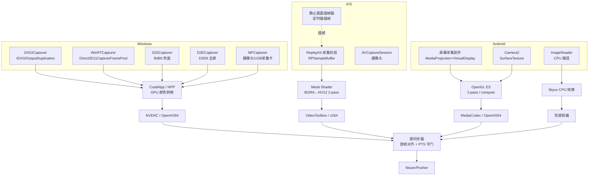

## 开播侧画面采集设计与实现（Windows / iOS / Android / HarmonyOS）

**作者**：汪亮（bertonwang）
**邮箱**：<47608843@qq.com>
**版本**：v1.4 ｜ **最后更新**：2026-05-14

> 转载或引用请保留作者署名与本文链接，欢迎来信交流与勘误。

> 范围：直播 / 录屏 / 云游戏等开播场景下，在不同操作系统上获取屏幕画面 / 摄像头画面 / 外部画面的物理采集机制、底层 API 选型、以及到统一 NV12（GPU）/ AVFrame（CPU）的转换管线。本文档独立成篇，所有实现细节均以伪代码 / 流程片段 / 等价 API 调用描述呈现，不依赖任何特定项目的源码。

---

## 目录

- [一、画面采集的整体目标](#一画面采集的整体目标)
- [二、工业界 / 学术界主流做法](#二工业界--学术界主流做法)
  - [1. Windows 桌面采集 6 种方案演进](#1-windows-桌面采集-6-种方案演进)
  - [2. iOS 屏幕采集](#2-ios-屏幕采集)
  - [3. Android 屏幕采集](#3-android-屏幕采集)
  - [4. HarmonyOS / OpenHarmony](#4-harmonyos--openharmony)
  - [5. 学术界经典工作](#5-学术界经典工作)
- [三、推荐的跨端采集架构](#三推荐的跨端采集架构)
- [四、Windows 端：DXGI 主路 + WGC/GDI 兜底](#四windows-端dxgi-主路--wgcgdi-兜底)
  - [4.1 DXGI Desktop Duplication（首选）](#41-dxgi-desktop-duplication首选)
  - [4.2 WGC（Windows Graphics Capture，第二选）](#42-wgcwindows-graphics-capture第二选)
  - [4.3 GDI 兜底](#43-gdi-兜底)
  - [4.4 Media Foundation（摄像头 / 采集卡）](#44-media-foundation摄像头--采集卡)
  - [4.5 GPU 颜色转换：CudaNpp 与 D3D9Wrapper](#45-gpu-颜色转换cudanpp-与-d3d9wrapper)
- [五、iOS 端：ReplayKit + 智能插帧](#五ios-端replaykit--智能插帧)
  - [5.1 ReplayKit 屏幕采集封装](#51-replaykit-屏幕采集封装)
  - [5.2 静止画面插帧](#52-静止画面插帧)
  - [5.3 Broadcast Upload Extension 的 50MB 限制](#53-broadcast-upload-extension-的-50mb-限制)
- [六、Android 端：MediaProjection + Surface/ImageReader](#六android-端mediaprojection--surfaceimagereader)
  - [6.1 申请权限和创建会话](#61-申请权限和创建会话)
  - [6.2 两种数据通路](#62-两种数据通路)
  - [6.3 应用音频抓取（Android 10+）](#63-应用音频抓取android-10)
  - [6.4 GPU 转换管线（OpenGL ES）](#64-gpu-转换管线opengl-es)
  - [6.5 Vulkan 实现](#65-vulkan-实现)
- [七、HarmonyOS 端](#七harmonyos-端)
- [八、采集稳定性的工程级机制](#八采集稳定性的工程级机制)
  - [8.1 心跳看门狗](#81-心跳看门狗)
  - [8.2 双视频源同步（屏幕 + 摄像头叠加）](#82-双视频源同步屏幕--摄像头叠加)
  - [8.3 静音屏幕采集与暂停画面](#83-静音屏幕采集与暂停画面)
- [九、跨端能力与平台对照表](#九跨端能力与平台对照表)
- [十、性能基准（典型实测）](#十性能基准典型实测)
- [十一、参考文献](#十一参考文献)

---

### 一、画面采集的整体目标

直播 / 录屏 / 云游戏的画面采集需要在每个端**同时**满足：

1. **零（或极低）拷贝**：4K@60fps 一帧 ~24MB，CPU 拷贝即占满总线，必须 GPU 内闭环；
2. **格式统一**：上层编码器（H.264/H.265 硬编/软编）只能消费 NV12 / I420，需要把硬件抓取的 BGRA / RGBA / YUV422 转成 NV12；
3. **帧率稳定**：30/60fps 期望抖动 <±5ms，否则编码会出现 GOP 不齐、码控波动；
4. **画面静止时仍然出帧**：iOS ReplayKit 以及部分 Android MediaProjection / ImageReader 通路在画面静止时可能不持续回调，需要在采集或编码侧设计补帧 / 节拍保持机制；
5. **HDR/SDR、多显示器、DPI 缩放、热插拔、设备切换**：动态适配；
6. **权限/前台服务/沙盒**：不同 OS 的合规要求差异巨大。

---

### 二、工业界 / 学术界主流做法

#### 1. Windows 桌面采集 6 种方案演进

| 方案 | API | 特点 | 性能 | 引入时间 |
|------|-----|------|------|----------|
| GDI `BitBlt` | gdi32 | 通用、兼容性最好；CPU 拷贝；不支持 D3D 全屏 | 最差（4K~10ms+） | Win98+ |
| Direct3D 9 `GetFrontBufferData` | d3d9 | 抓全屏 D3D9 应用 | 中（占用主线 GPU） | XP+ |
| WGC（Windows Graphics Capture） | winrt::Windows.Graphics.Capture | UWP 友好，单窗口/单显示器；硬件加速；遮挡/最小化也能抓；Win10 1903+ | 优 | Win10 1903 |
| **DXGI Desktop Duplication** | DXGI 1.2+ `IDXGIOutputDuplication` | 仅显示器粒度；最低延迟；变化区域回调；HDR 友好（IDXGIOutput5） | 最优 | Win8+ |
| Media Foundation `IMFSourceReader` | mfplat / mfreadwrite | 摄像头/麦克风采集主路；可走硬件 MJPEG/NV12 | 优 | Win8+ |
| OBS NDI / Spout | 共享纹理 | 跨进程零拷贝；需 OBS / Spout SDK | 优 | 第三方 |

OBS-Studio 的策略是 **DXGI 优先 → WGC 兜底 → GDI 兜底**，本文推荐架构亦同此思路。

#### 2. iOS 屏幕采集

iOS 不允许第三方 App 直接抓屏，唯一合规途径是 **ReplayKit**：
- **App 内录屏**：`RPScreenRecorder` + `RPSampleBufferType`，可拿到 video/audioApp/audioMic 三路 `CMSampleBuffer`；
- **跨 App 直播**：`Broadcast Upload Extension`（独立进程，最大 50MB 内存），通过 `RPBroadcastSampleHandler::processSampleBuffer` 回调；
- **限制**：画面静止时不回调，需要客户端定时插帧；后台前台切换会被打断需重启；HDR 内容会被自动 tone-mapping 到 SDR。

iOS 摄像头：`AVCaptureSession` + `AVCaptureVideoDataOutput`，输出 `CMSampleBuffer`，通过 `CVPixelBuffer` 共享 GPU 纹理（IOSurface）。

#### 3. Android 屏幕采集

唯一合规途径是 **MediaProjection API（API 21+）**：
- 申请权限：`MediaProjectionManager.createScreenCaptureIntent()` 弹系统授权框；
- 创建虚拟显示器：`mediaProjection.createVirtualDisplay(name, w, h, dpi, flags, surface, callback, handler)`；
- 输出可以是 `Surface`（直接给 MediaCodec 编码，零拷贝）也可以是 `ImageReader`（拿 RGBA pixel array）；
- Android 10+ 可附加 `AudioPlaybackCaptureConfiguration` 抓取应用音频；
- **Foreground Service** 必须，且 `foregroundServiceType="mediaProjection"`（Android 10+）。

Android 摄像头：Camera2 / CameraX，输出可以是 `SurfaceTexture`（GPU 纹理）/`ImageReader`（CPU yuv buffer）。

#### 4. HarmonyOS / OpenHarmony

通过 ArkTS 端 `screenCapture` 系统能力拿 buffer，C++ 端通过 NAPI 接收，整体 API 模型类似 Android MediaProjection；GPU 转换可与 Android 共享同一套 OpenGL ES 代码。

#### 5. 学术界经典工作

- **Microsoft Research, "Desktop Duplication for Remote Display Applications"**：DXGI Desktop Duplication 设计原文，引入"脏区域 + 全屏纹理 + 双缓冲"模型；
- **NVIDIA NVENC/NVCUVID Whitepaper**：D3D11/D3D12 共享纹理 + GPU 直接编码；
- **Android Surface Composer 文档**：BufferQueue + GraphicBuffer + EGLImage 的零拷贝模型；
- **Apple "ReplayKit" WWDC 2014/2016 sessions**：iOS 录屏架构与 SampleBufferHandler 设计原则；
- **Yuan et al., "GPU-Accelerated YUV Conversion for Real-Time Video Encoding" (IEEE TCSVT 2020)**：Pixel Shader Two-Pass / Compute Shader 单 Pass 的对比，两种实现本文后续都会详细展开。

---

### 三、推荐的跨端采集架构



跨端的统一抽象建议：定义一个 `IVideoCapturer` 接口（`Open / Start / Stop / Close / GetFrame / OnEvent`），所有平台实现在接口之下；控制器层为每路画面（如 Index0=屏幕、Index1=摄像头、…）独立运行实例。

---

### 四、Windows 端：DXGI 主路 + WGC/GDI 兜底

#### 4.1 DXGI Desktop Duplication（首选）

> **核心思想**：不去“截屏”，而是让系统桌面合成器（DWM）**复制一份合成完成的最终表面**给你。这是全体桌面采集里唯一低于一个 vsync 延迟、且能拿到“脏区元信息”的原生路线；GPU 内闭环，成本代价接近于零。

**初始化流程**（伪代码）：

```text
# 1) 枚举适配器（多 GPU 总线上选中“该显示器所在”那个）
adapter = DXGIGetAdapterByOutputIndex(screenIndex)

# 2) 在该适配器上创建 D3D11 设备
d3dDevice, d3dContext = D3D11CreateDevice(adapter, driver=UNKNOWN)

# 3) 优先 IDXGIOutput5 （支持 HDR + 多格式协商）
output5 = output.QueryInterface(IDXGIOutput5)
if output5 != null:
    formats = [B8G8R8A8_UNORM, R16G16B16A16_FLOAT]   # HDR 友好
    duplication = output5.DuplicateOutput1(d3dDevice, formats)
else:
    # 4) 兜底 IDXGIOutput1（Win8）
    duplication = output1.DuplicateOutput(d3dDevice)
```

**采集循环**（伪代码）：

```text
while running:
    info, resource = duplication.AcquireNextFrame(timeoutMs)

    if info == TIMEOUT:                  # 桌面无变化（鼠标也未动）
        if needConstantFrameRate:
            encoder.Submit(lastNv12Tex, nextPts)     # 复用上一帧，只推进 PTS
        continue                         #   → 复用上一帧，不产生新帧

    desktopTex = resource.QueryInterface(ID3D11Texture2D)

    # 直接把这张 GPU 纹理授予下游：
    #   · NPP / CudaNpp 做 BGRA → NV12
    #   · 出口不拷贝、直接交给 NVENC
    Convert_BGRA_To_NV12(desktopTex, nv12Tex)
    encoder.Submit(nv12Tex, info.LastPresentTime)

    duplication.ReleaseFrame()
```

##### 关键优势
- **延迟最低**：Windows 桌面合成器（DWM）合成完成后立即触发 `AcquireNextFrame`，理论延迟 ~16ms（一个 vsync）；
- **GPU 内闭环**：抓到的 `ID3D11Texture2D` 可以直接通过共享 handle 给 NVENC，整路无 CPU 拷贝；
- **HDR 友好**：IDXGIOutput5 + `DXGI_FORMAT_R16G16B16A16_FLOAT` 可保留 HDR10 元数据；
- **变化区域**：`frameInfo.TotalMetadataBufferSize` 提供脏区域和鼠标移动信息。

##### 已知问题与处置
- 锁屏 / UAC 弹窗 → 立刻收到 `DXGI_ERROR_ACCESS_LOST`，需销毁并重建；
- 多 GPU 切换（笔记本独显切核显）→ `DXGI_ERROR_DEVICE_REMOVED`，重建；
- 析构时 worker 仍在跑 → 显式 `Stop()` + 幂等 `Close()`。

#### 4.2 WGC（Windows Graphics Capture，第二选）

> **核心思想**：用现代 WinRT 采集子系统以**窗口 / 显示器 / UI 元素**粒度订阅画面“变化”事件。不需要主动 pull，画面一变就收到 `FrameArrived` 回调；被遮挡 / 最小化也能采集。

```text
# 创建帧池 + 采集会话
framePool = Direct3D11CaptureFramePool.Create(
               d3dDevice, B8G8R8A8UIntNormalized,
               poolSize=2, item.Size)
framePool.OnFrameArrived = OnFrameArrived
session   = framePool.CreateCaptureSession(item)
session.StartCapture()
```

`OnFrameArrived` 内部：

```text
OnFrameArrived(framePool):
    surface = framePool.TryGetNextFrame()
    d3dTex  = surface.QueryInterface(ID3D11Texture2D)   # 零拷贝取出

    if preferGpuPath:
        Convert_BGRA_To_NV12(d3dTex, nv12Tex)           # 推荐：GPU 内直接转换
        encoder.Submit(nv12Tex)
        return

    # CPU 兜底路径：先复制到 CPU-readable staging texture，再非阻塞 Map
    context.CopyResource(stagingTex, d3dTex)
    hr = context.Map(stagingTex, mode=READ, flag=DO_NOT_WAIT)
    if hr == WAS_STILL_DRAWING:
        return                                         # 跳过本帧，等下一帧

    Convert_BGRA_To_NV12(stagingTex, nv12Tex)
    encoder.Submit(nv12Tex)
```

WGC 优点：
- 可指定**单个窗口**捕获（Win11 上甚至可以指定单个 UI 元素）；
- 被遮挡 / 最小化时仍能采集；
- API 现代，沙盒友好。

缺点：要求 Win10 1903+，比 DXGI 略高延迟。

#### 4.3 GDI 兜底

`BitBlt(memDC, 0, 0, w, h, screenDC, 0, 0, SRCCOPY)` 直接拷屏到内存 DC。仅在 DXGI/WGC 都失败时启用，CPU 占用高（4K 单帧 10–15ms），不支持全屏 D3D 应用。

#### 4.4 Media Foundation（摄像头 / 采集卡）

使用 `IMFSourceReader` 异步读取，优先协商硬件支持的 `MFVideoFormat_NV12`，否则走 `MFVideoFormat_YUY2`/MJPEG 自行转换。

#### 4.5 GPU 颜色转换：CudaNpp 与 D3D9Wrapper

- **CudaNpp**：用 NVIDIA Performance Primitives（NPP）做 BGRA→NV12，单帧 4K <1ms；调用路径为 `nppiBGRToYCbCr420_8u_C4P3R / nppiYCbCrToNV12_8u_P3P2R`，可多流并行；
- **D3D9 包装器**：D3D9 版的全屏纹理读取（`IDirect3DDevice9::GetFrontBufferData`），主要用于老游戏、特定驱动 / 老业务场景的兜底。

---

### 五、iOS 端：ReplayKit + 智能插帧

#### 5.1 ReplayKit 屏幕采集封装

> **核心思想**：iOS 上唯一合规的屏幕采集通道是 ReplayKit，它是**全事件驱动**的 SampleBufferHandler。上层只需处理三件事：拿帧、转格式、出错重启。出错重启是重点——它只在“后台 → 前台”这种可恢复场景重启，其余一律上报退出。

在 Objective-C / Swift 层封装 ReplayKit，采集异常与状态变化通过回调上传：

```text
# 伪代码
replayKitLiveStream.startWithErrorCallback(error -> {
    if isJustReturnedFromBackground():            # 后台 → 前台 触发的错误
        startReplayKit(callback)                  #   → 自动重启一次
    else:
        log("ReplayKit error, stop and exit broadcasting.")
        reportToUpper(error)                       # 上报状态 + 异常类型
})
```

ReplayKit 三路 SampleBuffer 的处理：
- `RPSampleBufferTypeVideo`：屏幕画面（CMSampleBuffer 包 CVPixelBuffer，YUV 420f / BGRA）；
- `RPSampleBufferTypeAudioApp`：App 内音效；
- `RPSampleBufferTypeAudioMic`：麦克风。

视频帧入口函数（以进入 SampleBuffer 为例）实现思路：
1. 通过 `CMSampleBufferGetImageBuffer` 拿 `CVPixelBuffer`；
2. `CVPixelBufferLockBaseAddress` 锁地址；
3. 通过 IOSurface 共享给 Metal/VideoToolbox（零拷贝）；
4. 用两 pass Metal shader 把 BGRA → NV12；
5. 进入编码器（VideoToolbox 硬编 H.264）。

#### 5.2 静止画面插帧

> **核心思想**：**下游编码器需要稳定节拍，但 ReplayKit “画面不变就不回调”**。解决路径：独立起一个定时器，在预期帧间隔超期未到时，**复用上一帧的 IOSurface（零拷贝）**但仅改写 PTS，然后走与真帧同一个下游接口。如此下游不感知“插帧/真帧”区别，PTS 单调、码率不抖。

ReplayKit 的“画面无变化时不回调”是 iOS 上**最常见的卡顿元凶**——下游编码器以为流断了，码率/GOP 全乱。推荐用一个独立定时器插帧：

```text
# 伪代码
interval = 1.0 / frameRate
timeTick = TimeTicker(interval, onTick = () -> {
    lastFrameLock.acquire()
    if lastFrame != null:
        now = CurrentTimeSec()
        if (now - lastFrameTimestamp) >= interval * 2:   # 超过两倍帧间隔仍未收到新帧
            newFrame = ModifyFramePTS(
                          src        = lastFrame,         #   → 复用上一帧的像素 buffer
                          newPtsSec  = now)               #     仅改写 PTS
            encoder.Submit(newFrame)
    lastFrameLock.release()
})
```

`ModifyFramePTS` 的本质是用 `CMSampleBufferCreateCopyWithNewTiming` 生成一份新 PTS 的 SampleBuffer（pixelBuffer 通过 IOSurface 共享，没有内存拷贝）：

```text
ModifyFramePTS(src, newPtsSec):
    timing.presentationTimeStamp = MakeCMTime(newPtsSec, src.timescale)
    return CMSampleBufferCreateCopyWithNewTiming(src, timing)
```

> 设计要点：插的帧与真实帧**走同一个接口进入下游**，下游不感知“插帧/真帧”的区别——这就保证了 PTS 单调、码率不抖。

#### 5.3 Broadcast Upload Extension 的 50MB 限制

iOS 强制 Extension 内存上限 50MB，实践上推荐三点：
1. **不缓存原始帧**：拿到立即转 NV12 编码，原 BGRA 立刻释放；
2. **零拷贝**：CVPixelBuffer 经 IOSurface 给 Metal，没有 CPU side 副本；
3. **限制队列长度**：编码队列最大 5 帧，超过则 drop，并由上游“源同步器”保证 PTS 单调。

---

### 六、Android 端：MediaProjection + Surface/ImageReader

#### 6.1 申请权限和创建会话

> **核心思想**：Android 的屏幕采集是一条“需要用户明示同意”的应用间通道。授权凭证（`MediaProjection` token）是一次性颁发、用户随时可撤销、后台会被回收 → 必须用**前台服务 + 撤销回调**的设计贯穿全生命周期。

```text
# 1) 弹系统授权框（必须在 Activity 中）
mgr    = context.getSystemService(MEDIA_PROJECTION_SERVICE)
intent = mgr.createScreenCaptureIntent()
startActivityForResult(intent, REQUEST_CODE)

# 2) onActivityResult 回调里拿 token
onActivityResult(resultCode, data):
    mediaProjection = mgr.getMediaProjection(resultCode, data)
    mediaProjection.registerCallback(onUserRevoke)         # 监听用户撤销权限

    # 3) 通知上层
    listener.onScreenCaptureCreate(mediaProjection, inputSurface)
```

权限注意事项：
- **必须 Foreground Service**，且 `android:foregroundServiceType="mediaProjection"`（需在 `AndroidManifest.xml` 声明）；
- Android 14+ 用户可主动撤销 → `MediaProjection.Callback.onStop()` 中清理资源。

#### 6.2 两种数据通路

> **核心思想**：能走 GPU 零拷贝就不走 CPU。Surface 通路在全路不入 CPU、依靠硬编；ImageReader 通路必须调 CPU 拿位图，仅当**软编/推理/需要原始像素**时启用。两者出口在上层抽象为同一 `IVideoCapturer` 接口。

##### 通路 A：Surface 直通（零拷贝，推荐）

```text
# inputSurface 是 MediaCodec.createInputSurface() 拿到的 Surface
mediaProjection.createVirtualDisplay(
    name      = "screen-mirror",
    width, height, dpi,
    flags     = VIRTUAL_DISPLAY_FLAG_AUTO_MIRROR,
    surface   = inputSurface)
```

GPU 内闭环：屏幕合成器 → VirtualDisplay → MediaCodec 输入 Surface（EGLImage）→ h264_mediacodec 硬编。**全程无 CPU 介入**，4K@60fps CPU 占用 <5%。

##### 通路 B：ImageReader（CPU 路径，软编兜底）

```text
imageReader = ImageReader.newInstance(width, height, RGBA_8888, maxBuffer=5)

imageReader.OnImageAvailable = (reader) -> {
    image       = reader.acquireLatestImage()        # 总是取最新一帧（自动丢中间）
    plane       = image.planes[0]
    rowStride   = plane.rowStride                    # 可能 > width * 4
    pixelStride = plane.pixelStride

    # 重点：rowStride 可能 > width × pixelStride，需按行偏移
    for y in [0, height):
        srcRow = image.buffer + y * rowStride
        # libyuv: ABGRToNV12 / ABGRToI420
        ConvertRow_ABGR_To_NV12(srcRow, dst, width)
}

mediaProjection.createVirtualDisplay(..., surface = imageReader.getSurface())
```

ImageReader 会为画面每一行右侧添加一个 padding 以进行行对齐（对齐字节数因硬件而异）：

> 由于 Image 中的缓冲区存在数据对齐，所以其大小不一定是生成 ImageReader 实例时指定的大小。
> ImageReader 会自动为画面每一行右侧添加一个 padding，以进行对齐，对齐多少字节可能因硬件而异。

应对方法：用 `rowStride` 而非 `width*4` 计算偏移，或者在 GPU 上用两-pass shader 做对齐裁剪。

#### 6.3 应用音频抓取（Android 10+）

> **核心思想**：MediaProjection 不仅能拿画面，还能用同一份 token 携带音频采集。通过 `AudioPlaybackCaptureConfiguration` 按“音频用途过滤器”只拿需要的部分，避免贪婪式侵入语音通话等敏感路径。

```text
# 配合 MediaProjection 抓 App 内音频
playbackCfg = AudioPlaybackCaptureConfiguration.Builder(mediaProjection)
                  .addMatchingUsage(USAGE_GAME)        # 仅采集“游戏”类音效
                  ...
                  .build()

audioRecord = AudioRecord.Builder()
                  .setAudioPlaybackCaptureConfig(playbackCfg)
                  ...
                  .build()
```

#### 6.4 GPU 转换管线（OpenGL ES）

> **核心思想**：BGRA → NV12 本质上是“色彩空间变换 + 色度下采样”。两种实现选型反映不同代码起点：**双 Pass** 靠片元着色器（充分兼容 GLES 3.0+）、**Compute 单 Pass** 靠计算着色器（需 GLES 3.1+，少一次 FBO 切换）。两者出口都是 “`tex_y_` + `tex_uv_half_`”，可被上层透明选择。

推荐提供两种实现路径：**双 Pass（充分兼容 GLES 3.0+）** 与 **Compute Shader 单 Pass（GLES 3.1+）**。

##### 双 Pass 方案（兼容 GLES 3.0+）

```text
# Pass1：BGRA → 全分辨率 Y 平面 + 全分辨率 UV 平面
#   写入 fbo_pass1，输出 tex_y（GL_R8）+ tex_uv_full（GL_RG8）
# 伪代码式 shader：
for each fragment(uv):
    rgba = texture(input_texture, uv)
    Y = 0.257*R + 0.504*G + 0.098*B + 16/255
    U = -0.148*R - 0.291*G + 0.439*B + 128/255
    V = 0.439*R  - 0.368*G - 0.071*B + 128/255
    write(tex_y,       Y)
    write(tex_uv_full, vec2(U, V))

# Pass2：UV 4:4:4 → 4:2:0（半分辨率）
#   对 tex_uv_full 用半屏 quad 渲染到 tex_uv_half，
#   启用线性采样让硬件自动做 2x2 box-filter。
```

> 色彩矩阵说明：上述系数仅示意 BT.601 limited-range。实际工程中应根据分辨率、色彩空间和编码器协商结果选择 BT.601 / BT.709 / BT.2020，以及 full-range / limited-range 矩阵；HDR 内容还需额外处理 PQ / HLG 与 tone-mapping。

##### Compute Shader 单 Pass 方案（GLES 3.1+）

```text
# 一次 compute 同时输出 Y 和 UV 平面，少 1 次 FBO 切换
local_size = (16, 16)

for each thread(gid):
    # 一个线程负责一个 2x2 块，写 4 个 Y、1 个 UV
    rgba00 = imageLoad(inputTex, gid*2 + (0,0))
    rgba01 = imageLoad(inputTex, gid*2 + (1,0))
    rgba10 = imageLoad(inputTex, gid*2 + (0,1))
    rgba11 = imageLoad(inputTex, gid*2 + (1,1))

    imageStore(outY, gid*2 + (0,0), Y(rgba00))
    imageStore(outY, gid*2 + (1,0), Y(rgba01))
    imageStore(outY, gid*2 + (0,1), Y(rgba10))
    imageStore(outY, gid*2 + (1,1), Y(rgba11))

    avg = (rgba00 + rgba01 + rgba10 + rgba11) / 4
    imageStore(outUV, gid, vec2(U(avg), V(avg)))
```

##### 双 PBO 异步回读

> **核心思想**：允许“延迟 1 帧”以换取 GPU/CPU 全量并行。帧 N 发起 readPixels 入队后不等，直接在帧 N+1 才去 map 它——此时 GPU 早已完成，CPU 零等待。代价是路径多一个帧的端到端延迟，与“编码器 B 帧重排序”同样属于可接受的权衡。

```text
# 伪代码
pbo[2]                               # 双缓冲
idxCur, idxNext = current, (current + 1) % 2

# 本帧：异步请求读取 GPU 纹理到 pbo[idxCur]
bind(GL_PIXEL_PACK_BUFFER, pbo[idxCur])
ReadPixels(…)                       # 不阻塞，入队后返回

# 同一调用：map 上一帧的 pbo[idxNext]——那份数据 GPU 早已完成
bind(GL_PIXEL_PACK_BUFFER, pbo[idxNext])
data = MapBufferRange(0, size, READ)
memcpy(targetAVFrame, data, size)    # 快速 CPU 读出
UnmapBuffer()

current = idxNext                    # 交替
encoder.Submit(targetAVFrame)
```

延迟 1 帧换取 GPU/CPU 流水线并行，CPU 等待时间从 ~6ms 降到 ~0。

#### 6.5 Vulkan 实现

在支持 Vulkan 的设备（Android 7+ 中高端机）上提供更低延迟的转换路径，使用 `VkComputePipeline` + `VkBuffer` 共享内存，避开 `glReadPixels` 的同步开销。

---

### 七、HarmonyOS 端

HarmonyOS / OpenHarmony 端的整体模型接近 Android MediaProjection，但工程上不能简单视为“Android 换壳”：权限、生命周期、ArkTS 到 C++ 的桥接方式都需要单独适配。

推荐分层如下：
1. **ArkTS 权限与会话层**：通过系统 `screenCapture` 能力申请屏幕采集会话，监听用户授权、系统回收和后台限制；
2. **Native 桥接层**：通过 NAPI 把系统侧 buffer / surface 传入 C++，只传句柄或引用，避免在 ArkTS 与 Native 之间复制整帧；
3. **GPU 转换层**：复用 Android/OpenHarmony 共用的 OpenGL ES 管线，将 RGBA / BGRA 统一转换为 NV12；
4. **编码与推流层**：优先接系统硬编输入 surface；如果只能取得 CPU buffer，再兜底走 libyuv / 软编。

与 Android 可复用的部分主要是 OpenGL ES 转换、同步器、看门狗和编码输出抽象；不可复用的部分主要是权限申请、前后台生命周期、NAPI bridge 和系统 buffer 类型适配。

---

### 八、采集稳定性的工程级机制

#### 8.1 心跳看门狗

> **核心思想**：采集路径是**黑盒**——表面之下可能是底层 API 陷入、驱动卡死、采集 Surface 失效。上层看不到 stack trace，只能看到“不出帧”。给每条采集线插一个“每帧打心跳”的探针，由独立看门狗线程周期检查、超时即带路径上报，从“没有现象”变成“可检测的系统”。

多路采集线程各自注册一个心跳槽，每帧出帧时“打心跳”；独立看门狗线程检测超时：

```text
slotVideo = watchdog.RegisterHeartbeat("VideoCapturer")

# 采集线程每出一帧
onFrame():
    watchdog.InjectHeartbeat(slotVideo)

# 看门狗线程
periodically():
    if now - lastBeat[slotVideo] > 5s:
        report("采集卡死")
        triggerRestart()                  # 上层重启采集实例
```

#### 8.2 双视频源同步（屏幕 + 摄像头叠加）

推荐同时维护两个独立采集实例（屏幕=Index0、摄像头=Index1）。摄像头帧若先于屏幕帧到达，需被上游“源同步器”中的首帧逻辑临时丢弃，直到屏幕主源建立基准。

#### 8.3 静音屏幕采集与暂停画面

> **核心思想**：主播需要“暂时离开”但不能断推流。解决办法是让采集控制器进入 mute 模式：**占位画面取代真实采集帧**，但出帧节拍、接口与正常采集一致——下游编码、推流、同步都不需要任何变动。

```text
# 控制器提供 muteCaptureV=true 模式
if muteCaptureV:
    placeholder = LoadOnce("CapPause.jpg")    # 只加载一次、作为 GPU 纹理缓存
    submitFrame = WrapAsAVFrame(placeholder, ptsNow)
    encoder.Submit(submitFrame)               # 保持帧率正常出帧
else:
    submitFrame = realCapturedFrame
    encoder.Submit(submitFrame)

# 推流不中断、码控不抖
```

---

### 九、跨端能力与平台对照表

| 能力 | Windows | iOS | Android | HarmonyOS |
|------|---------|-----|---------|-----------|
| 主路屏幕 API | DXGI Desktop Duplication | ReplayKit | MediaProjection | screenCapture |
| 兜底屏幕 API | WGC / GDI / D3D9 | — | — | — |
| 摄像头 API | Media Foundation | AVCaptureSession | Camera2 | Camera Kit |
| GPU 转换 | CudaNpp（NVIDIA） | Metal | OpenGL ES / Vulkan | OpenGL ES |
| 零拷贝路径 | D3D11 共享纹理 → NVENC | IOSurface → VideoToolbox | Surface → MediaCodec | EGLImage → 系统编码器 |
| 静止插帧 | 通常不强制；固定 fps 推流可复用上一帧补 PTS | 静止插帧器 | Surface 通路通常不需要；ImageReader / 软编路径需按节拍补帧 | 同 Android |
| 后台 / 锁屏 | DXGI ACCESS_LOST 重建 | Extension 自动重启 | Foreground Service 必须 | Foreground Service 必须 |
| HDR 支持 | IDXGIOutput5 + RGB16F | iOS 16+ tone-mapping | Android 13+ 硬解透传 | 部分支持 |
| 鼠标光标 | `frameInfo.PointerPosition` | 系统自带 | 系统自带 | 系统自带 |
| 多屏 | 支持（按 OutputIndex） | 仅主屏 | 仅默认 Display | 仅默认 Display |

---

### 十、性能基准（典型实测）

下表为工程经验值，用于量级参考；实际结果会随设备型号、驱动版本、OS 版本、HDR/SDR、是否包含颜色转换、编码器配置以及是否统计端到端编码延迟而变化。

| 平台 | 分辨率 | 帧率 | 采集延迟 | CPU 占用 | GPU 占用 |
|------|--------|------|----------|----------|----------|
| Windows DXGI + NVENC | 4K | 60fps | ~16ms (1 vsync) | <3% | ~5% |
| Windows WGC + NVENC | 4K | 60fps | ~22ms | <4% | ~6% |
| Windows GDI（兜底） | 1080p | 30fps | ~12ms | ~25% | 0% |
| iOS ReplayKit + VT | 1080p | 30fps | ~30ms | ~12% (Extension) | ~8% |
| Android Surface + MediaCodec | 1080p | 60fps | ~20ms | <3% | ~6% |
| Android ImageReader + 软编 | 1080p | 30fps | ~35ms | ~30% | ~5% |

---

### 十一、参考文献

1. Microsoft Docs, *Desktop Duplication API* (DXGI 1.2).
2. Microsoft Docs, *Windows.Graphics.Capture namespace* (Win10 1903+).
3. Apple Developer, *ReplayKit Framework* & WWDC 2014/2016 Sessions.
4. Apple Developer, *AVFoundation Capture Programming Guide*.
5. Android Developers, *MediaProjection API & ImageReader*.
6. Android Developers, *Camera2 API & Surface Architecture*.
7. NVIDIA, *NPP Performance Primitives Programming Guide*.
8. Khronos, *OpenGL ES 3.1 Compute Shader Specification*.
9. OBS Studio source, `plugins/win-capture/dxgi-helpers.c`.
10. Yuan H., et al. *GPU-Accelerated YUV Conversion for Real-Time Video Encoding*. IEEE TCSVT, 2020.

