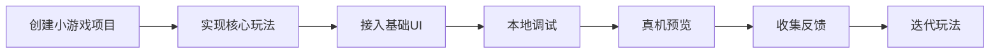
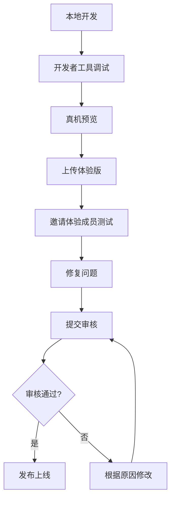
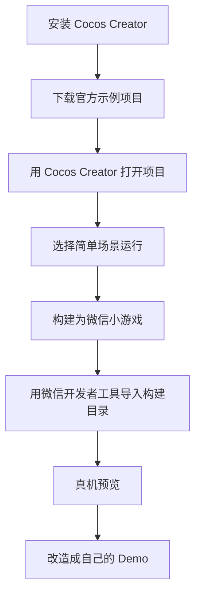

# 微信小游戏Demo开发步骤与参考例子

> 主题：从零开发一个简单微信小游戏 Demo 的完整步骤  
> 示例方向：点击得分小游戏 / 看图猜词小游戏雏形  
> 适用对象：个人开发者、小游戏初学者、准备验证微信小游戏方向的小团队  
> 文档生成时间：2026-06-01

---

## 1. 结论先行

如果只是做一个简单微信小游戏 Demo，建议不要一开始上复杂框架、复杂后端或 AI 实时生成能力，而是先完成一个最小闭环：



推荐首个 Demo 做成：

> **点击按钮得分 + 倒计时 + 结束页 + 分享入口**

这个 Demo 虽然简单，但能覆盖微信小游戏开发的核心流程：

- 项目创建；
- Canvas 渲染；
- 用户点击交互；
- 游戏状态管理；
- 分数计算；
- 倒计时；
- 微信开发者工具预览；
- 后续接入分享、排行榜、广告的基础结构。

---

## 2. 开发前准备

## 2.1 注册与账号准备

开发微信小游戏通常需要准备：

1. **微信公众平台账号**
   - 进入微信公众平台；
   - 注册“小程序”账号；
   - 在类目中选择小游戏相关类目；
   - 完成主体认证后可发布正式版。

2. **AppID**
   - 正式开发和发布需要 AppID；
   - 如果只是本地学习，可以先使用测试号或无 AppID 模式。

3. **微信开发者工具**
   - 用于创建、运行、调试、预览和上传小游戏项目。

4. **开发环境**
   - Node.js：用于部分工程化工具；
   - 代码编辑器：如 VS Code；
   - 图片编辑工具：可选，用于制作简单素材。

---

## 2.2 技术路线选择

微信小游戏常见技术路线如下：

| 技术路线 | 适合场景 | 优点 | 缺点 |
|---|---|---|---|
| 原生小游戏 Canvas | 极简 Demo、学习底层机制 | 轻量、无额外依赖 | 工程化能力弱，复杂项目维护难 |
| Cocos Creator | 2D休闲游戏、消除、闯关 | 生态成熟、组件化、适合小游戏 | 需要学习编辑器 |
| LayaAir | H5/小游戏、轻量2D项目 | 性能较好、适合网页游戏转小游戏 | 生态相对垂直 |
| Unity导出小游戏 | 中重度游戏、已有Unity团队 | 适合复杂玩法和3D | 包体、性能、适配成本较高 |

对于第一个 Demo，建议选择：

> **原生微信小游戏 Canvas** 或 **Cocos Creator**。

如果目标是理解微信小游戏底层流程，选原生 Canvas；如果目标是更快做可视化休闲游戏，选 Cocos Creator。

本文参考例子采用 **原生微信小游戏 Canvas**，因为它最轻量，适合快速理解完整流程。

---

## 3. Demo目标设计

## 3.1 Demo名称

**10秒点击挑战**

## 3.2 核心玩法

玩家在 10 秒内不断点击屏幕中央的按钮，每点击一次得 1 分。倒计时结束后展示最终分数，并允许重新开始。

## 3.3 为什么选择这个例子

这个 Demo 很简单，但包含小游戏最基础的开发要素：

- **游戏循环**：持续刷新画面；
- **用户输入**：监听触摸事件；
- **状态管理**：开始、进行中、结束；
- **UI绘制**：标题、按钮、分数、倒计时；
- **结果反馈**：结束页展示成绩；
- **可扩展性**：后续可接入分享、排行榜、广告、道具等。

---

## 4. 项目目录结构

一个最简单的微信小游戏项目可以这样组织：

```text
click-demo/
├── game.js
├── game.json
├── project.config.json
└── images/
    └── icon.png
```

### 文件说明

- **game.js**：小游戏主入口，核心逻辑写在这里。
- **game.json**：小游戏配置文件。
- **project.config.json**：微信开发者工具项目配置。
- **images/**：存放图片资源，可选。

---

## 5. 创建项目步骤

## 5.1 使用微信开发者工具创建小游戏

操作步骤：

1. 打开微信开发者工具；
2. 选择“小游戏”；
3. 点击“新建项目”；
4. 填写项目名称，例如“点击挑战Demo”；
5. 选择本地目录，例如 `click-demo`；
6. AppID 可填写正式 AppID，也可以使用测试号；
7. 模板选择“小游戏快速启动模板”或“空项目”；
8. 创建项目。

---

## 5.2 配置 `game.json`

`game.json` 是小游戏配置文件，最简配置如下：

```json
{
  "deviceOrientation": "portrait"
}
```

含义：

- `deviceOrientation`：屏幕方向；
- `portrait`：竖屏；
- `landscape`：横屏。

对于点击类、答题类、猜词类小游戏，通常建议先使用竖屏。

---

## 6. 参考代码：10秒点击挑战

下面是一个简化版 `game.js` 示例。

```javascript
const canvas = wx.createCanvas()
const ctx = canvas.getContext('2d')

const screenWidth = canvas.width
const screenHeight = canvas.height

const GAME_STATE = {
  READY: 'ready',
  PLAYING: 'playing',
  OVER: 'over'
}

let gameState = GAME_STATE.READY
let score = 0
let timeLeft = 10
let lastTime = Date.now()

const button = {
  x: screenWidth / 2 - 90,
  y: screenHeight / 2 - 40,
  width: 180,
  height: 80
}

function resetGame() {
  gameState = GAME_STATE.PLAYING
  score = 0
  timeLeft = 10
  lastTime = Date.now()
}

function drawBackground() {
  ctx.fillStyle = '#F6F8FF'
  ctx.fillRect(0, 0, screenWidth, screenHeight)
}

function drawText(text, x, y, size = 24, color = '#222222', align = 'center') {
  ctx.fillStyle = color
  ctx.font = `${size}px sans-serif`
  ctx.textAlign = align
  ctx.fillText(text, x, y)
}

function drawButton(text) {
  ctx.fillStyle = '#3B82F6'
  ctx.fillRect(button.x, button.y, button.width, button.height)

  ctx.fillStyle = '#FFFFFF'
  ctx.font = '28px sans-serif'
  ctx.textAlign = 'center'
  ctx.fillText(text, screenWidth / 2, button.y + 50)
}

function drawReady() {
  drawBackground()
  drawText('10秒点击挑战', screenWidth / 2, 160, 34, '#111827')
  drawText('在10秒内尽可能多地点击按钮', screenWidth / 2, 220, 20, '#4B5563')
  drawButton('开始游戏')
}

function drawPlaying() {
  drawBackground()
  drawText(`得分：${score}`, screenWidth / 2, 120, 30, '#111827')
  drawText(`剩余时间：${Math.ceil(timeLeft)}秒`, screenWidth / 2, 170, 24, '#EF4444')
  drawButton('点击 +1')
}

function drawOver() {
  drawBackground()
  drawText('游戏结束', screenWidth / 2, 150, 34, '#111827')
  drawText(`最终得分：${score}`, screenWidth / 2, 220, 30, '#3B82F6')
  drawText('点击按钮重新开始', screenWidth / 2, 280, 20, '#4B5563')
  drawButton('再玩一次')
}

function update() {
  if (gameState !== GAME_STATE.PLAYING) {
    return
  }

  const now = Date.now()
  const delta = (now - lastTime) / 1000
  lastTime = now

  timeLeft -= delta

  if (timeLeft <= 0) {
    timeLeft = 0
    gameState = GAME_STATE.OVER
  }
}

function render() {
  if (gameState === GAME_STATE.READY) {
    drawReady()
  } else if (gameState === GAME_STATE.PLAYING) {
    drawPlaying()
  } else if (gameState === GAME_STATE.OVER) {
    drawOver()
  }
}

function gameLoop() {
  update()
  render()
  requestAnimationFrame(gameLoop)
}

function isInButton(x, y) {
  return (
    x >= button.x &&
    x <= button.x + button.width &&
    y >= button.y &&
    y <= button.y + button.height
  )
}

wx.onTouchStart((event) => {
  const touch = event.touches[0]
  const x = touch.clientX
  const y = touch.clientY

  if (!isInButton(x, y)) {
    return
  }

  if (gameState === GAME_STATE.READY) {
    resetGame()
  } else if (gameState === GAME_STATE.PLAYING) {
    score += 1
  } else if (gameState === GAME_STATE.OVER) {
    resetGame()
  }
})

gameLoop()
```

---

### 6.1 TypeScript 版本：`game.ts`

如果希望用 `TypeScript` 编写这个 Demo，需要注意：**微信小游戏运行时最终执行的仍然是 JavaScript**。因此原生微信小游戏项目中通常有两种做法：

- **做法一**：编写 `game.ts`，通过 `tsc`、`webpack`、`rollup`、`vite` 等工具编译成 `game.js`；
- **做法二**：使用 `Cocos Creator`、`LayaAir` 等引擎，由引擎负责把 `TypeScript` 编译并构建为微信小游戏产物。

下面示例是对前面 `game.js` 的原生 `TypeScript` 改写版，适合理解类型定义、状态管理和面向对象封装。

```ts
declare const wx: {
  createCanvas: () => HTMLCanvasElement
  onTouchStart: (callback: (event: WxTouchEvent) => void) => void
}

interface WxTouch {
  clientX: number
  clientY: number
}

interface WxTouchEvent {
  touches: WxTouch[]
}

interface ButtonRect {
  x: number
  y: number
  width: number
  height: number
}

enum GameState {
  Ready = 'ready',
  Playing = 'playing',
  Over = 'over'
}

class ClickChallengeGame {
  private canvas: HTMLCanvasElement
  private ctx: CanvasRenderingContext2D
  private screenWidth: number
  private screenHeight: number

  private gameState: GameState = GameState.Ready
  private score = 0
  private timeLeft = 10
  private lastTime = Date.now()

  private button: ButtonRect

  constructor() {
    this.canvas = wx.createCanvas()

    const context = this.canvas.getContext('2d')

    if (!context) {
      throw new Error('无法创建 Canvas 2D 上下文')
    }

    this.ctx = context
    this.screenWidth = this.canvas.width
    this.screenHeight = this.canvas.height

    this.button = {
      x: this.screenWidth / 2 - 90,
      y: this.screenHeight / 2 - 40,
      width: 180,
      height: 80
    }

    this.bindEvents()
    this.gameLoop()
  }

  private resetGame(): void {
    this.gameState = GameState.Playing
    this.score = 0
    this.timeLeft = 10
    this.lastTime = Date.now()
  }

  private drawBackground(): void {
    this.ctx.fillStyle = '#F6F8FF'
    this.ctx.fillRect(0, 0, this.screenWidth, this.screenHeight)
  }

  private drawText(
    text: string,
    x: number,
    y: number,
    size = 24,
    color = '#222222',
    align: CanvasTextAlign = 'center'
  ): void {
    this.ctx.fillStyle = color
    this.ctx.font = `${size}px sans-serif`
    this.ctx.textAlign = align
    this.ctx.fillText(text, x, y)
  }

  private drawButton(text: string): void {
    this.ctx.fillStyle = '#3B82F6'
    this.ctx.fillRect(this.button.x, this.button.y, this.button.width, this.button.height)

    this.ctx.fillStyle = '#FFFFFF'
    this.ctx.font = '28px sans-serif'
    this.ctx.textAlign = 'center'
    this.ctx.fillText(text, this.screenWidth / 2, this.button.y + 50)
  }

  private drawReady(): void {
    this.drawBackground()
    this.drawText('10秒点击挑战', this.screenWidth / 2, 160, 34, '#111827')
    this.drawText('在10秒内尽可能多地点击按钮', this.screenWidth / 2, 220, 20, '#4B5563')
    this.drawButton('开始游戏')
  }

  private drawPlaying(): void {
    this.drawBackground()
    this.drawText(`得分：${this.score}`, this.screenWidth / 2, 120, 30, '#111827')
    this.drawText(`剩余时间：${Math.ceil(this.timeLeft)}秒`, this.screenWidth / 2, 170, 24, '#EF4444')
    this.drawButton('点击 +1')
  }

  private drawOver(): void {
    this.drawBackground()
    this.drawText('游戏结束', this.screenWidth / 2, 150, 34, '#111827')
    this.drawText(`最终得分：${this.score}`, this.screenWidth / 2, 220, 30, '#3B82F6')
    this.drawText('点击按钮重新开始', this.screenWidth / 2, 280, 20, '#4B5563')
    this.drawButton('再玩一次')
  }

  private update(): void {
    if (this.gameState !== GameState.Playing) {
      return
    }

    const now = Date.now()
    const delta = (now - this.lastTime) / 1000
    this.lastTime = now

    this.timeLeft -= delta

    if (this.timeLeft <= 0) {
      this.timeLeft = 0
      this.gameState = GameState.Over
    }
  }

  private render(): void {
    if (this.gameState === GameState.Ready) {
      this.drawReady()
    } else if (this.gameState === GameState.Playing) {
      this.drawPlaying()
    } else if (this.gameState === GameState.Over) {
      this.drawOver()
    }
  }

  private gameLoop = (): void => {
    this.update()
    this.render()
    requestAnimationFrame(this.gameLoop)
  }

  private isInButton(x: number, y: number): boolean {
    return (
      x >= this.button.x &&
      x <= this.button.x + this.button.width &&
      y >= this.button.y &&
      y <= this.button.y + this.button.height
    )
  }

  private bindEvents(): void {
    wx.onTouchStart((event: WxTouchEvent) => {
      const touch = event.touches[0]

      if (!touch) {
        return
      }

      const { clientX, clientY } = touch

      if (!this.isInButton(clientX, clientY)) {
        return
      }

      if (this.gameState === GameState.Ready) {
        this.resetGame()
      } else if (this.gameState === GameState.Playing) {
        this.score += 1
      } else if (this.gameState === GameState.Over) {
        this.resetGame()
      }
    })
  }
}

new ClickChallengeGame()
```

---

### 6.2 TypeScript 项目结构建议

如果采用原生微信小游戏 + `TypeScript`，目录可以这样组织：

```text
click-demo-ts/
├── src/
│   └── game.ts
├── dist/
│   └── game.js
├── game.json
├── project.config.json
├── package.json
└── tsconfig.json
```

说明：

- `src/game.ts`：编写 TypeScript 源码；
- `dist/game.js`：编译后的 JavaScript 文件，供微信小游戏运行；
- `game.json`：小游戏配置；
- `tsconfig.json`：TypeScript 编译配置；
- `package.json`：保存构建脚本和开发依赖。

一个最简 `tsconfig.json` 可以这样写：

```json
{
  "compilerOptions": {
    "target": "ES2018",
    "module": "ESNext",
    "strict": true,
    "outDir": "dist",
    "rootDir": "src",
    "skipLibCheck": true
  },
  "include": ["src/**/*.ts"]
}
```

对应的 `package.json` 脚本示例：

```json
{
  "scripts": {
    "build": "tsc",
    "watch": "tsc --watch"
  },
  "devDependencies": {
    "typescript": "^5.0.0"
  }
}
```

开发流程：

1. 在 `src/game.ts` 中编写 TypeScript 代码；
2. 执行 `npm run build` 编译生成 `dist/game.js`；
3. 确保微信小游戏入口加载编译后的 `game.js`；
4. 使用微信开发者工具导入项目并编译预览。

如果使用 `Cocos Creator`，则通常不需要自己维护这套 `tsc` 编译流程，直接在 `assets/scripts` 中编写 `TypeScript` 组件，由 Cocos 构建发布流程生成微信小游戏代码。

---

## 7. 代码逻辑说明

### 7.1 游戏状态

Demo 中定义了三个状态：

```javascript
const GAME_STATE = {
  READY: 'ready',
  PLAYING: 'playing',
  OVER: 'over'
}
```

含义如下：

- **READY**：游戏未开始，展示开始页；
- **PLAYING**：游戏进行中，用户点击按钮得分；
- **OVER**：倒计时结束，展示最终得分。

---

### 7.2 游戏循环

```javascript
function gameLoop() {
  update()
  render()
  requestAnimationFrame(gameLoop)
}
```

小游戏不断执行两类动作：

- **update**：更新数据，例如倒计时减少；
- **render**：重新绘制画面。

这就是最基础的游戏循环。

---

### 7.3 触摸事件

```javascript
wx.onTouchStart((event) => {
  const touch = event.touches[0]
  const x = touch.clientX
  const y = touch.clientY
})
```

微信小游戏中，移动端点击通常通过触摸事件处理。用户点击后，需要判断点击位置是否在按钮区域内。

---

### 7.4 Canvas绘制

Demo 使用 Canvas 直接绘制：

- 背景色；
- 文本；
- 按钮矩形；
- 分数和倒计时。

这种方式适合学习和小型 Demo。如果后续要做复杂 UI、动画、关卡编辑器，建议迁移到 Cocos Creator。

---

## 8. 本地调试流程

## 8.1 在微信开发者工具中运行

1. 打开微信开发者工具；
2. 导入项目目录；
3. 确认项目类型为小游戏；
4. 点击“编译”；
5. 在模拟器中测试点击、倒计时、结束页是否正常。

---

## 8.2 常见调试点

| 问题 | 可能原因 | 解决方式 |
|---|---|---|
| 页面空白 | `game.js` 未正确加载 | 检查入口文件和控制台错误 |
| 点击无反应 | 坐标判断错误 | 打印 `clientX`、`clientY` 查看位置 |
| 倒计时异常 | 时间差计算错误 | 检查 `Date.now()` 和 `lastTime` 更新 |
| 字体位置不对 | Canvas 尺寸适配问题 | 使用 `canvas.width`、`canvas.height` 动态计算 |
| 真机效果不同 | 设备尺寸差异 | 所有位置尽量按屏幕比例计算 |

---

## 9. 真机预览与测试

## 9.1 真机预览

在微信开发者工具中：

1. 点击“预览”；
2. 用微信扫码；
3. 在手机上打开小游戏；
4. 测试触摸响应、文字位置、按钮大小、性能表现。

---

## 9.2 真机测试重点

- **按钮是否足够大**：移动端点击区域不能太小；
- **文字是否清晰**：不同屏幕尺寸下不能被遮挡；
- **帧率是否稳定**：简单 Demo 应保持流畅；
- **首次加载是否快**：资源越少越好；
- **是否符合竖屏体验**：避免横竖屏错乱。

---

## 10. 如何扩展成真正的小游戏

这个点击 Demo 可以逐步扩展为更完整的微信小游戏。

## 10.1 扩展方向一：加入排行榜

可以记录用户最高分，并接入微信开放数据域展示好友排行榜。

基础功能：

- 本地最高分；
- 好友排行榜；
- 群排行榜；
- 每日榜、总榜。

适合玩法：

- 点击挑战；
- 反应力测试；
- 答题闯关；
- 跑酷得分。

---

## 10.2 扩展方向二：加入分享

可以在游戏结束后生成分享入口：

```javascript
wx.shareAppMessage({
  title: `我在10秒点击挑战中得了${score}分，来挑战我！`,
  imageUrl: 'images/share.png'
})
```

适合设计：

- “挑战好友”；
- “超过了90%的玩家”；
- “分享到群里比一比”；
- “每日挑战题”。

---

## 10.3 扩展方向三：加入激励视频广告

当用户游戏结束或想获得额外机会时，可以展示激励视频广告。

典型场景：

- 复活一次；
- 获得双倍分数；
- 解锁提示；
- 跳过难题；
- 获得额外挑战机会。

注意：广告不适合一开始就过密，否则会明显影响留存。

---

## 10.4 扩展方向四：改造成“看图猜词”

如果要和前期调研中的 **AI看图猜词 / AI成语闯关** 方向结合，可以把点击按钮改成答题逻辑。

核心变化：

| 点击挑战Demo | 看图猜词Demo |
|---|---|
| 点击按钮得分 | 输入答案得分 |
| 倒计时挑战 | 关卡挑战 |
| 分数越高越好 | 答对进入下一关 |
| 按钮交互为主 | 图片 + 文本输入为主 |

看图猜词 Demo 的基础数据结构可以是：

```javascript
const questions = [
  {
    image: 'images/q1.png',
    answer: '画蛇添足',
    hint: '比喻多此一举'
  },
  {
    image: 'images/q2.png',
    answer: '井底之蛙',
    hint: '比喻见识狭窄'
  }
]
```

MVP 阶段建议先用本地题库，不要实时调用 AI。AI 可以用于离线生成图片、题目和解释。

---

## 11. 发布上线流程

微信小游戏从 Demo 到正式发布，大致流程如下：



### 11.1 上传体验版

在微信开发者工具中点击“上传”，填写版本号和项目备注，例如：

- 版本号：`0.1.0`；
- 项目备注：`点击挑战Demo首版`。

上传后可以在微信公众平台设置体验成员。

---

### 11.2 提交审核前检查

提交审核前建议检查：

- 是否存在明显 Bug；
- 是否有违规文案或图片；
- 是否符合小游戏类目；
- 是否有隐私协议；
- 是否接入用户数据时说明用途；
- 是否存在诱导分享、强制广告等问题；
- 是否能在常见机型正常运行。

---

## 12. 一个7天开发计划

### 第1天：准备环境

- 注册微信公众平台账号；
- 安装微信开发者工具；
- 创建小游戏项目；
- 跑通空项目。

### 第2天：实现核心玩法

- 完成 Canvas 绘制；
- 实现按钮点击；
- 实现分数增加；
- 实现游戏状态切换。

### 第3天：加入倒计时和结束页

- 实现 10 秒倒计时；
- 实现游戏结束状态；
- 展示最终得分；
- 支持重新开始。

### 第4天：优化UI和适配

- 优化按钮大小和颜色；
- 适配不同屏幕；
- 增加简单动画反馈；
- 调整文字层级。

### 第5天：接入分享能力

- 增加结束页分享入口；
- 设计分享标题；
- 准备分享图；
- 测试微信群和好友分享效果。

### 第6天：真机测试

- 手机扫码预览；
- 邀请 5-10 人体验；
- 收集点击体验、难度、视觉反馈；
- 修复明显问题。

### 第7天：整理体验版

- 上传体验版；
- 配置体验成员；
- 记录反馈；
- 决定是否继续扩展为排行榜、广告或答题玩法。

---

## 13. 后续产品化建议

如果 Demo 跑通，可以按以下路径继续推进：

### 路线A：点击挑战类

适合做反应速度、节奏点击、限时挑战。

可扩展：

- 连击；
- 暴击；
- 道具；
- 排行榜；
- 好友挑战；
- 皮肤和称号。

### 路线B：答题闯关类

适合做成语、诗词、汉字、看图猜词。

可扩展：

- 题库系统；
- 提示道具；
- 每日挑战；
- 难度分级；
- AI离线生成题目；
- 激励视频换提示。

### 路线C：社交挑战类

适合做你画我猜、默契测试、好友PK。

可扩展：

- 分享题目；
- 群排行榜；
- 好友出题；
- 结果海报；
- 视频号引流。

---

## 14. 最终建议

对于第一个微信小游戏 Demo，最重要的不是功能多，而是尽快跑通完整闭环：

> **打开游戏 → 理解玩法 → 进行操作 → 获得反馈 → 看到结果 → 愿意再玩一次或分享。**

建议从 **10秒点击挑战** 这种极简 Demo 入手，先掌握微信小游戏的基础开发流程，再逐步扩展到 **AI看图猜词、成语闯关、好友挑战、排行榜、广告变现** 等更接近商业化的方向。

如果最终目标是做 AI 时代的微信小游戏创业产品，推荐路径是：

1. 先用简单 Demo 掌握开发链路；
2. 再做本地题库版的看图猜词；
3. 然后用 AI 离线生成题库和图片；
4. 最后接入分享、排行榜和广告；
5. 通过真实用户数据判断是否继续投入。

---

## 15. Cocos Creator + 微信开发者工具开源 Demo 参考

如果使用 **微信开发者工具 + Cocos Creator** 开发小游戏，建议优先参考 Cocos 官方示例项目，再基于空项目做自己的轻量 Demo。

### 15.1 推荐开源项目

#### 项目一：`cocos-example-projects`

- **项目地址**：[cocos/cocos-example-projects](https://github.com/cocos/cocos-example-projects)
- **适合用途**：学习 `Cocos Creator 3.x` 的完整示例项目
- **推荐原因**：
  - Cocos 官方维护；
  - 覆盖 UI、动画、物理、资源加载、交互、小游戏构建等常见能力；
  - 按 `Cocos Creator` 版本维护分支；
  - 适合作为微信小游戏 Demo 工程参考。

如果本地使用 `Cocos Creator 3.8.x`，建议克隆 `v3.8` 分支：

```bash
git clone -b v3.8 https://github.com/cocos/cocos-example-projects.git
```

如果本地使用 `Cocos Creator 3.7.x`，建议克隆 `v3.7` 分支：

```bash
git clone -b v3.7 https://github.com/cocos/cocos-example-projects.git
```

#### 项目二：`example-cases`

- **项目地址**：[cocos-creator/example-cases](https://github.com/cocos-creator/example-cases)
- **适合用途**：学习具体功能点
- **推荐原因**：
  - 示例更偏功能案例；
  - 适合查某个具体能力如何实现；
  - 可参考触摸事件、动画、节点、组件、碰撞、资源加载等功能。

克隆命令：

```bash
git clone https://github.com/cocos-creator/example-cases.git
```

如果目标是做一个完整微信小游戏 Demo，优先推荐使用 `cocos-example-projects` 作为参考。

---

### 15.2 推荐学习路径



---

### 15.3 使用 Cocos Creator 打开示例项目

操作步骤：

1. 安装 `Cocos Dashboard` 和对应版本的 `Cocos Creator`；
2. 克隆官方示例项目；
3. 打开 `Cocos Dashboard`；
4. 点击“添加项目”；
5. 选择刚刚克隆下来的项目目录；
6. 使用对应版本的 `Cocos Creator` 打开；
7. 等待资源导入完成；
8. 选择一个简单场景运行。

建议版本：

- `Cocos Creator 3.8.x`；
- 或者与示例项目分支一致的版本。

---

### 15.4 构建为微信小游戏

在 `Cocos Creator` 中执行以下步骤：

1. 点击顶部菜单“项目”；
2. 选择“构建发布”；
3. 平台选择“微信小游戏”；
4. 配置构建参数：
   - **初始场景**：选择 Demo 场景；
   - **AppID**：学习阶段可以先使用测试 AppID，正式发布再换真实 AppID；
   - **构建路径**：例如 `build/wechatgame`；
5. 点击“构建”；
6. 构建完成后点击“生成”。

生成后的目录通常类似：

```text
项目目录/
└── build/
    └── wechatgame/
        ├── game.js
        ├── game.json
        ├── project.config.json
        ├── assets/
        └── src/
```

---

### 15.5 用微信开发者工具打开

操作步骤：

1. 打开微信开发者工具；
2. 选择“小游戏”；
3. 点击“导入项目”；
4. 项目目录选择 `build/wechatgame`；
5. AppID 可以选择正式 AppID、测试号，或根据工具版本使用无 AppID 调试；
6. 点击“编译”；
7. 在模拟器中运行；
8. 点击“预览”，用手机微信扫码真机测试。

---

### 15.6 更适合作为创业验证的 Demo 方向

如果目标是后续做微信小游戏创业验证，不建议直接从复杂官方案例开始。更适合的方式是：

> 用 `Cocos Creator` 新建一个空项目，参考官方 Demo 的写法，实现一个轻量的 **看图猜成语 / 点击闯关 / 限时答题** 小游戏。

推荐 Demo：**AI 看图猜成语 Demo**。

核心玩法：

- 展示一张图片；
- 用户从候选字中选择答案；
- 答对进入下一关；
- 答错给出反馈；
- 可以使用提示；
- 后续接入激励视频广告换提示。

---

### 15.7 Cocos 项目结构建议

```text
GuessIdiomDemo/
├── assets/
│   ├── scenes/
│   │   └── Main.scene
│   ├── scripts/
│   │   ├── GameManager.ts
│   │   ├── QuestionManager.ts
│   │   └── UIManager.ts
│   ├── textures/
│   │   ├── q1.png
│   │   ├── q2.png
│   │   └── q3.png
│   └── data/
│       └── questions.json
├── build/
└── settings/
```

示例题库数据：

```json
[
  {
    "id": 1,
    "image": "q1",
    "answer": "画蛇添足",
    "hint": "比喻做了多余的事，反而不好"
  },
  {
    "id": 2,
    "image": "q2",
    "answer": "井底之蛙",
    "hint": "比喻见识狭窄的人"
  },
  {
    "id": 3,
    "image": "q3",
    "answer": "守株待兔",
    "hint": "比喻不主动努力，只想侥幸成功"
  }
]
```

---

### 15.8 简单脚本思路

`GameManager.ts` 可以负责控制游戏流程：

```ts
import { _decorator, Component, Label } from 'cc'

const { ccclass, property } = _decorator

@ccclass('GameManager')
export class GameManager extends Component {
  @property(Label)
  titleLabel: Label | null = null

  @property(Label)
  answerLabel: Label | null = null

  @property(Label)
  resultLabel: Label | null = null

  private currentIndex = 0
  private questions = [
    {
      answer: '画蛇添足',
      hint: '比喻多此一举'
    },
    {
      answer: '井底之蛙',
      hint: '比喻见识狭窄'
    }
  ]

  start() {
    this.showQuestion()
  }

  showQuestion() {
    const question = this.questions[this.currentIndex]

    if (this.titleLabel) {
      this.titleLabel.string = `第 ${this.currentIndex + 1} 关`
    }

    if (this.answerLabel) {
      this.answerLabel.string = ''
    }

    if (this.resultLabel) {
      this.resultLabel.string = question.hint
    }
  }

  inputText(text: string) {
    if (!this.answerLabel) {
      return
    }

    this.answerLabel.string += text
  }

  checkAnswer() {
    if (!this.answerLabel || !this.resultLabel) {
      return
    }

    const question = this.questions[this.currentIndex]

    if (this.answerLabel.string === question.answer) {
      this.resultLabel.string = '回答正确！'
      this.currentIndex += 1

      if (this.currentIndex >= this.questions.length) {
        this.resultLabel.string = '全部通关！'
        return
      }

      this.scheduleOnce(() => {
        this.showQuestion()
      }, 1)
    } else {
      this.resultLabel.string = '答案不对，再试试'
    }
  }

  clearAnswer() {
    if (this.answerLabel) {
      this.answerLabel.string = ''
    }
  }
}
```

这个 Demo 可以先不接微信能力，只在 `Cocos Creator` 中跑通。等核心玩法稳定后，再构建成微信小游戏。

---

### 15.9 微信小游戏能力接入点

后续可以逐步加入以下能力。

#### 分享

```ts
if (typeof wx !== 'undefined') {
  wx.shareAppMessage({
    title: '我正在挑战看图猜成语，你也来试试！',
    imageUrl: 'share.png'
  })
}
```

#### 激励视频广告

```ts
if (typeof wx !== 'undefined') {
  const videoAd = wx.createRewardedVideoAd({
    adUnitId: '你的广告位ID'
  })

  videoAd.show().catch(() => {
    videoAd.load().then(() => videoAd.show())
  })
}
```

#### 本地存档

```ts
if (typeof wx !== 'undefined') {
  wx.setStorageSync('level', this.currentIndex)
}
```

#### 读取存档

```ts
if (typeof wx !== 'undefined') {
  const level = wx.getStorageSync('level')
  this.currentIndex = level || 0
}
```

---

### 15.10 最小可行 Demo 建议

建议第一个 `Cocos Creator + 微信小游戏` Demo 做成：

> **AI 看图猜成语 Demo**

首版功能：

- **首页**：开始游戏；
- **关卡页**：图片 + 候选字 + 答案区；
- **判断答案**：正确进入下一关，错误提示；
- **提示按钮**：显示一句解释；
- **结算页**：展示通关数量；
- **分享按钮**：分享到微信好友或群；
- **本地存档**：记录当前关卡。

首版不建议做：

- 不做实时 AI 生成；
- 不做复杂排行榜；
- 不做多人对战；
- 不做复杂后端；
- 不做重度内购。

推荐推进方式：

1. 先用本地图片和本地题库跑通核心玩法；
2. 再接入微信分享和本地存档；
3. 然后加入激励视频广告换提示；
4. 最后再考虑 AI 离线生成题目、排行榜、服务端题库和商业化。
