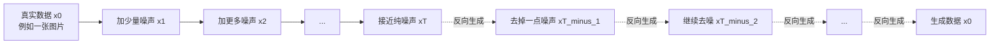
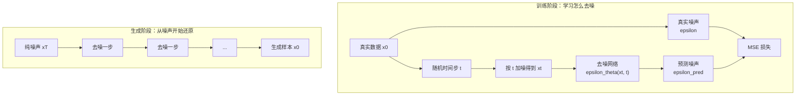
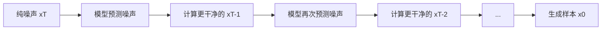
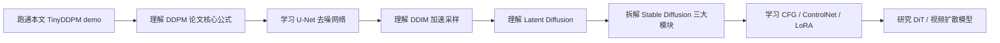

# 扩散模型（Diffusion Models）学习 —— 初学者版

**作者**：汪亮（bertonwang）  
**邮箱**：<47608843@qq.com>  
**版本**：v1.0 ｜ **最后更新**：2026-05-18

> 转载或引用请保留作者署名与本文链接，欢迎来信交流与勘误。

> 目标读者：对深度学习有基本了解（知道什么是神经网络、张量、损失函数和反向传播），但没系统学过扩散模型的同学。
>
> 本文风格：尽量用大白话讲清楚“为什么”，再讲“怎么做”，最后给出**最小可读代码**和**逐节点解析**，让你能自己动手跑通一个极简扩散模型闭环。

<style>
/* 一级标题：黑体 + 更大字号，方便阅读和导出 */
h1 {
  font-family: "SimHei", "Microsoft YaHei", "Heiti SC", sans-serif;
  font-size: 2.25em;
  font-weight: 700;
  line-height: 1.25;
  color: #000;
  margin-top: 0.8em;
  margin-bottom: 0.6em;
}

/* 优化代码段在预览和 PDF 导出中的显示效果 */
pre {
  font-size: 12px;
  line-height: 1.4;
  padding: 0.65em 0.85em;
  margin: 0.75em 0;
  border-radius: 6px;
  overflow-x: auto;
  page-break-inside: avoid;
  break-inside: avoid;
}

pre code {
  font-size: 12px;
  line-height: 1.4;
  white-space: pre;
}

:not(pre) > code {
  font-size: 0.95em;
  padding: 0.1em 0.25em;
}

@media print {
  pre,
  pre code {
    font-size: 10.5px;
    line-height: 1.32;
  }
}
</style>

**阅读路线**：

1. 先知道扩散模型是什么、为什么能生成图片。
2. 再理解两个核心过程：**前向加噪**和**反向去噪**。
3. 然后用一个最小 PyTorch demo 跑通“训练去噪网络 → 从噪声采样生成数据”。
4. 接着按数据流拆解每个节点：噪声日程、时间步、预测噪声、损失函数、采样循环。
5. 最后看 DDPM、DDIM、Latent Diffusion、Stable Diffusion、ControlNet 等演进方向。

> 如果你是第一次读，建议按顺序看；如果你已经知道 DDPM 的基本概念，可以把第 4～9 章当作核心速查区。

## 目录

- [扩散模型（Diffusion Models）学习 —— 初学者版](#扩散模型diffusion-models学习--初学者版)
  - [目录](#目录)
  - [如何阅读这份文档：先看 demo，再回到原理](#如何阅读这份文档先看-demo再回到原理)
  - [缩写词速查表：先知道这些名字是什么意思](#缩写词速查表先知道这些名字是什么意思)
  - [0. 一句话先说清楚扩散模型是什么](#0-一句话先说清楚扩散模型是什么)
  - [1. 为什么会有扩散模型？—— 历史背景](#1-为什么会有扩散模型-历史背景)
  - [2. 整体架构鸟瞰图](#2-整体架构鸟瞰图)
  - [3. 一个完整扩散模型的“零件清单”](#3-一个完整扩散模型的零件清单)
  - [4. 零件 1：前向加噪过程（Forward Diffusion）](#4-零件-1前向加噪过程forward-diffusion)
  - [5. 零件 2：噪声日程（Noise Schedule）](#5-零件-2噪声日程noise-schedule)
  - [6. 零件 3：时间步编码（Timestep Embedding）](#6-零件-3时间步编码timestep-embedding)
  - [7. 零件 4：去噪网络（Denoising Network）](#7-零件-4去噪网络denoising-network)
  - [8. 零件 5：训练目标（预测噪声）](#8-零件-5训练目标预测噪声)
  - [9. 零件 6：反向采样过程（Reverse Sampling）](#9-零件-6反向采样过程reverse-sampling)
  - [10. 把所有零件拼起来：一个最小 DDPM demo](#10-把所有零件拼起来一个最小-ddpm-demo)
  - [11. 按扩散模型流程拆解 demo](#11-按扩散模型流程拆解-demo)
    - [节点 1：准备真实数据 `x0`](#节点-1准备真实数据-x0)
    - [节点 2：创建噪声日程 `TinyDDPM`](#节点-2创建噪声日程-tinyddpm)
    - [节点 3：随机抽时间步 `t`](#节点-3随机抽时间步-t)
    - [节点 4：前向加噪 `q_sample`](#节点-4前向加噪-q_sample)
    - [节点 5：去噪网络预测噪声 `pred_noise`](#节点-5去噪网络预测噪声-pred_noise)
    - [节点 6：计算训练损失 `MSE`](#节点-6计算训练损失-mse)
    - [节点 7：反向传播更新模型](#节点-7反向传播更新模型)
    - [节点 8：从纯噪声开始采样](#节点-8从纯噪声开始采样)
    - [节点 9：反向循环逐步去噪](#节点-9反向循环逐步去噪)
    - [节点 10：保存或观察生成结果](#节点-10保存或观察生成结果)
  - [12. 训练扩散模型是个什么过程？](#12-训练扩散模型是个什么过程)
  - [13. 推理 / 生成阶段是什么样？](#13-推理--生成阶段是什么样)
  - [14. 扩散模型的主要流派和演进](#14-扩散模型的主要流派和演进)
    - [14.1 `DDPM`：最经典的去噪扩散模型](#141-ddpm最经典的去噪扩散模型)
    - [14.2 `DDIM`：减少采样步数](#142-ddim减少采样步数)
    - [14.3 `Latent Diffusion`：不在像素空间里扩散](#143-latent-diffusion不在像素空间里扩散)
    - [14.4 `Stable Diffusion`：文本条件 + Latent Diffusion](#144-stable-diffusion文本条件--latent-diffusion)
    - [14.5 `Classifier-Free Guidance`：让生成更听 prompt](#145-classifier-free-guidance让生成更听-prompt)
    - [14.6 `ControlNet`：给扩散模型加可控结构](#146-controlnet给扩散模型加可控结构)
    - [14.7 `Diffusion Transformer / DiT`：用 Transformer 替代 U-Net](#147-diffusion-transformer--dit用-transformer-替代-u-net)
  - [15. 常见问题答疑（FAQ）](#15-常见问题答疑faq)
  - [16. 学习路线建议](#16-学习路线建议)
  - [17. 一图总结](#17-一图总结)
  - [18. 写在最后](#18-写在最后)
  - [附录 A：代码常用 API 速查表](#附录-a代码常用-api-速查表)
    - [A.1 张量创建与随机数](#a1-张量创建与随机数)
    - [A.2 数学运算](#a2-数学运算)
    - [A.3 模型与训练](#a3-模型与训练)
  - [参考资料](#参考资料)

---

## 如何阅读这份文档：先看 demo，再回到原理

本文可以按下面这条主线阅读：

```text
先理解扩散模型要解决什么问题
→ 看整体架构和零件清单
→ 理解前向加噪、噪声日程、时间步、去噪网络、训练目标、反向采样
→ 在第 10 章跑通一个最小 DDPM demo
→ 第 11 章按节点拆解 demo 的输入、处理和输出
→ 最后理解 Stable Diffusion 等现代扩散模型如何演进
```

也就是说，第 4～9 章是“零件说明书”，第 10～11 章是“最小闭环 demo + 数据流拆解”。

| 学习阶段 | 重点问题 | 对应章节 |
|---|---|---|
| 先看整体 | 扩散模型是什么？为什么能从噪声生成数据？ | 第 0～3 章 |
| 拆零件 | 加噪、噪声日程、时间步编码、去噪网络、损失函数、采样分别做什么？ | 第 4～9 章 |
| 看 demo + 对节点 | 一个最小 DDPM 如何训练和生成？每个处理节点的输入、处理、输出是什么？ | 第 10～11 章 |
| 看完整闭环 | 训练和推理分别是什么流程？ | 第 12～13 章 |
| 看现代演进 | DDPM、DDIM、Latent Diffusion、Stable Diffusion、ControlNet 差别在哪里？ | 第 14 章 |

---

## 缩写词速查表：先知道这些名字是什么意思

扩散模型文章里会反复出现一些英文缩写。先不用急着记公式，先把这些名字和中文含义对上即可。

| 缩写 / 名称 | 英文全称 | 中文名称 | 一句话理解 |
|---|---|---|---|
| **DDPM** | Denoising Diffusion Probabilistic Models | 去噪扩散概率模型 | 最经典的一类扩散模型：先加噪，再训练模型一步步去噪。 |
| **DDIM** | Denoising Diffusion Implicit Models | 去噪扩散隐式模型 | 在 DDPM 基础上改进采样方式，让生成可以用更少步完成。 |
| **DPM-Solver** | Diffusion Probabilistic Model Solver | 扩散概率模型求解器 | 用数值求解器思路加速扩散模型采样。 |
| **LDM** | Latent Diffusion Model | 潜空间扩散模型 | 不直接在像素空间扩散，而是在更小的 latent 空间里扩散。 |
| **VAE** | Variational Autoencoder | 变分自编码器 | 把图片压缩到 latent，再从 latent 解码回图片。 |
| **GAN** | Generative Adversarial Network | 生成对抗网络 | 生成器和判别器互相对抗，推动生成结果更像真实数据。 |
| **U-Net** | U-shaped Network | U 形网络 | 常用去噪网络结构，既看整体语义，也保留局部细节。 |
| **DiT** | Diffusion Transformer | 扩散 Transformer | 用 Transformer 架构来做扩散模型中的去噪网络。 |
| **CFG** | Classifier-Free Guidance | 无分类器引导 | 让文生图结果更贴合 prompt 的常用引导方法。 |
| **CLIP** | Contrastive Language-Image Pre-training | 对比语言-图像预训练 | 把文本和图像对齐到同一个语义空间，常用于图文理解和条件生成。 |
| **MSE** | Mean Squared Error | 均方误差 | 训练时常用的损失函数，用来衡量预测噪声和真实噪声的差距。 |
| **ODE** | Ordinary Differential Equation | 常微分方程 | 用连续时间视角描述从噪声到数据的变化路径。 |
| **SDE** | Stochastic Differential Equation | 随机微分方程 | 在连续变化中加入随机噪声，用于理解 Score-based / Diffusion 模型。 |

> 💡 **小白记忆点**：`DDPM` 是经典基础版，`DDIM` 是加速采样版，`LDM` 是潜空间省算力版，`Stable Diffusion` 则是把文本条件、潜空间扩散和工程系统组合起来的代表模型。

---

## 0. 一句话先说清楚扩散模型是什么

> **扩散模型 = 先把真实数据一步步加噪成纯噪声，再训练一个神经网络学会一步步把噪声还原成数据的生成模型。**

它的直觉非常像“修复一张被逐渐弄脏的照片”：

```text
训练时：干净图片 → 加一点噪声 → 加更多噪声 → 变成纯噪声
模型学：看到带噪图片 + 当前噪声程度 → 预测里面的噪声
生成时：纯噪声 → 去掉一点噪声 → 再去掉一点 → 最后得到图片
```

现在你看到的很多文生图模型，例如 Stable Diffusion、DALL·E、Imagen、Midjourney 的核心思想，都和扩散模型密切相关。

---

## 1. 为什么会有扩散模型？—— 历史背景

在扩散模型流行之前，生成模型主要有几类：

| 方案 | 代表 | 优点 | 痛点 |
|---|---|---|---|
| **VAE** | Variational Autoencoder | 训练稳定，有明确概率解释 | 生成结果容易偏模糊 |
| **GAN** | DCGAN、StyleGAN | 图片锐利，视觉效果好 | 训练不稳定，容易模式崩塌 |
| **Autoregressive** | PixelCNN、Image Transformer | 概率建模清晰 | 逐像素生成，速度慢 |
| **Flow** | RealNVP、Glow | 可精确计算似然 | 网络结构限制多，工程复杂 |
| **Diffusion** | DDPM、Stable Diffusion | 训练稳定，质量高，条件控制强 | 早期采样慢，需要多步去噪 |

扩散模型的吸引力在于：

- **训练更稳定**：通常不像 GAN 那样需要 Generator 和 Discriminator 对抗训练。
- **生成质量高**：在图像生成上逐渐超过传统 GAN。
- **条件控制自然**：文本、边缘图、姿态、深度图都可以作为条件。
- **可解释性强**：生成过程就是“从噪声一步步去噪”。

> 💡 **小白记忆点**：GAN 像“画家骗鉴定师”，扩散模型像“修图师一步步擦掉噪声”。

---

## 2. 整体架构鸟瞰图

扩散模型有两个方向相反的过程。



把训练和生成分开看，会更清楚：



一句话概括：

```text
训练：让模型学会“这个带噪样本里有多少噪声”
生成：从纯噪声开始，反复调用模型，把噪声一点点擦掉
```

---

## 3. 一个完整扩散模型的“零件清单”

一个最小扩散模型通常包含 6 个核心零件：

| 零件 | 英文名 | 一句话作用 |
|---|---|---|
| **前向加噪过程** | Forward Diffusion | 把干净数据 `x0` 按时间步 `t` 加噪成 `xt` |
| **噪声日程** | Noise Schedule | 决定每一步加多少噪声 |
| **时间步编码** | Timestep Embedding | 告诉模型当前噪声程度是第几步 |
| **去噪网络** | Denoising Network | 输入 `xt` 和 `t`，预测噪声或干净数据 |
| **训练目标** | Training Objective | 通常让模型预测噪声，并用 MSE 训练 |
| **反向采样过程** | Reverse Sampling | 从纯噪声开始，一步步去噪生成样本 |

它们之间的关系是：

```text
x0 + noise schedule + random ε + timestep t
→ q_sample 得到 xt
→ denoising network 预测 ε_pred
→ MSE(ε_pred, ε) 训练
→ 采样时从 xT 开始反复去噪
```

---

## 4. 零件 1：前向加噪过程（Forward Diffusion）

前向加噪就是：**给真实数据逐步加入高斯噪声**。

如果 `x0` 是干净图片，`xt` 是第 `t` 步的带噪图片，那么可以理解为：

```text
x0：干净图片
x1：稍微有点噪声
x2：噪声更多
...
xT：几乎纯噪声
```

在 DDPM 中，前向过程通常写成：

<p align="center"><strong>q(x<sub>t</sub> | x<sub>t-1</sub>) = 𝒩(x<sub>t</sub>; √(1 − β<sub>t</sub>) · x<sub>t-1</sub>, β<sub>t</sub>I)</strong></p>

不用被公式吓到，它的意思很简单：

> 第 `t` 步的样本 = 上一步样本缩小一点 + 加一点高斯噪声。

这个公式可以拆成下面这张表来理解：

| 公式部分 | 含义 | 小白理解 |
|---|---|---|
| <code>q(x_t &#124; x_{t-1})</code> | 已知上一时刻的 `x_{t-1}` 时，第 `t` 步的 `x_t` 会服从什么分布。这里的 `q` 是人为规定好的**前向加噪过程**。 | 规定“上一张图如何变成下一张更脏的图”。 |
| `x_{t-1}` | 上一时刻的数据。 | 上一张已经带了一些噪声的图片。 |
| `x_t` | 当前第 `t` 步的数据。 | 比 `x_{t-1}` 更嘈杂一点的新图片。 |
| `𝒩(...)` | 高斯分布，也叫正态分布。它说明 `x_t` 不是固定值，而是围绕某个中心值随机采样出来的。 | 在某个中心附近随机抖一下。 |
| `√(1 − β_t) · x_{t-1}` | 高斯分布的中心位置，也就是均值。先把上一时刻的 `x_{t-1}` 稍微缩小一点，再作为当前采样的中心。 | 先保留大部分旧图内容。 |
| `√(1 − β_t)` 的根号范围 | 根号只覆盖 `1 − β_t`，不覆盖后面的 `x_{t-1}`。 | `√(1 − β_t)` 算完后，再乘以 `x_{t-1}`。 |
| `β_t` | 第 `t` 步要加入多少噪声。`β_t` 越大，这一步加入的随机扰动越强。 | 这一小步撒多少“雪花噪声”。 |
| `β_tI` | 高斯噪声的方差。这里的 `I` 是单位矩阵，表示每个像素、每个维度都独立加入强度为 `β_t` 的噪声。 | 每个像素都独立抖动一点。 |
| 等价采样形式 | `x_t = √(1 − β_t) · x_{t-1} + √(β_t) · ε`，其中 `ε` 是从标准高斯分布中随机采样出来的噪声。 | 新图 = 保留一点旧图 + 加一点随机噪声。 |

更重要的是，DDPM 有一个很方便的闭式公式，可以**直接从 `x0` 跳到任意时间步 `xt`**：

<p align="center"><strong>x<sub>t</sub> = √(<span style="text-decoration: overline;">α</span><sub>t</sub>) · x<sub>0</sub> + √(1 − <span style="text-decoration: overline;">α</span><sub>t</sub>) · ε</strong></p>

这条公式可以理解成：**不用真的一步一步从 `x0 → x1 → x2 → ... → xt` 加噪，而是可以直接算出第 `t` 步的带噪结果**。

更直白地说：

```text
第 t 步的带噪数据 = 还保留下来的原图部分 + 新加入的随机噪声部分
```

> 注意：这里写的 <span style="text-decoration: overline;">α</span><sub>t</sub>，在代码中通常叫 `alpha_bar_t`。它表示“累计保留比例”，不是单步的 `α_t`。

这条闭式公式可以用下面这张表来理解：

| 公式部分 | 含义 | 小白理解 |
|---|---|---|
| <code>x<sub>t</sub></code> | 第 `t` 步得到的带噪数据。`t` 越大，通常噪声越多，原始信息越少。 | 第 `t` 步时，被弄脏后的图片。 |
| <code>x<sub>0</sub></code> | 最开始的干净数据，也就是还没有加噪之前的原图或原始样本。 | 原图。 |
| `ε` | 一次性采样出来的标准高斯噪声。 | 随机雪花点。 |
| <span style="text-decoration: overline;">α</span><sub>t</sub> / `alpha_bar_t` | 从第 1 步到第 `t` 步，原始信息累计保留下来的比例。它等于很多个 `α` 连乘后的结果。 | 到第 `t` 步为止，还剩多少原图痕迹。 |
| `α_t = 1 − β_t` | 单步保留比例，只表示第 `t` 这一步保留多少信息。 | 当前这一步保留多少。 |
| <span style="text-decoration: overline;">α</span><sub>t</sub> 和 `α_t` 的区别 | `α_t` 是“一步”的保留比例；<span style="text-decoration: overline;">α</span><sub>t</sub> 是“从第 1 步到第 t 步累计下来”的保留比例。 | 一个看单步，一个看累计。 |
| <code>√(<span style="text-decoration: overline;">α</span><sub>t</sub>)</code> | 原图部分的缩放系数。 | 决定原图还留下多少。 |
| <code>√(<span style="text-decoration: overline;">α</span><sub>t</sub>) · x<sub>0</sub></code> | 原图中被保留下来的部分。 | 把原图按比例变淡。 |
| <code>√(1 − <span style="text-decoration: overline;">α</span><sub>t</sub>)</code> | 噪声部分的缩放系数。 | 决定噪声要加多少。 |
| <code>√(1 − <span style="text-decoration: overline;">α</span><sub>t</sub>) · ε</code> | 新加入的噪声部分。 | 往图上撒对应强度的雪花点。 |
| 两个 `√` 的根号范围 | 第一个根号只覆盖 <span style="text-decoration: overline;">α</span><sub>t</sub>；第二个根号只覆盖 `1 −` <span style="text-decoration: overline;">α</span><sub>t</sub>。后面的 <code>x<sub>0</sub></code> 和 `ε` 都在根号外面。 | 先算缩放比例，再分别乘原图和噪声。 |
| `+` | 把保留下来的原图部分和新加入的噪声部分相加。 | 原图痕迹 + 雪花噪声 = 带噪图片。 |
| 为什么可以直接跳到 `xt` | 单步公式描述的是 `x_{t-1} → x_t`；闭式公式把前面所有加噪步骤合并了，所以可以直接从 `x0` 算出任意时间步的 `xt`。 | 不用一帧一帧弄脏，可以直接算出第 `t` 帧有多脏。 |
| 训练中怎么用 | 训练时随机抽一个时间步 `t`，再用这条公式直接构造 `x_t`，然后让模型预测其中的噪声 `ε`。 | 快速制造训练样本。 |


---

## 5. 零件 2：噪声日程（Noise Schedule）

噪声日程决定：**每个时间步加多少噪声**。

最简单的是线性日程：

```python
betas = torch.linspace(beta_start, beta_end, timesteps)
```

例如：

```text
第 1 步：加一点点噪声
第 100 步：加中等噪声
第 1000 步：几乎变成纯噪声
```

常见噪声日程：

| 日程 | 思路 | 特点 |
|---|---|---|
| **Linear Schedule** | `β` 从小到大线性增加 | 简单直观，适合教学 |
| **Cosine Schedule** | 按余弦曲线控制噪声 | 训练更稳定，效果常更好 |
| **Learned Schedule** | 让模型或算法学习日程 | 更灵活，但复杂 |

在最小 demo 中，我们使用线性日程，因为它最容易理解。

> 💡 **小白记忆点**：噪声日程就像“调脏旋钮”，决定每一步把图片弄脏多少。

---

## 6. 零件 3：时间步编码（Timestep Embedding）

为什么模型需要知道 `t`？

因为同一张图片在不同时间步的噪声程度不同：

```text
t = 10：只是有点糊，稍微修一下
t = 900：几乎全是雪花，需要大力还原
```

如果不告诉模型当前是第几步，它就不知道该“轻轻擦”还是“重度修复”。

最简单的做法是把 `t` 归一化成 `[0, 1]`，直接拼到输入里：

```python
t_norm = t.float().unsqueeze(1) / timesteps
model_input = torch.cat([x_t, t_norm], dim=1)
```

更真实的图像扩散模型通常会用类似 Transformer 位置编码的正弦时间步编码：

```text
t → sinusoidal embedding → MLP → 注入 U-Net 每一层
```

在本文的最小 demo 中，为了让代码短且容易跑，我们使用最简单的 `t / T`。

---

## 7. 零件 4：去噪网络（Denoising Network）

去噪网络的任务是：

```text
输入：带噪数据 xt + 时间步 t
输出：预测噪声 ε_pred
```

在真实图像模型中，去噪网络通常是 `U-Net`：

```text
带噪图片 xt + 时间步 t + 条件 c
→ U-Net
→ 预测噪声 ε_pred
```

为什么常用 `U-Net`？

- 它有下采样和上采样结构，能同时看局部纹理和全局结构。
- 它有跳跃连接，能保留细节。
- 它很适合图像到图像的任务。

但本文为了讲清楚原理，不直接上图像 U-Net，而是用一个二维点数据 demo：

```text
二维点 x = (x, y)
→ 加噪得到 xt
→ 小 MLP 预测噪声
→ 从纯噪声生成二维点分布
```

这样可以把重点放在扩散流程本身，而不是卷积网络细节。

---

## 8. 零件 5：训练目标（预测噪声）

DDPM 最常见的训练目标是：**让模型预测加入的噪声 `ε`**。

训练时我们知道真实噪声，因为噪声是代码自己采样出来的：

```python
noise = torch.randn_like(x0)
x_t = sqrt_alpha_bar_t * x0 + sqrt_one_minus_alpha_bar_t * noise
pred_noise = model(x_t, t)
loss = mse(pred_noise, noise)
```

这件事很妙：

- 模型不用直接生成图片。
- 模型只要学会“这个带噪数据里哪部分是噪声”。
- 推理时反过来用预测噪声把 `xt` 往更干净的方向推。

> 💡 **小白记忆点**：训练扩散模型，不是直接教它“画图”，而是教它“擦噪声”。擦得多了，它自然能从纯噪声擦出图。

---

## 9. 零件 6：反向采样过程（Reverse Sampling）

反向采样就是生成过程。

流程是：

```text
从 xT ~ N(0, I) 开始
for t = T-1 到 0:
    用模型预测当前 xt 里的噪声
    根据公式去掉一部分噪声
    得到 x_{t-1}
最后得到 x0
```

DDPM 的采样公式略复杂，但核心直觉是：

```text
当前带噪样本 xt
- 模型预测的噪声 ε_pred
→ 更干净一点的 x_{t-1}
```

采样为什么慢？

因为传统 DDPM 往往要走很多步，比如 `1000` 步。后来 DDIM、DPM-Solver、Consistency Models 等方法，就是为了减少采样步数。

---

## 10. 把所有零件拼起来：一个最小 DDPM demo

下面是一个**二维玩具数据**上的最小 DDPM demo。

它不生成图片，而是学习一个二维点分布。这样代码短、运行快、最适合理解扩散模型闭环。

> 运行前需要安装 `PyTorch`。如果想画图，可以额外安装 `matplotlib`；本文代码会在有 `matplotlib` 时保存采样图，没有也不影响训练和打印结果。

```python
import math
import torch
import torch.nn as nn
import torch.nn.functional as F

try:
    import matplotlib.pyplot as plt
except ImportError:
    plt = None


class TinyDenoiser(nn.Module):
    """一个极简去噪网络：输入二维点 xt 和时间步 t，输出预测噪声。"""

    def __init__(self, hidden_dim=128):
        super().__init__()
        self.net = nn.Sequential(
            nn.Linear(3, hidden_dim),
            nn.SiLU(),
            nn.Linear(hidden_dim, hidden_dim),
            nn.SiLU(),
            nn.Linear(hidden_dim, 2),
        )

    def forward(self, x_t, t, timesteps):
        t_norm = t.float().unsqueeze(1) / timesteps
        model_input = torch.cat([x_t, t_norm], dim=1)
        return self.net(model_input)


class TinyDDPM:
    """一个教学版 DDPM：负责加噪、训练损失和反向采样。"""

    def __init__(self, timesteps=100, beta_start=1e-4, beta_end=0.02, device="cpu"):
        self.timesteps = timesteps
        self.device = device

        self.betas = torch.linspace(beta_start, beta_end, timesteps, device=device)
        self.alphas = 1.0 - self.betas
        self.alpha_bars = torch.cumprod(self.alphas, dim=0)

    def q_sample(self, x0, t, noise=None):
        """从干净数据 x0 直接加噪到第 t 步，得到 xt。"""
        if noise is None:
            noise = torch.randn_like(x0)

        alpha_bar_t = self.alpha_bars[t].unsqueeze(1)
        x_t = torch.sqrt(alpha_bar_t) * x0 + torch.sqrt(1.0 - alpha_bar_t) * noise
        return x_t, noise

    def training_loss(self, model, x0):
        """随机抽时间步，加噪，让模型预测噪声，并计算 MSE。"""
        batch_size = x0.size(0)
        t = torch.randint(0, self.timesteps, (batch_size,), device=x0.device)
        x_t, noise = self.q_sample(x0, t)
        pred_noise = model(x_t, t, self.timesteps)
        return F.mse_loss(pred_noise, noise)

    @torch.no_grad()
    def sample(self, model, num_samples=512):
        """从纯噪声开始，一步步去噪生成二维点。"""
        model.eval()
        x = torch.randn(num_samples, 2, device=self.device)

        for step in reversed(range(self.timesteps)):
            t = torch.full((num_samples,), step, device=self.device, dtype=torch.long)
            pred_noise = model(x, t, self.timesteps)

            beta_t = self.betas[step]
            alpha_t = self.alphas[step]
            alpha_bar_t = self.alpha_bars[step]

            mean = (1.0 / torch.sqrt(alpha_t)) * (
                x - (beta_t / torch.sqrt(1.0 - alpha_bar_t)) * pred_noise
            )

            if step > 0:
                noise = torch.randn_like(x)
                x = mean + torch.sqrt(beta_t) * noise
            else:
                x = mean

        return x.cpu()


def make_toy_data(batch_size, device="cpu"):
    """生成一个二维玩具数据：两个高斯团。"""
    half = batch_size // 2
    cluster_a = torch.randn(half, 2, device=device) * 0.25 + torch.tensor([-1.2, 0.0], device=device)
    cluster_b = torch.randn(batch_size - half, 2, device=device) * 0.25 + torch.tensor([1.2, 0.0], device=device)
    return torch.cat([cluster_a, cluster_b], dim=0)


def save_plot(real_points, generated_points, path="tiny_ddpm_samples.png"):
    """如果安装了 matplotlib，就把真实点和生成点画出来。"""
    if plt is None:
        print("未安装 matplotlib，跳过画图。")
        return

    real_points = real_points.cpu()
    generated_points = generated_points.cpu()

    plt.figure(figsize=(8, 4))

    plt.subplot(1, 2, 1)
    plt.scatter(real_points[:, 0], real_points[:, 1], s=8, alpha=0.6)
    plt.title("Real data")
    plt.xlim(-2.5, 2.5)
    plt.ylim(-2.0, 2.0)

    plt.subplot(1, 2, 2)
    plt.scatter(generated_points[:, 0], generated_points[:, 1], s=8, alpha=0.6)
    plt.title("Generated data")
    plt.xlim(-2.5, 2.5)
    plt.ylim(-2.0, 2.0)

    plt.tight_layout()
    plt.savefig(path, dpi=160)
    print(f"采样图已保存到：{path}")


if __name__ == "__main__":
    torch.manual_seed(42)

    device = "cuda" if torch.cuda.is_available() else "cpu"
    model = TinyDenoiser().to(device)
    ddpm = TinyDDPM(timesteps=100, device=device)
    optimizer = torch.optim.Adam(model.parameters(), lr=1e-3)

    for step in range(2000):
        x0 = make_toy_data(batch_size=256, device=device)
        loss = ddpm.training_loss(model, x0)

        optimizer.zero_grad()
        loss.backward()
        optimizer.step()

        if step % 200 == 0:
            print(f"step={step:04d}, loss={loss.item():.4f}")

    real_points = make_toy_data(batch_size=512, device=device)
    generated_points = ddpm.sample(model, num_samples=512)

    print("真实数据均值：", real_points.mean(dim=0).cpu())
    print("生成数据均值：", generated_points.mean(dim=0))
    print("生成完成。")

    save_plot(real_points, generated_points)
```

---

## 11. 按扩散模型流程拆解 demo

这一节把 demo 拆成多个处理节点。每个节点都说明：

- **输入是什么**。
- **处理做了什么**。
- **输出是什么**。
- **对应 demo 中哪段代码**。
- **涉及的重要函数如何理解**。

### 节点 1：准备真实数据 `x0`

对应代码：

```python
x0 = make_toy_data(batch_size=256, device=device)
```

对应函数：

```python
def make_toy_data(batch_size, device="cpu"):
    half = batch_size // 2
    cluster_a = torch.randn(half, 2, device=device) * 0.25 + torch.tensor([-1.2, 0.0], device=device)
    cluster_b = torch.randn(batch_size - half, 2, device=device) * 0.25 + torch.tensor([1.2, 0.0], device=device)
    return torch.cat([cluster_a, cluster_b], dim=0)
```

| 项目 | 内容 |
|---|---|
| 输入 | `batch_size`，比如 `256`。 |
| 处理 | 生成两个二维高斯团，一个在左边，一个在右边。 |
| 输出 | `x0`，形状是 `(batch_size, 2)`。 |

这里的 `x0` 就是“干净数据”。

真实图像扩散模型中，`x0` 通常是一批图片，形状可能是：

```text
(B, C, H, W)
```

本文 demo 为了简单，把图片换成二维点：

```text
(B, 2)
```

---

### 节点 2：创建噪声日程 `TinyDDPM`

对应代码：

```python
ddpm = TinyDDPM(timesteps=100, device=device)
```

对应函数：

```python
self.betas = torch.linspace(beta_start, beta_end, timesteps, device=device)
self.alphas = 1.0 - self.betas
self.alpha_bars = torch.cumprod(self.alphas, dim=0)
```

| 项目 | 内容 |
|---|---|
| 输入 | `timesteps`、`beta_start`、`beta_end`。 |
| 处理 | 创建每一步的 `β_t`、`α_t` 和累计乘积 <span style="text-decoration: overline;">α</span><sub>t</sub>（代码中为 `alpha_bars`）。 |
| 输出 | 可用于加噪和采样的 DDPM 调度参数。 |

三个关键变量：

| 变量 | 含义 | 小白理解 |
|---|---|---|
| `betas` | 每一步加多少噪声 | 每次往图上撒多少雪花 |
| `alphas` | 每一步保留多少原信息 | 每次还保留多少原图 |
| `alpha_bars` | 到第 `t` 步累计保留多少原信息 | 到现在为止还剩多少原图痕迹 |

---

### 节点 3：随机抽时间步 `t`

对应代码：

```python
t = torch.randint(0, self.timesteps, (batch_size,), device=x0.device)
```

| 项目 | 内容 |
|---|---|
| 输入 | `batch_size` 和总步数 `timesteps`。 |
| 处理 | 给 batch 中每个样本随机抽一个时间步。 |
| 输出 | `t`，形状是 `(batch_size,)`。 |

为什么训练时要随机抽 `t`？

因为模型需要学会处理各种噪声程度：

```text
有的样本只加了一点噪声
有的样本已经接近纯噪声
模型都要会预测其中的噪声
```

---

### 节点 4：前向加噪 `q_sample`

对应代码：

```python
x_t, noise = self.q_sample(x0, t)
```

对应函数：

```python
alpha_bar_t = self.alpha_bars[t].unsqueeze(1)
x_t = torch.sqrt(alpha_bar_t) * x0 + torch.sqrt(1.0 - alpha_bar_t) * noise
```

| 项目 | 内容 |
|---|---|
| 输入 | 干净数据 `x0`、时间步 `t`、随机噪声 `noise`。 |
| 处理 | 按公式把 `x0` 加噪成 `x_t`。 |
| 输出 | 带噪数据 `x_t` 和真实噪声 `noise`。 |

这个节点就是训练扩散模型的关键数据构造：

```text
干净数据 x0 + 时间步 t + 随机噪声 ε
→ 带噪数据 xt
```

---

### 节点 5：去噪网络预测噪声 `pred_noise`

对应代码：

```python
pred_noise = model(x_t, t, self.timesteps)
```

对应函数：

```python
t_norm = t.float().unsqueeze(1) / timesteps
model_input = torch.cat([x_t, t_norm], dim=1)
return self.net(model_input)
```

| 项目 | 内容 |
|---|---|
| 输入 | 带噪数据 `x_t` 和时间步 `t`。 |
| 处理 | 把 `t` 归一化后拼到 `x_t` 上，送入 MLP。 |
| 输出 | 模型预测的噪声 `pred_noise`。 |

在本文 demo 中：

```text
x_t 的形状：     (B, 2)
t_norm 的形状：  (B, 1)
拼接后形状：     (B, 3)
输出形状：       (B, 2)
```

> 💡 **关键点**：模型输出的不是最终样本，而是“我认为这个 `x_t` 里面的噪声是多少”。

---

### 节点 6：计算训练损失 `MSE`

对应代码：

```python
return F.mse_loss(pred_noise, noise)
```

| 项目 | 内容 |
|---|---|
| 输入 | `pred_noise` 和真实噪声 `noise`。 |
| 处理 | 计算两者的均方误差。 |
| 输出 | `loss`。 |

训练目标可以理解为：

```text
模型预测的噪声 越接近 真实加入的噪声，loss 越小
```

这就是 DDPM 最常见的训练方式。

---

### 节点 7：反向传播更新模型

对应代码：

```python
optimizer.zero_grad()
loss.backward()
optimizer.step()
```

| 项目 | 内容 |
|---|---|
| 输入 | `loss`。 |
| 处理 | 清空旧梯度，反向传播，更新模型参数。 |
| 输出 | 更会预测噪声的 `model`。 |

这和普通神经网络训练没有本质区别。

区别在于扩散模型的训练样本不是直接给 `(输入, 标签)`，而是每次动态构造：

```text
x0 → 随机 t → 随机 noise → xt → 预测 noise
```

---

### 节点 8：从纯噪声开始采样

对应代码：

```python
x = torch.randn(num_samples, 2, device=self.device)
```

| 项目 | 内容 |
|---|---|
| 输入 | `num_samples`。 |
| 处理 | 随机采样标准高斯噪声。 |
| 输出 | 初始 `xT`。 |

生成阶段没有真实 `x0`。

所以只能从一堆随机噪声开始：

```text
纯噪声 xT → 去噪 → 更像数据 → 再去噪 → 最终样本
```

---

### 节点 9：反向循环逐步去噪

对应代码：

```python
for step in reversed(range(self.timesteps)):
    t = torch.full((num_samples,), step, device=self.device, dtype=torch.long)
    pred_noise = model(x, t, self.timesteps)
    ...
```

| 项目 | 内容 |
|---|---|
| 输入 | 当前带噪样本 `x`。 |
| 处理 | 从 `T-1` 到 `0`，每一步调用模型预测噪声并更新 `x`。 |
| 输出 | 逐渐变干净的样本。 |

这就是扩散模型生成慢的原因：

> 它不是一步生成，而是一步一步把噪声擦掉。

---

### 节点 10：保存或观察生成结果

对应代码：

```python
save_plot(real_points, generated_points)
```

| 项目 | 内容 |
|---|---|
| 输入 | 真实点 `real_points` 和生成点 `generated_points`。 |
| 处理 | 用散点图对比真实分布和生成分布。 |
| 输出 | `tiny_ddpm_samples.png`。 |

如果训练成功，你会看到生成点逐渐接近两个高斯团的形状。

---

## 12. 训练扩散模型是个什么过程？

训练扩散模型可以概括成 6 步：

```text
1. 取一批真实数据 x0
2. 随机抽时间步 t
3. 随机采样噪声 ε
4. 根据 x0、t、ε 构造带噪数据 xt
5. 模型输入 xt 和 t，预测噪声 ε_pred
6. 用 MSE(ε_pred, ε) 更新模型
```

用表格表示：

| 步骤 | 输入 | 处理 | 输出 |
|---|---|---|---|
| 取真实数据 | 数据集 | 采样一个 batch | `x0` |
| 抽时间步 | `timesteps` | 随机抽 `t` | `t` |
| 采样噪声 | `x0.shape` | `torch.randn_like(x0)` | `ε` |
| 前向加噪 | `x0`、`t`、`ε` | DDPM 加噪公式 | `xt` |
| 模型预测 | `xt`、`t` | 去噪网络 | `ε_pred` |
| 计算损失 | `ε_pred`、`ε` | MSE | `loss` |

> 💡 **小白记忆点**：训练时模型看到的是“被弄脏的数据”，标签是“当初怎么弄脏它的噪声”。

---

## 13. 推理 / 生成阶段是什么样？

生成阶段和训练阶段最大的不同是：**没有真实数据 `x0`，只有纯噪声**。

```text
训练：x0 → 加噪得到 xt → 学会预测噪声
生成：xT → 预测噪声 → 去噪得到 xT-1 → ... → x0
```

生成流程：



真实文生图模型还会加入条件信息：

```text
文本 prompt → 文本编码器 → 条件向量 c
噪声 latent + 时间步 t + 条件 c → U-Net → 预测噪声
```

例如：

```text
prompt = "a cute cat wearing sunglasses"
→ text encoder 得到文本条件
→ U-Net 在去噪时参考文本条件
→ 最后生成符合 prompt 的图片
```

---

## 14. 扩散模型的主要流派和演进

扩散模型的发展可以按下面几条主线理解。

### 14.1 `DDPM`：最经典的去噪扩散模型

DDPM 是很多现代扩散模型的基础。

| 项目 | 内容 |
|---|---|
| 英文全称 | Denoising Diffusion Probabilistic Models |
| 中文名称 | 去噪扩散概率模型 |
| 代表论文 | Denoising Diffusion Probabilistic Models |
| 核心思想 | 训练模型预测噪声，采样时逐步去噪 |
| 优点 | 训练稳定，原理清晰 |
| 缺点 | 采样步数多，速度慢 |

一句话：

> `DDPM` 解决了“如何稳定训练一个高质量生成模型”的问题。

### 14.2 `DDIM`：减少采样步数

DDIM 的目标是让采样更快。

| 项目 | 内容 |
|---|---|
| 英文全称 | Denoising Diffusion Implicit Models |
| 中文名称 | 去噪扩散隐式模型 |
| 核心思想 | 在 DDPM 的基础上改进采样路径，让生成过程可以更少步、更偏确定性 |
| 主要作用 | 减少扩散模型采样步数，提高生成速度 |

| 对比项 | DDPM | DDIM |
|---|---|---|
| 采样过程 | 随机 | 可以更确定性 |
| 步数 | 常见 1000 步 | 可以几十步 |
| 目的 | 稳定生成 | 加速生成 |

一句话：

> `DDIM` 主要解决“扩散模型生成太慢”的问题。

### 14.3 `Latent Diffusion`：不在像素空间里扩散

Latent Diffusion 的英文全称是 **Latent Diffusion Model**，常缩写为 `LDM`，中文可以叫**潜空间扩散模型**。

Stable Diffusion 的关键思想之一是 Latent Diffusion。

普通图像扩散：

```text
像素图片 x → 在像素空间加噪和去噪
```

Latent Diffusion：

```text
图片 x → VAE Encoder 压缩成 latent z
→ 在 latent 空间扩散
→ VAE Decoder 解码回图片
```

为什么这么做？

- 像素空间太大，直接扩散很贵。
- latent 空间更小，训练和采样更省显存。
- 生成质量和效率可以取得更好平衡。

### 14.4 `Stable Diffusion`：文本条件 + Latent Diffusion

Stable Diffusion 可以粗略拆成三大模块：

| 模块 | 作用 | 类比 |
|---|---|---|
| **Text Encoder** | 把文本 prompt 编成条件向量 | 理解需求 |
| **U-Net** | 在 latent 空间逐步去噪 | 主要画师 / 修图师 |
| **VAE** | 图片和 latent 之间互相转换 | 压缩和解压工具 |

数据流是：

```text
prompt → Text Encoder → text embeddings
random latent noise + text embeddings → U-Net denoising loop → clean latent
clean latent → VAE Decoder → image
```

### 14.5 `Classifier-Free Guidance`：让生成更听 prompt

Classifier-Free Guidance 常缩写为 `CFG`，中文可以叫**无分类器引导**。文生图中常见的 `CFG Scale` 就来自 Classifier-Free Guidance。

直觉是：

```text
无条件预测：模型自由发挥
有条件预测：模型参考 prompt
把有条件方向放大：更贴合 prompt
```

`CFG Scale` 越大，通常越贴合提示词，但也可能更僵硬、更容易出 artifacts。

### 14.6 `ControlNet`：给扩散模型加可控结构

ControlNet 解决的问题是：只靠文本 prompt 不够精确。

例如你想控制：

- 人物姿态。
- 边缘轮廓。
- 深度图。
- 草图。
- 分割图。

ControlNet 的思路是：

> 在不破坏原模型能力的前提下，额外接入一条控制条件分支，让生成结果服从结构约束。

### 14.7 `Diffusion Transformer / DiT`：用 Transformer 替代 U-Net

`DiT` 的英文全称是 **Diffusion Transformer**，中文可以叫**扩散 Transformer**。

传统扩散模型常用 U-Net。DiT 的思路是：

```text
把图像 latent 切成 patch token
→ 用 Transformer 处理这些 token
→ 输出预测噪声
```

它把扩散模型和 Transformer 更紧密地结合起来，也成为很多新一代图像 / 视频生成模型的重要方向。

---

## 15. 常见问题答疑（FAQ）

**Q1：扩散模型为什么要先加噪再去噪？**  
A：因为“从数据直接学会生成数据”很难，但“学会去掉一点噪声”相对简单。把复杂生成问题拆成很多个小去噪问题，训练会更稳定。

**Q2：模型训练时预测的是图片吗？**  
A：经典 DDPM 通常预测的是噪声 `ε`，不是直接预测图片。当然也有预测 `x0`、预测 `v` 的变体。

**Q3：为什么生成要从纯噪声开始？**  
A：因为高分辨率图片像素空间太大，直接扩散很贵。Stable Diffusion 先用 VAE 把图片压缩到 latent 空间，再扩散，效率高很多。

**Q4：扩散模型和 GAN 最大区别是什么？**  
A：GAN 是对抗训练，生成器要骗过判别器；扩散模型通常是监督式地预测噪声，训练更稳定，但采样通常更慢。

**Q5：Stable Diffusion 为什么不直接在图片上扩散？**  
A：因为高分辨率图片像素空间太大，直接扩散很贵。Stable Diffusion 先用 VAE 把图片压缩到 latent 空间，再扩散，效率高很多。

**Q6：`CFG Scale` 是不是越大越好？**  
A：不是。太小可能不听 prompt，太大可能画面僵硬、过饱和或出现伪影。实际常在一个中间范围调节。

**Q7：扩散模型只能生成图片吗？**  
A：不是。扩散思想可以用于图像、音频、视频、3D、分子生成、时间序列等，只要能定义数据和噪声过程。

---

## 16. 学习路线建议



**建议练手项目**：

1. **二维 toy DDPM**：先跑通本文 demo，理解加噪和去噪闭环。
2. **MNIST DDPM**：把二维点换成手写数字图片，使用小 U-Net。
3. **Hugging Face Diffusers**：调包使用 Stable Diffusion，再逐步看 pipeline 源码。
4. **ControlNet / LoRA 微调**：理解条件控制和参数高效微调。

---

## 17. 一图总结

```text
真实数据 x0
    │
    │  前向加噪 q(x_t | x_0)
    ▼
带噪数据 xt  +  时间步 t
    │
    ▼
去噪网络 εθ(xt, t)
    │
    ▼
预测噪声 ε_pred
    │
    ▼
MSE(ε_pred, ε) 训练模型

生成时：
纯噪声 xT
    │
    ▼
反复预测噪声并去噪
    │
    ▼
生成样本 x0
```

如果只记住一句话：

> **扩散模型的核心不是“一步画出图”，而是“学会擦噪声，然后从纯噪声一步步擦出图”。**

---

## 18. 写在最后

- 扩散模型不难，难的是公式和符号容易让人迷路。抓住“**加噪训练，去噪生成**”这条主线，很多概念都会变清楚。
- 第一次学习时，不建议一上来就啃 Stable Diffusion 全源码。先跑通二维 toy demo，再上 MNIST，再看 `diffusers`。
- 现代文生图模型看起来复杂，但底层仍然离不开几个核心问题：噪声怎么加、模型怎么预测噪声、条件怎么注入、采样怎么加速、控制怎么增强。

> 学懂这一篇，你已经具备阅读 DDPM、DDIM、Stable Diffusion 和 ControlNet 的基础。下一步，建议动手把本文 demo 改成 MNIST 版本。🚀

---

## 附录 A：代码常用 API 速查表

本文代码以 `PyTorch` 为主。下面把代码段里反复出现、对理解扩散模型很关键的 API 集中整理。

### A.1 张量创建与随机数

| API | 定义 / 作用 | 在本文中的典型用途 | 小白理解 |
|---|---|---|---|
| `torch.randn(shape)` | 生成标准正态分布随机张量 | 从纯噪声开始采样 | 随机生成一堆雪花点 |
| `torch.randn_like(x)` | 生成和 `x` 同形状的标准正态噪声 | 给 `x0` 加噪 | 按原图尺寸撒噪声 |
| `torch.randint(low, high, shape)` | 生成随机整数 | 随机抽时间步 `t` | 随机选择加噪程度 |
| `torch.linspace(start, end, steps)` | 生成等间隔数列 | 创建线性 `betas` | 从小到大调噪声旋钮 |
| `torch.full(shape, value)` | 创建指定值填充的张量 | 采样时构造当前时间步 `t` | 给整个 batch 贴同一个时间标签 |

### A.2 数学运算

| API | 定义 / 作用 | 在本文中的典型用途 | 小白理解 |
|---|---|---|---|
| `torch.sqrt(x)` | 对张量逐元素开平方 | DDPM 加噪和去噪公式 | 算缩放比例 |
| `torch.cumprod(x, dim)` | 沿某个维度做累乘 | 计算 `alpha_bars` | 算累计保留了多少原图 |
| `F.mse_loss(a, b)` | 均方误差损失 | 比较预测噪声和真实噪声 | 看模型擦噪声擦得准不准 |
| `.unsqueeze(dim)` | 增加一个维度 | 把 `(B,)` 的 `t` 变成 `(B,1)` | 给时间步套一层壳方便拼接 |
| `torch.cat(tensors, dim)` | 沿指定维度拼接 | 把 `x_t` 和 `t_norm` 拼起来 | 把数据和时间标签接在一起 |

### A.3 模型与训练

| API | 定义 / 作用 | 在本文中的典型用途 | 小白理解 |
|---|---|---|---|
| `nn.Module` | PyTorch 模型基类 | 定义 `TinyDenoiser` | 搭积木前的标准底座 |
| `nn.Sequential(...)` | 顺序堆叠网络层 | 构建 MLP 去噪网络 | 流水线式加工 |
| `nn.Linear(in, out)` | 全连接层 | 处理二维点和时间步 | 一个可学习的变换器 |
| `nn.SiLU()` | 激活函数 | 给 MLP 引入非线性 | 让模型不只是直线变换 |
| `torch.optim.Adam(...)` | Adam 优化器 | 更新去噪网络参数 | 自动调参的训练工具 |
| `loss.backward()` | 反向传播 | 计算梯度 | 告诉每个参数该往哪改 |
| `optimizer.step()` | 更新参数 | 让模型更会预测噪声 | 真正改模型权重 |
| `@torch.no_grad()` | 关闭梯度记录 | 采样时不训练 | 只生成，不学习 |
| `model.eval()` | 切换到推理模式 | 采样前调用 | 告诉模型现在是考试，不是训练 |

---

## 参考资料

- [Denoising Diffusion Probabilistic Models](https://arxiv.org/abs/2006.11239)
- [Denoising Diffusion Implicit Models](https://arxiv.org/abs/2010.02502)
- [High-Resolution Image Synthesis with Latent Diffusion Models](https://arxiv.org/abs/2112.10752)
- [Classifier-Free Diffusion Guidance](https://arxiv.org/abs/2207.12598)
- [ControlNet: Adding Conditional Control to Text-to-Image Diffusion Models](https://arxiv.org/abs/2302.05543)
- [Scalable Diffusion Models with Transformers](https://arxiv.org/abs/2212.09748)
- [Hugging Face Diffusers](https://github.com/huggingface/diffusers)
