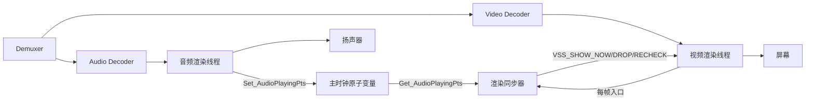
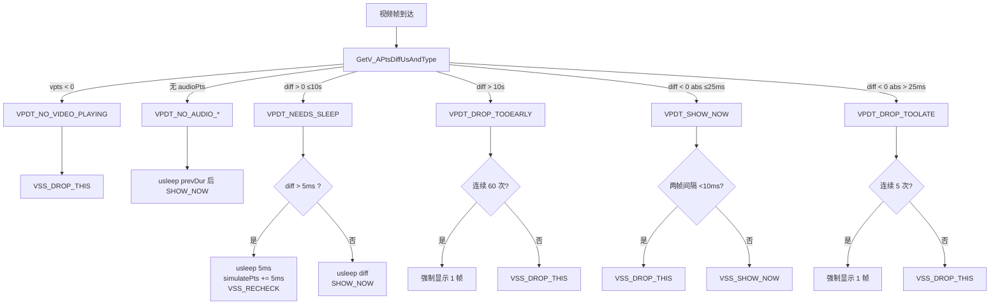

## 播放器音画同步设计与实现

**作者**：汪亮（bertonwang）
**邮箱**：<47608843@qq.com>
**版本**：v1.2 ｜ **最后更新**：2026-05-14

> 转载或引用请保留作者署名与本文链接，欢迎来信交流与勘误。

> 范围：播放器在解码后渲染前的音画同步逻辑——以「音频壁钟」为主时钟，对视频帧做 **show / drop_too_late / drop_too_early / sleep / recheck** 五态裁决，并对低帧率与高帧率源做平滑处理。本文档独立成篇，所有设计与算法均以伪代码 / 等价 C++ 片段呈现，不依赖任何特定项目的源码。

---

## 目录

- [播放器音画同步设计与实现](#播放器音画同步设计与实现)
- [目录](#目录)
  - [一、为什么需要播放器音画同步](#一为什么需要播放器音画同步)
  - [二、工业界 / 学术界主流做法](#二工业界--学术界主流做法)
    - [2.1 三种主时钟选择（鸟瞰）](#21-三种主时钟选择鸟瞰)
    - [2.2 FFplay（FFmpeg 自带参考实现）](#22-ffplayffmpeg-自带参考实现)
    - [2.3 VLC（libVLC，跨平台桌面/移动播放器）](#23-vlclibvlc跨平台桌面移动播放器)
    - [2.4 GStreamer（管道式多媒体框架）](#24-gstreamer管道式多媒体框架)
    - [2.5 mpv（基于 libmpv 的高品质开源播放器）](#25-mpv基于-libmpv-的高品质开源播放器)
    - [2.6 PotPlayer（Windows 端商用闭源播放器）](#26-potplayerwindows-端商用闭源播放器)
    - [2.7 ExoPlayer / Media3（Android 官方播放器栈）](#27-exoplayer--media3android-官方播放器栈)
    - [2.8 AVPlayer / AVFoundation（iOS / macOS 系统播放器）](#28-avplayer--avfoundationios--macos-系统播放器)
    - [2.9 Chromium media stack（HTML5 `&lt;video&gt;` / Cast / WebRTC 复用）](#29-chromium-media-stackhtml5-ltvideogt--cast--webrtc-复用)
    - [2.10 各代表实现横向对照](#210-各代表实现横向对照)
    - [2.11 学术界核心理论](#211-学术界核心理论)
  - [三、推荐的播放器同步整体结构](#三推荐的播放器同步整体结构)
  - [四、核心数据结构](#四核心数据结构)
    - [4.1 主时钟容器（原子音频播放 PTS）](#41-主时钟容器原子音频播放-pts)
    - [4.2 同步状态枚举](#42-同步状态枚举)
    - [4.3 关键阈值](#43-关键阈值)
  - [五、核心算法详解](#五核心算法详解)
    - [5.1 主时钟生成（音频侧）](#51-主时钟生成音频侧)
      - [平台细节：Android 的 1ms 锁等](#平台细节android-的-1ms-锁等)
    - [5.2 主时钟仿真（PTS 平滑）](#52-主时钟仿真pts-平滑)
    - [5.3 5 态裁决（核心决策）—— `CheckToShowThisPicture`](#53-5-态裁决核心决策-checktoshowthispicture)
      - [状态①：`VPDT_NEEDS_SLEEP`（视频超前）](#状态vpdt_needs_sleep视频超前)
      - [状态②：`VPDT_SHOW_NOW`（视频轻微落后 ≤25ms）](#状态vpdt_show_now视频轻微落后-25ms)
      - [状态③：`VPDT_DROP_TOOLATE`（落后 \> 25ms）](#状态vpdt_drop_toolate落后--25ms)
      - [状态④：`VPDT_DROP_TOOEARLY`（超前 \> 10s）](#状态vpdt_drop_tooearly超前--10s)
      - [状态⑤：`VPDT_NO_AUDIO_*`（无音频或音频暂停）](#状态vpdt_no_audio_无音频或音频暂停)
    - [5.4 状态切换钩子](#54-状态切换钩子)
    - [5.5 渲染入口（视频侧）](#55-渲染入口视频侧)
  - [六、平台特化的细节](#六平台特化的细节)
    - [6.1 Android：FillAudioData 的 1ms hold](#61-androidfillaudiodata-的-1ms-hold)
    - [6.2 iOS：CoreAudio AudioUnit 主时钟](#62-ioscoreaudio-audiounit-主时钟)
    - [6.3 Windows / Flutter：Push 模式 + Pull 模式](#63-windows--flutterpush-模式--pull-模式)
  - [七、实测效果与可观测指标](#七实测效果与可观测指标)
  - [八、与开播侧同步的对比](#八与开播侧同步的对比)
  - [九、参考文献](#九参考文献)

---

### 一、为什么需要播放器音画同步

播放侧拿到的是**已经封装好的码流**：
- 音频包 PTS 单调连续；
- 视频包 PTS 单调连续；
- 但**视频解码耗时不可预测**（关键帧大、参考帧多），导致解码出来的帧先后到达解码后队列，**渲染线程不能"拿来就显示"**，否则要么音画错位，要么图像卡顿。

**核心问题**：让"当前应该显示的视频帧"与"当前正在播放的音频采样"在时间轴上对齐，且容忍 ±25ms 内的差异（人眼+耳"可察觉但不刺耳"的边界）。

---

### 二、工业界 / 学术界主流做法

#### 2.1 三种主时钟选择（鸟瞰）

| 方式 | 代表实现 | 原理 | 优缺点 |
|------|----------|------|--------|
| **Audio master**（音频主时钟） | FFplay、VLC、ExoPlayer、AVPlayer、PotPlayer 默认 | 用音频已播放采样数推算"当前 audioPlayingPts"，视频按它快慢 | ✅ 主流 ✅ 音质零失真；❌ 音频卡时画面跟卡 |
| **Video master**（视频主时钟） | FFplay `-sync video`、专业广电录制 | 用 vsync 时钟驱动，音频做重采样压缩/拉伸 | ✅ 视觉流畅；❌ 音频可听见 pitch 漂移 |
| **External master**（外部主时钟） | GStreamer `pipeline_clock`、DLNA、SMPTE、MPEG-TS PCR | 用 NTP / PCR / SMPTE / 外部硬件时钟做 master | ✅ 多设备同步；❌ 实现复杂、消费级 SDK 场景少用 |

> 后文 §2.2 ~ §2.9 按"代表实现"逐一展开，每个小节首句给出该实现的**核心思想**与**主要局限**，再以表格剖析其架构、源码入口、调度机制等关键点；末尾 §2.10 给出横向对照、§2.11 汇总学术界核心理论。

#### 2.2 FFplay（FFmpeg 自带参考实现）

> **核心思想**：Audio master + 5 态裁决 —— 每帧渲染前用 `diff = vp->pts - get_master_clock()` 判定 drop / show now / show / sleep / repeat 五种动作；视频帧每次显示后基于历史误差**预测下一帧 delay**（自适应平滑）。
> **主要局限**：① 单线程渲染循环、不耐高分辨率高刷新；② 无硬件解码 fastpath，依赖 libavcodec 软解；③ B 帧排序由 `sortable_pkt` 完成但缓冲极小，seek 时易短暂黑屏；④ Audio master 失声时，画面也会冻结。

| 维度 | 内容 |
|------|------|
| **代码量** | 单文件 `fftools/ffplay.c` ~3500 行，是了解音画同步最快的入门样本 |
| **同步主时钟** | 默认 Audio master，可用 `-sync video` / `-sync ext` 切换 |
| **关键算法** | `compute_target_delay()` + `video_refresh()` 5 态裁决；`SDL` 音频回调推进 `Clock::set_clock_at()` |
| **首帧** | 解码两帧后立即出图；用 `frame_last_returned_time` 记上一帧 wallclock |
| **PTS 平滑** | `frame_last_filter_delay` 估计 filter 链延迟；`compute_target_delay` 抑制 ±max_frame_duration 异常 |
| **AV_NOSYNC_THRESHOLD** | 10s — drift 超过则重置基准（防 PTS wrap / 错乱） |
| **典型坑** | ① SDL 在 Win10 下 audio queue >100ms 导致回调粒度大；② B 帧 ref 计数错算导致解码后倒序；③ seek 后 first frame PTS=AV_NOPTS_VALUE |
| **源码入口** | `fftools/ffplay.c::video_refresh / get_master_clock / sdl_audio_callback` |
| **借鉴价值** | 5 态裁决思路适合所有音画同步场景；本文的 SHOW_NOW / DROP / RECHECK / NEEDS_SLEEP / NO_AUDIO 即对应 FFplay 5 态的工程化加固版 |

#### 2.3 VLC（libVLC，跨平台桌面/移动播放器）

> **核心思想**：Clock-PCR 双时钟模型 —— `input_clock` 跟踪输入码流的 PCR/DTS（生产时钟），`output_clock` 跟踪本地音视频输出（消费时钟），两者通过 `input_clock_Update()` 用 PI 控制器持续微调；音视频共享 `vlc_clock_main_t`，渲染线程用 `vlc_clock_ConvertToSystem()` 把媒体 PTS 翻译成 host time。
> **主要局限**：① 双时钟模型复杂、上手门槛高；② 网络流抖动大时 `input_clock` PI 收敛慢，首帧 1~2s；③ 字幕同步走单独的 `subpicture` 时钟，复杂场景需另调参；④ 有名的 "音画错位 bug" 历史长尾，2021 后逐步收敛。

| 维度 | 内容 |
|------|------|
| **同步主时钟** | Audio master + PCR 跟踪（`vlc_clock_main_t`） |
| **关键模块** | `src/clock/clock.c`、`src/clock/clock_internal.c`（PI 控制器内核） |
| **PI 控制器** | `clock_point_Update` 用 `coeff = 1 + Kp×err + Ki×Σerr` 持续微调系统时间到媒体时间的映射比例 |
| **首帧** | `aout_RequestRetiming`：音频先到 → 等视频；视频先到 → 用 wallclock 临时驱动 |
| **跨流同步** | `vlc_clock_main_Lock` 保证 audio/video/subtitle 同读一个 master clock |
| **典型坑** | ① RTSP 抖动 → PI 收敛慢，可调 `--clock-jitter`；② 蓝牙耳机时延变化导致 `aout` 跟丢 → 重启 PI；③ Win 下 directsound 输出比 wasapi 多 ~30ms 不可消除偏置 |
| **源码入口** | `modules/video_output/video_output.c::DisplayPicture`、`src/clock/clock.c::vlc_clock_ConvertToSystem` |
| **借鉴价值** | "input_clock vs output_clock" 双时钟分离对**直播 + 回放双模**场景非常有用；本文方案中 audio 主时钟 + 模拟时钟（simulatePts）是它的简化版 |

#### 2.4 GStreamer（管道式多媒体框架）

> **核心思想**：Pipeline Clock —— 整条管道挑选一个 element 作 `provide_clock`（典型是 `audiosink`，对应硬件 DAC 时钟）；所有渲染 element 通过 `gst_element_sync_state_with_parent()` 同步到它；视频 sink 用 `gst_base_sink_wait_clock()` 阻塞等待"PTS 等于 pipeline_clock"再显示。
> **主要局限**：① 时钟提供方挂掉（如 audiosink 进入 paused）整个管道时钟停摆；② 多 src 切换 master 引发 PTS 跳变；③ pipeline 重新协商（renegotiate）时同步需重建；④ QoS 事件链路复杂，丢帧策略要靠 `qos-event` 反馈而非中央调度。

| 维度 | 内容 |
|------|------|
| **同步主时钟** | Pipeline clock（默认音频 sink 提供，可换 `GstSystemClock`） |
| **关键 element** | `GstBaseSink` / `GstAudioBaseSink` / `GstVideoSink` |
| **同步机制** | `gst_base_sink_wait_clock()` 把"PTS - 同步偏移"投影到 host time，sleep 到点再渲染 |
| **QoS 反馈** | 视频 sink 落后时上行 `qos-event`，上游 element（解码/filter）按 `proportion`/`diff` 调整：丢非关键帧、降速等 |
| **drift_tolerance** | `GstAudioBaseSink::drift_tolerance`（默认 40ms）：偏差超阈值时通过 `audioresample` 自适应重采样补偿 |
| **典型坑** | ① 多 source 时 clock 提供方挂掉 → 整管道停摆；② element 重协商导致同步重建延迟；③ `audiomixer` 在某路饿死时静音补帧，恢复时可能 pop 声 |
| **源码入口** | `gstreamer/libs/gst/base/gstbasesink.c::gst_base_sink_do_sync`、`gst-plugins-base/gst-libs/gst/audio/gstaudiobasesink.c` |
| **借鉴价值** | "QoS 事件反向驱动上游降级"是渲染受限场景的优雅解；本文方案中 5 态裁决 ≈ QoS 在 sink 端的简化实现 |

#### 2.5 mpv（基于 libmpv 的高品质开源播放器）

> **核心思想**：Display-sync 模式 —— 把视频帧渲染对齐到**真实 vsync 时刻**而非"PTS == audio_clock"，解决 24p 影片在 60Hz 屏上的 3:2 pulldown 抖动问题；音频侧通过 `audio_speed` 在 ±0.1% 范围内**软重采样补偿**让其追上视频。
> **主要局限**：① 必须能拿到精确 vsync 时间戳（X11/Wayland/macOS 各自实现差异大）；② 蓝牙音频时延变化时音频 speed 调整可听见 pitch 漂移；③ display-sync 在 VRR（自适应刷新率）显示器上表现退化。

| 维度 | 内容 |
|------|------|
| **同步主时钟** | 默认 Audio master；启用 `--video-sync=display-resample` 后切 Video master + audio resample |
| **关键模块** | `player/video.c`、`audio/out/ao.c::ao_get_delay` |
| **vsync 探测** | 用 `vo_get_vsync_interval()` 调用 GLX/EGL/IOKit 拿真实 vsync 周期，平滑后用作 video master |
| **音频 speed** | `--audio-resample-cutoff=0.97`，软重采样比 ±0.1% 内可达 `< 5 cents` pitch 失真，几乎不可察觉 |
| **典型坑** | ① VRR 屏幕 vsync 间隔抖动 → display-sync 反不如 audio master；② macOS 多屏 mirror 模式 vsync 跨屏不一致；③ Wayland 高刷屏下 KMS 提交延迟需补偿 |
| **源码入口** | `mpv/player/video.c::handle_display_sync_frame`、`mpv/audio/out/ao.c` |
| **借鉴价值** | 24p 影片 + 60Hz 屏幕的"判帧策略"对电竞高刷屏适用；本文若做 60fps 直播观看场景，可借鉴 display-sync 思想，避开整数倍帧率适配问题 |

#### 2.6 PotPlayer（Windows 端商用闭源播放器）

> **核心思想**：Audio master + EVR/madVR 渲染器分离 —— 解码/同步/渲染**三层解耦**，渲染器（如 madVR、EVR Custom Pres）独立排队 `IMFSample` 并用 vsync 对齐显示；音视频时钟靠 `IReferenceClock` 注入到 DirectShow filter graph 的每个 filter。
> **主要局限**：① Windows 独占（封闭生态）；② madVR 渲染队列默认 8 帧，导致 seek 后冷启动慢；③ 与某些 USB 声卡的 IAudioClock 兼容性问题；④ 未开源，工程化复用需逆向。

| 维度 | 内容 |
|------|------|
| **架构基础** | DirectShow / Media Foundation filter graph + 自研同步层 |
| **同步主时钟** | `IReferenceClock`（默认从音频渲染器导出） |
| **关键设计** | 多渲染器后端（EVR / madVR / D3D9 / D3D11）通过统一接口 `IMFVideoPresenter` 排队送显；时钟注入到每个 filter 的 `IMediaSample::SetTime` |
| **vsync 对齐** | madVR 用 `IDXGIOutput::WaitForVBlank` + `Present(0, DXGI_PRESENT_DO_NOT_WAIT)` 精准排队 |
| **HDR / DV 处理** | 自动检测 BT.2020 / Dolby Vision，硬件 tone-mapping 与 sync 解耦 |
| **典型坑** | ① 8K HDR 播放 madVR 显存 +2GB 起步；② 某些蓝牙音箱不实现 `IAudioClock::GetPosition` 导致 audio_clock 卡死 → 退化为 `QueryPerformanceCounter` 兜底；③ DXGI flip queue 长度 ≥3 在低端 GPU 上拉高延迟 |
| **借鉴价值** | "渲染器独立排队 + vsync 对齐"对**桌面端高质量回放**重要；移动端 SDK 一般不会做到这一层（成本太高） |

#### 2.7 ExoPlayer / Media3（Android 官方播放器栈）

> **核心思想**：Audio master + AudioTrack timestamp —— 用 Android 11+ 的 `AudioTrack.getTimestamp()` 拿纳秒级硬件播放位置作为 audio_clock；视频帧通过 `MediaCodec.releaseOutputBuffer(bufferIdx, releaseTimeNs)` 把 PTS 直接交给系统 SurfaceFlinger 在指定 vsync 时刻显示。
> **主要局限**：① `AudioTrack.getTimestamp()` 在某些机型（早期高通/MTK）返回 0 或抖动大；② 必须 API 21+；③ MediaCodec 输出延迟高（部分机型 80ms+）需 `MEDIACODEC_OUTPUT_BUFFER_TIMEOUT_US` 调参；④ 蓝牙耳机音频时延 100~200ms 不可忽略，需 `setOutputLatencyOffsetUs` 显式补偿。

| 维度 | 内容 |
|------|------|
| **同步主时钟** | Audio master，由 `AudioTrackPositionTracker` 维护 |
| **关键模块** | `MediaCodecVideoRenderer.processOutputBuffer()`、`AudioTrackPositionTracker.getCurrentPositionUs()` |
| **裁决策略** | `shouldDropOutputBuffer` 决策"丢/显/等"，类似 FFplay 5 态简化版 |
| **release-time API** | `MediaCodec.releaseOutputBuffer(idx, vsyncTimeNs)`：把帧排到 SurfaceFlinger 队列，由系统按 vsync 显示，**消费端零渲染抖动** |
| **音频补偿** | `--audio-offset-us` / `setOutputLatencyOffsetUs`，蓝牙耳机时延静态补偿 |
| **典型坑** | ① `getTimestamp()` 在某些设备返回 stale，要求 fallback `getPlaybackHeadPosition()`；② Tunneled playback（VR/低延迟模式）下 audio/video 由系统直通同步，应用侧拿不到 PTS；③ HDR 视频 SurfaceFlinger 自动 tone-mapping 引发色彩偏差 |
| **源码入口** | `androidx/media3/exoplayer/audio/AudioTrackPositionTracker.java`、`MediaCodecVideoRenderer.java` |
| **借鉴价值** | "把 release time 交给 SurfaceFlinger" 是移动端最优策略，本文 Android 平台特化即采用此思想 |

#### 2.8 AVPlayer / AVFoundation（iOS / macOS 系统播放器）

> **核心思想**：CMTimebase + CADisplayLink 协同 —— 用 `CMTimebase` 抽象媒体时间，`AVPlayerItemVideoOutput::copyPixelBufferForItemTime()` 在 `CADisplayLink` 回调中按"当前 timebase 时间"取对应视频帧；音频时钟由 `AVAudioEngine` 或 `AVSampleBufferAudioRenderer` 提供。
> **主要局限**：① 完全闭源、行为黑盒；② 不支持自定义 demuxer（只能走 HLS/MP4/CAF 等系统支持格式）；③ `seekToTime` 精度受 GOP 影响（默认非精确，需 `toleranceBefore=kCMTimeZero`）；④ 后台模式下 `CADisplayLink` 暂停，恢复需 reset timebase。

| 维度 | 内容 |
|------|------|
| **同步主时钟** | `CMTimebase`（rate + anchor time） |
| **关键 API** | `CMTimebaseSetTime` / `CMTimebaseSetRate` / `AVPlayerItemVideoOutput` / `AVSampleBufferDisplayLayer` |
| **取帧机制** | `CADisplayLink` 每次 vsync 回调，用 `itemTimeForHostTime` 把 host time 翻译成媒体时间，再 `copyPixelBufferForItemTime` 拉对应帧 |
| **音频时钟** | `AVSampleBufferAudioRenderer.timebase` 或 `AVAudioPlayerNode.lastRenderTime` |
| **典型坑** | ① iOS 后台 `CADisplayLink` 暂停 → 媒体时间冻结，需在 `applicationDidBecomeActive` 重新 anchor；② AirPlay 输出时 audio 路径变长（额外 200ms+），timebase 自动 anchor；③ HLS 切码率瞬间 PTS 重映射导致 timebase 跳变 |
| **源码入口** | （闭源）公开 API 在 AVFoundation framework，关键类 `CMTimebase`、`AVPlayerItemVideoOutput` |
| **借鉴价值** | `CMTimebase` 抽象优雅，把媒体时间与播放速率/锚点解耦；本文方案中 simulatePts + audioPlayingPts 等价于一个手写的 timebase |

#### 2.9 Chromium media stack（HTML5 `&lt;video&gt;` / Cast / WebRTC 复用）

> **核心思想**：Audio master + AudioRendererImpl 内置 PI clock recovery —— 浏览器对每个 `&lt;video&gt;` 元素维持独立 `media::AudioRendererImpl`，里面有完整的 PI 控制器跟踪硬件 audio clock；视频通过 `VideoRendererImpl::OnTimeProgressing` 拉帧，决策与 FFplay 5 态裁决同源。
> **主要局限**：① 每个 video element 独立同步 → 多视频同页面互不对齐；② Tab 后台节流导致定时器精度从 1ms 降到 1s，PI 失效；③ MSE / EME 路径下 demuxer 由 JS 控制，PTS 单调性需 webapp 自保。

| 维度 | 内容 |
|------|------|
| **同步主时钟** | Audio master，由 `media::AudioClock` 维护 |
| **关键模块** | `media/renderers/audio_renderer_impl.cc`、`media/renderers/video_renderer_impl.cc`、`media/base/audio_clock.cc` |
| **PI 控制器** | 详见 §2.4 中 Chromium AudioDeviceModule（同源代码） |
| **视频侧裁决** | `VideoRendererImpl::FrameReadyForCopyingToCompositor` 决定 too_late drop / drop_too_early / show_now，与 FFplay 5 态对应 |
| **典型坑** | ① 后台 tab `setTimeout` 节流；② MSE 喂数据延迟导致 buffering 频繁；③ EME（DRM）路径 MediaCodec 输出 PTS 由 secure decoder 回填，可能与渲染线程脱钩 |
| **源码入口** | `media/renderers/video_renderer_impl.cc::FrameReadyForCopyingToCompositor`、`media/base/audio_clock.cc` |
| **借鉴价值** | 浏览器播放器的工程化深度（PI 闭环 + 5 态裁决 + tab 后台保护）值得 SDK 抄作业 |

#### 2.10 各代表实现横向对照

| 实现 | 主时钟策略 | 漂移处理 | 视频裁决 | 渲染对齐 | 适用场景 | 复杂度 |
|------|-----------|----------|----------|----------|----------|--------|
| FFplay | Audio master | 简单 reset | 5 态裁决 | sleep + show | 学习 / 工程参考 | 低 |
| VLC | Audio + PCR 双时钟 | PI 控制器 | 4 态裁决 | clock convert | 跨平台桌面 | 高 |
| GStreamer | Pipeline clock | drift_tolerance + audioresample | QoS 事件反馈 | sink 阻塞 wait | Linux / 嵌入式 | 高 |
| mpv | display-sync 可切换 | 软重采样 ±0.1% | 自适应 vsync 判帧 | vsync align | 高品质回放 | 中 |
| PotPlayer / madVR | Audio master + IRefClock | 渲染器排队 | EVR/madVR 内裁决 | DXGI vsync | Windows 桌面 | 高 |
| ExoPlayer / Media3 | Audio master + AudioTrack timestamp | 静态延迟补偿 | shouldDrop 5 态 | SurfaceFlinger release-time | Android | 中 |
| AVPlayer / AVFoundation | CMTimebase | 系统级 anchor | 系统自带 | CADisplayLink | iOS / macOS | 中（黑盒） |
| Chromium media | Audio master + PI | PI 闭环 | FrameReady 5 态 | Compositor | 浏览器 / Cast | 高 |
| **本文推荐方案** | **Audio master + simulatePts** | **5 态裁决兜底** | **5 态 + RECHECK 循环** | **Push/Pull 双模** | **跨平台 SDK** | **中** |

> 工程取舍：本文方案没有 PI 控制器（参考时钟漂移由 simulatePts + sleep+recheck 自适应消化），也没有 display-sync（移动端 vsync 不稳定），但保留了 FFplay 的 5 态裁决精髓，并增加了 sleep+recheck、连续帧强制显示、双模播放等针对 SDK 场景的工程加固，与开播侧形成"生产严控、消费宽松"的不对称设计。

#### 2.11 学术界核心理论

- **ITU-R BT.1359**：建议视频比音频可早 ≤45 ms、晚 ≤125 ms（"嘴动比说话晚 125 ms 会引起明显不适"）；
- **Steinmetz, "Human Perception of Jitter and Media Synchronization" (1996)**：±80 ms 是普通用户可察觉的 lip-sync 阈值；
- **PLL Master Clock Recovery**（PCR/SCR 同步，MPEG-2 STC）：用锁相环模型不断微调本地解码时钟与码流嵌入时钟；
- **Soft Resampling**（NetEQ、SoundTouch）：检测到时钟漂移时，对音频做 SOLA/PSOLA 拉伸/压缩，避免可见 pitch 变化；
- **Frame Skipping / Frame Doubling**：低端设备解码不过来时，丢非关键帧 / 复用上一帧；
- **Adaptive Display Sync**（mpv 等）：探测真实 vsync 间隔后把视频帧对齐到 vsync，音频侧靠 ±0.1% 重采样追赶。

---

### 三、推荐的播放器同步整体结构



设计要点：
- **音频是主时钟**：音频渲染线程（如 SDL/AAudio/AudioUnit 回调）每次填充 PCM 给声卡时，同时调用 `Set_AudioPlayingPts(audioPlayingPts)`；
- **视频是从动**：视频渲染线程每帧调用 `CheckToShowThisPicture(...)` 拿到状态决定怎么做；
- **主时钟是唯一共享对象**：原子 `int64_t`，无锁通信。

---

### 四、核心数据结构

#### 4.1 主时钟容器（原子音频播放 PTS）

> **核心思想**：用一个**单写多读的原子整数**承载"当前正在响"的音频 PTS——写者只有音频回调一个线程，读者是任意视频渲染线程。无锁、零拷贝、零阻塞，是整套同步框架最关键的共享对象。

```text
class AudioPlayingPts:
    audioPlayingPts : atomic int64        // 单写多读

    Set(pts):       audioPlayingPts <- pts        // 由音频回调线程独占写
    Reset():        audioPlayingPts <- -1         // 哨兵：无音频
    Get() -> int64: return audioPlayingPts        // 由视频渲染线程读
```

`-1` 是哨兵值，表达**无音频 / 音频暂停 / 音频未到首帧**三种情况。

#### 4.2 同步状态枚举

> **核心思想**：把视频帧相对音频时钟的关系**离散化**为有限状态——`VIDEO_PTS_DIFF_TYPE` 描述"差距属于哪个区间"，`VIDEO_SYNC_STATE` 描述"接下来要做什么"。前者由**测量**决定，后者由**决策**决定，两层解耦让裁决逻辑高度可读。

```text
enum VIDEO_PTS_DIFF_TYPE:                       # 「差距测量」
    VPDT_INIT             = -3
    VPDT_DROP_TOOLATE     = -2   # vpts < apts，落后 > 25ms，丢
    VPDT_SHOW_NOW         = -1   # vpts < apts，落后 ≤ 25ms，立刻显示
    VPDT_NO_AUDIO_PLAYING =  0   # 没有「已播放」音频 PTS（暂停/EOF）
    VPDT_NEEDS_SLEEP      =  1   # vpts > apts，超前但 ≤ 10s，等
    VPDT_DROP_TOOEARLY    =  2   # vpts > apts，超前 > 10s，丢
    VPDT_NO_VIDEO_PLAYING =  3   # vpts < 0
    VPDT_NO_AUDIO_RENDER  =  4   # 整个流没有音频轨

enum VIDEO_SYNC_STATE:                          # 「下一步动作」
    VSS_INIT      =  2
    VSS_RECHECK   =  1   # 同帧再判一次（已小睡 5ms）
    VSS_SHOW_NOW  =  0   # 立刻渲染
    VSS_DROP_THIS = -1   # 丢弃此帧，取下一帧
```

#### 4.3 关键阈值

> **核心思想**：每个阈值都对应一个**人因学**或**工程经验**的边界——25 ms 是 ITU 推荐的可察觉门限、10 s 是 PTS 错乱的判定线、5 ms 是 sleep 的最小粒度、5 帧/60 帧是"画面卡死"的最长容忍时长。把它们集中成命名常量，便于按设备调优。

| 常量 | 默认值 | 物理含义 |
|------|--------|----------|
| `kDelta_VideoLate`            | **25 ms**  | 视频可接受的最大落后量；超出即判 `TOOLATE` |
| `kDelta_OutOfSync`            | **10 s**   | 失控阈值（落后/超前 > 10 s 视为 PTS 错乱） |
| `kSleepSliceUs`               | **5 ms**   | `NEEDS_SLEEP` 单次最长小睡时长（拆分长 sleep） |
| `kForceShowAfterTooLateFrms`  | **5 帧**   | 连续 5 次 `TOOLATE` 后强制显示一帧（防黑屏） |
| `kForceShowAfterTooEarlyFrms` | **60 帧**  | 连续 60 次 `TOOEARLY` 后强制显示一帧（防卡死） |
| `kMinFrameIntervalMs`         | **10 ms**  | 两帧渲染最小间隔（抑制 burst 解码后疯狂送显） |

---

### 五、核心算法详解

#### 5.1 主时钟生成（音频侧）

> **核心思想**：声卡是唯一**真正在发声**的硬件，它的 DAC 推进速度就是“最可信的时间轴”。渲染线程不能直接拿"刚写入 FIFO 的帧 PTS"作为当前时间——FIFO 里还有累积未响的样本，必须减去这部分才是“此刻正在响”的 PTS。

声卡每 ~10 ms 通过 SDL/AAudio/AudioUnit 回调请求一段 PCM。回调中：

```text
# 音频回调伪代码
FillAudioCallback(out_pcm, nb_samples):
    bufSamples = audioFifo.size()                          # FIFO 中剩余样本
    audioFifo.read(out_pcm, nb_samples)                    # 送交声卡

    # 根据"已读出但还未真正发声"的 buffer 推算当前 PTS
    audioPlayingPts = ComputeAudioPlayingPts(
                          bufSamples,        # FIFO 中还剩多少（未播放）
                          framePts,          # 当前帧的 PTS（写入 FIFO 时记录）
                          nbSamples,         # 当前帧的样本数
                          sampleRate)
    playingPtsCtx.Set(audioPlayingPts)

# ComputeAudioPlayingPts 公式
ComputeAudioPlayingPts(bufSamples, framePts, nbSamples, sampleRate):
    samplesBeforeFramePts = bufSamples - nbSamples           # FIFO 中位于「当前帧」之前的样本数
    durUs                 = samplesBeforeFramePts * 1e6 / sampleRate
    return framePts - durUs                                  # 当前在响 PTS = 最新帧 PTS - 未发完部分时长
```

> **直观理解**：声卡此刻发出的声音，对应的是「当前最新帧 PTS - 还没发完的样本时长」。这是「音频线程主时钟」的精度来源。

##### 平台细节：Android 的 1ms 锁等

```text
if platform == ANDROID:
    sleep(1ms)                                # 避开并发写中的脏值
    aPlayingPts = playingPtsCtx.Get()         # sleep 后重读才是稳定值
```

Android 的 OpenSL/AAudio 回调线程与渲染主线程并发更高，加 1ms 缓冲能避免读到尚未提交完的 PTS。

#### 5.2 主时钟仿真（PTS 平滑）

> **核心思想**：声卡是**批量驱动**（每 10 ms 才刷一次 PTS）、视频是**逐帧驱动**（每 16.6 ms 一帧），二者节拍不一致会导致“三帧连丢 · 三帧连显”的锯齿同步。解决办法：在两次声卡回调之间的“多余 10 ms”里，用一个**软件仿真时钟**`simulatePts` 推着音频 PTS 变化，每帧 diff 就能平滑计算。

声卡是 **每 10ms 回调一次** 的批量更新——意味着同一个 `audioPlayingPts` 会持续 10ms 不变。如果视频帧每 16.6ms（60fps）来一次，按照"原始 audioPts"判定，会出现"前 3 帧都落后、后 3 帧都超前"的锯齿同步。

为此使用一个 **`simulatePts + exeTime`** 模拟器解决：

```text
# 同步裁决伪代码
GetV_APtsDiffUsAndType(vFrmPts):
    audioPlayingPts = playingPtsCtx.Get()

    if audioPlayingPts != prevAudioPts:                  # 音频时钟刚刷新
        prevAudioPts = audioPlayingPts                   #   重置仿真
        simulatePts  = 0
        exeTime      = 0

    # 两次声卡回调之间，用 simulatePts 推着估计 audioPts
    pktPtsDiff = vFrmPts - audioPlayingPts - (simulatePts + exeTime)
    return pktPtsDiff
```

其中：
- `simulatePts` = 上一帧 sleep 累积时间（视频已“等”了多久）；
- `exeTime`     = 视频线程执行耗时累积（解码 + 同步判定 + 渲染）。

这样在两次声卡回调之间的 ~10ms 内，**视频帧的 diff 也能平滑变化**，避免了"全丢/全显"的锯齿。

#### 5.3 5 态裁决（核心决策）—— `CheckToShowThisPicture`

> **核心思想**：把“该不该显这一帧”这个连续问题离散化为 5 个状态。其中：
> - **两个“中年”状态**（SHOW_NOW / NEEDS_SLEEP）是主道，负责正常重启动画面；
> - **两个“极端”状态**（DROP_TOOLATE / DROP_TOOEARLY）负责成本控制与最低质量保底（连续 N 次后强制显一帧，避免黑屏）；
> - **一个“退化”状态**（NO_AUDIO_*）在音频不可用时退化为 video master。
>
> **送分**由“测量+计数+按阈值区间查表”完成，逻辑极简单，却能覆盖 90% 场景。

完整流程图：



##### 状态①：`VPDT_NEEDS_SLEEP`（视频超前）

```text
if diff > 5ms:                       # 落差 > 5ms，拆成多个小睡
    sleep(5ms)
    simulatePts += 5ms               # 仿真音频前进
    return VSS_RECHECK               # 同一帧再判一次
else:                                 # 落差 ≤ 5ms，直接睡到点
    sleep(diff)
    simulatePts += diff
    if (now - lastRenderTs) < 10ms:  # 防止 60+fps 流刷屏
        return VSS_DROP_THIS
    return VSS_SHOW_NOW
```

> 设计动机：把"睡 200ms"拆成 N 个 5ms 的小睡，让外部能更快响应 seek/stop，且每次小睡都重新读 audioPts，自适应音频的实际推进速度（音频可能因为蓝牙抖动而非匀速）。

##### 状态②：`VPDT_SHOW_NOW`（视频轻微落后 ≤25ms）

立刻渲染。但加了**两帧间隔 ≥10ms** 的限制，避免某些设备解码 burst 后短时间疯狂渲染（典型问题：Android 6/7 上 MediaCodec 输出抖动）。

##### 状态③：`VPDT_DROP_TOOLATE`（落后 > 25ms）

```text
delay25msCnt += 1
if delay25msCnt >= 5:               # 连续 5 帧都来不及显示
    delay25msCnt = 0                #   → 强制显示当前帧让用户看到"画面动起来"
    return VSS_SHOW_NOW
return VSS_DROP_THIS
```

> 设计动机：如果机器解码完全跟不上（如低端机播放 4K），常规策略是无脑丢——但用户会看到"完全黑屏"。强制每 5 帧显示 1 帧，至少能让用户感到"画面在动"。本质是 **fps 优雅降级**。

##### 状态④：`VPDT_DROP_TOOEARLY`（超前 > 10s）

```text
early10sCnt += 1
if early10sCnt >= 60:               # 60 帧 ≈ 1s
    early10sCnt = 0
    return VSS_SHOW_NOW             #   → 强制显示一帧自愈
return VSS_DROP_THIS
```

> 设计动机：通常意味着流的 PTS 出错（如直播流 PTS wrap 或 demux 错位）。完全靠 sleep 会把 worker 卡死 10s。每 60 帧强制显示一次起到自愈：要么纠正了 PTS，要么用户感知到 1 fps 卡顿但仍能看到画面。

##### 状态⑤：`VPDT_NO_AUDIO_*`（无音频或音频暂停）

```text
sleep(videoPrevFrameDurUs)          # 按上一帧的 duration 推进
return VSS_SHOW_NOW
```

> 退化为"按视频源帧率匀速播放"，本质是 **video master 兜底**。

#### 5.4 状态切换钩子

> **核心思想**：**状态跳变时必须重置计数器**，否则跨状态的计数会互相污染、误触发强制显示。这是让 "连续 N 次" 逻辑成立的前提。

```text
if prevPtsDiffType != t_PtsDiffType:
    delay25msCnt = 0                # 状态切换时清空连续计数
    early10sCnt  = 0
```

避免"刚刚连续 4 次 too-late、突然变 too-early、又变回 too-late"时被误触发强制显示。

#### 5.5 渲染入口（视频侧）

> **核心思想**：同一帧可能被多次判定——每次判为 `RECHECK` 都伴随一次 5 ms 小睡、随后重读音频时钟重新裁决，直到得到 `SHOW_NOW`/`DROP_THIS` 或外部中断（暂停/停止）。这个"轮询伏"结构让裁决周期从"一帧一次"变为"需要多久等就多久"，并保证可被 seek/stop 快速中断。

视频渲染线程主循环的典型实现：

```text
# 视频渲染线程伪代码
repeat:
    state = videoSync.CheckToShowThisPicture(pAVFrame)

    if state == VSS_SHOW_NOW:
        RenderFrame(pAVFrame)

    elif state == VSS_RECHECK:
        if livePauseMute or vodPaused:    # 暂停时跳出
            break
        # 否则下一轮重新裁决同一帧

    elif state == VSS_DROP_THIS:
        break                              # 不渲染，外层取下一帧

until state != VSS_RECHECK or not IsWorking()
```

`VSS_RECHECK` 让同一帧最多被判定多次，每次都会 sleep 5ms 等音频前进；直到判定为 `SHOW_NOW`/`DROP_THIS` 或者被外部打断。

---

### 六、平台特化的细节

#### 6.1 Android：FillAudioData 的 1ms hold

Android 上 OpenSL/AAudio 回调可能与 Push 操作有竞争，多读一次 `audioPlayingPts` 增强稳定性，避免视频帧依据老 PTS 判定。

#### 6.2 iOS：CoreAudio AudioUnit 主时钟

iOS 通过 AudioUnit 回调获取音频 PCM；同一套主时钟容器可以同时适配 SDL（Windows）/AudioUnit（iOS）/AAudio（Android）/HarmonyOS Audio 等后端——只要在各平台的‌“填音频‌”‌‌回调‌‌中调一次 `Set_AudioPlayingPts(...)` 即可。

#### 6.3 Windows / Flutter：Push 模式 + Pull 模式

> **核心思想**：声卡是否会**主动来要数据**决定了同步入口的实现路径——能拉就让它拉（精度高、零空转），不能拉就用定时器主动塞（牺牲精度换兼容性）。同一套主时钟逻辑同时支持两条路径，由音频后端能力自动决定走哪条。

```text
# Pull 模式（SDL/AAudio/AudioUnit/WASAPI 默认）
#   声卡按硬件节奏主动通过 FillAudioData 回调，回调里写 audioPlayingPts → 精度最高

# Push 模式（Flutter Embedding / 受限后端）
#   宿主 FFI 不暴露 pull 接口，自己起一个周期定时器主动塞数据
timerPushId = OSTimer.AddTimer(pullFrequencyMs, FillAudioDataPush, ctx)
```

Flutter Embedding（Windows）只能用 Push 模式（Flutter FFI 不暴露音频 pull 接口）。`pullFrequencyMs` 一般是 21 ms（48 kHz, 1024 samples）。

---

### 七、实测效果与可观测指标

| 指标 | 目标 | 典型实测 |
|------|------|------------|
| Lip-sync 误差 | ±25ms（ITU-R 推荐） | <±15ms（VSS_SHOW_NOW 容差范围） |
| 起播首帧延迟 | <500ms | 200–400ms（取决于 GOP 大小） |
| Seek 后首帧 | <300ms | <200ms（直接清 FIFO + 重读 PTS） |
| 卡顿恢复 | <100ms | 5 帧 too-late 后强制显示 1 帧 |
| 长稳偏差 | <50ms / 1h | 与音频时钟挂钩，无累积偏差 |

---

### 八、与开播侧同步的对比

| 维度 | 开播侧 | 播放侧 |
|------|--------|--------|
| 输入 | 多路硬件设备 | 已封装好的码流 |
| 主时钟 | 系统壁钟 + 参考时钟（Reference Clock） | 音频已播放采样数 |
| 关键算法 | BurstMode 状态机、L1~L5 流水线、PI 控制器 | 5 态裁决、Sleep+Recheck |
| 异常类型 | 多帧/少帧/burst/timeout/晶振漂移 | 解码慢/解码快/PTS 错乱/无音频 |
| 输出 | 单调递增的混音 PTS | VSS_SHOW_NOW / DROP / RECHECK |
| 实现复杂度 | 极高（需重型状态机 + 多级响应） | 中等（单个裁决函数即可覆盖 90% 场景） |

**核心思想差异**：开播侧是**生产者侧的源对齐 + 时钟纠偏**（必须每帧都被准确处理）；播放侧是**消费者侧的呈现裁决**（允许丢、允许等）。这种“生产严控、消费宽松”的不对称设计是直播音画同步的常用范式。

---

### 九、参考文献

1. ITU-R BT.1359-1 *Relative Timing of Sound and Vision for Broadcasting*.
2. Steinmetz R. *Human Perception of Jitter and Media Synchronization*. IEEE JSAC, 1996.
3. FFplay 源码 `fftools/ffplay.c` `video_refresh()` `compute_target_delay()`。
4. ExoPlayer `MediaCodecVideoRenderer.processOutputBuffer()`。
5. Chromium `media/renderers/video_renderer_impl.cc` 的 dropping/recheck 策略。
6. AVFoundation `AVPlayer` Time Synchronization 文档。

