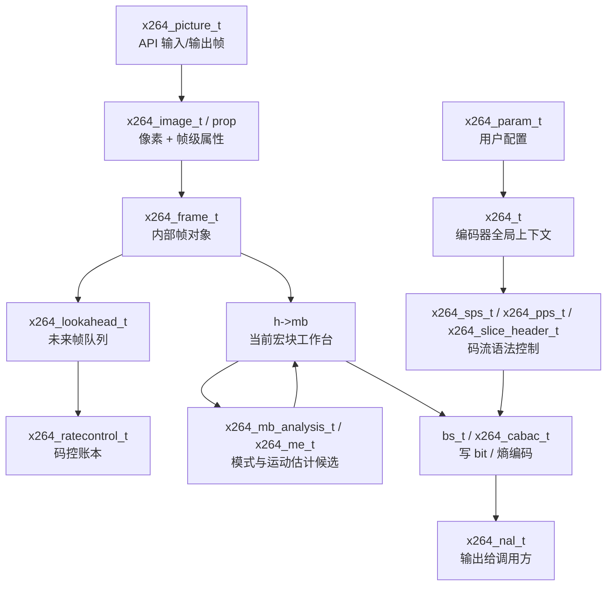
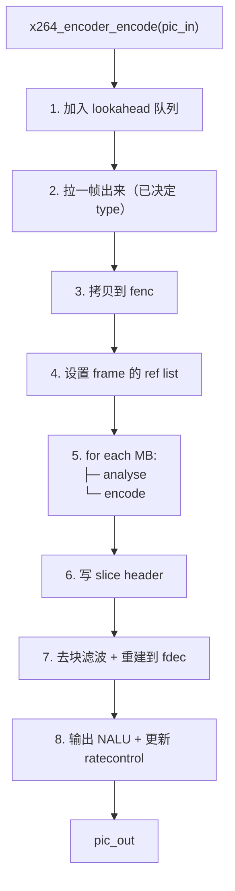
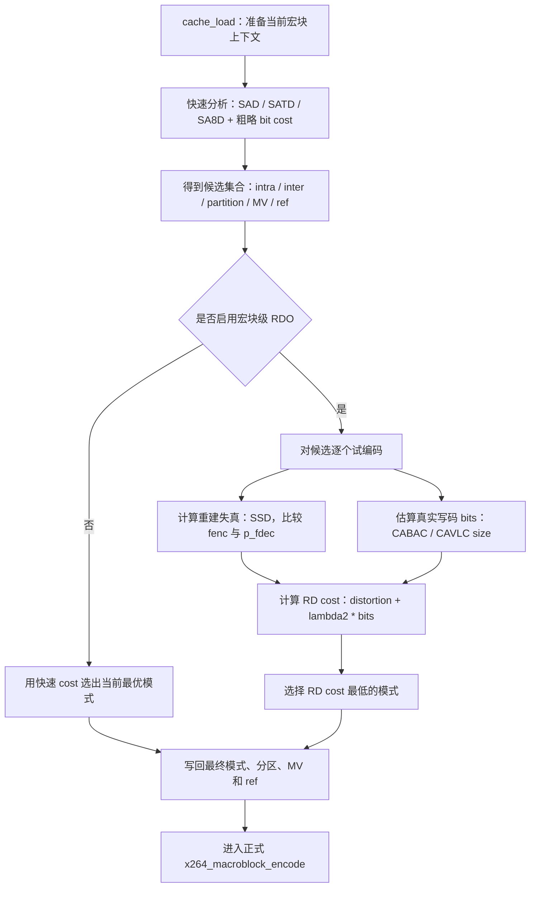
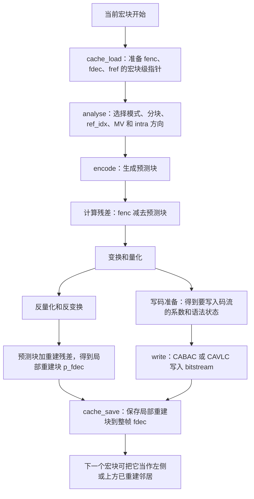
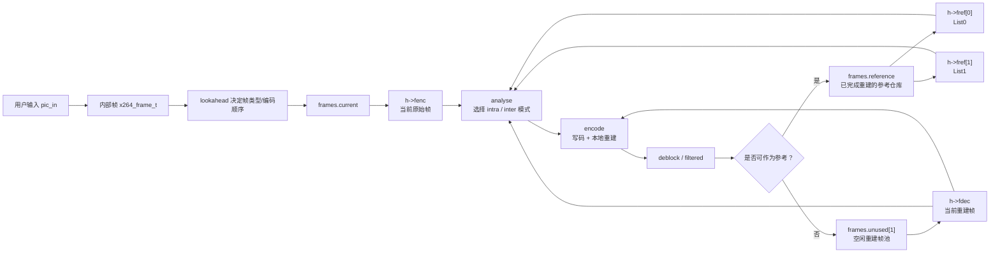
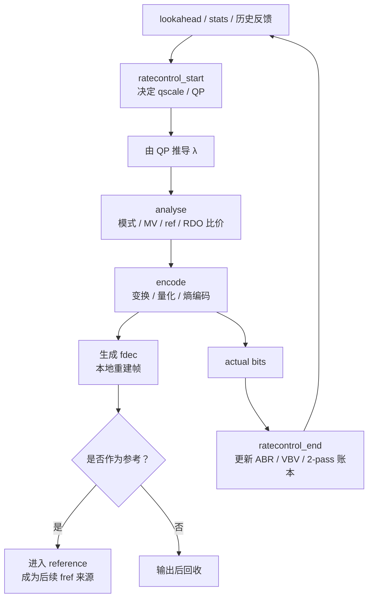
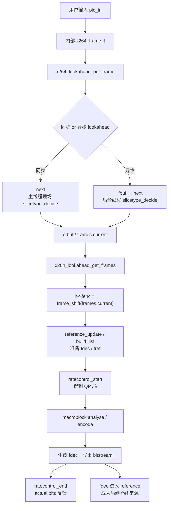

# 最新版 x264 源码深入浅出——从工业级编码器到性能榨取

**作者**：汪亮（bertonwang）  
**邮箱**：<47608843@qq.com>  
**版本**：v1.1 ｜ **最后更新**：2026-05-22

---

## 目录

- [前言：为什么 x264 仍是 2026 年的金标准](#前言为什么-x264-仍是-2026-年的金标准)
- [第 0 章：环境与工具链——拉源码、编译、跑通](#第-0-章环境与工具链拉源码编译跑通)

### 第一部分　工程总览
- [第 1 章：源码目录全图](#第-1-章源码目录全图)
  - [1.1 源码阅读总路线图：先看主线，再看分支](#11-源码阅读总路线图先看主线再看分支)
  - [1.2 x264 的三条“暗线”](#12-x264-的三条暗线)
- [第 2 章：构建系统（configure / Makefile / NASM）](#第-2-章构建系统configure-makefile-nasm)
- [第 3 章：从命令行到 API——入口三件套](#第-3-章从命令行到-api入口三件套)
- [第 4 章：核心数据结构（x264_t / x264_param_t / x264_picture_t）](#第-4-章核心数据结构x264_t-x264_param_t-x264_picture_t)
  - [4.1 `x264_t` 不要逐字段背，要按“状态簇”理解](#41-x264_t-不要逐字段背要按状态簇理解)
  - [4.2 `x264_frame_t` 生命周期：一帧会经历哪些身份](#42-x264_frame_t-生命周期一帧会经历哪些身份)
  - [4.3 函数表：为什么源码里到处是 `h->pixf.xxx`](#43-函数表为什么源码里到处是-h>pixfxxx)
  - [4.4 该补哪些结构：按“主线价值”筛选](#44-该补哪些结构按主线价值筛选)
  - [4.5 `x264_image_t` / `x264_image_properties_t`：API 图像不只是像素](#45-x264_image_t-x264_image_properties_tapi-图像不只是像素)
  - [4.6 `x264_nal_t`：编码器最终输出的包装单位](#46-x264_nal_t编码器最终输出的包装单位)
  - [4.7 `x264_sps_t` / `x264_pps_t` / `x264_slice_header_t`：H.264 语法的三层控制面](#47-x264_sps_t-x264_pps_t-x264_slice_header_th264-语法的三层控制面)
  - [4.8 `x264_ratecontrol_t` / `ratecontrol_entry_t`：码控账本](#48-x264_ratecontrol_t-ratecontrol_entry_t码控账本)
  - [4.9 `x264_lookahead_t` / `x264_sync_frame_list_t`：未来帧侦察队列](#49-x264_lookahead_t-x264_sync_frame_list_t未来帧侦察队列)
  - [4.10 `h->mb`：当前宏块的工作台](#410-h>mb当前宏块的工作台)
  - [4.11 `x264_mb_analysis_t` / `x264_me_t`：宏块决策的临时评分表](#411-x264_mb_analysis_t-x264_me_t宏块决策的临时评分表)
  - [4.12 `bs_t` / `x264_cabac_t`：从语法元素到真实 bit 的最后账本](#412-bs_t-x264_cabac_t从语法元素到真实-bit-的最后账本)
  - [4.13 核心结构总览：从 API 到 bitstream 的数据地图](#413-核心结构总览从-api-到-bitstream-的数据地图)

### 第二部分　主流水线
- [第 5 章：编码主循环 `x264_encoder_encode`](#第-5-章编码主循环-x264_encoder_encode)
  - [5.1 `x264_encoder_encode` 的精细时序](#51-x264_encoder_encode-的精细时序)
  - [5.2 `fenc / fdec / fref`：帧级对象与参考列表](#52-fenc-fdec-fref帧级对象与参考列表)
  - [5.3 当前 slice 如何拿到 `h->fenc / h->fref`：编码顺序与参考列表](#53-当前-slice-如何拿到-h>fenc-h>fref编码顺序与参考列表)
  - [5.4 宏块级指针准备：从整帧对象到当前宏块窗口](#54-宏块级指针准备从整帧对象到当前宏块窗口)
  - [5.5 模式分析：I 帧只比 intra，P/B 帧让 inter 和 intra 竞争](#55-模式分析i-帧只比-intrap-b-帧让-inter-和-intra-竞争)
  - [5.6 宏块主循环与 RDO：最优模式如何被选出来](#56-宏块主循环与-rdo最优模式如何被选出来)
  - [5.7 编码落地：从胜出模式到残差、码流和重建块](#57-编码落地从胜出模式到残差码流和重建块)
  - [5.8 滤波与参考化：`fdec` 如何变成后续 `fref` 来源](#58-滤波与参考化fdec-如何变成后续-fref-来源)
  - [5.9 高手关注点：主循环里的隐含约束](#59-高手关注点主循环里的隐含约束)
  - [5.10 码控如何影响编码过程：把 ABR / CRF / 2-pass 接到 `fenc / fdec / fref` 主线](#510-码控如何影响编码过程把-abr-crf-2pass-接到-fenc-fdec-fref-主线)
  - [5.11 查缺补漏：读第5章时最容易漏掉的几个边界](#511-查缺补漏读第5章时最容易漏掉的几个边界)
- [第 6 章：Lookahead 与多线程模型](#第-6-章lookahead-与多线程模型)
  - [6.1 一句话理解 Lookahead：先用草稿图排兵布阵](#61-一句话理解-lookahead先用草稿图排兵布阵)
  - [6.2 第5章与第6章如何接上：主循环等待并取走 lookahead 结果](#62-第5章与第6章如何接上主循环等待并取走-lookahead-结果)
  - [6.3 总流程：输入帧如何变成可编码帧](#63-总流程输入帧如何变成可编码帧)
  - [6.4 三个队列：从 `ifbuf / next / ofbuf` 到 `frames.current`](#64-三个队列从-ifbuf-next-ofbuf-到-framescurrent)
  - [6.5 同步模式 vs 异步模式：谁来执行 slicetype 决策](#65-同步模式-vs-异步模式谁来执行-slicetype-决策)
  - [6.6 Lookahead 到底分析了什么：lowres cost、scenecut、B-adapt](#66-lookahead-到底分析了什么lowres-costscenecutbadapt)
  - [6.7 码控前置信息：lookahead 如何服务 ABR / CRF / VBV](#67-码控前置信息lookahead-如何服务-abr-crf-vbv)
  - [6.8 难点一：帧类型不是局部最优](#68-难点一帧类型不是局部最优)
  - [6.9 难点二：延迟、画质、吞吐量三角权衡](#69-难点二延迟画质吞吐量三角权衡)
  - [6.10 难点三：多线程不能改变编码结果的基本约束](#610-难点三多线程不能改变编码结果的基本约束)
  - [6.11 和第 22 章多线程的区别](#611-和第-22-章多线程的区别)
  - [6.12 源码阅读路线：先队列，后算法](#612-源码阅读路线先队列后算法)
  - [6.13 小白版总结：Lookahead 到底难在哪](#613-小白版总结lookahead-到底难在哪)
  - [6.14 查缺补漏：第6章还需要避免的几个误解](#614-查缺补漏第6章还需要避免的几个误解)
- [第 7 章：宏块分析与编码：从 `x264_macroblock_analyse` 到 `x264_macroblock_encode`](#第-7-章宏块分析与编码从-x264_macroblock_analyse-到-x264_macroblock_encode)
  - [7.1 主线总览：`analyse / encode / write` 构成一个宏块闭环](#71-主线总览analyse-encode-write-构成一个宏块闭环)
  - [7.2 本章源码地图：先抓入口，再看专题章节](#72-本章源码地图先抓入口再看专题章节)
  - [7.3 从第6章接过来：lookahead 给帧级蓝图，宏块分析做局部决策](#73-从第6章接过来lookahead-给帧级蓝图宏块分析做局部决策)
  - [7.4 宏块级处理总览：一个 MB 的生命周期](#74-宏块级处理总览一个-mb-的生命周期)
  - [7.5 `x264_macroblock_analyse` 做什么：先选最划算的表达方式](#75-x264_macroblock_analyse-做什么先选最划算的表达方式)
  - [7.6 I/P/B 宏块分析分支：三类帧的候选池不同](#76-i-p-b-宏块分析分支三类帧的候选池不同)
  - [7.7 快速代价：为什么不能一上来就完整编码所有候选](#77-快速代价为什么不能一上来就完整编码所有候选)
  - [7.8 小白版 Hadamard：SATD 为什么比 SAD 更像“压缩难度”](#78-小白版-hadamardsatd-为什么比-sad-更像压缩难度)
  - [7.9 Hadamard 和 FFT / DCT 的关系：都是“换个坐标系看信号”](#79-hadamard-和-fft-dct-的关系都是换个坐标系看信号)
  - [7.10 快速搜索技巧：x264 如何少算很多候选](#710-快速搜索技巧x264-如何少算很多候选)
  - [7.11 `x264_macroblock_encode` 做什么：把胜出方案变成重建结果](#711-x264_macroblock_encode-做什么把胜出方案变成重建结果)
  - [7.12 写码位置：`encode` 生成状态，`write` 才形成 actual bits](#712-写码位置encode-生成状态write-才形成-actual-bits)
  - [7.13 查缺补漏：本章最容易漏掉的点](#713-查缺补漏本章最容易漏掉的点)
  - [7.14 小白版总结：宏块就是一次小型投标](#714-小白版总结宏块就是一次小型投标)
- [第 8 章：码流输出与 NAL / SPS / PPS](#第-8-章码流输出与-nal-sps-pps)
  - [8.1 NAL 是什么：H.264 码流的最小包装单元](#81-nal-是什么h264-码流的最小包装单元)
  - [8.2 SPS / PPS 什么时候写](#82-sps-pps-什么时候写)
  - [8.3 `slice header`：每帧真正开编前的上下文](#83-slice-header每帧真正开编前的上下文)
  - [8.4 Annex-B 与 MP4 length-prefix 的区别](#84-annexb-与-mp4-lengthprefix-的区别)
  - [8.5 从源码角度看“写码”分两层](#85-从源码角度看写码分两层)
- [第 9 章：码率控制（ABR / CRF / 2pass / VBV）](#第-9-章码率控制abr-crf-2pass-vbv)
  - [9.0 先建立源码阅读地图](#90-先建立源码阅读地图)
  - [9.1 RC 三个核心问题](#91-rc-三个核心问题)
  - [9.2 QP / qScale / λ / bits：源码里的四角关系](#92-qp-qscale-λ-bits源码里的四角关系)
  - [9.3 五种模式速览：同一套引擎，不同目标函数](#93-五种模式速览同一套引擎不同目标函数)
  - [9.4 CRF：先定质量锚点，再让码率跟内容走](#94-crf先定质量锚点再让码率跟内容走)
  - [9.5 ABR：长期平均码率靠反馈拉回来](#95-abr长期平均码率靠反馈拉回来)
  - [9.6 EWMA 预测器：码控闭环里的"记忆器"](#96-ewma-预测器码控闭环里的记忆器)
  - [9.7 2-pass：第一遍采集全片地图，第二遍按全局预算分配](#97-2pass第一遍采集全片地图第二遍按全局预算分配)
  - [9.8 VBV：所有模式背后的"漏桶守门员"](#98-vbv所有模式背后的漏桶守门员)
  - [9.9 CBR：ABR + 严格 VBV](#99-cbrabr-严格-vbv)
  - [9.10 lookahead：`--rc-lookahead 40` 不是提前完整编码 40 帧](#910-lookaheadrclookahead-40-不是提前完整编码-40-帧)
  - [9.11 mbtree：把"未来参考价值"变成 MB 级 QP 优惠](#911-mbtree把未来参考价值变成-mb-级-qp-优惠)
  - [9.12 B 帧金字塔：让部分 B 帧也成为参考节点](#912-b-帧金字塔让部分-b-帧也成为参考节点)
  - [9.13 AQ 与 psy：码控不是只看客观误差](#913-aq-与-psy码控不是只看客观误差)
  - [9.14 多线程下的码控：先保证账本顺序正确](#914-多线程下的码控先保证账本顺序正确)
  - [9.15 从源码变量到调参含义：一张速查表](#915-从源码变量到调参含义一张速查表)
  - [9.16 推荐阅读路径：从不迷路到能改代码](#916-推荐阅读路径从不迷路到能改代码)
- [第 10 章：以码控为主线重读 x264](#第-10-章以码控为主线重读-x264)
  - [10.1 一句话主线：先估复杂度，再决定花多少钱](#101-一句话主线先估复杂度再决定花多少钱)
  - [10.2 统一公式：x264 大部分优化都在修正这几个因子](#102-统一公式x264-大部分优化都在修正这几个因子)
  - [10.3 第一层：帧类型决策是在确定“预算角色”](#103-第一层帧类型决策是在确定预算角色)
  - [10.4 第二层：lookahead 是码控的“未来复杂度传感器”](#104-第二层lookahead-是码控的未来复杂度传感器)
  - [10.5 第三层：QP 只是量化强度，λ 才是 RDO 的方向盘](#105-第三层qp-只是量化强度λ-才是-rdo-的方向盘)
  - [10.6 第四层：mbtree / AQ / psy 是“块级预算再分配”](#106-第四层mbtree-aq-psy-是块级预算再分配)
  - [10.7 第五层：熵编码和码流输出是“actual bits 的裁判”](#107-第五层熵编码和码流输出是actual-bits-的裁判)
  - [10.8 第六层：VBV 是所有优化的硬边界](#108-第六层vbv-是所有优化的硬边界)
  - [10.9 第七层：性能优化也是在服务码控](#109-第七层性能优化也是在服务码控)
  - [10.10 用这条主线重读全书：每个主题都回答一个码控问题](#1010-用这条主线重读全书每个主题都回答一个码控问题)
  - [10.11 小白版总结：把 x264 想成一个预算经理](#1011-小白版总结把-x264-想成一个预算经理)
  - [10.12 高手版总结：用三条线定位源码](#1012-高手版总结用三条线定位源码)
  - [10.13 Review 后的补缺清单：哪些点还容易漏读](#1013-review-后的补缺清单哪些点还容易漏读)

### 第三部分　关键算法解剖
- [第 11 章：帧类型决策（B-adapt / scenecut）](#第-11-章帧类型决策badapt-scenecut)
  - [11.1 三个底层成本](#111-三个底层成本)
  - [11.2 scenecut 判定原理](#112-scenecut-判定原理)
  - [11.3 B-adapt 1（fast）：滑动窗贪心](#113-badapt-1fast滑动窗贪心)
  - [11.4 B-adapt 2（trellis / DP）：全局动态规划](#114-badapt-2trellis-dp全局动态规划)
  - [11.5 mini-GOP 与最大 B 帧数](#115-minigop-与最大-b-帧数)
  - [11.6 关键帧布局工程实战](#116-关键帧布局工程实战)
- [第 12 章：运动估计——菱形/六边形/UMH/ESA](#第-12-章运动估计菱形-六边形-umh-esa)
  - [12.1 运动估计不是盲搜，而是“预测 + 局部搜索 + 早停”](#121-运动估计不是盲搜而是预测-局部搜索-早停)
  - [12.2 高手关注点：ME 的四个剪枝来源](#122-高手关注点me-的四个剪枝来源)
- [第 13 章：亚像素细化与 SAD/SATD/SSD](#第-13-章亚像素细化与-sad-satd-ssd)
  - [13.1 亚像素为什么重要](#131-亚像素为什么重要)
  - [13.2 SAD / SATD / SSD 的使用边界](#132-sad-satd-ssd-的使用边界)
- [第 14 章：帧内预测搜索](#第-14-章帧内预测搜索)
  - [14.1 帧内预测的核心：用“已编码邻居”预测当前块](#141-帧内预测的核心用已编码邻居预测当前块)
  - [14.2 小白和高手分别看什么](#142-小白和高手分别看什么)
- [第 15 章：变换 + 量化 + 反量化](#第-15-章变换-量化-反量化)
  - [15.1 为什么编码器要做反量化和反变换](#151-为什么编码器要做反量化和反变换)
  - [15.2 高手关注点：量化不是单纯除法](#152-高手关注点量化不是单纯除法)
- [第 16 章：去块滤波环内实现](#第-16-章去块滤波环内实现)
  - [16.1 为什么去块滤波必须是“环内”](#161-为什么去块滤波必须是环内)
  - [16.2 `bS` 是 deblock 的核心开关](#162-bs-是-deblock-的核心开关)
- [第 17 章：CAVLC / CABAC 写码引擎](#第-17-章cavlc-cabac-写码引擎)
  - [17.1 CAVLC 与 CABAC 的源码阅读区别](#171-cavlc-与-cabac-的源码阅读区别)
  - [17.2 为什么 CABAC 慢但省码率](#172-为什么-cabac-慢但省码率)
- [第 18 章：心理视觉优化（psy-rd / aq-mode / mbtree）](#第-18-章心理视觉优化psyrd-aqmode-mbtree)

### 第四部分　性能榨取
- [第 19 章：MMX/SSE2/SSSE3/AVX2/AVX-512 汇编全景](#第-19-章mmx-sse2-ssse3-avx2-avx512-汇编全景)
  - [19.1 ASM 优化到底在优化什么](#191-asm-优化到底在优化什么)
  - [19.2 从 `.asm` 到可调用函数：编译链路](#192-从-asm-到可调用函数编译链路)
  - [19.3 `x86inc.asm` 做了什么](#193-x86incasm-做了什么)
  - [19.4 一段 SAD 优化的直觉](#194-一段-sad-优化的直觉)
  - [19.5 写 ASM 时最重要的边界：必须 bit-exact](#195-写-asm-时最重要的边界必须-bitexact)
  - [19.6 x86 ASM 阅读顺序](#196-x86-asm-阅读顺序)
- [第 20 章：ARM NEON / AArch64 / SVE 路径](#第-20-章arm-neon-aarch64-sve-路径)
  - [20.1 AArch64 汇编文件怎么看](#201-aarch64-汇编文件怎么看)
  - [20.2 NEON 优化的常见套路](#202-neon-优化的常见套路)
  - [20.3 `asm-offsets.c / asm-offsets.h` 的意义](#203-asmoffsetsc-asmoffsetsh-的意义)
  - [20.4 SVE / SVE2 与 NEON 的区别](#204-sve-sve2-与-neon-的区别)
- [第 21 章：x264_pixel_function_t 与 dispatcher](#第-21-章x264_pixel_function_t-与-dispatcher)
  - [21.1 函数表机制的源码阅读方法](#211-函数表机制的源码阅读方法)
  - [21.2 高手优化路径](#212-高手优化路径)
  - [21.3 dispatcher 的完整链路](#213-dispatcher-的完整链路)
  - [21.4 如何确认当前跑的是不是汇编路径](#214-如何确认当前跑的是不是汇编路径)
  - [21.5 `checkasm`：ASM 优化的安全网](#215-checkasmasm-优化的安全网)
  - [21.6 新增一个 ASM 优化函数的实战流程](#216-新增一个-asm-优化函数的实战流程)
  - [21.7 ASM、码控和特殊优化的最终关系](#217-asm码控和特殊优化的最终关系)
- [第 22 章：多线程：lookahead / sliced / frames](#第-22-章多线程lookahead-sliced-frames)
- [第 23 章：缓存友好性与内存池](#第-23-章缓存友好性与内存池)

### 第五部分　调参实战
- [第 24 章：preset 与 tune 的真实含义](#第-24-章preset-与-tune-的真实含义)
- [第 25 章：直播 / RTC / 点播 / 归档 四套黄金参数](#第-25-章直播-rtc-点播-归档-四套黄金参数)
- [第 26 章：自定义 zone / qpfile / chunk 编码](#第-26-章自定义-zone-qpfile-chunk-编码)
- [第 27 章：常见性能瓶颈与定位方法](#第-27-章常见性能瓶颈与定位方法)

### 第六部分　集成与扩展
- [第 28 章：在 FFmpeg 里使用 libx264](#第-28-章在-ffmpeg-里使用-libx264)
- [第 29 章：直接调用 libx264 API（带可运行示例）](#第-29-章直接调用-libx264-api带可运行示例)
- [第 30 章：定制特性——加水印 / 自定义 SEI / 透明通道（4:4:4）](#第-30-章定制特性加水印-自定义-sei-透明通道444)
- [第 31 章：移植 / 裁剪 / 嵌入式集成](#第-31-章移植-裁剪-嵌入式集成)

### 附录
- [附录 A：x264 命令行参数全景速查](#附录-ax264-命令行参数全景速查)
- [附录 B：源码常用宏与日志开关](#附录-b源码常用宏与日志开关)
- [附录 C：常见错误与坑](#附录-c常见错误与坑)
- [附录 D：源码阅读断点路线图](#附录-d源码阅读断点路线图)
  - [D.1 小白路线：先打 8 个断点跑通一帧](#d1-小白路线先打-8-个断点跑通一帧)
  - [D.2 进阶路线：沿三条变量线追踪](#d2-进阶路线沿三条变量线追踪)
  - [D.3 高手路线：用 profile 找真实热点](#d3-高手路线用-profile-找真实热点)
  - [D.4 小白和高手都应该掌握的 12 个核心问题](#d4-小白和高手都应该掌握的-12-个核心问题)
  - [D.5 修改源码时的安全边界](#d5-修改源码时的安全边界)

---

## 前言：为什么 x264 仍是 2026 年的金标准

> 一句话：**同样码率下，x264 medium 把 90% 的硬件 H.264 编码器按在地上摩擦。**

| 特性 | x264 | 硬件 H.264 |
|---|---|---|
| 画质（同码率 SSIM） | 100% | 80~90% |
| 调参灵活度 | 几百个参数 | 十来个 |
| 码率控制（VBV / 2pass） | 完整 | 通常仅 CBR |
| 心理视觉优化（psy-rd, mbtree） | ✅ | ❌ |
| 跨平台 | x86/ARM/RISC-V/Loong | 各厂封闭 |
| 速度（preset ultrafast） | > 实时 4K | > 实时 8K |

x264 自 2003 年立项至今，**仍在 master 分支持续提交**，是 **FFmpeg、OBS、HandBrake、各大点播 / 直播平台**的事实标准。

> 💡 阅读本书前需先读 [《H.264 标准深入浅出》](./H.264标准深入浅出-从语法元素到工程实战.md)，否则部分章节会"知其然不知其所以然"。

**学习路径**：


---

## 第 0 章：环境与工具链——拉源码、编译、跑通

```bash
git clone https://code.videolan.org/videolan/x264.git
cd x264

# Linux / macOS
./configure --enable-shared --enable-static --disable-asm    # 不开汇编先跑
make -j$(nproc)
sudo make install

# 启用汇编（推荐）
./configure --enable-shared --enable-static                  # 自动检测 NASM
make -j$(nproc)
```

测试：

```bash
# YUV 转 H.264
x264 --preset medium --crf 23 --output out.h264 \
     --input-res 1920x1080 --fps 25 input.yuv

# 跑标准测试集
ffmpeg -i sample.mp4 -c:v libx264 -preset slow -crf 22 out.mp4
```

> 💡 **必装**：NASM ≥ 2.13（汇编源码编译需要）、pkg-config、gcc/clang。

---

# 第一部分　工程总览

---

## 第 1 章：源码目录全图

```
x264/
├── x264.c               命令行可执行入口
├── x264.h               公开 API（你 #include 的那一份）
├── encoder/
│   ├── encoder.c        ★ x264_encoder_encode 主流水线
│   ├── analyse.c        ★ 宏块分析（决定模式）
│   ├── macroblock.c     ★ 宏块编码（实际写比特）
│   ├── me.c             运动估计核心
│   ├── ratecontrol.c    码率控制（CRF/ABR/VBV/mbtree）
│   ├── lookahead.c      帧类型预决策
│   ├── slicetype.c      I/P/B 决策算法
│   ├── set.c            SPS/PPS 写入
│   ├── cabac.c          CABAC 上下文与编码
│   ├── cavlc.c          CAVLC 编码
│   └── rdo.c            率失真优化
├── common/
│   ├── common.h         共用结构 / 宏
│   ├── frame.c          帧池管理
│   ├── mc.c             运动补偿（C 参考实现）
│   ├── pixel.c          SAD/SATD/SSD（C 参考）
│   ├── dct.c            整数 DCT（C 参考）
│   ├── deblock.c        去块滤波
│   ├── quant.c          量化
│   ├── predict.c        帧内预测
│   ├── x86/             ★ x86 汇编（NASM .asm）
│   │   ├── pixel-a.asm
│   │   ├── mc-a.asm
│   │   ├── dct-64.asm
│   │   └── ...
│   ├── aarch64/         ★ ARM64 汇编
│   ├── arm/             ARMv7 NEON
│   ├── ppc/, mips/, loongarch/  其它平台
├── filters/             输入预处理（重采样、crop、resize）
├── input/output/        YUV / Y4M / lavf / FFMS 读写
└── tools/, doc/         工具与文档
```

> 💡 **大局观速记**：`encoder/` 是"逻辑"，`common/` 是"运算 + 平台优化"。看核心算法只需 `encoder/`，看性能只需 `common/x86 + aarch64`。

### 1.1 源码阅读总路线图：先看主线，再看分支

x264 源码很大，但真正的主线只有一条：**一帧如何从用户输入，变成可解码的 H.264 NAL 单元**。


推荐按三层阅读，不要从第一天就陷入汇编细节：

| 层级 | 读什么 | 目标 | 适合人群 |
|---|---|---|---|
| **第一层：跑通主线** | `x264.c` → `encoder/api.c` → `encoder/encoder.c` | 知道一帧怎么进、怎么出 | 小白必读 |
| **第二层：理解画质来源** | `slicetype.c`、`ratecontrol.c`、`analyse.c`、`macroblock.c` | 知道为什么这个模式、这个 QP、这个 MV 被选中 | 进阶读者 |
| **第三层：理解性能来源** | `common/pixel.c`、`common/mc.c`、`common/x86/`、`common/aarch64/` | 知道热点函数如何被 SIMD 加速 | 高手 / 优化者 |

源码阅读时可以始终带着三个问题：

1. **这一帧是什么类型？** 看 `lookahead / slicetype`。
2. **这一帧花多少 bits？** 看 `ratecontrol`。
3. **这个宏块怎么预测、怎么写码？** 看 `analyse / macroblock / cabac`。

### 1.2 x264 的三条“暗线”

除了显性的函数调用，x264 源码里还有三条暗线贯穿始终：

| 暗线 | 贯穿模块 | 为什么重要 |
|---|---|---|
| **状态线** | `x264_t`、`frames`、`fenc/fdec/fref` | 决定当前帧、参考帧、重建帧的生命周期 |
| **代价线** | `SAD/SATD/SSD`、`λ`、`cost` | 决定模式选择、运动估计、RDO |
| **码率线** | `complexity`、`qscale`、`QP`、`bits`、`VBV` | 决定质量、码率和缓冲安全 |

小白先按“状态线”读，能知道程序怎么跑；高手再沿“代价线”和“码率线”读，才能知道 x264 为什么强。

---

## 第 2 章：构建系统（configure / Makefile / NASM）

x264 没用 CMake/autoconf，自己手写了一个 `configure` shell 脚本：

```
configure → 检测 CPU / OS / 编译器 / 汇编器
         → 生成 config.mak、config.h
make    → 调 gcc 编 .c、调 nasm 编 .asm、链接 libx264.a/so
```

汇编规则（`Makefile`）：

```make
%.o: %.asm
    $(AS) $(ASFLAGS) -o $@ $<
```

`ASFLAGS` 会带 `-Pcommon/x86/x86inc.asm` —— 这是 x264 自家的"汇编通用宏框架"，让 32/64 位、AT&T/Intel 一份代码统一。

> 💡 编 ARM64 路径：`./configure --host=aarch64-linux-gnu --cross-prefix=aarch64-linux-gnu-`。
> Windows MSVC 推荐用 **vcpkg** 或 MinGW 编。

---

## 第 3 章：从命令行到 API——入口三件套

`x264.c::main()` 流水：

```c
parse(argc, argv, &param)        // 解析命令行 → param
encode(&param, opt)              // 真正干活
```

`encode()` 的关键三步：

```c
h = x264_encoder_open(&param);       // 1. 打开编码器
while (read_frame(...)) {
    x264_encoder_encode(h, ...);     // 2. 喂帧
}
while (x264_encoder_delayed_frames(h))
    x264_encoder_encode(h, NULL);    // 3. 冲洗 lookahead
x264_encoder_close(h);
```

> 💡 三件套与所有"标准"的视频编码 API（FFmpeg `avcodec_send_frame/receive_packet`）一一对应。看懂这里就看懂 90% 的编解码 API。

---

## 第 4 章：核心数据结构（x264_t / x264_param_t / x264_picture_t）

### `x264_param_t`（用户配置）

```c
struct x264_param_t {
    int  i_width, i_height;
    int  i_csp;                // X264_CSP_I420 等
    int  i_keyint_max;         // GOP
    int  i_bframe;             // B 帧最大数
    struct {
        int  i_rc_method;      // X264_RC_CRF / ABR / 2PASS
        float f_rf_constant;   // CRF 值
        int  i_bitrate;        // ABR / CBR
        int  i_vbv_max_bitrate;
        int  i_vbv_buffer_size;
    } rc;
    struct { ... } analyse;    // 模式开关
    ...
};
```

### `x264_picture_t`（一帧）

```c
typedef struct {
    int     i_type;           // X264_TYPE_AUTO / I / P / B / IDR
    int64_t i_pts;
    int64_t i_dts;
    x264_image_t img;         // 平面 + stride + csp
    void   *opaque;
    ...
} x264_picture_t;
```

### `x264_t`（编码器内核句柄）—— 巨大、私有

主要持有：lookahead 线程、frames 池、当前 SPS/PPS、bitstream writer、ratecontrol context、汇编函数表 ……

> 💡 `x264_t` 在 `common/common.h` 里定义，**几百个字段**。第一次看会被吓住，记住一句话："它就是把 param 配置 + 运行时状态 + 函数表 + 缓冲区全塞一起"。

### 4.1 `x264_t` 不要逐字段背，要按“状态簇”理解

第一次打开 `common/common.h` 看 `x264_t`，很容易被几百个字段劝退。正确方法是把它分成几个状态簇：

| 状态簇 | 典型字段 / 概念 | 解决的问题 |
|---|---|---|
| **参数簇** | `param`、profile、level、analyse、rc | 用户到底想怎么编码 |
| **帧队列簇** | `frames.current`、`frames.next`、`frames.unused` | 输入帧、待编码帧、空闲帧如何流转 |
| **当前帧簇** | `fenc`、`fdec`、`fref` | 当前原始帧、当前重建帧、参考帧是谁 |
| **宏块簇** | `mb`、`sh`、`stat` | 当前宏块位置、slice header、统计信息 |
| **码控簇** | `rc`、`ratecontrol`、VBV 状态 | 当前帧用多少 QP / bits |
| **码流簇** | `out.bs`、`nal`、`cabac` | bits 写到哪里、如何打包成 NAL |
| **函数表簇** | `pixf`、`mc`、`dctf`、`quantf`、`predict_*` | C / SIMD 函数如何被统一调用 |

读源码时建议给 `x264_t *h` 加一个心智模型：

```text
h = 编码器全局上下文
  = 用户配置
  + 当前处理到哪一帧 / 哪个宏块
  + 当前能参考哪些重建帧
  + 当前码率账本和 VBV 水位
  + 当前平台最快的一组函数指针
```

### 4.2 `x264_frame_t` 生命周期：一帧会经历哪些身份

用户传入的是 `x264_picture_t`，但 x264 内部真正流转的是 `x264_frame_t`。一帧大致会经历下面这些身份：

```text
用户 pic_in
  ↓ 拷贝 / 包装
frames.next / lookahead 队列中的未来帧
  ↓ slicetype 决定 I/P/B
fenc：当前待编码原始帧
  ↓ analyse + encode
fdec：当前重建帧
  ↓ 如果可参考
fref：后续 P/B 帧的参考帧
  ↓ 不再被引用
frames.unused：回收到帧池
```

几个名字要分清：

| 名字 | 含义 | 小白理解 |
|---|---|---|
| `fenc` | 当前正在编码的原始帧 | 题目 |
| `fdec` | 当前帧编码后的重建版本 | 标准答案，必须和解码器一致 |
| `fref` | 已经编码完成、可供未来参考的重建帧 | 参考帧 |
| `lowres` | lookahead 用的低分辨率版本 | 草稿图，用来快速估成本 |

> 💡 **关键不变量**：后续帧参考的不是原始帧，而是 `fdec / fref` 里的重建帧。因为解码器手里也只有重建帧。如果编码端拿原始帧做参考，预测链会和解码端不一致，码流就不可解。

### 4.3 函数表：为什么源码里到处是 `h->pixf.xxx`

x264 为了同时支持 C、x86 SSE/AVX、ARM NEON，把大量热点函数做成函数表：

```text
x264_cpu_detect
  ↓
x264_pixel_init / x264_mc_init / x264_dct_init / x264_quant_init
  ↓
h->pixf.sad[...]      = 当前 CPU 最快的 SAD 实现
h->mc.mc_luma         = 当前 CPU 最快的运动补偿实现
h->dctf.sub16x16_dct  = 当前 CPU 最快的 DCT 实现
h->quantf.quant_4x4   = 当前 CPU 最快的量化实现
```

所以看到：

```c
h->pixf.mbcmp[PIXEL_16x16]( ... )
```

不要以为它是普通函数，它可能在运行时指向：

```text
C 参考实现
SSE2 / SSSE3 / AVX2 / AVX-512 实现
ARM NEON / AArch64 实现
LoongArch / RISC-V 实现
```

这也是 x264 能兼顾可移植性和极致性能的核心设计。

### 4.4 该补哪些结构：按“主线价值”筛选

x264 里的结构非常多，但不是每个都适合放进“核心数据结构”章节。建议按下面标准筛选：

```text
是否贯穿多章节？
是否会反复出现在关键函数参数里？
是否能帮助理解帧、码控、宏块、码流、线程这些主线？
```

因此除了前面已经讲过的 `x264_param_t`、`x264_picture_t`、`x264_t`、`x264_frame_t` 和函数表，还值得补充下面这些结构：

| 结构 | 所在文件 | 为什么重要 |
|---|---|---|
| `x264_image_t` / `x264_image_properties_t` | `x264.h` | API 层输入图像、QP offset、mb_info、PSNR/SSIM 输出 |
| `x264_nal_t` | `x264.h` | 编码器最终交给调用方的码流包装 |
| `x264_sps_t` / `x264_pps_t` | `common/set.h` | H.264 全局参数集，决定码流合法性和解码器初始化 |
| `x264_slice_header_t` | `common/common.h` | 每个 slice 的语法控制中心 |
| `x264_ratecontrol_t` / `ratecontrol_entry_t` | `encoder/ratecontrol.c` | 码控账本，决定 QP、VBV、ABR/CRF/2pass 行为 |
| `x264_lookahead_t` / `x264_sync_frame_list_t` | `common/common.h` / `common/frame.h` | lookahead 队列和线程同步核心 |
| `h->mb` 匿名结构 | `common/common.h` | 当前宏块状态、邻居缓存、MV/ref/QP/CBP 的工作台 |
| `x264_mb_analysis_t` | `encoder/analyse.c` | 宏块模式决策的临时评分表 |
| `x264_me_t` | `encoder/me.h` | 单次运动估计任务的输入输出结构 |
| `bs_t` / `x264_cabac_t` | `common/bitstream.h` / `common/cabac.h` | 写 bitstream 与 CABAC 熵编码状态 |

这些结构可以理解为 x264 源码的“地图图例”：先知道它们代表什么，再读函数会轻松很多。

### 4.5 `x264_image_t` / `x264_image_properties_t`：API 图像不只是像素

`x264_picture_t` 里面真正装图像数据的是 `x264_image_t`：

```c
typedef struct x264_image_t {
    int      i_csp;
    int      i_plane;
    int      i_stride[4];
    uint8_t *plane[4];
} x264_image_t;
```

它解决的是最基础的问题：

```text
这帧是什么像素格式？
有几个 plane？
每个 plane 的 stride 是多少？
Y / U / V 数据指针在哪里？
```

但 `x264_picture_t` 还包含 `x264_image_properties_t`，这部分经常被初学者忽略：

| 字段 / 概念 | 作用 |
|---|---|
| `quant_offsets` | 外部给每个宏块增加 QP offset，影响 AQ / ROI 类需求 |
| `mb_info` | 外部告诉编码器某些宏块是否恒定，可用于低延迟交互场景 |
| `f_ssim` / `f_psnr_avg` | 编码后输出质量指标 |
| `f_crf_avg` | 输出该帧实际平均 CRF 效果 |

所以 API 层的一帧不是简单的“YUV 指针”，而是：

```text
像素数据 + 时间戳 + 强制帧类型 + 可选码控提示 + 编码结果反馈
```

这也是为什么 `x264_frame_copy_picture` 不只是拷贝像素，还要把 `pts`、`opaque`、`param`、`prop` 等信息一起带进内部 `x264_frame_t`。

### 4.6 `x264_nal_t`：编码器最终输出的包装单位

调用 `x264_encoder_encode` 后，用户拿到的不是裸的宏块数据，而是 `x264_nal_t` 数组：

```c
typedef struct x264_nal_t {
    int      i_ref_idc;
    int      i_type;
    int      b_long_startcode;
    int      i_first_mb;
    int      i_last_mb;
    int      i_payload;
    uint8_t *p_payload;
    int      i_padding;
} x264_nal_t;
```

它回答几个输出侧问题：

| 字段 | 含义 |
|---|---|
| `i_type` | 这是 SPS、PPS、SEI、IDR slice 还是普通 slice |
| `i_ref_idc` | 这个 NAL 的参考重要性 |
| `p_payload` / `i_payload` | 真正交给 muxer / 文件 / 网络发送的数据 |
| `i_first_mb` / `i_last_mb` | sliced threads 或多 slice 时，用于定位该 NAL 覆盖哪些宏块 |
| `b_long_startcode` | Annex-B 起始码相关控制 |

读输出链路时可以记住：

```text
宏块语法元素
  → bs_t / CABAC 写入内部 bitstream
  → 封装成一个或多个 NAL
  → 返回 x264_nal_t 数组给调用方
```

所以 `x264_nal_t` 是 x264 内部世界和外部复用器世界之间的边界。

### 4.7 `x264_sps_t` / `x264_pps_t` / `x264_slice_header_t`：H.264 语法的三层控制面

H.264 码流不是只写残差和 MV，还必须告诉解码器“这条码流该怎么解释”。这里最重要的是三层结构：

| 结构 | 粒度 | 主要作用 |
|---|---|---|
| `x264_sps_t` | 序列级 | 分辨率、profile、level、POC 规则、VUI/HRD、参考帧上限 |
| `x264_pps_t` | 图像参数级 | CABAC 开关、默认参考数、初始 QP、8x8 transform、deblock 控制 |
| `x264_slice_header_t` | slice 级 | 当前 slice 类型、frame_num、POC、参考列表、加权预测、QP delta、deblock 参数 |

小白可以这样理解：

```text
SPS：整部视频的身份证
PPS：一类图片的编码规则
Slice Header：当前这一片具体怎么解码
```

它们和 `x264_t` 的关系是：

```text
h->sps / h->pps：当前编码器持有的参数集
h->sh：当前正在写的 slice header
```

为什么这组结构重要？因为很多“看似算法开关”的参数，最后都要落到 H.264 语法：

```text
--profile / --level       → SPS
--ref                     → SPS / slice ref list
--cabac                   → PPS
--8x8dct                  → PPS
--deblock                 → PPS / slice header
--weightp / --weightb     → PPS / slice header
当前帧 QP                 → slice header 的 i_qp / i_qp_delta
```

读第 8 章码流输出时，一定会反复看到这些结构。

### 4.8 `x264_ratecontrol_t` / `ratecontrol_entry_t`：码控账本

如果说 `x264_param_t.rc` 是用户给的码控目标，那么 `x264_ratecontrol_t` 就是编码过程中真正维护的码控账本。

它记录的信息大致分为几类：

| 分类 | 典型字段 / 概念 | 解决的问题 |
|---|---|---|
| 模式常量 | `b_abr`、`b_2pass`、`b_vbv`、`bitrate`、`qcompress` | 当前是 CRF、ABR、CBR/VBV 还是 2pass |
| 当前帧状态 | `rce`、`qpm`、`qpa_rc`、`qpa_aq`、`qp_novbv` | 当前帧 / 当前宏块应该用多大 QP |
| VBV 状态 | `buffer_size`、`buffer_fill`、`buffer_rate`、`vbv_max_rate` | 缓冲区会不会溢出或饿死 |
| ABR 状态 | `wanted_bits_window`、`cplxr_sum`、`expected_bits_sum` | 平均码率是否追得上目标 |
| 2pass 状态 | `entry`、`entry_out`、stats 文件 | 第一遍统计如何指导第二遍分配 bits |
| mbtree 状态 | `mbtree.qp_buffer`、`scale_buffer` | 未来引用价值如何转成块级 QP 调整 |

`ratecontrol_entry_t` 则可以理解为“某一帧的码控档案”：

```text
帧类型
复杂度
运动信息 bits
纹理 bits
预期 bits
qscale / new_qscale
VBV 预估
2pass 统计信息
```

二者的关系：

```text
x264_ratecontrol_t = 整个编码过程的码控账本
ratecontrol_entry_t = 账本里某一帧的记录
```

第 8 章读码控时，建议先找：

```text
h->rc
h->rc->rce
rate_estimate_qscale
x264_ratecontrol_start
x264_ratecontrol_end
```

这样会比直接陷进公式里更容易建立全局感。

### 4.9 `x264_lookahead_t` / `x264_sync_frame_list_t`：未来帧侦察队列

`x264_lookahead_t` 是第 6 章的主角，它把 lookahead 线程、帧队列和 slicetype 决策连在一起：

```c
typedef struct x264_lookahead_t {
    uint8_t                b_exit_thread;
    uint8_t                b_thread_active;
    uint8_t                b_analyse_keyframe;
    int                    i_last_keyframe;
    int                    i_slicetype_length;
    x264_frame_t          *last_nonb;
    x264_pthread_t         thread_handle;
    x264_sync_frame_list_t ifbuf;
    x264_sync_frame_list_t next;
    x264_sync_frame_list_t ofbuf;
} x264_lookahead_t;
```

其中 `x264_sync_frame_list_t` 是带锁和条件变量的帧队列：

```text
list      ：帧指针数组
i_size    ：当前队列里有多少帧
i_max_size：最多容纳多少帧
mutex     ：保护队列
cv_fill   ：队列变满一点时通知消费者
cv_empty  ：队列变空一点时通知生产者
```

三个队列的意义：

| 队列 | 作用 |
|---|---|
| `ifbuf` | 用户刚输入、等待 lookahead 线程取走的帧 |
| `next` | lookahead 正在观察的未来窗口 |
| `ofbuf` | 已经完成帧类型决策、等待主编码线程取走的帧 |

它的核心价值是：

```text
把“用户输入顺序”转换成“已经完成帧类型决策、可供正式编码的顺序”
```

因此它不仅是线程结构，也是码控和 B 帧决策的入口结构。

### 4.10 `h->mb`：当前宏块的工作台

`h->mb` 不是一个单独命名的公开结构，而是 `x264_t` 里的一个巨大匿名结构。但读宏块分析和编码时，它比很多命名结构都重要。

它可以分为几块：

| 状态簇 | 典型字段 / 概念 | 作用 |
|---|---|---|
| 图像几何 | `i_mb_width`、`i_mb_height`、`i_mb_x`、`i_mb_y`、`i_mb_xy` | 当前处理到哪个宏块 |
| 搜索参数 | `i_me_method`、`i_subpel_refine`、`b_chroma_me`、`b_trellis` | 当前宏块分析允许多复杂 |
| 邻居信息 | `i_neighbour`、`i_mb_type_top`、`i_mb_type_left` | intra 预测、MV 预测、CABAC 上下文依赖 |
| 帧级表 | `type`、`partition`、`qp`、`cbp`、`mv`、`ref` | 保存整帧每个 MB 的最终结果 |
| 当前 MB 值 | `i_type`、`i_partition`、`i_cbp_luma`、`i_cbp_chroma`、`i_qp` | 当前宏块最终选择 |
| 像素指针 | `pic.p_fenc`、`pic.p_fdec`、`pic.p_fref` | 当前 MB 的原始、重建、参考像素入口 |
| cache | `cache.mv`、`cache.ref`、`cache.non_zero_count`、`cache.intra4x4_pred_mode` | 为当前 MB 快速访问邻居和块级状态 |

读宏块主流程时可以记住：

```text
x264_macroblock_cache_load
  → 把周围 MB 信息装进 h->mb.cache
x264_macroblock_analyse
  → 根据 h->mb.pic / h->mb.cache 做模式决策
x264_macroblock_encode
  → 根据 h->mb.i_type / mv / ref / cbp 真正写码和重建
x264_macroblock_cache_save
  → 把当前 MB 结果写回帧级表
```

所以 `h->mb` 是宏块级算法的“现场工作台”。

### 4.11 `x264_mb_analysis_t` / `x264_me_t`：宏块决策的临时评分表

`x264_mb_analysis_t` 是 `encoder/analyse.c` 内部的临时结构。它不跨模块公开，但对理解 `x264_macroblock_analyse` 非常关键。

它大致保存三类信息：

| 信息 | 例子 | 作用 |
|---|---|---|
| 当前 RD 参数 | `i_lambda`、`i_lambda2`、`i_qp`、`i_mbrd` | 决定 cost 怎么算 |
| Intra 候选 | `i_satd_i16x16`、`i_predict4x4`、`i_predict8x8` | 保存帧内预测各模式成本 |
| Inter 候选 | `l0`、`l1`、`i_cost16x16bi`、`i_cost8x8direct` | 保存 P/B 帧各种分割、参考、MV 成本 |

其中 `x264_mb_analysis_list_t` 会保存大量 `x264_me_t`：

```text
me16x16
me8x8[4]
me4x4[4][4]
me16x8[2]
me8x16[2]
```

而 `x264_me_t` 表示“一次运动估计任务”：

| 字段 | 含义 |
|---|---|
| `i_pixel` | 搜索块大小，如 16x16、8x8、4x4 |
| `p_fenc` | 当前原始块 |
| `p_fref` / `p_fref_w` | 参考块 / 加权参考块 |
| `mvp` | 预测 MV |
| `mv` | 搜索得到的最佳 MV |
| `cost_mv` | MV 编码代价 |
| `cost` | `SATD + λ * bits` 后的总成本 |

宏块分析可以抽象成：

```text
把所有候选模式都试一遍
  → 每个候选填入 x264_mb_analysis_t
  → 用 RD cost 比较
  → 最优结果写回 h->mb
```

所以 `x264_mb_analysis_t` 是“草稿纸”，`h->mb` 是“最终答案”。

### 4.12 `bs_t` / `x264_cabac_t`：从语法元素到真实 bit 的最后账本

宏块决策完成后，还要把语法元素变成真实 bitstream。这时会遇到两个核心结构。

`bs_t` 是基础 bit writer：

```c
typedef struct bs_s {
    uint8_t  *p_start;
    uint8_t  *p;
    uint8_t  *p_end;
    uintptr_t cur_bits;
    int       i_left;
    int       i_bits_encoded;
} bs_t;
```

它负责：

```text
写固定 bit
写 ue/se/te Golomb 码
处理 byte alignment
维护当前写到 buffer 的哪个位置
```

`x264_cabac_t` 是 CABAC 算术编码状态：

```text
i_low / i_range          ：算术编码区间
p_start / p / p_end      ：输出位置
state[1024]              ：上下文概率状态
f8_bits_encoded          ：RDO 估 bit 时使用
```

二者区别：

| 结构 | 主要场景 | 小白理解 |
|---|---|---|
| `bs_t` | SPS/PPS/header、CAVLC、NAL 封装等 | 普通写 bit 的笔 |
| `x264_cabac_t` | CABAC 模式下写宏块语法元素 | 带概率模型的压缩笔 |

读码流输出时可以这样分层：

```text
语法决策：当前 MB 是什么类型、MV 是多少、残差系数有哪些
  ↓
熵编码：CAVLC 或 CABAC 把语法元素压成 bit
  ↓
bit writer：写入 h->out.bs / CABAC buffer
  ↓
NAL 封装：生成 x264_nal_t
```

### 4.13 核心结构总览：从 API 到 bitstream 的数据地图

把第 4 章这些结构串起来，可以得到一条完整的数据地图：



源码阅读时可以按这个顺序建立心智模型：

```text
1. API 边界：x264_param_t / x264_picture_t / x264_nal_t
2. 全局状态：x264_t
3. 帧状态：x264_frame_t / lookahead queues
4. 码控状态：x264_ratecontrol_t / ratecontrol_entry_t
5. 宏块状态：h->mb / x264_mb_analysis_t / x264_me_t
6. 码流状态：SPS/PPS/Slice Header / bs_t / x264_cabac_t
```

如果读源码时迷路，就问自己一句：

```text
我现在看到的字段，属于 API、帧、码控、宏块、线程，还是码流？
```

这个分类能快速把几万行源码重新放回地图里。

---

# 第二部分　主流水线

---

## 第 5 章：编码主循环 `x264_encoder_encode`

`encoder/encoder.c::x264_encoder_encode`：



关键时序：**lookahead 异步在前面跑** → main 线程一定能"提前知道未来 N 帧"，从而做出最优决策（B 帧、自适应 QP、mbtree 等）。

本章为了避免单节过长，按主循环的真实推进顺序拆成更聚焦的几个层次：

| 小节 | 聚焦问题 | 对应主线 |
|---|---|---|
| `5.1` | `x264_encoder_encode` 一次调用的大时序 | API 调用到 NAL 输出 |
| `5.2` | `fenc / fdec / fref` 三种帧角色 | 当前原始帧、当前重建帧、历史参考帧 |
| `5.3` | `h->fenc` 和 `h->fref` 如何进入当前 slice | 编码顺序、参考列表、DPB |
| `5.4` | 宏块级指针如何从整帧映射到局部窗口 | `p_fenc / p_fdec / p_fref` |
| `5.5` | I/P/B slice 如何做模式分析 | intra / inter / ref / MV / 分区 |
| `5.6` | RDO 如何从候选中选出最优模式 | 快筛、剪枝、精算 |
| `5.7` | 胜出模式如何真正编码落地 | 预测、残差、量化、写码、重建 |
| `5.8` | `fdec` 如何滤波并反馈成后续 `fref` | deblock、halfpel、reference |
| `5.9` | 主循环里的隐含约束 | 顺序、参考、码控、线程 |
| `5.10` | ABR / CRF / 2-pass 如何影响主线 | `QP / λ / bits` 预算 |
| `5.11` | 查缺补漏 | 容易误解和本章边界 |

### 5.1 `x264_encoder_encode` 的精细时序

把 `encoder/encoder.c::x264_encoder_encode` 展开，可以按下面 10 步读：

| 步骤 | 做什么 | 关键源码 / 关键状态 |
|---|---|---|
| 1 | 如果 `pic_in != NULL`，把用户帧放入内部帧池 | `x264_frame_copy_picture`、`frames.next` |
| 2 | 触发 lookahead，等待有帧可编码 | `x264_lookahead_put_frame`、`x264_lookahead_get_frames` |
| 3 | 取出已决定类型的一帧作为 `fenc` | `h->fenc`、`i_type`、`i_frame` |
| 4 | 建立参考帧列表 | `x264_reference_build_list_optimal`、`h->fref` |
| 5 | 初始化 slice header 和 bitstream | `x264_slice_header_write`、`h->out.bs` |
| 6 | 码控估计本帧 QP / qscale | `x264_ratecontrol_start`、`rate_estimate_qscale` |
| 7 | 遍历宏块，先分析后编码 | `x264_macroblock_analyse`、`x264_macroblock_encode` |
| 8 | 去块滤波，生成最终重建帧 | `x264_frame_deblock_row`、`h->fdec` |
| 9 | 更新参考帧、码控和统计信息 | `x264_reference_update`、`x264_ratecontrol_end` |
| 10 | 把 NAL 返回给调用方 | `x264_nal_t`、`pp_nal`、`pi_nal` |

> 💡 小白读第 5 章时，只要能跟住 `fenc → analyse → encode → fdec → fref → nal` 这条线，就已经读懂了 x264 主循环的骨架。

### 5.2 `fenc / fdec / fref`：帧级对象与参考列表

读 `x264_encoder_encode` 时，最容易迷路的地方就是：同样都是帧，为什么一会儿叫 `fenc`，一会儿叫 `fdec`，一会儿又叫 `fref`？

先用一句话区分它们：

```text
fenc：当前要编码的原始帧，来自用户输入
fdec：当前帧在编码端本地重建出来的版本，必须和解码器看到的一致
fref：过去已经完成重建、可以被当前帧参考的帧列表
```

它们不是三份随便摆放的图像，而是 x264 主循环里的三种角色：

| 名称 | 全称理解 | 来源 | 谁使用它 | 主要用途 |
|---|---|---|---|---|
| `fenc` | frame encoder input | `frames.current` 中取出的待编码帧 | 分析、码控、失真计算 | 作为“原始答案”，计算 SATD/SAD/SSD 等失真 |
| `fdec` | frame decoder reconstruction | 从 `frames.unused[1]` 帧池取出的可写重建帧缓冲 | 宏块编码、环路滤波、质量统计 | 承载编码端本地生成的重建结果 |
| `fref` | frame reference list | 从 `frames.reference` 中按 POC/距离临时挑出来 | 运动估计、运动补偿、B 帧双向预测 | 给当前帧提供历史/未来参考图像 |

为了避免单个 `5.2` 过长，后面按编码主线拆成三段：

| 新小节 | 核心问题 | 主线位置 |
|---|---|---|
| `5.2` 帧级对象与参考列表 | `fenc / fdec / fref` 分别从哪里来，何时进入参考系统 | `frames.current / frames.unused / frames.reference` |
| `5.3` 宏块级分析 | 整帧对象如何映射成当前宏块指针，如何选择 intra/inter、分区、MV、ref | `cache_load → analyse / RDO` |
| `5.4` 编码落地与参考反馈 | 胜出模式如何变成残差、码流、本地重建块，并最终反馈为后续 `fref` | `encode → write → cache_save → deblock / reference` |

这样读起来就能始终沿着一条线走：

```text
fenc → 宏块分析 → 编码落地 → fdec → 参考化 → fref
```

#### 5.2.1 先抓住核心不变量：参考的永远是重建帧

H.264 是预测编码。P/B 帧不会直接保存完整图像，而是保存：

```text
从哪一帧参考？
运动矢量是多少？
预测后还剩多少残差？
```

这里有一个非常重要的不变量：

> **后续帧参考的不是原始帧 `fenc`，而是已经重建完成的 `fdec / fref`。**

原因很简单：解码器没有原始帧。解码器只能根据码流重建出图像，所以编码器在做预测时，也必须使用和解码器完全一致的重建图像。

如果编码器用原始帧做参考，就会变成：

```text
编码器参考原始帧
解码器参考重建帧
两边预测结果不同
残差无法正确抵消
误差沿参考链不断扩散
```

所以 x264 必须一边编码，一边在本地模拟解码器，生成 `fdec`。当这帧未来还要被引用时，`fdec` 才能进入参考帧管理系统，成为后续帧看到的 `fref`。

#### 5.2.2 帧级生命周期：从用户输入到参考帧

一帧在 x264 里大致会走完下面这条路：

```text
用户 pic_in
  ↓
x264_frame_copy_picture
  ↓
内部 x264_frame_t
  ↓
lookahead / slicetype 决策
  ↓
frames.current
  ↓
h->fenc = 当前待编码帧
  ↓
h->fdec = 从 frames.unused[1] 取出的可写重建帧缓冲（此时只是容器）
  ↓
analyse：用 fenc 和 fref 做模式决策
  ↓
encode：逐宏块写码，并把重建像素逐步写入 fdec
  ↓
deblock / hpel filter / 质量统计
  ↓
如果该帧可作为参考：完成后的 fdec 进入 frames.reference；否则回到 frames.unused[1]
  ↓
后续帧编码时，从 frames.reference 构建 h->fref
```

这里要特别注意：`h->fdec = x264_frame_pop_unused( h, 1 )` 的含义是**从空闲池取出一个可写的重建帧对象 / 像素缓冲，交给当前编码轮次使用**。这一步拿到的是“承载重建结果的容器”，不是已经完成的重建图像；而且它也不一定是全零的“空白图”，因为底层 buffer 可能来自复用的旧帧。

真正属于当前帧的重建内容，是在后面的宏块编码过程中逐步生成的：`x264_macroblock_encode` 先在宏块局部 `p_fdec` 中得到预测 + 重建残差的结果，随后 `x264_macroblock_cache_save` 再把这些重建像素写回 `h->fdec->plane[]`。等整帧编码、去块滤波和参考用插值缓存处理完成后，这个 `h->fdec` 才可以被视为“当前帧的完整重建帧”。

一旦赋给 `h->fdec`，它就不再是 `frames.unused[1]` 里的空闲帧；等当前帧编码结束后，它才会根据是否保留为参考，进入 `frames.reference`，或者被 `x264_frame_push_unused` 放回 `frames.unused[1]`。

用更源码化的语言看，就是三组队列 / 指针在配合：

| 队列 / 指针 | 含义 |
|---|---|
| `frames.current` | lookahead 已经决定好类型、等待正式编码的帧 |
| `h->fenc` | 本轮从 `frames.current` 取出的当前原始帧 |
| `frames.unused[1]` | 可复用的重建帧池，避免每帧频繁 malloc/free |
| `h->fdec` | 本轮承载重建结果的可写帧缓冲；编码前只是容器，编码后才逐步成为当前帧的重建图像 |
| `frames.reference` | DPB（Decoded Picture Buffer，解码图像缓冲区）里的长期参考集合，保存已经重建完成、后续可能被引用的参考帧 |
| `h->fref[0] / h->fref[1]` | 当前 slice 临时使用的参考列表，来自 `frames.reference` |

注意：`fref` 不是新分配的一批图像，它通常只是指向 `frames.reference` 里已有重建帧的指针数组。

#### 5.2.3 为什么需要 `fdec` 帧池：重建帧要复用，不要反复分配

编码每一帧都需要一块 `fdec` 空间来保存重建图像。如果每次编码都重新申请和释放整帧图像，开销会很大，也容易造成内存碎片。

所以 x264 会维护空闲帧池：

```text
frames.unused[0]：偏输入 / lookahead 用的空闲帧
frames.unused[1]：偏重建 / reference 用的空闲帧
```

编码线程初始化时，会先取出一个 `fdec`：

```text
h->thread[i]->fdec = x264_frame_pop_unused( h, 1 )
```

一帧编码结束后，如果它需要被参考：

```text
当前已经完成的 h->fdec 进入 frames.reference
再从 unused 池取一个新的可写重建帧缓冲作为下一轮 h->fdec
```

如果参考队列超出上限，最老或者被 MMCO 移除的参考帧会被放回 unused 池：

```text
frames.reference 中不再需要的帧
  → x264_frame_push_unused
  → 未来重新作为 fdec 使用
```

这样做的好处是：

- **减少内存分配开销**：整帧 buffer 很大，复用比反复申请更稳定。
- **便于多线程**：每个线程可以持有自己的 `fdec`，避免互相覆盖。
- **符合 DPB 语义**：只有还在参考列表里的重建帧需要保留，其余帧可以回收。

### 5.3 当前 slice 如何拿到 `h->fenc / h->fref`：编码顺序与参考列表

前面的 `5.2` 只解释了三种帧角色。真正进入当前 slice 时，还要回答两个更具体的问题：**当前要编码的 `h->fenc` 是怎么从 lookahead 决策结果里取出来的？当前 slice 可用的 `h->fref` 又是怎么从 DPB 里临时搭出来的？**

#### 5.3.1 `h->fenc` 如何产生：不是输入顺序，而是编码顺序

用户输入的 `pic_in` 先被拷贝成内部 `x264_frame_t`，进入 lookahead。lookahead 会决定帧类型和编码顺序。

因此 `h->fenc` 通常不是“刚输入的那一帧”，而是：

```text
已经经过 lookahead 决策、当前轮到正式编码的那一帧
```

源码主循环里可以理解为：

```text
h->fenc = x264_frame_shift( h->frames.current )
```

这一步非常关键。尤其有 B 帧时，显示顺序和编码顺序不同：

```text
显示顺序：I0 B1 B2 P3
编码顺序：I0 P3 B1 B2
```

所以 `fenc` 的含义不是“时间上刚来的帧”，而是“当前编码器正在处理的原始帧”。

#### 5.3.2 `h->fref` 如何产生：I 帧不建表，非 I 帧从 DPB 临时建表

`frames.reference` 是 DPB 中已经重建完成、仍然允许被引用的**整帧级参考仓库**。这里的“集合”不是按宏块切开的集合，而是一组完整的 `x264_frame_t` 重建帧对象。

这一节有必要按 I 帧和非 I 帧分开讲，因为 `h->fref` 本质上服务的是**帧间预测**：

| 当前 slice | 是否构建 `h->fref` | 原因 |
|---|---|---|
| I slice | 不构建，`reference_build_list` 清空后直接返回 | I 帧不跨帧参考，只做帧内预测 |
| P slice | 构建 `List0` | P 帧可以参考过去的重建帧 |
| B slice | 构建 `List0 / List1` | B 帧可以参考过去和未来的重建帧 |

这一节可以按三层来读：

```text
5.3.2.1  先解释为什么源码说 I slice，而不是简单说 I frame
5.3.2.2  再看 I slice：不构建 h->fref，但编码流程继续
5.3.2.3  最后看非 I slice：从 DPB 构建 List0 / List1
```

##### 5.3.2.1 为什么这里说 `I slice`，而不是 `I frame`

这里用的是 `I slice`，而不是直接说 `I frame`，原因是 H.264 的很多语法和解码上下文是 **slice 级** 的：每个 slice 都有自己的 slice header，里面记录当前 slice 类型、参考列表、QP、deblock 参数等信息。源码里的判断也是看 `h->sh.i_type`，也就是当前 slice header 的类型。

一帧图像可以被切成一个或多个 slice。slice 可以粗略理解为一段连续的宏块范围，x264 里常见的边界字段是 `i_first_mb / i_last_mb`；默认情况下通常一帧就是一个 slice，开启 sliced threads 或多 slice 相关配置时，一帧可能被拆成多个 slice。日常说的 `I frame`，在这里通常可以理解为：这张图里的 slice 都是 I slice；而源码在具体编码时，仍然按“当前 slice 是 I/P/B”来写判断。

##### 5.3.2.2 I slice：`h->fref` 为空，但编码流程继续

源码里 `reference_build_list` 会先清空 `h->fref[0] / h->fref[1]`，如果当前是 I slice 就直接返回。这个“返回”只表示：

```text
当前 slice 不需要跨帧参考列表
```

并不是说 I 帧不继续编码。I 帧后续仍然会：

```text
使用 h->fenc 作为原始目标
  ↓
逐宏块做 intra 分析：I_16x16 / I_8x8 / I_4x4 / I_PCM 等
  ↓
用当前帧内已经重建好的左侧、上方邻居像素做预测
  ↓
编码残差，并把当前宏块重建结果写入 h->fdec
  ↓
如果该 I 帧被保留为参考帧，整帧完成后还要经过 deblock 等环内处理，再进入 frames.reference
```

这里之所以要提到 deblock，是因为 H.264 的去块滤波不是播放器端的可选后处理，而是会影响后续预测链的**环内滤波**。如果这张 I 帧后续要作为参考帧，那么后面的 P/B 帧参考到的必须是“解码器也会得到的那张滤波后重建图”，而不是刚写完残差后的未滤波 `fdec`。否则编码器用来做运动估计 / 运动补偿的参考图像，就会和解码器实际持有的参考图像不一致。

换句话说：I 帧当前编码时不参考别人，所以不需要 `h->fref`；但它如果要被别人参考，就必须先把自己的 `h->fdec` 加工成标准规定的参考图像，包括必要的 deblock，以及后续运动搜索需要的 `filtered[]` 插值缓存。

所以 I 帧的特点是：**没有 `fref`，但一定有 `fenc` 和 `fdec`；如果它要成为参考帧，`fdec` 还要经过必要的环内滤波和参考缓存准备**。

##### 5.3.2.3 非 I slice：从 `frames.reference` 挑出当前 slice 可用的参考列表

P/B 帧才需要从 DPB 中临时构建 `h->fref`：

```text
frames.reference
  ↓ reference_build_list
h->fref[0]：List0，通常放当前帧之前的参考帧
h->fref[1]：List1，B 帧可能使用，通常放当前帧之后的参考帧
```

挑选逻辑可以概括为：

```text
1. 清空 h->fref[0] / h->fref[1]
2. I slice 直接返回；P/B slice 继续往下走
3. 遍历 frames.reference 里的每一张重建参考帧
4. 跳过 corrupt 的参考帧
5. 用参考帧 POC 和当前帧 POC 比较：
   - ref.i_poc < cur.i_poc：放入 h->fref[0]，也就是 List0
   - ref.i_poc > cur.i_poc：放入 h->fref[1]，也就是 List1
6. 对 List0 / List1 按 reference_distance 排序，通常越接近当前帧的参考帧越靠前
7. 按 i_max_ref0 / i_max_ref1 / i_frame_reference 等配置裁剪参考帧数量
```

这里的 `POC` 可以理解为“显示时间线上的顺序”。所以第一层规则很直观：

```text
当前帧之前的重建帧 → List0
当前帧之后的重建帧 → List1，主要给 B 帧使用
```

此外还有几个补充逻辑：

- **参考列表重排序**：如果 x264 排出的 `h->fref` 顺序和 H.264 默认参考顺序不同，`reference_check_reorder` 会标记需要在 slice header 里写参考列表重排序语法，保证解码器也按同样顺序理解 `ref_idx`。
- **P 帧加权预测**：如果开启 weighted prediction，P 帧的 `List0` 里可能会插入加权参考副本，用于更好处理亮度变化、淡入淡出等场景。
- **二遍编码优化**：如果是读取二遍统计信息，`x264_reference_build_list_optimal` 还可能根据上一遍统计到的参考使用次数，重新调整 `List0` 的顺序，让更常用的参考帧靠前。

可以把三层关系记成：

```text
frames.reference：DPB 里的整帧级参考仓库
h->fref[list][ref_idx]：当前 slice 从仓库中挑出来、排好序的参考货架
宏块 / 分区：通过 ref_idx 选哪张参考帧，再通过 MV 选这张帧里的哪块区域
```

也就是说，`frames.reference` 的管理单位是“整帧”；真正编码时的参考选择，才会在宏块 / 分区级别细化为 `ref_idx + MV`。

### 5.4 宏块级指针准备：从整帧对象到当前宏块窗口

前面的 `5.2 ~ 5.3` 已经解释了帧级对象从哪里来。进入真正编码后，x264 不会直接拿整张 `h->fenc / h->fdec / h->fref` 做计算，而是按宏块推进，把整帧对象映射成当前宏块可用的局部指针。

#### 5.4.1 宏块级处理：公共指针准备相同，是否使用 `fref` 取决于预测方式

这一节不建议简单拆成“I 帧 / 非 I 帧”，因为真正到宏块级时，更准确的分界是：**当前宏块最终走 intra，还是走 inter**。I 帧里的宏块一定是 intra；P/B 帧里的宏块既可能 inter，也可能 intra。

帧级的 `h->fenc`、`h->fdec`、`h->fref` 还太大。真正编码时，x264 是按宏块处理的，所以每到一个宏块，都会把“整帧指针”转换成“当前宏块附近的像素指针”。

这一节可以按三层来读：

```text
5.4.1.1  所有宏块都会准备 fenc 和 fdec
5.4.1.2  intra 宏块只使用当前帧内部已重建邻居
5.4.1.3  inter 宏块才额外准备 p_fref
```

##### 5.4.1.1 所有宏块都会准备：`fenc` 和 `fdec`

宏块 cache load 阶段的公共部分可以理解为：

```text
当前宏块坐标 mb_x / mb_y
  ↓
计算当前 MB 在整帧中的像素偏移 i_pix_offset
  ↓
从 h->fenc->plane[] 找到原始块位置
  ↓
从 h->fdec->plane[] 找到当前重建块位置和邻居边界
  ↓
填入 h->mb.pic.p_fenc / p_fenc_plane / p_fdec
```

对应关系如下：

| 宏块级指针 | 指向哪里 | 作用 |
|---|---|---|
| `h->mb.pic.p_fenc[]` | 当前宏块的原始像素局部 buffer | 用于 SAD/SATD/SSD、帧内/帧间 cost |
| `h->mb.pic.p_fenc_plane[]` | `h->fenc->plane[]` 中当前宏块的真实位置 | 作为从整帧读取原始像素的入口 |
| `h->mb.pic.p_fdec[]` | 当前宏块的重建像素局部 buffer / 边界区 | 提供 intra 邻居，并承接当前宏块重建结果 |

这里有一个容易误解的点：`h->mb.pic.p_fenc[]` 往往不是直接指向整帧原始图像，而是把当前宏块拷贝到一个适合 SIMD 访问的局部 buffer。这样可以保证对齐、固定 stride，并减少边界处理复杂度。

可以把它理解成：

```text
h->fenc->plane[]       ：整张原始图
h->mb.pic.p_fenc_plane ：整图中当前宏块的位置
h->mb.pic.p_fenc       ：拷贝出来、方便高速计算的当前宏块小窗口
```

`fdec` 也类似。宏块编码阶段会先在局部 `p_fdec` 里生成重建块，然后再保存回 `h->fdec` 对应位置。这样当前 MB 的上方、左方边界也可以被方便地缓存，供 intra 预测和 deblock 使用。

##### 5.4.1.2 intra 宏块：只用当前帧内部信息，不用 `fref`

如果当前是 I 帧，或者 P/B 帧中的某个宏块最终选择 intra 模式，那么它的预测来源是当前帧内已经重建好的空间邻居：

```text
fenc 当前原始块
  ↓ 对比
由 fdec 左侧 / 上方邻居推导出的 intra 预测块
```

这类宏块不会从 `h->fref` 里取过去/未来参考块。

##### 5.4.1.3 inter 宏块：额外准备 `p_fref`

只有当宏块需要帧间预测时，才会继续从 `h->fref` 找参考块位置：

```text
h->fref[list][ref_idx]
  ↓
h->fref[list][ref_idx]->plane[] / filtered[]
  ↓
h->mb.pic.p_fref[list][ref_idx][]
```

相关指针如下：

| 宏块级指针 | 指向哪里 | 作用 |
|---|---|---|
| `h->mb.pic.p_fref[list][ref][]` | 某个参考帧、某个亚像素平面的参考位置 | 运动估计和运动补偿使用 |
| `h->mb.pic.p_fref_w[]` | 加权预测后的参考图像 | P 帧 weighted prediction 使用 |

这里的 `plane[] / filtered[]` 可以这样理解：

```text
h->fref[list][ref]->plane[p]
  某张参考帧的第 p 个图像平面，通常 p=0 是 Y，p=1/2 是 U/V。
  它保存的是整数像素位置上的重建图像。

h->fref[list][ref]->filtered[p][0]
  通常就是整数像素平面，和 plane[p] 对应。

h->fref[list][ref]->filtered[p][1..3]
  为运动估计 / 运动补偿预先生成的亚像素插值平面。
  在 x264 的注释里可以概括为 H、V、HV：水平半像素、垂直半像素、水平+垂直半像素。
```

为什么参考帧除了 `plane[]` 还需要 `filtered[]`？因为 H.264 的运动矢量可以指向亚像素位置。运动搜索如果每次都临时插值，会非常慢；所以 x264 会在重建帧成为参考帧前后，通过半像素滤波生成这些 `filtered` 缓存。之后宏块 cache load 时，就可以把：

```text
整数像素参考入口       → p_fref[list][ref][i*4 + 0]
水平 / 垂直 / HV 插值入口 → p_fref[list][ref][i*4 + 1..3]
```

都准备好，供后面的运动估计和补偿函数快速取用。更简单地说：`plane[]` 是参考帧的“原始重建像素图”，`filtered[]` 是为了亚像素运动搜索提前算好的“插值参考图”。

### 5.5 模式分析：I 帧只比 intra，P/B 帧让 inter 和 intra 竞争

在 `x264_macroblock_analyse` 里，核心问题是：

> 当前宏块到底用哪种预测方式、哪种分块、哪个参考索引、哪个运动矢量、哪个 intra 方向，才能让 rate-distortion cost 最低？

这一节有必要按 slice 类型拆，因为 `x264_macroblock_analyse` 的主分支就是 I / P / B。

这一节可以按四层来读：

```text
5.5.1  I slice：只比较 intra 候选
5.5.2  P slice：以 List0 帧间候选为主，也可能选 intra
5.5.3  B slice：比较 List0 / List1 / 双向 / direct 等候选，也可能选 intra
5.5.4  最后总结 I/P/B 在分析阶段的共同点
```

#### 5.5.1 I slice：只在 intra 模式里选最优

I 帧不使用 `fref`，所以分析范围集中在帧内预测：

```text
候选模式：I_16x16 / I_8x8 / I_4x4 / I_PCM 等
预测来源：当前帧内已经重建好的左侧、上方邻居像素
目标：让预测块尽量接近 fenc 当前块，同时模式和残差 bits 尽量少
```

帧内预测的典型 cost 可以理解为：

```text
预测块 = 从当前帧已重建邻居像素推导出来的块
失真   = fenc 当前块 - 预测块
cost   = 失真代价 + λ * 编码这个 intra 模式/残差所需 bits
```

所以 I 帧不是“没有预测”，而是**不跨帧预测**。

#### 5.5.2 P slice：先找 List0 帧间候选，也可能回退到 intra

P 帧会使用 `h->fref[0]` 中的过去参考帧做帧间分析，例如 `P_SKIP`、`P_L0`、`P_8x8` 等。它会尝试找：

```text
哪张参考帧 ref_idx 最合适？
哪个运动矢量 MV 最合适？
用 16x16、16x8、8x16、8x8 还是更小分区更划算？
```

但 P 帧并不等于每个宏块都必须 inter。如果当前块和参考帧差异很大，或者帧内预测更便宜，宏块也可以选择 intra。

#### 5.5.3 B slice：同时考虑 List0 / List1 / 双向预测，也可能选择 intra

B 帧的候选更多：可以用 `List0`、`List1`、双向预测、direct/skip 等模式。它的搜索空间比 P 帧更复杂，但核心仍然是同一个问题：在 bits 和 distortion 之间找最划算的预测方式。

B 帧中的宏块同样可能选择 intra，只是通常会先大量比较帧间候选。

#### 5.5.4 三者在分析阶段的共同点

不管 I/P/B，`fenc / fdec / fref` 的角色可以总结为：

```text
fenc：原始目标块，告诉编码器“你要逼近谁”
fdec：提供当前帧内已重建邻居，用于 intra 预测；后续也承接当前宏块的重建结果
fref：只在帧间预测时参与，提供过去/未来参考候选块
```

帧间预测的典型 cost 可以理解为：

```text
预测块 = 从 fref 中按 ref_idx + MV 取出来的块
失真   = fenc 当前块 - 预测块
cost   = 失真代价 + λ * 编码模式/MV/参考索引/残差所需 bits
```

因此运动估计其实就是在 `fref` 中搜索一个合适位置，让预测块尽量接近 `fenc` 当前块，同时 MV 和参考索引本身又不要太贵。

**关于搜索范围和代价量化的补充说明：**

1. **搜索范围的具体量化**：
   - **默认范围**：根据 H.264 标准级别限制，通常为 ±512 像素（整像素单位）
   - **参数控制**：通过 `h->param.analyse.i_me_range` 设置，范围 4-1024
   - **实际限制**：代码中 `mv_range = h->param.analyse.i_mv_range << PARAM_INTERLACED`，考虑隔行扫描时加倍
   - **边界约束**：`h->mb.mv_min_spel[0] = X264_MAX( h->mb.mv_min[0], -i_fmv_range )` 确保不超出图像边界

2. **MV 代价的量化方法**：
   - **代价公式**：`mv_cost = lambda * log2(|MV - MVP| + 1) * 2.0 + 1.718`
   - **λ 权重**：由 QP 决定，`lambda = pow(2, qp/6-2)`
   - **预计算表**：`h->cost_mv[qp]` 数组预存所有可能 MV 差异的代价
   - **精度处理**：四分之一像素精度，所以搜索范围要乘以 4

3. **参考索引代价的量化**：
   - **代价公式**：`ref_cost = lambda * bs_size_te(ref_idx)`
   - **bs_size_te**：指数哥伦布编码长度，参考索引越大代价越高
   - **预计算表**：`h->cost_table->ref[qp][i][j]` 存储不同参考索引的代价
   - **动态调整**：根据实际可用的参考帧数量调整代价表

4. **综合代价计算**：
   ```text
   总代价 = 失真代价(SAD/SATD/SSD) + λ² * (MV代价 + 参考索引代价 + 模式代价)
   ```

因此，"不要太贵"在代码中就是通过上述精确的数学公式来量化的，确保在比特率和质量之间找到最优平衡。

### 5.6 宏块主循环与 RDO：最优模式如何被选出来

分析阶段只是选方案，编码阶段才真正落地。为了看清二者的边界，这里先把宏块主循环和 RDO 放在一起讲：`analyse` 会选择模式，复杂设置下还会临时调用编码逻辑做 RDO 试算；但真正的正式编码落地，要放到下一节 `5.7` 再展开。

这一节可以按两层来读：

```text
5.6.1  先看宏块主循环：analyse / encode / write / cache_save 的位置关系
5.6.2  再看 RDO：最优模式到底怎么被选出来
```

#### 5.6.1 宏块主循环：从分析到保存

先看宏块主循环里的大顺序：

```text
x264_macroblock_cache_load
  ↓
x264_macroblock_analyse
  ↓
x264_macroblock_encode
  ↓
x264_macroblock_write_cabac / x264_macroblock_write_cavlc
  ↓
x264_macroblock_cache_save
```

这几个步骤可以这样理解：

| 步骤 | 做什么 | 和 `fenc / fdec / fref` 的关系 |
|---|---|---|
| `cache_load` | 把当前宏块需要的原始块、重建邻居、参考块指针准备好 | 从整帧 `h->fenc / h->fdec / h->fref` 映射到宏块级指针 |
| `analyse` | 选择最划算的模式、分块、方向、参考帧、MV | 用 `fenc` 衡量失真，用 `fdec` 做 intra 邻居，用 `fref` 做 inter 搜索；复杂 preset 下还会做 RDO 试编码比价 |
| `encode` | 根据已选方案生成预测块、残差系数和局部重建块 | 在宏块局部 `h->mb.pic.p_fdec` 中得到重建结果 |
| `write` | 把模式、MV、参考索引、残差系数等语法元素写入码流 | 写的是让解码器复现同一预测和残差所需的信息 |
| `cache_save` | 把局部重建块和宏块状态保存回整帧/缓存 | 把 `p_fdec` 存回 `h->fdec->plane[]`，并保存类型、QP、MV、非零系数等状态 |

#### 5.6.2 RDO：真正决定“哪个模式最好”的精算层

前面 `5.5` 讲“分析阶段会比较 intra / inter 候选”，但如果只说到 `SATD + λ * bits` 的快速估计，还不完整。x264 在较高复杂度设置下，还会进入宏块级 RDO，也就是更接近真实编码结果的率失真比较。

这里先回答一个容易混淆的问题：**模式选择的处理对象是宏块吗？**

答案是：**外层处理对象确实是当前宏块，但比较的候选会细化到宏块内部的分区、子分区、intra 方向、参考索引和 MV。**

也就是说，`x264_macroblock_analyse` 每次处理的是一个当前宏块：

```text
当前宏块 mb_xy
  ↓
比较 I_16x16 / I_8x8 / I_4x4、P_SKIP、P_L0、B_DIRECT 等宏块类型
  ↓
如果是 inter，再比较 16x16 / 16x8 / 8x16 / 8x8 等分区
  ↓
如果允许更细，再比较 8x4 / 4x8 / 4x4 等子分区
  ↓
每个 inter 分区还要绑定 ref_idx + MV
```

所以它不是“整帧一次性选模式”，也不是“只给整个宏块选一个粗粒度标签”。更准确地说：**以宏块为决策单位，必要时向下展开到分区级和子分区级做局部选择。**

第二个问题是：**它是不是几乎全量比对，最后找最小 cost？**

答案是：**目标确实是找 cost 最小的可用方案，但 x264 通常不会做真正意义上的全量穷举。** 它采用的是“先快速筛、再精算、再局部细化”的策略。

可以把模式选择分成三层：

```text
第一层：候选开关
  由 slice 类型、preset、analyse.inter、subme、是否允许 8x8 transform 等参数
  决定哪些大类候选根本不用尝试

第二层：快速筛选
  用 SAD / SATD / SA8D + MV cost + ref cost + 模式粗略 bit cost
  先找出明显更划算的候选，尽早淘汰差距很大的分支

第三层：RDO 精算
  只对保留下来的候选做“临时编码”
  估算更接近真实写码的 bits
  同时计算重建块和 fenc 之间的 SSD 失真
  用 RD cost 再比较一次
```

对应到源码，可以看到很多“不是全量枚举”的迹象：

| 策略 | 源码表现 | 含义 |
|---|---|---|
| 参数裁剪 | `h->param.analyse.inter` | preset / 参数决定是否尝试 `PSUB16x16`、`PSUB8x8` 等更细分区 |
| 快速跳过 | `b_fast_pskip`、`x264_macroblock_probe_pskip` | 很像 skip 的 P 宏块可能提前确定，不再展开大量候选 |
| 早停判断 | `analysis.b_early_terminate` | 如果粗筛结果已经足够明显，就不继续做更细的子分区比较 |
| RDO 门槛 | `analysis.i_mbrd` | 只有复杂度设置较高时，才进入更完整的宏块级 RD 复评 |
| 局部细化 | `mb_analyse_transform_rd`、`mb_analyse_qp_rd` | 只在已有胜出候选附近比较 transform 或 QP，而不是全组合搜索 |

RDO 的核心公式可以理解为：

```text
RD cost = distortion + λ² * bits

其中：
distortion：原始块 fenc 和本地重建块 p_fdec 之间的 SSD
bits      ：写出该模式、MV、参考索引、残差系数等语法元素需要的 bit 数
λ²        ：由 QP 推导出来的权重，决定“省 bit”和“保质量”之间如何取舍
```

源码上，`encoder/rdo.c` 会把正常写码函数“复制”成只计算 bit 数、不真正写入最终码流的版本：

```text
x264_macroblock_encode
  ↓
得到候选模式对应的本地重建块 p_fdec
  ↓
ssd_mb：计算 fenc 与 p_fdec 的失真
  ↓
macroblock_size_cabac / macroblock_size_cavlc：估算 bits
  ↓
rd_cost_mb / x264_rd_cost_part：返回 RD cost
```

所以 RDO 并不是最终写码之后才发生的额外步骤，而是 `x264_macroblock_analyse` 内部的“试算账”：

| 候选范围 | 典型函数 | 作用 |
|---|---|---|
| intra 候选 | `intra_rd`、`intra_rd_refine` | 对 `I_16x16 / I_8x8 / I_4x4` 等候选做更精确的 RD 比较 |
| P slice inter 候选 | `mb_analyse_p_rd` | 对 `P_L0` 的 `16x16 / 16x8 / 8x16 / 8x8` 等分区做 RD 复评 |
| B slice inter 候选 | `mb_analyse_b_rd` | 对 `B_DIRECT / L0 / L1 / BI / 8x8` 等候选做 RD 复评 |
| 变换尺寸 | `mb_analyse_transform_rd` | 比较 4x4 transform 和 8x8 transform 谁的 RD cost 更低 |
| 子分区 | `x264_rd_cost_part` | 对 8x8 内部的 8x8 / 8x4 / 4x8 / 4x4 等子分区做 RD 复评 |

这里要特别注意一个容易混淆的点：RDO 里的 `x264_macroblock_encode` 是为了“试编码、算代价”；主循环里的 `x264_macroblock_encode` 才是最终对胜出模式进行正式编码落地。前者会被反复调用，用来回答“如果选这个模式，会有多贵”；后者只针对最终选中的 `h->mb.i_type / i_partition / MV / ref` 执行。

因此，对这一节可以形成一个准确结论：

```text
处理单位：当前宏块。
比较范围：从宏块类型展开到分区、子分区、intra 方向、ref_idx、MV。
优化目标：在允许的候选集合里找 cost 最小。
搜索方式：不是全量穷举，而是参数裁剪 + 快速粗筛 + 启发式早停 + 必要时 RDO 精算。
```

如果真的对所有组合做完整 RDO，例如 `intra 方向 × inter 分区 × 子分区 × ref_idx × MV × transform × QP`，计算量会迅速爆炸。x264 的工程取舍是：**让低复杂度 preset 少试快出结果，让高复杂度 preset 多试多精算，但仍然通过剪枝避免无意义的全组合遍历。**

用框图表示 RDO 和最终编码的关系：


### 5.7 编码落地：从胜出模式到残差、码流和重建块

前面的 `5.5 ~ 5.6` 解决的是“当前宏块选哪个模式最划算”。从这里开始，问题变成：**胜出的模式如何真正变成预测、残差、码流和本地重建块。**

#### 5.7.1 最终编码落地：把胜出模式变成残差、码流和重建块

因此，本节的共同编码流程应该理解为：**RDO 已经把最好的模式选出来之后，正式编码阶段如何把这个选择落地成残差、码流和 `fdec` 重建结果**。

用框图表示最终编码落地流程就是：



#### 5.7.2 `p_fdec` 和 `h->fdec`：局部窗口与整帧图像

这里最容易混淆的是 `p_fdec` 和 `h->fdec`：

```text
h->mb.pic.p_fdec：当前宏块编码时使用的局部重建窗口
h->fdec->plane[]：当前帧的整帧重建图像
```

`x264_macroblock_encode` 主要是在局部 `p_fdec` 里把当前宏块的重建结果算出来；随后 `x264_macroblock_cache_save` 再通过类似 `macroblock_store_pic` 的逻辑，把这个局部结果保存回整帧 `h->fdec->plane[]`。这样后面的宏块做 intra 预测时，就能看到左侧、上方已经编码完成的重建像素。

#### 5.7.3 共同流程总览：intra 和 inter 后半段共用同一套落地动作

不管当前宏块最终是 intra 还是 inter，主体流程都可以拆成五步：

```text
1. 生成预测块
2. 计算残差
3. 残差变换、量化，并准备写入码流的系数
4. 反量化、反变换，得到解码器也会得到的重建残差
5. 预测块 + 重建残差，得到本地重建块，并保存进 fdec
```

更具体地说：

#### 5.7.4 第一步：生成预测块

差异主要集中在这里：

| 宏块类型 | 预测块来源 | 是否使用 `fref` |
|---|---|---|
| I 帧里的 intra 宏块 | 当前帧内已重建的左侧、上方邻居像素 | 不使用 |
| P/B 帧里的 intra 宏块 | 当前帧内已重建的左侧、上方邻居像素 | 不使用 |
| P/B 帧里的 inter 宏块 | `h->fref` 中的参考帧 + `ref_idx` + `MV` | 使用 |

所以，I/P/B 在编码落地阶段的最大区别不是后面的变换量化流程，而是：**预测块是从当前帧内部推导出来，还是从参考帧运动补偿得到**。

对于 intra 宏块，可以理解为：

```text
当前帧已重建邻居 fdec
  ↓
按 intra 方向外推
  ↓
得到预测块
```

对于 inter 宏块，可以理解为：

```text
h->fref[list][ref_idx]
  ↓
根据 MV 找到整数/亚像素参考位置
  ↓
运动补偿得到预测块
```

`P_SKIP / B_SKIP` 这类宏块也符合这个框架，只是它们的残差信息通常为空或极少，很多信息可以由上下文推导，因此写码更省。

#### 5.7.5 第二步：计算残差

预测块只是“猜测值”，真正要编码的是它和原始块之间的差：

```text
残差 = fenc 当前原始块 - 预测块
```

如果预测很准，残差就小，量化后很多系数会变成 0，码流就省；如果预测不准，残差就大，需要写更多系数。

#### 5.7.6 第三步：变换和量化

残差不会直接逐像素写入码流，而是会先经过整数变换和量化：

```text
残差像素
  ↓ 整数变换，集中能量
变换系数
  ↓ 量化，丢弃不敏感细节
量化系数
  ↓ zigzag / scan
准备交给 CABAC 或 CAVLC 编码
```

这里的量化是有损压缩的核心来源之一。QP 越大，量化越粗，码率更低，但细节损失也更明显。

#### 5.7.7 第四步：本地反量化和反变换

编码器不能只把量化系数写出去就结束，还必须在本地模拟解码器：

```text
量化系数
  ↓ 反量化
近似的变换系数
  ↓ 反变换
重建残差
```

为什么要先量化再反量化？因为解码器拿到的是量化后的系数。编码器必须用同样的量化后系数走一遍解码流程，才能得到和解码器一致的重建块。

#### 5.7.8 第五步：生成并保存重建块

最后把预测块和重建残差加起来：

```text
预测块 + 重建残差 = 当前宏块的本地重建块
```

这个重建块先存在宏块局部 `p_fdec` 中，然后在 `cache_save` 阶段写回整帧 `h->fdec`。同时，宏块类型、QP、CBP、非零系数、MV、参考索引等状态也会被保存下来，供后续宏块预测、deblock、统计和码率控制使用。

所以 `fdec` 不是一个可有可无的中间结果，而是：

```text
编码器本地维护的“解码器视角图像”
```

无论当前宏块是 intra 还是 inter，最终都会写出对应的本地重建结果。当前帧的后续宏块会用它做 intra 邻居；整帧完成后，如果这张帧要作为参考帧，后续帧的 `fref` 也正是从这个 `fdec` 继续经过 deblock、半像素滤波等处理后演化来的。

### 5.8 滤波与参考化：`fdec` 如何变成后续 `fref` 来源

#### 5.8.1 环路滤波和半像素滤波：不是按 I/P/B 分，而是按“是否作为参考帧”分

宏块刚重建完，还不能简单地说它就是最终参考图像。H.264 的 deblock 是环内滤波，滤波结果也会被后续帧参考。

这一节不适合按 I 帧 / 非 I 帧拆。更准确的分界是：**当前 `fdec` 后续是否会作为参考帧**。

##### 所有已编码帧：都会生成宏块级 `fdec`

无论 I/P/B，编码器在写码时都要先把当前宏块本地重建出来，并写入 `h->fdec`：

```text
预测块 + 重建残差
  ↓
当前宏块的本地重建结果
  ↓
写入 h->fdec
```

但要注意，**宏块级重建写入 `fdec`** 和 **把整帧加工成可参考图像** 不是一回事。deblock 是 H.264 环内滤波的一部分；如果这张帧后续要被参考，编码器本地必须得到与解码器一致的滤波后图像，否则后续预测链会错。如果这张帧不作为参考，x264 可以根据是否需要完整重建输出、质量统计、dump YUV 等需求，决定是否做完整的本地滤波重建。

##### 被保留为参考的帧：还要准备 `filtered[]`

如果这张 `fdec` 后续会进入 `frames.reference`，它还要具备被运动估计快速读取的条件：

```text
完成 deblock 后的 fdec
  ↓
生成 halfpel / qpel 相关插值缓存 filtered[]
  ↓
进入 frames.reference
  ↓
后续 P/B 帧通过 h->fref 引用它
```

这里容易混淆的是：I 帧也可能成为参考帧。I 帧当前编码时不用 `fref`，但它完成重建和滤波后，自己的 `fdec` 可以作为后续 P/B 帧的 `fref` 来源。

##### 不作为参考的帧：仍要正确重建，但不用服务后续运动搜索

如果某张帧不会被后续帧参考，它仍然要输出正确的重建结果；只是它不需要作为 DPB 里的长期/短期参考候选，也就不需要承担后续运动搜索的参考服务。

这里的关键点是：

- **I/P/B 都会生成 `fdec`**：区别不在于是否重建，而在于预测来源不同。
- **是否生成/保留参考缓存看参考属性**：不是所有 B 帧都一定不能参考，也不是 I 帧因为当前不参考别人就不能被别人参考。
- **多线程要等参考行完成**：后续线程如果要读某张参考帧，必须等它对应行的 `fdec` / deblock / filtered 准备到位，不能读到未完成数据。

##### 5.2 到 5.4 的拆分原则小结

这些内容不能机械地都按 I 帧 / 非 I 帧拆。更清晰的方式是看每一节讨论的核心对象：

| 小节 | 是否适合按 I / 非 I 拆 | 更准确的分界 | 原因 |
|---|---|---|---|
| `5.3.2 h->fref 构建` | 适合 | I 不建 `fref`；P/B 建 `fref` | `fref` 专门服务帧间预测，I 帧没有跨帧参考列表 |
| `5.4.1 宏块级指针` | 不完全适合 | 公共准备 / intra 宏块 / inter 宏块 | P/B 帧里也可能有 intra 宏块，所以宏块级更应按预测方式分 |
| `5.5 模式分析` | 适合按 I/P/B 讲 | I 只比 intra；P/B 先比 inter，也可能选 intra | `x264_macroblock_analyse` 的主分支就是 slice 类型 |
| `5.7 编码落地` | 不适合拆两套流程 | 预测来源不同，但落地流程相同 | 无论 intra/inter，都会编码残差、本地重建并写入 `fdec` |
| `5.8 滤波与参考化` | 不适合按 I/P/B 拆 | 是否作为参考帧 | I 帧可能成为参考，B 帧也可能作为参考；关键是后续是否会被引用 |

最终可以记成一句话：

```text
I 帧当前不使用 fref，但会生成 fdec，也可能成为未来的 fref 来源；
P/B 帧通常使用 fref 做帧间预测，但其中的宏块也可能选择 intra；
所有帧都要把编码结果重建进 fdec，是否进入 reference 取决于它后续是否作为参考。
```

#### 5.8.2 一张图看懂三者关系



#### 5.8.3 最后用一句话串起来

`fenc / fdec / fref` 的管理逻辑可以压缩成一句话：

```text
x264 从当前编码队列取出原始帧作为 fenc，
从空闲重建帧池取出 fdec，
如果当前帧需要帧间预测，就从已完成重建的参考仓库构建 fref，
分析阶段用 fenc、fdec 邻居以及必要时的 fref 共同做决策，
把最终结果重建进 fdec，
再根据是否可参考，把 fdec 放入 reference 或回收到 unused。
```

因此，很多看似复杂的源码判断都可以翻译成一句话：**当前这块到底应该用帧内预测，还是从某个参考帧按某个运动矢量做帧间预测，并以多大 QP 编，才能让最终 `fdec` 尽量接近 `fenc`，同时消耗尽量少的 bits？**

### 5.9 高手关注点：主循环里的隐含约束

高手读 `x264_encoder_encode`，重点不是"有哪些 if"，而是看这些约束如何同时成立：

- **编码顺序 vs 显示顺序**：B 帧会导致编码顺序和 `PTS` 顺序不同，所以 `DTS`、参考帧和 VBV 更新要特别小心。
- **参考帧必须已重建**：任何 P/B 帧引用的帧都必须已经完成 `fdec` 和去块滤波。
- **slice 写码不可随意回滚**：很多 RD 测试会用估计 bits，而真正写码时必须保证 CABAC/CAVLC 状态一致。
- **多线程不能破坏账本**：`ratecontrol`、VBV、reference list、frame completion 都有时序约束。
- **输出 NAL 只是最后一步**：真正的复杂性在于前面如何决定帧类型、模式、QP、MV、参考关系。

### 5.10 码控如何影响编码过程：把 ABR / CRF / 2-pass 接到 `fenc / fdec / fref` 主线

`5.2 ~ 5.8` 已经讲清楚了一个核心事实：x264 正式编码一帧时，会把当前原始帧放到 `h->fenc`，把当前本地重建结果写到 `h->fdec`，并在需要帧间预测时从 `h->fref` 里找参考块。

但这里还缺一个问题：**同样是 `fenc → analyse → encode → fdec`，为什么换成 ABR、CRF 或 2-pass 后，最终选择的模式、QP、码率和画质会不同？**

答案是：码控不改变 `5.2 ~ 5.8` 的主流程，但会在正式编码前决定本帧的 `qscale / QP / λ`，从而改变分析阶段和编码阶段的取舍。

为了和前面的主线对齐，可以先把二者的关系压成一张表：

| 前文流程层次 | 编码器在做什么 | 码控插入点 |
|---|---|---|
| 帧级对象管理 | 从 `frames.current` 取出 `h->fenc`，准备 `h->fdec / h->fref` | lookahead / 2-pass stats / 历史 bits 提供当前帧复杂度和预算依据 |
| 宏块级分析 | 比较 intra / inter、分区、MV、ref、RDO cost | `QP / λ` 改变“失真”和“bits”的权重，直接影响模式选择 |
| 编码落地 | 变换、量化、写码、本地重建到 `fdec` | QP 决定量化强度，影响残差保留多少、实际 bits 多少 |
| 参考反馈 | 当前 `fdec` 可能进入 reference，成为后续 `fref` | 当前帧质量会影响后续预测；actual bits 会反馈给后续码控 |

所以，`5.2 ~ 5.8` 解释的是“编码骨架怎么跑”，`5.10` 解释的是“ABR / CRF / 2-pass 如何给这套骨架分配预算”。

#### 5.10.1 先抓主线：码控不是单独一条线，而是插在正式编码前后

在 `x264_encoder_encode` 的大时序里，码控和 `5.2 ~ 5.8` 的关系可以压缩成下面这条线：

```text
lookahead / 2-pass / 历史反馈 给出复杂度和预算信息
  ↓
x264_ratecontrol_start
  ↓
得到本帧 qscale / QP / λ
  ↓
用 QP / λ 驱动 x264_macroblock_analyse
  ↓
x264_macroblock_encode 按 QP 量化残差，并生成 fdec
  ↓
写出真实 bitstream
  ↓
x264_ratecontrol_end 用 actual bits 更新码控账本
```

所以码控真正影响 `5.2 ~ 5.8` 主线的入口主要有三个：

| 入口 | 影响什么 | 对 `fenc / fdec / fref` 主线的意义 |
|---|---|---|
| 帧级 `QP / qscale` | 当前帧整体压缩强度 | 决定 `fenc` 到 `fdec` 可以允许多大失真 |
| `λ` | 模式选择、运动估计、RDO 的 rate-distortion 权衡 | 决定从 `fref` 找更准预测，还是省 MV / ref / 残差 bits |
| AQ / mbtree 等块级偏移 | 宏块级 QP 调整 | 决定哪些区域的 `fdec` 更接近 `fenc`，哪些区域可以更省 bits |

#### 5.10.2 QP 和 λ 如何具体影响 5.5 的分析与 5.7 的编码

在 `5.5` 的分析阶段，x264 并不是只找“最像 `fenc` 的预测块”，而是在比较：

```text
代价 = 失真代价 + λ * bits 估计
```

复杂 RDO 下可以近似理解为：

```text
RD cost = SSD + λ² * 实际/估计 bits
```

这里的 `λ` 通常由 QP 推导而来。QP 越高，λ 越大，意味着“多花 bit 换一点失真下降”变得更不划算；QP 越低，λ 越小，编码器更愿意花 bits 去逼近 `fenc`。

这会直接影响 `5.5 ~ 5.8` 里的几个选择：

- **运动估计**：是否值得从 `fref` 中找更远、更复杂的 MV。
- **参考帧选择**：是否值得使用更靠后的 `ref_idx`，因为参考索引本身也要编码。
- **宏块模式选择**：是选更复杂的分块和残差，还是选 `SKIP / DIRECT / 16x16` 等更省码的模式。
- **残差保留程度**：QP 越高，量化越重，更多残差系数会变成 0，`fdec` 和 `fenc` 的差距也更大。
- **未来参考质量**：如果当前帧会成为参考帧，它的 `fdec` 质量还会影响后续帧的 `fref` 质量。

所以，码控并不是等宏块编码结束后才算账。它在正式编码前给出 QP 和 λ，提前改变了“怎么预测、怎么量化、怎么重建”的所有关键取舍。

#### 5.10.3 CRF：目标是稳定主观质量，码率随内容复杂度波动

CRF 可以理解为：**给定一个质量等级，让码率自己随内容复杂度变化。**

它不会强行把每一秒压到固定码率，而是根据帧复杂度、帧类型、AQ、mbtree 等信息推导 qscale。复杂场景、运动剧烈场景、被未来大量引用的区域，往往会得到更多 bits；简单平坦区域则会被更大胆地节省。

和 `5.2 ~ 5.8` 主线的联动可以这样理解：

```text
CRF 目标质量
  ↓
根据复杂度得到本帧 QP / λ
  ↓
分析阶段更愿意为重要预测、重要残差花 bits
  ↓
编码阶段生成质量相对稳定的 fdec
  ↓
码率随内容难度自然升降
```

注意这里不要简单理解成“复杂场景一定降低 QP，简单场景一定提高 QP”。更准确地说，CRF 会让不同复杂度内容在视觉上尽量接近同一质量等级；最终 QP 还会叠加帧类型、AQ、mbtree、VBV 等因素。

#### 5.10.4 ABR：目标是平均码率，质量随预算压力波动

ABR 可以理解为：**给定一个平均码率目标，让编码器在这个预算内尽量提高质量。**

它比 CRF 多了一条“预算账本”：前面花多了，后面就要收紧；前面省下了，后面可以适当补回来。如果还开启 VBV，码控还必须保证短时间内的码率峰值不能把缓冲区打爆。

和 `5.2 ~ 5.8` 主线的联动可以这样理解：

```text
目标平均码率 + 历史 actual bits + lookahead 复杂度
  ↓
计算当前帧可用预算
  ↓
预算紧张 → QP 变高、λ 变大
  ↓
分析阶段更偏向省 bits 的模式 / MV / ref / 残差
  ↓
编码结束后用 actual bits 更新后续预算
```

因此在 ABR 下，同样的 `fenc` 和 `fref`，如果当前码率压力很大，编码器可能会放弃一个“预测更准但语法元素更贵”的方案，转而选择总 bits 更少的方案。结果就是 `fdec` 可能没 CRF 那么稳定，但整体码率更接近目标。

#### 5.10.5 2-pass：第一遍建账本，第二遍按全局信息分配 bits

2-pass 的核心不是换一套编码器，而是把“看不见全局”的问题拆成两次：

```text
第一遍：快速走完整个视频，记录每帧复杂度、帧类型、运动/纹理 bits、预估 qscale 等统计
第二遍：读取 stats，把总码率预算按全片复杂度重新分配到每一帧
```

第二遍时，`x264_ratecontrol_start` 不再只依赖当前帧附近的信息和历史反馈，而是能看到第一遍留下的 `ratecontrol_entry_t`。这会让 QP 分配更像“全片统筹”：简单段少给一点，复杂段多给一点，重要参考帧也可以更合理地保护。

和 `5.2 ~ 5.8` 主线的联动可以这样理解：

```text
第一遍统计文件
  ↓
第二遍 ratecontrol 读取每帧复杂度和预期 bits
  ↓
为当前 fenc 决定更合理的 QP / λ
  ↓
正式 analyse / encode / fdec 流程仍然不变
```

也就是说，2-pass 改变的是“本帧应该拿多少预算”的准确性，而不是改变 `fenc / fdec / fref` 的基本工作方式。

#### 5.10.6 三种模式放在同一张表里看

| 模式 | 主要目标 | `x264_ratecontrol_start` 更关心什么 | 对 `5.2 ~ 5.8` 主线的影响 |
|---|---|---|---|
| `CRF` | 稳定质量 | 目标质量、复杂度、AQ / mbtree、可选 VBV | 允许复杂内容涨码率，让 `fdec` 质量更稳定 |
| `ABR` | 接近平均码率 | 目标码率、累计误差、历史 bits、lookahead 复杂度、VBV | 预算紧张时提高 QP / λ，模式选择更省 bits |
| `2-pass` | 在目标码率下全局分配质量 | 第一遍 stats、全片复杂度分布、目标总 bits、VBV | 第二遍更准确地给每帧预算，再走同样的正式编码流程 |

#### 5.10.7 一张图串起来



#### 5.10.8 最后用一句话串起来

`5.2 ~ 5.8` 回答的是：**当前帧如何利用 `fenc / fdec / fref` 完成预测、编码和重建。**

`5.10` 补上的就是：**码控如何决定这次预测和重建“愿意花多少钱”。**

- **CRF**：优先让 `fdec` 在视觉上稳定接近 `fenc`，码率随内容波动。
- **ABR**：优先让实际 bits 接近目标预算，必要时牺牲 `fdec` 对 `fenc` 的逼近程度。
- **2-pass**：先统计全片复杂度，再在第二遍更合理地给每个 `fenc` 分配预算。

所以三种码控模式不会改变 x264 的编码骨架；它们改变的是 QP、λ 和预算账本，从而改变 `5.5 ~ 5.8` 中每一次模式选择、运动估计、残差量化和未来参考质量。

### 5.11 查缺补漏：读第5章时最容易漏掉的几个边界

本章已经把主循环拆成了 `5.1 ~ 5.10`，但读源码时还有几个容易被忽略的点，需要在进入第6章前统一补上。

#### 5.11.1 `x264_encoder_encode` 不保证每次调用都有输出

一次 API 调用可能只是把 `pic_in` 放进 lookahead 缓冲，并不会立刻返回 NAL。原因是主循环需要等待足够的未来帧，才能决定 I/P/B 结构、B 帧数量、场景切换和码控预估。

所以应把它理解成流水线接口，而不是“一帧输入必然一帧输出”的函数：

```text
喂帧 → 缓冲 / lookahead → 有可编码任务 → 正式编码 → 输出 NAL
```

这也是第6章必须紧接着讲 lookahead 的原因。

#### 5.11.2 `fenc / fdec / fref` 是角色，不是固定内存身份

同一个 `x264_frame_t` 在生命周期中可能先是输入帧，随后成为当前 `h->fenc`；编码完成后，另一块重建缓冲 `h->fdec` 可能进入参考系统，成为后续帧的 `fref` 来源。

因此不要把名字理解成“永远固定的对象”，而要理解成主循环某一刻的角色：

```text
fenc = 当前要对齐的原始答案
fdec = 当前编码端本地重建结果
fref = 已完成重建、可供后续预测的参考来源
```

#### 5.11.3 模式选择不是全量穷举，但最终目标仍是最小代价

`5.5 ~ 5.6` 里反复出现 cost 比较，但 x264 不是无脑枚举所有模式、所有参考帧、所有 MV、所有子分区。它会根据 slice 类型、preset、`subme`、参考帧数量、早停策略和 RDO 等级做剪枝。

更准确的理解是：

```text
候选开关决定搜不搜
快速 cost 决定值不值得深入
RDO 对少数候选做更接近真实编码的精算
```

#### 5.11.4 第5章只讲主循环骨架，细节会在后续章节展开

第5章的目标是建立全局骨架，不是把每个算法都讲完。后续章节会继续展开：

| 后续章节 | 展开内容 | 与第5章的关系 |
|---|---|---|
| 第6章 | lookahead、队列、多线程预分析 | 解释 `h->fenc` 被取出前发生了什么 |
| 第7章 | `x264_macroblock_analyse` / `x264_macroblock_encode` | 深挖 `5.5 ~ 5.7` 的宏块决策与落地 |
| 第9章 | ABR / CRF / 2-pass / VBV | 深挖 `5.10` 的码控预算 |
| 第22章 | frame / slice 线程 | 深挖正式编码阶段的并行约束 |

---

## 第 6 章：Lookahead 与多线程模型
如果说 `x264_encoder_encode` 是主循环，那么 `lookahead` 就是主循环前面的“侦察兵”。它不会完整编码未来帧，而是用低成本方式提前判断：

```text
未来哪些帧应该是 I / P / B？
哪里可能发生场景切换？
哪些块未来会被大量引用，值得多给 bits？
当前 GOP 的复杂度大概是多少，码控应该如何提前准备？
```

这一章的重点不是“有一个线程提前跑”，而是理解：**x264 为什么必须先看未来，如何低成本看未来，以及多线程下如何不破坏编码顺序、参考关系和码控账本**。

### 6.1 一句话理解 Lookahead：先用草稿图排兵布阵

x264 编码一帧前，最好先知道后面几帧长什么样。否则它很难回答这些问题：

| 问题 | 没有 lookahead 的后果 | 有 lookahead 的收益 |
|---|---|---|
| 这里是不是场景切换？ | 可能把新场景错误编码成 P 帧，残差巨大 | 提前插 I/IDR，避免预测失败 |
| 未来几帧适合放几个 B 帧？ | B 帧数量固定或过于保守 | `B-adapt` 自适应选择 B 帧结构 |
| 哪些块未来会被引用？ | 重要参考块可能被量化太狠 | `mbtree` 保护未来重要区域 |
| 后面一段复杂不复杂？ | 码控只能事后补救，容易波动 | RC 提前感知复杂度，QP 更稳 |
| 直播延迟能不能接受？ | 盲目开大 lookahead 会增加端到端延迟 | 根据场景权衡画质和延迟 |

可以把它想成：

```text
正式编码 = 精装修
lookahead = 先看户型图、预算和施工顺序
```

它不做完整装修，但会决定哪里该花钱、哪里该省钱、哪些房间先施工。

### 6.2 第5章与第6章如何接上：主循环等待并取走 lookahead 结果

第5章讲 `x264_encoder_encode` 的主循环，第6章讲 `lookahead` 的队列和线程。如果把两章分开看，容易产生一个疑问：**第5章里“触发 lookahead，等待有帧可编码”到底和第6章的 `ifbuf / next / ofbuf / frames.current` 怎么接起来？**

可以先记一句话：

```text
第6章负责把“输入顺序的未来帧”整理成“已决定帧类型、可按编码顺序执行的任务”；
第5章负责在主循环中等待这些任务出现，然后把其中一帧变成 h->fenc 正式编码。
```

#### 6.2.1 第5章主循环里的真实触发点

在 `x264_encoder_encode` 中，新输入帧不会立刻成为 `h->fenc`。它先进入 lookahead：

```text
用户 pic_in
  ↓
转成内部 x264_frame_t fenc
  ↓
初始化 lowres / AQ / 时间戳等信息
  ↓
x264_lookahead_put_frame(h, fenc)
```

放进去以后，主循环会检查输入缓冲是否已经足够。如果还不够，它会直接返回：

```text
Nothing yet to encode, waiting for filling of buffers
```

这句话的意思不是“编码器卡住了”，而是：**lookahead 还没有积累到足够未来信息，暂时不能安全决定下一批 I/P/B 结构。** 所以这一次 `x264_encoder_encode` 可能只是在“喂帧”，不会立刻输出 NAL。

等缓冲够了以后，主循环会进入下一个关键点：

```text
if (!h->frames.current[0])
    x264_lookahead_get_frames(h);
```

这就是第5章和第6章真正接上的地方：`frames.current` 是主编码线程的任务队列；如果它为空，主循环就向 lookahead 要一批已经决策好的帧。

#### 6.2.2 同步和异步模式下，“触发 lookahead”的含义不同

`x264_lookahead_get_frames` 在两种模式下含义不完全一样：

| 模式 | `x264_lookahead_put_frame` 放到哪里 | `x264_lookahead_get_frames` 做什么 |
|---|---|---|
| 同步 lookahead | 直接放入 `next` | 主线程现场调用 `x264_slicetype_decide`，再把结果搬到 `frames.current` |
| 异步 lookahead | 先放入 `ifbuf` | 等独立 lookahead 线程把 `ofbuf` 填好，然后主线程把结果搬到 `frames.current` |

所以，“触发 lookahead”更准确地说有两层意思：

- **同步模式**：主线程真的会在 `x264_lookahead_get_frames` 里现场做帧类型决策。
- **异步模式**：lookahead 线程平时已经在后台分析；主线程在 `x264_lookahead_get_frames` 里主要是等待 `ofbuf` 有结果，并把结果取到 `frames.current`。

二者最终都要达到同一个状态：

```text
frames.current[0] != NULL
```

只有到了这一步，第5章的正式编码主线才可以继续往下走。

#### 6.2.3 队列流转如何变成 `h->fenc`

把第6章的队列和第5章的 `fenc` 串起来，就是下面这条线：

```text
pic_in
  ↓
内部 fenc 帧对象
  ↓
x264_lookahead_put_frame
  ↓
ifbuf / next / ofbuf
  ↓
x264_lookahead_get_frames
  ↓
frames.current
  ↓
h->fenc = x264_frame_shift(h->frames.current)
  ↓
第5章的 fenc / fdec / fref 正式编码流程
```

也就是说，`lookahead` 队列并不是 `fenc / fdec / fref` 之外的另一套世界。它是在 `h->fenc` 被正式取出之前，先决定：

```text
这张帧是什么类型？
它前后有几个 B 帧？
是否是 scenecut / keyframe？
lowres cost 和 mbtree 信息怎么交给码控？
```

等这些信息确定后，主循环才把它从 `frames.current` 中取出，成为当前正在编码的 `h->fenc`。

#### 6.2.4 为什么必须等待：不是缺一帧，而是缺“未来上下文”

第5章里“等待有帧可编码”的根本原因，不只是队列里有没有帧，而是**有没有足够上下文来决定编码顺序和参考关系**。

比如显示顺序可能是：

```text
P0 B1 B2 P3
```

但要正确编码 B1、B2，x264 需要先知道后面的 P3 是否适合作为参考边界，也要判断这中间放几个 B 帧是否划算。因此主循环不能看到 B1 就立刻编码 B1，而要等 lookahead 把一组结构决策出来。

这也解释了第5章和第6章的分工：

| 问题 | 第6章先回答 | 第5章再执行 |
|---|---|---|
| 下一张可编码帧是谁？ | 由 lookahead 决定并放入 `frames.current` | 从 `frames.current` shift 出来作为 `h->fenc` |
| 这张帧是什么类型？ | `x264_slicetype_decide` 写入 `i_type` | 按 I/P/B 初始化 slice、参考列表和宏块分析 |
| 后续是否需要参考它？ | slicetype / keyframe / B-pyramid 等决策参与 | 编完后把 `fdec` 放入 reference 或回收 |
| 码控是否提前知道复杂度？ | lowres cost、mbtree、VBV lookahead 提供信息 | `ratecontrol_start` 转成 QP / λ，驱动正式编码 |

#### 6.2.5 与码控的统一关系：lookahead 给预算依据，主循环花预算

第5章的 `5.10` 讲了码控如何影响 `QP / λ`。这里再把第6章接上：lookahead 是码控的重要信息源。

```text
lookahead lowres cost / mbtree / VBV 预估
  ↓
ratecontrol_start 估本帧 qscale / QP
  ↓
主循环用 QP / λ 做 analyse / encode
  ↓
ratecontrol_end 用 actual bits 修正账本
```

因此完整闭环是：

```text
第6章：提前看未来，估复杂度和帧结构
第5章：拿到可编码帧，按 QP / λ 正式编码
第5.10节：把实际 bits 反馈给码控，影响后续帧
```

#### 6.2.6 一张图把两章串起来



#### 6.2.7 最后用一句话总结

第6章不是第5章之外的旁支，而是第5章正式编码前的“任务生成器”：它把输入帧整理成已经决策好的 `frames.current`；第5章再从中取出一帧作为 `h->fenc`，结合 `h->fdec / h->fref`、码控给出的 `QP / λ` 完成真正编码。

所以，`x264_encoder_encode` 中的“等待”不是消极等待，而是在等 lookahead 给出足够可靠的编码任务；一旦任务进入 `frames.current`，第5章的 `fenc / fdec / fref` 主线就能无缝接上。
### 6.3 总流程：输入帧如何变成可编码帧


对应源码主线：

| 阶段 | 关键函数 | 主要作用 |
|---|---|---|
| 初始化 | `x264_lookahead_init` | 创建 `lookahead` 结构、队列和可选线程 |
| 放入输入帧 | `x264_lookahead_put_frame` | 把新帧放进 `ifbuf` 或 `next` |
| 帧类型决策 | `x264_slicetype_decide` | 判断 I/P/B、B 帧数量、scenecut |
| 深度分析 | `x264_slicetype_analyse` | 为 `mbtree` 和 VBV lookahead 做传播分析 |
| 取出可编码帧 | `x264_lookahead_get_frames` | 把已决策帧移动到 `frames.current` |
| 销毁 | `x264_lookahead_delete` | 退出线程、释放队列和缓存 |

> 💡 `encoder/lookahead.c` 管“队列和线程”，`encoder/slicetype.c` 管“算法决策”。读源码时一定要把这两件事分开。

### 6.4 三个队列：从 `ifbuf / next / ofbuf` 到 `frames.current`

`lookahead` 的难点之一是它不是一个简单队列，而是多个队列协作。

| 队列 | 含义 | 可以怎么理解 |
|---|---|---|
| `ifbuf` | input frame buffer，异步 lookahead 线程的输入队列 | 用户刚送来的原始帧 |
| `next` | lookahead 正在观察和决策的未来窗口 | 侦察兵桌上的未来帧草稿 |
| `ofbuf` | output frame buffer，已经完成帧类型决策的输出队列 | 可以交给主编码线程的帧 |
| `frames.current` | 主编码线程真正要编码的队列 | 施工队当前拿到的任务 |

异步 lookahead 模式下，数据移动大致是：

```text
x264_lookahead_put_frame
  → ifbuf
  → lookahead_thread 搬到 next
  → x264_slicetype_decide 决定一组 I/P/B
  → 搬到 ofbuf
  → x264_lookahead_get_frames 搬到 frames.current
  → 主编码线程正式编码
```

同步模式下没有独立 lookahead 线程：

```text
x264_lookahead_put_frame
  → next
  → 主线程调用 x264_lookahead_get_frames 时现场做 slicetype_decide
  → ofbuf
  → frames.current
```

所以读 `encoder/lookahead.c` 时，先别急着看 `mutex` 和 `cond`，先追踪帧在哪几个队列之间移动。

### 6.5 同步模式 vs 异步模式：谁来执行 slicetype 决策

x264 支持两种 lookahead 运行方式：

| 模式 | 触发条件 | 特点 |
|---|---|---|
| 同步模式 | `i_sync_lookahead == 0` | 没有单独线程，主线程需要时现场分析 |
| 异步模式 | `i_sync_lookahead > 0` | 单独 lookahead 线程提前分析未来帧 |

异步模式的核心函数是 `lookahead_thread`。它循环做三件事：

```text
1. 等待 ifbuf 里有足够输入帧
2. 把 ifbuf 的帧搬到 next
3. 当 next 的帧数足够时，调用 lookahead_slicetype_decide
```

而 `lookahead_slicetype_decide` 会：

```text
x264_slicetype_decide
  → 更新 last_nonb
  → 根据 i_bframes + 1 决定本次输出多少帧
  → 把 next 中一组已决策帧搬到 ofbuf
  → 必要时对 I 帧也做 x264_slicetype_analyse
```

这里的关键点是：**lookahead 输出的不是单帧，而是一组围绕下一个 non-B 帧组织好的编码单元**。

例如：

```text
显示顺序：P0 B1 B2 P3
决策后可能一次输出：P0、B1、B2、P3 中的一组编码任务
```

实际编码顺序还要满足参考帧已经重建，所以 B 帧、P 帧、参考列表和 `DTS/PTS` 的关系会在后续主循环中继续处理。

### 6.6 Lookahead 到底分析了什么：lowres cost、scenecut、B-adapt

`--rc-lookahead 40` 不代表提前完整编码 40 帧。它做的是轻量级预分析：

```text
原始帧
  → 生成 lowres 低分辨率图
  → 快速 intra / inter cost 估计
  → 估 icost / pcost / bcost
  → 判断 scenecut
  → 选择 B 帧结构
  → 为 mbtree / VBV / RC 缓存复杂度信息
```

几个核心 cost：

| cost | 含义 | 用途 |
|---|---|---|
| `icost` | 把该帧当 I 帧编码的预估代价 | 判断场景切换、I 帧是否划算 |
| `pcost` | 把该帧当 P 帧、参考前帧的预估代价 | 判断 P 帧预测是否有效 |
| `bcost` | 把该帧当 B 帧、双向预测的预估代价 | 判断 B 帧位置和数量 |
| `intra / inter ratio` | 帧内代价和帧间代价的比例 | scenecut 判断的重要依据 |
| `propagate cost` | 当前块被未来引用的价值 | `mbtree` 用来调整块级 QP |

这些 cost 大多来自 lowres SATD 和快速运动估计，不追求和正式编码完全一样，但要足够稳定、足够便宜。

### 6.7 码控前置信息：lookahead 如何服务 ABR / CRF / VBV

从码控主线看，lookahead 的价值不只是决定帧类型，还在于给 RC 提供“未来复杂度”。

```text
lowres cost
  → frame complexity
  → B-adapt / scenecut
  → mbtree propagation
  → ratecontrol qscale
  → 正式编码 QP / λ
```

也就是说，`lookahead` 是很多高级功能的共同前置依赖：

| 功能 | 是否依赖 lookahead | 说明 |
|---|---|---|
| `B-adapt` | 强依赖 | 需要比较未来多种 B/P 排列成本 |
| `scenecut` | 强依赖 | 需要判断当前帧相对前后帧的预测失败程度 |
| `mbtree` | 强依赖 | 必须知道未来哪些块会被引用 |
| `VBV lookahead` | 依赖 | 提前估计一段时间内码率压力 |
| `CRF 稳定性` | 间接依赖 | 复杂度估计越准，质量波动越小 |
| `ABR / CBR 稳定性` | 间接依赖 | 能提前看到复杂段，减少事后大幅修正 |

所以第 6 章要和第 8 章一起读：

```text
第 6 章回答：未来复杂度和帧结构怎么预判？
第 8 章回答：预判结果如何变成 qscale / QP / VBV 调整？
```

### 6.8 难点一：帧类型不是局部最优

小白容易以为：

```text
这一帧和前一帧差很多 → I 帧
这一帧能参考前帧 → P 帧
夹在两个 P 之间 → B 帧
```

但 x264 真正难的是：**帧类型选择是一个小范围动态规划/组合优化问题**。

例如未来 5 帧可以有多种结构：

```text
P B B P B P
P B P B B P
P P B B B P
I B B P B P
```

每种结构都会影响：

```text
残差大小
MV bits
参考帧可用性
B 帧是否能作为参考
VBV 瞬时码率
后续帧预测质量
编码延迟
```

所以 `x264_slicetype_decide` 的难点不是算一次 cost，而是把多个候选结构放到一起比较，避免贪心决策造成后面更差。

更深入的 B 帧决策细节放在第 8 章，本章只需要记住：**lookahead 先建立候选世界，再选总代价更低的时间结构**。

### 6.9 难点二：延迟、画质、吞吐量三角权衡

`--rc-lookahead` 越大，未来视野越长，但不是免费午餐。

| 调大 `rc-lookahead` | 收益 | 代价 |
|---|---|---|
| 看更多未来帧 | B-adapt、scenecut、mbtree 更准 | 首帧输出更晚，端到端延迟增加 |
| RC 更早看到复杂段 | QP 波动更平滑，VBV 更稳 | 需要更多内存和分析 CPU |
| 异步线程提前分析 | 主编码线程等待更少 | 多线程同步和队列管理更复杂 |

经验理解：

```text
点播 / 离线压制：可以开较大 lookahead，追求压缩效率和主观质量
直播：中等 lookahead，兼顾画质和延迟
RTC / 超低延迟：rc-lookahead 通常为 0，且关闭 B 帧和 mbtree
```

典型低延迟参数：

```bash
x264 --tune zerolatency --rc-lookahead 0 --bframes 0 --no-mbtree ...
```

这不是因为这些技术不好，而是因为它们需要“看未来”，而 RTC 没有足够时间等未来。

### 6.10 难点三：多线程不能改变编码结果的基本约束

lookahead 线程可以提前分析，但不能随便改变主编码时序。它必须满足：

| 约束 | 原因 |
|---|---|
| 输出给主线程的帧类型必须已经确定 | 主编码需要知道 slice type、参考结构、QP 初值 |
| non-B 帧边界要稳定 | B 帧分组依赖前后参考帧 |
| `last_nonb` 要正确维护 | B 帧决策和参考传播都依赖最近的非 B 帧 |
| `ofbuf` 满了要等待 | 防止 lookahead 线程跑太快占满输出队列 |
| `ifbuf` 空了要等待 | 防止无输入时忙等浪费 CPU |
| flush 时要处理剩余帧 | 输入结束后仍要把 `next` 中的帧全部决策并输出 |

因此 `lookahead.c` 里会看到大量：

```text
mutex
condition variable
cv_fill / cv_empty
b_exit_thread
b_thread_active
```

这些不是算法核心，但它们保证多线程流水线稳定工作。

### 6.11 和第 22 章多线程的区别

本文档后面第 22 章还会讲多线程，但它和本章关注点不同：

| 章节 | 关注点 | 关键词 |
|---|---|---|
| 第 6 章 | 编码前的未来分析线程 | `lookahead`、`ifbuf`、`next`、`ofbuf`、`slicetype` |
| 第 22 章 | 正式编码阶段的并行 | frame threads、sliced threads、参考帧完成状态 |

一句话区分：

```text
lookahead 线程：提前决定“接下来该怎么编码”
frame/slice 线程：正式执行“把这些帧/片编码出来”
```

### 6.12 源码阅读路线：先队列，后算法

建议按下面顺序读源码：

```text
1. encoder/encoder.c
   找 x264_lookahead_put_frame 和 x264_lookahead_get_frames 的调用位置

2. encoder/lookahead.c
   看 ifbuf / next / ofbuf 三个队列如何移动

3. encoder/analyse.h
   看 lookahead 和 slicetype 相关函数声明

4. encoder/slicetype.c
   看 x264_slicetype_decide、x264_slicetype_analyse、x264_slicetype_frame_cost

5. encoder/ratecontrol.c
   看 lookahead cost 如何进入 RC / qscale / VBV
```

读 `encoder/lookahead.c` 时可以抓这条主线：

```text
x264_lookahead_init
  → x264_lookahead_put_frame
  → lookahead_thread / x264_lookahead_get_frames
  → x264_slicetype_decide
  → lookahead_shift
  → frames.current
```

读 `encoder/slicetype.c` 时再抓算法主线：

```text
lowres cost
  → frame_cost
  → scenecut
  → B-adapt
  → mbtree propagation
  → 输出 i_type / i_bframes / cost 缓存
```

### 6.13 小白版总结：Lookahead 到底难在哪

Lookahead 难，不是难在“开一个线程”，而是难在同时做对四件事：

```text
看得准：lowres cost 能代表正式编码难度
选得对：I/P/B、scenecut、B 帧结构整体最优
等得起：画质收益不能超过业务允许的延迟
跑得稳：多线程队列不能死锁、乱序或破坏参考关系
```

如果你只记一个公式，可以记：

```text
lookahead = 低成本预演未来 + 为码控和帧类型决策提供情报
```

这也是为什么 `--tune zerolatency` 会牺牲一部分压缩效率：它不是 x264 变弱了，而是它主动放弃了“提前看未来”的能力。

### 6.14 查缺补漏：第6章还需要避免的几个误解

#### 6.14.1 lookahead 不是提前完整编码

`lookahead` 使用的是 lowres 图、快速 cost 和简化运动估计。它的目标是足够便宜地预判趋势，而不是提前生成最终码流。因此 `--rc-lookahead 40` 的含义是“最多提前观察约 40 帧”，不是“提前完整编码 40 帧”。

#### 6.14.2 lookahead 只决定任务蓝图，不替代第5章正式编码

`lookahead` 可以决定帧类型、B 帧结构、scenecut、mbtree 传播和复杂度估计；但真正的参考列表构建、宏块分析、RDO、量化、熵编码和 `fdec` 重建，仍然发生在第5章描述的主编码流程中。

#### 6.14.3 多线程提高吞吐，但不能破坏参考顺序

异步 lookahead 可以让预分析和正式编码重叠执行，但它不能随意改变编码依赖。输出到 `frames.current` 的帧必须已经有稳定的 slice type、non-B 边界和参考关系，否则第5章的 `fenc / fdec / fref` 主线就无法正确接上。

#### 6.14.4 低延迟参数不是“关闭优化”，而是主动放弃未来视野

`--tune zerolatency --rc-lookahead 0 --bframes 0 --no-mbtree` 的本质，是用压缩效率换端到端延迟。它不是说 lookahead、B 帧或 mbtree 不好，而是实时场景没有足够时间等待未来帧。

---

## 第 7 章：宏块分析与编码：从 `x264_macroblock_analyse` 到 `x264_macroblock_encode`

进入本章时，可以先把视角从“整帧”缩小到“一个宏块”。x264 正式编码一帧时，并不是一次性把整张图压完，而是按宏块逐个推进：每个宏块先决定用哪种方式表达最划算，再把这个决策真正变成残差、系数、码流和本地重建块。

本章只回答一个核心问题：**一个宏块从拿到 `fenc / fdec / fref`，到选出最优模式，再到写入码流和生成重建块，中间到底发生了什么？**

先记住这条主线：

```text
当前宏块的原始像素 fenc
  ↓
准备预测来源：帧内邻居 or 帧间参考 fref
  ↓
x264_macroblock_analyse：比较候选，选出最划算的模式
  ↓
x264_macroblock_encode：按胜出模式生成残差、系数和本地重建块
  ↓
x264_macroblock_write_*：把宏块语法元素写成 actual bits
  ↓
x264_macroblock_cache_save：保存上下文，供后续宏块继续使用
```

### 7.1 主线总览：`analyse / encode / write` 构成一个宏块闭环

宏块级主循环可以简化成：

```text
for each macroblock:
    x264_macroblock_analyse(h)      // 选模式、MV、参考帧、分区、QP 等
    x264_macroblock_encode(h)       // 预测、残差、变换、量化、重建
    x264_macroblock_write_*(h)      // CAVLC / CABAC 写语法元素
    x264_macroblock_cache_save(h)   // 保存上下文，供右边和下方宏块使用
```

这四步不是并列知识点，而是一条连续流水线：

| 阶段 | 先问什么 | 产出什么 |
|---|---|---|
| `analyse` | 当前宏块怎样表达最划算？ | 模式、MV、参考帧、分区、QP 倾向 |
| `encode` | 胜出方案怎样落成残差和重建块？ | 量化系数、CBP、非零信息、`fdec` 局部重建 |
| `write` | 这些状态怎样写成标准语法？ | CABAC / CAVLC 中的 actual bits |
| `cache_save` | 后续宏块还需要哪些上下文？ | 邻居模式、MV、非零系数、QP 等缓存状态 |

所以读本章时不要把 `analyse` 和 `encode` 分开理解：`analyse` 负责“选方案”，`encode` 负责“执行方案”，`write` 负责“结算真实 bits”，`cache_save` 负责“把结果交给后面的宏块”。按真实顺序读就是：

```text
准备候选 → 快速算代价 → 逐步加精度 → 选胜者 → 正式编码 → 写码 → 保存上下文
```

### 7.2 本章源码地图：先抓入口，再看专题章节

本章只建立宏块级主线，细节会在后面专题章节继续展开：

| 环节 | 主要源码 | 后续展开 |
|---|---|---|
| 宏块分析入口 | `encoder/analyse.c::x264_macroblock_analyse` | 本章主线 |
| 运动搜索 | `encoder/me.c`、`encoder/analyse.c` 内部 ME 调用 | 第12章、第13章 |
| 帧内预测 | `common/predict.c`、`encoder/analyse.c` | 第14章 |
| 变换量化 | `common/dct.c`、`common/quant.c`、`encoder/macroblock.c` | 第15章 |
| 熵编码写码 | `encoder/cavlc.c`、`encoder/cabac.c` | 第17章 |
| 像素代价函数 | `common/pixel.c`、各平台汇编 `pixel-a.S` 等 | 第19章、第21章 |

阅读顺序建议：

```text
encoder/encoder.c
  → 找宏块循环里的 analyse / encode / write 调用
encoder/analyse.c
  → 看 I/P/B 不同分支如何选模式
encoder/macroblock.c
  → 看胜出模式如何生成残差和重建块
encoder/cabac.c / cavlc.c
  → 看语法元素如何变成真实 bit
```

### 7.3 从第6章接过来：lookahead 给帧级蓝图，宏块分析做局部决策

第6章的 `lookahead` 已经决定了帧类型、B 帧结构、scenecut、mbtree 传播和复杂度预估。但它用的是 lowres 图和快速代价，只能告诉主循环：

```text
这张帧大概应该当 I / P / B
它在 GOP 中大概扮演什么角色
哪些区域未来可能更值得保护
码控应该提前预估多少复杂度
```

到了本章，x264 才在 fullres 宏块上做正式决策：

```text
当前 16x16 宏块是否用 intra？
如果用 inter，参考哪一帧？
运动矢量是多少？
要不要拆成 16x8 / 8x16 / 8x8 / sub-8x8？
残差经过量化后是否值得保留？
最终写多少 bits，重建块长什么样？
```

可以把第6章和第7章的关系理解成：

```text
lookahead = 战前沙盘推演
macroblock analyse = 每个阵地的具体打法
macroblock encode = 把打法真正执行并留下战果
```

### 7.4 宏块级处理总览：一个 MB 的生命周期

一个宏块从进入分析到离开缓存，大致经历下面这条线：

```text
1. 准备当前 MB 的 fenc / fdec / fref 指针
2. 根据 slice 类型生成候选模式
3. 用 SAD / SATD / bits 估算快速 cost
4. 对少数候选做 subpel / RDO / trellis 等精算
5. 选出 best_mode / best_mv / best_ref / best_partition
6. 按胜出模式生成预测块
7. residual = fenc - pred
8. transform + quant
9. CAVLC / CABAC 写语法元素
10. inverse_quant + inverse_transform
11. reconstruct = pred + residual_recon
12. 保存到 fdec，并更新邻居缓存
```

核心闭环是：

```text
分析阶段预测“这样编码大概要花多少钱”
编码阶段真正花钱，并生成解码器也会得到的重建结果
写码阶段给码控提供 actual bits
```

### 7.5 `x264_macroblock_analyse` 做什么：先选最划算的表达方式

`encoder/analyse.c::x264_macroblock_analyse` 可以看成 x264 的宏块级“大脑”。它不是直接压缩像素，而是在问：**当前宏块用哪种语法表达最划算？**

常见候选包括：

| 候选 | 大白话解释 | 主要成本 |
|---|---|---|
| `I16x16` | 整个 16x16 块用一个帧内方向预测 | 模式 bits 少，但预测可能粗 |
| `I4x4 / I8x8` | 小块分别选方向 | 预测更细，但模式 bits 更多 |
| `P16x16` | 整块从过去参考帧搬一个块 | 便宜、快，适合整体平移 |
| `P16x8 / P8x16 / P8x8` | 把块拆开，各自找运动 | 残差更小，但 MV / 分区 bits 更多 |
| `B direct / list0 / list1 / bi` | B 帧从前后参考预测 | 省 bits 潜力大，但判断更复杂 |
| `skip` | 几乎不写残差或少写信息 | 极省 bits，但只能用于足够像的区域 |

判定准则仍然是拉格朗日代价：

```text
cost = distortion + λ × bits
```

这里的 `distortion` 可以用 SAD、SATD、SSD 或更接近真实编码的 RDO 失真估计；`bits` 是模式、MV、参考帧、残差系数等语法开销；`λ` 来自 QP / 码控，表示“bits 当前有多贵”。

### 7.6 I/P/B 宏块分析分支：三类帧的候选池不同

`x264_macroblock_analyse` 的主分支会受 slice 类型影响。

| slice 类型 | 主要候选 | 直觉 |
|---|---|---|
| I slice | 只做帧内预测 | 不能引用过去或未来，只能靠邻居像素猜当前块 |
| P slice | List0 帧间预测 + 必要时 intra | 优先从过去参考帧找相似块，但纹理突变时可能 intra 更划算 |
| B slice | List0 / List1 / 双向 / direct + 必要时 intra | 可以利用前后参考，候选最多，判断也最复杂 |

不要误解为“P/B 帧里没有 intra 宏块”。P/B slice 只是允许帧间预测；如果某个块和参考帧差异太大，x264 仍然可能选择 intra，因为它的总 cost 更低。

```text
slice 类型决定候选池上限
宏块内容决定最终胜出模式
QP / λ 决定 bits 与失真的取舍力度
```

### 7.7 快速代价：为什么不能一上来就完整编码所有候选

如果对每个候选都完整执行预测、变换、量化、熵编码和重建，编码器会非常慢。x264 的基本策略是：

```text
先用便宜指标筛掉大多数候选
再对少数候选做更贵、更准的检查
最后才正式编码胜出方案
```

常见代价指标可以粗略理解为：

| 指标 | 怎么理解 | 适合做什么 |
|---|---|---|
| SAD | 像素差绝对值相加 | 极快，适合粗搜索 |
| SATD | 残差先做 Hadamard 变换，再绝对值求和 | 比 SAD 更能反映变换后残差难压程度 |
| SSD | 平方误差 | 更重视大误差，常用于更精细失真评估 |
| RDO | 近似真实编码后比较失真和 bits | 最准但最贵，只能用于少数候选 |

它们不是互相替代的“谁更高级”，而是不同阶段的工具：

```text
粗筛：SAD / SATD
精筛：SATD + bits
精算：RDO / trellis / 实际写码估计
```

### 7.8 小白版 Hadamard：SATD 为什么比 SAD 更像“压缩难度”

SAD 很直观：两个块逐像素相减，差多少就加多少。

```text
SAD = sum(abs(original_pixel - predicted_pixel))
```

但视频编码真正要压的不是“像素差表面大小”，而是残差经过变换后还有多少能量。比如两个残差块的 SAD 可能接近：

```text
块 A：误差集中在一条边缘上
块 B：误差随机散在每个像素上
```

它们像素差总和差不多，但压缩难度不同。随机噪声通常更难压，因为变换后会分散到很多系数里。

SATD 的做法是：

```text
residual = original - predicted
hadamard_coeff = Hadamard(residual)
SATD = sum(abs(hadamard_coeff))
```

Hadamard 变换可以理解成一个非常便宜的“频率拆分器”：它只用加法和减法，把一个小块拆成几种模式的组合，例如整体亮度变化、横向变化、纵向变化、斜向变化。

一个 2 点 Hadamard 最小例子是：

```text
输入：a, b
输出：a + b, a - b
```

- `a + b`：表示整体趋势。
- `a - b`：表示两点之间的变化。

4x4、8x8 Hadamard 只是把这个思想扩展到二维块上。因为只需要加减法，不需要乘法，所以非常适合 SIMD：一条指令可以同时处理多个像素或多个系数。

这就是 SATD 常用于运动搜索和模式选择的原因：

```text
比 SAD 更接近“变换后还剩多少难压信息”
比真正 DCT + 量化 + 熵编码便宜得多
```

### 7.9 Hadamard 和 FFT / DCT 的关系：都是“换个坐标系看信号”

小白可以先把它们统一理解成一件事：**把像素世界换成频率 / 模式世界**。

| 变换 | 大白话 | 视频编码里的作用 |
|---|---|---|
| Hadamard | 只用加减法的快速模式分解 | 快速估计残差复杂度，常用于 SATD |
| DCT / 整数 DCT | 把残差分成低频和高频 | 正式变换编码，低频更容易保留，高频更容易量化掉 |
| FFT | 快速计算傅里叶变换的算法 | 通用频域分析很强，但块编码中通常不用它做正式压缩主路径 |

FFT 的核心思想是“分治”：一个大变换拆成多个小变换，复用中间结果，避免重复计算。比如普通离散傅里叶变换如果直接算，复杂度大约是 \(O(N^2)\)；FFT 通过拆分奇偶项，可以降到 \(O(N\log N)\)。

但 x264 的宏块决策里，更常见的是 Hadamard / DCT，而不是 FFT。原因是：

- **块很小**：4x4、8x8、16x16 这类小块更适合手写 SIMD 和固定模式优化。
- **整数化要求强**：H.264 需要编码端和解码端 bit-exact，整数变换更稳定。
- **决策要极快**：Hadamard 只用加减法，适合被大量重复调用。
- **目标不同**：FFT 适合通用频谱分析，编码器更关心“这个候选是否值得继续算”。

所以，快速计算不是“用了某个神奇公式”，而是多层组合：

```text
数学近似：用 SATD 近似真实编码难度
算法剪枝：差候选早停，不继续深算
数据复用：MV 预测、邻居缓存、hadamard cache
SIMD 汇编：一次处理多个像素 / 系数
分层精度：先整数像素，再半像素 / 四分之一像素
```

### 7.10 快速搜索技巧：x264 如何少算很多候选

宏块分析最大的 CPU 消耗通常不在“算一次 cost”，而在“候选太多”。x264 会用很多技巧减少候选数量。

| 技巧 | 提速方式 | 小白理解 |
|---|---|---|
| MVP 预测 | 先从左、上、右上、历史 MV 猜一个起点 | 不从全地图盲搜，先从最可能的位置开始 |
| 搜索形状 | Diamond / Hex / UMH 等 | 按固定路线扩散找更好 MV，而不是每个点都试 |
| early terminate | 当前候选已经足够好就提前停 | 分数已经很好，不浪费时间追求微小收益 |
| 分层搜索 | 先粗搜索，再 subpel 细化 | 先找大概位置，再做半像素 / 四分之一像素修正 |
| 参考帧筛选 | 差参考帧不继续深入 | 多参考帧不等于每帧都完整搜索到底 |
| 模式剪枝 | 先大块，必要时再拆小块 | 16x16 已经很好，就不一定试所有 4x4 |
| SIMD 像素函数 | `h->pixf.satd[]` 等函数表 dispatch 到最快实现 | 同一个 SATD，CPU 支持越强跑得越快 |

这些技巧共同服务一个目标：**把 CPU 花在最可能赢的候选上**。

### 7.11 `x264_macroblock_encode` 做什么：把胜出方案变成重建结果

分析阶段只是决定“怎么编码最划算”。真正落地在 `encoder/macroblock.c::x264_macroblock_encode`：

```text
predict(mode)
  ↓
residual = fenc - pred
  ↓
transform(residual)
  ↓
quant(coeff)
  ↓
保存非零系数、CBP、QP 等宏块状态
  ↓
inverse_quant + inverse_transform
  ↓
reconstruct = pred + residual_recon
  ↓
写入 h->fdec 当前宏块位置
```

这里有一个非常重要的不变量：

> **编码端生成的 `fdec` 必须和解码端未来解出来的图像完全一致。**

原因是后续 P/B 帧会引用 `fdec`。如果编码端的参考图和解码端不同，后续运动补偿会基于不同画面，误差会一路漂移。

### 7.12 写码位置：`encode` 生成状态，`write` 才形成 actual bits

`x264_macroblock_encode` 本身更关注预测、变换、量化和重建；真正把语法元素压成 bit 的，是后面的写码函数：

```text
x264_macroblock_write_cabac(h, &h->cabac)
或
x264_macroblock_write_cavlc(h)
```

可以把三者分清楚：

| 阶段 | 做什么 | 结果 |
|---|---|---|
| `analyse` | 选模式、MV、参考帧、分区、QP 倾向 | 决策结果 |
| `encode` | 按决策生成残差系数和本地重建块 | `fdec` 和宏块状态 |
| `write` | 把宏块类型、MV、系数等语法元素写入 CABAC/CAVLC | actual bits |

这正好接到下一章：当一个 slice 的宏块都写完后，bitstream 才会进一步封装成 NAL 单元返回给调用方。

### 7.13 查缺补漏：本章最容易漏掉的点

#### 7.13.1 `analyse` 里可能临时调用编码逻辑，但不等于正式编码

高 `subme` 或 RDO 设置下，分析阶段可能会为了精算候选而临时调用部分编码 / 写码估计逻辑。这是“试算”，目的是比较候选；正式编码仍然要在胜出模式确定后执行。

#### 7.13.2 SATD 不是最终码率，只是比 SAD 更好的快速代理

SATD 更接近变换后残差能量，但它仍然不是 CABAC / CAVLC 写完后的真实 bits。真正码控闭环要看 `actual bits`。

#### 7.13.3 `skip` 很省 bits，但不是无条件最优

`skip` 的优势是语法开销极低；但如果预测误差太大，省下的 bits 会换来明显失真。是否选择 `skip`，仍然由 `distortion + λ × bits` 决定。

#### 7.13.4 变换量化不是只为了压缩，也是为了生成标准重建图

编码器必须本地执行反量化和反变换，因为后续参考帧必须与解码器一致。只写 bits 不重建，后续 P/B 帧就没有可靠参考。

#### 7.13.5 本章只讲主线，细节不要在这里一次读完

运动估计、亚像素、帧内预测、变换量化、熵编码、SIMD 都会在后续章节展开。本章只要把它们挂到宏块生命周期上：

```text
analyse 负责选择
encode 负责落地
write 负责真实 bit
cache_save 负责给后续宏块和后续帧留下正确上下文
```

### 7.14 小白版总结：宏块就是一次小型投标

可以把一个宏块想成一次小型投标：

```text
intra 方案：自己画，稳定但可能费 bits
inter 方案：从参考帧搬，便宜但要找对 MV
小分区方案：画得更细，但语法开销更高
skip 方案：几乎不花钱，但质量风险更大
```

`x264_macroblock_analyse` 是评标委员会：比较每个方案的质量和报价。

`x264_macroblock_encode` 是施工队：按中标方案真正施工，生成重建块。

`CABAC / CAVLC` 是财务结算：把实际花了多少 bits 记到账上。

本章的核心逻辑可以压成一句话：**宏块编码不是单纯“算像素差”，而是“决策 → 落地 → 写码 → 保存上下文”的闭环。**只有把 `analyse / encode / write / cache_save` 连起来看，才能真正理解一个宏块如何从原始像素变成标准码流的一部分。

---

## 第 8 章：码流输出与 NAL / SPS / PPS

宏块编码完成后，并不是直接得到一个 `.h264` 文件，而是先写入 bitstream，再封装成一个个 `NAL` 单元返回给调用方。

```text
宏块语法元素
  ↓
CAVLC / CABAC 写入 h->out.bs
  ↓
slice data 完成
  ↓
封装 NAL header
  ↓
根据 b_annexb 选择 Annex-B 起始码或 length-prefix
  ↓
返回 x264_nal_t 数组
```

### 8.1 NAL 是什么：H.264 码流的最小包装单元

一个 H.264 裸流可以理解成很多 NAL 串起来：

```text
[SPS] [PPS] [SEI] [IDR Slice] [P Slice] [B Slice] ...
```

常见 NAL 类型：

| NAL | 作用 | 源码位置 |
|---|---|---|
| `SPS` | 序列参数，如分辨率、profile、level、VUI | `encoder/set.c::x264_sps_write` |
| `PPS` | 图像参数，如 entropy coding、slice group、QP 初值 | `encoder/set.c::x264_pps_write` |
| `SEI` | 辅助信息，如 user data、timing、recovery point | `encoder/set.c` |
| `IDR Slice` | 可独立随机访问的关键帧 slice | `encoder/encoder.c`、`encoder/cabac.c` / `cavlc.c` |
| `Non-IDR Slice` | 普通 P/B slice | `encoder/encoder.c`、`encoder/cabac.c` / `cavlc.c` |

小白可以这样理解：

```text
SPS / PPS = 解码说明书
Slice     = 真正的视频数据
SEI       = 附加说明
NAL       = 把这些内容包装成网络和文件都能识别的包
```

### 8.2 SPS / PPS 什么时候写

常见有两种策略：

| 策略 | 表现 | 适合场景 |
|---|---|---|
| 文件头写一次 | 开头有 SPS/PPS，后续只写 slice | MP4 / MKV 等容器 |
| 关键帧前重复写 | 每个 IDR 前带 SPS/PPS | 直播、裸流、断点加入 |

参数上主要看：

```text
b_repeat_headers = 1 → IDR 前重复 SPS/PPS
b_annexb = 1         → 输出 Annex-B 起始码格式
```

直播常开 `repeat-headers`，因为观众可能从中途接入；如果中途没有 SPS/PPS，解码器不知道分辨率、profile、参考帧数等信息，就无法开始解码。

### 8.3 `slice header`：每帧真正开编前的上下文

`slice header` 会告诉解码器：

```text
这一帧是什么 slice type：I / P / B
用哪个 PPS
frame_num / poc 是多少
参考帧列表怎么解释
初始 QP 是多少
是否使用 CABAC
deblock 参数是什么
```

源码上可以关注：

```text
encoder/encoder.c       → 准备 slice header
common/bitstream.h      → bs_write / bs_write_ue / bs_write_se
encoder/cabac.c         → CABAC 方式写宏块语法
encoder/cavlc.c         → CAVLC 方式写宏块语法
```

### 8.4 Annex-B 与 MP4 length-prefix 的区别

x264 可以输出两类常见格式：

```text
Annex-B：
00 00 00 01 + NAL header + payload
常见于 .h264 裸流、TS、直播传输

Length-prefix：
4 字节长度 + NAL header + payload
常见于 MP4 / MOV 容器
```

参数：

```text
b_annexb = 1 → Annex-B
b_annexb = 0 → length-prefix
```

> 💡 如果你用 FFmpeg 封装 MP4，通常不希望手工拼 Annex-B 起始码；如果你直接写 `.h264` 裸流，通常需要 Annex-B。

### 8.5 从源码角度看“写码”分两层

x264 的写码可以分两层：

```text
语法层：写什么
  SPS / PPS / slice header / mb_type / mv / ref_idx / residual

比特层：怎么写
  bs_write_ue / bs_write_se / CABAC context / range renormalize
```

CAVLC 主要是查表和 Exp-Golomb：

```text
mb_type → ue(v)
mvd     → se(v)
coeff   → VLC tables
```

CABAC 是概率状态机：

```text
bin → context state → range / low 更新 → renormalize → 输出 bit
```

所以看 `encoder/cabac.c` 时不要急着背状态表，先理解它在做一件事：**用上下文概率把语法元素压得更短，但代价是更强的串行依赖和更高 CPU 开销**。

---

## 第 9 章：码率控制（ABR / CRF / 2pass / VBV）

> 本章是把《视频编码码控深入浅出》里的 x264 码控分析，翻译成**源码阅读路线图**。
>
> 如果只记一句话：x264 的码控不是一个单独公式，而是一条闭环链路：
>
> ```text
> lookahead 先看未来
>   → ratecontrol 估 qscale / QP
>   → VBV 检查缓冲安全
>   → RDO 用 λ 做模式决策
>   → 实际编码产出 bits
>   → predictor / cplxr_sum 反馈修正下一帧
> ```
>
> 小白读 `encoder/ratecontrol.c` 时不要一上来钻进每个分支，而要先抓住：**复杂度、qscale、QP、λ、bits、VBV、水位、反馈**这几个变量之间的关系。

### 9.0 先建立源码阅读地图

x264 码控主要分散在两个文件里：

| 文件 | 主要职责 | 阅读重点 |
|---|---|---|
| `encoder/ratecontrol.c` | 帧级码控、CRF / ABR / 2-pass / VBV、AQ、预测器反馈 | `rate_estimate_qscale`、`clip_qscale`、`ratecontrol_end`、`update_predictor` |
| `encoder/slicetype.c` | lookahead、帧类型决策、scenecut、B-adapt、mbtree | `x264_slicetype_decide`、`x264_slicetype_frame_cost`、`macroblock_tree_*` |

整体调用关系可以按下面这条线读：

```text
用户送帧
  ↓
lookahead 队列缓存未来若干帧
  ↓
slicetype.c 在 lowres 上估 icost / pcost / bcost
  ↓
决定 I / P / B、scenecut、B-adapt、B-pyramid
  ↓
如果开启 mbtree，反向传播未来参考价值，生成 MB 级 QP 偏移
  ↓
ratecontrol.c 根据 RC 模式估本帧 qscale / QP
  ↓
如果开启 VBV，clip_qscale 把 qscale 裁到缓冲安全区间
  ↓
主编码器用 QP / λ 做宏块分析、RDO、量化、熵编码
  ↓
编码结束得到 actual_bits
  ↓
ratecontrol_end / update_predictor 更新预测器、VBV 水位、累计误差
```

对应到源码阅读顺序，建议这样看：

```text
第一遍：只看入口和变量流
  x264_encoder_encode
    → rate_estimate_qscale
    → clip_qscale
    → ratecontrol_end

第二遍：看 lookahead 怎样给码控提供复杂度
  x264_slicetype_frame_cost
    → slicetype_decide
    → lowres SATD / frame cost cache

第三遍：看增强项
  mbtree
  AQ
  VBV
  2-pass stats
  B-pyramid
```

> 💡 **阅读提醒**：`ratecontrol.c` 里很多变量看起来像"魔法常数"，但它们大多服务同一件事：把"这帧有多难编码"变成"这帧应该用多大 qscale / QP"。

### 9.1 RC 三个核心问题

所有 RC 模式都在解决三个问题：

1. **每帧给多少 bits？** 也就是 bit budget allocation。
2. **怎么把 bits 转成 QP？** 也就是 bits ↔ qscale ↔ QP。
3. **编完发现超 / 欠预算怎么办？** 也就是 feedback loop。

x264 的核心经验关系是：

$$
\text{qscale} = \text{qp2qscale}(QP) \propto 2^{(QP-12)/6}
$$

$$
\text{bits}_{\text{frame}} \approx \frac{\text{complexity}}{\text{qscale}}
$$

直觉解释：

- **`complexity`**：内容复杂度，主要来自 lookahead 的 lowres SATD、帧间预测代价、历史统计等。
- **`qscale`**：连续化的量化强度。它比整数 QP 更适合做比例、指数、反馈和裁剪。
- **`QP`**：最终作用到量化表和 RDO 的整数强度。
- **经验法则**：QP 每 +6，`qscale` 约 ×2，bits 大约 ÷2。

### 9.2 QP / qScale / λ / bits：源码里的四角关系

读源码前，先把四个概念分清：

```text
        ┌─────┐    qp2qscale / qscale2qp     ┌────────┐
        │ QP  │  ◄────────────────────────►  │ qScale │
        └──┬──┘                               └───┬────┘
           │                                      │
           │                                      ├── bits ≈ complexity / qScale
           │                                      │
           ▼                                      ▼
      量化强度                              λ = α × qScale²
                                                ↓
                                      RDO cost = distortion + λ × bits
```

#### 10.2.1 `QP`：给量化器看的整数台阶

`QP` 是 H.264 语法和量化表真正使用的值。它越大，量化越粗，残差越容易被压成 0，码率越低，但细节也越少。

小白可以理解为：

```text
QP 小：保细节，码率高
QP 大：省码率，画面更容易糊
```

#### 10.2.2 `qscale`：给码控公式看的连续量

源码里经常先算 `qscale`，再转成 `QP`。原因是：QP 是整数台阶，跳变太粗；`qscale` 是浮点，更适合做比例、指数、反馈和裁剪。

常见近似：

```text
qscale ≈ 0.85 × 2^((QP - 12) / 6)
```

所以：

```text
QP + 6 → qscale × 2 → bits 大约减半
QP - 6 → qscale ÷ 2 → bits 大约翻倍
```

#### 10.2.3 `λ`：RDO 里 bits 的价格

码控看起来只是在定 QP，但它实际上还在隐式控制 RDO 决策，因为：

```text
λ = α × qscale²
cost = distortion + λ × bits
```

含义是：

```text
qscale 小 → λ 小 → bits 便宜 → 编码器愿意多花 bits 保细节
qscale 大 → λ 大 → bits 昂贵 → 编码器更倾向省码率
```

所以，RC 不只是"码率模块"，它会影响 `x264_macroblock_analyse` 里模式选择、运动估计、残差编码等很多决策。

#### 10.2.4 `bits`：编码后才知道的真实结果

编码前，x264 只能预测：

```text
predicted_bits ≈ predictor.coeff × complexity / qscale
```

编码后，才知道真实的：

```text
actual_bits
```

两者之间的差，就是反馈系统要修正的误差。

### 9.3 五种模式速览：同一套引擎，不同目标函数

| 模式 | 一句话 | 命令行 | 源码阅读重点 |
|---|---|---|---|
| **CRF** | 恒定主观质量，码率随内容走 | `--crf 23` | `rfConstant`、`qcompress`、复杂度加权 |
| **ABR** | 尽量满足长期平均码率 | `--bitrate 4000` | `wanted_bits_window`、`cplxr_sum`、overflow feedback |
| **CBR** | ABR + 严格 VBV 约束 | `--bitrate 4000 --vbv-maxrate 4000 --vbv-bufsize 4000` | `clip_qscale`、VBV buffer fullness |
| **2-pass** | 第一遍统计，第二遍全局分配 | `--pass 1` / `--pass 2` | `init_pass2`、stats、全片 ratefactor |
| **CQP** | 用户固定 QP，基本不做码控 | `--qp 22` | 最简单，但质量和码率都可能失控 |

它们可以统一成一个简化公式：

```text
qscale_i = rateFactor
         × (complexity_i / avg_complexity)^(1 - qcompress)
         × vbv_clip_i
         × feedback_i
```

不同模式只是这些因子的开关不同：

| 模式 | `rateFactor` | 复杂度加权 | `vbv_clip` | `feedback` |
|---|---|---|---|---|
| CQP | 用户指定 QP | 关 | 关 | 关 |
| CRF | 用户指定质量锚点 | 开 | 可选 | 弱 |
| ABR | 由目标码率反推 | 开 | 可选 | 强 |
| CBR | 由目标码率反推 | 开，且更准 | 强 | 强 |
| 2-pass | 由全片统计反推 | 开，且更准 | 可选 | 弱 |

### 9.4 CRF：先定质量锚点，再让码率跟内容走

CRF 最容易被误解成"固定码率"或"固定 QP"。其实它做的是：**先给一个质量锚点，再根据内容复杂度动态产生码率**。

工作流：

```text
用户设置 CRF
  ↓
CRF → base_qscale / rateFactor
  ↓
lookahead 估 frame_complexity
  ↓
qcompress 决定复杂帧多拿多少 bits
  ↓
mbtree / AQ 修正局部 QP
  ↓
如果设置 VBV，再做缓冲安全裁剪
  ↓
得到 final_qscale / final_qp / actual_bits
```

简化公式：

```text
qscale = qp2qscale(CRF) × (complexity_frame / complexity_avg)^(1 - qcompress)
```

源码阅读时重点看这些变量：

| 变量 / 概念 | 直觉含义 |
|---|---|
| `f_rf_constant` | 用户设置的 CRF 值，越小质量越高 |
| `ratefactor` / `rfConstant` | 由 CRF 转成的基础质量锚点 |
| `blurred_complexity` / `complexity` | 当前帧难不难编码 |
| `qcompress` | 复杂度差异转成码率差异的强度，常见默认约 0.6 |
| `qscale` | 当前帧最终量化强度的连续表示 |

`qcompress` 是 CRF 的关键。因为：

```text
frame_qscale ∝ complexity^(1 - qcompress)
predicted_bits ∝ complexity / frame_qscale
predicted_bits ∝ complexity^qcompress
```

所以：

- **`qcompress = 1`**：复杂帧按复杂度比例拿更多 bits，更接近固定 QP，质量更稳，但码率波动大。
- **`qcompress = 0`**：每帧 bits 更平均，更接近 ABR，但复杂场景容易糊。
- **默认约 `0.6`**：复杂帧多拿 bits，但不会无限多；简单帧少拿 bits，但不会压得过狠。

#### 10.4.1 CRF 下的"质量"到底怎么定义？

CRF 不是实时追一个固定 `PSNR / SSIM / VMAF` 分数。它控制的是编码器内部的**失真压力**。

可以分三层理解：

```text
CRF → qscale / QP
        量化"压得有多狠"

qscale → λ → RDO cost
        量化"bits 有多贵"

complexity / mbtree / AQ / VBV
        把基础质量压力修正到具体帧和具体块
```

如果一定要写成一个内部质量代理量，可以这样定义：

```text
Q_internal = -log2(frame_qscale)

frame_qscale = qp2qscale(CRF)
             × complexity_adjust
             × mbtree_adjust
             × aq_adjust
             × vbv_adjust

λ = α × 2^(-2 × Q_internal)
```

直觉是：

```text
frame_qscale 越小 → Q_internal 越大 → λ 越小 → bits 越便宜 → 更愿意保细节
frame_qscale 越大 → Q_internal 越小 → λ 越大 → bits 越贵   → 更倾向省码率
```

因此，CRF 的"恒定质量"更准确地说是：**复杂度归一化之后，维持一个由 CRF 决定的基础失真压力**。

> 💡 **源码阅读结论**：看到 CRF 分支时，不要问"它怎么保证码率"，而要问"它怎样把质量锚点转成 qscale，再怎样让 RDO 按这个 bits 价格工作"。

### 9.5 ABR：长期平均码率靠反馈拉回来

ABR 的目标是：**整段视频平均码率接近用户设定值**。

它不像 CRF 那样主要追质量，而是要长期还账：

```text
target_bits_per_frame = bitrate / fps

for each frame:
    根据复杂度估 expected_bits
    反推 qscale / QP
    编码得到 actual_bits
    如果 actual_bits > expected_bits：后续帧提高 qscale，少花一点
    如果 actual_bits < expected_bits：后续帧降低 qscale，多花一点
```

源码里可以把这些变量当成"账本"：

| 变量 / 概念 | 直觉含义 |
|---|---|
| `wanted_bits_window` | 按时间窗口累计"本来应该花多少 bits" |
| `cplxr_sum` | 复杂度和码率误差的累计账本 |
| `rate_tolerance` | 允许偏离目标码率的弹性 |
| `overflow` | 超预算 / 欠预算后对 qscale 的修正因子 |
| `predictor.coeff` | 复杂度到 bits 的换算系数 |

简化伪代码：

```c
expected_bits = target_bits * complexity_ratio;
qscale        = bits_to_qscale(expected_bits, complexity);
actual_bits   = encode_frame(qscale);
error         = actual_bits - expected_bits;
feedback     = update_cplxr_sum(error);
next_qscale  = qscale * overflow_factor(feedback);
```

小白可以把 ABR 理解成"有预算的花钱系统"：

```text
前面花多了 → 后面要省
前面花少了 → 后面可以补
```

ABR 的问题是单遍编码不知道未来：如果后半段突然都是复杂运动场景，前面可能已经把钱花错了。这正是 `2-pass` 的动机。

### 9.6 EWMA 预测器：码控闭环里的"记忆器"

编码前只能估 bits，编码后才知道真实 bits。EWMA 预测器的作用是：**把预测偏差记下来，用平滑方式修正下一帧**。

简化公式：

```text
predicted_bits_i = coeff_i × complexity_i / qscale_i

measured_coeff_i = actual_bits_i × qscale_i / complexity_i
coeff_{i+1} = decay × coeff_i + (1 - decay) × measured_coeff_i
```

变量含义：

| 变量 | 含义 |
|---|---|
| `complexity_i` | 当前帧复杂度 |
| `qscale_i` | 当前帧量化强度 |
| `predicted_bits_i` | 编码前预测 bits |
| `actual_bits_i` | 编码后真实 bits |
| `measured_coeff_i` | 反推出来的复杂度到 bits 的换算系数 |
| `decay` | 平滑系数，越大越相信历史 |

为什么不用"上一帧误差"直接修正？因为视频会有闪光、字幕、噪声、切场等短期异常。EWMA 的意义是折中：

```text
短期异常：不要马上大幅震荡
长期偏差：逐步修正模型
```

在源码阅读中，`predictor` 不要理解成"画质模块"，而要理解成**复杂度模型的校准器**。

### 9.7 2-pass：第一遍采集全片地图，第二遍按全局预算分配

`2-pass` 解决的是 ABR 的经典难题：**只看当前帧，很难知道整部片哪里该多花、哪里该少花**。

流程：


第二遍核心关系：

```text
TotalBits_target = bitrate × duration

bits_i ∝ complexity_i^qcompress
Σ bits_i ≈ TotalBits_target

qscale_i = ratefactor × complexity_i^(1 - qcompress)
predicted_bits_i ≈ complexity_i / qscale_i
```

源码阅读重点：

| 模块 | 看什么 |
|---|---|
| `init_pass2` | 读第一遍 stats，估全片 complexity 分布 |
| `rate_estimate_qscale_pass2` | 按全局 ratefactor 推每帧 qscale |
| stats 文件 | 每帧 type、qscale、bits、复杂度、场景变化信息 |

2-pass 的价值：

- **总码率更准**：适合文件大小受限的点播 / 归档。
- **跨场景分配更合理**：先知道后面有没有难场景，再决定前面怎么花。
- **不是一定比 CRF 更好**：如果不限制文件大小，CRF 往往更自然；如果必须卡目标码率，2-pass 更合适。

### 9.8 VBV：所有模式背后的"漏桶守门员"

VBV（Video Buffering Verifier）可以理解成编码器内部的虚拟缓冲区；HRD 是标准层面对解码时序和缓冲的约束。工程里常把两者一起讲。

```text
     +bits 进  ┌──────────────────┐
   编码器 ────►│  buffer(bufsize)  │──── 解码器按 maxrate 排空
              └──────────────────┘
                       ↑
            水位必须始终在安全范围内
```

关键参数：

| 参数 | 含义 | 小白理解 |
|---|---|---|
| `vbv-maxrate` | 解码端排空速率 | 网络管道每秒能流走多少水 |
| `vbv-bufsize` | 缓冲区容量 | 桶有多大 |
| `init-delay` | 播放前预填时间 | 播放器先攒多少水再开始放 |

源码里，VBV 的核心动作是：**把理想 qscale 裁剪成安全 qscale**。

```text
ratecontrol 先算一个理想 qscale
  ↓
clip_qscale 检查如果这么编码会不会让 buffer 溢出 / 下溢
  ↓
有风险：提高 qscale → QP↑ → 当前帧少花 bits
  ↓
没风险：尽量保留原本质量决策
```

工程经验：

| 场景 | `vbv-maxrate` | `vbv-bufsize` | 含义 |
|---|---|---|---|
| 严格 CBR 直播 | = bitrate | = bitrate | 约 1 秒缓冲，峰值很严 |
| 普通直播 | 1.5× bitrate | 2× bitrate | 允许短时波动 |
| HLS / DASH | 1.5× bitrate | 4× bitrate | 用更大缓冲换平滑 |
| RTC | = bitrate | = bitrate | 低延迟，水桶不能太大 |
| 点播 BD | level 上限 | level 上限 | 更多是标准合规 |

> 💡 **源码阅读结论**：VBV 不负责"画质最好"，它负责"码流能按时播放"。所以它经常会覆盖 CRF / ABR 的理想选择。

### 9.9 CBR：ABR + 严格 VBV

CBR 在 x264 里可以近似理解成：

```text
CBR = ABR 目标码率 + vbv-maxrate = bitrate + vbv-bufsize 约等于 bitrate
```

也就是说，它既要长期平均码率接近目标，又要每个短时间窗口都不能冲爆缓冲。

```text
ABR 负责长期账本
VBV 负责瞬时水位
两者同时收紧 → CBR
```

直播为什么必须这样做？因为网络不是看"整段平均码率"，而是看"这一秒有没有超过带宽"。一秒冲太高，就可能卡顿；后面再省也补不回来。

### 9.10 lookahead：`--rc-lookahead 40` 不是提前完整编码 40 帧

很多人看到 `--rc-lookahead 40` 会误以为 x264 提前把未来 40 帧完整编码了一遍。实际不是。

x264 lookahead 做的是**轻量级预分析**：

```text
原始帧
  ↓
生成 lowres 图像
  ↓
用 SATD + 简化运动搜索估 icost / pcost / bcost
  ↓
缓存这些代价，供 slicetype、B-adapt、mbtree、RC 复用
  ↓
真正编码时再做完整 RDO / 量化 / CABAC / 去块滤波
```

它之所以快，是因为：

- **低分辨率分析**：在 `lowres` 上做，远轻于正式编码。
- **不做完整编码链**：不做完整 DCT / 量化 / 熵编码 / 环路滤波。
- **只求相对代价**：主要用于比较 I/P/B 哪个更划算，不追求最终重建质量。
- **结果复用**：`icost / pcost / bcost` 会被 scenecut、B-adapt、mbtree、RC 反复使用。
- **流水线并行**：lookahead 可在主编码线程编码当前帧时分析未来帧。

所以：

```text
--rc-lookahead 40 的本质
= 用一层便宜的未来视野
= 换更好的帧类型选择、码率分配和参考保护
```

代价是 CPU、内存和启动延迟。RTC / 超低延迟直播通常会设置：

```bash
--rc-lookahead 0 --no-mbtree --bframes 0
```

### 9.11 mbtree：把"未来参考价值"变成 MB 级 QP 优惠

AQ 看的是"当前块本身是否敏感"；mbtree 看的是：**这个块未来会不会被别人反复参考**。

直觉：

```text
某个 MB 未来被很多帧引用
  → 它如果编码差，误差会传播到后面很多帧
  → 当前多花一点 bits，未来很多帧都受益
  → 值得降低 QP 保护
```

简化流程：

```text
lookahead 从后往前扫描未来帧
  ↓
根据运动补偿关系，统计哪些 MB 被未来引用
  ↓
累加 propagate_cost
  ↓
把未来价值转成 qpOffset
  ↓
finalQp = baseQp + aqOffset + mbtreeOffset
```

简化伪代码：

```c
for frame in reverse_lookahead_order:
    for each MB:
        for each referenced_MB:
            propagate_cost[referenced_MB] += current_cost * reference_weight;

for each MB:
    weight   = log2(propagate_cost / intra_cost + 1);
    qpOffset = -strength * weight;   // 负值表示降 QP，多给 bits
    finalQp  = clip(baseQp + qpOffset, qpmin, qpmax);
```

读源码时要注意两点：

- **mbtree 依赖 lookahead**：没有未来帧，就无法知道哪些块会被引用。
- **mbtree 与 zerolatency 冲突**：`--tune zerolatency` 通常会关 lookahead 和 mbtree。

它和 B 帧金字塔关系也很紧：

```text
B-pyramid 建立更多时间层级参考节点
mbtree 识别这些节点和块的未来价值
码控给它们更低 QP，保护参考质量
```

> 💡 **为什么 x264 画质强？** 标准工具大家都一样，真正拉开差距的是 `mbtree + AQ + psy-rd` 这类"码控 + 心理视觉 + 时间传播"的工程优化。

### 9.12 B 帧金字塔：让部分 B 帧也成为参考节点

普通 B 帧只被前后帧预测，不再被别人参考；B 帧金字塔会挑一部分 B 帧作为参考帧，让更低层的 B 帧继续引用它。

```text
没有 B-pyramid：
I/P ---- B ---- B ---- B ---- P
        每个 B 只靠前后 I/P 预测

有 B-pyramid：
I/P -------- B_ref -------- P
       B ----------- B
   低层 B 可以参考中间的 B_ref
```

收益：**把长距离预测拆成多层短距离预测**。运动距离更短，残差通常更小，码率更省。

源码阅读时把它放在这条链路里理解：

```text
lookahead 估一段 GOP 的 I/P/B 代价
  ↓
B-adapt / DP 选择 B 帧数量和位置
  ↓
B-pyramid 选择部分 B_ref
  ↓
mbtree 把 B_ref 的参考价值转成质量保护
  ↓
ratecontrol / RDO 在这些帧和块上更谨慎花 bits
```

低延迟场景通常不适合 B-pyramid，因为它增加重排序、参考关系和解码复杂度。

### 9.13 AQ 与 psy：码控不是只看客观误差

x264 的码控强，不只是帧级 bits 分配，还包括块级和主观质量修正。

#### 10.13.1 AQ：同一帧内部也要重新分钱

帧级 RC 决定"这一帧花多少钱"；AQ 决定"这一帧内部的钱花在哪"。

```text
finalQp = baseQp + aqOffset + mbtreeOffset
```

直觉：

| 区域 | 人眼特点 | AQ 倾向 |
|---|---|---|
| 平坦区 / 暗部 | 块效应和噪声更明显 | 降 QP，多保护 |
| 复杂纹理区 | 少量失真容易被纹理掩盖 | 可适当升 QP，省 bits |
| 边缘 / 结构区域 | 轮廓失真明显 | 视模式和强度保护 |

#### 10.13.2 psy-rd / psy-rdoq：买人眼喜欢的细节

经典 RDO 是：

```text
cost = distortion + λ × bits
```

psy 会加入类似"纹理保留奖励"的思想：

```text
cost ≈ distortion - psy_texture_reward + λ × bits
```

它可能让 PSNR 降一点，但主观上更锐、更自然。

### 9.14 多线程下的码控：先保证账本顺序正确

单线程里 RC 主要是数学问题；多线程里 RC 先是账本一致性问题。

因为 RC 有很多历史状态：

```text
上一帧 actual_bits
累计 cplxr_sum
VBV buffer fullness
predictor.coeff
2-pass remaining budget
```

如果多线程更新顺序错了，码控会漂：

| 陷阱 | 问题 | 结果 |
|---|---|---|
| `predictor` 竞争 | 多线程同时读写 EWMA 系数 | bits 预测不稳定 |
| `cplxr_sum` 滞后 | 后一帧用旧账本做 RC | 平均码率漂移 |
| VBV 顺序错 | B 帧编码顺序 ≠ 显示 / DTS 顺序 | 缓冲判断错误 |

源码阅读时要记住：VBV 必须按解码 / 输出时序更新，而不是简单按"哪个线程先编码完"更新。

调试技巧：

```bash
x264 --threads 1 --no-mbtree ...
```

如果单线程稳定、多线程漂，优先怀疑 RC 状态同步或统计提交顺序。

### 9.15 从源码变量到调参含义：一张速查表

| 你调的参数 | 源码里影响什么 | 结果 |
|---|---|---|
| `--crf` | `rfConstant` / base qscale | 质量锚点 |
| `--bitrate` | wanted bits / ABR target | 长期平均码率目标 |
| `--vbv-maxrate` | VBV 排空速率 | 峰值码率约束 |
| `--vbv-bufsize` | VBV 桶容量 | 延迟与码率波动空间 |
| `--qcomp` | `qcompress` | 复杂帧多拿 bits 的程度 |
| `--rc-lookahead` | lookahead 深度 | 未来视野、延迟、mbtree 效果 |
| `--mbtree` | MB 级未来价值传播 | 保护未来会被引用的块 |
| `--aq-mode` / `--aq-strength` | 空间 QP 偏移 | 同一帧内部主观质量分配 |
| `--psy-rd` | RDO 主观奖励项 | 更锐、更保纹理 |
| `--pass 1/2` | stats 与 pass2 ratefactor | 全片预算分配 |
| `--b-pyramid` | B_ref 层级参考 | 更好时间域压缩，但更复杂 |

### 9.16 推荐阅读路径：从不迷路到能改代码

第一次读 `encoder/ratecontrol.c`，建议按这个顺序：

```text
1. 找到初始化
   看 RC 模式、bitrate、CRF、VBV 参数如何进 ratecontrol context

2. 找到每帧入口
   看 rate_estimate_qscale 怎样选择 CRF / ABR / 2-pass 分支

3. 跟 qscale
   只追踪 qscale 从哪里来、在哪里被 clip、何时转 QP

4. 跟 feedback
   看 actual_bits 怎样更新 predictor、cplxr_sum、VBV 水位

5. 再看增强项
   AQ、mbtree、zones、qpfile、B 帧类型修正
```

读 `encoder/slicetype.c` 时按这个顺序：

```text
1. lowres 成本怎么来
2. I/P/B frame cost 怎么缓存
3. scenecut 怎么判断
4. B-adapt / B-pyramid 怎么选
5. mbtree 怎么从未来反向传播到当前 MB
```

最后把整条链路串起来：

```text
lowres SATD / frame cost
  → complexity
  → qscale
  → QP
  → λ
  → RDO mode decision
  → actual bits
  → predictor / VBV / cplxr_sum feedback
```

> 💡 **最终速记**：x264 码控的灵魂是"未来看一眼，历史记一笔，错了下帧补"。`lookahead` 负责看未来，`ratecontrol` 负责算 qscale，`VBV` 负责守底线，`mbtree / AQ / psy` 负责把 bits 花在更值得的位置，`predictor / cplxr_sum` 负责把实际编码结果反馈给下一帧。

---

## 第 10 章：以码控为主线重读 x264

前面第 8 章把 `CRF / ABR / 2-pass / VBV / lookahead / mbtree / AQ / psy` 分开讲了。现在换一个角度：**把 x264 的所有核心技术都挂到码控主线上重新看一遍**。

这样读源码会更顺，因为 x264 表面上有很多模块：帧类型、运动估计、RDO、变换量化、熵编码、去块滤波、多线程、SIMD、preset……但从工程目标看，它们几乎都在服务同一件事：

```text
在有限 bits 下，把主观质量最大化，并且不让码率和缓冲失控。
```

也就是说，**码控不是一个孤立模块，而是 x264 的总调度逻辑**。

### 10.1 一句话主线：先估复杂度，再决定花多少钱

x264 码控主线可以浓缩成一条闭环：

```text
lookahead 估复杂度
  → ratecontrol 分配 qscale / QP
  → λ 把 QP 变成 RDO 决策权重
  → analyse / encode 真正花 bits
  → CABAC / CAVLC 得到 actual bits
  → predictor / cplxr_sum / VBV 反馈修正下一帧
```

对应到源码：

| 阶段 | 核心问题 | 关键模块 | 产物 |
|---|---|---|---|
| **看未来** | 未来帧难不难？谁该做 I/P/B？ | `encoder/slicetype.c`、`lookahead` | `lowres cost`、帧类型、mbtree 输入 |
| **分钱** | 本帧值不值得多花 bits？ | `encoder/ratecontrol.c` | `qscale`、`QP`、VBV 裁剪 |
| **定规则** | bits 和失真怎么权衡？ | `λ`、`analyse`、`rdo` | `cost = distortion + λ × bits` |
| **做选择** | 选哪个模式、MV、参考帧、分块？ | `analyse.c`、`me.c` | 最优预测模式和运动矢量 |
| **真正写码** | 最后实际用了多少 bits？ | `macroblock.c`、`cabac.c`、`cavlc.c` | `actual bits`、重建帧 `fdec` |
| **记账反馈** | 下次是否要补偿？VBV 是否安全？ | `ratecontrol_end`、VBV、EWMA | 更新预测器和码率账本 |

> 💡 **读源码的总口诀**：凡是看起来像“画质优化”或“性能优化”的东西，最后都要问一句：它让 `complexity → qscale/QP → λ → RDO → bits → feedback` 这条链路更准、更稳，还是更快？

### 10.2 统一公式：x264 大部分优化都在修正这几个因子

参考通用码控模型，可以把 x264 的决策抽象成：

```text
qscale_frame
  = rateFactor
  × complexity_adjust
  × frame_type_adjust
  × mbtree_adjust
  × aq_adjust
  × psy_adjust
  × vbv_adjust
  × feedback_adjust
```

这不是源码中的逐字公式，而是阅读源码时非常有用的心智模型：

| 因子 | x264 中谁负责 | 直觉解释 |
|---|---|---|
| `rateFactor` | `CRF / ABR / 2-pass` | 整体质量或码率目标 |
| `complexity_adjust` | `lookahead`、SATD、`qcompress` | 复杂内容多给，简单内容少给 |
| `frame_type_adjust` | `B-adapt`、`scenecut`、I/P/B 权重 | 不同帧类型预算角色不同 |
| `mbtree_adjust` | `mbtree` | 未来会被引用的块更值钱 |
| `aq_adjust` | `AQ` | 同一帧内部按视觉敏感度重新分钱 |
| `psy_adjust` | `psy-rd / psy-rdoq` | 适当奖励人眼喜欢的纹理和结构 |
| `vbv_adjust` | `VBV / CBR` | 水桶快溢出或快空时强制修正 |
| `feedback_adjust` | `EWMA predictor`、`cplxr_sum` | 实际 bits 偏了，下帧补回来 |

所以，x264 的很多技术点不是“并列功能”，而是从不同方向修正同一个问题：**当前这部分画面到底值不值得花更多 bits？**

### 10.3 第一层：帧类型决策是在确定“预算角色”

`I / P / B` 不是简单标签，而是码控角色：

| 帧类型 | 码控角色 | 为什么影响 bits |
|---|---|---|
| `I` 帧 | 重置参考链、随机访问锚点 | 不依赖过去，信息量大，bits 峰值高 |
| `P` 帧 | 参考链主干 | 既要保证当前质量，也会影响未来预测 |
| `B` 帧 | 双向预测压缩工具 | 通常不承担长期参考，预算可少一些 |
| `B_ref / B-pyramid` | 层级参考节点 | 虽是 B 帧，但未来会引用，需要额外保护 |

因此，第 8 章的 `B-adapt / scenecut` 应该先从码控角度理解：

```text
scenecut：旧参考链失效 → 继续 P/B 会浪费 bits → 插 I/IDR 重置
B-adapt：双向预测收益高 → 用 B 节省 bits → 把预算留给更重要的帧
B-pyramid：某些 B 未来有参考价值 → 不能按普通 B 过度压缩
```

也就是说，**帧类型决策是在决定“谁负责当前质量，谁负责未来质量，谁只负责省 bits”**。

### 10.4 第二层：lookahead 是码控的“未来复杂度传感器”

没有 lookahead，码控只能靠历史猜未来；有 lookahead，x264 可以先低成本偷看未来：

```text
原始未来帧
  ↓ 降采样 lowres
快速 intra/inter cost
  ↓
估计 I/P/B 成本、scenecut、B-adapt、mbtree
  ↓
把复杂度和参考价值交给 ratecontrol
```

这解释了为什么 `--rc-lookahead` 同时影响很多东西：

| 影响项 | 码控意义 |
|---|---|
| `scenecut` | 提前发现旧参考链失效，避免错误省 bits |
| `B-adapt` | 找到更省 bits 的帧结构 |
| `mbtree` | 估计哪些块未来会被引用，提前保护 |
| `VBV lookahead` | 预判未来码率尖峰，提前降 QP 或收紧预算 |
| `CRF 稳定性` | 复杂度估计更准，质量更平滑 |

> 💡 所以 lookahead 不是“多看几帧提升画质”这么简单，它本质上是在提高码控对未来 bits 的预测精度。

### 10.5 第三层：QP 只是量化强度，λ 才是 RDO 的方向盘

很多人以为码控只是在决定 QP。更准确地说：

```text
码控先决定 qscale / QP
QP 再推导 λ
λ 决定 RDO 中 bits 有多贵
```

经典 RDO：

```text
cost = distortion + λ × bits
```

当 QP 变大时，λ 也变大，含义是：

```text
bits 更贵 → 少选复杂模式 / 少写残差 / 更愿意省码率
```

当 QP 变小时，λ 变小，含义是：

```text
bits 更便宜 → 可以选择更精细预测 / 更多残差 / 更高质量
```

因此，第 7 章宏块分析、第 8 章运动估计、第 8 章帧内预测、第 8 章变换量化都不是孤立算法，它们都受 `λ` 驱动：

| 模块 | 看起来在做什么 | 码控视角下在做什么 |
|---|---|---|
| `ME` | 找运动矢量 | 在残差降低和 MV bits 之间做交易 |
| `帧内预测` | 选方向模式 | 在预测误差和模式 bits 之间做交易 |
| `subme` | 做更精细搜索 | 花更多 CPU 换更准的 RD 决策 |
| `trellis / RDOQ` | 优化量化系数 | 在系数失真和系数 bits 之间做交易 |
| `partition` | 选 16x16 / 8x8 / 4x4 | 在预测精度和语法开销之间做交易 |

> 💡 **源码阅读关键**：看到 `cost`、`lambda`、`bits`、`distortion`，就说明你已经进入码控主线的核心区。

### 10.6 第四层：mbtree / AQ / psy 是“块级预算再分配”

帧级 RC 只回答：

```text
这一帧整体用多大 qscale / QP？
```

但一帧内部不同区域价值不同，所以还需要块级修正：

```text
final_mb_qp = frame_qp + mbtree_offset + aq_offset + psy_indirect_effect
```

三者的分工：

| 技术 | 看什么 | 码控含义 |
|---|---|---|
| `mbtree` | 时间域未来引用价值 | 未来常被参考的块，多花 bits 是投资 |
| `AQ` | 空间域视觉敏感度 | 平坦区、暗部、结构区更怕失真，适当保护 |
| `psy` | 主观纹理和结构 | 不只最小化客观误差，还要保留人眼喜欢的细节 |

它们共同解决的是同一个问题：

```text
不是所有 MB 都同样值钱。
```

例如：

```text
背景墙上一个未来 30 帧都要被参考的边缘块
  → mbtree 认为它值钱
暗部人脸上的平坦区域
  → AQ 认为它敏感
草地纹理
  → psy 认为它主观上需要保留
```

所以第 8 章的心理视觉优化，也可以理解成码控从“客观误差最小”升级为“感知收益最大”。

### 10.7 第五层：熵编码和码流输出是“actual bits 的裁判”

前面所有模块都在预测 bits，但真正用了多少 bits，最终要由 `CABAC / CAVLC` 写完才知道。

```text
ratecontrol 预测 bits
  ↓
analyse 估计 mode bits / mv bits / residual bits
  ↓
CABAC / CAVLC 真正写码
  ↓
actual bits 返回给 ratecontrol
```

这就是为什么码控必须有反馈：预测永远不可能完全准确。

| 模块 | 对码控的意义 |
|---|---|
| `CABAC` | 更省 bits，但串行、更慢，actual bits 更依赖上下文状态 |
| `CAVLC` | 更快但压缩率低，通常需要更高码率达到同等质量 |
| `SPS/PPS/slice header` | 语法开销虽小，但在低码率、小分辨率、短 GOP 中不可忽略 |
| `SEI / headers` | 对直播和封装必要，但也属于码率预算的一部分 |

> 💡 码控不是在“理论码率”上工作，而是在真实码流上闭环。所有 header、slice、CABAC 状态、填充字节，最后都会进入 actual bits 账本。

### 10.8 第六层：VBV 是所有优化的硬边界

CRF 想保质量，ABR 想保平均码率，2-pass 想全局最优，但只要开启 VBV，就必须先满足：

```text
不能让解码端缓冲上溢，也不能让缓冲下溢。
```

所以 VBV 是码控闭环里的硬约束：

```text
理论 qscale
  ↓
根据未来窗口和 buffer fullness 检查
  ↓
必要时提高 qscale / QP，压低本帧 bits
  ↓
保证传输和解码稳定
```

从这个角度看，很多“画质为什么突然变差”的问题，其实不是 CRF 算错，而是 VBV 在守底线：

| 现象 | 码控解释 |
|---|---|
| 运动场景突然糊 | VBV 发现未来 bits 峰值太高，提前收紧 |
| IDR 后几帧质量波动 | I 帧吃掉太多 buffer，需要后续补偿 |
| 直播码率很稳但画质跳 | CBR/VBV 强度高于质量目标 |
| `CRF + maxrate` 不如纯 CRF 稳 | maxrate 把自由质量模式变成受限质量模式 |

> 💡 **优先级**：码流可播放 > VBV 安全 > 长期码率 > 局部画质。工业编码器必须先活下来，再谈好不好看。

### 10.9 第七层：性能优化也是在服务码控

第 17~21 章讲汇编、多线程、缓存，看似和码控无关，但实际上也服务码控。

原因很简单：更快的底层函数可以把同样时间预算用在更好的决策上。

```text
SIMD 加速 SAD/SATD
  → lookahead 和 ME 可以评估更多候选
  → complexity / cost 更准
  → qscale / λ 决策更准
  → 同码率画质更好
```

```text
多线程提升吞吐
  → 允许更深 lookahead / 更高 subme / 更多 refs
  → 但必须保证 ratecontrol 账本顺序正确
```

因此，性能优化对码控有两面性：

| 优化 | 对码控的帮助 | 风险 |
|---|---|---|
| `SIMD` | 更快算 SATD/SAD/MC/DCT，允许更准搜索 | 不 bit-exact 会破坏预测和重建一致性 |
| `frame threads` | 提高吞吐，支持高分辨率实时编码 | RC / VBV 状态同步更复杂 |
| `lookahead thread` | 提前准备未来复杂度 | 延迟增加，低延迟场景受限 |
| `cache / memory pool` | 降低访存开销，让热点计算更稳定 | 错误复用 buffer 会污染参考帧 |
| `preset` | 在 CPU 与 RD 精度之间切换 | 速度快通常意味着码控可用信息更少 |

所以，`ultrafast → veryslow` 不只是速度档位，也是在改变码控能调用多少“信息”和“候选”：

```text
更慢 preset
  → 更多 refs / 更深 subme / 更复杂 ME / trellis / 更细 RDO
  → 每个 bits 花得更精确
  → 同码率下质量更高
```

### 10.10 用这条主线重读全书：每个主题都回答一个码控问题

| 主题 | 常见关注点 | 放到码控主线后要问的问题 |
|---|---|---|
| 主循环 | 一帧怎么编码 | RC 闭环在一帧生命周期中何时开始、何时反馈 |
| Lookahead | 提前分析未来 | 如何估复杂度、帧类型和未来参考价值 |
| 宏块分析与编码 | 选模式、变换量化、重建 | 在 λ 约束下如何把决策落成 actual bits 和 `fdec` |
| 码流输出 | NAL / headers | actual bits 如何形成真实码流并进入账本 |
| 码率控制 | RC 模式 | CRF / ABR / 2-pass / VBV 如何给出 qscale |
| 帧类型 | I / P / B | 谁是预算锚点，谁是省 bits 工具 |
| 运动估计 | 找 MV | 残差收益是否值得 MV bits 和 CPU 成本 |
| 亚像素 | 精细 MV | 更准预测是否值得更多搜索成本 |
| 帧内预测 | 选 intra 模式 | 模式 bits 与预测误差如何取舍 |
| 变换量化 | 压残差 | 哪些系数值得保留，哪些该归零 |
| 去块滤波 | 消块效应 | 重建参考质量如何影响未来预测 |
| 熵编码 | 压语法元素 | actual bits 如何最终确定 |
| psy / AQ / mbtree | 主观优化 | bits 应该优先花在人眼和未来都重要的位置 |
| 性能优化 | SIMD / 线程 / 缓存 | 如何用更少 CPU 获得更准的 cost 和更强的 RDO |
| 调参 | preset / tune / 场景参数 | 用户旋钮如何改变码控目标、约束和信息量 |

这张表不再绑定具体章节编号，只保留主题和码控问题。后续即使章节合并、拆分或重排，也可以直接回到右列追问：**这个主题到底在帮助码控更准地预测 bits、更合理地分配 bits，还是更稳定地反馈修正？**

### 10.11 小白版总结：把 x264 想成一个预算经理

可以把 x264 想成一个项目经理：

```text
lookahead：侦察员，提前看未来哪些地方难
ratecontrol：财务，决定每帧预算
λ/RDO：采购规则，决定一块钱买多少质量提升才划算
ME/Intra：方案设计师，提出不同预测方案
Quant：成本压缩员，决定哪些细节砍掉
CABAC：会计，算最后到底花了多少 bits
VBV：风控，防止现金流断裂
mbtree/AQ/psy：投资顾问，把钱花在未来和人眼最在意的地方
SIMD/线程：生产力工具，让团队有时间评估更多方案
```

这就是为什么说：**x264 的大部分优化，最终都在为码控服务**。

### 10.12 高手版总结：用三条线定位源码

真正读源码或改源码时，用三条线定位问题：

#### 第一条：复杂度线

```text
lowres SATD
  → frame cost
  → complexity
  → qcompress / frame type weight
  → qscale
```

适合排查：CRF 质量波动、B-adapt 异常、scenecut 不合理、mbtree 过强或过弱。

#### 第二条：RDO 线

```text
qscale / QP
  → λ
  → mode cost / mv cost / residual cost
  → final MB decision
```

适合排查：模式选择异常、运动估计过重、trellis 影响、psy 导致 PSNR 下降但主观变好。

#### 第三条：反馈线

```text
estimated bits
  → actual bits
  → predictor update
  → cplxr_sum / wanted bits
  → VBV fullness
  → next qscale
```

适合排查：ABR 漂移、CBR 波动、VBV 下溢、2-pass 第二遍分配异常、多线程码控不同步。

最终，高手改 x264 时不要只问“这个算法能不能更准”，还要问：

```text
它会改变 complexity 吗？
它会改变 λ 下的 RD cost 吗？
它会改变 actual bits 反馈吗？
它会破坏 VBV 或参考帧一致性吗？
```

只有能回答这四个问题，才算真正把新技术挂到了 x264 的码控主线上。

### 10.13 Review 后的补缺清单：哪些点还容易漏读

如果按“码控是一条主线”来 review，前面章节已经覆盖了 `CRF / ABR / CBR / 2-pass / VBV / lookahead / mbtree / AQ / psy`。但源码学习时还有几类点很容易被忽略，需要单独标出来。

#### 11.13.1 码控相关容易漏掉的点

| 易漏点 | 为什么重要 | 应该挂到哪条线 |
|---|---|---|
| `zones` | 局部强行调整 QP 或码率倍率，会覆盖全局 RC 的自然分配 | `rateFactor / qscale` 线 |
| `qpfile` | 外部指定帧类型或 QP，常用于 AB 测试、强制关键帧、问题复现 | `frame_type_adjust / qscale` 线 |
| `scenecut` 与 VBV 的冲突 | 插 I 帧能重置质量，但也可能制造瞬时码率尖峰 | `frame_type_adjust + vbv_adjust` 线 |
| `open-gop` | 改变 GOP 边界参考关系，影响随机访问、参考传播和 bits 分配 | `frame_type_adjust` 线 |
| `weightp / weightb` | 淡入淡出、亮度变化时减少残差，间接降低 bits 压力 | `complexity_adjust` 线 |
| `direct / temporal / spatial` | B 帧 MV 推导方式影响 B 帧残差和模式 bits | `RDO` 线 |
| `deblock` | 不直接省 bits，但改变重建参考质量，影响后续预测复杂度 | `feedback / reference quality` 线 |
| `slice-max-size / slice-max-mbs` | 为网络包大小或低延迟切片，会限制单 slice bits 形态 | `VBV / packaging` 线 |
| `filler` | CBR 场景为了填满目标码率可能写填充字节 | `actual bits` 线 |
| `level / HRD` | 标准层面对 DPB、码率、缓冲、参考帧数都有硬约束 | `vbv_adjust` 线 |

源码阅读时建议把这些“特殊参数”统一看成：**它们不是独立开关，而是在修改码控闭环中的某个因子或硬约束**。

#### 11.13.2 特殊优化点：x264 强在工程组合拳

x264 的特殊优化不只是某一个算法，而是多个层次的组合：

```text
预测更准：lookahead / B-adapt / scenecut / mbtree
花钱更准：qcompress / AQ / psy-rd / trellis
约束更稳：VBV / HRD / 多线程账本同步
执行更快：SIMD / cache alignment / function dispatcher
场景更灵活：preset / tune / zones / qpfile / sliced threads
```

可以按下面这张表理解它们的价值：

| 优化 | 表面效果 | 码控主线里的真实作用 |
|---|---|---|
| `B-adapt 2` | 更聪明地选 B 帧 | 用更低 residual bits 达到同等质量 |
| `B-pyramid` | 部分 B 帧成为参考 | 把时间参考结构分层，让重要 B_ref 获得预算保护 |
| `weighted prediction` | 淡入淡出更稳 | 降低亮度变化造成的残差尖峰，减轻 VBV 压力 |
| `mixed refs` | 每个分块可选不同参考帧 | 用更多搜索换更低残差，但会增加模式 bits 和 CPU |
| `fast-pskip` | 快速跳过明显可跳过块 | 少花 CPU，同时减少无意义残差编码 |
| `8x8dct` | 更适合纹理和高分辨率残差 | 改善 RD 选择，通常提升压缩效率 |
| `trellis` | 量化后再做 RD 优化 | 让每个系数决定“保留是否值得这些 bits” |
| `chroma-qp-offset` | 色度单独调 QP | 在人眼对亮度/色度敏感度不同的前提下重新分配 bits |
| `noise reduction` | 编码前弱化噪声 | 降低不可预测高频，减少被噪声吃掉的 bits |
| `sliced threads` | 单帧内并行 | 降延迟，但 slice 边界会牺牲一部分预测和 CABAC 上下文效率 |

> 💡 **结论**：特殊优化的判断标准不是“功能是否高级”，而是它是否让 `cost` 更准、让 `bits` 花得更值、让 `VBV` 更稳，或者让同样时间内搜索更多候选。

#### 11.13.3 ASM / SIMD 优化在主线中的位置

ASM 优化不是改变码控公式，而是让码控依赖的底层代价计算更快：

```text
SAD / SATD / SSD 更快
  → lookahead 和 ME 能看更多候选
  → complexity / mode cost 更可靠
  → qscale / λ 下的 RDO 选择更接近最优
  → 同码率画质更高，或同画质速度更快
```

因此，读 `common/x86/`、`common/aarch64/` 时不要只看“某条指令快不快”，而要追问：

```text
它加速的是哪个函数表？
这个函数表被 analyse / lookahead / encode 哪一步调用？
它影响的是复杂度估计、运动补偿、变换量化，还是熵编码？
它是否必须 bit-exact？是否会影响重建参考？
```

这也是第 20~22 章需要重点补充的内容：**汇编优化如何从文件、宏、编译、分发、验证，一步步接入 x264 主流程**。

---

# 第三部分　关键算法解剖

---

## 第 11 章：帧类型决策（B-adapt / scenecut）

### 11.1 三个底层成本

所有 lookahead 决策都建立在三个**底层成本**之上（`encoder/slicetype.c`）：

```
icost(f)         = 把 f 当 I 帧编的预估 cost（多个 Intra 模式 SATD 取最小）
pcost(f, ref)    = 把 f 当 P 帧、用 ref 做参考的 cost（半像素 ME + SATD）
bcost(f, r0, r1) = 把 f 当 B 帧、双向参考 r0/r1 的 cost
```

所有这些 cost 都在 **降采样后的 8×8 块图**（`lowres`，分辨率 1/2）上做，所以代价仅原图的 1/4，可以离线快速跑大量假设。

源码：`encoder/slicetype.c::x264_slicetype_frame_cost`。

### 11.2 scenecut 判定原理

**核心思想**：如果当前帧"靠 P 编码也省不下多少 bits"，那就是场景切换 → 强制 IDR。

判定不等式（简化）：

```
P_cost(f) > I_cost(f) × bias
```

其中 `bias` 由 `--scenecut N`（默认 40）控制：N 越大越倾向于继续 P 帧、N=0 完全关闭。

更精确版本（含历史平均）：

```c
// slicetype.c::scenecut_internal
float icost = framecosts[i].i_cost_est_aq;
float pcost = framecosts[i].p_cost_est;
float bias  = 1.0 - 0.01 * scenecut_threshold;          // 默认 0.6
return pcost >= bias * icost;                           // true → IDR
```

附加保护：
- **min-keyint**：两次 IDR 间最少 N 帧，防止"闪屏"误判。
- **max-keyint**：超过 N 帧强制 IDR（即使没场景切换），保证可中途接入。
- **scenecut-bias**：随距上次 IDR 距离衰减，越接近 max-keyint 越容易触发。

> 💡 直播 / RTC **必须关闭 scenecut**（`--no-scenecut` 或 `--scenecut 0`），否则带宽会被突发 IDR 打爆。点播 / 归档则强烈建议开。

### 11.3 B-adapt 1（fast）：滑动窗贪心

每帧问一个问题："**当前位置插 B 还是 P？**"

```c
// 简化伪代码
if (pcost(f, prev) <= pcost(f, prev) * threshold &&     // f 像 prev
    bcost(f, prev, next) < pcost(f, prev) * 0.85)       // 双向更省
    type = B;
else
    type = P;
```

特点：
- O(N) 一次扫描。
- 局部最优，可能错过"长 B 段"的全局更优解。
- **veryfast / faster preset 默认**。

### 11.4 B-adapt 2（trellis / DP）：全局动态规划

把帧序列看成图，节点 = 帧索引，边 = 一段 (P + k 个 B + P) 子序列，权重 = 该段总 cost：

```
   IDR ──P──P──P──P──...
         └─B─┘   └─B B─┘   ←  各种长度的 B 段都考虑
         └──B B──┘
```

用 **Viterbi / 最短路** 找全局最小 cost 路径：

```c
// slicetype.c::slicetype_path
for (path_length = 1; path_length <= bframes+1; path_length++) {
    cost_path = inter_cost(prev, prev+path_length)
              + (path_length-1) * b_overhead;
    pick min over all path_length;
}
```

复杂度 O(N · B_max)，但 lowres 上仍很便宜。

效果：相比 B-adapt 1，**码率再省 2~5%**，主观更平滑。**slow / slower / veryslow preset 默认**。

> 💡 RTC 场景把 `bframes` 直接设 0 → 这两种算法都失效，**B-adapt 不是延迟来源，B 帧本身才是**（B 需要等"未来帧"才能编）。

### 11.5 mini-GOP 与最大 B 帧数

x264 的 GOP 内是"一段一段的 mini-GOP"：

```
IDR   P  B  B  P  B  B  P  B  P   IDR  ...
└─────┘ └─────┘ └─────┘ └──┘
mini-GOP: P 之间夹的 B 数 ≤ --bframes
```

`--bframes 5` = mini-GOP 最长 6（P + 5B）。  
`--b-pyramid normal` 允许 B 引用其它 B（构成层次 B），再省 ~3% 码率。

### 11.6 关键帧布局工程实战

| 场景 | keyint | min-keyint | scenecut | b-adapt |
|---|---|---|---|---|
| 直播（CMAF 2s 段） | `2 × fps` | `1 × fps` | **0**（关闭） | 1 |
| 点播（HLS 6s 段） | `6 × fps` | `2 × fps` | 40（默认） | 2 |
| 归档 | `10 × fps` | 1 | 40 | 2 |
| RTC | `2 × fps` | `1 × fps` | **0** | 0（无 B） |

> 💡 **段对齐很重要**：CMAF / HLS 的段长必须是 IDR 间隔的整数倍，否则播放器无法在段边界切流。

---

## 第 12 章：运动估计——菱形/六边形/UMH/ESA

| `--me` | 算法 | 速度 | 质量 |
|---|---|---|---|
| dia | 4 邻域菱形 | 极快 | 一般 |
| hex | 6 邻域六边形（默认） | 快 | 好 |
| umh | 不均匀多六边形 | 中 | 很好 |
| esa | 全搜索（暴力） | 慢 | 略好 |
| tesa | hadamard 全搜索 | 极慢 | 几乎最优 |

源码：`encoder/me.c::x264_me_search_ref`。

> 💡 **`hex` 已是工程最佳折中**。开 esa/tesa 收益 < 0.5% 但 CPU 翻倍。

### 12.1 运动估计不是盲搜，而是“预测 + 局部搜索 + 早停”

一个 P/B 宏块做运动估计时，大致流程是：

```text
收集候选 MV
  ↓
用 MVP / median / temporal / zero MV 作为起点
  ↓
整像素搜索：dia / hex / umh / esa
  ↓
亚像素 refine：hpel / qpel
  ↓
加入 MV bits 代价：cost = SAD/SATD + λ × mv_bits
  ↓
选择最小 cost 的参考帧和 MV
```

为什么要把 `mv_bits` 算进 cost？因为运动矢量本身也要写进码流。一个残差稍小但 MV 很离谱的候选，不一定划算。

```text
最终比较的不是“预测误差最小”
而是“预测误差 + 写这个 MV 的码率开销”最小
```

### 12.2 高手关注点：ME 的四个剪枝来源

| 剪枝来源 | 目的 | 对画质 / 速度的影响 |
|---|---|---|
| **搜索形状** | 不搜完整窗口，只搜菱形 / 六边形 / UMH 路径 | 速度大幅提升，可能错过远距离最优 |
| **MVP 起点** | 从邻块和时域信息猜一个好起点 | 起点越准，搜索越少 |
| **早停阈值** | cost 已经足够好就不继续搜 | 快很多，但极端运动可能误判 |
| **参考帧裁剪** | preset 低时减少 ref 数 | 速度提升明显，压缩率下降 |

读 `me.c` 时建议只追一个变量：**当前 best cost 是如何被不断刷新和剪枝的**。

---

## 第 13 章：亚像素细化与 SAD/SATD/SSD

| 度量 | 含义 | 用途 |
|---|---|---|
| **SAD** | Σ\|x-y\| | 整像素 ME |
| **SATD** | Hadamard 域 SAD | 亚像素 ME / RD |
| **SSD** | Σ(x-y)² | 真正的失真度量 |

`--subme N`（0~11）：N 越大亚像素细化越精。

> 💡 SATD 比 SAD 更接近"真实主观感受"，因为 Hadamard 类似低通 → 抑制了"恰好对齐但视觉差"的伪匹配。

### 13.1 亚像素为什么重要

真实运动很少刚好落在整数像素上。x264 会通过插值生成半像素、四分之一像素位置，再比较哪个位置预测更准：

```text
整数像素搜索找到粗略 MV
  ↓
半像素 hpel refine
  ↓
四分之一像素 qpel refine
  ↓
得到最终 MV
```

源码上主要看：

| 模块 | 作用 |
|---|---|
| `common/mc.c` | 运动补偿插值 C 实现 |
| `common/x86/mc-a.asm` / `common/aarch64/mc-a.S` | SIMD 插值实现 |
| `encoder/me.c` | 调用插值块并做 cost 比较 |

### 13.2 SAD / SATD / SSD 的使用边界

| 指标 | 快慢 | 更适合哪里 | 原因 |
|---|---|---|---|
| `SAD` | 快 | 粗搜索、整像素 ME | 只算绝对差，SIMD 极快 |
| `SATD` | 中 | 模式选择、亚像素、lookahead | Hadamard 后更接近残差编码代价 |
| `SSD` | 慢 | 真 RD / 质量统计 | 更接近真实失真，但计算重 |

高手读这部分时，要注意一个原则：**x264 大量使用 SATD，不是因为它等于最终码率，而是因为它在速度和预测准确度之间最划算**。

---

## 第 14 章：帧内预测搜索

`encoder/analyse.c::x264_mb_analyse_intra`：

```
for mode in {DC, Vertical, Horizontal, ...}:
    pred = predict(mode)
    cost = SATD(orig - pred) + λ * bits(mode)
keep best
```

x264 还有"快速模式排除"——基于左/上邻已编码块的最可能模式（MPM）首先评估，命中率高时跳过其它模式。

### 14.1 帧内预测的核心：用“已编码邻居”预测当前块

帧内预测不看参考帧，只看当前帧里已经重建好的左边和上边像素：

```text
上方重建像素
  ↓
生成 Vertical / DC / Plane 等预测块
  ↓
当前原始块 - 预测块 = residual
  ↓
比较不同预测模式的 cost
```

这也是为什么宏块通常按 raster scan 顺序处理：当前块要依赖左 / 上邻居已经重建出来的边界像素。

### 14.2 小白和高手分别看什么

| 读者 | 重点 |
|---|---|
| 小白 | 理解 `pred → residual → transform → quant` 这条链 |
| 进阶 | 看 `I16x16 / I8x8 / I4x4 / chroma` 各自的模式集合 |
| 高手 | 看 MPM、SATD 预筛、RD refine 如何减少全模式搜索成本 |

帧内预测真正难的不是“有多少方向”，而是 x264 如何用少量候选逼近全 RD 最优。

---

## 第 15 章：变换 + 量化 + 反量化

文件：`common/dct.c`、`common/quant.c`、`common/x86/dct-*.asm`

变换：4×4 整数 DCT、8×8 整数 DCT（High Profile）、Hadamard 4×4 / 2×2 DC。

量化（`x264_quant_4x4`）：

```c
for (i=0; i<16; i++)
    dct[i] = (dct[i]*mf + bias) >> shift;
```

x264 在量化里加了"**死区**"（dead-zone）—— 接近 0 的小值直接置 0，省码率。

> 💡 量化死区由 `psy-rdoq` 微调，开后高频细节略多保留，画面"更锐"。

### 15.1 为什么编码器要做反量化和反变换

很多小白会问：编码器不是只负责压缩吗，为什么还要做反量化和反变换？

原因是：**后续帧参考的是解码器能看到的重建画面，而不是原始画面**。

```text
编码端：
orig → pred → residual → transform → quant → 写码
                         ↓
                    dequant → inverse transform → reconstruct → fdec

解码端：
读码 → dequant → inverse transform → reconstruct
```

编码端必须在本地模拟解码端，得到完全一致的 `fdec`。否则下一帧运动补偿用的参考画面就和解码器不同，误差会沿参考链传播。

### 15.2 高手关注点：量化不是单纯除法

源码里的量化要同时考虑：

| 因素 | 作用 |
|---|---|
| `QP / qscale` | 基础量化强度 |
| `mf / bias / shift` 查表 | 把除法变成乘法和位移，提高速度 |
| dead-zone | 小系数归零，省码率 |
| trellis / RDOQ | 在多个量化级之间选 RD cost 更低的结果 |
| psy-rdoq | 更倾向保留人眼敏感的纹理和高频 |

所以看 `common/quant.c` 时，不要只找“除以 Qstep”，而要看它如何用查表、位移、偏置和 RD 决策逼近最优量化。

---

## 第 16 章：去块滤波环内实现

文件：`common/deblock.c`、`common/x86/deblock-a.asm`。

逐 4×4 边界：根据两侧 QP、是否 intra、MV 差 → 计算 `bS (boundary strength)`，然后调表查滤波系数。

x264 把它做成 **per-row** 处理，配合多线程 row-level 并发。

### 16.1 为什么去块滤波必须是“环内”

去块滤波不是简单的后处理，而是 H.264 的环内滤波：滤波后的结果会进入 `fdec`，成为后续帧的参考。

```text
当前帧重建
  ↓
deblock
  ↓
滤波后的 fdec
  ↓
进入参考帧列表
  ↓
后续 P/B 帧用它做运动补偿
```

如果编码端和解码端对 deblock 的结果不一致，后续参考链会立刻漂移。

### 16.2 `bS` 是 deblock 的核心开关

去块滤波强度主要由 boundary strength 决定：

| 情况 | `bS` 倾向 | 原因 |
|---|---|---|
| intra 边界 | 强 | 块边界最明显 |
| 两侧有非零残差 | 中 | 量化残差可能造成边界不连续 |
| MV / ref 差异大 | 中 | 两边来自不同预测源 |
| 两侧预测很连续 | 弱或不滤 | 避免过度模糊 |

高手读 `common/deblock.c` 时，重点看：**它如何根据 MB 类型、非零系数、MV 差异、QP 推导滤波强度，而不是无脑模糊整帧**。

---

## 第 17 章：CAVLC / CABAC 写码引擎

CABAC 引擎（`encoder/cabac.c::x264_cabac_encode_decision`）：

```c
range -= rangeTabLPS[state][...];
if (bin == MPS) state = transIdxMPS[state];
else            state = transIdxLPS[state];
renormalize:
    while (range < 0x100) { range<<=1; low<<=1; bits_outstanding++; }
```

> 💡 CABAC 是**串行**算法（下一比特必须等当前 range 重归一化）。x264 把它**单独 SIMD 优化**：`encoder/cabac-a.asm` 加速 binarize 与 lookup。

### 17.1 CAVLC 与 CABAC 的源码阅读区别

| 熵编码 | 源码阅读方法 | 特点 |
|---|---|---|
| `CAVLC` | 先看 `encoder/cavlc.c` 如何写 `mb_type / mvd / coeff_token` | 查表多，逻辑相对直观，速度快，码率差一点 |
| `CABAC` | 先看 binarization，再看 context state，再看 range renormalize | 码率更省，但状态依赖强，难并行 |

小白读 CABAC 不要一开始钻状态转移表，可以先建立三步模型：

```text
语法元素
  ↓ binarization
bin 串
  ↓ context modeling
概率上下文
  ↓ arithmetic coding
range / low 更新并输出 bit
```

### 17.2 为什么 CABAC 慢但省码率

CABAC 会根据上下文估计当前 bin 是 0 还是 1 的概率。概率越偏，编码越短；但代价是每个 bin 都会更新状态，下一个 bin 依赖上一个 bin 的结果。

```text
更省码率：利用上下文概率
更慢：强串行依赖 + 状态更新频繁
```

这也是为什么 `--no-cabac` 能加速解码和编码，但通常会损失约 5%~15% 码率效率。

---

## 第 18 章：心理视觉优化（psy-rd / aq-mode / mbtree）

> x264 比标准多出来的"灵魂三件套"

### psy-rd

> Lagrangian 里加上**视觉相似度奖励项**：让纹理保留更多细节，哪怕 PSNR 下降。
> 默认 `psy-rd=1.0:0.0`，**人眼觉得"更锐"**。

### aq-mode（自适应量化）

> 分析复杂度：把更多比特给"复杂区域"，少给平坦区域。
> 1=variance（默认）、2=auto-variance、3=auto-variance bias dark。

### mbtree

> 反向追踪每个 MB 在未来多少帧里被引用 → **被多人引用的 MB 给低 QP**（保护参考质量）。
> CRF + mbtree 是 x264 高画质的核心。

---

# 第四部分　性能榨取

---

## 第 19 章：MMX/SSE2/SSSE3/AVX2/AVX-512 汇编全景

`common/x86/`：

| 文件 | 加速对象 |
|---|---|
| pixel-a.asm | SAD / SATD / SSD（百多个变种） |
| mc-a.asm | 运动补偿插值（6-tap、双线性） |
| dct-64.asm | 4×4/8×8 整数 DCT |
| quant-a.asm | 量化 / 反量化 |
| deblock-a.asm | 去块滤波 |
| cabac-a.asm | CABAC binarize 加速 |

汇编统一用 **`x86inc.asm` 框架**：

```asm
; pixel-a.asm 节选（伪样）
INIT_XMM ssse3
cglobal pixel_sad_16x16, 4, 4, 8
    ...
INIT_YMM avx2
cglobal pixel_sad_16x16, 4, 4, 8
    ...
```

`INIT_XMM/INIT_YMM/INIT_ZMM` 自动处理：
- 32/64 位 ABI 差异（参数寄存器、调用约定）。
- 寄存器名映射（xmm/ymm/zmm）。
- VEX/EVEX 前缀。

一份代码同时编出 SSSE3 / AVX2 / AVX-512 版本，运行时按 CPUID 选择。

### 19.1 ASM 优化到底在优化什么

x264 的 ASM 不是把整个编码器重写成汇编，而是只优化**高频、规则、适合 SIMD 的小内核**。

```text
C 代码负责：流程控制、码控、模式决策、复杂状态管理
ASM 负责：像素块运算、插值、DCT、量化、去块滤波、CABAC 局部热点
```

最典型的热点是：

| 热点 | 为什么适合 SIMD | 对码控 / 画质的间接影响 |
|---|---|---|
| `SAD / SATD / SSD` | 对 4x4 到 16x16 像素块做重复差值累加 | 让 ME 和 lookahead 可以评估更多候选 |
| `mc_luma / mc_chroma` | 运动补偿插值是固定滤波器 | 更快生成预测块，支持更复杂搜索 |
| `DCT / IDCT` | 小矩阵固定变换 | 加速残差分析、量化和重建 |
| `quant / dequant` | 系数逐点缩放、舍入、裁剪 | 加速 RDOQ / trellis 附近的高频操作 |
| `deblock` | 固定边界滤波 | 加速环内滤波，保证参考帧及时产出 |
| `CABAC` | 部分 binarize / renorm 热点 | 减少熵编码串行瓶颈 |

> 💡 **关键理解**：ASM 优化通常不改变算法选择本身，但它让同样 CPU 时间内能做更多 RD 搜索，所以最终体现为“同码率更清晰”或“同画质更快”。

### 19.2 从 `.asm` 到可调用函数：编译链路

x264 的 x86 汇编由 `NASM` 编译。`Makefile` 中的关键规则是：

```makefile
%-8.o: %.asm common/x86/x86inc.asm common/x86/x86util.asm
	$(AS) $(ASFLAGS) -o $@ $< -DBIT_DEPTH=8 -Dprivate_prefix=x264_8

%-10.o: %.asm common/x86/x86inc.asm common/x86/x86util.asm
	$(AS) $(ASFLAGS) -o $@ $< -DBIT_DEPTH=10 -Dprivate_prefix=x264_10
```

这意味着同一份汇编通常会被编成两套对象：

```text
8-bit  输入路径：x264_8_xxx
10-bit 输入路径：x264_10_xxx
```

因此你在看函数名时会遇到几层变化：

```text
ASM 源码宏名：pixel_sad_16x16
private_prefix：x264_8 / x264_10
CPU 后缀：sse2 / ssse3 / avx2 / avx512
最终符号：x264_8_pixel_sad_16x16_avx2
```

阅读时不要被名字吓住，先拆成：

```text
x264_8      → bit depth
pixel_sad   → 函数类别
16x16       → block size
avx2        → ISA 实现
```

### 19.3 `x86inc.asm` 做了什么

`x86inc.asm` 是 x264 汇编可维护性的关键。它把平台差异藏起来，让作者专注写 SIMD 算法。

| 宏 / 机制 | 作用 |
|---|---|
| `cglobal` | 生成 C 可调用符号，处理函数名、栈、ABI |
| `INIT_MMX / INIT_XMM / INIT_YMM / INIT_ZMM` | 选择 MMX/SSE/AVX/AVX-512 寄存器宽度和指令风格 |
| `m0 / m1 / xm0 / ym0` | 抽象 SIMD 寄存器名 |
| `WIN64 / UNIX64` 处理 | 统一 Windows 和 Unix 调用约定 |
| `private_prefix` | 生成 8-bit / 10-bit 不同符号前缀 |

简化理解：

```text
没有 x86inc：每个平台、每种 ABI、每种寄存器宽度都要写一份
有 x86inc：同一份算法骨架可以展开成多个 ISA 版本
```

这也是 x264 ASM 能长期维护的原因。

### 19.4 一段 SAD 优化的直觉

C 语言里的 16×16 SAD 大概是：

```c
sum = 0;
for( y = 0; y < 16; y++ )
    for( x = 0; x < 16; x++ )
        sum += abs( a[y][x] - b[y][x] );
```

SIMD 的想法是：

```text
一次加载 16 或 32 个像素
  → 并行求绝对差
  → 横向累加
  → 多行累加到一个 sum
```

对应到 x86 指令直觉：

| 指令 / 操作 | 作用 |
|---|---|
| `movdqu / vmovdqu` | 加载一行或半行像素 |
| `psadbw / vpsadbw` | unsigned byte absolute difference 并累加 |
| `paddd / vpaddd` | 累加多行结果 |
| `phaddd / extract` | 横向归约到标量 |

所以 `pixel-a.asm`、`sad-a.asm` 的很多代码看起来复杂，本质是在做三件事：**多加载、少分支、宽累加**。

### 19.5 写 ASM 时最重要的边界：必须 bit-exact

x264 的汇编优化必须和 C 参考实现结果一致，尤其是会影响重建帧的函数。

```text
像素 cost 算错一点
  → 可能选错模式 / MV
  → 输出码流可能不同，但不一定解码错误

DCT / quant / deblock 算错一点
  → fdec 与解码端重建不一致
  → 参考帧漂移，后续全错
```

因此 ASM 优化不是“越近似越快”就行，而是要区分：

| 函数类型 | 是否必须逐 bit 一致 | 原因 |
|---|---|---|
| `DCT / IDCT / quant / dequant` | 必须 | 直接影响重建和码流 |
| `deblock` | 必须 | 环内滤波结果会成为参考帧 |
| `mc` | 必须 | 预测块参与残差和重建 |
| `CABAC` | 必须 | 写码状态错一个 bit 都会坏流 |
| `SAD / SATD` | 通常也要一致 | 影响模式选择；不一致会导致结果不可复现 |

> 💡 所以高手优化 x264 汇编时，第一目标不是“更快”，而是“在 checkasm 全通过的前提下更快”。

### 19.6 x86 ASM 阅读顺序

建议按这个顺序读，不要一上来扎进 `pixel-a.asm` 的宏海：

```text
1. common/pixel.c
   看 C 参考实现和函数表类型

2. common/x86/pixel.h
   看 x86 汇编函数声明和宏命名

3. common/x86/pixel-a.asm / sad-a.asm
   只看一个 block size，例如 sad_16x16

4. common/x86/x86inc.asm
   回头理解 cglobal、INIT_XMM、寄存器宏

5. tools/checkasm.c
   看它如何比较 C 与 ASM 结果，并做 benchmark
```

这样读的好处是：先知道“这个函数被谁调用、输入输出是什么”，再看“汇编如何加速”。

---

## 第 20 章：ARM NEON / AArch64 / SVE 路径

`common/aarch64/` —— AArch64 NEON 汇编：

```
pixel-a.S, mc-a.S, dct-a.S, deblock-a.S, quant-a.S
```

写法用 GAS UAL 语法，关键技巧：
- 16×16 SAD：`uabd → uadalp → addv` 一条龙。
- 6-tap 插值：用 `smull2 + smlal` 拼线性组合。
- 4×4 DCT：4 寄存器并行，**每个 lane 是一行**。

> 💡 x264 在 Apple M1 上**AArch64 实现性能 ≈ 同档 Intel x86**，因为 NEON 实现极其精细。

### 20.1 AArch64 汇编文件怎么看

`common/aarch64/` 的结构和 `common/x86/` 类似，但使用 `.S`，由 C 预处理器 + GNU assembler 处理：

| 文件 | 作用 |
|---|---|
| `pixel-a.S` | SAD / SATD / SSD / variance 等像素代价 |
| `mc-a.S` | luma / chroma 运动补偿和插值 |
| `dct-a.S` | DCT / IDCT / zigzag |
| `quant-a.S` | quant / dequant / coefficient scan |
| `deblock-a.S` | 环内去块滤波 |
| `cabac-a.S` | CABAC 相关热点 |
| `predict-a.S` | 帧内预测模式 |
| `*-sve.S`、`*-sve2.S` | SVE / SVE2 版本的更宽向量实现 |

AArch64 没有 x86 那种 `x86inc.asm`，但也有自己的通用包含文件：

```text
asm.S
pixel-a-common.S
mc-a-common.S
dct-a-common.S
deblock-a-common.S
```

它们负责放公共宏、常量和不同 ISA 版本的共用骨架。

### 20.2 NEON 优化的常见套路

NEON 的优势是寄存器规整、load/store 和 lane 操作清晰。x264 里常见套路如下：

| 场景 | 常见思路 | 直觉 |
|---|---|---|
| SAD | `uabd` 求绝对差，`uadalp` 成对累加，`addv` 横向归约 | 一次处理一整行或半行像素 |
| SATD | Hadamard 变换用加减蝶形展开 | 减少访存，把中间值留在向量寄存器 |
| MC 插值 | `smull / smlal` 做乘加滤波 | 多 tap filter 一次展开多像素 |
| DCT | 每个 vector lane 放一行或一列 | 小矩阵转置 + 蝶形计算 |
| deblock | 条件 mask + 饱和加减 | 避免分支，批量处理边界像素 |

NEON 代码阅读时要抓住三个动作：

```text
load 多行像素
  → 向量内并行计算
  → store 或 horizontal reduce
```

只要能看出这三步，很多汇编细节就不会迷路。

### 20.3 `asm-offsets.c / asm-offsets.h` 的意义

AArch64 目录里有两个容易被忽略的文件：

```text
common/aarch64/asm-offsets.c
common/aarch64/asm-offsets.h
```

它们解决的是：**汇编代码如何安全访问 C 结构体字段**。

如果汇编里手写：

```asm
ldr x0, [x1, #固定偏移]
```

一旦 C 结构体字段顺序变化，偏移就会错，汇编仍能编译但运行结果会坏。`asm-offsets` 的思路是由 C 编译阶段生成或校验这些偏移，让汇编和 C 结构体布局保持一致。

所以，读 ARM/AArch64 汇编时要特别注意：

```text
像素块函数：通常只需要指针、stride、宽高
复杂函数：可能需要访问 x264_t / frame / cabac state，必须依赖 offsets
```

### 20.4 SVE / SVE2 与 NEON 的区别

NEON 是固定 128-bit 向量；SVE 是可伸缩向量。理论上 SVE 更灵活，但视频编码小块很多，未必所有函数都天然适合 SVE。

| ISA | 特点 | 在 x264 中的适合点 |
|---|---|---|
| `NEON` | 固定 128-bit，生态成熟 | 绝大多数像素、MC、DCT 热点 |
| `SVE` | 向量长度可变，predicate 控制强 | 更宽的像素批处理、deblock、部分 MC |
| `SVE2` | 加强整数 / bit 操作 | 更适合视频编解码类整数核 |

因此，看到 `pixel-a-sve.S`、`mc-a-sve.S`、`dct-a-sve2.S` 时，不要简单理解为“越新越快”，而要结合块大小、访存、对齐和横向归约成本判断。

---

## 第 21 章：x264_pixel_function_t 与 dispatcher

`common/pixel.c::x264_pixel_init`：

```c
void x264_pixel_init(int cpu, x264_pixel_function_t *pixf) {
    pixf->sad[PIXEL_16x16] = x264_pixel_sad_16x16_c;        // 默认 C
#if HAVE_X86
    if (cpu & X264_CPU_SSE2)  pixf->sad[...] = x264_pixel_sad_16x16_sse2;
    if (cpu & X264_CPU_AVX2)  pixf->sad[...] = x264_pixel_sad_16x16_avx2;
    if (cpu & X264_CPU_AVX512) pixf->sad[...] = x264_pixel_sad_16x16_avx512;
#endif
#if HAVE_AARCH64
    if (cpu & X264_CPU_NEON)  pixf->sad[...] = x264_pixel_sad_16x16_neon;
#endif
}
```

> 💡 这就是 x264 的"运行时 dispatcher"模式 —— **同一份 API、最优 ISA 自动选择**。
> 这种"函数表"模式后来被 OpenH264、x265、libvpx、AV1 几乎所有编解码器抄走。

### 21.1 函数表机制的源码阅读方法

看到 `h->pixf`、`h->mc`、`h->dctf`、`h->quantf` 时，要按三步追：

```text
1. 看结构体定义
   common/pixel.h、common/mc.h、common/dct.h、common/quant.h

2. 看 C 默认实现如何填表
   common/pixel.c、common/mc.c、common/dct.c、common/quant.c

3. 看 CPU 特性如何覆盖成汇编实现
   common/x86/*.asm、common/aarch64/*.S
```

调试时可以做两个对照：

```bash
# 关汇编，看纯 C 路径
x264 --no-asm --preset medium ...

# 开汇编，看真实生产路径
x264 --preset medium ...
```

如果性能差距很小，通常说明：

- 汇编没有正确启用；
- 输入尺寸太小，调度和内存开销掩盖了 SIMD 收益；
- 热点不在 pixel / mc / dct，而在 IO、线程同步或 CABAC。

### 21.2 高手优化路径

| 目标 | 先看哪里 | 判断标准 |
|---|---|---|
| 提升 ME 速度 | `pixel_sad_*`、`pixel_satd_*` | perf 热点是否集中在 SAD/SATD |
| 提升运动补偿 | `mc_luma`、`mc_chroma` | 插值函数是否吃满 SIMD |
| 提升变换量化 | `dct-a.asm`、`quant-a.asm` | 小块 DCT / quant 是否被频繁调用 |
| 提升熵编码 | `encoder/cabac.c` / `cabac-a.asm` | CABAC 串行瓶颈是否明显 |
| 降低内存瓶颈 | frame stride、cache miss、prefetch | perf 是否显示大量 cache miss |

> 💡 高手改 x264 性能时，先用 profile 找热点，再看函数表指向哪个实现。不要凭感觉改 C 代码，因为生产路径很可能早已跳到汇编函数。

### 21.3 dispatcher 的完整链路

x264 的 ASM 接入不是“C 代码直接调用某个 asm 函数”，而是走函数表：

```text
configure 检测平台和汇编器
  ↓
Makefile 编译 .asm / .S 为对象文件
  ↓
x264_cpu_detect 得到 CPU flags
  ↓
各模块 init 函数先填 C 版本
  ↓
如果 CPU 支持对应 ISA，再覆盖为 asm 版本
  ↓
编码主流程只调用 h->pixf / h->mc / h->dctf / h->quantf
```

关键初始化入口：

| 函数 | 函数表 | 负责内容 |
|---|---|---|
| `x264_pixel_init` | `x264_pixel_function_t` | SAD / SATD / SSD / variance |
| `x264_mc_init` | `x264_mc_functions_t` | 运动补偿、插值、低分辨率生成 |
| `x264_dct_init` | `x264_dct_function_t` | DCT / IDCT / zigzag |
| `x264_quant_init` | `x264_quant_function_t` | quant / dequant / trellis 相关 |
| `x264_deblock_init` | deblock 函数表 | 环内滤波 |
| `x264_predict_*_init` | intra predict 表 | 帧内预测 |

这种设计有三个好处：

| 好处 | 说明 |
|---|---|
| 可移植 | 没有 ASM 的平台仍然使用 C 版本 |
| 可渐进优化 | 一个函数可以有 C、SSE2、SSSE3、AVX2、NEON 多个版本 |
| 低侵入 | 编码主流程不关心底层 ISA，只调用函数指针 |

### 21.4 如何确认当前跑的是不是汇编路径

最简单的办法是对比：

```bash
x264 --no-asm --preset medium input.y4m -o out-c.h264
x264 --preset medium input.y4m -o out-asm.h264
```

然后看：

| 观察项 | 含义 |
|---|---|
| 速度明显提升 | ASM 路径生效 |
| 输出码流不同但解码正常 | 可能是 cost 函数微小差异导致模式选择不同，通常可接受 |
| checkasm 失败 | ASM 与 C 参考不一致，必须修 |
| 速度无变化 | 可能未启用 ASM、输入太小、热点不在已优化函数 |

更精确的方法是 profile：

```bash
perf record -g ./x264 --preset medium input.y4m -o out.h264
perf report --no-children
```

如果看到热点符号类似：

```text
x264_8_pixel_satd_16x16_avx2
x264_8_mc_luma_neon
x264_8_sub8x8_dct8_sse2
```

就说明生产路径已经进入对应 ASM 实现。

### 21.5 `checkasm`：ASM 优化的安全网

x264 自带 `tools/checkasm.c`，它同时做两件事：

```text
正确性测试：比较 C 参考实现和 ASM 实现输出是否一致
性能测试：循环调用热点函数，统计不同 ISA 版本速度
```

构建入口在 `Makefile`：

```bash
make checkasm
./checkasm8
./checkasm10
```

`checkasm` 会覆盖多类函数：

| 测试类别 | 覆盖内容 |
|---|---|
| `pixel` | SAD / SATD / SSD / variance |
| `mc` | 运动补偿、插值、copy、avg |
| `dct` | DCT / IDCT / zigzag |
| `quant` | quant / dequant / coeff scan |
| `deblock` | luma / chroma 边界滤波 |
| `cabac` | CABAC 相关热点 |
| `predict` | intra prediction |

如果你新增或修改汇编函数，最低要求是：

```text
1. checkasm 正确性通过
2. benchmark 确认新版本比旧版本快
3. 多平台或至少多 CPU flag 路径不崩
4. 用真实编码任务确认整体速度真的提升
```

> 💡 单个小函数快，不代表整机编码快。x264 最终看的是端到端 fps、码率、质量和 bit-exact 风险。

### 21.6 新增一个 ASM 优化函数的实战流程

假设想优化 `pixel_satd_8x8`，推荐流程是：

```text
1. 找 C 参考实现
   common/pixel.c

2. 找函数表字段
   common/pixel.h 的 x264_pixel_function_t

3. 找现有 ASM 命名风格
   common/x86/pixel-a.asm 或 common/aarch64/pixel-a.S

4. 写新 ISA 版本
   例如 x264_8_pixel_satd_8x8_avx2

5. 在 init 函数里按 CPU flag 覆盖函数表
   cpu & X264_CPU_AVX2 时启用

6. 加入或确认 checkasm 覆盖
   tools/checkasm.c

7. 运行 checkasm8 / checkasm10
   先正确，再看速度

8. 用真实 preset 验证端到端收益
   ultrafast / medium / slow 都测一遍
```

常见坑：

| 坑 | 后果 |
|---|---|
| 忘记处理 stride | 小测试能过，真实帧错 |
| 只测 16 对齐输入 | 遇到非对齐地址崩或变慢 |
| 破坏 callee-saved 寄存器 | 随机崩溃，难定位 |
| 只优化 8-bit，忘记 10-bit | high bit depth 构建失败或退回 C |
| benchmark 快但真实慢 | 函数不是真实热点，或增加了 cache 压力 |
| 输出与 C 不一致 | 模式选择漂移，严重时码流错误 |

### 21.7 ASM、码控和特殊优化的最终关系

把第 10~22 章串起来，可以得到一条更完整的性能-码控链：

```text
ASM 加速底层 cost / transform / filter
  → preset 可以开启更多搜索工具
  → lookahead / ME / RDO 得到更准确的代价
  → ratecontrol 的 complexity 和 actual bits 更可靠
  → VBV / ABR / CRF 的反馈更稳定
  → 同码率主观质量更高，或同质量编码更快
```

所以，ASM 优化的价值不只是“函数快了多少纳秒”，而是：**它让 x264 有能力把更多 CPU 预算花在更聪明的编码决策上**。

---

## 第 22 章：多线程：lookahead / sliced / frames

| 线程模式 | 含义 | 延迟 |
|---|---|---|
| **frame-level**（默认） | 不同帧并发编码 | 高（一帧入队后要等结果） |
| **sliced threads** | 单帧切多 slice 并发 | 低（适合直播） |
| **lookahead 单独线程** | 提前决策 | 由 rc-lookahead 决定 |

帧级并发的关键：**P/B 帧的参考帧需已重建** → 用一个 Frame buffer 管理状态机。

> 💡 工程：直播低延迟用 `--threads 4 --sliced-threads`；点播 / 离线用 `--threads N`（默认）。

---

## 第 23 章：缓存友好性与内存池

x264 自己写了一套"对齐内存池"——每帧的 luma/chroma plane **64 字节对齐**，并预先分配好 fenc/fdec/lookahead 多版本缓冲。

宏 `x264_malloc`：

```c
void *x264_malloc(int size) {
    void *p = NULL;
    if (posix_memalign(&p, 64, size + 64) == 0) return p;
    return NULL;
}
```

> 💡 这种"全局对齐 + 行 stride 16 倍数"是 SIMD 性能保障的基础。修改源码时**不要破坏对齐**。

---

# 第五部分　调参实战

---

## 第 24 章：preset 与 tune 的真实含义

### preset（速度 vs 质量）

| preset | 相对速度 | 相对码率 |
|---|---|---|
| ultrafast | 100× | +60% |
| superfast | 60× | +35% |
| veryfast | 30× | +15% |
| faster | 15× | +6% |
| fast | 8× | +3% |
| **medium** | 5× | 0% (基线) |
| slow | 3× | -3% |
| slower | 1.5× | -5% |
| veryslow | 1× | -7% |
| placebo | 0.3× | -8% |

> 💡 **medium 是工程最佳折中**，"slow" 收益极小但耗时翻倍。

### tune（场景偏好）

| tune | 偏好 |
|---|---|
| film | 有胶片颗粒，高 psy-rd |
| animation | 平滑动画，高 B 帧、高 ref |
| grain | 保留噪声 |
| stillimage | 高 aq、长 GOP |
| psnr / ssim | 关闭心理优化（跑 benchmark 用） |
| **fastdecode** | 关 CABAC、关 8x8 dct，硬件解码友好 |
| **zerolatency** | 关 lookahead、关 B 帧、关 mbtree |

---

## 第 25 章：直播 / RTC / 点播 / 归档 四套黄金参数

```bash
# 1. 点播 OTT 高画质
x264 --preset slow --crf 21 --keyint 250 --bframes 5 \
     --b-adapt 2 --mbtree --aq-mode 2 --psy-rd 1.0:0.15 ...

# 2. 直播 (1080p30, 4Mbps, 端到端 1~3s)
x264 --preset veryfast --tune zerolatency --bframes 0 \
     --keyint 60 --rc cbr --bitrate 4000 \
     --vbv-maxrate 4000 --vbv-bufsize 4000

# 3. RTC (低端到端 < 200ms)
x264 --preset ultrafast --tune zerolatency --profile baseline \
     --bframes 0 --refs 1 --rc-lookahead 0 --no-mbtree \
     --keyint 60 --slices 4 --rc cbr --bitrate 1500

# 4. 归档 (visually lossless)
x264 --preset veryslow --crf 16 --keyint 240 --bframes 8 \
     --b-adapt 2 --ref 8 --me umh --subme 10 --trellis 2 \
     --aq-mode 3 --psy-rd 1.0:0.20 --mbtree
```

---

## 第 26 章：自定义 zone / qpfile / chunk 编码

### `--zones`（局部 QP 调整）

```
--zones 0,250,q=18 / 1000,2000,b=1.5
```

第 0~250 帧 QP=18；第 1000~2000 帧码率 ×1.5。**用于片头/重点片段精修**。

### `--qpfile`（外部 QP 指定）

```
0 I 18
1 P -1
2 B -1
3 P 22
```

文件每行 = 帧号 + 类型 + QP（-1 = 自动）。**适合 AB 测试 / 强制关键帧位置**。

### chunk encoding（分布式）

通过 `--seek` + `--frames` 把视频切片分发到多机并行编码，最后用 `mkvmerge / ffmpeg concat` 拼回。**点播平台规模化必备**。

---

## 第 27 章：常见性能瓶颈与定位方法

```bash
# 跑性能：
x264 --preset slow --no-asm input.yuv -o /dev/null   # 关汇编对比
x264 --preset slow input.yuv -o /dev/null --psnr     # 看每帧耗时

# 用 perf 看热点
perf record -g x264 --preset medium ... -o out.h264
perf report --no-children
```

常见热点：
- `pixel_sad_*` —— 检查 NEON/AVX2 是否选中。
- `analyse_inter` —— 调小 `--me` / `--subme`。
- `cabac_encode_*` —— 切 CAVLC（损 5~10% 码率换速度）。

---

# 第六部分　集成与扩展

---

## 第 28 章：在 FFmpeg 里使用 libx264

`libavcodec/libx264.c` 是 FFmpeg 的 x264 封装。常用：

```bash
ffmpeg -i in.mp4 -c:v libx264 -preset slow -crf 22 \
       -profile:v high -level 4.1 -bf 3 -refs 4 \
       -x264-params "aq-mode=3:psy-rd=1.0,0.15" out.mp4
```

> 💡 FFmpeg 把 x264 参数分两类：
> - 一线参数（`-preset/-tune/-crf/-bitrate`）有专门 mapping。
> - 二线参数走 `-x264-params "key=val:..."` 通道直传。

---

## 第 29 章：直接调用 libx264 API（带可运行示例）

```c
#include <x264.h>
#include <stdio.h>

int main(int argc, char** argv) {
    int W = 1920, H = 1080;

    x264_param_t p;
    x264_param_default_preset(&p, "medium", "zerolatency");
    p.i_width  = W;
    p.i_height = H;
    p.i_csp    = X264_CSP_I420;
    p.i_fps_num = 25; p.i_fps_den = 1;
    p.b_repeat_headers = 1;          // 每个关键帧前带 SPS/PPS
    p.b_annexb = 1;
    p.rc.i_rc_method   = X264_RC_CRF;
    p.rc.f_rf_constant = 25.0f;
    x264_param_apply_profile(&p, "high");

    x264_t *h = x264_encoder_open(&p);

    x264_picture_t in, out;
    x264_picture_alloc(&in, X264_CSP_I420, W, H);

    FILE *fy = fopen("in.yuv", "rb");
    FILE *fo = fopen("out.h264", "wb");

    int64_t pts = 0;
    while (fread(in.img.plane[0], 1, W*H,        fy) == W*H &&
           fread(in.img.plane[1], 1, W*H/4,      fy) == W*H/4 &&
           fread(in.img.plane[2], 1, W*H/4,      fy) == W*H/4) {
        in.i_pts = pts++;
        x264_nal_t *nals; int nnal;
        int n = x264_encoder_encode(h, &nals, &nnal, &in, &out);
        if (n > 0) fwrite(nals[0].p_payload, 1, n, fo);
    }
    while (x264_encoder_delayed_frames(h)) {
        x264_nal_t *nals; int nnal;
        int n = x264_encoder_encode(h, &nals, &nnal, NULL, &out);
        if (n > 0) fwrite(nals[0].p_payload, 1, n, fo);
    }

    x264_encoder_close(h);
    x264_picture_clean(&in);
    fclose(fy); fclose(fo);
    return 0;
}
```

编译：

```bash
gcc demo.c -o demo $(pkg-config --cflags --libs x264)
```

---

## 第 30 章：定制特性——加水印 / 自定义 SEI / 透明通道（4:4:4）

### 自定义 SEI

```c
x264_nal_t sei_nal;
const char *payload = "MyApp v1.0";
x264_t_sei_write(&h->out.bs, payload, strlen(payload), 5);  // 5 = user_data_unregistered
```

> ⚠️ 内部 API 随版本变更，建议 fork 后改 `set.c::x264_sei_write`。

### 4:4:4（含 Alpha）

x264 编 `X264_CSP_I444` + High444 Profile，再用容器层（如 ProRes 4444、MKV）携带 Alpha plane。

### 加水印 / 时间戳

最简单：在送编码前 `cv::putText` 渲染到 YUV plane，再编码。**编码器内插水印性价比低**，前级 OpenCV 即可。

---

## 第 31 章：移植 / 裁剪 / 嵌入式集成

裁剪体积：

```bash
./configure --disable-asm --disable-cli \
            --disable-thread --disable-interlaced --disable-gpl
```

可把 libx264.a 压到 < 1MB（Cortex-M 级仍嫌大，建议 OpenH264 子集）。

跨平台（带 NDK）：

```bash
./configure --host=aarch64-linux-android \
            --cross-prefix=$NDK/.../aarch64-linux-android30- \
            --enable-pic --enable-static
```

---

# 附录

---

## 附录 A：x264 命令行参数全景速查

```
质量：     --crf  --bitrate  --pass  --vbv-maxrate  --vbv-bufsize
速度：     --preset  --tune
帧类型：   --keyint  --min-keyint  --bframes  --b-adapt  --no-scenecut
参考：     --ref
熵编码：   --no-cabac
模式分析： --analyse  --no-8x8dct  --no-mixed-refs  --no-fast-pskip
ME：       --me  --subme  --merange
心理：     --psy-rd  --aq-mode  --aq-strength  --no-mbtree
线程：     --threads  --sliced-threads  --rc-lookahead
输出：     --output  --profile  --level  --sar  --fps
```

---

## 附录 B：源码常用宏与日志开关

| 宏 | 作用 |
|---|---|
| `X264_LOG_*` | 日志级别 |
| `x264_log(h, level, fmt, ...)` | 打日志 |
| `X264_BFRAME_MAX` 16 | B 帧上限 |
| `X264_REF_MAX` 16 | 参考帧上限 |
| `RDO_SKIP_BS` | 走 RD 但不真正写比特（试探） |
| `M32 / M64` | 32/64 位 unaligned load 宏（汇编思维） |

调试编译：`./configure --enable-debug` → 打开内部断言 + 详细日志。

---

## 附录 C：常见错误与坑

| 现象 | 真正原因 | 解决 |
|---|---|---|
| 链接 libx264 找不到符号 | x264 用 ABI 版本号，pkg-config 不一致 | 重装、清缓存 |
| Windows MSVC 编译失败 | x264 仅支持 GCC/Clang | 用 MinGW / vcpkg |
| 跑得慢，没启用汇编 | configure 没探到 NASM | 装 NASM ≥ 2.13 |
| 关键帧间距不准 | scenecut 触发 | 加 `--no-scenecut` |
| 直播首屏慢 | repeat_headers 没开 | `--repeat-headers` |
| RTC 偶发花屏 | sliced_threads 未配合 NAL 切片 | 加 `--slices N` |
| 4:4:4 编码报错 | 默认 build 未开 | configure 默认开了，仅当 csp 设错 |
| FFmpeg `-x264-params` 不生效 | 拼写错或被 `-preset` 覆盖 | 后置参数优先 |
| mbtree 与 zerolatency 冲突 | tune 自动关 mbtree | 接受即可 |
| Apple Silicon 编译 ARM 汇编报错 | 老旧 NASM 不支持 | 改用 brew 最新 NASM 或 `--disable-asm` |

---

## 附录 D：源码阅读断点路线图

这一节不是新知识点，而是给真正打开源码调试的人准备的“路线图”。如果你只读文档，不下断点，很容易觉得都懂；一旦单步调试，就会发现状态流转才是 x264 最难的部分。

### D.1 小白路线：先打 8 个断点跑通一帧

建议先用短 YUV、单线程、关闭复杂干扰：

```bash
x264 --threads 1 --preset medium --crf 23 \
     --frames 5 --input-res 1280x720 --fps 25 \
     input.yuv -o out.h264
```

断点顺序：

| 顺序 | 断点 | 你要观察什么 |
|---|---|---|
| 1 | `x264_encoder_open` | `param` 如何变成 `x264_t` |
| 2 | `x264_encoder_encode` | 每次喂帧时 `pic_in`、`pic_out`、返回 NAL 如何变化 |
| 3 | `x264_lookahead_put_frame` | 输入帧如何进入 lookahead 队列 |
| 4 | `x264_slicetype_decide` | 帧类型如何从 AUTO 变成 I/P/B |
| 5 | `x264_ratecontrol_start` | 当前帧 QP / qscale 如何确定 |
| 6 | `x264_macroblock_analyse` | 一个 MB 如何选择 intra / inter / MV |
| 7 | `x264_macroblock_encode` | 残差如何变换、量化、写码、重建 |
| 8 | `x264_ratecontrol_end` | actual bits 如何反馈到下一帧 |

第一遍不要进入汇编，不要开多线程，不要开 `veryslow`。目标是看懂：

```text
pic_in → lookahead → fenc → analyse → encode → fdec → nal
```

### D.2 进阶路线：沿三条变量线追踪

#### 状态线

```text
pic_in
frames.next
h->fenc
h->fdec
h->fref
pic_out
```

目标：知道一帧在什么时候变成当前帧，什么时候变成参考帧，什么时候被释放。

#### 代价线

```text
SAD / SATD / SSD
λ
mode cost
mv cost
best cost
```

目标：知道 x264 为什么选这个预测模式、这个运动矢量、这个分块方式。

#### 码率线

```text
complexity
qscale
QP
λ
predicted_bits
actual_bits
VBV fullness
```

目标：知道同一帧为什么在 `CRF / ABR / CBR / 2-pass` 下会得到不同 QP。

### D.3 高手路线：用 profile 找真实热点

先不要猜热点，直接测：

```bash
perf record -g x264 --preset slow --crf 23 input.yuv -o out.h264
perf report --no-children
```

常见热点对应关系：

| 热点 | 说明 | 可能优化方向 |
|---|---|---|
| `pixel_sad_*` / `pixel_satd_*` | ME / 模式选择最热 | 确认 SIMD 路径，减少搜索空间 |
| `mc_luma` / `mc_chroma` | 运动补偿插值热 | 看缓存、stride、SIMD 实现 |
| `x264_macroblock_analyse` | 模式搜索太重 | 调 preset、subme、refs、me |
| `x264_cabac_encode_*` | 熵编码串行瓶颈 | 降 profile 或关 CABAC，但会损码率 |
| `deblock` | 滤波成本高 | sliced/frame threading 是否合理 |
| mutex / cond wait | 多线程等待 | 检查 lookahead、frame threads、VBV 顺序依赖 |

高手优化的基本原则：

```text
先 profile
再确认函数表是否命中 SIMD
再看算法参数是否过重
最后才考虑改源码
```

### D.4 小白和高手都应该掌握的 12 个核心问题

如果你能回答下面 12 个问题，就基本读懂了 x264 源码主线：

1. `x264_param_t` 是如何影响 `x264_t` 初始化的？
2. `x264_picture_t` 什么时候被转换成内部 `x264_frame_t`？
3. `lookahead` 为什么要在 lowres 上估 cost？
4. `scenecut` 为什么会触发 IDR？
5. B 帧为什么会导致编码顺序和显示顺序不同？
6. `fenc / fdec / fref` 分别代表什么？
7. `ratecontrol` 为什么先算 `qscale` 而不是直接算 QP？
8. `λ` 如何影响模式选择和运动估计？
9. `mbtree` 为什么依赖未来帧？
10. 编码器为什么必须本地重建 `fdec`？
11. CABAC 为什么省码率但更慢？
12. `h->pixf.xxx` 为什么可能不是 C 函数，而是 SIMD 汇编？

### D.5 修改源码时的安全边界

| 想改什么 | 风险 | 建议 |
|---|---|---|
| 改码控公式 | VBV 爆、码率漂、质量震荡 | 先关多线程，固定测试序列 AB 对比 |
| 改 ME 搜索 | 速度变快但压缩率掉 | 对比 BD-Rate / VMAF，不只看 FPS |
| 改量化 / RDO | 可能破坏主观质量 | 同时看 PSNR、SSIM、VMAF 和肉眼样片 |
| 改 CABAC / bitstream | 极易生成不可解码码流 | 用 `ffprobe`、JM decoder、conformance bitstream 验证 |
| 改 deblock / reconstruct | 会造成参考漂移 | 必须做编码端 / 解码端一致性验证 |
| 改汇编 | 难调、平台相关 | 先写 C 参考，再写 SIMD，再做 bit-exact 测试 |

> 💡 **最终建议**：小白从 `x264_encoder_encode` 单步开始；进阶者沿 `cost / qscale / fenc-fdec-fref` 三条线追；高手用 profile 和函数表定位真实热点。不要一上来读汇编，也不要一上来改码控。

---

> **结语**
>
> x264 是地球上**经过最长时间、最大规模工程考验**的 H.264 软编码器。
> 学完本书你拥有了：
> 1. **能读源码** —— 主流水线、关键算法、汇编全景。
> 2. **能调参** —— 直播、RTC、点播、归档四套配方。
> 3. **能集成** —— FFmpeg、libx264 API、自定义 SEI。
>
> 接下来推荐配套阅读：
> - [《H.264 标准深入浅出》](./H.264标准深入浅出-从语法元素到工程实战.md)
> - [《OpenH264 源码深入浅出》](./OpenH264源码深入浅出-Cisco开源RTC编码器全景剖析.md)
>
> 当你能用 x264 跑出**比硬件编码器画质更高、码率更省**的视频时，你就真正"用上"了 H.264 的潜力。
>
> ——本书完


