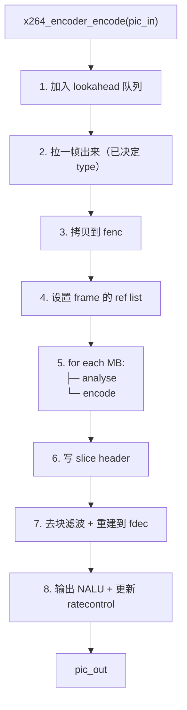
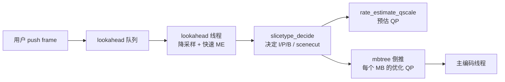
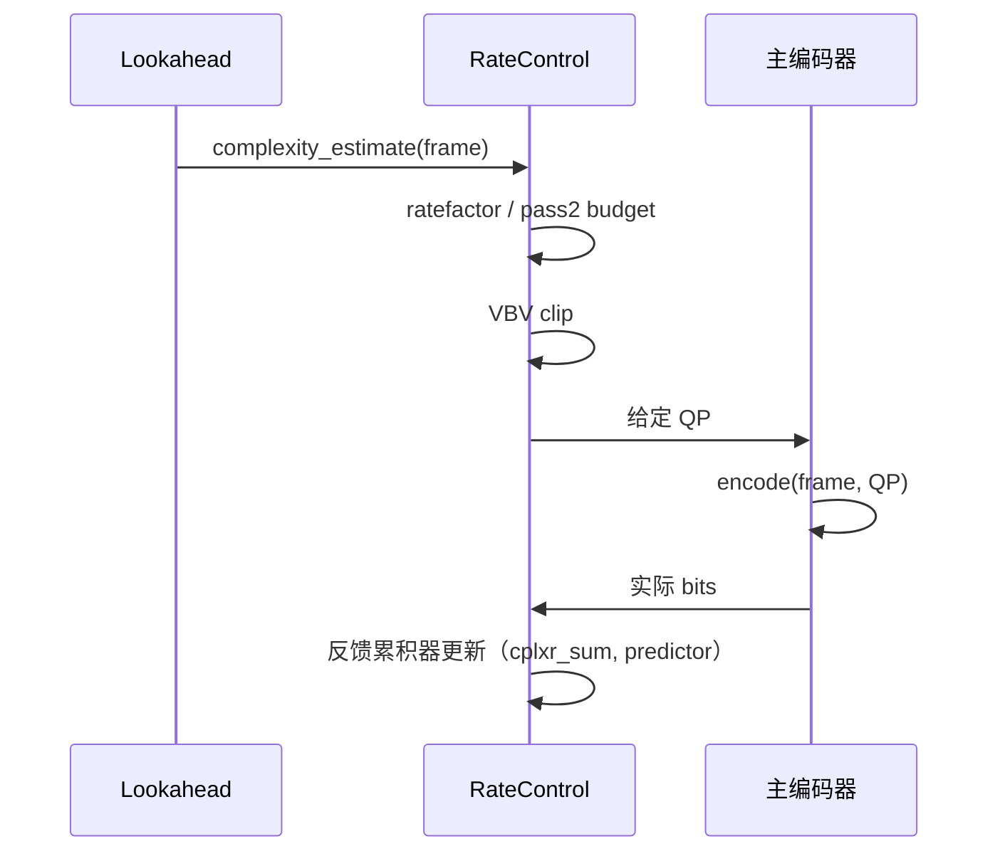

# 最新版 x264 源码深入浅出——从工业级编码器到性能榨取

**作者**：汪亮（bertonwang）  
**邮箱**：<47608843@qq.com>  
**版本**：v1.0 ｜ **最后更新**：2026-05-14

> **本书风格参考《C++11 新特性解析与应用深入理解》《C++23 新特性解析与应用深入理解》**，
> 对每一个 x264 主题按
> **「问题背景 → 概念形式 → 源码定位 → 关键算法 → 性能技巧 → 调优实战」**
> 六段式逐一拆解，目标是让**已经看过《H.264 标准深入浅出》**的开发者，
> **只读这一本，就能从"编译 x264"走到"读懂关键路径、改造 / 加速 / 集成到自家产品"**。

---

## 目录

- [前言：为什么 x264 仍是 2026 年的金标准](#前言为什么-x264-仍是-2026-年的金标准)
- [第 0 章：环境与工具链——拉源码、编译、跑通](#第-0-章环境与工具链拉源码编译跑通)

### 第一部分　工程总览
- [第 1 章：源码目录全图](#第-1-章源码目录全图)
- [第 2 章：构建系统（configure / Makefile / NASM）](#第-2-章构建系统configure--makefile--nasm)
- [第 3 章：从命令行到 API ——入口三件套](#第-3-章从命令行到-api-入口三件套)
- [第 4 章：核心数据结构（x264_t / x264_param_t / x264_picture_t）](#第-4-章核心数据结构x264_t--x264_param_t--x264_picture_t)

### 第二部分　主流水线
- [第 5 章：编码主循环 `x264_encoder_encode`](#第-5-章编码主循环-x264_encoder_encode)
- [第 6 章：Lookahead 与多线程模型](#第-6-章lookahead-与多线程模型)
- [第 7 章：宏块分析 `x264_macroblock_analyse`](#第-7-章宏块分析-x264_macroblock_analyse)
- [第 8 章：宏块编码 `x264_macroblock_encode`](#第-8-章宏块编码-x264_macroblock_encode)
- [第 9 章：码率控制（ABR / CRF / 2pass / VBV）](#第-9-章码率控制abr--crf--2pass--vbv)

### 第三部分　关键算法解剖
- [第 10 章：帧类型决策（B-adapt / scenecut）](#第-10-章帧类型决策b-adapt--scenecut)
- [第 11 章：运动估计——菱形/六边形/UMH/ESA](#第-11-章运动估计菱形六边形umhesa)
- [第 12 章：亚像素细化与 SAD/SATD/SSD](#第-12-章亚像素细化与-sadsatdssd)
- [第 13 章：帧内预测搜索](#第-13-章帧内预测搜索)
- [第 14 章：变换 + 量化 + 反量化](#第-14-章变换--量化--反量化)
- [第 15 章：去块滤波环内实现](#第-15-章去块滤波环内实现)
- [第 16 章：CAVLC / CABAC 写码引擎](#第-16-章cavlc--cabac-写码引擎)
- [第 17 章：心理视觉优化（psy-rd / aq-mode / mbtree）](#第-17-章心理视觉优化psy-rd--aq-mode--mbtree)

### 第四部分　性能榨取
- [第 18 章：MMX/SSE2/SSSE3/AVX2/AVX-512 汇编全景](#第-18-章mmxsse2ssse3avx2avx-512-汇编全景)
- [第 19 章：ARM NEON / AArch64 / SVE 路径](#第-19-章arm-neon--aarch64--sve-路径)
- [第 20 章：x264_pixel_function_t 与 dispatcher](#第-20-章x264_pixel_function_t-与-dispatcher)
- [第 21 章：多线程：lookahead / sliced / frames](#第-21-章多线程lookahead--sliced--frames)
- [第 22 章：缓存友好性与内存池](#第-22-章缓存友好性与内存池)

### 第五部分　调参实战
- [第 23 章：preset 与 tune 的真实含义](#第-23-章preset-与-tune-的真实含义)
- [第 24 章：直播 / RTC / 点播 / 归档 四套黄金参数](#第-24-章直播--rtc--点播--归档-四套黄金参数)
- [第 25 章：自定义 zone / qpfile / chunk 编码](#第-25-章自定义-zone--qpfile--chunk-编码)
- [第 26 章：常见性能瓶颈与定位方法](#第-26-章常见性能瓶颈与定位方法)

### 第六部分　集成与扩展
- [第 27 章：在 FFmpeg 里使用 libx264](#第-27-章在-ffmpeg-里使用-libx264)
- [第 28 章：直接调用 libx264 API（带可运行示例）](#第-28-章直接调用-libx264-api带可运行示例)
- [第 29 章：定制特性——加水印 / 自定义 SEI / 透明通道（4:4:4）](#第-29-章定制特性加水印--自定义-sei--透明通道444)
- [第 30 章：移植 / 裁剪 / 嵌入式集成](#第-30-章移植--裁剪--嵌入式集成)

### 附录
- [附录 A：x264 命令行参数全景速查](#附录-ax264-命令行参数全景速查)
- [附录 B：源码常用宏与日志开关](#附录-b源码常用宏与日志开关)
- [附录 C：常见错误与坑](#附录-c常见错误与坑)

---

## 前言：为什么 x264 仍是 2026 年的金标准

> 一句话：**同样码率下，x264 medium 把 90% 的硬件 H.264 编码器按在地上摩擦。**

| 特性 | x264 | 硬件 H.264 |
|---|---|---|
| 画质（同码率 SSIM） | 100% | 80~90% |
| 调参灵活度 | 几百个参数 | 十来个 |
| 码率控制（VBV / 2pass） | 完整 | 通常仅 CBR |
| 心理视觉优化（psy-rd, mbtree） | ✅ | ❌ |
| 跨平台 | x86/ARM/RISC-V/Loong | 各厂封闭 |
| 速度（preset ultrafast） | > 实时 4K | > 实时 8K |

x264 自 2003 年立项至今，**仍在 master 分支持续提交**，是 **FFmpeg、OBS、HandBrake、各大点播 / 直播平台**的事实标准。

> 💡 阅读本书前需先读 [《H.264 标准深入浅出》](./H.264标准深入浅出-从语法元素到工程实战.md)，否则部分章节会"知其然不知其所以然"。

**学习路径**：


---

## 第 0 章：环境与工具链——拉源码、编译、跑通

```bash
git clone https://code.videolan.org/videolan/x264.git
cd x264

# Linux / macOS
./configure --enable-shared --enable-static --disable-asm    # 不开汇编先跑
make -j$(nproc)
sudo make install

# 启用汇编（推荐）
./configure --enable-shared --enable-static                  # 自动检测 NASM
make -j$(nproc)
```

测试：

```bash
# YUV 转 H.264
x264 --preset medium --crf 23 --output out.h264 \
     --input-res 1920x1080 --fps 25 input.yuv

# 跑标准测试集
ffmpeg -i sample.mp4 -c:v libx264 -preset slow -crf 22 out.mp4
```

> 💡 **必装**：NASM ≥ 2.13（汇编源码编译需要）、pkg-config、gcc/clang。

---

# 第一部分　工程总览

---

## 第 1 章：源码目录全图

```
x264/
├── x264.c               命令行可执行入口
├── x264.h               公开 API（你 #include 的那一份）
├── encoder/
│   ├── encoder.c        ★ x264_encoder_encode 主流水线
│   ├── analyse.c        ★ 宏块分析（决定模式）
│   ├── macroblock.c     ★ 宏块编码（实际写比特）
│   ├── me.c             运动估计核心
│   ├── ratecontrol.c    码率控制（CRF/ABR/VBV/mbtree）
│   ├── lookahead.c      帧类型预决策
│   ├── slicetype.c      I/P/B 决策算法
│   ├── set.c            SPS/PPS 写入
│   ├── cabac.c          CABAC 上下文与编码
│   ├── cavlc.c          CAVLC 编码
│   └── rdo.c            率失真优化
├── common/
│   ├── common.h         共用结构 / 宏
│   ├── frame.c          帧池管理
│   ├── mc.c             运动补偿（C 参考实现）
│   ├── pixel.c          SAD/SATD/SSD（C 参考）
│   ├── dct.c            整数 DCT（C 参考）
│   ├── deblock.c        去块滤波
│   ├── quant.c          量化
│   ├── predict.c        帧内预测
│   ├── x86/             ★ x86 汇编（NASM .asm）
│   │   ├── pixel-a.asm
│   │   ├── mc-a.asm
│   │   ├── dct-64.asm
│   │   └── ...
│   ├── aarch64/         ★ ARM64 汇编
│   ├── arm/             ARMv7 NEON
│   ├── ppc/, mips/, loongarch/  其它平台
├── filters/             输入预处理（重采样、crop、resize）
├── input/output/        YUV / Y4M / lavf / FFMS 读写
└── tools/, doc/         工具与文档
```

> 💡 **大局观速记**：`encoder/` 是"逻辑"，`common/` 是"运算 + 平台优化"。看核心算法只需 `encoder/`，看性能只需 `common/x86 + aarch64`。

---

## 第 2 章：构建系统（configure / Makefile / NASM）

x264 没用 CMake/autoconf，自己手写了一个 `configure` shell 脚本：

```
configure → 检测 CPU / OS / 编译器 / 汇编器
         → 生成 config.mak、config.h
make    → 调 gcc 编 .c、调 nasm 编 .asm、链接 libx264.a/so
```

汇编规则（`Makefile`）：

```make
%.o: %.asm
    $(AS) $(ASFLAGS) -o $@ $<
```

`ASFLAGS` 会带 `-Pcommon/x86/x86inc.asm` —— 这是 x264 自家的"汇编通用宏框架"，让 32/64 位、AT&T/Intel 一份代码统一。

> 💡 编 ARM64 路径：`./configure --host=aarch64-linux-gnu --cross-prefix=aarch64-linux-gnu-`。
> Windows MSVC 推荐用 **vcpkg** 或 MinGW 编。

---

## 第 3 章：从命令行到 API——入口三件套

`x264.c::main()` 流水：

```c
parse(argc, argv, &param)        // 解析命令行 → param
encode(&param, opt)              // 真正干活
```

`encode()` 的关键三步：

```c
h = x264_encoder_open(&param);       // 1. 打开编码器
while (read_frame(...)) {
    x264_encoder_encode(h, ...);     // 2. 喂帧
}
while (x264_encoder_delayed_frames(h))
    x264_encoder_encode(h, NULL);    // 3. 冲洗 lookahead
x264_encoder_close(h);
```

> 💡 三件套与所有"标准"的视频编码 API（FFmpeg `avcodec_send_frame/receive_packet`）一一对应。看懂这里就看懂 90% 的编解码 API。

---

## 第 4 章：核心数据结构（x264_t / x264_param_t / x264_picture_t）

### `x264_param_t`（用户配置）

```c
struct x264_param_t {
    int  i_width, i_height;
    int  i_csp;                // X264_CSP_I420 等
    int  i_keyint_max;         // GOP
    int  i_bframe;             // B 帧最大数
    struct {
        int  i_rc_method;      // X264_RC_CRF / ABR / 2PASS
        float f_rf_constant;   // CRF 值
        int  i_bitrate;        // ABR / CBR
        int  i_vbv_max_bitrate;
        int  i_vbv_buffer_size;
    } rc;
    struct { ... } analyse;    // 模式开关
    ...
};
```

### `x264_picture_t`（一帧）

```c
typedef struct {
    int     i_type;           // X264_TYPE_AUTO / I / P / B / IDR
    int64_t i_pts;
    int64_t i_dts;
    x264_image_t img;         // 平面 + stride + csp
    void   *opaque;
    ...
} x264_picture_t;
```

### `x264_t`（编码器内核句柄）—— 巨大、私有

主要持有：lookahead 线程、frames 池、当前 SPS/PPS、bitstream writer、ratecontrol context、汇编函数表 ……

> 💡 `x264_t` 在 `common/common.h` 里定义，**几百个字段**。第一次看会被吓住，记住一句话："它就是把 param 配置 + 运行时状态 + 函数表 + 缓冲区全塞一起"。

---

# 第二部分　主流水线

---

## 第 5 章：编码主循环 `x264_encoder_encode`

`encoder/encoder.c::x264_encoder_encode`：



关键时序：**lookahead 异步在前面跑** → main 线程一定能"提前知道未来 N 帧"，从而做出最优决策（B 帧、自适应 QP、mbtree 等）。

---

## 第 6 章：Lookahead 与多线程模型



参数：
- `--rc-lookahead 40` —— 看未来 40 帧。
- `--threads N` —— 帧级线程并发，默认 1.5×核数。
- `--sliced-threads` —— 切片级并行（低延迟用）。

> 💡 **延迟代价**：rc-lookahead 越大画质越好，但**编码延迟 = lookahead 帧数 / fps**。RTC 一般设 `--rc-lookahead 0 --no-mbtree`。

---

## 第 7 章：宏块分析 `x264_macroblock_analyse`

`encoder/analyse.c::x264_macroblock_analyse` 是 x264 的"大脑"：

```
analyse:
  if (I 帧 || I-MB 强制) {
      mb_analyse_intra()           // 试 I16x16 + 4 种 / I4x4 + 9 种 + I8x8
      RD-best
  } else if (P / B) {
      mb_analyse_inter_p16x16()    // 先全块运动估计
      if (mb_analyse_p_mixed_size) {
          analyse 16x8 / 8x16 / 8x8 / sub-8x8
      }
      compare cost(intra) vs cost(inter)
      best_mode → encode
  }
```

判定准则：**Lagrangian RD cost** —— `cost = SATD + λ * bits`。  
不同 preset 决定**搜索的模式数量**：

| preset | I 模式 | inter 子分割 | refs | subme |
|---|---|---|---|---|
| ultrafast | I16×16 only | 16×16 only | 1 | 0 |
| medium | 全部 | 全部 | 3 | 7 |
| placebo | 全部 + 8×8 RD | 全部 + RD | 16 | 11 |

---

## 第 8 章：宏块编码 `x264_macroblock_encode`

模式选定后由 `encoder/macroblock.c` 完成"真正的"编码：

```
macroblock_encode:
  predict(mode)                   // 根据 mode 算预测块
  residual = orig - pred
  transform(residual)             // 4×4 / 8×8 整数 DCT
  quant(residual)                 // QP 量化
  zigzag scan
  cavlc / cabac write             // 写比特
  inverse_quant + inverse_transform
  reconstruct = pred + dequant
  → 进入 fdec（重建帧）
```

> 💡 **关键不变量**：编码端的"重建帧"必须**与解码端完全一致** —— 这就是为什么变换 / 量化 / 滤波都得位精确。否则参考帧不一致会引发错误漂移。

---

## 第 9 章：码率控制（ABR / CRF / 2pass / VBV）

### 9.0 RC 三个核心问题

所有 RC 模式都在解决三个核心问题：

1. **每帧给多少 bits？**（bit budget allocation）
2. **怎么把 bits 转成 QP？**（bits ↔ QP 映射）
3. **编完发现超 / 欠预算怎么办？**（feedback loop）

x264 用一条**经验公式**把这三件事串起来（`encoder/ratecontrol.c`）：

$$
\text{qscale} = \text{qp2qscale}(QP) \propto 2^{(QP-12)/6}
$$

$$
\text{bits}_{\text{frame}} \;\approx\; \frac{\text{complexity}}{\text{qscale}}
$$

- **complexity**：由 lookahead 用 8×8 lowres 的 **SATD cost** 估出，越复杂的画面值越大。
- **qscale**：量化步长，QP 每 +6 翻一倍。
- 所以 **QP 每 +6，码率 ÷2**（这正是工程经验法则的来源）。

### 9.1 模式速览

| 模式 | 一句话 | 命令行 |
|---|---|---|
| **CRF**（默认推荐） | 恒定质量，码率自适应 | `--crf 23` |
| **ABR** | 平均码率 | `--bitrate 4000` |
| **CBR** | 严格定码率 | `--bitrate 4000 --vbv-maxrate 4000 --vbv-bufsize 4000` |
| **2-pass** | 第一遍统计、第二遍按帧分配 | `--pass 1` 然后 `--pass 2` |
| **CQP** | 严格定 QP | `--qp 22` |
| **VBV** | "管子+水池"模型，所有模式可叠加 | `--vbv-maxrate / --vbv-bufsize` |

### 9.2 CRF 原理：恒定"感知质量"

CRF（Constant Rate Factor）的目标：**人眼看每一帧"差不多清晰"**。

底层逻辑：

> 复杂帧（高 SATD）即便 QP 同样也会更模糊；简单帧（低 SATD）QP 高一点也看不出来。
> 所以 **不要恒定 QP，而是按复杂度反比调 QP**。

源码（`encoder/ratecontrol.c::rate_estimate_qscale`）核心公式：

$$
\text{qscale} = \text{qp2qscale}(\text{rfConstant}) \times \left(\frac{\text{complexity}_{\text{frame}}}{\text{complexity}_{\text{avg}}}\right)^{1 - q_{\text{compress}}}
$$

- `q_compress`（默认 0.6）：复杂度敏感度。1.0 → 完全跟随复杂度（=CQP），0.0 → 完全无视（=ABR）。
- CRF 23 在简单画面给 QP≈26、复杂画面给 QP≈21，**主观上同等"锐"**。

伪代码：

```c
float complexity = lookahead->satd_cost / blocks;       // 用 lowres SATD 估
float ratefactor = pow(2.0, (rfConstant - 12) / 6.0);
float qscale     = ratefactor * pow(complexity / avg_complexity, 1 - q_compress);
int   qp         = qscale2qp(qscale);                   // 反查表
```

> 💡 **CRF 黄金区间** 18~28：18 视觉无损、23 默认、28 弱网兜底。**CRF 不能保证总码率**——简单 10 分钟动画 + 复杂 10 分钟动作片，输出大小可能差 5×。

### 9.3 ABR 原理：恒定"平均码率"

ABR（Average Bit Rate）目标：**整段视频的平均比特率 = 用户设定值**。

底层逻辑（PID-style 反馈）：

```
target_bits_per_frame = total_bitrate / fps
foreach frame f:
    expected_bits = target * complexity_ratio(f)        # 复杂帧多分点
    qp            = bits_to_qp(expected_bits, complexity)
    actual_bits   = encode(f, qp)
    error         = actual_bits - expected_bits
    feedback     -= error                               # 偿还到后续帧
```

源码 `rate_estimate_qscale` 中 `cplxr_sum` / `wanted_bits_window` 就是这个反馈累积器：

```c
overflow = clipped( accum_overflow * (-rate_tolerance) );
qscale  *= overflow;                                    // 超预算 → 提高 qscale → QP↑
```

> 💡 ABR 的痛点：**单遍编码不知道未来**。开头编得太"省"，结尾发现还有预算又突然"豪奢"，码率波动大。**这正是 2-pass 的发明动机**。

### 9.4 CBR 原理：ABR + 严格 VBV

CBR = ABR + `vbv-maxrate = vbv-bufsize = bitrate`。

底层逻辑：每帧**强制**满足 VBV 缓冲区不溢出 / 不下溢，必要时跳帧或下调 QP。

> 💡 直播必须 CBR：网络管道是定容的，平均码率没意义，**瞬时码率超过带宽就卡顿**。

### 9.5 2-pass 原理：先看完全片再分配


第 1 遍记录每帧的 **complexity**（实际编码后的 bits）+ **type** + **QP**。  
第 2 遍把总 bit budget **按全局复杂度比例**精确分配到每帧：

$$
\text{bits}_i = \text{TotalBits} \times \frac{\text{complexity}_i^{q_{\text{compress}}}}{\sum_j \text{complexity}_j^{q_{\text{compress}}}}
$$

源码：`encoder/ratecontrol.c::init_pass2` + `rate_estimate_qscale_pass2`。

效果：**码率精度 ±1%**（vs ABR ±5~10%），同码率画质 +5~10% VMAF。**点播 / 归档首选**。

> 💡 2-pass 第一遍可以走 `--slow-firstpass` 做完整搜索（更准），也可以默认 `--fast-firstpass`（快但精度略低）。

### 9.6 VBV：所有模式背后的"漏桶"

VBV（Video Buffering Verifier）= H.264 标准定义的 **HRD 漏桶模型**：

```
        ┌──────────────────┐
   +bits│ buffer  (bufsize) │ -bitrate × Δt
   编码→│      （水池）       │←──────────── 解码端按恒速排空
        └──────────────────┘
                ↑
           不能溢出 / 不能下溢
```

- `vbv-maxrate`：解码端排空速率（= 网络带宽）。
- `vbv-bufsize`：解码缓冲区容量（= 启动延迟 ×带宽）。

每帧编码前 `update_vbv_plan()` 计算"剩余预算"，若某帧太大可能溢出 → **强制提高 QP**；若长期欠满 → **逐渐降低 QP**。

源码：`encoder/ratecontrol.c::clip_qscale` 把 qscale 夹到 VBV 安全区间。

工程经验：

| 场景 | maxrate | bufsize | 启动延迟 |
|---|---|---|---|
| 严格 CBR 直播 | = bitrate | = bitrate | ~1s |
| 流畅直播（允许波动） | = 1.5×bitrate | = 2×bitrate | ~2s |
| HLS / DASH | = 1.5×bitrate | = 4×bitrate | ~5s |
| 点播 BD | = level 上限 | = level 上限 | 无所谓 |

### 9.7 RC 决策时序图



> 💡 看懂这张图，等于看懂了 x264 / x265 / FFmpeg / OBS 的所有 RC 选项含义。

---

# 第三部分　关键算法解剖

---

## 第 10 章：帧类型决策（B-adapt / scenecut）

### 10.1 三个底层成本

所有 lookahead 决策都建立在两个**底层成本**之上（`encoder/slicetype.c`）：

```
icost(f)         = 把 f 当 I 帧编的预估 cost（多个 Intra 模式 SATD 取最小）
pcost(f, ref)    = 把 f 当 P 帧、用 ref 做参考的 cost（半像素 ME + SATD）
bcost(f, r0, r1) = 把 f 当 B 帧、双向参考 r0/r1 的 cost
```

所有这些 cost 都在 **降采样后的 8×8 块图**（`lowres`，分辨率 1/2）上做，所以代价仅原图的 1/4，可以离线快速跑大量假设。

源码：`encoder/slicetype.c::x264_slicetype_frame_cost`。

### 10.2 scenecut 判定原理

**核心思想**：如果当前帧"靠 P 编码也省不下多少 bits"，那就是场景切换 → 强制 IDR。

判定不等式（简化）：

```
P_cost(f) > I_cost(f) × bias
```

其中 `bias` 由 `--scenecut N`（默认 40）控制：N 越大越倾向于继续 P 帧、N=0 完全关闭。

更精确版本（含历史平均）：

```c
// slicetype.c::scenecut_internal
float icost = framecosts[i].i_cost_est_aq;
float pcost = framecosts[i].p_cost_est;
float bias  = 1.0 - 0.01 * scenecut_threshold;          // 默认 0.6
return pcost >= bias * icost;                           // true → IDR
```

附加保护：
- **min-keyint**：两次 IDR 间最少 N 帧，防止"闪屏"误判。
- **max-keyint**：超过 N 帧强制 IDR（即使没场景切换），保证可中途接入。
- **scenecut-bias**：随距上次 IDR 距离衰减，越接近 max-keyint 越容易触发。

> 💡 直播 / RTC **必须关闭 scenecut**（`--no-scenecut` 或 `--scenecut 0`），否则带宽会被突发 IDR 打爆。点播 / 归档则强烈建议开。

### 10.3 B-adapt 1（fast）：滑动窗贪心

每帧问一个问题："**当前位置插 B 还是 P？**"

```c
// 简化伪代码
if (pcost(f, prev) <= pcost(f, prev) * threshold &&     // f 像 prev
    bcost(f, prev, next) < pcost(f, prev) * 0.85)       // 双向更省
    type = B;
else
    type = P;
```

特点：
- O(N) 一次扫描。
- 局部最优，可能错过"长 B 段"的全局更优解。
- **veryfast / faster preset 默认**。

### 10.4 B-adapt 2（trellis / DP）：全局动态规划

把帧序列看成图，节点 = 帧索引，边 = 一段 (P + k 个 B + P) 子序列，权重 = 该段总 cost：

```
   IDR ──P──P──P──P──...
         └─B─┘   └─B B─┘   ←  各种长度的 B 段都考虑
         └──B B──┘
```

用 **Viterbi / 最短路** 找全局最小 cost 路径：

```c
// slicetype.c::slicetype_path
for (path_length = 1; path_length <= bframes+1; path_length++) {
    cost_path = inter_cost(prev, prev+path_length)
              + (path_length-1) * b_overhead;
    pick min over all path_length;
}
```

复杂度 O(N · B_max)，但 lowres 上仍很便宜。

效果：相比 B-adapt 1，**码率再省 2~5%**，主观更平滑。**slow / slower / veryslow preset 默认**。

> 💡 RTC 场景把 `bframes` 直接设 0 → 这两种算法都失效，**B-adapt 不是延迟来源，B 帧本身才是**（B 需要等"未来帧"才能编）。

### 10.5 mini-GOP 与最大 B 帧数

x264 的 GOP 内是"一段一段的 mini-GOP"：

```
IDR   P  B  B  P  B  B  P  B  P   IDR  ...
└─────┘ └─────┘ └─────┘ └──┘
mini-GOP: P 之间夹的 B 数 ≤ --bframes
```

`--bframes 5` = mini-GOP 最长 6（P + 5B）。  
`--b-pyramid normal` 允许 B 引用其它 B（构成层次 B），再省 ~3% 码率。

### 10.6 关键帧布局工程实战

| 场景 | keyint | min-keyint | scenecut | b-adapt |
|---|---|---|---|---|
| 直播（CMAF 2s 段） | `2 × fps` | `1 × fps` | **0**（关闭） | 1 |
| 点播（HLS 6s 段） | `6 × fps` | `2 × fps` | 40（默认） | 2 |
| 归档 | `10 × fps` | 1 | 40 | 2 |
| RTC | `2 × fps` | `1 × fps` | **0** | 0（无 B） |

> 💡 **段对齐很重要**：CMAF / HLS 的段长必须是 IDR 间隔的整数倍，否则播放器无法在段边界切流。

---

## 第 11 章：运动估计——菱形/六边形/UMH/ESA

| `--me` | 算法 | 速度 | 质量 |
|---|---|---|---|
| dia | 4 邻域菱形 | 极快 | 一般 |
| hex | 6 邻域六边形（默认） | 快 | 好 |
| umh | 不均匀多六边形 | 中 | 很好 |
| esa | 全搜索（暴力） | 慢 | 略好 |
| tesa | hadamard 全搜索 | 极慢 | 几乎最优 |

源码：`encoder/me.c::x264_me_search_ref`。

> 💡 **`hex` 已是工程最佳折中**。开 esa/tesa 收益 < 0.5% 但 CPU 翻倍。

---

## 第 12 章：亚像素细化与 SAD/SATD/SSD

| 度量 | 含义 | 用途 |
|---|---|---|
| **SAD** | Σ\|x-y\| | 整像素 ME |
| **SATD** | Hadamard 域 SAD | 亚像素 ME / RD |
| **SSD** | Σ(x-y)² | 真正的失真度量 |

`--subme N`（0~11）：N 越大亚像素细化越精。

> 💡 SATD 比 SAD 更接近"真实主观感受"，因为 Hadamard 类似低通 → 抑制了"恰好对齐但视觉差"的伪匹配。

---

## 第 13 章：帧内预测搜索

`encoder/analyse.c::x264_mb_analyse_intra`：

```
for mode in {DC, Vertical, Horizontal, ...}:
    pred = predict(mode)
    cost = SATD(orig - pred) + λ * bits(mode)
keep best
```

x264 还有"快速模式排除"——基于左/上邻已编码块的最可能模式（MPM）首先评估，命中率高时跳过其它模式。

---

## 第 14 章：变换 + 量化 + 反量化

文件：`common/dct.c`、`common/quant.c`、`common/x86/dct-*.asm`

变换：4×4 整数 DCT、8×8 整数 DCT（High Profile）、Hadamard 4×4 / 2×2 DC。

量化（`x264_quant_4x4`）：

```c
for (i=0; i<16; i++)
    dct[i] = (dct[i]*mf + bias) >> shift;
```

x264 在量化里加了"**死区**"（dead-zone）—— 接近 0 的小值直接置 0，省码率。

> 💡 量化死区由 `psy-rdoq` 微调，开后高频细节略多保留，画面"更锐"。

---

## 第 15 章：去块滤波环内实现

文件：`common/deblock.c`、`common/x86/deblock-a.asm`。

逐 4×4 边界：根据两侧 QP、是否 intra、MV 差 → 计算 `bS (boundary strength)`，然后调表查滤波系数。

x264 把它做成 **per-row** 处理，配合多线程 row-level 并发。

---

## 第 16 章：CAVLC / CABAC 写码引擎

CABAC 引擎（`encoder/cabac.c::x264_cabac_encode_decision`）：

```c
range -= rangeTabLPS[state][...];
if (bin == MPS) state = transIdxMPS[state];
else            state = transIdxLPS[state];
renormalize:
    while (range < 0x100) { range<<=1; low<<=1; bits_outstanding++; }
```

> 💡 CABAC 是**串行**算法（下一比特必须等当前 range 重归一化）。x264 把它**单独 SIMD 优化**：`encoder/cabac-a.asm` 加速 binarize 与 lookup。

---

## 第 17 章：心理视觉优化（psy-rd / aq-mode / mbtree）

> x264 比标准多出来的"灵魂三件套"

### psy-rd

> Lagrangian 里加上**视觉相似度奖励项**：让纹理保留更多细节，哪怕 PSNR 下降。
> 默认 `psy-rd=1.0:0.0`，**人眼觉得"更锐"**。

### aq-mode（自适应量化）

> 分析复杂度：把更多比特给"复杂区域"，少给平坦区域。
> 1=variance（默认）、2=auto-variance、3=auto-variance bias dark。

### mbtree

> 反向追踪每个 MB 在未来多少帧里被引用 → **被多人引用的 MB 给低 QP**（保护参考质量）。
> CRF + mbtree 是 x264 高画质的核心。

---

# 第四部分　性能榨取

---

## 第 18 章：MMX/SSE2/SSSE3/AVX2/AVX-512 汇编全景

`common/x86/`：

| 文件 | 加速对象 |
|---|---|
| pixel-a.asm | SAD / SATD / SSD（百多个变种） |
| mc-a.asm | 运动补偿插值（6-tap、双线性） |
| dct-64.asm | 4×4/8×8 整数 DCT |
| quant-a.asm | 量化 / 反量化 |
| deblock-a.asm | 去块滤波 |
| cabac-a.asm | CABAC binarize 加速 |

汇编统一用 **`x86inc.asm` 框架**：

```asm
; pixel-a.asm 节选（伪样）
INIT_XMM ssse3
cglobal pixel_sad_16x16, 4, 4, 8
    ...
INIT_YMM avx2
cglobal pixel_sad_16x16, 4, 4, 8
    ...
```

`INIT_XMM/INIT_YMM/INIT_ZMM` 自动处理：
- 32/64 位 ABI 差异（参数寄存器、调用约定）。
- 寄存器名映射（xmm/ymm/zmm）。
- VEX/EVEX 前缀。

一份代码同时编出 SSSE3 / AVX2 / AVX-512 版本，运行时按 CPUID 选择。

---

## 第 19 章：ARM NEON / AArch64 / SVE 路径

`common/aarch64/` —— AArch64 NEON 汇编：

```
pixel-a.S, mc-a.S, dct-a.S, deblock-a.S, quant-a.S
```

写法用 GAS UAL 语法，关键技巧：
- 16×16 SAD：`uabd → uadalp → addv` 一条龙。
- 6-tap 插值：用 `smull2 + smlal` 拼线性组合。
- 4×4 DCT：4 寄存器并行，**每个 lane 是一行**。

> 💡 x264 在 Apple M1 上**AArch64 实现性能 ≈ 同档 Intel x86**，因为 NEON 实现极其精细。

---

## 第 20 章：x264_pixel_function_t 与 dispatcher

`common/pixel.c::x264_pixel_init`：

```c
void x264_pixel_init(int cpu, x264_pixel_function_t *pixf) {
    pixf->sad[PIXEL_16x16] = x264_pixel_sad_16x16_c;        // 默认 C
#if HAVE_X86
    if (cpu & X264_CPU_SSE2)  pixf->sad[...] = x264_pixel_sad_16x16_sse2;
    if (cpu & X264_CPU_AVX2)  pixf->sad[...] = x264_pixel_sad_16x16_avx2;
    if (cpu & X264_CPU_AVX512) pixf->sad[...] = x264_pixel_sad_16x16_avx512;
#endif
#if HAVE_AARCH64
    if (cpu & X264_CPU_NEON)  pixf->sad[...] = x264_pixel_sad_16x16_neon;
#endif
}
```

> 💡 这就是 x264 的"运行时 dispatcher"模式 —— **同一份 API、最优 ISA 自动选择**。
> 这种"函数表"模式后来被 OpenH264、x265、libvpx、AV1 几乎所有编解码器抄走。

---

## 第 21 章：多线程：lookahead / sliced / frames

| 线程模式 | 含义 | 延迟 |
|---|---|---|
| **frame-level**（默认） | 不同帧并发编码 | 高（一帧入队后要等结果） |
| **sliced threads** | 单帧切多 slice 并发 | 低（适合直播） |
| **lookahead 单独线程** | 提前决策 | 由 rc-lookahead 决定 |

帧级并发的关键：**P/B 帧的参考帧需已重建** → 用一个 Frame buffer 管理状态机。

> 💡 工程：直播低延迟用 `--threads 4 --sliced-threads`；点播 / 离线用 `--threads N`（默认）。

---

## 第 22 章：缓存友好性与内存池

x264 自己写了一套"对齐内存池"——每帧的 luma/chroma plane **64 字节对齐**，并预先分配好 fenc/fdec/lookahead 多版本缓冲。

宏 `x264_malloc`：

```c
void *x264_malloc(int size) {
    void *p = NULL;
    if (posix_memalign(&p, 64, size + 64) == 0) return p;
    return NULL;
}
```

> 💡 这种"全局对齐 + 行 stride 16 倍数"是 SIMD 性能保障的基础。修改源码时**不要破坏对齐**。

---

# 第五部分　调参实战

---

## 第 23 章：preset 与 tune 的真实含义

### preset（速度 vs 质量）

| preset | 相对速度 | 相对码率 |
|---|---|---|
| ultrafast | 100× | +60% |
| superfast | 60× | +35% |
| veryfast | 30× | +15% |
| faster | 15× | +6% |
| fast | 8× | +3% |
| **medium** | 5× | 0% (基线) |
| slow | 3× | -3% |
| slower | 1.5× | -5% |
| veryslow | 1× | -7% |
| placebo | 0.3× | -8% |

> 💡 **medium 是工程最佳折中**，"slow" 收益极小但耗时翻倍。

### tune（场景偏好）

| tune | 偏好 |
|---|---|
| film | 有胶片颗粒，高 psy-rd |
| animation | 平滑动画，高 B 帧、高 ref |
| grain | 保留噪声 |
| stillimage | 高 aq、长 GOP |
| psnr / ssim | 关闭心理优化（跑 benchmark 用） |
| **fastdecode** | 关 CABAC、关 8x8 dct，硬件解码友好 |
| **zerolatency** | 关 lookahead、关 B 帧、关 mbtree |

---

## 第 24 章：直播 / RTC / 点播 / 归档 四套黄金参数

```bash
# 1. 点播 OTT 高画质
x264 --preset slow --crf 21 --keyint 250 --bframes 5 \
     --b-adapt 2 --mbtree --aq-mode 2 --psy-rd 1.0:0.15 ...

# 2. 直播 (1080p30, 4Mbps, 端到端 1~3s)
x264 --preset veryfast --tune zerolatency --bframes 0 \
     --keyint 60 --rc cbr --bitrate 4000 \
     --vbv-maxrate 4000 --vbv-bufsize 4000

# 3. RTC (低端到端 < 200ms)
x264 --preset ultrafast --tune zerolatency --profile baseline \
     --bframes 0 --refs 1 --rc-lookahead 0 --no-mbtree \
     --keyint 60 --slices 4 --rc cbr --bitrate 1500

# 4. 归档 (visually lossless)
x264 --preset veryslow --crf 16 --keyint 240 --bframes 8 \
     --b-adapt 2 --ref 8 --me umh --subme 10 --trellis 2 \
     --aq-mode 3 --psy-rd 1.0:0.20 --mbtree
```

---

## 第 25 章：自定义 zone / qpfile / chunk 编码

### `--zones`（局部 QP 调整）

```
--zones 0,250,q=18 / 1000,2000,b=1.5
```

第 0~250 帧 QP=18；第 1000~2000 帧码率 ×1.5。**用于片头/重点片段精修**。

### `--qpfile`（外部 QP 指定）

```
0 I 18
1 P -1
2 B -1
3 P 22
```

文件每行 = 帧号 + 类型 + QP（-1 = 自动）。**适合 AB 测试 / 强制关键帧位置**。

### chunk encoding（分布式）

通过 `--seek` + `--frames` 把视频切片分发到多机并行编码，最后用 `mkvmerge / ffmpeg concat` 拼回。**点播平台规模化必备**。

---

## 第 26 章：常见性能瓶颈与定位方法

```bash
# 跑性能：
x264 --preset slow --no-asm input.yuv -o /dev/null   # 关汇编对比
x264 --preset slow input.yuv -o /dev/null --psnr     # 看每帧耗时

# 用 perf 看热点
perf record -g x264 --preset medium ... -o out.h264
perf report --no-children
```

常见热点：
- `pixel_sad_*` —— 检查 NEON/AVX2 是否选中。
- `analyse_inter` —— 调小 `--me` / `--subme`。
- `cabac_encode_*` —— 切 CAVLC（损 5~10% 码率换速度）。

---

# 第六部分　集成与扩展

---

## 第 27 章：在 FFmpeg 里使用 libx264

`libavcodec/libx264.c` 是 FFmpeg 的 x264 封装。常用：

```bash
ffmpeg -i in.mp4 -c:v libx264 -preset slow -crf 22 \
       -profile:v high -level 4.1 -bf 3 -refs 4 \
       -x264-params "aq-mode=3:psy-rd=1.0,0.15" out.mp4
```

> 💡 FFmpeg 把 x264 参数分两类：
> - 一线参数（`-preset/-tune/-crf/-bitrate`）有专门 mapping。
> - 二线参数走 `-x264-params "key=val:..."` 通道直传。

---

## 第 28 章：直接调用 libx264 API（带可运行示例）

```c
#include <x264.h>
#include <stdio.h>

int main(int argc, char** argv) {
    int W = 1920, H = 1080;

    x264_param_t p;
    x264_param_default_preset(&p, "medium", "zerolatency");
    p.i_width  = W;
    p.i_height = H;
    p.i_csp    = X264_CSP_I420;
    p.i_fps_num = 25; p.i_fps_den = 1;
    p.b_repeat_headers = 1;          // 每个关键帧前带 SPS/PPS
    p.b_annexb = 1;
    p.rc.i_rc_method   = X264_RC_CRF;
    p.rc.f_rf_constant = 23.0f;
    x264_param_apply_profile(&p, "high");

    x264_t *h = x264_encoder_open(&p);

    x264_picture_t in, out;
    x264_picture_alloc(&in, X264_CSP_I420, W, H);

    FILE *fy = fopen("in.yuv", "rb");
    FILE *fo = fopen("out.h264", "wb");

    int64_t pts = 0;
    while (fread(in.img.plane[0], 1, W*H,        fy) == W*H &&
           fread(in.img.plane[1], 1, W*H/4,      fy) == W*H/4 &&
           fread(in.img.plane[2], 1, W*H/4,      fy) == W*H/4) {
        in.i_pts = pts++;
        x264_nal_t *nals; int nnal;
        int n = x264_encoder_encode(h, &nals, &nnal, &in, &out);
        if (n > 0) fwrite(nals[0].p_payload, 1, n, fo);
    }
    while (x264_encoder_delayed_frames(h)) {
        x264_nal_t *nals; int nnal;
        int n = x264_encoder_encode(h, &nals, &nnal, NULL, &out);
        if (n > 0) fwrite(nals[0].p_payload, 1, n, fo);
    }

    x264_encoder_close(h);
    x264_picture_clean(&in);
    fclose(fy); fclose(fo);
    return 0;
}
```

编译：

```bash
gcc demo.c -o demo $(pkg-config --cflags --libs x264)
```

---

## 第 29 章：定制特性——加水印 / 自定义 SEI / 透明通道（4:4:4）

### 自定义 SEI

```c
x264_nal_t sei_nal;
const char *payload = "MyApp v1.0";
x264_t_sei_write(&h->out.bs, payload, strlen(payload), 5);  // 5 = user_data_unregistered
```

> ⚠️ 内部 API 随版本变更，建议 fork 后改 `set.c::x264_sei_write`。

### 4:4:4（含 Alpha）

x264 编 `X264_CSP_I444` + High444 Profile，再用容器层（如 ProRes 4444、MKV）携带 Alpha plane。

### 加水印 / 时间戳

最简单：在送编码前 `cv::putText` 渲染到 YUV plane，再编码。**编码器内插水印性价比低**，前级 OpenCV 即可。

---

## 第 30 章：移植 / 裁剪 / 嵌入式集成

裁剪体积：

```bash
./configure --disable-asm --disable-cli \
            --disable-thread --disable-interlaced --disable-gpl
```

可把 libx264.a 压到 < 1MB（Cortex-M 级仍嫌大，建议 OpenH264 子集）。

跨平台（带 NDK）：

```bash
./configure --host=aarch64-linux-android \
            --cross-prefix=$NDK/.../aarch64-linux-android30- \
            --enable-pic --enable-static
```

---

# 附录

---

## 附录 A：x264 命令行参数全景速查

```
质量：     --crf  --bitrate  --pass  --vbv-maxrate  --vbv-bufsize
速度：     --preset  --tune
帧类型：   --keyint  --min-keyint  --bframes  --b-adapt  --no-scenecut
参考：     --ref
熵编码：   --no-cabac
模式分析： --analyse  --no-8x8dct  --no-mixed-refs  --no-fast-pskip
ME：       --me  --subme  --merange
心理：     --psy-rd  --aq-mode  --aq-strength  --no-mbtree
线程：     --threads  --sliced-threads  --rc-lookahead
输出：     --output  --profile  --level  --sar  --fps
```

---

## 附录 B：源码常用宏与日志开关

| 宏 | 作用 |
|---|---|
| `X264_LOG_*` | 日志级别 |
| `x264_log(h, level, fmt, ...)` | 打日志 |
| `X264_BFRAME_MAX` 16 | B 帧上限 |
| `X264_REF_MAX` 16 | 参考帧上限 |
| `RDO_SKIP_BS` | 走 RD 但不真正写比特（试探） |
| `M32 / M64` | 32/64 位 unaligned load 宏（汇编思维） |

调试编译：`./configure --enable-debug` → 打开内部断言 + 详细日志。

---

## 附录 C：常见错误与坑

| 现象 | 真正原因 | 解决 |
|---|---|---|
| 链接 libx264 找不到符号 | x264 用 ABI 版本号，pkg-config 不一致 | 重装、清缓存 |
| Windows MSVC 编译失败 | x264 仅支持 GCC/Clang | 用 MinGW / vcpkg |
| 跑得慢，没启用汇编 | configure 没探到 NASM | 装 NASM ≥ 2.13 |
| 关键帧间距不准 | scenecut 触发 | 加 `--no-scenecut` |
| 直播首屏慢 | repeat_headers 没开 | `--repeat-headers` |
| RTC 偶发花屏 | sliced_threads 未配合 NAL 切片 | 加 `--slices N` |
| 4:4:4 编码报错 | 默认 build 未开 | configure 默认开了，仅当 csp 设错 |
| FFmpeg `-x264-params` 不生效 | 拼写错或被 `-preset` 覆盖 | 后置参数优先 |
| mbtree 与 zerolatency 冲突 | tune 自动关 mbtree | 接受即可 |
| Apple Silicon 编译 ARM 汇编报错 | 老旧 NASM 不支持 | 改用 brew 最新 NASM 或 `--disable-asm` |

---

> **结语**
>
> x264 是地球上**经过最长时间、最大规模工程考验**的 H.264 软编码器。
> 学完本书你拥有了：
> 1. **能读源码** —— 主流水线、关键算法、汇编全景。
> 2. **能调参** —— 直播、RTC、点播、归档四套配方。
> 3. **能集成** —— FFmpeg、libx264 API、自定义 SEI。
>
> 接下来推荐配套阅读：
> - [《H.264 标准深入浅出》](./H.264标准深入浅出-从语法元素到工程实战.md)
> - [《OpenH264 源码深入浅出》](./OpenH264源码深入浅出-Cisco开源RTC编码器全景剖析.md)
>
> 当你能用 x264 跑出**比硬件编码器画质更高、码率更省**的视频时，你就真正"用上"了 H.264 的潜力。
>
> ——本书完
