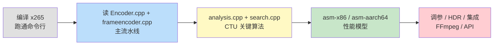
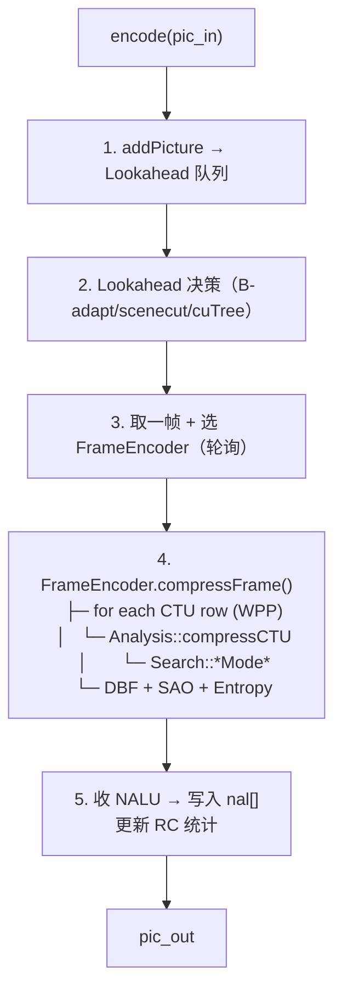
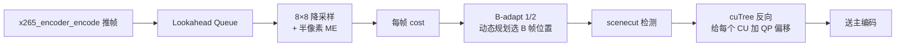
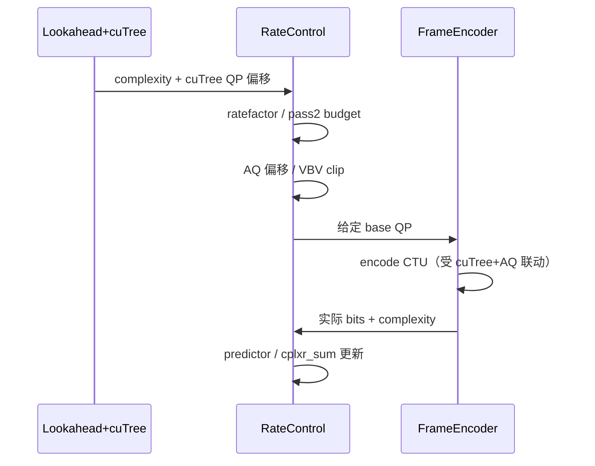
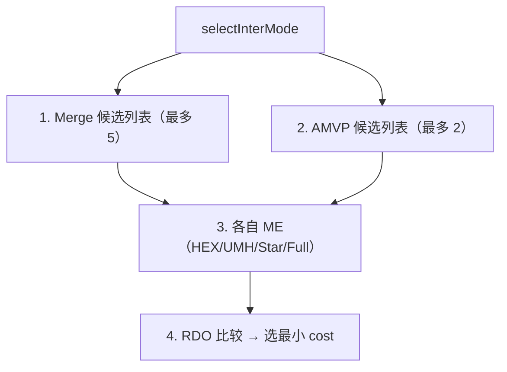

# 最新版 x265 源码深入浅出——从工业级 HEVC 编码器到性能榨取

**作者**：汪亮（bertonwang）  
**邮箱**：<47608843@qq.com>  
**版本**：v1.0 ｜ **最后更新**：2026-05-14

> **本书风格参考《C++11 新特性解析与应用深入理解》《C++23 新特性解析与应用深入理解》**，
> 对每一个 x265 主题按
> **「问题背景 → 概念形式 → 源码定位 → 关键算法 → 性能技巧 → 调优实战」**
> 六段式逐一拆解，目标是让**已经看过《H.265 标准深入浅出》**的开发者，
> **只读这一本，就能从"编译 x265"走到"读懂 CTU 分析路径、改造 / 加速 / 集成到自家产品"**。

---

## 目录

- [前言：为什么 x265 是 4K HDR 时代的金标准](#前言为什么-x265-是-4k-hdr-时代的金标准)
- [第 0 章：环境与工具链——拉源码、编译、跑通](#第-0-章环境与工具链拉源码编译跑通)

### 第一部分　工程总览
- [第 1 章：源码目录全图](#第-1-章源码目录全图)
- [第 2 章：构建系统（CMake / NASM / Multilib 8/10/12 bit）](#第-2-章构建系统cmake--nasm--multilib-81012-bit)
- [第 3 章：从命令行到 API ——入口三件套](#第-3-章从命令行到-api-入口三件套)
- [第 4 章：核心数据结构（Encoder / x265_param / x265_picture）](#第-4-章核心数据结构encoder--x265_param--x265_picture)

### 第二部分　主流水线
- [第 5 章：编码主循环 `Encoder::encode`](#第-5-章编码主循环-encoderencode)
- [第 6 章：FrameEncoder 与多帧并行模型](#第-6-章frameencoder-与多帧并行模型)
- [第 7 章：Lookahead 与帧类型决策](#第-7-章lookahead-与帧类型决策)
- [第 8 章：CTU 分析 `Analysis::compressCTU`](#第-8-章ctu-分析-analysiscompressctu)
- [第 9 章：CU 编码 `Search` —— Intra/Inter 模式枚举](#第-9-章cu-编码-search-intrainter-模式枚举)
- [第 10 章：码率控制（CRF / ABR / 2pass / VBV / cuTree）](#第-10-章码率控制crf--abr--2pass--vbv--cutree)

### 第三部分　关键算法解剖
- [第 11 章：Intra 预测——35 种模式的快速搜索](#第-11-章intra-预测35-种模式的快速搜索)
- [第 12 章：Inter 预测——AMVP / Merge / TMVP](#第-12-章inter-预测amvp--merge--tmvp)
- [第 13 章：运动估计——HEX/UMH/Star/Full](#第-13-章运动估计hexumhstarfull)
- [第 14 章：变换 + 量化 + RDOQ](#第-14-章变换--量化--rdoq)
- [第 15 章：去块滤波 + SAO 环内](#第-15-章去块滤波--sao-环内)
- [第 16 章：CABAC 写码引擎](#第-16-章cabac-写码引擎)
- [第 17 章：心理视觉优化（psy-rd / psy-rdoq / aq-mode / cuTree）](#第-17-章心理视觉优化psy-rd--psy-rdoq--aq-mode--cutree)

### 第四部分　性能榨取
- [第 18 章：x86 SSE2/SSSE3/AVX2/AVX-512 汇编全景](#第-18-章x86-sse2ssse3avx2avx-512-汇编全景)
- [第 19 章：ARM NEON / AArch64 / SVE2 路径](#第-19-章arm-neon--aarch64--sve2-路径)
- [第 20 章：PrimitiveFunctions 与 dispatcher](#第-20-章primitivefunctions-与-dispatcher)
- [第 21 章：Frame / Slice / WPP / pmode 多线程模型](#第-21-章frame--slice--wpp--pmode-多线程模型)
- [第 22 章：Distributed encoding（chunk + 2pass）](#第-22-章distributed-encodingchunk--2pass)

### 第五部分　调参实战
- [第 23 章：preset 与 tune 的真实含义](#第-23-章preset-与-tune-的真实含义)
- [第 24 章：直播 / RTC / 点播 / 4K HDR 归档 五套黄金参数](#第-24-章直播--rtc--点播--4k-hdr-归档-五套黄金参数)
- [第 25 章：HDR10 / Dolby Vision 编码完整命令](#第-25-章hdr10--dolby-vision-编码完整命令)
- [第 26 章：常见性能瓶颈与定位方法](#第-26-章常见性能瓶颈与定位方法)

### 第六部分　集成与扩展
- [第 27 章：在 FFmpeg 里使用 libx265](#第-27-章在-ffmpeg-里使用-libx265)
- [第 28 章：直接调用 libx265 API（带可运行示例）](#第-28-章直接调用-libx265-api带可运行示例)
- [第 29 章：自定义裁剪 / 插件 / 测试集成](#第-29-章自定义裁剪--插件--测试集成)

### 附录
- [附录 A：x265 命令行参数全景速查](#附录-ax265-命令行参数全景速查)
- [附录 B：源码常用宏与日志开关](#附录-b源码常用宏与日志开关)
- [附录 C：常见错误与坑](#附录-c常见错误与坑)

---

## 前言：为什么 x265 是 4K HDR 时代的金标准

> 一句话：**同样码率下，x265 medium 把 80% 的硬件 HEVC 编码器按在地上摩擦；slow 模式画质接近 HM 参考，但快几十倍。**

| 特性 | x265 | 硬件 HEVC |
|---|---|---|
| 画质（同码率 SSIM） | 100% | 75~85% |
| HDR10 / HDR10+ / DV 支持 | ✅ 完整 | 部分 |
| 心理视觉优化（cuTree, psy-rdoq） | ✅ | ❌ |
| 码率控制（VBV / 2pass / chunk） | ✅ | 通常仅 CBR |
| 跨平台（x86/ARM/PPC/RISC-V） | ✅ | 各厂封闭 |
| 速度（preset ultrafast） | > 实时 4K（i9）/ 实时 8K（线程足） | > 实时 8K |

x265 由 MulticoreWare 维护，**完全开源（GPL）**，是 FFmpeg / HandBrake / AWS Elemental / 大量流媒体平台的事实标准 HEVC 软编。

> 💡 阅读本书前需先读 [《H.265 标准深入浅出》](./H.265标准深入浅出-从CTU四叉树到工程实战.md)。

**学习路径**：



---

## 第 0 章：环境与工具链——拉源码、编译、跑通

```bash
# 官方仓库（Bitbucket）
git clone https://bitbucket.org/multicoreware/x265_git.git x265
cd x265

# Linux / macOS（10 bit Multilib）
mkdir -p build/linux && cd build/linux
cmake -G "Unix Makefiles" \
      -DCMAKE_INSTALL_PREFIX=/usr/local \
      -DENABLE_SHARED=ON \
      -DHIGH_BIT_DEPTH=ON \
      ../../source
make -j$(nproc)
sudo make install

# 单一 8 bit
cmake -DHIGH_BIT_DEPTH=OFF ../../source

# Multilib（同时支持 8 / 10 / 12 bit）参考脚本：
#   build/multilib.sh    Linux
#   build/msys-multilib  Windows MSYS
```

测试：

```bash
# 编一段 1080p YUV
x265 --preset medium --crf 22 --output out.h265 \
     --input-res 1920x1080 --fps 25 input.yuv

# FFmpeg 调 libx265
ffmpeg -i sample.mp4 -c:v libx265 -preset slow -crf 22 \
       -profile:v main10 -pix_fmt yuv420p10le out.mp4
```

> 💡 **必装**：CMake ≥ 3.13、NASM ≥ 2.13（x86 汇编）、yasm 备选。

---

# 第一部分　工程总览

---

## 第 1 章：源码目录全图

```
x265/
├── source/
│   ├── x265.cpp                命令行入口
│   ├── x265.h / x265_config.h.in 公开 API
│   ├── encoder/
│   │   ├── encoder.cpp/.h        ★ 顶层 Encoder（API 实现）
│   │   ├── frameencoder.cpp/.h   ★ 单帧编码器（每帧一个）
│   │   ├── analysis.cpp/.h       ★ CTU 四叉树决策
│   │   ├── search.cpp/.h         ★ Intra/Inter 搜索
│   │   ├── motion.cpp/.h         运动估计
│   │   ├── slicetype.cpp/.h      帧类型决策（lookahead）
│   │   ├── ratecontrol.cpp/.h    码率控制（CRF/ABR/2pass/cuTree）
│   │   ├── reference.cpp         参考帧管理
│   │   ├── entropy.cpp           CABAC 编码
│   │   ├── dpb.cpp               解码图像缓冲
│   │   ├── sao.cpp               SAO
│   │   ├── nal.cpp               NAL 写入 + emulation prevention
│   │   ├── api.cpp               C API 桥接
│   │   ├── slicetype.cpp         B-adapt + scenecut
│   │   └── ...
│   ├── common/
│   │   ├── frame.cpp/.h          帧池
│   │   ├── pixel.cpp/.h          SAD/SATD/SSD（C 参考）
│   │   ├── dct.cpp/.h            DCT/DST 4×4~32×32（C 参考）
│   │   ├── ipfilter.cpp/.h       插值滤波
│   │   ├── loopfilter.cpp/.h     去块滤波
│   │   ├── intrapred.cpp/.h      35 种 Intra 预测
│   │   ├── piclist.cpp/.h        帧链表
│   │   ├── primitives.cpp/.h     ★ 函数指针表（dispatcher）
│   │   ├── cudata.cpp/.h         CU 数据结构
│   │   ├── x86/                  ★ x86 汇编（NASM .asm）
│   │   ├── aarch64/              ★ ARM64 汇编 / NEON intrinsics
│   │   ├── arm/                  ARMv7 NEON
│   │   └── ppc/, loongarch/      其它平台
│   ├── input/output/             YUV / Y4M
│   └── test/                     单测 + 性能基准
└── build/                         CMake 输出（自定义）
```

> 💡 **大局观**：`encoder/` 是逻辑（Encoder→FrameEncoder→Analysis→Search），`common/` 是运算 + 平台优化。看核心算法只看 `encoder/`，看性能只看 `common/x86 + aarch64`。

---

## 第 2 章：构建系统（CMake / NASM / Multilib 8/10/12 bit）

x265 用 CMake，关键变量：

| 变量 | 默认 | 含义 |
|---|---|---|
| `HIGH_BIT_DEPTH` | OFF | 编 10/12 bit 库（必须打开才能编 Main10） |
| `MAIN12` | OFF | 12 bit 模式 |
| `ENABLE_SHARED` | ON | .so/.dll |
| `ENABLE_LIBNUMA` | ON（Linux） | NUMA 多 CPU 调度 |
| `ENABLE_ASSEMBLY` | ON | x86 / ARM64 汇编 |
| `ENABLE_HDR_DOVI` | ON | Dolby Vision RPU |
| `EXPORT_C_API` | ON | C 接口（FFmpeg 用） |

**Multilib（8/10/12 bit 共存）**：

```bash
build/multilib.sh   # 自动编三套库后链接
```

输出：
- `libx265.so.10`（10 bit）+ `libx265.so.12`（12 bit）
- `libx265.so`（默认 8 bit + 内嵌 10/12 路径分发）

> 💡 命令行 `--output-depth 10` 即可切到 10 bit 库；FFmpeg `-pix_fmt yuv420p10le` 自动选。

---

## 第 3 章：从命令行到 API ——入口三件套

`x265.cpp::main()`：

```cpp
parseInput(argc, argv, &param)
api->encoder_open(&param)
while (read_frame(...)) api->encoder_encode(h, ...)
flush
api->encoder_close(h)
```

API 三件套（`x265.h`）：

```c
x265_encoder *x265_encoder_open(x265_param *p);
int           x265_encoder_encode(x265_encoder *e, x265_nal **nals, uint32_t *nnal,
                                  x265_picture *pic_in, x265_picture *pic_out);
void          x265_encoder_close(x265_encoder *e);
```

> 💡 与 x264 / OpenH264 / FFmpeg 都遵循"open / encode / close"模式。一通百通。

---

## 第 4 章：核心数据结构（Encoder / x265_param / x265_picture）

### `x265_param`（用户参数，几百个字段）

```c
typedef struct {
    int  internalCsp;                   // X265_CSP_I420 等
    int  sourceWidth, sourceHeight;
    int  fpsNum, fpsDenom;
    int  internalBitDepth;              // 8/10/12

    // 帧类型
    int  keyframeMin, keyframeMax;
    int  bframes;
    int  bframeBias;

    // 模式
    int  maxCUSize;                     // 64 / 32 / 16
    int  minCUSize;
    int  rdLevel;                       // 0~6 RD 强度
    int  bEnableRectInter;
    int  bEnableAMP;
    int  bEnableEarlySkip;

    // 心理
    double psyRd;
    double psyRdoq;
    int    rc_aqMode;                   // 1/2/3/4
    int    cuTree;

    // 码率控制
    struct {
        int    rateControlMode;         // CRF/ABR/CQP
        double rfConstant;
        int    bitrate;
        int    vbvBufferSize;
        int    vbvMaxBitrate;
        int    bStatRead, bStatWrite;   // 2pass
    } rc;

    // 并行
    int  frameNumThreads;
    int  numTileRows, numTileCols;
    int  bEnableWavefront;
    int  bDistributeMotionEstimation;

    // HDR
    int  bEmitHRDSEI;
    int  bEmitHDR10SEI;
    char *masteringDisplayColorVolume;
    int  maxCLL, maxFALL;
    int  bDolbyVisionProfile;
    char *doviRpuFile;
    ...
} x265_param;
```

### `x265_picture`

```c
typedef struct {
    int       bitDepth;
    int       colorSpace;
    int       sliceType;     // X265_TYPE_AUTO/IDR/I/P/B
    int64_t   pts, dts;
    void     *planes[3];
    int       stride[3];
    void     *userData;
    x265_dolby_vision_rpu rpu;
    ...
} x265_picture;
```

### `Encoder`（C++ 内核）

`encoder/encoder.h::Encoder` 持有：N 个 FrameEncoder（按 frameNumThreads）、Lookahead、RateControl、DPB、Entropy、SPS/PPS/VPS。

---

# 第二部分　主流水线

---

## 第 5 章：编码主循环 `Encoder::encode`

`encoder/encoder.cpp::Encoder::encode`：



要点：**多个 FrameEncoder 并行编码不同帧**，每个内部又用 WPP 多线程 → "帧级 + 行级"两级并行。

---

## 第 6 章：FrameEncoder 与多帧并行模型

`encoder/frameencoder.cpp::FrameEncoder::compressFrame`：

```cpp
foreach CTU row {
    encodeCTURow(row);   // WPP：行级线程
}
processPostFilter();     // DBF + SAO
processSEI();
writeBitstream();
```

并发模式：

| 参数 | 含义 |
|---|---|
| `frame-threads` | FrameEncoder 数量（多帧并行） |
| `wpp` | 单帧内 CTU 行并行 |
| `pmode` | 同一 CTU 内多模式并行（实验性） |
| `pme` | 多 ref 运动估计并行 |

> 💡 **典型工程**：`frame-threads = max(1, threads/4)` + `wpp = 1`。8 线程机一般 2 个 FrameEncoder + 4 线程 WPP。

---

## 第 7 章：Lookahead 与帧类型决策

### 7.0 为什么 HEVC 的帧类型决策比 H.264 重要

- HEVC 的 **B 帧赖赖几乎零代价（Skip/Merge高占比）**。
- HEVC 默认 **B 金字塔（bframes=4 、 b-pyramid=1）**。
- HEVC 的 IDR 代价更高（CTU 64×64 + 35 Intra）。

所以 lookahead 决策的准确性直接决定码率～10%、画质～15% VMAF。

### 7.1 三个底层成本

`encoder/slicetype.cpp` 首先用 **8×8 lowres 降采样帧**估出三个 cost：

```
icost(f)         = 把 f 当 I 帧编的预估 cost（lowres 上跑 9 种 Intra 取最小 SATD）
pcost(f, ref)    = 把 f 当 P 帧、用 ref 做参考的 cost（半像素 ME + SATD）
bcost(f, r0, r1) = 把 f 当 B 帧、双向参考 r0/r1 的 cost
```

这些 cost 跑在 lowres （1/2 分辨率，代价 1/4）上，可以离线为 **未来 N 帧** 快速试跨。

### 7.2 总体流程



### 7.3 scenecut 判定原理

**核心思想**：如果当前帧"靠 P 编码也省不下多少 bits"，那就是场景切换 → 强制 IDR。

x265 沿用 x264 的不等式（`slicetype.cpp::scenecutInternal`，简化）：

```cpp
float icost = curFrame->lowresCosts[0][0];
float pcost = curFrame->lowresCosts[1][0];
float bias  = (1.0f - 0.01f * scenecutThreshold) * (1.0f + recentTrend);
bool  isScenecut = pcost >= bias * icost;
```

- `--scenecut 40`（默认）：阈值越大越难触发。`--scenecut 0` 完全关闭。
- **保护 1**：`min-keyint`。默认 = `keyint / 10`，防止闪屏累计。
- **保护 2**：`max-keyint`。超过则强制 IDR，保证可随机接入。
- **动态偏移**：越接近 max-keyint、阈值自动降低（`recentTrend`），避免正好在极限处才插 IDR。

> ⚠️ 直播 / RTC **必须关 scenecut**（`--no-scenecut`），避免突发 IDR 打爆带宽。

### 7.4 B-adapt 1（fast）：贪心滑动窗

```cpp
for (i = 0; i < lookaheadDepth; i++) {
    if (bcost(i, prevP, nextP) < pcost(i, prevP) * 0.85)
        type[i] = B;
    else
        type[i] = P;
}
```

特点：O(N) 一次扫描，局部最优。**veryfast/faster preset 默认**。

### 7.5 B-adapt 2（trellis / DP）：全局动态规划

把帧序列看成图，节点 = 帧索引，边 = 一段 (P + k·B + P) 子序列，权重 = 该段总 cost：

```
   IDR ──P──P──P──P──...
         └─B─┘   └─B B─┘     ← 各种长度的 B 段都纳入评估
         └──B B──┘
```

```cpp
// slicetype.cpp::slicetypePath 简化
for (pathLen = 1; pathLen <= bframes + 1; pathLen++) {
    cost = interCost(prev, prev + pathLen)            // 全段 cost
         + (pathLen - 1) * bOverhead;                 // B 头 overhead
    pickMinCostPath();
}
```

复杂度 O(N · bframes)，但 lowres 上仍很便宜。收益：比 B-adapt 1 **再省 2~5%**码率，**slow/slower/veryslow preset 默认**。

### 7.6 cuTree：HEVC 独有的"反向传播"质量优化

cuTree 是 x265 的**清醒剧**，也是它同码率下画质胜 x264 的核心原因。

**核心思想**：被未来多帧引用的 CU，能量沿参考链传播 → 它画得准不准，会被后续多帧放大。

```
Frame N−2 ──ref─→ Frame N−1 ──ref─→ Frame N
   CU(x,y)            CU(x',y')          CU(x'',y'')
   propagate cost ←─── 反向累加
```

伪代码（`encoder/slicetype.cpp::cuTree`）：

```cpp
// 1) 反向扫描未来帧
for (Frame* f = lookaheadHead; f != lookaheadTail; f = f->next) {
    foreach CU in f:
        for each ref direction:
            propagateCost[refCU] += SATD(CU) * (1 - intraCost / interCost);
}

// 2) 转为 QP 偏移
foreach CU:
    weight = log2(propagateCost / SATD(CU) + 1);
    qpOffset = - cuTreeStrength * weight;        // 默认 strength = 5.0
    finalQp = clamp(baseQp + qpOffset, qpmin, qpmax);
```

直观理解：
- **被多帧引用 → weight 大 → QP 降 → 该 CU 编得更精**。
- **只被自己引用 → weight 小 → QP 升 → 省码率**。

收益：**BD-Rate 节省 8~12%**，是所有心理优化里收益最大的一个。

> ⚠️ cuTree 用未来帧信息，RTC不能用（延迟不可接受）：`--no-cutree`。

### 7.7 参数与延迟表

| 参数 | 默认 | 意义 | 延迟代价 |
|---|---|---|---|
| `--rc-lookahead` | 20 | 看未来 N 帧 | N / fps 秒 |
| `--bframes` | 4 | mini-GOP 最大 B 数 | bframes / fps 秒 |
| `--b-adapt` | 2 | 0=全 B 、 1=贪心 、 2=DP | 几乎无 |
| `--scenecut` | 40 | scenecut 阈值 | 0 |
| `--cutree` | 1 | 反向传播 QP 优化 | rc-lookahead同上 |
| `--keyint` | 250 | 最大 GOP | 0 |
| `--min-keyint` | auto | 最小 GOP | 0 |

> 💡 **延迟代价**：rc-lookahead 越大画质越好，编码延迟 = lookahead/fps。RTC 直播应设 `--rc-lookahead 0 --no-cutree --tune zerolatency`。

---

## 第 8 章：CTU 分析 `Analysis::compressCTU`

`encoder/analysis.cpp::Analysis::compressCTU` —— x265 的"大脑"：

```cpp
void compressCTU(...) {
    if (slice->isIntra)
        compressIntraCU(rootCU, depth=0);
    else
        compressInterCU(rootCU, depth=0);
}
```

`compressInterCU` 简化：

```
for depth = 0 .. maxDepth:
    试 CU = 2N×2N Skip / Merge
    试 Inter 2N×2N / 2N×N / N×2N / AMP
    试 Intra 2N×2N / N×N
    取最小 RD cost → bestCU(depth)
    if (depth < max)
        递归 4 个子 CU → sumRD
        if (sumRD < bestCU(depth)) 选子
比较 split vs no-split → 写最终模式
```

`rdLevel` 控制是否每模式都做完整 RDO（试编 + 反量化 + 反变换 + 重建）：

| rdLevel | 含义 |
|---|---|
| 0 | 仅 SAD（最快） |
| 1 | SATD + λ |
| 2 | + 部分 RDO |
| 3 | + RDO 残差 |
| 4 | + RDOQ |
| 5 | + RDO Quant + RDO partitions |
| 6 | 全开（最慢、最准） |

---

## 第 9 章：CU 编码 `Search` —— Intra/Inter 模式枚举

`encoder/search.cpp` 是真正"试编每种模式"的地方：

```cpp
checkIntra(...)                         // 35 模式 + MPM
checkInter_2Nx2N / 2NxN / Nx2N / NxN
checkInter_AMP_*                        // 8 种 AMP
checkMerge2Nx2N(...)
checkRDCostInter(...)
encodeResAndCalcRdInterCU(...)          // 真正写比特 + 反过程估真实成本
```

> 💡 **模式数量爆炸是 HEVC 的速度杀手**。x265 通过：
> - **earlySkip**（Skip 判定 + 残差能量极小则提前剪枝）
> - **earlyCU**（深度 0 已最优则不再 split）
> - **快速 Intra（粗 SATD → 精 RDO 三轮）**
> 
> 把搜索量减到 1/10 而画质几乎不损失。

---

## 第 10 章：码率控制（CRF / ABR / 2pass / VBV / cuTree）

### 10.0 RC 三个核心问题

与 x264 同构，但 HEVC 上变量更多：

1. **每帧给多少 bits？**（考虑 B 金字塔分层）
2. **怎么把 bits 转 QP？**（CTU 级 dQP 、 cuTree 偏移、 chroma QP 偏移）
3. **超 / 欠预算怎么办？**（VBV + predictor 反馈）

核心公式（`encoder/ratecontrol.cpp`）：

$$
\text{qScale} \;\propto\; 2^{(QP-12)/6}, \quad
\text{bits}_\text{frame} \;\approx\; \frac{\text{complexity}}{\text{qScale}}
$$

### 10.1 模式速览

| 模式 | 一句话 | 命令行 |
|---|---|---|
| **CRF**（默认推荐） | 恒定质量 | `--crf 22` |
| ABR | 平均码率 | `--bitrate 4000` |
| CBR | 严格定码率 | `--bitrate 4000 --vbv-maxrate 4000 --vbv-bufsize 4000` |
| CQP | 严格定 QP | `--qp 22` |
| **2-pass** | 第一遍统计 | `--pass 1 --slow-firstpass / --pass 2` |
| VBV | "管子+水池"约束 | `--vbv-maxrate / --vbv-bufsize` |

### 10.2 CRF 原理：恒定感知质量

与 x264同构，但随复杂度调节的是"qScale"而非 QP 本身：

$$
\text{qScale} \;=\; \text{qp2qScale}(\text{rfConstant}) \times \left(\frac{\text{complexity}_\text{frame}}{\text{complexity}_\text{avg}}\right)^{1 - q_\text{compress}}
$$

- `q_compress` 默认 0.6，1.0 退化为 CQP，0.0 退化为 ABR。
- HEVC 场景下，CRF 默认 28，常用 18~26（比 x264 低 ~5，同质量）。

```cpp
float ratefactor = qp2qScale(rfConstant);                  // 2^((rfConstant-12)/6)
float qScale     = ratefactor * pow(complexity / avgCplx,  1 - qCompress);
int   qp         = qScale2qp(qScale);                      // 反查表
```

> 💡 **CRF 黄金区间（HEVC）**：18～26。18 接近视觉无损、22 默认、26 弱网兜底。Main10 推荐再低 1～2。

### 10.3 ABR 原理：反馈累积器 + predictor

```
targetBitsPerFrame = totalBitrate / fps
foreach frame f:
    expectedBits = target * cplxRatio(f)        // 复杂帧多分点
    qp           = bitsToQp(expectedBits, complexity, predictor)
    actualBits   = encode(f, qp)
    error        = actualBits - expectedBits
    cplxr_sum   -= error                        // 偏差还到后续帧
    predictor.update(complexity, actualBits, qp)
```

`predictor` 是各帧类型独立的带忘记式线性拟合器（`rateControlEnd` 中 `updatePredictor`），每帧用 EWMA 更新：

```cpp
pred->coeff = (1 - decay) * pred->coeff + decay * (actualBits / complexity * qScale);
```

### 10.4 CBR 原理：ABR + 严格 VBV

`--bitrate = --vbv-maxrate = --vbv-bufsize`。每帧强制不渢出不下溢，必要时提高 QP 甚至 force-skip。

### 10.5 2-pass 原理：看完全片再分配


全局分配公式：

$$
\text{bits}_i \;=\; \text{TotalBits} \times \frac{\text{complexity}_i^{q_\text{compress}}}{\sum_j \text{complexity}_j^{q_\text{compress}}}
$$

源码：`encoder/ratecontrol.cpp::initPass2 / rateEstimateQscalePass2`。码率精度±1%，同码率画质 +5～10% VMAF。

### 10.6 VBV：漏桶模型与 Level 限制

```
        ┌────────────────┐
   +bits│ buffer  (bufsize) │ -bitrate × Δt
   编码→│     （水池）       │←──────────── 解码端按恒速排空
        └────────────────┘
```

HEVC Level 上限会限制 `vbv-maxrate / bufsize`（见《H.265 标准》第 7 章 Level 表）：

| Level | Tier=Main | Tier=High | 应用 |
|---|---|---|---|
| 4.1 | 30 Mb/s | 75 Mb/s | 1080p60 |
| 5.1 | 60 | 240 | **4K60 主流** |
| 6.1 | 120 | 480 | 8K60 |

超限会被 `clipQscale` 举高 QP。

### 10.7 cuTree：HEVC 独有的 QP 偏移机制

原理见 7.6。在 RC 纶线里看到的效果：

```cpp
// ratecontrol.cpp 简化逻辑
foreach CU:
    if (cuTreeStrength != 0) {
        qpOffset  = - strength * log2(propagateCost / curCost + 1);
        clampedQp = clamp(baseQp + qpOffset, qpmin, qpmax);
    }
```

与其他 RC 模式都可叠加：CRF + cuTree 是 x265 默认、也是它**同码率胜 x264 的核心原因**。

### 10.8 AQ：空间自适应量化

`--aq-mode` 是 cuTree 的互补，看的是同帧内的复杂度差异：

| aq-mode | 含义 |
|---|---|
| 0 | 关 |
| 1 | variance |
| **2 （默认）** | auto-variance |
| 3 | auto-variance bias dark |
| 4 | auto-variance + edges |

实现：在每个 CU 上计算 variance，平坦区 QP 提高（眼睛不敏感）、复杂区 QP 降低。**HDR 推荐 aq-mode=4**。

### 10.9 RC 决策时序图



> 💡 **工程黄金组合**：CRF + cuTree + aq-mode=2/4 + VBV（按下游带宽设）。点播/归档反而推荐补上 2pass。

---

# 第三部分　关键算法解剖

---

## 第 11 章：Intra 预测——35 种模式的快速搜索

`encoder/search.cpp::checkIntra` + `common/intrapred.*`：

```cpp
// 1. 粗筛：所有 35 模式 SATD
for mode in 0..34:
    pred = predict(mode)
    cost = SATD(orig - pred)
keep top N (一般 N=8) → MPM 优先

// 2. 精筛：候选模式做完整 RDO
for mode in candidates:
    pred → transform → quant → CABAC 估计 bits
    cost = SSD + λ * bits
selectBest
```

x265 用 **Hadamard butterfly** 把 35 模式的 SATD 一次性算出，AVX2 / NEON 实现极致优化。

---

## 第 12 章：Inter 预测——AMVP / Merge / TMVP

`encoder/search.cpp::predInterSearch`：



**Merge 候选生成** 见 `dataCU.cpp::getInterMergeCandidates`，严格按标准的"空间 5 邻 + TMVP + 组合 + 零向量"。

---

## 第 13 章：运动估计——HEX/UMH/Star/Full

| `--me` | 算法 | 速度 | 质量 |
|---|---|---|---|
| dia | 4 邻菱形 | 极快 | 一般 |
| hex（默认） | 6 邻六边形 | 快 | 好 |
| umh | 不均匀多六边形 | 中 | 很好 |
| star | 不规则星型 | 慢 | 略好 |
| full / sea | 完整搜索 | 最慢 | 几乎最优 |

`encoder/motion.cpp::motionEstimate` 同时支持**子像素细化（1/4 → 1/8 隐式）**，数据通路与 H.264 相似。

---

## 第 14 章：变换 + 量化 + RDOQ

文件：`common/dct.cpp` + `common/x86/dct8.asm` + `encoder/quant.cpp`。

**变换**：4×4 DST（仅 Intra 4×4 luma）+ 4/8/16/32 DCT。

**量化**：`x265_quant_8x8` —— 标量量化 + 死区。

**RDOQ（Rate-Distortion Optimized Quantization）**：

> 不仅仅是"四舍五入"，而是**对每个系数比较 (取 0 / 取小 / 取大) 三档的 RD cost**，选最小。
> 单 CU 编码慢 5×，但码率省 5~8%。

```cpp
// quant.cpp 简化
for each coef:
    rd_q   = D(round(coef)) + λ * bits(round(coef))
    rd_zero = D(0)            + λ * bits(0)
    rd_down = D(floor(coef)) + λ * bits(floor(coef))
    pick min
```

`--rdoq-level 0/1/2` 控制开关与强度。

---

## 第 15 章：去块滤波 + SAO 环内

文件：`common/loopfilter.cpp` + `encoder/sao.cpp` + `common/x86/loopfilter*.asm`。

DBF：仅 8×8 边界，BS ∈ {0,1,2}，比 H.264 简单。

SAO（关键）：

```cpp
// sao.cpp::SAO::processSaoCu
1. 遍历当前 CTU 像素，分别尝试 EO 4 方向 + BO 4 起始 band
2. 计算每种模式下偏移 → 累加 SSD
3. RD cost = ΔSSD + λ * bits(SAO 参数)
4. 选最优；与 SaoMerge 比较（合并左/上邻）
```

> 💡 SAO 大部分时间花在"分类 + 累加"——`computeStats*` 系列汇编是 SAO 的瓶颈。

---

## 第 16 章：CABAC 写码引擎

`encoder/entropy.cpp::Entropy`：

```cpp
encodeBin(uint32_t binValue, ContextModel &ctxModel) {
    rangeTabLPS = ...
    if (binValue == ctxModel.MPS) {
        m_low <<= ...
        m_range -= LPS;
    } else {
        m_low += m_range - LPS;
        m_range = LPS;
    }
    renormalize();
    ctxModel.update(binValue);   // FSM
}
```

x265 把 binarize / context update **批量化 + AVX2 加速**（`common/x86/cabac*.asm`）。

---

## 第 17 章：心理视觉优化（psy-rd / psy-rdoq / aq-mode / cuTree）

> x265 的"灵魂四件套"

### psy-rd

> 在 RDO 里加上**视觉相似度奖励项**，让纹理保留更多细节。
> 默认 `psy-rd=2.0`（比 x264 大），主观更"锐"。

### psy-rdoq

> 把 psy-rd 思想引入 RDOQ —— 对单系数做"是否保留"决策时也考虑视觉。
> 默认 1.0，开后高频细节多保留。

### aq-mode

> 自适应量化：复杂区域低 QP、平坦区域高 QP。
> 1 = variance、**2 = auto-variance（默认）**、3 = auto-variance bias dark、4 = auto-variance bias dark + edges。

### cuTree

> 反向引用关系驱动的 QP 优化（见第 10 章）。

> 💡 **HDR 推荐**：`psy-rd=2.0:psy-rdoq=2.0:aq-mode=4:cutree=1`。

---

# 第四部分　性能榨取

---

## 第 18 章：x86 SSE2/SSSE3/AVX2/AVX-512 汇编全景

`source/common/x86/`：

| 文件 | 加速对象 |
|---|---|
| pixel-a.asm / pixel-util*.asm | SAD / SATD / SSD（百多个变种） |
| dct8.asm / dct.asm | 4/8/16/32 DCT、4 DST |
| ipfilter*.asm | 8/7-tap 插值 |
| loopfilter.asm | DBF |
| pixel-stub.asm | C 引用入口（无 ASM 时回退） |
| const-a.asm | 常量表（避免反复 load） |
| seaintegral.asm / sad-a.asm | SAD 加速 |
| ssd-a.asm | SSD |

汇编用 **`x86inc.asm`**（与 x264 同源），自动处理 32/64 位 ABI、xmm/ymm/zmm。

> 💡 AVX-512 主要在 4K/8K 的 32×32 DCT 与大块 SAD 上有 1.5~2× 收益；CTU 决策仍是串行瓶颈。

---

## 第 19 章：ARM NEON / AArch64 / SVE2 路径

`source/common/aarch64/`：

```
pixel-prim.cpp        NEON intrinsics 入口
asm-primitives.cpp    汇编 dispatcher
asm.S                 通用 ABI
ipfilter*.S           插值
sad-a.S               SAD
ssd-a.S               SSD
loopfilter*.S         DBF
intrapred*.S          Intra 预测
```

x265 的 ARM 路径大量用 **NEON intrinsics + 关键路径手写 GAS**，组合优化。Apple Silicon、AWS Graviton、华为鲲鹏等服务器都靠它。

> 💡 在 Apple M2/M3 上 x265 medium 1080p 实时可达 60 fps —— 不输同级 Intel 桌面 CPU。

---

## 第 20 章：PrimitiveFunctions 与 dispatcher

`common/primitives.cpp::setupPixelPrimitives`：

```cpp
void setupPixelPrimitives(EncoderPrimitives& p) {
    p.pu[LUMA_4x4].sad = x265_pixel_sad_4x4_c;
    ...
}
void setupAssemblyPrimitives(EncoderPrimitives& p, int cpuMask) {
#if X265_ARCH_X86
    if (cpuMask & X265_CPU_SSE2) p.pu[...].sad = PFX(pixel_sad_4x4_sse2);
    if (cpuMask & X265_CPU_AVX2) p.pu[...].sad = PFX(pixel_sad_4x4_avx2);
    if (cpuMask & X265_CPU_AVX512) ...
#elif X265_ARCH_ARM64
    if (cpuMask & X265_CPU_NEON) ...
#endif
}
```

> 💡 这就是 **runtime dispatcher** 模式：同一份 API、最优 ISA 自动选择。

---

## 第 21 章：Frame / Slice / WPP / pmode 多线程模型

| 维度 | 控制 | 含义 |
|---|---|---|
| 帧级 | `--frame-threads N` | 多帧并行 |
| 行级 | `--wpp` (默认 ON) | 单帧内 CTU 行并行 |
| 模式级 | `--pmode` | 单 CU 内 mode 并行（实验） |
| ME 级 | `--pme` | 多 ref 同时 ME |
| Slice | `--slices N` | 强制切 N 个 slice |

> 💡 32 核服务器配置：`--frame-threads 4 --wpp --pmode --pme --slices 1`，CPU 几乎打满。

---

## 第 22 章：Distributed encoding（chunk + 2pass）

视频切分 → 多机并行编码 → 拼回。x265 提供：

```bash
# 第一遍 lookahead 统计写入 .stats
x265 --pass 1 --slow-firstpass --analysis-save stats.dat ...

# 把视频切成 60s 一段，多机并行第二遍
x265 --pass 2 --analysis-load stats.dat --seek START --frames N ...

# ffmpeg concat 拼回
ffmpeg -f concat -safe 0 -i list.txt -c copy out.mp4
```

> 💡 这是大规模流媒体平台（Netflix / 爱奇艺 / 优酷）批量转码的核心方案。

---

# 第五部分　调参实战

---

## 第 23 章：preset 与 tune 的真实含义

### preset（速度 vs 质量）

| preset | 相对速度 | 相对码率 |
|---|---|---|
| ultrafast | 50× | +35% |
| superfast | 25× | +20% |
| veryfast | 12× | +10% |
| faster | 6× | +5% |
| fast | 3× | +2% |
| **medium** | 1× | 0%（基线） |
| slow | 0.5× | -3% |
| slower | 0.25× | -5% |
| veryslow | 0.1× | -7% |
| placebo | 0.04× | -8% |

> 💡 **medium 是工程最佳折中**。HDR / 4K 母版用 slow～veryslow。

### tune

| tune | 偏好 |
|---|---|
| psnr / ssim | 关闭心理优化 |
| grain | 保留胶片噪声 |
| zerolatency | 低延迟（关 lookahead/B 帧） |
| fastdecode | 关闭 SAO + 限制 ref，硬件解码友好 |
| animation | 高 ref + 高 B 帧 |
| **uhd-bd** | UHD 蓝光合规 |

---

## 第 24 章：直播 / RTC / 点播 / 4K HDR 归档 五套黄金参数

```bash
# 1. 4K HDR 点播（流媒体）
x265 --preset slow --crf 18 --keyint 96 --bframes 5 --b-adapt 2 \
     --psy-rd 2.0 --psy-rdoq 2.0 --aq-mode 4 --cutree --rdoq-level 2 \
     --profile main10 --output-depth 10

# 2. 1080p60 直播（CBR 6Mbps）
x265 --preset veryfast --tune zerolatency --keyint 60 --no-scenecut \
     --bframes 0 --rc cbr --bitrate 6000 \
     --vbv-maxrate 6000 --vbv-bufsize 6000

# 3. RTC（端到端 < 200ms，CBR 1.5Mbps，1080p30）
x265 --preset ultrafast --tune zerolatency --keyint 30 --no-scenecut \
     --bframes 0 --no-wpp --frame-threads 1 \
     --rc cbr --bitrate 1500 --vbv-maxrate 1500 --vbv-bufsize 1500

# 4. 点播 1080p（CRF 22 默认）
x265 --preset medium --crf 22 --keyint 250

# 5. UHD-BD 蓝光合规（HDR10 静态元数据）
x265 --preset slower --tune uhd-bd --crf 16 --output-depth 10 \
     --colorprim bt2020 --transfer smpte2084 --colormatrix bt2020nc \
     --master-display "G(13250,34500)B(7500,3000)R(34000,16000)WP(15635,16450)L(10000000,1)" \
     --max-cll "1000,400" --hdr10 --hdr10-opt --repeat-headers \
     --hrd --aud
```

---

## 第 25 章：HDR10 / Dolby Vision 编码完整命令

### HDR10（最常用）

```bash
ffmpeg -i master.mov \
  -c:v libx265 -preset slow -crf 18 \
  -pix_fmt yuv420p10le -profile:v main10 \
  -x265-params "colorprim=bt2020:transfer=smpte2084:colormatrix=bt2020nc:\
master-display=G(13250,34500)B(7500,3000)R(34000,16000)WP(15635,16450)L(10000000,1):\
max-cll=1000,400:hdr10=1:hdr10-opt=1:repeat-headers=1" \
  -tag:v hvc1 hdr10.mp4
```

### Dolby Vision Profile 8.1

```bash
# 需先准备 RPU 文件（dovi_tool extract-rpu input.hevc -o rpu.bin）
ffmpeg -i master.mov \
  -c:v libx265 -preset slower -crf 16 \
  -pix_fmt yuv420p10le -profile:v main10 \
  -x265-params "dolby-vision-profile=8.1:dolby-vision-rpu=rpu.bin:\
hdr10=1:hdr10-opt=1:repeat-headers=1:colorprim=bt2020:transfer=smpte2084:colormatrix=bt2020nc:\
master-display=...:max-cll=..." \
  -tag:v dvh1 dv81.mp4
```

> ⚠️ Dolby Vision 必须**苹果设备 + Dolby 认证**才能播。普通显示器需 HDR10 兼容（profile 8.1 自动 fallback）。

---

## 第 26 章：常见性能瓶颈与定位方法

```bash
# 看每帧耗时
x265 --csv stats.csv --csv-log-level 2 ... -o out.h265

# 关汇编对比性能差距
x265 --no-asm ...

# 关 SAO / RDOQ 看哪个最贵
x265 --no-sao ...
x265 --rdoq-level 0 ...

# perf 看热点
perf record -g x265 --preset medium ... -o out.h265
perf report --no-children
```

常见热点：
- `Search::checkIntra*` —— 降 `--rd 3 → 2`、关 `--rect`。
- `pixel_satd_*` —— 检查 AVX2/NEON dispatcher。
- `Quant::rdoQuant_*` —— 调 `--rdoq-level`。
- `SAO::processSaoCu` —— 大 CTU 时改 `--limit-sao`。

---

# 第六部分　集成与扩展

---

## 第 27 章：在 FFmpeg 里使用 libx265

```bash
ffmpeg -i in.mp4 -c:v libx265 \
       -preset slow -crf 22 \
       -profile:v main10 -pix_fmt yuv420p10le \
       -x265-params "aq-mode=4:psy-rd=2.0:cutree=1" \
       -tag:v hvc1 out.mp4
```

要点：
- Apple 兼容必须 `-tag:v hvc1`。
- 10 bit 必须 `-pix_fmt yuv420p10le` + `-profile:v main10`。
- 二线参数走 `-x265-params "k=v:k=v"`。

---

## 第 28 章：直接调用 libx265 API（带可运行示例）

```c
#include <x265.h>
#include <stdio.h>
#include <stdlib.h>
#include <string.h>

int main(void) {
    int W = 1920, H = 1080;
    const x265_api *api = x265_api_get(0);  // 0 = default bit-depth

    x265_param *p = api->param_alloc();
    api->param_default_preset(p, "medium", "zerolatency");
    p->sourceWidth  = W;
    p->sourceHeight = H;
    p->internalCsp  = X265_CSP_I420;
    p->fpsNum = 25; p->fpsDenom = 1;
    p->bRepeatHeaders = 1;        // 每个关键帧前加 SPS/PPS
    p->bAnnexB        = 1;
    p->rc.rateControlMode = X265_RC_CRF;
    p->rc.rfConstant      = 23.0;

    x265_encoder *e = api->encoder_open(p);

    x265_picture *pic = api->picture_alloc();
    api->picture_init(p, pic);

    size_t y = (size_t)W * H, uv = y / 4;
    pic->planes[0] = malloc(y);
    pic->planes[1] = malloc(uv);
    pic->planes[2] = malloc(uv);
    pic->stride[0] = W;
    pic->stride[1] = pic->stride[2] = W / 2;

    FILE *fy = fopen("in.yuv", "rb");
    FILE *fo = fopen("out.h265", "wb");
    int64_t pts = 0;
    x265_nal *nals;
    uint32_t nnal;

    while (fread(pic->planes[0], 1, y,  fy) == y &&
           fread(pic->planes[1], 1, uv, fy) == uv &&
           fread(pic->planes[2], 1, uv, fy) == uv) {
        pic->pts = pts++;
        if (api->encoder_encode(e, &nals, &nnal, pic, NULL) > 0) {
            for (uint32_t i = 0; i < nnal; ++i)
                fwrite(nals[i].payload, 1, nals[i].sizeBytes, fo);
        }
    }
    while (api->encoder_encode(e, &nals, &nnal, NULL, NULL) > 0) {
        for (uint32_t i = 0; i < nnal; ++i)
            fwrite(nals[i].payload, 1, nals[i].sizeBytes, fo);
    }

    api->encoder_close(e);
    api->picture_free(pic);
    api->param_free(p);
    fclose(fy); fclose(fo);
    return 0;
}
```

编译：

```bash
gcc demo.c -o demo $(pkg-config --cflags --libs x265)
```

---

## 第 29 章：自定义裁剪 / 插件 / 测试集成

裁剪体积：

```bash
cmake -DENABLE_ASSEMBLY=OFF -DENABLE_CLI=OFF -DENABLE_HDR_DOVI=OFF ...
```

插件钩子（`x265.h::analysis-save / load`）：

> 把第一遍 Analysis 决策保存为二进制，第二遍加载，可省 ~30~50% CPU（典型 2pass + analysis-reuse 流程）。

测试：

```bash
cd source/test
./testbench.sh
# 单元测试：mbdstharness、ipfilterharness、intrapredharness、saoharness 等
```

---

# 附录

---

## 附录 A：x265 命令行参数全景速查

```
质量：    --crf  --bitrate  --pass  --vbv-maxrate  --vbv-bufsize
速度：    --preset  --tune
帧类型：  --keyint  --min-keyint  --bframes  --b-adapt  --no-scenecut
参考：    --ref
熵编码：  （HEVC 仅 CABAC，无开关）
模式：    --rd  --rect  --amp  --early-skip  --no-fast-intra
ME：      --me  --subme  --merange  --max-merge
心理：    --psy-rd  --psy-rdoq  --aq-mode  --aq-strength  --cutree  --rdoq-level
并行：    --frame-threads  --wpp  --pmode  --pme  --slices
HDR：     --hdr10  --hdr10-opt  --master-display  --max-cll  --colorprim  --transfer  --colormatrix
DV：      --dolby-vision-profile  --dolby-vision-rpu
输出：    --output  --profile  --level-idc  --high-tier  --output-depth  --sar  --fps
```

---

## 附录 B：源码常用宏与日志开关

| 宏 | 作用 |
|---|---|
| `X265_LOG_*` | 日志级别 |
| `X265_NS` | namespace（避免多 bit-depth 冲突） |
| `X265_BUILD` | ABI 版本，需匹配 |
| `X265_DEPTH` | 编译期 8/10/12 bit |
| `MAX_CU_SIZE` 64 | 最大 CTU |
| `NUM_INTRA_MODE` 35 | Intra 模式数 |
| `MAX_NUM_REF` 16 | 最大参考帧 |
| `--csv-log-level 2` | 输出每帧细节到 CSV |
| `--log-level full` | 控制台详尽输出 |

---

## 附录 C：常见错误与坑

| 现象 | 原因 | 解决 |
|---|---|---|
| Apple TV / Safari 播不了 .mp4 | tag 错 | `-tag:v hvc1` |
| 颜色变灰 / 偏暗 | VUI colour_primaries 漏写 | 显式 `--colorprim bt709/bt2020` |
| 编 10 bit 报错 | 库未开 HIGH_BIT_DEPTH | 重新编 multilib |
| MP4 内含 SPS/PPS 但播放器报错 | hev1 / hvc1 不匹配 | 看 hvcC vs 流内一致 |
| 直播首屏慢 | bRepeatHeaders=0 | 设 1 |
| 8K 编 OOM | DPB 太大 + frame-threads 太多 | 降 frame-threads / 加内存 |
| 多线程崩溃 | numa 不均 / OS 老 | 升级或 `--no-numa` |
| HDR10 元数据丢失 | hev1 + 容器没透传 | 确保 SEI prefix + repeat-headers |
| Dolby Vision 不识别 | RPU 文件版本不对 | 用 dovi_tool 转换 |
| 转码后码率波动大 | --vbv-bufsize 没限 | 严格 CBR 设 buf=bitrate |
| 实测速度比 preset 慢 | 没启用汇编 | 检查 NASM、`--no-asm` 是否误开 |
| Apple Silicon 编码慢 | 旧版 x265 NEON 路径不全 | 升级到 4.0+ |

---

> **结语**
>
> x265 是地球上**经过最大规模工程考验**的 HEVC 软编。学完本书你拥有了：
> 1. **能读源码** —— Encoder/FrameEncoder/Analysis/Search/RateControl 全链路。
> 2. **能调参** —— 直播/RTC/点播/HDR/UHD-BD 五套配方。
> 3. **能集成** —— FFmpeg、libx265 API、HDR10、Dolby Vision、分布式编码。
>
> 配套阅读：
> - [《H.265 标准深入浅出》](./H.265标准深入浅出-从CTU四叉树到工程实战.md)
> - [《Kvazaar 源码深入浅出》](./Kvazaar源码深入浅出-学院派开源HEVC编码器全景剖析.md)
>
> 当你能用 x265 跑出**比硬件 HEVC 同码率画质显著更高**的视频时，你就真正"用上"了 HEVC 的潜力。
>
> ——本书完
