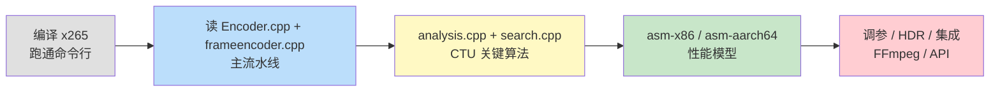
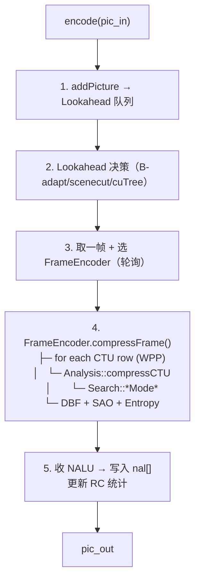
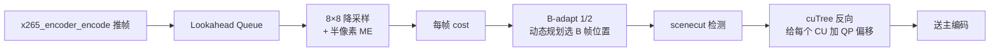
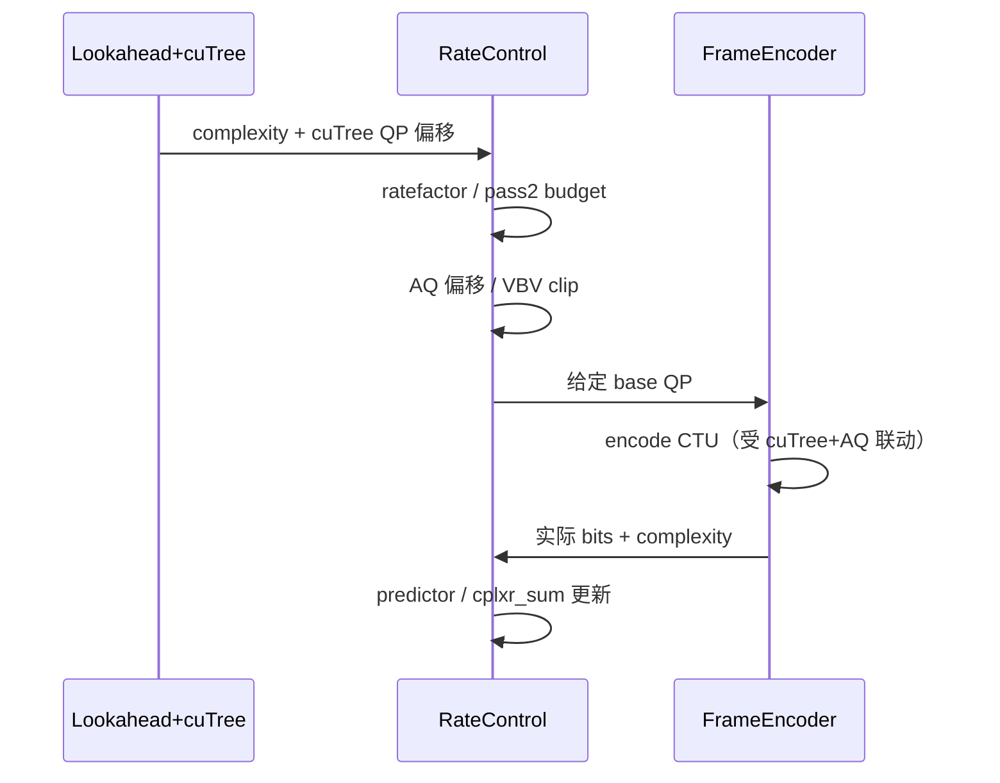
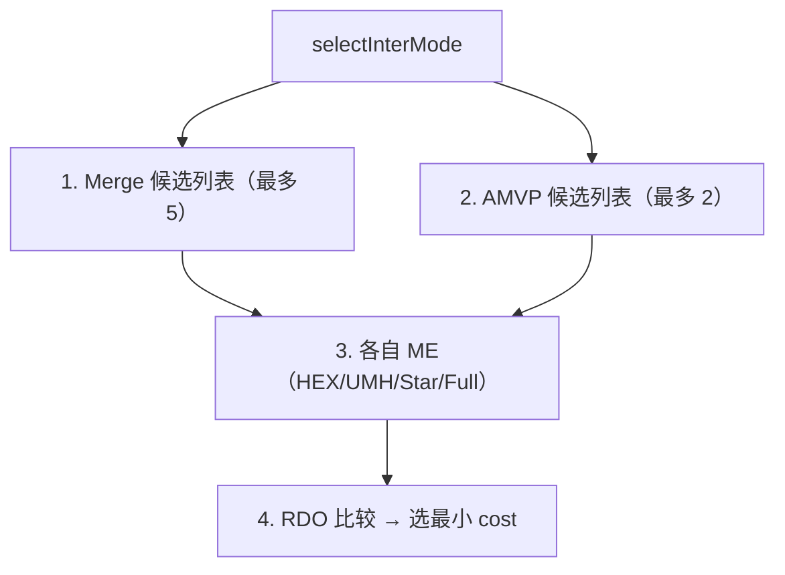

# 最新版 x265 源码深入浅出——从工业级 HEVC 编码器到性能榨取

**作者**：汪亮（bertonwang）  
**邮箱**：<47608843@qq.com>  
**版本**：v1.2 ｜ **最后更新**：2026-05-25

> **本书风格参考《C++11 新特性解析与应用深入理解》《C++23 新特性解析与应用深入理解》**，
> 对每一个 x265 主题按
> **「问题背景 → 概念形式 → 源码定位 → 关键算法 → 性能技巧 → 调优实战」**
> 六段式逐一拆解，目标是让**已经看过《H.265 标准深入浅出》**的开发者，
> **只读这一本，就能从"编译 x265"走到"读懂 CTU 分析路径、改造 / 加速 / 集成到自家产品"**。

---

## 目录

- [前言：为什么 x265 是 4K HDR 时代的金标准](#前言为什么-x265-是-4k-hdr-时代的金标准)
- [第 0 章：环境与工具链——拉源码、编译、跑通](#第-0-章环境与工具链拉源码编译跑通)

### 第一部分　工程总览
- [第 1 章：源码目录全图](#第-1-章源码目录全图)
  - [1.1 源码阅读总路线图：先看主线，再看分支](#11-源码阅读总路线图先看主线再看分支)
  - [1.2 x265 的四条“暗线”](#12-x265-的四条暗线)
- [第 2 章：构建系统（CMake / NASM / Multilib 8/10/12 bit）](#第-2-章构建系统cmake--nasm--multilib-81012-bit)
- [第 3 章：从命令行到 API ——入口三件套](#第-3-章从命令行到-api-入口三件套)
- [第 4 章：核心数据结构（Encoder / x265_param / x265_picture）](#第-4-章核心数据结构encoder--x265_param--x265_picture)
  - [4.1 `Encoder`：全局调度中心](#41-encoder全局调度中心)
  - [4.2 `Frame` / `PicYuv`：一帧在编码器里的多重身份](#42-frame--picyuv一帧在编码器里的多重身份)
  - [4.3 `FrameEncoder`：把一帧拆成 CTU 行来编码](#43-frameencoder把一帧拆成-ctu-行来编码)
  - [4.4 `Analysis` / `Search`：CTU 决策的两层大脑](#44-analysis--searchctu-决策的两层大脑)
  - [4.5 `CUData`：HEVC 四叉树决策账本](#45-cudatahevc-四叉树决策账本)
  - [4.6 `RateControl`：码控账本与反馈器](#46-ratecontrol码控账本与反馈器)
  - [4.7 `Slice` / `DPB` / `ReferencePlanes`：参考关系和解码顺序](#47-slice--dpb--referenceplanes参考关系和解码顺序)
  - [4.8 `Entropy` / `Bitstream` / `NALList`：actual bits 的出口](#48-entropy--bitstream--nallistactual-bits-的出口)

### 第二部分　主流水线
- [最新版 x265 源码深入浅出——从工业级 HEVC 编码器到性能榨取](#最新版-x265-源码深入浅出从工业级-hevc-编码器到性能榨取)
  - [目录](#目录)
    - [第一部分　工程总览](#第一部分工程总览)
    - [第二部分　主流水线](#第二部分主流水线)
    - [第三部分　关键算法解剖](#第三部分关键算法解剖)
    - [第四部分　性能榨取](#第四部分性能榨取)
    - [第五部分　调参实战](#第五部分调参实战)
    - [第六部分　集成与扩展](#第六部分集成与扩展)
    - [附录](#附录)
  - [前言：为什么 x265 是 4K HDR 时代的金标准](#前言为什么-x265-是-4k-hdr-时代的金标准)
  - [第 0 章：环境与工具链——拉源码、编译、跑通](#第-0-章环境与工具链拉源码编译跑通)
- [第一部分　工程总览](#第一部分工程总览-1)
  - [第 1 章：源码目录全图](#第-1-章源码目录全图)
    - [1.1 源码阅读总路线图：先看主线，再看分支](#11-源码阅读总路线图先看主线再看分支)
    - [1.2 x265 的四条“暗线”](#12-x265-的四条暗线)
  - [第 2 章：构建系统（CMake / NASM / Multilib 8/10/12 bit）](#第-2-章构建系统cmake--nasm--multilib-81012-bit)
  - [第 3 章：从命令行到 API ——入口三件套](#第-3-章从命令行到-api-入口三件套)
  - [第 4 章：核心数据结构（Encoder / x265\_param / x265\_picture）](#第-4-章核心数据结构encoder--x265_param--x265_picture)
    - [`x265_param`（用户参数，几百个字段）](#x265_param用户参数几百个字段)
    - [`x265_picture`](#x265_picture)
    - [`Encoder`（C++ 内核）](#encoderc-内核)
    - [4.1 `Encoder`：全局调度中心](#41-encoder全局调度中心)
    - [4.2 `Frame` / `PicYuv`：一帧在编码器里的多重身份](#42-frame--picyuv一帧在编码器里的多重身份)
    - [4.3 `FrameEncoder`：把一帧拆成 CTU 行来编码](#43-frameencoder把一帧拆成-ctu-行来编码)
    - [4.4 `Analysis` / `Search`：CTU 决策的两层大脑](#44-analysis--searchctu-决策的两层大脑)
    - [4.5 `CUData`：HEVC 四叉树决策账本](#45-cudatahevc-四叉树决策账本)
    - [4.6 `RateControl`：码控账本与反馈器](#46-ratecontrol码控账本与反馈器)
    - [4.7 `Slice` / `DPB` / `ReferencePlanes`：参考关系和解码顺序](#47-slice--dpb--referenceplanes参考关系和解码顺序)
    - [4.8 `Entropy` / `Bitstream` / `NALList`：actual bits 的出口](#48-entropy--bitstream--nallistactual-bits-的出口)
- [第二部分　主流水线](#第二部分主流水线-1)
  - [第 5 章：编码主循环 `Encoder::encode`](#第-5-章编码主循环-encoderencode)
    - [5.1 `Encoder::encode` 的精细时序](#51-encoderencode-的精细时序)
    - [5.2 输入帧为什么先进入 Lookahead](#52-输入帧为什么先进入-lookahead)
    - [5.3 FrameEncoder 如何被取出并并行工作](#53-frameencoder-如何被取出并并行工作)
    - [5.4 从帧到 CTU：主循环真正进入 HEVC 的地方](#54-从帧到-ctu主循环真正进入-hevc-的地方)
    - [5.5 写码、滤波、参考化与码控反馈](#55-写码滤波参考化与码控反馈)
    - [5.6 小白版总结：一帧像一条生产线](#56-小白版总结一帧像一条生产线)
  - [第 6 章：FrameEncoder 与多帧并行模型](#第-6-章frameencoder-与多帧并行模型)
    - [6.1 x265 为什么是“帧级 + 行级 + 模式级”并行](#61-x265-为什么是帧级--行级--模式级并行)
    - [6.2 WPP 行级并行的依赖关系](#62-wpp-行级并行的依赖关系)
    - [6.3 多线程和码控为什么必须保持顺序](#63-多线程和码控为什么必须保持顺序)
  - [第 7 章：Lookahead 与帧类型决策](#第-7-章lookahead-与帧类型决策)
    - [7.0 为什么 HEVC 的帧类型决策比 H.264 重要](#70-为什么-hevc-的帧类型决策比-h264-重要)
    - [7.1 三个底层成本](#71-三个底层成本)
    - [7.2 总体流程](#72-总体流程)
    - [7.3 scenecut 判定原理](#73-scenecut-判定原理)
    - [7.4 B-adapt 1（fast）：贪心滑动窗](#74-b-adapt-1fast贪心滑动窗)
    - [7.5 B-adapt 2（trellis / DP）：全局动态规划](#75-b-adapt-2trellis--dp全局动态规划)
    - [7.6 cuTree：HEVC 独有的"反向传播"质量优化](#76-cutreehevc-独有的反向传播质量优化)
    - [7.7 参数与延迟表](#77-参数与延迟表)
  - [第 8 章：CTU 分析 `Analysis::compressCTU`](#第-8-章ctu-分析-analysiscompressctu)
  - [第 9 章：CU 编码 `Search` —— Intra/Inter 模式枚举](#第-9-章cu-编码-search--intrainter-模式枚举)
  - [第 10 章：码率控制（CRF / ABR / 2pass / VBV / cuTree）](#第-10-章码率控制crf--abr--2pass--vbv--cutree)
    - [10.0 RC 三个核心问题](#100-rc-三个核心问题)
    - [10.1 模式速览](#101-模式速览)
    - [10.2 CRF 原理：恒定感知质量](#102-crf-原理恒定感知质量)
    - [10.3 ABR 原理：反馈累积器 + predictor](#103-abr-原理反馈累积器--predictor)
    - [10.4 CBR 原理：ABR + 严格 VBV](#104-cbr-原理abr--严格-vbv)
    - [10.5 2-pass 原理：看完全片再分配](#105-2-pass-原理看完全片再分配)
    - [10.6 VBV：漏桶模型与 Level 限制](#106-vbv漏桶模型与-level-限制)
    - [10.7 cuTree：HEVC 独有的 QP 偏移机制](#107-cutreehevc-独有的-qp-偏移机制)
    - [10.8 AQ：空间自适应量化](#108-aq空间自适应量化)
    - [10.9 RC 决策时序图](#109-rc-决策时序图)
  - [第 11 章：以码控为主线重读 x265](#第-11-章以码控为主线重读-x265)
    - [11.1 一句话主线：先判断价值，再决定 QP，再用 λ 做选择](#111-一句话主线先判断价值再决定-qp再用-λ-做选择)
    - [11.2 统一公式：x265 的优化都在修正这些因子](#112-统一公式x265-的优化都在修正这些因子)
    - [11.3 第一层：HEVC 帧结构是在分配时间域预算](#113-第一层hevc-帧结构是在分配时间域预算)
    - [11.4 第二层：CTU 四叉树是在决定空间域预算粒度](#114-第二层ctu-四叉树是在决定空间域预算粒度)
    - [11.5 第三层：λ 把码控目标接到 RDO 决策](#115-第三层λ-把码控目标接到-rdo-决策)
    - [11.6 第四层：cuTree / AQ / psy 是块级预算再分配](#116-第四层cutree--aq--psy-是块级预算再分配)
    - [11.7 第五层：SAO / DBF 改的是未来参考质量](#117-第五层sao--dbf-改的是未来参考质量)
    - [11.8 第六层：CABAC 和 NAL 是 actual bits 的裁判](#118-第六层cabac-和-nal-是-actual-bits-的裁判)
    - [11.9 第七层：性能优化是在换取更准的决策](#119-第七层性能优化是在换取更准的决策)
    - [11.10 用这条主线重读全书：每个主题都回答一个码控问题](#1110-用这条主线重读全书每个主题都回答一个码控问题)
    - [11.11 小白版总结：把 x265 想成一个预算经理 + 施工队](#1111-小白版总结把-x265-想成一个预算经理--施工队)
    - [11.12 高手版总结：用四条线定位源码](#1112-高手版总结用四条线定位源码)
      - [第一条：复杂度线](#第一条复杂度线)
      - [第二条：RDO 线](#第二条rdo-线)
      - [第三条：反馈线](#第三条反馈线)
      - [第四条：参考线](#第四条参考线)
    - [11.13 Review 后的补缺清单：x265 最容易漏读的点](#1113-review-后的补缺清单x265-最容易漏读的点)
      - [11.13.1 码控和工具开关相关容易漏掉的点](#11131-码控和工具开关相关容易漏掉的点)
      - [11.13.2 特殊优化点：x265 强在 HEVC 工具组合](#11132-特殊优化点x265-强在-hevc-工具组合)
      - [11.13.3 ASM / SIMD 优化在主线中的位置](#11133-asm--simd-优化在主线中的位置)
  - [第 12 章：x265 与 x264 的码控差异在哪里](#第-12-章x265-与-x264-的码控差异在哪里)
    - [12.1 先说结论：同一套闭环，更细的决策颗粒](#121-先说结论同一套闭环更细的决策颗粒)
    - [12.2 架构差异：`ratecontrol.c` 到 `ratecontrol.cpp`](#122-架构差异ratecontrolc-到-ratecontrolcpp)
    - [12.3 复杂度来源：MB-tree 到 cuTree](#123-复杂度来源mb-tree-到-cutree)
    - [12.4 分配颗粒：宏块预算到 CTU / CU 预算](#124-分配颗粒宏块预算到-ctu--cu-预算)
    - [12.5 帧结构：B 金字塔在 HEVC 里更像默认工作方式](#125-帧结构b-金字塔在-hevc-里更像默认工作方式)
    - [12.6 RDO 与 λ：x265 的每个 bits 更“贵”，也更难估](#126-rdo-与-λx265-的每个-bits-更贵也更难估)
    - [12.7 AQ / psy / HDR：x265 更重视主观和显示设备](#127-aq--psy--hdrx265-更重视主观和显示设备)
    - [12.8 VBV / 多线程：x265 更容易被延迟和反馈顺序约束](#128-vbv--多线程x265-更容易被延迟和反馈顺序约束)
    - [12.9 参数迁移：不要把 x264 经验值机械搬到 x265](#129-参数迁移不要把-x264-经验值机械搬到-x265)
    - [12.10 小白版总结：x264 是按宏块管钱，x265 是按结构管钱](#1210-小白版总结x264-是按宏块管钱x265-是按结构管钱)
- [第三部分　关键算法解剖](#第三部分关键算法解剖-1)
  - [第 13 章：Intra 预测——35 种模式的快速搜索](#第-13-章intra-预测35-种模式的快速搜索)
  - [第 14 章：Inter 预测——AMVP / Merge / TMVP](#第-14-章inter-预测amvp--merge--tmvp)
  - [第 15 章：运动估计——HEX/UMH/Star/Full](#第-15-章运动估计hexumhstarfull)
  - [第 16 章：变换 + 量化 + RDOQ](#第-16-章变换--量化--rdoq)
  - [第 17 章：去块滤波 + SAO 环内](#第-17-章去块滤波--sao-环内)
  - [第 18 章：CABAC 写码引擎](#第-18-章cabac-写码引擎)
  - [第 19 章：心理视觉优化（psy-rd / psy-rdoq / aq-mode / cuTree）](#第-19-章心理视觉优化psy-rd--psy-rdoq--aq-mode--cutree)
    - [psy-rd](#psy-rd)
    - [psy-rdoq](#psy-rdoq)
    - [aq-mode](#aq-mode)
    - [cuTree](#cutree)
- [第四部分　性能榨取](#第四部分性能榨取-1)
  - [第 20 章：x86 SSE2/SSSE3/AVX2/AVX-512 汇编全景](#第-20-章x86-sse2ssse3avx2avx-512-汇编全景)
  - [第 21 章：ARM NEON / AArch64 / SVE2 路径](#第-21-章arm-neon--aarch64--sve2-路径)
  - [第 22 章：PrimitiveFunctions 与 dispatcher](#第-22-章primitivefunctions-与-dispatcher)
  - [第 23 章：Frame / Slice / WPP / pmode 多线程模型](#第-23-章frame--slice--wpp--pmode-多线程模型)
  - [第 24 章：Distributed encoding（chunk + 2pass）](#第-24-章distributed-encodingchunk--2pass)
- [第五部分　调参实战](#第五部分调参实战-1)
  - [第 25 章：preset 与 tune 的真实含义](#第-25-章preset-与-tune-的真实含义)
    - [preset（速度 vs 质量）](#preset速度-vs-质量)
    - [tune](#tune)
  - [第 26 章：直播 / RTC / 点播 / 4K HDR 归档 五套黄金参数](#第-26-章直播--rtc--点播--4k-hdr-归档-五套黄金参数)
  - [第 27 章：HDR10 / Dolby Vision 编码完整命令](#第-27-章hdr10--dolby-vision-编码完整命令)
    - [HDR10（最常用）](#hdr10最常用)
    - [Dolby Vision Profile 8.1](#dolby-vision-profile-81)
  - [第 28 章：常见性能瓶颈与定位方法](#第-28-章常见性能瓶颈与定位方法)
- [第六部分　集成与扩展](#第六部分集成与扩展-1)
  - [第 29 章：在 FFmpeg 里使用 libx265](#第-29-章在-ffmpeg-里使用-libx265)
  - [第 30 章：直接调用 libx265 API（带可运行示例）](#第-30-章直接调用-libx265-api带可运行示例)
  - [第 31 章：自定义裁剪 / 插件 / 测试集成](#第-31-章自定义裁剪--插件--测试集成)
- [附录](#附录-1)
  - [附录 A：x265 命令行参数全景速查](#附录-ax265-命令行参数全景速查)
  - [附录 B：源码常用宏与日志开关](#附录-b源码常用宏与日志开关)
  - [附录 C：常见错误与坑](#附录-c常见错误与坑)

### 第三部分　关键算法解剖
- [第 13 章：Intra 预测——35 种模式的快速搜索](#第-13-章intra-预测35-种模式的快速搜索)
- [第 14 章：Inter 预测——AMVP / Merge / TMVP](#第-14-章inter-预测amvp--merge--tmvp)
- [第 15 章：运动估计——HEX/UMH/Star/Full](#第-15-章运动估计hexumhstarfull)
- [第 16 章：变换 + 量化 + RDOQ](#第-16-章变换--量化--rdoq)
- [第 17 章：去块滤波 + SAO 环内](#第-17-章去块滤波--sao-环内)
- [第 18 章：CABAC 写码引擎](#第-18-章cabac-写码引擎)
- [第 19 章：心理视觉优化（psy-rd / psy-rdoq / aq-mode / cuTree）](#第-19-章心理视觉优化psy-rd--psy-rdoq--aq-mode--cutree)

### 第四部分　性能榨取
- [第 20 章：x86 SSE2/SSSE3/AVX2/AVX-512 汇编全景](#第-20-章x86-sse2ssse3avx2avx-512-汇编全景)
- [第 21 章：ARM NEON / AArch64 / SVE2 路径](#第-21-章arm-neon--aarch64--sve2-路径)
- [第 22 章：PrimitiveFunctions 与 dispatcher](#第-22-章primitivefunctions-与-dispatcher)
- [第 23 章：Frame / Slice / WPP / pmode 多线程模型](#第-23-章frame--slice--wpp--pmode-多线程模型)
- [第 24 章：Distributed encoding（chunk + 2pass）](#第-24-章distributed-encodingchunk--2pass)

### 第五部分　调参实战
- [第 25 章：preset 与 tune 的真实含义](#第-25-章preset-与-tune-的真实含义)
- [第 26 章：直播 / RTC / 点播 / 4K HDR 归档 五套黄金参数](#第-26-章直播--rtc--点播--4k-hdr-归档-五套黄金参数)
- [第 27 章：HDR10 / Dolby Vision 编码完整命令](#第-27-章hdr10--dolby-vision-编码完整命令)
- [第 28 章：常见性能瓶颈与定位方法](#第-28-章常见性能瓶颈与定位方法)

### 第六部分　集成与扩展
- [第 29 章：在 FFmpeg 里使用 libx265](#第-29-章在-ffmpeg-里使用-libx265)
- [第 30 章：直接调用 libx265 API（带可运行示例）](#第-30-章直接调用-libx265-api带可运行示例)
- [第 31 章：自定义裁剪 / 插件 / 测试集成](#第-31-章自定义裁剪--插件--测试集成)

### 附录
- [附录 A：x265 命令行参数全景速查](#附录-ax265-命令行参数全景速查)
- [附录 B：源码常用宏与日志开关](#附录-b源码常用宏与日志开关)
- [附录 C：常见错误与坑](#附录-c常见错误与坑)

---

## 前言：为什么 x265 是 4K HDR 时代的金标准

> 一句话：**同样码率下，x265 medium 把 80% 的硬件 HEVC 编码器按在地上摩擦；slow 模式画质接近 HM 参考，但快几十倍。**

| 特性 | x265 | 硬件 HEVC |
|---|---|---|
| 画质（同码率 SSIM） | 100% | 75~85% |
| HDR10 / HDR10+ / DV 支持 | ✅ 完整 | 部分 |
| 心理视觉优化（cuTree, psy-rdoq） | ✅ | ❌ |
| 码率控制（VBV / 2pass / chunk） | ✅ | 通常仅 CBR |
| 跨平台（x86/ARM/PPC/RISC-V） | ✅ | 各厂封闭 |
| 速度（preset ultrafast） | > 实时 4K（i9）/ 实时 8K（线程足） | > 实时 8K |

x265 由 MulticoreWare 维护，**完全开源（GPL）**，是 FFmpeg / HandBrake / AWS Elemental / 大量流媒体平台的事实标准 HEVC 软编。

> 💡 阅读本书前需先读 [《H.265 标准深入浅出》](./H.265标准深入浅出-从CTU四叉树到工程实战.md)。

**学习路径**：



---

## 第 0 章：环境与工具链——拉源码、编译、跑通

```bash
# 官方仓库（Bitbucket）
git clone https://bitbucket.org/multicoreware/x265_git.git x265
cd x265

# Linux / macOS（10 bit Multilib）
mkdir -p build/linux && cd build/linux
cmake -G "Unix Makefiles" \
      -DCMAKE_INSTALL_PREFIX=/usr/local \
      -DENABLE_SHARED=ON \
      -DHIGH_BIT_DEPTH=ON \
      ../../source
make -j$(nproc)
sudo make install

# 单一 8 bit
cmake -DHIGH_BIT_DEPTH=OFF ../../source

# Multilib（同时支持 8 / 10 / 12 bit）参考脚本：
#   build/multilib.sh    Linux
#   build/msys-multilib  Windows MSYS
```

测试：

```bash
# 编一段 1080p YUV
x265 --preset medium --crf 22 --output out.h265 \
     --input-res 1920x1080 --fps 25 input.yuv

# FFmpeg 调 libx265
ffmpeg -i sample.mp4 -c:v libx265 -preset slow -crf 22 \
       -profile:v main10 -pix_fmt yuv420p10le out.mp4
```

> 💡 **必装**：CMake ≥ 3.13、NASM ≥ 2.13（x86 汇编）、yasm 备选。

---

# 第一部分　工程总览

---

## 第 1 章：源码目录全图

```
x265/
├── source/
│   ├── x265.cpp                命令行入口
│   ├── x265.h / x265_config.h.in 公开 API
│   ├── encoder/
│   │   ├── encoder.cpp/.h        ★ 顶层 Encoder（API 实现）
│   │   ├── frameencoder.cpp/.h   ★ 单帧编码器（每帧一个）
│   │   ├── analysis.cpp/.h       ★ CTU 四叉树决策
│   │   ├── search.cpp/.h         ★ Intra/Inter 搜索
│   │   ├── motion.cpp/.h         运动估计
│   │   ├── slicetype.cpp/.h      帧类型决策（lookahead）
│   │   ├── ratecontrol.cpp/.h    码率控制（CRF/ABR/2pass/cuTree）
│   │   ├── reference.cpp         参考帧管理
│   │   ├── entropy.cpp           CABAC 编码
│   │   ├── dpb.cpp               解码图像缓冲
│   │   ├── sao.cpp               SAO
│   │   ├── nal.cpp               NAL 写入 + emulation prevention
│   │   ├── api.cpp               C API 桥接
│   │   ├── slicetype.cpp         B-adapt + scenecut
│   │   └── ...
│   ├── common/
│   │   ├── frame.cpp/.h          帧池
│   │   ├── pixel.cpp/.h          SAD/SATD/SSD（C 参考）
│   │   ├── dct.cpp/.h            DCT/DST 4×4~32×32（C 参考）
│   │   ├── ipfilter.cpp/.h       插值滤波
│   │   ├── loopfilter.cpp/.h     去块滤波
│   │   ├── intrapred.cpp/.h      35 种 Intra 预测
│   │   ├── piclist.cpp/.h        帧链表
│   │   ├── primitives.cpp/.h     ★ 函数指针表（dispatcher）
│   │   ├── cudata.cpp/.h         CU 数据结构
│   │   ├── x86/                  ★ x86 汇编（NASM .asm）
│   │   ├── aarch64/              ★ ARM64 汇编 / NEON intrinsics
│   │   ├── arm/                  ARMv7 NEON
│   │   └── ppc/, loongarch/      其它平台
│   ├── input/output/             YUV / Y4M
│   └── test/                     单测 + 性能基准
└── build/                         CMake 输出（自定义）
```

> 💡 **大局观**：`encoder/` 是逻辑（Encoder→FrameEncoder→Analysis→Search），`common/` 是运算 + 平台优化。看核心算法只看 `encoder/`，看性能只看 `common/x86 + aarch64`。

### 1.1 源码阅读总路线图：先看主线，再看分支

x265 源码比 x264 更“工程化”：C++ 类更多、线程层级更多、HEVC 工具更多。不要一开始就跳进 `analysis.cpp` 的递归细节，否则很容易迷路。推荐先抓住一条主线：**一帧如何从用户输入，变成可解码的 HEVC NAL 单元**。


推荐按三层阅读：

| 层级 | 读什么 | 目标 | 适合人群 |
|---|---|---|---|
| **第一层：跑通主线** | `x265.cpp` → `api.cpp` → `encoder.cpp` → `frameencoder.cpp` | 知道一帧怎么进、怎么出 | 小白必读 |
| **第二层：理解画质来源** | `slicetype.cpp`、`ratecontrol.cpp`、`analysis.cpp`、`search.cpp`、`quant.cpp` | 知道为什么选这个帧类型、QP、CU 深度和模式 | 进阶读者 |
| **第三层：理解性能来源** | `primitives.cpp`、`pixel.cpp`、`dct.cpp`、`ipfilter.cpp`、`common/x86/`、`common/aarch64/` | 知道热点函数如何被 SIMD 和线程榨干 | 高手 / 优化者 |

源码阅读时始终带着四个问题：

1. **这一帧是什么角色？** 看 `Lookahead / slicetype / DPB`。
2. **这一帧花多少 bits？** 看 `RateControl / VBV / cuTree`。
3. **这个 CTU 怎么拆、怎么预测？** 看 `Analysis / Search / CUData`。
4. **这个决策最后写了多少真实 bits？** 看 `Entropy / CABAC / NALList`。

### 1.2 x265 的四条“暗线”

除了显性的函数调用，x265 还有四条暗线贯穿全书。小白先沿“状态线”读，高手再沿“代价线、码率线、并行线”追源码。

| 暗线 | 贯穿模块 | 为什么重要 |
|---|---|---|
| **状态线** | `Encoder`、`Frame`、`DPB`、`Slice`、`ReferencePlanes` | 决定输入帧、重建帧、参考帧、输出帧的生命周期 |
| **代价线** | `SAD / SATD / SSD`、`λ`、`RDCost`、`mode cost` | 决定 Intra / Inter / Split / Merge / Skip 谁胜出 |
| **码率线** | `complexity`、`QP`、`qScale`、`cuTree`、`AQ`、`VBV`、`actual bits` | 决定质量、码率、缓冲和码流合规 |
| **并行线** | `frame-threads`、`WPP`、`pmode`、`pme`、`thread pool` | 决定速度，但也限制参考、CABAC 上下文和码控反馈顺序 |

一句话记忆：**状态线保证编码器跑对，代价线决定模式选对，码率线决定 bits 花对，并行线决定在可控风险下跑快。**

---

## 第 2 章：构建系统（CMake / NASM / Multilib 8/10/12 bit）

x265 用 CMake，关键变量：

| 变量 | 默认 | 含义 |
|---|---|---|
| `HIGH_BIT_DEPTH` | OFF | 编 10/12 bit 库（必须打开才能编 Main10） |
| `MAIN12` | OFF | 12 bit 模式 |
| `ENABLE_SHARED` | ON | .so/.dll |
| `ENABLE_LIBNUMA` | ON（Linux） | NUMA 多 CPU 调度 |
| `ENABLE_ASSEMBLY` | ON | x86 / ARM64 汇编 |
| `ENABLE_HDR_DOVI` | ON | Dolby Vision RPU |
| `EXPORT_C_API` | ON | C 接口（FFmpeg 用） |

**Multilib（8/10/12 bit 共存）**：

```bash
build/multilib.sh   # 自动编三套库后链接
```

输出：
- `libx265.so.10`（10 bit）+ `libx265.so.12`（12 bit）
- `libx265.so`（默认 8 bit + 内嵌 10/12 路径分发）

> 💡 命令行 `--output-depth 10` 即可切到 10 bit 库；FFmpeg `-pix_fmt yuv420p10le` 自动选。

---

## 第 3 章：从命令行到 API ——入口三件套

`x265.cpp::main()`：

```cpp
parseInput(argc, argv, &param)
api->encoder_open(&param)
while (read_frame(...)) api->encoder_encode(h, ...)
flush
api->encoder_close(h)
```

API 三件套（`x265.h`）：

```c
x265_encoder *x265_encoder_open(x265_param *p);
int           x265_encoder_encode(x265_encoder *e, x265_nal **nals, uint32_t *nnal,
                                  x265_picture *pic_in, x265_picture *pic_out);
void          x265_encoder_close(x265_encoder *e);
```

> 💡 与 x264 / OpenH264 / FFmpeg 都遵循"open / encode / close"模式。一通百通。

---

## 第 4 章：核心数据结构（Encoder / x265_param / x265_picture）

### `x265_param`（用户参数，几百个字段）

```c
typedef struct {
    int  internalCsp;                   // X265_CSP_I420 等
    int  sourceWidth, sourceHeight;
    int  fpsNum, fpsDenom;
    int  internalBitDepth;              // 8/10/12

    // 帧类型
    int  keyframeMin, keyframeMax;
    int  bframes;
    int  bframeBias;

    // 模式
    int  maxCUSize;                     // 64 / 32 / 16
    int  minCUSize;
    int  rdLevel;                       // 0~6 RD 强度
    int  bEnableRectInter;
    int  bEnableAMP;
    int  bEnableEarlySkip;

    // 心理
    double psyRd;
    double psyRdoq;
    int    rc_aqMode;                   // 1/2/3/4
    int    cuTree;

    // 码率控制
    struct {
        int    rateControlMode;         // CRF/ABR/CQP
        double rfConstant;
        int    bitrate;
        int    vbvBufferSize;
        int    vbvMaxBitrate;
        int    bStatRead, bStatWrite;   // 2pass
    } rc;

    // 并行
    int  frameNumThreads;
    int  numTileRows, numTileCols;
    int  bEnableWavefront;
    int  bDistributeMotionEstimation;

    // HDR
    int  bEmitHRDSEI;
    int  bEmitHDR10SEI;
    char *masteringDisplayColorVolume;
    int  maxCLL, maxFALL;
    int  bDolbyVisionProfile;
    char *doviRpuFile;
    ...
} x265_param;
```

### `x265_picture`

```c
typedef struct {
    int       bitDepth;
    int       colorSpace;
    int       sliceType;     // X265_TYPE_AUTO/IDR/I/P/B
    int64_t   pts, dts;
    void     *planes[3];
    int       stride[3];
    void     *userData;
    x265_dolby_vision_rpu rpu;
    ...
} x265_picture;
```

### `Encoder`（C++ 内核）

`encoder/encoder.h::Encoder` 持有：N 个 FrameEncoder（按 frameNumThreads）、Lookahead、RateControl、DPB、Entropy、SPS/PPS/VPS。

### 4.1 `Encoder`：全局调度中心

`Encoder` 不直接替每个 CTU 做具体模式搜索，它更像总控台：

| 职责 | 对应模块 | 读源码时要问的问题 |
|---|---|---|
| 参数落地 | `x265_param`、`Encoder::configure` | 用户参数最终变成哪些内部开关 |
| 输入排队 | `addPicture`、lookahead queue | 当前帧是否能立刻编码，还是要等未来帧 |
| 帧级调度 | `FrameEncoder` 池 | 哪个线程负责哪一帧 |
| 参考管理 | `DPB`、`Slice` | 当前帧能参考谁，编码后是否成为参考 |
| 码控闭环 | `RateControl` | QP 从哪里来，actual bits 又反馈到哪里 |
| 输出封装 | `NALList`、`Entropy` | VPS/SPS/PPS/SEI/slice 数据如何交给调用方 |

> 💡 小白可以把 `Encoder` 想成工厂厂长：它不亲自打磨每块砖，但决定材料什么时候进场、哪个车间加工、成品什么时候出库。

### 4.2 `Frame` / `PicYuv`：一帧在编码器里的多重身份

同一帧在 x265 里会经历多种身份：

```text
用户输入 x265_picture
  → PicYuv 原始图像
  → Frame 进入 lookahead
  → Frame 被指定 sliceType / QP / cuTree offset
  → FrameEncoder 编成重建图像
  → DPB 决定是否留下作为参考
  → NAL 输出给调用方
```

| 身份 | 关注点 | 为什么重要 |
|---|---|---|
| 输入帧 | `planes / stride / pts / bitDepth` | API 集成时最容易错 |
| 分析帧 | lowres、cost、slice type | lookahead 和 cuTree 依赖它 |
| 编码帧 | CTU、CU、PU、TU 状态 | `Analysis / Search` 的工作对象 |
| 重建帧 | filtered reconstruction | 后续 Inter 预测参考它，不是参考原图 |
| 输出帧 | NAL + `pic_out` | 调用方拿到的是码流和重排序后的输出信息 |

### 4.3 `FrameEncoder`：把一帧拆成 CTU 行来编码

`FrameEncoder` 是“单帧施工队”。它收到一帧后，会按 CTU 行推进：

```text
FrameEncoder::compressFrame
  → initSlice / rateControlStart
  → compressCTURows
  → Analysis::compressCTU
  → Entropy 写 slice
  → DBF / SAO
  → rateControlEnd
```

它最关键的工程特点是：**每个 FrameEncoder 负责一帧，多帧之间可以并行；每帧内部又用 WPP 让多行 CTU 并行。**

### 4.4 `Analysis` / `Search`：CTU 决策的两层大脑

二者不要混在一起理解：

| 模块 | 负责什么 | 类比 |
|---|---|---|
| `Analysis` | 决定 CU 是否 split、试哪些大类模式、管理递归深度 | 项目经理，决定方案范围 |
| `Search` | 对具体 Intra / Inter / Merge / AMP 模式计算 RD cost | 评标专家，给每个方案打分 |

典型调用关系：

```text
Analysis::compressCTU
  → compressIntraCU / compressInterCU
  → checkMerge2Nx2N / checkInter_* / checkIntra
  → Search::encodeResAndCalcRdInterCU
  → 选择 split 或 no-split
```

### 4.5 `CUData`：HEVC 四叉树决策账本

H.264 的基本单位是宏块，HEVC 的基本决策单位变成 CTU / CU / PU / TU。`CUData` 就是 x265 记录这些决策的账本：

| 信息 | 用途 |
|---|---|
| CU 深度 | 当前 64×64 是否拆成 32/16/8 |
| pred mode | Intra / Inter / Skip / Merge |
| partition size | 2Nx2N、2NxN、Nx2N、AMP 等 |
| MV / reference index | Inter 预测需要 |
| transform depth / coeff | 残差表达需要 |
| QP / dQP | CTU 级码控和 AQ/cuTree 需要 |

> 💡 读 `analysis.cpp` 时不要只看递归，要问：每次递归到底在 `CUData` 里留下了什么状态？这些状态后面会怎样影响 CABAC 写码？

### 4.6 `RateControl`：码控账本与反馈器

`RateControl` 负责把质量 / 码率目标变成每帧、每 CTU 能理解的 QP：

```text
CRF / ABR / 2pass / CQP
  → qScale / frame QP
  → cuTree / AQ / VBV 修正
  → λ / RDO cost
  → actual bits
  → predictor / buffer fullness 反馈
```

源码阅读重点不是背公式，而是抓住三类信息：

| 信息 | 代表什么 |
|---|---|
| 预测信息 | lookahead cost、frame complexity、pass2 stats |
| 约束信息 | VBV、Level、HRD、bitrate、buffer fullness |
| 反馈信息 | actual bits、predictor、wantedBits、overflow |

### 4.7 `Slice` / `DPB` / `ReferencePlanes`：参考关系和解码顺序

HEVC 编码顺序、显示顺序、参考关系经常不一样。这里最容易让新手困惑：

```text
显示顺序：I B B B P B B B P
编码顺序：I P B B B P B B B
参考关系：由 DPB + Slice reference list 决定
```

| 对象 | 作用 |
|---|---|
| `Slice` | 描述当前帧类型、参考列表、QP、SAO/DBF 开关等 |
| `DPB` | 管理哪些重建帧仍可作为参考 |
| `ReferencePlanes` | 给运动补偿提供按平面组织的参考像素 |

### 4.8 `Entropy` / `Bitstream` / `NALList`：actual bits 的出口

x265 只有 CABAC，没有 H.264 时代的 CAVLC 选择。最终码流路径可以这样看：

```text
CUData / Slice 状态
  → Entropy 编码语法元素
  → Bitstream 写入二进制
  → NALList 包装 VPS / SPS / PPS / SEI / slice
  → x265_nal 返回给调用方
```

这一步是码控闭环里的“裁判”：前面所有 cost 都是估计，只有 CABAC 写完后，`actual bits` 才真正确定。

---

# 第二部分　主流水线

---

## 第 5 章：编码主循环 `Encoder::encode`

`encoder/encoder.cpp::Encoder::encode`：



要点：**多个 FrameEncoder 并行编码不同帧**，每个内部又用 WPP 多线程 → "帧级 + 行级"两级并行。

### 5.1 `Encoder::encode` 的精细时序

把 `Encoder::encode` 展开后，可以按“输入、排队、取帧、施工、结算、输出”六步理解：

| 步骤 | 做什么 | 关键问题 |
|---|---|---|
| 1. 接收输入 | 从 `x265_picture` 拿到 planes、pts、userData | 输入格式、bitDepth、stride 是否正确 |
| 2. 推入 lookahead | 先不急着编码，让未来帧参与判断 | 是否需要等待 `rc-lookahead` |
| 3. 决定帧角色 | slicetype、scenecut、B-adapt、cuTree | 当前帧是 I/P/B？未来会不会引用它 |
| 4. 分配 FrameEncoder | 找空闲 `FrameEncoder` 开始压缩 | 是否受 `frame-threads` 限制 |
| 5. 编码整帧 | WPP 行级并行、CTU 递归、CABAC 写码 | QP / λ / RD cost 如何落到每个 CTU |
| 6. 收尾输出 | DBF/SAO、RC 反馈、NAL 返回 | actual bits 如何更新码控账本 |

源码阅读时，先不要追每个函数的全部分支，只要确认这些状态何时发生变化：

```text
pic_in 是否进入 lookahead？
frame 是否拿到了 sliceType？
rateControlStart 是否给出 QP？
compressCTU 是否完成所有 CTU？
rateControlEnd 是否拿到 actual bits？
nal[] 是否返回给调用方？
```

### 5.2 输入帧为什么先进入 Lookahead

x265 不是“来一帧就立刻编码一帧”。原因是 HEVC 的最佳决策高度依赖未来：

- **帧类型**：当前帧做 P 还是 B，要看后面有没有更合适的参考锚点。
- **scenecut**：旧参考链是否失效，要比较当前帧的 I/P 预估 cost。
- **cuTree**：某个 CU 是否值得保护，要看它未来会被多少帧引用。
- **VBV lookahead**：未来是否有码率尖峰，可能要求当前提前收紧 QP。

所以 `rc-lookahead` 本质上是在用延迟换信息。点播和归档愿意等，RTC 和超低延迟直播不愿意等。

### 5.3 FrameEncoder 如何被取出并并行工作

`FrameEncoder` 可以理解成一组“单帧施工队”。`frame-threads=N` 时，最多 N 帧可以同时处于编码中：

```text
FrameEncoder[0]：编码 POC 100
FrameEncoder[1]：编码 POC 101
FrameEncoder[2]：编码 POC 102
...
```

但多帧并行不是无限自由，因为：

| 限制 | 原因 |
|---|---|
| 参考依赖 | 当前帧可能要等参考帧重建完成 |
| 码控顺序 | actual bits 反馈必须按可解释的顺序更新 |
| DPB 管理 | 哪些帧可丢、哪些帧必须保留，不能乱 |
| 输出重排 | 编码顺序和显示顺序不同，`pic_out` 需要正确 PTS/DTS |

### 5.4 从帧到 CTU：主循环真正进入 HEVC 的地方

一帧进入 `FrameEncoder::compressFrame` 后，真正的 HEVC 编码从 CTU 开始：

```text
Frame
  → CTU row
  → CTU 64×64
  → CU 四叉树 split / no-split
  → PU 预测模式
  → TU 变换量化
  → CABAC 写语法元素
```

小白容易把 `CTU / CU / PU / TU` 混在一起，可以这样记：

| 单位 | 负责什么 |
|---|---|
| `CTU` | 最大处理块，通常 64×64，是行级并行的基本颗粒 |
| `CU` | 决定是否继续四叉树拆分，是压缩决策单位 |
| `PU` | 描述预测形状和运动信息，是预测单位 |
| `TU` | 描述残差如何变换量化，是残差单位 |

### 5.5 写码、滤波、参考化与码控反馈

一帧不是 CABAC 写完就结束。工业编码器必须完成四个收尾动作：

```text
CABAC 写 slice
  → 得到 actual bits
  → DBF / SAO 得到环内重建图
  → DPB 决定是否作为参考
  → RateControl 更新 predictor / VBV
```

这解释了为什么 DBF / SAO 叫“环内滤波”：它们改变的不是只给观众看的图，而是**后续帧会引用的重建参考图**。滤波强弱会影响未来预测残差，从而间接影响码率。

### 5.6 小白版总结：一帧像一条生产线

可以把一帧编码想成一条生产线：

```text
Lookahead：排产部门，决定这帧什么时候做、做成什么角色
RateControl：财务部门，决定这帧预算多少 bits
FrameEncoder：车间主任，把一帧拆成 CTU 行
Analysis：方案经理，决定每个 CTU 怎么拆
Search：评标专家，比较 Intra / Inter / Merge / Skip
Quant / RDOQ：成本控制，决定哪些残差值得留下
CABAC：会计，记录最后真实花了多少 bits
DBF / SAO：质检和返修，让成品参考图更适合后续生产
```

只要抓住这条生产线，后面所有章节都能挂上去。

---

## 第 6 章：FrameEncoder 与多帧并行模型

`encoder/frameencoder.cpp::FrameEncoder::compressFrame`：

```cpp
foreach CTU row {
    encodeCTURow(row);   // WPP：行级线程
}
processPostFilter();     // DBF + SAO
processSEI();
writeBitstream();
```

并发模式：

| 参数 | 含义 |
|---|---|
| `frame-threads` | FrameEncoder 数量（多帧并行） |
| `wpp` | 单帧内 CTU 行并行 |
| `pmode` | 同一 CTU 内多模式并行（实验性） |
| `pme` | 多 ref 运动估计并行 |

> 💡 **典型工程**：`frame-threads = max(1, threads/4)` + `wpp = 1`。8 线程机一般 2 个 FrameEncoder + 4 线程 WPP。

### 6.1 x265 为什么是“帧级 + 行级 + 模式级”并行

HEVC 的 CTU 决策比 H.264 重得多。单靠帧级并行会受到参考依赖限制，单靠行级并行又吃不满高核 CPU，所以 x265 叠了多层并行：

```text
多帧并行：多个 FrameEncoder 同时压不同帧
WPP 行级并行：同一帧多行 CTU 错峰推进
pmode：同一 CU 内多个模式并行评估
pme：多个参考或运动搜索任务并行评估
```

但并行层级越多，越要警惕三个风险：

| 风险 | 解释 |
|---|---|
| 参考未完成 | 当前帧不能引用还没重建好的参考帧 |
| CABAC 上下文割裂 | 行、slice、tile 边界会影响上下文连续性和压缩率 |
| 码控反馈延迟 | actual bits 太晚回来，会让后续帧预算更难稳定 |

### 6.2 WPP 行级并行的依赖关系

WPP 不是每一行 CTU 同时开跑，而是“错两列”依赖：下一行通常要等上一行至少推进两个 CTU，才能继承必要的 CABAC / 预测上下文。

```text
Row 0: CTU0 CTU1 CTU2 CTU3 CTU4 ...
Row 1:      等待 → CTU0 CTU1 CTU2 ...
Row 2:             等待 → CTU0 CTU1 ...
```

直观理解：

- **好处**：单帧内能利用多核，延迟比 slice 多线程更低。
- **代价**：行首上下文重置会损失一点压缩效率。
- **边界**：低分辨率或 CTU 行数很少时，WPP 吃不满线程。

### 6.3 多线程和码控为什么必须保持顺序

码控依赖实际编码结果反馈：

```text
estimated bits → actual bits → predictor / VBV 更新 → 下一帧 QP
```

如果多帧并行导致反馈顺序混乱，就可能出现：

| 问题 | 表现 |
|---|---|
| ABR 漂移 | 平均码率长期偏高或偏低 |
| VBV 抖动 | buffer fullness 估计不准，画质突然跳变 |
| 2pass 不一致 | 第二遍没有按第一遍统计稳定复现 |
| 调参难复现 | 同一参数不同线程数结果差异过大 |

因此，x265 的多线程不是“谁先跑完谁先改账本”，而是尽量在吞吐和确定性之间做平衡。高手改线程模型时，必须同时检查参考帧、CABAC 边界、RC 反馈和输出顺序。

---

## 第 7 章：Lookahead 与帧类型决策

### 7.0 为什么 HEVC 的帧类型决策比 H.264 重要

- HEVC 的 **B 帧在 Skip / Merge 高占比时，残差和运动信息开销很低**。
- HEVC 默认 **B 金字塔（bframes=4、b-pyramid=1）**。
- HEVC 的 IDR 代价更高（CTU 64×64 + 35 Intra）。

所以 lookahead 决策会直接影响码率、画质和延迟三者的平衡。

### 7.1 三个底层成本

`encoder/slicetype.cpp` 首先用 **8×8 lowres 降采样帧**估出三个 cost：

```
icost(f)         = 把 f 当 I 帧编的预估 cost（lowres 上跑 9 种 Intra 取最小 SATD）
pcost(f, ref)    = 把 f 当 P 帧、用 ref 做参考的 cost（半像素 ME + SATD）
bcost(f, r0, r1) = 把 f 当 B 帧、双向参考 r0/r1 的 cost
```

这些 cost 跑在 lowres（1/2 分辨率，代价约 1/4）上，可以为 **未来 N 帧** 快速试算多种帧结构。

### 7.2 总体流程



### 7.3 scenecut 判定原理

**核心思想**：如果当前帧"靠 P 编码也省不下多少 bits"，那就是场景切换 → 强制 IDR。

x265 沿用 x264 的不等式（`slicetype.cpp::scenecutInternal`，简化）：

```cpp
float icost = curFrame->lowresCosts[0][0];
float pcost = curFrame->lowresCosts[1][0];
float bias  = (1.0f - 0.01f * scenecutThreshold) * (1.0f + recentTrend);
bool  isScenecut = pcost >= bias * icost;
```

- `--scenecut 40`（默认）：阈值越大越难触发。`--scenecut 0` 完全关闭。
- **保护 1**：`min-keyint`。默认 = `keyint / 10`，防止闪屏累计。
- **保护 2**：`max-keyint`。超过则强制 IDR，保证可随机接入。
- **动态偏移**：越接近 max-keyint、阈值自动降低（`recentTrend`），避免正好在极限处才插 IDR。

> ⚠️ 直播 / RTC **必须关 scenecut**（`--no-scenecut`），避免突发 IDR 打爆带宽。

### 7.4 B-adapt 1（fast）：贪心滑动窗

```cpp
for (i = 0; i < lookaheadDepth; i++) {
    if (bcost(i, prevP, nextP) < pcost(i, prevP) * 0.85)
        type[i] = B;
    else
        type[i] = P;
}
```

特点：O(N) 一次扫描，局部最优。**veryfast/faster preset 默认**。

### 7.5 B-adapt 2（trellis / DP）：全局动态规划

把帧序列看成图，节点 = 帧索引，边 = 一段 (P + k·B + P) 子序列，权重 = 该段总 cost：

```
   IDR ──P──P──P──P──...
         └─B─┘   └─B B─┘     ← 各种长度的 B 段都纳入评估
         └──B B──┘
```

```cpp
// slicetype.cpp::slicetypePath 简化
for (pathLen = 1; pathLen <= bframes + 1; pathLen++) {
    cost = interCost(prev, prev + pathLen)            // 全段 cost
         + (pathLen - 1) * bOverhead;                 // B 头 overhead
    pickMinCostPath();
}
```

复杂度 O(N · bframes)，但 lowres 上仍很便宜。收益：比 B-adapt 1 **再省 2~5%**码率，**slow/slower/veryslow preset 默认**。

### 7.6 cuTree：HEVC 独有的"反向传播"质量优化

cuTree 是 x265 的**核心竞争力之一**，也是它在同码率下提升主观质量的重要原因。

**核心思想**：被未来多帧引用的 CU，能量沿参考链传播 → 它画得准不准，会被后续多帧放大。

```
Frame N−2 ──ref─→ Frame N−1 ──ref─→ Frame N
   CU(x,y)            CU(x',y')          CU(x'',y'')
   propagate cost ←─── 反向累加
```

伪代码（`encoder/slicetype.cpp::cuTree`）：

```cpp
// 1) 反向扫描未来帧
for (Frame* f = lookaheadHead; f != lookaheadTail; f = f->next) {
    foreach CU in f:
        for each ref direction:
            propagateCost[refCU] += SATD(CU) * (1 - intraCost / interCost);
}

// 2) 转为 QP 偏移
foreach CU:
    weight = log2(propagateCost / SATD(CU) + 1);
    qpOffset = - cuTreeStrength * weight;        // 默认 strength = 5.0
    finalQp = clamp(baseQp + qpOffset, qpmin, qpmax);
```

直观理解：
- **被多帧引用 → weight 大 → QP 降 → 该 CU 编得更精**。
- **只被自己引用 → weight 小 → QP 升 → 省码率**。

收益：**BD-Rate 节省 8~12%**，是所有心理优化里收益最大的一个。

> ⚠️ cuTree 用未来帧信息，RTC 不能用（延迟不可接受）：`--no-cutree`。

### 7.7 参数与延迟表

| 参数 | 默认 | 意义 | 延迟代价 |
|---|---|---|---|
| `--rc-lookahead` | 20 | 看未来 N 帧 | N / fps 秒 |
| `--bframes` | 4 | mini-GOP 最大 B 数 | bframes / fps 秒 |
| `--b-adapt` | 2 | 0=全 B 、 1=贪心 、 2=DP | 几乎无 |
| `--scenecut` | 40 | scenecut 阈值 | 0 |
| `--cutree` | 1 | 反向传播 QP 优化 | 与 `rc-lookahead` 相关 |
| `--keyint` | 250 | 最大 GOP | 0 |
| `--min-keyint` | auto | 最小 GOP | 0 |

> 💡 **延迟代价**：rc-lookahead 越大画质越好，编码延迟 = lookahead/fps。RTC 直播应设 `--rc-lookahead 0 --no-cutree --tune zerolatency`。

---

## 第 8 章：CTU 分析 `Analysis::compressCTU`

`encoder/analysis.cpp::Analysis::compressCTU` —— x265 的"大脑"：

```cpp
void compressCTU(...) {
    if (slice->isIntra)
        compressIntraCU(rootCU, depth=0);
    else
        compressInterCU(rootCU, depth=0);
}
```

`compressInterCU` 简化：

```
for depth = 0 .. maxDepth:
    试 CU = 2N×2N Skip / Merge
    试 Inter 2N×2N / 2N×N / N×2N / AMP
    试 Intra 2N×2N / N×N
    取最小 RD cost → bestCU(depth)
    if (depth < max)
        递归 4 个子 CU → sumRD
        if (sumRD < bestCU(depth)) 选子
比较 split vs no-split → 写最终模式
```

`rdLevel` 控制是否每模式都做完整 RDO（试编 + 反量化 + 反变换 + 重建）：

| rdLevel | 含义 |
|---|---|
| 0 | 仅 SAD（最快） |
| 1 | SATD + λ |
| 2 | + 部分 RDO |
| 3 | + RDO 残差 |
| 4 | + RDOQ |
| 5 | + RDO Quant + RDO partitions |
| 6 | 全开（最慢、最准） |

---

## 第 9 章：CU 编码 `Search` —— Intra/Inter 模式枚举

`encoder/search.cpp` 是真正"试编每种模式"的地方：

```cpp
checkIntra(...)                         // 35 模式 + MPM
checkInter_2Nx2N / 2NxN / Nx2N / NxN
checkInter_AMP_*                        // 8 种 AMP
checkMerge2Nx2N(...)
checkRDCostInter(...)
encodeResAndCalcRdInterCU(...)          // 真正写比特 + 反过程估真实成本
```

> 💡 **模式数量爆炸是 HEVC 的速度杀手**。x265 通过：
> - **earlySkip**（Skip 判定 + 残差能量极小则提前剪枝）
> - **earlyCU**（深度 0 已最优则不再 split）
> - **快速 Intra（粗 SATD → 精 RDO 三轮）**
> 
> 把搜索量减到 1/10 而画质几乎不损失。

---

## 第 10 章：码率控制（CRF / ABR / 2pass / VBV / cuTree）

### 10.0 RC 三个核心问题

与 x264 同构，但 HEVC 上变量更多：

1. **每帧给多少 bits？**（考虑 B 金字塔分层）
2. **怎么把 bits 转 QP？**（CTU 级 dQP 、 cuTree 偏移、 chroma QP 偏移）
3. **超 / 欠预算怎么办？**（VBV + predictor 反馈）

核心公式（`encoder/ratecontrol.cpp`）：

$$
\text{qScale} \;\propto\; 2^{(QP-12)/6}, \quad
\text{bits}_\text{frame} \;\approx\; \frac{\text{complexity}}{\text{qScale}}
$$

### 10.1 模式速览

| 模式 | 一句话 | 命令行 |
|---|---|---|
| **CRF**（默认推荐） | 恒定质量 | `--crf 22` |
| ABR | 平均码率 | `--bitrate 4000` |
| CBR | 严格定码率 | `--bitrate 4000 --vbv-maxrate 4000 --vbv-bufsize 4000` |
| CQP | 严格定 QP | `--qp 22` |
| **2-pass** | 第一遍统计 | `--pass 1 --slow-firstpass / --pass 2` |
| VBV | "管子+水池"约束 | `--vbv-maxrate / --vbv-bufsize` |

### 10.2 CRF 原理：恒定感知质量

与 x264 同构，但随复杂度调节的是 "qScale" 而非 QP 本身：

$$
\text{qScale} \;=\; \text{qp2qScale}(\text{rfConstant}) \times \left(\frac{\text{complexity}_\text{frame}}{\text{complexity}_\text{avg}}\right)^{1 - q_\text{compress}}
$$

- `q_compress` 默认 0.6，1.0 退化为 CQP，0.0 退化为 ABR。
- HEVC 场景下，x265 CRF 数值通常**比 x264 高约 5～6**才接近相似主观质量；常用区间约 18～28，默认 28 更偏体积友好。

```cpp
float ratefactor = qp2qScale(rfConstant);                  // 2^((rfConstant-12)/6)
float qScale     = ratefactor * pow(complexity / avgCplx,  1 - qCompress);
int   qp         = qScale2qp(qScale);                      // 反查表
```

> 💡 **CRF 黄金区间（HEVC）**：18～28。18 接近视觉无损，22～24 常用于高质量点播，26～28 更偏体积和带宽。Main10 通常更耐压，可按片源微调。

### 10.3 ABR 原理：反馈累积器 + predictor

```
targetBitsPerFrame = totalBitrate / fps
foreach frame f:
    expectedBits = target * cplxRatio(f)        // 复杂帧多分点
    qp           = bitsToQp(expectedBits, complexity, predictor)
    actualBits   = encode(f, qp)
    error        = actualBits - expectedBits
    cplxr_sum   -= error                        // 偏差还到后续帧
    predictor.update(complexity, actualBits, qp)
```

`predictor` 是各帧类型独立的带忘记式线性拟合器（`rateControlEnd` 中 `updatePredictor`），每帧用 EWMA 更新：

```cpp
pred->coeff = (1 - decay) * pred->coeff + decay * (actualBits / complexity * qScale);
```

### 10.4 CBR 原理：ABR + 严格 VBV

`--bitrate = --vbv-maxrate = --vbv-bufsize`。每帧强制不溢出、不下溢，必要时提高 QP 甚至 force-skip。

### 10.5 2-pass 原理：看完全片再分配


全局分配公式：

$$
\text{bits}_i \;=\; \text{TotalBits} \times \frac{\text{complexity}_i^{q_\text{compress}}}{\sum_j \text{complexity}_j^{q_\text{compress}}}
$$

源码：`encoder/ratecontrol.cpp::initPass2 / rateEstimateQscalePass2`。码率精度±1%，同码率画质 +5～10% VMAF。

### 10.6 VBV：漏桶模型与 Level 限制

```
        ┌────────────────┐
   +bits│ buffer  (bufsize) │ -bitrate × Δt
   编码→│     （水池）       │←──────────── 解码端按恒速排空
        └────────────────┘
```

HEVC Level 上限会限制 `vbv-maxrate / bufsize`（见《H.265 标准》第 7 章 Level 表）：

| Level | Tier=Main | Tier=High | 应用 |
|---|---|---|---|
| 4.1 | 30 Mb/s | 75 Mb/s | 1080p60 |
| 5.1 | 60 | 240 | **4K60 主流** |
| 6.1 | 120 | 480 | 8K60 |

超限会被 `clipQscale` 举高 QP。

### 10.7 cuTree：HEVC 独有的 QP 偏移机制

原理见 7.6。在 RC 主线里看到的效果：

```cpp
// ratecontrol.cpp 简化逻辑
foreach CU:
    if (cuTreeStrength != 0) {
        qpOffset  = - strength * log2(propagateCost / curCost + 1);
        clampedQp = clamp(baseQp + qpOffset, qpmin, qpmax);
    }
```

与其他 RC 模式都可叠加：CRF + cuTree 是 x265 默认、也是它**同码率胜 x264 的核心原因**。

### 10.8 AQ：空间自适应量化

`--aq-mode` 是 cuTree 的互补，看的是同帧内的复杂度差异：

| aq-mode | 含义 |
|---|---|
| 0 | 关 |
| 1 | variance |
| **2 （默认）** | auto-variance |
| 3 | auto-variance bias dark |
| 4 | auto-variance + edges |

实现：在每个 CU 上计算 variance，平坦区 QP 提高（眼睛不敏感）、复杂区 QP 降低。**HDR 推荐 aq-mode=4**。

### 10.9 RC 决策时序图



> 💡 **工程黄金组合**：CRF + cuTree + aq-mode=2/4 + VBV（按下游带宽设）。点播/归档反而推荐补上 2pass。

---

## 第 11 章：以码控为主线重读 x265

前面把 `Lookahead / FrameEncoder / CTU / Search / RateControl / cuTree / AQ / psy / VBV` 分开讲了。现在换一个角度：**把 x265 的核心技术全部挂到码控主线上重新看一遍**。

x265 表面上有很多模块：CTU 四叉树、35 种 Intra、Merge / AMVP / TMVP、RDOQ、SAO、WPP、AVX2、HDR 参数、preset……但从工业编码器的目标看，它们都在服务同一件事：

```text
在有限 bits、有限延迟、有限 CPU 下，让 HEVC 码流的主观质量最大化，并且满足 VBV / Level / HDR / 封装约束。
```

也就是说，**码控不是孤立的 `ratecontrol.cpp`，而是 x265 全局决策的主线**。

### 11.1 一句话主线：先判断价值，再决定 QP，再用 λ 做选择

x265 的码控闭环可以浓缩成：

```text
lookahead 估帧复杂度和未来参考价值
  → ratecontrol 分配 frame QP / qScale
  → cuTree / AQ / psy 修正 CTU / CU 级价值
  → λ 把 QP 变成 RDO 决策权重
  → Analysis / Search 选择 split、mode、MV、残差
  → CABAC 得到 actual bits
  → VBV / predictor / pass stats 反馈修正后续帧
```

对应到源码：

| 阶段 | 核心问题 | 关键模块 | 产物 |
|---|---|---|---|
| **看未来** | 未来帧难不难？谁该做 I/P/B？哪些 CU 未来值钱？ | `slicetype.cpp`、`Lookahead` | lowres cost、帧类型、cuTree 输入 |
| **定预算** | 本帧整体值不值得多花 bits？ | `ratecontrol.cpp` | qScale、frame QP、VBV 裁剪 |
| **再分配** | 同一帧内部哪些 CTU / CU 更值得保护？ | `cuTree`、`AQ`、`psy` | QP offset、λ 修正、感知偏好 |
| **做选择** | CTU 拆不拆？选 Intra、Inter、Merge 还是 Skip？ | `analysis.cpp`、`search.cpp` | 最优 CU 树和预测模式 |
| **压残差** | 哪些系数值得留下？ | `quant.cpp`、RDOQ | 量化系数、TU 信息 |
| **真正写码** | 最后实际用了多少 bits？ | `entropy.cpp`、`Bitstream`、`NALList` | actual bits、NAL |
| **反馈修正** | 后续帧是否要补偿？VBV 是否安全？ | `rateControlEnd`、predictor、VBV | 更新码控账本 |

> 💡 **读源码的总口诀**：看到任何“画质优化、速度优化、HDR 参数、线程模型”，都问一句：它让 `complexity → QP/qScale → λ → RDO → actual bits → feedback` 这条链路更准、更稳，还是更快？

### 11.2 统一公式：x265 的优化都在修正这些因子

可以用下面这个心智模型理解 x265 的决策：

```text
final_qscale
  = rateFactor
  × complexity_adjust
  × frame_type_adjust
  × hierarchy_adjust
  × cutree_adjust
  × aq_adjust
  × psy_adjust
  × vbv_adjust
  × feedback_adjust
```

这不是源码里的逐字公式，而是阅读源码非常有用的地图：

| 因子 | 谁负责 | 直觉解释 |
|---|---|---|
| `rateFactor` | CRF / ABR / CQP / 2pass | 整体质量或码率目标 |
| `complexity_adjust` | lookahead SATD、qCompress | 复杂帧多给，简单帧少给 |
| `frame_type_adjust` | I/P/B、scenecut、B-adapt | 不同帧类型承担不同预算角色 |
| `hierarchy_adjust` | B 金字塔、参考层级 | 越会被未来引用，越不能压坏 |
| `cutree_adjust` | cuTree 反向传播 | 未来参考价值高的 CU 降 QP |
| `aq_adjust` | AQ mode 1/2/3/4 | 同帧内部按空间复杂度和暗部/边缘重新分钱 |
| `psy_adjust` | psy-rd、psy-rdoq | 奖励人眼喜欢的纹理、边缘和结构 |
| `vbv_adjust` | VBV / HRD / Level | 缓冲和标准合规优先于局部画质 |
| `feedback_adjust` | predictor、actual bits、pass2 stats | 实际花多花少，下帧补回来 |

x265 强的地方，不是某一个单点算法，而是这些因子组合得非常工程化：既能把 bits 花在视觉上值钱的地方，又能守住码率、缓冲、解码兼容和吞吐。

### 11.3 第一层：HEVC 帧结构是在分配时间域预算

`I / P / B / B-ref` 不是简单标签，而是时间域预算角色：

| 帧类型 | 码控角色 | 为什么影响 bits |
|---|---|---|
| `I / IDR` | 重置参考链、随机访问锚点 | 信息量大，bits 峰值高，也会影响 GOP 起点质量 |
| `P` | 参考链主干 | 当前质量和未来预测都依赖它 |
| `B` | 双向预测压缩工具 | 通常残差低，可以省 bits |
| `B-ref / B-pyramid` | 层级参考节点 | 虽是 B，但未来会被引用，需要预算保护 |

所以 lookahead 的 `scenecut / B-adapt / cuTree` 应该先从码控角度理解：

```text
scenecut：旧参考链失效 → 继续 P/B 会浪费 bits → 插 IDR / I 重置
B-adapt：双向预测收益高 → 用 B 省 bits → 把预算留给更重要的帧
B-pyramid：部分 B 有未来价值 → 不能按普通 B 过度压缩
cuTree：未来会被引用的区域 → 现在多花 bits 是投资
```

### 11.4 第二层：CTU 四叉树是在决定空间域预算粒度

HEVC 相比 H.264 最大的变化之一，是从固定宏块走向 CTU 四叉树。码控视角下，四叉树不是“几何结构”，而是在回答：

```text
这片区域应该用大块粗略表达，还是拆成小块精细表达？
```

| 选择 | 省什么 | 花什么 | 适合场景 |
|---|---|---|---|
| 大 CU | 语法 bits、搜索成本 | 可能残差变大 | 平坦区、运动一致区域 |
| 小 CU | 残差 bits、预测误差 | split bits、模式 bits、CPU | 边缘、纹理、复杂运动 |
| Skip / Merge | MV bits、残差 bits | 依赖候选质量 | 静态背景、运动可预测区域 |
| AMP / Rect | 残差 bits | 更多模式开销和搜索成本 | 方向性运动、边界区域 |

因此 `Analysis::compressCTU` 的递归，本质是在 `distortion + λ × bits` 约束下，决定每个区域的预算粒度。

### 11.5 第三层：λ 把码控目标接到 RDO 决策

码控先决定 QP / qScale，但真正控制模式选择的是 λ：

```text
QP / qScale → λ → cost = distortion + λ × bits
```

当 QP 高时，λ 高，含义是：

```text
bits 更贵 → 更愿意 Skip / Merge / 大块 / 少残差
```

当 QP 低时，λ 低，含义是：

```text
bits 更便宜 → 更愿意细分 CU / 搜更准 MV / 保留更多系数
```

| 模块 | 表面在做什么 | 码控视角下在做什么 |
|---|---|---|
| Intra 35 模式 | 选预测方向 | 在模式 bits 和预测误差之间交易 |
| AMVP / Merge / TMVP | 复用运动信息 | 在少写 MV bits 和预测准确度之间交易 |
| ME / subpel | 找更准 MV | 花 CPU 换更低残差和更准 RD cost |
| RDOQ | 优化量化系数 | 判断每个系数是否值得这些 bits |
| SAO mode | 选择滤波偏移 | 用少量 SAO 参数 bits 换重建质量收益 |

### 11.6 第四层：cuTree / AQ / psy 是块级预算再分配

帧级 RC 只回答“这一帧整体用多大 QP”，但一帧内部不同区域价值不同：

```text
final_cu_qp = frame_qp + cutree_offset + aq_offset + other_offsets
```

三者分工：

| 技术 | 看什么 | 码控含义 |
|---|---|---|
| cuTree | 时间域未来引用价值 | 未来常被参考的 CU，多花 bits 是投资 |
| AQ | 空间域复杂度、暗部、边缘 | 人眼敏感或结构重要区域应更受保护 |
| psy-rd / psy-rdoq | 主观纹理和结构 | 不只最小化客观误差，还要保留“看起来像”的细节 |

这也是 x265 相比很多硬件 HEVC 编码器的优势：硬件往往能实时，但很难做这么细的未来价值和主观价值分配。

### 11.7 第五层：SAO / DBF 改的是未来参考质量

DBF 和 SAO 不只是“让当前帧好看一点”。它们是环内滤波，会改变后续帧引用的重建图：

```text
当前帧重建图
  → DBF 去块
  → SAO 补偿边缘 / band 偏移
  → 放入 DPB
  → 后续 P/B 帧拿它做参考
```

码控视角下，它们的收益是：

| 滤波 | 直接收益 | 间接收益 |
|---|---|---|
| DBF | 减少块边界伪影 | 参考图更平滑，后续预测更稳定 |
| SAO | 修正系统性重建偏差 | 少量参数 bits 换更好的参考质量和主观质量 |

但滤波不是越强越好：过强会抹纹理，影响 psy；过弱会留下伪影，影响后续参考。x265 的 `limit-sao`、`sao`、`deblock` 参数，本质是在调质量、bits 和速度的三角关系。

### 11.8 第六层：CABAC 和 NAL 是 actual bits 的裁判

前面的 RD cost 都在估 bits，真正用了多少 bits，只有 CABAC 写完才知道：

```text
Analysis / Search 估 mode bits、mv bits、residual bits
  → Entropy / CABAC 写语法元素
  → Bitstream 统计实际长度
  → RateControl 用 actual bits 更新 predictor / VBV
```

这说明两点：

1. **码控必须反馈**：预测永远不可能完全准确。
2. **headers 也算 bits**：VPS/SPS/PPS、SEI、HDR metadata、AUD、HRD、repeat-headers 都会进入真实码率。

HDR / Dolby Vision 场景尤其要注意：元数据不是画质算法，但它影响封装、兼容性和部分码率预算。

### 11.9 第七层：性能优化是在换取更准的决策

SIMD、WPP、多线程、缓存优化看似和码控无关，实际也服务码控。原因是：同样时间内算得越快，就能评估更多候选、更深递归、更准 RD。

```text
SAD / SATD / DCT / ipfilter 更快
  → lookahead / ME / Intra / RDOQ 能试更多候选
  → complexity 和 mode cost 更准
  → bits 花得更值
```

| 优化 | 对码控的帮助 | 风险 |
|---|---|---|
| SIMD primitives | 更快算 SATD、DCT、插值、滤波 | 必须 bit-exact，否则重建参考会漂 |
| WPP | 单帧内并行，提升吞吐 | 行边界影响 CABAC 上下文，低行数吃不满 |
| frame threads | 多帧并行 | RC / VBV 反馈更难同步 |
| pmode / pme | 更多模式或 ME 并行 | 调度开销、确定性、内存压力 |
| preset | 改变搜索深度和工具开关 | 快 preset 意味着信息更少，RD 更粗 |

所以 `ultrafast → veryslow` 不只是速度档位，而是在改变 x265 愿意为每个 bits 做多少调查。

### 11.10 用这条主线重读全书：每个主题都回答一个码控问题

| 主题 | 常见关注点 | 放到码控主线后要问的问题 |
|---|---|---|
| 主循环 | 一帧怎么编码 | RC 闭环在一帧生命周期中何时开始、何时反馈 |
| FrameEncoder | 多帧和单帧如何并行 | 并行如何不破坏参考、CABAC 和码控顺序 |
| Lookahead | 提前分析未来 | 如何估复杂度、帧类型和未来参考价值 |
| CTU / CU 四叉树 | 拆块和选模式 | 什么时候大块省 bits，什么时候小块降失真更值 |
| Search | Intra / Inter / Merge / Skip | 每个候选是否值得它的 mode bits、MV bits 和 residual bits |
| 码率控制 | CRF / ABR / 2pass / VBV | qScale / QP 如何产生，又如何被实际 bits 修正 |
| Intra 预测 | 35 种方向 | 模式 bits 与预测误差如何取舍 |
| Inter 预测 | AMVP / Merge / TMVP | 复用运动信息是否比显式写 MV 更划算 |
| 运动估计 | HEX / UMH / Star | 残差收益是否值得搜索成本和 MV bits |
| 变换量化 / RDOQ | 压残差 | 哪些系数值得保留，哪些该归零 |
| DBF / SAO | 环内滤波 | 重建参考质量如何影响未来预测 |
| CABAC / NAL | 写真实码流 | actual bits 如何最终确定并回到账本 |
| psy / AQ / cuTree | 主观优化 | bits 应优先花在人眼和未来都重要的位置 |
| SIMD / 线程 / 缓存 | 性能榨取 | 如何用更少 CPU 获得更准的 cost 和更强 RDO |
| HDR / DV / 封装 | 元数据和兼容 | 画质目标如何受色彩、设备和容器约束影响 |
| 调参 | preset / tune / 场景参数 | 用户旋钮如何改变码控目标、约束和信息量 |

这张表不绑定具体章节编号，只保留主题和码控问题。后续即使章节合并、拆分或重排，也可以直接回到右列追问：**这个主题到底在帮助 x265 更准地预测 bits、更合理地分配 bits，还是更稳定地反馈修正？**

### 11.11 小白版总结：把 x265 想成一个预算经理 + 施工队

可以把 x265 想成一个大工程团队：

```text
Lookahead：侦察员，提前看未来哪些地方难、哪些地方值钱
RateControl：财务，决定每帧和每个区域预算多少 bits
λ/RDO：采购规则，决定一块钱换多少质量提升才划算
Analysis：总包经理，决定 CTU 要不要拆、拆到多细
Search：方案评审，比较 Intra / Inter / Merge / Skip
Quant / RDOQ：成本压缩员，决定哪些残差细节值得保留
CABAC：会计，记录最后实际花了多少 bits
DBF / SAO：质检和返修，让当前成品也适合未来复用
cuTree / AQ / psy：投资顾问，把钱花在人眼和未来都在意的位置
SIMD / 线程：机械化施工，让团队有时间评估更多方案
```

这就是为什么说：**x265 的大部分优化，最终都在为“更聪明地花 bits”服务**。

### 11.12 高手版总结：用四条线定位源码

真正读源码或改源码时，用四条线定位问题。

#### 第一条：复杂度线

```text
lowres SATD / intraCost / interCost
  → frame complexity
  → qCompress / frame type weight
  → qScale / QP
```

适合排查：CRF 质量波动、scenecut 异常、B-adapt 不合理、cuTree 过强或过弱。

#### 第二条：RDO 线

```text
QP / qScale
  → λ
  → mode cost / split cost / mv cost / residual cost
  → final CU tree decision
```

适合排查：CU 过度拆分、Merge/Skip 过多、Intra 模式异常、RDOQ 改动导致主客观质量不一致。

#### 第三条：反馈线

```text
estimated bits
  → CABAC actual bits
  → predictor / pass stats
  → VBV fullness
  → next qScale
```

适合排查：ABR 漂移、CBR 波动、VBV 下溢、2pass 第二遍分配异常、多线程码控不同步。

#### 第四条：参考线

```text
reconstructed frame
  → DBF / SAO
  → DPB / reference list
  → Inter prediction
  → future residual complexity
```

适合排查：滤波改动影响后续帧、参考列表错误、B 金字塔异常、open GOP / random access 兼容问题。

高手改 x265 时不要只问“这个算法能不能更准”，还要问：

```text
它会改变 complexity 吗？
它会改变 λ 下的 RD cost 吗？
它会改变 actual bits 反馈吗？
它会改变重建参考或 DPB 状态吗？
它会破坏 VBV、Level、HDR 或封装兼容吗？
```

### 11.13 Review 后的补缺清单：x265 最容易漏读的点

如果按“码控是一条主线”来 review，x265 还有几类点很容易被忽略。

#### 11.13.1 码控和工具开关相关容易漏掉的点

| 易漏点 | 为什么重要 | 应该挂到哪条线 |
|---|---|---|
| `zones` / qpfile | 局部强行调整质量或帧类型，会覆盖自然 RC 分配 | qScale / frame type 线 |
| `open-gop` | 改变 GOP 边界参考关系，影响随机访问和参考传播 | frame type / DPB 线 |
| `b-pyramid` | 让 B 帧成为参考节点，需要预算保护 | hierarchy / cuTree 线 |
| `weightp / weightb` | 淡入淡出时减少残差峰值 | complexity / RDO 线 |
| `limit-sao` | 降低 SAO 搜索成本，但可能损失参考质量 | reference quality 线 |
| `rect / amp` | 增加模式候选，改善复杂边界但更慢 | RDO / CPU 线 |
| `rd-refine` | 更精细 RD 决策，慢但可能省码率 | RDO 线 |
| `analysis-save/load` | 复用分析结果，影响分布式和二遍编码效率 | performance / determinism 线 |
| `hdr10-opt` | HDR 下按 PQ 感知特性优化量化 | psy / AQ / HDR 线 |
| `repeat-headers` / HRD SEI | 对播放兼容重要，也会增加 header bits | actual bits / packaging 线 |

#### 11.13.2 特殊优化点：x265 强在 HEVC 工具组合

```text
预测更准：lookahead / B-adapt / scenecut / cuTree
空间更细：CTU 四叉树 / Rect / AMP / 35 Intra
花钱更准：AQ / psy-rd / psy-rdoq / RDOQ / qCompress
参考更稳：DBF / SAO / DPB / B-pyramid
执行更快：SIMD primitives / WPP / frame threads / pmode / pme
场景更完整：HDR10 / Dolby Vision / UHD-BD / FFmpeg / analysis reuse
```

判断一个优化是否值得，不要只看“功能高级不高级”，而要看：

```text
它是否让 cost 更准？
它是否让 bits 花得更值？
它是否让 VBV 和 Level 更稳？
它是否让同样时间内评估更多候选？
它是否仍保持重建参考和封装兼容？
```

#### 11.13.3 ASM / SIMD 优化在主线中的位置

读 `common/x86/`、`common/aarch64/` 时，不要只看汇编指令本身，要问它接到了哪张函数表：

```text
SAD / SATD / SSD
  → lookahead / ME / Intra 粗筛
DCT / IDCT / Quant
  → 残差表达和 RDOQ
ipfilter
  → 亚像素运动补偿
loopfilter / SAO primitives
  → 环内滤波和参考质量
```

ASM 优化的底线是 **bit-exact**。只要重建结果变了，就不只是“速度优化”，而是在改变参考链、actual bits 和码控反馈。

---

## 第 12 章：x265 与 x264 的码控差异在哪里

前面已经分别讲了 `x265` 自身的码控闭环：

```text
lookahead / cuTree
  → RateControl 估 qScale / QP
  → λ 驱动 CTU / CU / PU / TU 决策
  → CABAC 得到 actual bits
  → predictor / VBV / pass stats 反馈
```

如果你已经读过 `x264` 的码控，会发现两者长得很像：都有 `CRF / ABR / CQP / 2pass / VBV / lookahead / AQ / psy / tree`。但源码越往下读，差异越明显：**x264 的码控是围绕宏块和 H.264 工具链做预算；x265 的码控是围绕 CTU 四叉树、HEVC 层级参考、块级价值传播和更强主观优化做预算。**

换句话说：

```text
x264：同一套钱，主要在 MB / frame / reference 之间分。
x265：同一套钱，要在 frame / CTU / CU / TU / SAO / HDR / 层级参考之间分。
```

### 12.1 先说结论：同一套闭环，更细的决策颗粒

两者的码控主循环可以统一成一张表：

| 环节 | x264 | x265 | 差异重点 |
|---|---|---|---|
| 复杂度预测 | lowres SATD、I/P/B cost、mbtree | lowres SATD、I/P/B cost、cuTree、HEVC 层级参考 | x265 更依赖未来参考价值和层级结构 |
| 块级单位 | MB 16×16 | CTU 64×64 + CU 四叉树 | x265 的预算颗粒更大也更细，需要先决定拆分层级 |
| 块级价值传播 | `mbtree` | `cuTree` | 思想相似，但 x265 要映射到 CU / CTU 级 QP 偏移 |
| 帧结构 | I/P/B、B-pyramid 可选 | I/P/B、B-ref / B-pyramid 更常态 | x265 更依赖 B 层级省码率 |
| RDO 单位 | 宏块分区、subme、trellis | CU / PU / TU、Merge、AMVP、RDOQ、SAO | x265 候选更多，λ 对决策影响更深 |
| 熵编码 | CABAC / CAVLC | CABAC only | x265 码率预测更依赖 CABAC 上下文 |
| 环内滤波 | Deblock | Deblock + SAO | x265 滤波会更明显影响未来参考质量 |
| 主观优化 | AQ、psy-rd、trellis/psy | AQ mode 2/3/4、psy-rd、psy-rdoq、cuTree、HDR 优化 | x265 更重视主观质量和显示链路 |
| 多线程 | frame / sliced / lookahead | frame threads + WPP + pmode / pme | x265 更容易受到反馈顺序和行级依赖约束 |
| 参数直觉 | `crf 18~23` 常见 | `crf 18~28` 常见，默认更高 | CRF 数值不能直接照搬 |

一句话：**x264 和 x265 的码控模型同源，但 x265 的每一笔预算都要穿过更复杂的 HEVC 工具链。**

### 12.2 架构差异：`ratecontrol.c` 到 `ratecontrol.cpp`

`x264` 的码控核心集中在 `encoder/ratecontrol.c`，整体风格是 C 结构体 + 函数：

```text
x264_t
  → x264_ratecontrol_t
  → rate_estimate_qscale
  → clip_qscale
  → ratecontrol_end
```

`x265` 的码控核心在 `encoder/ratecontrol.cpp`，但它和更多 C++ 对象协同：

```text
Encoder
  → Lookahead / SliceType
  → RateControl
  → FrameEncoder
  → Analysis / Search
  → Entropy / NALList
```

| 维度 | x264 | x265 |
|---|---|---|
| 主控对象 | `x264_t` | `Encoder` |
| RC 对象 | `x264_ratecontrol_t` | `RateControl` |
| 帧对象 | `x264_frame_t` | `Frame` / `PicYuv` |
| 分析对象 | 宏块级 `analyse` | `Analysis` + `Search` |
| 输出对象 | `x264_nal_t` | `NALList` / `x265_nal` |

这带来的阅读差异是：

```text
读 x264 码控：重点追 ratecontrol.c + slicetype.c + analyse.c。
读 x265 码控：除了 ratecontrol.cpp，还必须追 FrameEncoder、Analysis、Search、Slice、DPB、SAO。
```

因为 x265 的 QP / λ 不是只影响“一个宏块怎么编码”，而是影响 CTU 四叉树是否拆、PU 怎么预测、TU 怎么量化、SAO 是否值得开、当前帧是否值得作为未来参考。

### 12.3 复杂度来源：MB-tree 到 cuTree

`x264` 和 `x265` 都会用未来帧信息做块级价值传播：

```text
未来帧会引用当前块
  → 当前块质量影响未来多帧预测
  → 当前块更值钱
  → 当前块应该降低 QP / 多花 bits
```

区别在于编码结构不同。

| 项目 | x264 `mbtree` | x265 `cuTree` |
|---|---|---|
| 基本块 | MB / lowres block | CTU / CU 映射后的 lowres block |
| 标准背景 | H.264 宏块结构 | HEVC CTU 四叉树结构 |
| 参考传播 | P/B 参考链 | 层级 B、B-ref、DPB 参考链更复杂 |
| 输出结果 | MB 级 QP offset | CU / CTU 级 QP offset |
| 典型效果 | 保护未来常用宏块 | 保护未来常用区域，并配合 HEVC 分层结构 |

因此，`cuTree` 不是简单把 `mbtree` 改名。它面对的是更复杂的 HEVC 参考图结构和更灵活的块划分：

```text
x264 mbtree：这个 16×16 宏块未来值不值钱？
x265 cuTree：这个区域未来值不值钱？它最终可能落到哪个 CU / CTU 预算上？
```

这也是为什么 x265 的 `CRF + cuTree + AQ` 往往是默认质量的关键组合：帧级 CRF 决定基础压力，cuTree 看时间域价值，AQ 看空间域价值。

### 12.4 分配颗粒：宏块预算到 CTU / CU 预算

H.264 的宏块是 16×16，虽然也有分区，但整体决策层级相对固定。HEVC 的 CTU 可以是 64×64，再递归拆成更小 CU：

```text
x264：Frame → Slice → MB 16×16 → partitions / transform
x265：Frame → Slice → CTU 64×64 → CU quad-tree → PU → TU
```

码控意义完全不同：

| 问题 | x264 | x265 |
|---|---|---|
| 大块是否合适 | 主要看宏块分区和预测模式 | 先决定 CTU 是否拆成多个 CU |
| 预算粒度 | MB 级比较自然 | CTU 大、CU 可变，需要递归分配 |
| 模式开销 | 分区、MV、残差 | split flag、CU depth、PU mode、TU depth、SAO 参数等 |
| 失真来源 | 预测误差 + 量化误差 | 预测误差 + 量化误差 + 四叉树层级选择 |

所以 x265 的码控不只是“给每帧一个 QP”。它还会通过 QP / λ 间接改变下面这些选择：

```text
CTU 要不要 split？
CU 深度到几层？
Merge / Skip 是否足够？
是否值得做更小 TU？
RDOQ 是否保留这个高频系数？
SAO 参数 bits 是否值得花？
```

直观上：**x264 像是在固定大小的格子里分钱；x265 像是先决定格子怎么切，再决定每个格子花多少钱。**

### 12.5 帧结构：B 金字塔在 HEVC 里更像默认工作方式

两者都有 B 帧、B-adapt、B-pyramid，但 x265 对层级 B 的依赖更强。原因是 HEVC 的压缩效率很大一部分来自更强的帧间预测和层级参考结构。

```text
x264：B-pyramid 是重要增强项。
x265：B-ref / B-pyramid 更像常规高效编码路径的一部分。
```

码控上的变化是：普通 B 帧和参考 B 帧不能按同一预算看待：

| 帧角色 | x264 视角 | x265 视角 |
|---|---|---|
| 普通 B | 多数情况下少给 bits | 仍可省 bits，但要考虑层级位置 |
| B-ref | 需要保护 | 更需要保护，因为 HEVC 层级预测更依赖它 |
| P | 参考主干 | 仍是主干，但可能与 B-ref 共同构成层级参考网 |
| I / IDR | 重置参考链 | 更昂贵，CTU + 35 Intra 模式使成本更高 |

这解释了一个常见现象：x265 的码率波动、VBV 压力和 GOP 层级关系更紧密。某个层级参考帧压坏，不只是当前帧难看，还会让后续一串帧的残差变大。

### 12.6 RDO 与 λ：x265 的每个 bits 更“贵”，也更难估

两者都有：

```text
cost = distortion + λ × bits
QP / qScale → λ
```

但 x265 的候选空间更大：

| 模块 | x264 典型候选 | x265 典型候选 |
|---|---|---|
| 帧内预测 | H.264 方向模式较少 | HEVC 35 种 Intra 模式 |
| 帧间预测 | 分区 + MV + 参考帧 | Merge、AMVP、TMVP、Rect、AMP、更多 CU 深度 |
| 变换 | 4×4 / 8×8 等 | 4 / 8 / 16 / 32 DCT，Intra 4×4 DST |
| 环内工具 | Deblock | Deblock + SAO |
| 量化优化 | trellis / RDOQ | RDOQ 与 psy-rdoq 更常用 |

这导致 x265 的 λ 更像全局“价格信号”：

```text
λ 高：bits 贵 → 更倾向大 CU、Merge / Skip、少残差、少 SAO 开销
λ 低：bits 便宜 → 更愿意拆 CU、搜更多模式、保留更多系数
```

x264 当然也有这种关系，但 x265 的工具链更丰富，因此同样一个 QP 变化，会影响更多决策路径。

### 12.7 AQ / psy / HDR：x265 更重视主观和显示设备

x264 也有 AQ、psy-rd、trellis / psy 相关优化；x265 则更进一步，把这些优化和 HEVC / HDR 场景绑定得更紧。

| 方向 | x264 | x265 |
|---|---|---|
| AQ | 常用 AQ mode，改善空间分配 | `aq-mode=2` 默认，`aq-mode=3/4` 更适合暗部和边缘 |
| psy-rd | 提升纹理和主观锐度 | 默认更激进，常与 HEVC 细块划分配合 |
| psy-rdoq | 影响系数保留倾向 | x265 中更常被用于保高频细节 |
| bit depth | 8-bit 场景为主，10-bit 也支持 | Main10 / HDR 更常见 |
| HDR | 非主战场 | HDR10 / HDR10+ / Dolby Vision / `hdr10-opt` 是重要场景 |

码控视角下，HDR 让“质量”不再只是 YUV 平面上的误差：

```text
同样的量化误差
  SDR 里可能不明显
  HDR 暗部 / 高光里可能非常明显
```

所以 x265 的码控更强调主观和显示链路：`aq-mode=4`、`psy-rdoq`、`hdr10-opt`、Main10 都是在回答同一个问题：**bits 应该花在人眼和设备都更敏感的位置。**

### 12.8 VBV / 多线程：x265 更容易被延迟和反馈顺序约束

x264 的多线程已经会影响码控反馈；x265 更复杂，因为它同时有：

```text
frame threads
WPP 行级并行
pmode / pme 模式并行
lookahead / cuTree 未来分析
SAO / DBF 后参考化
```

码控反馈链路仍然是：

```text
estimated bits → actual bits → predictor / VBV fullness → next qScale
```

但 x265 的实际工程约束更多：

| 约束 | 为什么 x265 更明显 |
|---|---|
| WPP 行依赖 | CTU 行不是完全并行，CABAC 上下文和行首状态会影响 bits |
| 多帧并行 | actual bits 回来较晚，VBV 和 ABR 反馈更难即时修正 |
| B 层级参考 | 编码顺序、显示顺序、参考顺序更容易错位 |
| SAO / DBF | 影响未来参考质量，间接改变后续复杂度 |
| HDR / HRD | 对 buffer、Level、metadata、播放兼容要求更严 |

因此，x265 的 VBV 更像“硬边界 + 调度约束”的组合。它不仅限制本帧 bits，还会限制 x265 能不能安全使用某些延迟较高、预测更强的工具组合。

### 12.9 参数迁移：不要把 x264 经验值机械搬到 x265

很多工程问题来自“把 x264 参数照抄到 x265”。最危险的是 CRF、preset、AQ、VBV 和低延迟参数。

| 迁移项 | 错误做法 | 更合理的 x265 理解 |
|---|---|---|
| CRF | x264 `crf=23` 直接换成 x265 `crf=23` | x265 CRF 数值通常可比 x264 高约 5～6 才接近类似主观质量，但要按片源验证 |
| preset | 认为 `medium` 同速同质 | x265 `medium` 的搜索结构、CTU 决策和 RDO 成本不同，速度不可横向等价 |
| AQ | 只沿用 x264 AQ 直觉 | x265 默认 `aq-mode=2`，HDR / 暗部 / 边缘可考虑 `aq-mode=3/4` |
| psy | 直接照搬 psy-rd 数值 | x265 `psy-rd / psy-rdoq` 标尺不同，过高可能锐化、噪声或颗粒异常 |
| VBV | 只设置 `maxrate` 不看 `bufsize` | HEVC Level / HRD / 设备兼容更敏感，必须结合目标终端测试 |
| 低延迟 | 保留大 `rc-lookahead`、B 帧和 cuTree | RTC 通常要收紧 lookahead、减少 B 帧，甚至关闭 cuTree |
| HDR | 按 SDR 参数压 HDR | Main10、`aq-mode=4`、HDR metadata、色彩参数都要纳入码控和封装考虑 |

一个粗略起点：

```bash
# x264 高质量点播常见直觉
x264 --preset slow --crf 23 --vbv-maxrate ... --vbv-bufsize ...

# x265 迁移时不要只改编码器名，可从这里开始试
x265 --preset slow --crf 27 --aq-mode 2 --cutree 1 \
     --vbv-maxrate ... --vbv-bufsize ...

# HDR / Main10 可再考虑
x265 --profile main10 --crf 24~28 --aq-mode 4 \
     --psy-rd 2.0 --psy-rdoq 1.0~2.0 --hdr10-opt
```

这些不是固定答案，而是提醒：**x265 的参数要围绕 HEVC 工具链、目标设备、延迟和主观质量重新标定。**

### 12.10 小白版总结：x264 是按宏块管钱，x265 是按结构管钱

如果只记一个类比：

```text
x264：像老城区改造。
每个街区大小相对固定，预算主要在“这块要不要多修一点”之间调整。

x265：像新城规划。
先决定道路、街区和楼栋怎么切，再决定每个区域花多少钱，还要考虑未来交通、景观、照明和消防规范。
```

对应到编码器就是：

| 类比 | x264 | x265 |
|---|---|---|
| 城市格子 | MB 16×16 | CTU 64×64 + CU 四叉树 |
| 未来价值 | mbtree | cuTree |
| 预算锚点 | CRF / ABR / 2pass | CRF / ABR / 2pass，但叠加更多 HEVC 工具影响 |
| 花钱规则 | λ 驱动宏块模式选择 | λ 驱动 CTU / CU / PU / TU / SAO 等多层选择 |
| 最终账本 | CABAC / CAVLC actual bits | CABAC actual bits |
| 工程约束 | VBV、线程、封装 | VBV、WPP、多帧并行、HDR、Level、封装 |

所以，x265 的码控不是“x264 码控 + HEVC 语法”这么简单。更准确地说：

```text
x264 码控解决的是：如何在宏块编码器里聪明地花 bits。
x265 码控解决的是：如何在 HEVC 分层结构里，把 bits 花到未来最有价值、人眼最敏感、设备最能稳定播放的位置。
```

---

# 第三部分　关键算法解剖

---

## 第 13 章：Intra 预测——35 种模式的快速搜索

`encoder/search.cpp::checkIntra` + `common/intrapred.*`：

```cpp
// 1. 粗筛：所有 35 模式 SATD
for mode in 0..34:
    pred = predict(mode)
    cost = SATD(orig - pred)
keep top N (一般 N=8) → MPM 优先

// 2. 精筛：候选模式做完整 RDO
for mode in candidates:
    pred → transform → quant → CABAC 估计 bits
    cost = SSD + λ * bits
selectBest
```

x265 用 **Hadamard butterfly** 把 35 模式的 SATD 一次性算出，AVX2 / NEON 实现极致优化。

---

## 第 14 章：Inter 预测——AMVP / Merge / TMVP

`encoder/search.cpp::predInterSearch`：



**Merge 候选生成** 见 `dataCU.cpp::getInterMergeCandidates`，严格按标准的"空间 5 邻 + TMVP + 组合 + 零向量"。

---

## 第 15 章：运动估计——HEX/UMH/Star/Full

| `--me` | 算法 | 速度 | 质量 |
|---|---|---|---|
| dia | 4 邻菱形 | 极快 | 一般 |
| hex（默认） | 6 邻六边形 | 快 | 好 |
| umh | 不均匀多六边形 | 中 | 很好 |
| star | 不规则星型 | 慢 | 略好 |
| full / sea | 完整搜索 | 最慢 | 几乎最优 |

`encoder/motion.cpp::motionEstimate` 同时支持**子像素细化（1/4 → 1/8 隐式）**，数据通路与 H.264 相似。

---

## 第 16 章：变换 + 量化 + RDOQ

文件：`common/dct.cpp` + `common/x86/dct8.asm` + `encoder/quant.cpp`。

**变换**：4×4 DST（仅 Intra 4×4 luma）+ 4/8/16/32 DCT。

**量化**：`x265_quant_8x8` —— 标量量化 + 死区。

**RDOQ（Rate-Distortion Optimized Quantization）**：

> 不仅仅是"四舍五入"，而是**对每个系数比较 (取 0 / 取小 / 取大) 三档的 RD cost**，选最小。
> 单 CU 编码慢 5×，但码率省 5~8%。

```cpp
// quant.cpp 简化
for each coef:
    rd_q   = D(round(coef)) + λ * bits(round(coef))
    rd_zero = D(0)            + λ * bits(0)
    rd_down = D(floor(coef)) + λ * bits(floor(coef))
    pick min
```

`--rdoq-level 0/1/2` 控制开关与强度。

---

## 第 17 章：去块滤波 + SAO 环内

文件：`common/loopfilter.cpp` + `encoder/sao.cpp` + `common/x86/loopfilter*.asm`。

DBF：仅 8×8 边界，BS ∈ {0,1,2}，比 H.264 简单。

SAO（关键）：

```cpp
// sao.cpp::SAO::processSaoCu
1. 遍历当前 CTU 像素，分别尝试 EO 4 方向 + BO 4 起始 band
2. 计算每种模式下偏移 → 累加 SSD
3. RD cost = ΔSSD + λ * bits(SAO 参数)
4. 选最优；与 SaoMerge 比较（合并左/上邻）
```

> 💡 SAO 大部分时间花在"分类 + 累加"——`computeStats*` 系列汇编是 SAO 的瓶颈。

---

## 第 18 章：CABAC 写码引擎

`encoder/entropy.cpp::Entropy`：

```cpp
encodeBin(uint32_t binValue, ContextModel &ctxModel) {
    rangeTabLPS = ...
    if (binValue == ctxModel.MPS) {
        m_low <<= ...
        m_range -= LPS;
    } else {
        m_low += m_range - LPS;
        m_range = LPS;
    }
    renormalize();
    ctxModel.update(binValue);   // FSM
}
```

x265 把 binarize / context update **批量化 + AVX2 加速**（`common/x86/cabac*.asm`）。

---

## 第 19 章：心理视觉优化（psy-rd / psy-rdoq / aq-mode / cuTree）

> x265 的"灵魂四件套"

### psy-rd

> 在 RDO 里加上**视觉相似度奖励项**，让纹理保留更多细节。
> 默认 `psy-rd=2.0`（比 x264 大），主观更"锐"。

### psy-rdoq

> 把 psy-rd 思想引入 RDOQ —— 对单系数做"是否保留"决策时也考虑视觉。
> 默认 1.0，开后高频细节多保留。

### aq-mode

> 自适应量化：复杂区域低 QP、平坦区域高 QP。
> 1 = variance、**2 = auto-variance（默认）**、3 = auto-variance bias dark、4 = auto-variance bias dark + edges。

### cuTree

> 反向引用关系驱动的 QP 优化（见第 10 章）。

> 💡 **HDR 推荐**：`psy-rd=2.0:psy-rdoq=2.0:aq-mode=4:cutree=1`。

---

# 第四部分　性能榨取

---

## 第 20 章：x86 SSE2/SSSE3/AVX2/AVX-512 汇编全景

`source/common/x86/`：

| 文件 | 加速对象 |
|---|---|
| pixel-a.asm / pixel-util*.asm | SAD / SATD / SSD（百多个变种） |
| dct8.asm / dct.asm | 4/8/16/32 DCT、4 DST |
| ipfilter*.asm | 8/7-tap 插值 |
| loopfilter.asm | DBF |
| pixel-stub.asm | C 引用入口（无 ASM 时回退） |
| const-a.asm | 常量表（避免反复 load） |
| seaintegral.asm / sad-a.asm | SAD 加速 |
| ssd-a.asm | SSD |

汇编用 **`x86inc.asm`**（与 x264 同源），自动处理 32/64 位 ABI、xmm/ymm/zmm。

> 💡 AVX-512 主要在 4K/8K 的 32×32 DCT 与大块 SAD 上有 1.5~2× 收益；CTU 决策仍是串行瓶颈。

---

## 第 21 章：ARM NEON / AArch64 / SVE2 路径

`source/common/aarch64/`：

```
pixel-prim.cpp        NEON intrinsics 入口
asm-primitives.cpp    汇编 dispatcher
asm.S                 通用 ABI
ipfilter*.S           插值
sad-a.S               SAD
ssd-a.S               SSD
loopfilter*.S         DBF
intrapred*.S          Intra 预测
```

x265 的 ARM 路径大量用 **NEON intrinsics + 关键路径手写 GAS**，组合优化。Apple Silicon、AWS Graviton、华为鲲鹏等服务器都靠它。

> 💡 在 Apple M2/M3 上 x265 medium 1080p 实时可达 60 fps —— 不输同级 Intel 桌面 CPU。

---

## 第 22 章：PrimitiveFunctions 与 dispatcher

`common/primitives.cpp::setupPixelPrimitives`：

```cpp
void setupPixelPrimitives(EncoderPrimitives& p) {
    p.pu[LUMA_4x4].sad = x265_pixel_sad_4x4_c;
    ...
}
void setupAssemblyPrimitives(EncoderPrimitives& p, int cpuMask) {
#if X265_ARCH_X86
    if (cpuMask & X265_CPU_SSE2) p.pu[...].sad = PFX(pixel_sad_4x4_sse2);
    if (cpuMask & X265_CPU_AVX2) p.pu[...].sad = PFX(pixel_sad_4x4_avx2);
    if (cpuMask & X265_CPU_AVX512) ...
#elif X265_ARCH_ARM64
    if (cpuMask & X265_CPU_NEON) ...
#endif
}
```

> 💡 这就是 **runtime dispatcher** 模式：同一份 API、最优 ISA 自动选择。

---

## 第 23 章：Frame / Slice / WPP / pmode 多线程模型

| 维度 | 控制 | 含义 |
|---|---|---|
| 帧级 | `--frame-threads N` | 多帧并行 |
| 行级 | `--wpp` (默认 ON) | 单帧内 CTU 行并行 |
| 模式级 | `--pmode` | 单 CU 内 mode 并行（实验） |
| ME 级 | `--pme` | 多 ref 同时 ME |
| Slice | `--slices N` | 强制切 N 个 slice |

> 💡 32 核服务器配置：`--frame-threads 4 --wpp --pmode --pme --slices 1`，CPU 几乎打满。

---

## 第 24 章：Distributed encoding（chunk + 2pass）

视频切分 → 多机并行编码 → 拼回。x265 提供：

```bash
# 第一遍 lookahead 统计写入 .stats
x265 --pass 1 --slow-firstpass --analysis-save stats.dat ...

# 把视频切成 60s 一段，多机并行第二遍
x265 --pass 2 --analysis-load stats.dat --seek START --frames N ...

# ffmpeg concat 拼回
ffmpeg -f concat -safe 0 -i list.txt -c copy out.mp4
```

> 💡 这是大规模流媒体平台（Netflix / 爱奇艺 / 优酷）批量转码的核心方案。

---

# 第五部分　调参实战

---

## 第 25 章：preset 与 tune 的真实含义

### preset（速度 vs 质量）

| preset | 相对速度 | 相对码率 |
|---|---|---|
| ultrafast | 50× | +35% |
| superfast | 25× | +20% |
| veryfast | 12× | +10% |
| faster | 6× | +5% |
| fast | 3× | +2% |
| **medium** | 1× | 0%（基线） |
| slow | 0.5× | -3% |
| slower | 0.25× | -5% |
| veryslow | 0.1× | -7% |
| placebo | 0.04× | -8% |

> 💡 **medium 是工程最佳折中**。HDR / 4K 母版用 slow～veryslow。

### tune

| tune | 偏好 |
|---|---|
| psnr / ssim | 关闭心理优化 |
| grain | 保留胶片噪声 |
| zerolatency | 低延迟（关 lookahead/B 帧） |
| fastdecode | 关闭 SAO + 限制 ref，硬件解码友好 |
| animation | 高 ref + 高 B 帧 |
| **uhd-bd** | UHD 蓝光合规 |

---

## 第 26 章：直播 / RTC / 点播 / 4K HDR 归档 五套黄金参数

```bash
# 1. 4K HDR 点播（流媒体）
x265 --preset slow --crf 18 --keyint 96 --bframes 5 --b-adapt 2 \
     --psy-rd 2.0 --psy-rdoq 2.0 --aq-mode 4 --cutree --rdoq-level 2 \
     --profile main10 --output-depth 10

# 2. 1080p60 直播（CBR 6Mbps）
x265 --preset veryfast --tune zerolatency --keyint 60 --no-scenecut \
     --bframes 0 --rc cbr --bitrate 6000 \
     --vbv-maxrate 6000 --vbv-bufsize 6000

# 3. RTC（端到端 < 200ms，CBR 1.5Mbps，1080p30）
x265 --preset ultrafast --tune zerolatency --keyint 30 --no-scenecut \
     --bframes 0 --no-wpp --frame-threads 1 \
     --rc cbr --bitrate 1500 --vbv-maxrate 1500 --vbv-bufsize 1500

# 4. 点播 1080p（CRF 22 默认）
x265 --preset medium --crf 22 --keyint 250

# 5. UHD-BD 蓝光合规（HDR10 静态元数据）
x265 --preset slower --tune uhd-bd --crf 16 --output-depth 10 \
     --colorprim bt2020 --transfer smpte2084 --colormatrix bt2020nc \
     --master-display "G(13250,34500)B(7500,3000)R(34000,16000)WP(15635,16450)L(10000000,1)" \
     --max-cll "1000,400" --hdr10 --hdr10-opt --repeat-headers \
     --hrd --aud
```

---

## 第 27 章：HDR10 / Dolby Vision 编码完整命令

### HDR10（最常用）

```bash
ffmpeg -i master.mov \
  -c:v libx265 -preset slow -crf 18 \
  -pix_fmt yuv420p10le -profile:v main10 \
  -x265-params "colorprim=bt2020:transfer=smpte2084:colormatrix=bt2020nc:\
master-display=G(13250,34500)B(7500,3000)R(34000,16000)WP(15635,16450)L(10000000,1):\
max-cll=1000,400:hdr10=1:hdr10-opt=1:repeat-headers=1" \
  -tag:v hvc1 hdr10.mp4
```

### Dolby Vision Profile 8.1

```bash
# 需先准备 RPU 文件（dovi_tool extract-rpu input.hevc -o rpu.bin）
ffmpeg -i master.mov \
  -c:v libx265 -preset slower -crf 16 \
  -pix_fmt yuv420p10le -profile:v main10 \
  -x265-params "dolby-vision-profile=8.1:dolby-vision-rpu=rpu.bin:\
hdr10=1:hdr10-opt=1:repeat-headers=1:colorprim=bt2020:transfer=smpte2084:colormatrix=bt2020nc:\
master-display=...:max-cll=..." \
  -tag:v dvh1 dv81.mp4
```

> ⚠️ Dolby Vision 必须**苹果设备 + Dolby 认证**才能播。普通显示器需 HDR10 兼容（profile 8.1 自动 fallback）。

---

## 第 28 章：常见性能瓶颈与定位方法

```bash
# 看每帧耗时
x265 --csv stats.csv --csv-log-level 2 ... -o out.h265

# 关汇编对比性能差距
x265 --no-asm ...

# 关 SAO / RDOQ 看哪个最贵
x265 --no-sao ...
x265 --rdoq-level 0 ...

# perf 看热点
perf record -g x265 --preset medium ... -o out.h265
perf report --no-children
```

常见热点：
- `Search::checkIntra*` —— 降 `--rd 3 → 2`、关 `--rect`。
- `pixel_satd_*` —— 检查 AVX2/NEON dispatcher。
- `Quant::rdoQuant_*` —— 调 `--rdoq-level`。
- `SAO::processSaoCu` —— 大 CTU 时改 `--limit-sao`。

---

# 第六部分　集成与扩展

---

## 第 29 章：在 FFmpeg 里使用 libx265

```bash
ffmpeg -i in.mp4 -c:v libx265 \
       -preset slow -crf 22 \
       -profile:v main10 -pix_fmt yuv420p10le \
       -x265-params "aq-mode=4:psy-rd=2.0:cutree=1" \
       -tag:v hvc1 out.mp4
```

要点：
- Apple 兼容必须 `-tag:v hvc1`。
- 10 bit 必须 `-pix_fmt yuv420p10le` + `-profile:v main10`。
- 二线参数走 `-x265-params "k=v:k=v"`。

---

## 第 30 章：直接调用 libx265 API（带可运行示例）

```c
#include <x265.h>
#include <stdio.h>
#include <stdlib.h>
#include <string.h>

int main(void) {
    int W = 1920, H = 1080;
    const x265_api *api = x265_api_get(0);  // 0 = default bit-depth

    x265_param *p = api->param_alloc();
    api->param_default_preset(p, "medium", "zerolatency");
    p->sourceWidth  = W;
    p->sourceHeight = H;
    p->internalCsp  = X265_CSP_I420;
    p->fpsNum = 25; p->fpsDenom = 1;
    p->bRepeatHeaders = 1;        // 每个关键帧前加 SPS/PPS
    p->bAnnexB        = 1;
    p->rc.rateControlMode = X265_RC_CRF;
    p->rc.rfConstant      = 23.0;

    x265_encoder *e = api->encoder_open(p);

    x265_picture *pic = api->picture_alloc();
    api->picture_init(p, pic);

    size_t y = (size_t)W * H, uv = y / 4;
    pic->planes[0] = malloc(y);
    pic->planes[1] = malloc(uv);
    pic->planes[2] = malloc(uv);
    pic->stride[0] = W;
    pic->stride[1] = pic->stride[2] = W / 2;

    FILE *fy = fopen("in.yuv", "rb");
    FILE *fo = fopen("out.h265", "wb");
    int64_t pts = 0;
    x265_nal *nals;
    uint32_t nnal;

    while (fread(pic->planes[0], 1, y,  fy) == y &&
           fread(pic->planes[1], 1, uv, fy) == uv &&
           fread(pic->planes[2], 1, uv, fy) == uv) {
        pic->pts = pts++;
        if (api->encoder_encode(e, &nals, &nnal, pic, NULL) > 0) {
            for (uint32_t i = 0; i < nnal; ++i)
                fwrite(nals[i].payload, 1, nals[i].sizeBytes, fo);
        }
    }
    while (api->encoder_encode(e, &nals, &nnal, NULL, NULL) > 0) {
        for (uint32_t i = 0; i < nnal; ++i)
            fwrite(nals[i].payload, 1, nals[i].sizeBytes, fo);
    }

    api->encoder_close(e);
    api->picture_free(pic);
    api->param_free(p);
    fclose(fy); fclose(fo);
    return 0;
}
```

编译：

```bash
gcc demo.c -o demo $(pkg-config --cflags --libs x265)
```

---

## 第 31 章：自定义裁剪 / 插件 / 测试集成

裁剪体积：

```bash
cmake -DENABLE_ASSEMBLY=OFF -DENABLE_CLI=OFF -DENABLE_HDR_DOVI=OFF ...
```

插件钩子（`x265.h::analysis-save / load`）：

> 把第一遍 Analysis 决策保存为二进制，第二遍加载，可省 ~30~50% CPU（典型 2pass + analysis-reuse 流程）。

测试：

```bash
cd source/test
./testbench.sh
# 单元测试：mbdstharness、ipfilterharness、intrapredharness、saoharness 等
```

---

# 附录

---

## 附录 A：x265 命令行参数全景速查

```
质量：    --crf  --bitrate  --pass  --vbv-maxrate  --vbv-bufsize
速度：    --preset  --tune
帧类型：  --keyint  --min-keyint  --bframes  --b-adapt  --no-scenecut
参考：    --ref
熵编码：  （HEVC 仅 CABAC，无开关）
模式：    --rd  --rect  --amp  --early-skip  --no-fast-intra
ME：      --me  --subme  --merange  --max-merge
心理：    --psy-rd  --psy-rdoq  --aq-mode  --aq-strength  --cutree  --rdoq-level
并行：    --frame-threads  --wpp  --pmode  --pme  --slices
HDR：     --hdr10  --hdr10-opt  --master-display  --max-cll  --colorprim  --transfer  --colormatrix
DV：      --dolby-vision-profile  --dolby-vision-rpu
输出：    --output  --profile  --level-idc  --high-tier  --output-depth  --sar  --fps
```

---

## 附录 B：源码常用宏与日志开关

| 宏 | 作用 |
|---|---|
| `X265_LOG_*` | 日志级别 |
| `X265_NS` | namespace（避免多 bit-depth 冲突） |
| `X265_BUILD` | ABI 版本，需匹配 |
| `X265_DEPTH` | 编译期 8/10/12 bit |
| `MAX_CU_SIZE` 64 | 最大 CTU |
| `NUM_INTRA_MODE` 35 | Intra 模式数 |
| `MAX_NUM_REF` 16 | 最大参考帧 |
| `--csv-log-level 2` | 输出每帧细节到 CSV |
| `--log-level full` | 控制台详尽输出 |

---

## 附录 C：常见错误与坑

| 现象 | 原因 | 解决 |
|---|---|---|
| Apple TV / Safari 播不了 .mp4 | tag 错 | `-tag:v hvc1` |
| 颜色变灰 / 偏暗 | VUI colour_primaries 漏写 | 显式 `--colorprim bt709/bt2020` |
| 编 10 bit 报错 | 库未开 HIGH_BIT_DEPTH | 重新编 multilib |
| MP4 内含 SPS/PPS 但播放器报错 | hev1 / hvc1 不匹配 | 看 hvcC vs 流内一致 |
| 直播首屏慢 | bRepeatHeaders=0 | 设 1 |
| 8K 编 OOM | DPB 太大 + frame-threads 太多 | 降 frame-threads / 加内存 |
| 多线程崩溃 | numa 不均 / OS 老 | 升级或 `--no-numa` |
| HDR10 元数据丢失 | hev1 + 容器没透传 | 确保 SEI prefix + repeat-headers |
| Dolby Vision 不识别 | RPU 文件版本不对 | 用 dovi_tool 转换 |
| 转码后码率波动大 | --vbv-bufsize 没限 | 严格 CBR 设 buf=bitrate |
| 实测速度比 preset 慢 | 没启用汇编 | 检查 NASM、`--no-asm` 是否误开 |
| Apple Silicon 编码慢 | 旧版 x265 NEON 路径不全 | 升级到 4.0+ |

---

> **结语**
>
> x265 是地球上**经过最大规模工程考验**的 HEVC 软编。学完本书你拥有了：
> 1. **能读源码** —— Encoder/FrameEncoder/Analysis/Search/RateControl 全链路。
> 2. **能调参** —— 直播/RTC/点播/HDR/UHD-BD 五套配方。
> 3. **能集成** —— FFmpeg、libx265 API、HDR10、Dolby Vision、分布式编码。
>
> 配套阅读：
> - [《H.265 标准深入浅出》](./H.265标准深入浅出-从CTU四叉树到工程实战.md)
> - [《Kvazaar 源码深入浅出》](./Kvazaar源码深入浅出-学院派开源HEVC编码器全景剖析.md)
>
> 当你能用 x265 跑出**比硬件 HEVC 同码率画质显著更高**的视频时，你就真正"用上"了 HEVC 的潜力。
>
> ——本书完
