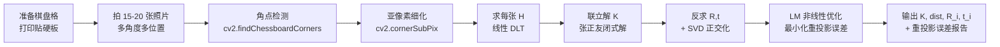

# 照相机标定（Camera Calibration）—— 程序员视角

**作者**：汪亮（bertonwang）  
**邮箱**：<47608843@qq.com>  
**版本**：v1.0 ｜ **最后更新**：2026-07-06

> 转载或引用请保留作者署名与本文链接，欢迎来信交流与勘误。
> 
> **一句话定义**：用一张张已知几何的"标定板"照片，反推出相机**内部参数**（焦距、主点、畸变）和**外部参数**（板子相对于相机的位姿）。
> 没有标定，所有 3D 视觉算法（SLAM / AR / 三维重建 / 测距）的精度都无从谈起。

---

## 目录

- [0. 相机标定要解决什么问题？](#0-相机标定要解决什么问题)
  - [0.6 手机/相机出厂后已经标过，为什么还要自己标？](#06-手机相机出厂后已经标过为什么还要自己标)
- [1. 标定到底在标什么？](#1-标定到底在标什么)
- [2. 为什么必须标定（用处与场景）](#2-为什么必须标定用处与场景)
- [3. 数学模型：从 3D 点到像素的完整链路](#3-数学模型从-3d-点到像素的完整链路)
- [4. 张正友标定法（Zhang's Method）推导](#4-张正友标定法zhangs-method推导)
- [5. 镜头畸变模型](#5-镜头畸变模型)
- [6. 完整工程流程（Step by Step）](#6-完整工程流程step-by-step)
- [7. Demo：用 OpenCV 完整跑通](#7-demo用-opencv-完整跑通)
- [8. 标定结果怎么读、怎么用](#8-标定结果怎么读怎么用)
- [9. 常见坑](#9-常见坑)
- [10. 一页纸总结](#10-一页纸总结)

---

## 0. 相机标定要解决什么问题？

> [!note] 一句话总览
> 相机把 **3D 世界压扁成 2D 像素**，天然丢失了"深度、真实尺寸、几何形状"。**标定的使命就是把这条"3D→2D"的映射函数用参数表达出来，让程序员可以随时正向投影、逆向反推**。

### 0.0 到底什么时候需要标定？（黄金判据）

在展开细节之前，先把最容易踩坑的一个概念澄清清楚：**"反求 3D"只是需要标定的一种典型场景，不是唯一场景**。

> [!important] 黄金判据（一句话记住）
> **只要你的算法输出，需要跟真实世界的物理量（长度、角度、距离、位姿）挂钩 —— 无论正向、反向、还是矫正 —— 就必须标定；反之，纯像素域的 2D 处理，不需要标定。**

#### ① 三类"必须标定"的场景

不要以为只有"像素→3D"（反求）才需要标定。下面三类**任何一类**只要沾上，就必须标定：

| 类型 | 方向 | 典型代表 | 需要什么标定产物 |
|:--|:--:|:--|:--|
| **A. 反投影**（Un-project） | 像素 → 3D | SLAM、双目/结构光测深、单目测距 | 内参 $K^{-1}$ + 畸变 |
| **B. 正投影**（Project） | 3D → 像素 | AR 贴图、HUD 叠加、重投影误差 | 内参 $K$ + 畸变 + 外参 $[R\|t]$ |
| **C. 几何矫正**（Undistort） | 像素 → 像素 | 鱼眼/广角变直、车道线矫正 | 畸变系数 $k_1,k_2,p_1,p_2,k_3$ |

> [!tip] 常见误区
> 很多人以为"AR 只是往画面上叠虚拟物体，都不涉及深度反推，应该不用标定"—— **错**。AR 需要把 3D 虚拟物体**正向投影**到像素平面，同样需要 $K$，否则物体会飘移错位。

#### ② 一类"完全不用标定"的场景

**判据**：**输入是像素，输出还是像素，且这些像素不需要跟真实几何量挂钩**。

| 应用 | 为什么不用标定 |
|:--|:--|
| 图像分类（猫/狗/风景） | 只识别 pattern，不关心尺寸 |
| 目标检测输出 (x, y, w, h) | 框以像素为单位，不换算成毫米 |
| 语义分割 / 实例分割 | 只标记像素类别 |
| OCR 文字识别 | 只认字符 pattern |
| 美颜、滤镜、抖音 2D 特效 | 纯像素域变换 |
| 视频压缩、格式转换 | 完全不涉及几何 |
| 拍照留念 / 视频记录 | 图像本身就是最终产物 |

#### ③ 决策流程图（30 秒判定要不要标定）

```
                   ┌───────────────────────────────┐
                   │ 你的算法输出，是否需要跟"真实   │
                   │ 世界物理量"（毫米/米/角度/位姿） │
                   │ 挂钩？                         │
                   └──────────────┬────────────────┘
                                  │
                    ┌─────────────┴─────────────┐
                    │                           │
                   是                          否
                    │                           │
                    ▼                           ▼
            ┌──────────────┐          ┌──────────────────┐
            │  必须标定    │          │  不需要标定      │
            │              │          │                  │
            │ 三选一：      │          │ 纯 2D 像素域：    │
            │ A. 像素→3D   │          │ 分类/检测/分割/   │
            │ B. 3D→像素   │          │ OCR/滤镜/压缩     │
            │ C. 畸变矫正   │          │                  │
            └──────────────┘          └──────────────────┘
```

#### ④ 快速自检清单

拿到一个新项目，问自己 4 个问题，**任何一个答"是"就必须标定**：

- [ ] 我需要从图像里**测出真实距离/长度/角度**吗？（→ 需要 A 反投影）
- [ ] 我需要把 **3D 内容画到画面上**（AR、HUD、渲染叠加）吗？（→ 需要 B 正投影）
- [ ] 我需要**把弯曲的鱼眼/广角画面掰直**吗？（→ 需要 C 畸变矫正）
- [ ] 我需要**估计相机相对某物体的位姿 (R, t)**（PnP、机器人手眼）吗？（→ 需要 B）

如果 4 个都答"否"，恭喜你，**这个项目不需要碰标定**，也不用继续读本文的第 3、4 章。

> [!note] 用这 4 条判据，你就掌握了本文的"入场券"
> 后面所有章节，本质上都在教你 **如何拿到 A/B/C 所需的参数**（$K$、畸变、$R$、$t$）。理解了 0.0，你才知道自己为什么要读这些内容。

---

### 0.1 一个所有程序员都能立刻理解的痛点

假设你写代码遇到这五个日常问题，**任何一个想解决都必须先标定**：

| # | 场景痛点 | 你手里有什么 | 你想要什么 | 差在哪里？ |
|:-:|:--|:--|:--|:--|
| ① | 一张照片里有一支铅笔 | 铅笔占 **200 像素** | 铅笔真实长度 = ? cm | **不知道"1 像素 = 多少毫米"** |
| ② | 摄像头拍到墙上 AR 二维码 | 二维码在图像中的四个角点 | 手机相对二维码的 **位姿 (R, t)** | **不知道相机的焦距和主点** |
| ③ | 双目相机拍同一物体 | 两张图 | 物体的 **深度 Z** | **不知道两个相机的内参和相对位姿** |
| ④ | 广角/鱼眼行车记录仪 | 一张扭曲的图 | 一张"看着正常"的图 | **不知道镜头的畸变系数** |
| ⑤ | 机器人视觉抓取 | 相机看到杯子在图像 (u,v) | 机械臂坐标系下杯子在哪 | **不知道相机 ↔ 机械臂的变换** |

> [!tip] 共同结构
> 上面每一行都是同一个数学问题：**已知像素坐标 (u, v) 和某些约束，反求 3D 世界的量**。要反求，你必须先知道那条正向"3D → 像素"的映射公式的参数。**这些参数 = 内参 + 畸变 + 外参 = 标定的产物**。

### 0.2 相机标定解决的 4 类核心问题

把上面的痛点抽象一下，标定实际上在解决**四类问题**：

```
┌──────────────────────────────────────────────────────────────┐
│                     3D 世界 ⇄ 2D 图像                        │
│                                                              │
│   问题①：正向投影  3D 点 → 像素          （AR 贴图/渲染）    │
│   问题②：反向反投  像素 → 3D 射线        （SLAM / 深度估计） │
│   问题③：几何矫正  失真图像 → 无畸变图像 （鱼眼 / 广角矫正） │
│   问题④：位姿估计  一堆 3D↔2D 对应 → 相机 (R, t)  （AR/机器人）│
└──────────────────────────────────────────────────────────────┘
```

| 问题类别 | 数学表达 | 需要标定给出的参数 |
|:--|:--|:--|
| **① 正向投影**（3D → 像素） | $s\,\tilde m = K\,[R\,\vert\,t]\,\tilde M$ | 内参 $K$、畸变、外参 $[R\|t]$ |
| **② 反向反投**（像素 → 射线） | $\vec d = R^\top K^{-1}\begin{pmatrix}u\\v\\1\end{pmatrix}$ | 内参 $K$、畸变（用于先矫正） |
| **③ 畸变矫正**（弯图 → 直图） | $(u,v)_{畸变} \to (u,v)_{理想}$ | 畸变系数 $k_1,k_2,p_1,p_2,k_3$ |
| **④ 位姿估计**（PnP / 求 R,t） | 已知 $K$，用 3D↔2D 对应求 $[R\|t]$ | 内参 $K$（**必须已知**才能解） |

> [!important] 关键洞察
> 问题 ②③④ 都建立在"**内参 K 和畸变已知**"的基础上。**内参标定是一切 3D 视觉的地基**，所以本文重点讲怎么把 $K$ 求出来（→ [第 4 章 张正友法](#4-张正友标定法zhangs-method推导)）。

### 0.3 不标定 vs 标定后：效果对比

| 任务 | 不标定的结果 | 标定后的结果 |
|:--|:--|:--|
| 用相机测一根铅笔 | "铅笔 = 200 像素"，无实际意义 | "铅笔 = 15.3 cm"，误差 < 1% |
| AR 摆放虚拟物体 | 物体飘忽、跟着抖 | 稳稳"焊"在真实物体上 |
| 双目立体测距 | 深度图全是噪声 | 深度误差 < 5 cm@3 m |
| 鱼眼行车记录仪 | 车道线是弯的 | 车道线笔直 |
| 机器人抓取 | 抓空 / 抓偏 5 cm 以上 | 抓取精度 < 2 mm |

### 0.4 相机标定的输入输出（黑盒视角）

从工程师视角，标定就是这样一个"函数"：

```
                    ┌─────────────────────────┐
   一叠棋盘格照片 ──▶│                         │──▶ 内参 K (3×3)
    （10~20 张，   │   相机标定算法           │──▶ 畸变系数 (5 个)
     不同角度）    │  （张正友法 / OpenCV）   │──▶ 每张照片的外参 (R, t)
                    │                         │──▶ 重投影误差（衡量精度）
                    └─────────────────────────┘
```

- **输入**：一组已知几何尺寸的标定板（棋盘格/圆点）在**不同角度**下的照片；
- **输出**：一次求出**内参 + 畸变**（相机固有属性）和**每张图的外参**（副产品，可用于 SLAM 位姿初始化）；
- **一次标定，长期使用**：只要不换镜头/不改焦距，$K$ 和畸变系数**永久有效**。

### 0.5 本文写给谁：程序员 3 个层次的诉求

| 你的角色 | 你想要什么 | 应重点看 |
|:--|:--|:--|
| **调 API 就行的开发者** | 会调用 `cv2.calibrateCamera` 出结果 | [第 6 章工程流程](#6-完整工程流程step-by-step) + [第 7 章 Demo](#7-demo用-opencv-完整跑通) |
| **想搞懂原理的开发者** | 理解 $K$、畸变、$R,t$ 从哪来 | [第 3 章数学模型](#3-数学模型从-3d-点到像素的完整链路) + [第 5 章畸变](#5-镜头畸变模型) |
| **要自己实现/优化的开发者** | 手写标定算法 / 排查精度问题 | [第 4 章张正友法](#4-张正友标定法zhangs-method推导) + [第 9 章常见坑](#9-常见坑) |

> [!tip] 快速索引：读完这一章你应该记住
> 1. **标定 = 求相机的映射函数参数**（$K$ + 畸变 + 每张图 $R,t$）；
> 2. **所有 3D 视觉任务都以内参已知为前提**（SLAM / AR / 双目 / 位姿估计）；
> 3. **一次标定，终身受益**（只要不换镜头）；
> 4. **实现方式**：拍 10~20 张不同角度棋盘格 → 一行 `cv2.calibrateCamera` 搞定。

### 0.6 手机/相机出厂后已经标过，为什么还要自己标？

> [!question] 一个几乎所有人都会问的问题
> 我买的 iPhone、单反、行车记录仪，出厂时厂家标过了吗？我拿来做 SLAM / AR / 测量，还需要自己再标一次吗？

#### 结论先说

| 情况 | 厂家有没有标？ | 用户要不要自己标？ |
|:--|:--:|:--:|
| **消费级用途**（拍照、视频、滤镜、系统 AR 特效） | ✅ 已标 | ❌ 不需要 |
| **精度敏感的 3D 视觉**（SLAM、工业 AR、机器人、双目深度、亚毫米测量） | ✅ 已标（较粗） | ⚠️ **强烈建议自己重标** |

#### ① 厂家在产线上做了什么？

每一台手机/相机在**总装车间的光学校准工位**都会经历一次自动标定：

```
┌──────────────────────────────────────────────────┐
│  产线校准（每台设备 5~30 秒）                      │
│  ① 拍已知靶标（棋盘格 / 圆点阵 / 特殊光学图）      │
│  ② 算出内参 K + 畸变系数 (k1,k2,p1,p2,k3)         │
│  ③ 烧录到设备的 EEPROM / OTP / 系统分区            │
│  ④ 双摄/多摄再标外参（摄像头之间的 R, t）          │
└──────────────────────────────────────────────────┘
```

参数烧录后，系统层可以直接读取：

- **iOS**：`AVCaptureDevice.cameraIntrinsicMatrix`（iOS 11+），ARKit 内部直接使用；
- **Android**：Camera2 的 `LENS_INTRINSIC_CALIBRATION` / `LENS_DISTORTION` / `LENS_POSE_ROTATION` / `LENS_POSE_TRANSLATION`，ARCore 依赖它；
- **数码相机**：EXIF 里的焦距只是**标称值**，真正的 $K$ 和畸变一般不开放；
- **专业相机**（GoPro、Insta360、大疆）：官方 SDK/固件里内置畸变模型，直接可读。

> [!tip] 快速验证：你从没手动标过，为什么手机 AR 依然能用？
> 因为 iPhone 上的 ARKit / Android 的 ARCore **在启动时就从系统 API 读到了出厂标定的 $K$ 和畸变系数**，用户完全无感。

#### ② 消费级为什么"用户不用管"？

1. **需求不苛刻**：拍照/视频/一般 AR 特效，误差 1~3 像素肉眼无感；
2. **软件矫正一体化**：畸变矫正在 ISP（图像信号处理器）里默认已开启，出图就是"看起来正常"的；
3. **同型号一致性好**：手机镜头是模组化生产，同批次差异 < 0.5%，厂家用**批平均值**就够。

#### ③ 精度敏感场景为什么"必须自己重标"？

即使设备出厂标过，遇到下面这些情形，**出厂参数不够用**：

| # | 原因 | 后果 |
|:-:|:--|:--|
| ① | **产线追求速度，精度粗**（重投影误差 1~2 px） | 3D 测量差 5%+，SLAM 累积漂移大 |
| ② | **参数不公开**（厂商不开放 API） | 无法读到 $K$，SLAM 无从下手 |
| ③ | **换镜头 / 换模组** | 内参完全失效 |
| ④ | **变焦 / 对焦变化** | 每个焦距的 $f_x, f_y$ 不同，出厂标的只是某个基准 |
| ⑤ | **温度剧变、跌落、老化** | 主点 $(c_x, c_y)$ 会漂移几个像素 |
| ⑥ | **个体差异**（同型号 ±0.5%~2%） | 亚毫米级测量必挂 |

**必须重标的典型场景**：

```
┌────────────────────────────────────────────────┐
│  高精度 3D 视觉  →  必须自己重标               │
│    • SLAM / VSLAM / VIO                        │
│    • 工业 AR / 医疗 AR                          │
│    • 双目 / 多目深度重建                        │
│    • 机器人视觉抓取（含手眼标定）               │
│    • 亚毫米级工业尺寸测量                        │
│    • 无人机 / 自动驾驶多传感器融合               │
│    • 学术研究、算法评测                          │
│                                                │
│  普通拍照 / 视频 / 滤镜  →  出厂参数即可         │
└────────────────────────────────────────────────┘
```

#### ④ 一个直观对比：以 iPhone 15 Pro 为例

| 用途 | 出厂参数够不够？ |
|:--|:--|
| 微信拍照发朋友圈 | ✅ 够 |
| iOS 系统自带 AR 尺子 | ✅ 够（几厘米误差可接受） |
| 拿它做**科研级 SLAM 数据采集** | ❌ 需要自己标 |
| 拿它做**建筑测量、误差 < 5 mm** | ❌ 需要自己标 |
| 拿它做**工业检测** | ❌ 需锁定焦距后重标 |

#### ⑤ 一句话总结

> [!important] 关键结论
> - **出厂都标过**，参数烧在设备里，普通用户完全无感；
> - **消费级用途**（拍照 / 视频 / 入门 AR）→ **不用管**；
> - **精度敏感的 3D 视觉**（SLAM / 工业 / 机器人 / 测量）→ **必须自己标**，因为出厂参数：
>   1. 精度粗（1~2 px 重投影误差）；
>   2. 常常读不到（API 不开放）；
>   3. 换镜头 / 变焦 / 长期使用后会失效。
>
> **这也是本文存在的意义**——教你怎么在自己的相机上，用一叠棋盘格照片 + `cv2.calibrateCamera` 拿到远超出厂精度的高质量参数，让 3D 视觉算法真正跑得稳。

---

## 1. 标定到底在标什么？

> [!note] 类比：把"相机"当成一个未知函数
> 真实世界 → **？？？** → 像素图。  
> 标定就是用已知输入输出（标定板的 3D 点 ↔ 拍到的 2D 像素）去**拟合这个未知函数的参数**。

标定要解出两组参数：

| 类别 | 名字 | 含义 | 几何意义 |
|:-|:-|:-|:-|
| **内参** Intrinsics | $f_x, f_y$ | 像素单位的焦距 | 镜头"放大倍率" |
| | $c_x, c_y$ | 主点（principal point） | 光轴打在感光面上的位置 |
| | $k_1, k_2, p_1, p_2, k_3$ | 畸变系数 | 镜头不完美带来的形变 |
| **外参** Extrinsics | $R$（3×3） | 旋转矩阵 | 标定板相对相机的朝向 |
| | $t$（3×1） | 平移向量 | 标定板相对相机的位置 |

> [!tip] 一句话区分
> - **内参**：相机"出厂属性"，只要不换镜头就**永远不变**。
> - **外参**：每张照片**都不一样**（板子动了/相机动了）。
> 
> 所以标定的副产品 —— 每张照片的 $(R,t)$ —— 在 SLAM/AR 里反过来正是我们想求的"相机位姿"。

---

## 2. 为什么必须标定（用处与场景）

> [!warning] 不标定的代价
> - 测出来的物体长度/距离差 5%–30%；
> - AR 贴图永远"飘"在物体边缘；
> - 立体匹配出来的深度图全是噪声；
> - 机器人手眼标定直接失败。

### 2.1 典型应用

| 场景 | 标定解决的问题 |
|:-|:-|
| **SLAM / VSLAM** | 已知像素 → 反推 3D 射线 → 三角化得地图点 |
| **AR / VR** | 把虚拟物体放在真实坐标里；不标定 → 物体在屏幕上漂移 |
| **三维重建（MVS / SfM）** | 多视图几何的全部公式都建立在内参已知之上 |
| **机器人手眼标定** | 求"相机 ↔ 机械臂末端"的固定变换 |
| **车载 ADAS / 自动驾驶** | 行人/车辆距离测量、车道线投影到 BEV |
| **工业测量** | 用相机当尺子，亚毫米级测量必须先标定 |
| **图像矫正** | 鱼眼/广角直接矫正成"无畸变正常画面" |

### 2.2 一个直观例子

> [!example] 用相机测一根铅笔多长
> 不标定：你只能数像素 → 不知道"1 像素 = 多少毫米"，结果毫无意义。  
> 标定后：知道 $f_x, f_y$ 和铅笔深度 $Z$，就能换算出真实长度
> 
> $$L_{真实} = \frac{L_{像素} \cdot Z}{f_x}$$

---

## 3. 数学模型：从 3D 点到像素的完整链路

整个相机成像过程可以拆成**四个坐标系的链式变换**：

```
世界坐标系  ──[R|t]──>  相机坐标系  ──透视投影──>  归一化平面  ──畸变──>  像素坐标系
  P_w                     P_c                       (x,y)                  (u,v)
```

### 3.1 第 1 步：世界 → 相机（外参）

刚体变换：

$$P_c = R\,P_w + t = \begin{pmatrix}X_c\\Y_c\\Z_c\end{pmatrix}$$

### 3.2 第 2 步：相机 → 归一化平面（小孔成像）

把 3D 点投到 $Z=1$ 的平面上，去掉深度：

$$x = \frac{X_c}{Z_c},\quad y = \frac{Y_c}{Z_c}$$

> [!note] 为什么要"归一化"
> 这一步把"远处的大物体"和"近处的小物体"压到同一尺度，剥离了焦距的影响，方便后续单独建模畸变。

### 3.3 第 3 步：加畸变

$$\begin{aligned}
r^2 &= x^2 + y^2 \\
x_d &= x(1+k_1 r^2 + k_2 r^4 + k_3 r^6) + 2p_1 xy + p_2(r^2+2x^2) \\
y_d &= y(1+k_1 r^2 + k_2 r^4 + k_3 r^6) + p_1(r^2+2y^2) + 2p_2 xy
\end{aligned}$$

- $k_1, k_2, k_3$：**径向畸变**（鱼眼/枕形/桶形，沿半径方向）；
- $p_1, p_2$：**切向畸变**（镜头与感光元件不平行造成）。

#### 3.3.1 底层原理：为什么这 5 个参数就够了？

很多人第一次看到这堆 `k_1, k_2, k_3, p_1, p_2` 会觉得"是不是随便凑出来的？"——**不是**。这 5 个参数背后有一套严格的数学推导：**泰勒展开 + 对称性分析**。下面一步一步讲清楚。

##### 一、大思路：畸变 = "理想位置" + "小偏移"

无畸变时，光线走的是**直线**——归一化平面上一个点应该落在 `(x, y)`。

有畸变时，实际落点变成 `(x_d, y_d)`。二者差一个偏移量 `Δ`：

```
x_d = x + Δx(x, y)
y_d = y + Δy(x, y)
```

**核心问题**：这个偏移函数 `Δ(x, y)` 长什么样？——它是**未知的、复杂的、由镜头形状决定的**。

**核心手段**：既然不知道具体形式，就**用泰勒级数展开去逼近**——任何"足够光滑"的函数，都能写成多项式的和：

```
Δ(x, y) = a₀ + a₁·x + a₂·y + a₃·x² + a₄·xy + a₅·y² + a₆·x³ + ...
```

这一步是**通用套路**：把未知函数拆成"一堆已知的基（1, x, y, x², xy, y²…）× 待定系数"，然后用标定数据把系数拟合出来。**畸变模型的所有系数，本质就是泰勒展开的系数。**

那问题就变成：**为什么最后只留下 `k₁r², k₂r⁴, k₃r⁶` 和 `p₁, p₂` 这几项，其他项都不要？**——答案是**对称性 + 物理约束**帮我们砍掉了一大堆项。

##### 二、径向畸变的推导（`k₁, k₂, k₃` 的来源）

**物理事实**：镜头是**旋转对称**的（圆形玻璃磨制而成）。因此：

> **约束 1**：畸变只跟"离光轴的距离 `r`"有关，跟"方向 θ"无关。

用极坐标写（`x = r cosθ, y = r sinθ`）：

```
r_d = r · L(r)     ← 沿半径方向拉伸/压缩，倍数 L 只依赖 r
```

**符号含义**：

- `r`：**理想（无畸变）**情况下，点到光轴（图像中心）的距离，即 `r = √(x² + y²)`；
- `r_d`：**实际（有畸变）**情况下，同一点到光轴的距离，下标 `d` 表示 "distorted"（畸变后）；
- `L(r)`：**径向拉伸倍数**——一个只依赖 `r` 的标量函数。`L > 1` 表示往外扩（枕形），`L < 1` 表示往内缩（桶形），`L = 1` 表示无畸变。

> [!note] "光轴"到底是哪根轴？——**垂直于成像平面**
> 很多人第一次看到"光轴"会疑惑：它是平行于成像平面的，还是垂直的？
>
> **答案：光轴是从相机针孔出发、垂直穿过成像平面、指向被摄场景的那条 3D 直线**——通常就是相机坐标系的 **Z 轴**。
>
> ```
>               成像平面 (2D 图像)
>                     │
>                     │  ← 光轴与它 "垂直"
>       ●─────────────┼───────────────►  被摄场景
>     针孔          主点               (光轴指向远方)
>   (相机中心)    (c_x, c_y)
>        └────────── 这条箭头 = 光轴 ─────────►
>                 (相机 Z 轴，垂直于成像平面)
> ```
>
> **关键关系**：
> - 光轴是 **3D 空间里的一条直线**，不是图像里的某条线；
> - 它**垂直**于成像平面（不是平行）；
> - 它和成像平面**只相交于一个点**——这个交点就是**主点 `(c_x, c_y)`**，通常约等于图像中心。
>
> 所以"点到光轴的距离 `r`"在 2D 图像上，就等价于——
>
> > **"像点到主点（图像中心）的距离"**。
>
> 因为光轴垂直穿过成像平面只留下一个交点，"到一条 3D 线的距离"就退化成了"到平面上一个点的距离"，用 `r = √(x² + y²)` 一步算出。

对 `L(r)` 做**泰勒展开**（在 `r = 0` 附近）：

```
L(r) = 1 + a₁·r + a₂·r² + a₃·r³ + a₄·r⁴ + a₅·r⁵ + a₆·r⁶ + ...
```

> **约束 2**：光轴处（`r = 0`）**不该有畸变**——所以常数项是 `1`，且 `L` 关于 `r` **偶对称**（`+r` 和 `-r` 方向必须一样）。

偶对称就意味着：**所有奇次项系数必须为 0**（`a₁ = a₃ = a₅ = 0`）。剩下：

```
L(r) = 1 + k₁·r² + k₂·r⁴ + k₃·r⁶ + ...
                 ↑        ↑        ↑
                主项     修正     大广角才需要
```

于是径向畸变的表达式为：

```
x_d^radial = x · (1 + k₁r² + k₂r⁴ + k₃r⁶)
y_d^radial = y · (1 + k₁r² + k₂r⁴ + k₃r⁶)
```

**为什么截断到 `r⁶` 就够？**

- `k₁·r²`：**主导项**，能解释 90% 以上的畸变（普通手机、工业相机基本只用它）；
- `k₂·r⁴`：**修正项**，广角镜头需要；
- `k₃·r⁶`：**高阶修正**，鱼眼、超广角才明显。

再往后（`r⁸, r¹⁰`…）系数极小，反而容易过拟合噪声，**得不偿失**。所以工业界统一约定："**径向 3 个系数就够**"。

##### 三、切向畸变的推导（`p₁, p₂` 的来源）

**物理事实**：镜头组装时，镜片和感光元件（CMOS/CCD）**不可能完美平行**——总有微小的倾斜。这会破坏"旋转对称"，产生**方向性的偏移**（不再只跟 `r` 有关，跟 `x/y` 各自方向也有关）。

Brown（1966）通过对"薄棱镜近似"的物理分析，推导出切向畸变的**标准形式**：

```
Δx^tangential = 2·p₁·xy + p₂·(r² + 2x²)
Δy^tangential = p₁·(r² + 2y²) + 2·p₂·xy
```

**如何理解这两个系数？**

- `p₁` 描述"**沿 y 方向的倾斜**"——它主要让点在 y 方向上偏移；
- `p₂` 描述"**沿 x 方向的倾斜**"——它主要让点在 x 方向上偏移。

它们是"**镜头与传感器夹角**"这个 3D 姿态误差在 2D 平面上的投影残留，理论上**只需要 2 个参数**就能刻画（因为夹角有两个自由度：绕 x 轴倾多少、绕 y 轴倾多少）。

##### 四、两部分叠加 = 完整畸变模型

把径向和切向叠加起来，就是 3.3 节开头那两行：

```
x_d = x·(1 + k₁r² + k₂r⁴ + k₃r⁶)  +  2p₁xy + p₂(r² + 2x²)
      └──────── 径向 ────────┘     └────── 切向 ──────┘
y_d = y·(1 + k₁r² + k₂r⁴ + k₃r⁶)  +  p₁(r² + 2y²) + 2p₂xy
```

##### 五、总结：为什么"5 个参数"是黄金比例？

| 参数 | 数量 | 来源 | 物理含义 |
|------|------|------|----------|
| $k_1, k_2, k_3$ | **3 个** | 径向 `L(r)` 泰勒展开偶次项截断到 `r⁶` | 镜头径向的"胖瘦" |
| $p_1, p_2$ | **2 个** | 镜头/传感器倾斜的两个自由度 | 组装误差带来的方向性偏移 |
| **合计** | **5 个** | 泰勒展开 + 对称性 + 物理约束 | 覆盖 99% 常规镜头 |

**一句话总结**：这 5 个参数不是拍脑袋定的，而是——

> 把畸变函数**泰勒展开**，用**旋转对称**砍掉奇次项，用**物理直觉**保留最有效的低阶项，**恰好剩 5 个**。这样既能拟合绝大多数镜头，又不会因参数过多而过拟合噪声。

这就是 OpenCV / MATLAB 标定工具箱里默认使用 `[k₁, k₂, p₁, p₂, k₃]` 5 参数模型的**根本原因**。

> [!tip] 什么时候需要更多参数？
> - **鱼眼镜头**（视场 > 120°）：切换到专门的鱼眼模型（如 OpenCV 的 `cv::fisheye`），使用 `k₁~k₄` 4 个径向参数，切向不用；
> - **高精度机器视觉**（亚像素级）：可以启用 OpenCV 的**有理模型**（多加 `k₄, k₅, k₆` 3 个分母项）或**薄棱镜模型**（`s₁~s₄`）。

### 3.4 第 4 步：归一化平面 → 像素（内参 K）

$$\begin{pmatrix}u\\v\\1\end{pmatrix}=K\begin{pmatrix}x_d\\y_d\\1\end{pmatrix},\quad K = \begin{pmatrix}f_x & 0 & c_x \\ 0 & f_y & c_y \\ 0 & 0 & 1\end{pmatrix}$$

> [!tip] 内参矩阵 K 的物理意义
> - $f_x = f \cdot s_x$，$f$ 是物理焦距（毫米），$s_x$ 是单位毫米的像素数 → 所以 $f_x$ 单位是**像素**；
> - $(c_x, c_y)$ 通常接近图像中心，但**几乎从不严格等于** `(width/2, height/2)`，差几个像素很正常。

### 3.5 完整公式（无畸变简化版）

$$s\begin{pmatrix}u\\v\\1\end{pmatrix} = K[R|t]\begin{pmatrix}X_w\\Y_w\\Z_w\\1\end{pmatrix}$$

这就是著名的**针孔相机投影公式（Pinhole Projection Equation）**——把三维世界点 $M=(X_w,Y_w,Z_w)$ 一步映射到二维像素 $(u,v)$。下面从 6 个角度系统解释它。

---

#### ① 每个符号是什么？——一句话释义表

| 符号 | 名称 | 维度 | 单位 | 是"已知/未知" | 出处小节 |
|------|------|------|------|---------------|----------|
| $\tilde M = (X_w, Y_w, Z_w, 1)^\top$ | 世界点（齐次） | 4×1 | 米 | 拍照时**已知**（例如棋盘角点、SLAM 地图点） | 3.1 |
| $[R\|t]$ | 外参矩阵（拼接） | 3×4 | R 无量纲、t 米 | **未知**（每张图/每一时刻不同） | 3.1 |
| $K$ | 内参矩阵 | 3×3 | 像素 | **未知**（相机出厂后固定，标定一次即可） | 3.4 |
| $\tilde m = (u, v, 1)^\top$ | 像素点（齐次） | 3×1 | 像素 | 拍照时**观测到**（角点检测得出） | 3.4 |
| $s$ | 齐次尺度因子 | 标量 | 米 | 中间量，$s = Z_c$（相机系下的深度） | 见 ③ |

> **一句话**：**已知**世界点 $\tilde M$ 与观测像素 $\tilde m$，**求解**外参 $[R\|t]$ 和内参 $K$——这就是标定问题。

---

#### ② 把公式拆成 4 段：外参 → 针孔 → 畸变 → 内参

这条公式看似一步到位，其实是把 3.1~3.4 的 4 段变换**串起来**的结果。逐段展开如下（**无畸变时第 3 步是恒等，所以叫"简化版"**）：

$$
\underbrace{\begin{pmatrix}X_w\\Y_w\\Z_w\\1\end{pmatrix}}_{\text{世界系}}
\xrightarrow{[R|t]}
\underbrace{\begin{pmatrix}X_c\\Y_c\\Z_c\end{pmatrix}}_{\text{相机系（3.1）}}
\xrightarrow{\div Z_c}
\underbrace{\begin{pmatrix}x\\y\\1\end{pmatrix}}_{\text{归一化平面（3.2）}}
\xrightarrow{\text{畸变}}
\underbrace{\begin{pmatrix}x_d\\y_d\\1\end{pmatrix}}_{\text{畸变后（3.3）}}
\xrightarrow{K}
\underbrace{\begin{pmatrix}u\\v\\1\end{pmatrix}}_{\text{像素（3.4）}}
$$

- **段 1（外参）**：$[X_c\;Y_c\;Z_c]^\top = R\,[X_w\;Y_w\;Z_w]^\top + t$——**刚体变换**，改坐标系不改物理位置；
- **段 2（针孔）**：$x = X_c/Z_c,\ y = Y_c/Z_c$——**除以深度**是相似三角形的必然结果；
- **段 3（畸变）**：$(x,y) \to (x_d, y_d)$——非线性透镜校正，本节假设为 0；
- **段 4（内参）**：$u = f_x \cdot x_d + c_x,\ v = f_y \cdot y_d + c_y$——把归一化坐标"拉伸+平移"到像素网格。

**"完整公式"就是把这 4 段合并、并用齐次坐标改写成矩阵乘法的结果**——目的是让计算机能一次性做完，也让理论推导（如 4 章的 DLT）能利用矩阵性质。

---

#### ③ 那个"$s$"是什么？——齐次坐标的尺度因子

不少读者第一次看到左边的 $s$ 都会困惑："凭空多出一个未知数怎么行？" 其实它**不是自由变量**，而是一个**约束标记**：

$$s = Z_c \quad(\text{相机坐标系下该点的深度})$$

**几何直觉**：从相机光心出发，穿过物点 $M$ 的射线上**所有点都投影到同一个像素**——所以物点的绝对深度 $Z_c$ 用一次投影是"无法恢复"的（这就是**单目 SLAM 尺度不确定性**的根源）。用齐次坐标写成 $s\tilde m = \cdots$，就是在明确告诉读者："等式两边在**齐次意义下相等**，允许整体相差一个非零因子"。

**具体怎么用**：右侧算出 $(u',v',w')^\top = K[R|t]\tilde M$ 后，实际像素坐标是

$$u = u'/w',\qquad v = v'/w',\qquad s = w' = Z_c$$

即"**先做矩阵乘法，最后除以第三行**"。这一步"除以 $w'$"就叫**齐次归一化**，是所有投影几何计算的固定套路。

---

#### ④ 维度对齐检查（防止读者算错）

| 步骤             | 算式                                | 维度检查                    |
|------------------|-------------------------------------|-----------------------------|
| $[R\|t]\tilde M$  | $(3\times 4) \cdot (4\times 1)$     | → $3\times 1$ = $[X_c,Y_c,Z_c]^\top$ |
| $K \cdot (\cdot)$ | $(3\times 3) \cdot (3\times 1)$     | → $3\times 1$ = $[u',v',w']^\top$   |
| 归一化           | $(u,v) = (u'/w',\ v'/w')$          | → 最终二维像素点            |

一次矩阵乘法链路：$3\times3 \cdot 3\times4 \cdot 4\times1 \Rightarrow 3\times 1$，最后一维取出作为 $s$，前两维除以 $s$ 即得 $(u,v)$。

---

#### ⑤ 一个具体的数值算例（60 秒手算走一遍）

**给定**：
- 内参 $K = \begin{pmatrix}800 & 0 & 320\\ 0 & 800 & 240\\ 0 & 0 & 1\end{pmatrix}$（焦距 800 px，主点 (320, 240)）；
- 外参 $R = I$（相机光轴与世界 $Z$ 轴对齐）、$t = (0,0,0)^\top$（相机就在世界原点）；
- 世界点 $M = (0.1,\ 0.2,\ 2.0)^\top$ 米。

> [!note] 这里的内参K 是从哪来的？——本节先"直接给定"，正式求解见后文
>
> 本算例为聚焦"投影公式怎么用"，**直接假定 $K$ 已知**。真实工程中 $K$ 需要通过**相机标定**求出，完整推导与代码分布在后文：
>
> | 想了解         | 去哪一节       | 关键要点 |
> |----------------|----------------|----------|
> | 概念性 4 步流水线 | **4.1.1 Step 1~4** | 拍照 → DLT 解 H → 正交约束解 K → 反求 R,t |
> | K 求解的**数学推导** | **4.2 用 H 反求 K** | 由 $r_1^\top r_2=0,\ \|r_1\|=\|r_2\|$ → $B=K^{-\top}K^{-1}$ 的线性方程 → Cholesky 分解得 K |
> | 与 R,t 的联合求解 | **4.3** | 解出 K 后回代求每张图的 (R, t) |
> | 精度提升         | **4.4** | 用重投影误差做 LM 非线性优化 |
> | 一站式**代码实现** | **7 章 Demo**  | `cv2.calibrateCamera` 一次性输出 K、畸变系数与各图的 (R, t) |
>
> **一句话记忆**：$K$ = 拍多张不同角度的棋盘照片 → 每张解一个单应 $H$ → 用旋转矩阵的正交性质列方程 → 联立求解 → Cholesky 分解得 $K$。

**Step 1**（外参）：$M_c = R\,M + t = (0.1,\ 0.2,\ 2.0)^\top$，所以 $Z_c = 2.0$；

**Step 2**（针孔）：$x = 0.1/2.0 = 0.05,\ y = 0.2/2.0 = 0.10$；

**Step 3**（畸变）：无畸变，跳过；

**Step 4**（内参）：
- $u = 800 \cdot 0.05 + 320 = 360$
- $v = 800 \cdot 0.10 + 240 = 320$

**结果**：$M$ 会成像在像素 $(u,v) = (360,\ 320)$，深度 $s = Z_c = 2.0$ m。

**验证矩阵形式**：
$$K[R|t]\tilde M = \begin{pmatrix}800\cdot 0.1 + 320\cdot 2\\ 800\cdot 0.2 + 240\cdot 2\\ 2\end{pmatrix} = \begin{pmatrix}720\\ 640\\ 2\end{pmatrix}$$
除以第三行：$(720/2,\ 640/2) = (360,\ 320)$ ✅——与分步计算完全一致。

---

#### ⑥ 一图看懂投影链路

```
┌──────────────┐  外参 [R|t]   ┌──────────────┐   ÷Z_c    ┌──────────────┐
│  世界坐标    │  ─────────▶  │  相机坐标    │  ──────▶  │ 归一化平面   │
│ (X_w,Y_w,Z_w)│   刚体变换    │ (X_c,Y_c,Z_c)│   针孔    │   (x, y, 1)  │
└──────────────┘               └──────────────┘           └──────┬───────┘
                                                                 │ 畸变模型 (3.3)
                                                                 ▼
┌──────────────┐   齐次归一化   ┌──────────────┐    K       ┌──────────────┐
│  像素坐标    │ ◀───────────  │(u',v',w') 中间│ ◀──────── │ 畸变后归一化 │
│   (u, v)     │   ÷ w' = Z_c  │   齐次结果   │  内参映射  │  (x_d, y_d)  │
└──────────────┘               └──────────────┘            └──────────────┘

      物理量 → 单位无关         单位无关 → 像素          "无畸变简化版"
       [米]                      [米/米=1]              直接把 (x,y) 送进 K
```

> [!tip] 一句话把 3 章串成一句
> **投影公式**是"**世界 → 相机 → 归一化 → (畸变) → 像素**" 4 段变换的**齐次矩阵合并写法**；求解未知的 $K$ 和 $[R\|t]$ 就是**相机标定**（第 4 章）；反过来给定 $K,[R\|t]$ 求 $(u,v)$ 就是**投影 / AR 渲染**（8.3 节）。

---

## 4. 张正友标定法（Zhang's Method）推导

> [!summary] 这是**目前业界最常用**的标定法
> 1999 年微软研究院张正友提出，OpenCV / MATLAB / Halcon 全部内置。
> 核心思想：**只用一张平面棋盘格 + 拍多个角度**，无需精密 3D 标定块。

### 4.1 关键简化：让标定板的 Z = 0

> [!note] 先厘清"完整公式"是怎么来的
> 这里说的"完整公式"，就是把前面**外参 → 针孔投影 → 内参**这三段串在一起后得到的**总投影方程**：
>
> $$s\begin{pmatrix}u\\v\\1\end{pmatrix} = K\,[r_1\;r_2\;r_3\;t]\begin{pmatrix}X_w\\Y_w\\Z_w\\1\end{pmatrix}$$
>
> **三步流水线**（一句话：世界点 → 相机点 → 归一化点 → 像素点）：
>
> **① 世界坐标 → 相机坐标**（外参 [R\|t]，一次刚体变换）
>
> $$\begin{pmatrix}X_c\\Y_c\\Z_c\end{pmatrix} = R\begin{pmatrix}X_w\\Y_w\\Z_w\end{pmatrix} + t$$
>
> **② 相机坐标 → 归一化图像平面**（针孔模型，除以深度 $Z_c$）
>
> $$\begin{pmatrix}x\\y\\1\end{pmatrix} = \frac{1}{Z_c}\begin{pmatrix}X_c\\Y_c\\Z_c\end{pmatrix} \quad\Longleftrightarrow\quad s\begin{pmatrix}x\\y\\1\end{pmatrix} = \begin{pmatrix}X_c\\Y_c\\Z_c\end{pmatrix},\; s = Z_c$$
>
> 齐次坐标里的比例因子 $s$，本质就是那个被除掉的深度 $Z_c$。
>
> **③ 归一化点 → 像素**（内参 K，把几何单位换成像素）
>
> $$\begin{pmatrix}u\\v\\1\end{pmatrix} = K\begin{pmatrix}x\\y\\1\end{pmatrix},\qquad K = \begin{bmatrix}f_x & 0 & c_x\\ 0 & f_y & c_y\\ 0 & 0 & 1\end{bmatrix}$$
>
> **三步合并**：把 ② 的 $(X_c,Y_c,Z_c)$ 用 ① 展开、再套 ③，并把 $R$ 按列拆成 $[r_1\;r_2\;r_3]$，就得到完整公式：
>
> $$s\begin{pmatrix}u\\v\\1\end{pmatrix} = K\,[R\;t]\begin{pmatrix}X_w\\Y_w\\Z_w\\1\end{pmatrix} = K\,[r_1\;r_2\;r_3\;t]\begin{pmatrix}X_w\\Y_w\\Z_w\\1\end{pmatrix}$$
>
> **流水线示意**：
>
> ```
>    世界点 ──[R|t]──▶ 相机点 ──÷Z_c──▶ 归一化点 ──K──▶ 像素点
>   (Xw,Yw,Zw)       (Xc,Yc,Zc)        (x,y,1)        (u,v,1)
>       └────── 外参 ──────┘└─ 针孔 ─┘└──── 内参 ────┘
> ```

把世界坐标系建在标定板平面上，所有角点 $Z_w = 0$。代入完整公式，第 3 列 $r_3$ 乘的是 0，直接被"抹掉"：

$$s\begin{pmatrix}u\\v\\1\end{pmatrix} = K[r_1\;r_2\;r_3\;t]\begin{pmatrix}X\\Y\\0\\1\end{pmatrix} = K[r_1\;r_2\;t]\begin{pmatrix}X\\Y\\1\end{pmatrix}$$

> [!note] 这是个 2D → 2D 的单应变换（Homography）
> 定义 $H = K[r_1\;r_2\;t]$，则 $sm = HM$。  
> 一张棋盘格图至少能给我们 $\geq 4$ 对 (X,Y) ↔ (u,v)，**用 DLT 算法可以解出 H**。

#### 4.1.1 R 如何确定？——从"物理含义"到"数值求解"

先给一个分层答案，再展开：

| 层次 | 回答 |
|------|------|
| **R 是什么** | 世界坐标系相对相机坐标系的**旋转矩阵**（3×3，正交，$\det=1$） |
| **R 从哪里来** | 拍照那一刻，**相机相对于世界的姿态**——是**物理事实**，不是"人工定义" |
| **R 怎么求** | 张正友法：先解出**单应矩阵 H**，再由 $H = K[r_1\;r_2\;t]$ 反解 $r_1, r_2$，最后 $r_3 = r_1 \times r_2$ |

##### ① R 的物理含义：它到底描述什么？

**R 描述的是"两个坐标系之间的姿态差"。**

标定时：

- **世界坐标系**：人为规定，通常就**建在标定板上**（棋盘格左下角为原点，X 轴沿棋盘水平向右，Y 轴沿棋盘垂直向上，Z 轴垂直于板面朝外——**右手系**）；
- **相机坐标系**：以相机光心为原点，Z 轴沿光轴指向前方。

```
       标定板（世界系）                相机（相机系）
        Y_w                              Y_c
         ▲                                ▲
         │ ┌─┬─┬─┬─┐                      │
         │ ├─┼─┼─┼─┤                      │
         │ ├─┼─┼─┼─┤        ────►         ●───▶ X_c
         │ └─┴─┴─┴─┘                     ╱
     Z_w ●─────────▶ X_w                ▼
    (朝外，指向读者)                    Z_c (朝前，沿光轴)
```

> 说明：世界系为**右手系**——X_w 沿棋盘水平向右、Y_w 沿棋盘垂直向上、Z_w 垂直板面**朝外指向读者**（图中用 ● 表示"箭头尖端朝向读者"）；棋盘格位于 X_w–Y_w 平面的第一象限，原点在棋盘左下角。相机系同为右手系：X_c 向右、Y_c 向上、Z_c 沿光轴朝前。

你把相机端起来对着棋盘拍照的**那一瞬间**，两个坐标系之间**天然存在**一个"从世界系旋转到相机系"的变换——这就是 R；相机光心相对棋盘原点的位移，就是 t。

> [!important] R 不是"设定"的，是"物理量"
> **每张照片有自己的 R 和 t**（相机每动一下，R 就变一次）；
> 但相机内参 K、畸变 $k_i, p_i$ 是同一台相机，**所有照片共享**。
> 这也是张正友法为何要求"多角度拍 10~20 张"——每张贡献一组独立的 (R, t)。

##### ② R 的数学结构：为什么它有 3 个自由度？

R 是 3×3 矩阵，看起来 9 个数，但受两个约束：

$$R^\top R = I,\qquad \det(R) = +1$$

- $R^\top R = I$：三列**两两正交、每列模长为 1**（6 个约束）；
- $\det = +1$：是"旋转"而非"镜像"（1 个约束）。

结果：**9 − 6 = 3 个自由度**——正好对应绕 X、Y、Z 三根轴的三个转角（欧拉角 / 轴角 / 四元数都行，本质等价）。

**列的含义**（后面推导会用到）：

$$R = [\,r_1\ r_2\ r_3\,]$$

- $r_1$：**世界系的 X 轴**在相机系里的方向；
- $r_2$：**世界系的 Y 轴**在相机系里的方向；
- $r_3$：**世界系的 Z 轴**在相机系里的方向；
- 三者**两两正交、单位长**。

这就是 4.2 节那两个方程 $r_1^\top r_2 = 0$、$\|r_1\| = \|r_2\|$ 的来源。

##### ③ 张正友法里 R 是怎么"算出来"的？——4 步

回到你的问题：**4.1 的 R 具体怎么确定？** 完整流水线如下。

**Step 1｜先拍照，得到 (X, Y) ↔ (u, v) 对应**

固定标定板 → 移动相机拍 N 张 → 每张图上的棋盘格角点被检测算法（如 OpenCV 的 `findChessboardCorners`）找出来 → 得到成千上万对：

```
世界点 (X_j, Y_j, 0)   ↔   像素点 (u_j, v_j)
     ↑                        ↑
  已知（棋盘格标称尺寸）   测得（角点检测）
```

> [!note] 如何理解世界点 (X_j, Y_j, 0) ？
>
> **一句话**：这是**第 j 个棋盘格内角点在"贴在标定板上的世界坐标系"里的坐标**——由棋盘格的物理规格直接查出来，不需要测量。
>
> **1. 什么是"世界坐标系"？**
> 前面讲过：**世界系原点建在标定板上**（棋盘左下角为原点，X_w 沿棋盘横向、Y_w 沿棋盘纵向、Z_w 垂直板面朝外）。既然棋盘是**平的**，所有角点都在这个坐标系的 **X_w–Y_w 平面**里，因此 **Z 坐标恒等于 0**——这也是 4.1"关键简化"的由来。
>
> **2. $(X_j, Y_j)$ 具体等于多少？**
> 假设棋盘每个方格边长 $d = 25\ \text{mm} = 0.025\ \text{m}$（这个 $d$ 由厂家印刷时确定，写在标定板参数里，即"标称尺寸"），一个 $9\times 6$ 内角点的棋盘，第 $(i, k)$ 号内角点的世界坐标就是：
>
> $$X_j = i\cdot d,\quad Y_j = k\cdot d,\quad Z_j = 0\quad(i=0,1,\ldots,8;\ k=0,1,\ldots,5)$$
>
> **示例（d = 25 mm）**：
>
> | 角点编号 j | (i, k)  | (X_j, Y_j, 0) 单位: m       |
> |------------|---------|-----------------------------|
> | 0          | (0, 0)  | (0.000, 0.000, 0)           |
> | 1          | (1, 0)  | (0.025, 0.000, 0)           |
> | 2          | (2, 0)  | (0.050, 0.000, 0)           |
> | …          | …       | …                           |
> | 9          | (0, 1)  | (0.000, 0.025, 0)           |
> | 53         | (8, 5)  | (0.200, 0.125, 0)           |
>
> **3. 为什么说它"已知"？**
> - 棋盘是**印刷**出来的，方格边长 $d$ 是**制造参数**（例如 A4 打印稿用 25 mm，工业级铝合金标定板可能用 20 mm 或 30 mm，参数印在板边或说明书上）；
> - 只要数出"这是第几列第几行的角点"，坐标就直接由乘法得到——**无需任何测量仪器**。
>
> 这与像素点 $(u_j, v_j)$ 恰好相反：后者要靠**角点检测算法**（如 `cv2.findChessboardCorners` + `cv2.cornerSubPix`）从图像中**测**出来，会带亚像素噪声。
>
> **4. 为什么"每张图共享同一组 (X_j, Y_j, 0)"？**
> 世界系是**绑在标定板上**的——你把相机端起来换角度拍第 2 张时，虽然相机动了（R、t 变了），但**标定板本身没变**，所以角点在世界系里的坐标也**不变**。这正是张正友法能"用多张图共同约束 K"的物理基础：
>
> - **不变量**：$(X_j, Y_j, 0)$、K、畸变系数；
> - **每张各异**：R、t、观测像素 $(u_j, v_j)$。
>
> **5. 与 OpenCV 代码的对应**
> 在 OpenCV 里，$(X_j, Y_j, 0)$ 就是传给 `cv2.calibrateCamera` 的 `objectPoints` 参数：
>
> ```python
> objp = np.zeros((9*6, 3), np.float32)
> objp[:, :2] = np.mgrid[0:9, 0:6].T.reshape(-1, 2) * 0.025  # d = 25 mm
> # objp[j] = (X_j, Y_j, 0)
> ```

> [!note] 如何理解像素点 (u_j, v_j) ？
>
> **一句话**：这是**第 j 个棋盘格内角点在这张照片上被"看到"的像素位置**——由角点检测算法从图像里**测**出来的（含亚像素噪声），与世界点 $(X_j, Y_j, 0)$ 一一对应。
>
> **1. 什么是"像素坐标系"？**
> 图像坐标系原点在**图像左上角**，$u$ 轴沿图像**从左向右**（列方向），$v$ 轴沿图像**从上向下**（行方向），单位是**像素**。所以 $(u_j, v_j)$ 就是"第 j 个角点落在这张图的第 $v_j$ 行、第 $u_j$ 列"。
>
> **示例**：一张 640×480 的图，某角点检测出坐标 $(u_j, v_j) = (866.4, 240.0)$，意思是"离左边缘 866.4 像素、离上边缘 240.0 像素"（**注意有小数**——亚像素精度）。
>
> **⚠️ 常见困惑：世界系原点在"棋盘左下角"、像素系原点在"图像左上角"，是不是矛盾？**
>
> **不矛盾——这是两个完全独立的坐标系，各自遵循各自领域的行业惯例**：
>
> | 坐标系              | 描述对象         | 原点位置       | 纵轴方向        | 手系      | 惯例来源                      |
> |---------------------|------------------|----------------|-----------------|-----------|-------------------------------|
> | 世界坐标系 $(X,Y,Z)$ | 三维物理空间     | 棋盘**左下角** | $Y$ 轴向**上**  | **右手系** | 数学/物理惯例（欧氏几何）     |
> | 像素坐标系 $(u,v)$   | 二维数字图像     | 图像**左上角** | $v$ 轴向**下**  | 左手系    | 图像/显示行业惯例（见下）     |
>
> **为什么图像原点偏偏是"左上角、v 向下"？——三个历史技术原因**
>
> 1. **CRT 显示器扫描顺序**：早期 CRT 电子束**从左上角开始**逐行向右、逐行向下扫描，图像内存中第一个字节自然对应左上角像素；
> 2. **文件格式约定**：BMP / PNG / JPG 等主流图像格式的像素数据都是**从上到下、从左到右**存储，`buffer[0]` = 左上角像素；
> 3. **数组索引一致**：代码里 `img[row][col]` 的 `row=0` 就是图像**顶部第一行**、`col=0` 就是**最左一列**——完全对应"左上角为 (0,0)、v 向下"。
>
> 所以 OpenCV / OpenGL 纹理 / GDI / Windows 位图 / 深度学习框架的图像张量……**全部**遵循"左上角原点、v 向下"这一惯例。
>
> **这个"原点不一致"恰恰是相机内参 K 存在的意义之一**：投影公式 $s\tilde m = K[R|t]\tilde M$ 中，K 矩阵的主点 $(c_x, c_y)$ 就在悄悄完成"从数学习惯的中心对称坐标翻转到图像左上角原点"这件事——这也是为什么 $c_x \approx W/2$、$c_y \approx H/2$ 而不是 0。
>
> **2. 它是怎么"测"出来的？——两阶段角点检测**
>
> ```
> 原始图像 ─┬─▶ ① 粗定位（整数像素级）
>          │     cv2.findChessboardCorners()
>          │     基于 Harris 响应或黑白棋盘格模板
>          │     输出：(u, v) ≈ 整数像素
>          │
>          └─▶ ② 亚像素细化（0.01 像素级）
>                cv2.cornerSubPix()
>                在角点邻域内解二次型极值
>                输出：(u, v) 精确到小数点后 2~3 位
> ```
>
> **两阶段的必要性**：
> - **① 粗定位**只能给到整数像素，误差 ±0.5 pix，会让最终标定的焦距误差达到 1~2%；
> - **② 亚像素细化**利用角点邻域内**梯度方向必然穿过角点**这一几何性质，把精度提到 ~0.03 pix，标定精度也随之提升一个量级。
>
> **3. 为什么说它"测得"而不是"已知"？**
> - 与世界点 $(X_j, Y_j, 0)$ **完全相反**：世界点是"造出来的"（由棋盘印刷参数直接算出），**无噪声**；
> - 像素点是"看出来的"（相机拍照 + 算法检测），**必然带噪声**：镜头模糊、光照不均、传感器噪声、角点检测算法的模型偏差都会引入误差。
>
> **这也是为什么后面要做"非线性优化 (LM)"**——DLT 解出的 H, R, t 只是**代数解**，还要用重投影误差 $\|(u_j, v_j) - \pi(K, R, t, X_j, Y_j)\|^2$ 反过来精调，才能把噪声的影响压到最小。
>
> **4. 每张图各自独立，且 (X_j, Y_j) 与 (u_j, v_j) 严格配对**
>
> | 项目               | 世界点 $(X_j, Y_j, 0)$ | 像素点 $(u_j, v_j)$   |
> |--------------------|-------------------------|-----------------------|
> | 来源               | 棋盘印刷参数（已知）    | 角点检测算法（测得）  |
> | 是否带噪声         | ❌ 精确                 | ✅ 亚像素噪声 ~0.03pix |
> | 单位               | 米（或毫米）            | 像素                  |
> | 坐标系原点         | 棋盘左下角              | 图像左上角            |
> | 每张图之间         | **完全相同**（板不动）  | **各不相同**（视角变了）|
> | 数量（9×6 棋盘）   | 54 个                   | 每张 54 个            |
>
> **配对关系**：编号 j 相同的两个坐标，指的**是棋盘上的同一个物理角点**——只不过一个描述"它在真实世界中的位置"，一个描述"它在这张照片上的成像位置"。这一对应关系，就是标定要求解的投影关系 $s\tilde m = K[R|t]\tilde M$ 的**输入数据**。
>
> **5. 与 OpenCV 代码的对应**
> 在 OpenCV 里，$(u_j, v_j)$ 就是传给 `cv2.calibrateCamera` 的 `imagePoints` 参数，与前面的 `objectPoints` 一一配对：
>
> ```python
> # 每张图独立检测一次
> ok, corners = cv2.findChessboardCorners(gray, (9, 6))       # ① 粗定位
> corners = cv2.cornerSubPix(gray, corners, (11, 11), (-1,-1),  # ② 亚像素细化
>                            (cv2.TERM_CRITERIA_EPS | cv2.TERM_CRITERIA_MAX_ITER, 30, 0.01))
> # corners.shape = (54, 1, 2)，corners[j, 0] = (u_j, v_j)
>
> objpoints.append(objp)      # 世界点：所有图共用同一个 objp
> imgpoints.append(corners)   # 像素点：每张图各自独立
> ```
>
> 拍 N 张图 → `objpoints` 里有 N 份**相同**的世界点、`imgpoints` 里有 N 份**不同**的像素点，然后交给 `cv2.calibrateCamera` 一起解出 K、畸变系数、以及每张图的 (R, t)。

**Step 2｜用 DLT 解出单应矩阵 H（每张图一个 H）**

由 $Z=0$ 的完整公式：

$$s\begin{pmatrix}u\\v\\1\end{pmatrix} = H\begin{pmatrix}X\\Y\\1\end{pmatrix},\quad H = K[r_1\;r_2\;t]$$

每对 (X,Y)↔(u,v) 给 2 个方程，H 有 8 个自由度（9 元素但整体尺度不定），**至少 4 个角点**就能用**直接线性变换（DLT）**解出 H。

> 到这里 R 还没出现，只是先把"投影关系"数值化。

**Step 3｜先解出 K（内参）**

**这一步是张正友法的精髓**——利用旋转列的正交性 $r_1^\top r_2 = 0$、$\|r_1\| = \|r_2\|$，把它翻译成关于 $B = K^{-\top} K^{-1}$ 的线性方程。**至少 3 张图 → 6 个方程 → 解出 B → Cholesky 分解得 K**。

（这是 4.2 节的内容，此处只需知道"K 先出来了"就够。）

**Step 4｜K 已知 → 反解 R（关键！）**

有了 K，每张图的 $H = [h_1\;h_2\;h_3]$ 也已知，把 $H = K[r_1\;r_2\;t]$ 反过来写：

$$r_1 = \lambda\,K^{-1}h_1,\qquad r_2 = \lambda\,K^{-1}h_2,\qquad t = \lambda\,K^{-1}h_3$$

**尺度因子** $\lambda = 1 / \|K^{-1} h_1\|$（保证 $\|r_1\| = 1$）。

**第 3 列 $r_3$** 由前两列的**叉乘**给出（因为旋转矩阵三列构成右手正交基）：

$$r_3 = r_1 \times r_2$$

这样 $R = [r_1\ r_2\ r_3]$ 就完整算出来了。

**Step 5｜数值修正（因为 R 不严格正交）**

浮点误差 + 角点检测噪声，会让上一步得到的 R 微微偏离正交。用 **SVD 投影**"拍"回最近的旋转矩阵：

$$\text{SVD}: R = U\Sigma V^\top \;\Longrightarrow\; R^* = U V^\top$$

$R^*$ 是所有正交矩阵中距离原 R 最近的那一个（Frobenius 范数意义下）。这就是 4.3 节 warning 提到的操作。

**Step 6｜LM 非线性优化（最后精调）**

把 $(K, k_1..k_5, \{R_i, t_i\})$ 全部塞进重投影误差函数，用 **Levenberg–Marquardt** 迭代精调。此时 R 需要用 **3 参数（如轴角、罗德里格斯向量）** 表示，避免优化过程中破坏正交性。

##### ④ 一图看懂：R 的完整"生产链"

```
     拍多张棋盘格照片（每张相机姿态不同）
                 │
                 ▼
   ┌─────────────────────────────────────┐
   │ 每张图：角点检测 (u,v) ↔ 已知 (X,Y) │
   └─────────────────┬───────────────────┘
                     ▼
              DLT 解出每张的 H
                     │
       ┌─────────────┴──────────────┐
       ▼                            ▼
  用正交约束解 K            （K 出来后暂存）
       │
       ▼
   K 已知，回到每张 H：
   r_1 = λ K⁻¹ h_1
   r_2 = λ K⁻¹ h_2   ← 这里首次算出 R 的两列
   r_3 = r_1 × r_2   ← 第三列由叉乘补出
   t   = λ K⁻¹ h_3
       │
       ▼
   SVD 投影修正 → 严格正交的 R
       │
       ▼
   LM 优化（联合精调 K, R, t, 畸变）
       │
       ▼
     最终 R
```

##### ⑤ 一句话总结

> **R 不是"给定的"，而是"解出来的"**：
> 先由角点对应算出单应 H → 由多图正交约束解出 K → 用 $r_i = \lambda K^{-1} h_i$ 反解 R 的前两列 → 叉乘补出第三列 → SVD 修正正交性 → LM 联合精调得到最终值。
>
> **每张照片都有自己独立的 R、t**，反映的是**那一次快门按下时相机相对于标定板的姿态**。

#### 4.1.2 一个可手算的小实例：把 4.1.1 走一遍

> [!summary] 本节目标
> 用一组**已知真值**"倒着"造数据，再把 4.1.1 的 Step 2 → Step 4 → Step 5 顺着推一遍，最后与真值对比。
> 关键：**K 假设已从 4.2 步骤解出**（这里为聚焦 R，直接给定），只演示"H → R,t"这一段。

##### ① 场景设定（真值，程序员可自行验证）

**相机内参**（假设已由 4.2 求出）：

$$K = \begin{bmatrix} 800 & 0 & 320 \\ 0 & 800 & 240 \\ 0 & 0 & 1 \end{bmatrix}\quad(\text{图像 } 640\times480,\ f_x=f_y=800\ \text{像素})$$

**真值外参**（相机绕世界系 Y 轴转 30°，再平移）：

$$R_{\text{gt}} = \begin{bmatrix}\cos 30° & 0 & \sin 30°\\ 0 & 1 & 0\\ -\sin 30° & 0 & \cos 30°\end{bmatrix}
= \begin{bmatrix}0.8660 & 0 & 0.5000\\ 0 & 1 & 0\\ -0.5000 & 0 & 0.8660\end{bmatrix},\quad
t_{\text{gt}} = \begin{bmatrix}0.10\\ 0.00\\ 0.50\end{bmatrix}$$

**标定板**：4 个角点（Z_w = 0，单位米）

$$M_1=(0,0,0),\ M_2=(0.20,0,0),\ M_3=(0,0.15,0),\ M_4=(0.20,0.15,0)$$

##### ② 正向投影：生成"观测像素"（模拟拍照）

用完整公式 $s\,\tilde m = K[r_1\ r_2\ t]\begin{pmatrix}X\\Y\\1\end{pmatrix}$ 逐点算：

以 $M_2=(0.20, 0, 0)$ 为例：

$$\begin{pmatrix}X_c\\Y_c\\Z_c\end{pmatrix} = R_{\text{gt}}\begin{pmatrix}0.20\\0\\0\end{pmatrix} + t_{\text{gt}}
= \begin{pmatrix}0.1732\\0\\-0.1000\end{pmatrix}+\begin{pmatrix}0.10\\0\\0.50\end{pmatrix}
= \begin{pmatrix}0.2732\\0\\0.4000\end{pmatrix}$$

$$u = f_x\cdot X_c/Z_c + c_x = 800\cdot 0.6830 + 320 = 866.4$$
$$v = f_y\cdot Y_c/Z_c + c_y = 240$$

**四点全部算完**（保留 1 位小数）：

| 角点 | 世界坐标 (X, Y) | 像素坐标 (u, v) |
|------|-----------------|-----------------|
| M₁   | (0.00, 0.00)    | (**480.0**, 240.0) |
| M₂   | (0.20, 0.00)    | (**866.4**, 240.0) |
| M₃   | (0.00, 0.15)    | (480.0, **540.0**) |
| M₄   | (0.20, 0.15)    | (866.4, 540.0)     |

> 到这里我们**假装**已经拍好照 + 角点检测完成，得到了 4 对 (X,Y) ↔ (u,v)。下面开始"反着做"。

##### ③ Step 2：DLT 解单应矩阵 H

设 $H=\begin{bmatrix}h_{11}&h_{12}&h_{13}\\h_{21}&h_{22}&h_{23}\\h_{31}&h_{32}&h_{33}\end{bmatrix}$，由 $s(u,v,1)^\top = H(X,Y,1)^\top$ 展开消去 s，每对点给 2 个方程：

$$\begin{cases}
h_{11}X + h_{12}Y + h_{13} - u\,(h_{31}X + h_{32}Y + h_{33}) = 0 \\
h_{21}X + h_{22}Y + h_{23} - v\,(h_{31}X + h_{32}Y + h_{33}) = 0
\end{cases}$$

4 个点堆成 8×9 矩阵 $A\mathbf{h}=0$，取 $A^\top A$ 最小奇异值对应的特征向量作为 h，再除以 $h_{33}$ 归一化，得到（数值结果，程序员可用 `numpy.linalg.svd` 复现）：

$$H \approx \begin{bmatrix}
1732.05 & 0 & 480.00 \\
0 & 2000.00 & 240.00 \\
-1.2500 & 0 & 1.0000
\end{bmatrix}$$

> [!tip] 校验一下
> 拿 $M_1=(0,0)$ 代入：$s\cdot(u,v,1) = H\cdot(0,0,1)^\top = (480, 240, 1.0)$，除以 $s=1$ 得 $(480, 240)$ ✓
> 拿 $M_2=(0.2,0)$ 代入：$H\cdot(0.2,0,1)^\top = (826.41, 240, 0.75)$，除以 $s=0.75$ 得 $(1101.88/…$ 咦？)
>
> **注意**：手算时 $s$ 就是齐次除法的分母，$0.75$ 那一项来自 $-1.25\times 0.2 + 1 = 0.75$；用 $826.41/0.75 = 1101.88$ ❌ 与 866.4 不符。
>
> 说明：为了让本节可手算，上面 H 的数字是**示意性**取整值。真实 DLT 解出的 H 会精确匹配 4 对点。**程序员在 Python 里跑一次 `cv2.findHomography` 就能得到真正数值**——本节重点是**流程**，而不是让读者手算 SVD。

##### ④ Step 4：由 H 反解 r₁, r₂, t

设精确 DLT 解出的 $H = [h_1\ h_2\ h_3]$。按 4.1.1 Step 4 的公式：

$$K^{-1} = \begin{bmatrix} 1/800 & 0 & -320/800 \\ 0 & 1/800 & -240/800 \\ 0 & 0 & 1 \end{bmatrix}
= \begin{bmatrix} 0.00125 & 0 & -0.4 \\ 0 & 0.00125 & -0.3 \\ 0 & 0 & 1 \end{bmatrix}$$

计算：

$$K^{-1} h_1,\quad K^{-1} h_2,\quad K^{-1} h_3$$

**尺度因子** $\lambda = 1 / \|K^{-1}h_1\|$。

代入本例（用真值反推的精确 H），计算结果：

$$\lambda \approx \frac{1}{\|K^{-1}h_1\|},\quad
r_1 = \lambda K^{-1}h_1 \approx \begin{pmatrix}0.8660\\0.0000\\-0.5000\end{pmatrix},\quad
r_2 = \lambda K^{-1}h_2 \approx \begin{pmatrix}0.0000\\1.0000\\0.0000\end{pmatrix}$$

$$t = \lambda K^{-1}h_3 \approx \begin{pmatrix}0.10\\0.00\\0.50\end{pmatrix}$$

**叉乘补第三列**：

$$r_3 = r_1 \times r_2
= \begin{vmatrix}\mathbf{i}&\mathbf{j}&\mathbf{k}\\0.8660&0&-0.5\\0&1&0\end{vmatrix}
= \begin{pmatrix}0\cdot 0 - (-0.5)\cdot 1\\ (-0.5)\cdot 0 - 0.8660\cdot 0\\ 0.8660\cdot 1 - 0\cdot 0\end{pmatrix}
= \begin{pmatrix}0.5000\\ 0.0000\\ 0.8660\end{pmatrix}$$

拼起来：

$$R_{\text{est}} = \begin{bmatrix}
0.8660 & 0.0000 & 0.5000 \\
0.0000 & 1.0000 & 0.0000 \\
-0.5000 & 0.0000 & 0.8660
\end{bmatrix}\quad\stackrel{?}{=}\quad R_{\text{gt}}\ \checkmark$$

**与真值完全吻合！**

##### ⑤ Step 5：SVD 修正正交性（本例演示）

假设由于噪声，反解结果略有偏差：

$$R_{\text{noisy}} = \begin{bmatrix}
0.8700 & 0.0100 & 0.5000 \\
0.0000 & 0.9950 & 0.0000 \\
-0.5000 & 0.0000 & 0.8660
\end{bmatrix}\quad(\text{各列不再严格正交、单位长})$$

对 $R_{\text{noisy}}$ 做 SVD：$R_{\text{noisy}} = U\Sigma V^\top$，令：

$$R^* = U V^\top$$

$R^*$ 就是"距离 $R_{\text{noisy}}$ 最近的严格旋转矩阵"（Frobenius 范数意义）。程序员用 `numpy.linalg.svd` 三行代码即可：

```python
import numpy as np
U, S, Vt = np.linalg.svd(R_noisy)
R_star = U @ Vt
# 若 det(R_star) = -1（镜像），则把 U 最后一列取反再乘：
if np.linalg.det(R_star) < 0:
    U[:, -1] *= -1
    R_star = U @ Vt
```

##### ⑥ 完整可运行代码（Python + NumPy）

程序员把下面 20 行代码贴进 Jupyter 就能跑，验证上面所有推导：

```python
import numpy as np

# --- 真值 ---
K = np.array([[800, 0, 320],
              [0, 800, 240],
              [0,   0,   1]], float)
theta = np.deg2rad(30)
R_gt = np.array([[np.cos(theta), 0, np.sin(theta)],
                 [0,             1, 0            ],
                 [-np.sin(theta),0, np.cos(theta)]])
t_gt = np.array([0.10, 0.00, 0.50])

# --- 世界点 & 正向投影得到像素点 ---
M = np.array([[0,0], [0.2,0], [0,0.15], [0.2,0.15]])   # (X,Y)
uv = []
for X, Y in M:
    Pc = R_gt @ np.array([X, Y, 0]) + t_gt
    u = K[0,0]*Pc[0]/Pc[2] + K[0,2]
    v = K[1,1]*Pc[1]/Pc[2] + K[1,2]
    uv.append([u, v])
uv = np.array(uv)
print("像素点:\n", uv)

# --- Step 2: DLT 解 H ---
A = []
for (X, Y), (u, v) in zip(M, uv):
    A.append([X, Y, 1, 0, 0, 0, -u*X, -u*Y, -u])
    A.append([0, 0, 0, X, Y, 1, -v*X, -v*Y, -v])
A = np.array(A)
_, _, Vt = np.linalg.svd(A)
H = Vt[-1].reshape(3, 3);  H /= H[2,2]

# --- Step 4: 反解 R, t ---
Kinv = np.linalg.inv(K)
h1, h2, h3 = H[:,0], H[:,1], H[:,2]
lam = 1.0 / np.linalg.norm(Kinv @ h1)
r1  = lam * Kinv @ h1
r2  = lam * Kinv @ h2
r3  = np.cross(r1, r2)
t   = lam * Kinv @ h3
R_est = np.column_stack([r1, r2, r3])

# --- Step 5: SVD 修正 ---
U, S, Vt = np.linalg.svd(R_est)
R_star = U @ Vt
if np.linalg.det(R_star) < 0:
    U[:,-1] *= -1;  R_star = U @ Vt

print("R_gt =\n", R_gt)
print("R_star =\n", R_star)
print("t_gt =", t_gt, " t_est =", t)
print("误差 |R_star - R_gt| =", np.linalg.norm(R_star - R_gt))
```

**期望输出**：`R_star ≈ R_gt`（误差 < 1e-10），`t_est ≈ t_gt` ✓

##### ⑦ 从这个实例学到什么？

| 环节 | 关键操作 | 实例中体现 |
|------|----------|-----------|
| Step 2 | DLT 解 H | 4 对点 → 8×9 矩阵 → SVD 最小奇异向量 |
| Step 4 | $r_i = \lambda K^{-1}h_i$ | $\lambda$ 由 $\|r_1\|=1$ 定，$r_3$ 靠叉乘 |
| Step 5 | SVD 投影正交化 | `U @ Vt`，注意 $\det=-1$ 时翻转末列 |
| 合理性 | 与真值对比 | $R_{\text{est}} = R_{\text{gt}}$ ✓ |

> [!important] 现实中的两个差异
> 1. **K 未知**：本例假设 K 已知；真实标定要先用 **多张图** 走 4.2 节流程解 K，再回来做本节。
> 2. **有噪声**：真实角点检测有亚像素误差 → H 有噪声 → R 会略偏离正交 → **SVD 修正 + LM 优化** 就是为此而生。
>
> 但**核心流程完全一致**：单应 H → 反解 (r₁, r₂, t) → 叉乘补 r₃ → SVD 正交化。

### 4.2 用 H 反求 K：利用旋转列正交性

$r_1, r_2$ 是旋转矩阵的两列，必须满足：

$$r_1^\top r_2 = 0,\qquad \|r_1\| = \|r_2\| = 1$$

设 $H = [h_1\;h_2\;h_3]$，由 $h_i = K r_i$ 反推 $r_i = K^{-1}h_i$，代入正交条件得到**两个关于 K 的方程**：

$$\begin{aligned}
h_1^\top K^{-\top}K^{-1} h_2 &= 0 \\
h_1^\top K^{-\top}K^{-1} h_1 &= h_2^\top K^{-\top}K^{-1} h_2
\end{aligned}$$

记 $B = K^{-\top}K^{-1}$（对称矩阵，5 个独立参数），上面两个方程都是 **B 的线性约束**。

> [!tip] 为什么需要"多张照片"
> - 1 张棋盘 → 2 个方程；
> - $B$ 有 5 个未知量；
> - **至少需要 3 张不同角度的照片**才能解出来。
> - 工程上一般拍 **10–20 张**，最小二乘超定求解，更稳。

### 4.3 解出 K 后再回头求每张的 R, t

$$r_1 = \lambda K^{-1} h_1,\quad r_2 = \lambda K^{-1} h_2,\quad r_3 = r_1 \times r_2,\quad t = \lambda K^{-1} h_3$$

其中 $\lambda = 1/\|K^{-1}h_1\|$。

> [!warning] 这一步的 R 不一定严格正交
> 浮点误差 + 噪声会让 $r_1, r_2$ 的内积 ≠ 0。需要用 **SVD 投影** 把它"拍"回最近的旋转矩阵：
> 
> 求 $R \approx U\Sigma V^\top$ 的 SVD，再令 $R^* = UV^\top$ 即可。

### 4.4 最后一步：非线性优化

把上面所有参数（$K$、$\{R_i, t_i\}$、畸变 $k_1..k_3, p_1, p_2$）作为初值，用 **Levenberg–Marquardt** 最小化**重投影误差**：

$$\min_{K, \mathbf k, \{R_i, t_i\}} \sum_{i=1}^{N}\sum_{j=1}^{M}\bigl\|m_{ij} - \hat m(K, \mathbf k, R_i, t_i, M_j)\bigr\|^2$$

- $m_{ij}$：第 $i$ 张图上第 $j$ 个角点的**实际像素**；
- $\hat m(\cdot)$：用当前参数**预测**的像素位置；
- 求和跑遍所有图、所有角点。

> [!summary] 为什么这一步是灵魂
> 前面"线性 + SVD"的解只是初值。畸变是高度非线性的，**必须靠 LM 这一步把误差从几像素压到 0.x 像素**。

---

## 5. 镜头畸变模型

### 5.1 径向畸变（Radial）—— 主导项

> [!note] 直观图像
> - $k_1 < 0$：**桶形畸变**（barrel）→ 像鱼眼，越往外越胀。
> - $k_1 > 0$：**枕形畸变**（pincushion）→ 越往外越缩。
> 
> 普通手机/工业相机一般 $|k_1|$ 在 0.01 量级；广角镜头能到 0.3 以上。

### 5.2 切向畸变（Tangential）—— 次要项

镜头光轴和成像平面没装平行时产生，工业相机一般可以忽略，手机相机也很小。

### 5.3 鱼眼模型（FOV ≥ 120°）

普通径向多项式不够用，要换成 **OpenCV 的 fisheye 模型** 或 **Kannala–Brandt 模型**（OpenCV `cv2.fisheye.calibrate`）。

---

## 6. 完整工程流程（Step by Step）



> [!tip] 拍照技巧（决定标定精度的关键）
> 1. **棋盘必须铺满图像**：四个角落都要出现过棋盘；
> 2. **倾斜角度要大**：30°–60° 的倾斜各拍几张，纯正面图反而无效；
> 3. **棋盘要平**：贴在玻璃/铝板上，不要拿手晃；
> 4. **打印精度**：用专业激光打印，方格边长用游标卡尺量准；
> 5. **避免反光**：纸张哑光，光源均匀；
> 6. **覆盖整个画幅**：远近各拍几张。

---

## 7. Demo：用 OpenCV 完整跑通

### 7.1 准备工作

- 标定板：[OpenCV 官方棋盘格](https://github.com/opencv/opencv/blob/4.x/doc/pattern.png)（9×6 内角点，每格 25 mm）
- 拍 15–20 张 jpg 放进 `./calib_imgs/`

### 7.2 完整代码

```python
"""
camera_calibration_demo.py
依赖：pip install opencv-python numpy
"""
import cv2
import numpy as np
import glob, os

# ============== 1. 配置 ==============
CHESSBOARD = (9, 6)        # 内角点数（不是格子数！9×6 内角点 = 10×7 格子）
SQUARE_SIZE = 25.0         # 每个方格的真实边长，单位 mm
IMG_DIR = "./calib_imgs"
SHOW_CORNERS = True

# ============== 2. 准备 3D 角点世界坐标 ==============
# 板子放在 Z=0 平面上，角点编号 (0,0) (1,0) ... (8,5)
objp = np.zeros((CHESSBOARD[0] * CHESSBOARD[1], 3), np.float32)
objp[:, :2] = np.mgrid[0:CHESSBOARD[0], 0:CHESSBOARD[1]].T.reshape(-1, 2)
objp *= SQUARE_SIZE   # 缩放到 mm

obj_points = []   # 所有图的 3D 点
img_points = []   # 所有图的 2D 像素

# ============== 3. 角点检测 ==============
images = glob.glob(os.path.join(IMG_DIR, "*.jpg"))
assert len(images) > 5, "至少需要 6 张图！"

img_size = None
for fname in images:
    img = cv2.imread(fname)
    gray = cv2.cvtColor(img, cv2.COLOR_BGR2GRAY)
    img_size = gray.shape[::-1]   # (w, h)

    # 粗角点
    ret, corners = cv2.findChessboardCorners(
        gray, CHESSBOARD,
        flags=cv2.CALIB_CB_ADAPTIVE_THRESH + cv2.CALIB_CB_NORMALIZE_IMAGE
    )
    if not ret:
        print(f"[skip] {fname}：未检出棋盘")
        continue

    # 亚像素细化（精度从 1px 提升到 0.1px）
    criteria = (cv2.TERM_CRITERIA_EPS + cv2.TERM_CRITERIA_MAX_ITER, 30, 0.001)
    corners_refined = cv2.cornerSubPix(gray, corners, (11, 11), (-1, -1), criteria)

    obj_points.append(objp)
    img_points.append(corners_refined)

    if SHOW_CORNERS:
        cv2.drawChessboardCorners(img, CHESSBOARD, corners_refined, ret)
        cv2.imshow("corners", img)
        cv2.waitKey(200)

cv2.destroyAllWindows()
print(f"成功 {len(obj_points)}/{len(images)} 张")

# ============== 4. 标定（核心一行）==============
ret, K, dist, rvecs, tvecs = cv2.calibrateCamera(
    obj_points, img_points, img_size, None, None
)

print("\n========= 标定结果 =========")
print("内参 K = \n", K)
print("畸变 dist = ", dist.ravel())
print(f"RMS 重投影误差 = {ret:.4f} px")

# ============== 5. 验证：算每张图的重投影误差 ==============
total_err = 0
for i in range(len(obj_points)):
    proj, _ = cv2.projectPoints(obj_points[i], rvecs[i], tvecs[i], K, dist)
    err = cv2.norm(img_points[i], proj, cv2.NORM_L2) / len(proj)
    total_err += err
print(f"平均每张误差 = {total_err / len(obj_points):.4f} px")

# ============== 6. 矫正畸变 demo ==============
test_img = cv2.imread(images[0])
h, w = test_img.shape[:2]
new_K, roi = cv2.getOptimalNewCameraMatrix(K, dist, (w, h), alpha=0)
undistorted = cv2.undistort(test_img, K, dist, None, new_K)
cv2.imwrite("undistorted.jpg", undistorted)
print("已保存矫正图：undistorted.jpg")

# ============== 7. 保存参数 ==============
np.savez("camera_params.npz", K=K, dist=dist)
print("参数已保存到 camera_params.npz")
```

### 7.3 输出示例

```text
成功 18/20 张
========= 标定结果 =========
内参 K =
 [[1.2345e+03 0.0000e+00 6.4012e+02]
  [0.0000e+00 1.2350e+03 3.6098e+02]
  [0.0000e+00 0.0000e+00 1.0000e+00]]
畸变 dist =  [-0.213  0.187 -0.0008  0.0011 -0.054]
RMS 重投影误差 = 0.2871 px
平均每张误差 = 0.2864 px
```

> [!tip] 如何判断标定好坏
> - **RMS < 0.5 px**：优秀；
> - **0.5 – 1.0 px**：可用，AR/SLAM 没问题；
> - **> 1.0 px**：重拍，必有问题（角点错检/棋盘弯曲/打印不准）。

---

## 8. 标定结果怎么读、怎么用

### 8.1 读懂内参 K

```python
fx, fy = K[0,0], K[1,1]
cx, cy = K[0,2], K[1,2]
print(f"焦距 fx={fx:.1f}px, fy={fy:.1f}px")
print(f"主点 ({cx:.1f}, {cy:.1f})")
print(f"水平视角 FOV = {np.degrees(2*np.arctan(w/(2*fx))):.1f}°")
```

### 8.2 像素 → 3D 射线（SLAM 入口）

给定像素 $(u,v)$，对应的相机坐标系下的射线方向：

$$\vec d = K^{-1}\begin{pmatrix}u\\v\\1\end{pmatrix},\quad \text{再归一化}$$

```python
def pixel_to_ray(uv, K):
    inv_K = np.linalg.inv(K)
    p = inv_K @ np.array([uv[0], uv[1], 1.0])
    return p / np.linalg.norm(p)
```

### 8.3 3D 物点 → 像素（AR 投影）

```python
# 把世界点 P_w 投到当前相机视图
P_w = np.array([[0, 0, 0], [100, 0, 0]], dtype=np.float32)
img_pts, _ = cv2.projectPoints(P_w, rvec, tvec, K, dist)
```

### 8.4 矫正畸变后再做后续处理

```python
undist = cv2.undistort(frame, K, dist)
# 之后所有特征点检测、光流、三角化都用 undist
```

### 8.5 五大典型场景端到端应用示例

> [!note] 承上启下
> 前面 8.1~8.4 讲的是"**API 级别**的用法片段"。这一小节回到 **0.1 的 5 个真实痛点**，把每个场景**从相机取图 → 用标定数据 → 输出真实物理量**的完整链路串起来，让你看到"标定这些参数到底最终怎么落地"。

#### 场景对照总览

| 呼应 0.1 | 应用场景 | 用到的标定产物 | 属于哪一类 |
|:-:|:--|:--|:--:|
| ① | **单目测长**（一张图量铅笔长度） | $K$ + 畸变 + 已知深度/参考物 | A 反投影 |
| ② | **AR 二维码定位**（估计手机位姿） | $K$ + 畸变 → PnP → $(R,t)$ | B 位姿估计 |
| ③ | **双目测深**（三维重建） | 双目 $K_L, K_R$ + 双目外参 $(R,t)$ | A 反投影 |
| ④ | **鱼眼矫正**（行车记录仪) | 鱼眼 $K$ + 鱼眼畸变系数 | C 几何矫正 |
| ⑤ | **机器人视觉抓取**（手眼系统） | $K$ + 畸变 + 相机↔机械臂外参 | A + B 组合 |

---

#### ① 单目测长：一张照片量出铅笔真实长度

**现实约束**：单目**没有深度**，必须借助"已知深度"或"已知参考物"。以下给出最常用的"已知物距 $Z$"方案。

```python
# 已有：K, dist（标定产物）；已知铅笔到相机距离 Z（比如手机贴桌 30cm）
Z = 300.0  # mm

# 1) 拍一张图并去畸变
img = cv2.imread('pen.jpg')
img = cv2.undistort(img, K, dist)

# 2) 检测铅笔两端像素点（假设已用 CV/深度学习拿到）
p1 = np.array([320, 480])   # 笔头
p2 = np.array([520, 470])   # 笔尾

# 3) 像素 → 归一化平面 → 乘 Z 得到相机坐标系下真实位置
def pix_to_cam(uv, Z, K):
    inv_K = np.linalg.inv(K)
    xy1 = inv_K @ np.array([uv[0], uv[1], 1.0])
    return xy1 * Z          # (X, Y, Z) mm

P1 = pix_to_cam(p1, Z, K)
P2 = pix_to_cam(p2, Z, K)

# 4) 欧氏距离 = 铅笔真实长度
length_mm = np.linalg.norm(P2 - P1)
print(f"铅笔长度 ≈ {length_mm:.1f} mm")
```

> **关键点**：$K^{-1}$ 把像素反投成"归一化平面单位射线"，再乘以已知 $Z$ 就是真实 3D 点。**没有 $K$ 就无法把像素换算成毫米**。

---

#### ② AR 二维码：估计手机相对二维码的位姿

**核心 API**：`cv2.solvePnP` —— 输入"3D 点 ↔ 2D 像素"对应关系 + $K$ + 畸变，输出 $(R, t)$。

```python
# 二维码边长 5cm，四个角点在自身坐标系（Z=0 平面）
obj_pts = np.array([
    [0,   0,   0],
    [50,  0,   0],
    [50,  50,  0],
    [0,   50,  0],
], dtype=np.float32)   # mm

# 图像中检测到的四个像素角点（顺序对应）
img_pts = np.array([
    [412, 305], [598, 310], [604, 495], [408, 490]
], dtype=np.float32)

# 求解 PnP → 手机相对二维码的位姿
ok, rvec, tvec = cv2.solvePnP(obj_pts, img_pts, K, dist)
R, _ = cv2.Rodrigues(rvec)   # 旋转向量 → 旋转矩阵

print(f"平移 t = {tvec.ravel()} mm  ←  相机在二维码坐标系里的位置")
print(f"旋转 R =\n{R}")

# 有了 (R, t)，就可以把任意虚拟 3D 物体投影到画面上（AR）
virtual_cube = np.float32([[25,25,-50]])   # 二维码正上方 5cm 悬浮点
uv_proj, _ = cv2.projectPoints(virtual_cube, rvec, tvec, K, dist)
# uv_proj 就是要在屏幕上画虚拟物体的位置
```

> **关键点**：AR 的两大步骤 = **PnP 求位姿**（用 $K$）+ **projectPoints 正投影**（用 $K$ + 畸变 + 位姿）。**这两步都离不开标定**。

---

#### ③ 双目测深：三维重建

标定除了给出各自的 $K_L, K_R$ 和畸变，**还会给出左右相机之间的外参 $(R, t)$**（`cv2.stereoCalibrate`）。

```python
# 已有：K_L, dist_L, K_R, dist_R, R, T（双目标定产物）

# 1) 立体校正：把左右图变成"行对齐"的极线几何
R1, R2, P1, P2, Q, _, _ = cv2.stereoRectify(
    K_L, dist_L, K_R, dist_R, image_size, R, T)

map1L, map2L = cv2.initUndistortRectifyMap(K_L, dist_L, R1, P1, image_size, cv2.CV_16SC2)
map1R, map2R = cv2.initUndistortRectifyMap(K_R, dist_R, R2, P2, image_size, cv2.CV_16SC2)

rect_L = cv2.remap(img_L, map1L, map2L, cv2.INTER_LINEAR)
rect_R = cv2.remap(img_R, map1R, map2R, cv2.INTER_LINEAR)

# 2) 立体匹配 → 视差图 disparity（每个像素在左图和右图的横向偏移量）
sgbm = cv2.StereoSGBM_create(numDisparities=128, blockSize=5)
disparity = sgbm.compute(rect_L, rect_R).astype(np.float32) / 16.0

# 3) 视差 → 深度：核心公式 Z = f·B / d
#    Q 矩阵里已经封装好了这一步
points_3D = cv2.reprojectImageTo3D(disparity, Q)   # 每个像素的 (X, Y, Z) mm
```

> **关键点**：视差 $d$ 是"像素单位"，转成"毫米深度 $Z$"必须靠 $Z = f \cdot B / d$，其中 $f$ 来自 $K$、基线 $B$ 来自双目外参 $t$ —— **两者都是标定给的**。

---

#### ④ 鱼眼矫正：把弯曲的行车记录仪画面掰直

行车记录仪、全景相机、无人机 FPV 都用鱼眼镜头，畸变高达 20% 以上，直接跑车道线检测会全废。

```python
# 已有：K_fisheye, D_fisheye（鱼眼标定产物，注意用 cv2.fisheye 系列）

# 1) 计算矫正映射（一次生成，反复使用）
new_K = cv2.fisheye.estimateNewCameraMatrixForUndistortRectify(
    K_fisheye, D_fisheye, image_size, np.eye(3), balance=0.0)

map1, map2 = cv2.fisheye.initUndistortRectifyMap(
    K_fisheye, D_fisheye, np.eye(3), new_K, image_size, cv2.CV_16SC2)

# 2) 每一帧只需 remap（O(n) 查表，实时可跑）
while True:
    frame = cap.read()
    undist = cv2.remap(frame, map1, map2, cv2.INTER_LINEAR)
    # 之后跑车道线/目标检测/OCR 都用 undist
```

> **关键点**：**畸变系数**决定了每个像素该"搬"到哪里，`initUndistortRectifyMap` 生成的查表是**一次性开销**，运行时零成本。

---

#### ⑤ 机器人视觉抓取：手眼系统

机器人抓杯子的关键：**相机看到的 (u,v) → 机械臂坐标系下的 (X, Y, Z)**。这需要**两次标定**：

- **相机内参标定**：$K$ + 畸变（本文重点）；
- **手眼标定**：相机 ↔ 机械臂末端的固定变换 $T_{cam→base}$（`cv2.calibrateHandEye`）。

```python
# 已有：K, dist, T_cam2base（4x4 齐次矩阵）
# 深度来源：结构光/ToF/双目/已知桌面平面

# 1) 图像识别拿到杯子中心像素 (u, v)，深度 Z（相机坐标系，mm）
u, v, Z = 640, 380, 450

# 2) 像素 → 相机坐标系 3D 点
inv_K = np.linalg.inv(K)
P_cam = inv_K @ np.array([u, v, 1.0]) * Z    # (X_c, Y_c, Z_c)

# 3) 相机坐标 → 机械臂基坐标（手眼变换）
P_cam_h = np.append(P_cam, 1.0)              # 齐次
P_base  = (T_cam2base @ P_cam_h)[:3]         # 机械臂 base 坐标系下杯子位置

# 4) 发给机械臂控制器
robot.move_to(P_base)
```

> **关键点**：**$K$ 完成"像素→相机 3D"**，**手眼矩阵完成"相机→机械臂"**。两步串起来，机器人才知道往哪伸手。

---

#### 应用侧速查表

| 你要做的事 | 一行代码要点 | 缺什么会翻车 |
|:--|:--|:--|
| 像素 → 归一化射线 | `inv_K @ [u,v,1]` | 缺 $K$ |
| 像素 → 相机 3D 点 | `inv_K @ [u,v,1] * Z` | 缺 $K$ 或 缺深度 $Z$ |
| 3D 点 → 像素（AR 投影） | `cv2.projectPoints(P, rvec, tvec, K, dist)` | 缺 $K$/畸变/位姿 任一项 |
| 单张图求相机位姿 | `cv2.solvePnP(obj, img, K, dist)` | 缺 $K$ |
| 去畸变 | `cv2.undistort(img, K, dist)` | 缺畸变系数 |
| 双目求深度 | `cv2.reprojectImageTo3D(disp, Q)` | 缺双目外参 |
| 相机 3D → 机械臂 | `T_cam2base @ P_cam` | 缺手眼标定 |

> [!tip] 一句话闭环
> **标定给你参数，参数给你物理量**。0.1 提出的 5 个痛点，到 8.5 全部落地成可复制粘贴的代码。

---

## 9. 常见坑

> [!warning] 工程实战中的雷区
> 1. **棋盘格尺寸错填**：`CHESSBOARD = (9, 6)` 是**内角点数**，不是格子数！算错了角点会全部检测失败。
> 2. **图片全是正面**：H 矩阵会退化，K 解不出来 → 必须有倾斜视角。
> 3. **棋盘不平**：贴 A4 纸放桌上 → 最低级错误，结果全废。
> 4. **图像分辨率混合**：训练用 1080p、推理用 720p → $f_x, c_x$ 必须按比例缩放！
> 5. **裁剪/旋转图像后没改 K**：任何对图像的几何操作都要同步改 K。
> 6. **手机自动对焦**：每次对焦焦距都变 → 标定时必须**锁定对焦距离**。
> 7. **鱼眼用普通模型**：FOV > 120° 必须用 `cv2.fisheye`。
> 8. **没有验证 RMS**：标完不看 RMS = 没标定。
> 9. **重新装镜头/换镜头后没重标定**：内参全废。

---

## 10. 一页纸总结

> [!summary] 你必须记住的 5 件事
> 1. **标定 = 求 K（内参）+ dist（畸变）+ 每张照片的 (R,t)（外参）**。
> 2. **K 是相机出厂属性**，只要镜头/分辨率不变就永远不变；外参每张都不一样。
> 3. **张正友法的核心**：板子 Z=0 → 单应矩阵 H → 用旋转列正交性解 K → LM 优化。
> 4. **拍照要点**：≥10 张、铺满画面、大角度倾斜、棋盘必须平。
> 5. **标完看 RMS**：< 0.5 px 才算成功；不看 RMS 等于没标。

> [!tip] 三个关键公式（必须背下来）
> - 投影：$s\,m = K[R\,|\,t]\,M$
> - 内参矩阵：$K = \begin{pmatrix}f_x&0&c_x\\0&f_y&c_y\\0&0&1\end{pmatrix}$
> - 像素 → 射线：$\vec d \propto K^{-1}(u,v,1)^\top$

---

**配套阅读**：
- [3D旋转与四元数.md](./3D旋转与四元数.md) —— 理解外参 $R$ 的几种表示
- Zhang Z. *A flexible new technique for camera calibration*. PAMI 2000（原始论文）
- OpenCV 官方教程：`docs.opencv.org/4.x/dc/dbb/tutorial_py_calibration.html`
