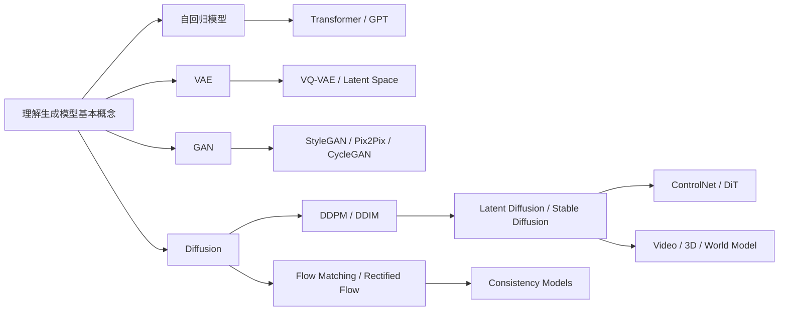

# 生成模型学习 —— 初学者版

**作者**：汪亮（bertonwang）  
**邮箱**：<47608843@qq.com>  
**版本**：v1.0 ｜ **最后更新**：2026-05-19

> 转载或引用请保留作者署名与本文链接，欢迎来信交流与勘误。

> 目标读者：对深度学习有基本了解，知道什么是神经网络、训练数据、损失函数，但还没有系统梳理过 VAE、GAN、Flow、Diffusion、Autoregressive、Flow Matching 等生成模型关系的同学。
>
> 本文风格：尽量用大白话先讲清楚“生成模型到底在做什么”，再按技术路线分类，概述每类模型的特点、演进过程、核心问题和相互关系，帮助你建立一张“生成模型地图”。

<style>
/* 一级标题：黑体 + 更大字号，方便阅读和导出 */
h1 {
  font-family: "SimHei", "Microsoft YaHei", "Heiti SC", sans-serif;
  font-size: 2.25em;
  font-weight: 700;
  line-height: 1.25;
  color: #000;
  margin-top: 0.8em;
  margin-bottom: 0.6em;
}

/* 优化代码段在预览和 PDF 导出中的显示效果 */
pre {
  font-size: 12px;
  line-height: 1.4;
  padding: 0.65em 0.85em;
  margin: 0.75em 0;
  border-radius: 6px;
  overflow-x: auto;
  page-break-inside: avoid;
  break-inside: avoid;
}

pre code {
  font-size: 12px;
  line-height: 1.4;
  white-space: pre;
}

:not(pre) > code {
  font-size: 0.95em;
  padding: 0.1em 0.25em;
}

@media print {
  pre,
  pre code {
    font-size: 10.5px;
    line-height: 1.32;
  }
}
</style>

**阅读路线**：

1. 先理解生成模型的共同目标：**学习数据分布，然后从中采样生成新内容**。
2. 再按生成机制分类：**自回归、隐变量、对抗、流、扩散、连续流、能量模型、3D / 世界模型**。
3. 然后看每类模型分别解决什么问题，又带来了什么新问题。
4. 最后用第 2 章的总表和路线图建立整体地图：哪些模型适合文本，哪些适合图像，哪些适合音频、视频、3D 和智能体。

> 如果你是第一次读，建议按顺序看；如果你只想快速建立地图，可以先看缩写词对照表和第 2 章开头的总表，再重点看第 10 章的 3D、视频和世界模型。

## 目录


- [生成模型学习 —— 初学者版](#生成模型学习--初学者版)
  - [目录](#目录)
  - [如何阅读这份文档：先看大地图，再看各路线](#如何阅读这份文档先看大地图再看各路线)
  - [缩写词对照表：英文全称与中文名称](#缩写词对照表英文全称与中文名称)
  - [0. 一句话先说清楚生成模型是什么](#0-一句话先说清楚生成模型是什么)
  - [1. 为什么需要生成模型？](#1-为什么需要生成模型)
  - [2. 整体鸟瞰图：按生成机制分类](#2-整体鸟瞰图按生成机制分类)
    - [2.1 一张总表看清分类、核心问题和记忆方法](#21-一张总表看清分类核心问题和记忆方法)
  - [3. 大类一：自回归生成模型（Autoregressive Models）](#3-大类一自回归生成模型autoregressive-models)
    - [3.1 它怎么生成？](#31-它怎么生成)
    - [3.2 核心组成与底层机制](#32-核心组成与底层机制)
    - [3.3 它解决的核心问题](#33-它解决的核心问题)
    - [3.4 特点与优缺点](#34-特点与优缺点)
    - [3.5 小白类比](#35-小白类比)
  - [4. 大类二：隐变量生成模型（VAE 一类）](#4-大类二隐变量生成模型vae-一类)
    - [4.1 它怎么生成？](#41-它怎么生成)
    - [4.2 核心组成与底层机制](#42-核心组成与底层机制)
    - [4.3 它解决的核心问题](#43-它解决的核心问题)
    - [4.4 特点与优缺点](#44-特点与优缺点)
    - [4.5 VAE 的演进](#45-vae-的演进)
    - [4.6 小白类比](#46-小白类比)
  - [5. 大类三：对抗生成模型（GAN 一类）](#5-大类三对抗生成模型gan-一类)
    - [5.1 它怎么生成？](#51-它怎么生成)
    - [5.2 核心组成与底层机制](#52-核心组成与底层机制)
    - [5.3 它解决的核心问题](#53-它解决的核心问题)
    - [5.4 特点与优缺点](#54-特点与优缺点)
    - [5.5 GAN 的演进](#55-gan-的演进)
    - [5.6 小白类比](#56-小白类比)
  - [6. 大类四：归一化流模型（Normalizing Flow）](#6-大类四归一化流模型normalizing-flow)
    - [6.1 它怎么生成？](#61-它怎么生成)
    - [6.2 核心组成与底层机制](#62-核心组成与底层机制)
    - [6.3 它解决的核心问题](#63-它解决的核心问题)
    - [6.4 特点与优缺点](#64-特点与优缺点)
    - [6.5 小白类比](#65-小白类比)
  - [7. 大类五：扩散与分数生成模型（Diffusion / Score-based Models）](#7-大类五扩散与分数生成模型diffusion--score-based-models)
    - [7.1 它怎么生成？](#71-它怎么生成)
    - [7.2 核心组成与底层机制](#72-核心组成与底层机制)
    - [7.3 它解决的核心问题](#73-它解决的核心问题)
    - [7.4 特点与优缺点](#74-特点与优缺点)
    - [7.5 扩散模型的演进](#75-扩散模型的演进)
    - [7.6 小白类比](#76-小白类比)
  - [8. 大类六：连续流与快速生成路线（Flow Matching / Rectified Flow / Consistency）](#8-大类六连续流与快速生成路线flow-matching--rectified-flow--consistency)
    - [8.1 它怎么生成？](#81-它怎么生成)
    - [8.2 核心组成与底层机制](#82-核心组成与底层机制)
    - [8.3 它解决的核心问题](#83-它解决的核心问题)
    - [8.4 特点与优缺点](#84-特点与优缺点)
    - [8.5 和扩散模型的关系](#85-和扩散模型的关系)
  - [9. 大类七：能量模型与采样式生成（Energy-based Models）](#9-大类七能量模型与采样式生成energy-based-models)
    - [9.1 它怎么生成？](#91-它怎么生成)
    - [9.2 核心组成与底层机制](#92-核心组成与底层机制)
    - [9.3 它解决的核心问题](#93-它解决的核心问题)
    - [9.4 特点与优缺点](#94-特点与优缺点)
    - [9.5 和其他生成模型的关系](#95-和其他生成模型的关系)
  - [10. 大类八：面向 3D、视频和世界模型的生成路线](#10-大类八面向-3d视频和世界模型的生成路线)
    - [10.1 核心组成与底层机制](#101-核心组成与底层机制)
    - [10.2 3D 生成与神经场](#102-3d-生成与神经场)
    - [10.3 视频生成](#103-视频生成)
    - [10.4 世界模型](#104-世界模型)
    - [10.5 这一类模型解决的核心问题](#105-这一类模型解决的核心问题)
  - [11. 生成模型的演进主线](#11-生成模型的演进主线)
    - [11.1 从概率建模到神经生成](#111-从概率建模到神经生成)
    - [11.2 从 VAE 到 GAN：稳定性和清晰度的权衡](#112-从-vae-到-gan稳定性和清晰度的权衡)
    - [11.3 从 PixelCNN 到 GPT：自回归路线扩大规模](#113-从-pixelcnn-到-gpt自回归路线扩大规模)
    - [11.4 从 DDPM 到 Stable Diffusion：扩散路线成为视觉主流](#114-从-ddpm-到-stable-diffusion扩散路线成为视觉主流)
    - [11.5 从生成内容到生成世界](#115-从生成内容到生成世界)
  - [12. 生成模型之间的关联关系](#12-生成模型之间的关联关系)
    - [12.1 VAE、GAN、Diffusion 都可以有 latent](#121-vaegandiffusion-都可以有-latent)
    - [12.2 Transformer 既可以做自回归，也可以服务扩散](#122-transformer-既可以做自回归也可以服务扩散)
    - [12.3 扩散、Score、Flow Matching 关系很近](#123-扩散scoreflow-matching-关系很近)
    - [12.4 GAN 和 Diffusion 的关系：质量、稳定性、速度的取舍](#124-gan-和-diffusion-的关系质量稳定性速度的取舍)
    - [12.5 自回归和扩散正在融合](#125-自回归和扩散正在融合)
  - [13. 如何选择生成模型路线？](#13-如何选择生成模型路线)
    - [13.1 如果你要生成文本或代码](#131-如果你要生成文本或代码)
    - [13.2 如果你要生成图片](#132-如果你要生成图片)
    - [13.3 如果你要做高质量人脸或快速图像生成](#133-如果你要做高质量人脸或快速图像生成)
    - [13.4 如果你要做概率密度估计或异常检测](#134-如果你要做概率密度估计或异常检测)
    - [13.5 如果你要做 3D、视频或机器人](#135-如果你要做-3d视频或机器人)
  - [14. 常见问题答疑（FAQ）](#14-常见问题答疑faq)
  - [15. 学习路线建议](#15-学习路线建议)
  - [16. 一图总结](#16-一图总结)
  - [17. 写在最后](#17-写在最后)
  - [参考资料](#参考资料)

---

## 如何阅读这份文档：先看大地图，再看各路线

生成模型的名字很多：

```text
VAE、GAN、Flow、PixelCNN、GPT、DDPM、Stable Diffusion、Score Model、Flow Matching、NeRF、World Model ...
```

如果直接逐个记，很容易乱。

本文建议用下面这条主线来读：

```text
先理解“生成模型 = 学习数据分布并采样”
→ 再按生成机制分类
→ 每类只抓住三个问题：怎么生成、解决什么、有什么代价
→ 最后看它们如何互相影响和演进
```

| 学习阶段 | 重点问题 | 对应章节 |
|---|---|---|
| 先看整体 | 生成模型到底是什么？ | 第 0～2 章 |
| 看经典路线 | 自回归、VAE、GAN、Flow 分别怎么生成？ | 第 3～6 章 |
| 看现代主流 | Diffusion、Flow Matching、Consistency 为什么重要？ | 第 7～8 章 |
| 看扩展方向 | 3D、视频、世界模型如何生成？ | 第 9～10 章 |
| 看关系图 | 各模型之间有什么关联和取舍？ | 第 11～13 章 |
| 看学习建议 | 初学者应该先学哪条路线？ | 第 14～17 章 |

---

## 缩写词对照表：英文全称与中文名称

生成模型领域有很多英文缩写。初学时不需要一次性全部背下来，建议先知道它们的**英文全称、中文名称和大概属于哪条路线**。

| 缩写 / 名称 | 英文全称 | 中文名称 | 一句话理解 |
|---|---|---|---|
| `AI` | Artificial Intelligence | 人工智能 | 让机器具备感知、理解、生成、决策等能力的技术总称。 |
| `AIGC` | AI-Generated Content | 人工智能生成内容 | 用 AI 生成文本、图片、音频、视频等内容。 |
| `GPT` | Generative Pre-trained Transformer | 生成式预训练 Transformer | 典型自回归语言模型，按 token 逐步生成文本。 |
| `LM` | Language Model | 语言模型 | 对文本或 token 序列的概率进行建模，是 GPT 等模型的基础概念。 |
| `RNN` | Recurrent Neural Network | 循环神经网络 | 早期常用于序列建模，会把前面的状态传到后面。 |
| `LSTM` | Long Short-Term Memory | 长短期记忆网络 | 改进版 RNN，更擅长处理较长序列依赖。 |
| `CNN` | Convolutional Neural Network | 卷积神经网络 | 常用于图像特征提取，也是早期图像生成模型的重要骨架。 |
| `ResNet` | Residual Network | 残差网络 | 通过残差连接训练更深的网络，常作为图像生成模型的主干结构。 |
| `VAE` | Variational Autoencoder | 变分自编码器 | 先把数据压缩到潜在空间，再从潜在空间生成数据。 |
| `CVAE` | Conditional Variational Autoencoder | 条件变分自编码器 | 在 VAE 基础上加入类别、文本等条件控制。 |
| `VQ-VAE` | Vector Quantized Variational Autoencoder | 向量量化变分自编码器 | 把 VAE 的潜在表示离散化，便于和 token 模型结合。 |
| `VQGAN` | Vector Quantized Generative Adversarial Network | 向量量化生成对抗网络 | 结合向量量化和对抗训练，提升重建和生成质量。 |
| `GAN` | Generative Adversarial Network | 生成对抗网络 | 通过生成器和判别器互相博弈来生成逼真样本。 |
| `DCGAN` | Deep Convolutional Generative Adversarial Network | 深度卷积生成对抗网络 | 用卷积网络改进 GAN 的图像生成能力。 |
| `WGAN` | Wasserstein Generative Adversarial Network | Wasserstein 生成对抗网络 / 瓦瑟斯坦生成对抗网络 | 用 Wasserstein 距离改进 GAN 的训练稳定性。 |
| `WGAN-GP` | Wasserstein GAN with Gradient Penalty | 带梯度惩罚的 Wasserstein GAN | 在 WGAN 中加入梯度惩罚，进一步稳定训练。 |
| `StyleGAN` | Style-based Generative Adversarial Network | 基于风格的生成对抗网络 | 通过风格控制生成高质量人脸和图像。 |
| `CycleGAN` | Cycle-Consistent Generative Adversarial Network | 循环一致性生成对抗网络 | 常用于无配对图像到图像转换。 |
| `PixelCNN` | Pixel Convolutional Neural Network | 像素卷积神经网络 | 按像素顺序建模和生成图片。 |
| `PixelRNN` | Pixel Recurrent Neural Network | 像素循环神经网络 | 用循环网络按像素顺序生成图片。 |
| `Flow` | Normalizing Flow | 归一化流 | 通过可逆变换把简单分布变成复杂数据分布。 |
| `NICE` | Non-linear Independent Components Estimation | 非线性独立成分估计 | 早期归一化流模型之一，强调可逆变换。 |
| `RealNVP` | Real-valued Non-Volume Preserving Transformations | 实值非体积保持变换 | 代表性归一化流模型，可以做精确密度估计。 |
| `DDPM` | Denoising Diffusion Probabilistic Models | 去噪扩散概率模型 | 经典扩散模型，学习从噪声一步步还原数据。 |
| `DDIM` | Denoising Diffusion Implicit Models | 去噪扩散隐式模型 | 对 DDPM 采样过程进行改进，常用于加速生成。 |
| `DPM-Solver` | Diffusion Probabilistic Model Solver | 扩散概率模型求解器 | 用数值求解方式加速扩散模型采样。 |
| `Score Model` | Score-based Model | 分数模型 | 学习数据分布的分数函数，也就是指向更高概率区域的方向。 |
| `Score SDE` | Score-based Stochastic Differential Equation | 基于随机微分方程的分数模型 | 用 SDE 统一描述连续加噪和连续去噪生成过程。 |
| `SDE` | Stochastic Differential Equation | 随机微分方程 | 用连续随机过程描述加噪和去噪。 |
| `ODE` | Ordinary Differential Equation | 常微分方程 | 用确定性连续路径描述生成过程。 |
| `LDM` | Latent Diffusion Model | 潜空间扩散模型 | 不直接在像素空间生成，而是在压缩后的 latent 空间中做扩散。 |
| `Stable Diffusion` | Stable Diffusion | 稳定扩散模型 | 典型潜空间扩散文生图系统，结合 VAE、扩散模型和文本条件控制。 |
| `DALL·E` | DALL·E | DALL·E 文生图模型 | OpenAI 的文生图模型系列，名字来自 Dalí 和 WALL·E 的组合。 |
| `ControlNet` | Control Network | 控制网络 / 条件控制网络 | 给扩散模型加入姿态、边缘、深度图等结构化控制条件。 |
| `U-Net` | U-shaped Network | U 形网络 | 经典图像到图像网络结构，常作为扩散模型的去噪主干。 |
| `DiT` | Diffusion Transformer | 扩散 Transformer | 用 Transformer 架构替代传统 U-Net 做扩散去噪网络。 |
| `Flow Matching` | Flow Matching | 流匹配 | 学习从噪声分布流向数据分布的连续速度场。 |
| `Rectified Flow` | Rectified Flow | 校正流 / 直线化流 | 希望把生成路径变得更直，从而减少采样步数。 |
| `Consistency Models` | Consistency Models | 一致性模型 | 学习不同噪声水平下的一致映射，用更少步骤完成生成。 |
| `EBM` | Energy-based Model | 能量模型 | 用能量高低表示样本是否像真实数据。 |
| `RBM` | Restricted Boltzmann Machine | 受限玻尔兹曼机 | 早期典型能量模型之一。 |
| `MCMC` | Markov Chain Monte Carlo | 马尔可夫链蒙特卡洛 | 一类采样方法，常用于能量模型等难以直接采样的模型。 |
| `NeRF` | Neural Radiance Fields | 神经辐射场 | 用神经网络表示三维场景，可从不同视角渲染图像。 |
| `3DGS` | 3D Gaussian Splatting | 三维高斯泼溅 / 三维高斯溅射 | 用大量三维高斯表示和渲染场景，速度快、效果好。 |
| `TTS` | Text-to-Speech | 文本转语音 | 根据文本生成语音。 |
| `RLHF` | Reinforcement Learning from Human Feedback | 基于人类反馈的强化学习 | 用人类偏好反馈进一步训练模型。 |
| `FAQ` | Frequently Asked Questions | 常见问题 | 用问答形式解释读者最容易困惑的问题。 |

> 💡 **小白记忆点**：看到缩写时，先判断它属于哪一类路线：自回归、VAE、GAN、Flow、Diffusion、能量模型，还是 3D / 世界模型。这样比死记硬背更容易建立整体地图。

---

## 0. 一句话先说清楚生成模型是什么

> **生成模型 = 学习真实数据背后的分布规律，然后从中“采样”出新的数据。**

举几个例子：

| 输入 / 条件 | 生成结果 | 典型模型 |
|---|---|---|
| 一段提示词 | 一段回答 | GPT / 自回归语言模型 |
| 一段提示词 | 一张图片 | Stable Diffusion / DALL·E |
| 一张草图 | 一张完整图片 | 条件扩散模型 / ControlNet |
| 一段文字 | 一段语音 | TTS 生成模型 |
| 多视角照片 | 三维场景 | NeRF / 3D Gaussian Splatting |
| 当前状态和动作 | 未来状态 | World Model |

小白可以先这样理解：

```text
判别模型：看一张图，判断是不是猫
生成模型：学会猫长什么样，然后自己画一只猫
```

判别模型更像“阅卷老师”，生成模型更像“创作者”。

---

## 1. 为什么需要生成模型？

生成模型的目标不是简单复制训练数据，而是学习数据背后的规律。

例如它看到很多猫图后，不是把某一张猫图背下来，而是学到：

```text
猫通常有耳朵、眼睛、胡须、身体轮廓、毛发纹理
不同猫可以有不同姿态、颜色、光照和背景
```

所以它可以生成训练集中没有出现过的新猫图。

生成模型主要解决下面几类问题：

| 问题 | 说明 | 示例 |
|---|---|---|
| **内容创造** | 从无到有生成文本、图片、音频、视频 | 文生图、文生视频、AI 写作 |
| **数据补全** | 根据局部信息补全缺失内容 | 图像修复、代码补全 |
| **数据增强** | 生成更多训练样本 | 医疗影像、工业缺陷样本 |
| **表示学习** | 学到数据的潜在结构 | VAE 的 latent 表示 |
| **模拟世界** | 预测未来状态或生成虚拟环境 | 自动驾驶、机器人、游戏 AI |
| **跨模态转换** | 从一种模态生成另一种模态 | 文本到图像、语音到表情 |

> 💡 **小白记忆点**：生成模型的本质不是“背答案”，而是学会“这个世界大概怎样产生数据”。

---

## 2. 整体鸟瞰图：按生成机制分类

生成模型可以按“它是怎么生成数据的”来分类。为了避免重复，本章不再单独放路线图和记忆表，而是用一张总表同时看清：**分类位置、代表模型、生成动作、核心问题、优势代价和小白类比**。

### 2.1 一张总表看清分类、核心问题和记忆方法

| 分类 | 大类 | 代表模型 | 生成动作 / 生成机制 | 解决的核心问题 | 主要优势 | 主要代价 | 小白类比 |
|---|---|---|---|---|---|---|---|
| **一** | **自回归模型** | GPT、PixelCNN、Image Transformer | 按顺序预测下一个 token / 像素 | 把复杂生成拆成很多个“下一步预测” | 训练目标简单，特别适合文本和离散 token | 生成过程串行，长序列成本高 | 像写文章一样，一个字接一个字写 |
| **二** | **隐变量模型** | VAE、CVAE、VQ-VAE | 先采样 latent，再解码成数据 | 学习一个可采样、可压缩、可解释的潜在空间 | 训练稳定，适合表示学习和压缩 | 早期生成结果容易偏模糊 | 先有草稿或配方卡，再生成完整作品 |
| **三** | **对抗模型** | GAN、DCGAN、StyleGAN | 生成器和判别器互相博弈 | 生成锐利、逼真的样本 | 图像质量高，采样速度快 | 训练不稳定，可能模式崩塌 | 画家骗鉴定师，越骗越像真图 |
| **四** | **归一化流模型** | RealNVP、Glow、Flow++ | 用可逆变换把简单分布变成复杂分布 | 同时支持生成和精确概率密度估计 | 概率建模清晰，可逆可解释 | 模型结构受限，设计复杂 | 把一团简单橡皮泥可逆地捏成复杂形状 |
| **五** | **扩散 / 分数模型** | DDPM、Score SDE、Stable Diffusion | 先加噪，再从噪声一步步去噪生成 | 稳定地产生高质量、可控内容 | 生成质量高，控制能力强 | 多步采样通常较慢 | 先学会擦噪声，再从噪声擦出图片 |
| **六** | **连续流与快速生成路线** | Flow Matching、Rectified Flow、Consistency Models | 学习从噪声到数据的连续路径 / 速度场 | 在保持质量的同时减少生成步数 | 有望实现少步甚至一步生成 | 方法仍在快速发展，体系尚未完全稳定 | 让噪声沿着一条更直接的路流向真实数据 |
| **七** | **能量模型** | EBM、RBM、Boltzmann Machine | 给样本打能量分，低能量更像真实数据 | 用评分方式描述复杂数据分布 | 表达灵活，理论上很通用 | 采样和训练都比较困难 | 像用地形图寻找低谷中的真实样本 |
| **八** | **3D / 视频 / 世界模型** | NeRF、3DGS、Video Diffusion、World Model | 生成空间、视频或未来状态 | 解决空间一致、时间连续和未来预测问题 | 面向真实世界、机器人和智能体 | 数据、算力和建模成本高 | 生成的不只是图片，而是场景、运动和未来 |

> 💡 **小白记忆点**：先看“生成动作”，再看“核心问题”。模型名字很多，但本质上都是在回答同一个问题：**我该用什么方式，从简单随机性生成复杂数据？**

---

## 3. 大类一：自回归生成模型（Autoregressive Models）

### 3.1 它怎么生成？

自回归模型的核心思想是：

```text
前面已经生成的内容 → 决定下一个内容
```

生成文本时就是：

```text
第 1 个词 → 第 2 个词 → 第 3 个词 → ... → 完整句子
```

生成图片时也可以这样做：

```text
第 1 个像素 → 第 2 个像素 → 第 3 个像素 → ... → 完整图片
```

它的典型代表包括：

- `n-gram` 语言模型。
- `RNN / LSTM` 语言模型。
- `PixelRNN / PixelCNN`。
- `Transformer Decoder`。
- `GPT` 系列。
- 图像 token 自回归模型。

### 3.2 核心组成与底层机制

自回归生成不是某一种固定网络，而是一种“按顺序预测下一个”的建模方式。底层通常可以使用这些模型骨架：

| 核心组成 / 关键机制 | 作用 | 典型用途 |
|---|---|---|
| `RNN / LSTM` | 按时间顺序处理序列，把前面的状态传给后面 | 早期语言模型、语音序列建模 |
| `CNN / Masked CNN` | 用带遮挡的卷积保证只能看到“前面”的像素 | `PixelCNN`、图像像素级生成 |
| `Transformer Decoder` | 用因果注意力只看历史 token，预测下一个 token | `GPT`、现代大语言模型 |
| `Tokenizer / Embedding` | 把文字、图像或音频切成 token，并映射成向量 | 文本生成、多模态 token 生成 |
| `LM Head` | 把隐藏状态映射成下一个 token 的概率分布 | 语言模型最后一层输出 |

> 简单说，自回归路线的底层关键是：**序列表示 + 因果约束 + 下一个 token 预测头**。

### 3.3 它解决的核心问题

自回归模型解决的是：

> 如何把一个复杂数据的联合概率，拆成很多个“下一步预测”问题？

例如一句话可以拆成：

```text
P(整句话)
= P(第1个词)
× P(第2个词 | 第1个词)
× P(第3个词 | 前2个词)
× ...
```

不用被概率表达吓到，它的意思是：

```text
只要我会预测下一个词，连续预测很多次，就能生成完整文本。
```

### 3.4 特点与优缺点

| 角度 | 内容 |
|---|---|
| **优点** | 概率建模清晰，训练目标简单，特别适合文本和离散 token。 |
| **缺点** | 生成通常是串行的，一个接一个生成，速度容易受限。 |
| **适合场景** | 文本、代码、音频 token、图像 token、多模态 token。 |
| **代表成功** | GPT、LLaMA、Claude、Gemini 等大语言模型。 |

### 3.5 小白类比

自回归模型像写作文：

```text
已经写了“今天天气很”
模型预测下一个字可能是“好”
然后继续预测下一个字
直到写完整篇文章
```

> 💡 **小白记忆点**：自回归模型的关键词是“下一个”。会预测下一个，就能一步步生成整体。

---

## 4. 大类二：隐变量生成模型（VAE 一类）

### 4.1 它怎么生成？

隐变量模型认为：复杂数据背后有一个更简单的“潜在空间”。

例如一张人脸图像背后可能有这些潜在因素：

```text
脸型、发型、表情、年龄、光照、姿态、背景
```

`VAE` 的流程可以粗略理解为：

```text
真实数据 x → Encoder → 潜在变量 z → Decoder → 重建数据 x'
```

生成时不需要真实数据，直接：

```text
随机采样 z → Decoder → 生成新数据
```

### 4.2 核心组成与底层机制

隐变量模型的底层通常由“编码器 + 潜在变量 + 解码器”组成。它不像自回归模型那样必须一个接一个生成，而是先得到一个压缩表示，再从压缩表示还原或生成数据。

| 核心组成 / 关键机制 | 作用 | 典型用途 |
|---|---|---|
| `Encoder` | 把真实数据压缩成 latent 分布参数，例如均值和方差 | 图像、文本、音频的表示学习 |
| `Latent Variable z` | 承载数据的潜在因素，例如姿态、风格、语义 | 可控生成、插值、压缩 |
| `Reparameterization Trick` | 让随机采样过程可以反向传播训练 | `VAE` 的核心训练技巧 |
| `Decoder` | 从 latent 还原或生成数据 | 图像重建、样本生成 |
| `Prior` | 约束 latent 空间通常接近简单分布，例如标准高斯 | 让生成时可以随机采样 |

> 简单说，VAE 一类模型的底层关键是：**把数据压缩成 latent，再从 latent 解码生成**。

### 4.3 它解决的核心问题

VAE 解决的是：

> 如何学到一个连续、可采样、可插值的潜在空间？

这个潜在空间很有用。

例如在人脸生成里，如果 latent 空间学得好，可以做：

```text
微笑程度慢慢增加
年龄慢慢变大
发型慢慢改变
```

### 4.4 特点与优缺点

| 角度 | 内容 |
|---|---|
| **优点** | 训练稳定，有概率解释，latent 空间连续且可操作。 |
| **缺点** | 早期 VAE 生成图片容易模糊。 |
| **适合场景** | 表示学习、数据压缩、可控生成、异常检测。 |
| **代表模型** | VAE、CVAE、β-VAE、VQ-VAE、VQGAN。 |

### 4.5 VAE 的演进

| 阶段 | 代表 | 主要变化 |
|---|---|---|
| **基础 VAE** | VAE | 学习连续 latent 空间，生成较稳定但偏模糊。 |
| **条件 VAE** | CVAE | 加入类别、文本等条件，让生成更可控。 |
| **解耦表示** | β-VAE | 希望 latent 中不同维度对应更清晰因素。 |
| **离散 latent** | VQ-VAE | 把 latent 变成离散 code，适合和自回归模型结合。 |
| **高质量重建** | VQGAN | 结合感知损失和对抗训练，提升视觉质量。 |

### 4.6 小白类比

VAE 像先把图片压缩成一张“配方卡”：

```text
配方卡 z：圆脸、短发、微笑、暖光
Decoder：根据配方卡画出一张脸
```

> 💡 **小白记忆点**：VAE 的关键词是“潜在空间”。它先学会压缩和理解数据，再从 latent 中生成。

---

## 5. 大类三：对抗生成模型（GAN 一类）

### 5.1 它怎么生成？

GAN 有两个角色：

| 角色 | 作用 | 类比 |
|---|---|---|
| **生成器 Generator** | 生成假样本 | 画家 / 造假者 |
| **判别器 Discriminator** | 判断真假 | 鉴定师 / 裁判 |

训练过程像一场博弈：

```text
生成器努力生成更真实的图片
判别器努力识别哪些是真图、哪些是假图
双方互相推动，生成器越来越强
```

### 5.2 核心组成与底层机制

GAN 的底层不是一个模型，而是一对互相竞争的模型：生成器负责造样本，判别器负责判断真假。两者通过对抗损失一起训练。

| 核心组成 / 关键机制 | 作用 | 典型用途 |
|---|---|---|
| `Generator` | 把随机噪声或条件输入变成样本 | 生成图片、人脸、风格化内容 |
| `Discriminator` | 判断输入是真实样本还是生成样本 | 给生成器提供训练信号 |
| `Latent Noise z` | 生成器的随机起点 | 控制样本多样性 |
| `CNN / ResNet / Style Blocks` | 构成生成器和判别器的主干网络 | `DCGAN`、`StyleGAN` 等图像生成 |
| `Adversarial Loss` | 让生成器和判别器互相博弈 | 提升视觉真实感 |
| `Condition Module` | 引入类别、文本、草图等条件 | 条件 GAN、图像到图像转换 |

> 简单说，GAN 的底层关键是：**一个负责生成，一个负责挑错，通过对抗训练一起变强**。

### 5.3 它解决的核心问题

GAN 主要解决的是：

> 如何生成视觉上非常锐利、逼真的样本？

在扩散模型大规模流行之前，GAN 曾经是图像生成领域最耀眼的路线之一。

特别是 `StyleGAN`，在人脸生成、图像编辑、风格控制上非常有代表性。

### 5.4 特点与优缺点

| 角度 | 内容 |
|---|---|
| **优点** | 生成图片锐利，单次前向生成速度快。 |
| **缺点** | 训练不稳定，容易模式崩塌，评估困难。 |
| **适合场景** | 图像生成、人脸生成、风格迁移、图像增强。 |
| **代表模型** | GAN、DCGAN、WGAN、CycleGAN、Pix2Pix、StyleGAN。 |

### 5.5 GAN 的演进

| 阶段 | 代表 | 主要变化 |
|---|---|---|
| **原始 GAN** | GAN | 提出生成器和判别器对抗训练。 |
| **卷积 GAN** | DCGAN | 用卷积网络改进 GAN 的图像生成能力。 |
| **稳定训练** | WGAN / WGAN-GP | 改进损失，缓解训练不稳定。 |
| **图像翻译** | Pix2Pix / CycleGAN | 从一种图像域生成另一种图像域。 |
| **高质量人脸** | StyleGAN | 引入风格控制，生成质量大幅提升。 |

### 5.6 小白类比

GAN 像“画家”和“鉴定师”互相较劲：

```text
画家：我画一张假名画
鉴定师：这张有问题，光影不对
画家：那我下次改进光影
鉴定师：这次纹理还是不自然
画家：继续改进纹理
```

> 💡 **小白记忆点**：GAN 的关键词是“对抗”。它不是直接学会概率公式，而是在真假博弈中逼近真实数据。

---

## 6. 大类四：归一化流模型（Normalizing Flow）

### 6.1 它怎么生成？

Flow 模型的核心思想是：

```text
从一个简单分布开始，通过一连串可逆变换，变成复杂数据分布。
```

比如：

```text
简单高斯噪声 z
→ 可逆变换 1
→ 可逆变换 2
→ 可逆变换 3
→ 真实数据 x
```

关键是：每一步都必须可逆。

也就是说：

```text
z 可以变成 x
x 也可以反过来变回 z
```

### 6.2 核心组成与底层机制

Flow 模型的底层围绕“可逆神经网络”设计。普通神经网络只要求从输入到输出好用，而 Flow 还要求每一步都能反过来，并且能计算变换带来的概率变化。

| 核心组成 / 关键机制 | 作用 | 典型用途 |
|---|---|---|
| `Invertible Transform` | 保证数据和噪声之间可以双向转换 | 生成和反向编码 |
| `Coupling Layer` | 把一部分变量用于变换另一部分变量，便于保持可逆 | `NICE`、`RealNVP` |
| `Invertible 1x1 Convolution` | 在通道维度做可逆混合 | `Glow` |
| `Jacobian Determinant` | 计算概率密度变化的修正项 | 精确密度估计 |
| `Base Distribution` | 通常是简单高斯分布 | 采样起点和概率计算基准 |

> 简单说，Flow 的底层关键是：**每一层都可逆，并且知道概率密度怎么变**。

### 6.3 它解决的核心问题

Flow 模型解决的是：

> 如何既能生成样本，又能精确计算样本概率？

这点很重要，因为很多生成模型只能近似训练或难以直接计算概率。

Flow 的优势是概率建模非常清楚。

### 6.4 特点与优缺点

| 角度 | 内容 |
|---|---|
| **优点** | 可逆、概率精确、采样和密度估计都清晰。 |
| **缺点** | 网络结构受可逆性限制，设计复杂，图像质量曾长期不如 GAN / Diffusion。 |
| **适合场景** | 密度估计、异常检测、可逆建模、科学数据建模。 |
| **代表模型** | NICE、RealNVP、Glow、Flow++。 |

### 6.5 小白类比

Flow 像可逆的橡皮泥变形：

```text
一团标准圆球橡皮泥
→ 拉伸
→ 扭曲
→ 压缩
→ 变成复杂雕塑
```

但要求每一步都能反过来还原。

> 💡 **小白记忆点**：Flow 的关键词是“可逆”。它希望把简单分布和复杂数据用一条可逆通道连起来。

---

## 7. 大类五：扩散与分数生成模型（Diffusion / Score-based Models）

### 7.1 它怎么生成？

扩散模型的核心思想是：

```text
训练时：真实数据 → 一步步加噪 → 纯噪声
生成时：纯噪声 → 一步步去噪 → 真实数据
```

它像训练一个“修图师”：

```text
给修图师看一张被弄脏的图
让它预测里面的噪声
学会后，就能从纯噪声中一点点擦出图
```

### 7.2 核心组成与底层机制

扩散模型的底层通常由“噪声调度 + 去噪网络 + 条件控制模块”组成。模型本身常常不是直接生成图片，而是在每个时间步预测噪声、干净样本或速度方向。

| 核心组成 / 关键机制 | 作用 | 典型用途 |
|---|---|---|
| `Noise Schedule` | 决定每个时间步加多少噪声 | 控制训练和采样难度 |
| `U-Net` | 经典去噪网络，擅长处理图像多尺度结构 | `DDPM`、`Stable Diffusion` 早期主干 |
| `Transformer / DiT` | 用注意力处理图像 patch 或 latent token | 新一代扩散主干网络 |
| `Text Encoder` | 把提示词变成条件向量 | 文生图、文生视频 |
| `VAE Encoder / Decoder` | 把图像压缩到 latent 空间，再从 latent 还原图像 | `Latent Diffusion`、`Stable Diffusion` |
| `Sampler / Solver` | 决定反向去噪的具体步法 | `DDIM`、`DPM-Solver` 等加速采样 |

> 简单说，扩散模型的底层关键是：**在不同噪声水平下，用去噪网络一步步把噪声变成数据**。

### 7.3 它解决的核心问题

扩散模型主要解决的是：

> 如何稳定训练高质量生成模型，并且自然支持条件控制？

相比 GAN，扩散模型训练通常更稳定；相比 VAE，它生成细节更锐利；相比自回归图像模型，它更适合连续图像信号。

### 7.4 特点与优缺点

| 角度 | 内容 |
|---|---|
| **优点** | 训练稳定，生成质量高，条件控制强，适合图像、视频、音频。 |
| **缺点** | 传统采样步骤多，生成速度慢，计算成本高。 |
| **适合场景** | 文生图、图生图、视频生成、音频生成、3D 生成辅助。 |
| **代表模型** | DDPM、DDIM、Score SDE、Latent Diffusion、Stable Diffusion、ControlNet、DiT。 |

### 7.5 扩散模型的演进

| 阶段 | 代表 | 主要变化 |
|---|---|---|
| **理论基础** | Diffusion / Score Matching | 从噪声和分数函数角度理解生成。 |
| **经典 DDPM** | DDPM | 训练模型预测噪声，逐步去噪生成。 |
| **加速采样** | DDIM、DPM-Solver | 减少采样步数，提高生成速度。 |
| **潜空间扩散** | Latent Diffusion | 不在像素空间扩散，而是在 latent 空间扩散。 |
| **文生图系统** | Stable Diffusion | 加入文本编码器，形成大规模文生图系统。 |
| **结构控制** | ControlNet | 加入姿态、边缘、深度图等控制条件。 |
| **架构升级** | DiT | 用 Transformer 替代传统 U-Net 做去噪网络。 |

### 7.6 小白类比

扩散模型像从一团雪花噪声里擦出图像：

```text
纯噪声
→ 擦掉一点噪声
→ 轮廓出现
→ 细节出现
→ 完整图片
```

> 💡 **小白记忆点**：扩散模型的关键词是“去噪”。它把复杂生成任务拆成很多个简单去噪步骤。

---

## 8. 大类六：连续流与快速生成路线（Flow Matching / Rectified Flow / Consistency）

### 8.1 它怎么生成？

这一类路线和扩散模型关系很近，但视角更偏“连续路径”。

可以这样理解：

```text
扩散模型：一步一步从噪声去噪到数据
Flow Matching：学习一条从噪声分布流向数据分布的路径
Rectified Flow：尽量把这条路径拉直，让生成更快
Consistency Models：希望用更少步骤甚至一步得到结果
```

### 8.2 核心组成与底层机制

连续流与快速生成路线的底层通常仍然使用强大的神经网络主干，例如 `U-Net` 或 `Transformer`，但训练目标从“预测每一步噪声”逐渐转向“学习从噪声到数据的速度场、路径或一致性映射”。

| 核心组成 / 关键机制 | 作用 | 典型用途 |
|---|---|---|
| `Velocity Network` | 预测样本从噪声流向数据时的运动方向 | `Flow Matching`、`Rectified Flow` |
| `ODE / Continuous Path` | 用连续路径描述生成过程 | 少步生成、路径建模 |
| `U-Net / Transformer` | 承担图像、视频或 latent 的主要建模能力 | 高质量视觉生成 |
| `Teacher Model` | 提供多步扩散轨迹或训练目标 | 蒸馏成少步模型 |
| `Consistency Function` | 让不同时间点的样本映射到一致结果 | `Consistency Models` |

> 简单说，这类路线的底层关键是：**把“很多步去噪”改写成更直接的路径、速度场或一致性映射**。

### 8.3 它解决的核心问题

这类模型主要想解决：

> 扩散模型质量很好，但能不能生成得更快？

传统扩散生成可能需要很多步。

连续流和一致性模型希望减少步骤：

```text
几十步 → 几步 → 甚至一步
```

### 8.4 特点与优缺点

| 角度 | 内容 |
|---|---|
| **优点** | 有机会显著减少采样步数，统一扩散、ODE、Flow 等视角。 |
| **缺点** | 理论和工程仍在快速演进，训练细节和稳定性需要经验。 |
| **适合场景** | 高效图像生成、视频生成、实时交互生成。 |
| **代表模型** | Flow Matching、Rectified Flow、Consistency Models、扩散蒸馏方法。 |

### 8.5 和扩散模型的关系

它们不是完全割裂的新大陆，而更像是扩散模型之后的生成建模升级方向。

| 路线 | 和扩散的关系 |
|---|---|
| **Flow Matching** | 用连续速度场视角描述从噪声到数据的过程。 |
| **Rectified Flow** | 希望把生成路径变得更直、更快。 |
| **Consistency Models** | 希望模型在不同噪声水平之间保持一致，从而少步生成。 |
| **Distillation** | 把多步扩散模型压缩成少步模型。 |

> 💡 **小白记忆点**：这一类路线的关键词是“加速”。它们很多都在问：能不能保留扩散质量，但少走几步？

---

## 9. 大类七：能量模型与采样式生成（Energy-based Models）

### 9.1 它怎么生成？

能量模型的思想是：

```text
给每个样本一个能量分数
越像真实数据，能量越低
越不像真实数据，能量越高
```

生成时，就是在这个能量地形里寻找低能量区域。

可以理解为：

```text
真实样本像山谷
不真实样本像山峰
采样过程就是让样本慢慢滑向山谷
```

### 9.2 核心组成与底层机制

能量模型的底层通常是一个“打分网络”。它不直接输出一个样本，而是给输入样本一个能量分数，再通过采样方法寻找低能量区域。

| 核心组成 / 关键机制 | 作用 | 典型用途 |
|---|---|---|
| `Energy Network` | 给样本输出一个标量能量值 | 判断样本是否接近真实分布 |
| `MCMC / Langevin Dynamics` | 根据能量地形移动样本，寻找低能量区域 | 从模型中采样生成 |
| `Negative Samples` | 训练时构造“不真实”样本作为对比 | 学习真实与非真实的边界 |
| `Score / Gradient` | 用能量对输入的梯度指导样本移动 | 与分数模型、扩散模型相关 |
| `Constraint / Preference Function` | 表达复杂约束或偏好 | 结构化预测、物理系统、偏好建模 |

> 简单说，能量模型的底层关键是：**先学一个好坏评分函数，再用采样方法往低能量区域移动**。

### 9.3 它解决的核心问题

能量模型想解决：

> 能不能不用明确写出完整概率分布，只用一个“好坏评分函数”来描述数据？

它的表达能力很强，但采样和训练通常比较难。

### 9.4 特点与优缺点

| 角度 | 内容 |
|---|---|
| **优点** | 表达灵活，可以描述复杂约束和偏好。 |
| **缺点** | 采样困难，训练成本高，工程使用门槛较高。 |
| **适合场景** | 约束建模、结构化预测、物理系统、组合优化。 |
| **代表模型** | Boltzmann Machine、RBM、现代 Energy-based Models。 |

### 9.5 和其他生成模型的关系

很多生成模型都可以从“能量”或“分数”的角度重新理解。

例如：

- Score-based Model 学习的是数据分布的“梯度方向”。
- 扩散模型可以和分数匹配联系起来。
- 一些 RLHF / 偏好模型也有类似“给样本打分”的味道。

> 💡 **小白记忆点**：能量模型的关键词是“打分”。它不直接告诉你怎么生成，而是告诉你哪里更像真实数据。

---

## 10. 大类八：面向 3D、视频和世界模型的生成路线

现代生成模型已经不只生成文本和图片，还在向 3D、视频和可交互世界扩展。

### 10.1 核心组成与底层机制

这一类模型通常不是单一结构，而是多个底层模型组合起来：既要表示空间，也要建模时间，还可能要预测动作带来的未来变化。

| 核心组成 / 关键机制 | 作用 | 典型用途 |
|---|---|---|
| `Neural Field` | 用神经网络表示连续三维空间 | `NeRF`、隐式场景表示 |
| `3D Gaussian Splatting` | 用大量三维高斯显式表示场景并快速渲染 | 高效 3D 重建和新视角合成 |
| `Video Diffusion / Video Transformer` | 同时建模空间细节和时间连续性 | 文生视频、图生视频 |
| `Temporal Module` | 处理帧与帧之间的运动关系 | 视频一致性、动作连贯性 |
| `World Model` | 根据当前状态和动作预测未来状态 | 机器人、自动驾驶、智能体规划 |
| `Multimodal Encoder` | 融合文本、图像、视频、动作等多种输入 | 多模态生成和交互式生成 |

> 简单说，这类路线的底层关键是：**把空间表示、时间建模和未来预测组合起来**。

### 10.2 3D 生成与神经场

3D 生成要解决的是：

> 如何生成一个可以从不同角度观看的三维对象或场景？

代表方向：

- `NeRF`
- `Neural Fields`
- `3D Gaussian Splatting`
- 文本到 3D 模型
- 多视角一致生成

它和普通图片生成的区别是：

| 普通图像生成 | 3D 生成 |
|---|---|
| 只要一张图看起来对 | 多个角度都要一致 |
| 主要生成像素 | 需要生成空间结构 |
| 光照和几何可以“看起来像” | 几何、材质、视角更重要 |

### 10.3 视频生成

视频生成比图片更难，因为多了时间维度。

它不仅要生成每一帧，还要保证：

```text
人物不要闪烁
动作要连贯
物体关系要一致
镜头变化要合理
```

常见路线包括：

- 视频扩散模型。
- Transformer 视频生成模型。
- 图像生成模型 + 时间模块。
- 世界模型式视频预测。

### 10.4 世界模型

世界模型关注的是：

> 智能体能不能在脑子里预测世界如何变化？

它不只是生成一张图，而是生成未来状态：

```text
当前状态 + 动作 → 未来状态
```

例如机器人可以在内部模拟：

```text
如果我推动杯子，杯子会往哪里移动？
如果我向左转，看到的画面会如何变化？
如果我走这条路，是否会撞到障碍物？
```

### 10.5 这一类模型解决的核心问题

| 方向 | 核心问题 |
|---|---|
| **3D 生成** | 如何生成空间一致、可多视角观看的内容？ |
| **视频生成** | 如何生成时间连续、运动合理的视频？ |
| **世界模型** | 如何预测环境变化，支持规划和行动？ |

> 💡 **小白记忆点**：这类路线的关键词是“世界”。生成模型正在从生成静态内容，走向生成空间、时间和未来。

---

## 11. 生成模型的演进主线

生成模型的发展不是一条单线，而是多条路线并行演进。

可以粗略分成下面几个阶段：

```text
早期概率模型
→ 神经网络隐变量模型
→ 对抗生成模型爆发
→ 自回归大模型崛起
→ 扩散模型成为图像生成主流
→ 连续流、快速采样、多模态和世界模型继续演进
```

### 11.1 从概率建模到神经生成

早期生成模型更强调概率公式和统计建模：

- 高斯混合模型。
- 隐马尔可夫模型。
- 主题模型。
- 玻尔兹曼机。

它们为后来的深度生成模型提供了很多思想基础。

### 11.2 从 VAE 到 GAN：稳定性和清晰度的权衡

VAE 和 GAN 是深度生成模型早期的两条重要路线。

| 模型 | 更擅长 | 主要问题 |
|---|---|---|
| **VAE** | 稳定训练、学习 latent | 图像偏模糊 |
| **GAN** | 生成锐利图像 | 训练不稳定 |

这是一组经典权衡：

```text
VAE：稳，但可能糊
GAN：锐，但难训
```

### 11.3 从 PixelCNN 到 GPT：自回归路线扩大规模

自回归模型原本也用于图片像素生成，例如 PixelCNN。

但真正大规模爆发是在语言模型领域：

```text
RNN LM → Transformer Decoder → GPT 系列 → 大语言模型
```

原因是文本天然适合“下一个 token 预测”。

### 11.4 从 DDPM 到 Stable Diffusion：扩散路线成为视觉主流

扩散模型解决了 GAN 训练不稳定、VAE 模糊、自回归图像生成慢等问题中的一部分。

它在视觉生成上取得巨大成功：

```text
DDPM → DDIM → Latent Diffusion → Stable Diffusion → ControlNet / DiT / Video Diffusion
```

### 11.5 从生成内容到生成世界

现代生成模型正在从：

```text
生成一句话 / 一张图
```

走向：

```text
生成视频、生成 3D 场景、生成交互式世界、预测未来状态
```

这也是为什么世界模型、视频模型、3D 生成、多模态统一模型越来越重要。

---

## 12. 生成模型之间的关联关系

### 12.1 VAE、GAN、Diffusion 都可以有 latent

虽然这些模型看起来不同，但很多现代系统都会引入 latent。

例如 Stable Diffusion 就不是直接在像素上扩散，而是：

```text
图片 → VAE Encoder → latent
latent 上扩散和去噪
latent → VAE Decoder → 图片
```

所以：

```text
Stable Diffusion = VAE 压缩空间 + 扩散生成 + 文本条件控制
```

### 12.2 Transformer 既可以做自回归，也可以服务扩散

Transformer 最典型的用法是自回归语言模型：

```text
前文 token → 预测下一个 token
```

但 Transformer 也可以用于扩散模型：

```text
图像 latent patch → DiT → 预测噪声
```

所以 Transformer 不是只属于语言模型，它是一种通用序列建模骨架。

### 12.3 扩散、Score、Flow Matching 关系很近

这三者都在研究：

```text
如何从简单噪声分布走向复杂真实数据分布？
```

区别在于视角不同：

| 路线 | 视角 |
|---|---|
| **Diffusion** | 先加噪，再学习反向去噪。 |
| **Score-based Model** | 学习数据分布的梯度方向。 |
| **Flow Matching** | 学习从噪声到数据的连续速度场。 |
| **Rectified Flow** | 希望让路径更直、更容易快速生成。 |

### 12.4 GAN 和 Diffusion 的关系：质量、稳定性、速度的取舍

| 对比项 | GAN | Diffusion |
|---|---|---|
| 训练稳定性 | 较难 | 通常更稳定 |
| 单次生成速度 | 快 | 传统较慢 |
| 图像质量 | 曾长期领先 | 后来成为主流 |
| 条件控制 | 可以做，但复杂 | 非常自然且强大 |
| 典型风险 | 模式崩塌 | 采样步骤多 |

### 12.5 自回归和扩散正在融合

很多现代模型不再只属于单一路线。

例如：

- 文本通常用自回归模型生成。
- 图像可以先离散成 token，再用自回归生成。
- 图像也可以用扩散生成。
- 多模态模型可能同时使用自回归、扩散、VAE、Tokenizer、Transformer。

未来的大模型系统更可能是组合式的：

```text
Tokenizer + Transformer + VAE + Diffusion + Memory + Tools + World Model
```

---

## 13. 如何选择生成模型路线？

不同任务适合不同生成模型。

### 13.1 如果你要生成文本或代码

优先理解：

- 自回归模型。
- Transformer Decoder。
- GPT / LLaMA 一类大语言模型。

原因是文本天然是序列，适合按 token 逐步生成。

### 13.2 如果你要生成图片

优先理解：

- 扩散模型。
- Latent Diffusion。
- Stable Diffusion。
- ControlNet。
- DiT。

如果关注早期图像生成历史，也可以学习 GAN 和 VAE。

### 13.3 如果你要做高质量人脸或快速图像生成

可以关注：

- StyleGAN。
- GAN inversion。
- 扩散蒸馏。
- Consistency Models。

### 13.4 如果你要做概率密度估计或异常检测

可以关注：

- VAE。
- Normalizing Flow。
- Energy-based Models。

### 13.5 如果你要做 3D、视频或机器人

可以关注：

- NeRF / 3D Gaussian Splatting。
- Video Diffusion。
- World Model。
- Flow Matching。
- 多模态 Transformer。

---

## 14. 常见问题答疑（FAQ）

**Q1：生成模型是不是就是 AIGC？**  
A：AIGC 是生成模型的应用形态，生成模型是背后的技术基础。AIGC 包括文生图、AI 写作、AI 音乐、AI 视频等。

**Q2：GPT 是生成模型吗？**  
A：是。GPT 是典型的自回归生成模型，它通过预测下一个 token 来生成文本。

**Q3：Stable Diffusion 是什么类型的生成模型？**  
A：它主要是 Latent Diffusion，也就是在 VAE 的 latent 空间里做扩散生成，并通过文本编码器实现文生图。

**Q4：GAN 过时了吗？**  
A：不能简单说过时。GAN 在很多图像编辑、快速生成、特定领域仍有价值，只是通用高质量文生图领域现在扩散模型更主流。

**Q5：VAE 为什么还重要？**  
A：VAE 不只是早期生成模型，它的 latent 表示、压缩和重建思想仍然很重要。Stable Diffusion 里就用到了 VAE。

**Q6：Flow Matching 算不算扩散模型？**  
A：它和扩散模型关系很近，但更强调连续路径和速度场。初学时可以把它看作“扩散之后的连续生成路线”。

**Q7：哪种生成模型最好？**  
A：没有绝对最好，只有适合任务。文本常用自回归，图像常用扩散，概率估计可看 Flow / VAE，3D 和机器人要看神经场和世界模型。

**Q8：初学者应该先学哪几个？**  
A：建议先学自回归、VAE、GAN、Diffusion 四条主线，再补 Flow Matching、NeRF 和 World Model。

---

## 15. 学习路线建议

可以按下面路线学习生成模型。



**建议顺序**：

1. **先理解自回归模型**：因为它是大语言模型生成文本的基础。
2. **再学 VAE**：建立 latent 空间、编码器、解码器的概念。
3. **再看 GAN**：理解对抗训练和图像生成历史。
4. **重点学习扩散模型**：现代图像、视频、音频生成的重要基础。
5. **补充 Flow Matching / Consistency**：理解快速生成路线。
6. **最后看 3D 和世界模型**：理解生成模型如何走向空间、时间和行动。

---

## 16. 一图总结

```text
生成模型

核心目标：学习真实数据分布，并从中采样生成新数据

一、自回归模型
    ├─ GPT、PixelCNN、Image Transformer
    └─ 关键词：下一个 token

二、隐变量模型
    ├─ VAE、CVAE、VQ-VAE
    └─ 关键词：latent 空间

三、对抗模型
    ├─ GAN、DCGAN、StyleGAN
    └─ 关键词：生成器 vs 判别器

四、归一化流模型
    ├─ RealNVP、Glow、Flow++
    └─ 关键词：可逆变换

五、扩散和分数模型
    ├─ DDPM、Score SDE、Stable Diffusion
    └─ 关键词：加噪与去噪

六、连续流和快速生成
    ├─ Flow Matching、Rectified Flow、Consistency
    └─ 关键词：连续路径、少步生成

七、能量模型
    ├─ EBM、RBM
    └─ 关键词：低能量代表真实

八、3D、视频和世界模型
    ├─ NeRF、Video Diffusion、World Model
    └─ 关键词：空间、时间、未来
```

如果只记住一句话：

> **生成模型不是单一技术，而是一组“从数据分布中创造新样本”的方法族；不同路线本质上是在用不同方式回答同一个问题：如何从简单随机性走向复杂真实数据。**

---

## 17. 写在最后

学习生成模型最容易遇到的问题是：名字太多，路线太杂。

建议不要一开始就陷入公式，而是先抓住每类模型的“生成动作”：

| 模型 | 生成动作 |
|---|---|
| **自回归** | 一个接一个生成。 |
| **VAE** | 先采样 latent，再解码。 |
| **GAN** | 生成器骗过判别器。 |
| **Flow** | 可逆地把简单分布变复杂。 |
| **Diffusion** | 从噪声一步步去噪。 |
| **Flow Matching** | 学一条从噪声到数据的流动路径。 |
| **EBM** | 找到低能量的真实区域。 |
| **World Model** | 生成未来状态，支持规划行动。 |

当你看到一个新生成模型时，可以先问 4 个问题：

1. **它从哪里开始生成？** 是噪声、latent、前文 token，还是当前世界状态？
2. **它怎么一步步变成数据？** 是预测下一个、解码、对抗、去噪，还是流动？
3. **它解决了哪类痛点？** 是质量、速度、稳定性、可控性，还是空间 / 时间一致性？
4. **它牺牲了什么？** 是训练难度、采样速度、结构限制，还是计算成本？

> 学完这一篇，你不需要马上掌握所有公式，但应该能看懂大多数生成模型名字大概属于哪条路线，以及它们各自为什么出现。

---

## 参考资料

- [Auto-Regressive Generative Models](https://arxiv.org/abs/1601.06759)
- [Pixel Recurrent Neural Networks](https://arxiv.org/abs/1601.06759)
- [PixelCNN++: Improving the PixelCNN with Discretized Logistic Mixture Likelihood and Other Modifications](https://arxiv.org/abs/1701.05517)
- [Auto-Encoding Variational Bayes](https://arxiv.org/abs/1312.6114)
- [Neural Discrete Representation Learning](https://arxiv.org/abs/1711.00937)
- [Generative Adversarial Nets](https://arxiv.org/abs/1406.2661)
- [A Style-Based Generator Architecture for Generative Adversarial Networks](https://arxiv.org/abs/1812.04948)
- [Density Estimation using Real NVP](https://arxiv.org/abs/1605.08803)
- [Glow: Generative Flow with Invertible 1x1 Convolutions](https://arxiv.org/abs/1807.03039)
- [Denoising Diffusion Probabilistic Models](https://arxiv.org/abs/2006.11239)
- [Score-Based Generative Modeling through Stochastic Differential Equations](https://arxiv.org/abs/2011.13456)
- [High-Resolution Image Synthesis with Latent Diffusion Models](https://arxiv.org/abs/2112.10752)
- [Flow Matching for Generative Modeling](https://arxiv.org/abs/2210.02747)
- [Rectified Flow: A Marginal Preserving Approach to Optimal Transport](https://arxiv.org/abs/2209.03003)
- [Consistency Models](https://arxiv.org/abs/2303.01469)
- [NeRF: Representing Scenes as Neural Radiance Fields for View Synthesis](https://arxiv.org/abs/2003.08934)
- [Dream to Control: Learning Behaviors by Latent Imagination](https://arxiv.org/abs/1912.01603)
