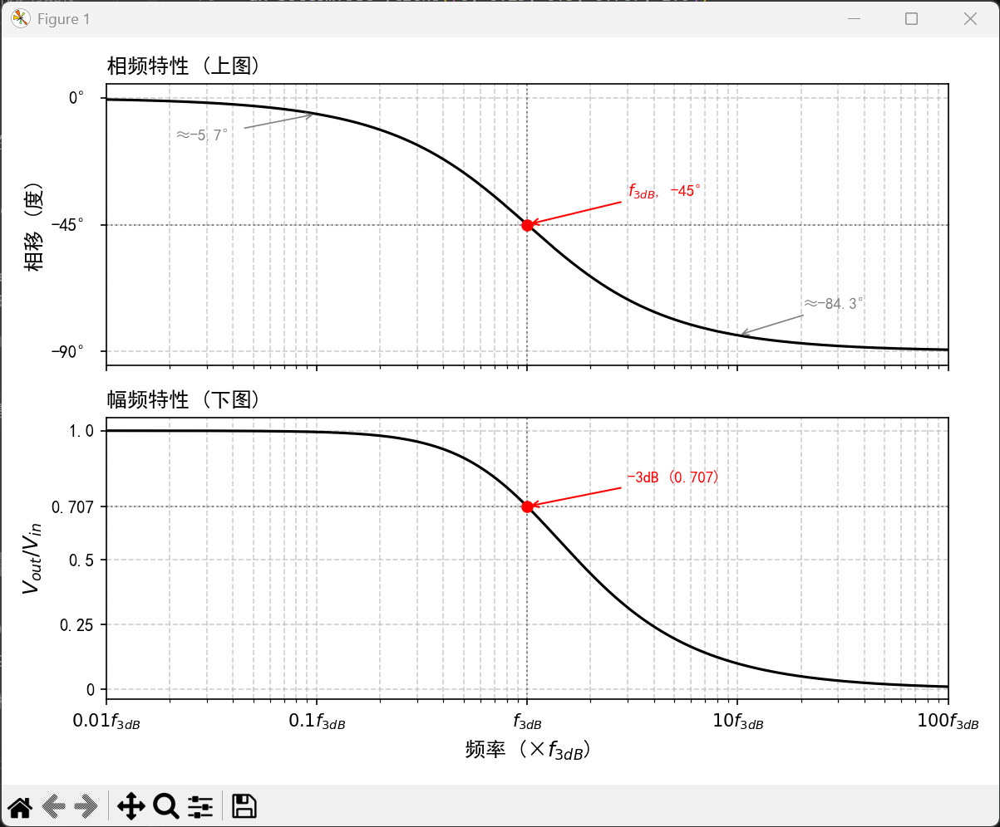

# 电子学——名词解释

> 📖 本文档收录电子学中常见的名词/概念，用通俗易懂的方式进行解释，方便快速查阅。

---

## 📑 目录

| 序号 | 名词 | 说明 |
|------|------|------|
| 1 | [感性电流](#1-感性电流inductive-current) | 电流滞后于电压的交流电流 |
| 2 | [容性电流](#2-容性电流capacitive-current) | 电流超前于电压的交流电流 |
| 3 | [功率因数](#3-功率因数power-factor) | 有功功率与视在功率的比值，反映电流的"有效配合度" |
| 4 | [无功补偿](#4-无功补偿reactive-power-compensation) | 用电容抵消感性电流滞后效应 |
| 5 | [幅频与相频特性（Bode图）](#5-幅频与相频特性bode图) | 一阶低通滤波器的频率响应曲线 |
| 6 | [-6dB/倍频程的斜率衰减](#6--6db倍频程的斜率衰减) | 一阶滤波器高频段的固有衰减速率 |

---

## 前置知识：交流电中电压和电流不一定"同步"

在直流电路中，电压和电流总是同步变化的——电压高，电流就大。

但在**交流电路**中，电压和电流都是正弦波，它们之间可能存在**时间差**（相位差）：
- 有时电流**跑在电压前面**（电流超前）
- 有时电流**落在电压后面**（电流滞后）
- 只有纯电阻电路中，两者才完全同步

这个"谁先谁后"的关系，就是区分容性电流和感性电流的关键。

---

## 1. 感性电流（Inductive Current）

### 定义

> 流过**电感**（线圈、电动机、变压器等）的电流，**滞后于电压 90°**（最大滞后情况）。

### 通俗理解

电感就像一个**有惯性的飞轮**：
- 你给它施加力（电压），它不会立刻转起来，而是慢慢加速
- 电压已经到达峰值了，电流还在"爬坡"
- 电压已经开始下降了，电流才刚到最大值

所以电流总是**"慢半拍"**——这就是**滞后**。

### 为什么恰好滞后 90°？——量化推导

**物理本质**：电感的基本特性是 **"电压正比于电流的变化率"**，即：

```
V = L × (dI/dt)
```

其中 L 是电感值（单位：亨利 H），dI/dt 是电流随时间的变化率。

**推导过程**：

设施加的电压为正弦波：

```
V(t) = V₀ × sin(ωt)
```

由 V = L × (dI/dt)，可得：

```
dI/dt = V(t) / L = (V₀/L) × sin(ωt)
```

对两边积分，求出电流：

```
I(t) = ∫(V₀/L) × sin(ωt) dt
     = -(V₀/(ωL)) × cos(ωt)
     = (V₀/(ωL)) × sin(ωt - 90°)
```

> 📐 数学关系：-cos(ωt) = sin(ωt - 90°)

**结论**：
- 电流 I(t) = I₀ × sin(ωt **- 90°**)，比电压 **滞后 90°**
- 电流幅值 I₀ = V₀/(ωL)，其中 ωL 称为**感抗 X_L**

**直觉理解**：
- 电压 sin(ωt) 在 t=0 时为零且正在上升（变化率最大）
- 此时 dI/dt 最大 → 电流正在最快地增长 → 电流本身还在零附近
- 电压到达峰值时（sin = 1），变化率为零（cos = 0）→ 电流停止增长 → 电流刚好到达峰值
- 所以电流的峰值总是比电压的峰值**晚 1/4 周期 = 90°**

**数值举例**：
- 电压：V(t) = 311V × sin(2π×50×t)（220V交流电）
- 电感：L = 0.1H
- 感抗：X_L = ωL = 2π×50×0.1 = 31.4Ω
- 电流：I(t) = (311/31.4) × sin(2π×50×t - 90°) = **9.9A × sin(2π×50×t - 90°)**
- 电流比电压滞后 90°，即滞后 **5ms**（50Hz下一个周期20ms，90°= 1/4周期 = 5ms）

### 波形示意

```
电压 V:  ╱╲      ╱╲
        ╱  ╲    ╱  ╲
       ╱    ╲  ╱    ╲
      ╱      ╲╱      ╲
──────────────────────────→ 时间
电流 I:    ╱╲      ╱╲
          ╱  ╲    ╱  ╲
         ╱    ╲  ╱    ╲
        ╱      ╲╱      ╲
        ←滞后→
```

### 典型场景

- 电动机空载运行
- 变压器空载
- 日光灯镇流器
- 任何含线圈的设备

### 记忆口诀

> **"感后"**——感性电流，滞**后**于电压。（谐音：感情总是慢半拍 😄）

---

## 2. 容性电流（Capacitive Current）

### 定义

> 流过**电容**（电容器、电缆的分布电容等）的电流，**超前于电压 90°**（最大超前情况）。

### 通俗理解

电容就像一个**弹性气球**：
- 你刚开始吹气（施加电压）时，气球是空的，空气（电流）涌入最快
- 气球越来越鼓（电压升高），进气速度反而越来越慢
- 气球吹满（电压到峰值）时，进气速度降为零

所以电流总是**"快半拍"**——在电压还没到峰值时，电流已经先到了。

### 为什么恰好超前 90°？——量化推导

**物理本质**：电容的基本特性是 **"电流正比于电压的变化率"**，即：

```
I = C × (dV/dt)
```

其中 C 是电容值（单位：法拉 F），dV/dt 是电压随时间的变化率。

**推导过程**：

设施加的电压为正弦波：

```
V(t) = V₀ × sin(ωt)
```

由 I = C × (dV/dt)，直接求导：

```
I(t) = C × d[V₀ × sin(ωt)]/dt
     = C × V₀ × ω × cos(ωt)
     = (ωC × V₀) × sin(ωt + 90°)
```

> 📐 数学关系：cos(ωt) = sin(ωt + 90°)

**结论**：
- 电流 I(t) = I₀ × sin(ωt **+ 90°**)，比电压 **超前 90°**
- 电流幅值 I₀ = ωC × V₀，其中 1/(ωC) 称为**容抗 X_C**

**直觉理解**：
- 电压 sin(ωt) 在 t=0 时为零但正在快速上升（变化率最大）
- 此时 dV/dt 最大 → 电流 I = C×(dV/dt) 也最大 → 电流已经在峰值了！
- 电压到达峰值时（sin = 1），变化率为零（cos = 0）→ 电流降为零
- 所以电流的峰值总是比电压的峰值**早 1/4 周期 = 90°**

**数值举例**：
- 电压：V(t) = 311V × sin(2π×50×t)（220V交流电）
- 电容：C = 100μF = 0.0001F
- 容抗：X_C = 1/(ωC) = 1/(2π×50×0.0001) = 31.8Ω
- 电流：I(t) = (311/31.8) × sin(2π×50×t + 90°) = **9.8A × sin(2π×50×t + 90°)**
- 电流比电压超前 90°，即超前 **5ms**（50Hz下一个周期20ms，90°= 1/4周期 = 5ms）

### 波形示意

```
电流 I:  ╱╲      ╱╲
        ╱  ╲    ╱  ╲
       ╱    ╲  ╱    ╲
      ╱      ╲╱      ╲
──────────────────────────→ 时间
电压 V:    ╱╲      ╱╲
          ╱  ╲    ╱  ╲
         ╱    ╲  ╱    ╲
        ╱      ╲╱      ╲
          ←电压滞后→
```

（换个说法：电流超前于电压）

### 典型场景

- 电力电容器（用于无功补偿）
- 长距离电缆（有分布电容）
- 开关电源的输入滤波电容
- LCD屏幕背光驱动

### 记忆口诀

> **"容前"**——容性电流，超**前**于电压。（谐音：容易冲在前面 😄）

---

## 【对比】感性电流 vs 容性电流

| 对比项 | 感性电流 | 容性电流 |
|--------|----------|----------|
| 产生元件 | 电感（线圈） | 电容 |
| 电流与电压关系 | 电流**滞后**电压 | 电流**超前**电压 |
| 最大相位差 | 滞后 90° | 超前 90° |
| 生活类比 | 飞轮有惯性，慢慢加速 | 气球刚吹时进气最快 |
| 对电网的影响 | 消耗无功功率（拉低功率因数） | 提供无功功率（提高功率因数） |
| 记忆口诀 | 感后 | 容前 |

---

## 3. 功率因数（Power Factor）

### 定义

> 功率因数（cosφ）= **有功功率 / 视在功率** = P / S

其中：
- **有功功率 P**：真正做功的功率（带动电机转、发热、发光等），单位 W
- **无功功率 Q**：在电感/电容中来回"搬运"但不做功的功率，单位 var
- **视在功率 S**：电网实际要"发出"的总功率，S = V × I，单位 VA

三者的关系（功率三角形）：

```
        S（视在功率）
       ╱|
      ╱ |
     ╱  |  Q（无功功率）
    ╱   |
   ╱ φ  |
  ╱─────┘
    P（有功功率）

S² = P² + Q²
cosφ = P / S
```

### 功率计算公式（量化推导）

#### 基本公式

对于正弦交流电路，设：
- 电压有效值 U（单位：V）
- 电流有效值 I（单位：A）
- 电压与电流的相位差 φ（电流滞后电压为正）

则三种功率的计算公式为：

```
┌──────────────────────────────────────────────────────────────┐
│                                                              │
│  有功功率：P = U × I × cosφ        单位：W（瓦特）           │
│  无功功率：Q = U × I × sinφ        单位：var（乏）           │
│  视在功率：S = U × I               单位：VA（伏安）          │
│                                                              │
│  三者关系：S² = P² + Q²（勾股定理）                          │
│  功率因数：cosφ = P / S = P / (U×I)                         │
│                                                              │
└──────────────────────────────────────────────────────────────┘
```

#### 公式的直觉理解

> 💡 **核心思想**：电压 × 电流 = 总功率（视在功率 S），但由于电流和电压不完全同步（有相位差 φ），这个总功率要"分解"成两个方向的分量。

用向量分解来理解：

```
电流 I 可以分解为两个分量：
                    
        I                    I×sinφ（垂直于电压的分量 → 产生无功功率）
       ╱|                      ↑
      ╱ |                      │
     ╱  |                      │
    ╱ φ |            ──────────┼──→ I×cosφ（平行于电压的分量 → 产生有功功率）
   ╱────┘                      
  电压 U 方向                  

所以：
  P = U × (I×cosφ) = U × I × cosφ   ← 电压 × 电流的"有效分量"
  Q = U × (I×sinφ) = U × I × sinφ   ← 电压 × 电流的"无效分量"
  S = U × I                          ← 电压 × 电流的"总量"
```

#### 量化推导示例

**题目**：某电动机接在 220V 电源上，电流 10A，功率因数 cosφ = 0.8，求各功率。

**解答**：

```
已知：U = 220V，I = 10A，cosφ = 0.8
      → φ = arccos(0.8) = 36.87°
      → sinφ = sin(36.87°) = 0.6

第一步：求视在功率
  S = U × I = 220 × 10 = 2200 VA

第二步：求有功功率
  P = U × I × cosφ = 220 × 10 × 0.8 = 1760 W
  （这才是电动机真正输出的机械功率）

第三步：求无功功率
  Q = U × I × sinφ = 220 × 10 × 0.6 = 1320 var
  （这部分在电感磁场中来回振荡，不做功）

验算：S² = P² + Q²
  2200² = 1760² + 1320²
  4,840,000 = 3,097,600 + 1,742,400 = 4,840,000 ✅
```

**直观理解这组数字**：

| 项目 | 数值 | 占比 | 含义 |
|------|------|------|------|
| 视在功率 S | 2200 VA | 100% | 电网实际输送的总容量 |
| 有功功率 P | 1760 W | 80% | 真正驱动电机的功率 |
| 无功功率 Q | 1320 var | 60% | 在磁场中"荡秋千"的功率 |

> ⚠️ 注意：P 占 S 的 80%（= cosφ），Q 占 S 的 60%（= sinφ），但 80% + 60% ≠ 100%！
> 这是因为它们是**向量分解**（勾股关系），不是简单的百分比相加：0.8² + 0.6² = 0.64 + 0.36 = 1 ✅

#### 从公式看"功率因数低"意味着什么

由 `P = U × I × cosφ` 可以反推出：

```
I = P / (U × cosφ)
```

这个公式揭示了一个关键事实：

> **要输送同样的有功功率 P，功率因数 cosφ 越低，需要的电流 I 越大。**

| cosφ | 输送 P = 1000W 所需电流（U=220V） | 相比 cosφ=1 多出的电流 |
|------|-----------------------------------|----------------------|
| 1.0 | 1000/(220×1.0) = **4.55 A** | 基准 |
| 0.9 | 1000/(220×0.9) = **5.05 A** | +11% |
| 0.8 | 1000/(220×0.8) = **5.68 A** | +25% |
| 0.6 | 1000/(220×0.6) = **7.58 A** | +67% |
| 0.5 | 1000/(220×0.5) = **9.09 A** | +100% |

**线路损耗**（发热）与电流的平方成正比：

```
线路损耗 P_loss = I² × R_线路

当 cosφ 从 1.0 降到 0.5：
  电流翻倍 → 损耗翻 4 倍！（2² = 4）

当 cosφ 从 1.0 降到 0.6：
  电流增加 67% → 损耗增加 (1.67)² = 2.79 倍！
```

#### 公式速查卡

| 要求什么 | 公式 | 说明 |
|----------|------|------|
| 有功功率 | P = U·I·cosφ | 做有用功的部分 |
| 无功功率 | Q = U·I·sinφ | 来回振荡的部分 |
| 视在功率 | S = U·I | 电网总输送量 |
| 功率因数 | cosφ = P/S | 有效利用率 |
| 三者关系 | S² = P² + Q² | 勾股定理 |
| 所需电流 | I = P/(U·cosφ) | cosφ↓ 则 I↑ |
| 线路损耗 | P_loss = I²·R | I↑ 则损耗按平方增长 |
| 损耗倍数 | (cosφ_好/cosφ_差)² | 快速估算损耗变化 |

### 为什么三种功率的单位不一样？

明明都是"功率"（都是电压×电流的量纲），为什么要用三个不同的单位？

| 功率类型 | 单位 | 全称 | 物理含义 |
|----------|------|------|----------|
| 有功功率 P | **W**（瓦特） | Watt | 真正被消耗、做了有用功的功率 |
| 无功功率 Q | **var**（乏） | Volt-Ampere Reactive | 在电感/电容中来回振荡、不做功的功率 |
| 视在功率 S | **VA**（伏安） | Volt-Ampere | 电网实际要"搬运"的总功率容量 |

#### 原因：故意区分，防止混淆

> 这三个单位**本质上量纲相同**（都是"伏特 × 安培"= 瓦特），但工程上**故意用不同的符号**来标记，目的是：**一眼就能看出你说的是哪种功率，避免张冠李戴。**

#### 通俗类比：同样是"重量"，但用不同标签

就像在仓库管理中：
- **净重**（Net Weight）：箱子里货物的实际重量 → 对应 **有功功率 W**
- **皮重**（Tare Weight）：箱子本身的重量，不算货 → 对应 **无功功率 var**
- **毛重**（Gross Weight）：货物 + 箱子的总重量 → 对应 **视在功率 VA**

三个都是"千克"，但你不会把净重和毛重搞混——因为标签不同。电力系统也是同样的道理。

#### 实际场景中的意义

```
你买了一台 UPS（不间断电源），标称 1000VA / 800W

这意味着：
- 视在功率容量 = 1000 VA（电网侧最大能输送的"总量"）
- 有功功率容量 = 800 W （实际能带动的负载功率）
- 隐含功率因数 = 800/1000 = 0.8
```

如果三种功率都用"W"，你看到"1000"和"800"就会困惑——到底能带多大的负载？用不同单位后，一目了然：
- 看 **W** → 知道能带多少实际负载
- 看 **VA** → 知道对电网/线缆的容量要求
- 看 **var** → 知道需要多少无功补偿

> 💡 **一句话总结**：三种功率量纲相同但角色不同，用不同单位是为了**"贴标签"防混淆**——就像净重、皮重、毛重都是千克，但你绝不会把它们混为一谈。

---

### 为什么感性负载会导致功率因数降低？

**根本原因**：电流和电压不同步（有相位差 φ），导致电压和电流的"有效配合度"下降。

#### 通俗类比：拉船的绳子

想象你在岸上拉一条船：

```
                                          你（在岸上拉绳）
                                        ／
                          绳子（总拉力）／
                                    ／ 
        ──────────────────────────→ 前进方向
        ● 船                    ∠φ（绳子与前进方向的夹角）
```

- **绳子的总拉力** = 视在功率 S（你花的总力气）
- **沿前进方向的分力** = 有功功率 P（真正让船前进的力）
- **垂直方向的分力** = 无功功率 Q（白费的力，只是把船往岸边拽）
- **夹角 φ** = 电压和电流的相位差

| 夹角 φ | cosφ | 效果 |
|--------|------|------|
| 0°（绳子平行前进方向） | 1 | 力气 100% 推船前进，**零浪费** |
| 60°（绳子斜着拉） | 0.5 | 花 100N 的力，只有 50N 推船，**一半浪费** |
| 90°（绳子垂直前进方向） | 0 | 拼命拉，船纹丝不动，**全部浪费** |

#### 回到电路

感性负载（电动机等）让电流滞后电压一个角度 φ：

| 相位差 φ | cosφ（功率因数） | 含义 |
|----------|-----------------|------|
| 0° | 1.0 | 电流和电压完全同步，100% 做有用功 |
| 30° | 0.87 | 87% 的电流在做有用功 |
| 60° | 0.5 | 只有 50% 在做有用功 |
| 90° | 0 | 电流全部是"无功电流"，完全不做功 |

**所以**：感性负载越重（电感越大），φ 越大 → cosφ 越小 → 功率因数越低。

#### 数字举例

回顾前面的公式 `I = P/(U×cosφ)`，同样做 1000W 的功，功率因数 0.5 时电网要输送 **2倍的电流**——线路发热翻 4 倍（I²R），这就是为什么电力公司要罚低功率因数的用户。

### 功率因数低的后果

- 电网要输送更多的"无用电流"
- 线路损耗增大（发热 ∝ I²，电流翻倍则发热翻4倍）
- 变压器、电缆等设备需要更大容量
- 电费可能被罚款（工业用户功率因数低于 0.9 通常会被加收电费）

## 4. 无功补偿（Reactive Power Compensation）

### 问题回顾

上一节我们知道，感性负载（电动机等）会让功率因数降低，导致电网浪费大量电流。那怎么解决？

**解决办法**：并联电容器，产生**容性电流**来"抵消"感性电流的滞后效应，把总电流拉回与电压同步的状态。

```
        感性负载（电流滞后）
           ↓
电源 ──┬── 电动机 ──┐
       │             │
       └── 电容器 ──┘  ← 容性电流（超前）抵消滞后部分
       
结果：总电流接近与电压同相 → 功率因数 ≈ 1
```

### 为什么并联电容器就能解决？

#### 核心原理：两个"反方向"的电流互相抵消

回顾前面的知识：
- 感性电流：**滞后**电压（慢半拍）
- 容性电流：**超前**电压（快半拍）

它们的方向**刚好相反**！所以加在一起时会**互相抵消**。

#### 通俗类比：走路跑偏了，加一个反方向的力

想象你在走直线，但有一阵侧风（感性电流）一直把你往**左边**吹偏：

```
                  目标方向（电压）
你的实际路线 ──→  ╱
（总电流）      ╱
              ╱  ← 被侧风吹偏了（感性电流让你偏左）
```

怎么办？在你**右边**也加一阵风（容性电流），把你吹回来：

```
  右侧风（容性电流，超前）→  ╲
                              ╲
你的实际路线 ──────────────────→ 目标方向（电压）
                              ╱
  左侧风（感性电流，滞后）→  ╱

两阵风互相抵消 → 你走回直线！
```

#### 用波形来看

```
电压（参考）:    ──╱╲──╱╲──╱╲──
                    │
感性电流 I_L:      │  ╱╲──╱╲──     ← 滞后（往右移了）
                    │
容性电流 I_C:  ╱╲──╱╲──           ← 超前（往左移了）
                    │
两者相加 I_总:  ──╱╲──╱╲──╱╲──   ← 回到和电压同步！
```

#### 用数学来看（向量相加）

电流可以用向量（相量）表示：

```
            I_C（容性，超前 90°）
             ↑
             │
             │
─────────────┼─────────────→ 电压 V（参考方向）
             │
             │
             ↓
            I_L（感性，滞后 90°）
```

- 感性电流 I_L 向**下**（滞后）
- 容性电流 I_C 向**上**（超前）
- 两者方向相反，相加后**互相抵消**

如果 I_C 的大小 = I_L 的大小：完全抵消，总电流只剩有功分量（水平方向），功率因数 = 1。

如果 I_C < I_L：部分抵消，功率因数改善但不到 1（实际工程中通常补偿到 0.9~0.95 即可）。

#### 为什么是"并联"而不是"串联"？

```
并联：                          串联：
电源 ──┬── 电动机               电源 ── 电容 ── 电动机
       │                        
       └── 电容器               
```

**并联的好处**：

| 对比项 | 并联电容 | 串联电容 |
|--------|----------|----------|
| 对负载的影响 | ❌ 不影响电动机正常工作 | ⚠️ 会改变电动机两端的电压 |
| 补偿灵活性 | ✅ 可以随时投切（开关控制） | ❌ 固定在回路中，不灵活 |
| 故障影响 | ✅ 电容坏了，电动机照常运行 | ❌ 电容坏了，整个回路断开 |
| 电流路径 | 无功电流在电容和电感之间"就地循环" | 无功电流仍要经过电源线路 |

#### 并联 vs 串联：量化计算对比

##### 基础公式推导

设电源电压为 U，角频率 ω = 2πf，电动机等效阻抗为 Z_M = R + jX_L（感性），补偿电容的容抗为 X_C = 1/(ωC)。

---

**① 并联接法的通用公式**

```
电源 U ──┬── Z_M（电动机）
         └── -jX_C（电容）
```

各支路独立，电动机端电压始终等于电源电压 U：

```
电动机电流：  I_M = U / Z_M = U / √(R² + X_L²)
             相位角 φ_M = arctan(X_L / R)（滞后）

电容电流：   I_C = U / X_C = U × ωC
             相位角 = -90°（即超前电压 90°）

总电流（相量叠加）：
  有功分量：  I_P = I_M × cosφ_M = U×R / (R² + X_L²)
  无功分量：  I_Q = I_M × sinφ_M - I_C = U×X_L/(R² + X_L²) - U/X_C

  总电流幅值：I_总 = √(I_P² + I_Q²)
  补偿后功率因数：cosφ_新 = I_P / I_总
```

> 📐 **关键结论**：并联时电动机端电压 V_M = U（恒定），电动机工作状态完全不受电容影响。

**完全补偿条件**（cosφ = 1，即 I_Q = 0）：

```
I_M × sinφ_M = I_C

→  U × X_L / (R² + X_L²) = U / X_C

→  X_C = (R² + X_L²) / X_L

→  C = X_L / [ω × (R² + X_L²)]
```

---

**② 串联接法的通用公式**

```
电源 U ── (-jX_C) ── Z_M（电动机）
```

电容与电动机串联，总阻抗为：

```
Z_总 = R + j(X_L - X_C)

回路电流：  I = U / |Z_总| = U / √[R² + (X_L - X_C)²]
相位角：    φ = arctan[(X_L - X_C) / R]
```

电动机两端电压（**不再等于电源电压！**）：

```
V_M = I × |Z_M| = U × √(R² + X_L²) / √[R² + (X_L - X_C)²]
```

> ⚠️ **关键问题**：当 X_C > X_L 时，(X_L - X_C) 为负，总阻抗 |Z_总| < |Z_M|，导致：
> - 电流 I > U/|Z_M|（电流增大）
> - 电动机端电压 V_M > U（过压！）
> - 电动机功率 P = I²R > U²R/|Z_M|²（过载！）

**串联时电动机功率的变化**：

```
P_串 = I² × R = U² × R / [R² + (X_L - X_C)²]

对比原始功率：
P_原 = U² × R / (R² + X_L²)

功率比：P_串/P_原 = (R² + X_L²) / [R² + (X_L - X_C)²]
```

当 X_C 使得 |X_L - X_C| < X_L 时，P_串 > P_原，电动机过载。

---

##### 数值验证

下面用**同一组参数**代入上述公式，直观对比差异。

**已知条件**：
- 电源电压 U = 220V（单相），频率 f = 50Hz
- 电动机：有功功率 P = 1000W，功率因数 cosφ = 0.6（感性）
- 电动机等效阻抗：Z_M = 29Ω，其中 R = 17.4Ω，X_L = 23.2Ω
- 补偿电容：C = 100μF（容抗 X_C = 1/(2πfC) = 31.8Ω）

---

**方案A：并联电容**

```
电源 U ──┬── 电动机（R + jX_L）
         │
         └── 电容器（-jX_C）
```

计算过程：

```
① 电动机支路电流（不受电容影响，因为并联时电动机两端电压仍为 U）：
   I_M = U / Z_M = 220 / 29 = 7.59A
   相位角 φ_M = arccos(0.6) = 53.13°（滞后）
   
   分解为：
   有功分量：I_P = I_M × cosφ = 7.59 × 0.6 = 4.55A（水平方向）
   无功分量：I_Q = I_M × sinφ = 7.59 × 0.8 = 6.07A（向下，滞后）

② 电容支路电流（纯容性，超前 90°）：
   I_C = U / X_C = 220 / 31.8 = 6.92A（向上，超前）

③ 总电流（向量相加）：
   有功分量不变：I_P = 4.55A
   无功分量抵消：I_Q_总 = 6.07 - 6.92 = -0.85A（略微容性）
   
   总电流：I_总 = √(4.55² + 0.85²) = 4.63A
   功率因数：cosφ_总 = 4.55 / 4.63 = 0.98 ✅

④ 电动机两端电压：仍为 220V（不变！）
   电动机正常工作，输出功率不受影响。
```

**结果**：
| 指标 | 补偿前 | 并联补偿后 |
|------|--------|-----------|
| 电源总电流 | 7.59A | **4.63A**（↓39%） |
| 功率因数 | 0.6 | **0.98** |
| 电动机端电压 | 220V | **220V（不变）** |
| 电动机有功功率 | 1000W | **1000W（不变）** |

---

**方案B：串联电容**

```
电源 U ── 电容器（-jX_C）── 电动机（R + jX_L）
```

计算过程：

```
① 总阻抗（串联，阻抗直接相加）：
   Z_总 = R + j(X_L - X_C) = 17.4 + j(23.2 - 31.8) = 17.4 - j8.6
   |Z_总| = √(17.4² + 8.6²) = √(302.76 + 73.96) = √376.72 = 19.4Ω

② 回路电流：
   I = U / |Z_总| = 220 / 19.4 = 11.34A
   相位角 φ = arctan(-8.6/17.4) = -26.3°（容性！电流超前）

③ 功率因数：
   cosφ = cos(26.3°) = 0.90

④ 电动机两端电压（关键！）：
   V_M = I × |Z_M| = 11.34 × 29 = 328.9V ⚠️
   
   电动机两端电压从 220V 升高到 329V！超出额定电压 49%！
   
⑤ 电动机实际有功功率：
   P = I² × R = 11.34² × 17.4 = 2238W ⚠️
   
   功率翻倍！电动机会严重过载烧毁！
```

**结果**：
| 指标 | 补偿前 | 串联补偿后 |
|------|--------|-----------|
| 电源总电流 | 7.59A | **11.34A（↑49%！）** |
| 功率因数 | 0.6 | 0.90 |
| 电动机端电压 | 220V | **329V（↑49%⚠️过压！）** |
| 电动机有功功率 | 1000W | **2238W（↑124%⚠️过载！）** |

---

**对比总结**：

| 指标 | 并联电容 | 串联电容 |
|------|----------|----------|
| 电源电流 | 4.63A（↓39%）✅ | 11.34A（↑49%）❌ |
| 功率因数 | 0.98 ✅ | 0.90 |
| 电动机端电压 | 220V（不变）✅ | 329V（过压）❌ |
| 电动机功率 | 1000W（不变）✅ | 2238W（过载烧毁）❌ |
| 安全性 | 安全 ✅ | **危险** ❌ |

> 💡 **为什么串联会过压？**
> 
> 串联时，电容的容抗 X_C 部分抵消了电感的感抗 X_L，使总阻抗变小 → 电流变大 → 电动机上的压降 = I × Z_M 反而**增大**了。这就像串联谐振一样，局部电压可以远超电源电压。
>
> 而并联时，电动机直接跨接在电源上，端电压始终等于电源电压，电容只是在旁边"默默吸收"无功电流，不干扰电动机的正常工作。

---

**一句话结论**：并联补偿只改变电源侧电流（减小），不影响负载；串联补偿会改变负载电压和电流（可能过压烧毁），所以**工程上无功补偿一律用并联**。

**关键点**：并联后，容性无功电流和感性无功电流在**本地形成回路**，不再需要从远处的电源"搬运"过来，电源线路上只剩有功电流。

```
并联补偿后的电流路径：

电源 ──── 只有有功电流 I_P ────┬── 电动机
                               │     ↕ 无功电流 I_L
                               │     ↕ 在本地循环
                               └── 电容器
                                     ↕ 无功电流 I_C
                                     
I_L 和 I_C 在电动机与电容之间"就地交换"
电源线路上的电流 = 只剩 I_P（有功部分）→ 线路损耗大幅降低！
```

#### 数字举例

某工厂电动机：P = 100kW，功率因数 cosφ₁ = 0.6（很差）

> 💡 **cosφ₁ = 0.6 的含义**（详见第3小节公式推导）：电流滞后电压 53°，只有 60% 的电流在做有用功，40% 是无功电流。

| 项目 | 补偿前 | 并联电容补偿后（cosφ₂ = 0.95） |
|------|--------|-------------------------------|
| 视在功率 S | 100/0.6 = **167 kVA** | 100/0.95 = **105 kVA** |
| 无功功率 Q | 133 kvar | 33 kvar |
| 线路电流（380V） | 254 A | 160 A |
| 线路损耗（∝I²） | 基准 100% | 下降到 **40%** |

只需并联约 100 kvar 的电容器组，线路电流就从 254A 降到 160A，损耗直接砍掉 60%！

#### 量化推导：如何计算需要多大的电容？

下面给出**完整的计算步骤**，从已知条件一步步推出需要并联多大的电容器。

**已知条件**：
- 有功功率 P = 100 kW
- 电源电压 U = 380 V（三相）/ 220 V（单相），以下用单相 220V 举例
- 补偿前功率因数 cosφ₁ = 0.6（即电流滞后电压 53.13°，只有 60% 的电流在做有用功）
- 目标功率因数 cosφ₂ = 0.95（即电流滞后电压 18.19°，95% 的电流在做有用功）
- 电源频率 f = 50 Hz

---

**第一步：求补偿前后的相位角**

```
φ₁ = arccos(0.6) = 53.13°    → tanφ₁ = 1.333
φ₂ = arccos(0.95) = 18.19°   → tanφ₂ = 0.329
```

**第二步：求补偿前后的无功功率**

```
Q₁ = P × tanφ₁ = 100 × 1.333 = 133.3 kvar  （补偿前）
Q₂ = P × tanφ₂ = 100 × 0.329 = 32.9 kvar   （补偿后）
```

**第三步：求电容器需要提供的无功功率**

```
Q_C = Q₁ - Q₂ = 133.3 - 32.9 = 100.4 kvar
```

> 💡 这就是电容器需要"吃掉"的无功功率——约 100 kvar。

**第四步：由 Q_C 求电容值**

电容器的无功功率公式：

```
Q_C = U² × ω × C = U² × 2πf × C
```

解出 C：

```
C = Q_C / (U² × 2πf)
  = 100,400 / (220² × 2 × 3.14159 × 50)
  = 100,400 / (48,400 × 314.16)
  = 100,400 / 15,205,344
  = 0.0066 F
  = 6,600 μF
```

> ⚠️ 注意：这是单相 220V 下的计算。实际工业三相 380V 系统中，每相电容会小很多（约 2,210 μF/相），因为 U² 更大。

**第五步：验算补偿效果**

| 指标 | 公式 | 补偿前 | 补偿后 | 改善幅度 |
|------|------|--------|--------|----------|
| 功率因数 cosφ | — | 0.60 | 0.95 | +58% |
| 视在功率 S | P/cosφ | 167 kVA | 105 kVA | -37% |
| 无功功率 Q | P×tanφ | 133 kvar | 33 kvar | -75% |
| 线路电流 I | S/U | 758 A | 479 A | -37% |
| 线路损耗 | ∝ I² | 100% | 40% | **-60%** |
| 线路压降 | ∝ I | 100% | 63% | -37% |

---

**完整公式汇总（工程速查）**：

```
┌─────────────────────────────────────────────────────────┐
│  无功补偿量化计算公式                                      │
├─────────────────────────────────────────────────────────┤
│                                                         │
│  所需补偿容量：                                          │
│  Q_C = P × (tanφ₁ - tanφ₂)                             │
│                                                         │
│  所需电容值：                                            │
│  C = Q_C / (U² × 2πf)                                  │
│                                                         │
│  补偿后视在功率：                                        │
│  S₂ = P / cosφ₂                                        │
│                                                         │
│  补偿后线路电流：                                        │
│  I₂ = S₂ / U                                           │
│                                                         │
│  线路损耗降低比例：                                      │
│  η = 1 - (I₂/I₁)² = 1 - (cosφ₁/cosφ₂)²              │
│  （因为 I = P/(U×cosφ)，所以 I₂/I₁ = cosφ₁/cosφ₂）    │
│                                                         │
│  经济效益（年节省电费）：                                 │
│  ΔW = I²_减少 × R_线路 × 运行小时数 × 电价              │
│                                                         │
└─────────────────────────────────────────────────────────┘
```

---

**快速估算表**（实际工程中常用，直接查表）：

将 cosφ₁ 补偿到 cosφ₂，每 kW 有功功率需要的补偿容量（kvar/kW）：

| cosφ₁ ╲ cosφ₂ | 0.85 | 0.90 | 0.95 | 1.00 |
|----------------|------|------|------|------|
| **0.50** | 1.112 | 1.248 | 1.403 | 1.732 |
| **0.60** | 0.714 | 0.849 | 1.005 | 1.333 |
| **0.65** | 0.549 | 0.685 | 0.840 | 1.169 |
| **0.70** | 0.400 | 0.536 | 0.691 | 1.020 |
| **0.75** | 0.262 | 0.398 | 0.553 | 0.882 |
| **0.80** | 0.130 | 0.266 | 0.421 | 0.750 |
| **0.85** | — | 0.135 | 0.291 | 0.620 |

**使用方法**：Q_C = P × 表中系数

例如：P = 100kW，cosφ₁ = 0.6 → cosφ₂ = 0.95，查表得系数 = 1.005

Q_C = 100 × 1.005 = **100.5 kvar** ✅（与前面计算结果一致）

### 一句话总结

> 感性电流和容性电流是**互为"解药"**的关系——一个让电流慢半拍，一个让电流快半拍，搭配使用可以让电流回到"正常节奏"。

---

## 5. 幅频与相频特性（Bode图）

### 定义

> Bode 图（波特图）是用**对数频率轴**绘制的**幅频特性**和**相频特性**曲线，用于直观展示滤波器/放大器对不同频率信号的响应。

### 一阶 RC 低通滤波器的 Bode 图



一阶低通滤波器是最基础的频率选择电路，其传递函数为：

```
H(f) = 1 / (1 + j·f/f₃dB)
```

其中 f₃dB 为截止频率（-3dB 频率），即输出幅度降到输入的 0.707 倍时的频率。

### 幅频特性

**公式**：

```
|H(f)| = 1 / √(1 + (f/f₃dB)²)
```

**特征**：

| 频率范围 | 幅度（线性） | 幅度（dB） | 行为 |
|----------|-------------|------------|------|
| f << f₃dB | ≈ 1 | ≈ 0 dB | 信号几乎无衰减通过 |
| f = f₃dB | 0.707 | -3 dB | **截止频率点**，幅度降到 70.7% |
| f >> f₃dB | ≈ f₃dB/f | 以 -6dB/oct 下降 | 信号被大幅衰减 |

**关键点**：在 f₃dB 处，输出功率恰好是输入功率的一半（0.707² = 0.5），所以也叫"半功率点"。

### 相频特性

**公式**：

```
φ(f) = -arctan(f / f₃dB)
```

**特征**：

| 频率范围 | 相移 | 行为 |
|----------|------|------|
| f << f₃dB | ≈ 0° | 输出几乎与输入同相 |
| f = f₃dB | -45° | **截止频率点**，相移恰好 -45° |
| f >> f₃dB | ≈ -90° | 输出滞后输入接近 90° |

**直觉理解**：
- 低频时，电容几乎不起作用（容抗很大），信号直接通过，相位不变
- 高频时，电容几乎短路（容抗很小），输出被电容"拖住"，最多滞后 90°
- 截止频率处，电容的影响恰好"一半"，相移 -45°

### 为什么必须用对数频率轴？

Bode 图的横轴使用**对数坐标**（而非线性坐标），原因是：

1. **频率跨度大**：实际电路的工作频率可能从 0.01Hz 到 100MHz，线性轴根本无法同时展示
2. **渐近线是直线**：在对数坐标下，高频段的 -6dB/oct 衰减表现为一条直线，便于分析
3. **乘法变加法**：对数坐标下，级联电路的增益直接相加，简化计算

### 数值示例

以 f₃dB = 1kHz 的一阶低通滤波器为例：

| 频率 | 幅度 | 幅度(dB) | 相移 |
|------|------|----------|------|
| 10 Hz (0.01f₃dB) | 0.99995 | ≈ 0 dB | -0.57° |
| 100 Hz (0.1f₃dB) | 0.995 | -0.04 dB | -5.7° |
| 1 kHz (f₃dB) | 0.707 | **-3 dB** | **-45°** |
| 10 kHz (10f₃dB) | 0.0995 | -20 dB | -84.3° |
| 100 kHz (100f₃dB) | 0.01 | -40 dB | -89.4° |

### 一句话总结

> Bode 图用对数频率轴同时展示幅度和相位随频率的变化，是分析滤波器/放大器频率响应的标准工具。一阶低通在 f₃dB 处幅度降 3dB、相移 -45°，高频段以 -6dB/倍频程的斜率衰减。

---

## 6. -6dB/倍频程的斜率衰减

### 定义

> **-6dB/倍频程**（-6dB/oct）是指：频率每翻一倍，信号幅度衰减 6dB（即幅度变为原来的 1/2）。这是一阶滤波器在截止频率以上的固有衰减速率。

### 从传递函数推导

一阶低通滤波器的幅频响应：

```
|H(f)| = 1 / √(1 + (f/f₃dB)²)
```

当 **f >> f₃dB**（远高于截止频率）时：

```
|H(f)| ≈ 1 / (f/f₃dB) = f₃dB / f
```

即：**幅度与频率成反比**。

### 转换为 dB 表示

将幅度转为分贝：

```
|H(f)|_dB = 20×log₁₀(f₃dB / f) = -20×log₁₀(f / f₃dB)
```

当频率翻倍（1 倍频程，即 f → 2f）时：

```
ΔdB = -20×log₁₀(2) = -20 × 0.301 = -6.02 dB
```

**所以：频率每翻一倍，幅度衰减 6dB，这就是 "-6dB/倍频程"。**

### 数值验证

| 频率 | 幅度（线性） | 幅度（dB） | 相邻倍频差 |
|------|-------------|------------|-----------|
| f₃dB | 0.707 | -3 dB | — |
| 2f₃dB | 0.447 | -7 dB | -4 dB（还不够远） |
| 4f₃dB | 0.243 | -12.3 dB | -5.3 dB |
| 8f₃dB | 0.124 | -18.1 dB | -5.8 dB |
| 16f₃dB | 0.0625 | -24.1 dB | -6.0 dB |
| 32f₃dB | 0.0312 | -30.1 dB | -6.0 dB |

> 越远离截止频率，越接近理想的 **-6 dB/倍频程**（因为近似 f >> f₃dB 越精确）。

### 等价表述

同一件事有两种常见说法：

| 表述 | 含义 | 换算 |
|------|------|------|
| **-6 dB/oct**（倍频程） | 频率×2，衰减 6 dB | -20×log₁₀(2) ≈ -6 |
| **-20 dB/dec**（十倍频程） | 频率×10，衰减 20 dB | -20×log₁₀(10) = -20 |

两者等价，只是"尺子的刻度"不同。

### 物理本质：为什么恰好是 -6dB？

**根本原因**：一阶滤波器只有**一个储能元件**（电容或电感），其阻抗与频率成反比或正比。

- **电容的容抗**：X_C = 1/(2πfC) → 频率翻倍，容抗减半 → 分压比变为 1/2 → 衰减 6dB
- **电感的感抗**：X_L = 2πfL → 频率翻倍，感抗翻倍

对于 n 阶滤波器（n 个储能元件）：

| 阶数 | 高频衰减斜率 | 含义 |
|------|-------------|------|
| 一阶 | -6 dB/oct（-20 dB/dec） | |H| ∝ 1/f |
| 二阶 | -12 dB/oct（-40 dB/dec） | |H| ∝ 1/f² |
| 三阶 | -18 dB/oct（-60 dB/dec） | |H| ∝ 1/f³ |
| n 阶 | **-6n dB/oct**（-20n dB/dec） | |H| ∝ 1/fⁿ |

> 💡 **每多一个储能元件，高频衰减斜率就陡 6 dB/倍频程。**

### 通俗类比

想象你站在山坡上往下滚球：
- **一阶滤波器**：平缓的斜坡（-6dB/oct），球滚得慢
- **二阶滤波器**：更陡的坡（-12dB/oct），球滚得快一倍
- **三阶滤波器**：悬崖（-18dB/oct），球几乎是自由落体

阶数越高，对高频信号的"拒绝"越干脆。

### 工程意义

| 场景 | 需要的衰减斜率 | 选择 |
|------|---------------|------|
| 简单去噪 | -6 dB/oct 够用 | 一阶 RC |
| 音频分频器 | -12 ~ -24 dB/oct | 二阶~四阶 |
| 抗混叠滤波（ADC前） | -60 dB/oct 以上 | 高阶有源滤波器 |
| 射频选频 | 极陡 | 多级谐振 |

### 一句话总结

> **-6dB/倍频程** = 频率每翻一倍，信号幅度减半（÷2 ≈ -6dB），这是一阶滤波器在截止频率以上的固有衰减速率，由单个储能元件（电容）的阻抗 X_C = 1/(2πfC) 与频率成反比所决定。每多一个储能元件，斜率就多陡 6dB/oct。

---

## 附：终极记忆图

```
              电流超前 ← 容性（电容）
                 ↑
                 │
    ─────────────┼─────────────→ 电压（参考基准）
                 │
                 ↓
              电流滞后 → 感性（电感）
              
    口诀：容前感后（容易在前，感情在后）
```
