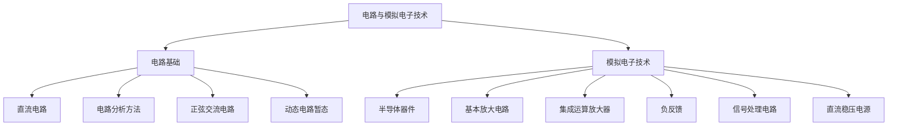
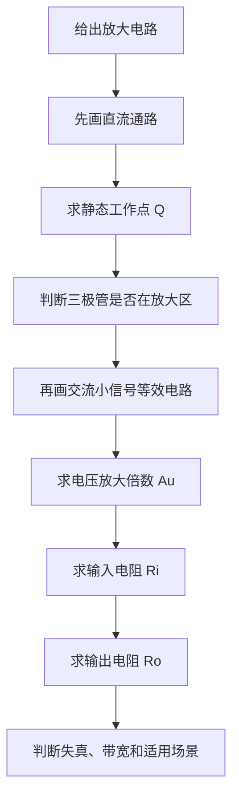

<style>
pre {
  font-size: 12px;
  line-height: 1.45;
  padding: 0.65em 0.85em;
  margin: 0.75em 0;
  border-radius: 6px;
  overflow-x: auto;
  page-break-inside: avoid;
  break-inside: avoid;
}

pre code {
  font-size: 12px;
  line-height: 1.45;
  white-space: pre;
}

:not(pre) > code {
  font-size: 0.95em;
  padding: 0.1em 0.25em;
}

.formula-block {
  margin: 0.85em 0;
  padding: 0.7em 1em;
  text-align: center;
  font-size: 1.08em;
  line-height: 1.55;
  font-family: "Times New Roman", "Cambria Math", "Noto Serif CJK SC", serif;
  background: #f8fafc;
  border: 1px solid #e5e7eb;
  border-radius: 6px;
  overflow-x: auto;
  page-break-inside: avoid;
  break-inside: avoid;
}

.formula-inline {
  font-family: "Times New Roman", "Cambria Math", "Noto Serif CJK SC", serif;
  white-space: nowrap;
}

@media print {
  pre,
  pre code {
    font-size: 10.5px;
    line-height: 1.35;
  }

  .formula-block {
    font-size: 1em;
    background: #fff;
  }
}
</style>

## 《电路与模拟电子技术》学习指导 —— 初学者版

**作者**：汪亮（bertonwang）  
**邮箱**：<47608843@qq.com>  
**版本**：v1.0 ｜ **最后更新**：2026-05-19

> 书籍信息：  
> 《电路与模拟电子技术》  
> 作者：刘玉成主编，胡刚主编  
> ISBN：978-7-113-25695-1  
> 出版信息：北京，中国铁道出版社有限公司，2019

> 说明：本文不是教材原文复制，而是面向初学者整理的一份学习指导。内容围绕核心概念、学习顺序、典型电路、分析方法、常见题型和易错点展开，目标是帮助读者先建立学习框架，再逐步掌握电路与模拟电子技术的基本分析能力。

---

## 目录

- [1. 总论：电路与模拟电子技术研究什么](#1-总论电路与模拟电子技术研究什么)
- [2. 全书知识地图](#2-全书知识地图)
- [3. 基础知识总览](#3-基础知识总览)
- [4. 电路基础知识](#4-电路基础知识)
- [5. 正弦交流电路知识](#5-正弦交流电路知识)
- [6. 动态电路与暂态分析知识](#6-动态电路与暂态分析知识)
- [7. 半导体器件知识](#7-半导体器件知识)
- [8. 放大电路知识](#8-放大电路知识)
- [9. 集成运算放大器知识](#9-集成运算放大器知识)
- [10. 反馈、滤波与电源知识](#10-反馈滤波与电源知识)
- [11. 全书知识总表](#11-全书知识总表)
- [12. 核心知识点与易混淆点总整理](#12-核心知识点与易混淆点总整理)
- [13. 典型易错概念辨析](#13-典型易错概念辨析)
- [14. 典型电路与关键结论](#14-典型电路与关键结论)
- [15. 关键判据与工程常识](#15-关键判据与工程常识)
- [附录 A：核心公式清单](#附录-a核心公式清单)
- [附录 B：常见符号表](#附录-b常见符号表)
- [附录 C：名词解释](#附录-c名词解释)
- [附录 D：典型分析结论速查](#附录-d典型分析结论速查)
- [附录 E：资料来源](#附录-e资料来源)

---

## 1. 总论：电路与模拟电子技术研究什么

### 1.1 基本定义

**电路与模拟电子技术，研究电压、电流、元器件和信号如何在电路中流动、变化、放大、处理和供电。**

如果用生活类比：

- **电压**：像水压，推动电荷运动。
- **电流**：像水流，表示单位时间流过多少电荷。
- **电阻**：像水管阻力，阻碍电流。
- **电容**：像蓄水池，能储存电荷。
- **电感**：像带惯性的水轮，反抗电流变化。
- **二极管**：像单向阀，只允许电流主要往一个方向流。
- **三极管 / 场效应管**：像可控阀门，用小信号控制大信号。
- **运算放大器**：像一个非常灵敏的自动调节器，配合反馈后可以实现放大、加法、减法、积分、滤波等功能。

### 1.2 知识难点的本质

很多同学前面学电路定律还好，到了后面模拟电路就开始晕，主要原因不是笨，而是这门课发生了三次“思维升级”：

| 阶段 | 你原来以为 | 实际知识要求 |
|---|---|---|
| 电路基础 | 套公式算电压电流 | 看懂电路连接关系，建立方程 |
| 交流电路 | 电压电流就是数字 | 把正弦量看成“有大小和相位的量” |
| 模拟电子 | 元件就是固定电阻 | 器件有非线性，需要先定工作点，再分析小信号 |

最容易晕的地方一般是：

- 戴维南定理、叠加定理什么时候用。
- 正弦交流电里的相量为什么可以代替正弦波。
- 电容、电感为什么有“暂态过程”。
- 二极管、三极管为什么不是简单电阻。
- 放大电路为什么要先分析直流，再分析交流。
- 反馈为什么能让放大倍数变稳定。
- 运放为什么经常默认“虚短、虚断”。

本文会专门用初学者也能理解的方式解释这些点。

---

## 2. 全书知识地图

### 2.1 总体结构

电路与模拟电子技术通常可以分成两大块：



### 2.2 知识主线

整本书其实是在回答一个问题：

> 给你一个电路图，你能不能判断它输入什么、内部怎么变化、输出什么？

因此知识主线可以整理成：

```text
认识元件 → 看懂连接 → 写出方程 → 求出电压电流 → 理解信号变化 → 设计简单功能电路
```

### 2.3 前后章节关系


一句话：**前面的电路基础是后面模拟电路的计算工具；后面的模拟电路是把这些工具用在真实器件上。**

---

## 3. 基础知识总览

本章把全书知识压缩成一张“总索引”。后续每章都是对这里某一部分的展开。

### 3.1 电路的四个基本量

| 基本量 | 含义 | 单位 | 核心关系 |
|---|---|---|---|
| 电压 U / u | 两点之间的电势差，是推动电荷运动的原因 | V | 电压必须对应两个点 |
| 电流 I / i | 单位时间通过导体截面的电荷量 | A | 方向可以先假设，负值表示实际相反 |
| 电阻 R | 阻碍电流通过的能力 | Ω | R 越大，同样电压下电流越小 |
| 功率 P | 能量转换快慢 | W | 正负号可判断吸收或发出功率 |

### 3.2 三类基本元件

| 元件 | 直流稳态特性 | 交流特性 | 关键记忆 |
|---|---|---|---|
| 电阻 | 阻碍电流，消耗能量 | 电压电流同相 | 不储能，只耗能 |
| 电容 | 直流稳态近似开路 | 频率越高越容易通过 | 电容电压不能突变 |
| 电感 | 直流稳态近似短路 | 频率越高阻碍越强 | 电感电流不能突变 |

### 3.3 三类分析对象

| 对象 | 主要问题 | 常用工具 |
|---|---|---|
| 直流电路 | 求电压、电流、功率 | 欧姆定律、KCL、KVL、等效变换 |
| 正弦交流电路 | 求幅值和相位 | 相量法、阻抗、复数运算 |
| 模拟电子电路 | 判断器件状态并处理信号 | 工作点、小信号模型、反馈、运放规则 |

### 3.4 一条完整知识链

```text
电压/电流/电阻/功率
→ KCL / KVL / 等效电路
→ 电容/电感/暂态过程
→ 正弦量/相量/阻抗
→ 二极管/三极管/场效应管
→ 静态工作点/小信号模型/放大电路
→ 运算放大器/反馈/滤波/稳压电源
```

### 3.5 分析电路的统一逻辑

电路分析不是机械套公式，而是判断电路处于哪种工作条件。统一逻辑如下：

```text
1. 判断电路类型：直流、交流、暂态、非线性、放大、反馈。
2. 明确要求量：电压、电流、功率、增益、输入输出关系、波形。
3. 画等效电路：直流等效、交流等效、相量等效、小信号等效。
4. 写基本方程：欧姆定律、KCL、KVL、器件模型、反馈约束。
5. 检查物理意义：方向、单位、工作区、是否饱和、是否符合电源限制。
```

---

## 4. 电路基础知识

### 4.1 电路基础解决的问题

电路基础主要解决：

> 已知电路连接和元件参数，求各处电压、电流、功率。

这是后面所有内容的地基。

### 4.2 基本概念

| 概念 | 入门理解 | 必须会什么 |
|---|---|---|
| 电压 | 两点之间的电势差 | 判断参考方向，知道单位 V |
| 电流 | 电荷流动速度 | 判断电流方向，知道单位 A |
| 电阻 | 阻碍电流 | 会用欧姆定律 |
| 电功率 | 电路吸收或释放能量快慢 | 会判断元件吸收还是发出功率 |
| 电源 | 提供电压或电流 | 理解电压源、电流源 |
| 节点 | 多条支路连接点 | 会写 KCL |
| 回路 | 闭合路径 | 会写 KVL |

### 4.3 欧姆定律

最基本公式：

<div class="formula-block">U = IR</div>

入门记法：

```text
电压 = 电流 × 电阻
```

变形：

<div class="formula-block">I = U / R，R = U / I</div>

### 4.4 基尔霍夫定律

#### KCL：节点电流定律

**流入一个节点的电流总和 = 流出这个节点的电流总和。**

类比：水管交汇处不会凭空多水，也不会凭空少水。

```text
流入 = 流出
```

#### KVL：回路电压定律

**沿一个闭合回路走一圈，电压升高和电压降低的总和为 0。**

类比：爬山从起点出发又回到起点，总高度变化为 0。

```text
电压升高总和 = 电压降低总和
```

### 4.5 电路基础分析规则

遇到电路计算题，不要马上套公式。按这个步骤：

```text
1. 标出节点、支路、回路。
2. 标出电压和电流参考方向。
3. 判断元件关系：串联、并联、混联。
4. 能简化就先简化。
5. 不能简化就列 KCL / KVL 方程。
6. 解方程。
7. 检查单位、方向、功率是否合理。
```

### 4.6 易混淆点

#### 难点 1：参考方向和真实方向

很多初学者看到算出来电流是负数就慌。

其实负号不代表错，只代表：**真实方向和你假设的参考方向相反。**

#### 难点 2：电源吸收功率还是发出功率

判断口诀：

```text
电流从元件正端流入：元件吸收功率。
电流从元件负端流入：元件发出功率。
```

#### 难点 3：串并联看不出来

判断技巧：

- 两个元件首尾相接，中间没有分叉，通常是串联。
- 两个元件两端分别接在同一对节点上，就是并联。
- 看不出来时，不要凭图形位置判断，要看“节点连接”。

---

## 5. 正弦交流电路知识

### 5.1 正弦交流的本质

直流电路里，电压电流通常是固定值。

交流电路里，电压电流会随时间变化，例如：

<div class="formula-block">u(t) = U<sub>m</sub> sin(ωt + φ)</div>

这里有三个关键信息：

| 参数 | 含义 | 入门理解 |
|---|---|---|
| <span class="formula-inline">U<sub>m</sub></span> | 最大值 | 波峰有多高 |
| <span class="formula-inline">ω</span> | 角频率 | 变化有多快 |
| <span class="formula-inline">φ</span> | 初相位 | 起步时领先还是落后 |

### 5.2 正弦量的三要素

描述正弦交流，先抓住三要素：

```text
幅值、频率、相位
```

如果只看大小，不看相位，就会在交流题里出错。

### 5.3 有效值是什么

日常说家用电 220V，通常指的是有效值，不是最大值。

对正弦量：

<div class="formula-block">U = U<sub>m</sub> / √2</div>

<div class="formula-block">I = I<sub>m</sub> / √2</div>

入门理解：**有效值表示这个交流电产生热效应时，相当于多大的直流电。**

### 5.4 相量法为什么有用

如果直接用三角函数计算交流电，会很麻烦。相量法把正弦量变成复数形式。

```text
正弦波 → 相量 → 复数计算 → 再转回正弦波
```

相量法的核心好处：

- 微分、积分变成代数运算。
- 电阻、电感、电容都能统一成阻抗。
- 欧姆定律仍然可以用，只是变成复数形式。

### 5.5 阻抗的含义

交流电中，电阻、电感、电容对电流的阻碍统一叫阻抗。

| 元件 | 阻抗 | 特点 |
|---|---|---|
| 电阻 R | <span class="formula-inline">Z<sub>R</sub> = R</span> | 电压电流同相 |
| 电感 L | <span class="formula-inline">Z<sub>L</sub> = jωL</span> | 电压超前电流 90° |
| 电容 C | <span class="formula-inline">Z<sub>C</sub> = 1 / (jωC)</span> | 电流超前电压 90° |

入门记法：

```text
电阻：只阻碍，不改相位。
电感：电流变化慢，电压领先。
电容：先充电流，电流领先。
```

### 5.6 交流电路分析规则

```text
1. 把正弦量写成相量。
2. 把 R、L、C 写成阻抗。
3. 用直流电路的方法列方程。
4. 进行复数计算。
5. 把结果转回有效值、相位或瞬时表达式。
```

### 5.7 易混淆点

| 易混点 | 正确理解 |
|---|---|
| 最大值和有效值 | 最大值是波峰，有效值是等效热效应 |
| 相位差 | 比较两个正弦量谁领先谁落后 |
| 阻抗和电阻 | 电阻是实数，阻抗可以是复数 |
| <span class="formula-inline">j</span> 的意义 | 表示相位旋转 90° |
| 功率 | 交流功率要区分有功、无功、视在功率 |

---

## 6. 动态电路与暂态分析知识

### 6.1 什么叫动态电路

只含电阻的电路通常变化很快，可以看成没有“记忆”。

含有电容、电感的电路有“记忆”：

- 电容记住电压。
- 电感记住电流。

所以电路状态不会瞬间乱变。

### 6.2 两条最重要的规律

#### 电容电压不能突变

<div class="formula-block">u<sub>C</sub>(0<sup>+</sup>) = u<sub>C</sub>(0<sup>-</sup>)</div>

入门理解：电容像水箱，水位不能瞬间跳变。

#### 电感电流不能突变

<div class="formula-block">i<sub>L</sub>(0<sup>+</sup>) = i<sub>L</sub>(0<sup>-</sup>)</div>

入门理解：电感像有惯性的水轮，水流速度不能瞬间变成另一个值。

### 6.3 一阶电路三要素法

很多教材会讲一阶 RC / RL 电路的三要素法。记住这个统一形式：

<div class="formula-block">f(t) = f(∞) + [f(0<sup>+</sup>) - f(∞)]e<sup>-t/τ</sup></div>

它的意思是：

```text
任意时刻的值 = 最终值 + 初始偏差 × 衰减因子
```

三要素：

| 要素 | 含义 | 怎么求 |
|---|---|---|
| 初始值 <span class="formula-inline">f(0<sup>+</sup>)</span> | 刚切换后的值 | 根据换路前状态和不能突变规律 |
| 稳态值 <span class="formula-inline">f(∞)</span> | 很久之后的值 | 电容开路、电感短路 |
| 时间常数 <span class="formula-inline">τ</span> | 变化快慢 | RC 电路为 <span class="formula-inline">RC</span>，RL 电路为 <span class="formula-inline">L/R</span> |

### 6.4 暂态分析规则

```text
1. 看清楚开关在什么时候动作。
2. 分析 t < 0 的稳态。
3. 根据电容电压、电感电流不能突变，求 0+ 初始值。
4. 分析 t → ∞ 的新稳态。
5. 求时间常数 τ。
6. 套三要素公式。
```

### 6.5 易混淆点

因为题目会同时出现三个时间点：

```text
t < 0：换路前
0+：刚换路后
∞：换路很久后
```

只要你把这三个状态分开画等效电路，就会清晰很多。

---

## 7. 半导体器件知识

### 7.1 半导体器件在模拟电路中的作用

前面电路基础多是理想元件。模拟电子开始研究真实器件：

- 二极管。
- 稳压管。
- 双极型三极管 BJT。
- 场效应管 FET / MOSFET。

这些器件的共同特点是：**非线性**。

### 7.2 二极管模型

二极管像单向阀：

```text
正向导通，反向截止。
```

但真实二极管不是一加正电压就完全导通，硅二极管通常需要约 0.7V 正向压降。

| 模型 | 用途 | 入门理解 |
|---|---|---|
| 理想模型 | 粗略判断通断 | 导通时像短路，截止时像开路 |
| 恒压降模型 | 常规计算 | 导通时压降约 0.7V |
| 小信号模型 | 微小变化分析 | 在工作点附近近似成电阻 |

### 7.3 二极管典型电路

| 电路 | 作用 | 生活类比 |
|---|---|---|
| 整流电路 | 把交流变成单方向脉动电压 | 单向阀让水只往一个方向流 |
| 限幅电路 | 限制电压超过某个范围 | 安全阀 |
| 钳位电路 | 平移波形电平 | 把波形整体抬高或压低 |
| 稳压电路 | 稳定输出电压 | 自动泄压阀 |

### 7.4 三极管模型

三极管有三个极：

| 名称 | 英文 | 入门理解 |
|---|---|---|
| 基极 | Base, B | 控制端 |
| 集电极 | Collector, C | 大电流入口或出口 |
| 发射极 | Emitter, E | 大电流出口或入口 |

对 NPN 管，常见放大区关系：

<div class="formula-block">I<sub>C</sub> ≈ βI<sub>B</sub></div>

意思是：**基极小电流控制集电极大电流。**

### 7.5 三极管三个工作区

| 工作区 | 条件直观理解 | 用途 |
|---|---|---|
| 截止区 | 基极没有有效驱动 | 开关断开 |
| 放大区 | 基极适当导通 | 信号放大 |
| 饱和区 | 基极驱动很强 | 开关闭合 |

初学阶段最重要的是先分清：

```text
做放大器：让三极管工作在放大区。
做开关：让三极管在截止区和饱和区之间切换。
```

### 7.6 器件分析的关键层次

PN 结、载流子、扩散、漂移这些概念有助于理解器件原理，但初学时重点是：

- 会判断二极管导通还是截止。
- 会用 0.7V 压降近似计算。
- 会判断三极管工作区。
- 会理解三极管能放大的原因。
- 会看懂输入、输出、电源和偏置。

---

## 8. 放大电路知识

### 8.1 本章学习目标

放大电路是模拟电子技术中最重要、也最容易让初学者混乱的一章。学习本章时，不要一开始就背很多公式，而要先建立一条主线：

```text
器件要先处在合适状态 → 小信号才能围绕这个状态变化 → 输出才可能线性放大
```

本章重点掌握四件事：

1. **为什么要先求静态工作点 Q 点**。
2. **怎么区分直流通路和交流通路**。
3. **怎么用小信号模型分析放大倍数、输入电阻和输出电阻**。
4. **怎么判断截止失真、饱和失真和电路类型**。

一句话：

> **放大电路不是直接把信号变大，而是先给三极管安排一个合适的直流工作位置，再让交流小信号在这个位置附近摆动。**

### 8.2 放大电路的核心问题

很多同学看到放大电路开始晕，原因是这里需要同时处理两套东西：

```text
直流：让三极管处在合适工作状态。
交流：让小信号被放大。
```

这就是模拟电路最重要的思想：

> **先定静态工作点，再分析交流小信号。**

如果只看交流信号，不看直流偏置，三极管可能根本不在放大区；如果只看直流状态，不看交流等效，就无法知道信号到底放大了多少。

### 8.3 什么是静态工作点 Q 点

静态工作点就是没有输入交流信号时，三极管本身的直流电压和电流状态。

通常包括：

- <span class="formula-inline">I<sub>B</sub></span>：基极电流。
- <span class="formula-inline">I<sub>C</sub></span>：集电极电流。
- <span class="formula-inline">U<sub>CE</sub></span>：集电极—发射极电压。

为什么它重要？

因为三极管只有在合适的 Q 点附近，才可以把小信号比较线性地放大。

| Q 点位置 | 可能问题 | 输出波形表现 | 初学者理解 |
|---|---|---|---|
| 偏低 | 容易进入截止区 | 负半周被削掉 | 阀门快关死了，信号往下摆不动 |
| 偏高 | 容易进入饱和区 | 正半周被削掉 | 阀门快开满了，信号往上摆不动 |
| 合适 | 放大较线性 | 上下摆幅比较均衡 | 阀门留出足够上下调节空间 |

> 记忆：**Q 点决定放大电路有没有“上下摆动空间”。**

### 8.4 直流通路怎么画

分析直流工作点时，目标是求出三极管在没有交流输入时的状态。

画直流通路时常用规则：

```text
电容看作开路。
电感看作短路。
交流信号源看作 0。
保留直流电源和偏置电阻。
```

常见步骤：

1. 去掉耦合电容和旁路电容对直流的影响。
2. 保留直流电源 <span class="formula-inline">V<sub>CC</sub></span>。
3. 根据基极偏置电路求 <span class="formula-inline">I<sub>B</sub></span> 或 <span class="formula-inline">U<sub>B</sub></span>。
4. 用三极管关系估算 <span class="formula-inline">I<sub>C</sub> ≈ βI<sub>B</sub></span>。
5. 根据集电极回路求 <span class="formula-inline">U<sub>CE</sub></span>。
6. 判断三极管是否处于放大区。

判断放大区的粗略条件：

```text
发射结正向偏置。
集电结反向偏置。
Uce 不能太小，不能接近饱和。
```

### 8.5 交流通路怎么画

分析交流小信号时，目标是求输入信号变化如何影响输出信号变化。

画交流通路时常用规则：

```text
耦合电容、旁路电容在中频段近似短路。
直流电源对交流来说近似接地。
三极管用小信号模型替代。
```

这里的“中频段”很重要：

- 频率太低时，耦合电容和旁路电容不一定能看作短路。
- 频率太高时，三极管内部结电容会影响放大效果。
- 入门阶段通常先讨论中频小信号放大，所以可以使用简化规则。

### 8.6 放大电路分析流程



初学者可以把它记成一句话：

```text
先直流，后交流；先状态，后信号；先判断能不能放大，再计算放大多少。
```

### 8.7 三种基本放大电路

| 类型 | 输入端 | 输出端 | 电压放大 | 相位关系 | 输入电阻 | 输出电阻 | 常见用途 |
|---|---|---|---|---|---|---|---|
| 共射放大 | 基极输入 | 集电极输出 | 较大 | 反相 | 中等 | 较高 | 电压放大 |
| 共集放大 | 基极输入 | 发射极输出 | 约为 1 | 同相 | 较大 | 较小 | 缓冲、阻抗变换 |
| 共基放大 | 发射极输入 | 集电极输出 | 较大 | 同相 | 较小 | 较高 | 高频放大 |

入门阶段重点先掌握：

- **共射**：最典型的电压放大器。
- **共集**：最典型的电压跟随器，主要用于缓冲。

### 8.8 共射放大电路怎么理解

共射放大电路最常见。它的信号变化链条是：

```text
输入电压略微增加 → 基极电流增加 → 集电极电流增加 → 集电极电阻压降增加 → 集电极电压下降
```

所以输出和输入反相。

可以记为：

```text
共射放大：有放大，反相。
```

如果忽略一些复杂因素，中频小信号电压放大倍数常表现为负值：

<div class="formula-block">A<sub>u</sub> = u<sub>o</sub> / u<sub>i</sub> &lt; 0</div>

这里的负号不是说“放大倍数为负没有意义”，而是表示**输出相位与输入相位相反**。

### 8.9 小信号模型是什么

三极管是非线性器件，直接分析很复杂。小信号模型的想法是：

> 在静态工作点附近，只看很小的变化，把三极管近似成线性电路。

这就像一条弯曲的山路，在很小一段范围内可以近似看成直线。

常见小信号参数可以这样理解：

| 参数 | 含义 | 初学者理解 |
|---|---|---|
| <span class="formula-inline">r<sub>be</sub></span> | 基极—发射极之间的小信号等效电阻 | 输入端看进去的“等效阻力” |
| <span class="formula-inline">βi<sub>b</sub></span> | 受控电流源 | 基极小电流控制集电极较大电流 |
| <span class="formula-inline">g<sub>m</sub></span> | 跨导 | 输入电压变化引起输出电流变化的能力 |

入门阶段不必纠结所有模型细节，先掌握：

```text
三极管在 Q 点附近可以被替换成一个线性小信号等效电路。
```

### 8.10 电压放大倍数、输入电阻和输出电阻

放大电路题中常见三个指标：

| 指标 | 记号 | 问的是什么 | 为什么重要 |
|---|---|---|---|
| 电压放大倍数 | <span class="formula-inline">A<sub>u</sub></span> | 输出电压是输入电压的多少倍 | 决定信号放大能力 |
| 输入电阻 | <span class="formula-inline">R<sub>i</sub></span> | 从输入端看进去有多“吃信号” | 影响前级信号源是否被拖垮 |
| 输出电阻 | <span class="formula-inline">R<sub>o</sub></span> | 从输出端看进去等效内阻多大 | 影响带负载能力 |

简单记忆：

```text
放大倍数看“放多大”。
输入电阻看“拿多少”。
输出电阻看“带得动谁”。
```

### 8.11 典型题型：给电路求 Q 点和放大倍数

遇到共射放大电路题，可以按下面模板做：

```text
第一步：画直流通路。
第二步：求基极电流 IB 或基极电压 UB。
第三步：求 IC、UCE，判断是否在放大区。
第四步：画交流小信号等效电路。
第五步：根据小信号模型求 Au、Ri、Ro。
第六步：如果接入负载 RL，检查放大倍数是否变化。
```

需要特别注意：

- 不接负载和接负载时，输出等效电阻不同，放大倍数可能不同。
- 有旁路电容和没有旁路电容时，发射极电阻对交流的影响不同。
- 题目说“中频段”时，通常意味着耦合电容和旁路电容可以近似短路。

### 8.12 放大电路常见易错点

| 易错点 | 错误表现 | 正确理解 |
|---|---|---|
| 直接算交流放大倍数 | 忘记先判断 Q 点 | 没有合适 Q 点就谈不上正常放大 |
| 把电容永远当开路或短路 | 不区分直流和交流 | 直流看开路，中频交流常近似短路 |
| 忘记输出反相 | 共射放大倍数只写正数 | 共射输出相位与输入相反 |
| 虚构三极管一定在线性区 | 不检查饱和或截止 | 必须通过 Q 点判断工作区 |
| 忽略负载影响 | 空载公式直接用于带负载 | 负载会改变等效输出电阻和放大倍数 |

---

## 9. 集成运算放大器知识

### 9.1 本章学习目标

运算放大器，简称运放，是模拟电子技术中最常用的集成放大器。和三极管放大电路相比，运放题通常更适合用统一方法分析。

本章重点掌握：

1. **理想运放模型是什么意思**。
2. **虚短、虚断什么时候能用，什么时候不能用**。
3. **反相、同相、电压跟随器等基本电路怎么推导**。
4. **比较器和线性运放电路有什么区别**。

一句话：

> **运放题的关键不是背公式，而是先判断它是否处在线性负反馈状态。**

### 9.2 运放是什么

运算放大器是一种高增益差分放大器。

它有两个输入端：

| 端口 | 名称 | 特点 |
|---|---|---|
| `+` | 同相输入端 | 输出与此端变化方向相同 |
| `-` | 反相输入端 | 输出与此端变化方向相反 |

输出大致满足：

<div class="formula-block">u<sub>o</sub> = A<sub>uo</sub>(u<sub>+</sub> - u<sub>-</sub>)</div>

理想运放开环增益 <span class="formula-inline">A<sub>uo</sub></span> 非常大，所以哪怕两个输入端电压差很小，输出也可能变化很大。

### 9.3 理想运放模型

入门阶段常用理想运放近似：

| 理想特性 | 表达 | 意义 |
|---|---|---|
| 开环增益无穷大 | <span class="formula-inline">A<sub>uo</sub> → ∞</span> | 很小的输入差值也会被极大放大 |
| 输入电阻无穷大 | <span class="formula-inline">R<sub>i</sub> → ∞</span> | 输入端几乎不吸收电流 |
| 输出电阻为 0 | <span class="formula-inline">R<sub>o</sub> → 0</span> | 输出端带负载能力强 |
| 带宽无限大 | 理想假设 | 实际运放不可能完全做到 |

这些假设是为了简化分析，不代表真实运放没有限制。真实运放还会受到电源电压、带宽、转换速率和输入失调等因素影响。

### 9.4 虚短、虚断的使用条件

在**负反馈且线性工作**时，理想运放常用两个黄金规则。

#### 虚短

<div class="formula-block">u<sub>+</sub> ≈ u<sub>-</sub></div>

意思是：两个输入端电压几乎相等。

注意：**虚短不是短路，两个输入端之间没有真的接线。**

#### 虚断

<div class="formula-block">i<sub>+</sub> ≈ i<sub>-</sub> ≈ 0</div>

意思是：输入端几乎没有电流流入。

注意：**虚断不是断路，而是输入电流近似为 0。**

最重要的是使用条件：

| 情况 | 能不能直接用虚短、虚断 | 说明 |
|---|---|---|
| 负反馈且输出未饱和 | 可以 | 典型线性运放电路 |
| 没有反馈 | 不能直接用虚短 | 常见为比较器 |
| 正反馈 | 不能按线性放大器分析 | 常见于振荡器、滞回比较器 |
| 输出已到电源极限 | 不能继续用线性公式 | 运放进入饱和状态 |

> 记忆：**先判断负反馈，再使用虚短虚断。**

### 9.5 反相比例放大电路怎么推导

反相比例放大电路的典型特点：

```text
输入信号经电阻接到反相端，同相端接地，输出通过反馈电阻回到反相端。
```

分析思路：

1. 因为有负反馈，使用虚短：<span class="formula-inline">u<sub>-</sub> ≈ u<sub>+</sub> = 0</span>。
2. 因为输入端虚断，流入运放输入端的电流近似为 0。
3. 输入电阻电流和反馈电阻电流大小相等。
4. 根据 KCL 得到输出和输入关系。

结论：

<div class="formula-block">u<sub>o</sub> = -(R<sub>f</sub> / R<sub>1</sub>)u<sub>i</sub></div>

负号表示输出反相。

### 9.6 同相比例放大电路怎么推导

同相比例放大电路的典型特点：

```text
输入信号直接加到同相端，反相端接反馈分压网络。
```

因为负反馈使 <span class="formula-inline">u<sub>-</sub> ≈ u<sub>+</sub> = u<sub>i</sub></span>，反相端电压由输出电压通过电阻分压得到。

结论：

<div class="formula-block">u<sub>o</sub> = [1 + (R<sub>f</sub> / R<sub>1</sub>)]u<sub>i</sub></div>

同相比例放大没有反相，电压放大倍数大于或等于 1。

### 9.7 电压跟随器为什么有用

电压跟随器是同相放大的特殊情况：

<div class="formula-block">u<sub>o</sub> ≈ u<sub>i</sub></div>

它看起来没有电压放大，但非常有用，因为它可以实现缓冲隔离：

```text
前级信号源 → 电压跟随器 → 后级负载
```

作用是：

- 对前级来说，输入电阻很大，不容易拖垮信号。
- 对后级来说，输出电阻很小，带负载能力更强。
- 常用于阻抗变换和信号隔离。

### 9.8 常见运放电路速查

| 电路 | 功能 | 关键公式或特点 | 初学者判断方法 |
|---|---|---|---|
| 反相比例放大 | 输出反相放大 | <span class="formula-inline">u<sub>o</sub> = -(R<sub>f</sub> / R<sub>1</sub>)u<sub>i</sub></span> | 输入进反相端，同相端常接地 |
| 同相比例放大 | 输出同相放大 | <span class="formula-inline">u<sub>o</sub> = [1 + (R<sub>f</sub> / R<sub>1</sub>)]u<sub>i</sub></span> | 输入进同相端，反相端接反馈分压 |
| 电压跟随器 | 缓冲隔离 | <span class="formula-inline">u<sub>o</sub> ≈ u<sub>i</sub></span> | 输出直接反馈到反相端 |
| 加法器 | 多路信号相加 | 反相求和常见 | 多个输入电阻汇到反相端 |
| 减法器 | 两信号相减 | 可做差分测量 | 两端都接输入和电阻网络 |
| 积分器 | 对输入积分 | 输出与输入累积有关 | 反馈元件是电容 |
| 微分器 | 对输入微分 | 对变化敏感 | 输入支路有电容 |
| 比较器 | 比较两个电压大小 | 输出接近高、低电源电平 | 通常没有负反馈 |

### 9.9 比较器为什么不能套虚短

比较器也常用运放符号，但它的工作方式和线性放大器不同。

比较器通常没有负反馈，输出只关心两个输入端谁大：

```text
u+ > u- → 输出趋向高电平
u+ < u- → 输出趋向低电平
```

因此比较器不能直接套用 <span class="formula-inline">u<sub>+</sub> ≈ u<sub>-</sub></span>。如果看到题目中运放没有负反馈，首先要警惕：它可能不是线性运算电路，而是比较器或正反馈电路。

### 9.10 运放电路分析规则

```text
1. 先判断反馈类型：负反馈、正反馈，还是无反馈。
2. 如果是负反馈且线性工作，使用虚短、虚断。
3. 找关键节点，通常是反相输入端节点。
4. 在关键节点列 KCL。
5. 用电阻、电容关系写电流表达式。
6. 解出输出电压和输入电压关系。
7. 检查输出是否超过电源电压范围。
8. 如果超过，则说明运放进入饱和，线性公式不再适用。
```

### 9.11 运放与三极管电路的差异

三极管放大电路要考虑 Q 点、小信号模型、输入输出电阻等。

运放因为内部已经集成好复杂放大器，外部主要靠电阻、电容和反馈网络决定功能，所以分析方法更统一。

一句话：

```text
三极管：先学器件，再搭放大器。
运放：把复杂放大器封装好，外部用反馈设计功能。
```

### 9.12 运放常见易错点

| 易错点 | 错误表现 | 正确理解 |
|---|---|---|
| 看到运放就用虚短 | 比较器也套公式 | 只有负反馈且线性工作时才用虚短 |
| 以为虚短是真短路 | 把两个输入端直接连起来 | 虚短只是电压近似相等 |
| 以为虚断是电路断开 | 忘记外部电阻仍有电流 | 虚断指输入端电流近似为 0 |
| 忘记电源限制 | 算出任意大输出 | 实际输出不能超过供电范围 |
| 分不清反相和同相 | 放大倍数符号写错 | 反相输入通常输出反相，同相输入通常输出同相 |

---

## 10. 反馈、滤波与电源知识

### 10.1 本章学习目标

本章把三个常见功能电路放在一起：反馈、滤波和电源。它们看起来不同，但都在回答同一个问题：

> **电路如何让输出更稳定、更符合需要？**

本章重点掌握：

1. **反馈**：输出如何反过来影响输入，为什么负反馈能改善性能。
2. **滤波**：电路如何按频率选择信号。
3. **电源**：交流电如何变成稳定直流电。

### 10.2 反馈的定义

反馈就是把输出的一部分送回输入端。


反馈题的本质不是看线画得复杂不复杂，而是判断：

```text
反馈信号回到输入端以后，是削弱原输入，还是增强原输入？
```

### 10.3 正反馈和负反馈

| 类型 | 含义 | 结果 | 常见用途 |
|---|---|---|---|
| 正反馈 | 反馈信号增强原输入 | 容易振荡或快速翻转 | 振荡器、比较器滞回 |
| 负反馈 | 反馈信号削弱原输入 | 稳定、改善性能 | 放大器、运放电路 |

入门记法：

```text
负反馈牺牲一部分放大倍数，换来更稳定、更线性、更可靠。
```

### 10.4 负反馈的主要作用

负反馈常见好处：

- 稳定放大倍数。
- 减小非线性失真。
- 扩展通频带。
- 改变输入电阻和输出电阻。
- 抑制内部参数变化带来的影响。

可以这样理解：

```text
没有负反馈：放大器很“猛”，但不够稳定。
有负反馈：放大器没那么“猛”，但更可控、更准确。
```

### 10.5 反馈类型怎么初步判断

反馈分类通常包括：

| 分类维度 | 类型 | 看什么 |
|---|---|---|
| 极性 | 正反馈 / 负反馈 | 反馈信号增强还是削弱净输入 |
| 取样方式 | 电压反馈 / 电流反馈 | 从输出电压取样还是从输出电流取样 |
| 混合方式 | 串联反馈 / 并联反馈 | 反馈信号在输入端以电压还是电流形式混合 |

初学阶段先掌握判断顺序：

```text
先判断有没有反馈 → 再判断正负反馈 → 最后再细分电压/电流、串联/并联。
```

不要一开始就死背四种负反馈组态，先理解“反馈回来后对原输入起什么作用”。

### 10.6 滤波电路的本质

滤波就是让某些频率通过，让某些频率被削弱。

| 滤波器 | 通过什么 | 阻止什么 | 类比 |
|---|---|---|---|
| 低通 | 低频 | 高频 | 让慢变化通过 |
| 高通 | 高频 | 低频 | 让快变化通过 |
| 带通 | 某一段频率 | 低频和高频 | 只允许一个频道通过 |
| 带阻 | 阻止某一段频率 | 其他频率 | 去掉干扰频点 |

滤波器最重要的不是名字，而是频率响应：

```text
输入信号中有哪些频率成分？
电路允许哪些频率通过？
哪些频率会被削弱？
```

### 10.7 RC 低通和高通怎么理解

最基础的滤波器通常由电阻和电容组成。

#### RC 低通

低通滤波器让低频更容易通过，高频更容易被削弱。

直觉理解：

```text
低频变化慢，电容来得及跟随。
高频变化快，电容更容易把高频成分旁路掉。
```

#### RC 高通

高通滤波器让高频更容易通过，低频更容易被削弱。

直觉理解：

```text
低频变化慢，电容阻碍明显。
高频变化快，电容阻碍较小。
```

常见截止频率形式为：

<div class="formula-block">f<sub>c</sub> = 1 / (2πRC)</div>

它表示电路从“主要通过”到“明显衰减”的分界附近。

### 10.8 电源电路的学习主线

直流稳压电源一般流程：


对应功能：

| 环节 | 作用 | 初学者理解 |
|---|---|---|
| 变压 | 把交流电压变到合适范围 | 先把电压调到大致合适 |
| 整流 | 把交流变成单方向脉动电压 | 让电流主要朝一个方向走 |
| 滤波 | 减小纹波，让波形更平滑 | 把“波浪”压平一些 |
| 稳压 | 保持输出电压稳定 | 负载或输入变化时仍尽量稳住 |

### 10.9 整流、滤波、稳压分别解决什么问题

| 环节 | 输入是什么 | 输出是什么 | 仍然存在的问题 |
|---|---|---|---|
| 整流 | 正负交替的交流电 | 单方向脉动电压 | 波动很大，不够平滑 |
| 滤波 | 脉动电压 | 较平滑直流电压 | 仍有纹波，负载变化会影响输出 |
| 稳压 | 较平滑直流电压 | 稳定直流电压 | 受稳压器性能和散热限制 |

记忆顺序：

```text
整流管方向，滤波管平滑，稳压管稳定。
```

### 10.10 反馈、滤波与电源的统一分析方法

这三类电路都可以按“功能—结构—参数”的方式分析：

```text
1. 先问：这个电路想实现什么功能？
2. 再看：它用了什么结构实现这个功能？
3. 接着找：关键参数由哪些元件决定？
4. 最后判断：元件变化会怎样影响输出？
```

对应到三类电路：

| 电路类型 | 先看什么 | 再看什么 | 最后判断什么 |
|---|---|---|---|
| 反馈电路 | 输出有没有回到输入 | 是正反馈还是负反馈 | 稳定性、放大倍数、输入输出电阻 |
| 滤波电路 | 想通过哪些频率 | 电阻、电容或电感如何连接 | 截止频率和衰减特性 |
| 电源电路 | 输入交流如何变直流 | 整流、滤波、稳压是否完整 | 输出是否稳定、纹波是否足够小 |

### 10.11 本章典型易错点

| 易错点 | 错误表现 | 正确理解 |
|---|---|---|
| 把所有反馈都当负反馈 | 看到输出回输入就说稳定 | 要判断反馈信号是增强还是削弱输入 |
| 只背低通、高通名字 | 不看电容位置和输出取样点 | 要结合频率下电容阻抗变化理解 |
| 误以为滤波能完全消除干扰 | 认为不需要考虑截止频率 | 滤波是衰减，不是魔法删除 |
| 把整流后电压当稳定直流 | 忽略脉动和纹波 | 整流后还需要滤波和稳压 |
| 忽略负载变化 | 空载电压正常就认为电源合格 | 电源还要看带载能力和稳定性 |

### 10.12 初学者学习建议

学习第 10 章时，可以按这个顺序复习：

```text
先掌握负反馈为什么能稳定放大器。
再掌握低通、高通如何按频率选择信号。
最后掌握直流电源从交流到稳定直流的完整流程。
```

不要把反馈、滤波和电源看成孤立知识点。它们在真实电子系统中经常同时出现：

- 放大器靠负反馈提高稳定性。
- 信号处理靠滤波保留有用频率。
- 整个系统靠电源电路提供稳定直流。

---


## 11. 全书知识总表

| 模块 | 核心问题 | 关键知识 | 判断标准 |
|---|---|---|---|
| 电路基本概念 | 电压电流功率是什么 | 单位、参考方向、功率判断 | 能解释负电流和负电压含义 |
| 基尔霍夫定律 | 电路方程怎么列 | KCL、KVL | 能对简单电路列方程 |
| 电路分析方法 | 复杂电路如何简化 | 支路法、节点法、叠加、戴维南 | 能根据电路结构选择等效或列方程 |
| 正弦交流 | 正弦量的计算 | 三要素、有效值、相量 | 能在时间表达式和相量表达式之间转换 |
| RLC 电路 | 电阻电感电容在交流中如何表现 | 阻抗、相位、功率 | 能用阻抗法计算 |
| 动态电路 | 开关动作后电路怎么变化 | 三要素法、时间常数 | 能求 RC/RL 暂态响应 |
| 二极管 | 单向导电特性的应用 | 整流、限幅、稳压 | 能判断导通、截止和稳压状态 |
| 三极管 | 小信号如何控制大信号 | 工作区、Q 点、β | 能判断放大区/饱和/截止 |
| 放大电路 | 信号放大的实现 | 直流通路、交流通路、小信号模型 | 能解释共射电路的反相放大 |
| 运放 | 用反馈实现线性运算 | 虚短、虚断、比例运算 | 能写出反相、同相放大的输入输出关系 |
| 负反馈 | 稳定性和线性度改善 | 正负反馈判断、反馈影响 | 能说明增益、失真和频带变化 |
| 滤波电路 | 频率选择 | 低通、高通、带通、带阻 | 能判断滤波器类型和通过频段 |
| 电源电路 | 稳定直流电压的获得 | 整流、滤波、稳压 | 能说明各环节的功能 |

---

## 12. 核心知识点与易混淆点总整理

这一节集中整理全书最容易混淆的知识点。每个条目都包含核心含义、易混淆处和通俗解释。

### 12.1 电路基础：先学会看图，再学会计算

| 核心知识点 | 一句话理解 | 易混淆点 | 通俗解释 |
|---|---|---|---|
| 参考方向 | 分析时人为规定的正方向 | 负号不等于算错 | 算出负值，表示真实方向和你假设的方向相反 |
| 节点 | 电气上连在一起的一组点 | 图上画得远，不代表不是同一节点 | 只要中间用理想导线连接，就是同一电位 |
| 支路 | 两个节点之间的一段电路 | 支路不一定只有一个元件 | 一个电源串一个电阻，也可以看成一条支路 |
| KCL | 节点处电流守恒 | 只适用于节点，不是随便找个位置就列 | 像水管交汇处，流入多少就流出多少 |
| KVL | 闭合回路电压守恒 | 绕行方向可以任意，但符号要一致 | 从起点绕一圈回到起点，总高度变化为 0 |
| 叠加定理 | 多个独立源分别作用后相加 | 只适用于线性电路 | 算电压电流可以叠加，功率不能直接叠加 |
| 电源置零 | 求等效电阻时处理独立源 | 置零不是删除所有电源 | 电压源置零相当于短路，电流源置零相当于开路 |
| 戴维南等效 | 把复杂有源网络变成一个电压源串电阻 | 不是改变负载本身 | 等效的是负载两端看到的外部网络 |

### 12.2 正弦交流：大小和相位必须一起看

| 核心知识点 | 一句话理解 | 易混淆点 | 通俗解释 |
|---|---|---|---|
| 最大值 | 正弦波峰值 | 不等于日常说的 220 V | 家用电 220 V 通常是有效值 |
| 有效值 | 与直流产生相同热效应的值 | 不是平均值 | 正弦交流的平均值可能为 0，但仍能发热做功 |
| 频率 f | 每秒变化多少次 | 不等于角频率 | 角频率是 ω，关系是 ω = 2πf |
| 相位 | 波形的“起跑位置” | 只看数值大小会漏掉相位差 | 两个波峰谁先到，就是谁相位领先 |
| 相量 | 用复数表示正弦量 | 不是新的物理量 | 它是计算工具，用来简化正弦稳态分析 |
| 阻抗 Z | 交流中的“广义电阻” | 阻抗不一定是实数 | 电感、电容会让电压电流出现相位差 |
| j | 复数单位 | 不是电流 i | 在交流电路中，j 表示相位旋转 90° |
| 电感 | 反抗电流变化 | 不是永远阻断电流 | 直流稳态时理想电感近似短路 |
| 电容 | 反抗电压变化 | 不是永远导通 | 直流稳态时理想电容近似开路 |

### 12.3 动态电路：把三个时间点分开

| 核心知识点 | 一句话理解 | 易混淆点 | 通俗解释 |
|---|---|---|---|
| 0<sup>-</sup> | 开关动作前一瞬间 | 不是负时间乱算 | 用来求换路前储能状态 |
| 0<sup>+</sup> | 开关动作后一瞬间 | 不等于最终稳定状态 | 刚切换后，储能元件还来不及完全变化 |
| ∞ | 换路很久以后 | 不是数学上真的无限远 | 表示电路已经进入新稳态 |
| 电容电压不能突变 | 电容两端电压连续 | 电容电流可以突变 | 水箱水位不能瞬间跳变，但进出水流可以突然变化 |
| 电感电流不能突变 | 电感电流连续 | 电感电压可以突变 | 带惯性的水轮流速不能突变，但推动力可以突变 |
| 时间常数 τ | 变化快慢的尺度 | 不是整个过程结束时间 | 约经过 3τ 到 5τ 后，暂态基本结束 |
| 三要素法 | 初始值、稳态值、时间常数 | 不要把 0<sup>+</sup> 和 ∞ 混在一起 | 先分别画三个等效电路，再套统一公式 |

### 12.4 半导体器件：先判断工作状态，再套公式

| 核心知识点 | 一句话理解 | 易混淆点 | 通俗解释 |
|---|---|---|---|
| PN 结 | 二极管和三极管的基础结构 | 不必一开始死磕微观物理 | 入门先掌握导通、截止和压降即可 |
| 二极管导通 | 正向电压足够时电流明显增大 | 导通不等于完全短路 | 恒压降模型中硅管常取约 0.7 V |
| 二极管截止 | 反向时几乎不导电 | 截止不等于绝对无电流 | 实际有很小反向电流，入门常忽略 |
| 三极管放大区 | 小基极电流控制大集电极电流 | β 关系只在放大区近似成立 | 若进入饱和区，就不能再简单用 I<sub>C</sub> ≈ βI<sub>B</sub> |
| 截止区 | 三极管基本不导通 | 不是损坏 | 常用于开关“断开”状态 |
| 饱和区 | 三极管充分导通 | 不是放大更强 | 常用于开关“闭合”状态，线性放大反而失效 |
| 偏置 | 给器件安排合适直流工作状态 | 不是输入信号 | 偏置像“预热位置”，决定能不能正常放大 |

### 12.5 放大电路：直流定位置，交流看变化

| 核心知识点 | 一句话理解 | 易混淆点 | 通俗解释 |
|---|---|---|---|
| 静态工作点 Q | 没有交流输入时的直流状态 | 不是输出信号本身 | Q 点决定信号上下摆动空间 |
| 直流通路 | 分析偏置和 Q 点的电路 | 电容通常看作开路 | 因为直流不能持续通过理想电容 |
| 交流通路 | 分析小信号变化的电路 | 直流电源对交流近似接地 | 电源电压稳定，相当于交流变化为 0 |
| 小信号模型 | 在 Q 点附近把非线性器件线性化 | 不是换了一个真实元件 | 只是为了方便用线性电路方法计算 |
| 共射放大 | 电压放大且输出反相 | 反相不是信号变坏 | 输入上升时输出下降，是电路结构决定的 |
| 输入电阻 | 从输入端看进去的等效电阻 | 不等于某一个实际电阻 | 它反映前级信号源带不带得动这个电路 |
| 输出电阻 | 从输出端看回去的等效电阻 | 不等于负载电阻 | 它影响带负载能力和输出稳定性 |

### 12.6 运放与反馈：规则成立有前提

| 核心知识点 | 一句话理解 | 易混淆点 | 通俗解释 |
|---|---|---|---|
| 虚短 | 负反馈线性工作时两输入端电压近似相等 | 不是两端真的短接 | 两端没有导线相连，只是电压被反馈逼近相等 |
| 虚断 | 理想运放输入电流近似为 0 | 不是整个支路断开 | 运放输入端几乎不吸收电流，但外部电阻支路仍有电流 |
| 开环增益 | 没有反馈时的巨大放大倍数 | 不能直接当常用放大倍数 | 实际运放电路多靠闭环反馈决定增益 |
| 负反馈 | 输出反过来抑制输入误差 | 不是让输出变小就没用 | 它牺牲部分增益，换稳定、线性和抗干扰能力 |
| 正反馈 | 输出增强原变化 | 不是一定错误 | 振荡器、比较器滞回会用正反馈 |
| 饱和 | 输出达到电源限制 | 此时虚短通常不再成立 | 运放输出不可能超过供电范围 |
| 比较器 | 比较两个输入大小并输出高低电平 | 不按线性运放公式分析 | 比较器常工作在开环或正反馈状态 |

### 12.7 一眼判断题目类型的方法

看到题目时，先不要急着代公式，按下面顺序判断：

```text
1. 是直流还是交流？
2. 有没有电容、电感、开关动作？
3. 有没有二极管、三极管、运放这类非线性或有源器件？
4. 是求稳态，还是求暂态？
5. 是分析电路，还是判断功能？
6. 需要画直流通路、交流通路，还是相量等效电路？
```

如果你能先判断“题目属于哪一类”，后面的公式选择就会简单很多。

---

## 13. 典型易错概念辨析

### 13.1 误区一：只背公式，不看电路

错误表现：看到公式会背，换个图就不会。

纠正方法：每道题先问自己：

```text
这个电路有几个节点？
电流从哪里来，到哪里去？
哪个元件是输入？哪个元件是输出？
```

### 13.2 误区二：不画等效电路

电路题很多时候不是算不出来，而是没有画清楚。

分析时应明确：

- 分析直流时画直流等效图。
- 分析交流时画交流等效图。
- 分析开关电路时画换路前、换路后、最终稳态图。
- 分析二极管时画导通/截止假设图。

### 13.3 误区三：把“虚短”当真短路

虚短是：

```text
两个输入端电压近似相等。
```

不是：

```text
两个输入端被导线连起来。
```

虚断是：

```text
输入端电流近似为 0。
```

不是整个电路断开。

### 13.4 误区四：三极管只记 β

三极管不是只有 <span class="formula-inline">I<sub>C</sub> = βI<sub>B</sub></span>。还要看工作区。

如果已经饱和，<span class="formula-inline">I<sub>C</sub></span> 就不再简单等于 <span class="formula-inline">βI<sub>B</sub></span>。

### 13.5 误区五：交流题忘记相位

交流电不是只算大小，还要看相位。

如果题目出现电感、电容，通常就要考虑相位和复数。

---

## 14. 典型电路与关键结论

本章按“电路功能”汇总典型结论，便于直接查阅。

### 14.1 电阻分压电路

电阻分压用于从较高电压中取出较低电压。两个电阻串联，输出取其中一个电阻两端电压。

| 结论 | 内容 |
|---|---|
| 输出电压与电阻成比例 | 串联电路中电流相同，电阻越大分到的电压越高 |
| 负载会影响分压 | 输出端接负载后，相当于改变下方等效电阻 |
| 工程含义 | 分压电路适合提供参考电压，不适合直接带大负载 |

### 14.2 电桥电路

电桥常用于测量未知电阻或传感器变化。平衡时桥臂中间两点电位相等，检测支路电流为零。

| 状态 | 含义 |
|---|---|
| 电桥平衡 | 两边分压比例相同 |
| 检测电流为 0 | 中间支路无电流，说明两中点等电位 |
| 用途 | 电阻测量、应变片、传感器接口 |

### 14.3 RC 充放电电路

RC 电路的核心是电容电压不能突变。充电时电容电压逐渐上升，放电时逐渐下降，变化速度由时间常数决定。

| 量 | 结论 |
|---|---|
| 时间常数 | τ = RC |
| 充放电速度 | R 或 C 越大，变化越慢 |
| 稳态 | 直流稳态时电容近似开路 |
| 波形 | 指数上升或指数下降 |

### 14.4 RL 暂态电路

RL 电路的核心是电感电流不能突变。电感会反抗电流变化，因此开关动作后电流按指数规律变化。

| 量 | 结论 |
|---|---|
| 时间常数 | τ = L / R |
| 稳态 | 直流稳态时理想电感近似短路 |
| 电压 | 电感电压可突变，用来维持电流连续 |

### 14.5 二极管整流电路

整流电路把交流变成单方向脉动电压。

| 类型 | 结构 | 特点 |
|---|---|---|
| 半波整流 | 一个二极管 | 只利用半个周期，效率低，纹波大 |
| 全波整流 | 中心抽头或桥式结构 | 利用两个半周期，输出更平滑 |
| 桥式整流 | 四个二极管 | 常见电源整流结构，不需要中心抽头 |

滤波电容接在整流输出端时，可在电压高时充电、低时放电，使输出更接近直流。

### 14.6 稳压二极管稳压电路

稳压管工作在反向击穿区时，端电压近似保持稳定。串联限流电阻用于限制电流，防止稳压管损坏。

| 部分 | 作用 |
|---|---|
| 限流电阻 | 承担多余电压并限制电流 |
| 稳压管 | 保持负载两端电压近似不变 |
| 负载 | 消耗输出电流 |

### 14.7 共射放大电路

共射放大电路是最典型的三极管电压放大电路。

| 性质 | 结论 |
|---|---|
| 输出相位 | 输出电压与输入电压反相 |
| 直流分析 | 求静态工作点 Q |
| 交流分析 | 求电压放大倍数、输入电阻、输出电阻 |
| 失真原因 | Q 点过高、过低或输入信号过大 |

### 14.8 电压跟随器

电压跟随器是运放同相放大电路的特殊形式，闭环增益约为 1。

| 性质 | 结论 |
|---|---|
| 电压关系 | 输出电压近似等于输入电压 |
| 输入电阻 | 很高 |
| 输出电阻 | 很低 |
| 主要作用 | 隔离前后级，提高带负载能力 |

### 14.9 反相比例放大器

反相比例放大器输入端通过电阻接到反相端，同相端通常接地。负反馈成立时，反相端近似为虚地。

| 性质 | 结论 |
|---|---|
| 相位 | 输出与输入反相 |
| 增益 | 由反馈电阻和输入电阻比值决定 |
| 分析关键 | 对反相输入节点列 KCL |

### 14.10 同相比例放大器

同相比例放大器输入信号加到同相端，输出与输入同相。

| 性质 | 结论 |
|---|---|
| 相位 | 输出与输入同相 |
| 输入电阻 | 很高 |
| 增益 | 大于或等于 1 |

### 14.11 一阶 RC 滤波器

一阶 RC 滤波器利用电容阻抗随频率变化的特点选择信号频率。

| 类型 | 输出位置 | 通过信号 |
|---|---|---|
| 低通滤波器 | 输出取电容两端 | 低频容易通过，高频被衰减 |
| 高通滤波器 | 输出取电阻两端 | 高频容易通过，低频被衰减 |

### 14.12 直流稳压电源结构

线性直流稳压电源通常由四部分组成：

```text
交流输入 → 变压 → 整流 → 滤波 → 稳压 → 直流输出
```

| 环节 | 作用 |
|---|---|
| 变压 | 改变交流电压大小 |
| 整流 | 把交流变成单方向脉动电压 |
| 滤波 | 减小脉动，使电压更平滑 |
| 稳压 | 在输入或负载变化时保持输出稳定 |

---

## 15. 关键判据与工程常识

本章汇总判断电路状态时最常用的条件。

### 15.1 直流稳态判据

| 元件 | 直流稳态等效 | 原因 |
|---|---|---|
| 理想电容 | 开路 | 稳态时电容电压不再变化，电流为 0 |
| 理想电感 | 短路 | 稳态时电感电流不再变化，电感电压为 0 |
| 理想电压源 | 保持固定电压 | 内阻为 0 的理想模型 |
| 理想电流源 | 保持固定电流 | 内阻无限大的理想模型 |

### 15.2 换路瞬间判据

| 元件 | 不能突变的量 | 可以突变的量 |
|---|---|---|
| 电容 | 电容电压 | 电容电流 |
| 电感 | 电感电流 | 电感电压 |

### 15.3 二极管状态判据

| 状态 | 条件 | 等效模型 |
|---|---|---|
| 截止 | 正向电压不足或反向偏置 | 近似开路 |
| 导通 | 正向电压达到导通条件 | 恒压降模型或理想短路模型 |
| 击穿 | 反向电压达到击穿条件 | 稳压管可在限定电流内稳定电压 |

### 15.4 三极管工作区判据

| 工作区 | 发射结 | 集电结 | 典型用途 |
|---|---|---|---|
| 截止区 | 反偏或未充分正偏 | 反偏 | 开关断开 |
| 放大区 | 正偏 | 反偏 | 线性放大 |
| 饱和区 | 正偏 | 正偏 | 开关闭合 |

### 15.5 运放线性工作判据

运放使用虚短、虚断必须同时满足两个条件：

```text
1. 存在负反馈。
2. 输出没有达到电源饱和限制。
```

若运放开环工作、正反馈工作或输出已经饱和，不能直接使用虚短结论。

### 15.6 负反馈效果

| 影响 | 结论 |
|---|---|
| 增益 | 通常降低 |
| 稳定性 | 提高 |
| 非线性失真 | 减小 |
| 频带 | 通常展宽 |
| 输入/输出电阻 | 取决于反馈类型 |

### 15.7 常见故障现象与原因

| 现象 | 可能原因 |
|---|---|
| 放大器输出削顶 | Q 点不合适、输入过大、运放饱和 |
| 整流后电压脉动大 | 滤波电容太小或负载电流太大 |
| 三极管没有放大 | 工作在截止区或饱和区 |
| 运放公式算对但实测不对 | 输出超出电源范围或反馈极性错误 |
| RC 暂态结果不对 | 混淆 0<sup>+</sup> 与 ∞ 的状态 |

---

## 附录 A：核心公式清单

### A.1 直流电路

<div class="formula-block">U = IR</div>

<div class="formula-block">P = UI = I<sup>2</sup>R = U<sup>2</sup> / R</div>

KCL：

<div class="formula-block">Σ I = 0</div>

KVL：

<div class="formula-block">Σ U = 0</div>

### A.2 电阻串并联

串联：

<div class="formula-block">R = R<sub>1</sub> + R<sub>2</sub> + … + R<sub>n</sub></div>

并联：

<div class="formula-block">1 / R = 1 / R<sub>1</sub> + 1 / R<sub>2</sub> + … + 1 / R<sub>n</sub></div>

两个电阻并联：

<div class="formula-block">R = R<sub>1</sub>R<sub>2</sub> / (R<sub>1</sub> + R<sub>2</sub>)</div>

### A.3 正弦交流

<div class="formula-block">u(t) = U<sub>m</sub> sin(ωt + φ)</div>

<div class="formula-block">U = U<sub>m</sub> / √2</div>

<div class="formula-block">ω = 2π f</div>

阻抗：

<div class="formula-block">Z<sub>R</sub> = R</div>

<div class="formula-block">Z<sub>L</sub> = jωL</div>

<div class="formula-block">Z<sub>C</sub> = 1 / (jωC)</div>

### A.4 一阶动态电路

<div class="formula-block">f(t) = f(∞) + [f(0<sup>+</sup>) - f(∞)]e<sup>-t/τ</sup></div>

RC 时间常数：

<div class="formula-block">τ = RC</div>

RL 时间常数：

<div class="formula-block">τ = L / R</div>

### A.5 二极管

硅二极管常用近似：

<div class="formula-block">U<sub>D</sub> ≈ 0.7 V</div>

### A.6 三极管

放大区近似：

<div class="formula-block">I<sub>C</sub> ≈ βI<sub>B</sub></div>

<div class="formula-block">I<sub>E</sub> ≈ I<sub>B</sub> + I<sub>C</sub></div>

### A.7 运放

虚短：

<div class="formula-block">u<sub>+</sub> ≈ u<sub>-</sub></div>

虚断：

<div class="formula-block">i<sub>+</sub> ≈ i<sub>-</sub> ≈ 0</div>

反相放大：

<div class="formula-block">u<sub>o</sub> = -(R<sub>f</sub> / R<sub>1</sub>)u<sub>i</sub></div>

同相放大：

<div class="formula-block">u<sub>o</sub> = [1 + (R<sub>f</sub> / R<sub>1</sub>)]u<sub>i</sub></div>

电压跟随器：

<div class="formula-block">u<sub>o</sub> ≈ u<sub>i</sub></div>

---

## 附录 B：常见符号表

| 符号 | 含义 | 单位 |
|---|---|---|
| <span class="formula-inline">U, u</span> | 电压 | V |
| <span class="formula-inline">I, i</span> | 电流 | A |
| <span class="formula-inline">R</span> | 电阻 | Ω |
| <span class="formula-inline">C</span> | 电容 | F |
| <span class="formula-inline">L</span> | 电感 | H |
| <span class="formula-inline">P</span> | 功率 | W |
| <span class="formula-inline">f</span> | 频率 | Hz |
| <span class="formula-inline">ω</span> | 角频率 | rad/s |
| <span class="formula-inline">φ</span> | 相位 | rad 或 ° |
| <span class="formula-inline">Z</span> | 阻抗 | Ω |
| <span class="formula-inline">τ</span> | 时间常数 | s |
| <span class="formula-inline">β</span> | 三极管电流放大系数 | 无单位 |
| <span class="formula-inline">I<sub>B</sub></span> | 基极电流 | A |
| <span class="formula-inline">I<sub>C</sub></span> | 集电极电流 | A |
| <span class="formula-inline">IE</span> | 发射极电流 | A |
| <span class="formula-inline">U<sub>CE</sub></span> | 集电极—发射极电压 | V |
| <span class="formula-inline">A<sub>u</sub></span> | 电压放大倍数 | 无单位 |
| <span class="formula-inline">R<sub>i</sub></span> | 输入电阻 | Ω |
| <span class="formula-inline">R<sub>o</sub></span> | 输出电阻 | Ω |

---

## 附录 C：名词解释

本附录按常见程度解释核心名词，重点给出通俗定义和概念边界。

| 名词 | 通俗解释 | 概念边界 |
|---|---|---|
| 电压 | 推动电荷移动的“压力差” | 电压一定是两点之间的量 |
| 电流 | 电荷流动的快慢 | 方向可先假设，算出负值代表实际相反 |
| 电阻 | 阻碍电流通过的元件或特性 | 电阻越大，同样电压下电流越小 |
| 功率 | 能量转换的快慢 | 注意判断元件是吸收功率还是发出功率 |
| 节点 | 几条支路连接在一起的电气点 | 理想导线连接的地方电位相同 |
| 支路 | 两个节点之间的一段电路 | 支路中可以包含一个或多个元件 |
| 回路 | 任意一条闭合路径 | KVL 必须沿闭合回路列式 |
| 网孔 | 内部不再包含其他支路的最小回路 | 网孔是回路的一种特殊情况 |
| 参考方向 | 人为规定的电压或电流正方向 | 方便列方程，不一定是真实方向 |
| KCL | 节点电流守恒定律 | 常用于节点电压法和运放节点分析 |
| KVL | 回路电压守恒定律 | 常用于回路法和基本电路方程 |
| 等效电路 | 对外表现相同的简化电路 | 等效只对指定端口或条件成立 |
| 戴维南定理 | 把复杂线性有源网络等效为电压源串电阻 | 常用于求某个负载上的电压或电流 |
| 诺顿定理 | 把复杂线性有源网络等效为电流源并电阻 | 与戴维南定理可以互相转换 |
| 相量 | 用复数表示正弦量的工具 | 只适用于同频率正弦稳态分析 |
| 有效值 | 与直流产生相同热效应的交流大小 | 家用电标称 220 V 通常指有效值 |
| 相位 | 正弦波在时间轴上的先后关系 | 交流题不能只看幅值，还要看相位 |
| 阻抗 | 交流电路中对电流的综合阻碍 | 包含大小和相位信息，通常是复数 |
| 容抗 | 电容对交流电的阻碍 | 频率越高，容抗越小 |
| 感抗 | 电感对交流电的阻碍 | 频率越高，感抗越大 |
| 暂态 | 电路从一个状态过渡到另一个状态的过程 | 常出现在开关动作后的 RC/RL 电路中 |
| 稳态 | 过渡过程结束后的稳定状态 | 直流稳态下电容开路、电感短路 |
| 时间常数 | 暂态变化快慢的尺度 | 约 3τ 到 5τ 后暂态基本结束 |
| PN 结 | P 型和 N 型半导体形成的交界 | 二极管、三极管的基础 |
| 二极管 | 主要具有单向导电特性的器件 | 常用于整流、限幅、钳位、稳压 |
| 稳压管 | 反向击穿区可稳定电压的二极管 | 使用时要注意限流电阻 |
| 三极管 | 用小电流控制大电流的半导体器件 | 先判断截止、放大、饱和区 |
| 场效应管 | 用电压控制电流的半导体器件 | 输入电阻通常很高 |
| 偏置 | 为器件提供合适直流工作条件 | 放大电路必须先有合适偏置 |
| 静态工作点 | 无输入信号时电路的直流状态 | 决定放大是否线性、是否容易失真 |
| 小信号模型 | 在工作点附近对器件进行线性近似 | 用于交流放大倍数、输入输出电阻分析 |
| 增益 | 输出变化量与输入变化量的比值 | 可以是电压增益、电流增益或功率增益 |
| 输入电阻 | 从输入端看进去的等效电阻 | 影响信号源是否容易带动电路 |
| 输出电阻 | 从输出端看回去的等效电阻 | 影响电路带负载能力 |
| 负反馈 | 输出的一部分反过来削弱输入误差 | 提高稳定性，降低失真，但通常降低增益 |
| 正反馈 | 输出的一部分增强原输入变化 | 可用于振荡器、比较器滞回等 |
| 虚短 | 理想运放负反馈线性工作时，两输入端电压近似相等 | 不是物理短路 |
| 虚断 | 理想运放输入端电流近似为零 | 不是外部电阻支路没有电流 |
| 整流 | 把交流变成单方向脉动电压 | 二极管整流后还需要滤波变平滑 |
| 滤波 | 选择性通过或抑制某些频率成分 | 电源滤波关注减小纹波，信号滤波关注频率选择 |
| 稳压 | 保持输出电压相对稳定 | 输入变化或负载变化时仍尽量维持输出 |
| 纹波 | 直流电源输出中残留的交流波动 | 滤波和稳压可以减小纹波 |
| 耦合电容 | 让交流信号通过、隔离直流分量的电容 | 分析直流通路时通常看作开路 |
| 旁路电容 | 为交流分量提供低阻通路的电容 | 常用于提高中频增益或滤除干扰 |

---
## 附录 D：典型分析结论速查

### D.1 直流电路分析结论

| 场景 | 关键结论 |
|---|---|
| 串联电路 | 电流相同，总电阻等于各电阻之和，电压按电阻比例分配 |
| 并联电路 | 电压相同，总电流等于各支路电流之和，总电导等于各支路电导之和 |
| 节点电流 | 任一节点流入电流代数和等于流出电流代数和 |
| 闭合回路 | 沿任意闭合路径电压升降代数和为 0 |
| 功率判断 | 被动符号约定下 P > 0 表示吸收功率，P < 0 表示发出功率 |

### D.2 戴维南与诺顿等效结论

| 等效形式 | 关键结论 |
|---|---|
| 戴维南等效 | 任意线性有源二端网络可等效为一个电压源串联一个电阻 |
| 诺顿等效 | 任意线性有源二端网络可等效为一个电流源并联一个电阻 |
| 等效电阻 | 独立电压源置零为短路，独立电流源置零为开路 |
| 等效关系 | U<sub>th</sub> = I<sub>N</sub>R<sub>th</sub>，R<sub>th</sub> = R<sub>N</sub> |
| 适用范围 | 只保证外部端口的电压电流关系等效，不代表内部结构相同 |

### D.3 正弦交流稳态分析结论

| 场景 | 关键结论 |
|---|---|
| 同频正弦量 | 可以用相量统一表示，计算后再对应回正弦量 |
| 电阻 | 电压与电流同相，阻抗为 R |
| 电感 | 电压超前电流 90°，阻抗为 jωL |
| 电容 | 电流超前电压 90°，阻抗为 1 / (jωC) |
| 有效值 | 正弦量有效值等于最大值除以 √2 |

### D.4 一阶暂态分析结论

| 场景 | 关键结论 |
|---|---|
| 电容换路瞬间 | 电容电压连续，不能突变 |
| 电感换路瞬间 | 电感电流连续，不能突变 |
| RC 电路 | 时间常数 τ = RC |
| RL 电路 | 时间常数 τ = L / R |
| 一阶响应 | 响应由初始值、稳态值和时间常数共同决定 |

### D.5 三极管放大电路分析结论

| 场景 | 关键结论 |
|---|---|
| 截止区 | 三极管基本不导通，集电极电流近似为 0 |
| 放大区 | I<sub>C</sub> ≈ βI<sub>B</sub>，适合线性放大 |
| 饱和区 | 三极管充分导通，I<sub>C</sub> 不再由 βI<sub>B</sub> 决定 |
| 静态工作点 | 决定交流信号上下摆动空间，影响失真 |
| 共射电路 | 常用于电压放大，输出与输入反相 |

### D.6 运放电路分析结论

| 场景 | 关键结论 |
|---|---|
| 理想输入端 | 输入电流近似为 0，即虚断 |
| 负反馈线性工作 | 两输入端电压近似相等，即虚短 |
| 反相比例放大 | 输出与输入反相，增益由 R<sub>f</sub> / R<sub>1</sub> 决定 |
| 同相比例放大 | 输出与输入同相，输入电阻很高 |
| 电压跟随器 | 输出约等于输入，常用于缓冲隔离 |
| 饱和状态 | 输出达到电源限制时，虚短通常不再成立 |

---

## 附录 E：资料来源

### E.1 教材与课程

- **《电路与模拟电子技术》**，刘玉成主编，胡刚主编，中国铁道出版社有限公司，2019。
- **《电路》**，邱关源，高等教育出版社。经典电路理论教材，适合补强电路基础。
- **《模拟电子技术基础》**，童诗白、华成英，高等教育出版社。国内模拟电子技术经典教材。
- **MIT OpenCourseWare：Circuits and Electronics**，开放课程资料，覆盖电路与电子学基础内容。来源：[MIT OpenCourseWare](https://ocw.mit.edu/)
- **All About Circuits Online Textbook**，包含电路基础、交流电路、半导体器件、放大器等内容。来源：[All About Circuits](https://www.allaboutcircuits.com/textbook/)

### E.2 仿真与实践

- **LTspice**：模拟电路仿真工具，可用于分析放大器、滤波器、电源电路。来源：[Analog Devices LTspice](https://www.analog.com/en/resources/design-tools-and-calculators/ltspice-simulator.html)
- **Falstad Circuit Simulator**：网页电路仿真，适合初学者可视化理解电压、电流和波形。来源：[Falstad Circuit Simulator](https://www.falstad.com/circuit/)
- **Tinkercad Circuits**：适合入门级电路搭建和可视化实验。来源：[Tinkercad Circuits](https://www.tinkercad.com/circuits)

---

## 结语：知识主线

如果你看到教材后半部分觉得晕，不要怀疑自己。模拟电子技术本来就是从“算电路”过渡到“理解器件和信号处理”的课程。

全书最核心的知识关系是：

```text
先看懂功能，再学分析方法；
先掌握典型电路，再处理复杂变形；
先画等效电路，再套公式计算；
先理解波形变化，再背结论。
```

请始终记住这条主线：

> **电路基础教你怎么算，模拟电子教你怎么用器件处理信号。**

掌握这些关系后，电路与模拟电子技术会从零散概念变成一套有规律的信号处理知识体系。


