# 编译构建工具全景指南 —— Make / CMake / Meson / Ninja 等

> 📖 **文档目标**：帮助开发者全面了解主流编译构建工具的设计哲学、使用方式、优缺点及选型建议。
> 无论你是刚接触 C/C++ 的小白，还是需要管理大型项目的高手，都能在这里找到有价值的内容。

---

## 🎯 读者速查卡：我应该读哪几章？

> 信息密度高，先**对号入座**再开始读，避免被海量内容淹没：

| 你的身份 / 目标 | 推荐阅读路径 | 预计耗时 |
|----------------|-------------|---------|
| 🐣 **完全没接触过构建工具** | 一 → 二 → 三（Make）→ 五（CMake）→ 六（Ninja）→ 总结 | 1~2 小时 |
| 🛠 **会用 Make，想升级 CMake** | 1.3 → 五 → 六 → 十六（现代 CMake）→ 二十一（迁移） | 2~3 小时 |
| 📦 **C/C++ 工程师，想搞懂依赖管理** | 十五（依赖管理）→ 十六（Modern CMake）→ 十九（打包发布） | 2 小时 |
| 🚀 **想优化大型项目编译速度** | 十三（原理）→ 十七（性能优化）→ 十八（CI/CD） | 2~3 小时 |
| 🏢 **架构师 / 选型决策** | 1.3.1（三层模型）→ 二（全景图）→ 十一（对比）→ 二十三（最终清单） | 1 小时 |
| 🔍 **遇到诡异编译错误** | 二十（错误排查）→ 十三（原理）| 30 分钟 |
| 🎓 **学习交叉编译 / 嵌入式** | 十四（工具链与交叉编译）+ 十五.1 | 1.5 小时 |
| 🌍 **了解 Rust/Go/Java 等其他语言生态** | 二十二（其他生态） | 30 分钟 |

> 💡 不知道自己属于哪类？**直接从「一、背景」开始顺读**，遇到太深的章节先跳过，整体过一遍后再回来精读。

---

## 目录

### 📘 入门篇（小白必读）

1. [背景：为什么需要构建工具？](#一背景为什么需要构建工具) — *建立心智模型，理解"为什么需要"*
   - 1.3 [构建工具的两个层次](#13-构建工具的两个层次)
   - 1.3.1 [⭐ 升级版：构建工具的三个层次](#131-升级版构建工具的三个层次含-bazel--scons--xmake-等) — *Bazel / xmake / Cargo 等纳入分层*
2. [构建工具全景图](#二构建工具全景图) — *时间线 + 思维导图，30 秒看清生态*
3. [Make / Makefile](#三make--makefile) — *鼻祖，必学*
4. [Autotools（autoconf + automake）](#四autotoolsautoconf--automake) — *老牌跨平台，了解即可*
5. [CMake](#五cmake) — *C/C++ 事实标准，重点学*
6. [Ninja](#六ninja) — *最快的执行器，CMake 黄金搭档*
7. [Meson](#七meson) — *现代简洁，CMake 的有力竞争者*
8. [Bazel](#八bazel) — *Google 系，超大仓库利器*
9. [SCons](#九scons) — *Python 派，灵活但慢*
10. [xmake](#十xmake) — *国产新秀，自带包管理*
11. [横向对比与选型建议](#十一横向对比与选型建议)
12. [附录：常用命令速查](#十二附录常用命令速查)

### 🚀 进阶篇（工程师 / 大咖深入）

13. [构建系统底层原理：从源码到可执行文件](#十三构建系统底层原理从源码到可执行文件) — *DAG / 增量 / 链接瓶颈*
14. [工具链与交叉编译：Host / Build / Target](#十四工具链与交叉编译host--build--target) — *嵌入式必读*
15. [依赖管理与包管理：第三方库从哪里来？](#十五依赖管理与包管理第三方库从哪里来) — *vcpkg / Conan / FetchContent*
16. [现代 CMake 深入实践](#十六现代-cmake-深入实践) — *target 化思维 / Presets / 反模式*
17. [构建性能优化：缓存、并行、分布式与 LTO](#十七构建性能优化缓存并行分布式与-lto) — *ccache / mold / ThinLTO*
18. [测试、质量检查与 CI/CD 集成](#十八测试质量检查与-cicd-集成) — *CTest / Sanitizer / GitHub Actions*
19. [安装、打包与发布](#十九安装打包与发布) — *CPack / RPATH / 静态 vs 动态*
20. [常见构建错误排查指南](#二十常见构建错误排查指南) — *坑位速查表 + 排查流程图*
21. [构建系统迁移指南](#二十一构建系统迁移指南) — *Makefile→CMake / 旧式→Modern*
22. [其他构建系统生态：GN / MSBuild / Cargo / Gradle 等](#二十二其他构建系统生态gn--msbuild--cargo--gradle-等)
23. [最终选型清单：小白版 / 工程版 / 大厂版](#二十三最终选型清单小白版--工程版--大厂版)

---

## 一、背景：为什么需要构建工具？

### 1.1 没有构建工具时的痛苦

假设你有一个 C 项目，包含 100 个 `.c` 文件：

```bash
# 手动编译每个文件
gcc -c main.c -o main.o
gcc -c utils.c -o utils.o
gcc -c network.c -o network.o
# ... 重复 97 次 ...

# 链接
gcc main.o utils.o network.o ... -o myapp
```

**问题**：
- 😩 每次改一个文件，要重新编译所有文件（浪费时间）
- 😩 忘记某个文件没编译，导致 bug
- 😩 换一台机器，路径不同，命令全部失效
- 😩 多人协作，每人的编译命令不一样

### 1.2 构建工具解决的核心问题

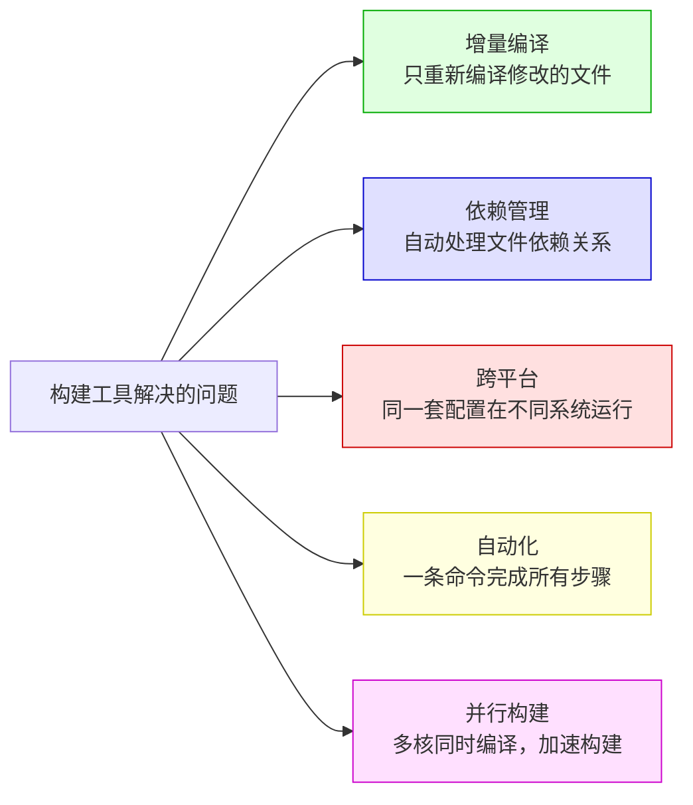

### 1.3 构建工具的两个层次

> 💡 **重要概念**：构建工具分为两个层次，很多初学者容易混淆！

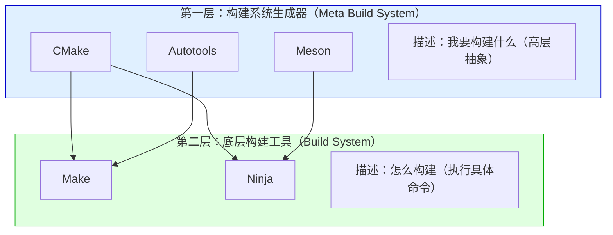

| 层次 | 工具 | 职责 | 类比 |
|------|------|------|------|
| **构建系统生成器** | CMake、Meson、Autotools | 生成底层构建文件 | 建筑设计师（出图纸） |
| **底层构建工具** | Make、Ninja | 执行实际编译命令 | 施工队（按图纸建房子） |

---

### 1.3.1 升级版：构建工具的三个层次（含 Bazel / SCons / xmake 等）

> 🎯 **为什么要升级**：上面的两层模型只覆盖了 Make/Ninja/CMake/Meson 这条主线。
> 引入 **Bazel、SCons、xmake、Buck2、Gradle、Cargo** 等之后，会发现还有一类工具**自带执行引擎**，不依赖 Make/Ninja，把"设计图纸 + 施工"打包在一起；甚至有些工具更进一步，把「**包管理 + 工具链下载 + 构建 + 发布**」都打包好。
>
> 因此把模型升级为 **三层**，更能反映现代构建生态。

#### 三层全景图（推荐版）

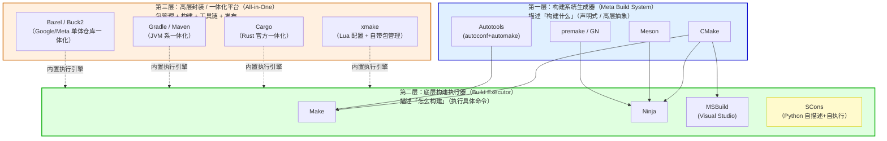

> 🔍 **图例说明**：
> - **实线**：典型「生成器 → 执行器」调用关系（如 CMake 生成 Ninja 文件，再由 Ninja 执行）。
> - **虚线**：一体化工具自带执行引擎，**通常不依赖第二层**，但概念上仍然包含"生成 + 执行"两个动作。
> - **SCons** 比较特殊：它**用 Python 同时描述构建图并自己执行**，相当于「第一层 + 第二层合一」，所以画在第二层但带有黄色标记。

#### 三层职责对照表

| 层次 | 工具 | 职责 | 生活类比 | 典型用法 |
|------|------|------|---------|---------|
| 🥉 **第二层<br/>底层执行器** | Make、Ninja、MSBuild、SCons | 真正执行编译命令、跟踪文件依赖、增量构建 | 🔨 **施工队**：按图纸搬砖砌墙 | `make -j8`、`ninja` |
| 🥈 **第一层<br/>生成器** | CMake、Meson、Autotools、premake、GN | 把高层声明翻译成第二层能读的"图纸" | 📐 **建筑设计师**：出施工图 | `cmake -G Ninja ..` |
| 🥇 **第三层<br/>一体化平台** | xmake、Cargo、Gradle、Maven、Bazel、Buck2 | 把"图纸+施工+材料采购+验收"全包了 | 🏢 **总承包公司**：拎包入住 | `xmake`、`cargo build`、`bazel build //...` |

#### 工具归类速查表

| 工具 | 归属层 | 关键特征 | 是否需要其他层配合 |
|------|-------|---------|-------------------|
| **Make** | 第二层 | 1976 年的祖师爷，事实标准 | 可独立使用，也常被 CMake 调用 |
| **Ninja** | 第二层 | 极快的增量构建，2012 年 Google 出品 | 几乎只作为 CMake/Meson/GN 的后端 |
| **MSBuild** | 第二层 | Windows 平台 VS 默认引擎 | 可被 CMake 生成的 .vcxproj 驱动 |
| **SCons** | 第二层（特殊） | Python 既写构建脚本又驱动执行，自成一体 | ✅ 独立使用 |
| **Autotools** | 第一层 | 老牌跨平台生成器，最终产物是 Makefile | 依赖 Make |
| **CMake** | 第一层 | 现代主流生成器，可生成 Ninja/Make/MSBuild/Xcode | 依赖第二层 |
| **Meson** | 第一层 | 现代简洁生成器，主要后端是 Ninja | 依赖 Ninja（一般） |
| **premake / GN** | 第一层 | 项目文件生成器，GN 是 Chromium 出品 | 依赖第二层 |
| **xmake** | 第三层 | 国产，Lua 配置，自带包管理 + 执行引擎 | ❌ 一站式独立 |
| **Cargo** | 第三层 | Rust 官方，编译 + 包管理 + 测试 + 发布 | ❌ 一站式独立 |
| **Gradle / Maven** | 第三层 | JVM 系，依赖管理 + 构建 + 发布 | ❌ 一站式独立 |
| **Bazel / Buck2** | 第三层 | 大厂级 monorepo，确定性构建 + 远程缓存 | ❌ 一站式独立 |

#### 三层之间的关系（一图看懂"调用链"）

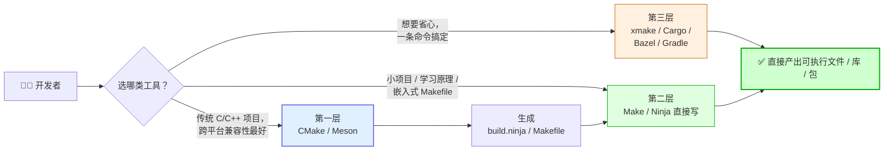

#### 一句话记忆法

> 🎯 **小白记三句话就够了**：
> 1. **第二层（Make/Ninja）= 干活的**：拿到图纸就开干，自己不画图纸。
> 2. **第一层（CMake/Meson）= 画图的**：只画图纸，不亲自干活，把图纸甩给第二层。
> 3. **第三层（Cargo/xmake/Bazel）= 全包的**：图纸自己画、活自己干、材料自己买，开发者只管说"我要这个"。

> 🚀 **进阶口诀**：
> - **C/C++ 主流栈**：第一层 CMake + 第二层 Ninja（跨平台兼容性最好）。
> - **Rust 一站式**：直接 `cargo build`，第三层全搞定。
> - **大厂 monorepo**：直接 Bazel / Buck2，第三层 + 远程缓存。
> - **国产 / 个人项目想省心**：xmake，配置最少，自带包管理。

---

## 二、构建工具全景图

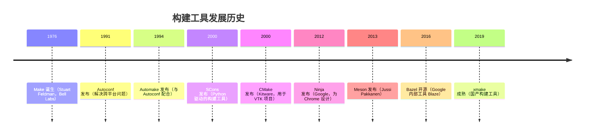

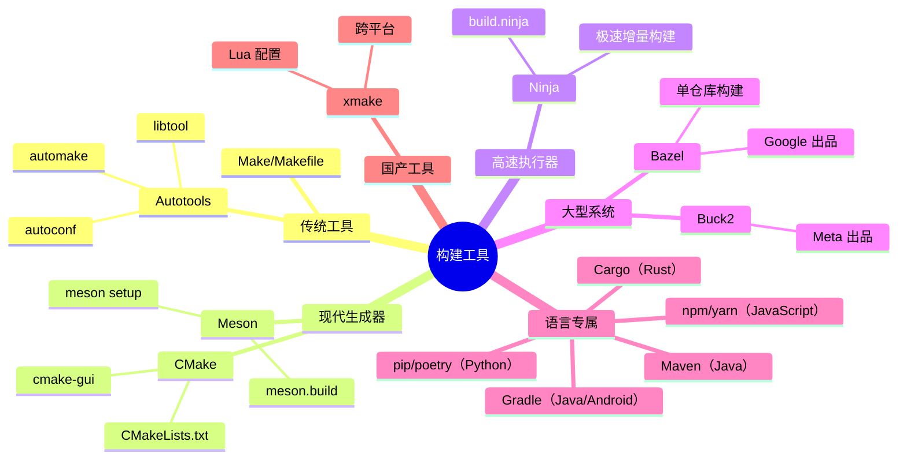

---

## 三、Make / Makefile

> **🏷️ 层次定位**：**第二层 · 执行器（Builder / Executor）—— 鼻祖代表**
> 直接读取规则文件（Makefile）执行编译命令，是构建系统的"地基"工具。诞生于 1976 年，至今仍被无数项目和上层生成器（Autotools、CMake）所依赖。

### 3.1 简介

> **Make** 是最古老、最经典的构建工具，诞生于 1976 年，至今仍被广泛使用。
>
> **Makefile** 是 Make 的配置文件，描述了文件之间的依赖关系和构建规则。

**生活化类比**：Makefile 就像一份「菜谱」—— 告诉厨师（Make）：要做红烧肉，需要先准备猪肉、酱油、糖，然后按步骤烹饪。

### 3.2 Makefile 基本语法

```makefile
# 基本语法结构
目标: 依赖文件1 依赖文件2
	命令（必须用 Tab 缩进，不能用空格！）

# ==================== 示例 ====================

# 最终目标：生成可执行文件 myapp
myapp: main.o utils.o network.o
	gcc main.o utils.o network.o -o myapp

# 编译 main.c 生成 main.o
main.o: main.c main.h
	gcc -c main.c -o main.o

# 编译 utils.c 生成 utils.o
utils.o: utils.c utils.h
	gcc -c utils.c -o utils.o

# 编译 network.c 生成 network.o
network.o: network.c network.h
	gcc -c network.c -o network.o

# 清理构建产物（伪目标）
.PHONY: clean
clean:
	rm -f *.o myapp
```

### 3.3 Makefile 核心概念

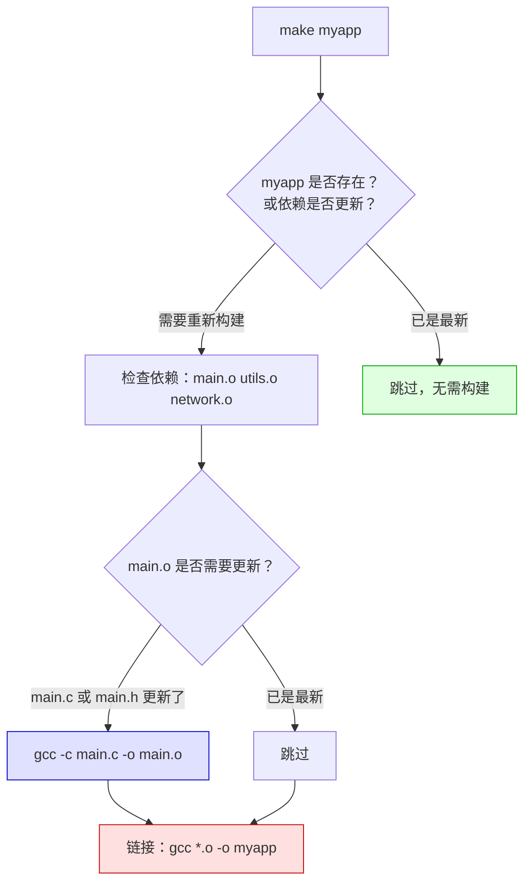

**Makefile 变量与自动变量**

```makefile
# 自定义变量
CC = gcc
CFLAGS = -Wall -O2 -g
SRCS = main.c utils.c network.c
OBJS = $(SRCS:.c=.o)   # 将 .c 替换为 .o

# 自动变量
# $@  当前目标名
# $<  第一个依赖文件
# $^  所有依赖文件
# $*  目标文件名（不含扩展名）

# 模式规则（Pattern Rule）：所有 .c 文件都按此规则编译
%.o: %.c
	$(CC) $(CFLAGS) -c $< -o $@

# 最终目标
myapp: $(OBJS)
	$(CC) $(CFLAGS) $^ -o $@

.PHONY: clean install
clean:
	rm -f $(OBJS) myapp

install:
	cp myapp /usr/local/bin/
```

### 3.4 Make 的优缺点

| 优点 | 缺点 |
|------|------|
| ✅ 历史悠久，几乎所有 Linux 系统都有 | ❌ 语法晦涩，Tab 缩进陷阱 |
| ✅ 功能强大，灵活性高 | ❌ 跨平台差（Windows 支持差） |
| ✅ 增量构建，只编译修改的文件 | ❌ 大型项目 Makefile 难以维护 |
| ✅ 不限于 C/C++，可构建任何东西 | ❌ `-j` 并行有效，但递归 Make 易损失并行度 |
| ✅ 学习资料丰富 | ❌ 手动管理依赖容易出错 |

---

## 四、Autotools（autoconf + automake）

> **🏷️ 层次定位**：**第一层 · 生成器（Meta-Build / Generator）—— 老牌代表**
> 不直接执行编译，而是先生成 `configure` 脚本与 Makefile，再交给第二层的 Make 执行。是 Unix 世界跨平台构建的"开山鼻祖"，许多老牌开源项目（GCC、Bash、coreutils 等）至今仍在使用。

### 4.1 简介

> **Autotools** 是一套工具链，解决了 Make 的跨平台问题。
> 核心组件：**autoconf**（检测系统环境）+ **automake**（生成 Makefile）+ **libtool**（处理库）

**生活化类比**：Autotools 就像一个「万能适配器」—— 先检测你的电源插座类型（autoconf），再生成对应的插头（automake 生成 Makefile），最后插上就能用（make）。

### 4.2 Autotools 工作流程


### 4.3 典型文件示例

```bash
# configure.ac（项目配置）
AC_INIT([myapp], [1.0], [bug@example.com])
AM_INIT_AUTOMAKE([-Wall -Werror foreign])
AC_PROG_CC
AC_CONFIG_FILES([Makefile src/Makefile])
AC_OUTPUT
```

```makefile
# Makefile.am（构建描述）
bin_PROGRAMS = myapp
myapp_SOURCES = main.c utils.c network.c
myapp_CFLAGS = -Wall
myapp_LDADD = -lm
```

### 4.4 优缺点

| 优点 | 缺点 |
|------|------|
| ✅ 极强的跨平台检测能力 | ❌ 学习曲线陡峭，配置复杂 |
| ✅ 是 GNU 项目的标准构建方式 | ❌ 生成的 configure 脚本巨大（数千行） |
| ✅ 生成标准的 `./configure && make && make install` 流程 | ❌ 构建速度慢 |
| ✅ 大量开源项目使用（如 GCC、GLib） | ❌ 现代项目已逐渐被 CMake/Meson 替代 |

---

## 五、CMake

> **🏷️ 层次定位**：**第一层 · 生成器（Meta-Build / Generator）—— 当今主流**
> 跨平台生成器之王：可生成 Makefile、Ninja、Visual Studio、Xcode 等多种后端工程文件。本身不编译代码，而是把 `CMakeLists.txt` 翻译成第二层执行器能理解的格式。

### 5.1 简介

> **CMake**（Cross-platform Make）是目前最流行的 C/C++ 构建系统生成器。
> 它不直接编译代码，而是生成 Makefile 或 Ninja 构建文件，再由 Make/Ninja 执行编译。

**生活化类比**：CMake 是「建筑设计师」—— 它画出图纸（生成 Makefile/Ninja 文件），然后交给施工队（Make/Ninja）去建房子。

### 5.2 CMake 工作流程

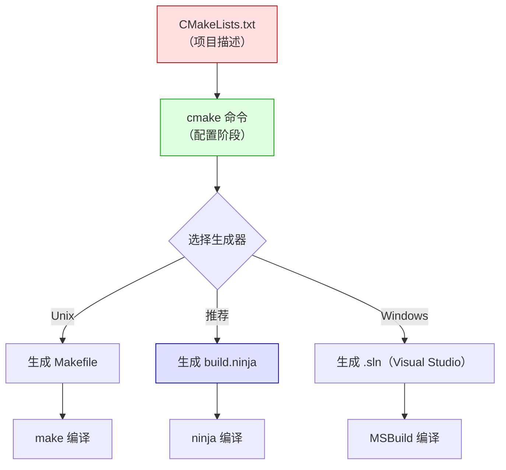

### 5.3 CMakeLists.txt 示例

```cmake
# CMakeLists.txt

# 最低 CMake 版本要求
cmake_minimum_required(VERSION 3.16)

# 项目名称和版本
project(MyApp VERSION 1.0.0 LANGUAGES CXX)

# 设置 C++ 标准
set(CMAKE_CXX_STANDARD 17)
set(CMAKE_CXX_STANDARD_REQUIRED ON)

# ===== 添加可执行文件 =====
add_executable(myapp
    src/main.cpp
    src/utils.cpp
    src/network.cpp
)

# ===== 添加库 =====
add_library(mylib STATIC
    src/mylib.cpp
)

# ===== 链接库 =====
target_link_libraries(myapp PRIVATE mylib)

# ===== 包含目录 =====
target_include_directories(myapp PRIVATE
    ${CMAKE_SOURCE_DIR}/include
)

# ===== 查找第三方库（如 OpenSSL）=====
find_package(OpenSSL REQUIRED)
target_link_libraries(myapp PRIVATE OpenSSL::SSL OpenSSL::Crypto)

# ===== 安装规则 =====
install(TARGETS myapp DESTINATION bin)
install(TARGETS mylib DESTINATION lib)
```

### 5.4 CMake 常用命令

```bash
# 创建构建目录（推荐 out-of-source 构建）
mkdir build && cd build

# 配置（生成 Makefile 或 Ninja 文件）
cmake ..                          # 默认生成器
cmake .. -G Ninja                 # 使用 Ninja 生成器
cmake .. -DCMAKE_BUILD_TYPE=Release  # Release 模式
cmake .. -DCMAKE_BUILD_TYPE=Debug    # Debug 模式

# 编译
cmake --build .                   # 通用方式（推荐）
cmake --build . --parallel 8      # 8 线程并行编译
cmake --build . --target myapp    # 只构建指定目标

# 安装
cmake --install .
cmake --install . --prefix /usr/local

# 清理
cmake --build . --target clean
```

### 5.5 CMake 现代用法（Modern CMake）

> ⚠️ **重要**：CMake 有「旧式」和「现代」两种写法，现代写法更清晰、更安全！

```cmake
# ❌ 旧式写法（不推荐）
include_directories(include)          # 全局污染
add_definitions(-DDEBUG)              # 全局污染
set(CMAKE_CXX_FLAGS "${CMAKE_CXX_FLAGS} -Wall")  # 全局污染

# ✅ 现代写法（推荐）—— 使用 target_* 系列命令
target_include_directories(myapp
    PUBLIC  include/         # 使用者也能看到
    PRIVATE src/internal/    # 只有 myapp 自己能看到
)

target_compile_definitions(myapp
    PRIVATE DEBUG=1
)

target_compile_options(myapp
    PRIVATE -Wall -Wextra
)
```

### 5.6 CMake 优缺点

| 优点 | 缺点 |
|------|------|
| ✅ 跨平台（Linux/macOS/Windows） | ❌ 语法历史包袱重，新旧写法混乱 |
| ✅ 生态最完善，几乎所有 IDE 都支持 | ❌ 学习曲线较陡 |
| ✅ 支持多种生成器（Make/Ninja/VS） | ❌ 错误信息不够友好 |
| ✅ 大量开源项目使用（LLVM、Qt、OpenCV） | ❌ CMakeLists.txt 容易写得很乱 |
| ✅ 强大的包管理（CPM、vcpkg、Conan 集成） | ❌ 调试构建问题比较困难 |

---

## 六、Ninja

> **🏷️ 层次定位**：**第二层 · 执行器（Builder / Executor）—— 高速专精**
> 与 Make 同层，但速度更快、规则更简单。**不为人手写而设计**，几乎总是搭配第一层的 CMake / Meson / gn 自动生成 `build.ninja`。

### 6.1 简介

> **Ninja** 是一个专注于**速度**的底层构建工具，由 Google 工程师 Evan Martin 为 Chrome 项目开发。
>
> 核心设计哲学：**极简、极快**。Ninja 不提供高层抽象，通常由 CMake/Meson 自动生成 `build.ninja` 文件。

**生活化类比**：Ninja 是「特种部队」—— 不废话，只管高效执行任务。

### 6.2 Ninja vs Make 性能对比

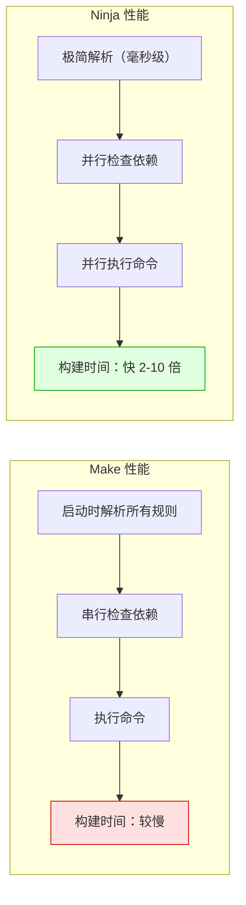

| 对比项 | Make | Ninja |
|--------|------|-------|
| **启动速度** | 较慢（解析复杂 Makefile） | 极快（毫秒级） |
| **并行构建** | `-j N` 支持，但有限 | 原生并行，效率更高 |
| **增量构建** | 支持 | 支持，更精确 |
| **手写配置** | 可以手写 Makefile | 不建议手写，由工具生成 |
| **适用场景** | 中小项目、脚本任务 | 大型项目（Chrome、LLVM） |

### 6.3 build.ninja 示例（了解即可，通常自动生成）

```ninja
# build.ninja（通常由 CMake/Meson 自动生成，不需要手写）

# 定义编译规则
rule cc
  command = gcc -c $in -o $out
  description = CC $out

rule link
  command = gcc $in -o $out
  description = LINK $out

# 构建目标
build main.o: cc main.c
build utils.o: cc utils.c
build myapp: link main.o utils.o
```

### 6.4 Ninja 常用命令

```bash
ninja                    # 构建默认目标
ninja myapp              # 构建指定目标
ninja -j 16              # 16 线程并行
ninja -v                 # 显示详细命令
ninja -t clean           # 清理
ninja -t targets         # 列出所有目标
ninja -t deps myapp      # 查看 myapp 的依赖
```

---

## 七、Meson

> **🏷️ 层次定位**：**第一层 · 生成器（Meta-Build / Generator）—— 现代新秀**
> 与 CMake 同层，定位也类似，但语法更简洁、默认搭配 Ninja。本身不执行编译，把 `meson.build` 翻译给第二层执行器（默认 Ninja）。

### 7.1 简介

> **Meson** 是一个现代化的构建系统生成器，设计目标是「**快速、用户友好、正确**」。
> 默认使用 **Ninja** 作为后端，配置文件语法简洁清晰。

**生活化类比**：Meson 是「现代建筑设计师」—— 比 CMake 更简洁的图纸（meson.build），交给 Ninja 施工队高效建造。

### 7.2 meson.build 示例

```python
# meson.build（语法类似 Python，简洁易读）

# 项目声明
project('myapp', 'cpp',
  version : '1.0.0',
  default_options : ['cpp_std=c++17', 'warning_level=3']
)

# 查找依赖
openssl_dep = dependency('openssl')
thread_dep   = dependency('threads')

# 添加静态库
mylib = static_library('mylib',
  sources : ['src/mylib.cpp'],
  include_directories : include_directories('include')
)

# 添加可执行文件
executable('myapp',
  sources : ['src/main.cpp', 'src/utils.cpp'],
  include_directories : include_directories('include'),
  link_with : mylib,
  dependencies : [openssl_dep, thread_dep],
  install : true
)

# 添加测试
test('basic test', executable('test_basic', 'tests/test_basic.cpp'))
```

### 7.3 Meson 常用命令

```bash
# 配置（在 build 目录中）
meson setup build                          # 基本配置
meson setup build --buildtype=release      # Release 模式
meson setup build --buildtype=debug        # Debug 模式
meson setup build -Doption=value           # 自定义选项

# 编译
cd build
ninja                                      # 编译
ninja -j 16                                # 16 线程

# 或者用 meson 命令统一管理
meson compile -C build
meson compile -C build -j 16

# 测试
meson test -C build
meson test -C build --verbose

# 安装
meson install -C build

# 重新配置
meson configure build -Dbuildtype=release

# 清理
ninja -C build clean
```

### 7.4 Meson vs CMake 对比

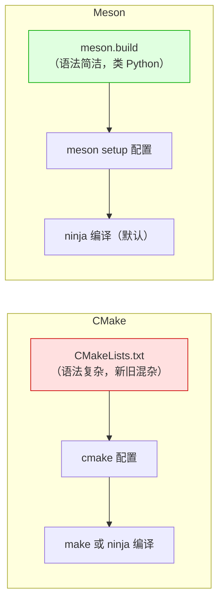

| 对比项 | CMake | Meson |
|--------|-------|-------|
| **配置语法** | 复杂，历史包袱重 | 简洁，类 Python |
| **学习曲线** | 较陡 | 较平缓 |
| **生态成熟度** | ⭐⭐⭐⭐⭐ 非常成熟 | ⭐⭐⭐⭐ 成熟 |
| **IDE 支持** | 几乎所有 IDE | 主流 IDE 支持 |
| **默认后端** | Make（可选 Ninja） | Ninja（默认） |
| **构建速度** | 取决于后端 | 快（Ninja 默认） |
| **使用者** | LLVM、Qt、OpenCV | GNOME、GStreamer、systemd |
| **Windows 支持** | ✅ 完整 | ✅ 较好 |

### 7.5 Meson 优缺点

| 优点 | 缺点 |
|------|------|
| ✅ 语法简洁，易于阅读和维护 | ❌ 生态不如 CMake 成熟 |
| ✅ 默认使用 Ninja，构建速度快 | ❌ 部分第三方库的 Meson 支持不完善 |
| ✅ 内置测试框架 | ❌ 灵活性不如 CMake（有时是优点） |
| ✅ 错误信息友好 | ❌ 社区规模较小 |
| ✅ 跨平台支持好 | ❌ 某些高级功能需要学习 |

---

## 八、Bazel

> **🏷️ 层次定位**：**第三层 · 一体化构建平台（All-in-One Build Platform）**
> 不仅仅是构建工具——它把依赖管理、跨语言编译、分布式缓存、密封性检查、远程执行都集成到一个系统中。面向 **超大型 Monorepo / 多语言仓库**，Google / Meta 量级应用。

> **Bazel** 是 Google 开源的构建工具，源自 Google 内部的 **Blaze** 系统。
> 设计目标：**超大规模单仓库（Monorepo）构建**、**可重现构建（Reproducible Build）**、**多语言支持**。

**生活化类比**：Bazel 是「工厂流水线」—— 专为大规模生产设计，每个零件的生产过程完全可追溯、可重现。

**特殊定位**：在 [1.3.1 三层模型](#131-升级版构建工具的三个层次含-bazel--scons--xmake-等) 中，Bazel 属于**第三层（一体化平台）**——自带执行引擎、远程缓存、远程执行、分布式构建，**不依赖 Make/Ninja**。

### 8.2 Bazel 工作流程

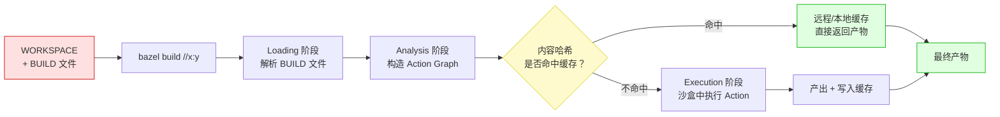

> 🔍 **三大核心机制**：
> 1. **沙盒（Sandbox）**：每个编译动作在隔离环境运行，确保只读取声明过的输入 → 可重现。
> 2. **内容哈希**：用 SHA256 而非时间戳判断是否需要重建 → 比 Make 准确得多。
> 3. **远程缓存（Remote Cache）/ 远程执行（Remote Execution）**：团队成员共享缓存，A 同学编过的，B 同学秒拉。

### 8.3 BUILD 文件示例

```python
# BUILD 文件（语法类似 Python，叫 Starlark）

# C++ 库
cc_library(
    name = "mylib",
    srcs = ["mylib.cpp"],
    hdrs = ["mylib.h"],
    visibility = ["//visibility:public"],
)

# C++ 可执行文件
cc_binary(
    name = "myapp",
    srcs = ["main.cpp"],
    deps = [
        ":mylib",
        "@com_google_absl//absl/strings",  # 外部依赖
    ],
)

# 测试
cc_test(
    name = "mylib_test",
    srcs = ["mylib_test.cpp"],
    deps = [
        ":mylib",
        "@com_google_googletest//:gtest_main",
    ],
)
```

### 8.4 Bazel 常用命令

```bash
bazel build //src:myapp          # 构建目标
bazel test //src:mylib_test      # 运行测试
bazel run //src:myapp            # 构建并运行
bazel clean                      # 清理
bazel query //...                # 查询所有目标
bazel build --remote_cache=...   # 启用远程缓存（神器）
```

### 8.5 Bazel 优缺点

| 优点 | 缺点 |
|------|------|
| ✅ 极强的增量构建（精确到文件级别） | ❌ 配置复杂，学习成本高 |
| ✅ 可重现构建（相同输入 = 相同输出） | ❌ 对小项目过于重量级 |
| ✅ 支持多语言（C++/Java/Python/Go） | ❌ 与现有工具链集成困难 |
| ✅ 分布式构建支持 | ❌ 社区生态不如 CMake |
| ✅ 适合超大型单仓库 | ❌ Windows 支持较弱 |

---

## 九、SCons

> **🏷️ 层次定位**：**跨层 · 生成器 + 执行器一体（Python-based Build Tool）**
> 用纯 Python 描述构建规则，自身既能解析配置又能直接驱动编译，不依赖 Make/Ninja。可以理解为“一个小型的一体化工具”，但面向 Python 生态、轻量场景，与 Bazel/xmake 的平台化野心不同。

### 9.1 简介

> **SCons** 是一个用 **Python** 编写的构建工具，使用 Python 脚本（`SConstruct`）描述构建规则。
> 它最大的特点是 **"配置即程序"**：构建脚本就是 Python 代码，可以使用 if/for/函数/类，灵活性极高。

**生活化类比**：SCons 像「**用 Python 写菜谱的智能厨师**」—— 你写的不是菜谱，而是会自己思考"少了什么材料、火候到没到"的烹饪程序。

**特殊定位**：在我们 [1.3.1 三层模型](#131-升级版构建工具的三个层次含-bazel--scons--xmake-等) 中，SCons **同时承担"生成器 + 执行器"两个角色**——用 Python 描述构建图，并自己驱动执行，不依赖 Make/Ninja。

### 9.2 SCons 工作流程


> 🔍 **关键点**：SCons 用 **MD5 内容哈希**判断文件是否变化（默认行为），比 Make 的"时间戳"更精确——`git checkout` 后不会误触发重编。

### 9.3 SConstruct 示例（更完整）

```python
# SConstruct 文件（项目根目录，必须叫这个名字）

# 1. 创建构建环境（设置编译器、编译选项）
env = Environment(
    CC='gcc',
    CXX='g++',
    CFLAGS='-Wall -O2',
    CPPPATH=['include'],          # 头文件搜索路径
    LIBPATH=['/usr/local/lib'],   # 库搜索路径
    LIBS=['pthread', 'ssl'],      # 链接的库
)

# 2. 根据条件判断（这就是 Python 程序的威力）
if ARGUMENTS.get('debug', 0):
    env.Append(CFLAGS=' -g -O0')

# 3. 编译静态库
mylib = env.StaticLibrary(
    target='mylib',
    source=['lib/utils.c', 'lib/network.c'],
)

# 4. 编译可执行文件，依赖 mylib
env.Program(
    target='myapp',
    source=['src/main.c'],
    LIBS=['mylib'] + env['LIBS'],
    LIBPATH=['.'] + env['LIBPATH'],
)

# 5. 自定义清理规则
env.Clean('myapp', ['*.tmp', 'logs/'])
```

### 9.4 SCons 常用命令

```bash
scons                       # 构建（默认目标）
scons myapp                 # 构建指定目标
scons -j8                   # 并行构建（8 个任务）
scons --debug=explain       # 解释为什么某个目标会被重建（排错神器）
scons -c                    # 清理（相当于 make clean）
scons debug=1               # 传入参数（在脚本里用 ARGUMENTS 读取）
scons --tree=all            # 打印完整依赖树
```

### 9.5 SCons 优缺点

| 优点 | 缺点 |
|------|------|
| ✅ **配置即 Python**：可使用 if/for/函数，灵活无极限 | ❌ **构建慢**：Python 解释 + MD5 哈希都有开销 |
| ✅ **MD5 哈希增量**，比 Make 时间戳更精确 | ❌ **大型项目性能差**：单进程 Python 难以扩展 |
| ✅ **跨平台**（只要装了 Python 都能跑） | ❌ **社区活跃度下降**，不少项目已迁出 |
| ✅ **自带 DAG 和并行**，无需配合其他工具 | ❌ **生态/IDE 集成**远不如 CMake |
| ✅ **学习曲线对 Python 用户友好** | ❌ **第三方库集成**没有 vcpkg/Conan 那么顺手 |

> 🎯 **何时选择 SCons**：
> - ✅ 团队主力是 Python，希望"构建脚本也是熟悉的 Python"。
> - ✅ 中小型项目，对构建速度要求不极致。
> - ✅ 需要在构建脚本里做大量"程序化逻辑"（生成代码、动态决策）。
> - ❌ 大型 C/C++ 项目（建议用 CMake/Bazel）。
> - ❌ 对增量构建速度敏感的项目（建议用 Ninja 后端）。

---

## 十、xmake

> **🏷️ 层次定位**：**第三层 · 一体化构建平台（轻量 All-in-One）—— 国产代表**
> 与 Bazel 同属一体化平台，但更轻量、更易上手：自带包管理（xrepo）、配置、生成、执行、缓存。一个 `xmake.lua` 就能搞定全流程，适合中小型 C/C++ 项目。

### 10.1 简介

> **xmake** 是国产的现代化一体化构建工具，由 [@waruqi](https://github.com/waruqi) 主导开发，使用 **Lua** 作为配置语言，**内置包管理器（xrepo）**，是 [1.3.1 三层模型](#131-升级版构建工具的三个层次含-bazel--scons--xmake-等) 中**第三层（一体化平台）**的代表。

**生活化类比**：xmake 是「**拎包入住的精装房**」—— 不像 CMake 还要你自己装空调（vcpkg）、装家具（Ninja），xmake 一进门就什么都齐了。

**核心卖点**：
- 🎯 **极简配置**：`xmake.lua` 通常比同等 `CMakeLists.txt` 短 50%。
- 📦 **自带包管理**：`add_requires("openssl 1.1.1")` 一行搞定，自动下载编译。
- 🚀 **一条命令搞定一切**：`xmake` 配置 + 构建 + 安装一气呵成。
- 🇨🇳 **中文文档**对国内开发者非常友好。

### 10.2 xmake 工作流程

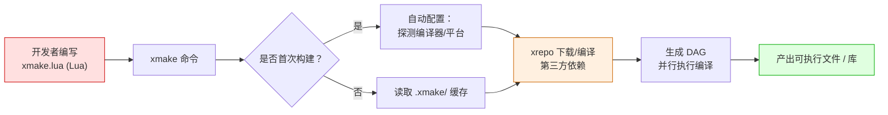

> 🔍 **与 CMake + Ninja + vcpkg 三件套对比**：
> - CMake 路径：`cmake -B build` → `cmake --build build` → `vcpkg install xxx`（**3 个工具，3 套语法**）。
> - xmake 路径：直接 `xmake`（**1 个工具，1 套语法，全包**）。

### 10.3 xmake.lua 示例（更完整）

```lua
-- xmake.lua 放在项目根目录

-- 1. 启用 debug/release 两种模式
add_rules("mode.debug", "mode.release")

-- 2. 设置 C++ 标准
set_languages("c++17")

-- 3. 声明依赖（首次构建会自动下载/编译）
add_requires("openssl 1.1.1", "zlib >=1.2")

-- 4. 静态库 target
target("mylib")
    set_kind("static")
    add_files("lib/*.cpp")
    add_includedirs("include", {public = true})  -- public 等价于 CMake 的 PUBLIC

-- 5. 可执行文件 target
target("myapp")
    set_kind("binary")
    add_files("src/*.cpp")
    add_deps("mylib")                            -- 依赖内部 target
    add_packages("openssl", "zlib")              -- 依赖外部包

    -- 平台条件：仅 Windows 链接 ws2_32
    if is_plat("windows") then
        add_syslinks("ws2_32")
    end

-- 6. 单元测试
target("mytest")
    set_kind("binary")
    set_default(false)                           -- 默认不构建
    add_files("test/*.cpp")
    add_deps("mylib")
```

### 10.4 xmake 常用命令

```bash
# 构建相关
xmake                       # 配置 + 构建（首次会自动配置）
xmake -j8                   # 并行构建
xmake build myapp           # 只构建指定 target
xmake -r                    # 重新构建（清+建）
xmake clean                 # 清理

# 配置 / 模式切换
xmake f -m debug            # 切换到 Debug 模式
xmake f -m release          # 切换到 Release
xmake f -p android -a arm64-v8a  # 配置目标平台为安卓
xmake f --menu              # 图形化菜单选项

# 包管理（xrepo）
xmake require openssl       # 安装包
xmake require -l            # 列出已安装包
xmake require --upgrade     # 升级所有包

# 运行 / 安装
xmake run myapp arg1 arg2   # 构建并运行
xmake install -o /usr/local # 安装到指定目录
xmake package               # 打包

# IDE 集成
xmake project -k vsxmake    # 生成 Visual Studio 工程
xmake project -k cmake      # 生成 CMakeLists.txt（兼容老工具链）
xmake project -k compile_commands  # 生成 compile_commands.json（给 clangd）
```

### 10.5 xmake 优缺点

| 优点 | 缺点 |
|------|------|
| ✅ **语法极简**（Lua），上手 30 分钟 | ❌ **国际社区较小**，英文资料相对少 |
| ✅ **内置包管理器（xrepo）**，省去 vcpkg/Conan | ❌ **大型项目案例**不如 CMake 多 |
| ✅ **跨平台**，Windows / macOS / Linux / Android / iOS / 嵌入式都支持 | ❌ **IDE 深度集成**不如 CMake（VS/CLion 都原生支持 CMake） |
| ✅ **中文文档**齐全，国人友好 | ❌ **企业级生态/审计**不如 Bazel 成熟 |
| ✅ **自带工具链下载**（如 NDK、交叉工具链） | ❌ **第三方仓库**生态规模小于 vcpkg |
| ✅ **能反向导出 CMakeLists.txt**，迁移友好 | ❌ **学术圈/开源大项目**仍以 CMake 为主流 |

> 🎯 **何时选择 xmake**：
> - ✅ **个人项目 / 中小团队**追求开箱即用，不想折腾 CMake + vcpkg + Ninja 三件套。
> - ✅ **国内项目**，文档/社区中文友好。
> - ✅ **跨平台需求强**（Windows + 嵌入式 + 移动端），希望一份配置走天下。
> - ❌ 需要对接已有 CMake 生态的大型开源项目（仍建议 CMake）。
> - ❌ 跨国团队（英文资料更熟悉 CMake）。

---

## 十一、横向对比与选型建议

### 11.1 全面对比表

| 工具 | 层次定位 | 配置语言 | 跨平台 | 速度 | 学习难度 | 一体化<br/>(自带包管理) | 生态 | 适用场景 |
|------|---------|---------|--------|------|----------|------------------------|------|----------|
| **Make** | 第二层（执行器） | Makefile | ✅ Linux/macOS<br/>⚠️ Win 需 mingw32/nmake | ⭐⭐⭐ | ⭐⭐⭐ 中等 | ❌ | ⭐⭐⭐⭐⭐ | 小项目、脚本任务 |
| **Autotools** | 第一层（生成器） | m4/shell | ✅ 极强 | ⭐⭐ 慢 | ⭐ 难 | ❌ | ⭐⭐⭐⭐ | GNU 项目、老项目 |
| **CMake** | 第一层（生成器） | CMake DSL | ✅ 完整 | ⭐⭐⭐⭐ | ⭐⭐⭐ 中等 | ⚠️（靠 vcpkg/Conan） | ⭐⭐⭐⭐⭐ | C/C++ 主流选择 |
| **Ninja** | 第二层（执行器） | ninja | ✅ 完整 | ⭐⭐⭐⭐⭐ | ⭐⭐ 简单 | ❌ | ⭐⭐⭐⭐ | 大型项目后端 |
| **Meson** | 第一层（生成器） | Python-like | ✅ 完整 | ⭐⭐⭐⭐⭐ | ⭐⭐⭐⭐ 简单 | ⚠️（wrap 子项目） | ⭐⭐⭐⭐ | 现代 C/C++ 项目 |
| **Bazel** | 第三层（一体化） | Starlark | ⚠️ Linux 最佳 | ⭐⭐⭐⭐⭐ | ⭐ 难 | ✅ | ⭐⭐⭐ | 超大型单仓库 |
| **SCons** | 第二层（特殊） | Python | ✅ 完整 | ⭐⭐ 慢 | ⭐⭐⭐ 中等 | ❌ | ⭐⭐ | Python 开发者 |
| **xmake** | 第三层（一体化） | Lua | ✅ 完整 | ⭐⭐⭐⭐ | ⭐⭐⭐⭐⭐ 简单 | ✅（xrepo） | ⭐⭐⭐ | 国内项目、快速上手 |

> 📌 **星级说明**：
> - **跨平台 / 速度 / 生态**：星越多越好。
> - **学习难度**：星越多代表「越容易上手」（注意不是越难）。例如 `Bazel ⭐` 表示难度大；`xmake ⭐⭐⭐⭐⭐` 表示最容易上手。
> - **一体化**：✅ = 自带包管理 + 执行引擎；⚠️ = 需要外接（如 CMake + vcpkg）；❌ = 只做单一职责。

### 11.2 选型决策树

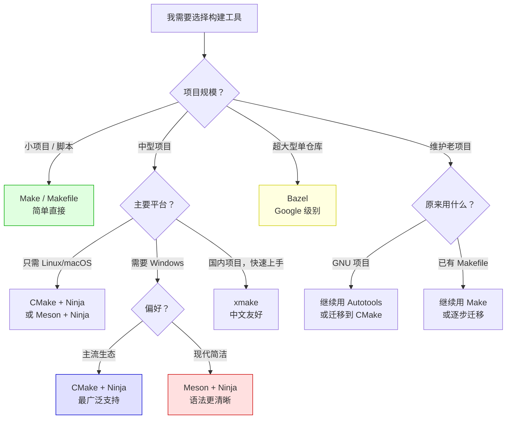

### 11.3 推荐组合

| 场景 | 推荐方案 | 理由 |
|------|----------|------|
| **新建 C/C++ 项目（主流）** | CMake + Ninja | 生态最完善，IDE 支持最好 |
| **新建 C/C++ 项目（现代）** | Meson + Ninja | 语法更简洁，速度更快 |
| **Linux 系统软件** | Meson + Ninja | GNOME/systemd 都在用 |
| **跨平台游戏引擎** | CMake + Ninja | 最广泛的工具链支持 |
| **Google/大厂单仓库** | Bazel | 可重现构建，分布式支持 |
| **快速原型 / 学习** | xmake | 上手最快，内置包管理 |
| **维护老项目** | 保持原有工具 | 迁移成本高，谨慎评估 |
| **CI/CD 构建脚本** | Make | 简单任务自动化 |

---

## 十二、附录：常用命令速查

### A. Make 速查

```bash
make                     # 构建默认目标
make myapp               # 构建指定目标
make -j8                 # 8 线程并行
make clean               # 清理
make install             # 安装
make -n                  # 只打印命令，不执行（dry run）
make -f other.mk         # 使用指定 Makefile
make VERBOSE=1           # 显示详细命令
```

### B. CMake 速查

```bash
# 配置
cmake -B build                              # 在 build 目录配置
cmake -B build -G Ninja                     # 使用 Ninja
cmake -B build -DCMAKE_BUILD_TYPE=Release   # Release 模式
cmake -B build -DCMAKE_INSTALL_PREFIX=/usr  # 指定安装路径

# 构建
cmake --build build                         # 构建
cmake --build build -j 8                    # 8 线程
cmake --build build --target myapp          # 构建指定目标
cmake --build build --config Release        # 指定配置（多配置生成器）

# 安装 / 清理
cmake --install build
cmake --build build --target clean
```

### C. Meson 速查

```bash
# 配置
meson setup build                           # 基本配置
meson setup build --buildtype=release       # Release
meson setup build --prefix=/usr/local       # 安装路径
meson setup --wipe build                    # 重新配置（清除缓存）

# 构建
meson compile -C build                      # 编译
meson compile -C build -j 8                 # 8 线程

# 测试 / 安装
meson test -C build
meson install -C build

# 查看选项
meson configure build                       # 查看/修改配置选项
```

### D. Ninja 速查

```bash
ninja                    # 构建
ninja myapp              # 构建指定目标
ninja -j 16              # 16 线程
ninja -v                 # 显示详细命令
ninja -t clean           # 清理
ninja -t targets all     # 列出所有目标
ninja -t deps myapp      # 查看依赖
ninja -t graph | dot -Tpng > deps.png  # 生成依赖图
```

### E. 工具安装方式

```bash
# Ubuntu/Debian
sudo apt install make cmake ninja-build meson

# macOS（Homebrew）
brew install make cmake ninja meson

# Windows（Scoop）
scoop install make cmake ninja meson

# Windows（Chocolatey）
choco install make cmake ninja

# xmake（跨平台）
# Linux/macOS
bash <(curl -fsSL https://xmake.io/shget.text)
# Windows（PowerShell）
Invoke-Expression (Invoke-Webrequest 'https://xmake.io/psget.text' -UseBasicParsing).Content
```

---

## 总结

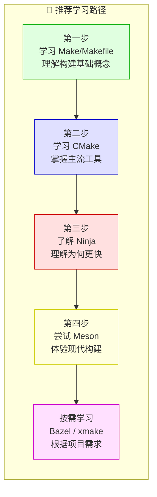

| 工具 | 一句话定位 |
|------|-----------|
| **Make** | 最经典，理解构建原理的必学工具 |
| **Autotools** | GNU 标准，老项目必备，新项目不推荐 |
| **CMake** | C/C++ 项目的事实标准，生态最完善 |
| **Ninja** | 最快的底层构建执行器，配合 CMake/Meson 使用 |
| **Meson** | 现代、简洁，是 CMake 的有力竞争者 |
| **Bazel** | 超大规模项目的终极解决方案 |
| **xmake** | 国产新秀，上手最快，内置包管理 |

> 💡 **最终建议**：
> - **新项目首选**：`CMake + Ninja`（生态最完善）或 `Meson + Ninja`（语法更现代）
> - **必须掌握**：Make 的基本原理（理解增量构建、依赖关系）
> - **按需学习**：根据项目规模和团队情况选择合适工具，没有绝对的最好，只有最合适的

---

### 🤔 我需要继续读进阶篇吗？（自检清单）

如果下面的问题你**有 3 条以上回答"我不太懂"**，强烈建议继续往下读进阶篇：

- ❓ `target_link_libraries` 的 `PUBLIC / PRIVATE / INTERFACE` 区别？ → **见 16.2**
- ❓ 为什么改一个头文件，半个项目都要重编？ → **见 13.2 / 13.4**
- ❓ ARM 嵌入式 / Android NDK 怎么交叉编译？ → **见 14**
- ❓ 团队第三方库依赖怎么管？vcpkg vs Conan 怎么选？ → **见 15**
- ❓ 全量编译要 30 分钟，怎么优化到 5 分钟？ → **见 17**
- ❓ 构建报 `undefined reference`、找不到动态库怎么排查？ → **见 20**
- ❓ 老项目从 Makefile / 旧式 CMake 怎么迁移到现代 CMake？ → **见 21**
- ❓ Rust/Go/Java 用的 Cargo/Gradle 跟 CMake 是什么关系？ → **见 22**

> 📌 **如果你只想"会用"**：到这里已经够了，可以直接去[十二、附录：常用命令速查](#十二附录常用命令速查)，遇到问题再回来查阅进阶篇相关章节。
>
> 📌 **如果你想"精通"**：建议从第十三章开始顺读，每一章都是真实工程中踩坑总结出来的精华。

---

# 🚀 进阶篇：从「会用」到「精通」

> 入门篇让你「**能跑起来**」，进阶篇让你「**跑得稳、跑得快、跑得对**」。
> 以下章节面向真实工程师，覆盖原理、依赖、交叉编译、性能、CI/CD、排错、迁移等核心主题。

---

## 十三、构建系统底层原理：从源码到可执行文件

### 13.1 一段 C++ 代码到可执行文件经历了什么？


| 阶段 | 工具（GCC 视角） | 输入 | 输出 | 关键问题 |
|---|---|---|---|---|
| **预处理** | `cpp` | `.cpp + .h` | `.i` | 头文件路径、宏定义 |
| **编译** | `cc1` / `cc1plus` | `.i` | `.s` | 编译选项、警告、优化等级 |
| **汇编** | `as` | `.s` | `.o` | 目标架构 |
| **链接** | `ld` / `lld` | 多个 `.o` + 库 | 可执行文件 | 符号解析、库顺序、ABI |

> 💡 构建系统的核心使命，就是**把上面这条流水线自动化、增量化、并行化**。

### 13.2 构建图（Build Graph）：构建系统的灵魂

构建系统本质上维护一个 **DAG（有向无环图）**：

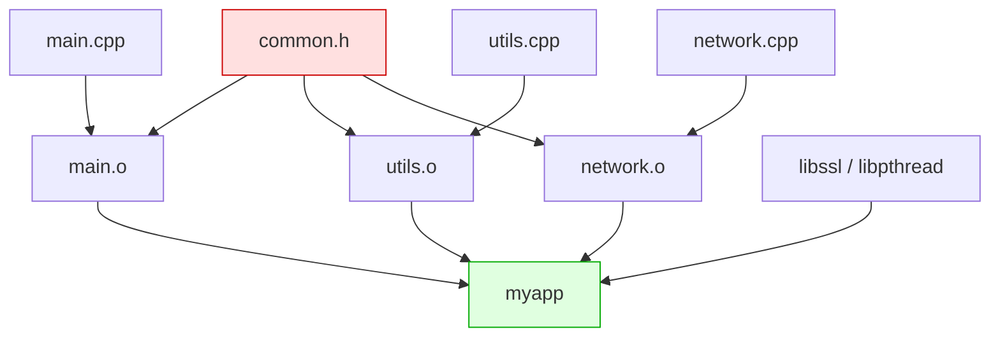

**关键洞察**：

- 改一个 `.cpp`，只重编它对应的 `.o` + 重新链接。
- 改一个 `.h`，所有 `#include` 它的 `.cpp` 都要重编。
- 删除/添加文件，构建图需要重新生成（这是为什么 `file(GLOB)` 是反模式的根本原因）。

### 13.3 增量构建的两种判断方式

| 方式 | 代表工具 | 原理 | 优点 | 缺点 |
|------|----------|------|------|------|
| **时间戳（mtime）** | Make、Ninja | 比较输入和输出的修改时间 | 简单、快速 | 时钟回拨/Git checkout 时容易误判 |
| **内容哈希** | Bazel、Buck2、ccache | 比较内容哈希值 | 精确、可重现 | 计算哈希有开销，需要缓存基础设施 |

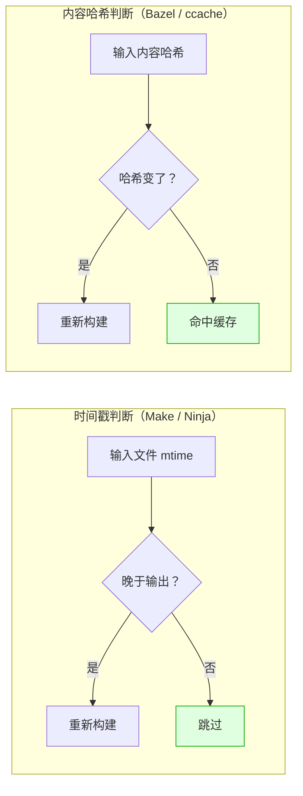

### 13.4 显式依赖 vs 隐式依赖：头文件之坑

```cpp
// main.cpp
#include "common.h"   // ← 这是隐式依赖！
#include <vector>
```

构建系统怎么知道 `main.cpp` 依赖 `common.h`？

**答案**：编译器会生成 `.d` 依赖文件（`-MMD -MF` 选项）：

```bash
gcc -MMD -MF main.d -c main.cpp -o main.o
# 生成的 main.d：
# main.o: main.cpp common.h
```

> 🔥 现代构建系统（CMake / Ninja / Meson）都自动处理这件事，但理解它有助于你诊断问题：
> 「为什么我改了头文件却没重编？」 → 大概率是 `.d` 依赖文件丢失或损坏。

### 13.5 为什么链接是大型 C++ 项目的瓶颈？

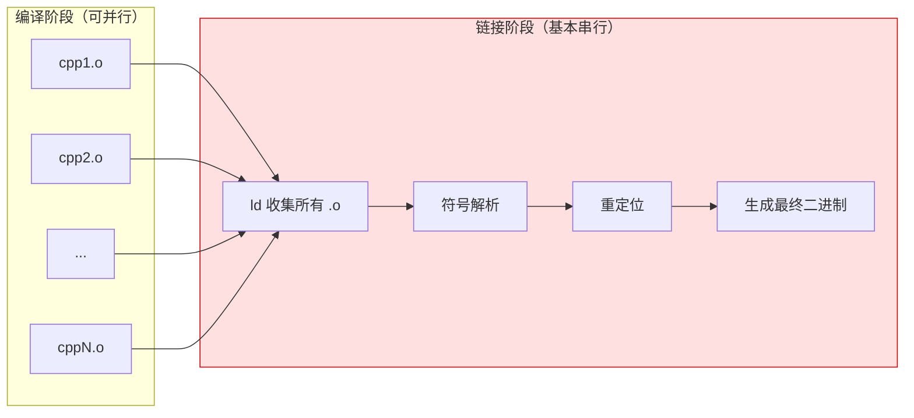

- 编译：`N` 个文件可以 `N` 路并行
- 链接：通常**单线程**，且需要把所有 `.o` 加载进内存
- 解决方案：`lld`（更快的链接器）、`mold`（极速链接器）、增量链接、动态库切分

---

## 十四、工具链与交叉编译：Host / Build / Target

### 14.1 三个机器的概念（GNU 经典定义）

| 概念 | 含义 | 举例 |
|------|------|------|
| **Build Machine** | 你**执行构建命令**的机器 | 你的 Mac / Linux 工作站 |
| **Host Machine** | 构建产物**运行**的机器 | 嵌入式 ARM 板 / 用户电脑 |
| **Target Machine** | 构建产物**生成代码面向**的平台（仅编译器自身构建时有意义） | 例如构建一个面向 RISC-V 的 GCC |

> 普通项目只关心 **Build = Host**（本机编译）或 **Build ≠ Host**（交叉编译）两种情况。

```mermaid
flowchart LR
    subgraph 本机编译["本机编译（Native Build）"]
        N1["x86_64 PC"] --> N2["编译生成 x86_64 程序"]
        N2 --> N3["在同一台 PC 上运行"]
    end

    subgraph 交叉编译["交叉编译（Cross Compile）"]
        C1["x86_64 PC（Build）"] --> C2["arm-linux-gnueabihf-gcc"]
        C2 --> C3["生成 ARM 程序"]
        C3 --> C4["拷贝到 ARM 板（Host）运行"]
    end

    style N3 fill:#e0ffe0,stroke:#0a0
    style C4 fill:#e0e0ff,stroke:#00c
```

### 14.2 工具链（Toolchain）由哪些组件组成？

```mermaid
mindmap
  root((Toolchain))
    编译器
      gcc / g++
      clang / clang++
      cl.exe（MSVC）
    汇编器
      as
    链接器
      ld（GNU）
      lld（LLVM）
      mold（极速）
      link.exe（MSVC）
    标准库
      glibc / musl（C 库）
      libstdc++（GNU C++ 库）
      libc++（LLVM C++ 库）
      MSVC STL
    sysroot
      目标平台头文件
      目标平台库文件
    辅助工具
      ar / ranlib（静态库）
      objdump / readelf / nm
      strip（去除符号）
```

### 14.3 各构建工具的交叉编译方式

#### CMake：使用 Toolchain 文件

```cmake
# arm-linux.cmake
set(CMAKE_SYSTEM_NAME Linux)
set(CMAKE_SYSTEM_PROCESSOR arm)

set(CMAKE_C_COMPILER   arm-linux-gnueabihf-gcc)
set(CMAKE_CXX_COMPILER arm-linux-gnueabihf-g++)

set(CMAKE_FIND_ROOT_PATH /opt/cross/arm-sysroot)
set(CMAKE_FIND_ROOT_PATH_MODE_PROGRAM NEVER)
set(CMAKE_FIND_ROOT_PATH_MODE_LIBRARY ONLY)
set(CMAKE_FIND_ROOT_PATH_MODE_INCLUDE ONLY)
```

```bash
cmake -B build -DCMAKE_TOOLCHAIN_FILE=arm-linux.cmake
cmake --build build
```

#### Meson：使用 Cross File

```ini
# arm-linux-cross.ini
[binaries]
c       = 'arm-linux-gnueabihf-gcc'
cpp     = 'arm-linux-gnueabihf-g++'
ar      = 'arm-linux-gnueabihf-ar'
strip   = 'arm-linux-gnueabihf-strip'

[host_machine]
system     = 'linux'
cpu_family = 'arm'
cpu        = 'armv7'
endian     = 'little'
```

```bash
meson setup build --cross-file arm-linux-cross.ini
ninja -C build
```

#### 各工具交叉编译方式对比

| 工具 | 交叉编译方式 | 配置复杂度 |
|------|--------------|-----------|
| **Make** | 命令行传 `CC=arm-linux-gnueabihf-gcc CXX=...` | ⭐ 简单 |
| **CMake** | `-DCMAKE_TOOLCHAIN_FILE=xxx.cmake` | ⭐⭐⭐ 中等 |
| **Meson** | `--cross-file xxx.ini` | ⭐⭐ 较简单 |
| **Bazel** | `--platforms` + toolchain rule | ⭐⭐⭐⭐⭐ 复杂 |
| **xmake** | `xmake f -p cross --sdk=...` | ⭐⭐ 较简单 |

### 14.4 典型交叉编译场景

| 场景 | 主机 | 目标 | 工具链 |
|------|------|------|--------|
| **嵌入式 Linux** | x86_64 Linux | ARM Cortex-A | `arm-linux-gnueabihf-gcc` |
| **嵌入式 MCU** | x86_64 Linux | ARM Cortex-M | `arm-none-eabi-gcc` |
| **Android NDK** | macOS / Linux | Android ARM/x86 | NDK 提供的 clang |
| **iOS / macOS** | macOS | iPhone | Xcode 自带 clang |
| **WebAssembly** | 任何平台 | 浏览器 / Node | Emscripten（emcc） |
| **Windows 上编译 Linux** | Windows | Linux | WSL 或 MinGW + 交叉工具链 |

---

## 十五、依赖管理与包管理：第三方库从哪里来？

> 在 C/C++ 世界，**依赖管理往往比编译本身更复杂**。这一章解决「我要用 OpenSSL/Boost/Protobuf，怎么办？」

### 15.1 依赖管理的演进史

```mermaid
timeline
    title C/C++ 依赖管理演进
    早期 : 系统包管理器（apt/brew）
    早期 : pkg-config 标准化
    2013 : Conan（专业 C++ 包管理器）
    2016 : vcpkg（微软出品，CMake 友好）
    2017 : CPM.cmake（轻量级 CMake 包管理）
    2018 : Meson WrapDB
    2021 : Bazel bzlmod
```

### 15.2 各种依赖获取方式对比

| 方式 | 来源 | 优点 | 缺点 | 适用场景 |
|------|------|------|------|----------|
| **系统包管理器** | `apt` / `brew` / `pacman` | 简单 | 版本不可控，跨平台差 | Linux 应用 |
| **`pkg-config`** | 系统库的 `.pc` 文件 | 传统通用 | Windows 支持差 | 传统 C 库 |
| **CMake `find_package`** | 系统库 / 自带 Find 模块 | 与 CMake 深度集成 | 写 Find 模块复杂 | CMake 项目 |
| **CMake `FetchContent`** | Git 仓库源码 | 轻量、自动化 | 拉源码慢、构建慢 | 中小 CMake 项目 |
| **`vcpkg`** | 微软维护的库仓库 | Windows/CMake 友好 | 生态锁定 | 跨平台 C++ |
| **`Conan`** | 中央/私有制品仓库 | 专业、灵活、二进制缓存 | 学习成本高 | 企业 C++ 项目 |
| **`CPM.cmake`** | Git / URL | 简洁、单文件、缓存 | 大型项目可能慢 | 中小 CMake 项目 |
| **Meson `wrap`** | WrapDB 或 Git | 与 Meson 无缝集成 | 生态较小 | Meson 项目 |
| **Bazel `bzlmod`** | Bazel Central Registry | 可重现、版本解析 | 复杂 | Bazel 项目 |
| **`xrepo`（xmake）** | xmake 包仓库 | 内置，命令简洁 | 国际生态较小 | xmake 项目 |

### 15.3 CMake 依赖管理示例

#### 方式一：`find_package`（系统/已安装库）

```cmake
find_package(OpenSSL REQUIRED)
target_link_libraries(myapp PRIVATE OpenSSL::SSL OpenSSL::Crypto)
```

#### 方式二：`FetchContent`（拉取源码并参与构建）

```cmake
include(FetchContent)
FetchContent_Declare(
    fmt
    GIT_REPOSITORY https://github.com/fmtlib/fmt.git
    GIT_TAG        10.2.1
)
FetchContent_MakeAvailable(fmt)

target_link_libraries(myapp PRIVATE fmt::fmt)
```

#### 方式三：vcpkg（推荐 Windows / 跨平台）

```bash
# 安装 vcpkg
git clone https://github.com/microsoft/vcpkg
./vcpkg/bootstrap-vcpkg.sh

# 安装库
./vcpkg/vcpkg install openssl boost-asio fmt

# CMake 集成
cmake -B build \
  -DCMAKE_TOOLCHAIN_FILE=vcpkg/scripts/buildsystems/vcpkg.cmake
```

#### 方式四：Conan（专业）

```ini
# conanfile.txt
[requires]
openssl/3.2.0
boost/1.83.0
fmt/10.2.1

[generators]
CMakeDeps
CMakeToolchain
```

```bash
conan install . --build=missing
cmake -B build -DCMAKE_TOOLCHAIN_FILE=build/conan_toolchain.cmake
```

### 15.4 选型建议

```mermaid
flowchart TD
    A["我需要管理 C/C++ 依赖"] --> B{"团队规模 / 项目类型？"}
    
    B -->|"个人 / 小项目"| C["FetchContent\n或 CPM.cmake"]
    B -->|"Windows 优先 / 跨平台"| D["vcpkg"]
    B -->|"企业级 / 复杂版本管理"| E["Conan"]
    B -->|"Linux 系统软件"| F["pkg-config\n+ 系统包管理器"]
    B -->|"超大型单仓库"| G["Bazel bzlmod"]
    B -->|"使用 Meson"| H["Meson wrap"]
    B -->|"使用 xmake"| I["xrepo"]

    style C fill:#e0ffe0,stroke:#0a0
    style D fill:#e0e0ff,stroke:#00c
    style E fill:#ffe0e0,stroke:#c00
```

---

## 十六、现代 CMake 深入实践

> 入门篇的 CMake 章节让你能「写出能跑的 CMakeLists.txt」，本章让你写出「**真正干净、可维护的 CMakeLists.txt**」。

### 16.1 Target 思维：CMake 的核心心法

> 🎯 **核心原则**：所有属性都应该挂在 **target** 上，而不是全局变量上。

```cmake
# ❌ 反模式：全局污染（不要这样做）
include_directories(include)
add_definitions(-DDEBUG)
link_libraries(ssl)
set(CMAKE_CXX_FLAGS "${CMAKE_CXX_FLAGS} -Wall")

# ✅ 现代 CMake：Target 化
add_library(mylib STATIC src/mylib.cpp)
target_include_directories(mylib PUBLIC include)
target_compile_definitions(mylib PRIVATE DEBUG=1)
target_link_libraries(mylib PRIVATE OpenSSL::SSL)
target_compile_options(mylib PRIVATE -Wall -Wextra)
```

### 16.2 PUBLIC / PRIVATE / INTERFACE 三种作用域

这是 CMake 最容易混淆的概念之一。

```mermaid
flowchart TD
    subgraph mylib["mylib（库）"]
        M["mylib.cpp\nmylib.h"]
    end

    subgraph 三种作用域["target_xxx(mylib SCOPE ...)"]
        P1["PRIVATE\n只对 mylib 自己有效"]
        P2["PUBLIC\nmylib 自己用 + 使用者也继承"]
        P3["INTERFACE\nmylib 自己不用，只给使用者用"]
    end

    APP["myapp（链接 mylib 的程序）"]

    M -.PRIVATE.-> P1
    M -.PUBLIC.-> P2
    P2 --继承--> APP
    P3 --继承--> APP
```

| 作用域 | mylib 自己 | 使用者（myapp） | 典型场景 |
|--------|-----------|------------------|----------|
| **PRIVATE** | ✅ 用 | ❌ 不传递 | 内部实现细节、内部依赖 |
| **PUBLIC** | ✅ 用 | ✅ 传递 | 头文件路径、ABI 相关库 |
| **INTERFACE** | ❌ 不用 | ✅ 传递 | header-only 库、纯接口宏 |

```cmake
add_library(mylib STATIC src/mylib.cpp)

# 头文件路径：使用者也要看到 → PUBLIC
target_include_directories(mylib PUBLIC include)

# 内部用的工具库：使用者不需要知道 → PRIVATE
target_link_libraries(mylib PRIVATE internal_utils)

# OpenSSL：mylib 自己要用，且 mylib.h 里也用了 → PUBLIC
target_link_libraries(mylib PUBLIC OpenSSL::SSL)

# 编译选项：通常 PRIVATE
target_compile_options(mylib PRIVATE -Wall -Wextra)
```

### 16.3 单配置 vs 多配置生成器

```mermaid
flowchart LR
    subgraph 单配置["单配置生成器（Single-Config）"]
        S1["Unix Makefiles / Ninja"]
        S2["配置时指定 BUILD_TYPE"]
        S3["每个 build 目录一种配置"]
        S1 --> S2 --> S3
    end

    subgraph 多配置["多配置生成器（Multi-Config）"]
        M1["Visual Studio / Xcode\nNinja Multi-Config"]
        M2["一个 build 目录"]
        M3["构建时切换 Debug/Release"]
        M1 --> M2 --> M3
    end
```

```bash
# 单配置生成器（每种配置一个目录）
cmake -B build-debug   -G Ninja -DCMAKE_BUILD_TYPE=Debug
cmake -B build-release -G Ninja -DCMAKE_BUILD_TYPE=Release

# 多配置生成器（一个目录，多种配置）
cmake -B build -G "Ninja Multi-Config"
cmake --build build --config Debug
cmake --build build --config Release
```

### 16.4 CMakePresets.json：团队配置统一神器

```json
{
  "version": 6,
  "configurePresets": [
    {
      "name": "default",
      "generator": "Ninja",
      "binaryDir": "${sourceDir}/build/${presetName}",
      "cacheVariables": {
        "CMAKE_BUILD_TYPE": "Debug",
        "CMAKE_EXPORT_COMPILE_COMMANDS": "ON"
      }
    },
    {
      "name": "release",
      "inherits": "default",
      "cacheVariables": { "CMAKE_BUILD_TYPE": "Release" }
    },
    {
      "name": "msvc",
      "generator": "Visual Studio 17 2022",
      "binaryDir": "${sourceDir}/build/msvc"
    }
  ],
  "buildPresets": [
    { "name": "default", "configurePreset": "default" },
    { "name": "release", "configurePreset": "release" }
  ]
}
```

```bash
cmake --preset default
cmake --build --preset default
```

### 16.5 库导出与安装：让别人用上你的库

```cmake
include(GNUInstallDirs)
include(CMakePackageConfigHelpers)

# 1. 安装目标
install(TARGETS mylib
    EXPORT mylibTargets
    LIBRARY DESTINATION ${CMAKE_INSTALL_LIBDIR}
    ARCHIVE DESTINATION ${CMAKE_INSTALL_LIBDIR}
    RUNTIME DESTINATION ${CMAKE_INSTALL_BINDIR}
    INCLUDES DESTINATION ${CMAKE_INSTALL_INCLUDEDIR}
)

# 2. 安装头文件
install(DIRECTORY include/ DESTINATION ${CMAKE_INSTALL_INCLUDEDIR})

# 3. 导出 CMake 配置文件（让别人能 find_package(mylib)）
install(EXPORT mylibTargets
    FILE mylibTargets.cmake
    NAMESPACE mylib::
    DESTINATION ${CMAKE_INSTALL_LIBDIR}/cmake/mylib
)

configure_package_config_file(
    mylibConfig.cmake.in
    ${CMAKE_CURRENT_BINARY_DIR}/mylibConfig.cmake
    INSTALL_DESTINATION ${CMAKE_INSTALL_LIBDIR}/cmake/mylib
)

write_basic_package_version_file(
    ${CMAKE_CURRENT_BINARY_DIR}/mylibConfigVersion.cmake
    VERSION ${PROJECT_VERSION}
    COMPATIBILITY SameMajorVersion
)

install(FILES
    ${CMAKE_CURRENT_BINARY_DIR}/mylibConfig.cmake
    ${CMAKE_CURRENT_BINARY_DIR}/mylibConfigVersion.cmake
    DESTINATION ${CMAKE_INSTALL_LIBDIR}/cmake/mylib
)
```

之后别人就可以这样用：

```cmake
find_package(mylib REQUIRED)
target_link_libraries(other_app PRIVATE mylib::mylib)
```

### 16.6 现代 CMake 反模式（务必避免）

| 反模式 | 问题 | 替代方案 |
|--------|------|----------|
| `include_directories()` | 全局污染 | `target_include_directories()` |
| `link_directories()` | 不可移植，容易找错库 | `target_link_libraries()` 用 imported target |
| `add_definitions()` | 全局污染 | `target_compile_definitions()` |
| `set(CMAKE_CXX_FLAGS ...)` | 难维护、覆盖问题 | `target_compile_options()` |
| `file(GLOB src *.cpp)` | 增删文件不触发重新配置 | 显式列出源文件 |
| 把所有逻辑写在根 CMakeLists.txt | 超长难维护 | 模块化 + `add_subdirectory()` |
| 滥用 `if(WIN32)` 分支 | 难维护 | 使用 `if(CMAKE_SYSTEM_NAME ...)` 和 generator expression |

---

## 十七、构建性能优化：缓存、并行、分布式与 LTO

> 当项目变大，构建时间从「秒级」变成「分钟级」甚至「小时级」时，性能优化就成了刚需。

### 17.1 性能优化全景图

```mermaid
mindmap
  root((构建加速))
    并行化
      make -j N
      ninja -j N
      cmake --build -j N
    缓存
      ccache
      sccache
      Bazel remote cache
    分布式
      distcc
      icecc / Icecream
      Bazel remote execution
    源码层优化
      减少 #include
      前向声明
      Pimpl 隔离
      模块化（C++20 Modules）
    编译优化
      预编译头 PCH
      Unity / Jumbo Build
    链接优化
      lld
      mold（极速）
      增量链接
      分离 debug 符号
    高级
      LTO
      ThinLTO
      PGO
```

### 17.2 ccache：编译缓存神器

> **原理**：把（源码哈希 + 编译参数）作为 key，缓存编译结果（`.o` 文件）。命中时直接复用，**不再调用编译器**。

```bash
# 安装
sudo apt install ccache       # Ubuntu
brew install ccache            # macOS

# CMake 启用 ccache
cmake -B build \
    -DCMAKE_C_COMPILER_LAUNCHER=ccache \
    -DCMAKE_CXX_COMPILER_LAUNCHER=ccache

# 查看缓存命中率
ccache -s
```

> 💡 实测：clean build 后再次 clean build，ccache 命中率可达 99%，时间从 5 分钟降到 30 秒。

### 17.3 sccache：跨平台 + 云缓存

`sccache` 是 Mozilla 开源的现代版本：

- 支持 Windows（ccache 不支持 MSVC）
- 支持 S3 / GCS / Azure Blob 作为远程缓存
- 适合 CI/CD 团队共享缓存

```bash
cmake -B build \
    -DCMAKE_C_COMPILER_LAUNCHER=sccache \
    -DCMAKE_CXX_COMPILER_LAUNCHER=sccache
```

### 17.4 预编译头（PCH）

```cmake
# CMake 3.16+
target_precompile_headers(myapp PRIVATE
    <vector>
    <string>
    <unordered_map>
    "common.h"
)
```

> 适合：项目中大量文件都包含相同的常用头文件（如 STL、第三方库头）。

### 17.5 Unity Build / Jumbo Build

把多个 `.cpp` 合并成一个大文件编译：

```cmake
# CMake 3.16+
set_target_properties(myapp PROPERTIES UNITY_BUILD ON)
set_target_properties(myapp PROPERTIES UNITY_BUILD_BATCH_SIZE 8)
```

| 优点 | 缺点 |
|------|------|
| ✅ 减少编译器启动次数 | ❌ 单文件编译变慢，增量构建反而更慢 |
| ✅ 头文件只解析一次 | ❌ 可能暴露同名 static 符号冲突 |
| ✅ 全量构建可加速 30%~50% | ❌ 不适合活跃开发期 |

> 💡 建议：CI 全量构建开 Unity Build；本地日常开发关闭。

### 17.6 链接器优化：从 ld 到 mold

| 链接器 | 速度 | 平台 | 备注 |
|--------|------|------|------|
| **GNU ld** | 基准（1x） | Linux | 默认，最慢 |
| **gold** | 2x | Linux | 已不再活跃维护 |
| **lld**（LLVM） | 3~5x | 全平台 | 推荐，工业级 |
| **mold** | 5~10x | Linux/macOS | 极速，新兴选择 |

```bash
# 使用 lld
cmake -B build -DCMAKE_LINKER_TYPE=LLD       # CMake 3.29+
# 或者
cmake -B build -DCMAKE_EXE_LINKER_FLAGS="-fuse-ld=lld"

# 使用 mold
cmake -B build -DCMAKE_EXE_LINKER_FLAGS="-fuse-ld=mold"
```

### 17.7 LTO 与 ThinLTO

> **LTO（Link-Time Optimization）**：在链接阶段做跨文件优化，性能更好但构建更慢。

```cmake
# CMake 启用 LTO
include(CheckIPOSupported)
check_ipo_supported(RESULT lto_supported)
if(lto_supported)
    set_target_properties(myapp PROPERTIES INTERPROCEDURAL_OPTIMIZATION TRUE)
endif()
```

| 类型 | 速度提升 | 构建慢多少 | 推荐场景 |
|------|----------|-----------|----------|
| **普通 LTO** | 5~15% | 慢 2~5 倍 | Release 发版 |
| **ThinLTO** | 4~12% | 慢 1.5~2 倍 | Release / 大型项目 |
| **PGO** | 10~30% | 需要采样 + 重编 | 性能敏感场景 |

### 17.8 优化组合建议

```mermaid
flowchart LR
    subgraph 日常开发["日常开发（追求增量速度）"]
        D1["ccache"]
        D2["Ninja"]
        D3["lld / mold"]
        D4["关闭 LTO / Unity"]
    end

    subgraph CI构建["CI 构建（追求稳定 + 缓存）"]
        C1["sccache + S3"]
        C2["Ninja"]
        C3["并行 -j"]
    end

    subgraph 发版构建["发版构建（追求性能）"]
        R1["Release"]
        R2["ThinLTO"]
        R3["可选 PGO"]
        R4["strip 符号"]
    end

    style 日常开发 fill:#e0ffe0,stroke:#0a0
    style CI构建 fill:#e0e0ff,stroke:#00c
    style 发版构建 fill:#ffe0e0,stroke:#c00
```

---

## 十八、测试、质量检查与 CI/CD 集成

### 18.1 单元测试集成

```cmake
# CMakeLists.txt
enable_testing()

add_executable(test_basic tests/test_basic.cpp)
target_link_libraries(test_basic PRIVATE mylib GTest::gtest_main)

add_test(NAME basic COMMAND test_basic)
```

```bash
# 运行测试
cd build
ctest --output-on-failure -j 8
```

### 18.2 代码覆盖率

```cmake
# 开启覆盖率插桩（GCC/Clang）
target_compile_options(myapp PRIVATE --coverage)
target_link_options(myapp PRIVATE --coverage)
```

```bash
# 跑测试 → 收集 → 生成报告
ctest
gcovr -r .. --html --html-details -o coverage.html
# 或者
lcov --capture --directory . --output-file coverage.info
genhtml coverage.info --output-directory coverage_html
```

### 18.3 Sanitizer：动态错误检测

| Sanitizer | 检测内容 | 编译选项 |
|-----------|----------|----------|
| **ASan**（Address） | 内存越界、UAF、泄漏 | `-fsanitize=address` |
| **UBSan**（UB） | 未定义行为 | `-fsanitize=undefined` |
| **TSan**（Thread） | 数据竞争 | `-fsanitize=thread` |
| **MSan**（Memory） | 未初始化内存读取 | `-fsanitize=memory` |
| **LSan**（Leak） | 内存泄漏（独立或随 ASan） | `-fsanitize=leak` |

```cmake
# CMake 中开启 ASan + UBSan（Debug 模式）
target_compile_options(myapp PRIVATE
    $<$<CONFIG:Debug>:-fsanitize=address,undefined -fno-omit-frame-pointer>
)
target_link_options(myapp PRIVATE
    $<$<CONFIG:Debug>:-fsanitize=address,undefined>
)
```

### 18.4 静态分析

| 工具 | 用途 | 集成方式 |
|------|------|----------|
| **clang-tidy** | C++ 代码风格 + Bug 检测 | `CMAKE_CXX_CLANG_TIDY` |
| **cppcheck** | 经典 C/C++ 静态分析 | 命令行调用 |
| **clang-format** | 代码格式化 | pre-commit / CI |
| **include-what-you-use** | 优化 #include | 替换编译器 launcher |
| **MSVC /analyze** | Microsoft 静态分析 | MSBuild 集成 |

```cmake
# CMake 集成 clang-tidy
set(CMAKE_CXX_CLANG_TIDY clang-tidy;-checks=*)
```

### 18.5 CI/CD 集成模板（GitHub Actions）

```yaml
# .github/workflows/build.yml
name: Build & Test

on: [push, pull_request]

jobs:
  build:
    strategy:
      matrix:
        os: [ubuntu-latest, macos-latest, windows-latest]
    runs-on: ${{ matrix.os }}
    steps:
      - uses: actions/checkout@v4

      - name: Setup ccache
        uses: hendrikmuhs/ccache-action@v1

      - name: Configure
        run: cmake --preset default

      - name: Build
        run: cmake --build --preset default -j

      - name: Test
        run: ctest --preset default --output-on-failure
```

### 18.6 完整工程化流程

```mermaid
flowchart LR
    A[提交代码] --> B[clang-format 检查]
    B --> C[CMake 配置]
    C --> D[编译 + ccache]
    D --> E[单元测试]
    E --> F[Sanitizer 测试]
    F --> G[clang-tidy 静态分析]
    G --> H[覆盖率报告]
    H --> I[打包 / 发布]

    style A fill:#ffe0e0,stroke:#c00
    style I fill:#e0ffe0,stroke:#0a0
```

---

## 十九、安装、打包与发布

### 19.1 标准安装目录布局

```
/usr/local/             ← CMAKE_INSTALL_PREFIX
├── bin/                ← 可执行文件
├── lib/                ← 静态库 / 动态库
│   ├── pkgconfig/      ← .pc 文件
│   └── cmake/mylib/    ← Find Config 文件
├── include/            ← 头文件
└── share/              ← 文档、示例、资源
    ├── doc/mylib/
    └── man/
```

### 19.2 动态库搜索路径（运行时陷阱）

| 平台 | 搜索机制 | 解决方案 |
|------|----------|----------|
| **Linux** | `LD_LIBRARY_PATH` / `RPATH` / `RUNPATH` / `/etc/ld.so.conf` | 设置 `RPATH=$ORIGIN/../lib` |
| **macOS** | `@executable_path` / `@rpath` / `DYLD_LIBRARY_PATH` | `install_name_tool` 调整 |
| **Windows** | 同目录 / `PATH` / SxS | 把 DLL 放在 exe 旁边 |

```cmake
# CMake 设置 RPATH（让程序找到自带的动态库）
set(CMAKE_INSTALL_RPATH "$ORIGIN/../lib")
set(CMAKE_INSTALL_RPATH_USE_LINK_PATH TRUE)
```

### 19.3 CPack：CMake 自带打包工具

```cmake
include(CPack)

set(CPACK_PACKAGE_NAME "myapp")
set(CPACK_PACKAGE_VERSION "1.0.0")
set(CPACK_GENERATOR "DEB;RPM;TGZ")    # Linux
# set(CPACK_GENERATOR "DragNDrop")    # macOS .dmg
# set(CPACK_GENERATOR "NSIS;ZIP")     # Windows

set(CPACK_DEBIAN_PACKAGE_MAINTAINER "you@example.com")
set(CPACK_DEBIAN_PACKAGE_DEPENDS "libssl3, libc6")
```

```bash
cmake --build build --target package
# 输出：myapp-1.0.0-Linux.deb / .rpm / .tar.gz
```

### 19.4 静态库 vs 动态库发布对比

| 维度 | 静态库（.a/.lib） | 动态库（.so/.dll/.dylib） |
|------|-----------------|--------------------------|
| **可执行文件大小** | 大 | 小 |
| **运行时依赖** | 无 | 需要库文件可被找到 |
| **升级方式** | 需要重新链接 | 替换库文件即可 |
| **ABI 兼容** | 无问题 | 需严格管理符号版本 |
| **License** | LGPL 等需注意 | 较灵活 |
| **内存共享** | 不能共享 | 多进程共享同一份 |

---

## 二十、常见构建错误排查指南

### 20.1 错误速查表

| 错误现象 | 常见原因 | 排查方向 |
|---------|---------|---------|
| `undefined reference to xxx` | 链接库缺失 / 顺序错误 | 检查 `target_link_libraries`，确认 `.a/.so` 路径 |
| `cannot find -lxxx` | 找不到库文件 | 检查库路径、`pkg-config`、安装包 |
| `xxx.h: No such file or directory` | 头文件路径缺失 | 检查 `target_include_directories` |
| `Could not find package configuration file` | `find_package` 找不到 | 设置 `CMAKE_PREFIX_PATH` |
| 改了头文件但没重编 | `.d` 依赖文件丢失 / `file(GLOB)` 缓存 | 删 `build` 重新配置 |
| Debug/Release 混用崩溃 | ABI 或运行库不一致 | 统一构建类型，避免混链 |
| Windows `LNK2019` | 符号未导出 / 缺 `__declspec(dllexport)` | 检查 `.lib` 与导出宏 |
| 运行时找不到 `.so` | RPATH 未设置 / `LD_LIBRARY_PATH` 缺 | `ldd ./myapp` 排查 |
| macOS `dyld: Library not loaded` | `@rpath` 配置错误 | `otool -L` + `install_name_tool` |
| `multiple definition of xxx` | 同一函数被多个 `.o` 包含 | 头文件里函数没加 `inline`/`static` |
| `make` 卡住没输出 | jobserver 问题 | 加 `-j N`，检查递归 Make |
| Ninja `multiple rules generate xxx` | 同一文件被多个目标输出 | 检查重复 `add_executable`/`add_library` |

### 20.2 调试构建问题的工具箱

```bash
# 1. 看 CMake 实际生成了什么编译命令
cmake --build build --verbose
# 或
make VERBOSE=1
ninja -v

# 2. 导出 compile_commands.json 给 IDE / clang-tidy
cmake -B build -DCMAKE_EXPORT_COMPILE_COMMANDS=ON

# 3. 看可执行文件的动态库依赖
ldd ./myapp                      # Linux
otool -L ./myapp                 # macOS
dumpbin /DEPENDENTS myapp.exe    # Windows

# 4. 看符号表
nm -D libmylib.so | grep mysymbol
objdump -T libmylib.so

# 5. 看 CMake 缓存变量
cmake -B build -LAH

# 6. 调试 CMake 配置过程
cmake -B build --debug-output --trace
```

### 20.3 经典坑位排查流程图

```mermaid
flowchart TD
    A["构建报错"] --> B{"错误阶段？"}
    B -->|"配置阶段"| C["CMake 找不到包/编译器"]
    B -->|"编译阶段"| D["头文件 / 语法错误"]
    B -->|"链接阶段"| E["符号未定义 / 库未找到"]
    B -->|"运行阶段"| F["动态库找不到 / 段错误"]

    C --> C1["检查 CMAKE_PREFIX_PATH\n安装库 / 设置 toolchain"]
    D --> D1["检查 target_include_directories\n确认头文件路径"]
    E --> E1["ldd / dumpbin\n检查 target_link_libraries"]
    F --> F1["检查 RPATH / LD_LIBRARY_PATH\nldd / otool 看依赖"]

    style C fill:#ffe0e0,stroke:#c00
    style D fill:#ffffe0,stroke:#cc0
    style E fill:#e0e0ff,stroke:#00c
    style F fill:#e0ffe0,stroke:#0a0
```

---

## 二十一、构建系统迁移指南

### 21.1 Makefile → CMake（最常见）

**步骤**：

1. **梳理目标**：列出所有最终产物（可执行文件、静态/动态库）
2. **梳理源文件**：每个目标对应哪些 `.cpp/.c`
3. **梳理依赖**：include 路径、链接库
4. **写 CMakeLists.txt**：先粗后细
5. **逐步迁移**：保留原 Makefile，新增 CMake 并行验证
6. **回归测试**：CI 同时跑两套，结果一致再删旧

```cmake
# 简单 Makefile → CMake 的对应关系
# CC=gcc        → project(... LANGUAGES C)
# SRCS=main.c   → add_executable(myapp main.c)
# CFLAGS=-Wall  → target_compile_options(myapp PRIVATE -Wall)
# LDFLAGS=-lm   → target_link_libraries(myapp PRIVATE m)
```

### 21.2 旧式 CMake → Modern CMake

**改造重点**：

| 旧式 | 现代 |
|------|------|
| `include_directories()` | `target_include_directories()` |
| `add_definitions()` | `target_compile_definitions()` |
| `link_directories()` | imported target |
| 全局 `set(CMAKE_CXX_FLAGS ...)` | `target_compile_options()` |
| `file(GLOB ...)` | 显式列出文件 |
| 单一巨大 CMakeLists.txt | 模块化 + `add_subdirectory()` |

### 21.3 Autotools → Meson

GNOME / systemd 类项目的常见路径：

```bash
# 之前
./autogen.sh
./configure --prefix=/usr
make -j8
sudo make install

# 之后
meson setup build --prefix=/usr
ninja -C build
sudo ninja -C build install
```

### 21.4 CMake → Bazel（大型项目）

**注意**：Bazel 迁移成本极高，建议**逐步引入**：

1. 先在新模块用 Bazel
2. 用 `cmake_external` 或 `rules_foreign_cc` 桥接旧 CMake 模块
3. 逐步把核心模块迁移
4. 最后退役 CMake

### 21.5 多构建系统共存策略

很多开源库（如 `libuv`、`zlib`）同时维护多套构建系统：

```
project/
├── Makefile          ← 经典 Make 用户
├── CMakeLists.txt    ← 主流用户
├── meson.build       ← Meson 用户
└── BUILD.bazel       ← Bazel 用户
```

**好处**：覆盖更多用户群体
**坏处**：维护成本高，容易不一致

> 💡 现实建议：**主仓库选一种，其他用社区贡献维护**。

---

## 二十二、其他构建系统生态：GN / MSBuild / Cargo / Gradle 等

> 入门篇覆盖了 C/C++ 主流构建工具，这一章扩展视野到其他生态，方便跨语言/跨平台选型。

### 22.1 其他重要 C/C++ 相关工具

| 工具 | 主要领域 | 特点 |
|------|----------|------|
| **GN** | Chromium / Flutter Engine / Fuchsia | 生成 Ninja，速度快，配置严格 |
| **Premake** | 游戏开发 | Lua 配置，生成 VS/Xcode/Make |
| **QMake** | Qt 老项目 | 逐渐被 CMake 替代（Qt6 推荐 CMake） |
| **MSBuild** | Visual Studio | `.vcxproj` / `.sln` 体系 |
| **Buck2** | Meta 大型构建系统 | 高性能、面向超大单仓库 |
| **Pants** | 多语言单仓库 | 类似 Bazel，偏工程平台化 |

### 22.2 GN：Chromium 生态的核心

> 如果你做浏览器/Flutter Engine 开发，必学 GN。

```python
# BUILD.gn 示例
executable("myapp") {
  sources = [
    "src/main.cc",
    "src/utils.cc",
  ]
  deps = [
    "//base",
    "//net",
  ]
}
```

```bash
gn gen out/Default
ninja -C out/Default myapp
```

| 优点 | 缺点 |
|------|------|
| ✅ 配置极快（比 CMake 快 10x+） | ❌ 学习资料少 |
| ✅ Chromium 级别项目验证 | ❌ 生态小，绑定 Google 体系 |
| ✅ 输出 Ninja，编译极快 | ❌ 不适合外部生态项目 |

### 22.3 各语言原生构建系统

| 语言 | 构建工具 | 特点 |
|------|----------|------|
| **Rust** | `cargo` | 标杆级：构建+依赖+发布一体化 |
| **Go** | `go build` | 简洁、内置依赖、无配置文件 |
| **Java** | `Maven` / `Gradle` | 大型项目主流，插件生态强 |
| **Android** | `Gradle` + AGP | Android 官方标准 |
| **JavaScript/TypeScript** | `npm` / `yarn` / `pnpm` | + `webpack` / `vite` / `rollup` 打包 |
| **Python** | `pip` / `poetry` / `pdm` / `setuptools` | 多套并存 |
| **C#/.NET** | `MSBuild` / `dotnet CLI` | 与 Visual Studio 深度集成 |
| **Swift** | `Swift Package Manager` | 苹果生态 |
| **Kotlin** | `Gradle` | 与 Android 一脉相承 |

### 22.4 跨语言构建系统对比

```mermaid
flowchart TD
    subgraph C项目["C/C++ 主流"]
        C1["CMake + Ninja"]
        C2["Bazel"]
        C3["Meson"]
    end

    subgraph 现代语言["现代语言（一体化）"]
        L1["Cargo（Rust）"]
        L2["go build（Go）"]
        L3["Swift PM"]
    end

    subgraph 企业大型["企业 / 多语言"]
        E1["Bazel"]
        E2["Buck2"]
        E3["Pants"]
        E4["Gradle"]
    end

    style 现代语言 fill:#e0ffe0,stroke:#0a0
    style 企业大型 fill:#e0e0ff,stroke:#00c
```

> 💡 **观察**：现代语言（Rust / Go / Swift）都把构建+依赖+发布做成了一体化工具，C/C++ 因为历史包袱重，仍需要在多套工具间组合选型。

---

## 二十三、最终选型清单：小白版 / 工程版 / 大厂版

### 23.1 三档选型推荐

#### 🥉 小白版（学习 / 个人项目）

```mermaid
flowchart LR
    A["代码"] --> B["CMakeLists.txt"]
    B --> C["cmake -B build -G Ninja"]
    C --> D["cmake --build build"]
    D --> E["可执行文件"]

    style A fill:#ffe0e0,stroke:#c00
    style E fill:#e0ffe0,stroke:#0a0
```

**配置清单**：

- 构建系统：`CMake + Ninja`
- 依赖管理：`FetchContent`（足够简单）
- 编辑器：`VSCode` + CMake Tools 插件
- 一条命令搞定：`cmake --build --preset default`

#### 🥈 工程版（中型团队 / 商业项目）

**配置清单**：

- 构建系统：`CMake + Ninja` + `CMakePresets.json`
- 依赖管理：`vcpkg` 或 `Conan`
- 缓存：`ccache` 本地 + `sccache` CI
- 测试：`CTest` + `GoogleTest`
- 静态分析：`clang-tidy` + `clang-format`
- 动态检测：`ASan` + `UBSan`（Debug 必开）
- CI：`GitHub Actions` 多平台矩阵
- 打包：`CPack` 输出多种格式
- 链接器：`lld`

#### 🥇 大厂版（超大规模 / Monorepo）

**配置清单**：

- 构建系统：`Bazel` 或 `Buck2`
- 依赖管理：`bzlmod`（Bazel）/ 内部仓库
- 缓存：远程缓存（Bazel Remote Cache / BuildBuddy）
- 执行：远程执行（Remote Build Execution）
- 测试：分片并行 + 智能选测
- CI：自研流水线 + 灰度发布
- 链接器：`mold` 或自研
- 优化：ThinLTO + PGO + AutoFDO

### 23.2 一图速查：怎么选？

```mermaid
flowchart TD
    A["选构建工具"] --> B{"项目规模 + 团队"}
    
    B -->|"个人 / 学生 / 小项目"| C["CMake + Ninja\n+ FetchContent\n零成本起步"]
    B -->|"中型团队 / 商业项目"| D["CMake + Ninja + Presets\n+ vcpkg/Conan\n+ ccache + CI"]
    B -->|"GNOME/systemd 风格"| E["Meson + Ninja\n+ wrap"]
    B -->|"游戏 / 跨平台引擎"| F["CMake + Ninja\n或 Premake"]
    B -->|"国产 / 中文友好"| G["xmake\n+ xrepo"]
    B -->|"超大单仓库 / 大厂"| H["Bazel\n+ Remote Cache/Exec"]
    B -->|"Chromium / Flutter 生态"| I["GN + Ninja"]
    B -->|"语言原生（Rust/Go/Swift）"| J["Cargo / go build / SwiftPM"]

    style C fill:#e0ffe0,stroke:#0a0
    style D fill:#e0e0ff,stroke:#00c
    style H fill:#ffe0e0,stroke:#c00
    style J fill:#ffffe0,stroke:#cc0
```

### 23.3 学习路径推荐（双路径）

#### 📘 小白学习路径

```
1. Make 基础（理解构建本质）
2. CMake 入门（写出能跑的项目）
3. Ninja 基本用法
4. CMake + Ninja 实战
5. FetchContent 拉依赖
6. 常见错误排查
```

#### 🚀 进阶/大咖学习路径

```
1. 构建图与增量构建原理
2. 现代 CMake target 模型 + Presets
3. 依赖管理：vcpkg / Conan / FetchContent
4. 交叉编译与 toolchain
5. 性能优化：ccache / Unity / PCH / mold / LTO
6. 测试 + Sanitizer + 静态分析
7. CI/CD 集成 + 远程缓存
8. 大型选型：CMake / Meson / Bazel / GN
9. 跨语言生态：Cargo / Gradle / Buck2
```

---

## 📌 全文终极总结

> 三句话讲清构建系统的本质：

1. **构建系统的灵魂是「依赖图 DAG」**，所有工具都在做同一件事：尽量少地、尽量并行地、尽量正确地执行编译命令。
2. **C/C++ 没有银弹**，依赖管理、跨平台、交叉编译、性能优化是真实工程中的四大永恒挑战。
3. **选型不在于工具最强，而在于团队最适合**：
   - 个人项目 → `CMake + Ninja + FetchContent`
   - 中型团队 → `CMake + Presets + vcpkg/Conan + ccache + CI`
   - 大厂超大仓库 → `Bazel/Buck2 + Remote Cache/Exec`

> 💡 **最后一条建议**：**先把一种工具学透，再横向比较**。把 CMake 学到能写出干净 `target_*` 风格的程度，其他工具一通百通。

---

## 📚 延伸阅读

本文聚焦「**构建工具本身——做什么、怎么选**」。如果你想进一步落地到 **IDE 工程化**（保存即编译、F5 一键构建并调试、远程开发等），请参阅配套文档：

🔗 **[《VSCode + C++ 全流程开发配置实操指南》](./VSCode-Cpp全流程开发配置指南.md)**

> 该文档涵盖：插件选型（C/C++ vs clangd）、`.vscode/` 配置（settings/tasks/launch）、CMakePresets 集成、保存即格式化、F5 自动构建调试、远程开发、Sanitizer/ccache 集成、调试常见问题排查等，与本指南形成「**工具选型 → 工程落地**」的完整闭环。
