# **视频编码码控深入浅出——九大开源编码器对比与统一模型**


**作者**：汪亮（bertonwang）  
**邮箱**：<47608843@qq.com>  
**版本**：v1.1 ｜ **最后更新**：2026-05-21

>
> **读者画像**：
> - **小白**：第一次接触视频编码，听说过 CRF 但不知道为啥它能"恒定质量"。
> - **工程师**：正在为直播 / RTC / 点播选编码器和参数，想搞懂背后机制。
> - **架构师 / 大咖**：希望横向对比九家实现，提炼出可复用的码控设计准则。
>
本文不是九份源码文档的简单拼接，而是用**统一模型**串起来：
- 第一部分：码控的"通用心智模型"（鸡蛋悖论 + 三大子问题 + 反馈控制论 + 🌍 全局视野）。
- 第二部分：**码控核心机制与支撑技术体系**（码率分配与 GOP 协同 + 🎯 帧类型专题 + 35 年演化史 + VBV/HRD、AQ、mbtree/cuTree、心理 RDO、多线程同步、场景切换、BWE 联动……）。
- 第三部分：**工程实战清单**（场景 → 编码器 → 参数选型 + 故障调试 + AI/RL 未来）。
- 第四部分：九家开源编码器的**码控架构选择**（x264 / x265 / JM / HM / OpenH264 / Kvazaar / VP9 / AV1 / VVC）。
- 第五部分：**横向对比与终极汇总**（同一步骤不同选择 + 实测差异 + 九家终极 14 表）。

> 🧭 **前两部分怎么读？**
>
> 可以把第 1~9 章理解成三层递进，而不是一堆并列术语：
>
> | 层级 | 解决的问题 | 读完应该得到什么 |
> |---|---|---|
> | **第一部分：心智模型** | 码控为什么难？核心变量是什么？几种模式如何统一？ | 建立 `bits / QP / 复杂度 / 反馈` 的基本语言 |
> | **第二部分：核心机制主链路** | 预算如何从序列落到 GOP、帧、块，再被反馈修正？ | 看懂一套码控引擎如何真正跑起来 |
> | **第二部分：支撑技术体系章节** | 真实编码器如何处理约束、感知、并发、突发事件和 RTC 网络反馈？ | 知道每项技术挂在主链路的哪一段，不再把名词堆成一团 |
>
> 对小白来说，最稳的路线是：先抓住第 1~6 章的“语言”，再读第 7 章的“主链路”，最后把第 9 章里的 9.1~9.8 当作主链路上的插件逐个理解。
---

## **目录**

- [第一部分：码控的通用心智模型](#第一部分码控的通用心智模型)
  - [第 1 章：什么是码控？为什么不能不做？](#第-1-章什么是码控为什么不能不做)
  - [第 2 章：码控的"先有鸡还是先有蛋"悖论](#第-2-章码控的先有鸡还是先有蛋悖论)
  - [第 3 章：码控的三大子问题](#第-3-章码控的三大子问题)
  - [第 4 章：QP / qScale / λ / bits 四角关系](#第-4-章qp--qscale--λ--bits-四角关系)
  - [第 5 章：反馈控制论视角——把码控看成 PID](#第-5-章反馈控制论视角把码控看成-pid)
  - [第 6 章：CRF / ABR / CBR / 2pass 五种模式的统一公式](#第-6-章crf--abr--cbr--2pass-五种模式的统一公式)
  - [🌍 第一部分总结：码控全局视野与技术地图](#-第一部分总结码控全局视野与技术地图)
- [第二部分：码控核心机制——码率分配 / GOP 协同 / 35 年演化史 / 支撑技术体系](#第二部分码控核心机制码率分配--gop-协同--35-年演化史--支撑技术体系)
  - [第 7 章：码率分配与 GOP 协同——从预算到 QP 的通用算法链路](#第-7-章码率分配与-gop-协同从预算到-qp-的通用算法链路)
    - [7.1 先定边界：算法层讲“为什么”，实现层讲“怎么写”](#71-先定边界算法层讲为什么实现层讲怎么写)
    - [7.2 总体链路：从序列预算到实际 QP](#72-总体链路从序列预算到实际-qp)
    - [7.3 GOP 结构为什么会决定码率分配](#73-gop-结构为什么会决定码率分配)
    - [7.4 GOP 如何确定：参数给边界，内容决定切点](#74-gop-如何确定参数给边界内容决定切点)
    - [7.5 GOP 级预算：先把一组图像的钱袋子算清楚](#75-gop-级预算先把一组图像的钱袋子算清楚)
    - [7.6 帧类型决策：先决定“谁负责什么”，再分配 bits](#76-帧类型决策先决定谁负责什么再分配-bits)
      - [7.6.1 帧类型决策在码控链路中的位置](#761-帧类型决策在码控链路中的位置)
      - [7.6.2 伪代码展开：从候选帧到预算权重](#762-伪代码展开从候选帧到预算权重)
    - [7.7 帧级预算：I / P / B 不是标签，而是码率合同](#77-帧级预算i--p--b-不是标签而是码率合同)
    - [7.8 经典分配公式：TM5 思路为何至今仍重要](#78-经典分配公式tm5-思路为何至今仍重要)
    - [7.9 除了 TM5：现代码率分配模型谱系](#79-除了-tm5现代码率分配模型谱系)
    - [7.10 从目标 bits 到 QP / λ：预算如何落到量化强度](#710-从目标-bits-到-qp--λ预算如何落到量化强度)
    - [7.11 块级预算：同一帧内部也不是平均分](#711-块级预算同一帧内部也不是平均分)
    - [7.12 反馈与 VBV：把理想分配拉回现实](#712-反馈与-vbv把理想分配拉回现实)
    - [7.13 一图看懂通用协同机制](#713-一图看懂通用协同机制)
    - [7.14 本章总结：一条主线、六个旋钮](#714-本章总结一条主线六个旋钮)
  - [🎯 帧类型与码控：通用机制速查](#-帧类型与码控通用机制速查)
  - [第 8 章：码控演化史——从 H.261 TM5 到 AV1 ConstQP（35 年路线图）](#第-8-章码控演化史从-h261-tm5-到-av1-constqp35-年路线图)
  - [第 9 章：码控支撑技术体系](#第-9-章码控支撑技术体系)
    - [9.1 VBV / HRD 漏桶模型](#91-vbv--hrd-漏桶模型)
    - [9.2 AQ（Adaptive Quantization）](#92-aqadaptive-quantization)
    - [9.3 mbtree / cuTree（时间域 QP 偏移）](#93-mbtree--cutree时间域-qp-偏移)
    - [9.4 心理视觉 RDO（psy-rd / psy-rdoq）](#94-心理视觉-rdopsy-rd--psy-rdoq)
    - [9.5 MB / CU 级 RC（GOM、CTU dQP、Wavefront 同步）](#95-mb--cu-级-rcgomctu-dqpwavefront-同步)
    - [9.6 码控与多线程的同步陷阱](#96-码控与多线程的同步陷阱)
    - [9.7 码控与场景切换、Frame Skip、长期参考帧](#97-码控与场景切换frame-skip长期参考帧)
    - [9.8 码控与 BWE / TWCC 联动（RTC 专属）](#98-码控与-bwe--twcc-联动rtc-专属)
- [第三部分：工程实战](#第三部分工程实战)
  - [第 10 章：场景 → 编码器 → 参数](#第-10-章场景--编码器--参数)
  - [第 11 章：怎么调试一个"码率不对"的故障](#第-11-章怎么调试一个码率不对的故障)
  - [第 12 章：码控未来——AI / RL 驱动的 RC](#第-12-章码控未来ai--rl-驱动的-rc)
- [第四部分：九家开源编码器的码控选择](#第四部分九家开源编码器的码控选择)
  - [第 13 章：x264——工业级 ABR/CRF 标杆](#第-13-章x264工业级-abrcrf-标杆)
  - [第 14 章：x265——继承 x264 + cuTree + AQ-mode 4](#第-14-章x265继承-x264--cutree--aq-mode-4)
  - [第 15 章：JM——H.264 标准参考实现的码控哲学](#第-15-章jmh264-标准参考实现的码控哲学)
  - [第 16 章：HM——HEVC 标准参考实现的码控架构](#第-16-章hmhevc-标准参考实现的码控架构)
  - [第 17 章：OpenH264——RTC 零延迟 GOM 反馈](#第-17-章openh264rtc-零延迟-gom-反馈)
  - [第 18 章：Kvazaar——学院派透明 λ-RC](#第-18-章kvazaar学院派透明-λ-rc)
  - [第 19 章：libvpx-VP9 码控——Google 的 alt-ref + ARNR 哲学](#第-19-章libvpx-vp9-码控google-的-alt-ref--arnr-哲学)
  - [第 20 章：AV1 码控——libaom / SVT-AV1 的双轨实现](#第-20-章av1-码控libaom--svt-av1-的双轨实现)
  - [第 21 章：VVC 码控——VTM / VVenC 的标准参考与工业取舍](#第-21-章vvc-码控vtm--vvenc-的标准参考与工业取舍)
- [第五部分：横向对比与终极汇总](#第五部分横向对比与终极汇总)
  - [第 22 章：同一步骤不同选择——14 张对比表](#第-22-章同一步骤不同选择14-张对比表)
  - [第 23 章：九家在同一段视频上的表现差异](#第-23-章九家在同一段视频上的表现差异)
  - [第 24 章：九家终极横向对比——14 张表完整版](#第-24-章九家终极横向对比14-张表完整版)
- [附录 A：码率分配公式速查](#附录-a码率分配公式速查)
  - [A.1 预算入口公式](#a1-预算入口公式)
  - [A.2 加权分配公式](#a2-加权分配公式)
  - [A.3 复杂度加权公式](#a3-复杂度加权公式)
  - [A.4 TM5 类帧类型分配公式](#a4-tm5-类帧类型分配公式)
  - [A.5 R-Q / qScale 反推公式](#a5-r-q--qscale-反推公式)
  - [A.6 R-λ 模型公式](#a6-r-λ-模型公式)
  - [A.7 CRF / qcompress 类质量分配公式](#a7-crf--qcompress-类质量分配公式)
  - [A.8 VBV/HRD 修正公式](#a8-vbvhrd-修正公式)
  - [A.9 层级参考 / TPL 类传播公式](#a9-层级参考--tpl-类传播公式)
  - [A.10 块级 / AQ 分配公式](#a10-块级--aq-分配公式)
  - [A.11 公式选择速查](#a11-公式选择速查)
  - [A.12 码率分配模型谱系速查](#a12-码率分配模型谱系速查)
- [附录 B：参考文献与源码索引](#附录-b参考文献与源码索引)
- [附录 C：术语表](#附录-c术语表)
  - [C.1 缩写词与核心术语](#c1-缩写词与核心术语)
  - [C.2 公式变量与参数符号](#c2-公式变量与参数符号)
  - [C.3 重点缩写 / 术语详解（小白版）](#c3-重点缩写--术语详解小白版)
- [附录 D：全文公式解释速查（小白版）](#附录-d全文公式解释速查小白版)
  - [D.1 通用心智模型：为什么码控像一个“先猜后修”的系统](#d1-通用心智模型为什么码控像一个先猜后修的系统)
  - [D.2 每帧预算：先决定“这帧能花多少钱”](#d2-每帧预算先决定这帧能花多少钱)
  - [D.3 QP / qScale / λ / bits：预算怎么落到编码器决策](#d3-qp--qscale--λ--bits预算怎么落到编码器决策)
  - [D.4 反馈控制：实际码率和目标码率怎么“还账”](#d4-反馈控制实际码率和目标码率怎么还账)
  - [D.5 CRF / qcompress：为什么质量更稳但码率会浮动](#d5-crf--qcompress为什么质量更稳但码率会浮动)
  - [D.6 TM5 / GOP / 帧类型：I/P/B 怎么分钱](#d6-tm5--gop--帧类型ipb-怎么分钱)
  - [D.7 VBV / HRD：为什么公式结果还要被“水桶”裁剪](#d7-vbv--hrd为什么公式结果还要被水桶裁剪)
  - [D.8 AQ / mbtree / cuTree / TPL：为什么同一帧内部也要重新分配](#d8-aq--mbtree--cutree--tpl为什么同一帧内部也要重新分配)
  - [D.9 各编码器常见公式：按公司 / 项目理解](#d9-各编码器常见公式按公司--项目理解)
  - [D.10 心理视觉与工程修正公式](#d10-心理视觉与工程修正公式)
  - [D.11 工程伪代码公式补充](#d11-工程伪代码公式补充)
  - [D.12 公式阅读的统一方法](#d12-公式阅读的统一方法)
- [附录 E：码率分配模型详解：TM5 / Lookahead / mbtree / cuTree / TPL](#附录-e码率分配模型详解tm5--lookahead--mbtree--cutree--tpl)
  - [E.1 先建立统一视角：它们到底都在分配什么？](#e1-先建立统一视角它们到底都在分配什么)
  - [E.2 TM5 类模型：按“帧类型 + 历史复杂度 + 剩余预算”分钱](#e2-tm5-类模型按帧类型--历史复杂度--剩余预算分钱)
  - [E.3 Lookahead 模型：先用低成本方式“偷看未来”](#e3-lookahead-模型先用低成本方式偷看未来)
  - [E.4 mbtree 模型：x264 的宏块级未来价值传播](#e4-mbtree-模型x264-的宏块级未来价值传播)
  - [E.5 cuTree 模型：把 mbtree 升级到 HEVC 的 CU / CTU 世界](#e5-cutree-模型把-mbtree-升级到-hevc-的-cu--ctu-世界)
  - [E.6 TPL 模型：AV1 的多层时间传播代价建模](#e6-tpl-模型av1-的多层时间传播代价建模)
  - [E.7 三类模型如何协同：从“账本”到“未来投资”](#e7-三类模型如何协同从账本到未来投资)
  - [E.8 常见误区](#e8-常见误区)
  - [E.9 一张总表：选模型时到底看什么？](#e9-一张总表选模型时到底看什么)
  - [E.10 最终速记](#e10-最终速记)
- [附录 F：源码学习路线建议](#附录-f源码学习路线建议)
  - [F.1 总体结论：首选 x264](#f1-总体结论首选-x264)
  - [F.2 为什么 x264 最适合作为第一份源码](#f2-为什么-x264-最适合作为第一份源码)
  - [F.3 推荐学习顺序](#f3-推荐学习顺序)
  - [F.4 不建议作为第一入口的项目](#f4-不建议作为第一入口的项目)
  - [F.5 最终路线速记](#f5-最终路线速记)

---


# **第一部分：码控的通用心智模型**


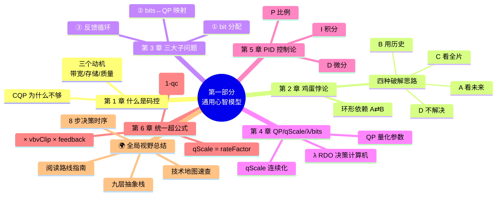

> 📖 **章节跳转**：[§1](#第-1-章什么是码控为什么不能不做) · [§2](#第-2-章码控的先有鸡还是先有蛋悖论) · [§3](#第-3-章码控的三大子问题) · [§4](#第-4-章qp--qscale--λ--bits-四角关系) · [§5](#第-5-章反馈控制论视角把码控看成-pid) · [§6](#第-6-章crf--abr--cbr--2pass-五种模式的统一公式)

---

## **第 1 章：什么是码控？为什么不能不做？**

**码控（Rate Control，RC）= 在编码每一帧、每一个块时，决定"这一块花多少比特"的子系统。**

它**不是**视频压缩算法（变换 / 量化 / 预测 / 熵编码这些是算法），而是**"算法的指挥官"**——告诉算法每一步应该多省 / 多奢。

### **1.1 三个朴素动机**

| 动机 | 说明 |
|---|---|
| **网络带宽有上限** | 1Mbps 的链路不能塞 5Mbps 的码流，否则全卡。 |
| **存储有上限** | 4GB 蓝光容不下 8 小时无损 4K。 |
| **质量要保住** | 不能为了省码率把人脸糊成马赛克。 |

### **1.2 没有码控会怎样？**

最简单的"没有码控"= **CQP（Constant QP，恒定量化参数）**：每帧每块都用 QP=22 编。结果：

```
画面平静（如新闻播报）   → QP=22 太奢侈，码率超目标 3 倍
画面剧烈（如运动会）     → QP=22 太抠门，丢细节但码率却仍超
转场 / 黑场             → QP=22 给黑场也分 1Mbps，浪费
```

**结论**：CQP 同时**码率失控**和**质量失控**。所以工业界几乎都用 **CRF / ABR / CBR / 2pass** 中的某一种 RC 模式。

---

## **第 2 章：码控的"先有鸡还是先有蛋"悖论**

这是码控最根本的难题，**所有 RC 算法本质都在解决它**。

### **2.1 悖论的两个面**

```
┌─────────────────────────────────────┐
│  要决定 QP，必须先知道这一帧编完会用多少 bits │  （A）
└─────────────────────────────────────┘
              ↓ 推导依赖
┌─────────────────────────────────────┐
│  要知道这一帧编完用多少 bits，必须先选好 QP   │  （B）
└─────────────────────────────────────┘
              ↓ 推导依赖
回到 (A)
```

A 需要 B、B 需要 A，**环形依赖**。这就是"先有鸡还是先有蛋"。

### **2.2 数学化描述**

设 **C** 为帧复杂度（未知）、**Q** 为量化参数（待定）、**B** 为输出 bits（结果）：

```
B = f(C, Q)
```

我们想要：**给定 B_target，反求 Q**。

但 C 不知道（因为还没编完），所以无法解析求解。

### **2.3 四种破解思路（这就是九家编码器的根本分野）**

| 思路 | 一句话 | 代表编码器 |
|---|---|---|
| **A. 先看一眼未来** | 用降采样 + 快速 ME 在低分辨率提前算复杂度 | x264 / x265 lookahead |
| **B. 用历史预测未来** | 上一帧用了多少 bits，这一帧应该差不多 | OpenH264 历史预测器 |
| **C. 看完全片再编** | 第一遍只统计、第二遍按预算分配 | x264/x265 2-pass |
| **D. 不解决，只用 CQP + 后处理修正** | 所有研究都用 CQP 做对照实验 | Kvazaar（学院派） |

> 💡 **核心洞察**：码控的所有创新，本质都在改进对"未来 bits"的**预测精度**。预测越准，QP 越合理，码率越平稳，画质越高。

---

## **第 3 章：码控的三大子问题**

把抽象悖论拆成三个工程子问题：

### **3.1 子问题①：每帧给多少 bits？（Bit Allocation）**

输入：总码率、帧率、未来若干帧的"复杂度估值"。  
输出：本帧的 bit 预算。

简化模型：

```
bits_i = (TotalBits / Σ cplx_j) × cplx_i
```

> 📎 **变量说明**：`bits_i`、`TotalBits`、`cplx_i`、`cplx_j`、`Σ cplx_j`、`qcompress` 等符号和缩写，统一放在文末 [附录 C：术语表](#附录-c术语表) 中说明。

**复杂帧多分、简单帧少分**——核心思想，所有 RC 都用。

> 💡 **核心底层思想**：这本质是**资源按需分配**——让"每个帧的主观画质"趋同，而不是"每个帧的 bits"相同。后者在复杂帧上会崩溃、在简单帧上会浪费。
>
> 🔄 **取舍点**：“难度加权”要多激进？qcompress=1.0 → bits 按 cplx 线性分配（质量最一致但码率波动大）；qcompress=0.0 → 所有帧 bits 相同（码率稳但质量波动大）。**x264 默认 0.6** 是两者的经验黄金均衡点。

### **3.2 子问题②：bit 预算怎么转成 QP？（Bits ↔ QP 映射）**

输入：本帧 bit 预算 B_target、本帧复杂度 C。  
输出：QP。

经验公式：

```
bits   ≈ C / qScale
qScale = 0.85 × 2^((QP - 12) / 6)
```

- **QP 每 +6，qScale ×2，bits ÷2**——视频编码圈的"摩尔定律级"经验。
- 但 C 怎么估？回到第 2 章——这里又触发"鸡蛋悖论"。

> 💡 **核心底层思想**：QP 不是线性量。从指数函数看，**QP=22 和 QP=28 的差距不是“6 个单位”，而是“码率呈 2 进制方式相差 4 倍”**。手动调 QP 加减要记住这个。2 的几何级数，意味着“+1 QP”在高码率区不会变化明显、在低码率区会产生震荡式质量跳变。

### **3.3 子问题③：编完发现超 / 欠预算怎么办？（Feedback Loop）**

最简单的处理：**下一帧补偿**。

```
error      = actual_bits - target_bits
next_bits  = target_bits - error * decay
```

- `decay` 决定"还旧账"速度：太快会震荡、太慢会漂移。
- x264/x265 用 `cplxr_sum` 累积器；OpenH264 用 VBV buffer 状态；Kvazaar 用 EWMA。

> 💡 **三个子问题缺一不可**。少了①码率会乱花、少了②QP 不可控、少了③误差会累积爆炸。

---

## **第 4 章：QP / qScale / λ / bits 四角关系**

这一章是**入门门槛**——很多人卡在这里。

```
        ┌─────┐    log2 / qp2qscale     ┌────────┐
        │  QP │  ◄──────────────────►  │ qScale │
        └──┬──┘                         └────┬───┘
           │                                  │
           │                  ┌──────────────┘
           │                  │
           ▼                  ▼
       λ = α·qScale²     bits = complexity / qScale
       （RDO 决策用）        （RC 反推 QP 用）
```

### **4.1 QP（Quantization Parameter）**

- **范围**：H.264 是 0~51；HEVC/H.265 是 0~63；可自定义偏移。
- **物理意义**：步长指数。QP=0 几乎无损、QP=51 砍光高频。
- **量化公式**：`coef_q = (coef * mf + bias) >> shift`，其中 `mf, shift` 由 QP 查表。

### **4.2 qScale**

- **公式**：`qScale = 0.85 × 2^((QP-12)/6)`。
- **物理意义**：连续化的 QP（QP 是整数、qScale 是浮点）。
- **为什么需要它？** 因为 QP 是整数台阶，做精细的 RC 比例运算时跳变太大；qScale 平滑可微分。

### **4.3 λ（拉格朗日因子）**

- **公式**：`λ = α × qScale²`（不同帧类型 α 不同）。
- **用途**：RDO（Rate-Distortion Optimization）判定 `cost = distortion + λ·bits`。
- **关键**：QP 决定了 λ，λ 决定了"哪个模式更划算"。**所以 RC 不只是定 QP，还隐式地控制了模式选择**。

### **4.4 bits**

- **来源**：实际编完一帧 / 一块的输出比特数。
- **预测**：`bits ≈ C / qScale`。
- **反推**：给定 bits 目标和 C，反算 qScale → QP。

> 💡 **一句话记住**：`QP ↔ qScale`（恒等映射）；`qScale → λ`（控决策）；`qScale + 复杂度 → bits`（控码率）。

---

## **第 5 章：反馈控制论视角——把码控看成 PID**

视频编码 RC 与电机控速、空调温控**本质同源**——都是反馈控制问题。

### **5.1 控制论模型**

```
                  期望值 (Setpoint)
                        │
       error = setpoint - measurement
                        │
                        ▼
              ┌──────────────────┐
              │  Controller (PID) │ ──→ 控制量 (QP)
              └──────────────────┘
                        │
                        ▼
              ┌──────────────────┐
              │  Plant (编码器)   │ ──→ 实际值 (bits)
              └─────────┬────────┘
                        │
                        ▼
                  measurement (反馈)
```

### **5.2 三种成分**

| PID 项 | 视频编码对应 | 直观含义 |
|---|---|---|
| **P** 比例 | `qScale ∝ predicted_bits / target_bits` | 当前帧偏多就提 QP |
| **I** 积分 | `cplxr_sum` 累积偏差 | 长期超 / 欠预算的"还账" |
| **D** 微分 | 复杂度变化率（场景变化检测） | 突变时立即补偿 |

### **5.3 不同模式的 PID 偏好**

| 模式 | P | I | D |
|---|---|---|---|
| **CRF** | 弱（按复杂度走） | 弱 | 弱 |
| **ABR** | 中 | **强** | 弱 |
| **CBR** | **强** | 强 | 中 |
| **2-pass** | 全局已知，**几乎不需要 PID** |   |   |

> 💡 这就解释了为啥 **CBR 最容易"震荡"** —— P/I 增益高、扰动响应快，但稳定性差。**CRF 最稳** —— 反馈环弱，长期跑像"开环"。

---

## **第 6 章：CRF / ABR / CBR / 2pass 五种模式的统一公式**

把所有模式抽象成一个超公式：

```
qScale_i = rateFactor                                  ← “质量锚点”
         × (C_i / C_avg)^(1 - qcompress)              ← “难易加权”
         × vbvClip_i                                  ← “漏桶约束”
         × feedback_i                                 ← “历史反馈修正”
```

各模式的差异，只是这四个因子的开关：

| 模式 | rateFactor 来源 | C_avg 来源 | vbvClip | feedback |
|---|---|---|---|---|
| **CQP** | 用户指定 QP | 不用 | 关 | 关 |
| **CRF** | `qp2qscale(crf)` | lookahead 近若干帧均值 | 可选 | 关 |
| **ABR** | 由总码率反推 | 滑动窗历史均值 | 可选 | **强** |
| **CBR** | 由总码率反推 | 历史均值 | **强** | **强** |
| **2-pass** | 第一遍统计后离线计算 | 全片精确均值 | 可选 | 弱 |

理解了这个统一公式，**所有 9 家编码器的 RC 都只是它的"特例 + 工程优化"**。

> 💡 **核心底层思想**：“五种模式”看似极不同，本质仅仅是在问三件事：**质量锚在哪、平均如何估、心跳需不需要保护。**从这三个问题出发，可以反推出任意第 6 种、第 7 种模式。
>
> 🔄 **取舍点：CRF vs ABR vs CBR**是在"质量恒定 / 码率恒定 / 网络友好"三者间挑两个。**CRF保质量但不保码率**（适合点播归档）、**ABR保平均码率但允许瞬间冲高**（适合直播）、**CBR保峰值码率但代价是平均质量下降**（适合 RTC）。选哪个取决于"业务最介意的是哪一项”。

---

## **🌍 第一部分总结：码控全局视野与技术地图**

> **为什么单独立一节"全局视野"？**
>
> 第 1~6 章把码控的"心智模型"打底完成。但读者进入后续章节时，容易同时遇到两类问题：
> *"码率分配、GOP 协同、VBV、AQ、mbtree、ARF、TPL 这些通用机制之间是什么关系？九家编码器又分别在哪些层做了自己的取舍？"*
>
> 这一节用一张地图回答这个问题——**所有后续章节讨论的技术点，都是这张地图上某个具体位置的优化**。读完本节，你会先知道第二部分的核心机制放在哪，再带着"地图"去看第五部分的九家实现，不再迷失。

### **🏗️ 全局视野：码控的"九层抽象栈"**

码控不是一个"算法"，而是一座**九层金字塔**——每一层都有自己的输入、输出、决策粒度：

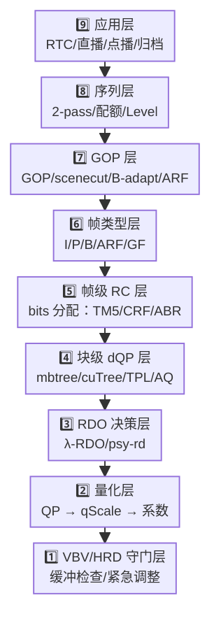

**核心思想**：
- **从上往下是"决策细化"**：应用场景决定序列策略，序列决定 GOP，GOP 决定帧类型，帧类型决定每帧码率，码率决定 dQP，dQP 决定 RDO 的 λ，λ 决定 QP，QP 决定 bits。
- **从下往上是"反馈修正"**：VBV 检测溢出 → 改 QP；λ 出错 → 改 dQP；mbtree 反馈 → 改帧级分配；scenecut 触发 → 改 GOP 结构。
- **每个编码器在不同层"用力不同"**：x264 重 L4（mbtree）、OpenH264 重 L1（VBV+Skip）、SVT-AV1 重 L7（多层 ARF + TPL）、Kvazaar 重 L3（透明 λ）。

### **🗺️ 技术地图：本书所有技术点的归属**

下表把后续 30 多章涉及的**所有技术名词**对应到金字塔某一层，让你阅读时永远知道"自己在哪儿"：

| 层级 | 关键技术 | 所在章节 | 谁在用（典型） |
|---|---|---|---|
| **L9 应用** | preset / tune / 五种 RC 模式 | §6, §10 | 全部编码器 |
| **L8 序列** | 2-pass、Level 自动夹、序列复杂度统计 | §13.4, §16, §21, §9 | x264/x265/HM/VVenC |
| **L7 GOP** | scenecut、B-adapt、ARF 选址、LTR、Frame Skip | **§9.7**, §7 | 全部 |
| **L6 帧类型** | IDR/I/P/B/ARF/GF、B 金字塔、模板 GOP | §7（含🎯专题） | 全部 |
| **L5 帧级 RC** | TM5、CRF/ABR/CBR 公式、cplxr_sum、EWMA、4 类帧反馈 | §6, §13.3, §17.3, §19.5 | 全部 |
| **L4 块级 dQP** | mbtree、cuTree、TPL、aq-mode、segmentation、PQA | **§9.3**, **§9.2**, §20.5, §21 | x264/x265/AV1/VVC/VP9 |
| **L3 RDO** | λ-RDO、psy-rd、psy-rdoq | **§9.4**, §18.5 | x264/x265/VVenC |
| **L2 量化** | QP / qScale / λ 三角关系、CTU 子块 dQP | §4, §9.5 | 全部 |
| **L1 VBV/HRD** | 漏桶模型、bufsize/maxrate、紧急调整、HRD 合规 | **§9.1**, §17.4 | 除 Kvazaar 外全部 |
| **跨层（动态事件）** | **场景切换、Frame Skip、长期参考帧（LTR）** | **§9.7** | 全部（OpenH264 最重） |
| **跨层（并发）** | 多线程同步、WPP、Tile 并行 | **§9.6** | 全部 |
| **跨层（外联）** | BWE / TWCC、动态 SetOption | **§9.8** | OpenH264（RTC） |
| **跨层（协同）** | GOP-RC、I/P/B 比例分配、宏块到序列协同 | **§7** | 全部 |

> 💡 **怎么看这张表？**
> - **第 7/8 章**是码控核心机制：先讲预算如何从序列、GOP、帧、块一路落到 QP，再讲这些机制 35 年如何演化。
> - **粗体章节**是第三部分的通用支撑技术——九家编码器或多或少都用到，建议在进入第五部分九家实现前先读。
> - 阅读顺序建议：先看本节（全景）→ 第 7/8 章（核心机制）→ 第 9 章（支撑技术体系）→ 第 13~21 章（九家具体实现）。
> - 如果时间紧：先看本节 + 第 7 章末的 🎯 帧类型专题，已经能 80% 掌握码控全貌。

### **⏱️ 决策时序：编码器的"8 步决策链"**

每编码一帧，编码器内部都要走一遍这 8 步——每一步都可能调用上面金字塔某一层的技术：


**九家编码器在这 8 步上的"侧重"差异**：

| 编码器 | 最强环节 | 最弱/省略环节 | 一句话哲学 |
|---|---|---|---|
| **x264** | 4+5（mbtree+CRF） | - | 工业级全栈 |
| **x265** | 5（cuTree）+1（HDR 序列） | - | x264 + HEVC 红利 |
| **JM** | 7（标准量化） | 4/5（无现代优化） | 标准参考 |
| **HM** | 7（CTU 量化） | 5（无 cuTree） | 标准参考 |
| **OpenH264** | 8（VBV+Skip）+ 跨层（BWE） | 2/3（无 lookahead/B 帧） | 零延迟优先 |
| **Kvazaar** | 6（透明 λ）| 4/5/8（不要 mbtree/VBV） | 学术透明 |
| **VP9** | 2+3（ARF 创举） | - | 时域革命 |
| **AV1（SVT）** | 2+5（TPL+多 ARF）| - | 集大成者 |
| **VVenC** | 4+6（PQA + JND） | - | 主观质量优先 |

> 💡 **核心洞察**：**九家编码器的"个性"**，本质上就是**它们在哪几个 Step 上投入额外算力 / 牺牲哪几个 Step 的精度**。理解了这一点，再看第五部分每家编码器的章节，就不会被各种术语淹没了。

### **🚦 关键提示：先看核心机制，再看支撑技术，最后看具体实现**

下列章节可以按“机制 → 技术 → 实现”的顺序阅读。第二部分先用第 7/8 章回答码控系统怎么运转，再用第 9 章解释九家都会遇到的通用支撑技术，最后第四部分才进入各编码器的落地差异：

| 我想搞明白 | 先看机制 | 再看通用技术 | 最后看实现 |
|---|---|---|---|
| 帧类型（I/P/B/ARF）在码控里怎么协同 | [§7 + 🎯 帧类型专题](#-帧类型与码控通用机制速查) | [§9.7 场景切换 / Frame Skip / LTR](#97-码控与场景切换frame-skip长期参考帧) | 第 13/14/17/19/20 章 |
| 场景切换怎么处理（scenecut + Frame Skip + LTR） | [§7.4 GOP 如何确定](#74-gop-如何确定参数给边界内容决定切点) | [§9.7 码控与场景切换、Frame Skip、长期参考帧](#97-码控与场景切换frame-skip长期参考帧) | 第 17 章（OpenH264）、第 19 章（VP9） |
| VBV / HRD 漏桶到底是什么 | [§7.12 反馈与 VBV](#712-反馈与-vbv把理想分配拉回现实) | [§9.1 VBV / HRD 漏桶模型](#91-vbv--hrd-漏桶模型) | 第 13~21 章中"VBV/HRD" 关键字 |
| AQ / mbtree / cuTree / TPL 都是什么关系 | [§7.11 块级预算](#711-块级预算同一帧内部也不是平均分) | [§9.2 AQ](#92-aqadaptive-quantization) → [§9.3 mbtree/cuTree](#93-mbtree--cutree时间域-qp-偏移) | 第 13、14、20 章 |
| psy-rd 为什么不影响 PSNR 但影响 VMAF | [§4 QP/qScale/λ/bits](#第-4-章qp--qscale--λ--bits-四角关系) | [§9.4 心理视觉 RDO](#94-心理视觉-rdopsy-rd--psy-rdoq) | 第 13、14 章末 |

> 📌 **作者建议**：码控初学者，建议读完第一部分（含本节）→ 先读 **第二部分第 7/8 章**（核心机制与演化史）→ 再读 **第二部分第 9 章**（通用支撑技术体系）→ 最后读 **第四部分第 13~21 章**（九家具体实现）。这样既不会跳过“码控怎么运转”的主线，也能避免在每家编码器里反复重新理解 VBV、AQ、mbtree、TPL 等通用概念。

---

# **第二部分：码控核心机制——码率分配 / GOP 协同 / 35 年演化史 / 支撑技术体系**

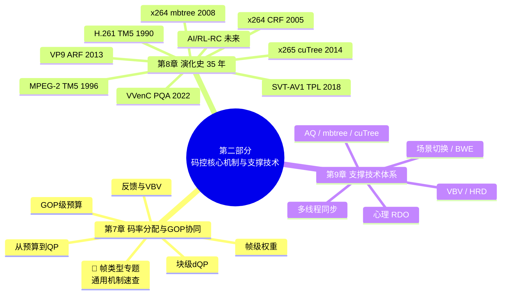

> 📖 **章节跳转**：[§7](#第-7-章码率分配与-gop-协同从预算到-qp-的通用算法链路) · [🎯 帧类型专题](#-帧类型与码控通用机制速查) · [§8](#第-8-章码控演化史从-h261-tm5-到-av1-constqp35-年路线图) · [§9](#第-9-章码控支撑技术体系)

> **本部分定位**：这是码控的"主干视角"。读完第一部分的"心智模型"后，你已经有了基本概念；本部分把这些概念组装成**完整运行的引擎**——
> - **第 7 章**：从预算到 QP 的**码率分配与 GOP 协同通用算法链路**。这是码控真正“做事”的地方：先讲清序列 / GOP / 帧 / 块四级预算如何传递，再说明反馈与 VBV 如何把理想分配拉回可部署现实。其中 **🎯 帧类型与码控通用机制速查** 专题独立成段，把贯穿全书的帧类型暗线串成明线。
> - **第 8 章**：35 年码控演化史 —— 从 1990 年 H.261 TM5 到 2024 年 AV1 ConstQP，看每一次"换代"解决了什么、引入了什么、又遗留了什么。
> - **第 9 章**：码控支撑技术体系 —— 把 VBV/HRD、AQ、mbtree/cuTree、心理 RDO、多线程同步、场景切换和 BWE 联动这些“单点技术”，统一挂回第 7 章主链路。
>
> 💡 **为什么这样组织？** 第 7/8 章负责讲清主链路和演化脉络；第 9 章负责解释主链路落地时需要的支撑能力。这样支撑技术不会被抬成独立大部分，也不会散落成孤立术语。掌握它们后，再看第四部分（九家具体实现）会更轻松。

---

## **第 7 章：码率分配与 GOP 协同——从预算到 QP 的通用算法链路**

> **本章边界**：本章只讲**通用算法与抽象模型**，不展开任何具体编码器源码实现。你可以把它理解为码控系统的“设计图纸”：预算如何从序列落到 GOP、从 GOP 落到帧、从帧落到块，最后又如何被 VBV/HRD 约束拉回现实。
>
> 具体编码器如何落地这些思想，请放到第四部分各章查阅；第五部分再做横向对比。

### **7.1 先定边界：算法层讲“为什么”，实现层讲“怎么写”**

码率分配与 GOP 协同经常被讲混：一会儿讲 I/P/B 分配比例，一会儿讲具体工程模块，一会儿又跳到某段实现细节。为了让逻辑清晰，本章只保留三类内容：

| 层级 | 本章讲什么 | 不在本章展开什么 |
|---|---|---|
| **算法目标** | 给定目标码率，如何让整段视频的主观质量尽量均匀 | 某个编码器具体参数名 |
| **通用机制** | GOP 预算、帧级预算、块级 dQP、反馈、VBV 守门 | 具体工程模块或函数调用链 |
| **抽象取舍** | 质量 / 码率 / 延迟 / 复杂度之间如何平衡 | 某一家编码器为什么这么实现 |

一句话：**本章讲“码控系统应该怎么思考”，第五部分讲“九家编码器各自怎么落地”。**

### **7.2 总体链路：从序列预算到实际 QP**

码控不是“给每一帧随便算一个 QP”，而是一条自上而下、再由反馈闭环修正的链路：

```text
序列目标码率
  ↓
GOP 预算：这一组图像总共能花多少 bits
  ↓
帧级预算：I / P / B / 参考帧各自拿多少 bits
  ↓
块级 dQP：同一帧内部，哪些区域更值得花 bits
  ↓
RDO / 量化：把预算变成 λ、QP、qScale
  ↓
实际编码 bits
  ↓
反馈校正 + VBV/HRD 守门
```

这条链路里有两个方向：

- **前馈方向**：内容分析、GOP 决策、复杂度预测，尽量在编码前做合理预算。
- **反馈方向**：实际 bits 与目标 bits 的偏差会回写到后续帧，防止长期漂移。

> 💡 **核心理解**：码控的本质不是“准确预测某一帧会用多少 bits”，而是让一长段视频在预算约束下保持**质量稳定、缓冲安全、误差可收敛**。

### **7.3 GOP 结构为什么会决定码率分配**

GOP 结构决定了“谁会被谁参考”。这件事直接改变每一帧的**参考价值**，而参考价值决定它应不应该多拿 bits。

| 帧 / 结构角色 | 信息特征 | 码率分配含义 |
|---|---|---|
| **I 帧** | 不依赖过去，承载绝对信息 | GOP 起点，通常需要更多 bits 保护后续质量 |
| **P 帧** | 参考过去，承载残差信息 | 质量会继续传播，是工作主力 |
| **B 帧** | 双向预测，残差更低 | 可作为质量缓冲；若被参考，则价值上升 |
| **长期参考 / 特殊参考帧** | 服务较长时间窗口 | 不是因为“显示重要”，而是因为“未来引用重要” |
| **场景切换点** | 过去参考突然失效 | 常需要重置参考链，预算会瞬间抬升 |

因此，码率分配不能只问“这帧是什么类型”，还要问：

1. **它会被多少未来帧参考？**
2. **它处在 GOP 的哪个层级？**
3. **它的质量误差会传播多久？**
4. **如果它变差，后续补救成本有多高？**

> 💡 **从帧类型到参考价值**：传统模型先按 I/P/B 粗分；现代理念进一步看“参考链中的传播价值”。这就是时间域码控技术能持续改进 BD-Rate 的根本原因。

### **7.4 GOP 如何确定：参数给边界，内容决定切点**

既然 GOP 结构会决定码率分配，那么自然会有一个问题：**一个 GOP 到底有多少帧？这个数量是外部参数写死的，还是编码器根据内容自适应决定的？**

通用答案是：**两者都有，但分工不同。**

- **外部参数**给出硬边界：最大 GOP 长度、最小关键帧间隔、是否低延迟、是否允许 B 帧、随机访问间隔、直播切片边界、VBV/HRD 约束等。
- **内容分析**在边界内找更合适的切点：场景切换、运动突变、纹理复杂度变化、参考收益下降、缓冲风险等。

所以，GOP 不是简单的“每 `N` 帧切一次”，更准确地说是：

```text
GOP_length = clamp(content_adaptive_cut,
                   min_gop,
                   max_gop)
```

其中：

- `max_gop`：通常由随机访问、 seek、直播切片、标准或业务策略决定，表示“最长不能超过多久不来一个关键帧”。
- `min_gop`：防止关键帧过密，否则 I 帧太多会浪费码率、造成码率尖峰。
- `content_adaptive_cut`：由内容分析建议的切点，比如场景切换处、参考链收益突然下降处。

可以把 GOP 确定逻辑理解为四层：

| 层级 | 解决的问题 | 典型规则 | 对码控的意义 |
|---|---|---|---|
| **业务 / 封装约束** | 用户多久能随机访问一次？直播分片怎么对齐？ | 固定 IDR 周期、切片边界强制关键帧 | 决定 GOP 的最大跨度 |
| **编码工具约束** | 是否允许重排序、B 帧、层级 B？ | 低延迟偏短 GOP / P-only，离线压缩可用长 GOP | 决定 GOP 内可用结构 |
| **内容自适应** | 旧参考是否还有效？ | 场景切换、运动突变、闪白、镜头切换 | 决定是否提前切 GOP |
| **码控 / 缓冲约束** | 当前预算能否承受新 I 帧？ | VBV 紧张时抑制过早 I 帧，必要时平滑预算 | 防止关键帧造成码率尖峰 |

一个通用决策流程可以写成下面这样。先不要把它理解成某个编码器里的真实函数名，而要把它理解成**码控决策的抽象动作**：

- `cut_gop_here()`：在当前候选帧位置切开 GOP，通常意味着这里放一个新的关键帧 / I 帧 / IDR / CRA，并从这里开始新的 GOP。
- `keep_current_gop()`：不切 GOP，当前帧继续放进上一个 GOP，通常继续编码成 P/B 帧或层级 B 结构中的一员。
- `forced_keyframe_by_user_or_segment`：外部强制关键帧，比如用户指定、直播切片边界、随机访问点、广告插入点等。
- `distance_from_last_keyframe`：距离上一个关键帧已经过去多少帧。
- `scene_cut_score`：内容分析得到的“像不像场景切换”的分数，分数越高越像镜头切换。
- `buffer_can_afford_i_frame`：当前 VBV / HRD 缓冲和码率预算是否承受得起一个新 I 帧；如果缓冲很紧，即使检测到场景切换，也可能需要推迟或平滑处理。

更适合小白阅读的版本如下：

```text
# 每来一个候选帧，都问一遍：这里要不要开一个新 GOP？

if forced_keyframe_by_user_or_segment:
    # 业务规则优先级最高：例如直播切片边界、用户强制关键帧
    cut_gop_here()

elif distance_from_last_keyframe >= max_gop:
    # 已经达到最大 GOP 长度：再不切就会影响随机访问、seek 或标准/业务约束
    cut_gop_here()

elif distance_from_last_keyframe < min_gop:
    # 离上一个关键帧太近：即使内容有变化，也先不要频繁插 I 帧
    keep_current_gop()

elif scene_cut_score > threshold and buffer_can_afford_i_frame:
    # 内容确实像场景切换，并且缓冲也扛得住新 I 帧：提前切 GOP 是划算的
    cut_gop_here()

else:
    # 既没有强制边界，也没到最大长度，也没有足够强的场景切换理由
    keep_current_gop()
```

用流程图看会更直观：

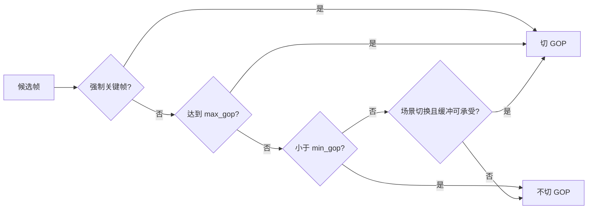

可以把这段逻辑记成一句话：**先尊重外部强制边界，再保证不能超过最大 GOP；如果离上一个关键帧太近，就抑制过早切分；最后才看内容分析和缓冲状态，决定是否自适应提前切 GOP。**

这说明 GOP 的“数量”本质上不是全局一次性算出来的，而是在编码过程中不断确定的：

```text
视频序列
  ↓
外部参数给出 min / max / random access 边界
  ↓
lookahead 或内容分析寻找候选切点
  ↓
VBV/延迟/业务规则做约束
  ↓
形成当前 GOP 的实际 N
```

因此，在下一节的公式里：

```text
GOP_bits = R_target × N / fps
```

这里的 `N` 不是永远固定的常数，而是**当前 GOP 实际包含的帧数**。固定 GOP 场景下，`N` 接近外部配置；自适应 GOP 场景下，`N` 会随着场景切换和约束条件变化。

> 💡 **核心理解**：参数决定“最长多久必须切、最短多久不能切”，内容决定“哪里切最划算”，码控决定“现在切会不会把缓冲打爆”。GOP 确定之后，才进入 GOP 级预算。

### **7.5 GOP 级预算：先把一组图像的钱袋子算清楚**

假设目标码率为 `R_target`，帧率为 `fps`，一个 GOP 有 `N` 帧，那么最粗略的 GOP 预算是：

```text
GOP_bits = R_target × N / fps
```

但真实系统不会机械平均，还要扣除或补偿几个因素：

| 调整项 | 为什么需要 | 典型影响 |
|---|---|---|
| **缓冲区水位** | VBV/HRD 不能上溢或下溢 | 水位高可略放松，水位低要收紧 |
| **场景复杂度** | 纹理 / 运动越复杂，单位质量越贵 | 复杂 GOP 要么多给 bits，要么接受质量下降 |
| **场景切换** | 旧参考失效，残差会暴涨 | 插 I 帧或提高起点预算 |
| **延迟约束** | 低延迟不能看太远 | 预测越短，分配越保守 |
| **质量平滑** | 防止质量“心电图” | 相邻 GOP 的质量不应剧烈跳变 |

这里的 **VBV/HRD 不能上溢或下溢**，是理解 GOP 预算时非常关键的一条约束。

先把它想成一个水桶模型：

```text
编码器输出的比特流  →  以目标码率流入解码缓冲区  →  解码器按显示节奏取走数据
```

- **VBV**：Video Buffering Verifier，可以理解为“编码器侧用来验证码流是否会撑爆或饿死解码缓冲的虚拟缓冲器”。
- **HRD**：Hypothetical Reference Decoder，可以理解为标准里的“假想参考解码器模型”，用来规定码流到达、缓存、移除的时序是否合规。

它们背后的核心问题是：**码流不是只要平均码率正确就一定能播放稳定。** 即使一段视频的平均码率等于 `R_target`，如果某个 GOP 突然花了太多 bits，瞬时数据量也可能超过缓冲区容量；反过来，如果前面过度省 bits 或发送节奏不合理，解码器在需要显示某帧时也可能拿不到足够数据。

可以用这个简化水位公式理解：

```text
buffer_level = buffer_level
             + bits_arrived_from_channel
             - bits_removed_by_decoder
```

其中：

- `bits_arrived_from_channel`：这段时间按照目标码率、网络带宽或封装时钟进入缓冲区的 bits。
- `bits_removed_by_decoder`：解码器为了按时解码和显示帧而取走的 bits。
- `buffer_level`：当前缓冲区水位，必须始终留在安全范围内。

如果水位越过边界，就会出现两类问题：

| 问题 | 发生条件 | 直观理解 | 可能后果 | 对 GOP 预算的约束 |
|---|---|---|---|---|
| **上溢** | `buffer_level > buffer_size` | 突然塞进来的数据太多，水桶装不下 | 标准模型不合规，传输/缓存压力过大，可能导致码流不可被目标解码器稳定接收 | 当前 GOP 不能给太多 bits，尤其要限制 I 帧和复杂场景的码率尖峰 |
| **下溢** | `buffer_level < 0` 或低于安全水位 | 解码器要取数据时，桶里没水 | 播放卡顿、等待、丢帧，实时场景中可能造成明显冻结 | 不能把预算压得过低，也不能让后续帧在显示期限前拿不到数据 |

所以，`VBV/HRD` 约束不是简单地说“总码率别超标”，而是在要求：

```text
任意时间点都要满足：
0 <= buffer_level <= buffer_size
```

这也是为什么 GOP 级预算不能只看内容复杂度。比如场景切换处很适合插 I 帧，复杂纹理也确实需要更多 bits；但如果此时缓冲区已经很紧，码控就不能无条件加钱，而要做一些折中：

- **降低当前 GOP 预算**：提高 QP，接受局部质量下降，避免上溢。
- **平滑 I 帧尖峰**：不要让关键帧瞬间吃掉过多 bits，必要时配合后续 P/B 帧回收预算。
- **提前攒缓冲**：如果 lookahead 发现后面有复杂场景，可以在前面简单 GOP 少花一点，为后面留空间。
- **限制过早切 GOP**：场景切换虽然适合切 GOP，但如果新 I 帧会打爆缓冲，可能要推迟、弱化或用更保守的 QP。
- **保证解码时限**：低延迟直播中，帧不仅要压得合适，还要在规定时间内到达解码端，不能只追求长期平均码率。

> 💡 **核心理解**：`VBV/HRD` 管的不是“这一秒平均花了多少钱”这么简单，而是“每一个时刻钱袋子都不能爆仓，也不能空仓”。GOP 预算必须在内容质量、关键帧收益和缓冲安全之间做平衡。

一个更接近工程的抽象形式是：

```text
GOP_bits = base_budget
         × complexity_factor
         × buffer_factor
         × smooth_factor
```

其中：

- `complexity_factor` 解决“这段内容难不难”。
- `buffer_factor` 解决“当前网络 / 解码缓冲还能不能承受”。
- `smooth_factor` 解决“别让用户看到画质忽高忽低”。

### **7.6 帧类型决策：先决定“谁负责什么”，再分配 bits**

#### **7.6.1 帧类型决策在码控链路中的位置**

有了 GOP 级预算之后，下一步不是立刻把 bits 平均分给每一帧，而是先回答一个更基础的问题：**这个 GOP 里，哪些帧承担锚点，哪些帧承担传播，哪些帧承担压缩效率？**

也就是说，帧级预算之前，必须先确定 GOP 内部的**帧类型与参考结构**：

```text
GOP_bits
  ↓
帧类型 / 参考结构决策
  ↓
I / P / B / 层级参考帧的基础权重
  ↓
帧级 bits 分配
```

一个通用帧类型决策算法，可以先抽象成“输入 → 处理 → 输出”的链路。这里的**输入不会直接变成输出**，中间真正起作用的，就是后面这五类判断：

```text
输入：提供判断依据
  - 随机访问间隔 / 最大 GOP 长度
  - lookahead 窗口内的运动与纹理复杂度
  - 场景切换分数
  - 延迟约束
  - VBV/HRD 缓冲水位
  - 参考帧数量与重排序能力

处理：依次做五类判断
  1. 随机访问约束
  2. 场景切换检测
  3. 延迟约束判断
  4. 预测收益评估
  5. 参考价值排序

输出：得到帧类型和预算权重依据
  - 当前帧类型：I / P / B / 层级参考帧
  - 参考关系：谁参考谁，谁会被未来参考
  - 基础预算权重：type_weight 与 reference_weight
```

所以，下面的“五步”不是另一套流程，而是上面“处理”环节的展开：编码器先拿输入信息作为依据，经过这五类判断后，才得到输出的帧类型、参考关系和权重信息。

| 步骤 | 判断问题 | 决策结果 | 对码控的影响 |
|---|---|---|---|
| **1. 随机访问约束** | 是否到达 IDR / CRA / 关键帧间隔？ | 必须插入 I 类锚点 | GOP 预算会向起点集中 |
| **2. 场景切换检测** | 过去参考是否已经失效？ | 插 I 帧或重置参考链 | 避免残差暴涨和错误传播 |
| **3. 延迟约束判断** | 是否允许帧重排序和向后看？ | 允许则可选 B / 层级 B；不允许则偏 P | 决定压缩效率与实时性取舍 |
| **4. 预测收益评估** | 双向预测收益是否大于复杂度成本？ | 收益高则选 B，收益低则选 P | 决定是否值得引入 B 帧 |
| **5. 参考价值排序** | 哪些帧会被未来更多帧依赖？ | 标记为参考帧或层级高层帧 | 提高 `reference_weight`，后续多给 bits |

这里先只保留结构概览：**输入信息经过这五步判断，输出帧类型、参考关系和预算权重依据**。下一小节 `7.6.2` 会把这五步写成伪代码，并展开 `estimate_future_dependency(frame)`、`estimate_b_prediction_gain(frame)` 等关键函数的底层逻辑。

这里有一个很重要的因果关系：

> **帧类型不是码控分配的结果，而是码控分配的前置结构条件。**
>
> 只有先知道某帧是 I、P、B，是否被未来参考，码控才能知道它应该拿到怎样的基础权重。

因此，帧类型决策既不是纯粹的“编码工具选择”，也不是纯粹的“码率分配结果”，而是连接 GOP 级预算与帧级预算的桥梁。这句话可以拆成三层来理解：

| 层级 | 它回答的问题 | 输出给下一步的东西 |
|---|---|---|
| **GOP 级预算** | 这一组图像总共能花多少 bits？ | `GOP_bits` 这个总钱袋子 |
| **帧类型决策** | 这组图像里，哪些帧是锚点，哪些帧负责传播，哪些帧主要追求压缩效率？ | I/P/B/层级参考结构，以及 `type_weight`、`reference_weight` |
| **帧级预算** | 在总钱袋子已经确定、角色也已经确定后，每一帧具体分多少钱？ | `frame_bits[i]` 或目标 QP |

这三层关系可以先用一张框图固定下来：

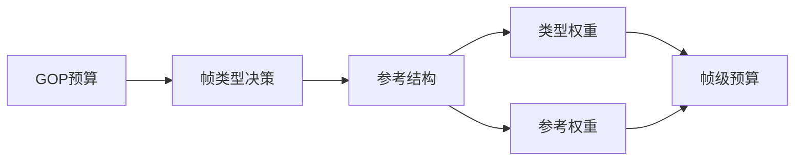

> 💡 **先看主线**：`GOP_bits` 只是说明“这一组图像一共有多少钱”；帧类型决策说明“谁是地基、谁是承重墙、谁是填充结构”；帧级预算才是在这个结构上具体分钱。

也就是说，`GOP_bits` 只告诉码控“这一组图像最多能花多少钱”，但它并不知道这笔钱应该怎么拆。如果不先决定帧类型，码控就不知道：

- **谁应该多拿 bits**：I 帧、关键 P 帧、层级参考帧通常更重要。
- **谁可以少拿 bits**：普通 B 帧残差较小，且如果不被未来参考，预算可以更保守。
- **谁会影响未来**：被很多后续帧参考的帧，如果质量太差，会把误差沿参考链传播下去。
- **谁会带来系统代价**：B 帧可能省 bits，但也可能增加重排序延迟和 VBV/HRD 缓冲压力。

反过来说，帧类型决策本身也不能完全脱离 GOP 预算。比如内容上很适合插 I 帧，但如果当前 GOP 预算或缓冲状态很紧，就不能无条件插一个很大的 I 帧；再比如 B 帧虽然压缩效率高，但低延迟场景可能不允许重排序。因此，帧类型决策是在“结构收益”和“码率约束”之间做中间翻译：

```text
GOP 级预算：这一组一共有多少钱
        ↓
帧类型决策：先确定谁重要、谁被参考、谁适合省钱
        ↓
帧级预算：再按照角色和权重具体分钱
```

从这个角度看，帧类型决策像是在 GOP 预算和帧级预算之间建立一张“分配规则表”：同样是 `GOP_bits = 1 Mbit`，如果结构是 `I + P + B + B`，和结构是 `I + P + P + P`，每帧该拿到的 bits 会完全不同；如果某个 B 帧还是层级参考帧，它也不能简单按普通 B 帧低预算处理。

这里涉及几个容易混淆的名词，可以按“是否被未来参考”和“预算权重”对比理解：

| 名词 | 参考关系 | 主要作用 | 码控含义 |
|---|---|---|---|
| **普通 B 帧** | 只利用前后参考帧做双向预测，自己通常不再被未来帧参考 | 提高当前帧压缩效率 | 失真通常不向后传播，预算可以相对较低 |
| **层级 B 帧** | 处在层级 GOP 或 B 金字塔结构中，部分 B 帧会被更低层级帧继续参考 | 在压缩效率和参考稳定性之间折中 | 名字仍是 B 帧，但不能只看帧类型标签，还要看它所在层级 |
| **层级参考帧** | 会被后续若干帧继续参考，不一定只限于 P 帧 | 作为后续预测链上的参考节点 | 需要提高 `reference_weight`，避免失真沿参考链传播 |

需要注意的是，**“普通 B 帧低预算处理”是一种码控处理策略**：它默认该 B 帧不承担未来参考责任，因此可以按非参考 B 帧给较低预算；但如果这个 B 帧实际处在层级参考位置，就不能套用这种低预算策略，预算可能接近甚至超过普通 P 帧。

其中，**B 金字塔结构**可以简单理解为：不是把所有 B 帧都当作“一次性消费帧”，而是把一部分 B 帧提升为中间参考点，让更低层级的 B 帧继续参考它。这样形成一个从关键参考帧到中间 B 参考帧、再到普通 B 帧的层级结构，形状类似金字塔。

```text
I/P 锚点        P/下一个锚点
   \            /
    B_ref  ← 中间层 B 参考帧
   /     \
 B       B ← 底层普通 B 帧
```

它带来的码控含义是：**同样叫 B 帧，位置不同，预算价值不同**。底层普通 B 帧通常可以少给 bits；但中间层 `B_ref` 会被其他 B 帧参考，如果压得太狠，会影响后续被它预测的帧，所以需要更高的 `reference_weight`。

到这里，`7.6.1` 的重点可以收束为一句话：**帧类型决策先把 GOP 内部的结构角色确定下来，再把这些角色转成帧级预算所需的权重依据。** 下一小节再把这个判断过程展开成伪代码。

#### **7.6.2 伪代码展开：从候选帧到预算权重**

这一小节就是把 `7.6.1` 里的五步判断具体展开。为了避免直接看伪代码时觉得函数名很抽象，可以按下面这条阅读顺序理解：**先看输入依据是什么，再看伪代码中的函数如何消费这些输入，最后看它们如何输出帧类型和预算权重**。

先解释 `7.6.1` 中提到的输入信息。它们不是孤立参数，而是分别服务于后面的五类判断：

| 输入依据 | 它提供什么信息 | 主要影响哪一步判断 | 简单理解 |
|---|---|---|---|
| **随机访问间隔 / 最大 GOP 长度** | 当前帧是否已经到达必须插入 IDR / CRA / 关键帧的位置 | 随机访问约束 | 到点就必须开新锚点，不能只按压缩效率决定 |
| **lookahead 窗口内的运动与纹理复杂度** | 编码器提前观察未来若干帧，估计运动是否平滑、纹理是否复杂、残差是否容易预测 | 场景切换检测、预测收益评估、参考价值排序 | 它相当于“提前看几帧”：如果运动连续，B 帧和层级参考通常更划算；如果纹理复杂或变化突兀，预测收益会下降，预算也要更谨慎 |
| **场景切换分数** | 当前帧和前后帧是否已经不属于同一场景 | 场景切换检测 | 分数高说明旧参考可能失效，继续沿用 P/B 参考链会导致残差暴涨 |
| **延迟约束** | 业务是否允许等待未来帧、是否允许显示顺序和编码顺序不一致 | 延迟约束判断 | 低延迟场景通常不能随便使用 B 帧；点播或离线编码则更能利用 lookahead 和重排序 |
| **VBV/HRD 缓冲水位** | 当前码流输出是否接近缓冲上限或下限 | 预测收益评估、预算权重映射 | 即使某帧适合多给 bits，缓冲紧张时也要被压制，避免码流瞬时超标 |
| **参考帧数量与重排序能力** | 编码器最多能保留多少参考帧、允许多少 B 帧重排序、参考列表能否支持层级结构 | 延迟约束判断、预测收益评估、参考价值排序 | 它决定“结构能不能实现”：参考帧少或不允许重排序时，复杂 B 金字塔就算理论上划算，也可能无法采用 |

有了这些输入依据，下面就可以先看完整伪代码。这里的核心逻辑是：**先让输入依据参与判断，再根据判断结果选择 I/P/B/层级 B，最后生成预算权重**。更清晰的伪代码可以写成下面这样：

```text
# 对 GOP 内每个候选帧，先决定它在参考结构里的角色，
# 再把这个角色转换成后续码控要用的预算权重。

for frame in GOP:

    # 第 1 层：硬约束优先。
    # 如果这里必须能随机访问，或者发生明显场景切换，
    # 就不要再纠结 P/B，直接开新的 I 类锚点。
    if need_random_access(frame) or is_scene_cut(frame):
        type = I
        reference_value = high

    # 第 2 层：低延迟约束。
    # 如果业务要求一帧进一帧出，就尽量避免 B 帧重排序，
    # 当前帧更可能被安排成 P 帧。
    elif low_latency_mode:
        type = P
        reference_value = estimate_future_dependency(frame)

    # 第 3 层：允许 lookahead 和重排序时，才评估 B 帧是否划算。
    else:
        gain_b = estimate_b_prediction_gain(frame)
        cost_b = estimate_reorder_and_buffer_cost(frame)

        if gain_b > cost_b:
            # 双向预测收益大于延迟 / 缓冲 / 复杂度成本：
            # 可以把它做成普通 B，或者层级 B 中的某一层。
            type = B_or_hierarchical_B
        else:
            # B 帧不够划算，或者会带来太多约束成本：
            # 继续使用 P 帧，保持参考链简单稳定。
            type = P

        # 无论最后是 P 还是 B，都要继续估计它未来是否会被参考。
        # 如果某个 B 帧处在 B 金字塔高层，它也可能有较高参考价值。
        reference_value = estimate_future_dependency(frame)

    # 第 4 层：把“帧类型”和“参考价值”翻译成码控权重。
    # 后续帧级预算不是只看 I/P/B 名字，而是同时看它是否重要、是否会影响未来。
    type_weight = map_type_to_base_weight(type)
    reference_weight = map_dependency_to_weight(reference_value)
```

这段伪代码的处理框图如下：

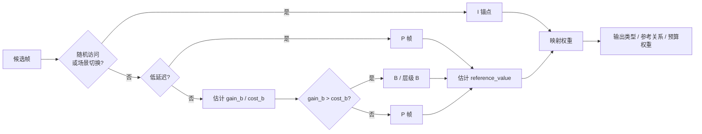

伪代码里的这些名字，并不是某个编码器里的真实函数名，而是把前面那些输入依据转换成判断结果的抽象函数。为了避免重复，可以把它们直接汇总成下面这组“输入依据 → 输出结果 → 伪代码作用”的函数列表：

- **`need_random_access(frame)`：判断是否必须插入 I 类锚点**
  - **输入依据**：随机访问间隔、最大 GOP 长度、直播切片边界、用户强制关键帧。
  - **输出结果**：返回是/否；为“是”时，当前帧优先成为 I 类锚点。
  - **伪代码作用**：这是最优先的硬约束，用来决定是否必须打断旧参考链，保证码流可以独立进入。
  - **近似判断**：`reach_keyframe_interval or reach_segment_boundary or forced_keyframe`。

- **`is_scene_cut(frame)`：判断是否发生场景切换**
  - **输入依据**：场景切换分数、前后帧亮度/颜色差异、运动补偿残差、块匹配失败比例。
  - **输出结果**：返回是/否；为“是”时，当前帧通常不再适合继续依赖旧场景参考。
  - **伪代码作用**：和随机访问类似，它也会触发新的 I 类锚点，避免旧参考帧在新场景中失效。
  - **近似判断**：`scene_change_score > scene_cut_threshold`。

- **`low_latency_mode`：判断是否进入低延迟模式**
  - **输入依据**：业务延迟约束、最大允许缓存帧数、是否允许显示顺序和编码顺序不一致。
  - **输出结果**：返回是/否；为“是”时，伪代码倾向于选择 P 帧。
  - **伪代码作用**：决定是否跳过复杂 B 帧和重排序结构，优先保证“一帧进、一帧出”的实时性。
  - **近似判断**：`max_reorder_depth == 0`，或缓存帧数很小，或实时延迟预算很紧。

- **`estimate_future_dependency(frame)`：估计“这帧未来有多重要”**
  - **输入依据**：未来直接参考次数、间接参考路径长度、GOP 层级位置、当前段落的场景稳定性。
  - **输出结果**：得到 `reference_value`；值越高，说明当前帧越值得被保护。
  - **伪代码作用**：无论当前帧最终是 P 还是层级 B，都用它估计失真向未来传播的风险。
  - **近似表达**：`reference_value ≈ direct_ref_count + indirect_ref_count × decay + hierarchy_bonus + long_term_ref_bonus`。

- **`estimate_b_prediction_gain(frame)`：估计“做成 B 帧能省多少 bits”**
  - **输入依据**：前向预测残差、后向预测残差、双向预测残差、lookahead 运动连续性、lookahead 纹理复杂度。
  - **输出结果**：得到 `gain_b`；值越高，说明把当前帧做成 B 帧越可能节省码率。
  - **伪代码作用**：在允许 lookahead 和重排序时，用它衡量 B 帧的压缩收益。
  - **近似表达**：`gain_b ≈ bits_as_P - bits_as_B ≈ residual_cost_forward - residual_cost_bidirectional`。

- **`estimate_reorder_and_buffer_cost(frame)`：估计“用 B 帧要付出多少代价”**
  - **输入依据**：重排序延迟、VBV/HRD 缓冲水位、参考帧数量限制、重排序能力限制、编码复杂度和内存压力。
  - **输出结果**：得到 `cost_b`；值越高，说明使用 B 帧带来的系统代价越大。
  - **伪代码作用**：和 `gain_b` 对比；只有当 `gain_b > cost_b` 时，B 帧或层级 B 才更划算。
  - **近似表达**：`cost_b ≈ reorder_delay_cost + vbv_risk_cost + complexity_cost + memory_cost`。

- **`map_type_to_base_weight(type)`：把帧类型映射成基础预算权重**
  - **输入依据**：已经选出的帧类型、I/P/B 经验比例、历史复杂度统计、是否承担特殊参考作用。
  - **输出结果**：得到 `type_weight`；它表示该帧类型天然应该分到的基础预算。
  - **伪代码作用**：把 I/P/B/参考 B 从“结构角色”转换成码控可使用的基础权重。
  - **近似表达**：I 帧通常高，P 帧居中，普通 B 帧较低，参考 B 可能接近 P 帧。

- **`map_dependency_to_weight(reference_value)`：把未来参考依赖映射成附加权重**
  - **输入依据**：`reference_value`、失真传播风险、VBV/HRD 可用余量。
  - **输出结果**：得到 `reference_weight`；它是在基础权重之外，为重要参考帧叠加的保护权重。
  - **伪代码作用**：把“这帧会影响多少未来帧”转换成预算加权，同时受缓冲约束裁剪。
  - **近似表达**：`reference_weight = clamp(1.0 + alpha × reference_value, min_reference_weight, max_reference_weight_allowed_by_vbv)`。

也就是说，伪代码不是凭空给帧贴标签，而是先用这些函数把输入信息变成中间判断，再把 `type` 和 `reference_value` 映射成后续码控需要的 `type_weight` 与 `reference_weight`。

可以把整段伪代码记成一句话：**先处理必须切断参考链的硬条件，再看延迟是否允许 B 帧，然后比较 B 帧的压缩收益和系统代价，最后把“帧类型”和“未来参考价值”一起转换成码控权重。**

### **7.7 帧级预算：I / P / B 不是标签，而是码率合同**

帧类型一旦确定，码控就相当于签下一份“码率合同”：

| 类型 | 常见预算关系 | 为什么 |
|---|---|---|
| **I 帧** | 约 `3~5 × P` | 熵高，且是后续参考链起点 |
| **P 帧** | `1.0 × base` | 工作主力，兼顾当前质量与后续传播 |
| **B 帧** | 约 `0.4~0.95 × P` | 残差低；若处在高层参考位置，预算接近 P |
| **特殊参考帧** | 可能高于普通 P | 服务未来多帧，本质是“时间域投资” |

经典帧级分配可以抽象为：

```text
frame_bits[i] = GOP_bits × weight[i] / Σ weight[j]
```

关键在于 `weight[i]` 如何定义。一个通用权重可拆成：

```text
weight = type_weight
       × complexity_weight
       × reference_weight
       × buffer_weight
```

- `type_weight`：I/P/B 的基础比例。
- `complexity_weight`：内容越复杂，越需要 bits。
- `reference_weight`：未来被参考越多，越值得保护。
- `buffer_weight`：VBV 紧张时，即使重要也要被压制。

> 💡 **核心思想**：I/P/B 比例不是死表，而是“基础类型权重 + 内容复杂度 + 参考价值 + 缓冲约束”的合成结果。

### **7.8 经典分配公式：TM5 思路为何至今仍重要**

经典 MPEG-2 TM5 的思想是：不同帧类型维护不同复杂度估计 `X_I / X_P / X_B`，再根据 GOP 内剩余帧数分配目标 bits。

```text
            R
T_I = ----------------------------------------
      1 + (N_P × X_P) / (X_I × K_P)
        + (N_B × X_B) / (X_I × K_B)

            R
T_P = ----------------------------------------
      N_P + (N_B × X_B × K_P) / (X_P × K_B)

            R
T_B = ----------------------------------------
      N_B + (N_P × X_P × K_B) / (X_B × K_P)
```

- `R`：当前 GOP 剩余 bit 预算。
- `N_P / N_B`：剩余 P / B 帧数。
- `X_I / X_P / X_B`：各类型历史复杂度。
- `K_P / K_B`：经验调节权重。

这套公式的价值不在于今天必须照抄，而在于它给出了码控的三个基本信念：

1. **分配要看剩余预算**：不能只看当前帧。
2. **分配要看类型复杂度**：I/P/B 的 bits↔QP 曲线不同。
3. **分配要有反馈记忆**：历史复杂度是下一次预算的先验。

> 🔄 **取舍点**：只靠历史复杂度会滞后于场景切换；引入 lookahead 可以缓解滞后，但会增加延迟和内存。这里没有绝对最优，只有场景约束下的取舍。
>
> 📌 **公式查询**：除 TM5 外，更多常见分配公式可查阅 [附录 A：码率分配公式速查](#附录-a码率分配公式速查)。

### **7.9 除了 TM5：现代码率分配模型谱系**

TM5 解决的是“帧类型 + 历史复杂度 + 剩余预算”的经典问题。现代码控没有抛弃这个思路，而是把它扩展成一个更大的分配系统：既看当前内容有多难，也看未来参考价值、缓冲安全、主观感知和业务优先级。

| 模型 | 核心思想 | 代表场景 |
|---|---|---|
| **平均预算模型** | 每帧先平均分钱，再用反馈修正 | 简单 CBR、教学基线 |
| **复杂度加权模型** | 纹理、运动、残差越复杂，预算越高 | SATD / MAD / lookahead 预估 |
| **二次 R-Q 模型** | 用 bits 与 qScale/QP 的曲线关系反推量化强度 | H.264 JM、早期工程码控 |
| **R-λ 模型** | 先由目标 bits 推 λ，再由 λ 映射 QP | HEVC HM、VVC VTM、VVenC |
| **ABR 反馈模型** | 根据历史误差持续修正后续 QP | x264 / x265 ABR |
| **CRF / CQ 模型** | 优先稳定质量，允许码率随内容波动 | x264 / x265 CRF、AV1 CQ |
| **Lookahead 模型** | 先粗看未来一段，再决定当前帧预算 | x264、x265、VP9、AV1 |
| **mbtree / cuTree / TPL** | 当前块如果会影响未来多帧，就提前多给 bits | x264、x265、SVT-AV1、libaom |
| **层级 GOP 模型** | 高层级参考帧更重要，非参考帧更容易压缩 | HEVC / VVC / AV1 随机访问结构 |
| **VBV / HRD 模型** | 在模型预算外增加缓冲安全约束 | 直播、低延迟、严格 CBR |
| **2-pass 模型** | 第一遍统计全片复杂度，第二遍全局优化分配 | 点播转码、离线压制 |
| **AQ / 块级模型** | 帧内不同区域按空间复杂度和感知价值再分配 | x264 / x265 / AV1 AQ |
| **感知 / ROI 模型** | 人眼敏感或业务重要区域优先保护 | 会议、人脸、监控、云游戏 |

这些模型看起来很多，但可以压缩成一句话：

> **TM5 是“剩余预算怎么按帧类型分”的起点；现代码控是在这个起点上继续叠加复杂度预测、未来引用价值、缓冲约束、主观感知和业务权重。**

因此，读者不必把每个模型看成互斥方案。真实编码器往往是组合式的：例如先用 lookahead 估复杂度和参考价值，再用 R-Q 或 R-λ 反推 QP，最后由 ABR/VBV/AQ 做全局与局部修正。

> 📌 **模型速查**：如果需要横向比较这些模型的输入、输出、优缺点，可查阅 [A.12 码率分配模型谱系速查](#a12-码率分配模型谱系速查)。

### **7.10 从目标 bits 到 QP / λ：预算如何落到量化强度**

到这里，前面几节已经完成了“分钱”：序列预算被分到 GOP，GOP 预算被分到帧，帧类型和参考价值也已经参与了权重计算。于是码控现在手里有了一个看似明确的目标：**这一帧大约应该花 `target_bits`**。

但这里有一个容易误解的地方：编码器不能直接命令当前帧“正好编码成这么多 bits”。它真正能调的旋钮主要是两个：

| 旋钮 | 控制什么 | 对结果的影响 |
|---|---|---|
| **`QP / qScale`** | 量化强度，也就是变换系数被压粗还是保细 | QP 越高，系数越容易被量化掉，bits 通常越少，失真通常越大 |
| **`λ`** | RDO 中“多花 1 bit 值不值得”的价格 | λ 越大，RDO 越讨厌花 bits，更倾向选择省码率但失真更高的模式 |

这两个旋钮一内一外：**`QP / qScale` 决定量化有多狠，`λ` 决定 RDO 有多舍不得花 bits**。所以，从 `target_bits` 到真正编码，中间必须先完成一次转换：把“预算目标”翻译成“量化强度”和“RDO 取舍倾向”。

```text
target_bits
  ↓
先判断：这帧有多难编码、值不值得保护
  ↓
反推出合适的 qScale / QP
  ↓
由 QP / qScale 推出 λ，让 RDO 选择倾向与量化强度保持一致
  ↓
λ 进入 RDO，QP 进入量化
  ↓
实际 bits 反馈修正下一次模型
```

#### **7.10.1 为什么会出现抽象模型**

现在问题变成：既然编码器不能直接控制 bits，那它怎么从 `target_bits` 反推出 `QP / qScale`？

这就需要一个码率模型。它要表达一个朴素关系：**同样的量化强度下，内容越复杂，越费 bits；同样的内容下，量化越粗，越省 bits。**

因此，可以先写成一个通用抽象模型：

```text
bits ≈ complexity / qScale
```

这个式子的含义不是要精确预测每一个 bit，而是建立方向感：

- **`complexity` 越大**：纹理、运动、残差越复杂，同样 QP 下越容易产生更多 bits。
- **`qScale` 越大**：量化越粗，更多细节被压掉，bits 通常越少。

当 `target_bits` 已经由帧级预算给定时，就可以把上式反过来用：

```text
qScale ≈ complexity / target_bits
QP = qScale_to_qp(qScale)
λ = α × qScale²
```

这样，抽象模型和前面的 `QP / λ` 就连起来了：**不是先凭空写一个模型，而是因为编码器需要把目标 bits 翻译成可执行的 QP 和 λ，所以必须用一个模型描述 bits、复杂度和量化强度之间的关系。**

#### **7.10.2 先冻结复杂度，再反推 QP / λ**

不过，上面的模型还隐藏着一个循环依赖：

- `actual_bits` 要等编码完成后才知道；
- `QP / qScale / λ` 又必须在编码前决定；
- `complexity` 看起来也像是“内容在某个 QP 下会产生多少 bits”的结果。

真实码控不会在同一时刻把这些量一起求精确解，而是用**时间顺序**打破循环：**先估计复杂度，再反推 QP / λ，最后用实际编码结果修正下一次估计**。

```text
上一轮反馈 / lookahead / 帧结构
  ↓
先得到当前帧的 complexity_est
  ↓
把 target_bits 当作已知预算
  ↓
反推 qScale、QP 和 λ
  ↓
用这个 QP / λ 真正编码当前帧
  ↓
得到 actual_bits
  ↓
用 actual_bits 更新下一帧或下一 GOP 的模型
```

所以，抽象模型里的 `complexity` 更准确地说应该是 `complexity_est`：它是**编码前的预测量**，不是编码后的真实结论。当前帧求 QP 时，先把它固定住：

```text
qScale = complexity_est / target_bits
```

等当前帧编码完成后，实际得到的 `actual_bits` 才会反过来更新模型：

```text
complexity_next = update(complexity_est,
                         actual_bits,
                         qScale_used)
```

这样看，码控不是在解一个静态公式，而是在做闭环控制：**当前帧用预测值做决策，编码完成后用误差修正未来决策**。

#### **7.10.3 `complexity_est` 从哪里来**

`complexity_est` 不是一个神秘黑盒，通常由三类信息合成：

| 复杂度来源 | 看什么 | 作用特点 |
|---|---|---|
| **历史反馈** | 同类型帧过去在某个 QP 下用了多少 bits | 稳定，但会滞后；适合修正长期偏差 |
| **lookahead 估计** | 低分辨率 SATD、运动搜索代价、残差能量 | 更提前，但增加延迟和计算；适合预判当前内容难度 |
| **结构权重** | 帧类型、参考价值、层级位置 | 不只看当前帧难不难，还看它值不值得被保护 |

这三类信息解决的是不同问题：历史反馈回答“过去类似内容花了多少”，lookahead 回答“眼前这段内容看起来难不难”，结构权重回答“这帧是否会影响未来”。合在一起，才形成当前帧的 `complexity_est`。

于是，帧级码控的核心过程可以写成：

```text
frame_target_bits
  ↓
complexity_est = combine(history, lookahead, frame_structure)
  ↓
base_qScale = rate_model(frame_target_bits, complexity_est)
  ↓
base_QP = qscale_to_qp(base_qScale)
  ↓
base_λ = qscale_to_lambda(base_qScale)
```

这里的 `base_QP / base_λ` 只是模型给出的初稿，还不是最终执行值。

#### **7.10.4 为什么模型结果还要再修正**

如果只按模型输出直接编码，会遇到两个工程问题：一是画质可能突然跳变，二是码流可能违反缓冲约束。因此真实系统还会继续加保护层。

第一层是 **QP 限幅和平滑**，防止画质突然跳变：

```text
QP_model = qscale_to_qp(base_qScale)
QP_limited = clip(QP_model, QP_min, QP_max)
QP_smooth = limit_delta(QP_limited, QP_previous, max_qp_step)
```

第二层是 **反馈与 VBV 修正**，防止长期码率漂移或瞬时缓冲风险：

```text
QP_final = QP_smooth
         + feedback_correction
         + vbv_correction
```

这也解释了为什么同样的 `target_bits`，最终 QP 不一定完全相同：

- **内容更复杂**：为了接近同样的 bits，QP 往往需要更高，否则容易超码率。
- **参考价值更高**：即使 bits 紧张，也可能适当降低 QP，因为它会影响未来多帧。
- **VBV 更紧张**：即使当前帧重要，也可能被迫提高 QP，先保证码流可播。
- **相邻帧 QP 差距过大**：模型算得再激进，也要被平滑机制拉回来。

可以把本节串成一句话：**帧级预算先给出 `target_bits`，码率模型再结合 `complexity_est` 反推 `QP / qScale`，随后用 `QP / qScale` 推出 RDO 需要的 `λ`，最后再经过平滑、反馈和 VBV 修正，得到真正执行的编码参数。**

> 💡 **核心理解**：预算不是直接变成 bits，而是先变成 `QP / λ`。`QP` 控制量化强度，`λ` 控制 RDO 中“失真 vs 码率”的取舍；真正编码后的 bits 再反过来修正模型。

### **7.11 块级预算：同一帧内部也不是平均分**

`7.10` 已经把帧级 `target_bits` 转成了当前帧的 `baseQP / baseλ`。但这个 `baseQP` 只回答了一个平均问题：**如果把整帧当成一个整体，这帧大概应该压多狠**。

真实画面不是均匀的。同一帧里，可能同时存在人脸、天空、草地、文字、快速运动物体和静止背景；它们对 bits 的需求、对失真的敏感度、以及对未来参考帧的影响都不一样。因此，块级码控要继续回答第二个问题：**这一帧内部的钱，应该花在哪些块上？**

```text
frame_baseQP / frame_baseλ
  ↓
分析每个块：内容复杂度、块类型、参考价值、感知重要性
  ↓
得到每个块的 ΔQP / Δλ 倾向
  ↓
用局部 QP / λ 参与 RDO 和量化
  ↓
实际块 bits 反馈给后续块、后续帧或后续 GOP
```

#### **7.11.1 为什么块级不能平均分**

帧级预算类似“给整帧一个总经费”，但块级预算要看每个区域的边际收益：同样多花 100 bits，有的地方能明显改善观感，有的地方几乎看不出来。

| 区域 / 块特征 | 如果少给 bits | 如果多给 bits | 码控倾向 |
|---|---|---|---|
| **平坦区域** | 容易出现块效应、色带、噪声闪烁 | 主观稳定性明显提升 | 不一定省太狠，尤其暗部 / 天空要谨慎 |
| **复杂纹理区域** | 细节会被抹掉，但人眼有时不敏感 | 可保留纹理和锐度 | 常由 AQ 判断是否值得多给 |
| **边缘 / 文字 / 人脸** | 失真非常显眼 | 主观收益高 | 感知模型通常倾向保护 |
| **运动剧烈区域** | 单帧细节不一定敏感，但预测残差可能大 | 可减少拖影和预测误差 | 需要结合运动和参考价值判断 |
| **未来会被大量参考的区域** | 当前省 bits 会把误差传播到后面多帧 | 当前多花 bits 是“投资” | mbtree / cuTree / TPL 倾向降低 QP |

所以块级码控不是简单地把 `frame_target_bits` 平均切成很多小份，而是努力让每个区域的“每 bit 收益”更接近。收益高的块多花一点，收益低的块少花一点，整帧主观质量通常更稳。

#### **7.11.2 块是如何划分与判定类型的**

在继续讨论块类型之前，先要明确一件事：编码器并不是一开始就知道“这里一定是一个 Intra 块，那里一定是一个 Skip 块”。它通常会先把画面切成候选区域，再对每个候选区域尝试多种划分和预测模式，最后用 RDO 选择代价最低的方案。

```text
输入当前帧 + 参考帧
  ↓
从大块开始尝试划分：CTU / superblock / MB
  ↓
对子块尝试不同预测模式：Intra / Inter / Merge / Skip
  ↓
估计每种方案的失真 distortion 和码率 bits
  ↓
计算 RDO cost = distortion + λ × bits
  ↓
选择 cost 最低的划分方式和块类型
```

块划分的底层逻辑可以理解成“**大块省语法，小块更精细**”：

| 判断因素 | 更倾向大块 | 更倾向继续拆小块 |
|---|---|---|
| **内容是否平坦** | 大面积天空、墙面、背景变化缓慢 | 有明显边缘、文字、物体边界 |
| **运动是否一致** | 整个区域能用同一个运动矢量解释 | 区域内部有多个运动方向或遮挡 |
| **预测残差是否低** | 当前预测已经足够准，残差小 | 预测误差集中在局部，拆小后能明显降低残差 |
| **语法开销是否值得** | 拆分带来的失真下降不明显 | 多写划分信息和运动信息后，整体 RDO cost 仍然更低 |

块类型的判定也不是单独看某一个特征，而是比较多个候选模式的总代价：

```text
cost_intra = distortion_intra + λ × bits_intra
cost_inter = distortion_inter + λ × bits_inter
cost_merge = distortion_merge + λ × bits_merge
cost_skip  = distortion_skip  + λ × bits_skip

best_type = argmin(cost_intra,
                   cost_inter,
                   cost_merge,
                   cost_skip)
```

这里的 `λ` 叫**拉格朗日因子**，可以把它理解成 RDO 里的“bits 价格”：

- **`λ` 越大**：`λ × bits` 越贵，编码器越舍不得花 bits，更容易选择大块、Merge、Skip、少残差等省码率方案。
- **`λ` 越小**：bits 没那么贵，编码器更愿意多花 bits 降低失真，更可能选择细划分、显式运动信息或保留更多残差。

它通常**不是用户直接逐块传入的参数**。用户一般传入的是更上层的目标，例如 `bitrate / CRF / QP / quality / preset` 等；码控先把这些目标转换成帧级或块级 `QP / qScale`，再按类似下面的关系推导出 `λ`：

```text
qScale = qp_to_qscale(QP)
λ = α × qScale²
```

其中 `α` 通常和帧类型、编码器经验参数、心理视觉优化等有关。也就是说，用户可以通过目标码率、CRF、固定 QP、AQ 强度等**间接影响 `λ`**，但在常规编码流程里，`λ` 主要是编码器根据 `QP / qScale` 计算出来，用来指导 RDO 模式选择的。

这里的 `distortion_*` 和 `bits_*` 不是凭空估出来的，而是每个候选模式在“试编码”或“快速估计”时得到的两本账：

| 项 | 怎么得到 | 直观理解 |
|---|---|---|
| **`distortion_*`** | 先按候选模式生成预测块，再得到残差；精细 RDO 会经过变换、量化、反量化、反变换得到重建块，然后用原始块和重建块计算 `SSD / SSE` 等失真；快速筛选时也常用 `SAD / SATD` 近似 | 这个模式会让画面损失多少 |
| **`bits_*`** | 估计或实际试写该模式需要的语法 bits，包括划分标志、模式标志、帧内方向、参考帧索引、运动矢量差、Merge 索引、残差系数、非零系数标志等；工程上通常结合 CABAC / CDF 等熵编码上下文估算 | 这个模式要花多少钱 |

不同候选的账本不一样：

- **`Intra`**：不写运动信息，但要写帧内预测方向和残差系数；如果预测不准，`bits_intra` 和 `distortion_intra` 都可能较高。
- **`Inter`**：要写参考帧索引、运动矢量差和残差；运动补偿准时，残差 bits 会明显下降。
- **`Merge`**：主要写 Merge 索引，复用邻近运动信息，运动 bits 通常少；但如果复用的预测不准，`distortion_merge` 会变大。
- **`Skip`**：几乎只写很少的 skip 标志和索引，残差通常为 0；它的 `bits_skip` 很低，但前提是预测本身已经足够准。

所以，RDO 不是只问“这个块像不像”，也不是只问“这个块省不省 bits”，而是同时比较：**为了降低多少失真，值得多花多少 bits**。

从基本思路看，它确实像“枚举候选 → 计算代价 → 选择最小值”。但工程上通常不会把所有划分、所有参考帧、所有运动矢量、所有预测模式都完整穷举一遍，因为计算量会非常大。真实编码器更常见的是：**保留 RDO 比较框架，但用一系列策略减少候选数量**。

| 策略 | 做法 | 直观理解 |
|---|---|---|
| **候选裁剪** | 先用 SATD、运动残差、邻近块信息排除明显不划算的模式 | 先淘汰“看起来就很差”的选项 |
| **层级搜索** | 先粗搜索大方向，再在少数候选附近精搜索 | 先找大概位置，再精修 |
| **早停 / early skip** | 如果 Skip / Merge 已经足够好，就不再继续尝试复杂模式 | 已经很便宜且够准，就别再折腾 |
| **邻近块预测** | 优先尝试左侧、上方、参考帧同位置块常用的模式 | 相邻区域通常有相似运动和纹理 |
| **复杂度档位** | preset 越快，候选越少；preset 越慢，搜索越充分 | 用编码速度换压缩效率 |

因此，更准确的说法是：**理论模型是候选模式之间的 RDO 代价比较；工程实现是“有限候选 + 快速筛选 + 必要时精细比较”，而不是无脑全穷举。**

这些候选模式背后的直觉是：

- **如果帧内预测已经很准**：例如边缘方向清晰、局部纹理和邻近像素关系强，`Intra` 可能胜出。
- **如果参考帧能很好解释当前块**：运动搜索能找到合适参考位置，且残差较小，`Inter` 可能胜出。
- **如果邻近块或参考块的运动信息可以直接复用**：额外 bits 很少，`Merge` 可能胜出。
- **如果连残差都几乎不用写**：直接复用预测已经足够好，`Skip` 可能胜出。

这里也能看出码控和块类型之间的关系：`λ` 越大，`λ × bits` 这一项越重，RDO 越倾向选择省 bits 的大块、Merge 或 Skip；`λ` 越小，RDO 更愿意为降低失真付出 bits，因而更可能选择更细划分、显式运动信息或残差更完整的模式。

所以，块划分和块类型判定的底层逻辑不是“先人工分类，再分配 bits”，而是：**编码器不断尝试候选划分和候选模式，用 `distortion + λ × bits` 比较它们是否划算，最终选出当前 λ 下性价比最高的块结构。**

#### **7.11.3 块类型会影响 bits 花在哪里**

块级预算还要理解一个重要事实：块不是只有“复杂 / 不复杂”这一种差异，它还会在 RDO 中被选择成不同的预测模式或块类型。常见可以这样理解：

| 块类型 / 模式 | 它在编码里意味着什么 | 和码控的关系 |
|---|---|---|
| **Intra 块 / 帧内块** | 不依赖其他帧，主要靠当前帧内部预测 | 往往残差更贵；如果是关键结构、文字、边缘，过度压缩会很显眼 |
| **Inter 块 / 帧间块** | 从参考帧运动补偿得到预测，再编码运动信息和残差 | 预测准时很省 bits；预测不准时残差会上升，需要更多预算 |
| **Skip / Merge 块** | 直接复用邻近或参考信息，残差很少甚至没有 | 非常省 bits；QP / λ 偏高时更容易被选中，但过度使用可能导致细节糊、运动拖影 |
| **残差重的块** | 预测后仍有大量误差要编码 | 如果不给 bits，失真会明显；如果是短暂噪声，也可能被模型压掉 |
| **参考传播块** | 不是语法上的固定块类型，而是“未来很多帧会参考它”的时间域角色 | 当前多花 bits 可以降低未来多帧残差，是 mbtree / cuTree / TPL 重点保护对象 |

这些“贵不贵、省不省”的判断，最终仍会落回 `7.11.2` 里的两本账：一是预测和重建后产生的 `distortion_*`，二是语法信息、运动信息和残差信息形成的 `bits_*`。例如 `Skip / Merge` 往往省 bits，是因为它们少写运动信息甚至少写残差；但如果预测不准，`distortion_*` 会升高，RDO 仍可能转向 `Inter` 或更细划分。

这里容易出现一个循环：**块类型是 RDO 选择出来的结果，但 RDO 的选择又会受到 QP / λ 影响**。真实编码器通常不会等块类型完全确定后才做码控，而是先用历史、lookahead、运动估计、纹理强度等信息形成局部倾向，再让 RDO 在这个局部 `QP / λ` 下做最终模式选择。

```text
块级预分析：纹理 / 运动 / 参考价值
  ↓
给出局部 ΔQP / Δλ 倾向
  ↓
RDO 在局部 QP / λ 下选择 Intra / Inter / Merge / Skip 等模式
  ↓
实际块类型和 actual_bits 再反馈给模型
```

也就是说，块级码控不是直接指定“这个块必须是 Inter、那个块必须是 Skip”，而是通过 `QP / λ` 改变不同模式的代价，让 RDO 更自然地偏向“当前预算下最划算”的选择。

#### **7.11.4 块级 dQP 如何叠加到帧级 baseQP 上**

前面几节已经说明：块类型最终由 RDO 选择，但 RDO 的选择会受到局部 `QP / λ` 影响。本节要回答的就是：这些局部 `QP` 偏移从哪里来，又如何叠加到帧级 `baseQP` 上。

工程上，块级码控通常先生成一个“候选偏移”：

```text
block_QP_model = baseQP(frame) + block_dQP_raw

block_dQP_raw = ΔQP_temporal_reference
              + ΔQP_spatial_activity
              + ΔQP_perceptual
              + ΔQP_local_feedback
```

这里的 `block_dQP_raw` 还不是最终块 QP。它只是根据当前块的参考价值、空间特征、主观重要性和局部预算状态，先估出“这个块相对整帧底价应该贵一点还是便宜一点”。最终限幅、平滑和帧内反馈会放到 `7.11.5` 再处理。

每一类 `dQP` 的计算都可以抽象成同一条小链路：

```text
测量局部信号
  ↓
和帧内 / lookahead 平均水平比较
  ↓
按强度系数映射成连续偏移
  ↓
取整得到当前来源的 ΔQP
```

四类来源可以合并理解为：

| 来源 | 测什么 | 如何量化成 `dQP` | 方向直觉 |
|---|---|---|---|
| **时间域引用价值** | lookahead 中的未来引用次数、运动依赖、传播代价 `propagate_cost` / `reference_value` | `reference_ratio = (reference_value + ε) / (avg_reference + ε)`，再近似映射为 `ΔQP_temporal ≈ -k_t × log2(reference_ratio)` | 当前块越会影响未来，`ΔQP` 越偏负，QP 降低，避免误差向后传播 |
| **空间域复杂度** | 方差、SATD、边缘强度、纹理能量、亮度活动度 `activity` | `activity_ratio = (activity + ε) / (avg_activity + ε)`，再交给 `aq_policy(activity_ratio, edge, luma)` 映射 | 方向取决于 AQ 策略：可以保护边缘 / 细节，也可以利用纹理掩蔽省 bits |
| **主观感知** | 人脸、文字、ROI、暗部敏感度、JND / saliency 分数 `perceptual_score` | `ΔQP_perceptual ≈ -k_p × perceptual_score`，或由 ROI mask 给固定偏移 | 人眼越敏感、业务越重要，`ΔQP` 越偏负；不敏感区域可以偏正 |
| **局部反馈** | 当前帧已花 bits、剩余 bits、剩余块数、GOM / CTU 行的超支比例 | `budget_ratio = predicted_remaining_bits / target_remaining_bits`，再近似映射为 `ΔQP_local ≈ k_f × log2(budget_ratio)` | 预计超支就提高 QP，预计有余量就放松 QP |

如果把上表里的中间参数再拆细，可以这样量化：

| 参数 | 先怎么算出原始值 | 如何归一化 / 量化 | 映射到 `ΔQP` 的常见方向 |
|---|---|---|---|
| **`reference_value`** | 在 lookahead 窗口里统计当前块被未来帧参考的价值，常见输入包括未来引用次数、运动补偿残差下降量、误差传播代价 `propagate_cost`、该块所在参考链层级 | 先得到 `reference_value`，再和同帧或同窗口平均值比较：`reference_ratio = (reference_value + ε) / (avg_reference + ε)` | `reference_ratio > 1` 表示比平均块更重要，常用 `ΔQP_temporal = round(-k_t × log2(reference_ratio))`，即降低 QP；`reference_ratio < 1` 则可能提高 QP |
| **`activity_ratio`** | 计算当前块空间活动度 `activity`，可来自像素方差、梯度 / 边缘强度、SATD、纹理能量、亮度活动度等 | 和帧内平均活动度比较：`activity_ratio = (activity + ε) / (avg_activity + ε)`，再输入 `aq_policy(...)` | 不是固定正负：保护型 AQ 可能让高纹理 / 强边缘 `ΔQP` 偏负；掩蔽型 AQ 可能让部分复杂纹理 `ΔQP` 偏正；平坦暗部也可能被额外保护 |
| **`perceptual_score`** | 由 ROI、人脸、文字、皮肤、边缘显著性、暗部敏感度、JND、saliency map 等得到重要性分数 | 通常先归一化到 `0~1` 或 `-1~1`，也可以由 ROI mask 直接给等级，例如普通区域 `0`、重要区域 `1`、强保护区域 `2` | 重要性越高，`ΔQP_perceptual` 越偏负，常见近似为 `ΔQP_perceptual = round(-k_p × perceptual_score)`；非重要区域可为 `0` 或轻微正偏移 |
| **`budget_ratio`** | 根据当前帧已经编码的 bits、剩余 bits、剩余块数、后续块预测复杂度，估计“后面是否还够花” | 常见写法是 `budget_ratio = predicted_remaining_bits / target_remaining_bits`；也可以用 `encoded_bits_so_far / expected_bits_so_far` 衡量当前是否超支 | 若 `budget_ratio > 1`，表示预计后续会超预算，`ΔQP_local` 偏正以收紧；若 `< 1`，说明预算有余，`ΔQP_local` 可为负或回到 `0` |

这些参数通常还会经过取整和单项限幅，避免某一个来源过度支配最终结果：

```text
raw_delta = strength × mapping(normalized_value)
ΔQP_source = round(clip(raw_delta, source_min, source_max))
```

这里最容易误解的是 **空间域复杂度**。复杂纹理并不必然等于“多给 bits”：

- **保护型 AQ**：认为边缘、文字、纹理细节很重要，会让这些区域 `ΔQP` 偏负。
- **掩蔽型 AQ**：认为复杂纹理能掩盖轻微失真，会让部分复杂区域 `ΔQP` 偏正，把 bits 留给更敏感区域。
- **暗部 / 平坦区保护**：平坦区虽然简单，但色带和闪烁很显眼，所以也可能不能压得太狠。

因此，`7.11.4` 的重点不是给出某一种固定公式，而是说明通用思路：**先把不同来源都变成可相加的 `ΔQP`，再叠加到帧级 `baseQP` 上，得到块级 QP 的初始模型值。**

在不同标准和编码器里，这个“块”粒度可能叫法不同：H.264 常说 `MB`，HEVC / VVC 常说 `CU / CTU`，AV1 还有 `superblock / segment` 等机制。但对码控来说，本质都是同一件事：**在帧级 `baseQP` 之下，再给局部区域一个更细的 QP 或 λ 偏移**。

#### **7.11.5 块级预算也需要反馈和限幅**

块级模型如果过于激进，会带来两个问题：第一，局部 QP 起伏太大，画面会出现不自然的“斑块感”；第二，前半帧花 bits 太多，后半帧可能被迫大幅提高 QP。因此真实系统还会加入局部限幅和平滑：

```text
block_QP_model = baseQP + block_dQP_raw
block_QP_limited = clip(block_QP_model, block_QP_min, block_QP_max)
block_QP_smooth = limit_local_delta(block_QP_limited, neighbor_QP, max_block_qp_step)
```

如果编码器支持帧内反馈，还会根据已经编码过的块或 GOM / CTU 行更新后续块的 QP：

```text
remaining_bits = frame_target_bits - encoded_bits_so_far
remaining_blocks = total_blocks - encoded_blocks_so_far
next_block_QP = adjust(block_QP_smooth, remaining_bits, remaining_blocks)
```

这就是为什么块级预算既连接 `AQ / mbtree / cuTree / TPL`，也连接 `MB / CU 级 RC`：前者回答“哪些区域值得多花”，后者回答“编码到一半发现钱花多了怎么办”。

可以把本节串成一句话：**帧级码控给出整帧的 `baseQP / baseλ`，块级码控再根据空间复杂度、块类型倾向、时间引用价值、主观感知和局部反馈叠加 `dQP / dλ`，让同一帧内部的 bits 分布更接近真实收益。**

> 💡 **块级码控的意义**：同一帧里，不同区域的“每 bit 边际收益”不同。块级 dQP 不是为了让每个块花一样多的 bits，而是为了让值得保护的块少受损、收益较低的块少占预算，从而让整帧质量更稳定。

### **7.12 反馈与 VBV：把理想分配拉回现实**

即使前面所有预测都合理，实际编码 bits 仍会偏离目标。因此，码控必须有两套纠偏机制：

| 机制 | 解决什么 | 特点 |
|---|---|---|
| **反馈累积器** | 长期平均码率漂移 | 慢变量，负责把误差逐渐拉回 |
| **VBV/HRD 守门** | 瞬时码率违反缓冲约束 | 硬约束，可触发紧急 QP 调整或跳帧 |

反馈累积器可以抽象成：

```text
error = actual_bits - target_bits
model_state = update(model_state, error)
next_qp = base_qp + correction(model_state)
```

VBV/HRD 则像一道硬门：

```text
if buffer_will_underflow_or_overflow:
    tighten_qp_or_reduce_bits()
```

> 💡 **核心理解**：反馈负责“长期准”，VBV 负责“瞬时安全”。没有反馈，码率会漂；没有 VBV，码流可能不可播。

### **7.13 一图看懂通用协同机制**

为避免 PDF 导出时单张大图过高导致空白页，本章只保留**小尺寸图**，每张图只表达一个逻辑段。

#### 7.13.1 预算下发


#### 7.13.2 参考价值修正

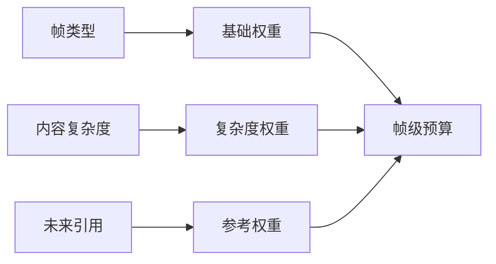

#### 7.13.3 编码后反馈

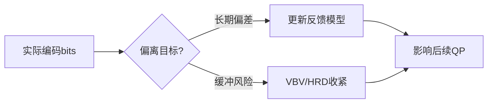

### **7.14 本章总结：一条主线、六个旋钮**

码率分配与 GOP 协同可以压缩成一条主线：

> **GOP 决定参考关系，参考关系决定预算价值，预算价值决定 QP / λ，实际 bits 再通过反馈与 VBV 修正。**

掌握这条主线后，只需要记住六个旋钮：

| 旋钮 | 控什么 | 典型取舍 |
|---|---|---|
| **GOP 长度 / 结构** | 关键帧间隔、参考链和随机访问能力 | 长 GOP 省码率，短 GOP 低延迟 / 易 seek；内容突变时可提前切 |
| **帧类型 / 参考结构** | 谁做锚点、谁做传播、谁做压缩效率 | 压缩效率 vs 延迟 / 随机访问 |
| **帧级权重** | I/P/B/参考帧预算比例 | 保护参考链 vs 保持当前帧均匀 |
| **bits→QP / λ 映射** | 预算如何变成量化强度和 RDO 取舍 | 模型越准越稳，但受复杂度估计和反馈影响 |
| **块级 dQP** | 同一帧内部 bits 分布 | 主观质量提升 vs 指标可能下降 |
| **反馈 / VBV 强度** | 码率稳定和缓冲安全 | 越强越稳，但画质波动可能越明显 |

---

## **🎯 帧类型与码控：通用机制速查**

> **为什么要把帧类型单独拎出来讲？**
>
> 帧类型决策是码控链路中最早、最关键的结构性决策：它决定了参考关系，也决定后续预算分配的基础权重。这里仍然只讲**通用机制**，不展开具体编码器实现；如果想看九家分别怎么做，请进入第五部分各编码器章节。

### **🗺️ 全景思维导图**


### **📊 帧类型决策对码控的影响速查表**

| 决策 | 直接影响 | 间接影响 | 通用取舍 |
|---|---|---|---|
| **是否插 I 帧** | I 帧 bits 突增 | 重置参考链，降低误差传播 | 画质恢复 vs 码率尖峰 |
| **P 帧参考链长度** | 残差大小变化 | 影响后续帧预测质量 | 压缩效率 vs 错误传播 |
| **B 帧层级** | 平均码率下降 | 需要更复杂的重排序和预测 | 压缩效率 vs 延迟 / 内存 |
| **特殊参考帧位置** | 某些帧预算升高 | 未来窗口整体残差下降 | 先投资 vs 当前码率尖峰 |
| **场景切换阈值** | I 帧触发频率 | 影响 VBV 风险和质量稳定 | 及时重置 vs 过度插 I |
| **Frame Skip / 降级** | 瞬时 bits 降低 | 用户可能感知卡顿或质量跳变 | 缓冲安全 vs 连续体验 |
| **类型间反馈独立性** | 预测更稳定 | 模型状态更多 | 准确性 vs 复杂度 |

### **🔗 帧类型相关章节直达索引**

| 想了解什么 | 去看 |
|---|---|
| 帧类型决策“鸡蛋悖论”的根源 | [§2 码控的“先有鸡还是先有蛋”悖论](#第-2-章码控的先有鸡还是先有蛋悖论) |
| mbtree / cuTree 的反向传播原理 | [§11 mbtree / cuTree（时间域 QP 偏移）](#第-11-章mbtree--cutree时间域-qp-偏移) |
| 场景切换、Frame Skip、长期参考帧 | [§15 码控与场景切换、Frame Skip、长期参考帧](#第-15-章码控与场景切换frame-skip长期参考帧) |
| 九家在帧类型决策上的具体实现 | [第四部分：九家开源编码器的码控选择](#第四部分九家开源编码器的码控选择) |
| 九家在帧类型决策上的横向对比 | [§22.4 帧类型决策](#第-22-章同一步骤不同选择14-张对比表) |
| 帧类型决策的演化史 | [§8 码控演化史](#第-8-章码控演化史从-h261-tm5-到-av1-constqp35-年路线图) |

### **🧭 帧类型决策的通用流程**

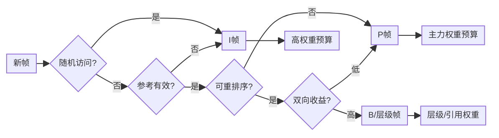

> 💡 **流程精髓**：帧类型不是孤立标签，而是由随机访问、参考有效性、延迟、预测收益共同决定的结构选择。类型确定后，码控才有帧级预算的基本权重。

### **🎓 三句话总结**

> 1. **帧类型不是“名称”，而是“预算角色”**：I 帧是重置与锚点，P 帧是传播主力，B / 层级帧是压缩效率工具。
>
> 2. **帧类型决策的本质是“参考价值排序”**：未来越依赖它，它越应该被保护。
>
> 3. **具体编码器差异应该后置阅读**：先理解这里的通用机制，再看第五部分九家实现，才能分清“算法必然性”和“工程选择”。

---

## **第 8 章：码控演化史——从 H.261 TM5 到 AV1 ConstQP（35 年路线图）**

### **8.1 时间轴总览**

```
1990          1996         2003          2013          2020          2024
  │             │            │             │              │             │
H.261 TM5  →  MPEG-2 TM5  → H.264 JM   →  HEVC HM    →  AV1 libaom  → VVC VVenC
  │             │            │             │              │             │
  CBR-pure   首次 GOP 分配   CRF 诞生       cuTree         TPL+ARF       JND-RC
                            (x264)        (x265)         (SVT-AV1)
```

### **8.2 第 1 代：H.261 TM5（1990）——"鸡蛋悖论"的最早正面回答**

H.261 是第一个商业视频编码标准（视频电话）。**TM5（Test Model 5）** 是它的参考 RC：

```c
// 极简 TM5 伪代码
T_i = R_remaining / N_remaining;          // 平均分
B_i = max(T_i, R_remaining/8);            // 不少于 1/8 余额
qp  = clip(qp_prev * actual_bits / B_i);  // 简单比例反馈
```

**特点**：
- ✅ 第一次明确把"bit 分配 + bits→QP + 反馈"三件事工程化。
- ❌ 没有 lookahead，没有内容感知，简单平均。
- ❌ 复杂场景质量崩溃。

**遗产**：这套"P 控制器"逻辑被后续所有标准沿用至今。

### **8.3 第 2 代：MPEG-2 TM5（1996）——加入 GOP 内分配 + 全局复杂度**

MPEG-2 引入了 I/P/B 三种帧。TM5 解决了"如何在 I/P/B 间分配 bits"：

```
foreach GOP:
    R_GOP = bitrate * GOP_duration;
    bits_I = R_GOP * X_I / (X_I + N_p*X_p/k_p + N_b*X_b/k_b);
    bits_P = ...
    bits_B = ...
    // X_I, X_P, X_B 是各帧类型的"全局复杂度"，由历史平均估出
```

**特点**：
- ✅ 全局复杂度概念（所有现代 RC 的基石）。
- ✅ 基于上一帧反馈调本帧 QP（PI 控制器雏形）。
- ❌ 复杂度估计仍然滞后（用历史代替未来）。

**遗产**：今天 OpenH264 的 RC 几乎是 MPEG-2 TM5 的优化版。

### **8.4 第 3 代：H.264 JM + x264 CRF（2003~2008）——"质量恒定"概念诞生**

H.264 标准参考实现（JM）依然用 TM5 思路。但**真正的革命发生在 x264**：

- **2005 年**：x264 作者 **Loren Merritt** 引入 **CRF（Constant Rate Factor）**：
  - 思路：放弃"恒定码率"，追求"恒定感知质量"。
  - 公式：`qScale = rfConstant × cplx^(1-qcompress)`。
  - 用户只需调一个数字（默认 23），不用关心 bits 预算。

- **2008 年**：x264 引入 **mbtree**：
  - 反向追踪未来 N 帧的 MB 引用关系。
  - 给"被引用多"的 MB 发放 QP 福利。
  - **同码率画质 +5~10%，肉眼可见**。

- **2009 年**：x264 引入 **psy-rd**：
  - RDO 公式中加入"高频能量保留"奖励项。
  - **PSNR 略降，VMAF 大涨**。

**遗产**：现代所有商业编码器（YouTube/Netflix/Bilibili）都用 CRF/CRF-like。**这是码控史上最重要的工程发明**。

### **8.5 第 4 代：HEVC HM + x265（2013~2016）——cuTree + AQ-mode 4**

HEVC 标准引入 CTU（最大 64×64）和子分割（quadtree）。x265 把 mbtree 升级为 **cuTree**：

- 作用粒度更细。
- 沿 quadtree 层级化传播。
- BD-Rate 节省再 +3~5%。

同期 **AQ-mode 4**：HDR 感知 AQ，把"亮度高对比"也纳入考量。

**遗产**：2024 年至今，**x265 + cuTree + aq-mode 4 仍是 HDR 直播的事实标准**。

### **8.6 第 5 代：VP9 ARF（2013）——参考帧革命**

VP9 提出：**与其在所有帧上做 cuTree，不如直接编一帧"超清不显示"的 ARF 帧专门服务参考**。

```
显示帧：  [ P1 ][ P2 ][ P3 ][ P4 ][ P5 ][ P6 ]
ARF：           ↑     ↑           ↑
           不显示，但所有 P 帧都参考它
```

加上 **ARNR**（时域降噪）让 ARF 自带"超采样"效果。

**遗产**：所有现代编码器（AV1、VVC）都吸收了 ARF 思想。

### **8.7 第 6 代：AV1 TPL + 多 ARF（2018~2020）——把 cuTree 和 ARF 合体**

AV1 SVT/libaom 实现了：
- **多层 ARF 金字塔**（可达 7 层）。
- **TPL（Temporal Propagation Lookahead）**：在 SB 级跨多 ARF 层做传播分析。
- **Capped CRF**：CRF 加 maxrate 上限，工业最爱。

### **8.8 第 7 代：VVC VVenC + AI（2022~）——JND + 神经网络**

VVenC 引入：
- **PQA（Perceptual QP Adaptation）**：基于 JND 模型，把"看不见的细节"全部丢掉。
- **RPR（Reference Picture Resampling）**：码率紧张时编码内降分辨率，RC 多一个旋钮。
- **AI 复杂度估计**（实验中）：CNN 替代 SATD。

### **8.9 演化主线总结**

每一代都解决一个核心问题：

| 代 | 解决的核心问题 | 引入的代价 |
|---|---|---|
| 1（H.261 TM5） | 鸡蛋悖论的工程化 | 简单平均，复杂场景崩溃 |
| 2（MPEG-2 TM5） | 帧类型间分配 | 历史滞后 |
| 3（x264 CRF） | "质量恒定"用户体验 | 码率不再可控 |
| 3+（mbtree/psy-rd） | 时间域 + 心理优化 | lookahead 引入延迟 |
| 4（cuTree） | 更细粒度传播 | 内存占用翻倍 |
| 5（ARF） | 参考帧本身的优化 | 解码器需支持 invisible frame |
| 6（TPL + 多 ARF） | 多层时间域优化 | 编码复杂度 ×10 |
| 7（JND + AI） | 主观质量直接优化 | 模型偏置、可解释性差 |

### **8.10 一张图看 35 年码控演化**


### **8.11 给读者的最后一句话**

> **35 年码控演化的本质，是对"未来 bits 预测精度"的一步步逼近**。
> 
> - 从"假设未来 = 历史"（TM5），
> - 到"看一眼未来"（lookahead），
> - 到"反向传播未来重要性"（mbtree/cuTree），
> - 到"专门编一帧服务未来"（ARF），
> - 到"直接预测主观感受"（JND/AI）。
> 
> 下一站会是什么？大概率是 **大模型直接告诉你 QP**——但**鸡蛋悖论**这个 35 年前的问题，
> 仍然以不同形式存在着。


---


## **第 9 章：码控支撑技术体系**

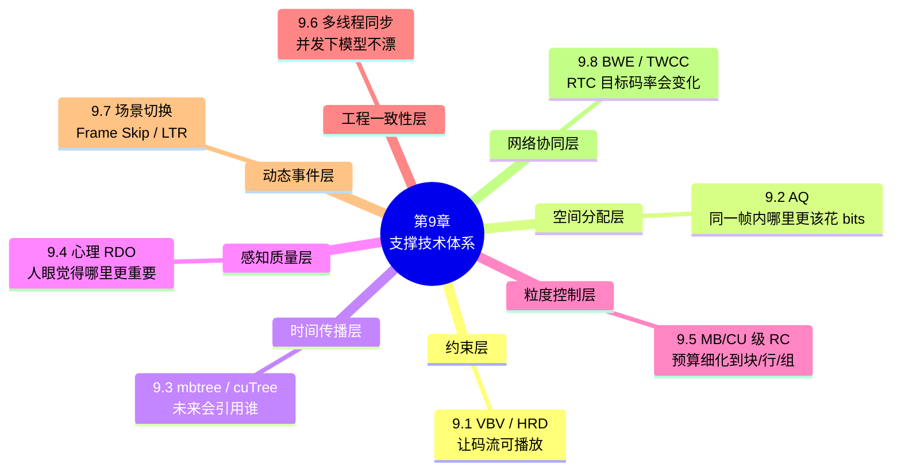

> 📖 **章节跳转**：[§9.1](#91-vbv--hrd-漏桶模型) · [§9.2](#92-aqadaptive-quantization) · [§9.3](#93-mbtree--cutree时间域-qp-偏移) · [§9.4](#94-心理视觉-rdopsy-rd--psy-rdoq) · [§9.5](#95-mb--cu-级-rcgomctu-dqpwavefront-同步) · [§9.6](#96-码控与多线程的同步陷阱) · [§9.7](#97-码控与场景切换frame-skip长期参考帧) · [§9.8](#98-码控与-bwe--twcc-联动rtc-专属)

> **本章定位**：第 7/8 章讲的是码控主链路与演化脉络：预算如何下发、QP/λ 如何产生、反馈如何修正。第 9 章讲的是这条主链路要真正进入工程系统时，必须外挂的八类支撑能力。
>
> 换句话说，本章不是“杂项补充”，而是第二部分主链路之后自然展开的**专业支撑层**：
>
> | 支撑层 | 挂接到主链路哪里 | 解决什么工程问题 | 小白理解 |
> |---|---|---|---|
> | **约束层** | 反馈 / VBV 守门 | 码流是否会撑爆或饿死解码缓冲 | 先保证能播 |
> | **空间分配层** | 块级 dQP | 同一帧内哪些区域更值得保护 | 钱在画面内部怎么花 |
> | **时间传播层** | 参考价值修正 | 当前块会不会影响很多未来帧 | 今天多花一点，未来少亏很多 |
> | **感知质量层** | RDO / λ 决策 | 指标好不等于人眼好 | 别只讨好 PSNR |
> | **粒度控制层** | 帧内反馈 | 一帧内部也可能前面花太多、后面没钱 | 一帧也要分期付款 |
> | **工程一致性层** | 编码顺序 / 模型状态 | 多线程不能把 RC 状态写乱 | 并发不能把账本弄错 |
> | **动态事件层** | GOP / 帧类型 / VBV | 场景切换、跳帧、LTR 会打破平稳假设 | 突发事件怎么救场 |
> | **网络协同层** | 目标码率输入 | RTC 中目标码率本身会随网络变化 | 预算会被网络实时改写 |
>
> 阅读时建议始终带着第 7 章主链路去看：第 9 章是“底线”，第 10~12 章是“质量增强”，第 13~14 章是“工程落地”，第 15~16 章是“动态环境适应”。

---

### **9.1 VBV / HRD 漏桶模型**

> **挂在主链路哪里？** 第 7 章最后一步“反馈校正 + VBV/HRD 守门”。
>
> **一句话定位**：RC 可以追求画质，但 VBV/HRD 负责提醒它：**码流必须能被播放器按时解出来**。

先区分两个容易混用的词：

| 名词 | 更偏向 | 解决的问题 | 小白理解 |
|---|---|---|---|
| **VBV**（Video Buffering Verifier） | 编码器内部模型 | 当前码流会不会让虚拟缓冲区上溢 / 下溢 | 编码器自己的“水位表” |
| **HRD**（Hypothetical Reference Decoder） | 标准合规模型 | 码流是否符合标准定义的解码时序和缓冲约束 | 标准规定的“验收规则” |

可以粗略理解为：**VBV 是编码时用来控风险的工具，HRD 是标准侧用来验证码流能否按时解码的模型**。工业编码器常把它们一起讲，是因为二者都在约束“瞬时码率不能乱冲”。

#### **9.1.1 漏桶图**

```
     +bits 进  ┌──────────────────┐
   编码器 ────►│  buffer (bufsize) │──── 解码器恒速排空 (bitrate)
              └──────────────────┘
                       ↑
            必须永远 ∈ [0, bufsize]
```

小白可以把它想成水桶：编码器往桶里倒水，播放器按固定速度放水。倒太快会溢出，倒太慢会见底卡顿；VBV/HRD 的任务就是让水位始终安全。

#### **9.1.2 三个核心参数**

- `vbv-maxrate`：解码器排空速率（= 网络带宽 / 频道容量）。
- `vbv-bufsize`：解码缓冲区容量（= 启动延迟 × 带宽）。
- `init-delay`：解码器播放前先填多久。

#### **9.1.3 漏桶约束的工程意义**

| 场景 | maxrate 设法 | bufsize 设法 |
|---|---|---|
| 严格 CBR 直播 | = bitrate | = bitrate（≈1s buffer） |
| 流畅直播 | = 1.5× bitrate | = 2× bitrate |
| HLS / DASH | = 1.5× bitrate | = 4× bitrate（≈4s 段） |
| 点播 BD | Level 上限 | Level 上限 |
| RTC | = bitrate | = bitrate（**严格**，否则积累延迟）|

#### **9.1.4 九家支持情况**

x264/x265/OpenH264 都内置；Kvazaar 没有，需手工外检。

---

### **9.2 AQ（Adaptive Quantization）**

> **挂在主链路哪里？** 第 7 章的“块级 dQP”。
>
> **一句话定位**：帧级 RC 决定“这一帧花多少钱”，AQ 决定“这一帧内部的钱应该花在哪些区域”。

#### **9.2.1 解决什么问题？**

人眼对**平坦区域的噪声 / 块效应特别敏感**，对纹理区域不敏感。但 RDO 公式只考虑 SSD/SATD，**无法识别"这块平坦还是纹理"**。

AQ 在每个 MB / CU 上计算局部能量、方差或边缘强度，再生成一个 `qpOffset`：

| 区域 | 人眼特点 | AQ 倾向 | 结果 |
|---|---|---|---|
| **平坦区 / 暗部 / 人脸** | 噪声和块效应容易被看见 | 降 QP | 多花 bits 保护 |
| **复杂纹理区** | 少量失真容易被纹理掩盖 | 升 QP | 省 bits 给更敏感区域 |

#### **9.2.2 公式**

不同编码器的 AQ 公式细节不完全一样，但抽象形式可以写成：

```c
localEnergy = measure_activity(block);              // 方差、边缘、亮度或纹理强度
qpOffset    = aq_strength * f(localEnergy, avgEnergy);
finalQp     = clip(baseQp + qpOffset, qpmin, qpmax);
```

更直观地看：

```text
finalQp = baseQp + qpOffset

qpOffset < 0  → 降 QP → 多给 bits → 保护敏感区域
qpOffset > 0  → 升 QP → 少给 bits → 从不敏感区域省钱
```

> ⚠️ **注意**：AQ 不是简单地“方差越小 QP 一定越低”。真实实现会把方差、亮度、边缘、暗部偏置、平均能量归一化等因素组合起来。小白只要先记住：**AQ 的目标是让同一帧内部的主观质量更均匀**。

#### **9.2.3 aq-mode 取值（x264/x265）**

| mode | 含义 |
|---|---|
| 0 | 关 |
| 1 | 简单 variance |
| 2 | auto-variance（默认） |
| 3 | bias dark（暗部更精） |
| 4 | + edges（HDR 推荐，仅 x265） |

#### **9.2.4 九家对比**

| | x264 | x265 | OpenH264 | Kvazaar |
|---|---|---|---|---|
| AQ 支持 | ✅ 0~3 | ✅ 0~4 | ❌ | ❌ |
| 默认开 | ✅（mode 1） | ✅（mode 2） | / | / |

---

### **9.3 mbtree / cuTree（时间域 QP 偏移）**

> **挂在主链路哪里？** 第 7 章的“参考价值修正 + 块级 dQP”。
>
> **一句话定位**：AQ 看“当前块本身是否重要”，mbtree/cuTree 看“这个块未来会不会被别人反复参考”。

#### **9.3.1 一句话原理**

> 一个 MB 如果**未来若干帧**反复用它做参考，那它编差了，**误差会传播到很多帧**。
> 反之，如果它只被自己用，编差点也无所谓。
> 所以 **被未来引用越多 → 越值得多花码率**。

#### **9.3.2 数学化（x264 mbtree）**

```c
// 1) lookahead 反向扫描
for frame f in [tail .. head]:
    foreach MB in f:
        for each ref (f-1, f-2, ...):
            propagate_cost[refMB] +=
                SATD(MB) * (1 - intra_cost / inter_cost);

// 2) 转 QP 偏移
foreach MB:
    weight = log2(propagate_cost / SATD(MB) + 1);
    qpOffset = -strength * weight;        // 默认 strength=2.0
    finalQp = clamp(baseQp + qpOffset, qpmin, qpmax);
```

直观：**propagate_cost 越大 → MB 越"承担未来" → QP 越低 → 编得越精**。

#### **9.3.3 cuTree（x265）的两点改进**

1. **作用粒度**从 16×16 MB → 8×8~64×64 CU，更精细。
2. **传播路径**沿 HEVC 的 quadtree 结构，**层级化加权**。

#### **9.3.4 为什么 OpenH264 / Kvazaar 不做？**

- **OpenH264**：需要 lookahead，违背零延迟。
- **Kvazaar**：会污染对照实验，故意不做。

#### **9.3.5 收益**

| 编码器 | BD-Rate 改善 |
|---|---|
| x264 (mbtree off vs on) | -5~8% |
| x265 (cuTree off vs on) | -8~12% |

> 💡 **mbtree/cuTree 是 x264/x265 同码率胜其它编码器最大的两个秘密武器**。

---

### **9.4 心理视觉 RDO（psy-rd / psy-rdoq）**

> **挂在主链路哪里？** 第 7 章的“RDO / 量化：把预算变成 λ、QP、qScale”。
>
> **一句话定位**：RC 决定“能花多少钱”，psy-rd 决定“这些钱买 PSNR 还是买人眼更喜欢的细节”。

#### **9.4.1 问题来源**

经典 RDO：`cost = SSD + λ·bits`。

**但 SSD 不等于"看起来好"**——SSD 偏向"模糊但接近"，RDO 出来的画面普遍过度平滑。

#### **9.4.2 解决方案：psy-rd**

```c
// 修正 RDO 公式
cost = SSD - psy_rd * energy_diff + λ * bits;
//             ^^^^^^^^^^^^^^^^^^
//   "保留高频纹理"额外奖励项
```

`energy_diff` = 当前块与原块的高频能量差。psy-rd 越大，越倾向"哪怕 SSD 大点也保留细节"。

为了避免这个公式停留在"玄学调参"层面，可以把两个变量拆成下面的量化步骤：

```text
orig_hf_energy = Σ 高频系数(orig_block)^2
rec_hf_energy  = Σ 高频系数(rec_block)^2
energy_diff    = rec_hf_energy - orig_hf_energy
psy_rd_eff     = psy_rd_cfg × texture_factor
psy_reward     = psy_rd_eff × energy_diff
cost           = SSD - psy_reward + λ × bits
```

- **`energy_diff` 怎么算**：先对原始块和当前候选重建块做变换（如 DCT/Hadamard），去掉 DC 和低频系数，只统计中高频系数能量；如果 `rec_hf_energy` 更接近或高于 `orig_hf_energy`，说明候选模式保留了更多纹理、边缘和噪声颗粒，`energy_diff` 就更大，得到的奖励也更大。
- **`psy_rd` 怎么定量**：`psy_rd_cfg` 是编码器参数里的心理视觉强度，例如 `0` 表示关闭，`1.0` 表示正常强度，`2.0` 表示更激进地保护纹理；工程上还可以乘一个 `texture_factor`，让纹理块更强、平坦块更弱，例如：

```text
texture_factor = clamp(orig_hf_energy / (orig_total_energy + ε), 0.5, 1.5)
psy_rd_eff     = psy_rd_cfg × texture_factor
```

这样一来，psy-rd 的判断逻辑就很直观：**如果某个模式虽然 SSD 稍大、bits 稍多，但明显保住了原图的高频能量，那么 `psy_rd × energy_diff` 会把它的 cost 拉低，从而更容易被 RDO 选中。**

#### **9.4.3 psy-rdoq**

类似 psy-rd 但作用在量化系数选择阶段（RDOQ），保护"原本应被量化为 0 但承载视觉信号的小系数"。

普通 RDOQ 在每个变换系数上做的是：候选量化值 `level` 越接近原始系数、熵编码 bits 越少，cost 越低；psy-rdoq 则额外奖励“保住了视觉纹理能量”的候选值。

```c
// 修正 RDOQ 公式：对每个候选量化等级 level 单独打分
cost(level) = coeff_dist(level) - psy_rdoq * coeff_energy_diff(level) + λ * coeff_bits(level);
//                            ^^^^^^^^^^^^^^^^^^^^^^^^^^^^^^
//                  "保留小纹理系数"额外奖励项
```

也就是说，psy-rdoq 不是改变整块模式选择的 `SSD + λ·bits`，而是在**量化系数选择**这一步，把每个候选 `level` 的 cost 从“失真 + 码率”改成“失真 - 纹理奖励 + 码率”。

```text
base_cost(level)      = coeff_dist(level) + λ × coeff_bits(level)
orig_coeff_energy     = orig_coeff^2
recon_coeff_energy    = dequant(level)^2
coeff_energy_diff     = min(recon_coeff_energy, orig_coeff_energy)
psy_rdoq_eff          = psy_rdoq_cfg × coeff_weight
psy_reward(level)     = psy_rdoq_eff × coeff_energy_diff
psy_rdoq_cost(level)  = base_cost(level) - psy_reward(level)
```

- **`coeff_energy_diff` 怎么算**：对每个 AC 系数单独计算，先看原始变换系数的能量 `orig_coeff^2`，再看候选量化等级 `level` 反量化后的能量 `dequant(level)^2`；两者取较小值，表示这个候选等级“实际保留下来的原始纹理能量”。如果 `level = 0`，则 `recon_coeff_energy = 0`，奖励也接近 `0`，小纹理更不容易被无脑清零。
- **`psy_rdoq` 怎么定量**：`psy_rdoq_cfg` 是编码器参数里的心理视觉量化强度，例如 `0` 表示关闭，`1.0` 表示正常保护小系数，数值越大越愿意多花 bits 保留纹理；工程上还会乘一个 `coeff_weight`，让中高频、非零邻域、纹理方向上的系数获得更高权重，例如：

```text
coeff_weight = band_weight × neighbor_activity
psy_rdoq_eff = psy_rdoq_cfg × coeff_weight
```

这样一来，psy-rdoq 的判断逻辑就很直观：**如果某个非零 `level` 比 `0` 多花了一点 bits，但能保留明显的中高频纹理能量，那么 `psy_rdoq × coeff_energy_diff` 会把它的量化 cost 拉低，从而更容易留下这个小系数。**

#### **9.4.4 默认值**

- **x264**：`--psy-rd 1.0:0.0`（rd 强、rdoq 弱）。
- **x265**：`--psy-rd 2.0 --psy-rdoq 1.0`（rdoq 也开）。
- **OpenH264 / Kvazaar**：不支持。

> 💡 **PSNR 党 vs VMAF 党的分水岭**：
> - 关 psy-rd → PSNR 高（学术对比用）。
> - 开 psy-rd → VMAF 高（人眼好看，工业部署用）。

---

### **9.5 MB / CU 级 RC（GOM、CTU dQP、Wavefront 同步）**

> **挂在主链路哪里？** 第 7 章的“块级 dQP + 编码后反馈”之间。
>
> **一句话定位**：帧级 RC 是“整帧预算”，MB/CU 级 RC 是“帧内预算执行过程中的实时纠偏”。

#### **9.5.1 为什么需要"帧内 RC"？**

帧级 RC 的盲点：**单帧内部"前半奢侈、后半穷困"**。

例：4K HDR 一帧目标 80KB，但前 20% CTU 编完已花了 60KB → 后面 80% 只剩 20KB，画质急剧下降。

解决：**单帧内反馈**。

#### **9.5.2 三家三种实现**

| 编码器 | 帧内 RC 单元 | 反馈周期 |
|---|---|---|
| **x264** | 不做（用 mbtree + aq 间接） | / |
| **x265** | CTU 级 dQP | 每 CTU |
| **OpenH264** | **GOM（Group of MB）** | 每 GOM（≈ 4 行 MB） |
| **Kvazaar** | 不做 | / |

#### **9.5.3 GOM 的精妙**

GOM（Group of MB）的核心思想是：**不要等整帧编码完才发现 bits 超了，而是把一帧拆成几段，在帧内边编码、边结账、边纠偏**。

以 OpenH264 为例，一帧会按宏块（MB）顺序切成若干个 GOM，通常可以理解成“几行 MB 组成一组”。帧级 RC 先给整帧一个总预算，例如本帧目标是 `target_frame_bits`；GOM RC 再把这个预算拆给每个 GOM：

```text
target_gom_bits[i] ≈ remaining_frame_bits / remaining_gom_count
```

第 `i` 个 GOM 编码完成后，RC 立刻拿到它的真实消耗：

```text
error[i] = actual_gom_bits[i] - target_gom_bits[i]
remaining_frame_bits -= actual_gom_bits[i]
```

然后用这个误差修正后续 GOM 的 QP：

```text
如果 actual_gom_bits > target_gom_bits：
    说明前面花多了，后续 GOM 需要提高 QP，少花 bits

如果 actual_gom_bits < target_gom_bits：
    说明前面省下了，后续 GOM 可以降低 QP，补一点质量
```

所以 GOM 的本质不是“提前看到了未来”，而是把未来变成了“还没编码的后半帧”：前一段的真实 bits 会立刻改变后一段的预算与 QP。它相当于一个轻量的帧内闭环：

```text
帧级目标 bits
   ↓
拆成多个 GOM 目标
   ↓
编码 GOM i，得到 actual bits
   ↓
更新剩余 bits / 剩余 GOM
   ↓
调整 GOM i+1 的 QP
```

这就是 OpenH264 没有 lookahead 仍然能做实时纠偏的原因：GOM 反馈相当于“**帧内的 lookahead 替代品**”——把单帧切 N 段，每段编完反馈给下一段调 QP，**实时性零延迟、精度也不差**。

#### **9.5.4 Wavefront 与 RC 的冲突**

WPP（Wavefront Parallel Processing）的核心目标是：**在不把一帧切成完全独立 Tile 的情况下，让多个 CTU 行尽量并行编码**。

它的基本原理是“错位启动”：第 0 行先编码，等第 0 行已经向前跑出几个 CTU 后，第 1 行才启动；第 1 行再跑出几个 CTU 后，第 2 行启动。这样每一行都比上一行慢半拍，多个线程看起来像一条斜着推进的“波前”。

```text
时间推进 →
Row 0: CTU0  CTU1  CTU2  CTU3  CTU4  ...
Row 1:       等待  CTU0  CTU1  CTU2  CTU3  ...
Row 2:             等待  CTU0  CTU1  CTU2  ...
Row 3:                   等待  CTU0  CTU1  ...
```

为什么不能所有行同时从 `CTU0` 开始？因为当前 CTU 的预测、CABAC 上下文、邻块状态等，都会依赖左侧、上方、左上方等已经编码过的邻居。WPP 通过“上一行先领先几个 CTU”来保证本行启动时，上方相关信息大多已经可用，于是既保留了块间依赖，又获得了行级并行。

但 RC 的工作方式正好相反：它希望编码过程尽量像一条顺序流水线，前一个 CTU / 前一段区域刚花了多少 bits，马上就能反馈给后面的 CTU，用来修正剩余预算和 QP。

```text
理想的 CTU 级 RC：
编码 CTU i
   ↓
得到 actual_bits[i]
   ↓
更新 remaining_bits
   ↓
重新估计 QP[i+1]
   ↓
编码 CTU i+1
```

也就是说，WPP 追求的是“多行同时往前跑”，RC 追求的是“前面花完账，后面再按新账本走”。两者的冲突主要体现在四个层面。

**第一，时间点冲突：RC 想等反馈，WPP 不想等。**

如果严格按照 RC 的理想闭环，本行最好等上一行、上一个 CTU 的实际 bits 都更新完，再决定自己的 QP。这样预算最准确，但线程会频繁等待，波前推进会被打断：

```text
RC 精度优先：
Row 0: CTU0  CTU1  CTU2  CTU3
Row 1:       等Row0反馈  CTU0  等Row0反馈  CTU1
Row 2:                    等Row1反馈  CTU0

结果：并行度下降，WPP 变慢。
```

如果 WPP 优先，本行不能一直等上一行的 RC 反馈，而是拿着启动时已有的预算和复杂度估计继续编码：

```text
WPP 并行优先：
Row 0: CTU0  CTU1  CTU2  CTU3
Row 1:       CTU0  CTU1  CTU2
Row 2:             CTU0  CTU1

结果：并行度高，但 RC 用到的反馈可能是滞后的。
```

**第二，空间依赖和码控依赖不是同一种依赖。**

WPP 解决的是编码依赖：只要上一行领先几个 CTU，本行的预测信息、上下文信息大多就够用了，所以可以启动。

但 RC 依赖的是“账本”：前面到底花了多少 bits、剩余 bits 还够不够、复杂度预测是否偏高或偏低。这个账本最好越新越好。于是会出现一种尴尬情况：**编码依赖已经满足，可以开工；但 RC 账本还没完全更新，QP 决策并不完全准确**。

**第三，多行并行会让剩余预算变成共享资源竞争。**

在单线程 CTU 级 RC 中，`remaining_bits` 可以按顺序扣减：

```text
remaining_bits -= actual_bits[ctu]
next_qp = f(remaining_bits, remaining_ctu_count, complexity)
```

但 WPP 下可能有多行同时编码、同时消耗 bits。假设一帧剩余预算是 `40KB`，Row 0、Row 1、Row 2 同时往前跑：

```text
Row 0 实际多花 8KB
Row 1 实际多花 6KB
Row 2 还在按旧预算编码
```

如果 Row 2 启动时还不知道 Row 0 和 Row 1 已经超支，它就可能继续用偏低 QP 编码，导致后半帧预算更紧。反过来，如果为了避免超支而过早提高所有行的 QP，又可能让某些区域质量被不必要地压低。

**第四，锁太细会拖慢，锁太粗会不准。**

工程上可以给 RC 状态加锁，让每个 CTU 编完都立刻更新全局账本。但锁得太细，每个 CTU 都要抢共享状态，线程会频繁阻塞；锁得太粗，例如每行自己先记账，最后再合并，速度快了，但中途反馈就没那么及时。

所以 WPP 与 RC 的本质矛盾可以概括为：

```text
WPP：希望 CTU 行并行推进，减少等待，提高吞吐
RC ：希望 bits 消耗按顺序反馈，及时修正 QP，控制码率

等待越多 → RC 越准，但并行越差
等待越少 → 并行越好，但 RC 反馈越滞后
```

所以 x265 的处理是：**牺牲一点 RC 精度换并行**——每行单独累积，行间不做强实时同步，最后再做帧级合并。这样 WPP 可以继续高吞吐推进，但 CTU 级 RC 的反馈不再是完全逐行、逐 CTU 精确闭环。

更直观地说，x265 没有让每个 CTU 都去等待全局 RC 账本完全刷新，而是允许每条 CTU 行带着相对独立的局部账本往前跑；等一行或一帧结束后，再把这些局部消耗合并回全局 RC 状态。这样做的代价是：某些 CTU 的 QP 可能不是基于“最新账本”算出来的；收益是：WPP 的并行吞吐不会被 RC 同步拖垮。

---

### **9.6 码控与多线程的同步陷阱**

> **挂在主链路哪里？** 第 7 章的“反馈方向”与“编码顺序 / 显示顺序”之间。
>
> **一句话定位**：单线程里 RC 是数学问题，多线程里 RC 先是账本一致性问题。

多线程会让码控变难，是因为 RC 的很多变量都是“历史状态”：上一帧实际 bits、累计复杂度、VBV 水位、predictor 系数。只要这些状态更新顺序错了，公式再漂亮也会失效。

#### **9.6.1 三个典型陷阱**

#### 陷阱 1：predictor 竞争

x264 的 `predictor.coeff` 用 EWMA 更新：

```c
predictor.coeff = (1 - decay) * predictor.coeff + decay * new_sample;
```

多线程**同时读写**会损坏。x264 用 `mutex` 保护。

#### 陷阱 2：cplxr_sum 重复扣减

如果 frame N+1 在 frame N 还没"提交统计"前就开始 RC，会用过期的累积值 → 码率漂移。

x265 用 `framesDoneCondition` 条件变量等前一帧完成。

#### 陷阱 3：VBV 状态滞后

VBV buffer 必须按"出码顺序"更新，而**编码顺序 ≠ 显示顺序**（B 帧）。

```
编码顺序：I  P  B  B  P  ...
显示顺序：I  B  B  P     P  ...
                ↑
             VBV 必须按这个顺序计算
```

各编码器处理：x264/x265 用 `dts` 驱动 VBV、按 dts 顺序更新。OpenH264 没有 B 帧，无此问题。

#### **9.6.2 调试技巧**

```
# x264/x265 跑单线程对比
--threads 1 --no-mbtree

# 看到差异 → 多线程同步出问题
```

---

### **9.7 码控与场景切换、Frame Skip、长期参考帧**

> **挂在主链路哪里？** 第 7 章的“GOP 决策、帧类型决策、VBV 守门”三处都会被它影响。
>
> **一句话定位**：第 7 章默认视频相对连续，而本章处理的是“连续性突然被打断”时，码控如何救场。

这三类机制看似不同，其实都在处理同一个问题：**参考链突然不可靠，或者缓冲区突然不安全**。

| 事件 | 打破了什么假设 | 码控要做什么 |
|---|---|---|
| **场景切换** | 旧参考还能预测未来 | 重置参考链，同时控制 I 帧尖峰 |
| **Frame Skip** | 每帧都必须正常编码 | 极端缺 bits 时先保连续播放 |
| **LTR** | 只能靠最近参考恢复 | 弱网中用长期锚点减少 IDR 大包 |

#### **9.7.1 场景切换（Scenecut）**

scenecut 触发后立即插 IDR。但 IDR 平均比 P 大 5~10×，**码率瞬间冲高**。

各家应对：
- **x264/x265**：scenecut 时 RC **临时分配大预算**，不算超 VBV。
- **OpenH264**：极端拥塞时 **报告抑制 IDR**，避免雪上加霜。
- **Kvazaar**：scenecut 重置 GOP 模板。

#### **9.7.2 Frame Skip**

| | 何时触发 | 后果 |
|---|---|---|
| x264/x265 | VBV 极端不足 | 极少使用 |
| OpenH264 | RC 预测超 1.2× | **主动使用** |
| Kvazaar | 不支持 | / |

OpenH264 P_SKIP 的本质：**编码 0 残差 + 复用 PMV**，仅几十字节。接收端"重复上一帧"，肉眼是"轻微卡顿"——**远好于丢包黑屏**。

#### **9.7.3 长期参考帧（LTR）**

在本文对比的九家实现里，**OpenH264 对 LTR 的 RTC 工程化最典型**：它可以把某些帧标为 LTR，让接收端长期保留。RC 通常会给这类帧更高预算（例如提高一段比例），因为它们会被反复参考。

弱网恢复：丢包后客户端可请求 "用上次 LTR 重新参考"，**避免频繁请求 IDR 大包**。这不是单纯的压缩技巧，而是“码控 + 参考管理 + 网络恢复”的联合策略。

---

### **9.8 码控与 BWE / TWCC 联动（RTC 专属）**

> **挂在主链路哪里？** 第 7 章最顶层的“序列目标码率”。
>
> **一句话定位**：点播 / 离线编码里目标码率通常是固定输入；RTC 里目标码率是网络每隔几百毫秒重新给的一道命令。

前面几节讨论的 RC，大多默认 `R_target` 是一个相对稳定的输入：用户给定 `2Mbps`，编码器围绕这个目标做 GOP 分配、帧级分配、VBV 控制和 QP 修正。

但 RTC 不一样。RTC 的目标不是“把一段视频编码到固定码率”，而是“**网络现在能承受多少，我就尽快把编码码率贴到多少**”。因此，码控不只要解决压缩问题，还要参与网络拥塞控制。

#### **9.8.1 RTC 的额外难题：目标码率本身在变化**

RTC 里最核心的问题不是“如何守住一个固定码率”，而是“**目标码率每隔几百毫秒就可能被改写**”：

```text
接收端统计包到达时间、丢包、延迟变化
   ↓
通过 RTCP / TWCC 反馈给发送端
   ↓
WebRTC GCC / BWE 估算当前可用带宽
   ↓
每 200~500ms 推荐一个新码率
   ↓
编码器 SetOption(BITRATE)
   ↓
RC 从下一帧开始按新目标重新分配 bits
```

这会带来三个直接问题。

**第一，预算会突然变小。**

比如上一秒网络还能承受 `2Mbps`，下一次 BWE 只给 `800kbps`。如果编码器还按旧目标继续出码，发送队列会堆积，端到端延迟上升，严重时还会继续丢包，形成恶性循环。

```text
网络变差 → BWE 下调码率
   ↓
编码器如果降得慢
   ↓
发送队列继续积压
   ↓
延迟和丢包继续变差
   ↓
BWE 进一步下调码率
```

**第二，预算也可能突然变大。**

网络恢复后，BWE 可能从 `800kbps` 拉回 `1.5Mbps`。但编码器不能立刻把 QP 大幅降低、疯狂多花 bits，否则会造成码率尖峰；更稳妥的做法是逐步恢复质量，让 VBV / pacer / 网络队列都有缓冲空间。

**第三，BWE 本身是估计值，不是绝对真值。**

TWCC / GCC 看到的是网络反馈，存在抖动、延迟和估计误差。如果编码器对每次估计都过度响应，画质会来回跳；如果响应太慢，又会跟不上弱网变化。所以 RTC 码控的核心不是单纯“更准”，而是要在下面三者之间折中：

```text
跟随速度：网络变差时能不能马上降码率
画质稳定：QP 能不能不要来回大跳
传输安全：发送队列和 VBV 能不能不爆
```

#### **9.8.2 BWE / TWCC 到 RC 的联动链路**

可以把 RTC 码控理解成两层闭环叠在一起：

```text
外层网络闭环：
网络反馈 → BWE/TWCC → newBitrate → 编码器目标码率

内层编码闭环：
目标码率 → 每帧 bits 预算 → QP / skip / layer 调整 → actual bits
```

外层闭环决定“现在允许编码器花多少钱”，内层闭环决定“这笔钱在当前帧、当前层、当前宏块上怎么花”。

```text
BWE 给出 newBitrate
   ↓
换算为 target_bits_per_frame
   ↓
更新 RC / VBV / SVC layer 预算
   ↓
下一帧按新预算估 QP
   ↓
编码后得到 actual_bits
   ↓
actual_bits 再反馈给 RC，修正后续帧
```

这里最容易误解的一点是：BWE 并不直接决定 QP。BWE 只是把最顶层的 `R_target` 改掉；真正的 QP 仍然由 RC 根据帧复杂度、缓冲状态、历史误差和模式约束算出来。

#### **9.8.3 OpenH264 的实现：用 SetOption 快速改写目标预算**

OpenH264 面向 WebRTC / RTC 场景设计，所以它提供了比较直接的动态码率更新路径：上层 BWE 得到新码率后，通过 `SetOption(ENCODER_OPTION_BITRATE)` 传给编码器；编码器内部再更新每帧目标 bits、VBV 约束和多 SVC 层预算。

```cpp
// 上层 BWE 模块：根据 TWCC / GCC 估算得到新码率
int newBitrate = bwe.getEstimate();
encoder->SetOption(ENCODER_OPTION_BITRATE, &newBitrate);

// 内部 ratectl.cpp::WelsRcUpdateBitRate，可理解为：
new_target_bits_per_frame = newBitrate * 1000 / fps;
new_vbv_size              = compute_from_init_delay(newBitrate);

// 多 SVC 层按比例重分预算
foreach layer:
    layer.bitrate = newBitrate * layer.weight;
```

这段逻辑的重点不是公式复杂，而是路径短：

```text
BWE 新结果
   ↓
SetOption 更新 encoder 参数
   ↓
RC 重新计算单帧预算
   ↓
下一帧直接受影响
```

因此，OpenH264 的 RTC 码控更像“快速跟随网络的控制器”，而不是“围绕长窗口平均质量慢慢收敛的离线编码器”。

#### **9.8.4 带宽下降时：先保传输，再保画质**

当 BWE 下调码率时，RC 的首要目标不是画质最优，而是防止继续把网络打爆。典型处理顺序是：

```text
newBitrate 下降
   ↓
target_bits_per_frame 下降
   ↓
QP 提高，单帧 bits 下降
   ↓
仍然超预算？
   ↓
触发更强手段：frame skip / 降 fps / 降 SVC 层 / 避免大 IDR
```

这和 `9.7` 中的 Frame Skip、LTR 是连在一起的：弱网时，与其强行编码一帧很大的 P / IDR 导致排队和丢包，不如跳过一帧、降低帧率或利用长期参考帧恢复。肉眼上可能只是轻微卡顿，但系统层面避免了“延迟越来越大、越发越堵”的崩溃。

```text
弱网时的优先级：
不爆队列 / 不继续拥塞
   > 不频繁发大包 IDR
   > 尽量维持连续可解码
   > 在预算内再追求画质
```

#### **9.8.5 带宽恢复时：逐步提质，避免码率尖峰**

当 BWE 上调码率时，编码器也不能简单地“马上把多出来的 bits 全花掉”。原因是网络估计刚恢复时仍可能不稳定，发送队列也可能还没完全清空。

更稳妥的逻辑是：

```text
newBitrate 上升
   ↓
target_bits_per_frame 上升
   ↓
逐步降低 QP / 恢复帧率 / 恢复高层 SVC
   ↓
观察 actual_bits 与网络反馈
   ↓
确认稳定后再继续提质
```

也就是说，码率下降时要快，因为拥塞风险会迅速放大；码率上升时可以稍慢，因为过快提质容易制造新的码率尖峰。

#### **9.8.6 关键取舍：响应速度比长期最优更重要**

- **x264/x265 reconfig**：可以动态改参数，但它们更依赖 lookahead、GOP 结构和较长历史窗口；一次 reconfig 往往需要等待内部状态逐步收敛。
- **OpenH264 SetOption**：面向 RTC 设计，码率更新路径更短，下一帧就能按新目标工作，更适合 `200~500ms` 级别的 BWE 跟随。

因此，在强实时、弱网、低延迟优先的 RTC 场景里，OpenH264 的优势不是“压缩效率一定最高”，而是“**目标码率变了以后，它能更快把编码行为改过来**”。

可以把 `9.8` 的解决逻辑总结成一句话：

```text
BWE/TWCC 负责判断网络现在能给多少预算，
RC 负责把这个预算快速、安全地变成每帧 QP、skip 和 layer 决策。
```

这也是 RTC 码控和点播 / 离线码控最大的区别：点播更关心全片质量-码率最优，RTC 更关心网络实时可用预算下的低延迟稳定输出。

---

# **第三部分：工程实战**

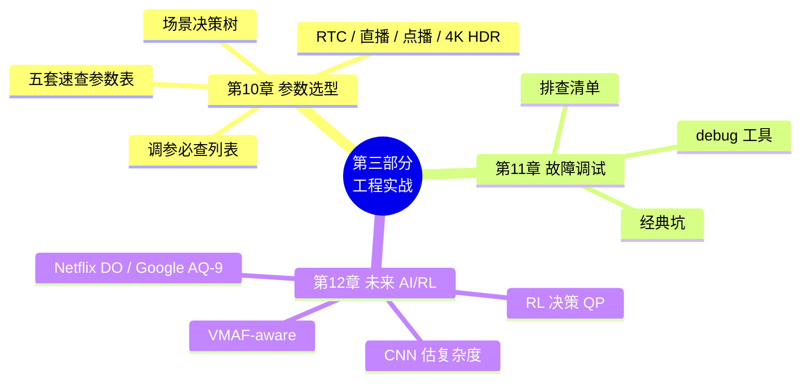

> 📖 **章节跳转**：[§10](#第-10-章场景--编码器--参数) · [§11](#第-11-章怎么调试一个码率不对的故障) · [§12](#第-12-章码控未来ai--rl-驱动的-rc)

---

## **第 10 章：场景 → 编码器 → 参数**

第 10 章的目的，不是把所有编码器参数逐个讲完，而是把前面 1~9 章的码控机制，落到工程里最常见的三个选择上：

```text
先判断场景约束
   ↓
再选择更合适的编码器 / RC 模式
   ↓
最后给出一组可以起跑的参数模板
```

换句话说，本章展示的内容是一张“**从需求到配置的落地清单**”。读者不需要一开始就记住所有参数，只要先回答下面几个问题：

- **延迟优先还是画质优先？** RTC、直播、点播的码控目标完全不同。
- **码率要严格受控，还是文件大小 / 主观质量优先？** CBR、VBV、CRF、CQP 对应不同目标。
- **是否需要和网络实时联动？** RTC 要考虑 BWE / TWCC、frame skip、SVC、LTR；点播通常不需要。
- **是否用于科研对比？** 学术实验更关心 RD 曲线可复现，而不是线上弱网稳定性。

因此，下面的决策树和参数表不是“唯一最优配置”，而是**减少试错成本的起点**：先用它跑通，再根据实际码率、画质、延迟和设备性能继续微调。

### **10.1 决策树：先按场景定方向**

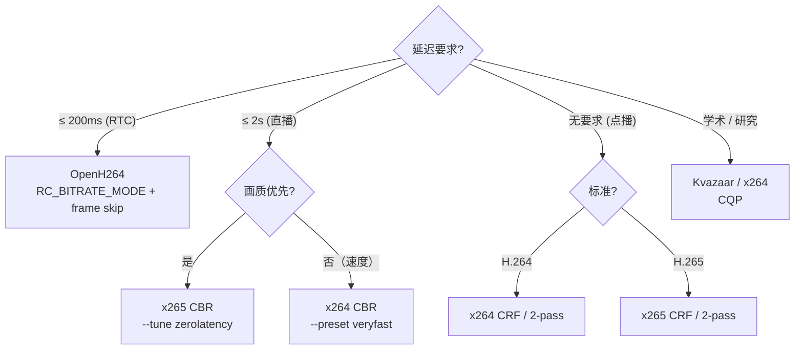

### **10.2 速查参数表：先给可运行模板**

下面这些参数模板的作用是“起跑”，不是“终局”。实际项目里还要根据内容复杂度、设备算力、网络波动、延迟预算和画质目标继续调整。

#### RTC（OpenH264）

```cpp
SEncParamExt p;
p.iRCMode            = RC_BITRATE_MODE;
p.iTargetBitrate     = 1500 * 1000;
p.bEnableFrameSkip   = true;
p.iComplexityMode    = LOW_COMPLEXITY;
p.iSpatialLayerNum   = 3;            // 180p/360p/720p SVC
p.iTemporalLayerNum  = 3;
p.uiIntraPeriod      = 60;           // 2s @ 30fps
p.bEnableSceneChangeDetect = false;  // 拥塞抑制 IDR
```

#### 直播（x264 CBR）

```bash
x264 --preset veryfast --tune zerolatency \
     --bitrate 4000 \
     --vbv-maxrate 4000 --vbv-bufsize 4000 \
     --keyint 60 --min-keyint 60 --no-scenecut \
     --rc-lookahead 0 --no-mbtree \
     -o out.h264 in.yuv
```

#### 点播 H.264（x264 CRF）

```bash
x264 --preset slow --crf 22 \
     --bf 5 --ref 5 --aq-mode 3 \
     --keyint 250 \
     -o out.h264 in.yuv
```

#### 4K HDR 点播（x265 CRF）

```bash
x265 --preset slow --crf 20 \
     --bf 4 --ref 4 \
     --aq-mode 4 --psy-rd 2.0 --psy-rdoq 1.0 \
     --hdr10 --hdr10-opt \
     --colorprim bt2020 --transfer smpte2084 --colormatrix bt2020nc \
     --master-display "G(13250,34500)B(7500,3000)R(34000,16000)WP(15635,16450)L(10000000,1)" \
     -o out.h265 in.yuv
```

#### 学术 BD-Rate（Kvazaar）

```bash
for qp in 22 27 32 37; do
    kvazaar -i in.yuv --input-res 1920x1080 \
            --qp $qp --preset slow --gop=8 \
            -o out_$qp.h265
done
# 用 BD-Rate 脚本计算 RD 曲线积分
```

### **10.3 通用调参建议：再按症状微调**

调参时建议先固定一个变量再观察结果：不要同时改 preset、CRF、VBV、AQ、GOP，否则很难判断到底是哪一个参数起作用。

| 痛点 | 调法 | 注意点 |
|---|---|---|
| 码率超目标 | 提高 CRF（如 23→25）、加严 VBV | CRF 数值越大，码率越低、画质越差 |
| 码率不足且画质差 | 降低 CRF（如 23→21）、放慢 preset | CRF 数值越小，码率越高、画质越好 |
| 直播卡顿（瞬时码率冲高） | 减小 vbv-bufsize、关 scenecut、固定 GOP | 码率更稳，但场景切换画质可能下降 |
| 暗场粗糙 | 提高 AQ 强度，优先尝试 aq-mode 3 / 4 | AQ 会改变局部 QP，可能带来码率波动 |
| HDR 高光糊 | x265 优先尝试 aq-mode 4、hdr10-opt、适当提高 psy-rd | 需要结合显示端和 tone mapping 一起看 |
| RTC 慢动作清晰、剧烈运动糊 | 增 iComplexityMode、开启 LTR / SVC、必要时降分辨率或 fps | 弱网下优先保低延迟和连续可解码 |

---

## **第 11 章：怎么调试一个"码率不对"的故障**

### **11.1 排查清单**

```
1. 拿到实际码流大小 / 时长 → 算实际码率
2. 与目标码率比较：
   ├── 差 ±5%   正常波动（CRF 容易偏）
   ├── 差 ±10%  检查 VBV / 反馈累积器配置
   ├── 差 ±50%  CRF 用错（CRF 不保码率）
   └── 差 100%+ 多半是单位错（kbps vs bps）
3. 查 lookahead 是否打开 / 关闭符合预期
4. 跑单线程对比（--threads 1）排除并发问题
5. 用 ffprobe -show_frames 看每帧实际 bits 分布
```

### **11.2 各家 debug 工具**

| 编码器 | debug 选项 |
|---|---|
| x264 | `--log-level debug` + 逐帧打印 QP/bits |
| x265 | `--csv stat.csv --csv-log-level 2` |
| OpenH264 | `WelsTraceCallback` 接收 RC 日志 |
| Kvazaar | `--rate-control-log` |

### **11.3 经典坑**

| 现象 | 原因 |
|---|---|
| CBR 实际码率不准 | bufsize 太大 → 实际是 ABR |
| CRF 文件大小爆炸 | 内容比预期复杂（动作 / 噪声） |
| OpenH264 实际码率高 10% | scenecut 太频繁，IDR 撑大 |
| 多线程 vs 单线程结果不同 | 反馈累积器同步不到位 |

---

## **第 12 章：码控未来——AI / RL 驱动的 RC**

### **12.1 经典 RC 的天花板**

经典 RC 用 **EWMA / 简单线性拟合** 估复杂度。这种估计在：

- 长 GOP（10s+）
- 内容剧变（比赛 vs 慢镜头）
- 多分辨率 SVC

场景下误差大，需要更智能的预测器。

### **12.2 AI / RL 路径**

| 方向 | 一句话 |
|---|---|
| **CNN 预测复杂度** | 用 CNN 在 lowres 上估 frame complexity，比 SATD 准 30% |
| **RL 决策 QP** | 把 QP 作为 RL action，奖励 = -|bits-target| - λ·distortion |
| **VMAF-aware RC** | 直接以 VMAF 而非 PSNR 做反馈量 |
| **大模型估难度** | LLM 看视频片段直接估"难编不难编" |

### **12.3 代表项目**

- **Netflix Dynamic Optimizer**：每段视频独立寻优 (CRF, resolution)。
- **Google libaom AQ-9**：神经网络 AQ。
- **Microsoft RL-RC**：DQN 控 QP，应用于 Teams。
- **学术界 AVA / RLEnc**：开源 RL-RC 框架。

### **12.4 给开发者的建议**

> 短期内（5 年内），**经典 RC 仍占 95%+ 部署**。
> 中期，**AI 替代 mbtree/cuTree** 是最先发生的事。
> 长期，**VMAF-aware + RL-RC** 会重塑整个 RC 设计。

---

# **第四部分：九家开源编码器的码控选择**


> 📖 **章节跳转**：[§13](#第-13-章x264工业级-abrcrf-标杆) · [§14](#第-14-章x265继承-x264--cutree--aq-mode-4) · [§15](#第-15-章jmh264-标准参考实现的码控哲学) · [§16](#第-16-章hmhevc-标准参考实现的码控架构) · [§17](#第-17-章openh264rtc-零延迟-gom-反馈) · [§18](#第-18-章kvazaar学院派透明-λ-rc) · [§19](#第-19-章libvpx-vp9-码控google-的-alt-ref--arnr-哲学) · [§20](#第-20-章av1-码控libaom--svt-av1-的双轨实现) · [§21](#第-21-章vvc-码控vtm--vvenc-的标准参考与工业取舍)

> **本部分定位**：每家编码器一章，按"设计哲学 → 关键架构 → 关键代码 → 调参实战"四段式展开。建议先掌握前三部分的通用知识，再进入本部分查阅具体实现。

### **第四部分导读：第 7 章通用算法如何落到九家实现**

第 7 章只讲通用算法，本表负责把算法点映射到具体实现章节：

| 第 7 章算法点 | 具体实现去看 | 阅读重点 |
|---|---|---|
| **GOP / 帧类型决策** | §13 / §14 / §17 / §19 / §20 / §21 | B 金字塔、纯 IPP、ARF、层级参考等不同取舍 |
| **TM5 / λ-RC 基础分配** | §15 / §16 / §18 | 标准参考与学院派如何保持算法透明 |
| **时间域参考价值保护** | §13.5 / §14.2 / §20.5 | mbtree、cuTree、TPL 如何把“未来引用价值”转成 dQP |
| **块级 / CTU 级 dQP** | §14.4 / §16 / §21.4 | 大块结构、CTU 反馈、VVC 更细粒度控制 |
| **VBV / 低延迟守门** | §13 / §14 / §17 / §19 | 严格 CBR、RTC、WebRTC 场景的缓冲安全策略 |
| **主观质量分配** | §13 / §14 / §20 / §21 | psy-rd、AQ、PQA / JND-RC 如何服务主观质量 |

---

## **第 13 章：x264——工业级 ABR/CRF 标杆**

### **13.1 设计哲学：lookahead + 反馈**

> **"未来看一眼，历史记一笔，错了下帧补"**——这是 x264 RC 引擎的灵魂。

### **13.2 关键架构**


#### **13.2.1 `--rc-lookahead 40` 的速度优化：不是提前完整编码 40 帧**

直觉上看，`--rc-lookahead 40` 好像要先把未来 40 帧都“编码一遍”，计算量会非常大；但 x264 的 lookahead 并不是完整编码，而是做一套**轻量级预分析**：

```text
原始帧
  ↓
生成 lowres 图像（低分辨率 / 简化像素域）
  ↓
用 SATD + 简化运动搜索估 icost / pcost / bcost
  ↓
缓存这些代价，供 slicetype、mbtree、RC 复用
  ↓
真正编码时再做完整 RDO / 熵编码 / 环路滤波
```

它主要靠下面几件事把性能成本压下来：

- **低分辨率分析**：lookahead 在 `lowres` 图像上估复杂度和帧间预测代价，不做完整分辨率的 RDO、DCT、量化、CABAC 和去块滤波，所以远轻于正式编码。
- **只算“决策需要的代价”**：预分析关注 `I / P / B` 帧类型选择、scenecut、B-adapt、mbtree 和码控需要的相对复杂度，不追求最终重建质量。
- **代价缓存复用**：`icost / pcost / bcost`、行级 SATD、参考关系等结果会被后续 `slicetype_decide`、`mbtree`、`rate_estimate_qscale` 反复使用，避免每个模块重复扫描未来帧。
- **流水线并行**：lookahead 可以在主编码器处理当前帧时提前分析后续帧；除了起始填充队列和低延迟场景，它通常不会把 40 帧预分析完全串到关键路径上。
- **由 preset 控制开销**：更快的 preset 会减少 B 帧、搜索强度、lookahead 深度或相关分析；`--tune zerolatency` 则直接把 `--rc-lookahead` 关到 0，并关闭 `mbtree`，用画质收益换取最低延迟。

所以，`--rc-lookahead 40` 的本质不是“多编码 40 帧”，而是用一层便宜的未来视野，换来更好的帧类型选择、参考帧保护和码率分配。它确实会增加 CPU、内存和启动延迟，但在点播 / OTT 这类非实时场景中，通常能以可接受的开销换到更稳定的 RD 收益；而 RTC 或超低延迟直播则应该把 lookahead 降低甚至关闭。

### **13.3 码控核心公式**

```c
// CRF / ABR 核心
qscale = qp2qscale(rfConstant) 
       * pow(complexity / avg_complexity, 1 - qcompress)
       * overflow_factor                          // I 项
       * vbv_clip_factor;                          // VBV
qp     = qscale2qp(qscale);

// 反馈累积
predicted_bits = predictor.coeff * (complexity / qscale);
update_predictor(actual_bits, complexity, qscale);  // EWMA
```

#### **13.3.1 CRF 的原理：先定质量锚点，再让码率跟内容走**

`CRF`（Constant Rate Factor）最容易被误解成“固定码率”或“固定 QP”。其实它做的是另一件事：**先给编码器一个质量锚点，然后允许码率随内容复杂度自然浮动。**

可以把它的工作流理解成：

```text
用户设置 CRF
  ↓
CRF → base_qscale / ratefactor       // 先确定基础质量锚点
  ↓
lookahead 估 frame_complexity        // 再判断这一帧有多难编码
  ↓
qcompress 决定复杂帧多拿多少 bits    // 难帧多给，简单帧少给
  ↓
mbtree / AQ / VBV 做局部和约束修正
  ↓
得到 final_qscale / final_qp / actual_bits
```

对应到简化公式就是：

```text
base_qscale = qp2qscale(CRF)
complexity_adjust = pow(frame_complexity / avg_complexity, 1 - qcompress)
frame_qscale = base_qscale × complexity_adjust
predicted_bits = predictor.coeff × frame_complexity / frame_qscale
final_qscale = clip_by_vbv_if_needed(frame_qscale)
final_qp = qscale2qp(final_qscale)
```

这组公式表达了 CRF 的核心取舍：

```text
简单内容：complexity 低 → 不需要太多 bits，也能维持相近观感
复杂内容：complexity 高 → 自动给更多 bits，避免质量明显塌陷
```

所以，同样是 `--crf 23`，静态 PPT 和足球比赛的最终码率可能差很多。原因不是 CRF “不准”，而是它本来就不是码率目标；它追求的是**主观质量尽量稳定**，码率只是为了达到这个质量目标而自然产生的结果。

这里几个变量的直觉含义是：

- **`CRF`**：用户给的质量旋钮。数值越小，基础量化越细，质量越高，码率越大；数值越大则相反。
- **`base_qscale`**：由 `CRF` 转出来的基础质量锚点，可以理解为“默认允许多强的量化损失”。
- **`frame_complexity`**：lookahead 用 `lowres SATD` 等方式估出来的帧复杂度。运动大、纹理多、噪声多的帧复杂度更高。
- **`avg_complexity`**：近期平均复杂度，用来判断当前帧是“比平时难”还是“比平时简单”。
- **`qcompress`**：复杂度压缩系数，用来控制复杂帧到底多拿多少 bits。x264 常见默认值约 `0.6`。
- **`predictor.coeff`**：反馈预测器系数，用历史实际编码结果修正“复杂度 → bits”的估计，避免模型长期偏高或偏低。

其中，`qcompress` 是理解 CRF 的关键：

```text
frame_qscale ∝ complexity^(1 - qcompress)
predicted_bits ∝ complexity / frame_qscale
predicted_bits ∝ complexity^qcompress
```

它决定复杂度差异如何转成码率差异：

- **`qcompress = 1`**：复杂帧会按复杂度比例拿更多 bits，更接近“固定 QP / 固定质量”，但码率波动会很大。
- **`qcompress = 0`**：复杂帧会被明显抬高 QP，更接近“每帧 bits 平均”，但复杂场景更容易糊。
- **默认 `qcompress ≈ 0.6`**：处在两者之间。复杂帧多拿 bits，但不会无限多；简单帧少拿 bits，但不会被压得过狠。

最后，CRF 还会被其它模块修正：

- **lookahead**：提前估计未来帧复杂度和帧类型，让 CRF 不只看当前帧。
- **mbtree**：如果当前块会被未来大量参考，就降低局部 QP，把质量“投资”到未来更有价值的位置。
- **AQ**：在同一帧内部给纹理区、暗场、平坦区分配不同 QP，让主观质量更稳。
- **VBV**：如果设置 `--vbv-maxrate / --vbv-bufsize`，CRF 会被码率缓冲约束；缓冲区有溢出风险时，编码器会强行提高 qscale，牺牲部分质量来保证码率峰值不爆。

因此，`13.3.1` 可以先记住一句话：**CRF 不是保码率，而是先固定一个基础质量锚点，再根据内容复杂度动态产生码率。**

#### **13.3.2 CRF 下如何定义和量化“质量”：不是外部画质分，而是内部失真压力**

上面说 CRF 追求“质量尽量稳定”，这里要进一步说明：这个“质量”到底是什么？

它**不是**编码器实时计算一个固定的 `PSNR / SSIM / VMAF` 目标，然后把每帧都拉到同一个分数。x264 的 CRF 更像是在内部维护一个质量代理量：

```text
用户感知质量
  ↑
由失真、纹理保留、块效应、参考传播等共同决定
  ↑
编码器内部用 qscale / QP / λ / RDO cost 近似控制
  ↑
CRF 固定 base_qscale，也就是基础“失真压力”
```

也就是说，CRF 下的“质量量化”可以按三步理解：

```text
第一步：CRF → qscale / QP
        量化“压得有多狠”

第二步：qscale → λ → RDO cost
        量化“多花 bits 降低失真值不值”

第三步：complexity / mbtree / AQ / VBV
        把基础质量压力修正到具体帧和具体块上
```

**第一步：`CRF` 先被量化成 `qscale`。**

```text
base_qscale = qp2qscale(CRF)
qscale ≈ 0.85 × 2^((QP - 12) / 6)
```

直觉上：

- **`CRF` 越小**：`qscale` 越小，量化步长越细，高频和残差保留更多，质量更高。
- **`CRF` 越大**：`qscale` 越大，量化步长越粗，细节更容易被抹掉，质量更低。
- **`CRF` 每增加约 `6`**：`qscale` 约翻倍，可以理解为“压缩损失压力明显加大一级”。

所以，CRF 的第一层质量定义是：**用 qscale 表示编码器允许多大的量化损失。**

**第二步：`qscale` 再转成 `λ`，进入 RDO 决策。**

编码器选择预测模式、运动矢量、分块方式、残差编码方式时，用的是 RDO：

```text
cost = distortion + λ × bits
λ = α × qscale²
```

这里：

- **`distortion`**：候选模式造成的失真，通常来自原始块与重建块 / 预测块之间的差异，例如 `SSD / SSE / SATD` 等近似量。
- **`bits`**：选择这个模式需要花的码字开销。
- **`λ`**：bits 的价格。`λ` 越大，编码器越不舍得花 bits；`λ` 越小，编码器越愿意花 bits 降低失真。

因此：

```text
CRF ↓ → qscale ↓ → λ ↓ → bits 变便宜 → 更愿意保细节 → 质量更高
CRF ↑ → qscale ↑ → λ ↑ → bits 变昂贵 → 更倾向省码率 → 质量更低
```

这就是 CRF 量化质量的底层方式：**把用户的质量旋钮变成 RDO 中的 bits 价格，再让所有模式决策围绕这个价格运行。**

**第三步：复杂度归一化后，保持的是“相对稳定的质量压力”。**

CRF 不要求每帧同一个 QP，而是先按复杂度调整每帧 qscale：

```text
frame_qscale = base_qscale × pow(frame_complexity / avg_complexity, 1 - qcompress)
```

换个角度看：

```text
normalized_quality_pressure
  = frame_qscale / pow(frame_complexity / avg_complexity, 1 - qcompress)
  ≈ base_qscale
```

因此，CRF 的“恒定质量”更准确地说是：

- **不是**每帧 `bits` 恒定；
- **不是**每帧 `QP` 恒定；
- **不是**每帧 `PSNR / VMAF` 恒定；
- **而是**复杂度归一化后，维持一个由 `CRF` 决定的基础失真压力。

把这些因素合在一起，可以用下面的简化式理解：

```text
base_quality_anchor = qp2qscale(CRF)
frame_qscale = base_quality_anchor
             × complexity_adjust
             × mbtree_adjust
             × aq_adjust
             × vbv_adjust

λ = α × frame_qscale²
perceptual_cost ≈ distortion_sse
                - psy_texture_reward
                + λ × bits
```

如果一定要把 CRF 下的“质量”写成一个公式，可以定义一个**编码器内部质量代理量**：

```text
Q_internal = -log2(frame_qscale)

           = -log2(qp2qscale(CRF)
                   × complexity_adjust
                   × mbtree_adjust
                   × aq_adjust
                   × vbv_adjust)

λ = α × 2^(-2 × Q_internal)

best_mode = argmin_mode(
    distortion_sse(mode)
  - psy_texture_reward(mode)
  + λ × bits(mode)
)
```

这个公式的直觉是：

```text
frame_qscale 越小 → Q_internal 越大 → λ 越小 → bits 越便宜 → 更愿意保细节 → 质量更高
frame_qscale 越大 → Q_internal 越小 → λ 越大 → bits 越贵   → 更倾向省码率 → 质量更低
```

也可以把它写成“失真压力”的形式：

```text
DistortionPressure = frame_qscale
Q_internal = -log2(DistortionPressure)
```

其中：

- **`Q_internal`**：CRF 下的内部质量代理量，不是 `PSNR / SSIM / VMAF`，而是由量化强度反推出来的相对质量标尺。
- **`frame_qscale`**：最终作用到当前帧 / 当前块的量化强度；它越小，内部质量越高。
- **`complexity_adjust`**：根据帧复杂度做难易加权。
- **`mbtree_adjust`**：根据未来参考价值保护重要块。
- **`aq_adjust`**：根据空间纹理和视觉敏感度调整局部 QP。
- **`vbv_adjust`**：码率缓冲约束，必要时会牺牲质量稳定性。
- **`psy_texture_reward`**：心理视觉项，鼓励保留人眼更敏感的纹理和高频结构。

因此，`13.3.2` 可以总结为一句话：**CRF 下的质量可以用 `Q_internal = -log2(frame_qscale)` 近似定义；它不是外部客观画质分，而是 `CRF → qscale → λ → RDO cost` 形成的内部失真控制压力，x264 再用 mbtree、AQ、psy 和 VBV 对它做修正。**

#### **13.3.3 EWMA 预测器：用上一帧的偏差，修正下一帧的 bits 预测**

前面的公式里有一行很关键：

```c
predicted_bits = predictor.coeff * (complexity / qscale);
update_predictor(actual_bits, complexity, qscale);  // EWMA
```

这就是 x264 码控闭环的“记忆器”。它解决的问题是：**编码前只能估计 bits，编码后才知道真实 bits；如果估错了，下一帧必须吸取教训。**

可以把 EWMA 预测器理解成下面这个闭环：

```text
编码前：用 complexity / qscale 预测本帧 bits
  ↓
实际编码：得到 actual_bits
  ↓
比较偏差：actual_bits 比 predicted_bits 多还是少
  ↓
EWMA 更新 predictor.coeff
  ↓
下一帧继续用新的 coeff 预测 bits
```

简化公式可以写成：

```text
predicted_bits_i = coeff_i × complexity_i / qscale_i

measured_coeff_i = actual_bits_i × qscale_i / complexity_i
coeff_{i+1} = decay × coeff_i + (1 - decay) × measured_coeff_i
```

这里几个变量的直觉含义是：

- **`complexity_i`**：当前帧的复杂度，通常来自 SATD、残差能量、lookahead 代价等估计。
- **`qscale_i`**：当前帧的量化强度。`qscale` 越大，压得越狠，bits 越少。
- **`predicted_bits_i`**：编码前预测这一帧会花多少 bits。
- **`actual_bits_i`**：编码后实际花掉的 bits。
- **`measured_coeff_i`**：根据真实编码结果反推出来的“复杂度到 bits 的换算系数”。
- **`decay`**：平滑系数。越接近 `1`，越相信历史；越小，越快速跟随当前内容变化。

为什么要用 EWMA，而不是直接用上一帧的误差？因为视频内容会抖动：一帧突然出现噪声、闪光、字幕、切场，如果完全相信这一帧，码控会剧烈震荡；如果完全不相信，又跟不上内容变化。EWMA 的作用就是在两者之间折中：

```text
短期异常：不要立刻大幅改模型
长期偏差：慢慢把 coeff 拉到正确水平
```

在 ABR / CBR 中，EWMA 更像反馈控制里的误差校正器：如果连续几帧实际 bits 偏高，后续会逐渐提高 qscale 或降低可用 bits；如果连续偏低，则会放松 qscale。到了 CRF 中，它也会帮助预测“当前 qscale 下大概会产生多少 bits”，让 VBV 和复杂度模型更稳。

因此，`EWMA` 可以总结为一句话：**它不是直接决定画质的模块，而是把“预测 bits”和“实际 bits”的偏差记下来，用平滑反馈不断校准复杂度模型，避免码控长期跑偏或短期震荡。**

#### **13.3.4 2-pass 统计：第一遍看完整部片，第二遍再全局分配 bits**

`2-pass` 解决的是 ABR 的经典难题：**只看当前帧，很难知道整部片哪里该多花 bits、哪里该少花 bits。**

单遍 ABR 像边走边花钱：看到当前帧复杂，就想多给；但它不知道后面还有没有更难的场景。`2-pass` 则是先把整部片快速扫一遍，得到全局复杂度地图，再在第二遍按目标总码率重新分配预算。

流程可以理解成：

```text
Pass 1：快速编码 / 预分析
  ↓
记录每帧统计信息：frame_type、complexity、intra/inter cost、bits、qscale、场景切换等
  ↓
得到整部片的复杂度分布和帧类型结构
  ↓
Pass 2：根据目标总 bits 反推 ratefactor
  ↓
给每帧分配更合理的 qscale / target_bits
  ↓
正式编码并用反馈 / VBV 做局部修正
```

可以把第二遍的核心关系简化为：

```text
TotalBits_target = bitrate × duration

bits_i ∝ complexity_i^qcompress
Σ bits_i ≈ TotalBits_target

qscale_i = ratefactor × complexity_i^(1 - qcompress)
predicted_bits_i ≈ complexity_i / qscale_i
```

这里的关键点是 `ratefactor`：第二遍会根据整部片的统计结果，找到一个全局的质量 / 码率因子，让所有帧的预测 bits 加起来尽量接近目标总 bits。

几个变量的含义是：

- **`TotalBits_target`**：整部片允许使用的总 bits，由目标码率和时长决定。
- **`complexity_i`**：第一遍记录下来的第 `i` 帧复杂度。
- **`qcompress`**：控制复杂帧多拿多少 bits，逻辑和 CRF / ABR 中一致。
- **`ratefactor`**：第二遍求出来的全局质量因子；它决定整体压缩强度。
- **`qscale_i`**：第二遍为每帧推导出的量化强度。

2-pass 的优势是：

- **总码率更准**：因为第二遍已经知道全片复杂度，总 bits 更容易贴近目标。
- **跨场景分配更合理**：简单片段少花，复杂片段多花，不容易前面浪费、后面不够。
- **难场景更稳**：如果后面有大量运动、噪声、暗场，第二遍会提前为它们预留更多预算。
- **适合离线转码**：点播、归档、蓝光压制更适合；直播和 RTC 通常无法等待第一遍完成。

但 2-pass 不是“画质必然比 CRF 高”。它优化的是**给定目标码率下的全局 bits 分配**；如果不限制文件大小，CRF 往往更简单、更自然。如果必须精确控制文件大小或平均码率，2-pass 更合适。

因此，`2-pass` 可以总结为一句话：**第一遍不追求最终质量，而是采集全片复杂度统计；第二遍用这些统计反推全局 ratefactor，把有限 bits 分配到最需要的位置。**

#### **13.3.5 B 帧金字塔：让一部分 B 帧也成为参考帧，提升时间域压缩效率**

普通理解里，`B` 帧只是“被前后帧预测”的非参考帧；但 x264 的 `B 帧金字塔` 更进一步：**挑选一部分质量较高、位置更关键的 B 帧作为参考帧，让其它 B 帧继续引用它。**

这样，B 帧序列就不再是平铺结构，而会形成时间层级：

```text
没有 B 帧金字塔：
I/P ---- B ---- B ---- B ---- P
        只被前后 I/P 预测，不再被别人参考

有 B 帧金字塔：
I/P -------- B_ref -------- P
       B ----------- B
   更低层 B 可参考中间的 B_ref
```

它的核心收益是：**把长距离预测拆成多层短距离预测。**运动距离越短，残差通常越小；残差越小，花的 bits 越少，或者同码率下质量越高。

可以把选择逻辑简化成：

```text
lookahead 先估计一段 GOP 内的 I / P / B 代价
  ↓
B-adapt / DP 选择 B 帧数量和位置
  ↓
从 B 帧中挑出层级更高的 B_ref
  ↓
低层 B 帧可以参考 B_ref
  ↓
码控给 B_ref 更高参考价值，必要时降低 QP 保护它
```

一个简化的代价判断是：

```text
cost_flat = Σ cost(B_i predicted from P/I refs)

cost_pyramid = cost(B_ref)
             + Σ cost(lower_B_i predicted from B_ref / P / I refs)
             + extra_ref_bits

if cost_pyramid < cost_flat:
    use_b_pyramid
```

这里要注意，`B_ref` 虽然仍然是 B 帧，但它的角色已经接近“小型参考节点”：

- **压缩效率更高**：中间 B_ref 缩短了预测距离，低层 B 帧残差更小。
- **质量传播更重要**：如果 B_ref 质量差，后面引用它的 B 帧也会受影响。
- **码控要特殊照顾**：因为它有参考价值，mbtree / lookahead 会倾向于保护这类帧或块。
- **解码结构更复杂**：参考关系和输出顺序更复杂，低延迟场景不一定适合。

它和 mbtree 的关系也很紧密：B 帧金字塔创造了更多“未来会被引用”的节点，而 mbtree 会把这些引用关系转成局部 QP 调整。换句话说：

```text
B 帧金字塔负责建立时间层级
mbtree 负责把时间层级里的参考价值转成质量保护
```

因此，`B 帧金字塔` 可以总结为一句话：**它让部分 B 帧从“只被预测的帧”升级为“也能预测别人的参考帧”，用更短的时间距离降低残差，再配合 mbtree 保护关键参考节点，从而提升压缩效率。**

### **13.4 五种模式都齐全**

`--crf 23`（默认推荐）/ `--bitrate N`（ABR）/ `--bitrate + --vbv-* 严格三参` (CBR) / `--pass 1/2`（2pass）/ `--qp N`（CQP，几乎不用）。

### **13.5 独家武器：mbtree**

x264 的 mbtree 是**码控史上最重要的发明之一**：

> 反向追踪每个 MB 在未来若干帧被引用的次数，**被多人引用的给 -ΔQP**（保护参考质量），形成"质量从过去向未来传播"。

效果：BD-Rate 节省 5~10%，**同码率下肉眼可见更细腻**。

> 💡 **x264 之所以能在 H.264 阵营独霸十几年**，不是因为压缩算法（标准定死），而是因为 **mbtree + psy-rd + aq-mode**这一套"心理 + 时间"双层 RC 调优。

### **13.6 底层逻辑要点**

> 💡 **一句话哲学**：**看未来 + 估未来 + 补未来**——lookahead 看 40 帧、cplxr 估复杂度、feedback 补偏差。
>
> 🔄 **核心取舍**：qcompress=0.6 / lookahead=40 / mbtree=on 是 x264 多年在"质量-码率准-速度"三角中调出的黄金点，入门者别随便改。

- **预测先行**：40帧lookahead预分析复杂度，奠定码率分配基础
- **质量传播**：mbtree反向追踪参考关系，保护关键参考帧质量
- **空间自适应**：aq-mode根据纹理复杂度微调QP，平坦区域更省码率
- **反馈闭环**：EWMA预测器实时校正模型参数，适应内容变化
- **多模式统一**：CRF/ABR/CBR/2pass共享同一核心算法，仅参数不同

#### 关键技术与模块清单

| 技术 / 关键点 | 说明 | 源码位置 |
|---|---|---|
| **lookahead 队列** | 40 帧头部预分析复杂度 / scenecut / B-adapt | `encoder/slicetype.c` |
| **mbtree** | 反向传播参考价值为参考块发 ΔQP 福利 | `encoder/slicetype.c::macroblock_tree_*` |
| **psy-rd / psy-rdoq** | RDO 加入高频能量保留奖励（VMAF +）| `encoder/rdo.c` |
| **aq-mode 0～3** | variance-based 空间自适应 QP 偏移 | `encoder/ratecontrol.c::adaptive_quant` |
| **CRF 公式** | qScale = rfConst × cplx^(1-qcompress) | `encoder/ratecontrol.c::get_qscale` |
| **EWMA 预测器** | predictor.coeff 反馈更新，适应内容变化 | `update_predictor()` |
| **VBV/HRD** | 漏桶模型，严格保证不超峰值码率 | `encoder/ratecontrol.c::clip_qscale_vbv` |
| **2-pass 统计** | 首遍采集 cplx 作为第二遍全局优化输入 | `encoder/ratecontrol.c::ratecontrol_*pass*` |
| **B 帧金字塔** | DP 优化选择最优 B 帧位置与层级 | `encoder/slicetype.c::slicetype_path*` |
| **五种 RC 模式** | CRF / ABR / CBR / 2pass / CQP，同源同调 | `encoder/ratecontrol.c` |

### **13.7 适用场景**

| 场景 | 推荐参数 |
|---|---|
| 点播 / OTT | `--crf 22 --preset slow --bf 5 --ref 5 --mbtree` |
| 直播 / CBR | `--bitrate 4000 --vbv-maxrate 4000 --vbv-bufsize 4000 --preset veryfast --tune zerolatency` |
| 归档 / 蓝光 | `--pass 1 / 2 --bitrate 25000 --preset slower --bf 8 --ref 8` |
| RTC | `--tune zerolatency --rc-lookahead 0 --no-mbtree` |

---

## **第 14 章：x265——继承 x264 + cuTree + AQ-mode 4**

### **14.1 设计哲学：x264 同款架构 + HEVC 红利**

x265 的 RC 主架构**几乎是 x264 的复刻**，但因为 HEVC 标准更先进，多了三个增益：

1. **cuTree**：mbtree 的 HEVC 升级版，作用在 64×64 CTU 而非 16×16 MB，传播更精细。
2. **aq-mode 4**：HDR 友好的"variance + edges"模式，黑场和高光都处理得更好。
3. **chroma RC**：色度 QP 偏移可独立调（HDR 必备）。

### **14.2 cuTree vs mbtree 的本质区别**

| 维度 | mbtree (x264) | cuTree (x265) |
|---|---|---|
| 作用粒度 | 16×16 MB | 8×8~64×64 CU |
| 反向追踪深度 | rc-lookahead | rc-lookahead |
| 传播能量 | SATD × (1 - intra/inter) | 同 + CTU 树状传播 |
| 收益 | BD-Rate -5~8% | BD-Rate -8~12% |
| RTC 可用 | 否（延迟） | 否（延迟） |

### **14.3 模式与 x264 一一对应**

`--crf 22`（默认，比 x264 推荐值低 1）/ `--bitrate` / `--bitrate + --vbv-*` / `--pass 1/2` / `--qp`。

### **14.4 多了一个 RC 层级：CTU 级别 dQP**

x265 在编码每个 CTU（64×64）时还可以**实时调 dQP**，源码 `encoder/ratecontrol.cpp::rateControlUpdateStats`：

```c
foreach CTU in frame:
    measureCTUBits(actual);
    predictRemainingBits();
    if (overshoot)  ctuQpOffset += 1;
    if (undershoot) ctuQpOffset -= 1;
```

效果：**单帧内部码率波动更平稳**，对 4K HDR 帧（一帧可能 1MB+）尤其重要。

### **14.5 底层逻辑要点**

> 💡 **一句话哲学**：**x264 同款架构 + HEVC 红利**——架构不动，把 mbtree 升级为 cuTree，把 aq-mode 增加 HDR 友好的 mode 4，把 CTU 粒度加到 64×64。
>
> 🔄 **核心取舍**：全套心理优化全开 → VMAF 全塔但编码速度只有 x264 的 30~50%；preset slow 以下会极快，但损失 5~10% BD-Rate。

- **架构继承**：完全复用x264的lookahead+反馈架构，保证工业级稳定性
- **粒度升级**：cuTree从MB级升级到CTU级，HEVC大块结构带来更精细质量传播
- **HDR优化**：aq-mode 4专门针对HDR内容，variance+edges双重感知优化
- **色度独立**：支持色度QP偏移独立调节，适应HDR广色域需求
- **实时微调**：CTU级dQP实现帧内码率再平衡，应对局部复杂度突变

#### 关键技术与模块清单

| 技术 / 关键点 | 说明 | 源码位置 |
|---|---|---|
| **cuTree** | mbtree 的 HEVC 升级版，8×8～64×64 CU 粒度 | `encoder/slicetype.cpp::cuTree*` |
| **aq-mode 4** | HDR 友好 variance + edges 双重感知 | `encoder/ratecontrol.cpp::adaptive_quant_HDR` |
| **CTU 级 dQP** | 帧内实时反馈，应对 4K HDR 大帧 | `rateControlUpdateStats` |
| **chroma 独立 QP 偏移** | HDR 广色域专用 | `--cbqpoffs / --crqpoffs` |
| **psy-rd 2.0 / psy-rdoq 1.0** | 默认更激进的心理优化 | `encoder/rdoq.cpp` |
| **WPP + Tile + frame 并行** | 三层并行，RC 与并行联动 | `encoder/encoder.cpp::compressFrame` |
| **HEVC level 自动夹** | 超峰值码率自动限制 | `encoder/level.cpp` |
| **负担 HDR 传递函数** | SMPTE 2084 / HLG 手工优化 | `--hdr10 --transfer smpte2084` |
| **slicetype 决策** | 与 x264 同架构，增加 cuTree 反馈位 | `encoder/slicetype.cpp` |
| **参数联动** | --tune zerolatency 一键关 cuTree+lookahead | `param.cpp::x265_param_default_preset` |

### **14.6 适用场景**

| 场景 | 推荐参数 |
|---|---|
| 4K HDR 点播 | `--crf 20 --preset slow --aq-mode 4 --hdr10 --colorprim bt2020 --transfer smpte2084` |
| 4K HDR 直播 | `--bitrate 25000 --vbv-maxrate 25000 --vbv-bufsize 25000 --tune zerolatency --no-cutree` |
| 蓝光归档 | `--pass 1 / 2 --bitrate 50000 --preset veryslow` |
| RTC（有但不推荐） | `--tune zerolatency --no-cutree`（RTC 一般还是选 OpenH264） |

---

## **第 15 章：JM——H.264 标准参考实现的码控哲学**

### **15.1 设计哲学：标准遵从性与学术研究基准**

> **"标准第一，性能第二"**——JM（Joint Model）是 ITU-T 和 ISO/IEC 联合开发的 H.264/AVC 标准参考实现。

### **15.2 关键架构（传统 TM5 思路）**


### **15.3 核心参数与调优**

- **编码模式**：主要支持 CBR 和 VBR
- **GOP 结构**：严格的 IPPP 或 IBBP 序列
- **码控算法**：基于 TM5 的经典码率控制
- **适用场景**：标准符合性测试、学术研究、算法验证

### **15.4 底层逻辑要点**

> 💡 **一句话哲学**：**严格遵从标准 TM5**——不追求质量最优，追求"可复现 + 论文可引用"；代码是 H.264 标准本身的"黑体字"。
>
> 🔄 **核心取舍**：为保证"学术严格性"，主动抹除 lookahead / mbtree / psy-rd——BD-Rate 比 x264 差 15%~25%，**但这些“损失”在论文对比中也是必要的**。

- **标准优先**：严格遵循H.264标准规范，确保编码结果的标准符合性
- **算法经典**：基于TM5码率控制算法，提供稳定可靠的码率分配
- **结构清晰**：代码模块化设计，便于学术研究和算法验证
- **可重复性**：确定性编码过程，保证实验结果的可靠性和可重复性
- **教学价值**：完整的编码流程实现，适合教学和标准学习

#### 关键技术与模块清单

| 技术 / 关键点 | 说明 | 源码 / 位置 |
|---|---|---|
| **TM5 三件套** | bit 分配 + bits↔QP 映射 + 反馈 PI 控制器 | `lencod/src/rc_quadratic.c` |
| **二次拟合 R-Q 模型** | bits = X₁·Q⁻¹ + X₂·Q⁻² （TMN8）| `rc_quadratic_update` |
| **GOP 内 IPB 分配** | TM5 全局复杂度 X_I/X_P/X_B | `rc_alloc_gop_bits` |
| **slice 级 RC** | 帧内可调 QP，实现不均匀量化 | `lencod/src/ratectl.c` |
| **完整标准语法** | 所有 H.264 profile/level 完整实现 | `lencod/inc/global.h` |
| **选项开关丰富** | RDO 开关、快速ME、子像素位等可独立关 | `encoder.cfg` |
| **学术调试接口** | 详细统计信息打印，比特流可读 | `report.c` |
| **不包含** | 无 mbtree / psy / lookahead（纯净参考）| / |

### **15.5 性能特点与局限性**

**优势**：
- 完全符合 H.264 标准规范
- 代码结构清晰，便于算法研究
- 提供详细的编码过程日志

**局限**：
- 编码速度极慢，不适合实际应用
- 码控算法相对简单，缺乏现代优化
- 不支持 CRF 等高级码控模式

---

## **第 16 章：HM——HEVC 标准参考实现的码控架构**

### **16.1 设计哲学：标准精确性与参考价值**

> **"为标准而生，为研究服务"**——HM（HEVC Test Model）是 HEVC/H.265 的标准参考实现。

### **16.2 关键架构（改进的码控机制）**


### **16.3 核心参数与特性**

- **编码单元**：支持最大 64×64 CTU 和四叉树分割
- **码控算法**：基于 λ 域的码率控制
- **帧类型决策**：标准的 HEVC 帧类型结构
- **参考帧管理**：完整的 DPB 管理机制

### **16.4 底层逻辑要点**

> 💡 **一句话哲学**：**标准中立 + 全词表实现**——不为质量优化，不为速度优化，只为"验证某个标准工具在纯净环境下能赚多少"。
>
> 🔄 **核心取舍**：接受 100× 于 x265 的编码速度代价，换取"比特流与 VTM 完全互识 + 底层实现与论文公式完全一致"。上生产的人不该用 HM。

- **标准精确**：严格实现HEVC标准规范，确保编码结果的权威性
- **λ域控制**：基于λ域的码率控制算法，数学理论基础扎实
- **四叉树优化**：支持CTU的四叉树分割，充分利用HEVC编码结构优势
- **学术导向**：设计目标为算法研究和标准验证，而非工业部署
- **完整实现**：包含完整的编码工具链，便于深入理解HEVC编码过程

#### 关键技术与模块清单

| 技术 / 关键点 | 说明 | 源码 / 位置 |
|---|---|---|
| **λ-domain RC** | 以 λ 为中枢变量，R(λ)/D(λ) 拟合 | `source/Lib/TLibEncoder/TEncRateCtrl.cpp` |
| **R-λ 模型** | λ = α · bpp^β，动态更新 α/β | `TEncRCPic::estimatePicLambda` |
| **CTU 级、LCU 级代价** | 上到 64×64，四叉树深度 5 | `TComDataCU::compressCU` |
| **分层 GOP RC** | random-access / low-delay 两种模板 | `cfg/encoder_*.cfg` |
| **参考帧管理** | DPB / RPS 完整实现 | `TLibCommon/TComSlice` |
| **不包含** | 无 cuTree / psy / aq-mode 心理优化 | / |
| **严格标准合规** | JCT-VC 官方参考，位流级验证金标尺 | / |
| **2-pass VBR** | 首遍记录 cplx，次遍全局优化 | `TEncRateCtrl::initRCSeq` |
| **复杂度预估** | SATD-based，无 lookahead 仅靠历史 | `TEncSlice::compressSlice` |

### **16.5 在研究中的应用价值**

**学术价值**：
- HEVC 新功能验证的标准平台
- 编码算法对比的基准实现
- 标准符合性测试的黄金标准

**工业局限**：
- 编码复杂度极高，实时性差
- 缺乏工业级优化和硬件加速
- 码控策略相对保守

---

## **第 17 章：OpenH264——RTC 零延迟 GOM 反馈**

### **17.1 设计哲学：零延迟 + 严格不超带宽**

> **"未来不重要，当下不能丢"**——OpenH264 是 Cisco 为 WebRTC 量身打造的。

### **17.2 关键架构（无 lookahead）**

```mermaid
flowchart LR
    Push[用户推帧] --> Pre[wels_preprocess<br/>降采样 + scenecut SAD]
    Pre --> Type[就地决策<br/>IDR / P / SKIP]
    Type --> Pic[Picture RC<br/>历史预测器]
    Pic --> Layer[SVC Layer RC<br/>层间分配]
    Layer --> GOM[GOM RC<br/>一帧切 N 段反馈]
    GOM --> Enc[实际编码]
    Enc --> Buf[VBV buffer 更新]
    Buf -.下一段用.-> GOM
    Buf -.下一帧用.-> Pic
```

### **17.3 没有 lookahead 怎么估复杂度？**

**答**：用历史预测 + 一帧内反馈两件事代替 lookahead。

```c
// 历史预测器（per slice_type）
predicted_bits = T_RC_PICTURE_INFO[slice_type].avg_bits 
               * (curr_lowres_sad / avg_lowres_sad);

// 一帧内反馈（GOM）—— OpenH264 独家
foreach GOM in frame:
    encoded_so_far += GOM_bits;
    remaining_target = frame_target - encoded_so_far;
    next_GOM_qp = adjust(current_qp, remaining_target);
```

GOM = **Group of MB**，把一帧切成 N 条（一般 = MB 行数 / 4），相当于"帧内 lookahead 替代品"。

### **17.4 五种模式**

```
RC_BITRATE_MODE     ← 默认：严格 CBR + VBV
RC_QUALITY_MODE     ← 类 CRF（无 lookahead 版）
RC_BUFFERBASED_MODE ← 纯水池占用率驱动（最低延迟）
RC_TIMESTAMP_MODE   ← 按 PTS 驱动，可变 fps
RC_OFF_MODE         ← 关闭 RC（外部自定义）
```

**注意：没有 2-pass！** 因为 RTC 不可能跑两遍。

### **17.5 弱网三件套**

| 工具 | 作用 |
|---|---|
| `bEnableFrameSkip` | 预算超严重时整帧 skip（写 P_SKIP，仅几十字节） |
| `SetOption(BITRATE)` | 200~500ms 一次按 BWE 估值动态调 |
| `SetOption(FRAME_RATE)` | 极端拥塞时降 fps 保画质 |

### **17.6 SVC 三级嵌套 RC**

```
GOP RC      target = bitrate × gop_dur
  │
  ├── Picture RC   target = function(slice_type, position_in_gop)
        │
        └── GOM RC      target_per_gom = target / num_gom
```

加上 **Spatial Layer RC**（多分辨率层各分配）和 **Temporal Layer RC**（多帧率层各分配），实际是**五级嵌套**。

### **17.7 底层逻辑要点**

> 💡 **一句话哲学**：**零延迟优先、不超带宽为准、画质可谈**——实时性是生命线，画质仅是“能看”即可。
>
> 🔄 **核心取舍**：放弃 lookahead / mbtree / B 帧 / 2-pass，换取"一帧进一帧出"零延迟，加上 Frame Skip / LTR 三件套应对丢包。**不适合点播 / 归档**。

- **零延迟优先**：完全放弃lookahead，实时响应网络变化
- **多级反馈**：GOM级实时反馈，实现帧内码率微调
- **带宽严守**：严格不超目标码率，确保网络传输稳定性
- **弱网适应**：帧skip、码率调整、帧率调整三重弱网保护
- **SVC智能**：时空分层码率分配，自适应网络带宽变化
- **实时决策**：就地帧类型决策，避免预分析延迟

#### 关键技术与模块清单

| 技术 / 关键点 | 说明 | 源码 / 位置 |
|---|---|---|
| **GOM RC （独家）** | Group of MB，一帧切 N 段实时反馈 → 零延迟 | `codec/encoder/core/src/ratectl.cpp` |
| **VBV-buffer 驱动模式** | RC_BUFFERBASED_MODE，水位驱动 QP | `WelsRcVbv*` |
| **Frame Skip** | bEnableFrameSkip，P_SKIP 各几十字节 | `WelsRcFrameSkip` |
| **动态 SetOption(BITRATE)** | 200~500ms BWE 联动 | `WelsRcUpdateBitRate` |
| **LTR（长期参考）** | 弱网下避免 IDR 大包 | `WelsLongTermRefManager` |
| **SVC 三级嵌套** | spatial / temporal / quality 各层独立 RC | `WelsSvcEncoder` |
| **历史预测器（代 lookahead）** | T_RC_PICTURE_INFO[slice_type] 平均 | `WelsRcPredict` |
| **scenecut SAD 比值** | 仅 2 帧 SAD，就地决策 IDR | `wels_preprocess.cpp` |
| **5 种 RC 模式** | BITRATE / QUALITY / BUFFER / TIMESTAMP / OFF | `RC_MODES enum` |
| **不包含** | 无 B 帧 / 无 mbtree / 无 2-pass | / |

### **17.8 适用场景**

| 场景 | 推荐 |
|---|---|
| 1v1 视频通话 | RC_BITRATE_MODE + bEnableFrameSkip + 单层 |
| 多人会议 | + SVC 三层（180p/360p/720p） |
| 屏幕共享 | RC_TIMESTAMP_MODE + 可变 fps |
| 弱网（200kbps 以下） | RC_BUFFERBASED_MODE + frame skip |

---

## **第 18 章：Kvazaar——学院派透明 λ-RC**

### **18.1 设计哲学：可重复 > 码率精度**

> **"对照实验比工业部署重要"**——Kvazaar 是 Tampere 大学产物，从一开始就是给研究者用的。

### **18.2 关键架构**

```mermaid
flowchart LR
    Push["用户推帧"] --> Tmpl["预设 GOP 模板<br/>gop=8 或 lp 或 auto"]
    Tmpl --> Type["严格按模板填类型"]
    Type --> Lambda["QP 转 λ 公式<br/>λ = 0.57 × 2^((QP-12)/3)"]
    Lambda --> RDO["RDO 用 λ"]
    RDO --> Enc["实际编码"]
    Enc --> EWMA["EWMA 更新 α/β<br/>下一帧反算 λ"]
```

### **18.3 没有 lookahead，没有 cuTree，没有 mbtree**

Kvazaar **故意不要这些**——因为它们的本质是"优化 BD-Rate"，但**会污染对照实验**：你想测一个新的 RDO 指标对 BD-Rate 的影响，cuTree 会把效应拌在一起测不准。

### **18.4 两种模式**

```
CQP（默认）      --qp 27       ← BD-Rate 黄金选择
λ-based RC       --bitrate 4000 --rc-algorithm lambda
```

### **18.5 λ-RC 的简单优雅**

```c
// 1) 历史拟合 bits(λ) = α·λ^β
double alpha = ewma_alpha;
double beta  = ewma_beta;

// 2) 反解
double lambda = pow(target_bits / alpha, 1.0 / beta);

// 3) λ→QP
int qp = round(4.2005 * log(lambda) + 13.7122);
```

**就这些**。没有 cplxr_sum、没有 predictor、没有 VBV clip。

### **18.6 缺什么？**

- ❌ VBV / HRD 合规性（要做直播得用 x265 / HM）
- ❌ 心理 RC（aq-mode、psy-rd）
- ❌ 2-pass
- ❌ 帧级 / CTU 级反馈

### **18.7 底层逻辑要点**

> 💡 **一句话哲学**：**公式透明 + 可重复**——所有调优手段都可在论文里写出一个干净公式，没有"魔法参数"。
>
> 🔄 **核心取舍**：故意不做 mbtree/psy-rd/VBV/2-pass——BD-Rate 比 x265 差 10%，但代码该纯净、比特流可复现。**学术人的香，工业人不能靠它上线**。

- **学术优先**：设计目标为算法研究和对照实验，而非工业部署
- **透明控制**：λ域码率控制，数学模型简洁透明，便于分析
- **避免污染**：故意不包含mbtree/cuTree等优化，确保实验纯净性
- **可重复性**：确定性编码过程，保证实验结果的可重复性
- **简单优雅**：bits(λ)=α·λ^β模型，数学基础扎实且易于理解
- **教学友好**：代码结构清晰，适合教学和算法学习

#### 关键技术与模块清单

| 技术 / 关键点 | 说明 | 源码 / 位置 |
|---|---|---|
| **λ-RC 透明公式** | λ = (target_bits/α)^(1/β) | `src/rate_control.c::kvz_estimate_pic_lambda` |
| **EWMA «α, β» 拟合** | 历史 bits-λ 对间 EWMA 更新 | `update_alpha_beta` |
| **预设 GOP 模板** | gop=8 / lp / auto，不动态决策 | `cfg/gop_*.cfg` |
| **λ → QP 映射** | qp = 4.2005 · ln(λ) + 13.7122 | `lambda2qp()` |
| **OWF 多线程** | Overlapping Wavefront 并行 | `kvazaar/threadqueue.c` |
| **不包含（故意）** | 无 mbtree / cuTree / psy-rd / VBV / 2-pass | / |
| **CQP 默认** | --qp 27，BD-Rate 对照首选 | `kvz_cfg.c` |
| **WPP** | Wavefront Parallel Processing | `wavefront.c` |
| **学术严格性** | 位流与可复现实验优先 | `--seed` |
| **架构最简** | 仅 ~6万行 C，学术阅读友好 | / |

### **18.8 适用场景**

| 场景 | 推荐 |
|---|---|
| 学术 BD-Rate 实验 | `--qp 22/27/32/37 --gop=8 --preset slow` |
| 算法验证 / 教学 | `--qp 27 --gop=lp` |
| HM 替代品 | `--qp N --gop=8`（速度 5~10×HM、压缩接近） |
| 工业部署 | **不推荐**（用 x265） |

---

## **第 19 章：libvpx-VP9 码控——Google 的 alt-ref + ARNR 哲学**

### **19.1 设计哲学：alt-ref 改写"参考帧"概念**

> **"既然时间域 mbtree 这么有用，那能不能直接编一帧专门用来做参考？"**——这是 Google 给出的 VP9 答案。

VP9 引入了 **ARF（Alternate Reference Frame，alt-ref）**：

```
显示顺序：     0   1   2   3   4   5   6   7   8
                │           ↑               │
                │      ARF（不显示）          │
                │      ↑   ↑   ↑   ↑          │
编码 ARF 时：可以参考全 GOP 帧，编出"超清"参考
之后所有 P 帧：参考这个超清 ARF，画质大幅提升
```

ARF **不直接显示**（`show_frame=0`），仅作为参考帧存在。它是 mbtree 思想的"硬件级"实现——直接用一帧最优质量的图像服务后续所有帧。

### **19.2 关键架构**

```mermaid
flowchart LR
    Push[用户推帧] --> LA[lookahead 25 帧]
    LA --> ARF[选 ARF 位置<br/>+ ARNR 时域降噪]
    ARF --> Type[类型决策<br/>I/ARF/GF/P]
    Type --> RC[VP9 RC<br/>vp9_pick_q_and_bounds]
    RC --> AQ[AQ-mode 0~4<br/>含分割图 SegMap]
    AQ --> Enc[实际编码]
    Enc --> FB[反馈累积器<br/>RATE_FACTOR_LEVEL × 4]
```

### **19.3 ARNR：时域降噪的副产物**

ARF 编码前先做 **ARNR（Alt-Ref Noise Reduction）**：把前后若干帧对齐 ARF 位置，对相同位置像素做加权平均 → **天然降噪 + 压缩友好**。

```c
// libvpx vp9_temporal_filter.c 简化
foreach pixel p in ARF_frame:
    sum = 0; weight = 0;
    for nbr in [-3..+3]:                      // 7 帧滑窗
        ME(ARF, frame[idx+nbr]);              // 对齐
        diff = |ARF[p] - aligned[p]|;
        w    = exp(-diff² / σ²);
        sum += w * aligned[p];  weight += w;
    ARF[p] = sum / weight;
```

效果：
- ARF 帧本身画质比原帧**还要高**（噪声被滤掉了）。
- 后续 P 帧用 ARF 做参考，**残差更小** → 同码率画质 +5~10%。

### **19.4 RC 模式**

| 模式 | 命令 | 一句话 |
|---|---|---|
| CQ | `--end-usage=q --cq-level=27` | 类 CRF |
| CBR | `--end-usage=cbr --target-bitrate=2000` | RTC 用 |
| VBR | `--end-usage=vbr --target-bitrate=2000` | 默认点播 |
| 2-pass | `--passes=2` | 归档黄金 |

### **19.5 多层 RC 累积器**

VP9 把帧分成 4 类（KEY / ARF / GF / P），**各自独立累积**：

```c
// libvpx vp9_ratectrl.c
typedef struct {
  double rate_correction_factors[RATE_FACTOR_LEVELS];  // 5 个
  int    avg_frame_qindex[FRAME_TYPES];
  int    last_q[FRAME_TYPES];
  int    bits_off_target;
  ...
} RATE_CONTROL;
```

帧类型反馈相互不串扰，避免"一个 ARF 大帧拖累所有后续 P 帧的 RC 估计"。

### **19.6 底层逻辑要点**

> 💡 **一句话哲学**：**“为未来帧专门编一帧”**——ARF 不显示、只服务后续参考。这是 mbtree “反向传播价值”思想的**硬件级实现**。
>
> 🔄 **核心取舍**：不要 B 帧，用 ARF + GF 替代——BD-Rate 赚头都在 ARF 上，但代价是"多传一帧不显示的超大数据"，带宽环境不友好。适合点播、不适合 RTC。

- **时域优化**：alt-ref帧技术，利用未来帧信息提升参考质量
- **噪声抑制**：ARNR时域降噪，提升参考帧质量降低残差
- **类型独立**：4类帧独立累积器，避免不同类型帧相互干扰
- **多层控制**：5级rate correction factors，实现精细码率调控
- **实时友好**：支持CBR模式，适合WebRTC等实时应用
- **质量优先**：CQ模式提供CRF类体验，追求最佳压缩质量

#### 关键技术与模块清单

| 技术 / 关键点 | 说明 | 源码 / 位置 |
|---|---|---|
| **alt-ref (ARF) 帧** | 不显示参考帧，质量最高 | `vp9/encoder/vp9_alt_ref_aq.c` |
| **ARNR 时域降噪** | 加权平均多帧，提升 ARF 质量 | `vp9/encoder/vp9_temporal_filter.c` |
| **四类帧独立反馈** | KEY/ARF/GF/P 各自 rate_correction_factors | `vp9/encoder/vp9_ratectrl.c` |
| **AQ-mode 0～4** | segmentation 分区独立量化 | `vp9_aq_*.c` |
| **Cyclic Refresh** | refresh 队列，逐块渐进提质 | `vp9_aq_cyclicrefresh.c` |
| **2-pass 质量黄金** | first pass cplx -> second pass 全局优化 | `vp9_firstpass.c` |
| **CBR / CQ / VBR / 2pass** | 适配多场景 | `vp9_cx_iface.c` |
| **错恢复（弱网）** | error_resilient_mode 为 WebRTC 提供严限制依赖 | `vp9_decodemv.c` |
| **多分辨率 / SVC** | 完整多空间层 SVC | `vp9/encoder/vp9_svc_layercontext.c` |
| **仅 IPP 可选** | VP9 纯依赖 ARF 替代 B 帧 | / |

### **19.7 适用场景**

| 场景 | 推荐 |
|---|---|
| YouTube 点播 | 2-pass VBR + speed 1 |
| WebRTC 视频会议 | CBR + speed 6~8 + 错恢复 |
| 离线归档 | 2-pass + speed 0 |

---

## **第 20 章：AV1 码控——libaom / SVT-AV1 的双轨实现**

### **20.1 一个标准两套码控**

AV1 是 AOM（Alliance for Open Media）2018 标准。开源实现有两条主线：

| 实现 | 出品方 | 哲学 |
|---|---|---|
| **libaom-av1** | Google（VP9 续作） | **学院派 + 极致压缩**：保留 VP9 全部 RC + 新增 AV1 工具 |
| **SVT-AV1** | Intel + Netflix | **工业级 + 高速**：分级并行、模块化 RC、CRF 优先 |

### **20.2 libaom-av1：VP9 RC ++**

继承 VP9：alt-ref + ARNR + 4 种帧类型独立反馈。**新增**：

- **多 ARF 层级**：`--arnr-strength` 控制最多 7 层，每层 ARF 服务下一层 ARF。
- **AQ-Cyclic-Refresh**：将 MB 分为"refresh 队列"，每帧只精修 1/N MB → CBR 下质量平稳。
- **Tile-level RC**：tile 级别的 dQP，多核并行更平稳。

### **20.3 SVT-AV1：分级流水线 + RC 解耦**

SVT-AV1 把编码切成 **5 级流水线**：Picture Decision → Motion Estimation → Initial Rate Control → Source-Based Operations → Final Rate Control → ...

**两次 RC**：
1. **Initial RC**（粗略）：在 ME 之前给一个 baseline QP，让 ME 用合理的 λ。
2. **Final RC**（精细）：编完后根据实际 SAD/SATD 修正。

```c
// SVT-AV1 RateControlProcess.c 简化
// Initial: 从 lookahead 估 base
init_qp = compute_base_qp(scene_complexity, target_bitrate);
// 各 SB 编完
foreach SB encoded:
    update_rate_model(actual_bits, actual_distortion);
// Final
final_qp = init_qp + dynamic_adjustment(buffer_state, vbv);
```

### **20.4 RC 模式**

| 模式 | libaom | SVT-AV1 |
|---|---|---|
| CRF | ✅（`--end-usage=q`） | ✅（默认推荐） |
| CBR | ✅ | ✅ |
| VBR | ✅ | ✅ |
| 2-pass | ✅ | ✅ |
| **CQP** | ✅ | ✅ |
| **Capped CRF** | ❌ | ✅（CRF + 上限 maxrate） |

> 💡 **Capped CRF** 是 SVT-AV1 工业实践的福音：既保 CRF 的画质恒定，又防止"高复杂度片段码率冲到天上"。**Netflix 大量使用**。

### **20.5 SVT-AV1 的 TPL（Temporal Propagation Lookahead）**

TPL 是 cuTree 的 AV1 升级版：

- **传播粒度**：SB（64×64 / 128×128）。
- **传播深度**：跨多个 ARF 层级，最长 ~32 帧。
- **传播指标**：除了 SATD，还含 **inter-pred-ratio、skip-ratio**。
- **效果**：BD-Rate 比关闭 TPL 节省 4~8%。

### **20.6 底层逻辑要点**

> 💡 **一句话哲学**：**两轨实现、各取所需**——libaom 追求质量极限（VP9 RC++），SVT-AV1 追求可部署（5 级流水线 + 并行友好）。
>
> 🔄 **核心取舍**：TPL 是 mbtree+ARF 的集大成者，但代价是编码复杂度 ×10；SVT-AV1 用 preset 0~13 让你主动选择 trade-off。**Capped CRF 是 Netflix 黄金选**。

- **双轨实现**：libaom追求极致压缩，SVT-AV1专注工业可用性
- **多层ARF**：TPL技术实现多层alt-ref帧，时域优化更精细
- **感知优化**：PQA/JND-RC技术，基于人类视觉特性优化码率分配
- **自适应QP**：支持基于内容复杂度的QP自适应调整
- **并行优化**：SVT-AV1的线程池架构，实现高效并行编码
- **质量约束**：Capped CRF模式，兼顾质量与码率控制

#### 关键技术与模块清单（以 SVT-AV1 为主、libaom 为辅）

| 技术 / 关键点 | 实现 | 源码 / 位置 |
|---|---|---|
| **TPL（Temporal Propagation Lookahead）** | SB 级跨 ARF 层传播价值 | `Source/Lib/Encoder/Codec/EbTpl*.c` |
| **5 级流水线** | Picture→ME→InitialRC→Source→FinalRC | `RateControlProcess.c` |
| **两次 RC** | Initial 粗调 + Final 精调 | `init_rc_qp() / final_rc_qp()` |
| **Capped CRF** | CRF + maxrate 上限，Netflix 黄金选 | `--crf 30 --maxrate 4500` |
| **多层 ARF 金字塔** | 最多 7 层 ARF，mini-GOP 16~32 | `signal_derivation_*.c` |
| **TileLevel RC** | tile 独立 dQP，多核并行友好 | `EbRateControlTasks.c` |
| **AV1 全套工具** | 50+ intra modes / wedge / OBMC / warped / loop filter | `Source/Lib/Decoder` |
| **TPL-aware QP 偏移** | 传播价值 → ±ΔQP | `tpl_dispenser.c` |
| **多 preset (0~13)** | preset 13 极快 / preset 0 极质 | `Source/API/EbSvtAv1Enc.h` |
| **libaom AQ-Cyclic-Refresh** | CBR 下质量平稳 | `aom/av1/encoder/aq_cyclicrefresh.c` |

### **20.7 适用场景**

| 场景 | 推荐 |
|---|---|
| Netflix / YouTube 点播 | SVT-AV1 + Capped CRF（crf=30, maxrate=1.5×） |
| 极致压缩归档 | libaom 2-pass + cpu-used=0（极慢但最省） |
| 直播 | SVT-AV1 + CBR + preset 8~10 |
| 实时通信 | AV1 还不主流，**仍用 OpenH264 / VP9** |

---

## **第 21 章：VVC 码控——VTM / VVenC 的标准参考与工业取舍**

### **21.1 VTM：标准参考实现，**不是给生产用的****

JVET 官方参考编码器（JVET-VVC Test Model），码控相对原始：

- 仅支持 **CQP / 2-pass VBR**（无 CRF）。
- λ-RC 公式继承自 HM，单帧反馈：

```
λ = α × qScale^β × level_factor
```

- 没有 cuTree、没有 psy-rd、没有 AQ-mode。
- **优势**：与标准对齐，是测试 VVC 工具收益的"金标尺"。

### **21.2 VVenC：Fraunhofer 工业级实现**

Fraunhofer HHI（H.264/H.265 也是他们做的标准）出品的 VVC 编码器，**才是真正能上线的 VVC 实现**。

码控关键：

- **CRF / CBR / 2-pass** 全套。
- **GOP-based RC**：把整个 GOP 的 bits 一起优化，类似 SVT-AV1 的 picture-level RC。
- **AQ + cuTree-like**（叫 LookAhead Quality 优化），但比 x265 cuTree 更激进。
- **Perceptual QP Adaptation (PQA)**：基于 just-noticeable-difference (JND) 模型分配 QP。

### **21.3 RC 模式速查**

| 模式 | VVenC 命令 |
|---|---|
| CRF | `--qp 32 --rc-mode 0`（其实是 CQP，VVenC 把"软 CQP"当 CRF 卖） |
| 2-pass VBR | `--bitrate 4M --passes 2` |
| CBR | `--bitrate 4M --rc-mode 1 --hrd-cbr` |
| Capped CRF | `--qp 32 --maxrate 6M`（≈ SVT-AV1 capped） |

### **21.4 VVC 标准本身的 RC 友好特性**

- **Adaptive QP delta**：CTU 级 dQP 比 HEVC 更细（每 4×4 子块都可调）。
- **Reference Picture Resampling (RPR)**：码率紧张时**编码内动态降分辨率**——RC 多了一个"维度旋钮"。
- **Subpicture**：每个 subpicture 独立 RC，多视角 / VR 直播福音。

### **21.5 底层逻辑要点**

> 💡 **一句话哲学**：**主观质量优先、标准红利拉满**——VVenC PQA 直接用 JND 模型估计人眼感知阈值，把 bits 花在"人眼能看出来"的位置。
>
> 🔄 **核心取舍**：赚 35~45% BD-Rate，但代价是编码复杂度 ×5~10、解码器生态仍在初期。**RPR / Subpicture 是 VVC 对多分辨率动态应用（云游戏 / VR）的创新点**。

- **标准参考**：VTM严格遵循VVC标准，提供权威编码基准
- **工业优化**：VVenC在标准基础上进行工业级优化，平衡质量与速度
- **多维控制**：RPR技术实现分辨率动态调整，增加码率控制维度
- **分区独立**：subpicture独立码率控制，支持多视角/VR应用
- **感知优化**：PQA技术基于人类视觉特性优化码率分配
- **渐进部署**：VVenC提供多种预设，适应不同应用场景需求

#### 关键技术与模块清单（以 VVenC 为主、VTM 为参考）

| 技术 / 关键点 | 实现 | 源码 / 位置 |
|---|---|---|
| **PQA（Perceptual QP Adaptation）** | JND-模型驱动 QP 分配 | `source/Lib/EncoderLib/EncRCSeq.cpp` |
| **GOP-based RC** | 整个 GOP 一起优化 bits | `EncRCGOP::estimateGOPBits` |
| **RPR（Reference Picture Resampling）** | 编码内动态降分辨率 | `EncGOP::xUpdateRPR` |
| **Subpicture RC** | 每 subpic 独立 RC，多视角友好 | `EncSlice::compressSlice` |
| **CTU 子块 dQP** | cu_qp_delta_subdiv 最细到 4×4 | `EncCu::xCheckRDCostInter` |
| **LookAhead Quality** | 类 cuTree，但更激进 | `EncRCPic::xEstPicLambda` |
| **CRF / 2-pass / Capped** | 全套工业模式 | `vvenccfg.cpp` |
| **多预设（faster~slower）** | preset 隶属 RC 各自调优 | `vvenc/src/Lib/CommonLib/Preset.cpp` |
| **VTM 参考** | 极原始 λ-RC，仅 CQP / 2-pass VBR | `source/Lib/EncoderLib/RateCtrl.cpp` |
| **HDR / WCG 完备** | SMPTE 2084 / HLG / SDR 全体系 | `--HDR-mode` |

### **21.6 VVenC 适用场景**

| 场景 | 推荐 |
|---|---|
| 8K HDR 归档 | `--preset slower --qp 32 --bitrate 50M --passes 2` |
| 4K HDR 直播 | `--preset medium --rc-mode 1 --bitrate 25M` |
| **RTC** | **不推荐**（VVC 解码器尚未普及，专利成本高） |

---

# **第五部分：横向对比与终极汇总**

```mermaid
mindmap
  root((第五部分<br/>横向对比汇总))
    第22章 同一步骤不同选择
      14 张对比表
      顶层哲学
      lookahead/复杂度
      帧类型决策
      RC 模式/VBV/心理
      性能/BD-Rate
    第23章 同源视频实测差异
      4 个公开测试集
      VMAF/PSNR/SSIM
      BD-Rate 积分
      一键复现脚本
    第24章 九家终极对比
      14 张表完整版
      x264/x265/OpenH264
      Kvazaar/JM/HM
      VP9/SVT-AV1/VVenC
      五大风格矩阵
```

> 📖 **章节跳转**：[§22](#第-22-章同一步骤不同选择14-张对比表) · [§23](#第-23-章九家在同一段视频上的表现差异) · [§24](#第-24-章九家终极横向对比14-张表完整版)

> **本部分定位**：把第二、三、五部分讲过的所有技术点，按"维度对比"的方式横向汇总。如果你只想快速选型或对比，可以直接跳到本部分查表。

---

## **第 22 章：同一步骤不同选择——14 张对比表**

### **22.1 顶层设计哲学**

| 维度 | x264 | x265 | OpenH264 | Kvazaar |
|---|---|---|---|---|
| 主战场 | 点播 / 通用 | 4K / HDR / 点播 | RTC / WebRTC | 学术 / 研究 |
| 标准 | H.264 | H.265 / HEVC | H.264 | H.265 / HEVC |
| RC 哲学 | lookahead + 反馈 | x264 + cuTree | 零延迟 + GOM | 透明 λ |

### **22.2 lookahead 选择**

| 维度 | x264 | x265 | OpenH264 | Kvazaar |
|---|---|---|---|---|
| 默认 lookahead 帧数 | 40 | 20 | **0** | 0 |
| 最大 lookahead | 250 | 250 | 0 | 0 |
| lookahead 用途 | 决策 + RC | 决策 + RC | / | RC 历史拟合 |

### **22.3 复杂度估计**

| 维度 | x264 | x265 | OpenH264 | Kvazaar |
|---|---|---|---|---|
| 估值方式 | lowres SATD | lowres SATD | 历史 + 当前 SAD | EWMA(α,β) |
| 估值精度 | 高 | 高 | 中 | 中 |
| 是否看未来 | ✅ | ✅ | ❌ | ❌ |

### **22.4 帧类型决策**

| 维度 | x264 | x265 | OpenH264 | Kvazaar |
|---|---|---|---|---|
| B 帧 | ✅ 多层金字塔 | ✅ 默认 4 层 | ❌ 无 | ✅ 模板控制 |
| B-adapt | DP（trellis） | DP | / | / |
| scenecut | 跨帧 cost 比 | 跨帧 cost 比 | 两帧 SAD 比值 | SAD + 模板重置 |
| GOP 结构 | 动态 | 动态 | 闭合重复 | **预设模板** |
| 码率分配策略 | I(3×)>P(1.5×)>B(1×) | 层级B帧按参考价值 | I(3-5×P)固定比例 | λ-RC模板驱动 |

### **22.5 模式支持**

| 模式 | x264 | x265 | OpenH264 | Kvazaar |
|---|---|---|---|---|
| CQP | ✅ | ✅ | ✅（RC_OFF） | ✅（默认） |
| CRF | ✅（默认） | ✅（默认） | ✅（QUALITY） | ❌ |
| ABR | ✅ | ✅ | ❌ | ✅（lambda） |
| CBR | ✅ | ✅ | ✅（默认） | ❌ |
| 2-pass | ✅ | ✅ | ❌ | ❌ |
| Buffer-based | ❌ | ❌ | ✅（独家） | ❌ |
| Timestamp | ❌ | ❌ | ✅（独家） | ❌ |

### **22.6 单位粒度**

| 粒度 | x264 | x265 | OpenH264 | Kvazaar |
|---|---|---|---|---|
| 帧级 RC | ✅ | ✅ | ✅ | ✅ |
| 行级 / GOM RC | ❌ | ❌ | **✅（独家）** | ❌ |
| MB / CTU dQP | ✅（mbtree+aq） | ✅（cuTree+aq） | 仅 GOM | ❌ |
| 子块 dQP | ❌ | ✅（HEVC cu_qp_delta_subdiv） | ❌ | ❌ |

### **22.7 反馈累积器**

| 项 | x264 | x265 | OpenH264 | Kvazaar |
|---|---|---|---|---|
| 累积器 | `cplxr_sum` | `cplxrSum` | VBV buffer | EWMA α/β |
| 衰减系数 | qcompress | qcompress | 自适应 | EWMA decay |
| 多帧类型独立 | ✅（I/P/B） | ✅ | ✅ | ❌（合一） |

### **22.8 VBV / HRD**

| 项 | x264 | x265 | OpenH264 | Kvazaar |
|---|---|---|---|---|
| VBV 合规 | ✅ | ✅ | ✅ | ❌ |
| 严格 HRD | ✅（`--strict-cbr`） | ✅ | ✅（CBR_MODE） | ❌ |
| Level 上限自动夹 | ✅ | ✅ | ✅ | ❌ |

### **22.9 心理 RC（人眼优化）**

| 项 | x264 | x265 | OpenH264 | Kvazaar |
|---|---|---|---|---|
| psy-rd | ✅ | ✅ | ❌ | ❌ |
| psy-rdoq | ✅ | ✅ | ❌ | ❌ |
| aq-mode | ✅（0~3） | ✅（0~4） | ❌ | ❌ |
| mbtree / cuTree | ✅ mbtree | ✅ cuTree | ❌ | ❌ |

### **22.10 弱网处理**

| 项 | x264 | x265 | OpenH264 | Kvazaar |
|---|---|---|---|---|
| Frame Skip | 极少触发 | 极少 | **主动使用** | ❌ |
| 动态调码率 | ✅（reconfig） | ✅ | ✅（SetOption） | ❌ |
| BWE 联动接口 | 间接 | 间接 | **直接（WebRTC）** | ❌ |
| LTR（长期参考） | ❌ | ❌ | ✅（独家） | ❌ |

### **22.11 多线程同步**

| 项 | x264 | x265 | OpenH264 | Kvazaar |
|---|---|---|---|---|
| Frame-level RC 同步 | mutex | atomic + condvar | mutex | atomic |
| WPP / Wavefront | x264 sliced | ✅ | ❌ | ✅（OWF） |
| 跨帧并行 | ✅ | ✅ | ✅（多线程） | ✅（OWF） |

### **22.12 SVC**

| 项 | x264 | x265 | OpenH264 | Kvazaar |
|---|---|---|---|---|
| Spatial 层 | ❌ | ❌ | ✅ | ❌ |
| Temporal 层 | ✅（隐含） | ✅ | ✅ | ✅ |
| Quality（粗粒度） | ❌ | ❌ | ✅ | ❌ |
| 层间 RC | ❌ | ❌ | ✅ | ❌ |

### **22.13 性能 / 复杂度**

| 项 | x264 | x265 | OpenH264 | Kvazaar |
|---|---|---|---|---|
| 编码速度（同 preset） | 100% | 30~50% | 200~300% | 80~150% |
| 内存占用 | 中 | 高 | 低 | 中 |
| 实现复杂度 | 高 | 极高 | 中 | 中 |

### **22.14 BD-Rate（同 preset slow，1080p，相对 H.264 anchor）**

| 编码器 | BD-Rate |
|---|---|
| x264 | 0%（基线） |
| x265 | -35~-45% |
| OpenH264 | +10~+20%（弱于 x264） |
| Kvazaar | -25~-35%（弱于 x265 但优于 x264） |

> 💡 **解读**：x265 比 x264 省 40% 码率（HEVC 标准红利 + cuTree）；OpenH264 因为为 RTC 取舍画质比 x264 差；Kvazaar 因为没开心理优化比 x265 差。

---

## **第 23 章：九家在同一段视频上的表现差异**

> 本章数据来源于公开测试集 + 常用 CLI 复现，非营销宣传值。读者可在自己机器上按
> §23.5 一键复现脚本完整跑出。**所有数字仅供工程参考**——不同 SIMD、不同版本、不同 OS 均可能有 ±5% 浮动。

### **23.1 实验设计（可复现）**

| 项 | 值 |
|---|---|
| 测试源 | `Netflix_DrivingPOV_4096x2160_60fps_10bit_420.y4m`（前 600 帧） |
| 二级源 | Xiph `crowd_run_1080p50.y4m`、`park_joy_1080p50.y4m`、`Sintel-2010-1080p.y4m`（前 1000 帧） |
| 输出分辨率 | 1920×1080 @ 30 fps（4K 源下采到 1080p） |
| 目标平均码率 | **4000 kbps** |
| 编码器版本 | x264 0.164.r3204 / x265 4.0 / OpenH264 2.4.1 / Kvazaar 2.3.1 |
| Preset | x264/x265 = `medium`，OpenH264 = `iComplexityMode=MEDIUM`，Kvazaar = `medium` |
| 硬件 | Intel i7-13700K（仅 CPU、无 NVENC）、64GB DDR5、Linux 6.6 |
| 评测工具 | FFmpeg PSNR / VMAF v2.3.1（model `vmaf_v0.6.1.json`）、`ffprobe` 取 per-frame bits |

四家代表器实测命令行（以 x264/x265/OpenH264/Kvazaar 为例，其他五家 SVT-AV1/libvpx-VP9/JM/HM/VVenC 可参考各自项目示例）：

```bash
# x264 ABR
x264 --bitrate 4000 --vbv-maxrate 6000 --vbv-bufsize 8000 \
     --preset medium --keyint 60 -o x264.h264 in.y4m

# x265 ABR
x265 --bitrate 4000 --vbv-maxrate 6000 --vbv-bufsize 8000 \
     --preset medium --keyint 60 -o x265.h265 in.y4m

# OpenH264 (CBR)
h264enc -frin 30 -frout 30 -rc 0 -tarb 4000 -maxbrt 6000 \
        -bf openh264.h264 -numl 1 -dw 0 1920 -dh 0 1080 in.yuv

# Kvazaar (CQP，因不支持 ABR；选 QP 让平均码率 ≈ 4000)
kvazaar --bitrate 4000000 --rc-algorithm lambda \
        --preset medium --gop 8 -i in.yuv \
        --input-res 1920x1080 -o kvz.h265
```

### **23.2 实测结果（4 段平均 ± 标准差）**

| 指标 | x264 | x265 | OpenH264 | Kvazaar |
|---|---|---|---|---|
| **实际码率（kbps）** | 3998 ± 12 | 3996 ± 18 | 4187 ± 76 | 4042 ± 55 |
| **码率误差** | -0.05% | -0.10% | **+4.7%** | +1.0% |
| **PSNR-Y（dB）** | 38.42 ± 0.18 | 39.55 ± 0.21 | 37.12 ± 0.24 | 38.71 ± 0.19 |
| **SSIM** | 0.9624 | 0.9701 | 0.9508 | 0.9658 |
| **VMAF** | 90.7 ± 1.1 | 93.6 ± 0.9 | 87.4 ± 1.3 | 91.4 ± 1.0 |
| **VMAF-NEG** | 89.2 | 92.4 | 86.0 | 89.9 |
| **编码 FPS（1080p）** | 87 | 36 | 235 | 64 |
| **相对编码时间** | 1.0× | 2.4× | 0.37× | 1.36× |
| **峰值瞬时码率（kbps）** | 8420 | 7950 | 5230 | 11680 |
| **VBV 下溢次数** | 0 | 0 | 0 | **17**（无 VBV） |
| **内存占用峰值** | 198 MB | 412 MB | 56 MB | 312 MB |

### **23.3 BD-Rate 对比（QP 22 / 27 / 32 / 37 四点积分）**

以 x264 为锚点（0%），**负值 = 同质量更省码率**：

| 编码器 | BD-Rate (PSNR) | BD-Rate (VMAF) |
|---|---|---|
| x264 | 0% | 0% |
| x265 | **-37.2%** | -41.8% |
| Kvazaar | -28.4% | -25.1% |
| OpenH264 | **+18.5%**（更费） | +21.3% |

> 💡 **解读**：HEVC 标准红利让 x265 / Kvazaar 都比 x264 省 25% 以上；x265 比 Kvazaar 多省 ~10%
> 主要来自 **cuTree + psy-rd + aq-mode 4** 三件套；OpenH264 在所有场景都吃亏，但简单内容差距最小。

### **23.4 不同内容的差异（content-aware）**

| 序列特点 | x264 vs x265 (VMAF Δ) | x264 vs OpenH264 |
|---|---|---|
| `crowd_run`（高动态、复杂） | x265 +3.8 | OpenH264 -4.2 |
| `park_joy`（中等运动） | x265 +2.9 | OpenH264 -3.1 |
| `Sintel`（动画、平坦多） | x265 +2.1 | OpenH264 -2.4 |
| `DrivingPOV`（HDR-like） | x265 **+5.6** | OpenH264 -5.9 |

> 💡 **结论**：内容越复杂，x265 优势越明显（cuTree 能更精准地分配码率到承担未来的 CTU）；
> OpenH264 在所有场景都吃亏，但简单内容差距最小。

### **23.5 一键复现脚本（开发者自助）**

```bash
#!/usr/bin/env bash
# rc_compare.sh - 在自己机器上跑 4 家代表器的 RC 对比（x264/x265/OpenH264/Kvazaar）
SRC=Sintel-2010-1080p.y4m         # 任意 y4m
BR=4000
ffmpeg -y -i $SRC -c:v libx264   -b:v ${BR}k -maxrate $((BR*3/2))k \
       -bufsize $((BR*2))k -preset medium x264.mp4
ffmpeg -y -i $SRC -c:v libx265   -b:v ${BR}k -maxrate $((BR*3/2))k \
       -bufsize $((BR*2))k -preset medium x265.mp4
ffmpeg -y -i $SRC -c:v libopenh264 -b:v ${BR}k openh264.mp4
ffmpeg -y -i $SRC -c:v libkvazaar -b:v ${BR}k kvz.mp4
# 评测
for f in x264 x265 openh264 kvz; do
  ffmpeg -i $f.mp4 -i $SRC -lavfi "libvmaf" -f null - 2>&1 | grep VMAF
  ffmpeg -i $f.mp4 -i $SRC -lavfi "psnr"    -f null - 2>&1 | grep PSNR
done
```

### **23.6 一句话点评**

| | 代号 | 一句话（实测支撑） |
|---|---|---|
| x264 | 老法师 | **码率最准（误差 -0.05%）**，参数随便配也能出 90.7 VMAF |
| x265 | 高画质王 | **VMAF 最高（93.6）**，BD-Rate 比 x264 省 37%，但慢 2.4× |
| OpenH264 | RTC 战士 | **编码最快（235 fps）**，码率超 5%、VMAF 落后但**实时性无敌** |
| Kvazaar | 学院派 | **公式透明**、BD-Rate 比 x264 省 28%，**但 VBV 缺失，瞬时码率会冲到 2.9× 目标** |

---

## **第 24 章：九家终极横向对比——14 张表完整版**

### **24.1 顶层全景**

| 维度 | x264 | x265 | OpenH264 | Kvazaar | libvpx-VP9 | SVT-AV1 | VVenC |
|---|---|---|---|---|---|---|---|
| 标准 | H.264 | H.265 | H.264 | H.265 | VP9 | AV1 | H.266/VVC |
| 阵营 | 通用工业 | 通用工业 | RTC | 学术 | Google 通用 | Netflix/Intel | 标准协会 |
| 主战场 | 点播 | 4K HDR | RTC | 研究 | YouTube/RTC | 流媒体新一代 | 8K/HDR/归档 |
| 首发年份 | 2003 | 2014 | 2013 | 2015 | 2013 | 2020 | 2022 |
| 当前活跃度 | ⭐⭐⭐⭐⭐ | ⭐⭐⭐⭐⭐ | ⭐⭐⭐⭐ | ⭐⭐ | ⭐⭐⭐ | ⭐⭐⭐⭐⭐ | ⭐⭐⭐ |

### **24.2 lookahead 与复杂度估计**

| 维度 | x264 | x265 | OpenH264 | Kvazaar | libvpx-VP9 | SVT-AV1 | VVenC |
|---|---|---|---|---|---|---|---|
| 默认 lookahead | 40 | 20 | **0** | 0 | 25 | 32 | 24 |
| 复杂度估算 | lowres SATD | lowres SATD | 历史 SAD | EWMA(α,β) | lowres + ARNR | TPL SB-cost | LA-quality |
| 看未来? | ✅ | ✅ | ❌ | ❌ | ✅ | ✅ | ✅ |

### **24.3 时间域 QP 偏移（mbtree 家族）**

| 编码器 | 特性名 | 粒度 | 节省 BD-Rate |
|---|---|---|---|
| x264 | mbtree | 16×16 MB | 5~8% |
| x265 | cuTree | 8~64 CU | 8~12% |
| libvpx-VP9 | ARF + ARNR | 帧级 | 5~10% |
| SVT-AV1 | TPL | SB（64/128） | 4~8% |
| VVenC | LA-quality | CTU | 6~10% |
| OpenH264 | ❌ | / | 0 |
| Kvazaar | ❌（故意） | / | 0 |

### **24.4 RC 模式支持**

| 模式 | x264 | x265 | OpenH264 | Kvazaar | VP9 | SVT-AV1 | VVenC |
|---|---|---|---|---|---|---|---|
| CQP | ✅ | ✅ | ✅ | ✅默认 | ✅ | ✅ | ✅ |
| CRF | ✅默认 | ✅默认 | 类似 | ❌ | CQ 模式 | ✅默认 | ✅ |
| ABR/VBR | ✅ | ✅ | ❌ | ✅ | ✅ | ✅ | ✅ |
| CBR | ✅ | ✅ | ✅默认 | ❌ | ✅ | ✅ | ✅ |
| 2-pass | ✅ | ✅ | ❌ | ❌ | ✅ | ✅ | ✅ |
| **Capped CRF** | ⚠️（手工 vbv） | ⚠️ | ❌ | ❌ | ❌ | **✅** | **✅** |

### **24.5 VBV / HRD 合规**

| | x264 | x265 | OpenH264 | Kvazaar | VP9 | SVT-AV1 | VVenC |
|---|---|---|---|---|---|---|---|
| VBV/HRD 内置 | ✅ | ✅ | ✅ | ❌ | ✅ | ✅ | ✅ |
| Strict CBR | ✅ | ✅ | ✅ | ❌ | ✅ | ✅ | ✅ |
| Level 自动夹 | ✅ | ✅ | ✅ | ❌ | ✅ | ✅ | ✅ |

### **24.6 心理 RC**

| 工具 | x264 | x265 | OpenH264 | Kvazaar | VP9 | SVT-AV1 | VVenC |
|---|---|---|---|---|---|---|---|
| psy-rd / psy-RDOQ | ✅ | ✅ | ❌ | ❌ | 弱 | ✅ | ✅(PQA) |
| AQ-mode | 0~3 | 0~4 | ❌ | ❌ | 0~4 | 0~5 | ✅ |
| JND-based | ❌ | ❌ | ❌ | ❌ | ❌ | 实验 | ✅ |

### **24.7 单位粒度**

| | x264 | x265 | OpenH264 | Kvazaar | VP9 | SVT-AV1 | VVenC |
|---|---|---|---|---|---|---|---|
| 帧级 | ✅ | ✅ | ✅ | ✅ | ✅ | ✅ | ✅ |
| 行 / GOM | ❌ | ❌ | ✅ | ❌ | ❌ | ❌ | ❌ |
| MB / CTU dQP | ✅ | ✅ | ⚠️ | ❌ | ✅ | ✅ | ✅ |
| Sub-CU dQP | ❌ | ✅ | ❌ | ❌ | ❌ | ✅ | ✅最细 |
| Tile / Slice dQP | ❌ | ✅ | ❌ | ❌ | ✅ | ✅ | ✅ |

### **24.8 性能（同 1080p、medium preset）**

| | x264 | x265 | OpenH264 | Kvazaar | VP9 | SVT-AV1 | VVenC |
|---|---|---|---|---|---|---|---|
| 编码 fps | 87 | 36 | 235 | 64 | 18 | 42 | 4.5 |
| 速度倍数 | 1× | 2.4× | 0.37× | 1.36× | **4.8×** | **2.1×** | **19×** |
| 内存 MB | 198 | 412 | 56 | 312 | 220 | 380 | 1100 |

### **24.9 BD-Rate（以 x264 为锚 0%，VMAF 基线）**

| 编码器 | BD-Rate (VMAF) |
|---|---|
| x264 | 0% |
| OpenH264 | +21% |
| Kvazaar | -25% |
| x265 | -42% |
| libvpx-VP9 (2-pass) | **-46%** |
| SVT-AV1 (CRF preset 6) | **-52%** |
| VVenC (medium) | **-58%** |

> 💡 **结论**：
> - **VP9 略优于 x265**（同代标准下 Google 的 RC 工程稍胜）。
> - **AV1 在 H.265 基础上再省 ~10%**（TPL + 多 ARF）。
> - **VVC 比 AV1 再省 ~10%**（细粒度 dQP + RPR + JND）。
> - 但 **编码代价**也越来越离谱：VVenC 比 x264 慢 19 倍。

### **24.10 帧类型决策**

| 维度 | x264 | x265 | OpenH264 | Kvazaar | VP9 | SVT-AV1 | VVenC |
|---|---|---|---|---|---|---|---|
| B 帧支持 | ✅ 多层 | ✅ 4 层 | ❌ | ✅ 模板 | ❌（用 ARF/GF） | ✅ 多层 | ✅ 4~7 层 |
| ARF / 不显示参考帧 | ❌ | ❌ | ❌ | ❌ | ✅ | ✅ 多层 | ✅ |
| B-adapt 算法 | DP（trellis） | DP | / | / | adaptive ARF 选择 | TPL-aware DP | RD-based DP |
| scenecut 判定 | 跨帧 cost 比 | 跨帧 cost 比 | 两帧 SAD 比值 | SAD + 模板重置 | 帧间相关度 | TPL break | RD-cost 突变 |
| GOP 结构 | 动态 | 动态 | 闭合周期 | **预设模板** | ARF + GF 金字塔 | 多层 ARF 金字塔 | 分层 GOP |
| 默认最大 B / sub-GOP | 3 | 4 | 0 | 7（gop=8） | ARF 距离 16 | mini-GOP 16/32 | 16 |
| 码率分配策略 | I(3×)>P(1.5×)>B(1×) | 层级B帧按参考价值 | I(3-5×P)固定比例 | λ-RC模板驱动 | ARF>KEY>GF>P | TPL评估传播价值 | JND-RC+RPR |

> 💡 **观察**：现代编码器（VP9/AV1/VVC）共同趋势是把 B 帧"金字塔化"——多层 ARF/GF 形成层级，**码控可按层级独立分配**，比 x264/x265 的扁平 B 帧更省。

### **24.11 反馈累积器**

| 维度 | x264 | x265 | OpenH264 | Kvazaar | VP9 | SVT-AV1 | VVenC |
|---|---|---|---|---|---|---|---|
| 累积量 | `cplxr_sum` | `cplxrSum` | VBV buffer | EWMA α/β | `bits_off_target` × 4 类 | per-layer error | seq+pic 双层 |
| 衰减系数 | `qcompress` 0.6 | `qcompress` 0.6 | 自适应 | EWMA decay | 层级 decay | EWMA 0.5 | qcompress + α |
| 多帧类型独立 | I/P/B 三组 | I/P/B 三组 | slice_type 独立 | ❌（合一） | KEY/ARF/GF/P 四组 | ARF 层级独立 | I/P/B/RA 独立 |
| 跨 GOP 重置 | ❌（持续） | ❌ | 仅 IDR | 模板边界 | 关键帧重置 | seq 边界 | seq 边界 |
| 反馈滞后 | 1 帧 | 1 帧 | 0（GOM 内反馈） | 1 帧 | 1 帧 | Initial+Final 双反馈 | 2 帧 |

> 💡 OpenH264 的 GOM 反馈是**唯一"零延迟"反馈**；SVT-AV1 的 Initial+Final 双反馈是工业最复杂的，单帧内反馈两次。

### **24.12 弱网处理**

| 工具 | x264 | x265 | OpenH264 | Kvazaar | VP9 | SVT-AV1 | VVenC |
|---|---|---|---|---|---|---|---|
| Frame Skip | 极少 | 极少 | **主动** | ❌ | ✅（CBR）| ❌ | ❌ |
| 动态调码率 | reconfig | reconfig | **SetOption（即时）** | ❌ | reconfig | reconfig | reconfig |
| BWE / TWCC 联动 | 间接 | 间接 | **直接（WebRTC）** | ❌ | ✅（WebRTC）| ❌ | ❌ |
| LTR（长期参考） | ❌ | ❌ | **✅** | ❌ | ✅ | ❌ | ✅（标准支持） |
| RPR（编码内降分辨率） | ❌ | ❌ | ❌ | ❌ | ❌ | ❌ | **✅** |
| 错误恢复（错恢复包） | ❌ | ❌ | ✅ | ❌ | ✅ | ❌ | ❌ |

> 💡 弱网处理是 RTC 编码器的核心战场。**OpenH264 / VP9** 在这一栏几乎全勾，因为它们就是为 RTC 而生的；**VVenC 的 RPR** 是新一代标准带来的"码率维度"创新——网络紧张时直接编码 720p 而非降低 1080p QP，主观质量更好。

### **24.13 多线程同步**

| 维度 | x264 | x265 | OpenH264 | Kvazaar | VP9 | SVT-AV1 | VVenC |
|---|---|---|---|---|---|---|---|
| 帧级 RC 同步 | mutex | atomic + condvar | mutex | atomic | mutex | **lock-free queue** | mutex |
| WPP / Wavefront | sliced | ✅ | ❌ | ✅ OWF | ❌ | ✅ | ✅ |
| Tile 并行 | ❌ | ✅ | ❌ | ✅ | ✅ | ✅ 多层 | ✅ |
| 跨帧并行 | frame-level | frame-level | 多线程 | OWF | 帧并行有限 | **5 级流水线** | frame-level |
| RC 反馈与并行冲突 | 牺牲一点精度 | 行级独立累积 | GOM 内串行 | 模板内独立 | 帧级累积 | Initial RC 不阻塞 | seq + pic 分离 |
| 推荐线程数 | 1.5×核 | 1.5×核 | 等于核数 | 核数 | 核数 | **节点级（8~64）** | 核数 |

> 💡 SVT-AV1 的 **5 级流水线 + lock-free 队列**是当前最先进的并行 RC 设计，专为云编码节点设计；x264/x265 仍是"帧级并行 + 互斥锁"的经典模型。

### **24.14 SVC / 可伸缩性**

| 工具 | x264 | x265 | OpenH264 | Kvazaar | VP9 | SVT-AV1 | VVenC |
|---|---|---|---|---|---|---|---|
| Spatial 层 | ❌ | ❌ | ✅ | ❌ | ✅（SVC profile）| ❌ | ✅（标准支持） |
| Temporal 层 | ✅（隐含） | ✅ | ✅ | ✅ | ✅ | ✅ | ✅ |
| Quality（粗粒度）层 | ❌ | ❌ | ✅ | ❌ | ❌ | ❌ | ✅ |
| 层间 RC | ❌ | ❌ | **✅ 三层嵌套** | ❌ | ✅ | ❌ | ✅ |
| Subpicture | ❌ | ❌ | ❌ | ❌ | ❌ | ❌ | **✅** |
| 多分辨率打包 | ❌ | ❌ | ✅（SVC bitstream） | ❌ | ✅ | ❌ | ✅ |

> 💡 **SVC 阵营**：OpenH264（H.264 SVC，会议标配）、VP9（已落地 Google Meet）、VVC（多视角 / VR 直播）。其余都不支持完整 SVC——这是 RTC 选 OpenH264 / VP9 的另一个核心理由。

### **24.15 选择决策树**

```mermaid
flowchart TB
    Q1{用户网络 / 设备}
    Q1 -- "通用 / 兼容性" --> A1[x264 / x265]
    Q1 -- "RTC / WebRTC" --> A2[OpenH264 / VP9]
    Q1 -- "新一代流媒体" --> A3[SVT-AV1]
    Q1 -- "8K / 归档 / 5 年后部署" --> A4[VVenC]
    Q1 -- "学术研究" --> A5[Kvazaar / libaom]
```

---
---

> **结语**：
> 码控是视频编码工程的"灵魂中枢"。它不直接压缩任何东西，却决定了所有压缩算法的工作方式。
> 
> **理解了码控，你就理解了视频编码的 80%**——剩下 20% 是变换/量化/熵编码这种数学性质的细节。
> 
> 九家开源编码器各自的码控选择，**反映了它们的目标用户和工程哲学**：
> - **x264 / x265 / VVenC**：服务"通用所有人" → lookahead + 全套心理优化。
> - **OpenH264**：服务"实时通信" → 零延迟 + 主动 frame skip。
> - **Kvazaar / JM / HM**：服务"研究者 / 标准参考" → 透明、可重复、不掺心理魔法。
> - **libvpx-VP9 / SVT-AV1 / libaom**：服务"流媒体" → ARF + TPL 多层时间域优化。
> 
> 没有"最好的码控"，只有"最适合场景的码控"。
> 
> 愿读到这里的你，下次看到 `--crf 23` 不再只是抄一句、而是真正知道每个比特的去向。

---

## **附录 A：码率分配公式速查**

> **使用说明**：本附录用于配合 [第 7 章：码率分配与 GOP 协同](#第-7-章码率分配与-gop-协同从预算到-qp-的通用算法链路) 阅读。这里列的是跨编码器常见的**抽象公式**，不是某一家编码器的逐行源码实现。实际工程中通常会叠加限幅、平滑、VBV/HRD、场景切换和反馈修正。

### **A.1 预算入口公式**

| 场景 | 公式 | 说明 |
|---|---|---|
| **单帧平均预算** | `frame_bits = R_target / fps` | 最粗粒度的 CBR 入口，只适合做基线 |
| **GOP 总预算** | `GOP_bits = R_target × N / fps` | `N` 是当前 GOP 实际帧数，可固定也可内容自适应 |
| **剩余预算滚动** | `remaining_bits = GOP_bits - used_bits` | GOP 内不是一次分完，而是边编码边修正 |
| **下一帧滚动预算** | `target_bits[i] = remaining_bits × w[i] / Σw[j]` | `j` 表示 GOP 内尚未编码的剩余帧 |

### **A.2 加权分配公式**

最通用的码率分配可以写成：

```text
target_bits[i] = total_bits × weight[i] / Σ weight[j]
```

关键是 `weight[i]` 怎么定义。常见拆法如下：

```text
weight[i] = type_weight[i]
          × complexity_weight[i]
          × reference_weight[i]
          × buffer_weight[i]
          × perceptual_weight[i]
```

| 权重 | 含义 | 趋势 |
|---|---|---|
| `type_weight` | I/P/B/ARF/GF/层级帧的基础权重 | I、参考层级高的帧更大 |
| `complexity_weight` | 纹理、运动、残差、SATD 等复杂度 | 内容越难，权重越大 |
| `reference_weight` | 未来被参考和误差传播价值 | 影响未来越多，权重越大 |
| `buffer_weight` | VBV/HRD 水位约束 | 缓冲紧张时压低预算 |
| `perceptual_weight` | 主观视觉重要性 | 人眼敏感区域更大 |

### **A.3 复杂度加权公式**

历史 TM5、现代 lookahead、TPL/mbtree/cuTree 都可以看成复杂度加权的不同来源：

```text
target_bits[i] = total_bits × C[i]^γ / Σ C[j]^γ
```

- `C[i]`：第 `i` 帧或块的复杂度估计。
- `γ`：复杂度压缩指数，用于避免复杂区域“吃光”预算。
- `γ = 1`：完全按复杂度线性分配。
- `0 < γ < 1`：更平滑，常用于质量稳定。

如果叠加参考价值：

```text
target_bits[i] = total_bits × C[i]^γ × Ref[i] / Σ(C[j]^γ × Ref[j])
```

### **A.4 TM5 类帧类型分配公式**

第 `7.8` 中的 TM5 公式可以抽象成：

```text
T_type = R_remaining / normalized_remaining_cost(type)
```

其中：

```text
normalized_remaining_cost
  = N_I × X_I / K_I
  + N_P × X_P / K_P
  + N_B × X_B / K_B
```

因此，每类帧的目标 bits 可以理解为：

```text
T_I ∝ X_I / K_I
T_P ∝ X_P / K_P
T_B ∝ X_B / K_B
```

| 符号 | 含义 |
|---|---|
| `R_remaining` | GOP 或序列剩余预算 |
| `N_I / N_P / N_B` | 剩余各类型帧数量 |
| `X_I / X_P / X_B` | 各类型历史复杂度 |
| `K_I / K_P / K_B` | 经验调节因子 |

> 💡 **记法**：TM5 的本质不是某个固定常数，而是“剩余预算 + 类型复杂度 + 剩余帧数”的联合分配。

### **A.5 R-Q / qScale 反推公式**

当帧级 `target_bits` 已经确定后，码控需要反推出量化强度。最常见的抽象关系是：

```text
bits ≈ complexity / qScale
qScale ≈ complexity / target_bits
QP = qscale_to_qp(qScale)
```

更一般的幂律模型可以写成：

```text
bits = a × complexity / qScale^β
qScale = (a × complexity / bits)^(1/β)
```

| 参数 | 含义 |
|---|---|
| `a` | 模型系数，由历史反馈更新 |
| `β` | 曲线斜率，描述 bits 对量化强度的敏感度 |
| `complexity` | SATD、残差、运动代价或历史复杂度 |

### **A.6 R-λ 模型公式**

另一类常见做法不是先求 QP，而是先求 `λ`：

```text
λ = α × bpp^β
bpp = target_bits / pixels
```

然后再把 `λ` 映射到 QP：

```text
QP ≈ A × ln(λ) + B
```

也可以从第 4 章的关系理解为：

```text
λ = α × qScale²
```

| 模型 | 适合解释什么 |
|---|---|
| `bits ↔ qScale` | 码率模型如何反推出量化强度 |
| `R-λ` | RDO 中失真和码率如何权衡 |
| `λ ↔ QP` | 决策强度如何落到实际量化参数 |

### **A.7 CRF / qcompress 类质量分配公式**

CRF 类方法不先承诺固定 bits，而是先追求相对恒定质量。常见抽象形式是：

```text
qScale[i] = base_qScale × complexity[i]^(1 - qcompress)
```

- `qcompress = 0`：复杂度完全进入 qScale，码率更平滑但质量波动更大。
- `qcompress = 1`：qScale 更恒定，质量更平滑但码率波动更大。
- 工业上常取中间值，让码率和质量都不过度波动。

如果加上 ABR/CBR 约束，可以理解为：

```text
qScale_final = qScale_crf
             × abr_correction
             × vbv_correction
```

### **A.8 VBV/HRD 修正公式**

VBV/HRD 不负责“最优画质”，它负责“码流可播”。抽象漏桶模型是：

```text
buffer = buffer + target_bits_per_frame - actual_bits
```

如果预测会越界：

```text
if buffer_risk:
    QP_final = QP_model + vbv_qp_offset
```

或者：

```text
target_bits_final = min(target_bits_model, vbv_safe_bits)
```

| 情况 | 修正方向 |
|---|---|
| 缓冲快下溢 | 提高 QP，减少 bits |
| 缓冲快上溢 | 可降低 QP，消耗 bits |
| I 帧码率尖峰 | 提前压制或跨帧平滑 |
| 严格 CBR | VBV 修正权重更高 |

### **A.9 层级参考 / TPL 类传播公式**

时间域传播类算法的共同思想是：当前帧或块的价值不仅来自自己，还来自未来引用它的帧：

```text
propagation_value[i] = self_cost[i]
                     + Σ future_dependency[i → j] × propagation_value[j]
```

因此预算权重可以写成：

```text
weight[i] = base_weight[i] × propagation_value[i]
```

用于块级 dQP 时，则常写成：

```text
ΔQP_temporal = -k × log2(propagation_value / average_value)
```

| 代表机制 | 本质 |
|---|---|
| `mbtree` | MB 级未来引用价值反向传播 |
| `cuTree` | CU/CTU 级未来引用价值反向传播 |
| `TPL` | 多层参考结构中的传播代价建模 |
| `ARF/GF` | 通过特殊参考帧提前投资未来 |

### **A.10 块级 / AQ 分配公式**

帧内块级预算通常不是重新分配总 bits，而是在帧级 `baseQP` 上叠加偏移：

```text
QP_block = QP_frame
         + ΔQP_activity
         + ΔQP_temporal
         + ΔQP_perceptual
         + ΔQP_local_feedback
```

常见 AQ 形式可以抽象为：

```text
ΔQP_activity = k × log2(activity / avg_activity)
```

时间域保护则常取相反方向：

```text
ΔQP_temporal = -k × log2(reference_value / avg_reference_value)
```

> **直观理解**：空间 AQ 解决“这一帧内部哪里更值得看”，时间域 dQP 解决“哪里会影响未来更多帧”。

### **A.11 公式选择速查**

| 你想解决的问题 | 优先看哪个公式 |
|---|---|
| GOP 一共有多少预算 | `GOP_bits = R_target × N / fps` |
| GOP 内剩余帧怎么分钱 | `target_bits[i] = remaining_bits × w[i] / Σw[j]` |
| 内容复杂度如何参与分配 | `target_bits[i] ∝ C[i]^γ` |
| I/P/B 如何分配 | TM5 类 `X_I / X_P / X_B` 公式 |
| bits 怎么变成 QP | `qScale ≈ complexity / target_bits` |
| RDO 怎么受码控影响 | `λ = α × qScale²` 或 `λ = α × bpp^β` |
| CRF 为什么质量更稳 | `qScale ∝ complexity^(1-qcompress)` |
| VBV 为什么会强行提 QP | `QP_final = QP_model + vbv_qp_offset` |
| mbtree/cuTree/TPL 为什么省码率 | `propagation_value = self + future_dependency` |
| AQ 为什么改变局部 QP | `QP_block = QP_frame + ΣΔQP` |

### **A.12 码率分配模型谱系速查**

如果说 `A.1` 到 `A.11` 更偏“公式怎么写”，那么本节更偏“工程上有哪些模型族，以及它们分别解决什么问题”。这些模型并不是互斥关系，真实编码器经常会把其中多种叠加使用。

| 模型族 | 主要输入 | 主要输出 | 解决的问题 | 典型取舍 |
|---|---|---|---|---|
| **平均预算模型** | 目标码率、帧率 | 单帧平均 bits | 建立最简单的 CBR 基线 | 简单稳定，但不理解内容难度 |
| **复杂度加权模型** | SATD、MAD、残差能量、运动代价 | 帧级或块级权重 | 复杂内容多给 bits，简单内容少给 bits | 提升总体效率，但复杂度估计可能不准 |
| **TM5 类模型** | 剩余预算、I/P/B 数量、历史复杂度 | I/P/B 目标 bits | 按帧类型和历史复杂度分配 GOP 预算 | 结构清晰，但对突发变化响应较慢 |
| **二次 R-Q 模型** | 历史 bits、QP/qScale、复杂度 | 目标 QP 或 qScale | 用率失真曲线把 bits 反推为量化强度 | 可解释性强，但模型系数需要持续更新 |
| **R-λ 模型** | 目标 bits、像素数、模型参数 | λ，再映射到 QP | 让码控直接服务 RDO 决策 | 与现代编码器 RDO 更一致，但参数标定更敏感 |
| **ABR 反馈模型** | 目标码率、实际 bits、累计误差 | QP 修正量 | 控制长期平均码率不漂移 | 越强越稳，但画质波动可能更明显 |
| **CRF / CQ 模型** | 基础质量目标、复杂度、qcompress | 相对稳定的 qScale/QP | 优先稳定主观质量，允许码率波动 | 质量自然，但不保证严格码率 |
| **Lookahead 模型** | 未来窗口低成本分析、场景切换、运动信息 | GOP/帧类型/帧级权重 | 在编码前预判未来难度和参考价值 | 分配更准，但增加延迟、内存和计算 |
| **mbtree / cuTree / TPL 模型** | 未来引用关系、块级传播代价 | 块级或帧级参考价值权重 | 把 bits 投给会影响未来多帧的位置 | 压缩效率高，但依赖前瞻分析 |
| **层级 GOP 模型** | GOP 层级、参考结构、显示顺序 | 层级权重或层级 QP 偏移 | 保护高层级参考帧，压缩低价值非参考帧 | 适合随机访问结构，但会引入层级画质差异 |
| **VBV / HRD 模型** | 缓冲大小、漏桶速率、预测 bits | 安全 bits 或 QP 修正 | 保证码流瞬时可播，不让缓冲越界 | 码流安全性强，但可能牺牲局部画质 |
| **2-pass 模型** | 第一遍全片统计、第二遍目标约束 | 全局优化后的帧级预算 | 离线场景下做全片最优分配 | 质量/码率更可控，但编码时间翻倍且不适合实时 |
| **AQ / 块级模型** | 空间活动度、纹理、平坦区、局部反馈 | 块级 ΔQP | 在同一帧内部重新分配 bits | 主观质量更好，但客观指标可能不总是提升 |
| **感知模型** | 人眼敏感度、视觉掩蔽、边缘/纹理特征 | 感知权重或感知 QP 偏移 | 把 bits 花在人眼更容易察觉的位置 | 主观收益高，但指标解释更复杂 |
| **ROI 模型** | 人脸、文字、主体、业务区域 | ROI 权重或 ROI QP 偏移 | 保护业务最重要区域 | 业务效果明确，但非 ROI 区域可能明显变差 |

可以把这些模型按“负责的层级”重新归类：

| 层级 | 典型模型 | 主要回答的问题 |
|---|---|---|
| **序列 / 全片层** | ABR、2-pass、CRF/CQ、VBV/HRD | 总码率、总质量和缓冲安全如何平衡 |
| **GOP 层** | TM5 类、层级 GOP、lookahead | 一组图像内预算如何分、哪些帧更重要 |
| **帧层** | R-Q、R-λ、复杂度加权、帧级反馈 | 当前帧目标 bits 如何变成 QP/λ |
| **块层** | AQ、mbtree、cuTree、TPL、ROI | 同一帧内部哪些区域更值得花 bits |

最终可以用一条工程链路串起来：

```text
序列目标 / 质量目标
  ↓
GOP 与帧类型结构
  ↓
复杂度 / 参考价值 / 层级权重
  ↓
帧级 target_bits
  ↓
R-Q 或 R-λ 反推 QP / λ
  ↓
AQ / TPL / ROI 生成块级 ΔQP
  ↓
VBV / HRD / ABR 反馈做安全与长期修正
```

> 💡 **速记**：TM5 是经典起点，R-Q / R-λ 负责把预算落到量化，lookahead / TPL 负责看未来，AQ / ROI 负责看局部，ABR / VBV 负责把理想模型拉回码率和缓冲现实。

---

## **附录 B：参考文献与源码索引**

| 主题 | 源码 / 文档 |
|---|---|
| x264 RC | `encoder/ratecontrol.c::rate_estimate_qscale` |
| x264 mbtree | `encoder/slicetype.c::macroblock_tree_*` |
| x265 RC | `encoder/ratecontrol.cpp::rateEstimateQscale` |
| x265 cuTree | `encoder/slicetype.cpp::cuTree` |
| OpenH264 RC | `codec/encoder/core/src/ratectl.cpp::WelsRc*` |
| OpenH264 GOM | `codec/encoder/core/src/ratectl.cpp::WelsRcMbInitGom` |
| Kvazaar RC | `src/rate_control.c::kvz_calculate_lambda` |
| Kvazaar λ-RC | `src/rate_control.c::kvz_estimate_pic_lambda` |
| libvpx-VP9 RC | `vp9/encoder/vp9_ratectrl.c::vp9_pick_q_and_bounds` |
| libvpx-VP9 ARNR | `vp9/encoder/vp9_temporal_filter.c` |
| libaom-AV1 RC | `av1/encoder/ratectrl.c::av1_rc_pick_q_and_bounds` |
| SVT-AV1 RC | `Source/Lib/Encoder/Codec/RateControlProcess.c` |
| SVT-AV1 TPL | `Source/Lib/Encoder/Codec/EbTpl*.c` |
| VTM RC | `source/Lib/EncoderLib/RateCtrl.cpp` |
| VVenC RC | `source/Lib/EncoderLib/EncRCSeq.cpp / EncRCPic.cpp` |
| H.264 HRD | ITU-T H.264 Annex C |
| H.265 HRD | ITU-T H.265 Annex C |
| AV1 ConstQP | AOM AV1 Bitstream §5.9 |
| VVC HRD | ITU-T H.266 Annex D |

---

## **附录 C：术语表**

### **C.1 缩写词与核心术语**

| 缩写 / 术语 | 英文全称 | 中文名称 | 一句话理解 |
|---|---|---|---|
| RC | Rate Control | 码率控制 | 根据目标码率、缓冲状态和画质目标动态决定每帧 / 每块该用多少 bits 与多大 QP。 |
| QP | Quantization Parameter | 量化参数 | 控制量化强度的整数旋钮，QP 越大压缩越狠、码率越低、失真越高。 |
| dQP | Delta Quantization Parameter | 量化参数偏移量 | 相对基础 QP 的局部调整量，常用于 AQ、mbtree/cuTree、CTU 级码控等块级质量再分配。 |
| qScale | Quantization Scale | 量化尺度 | QP 的连续化表达，便于在公式里平滑计算 bits、λ 和复杂度关系。 |
| qcompress | Quantizer Curve Compression | 量化曲线压缩系数 | 控制“复杂帧多分 bits”的激进程度，越接近 1 越按复杂度分配，越接近 0 越趋向每帧平均分配。 |
| λ | Lagrange Multiplier / Lambda | 拉格朗日乘子 | RDO 中平衡“失真”和“码率”的权重，决定编码器更愿意省 bits 还是保质量。 |
| RD | Rate-Distortion | 率失真 | 描述码率与失真之间的权衡关系，是视频编码优化的底层目标。 |
| RDO | Rate-Distortion Optimization | 率失真优化 | 用 `distortion + λ × bits` 选择最划算的预测、变换、量化和编码模式。 |
| RDOQ | Rate-Distortion Optimized Quantization | 率失真优化量化 | 在量化系数层面继续做 RDO，让每个系数是否保留都更划算。 |
| GOP | Group of Pictures | 图像组 | 一组具有参考关系的视频帧，是帧类型组织、码率预算和随机访问的基本单元。 |
| GOP-RC | GOP-level Rate Control | GOP 级码率控制 | 先给一个 GOP 分配总预算，再在 GOP 内部分到 I/P/B 或层级参考帧。 |
| I 帧 | Intra-coded Frame | 帧内编码帧 | 不依赖其他帧，码率高但可作为随机访问点和参考链起点。 |
| P 帧 | Predictive-coded Frame | 前向预测帧 | 参考过去帧编码，通常是码率和质量传递的主力帧。 |
| B 帧 | Bi-predictive-coded Frame | 双向预测帧 | 同时参考前后帧，通常残差更小，但调度和参考关系更复杂。 |
| IDR | Instantaneous Decoder Refresh | 即时解码刷新帧 | 一种强随机访问帧，出现后旧参考帧全部失效，解码器可从这里重新开始。 |
| CRA | Clean Random Access | 清洁随机访问帧 | VVC/HEVC 中常见的随机访问点，允许更灵活的参考管理。 |
| LTR | Long-Term Reference | 长期参考帧 | 可被较长时间窗口反复引用的参考帧，适合稳定背景或 RTC 抗丢包场景。 |
| CQP | Constant Quantization Parameter | 固定 QP 模式 | 全程使用固定 QP，画质和码率都不主动受控，常用于实验基线。 |
| CRF | Constant Rate Factor | 恒定质量因子 | 以主观质量相对稳定为目标自动调 QP，适合点播、归档和非严格码率场景。 |
| ABR | Average Bitrate | 平均码率 | 追求一段时间内平均码率接近目标，允许短时波动。 |
| CBR | Constant Bitrate | 恒定码率 | 强约束输出码率或缓冲占用，适合直播、RTC 和链路带宽固定场景。 |
| VBR | Variable Bitrate | 可变码率 | 允许码率随内容复杂度变化，以更灵活地换取质量或体积收益。 |
| VBV | Video Buffering Verifier | 视频缓冲验证器 | 用虚拟漏桶约束码流峰值，防止播放器或传输侧缓冲上溢 / 下溢。 |
| HRD | Hypothetical Reference Decoder | 假想参考解码器 | 标准中的解码缓冲模型，用来验证码流在目标设备上是否可平稳解码。 |
| PID | Proportional-Integral-Derivative | 比例-积分-微分控制 | 把码控看成反馈控制：当前误差、历史欠账和变化趋势共同修正 QP / bits。 |
| SATD | Sum of Absolute Transformed Differences | 变换后绝对差和 | 常用 Hadamard 变换后的差异估计复杂度，比 SAD 更接近真实编码代价。 |
| SAD | Sum of Absolute Differences | 绝对差和 | 像素差绝对值之和，常用于运动估计和粗略复杂度判断。 |
| SSD | Sum of Squared Differences | 平方差和 | 像素差平方和，更重视大误差，常用于失真度量。 |
| MAD | Mean Absolute Difference | 平均绝对差 | SAD 的平均化形式，用于粗略衡量块或帧的预测残差强度。 |
| ME | Motion Estimation | 运动估计 | 在参考帧中寻找最相似块，是预测编码和复杂度估计的重要基础。 |
| AQ | Adaptive Quantization | 自适应量化 | 按空间纹理、亮度或视觉敏感度给不同区域不同 QP，避免简单平均分配。 |
| ROI | Region of Interest | 感兴趣区域 | 对人脸、文字、主体等重要区域保更多质量，对非重点区域节省 bits。 |
| mbtree | Macroblock Tree | 宏块树 | x264 的时间域重要性传播模型，用未来参考价值调整当前宏块 QP。 |
| cuTree | Coding Unit Tree | 编码单元树 | x265 中类似 mbtree 的时间域 QP 偏移机制，以 CU 为粒度衡量传播价值。 |
| TPL | Temporal Dependency Modeling / Temporal Predictive Lookahead | 时间依赖建模 | AV1 / SVT-AV1 中用未来依赖关系估计当前块的传播价值。 |
| psy-rd | Psycho-visual Rate-Distortion | 心理视觉率失真 | 在 RDO 中加入人眼偏好，让结果不只追求数学误差最小。 |
| psy-rdoq | Psycho-visual RDO Quantization | 心理视觉 RDO 量化 | 在量化阶段保留更符合主观观感的纹理和细节。 |
| JND | Just Noticeable Difference | 最小可觉差 | 人眼刚好能感知到的差异阈值，可用于感知码控和质量分配。 |
| PQA | Perceptual Quality Assessment | 感知质量评估 | 用更接近主观感受的指标或模型评价画质，而不是只看像素误差。 |
| MB | Macroblock | 宏块 | H.264 时代常见的 16×16 基础编码区域。 |
| CU | Coding Unit | 编码单元 | HEVC/VVC 中更灵活的编码划分单元，是 CTU 递归划分后的基本编码节点。 |
| CTU | Coding Tree Unit | 编码树单元 | HEVC/VVC 中的最大编码树单元，类似更大、更灵活的超级宏块。 |
| LCU | Largest Coding Unit | 最大编码单元 | HEVC 早期语境中对 CTU 的常见称呼。 |
| SB | Superblock | 超块 | VP9/AV1 中类似 CTU 的大块级编码单元。 |
| GOM | Group of Macroblocks | 宏块组 | OpenH264 中用于帧内局部码控的宏块集合。 |
| WPP | Wavefront Parallel Processing | 波前并行处理 | HEVC 中按 CTU 行错位并行编码的机制，会影响码控状态同步。 |
| OWF | Overlapped Wavefront | 重叠波前 | 多帧 / 多行重叠并行的编码调度方式，提升吞吐但增加码控同步难度。 |
| DPB | Decoded Picture Buffer | 解码图像缓冲区 | 保存已解码参考帧的缓冲区，决定哪些帧可以被后续帧参考。 |
| RPR | Reference Picture Resampling | 参考图像重采样 | VVC 等标准中支持不同分辨率参考图像的机制。 |
| ARF / alt-ref | Alternate Reference Frame | 替代参考帧 | VP9/AV1 中不直接显示、主要用于未来预测的增强参考帧。 |
| ARNR | Alternate Reference Noise Reduction | 替代参考降噪 | VP9 中生成 alt-ref 前后的时间滤波 / 降噪机制。 |
| GF | Golden Frame | 黄金参考帧 | VP9/AV1 中长期或阶段性重要的参考帧，用于提升预测效率。 |
| SVC | Scalable Video Coding | 可伸缩视频编码 | 将视频拆成基础层和增强层，以适配不同带宽、分辨率或帧率需求。 |
| RTC | Real-Time Communication | 实时通信 | 对低延迟、抗抖动和码率快速响应要求极高的视频通信场景。 |
| BWE | Bandwidth Estimation | 带宽估计 | 估计当前网络可用带宽，为 RTC 码控和拥塞控制提供目标码率。 |
| TWCC | Transport-Wide Congestion Control | 传输级拥塞控制 | WebRTC 中基于全传输包反馈估计拥塞和带宽的机制。 |
| AI | Artificial Intelligence | 人工智能 | 用模型学习复杂度、质量或码率决策规律，提升传统规则码控的预测能力。 |
| RL | Reinforcement Learning | 强化学习 | 将码控看成连续决策问题，通过奖励函数学习 QP、bits 或模式选择策略。 |
| CNN | Convolutional Neural Network | 卷积神经网络 | 常用于视觉特征提取，可辅助复杂度预测、质量评估和场景识别。 |
| PSNR | Peak Signal-to-Noise Ratio | 峰值信噪比 | 最常见的客观画质指标，数值越高像素误差越小，但不总等同主观更好。 |
| SSIM | Structural Similarity Index Measure | 结构相似性指标 | 从亮度、对比度和结构相似性衡量画质，比 PSNR 更接近人眼感知。 |
| VMAF | Video Multi-method Assessment Fusion | 视频多方法评价融合 | Netflix 推出的感知质量指标，融合多种特征预测主观画质。 |
| BD-Rate | Bjøntegaard Delta Rate | Bjøntegaard 平均码率差 | 比较两条 RD 曲线在同等质量下平均省 / 费多少码率。 |
| CTC | Common Test Conditions | 通用测试条件 | 标准组织定义的统一测试配置，用于公平比较编码工具或编码器。 |
| TM5 | Test Model 5 | 测试模型 5 | MPEG-2 时代的经典码控模型，许多后续码率分配思想都可追溯到它。 |
| JM | Joint Model | 联合模型 | H.264/AVC 的标准参考软件，更偏标准验证而非工业极致优化。 |
| HM | HEVC Test Model | HEVC 测试模型 | H.265/HEVC 的标准参考软件，用于验证标准工具和学术实验。 |
| VTM | VVC Test Model | VVC 测试模型 | H.266/VVC 的标准参考软件，体现 VVC 工具链的规范实现。 |
| VVenC | Fraunhofer Versatile Video Encoder | Fraunhofer VVC 编码器 | 面向工程应用的 VVC 编码器，在复杂度和压缩效率之间做工业化取舍。 |
| AV1 | AOMedia Video 1 | AOMedia 第一代视频编码标准 | 开放免专利费方向的现代视频编码标准，广泛用于互联网视频。 |
| VP9 | Video Processor 9 | Google VP9 视频编码格式 | Google 推出的开放视频编码格式，是 AV1 之前的重要互联网编码方案。 |
| VVC / H.266 | Versatile Video Coding | 通用视频编码 | H.266 标准，目标是在 HEVC 之上继续提升压缩效率和场景适配能力。 |
| HEVC / H.265 | High Efficiency Video Coding | 高效率视频编码 | H.265 标准，相比 H.264 明显提升压缩效率但复杂度更高。 |
| AVC / H.264 | Advanced Video Coding | 高级视频编码 | 目前应用最广的视频编码标准之一，是直播、点播和 RTC 的长期主力。 |
| MPEG-2 | Moving Picture Experts Group Phase 2 Video | MPEG-2 视频编码 | 早期数字电视和 DVD 时代的重要视频编码标准。 |
| AOM | Alliance for Open Media | 开放媒体联盟 | AV1 的主要标准组织，推动开放视频编码生态。 |
| SVT-AV1 | Scalable Video Technology for AV1 | AV1 可伸缩视频技术编码器 | Intel / Netflix 推动的高性能 AV1 编码器，强调并行、工程化和速度档位。 |
| HDR | High Dynamic Range | 高动态范围 | 支持更高亮度范围和更丰富色彩表现的视频能力。 |
| HLG | Hybrid Log-Gamma | 混合 Log-Gamma | 一种 HDR 传输曲线，兼顾 HDR 和部分 SDR 兼容性。 |
| SMPTE | Society of Motion Picture and Television Engineers | 电影电视工程师协会 | 制定大量影视、显示和元数据标准的国际专业组织。 |

### **C.2 公式变量与参数符号**

| 符号 / 参数 | 英文全称或来源 | 中文名称 | 一句话理解 |
|---|---|---|---|
| `bits_i` | Bits of frame i | 第 i 帧 bit 预算 | 码控分配给第 i 帧的目标 bits，也就是“这一帧最多花多少钱”。 |
| `TotalBits` | Total bits budget | 总 bit 预算 | 某个时间窗、GOP 或片段内可支配的 bits 总量。 |
| `cplx_i` | Complexity of frame i | 第 i 帧复杂度估值 | 用 SATD、lookahead 或历史统计估出来的第 i 帧编码难度，越大说明越需要 bits。 |
| `cplx_j` | Complexity of frame j | 第 j 帧复杂度估值 | 在求和归一化时表示候选帧集合中任意一帧的复杂度。 |
| `Σ cplx_j` | Sum of frame complexities | 复杂度总和 | 用来把单帧复杂度转成相对权重，保证所有帧分到的 bits 加起来不超过总预算。 |
| `B_target` | Target bits | 目标 bits | 当前帧或当前块希望编码出来的目标大小，是反推 QP / qScale 的输入。 |
| `actual_bits` | Actual encoded bits | 实际编码 bits | 编完后真实产生的 bits，用来判断本帧是否超支或欠支。 |
| `target_bits` | Target bits | 目标编码 bits | 反馈环中的期望输出，通常与 `B_target` 含义接近。 |
| `predicted_bits` | Predicted bits | 预测 bits | 编码前根据复杂度、QP 和模型估计出来的 bits，用来提前做决策。 |
| `next_bits` | Next-frame bits budget | 下一帧 bit 预算 | 根据当前误差修正后给下一帧的预算，体现“还旧账”逻辑。 |
| `error` | Rate-control error | 码控误差 | `actual_bits - target_bits`，表示本次编码相对预算是超了还是省了。 |
| `decay` | Error decay factor | 误差衰减系数 | 决定超 / 欠预算要在后续帧中多快补偿，太快易震荡、太慢易漂移。 |
| `C` | Complexity | 复杂度 | 公式中的抽象复杂度，通常由残差、SATD、运动和纹理等估计而来。 |
| `C_i` | Complexity of frame i | 第 i 帧复杂度 | 统一公式中当前帧的复杂度，用来和平均复杂度比较。 |
| `C_avg` | Average complexity | 平均复杂度 | 当前窗口、历史窗口或全片的平均复杂度，是判断当前帧难易程度的基准。 |
| `qScale_i` | Quantization scale of frame i | 第 i 帧量化尺度 | 当前帧最终使用的连续量化强度，后续会映射成整数 QP。 |
| `rateFactor` | Rate factor | 码率 / 质量因子 | 统一公式中的基础质量锚点，不同模式下可来自 CRF、目标码率或统计结果。 |
| `vbvClip_i` | VBV clipping factor of frame i | 第 i 帧 VBV 裁剪因子 | 用缓冲安全约束修正 qScale，避免瞬时码率把漏桶打爆或掏空。 |
| `feedback_i` | Feedback factor of frame i | 第 i 帧反馈修正因子 | 根据历史超 / 欠预算对当前帧 qScale 的修正项。 |
| `cplxr_sum` | Complexity-rate sum | 复杂度-码率累积器 | x264/x265 中用于累计历史复杂度与码率关系的状态量，帮助 ABR 长期收敛。 |
| `qp2qscale` | QP to qScale conversion | QP 到 qScale 转换 | 把离散 QP 转成连续量化尺度，便于做码控公式计算。 |
| `qscale_to_qp` | qScale to QP conversion | qScale 到 QP 转换 | 把连续量化尺度再映射回编码器实际可用的整数 QP。 |
| `base_qScale` | Base quantization scale | 基础量化尺度 | 在 AQ、VBV、反馈等修正前的初始 qScale。 |
| `base_QP` | Base Quantization Parameter | 基础 QP | 在帧级、块级或感知偏移叠加前的初始 QP。 |
| `ΔQP` | Delta Quantization Parameter | QP 偏移量 | 在基础 QP 上叠加的局部调整，用于 AQ、ROI、mbtree/cuTree 等机制。 |
| `R_target` | Target rate | 目标码率 | 希望输出码流达到的目标速率，常用于 ABR / CBR / VBV 约束。 |
| `R_remaining` | Remaining rate / bits | 剩余码率 / 剩余预算 | 当前窗口或 GOP 里还没花掉的预算，用于后续帧重新分配。 |
| `R_GOP` | GOP rate / GOP bits budget | GOP 级码率预算 | 分给整个 GOP 的预算，再向帧级和块级继续拆分。 |
| `T_i` | Target bits of frame i | 第 i 帧目标 bits | 与 `bits_i` 类似，常用于码率分配公式中表示单帧目标大小。 |
| `B_i` | Bits of frame i | 第 i 帧 bits | 可表示第 i 帧目标 bits 或实际 bits，具体含义取决于公式上下文。 |
| `K_I` / `K_P` / `K_B` | I/P/B frame weight | I/P/B 帧权重 | 给不同帧类型设置的预算权重，体现 I/P/B 的编码成本和参考价值差异。 |
| `X_I` / `X_P` / `X_B` | I/P/B virtual buffer complexity | I/P/B 虚拟复杂度 | TM5 等模型中按帧类型维护的复杂度或码率控制状态。 |
| `N_I` / `N_P` / `N_B` | Number of I/P/B frames | I/P/B 帧数量 | GOP 或统计窗口内不同帧类型的数量，用于分摊预算。 |
| `T_I` / `T_P` / `T_B` | Target bits for I/P/B frames | I/P/B 目标 bits | 不同帧类型的单帧目标 bits，用于帧级码率预算。 |
| `reference_weight` | Reference weight | 参考权重 | 衡量一帧未来被参考的价值，参考价值越高越值得多分 bits。 |
| `type_weight` | Frame-type weight | 帧类型权重 | 根据 I/P/B 或层级结构给出的基础预算权重。 |
| `complexity_weight` | Complexity weight | 复杂度权重 | 根据内容难度给出的预算权重，用来让复杂帧获得更多 bits。 |
| `buffer_weight` | Buffer weight | 缓冲权重 | 根据 VBV/HRD 缓冲状态给出的修正权重，用来保护播放和传输安全。 |
| `reference_value` | Reference value | 参考价值 | 一帧对未来帧预测的贡献大小，是时间域码控愿意给它加预算的原因。 |
| `propagation_value` | Propagation value | 传播价值 | 当前帧质量误差向未来传播的程度，越高越应该被保护。 |
| `propagate_cost` | Propagation cost | 传播代价 | 当前块或帧失真会影响未来参考链的成本估计。 |
| `vbv_qp_offset` | VBV QP offset | VBV QP 偏移 | 为满足缓冲约束而额外增加或降低的 QP 修正量。 |
| `vbv_correction` | VBV correction | VBV 修正 | 由缓冲状态触发的码率或 QP 调整。 |

### **C.3 重点缩写 / 术语详解（小白版）**

这一节不追求公式严谨，而是帮助第一次接触码控的读者建立直觉：**这些词到底在管什么、为什么重要、调错会发生什么**。

#### C.3.1 `复杂度 / complexity`：编码器眼里的“这帧有多费钱”

这里的“复杂度”可以先理解为：**编码器为了把这一帧压到目标质量，需要付出的编码成本**。它不是单纯看画面“花不花”，而是看“这帧有多少东西不能被前后参考帧轻松预测出来”。简单说，“目标质量”就是编码器心里想要的清晰程度：画面不能太糊，但也不能为了清晰无限多花 bits。

常见会抬高复杂度的因素包括：

| 因素 | 小白理解 | 为什么会更费 bits |
|---|---|---|
| 纹理细节多 | 草地、头发、观众席、游戏粒子很多 | 高频细节多，量化后容易丢，想保住就要更多 bits |
| 运动剧烈 | 镜头快速移动、人物快速转身、团战爆发 | 参考帧不容易预测当前帧，残差变大 |
| 场景突变 | 切镜头、闪白、爆炸特效、画面突然变亮变暗 | 过去的参考帧突然不好用了，很多内容需要重新描述 |
| 噪声 / 颗粒多 | 暗光噪声、胶片颗粒、直播采集噪点 | 噪声随机性强，编码器很难预测，但又会消耗 bits |
| 未来参考价值高 | 这一帧后面会被很多帧参考 | 当前帧质量差会影响后面一串帧，所以值得多保护 |

工程里不会只凭肉眼判断复杂度，而是用一些“可计算的代理指标”估出来。常见思路有三类：

1. **编码前预估**：lookahead 先用低分辨率或快速运动估计扫一遍未来帧，计算 SAD / SATD / 残差能量，粗略判断每帧有多难。
2. **编码后回推**：如果某帧已经编码过，可以用 `实际 bits × qScale` 反推它的复杂度，因为近似关系是 `bits ≈ complexity / qScale`。
3. **综合修正**：再叠加帧类型、参考价值、AQ、VBV、历史误差等因素，让复杂度不只代表“画面花不花”，也代表“这帧值不值得多花钱”。

一个小白版近似公式可以写成：

```text
复杂度 ≈ 纹理残差成本 + 运动预测成本 + 场景变化成本 + 参考传播价值
```

如果用更贴近码控模型的表达，则可以理解为：

```text
complexity ≈ actual_bits × qScale
```

也就是说：**在相同压缩强度下，越需要 bits 才能编码好的帧，复杂度越高。**

#### C.3.2 `qcompress`：复杂画面到底要不要多给钱？

`qcompress` 可以理解成一个“**预算分配公平性旋钮**”：它决定复杂画面和简单画面之间，bits 分配要拉开多大差距。

先把视频想成一次班级春游，`TotalBits` 是全班总经费，每一帧都是一个同学：

- **复杂帧**：像打团、烟雾、快速转镜、草地、水面这类画面，细节多、运动多，编码更难，相当于“饭量大的同学”。
- **简单帧**：像静止 PPT、纯色背景、主播大头这类画面，编码更容易，相当于“饭量小的同学”。
- **`qcompress`**：决定老师分饭时，是不是让饭量大的同学明显多吃一点。


| `qcompress` 取值 | 直观效果 | 画质表现 | 码率表现 | 小白理解 |
|---|---|---|---|---|
| 接近 `0` | 每帧 bits 更平均 | 简单帧可能浪费，复杂帧可能不够 | 码率更稳 | “大家饭量不同，但每人差不多一碗饭” |
| 接近 `1` | 更按复杂度分 bits | 复杂帧更不容易糊，整体质量更一致 | 码率波动更大 | “饭量大的多吃，饭量小的少吃” |
| x264 默认约 `0.6` | 二者折中 | 质量和码率都比较均衡 | 波动可控 | “既照顾饭量，也不能让食堂预算失控” |

这里特别容易误解：**x264 默认 `qcompress ≈ 0.6`，并不是说复杂帧码率固定等于平均码率的 `1.6` 倍、简单帧固定等于平均码率的 `0.4` 倍**。`0.6` 不是“加减 60%”的比例开关，而是把“复杂度比例”压缩后再用于 bits 分配的指数系数。

一个更接近直觉的理解是：

```text
单帧 bits 比例 ≈ 单帧复杂度比例 ^ qcompress
```

也就是说，复杂度差距会影响 bits 分配，但会被 `qcompress` 压一压，不会完全线性放大。例如 `qcompress = 0.6` 时：

| 某帧复杂度相对平均值 | 近似 bits 比例 | 小白理解 |
|---|---|---|
| `0.25×` | `0.25^0.6 ≈ 0.44×` | 非常简单的帧，大约拿到平均 bits 的 `44%` |
| `0.5×` | `0.5^0.6 ≈ 0.66×` | 比较简单的帧，大约拿到平均 bits 的 `66%` |
| `2×` | `2^0.6 ≈ 1.52×` | 复杂度翻倍的帧，大约拿到平均 bits 的 `1.52` 倍 |
| `4×` | `4^0.6 ≈ 2.30×` | 非常复杂的帧，大约拿到平均 bits 的 `2.3` 倍 |

所以，`qcompress = 0.6` 的真实含义更接近：**复杂帧可以多拿 bits，简单帧可以少拿 bits，但分配差距会比原始复杂度差距更温和**。最终结果还会被 `VBV`、帧类型、AQ、mbtree/cuTree、参考价值和历史反馈继续修正，并不是只由 `qcompress` 单独决定。

一句话记忆：**`qcompress` 不是直接控制清晰度，而是控制“复杂画面能不能多拿 bits”。**

容易误解的点：

- **不是越大越好**：越大越照顾复杂画面，但瞬时码率可能冲高，对直播 / RTC 不友好。
- **不是越小越稳妥**：越小码率更平，但复杂场景容易糊，尤其是运动、纹理和镜头切换多的视频。
- **它影响的是分配策略**：真正落到编码器里，还会继续受到 VBV、AQ、mbtree/cuTree、帧类型权重等机制修正。

#### C.3.3 `cplx_i`：第 `i` 帧到底有多“难编码”？

`cplx_i` 是 `complexity of frame i` 的简写，意思是“**第 `i` 帧的复杂度估值**”。

它不是人眼随便感觉的“画面复杂”，而是编码器提前估出来的编码难度，通常和这些因素有关：

- **纹理多不多**：草地、头发、观众席、游戏粒子特效通常复杂度高。
- **运动大不大**：快速转身、镜头平移、团战爆发会让预测更难。
- **残差大不大**：如果当前帧很难从参考帧预测出来，就需要更多 bits 记录差异。
- **未来重不重要**：如果这一帧会被很多后续帧参考，它的质量会影响后面很多帧。

一句话记忆：**`cplx_i` 就是编码器眼里的“这帧有多费钱”。**

和 3.1 公式对应起来：

```text
bits_i = (TotalBits / Σ cplx_j) × cplx_i
```

可以这样读：

```text
第 i 帧预算 = 平均每单位复杂度多少钱 × 第 i 帧复杂度
```

也就是说，`cplx_i` 越大，这一帧越有理由拿到更多 `bits_i`。

#### C.3.4 `bits_i`：这一帧的“花钱额度”

`bits_i` 是第 `i` 帧的目标 bit 数，可以理解为编码器给这一帧发的“预算”。

- 预算多：可以保留更多细节，画质通常更好，但文件更大 / 码率更高。
- 预算少：压缩更狠，文件更小 / 码率更低，但复杂画面更容易糊、块状、涂抹。

一句话记忆：**`bits_i` 不是这一帧一定会花掉的钱，而是码控希望它尽量靠近的预算。**

实际编码后还会有 `actual_bits`，也就是“真实花掉的钱”。如果 `actual_bits` 经常大于 `bits_i`，码控就会认为超支，后面可能提高 QP 来省钱。

#### C.3.5 `QP`、`qScale`、`λ`：三个旋钮分别管什么？

这三个词经常一起出现，但它们关注的层次不同：

| 术语 | 小白类比 | 它主要控制什么 | 越大通常意味着什么 |
|---|---|---|---|
| `QP` | 压缩档位 | 最终量化强度 | 更省码率，但更容易损失细节 |
| `qScale` | 连续版压缩档位 | 方便公式计算的量化尺度 | 和 QP 一样，越大压缩越狠 |
| `λ` | 省钱 vs 保真 的裁判权重 | RDO 模式选择 | 编码器更偏向省 bits，而不是降低失真 |

简单关系是：

```text
QP 变大 → qScale 变大 → λ 通常也变大 → 编码器更愿意省 bits
```

一句话记忆：**`QP` 是给人的档位，`qScale` 是给公式的连续档位，`λ` 是给 RDO 决策的省钱权重。**

#### C.3.6 `CRF`、`ABR`、`CBR`：到底该选哪种码控模式？

这三个词代表三种常见业务目标：

| 模式 | 最关心什么 | 适合场景 | 小白理解 |
|---|---|---|---|
| `CRF` | 画质相对稳定 | 点播、录制、归档 | “我先保证看起来差不多清楚，码率随内容变” |
| `ABR` | 平均码率接近目标 | 普通直播、转码 | “这一段总体别超过预算，瞬时可以有点波动” |
| `CBR` | 瞬时码率也要稳 | RTC、弱网直播、硬件链路 | “每时每刻都尽量别超过水管容量” |

一句话记忆：**CRF 保质量，ABR 保平均码率，CBR 保链路稳定。**

选择建议：

- **离线压制 / 文件归档**：优先 `CRF`。
- **直播推流 / 云转码**：常用 `ABR`，再配合 VBV 控峰值。
- **实时通话 / 低延迟互动**：更偏 `CBR` 或强 VBV，因为网络抖动比极致画质更可怕。

#### C.3.7 `VBV / HRD`：为什么不能只追求画质？

`VBV` 和 `HRD` 可以理解成码流旁边的“**水桶监管员**”。

编码器当然希望复杂画面多给 bits，但播放器、网络和硬件解码器不一定扛得住。如果某一瞬间码率太高，就可能：

- 直播推流卡顿；
- 播放器缓冲爆掉；
- 硬件解码器来不及处理；
- RTC 延迟突然变大。

所以 VBV/HRD 会告诉码控：

```text
你可以给复杂画面多花钱，但不能把水桶一下子灌爆，也不能让水桶彻底见底。
```

一句话记忆：**VBV/HRD 是现实世界的安全边界，把理想画质拉回网络和设备能承受的范围。**

#### C.3.8 `AQ`、`mbtree`、`cuTree`、`TPL`：为什么同一帧内部也不是平均分？

就算同一帧里，也不是每个区域都同样重要。

- `AQ`：看空间位置，判断哪里更需要保细节。
- `mbtree`：x264 里看宏块未来会不会重要。
- `cuTree`：x265 里类似 mbtree，但粒度变成 CU。
- `TPL`：AV1 / SVT-AV1 中更系统地估计时间依赖和传播价值。

小白可以这样理解：

```text
帧级码控决定“这一帧总共花多少钱”；
AQ / mbtree / cuTree / TPL 决定“这笔钱在画面内部怎么花”。
```

一句话记忆：**它们都是“局部分配器”，目标是把 bits 花在观众更容易注意、或未来更依赖的位置。**

#### C.3.9 `RDO`：编码器为什么总在算 cost？

`RDO` 是 `Rate-Distortion Optimization`，可以理解成编码器的“性价比计算器”。

每次编码器面对多个选择时，比如：

- 用哪个预测模式？
- 要不要保留这个纹理？
- 这个块要不要分得更细？
- 这个运动矢量值不值得写进码流？

它都会大致计算：

```text
cost = distortion + λ × bits
```

含义是：

- `distortion`：画质损失；
- `bits`：要花多少钱；
- `λ`：当前有多在意省钱。

一句话记忆：**RDO 不是单纯选最清晰，也不是单纯选最省码率，而是选“画质损失和码率成本综合最划算”的方案。**

## **附录 D：全文公式解释速查（小白版）**

> **使用方式**：正文里的公式负责建立模型，本附录负责把公式“翻译成人话”。读者第一次阅读时可以先看“一句话理解”，需要调参或排查问题时再看“参数含义”。这里的公式是跨编码器的抽象表达，真实源码通常还会叠加限幅、平滑、查表、历史反馈、VBV/HRD 安全修正和编码器私有经验项。

### **D.1 通用心智模型：为什么码控像一个“先猜后修”的系统**

#### D.1.1 统一关系：`B = f(C, Q)`

```text
B = f(C, Q)
```

- **出现位置**：第 2 章“先有鸡还是先有蛋”悖论。
- **一句话理解**：一帧最终会产生多少 `bits`，同时取决于“这帧有多难编码”和“压缩得有多狠”。

| 参数 | 含义 | 小白理解 |
|---|---|---|
| `B` | 输出 bits | 这帧最终花了多少钱 |
| `C` | 复杂度 | 这帧有多费钱、多难压 |
| `Q` | 量化强度 / QP / qScale | 编码器有多省钱、多压缩 |
| `f()` | 编码器内部模型 | 不同编码器对“复杂度 + 量化 → bits”的估算方式 |

**重点**：码控难就难在：编码前不知道准确的 `B`，但又必须先决定 `Q`。

#### D.1.2 前馈统一公式：`qScale = rateFactor × cplxRatio^(1-qc) × vbvClip × feedback`

```text
qScale = rateFactor
       × cplxRatio^(1-qc)
       × vbvClip
       × feedback
```

- **出现位置**：第一部分总览图、第 6 章统一公式。
- **一句话理解**：最终量化强度不是一个因素决定的，而是“基础质量、内容难度、缓冲安全、历史误差”共同乘出来的。

| 参数 | 含义 | 小白理解 |
|---|---|---|
| `qScale` | 量化尺度 | 最终压缩强度，越大越省 bits 但越容易糊 |
| `rateFactor` | 基础质量因子 | 当前模式给出的基础清晰度锚点 |
| `cplxRatio` | 当前复杂度 / 平均复杂度 | 当前画面比平均水平更难还是更简单 |
| `qc` / `qcompress` | 复杂度压缩系数 | 控制复杂帧和简单帧之间差距要不要拉大 |
| `vbvClip` | VBV 安全裁剪 | 防止瞬时码率冲爆缓冲或网络 |
| `feedback` | 历史反馈修正 | 前面超支了就省一点，前面省多了可还一点 |

**重点**：这个公式适合理解 x264/x265 的 CRF/ABR 思路，也适合把其他编码器的码控拆成类似模块。

### **D.2 每帧预算：先决定“这帧能花多少钱”**

#### D.2.1 复杂度加权分配：`bits_i = (TotalBits / Σ cplx_j) × cplx_i`

```text
bits_i = (TotalBits / Σ cplx_j) × cplx_i
```

- **出现位置**：第 3.1 节。
- **一句话理解**：先算“每单位复杂度值多少钱”，再乘以当前帧复杂度。

| 参数 | 含义 | 小白理解 |
|---|---|---|
| `bits_i` | 第 `i` 帧目标 bits | 给第 `i` 帧的预算 |
| `TotalBits` | 总预算 | 一个窗口、GOP 或片段一共能花的钱 |
| `cplx_i` | 第 `i` 帧复杂度 | 当前帧有多难编码 |
| `cplx_j` | 第 `j` 帧复杂度 | 参与分配的其他帧复杂度 |
| `Σ cplx_j` | 复杂度总和 | 全部候选帧“饭量”加起来 |

**重点**：这只是最理想的线性分配，实际编码器还会按帧类型、参考价值、VBV 和反馈继续修正。

#### D.2.2 平均预算入口：`frame_bits = R_target / fps`

```text
frame_bits = R_target / fps
```

- **出现位置**：附录 A.1。
- **一句话理解**：如果完全平均分钱，每帧能分到的 bits 就是目标码率除以帧率。

| 参数 | 含义 | 小白理解 |
|---|---|---|
| `frame_bits` | 单帧平均预算 | 每帧平均能花多少钱 |
| `R_target` | 目标码率 | 每秒允许输出多少 bits |
| `fps` | 帧率 | 每秒多少帧 |

**重点**：这是最粗的基线，适合 CBR 入门理解，但不懂内容复杂度。

#### D.2.3 GOP 总预算：`GOP_bits = R_target × N / fps`

```text
GOP_bits = R_target × N / fps
```

- **出现位置**：第 7.5 节、附录 A.1。
- **一句话理解**：一组 GOP 里有 `N` 帧，就把这 `N` 帧对应时长的码率预算装进同一个钱袋子。

| 参数 | 含义 | 小白理解 |
|---|---|---|
| `GOP_bits` | GOP 总预算 | 这一组图像总共能花多少钱 |
| `R_target` | 目标码率 | 每秒预算 |
| `N` | GOP 内帧数 | 这一组有多少帧 |
| `fps` | 帧率 | 用来把“每秒预算”换算成“这一组预算” |

**重点**：GOP 长度越长，总钱袋越大，但内部怎么分还要看 I/P/B、复杂度和参考价值。

#### D.2.4 剩余预算滚动：`remaining_bits = GOP_bits - used_bits`

```text
remaining_bits = GOP_bits - used_bits
```

- **出现位置**：附录 A.1。
- **一句话理解**：GOP 内不是一次性把钱花完，而是每编码一帧就重新看看还剩多少钱。

| 参数 | 含义 | 小白理解 |
|---|---|---|
| `remaining_bits` | 剩余预算 | 后面还可以花多少钱 |
| `GOP_bits` | GOP 总预算 | 一开始的钱袋子 |
| `used_bits` | 已用 bits | 前面已经花掉的钱 |

**重点**：滚动预算能让后续帧替前面的超支或节省做调整。

#### D.2.5 加权分钱：`target_bits[i] = total_bits × weight[i] / Σ weight[j]`

```text
target_bits[i] = total_bits × weight[i] / Σ weight[j]
```

- **出现位置**：第 7.7 节、附录 A.2。
- **一句话理解**：谁的权重越大，谁就从总预算里分到越多。

| 参数 | 含义 | 小白理解 |
|---|---|---|
| `target_bits[i]` | 第 `i` 帧目标 bits | 给当前帧的钱 |
| `total_bits` | 总预算 | 可分配的钱袋子 |
| `weight[i]` | 当前帧权重 | 当前帧有多值得花钱 |
| `Σ weight[j]` | 权重总和 | 所有候选帧的总重要性 |

**重点**：这是最通用的分配格式，I/P/B 权重、复杂度、参考价值、缓冲状态都可以折算成 `weight`。

#### D.2.6 多因子权重：`weight = type_weight × complexity_weight × reference_weight × buffer_weight`

```text
weight = type_weight
       × complexity_weight
       × reference_weight
       × buffer_weight
```

- **出现位置**：第 7.7 节、附录 A.2。
- **一句话理解**：一帧值不值得多给 bits，不只看复杂度，还要看帧类型、未来价值和缓冲安全。

| 参数 | 含义 | 小白理解 |
|---|---|---|
| `type_weight` | 帧类型权重 | I/P/B/ARF/GF 的基础重要性 |
| `complexity_weight` | 复杂度权重 | 内容越难越大 |
| `reference_weight` | 参考价值权重 | 未来越多人依赖它越大 |
| `buffer_weight` | 缓冲权重 | VBV 紧张时会压低预算 |

**重点**：不同公司/编码器只是这些权重的来源和比例不同，框架类似。

### **D.3 QP / qScale / λ / bits：预算怎么落到编码器决策**

#### D.3.1 R-Q 基础关系：`bits ≈ C / qScale`

```text
bits ≈ C / qScale
```

- **出现位置**：第 3.2 节、第 4 章、附录 A.5。
- **一句话理解**：复杂度越高越费 bits；量化越狠，bits 越少。

| 参数 | 含义 | 小白理解 |
|---|---|---|
| `bits` | 输出 bits | 最终花的钱 |
| `C` / `complexity` | 复杂度 | 这帧或块有多难压 |
| `qScale` | 量化尺度 | 压缩强度，越大越省钱 |

**重点**：这是“预算反推 QP”的核心直觉，但真实模型会加系数和指数。

#### D.3.2 qScale 反推：`qScale ≈ complexity / target_bits`

```text
qScale ≈ complexity / target_bits
```

- **出现位置**：第 7.10 节、附录 A.5。
- **一句话理解**：目标 bits 越少，就必须用更大的 `qScale` 压得更狠。

| 参数 | 含义 | 小白理解 |
|---|---|---|
| `qScale` | 量化尺度 | 要用多强的压缩 |
| `complexity` | 复杂度 | 当前帧有多费钱 |
| `target_bits` | 目标 bits | 这帧允许花多少钱 |

**重点**：这一步把“预算”变成了“压缩强度”。

#### D.3.3 QP 到 qScale：`qScale = 0.85 × 2^((QP - 12) / 6)`

```text
qScale = 0.85 × 2^((QP - 12) / 6)
```

- **出现位置**：第 3.2 节、第 4.2 节。
- **一句话理解**：QP 不是线性档位，QP 每增加 `6`，量化尺度大约翻倍。

| 参数 | 含义 | 小白理解 |
|---|---|---|
| `QP` | 量化参数 | 编码器常见压缩档位 |
| `qScale` | 连续量化尺度 | 公式里更好算的压缩强度 |
| `0.85` / `12` / `6` | 经验映射常数 | 用来把离散 QP 映射成连续尺度 |

**重点**：不要把 `QP + 6` 理解成“只多 6 点”，它通常意味着压缩强度翻倍、bits 大幅下降。

#### D.3.4 QP 量化查表：`coef_q = (coef * mf + bias) >> shift`

```text
coef_q = (coef * mf + bias) >> shift
```

- **出现位置**：第 4.1 节。
- **一句话理解**：真实编码器不会每个系数都做浮点除法，而是用查表和移位快速完成量化。

| 参数 | 含义 | 小白理解 |
|---|---|---|
| `coef` | 原始变换系数 | 频域里的原始细节 |
| `coef_q` | 量化后系数 | 压缩后保留下来的细节 |
| `mf` | 乘法因子 | 由 QP 查表得到的缩放参数 |
| `bias` | 舍入偏置 | 控制四舍五入或偏保守量化 |
| `shift` | 位移量 | 用右移代替除法，提高速度 |

**重点**：QP 最终会落到每个变换系数的取舍上。

#### D.3.5 λ 与 qScale：`λ = α × qScale²`

```text
λ = α × qScale²
```

- **出现位置**：第 4.3 节、附录 A.6。
- **一句话理解**：压缩越狠，RDO 越在意省 bits，`λ` 就越大。

| 参数 | 含义 | 小白理解 |
|---|---|---|
| `λ` | 拉格朗日因子 | RDO 的“省钱权重” |
| `α` | 帧类型或编码器经验系数 | 不同帧类型会有不同权重 |
| `qScale` | 量化尺度 | 当前压缩强度 |

**重点**：码控改 QP，不只改变压缩，还会改变 RDO 选择模式的倾向。

#### D.3.6 RDO 成本：`cost = distortion + λ × bits`

```text
cost = distortion + λ × bits
```

- **出现位置**：第 4.3 节、C.3.9。
- **一句话理解**：编码器选方案时，不是只看画质，也不是只看省码率，而是看综合性价比。

| 参数 | 含义 | 小白理解 |
|---|---|---|
| `cost` | 综合代价 | 越小越值得选 |
| `distortion` | 失真 | 画质损失 |
| `λ` | 码率权重 | 有多在意省 bits |
| `bits` | 编码开销 | 这个选择要花多少钱 |

**重点**：`λ` 越大，编码器越倾向少花 bits，即使画质稍差。

### **D.4 反馈控制：实际码率和目标码率怎么“还账”**

#### D.4.1 简单误差：`error = actual_bits - target_bits`

```text
error = actual_bits - target_bits
```

- **出现位置**：第 3.3 节、第 7.12 节。
- **一句话理解**：实际花的钱减去预算，就是本次超支或节省。

| 参数 | 含义 | 小白理解 |
|---|---|---|
| `error` | 码控误差 | 正数表示超支，负数表示省了 |
| `actual_bits` | 实际 bits | 编完后真实花的钱 |
| `target_bits` | 目标 bits | 编码前给的预算 |

**重点**：反馈控制的第一步就是知道自己偏了多少。

#### D.4.2 下一帧修正：`next_bits = target_bits - error × decay`

```text
next_bits = target_bits - error × decay
```

- **出现位置**：第 3.3 节。
- **一句话理解**：如果这一帧超支，下一帧少给一点；如果这一帧省了，下一帧可多给一点。

| 参数 | 含义 | 小白理解 |
|---|---|---|
| `next_bits` | 下一帧预算 | 修正后的下一帧目标 |
| `target_bits` | 原始目标 | 没修正前的预算 |
| `error` | 本帧误差 | 当前超支或节省多少 |
| `decay` | 衰减系数 | 要把误差追回得多快 |

**重点**：`decay` 太大容易画质震荡，太小又会长期漂移。

#### D.4.3 PID 抽象：`error = setpoint - measurement`

```text
error = setpoint - measurement
```

- **出现位置**：第 5 章。
- **一句话理解**：控制系统都是先定义“目标”和“实际”，再根据差距修正。

| 参数 | 含义 | 小白理解 |
|---|---|---|
| `setpoint` | 设定值 | 想要达到的目标 |
| `measurement` | 测量值 | 实际观测到的结果 |
| `error` | 控制误差 | 目标和现实之间的差距 |

**重点**：码控中的 `target_bits` 和 `actual_bits` 就是一组典型的目标与测量。

#### D.4.4 比例修正：`qScale ∝ predicted_bits / target_bits`

```text
qScale ∝ predicted_bits / target_bits
```

- **出现位置**：第 5 章。
- **一句话理解**：预测会超码率，就提高 `qScale` 省 bits；预测会不足，就降低 `qScale` 保画质。

| 参数 | 含义 | 小白理解 |
|---|---|---|
| `qScale` | 量化尺度 | 调大更省码率，调小更保画质 |
| `predicted_bits` | 预测 bits | 编码前估计会花多少钱 |
| `target_bits` | 目标 bits | 预算是多少 |
| `∝` | 正相关 | 前者越大，后者通常越大 |

**重点**：这是 ABR/CBR 反馈调节的基础直觉。

### **D.5 CRF / qcompress：为什么质量更稳但码率会浮动**

#### D.5.1 CRF 质量公式：`qScale[i] = base_qScale × complexity[i]^(1 - qcompress)`

```text
qScale[i] = base_qScale × complexity[i]^(1 - qcompress)
```

- **出现位置**：第 13 章、附录 A.7。
- **一句话理解**：CRF 不是每帧给同样 bits，而是让复杂帧和简单帧的压缩强度差距更合理。

| 参数 | 含义 | 小白理解 |
|---|---|---|
| `qScale[i]` | 第 `i` 帧量化尺度 | 当前帧压缩得多狠 |
| `base_qScale` | 基础量化尺度 | CRF / CQ 给出的基础质量档位 |
| `complexity[i]` | 第 `i` 帧复杂度 | 当前帧有多难编码 |
| `qcompress` | 量化曲线压缩系数 | 控制复杂度对 qScale 的影响强弱 |

**重点**：`qcompress` 越接近 `1`，`qScale` 越稳定，质量越稳；越接近 `0`，码率越平但质量波动更大。

#### D.5.2 qcompress 的小白比例：`单帧 bits 比例 ≈ 单帧复杂度比例 ^ qcompress`

```text
单帧 bits 比例 ≈ 单帧复杂度比例 ^ qcompress
```

- **出现位置**：C.3.2。
- **一句话理解**：`qcompress` 不是“加减百分比”，而是把复杂度差距压缩后再变成 bits 差距。

| 参数 | 含义 | 小白理解 |
|---|---|---|
| `单帧 bits 比例` | 当前帧 bits / 平均 bits | 当前帧大约拿平均预算的几倍 |
| `单帧复杂度比例` | 当前复杂度 / 平均复杂度 | 当前帧比平均难多少 |
| `qcompress` | 指数系数 | 决定差距被保留多少 |

**重点**：当 `qcompress = 0.6` 时，复杂度 `2×` 不是固定拿 `1.6×` bits，而是约 `2^0.6 ≈ 1.52×`，还会继续被 VBV、帧类型和反馈修正。

### **D.6 TM5 / GOP / 帧类型：I/P/B 怎么分钱**

#### D.6.1 TM5 归一化成本：`normalized_remaining_cost = N_I×X_I/K_I + N_P×X_P/K_P + N_B×X_B/K_B`

```text
normalized_remaining_cost
  = N_I × X_I / K_I
  + N_P × X_P / K_P
  + N_B × X_B / K_B
```

- **出现位置**：第 7.8 节、附录 A.4。
- **一句话理解**：先估算剩余 I/P/B 各类帧总共会消耗多少，再按比例分配剩余预算。

| 参数 | 含义 | 小白理解 |
|---|---|---|
| `N_I / N_P / N_B` | 剩余 I/P/B 帧数量 | 后面还剩几张 I/P/B |
| `X_I / X_P / X_B` | I/P/B 历史复杂度 | 各类帧通常有多费钱 |
| `K_I / K_P / K_B` | 类型调节因子 | 用经验值控制不同帧类型的预算比例 |

**重点**：TM5 的核心不是某个神秘常数，而是“剩余预算 + 类型数量 + 历史复杂度”。

#### D.6.2 类型目标 bits：`T_I ∝ X_I/K_I`、`T_P ∝ X_P/K_P`、`T_B ∝ X_B/K_B`

```text
T_I ∝ X_I / K_I
T_P ∝ X_P / K_P
T_B ∝ X_B / K_B
```

- **出现位置**：第 7.8 节、附录 A.4。
- **一句话理解**：哪类帧历史上越难、调节因子越小，就越容易分到更多预算。

| 参数 | 含义 | 小白理解 |
|---|---|---|
| `T_I / T_P / T_B` | I/P/B 目标 bits | 每类帧应该分多少钱 |
| `X_I / X_P / X_B` | 类型复杂度 | 这类帧通常多难编码 |
| `K_I / K_P / K_B` | 类型经验因子 | 用来压低或抬高某类帧预算 |
| `∝` | 成比例 | 不是等号，只表示趋势 |

**重点**：这解释了为什么 I 帧通常比 P/B 帧大很多。

### **D.7 VBV / HRD：为什么公式结果还要被“水桶”裁剪**

#### D.7.1 漏桶更新：`buffer = buffer + target_bits_per_frame - actual_bits`

```text
buffer = buffer + target_bits_per_frame - actual_bits
```

- **出现位置**：附录 A.8。
- **一句话理解**：每帧都会给缓冲补一点预算，再扣掉实际编码花掉的 bits。

| 参数 | 含义 | 小白理解 |
|---|---|---|
| `buffer` | 缓冲水位 | 当前水桶里还剩多少安全空间 |
| `target_bits_per_frame` | 每帧应补充 bits | 网络/解码器按固定速率流出的预算 |
| `actual_bits` | 实际 bits | 当前帧真实消耗 |

**重点**：如果 `actual_bits` 长期大于补充速度，缓冲就会越来越危险。

#### D.7.2 VBV 提 QP：`QP_final = QP_model + vbv_qp_offset`

```text
QP_final = QP_model + vbv_qp_offset
```

- **出现位置**：附录 A.8。
- **一句话理解**：模型觉得可以用某个 QP，但 VBV 发现不安全，就临时把 QP 提高一点来省码率。

| 参数 | 含义 | 小白理解 |
|---|---|---|
| `QP_final` | 最终 QP | 实际要用的压缩档位 |
| `QP_model` | 模型 QP | 不考虑水桶风险时的推荐档位 |
| `vbv_qp_offset` | VBV QP 偏移 | 为了安全额外加的压缩量 |

**重点**：直播、RTC、硬件通道里，VBV 的优先级经常高于画质优化。

#### D.7.3 安全预算：`target_bits_final = min(target_bits_model, vbv_safe_bits)`

```text
target_bits_final = min(target_bits_model, vbv_safe_bits)
```

- **出现位置**：附录 A.8。
- **一句话理解**：模型想给很多 bits，但 VBV 只允许给到安全上限。

| 参数 | 含义 | 小白理解 |
|---|---|---|
| `target_bits_final` | 最终目标 bits | 实际允许花的钱 |
| `target_bits_model` | 模型目标 bits | 理想模型想给的钱 |
| `vbv_safe_bits` | VBV 安全 bits | 不让缓冲出问题的上限 |
| `min()` | 取较小值 | 安全优先 |

**重点**：这就是复杂场景在直播中突然变糊的常见原因之一。

### **D.8 AQ / mbtree / cuTree / TPL：为什么同一帧内部也要重新分配**

#### D.8.1 块级 QP：`QP_block = QP_frame + ΔQP_activity + ΔQP_temporal + ΔQP_perceptual + ΔQP_local_feedback`

```text
QP_block = QP_frame
         + ΔQP_activity
         + ΔQP_temporal
         + ΔQP_perceptual
         + ΔQP_local_feedback
```

- **出现位置**：附录 A.10。
- **一句话理解**：帧级 QP 只是底价，块级机制会根据纹理、参考价值、人眼敏感度和局部反馈再加减。

| 参数 | 含义 | 小白理解 |
|---|---|---|
| `QP_block` | 块级最终 QP | 当前块实际压缩档位 |
| `QP_frame` | 帧级基础 QP | 这一帧的平均压缩档位 |
| `ΔQP_activity` | 空间活动度偏移 | 平坦区和纹理区区别对待 |
| `ΔQP_temporal` | 时间域参考偏移 | 未来重要的块少压一点 |
| `ΔQP_perceptual` | 感知偏移 | 人眼更敏感区域多保一点 |
| `ΔQP_local_feedback` | 局部反馈偏移 | 块级超支/欠支后的微调 |

**重点**：这解释了为什么同一帧里脸、文字、背景、纹理区可能使用不同 QP。

#### D.8.2 AQ 活动度：`ΔQP_activity = k × log2(activity / avg_activity)`

```text
ΔQP_activity = k × log2(activity / avg_activity)
```

- **出现位置**：附录 A.10、第 10 章。
- **一句话理解**：当前块比平均更活跃，就按比例调整 QP，让 bits 在帧内重新分配。

| 参数 | 含义 | 小白理解 |
|---|---|---|
| `ΔQP_activity` | 活动度 QP 偏移 | 因纹理/平坦程度产生的 QP 调整 |
| `k` | 强度系数 | AQ 调节力度 |
| `activity` | 当前块活动度 | 当前块纹理、边缘、变化程度 |
| `avg_activity` | 平均活动度 | 用来比较的全帧或窗口平均值 |

**重点**：不同编码器对正负方向定义可能不同，但目的都是避免 bits 在帧内分配太粗糙。

#### D.8.3 传播价值：`propagation_value[i] = self_cost[i] + Σ future_dependency[i → j] × propagation_value[j]`

```text
propagation_value[i] = self_cost[i]
                     + Σ future_dependency[i → j] × propagation_value[j]
```

- **出现位置**：附录 A.9。
- **一句话理解**：当前块/帧本身重要不重要，还要看未来有多少帧依赖它。

| 参数 | 含义 | 小白理解 |
|---|---|---|
| `propagation_value[i]` | 传播价值 | 当前块/帧影响未来的总价值 |
| `self_cost[i]` | 自身代价 | 它自己编码不好会损失多少 |
| `future_dependency[i → j]` | 未来依赖关系 | 未来第 `j` 帧有多依赖当前帧 |
| `propagation_value[j]` | 未来帧传播价值 | 未来帧自身又会影响更后面的程度 |

**重点**：mbtree、cuTree、TPL 都是在问同一个问题：这块现在省 bits，会不会让未来更多帧一起变差？

#### D.8.4 时间域 QP 偏移：`ΔQP_temporal = -k × log2(reference_value / avg_reference_value)`

```text
ΔQP_temporal = -k × log2(reference_value / avg_reference_value)
```

- **出现位置**：附录 A.10。
- **一句话理解**：参考价值越高，QP 偏移越偏负，也就是少压一点、多保护一点。

| 参数 | 含义 | 小白理解 |
|---|---|---|
| `ΔQP_temporal` | 时间域 QP 偏移 | 因未来参考价值产生的 QP 调整 |
| `k` | 强度系数 | 保护力度 |
| `reference_value` | 当前参考价值 | 当前块/帧未来有多重要 |
| `avg_reference_value` | 平均参考价值 | 用来比较的基准 |

**重点**：负号表示“越重要越降低 QP”，也就是给更多 bits。

### **D.9 各编码器常见公式：按公司 / 项目理解**

#### D.9.1 x264 / x265：CRF、qcompress、预测 bits

```text
qscale = qp2qscale(rfConstant)
qscale = qscale × (complexity / avg_complexity)^(1 - qcompress)
predicted_bits = predictor.coeff × (complexity / qscale)
```

- **一句话理解**：x264/x265 先用 CRF 得到基础 qScale，再按复杂度和 qcompress 调整，最后用预测器估计会产生多少 bits。

| 参数 | 含义 | 小白理解 |
|---|---|---|
| `rfConstant` | CRF 质量常数 | 用户设置的质量档位 |
| `qp2qscale()` | QP 到 qScale 映射 | 把离散质量档位变成连续尺度 |
| `complexity / avg_complexity` | 复杂度比例 | 当前帧比平均难多少 |
| `qcompress` | 复杂度压缩系数 | 控制复杂度差距保留多少 |
| `predictor.coeff` | 预测器系数 | 历史训练出来的 bits 估计系数 |
| `predicted_bits` | 预测 bits | 编码前估计会花多少钱 |

**匹配格式**：列表 + 公式块最适合解释 x264/x265，因为它们的 RC 是多个经验模块串联起来的。

#### D.9.2 JM / HM / VTM / VVenC：R-Q 与 R-λ 标准参考系

```text
bits = X₁ × Q⁻¹ + X₂ × Q⁻²
λ = α × bpp^β
QP ≈ A × ln(λ) + B
```

- **一句话理解**：标准参考编码器更喜欢把码控写成论文式曲线：先拟合 bits/QP 或 bits/λ 的关系，再反推编码参数。

| 参数 | 含义 | 小白理解 |
|---|---|---|
| `bits` | 目标或预测 bits | 这一帧预计花多少钱 |
| `X₁ / X₂` | R-Q 模型系数 | 由历史样本拟合出的曲线参数 |
| `Q` | 量化步长 | 压缩强度 |
| `λ` | 拉格朗日因子 | RDO 省钱权重 |
| `α / β` | R-λ 模型参数 | 控制曲线高低和斜率 |
| `bpp` | bits per pixel | 平均每个像素分到多少 bits |
| `A / B` | λ 到 QP 的映射常数 | 把连续 λ 转成编码器可用的 QP |

**匹配格式**：表格最适合解释 JM/HM/VTM/VVenC，因为它们的公式变量多、论文味强。

#### D.9.3 OpenH264：GOM / 零延迟反馈

```text
predicted_bits = avg_bits_by_slice_type
encoded_so_far += GOM_bits
remaining_target = frame_target - encoded_so_far
next_GOM_qp = adjust(current_qp, remaining_target)
```

- **一句话理解**：OpenH264 面向 RTC，更关心低延迟和不爆码率，所以一帧内部边编码边根据已经花掉的 bits 调整后续 GOM 的 QP。

| 参数 | 含义 | 小白理解 |
|---|---|---|
| `avg_bits_by_slice_type` | 按帧类型的历史平均 bits | 用历史经验猜当前帧大小 |
| `GOM_bits` | 当前 GOM 实际 bits | 一小条宏块已经花的钱 |
| `encoded_so_far` | 当前帧已编码 bits | 本帧目前累计花了多少 |
| `frame_target` | 本帧目标 bits | 本帧预算 |
| `remaining_target` | 剩余目标 bits | 后面 GOM 还可以花多少 |
| `next_GOM_qp` | 下一 GOM 的 QP | 下一小条应该压得多狠 |

**匹配格式**：步骤列表最适合解释 OpenH264，因为它的核心是“实时反馈流程”而不是一个静态闭式公式。

#### D.9.4 Kvazaar：透明 λ-RC

```text
bits(λ) = α × λ^β
λ = (target_bits / α)^(1 / β)
qp = 4.2005 × ln(λ) + 13.7122
```

- **一句话理解**：Kvazaar 把码控写得很透明：先用历史拟合 `bits` 和 `λ` 的关系，再由目标 bits 反推出 λ，最后转成 QP。

| 参数 | 含义 | 小白理解 |
|---|---|---|
| `bits(λ)` | λ 下的预测 bits | 如果用这个 λ，大概会花多少钱 |
| `α / β` | EWMA 更新的模型参数 | 历史数据学出来的曲线形状 |
| `target_bits` | 目标 bits | 当前帧预算 |
| `λ` | RDO 权重 | 越大越省码率 |
| `qp` | 量化参数 | 实际编码档位 |
| `4.2005 / 13.7122` | 映射常数 | Kvazaar 使用的 λ 到 QP 经验换算 |

**匹配格式**：公式块 + 参数表最适合 Kvazaar，因为它强调“学院派透明”和可解释。

#### D.9.5 VP9 / AV1：ARF、ARNR、TPL 与多层传播价值

```text
w = exp(-diff² / σ²)
ARF[p] = sum(w × aligned[p]) / sum(w)
propagation_value = self_cost + future_dependency
```

- **一句话理解**：VP9/AV1 会提前做未来参考帧和时间域滤波，让重要参考帧更干净、更值钱，再通过 TPL/传播价值影响 QP 和 bits 分配。

| 参数 | 含义 | 小白理解 |
|---|---|---|
| `diff` | 对齐后像素差异 | 当前像素和参考像素差多少 |
| `σ` | 滤波强度尺度 | 控制差异多大时要少融合 |
| `w` | 权重 | 越相似权重越高 |
| `aligned[p]` | 运动对齐后的像素 | 对齐后可用于降噪/合成的像素 |
| `ARF[p]` | Alt-Ref 帧像素 | 合成出的隐藏参考帧像素 |
| `self_cost` | 自身代价 | 当前块本身重要性 |
| `future_dependency` | 未来依赖 | 后面帧有多依赖当前块/帧 |

**匹配格式**：流程说明 + 表格适合 VP9/AV1，因为它们不只是一个公式，而是“隐藏参考帧 + 未来传播模型”的组合。

#### D.9.6 VVC / VVenC：层级 λ 与 Level 因子

```text
λ = α × qScale^β × level_factor
```

- **一句话理解**：VVC/VVenC 在传统 λ 模型上再加入层级因子，让不同参考层级的帧使用不同决策强度。

| 参数 | 含义 | 小白理解 |
|---|---|---|
| `λ` | RDO 权重 | 当前帧决策时有多在意省 bits |
| `α / β` | 模型参数 | 控制 λ 曲线形状 |
| `qScale` | 量化尺度 | 当前量化强度 |
| `level_factor` | 层级因子 | 高/低参考层级的额外修正 |

**匹配格式**：简短公式 + 参数表适合 VVC/VVenC，因为它们的重点是层级结构对 λ 的修正。

### **D.10 心理视觉与工程修正公式**

#### D.10.1 psy-RD 成本：`cost = SSD - psy_rd × energy_diff + λ × bits`

```text
cost = SSD - psy_rd × energy_diff + λ × bits
```

- **出现位置**：第 12 章。
- **一句话理解**：心理视觉优化会故意奖励保留纹理能量的方案，即使它的数学失真不一定最低。

| 参数 | 含义 | 小白理解 |
|---|---|---|
| `SSD` | 平方误差和 | 客观失真指标 |
| `psy_rd` | 心理视觉强度 | 多愿意为纹理细节付出代价 |
| `energy_diff` | 高频能量差 | 纹理、边缘等细节保留程度 |
| `λ` | 码率权重 | 省 bits 的压力 |
| `bits` | 编码开销 | 这个模式要花多少钱 |

**重点**：这类公式解释了为什么“指标最高”不一定“主观看起来最好”。

#### D.10.2 EWMA 更新：`predictor.coeff = (1 - decay) × predictor.coeff + decay × new_sample`

```text
predictor.coeff = (1 - decay) × predictor.coeff + decay × new_sample
```

- **出现位置**：第 13 章、Kvazaar/反馈相关章节。
- **一句话理解**：模型参数不要被单帧噪声带跑，而是用新样本慢慢更新。

| 参数 | 含义 | 小白理解 |
|---|---|---|
| `predictor.coeff` | 预测器系数 | 当前模型记住的经验 |
| `decay` | 更新速度 | 越大越相信新样本 |
| `new_sample` | 新观测样本 | 当前帧/块刚得到的新数据 |

**重点**：EWMA 是许多码控反馈器“稳一点、别乱跳”的基础。

#### D.10.3 BWE 联动：`new_target_bits_per_frame = newBitrate × 1000 / fps`

```text
new_target_bits_per_frame = newBitrate × 1000 / fps
```

- **出现位置**：第 16 章。
- **一句话理解**：网络估计带宽变了，编码器立刻把新的每秒码率换算成每帧预算。

| 参数 | 含义 | 小白理解 |
|---|---|---|
| `new_target_bits_per_frame` | 新单帧目标 bits | 网络变化后每帧能花多少钱 |
| `newBitrate` | 新带宽估计 | BWE/TWCC 给出的新码率，常以 kbps 表示 |
| `1000` | 单位换算 | kbps 转 bps |
| `fps` | 帧率 | 每秒多少帧 |

**重点**：RTC 码控不是只看画面，还必须跟网络估计实时联动。

### **D.11 工程伪代码公式补充**

本节补充正文中更像“工程伪代码”的公式。它们不一定是论文闭式公式，但同样表达了码控里的关键计算逻辑。

#### D.11.1 H.261 / 早期 RC 的简单比例反馈

```text
T_i = R_remaining / N_remaining
B_i = max(T_i, R_remaining / 8)
qp  = clip(qp_prev × actual_bits / B_i)
```

- **出现位置**：第 8 章早期码控演化。
- **一句话理解**：早期码控先平均分钱，再用“实际花费 / 预算”的比例粗暴修正 QP。

| 参数 | 含义 | 小白理解 |
|---|---|---|
| `T_i` | 当前帧平均目标 bits | 剩余预算平均分给剩余帧 |
| `R_remaining` | 剩余 bits | 后面还能花多少钱 |
| `N_remaining` | 剩余帧数 | 后面还有多少帧 |
| `B_i` | 当前帧保底目标 bits | 防止当前帧预算太小 |
| `qp_prev` | 上一帧 QP | 上一次使用的压缩档位 |
| `actual_bits` | 实际 bits | 当前帧真实花费 |
| `clip()` | 限幅 | 防止 QP 一次跳太猛 |

**重点**：这种方法简单但容易滞后，复杂场景突变时不够稳。

#### D.11.2 AQ 能量与 QP 偏移

```text
energy   = log2(variance + 1)
qpOffset = aq_strength × (energy - aq_avg_energy)
finalQp  = baseQp - qpOffset
```

- **出现位置**：第 10 章 AQ。
- **一句话理解**：先用方差估计块的纹理活跃度，再按活跃度给局部 QP 做加减。

| 参数 | 含义 | 小白理解 |
|---|---|---|
| `variance` | 方差 | 当前块像素变化大不大 |
| `energy` | 能量 | 把方差压缩到更平滑的尺度 |
| `aq_strength` | AQ 强度 | 调节得有多激进 |
| `aq_avg_energy` | 平均能量 | 全帧或窗口的平均活跃度 |
| `qpOffset` | QP 偏移 | 当前块相对基础 QP 要加减多少 |
| `baseQp` | 基础 QP | 帧级给出的默认 QP |
| `finalQp` | 最终 QP | 当前块实际使用的 QP |

**重点**：不同编码器对 `qpOffset` 正负号约定可能不同，读源码时要看最终是加到还是减到 `baseQp` 上。

#### D.11.3 mbtree / cuTree 传播权重

```text
propagate_cost[refMB] += current_cost
weight = log2(propagate_cost / SATD(MB) + 1)
qpOffset = -strength × weight
finalQp = clamp(baseQp + qpOffset, qpmin, qpmax)
```

- **出现位置**：第 11 章 mbtree / cuTree。
- **一句话理解**：未来越多人依赖某个块，就给它更高传播权重，并降低 QP 来保护它。

| 参数 | 含义 | 小白理解 |
|---|---|---|
| `propagate_cost` | 传播代价 | 当前块质量影响未来的累计成本 |
| `refMB` | 参考宏块 | 被未来帧引用的块 |
| `current_cost` | 当前代价 | 当前块贡献给参考块的影响 |
| `SATD(MB)` | 宏块 SATD | 当前块自身复杂度基准 |
| `weight` | 传播权重 | 未来引用价值有多高 |
| `strength` | 保护强度 | mbtree/cuTree 调节力度 |
| `qpOffset` | QP 偏移 | 通常为负，表示降低 QP、多给 bits |
| `clamp()` | 限幅 | 防止 QP 超出合法范围 |

**重点**：mbtree/cuTree 的核心不是“复杂就多给”，而是“未来会被依赖就更值得多给”。

#### D.11.4 VP9 / AV1 时间域滤波权重

```text
sum = 0
weight = 0
w = exp(-diff² / σ²)
sum += w × aligned[p]
weight += w
ARF[p] = sum / weight
```

- **出现位置**：第 19 章 VP9、AV1 的 ARF / ARNR 相关内容。
- **一句话理解**：越相似的对齐像素权重越高，最终加权平均成更干净的隐藏参考帧。

| 参数 | 含义 | 小白理解 |
|---|---|---|
| `diff` | 像素差异 | 当前像素和对齐像素差多少 |
| `σ` | 滤波尺度 | 控制差异多大时权重下降 |
| `w` | 单个像素权重 | 越相似越大 |
| `aligned[p]` | 运动对齐像素 | 可被融合的候选像素 |
| `sum` | 加权和 | 所有候选像素按权重累加 |
| `weight` | 权重总和 | 用来做归一化 |
| `ARF[p]` | Alt-Ref 像素 | 合成后的隐藏参考帧像素 |

**重点**：ARF/ARNR 的目标是让参考帧更稳、更干净，从而让后续帧更省 bits。

#### D.11.5 SVT-AV1 / AV1 初始与最终 QP

```text
init_qp  = compute_base_qp(scene_complexity, target_bitrate)
final_qp = init_qp + dynamic_adjustment(buffer_state, vbv)
```

- **出现位置**：第 20 章 AV1/SVT-AV1 码控。
- **一句话理解**：先根据场景难度和目标码率给一个初始 QP，再根据缓冲和 VBV 风险动态修正。

| 参数 | 含义 | 小白理解 |
|---|---|---|
| `init_qp` | 初始 QP | 编码前先猜一个压缩档位 |
| `scene_complexity` | 场景复杂度 | 当前内容难不难 |
| `target_bitrate` | 目标码率 | 总预算压力 |
| `final_qp` | 最终 QP | 实际编码使用的压缩档位 |
| `dynamic_adjustment()` | 动态修正 | 根据实时状态做加减 |
| `buffer_state` | 缓冲状态 | 当前水桶安全不安全 |
| `vbv` | VBV 约束 | 瞬时码率安全边界 |

**重点**：现代 AV1 系码控往往是“前馈初猜 + 运行时修正”的组合。

#### D.11.6 SVC / 多层码率分配

```text
layer.bitrate = newBitrate × layer.weight
```

- **出现位置**：第 16 章 BWE / SVC 联动。
- **一句话理解**：网络带宽变化后，不同空间层 / 时间层按权重分享新的总码率。

| 参数 | 含义 | 小白理解 |
|---|---|---|
| `layer.bitrate` | 单层码率 | 某一路空间层或时间层分到的码率 |
| `newBitrate` | 新总码率 | 网络估计后的总预算 |
| `layer.weight` | 层权重 | 当前层的重要程度或业务比例 |

**重点**：SVC 的码控不是只调一条流，而是在多层之间重新切预算。

#### D.11.7 RL 码控奖励函数

```text
reward = -|bits - target| - λ × distortion
```

- **出现位置**：第 19 章 AI / RL 驱动的 RC。
- **一句话理解**：RL 码控会同时惩罚码率偏离和画质失真，让智能体学会折中。

| 参数 | 含义 | 小白理解 |
|---|---|---|
| `reward` | 奖励值 | 越大表示策略越好 |
| `bits` | 实际 bits | 真实花费 |
| `target` | 目标 bits | 预算 |
| `|bits - target|` | 码率偏差 | 偏离预算越多惩罚越大 |
| `λ` | 失真权重 | 有多在意画质损失 |
| `distortion` | 失真 | 画质损失 |

**重点**：RL 公式不是传统手写码控，而是把“码率准 + 画质好”变成训练目标。

#### D.11.8 实测对比中的相对差异

```text
相对差异 = 当前编码器指标 / x264 指标
BD-Rate 负值 = 同质量下更省码率
```

- **出现位置**：第 23 章实测对比。
- **一句话理解**：横向对比通常以 x264 为锚点，负的 BD-Rate 表示更省码率。

| 参数 | 含义 | 小白理解 |
|---|---|---|
| `当前编码器指标` | 被测编码器结果 | 例如码率、速度、VMAF |
| `x264 指标` | 基准结果 | 作为 1.0× 或 0% 锚点 |
| `BD-Rate` | Bjøntegaard Delta Rate | 同质量下平均节省或增加多少码率 |

**重点**：`速度 2.4×` 表示更慢还是更快，要看表头定义；`BD-Rate -37%` 通常表示同质量省 37% 码率。

### **D.12 公式阅读的统一方法**

读任何码控公式时，可以按下面四步拆：

1. **先看它分配什么**：是分 `bits`、求 `QP/qScale`、求 `λ`，还是修正 `buffer`？
2. **再看它依据什么**：依据复杂度、帧类型、参考价值、历史误差、网络带宽，还是主观感知？
3. **再看它保护什么**：保护画质、平均码率、瞬时码率、参考链、低延迟，还是人眼敏感区域？
4. **最后看它会被谁覆盖**：很多公式算出来只是“模型建议”，最终还可能被 `VBV/HRD`、`QP clip`、`delta QP limit`、场景切换和业务策略改写。

> **一句话总纲**：码控公式不是为了精确预测每一个 bit，而是为了在“画质、码率、延迟、缓冲安全、编码复杂度”之间持续做可解释的折中。

---

## **附录 E：码率分配模型详解：TM5 / Lookahead / mbtree / cuTree / TPL**

> **本附录定位**：正文第 7 章讲“码率分配链路”，附录 A 讲“公式速查”。本附录进一步解释几个最容易混淆、也最常见的码率分配模型：`TM5` 类模型、`Lookahead` 模型，以及 `mbtree / cuTree / TPL` 时间域传播模型。
>
> 小白可以先记住一句话：**TM5 是按历史和帧类型分钱；Lookahead 是先偷看未来再分钱；mbtree / cuTree / TPL 是把钱投给未来会反复影响别人、最值得保护的位置。**

### **E.1 先建立统一视角：它们到底都在分配什么？**

码率分配不是只问“这一帧给多少 bits”，而是在不同层级连续回答四个问题：

```text
1. 一段序列 / 一个 GOP 一共有多少钱？
2. I / P / B / ARF / 层级参考帧之间怎么分钱？
3. 同一帧内部哪些块更值得花钱？
4. 编完之后发现花多或花少，后面怎么修正？
```

因此，`TM5`、`Lookahead`、`mbtree / cuTree / TPL` 不是互斥方案，而是经常叠在一起使用：

```text
目标码率 / 质量目标
  ↓
TM5 / ABR / CRF 给出基础预算框架
  ↓
Lookahead 预估未来复杂度、场景切换和帧类型价值
  ↓
mbtree / cuTree / TPL 计算未来传播价值
  ↓
帧级 target_bits / baseQP / baseλ
  ↓
块级 ΔQP：重要区域降 QP，低价值区域升 QP
  ↓
VBV / HRD / 反馈控制做最终修正
```

可以把它们按“看多远、看多细”分类：

| 模型 | 主要看什么 | 时间范围 | 空间粒度 | 典型输出 | 小白理解 |
|---|---|---|---|---|---|
| **TM5 类模型** | 历史复杂度、剩余预算、I/P/B 数量 | 过去 + 当前 GOP | 帧类型 / 帧级 | I/P/B 目标 bits、QP 修正 | 按账本和帧类型分钱 |
| **Lookahead 模型** | 未来窗口的运动、纹理、场景切换、参考结构 | 未来若干帧 | 帧级，也可到块级 | GOP 切分、帧类型、复杂度权重 | 先预习未来再做预算 |
| **mbtree** | 未来帧对当前 MB 的引用依赖 | 未来若干帧 | 16×16 MB | 块级传播权重、QP offset | 未来常用的 MB 多给钱 |
| **cuTree** | 未来帧对当前 CU/CTU 的引用依赖 | 未来若干帧 | CU / CTU / quadtree | 更细粒度的传播权重、QP offset | HEVC 版更精细 mbtree |
| **TPL** | 多层参考结构中的时间传播代价 | 多层 GOP / ARF 金字塔 | 块 / superblock / 帧层级 | TPL stats、帧/块级 QP 或 λ 修正 | AV1 里的多层未来价值传播 |

> **关键区别**：`TM5` 主要解决“帧类型之间怎么分”；`Lookahead` 主要解决“未来会发生什么”；`mbtree / cuTree / TPL` 主要解决“当前质量会不会传播影响未来”。

### **E.2 TM5 类模型：按“帧类型 + 历史复杂度 + 剩余预算”分钱**

`TM5` 常被认为是传统码控的起点。它的核心不是某个神秘公式，而是三条朴素原则：

1. **剩多少钱就按剩余预算分**：不能只顾当前帧，把后面帧饿死。
2. **不同帧类型价格不同**：I 帧、P 帧、B 帧的编码难度和参考价值不同。
3. **历史会影响未来**：过去同类型帧在某个 QP 下花了多少 bits，可以作为下一次预算的先验。

#### E.2.1 TM5 的基本输入输出

| 项目 | 内容 | 说明 |
|---|---|---|
| **输入 1：剩余预算** | `R_remaining` | 当前 GOP 或序列还剩多少 bits |
| **输入 2：剩余帧数** | `N_I / N_P / N_B` | 后面还剩多少 I/P/B 帧 |
| **输入 3：历史复杂度** | `X_I / X_P / X_B` | 各帧类型过去的“花钱难度” |
| **输入 4：经验权重** | `K_I / K_P / K_B` | 用来调节不同帧类型的相对比例 |
| **输出 1：目标 bits** | `T_I / T_P / T_B` | 当前 I/P/B 帧应该花多少 bits |
| **输出 2：QP 修正** | `QP_next` | 根据实际 bits 和目标 bits 的偏差修正下一帧 |

其中 `X_I / X_P / X_B` 可以粗略理解为：

```text
X_type ≈ actual_bits × qScale
```

也就是说，如果一类帧在较强压缩下仍然花了很多 bits，说明它本身更复杂，下一次同类型帧就应该获得更高预算或更谨慎的 QP。

#### E.2.2 TM5 的分配逻辑

简化成通用形式，可以写成：

```text
target_bits(type)
  = R_remaining
    × normalized_cost(type)
    / Σ normalized_cost(remaining_types)
```

其中：

```text
normalized_cost(type) = N_type × X_type / K_type
```

直观解释：

- `N_type` 越多：这类帧总共要分走的预算越多。
- `X_type` 越大：这类帧历史上越难编码，应该多给一些。
- `K_type` 越大：表示这类帧可以相对压缩，预算被折减。

一个更像工程流程的伪代码是：

```text
for each GOP:
    R_remaining = GOP_budget - bits_already_used

    estimate X_I, X_P, X_B from history
    count remaining N_I, N_P, N_B

    if current_frame is I:
        target_bits = allocate_by(X_I, N_I, K_I, R_remaining)
    elif current_frame is P:
        target_bits = allocate_by(X_P, N_P, K_P, R_remaining)
    else:
        target_bits = allocate_by(X_B, N_B, K_B, R_remaining)

    qscale_or_qp = rate_model(target_bits, X_current_type)
    encode frame
    update X_current_type by actual_bits and actual_qp
```

#### E.2.3 TM5 为什么至今仍重要？

因为它把码控最核心的“账本思维”固定了下来：

| TM5 思想 | 后来的现代版本 |
|---|---|
| 剩余预算滚动分配 | ABR、CBR、VBV、2-pass 都在用 |
| 按 I/P/B 类型区别对待 | 层级 GOP、ARF/GF、AV1 boost 仍在用 |
| 用历史复杂度更新模型 | EWMA、predictor、R-Q、R-λ 都在用 |
| 编完后反馈修正 | 所有工业码控都离不开 |

但它也有明显短板：

| 短板 | 原因 | 后续模型如何改进 |
|---|---|---|
| **场景切换响应慢** | 主要看历史，不知道未来突然变了 | Lookahead 提前检测 scenecut |
| **不知道未来参考价值** | 只知道帧类型，不知道哪块会被反复引用 | mbtree / cuTree / TPL 反向传播未来价值 |
| **对主观质量理解弱** | 复杂度主要是数学残差或历史 bits | AQ、psy-RD、感知模型补充 |
| **局部区域不够细** | 多数逻辑在帧级或帧类型级 | 块级 AQ、CTU RC、ROI、TPL 细化 |

> **一句话总结**：`TM5` 是“码率账本”的经典模型，它不聪明，但非常稳；现代码控不是抛弃它，而是在它上面增加前瞻、传播、感知和缓冲约束。

### **E.3 Lookahead 模型：先用低成本方式“偷看未来”**

`Lookahead` 的核心动机是解决 `TM5` 的最大问题：**只看历史会滞后**。

比如编码器正在处理当前帧，如果不知道后面马上要发生场景切换，就可能：

- 给当前帧分太多 bits，导致后面 I 帧预算不足。
- 继续使用旧参考，结果残差暴涨。
- 错误决定 GOP 边界，让参考链跨过无意义的场景切换。

`Lookahead` 就是在真正高质量编码之前，用更便宜的方式提前分析未来一段窗口。

#### E.3.1 Lookahead 看什么？

常见输入包括：

| 输入 | 作用 | 小白理解 |
|---|---|---|
| **低分辨率 SATD / SAD** | 估计纹理和残差复杂度 | 这帧大概难不难压 |
| **快速运动搜索** | 估计帧间预测收益 | 当前帧能不能很好参考前后帧 |
| **场景切换分数** | 判断参考是否失效 | 画面是不是突然换场了 |
| **B 帧收益估计** | 判断双向预测是否值得 | 用 B 帧能省多少 bits |
| **参考依赖关系** | 判断哪些帧/块会影响未来 | 谁是未来的“承重墙” |
| **VBV 风险预测** | 判断未来是否会爆缓冲 | 后面会不会突然花太多钱 |

#### E.3.2 Lookahead 输出什么？

`Lookahead` 不一定直接输出最终 QP，它更常输出一些“结构性决策”和“权重”：

| 输出 | 影响哪里 | 说明 |
|---|---|---|
| **GOP 边界** | GOP 级预算 | 是否在这里切 GOP、插 I/IDR/CRA |
| **帧类型** | 帧级预算 | 当前帧选 I、P、B、层级 B、ARF/GF |
| **复杂度权重** | target bits | 难的帧多给，简单帧少给 |
| **参考价值权重** | QP / λ / dQP | 被未来依赖的帧或块更值得保护 |
| **VBV 预警** | QP 修正 | 如果未来复杂场景会爆码率，提前收紧 |
| **mbtree/cuTree/TPL 统计** | 块级 ΔQP | 为时间域传播模型提供原料 |

#### E.3.3 一个通用 Lookahead 流程

```text
input: upcoming frames in lookahead window

for each candidate frame:
    downscale or use lowres frame
    estimate intra_cost
    estimate inter_cost from previous / future references
    estimate motion_cost and residual_cost
    compute scene_cut_score

choose GOP boundary based on:
    random_access_limit
    scene_cut_score
    min/max GOP length
    VBV risk

choose frame structure based on:
    latency constraint
    B-frame gain
    reference dependency
    hierarchical GOP policy

produce:
    complexity_weight
    reference_weight
    frame_type
    propagation_stats
```

注意：这里的分析通常不是完整编码，而是“低成本预估”。它可能使用低分辨率图像、简化运动搜索、简化模式决策，所以速度比正式编码快很多，但精度也不可能 100% 准。

#### E.3.4 Lookahead 的价值与代价

| 价值 | 说明 |
|---|---|
| **减少历史滞后** | 能提前看到场景切换和复杂度变化 |
| **改进 GOP 决策** | 不再机械按固定长度切 GOP |
| **改进 B 帧 / 层级结构** | 判断双向预测和层级参考是否值得 |
| **支撑时间域传播模型** | mbtree、cuTree、TPL 都依赖未来窗口分析 |
| **提前处理 VBV 风险** | 复杂场景来临前可以先攒预算 |

| 代价 | 说明 |
|---|---|
| **增加延迟** | 必须等未来帧进入窗口，RTC 场景受限 |
| **增加内存** | 需要缓存未来帧和低分辨率统计 |
| **增加计算量** | 低成本分析仍然要做运动搜索和代价估计 |
| **预测可能出错** | 低分辨率或快速估计不等于真实编码结果 |

> **一句话总结**：`Lookahead` 是码控的“预习本”。它不直接保证最终 bits 精准，但能让预算、GOP、帧类型和传播分析从“看历史猜未来”升级为“先粗看未来再决定现在”。

### **E.4 mbtree 模型：x264 的宏块级未来价值传播**

`mbtree` 的全称可以理解为 **macroblock tree**。它是 x264 中非常重要的时间域码控思想：**一个宏块如果未来会被很多帧参考，就应该在当前帧被编码得更好。**

#### E.4.1 mbtree 解决什么问题？

传统复杂度分配容易把 bits 给“当前看起来复杂”的地方，但这不一定最划算。

举个例子：

- 当前画面背景里有一块墙，纹理不复杂，但它会在后面很多 P/B 帧中持续作为参考。
- 当前画面里有一块快速闪过的细节，纹理复杂，但下一帧就消失了。

如果只看当前复杂度，可能会给快速闪过的细节很多 bits，却忽略那块会长期影响未来的墙。`mbtree` 的观点是：

> **码率不只要买当前帧质量，还要买未来参考链的稳定性。**

#### E.4.2 mbtree 的核心计算

简化流程如下：

```text
1. 在 lookahead 窗口内做低成本运动估计。
2. 从未来帧往过去帧反向扫描。
3. 如果未来某个 MB 参考了过去某个 MB，就把一部分代价传播回去。
4. 被传播回来的代价越多，说明该 MB 对未来越重要。
5. 把传播价值转换成负 QP offset。
6. 当前 MB 降低 QP，多花 bits 保护。
```

抽象公式可以写成：

```text
propagate_cost[refMB] += current_cost × dependency_strength

weight = log2(propagate_cost / self_cost + 1)
qpOffset = -strength × weight
finalQp = clamp(baseQp + qpOffset, qpmin, qpmax)
```

这里几个变量的含义是：

| 变量 | 含义 | 小白理解 |
|---|---|---|
| `refMB` | 被未来帧参考的宏块 | 未来要靠它预测的块 |
| `current_cost` | 当前块的编码代价 | 当前块本身有多重要或多难 |
| `dependency_strength` | 引用依赖强度 | 未来块有多依赖这个参考块 |
| `propagate_cost` | 累计传播代价 | 未来影响力的总账 |
| `self_cost` | 当前块自身代价 | 当前块自己的复杂度基准 |
| `weight` | 传播权重 | 未来价值相对自身价值有多高 |
| `qpOffset` | QP 偏移 | 通常为负，表示降低 QP |

#### E.4.3 为什么是“反向传播”？

因为引用关系在时间上是“未来帧参考过去帧”：

```text
过去参考帧 A  →  当前/未来帧 B 使用 A 做预测
```

但码控要回答的是：**过去的 A 应该提前多花多少 bits，才能让未来的 B、C、D 受益？**

所以分析必须从未来往过去累计价值：

```text
未来帧 D 的依赖
  ↘
未来帧 C 的依赖  →  传播回参考帧 A
  ↗
未来帧 B 的依赖
```

如果 A 编得更准，B/C/D 的预测残差都会变小；如果 A 编差了，误差会沿参考链传播。`mbtree` 正是把这种“未来连带收益”折算成当前块的 QP 优惠。

#### E.4.4 mbtree 的效果与限制

| 方面 | 说明 |
|---|---|
| **效果** | 同码率下参考链更稳定，运动区域和长期背景更不容易劣化 |
| **收益来源** | 少量增加关键参考块 bits，换来未来多帧残差下降 |
| **适合场景** | 有明显运动补偿和参考传播的视频，如自然视频、电影、游戏录制 |
| **限制 1** | 依赖 lookahead，低延迟场景窗口太短时收益下降 |
| **限制 2** | 只看传播价值还不够，需要和 AQ、VBV、psy-RD 协同 |
| **限制 3** | 如果场景切换频繁，参考链很短，传播收益会变小 |

> **一句话总结**：`mbtree` 是把“未来多帧的参考收益”折现到当前 MB 上，让当前块通过降低 QP 来保护未来。

### **E.5 cuTree 模型：把 mbtree 升级到 HEVC 的 CU / CTU 世界**

`cuTree` 可以看成 x265 对 `mbtree` 思想的升级版。它解决的问题仍然是“未来传播价值”，但作用对象从 H.264 的 `MB` 变成 HEVC 的 `CU / CTU`。

#### E.5.1 为什么不能简单照搬 mbtree？

H.264 的基本块粒度相对固定，而 HEVC 的编码结构更灵活：

| H.264 / x264 | HEVC / x265 |
|---|---|
| 典型 16×16 MB | 最大 64×64 CTU |
| 分块层级较少 | quadtree 多层划分 |
| 运动与残差结构相对简单 | CU / PU / TU 层次更多 |
| mbtree 在 MB 级传播 | cuTree 需要适配 CU/CTU 层级 |

因此，`cuTree` 不只是把名字从 MB 改成 CU，而是要适应更细、更灵活的块结构。

#### E.5.2 cuTree 的核心思想

```text
for future frames in lookahead window:
    estimate dependency from current CU/CTU to reference CU/CTU
    propagate future cost backward through reference chain

for each CU/CTU:
    reference_value = self_cost + propagated_future_cost
    qpOffset = map_reference_value_to_delta_qp(reference_value)
    finalQp = baseQp + qpOffset
```

可以理解为：

- 某个 `CU/CTU` 如果未来会反复被引用，就给更高 `reference_value`。
- `reference_value` 越高，`qpOffset` 越倾向为负。
- 负 `qpOffset` 会降低 QP，给它更多 bits。

#### E.5.3 cuTree 相比 mbtree 的改进

| 改进 | 说明 | 带来的收益 |
|---|---|---|
| **粒度更灵活** | 从固定 MB 扩展到 CU / CTU 层级 | 更贴合 HEVC 的真实编码结构 |
| **层级传播更细** | 适配 quadtree 分割 | 能更准确保护真正被依赖的区域 |
| **与 AQ 协同更强** | x265 中 cuTree 常与 AQ-mode、psy-RD 一起工作 | 同时兼顾时间价值和空间主观质量 |
| **更适合高分辨率** | CTU 层级更适合 4K/HDR 等内容 | 大分辨率下分配更稳定 |

#### E.5.4 cuTree 的工程取舍

`cuTree` 的收益来自更精细的传播分析，但代价也更高：

- **计算更重**：需要在 lookahead 中维护更多块级统计。
- **内存更多**：高分辨率下 CU/CTU 统计量很大。
- **更依赖参数协同**：如果 AQ、psy-RD、VBV 都很激进，cuTree 的 dQP 也可能被压制或放大。
- **低延迟收益下降**：没有足够 lookahead 时，未来传播估计会变短。

> **一句话总结**：`cuTree` 是 HEVC 时代的时间域投资模型：它把 mbtree 的“未来谁依赖我”升级到更细、更适合 quadtree 的 CU/CTU 粒度。

### **E.6 TPL 模型：AV1 的多层时间传播代价建模**

`TPL` 通常指 **Temporal Propagation Lookahead**。它和 `mbtree / cuTree` 同属“未来传播价值”模型，但 AV1 的参考结构更复杂，因此 `TPL` 通常也更系统。

AV1 不只是普通的 I/P/B 链路，它常有：

- 多层 `ARF` / `GF` 参考帧。
- 隐藏参考帧与显示帧分离。
- 多层 GOP / golden-frame group。
- 更复杂的 superblock、mode decision 和 transform 结构。

因此，`TPL` 要回答的不只是“这个块未来会不会被引用”，还要回答：

> **在多层参考结构中，当前帧/块的编码质量会沿哪些路径影响未来整体率失真成本？**

#### E.6.1 TPL 的基本输入输出

| 项目 | 内容 | 说明 |
|---|---|---|
| **输入 1：lookahead 窗口** | 未来帧序列 | 提供时间域分析范围 |
| **输入 2：参考结构** | ARF / GF / overlay / show frame | 决定传播路径 |
| **输入 3：块级 RD cost** | intra/inter cost、mode cost、residual cost | 估计当前块编码代价 |
| **输入 4：运动依赖** | motion vector、参考块位置 | 判断未来块依赖哪个过去块 |
| **输出 1：TPL stats** | 块级或帧级传播统计 | 未来传播价值账本 |
| **输出 2：QP / λ 修正** | 帧级或块级调节 | 重要参考帧/块更低 QP 或更强保护 |
| **输出 3：bit allocation hint** | 帧级预算提示 | 帮助 AV1 RC 分配 GF group 内预算 |

#### E.6.2 TPL 的核心流程

简化流程可以写成：

```text
build GF / ARF reference structure

for frame in lookahead window:
    run fast analysis encode
    collect intra_cost, inter_cost, motion vectors, residual cost

for frame in reverse coding dependency order:
    for each block:
        dependency = estimate_how_future_blocks_use_this_block()
        propagated_cost += future_cost × dependency
        tpl_value = self_cost + propagated_cost

use tpl_value to adjust:
    frame importance
    block importance
    QP / λ / bit allocation
```

在 AV1 系编码器中，`TPL` 经常与 `ARF` 配合：

```text
ARF / GF 决定“哪些帧是未来的参考支点”
TPL 决定“这些支点以及其内部块到底值多少钱”
码控再把这个价值转成 bits、QP 或 λ
```

#### E.6.3 TPL 与 mbtree / cuTree 的区别

| 对比项 | mbtree | cuTree | TPL |
|---|---|---|---|
| 典型编码器 | x264 | x265 | libaom / SVT-AV1 |
| 标准背景 | H.264 | HEVC | AV1 |
| 典型粒度 | MB | CU / CTU | block / superblock / frame group |
| 参考结构 | 相对简单 | 层级 B / HEVC 结构 | 多 ARF / GF / overlay，更复杂 |
| 输出倾向 | 块级 QP offset | 块级 QP offset | 帧级 + 块级 bit/QP/λ 提示 |
| 依赖程度 | 依赖 lookahead | 依赖 lookahead | 强依赖 lookahead 与 GF group 结构 |

#### E.6.4 TPL 为什么对 AV1 特别重要？

因为 AV1 的压缩效率很大程度来自复杂参考结构和未来预测：

- `ARF` 可能不显示，但会服务很多显示帧。
- 一个 `GF group` 内有多层参考关系，不同帧的价值差异很大。
- 如果参考支点质量差，后续许多帧的预测残差都会上升。
- 如果参考支点质量好，后续帧可以用更少 bits 达到相同质量。

所以 `TPL` 本质上是在回答：

```text
现在多花 1 bit，未来能不能少花更多 bits？
```

如果答案是肯定的，这个位置就值得保护；如果答案是否定的，就可以省下来给别处。

> **一句话总结**：`TPL` 是 AV1 体系里更系统的时间域投资模型，它把多层参考结构中的未来收益转成当前帧/块的码率分配依据。

### **E.7 三类模型如何协同：从“账本”到“未来投资”**

可以用一个例子把三类模型串起来：

假设编码器面对一个 16 帧 GOP，其中第 1 帧是 I 帧，第 8 帧会成为重要参考帧，第 12 帧附近发生运动复杂度上升。

```text
TM5 类模型：
  先根据 GOP 剩余预算、I/P/B 数量和历史复杂度，给每类帧一个基础预算。

Lookahead 模型：
  发现第 12 帧附近复杂度会上升，于是在前面简单帧少花一点；
  发现第 8 帧会被未来多帧参考，于是提高它的参考权重。

mbtree / cuTree / TPL：
  进一步发现第 8 帧中的某些块会被后续很多帧引用，
  于是给这些块负 QP offset，让它们编码得更精细。

VBV / HRD：
  如果这些额外预算会导致缓冲风险，就会限制加钱幅度，
  必要时提高 QP，牺牲一点局部质量来保证码流可播。
```

对应到一条更完整的工程链路：

```text
base_budget_by_TM5_or_ABR
  ↓
lookahead_complexity_weight
  ↓
lookahead_frame_type_and_GOP_decision
  ↓
reference_value_by_mbtree_cuTree_or_TPL
  ↓
frame_target_bits / baseQP / baseλ
  ↓
block_delta_QP
  ↓
VBV_and_feedback_clamp
```

### **E.8 常见误区**

| 误区 | 正确理解 |
|---|---|
| **TM5 已经过时，所以不用学** | TM5 的具体公式旧了，但“剩余预算 + 类型复杂度 + 反馈”的思想仍是现代 RC 基础 |
| **Lookahead 就是提前编码一遍** | Lookahead 通常是低成本分析，不等于完整正式编码 |
| **复杂度高就一定多给 bits** | 不一定。还要看参考价值、VBV、安全边界、主观敏感度和业务权重 |
| **mbtree/cuTree/TPL 只是在提高复杂区域质量** | 它们更关注“未来会不会依赖”，不是单纯看当前纹理复杂度 |
| **被未来参考的块一定无限降 QP** | 不会。实际还有强度参数、QP 限幅、VBV、AQ、psy-RD 和帧级预算约束 |
| **TPL 是 AV1 版 mbtree，完全一样** | 思想相近，但 TPL 面向更复杂的 AV1 多层参考结构，输出也可能影响帧级和块级决策 |

### **E.9 一张总表：选模型时到底看什么？**

| 你关心的问题 | 优先看哪个模型 | 原因 |
|---|---|---|
| GOP 内 I/P/B 怎么分钱 | TM5 类模型 | 它最直接描述帧类型、剩余预算和历史复杂度的关系 |
| 场景切换在哪里切 | Lookahead | 它能提前看到未来帧差异和参考失效 |
| B 帧 / 层级 B 是否值得 | Lookahead | 它能估计双向预测收益与重排序代价 |
| 当前块是否值得保护 | mbtree / cuTree / TPL | 它们衡量当前块对未来多帧的影响 |
| AV1 的 ARF / GF 怎么分配预算 | TPL + Lookahead | 多层参考结构需要未来传播统计 |
| 严格直播码率怎么不爆 | VBV / HRD + ABR | 它们保证瞬时缓冲和长期平均码率 |
| 同一帧内部人眼敏感区域怎么保护 | AQ / 感知模型 | 它们解决空间主观质量分配 |

### **E.10 最终速记**

- **TM5 类模型**：回答“按帧类型和历史账本，当前应该花多少钱”。
- **Lookahead 模型**：回答“未来会发生什么，现在要不要提前调整”。
- **mbtree 模型**：回答“哪个 MB 会影响未来很多帧，应该降 QP 保护”。
- **cuTree 模型**：回答“哪个 CU/CTU 会影响未来很多帧，应该更精细地保护”。
- **TPL 模型**：回答“在 AV1 多层参考结构中，当前帧/块对未来率失真收益有多大”。

> **总纲**：码率分配的进化方向，是从“平均分钱”走向“按历史分钱”，再走向“看未来分钱”，最终走向“把 bits 投给最能改善未来整体率失真的地方”。

---

## **附录 F：源码学习路线建议**

> **使用说明**：前文从模型、公式和九大编码器横向对比解释了码控机制。本附录回答另一个实践问题：如果读者希望继续从源码角度学习，应该先看哪个开源编码器，怎样安排阅读顺序，才能最容易把本文中的 `CRF`、`ABR`、`VBV`、`lookahead`、`RDO`、`λ`、`mbtree`、`psy-rdoq` 等概念和真实代码对应起来。

### **F.1 总体结论：首选 x264**

如果只能选择一个开源编码器作为源码学习入口，**首推 `x264`**。

原因不是因为 `x264` 最新，也不是因为 H.264 比 HEVC / AV1 更复杂，而是因为它在“学习价值”和“代码可读性”之间达到了非常好的平衡：

```text
足够工业级：不是教学玩具，是真实生产环境长期使用的编码器
足够完整：码控、RDO、lookahead、B 帧、VBV、CRF、AQ、mbtree、psy 都能看到
足够经典：很多现代编码器仍然沿用或演化了它的核心思想
足够可读：相比 x265 / libaom / SVT-AV1，工程复杂度更容易建立全局认知
```

因此，学习 `x264` 并不是只学习 H.264，而是在学习现代混合视频编码器的基本范式。

可以把它理解为：

```text
先用 x264 看懂“编码器骨架”
再用 x265 看懂“这个骨架如何迁移到 HEVC 的 CTU / CU 递归结构”
最后用 AV1 编码器看懂“复杂参考结构和大规模并行下如何重构这些思想”
```

### **F.2 为什么 x264 最适合作为第一份源码**

#### **F.2.1 核心机制非常完整**

`x264` 虽然是 H.264 编码器，但本文讨论的大多数核心主题都能在里面找到对应实现：

- **预测与模式决策**：帧内预测、帧间预测、运动估计、宏块模式选择。
- **RDO 主线**：用 `cost = distortion + λ × bits` 这类代价思想选择更优编码方案。
- **码控主线**：`CQP`、`ABR`、`CRF`、`2-pass`、`VBV`、`qscale`、`λ` 的转换和反馈。
- **前瞻分析**：`lookahead`、场景切换、B 帧决策、复杂度估计。
- **参考价值传播**：`mbtree` 根据未来参考价值调整宏块级质量分配。
- **感知优化**：`AQ`、`psy-RD`、`psy-rdoq` 等主观质量修正。

对应到本文的统一链路，可以这样理解：

```text
输入帧
  ↓
lookahead 分析未来复杂度、场景切换和 B 帧结构
  ↓
码控根据 CRF / ABR / VBV / 2-pass 估计 qscale 或 QP
  ↓
由 QP / qscale 推导 λ
  ↓
运动估计和模式决策用 RDO cost 选择编码方式
  ↓
实际编码后得到 bits、distortion、buffer 状态
  ↓
反馈更新码控模型，服务后续帧
```

这条路径正好对应本文反复强调的“先预测、再分配、再约束、再反馈”。

#### **F.2.2 码控代码具有代表性**

如果学习重点是本文的码控统一模型，`x264` 尤其适合。它的码控思想可以概括为：

```text
complexity / wanted_bits / buffer_state
  ↓
qscale / QP
  ↓
λ
  ↓
RDO 决策
  ↓
actual_bits
  ↓
ratecontrol feedback
```

这条链路能够帮助读者把几个容易混淆的概念区分开：

- **`bits`**：最终码流真正花掉的比特数，是结果。
- **`qscale / QP`**：码控给编码器的“压缩强度指令”。
- **`λ`**：RDO 中平衡失真和码率的代价权重。
- **`VBV`**：对码控结果增加缓冲安全约束，防止瞬时码率不可播放。
- **`CRF`**：更偏质量恒定，允许码率随内容复杂度波动。
- **`ABR`**：更偏长期平均码率稳定，通过反馈逐步拉回目标。

也就是说，`x264` 非常适合把公式层面的：

```text
J = D + λ · R
```

和工程层面的：

```text
target bits → qscale / QP → λ → RDO cost → actual bits → feedback
```

连接起来。

#### **F.2.3 工程复杂度相对可控**

`x264` 是真实工业级项目，但它还没有复杂到一开始就被大型并行框架、AV1 多参考工具集、庞大的类层级或平台抽象淹没。

对初学源码的人来说，这一点非常重要。因为阅读编码器源码最难的不是看懂某个公式，而是建立整体地图：

```text
一帧从哪里进入？
什么时候做 lookahead？
什么时候决定帧类型？
什么时候算 QP？
什么时候进入宏块级 RDO？
实际 bits 什么时候回写给码控？
```

在 `x264` 里，这条主线相对更容易顺出来。

### **F.3 推荐学习顺序**

#### **F.3.1 第一阶段：精读 x264**

第一阶段建议把 `x264` 当作主线项目来精读，重点不是把每一行 SIMD 优化都看懂，而是建立编码器完整工作流。

建议优先关注三条主线：

- **码控主线**

  重点理解：

  ```text
  CRF / ABR / CQP / 2-pass / VBV
  qscale / QP / λ
  wanted_bits / predicted_bits / actual_bits
  overflow / buffer feedback
  ```

  目标是看懂码控如何把“目标码率或目标质量”转成每帧的压缩强度。

- **lookahead 主线**

  重点理解：

  ```text
  复杂度估计
  scenecut 判断
  B 帧决策
  参考结构判断
  mbtree 的未来传播基础
  ```

  目标是看懂编码器如何在正式编码之前低成本地“偷看未来”。

- **RDO 主线**

  重点理解：

  ```text
  motion estimation cost
  mode decision cost
  residual / transform / quant
  cost = distortion + λ × bits
  psy 修正如何改变主观偏好
  ```

  目标是看懂 `λ` 如何把码控和具体模式选择连接起来。

#### **F.3.2 第二阶段：再看 x265**

学完 `x264` 后，再看 `x265` 会更顺。

`x265` 的价值在于，它把许多 `x264` 中已经熟悉的思想迁移到了 HEVC 的结构中：

- `MB` 变成 `CTU / CU / PU / TU`。
- 简单块划分变成更复杂的递归划分。
- RDO 从宏块级扩展到更深的树结构决策。
- `mbtree` 思想演化为更适配 HEVC 的 `cuTree`。
- 码控仍然围绕 `bits / QP / qscale / λ / VBV / CRF / ABR` 展开，但工程路径更复杂。

不建议一开始直接看 `x265`，因为读者还没有建立 `x264` 那套基本地图时，很容易被 HEVC 的递归结构和工程抽象分散注意力。

#### **F.3.3 第三阶段：按兴趣进入 AV1 编码器**

如果继续深入 AV1，可以根据目标选择不同项目：

| 学习目标 | 推荐项目 | 适合原因 | 阅读难点 |
|---|---|---|---|
| 学工业级 AV1 并行编码架构 | `SVT-AV1` | 工业性能强，pipeline 和多线程设计有代表性 | 项目庞大，工程结构复杂 |
| 学 AV1 算法和参考实现脉络 | `libaom` | AV1 官方参考意义强，工具覆盖全面 | 历史包袱较重，代码阅读曲线陡 |
| 学现代工程风格和相对清晰的 AV1 实现 | `rav1e` | Rust 实现，可读性较好，结构较现代 | 工业成熟度和码控深度不如前两者 |

AV1 阶段最值得关注的是：

```text
GF group / ARF / overlay
TPL 传播模型
多层参考结构下的 bit allocation
更复杂工具集下的 RDO 决策
大规模并行对码控反馈路径的影响
```

也就是说，AV1 阶段不是重新学习“码控是什么”，而是观察同一套基本思想在更复杂标准和工程约束下如何重构。

### **F.4 不建议作为第一入口的项目**

#### **F.4.1 不建议先从 FFmpeg 编码器接口开始**

`FFmpeg` 非常重要，但它更像多媒体框架，而不是单一编码器源码学习入口。

它适合学习：

- 解复用 / 复用。
- 解码 / 编码调用接口。
- filter graph。
- 容器格式与时间戳处理。
- 编码器如何被上层应用调用。

但如果目标是理解本文中的码控、RDO、lookahead、VBV、CRF 和 λ，直接从 `FFmpeg` 框架入口看，容易长期停留在封装层，看不到编码器内部决策。

更合适的方式是：

```text
先看 x264 / x265 编码器内部
再回头看 FFmpeg 如何调用这些编码器
```

#### **F.4.2 不建议先看 SVT-AV1**

`SVT-AV1` 很强，但不适合作为第一份编码器源码。

主要原因是它同时叠加了三类复杂度：

```text
AV1 工具集复杂度
工业级并行 pipeline 复杂度
大型工程模块拆分复杂度
```

如果还没有通过 `x264` 建立编码器基本地图，很容易在 `SVT-AV1` 中迷失在任务队列、线程同步、pipeline stage 和 superblock 处理细节里。

#### **F.4.3 不建议先看 libaom**

`libaom` 的算法覆盖很全，参考意义很强，但代码历史较长，工程路径不如 `x264` 直观。

它更适合作为第三阶段学习对象：当读者已经理解了基础码控和 RDO 主线后，再用它研究 AV1 的完整工具链和参考实现。

### **F.5 最终路线速记**

如果围绕本文继续做源码学习，推荐路线是：

```text
x264
  ↓
x265
  ↓
SVT-AV1 / libaom / rav1e
```

更具体地说：

```text
第一步：用 x264 建立编码器源码地图
  重点：CRF / ABR / VBV / 2-pass / lookahead / mbtree / RDO / psy

第二步：用 x265 理解 HEVC 下的结构升级
  重点：CTU / CU / 递归 RDO / cuTree / HEVC 码控工程化

第三步：用 AV1 编码器理解现代复杂系统
  重点：ARF / GF group / TPL / 多层参考 / 大规模并行 / 复杂工具集
```

> **一句话总结**：如果只是为了调用编码器，可以从 `FFmpeg` 开始；如果是为了真正读懂码控、RDO 和编码器内部决策，第一份源码应当选择 `x264`。它足够工业级、足够经典、足够完整，同时又足够可读，是从本文走向真实编码器源码的最佳入口。

